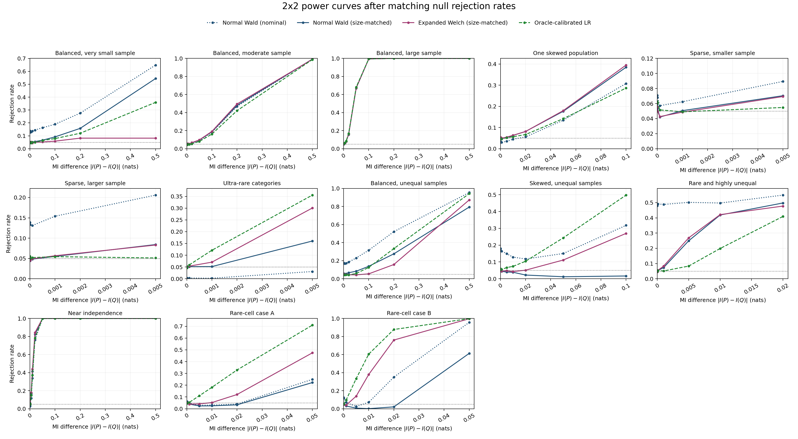

# Constrained Likelihood-Ratio Audit for Equal Mutual Information

## 1. Research question

This experiment asks whether equality of two discrete mutual informations can be
tested more reliably by fitting the null hypothesis directly:

\[
H_0:I(P)=I(Q).
\]

The candidate is a constrained likelihood-ratio (LR) test. The audit is limited
to \(2\times2\) tables so that the method can be understood and tested before
considering larger alphabets.

## 2. Method

For observed count tables \(N^{(P)}\) and \(N^{(Q)}\), the unrestricted model
fits the two multinomial distributions separately. Their maximum-likelihood
estimates are the observed cell proportions.

The null model instead maximises the same joint log likelihood subject to

\[
I(P)=I(Q).
\]

If \(\ell_{\mathrm{free}}\) and \(\ell_{0}\) are the unrestricted and
constrained maxima, the statistic is

\[
D=2\{\ell_{\mathrm{free}}-\ell_0\}.
\]

The equality constraint removes one parameter. Under regular large-sample
conditions, the analytic test therefore compares \(D\) with
\(\chi^2_1\). This reference can fail near a probability boundary or near
independence, so the experiment also includes two diagnostics:

- **Oracle Bartlett scaling** estimates \(E_0(D)\) from an independent null
  simulation and rescales the \(\chi^2_1\) threshold.
- **Oracle empirical calibration** estimates the LR threshold directly from an
  independent null simulation.

These oracle versions show whether the statistic can be calibrated. They are
not proposed as deterministic final tests because they use the known simulated
null populations.

## 3. Numerical implementation

Each fitted probability table is represented by three unconstrained logits,
with the fourth cell as the reference. This guarantees positive probabilities
that sum to one. The optimizer uses analytic gradients for the multinomial
likelihood and MI constraint.

Five starting points are fitted for every table pair. This is necessary because
the equal-MI constraint can contain different association branches. A
three-start shortcut was rejected after the audit found LR-statistic errors as
large as 1.43 in sparse cases.

The final implementation passed gradient, group-swap, category-relabeling,
count-scaling, identical-table, and input-validation tests. Repeating audited
full fits produced a maximum statistic difference of zero. Constraint
residuals were below \(10^{-8}\).

## 4. Experiment design

The null experiment used 13 fixed population pairs already selected in the
2x2 study. They include balanced, skewed, sparse, unequal-sample,
near-independence, and rare-cell cases. Every population pair satisfies
\(I(P)=I(Q)\). Each baseline sample size was multiplied by \(0.5\), \(1\), and
\(2\), giving 39 exact configurations.

For every configuration:

- 5,000 null replicates estimated the oracle Bartlett and empirical thresholds;
- an independent 5,000 null replicates measured false-positive rates;
- all methods used the same validation tables.

This gives 195,000 development and 195,000 validation table pairs.

The power experiment used the same 39 configurations with a true MI difference
of 0.005 nats. It also used a difference of 0.05 nats for the 27 configurations
where that MI is attainable with the fixed margins. Each alternative received
5,000 replicates, giving 330,000 alternative table pairs.

## 5. Null calibration

The primary metric is mean absolute false-positive-rate error across the 39
fixed configurations. Lower values are better. The nominal level is 0.05.

| Method | Mean FPR | Mean absolute error | Median absolute error | Worst absolute error | Minimum valid rate |
|---|---:|---:|---:|---:|---:|
| Normal Wald | 0.1073 | 0.0762 | 0.0362 | 0.6404 | 0.9430 |
| Expanded Welch | 0.0360 | 0.0329 | 0.0326 | 0.1676 | 0.5344 |
| Constrained LR, \(\chi^2_1\) | 0.0331 | **0.0210** | **0.0174** | **0.0486** | **0.9990** |
| Oracle Bartlett LR | 0.0441 | 0.0105 | 0.0080 | 0.0592 | 0.9990 |
| Oracle empirical LR | 0.0502 | 0.0040 | 0.0038 | 0.0108 | 0.9990 |

The uncorrected LR had lower absolute error than Wald in 29 of 39
configurations and lower error than Expanded Welch in 24 of 39. It was also
more stable numerically.

Its remaining error is systematic conservatism. The most difficult rare-cell
configurations had false-positive rates between 0.0014 and 0.011 under the
\(\chi^2_1\) threshold. Oracle empirical calibration removed most of this error,
which shows that the constrained LR statistic is usable but its sparse-sample
reference distribution is not \(\chi^2_1\).

At the more stringent nominal level 0.01, mean absolute errors were 0.0425 for
Wald, 0.0093 for Expanded Welch, 0.0051 for uncorrected LR, and 0.0016 for
oracle empirical LR.

## 6. Power at two fixed effects

Power is the probability of rejecting \(H_0\) when the two population MIs are
different. The table reports ordinary rejection rates at nominal
\(\alpha=0.05\).

| MI difference | Configurations | Normal Wald | Expanded Welch | LR, \(\chi^2_1\) | Oracle Bartlett LR | Oracle empirical LR |
|---:|---:|---:|---:|---:|---:|---:|
| 0.005 | 39 | 0.1255 | 0.0593 | 0.0728 | 0.1088 | 0.1168 |
| 0.050 | 27 | 0.4001 | 0.3417 | 0.4031 | 0.4317 | 0.4379 |

Wald's small-effect rejection rate is partly inflated by its poor null
calibration. The raw LR loses power in some sparse small-effect cases because
its threshold is conservative. After independent null calibration, LR power is
close to Wald for the small effect and higher on average for the larger effect,
while its false-positive rate is close to 0.05.

This result is not uniform. In a few severe sparse and unequal-sample cases,
even oracle-calibrated LR had weak power for a 0.005-nat difference. The method
does not remove the information limit imposed by rare observations.

## 7. Power over the full feasible MI range

The two-effect experiment does not show whether a method remains useful as the
two population MIs move farther apart. A second experiment therefore used the
13 baseline configurations and every attainable value in the prespecified MI
difference grid, from the equal-MI null to the largest feasible difference.
The fixed margins determine which differences are attainable. This produced
111 exact configurations, each evaluated using 5,000 independent table pairs,
or 555,000 table pairs in total.

Across all nonzero curve points, the raw LR rejection rate exceeded Expanded
Welch at 77 points and was lower at 16. Its mean rejection rate was 0.202,
compared with 0.184 for Expanded Welch. Relative to nominal Wald, raw LR was
higher at 40 points and lower at 50. This latter comparison is not a fair power
comparison in configurations where Wald already rejects the true null much
more than 5% of the time.

To separate power from false-positive inflation, an additional diagnostic
estimated a null cutoff independently for each method and configuration. This
made each null rejection rate approximately 0.05 before comparing the
alternative curves. The LR curve in this diagnostic uses the independently
estimated empirical LR cutoff, so it is an oracle benchmark rather than a
deployable test.

The size-matched comparison gives a mixed but informative result:

- LR was substantially more powerful in the ultra-rare, skewed unequal-sample,
  and both rare-cell configurations.
- LR was similar to the baselines in the balanced moderate- and large-sample
  configurations and near independence.
- LR was less powerful in the balanced very-small-sample, one-skewed-population,
  ordinary sparse, and rare highly unequal-sample configurations.
- Across nonzero points, oracle LR exceeded size-matched Expanded Welch at 49
  points and was lower at 43. It exceeded size-matched Wald at 41 points and
  was lower at 52. The average differences were positive because LR's gains in
  the rare-cell and skewed unequal-sample regimes were large.

The LR statistic is therefore not uniformly more powerful. It provides a real
advantage in several difficult boundary-like regimes, but loses power in other
small or sparse configurations. A single average power value would conceal
this regime dependence.

## 8. Runtime and validity

Across the final runs, the median complete constrained fit took approximately
5.0 ms under the null and 8.4 ms under the alternatives on this machine. The
LR fit was valid for at least 99.9% of replicates. The 16 invalid fits among
720,000 final table pairs occurred in the smallest balanced-sample family and
were excluded from method-specific denominators.

In the separate full-range experiment, the median fit took 5.8 ms. There were
34 invalid fits among 555,000 table pairs, the minimum configuration-level
valid rate was 0.9984, and repeated full-start fits gave identical statistics.

The method is therefore much more expensive than a closed-form Wald test but
still practical for individual 2x2 tests and potentially much cheaper than a
large per-test resampling procedure.

## 9. Decision

**The constrained likelihood-ratio statistic is promising for specific hard
2x2 regimes, but it is not a uniformly better general test. The raw
\(\chi^2_1\) reference does not pass as a finished sparse-table test.**

The evidence supports only a conditional **go** decision:

1. retain the constrained LR statistic;
2. derive a deterministic Bartlett or higher-order correction for its null
   distribution;
3. test whether that correction preserves the oracle LR gains in the
   ultra-rare, skewed unequal-sample, and rare-cell regimes;
4. state explicitly that ordinary small-sample and sparse regimes may require a
   different method;
5. only then consider extending the optimizer to larger tables.

If no deterministic correction can reproduce the oracle improvement, the LR
approach would require parametric bootstrap calibration and would no longer
meet the goal of a fully analytic test. The current result therefore validates
the statistic as a useful targeted candidate, not as a demonstrated universal
replacement for Wald or Expanded Welch.

## 10. Reproducible artefacts

- Implementation: `src/welch_differential_mi/likelihood_ratio.py`
- Calibration runner: `experiments/run_constrained_lr_audit.py`
- Power runner: `experiments/run_constrained_lr_power.py`
- Full-range runner: `experiments/run_constrained_lr_full_curves.py`
- Size-matched diagnostic: `experiments/run_lr_size_matched_comparison.py`
- Unit tests: `tests/test_likelihood_ratio.py`
- Final calibration: `results/2x2_constrained_lr_confirmatory_fullstarts/`
- Final power: `results/2x2_constrained_lr_power_fullstarts/`
- Full-range curves: `results/2x2_constrained_lr_full_curves/`
- Size-matched curves: `results/2x2_lr_size_matched/`
