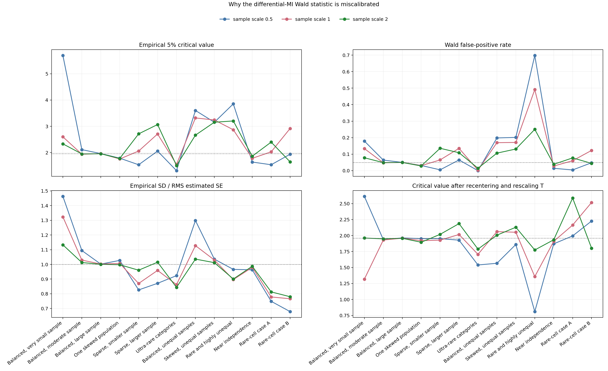

# Critical-Value Audit for the 2x2 Differential-MI Test

## 1. Question

The Expanded Welch method often rejects less frequently than Normal Wald. This
audit determines whether it needs a better Student degrees-of-freedom formula
or a different form of calibration.

For the current statistic

$$
T=\frac{\widehat I_{\mathrm{BC}}(P)-\widehat I_{\mathrm{BC}}(Q)}
{\sqrt{\widehat V(P)/n_P+\widehat V(Q)/n_Q}},
$$

the empirically correct two-sided 5% critical value is

$$
c^*=Q_{0.95}(|T|\mid H_0).
$$

Normal Wald uses $1.96$. Expanded Welch uses a larger, sample-dependent
Student critical value. Comparing both with $c^*$ shows what correction is
actually required.

## 2. Design

The audit uses the same 13 equal-MI population pairs as the power experiment.
Each pair is tested at half, baseline, and double sample size, giving 39 exact
null configurations. Every configuration uses 200,000 independently sampled
table pairs, for 7.8 million pairs in total.

Four diagnostics are calculated:

1. **Empirical critical value:** the value of $c^*$ that gives exactly 5%
   rejection under the simulated null.
2. **Standard-error scale:**
   $\operatorname{SD}(\widehat\Delta)/
   \operatorname{RMS}(\widehat{\operatorname{SE}})$. A value of one indicates
   that the estimated standard errors have the correct overall scale.
3. **Numerator-denominator dependence:** the correlation between the estimated
   MI difference and its estimated standard error.
4. **Residual shape:** the critical value after oracle recentering and
   rescaling. This checks whether location and scale correction would be
   sufficient or whether substantial non-normal shape remains.

## 3. Baseline-Sample Results

The table reports the baseline sample sizes. The ideal constant Student
degrees of freedom are shown only when $c^*>1.96$. No Student distribution can
produce a smaller critical value because all finite-degree Student
distributions have heavier tails than the normal distribution.

| Configuration | Wald FPR | Empirical $c^*$ | Median Expanded critical value | Ideal constant Student df | SD/RMS SE | Corr$(\widehat\Delta,\widehat{\mathrm{SE}})$ | Required threshold |
| --- | ---: | ---: | ---: | ---: | ---: | ---: | --- |
| Balanced, very small sample | 0.1337 | 2.599 | 2.677 | 4.82 | 1.323 | -0.002 | Larger |
| Balanced, moderate sample | 0.0477 | 1.939 | 2.111 | -- | 1.029 | 0.003 | Slightly smaller |
| Balanced, large sample | 0.0502 | 1.962 | 1.968 | $\approx\infty$ | 1.003 | -0.000 | Normal |
| One skewed population | 0.0302 | 1.758 | 2.701 | -- | 1.007 | 0.053 | Smaller |
| Sparse, smaller sample | 0.0651 | 2.059 | 11.674 | 25.05 | 0.870 | 0.790 | Slightly larger |
| Sparse, larger sample | 0.1352 | 2.709 | 5.694 | 4.27 | 0.959 | 0.772 | Larger |
| Ultra-rare categories | 0.0026 | 1.553 | 3.413 | -- | 0.863 | 0.002 | Smaller |
| Balanced, unequal samples | 0.1695 | 3.319 | 2.728 | 2.79 | 1.128 | 0.739 | Larger |
| Skewed, unequal samples | 0.1711 | 3.241 | 3.540 | 2.91 | 1.030 | -0.841 | Larger |
| Rare and highly unequal | 0.4913 | 2.869 | 3.376 | 3.69 | 0.896 | 0.896 | Larger |
| Near independence | 0.0279 | 1.783 | 2.208 | -- | 0.980 | -0.000 | Smaller |
| Rare-cell case A | 0.0602 | 2.029 | 53.967 | 35.64 | 0.778 | 0.005 | Slightly larger |
| Rare-cell case B | 0.1227 | 2.918 | 181.483 | 3.56 | 0.766 | 0.003 | Larger |

## 4. What the Audit Establishes

Across all 39 configurations, 21 require a critical value larger than the
normal value, 15 require a smaller value, and 3 are statistically consistent
with the normal value. Several departures are small, but the direction is
decisive: a Student correction cannot solve the 15 lighter-than-normal cases.

Expanded Welch also greatly overestimates the required critical value in
several sparse cases. At baseline, the empirical and Expanded critical values
are respectively 2.029 and 53.967 in rare-cell case A, and 2.918 and 181.483
in rare-cell case B. This explains their severe loss of power.

The bias-corrected MI difference itself is comparatively well behaved. After
oracle centering and scaling, its median 5% critical value across the 39 cases
is 1.990, close to the normal value 1.960. The larger distortion usually
appears after division by the estimated standard error.

After recentering and rescaling $T$ itself, 22 of the 39 critical values are
within 0.10 of 1.96, and 27 are within 0.20. Thus, location and scale explain
most, but not all, of the error. The remaining exceptions are concentrated in
very small or discrete sparse cases.

In the sparse and unequal-sample failures, the estimated MI difference and
its estimated standard error can be strongly dependent. Their absolute
correlation reaches approximately 0.74 to 0.90 in several baseline cases.
This dependence shifts and distorts the ratio $T$, but the Expanded Welch
formula uses only the variability of the estimated variance. It does not
model the joint movement of the numerator and denominator.

## 5. Follow-up Result

The evidence did not support adding a stronger Student correction. A follow-up
experiment therefore tested a joint Edgeworth and Cornish-Fisher correction
derived from the influence functions of

$$
\widehat I_{\mathrm{BC}}(P)-\widehat I_{\mathrm{BC}}(Q)
\quad\text{and}\quad
\widehat V(P)/n_P+\widehat V(Q)/n_Q.
$$

The deployable plug-in correction failed decisively: its mean absolute
false-positive-rate error was 0.360, compared with 0.076 for Normal Wald and
0.033 for Expanded Welch. Even a diagnostic version supplied with the true
population moments had error 0.128. Skewness and kurtosis corrections were
also unstable in the sparse configurations.

The [joint Cornish-Fisher audit](2X2_JOINT_CORNISH_FISHER_AUDIT.md) therefore
concludes that this route should not be pursued as the primary thesis method.
Extreme discrete cases may require an exact or resampling fallback; a further
deterministic method would need to approximate the full null distribution
rather than a small set of estimated cumulants.

## 6. Files

| Output | File |
| --- | --- |
| All 39 configurations | [`critical_value_audit.csv`](../../results/2x2_critical_value_audit/critical_value_audit.csv) |
| Baseline sample sizes | [`baseline_critical_value_audit.csv`](../../results/2x2_critical_value_audit/baseline_critical_value_audit.csv) |
| Figure | [`CRITICAL_VALUE_AUDIT.png`](../../results/2x2_critical_value_audit/CRITICAL_VALUE_AUDIT.png) |
| Reproducibility metadata | [`run_metadata.json`](../../results/2x2_critical_value_audit/run_metadata.json) |
