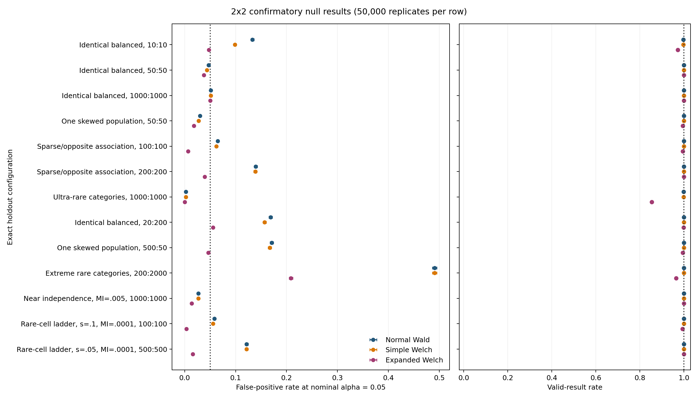
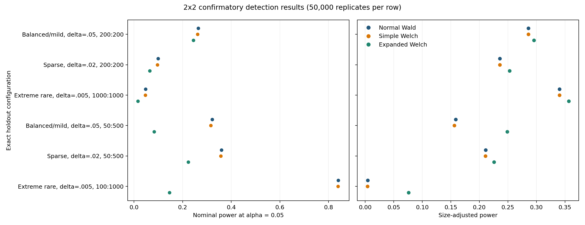

# Expanded Welch-Satterthwaite: 2x2 Experiment

## 1. Research question

This experiment evaluates three analytical tests of

$$
H_0:I(P)=I(Q)
$$

for two independently sampled $2\times2$ contingency tables:

| Method | Reference distribution for the common statistic |
| --- | --- |
| Normal Wald | Standard normal |
| Simple Welch | Student $t$ with ordinary Welch-Satterthwaite degrees of freedom |
| Expanded Welch | Student $t$ with MI-specific variance-influence degrees of freedom |

All three methods use the same bias-corrected difference in estimated MI and
the same estimated standard error. Only the reference distribution changes.
Consequently, differences between the methods isolate the effect of the
degrees-of-freedom correction.

Every reported row is one exact $(P,Q,n_P,n_Q)$ configuration. Results are not
averaged across population pairs, sample sizes, or descriptive regimes.

## 2. How to read the results

Under the null, the main accuracy measure is the false-positive rate (FPR):

$$
\widehat{\operatorname{FPR}}
=
\frac{\text{false positives}}
     {\text{false positives}+\text{true negatives}}.
$$

At nominal $\alpha=0.05$, an ideal method has FPR $0.05$ and true-negative
rate $0.95$. The 95% Wilson interval beside each confirmatory estimate
measures Monte Carlo uncertainty.

The valid-result rate is reported independently. A method is invalid when the
statistic or the degrees of freedom it requires cannot be computed. A low FPR
is not evidence of good calibration when a material fraction of replicates is
invalid.

Under an alternative where $I(P)\ne I(Q)$, power is the fraction of valid
replicates that correctly reject the null. The false-negative rate is
$1-\text{power}$. Two forms of power are retained:

| Quantity | Meaning |
| --- | --- |
| Nominal power | Uses the analytical test's ordinary $p\leq0.05$ rule |
| Size-adjusted power | Uses an independent null simulation to give each method the same 5% false-positive target |

Nominal power describes the method as it would be used without resampling.
Size-adjusted power is a diagnostic of sensitivity after calibration
differences have been removed; it is not part of the deterministic method.

## 3. Execution and reproducibility

The experiment used deterministic population tables and multinomial sampling.
No expected-count floor, pseudocount, smoothing, or post-simulation filtering
was applied.

| Stage | Exact configurations | Replicates per configuration | Simulated table pairs |
| --- | ---: | ---: | ---: |
| Screening null | 385 | 10,000 | 3,850,000 |
| Screening alternatives | 378 | 10,000 | 3,780,000 |
| Screening power calibration | 51 | 10,000 | 510,000 |
| Confirmatory null | 13 | 50,000 | 650,000 |
| Confirmatory alternatives | 6 | 50,000 | 300,000 |
| Confirmatory power calibration | 6 | 50,000 | 300,000 |
| **Total** |  |  | **9,390,000** |

The screening seed was `2026082101`. The confirmatory seed was independently
fixed as `2026082201` after the holdout configurations had been selected. Each
run used five independent seed blocks. All 158 implementation and population
correctness checks passed. On the recorded machine, the complete screening run
took 16.98 seconds and the selected confirmatory run took 2.91 seconds,
including generation of the saved summaries and figures.

The holdout selection and its pre-specified rationale are saved in
[`2x2_confirmatory_selection.json`](../../experiments/2x2_confirmatory_selection.json). Code
hashes, software versions, seeds, replicate counts, and elapsed times are in
the run metadata.

## 4. Confirmatory null configurations

The table below defines every holdout null configuration. The margin pair
$(u,v)$ means $u=\Pr(X=1)$ and $v=\Pr(Y=1)$. Both populations in each row have
the same true MI.

| Configuration | $(u_P,v_P)$ | $(u_Q,v_Q)$ | MI | $(n_P,n_Q)$ | Smallest expected cell count |
| --- | --- | --- | ---: | ---: | ---: |
| N0 small control | $(0.50,0.50)$ | $(0.50,0.50)$ | 0.1000 | $(10,10)$ | 1.4010 |
| N0 ordinary control | $(0.50,0.50)$ | $(0.50,0.50)$ | 0.1000 | $(50,50)$ | 7.0051 |
| N0 asymptotic control | $(0.50,0.50)$ | $(0.50,0.50)$ | 0.1000 | $(1000,1000)$ | 140.1027 |
| N3 one skewed population | $(0.30,0.40)$ | $(0.10,0.30)$ | 0.0300 | $(50,50)$ | 1.7298 |
| N6 sparse/opposite association | $(0.10,0.10)$ | $(0.05,0.20)$ | 0.0050 | $(100,100)$ | 0.2426 |
| N6 sparse/opposite association | $(0.10,0.10)$ | $(0.05,0.20)$ | 0.0050 | $(200,200)$ | 0.4853 |
| N7 ultra-rare categories | $(0.005,0.005)$ | $(0.002,0.010)$ | 0.0005 | $(1000,1000)$ | 0.2799 |
| N0 sample imbalance | $(0.50,0.50)$ | $(0.50,0.50)$ | 0.1000 | $(20,200)$ | 2.8021 |
| N3 sample imbalance | $(0.30,0.40)$ | $(0.10,0.30)$ | 0.0300 | $(500,50)$ | 1.7298 |
| N5 extreme rare/imbalance | $(0.02,0.02)$ | $(0.01,0.05)$ | 0.0050 | $(200,2000)$ | 0.6988 |
| Near-independence boundary | $(0.50,0.50)$ | $(0.50,0.50)$ | 0.0050 | $(1000,1000)$ | 225.0209 |
| Rare-cell ladder, $s=0.10$ | $(0.10,0.10)$ | $(0.05,0.20)$ | 0.0001 | $(100,100)$ | 1.1250 |
| Rare-cell ladder, $s=0.05$ | $(0.05,0.05)$ | $(0.025,0.10)$ | 0.0001 | $(500,500)$ | 1.5934 |

The complete probability matrices and all four expected cell counts are saved
in `configurations.csv` and the configuration-specific case sheets.

## 5. Confirmatory calibration results

Each value below is an FPR among valid results at nominal $\alpha=0.05$.
Parentheses give the 95% Wilson interval. The target is 0.05.

| Exact configuration | Normal Wald | Simple Welch | Expanded Welch | Expanded valid rate |
| --- | ---: | ---: | ---: | ---: |
| N0, $10:10$ | 0.1330 (0.1300-0.1360) | 0.0988 (0.0962-0.1015) | **0.0476 (0.0458-0.0496)** | 0.9722 |
| N0, $50:50$ | **0.0472 (0.0454-0.0491)** | 0.0438 (0.0420-0.0456) | 0.0379 (0.0362-0.0396) | 0.9998 |
| N0, $1000:1000$ | 0.0513 (0.0494-0.0533) | 0.0513 (0.0494-0.0533) | **0.0502 (0.0484-0.0522)** | 1.0000 |
| N3, $50:50$ | **0.0303 (0.0289-0.0319)** | 0.0276 (0.0262-0.0291) | 0.0181 (0.0170-0.0193) | 0.9946 |
| N6, $100:100$ | **0.0649 (0.0628-0.0671)** | 0.0624 (0.0603-0.0646) | 0.0065 (0.0059-0.0073) | 0.9945 |
| N6, $200:200$ | 0.1396 (0.1366-0.1427) | 0.1388 (0.1358-0.1418) | **0.0396 (0.0379-0.0414)** | 1.0000 |
| N7, $1000:1000$ | **0.0026 (0.0022-0.0031)** | 0.0026 (0.0022-0.0031) | 0.0000 (0.0000-0.0001) | 0.8533 |
| N0, $20:200$ | 0.1686 (0.1653-0.1719) | 0.1570 (0.1539-0.1603) | **0.0555 (0.0535-0.0575)** | 0.9985 |
| N3, $500:50$ | 0.1709 (0.1676-0.1742) | 0.1673 (0.1641-0.1706) | **0.0464 (0.0446-0.0483)** | 0.9952 |
| N5, $200:2000$ | 0.4906 (0.4862-0.4949) | 0.4905 (0.4861-0.4949) | **0.2085 (0.2049-0.2122)** | 0.9650 |
| MI 0.005, $1000:1000$ | **0.0270 (0.0256-0.0284)** | 0.0268 (0.0254-0.0283) | 0.0139 (0.0129-0.0149) | 1.0000 |
| $s=0.10$, MI 0.0001, $100:100$ | **0.0586 (0.0566-0.0607)** | 0.0559 (0.0539-0.0579) | 0.0037 (0.0032-0.0043) | 0.9933 |
| $s=0.05$, MI 0.0001, $500:500$ | 0.1216 (0.1187-0.1245) | 0.1213 (0.1185-0.1242) | **0.0162 (0.0152-0.0174)** | 1.0000 |

Bold marks the smallest absolute distance from 0.05 in that row. It does not
imply that the method is acceptably calibrated. For example, Expanded Welch
substantially improves N5 at $200:2000$, but an FPR of 0.2085 remains a clear
failure.

### 5.1 Main calibration findings

**Small balanced samples.** At $n_P=n_Q=10$, Normal Wald is strongly liberal
(FPR 0.1330). Expanded Welch is accurately calibrated at 0.0476, although it
is invalid in 2.78% of replicates. At $n=50$, Normal Wald is already accurate
and Expanded Welch is unnecessarily conservative. At $n=1000$, all three
methods converge to approximately 0.05.

**Sample-size imbalance.** This is the clearest successful regime. Expanded
Welch reduces FPR from 0.1686 to 0.0555 for the balanced $20:200$ case and from
0.1709 to 0.0464 for the skewed $500:50$ case. The effect is stable across the
five confirmatory blocks. Their Expanded Welch FPR ranges were 0.0546-0.0571
and 0.0423-0.0492, respectively.

**Very sparse or near-independent populations.** Expanded Welch can
overcorrect severely. Median Expanded Welch degrees of freedom were about
1.04 for N6 at $100:100$, 0.63 for the $s=0.10$ ladder case, and 0.49 for the
$s=0.05$ ladder case. These heavy Student tails reduce liberal rejection, but
they can push FPR far below 0.05.

**Breakdown rather than conservatism.** In N7 at $1000:1000$, Expanded Welch
is invalid in 14.67% of replicates and rejects none of its valid replicates.
This is not a successful conservative test. The variance-reliability
calculation has become unstable in the ultra-rare regime.

## 6. Confirmatory detection results

The six alternatives use known positive MI differences. Each row below gives
nominal power followed by size-adjusted power in parentheses.

| Exact alternative | Normal Wald | Simple Welch | Expanded Welch | Expanded valid rate |
| --- | ---: | ---: | ---: | ---: |
| Balanced/mild, $\Delta_I=0.05$, $200:200$ | 0.2642 (0.2859) | 0.2617 (0.2861) | 0.2444 (**0.2957**) | 1.0000 |
| Balanced/mild, $\Delta_I=0.05$, $50:500$ | 0.3219 (0.1588) | 0.3154 (0.1563) | 0.0833 (**0.2491**) | 0.9994 |
| Sparse, $\Delta_I=0.02$, $200:200$ | 0.0991 (0.2359) | 0.0968 (0.2359) | 0.0646 (**0.2531**) | 1.0000 |
| Sparse, $\Delta_I=0.02$, $50:500$ | 0.3595 (0.2111) | 0.3573 (0.2109) | 0.2230 (**0.2257**) | 0.9897 |
| Extreme rare, $\Delta_I=0.005$, $1000:1000$ | 0.0475 (0.3405) | 0.0472 (0.3406) | 0.0166 (**0.3565**) | 0.9999 |
| Extreme rare, $\Delta_I=0.005$, $100:1000$ | 0.8396 (0.0047) | 0.8391 (0.0040) | 0.1458 (0.0763) | 0.7551 |

Nominal Expanded Welch power is lower in every selected case because its
reference distribution is heavier-tailed. This is a genuine operational cost
when Normal Wald is already calibrated, but nominal power is misleading when
the competing methods have inflated FPR.

After each method is independently adjusted to a 5% null rejection rate,
Expanded Welch has modestly higher power in the first five cases. The largest
credible increase is in the balanced/mild $50:500$ case: 0.2491 versus 0.1588
for Normal Wald. This supports the interpretation that Expanded Welch is
capturing useful variance-estimation uncertainty under sample-size imbalance,
rather than only suppressing rejection.

The extreme-rare $100:1000$ case is a breakdown case. Its Normal and Simple
null p-value distributions contain a large atom at numerical zero, so their
empirical 5% thresholds are zero and do not provide a clean continuous size
adjustment. Expanded Welch is invalid in 24.49% of alternative replicates.
Neither nominal nor adjusted power in this row should be treated as evidence
of a usable test.

## 7. Overall conclusion

The experiment supports a qualified result.

Expanded Welch is not a uniformly superior replacement for Normal Wald. It
can accurately repair severe liberal behavior in small balanced samples and,
most convincingly, under substantial sample-size imbalance. When the
MI-specific variance estimate is itself poorly determined, however, the
estimated degrees of freedom can become extremely small. The resulting test
then overcorrects or becomes invalid.

The current method is therefore promising as a finite-sample correction in a
defined regular regime, especially when $n_P$ and $n_Q$ differ substantially.
It is not yet a general-purpose test for near-independent or ultra-rare
$2\times2$ tables. The full screening grid is retained to characterize the
boundary rather than concealing it behind an average performance measure.

## 8. Result files

| Artefact | Location |
| --- | --- |
| Screening report | [`results/2x2_screening/REPORT.md`](../../results/2x2_screening/REPORT.md) |
| Confirmatory report | [`results/2x2_confirmatory/REPORT.md`](../../results/2x2_confirmatory/REPORT.md) |
| Exact configuration definitions | [`results/2x2_confirmatory/configurations.csv`](../../results/2x2_confirmatory/configurations.csv) |
| Null decisions and confidence intervals | [`results/2x2_confirmatory/null_summary.csv`](../../results/2x2_confirmatory/null_summary.csv) |
| Power and false-negative results | [`results/2x2_confirmatory/power_summary.csv`](../../results/2x2_confirmatory/power_summary.csv) |
| Independent power thresholds | [`results/2x2_confirmatory/power_null_thresholds.csv`](../../results/2x2_confirmatory/power_null_thresholds.csv) |
| Invalidity and mechanism diagnostics | [`results/2x2_confirmatory/mechanism_diagnostics.csv`](../../results/2x2_confirmatory/mechanism_diagnostics.csv) |
| Seed-block stability | [`results/2x2_confirmatory/replicate_blocks.csv`](../../results/2x2_confirmatory/replicate_blocks.csv) |
| Reproducibility metadata | [`results/2x2_confirmatory/run_metadata.json`](../../results/2x2_confirmatory/run_metadata.json) |
