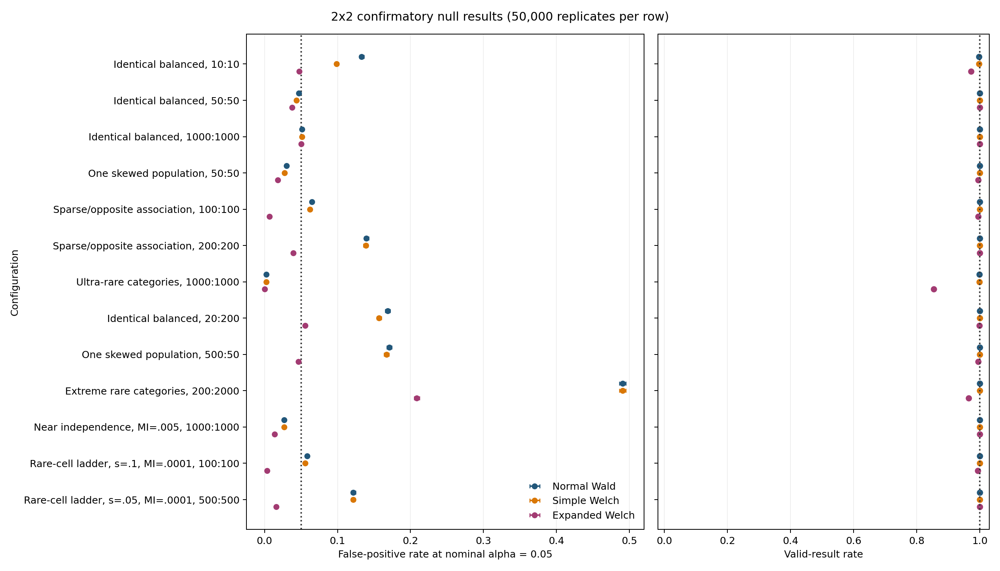
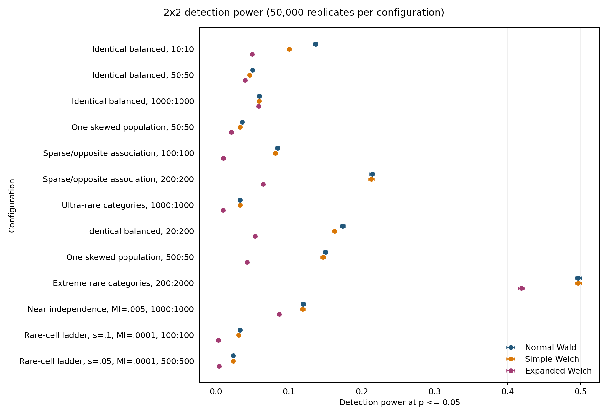
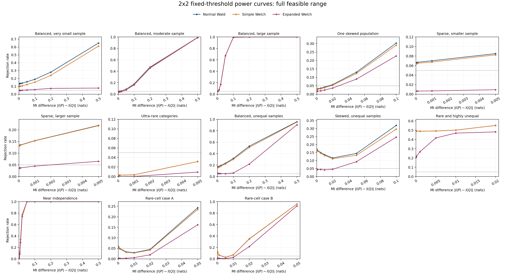

# Differential Mutual Information: 2x2 Experiments

## 1. Research question

The experiments compare analytical tests of

$$
H_0:I(P)=I(Q),
$$

where $P$ and $Q$ are two independently sampled $2\times2$ joint
distributions. Binary tables are used first because they have the simplest
possible dependence structure while still covering small samples, skewed
margins, rare cells, and unequal sample sizes.

All three methods use the same bias-corrected MI difference and estimated
standard error:

$$
T=
\frac{\widehat I_{\mathrm{BC}}(P)-\widehat I_{\mathrm{BC}}(Q)}
{\sqrt{\widehat V(P)/n_P+\widehat V(Q)/n_Q}}.
$$

They differ only in the reference distribution used to convert $T$ into a
$p$-value.

| Method | Reference distribution |
| --- | --- |
| Normal Wald | Standard normal distribution |
| Simple Welch | Student $t$ distribution with ordinary Welch-Satterthwaite degrees of freedom |
| Expanded Welch | Student $t$ distribution with MI-specific Welch-Satterthwaite degrees of freedom |

The purpose is to determine whether Expanded Welch improves finite-sample
calibration without an unacceptable loss of power.

## 2. Quantities reported

The significance level is fixed at $\alpha=0.05$. Two measurements answer the
main questions.

| Measurement | Experiment | Interpretation |
| --- | --- | --- |
| False-positive rate | Simulate $I(P)=I(Q)$ | A correctly calibrated test rejects approximately 5% of samples |
| Power | Simulate $I(P)\ne I(Q)$ | A more powerful test detects a real difference more often |

Power must be interpreted together with false-positive calibration. A method
that rejects too often under $H_0$ can appear powerful under $H_1$ simply
because its threshold is too permissive. The true-negative rate and
false-negative rate are not reported separately because they are respectively
$1-\text{false-positive rate}$ and $1-\text{power}$.

A result is invalid when the observed tables produce a zero or non-finite
estimated standard error, or when the required degrees of freedom are not
positive and finite. The valid-result rate records the fraction of replicates
for which a finite $p$-value is produced.

## 3. Experiment design

The experiment uses the same 13 configurations under both hypotheses. For a
binary table, the pair $(u,v)$ denotes

$$
u=\Pr(X=1),\qquad v=\Pr(Y=1).
$$

Each configuration fixes the margins, common MI under $H_0$, and sample sizes.
The minimum expected count[^minimum-expected] describes the sparsest cell under
$H_0$.

| Configuration | Margins of $P$ | Margins of $Q$ | $I(P)=I(Q)$ under $H_0$ | $(n_P,n_Q)$ | Minimum expected count |
| --- | --- | --- | ---: | ---: | ---: |
| Balanced, very small sample | $(0.50,0.50)$ | $(0.50,0.50)$ | 0.1000 | $(10,10)$ | 1.4010 |
| Balanced, moderate sample | $(0.50,0.50)$ | $(0.50,0.50)$ | 0.1000 | $(50,50)$ | 7.0051 |
| Balanced, large sample | $(0.50,0.50)$ | $(0.50,0.50)$ | 0.1000 | $(1000,1000)$ | 140.1027 |
| One skewed population | $(0.30,0.40)$ | $(0.10,0.30)$ | 0.0300 | $(50,50)$ | 1.7298 |
| Sparse, smaller sample | $(0.10,0.10)$ | $(0.05,0.20)$ | 0.0050 | $(100,100)$ | 0.2426 |
| Sparse, larger sample | $(0.10,0.10)$ | $(0.05,0.20)$ | 0.0050 | $(200,200)$ | 0.4853 |
| Ultra-rare categories | $(0.005,0.005)$ | $(0.002,0.010)$ | 0.0005 | $(1000,1000)$ | 0.2799 |
| Balanced, unequal samples | $(0.50,0.50)$ | $(0.50,0.50)$ | 0.1000 | $(20,200)$ | 2.8021 |
| Skewed, unequal samples | $(0.30,0.40)$ | $(0.10,0.30)$ | 0.0300 | $(500,50)$ | 1.7298 |
| Rare and highly unequal | $(0.02,0.02)$ | $(0.01,0.05)$ | 0.0050 | $(200,2000)$ | 0.6988 |
| Near independence | $(0.50,0.50)$ | $(0.50,0.50)$ | 0.0050 | $(1000,1000)$ | 225.0209 |
| Rare-cell case A | $(0.10,0.10)$ | $(0.05,0.20)$ | 0.0001 | $(100,100)$ | 1.1250 |
| Rare-cell case B | $(0.05,0.05)$ | $(0.025,0.10)$ | 0.0001 | $(500,500)$ | 1.5934 |

[^minimum-expected]: The minimum expected count is
    $\min\{\min_{i,j}(n_Pp_{ij}),\min_{i,j}(n_Qq_{ij})\}$. It is the
    smallest expected count among the eight cells in the two population
    tables.

The first experiment mirrors every configuration under two conditions:

$$
H_0:I(P)=I(Q)
$$

and

$$
H_1:\lvert I(P)-I(Q)\rvert=0.005\text{ nats}.
$$

Only the association in $Q$ changes under $H_1$; the margins and sample sizes
remain fixed. Each condition uses 50,000 independently sampled table pairs.
Counts are sampled directly from the population tables without a minimum-count
floor or smoothing.

## 4. False-positive calibration ($H_0$ true)

The false-positive rate is the probability of rejecting $H_0$ when the two
population MIs are equal. The target is 0.05, and bold identifies the closest
method in each row.

| Configuration | Normal Wald | Simple Welch | Expanded Welch | Expanded valid rate |
| --- | ---: | ---: | ---: | ---: |
| Balanced, very small sample | 0.1330 | 0.0988 | **0.0476** | 0.9722 |
| Balanced, moderate sample | **0.0472** | 0.0438 | 0.0379 | 0.9998 |
| Balanced, large sample | 0.0513 | 0.0513 | **0.0502** | 1.0000 |
| One skewed population | **0.0303** | 0.0276 | 0.0181 | 0.9946 |
| Sparse, smaller sample | **0.0649** | 0.0624 | 0.0065 | 0.9945 |
| Sparse, larger sample | 0.1396 | 0.1388 | **0.0396** | 1.0000 |
| Ultra-rare categories | **0.0026** | 0.0026 | 0.0000 | 0.8533 |
| Balanced, unequal samples | 0.1686 | 0.1570 | **0.0555** | 0.9985 |
| Skewed, unequal samples | 0.1709 | 0.1673 | **0.0464** | 0.9952 |
| Rare and highly unequal | 0.4906 | 0.4905 | **0.2085** | 0.9650 |
| Near independence | **0.0270** | 0.0268 | 0.0139 | 1.0000 |
| Rare-cell case A | **0.0586** | 0.0559 | 0.0037 | 0.9933 |
| Rare-cell case B | 0.1216 | 0.1213 | **0.0162** | 1.0000 |

Expanded Welch improves calibration in the very-small balanced case and the
two unequal-sample cases. Normal Wald is already accurate in balanced tables
with moderate or large samples. Performance is inconsistent in sparse tables,
and none of the methods is reliable in the most extreme rare-cell cases.

## 5. Detection power ($H_1$ true)

These are the same configurations in the same order, now with an MI difference
of 0.005 nats. Power is the probability that a method correctly rejects
$H_0$ when this difference is present.

| Configuration | Normal Wald | Simple Welch | Expanded Welch | Expanded valid rate |
| --- | ---: | ---: | ---: | ---: |
| Balanced, very small sample | 0.1364 | 0.1005 | 0.0494 | 0.9712 |
| Balanced, moderate sample | 0.0500 | 0.0460 | 0.0398 | 0.9999 |
| Balanced, large sample | 0.0592 | 0.0591 | 0.0583 | 1.0000 |
| One skewed population | 0.0358 | 0.0331 | 0.0210 | 0.9949 |
| Sparse, smaller sample | 0.0844 | 0.0814 | 0.0099 | 0.9946 |
| Sparse, larger sample | 0.2142 | 0.2130 | 0.0646 | 1.0000 |
| Ultra-rare categories | 0.0329 | 0.0329 | 0.0097 | 0.8544 |
| Balanced, unequal samples | 0.1736 | 0.1624 | 0.0538 | 0.9984 |
| Skewed, unequal samples | 0.1503 | 0.1467 | 0.0428 | 0.9945 |
| Rare and highly unequal | 0.4962 | 0.4962 | 0.4189 | 0.9649 |
| Near independence | 0.1195 | 0.1191 | 0.0866 | 1.0000 |
| Rare-cell case A | 0.0327 | 0.0310 | 0.0032 | 0.9943 |
| Rare-cell case B | 0.0238 | 0.0236 | 0.0044 | 1.0000 |

Power must be read beside the matching false-positive rate in Section 4. For
example, Normal Wald rejects 13.30% of null samples and 13.64% of alternative
samples in the very-small-sample case. Its apparent power is therefore almost
entirely false-positive inflation. Overall, a 0.005-nat difference is too small
to detect reliably in many of the tested configurations.

## 6. Power across MI differences

The final experiment varies the MI difference over

$$
\{0,10^{-5},10^{-4},10^{-3},0.005,0.01,0.02,0.05,
0.1,0.2,0.5,1.0\}\text{ nats}.
$$

The zero point is the corresponding false-positive rate; every positive point
is power. Infeasible differences are omitted because binary MI and fixed
margins limit the maximum possible difference. Each feasible point uses 50,000
independent table pairs.

[Open the small-effect logarithmic view.](../../results/2x2_power_curves/figures/POWER_CURVES_small_effects.png)

Differences below 0.005 nats are generally difficult to detect at the tested
sample sizes. Power rises for larger differences, particularly in the balanced
moderate- and large-sample cases. Expanded Welch usually rejects less often;
this is useful when it corrects false-positive inflation, but it reduces power
when Normal Wald is already calibrated or Expanded Welch is too conservative.

The individual figures show half, baseline, and double sample sizes for every
configuration: [`figures/cases`](../../results/2x2_power_curves/figures/cases/).

## 7. Conclusion

Normal Wald is a strong baseline in regular, moderately sampled binary tables.
Expanded Welch can substantially improve false-positive calibration in very
small or unequal-sample settings, but it is not consistently better. It can be
too conservative or invalid in sparse tables, and this conservatism reduces
power.

The mirrored experiment makes this trade-off explicit, while the power curves
show how it changes with effect size. The evidence therefore does not support
Expanded Welch as a general replacement for Normal Wald.

## 8. Reproducibility files

| Output | File |
| --- | --- |
| Mirrored configurations | [`configurations.csv`](../../results/2x2_mirrored_confirmatory/configurations.csv) |
| False-positive results | [`null_summary.csv`](../../results/2x2_mirrored_confirmatory/null_summary.csv) |
| Fixed-effect power results | [`power_summary.csv`](../../results/2x2_mirrored_confirmatory/power_summary.csv) |
| Mirrored experiment report | [`REPORT.md`](../../results/2x2_mirrored_confirmatory/REPORT.md) |
| Power-curve configurations | [`configurations.csv`](../../results/2x2_power_curves/configurations.csv) |
| Power-curve results | [`power_curves.csv`](../../results/2x2_power_curves/power_curves.csv) |
| Power-curve figures | [`figures/cases`](../../results/2x2_power_curves/figures/cases/) |
