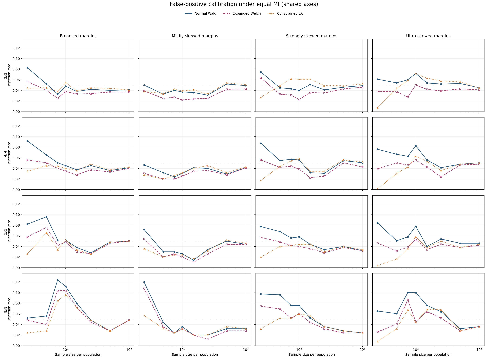
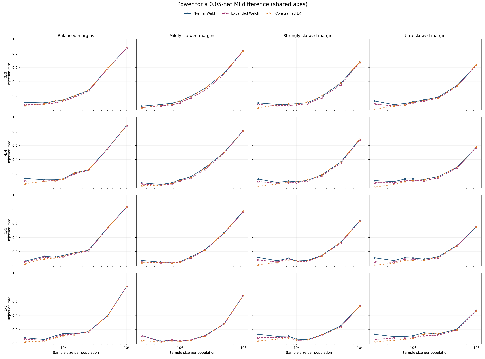
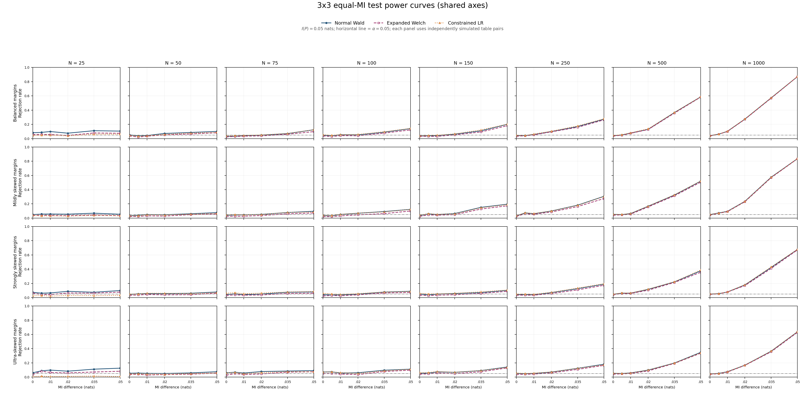
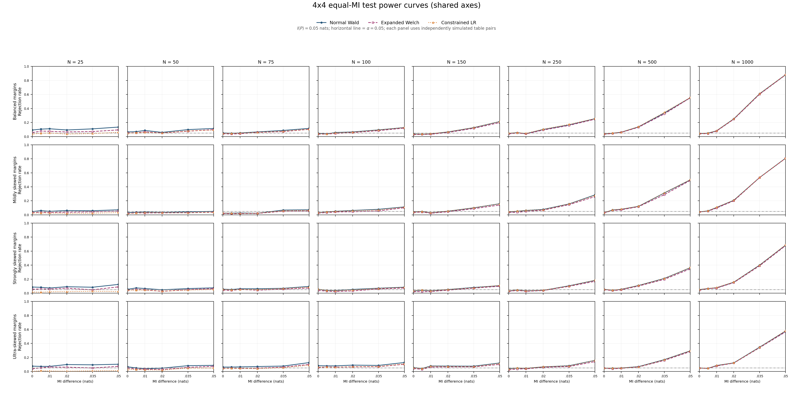
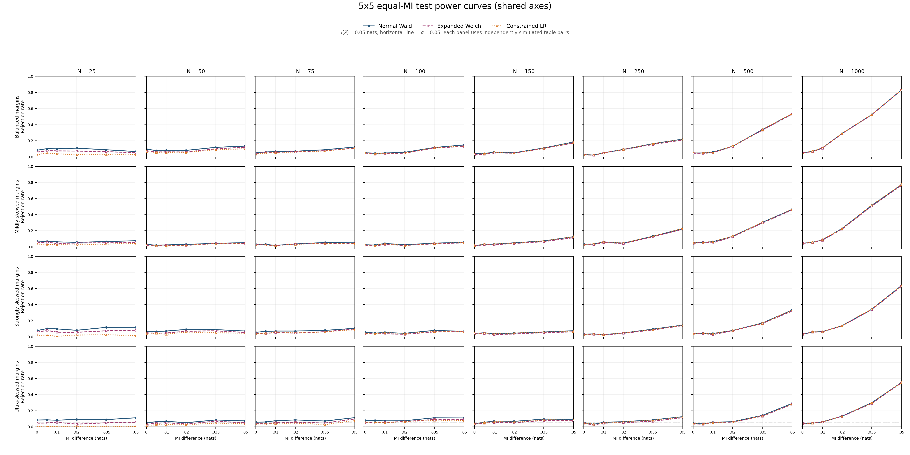
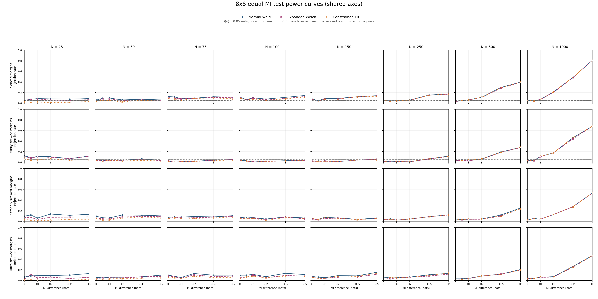
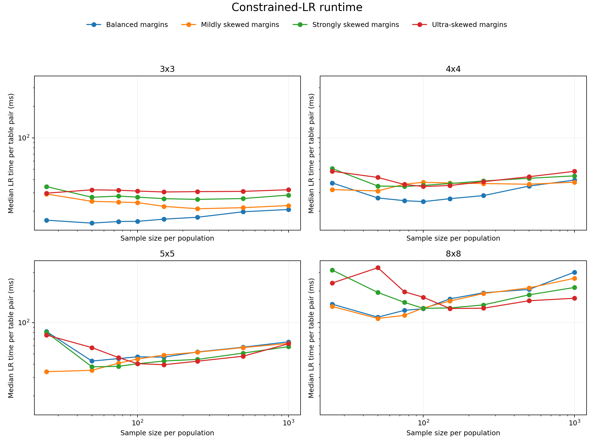

# Constrained Likelihood-Ratio Validation Across Alphabet Sizes

## 1. Research question

The binary experiments showed that the constrained likelihood-ratio (LR) test
was a credible alternative to the Normal Wald and Expanded Welch tests. This
experiment asks whether that result extends to larger square contingency
tables, and where it begins to fail as the alphabet grows, the sample becomes
smaller, or the margins become more skewed.

The experiment evaluates each configuration separately. Results are not
averaged across different table shapes, marginal distributions, or sample
sizes in the primary tables.

## 2. Exact design

The table shapes are (3\times3), (4\times4), (5\times5), and
(8\times8). Every shape uses the same sample-size ladder:

\[
N\in\{25,50,75,100,150,250,500,1000\}.
\]

Both populations have sample size (N). The screening replication count is
reduced as the LR optimization becomes more expensive:

| Shape | Cells | Observations per cell at (N=25) | Observations per cell at (N=1000) | Replicates per null and alternative |
| --- | ---: | ---: | ---: | ---: |
| (3\times3) | 9 | 2.78 | 111.11 | 1,000 |
| (4\times4) | 16 | 1.56 | 62.50 | 750 |
| (5\times5) | 25 | 1.00 | 40.00 | 500 |
| (8\times8) | 64 | 0.39 | 15.63 | 250 |

Observations per cell is only a density summary. The expected counts are not
equal when the margins are skewed, so the exact minimum expected count and the
fraction of cells below one and five are also saved for every configuration.

### 2.1 Marginal regimes

For an alphabet of size (r), the same four marginal shapes are used for the
rows and columns:

| Regime | Marginal probability vector |
| --- | --- |
| Balanced | ((1/r,\ldots,1/r)) |
| Mildly skewed | ((0.70,0.30/(r-1),\ldots,0.30/(r-1))) |
| Strongly skewed | ((0.90,0.10/(r-1),\ldots,0.10/(r-1))) |
| Ultra-skewed | ((0.95,0.05/(r-1),\ldots,0.05/(r-1))) |

There is no expected-count floor. In the most extreme configurations, some
population expected counts remain far below one even at (N=1000).

### 2.2 Population tables

For each shape and marginal regime, one deterministic population pair is
constructed. Population (P) uses the stated row and column margins and an
ordinal association pattern. Population (Q) uses cyclically shifted margins
and the opposite ordinal pattern. The association strength is solved
numerically to produce the required population MI.

Under the equal-MI null hypothesis,

\[
H_0:I(P)=I(Q)=0.05\text{ nats}.
\]

For the power experiment,

\[
H_1:I(P)=0.05,\qquad I(Q)=0.10\text{ nats}.
\]

Thus (P) and (Q) have equal MI under (H_0) without being identical
distributions. The exact probability tables are saved in
[`configurations.csv`](../../results/multialphabet_lr_screen/configurations.csv).

### 2.3 Compared tests

Each independently sampled table pair is evaluated by:

1. **Normal Wald:** the bias-corrected MI difference divided by its estimated
   standard error, compared with a standard normal distribution.
2. **Expanded Welch:** the same statistic compared with a Student distribution
   using MI-specific Satterthwaite degrees of freedom.
3. **Constrained LR:** the unrestricted likelihood is compared with the
   maximum likelihood under the one restriction (I(P)=I(Q)), and the LR
   statistic is compared with (chi^2_1).

All tests use a two-sided significance level of (alpha=0.05).

## 3. Metrics

For the null simulations, the **false-positive rate (FPR)** is the fraction of
valid replicates that reject (H_0). Perfect calibration gives an FPR of 0.05.
Calibration error is

\[
\left|\mathrm{FPR}-0.05\right|.
\]

For the alternative simulations, **power** is the fraction of valid replicates
that reject (H_0) when the true MI difference is 0.05 nats. Higher power is
desirable only when calibration is comparable; a liberal test can obtain
higher apparent power by rejecting too frequently under both hypotheses.

The **valid rate** is reported separately. An invalid result occurs when the
analytic statistic is undefined or the constrained optimizer does not produce
an acceptable fit. Rejection rates are conditional on valid results.

## 4. Results

### 4.1 False-positive calibration

The table reports the largest absolute calibration error observed over the
eight sample sizes for each exact shape and marginal regime. The final column
is the minimum LR valid rate over those sample sizes.

| Shape | Regime | Normal Wald | Expanded Welch | Constrained LR | Minimum LR valid rate |
| --- | --- | ---: | ---: | ---: | ---: |
| (3\times3) | Balanced | 0.033 | 0.025 | **0.012** | 1.000 |
| (3\times3) | Mild | 0.019 | 0.028 | **0.017** | 1.000 |
| (3\times3) | Strong | 0.025 | 0.027 | **0.023** | 1.000 |
| (3\times3) | Ultra | **0.022** | 0.023 | 0.043 | 1.000 |
| (4\times4) | Balanced | 0.042 | 0.022 | **0.015** | 1.000 |
| (4\times4) | Mild | **0.026** | 0.030 | 0.030 | 1.000 |
| (4\times4) | Strong | 0.037 | **0.027** | 0.033 | 1.000 |
| (4\times4) | Ultra | **0.033** | 0.026 | 0.049 | 1.000 |
| (5\times5) | Balanced | 0.046 | 0.026 | **0.024** | 1.000 |
| (5\times5) | Mild | 0.036 | 0.040 | **0.034** | 0.998 |
| (5\times5) | Strong | 0.028 | **0.022** | 0.030 | 0.998 |
| (5\times5) | Ultra | 0.035 | **0.019** | 0.046 | 0.998 |
| (8\times8) | Balanced | 0.074 | 0.054 | **0.046** | 0.992 |
| (8\times8) | Mild | 0.070 | 0.058 | **0.030** | 0.980 |
| (8\times8) | Strong | 0.048 | 0.026 | **0.026** | 0.996 |
| (8\times8) | Ultra | 0.050 | **0.036** | 0.042 | 0.996 |

LR reduces the largest liberal distortions in the low-sample 8x8 cases. It is
not uniformly best: at (N=25), the LR test becomes strongly conservative in
the ultra-skewed 3x3, 4x4, and 5x5 cases. Across all 128 configurations, LR has
a mean absolute calibration error of 0.0141, compared with 0.0156 for Normal
Wald and 0.0153 for Expanded Welch. This aggregate is supplementary: the exact
configuration results remain the primary evidence.

Expanded Welch can have a small conditional calibration error in the
ultra-skewed cases, but its statistic is frequently undefined there. Its
minimum valid rate is approximately 0.30--0.34 across the four ultra-skewed
shapes, compared with approximately 0.80--0.84 for Wald and at least 0.996 for
LR.

### 4.2 Power

The following entries are exact rejection rates at (N=250 / N=1000), not
averages. Method order within each cell is preserved across the two sample
sizes.

| Shape | Regime | Normal Wald | Expanded Welch | Constrained LR |
| --- | --- | ---: | ---: | ---: |
| (3\times3) | Balanced | 0.273 / 0.871 | 0.263 / 0.870 | 0.278 / 0.872 |
| (3\times3) | Mild | 0.306 / 0.835 | 0.275 / 0.833 | 0.303 / 0.836 |
| (3\times3) | Strong | 0.189 / 0.676 | 0.173 / 0.670 | 0.195 / 0.678 |
| (3\times3) | Ultra | 0.181 / 0.636 | 0.165 / 0.629 | 0.173 / 0.639 |
| (4\times4) | Balanced | 0.255 / 0.881 | 0.247 / 0.879 | 0.255 / 0.883 |
| (4\times4) | Mild | 0.284 / 0.808 | 0.260 / 0.805 | 0.277 / 0.808 |
| (4\times4) | Strong | 0.183 / 0.684 | 0.169 / 0.677 | 0.185 / 0.689 |
| (4\times4) | Ultra | 0.159 / 0.576 | 0.141 / 0.565 | 0.159 / 0.581 |
| (5\times5) | Balanced | 0.220 / 0.830 | 0.210 / 0.830 | 0.218 / 0.832 |
| (5\times5) | Mild | 0.226 / 0.770 | 0.220 / 0.762 | 0.228 / 0.774 |
| (5\times5) | Strong | 0.146 / 0.636 | 0.140 / 0.628 | 0.144 / 0.634 |
| (5\times5) | Ultra | 0.126 / 0.550 | 0.114 / 0.546 | 0.122 / 0.550 |
| (8\times8) | Balanced | 0.172 / 0.808 | 0.168 / 0.808 | 0.172 / 0.808 |
| (8\times8) | Mild | 0.116 / 0.680 | 0.108 / 0.680 | 0.112 / 0.680 |
| (8\times8) | Strong | 0.124 / 0.536 | 0.120 / 0.532 | 0.124 / 0.536 |
| (8\times8) | Ultra | 0.136 / 0.472 | 0.120 / 0.468 | 0.144 / 0.468 |

At (N\geq250), the three power curves are generally close. Most of LR's
overall raw-power disadvantage occurs at (N=25), where LR is conservative
and Wald is often liberal. The power results therefore do not support claiming
that LR uniformly dominates Wald; they support a more limited claim that LR
can improve calibration without a material power loss once the tables are not
at the extreme low-sample boundary.

### 4.3 Power curves across MI differences

The fixed-effect comparison above is extended over

\[
|I(P)-I(Q)|\in\{0,0.005,0.01,0.02,0.035,0.05\}\text{ nats}.
\]

In every figure, rows are the four marginal regimes and columns are the exact
sample sizes. All panels use the same horizontal range and the same rejection
rate scale from zero to one. The point at zero is the false-positive rate under
the equal-MI null; the positive points are power against increasingly different
population MI values. The horizontal reference line is the nominal level
$\alpha=0.05$.

#### 3x3 tables

#### 4x4 tables

#### 5x5 tables

#### 8x8 tables

At small sample sizes, all methods have low power and their null calibration
differs appreciably. Normal Wald usually has the highest raw rejection rate,
but it is also the most liberal method overall under the null. LR is generally
more conservative at this boundary. From $N=250$ onward, the three curves are
close across most regimes; LR's mean rejection rate is then within about 0.2
percentage points of Wald and is slightly above Expanded Welch. The curves do
not support uniform dominance by any method, but they show that LR's improved
calibration usually does not require a material power loss outside the smallest
samples.

### 4.4 Numerical validity and runtime

LR converges on every 3x3 and 4x4 replicate. Its minimum valid rate is 0.998
for 5x5 and 0.968 for 8x8. Every accepted fit has an equal-MI constraint
residual below (10^{-8}).

The median time per table pair increases from approximately 18--32 ms for 3x3
to 151--169 ms for 8x8. Some difficult 8x8 fits take more than one second. The
method remains computationally feasible at these alphabet sizes, but it is no
longer comparable to the essentially immediate analytic tests.

## 5. Interpretation

The constrained LR method generalizes successfully beyond binary tables in
the numerical sense: it handles all tested shapes, remains highly valid, and
often reduces the worst liberal errors seen in Wald. Its statistical advantage
is not universal. Wald remains competitive in ordinary 3x3--5x5 cases, while
LR can overcorrect at the most extreme low-sample boundary.

The most defensible current conclusion is therefore:

> Constrained LR is a practical deterministic equal-MI test through at least
> 8x8 tables. It is particularly useful as protection against severe liberal
> calibration in larger sparse tables, but it does not uniformly improve both
> calibration and power over Normal Wald.

The 8x8 estimates use only 250 replicates and should be treated as a screening
result. A confirmatory experiment should rerun the configurations showing the
largest method differences with at least 2,000--5,000 replicates each.

## 6. Reproducibility

- [Exact generated report](../../results/multialphabet_lr_screen/REPORT.md)
- [Method-level results](../../results/multialphabet_lr_screen/results.csv)
- [LR diagnostics](../../results/multialphabet_lr_screen/lr_diagnostics.csv)
- [Run metadata](../../results/multialphabet_lr_screen/run_metadata.json)
- [Experiment runner](../../experiments/run_multialphabet_lr_experiment.py)
- [Power-curve report](../../results/multialphabet_lr_power_curves/REPORT.md)
- [Power-curve results](../../results/multialphabet_lr_power_curves/power_curves.csv)
- [Power-curve LR diagnostics](../../results/multialphabet_lr_power_curves/lr_diagnostics_interior.csv)
- [Power-curve runner](../../experiments/run_multialphabet_lr_power_curves.py)

The complete screen contains 128 population/sample configurations and 160,000
independently sampled table pairs. It completed in 1,446.6 seconds with eight
worker processes. The power-curve extension adds four interior MI differences
for every configuration, comprising 320,000 newly sampled table pairs. It
completed in 2,632.5 seconds with eight worker processes.
