# Population Construction Check

This separate exploratory check compares additive probability tables with matched ordinal log-linear controls. Each point uses 10,000 pairs at alpha=0.05. Both methods receive the same sampled tables. Every regime is reported separately.

## 1. Construction and purpose

The additive family is R(t)=r c^T+tH. In common-cell cases H adds to cells (1,1),(2,2) and subtracts from (1,2),(2,1). Rare-cell cases apply that block to the last two rows and columns. Spread cases use H=ss^T with equally spaced scores s from -1 to 1. Every row and column of H sums to zero, preserving the margins. With uniform margins the common/rare labels indicate positions, not differences in rarity.

For each population t_max=min(r_i c_j/(-H_ij)) over negative H entries. We search only up to 0.95 t_max, keeping probabilities positive; this is a construction endpoint, not an expected-count filter. The log-linear control uses the current ordinal fitting procedure with the same margins. It is a new matched control, not a replay of the original different-shape experiment.

Within each shape/profile/family, M is the minimum reachable MI across P, Q and both constructors. We set I(P)=0.2M and I(Q)=(0.2+e)M. Targets, margins and sample sizes match across constructors; M and absolute differences can differ across families. This tests construction sensitivity, not a pure causal effect of cell location. Changing dependence can still change sparsity.

Uniform profile: every row and column has probability 1/k in both populations. Different-skew profile: P has first-row and first-column probability 0.7, Q has 0.8; each remaining marginal probability is 0.3/(k-1) or 0.2/(k-1). Thus the different-skew null has equal positive MI with different margins. At the uniform null P=Q. The common/rare/spread directions coincide for 2x2, so only one is included there. For larger uniform tables common and rare blocks are category-relabelling controls, not distinct kinds of rarity.

There are 960 configurations and 9.6 million simulated pairs. The binary constructor controls deliberately use the same random streams, so those cross-constructor comparisons are duplicates for validation. Larger-table cross-constructor comparisons use independent streams. No sampled count tables are retained; saved records contain fixed probabilities, rejection counts, uncertainty and diagnostics.

The four-cell additive benchmark is adapted from [Berrett and Samworth (2021), Section 3.2](https://arxiv.org/pdf/2101.10880), also used by [Castro-Prado et al. (2026), Section 4.1](https://onlinelibrary.wiley.com/doi/10.1002/bimj.70129). Targeting equal positive MI and the spread direction here are our adaptations for comparing two populations.

## 2. Independent binary reconstruction

For every saved original 2x2 population we independently solve for x in [[x,r-x],[c-x,1-r-c+x]], using its margins, MI and association direction. This avoids proportional fitting.

Reconstructed 128 saved tables; largest cell-probability difference 6.38e-15; largest MI discrepancy 1.64e-14. This validates the binary constructor, not the null-reference distribution of either test.

## 3. Calibration and power by exact regime

Each figure has additive construction in the top row and matched log-linear construction below. Columns use (nP,nQ)={(10,10),(50,50),(250,250),(1000,1000),(50,500),(500,50)}. Blue circles are Wald; magenta squares are Expanded Welch. Axes are shared: e from 0 to 0.6 and rejection from 0 to 1. At e=0 the target is 0.05; positive e gives power. Shading is a pointwise 95% Wilson interval. Hollow markers flag valid rate below 90%. Invalid results count as non-rejections, and exact valid and conditional rates are shown below each figure.

### 3.1. 2x2: uniform, common

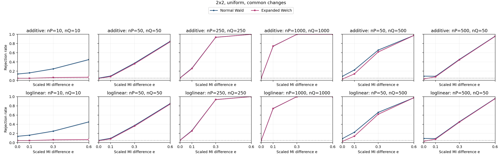

| Specification | Setting |
| --- | --- |
| Table shape | 2x2 |
| Horizontal graph regime specifications (columns) | (nP,nQ)={(10,10),(50,50),(250,250),(1000,1000),(50,500),(500,50)} |
| Vertical graph regime specifications (rows) | Top: additive probability changes; bottom: ordinal log-linear control. Each panel plots both Wald and Expanded Welch. |
| Fixed margins for both constructors | P and Q: each row and column has probability 1/2 |
| Additive direction in P and Q | Rows 1,2 and columns 1,2: add t to the block diagonal, subtract t off diagonal |
| Log-linear direction in P and Q | Products of equally spaced row/column scores from -1 to 1; ordinal in both populations |
| MI settings | M=0.57624 nats; I(P)=0.11525 nats; I(Q)=I(P)+eM; e={0,0.1,0.3,0.6} |
| Axes | e from 0 to 0.6; rejection rate from 0 to 1 |
| Replicates | 10,000 per point |

Every plotted rate, validity and minimum expected count

| Construction | nP | nQ | e | MI difference | Method | Rejection | 95% low | 95% high | Valid | Conditional rejection | Min expected P | Min expected Q |
| --- | --- | --- | --- | --- | --- | --- | --- | --- | --- | --- | --- | --- |
| additive | 10 | 10 | 0 | 0 | expanded_welch | 0.0453 | 0.0414 | 0.04955 | 0.9676 | 0.04682 | 1.323 | 1.323 |
| additive | 10 | 10 | 0 | 0 | normal_wald | 0.1385 | 0.1319 | 0.1454 | 0.9967 | 0.139 | 1.323 | 1.323 |
| additive | 10 | 10 | 0.1 | 0.05762 | expanded_welch | 0.0456 | 0.04168 | 0.04987 | 0.957 | 0.04765 | 1.323 | 1.074 |
| additive | 10 | 10 | 0.1 | 0.05762 | normal_wald | 0.1629 | 0.1558 | 0.1703 | 0.9976 | 0.1633 | 1.323 | 1.074 |
| additive | 10 | 10 | 0.3 | 0.1729 | expanded_welch | 0.0617 | 0.05715 | 0.06659 | 0.9278 | 0.0665 | 1.323 | 0.7002 |
| additive | 10 | 10 | 0.3 | 0.1729 | normal_wald | 0.2505 | 0.2421 | 0.2591 | 0.9975 | 0.2511 | 1.323 | 0.7002 |
| additive | 10 | 10 | 0.6 | 0.3457 | expanded_welch | 0.0685 | 0.06371 | 0.07362 | 0.8567 | 0.07996 | 1.323 | 0.3095 |
| additive | 10 | 10 | 0.6 | 0.3457 | normal_wald | 0.4524 | 0.4427 | 0.4622 | 0.9958 | 0.4543 | 1.323 | 0.3095 |
| additive | 50 | 50 | 0 | 0 | expanded_welch | 0.0426 | 0.03881 | 0.04674 | 1 | 0.0426 | 6.617 | 6.617 |
| additive | 50 | 50 | 0 | 0 | normal_wald | 0.0506 | 0.04647 | 0.05507 | 1 | 0.0506 | 6.617 | 6.617 |
| additive | 50 | 50 | 0.1 | 0.05762 | expanded_welch | 0.0831 | 0.07785 | 0.08867 | 1 | 0.0831 | 6.617 | 5.371 |
| additive | 50 | 50 | 0.1 | 0.05762 | normal_wald | 0.0956 | 0.08999 | 0.1015 | 1 | 0.0956 | 6.617 | 5.371 |
| additive | 50 | 50 | 0.3 | 0.1729 | expanded_welch | 0.3595 | 0.3502 | 0.369 | 1 | 0.3595 | 6.617 | 3.501 |
| additive | 50 | 50 | 0.3 | 0.1729 | normal_wald | 0.3739 | 0.3645 | 0.3834 | 1 | 0.3739 | 6.617 | 3.501 |
| additive | 50 | 50 | 0.6 | 0.3457 | expanded_welch | 0.8389 | 0.8316 | 0.846 | 0.9945 | 0.8435 | 6.617 | 1.547 |
| additive | 50 | 50 | 0.6 | 0.3457 | normal_wald | 0.8502 | 0.8431 | 0.8571 | 1 | 0.8502 | 6.617 | 1.547 |
| additive | 50 | 500 | 0 | 0 | expanded_welch | 0.0284 | 0.02532 | 0.03184 | 0.9999 | 0.0284 | 6.617 | 66.17 |
| additive | 50 | 500 | 0 | 0 | normal_wald | 0.0891 | 0.08367 | 0.09484 | 1 | 0.0891 | 6.617 | 66.17 |
| additive | 50 | 500 | 0.1 | 0.05762 | expanded_welch | 0.1413 | 0.1346 | 0.1483 | 1 | 0.1413 | 6.617 | 53.71 |
| additive | 50 | 500 | 0.1 | 0.05762 | normal_wald | 0.2274 | 0.2193 | 0.2357 | 1 | 0.2274 | 6.617 | 53.71 |
| additive | 50 | 500 | 0.3 | 0.1729 | expanded_welch | 0.6171 | 0.6075 | 0.6266 | 1 | 0.6171 | 6.617 | 35.01 |
| additive | 50 | 500 | 0.3 | 0.1729 | normal_wald | 0.6578 | 0.6484 | 0.667 | 1 | 0.6578 | 6.617 | 35.01 |
| additive | 50 | 500 | 0.6 | 0.3457 | expanded_welch | 0.9754 | 0.9722 | 0.9783 | 1 | 0.9754 | 6.617 | 15.47 |
| additive | 50 | 500 | 0.6 | 0.3457 | normal_wald | 0.9766 | 0.9734 | 0.9794 | 1 | 0.9766 | 6.617 | 15.47 |
| additive | 250 | 250 | 0 | 0 | expanded_welch | 0.0495 | 0.04542 | 0.05393 | 1 | 0.0495 | 33.09 | 33.09 |
| additive | 250 | 250 | 0 | 0 | normal_wald | 0.0529 | 0.04868 | 0.05746 | 1 | 0.0529 | 33.09 | 33.09 |
| additive | 250 | 250 | 0.1 | 0.05762 | expanded_welch | 0.2566 | 0.2481 | 0.2653 | 1 | 0.2566 | 33.09 | 26.85 |
| additive | 250 | 250 | 0.1 | 0.05762 | normal_wald | 0.2629 | 0.2544 | 0.2716 | 1 | 0.2629 | 33.09 | 26.85 |
| additive | 250 | 250 | 0.3 | 0.1729 | expanded_welch | 0.9355 | 0.9305 | 0.9401 | 1 | 0.9355 | 33.09 | 17.5 |
| additive | 250 | 250 | 0.3 | 0.1729 | normal_wald | 0.9365 | 0.9316 | 0.9411 | 1 | 0.9365 | 33.09 | 17.5 |
| additive | 250 | 250 | 0.6 | 0.3457 | expanded_welch | 1 | 0.9996 | 1 | 1 | 1 | 33.09 | 7.737 |
| additive | 250 | 250 | 0.6 | 0.3457 | normal_wald | 1 | 0.9996 | 1 | 1 | 1 | 33.09 | 7.737 |
| additive | 500 | 50 | 0 | 0 | expanded_welch | 0.0304 | 0.02721 | 0.03395 | 1 | 0.0304 | 66.17 | 6.617 |
| additive | 500 | 50 | 0 | 0 | normal_wald | 0.0921 | 0.08659 | 0.09793 | 1 | 0.0921 | 66.17 | 6.617 |
| additive | 500 | 50 | 0.1 | 0.05762 | expanded_welch | 0.0772 | 0.07213 | 0.0826 | 1 | 0.0772 | 66.17 | 5.371 |
| additive | 500 | 50 | 0.1 | 0.05762 | normal_wald | 0.0895 | 0.08406 | 0.09525 | 1 | 0.0895 | 66.17 | 5.371 |
| additive | 500 | 50 | 0.3 | 0.1729 | expanded_welch | 0.4473 | 0.4376 | 0.4571 | 1 | 0.4473 | 66.17 | 3.501 |
| additive | 500 | 50 | 0.3 | 0.1729 | normal_wald | 0.4558 | 0.4461 | 0.4656 | 1 | 0.4558 | 66.17 | 3.501 |
| additive | 500 | 50 | 0.6 | 0.3457 | expanded_welch | 0.9557 | 0.9515 | 0.9596 | 0.9965 | 0.9591 | 66.17 | 1.547 |
| additive | 500 | 50 | 0.6 | 0.3457 | normal_wald | 0.9609 | 0.9569 | 0.9645 | 1 | 0.9609 | 66.17 | 1.547 |
| additive | 1000 | 1000 | 0 | 0 | expanded_welch | 0.0482 | 0.04417 | 0.05257 | 1 | 0.0482 | 132.3 | 132.3 |
| additive | 1000 | 1000 | 0 | 0 | normal_wald | 0.0489 | 0.04484 | 0.0533 | 1 | 0.0489 | 132.3 | 132.3 |
| additive | 1000 | 1000 | 0.1 | 0.05762 | expanded_welch | 0.7427 | 0.734 | 0.7512 | 1 | 0.7427 | 132.3 | 107.4 |
| additive | 1000 | 1000 | 0.1 | 0.05762 | normal_wald | 0.7439 | 0.7353 | 0.7524 | 1 | 0.7439 | 132.3 | 107.4 |
| additive | 1000 | 1000 | 0.3 | 0.1729 | expanded_welch | 1 | 0.9996 | 1 | 1 | 1 | 132.3 | 70.02 |
| additive | 1000 | 1000 | 0.3 | 0.1729 | normal_wald | 1 | 0.9996 | 1 | 1 | 1 | 132.3 | 70.02 |
| additive | 1000 | 1000 | 0.6 | 0.3457 | expanded_welch | 1 | 0.9996 | 1 | 1 | 1 | 132.3 | 30.95 |
| additive | 1000 | 1000 | 0.6 | 0.3457 | normal_wald | 1 | 0.9996 | 1 | 1 | 1 | 132.3 | 30.95 |
| loglinear | 10 | 10 | 0 | 0 | expanded_welch | 0.0453 | 0.0414 | 0.04955 | 0.9676 | 0.04682 | 1.323 | 1.323 |
| loglinear | 10 | 10 | 0 | 0 | normal_wald | 0.1385 | 0.1319 | 0.1454 | 0.9967 | 0.139 | 1.323 | 1.323 |
| loglinear | 10 | 10 | 0.1 | 0.05762 | expanded_welch | 0.0456 | 0.04168 | 0.04987 | 0.957 | 0.04765 | 1.323 | 1.074 |
| loglinear | 10 | 10 | 0.1 | 0.05762 | normal_wald | 0.1629 | 0.1558 | 0.1703 | 0.9976 | 0.1633 | 1.323 | 1.074 |
| loglinear | 10 | 10 | 0.3 | 0.1729 | expanded_welch | 0.0617 | 0.05715 | 0.06659 | 0.9278 | 0.0665 | 1.323 | 0.7002 |
| loglinear | 10 | 10 | 0.3 | 0.1729 | normal_wald | 0.2505 | 0.2421 | 0.2591 | 0.9975 | 0.2511 | 1.323 | 0.7002 |
| loglinear | 10 | 10 | 0.6 | 0.3457 | expanded_welch | 0.0685 | 0.06371 | 0.07362 | 0.8567 | 0.07996 | 1.323 | 0.3095 |
| loglinear | 10 | 10 | 0.6 | 0.3457 | normal_wald | 0.4524 | 0.4427 | 0.4622 | 0.9958 | 0.4543 | 1.323 | 0.3095 |
| loglinear | 50 | 50 | 0 | 0 | expanded_welch | 0.0426 | 0.03881 | 0.04674 | 1 | 0.0426 | 6.617 | 6.617 |
| loglinear | 50 | 50 | 0 | 0 | normal_wald | 0.0506 | 0.04647 | 0.05507 | 1 | 0.0506 | 6.617 | 6.617 |
| loglinear | 50 | 50 | 0.1 | 0.05762 | expanded_welch | 0.0831 | 0.07785 | 0.08867 | 1 | 0.0831 | 6.617 | 5.371 |
| loglinear | 50 | 50 | 0.1 | 0.05762 | normal_wald | 0.0956 | 0.08999 | 0.1015 | 1 | 0.0956 | 6.617 | 5.371 |
| loglinear | 50 | 50 | 0.3 | 0.1729 | expanded_welch | 0.3595 | 0.3502 | 0.369 | 1 | 0.3595 | 6.617 | 3.501 |
| loglinear | 50 | 50 | 0.3 | 0.1729 | normal_wald | 0.3739 | 0.3645 | 0.3834 | 1 | 0.3739 | 6.617 | 3.501 |
| loglinear | 50 | 50 | 0.6 | 0.3457 | expanded_welch | 0.8389 | 0.8316 | 0.846 | 0.9945 | 0.8435 | 6.617 | 1.547 |
| loglinear | 50 | 50 | 0.6 | 0.3457 | normal_wald | 0.8502 | 0.8431 | 0.8571 | 1 | 0.8502 | 6.617 | 1.547 |
| loglinear | 50 | 500 | 0 | 0 | expanded_welch | 0.0284 | 0.02532 | 0.03184 | 0.9999 | 0.0284 | 6.617 | 66.17 |
| loglinear | 50 | 500 | 0 | 0 | normal_wald | 0.0891 | 0.08367 | 0.09484 | 1 | 0.0891 | 6.617 | 66.17 |
| loglinear | 50 | 500 | 0.1 | 0.05762 | expanded_welch | 0.1413 | 0.1346 | 0.1483 | 1 | 0.1413 | 6.617 | 53.71 |
| loglinear | 50 | 500 | 0.1 | 0.05762 | normal_wald | 0.2274 | 0.2193 | 0.2357 | 1 | 0.2274 | 6.617 | 53.71 |
| loglinear | 50 | 500 | 0.3 | 0.1729 | expanded_welch | 0.6171 | 0.6075 | 0.6266 | 1 | 0.6171 | 6.617 | 35.01 |
| loglinear | 50 | 500 | 0.3 | 0.1729 | normal_wald | 0.6578 | 0.6484 | 0.667 | 1 | 0.6578 | 6.617 | 35.01 |
| loglinear | 50 | 500 | 0.6 | 0.3457 | expanded_welch | 0.9754 | 0.9722 | 0.9783 | 1 | 0.9754 | 6.617 | 15.47 |
| loglinear | 50 | 500 | 0.6 | 0.3457 | normal_wald | 0.9766 | 0.9734 | 0.9794 | 1 | 0.9766 | 6.617 | 15.47 |
| loglinear | 250 | 250 | 0 | 0 | expanded_welch | 0.0495 | 0.04542 | 0.05393 | 1 | 0.0495 | 33.09 | 33.09 |
| loglinear | 250 | 250 | 0 | 0 | normal_wald | 0.0529 | 0.04868 | 0.05746 | 1 | 0.0529 | 33.09 | 33.09 |
| loglinear | 250 | 250 | 0.1 | 0.05762 | expanded_welch | 0.2566 | 0.2481 | 0.2653 | 1 | 0.2566 | 33.09 | 26.85 |
| loglinear | 250 | 250 | 0.1 | 0.05762 | normal_wald | 0.2629 | 0.2544 | 0.2716 | 1 | 0.2629 | 33.09 | 26.85 |
| loglinear | 250 | 250 | 0.3 | 0.1729 | expanded_welch | 0.9355 | 0.9305 | 0.9401 | 1 | 0.9355 | 33.09 | 17.5 |
| loglinear | 250 | 250 | 0.3 | 0.1729 | normal_wald | 0.9365 | 0.9316 | 0.9411 | 1 | 0.9365 | 33.09 | 17.5 |
| loglinear | 250 | 250 | 0.6 | 0.3457 | expanded_welch | 1 | 0.9996 | 1 | 1 | 1 | 33.09 | 7.737 |
| loglinear | 250 | 250 | 0.6 | 0.3457 | normal_wald | 1 | 0.9996 | 1 | 1 | 1 | 33.09 | 7.737 |
| loglinear | 500 | 50 | 0 | 0 | expanded_welch | 0.0304 | 0.02721 | 0.03395 | 1 | 0.0304 | 66.17 | 6.617 |
| loglinear | 500 | 50 | 0 | 0 | normal_wald | 0.0921 | 0.08659 | 0.09793 | 1 | 0.0921 | 66.17 | 6.617 |
| loglinear | 500 | 50 | 0.1 | 0.05762 | expanded_welch | 0.0772 | 0.07213 | 0.0826 | 1 | 0.0772 | 66.17 | 5.371 |
| loglinear | 500 | 50 | 0.1 | 0.05762 | normal_wald | 0.0895 | 0.08406 | 0.09525 | 1 | 0.0895 | 66.17 | 5.371 |
| loglinear | 500 | 50 | 0.3 | 0.1729 | expanded_welch | 0.4473 | 0.4376 | 0.4571 | 1 | 0.4473 | 66.17 | 3.501 |
| loglinear | 500 | 50 | 0.3 | 0.1729 | normal_wald | 0.4558 | 0.4461 | 0.4656 | 1 | 0.4558 | 66.17 | 3.501 |
| loglinear | 500 | 50 | 0.6 | 0.3457 | expanded_welch | 0.9557 | 0.9515 | 0.9596 | 0.9965 | 0.9591 | 66.17 | 1.547 |
| loglinear | 500 | 50 | 0.6 | 0.3457 | normal_wald | 0.9609 | 0.9569 | 0.9645 | 1 | 0.9609 | 66.17 | 1.547 |
| loglinear | 1000 | 1000 | 0 | 0 | expanded_welch | 0.0482 | 0.04417 | 0.05257 | 1 | 0.0482 | 132.3 | 132.3 |
| loglinear | 1000 | 1000 | 0 | 0 | normal_wald | 0.0489 | 0.04484 | 0.0533 | 1 | 0.0489 | 132.3 | 132.3 |
| loglinear | 1000 | 1000 | 0.1 | 0.05762 | expanded_welch | 0.7427 | 0.734 | 0.7512 | 1 | 0.7427 | 132.3 | 107.4 |
| loglinear | 1000 | 1000 | 0.1 | 0.05762 | normal_wald | 0.7439 | 0.7353 | 0.7524 | 1 | 0.7439 | 132.3 | 107.4 |
| loglinear | 1000 | 1000 | 0.3 | 0.1729 | expanded_welch | 1 | 0.9996 | 1 | 1 | 1 | 132.3 | 70.02 |
| loglinear | 1000 | 1000 | 0.3 | 0.1729 | normal_wald | 1 | 0.9996 | 1 | 1 | 1 | 132.3 | 70.02 |
| loglinear | 1000 | 1000 | 0.6 | 0.3457 | expanded_welch | 1 | 0.9996 | 1 | 1 | 1 | 132.3 | 30.95 |
| loglinear | 1000 | 1000 | 0.6 | 0.3457 | normal_wald | 1 | 0.9996 | 1 | 1 | 1 | 132.3 | 30.95 |

### 3.2. 2x2: different_skew, common

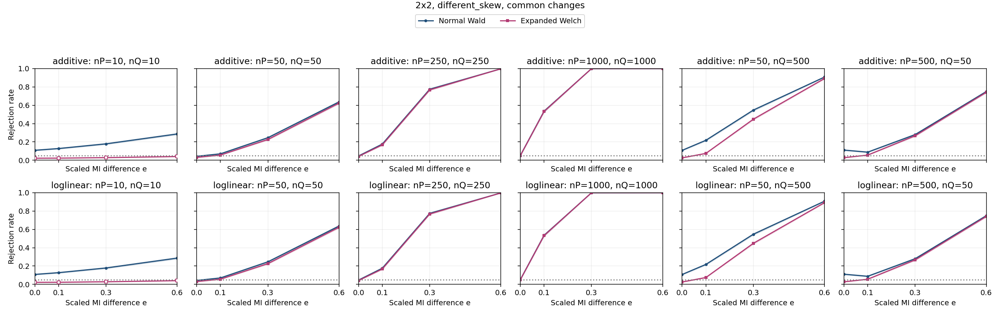

| Specification | Setting |
| --- | --- |
| Table shape | 2x2 |
| Horizontal graph regime specifications (columns) | (nP,nQ)={(10,10),(50,50),(250,250),(1000,1000),(50,500),(500,50)} |
| Vertical graph regime specifications (rows) | Top: additive probability changes; bottom: ordinal log-linear control. Each panel plots both Wald and Expanded Welch. |
| Fixed margins for both constructors | P: row 1 and column 1 each have probability 0.7, every other row/column 0.3/1; Q: row 1 and column 1 each have probability 0.8, every other row/column 0.2/1 |
| Additive direction in P and Q | Rows 1,2 and columns 1,2: add t to the block diagonal, subtract t off diagonal |
| Log-linear direction in P and Q | Products of equally spaced row/column scores from -1 to 1; ordinal in both populations |
| MI settings | M=0.42201 nats; I(P)=0.084402 nats; I(Q)=I(P)+eM; e={0,0.1,0.3,0.6} |
| Axes | e from 0 to 0.6; rejection rate from 0 to 1 |
| Replicates | 10,000 per point |

Every plotted rate, validity and minimum expected count

| Construction | nP | nQ | e | MI difference | Method | Rejection | 95% low | 95% high | Valid | Conditional rejection | Min expected P | Min expected Q |
| --- | --- | --- | --- | --- | --- | --- | --- | --- | --- | --- | --- | --- |
| additive | 10 | 10 | 0 | 0 | expanded_welch | 0.0225 | 0.01977 | 0.0256 | 0.7665 | 0.02935 | 1.22 | 0.8869 |
| additive | 10 | 10 | 0 | 0 | normal_wald | 0.1089 | 0.1029 | 0.1152 | 0.9858 | 0.1105 | 1.22 | 0.8869 |
| additive | 10 | 10 | 0.1 | 0.0422 | expanded_welch | 0.0235 | 0.02071 | 0.02666 | 0.7769 | 0.03025 | 1.22 | 0.7238 |
| additive | 10 | 10 | 0.1 | 0.0422 | normal_wald | 0.128 | 0.1216 | 0.1347 | 0.9875 | 0.1296 | 1.22 | 0.7238 |
| additive | 10 | 10 | 0.3 | 0.1266 | expanded_welch | 0.029 | 0.02589 | 0.03247 | 0.7855 | 0.03692 | 1.22 | 0.4739 |
| additive | 10 | 10 | 0.3 | 0.1266 | normal_wald | 0.1792 | 0.1718 | 0.1868 | 0.987 | 0.1816 | 1.22 | 0.4739 |
| additive | 10 | 10 | 0.6 | 0.2532 | expanded_welch | 0.041 | 0.03729 | 0.04507 | 0.8036 | 0.05102 | 1.22 | 0.2073 |
| additive | 10 | 10 | 0.6 | 0.2532 | normal_wald | 0.2869 | 0.2781 | 0.2958 | 0.9887 | 0.2902 | 1.22 | 0.2073 |
| additive | 50 | 50 | 0 | 0 | expanded_welch | 0.0314 | 0.02816 | 0.035 | 1 | 0.0314 | 6.099 | 4.435 |
| additive | 50 | 50 | 0 | 0 | normal_wald | 0.0432 | 0.03939 | 0.04736 | 1 | 0.0432 | 6.099 | 4.435 |
| additive | 50 | 50 | 0.1 | 0.0422 | expanded_welch | 0.0568 | 0.05243 | 0.06151 | 1 | 0.0568 | 6.099 | 3.619 |
| additive | 50 | 50 | 0.1 | 0.0422 | normal_wald | 0.0705 | 0.06565 | 0.07568 | 1 | 0.0705 | 6.099 | 3.619 |
| additive | 50 | 50 | 0.3 | 0.1266 | expanded_welch | 0.2266 | 0.2185 | 0.2349 | 0.9999 | 0.2266 | 6.099 | 2.369 |
| additive | 50 | 50 | 0.3 | 0.1266 | normal_wald | 0.246 | 0.2377 | 0.2545 | 1 | 0.246 | 6.099 | 2.369 |
| additive | 50 | 50 | 0.6 | 0.2532 | expanded_welch | 0.6231 | 0.6136 | 0.6325 | 0.9999 | 0.6232 | 6.099 | 1.037 |
| additive | 50 | 50 | 0.6 | 0.2532 | normal_wald | 0.6368 | 0.6273 | 0.6462 | 1 | 0.6368 | 6.099 | 1.037 |
| additive | 50 | 500 | 0 | 0 | expanded_welch | 0.0264 | 0.02343 | 0.02973 | 1 | 0.0264 | 6.099 | 44.35 |
| additive | 50 | 500 | 0 | 0 | normal_wald | 0.1082 | 0.1023 | 0.1144 | 1 | 0.1082 | 6.099 | 44.35 |
| additive | 50 | 500 | 0.1 | 0.0422 | expanded_welch | 0.0751 | 0.0701 | 0.08043 | 1 | 0.0751 | 6.099 | 36.19 |
| additive | 50 | 500 | 0.1 | 0.0422 | normal_wald | 0.2177 | 0.2097 | 0.2259 | 1 | 0.2177 | 6.099 | 36.19 |
| additive | 50 | 500 | 0.3 | 0.1266 | expanded_welch | 0.4475 | 0.4378 | 0.4573 | 1 | 0.4475 | 6.099 | 23.69 |
| additive | 50 | 500 | 0.3 | 0.1266 | normal_wald | 0.5469 | 0.5371 | 0.5566 | 1 | 0.5469 | 6.099 | 23.69 |
| additive | 50 | 500 | 0.6 | 0.2532 | expanded_welch | 0.8915 | 0.8853 | 0.8974 | 1 | 0.8915 | 6.099 | 10.37 |
| additive | 50 | 500 | 0.6 | 0.2532 | normal_wald | 0.9075 | 0.9017 | 0.913 | 1 | 0.9075 | 6.099 | 10.37 |
| additive | 250 | 250 | 0 | 0 | expanded_welch | 0.0423 | 0.03853 | 0.04642 | 1 | 0.0423 | 30.49 | 22.17 |
| additive | 250 | 250 | 0 | 0 | normal_wald | 0.0471 | 0.04312 | 0.05143 | 1 | 0.0471 | 30.49 | 22.17 |
| additive | 250 | 250 | 0.1 | 0.0422 | expanded_welch | 0.1678 | 0.1606 | 0.1753 | 1 | 0.1678 | 30.49 | 18.09 |
| additive | 250 | 250 | 0.1 | 0.0422 | normal_wald | 0.1761 | 0.1688 | 0.1837 | 1 | 0.1761 | 30.49 | 18.09 |
| additive | 250 | 250 | 0.3 | 0.1266 | expanded_welch | 0.768 | 0.7596 | 0.7762 | 1 | 0.768 | 30.49 | 11.85 |
| additive | 250 | 250 | 0.3 | 0.1266 | normal_wald | 0.7748 | 0.7665 | 0.7829 | 1 | 0.7748 | 30.49 | 11.85 |
| additive | 250 | 250 | 0.6 | 0.2532 | expanded_welch | 0.9977 | 0.9966 | 0.9985 | 1 | 0.9977 | 30.49 | 5.183 |
| additive | 250 | 250 | 0.6 | 0.2532 | normal_wald | 0.9978 | 0.9967 | 0.9985 | 1 | 0.9978 | 30.49 | 5.183 |
| additive | 500 | 50 | 0 | 0 | expanded_welch | 0.0285 | 0.02542 | 0.03195 | 1 | 0.0285 | 60.99 | 4.435 |
| additive | 500 | 50 | 0 | 0 | normal_wald | 0.1111 | 0.1051 | 0.1174 | 1 | 0.1111 | 60.99 | 4.435 |
| additive | 500 | 50 | 0.1 | 0.0422 | expanded_welch | 0.0566 | 0.05224 | 0.0613 | 1 | 0.0566 | 60.99 | 3.619 |
| additive | 500 | 50 | 0.1 | 0.0422 | normal_wald | 0.0886 | 0.08319 | 0.09433 | 1 | 0.0886 | 60.99 | 3.619 |
| additive | 500 | 50 | 0.3 | 0.1266 | expanded_welch | 0.2673 | 0.2587 | 0.2761 | 1 | 0.2673 | 60.99 | 2.369 |
| additive | 500 | 50 | 0.3 | 0.1266 | normal_wald | 0.2799 | 0.2712 | 0.2888 | 1 | 0.2799 | 60.99 | 2.369 |
| additive | 500 | 50 | 0.6 | 0.2532 | expanded_welch | 0.7415 | 0.7328 | 0.75 | 1 | 0.7415 | 60.99 | 1.037 |
| additive | 500 | 50 | 0.6 | 0.2532 | normal_wald | 0.7495 | 0.7409 | 0.7579 | 1 | 0.7495 | 60.99 | 1.037 |
| additive | 1000 | 1000 | 0 | 0 | expanded_welch | 0.0506 | 0.04647 | 0.05507 | 1 | 0.0506 | 122 | 88.69 |
| additive | 1000 | 1000 | 0 | 0 | normal_wald | 0.0524 | 0.0482 | 0.05694 | 1 | 0.0524 | 122 | 88.69 |
| additive | 1000 | 1000 | 0.1 | 0.0422 | expanded_welch | 0.5322 | 0.5224 | 0.542 | 1 | 0.5322 | 122 | 72.38 |
| additive | 1000 | 1000 | 0.1 | 0.0422 | normal_wald | 0.5355 | 0.5257 | 0.5453 | 1 | 0.5355 | 122 | 72.38 |
| additive | 1000 | 1000 | 0.3 | 0.1266 | expanded_welch | 0.9996 | 0.999 | 0.9998 | 1 | 0.9996 | 122 | 47.39 |
| additive | 1000 | 1000 | 0.3 | 0.1266 | normal_wald | 0.9996 | 0.999 | 0.9998 | 1 | 0.9996 | 122 | 47.39 |
| additive | 1000 | 1000 | 0.6 | 0.2532 | expanded_welch | 1 | 0.9996 | 1 | 1 | 1 | 122 | 20.73 |
| additive | 1000 | 1000 | 0.6 | 0.2532 | normal_wald | 1 | 0.9996 | 1 | 1 | 1 | 122 | 20.73 |
| loglinear | 10 | 10 | 0 | 0 | expanded_welch | 0.0225 | 0.01977 | 0.0256 | 0.7665 | 0.02935 | 1.22 | 0.8869 |
| loglinear | 10 | 10 | 0 | 0 | normal_wald | 0.1089 | 0.1029 | 0.1152 | 0.9858 | 0.1105 | 1.22 | 0.8869 |
| loglinear | 10 | 10 | 0.1 | 0.0422 | expanded_welch | 0.0235 | 0.02071 | 0.02666 | 0.7769 | 0.03025 | 1.22 | 0.7238 |
| loglinear | 10 | 10 | 0.1 | 0.0422 | normal_wald | 0.128 | 0.1216 | 0.1347 | 0.9875 | 0.1296 | 1.22 | 0.7238 |
| loglinear | 10 | 10 | 0.3 | 0.1266 | expanded_welch | 0.029 | 0.02589 | 0.03247 | 0.7855 | 0.03692 | 1.22 | 0.4739 |
| loglinear | 10 | 10 | 0.3 | 0.1266 | normal_wald | 0.1792 | 0.1718 | 0.1868 | 0.987 | 0.1816 | 1.22 | 0.4739 |
| loglinear | 10 | 10 | 0.6 | 0.2532 | expanded_welch | 0.041 | 0.03729 | 0.04507 | 0.8036 | 0.05102 | 1.22 | 0.2073 |
| loglinear | 10 | 10 | 0.6 | 0.2532 | normal_wald | 0.2869 | 0.2781 | 0.2958 | 0.9887 | 0.2902 | 1.22 | 0.2073 |
| loglinear | 50 | 50 | 0 | 0 | expanded_welch | 0.0314 | 0.02816 | 0.035 | 1 | 0.0314 | 6.099 | 4.435 |
| loglinear | 50 | 50 | 0 | 0 | normal_wald | 0.0432 | 0.03939 | 0.04736 | 1 | 0.0432 | 6.099 | 4.435 |
| loglinear | 50 | 50 | 0.1 | 0.0422 | expanded_welch | 0.0568 | 0.05243 | 0.06151 | 1 | 0.0568 | 6.099 | 3.619 |
| loglinear | 50 | 50 | 0.1 | 0.0422 | normal_wald | 0.0705 | 0.06565 | 0.07568 | 1 | 0.0705 | 6.099 | 3.619 |
| loglinear | 50 | 50 | 0.3 | 0.1266 | expanded_welch | 0.2266 | 0.2185 | 0.2349 | 0.9999 | 0.2266 | 6.099 | 2.369 |
| loglinear | 50 | 50 | 0.3 | 0.1266 | normal_wald | 0.246 | 0.2377 | 0.2545 | 1 | 0.246 | 6.099 | 2.369 |
| loglinear | 50 | 50 | 0.6 | 0.2532 | expanded_welch | 0.6231 | 0.6136 | 0.6325 | 0.9999 | 0.6232 | 6.099 | 1.037 |
| loglinear | 50 | 50 | 0.6 | 0.2532 | normal_wald | 0.6368 | 0.6273 | 0.6462 | 1 | 0.6368 | 6.099 | 1.037 |
| loglinear | 50 | 500 | 0 | 0 | expanded_welch | 0.0264 | 0.02343 | 0.02973 | 1 | 0.0264 | 6.099 | 44.35 |
| loglinear | 50 | 500 | 0 | 0 | normal_wald | 0.1082 | 0.1023 | 0.1144 | 1 | 0.1082 | 6.099 | 44.35 |
| loglinear | 50 | 500 | 0.1 | 0.0422 | expanded_welch | 0.0751 | 0.0701 | 0.08043 | 1 | 0.0751 | 6.099 | 36.19 |
| loglinear | 50 | 500 | 0.1 | 0.0422 | normal_wald | 0.2177 | 0.2097 | 0.2259 | 1 | 0.2177 | 6.099 | 36.19 |
| loglinear | 50 | 500 | 0.3 | 0.1266 | expanded_welch | 0.4475 | 0.4378 | 0.4573 | 1 | 0.4475 | 6.099 | 23.69 |
| loglinear | 50 | 500 | 0.3 | 0.1266 | normal_wald | 0.5469 | 0.5371 | 0.5566 | 1 | 0.5469 | 6.099 | 23.69 |
| loglinear | 50 | 500 | 0.6 | 0.2532 | expanded_welch | 0.8915 | 0.8853 | 0.8974 | 1 | 0.8915 | 6.099 | 10.37 |
| loglinear | 50 | 500 | 0.6 | 0.2532 | normal_wald | 0.9075 | 0.9017 | 0.913 | 1 | 0.9075 | 6.099 | 10.37 |
| loglinear | 250 | 250 | 0 | 0 | expanded_welch | 0.0423 | 0.03853 | 0.04642 | 1 | 0.0423 | 30.49 | 22.17 |
| loglinear | 250 | 250 | 0 | 0 | normal_wald | 0.0471 | 0.04312 | 0.05143 | 1 | 0.0471 | 30.49 | 22.17 |
| loglinear | 250 | 250 | 0.1 | 0.0422 | expanded_welch | 0.1678 | 0.1606 | 0.1753 | 1 | 0.1678 | 30.49 | 18.09 |
| loglinear | 250 | 250 | 0.1 | 0.0422 | normal_wald | 0.1761 | 0.1688 | 0.1837 | 1 | 0.1761 | 30.49 | 18.09 |
| loglinear | 250 | 250 | 0.3 | 0.1266 | expanded_welch | 0.768 | 0.7596 | 0.7762 | 1 | 0.768 | 30.49 | 11.85 |
| loglinear | 250 | 250 | 0.3 | 0.1266 | normal_wald | 0.7748 | 0.7665 | 0.7829 | 1 | 0.7748 | 30.49 | 11.85 |
| loglinear | 250 | 250 | 0.6 | 0.2532 | expanded_welch | 0.9977 | 0.9966 | 0.9985 | 1 | 0.9977 | 30.49 | 5.183 |
| loglinear | 250 | 250 | 0.6 | 0.2532 | normal_wald | 0.9978 | 0.9967 | 0.9985 | 1 | 0.9978 | 30.49 | 5.183 |
| loglinear | 500 | 50 | 0 | 0 | expanded_welch | 0.0285 | 0.02542 | 0.03195 | 1 | 0.0285 | 60.99 | 4.435 |
| loglinear | 500 | 50 | 0 | 0 | normal_wald | 0.1111 | 0.1051 | 0.1174 | 1 | 0.1111 | 60.99 | 4.435 |
| loglinear | 500 | 50 | 0.1 | 0.0422 | expanded_welch | 0.0566 | 0.05224 | 0.0613 | 1 | 0.0566 | 60.99 | 3.619 |
| loglinear | 500 | 50 | 0.1 | 0.0422 | normal_wald | 0.0886 | 0.08319 | 0.09433 | 1 | 0.0886 | 60.99 | 3.619 |
| loglinear | 500 | 50 | 0.3 | 0.1266 | expanded_welch | 0.2673 | 0.2587 | 0.2761 | 1 | 0.2673 | 60.99 | 2.369 |
| loglinear | 500 | 50 | 0.3 | 0.1266 | normal_wald | 0.2799 | 0.2712 | 0.2888 | 1 | 0.2799 | 60.99 | 2.369 |
| loglinear | 500 | 50 | 0.6 | 0.2532 | expanded_welch | 0.7415 | 0.7328 | 0.75 | 1 | 0.7415 | 60.99 | 1.037 |
| loglinear | 500 | 50 | 0.6 | 0.2532 | normal_wald | 0.7495 | 0.7409 | 0.7579 | 1 | 0.7495 | 60.99 | 1.037 |
| loglinear | 1000 | 1000 | 0 | 0 | expanded_welch | 0.0506 | 0.04647 | 0.05507 | 1 | 0.0506 | 122 | 88.69 |
| loglinear | 1000 | 1000 | 0 | 0 | normal_wald | 0.0524 | 0.0482 | 0.05694 | 1 | 0.0524 | 122 | 88.69 |
| loglinear | 1000 | 1000 | 0.1 | 0.0422 | expanded_welch | 0.5322 | 0.5224 | 0.542 | 1 | 0.5322 | 122 | 72.38 |
| loglinear | 1000 | 1000 | 0.1 | 0.0422 | normal_wald | 0.5355 | 0.5257 | 0.5453 | 1 | 0.5355 | 122 | 72.38 |
| loglinear | 1000 | 1000 | 0.3 | 0.1266 | expanded_welch | 0.9996 | 0.999 | 0.9998 | 1 | 0.9996 | 122 | 47.39 |
| loglinear | 1000 | 1000 | 0.3 | 0.1266 | normal_wald | 0.9996 | 0.999 | 0.9998 | 1 | 0.9996 | 122 | 47.39 |
| loglinear | 1000 | 1000 | 0.6 | 0.2532 | expanded_welch | 1 | 0.9996 | 1 | 1 | 1 | 122 | 20.73 |
| loglinear | 1000 | 1000 | 0.6 | 0.2532 | normal_wald | 1 | 0.9996 | 1 | 1 | 1 | 122 | 20.73 |

### 3.3. 3x3: uniform, common

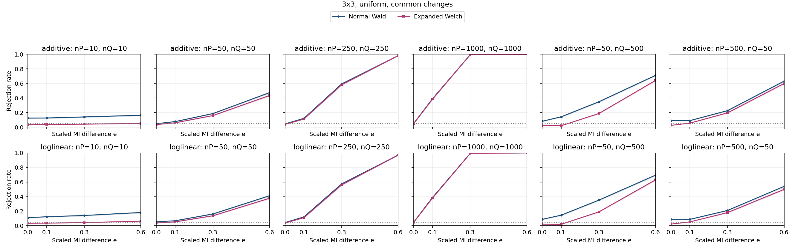

| Specification | Setting |
| --- | --- |
| Table shape | 3x3 |
| Horizontal graph regime specifications (columns) | (nP,nQ)={(10,10),(50,50),(250,250),(1000,1000),(50,500),(500,50)} |
| Vertical graph regime specifications (rows) | Top: additive probability changes; bottom: ordinal log-linear control. Each panel plots both Wald and Expanded Welch. |
| Fixed margins for both constructors | P and Q: each row and column has probability 1/3 |
| Additive direction in P and Q | Rows 1,2 and columns 1,2: add t to the block diagonal, subtract t off diagonal |
| Log-linear direction in P and Q | Products of equally spaced row/column scores from -1 to 1; ordinal in both populations |
| MI settings | M=0.25611 nats; I(P)=0.051221 nats; I(Q)=I(P)+eM; e={0,0.1,0.3,0.6} |
| Axes | e from 0 to 0.6; rejection rate from 0 to 1 |
| Replicates | 10,000 per point |

Every plotted rate, validity and minimum expected count

| Construction | nP | nQ | e | MI difference | Method | Rejection | 95% low | 95% high | Valid | Conditional rejection | Min expected P | Min expected Q |
| --- | --- | --- | --- | --- | --- | --- | --- | --- | --- | --- | --- | --- |
| additive | 10 | 10 | 0 | 0 | expanded_welch | 0.035 | 0.03157 | 0.03878 | 0.9971 | 0.0351 | 0.5882 | 0.5882 |
| additive | 10 | 10 | 0 | 0 | normal_wald | 0.1241 | 0.1178 | 0.1307 | 1 | 0.1241 | 0.5882 | 0.5882 |
| additive | 10 | 10 | 0.1 | 0.02561 | expanded_welch | 0.0371 | 0.03357 | 0.04099 | 0.9961 | 0.03725 | 0.5882 | 0.4774 |
| additive | 10 | 10 | 0.1 | 0.02561 | normal_wald | 0.1257 | 0.1193 | 0.1323 | 1 | 0.1257 | 0.5882 | 0.4774 |
| additive | 10 | 10 | 0.3 | 0.07683 | expanded_welch | 0.0412 | 0.03748 | 0.04527 | 0.9959 | 0.04137 | 0.5882 | 0.3112 |
| additive | 10 | 10 | 0.3 | 0.07683 | normal_wald | 0.1403 | 0.1336 | 0.1472 | 1 | 0.1403 | 0.5882 | 0.3112 |
| additive | 10 | 10 | 0.6 | 0.1537 | expanded_welch | 0.0513 | 0.04715 | 0.0558 | 0.9928 | 0.05167 | 0.5882 | 0.1375 |
| additive | 10 | 10 | 0.6 | 0.1537 | normal_wald | 0.1633 | 0.1562 | 0.1707 | 1 | 0.1633 | 0.5882 | 0.1375 |
| additive | 50 | 50 | 0 | 0 | expanded_welch | 0.0357 | 0.03224 | 0.03952 | 1 | 0.0357 | 2.941 | 2.941 |
| additive | 50 | 50 | 0 | 0 | normal_wald | 0.0476 | 0.0436 | 0.05195 | 1 | 0.0476 | 2.941 | 2.941 |
| additive | 50 | 50 | 0.1 | 0.02561 | expanded_welch | 0.06 | 0.05551 | 0.06483 | 1 | 0.06 | 2.941 | 2.387 |
| additive | 50 | 50 | 0.1 | 0.02561 | normal_wald | 0.0765 | 0.07145 | 0.08187 | 1 | 0.0765 | 2.941 | 2.387 |
| additive | 50 | 50 | 0.3 | 0.07683 | expanded_welch | 0.1593 | 0.1523 | 0.1666 | 1 | 0.1593 | 2.941 | 1.556 |
| additive | 50 | 50 | 0.3 | 0.07683 | normal_wald | 0.1866 | 0.1791 | 0.1944 | 1 | 0.1866 | 2.941 | 1.556 |
| additive | 50 | 50 | 0.6 | 0.1537 | expanded_welch | 0.4345 | 0.4248 | 0.4442 | 1 | 0.4345 | 2.941 | 0.6877 |
| additive | 50 | 50 | 0.6 | 0.1537 | normal_wald | 0.4739 | 0.4641 | 0.4837 | 1 | 0.4739 | 2.941 | 0.6877 |
| additive | 50 | 500 | 0 | 0 | expanded_welch | 0.021 | 0.01837 | 0.024 | 1 | 0.021 | 2.941 | 29.41 |
| additive | 50 | 500 | 0 | 0 | normal_wald | 0.081 | 0.07581 | 0.08651 | 1 | 0.081 | 2.941 | 29.41 |
| additive | 50 | 500 | 0.1 | 0.02561 | expanded_welch | 0.0194 | 0.01688 | 0.02229 | 1 | 0.0194 | 2.941 | 23.87 |
| additive | 50 | 500 | 0.1 | 0.02561 | normal_wald | 0.1417 | 0.135 | 0.1487 | 1 | 0.1417 | 2.941 | 23.87 |
| additive | 50 | 500 | 0.3 | 0.07683 | expanded_welch | 0.1873 | 0.1798 | 0.1951 | 1 | 0.1873 | 2.941 | 15.56 |
| additive | 50 | 500 | 0.3 | 0.07683 | normal_wald | 0.3484 | 0.3391 | 0.3578 | 1 | 0.3484 | 2.941 | 15.56 |
| additive | 50 | 500 | 0.6 | 0.1537 | expanded_welch | 0.6406 | 0.6311 | 0.6499 | 1 | 0.6406 | 2.941 | 6.877 |
| additive | 50 | 500 | 0.6 | 0.1537 | normal_wald | 0.7105 | 0.7015 | 0.7193 | 1 | 0.7105 | 2.941 | 6.877 |
| additive | 250 | 250 | 0 | 0 | expanded_welch | 0.0386 | 0.035 | 0.04256 | 1 | 0.0386 | 14.7 | 14.7 |
| additive | 250 | 250 | 0 | 0 | normal_wald | 0.0445 | 0.04063 | 0.04872 | 1 | 0.0445 | 14.7 | 14.7 |
| additive | 250 | 250 | 0.1 | 0.02561 | expanded_welch | 0.111 | 0.105 | 0.1173 | 1 | 0.111 | 14.7 | 11.93 |
| additive | 250 | 250 | 0.1 | 0.02561 | normal_wald | 0.1208 | 0.1146 | 0.1273 | 1 | 0.1208 | 14.7 | 11.93 |
| additive | 250 | 250 | 0.3 | 0.07683 | expanded_welch | 0.5816 | 0.5719 | 0.5912 | 1 | 0.5816 | 14.7 | 7.78 |
| additive | 250 | 250 | 0.3 | 0.07683 | normal_wald | 0.5928 | 0.5831 | 0.6024 | 1 | 0.5928 | 14.7 | 7.78 |
| additive | 250 | 250 | 0.6 | 0.1537 | expanded_welch | 0.981 | 0.9781 | 0.9835 | 1 | 0.981 | 14.7 | 3.439 |
| additive | 250 | 250 | 0.6 | 0.1537 | normal_wald | 0.982 | 0.9792 | 0.9844 | 1 | 0.982 | 14.7 | 3.439 |
| additive | 500 | 50 | 0 | 0 | expanded_welch | 0.0248 | 0.02193 | 0.02804 | 1 | 0.0248 | 29.41 | 2.941 |
| additive | 500 | 50 | 0 | 0 | normal_wald | 0.0923 | 0.08678 | 0.09813 | 1 | 0.0923 | 29.41 | 2.941 |
| additive | 500 | 50 | 0.1 | 0.02561 | expanded_welch | 0.0553 | 0.05099 | 0.05995 | 1 | 0.0553 | 29.41 | 2.387 |
| additive | 500 | 50 | 0.1 | 0.02561 | normal_wald | 0.0896 | 0.08416 | 0.09536 | 1 | 0.0896 | 29.41 | 2.387 |
| additive | 500 | 50 | 0.3 | 0.07683 | expanded_welch | 0.1963 | 0.1886 | 0.2042 | 1 | 0.1963 | 29.41 | 1.556 |
| additive | 500 | 50 | 0.3 | 0.07683 | normal_wald | 0.2267 | 0.2186 | 0.235 | 1 | 0.2267 | 29.41 | 1.556 |
| additive | 500 | 50 | 0.6 | 0.1537 | expanded_welch | 0.5993 | 0.5897 | 0.6089 | 1 | 0.5993 | 29.41 | 0.6877 |
| additive | 500 | 50 | 0.6 | 0.1537 | normal_wald | 0.632 | 0.6225 | 0.6414 | 1 | 0.632 | 29.41 | 0.6877 |
| additive | 1000 | 1000 | 0 | 0 | expanded_welch | 0.048 | 0.04398 | 0.05237 | 1 | 0.048 | 58.82 | 58.82 |
| additive | 1000 | 1000 | 0 | 0 | normal_wald | 0.0504 | 0.04628 | 0.05486 | 1 | 0.0504 | 58.82 | 58.82 |
| additive | 1000 | 1000 | 0.1 | 0.02561 | expanded_welch | 0.3855 | 0.376 | 0.3951 | 1 | 0.3855 | 58.82 | 47.74 |
| additive | 1000 | 1000 | 0.1 | 0.02561 | normal_wald | 0.3904 | 0.3809 | 0.4 | 1 | 0.3904 | 58.82 | 47.74 |
| additive | 1000 | 1000 | 0.3 | 0.07683 | expanded_welch | 0.9949 | 0.9933 | 0.9961 | 1 | 0.9949 | 58.82 | 31.12 |
| additive | 1000 | 1000 | 0.3 | 0.07683 | normal_wald | 0.9949 | 0.9933 | 0.9961 | 1 | 0.9949 | 58.82 | 31.12 |
| additive | 1000 | 1000 | 0.6 | 0.1537 | expanded_welch | 1 | 0.9996 | 1 | 1 | 1 | 58.82 | 13.75 |
| additive | 1000 | 1000 | 0.6 | 0.1537 | normal_wald | 1 | 0.9996 | 1 | 1 | 1 | 58.82 | 13.75 |
| loglinear | 10 | 10 | 0 | 0 | expanded_welch | 0.0335 | 0.03015 | 0.03721 | 0.9976 | 0.03358 | 0.6015 | 0.6015 |
| loglinear | 10 | 10 | 0 | 0 | normal_wald | 0.1098 | 0.1038 | 0.1161 | 1 | 0.1098 | 0.6015 | 0.6015 |
| loglinear | 10 | 10 | 0.1 | 0.02561 | expanded_welch | 0.0357 | 0.03224 | 0.03952 | 0.9968 | 0.03581 | 0.6015 | 0.4974 |
| loglinear | 10 | 10 | 0.1 | 0.02561 | normal_wald | 0.1233 | 0.117 | 0.1299 | 0.9999 | 0.1233 | 0.6015 | 0.4974 |
| loglinear | 10 | 10 | 0.3 | 0.07683 | expanded_welch | 0.0427 | 0.03891 | 0.04684 | 0.9955 | 0.04289 | 0.6015 | 0.3449 |
| loglinear | 10 | 10 | 0.3 | 0.07683 | normal_wald | 0.1406 | 0.1339 | 0.1476 | 1 | 0.1406 | 0.6015 | 0.3449 |
| loglinear | 10 | 10 | 0.6 | 0.1537 | expanded_welch | 0.0628 | 0.05821 | 0.06772 | 0.9922 | 0.06329 | 0.6015 | 0.1926 |
| loglinear | 10 | 10 | 0.6 | 0.1537 | normal_wald | 0.1815 | 0.1741 | 0.1892 | 0.9999 | 0.1815 | 0.6015 | 0.1926 |
| loglinear | 50 | 50 | 0 | 0 | expanded_welch | 0.0379 | 0.03433 | 0.04182 | 1 | 0.0379 | 3.008 | 3.008 |
| loglinear | 50 | 50 | 0 | 0 | normal_wald | 0.0537 | 0.04945 | 0.05829 | 1 | 0.0537 | 3.008 | 3.008 |
| loglinear | 50 | 50 | 0.1 | 0.02561 | expanded_welch | 0.0531 | 0.04887 | 0.05767 | 1 | 0.0531 | 3.008 | 2.487 |
| loglinear | 50 | 50 | 0.1 | 0.02561 | normal_wald | 0.0682 | 0.06342 | 0.07331 | 1 | 0.0682 | 3.008 | 2.487 |
| loglinear | 50 | 50 | 0.3 | 0.07683 | expanded_welch | 0.1369 | 0.1303 | 0.1438 | 1 | 0.1369 | 3.008 | 1.724 |
| loglinear | 50 | 50 | 0.3 | 0.07683 | normal_wald | 0.1617 | 0.1546 | 0.169 | 1 | 0.1617 | 3.008 | 1.724 |
| loglinear | 50 | 50 | 0.6 | 0.1537 | expanded_welch | 0.3771 | 0.3676 | 0.3866 | 1 | 0.3771 | 3.008 | 0.9628 |
| loglinear | 50 | 50 | 0.6 | 0.1537 | normal_wald | 0.4116 | 0.402 | 0.4213 | 1 | 0.4116 | 3.008 | 0.9628 |
| loglinear | 50 | 500 | 0 | 0 | expanded_welch | 0.0216 | 0.01893 | 0.02464 | 1 | 0.0216 | 3.008 | 30.08 |
| loglinear | 50 | 500 | 0 | 0 | normal_wald | 0.0876 | 0.08222 | 0.0933 | 1 | 0.0876 | 3.008 | 30.08 |
| loglinear | 50 | 500 | 0.1 | 0.02561 | expanded_welch | 0.0198 | 0.01725 | 0.02272 | 1 | 0.0198 | 3.008 | 24.87 |
| loglinear | 50 | 500 | 0.1 | 0.02561 | normal_wald | 0.1447 | 0.1379 | 0.1517 | 1 | 0.1447 | 3.008 | 24.87 |
| loglinear | 50 | 500 | 0.3 | 0.07683 | expanded_welch | 0.1898 | 0.1822 | 0.1976 | 1 | 0.1898 | 3.008 | 17.24 |
| loglinear | 50 | 500 | 0.3 | 0.07683 | normal_wald | 0.3514 | 0.3421 | 0.3608 | 1 | 0.3514 | 3.008 | 17.24 |
| loglinear | 50 | 500 | 0.6 | 0.1537 | expanded_welch | 0.6289 | 0.6194 | 0.6383 | 1 | 0.6289 | 3.008 | 9.628 |
| loglinear | 50 | 500 | 0.6 | 0.1537 | normal_wald | 0.6937 | 0.6846 | 0.7027 | 1 | 0.6937 | 3.008 | 9.628 |
| loglinear | 250 | 250 | 0 | 0 | expanded_welch | 0.037 | 0.03347 | 0.04088 | 1 | 0.037 | 15.04 | 15.04 |
| loglinear | 250 | 250 | 0 | 0 | normal_wald | 0.0434 | 0.03958 | 0.04757 | 1 | 0.0434 | 15.04 | 15.04 |
| loglinear | 250 | 250 | 0.1 | 0.02561 | expanded_welch | 0.1104 | 0.1044 | 0.1167 | 1 | 0.1104 | 15.04 | 12.43 |
| loglinear | 250 | 250 | 0.1 | 0.02561 | normal_wald | 0.121 | 0.1148 | 0.1275 | 1 | 0.121 | 15.04 | 12.43 |
| loglinear | 250 | 250 | 0.3 | 0.07683 | expanded_welch | 0.5606 | 0.5509 | 0.5703 | 1 | 0.5606 | 15.04 | 8.622 |
| loglinear | 250 | 250 | 0.3 | 0.07683 | normal_wald | 0.5738 | 0.5641 | 0.5835 | 1 | 0.5738 | 15.04 | 8.622 |
| loglinear | 250 | 250 | 0.6 | 0.1537 | expanded_welch | 0.9691 | 0.9655 | 0.9723 | 1 | 0.9691 | 15.04 | 4.814 |
| loglinear | 250 | 250 | 0.6 | 0.1537 | normal_wald | 0.9701 | 0.9666 | 0.9733 | 1 | 0.9701 | 15.04 | 4.814 |
| loglinear | 500 | 50 | 0 | 0 | expanded_welch | 0.0226 | 0.01987 | 0.0257 | 1 | 0.0226 | 30.08 | 3.008 |
| loglinear | 500 | 50 | 0 | 0 | normal_wald | 0.0888 | 0.08338 | 0.09453 | 1 | 0.0888 | 30.08 | 3.008 |
| loglinear | 500 | 50 | 0.1 | 0.02561 | expanded_welch | 0.0524 | 0.0482 | 0.05694 | 1 | 0.0524 | 30.08 | 2.487 |
| loglinear | 500 | 50 | 0.1 | 0.02561 | normal_wald | 0.0869 | 0.08154 | 0.09258 | 1 | 0.0869 | 30.08 | 2.487 |
| loglinear | 500 | 50 | 0.3 | 0.07683 | expanded_welch | 0.1801 | 0.1727 | 0.1878 | 1 | 0.1801 | 30.08 | 1.724 |
| loglinear | 500 | 50 | 0.3 | 0.07683 | normal_wald | 0.2094 | 0.2015 | 0.2175 | 1 | 0.2094 | 30.08 | 1.724 |
| loglinear | 500 | 50 | 0.6 | 0.1537 | expanded_welch | 0.4992 | 0.4894 | 0.509 | 1 | 0.4992 | 30.08 | 0.9628 |
| loglinear | 500 | 50 | 0.6 | 0.1537 | normal_wald | 0.5404 | 0.5306 | 0.5502 | 1 | 0.5404 | 30.08 | 0.9628 |
| loglinear | 1000 | 1000 | 0 | 0 | expanded_welch | 0.0472 | 0.04321 | 0.05153 | 1 | 0.0472 | 60.15 | 60.15 |
| loglinear | 1000 | 1000 | 0 | 0 | normal_wald | 0.0488 | 0.04475 | 0.0532 | 1 | 0.0488 | 60.15 | 60.15 |
| loglinear | 1000 | 1000 | 0.1 | 0.02561 | expanded_welch | 0.3818 | 0.3723 | 0.3914 | 1 | 0.3818 | 60.15 | 49.74 |
| loglinear | 1000 | 1000 | 0.1 | 0.02561 | normal_wald | 0.3874 | 0.3779 | 0.397 | 1 | 0.3874 | 60.15 | 49.74 |
| loglinear | 1000 | 1000 | 0.3 | 0.07683 | expanded_welch | 0.9926 | 0.9907 | 0.9941 | 1 | 0.9926 | 60.15 | 34.49 |
| loglinear | 1000 | 1000 | 0.3 | 0.07683 | normal_wald | 0.9927 | 0.9908 | 0.9942 | 1 | 0.9927 | 60.15 | 34.49 |
| loglinear | 1000 | 1000 | 0.6 | 0.1537 | expanded_welch | 1 | 0.9996 | 1 | 1 | 1 | 60.15 | 19.26 |
| loglinear | 1000 | 1000 | 0.6 | 0.1537 | normal_wald | 1 | 0.9996 | 1 | 1 | 1 | 60.15 | 19.26 |

### 3.4. 3x3: uniform, rare

| Specification | Setting |
| --- | --- |
| Table shape | 3x3 |
| Horizontal graph regime specifications (columns) | (nP,nQ)={(10,10),(50,50),(250,250),(1000,1000),(50,500),(500,50)} |
| Vertical graph regime specifications (rows) | Top: additive probability changes; bottom: ordinal log-linear control. Each panel plots both Wald and Expanded Welch. |
| Fixed margins for both constructors | P and Q: each row and column has probability 1/3 |
| Additive direction in P and Q | Rows 2,3 and columns 2,3: add t to the block diagonal, subtract t off diagonal |
| Log-linear direction in P and Q | Products of equally spaced row/column scores from -1 to 1; ordinal in both populations |
| MI settings | M=0.25611 nats; I(P)=0.051221 nats; I(Q)=I(P)+eM; e={0,0.1,0.3,0.6} |
| Axes | e from 0 to 0.6; rejection rate from 0 to 1 |
| Replicates | 10,000 per point |

Every plotted rate, validity and minimum expected count

| Construction | nP | nQ | e | MI difference | Method | Rejection | 95% low | 95% high | Valid | Conditional rejection | Min expected P | Min expected Q |
| --- | --- | --- | --- | --- | --- | --- | --- | --- | --- | --- | --- | --- |
| additive | 10 | 10 | 0 | 0 | expanded_welch | 0.035 | 0.03157 | 0.03878 | 0.997 | 0.03511 | 0.5882 | 0.5882 |
| additive | 10 | 10 | 0 | 0 | normal_wald | 0.1195 | 0.1133 | 0.126 | 1 | 0.1195 | 0.5882 | 0.5882 |
| additive | 10 | 10 | 0.1 | 0.02561 | expanded_welch | 0.0391 | 0.03547 | 0.04308 | 0.9971 | 0.03921 | 0.5882 | 0.4774 |
| additive | 10 | 10 | 0.1 | 0.02561 | normal_wald | 0.1237 | 0.1174 | 0.1303 | 1 | 0.1237 | 0.5882 | 0.4774 |
| additive | 10 | 10 | 0.3 | 0.07683 | expanded_welch | 0.0383 | 0.03471 | 0.04224 | 0.9962 | 0.03845 | 0.5882 | 0.3112 |
| additive | 10 | 10 | 0.3 | 0.07683 | normal_wald | 0.1355 | 0.1289 | 0.1423 | 1 | 0.1355 | 0.5882 | 0.3112 |
| additive | 10 | 10 | 0.6 | 0.1537 | expanded_welch | 0.0535 | 0.04926 | 0.05808 | 0.9959 | 0.05372 | 0.5882 | 0.1375 |
| additive | 10 | 10 | 0.6 | 0.1537 | normal_wald | 0.1688 | 0.1616 | 0.1763 | 1 | 0.1688 | 0.5882 | 0.1375 |
| additive | 50 | 50 | 0 | 0 | expanded_welch | 0.0353 | 0.03186 | 0.0391 | 1 | 0.0353 | 2.941 | 2.941 |
| additive | 50 | 50 | 0 | 0 | normal_wald | 0.0515 | 0.04734 | 0.05601 | 1 | 0.0515 | 2.941 | 2.941 |
| additive | 50 | 50 | 0.1 | 0.02561 | expanded_welch | 0.0568 | 0.05243 | 0.06151 | 1 | 0.0568 | 2.941 | 2.387 |
| additive | 50 | 50 | 0.1 | 0.02561 | normal_wald | 0.074 | 0.06903 | 0.0793 | 1 | 0.074 | 2.941 | 2.387 |
| additive | 50 | 50 | 0.3 | 0.07683 | expanded_welch | 0.1566 | 0.1496 | 0.1639 | 1 | 0.1566 | 2.941 | 1.556 |
| additive | 50 | 50 | 0.3 | 0.07683 | normal_wald | 0.1804 | 0.173 | 0.1881 | 1 | 0.1804 | 2.941 | 1.556 |
| additive | 50 | 50 | 0.6 | 0.1537 | expanded_welch | 0.4312 | 0.4215 | 0.4409 | 1 | 0.4312 | 2.941 | 0.6877 |
| additive | 50 | 50 | 0.6 | 0.1537 | normal_wald | 0.4674 | 0.4576 | 0.4772 | 1 | 0.4674 | 2.941 | 0.6877 |
| additive | 50 | 500 | 0 | 0 | expanded_welch | 0.0225 | 0.01977 | 0.0256 | 1 | 0.0225 | 2.941 | 29.41 |
| additive | 50 | 500 | 0 | 0 | normal_wald | 0.0903 | 0.08484 | 0.09608 | 1 | 0.0903 | 2.941 | 29.41 |
| additive | 50 | 500 | 0.1 | 0.02561 | expanded_welch | 0.0177 | 0.01529 | 0.02048 | 1 | 0.0177 | 2.941 | 23.87 |
| additive | 50 | 500 | 0.1 | 0.02561 | normal_wald | 0.1402 | 0.1335 | 0.1471 | 1 | 0.1402 | 2.941 | 23.87 |
| additive | 50 | 500 | 0.3 | 0.07683 | expanded_welch | 0.1805 | 0.1731 | 0.1882 | 1 | 0.1805 | 2.941 | 15.56 |
| additive | 50 | 500 | 0.3 | 0.07683 | normal_wald | 0.3425 | 0.3333 | 0.3519 | 1 | 0.3425 | 2.941 | 15.56 |
| additive | 50 | 500 | 0.6 | 0.1537 | expanded_welch | 0.6407 | 0.6312 | 0.65 | 1 | 0.6407 | 2.941 | 6.877 |
| additive | 50 | 500 | 0.6 | 0.1537 | normal_wald | 0.7087 | 0.6997 | 0.7175 | 1 | 0.7087 | 2.941 | 6.877 |
| additive | 250 | 250 | 0 | 0 | expanded_welch | 0.0371 | 0.03357 | 0.04099 | 1 | 0.0371 | 14.7 | 14.7 |
| additive | 250 | 250 | 0 | 0 | normal_wald | 0.0417 | 0.03795 | 0.0458 | 1 | 0.0417 | 14.7 | 14.7 |
| additive | 250 | 250 | 0.1 | 0.02561 | expanded_welch | 0.1116 | 0.1056 | 0.1179 | 1 | 0.1116 | 14.7 | 11.93 |
| additive | 250 | 250 | 0.1 | 0.02561 | normal_wald | 0.1205 | 0.1143 | 0.127 | 1 | 0.1205 | 14.7 | 11.93 |
| additive | 250 | 250 | 0.3 | 0.07683 | expanded_welch | 0.581 | 0.5713 | 0.5906 | 1 | 0.581 | 14.7 | 7.78 |
| additive | 250 | 250 | 0.3 | 0.07683 | normal_wald | 0.5923 | 0.5826 | 0.6019 | 1 | 0.5923 | 14.7 | 7.78 |
| additive | 250 | 250 | 0.6 | 0.1537 | expanded_welch | 0.9802 | 0.9773 | 0.9828 | 1 | 0.9802 | 14.7 | 3.439 |
| additive | 250 | 250 | 0.6 | 0.1537 | normal_wald | 0.981 | 0.9781 | 0.9835 | 1 | 0.981 | 14.7 | 3.439 |
| additive | 500 | 50 | 0 | 0 | expanded_welch | 0.0203 | 0.01771 | 0.02325 | 1 | 0.0203 | 29.41 | 2.941 |
| additive | 500 | 50 | 0 | 0 | normal_wald | 0.0834 | 0.07814 | 0.08898 | 1 | 0.0834 | 29.41 | 2.941 |
| additive | 500 | 50 | 0.1 | 0.02561 | expanded_welch | 0.0557 | 0.05137 | 0.06037 | 1 | 0.0557 | 29.41 | 2.387 |
| additive | 500 | 50 | 0.1 | 0.02561 | normal_wald | 0.0907 | 0.08523 | 0.09649 | 1 | 0.0907 | 29.41 | 2.387 |
| additive | 500 | 50 | 0.3 | 0.07683 | expanded_welch | 0.2009 | 0.1932 | 0.2089 | 1 | 0.2009 | 29.41 | 1.556 |
| additive | 500 | 50 | 0.3 | 0.07683 | normal_wald | 0.2309 | 0.2227 | 0.2393 | 1 | 0.2309 | 29.41 | 1.556 |
| additive | 500 | 50 | 0.6 | 0.1537 | expanded_welch | 0.5994 | 0.5898 | 0.609 | 1 | 0.5994 | 29.41 | 0.6877 |
| additive | 500 | 50 | 0.6 | 0.1537 | normal_wald | 0.6373 | 0.6278 | 0.6467 | 1 | 0.6373 | 29.41 | 0.6877 |
| additive | 1000 | 1000 | 0 | 0 | expanded_welch | 0.0455 | 0.04159 | 0.04976 | 1 | 0.0455 | 58.82 | 58.82 |
| additive | 1000 | 1000 | 0 | 0 | normal_wald | 0.0476 | 0.0436 | 0.05195 | 1 | 0.0476 | 58.82 | 58.82 |
| additive | 1000 | 1000 | 0.1 | 0.02561 | expanded_welch | 0.3918 | 0.3823 | 0.4014 | 1 | 0.3918 | 58.82 | 47.74 |
| additive | 1000 | 1000 | 0.1 | 0.02561 | normal_wald | 0.3959 | 0.3864 | 0.4055 | 1 | 0.3959 | 58.82 | 47.74 |
| additive | 1000 | 1000 | 0.3 | 0.07683 | expanded_welch | 0.9937 | 0.9919 | 0.9951 | 1 | 0.9937 | 58.82 | 31.12 |
| additive | 1000 | 1000 | 0.3 | 0.07683 | normal_wald | 0.9939 | 0.9922 | 0.9952 | 1 | 0.9939 | 58.82 | 31.12 |
| additive | 1000 | 1000 | 0.6 | 0.1537 | expanded_welch | 1 | 0.9996 | 1 | 1 | 1 | 58.82 | 13.75 |
| additive | 1000 | 1000 | 0.6 | 0.1537 | normal_wald | 1 | 0.9996 | 1 | 1 | 1 | 58.82 | 13.75 |
| loglinear | 10 | 10 | 0 | 0 | expanded_welch | 0.0316 | 0.02835 | 0.03521 | 0.9985 | 0.03165 | 0.6015 | 0.6015 |
| loglinear | 10 | 10 | 0 | 0 | normal_wald | 0.1117 | 0.1057 | 0.118 | 1 | 0.1117 | 0.6015 | 0.6015 |
| loglinear | 10 | 10 | 0.1 | 0.02561 | expanded_welch | 0.0358 | 0.03233 | 0.03962 | 0.9969 | 0.03591 | 0.6015 | 0.4974 |
| loglinear | 10 | 10 | 0.1 | 0.02561 | normal_wald | 0.1208 | 0.1146 | 0.1273 | 1 | 0.1208 | 0.6015 | 0.4974 |
| loglinear | 10 | 10 | 0.3 | 0.07683 | expanded_welch | 0.0434 | 0.03958 | 0.04757 | 0.9961 | 0.04357 | 0.6015 | 0.3449 |
| loglinear | 10 | 10 | 0.3 | 0.07683 | normal_wald | 0.1386 | 0.132 | 0.1455 | 1 | 0.1386 | 0.6015 | 0.3449 |
| loglinear | 10 | 10 | 0.6 | 0.1537 | expanded_welch | 0.0657 | 0.06101 | 0.07072 | 0.9942 | 0.06608 | 0.6015 | 0.1926 |
| loglinear | 10 | 10 | 0.6 | 0.1537 | normal_wald | 0.1728 | 0.1655 | 0.1803 | 1 | 0.1728 | 0.6015 | 0.1926 |
| loglinear | 50 | 50 | 0 | 0 | expanded_welch | 0.036 | 0.03252 | 0.03983 | 1 | 0.036 | 3.008 | 3.008 |
| loglinear | 50 | 50 | 0 | 0 | normal_wald | 0.0492 | 0.04513 | 0.05361 | 1 | 0.0492 | 3.008 | 3.008 |
| loglinear | 50 | 50 | 0.1 | 0.02561 | expanded_welch | 0.0547 | 0.05041 | 0.05933 | 1 | 0.0547 | 3.008 | 2.487 |
| loglinear | 50 | 50 | 0.1 | 0.02561 | normal_wald | 0.0716 | 0.06671 | 0.07682 | 1 | 0.0716 | 3.008 | 2.487 |
| loglinear | 50 | 50 | 0.3 | 0.07683 | expanded_welch | 0.1375 | 0.1309 | 0.1444 | 1 | 0.1375 | 3.008 | 1.724 |
| loglinear | 50 | 50 | 0.3 | 0.07683 | normal_wald | 0.1644 | 0.1573 | 0.1718 | 1 | 0.1644 | 3.008 | 1.724 |
| loglinear | 50 | 50 | 0.6 | 0.1537 | expanded_welch | 0.383 | 0.3735 | 0.3926 | 1 | 0.383 | 3.008 | 0.9628 |
| loglinear | 50 | 50 | 0.6 | 0.1537 | normal_wald | 0.4216 | 0.412 | 0.4313 | 1 | 0.4216 | 3.008 | 0.9628 |
| loglinear | 50 | 500 | 0 | 0 | expanded_welch | 0.0196 | 0.01706 | 0.02251 | 1 | 0.0196 | 3.008 | 30.08 |
| loglinear | 50 | 500 | 0 | 0 | normal_wald | 0.0885 | 0.08309 | 0.09423 | 1 | 0.0885 | 3.008 | 30.08 |
| loglinear | 50 | 500 | 0.1 | 0.02561 | expanded_welch | 0.0174 | 0.01502 | 0.02015 | 1 | 0.0174 | 3.008 | 24.87 |
| loglinear | 50 | 500 | 0.1 | 0.02561 | normal_wald | 0.1391 | 0.1325 | 0.146 | 1 | 0.1391 | 3.008 | 24.87 |
| loglinear | 50 | 500 | 0.3 | 0.07683 | expanded_welch | 0.1856 | 0.1781 | 0.1933 | 1 | 0.1856 | 3.008 | 17.24 |
| loglinear | 50 | 500 | 0.3 | 0.07683 | normal_wald | 0.3474 | 0.3381 | 0.3568 | 1 | 0.3474 | 3.008 | 17.24 |
| loglinear | 50 | 500 | 0.6 | 0.1537 | expanded_welch | 0.6282 | 0.6187 | 0.6376 | 1 | 0.6282 | 3.008 | 9.628 |
| loglinear | 50 | 500 | 0.6 | 0.1537 | normal_wald | 0.6985 | 0.6894 | 0.7074 | 1 | 0.6985 | 3.008 | 9.628 |
| loglinear | 250 | 250 | 0 | 0 | expanded_welch | 0.0371 | 0.03357 | 0.04099 | 1 | 0.0371 | 15.04 | 15.04 |
| loglinear | 250 | 250 | 0 | 0 | normal_wald | 0.0431 | 0.03929 | 0.04726 | 1 | 0.0431 | 15.04 | 15.04 |
| loglinear | 250 | 250 | 0.1 | 0.02561 | expanded_welch | 0.1084 | 0.1025 | 0.1146 | 1 | 0.1084 | 15.04 | 12.43 |
| loglinear | 250 | 250 | 0.1 | 0.02561 | normal_wald | 0.1187 | 0.1125 | 0.1252 | 1 | 0.1187 | 15.04 | 12.43 |
| loglinear | 250 | 250 | 0.3 | 0.07683 | expanded_welch | 0.5615 | 0.5518 | 0.5712 | 1 | 0.5615 | 15.04 | 8.622 |
| loglinear | 250 | 250 | 0.3 | 0.07683 | normal_wald | 0.5737 | 0.564 | 0.5834 | 1 | 0.5737 | 15.04 | 8.622 |
| loglinear | 250 | 250 | 0.6 | 0.1537 | expanded_welch | 0.9707 | 0.9672 | 0.9738 | 1 | 0.9707 | 15.04 | 4.814 |
| loglinear | 250 | 250 | 0.6 | 0.1537 | normal_wald | 0.9721 | 0.9687 | 0.9752 | 1 | 0.9721 | 15.04 | 4.814 |
| loglinear | 500 | 50 | 0 | 0 | expanded_welch | 0.0217 | 0.01902 | 0.02474 | 1 | 0.0217 | 30.08 | 3.008 |
| loglinear | 500 | 50 | 0 | 0 | normal_wald | 0.0885 | 0.08309 | 0.09423 | 1 | 0.0885 | 30.08 | 3.008 |
| loglinear | 500 | 50 | 0.1 | 0.02561 | expanded_welch | 0.0514 | 0.04724 | 0.0559 | 1 | 0.0514 | 30.08 | 2.487 |
| loglinear | 500 | 50 | 0.1 | 0.02561 | normal_wald | 0.0865 | 0.08115 | 0.09217 | 1 | 0.0865 | 30.08 | 2.487 |
| loglinear | 500 | 50 | 0.3 | 0.07683 | expanded_welch | 0.1716 | 0.1643 | 0.1791 | 1 | 0.1716 | 30.08 | 1.724 |
| loglinear | 500 | 50 | 0.3 | 0.07683 | normal_wald | 0.2001 | 0.1924 | 0.2081 | 1 | 0.2001 | 30.08 | 1.724 |
| loglinear | 500 | 50 | 0.6 | 0.1537 | expanded_welch | 0.503 | 0.4932 | 0.5128 | 1 | 0.503 | 30.08 | 0.9628 |
| loglinear | 500 | 50 | 0.6 | 0.1537 | normal_wald | 0.5433 | 0.5335 | 0.553 | 1 | 0.5433 | 30.08 | 0.9628 |
| loglinear | 1000 | 1000 | 0 | 0 | expanded_welch | 0.047 | 0.04302 | 0.05132 | 1 | 0.047 | 60.15 | 60.15 |
| loglinear | 1000 | 1000 | 0 | 0 | normal_wald | 0.0485 | 0.04446 | 0.05289 | 1 | 0.0485 | 60.15 | 60.15 |
| loglinear | 1000 | 1000 | 0.1 | 0.02561 | expanded_welch | 0.3825 | 0.373 | 0.3921 | 1 | 0.3825 | 60.15 | 49.74 |
| loglinear | 1000 | 1000 | 0.1 | 0.02561 | normal_wald | 0.3883 | 0.3788 | 0.3979 | 1 | 0.3883 | 60.15 | 49.74 |
| loglinear | 1000 | 1000 | 0.3 | 0.07683 | expanded_welch | 0.9913 | 0.9893 | 0.9929 | 1 | 0.9913 | 60.15 | 34.49 |
| loglinear | 1000 | 1000 | 0.3 | 0.07683 | normal_wald | 0.9919 | 0.9899 | 0.9935 | 1 | 0.9919 | 60.15 | 34.49 |
| loglinear | 1000 | 1000 | 0.6 | 0.1537 | expanded_welch | 1 | 0.9996 | 1 | 1 | 1 | 60.15 | 19.26 |
| loglinear | 1000 | 1000 | 0.6 | 0.1537 | normal_wald | 1 | 0.9996 | 1 | 1 | 1 | 60.15 | 19.26 |

### 3.5. 3x3: uniform, spread

| Specification | Setting |
| --- | --- |
| Table shape | 3x3 |
| Horizontal graph regime specifications (columns) | (nP,nQ)={(10,10),(50,50),(250,250),(1000,1000),(50,500),(500,50)} |
| Vertical graph regime specifications (rows) | Top: additive probability changes; bottom: ordinal log-linear control. Each panel plots both Wald and Expanded Welch. |
| Fixed margins for both constructors | P and Q: each row and column has probability 1/3 |
| Additive direction in P and Q | H=ss^T, s=[-1.0, 0.0, 1.0] (equally spaced scores; displayed rounded) |
| Log-linear direction in P and Q | Products of equally spaced row/column scores from -1 to 1; ordinal in both populations |
| MI settings | M=0.25611 nats; I(P)=0.051221 nats; I(Q)=I(P)+eM; e={0,0.1,0.3,0.6} |
| Axes | e from 0 to 0.6; rejection rate from 0 to 1 |
| Replicates | 10,000 per point |

Every plotted rate, validity and minimum expected count

| Construction | nP | nQ | e | MI difference | Method | Rejection | 95% low | 95% high | Valid | Conditional rejection | Min expected P | Min expected Q |
| --- | --- | --- | --- | --- | --- | --- | --- | --- | --- | --- | --- | --- |
| additive | 10 | 10 | 0 | 0 | expanded_welch | 0.0356 | 0.03214 | 0.03941 | 0.9974 | 0.03569 | 0.5882 | 0.5882 |
| additive | 10 | 10 | 0 | 0 | normal_wald | 0.1184 | 0.1122 | 0.1249 | 1 | 0.1184 | 0.5882 | 0.5882 |
| additive | 10 | 10 | 0.1 | 0.02561 | expanded_welch | 0.0365 | 0.033 | 0.04036 | 0.9957 | 0.03666 | 0.5882 | 0.4774 |
| additive | 10 | 10 | 0.1 | 0.02561 | normal_wald | 0.1222 | 0.1159 | 0.1288 | 1 | 0.1222 | 0.5882 | 0.4774 |
| additive | 10 | 10 | 0.3 | 0.07683 | expanded_welch | 0.0384 | 0.03481 | 0.04235 | 0.9962 | 0.03855 | 0.5882 | 0.3112 |
| additive | 10 | 10 | 0.3 | 0.07683 | normal_wald | 0.1396 | 0.1329 | 0.1465 | 1 | 0.1396 | 0.5882 | 0.3112 |
| additive | 10 | 10 | 0.6 | 0.1537 | expanded_welch | 0.0508 | 0.04667 | 0.05528 | 0.995 | 0.05106 | 0.5882 | 0.1375 |
| additive | 10 | 10 | 0.6 | 0.1537 | normal_wald | 0.1707 | 0.1635 | 0.1782 | 1 | 0.1707 | 0.5882 | 0.1375 |
| additive | 50 | 50 | 0 | 0 | expanded_welch | 0.0372 | 0.03366 | 0.04109 | 1 | 0.0372 | 2.941 | 2.941 |
| additive | 50 | 50 | 0 | 0 | normal_wald | 0.0513 | 0.04715 | 0.0558 | 1 | 0.0513 | 2.941 | 2.941 |
| additive | 50 | 50 | 0.1 | 0.02561 | expanded_welch | 0.0561 | 0.05176 | 0.06078 | 1 | 0.0561 | 2.941 | 2.387 |
| additive | 50 | 50 | 0.1 | 0.02561 | normal_wald | 0.0734 | 0.06845 | 0.07868 | 1 | 0.0734 | 2.941 | 2.387 |
| additive | 50 | 50 | 0.3 | 0.07683 | expanded_welch | 0.1567 | 0.1497 | 0.164 | 1 | 0.1567 | 2.941 | 1.556 |
| additive | 50 | 50 | 0.3 | 0.07683 | normal_wald | 0.1821 | 0.1747 | 0.1898 | 1 | 0.1821 | 2.941 | 1.556 |
| additive | 50 | 50 | 0.6 | 0.1537 | expanded_welch | 0.4352 | 0.4255 | 0.4449 | 1 | 0.4352 | 2.941 | 0.6877 |
| additive | 50 | 50 | 0.6 | 0.1537 | normal_wald | 0.4723 | 0.4625 | 0.4821 | 1 | 0.4723 | 2.941 | 0.6877 |
| additive | 50 | 500 | 0 | 0 | expanded_welch | 0.0243 | 0.02146 | 0.02751 | 1 | 0.0243 | 2.941 | 29.41 |
| additive | 50 | 500 | 0 | 0 | normal_wald | 0.0916 | 0.0861 | 0.09741 | 1 | 0.0916 | 2.941 | 29.41 |
| additive | 50 | 500 | 0.1 | 0.02561 | expanded_welch | 0.0152 | 0.01298 | 0.01779 | 1 | 0.0152 | 2.941 | 23.87 |
| additive | 50 | 500 | 0.1 | 0.02561 | normal_wald | 0.1401 | 0.1334 | 0.147 | 1 | 0.1401 | 2.941 | 23.87 |
| additive | 50 | 500 | 0.3 | 0.07683 | expanded_welch | 0.1876 | 0.1801 | 0.1954 | 1 | 0.1876 | 2.941 | 15.56 |
| additive | 50 | 500 | 0.3 | 0.07683 | normal_wald | 0.3548 | 0.3455 | 0.3642 | 1 | 0.3548 | 2.941 | 15.56 |
| additive | 50 | 500 | 0.6 | 0.1537 | expanded_welch | 0.6484 | 0.639 | 0.6577 | 1 | 0.6484 | 2.941 | 6.877 |
| additive | 50 | 500 | 0.6 | 0.1537 | normal_wald | 0.7114 | 0.7024 | 0.7202 | 1 | 0.7114 | 2.941 | 6.877 |
| additive | 250 | 250 | 0 | 0 | expanded_welch | 0.0365 | 0.033 | 0.04036 | 1 | 0.0365 | 14.7 | 14.7 |
| additive | 250 | 250 | 0 | 0 | normal_wald | 0.0429 | 0.0391 | 0.04705 | 1 | 0.0429 | 14.7 | 14.7 |
| additive | 250 | 250 | 0.1 | 0.02561 | expanded_welch | 0.1121 | 0.1061 | 0.1184 | 1 | 0.1121 | 14.7 | 11.93 |
| additive | 250 | 250 | 0.1 | 0.02561 | normal_wald | 0.1226 | 0.1163 | 0.1292 | 1 | 0.1226 | 14.7 | 11.93 |
| additive | 250 | 250 | 0.3 | 0.07683 | expanded_welch | 0.5861 | 0.5764 | 0.5957 | 1 | 0.5861 | 14.7 | 7.78 |
| additive | 250 | 250 | 0.3 | 0.07683 | normal_wald | 0.5989 | 0.5893 | 0.6085 | 1 | 0.5989 | 14.7 | 7.78 |
| additive | 250 | 250 | 0.6 | 0.1537 | expanded_welch | 0.9802 | 0.9773 | 0.9828 | 1 | 0.9802 | 14.7 | 3.439 |
| additive | 250 | 250 | 0.6 | 0.1537 | normal_wald | 0.9815 | 0.9787 | 0.984 | 1 | 0.9815 | 14.7 | 3.439 |
| additive | 500 | 50 | 0 | 0 | expanded_welch | 0.0198 | 0.01725 | 0.02272 | 1 | 0.0198 | 29.41 | 2.941 |
| additive | 500 | 50 | 0 | 0 | normal_wald | 0.085 | 0.07969 | 0.09063 | 1 | 0.085 | 29.41 | 2.941 |
| additive | 500 | 50 | 0.1 | 0.02561 | expanded_welch | 0.0559 | 0.05157 | 0.06058 | 1 | 0.0559 | 29.41 | 2.387 |
| additive | 500 | 50 | 0.1 | 0.02561 | normal_wald | 0.0921 | 0.08659 | 0.09793 | 1 | 0.0921 | 29.41 | 2.387 |
| additive | 500 | 50 | 0.3 | 0.07683 | expanded_welch | 0.1989 | 0.1912 | 0.2068 | 1 | 0.1989 | 29.41 | 1.556 |
| additive | 500 | 50 | 0.3 | 0.07683 | normal_wald | 0.2288 | 0.2207 | 0.2371 | 1 | 0.2288 | 29.41 | 1.556 |
| additive | 500 | 50 | 0.6 | 0.1537 | expanded_welch | 0.5831 | 0.5734 | 0.5927 | 1 | 0.5831 | 29.41 | 0.6877 |
| additive | 500 | 50 | 0.6 | 0.1537 | normal_wald | 0.6193 | 0.6097 | 0.6288 | 1 | 0.6193 | 29.41 | 0.6877 |
| additive | 1000 | 1000 | 0 | 0 | expanded_welch | 0.0448 | 0.04092 | 0.04903 | 1 | 0.0448 | 58.82 | 58.82 |
| additive | 1000 | 1000 | 0 | 0 | normal_wald | 0.0469 | 0.04293 | 0.05122 | 1 | 0.0469 | 58.82 | 58.82 |
| additive | 1000 | 1000 | 0.1 | 0.02561 | expanded_welch | 0.3843 | 0.3748 | 0.3939 | 1 | 0.3843 | 58.82 | 47.74 |
| additive | 1000 | 1000 | 0.1 | 0.02561 | normal_wald | 0.3891 | 0.3796 | 0.3987 | 1 | 0.3891 | 58.82 | 47.74 |
| additive | 1000 | 1000 | 0.3 | 0.07683 | expanded_welch | 0.993 | 0.9912 | 0.9945 | 1 | 0.993 | 58.82 | 31.12 |
| additive | 1000 | 1000 | 0.3 | 0.07683 | normal_wald | 0.9932 | 0.9914 | 0.9946 | 1 | 0.9932 | 58.82 | 31.12 |
| additive | 1000 | 1000 | 0.6 | 0.1537 | expanded_welch | 1 | 0.9996 | 1 | 1 | 1 | 58.82 | 13.75 |
| additive | 1000 | 1000 | 0.6 | 0.1537 | normal_wald | 1 | 0.9996 | 1 | 1 | 1 | 58.82 | 13.75 |
| loglinear | 10 | 10 | 0 | 0 | expanded_welch | 0.0337 | 0.03034 | 0.03742 | 0.9972 | 0.03379 | 0.6015 | 0.6015 |
| loglinear | 10 | 10 | 0 | 0 | normal_wald | 0.1139 | 0.1078 | 0.1203 | 1 | 0.1139 | 0.6015 | 0.6015 |
| loglinear | 10 | 10 | 0.1 | 0.02561 | expanded_welch | 0.0343 | 0.03091 | 0.03805 | 0.9963 | 0.03443 | 0.6015 | 0.4974 |
| loglinear | 10 | 10 | 0.1 | 0.02561 | normal_wald | 0.1206 | 0.1144 | 0.1271 | 1 | 0.1206 | 0.6015 | 0.4974 |
| loglinear | 10 | 10 | 0.3 | 0.07683 | expanded_welch | 0.0464 | 0.04245 | 0.0507 | 0.9961 | 0.04658 | 0.6015 | 0.3449 |
| loglinear | 10 | 10 | 0.3 | 0.07683 | normal_wald | 0.1423 | 0.1356 | 0.1493 | 1 | 0.1423 | 0.6015 | 0.3449 |
| loglinear | 10 | 10 | 0.6 | 0.1537 | expanded_welch | 0.0679 | 0.06313 | 0.073 | 0.9948 | 0.06825 | 0.6015 | 0.1926 |
| loglinear | 10 | 10 | 0.6 | 0.1537 | normal_wald | 0.1751 | 0.1678 | 0.1827 | 0.9999 | 0.1751 | 0.6015 | 0.1926 |
| loglinear | 50 | 50 | 0 | 0 | expanded_welch | 0.0384 | 0.03481 | 0.04235 | 1 | 0.0384 | 3.008 | 3.008 |
| loglinear | 50 | 50 | 0 | 0 | normal_wald | 0.0533 | 0.04907 | 0.05788 | 1 | 0.0533 | 3.008 | 3.008 |
| loglinear | 50 | 50 | 0.1 | 0.02561 | expanded_welch | 0.0542 | 0.04993 | 0.05881 | 1 | 0.0542 | 3.008 | 2.487 |
| loglinear | 50 | 50 | 0.1 | 0.02561 | normal_wald | 0.0725 | 0.06758 | 0.07775 | 1 | 0.0725 | 3.008 | 2.487 |
| loglinear | 50 | 50 | 0.3 | 0.07683 | expanded_welch | 0.1386 | 0.132 | 0.1455 | 1 | 0.1386 | 3.008 | 1.724 |
| loglinear | 50 | 50 | 0.3 | 0.07683 | normal_wald | 0.1625 | 0.1554 | 0.1699 | 1 | 0.1625 | 3.008 | 1.724 |
| loglinear | 50 | 50 | 0.6 | 0.1537 | expanded_welch | 0.3839 | 0.3744 | 0.3935 | 1 | 0.3839 | 3.008 | 0.9628 |
| loglinear | 50 | 50 | 0.6 | 0.1537 | normal_wald | 0.4242 | 0.4145 | 0.4339 | 1 | 0.4242 | 3.008 | 0.9628 |
| loglinear | 50 | 500 | 0 | 0 | expanded_welch | 0.0232 | 0.02043 | 0.02634 | 1 | 0.0232 | 3.008 | 30.08 |
| loglinear | 50 | 500 | 0 | 0 | normal_wald | 0.088 | 0.0826 | 0.09371 | 1 | 0.088 | 3.008 | 30.08 |
| loglinear | 50 | 500 | 0.1 | 0.02561 | expanded_welch | 0.0178 | 0.01539 | 0.02058 | 1 | 0.0178 | 3.008 | 24.87 |
| loglinear | 50 | 500 | 0.1 | 0.02561 | normal_wald | 0.1393 | 0.1327 | 0.1462 | 1 | 0.1393 | 3.008 | 24.87 |
| loglinear | 50 | 500 | 0.3 | 0.07683 | expanded_welch | 0.1828 | 0.1753 | 0.1905 | 1 | 0.1828 | 3.008 | 17.24 |
| loglinear | 50 | 500 | 0.3 | 0.07683 | normal_wald | 0.3367 | 0.3275 | 0.346 | 1 | 0.3367 | 3.008 | 17.24 |
| loglinear | 50 | 500 | 0.6 | 0.1537 | expanded_welch | 0.6294 | 0.6199 | 0.6388 | 1 | 0.6294 | 3.008 | 9.628 |
| loglinear | 50 | 500 | 0.6 | 0.1537 | normal_wald | 0.6974 | 0.6883 | 0.7063 | 1 | 0.6974 | 3.008 | 9.628 |
| loglinear | 250 | 250 | 0 | 0 | expanded_welch | 0.0383 | 0.03471 | 0.04224 | 1 | 0.0383 | 15.04 | 15.04 |
| loglinear | 250 | 250 | 0 | 0 | normal_wald | 0.0442 | 0.04034 | 0.04841 | 1 | 0.0442 | 15.04 | 15.04 |
| loglinear | 250 | 250 | 0.1 | 0.02561 | expanded_welch | 0.1075 | 0.1016 | 0.1137 | 1 | 0.1075 | 15.04 | 12.43 |
| loglinear | 250 | 250 | 0.1 | 0.02561 | normal_wald | 0.1176 | 0.1114 | 0.1241 | 1 | 0.1176 | 15.04 | 12.43 |
| loglinear | 250 | 250 | 0.3 | 0.07683 | expanded_welch | 0.5671 | 0.5574 | 0.5768 | 1 | 0.5671 | 15.04 | 8.622 |
| loglinear | 250 | 250 | 0.3 | 0.07683 | normal_wald | 0.5811 | 0.5714 | 0.5907 | 1 | 0.5811 | 15.04 | 8.622 |
| loglinear | 250 | 250 | 0.6 | 0.1537 | expanded_welch | 0.9684 | 0.9648 | 0.9717 | 1 | 0.9684 | 15.04 | 4.814 |
| loglinear | 250 | 250 | 0.6 | 0.1537 | normal_wald | 0.9696 | 0.9661 | 0.9728 | 1 | 0.9696 | 15.04 | 4.814 |
| loglinear | 500 | 50 | 0 | 0 | expanded_welch | 0.0188 | 0.01632 | 0.02165 | 1 | 0.0188 | 30.08 | 3.008 |
| loglinear | 500 | 50 | 0 | 0 | normal_wald | 0.0793 | 0.07416 | 0.08476 | 1 | 0.0793 | 30.08 | 3.008 |
| loglinear | 500 | 50 | 0.1 | 0.02561 | expanded_welch | 0.0507 | 0.04657 | 0.05518 | 1 | 0.0507 | 30.08 | 2.487 |
| loglinear | 500 | 50 | 0.1 | 0.02561 | normal_wald | 0.0862 | 0.08086 | 0.09186 | 1 | 0.0862 | 30.08 | 2.487 |
| loglinear | 500 | 50 | 0.3 | 0.07683 | expanded_welch | 0.1778 | 0.1704 | 0.1854 | 1 | 0.1778 | 30.08 | 1.724 |
| loglinear | 500 | 50 | 0.3 | 0.07683 | normal_wald | 0.2081 | 0.2003 | 0.2162 | 1 | 0.2081 | 30.08 | 1.724 |
| loglinear | 500 | 50 | 0.6 | 0.1537 | expanded_welch | 0.5051 | 0.4953 | 0.5149 | 1 | 0.5051 | 30.08 | 0.9628 |
| loglinear | 500 | 50 | 0.6 | 0.1537 | normal_wald | 0.5482 | 0.5384 | 0.5579 | 1 | 0.5482 | 30.08 | 0.9628 |
| loglinear | 1000 | 1000 | 0 | 0 | expanded_welch | 0.0436 | 0.03977 | 0.04778 | 1 | 0.0436 | 60.15 | 60.15 |
| loglinear | 1000 | 1000 | 0 | 0 | normal_wald | 0.0457 | 0.04178 | 0.04997 | 1 | 0.0457 | 60.15 | 60.15 |
| loglinear | 1000 | 1000 | 0.1 | 0.02561 | expanded_welch | 0.3785 | 0.369 | 0.3881 | 1 | 0.3785 | 60.15 | 49.74 |
| loglinear | 1000 | 1000 | 0.1 | 0.02561 | normal_wald | 0.3837 | 0.3742 | 0.3933 | 1 | 0.3837 | 60.15 | 49.74 |
| loglinear | 1000 | 1000 | 0.3 | 0.07683 | expanded_welch | 0.9917 | 0.9897 | 0.9933 | 1 | 0.9917 | 60.15 | 34.49 |
| loglinear | 1000 | 1000 | 0.3 | 0.07683 | normal_wald | 0.9919 | 0.9899 | 0.9935 | 1 | 0.9919 | 60.15 | 34.49 |
| loglinear | 1000 | 1000 | 0.6 | 0.1537 | expanded_welch | 1 | 0.9996 | 1 | 1 | 1 | 60.15 | 19.26 |
| loglinear | 1000 | 1000 | 0.6 | 0.1537 | normal_wald | 1 | 0.9996 | 1 | 1 | 1 | 60.15 | 19.26 |

### 3.6. 3x3: different_skew, common

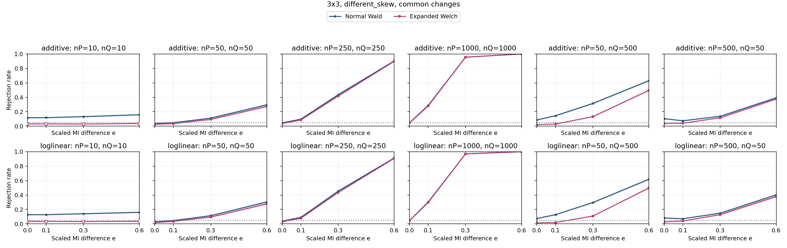

| Specification | Setting |
| --- | --- |
| Table shape | 3x3 |
| Horizontal graph regime specifications (columns) | (nP,nQ)={(10,10),(50,50),(250,250),(1000,1000),(50,500),(500,50)} |
| Vertical graph regime specifications (rows) | Top: additive probability changes; bottom: ordinal log-linear control. Each panel plots both Wald and Expanded Welch. |
| Fixed margins for both constructors | P: row 1 and column 1 each have probability 0.7, every other row/column 0.3/2; Q: row 1 and column 1 each have probability 0.8, every other row/column 0.2/2 |
| Additive direction in P and Q | Rows 1,2 and columns 1,2: add t to the block diagonal, subtract t off diagonal |
| Log-linear direction in P and Q | Products of equally spaced row/column scores from -1 to 1; ordinal in both populations |
| MI settings | M=0.24143 nats; I(P)=0.048286 nats; I(Q)=I(P)+eM; e={0,0.1,0.3,0.6} |
| Axes | e from 0 to 0.6; rejection rate from 0 to 1 |
| Replicates | 10,000 per point |

Every plotted rate, validity and minimum expected count

| Construction | nP | nQ | e | MI difference | Method | Rejection | 95% low | 95% high | Valid | Conditional rejection | Min expected P | Min expected Q |
| --- | --- | --- | --- | --- | --- | --- | --- | --- | --- | --- | --- | --- |
| additive | 10 | 10 | 0 | 0 | expanded_welch | 0.032 | 0.02873 | 0.03563 | 0.7798 | 0.04104 | 0.225 | 0.1 |
| additive | 10 | 10 | 0 | 0 | normal_wald | 0.1177 | 0.1115 | 0.1242 | 0.9903 | 0.1189 | 0.225 | 0.1 |
| additive | 10 | 10 | 0.1 | 0.02414 | expanded_welch | 0.0321 | 0.02882 | 0.03574 | 0.7754 | 0.0414 | 0.225 | 0.1 |
| additive | 10 | 10 | 0.1 | 0.02414 | normal_wald | 0.1184 | 0.1122 | 0.1249 | 0.9884 | 0.1198 | 0.225 | 0.1 |
| additive | 10 | 10 | 0.3 | 0.07243 | expanded_welch | 0.03 | 0.02683 | 0.03353 | 0.7733 | 0.03879 | 0.225 | 0.1 |
| additive | 10 | 10 | 0.3 | 0.07243 | normal_wald | 0.1323 | 0.1258 | 0.1391 | 0.9906 | 0.1336 | 0.225 | 0.1 |
| additive | 10 | 10 | 0.6 | 0.1449 | expanded_welch | 0.0378 | 0.03424 | 0.04172 | 0.7773 | 0.04863 | 0.225 | 0.1 |
| additive | 10 | 10 | 0.6 | 0.1449 | normal_wald | 0.1589 | 0.1519 | 0.1662 | 0.9897 | 0.1606 | 0.225 | 0.1 |
| additive | 50 | 50 | 0 | 0 | expanded_welch | 0.0267 | 0.02372 | 0.03005 | 1 | 0.0267 | 1.125 | 0.5 |
| additive | 50 | 50 | 0 | 0 | normal_wald | 0.038 | 0.03443 | 0.04193 | 1 | 0.038 | 1.125 | 0.5 |
| additive | 50 | 50 | 0.1 | 0.02414 | expanded_welch | 0.035 | 0.03157 | 0.03878 | 1 | 0.035 | 1.125 | 0.5 |
| additive | 50 | 50 | 0.1 | 0.02414 | normal_wald | 0.0486 | 0.04456 | 0.05299 | 1 | 0.0486 | 1.125 | 0.5 |
| additive | 50 | 50 | 0.3 | 0.07243 | expanded_welch | 0.0944 | 0.08882 | 0.1003 | 1 | 0.0944 | 1.125 | 0.5 |
| additive | 50 | 50 | 0.3 | 0.07243 | normal_wald | 0.1119 | 0.1059 | 0.1182 | 1 | 0.1119 | 1.125 | 0.5 |
| additive | 50 | 50 | 0.6 | 0.1449 | expanded_welch | 0.2737 | 0.265 | 0.2825 | 0.9999 | 0.2737 | 1.125 | 0.5 |
| additive | 50 | 50 | 0.6 | 0.1449 | normal_wald | 0.297 | 0.2881 | 0.306 | 1 | 0.297 | 1.125 | 0.5 |
| additive | 50 | 500 | 0 | 0 | expanded_welch | 0.023 | 0.02024 | 0.02613 | 1 | 0.023 | 1.125 | 5 |
| additive | 50 | 500 | 0 | 0 | normal_wald | 0.0866 | 0.08125 | 0.09227 | 1 | 0.0866 | 1.125 | 5 |
| additive | 50 | 500 | 0.1 | 0.02414 | expanded_welch | 0.03 | 0.02683 | 0.03353 | 1 | 0.03 | 1.125 | 5 |
| additive | 50 | 500 | 0.1 | 0.02414 | normal_wald | 0.145 | 0.1382 | 0.152 | 1 | 0.145 | 1.125 | 5 |
| additive | 50 | 500 | 0.3 | 0.07243 | expanded_welch | 0.1321 | 0.1256 | 0.1389 | 1 | 0.1321 | 1.125 | 5 |
| additive | 50 | 500 | 0.3 | 0.07243 | normal_wald | 0.3152 | 0.3062 | 0.3244 | 1 | 0.3152 | 1.125 | 5 |
| additive | 50 | 500 | 0.6 | 0.1449 | expanded_welch | 0.497 | 0.4872 | 0.5068 | 1 | 0.497 | 1.125 | 5 |
| additive | 50 | 500 | 0.6 | 0.1449 | normal_wald | 0.6302 | 0.6207 | 0.6396 | 1 | 0.6302 | 1.125 | 5 |
| additive | 250 | 250 | 0 | 0 | expanded_welch | 0.0376 | 0.03405 | 0.04151 | 1 | 0.0376 | 5.625 | 2.5 |
| additive | 250 | 250 | 0 | 0 | normal_wald | 0.0463 | 0.04235 | 0.0506 | 1 | 0.0463 | 5.625 | 2.5 |
| additive | 250 | 250 | 0.1 | 0.02414 | expanded_welch | 0.0865 | 0.08115 | 0.09217 | 1 | 0.0865 | 5.625 | 2.5 |
| additive | 250 | 250 | 0.1 | 0.02414 | normal_wald | 0.0974 | 0.09174 | 0.1034 | 1 | 0.0974 | 5.625 | 2.5 |
| additive | 250 | 250 | 0.3 | 0.07243 | expanded_welch | 0.4181 | 0.4085 | 0.4278 | 1 | 0.4181 | 5.625 | 2.5 |
| additive | 250 | 250 | 0.3 | 0.07243 | normal_wald | 0.4364 | 0.4267 | 0.4461 | 1 | 0.4364 | 5.625 | 2.5 |
| additive | 250 | 250 | 0.6 | 0.1449 | expanded_welch | 0.8986 | 0.8925 | 0.9044 | 1 | 0.8986 | 5.625 | 2.5 |
| additive | 250 | 250 | 0.6 | 0.1449 | normal_wald | 0.9038 | 0.8979 | 0.9094 | 1 | 0.9038 | 5.625 | 2.5 |
| additive | 500 | 50 | 0 | 0 | expanded_welch | 0.0373 | 0.03376 | 0.0412 | 1 | 0.0373 | 11.25 | 0.5 |
| additive | 500 | 50 | 0 | 0 | normal_wald | 0.1042 | 0.09836 | 0.1103 | 1 | 0.1042 | 11.25 | 0.5 |
| additive | 500 | 50 | 0.1 | 0.02414 | expanded_welch | 0.0419 | 0.03815 | 0.04601 | 1 | 0.0419 | 11.25 | 0.5 |
| additive | 500 | 50 | 0.1 | 0.02414 | normal_wald | 0.0751 | 0.0701 | 0.08043 | 1 | 0.0751 | 11.25 | 0.5 |
| additive | 500 | 50 | 0.3 | 0.07243 | expanded_welch | 0.1164 | 0.1103 | 0.1228 | 0.9999 | 0.1164 | 11.25 | 0.5 |
| additive | 500 | 50 | 0.3 | 0.07243 | normal_wald | 0.1373 | 0.1307 | 0.1442 | 1 | 0.1373 | 11.25 | 0.5 |
| additive | 500 | 50 | 0.6 | 0.1449 | expanded_welch | 0.3778 | 0.3683 | 0.3873 | 0.9999 | 0.3778 | 11.25 | 0.5 |
| additive | 500 | 50 | 0.6 | 0.1449 | normal_wald | 0.3937 | 0.3842 | 0.4033 | 1 | 0.3937 | 11.25 | 0.5 |
| additive | 1000 | 1000 | 0 | 0 | expanded_welch | 0.046 | 0.04207 | 0.05028 | 1 | 0.046 | 22.5 | 10 |
| additive | 1000 | 1000 | 0 | 0 | normal_wald | 0.0486 | 0.04456 | 0.05299 | 1 | 0.0486 | 22.5 | 10 |
| additive | 1000 | 1000 | 0.1 | 0.02414 | expanded_welch | 0.2807 | 0.272 | 0.2896 | 1 | 0.2807 | 22.5 | 10 |
| additive | 1000 | 1000 | 0.1 | 0.02414 | normal_wald | 0.2874 | 0.2786 | 0.2964 | 1 | 0.2874 | 22.5 | 10 |
| additive | 1000 | 1000 | 0.3 | 0.07243 | expanded_welch | 0.9557 | 0.9515 | 0.9596 | 1 | 0.9557 | 22.5 | 10 |
| additive | 1000 | 1000 | 0.3 | 0.07243 | normal_wald | 0.9567 | 0.9525 | 0.9605 | 1 | 0.9567 | 22.5 | 10 |
| additive | 1000 | 1000 | 0.6 | 0.1449 | expanded_welch | 1 | 0.9996 | 1 | 1 | 1 | 22.5 | 10 |
| additive | 1000 | 1000 | 0.6 | 0.1449 | normal_wald | 1 | 0.9996 | 1 | 1 | 1 | 22.5 | 10 |
| loglinear | 10 | 10 | 0 | 0 | expanded_welch | 0.0357 | 0.03224 | 0.03952 | 0.7831 | 0.04559 | 0.2688 | 0.1353 |
| loglinear | 10 | 10 | 0 | 0 | normal_wald | 0.1278 | 0.1214 | 0.1345 | 0.9887 | 0.1293 | 0.2688 | 0.1353 |
| loglinear | 10 | 10 | 0.1 | 0.02414 | expanded_welch | 0.0341 | 0.03072 | 0.03784 | 0.7898 | 0.04318 | 0.2688 | 0.146 |
| loglinear | 10 | 10 | 0.1 | 0.02414 | normal_wald | 0.1281 | 0.1217 | 0.1348 | 0.989 | 0.1295 | 0.2688 | 0.146 |
| loglinear | 10 | 10 | 0.3 | 0.07243 | expanded_welch | 0.0324 | 0.02911 | 0.03605 | 0.7877 | 0.04113 | 0.2688 | 0.1695 |
| loglinear | 10 | 10 | 0.3 | 0.07243 | normal_wald | 0.141 | 0.1343 | 0.148 | 0.9912 | 0.1423 | 0.2688 | 0.1695 |
| loglinear | 10 | 10 | 0.6 | 0.1449 | expanded_welch | 0.0373 | 0.03376 | 0.0412 | 0.7964 | 0.04684 | 0.2688 | 0.1119 |
| loglinear | 10 | 10 | 0.6 | 0.1449 | normal_wald | 0.161 | 0.1539 | 0.1683 | 0.9907 | 0.1625 | 0.2688 | 0.1119 |
| loglinear | 50 | 50 | 0 | 0 | expanded_welch | 0.0193 | 0.01678 | 0.02219 | 1 | 0.0193 | 1.344 | 0.6765 |
| loglinear | 50 | 50 | 0 | 0 | normal_wald | 0.0292 | 0.02608 | 0.03269 | 1 | 0.0292 | 1.344 | 0.6765 |
| loglinear | 50 | 50 | 0.1 | 0.02414 | expanded_welch | 0.0353 | 0.03186 | 0.0391 | 1 | 0.0353 | 1.344 | 0.7302 |
| loglinear | 50 | 50 | 0.1 | 0.02414 | normal_wald | 0.0466 | 0.04264 | 0.05091 | 1 | 0.0466 | 1.344 | 0.7302 |
| loglinear | 50 | 50 | 0.3 | 0.07243 | expanded_welch | 0.0951 | 0.0895 | 0.101 | 1 | 0.0951 | 1.344 | 0.8476 |
| loglinear | 50 | 50 | 0.3 | 0.07243 | normal_wald | 0.1146 | 0.1085 | 0.121 | 1 | 0.1146 | 1.344 | 0.8476 |
| loglinear | 50 | 50 | 0.6 | 0.1449 | expanded_welch | 0.2778 | 0.2691 | 0.2867 | 1 | 0.2778 | 1.344 | 0.5593 |
| loglinear | 50 | 50 | 0.6 | 0.1449 | normal_wald | 0.3047 | 0.2958 | 0.3138 | 1 | 0.3047 | 1.344 | 0.5593 |
| loglinear | 50 | 500 | 0 | 0 | expanded_welch | 0.0164 | 0.01409 | 0.01908 | 1 | 0.0164 | 1.344 | 6.765 |
| loglinear | 50 | 500 | 0 | 0 | normal_wald | 0.0751 | 0.0701 | 0.08043 | 1 | 0.0751 | 1.344 | 6.765 |
| loglinear | 50 | 500 | 0.1 | 0.02414 | expanded_welch | 0.02 | 0.01743 | 0.02293 | 1 | 0.02 | 1.344 | 7.302 |
| loglinear | 50 | 500 | 0.1 | 0.02414 | normal_wald | 0.1286 | 0.1222 | 0.1353 | 1 | 0.1286 | 1.344 | 7.302 |
| loglinear | 50 | 500 | 0.3 | 0.07243 | expanded_welch | 0.1089 | 0.1029 | 0.1152 | 1 | 0.1089 | 1.344 | 8.476 |
| loglinear | 50 | 500 | 0.3 | 0.07243 | normal_wald | 0.2965 | 0.2876 | 0.3055 | 1 | 0.2965 | 1.344 | 8.476 |
| loglinear | 50 | 500 | 0.6 | 0.1449 | expanded_welch | 0.4979 | 0.4881 | 0.5077 | 1 | 0.4979 | 1.344 | 5.593 |
| loglinear | 50 | 500 | 0.6 | 0.1449 | normal_wald | 0.6189 | 0.6093 | 0.6284 | 1 | 0.6189 | 1.344 | 5.593 |
| loglinear | 250 | 250 | 0 | 0 | expanded_welch | 0.0316 | 0.02835 | 0.03521 | 1 | 0.0316 | 6.72 | 3.383 |
| loglinear | 250 | 250 | 0 | 0 | normal_wald | 0.0397 | 0.03605 | 0.04371 | 1 | 0.0397 | 6.72 | 3.383 |
| loglinear | 250 | 250 | 0.1 | 0.02414 | expanded_welch | 0.0784 | 0.07329 | 0.08383 | 1 | 0.0784 | 6.72 | 3.651 |
| loglinear | 250 | 250 | 0.1 | 0.02414 | normal_wald | 0.0907 | 0.08523 | 0.09649 | 1 | 0.0907 | 6.72 | 3.651 |
| loglinear | 250 | 250 | 0.3 | 0.07243 | expanded_welch | 0.4357 | 0.426 | 0.4454 | 1 | 0.4357 | 6.72 | 4.238 |
| loglinear | 250 | 250 | 0.3 | 0.07243 | normal_wald | 0.4542 | 0.4445 | 0.464 | 1 | 0.4542 | 6.72 | 4.238 |
| loglinear | 250 | 250 | 0.6 | 0.1449 | expanded_welch | 0.9084 | 0.9026 | 0.9139 | 1 | 0.9084 | 6.72 | 2.796 |
| loglinear | 250 | 250 | 0.6 | 0.1449 | normal_wald | 0.9135 | 0.9078 | 0.9189 | 1 | 0.9135 | 6.72 | 2.796 |
| loglinear | 500 | 50 | 0 | 0 | expanded_welch | 0.028 | 0.02494 | 0.03142 | 1 | 0.028 | 13.44 | 0.6765 |
| loglinear | 500 | 50 | 0 | 0 | normal_wald | 0.0821 | 0.07688 | 0.08764 | 1 | 0.0821 | 13.44 | 0.6765 |
| loglinear | 500 | 50 | 0.1 | 0.02414 | expanded_welch | 0.0406 | 0.0369 | 0.04465 | 1 | 0.0406 | 13.44 | 0.7302 |
| loglinear | 500 | 50 | 0.1 | 0.02414 | normal_wald | 0.072 | 0.0671 | 0.07723 | 1 | 0.072 | 13.44 | 0.7302 |
| loglinear | 500 | 50 | 0.3 | 0.07243 | expanded_welch | 0.1284 | 0.122 | 0.1351 | 1 | 0.1284 | 13.44 | 0.8476 |
| loglinear | 500 | 50 | 0.3 | 0.07243 | normal_wald | 0.1489 | 0.1421 | 0.156 | 1 | 0.1489 | 13.44 | 0.8476 |
| loglinear | 500 | 50 | 0.6 | 0.1449 | expanded_welch | 0.3795 | 0.37 | 0.3891 | 1 | 0.3795 | 13.44 | 0.5593 |
| loglinear | 500 | 50 | 0.6 | 0.1449 | normal_wald | 0.4032 | 0.3936 | 0.4128 | 1 | 0.4032 | 13.44 | 0.5593 |
| loglinear | 1000 | 1000 | 0 | 0 | expanded_welch | 0.0446 | 0.04073 | 0.04882 | 1 | 0.0446 | 26.88 | 13.53 |
| loglinear | 1000 | 1000 | 0 | 0 | normal_wald | 0.0472 | 0.04321 | 0.05153 | 1 | 0.0472 | 26.88 | 13.53 |
| loglinear | 1000 | 1000 | 0.1 | 0.02414 | expanded_welch | 0.2982 | 0.2893 | 0.3072 | 1 | 0.2982 | 26.88 | 14.6 |
| loglinear | 1000 | 1000 | 0.1 | 0.02414 | normal_wald | 0.3035 | 0.2946 | 0.3126 | 1 | 0.3035 | 26.88 | 14.6 |
| loglinear | 1000 | 1000 | 0.3 | 0.07243 | expanded_welch | 0.9698 | 0.9663 | 0.973 | 1 | 0.9698 | 26.88 | 16.95 |
| loglinear | 1000 | 1000 | 0.3 | 0.07243 | normal_wald | 0.9711 | 0.9676 | 0.9742 | 1 | 0.9711 | 26.88 | 16.95 |
| loglinear | 1000 | 1000 | 0.6 | 0.1449 | expanded_welch | 1 | 0.9996 | 1 | 1 | 1 | 26.88 | 11.19 |
| loglinear | 1000 | 1000 | 0.6 | 0.1449 | normal_wald | 1 | 0.9996 | 1 | 1 | 1 | 26.88 | 11.19 |

### 3.7. 3x3: different_skew, rare

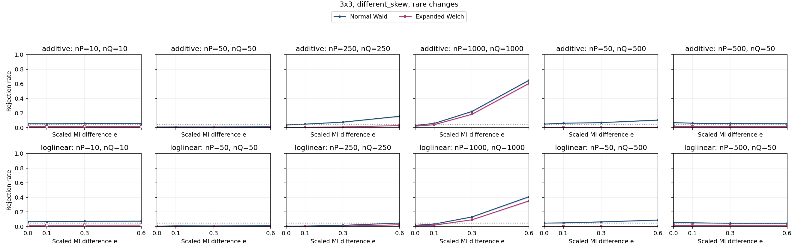

| Specification | Setting |
| --- | --- |
| Table shape | 3x3 |
| Horizontal graph regime specifications (columns) | (nP,nQ)={(10,10),(50,50),(250,250),(1000,1000),(50,500),(500,50)} |
| Vertical graph regime specifications (rows) | Top: additive probability changes; bottom: ordinal log-linear control. Each panel plots both Wald and Expanded Welch. |
| Fixed margins for both constructors | P: row 1 and column 1 each have probability 0.7, every other row/column 0.3/2; Q: row 1 and column 1 each have probability 0.8, every other row/column 0.2/2 |
| Additive direction in P and Q | Rows 2,3 and columns 2,3: add t to the block diagonal, subtract t off diagonal |
| Log-linear direction in P and Q | Products of equally spaced row/column scores from -1 to 1; ordinal in both populations |
| MI settings | M=0.02305 nats; I(P)=0.0046099 nats; I(Q)=I(P)+eM; e={0,0.1,0.3,0.6} |
| Axes | e from 0 to 0.6; rejection rate from 0 to 1 |
| Replicates | 10,000 per point |

Every plotted rate, validity and minimum expected count

| Construction | nP | nQ | e | MI difference | Method | Rejection | 95% low | 95% high | Valid | Conditional rejection | Min expected P | Min expected Q |
| --- | --- | --- | --- | --- | --- | --- | --- | --- | --- | --- | --- | --- |
| additive | 10 | 10 | 0 | 0 | expanded_welch | 0.0145 | 0.01234 | 0.01704 | 0.7831 | 0.01852 | 0.1536 | 0.05294 |
| additive | 10 | 10 | 0 | 0 | normal_wald | 0.0545 | 0.05022 | 0.05912 | 0.9891 | 0.0551 | 0.1536 | 0.05294 |
| additive | 10 | 10 | 0.1 | 0.002305 | expanded_welch | 0.0153 | 0.01307 | 0.0179 | 0.7715 | 0.01983 | 0.1536 | 0.04296 |
| additive | 10 | 10 | 0.1 | 0.002305 | normal_wald | 0.0526 | 0.04839 | 0.05715 | 0.9861 | 0.05334 | 0.1536 | 0.04296 |
| additive | 10 | 10 | 0.3 | 0.006915 | expanded_welch | 0.0166 | 0.01428 | 0.0193 | 0.7847 | 0.02115 | 0.1536 | 0.02801 |
| additive | 10 | 10 | 0.3 | 0.006915 | normal_wald | 0.0575 | 0.0531 | 0.06223 | 0.9882 | 0.05819 | 0.1536 | 0.02801 |
| additive | 10 | 10 | 0.6 | 0.01383 | expanded_welch | 0.0153 | 0.01307 | 0.0179 | 0.7807 | 0.0196 | 0.1536 | 0.01238 |
| additive | 10 | 10 | 0.6 | 0.01383 | normal_wald | 0.0561 | 0.05176 | 0.06078 | 0.9869 | 0.05684 | 0.1536 | 0.01238 |
| additive | 50 | 50 | 0 | 0 | expanded_welch | 0.0019 | 0.001217 | 0.002966 | 0.9999 | 0.0019 | 0.768 | 0.2647 |
| additive | 50 | 50 | 0 | 0 | normal_wald | 0.01 | 0.008229 | 0.01215 | 1 | 0.01 | 0.768 | 0.2647 |
| additive | 50 | 50 | 0.1 | 0.002305 | expanded_welch | 0.0016 | 0.0009851 | 0.002598 | 1 | 0.0016 | 0.768 | 0.2148 |
| additive | 50 | 50 | 0.1 | 0.002305 | normal_wald | 0.0106 | 0.008772 | 0.0128 | 1 | 0.0106 | 0.768 | 0.2148 |
| additive | 50 | 50 | 0.3 | 0.006915 | expanded_welch | 0.0023 | 0.001533 | 0.003449 | 1 | 0.0023 | 0.768 | 0.14 |
| additive | 50 | 50 | 0.3 | 0.006915 | normal_wald | 0.0104 | 0.008591 | 0.01258 | 1 | 0.0104 | 0.768 | 0.14 |
| additive | 50 | 50 | 0.6 | 0.01383 | expanded_welch | 0.0027 | 0.001856 | 0.003926 | 1 | 0.0027 | 0.768 | 0.0619 |
| additive | 50 | 50 | 0.6 | 0.01383 | normal_wald | 0.0124 | 0.01041 | 0.01476 | 1 | 0.0124 | 0.768 | 0.0619 |
| additive | 50 | 500 | 0 | 0 | expanded_welch | 0.0026 | 0.001775 | 0.003807 | 1 | 0.0026 | 0.768 | 2.647 |
| additive | 50 | 500 | 0 | 0 | normal_wald | 0.0493 | 0.04523 | 0.05372 | 1 | 0.0493 | 0.768 | 2.647 |
| additive | 50 | 500 | 0.1 | 0.002305 | expanded_welch | 0.0025 | 0.001694 | 0.003688 | 1 | 0.0025 | 0.768 | 2.148 |
| additive | 50 | 500 | 0.1 | 0.002305 | normal_wald | 0.0615 | 0.05696 | 0.06638 | 1 | 0.0615 | 0.768 | 2.148 |
| additive | 50 | 500 | 0.3 | 0.006915 | expanded_welch | 0.0021 | 0.001374 | 0.003208 | 1 | 0.0021 | 0.768 | 1.4 |
| additive | 50 | 500 | 0.3 | 0.006915 | normal_wald | 0.0697 | 0.06487 | 0.07486 | 1 | 0.0697 | 0.768 | 1.4 |
| additive | 50 | 500 | 0.6 | 0.01383 | expanded_welch | 0.0028 | 0.001938 | 0.004044 | 1 | 0.0028 | 0.768 | 0.619 |
| additive | 50 | 500 | 0.6 | 0.01383 | normal_wald | 0.1042 | 0.09836 | 0.1103 | 1 | 0.1042 | 0.768 | 0.619 |
| additive | 250 | 250 | 0 | 0 | expanded_welch | 0.008 | 0.006433 | 0.009945 | 1 | 0.008 | 3.84 | 1.323 |
| additive | 250 | 250 | 0 | 0 | normal_wald | 0.0378 | 0.03424 | 0.04172 | 1 | 0.0378 | 3.84 | 1.323 |
| additive | 250 | 250 | 0.1 | 0.002305 | expanded_welch | 0.0079 | 0.006344 | 0.009834 | 1 | 0.0079 | 3.84 | 1.074 |
| additive | 250 | 250 | 0.1 | 0.002305 | normal_wald | 0.0489 | 0.04484 | 0.0533 | 1 | 0.0489 | 3.84 | 1.074 |
| additive | 250 | 250 | 0.3 | 0.006915 | expanded_welch | 0.0106 | 0.008772 | 0.0128 | 1 | 0.0106 | 3.84 | 0.7002 |
| additive | 250 | 250 | 0.3 | 0.006915 | normal_wald | 0.0766 | 0.07155 | 0.08198 | 1 | 0.0766 | 3.84 | 0.7002 |
| additive | 250 | 250 | 0.6 | 0.01383 | expanded_welch | 0.029 | 0.02589 | 0.03247 | 1 | 0.029 | 3.84 | 0.3095 |
| additive | 250 | 250 | 0.6 | 0.01383 | normal_wald | 0.1564 | 0.1494 | 0.1637 | 1 | 0.1564 | 3.84 | 0.3095 |
| additive | 500 | 50 | 0 | 0 | expanded_welch | 0.0208 | 0.01818 | 0.02379 | 1 | 0.0208 | 7.68 | 0.2647 |
| additive | 500 | 50 | 0 | 0 | normal_wald | 0.0697 | 0.06487 | 0.07486 | 1 | 0.0697 | 7.68 | 0.2647 |
| additive | 500 | 50 | 0.1 | 0.002305 | expanded_welch | 0.0178 | 0.01539 | 0.02058 | 1 | 0.0178 | 7.68 | 0.2148 |
| additive | 500 | 50 | 0.1 | 0.002305 | normal_wald | 0.0617 | 0.05715 | 0.06659 | 1 | 0.0617 | 7.68 | 0.2148 |
| additive | 500 | 50 | 0.3 | 0.006915 | expanded_welch | 0.0164 | 0.01409 | 0.01908 | 0.9999 | 0.0164 | 7.68 | 0.14 |
| additive | 500 | 50 | 0.3 | 0.006915 | normal_wald | 0.0579 | 0.05349 | 0.06265 | 1 | 0.0579 | 7.68 | 0.14 |
| additive | 500 | 50 | 0.6 | 0.01383 | expanded_welch | 0.0199 | 0.01734 | 0.02283 | 1 | 0.0199 | 7.68 | 0.0619 |
| additive | 500 | 50 | 0.6 | 0.01383 | normal_wald | 0.0542 | 0.04993 | 0.05881 | 1 | 0.0542 | 7.68 | 0.0619 |
| additive | 1000 | 1000 | 0 | 0 | expanded_welch | 0.0208 | 0.01818 | 0.02379 | 1 | 0.0208 | 15.36 | 5.294 |
| additive | 1000 | 1000 | 0 | 0 | normal_wald | 0.0322 | 0.02892 | 0.03584 | 1 | 0.0322 | 15.36 | 5.294 |
| additive | 1000 | 1000 | 0.1 | 0.002305 | expanded_welch | 0.0413 | 0.03757 | 0.04538 | 1 | 0.0413 | 15.36 | 4.296 |
| additive | 1000 | 1000 | 0.1 | 0.002305 | normal_wald | 0.0586 | 0.05416 | 0.06338 | 1 | 0.0586 | 15.36 | 4.296 |
| additive | 1000 | 1000 | 0.3 | 0.006915 | expanded_welch | 0.1845 | 0.177 | 0.1922 | 1 | 0.1845 | 15.36 | 2.801 |
| additive | 1000 | 1000 | 0.3 | 0.006915 | normal_wald | 0.2228 | 0.2148 | 0.2311 | 1 | 0.2228 | 15.36 | 2.801 |
| additive | 1000 | 1000 | 0.6 | 0.01383 | expanded_welch | 0.6049 | 0.5953 | 0.6144 | 1 | 0.6049 | 15.36 | 1.238 |
| additive | 1000 | 1000 | 0.6 | 0.01383 | normal_wald | 0.6483 | 0.6389 | 0.6576 | 1 | 0.6483 | 15.36 | 1.238 |
| loglinear | 10 | 10 | 0 | 0 | expanded_welch | 0.0179 | 0.01548 | 0.02069 | 0.7853 | 0.02279 | 0.2368 | 0.1106 |
| loglinear | 10 | 10 | 0 | 0 | normal_wald | 0.0677 | 0.06294 | 0.07279 | 0.9878 | 0.06854 | 0.2368 | 0.1106 |
| loglinear | 10 | 10 | 0.1 | 0.002305 | expanded_welch | 0.0197 | 0.01716 | 0.02261 | 0.7822 | 0.02519 | 0.2368 | 0.1129 |
| loglinear | 10 | 10 | 0.1 | 0.002305 | normal_wald | 0.0691 | 0.06429 | 0.07424 | 0.9879 | 0.06995 | 0.2368 | 0.1129 |
| loglinear | 10 | 10 | 0.3 | 0.006915 | expanded_welch | 0.0201 | 0.01753 | 0.02304 | 0.7761 | 0.0259 | 0.2368 | 0.1165 |
| loglinear | 10 | 10 | 0.3 | 0.006915 | normal_wald | 0.0735 | 0.06855 | 0.07878 | 0.9879 | 0.0744 | 0.2368 | 0.1165 |
| loglinear | 10 | 10 | 0.6 | 0.01383 | expanded_welch | 0.0209 | 0.01827 | 0.02389 | 0.7796 | 0.02681 | 0.2368 | 0.1208 |
| loglinear | 10 | 10 | 0.6 | 0.01383 | normal_wald | 0.0747 | 0.06971 | 0.08002 | 0.9879 | 0.07561 | 0.2368 | 0.1208 |
| loglinear | 50 | 50 | 0 | 0 | expanded_welch | 0.0025 | 0.001694 | 0.003688 | 1 | 0.0025 | 1.184 | 0.5529 |
| loglinear | 50 | 50 | 0 | 0 | normal_wald | 0.0066 | 0.005191 | 0.008387 | 1 | 0.0066 | 1.184 | 0.5529 |
| loglinear | 50 | 50 | 0.1 | 0.002305 | expanded_welch | 0.0039 | 0.002854 | 0.005327 | 1 | 0.0039 | 1.184 | 0.5643 |
| loglinear | 50 | 50 | 0.1 | 0.002305 | normal_wald | 0.0112 | 0.009317 | 0.01346 | 1 | 0.0112 | 1.184 | 0.5643 |
| loglinear | 50 | 50 | 0.3 | 0.006915 | expanded_welch | 0.0039 | 0.002854 | 0.005327 | 0.9999 | 0.0039 | 1.184 | 0.5823 |
| loglinear | 50 | 50 | 0.3 | 0.006915 | normal_wald | 0.0101 | 0.00832 | 0.01226 | 1 | 0.0101 | 1.184 | 0.5823 |
| loglinear | 50 | 50 | 0.6 | 0.01383 | expanded_welch | 0.006 | 0.004665 | 0.007715 | 1 | 0.006 | 1.184 | 0.6039 |
| loglinear | 50 | 50 | 0.6 | 0.01383 | normal_wald | 0.0123 | 0.01032 | 0.01466 | 1 | 0.0123 | 1.184 | 0.6039 |
| loglinear | 50 | 500 | 0 | 0 | expanded_welch | 0.0024 | 0.001613 | 0.003569 | 1 | 0.0024 | 1.184 | 5.529 |
| loglinear | 50 | 500 | 0 | 0 | normal_wald | 0.0485 | 0.04446 | 0.05289 | 1 | 0.0485 | 1.184 | 5.529 |
| loglinear | 50 | 500 | 0.1 | 0.002305 | expanded_welch | 0.0029 | 0.00202 | 0.004162 | 1 | 0.0029 | 1.184 | 5.643 |
| loglinear | 50 | 500 | 0.1 | 0.002305 | normal_wald | 0.0514 | 0.04724 | 0.0559 | 1 | 0.0514 | 1.184 | 5.643 |
| loglinear | 50 | 500 | 0.3 | 0.006915 | expanded_welch | 0.0027 | 0.001856 | 0.003926 | 1 | 0.0027 | 1.184 | 5.823 |
| loglinear | 50 | 500 | 0.3 | 0.006915 | normal_wald | 0.0648 | 0.06014 | 0.06979 | 1 | 0.0648 | 1.184 | 5.823 |
| loglinear | 50 | 500 | 0.6 | 0.01383 | expanded_welch | 0.0022 | 0.001453 | 0.003329 | 1 | 0.0022 | 1.184 | 6.039 |
| loglinear | 50 | 500 | 0.6 | 0.01383 | normal_wald | 0.0895 | 0.08406 | 0.09525 | 1 | 0.0895 | 1.184 | 6.039 |
| loglinear | 250 | 250 | 0 | 0 | expanded_welch | 0.0017 | 0.001062 | 0.002721 | 1 | 0.0017 | 5.921 | 2.765 |
| loglinear | 250 | 250 | 0 | 0 | normal_wald | 0.0068 | 0.005368 | 0.008611 | 1 | 0.0068 | 5.921 | 2.765 |
| loglinear | 250 | 250 | 0.1 | 0.002305 | expanded_welch | 0.0025 | 0.001694 | 0.003688 | 1 | 0.0025 | 5.921 | 2.821 |
| loglinear | 250 | 250 | 0.1 | 0.002305 | normal_wald | 0.0086 | 0.006969 | 0.01061 | 1 | 0.0086 | 5.921 | 2.821 |
| loglinear | 250 | 250 | 0.3 | 0.006915 | expanded_welch | 0.0072 | 0.005722 | 0.009057 | 1 | 0.0072 | 5.921 | 2.911 |
| loglinear | 250 | 250 | 0.3 | 0.006915 | normal_wald | 0.0177 | 0.01529 | 0.02048 | 1 | 0.0177 | 5.921 | 2.911 |
| loglinear | 250 | 250 | 0.6 | 0.01383 | expanded_welch | 0.0252 | 0.02231 | 0.02846 | 1 | 0.0252 | 5.921 | 3.02 |
| loglinear | 250 | 250 | 0.6 | 0.01383 | normal_wald | 0.0487 | 0.04465 | 0.05309 | 1 | 0.0487 | 5.921 | 3.02 |
| loglinear | 500 | 50 | 0 | 0 | expanded_welch | 0.0148 | 0.01261 | 0.01736 | 1 | 0.0148 | 11.84 | 0.5529 |
| loglinear | 500 | 50 | 0 | 0 | normal_wald | 0.0538 | 0.04955 | 0.0584 | 1 | 0.0538 | 11.84 | 0.5529 |
| loglinear | 500 | 50 | 0.1 | 0.002305 | expanded_welch | 0.0151 | 0.01289 | 0.01768 | 1 | 0.0151 | 11.84 | 0.5643 |
| loglinear | 500 | 50 | 0.1 | 0.002305 | normal_wald | 0.0526 | 0.04839 | 0.05715 | 1 | 0.0526 | 11.84 | 0.5643 |
| loglinear | 500 | 50 | 0.3 | 0.006915 | expanded_welch | 0.0168 | 0.01446 | 0.01951 | 1 | 0.0168 | 11.84 | 0.5823 |
| loglinear | 500 | 50 | 0.3 | 0.006915 | normal_wald | 0.0452 | 0.0413 | 0.04945 | 1 | 0.0452 | 11.84 | 0.5823 |
| loglinear | 500 | 50 | 0.6 | 0.01383 | expanded_welch | 0.0192 | 0.01669 | 0.02208 | 1 | 0.0192 | 11.84 | 0.6039 |
| loglinear | 500 | 50 | 0.6 | 0.01383 | normal_wald | 0.0455 | 0.04159 | 0.04976 | 1 | 0.0455 | 11.84 | 0.6039 |
| loglinear | 1000 | 1000 | 0 | 0 | expanded_welch | 0.0093 | 0.007598 | 0.01138 | 1 | 0.0093 | 23.68 | 11.06 |
| loglinear | 1000 | 1000 | 0 | 0 | normal_wald | 0.0187 | 0.01622 | 0.02155 | 1 | 0.0187 | 23.68 | 11.06 |
| loglinear | 1000 | 1000 | 0.1 | 0.002305 | expanded_welch | 0.0199 | 0.01734 | 0.02283 | 1 | 0.0199 | 23.68 | 11.29 |
| loglinear | 1000 | 1000 | 0.1 | 0.002305 | normal_wald | 0.035 | 0.03157 | 0.03878 | 1 | 0.035 | 23.68 | 11.29 |
| loglinear | 1000 | 1000 | 0.3 | 0.006915 | expanded_welch | 0.0938 | 0.08824 | 0.09967 | 1 | 0.0938 | 23.68 | 11.65 |
| loglinear | 1000 | 1000 | 0.3 | 0.006915 | normal_wald | 0.1327 | 0.1262 | 0.1395 | 1 | 0.1327 | 23.68 | 11.65 |
| loglinear | 1000 | 1000 | 0.6 | 0.01383 | expanded_welch | 0.3515 | 0.3422 | 0.3609 | 1 | 0.3515 | 23.68 | 12.08 |
| loglinear | 1000 | 1000 | 0.6 | 0.01383 | normal_wald | 0.4084 | 0.3988 | 0.4181 | 1 | 0.4084 | 23.68 | 12.08 |

### 3.8. 3x3: different_skew, spread

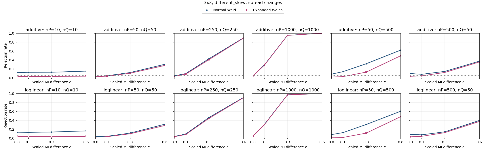

| Specification | Setting |
| --- | --- |
| Table shape | 3x3 |
| Horizontal graph regime specifications (columns) | (nP,nQ)={(10,10),(50,50),(250,250),(1000,1000),(50,500),(500,50)} |
| Vertical graph regime specifications (rows) | Top: additive probability changes; bottom: ordinal log-linear control. Each panel plots both Wald and Expanded Welch. |
| Fixed margins for both constructors | P: row 1 and column 1 each have probability 0.7, every other row/column 0.3/2; Q: row 1 and column 1 each have probability 0.8, every other row/column 0.2/2 |
| Additive direction in P and Q | H=ss^T, s=[-1.0, 0.0, 1.0] (equally spaced scores; displayed rounded) |
| Log-linear direction in P and Q | Products of equally spaced row/column scores from -1 to 1; ordinal in both populations |
| MI settings | M=0.24143 nats; I(P)=0.048286 nats; I(Q)=I(P)+eM; e={0,0.1,0.3,0.6} |
| Axes | e from 0 to 0.6; rejection rate from 0 to 1 |
| Replicates | 10,000 per point |

Every plotted rate, validity and minimum expected count

| Construction | nP | nQ | e | MI difference | Method | Rejection | 95% low | 95% high | Valid | Conditional rejection | Min expected P | Min expected Q |
| --- | --- | --- | --- | --- | --- | --- | --- | --- | --- | --- | --- | --- |
| additive | 10 | 10 | 0 | 0 | expanded_welch | 0.0319 | 0.02863 | 0.03553 | 0.7811 | 0.04084 | 0.225 | 0.1 |
| additive | 10 | 10 | 0 | 0 | normal_wald | 0.117 | 0.1108 | 0.1234 | 0.9913 | 0.118 | 0.225 | 0.1 |
| additive | 10 | 10 | 0.1 | 0.02414 | expanded_welch | 0.0321 | 0.02882 | 0.03574 | 0.7865 | 0.04081 | 0.225 | 0.1 |
| additive | 10 | 10 | 0.1 | 0.02414 | normal_wald | 0.1249 | 0.1186 | 0.1315 | 0.9916 | 0.126 | 0.225 | 0.1 |
| additive | 10 | 10 | 0.3 | 0.07243 | expanded_welch | 0.032 | 0.02873 | 0.03563 | 0.7854 | 0.04074 | 0.225 | 0.1 |
| additive | 10 | 10 | 0.3 | 0.07243 | normal_wald | 0.1266 | 0.1202 | 0.1333 | 0.9897 | 0.1279 | 0.225 | 0.1 |
| additive | 10 | 10 | 0.6 | 0.1449 | expanded_welch | 0.0372 | 0.03366 | 0.04109 | 0.7866 | 0.04729 | 0.225 | 0.1 |
| additive | 10 | 10 | 0.6 | 0.1449 | normal_wald | 0.151 | 0.1441 | 0.1582 | 0.9894 | 0.1526 | 0.225 | 0.1 |
| additive | 50 | 50 | 0 | 0 | expanded_welch | 0.0255 | 0.02259 | 0.02878 | 1 | 0.0255 | 1.125 | 0.5 |
| additive | 50 | 50 | 0 | 0 | normal_wald | 0.0373 | 0.03376 | 0.0412 | 1 | 0.0373 | 1.125 | 0.5 |
| additive | 50 | 50 | 0.1 | 0.02414 | expanded_welch | 0.038 | 0.03443 | 0.04193 | 0.9998 | 0.03801 | 1.125 | 0.5 |
| additive | 50 | 50 | 0.1 | 0.02414 | normal_wald | 0.0482 | 0.04417 | 0.05257 | 1 | 0.0482 | 1.125 | 0.5 |
| additive | 50 | 50 | 0.3 | 0.07243 | expanded_welch | 0.104 | 0.09817 | 0.1101 | 1 | 0.104 | 1.125 | 0.5 |
| additive | 50 | 50 | 0.3 | 0.07243 | normal_wald | 0.1201 | 0.1139 | 0.1266 | 1 | 0.1201 | 1.125 | 0.5 |
| additive | 50 | 50 | 0.6 | 0.1449 | expanded_welch | 0.2792 | 0.2705 | 0.2881 | 0.9998 | 0.2793 | 1.125 | 0.5 |
| additive | 50 | 50 | 0.6 | 0.1449 | normal_wald | 0.3046 | 0.2957 | 0.3137 | 1 | 0.3046 | 1.125 | 0.5 |
| additive | 50 | 500 | 0 | 0 | expanded_welch | 0.0191 | 0.0166 | 0.02197 | 1 | 0.0191 | 1.125 | 5 |
| additive | 50 | 500 | 0 | 0 | normal_wald | 0.0834 | 0.07814 | 0.08898 | 1 | 0.0834 | 1.125 | 5 |
| additive | 50 | 500 | 0.1 | 0.02414 | expanded_welch | 0.0283 | 0.02523 | 0.03174 | 1 | 0.0283 | 1.125 | 5 |
| additive | 50 | 500 | 0.1 | 0.02414 | normal_wald | 0.1399 | 0.1332 | 0.1468 | 1 | 0.1399 | 1.125 | 5 |
| additive | 50 | 500 | 0.3 | 0.07243 | expanded_welch | 0.1286 | 0.1222 | 0.1353 | 1 | 0.1286 | 1.125 | 5 |
| additive | 50 | 500 | 0.3 | 0.07243 | normal_wald | 0.3167 | 0.3077 | 0.3259 | 1 | 0.3167 | 1.125 | 5 |
| additive | 50 | 500 | 0.6 | 0.1449 | expanded_welch | 0.4967 | 0.4869 | 0.5065 | 1 | 0.4967 | 1.125 | 5 |
| additive | 50 | 500 | 0.6 | 0.1449 | normal_wald | 0.6243 | 0.6148 | 0.6337 | 1 | 0.6243 | 1.125 | 5 |
| additive | 250 | 250 | 0 | 0 | expanded_welch | 0.0357 | 0.03224 | 0.03952 | 1 | 0.0357 | 5.625 | 2.5 |
| additive | 250 | 250 | 0 | 0 | normal_wald | 0.0447 | 0.04082 | 0.04893 | 1 | 0.0447 | 5.625 | 2.5 |
| additive | 250 | 250 | 0.1 | 0.02414 | expanded_welch | 0.0835 | 0.07824 | 0.08908 | 1 | 0.0835 | 5.625 | 2.5 |
| additive | 250 | 250 | 0.1 | 0.02414 | normal_wald | 0.0973 | 0.09165 | 0.1033 | 1 | 0.0973 | 5.625 | 2.5 |
| additive | 250 | 250 | 0.3 | 0.07243 | expanded_welch | 0.4078 | 0.3982 | 0.4175 | 1 | 0.4078 | 5.625 | 2.5 |
| additive | 250 | 250 | 0.3 | 0.07243 | normal_wald | 0.428 | 0.4183 | 0.4377 | 1 | 0.428 | 5.625 | 2.5 |
| additive | 250 | 250 | 0.6 | 0.1449 | expanded_welch | 0.8925 | 0.8863 | 0.8984 | 1 | 0.8925 | 5.625 | 2.5 |
| additive | 250 | 250 | 0.6 | 0.1449 | normal_wald | 0.8974 | 0.8913 | 0.9032 | 1 | 0.8974 | 5.625 | 2.5 |
| additive | 500 | 50 | 0 | 0 | expanded_welch | 0.0349 | 0.03148 | 0.03868 | 1 | 0.0349 | 11.25 | 0.5 |
| additive | 500 | 50 | 0 | 0 | normal_wald | 0.098 | 0.09233 | 0.104 | 1 | 0.098 | 11.25 | 0.5 |
| additive | 500 | 50 | 0.1 | 0.02414 | expanded_welch | 0.0448 | 0.04092 | 0.04903 | 1 | 0.0448 | 11.25 | 0.5 |
| additive | 500 | 50 | 0.1 | 0.02414 | normal_wald | 0.08 | 0.07484 | 0.08548 | 1 | 0.08 | 11.25 | 0.5 |
| additive | 500 | 50 | 0.3 | 0.07243 | expanded_welch | 0.1213 | 0.115 | 0.1278 | 1 | 0.1213 | 11.25 | 0.5 |
| additive | 500 | 50 | 0.3 | 0.07243 | normal_wald | 0.145 | 0.1382 | 0.152 | 1 | 0.145 | 11.25 | 0.5 |
| additive | 500 | 50 | 0.6 | 0.1449 | expanded_welch | 0.3572 | 0.3479 | 0.3666 | 1 | 0.3572 | 11.25 | 0.5 |
| additive | 500 | 50 | 0.6 | 0.1449 | normal_wald | 0.375 | 0.3656 | 0.3845 | 1 | 0.375 | 11.25 | 0.5 |
| additive | 1000 | 1000 | 0 | 0 | expanded_welch | 0.0456 | 0.04168 | 0.04987 | 1 | 0.0456 | 22.5 | 10 |
| additive | 1000 | 1000 | 0 | 0 | normal_wald | 0.0482 | 0.04417 | 0.05257 | 1 | 0.0482 | 22.5 | 10 |
| additive | 1000 | 1000 | 0.1 | 0.02414 | expanded_welch | 0.2861 | 0.2773 | 0.295 | 1 | 0.2861 | 22.5 | 10 |
| additive | 1000 | 1000 | 0.1 | 0.02414 | normal_wald | 0.2923 | 0.2835 | 0.3013 | 1 | 0.2923 | 22.5 | 10 |
| additive | 1000 | 1000 | 0.3 | 0.07243 | expanded_welch | 0.954 | 0.9497 | 0.9579 | 1 | 0.954 | 22.5 | 10 |
| additive | 1000 | 1000 | 0.3 | 0.07243 | normal_wald | 0.9556 | 0.9514 | 0.9595 | 1 | 0.9556 | 22.5 | 10 |
| additive | 1000 | 1000 | 0.6 | 0.1449 | expanded_welch | 1 | 0.9996 | 1 | 1 | 1 | 22.5 | 10 |
| additive | 1000 | 1000 | 0.6 | 0.1449 | normal_wald | 1 | 0.9996 | 1 | 1 | 1 | 22.5 | 10 |
| loglinear | 10 | 10 | 0 | 0 | expanded_welch | 0.0371 | 0.03357 | 0.04099 | 0.7802 | 0.04755 | 0.2688 | 0.1353 |
| loglinear | 10 | 10 | 0 | 0 | normal_wald | 0.1334 | 0.1269 | 0.1402 | 0.9895 | 0.1348 | 0.2688 | 0.1353 |
| loglinear | 10 | 10 | 0.1 | 0.02414 | expanded_welch | 0.0358 | 0.03233 | 0.03962 | 0.7871 | 0.04548 | 0.2688 | 0.146 |
| loglinear | 10 | 10 | 0.1 | 0.02414 | normal_wald | 0.1302 | 0.1237 | 0.1369 | 0.9902 | 0.1315 | 0.2688 | 0.146 |
| loglinear | 10 | 10 | 0.3 | 0.07243 | expanded_welch | 0.0343 | 0.03091 | 0.03805 | 0.7863 | 0.04362 | 0.2688 | 0.1695 |
| loglinear | 10 | 10 | 0.3 | 0.07243 | normal_wald | 0.1376 | 0.131 | 0.1445 | 0.9903 | 0.1389 | 0.2688 | 0.1695 |
| loglinear | 10 | 10 | 0.6 | 0.1449 | expanded_welch | 0.0404 | 0.03671 | 0.04444 | 0.7993 | 0.05054 | 0.2688 | 0.1119 |
| loglinear | 10 | 10 | 0.6 | 0.1449 | normal_wald | 0.1633 | 0.1562 | 0.1707 | 0.99 | 0.1649 | 0.2688 | 0.1119 |
| loglinear | 50 | 50 | 0 | 0 | expanded_welch | 0.0228 | 0.02005 | 0.02591 | 1 | 0.0228 | 1.344 | 0.6765 |
| loglinear | 50 | 50 | 0 | 0 | normal_wald | 0.0344 | 0.031 | 0.03815 | 1 | 0.0344 | 1.344 | 0.6765 |
| loglinear | 50 | 50 | 0.1 | 0.02414 | expanded_welch | 0.0324 | 0.02911 | 0.03605 | 1 | 0.0324 | 1.344 | 0.7302 |
| loglinear | 50 | 50 | 0.1 | 0.02414 | normal_wald | 0.0426 | 0.03881 | 0.04674 | 1 | 0.0426 | 1.344 | 0.7302 |
| loglinear | 50 | 50 | 0.3 | 0.07243 | expanded_welch | 0.0983 | 0.09262 | 0.1043 | 1 | 0.0983 | 1.344 | 0.8476 |
| loglinear | 50 | 50 | 0.3 | 0.07243 | normal_wald | 0.1144 | 0.1083 | 0.1208 | 1 | 0.1144 | 1.344 | 0.8476 |
| loglinear | 50 | 50 | 0.6 | 0.1449 | expanded_welch | 0.2856 | 0.2768 | 0.2945 | 1 | 0.2856 | 1.344 | 0.5593 |
| loglinear | 50 | 50 | 0.6 | 0.1449 | normal_wald | 0.3132 | 0.3042 | 0.3224 | 1 | 0.3132 | 1.344 | 0.5593 |
| loglinear | 50 | 500 | 0 | 0 | expanded_welch | 0.0202 | 0.01762 | 0.02315 | 1 | 0.0202 | 1.344 | 6.765 |
| loglinear | 50 | 500 | 0 | 0 | normal_wald | 0.0798 | 0.07465 | 0.08527 | 1 | 0.0798 | 1.344 | 6.765 |
| loglinear | 50 | 500 | 0.1 | 0.02414 | expanded_welch | 0.0159 | 0.01363 | 0.01854 | 1 | 0.0159 | 1.344 | 7.302 |
| loglinear | 50 | 500 | 0.1 | 0.02414 | normal_wald | 0.1253 | 0.119 | 0.1319 | 1 | 0.1253 | 1.344 | 7.302 |
| loglinear | 50 | 500 | 0.3 | 0.07243 | expanded_welch | 0.1129 | 0.1068 | 0.1193 | 1 | 0.1129 | 1.344 | 8.476 |
| loglinear | 50 | 500 | 0.3 | 0.07243 | normal_wald | 0.3066 | 0.2976 | 0.3157 | 1 | 0.3066 | 1.344 | 8.476 |
| loglinear | 50 | 500 | 0.6 | 0.1449 | expanded_welch | 0.483 | 0.4732 | 0.4928 | 1 | 0.483 | 1.344 | 5.593 |
| loglinear | 50 | 500 | 0.6 | 0.1449 | normal_wald | 0.6053 | 0.5957 | 0.6148 | 1 | 0.6053 | 1.344 | 5.593 |
| loglinear | 250 | 250 | 0 | 0 | expanded_welch | 0.0315 | 0.02825 | 0.03511 | 1 | 0.0315 | 6.72 | 3.383 |
| loglinear | 250 | 250 | 0 | 0 | normal_wald | 0.0384 | 0.03481 | 0.04235 | 1 | 0.0384 | 6.72 | 3.383 |
| loglinear | 250 | 250 | 0.1 | 0.02414 | expanded_welch | 0.0822 | 0.07698 | 0.08775 | 1 | 0.0822 | 6.72 | 3.651 |
| loglinear | 250 | 250 | 0.1 | 0.02414 | normal_wald | 0.0935 | 0.08795 | 0.09936 | 1 | 0.0935 | 6.72 | 3.651 |
| loglinear | 250 | 250 | 0.3 | 0.07243 | expanded_welch | 0.4427 | 0.433 | 0.4525 | 1 | 0.4427 | 6.72 | 4.238 |
| loglinear | 250 | 250 | 0.3 | 0.07243 | normal_wald | 0.4624 | 0.4526 | 0.4722 | 1 | 0.4624 | 6.72 | 4.238 |
| loglinear | 250 | 250 | 0.6 | 0.1449 | expanded_welch | 0.9077 | 0.9019 | 0.9132 | 1 | 0.9077 | 6.72 | 2.796 |
| loglinear | 250 | 250 | 0.6 | 0.1449 | normal_wald | 0.9131 | 0.9074 | 0.9185 | 1 | 0.9131 | 6.72 | 2.796 |
| loglinear | 500 | 50 | 0 | 0 | expanded_welch | 0.0298 | 0.02664 | 0.03332 | 0.9999 | 0.0298 | 13.44 | 0.6765 |
| loglinear | 500 | 50 | 0 | 0 | normal_wald | 0.0845 | 0.07921 | 0.09011 | 1 | 0.0845 | 13.44 | 0.6765 |
| loglinear | 500 | 50 | 0.1 | 0.02414 | expanded_welch | 0.0411 | 0.03738 | 0.04517 | 1 | 0.0411 | 13.44 | 0.7302 |
| loglinear | 500 | 50 | 0.1 | 0.02414 | normal_wald | 0.0746 | 0.06961 | 0.07991 | 1 | 0.0746 | 13.44 | 0.7302 |
| loglinear | 500 | 50 | 0.3 | 0.07243 | expanded_welch | 0.1234 | 0.1171 | 0.13 | 1 | 0.1234 | 13.44 | 0.8476 |
| loglinear | 500 | 50 | 0.3 | 0.07243 | normal_wald | 0.1425 | 0.1358 | 0.1495 | 1 | 0.1425 | 13.44 | 0.8476 |
| loglinear | 500 | 50 | 0.6 | 0.1449 | expanded_welch | 0.3753 | 0.3659 | 0.3848 | 1 | 0.3753 | 13.44 | 0.5593 |
| loglinear | 500 | 50 | 0.6 | 0.1449 | normal_wald | 0.3976 | 0.388 | 0.4072 | 1 | 0.3976 | 13.44 | 0.5593 |
| loglinear | 1000 | 1000 | 0 | 0 | expanded_welch | 0.0448 | 0.04092 | 0.04903 | 1 | 0.0448 | 26.88 | 13.53 |
| loglinear | 1000 | 1000 | 0 | 0 | normal_wald | 0.0477 | 0.04369 | 0.05205 | 1 | 0.0477 | 26.88 | 13.53 |
| loglinear | 1000 | 1000 | 0.1 | 0.02414 | expanded_welch | 0.3032 | 0.2943 | 0.3123 | 1 | 0.3032 | 26.88 | 14.6 |
| loglinear | 1000 | 1000 | 0.1 | 0.02414 | normal_wald | 0.3097 | 0.3007 | 0.3188 | 1 | 0.3097 | 26.88 | 14.6 |
| loglinear | 1000 | 1000 | 0.3 | 0.07243 | expanded_welch | 0.9727 | 0.9693 | 0.9757 | 1 | 0.9727 | 26.88 | 16.95 |
| loglinear | 1000 | 1000 | 0.3 | 0.07243 | normal_wald | 0.9739 | 0.9706 | 0.9768 | 1 | 0.9739 | 26.88 | 16.95 |
| loglinear | 1000 | 1000 | 0.6 | 0.1449 | expanded_welch | 1 | 0.9996 | 1 | 1 | 1 | 26.88 | 11.19 |
| loglinear | 1000 | 1000 | 0.6 | 0.1449 | normal_wald | 1 | 0.9996 | 1 | 1 | 1 | 26.88 | 11.19 |

### 3.9. 5x5: uniform, common

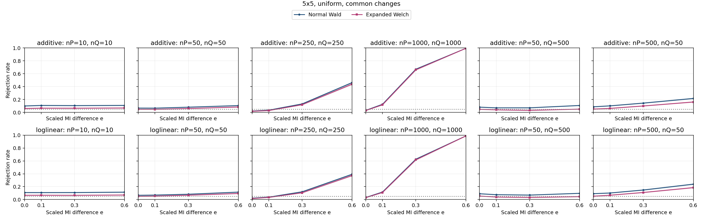

| Specification | Setting |
| --- | --- |
| Table shape | 5x5 |
| Horizontal graph regime specifications (columns) | (nP,nQ)={(10,10),(50,50),(250,250),(1000,1000),(50,500),(500,50)} |
| Vertical graph regime specifications (rows) | Top: additive probability changes; bottom: ordinal log-linear control. Each panel plots both Wald and Expanded Welch. |
| Fixed margins for both constructors | P and Q: each row and column has probability 1/5 |
| Additive direction in P and Q | Rows 1,2 and columns 1,2: add t to the block diagonal, subtract t off diagonal |
| Log-linear direction in P and Q | Products of equally spaced row/column scores from -1 to 1; ordinal in both populations |
| MI settings | M=0.092198 nats; I(P)=0.01844 nats; I(Q)=I(P)+eM; e={0,0.1,0.3,0.6} |
| Axes | e from 0 to 0.6; rejection rate from 0 to 1 |
| Replicates | 10,000 per point |

Every plotted rate, validity and minimum expected count

| Construction | nP | nQ | e | MI difference | Method | Rejection | 95% low | 95% high | Valid | Conditional rejection | Min expected P | Min expected Q |
| --- | --- | --- | --- | --- | --- | --- | --- | --- | --- | --- | --- | --- |
| additive | 10 | 10 | 0 | 0 | expanded_welch | 0.0607 | 0.05619 | 0.06555 | 0.9996 | 0.06072 | 0.2117 | 0.2117 |
| additive | 10 | 10 | 0 | 0 | normal_wald | 0.1002 | 0.09447 | 0.1062 | 1 | 0.1002 | 0.2117 | 0.2117 |
| additive | 10 | 10 | 0.1 | 0.00922 | expanded_welch | 0.0658 | 0.06111 | 0.07083 | 0.9993 | 0.06585 | 0.2117 | 0.1719 |
| additive | 10 | 10 | 0.1 | 0.00922 | normal_wald | 0.1083 | 0.1024 | 0.1145 | 1 | 0.1083 | 0.2117 | 0.1719 |
| additive | 10 | 10 | 0.3 | 0.02766 | expanded_welch | 0.0652 | 0.06053 | 0.07021 | 0.9995 | 0.06523 | 0.2117 | 0.112 |
| additive | 10 | 10 | 0.3 | 0.02766 | normal_wald | 0.1058 | 0.09992 | 0.112 | 1 | 0.1058 | 0.2117 | 0.112 |
| additive | 10 | 10 | 0.6 | 0.05532 | expanded_welch | 0.0688 | 0.064 | 0.07393 | 0.9994 | 0.06884 | 0.2117 | 0.04952 |
| additive | 10 | 10 | 0.6 | 0.05532 | normal_wald | 0.1088 | 0.1028 | 0.1151 | 1 | 0.1088 | 0.2117 | 0.04952 |
| additive | 50 | 50 | 0 | 0 | expanded_welch | 0.0479 | 0.04389 | 0.05226 | 1 | 0.0479 | 1.059 | 1.059 |
| additive | 50 | 50 | 0 | 0 | normal_wald | 0.0671 | 0.06236 | 0.07217 | 1 | 0.0671 | 1.059 | 1.059 |
| additive | 50 | 50 | 0.1 | 0.00922 | expanded_welch | 0.0475 | 0.0435 | 0.05185 | 1 | 0.0475 | 1.059 | 0.8593 |
| additive | 50 | 50 | 0.1 | 0.00922 | normal_wald | 0.0663 | 0.06159 | 0.07134 | 1 | 0.0663 | 1.059 | 0.8593 |
| additive | 50 | 50 | 0.3 | 0.02766 | expanded_welch | 0.0606 | 0.05609 | 0.06545 | 1 | 0.0606 | 1.059 | 0.5601 |
| additive | 50 | 50 | 0.3 | 0.02766 | normal_wald | 0.0813 | 0.0761 | 0.08682 | 1 | 0.0813 | 1.059 | 0.5601 |
| additive | 50 | 50 | 0.6 | 0.05532 | expanded_welch | 0.0839 | 0.07862 | 0.08949 | 1 | 0.0839 | 1.059 | 0.2476 |
| additive | 50 | 50 | 0.6 | 0.05532 | normal_wald | 0.106 | 0.1001 | 0.1122 | 1 | 0.106 | 1.059 | 0.2476 |
| additive | 50 | 500 | 0 | 0 | expanded_welch | 0.048 | 0.04398 | 0.05237 | 1 | 0.048 | 1.059 | 10.59 |
| additive | 50 | 500 | 0 | 0 | normal_wald | 0.0819 | 0.07668 | 0.08744 | 1 | 0.0819 | 1.059 | 10.59 |
| additive | 50 | 500 | 0.1 | 0.00922 | expanded_welch | 0.0399 | 0.03624 | 0.04392 | 1 | 0.0399 | 1.059 | 8.593 |
| additive | 50 | 500 | 0.1 | 0.00922 | normal_wald | 0.0707 | 0.06584 | 0.07589 | 1 | 0.0707 | 1.059 | 8.593 |
| additive | 50 | 500 | 0.3 | 0.02766 | expanded_welch | 0.0316 | 0.02835 | 0.03521 | 1 | 0.0316 | 1.059 | 5.601 |
| additive | 50 | 500 | 0.3 | 0.02766 | normal_wald | 0.0716 | 0.06671 | 0.07682 | 1 | 0.0716 | 1.059 | 5.601 |
| additive | 50 | 500 | 0.6 | 0.05532 | expanded_welch | 0.0515 | 0.04734 | 0.05601 | 1 | 0.0515 | 1.059 | 2.476 |
| additive | 50 | 500 | 0.6 | 0.05532 | normal_wald | 0.1078 | 0.1019 | 0.114 | 1 | 0.1078 | 1.059 | 2.476 |
| additive | 250 | 250 | 0 | 0 | expanded_welch | 0.0178 | 0.01539 | 0.02058 | 1 | 0.0178 | 5.294 | 5.294 |
| additive | 250 | 250 | 0 | 0 | normal_wald | 0.021 | 0.01837 | 0.024 | 1 | 0.021 | 5.294 | 5.294 |
| additive | 250 | 250 | 0.1 | 0.00922 | expanded_welch | 0.0289 | 0.02579 | 0.03237 | 1 | 0.0289 | 5.294 | 4.296 |
| additive | 250 | 250 | 0.1 | 0.00922 | normal_wald | 0.0352 | 0.03176 | 0.03899 | 1 | 0.0352 | 5.294 | 4.296 |
| additive | 250 | 250 | 0.3 | 0.02766 | expanded_welch | 0.1195 | 0.1133 | 0.126 | 1 | 0.1195 | 5.294 | 2.801 |
| additive | 250 | 250 | 0.3 | 0.02766 | normal_wald | 0.1316 | 0.1251 | 0.1384 | 1 | 0.1316 | 5.294 | 2.801 |
| additive | 250 | 250 | 0.6 | 0.05532 | expanded_welch | 0.4391 | 0.4294 | 0.4488 | 1 | 0.4391 | 5.294 | 1.238 |
| additive | 250 | 250 | 0.6 | 0.05532 | normal_wald | 0.4631 | 0.4533 | 0.4729 | 1 | 0.4631 | 5.294 | 1.238 |
| additive | 500 | 50 | 0 | 0 | expanded_welch | 0.0522 | 0.04801 | 0.05673 | 1 | 0.0522 | 10.59 | 1.059 |
| additive | 500 | 50 | 0 | 0 | normal_wald | 0.0872 | 0.08183 | 0.09289 | 1 | 0.0872 | 10.59 | 1.059 |
| additive | 500 | 50 | 0.1 | 0.00922 | expanded_welch | 0.0626 | 0.05802 | 0.06752 | 1 | 0.0626 | 10.59 | 0.8593 |
| additive | 500 | 50 | 0.1 | 0.00922 | normal_wald | 0.1018 | 0.09603 | 0.1079 | 1 | 0.1018 | 10.59 | 0.8593 |
| additive | 500 | 50 | 0.3 | 0.02766 | expanded_welch | 0.1001 | 0.09437 | 0.1061 | 1 | 0.1001 | 10.59 | 0.5601 |
| additive | 500 | 50 | 0.3 | 0.02766 | normal_wald | 0.1447 | 0.1379 | 0.1517 | 1 | 0.1447 | 10.59 | 0.5601 |
| additive | 500 | 50 | 0.6 | 0.05532 | expanded_welch | 0.162 | 0.1549 | 0.1694 | 1 | 0.162 | 10.59 | 0.2476 |
| additive | 500 | 50 | 0.6 | 0.05532 | normal_wald | 0.2169 | 0.2089 | 0.2251 | 1 | 0.2169 | 10.59 | 0.2476 |
| additive | 1000 | 1000 | 0 | 0 | expanded_welch | 0.0293 | 0.02617 | 0.03279 | 1 | 0.0293 | 21.17 | 21.17 |
| additive | 1000 | 1000 | 0 | 0 | normal_wald | 0.0324 | 0.02911 | 0.03605 | 1 | 0.0324 | 21.17 | 21.17 |
| additive | 1000 | 1000 | 0.1 | 0.00922 | expanded_welch | 0.1181 | 0.1119 | 0.1246 | 1 | 0.1181 | 21.17 | 17.19 |
| additive | 1000 | 1000 | 0.1 | 0.00922 | normal_wald | 0.126 | 0.1196 | 0.1326 | 1 | 0.126 | 21.17 | 17.19 |
| additive | 1000 | 1000 | 0.3 | 0.02766 | expanded_welch | 0.6618 | 0.6525 | 0.671 | 1 | 0.6618 | 21.17 | 11.2 |
| additive | 1000 | 1000 | 0.3 | 0.02766 | normal_wald | 0.6709 | 0.6616 | 0.68 | 1 | 0.6709 | 21.17 | 11.2 |
| additive | 1000 | 1000 | 0.6 | 0.05532 | expanded_welch | 0.9951 | 0.9935 | 0.9963 | 1 | 0.9951 | 21.17 | 4.952 |
| additive | 1000 | 1000 | 0.6 | 0.05532 | normal_wald | 0.9954 | 0.9939 | 0.9965 | 1 | 0.9954 | 21.17 | 4.952 |
| loglinear | 10 | 10 | 0 | 0 | expanded_welch | 0.0661 | 0.0614 | 0.07114 | 0.9993 | 0.06615 | 0.2555 | 0.2555 |
| loglinear | 10 | 10 | 0 | 0 | normal_wald | 0.1086 | 0.1027 | 0.1148 | 1 | 0.1086 | 0.2555 | 0.2555 |
| loglinear | 10 | 10 | 0.1 | 0.00922 | expanded_welch | 0.0668 | 0.06207 | 0.07186 | 0.9995 | 0.06683 | 0.2555 | 0.2261 |
| loglinear | 10 | 10 | 0.1 | 0.00922 | normal_wald | 0.1083 | 0.1024 | 0.1145 | 1 | 0.1083 | 0.2555 | 0.2261 |
| loglinear | 10 | 10 | 0.3 | 0.02766 | expanded_welch | 0.0657 | 0.06101 | 0.07072 | 0.9997 | 0.06572 | 0.2555 | 0.1824 |
| loglinear | 10 | 10 | 0.3 | 0.02766 | normal_wald | 0.1088 | 0.1028 | 0.1151 | 1 | 0.1088 | 0.2555 | 0.1824 |
| loglinear | 10 | 10 | 0.6 | 0.05532 | expanded_welch | 0.0706 | 0.06574 | 0.07579 | 0.9993 | 0.07065 | 0.2555 | 0.1363 |
| loglinear | 10 | 10 | 0.6 | 0.05532 | normal_wald | 0.1147 | 0.1086 | 0.1211 | 1 | 0.1147 | 0.2555 | 0.1363 |
| loglinear | 50 | 50 | 0 | 0 | expanded_welch | 0.0491 | 0.04504 | 0.05351 | 1 | 0.0491 | 1.277 | 1.277 |
| loglinear | 50 | 50 | 0 | 0 | normal_wald | 0.0662 | 0.06149 | 0.07124 | 1 | 0.0662 | 1.277 | 1.277 |
| loglinear | 50 | 50 | 0.1 | 0.00922 | expanded_welch | 0.0528 | 0.04859 | 0.05736 | 1 | 0.0528 | 1.277 | 1.13 |
| loglinear | 50 | 50 | 0.1 | 0.00922 | normal_wald | 0.0696 | 0.06478 | 0.07475 | 1 | 0.0696 | 1.277 | 1.13 |
| loglinear | 50 | 50 | 0.3 | 0.02766 | expanded_welch | 0.0672 | 0.06246 | 0.07228 | 1 | 0.0672 | 1.277 | 0.9121 |
| loglinear | 50 | 50 | 0.3 | 0.02766 | normal_wald | 0.0825 | 0.07727 | 0.08805 | 1 | 0.0825 | 1.277 | 0.9121 |
| loglinear | 50 | 50 | 0.6 | 0.05532 | expanded_welch | 0.0943 | 0.08873 | 0.1002 | 1 | 0.0943 | 1.277 | 0.6815 |
| loglinear | 50 | 50 | 0.6 | 0.05532 | normal_wald | 0.1155 | 0.1094 | 0.1219 | 1 | 0.1155 | 1.277 | 0.6815 |
| loglinear | 50 | 500 | 0 | 0 | expanded_welch | 0.0547 | 0.05041 | 0.05933 | 1 | 0.0547 | 1.277 | 12.77 |
| loglinear | 50 | 500 | 0 | 0 | normal_wald | 0.0901 | 0.08464 | 0.09587 | 1 | 0.0901 | 1.277 | 12.77 |
| loglinear | 50 | 500 | 0.1 | 0.00922 | expanded_welch | 0.0388 | 0.03519 | 0.04277 | 1 | 0.0388 | 1.277 | 11.3 |
| loglinear | 50 | 500 | 0.1 | 0.00922 | normal_wald | 0.0756 | 0.07058 | 0.08095 | 1 | 0.0756 | 1.277 | 11.3 |
| loglinear | 50 | 500 | 0.3 | 0.02766 | expanded_welch | 0.0323 | 0.02901 | 0.03595 | 1 | 0.0323 | 1.277 | 9.121 |
| loglinear | 50 | 500 | 0.3 | 0.02766 | normal_wald | 0.0695 | 0.06468 | 0.07465 | 1 | 0.0695 | 1.277 | 9.121 |
| loglinear | 50 | 500 | 0.6 | 0.05532 | expanded_welch | 0.0446 | 0.04073 | 0.04882 | 1 | 0.0446 | 1.277 | 6.815 |
| loglinear | 50 | 500 | 0.6 | 0.05532 | normal_wald | 0.0967 | 0.09106 | 0.1026 | 1 | 0.0967 | 1.277 | 6.815 |
| loglinear | 250 | 250 | 0 | 0 | expanded_welch | 0.0158 | 0.01354 | 0.01844 | 1 | 0.0158 | 6.387 | 6.387 |
| loglinear | 250 | 250 | 0 | 0 | normal_wald | 0.0213 | 0.01865 | 0.02432 | 1 | 0.0213 | 6.387 | 6.387 |
| loglinear | 250 | 250 | 0.1 | 0.00922 | expanded_welch | 0.0329 | 0.02958 | 0.03658 | 1 | 0.0329 | 6.387 | 5.652 |
| loglinear | 250 | 250 | 0.1 | 0.00922 | normal_wald | 0.0375 | 0.03395 | 0.0414 | 1 | 0.0375 | 6.387 | 5.652 |
| loglinear | 250 | 250 | 0.3 | 0.02766 | expanded_welch | 0.1051 | 0.09924 | 0.1113 | 1 | 0.1051 | 6.387 | 4.561 |
| loglinear | 250 | 250 | 0.3 | 0.02766 | normal_wald | 0.12 | 0.1138 | 0.1265 | 1 | 0.12 | 6.387 | 4.561 |
| loglinear | 250 | 250 | 0.6 | 0.05532 | expanded_welch | 0.3729 | 0.3635 | 0.3824 | 1 | 0.3729 | 6.387 | 3.407 |
| loglinear | 250 | 250 | 0.6 | 0.05532 | normal_wald | 0.3924 | 0.3829 | 0.402 | 1 | 0.3924 | 6.387 | 3.407 |
| loglinear | 500 | 50 | 0 | 0 | expanded_welch | 0.0526 | 0.04839 | 0.05715 | 1 | 0.0526 | 12.77 | 1.277 |
| loglinear | 500 | 50 | 0 | 0 | normal_wald | 0.0914 | 0.08591 | 0.09721 | 1 | 0.0914 | 12.77 | 1.277 |
| loglinear | 500 | 50 | 0.1 | 0.00922 | expanded_welch | 0.0673 | 0.06255 | 0.07238 | 1 | 0.0673 | 12.77 | 1.13 |
| loglinear | 500 | 50 | 0.1 | 0.00922 | normal_wald | 0.1016 | 0.09583 | 0.1077 | 1 | 0.1016 | 12.77 | 1.13 |
| loglinear | 500 | 50 | 0.3 | 0.02766 | expanded_welch | 0.1098 | 0.1038 | 0.1161 | 1 | 0.1098 | 12.77 | 0.9121 |
| loglinear | 500 | 50 | 0.3 | 0.02766 | normal_wald | 0.1483 | 0.1415 | 0.1554 | 1 | 0.1483 | 12.77 | 0.9121 |
| loglinear | 500 | 50 | 0.6 | 0.05532 | expanded_welch | 0.1855 | 0.178 | 0.1932 | 1 | 0.1855 | 12.77 | 0.6815 |
| loglinear | 500 | 50 | 0.6 | 0.05532 | normal_wald | 0.239 | 0.2307 | 0.2475 | 1 | 0.239 | 12.77 | 0.6815 |
| loglinear | 1000 | 1000 | 0 | 0 | expanded_welch | 0.0297 | 0.02655 | 0.03321 | 1 | 0.0297 | 25.55 | 25.55 |
| loglinear | 1000 | 1000 | 0 | 0 | normal_wald | 0.0326 | 0.02929 | 0.03626 | 1 | 0.0326 | 25.55 | 25.55 |
| loglinear | 1000 | 1000 | 0.1 | 0.00922 | expanded_welch | 0.1096 | 0.1036 | 0.1159 | 1 | 0.1096 | 25.55 | 22.61 |
| loglinear | 1000 | 1000 | 0.1 | 0.00922 | normal_wald | 0.1167 | 0.1106 | 0.1231 | 1 | 0.1167 | 25.55 | 22.61 |
| loglinear | 1000 | 1000 | 0.3 | 0.02766 | expanded_welch | 0.6166 | 0.607 | 0.6261 | 1 | 0.6166 | 25.55 | 18.24 |
| loglinear | 1000 | 1000 | 0.3 | 0.02766 | normal_wald | 0.6265 | 0.617 | 0.6359 | 1 | 0.6265 | 25.55 | 18.24 |
| loglinear | 1000 | 1000 | 0.6 | 0.05532 | expanded_welch | 0.9874 | 0.985 | 0.9894 | 1 | 0.9874 | 25.55 | 13.63 |
| loglinear | 1000 | 1000 | 0.6 | 0.05532 | normal_wald | 0.9883 | 0.986 | 0.9902 | 1 | 0.9883 | 25.55 | 13.63 |

### 3.10. 5x5: uniform, rare

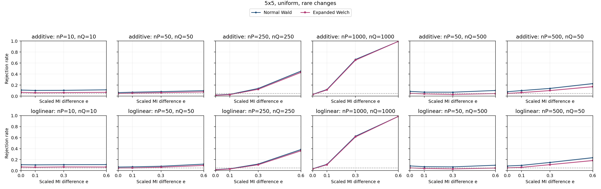

| Specification | Setting |
| --- | --- |
| Table shape | 5x5 |
| Horizontal graph regime specifications (columns) | (nP,nQ)={(10,10),(50,50),(250,250),(1000,1000),(50,500),(500,50)} |
| Vertical graph regime specifications (rows) | Top: additive probability changes; bottom: ordinal log-linear control. Each panel plots both Wald and Expanded Welch. |
| Fixed margins for both constructors | P and Q: each row and column has probability 1/5 |
| Additive direction in P and Q | Rows 4,5 and columns 4,5: add t to the block diagonal, subtract t off diagonal |
| Log-linear direction in P and Q | Products of equally spaced row/column scores from -1 to 1; ordinal in both populations |
| MI settings | M=0.092198 nats; I(P)=0.01844 nats; I(Q)=I(P)+eM; e={0,0.1,0.3,0.6} |
| Axes | e from 0 to 0.6; rejection rate from 0 to 1 |
| Replicates | 10,000 per point |

Every plotted rate, validity and minimum expected count

| Construction | nP | nQ | e | MI difference | Method | Rejection | 95% low | 95% high | Valid | Conditional rejection | Min expected P | Min expected Q |
| --- | --- | --- | --- | --- | --- | --- | --- | --- | --- | --- | --- | --- |
| additive | 10 | 10 | 0 | 0 | expanded_welch | 0.0698 | 0.06497 | 0.07496 | 0.9998 | 0.06981 | 0.2117 | 0.2117 |
| additive | 10 | 10 | 0 | 0 | normal_wald | 0.1103 | 0.1043 | 0.1166 | 1 | 0.1103 | 0.2117 | 0.2117 |
| additive | 10 | 10 | 0.1 | 0.00922 | expanded_welch | 0.0614 | 0.05686 | 0.06628 | 0.9994 | 0.06144 | 0.2117 | 0.1719 |
| additive | 10 | 10 | 0.1 | 0.00922 | normal_wald | 0.104 | 0.09817 | 0.1101 | 1 | 0.104 | 0.2117 | 0.1719 |
| additive | 10 | 10 | 0.3 | 0.02766 | expanded_welch | 0.064 | 0.05937 | 0.06897 | 0.9998 | 0.06401 | 0.2117 | 0.112 |
| additive | 10 | 10 | 0.3 | 0.02766 | normal_wald | 0.1057 | 0.09982 | 0.1119 | 1 | 0.1057 | 0.2117 | 0.112 |
| additive | 10 | 10 | 0.6 | 0.05532 | expanded_welch | 0.0695 | 0.06468 | 0.07465 | 0.9995 | 0.06953 | 0.2117 | 0.04952 |
| additive | 10 | 10 | 0.6 | 0.05532 | normal_wald | 0.1145 | 0.1084 | 0.1209 | 1 | 0.1145 | 0.2117 | 0.04952 |
| additive | 50 | 50 | 0 | 0 | expanded_welch | 0.0474 | 0.04341 | 0.05174 | 1 | 0.0474 | 1.059 | 1.059 |
| additive | 50 | 50 | 0 | 0 | normal_wald | 0.0643 | 0.05966 | 0.06928 | 1 | 0.0643 | 1.059 | 1.059 |
| additive | 50 | 50 | 0.1 | 0.00922 | expanded_welch | 0.0544 | 0.05012 | 0.05902 | 1 | 0.0544 | 1.059 | 0.8593 |
| additive | 50 | 50 | 0.1 | 0.00922 | normal_wald | 0.0717 | 0.06681 | 0.07692 | 1 | 0.0717 | 1.059 | 0.8593 |
| additive | 50 | 50 | 0.3 | 0.02766 | expanded_welch | 0.0629 | 0.05831 | 0.06783 | 1 | 0.0629 | 1.059 | 0.5601 |
| additive | 50 | 50 | 0.3 | 0.02766 | normal_wald | 0.082 | 0.07678 | 0.08754 | 1 | 0.082 | 1.059 | 0.5601 |
| additive | 50 | 50 | 0.6 | 0.05532 | expanded_welch | 0.0774 | 0.07232 | 0.0828 | 1 | 0.0774 | 1.059 | 0.2476 |
| additive | 50 | 50 | 0.6 | 0.05532 | normal_wald | 0.0997 | 0.09398 | 0.1057 | 1 | 0.0997 | 1.059 | 0.2476 |
| additive | 50 | 500 | 0 | 0 | expanded_welch | 0.0519 | 0.04772 | 0.05642 | 1 | 0.0519 | 1.059 | 10.59 |
| additive | 50 | 500 | 0 | 0 | normal_wald | 0.0868 | 0.08144 | 0.09248 | 1 | 0.0868 | 1.059 | 10.59 |
| additive | 50 | 500 | 0.1 | 0.00922 | expanded_welch | 0.0405 | 0.03681 | 0.04454 | 1 | 0.0405 | 1.059 | 8.593 |
| additive | 50 | 500 | 0.1 | 0.00922 | normal_wald | 0.0724 | 0.06748 | 0.07765 | 1 | 0.0724 | 1.059 | 8.593 |
| additive | 50 | 500 | 0.3 | 0.02766 | expanded_welch | 0.031 | 0.02778 | 0.03458 | 1 | 0.031 | 1.059 | 5.601 |
| additive | 50 | 500 | 0.3 | 0.02766 | normal_wald | 0.0719 | 0.067 | 0.07713 | 1 | 0.0719 | 1.059 | 5.601 |
| additive | 50 | 500 | 0.6 | 0.05532 | expanded_welch | 0.0466 | 0.04264 | 0.05091 | 1 | 0.0466 | 1.059 | 2.476 |
| additive | 50 | 500 | 0.6 | 0.05532 | normal_wald | 0.1029 | 0.0971 | 0.109 | 1 | 0.1029 | 1.059 | 2.476 |
| additive | 250 | 250 | 0 | 0 | expanded_welch | 0.0152 | 0.01298 | 0.01779 | 1 | 0.0152 | 5.294 | 5.294 |
| additive | 250 | 250 | 0 | 0 | normal_wald | 0.0201 | 0.01753 | 0.02304 | 1 | 0.0201 | 5.294 | 5.294 |
| additive | 250 | 250 | 0.1 | 0.00922 | expanded_welch | 0.0266 | 0.02362 | 0.02994 | 1 | 0.0266 | 5.294 | 4.296 |
| additive | 250 | 250 | 0.1 | 0.00922 | normal_wald | 0.0324 | 0.02911 | 0.03605 | 1 | 0.0324 | 5.294 | 4.296 |
| additive | 250 | 250 | 0.3 | 0.02766 | expanded_welch | 0.1249 | 0.1186 | 0.1315 | 1 | 0.1249 | 5.294 | 2.801 |
| additive | 250 | 250 | 0.3 | 0.02766 | normal_wald | 0.1394 | 0.1327 | 0.1463 | 1 | 0.1394 | 5.294 | 2.801 |
| additive | 250 | 250 | 0.6 | 0.05532 | expanded_welch | 0.4332 | 0.4235 | 0.4429 | 1 | 0.4332 | 5.294 | 1.238 |
| additive | 250 | 250 | 0.6 | 0.05532 | normal_wald | 0.4554 | 0.4457 | 0.4652 | 1 | 0.4554 | 5.294 | 1.238 |
| additive | 500 | 50 | 0 | 0 | expanded_welch | 0.0483 | 0.04427 | 0.05268 | 1 | 0.0483 | 10.59 | 1.059 |
| additive | 500 | 50 | 0 | 0 | normal_wald | 0.0801 | 0.07494 | 0.08558 | 1 | 0.0801 | 10.59 | 1.059 |
| additive | 500 | 50 | 0.1 | 0.00922 | expanded_welch | 0.0649 | 0.06024 | 0.0699 | 1 | 0.0649 | 10.59 | 0.8593 |
| additive | 500 | 50 | 0.1 | 0.00922 | normal_wald | 0.101 | 0.09525 | 0.1071 | 1 | 0.101 | 10.59 | 0.8593 |
| additive | 500 | 50 | 0.3 | 0.02766 | expanded_welch | 0.1014 | 0.09564 | 0.1075 | 1 | 0.1014 | 10.59 | 0.5601 |
| additive | 500 | 50 | 0.3 | 0.02766 | normal_wald | 0.1406 | 0.1339 | 0.1476 | 1 | 0.1406 | 10.59 | 0.5601 |
| additive | 500 | 50 | 0.6 | 0.05532 | expanded_welch | 0.172 | 0.1647 | 0.1795 | 1 | 0.172 | 10.59 | 0.2476 |
| additive | 500 | 50 | 0.6 | 0.05532 | normal_wald | 0.2275 | 0.2194 | 0.2358 | 1 | 0.2275 | 10.59 | 0.2476 |
| additive | 1000 | 1000 | 0 | 0 | expanded_welch | 0.0287 | 0.0256 | 0.03216 | 1 | 0.0287 | 21.17 | 21.17 |
| additive | 1000 | 1000 | 0 | 0 | normal_wald | 0.0321 | 0.02882 | 0.03574 | 1 | 0.0321 | 21.17 | 21.17 |
| additive | 1000 | 1000 | 0.1 | 0.00922 | expanded_welch | 0.1137 | 0.1076 | 0.1201 | 1 | 0.1137 | 21.17 | 17.19 |
| additive | 1000 | 1000 | 0.1 | 0.00922 | normal_wald | 0.1212 | 0.1149 | 0.1277 | 1 | 0.1212 | 21.17 | 17.19 |
| additive | 1000 | 1000 | 0.3 | 0.02766 | expanded_welch | 0.6548 | 0.6454 | 0.6641 | 1 | 0.6548 | 21.17 | 11.2 |
| additive | 1000 | 1000 | 0.3 | 0.02766 | normal_wald | 0.6657 | 0.6564 | 0.6749 | 1 | 0.6657 | 21.17 | 11.2 |
| additive | 1000 | 1000 | 0.6 | 0.05532 | expanded_welch | 0.9939 | 0.9922 | 0.9952 | 1 | 0.9939 | 21.17 | 4.952 |
| additive | 1000 | 1000 | 0.6 | 0.05532 | normal_wald | 0.9942 | 0.9925 | 0.9955 | 1 | 0.9942 | 21.17 | 4.952 |
| loglinear | 10 | 10 | 0 | 0 | expanded_welch | 0.0667 | 0.06197 | 0.07176 | 0.9994 | 0.06674 | 0.2555 | 0.2555 |
| loglinear | 10 | 10 | 0 | 0 | normal_wald | 0.1083 | 0.1024 | 0.1145 | 1 | 0.1083 | 0.2555 | 0.2555 |
| loglinear | 10 | 10 | 0.1 | 0.00922 | expanded_welch | 0.0628 | 0.05821 | 0.06772 | 0.9998 | 0.06281 | 0.2555 | 0.2261 |
| loglinear | 10 | 10 | 0.1 | 0.00922 | normal_wald | 0.1055 | 0.09963 | 0.1117 | 1 | 0.1055 | 0.2555 | 0.2261 |
| loglinear | 10 | 10 | 0.3 | 0.02766 | expanded_welch | 0.0675 | 0.06275 | 0.07259 | 0.9995 | 0.06753 | 0.2555 | 0.1824 |
| loglinear | 10 | 10 | 0.3 | 0.02766 | normal_wald | 0.1086 | 0.1027 | 0.1148 | 1 | 0.1086 | 0.2555 | 0.1824 |
| loglinear | 10 | 10 | 0.6 | 0.05532 | expanded_welch | 0.066 | 0.0613 | 0.07103 | 0.9996 | 0.06603 | 0.2555 | 0.1363 |
| loglinear | 10 | 10 | 0.6 | 0.05532 | normal_wald | 0.1101 | 0.1041 | 0.1164 | 1 | 0.1101 | 0.2555 | 0.1363 |
| loglinear | 50 | 50 | 0 | 0 | expanded_welch | 0.048 | 0.04398 | 0.05237 | 1 | 0.048 | 1.277 | 1.277 |
| loglinear | 50 | 50 | 0 | 0 | normal_wald | 0.0657 | 0.06101 | 0.07072 | 1 | 0.0657 | 1.277 | 1.277 |
| loglinear | 50 | 50 | 0.1 | 0.00922 | expanded_welch | 0.0498 | 0.04571 | 0.05424 | 1 | 0.0498 | 1.277 | 1.13 |
| loglinear | 50 | 50 | 0.1 | 0.00922 | normal_wald | 0.0692 | 0.06439 | 0.07434 | 1 | 0.0692 | 1.277 | 1.13 |
| loglinear | 50 | 50 | 0.3 | 0.02766 | expanded_welch | 0.063 | 0.0584 | 0.06793 | 1 | 0.063 | 1.277 | 0.9121 |
| loglinear | 50 | 50 | 0.3 | 0.02766 | normal_wald | 0.0803 | 0.07513 | 0.08579 | 1 | 0.0803 | 1.277 | 0.9121 |
| loglinear | 50 | 50 | 0.6 | 0.05532 | expanded_welch | 0.0952 | 0.0896 | 0.1011 | 1 | 0.0952 | 1.277 | 0.6815 |
| loglinear | 50 | 50 | 0.6 | 0.05532 | normal_wald | 0.1187 | 0.1125 | 0.1252 | 1 | 0.1187 | 1.277 | 0.6815 |
| loglinear | 50 | 500 | 0 | 0 | expanded_welch | 0.0511 | 0.04695 | 0.05559 | 1 | 0.0511 | 1.277 | 12.77 |
| loglinear | 50 | 500 | 0 | 0 | normal_wald | 0.0861 | 0.08076 | 0.09176 | 1 | 0.0861 | 1.277 | 12.77 |
| loglinear | 50 | 500 | 0.1 | 0.00922 | expanded_welch | 0.0397 | 0.03605 | 0.04371 | 1 | 0.0397 | 1.277 | 11.3 |
| loglinear | 50 | 500 | 0.1 | 0.00922 | normal_wald | 0.072 | 0.0671 | 0.07723 | 1 | 0.072 | 1.277 | 11.3 |
| loglinear | 50 | 500 | 0.3 | 0.02766 | expanded_welch | 0.0317 | 0.02844 | 0.03532 | 1 | 0.0317 | 1.277 | 9.121 |
| loglinear | 50 | 500 | 0.3 | 0.02766 | normal_wald | 0.0688 | 0.064 | 0.07393 | 1 | 0.0688 | 1.277 | 9.121 |
| loglinear | 50 | 500 | 0.6 | 0.05532 | expanded_welch | 0.0475 | 0.0435 | 0.05185 | 1 | 0.0475 | 1.277 | 6.815 |
| loglinear | 50 | 500 | 0.6 | 0.05532 | normal_wald | 0.0988 | 0.0931 | 0.1048 | 1 | 0.0988 | 1.277 | 6.815 |
| loglinear | 250 | 250 | 0 | 0 | expanded_welch | 0.0155 | 0.01326 | 0.01811 | 1 | 0.0155 | 6.387 | 6.387 |
| loglinear | 250 | 250 | 0 | 0 | normal_wald | 0.0199 | 0.01734 | 0.02283 | 1 | 0.0199 | 6.387 | 6.387 |
| loglinear | 250 | 250 | 0.1 | 0.00922 | expanded_welch | 0.0293 | 0.02617 | 0.03279 | 1 | 0.0293 | 6.387 | 5.652 |
| loglinear | 250 | 250 | 0.1 | 0.00922 | normal_wald | 0.0345 | 0.0311 | 0.03826 | 1 | 0.0345 | 6.387 | 5.652 |
| loglinear | 250 | 250 | 0.3 | 0.02766 | expanded_welch | 0.1077 | 0.1018 | 0.1139 | 1 | 0.1077 | 6.387 | 4.561 |
| loglinear | 250 | 250 | 0.3 | 0.02766 | normal_wald | 0.1205 | 0.1143 | 0.127 | 1 | 0.1205 | 6.387 | 4.561 |
| loglinear | 250 | 250 | 0.6 | 0.05532 | expanded_welch | 0.3626 | 0.3532 | 0.3721 | 1 | 0.3626 | 6.387 | 3.407 |
| loglinear | 250 | 250 | 0.6 | 0.05532 | normal_wald | 0.3839 | 0.3744 | 0.3935 | 1 | 0.3839 | 6.387 | 3.407 |
| loglinear | 500 | 50 | 0 | 0 | expanded_welch | 0.0517 | 0.04753 | 0.05621 | 1 | 0.0517 | 12.77 | 1.277 |
| loglinear | 500 | 50 | 0 | 0 | normal_wald | 0.0854 | 0.08008 | 0.09104 | 1 | 0.0854 | 12.77 | 1.277 |
| loglinear | 500 | 50 | 0.1 | 0.00922 | expanded_welch | 0.0601 | 0.05561 | 0.06493 | 1 | 0.0601 | 12.77 | 1.13 |
| loglinear | 500 | 50 | 0.1 | 0.00922 | normal_wald | 0.0964 | 0.09077 | 0.1023 | 1 | 0.0964 | 12.77 | 1.13 |
| loglinear | 500 | 50 | 0.3 | 0.02766 | expanded_welch | 0.1097 | 0.1037 | 0.116 | 1 | 0.1097 | 12.77 | 0.9121 |
| loglinear | 500 | 50 | 0.3 | 0.02766 | normal_wald | 0.1494 | 0.1425 | 0.1565 | 1 | 0.1494 | 12.77 | 0.9121 |
| loglinear | 500 | 50 | 0.6 | 0.05532 | expanded_welch | 0.1841 | 0.1766 | 0.1918 | 1 | 0.1841 | 12.77 | 0.6815 |
| loglinear | 500 | 50 | 0.6 | 0.05532 | normal_wald | 0.2355 | 0.2273 | 0.2439 | 1 | 0.2355 | 12.77 | 0.6815 |
| loglinear | 1000 | 1000 | 0 | 0 | expanded_welch | 0.0316 | 0.02835 | 0.03521 | 1 | 0.0316 | 25.55 | 25.55 |
| loglinear | 1000 | 1000 | 0 | 0 | normal_wald | 0.035 | 0.03157 | 0.03878 | 1 | 0.035 | 25.55 | 25.55 |
| loglinear | 1000 | 1000 | 0.1 | 0.00922 | expanded_welch | 0.1084 | 0.1025 | 0.1146 | 1 | 0.1084 | 25.55 | 22.61 |
| loglinear | 1000 | 1000 | 0.1 | 0.00922 | normal_wald | 0.1157 | 0.1096 | 0.1221 | 1 | 0.1157 | 25.55 | 22.61 |
| loglinear | 1000 | 1000 | 0.3 | 0.02766 | expanded_welch | 0.6141 | 0.6045 | 0.6236 | 1 | 0.6141 | 25.55 | 18.24 |
| loglinear | 1000 | 1000 | 0.3 | 0.02766 | normal_wald | 0.6253 | 0.6158 | 0.6347 | 1 | 0.6253 | 25.55 | 18.24 |
| loglinear | 1000 | 1000 | 0.6 | 0.05532 | expanded_welch | 0.9847 | 0.9821 | 0.9869 | 1 | 0.9847 | 25.55 | 13.63 |
| loglinear | 1000 | 1000 | 0.6 | 0.05532 | normal_wald | 0.9852 | 0.9826 | 0.9874 | 1 | 0.9852 | 25.55 | 13.63 |

### 3.11. 5x5: uniform, spread

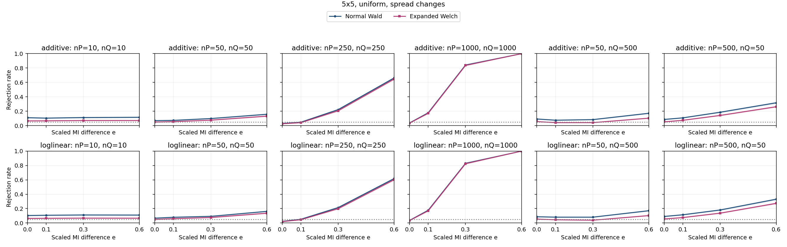

| Specification | Setting |
| --- | --- |
| Table shape | 5x5 |
| Horizontal graph regime specifications (columns) | (nP,nQ)={(10,10),(50,50),(250,250),(1000,1000),(50,500),(500,50)} |
| Vertical graph regime specifications (rows) | Top: additive probability changes; bottom: ordinal log-linear control. Each panel plots both Wald and Expanded Welch. |
| Fixed margins for both constructors | P and Q: each row and column has probability 1/5 |
| Additive direction in P and Q | H=ss^T, s=[-1.0, -0.5, 0.0, 0.5, 1.0] (equally spaced scores; displayed rounded) |
| Log-linear direction in P and Q | Products of equally spaced row/column scores from -1 to 1; ordinal in both populations |
| MI settings | M=0.13435 nats; I(P)=0.02687 nats; I(Q)=I(P)+eM; e={0,0.1,0.3,0.6} |
| Axes | e from 0 to 0.6; rejection rate from 0 to 1 |
| Replicates | 10,000 per point |

Every plotted rate, validity and minimum expected count

| Construction | nP | nQ | e | MI difference | Method | Rejection | 95% low | 95% high | Valid | Conditional rejection | Min expected P | Min expected Q |
| --- | --- | --- | --- | --- | --- | --- | --- | --- | --- | --- | --- | --- |
| additive | 10 | 10 | 0 | 0 | expanded_welch | 0.0658 | 0.06111 | 0.07083 | 0.9996 | 0.06583 | 0.217 | 0.217 |
| additive | 10 | 10 | 0 | 0 | normal_wald | 0.1102 | 0.1042 | 0.1165 | 1 | 0.1102 | 0.217 | 0.217 |
| additive | 10 | 10 | 0.1 | 0.01344 | expanded_welch | 0.0669 | 0.06217 | 0.07197 | 0.9997 | 0.06692 | 0.217 | 0.1775 |
| additive | 10 | 10 | 0.1 | 0.01344 | normal_wald | 0.1045 | 0.09866 | 0.1106 | 1 | 0.1045 | 0.217 | 0.1775 |
| additive | 10 | 10 | 0.3 | 0.04031 | expanded_welch | 0.0711 | 0.06623 | 0.0763 | 0.999 | 0.07117 | 0.217 | 0.1172 |
| additive | 10 | 10 | 0.3 | 0.04031 | normal_wald | 0.1124 | 0.1064 | 0.1187 | 1 | 0.1124 | 0.217 | 0.1172 |
| additive | 10 | 10 | 0.6 | 0.08061 | expanded_welch | 0.0712 | 0.06632 | 0.07641 | 0.9997 | 0.07122 | 0.217 | 0.05209 |
| additive | 10 | 10 | 0.6 | 0.08061 | normal_wald | 0.1159 | 0.1098 | 0.1223 | 1 | 0.1159 | 0.217 | 0.05209 |
| additive | 50 | 50 | 0 | 0 | expanded_welch | 0.0496 | 0.04551 | 0.05403 | 1 | 0.0496 | 1.085 | 1.085 |
| additive | 50 | 50 | 0 | 0 | normal_wald | 0.0698 | 0.06497 | 0.07496 | 1 | 0.0698 | 1.085 | 1.085 |
| additive | 50 | 50 | 0.1 | 0.01344 | expanded_welch | 0.056 | 0.05166 | 0.06068 | 1 | 0.056 | 1.085 | 0.8876 |
| additive | 50 | 50 | 0.1 | 0.01344 | normal_wald | 0.0732 | 0.06826 | 0.07847 | 1 | 0.0732 | 1.085 | 0.8876 |
| additive | 50 | 50 | 0.3 | 0.04031 | expanded_welch | 0.0761 | 0.07106 | 0.08146 | 1 | 0.0761 | 1.085 | 0.5862 |
| additive | 50 | 50 | 0.3 | 0.04031 | normal_wald | 0.0986 | 0.09291 | 0.1046 | 1 | 0.0986 | 1.085 | 0.5862 |
| additive | 50 | 50 | 0.6 | 0.08061 | expanded_welch | 0.1319 | 0.1254 | 0.1387 | 1 | 0.1319 | 1.085 | 0.2605 |
| additive | 50 | 50 | 0.6 | 0.08061 | normal_wald | 0.1579 | 0.1509 | 0.1652 | 1 | 0.1579 | 1.085 | 0.2605 |
| additive | 50 | 500 | 0 | 0 | expanded_welch | 0.0564 | 0.05205 | 0.06109 | 1 | 0.0564 | 1.085 | 10.85 |
| additive | 50 | 500 | 0 | 0 | normal_wald | 0.0923 | 0.08678 | 0.09813 | 1 | 0.0923 | 1.085 | 10.85 |
| additive | 50 | 500 | 0.1 | 0.01344 | expanded_welch | 0.0417 | 0.03795 | 0.0458 | 1 | 0.0417 | 1.085 | 8.876 |
| additive | 50 | 500 | 0.1 | 0.01344 | normal_wald | 0.0755 | 0.07048 | 0.08084 | 1 | 0.0755 | 1.085 | 8.876 |
| additive | 50 | 500 | 0.3 | 0.04031 | expanded_welch | 0.0419 | 0.03815 | 0.04601 | 1 | 0.0419 | 1.085 | 5.862 |
| additive | 50 | 500 | 0.3 | 0.04031 | normal_wald | 0.0837 | 0.07843 | 0.08929 | 1 | 0.0837 | 1.085 | 5.862 |
| additive | 50 | 500 | 0.6 | 0.08061 | expanded_welch | 0.1039 | 0.09807 | 0.11 | 1 | 0.1039 | 1.085 | 2.605 |
| additive | 50 | 500 | 0.6 | 0.08061 | normal_wald | 0.1718 | 0.1645 | 0.1793 | 1 | 0.1718 | 1.085 | 2.605 |
| additive | 250 | 250 | 0 | 0 | expanded_welch | 0.0257 | 0.02278 | 0.02899 | 1 | 0.0257 | 5.426 | 5.426 |
| additive | 250 | 250 | 0 | 0 | normal_wald | 0.0302 | 0.02702 | 0.03374 | 1 | 0.0302 | 5.426 | 5.426 |
| additive | 250 | 250 | 0.1 | 0.01344 | expanded_welch | 0.0411 | 0.03738 | 0.04517 | 1 | 0.0411 | 5.426 | 4.438 |
| additive | 250 | 250 | 0.1 | 0.01344 | normal_wald | 0.0476 | 0.0436 | 0.05195 | 1 | 0.0476 | 5.426 | 4.438 |
| additive | 250 | 250 | 0.3 | 0.04031 | expanded_welch | 0.2068 | 0.199 | 0.2148 | 1 | 0.2068 | 5.426 | 2.931 |
| additive | 250 | 250 | 0.3 | 0.04031 | normal_wald | 0.2226 | 0.2146 | 0.2309 | 1 | 0.2226 | 5.426 | 2.931 |
| additive | 250 | 250 | 0.6 | 0.08061 | expanded_welch | 0.6478 | 0.6384 | 0.6571 | 1 | 0.6478 | 5.426 | 1.302 |
| additive | 250 | 250 | 0.6 | 0.08061 | normal_wald | 0.6635 | 0.6542 | 0.6727 | 1 | 0.6635 | 5.426 | 1.302 |
| additive | 500 | 50 | 0 | 0 | expanded_welch | 0.0529 | 0.04868 | 0.05746 | 1 | 0.0529 | 10.85 | 1.085 |
| additive | 500 | 50 | 0 | 0 | normal_wald | 0.086 | 0.08066 | 0.09166 | 1 | 0.086 | 10.85 | 1.085 |
| additive | 500 | 50 | 0.1 | 0.01344 | expanded_welch | 0.0743 | 0.06932 | 0.07961 | 1 | 0.0743 | 10.85 | 0.8876 |
| additive | 500 | 50 | 0.1 | 0.01344 | normal_wald | 0.1083 | 0.1024 | 0.1145 | 1 | 0.1083 | 10.85 | 0.8876 |
| additive | 500 | 50 | 0.3 | 0.04031 | expanded_welch | 0.1419 | 0.1352 | 0.1489 | 1 | 0.1419 | 10.85 | 0.5862 |
| additive | 500 | 50 | 0.3 | 0.04031 | normal_wald | 0.1864 | 0.1789 | 0.1942 | 1 | 0.1864 | 10.85 | 0.5862 |
| additive | 500 | 50 | 0.6 | 0.08061 | expanded_welch | 0.2626 | 0.2541 | 0.2713 | 1 | 0.2626 | 10.85 | 0.2605 |
| additive | 500 | 50 | 0.6 | 0.08061 | normal_wald | 0.3175 | 0.3084 | 0.3267 | 1 | 0.3175 | 10.85 | 0.2605 |
| additive | 1000 | 1000 | 0 | 0 | expanded_welch | 0.0346 | 0.03119 | 0.03836 | 1 | 0.0346 | 21.7 | 21.7 |
| additive | 1000 | 1000 | 0 | 0 | normal_wald | 0.0371 | 0.03357 | 0.04099 | 1 | 0.0371 | 21.7 | 21.7 |
| additive | 1000 | 1000 | 0.1 | 0.01344 | expanded_welch | 0.1715 | 0.1642 | 0.179 | 1 | 0.1715 | 21.7 | 17.75 |
| additive | 1000 | 1000 | 0.1 | 0.01344 | normal_wald | 0.1781 | 0.1707 | 0.1857 | 1 | 0.1781 | 21.7 | 17.75 |
| additive | 1000 | 1000 | 0.3 | 0.04031 | expanded_welch | 0.8368 | 0.8294 | 0.8439 | 1 | 0.8368 | 21.7 | 11.72 |
| additive | 1000 | 1000 | 0.3 | 0.04031 | normal_wald | 0.8424 | 0.8351 | 0.8494 | 1 | 0.8424 | 21.7 | 11.72 |
| additive | 1000 | 1000 | 0.6 | 0.08061 | expanded_welch | 0.9999 | 0.9994 | 1 | 1 | 0.9999 | 21.7 | 5.209 |
| additive | 1000 | 1000 | 0.6 | 0.08061 | normal_wald | 0.9999 | 0.9994 | 1 | 1 | 0.9999 | 21.7 | 5.209 |
| loglinear | 10 | 10 | 0 | 0 | expanded_welch | 0.0635 | 0.05889 | 0.06845 | 0.9997 | 0.06352 | 0.2283 | 0.2283 |
| loglinear | 10 | 10 | 0 | 0 | normal_wald | 0.1043 | 0.09846 | 0.1104 | 1 | 0.1043 | 0.2283 | 0.2283 |
| loglinear | 10 | 10 | 0.1 | 0.01344 | expanded_welch | 0.0656 | 0.06091 | 0.07062 | 0.9994 | 0.06564 | 0.2283 | 0.1946 |
| loglinear | 10 | 10 | 0.1 | 0.01344 | normal_wald | 0.1079 | 0.102 | 0.1141 | 1 | 0.1079 | 0.2283 | 0.1946 |
| loglinear | 10 | 10 | 0.3 | 0.04031 | expanded_welch | 0.0679 | 0.06313 | 0.073 | 0.9994 | 0.06794 | 0.2283 | 0.1458 |
| loglinear | 10 | 10 | 0.3 | 0.04031 | normal_wald | 0.1119 | 0.1059 | 0.1182 | 1 | 0.1119 | 0.2283 | 0.1458 |
| loglinear | 10 | 10 | 0.6 | 0.08061 | expanded_welch | 0.067 | 0.06226 | 0.07207 | 0.9999 | 0.06701 | 0.2283 | 0.09689 |
| loglinear | 10 | 10 | 0.6 | 0.08061 | normal_wald | 0.1105 | 0.1045 | 0.1168 | 1 | 0.1105 | 0.2283 | 0.09689 |
| loglinear | 50 | 50 | 0 | 0 | expanded_welch | 0.0503 | 0.04619 | 0.05476 | 1 | 0.0503 | 1.142 | 1.142 |
| loglinear | 50 | 50 | 0 | 0 | normal_wald | 0.0675 | 0.06275 | 0.07259 | 1 | 0.0675 | 1.142 | 1.142 |
| loglinear | 50 | 50 | 0.1 | 0.01344 | expanded_welch | 0.0608 | 0.05628 | 0.06565 | 1 | 0.0608 | 1.142 | 0.9731 |
| loglinear | 50 | 50 | 0.1 | 0.01344 | normal_wald | 0.0801 | 0.07494 | 0.08558 | 1 | 0.0801 | 1.142 | 0.9731 |
| loglinear | 50 | 50 | 0.3 | 0.04031 | expanded_welch | 0.0765 | 0.07145 | 0.08187 | 1 | 0.0765 | 1.142 | 0.7292 |
| loglinear | 50 | 50 | 0.3 | 0.04031 | normal_wald | 0.0928 | 0.08727 | 0.09864 | 1 | 0.0928 | 1.142 | 0.7292 |
| loglinear | 50 | 50 | 0.6 | 0.08061 | expanded_welch | 0.1364 | 0.1298 | 0.1433 | 1 | 0.1364 | 1.142 | 0.4845 |
| loglinear | 50 | 50 | 0.6 | 0.08061 | normal_wald | 0.162 | 0.1549 | 0.1694 | 1 | 0.162 | 1.142 | 0.4845 |
| loglinear | 50 | 500 | 0 | 0 | expanded_welch | 0.0547 | 0.05041 | 0.05933 | 1 | 0.0547 | 1.142 | 11.42 |
| loglinear | 50 | 500 | 0 | 0 | normal_wald | 0.0872 | 0.08183 | 0.09289 | 1 | 0.0872 | 1.142 | 11.42 |
| loglinear | 50 | 500 | 0.1 | 0.01344 | expanded_welch | 0.0452 | 0.0413 | 0.04945 | 1 | 0.0452 | 1.142 | 9.731 |
| loglinear | 50 | 500 | 0.1 | 0.01344 | normal_wald | 0.0817 | 0.07649 | 0.08723 | 1 | 0.0817 | 1.142 | 9.731 |
| loglinear | 50 | 500 | 0.3 | 0.04031 | expanded_welch | 0.0392 | 0.03557 | 0.04318 | 1 | 0.0392 | 1.142 | 7.292 |
| loglinear | 50 | 500 | 0.3 | 0.04031 | normal_wald | 0.0814 | 0.0762 | 0.08692 | 1 | 0.0814 | 1.142 | 7.292 |
| loglinear | 50 | 500 | 0.6 | 0.08061 | expanded_welch | 0.1035 | 0.09768 | 0.1096 | 1 | 0.1035 | 1.142 | 4.845 |
| loglinear | 50 | 500 | 0.6 | 0.08061 | normal_wald | 0.1713 | 0.164 | 0.1788 | 1 | 0.1713 | 1.142 | 4.845 |
| loglinear | 250 | 250 | 0 | 0 | expanded_welch | 0.0196 | 0.01706 | 0.02251 | 1 | 0.0196 | 5.708 | 5.708 |
| loglinear | 250 | 250 | 0 | 0 | normal_wald | 0.0232 | 0.02043 | 0.02634 | 1 | 0.0232 | 5.708 | 5.708 |
| loglinear | 250 | 250 | 0.1 | 0.01344 | expanded_welch | 0.0454 | 0.04149 | 0.04966 | 1 | 0.0454 | 5.708 | 4.865 |
| loglinear | 250 | 250 | 0.1 | 0.01344 | normal_wald | 0.0522 | 0.04801 | 0.05673 | 1 | 0.0522 | 5.708 | 4.865 |
| loglinear | 250 | 250 | 0.3 | 0.04031 | expanded_welch | 0.1995 | 0.1918 | 0.2074 | 1 | 0.1995 | 5.708 | 3.646 |
| loglinear | 250 | 250 | 0.3 | 0.04031 | normal_wald | 0.2146 | 0.2067 | 0.2228 | 1 | 0.2146 | 5.708 | 3.646 |
| loglinear | 250 | 250 | 0.6 | 0.08061 | expanded_welch | 0.6023 | 0.5927 | 0.6119 | 1 | 0.6023 | 5.708 | 2.422 |
| loglinear | 250 | 250 | 0.6 | 0.08061 | normal_wald | 0.618 | 0.6084 | 0.6275 | 1 | 0.618 | 5.708 | 2.422 |
| loglinear | 500 | 50 | 0 | 0 | expanded_welch | 0.0563 | 0.05195 | 0.06099 | 1 | 0.0563 | 11.42 | 1.142 |
| loglinear | 500 | 50 | 0 | 0 | normal_wald | 0.0913 | 0.08581 | 0.0971 | 1 | 0.0913 | 11.42 | 1.142 |
| loglinear | 500 | 50 | 0.1 | 0.01344 | expanded_welch | 0.0759 | 0.07087 | 0.08126 | 1 | 0.0759 | 11.42 | 0.9731 |
| loglinear | 500 | 50 | 0.1 | 0.01344 | normal_wald | 0.1147 | 0.1086 | 0.1211 | 1 | 0.1147 | 11.42 | 0.9731 |
| loglinear | 500 | 50 | 0.3 | 0.04031 | expanded_welch | 0.1373 | 0.1307 | 0.1442 | 1 | 0.1373 | 11.42 | 0.7292 |
| loglinear | 500 | 50 | 0.3 | 0.04031 | normal_wald | 0.1814 | 0.174 | 0.1891 | 1 | 0.1814 | 11.42 | 0.7292 |
| loglinear | 500 | 50 | 0.6 | 0.08061 | expanded_welch | 0.2734 | 0.2648 | 0.2822 | 1 | 0.2734 | 11.42 | 0.4845 |
| loglinear | 500 | 50 | 0.6 | 0.08061 | normal_wald | 0.3309 | 0.3217 | 0.3402 | 1 | 0.3309 | 11.42 | 0.4845 |
| loglinear | 1000 | 1000 | 0 | 0 | expanded_welch | 0.034 | 0.03062 | 0.03773 | 1 | 0.034 | 22.83 | 22.83 |
| loglinear | 1000 | 1000 | 0 | 0 | normal_wald | 0.0361 | 0.03262 | 0.03994 | 1 | 0.0361 | 22.83 | 22.83 |
| loglinear | 1000 | 1000 | 0.1 | 0.01344 | expanded_welch | 0.1698 | 0.1626 | 0.1773 | 1 | 0.1698 | 22.83 | 19.46 |
| loglinear | 1000 | 1000 | 0.1 | 0.01344 | normal_wald | 0.1771 | 0.1697 | 0.1847 | 1 | 0.1771 | 22.83 | 19.46 |
| loglinear | 1000 | 1000 | 0.3 | 0.04031 | expanded_welch | 0.8244 | 0.8168 | 0.8317 | 1 | 0.8244 | 22.83 | 14.58 |
| loglinear | 1000 | 1000 | 0.3 | 0.04031 | normal_wald | 0.8299 | 0.8224 | 0.8371 | 1 | 0.8299 | 22.83 | 14.58 |
| loglinear | 1000 | 1000 | 0.6 | 0.08061 | expanded_welch | 0.9992 | 0.9984 | 0.9996 | 1 | 0.9992 | 22.83 | 9.689 |
| loglinear | 1000 | 1000 | 0.6 | 0.08061 | normal_wald | 0.9992 | 0.9984 | 0.9996 | 1 | 0.9992 | 22.83 | 9.689 |

### 3.12. 5x5: different_skew, common

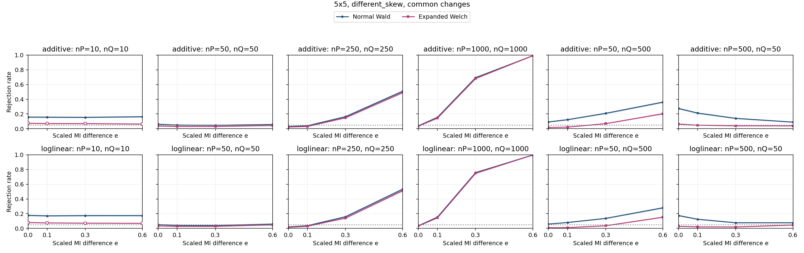

| Specification | Setting |
| --- | --- |
| Table shape | 5x5 |
| Horizontal graph regime specifications (columns) | (nP,nQ)={(10,10),(50,50),(250,250),(1000,1000),(50,500),(500,50)} |
| Vertical graph regime specifications (rows) | Top: additive probability changes; bottom: ordinal log-linear control. Each panel plots both Wald and Expanded Welch. |
| Fixed margins for both constructors | P: row 1 and column 1 each have probability 0.7, every other row/column 0.3/4; Q: row 1 and column 1 each have probability 0.8, every other row/column 0.2/4 |
| Additive direction in P and Q | Rows 1,2 and columns 1,2: add t to the block diagonal, subtract t off diagonal |
| Log-linear direction in P and Q | Products of equally spaced row/column scores from -1 to 1; ordinal in both populations |
| MI settings | M=0.13992 nats; I(P)=0.027983 nats; I(Q)=I(P)+eM; e={0,0.1,0.3,0.6} |
| Axes | e from 0 to 0.6; rejection rate from 0 to 1 |
| Replicates | 10,000 per point |

Every plotted rate, validity and minimum expected count

| Construction | nP | nQ | e | MI difference | Method | Rejection | 95% low | 95% high | Valid | Conditional rejection | Min expected P | Min expected Q |
| --- | --- | --- | --- | --- | --- | --- | --- | --- | --- | --- | --- | --- |
| additive | 10 | 10 | 0 | 0 | expanded_welch | 0.074 | 0.06903 | 0.0793 | 0.7848 | 0.09429 | 0.05625 | 0.025 |
| additive | 10 | 10 | 0 | 0 | normal_wald | 0.158 | 0.151 | 0.1653 | 0.9893 | 0.1597 | 0.05625 | 0.025 |
| additive | 10 | 10 | 0.1 | 0.01399 | expanded_welch | 0.07 | 0.06516 | 0.07517 | 0.7791 | 0.08985 | 0.05625 | 0.025 |
| additive | 10 | 10 | 0.1 | 0.01399 | normal_wald | 0.1566 | 0.1496 | 0.1639 | 0.9879 | 0.1585 | 0.05625 | 0.025 |
| additive | 10 | 10 | 0.3 | 0.04197 | expanded_welch | 0.0694 | 0.06458 | 0.07455 | 0.7806 | 0.08891 | 0.05625 | 0.025 |
| additive | 10 | 10 | 0.3 | 0.04197 | normal_wald | 0.1547 | 0.1477 | 0.1619 | 0.989 | 0.1564 | 0.05625 | 0.025 |
| additive | 10 | 10 | 0.6 | 0.08395 | expanded_welch | 0.0635 | 0.05889 | 0.06845 | 0.7694 | 0.08253 | 0.05625 | 0.025 |
| additive | 10 | 10 | 0.6 | 0.08395 | normal_wald | 0.1629 | 0.1558 | 0.1703 | 0.9867 | 0.1651 | 0.05625 | 0.025 |
| additive | 50 | 50 | 0 | 0 | expanded_welch | 0.0374 | 0.03386 | 0.0413 | 1 | 0.0374 | 0.2812 | 0.125 |
| additive | 50 | 50 | 0 | 0 | normal_wald | 0.0612 | 0.05667 | 0.06607 | 1 | 0.0612 | 0.2812 | 0.125 |
| additive | 50 | 50 | 0.1 | 0.01399 | expanded_welch | 0.0308 | 0.02759 | 0.03437 | 1 | 0.0308 | 0.2812 | 0.125 |
| additive | 50 | 50 | 0.1 | 0.01399 | normal_wald | 0.0502 | 0.04609 | 0.05466 | 1 | 0.0502 | 0.2812 | 0.125 |
| additive | 50 | 50 | 0.3 | 0.04197 | expanded_welch | 0.0308 | 0.02759 | 0.03437 | 1 | 0.0308 | 0.2812 | 0.125 |
| additive | 50 | 50 | 0.3 | 0.04197 | normal_wald | 0.047 | 0.04302 | 0.05132 | 1 | 0.047 | 0.2812 | 0.125 |
| additive | 50 | 50 | 0.6 | 0.08395 | expanded_welch | 0.0439 | 0.04006 | 0.04809 | 0.9999 | 0.0439 | 0.2812 | 0.125 |
| additive | 50 | 50 | 0.6 | 0.08395 | normal_wald | 0.0578 | 0.05339 | 0.06255 | 1 | 0.0578 | 0.2812 | 0.125 |
| additive | 50 | 500 | 0 | 0 | expanded_welch | 0.0164 | 0.01409 | 0.01908 | 1 | 0.0164 | 0.2812 | 1.25 |
| additive | 50 | 500 | 0 | 0 | normal_wald | 0.0919 | 0.08639 | 0.09772 | 1 | 0.0919 | 0.2812 | 1.25 |
| additive | 50 | 500 | 0.1 | 0.01399 | expanded_welch | 0.0222 | 0.01949 | 0.02528 | 1 | 0.0222 | 0.2812 | 1.25 |
| additive | 50 | 500 | 0.1 | 0.01399 | normal_wald | 0.1229 | 0.1166 | 0.1295 | 1 | 0.1229 | 0.2812 | 1.25 |
| additive | 50 | 500 | 0.3 | 0.04197 | expanded_welch | 0.0694 | 0.06458 | 0.07455 | 1 | 0.0694 | 0.2812 | 1.25 |
| additive | 50 | 500 | 0.3 | 0.04197 | normal_wald | 0.2088 | 0.2009 | 0.2169 | 1 | 0.2088 | 0.2812 | 1.25 |
| additive | 50 | 500 | 0.6 | 0.08395 | expanded_welch | 0.2035 | 0.1957 | 0.2115 | 1 | 0.2035 | 0.2812 | 1.25 |
| additive | 50 | 500 | 0.6 | 0.08395 | normal_wald | 0.3607 | 0.3513 | 0.3702 | 1 | 0.3607 | 0.2812 | 1.25 |
| additive | 250 | 250 | 0 | 0 | expanded_welch | 0.0232 | 0.02043 | 0.02634 | 1 | 0.0232 | 1.406 | 0.625 |
| additive | 250 | 250 | 0 | 0 | normal_wald | 0.0307 | 0.0275 | 0.03427 | 1 | 0.0307 | 1.406 | 0.625 |
| additive | 250 | 250 | 0.1 | 0.01399 | expanded_welch | 0.0304 | 0.02721 | 0.03395 | 1 | 0.0304 | 1.406 | 0.625 |
| additive | 250 | 250 | 0.1 | 0.01399 | normal_wald | 0.0402 | 0.03652 | 0.04423 | 1 | 0.0402 | 1.406 | 0.625 |
| additive | 250 | 250 | 0.3 | 0.04197 | expanded_welch | 0.1491 | 0.1423 | 0.1562 | 1 | 0.1491 | 1.406 | 0.625 |
| additive | 250 | 250 | 0.3 | 0.04197 | normal_wald | 0.1634 | 0.1563 | 0.1708 | 1 | 0.1634 | 1.406 | 0.625 |
| additive | 250 | 250 | 0.6 | 0.08395 | expanded_welch | 0.4909 | 0.4811 | 0.5007 | 1 | 0.4909 | 1.406 | 0.625 |
| additive | 250 | 250 | 0.6 | 0.08395 | normal_wald | 0.5098 | 0.5 | 0.5196 | 1 | 0.5098 | 1.406 | 0.625 |
| additive | 500 | 50 | 0 | 0 | expanded_welch | 0.0637 | 0.05908 | 0.06866 | 1 | 0.0637 | 2.813 | 0.125 |
| additive | 500 | 50 | 0 | 0 | normal_wald | 0.2751 | 0.2664 | 0.2839 | 1 | 0.2751 | 2.813 | 0.125 |
| additive | 500 | 50 | 0.1 | 0.01399 | expanded_welch | 0.0482 | 0.04417 | 0.05257 | 1 | 0.0482 | 2.813 | 0.125 |
| additive | 500 | 50 | 0.1 | 0.01399 | normal_wald | 0.2124 | 0.2045 | 0.2205 | 1 | 0.2124 | 2.813 | 0.125 |
| additive | 500 | 50 | 0.3 | 0.04197 | expanded_welch | 0.0396 | 0.03595 | 0.0436 | 0.9999 | 0.0396 | 2.813 | 0.125 |
| additive | 500 | 50 | 0.3 | 0.04197 | normal_wald | 0.1406 | 0.1339 | 0.1476 | 1 | 0.1406 | 2.813 | 0.125 |
| additive | 500 | 50 | 0.6 | 0.08395 | expanded_welch | 0.0392 | 0.03557 | 0.04318 | 0.9999 | 0.0392 | 2.813 | 0.125 |
| additive | 500 | 50 | 0.6 | 0.08395 | normal_wald | 0.0898 | 0.08435 | 0.09556 | 1 | 0.0898 | 2.813 | 0.125 |
| additive | 1000 | 1000 | 0 | 0 | expanded_welch | 0.0348 | 0.03138 | 0.03857 | 1 | 0.0348 | 5.625 | 2.5 |
| additive | 1000 | 1000 | 0 | 0 | normal_wald | 0.0397 | 0.03605 | 0.04371 | 1 | 0.0397 | 5.625 | 2.5 |
| additive | 1000 | 1000 | 0.1 | 0.01399 | expanded_welch | 0.1444 | 0.1376 | 0.1514 | 1 | 0.1444 | 5.625 | 2.5 |
| additive | 1000 | 1000 | 0.1 | 0.01399 | normal_wald | 0.1545 | 0.1475 | 0.1617 | 1 | 0.1545 | 5.625 | 2.5 |
| additive | 1000 | 1000 | 0.3 | 0.04197 | expanded_welch | 0.6821 | 0.6729 | 0.6912 | 1 | 0.6821 | 5.625 | 2.5 |
| additive | 1000 | 1000 | 0.3 | 0.04197 | normal_wald | 0.6931 | 0.684 | 0.7021 | 1 | 0.6931 | 5.625 | 2.5 |
| additive | 1000 | 1000 | 0.6 | 0.08395 | expanded_welch | 0.9914 | 0.9894 | 0.993 | 1 | 0.9914 | 5.625 | 2.5 |
| additive | 1000 | 1000 | 0.6 | 0.08395 | normal_wald | 0.9916 | 0.9896 | 0.9932 | 1 | 0.9916 | 5.625 | 2.5 |
| loglinear | 10 | 10 | 0 | 0 | expanded_welch | 0.0796 | 0.07445 | 0.08507 | 0.7858 | 0.1013 | 0.05474 | 0.02656 |
| loglinear | 10 | 10 | 0 | 0 | normal_wald | 0.1772 | 0.1698 | 0.1848 | 0.9888 | 0.1792 | 0.05474 | 0.02656 |
| loglinear | 10 | 10 | 0.1 | 0.01399 | expanded_welch | 0.0748 | 0.06981 | 0.08012 | 0.7786 | 0.09607 | 0.05474 | 0.02569 |
| loglinear | 10 | 10 | 0.1 | 0.01399 | normal_wald | 0.1705 | 0.1633 | 0.178 | 0.9909 | 0.1721 | 0.05474 | 0.02569 |
| loglinear | 10 | 10 | 0.3 | 0.04197 | expanded_welch | 0.0715 | 0.06661 | 0.07672 | 0.782 | 0.09143 | 0.05474 | 0.02308 |
| loglinear | 10 | 10 | 0.3 | 0.04197 | normal_wald | 0.1741 | 0.1668 | 0.1817 | 0.9882 | 0.1762 | 0.05474 | 0.02308 |
| loglinear | 10 | 10 | 0.6 | 0.08395 | expanded_welch | 0.0692 | 0.06439 | 0.07434 | 0.7811 | 0.08859 | 0.05474 | 0.01873 |
| loglinear | 10 | 10 | 0.6 | 0.08395 | normal_wald | 0.174 | 0.1667 | 0.1816 | 0.9903 | 0.1757 | 0.05474 | 0.01873 |
| loglinear | 50 | 50 | 0 | 0 | expanded_welch | 0.0346 | 0.03119 | 0.03836 | 1 | 0.0346 | 0.2737 | 0.1328 |
| loglinear | 50 | 50 | 0 | 0 | normal_wald | 0.0517 | 0.04753 | 0.05621 | 1 | 0.0517 | 0.2737 | 0.1328 |
| loglinear | 50 | 50 | 0.1 | 0.01399 | expanded_welch | 0.0284 | 0.02532 | 0.03184 | 1 | 0.0284 | 0.2737 | 0.1285 |
| loglinear | 50 | 50 | 0.1 | 0.01399 | normal_wald | 0.0415 | 0.03776 | 0.04559 | 1 | 0.0415 | 0.2737 | 0.1285 |
| loglinear | 50 | 50 | 0.3 | 0.04197 | expanded_welch | 0.0285 | 0.02542 | 0.03195 | 1 | 0.0285 | 0.2737 | 0.1154 |
| loglinear | 50 | 50 | 0.3 | 0.04197 | normal_wald | 0.0394 | 0.03576 | 0.04339 | 1 | 0.0394 | 0.2737 | 0.1154 |
| loglinear | 50 | 50 | 0.6 | 0.08395 | expanded_welch | 0.0485 | 0.04446 | 0.05289 | 1 | 0.0485 | 0.2737 | 0.09366 |
| loglinear | 50 | 50 | 0.6 | 0.08395 | normal_wald | 0.0594 | 0.05493 | 0.0642 | 1 | 0.0594 | 0.2737 | 0.09366 |
| loglinear | 50 | 500 | 0 | 0 | expanded_welch | 0.0084 | 0.00679 | 0.01039 | 1 | 0.0084 | 0.2737 | 1.328 |
| loglinear | 50 | 500 | 0 | 0 | normal_wald | 0.0593 | 0.05484 | 0.0641 | 1 | 0.0593 | 0.2737 | 1.328 |
| loglinear | 50 | 500 | 0.1 | 0.01399 | expanded_welch | 0.0104 | 0.008591 | 0.01258 | 1 | 0.0104 | 0.2737 | 1.285 |
| loglinear | 50 | 500 | 0.1 | 0.01399 | normal_wald | 0.0805 | 0.07533 | 0.08599 | 1 | 0.0805 | 0.2737 | 1.285 |
| loglinear | 50 | 500 | 0.3 | 0.04197 | expanded_welch | 0.0365 | 0.033 | 0.04036 | 1 | 0.0365 | 0.2737 | 1.154 |
| loglinear | 50 | 500 | 0.3 | 0.04197 | normal_wald | 0.1362 | 0.1296 | 0.1431 | 1 | 0.1362 | 0.2737 | 1.154 |
| loglinear | 50 | 500 | 0.6 | 0.08395 | expanded_welch | 0.1524 | 0.1455 | 0.1596 | 1 | 0.1524 | 0.2737 | 0.9366 |
| loglinear | 50 | 500 | 0.6 | 0.08395 | normal_wald | 0.2797 | 0.271 | 0.2886 | 1 | 0.2797 | 0.2737 | 0.9366 |
| loglinear | 250 | 250 | 0 | 0 | expanded_welch | 0.0143 | 0.01215 | 0.01682 | 1 | 0.0143 | 1.369 | 0.6641 |
| loglinear | 250 | 250 | 0 | 0 | normal_wald | 0.0199 | 0.01734 | 0.02283 | 1 | 0.0199 | 1.369 | 0.6641 |
| loglinear | 250 | 250 | 0.1 | 0.01399 | expanded_welch | 0.0293 | 0.02617 | 0.03279 | 1 | 0.0293 | 1.369 | 0.6423 |
| loglinear | 250 | 250 | 0.1 | 0.01399 | normal_wald | 0.0369 | 0.03338 | 0.04078 | 1 | 0.0369 | 1.369 | 0.6423 |
| loglinear | 250 | 250 | 0.3 | 0.04197 | expanded_welch | 0.1406 | 0.1339 | 0.1476 | 1 | 0.1406 | 1.369 | 0.5769 |
| loglinear | 250 | 250 | 0.3 | 0.04197 | normal_wald | 0.1591 | 0.1521 | 0.1664 | 1 | 0.1591 | 1.369 | 0.5769 |
| loglinear | 250 | 250 | 0.6 | 0.08395 | expanded_welch | 0.5127 | 0.5029 | 0.5225 | 1 | 0.5127 | 1.369 | 0.4683 |
| loglinear | 250 | 250 | 0.6 | 0.08395 | normal_wald | 0.5332 | 0.5234 | 0.543 | 1 | 0.5332 | 1.369 | 0.4683 |
| loglinear | 500 | 50 | 0 | 0 | expanded_welch | 0.0293 | 0.02617 | 0.03279 | 1 | 0.0293 | 2.737 | 0.1328 |
| loglinear | 500 | 50 | 0 | 0 | normal_wald | 0.175 | 0.1677 | 0.1826 | 1 | 0.175 | 2.737 | 0.1328 |
| loglinear | 500 | 50 | 0.1 | 0.01399 | expanded_welch | 0.0209 | 0.01827 | 0.02389 | 1 | 0.0209 | 2.737 | 0.1285 |
| loglinear | 500 | 50 | 0.1 | 0.01399 | normal_wald | 0.1246 | 0.1183 | 0.1312 | 1 | 0.1246 | 2.737 | 0.1285 |
| loglinear | 500 | 50 | 0.3 | 0.04197 | expanded_welch | 0.0195 | 0.01697 | 0.0224 | 0.9999 | 0.0195 | 2.737 | 0.1154 |
| loglinear | 500 | 50 | 0.3 | 0.04197 | normal_wald | 0.0771 | 0.07203 | 0.08249 | 1 | 0.0771 | 2.737 | 0.1154 |
| loglinear | 500 | 50 | 0.6 | 0.08395 | expanded_welch | 0.0465 | 0.04254 | 0.0508 | 1 | 0.0465 | 2.737 | 0.09366 |
| loglinear | 500 | 50 | 0.6 | 0.08395 | normal_wald | 0.0769 | 0.07184 | 0.08229 | 1 | 0.0769 | 2.737 | 0.09366 |
| loglinear | 1000 | 1000 | 0 | 0 | expanded_welch | 0.0327 | 0.02939 | 0.03637 | 1 | 0.0327 | 5.474 | 2.656 |
| loglinear | 1000 | 1000 | 0 | 0 | normal_wald | 0.0365 | 0.033 | 0.04036 | 1 | 0.0365 | 5.474 | 2.656 |
| loglinear | 1000 | 1000 | 0.1 | 0.01399 | expanded_welch | 0.1447 | 0.1379 | 0.1517 | 1 | 0.1447 | 5.474 | 2.569 |
| loglinear | 1000 | 1000 | 0.1 | 0.01399 | normal_wald | 0.1537 | 0.1468 | 0.1609 | 1 | 0.1537 | 5.474 | 2.569 |
| loglinear | 1000 | 1000 | 0.3 | 0.04197 | expanded_welch | 0.7488 | 0.7402 | 0.7572 | 1 | 0.7488 | 5.474 | 2.308 |
| loglinear | 1000 | 1000 | 0.3 | 0.04197 | normal_wald | 0.7575 | 0.749 | 0.7658 | 1 | 0.7575 | 5.474 | 2.308 |
| loglinear | 1000 | 1000 | 0.6 | 0.08395 | expanded_welch | 0.9968 | 0.9955 | 0.9977 | 1 | 0.9968 | 5.474 | 1.873 |
| loglinear | 1000 | 1000 | 0.6 | 0.08395 | normal_wald | 0.9971 | 0.9958 | 0.998 | 1 | 0.9971 | 5.474 | 1.873 |

### 3.13. 5x5: different_skew, rare

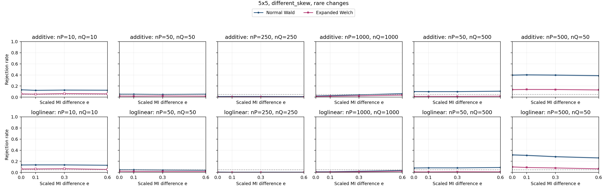

| Specification | Setting |
| --- | --- |
| Table shape | 5x5 |
| Horizontal graph regime specifications (columns) | (nP,nQ)={(10,10),(50,50),(250,250),(1000,1000),(50,500),(500,50)} |
| Vertical graph regime specifications (rows) | Top: additive probability changes; bottom: ordinal log-linear control. Each panel plots both Wald and Expanded Welch. |
| Fixed margins for both constructors | P: row 1 and column 1 each have probability 0.7, every other row/column 0.3/4; Q: row 1 and column 1 each have probability 0.8, every other row/column 0.2/4 |
| Additive direction in P and Q | Rows 4,5 and columns 4,5: add t to the block diagonal, subtract t off diagonal |
| Log-linear direction in P and Q | Products of equally spaced row/column scores from -1 to 1; ordinal in both populations |
| MI settings | M=0.0057624 nats; I(P)=0.0011525 nats; I(Q)=I(P)+eM; e={0,0.1,0.3,0.6} |
| Axes | e from 0 to 0.6; rejection rate from 0 to 1 |
| Replicates | 10,000 per point |

Every plotted rate, validity and minimum expected count

| Construction | nP | nQ | e | MI difference | Method | Rejection | 95% low | 95% high | Valid | Conditional rejection | Min expected P | Min expected Q |
| --- | --- | --- | --- | --- | --- | --- | --- | --- | --- | --- | --- | --- |
| additive | 10 | 10 | 0 | 0 | expanded_welch | 0.0589 | 0.05445 | 0.06369 | 0.7721 | 0.07629 | 0.0384 | 0.01323 |
| additive | 10 | 10 | 0 | 0 | normal_wald | 0.1332 | 0.1267 | 0.14 | 0.9858 | 0.1351 | 0.0384 | 0.01323 |
| additive | 10 | 10 | 0.1 | 0.0005762 | expanded_welch | 0.0555 | 0.05118 | 0.06016 | 0.7803 | 0.07113 | 0.0384 | 0.01074 |
| additive | 10 | 10 | 0.1 | 0.0005762 | normal_wald | 0.1239 | 0.1176 | 0.1305 | 0.9884 | 0.1254 | 0.0384 | 0.01074 |
| additive | 10 | 10 | 0.3 | 0.001729 | expanded_welch | 0.0646 | 0.05995 | 0.06959 | 0.7825 | 0.08256 | 0.0384 | 0.007002 |
| additive | 10 | 10 | 0.3 | 0.001729 | normal_wald | 0.1282 | 0.1218 | 0.1349 | 0.9887 | 0.1297 | 0.0384 | 0.007002 |
| additive | 10 | 10 | 0.6 | 0.003457 | expanded_welch | 0.0593 | 0.05484 | 0.0641 | 0.7825 | 0.07578 | 0.0384 | 0.003095 |
| additive | 10 | 10 | 0.6 | 0.003457 | normal_wald | 0.1259 | 0.1195 | 0.1325 | 0.9882 | 0.1274 | 0.0384 | 0.003095 |
| additive | 50 | 50 | 0 | 0 | expanded_welch | 0.0206 | 0.01799 | 0.02357 | 1 | 0.0206 | 0.192 | 0.06617 |
| additive | 50 | 50 | 0 | 0 | normal_wald | 0.0545 | 0.05022 | 0.05912 | 1 | 0.0545 | 0.192 | 0.06617 |
| additive | 50 | 50 | 0.1 | 0.0005762 | expanded_welch | 0.0192 | 0.01669 | 0.02208 | 1 | 0.0192 | 0.192 | 0.05371 |
| additive | 50 | 50 | 0.1 | 0.0005762 | normal_wald | 0.0545 | 0.05022 | 0.05912 | 1 | 0.0545 | 0.192 | 0.05371 |
| additive | 50 | 50 | 0.3 | 0.001729 | expanded_welch | 0.0225 | 0.01977 | 0.0256 | 1 | 0.0225 | 0.192 | 0.03501 |
| additive | 50 | 50 | 0.3 | 0.001729 | normal_wald | 0.0503 | 0.04619 | 0.05476 | 1 | 0.0503 | 0.192 | 0.03501 |
| additive | 50 | 50 | 0.6 | 0.003457 | expanded_welch | 0.019 | 0.0165 | 0.02187 | 1 | 0.019 | 0.192 | 0.01547 |
| additive | 50 | 50 | 0.6 | 0.003457 | normal_wald | 0.0551 | 0.0508 | 0.05975 | 1 | 0.0551 | 0.192 | 0.01547 |
| additive | 50 | 500 | 0 | 0 | expanded_welch | 0.0139 | 0.01178 | 0.01639 | 1 | 0.0139 | 0.192 | 0.6617 |
| additive | 50 | 500 | 0 | 0 | normal_wald | 0.1016 | 0.09583 | 0.1077 | 1 | 0.1016 | 0.192 | 0.6617 |
| additive | 50 | 500 | 0.1 | 0.0005762 | expanded_welch | 0.0148 | 0.01261 | 0.01736 | 1 | 0.0148 | 0.192 | 0.5371 |
| additive | 50 | 500 | 0.1 | 0.0005762 | normal_wald | 0.1005 | 0.09476 | 0.1065 | 1 | 0.1005 | 0.192 | 0.5371 |
| additive | 50 | 500 | 0.3 | 0.001729 | expanded_welch | 0.0135 | 0.01142 | 0.01596 | 1 | 0.0135 | 0.192 | 0.3501 |
| additive | 50 | 500 | 0.3 | 0.001729 | normal_wald | 0.1006 | 0.09486 | 0.1066 | 1 | 0.1006 | 0.192 | 0.3501 |
| additive | 50 | 500 | 0.6 | 0.003457 | expanded_welch | 0.0181 | 0.01567 | 0.0209 | 1 | 0.0181 | 0.192 | 0.1547 |
| additive | 50 | 500 | 0.6 | 0.003457 | normal_wald | 0.1082 | 0.1023 | 0.1144 | 1 | 0.1082 | 0.192 | 0.1547 |
| additive | 250 | 250 | 0 | 0 | expanded_welch | 0.0023 | 0.001533 | 0.003449 | 1 | 0.0023 | 0.96 | 0.3309 |
| additive | 250 | 250 | 0 | 0 | normal_wald | 0.0123 | 0.01032 | 0.01466 | 1 | 0.0123 | 0.96 | 0.3309 |
| additive | 250 | 250 | 0.1 | 0.0005762 | expanded_welch | 0.0037 | 0.002686 | 0.005096 | 1 | 0.0037 | 0.96 | 0.2685 |
| additive | 250 | 250 | 0.1 | 0.0005762 | normal_wald | 0.013 | 0.01096 | 0.01541 | 1 | 0.013 | 0.96 | 0.2685 |
| additive | 250 | 250 | 0.3 | 0.001729 | expanded_welch | 0.0041 | 0.003024 | 0.005557 | 1 | 0.0041 | 0.96 | 0.175 |
| additive | 250 | 250 | 0.3 | 0.001729 | normal_wald | 0.0132 | 0.01114 | 0.01563 | 1 | 0.0132 | 0.96 | 0.175 |
| additive | 250 | 250 | 0.6 | 0.003457 | expanded_welch | 0.0018 | 0.001139 | 0.002844 | 1 | 0.0018 | 0.96 | 0.07737 |
| additive | 250 | 250 | 0.6 | 0.003457 | normal_wald | 0.0105 | 0.008682 | 0.01269 | 1 | 0.0105 | 0.96 | 0.07737 |
| additive | 500 | 50 | 0 | 0 | expanded_welch | 0.1368 | 0.1302 | 0.1437 | 0.9999 | 0.1368 | 1.92 | 0.06617 |
| additive | 500 | 50 | 0 | 0 | normal_wald | 0.3969 | 0.3874 | 0.4065 | 1 | 0.3969 | 1.92 | 0.06617 |
| additive | 500 | 50 | 0.1 | 0.0005762 | expanded_welch | 0.1392 | 0.1326 | 0.1461 | 1 | 0.1392 | 1.92 | 0.05371 |
| additive | 500 | 50 | 0.1 | 0.0005762 | normal_wald | 0.4016 | 0.392 | 0.4112 | 1 | 0.4016 | 1.92 | 0.05371 |
| additive | 500 | 50 | 0.3 | 0.001729 | expanded_welch | 0.1386 | 0.132 | 0.1455 | 1 | 0.1386 | 1.92 | 0.03501 |
| additive | 500 | 50 | 0.3 | 0.001729 | normal_wald | 0.3975 | 0.3879 | 0.4071 | 1 | 0.3975 | 1.92 | 0.03501 |
| additive | 500 | 50 | 0.6 | 0.003457 | expanded_welch | 0.1309 | 0.1244 | 0.1377 | 1 | 0.1309 | 1.92 | 0.01547 |
| additive | 500 | 50 | 0.6 | 0.003457 | normal_wald | 0.3877 | 0.3782 | 0.3973 | 1 | 0.3877 | 1.92 | 0.01547 |
| additive | 1000 | 1000 | 0 | 0 | expanded_welch | 0.0142 | 0.01206 | 0.01671 | 1 | 0.0142 | 3.84 | 1.323 |
| additive | 1000 | 1000 | 0 | 0 | normal_wald | 0.0237 | 0.0209 | 0.02687 | 1 | 0.0237 | 3.84 | 1.323 |
| additive | 1000 | 1000 | 0.1 | 0.0005762 | expanded_welch | 0.0163 | 0.014 | 0.01897 | 1 | 0.0163 | 3.84 | 1.074 |
| additive | 1000 | 1000 | 0.1 | 0.0005762 | normal_wald | 0.0292 | 0.02608 | 0.03269 | 1 | 0.0292 | 3.84 | 1.074 |
| additive | 1000 | 1000 | 0.3 | 0.001729 | expanded_welch | 0.0241 | 0.02127 | 0.02729 | 1 | 0.0241 | 3.84 | 0.7002 |
| additive | 1000 | 1000 | 0.3 | 0.001729 | normal_wald | 0.0432 | 0.03939 | 0.04736 | 1 | 0.0432 | 3.84 | 0.7002 |
| additive | 1000 | 1000 | 0.6 | 0.003457 | expanded_welch | 0.0379 | 0.03433 | 0.04182 | 1 | 0.0379 | 3.84 | 0.3095 |
| additive | 1000 | 1000 | 0.6 | 0.003457 | normal_wald | 0.0643 | 0.05966 | 0.06928 | 1 | 0.0643 | 3.84 | 0.3095 |
| loglinear | 10 | 10 | 0 | 0 | expanded_welch | 0.0621 | 0.05754 | 0.067 | 0.7844 | 0.07917 | 0.05641 | 0.02525 |
| loglinear | 10 | 10 | 0 | 0 | normal_wald | 0.1347 | 0.1281 | 0.1415 | 0.9897 | 0.1361 | 0.05641 | 0.02525 |
| loglinear | 10 | 10 | 0.1 | 0.0005762 | expanded_welch | 0.0629 | 0.05831 | 0.06783 | 0.7774 | 0.08091 | 0.05641 | 0.0253 |
| loglinear | 10 | 10 | 0.1 | 0.0005762 | normal_wald | 0.1364 | 0.1298 | 0.1433 | 0.9875 | 0.1381 | 0.05641 | 0.0253 |
| loglinear | 10 | 10 | 0.3 | 0.001729 | expanded_welch | 0.0671 | 0.06236 | 0.07217 | 0.7782 | 0.08622 | 0.05641 | 0.0254 |
| loglinear | 10 | 10 | 0.3 | 0.001729 | normal_wald | 0.1363 | 0.1297 | 0.1432 | 0.9858 | 0.1383 | 0.05641 | 0.0254 |
| loglinear | 10 | 10 | 0.6 | 0.003457 | expanded_welch | 0.0546 | 0.05032 | 0.05923 | 0.7788 | 0.07011 | 0.05641 | 0.02551 |
| loglinear | 10 | 10 | 0.6 | 0.003457 | normal_wald | 0.13 | 0.1236 | 0.1367 | 0.9907 | 0.1312 | 0.05641 | 0.02551 |
| loglinear | 50 | 50 | 0 | 0 | expanded_welch | 0.0226 | 0.01987 | 0.0257 | 1 | 0.0226 | 0.282 | 0.1262 |
| loglinear | 50 | 50 | 0 | 0 | normal_wald | 0.0506 | 0.04647 | 0.05507 | 1 | 0.0506 | 0.282 | 0.1262 |
| loglinear | 50 | 50 | 0.1 | 0.0005762 | expanded_welch | 0.0198 | 0.01725 | 0.02272 | 1 | 0.0198 | 0.282 | 0.1265 |
| loglinear | 50 | 50 | 0.1 | 0.0005762 | normal_wald | 0.0491 | 0.04504 | 0.05351 | 1 | 0.0491 | 0.282 | 0.1265 |
| loglinear | 50 | 50 | 0.3 | 0.001729 | expanded_welch | 0.0181 | 0.01567 | 0.0209 | 0.9999 | 0.0181 | 0.282 | 0.127 |
| loglinear | 50 | 50 | 0.3 | 0.001729 | normal_wald | 0.0442 | 0.04034 | 0.04841 | 1 | 0.0442 | 0.282 | 0.127 |
| loglinear | 50 | 50 | 0.6 | 0.003457 | expanded_welch | 0.0176 | 0.0152 | 0.02037 | 1 | 0.0176 | 0.282 | 0.1276 |
| loglinear | 50 | 50 | 0.6 | 0.003457 | normal_wald | 0.0402 | 0.03652 | 0.04423 | 1 | 0.0402 | 0.282 | 0.1276 |
| loglinear | 50 | 500 | 0 | 0 | expanded_welch | 0.0099 | 0.008139 | 0.01204 | 1 | 0.0099 | 0.282 | 1.262 |
| loglinear | 50 | 500 | 0 | 0 | normal_wald | 0.0808 | 0.07562 | 0.0863 | 1 | 0.0808 | 0.282 | 1.262 |
| loglinear | 50 | 500 | 0.1 | 0.0005762 | expanded_welch | 0.0097 | 0.007958 | 0.01182 | 1 | 0.0097 | 0.282 | 1.265 |
| loglinear | 50 | 500 | 0.1 | 0.0005762 | normal_wald | 0.0837 | 0.07843 | 0.08929 | 1 | 0.0837 | 0.282 | 1.265 |
| loglinear | 50 | 500 | 0.3 | 0.001729 | expanded_welch | 0.0118 | 0.009863 | 0.01411 | 1 | 0.0118 | 0.282 | 1.27 |
| loglinear | 50 | 500 | 0.3 | 0.001729 | normal_wald | 0.0826 | 0.07736 | 0.08816 | 1 | 0.0826 | 0.282 | 1.27 |
| loglinear | 50 | 500 | 0.6 | 0.003457 | expanded_welch | 0.0107 | 0.008863 | 0.01291 | 1 | 0.0107 | 0.282 | 1.276 |
| loglinear | 50 | 500 | 0.6 | 0.003457 | normal_wald | 0.0897 | 0.08426 | 0.09546 | 1 | 0.0897 | 0.282 | 1.276 |
| loglinear | 250 | 250 | 0 | 0 | expanded_welch | 0.0015 | 0.0009093 | 0.002474 | 1 | 0.0015 | 1.41 | 0.6311 |
| loglinear | 250 | 250 | 0 | 0 | normal_wald | 0.0075 | 0.005988 | 0.00939 | 1 | 0.0075 | 1.41 | 0.6311 |
| loglinear | 250 | 250 | 0.1 | 0.0005762 | expanded_welch | 0.0017 | 0.001062 | 0.002721 | 1 | 0.0017 | 1.41 | 0.6326 |
| loglinear | 250 | 250 | 0.1 | 0.0005762 | normal_wald | 0.0058 | 0.00449 | 0.00749 | 1 | 0.0058 | 1.41 | 0.6326 |
| loglinear | 250 | 250 | 0.3 | 0.001729 | expanded_welch | 0.0011 | 0.0006144 | 0.001969 | 1 | 0.0011 | 1.41 | 0.6349 |
| loglinear | 250 | 250 | 0.3 | 0.001729 | normal_wald | 0.006 | 0.004665 | 0.007715 | 1 | 0.006 | 1.41 | 0.6349 |
| loglinear | 250 | 250 | 0.6 | 0.003457 | expanded_welch | 0.0016 | 0.0009851 | 0.002598 | 1 | 0.0016 | 1.41 | 0.6378 |
| loglinear | 250 | 250 | 0.6 | 0.003457 | normal_wald | 0.0058 | 0.00449 | 0.00749 | 1 | 0.0058 | 1.41 | 0.6378 |
| loglinear | 500 | 50 | 0 | 0 | expanded_welch | 0.0997 | 0.09398 | 0.1057 | 1 | 0.0997 | 2.82 | 0.1262 |
| loglinear | 500 | 50 | 0 | 0 | normal_wald | 0.3161 | 0.3071 | 0.3253 | 1 | 0.3161 | 2.82 | 0.1262 |
| loglinear | 500 | 50 | 0.1 | 0.0005762 | expanded_welch | 0.0897 | 0.08426 | 0.09546 | 1 | 0.0897 | 2.82 | 0.1265 |
| loglinear | 500 | 50 | 0.1 | 0.0005762 | normal_wald | 0.3078 | 0.2988 | 0.3169 | 1 | 0.3078 | 2.82 | 0.1265 |
| loglinear | 500 | 50 | 0.3 | 0.001729 | expanded_welch | 0.0813 | 0.0761 | 0.08682 | 1 | 0.0813 | 2.82 | 0.127 |
| loglinear | 500 | 50 | 0.3 | 0.001729 | normal_wald | 0.2839 | 0.2751 | 0.2928 | 1 | 0.2839 | 2.82 | 0.127 |
| loglinear | 500 | 50 | 0.6 | 0.003457 | expanded_welch | 0.0657 | 0.06101 | 0.07072 | 1 | 0.0657 | 2.82 | 0.1276 |
| loglinear | 500 | 50 | 0.6 | 0.003457 | normal_wald | 0.2618 | 0.2533 | 0.2705 | 1 | 0.2618 | 2.82 | 0.1276 |
| loglinear | 1000 | 1000 | 0 | 0 | expanded_welch | 0.0056 | 0.004315 | 0.007264 | 1 | 0.0056 | 5.641 | 2.525 |
| loglinear | 1000 | 1000 | 0 | 0 | normal_wald | 0.0125 | 0.0105 | 0.01487 | 1 | 0.0125 | 5.641 | 2.525 |
| loglinear | 1000 | 1000 | 0.1 | 0.0005762 | expanded_welch | 0.007 | 0.005545 | 0.008834 | 1 | 0.007 | 5.641 | 2.53 |
| loglinear | 1000 | 1000 | 0.1 | 0.0005762 | normal_wald | 0.0134 | 0.01133 | 0.01585 | 1 | 0.0134 | 5.641 | 2.53 |
| loglinear | 1000 | 1000 | 0.3 | 0.001729 | expanded_welch | 0.0126 | 0.01059 | 0.01498 | 1 | 0.0126 | 5.641 | 2.54 |
| loglinear | 1000 | 1000 | 0.3 | 0.001729 | normal_wald | 0.0219 | 0.01921 | 0.02496 | 1 | 0.0219 | 5.641 | 2.54 |
| loglinear | 1000 | 1000 | 0.6 | 0.003457 | expanded_welch | 0.0227 | 0.01996 | 0.02581 | 1 | 0.0227 | 5.641 | 2.551 |
| loglinear | 1000 | 1000 | 0.6 | 0.003457 | normal_wald | 0.0351 | 0.03167 | 0.03889 | 1 | 0.0351 | 5.641 | 2.551 |

### 3.14. 5x5: different_skew, spread

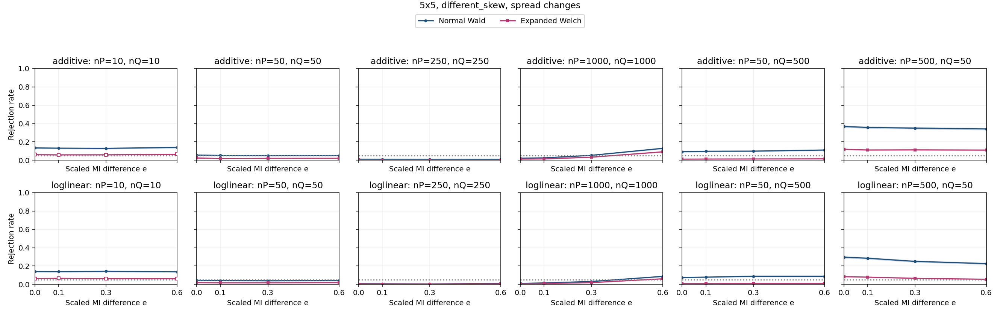

| Specification | Setting |
| --- | --- |
| Table shape | 5x5 |
| Horizontal graph regime specifications (columns) | (nP,nQ)={(10,10),(50,50),(250,250),(1000,1000),(50,500),(500,50)} |
| Vertical graph regime specifications (rows) | Top: additive probability changes; bottom: ordinal log-linear control. Each panel plots both Wald and Expanded Welch. |
| Fixed margins for both constructors | P: row 1 and column 1 each have probability 0.7, every other row/column 0.3/4; Q: row 1 and column 1 each have probability 0.8, every other row/column 0.2/4 |
| Additive direction in P and Q | H=ss^T, s=[-1.0, -0.5, 0.0, 0.5, 1.0] (equally spaced scores; displayed rounded) |
| Log-linear direction in P and Q | Products of equally spaced row/column scores from -1 to 1; ordinal in both populations |
| MI settings | M=0.010794 nats; I(P)=0.0021588 nats; I(Q)=I(P)+eM; e={0,0.1,0.3,0.6} |
| Axes | e from 0 to 0.6; rejection rate from 0 to 1 |
| Replicates | 10,000 per point |

Every plotted rate, validity and minimum expected count

| Construction | nP | nQ | e | MI difference | Method | Rejection | 95% low | 95% high | Valid | Conditional rejection | Min expected P | Min expected Q |
| --- | --- | --- | --- | --- | --- | --- | --- | --- | --- | --- | --- | --- |
| additive | 10 | 10 | 0 | 0 | expanded_welch | 0.0611 | 0.05657 | 0.06597 | 0.7817 | 0.07816 | 0.04052 | 0.01411 |
| additive | 10 | 10 | 0 | 0 | normal_wald | 0.1346 | 0.1281 | 0.1414 | 0.9891 | 0.1361 | 0.04052 | 0.01411 |
| additive | 10 | 10 | 0.1 | 0.001079 | expanded_welch | 0.0591 | 0.05465 | 0.06389 | 0.7751 | 0.07625 | 0.04052 | 0.01163 |
| additive | 10 | 10 | 0.1 | 0.001079 | normal_wald | 0.132 | 0.1255 | 0.1388 | 0.9887 | 0.1335 | 0.04052 | 0.01163 |
| additive | 10 | 10 | 0.3 | 0.003238 | expanded_welch | 0.0597 | 0.05522 | 0.06452 | 0.7778 | 0.07675 | 0.04052 | 0.007755 |
| additive | 10 | 10 | 0.3 | 0.003238 | normal_wald | 0.13 | 0.1236 | 0.1367 | 0.9895 | 0.1314 | 0.04052 | 0.007755 |
| additive | 10 | 10 | 0.6 | 0.006476 | expanded_welch | 0.0653 | 0.06062 | 0.07031 | 0.7811 | 0.0836 | 0.04052 | 0.003437 |
| additive | 10 | 10 | 0.6 | 0.006476 | normal_wald | 0.14 | 0.1333 | 0.1469 | 0.9894 | 0.1415 | 0.04052 | 0.003437 |
| additive | 50 | 50 | 0 | 0 | expanded_welch | 0.0248 | 0.02193 | 0.02804 | 1 | 0.0248 | 0.2026 | 0.07053 |
| additive | 50 | 50 | 0 | 0 | normal_wald | 0.0563 | 0.05195 | 0.06099 | 1 | 0.0563 | 0.2026 | 0.07053 |
| additive | 50 | 50 | 0.1 | 0.001079 | expanded_welch | 0.0193 | 0.01678 | 0.02219 | 1 | 0.0193 | 0.2026 | 0.05813 |
| additive | 50 | 50 | 0.1 | 0.001079 | normal_wald | 0.053 | 0.04878 | 0.05757 | 1 | 0.053 | 0.2026 | 0.05813 |
| additive | 50 | 50 | 0.3 | 0.003238 | expanded_welch | 0.0211 | 0.01846 | 0.02411 | 0.9999 | 0.0211 | 0.2026 | 0.03877 |
| additive | 50 | 50 | 0.3 | 0.003238 | normal_wald | 0.0513 | 0.04715 | 0.0558 | 1 | 0.0513 | 0.2026 | 0.03877 |
| additive | 50 | 50 | 0.6 | 0.006476 | expanded_welch | 0.0216 | 0.01893 | 0.02464 | 1 | 0.0216 | 0.2026 | 0.01719 |
| additive | 50 | 50 | 0.6 | 0.006476 | normal_wald | 0.0524 | 0.0482 | 0.05694 | 1 | 0.0524 | 0.2026 | 0.01719 |
| additive | 50 | 500 | 0 | 0 | expanded_welch | 0.0126 | 0.01059 | 0.01498 | 1 | 0.0126 | 0.2026 | 0.7053 |
| additive | 50 | 500 | 0 | 0 | normal_wald | 0.0932 | 0.08766 | 0.09906 | 1 | 0.0932 | 0.2026 | 0.7053 |
| additive | 50 | 500 | 0.1 | 0.001079 | expanded_welch | 0.0136 | 0.01151 | 0.01606 | 1 | 0.0136 | 0.2026 | 0.5813 |
| additive | 50 | 500 | 0.1 | 0.001079 | normal_wald | 0.0983 | 0.09262 | 0.1043 | 1 | 0.0983 | 0.2026 | 0.5813 |
| additive | 50 | 500 | 0.3 | 0.003238 | expanded_welch | 0.0144 | 0.01224 | 0.01693 | 1 | 0.0144 | 0.2026 | 0.3877 |
| additive | 50 | 500 | 0.3 | 0.003238 | normal_wald | 0.0997 | 0.09398 | 0.1057 | 1 | 0.0997 | 0.2026 | 0.3877 |
| additive | 50 | 500 | 0.6 | 0.006476 | expanded_welch | 0.0156 | 0.01335 | 0.01822 | 1 | 0.0156 | 0.2026 | 0.1719 |
| additive | 50 | 500 | 0.6 | 0.006476 | normal_wald | 0.1117 | 0.1057 | 0.118 | 1 | 0.1117 | 0.2026 | 0.1719 |
| additive | 250 | 250 | 0 | 0 | expanded_welch | 0.004 | 0.002939 | 0.005442 | 1 | 0.004 | 1.013 | 0.3527 |
| additive | 250 | 250 | 0 | 0 | normal_wald | 0.0118 | 0.009863 | 0.01411 | 1 | 0.0118 | 1.013 | 0.3527 |
| additive | 250 | 250 | 0.1 | 0.001079 | expanded_welch | 0.0031 | 0.002185 | 0.004397 | 1 | 0.0031 | 1.013 | 0.2907 |
| additive | 250 | 250 | 0.1 | 0.001079 | normal_wald | 0.0102 | 0.00841 | 0.01237 | 1 | 0.0102 | 1.013 | 0.2907 |
| additive | 250 | 250 | 0.3 | 0.003238 | expanded_welch | 0.0028 | 0.001938 | 0.004044 | 1 | 0.0028 | 1.013 | 0.1939 |
| additive | 250 | 250 | 0.3 | 0.003238 | normal_wald | 0.0094 | 0.007688 | 0.01149 | 1 | 0.0094 | 1.013 | 0.1939 |
| additive | 250 | 250 | 0.6 | 0.006476 | expanded_welch | 0.0027 | 0.001856 | 0.003926 | 1 | 0.0027 | 1.013 | 0.08593 |
| additive | 250 | 250 | 0.6 | 0.006476 | normal_wald | 0.0095 | 0.007778 | 0.0116 | 1 | 0.0095 | 1.013 | 0.08593 |
| additive | 500 | 50 | 0 | 0 | expanded_welch | 0.1203 | 0.1141 | 0.1268 | 1 | 0.1203 | 2.026 | 0.07053 |
| additive | 500 | 50 | 0 | 0 | normal_wald | 0.3684 | 0.359 | 0.3779 | 1 | 0.3684 | 2.026 | 0.07053 |
| additive | 500 | 50 | 0.1 | 0.001079 | expanded_welch | 0.112 | 0.106 | 0.1183 | 1 | 0.112 | 2.026 | 0.05813 |
| additive | 500 | 50 | 0.1 | 0.001079 | normal_wald | 0.3579 | 0.3486 | 0.3673 | 1 | 0.3579 | 2.026 | 0.05813 |
| additive | 500 | 50 | 0.3 | 0.003238 | expanded_welch | 0.1134 | 0.1073 | 0.1198 | 1 | 0.1134 | 2.026 | 0.03877 |
| additive | 500 | 50 | 0.3 | 0.003238 | normal_wald | 0.3506 | 0.3413 | 0.36 | 1 | 0.3506 | 2.026 | 0.03877 |
| additive | 500 | 50 | 0.6 | 0.006476 | expanded_welch | 0.1111 | 0.1051 | 0.1174 | 1 | 0.1111 | 2.026 | 0.01719 |
| additive | 500 | 50 | 0.6 | 0.006476 | normal_wald | 0.3416 | 0.3324 | 0.351 | 1 | 0.3416 | 2.026 | 0.01719 |
| additive | 1000 | 1000 | 0 | 0 | expanded_welch | 0.0135 | 0.01142 | 0.01596 | 1 | 0.0135 | 4.052 | 1.411 |
| additive | 1000 | 1000 | 0 | 0 | normal_wald | 0.0224 | 0.01968 | 0.02549 | 1 | 0.0224 | 4.052 | 1.411 |
| additive | 1000 | 1000 | 0.1 | 0.001079 | expanded_welch | 0.0148 | 0.01261 | 0.01736 | 1 | 0.0148 | 4.052 | 1.163 |
| additive | 1000 | 1000 | 0.1 | 0.001079 | normal_wald | 0.0262 | 0.02325 | 0.02952 | 1 | 0.0262 | 4.052 | 1.163 |
| additive | 1000 | 1000 | 0.3 | 0.003238 | expanded_welch | 0.0338 | 0.03043 | 0.03752 | 1 | 0.0338 | 4.052 | 0.7755 |
| additive | 1000 | 1000 | 0.3 | 0.003238 | normal_wald | 0.0541 | 0.04984 | 0.05871 | 1 | 0.0541 | 4.052 | 0.7755 |
| additive | 1000 | 1000 | 0.6 | 0.006476 | expanded_welch | 0.0922 | 0.08669 | 0.09803 | 1 | 0.0922 | 4.052 | 0.3437 |
| additive | 1000 | 1000 | 0.6 | 0.006476 | normal_wald | 0.1302 | 0.1237 | 0.1369 | 1 | 0.1302 | 4.052 | 0.3437 |
| loglinear | 10 | 10 | 0 | 0 | expanded_welch | 0.0648 | 0.06014 | 0.06979 | 0.7842 | 0.08263 | 0.05649 | 0.02534 |
| loglinear | 10 | 10 | 0 | 0 | normal_wald | 0.1414 | 0.1347 | 0.1484 | 0.9905 | 0.1428 | 0.05649 | 0.02534 |
| loglinear | 10 | 10 | 0.1 | 0.001079 | expanded_welch | 0.066 | 0.0613 | 0.07103 | 0.7855 | 0.08402 | 0.05649 | 0.02542 |
| loglinear | 10 | 10 | 0.1 | 0.001079 | normal_wald | 0.1394 | 0.1327 | 0.1463 | 0.9874 | 0.1412 | 0.05649 | 0.02542 |
| loglinear | 10 | 10 | 0.3 | 0.003238 | expanded_welch | 0.0637 | 0.05908 | 0.06866 | 0.7808 | 0.08158 | 0.05649 | 0.02556 |
| loglinear | 10 | 10 | 0.3 | 0.003238 | normal_wald | 0.1433 | 0.1366 | 0.1503 | 0.99 | 0.1447 | 0.05649 | 0.02556 |
| loglinear | 10 | 10 | 0.6 | 0.006476 | expanded_welch | 0.0631 | 0.0585 | 0.06804 | 0.7829 | 0.0806 | 0.05649 | 0.02574 |
| loglinear | 10 | 10 | 0.6 | 0.006476 | normal_wald | 0.1379 | 0.1313 | 0.1448 | 0.9886 | 0.1395 | 0.05649 | 0.02574 |
| loglinear | 50 | 50 | 0 | 0 | expanded_welch | 0.0194 | 0.01688 | 0.02229 | 0.9999 | 0.0194 | 0.2825 | 0.1267 |
| loglinear | 50 | 50 | 0 | 0 | normal_wald | 0.0455 | 0.04159 | 0.04976 | 1 | 0.0455 | 0.2825 | 0.1267 |
| loglinear | 50 | 50 | 0.1 | 0.001079 | expanded_welch | 0.0176 | 0.0152 | 0.02037 | 1 | 0.0176 | 0.2825 | 0.1271 |
| loglinear | 50 | 50 | 0.1 | 0.001079 | normal_wald | 0.043 | 0.0392 | 0.04715 | 1 | 0.043 | 0.2825 | 0.1271 |
| loglinear | 50 | 50 | 0.3 | 0.003238 | expanded_welch | 0.0178 | 0.01539 | 0.02058 | 1 | 0.0178 | 0.2825 | 0.1278 |
| loglinear | 50 | 50 | 0.3 | 0.003238 | normal_wald | 0.0396 | 0.03595 | 0.0436 | 1 | 0.0396 | 0.2825 | 0.1278 |
| loglinear | 50 | 50 | 0.6 | 0.006476 | expanded_welch | 0.0194 | 0.01688 | 0.02229 | 0.9999 | 0.0194 | 0.2825 | 0.1287 |
| loglinear | 50 | 50 | 0.6 | 0.006476 | normal_wald | 0.0421 | 0.03834 | 0.04621 | 1 | 0.0421 | 0.2825 | 0.1287 |
| loglinear | 50 | 500 | 0 | 0 | expanded_welch | 0.0091 | 0.007418 | 0.01116 | 1 | 0.0091 | 0.2825 | 1.267 |
| loglinear | 50 | 500 | 0 | 0 | normal_wald | 0.076 | 0.07097 | 0.08136 | 1 | 0.076 | 0.2825 | 1.267 |
| loglinear | 50 | 500 | 0.1 | 0.001079 | expanded_welch | 0.0094 | 0.007688 | 0.01149 | 1 | 0.0094 | 0.2825 | 1.271 |
| loglinear | 50 | 500 | 0.1 | 0.001079 | normal_wald | 0.0792 | 0.07407 | 0.08466 | 1 | 0.0792 | 0.2825 | 1.271 |
| loglinear | 50 | 500 | 0.3 | 0.003238 | expanded_welch | 0.011 | 0.009135 | 0.01324 | 1 | 0.011 | 0.2825 | 1.278 |
| loglinear | 50 | 500 | 0.3 | 0.003238 | normal_wald | 0.089 | 0.08358 | 0.09474 | 1 | 0.089 | 0.2825 | 1.278 |
| loglinear | 50 | 500 | 0.6 | 0.006476 | expanded_welch | 0.0112 | 0.009317 | 0.01346 | 1 | 0.0112 | 0.2825 | 1.287 |
| loglinear | 50 | 500 | 0.6 | 0.006476 | normal_wald | 0.089 | 0.08358 | 0.09474 | 1 | 0.089 | 0.2825 | 1.287 |
| loglinear | 250 | 250 | 0 | 0 | expanded_welch | 0.0028 | 0.001938 | 0.004044 | 1 | 0.0028 | 1.412 | 0.6335 |
| loglinear | 250 | 250 | 0 | 0 | normal_wald | 0.0075 | 0.005988 | 0.00939 | 1 | 0.0075 | 1.412 | 0.6335 |
| loglinear | 250 | 250 | 0.1 | 0.001079 | expanded_welch | 0.0029 | 0.00202 | 0.004162 | 1 | 0.0029 | 1.412 | 0.6356 |
| loglinear | 250 | 250 | 0.1 | 0.001079 | normal_wald | 0.0068 | 0.005368 | 0.008611 | 1 | 0.0068 | 1.412 | 0.6356 |
| loglinear | 250 | 250 | 0.3 | 0.003238 | expanded_welch | 0.0023 | 0.001533 | 0.003449 | 1 | 0.0023 | 1.412 | 0.639 |
| loglinear | 250 | 250 | 0.3 | 0.003238 | normal_wald | 0.0052 | 0.003968 | 0.006812 | 1 | 0.0052 | 1.412 | 0.639 |
| loglinear | 250 | 250 | 0.6 | 0.006476 | expanded_welch | 0.004 | 0.002939 | 0.005442 | 1 | 0.004 | 1.412 | 0.6434 |
| loglinear | 250 | 250 | 0.6 | 0.006476 | normal_wald | 0.0099 | 0.008139 | 0.01204 | 1 | 0.0099 | 1.412 | 0.6434 |
| loglinear | 500 | 50 | 0 | 0 | expanded_welch | 0.0844 | 0.07911 | 0.09001 | 0.9999 | 0.08441 | 2.825 | 0.1267 |
| loglinear | 500 | 50 | 0 | 0 | normal_wald | 0.2969 | 0.288 | 0.3059 | 1 | 0.2969 | 2.825 | 0.1267 |
| loglinear | 500 | 50 | 0.1 | 0.001079 | expanded_welch | 0.0794 | 0.07426 | 0.08486 | 1 | 0.0794 | 2.825 | 0.1271 |
| loglinear | 500 | 50 | 0.1 | 0.001079 | normal_wald | 0.2853 | 0.2765 | 0.2942 | 1 | 0.2853 | 2.825 | 0.1271 |
| loglinear | 500 | 50 | 0.3 | 0.003238 | expanded_welch | 0.0662 | 0.06149 | 0.07124 | 1 | 0.0662 | 2.825 | 0.1278 |
| loglinear | 500 | 50 | 0.3 | 0.003238 | normal_wald | 0.2511 | 0.2427 | 0.2597 | 1 | 0.2511 | 2.825 | 0.1278 |
| loglinear | 500 | 50 | 0.6 | 0.006476 | expanded_welch | 0.0562 | 0.05185 | 0.06089 | 1 | 0.0562 | 2.825 | 0.1287 |
| loglinear | 500 | 50 | 0.6 | 0.006476 | normal_wald | 0.2267 | 0.2186 | 0.235 | 1 | 0.2267 | 2.825 | 0.1287 |
| loglinear | 1000 | 1000 | 0 | 0 | expanded_welch | 0.0053 | 0.004055 | 0.006925 | 1 | 0.0053 | 5.649 | 2.534 |
| loglinear | 1000 | 1000 | 0 | 0 | normal_wald | 0.0108 | 0.008954 | 0.01302 | 1 | 0.0108 | 5.649 | 2.534 |
| loglinear | 1000 | 1000 | 0.1 | 0.001079 | expanded_welch | 0.0095 | 0.007778 | 0.0116 | 1 | 0.0095 | 5.649 | 2.542 |
| loglinear | 1000 | 1000 | 0.1 | 0.001079 | normal_wald | 0.0161 | 0.01381 | 0.01876 | 1 | 0.0161 | 5.649 | 2.542 |
| loglinear | 1000 | 1000 | 0.3 | 0.003238 | expanded_welch | 0.0197 | 0.01716 | 0.02261 | 1 | 0.0197 | 5.649 | 2.556 |
| loglinear | 1000 | 1000 | 0.3 | 0.003238 | normal_wald | 0.0319 | 0.02863 | 0.03553 | 1 | 0.0319 | 5.649 | 2.556 |
| loglinear | 1000 | 1000 | 0.6 | 0.006476 | expanded_welch | 0.0612 | 0.05667 | 0.06607 | 1 | 0.0612 | 5.649 | 2.574 |
| loglinear | 1000 | 1000 | 0.6 | 0.006476 | normal_wald | 0.0874 | 0.08202 | 0.09309 | 1 | 0.0874 | 5.649 | 2.574 |

### 3.15. 8x8: uniform, common

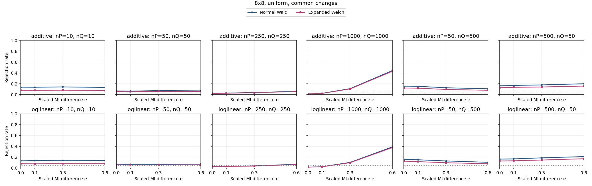

| Specification | Setting |
| --- | --- |
| Table shape | 8x8 |
| Horizontal graph regime specifications (columns) | (nP,nQ)={(10,10),(50,50),(250,250),(1000,1000),(50,500),(500,50)} |
| Vertical graph regime specifications (rows) | Top: additive probability changes; bottom: ordinal log-linear control. Each panel plots both Wald and Expanded Welch. |
| Fixed margins for both constructors | P and Q: each row and column has probability 1/8 |
| Additive direction in P and Q | Rows 1,2 and columns 1,2: add t to the block diagonal, subtract t off diagonal |
| Log-linear direction in P and Q | Products of equally spaced row/column scores from -1 to 1; ordinal in both populations |
| MI settings | M=0.036015 nats; I(P)=0.007203 nats; I(Q)=I(P)+eM; e={0,0.1,0.3,0.6} |
| Axes | e from 0 to 0.6; rejection rate from 0 to 1 |
| Replicates | 10,000 per point |

Every plotted rate, validity and minimum expected count

| Construction | nP | nQ | e | MI difference | Method | Rejection | 95% low | 95% high | Valid | Conditional rejection | Min expected P | Min expected Q |
| --- | --- | --- | --- | --- | --- | --- | --- | --- | --- | --- | --- | --- |
| additive | 10 | 10 | 0 | 0 | expanded_welch | 0.0797 | 0.07455 | 0.08517 | 0.9988 | 0.0798 | 0.08271 | 0.08271 |
| additive | 10 | 10 | 0 | 0 | normal_wald | 0.1373 | 0.1307 | 0.1442 | 1 | 0.1373 | 0.08271 | 0.08271 |
| additive | 10 | 10 | 0.1 | 0.003602 | expanded_welch | 0.0786 | 0.07349 | 0.08404 | 0.9998 | 0.07862 | 0.08271 | 0.06713 |
| additive | 10 | 10 | 0.1 | 0.003602 | normal_wald | 0.1359 | 0.1293 | 0.1428 | 1 | 0.1359 | 0.08271 | 0.06713 |
| additive | 10 | 10 | 0.3 | 0.0108 | expanded_welch | 0.0814 | 0.0762 | 0.08692 | 0.9995 | 0.08144 | 0.08271 | 0.04376 |
| additive | 10 | 10 | 0.3 | 0.0108 | normal_wald | 0.1425 | 0.1358 | 0.1495 | 1 | 0.1425 | 0.08271 | 0.04376 |
| additive | 10 | 10 | 0.6 | 0.02161 | expanded_welch | 0.0749 | 0.0699 | 0.08022 | 0.9994 | 0.07494 | 0.08271 | 0.01934 |
| additive | 10 | 10 | 0.6 | 0.02161 | normal_wald | 0.1323 | 0.1258 | 0.1391 | 1 | 0.1323 | 0.08271 | 0.01934 |
| additive | 50 | 50 | 0 | 0 | expanded_welch | 0.0566 | 0.05224 | 0.0613 | 1 | 0.0566 | 0.4136 | 0.4136 |
| additive | 50 | 50 | 0 | 0 | normal_wald | 0.0686 | 0.06381 | 0.07372 | 1 | 0.0686 | 0.4136 | 0.4136 |
| additive | 50 | 50 | 0.1 | 0.003602 | expanded_welch | 0.0536 | 0.04935 | 0.05819 | 1 | 0.0536 | 0.4136 | 0.3357 |
| additive | 50 | 50 | 0.1 | 0.003602 | normal_wald | 0.0651 | 0.06043 | 0.0701 | 1 | 0.0651 | 0.4136 | 0.3357 |
| additive | 50 | 50 | 0.3 | 0.0108 | expanded_welch | 0.0604 | 0.0559 | 0.06524 | 1 | 0.0604 | 0.4136 | 0.2188 |
| additive | 50 | 50 | 0.3 | 0.0108 | normal_wald | 0.0741 | 0.06913 | 0.0794 | 1 | 0.0741 | 0.4136 | 0.2188 |
| additive | 50 | 50 | 0.6 | 0.02161 | expanded_welch | 0.0586 | 0.05416 | 0.06338 | 1 | 0.0586 | 0.4136 | 0.09671 |
| additive | 50 | 50 | 0.6 | 0.02161 | normal_wald | 0.0695 | 0.06468 | 0.07465 | 1 | 0.0695 | 0.4136 | 0.09671 |
| additive | 50 | 500 | 0 | 0 | expanded_welch | 0.122 | 0.1157 | 0.1286 | 1 | 0.122 | 0.4136 | 4.136 |
| additive | 50 | 500 | 0 | 0 | normal_wald | 0.1559 | 0.1489 | 0.1631 | 1 | 0.1559 | 0.4136 | 4.136 |
| additive | 50 | 500 | 0.1 | 0.003602 | expanded_welch | 0.1188 | 0.1126 | 0.1253 | 1 | 0.1188 | 0.4136 | 3.357 |
| additive | 50 | 500 | 0.1 | 0.003602 | normal_wald | 0.1535 | 0.1466 | 0.1607 | 1 | 0.1535 | 0.4136 | 3.357 |
| additive | 50 | 500 | 0.3 | 0.0108 | expanded_welch | 0.0955 | 0.08989 | 0.1014 | 1 | 0.0955 | 0.4136 | 2.188 |
| additive | 50 | 500 | 0.3 | 0.0108 | normal_wald | 0.1263 | 0.1199 | 0.133 | 1 | 0.1263 | 0.4136 | 2.188 |
| additive | 50 | 500 | 0.6 | 0.02161 | expanded_welch | 0.0797 | 0.07455 | 0.08517 | 1 | 0.0797 | 0.4136 | 0.9671 |
| additive | 50 | 500 | 0.6 | 0.02161 | normal_wald | 0.1076 | 0.1017 | 0.1138 | 1 | 0.1076 | 0.4136 | 0.9671 |
| additive | 250 | 250 | 0 | 0 | expanded_welch | 0.0223 | 0.01958 | 0.02538 | 1 | 0.0223 | 2.068 | 2.068 |
| additive | 250 | 250 | 0 | 0 | normal_wald | 0.0253 | 0.0224 | 0.02856 | 1 | 0.0253 | 2.068 | 2.068 |
| additive | 250 | 250 | 0.1 | 0.003602 | expanded_welch | 0.0251 | 0.02221 | 0.02835 | 1 | 0.0251 | 2.068 | 1.678 |
| additive | 250 | 250 | 0.1 | 0.003602 | normal_wald | 0.0287 | 0.0256 | 0.03216 | 1 | 0.0287 | 2.068 | 1.678 |
| additive | 250 | 250 | 0.3 | 0.0108 | expanded_welch | 0.0352 | 0.03176 | 0.03899 | 1 | 0.0352 | 2.068 | 1.094 |
| additive | 250 | 250 | 0.3 | 0.0108 | normal_wald | 0.0389 | 0.03528 | 0.04287 | 1 | 0.0389 | 2.068 | 1.094 |
| additive | 250 | 250 | 0.6 | 0.02161 | expanded_welch | 0.0566 | 0.05224 | 0.0613 | 1 | 0.0566 | 2.068 | 0.4836 |
| additive | 250 | 250 | 0.6 | 0.02161 | normal_wald | 0.0614 | 0.05686 | 0.06628 | 1 | 0.0614 | 2.068 | 0.4836 |
| additive | 500 | 50 | 0 | 0 | expanded_welch | 0.1276 | 0.1212 | 0.1343 | 1 | 0.1276 | 4.136 | 0.4136 |
| additive | 500 | 50 | 0 | 0 | normal_wald | 0.1623 | 0.1552 | 0.1697 | 1 | 0.1623 | 4.136 | 0.4136 |
| additive | 500 | 50 | 0.1 | 0.003602 | expanded_welch | 0.1342 | 0.1277 | 0.141 | 1 | 0.1342 | 4.136 | 0.3357 |
| additive | 500 | 50 | 0.1 | 0.003602 | normal_wald | 0.169 | 0.1618 | 0.1765 | 1 | 0.169 | 4.136 | 0.3357 |
| additive | 500 | 50 | 0.3 | 0.0108 | expanded_welch | 0.1411 | 0.1344 | 0.1481 | 1 | 0.1411 | 4.136 | 0.2188 |
| additive | 500 | 50 | 0.3 | 0.0108 | normal_wald | 0.1794 | 0.172 | 0.187 | 1 | 0.1794 | 4.136 | 0.2188 |
| additive | 500 | 50 | 0.6 | 0.02161 | expanded_welch | 0.1572 | 0.1502 | 0.1645 | 1 | 0.1572 | 4.136 | 0.09671 |
| additive | 500 | 50 | 0.6 | 0.02161 | normal_wald | 0.2002 | 0.1925 | 0.2082 | 1 | 0.2002 | 4.136 | 0.09671 |
| additive | 1000 | 1000 | 0 | 0 | expanded_welch | 0.0119 | 0.009954 | 0.01422 | 1 | 0.0119 | 8.271 | 8.271 |
| additive | 1000 | 1000 | 0 | 0 | normal_wald | 0.0131 | 0.01105 | 0.01552 | 1 | 0.0131 | 8.271 | 8.271 |
| additive | 1000 | 1000 | 0.1 | 0.003602 | expanded_welch | 0.0218 | 0.01912 | 0.02485 | 1 | 0.0218 | 8.271 | 6.713 |
| additive | 1000 | 1000 | 0.1 | 0.003602 | normal_wald | 0.0242 | 0.02137 | 0.0274 | 1 | 0.0242 | 8.271 | 6.713 |
| additive | 1000 | 1000 | 0.3 | 0.0108 | expanded_welch | 0.1053 | 0.09943 | 0.1115 | 1 | 0.1053 | 8.271 | 4.376 |
| additive | 1000 | 1000 | 0.3 | 0.0108 | normal_wald | 0.111 | 0.105 | 0.1173 | 1 | 0.111 | 8.271 | 4.376 |
| additive | 1000 | 1000 | 0.6 | 0.02161 | expanded_welch | 0.4298 | 0.4201 | 0.4395 | 1 | 0.4298 | 8.271 | 1.934 |
| additive | 1000 | 1000 | 0.6 | 0.02161 | normal_wald | 0.4433 | 0.4336 | 0.4531 | 1 | 0.4433 | 8.271 | 1.934 |
| loglinear | 10 | 10 | 0 | 0 | expanded_welch | 0.0774 | 0.07232 | 0.0828 | 0.9996 | 0.07743 | 0.1147 | 0.1147 |
| loglinear | 10 | 10 | 0 | 0 | normal_wald | 0.1314 | 0.1249 | 0.1382 | 1 | 0.1314 | 0.1147 | 0.1147 |
| loglinear | 10 | 10 | 0.1 | 0.003602 | expanded_welch | 0.0764 | 0.07135 | 0.08177 | 0.9998 | 0.07642 | 0.1147 | 0.1061 |
| loglinear | 10 | 10 | 0.1 | 0.003602 | normal_wald | 0.1359 | 0.1293 | 0.1428 | 1 | 0.1359 | 0.1147 | 0.1061 |
| loglinear | 10 | 10 | 0.3 | 0.0108 | expanded_welch | 0.0788 | 0.07368 | 0.08424 | 0.9996 | 0.07883 | 0.1147 | 0.09297 |
| loglinear | 10 | 10 | 0.3 | 0.0108 | normal_wald | 0.1407 | 0.134 | 0.1477 | 1 | 0.1407 | 0.1147 | 0.09297 |
| loglinear | 10 | 10 | 0.6 | 0.02161 | expanded_welch | 0.0776 | 0.07252 | 0.08301 | 0.9996 | 0.07763 | 0.1147 | 0.07855 |
| loglinear | 10 | 10 | 0.6 | 0.02161 | normal_wald | 0.1379 | 0.1313 | 0.1448 | 1 | 0.1379 | 0.1147 | 0.07855 |
| loglinear | 50 | 50 | 0 | 0 | expanded_welch | 0.0588 | 0.05436 | 0.06358 | 1 | 0.0588 | 0.5736 | 0.5736 |
| loglinear | 50 | 50 | 0 | 0 | normal_wald | 0.0709 | 0.06603 | 0.0761 | 1 | 0.0709 | 0.5736 | 0.5736 |
| loglinear | 50 | 50 | 0.1 | 0.003602 | expanded_welch | 0.0557 | 0.05137 | 0.06037 | 1 | 0.0557 | 0.5736 | 0.5304 |
| loglinear | 50 | 50 | 0.1 | 0.003602 | normal_wald | 0.0672 | 0.06246 | 0.07228 | 1 | 0.0672 | 0.5736 | 0.5304 |
| loglinear | 50 | 50 | 0.3 | 0.0108 | expanded_welch | 0.0572 | 0.05282 | 0.06192 | 1 | 0.0572 | 0.5736 | 0.4648 |
| loglinear | 50 | 50 | 0.3 | 0.0108 | normal_wald | 0.0682 | 0.06342 | 0.07331 | 1 | 0.0682 | 0.5736 | 0.4648 |
| loglinear | 50 | 50 | 0.6 | 0.02161 | expanded_welch | 0.0593 | 0.05484 | 0.0641 | 1 | 0.0593 | 0.5736 | 0.3927 |
| loglinear | 50 | 50 | 0.6 | 0.02161 | normal_wald | 0.0719 | 0.067 | 0.07713 | 1 | 0.0719 | 0.5736 | 0.3927 |
| loglinear | 50 | 500 | 0 | 0 | expanded_welch | 0.1251 | 0.1188 | 0.1317 | 1 | 0.1251 | 0.5736 | 5.736 |
| loglinear | 50 | 500 | 0 | 0 | normal_wald | 0.1604 | 0.1533 | 0.1677 | 1 | 0.1604 | 0.5736 | 5.736 |
| loglinear | 50 | 500 | 0.1 | 0.003602 | expanded_welch | 0.1168 | 0.1107 | 0.1232 | 1 | 0.1168 | 0.5736 | 5.304 |
| loglinear | 50 | 500 | 0.1 | 0.003602 | normal_wald | 0.1512 | 0.1443 | 0.1584 | 1 | 0.1512 | 0.5736 | 5.304 |
| loglinear | 50 | 500 | 0.3 | 0.0108 | expanded_welch | 0.0962 | 0.09057 | 0.1021 | 1 | 0.0962 | 0.5736 | 4.648 |
| loglinear | 50 | 500 | 0.3 | 0.0108 | normal_wald | 0.1293 | 0.1229 | 0.136 | 1 | 0.1293 | 0.5736 | 4.648 |
| loglinear | 50 | 500 | 0.6 | 0.02161 | expanded_welch | 0.0774 | 0.07232 | 0.0828 | 1 | 0.0774 | 0.5736 | 3.927 |
| loglinear | 50 | 500 | 0.6 | 0.02161 | normal_wald | 0.1044 | 0.09856 | 0.1105 | 1 | 0.1044 | 0.5736 | 3.927 |
| loglinear | 250 | 250 | 0 | 0 | expanded_welch | 0.0263 | 0.02334 | 0.02962 | 1 | 0.0263 | 2.868 | 2.868 |
| loglinear | 250 | 250 | 0 | 0 | normal_wald | 0.0291 | 0.02598 | 0.03258 | 1 | 0.0291 | 2.868 | 2.868 |
| loglinear | 250 | 250 | 0.1 | 0.003602 | expanded_welch | 0.0272 | 0.02419 | 0.03057 | 1 | 0.0272 | 2.868 | 2.652 |
| loglinear | 250 | 250 | 0.1 | 0.003602 | normal_wald | 0.0313 | 0.02806 | 0.0349 | 1 | 0.0313 | 2.868 | 2.652 |
| loglinear | 250 | 250 | 0.3 | 0.0108 | expanded_welch | 0.0345 | 0.0311 | 0.03826 | 1 | 0.0345 | 2.868 | 2.324 |
| loglinear | 250 | 250 | 0.3 | 0.0108 | normal_wald | 0.0387 | 0.03509 | 0.04266 | 1 | 0.0387 | 2.868 | 2.324 |
| loglinear | 250 | 250 | 0.6 | 0.02161 | expanded_welch | 0.0629 | 0.05831 | 0.06783 | 1 | 0.0629 | 2.868 | 1.964 |
| loglinear | 250 | 250 | 0.6 | 0.02161 | normal_wald | 0.0684 | 0.06362 | 0.07352 | 1 | 0.0684 | 2.868 | 1.964 |
| loglinear | 500 | 50 | 0 | 0 | expanded_welch | 0.1286 | 0.1222 | 0.1353 | 1 | 0.1286 | 5.736 | 0.5736 |
| loglinear | 500 | 50 | 0 | 0 | normal_wald | 0.1635 | 0.1564 | 0.1709 | 1 | 0.1635 | 5.736 | 0.5736 |
| loglinear | 500 | 50 | 0.1 | 0.003602 | expanded_welch | 0.1321 | 0.1256 | 0.1389 | 1 | 0.1321 | 5.736 | 0.5304 |
| loglinear | 500 | 50 | 0.1 | 0.003602 | normal_wald | 0.1674 | 0.1602 | 0.1748 | 1 | 0.1674 | 5.736 | 0.5304 |
| loglinear | 500 | 50 | 0.3 | 0.0108 | expanded_welch | 0.1463 | 0.1395 | 0.1534 | 1 | 0.1463 | 5.736 | 0.4648 |
| loglinear | 500 | 50 | 0.3 | 0.0108 | normal_wald | 0.1864 | 0.1789 | 0.1942 | 1 | 0.1864 | 5.736 | 0.4648 |
| loglinear | 500 | 50 | 0.6 | 0.02161 | expanded_welch | 0.17 | 0.1628 | 0.1775 | 1 | 0.17 | 5.736 | 0.3927 |
| loglinear | 500 | 50 | 0.6 | 0.02161 | normal_wald | 0.2096 | 0.2017 | 0.2177 | 1 | 0.2096 | 5.736 | 0.3927 |
| loglinear | 1000 | 1000 | 0 | 0 | expanded_welch | 0.014 | 0.01188 | 0.0165 | 1 | 0.014 | 11.47 | 11.47 |
| loglinear | 1000 | 1000 | 0 | 0 | normal_wald | 0.015 | 0.0128 | 0.01758 | 1 | 0.015 | 11.47 | 11.47 |
| loglinear | 1000 | 1000 | 0.1 | 0.003602 | expanded_welch | 0.0207 | 0.01809 | 0.02368 | 1 | 0.0207 | 11.47 | 10.61 |
| loglinear | 1000 | 1000 | 0.1 | 0.003602 | normal_wald | 0.0237 | 0.0209 | 0.02687 | 1 | 0.0237 | 11.47 | 10.61 |
| loglinear | 1000 | 1000 | 0.3 | 0.0108 | expanded_welch | 0.0976 | 0.09194 | 0.1036 | 1 | 0.0976 | 11.47 | 9.297 |
| loglinear | 1000 | 1000 | 0.3 | 0.0108 | normal_wald | 0.1034 | 0.09758 | 0.1095 | 1 | 0.1034 | 11.47 | 9.297 |
| loglinear | 1000 | 1000 | 0.6 | 0.02161 | expanded_welch | 0.3763 | 0.3669 | 0.3858 | 1 | 0.3763 | 11.47 | 7.855 |
| loglinear | 1000 | 1000 | 0.6 | 0.02161 | normal_wald | 0.388 | 0.3785 | 0.3976 | 1 | 0.388 | 11.47 | 7.855 |

### 3.16. 8x8: uniform, rare

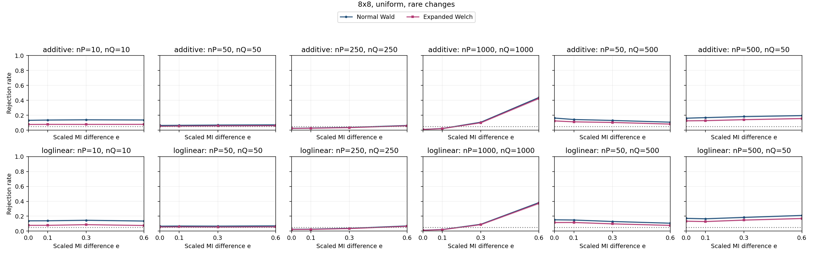

| Specification | Setting |
| --- | --- |
| Table shape | 8x8 |
| Horizontal graph regime specifications (columns) | (nP,nQ)={(10,10),(50,50),(250,250),(1000,1000),(50,500),(500,50)} |
| Vertical graph regime specifications (rows) | Top: additive probability changes; bottom: ordinal log-linear control. Each panel plots both Wald and Expanded Welch. |
| Fixed margins for both constructors | P and Q: each row and column has probability 1/8 |
| Additive direction in P and Q | Rows 7,8 and columns 7,8: add t to the block diagonal, subtract t off diagonal |
| Log-linear direction in P and Q | Products of equally spaced row/column scores from -1 to 1; ordinal in both populations |
| MI settings | M=0.036015 nats; I(P)=0.007203 nats; I(Q)=I(P)+eM; e={0,0.1,0.3,0.6} |
| Axes | e from 0 to 0.6; rejection rate from 0 to 1 |
| Replicates | 10,000 per point |

Every plotted rate, validity and minimum expected count

| Construction | nP | nQ | e | MI difference | Method | Rejection | 95% low | 95% high | Valid | Conditional rejection | Min expected P | Min expected Q |
| --- | --- | --- | --- | --- | --- | --- | --- | --- | --- | --- | --- | --- |
| additive | 10 | 10 | 0 | 0 | expanded_welch | 0.0774 | 0.07232 | 0.0828 | 0.9999 | 0.07741 | 0.08271 | 0.08271 |
| additive | 10 | 10 | 0 | 0 | normal_wald | 0.1331 | 0.1266 | 0.1399 | 1 | 0.1331 | 0.08271 | 0.08271 |
| additive | 10 | 10 | 0.1 | 0.003602 | expanded_welch | 0.0785 | 0.07339 | 0.08393 | 0.9996 | 0.07853 | 0.08271 | 0.06713 |
| additive | 10 | 10 | 0.1 | 0.003602 | normal_wald | 0.1364 | 0.1298 | 0.1433 | 1 | 0.1364 | 0.08271 | 0.06713 |
| additive | 10 | 10 | 0.3 | 0.0108 | expanded_welch | 0.0782 | 0.0731 | 0.08363 | 0.9998 | 0.07822 | 0.08271 | 0.04376 |
| additive | 10 | 10 | 0.3 | 0.0108 | normal_wald | 0.1397 | 0.133 | 0.1466 | 1 | 0.1397 | 0.08271 | 0.04376 |
| additive | 10 | 10 | 0.6 | 0.02161 | expanded_welch | 0.0787 | 0.07358 | 0.08414 | 0.9992 | 0.07876 | 0.08271 | 0.01934 |
| additive | 10 | 10 | 0.6 | 0.02161 | normal_wald | 0.1373 | 0.1307 | 0.1442 | 1 | 0.1373 | 0.08271 | 0.01934 |
| additive | 50 | 50 | 0 | 0 | expanded_welch | 0.052 | 0.04782 | 0.05653 | 1 | 0.052 | 0.4136 | 0.4136 |
| additive | 50 | 50 | 0 | 0 | normal_wald | 0.0645 | 0.05985 | 0.06948 | 1 | 0.0645 | 0.4136 | 0.4136 |
| additive | 50 | 50 | 0.1 | 0.003602 | expanded_welch | 0.0554 | 0.05108 | 0.06006 | 1 | 0.0554 | 0.4136 | 0.3357 |
| additive | 50 | 50 | 0.1 | 0.003602 | normal_wald | 0.0661 | 0.0614 | 0.07114 | 1 | 0.0661 | 0.4136 | 0.3357 |
| additive | 50 | 50 | 0.3 | 0.0108 | expanded_welch | 0.0577 | 0.0533 | 0.06244 | 1 | 0.0577 | 0.4136 | 0.2188 |
| additive | 50 | 50 | 0.3 | 0.0108 | normal_wald | 0.0694 | 0.06458 | 0.07455 | 1 | 0.0694 | 0.4136 | 0.2188 |
| additive | 50 | 50 | 0.6 | 0.02161 | expanded_welch | 0.0605 | 0.05599 | 0.06534 | 1 | 0.0605 | 0.4136 | 0.09671 |
| additive | 50 | 50 | 0.6 | 0.02161 | normal_wald | 0.072 | 0.0671 | 0.07723 | 1 | 0.072 | 0.4136 | 0.09671 |
| additive | 50 | 500 | 0 | 0 | expanded_welch | 0.1251 | 0.1188 | 0.1317 | 1 | 0.1251 | 0.4136 | 4.136 |
| additive | 50 | 500 | 0 | 0 | normal_wald | 0.1631 | 0.156 | 0.1705 | 1 | 0.1631 | 0.4136 | 4.136 |
| additive | 50 | 500 | 0.1 | 0.003602 | expanded_welch | 0.1124 | 0.1064 | 0.1187 | 1 | 0.1124 | 0.4136 | 3.357 |
| additive | 50 | 500 | 0.1 | 0.003602 | normal_wald | 0.1436 | 0.1369 | 0.1506 | 1 | 0.1436 | 0.4136 | 3.357 |
| additive | 50 | 500 | 0.3 | 0.0108 | expanded_welch | 0.1043 | 0.09846 | 0.1104 | 1 | 0.1043 | 0.4136 | 2.188 |
| additive | 50 | 500 | 0.3 | 0.0108 | normal_wald | 0.1312 | 0.1247 | 0.138 | 1 | 0.1312 | 0.4136 | 2.188 |
| additive | 50 | 500 | 0.6 | 0.02161 | expanded_welch | 0.0825 | 0.07727 | 0.08805 | 1 | 0.0825 | 0.4136 | 0.9671 |
| additive | 50 | 500 | 0.6 | 0.02161 | normal_wald | 0.108 | 0.1021 | 0.1142 | 1 | 0.108 | 0.4136 | 0.9671 |
| additive | 250 | 250 | 0 | 0 | expanded_welch | 0.0245 | 0.02165 | 0.02772 | 1 | 0.0245 | 2.068 | 2.068 |
| additive | 250 | 250 | 0 | 0 | normal_wald | 0.0265 | 0.02353 | 0.02983 | 1 | 0.0265 | 2.068 | 2.068 |
| additive | 250 | 250 | 0.1 | 0.003602 | expanded_welch | 0.0264 | 0.02343 | 0.02973 | 1 | 0.0264 | 2.068 | 1.678 |
| additive | 250 | 250 | 0.1 | 0.003602 | normal_wald | 0.0293 | 0.02617 | 0.03279 | 1 | 0.0293 | 2.068 | 1.678 |
| additive | 250 | 250 | 0.3 | 0.0108 | expanded_welch | 0.0345 | 0.0311 | 0.03826 | 1 | 0.0345 | 2.068 | 1.094 |
| additive | 250 | 250 | 0.3 | 0.0108 | normal_wald | 0.0379 | 0.03433 | 0.04182 | 1 | 0.0379 | 2.068 | 1.094 |
| additive | 250 | 250 | 0.6 | 0.02161 | expanded_welch | 0.0591 | 0.05465 | 0.06389 | 1 | 0.0591 | 2.068 | 0.4836 |
| additive | 250 | 250 | 0.6 | 0.02161 | normal_wald | 0.0638 | 0.05918 | 0.06876 | 1 | 0.0638 | 2.068 | 0.4836 |
| additive | 500 | 50 | 0 | 0 | expanded_welch | 0.1259 | 0.1195 | 0.1325 | 1 | 0.1259 | 4.136 | 0.4136 |
| additive | 500 | 50 | 0 | 0 | normal_wald | 0.1612 | 0.1541 | 0.1685 | 1 | 0.1612 | 4.136 | 0.4136 |
| additive | 500 | 50 | 0.1 | 0.003602 | expanded_welch | 0.1286 | 0.1222 | 0.1353 | 1 | 0.1286 | 4.136 | 0.3357 |
| additive | 500 | 50 | 0.1 | 0.003602 | normal_wald | 0.169 | 0.1618 | 0.1765 | 1 | 0.169 | 4.136 | 0.3357 |
| additive | 500 | 50 | 0.3 | 0.0108 | expanded_welch | 0.1416 | 0.1349 | 0.1486 | 1 | 0.1416 | 4.136 | 0.2188 |
| additive | 500 | 50 | 0.3 | 0.0108 | normal_wald | 0.1831 | 0.1756 | 0.1908 | 1 | 0.1831 | 4.136 | 0.2188 |
| additive | 500 | 50 | 0.6 | 0.02161 | expanded_welch | 0.1566 | 0.1496 | 0.1639 | 1 | 0.1566 | 4.136 | 0.09671 |
| additive | 500 | 50 | 0.6 | 0.02161 | normal_wald | 0.1961 | 0.1884 | 0.204 | 1 | 0.1961 | 4.136 | 0.09671 |
| additive | 1000 | 1000 | 0 | 0 | expanded_welch | 0.0098 | 0.008049 | 0.01193 | 1 | 0.0098 | 8.271 | 8.271 |
| additive | 1000 | 1000 | 0 | 0 | normal_wald | 0.011 | 0.009135 | 0.01324 | 1 | 0.011 | 8.271 | 8.271 |
| additive | 1000 | 1000 | 0.1 | 0.003602 | expanded_welch | 0.0209 | 0.01827 | 0.02389 | 1 | 0.0209 | 8.271 | 6.713 |
| additive | 1000 | 1000 | 0.1 | 0.003602 | normal_wald | 0.0232 | 0.02043 | 0.02634 | 1 | 0.0232 | 8.271 | 6.713 |
| additive | 1000 | 1000 | 0.3 | 0.0108 | expanded_welch | 0.1004 | 0.09466 | 0.1064 | 1 | 0.1004 | 8.271 | 4.376 |
| additive | 1000 | 1000 | 0.3 | 0.0108 | normal_wald | 0.1078 | 0.1019 | 0.114 | 1 | 0.1078 | 8.271 | 4.376 |
| additive | 1000 | 1000 | 0.6 | 0.02161 | expanded_welch | 0.4262 | 0.4165 | 0.4359 | 1 | 0.4262 | 8.271 | 1.934 |
| additive | 1000 | 1000 | 0.6 | 0.02161 | normal_wald | 0.438 | 0.4283 | 0.4477 | 1 | 0.438 | 8.271 | 1.934 |
| loglinear | 10 | 10 | 0 | 0 | expanded_welch | 0.0782 | 0.0731 | 0.08363 | 0.9999 | 0.07821 | 0.1147 | 0.1147 |
| loglinear | 10 | 10 | 0 | 0 | normal_wald | 0.1385 | 0.1319 | 0.1454 | 1 | 0.1385 | 0.1147 | 0.1147 |
| loglinear | 10 | 10 | 0.1 | 0.003602 | expanded_welch | 0.0783 | 0.0732 | 0.08373 | 0.9997 | 0.07832 | 0.1147 | 0.1061 |
| loglinear | 10 | 10 | 0.1 | 0.003602 | normal_wald | 0.1394 | 0.1327 | 0.1463 | 1 | 0.1394 | 0.1147 | 0.1061 |
| loglinear | 10 | 10 | 0.3 | 0.0108 | expanded_welch | 0.0869 | 0.08154 | 0.09258 | 0.9995 | 0.08694 | 0.1147 | 0.09297 |
| loglinear | 10 | 10 | 0.3 | 0.0108 | normal_wald | 0.146 | 0.1392 | 0.1531 | 1 | 0.146 | 0.1147 | 0.09297 |
| loglinear | 10 | 10 | 0.6 | 0.02161 | expanded_welch | 0.0762 | 0.07116 | 0.08156 | 0.9997 | 0.07622 | 0.1147 | 0.07855 |
| loglinear | 10 | 10 | 0.6 | 0.02161 | normal_wald | 0.1357 | 0.1291 | 0.1426 | 1 | 0.1357 | 0.1147 | 0.07855 |
| loglinear | 50 | 50 | 0 | 0 | expanded_welch | 0.0559 | 0.05157 | 0.06058 | 1 | 0.0559 | 0.5736 | 0.5736 |
| loglinear | 50 | 50 | 0 | 0 | normal_wald | 0.0668 | 0.06207 | 0.07186 | 1 | 0.0668 | 0.5736 | 0.5736 |
| loglinear | 50 | 50 | 0.1 | 0.003602 | expanded_welch | 0.0575 | 0.0531 | 0.06223 | 1 | 0.0575 | 0.5736 | 0.5304 |
| loglinear | 50 | 50 | 0.1 | 0.003602 | normal_wald | 0.0688 | 0.064 | 0.07393 | 1 | 0.0688 | 0.5736 | 0.5304 |
| loglinear | 50 | 50 | 0.3 | 0.0108 | expanded_welch | 0.0549 | 0.0506 | 0.05954 | 1 | 0.0549 | 0.5736 | 0.4648 |
| loglinear | 50 | 50 | 0.3 | 0.0108 | normal_wald | 0.0676 | 0.06284 | 0.07269 | 1 | 0.0676 | 0.5736 | 0.4648 |
| loglinear | 50 | 50 | 0.6 | 0.02161 | expanded_welch | 0.0578 | 0.05339 | 0.06255 | 1 | 0.0578 | 0.5736 | 0.3927 |
| loglinear | 50 | 50 | 0.6 | 0.02161 | normal_wald | 0.0711 | 0.06623 | 0.0763 | 1 | 0.0711 | 0.5736 | 0.3927 |
| loglinear | 50 | 500 | 0 | 0 | expanded_welch | 0.1159 | 0.1098 | 0.1223 | 1 | 0.1159 | 0.5736 | 5.736 |
| loglinear | 50 | 500 | 0 | 0 | normal_wald | 0.1524 | 0.1455 | 0.1596 | 1 | 0.1524 | 0.5736 | 5.736 |
| loglinear | 50 | 500 | 0.1 | 0.003602 | expanded_welch | 0.1165 | 0.1104 | 0.1229 | 1 | 0.1165 | 0.5736 | 5.304 |
| loglinear | 50 | 500 | 0.1 | 0.003602 | normal_wald | 0.1493 | 0.1424 | 0.1564 | 1 | 0.1493 | 0.5736 | 5.304 |
| loglinear | 50 | 500 | 0.3 | 0.0108 | expanded_welch | 0.098 | 0.09233 | 0.104 | 1 | 0.098 | 0.5736 | 4.648 |
| loglinear | 50 | 500 | 0.3 | 0.0108 | normal_wald | 0.1296 | 0.1232 | 0.1363 | 1 | 0.1296 | 0.5736 | 4.648 |
| loglinear | 50 | 500 | 0.6 | 0.02161 | expanded_welch | 0.0772 | 0.07213 | 0.0826 | 1 | 0.0772 | 0.5736 | 3.927 |
| loglinear | 50 | 500 | 0.6 | 0.02161 | normal_wald | 0.1067 | 0.1008 | 0.1129 | 1 | 0.1067 | 0.5736 | 3.927 |
| loglinear | 250 | 250 | 0 | 0 | expanded_welch | 0.023 | 0.02024 | 0.02613 | 1 | 0.023 | 2.868 | 2.868 |
| loglinear | 250 | 250 | 0 | 0 | normal_wald | 0.0258 | 0.02287 | 0.02909 | 1 | 0.0258 | 2.868 | 2.868 |
| loglinear | 250 | 250 | 0.1 | 0.003602 | expanded_welch | 0.0236 | 0.0208 | 0.02676 | 1 | 0.0236 | 2.868 | 2.652 |
| loglinear | 250 | 250 | 0.1 | 0.003602 | normal_wald | 0.027 | 0.024 | 0.03036 | 1 | 0.027 | 2.868 | 2.652 |
| loglinear | 250 | 250 | 0.3 | 0.0108 | expanded_welch | 0.0341 | 0.03072 | 0.03784 | 1 | 0.0341 | 2.868 | 2.324 |
| loglinear | 250 | 250 | 0.3 | 0.0108 | normal_wald | 0.0383 | 0.03471 | 0.04224 | 1 | 0.0383 | 2.868 | 2.324 |
| loglinear | 250 | 250 | 0.6 | 0.02161 | expanded_welch | 0.0653 | 0.06062 | 0.07031 | 1 | 0.0653 | 2.868 | 1.964 |
| loglinear | 250 | 250 | 0.6 | 0.02161 | normal_wald | 0.0704 | 0.06555 | 0.07558 | 1 | 0.0704 | 2.868 | 1.964 |
| loglinear | 500 | 50 | 0 | 0 | expanded_welch | 0.1337 | 0.1272 | 0.1405 | 1 | 0.1337 | 5.736 | 0.5736 |
| loglinear | 500 | 50 | 0 | 0 | normal_wald | 0.1716 | 0.1643 | 0.1791 | 1 | 0.1716 | 5.736 | 0.5736 |
| loglinear | 500 | 50 | 0.1 | 0.003602 | expanded_welch | 0.129 | 0.1226 | 0.1357 | 1 | 0.129 | 5.736 | 0.5304 |
| loglinear | 500 | 50 | 0.1 | 0.003602 | normal_wald | 0.166 | 0.1588 | 0.1734 | 1 | 0.166 | 5.736 | 0.5304 |
| loglinear | 500 | 50 | 0.3 | 0.0108 | expanded_welch | 0.1483 | 0.1415 | 0.1554 | 1 | 0.1483 | 5.736 | 0.4648 |
| loglinear | 500 | 50 | 0.3 | 0.0108 | normal_wald | 0.1846 | 0.1771 | 0.1923 | 1 | 0.1846 | 5.736 | 0.4648 |
| loglinear | 500 | 50 | 0.6 | 0.02161 | expanded_welch | 0.1699 | 0.1627 | 0.1774 | 1 | 0.1699 | 5.736 | 0.3927 |
| loglinear | 500 | 50 | 0.6 | 0.02161 | normal_wald | 0.2106 | 0.2027 | 0.2187 | 1 | 0.2106 | 5.736 | 0.3927 |
| loglinear | 1000 | 1000 | 0 | 0 | expanded_welch | 0.0111 | 0.009226 | 0.01335 | 1 | 0.0111 | 11.47 | 11.47 |
| loglinear | 1000 | 1000 | 0 | 0 | normal_wald | 0.0126 | 0.01059 | 0.01498 | 1 | 0.0126 | 11.47 | 11.47 |
| loglinear | 1000 | 1000 | 0.1 | 0.003602 | expanded_welch | 0.0192 | 0.01669 | 0.02208 | 1 | 0.0192 | 11.47 | 10.61 |
| loglinear | 1000 | 1000 | 0.1 | 0.003602 | normal_wald | 0.0219 | 0.01921 | 0.02496 | 1 | 0.0219 | 11.47 | 10.61 |
| loglinear | 1000 | 1000 | 0.3 | 0.0108 | expanded_welch | 0.0877 | 0.08231 | 0.0934 | 1 | 0.0877 | 11.47 | 9.297 |
| loglinear | 1000 | 1000 | 0.3 | 0.0108 | normal_wald | 0.0926 | 0.08707 | 0.09844 | 1 | 0.0926 | 11.47 | 9.297 |
| loglinear | 1000 | 1000 | 0.6 | 0.02161 | expanded_welch | 0.3721 | 0.3627 | 0.3816 | 1 | 0.3721 | 11.47 | 7.855 |
| loglinear | 1000 | 1000 | 0.6 | 0.02161 | normal_wald | 0.3819 | 0.3724 | 0.3915 | 1 | 0.3819 | 11.47 | 7.855 |

### 3.17. 8x8: uniform, spread

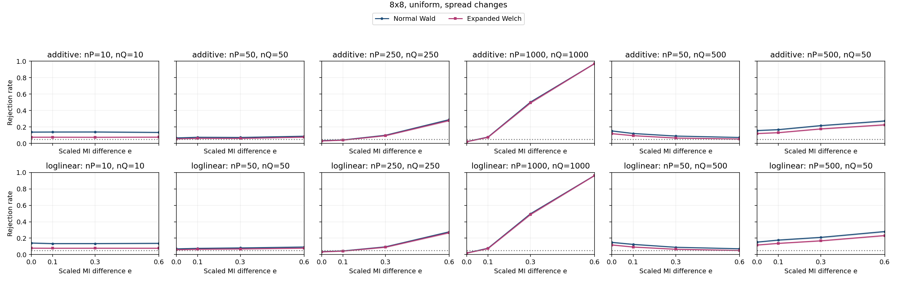

| Specification | Setting |
| --- | --- |
| Table shape | 8x8 |
| Horizontal graph regime specifications (columns) | (nP,nQ)={(10,10),(50,50),(250,250),(1000,1000),(50,500),(500,50)} |
| Vertical graph regime specifications (rows) | Top: additive probability changes; bottom: ordinal log-linear control. Each panel plots both Wald and Expanded Welch. |
| Fixed margins for both constructors | P and Q: each row and column has probability 1/8 |
| Additive direction in P and Q | H=ss^T, s=[-1.0, -0.7143, -0.4286, -0.1429, 0.1429, 0.4286, 0.7143, 1.0] (equally spaced scores; displayed rounded) |
| Log-linear direction in P and Q | Products of equally spaced row/column scores from -1 to 1; ordinal in both populations |
| MI settings | M=0.094165 nats; I(P)=0.018833 nats; I(Q)=I(P)+eM; e={0,0.1,0.3,0.6} |
| Axes | e from 0 to 0.6; rejection rate from 0 to 1 |
| Replicates | 10,000 per point |

Every plotted rate, validity and minimum expected count

| Construction | nP | nQ | e | MI difference | Method | Rejection | 95% low | 95% high | Valid | Conditional rejection | Min expected P | Min expected Q |
| --- | --- | --- | --- | --- | --- | --- | --- | --- | --- | --- | --- | --- |
| additive | 10 | 10 | 0 | 0 | expanded_welch | 0.076 | 0.07097 | 0.08136 | 0.9996 | 0.07603 | 0.0862 | 0.0862 |
| additive | 10 | 10 | 0 | 0 | normal_wald | 0.1379 | 0.1313 | 0.1448 | 1 | 0.1379 | 0.0862 | 0.0862 |
| additive | 10 | 10 | 0.1 | 0.009416 | expanded_welch | 0.0759 | 0.07087 | 0.08126 | 0.9998 | 0.07592 | 0.0862 | 0.07092 |
| additive | 10 | 10 | 0.1 | 0.009416 | normal_wald | 0.1389 | 0.1323 | 0.1458 | 1 | 0.1389 | 0.0862 | 0.07092 |
| additive | 10 | 10 | 0.3 | 0.02825 | expanded_welch | 0.075 | 0.07 | 0.08033 | 0.9998 | 0.07502 | 0.0862 | 0.04735 |
| additive | 10 | 10 | 0.3 | 0.02825 | normal_wald | 0.1394 | 0.1327 | 0.1463 | 1 | 0.1394 | 0.0862 | 0.04735 |
| additive | 10 | 10 | 0.6 | 0.0565 | expanded_welch | 0.0765 | 0.07145 | 0.08187 | 0.9993 | 0.07655 | 0.0862 | 0.02123 |
| additive | 10 | 10 | 0.6 | 0.0565 | normal_wald | 0.1339 | 0.1274 | 0.1407 | 1 | 0.1339 | 0.0862 | 0.02123 |
| additive | 50 | 50 | 0 | 0 | expanded_welch | 0.0552 | 0.05089 | 0.05985 | 1 | 0.0552 | 0.431 | 0.431 |
| additive | 50 | 50 | 0 | 0 | normal_wald | 0.0673 | 0.06255 | 0.07238 | 1 | 0.0673 | 0.431 | 0.431 |
| additive | 50 | 50 | 0.1 | 0.009416 | expanded_welch | 0.0621 | 0.05754 | 0.067 | 1 | 0.0621 | 0.431 | 0.3546 |
| additive | 50 | 50 | 0.1 | 0.009416 | normal_wald | 0.075 | 0.07 | 0.08033 | 1 | 0.075 | 0.431 | 0.3546 |
| additive | 50 | 50 | 0.3 | 0.02825 | expanded_welch | 0.0608 | 0.05628 | 0.06565 | 1 | 0.0608 | 0.431 | 0.2367 |
| additive | 50 | 50 | 0.3 | 0.02825 | normal_wald | 0.0728 | 0.06787 | 0.07806 | 1 | 0.0728 | 0.431 | 0.2367 |
| additive | 50 | 50 | 0.6 | 0.0565 | expanded_welch | 0.0766 | 0.07155 | 0.08198 | 1 | 0.0766 | 0.431 | 0.1061 |
| additive | 50 | 50 | 0.6 | 0.0565 | normal_wald | 0.0875 | 0.08212 | 0.0932 | 1 | 0.0875 | 0.431 | 0.1061 |
| additive | 50 | 500 | 0 | 0 | expanded_welch | 0.1191 | 0.1129 | 0.1256 | 1 | 0.1191 | 0.431 | 4.31 |
| additive | 50 | 500 | 0 | 0 | normal_wald | 0.1523 | 0.1454 | 0.1595 | 1 | 0.1523 | 0.431 | 4.31 |
| additive | 50 | 500 | 0.1 | 0.009416 | expanded_welch | 0.0947 | 0.08912 | 0.1006 | 1 | 0.0947 | 0.431 | 3.546 |
| additive | 50 | 500 | 0.1 | 0.009416 | normal_wald | 0.1211 | 0.1149 | 0.1276 | 1 | 0.1211 | 0.431 | 3.546 |
| additive | 50 | 500 | 0.3 | 0.02825 | expanded_welch | 0.0657 | 0.06101 | 0.07072 | 1 | 0.0657 | 0.431 | 2.367 |
| additive | 50 | 500 | 0.3 | 0.02825 | normal_wald | 0.0898 | 0.08435 | 0.09556 | 1 | 0.0898 | 0.431 | 2.367 |
| additive | 50 | 500 | 0.6 | 0.0565 | expanded_welch | 0.0537 | 0.04945 | 0.05829 | 1 | 0.0537 | 0.431 | 1.061 |
| additive | 50 | 500 | 0.6 | 0.0565 | normal_wald | 0.0726 | 0.06768 | 0.07785 | 1 | 0.0726 | 0.431 | 1.061 |
| additive | 250 | 250 | 0 | 0 | expanded_welch | 0.03 | 0.02683 | 0.03353 | 1 | 0.03 | 2.155 | 2.155 |
| additive | 250 | 250 | 0 | 0 | normal_wald | 0.0339 | 0.03053 | 0.03763 | 1 | 0.0339 | 2.155 | 2.155 |
| additive | 250 | 250 | 0.1 | 0.009416 | expanded_welch | 0.0397 | 0.03605 | 0.04371 | 1 | 0.0397 | 2.155 | 1.773 |
| additive | 250 | 250 | 0.1 | 0.009416 | normal_wald | 0.0426 | 0.03881 | 0.04674 | 1 | 0.0426 | 2.155 | 1.773 |
| additive | 250 | 250 | 0.3 | 0.02825 | expanded_welch | 0.0943 | 0.08873 | 0.1002 | 1 | 0.0943 | 2.155 | 1.184 |
| additive | 250 | 250 | 0.3 | 0.02825 | normal_wald | 0.0994 | 0.09369 | 0.1054 | 1 | 0.0994 | 2.155 | 1.184 |
| additive | 250 | 250 | 0.6 | 0.0565 | expanded_welch | 0.2788 | 0.2701 | 0.2877 | 1 | 0.2788 | 2.155 | 0.5307 |
| additive | 250 | 250 | 0.6 | 0.0565 | normal_wald | 0.2893 | 0.2805 | 0.2983 | 1 | 0.2893 | 2.155 | 0.5307 |
| additive | 500 | 50 | 0 | 0 | expanded_welch | 0.1204 | 0.1142 | 0.1269 | 1 | 0.1204 | 4.31 | 0.431 |
| additive | 500 | 50 | 0 | 0 | normal_wald | 0.1566 | 0.1496 | 0.1639 | 1 | 0.1566 | 4.31 | 0.431 |
| additive | 500 | 50 | 0.1 | 0.009416 | expanded_welch | 0.131 | 0.1245 | 0.1378 | 1 | 0.131 | 4.31 | 0.3546 |
| additive | 500 | 50 | 0.1 | 0.009416 | normal_wald | 0.1678 | 0.1606 | 0.1753 | 1 | 0.1678 | 4.31 | 0.3546 |
| additive | 500 | 50 | 0.3 | 0.02825 | expanded_welch | 0.1767 | 0.1693 | 0.1843 | 1 | 0.1767 | 4.31 | 0.2367 |
| additive | 500 | 50 | 0.3 | 0.02825 | normal_wald | 0.2167 | 0.2087 | 0.2249 | 1 | 0.2167 | 4.31 | 0.2367 |
| additive | 500 | 50 | 0.6 | 0.0565 | expanded_welch | 0.2263 | 0.2182 | 0.2346 | 1 | 0.2263 | 4.31 | 0.1061 |
| additive | 500 | 50 | 0.6 | 0.0565 | normal_wald | 0.2729 | 0.2643 | 0.2817 | 1 | 0.2729 | 4.31 | 0.1061 |
| additive | 1000 | 1000 | 0 | 0 | expanded_welch | 0.021 | 0.01837 | 0.024 | 1 | 0.021 | 8.62 | 8.62 |
| additive | 1000 | 1000 | 0 | 0 | normal_wald | 0.0222 | 0.01949 | 0.02528 | 1 | 0.0222 | 8.62 | 8.62 |
| additive | 1000 | 1000 | 0.1 | 0.009416 | expanded_welch | 0.0747 | 0.06971 | 0.08002 | 1 | 0.0747 | 8.62 | 7.092 |
| additive | 1000 | 1000 | 0.1 | 0.009416 | normal_wald | 0.0779 | 0.07281 | 0.08332 | 1 | 0.0779 | 8.62 | 7.092 |
| additive | 1000 | 1000 | 0.3 | 0.02825 | expanded_welch | 0.4947 | 0.4849 | 0.5045 | 1 | 0.4947 | 8.62 | 4.735 |
| additive | 1000 | 1000 | 0.3 | 0.02825 | normal_wald | 0.5036 | 0.4938 | 0.5134 | 1 | 0.5036 | 8.62 | 4.735 |
| additive | 1000 | 1000 | 0.6 | 0.0565 | expanded_welch | 0.9707 | 0.9672 | 0.9738 | 1 | 0.9707 | 8.62 | 2.123 |
| additive | 1000 | 1000 | 0.6 | 0.0565 | normal_wald | 0.9713 | 0.9678 | 0.9744 | 1 | 0.9713 | 8.62 | 2.123 |
| loglinear | 10 | 10 | 0 | 0 | expanded_welch | 0.0787 | 0.07358 | 0.08414 | 0.9998 | 0.07872 | 0.09169 | 0.09169 |
| loglinear | 10 | 10 | 0 | 0 | normal_wald | 0.1409 | 0.1342 | 0.1479 | 1 | 0.1409 | 0.09169 | 0.09169 |
| loglinear | 10 | 10 | 0.1 | 0.009416 | expanded_welch | 0.0776 | 0.07252 | 0.08301 | 0.9997 | 0.07762 | 0.09169 | 0.0792 |
| loglinear | 10 | 10 | 0.1 | 0.009416 | normal_wald | 0.1341 | 0.1276 | 0.1409 | 1 | 0.1341 | 0.09169 | 0.0792 |
| loglinear | 10 | 10 | 0.3 | 0.02825 | expanded_welch | 0.0779 | 0.07281 | 0.08332 | 0.9998 | 0.07792 | 0.09169 | 0.06118 |
| loglinear | 10 | 10 | 0.3 | 0.02825 | normal_wald | 0.1344 | 0.1279 | 0.1412 | 1 | 0.1344 | 0.09169 | 0.06118 |
| loglinear | 10 | 10 | 0.6 | 0.0565 | expanded_welch | 0.0778 | 0.07271 | 0.08321 | 0.9995 | 0.07784 | 0.09169 | 0.04301 |
| loglinear | 10 | 10 | 0.6 | 0.0565 | normal_wald | 0.1372 | 0.1306 | 0.1441 | 1 | 0.1372 | 0.09169 | 0.04301 |
| loglinear | 50 | 50 | 0 | 0 | expanded_welch | 0.0591 | 0.05465 | 0.06389 | 1 | 0.0591 | 0.4584 | 0.4584 |
| loglinear | 50 | 50 | 0 | 0 | normal_wald | 0.0702 | 0.06536 | 0.07537 | 1 | 0.0702 | 0.4584 | 0.4584 |
| loglinear | 50 | 50 | 0.1 | 0.009416 | expanded_welch | 0.0652 | 0.06053 | 0.07021 | 1 | 0.0652 | 0.4584 | 0.396 |
| loglinear | 50 | 50 | 0.1 | 0.009416 | normal_wald | 0.0762 | 0.07116 | 0.08156 | 1 | 0.0762 | 0.4584 | 0.396 |
| loglinear | 50 | 50 | 0.3 | 0.02825 | expanded_welch | 0.0687 | 0.06391 | 0.07383 | 1 | 0.0687 | 0.4584 | 0.3059 |
| loglinear | 50 | 50 | 0.3 | 0.02825 | normal_wald | 0.0814 | 0.0762 | 0.08692 | 1 | 0.0814 | 0.4584 | 0.3059 |
| loglinear | 50 | 50 | 0.6 | 0.0565 | expanded_welch | 0.0787 | 0.07358 | 0.08414 | 1 | 0.0787 | 0.4584 | 0.2151 |
| loglinear | 50 | 50 | 0.6 | 0.0565 | normal_wald | 0.0925 | 0.08698 | 0.09834 | 1 | 0.0925 | 0.4584 | 0.2151 |
| loglinear | 50 | 500 | 0 | 0 | expanded_welch | 0.1178 | 0.1116 | 0.1243 | 1 | 0.1178 | 0.4584 | 4.584 |
| loglinear | 50 | 500 | 0 | 0 | normal_wald | 0.1491 | 0.1423 | 0.1562 | 1 | 0.1491 | 0.4584 | 4.584 |
| loglinear | 50 | 500 | 0.1 | 0.009416 | expanded_welch | 0.0924 | 0.08688 | 0.09823 | 1 | 0.0924 | 0.4584 | 3.96 |
| loglinear | 50 | 500 | 0.1 | 0.009416 | normal_wald | 0.1246 | 0.1183 | 0.1312 | 1 | 0.1246 | 0.4584 | 3.96 |
| loglinear | 50 | 500 | 0.3 | 0.02825 | expanded_welch | 0.0651 | 0.06043 | 0.0701 | 1 | 0.0651 | 0.4584 | 3.059 |
| loglinear | 50 | 500 | 0.3 | 0.02825 | normal_wald | 0.0894 | 0.08396 | 0.09515 | 1 | 0.0894 | 0.4584 | 3.059 |
| loglinear | 50 | 500 | 0.6 | 0.0565 | expanded_welch | 0.0506 | 0.04647 | 0.05507 | 1 | 0.0506 | 0.4584 | 2.151 |
| loglinear | 50 | 500 | 0.6 | 0.0565 | normal_wald | 0.0714 | 0.06652 | 0.07661 | 1 | 0.0714 | 0.4584 | 2.151 |
| loglinear | 250 | 250 | 0 | 0 | expanded_welch | 0.033 | 0.02967 | 0.03668 | 1 | 0.033 | 2.292 | 2.292 |
| loglinear | 250 | 250 | 0 | 0 | normal_wald | 0.0364 | 0.0329 | 0.04025 | 1 | 0.0364 | 2.292 | 2.292 |
| loglinear | 250 | 250 | 0.1 | 0.009416 | expanded_welch | 0.0426 | 0.03881 | 0.04674 | 1 | 0.0426 | 2.292 | 1.98 |
| loglinear | 250 | 250 | 0.1 | 0.009416 | normal_wald | 0.0453 | 0.0414 | 0.04955 | 1 | 0.0453 | 2.292 | 1.98 |
| loglinear | 250 | 250 | 0.3 | 0.02825 | expanded_welch | 0.0897 | 0.08426 | 0.09546 | 1 | 0.0897 | 2.292 | 1.529 |
| loglinear | 250 | 250 | 0.3 | 0.02825 | normal_wald | 0.0946 | 0.08902 | 0.1005 | 1 | 0.0946 | 2.292 | 1.529 |
| loglinear | 250 | 250 | 0.6 | 0.0565 | expanded_welch | 0.267 | 0.2584 | 0.2758 | 1 | 0.267 | 2.292 | 1.075 |
| loglinear | 250 | 250 | 0.6 | 0.0565 | normal_wald | 0.2772 | 0.2685 | 0.2861 | 1 | 0.2772 | 2.292 | 1.075 |
| loglinear | 500 | 50 | 0 | 0 | expanded_welch | 0.1165 | 0.1104 | 0.1229 | 1 | 0.1165 | 4.584 | 0.4584 |
| loglinear | 500 | 50 | 0 | 0 | normal_wald | 0.1523 | 0.1454 | 0.1595 | 1 | 0.1523 | 4.584 | 0.4584 |
| loglinear | 500 | 50 | 0.1 | 0.009416 | expanded_welch | 0.1368 | 0.1302 | 0.1437 | 1 | 0.1368 | 4.584 | 0.396 |
| loglinear | 500 | 50 | 0.1 | 0.009416 | normal_wald | 0.1768 | 0.1694 | 0.1844 | 1 | 0.1768 | 4.584 | 0.396 |
| loglinear | 500 | 50 | 0.3 | 0.02825 | expanded_welch | 0.1679 | 0.1607 | 0.1754 | 1 | 0.1679 | 4.584 | 0.3059 |
| loglinear | 500 | 50 | 0.3 | 0.02825 | normal_wald | 0.2098 | 0.2019 | 0.2179 | 1 | 0.2098 | 4.584 | 0.3059 |
| loglinear | 500 | 50 | 0.6 | 0.0565 | expanded_welch | 0.2318 | 0.2236 | 0.2402 | 1 | 0.2318 | 4.584 | 0.2151 |
| loglinear | 500 | 50 | 0.6 | 0.0565 | normal_wald | 0.2805 | 0.2718 | 0.2894 | 1 | 0.2805 | 4.584 | 0.2151 |
| loglinear | 1000 | 1000 | 0 | 0 | expanded_welch | 0.0182 | 0.01576 | 0.02101 | 1 | 0.0182 | 9.169 | 9.169 |
| loglinear | 1000 | 1000 | 0 | 0 | normal_wald | 0.0201 | 0.01753 | 0.02304 | 1 | 0.0201 | 9.169 | 9.169 |
| loglinear | 1000 | 1000 | 0.1 | 0.009416 | expanded_welch | 0.0734 | 0.06845 | 0.07868 | 1 | 0.0734 | 9.169 | 7.92 |
| loglinear | 1000 | 1000 | 0.1 | 0.009416 | normal_wald | 0.0778 | 0.07271 | 0.08321 | 1 | 0.0778 | 9.169 | 7.92 |
| loglinear | 1000 | 1000 | 0.3 | 0.02825 | expanded_welch | 0.4893 | 0.4795 | 0.4991 | 1 | 0.4893 | 9.169 | 6.118 |
| loglinear | 1000 | 1000 | 0.3 | 0.02825 | normal_wald | 0.4978 | 0.488 | 0.5076 | 1 | 0.4978 | 9.169 | 6.118 |
| loglinear | 1000 | 1000 | 0.6 | 0.0565 | expanded_welch | 0.9611 | 0.9571 | 0.9647 | 1 | 0.9611 | 9.169 | 4.301 |
| loglinear | 1000 | 1000 | 0.6 | 0.0565 | normal_wald | 0.9627 | 0.9588 | 0.9662 | 1 | 0.9627 | 9.169 | 4.301 |

### 3.18. 8x8: different_skew, common

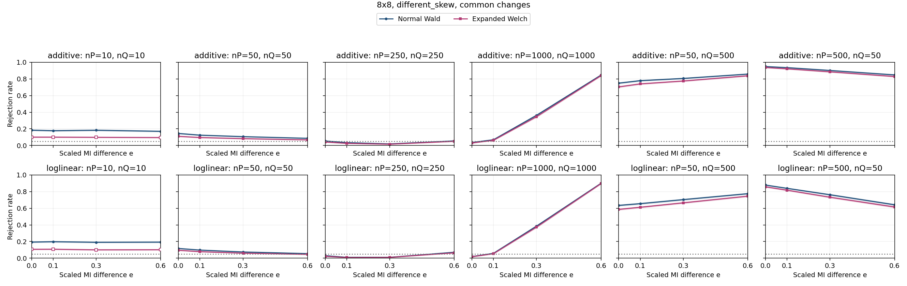

| Specification | Setting |
| --- | --- |
| Table shape | 8x8 |
| Horizontal graph regime specifications (columns) | (nP,nQ)={(10,10),(50,50),(250,250),(1000,1000),(50,500),(500,50)} |
| Vertical graph regime specifications (rows) | Top: additive probability changes; bottom: ordinal log-linear control. Each panel plots both Wald and Expanded Welch. |
| Fixed margins for both constructors | P: row 1 and column 1 each have probability 0.7, every other row/column 0.3/7; Q: row 1 and column 1 each have probability 0.8, every other row/column 0.2/7 |
| Additive direction in P and Q | Rows 1,2 and columns 1,2: add t to the block diagonal, subtract t off diagonal |
| Log-linear direction in P and Q | Products of equally spaced row/column scores from -1 to 1; ordinal in both populations |
| MI settings | M=0.089984 nats; I(P)=0.017997 nats; I(Q)=I(P)+eM; e={0,0.1,0.3,0.6} |
| Axes | e from 0 to 0.6; rejection rate from 0 to 1 |
| Replicates | 10,000 per point |

Every plotted rate, validity and minimum expected count

| Construction | nP | nQ | e | MI difference | Method | Rejection | 95% low | 95% high | Valid | Conditional rejection | Min expected P | Min expected Q |
| --- | --- | --- | --- | --- | --- | --- | --- | --- | --- | --- | --- | --- |
| additive | 10 | 10 | 0 | 0 | expanded_welch | 0.1008 | 0.09505 | 0.1069 | 0.7882 | 0.1279 | 0.01837 | 0.008163 |
| additive | 10 | 10 | 0 | 0 | normal_wald | 0.1843 | 0.1768 | 0.192 | 0.988 | 0.1865 | 0.01837 | 0.008163 |
| additive | 10 | 10 | 0.1 | 0.008998 | expanded_welch | 0.1006 | 0.09486 | 0.1066 | 0.7952 | 0.1265 | 0.01837 | 0.008163 |
| additive | 10 | 10 | 0.1 | 0.008998 | normal_wald | 0.178 | 0.1706 | 0.1856 | 0.9885 | 0.1801 | 0.01837 | 0.008163 |
| additive | 10 | 10 | 0.3 | 0.027 | expanded_welch | 0.0985 | 0.09281 | 0.1045 | 0.7825 | 0.1259 | 0.01837 | 0.008163 |
| additive | 10 | 10 | 0.3 | 0.027 | normal_wald | 0.1836 | 0.1761 | 0.1913 | 0.9895 | 0.1855 | 0.01837 | 0.008163 |
| additive | 10 | 10 | 0.6 | 0.05399 | expanded_welch | 0.0957 | 0.09009 | 0.1016 | 0.7958 | 0.1203 | 0.01837 | 0.008163 |
| additive | 10 | 10 | 0.6 | 0.05399 | normal_wald | 0.1705 | 0.1633 | 0.178 | 0.9877 | 0.1726 | 0.01837 | 0.008163 |
| additive | 50 | 50 | 0 | 0 | expanded_welch | 0.1104 | 0.1044 | 0.1167 | 1 | 0.1104 | 0.09184 | 0.04082 |
| additive | 50 | 50 | 0 | 0 | normal_wald | 0.1449 | 0.1381 | 0.1519 | 1 | 0.1449 | 0.09184 | 0.04082 |
| additive | 50 | 50 | 0.1 | 0.008998 | expanded_welch | 0.096 | 0.09038 | 0.1019 | 1 | 0.096 | 0.09184 | 0.04082 |
| additive | 50 | 50 | 0.1 | 0.008998 | normal_wald | 0.1245 | 0.1182 | 0.1311 | 1 | 0.1245 | 0.09184 | 0.04082 |
| additive | 50 | 50 | 0.3 | 0.027 | expanded_welch | 0.0826 | 0.07736 | 0.08816 | 1 | 0.0826 | 0.09184 | 0.04082 |
| additive | 50 | 50 | 0.3 | 0.027 | normal_wald | 0.1067 | 0.1008 | 0.1129 | 1 | 0.1067 | 0.09184 | 0.04082 |
| additive | 50 | 50 | 0.6 | 0.05399 | expanded_welch | 0.0678 | 0.06304 | 0.0729 | 1 | 0.0678 | 0.09184 | 0.04082 |
| additive | 50 | 50 | 0.6 | 0.05399 | normal_wald | 0.0866 | 0.08125 | 0.09227 | 1 | 0.0866 | 0.09184 | 0.04082 |
| additive | 50 | 500 | 0 | 0 | expanded_welch | 0.7041 | 0.6951 | 0.713 | 1 | 0.7041 | 0.09184 | 0.4082 |
| additive | 50 | 500 | 0 | 0 | normal_wald | 0.749 | 0.7404 | 0.7574 | 1 | 0.749 | 0.09184 | 0.4082 |
| additive | 50 | 500 | 0.1 | 0.008998 | expanded_welch | 0.74 | 0.7313 | 0.7485 | 1 | 0.74 | 0.09184 | 0.4082 |
| additive | 50 | 500 | 0.1 | 0.008998 | normal_wald | 0.7789 | 0.7707 | 0.7869 | 1 | 0.7789 | 0.09184 | 0.4082 |
| additive | 50 | 500 | 0.3 | 0.027 | expanded_welch | 0.7747 | 0.7664 | 0.7828 | 1 | 0.7747 | 0.09184 | 0.4082 |
| additive | 50 | 500 | 0.3 | 0.027 | normal_wald | 0.8056 | 0.7977 | 0.8132 | 1 | 0.8056 | 0.09184 | 0.4082 |
| additive | 50 | 500 | 0.6 | 0.05399 | expanded_welch | 0.8375 | 0.8301 | 0.8446 | 1 | 0.8375 | 0.09184 | 0.4082 |
| additive | 50 | 500 | 0.6 | 0.05399 | normal_wald | 0.858 | 0.851 | 0.8647 | 1 | 0.858 | 0.09184 | 0.4082 |
| additive | 250 | 250 | 0 | 0 | expanded_welch | 0.042 | 0.03824 | 0.04611 | 1 | 0.042 | 0.4592 | 0.2041 |
| additive | 250 | 250 | 0 | 0 | normal_wald | 0.055 | 0.0507 | 0.05964 | 1 | 0.055 | 0.4592 | 0.2041 |
| additive | 250 | 250 | 0.1 | 0.008998 | expanded_welch | 0.0258 | 0.02287 | 0.02909 | 1 | 0.0258 | 0.4592 | 0.2041 |
| additive | 250 | 250 | 0.1 | 0.008998 | normal_wald | 0.0349 | 0.03148 | 0.03868 | 1 | 0.0349 | 0.4592 | 0.2041 |
| additive | 250 | 250 | 0.3 | 0.027 | expanded_welch | 0.0159 | 0.01363 | 0.01854 | 1 | 0.0159 | 0.4592 | 0.2041 |
| additive | 250 | 250 | 0.3 | 0.027 | normal_wald | 0.0197 | 0.01716 | 0.02261 | 1 | 0.0197 | 0.4592 | 0.2041 |
| additive | 250 | 250 | 0.6 | 0.05399 | expanded_welch | 0.0503 | 0.04619 | 0.05476 | 1 | 0.0503 | 0.4592 | 0.2041 |
| additive | 250 | 250 | 0.6 | 0.05399 | normal_wald | 0.0558 | 0.05147 | 0.06047 | 1 | 0.0558 | 0.4592 | 0.2041 |
| additive | 500 | 50 | 0 | 0 | expanded_welch | 0.9367 | 0.9318 | 0.9413 | 1 | 0.9367 | 0.9184 | 0.04082 |
| additive | 500 | 50 | 0 | 0 | normal_wald | 0.9484 | 0.9439 | 0.9526 | 1 | 0.9484 | 0.9184 | 0.04082 |
| additive | 500 | 50 | 0.1 | 0.008998 | expanded_welch | 0.9211 | 0.9157 | 0.9262 | 1 | 0.9211 | 0.9184 | 0.04082 |
| additive | 500 | 50 | 0.1 | 0.008998 | normal_wald | 0.9357 | 0.9307 | 0.9403 | 1 | 0.9357 | 0.9184 | 0.04082 |
| additive | 500 | 50 | 0.3 | 0.027 | expanded_welch | 0.8849 | 0.8785 | 0.891 | 1 | 0.8849 | 0.9184 | 0.04082 |
| additive | 500 | 50 | 0.3 | 0.027 | normal_wald | 0.9015 | 0.8955 | 0.9072 | 1 | 0.9015 | 0.9184 | 0.04082 |
| additive | 500 | 50 | 0.6 | 0.05399 | expanded_welch | 0.8286 | 0.8211 | 0.8359 | 1 | 0.8286 | 0.9184 | 0.04082 |
| additive | 500 | 50 | 0.6 | 0.05399 | normal_wald | 0.8481 | 0.8409 | 0.855 | 1 | 0.8481 | 0.9184 | 0.04082 |
| additive | 1000 | 1000 | 0 | 0 | expanded_welch | 0.0301 | 0.02693 | 0.03363 | 1 | 0.0301 | 1.837 | 0.8163 |
| additive | 1000 | 1000 | 0 | 0 | normal_wald | 0.0368 | 0.03328 | 0.04067 | 1 | 0.0368 | 1.837 | 0.8163 |
| additive | 1000 | 1000 | 0.1 | 0.008998 | expanded_welch | 0.0627 | 0.05811 | 0.06762 | 1 | 0.0627 | 1.837 | 0.8163 |
| additive | 1000 | 1000 | 0.1 | 0.008998 | normal_wald | 0.0694 | 0.06458 | 0.07455 | 1 | 0.0694 | 1.837 | 0.8163 |
| additive | 1000 | 1000 | 0.3 | 0.027 | expanded_welch | 0.346 | 0.3367 | 0.3554 | 1 | 0.346 | 1.837 | 0.8163 |
| additive | 1000 | 1000 | 0.3 | 0.027 | normal_wald | 0.3627 | 0.3533 | 0.3722 | 1 | 0.3627 | 1.837 | 0.8163 |
| additive | 1000 | 1000 | 0.6 | 0.05399 | expanded_welch | 0.8392 | 0.8319 | 0.8463 | 1 | 0.8392 | 1.837 | 0.8163 |
| additive | 1000 | 1000 | 0.6 | 0.05399 | normal_wald | 0.8464 | 0.8392 | 0.8533 | 1 | 0.8464 | 1.837 | 0.8163 |
| loglinear | 10 | 10 | 0 | 0 | expanded_welch | 0.1071 | 0.1012 | 0.1133 | 0.7952 | 0.1347 | 0.01583 | 0.007373 |
| loglinear | 10 | 10 | 0 | 0 | normal_wald | 0.1939 | 0.1863 | 0.2018 | 0.9901 | 0.1958 | 0.01583 | 0.007373 |
| loglinear | 10 | 10 | 0.1 | 0.008998 | expanded_welch | 0.108 | 0.1021 | 0.1142 | 0.7966 | 0.1356 | 0.01583 | 0.006907 |
| loglinear | 10 | 10 | 0.1 | 0.008998 | normal_wald | 0.1984 | 0.1907 | 0.2063 | 0.9903 | 0.2003 | 0.01583 | 0.006907 |
| loglinear | 10 | 10 | 0.3 | 0.027 | expanded_welch | 0.1007 | 0.09495 | 0.1068 | 0.791 | 0.1273 | 0.01583 | 0.006024 |
| loglinear | 10 | 10 | 0.3 | 0.027 | normal_wald | 0.1916 | 0.184 | 0.1994 | 0.9882 | 0.1939 | 0.01583 | 0.006024 |
| loglinear | 10 | 10 | 0.6 | 0.05399 | expanded_welch | 0.1019 | 0.09612 | 0.108 | 0.7976 | 0.1278 | 0.01583 | 0.004824 |
| loglinear | 10 | 10 | 0.6 | 0.05399 | normal_wald | 0.1933 | 0.1857 | 0.2012 | 0.9883 | 0.1956 | 0.01583 | 0.004824 |
| loglinear | 50 | 50 | 0 | 0 | expanded_welch | 0.0957 | 0.09009 | 0.1016 | 1 | 0.0957 | 0.07916 | 0.03686 |
| loglinear | 50 | 50 | 0 | 0 | normal_wald | 0.1172 | 0.111 | 0.1237 | 1 | 0.1172 | 0.07916 | 0.03686 |
| loglinear | 50 | 50 | 0.1 | 0.008998 | expanded_welch | 0.0788 | 0.07368 | 0.08424 | 1 | 0.0788 | 0.07916 | 0.03454 |
| loglinear | 50 | 50 | 0.1 | 0.008998 | normal_wald | 0.0978 | 0.09213 | 0.1038 | 1 | 0.0978 | 0.07916 | 0.03454 |
| loglinear | 50 | 50 | 0.3 | 0.027 | expanded_welch | 0.0607 | 0.05619 | 0.06555 | 1 | 0.0607 | 0.07916 | 0.03012 |
| loglinear | 50 | 50 | 0.3 | 0.027 | normal_wald | 0.075 | 0.07 | 0.08033 | 1 | 0.075 | 0.07916 | 0.03012 |
| loglinear | 50 | 50 | 0.6 | 0.05399 | expanded_welch | 0.0459 | 0.04197 | 0.05018 | 1 | 0.0459 | 0.07916 | 0.02412 |
| loglinear | 50 | 50 | 0.6 | 0.05399 | normal_wald | 0.0555 | 0.05118 | 0.06016 | 1 | 0.0555 | 0.07916 | 0.02412 |
| loglinear | 50 | 500 | 0 | 0 | expanded_welch | 0.5863 | 0.5766 | 0.5959 | 1 | 0.5863 | 0.07916 | 0.3686 |
| loglinear | 50 | 500 | 0 | 0 | normal_wald | 0.6343 | 0.6248 | 0.6437 | 1 | 0.6343 | 0.07916 | 0.3686 |
| loglinear | 50 | 500 | 0.1 | 0.008998 | expanded_welch | 0.6119 | 0.6023 | 0.6214 | 1 | 0.6119 | 0.07916 | 0.3454 |
| loglinear | 50 | 500 | 0.1 | 0.008998 | normal_wald | 0.6553 | 0.6459 | 0.6646 | 1 | 0.6553 | 0.07916 | 0.3454 |
| loglinear | 50 | 500 | 0.3 | 0.027 | expanded_welch | 0.6652 | 0.6559 | 0.6744 | 1 | 0.6652 | 0.07916 | 0.3012 |
| loglinear | 50 | 500 | 0.3 | 0.027 | normal_wald | 0.7039 | 0.6949 | 0.7128 | 1 | 0.7039 | 0.07916 | 0.3012 |
| loglinear | 50 | 500 | 0.6 | 0.05399 | expanded_welch | 0.7454 | 0.7368 | 0.7538 | 1 | 0.7454 | 0.07916 | 0.2412 |
| loglinear | 50 | 500 | 0.6 | 0.05399 | normal_wald | 0.7753 | 0.767 | 0.7834 | 1 | 0.7753 | 0.07916 | 0.2412 |
| loglinear | 250 | 250 | 0 | 0 | expanded_welch | 0.0232 | 0.02043 | 0.02634 | 1 | 0.0232 | 0.3958 | 0.1843 |
| loglinear | 250 | 250 | 0 | 0 | normal_wald | 0.0308 | 0.02759 | 0.03437 | 1 | 0.0308 | 0.3958 | 0.1843 |
| loglinear | 250 | 250 | 0.1 | 0.008998 | expanded_welch | 0.0085 | 0.00688 | 0.0105 | 1 | 0.0085 | 0.3958 | 0.1727 |
| loglinear | 250 | 250 | 0.1 | 0.008998 | normal_wald | 0.0111 | 0.009226 | 0.01335 | 1 | 0.0111 | 0.3958 | 0.1727 |
| loglinear | 250 | 250 | 0.3 | 0.027 | expanded_welch | 0.0098 | 0.008049 | 0.01193 | 1 | 0.0098 | 0.3958 | 0.1506 |
| loglinear | 250 | 250 | 0.3 | 0.027 | normal_wald | 0.0112 | 0.009317 | 0.01346 | 1 | 0.0112 | 0.3958 | 0.1506 |
| loglinear | 250 | 250 | 0.6 | 0.05399 | expanded_welch | 0.0649 | 0.06024 | 0.0699 | 1 | 0.0649 | 0.3958 | 0.1206 |
| loglinear | 250 | 250 | 0.6 | 0.05399 | normal_wald | 0.0719 | 0.067 | 0.07713 | 1 | 0.0719 | 0.3958 | 0.1206 |
| loglinear | 500 | 50 | 0 | 0 | expanded_welch | 0.8575 | 0.8505 | 0.8642 | 0.9999 | 0.8576 | 0.7916 | 0.03686 |
| loglinear | 500 | 50 | 0 | 0 | normal_wald | 0.8789 | 0.8724 | 0.8851 | 1 | 0.8789 | 0.7916 | 0.03686 |
| loglinear | 500 | 50 | 0.1 | 0.008998 | expanded_welch | 0.8172 | 0.8095 | 0.8247 | 1 | 0.8172 | 0.7916 | 0.03454 |
| loglinear | 500 | 50 | 0.1 | 0.008998 | normal_wald | 0.8395 | 0.8322 | 0.8466 | 1 | 0.8395 | 0.7916 | 0.03454 |
| loglinear | 500 | 50 | 0.3 | 0.027 | expanded_welch | 0.7324 | 0.7236 | 0.741 | 1 | 0.7324 | 0.7916 | 0.03012 |
| loglinear | 500 | 50 | 0.3 | 0.027 | normal_wald | 0.7623 | 0.7539 | 0.7705 | 1 | 0.7623 | 0.7916 | 0.03012 |
| loglinear | 500 | 50 | 0.6 | 0.05399 | expanded_welch | 0.6151 | 0.6055 | 0.6246 | 1 | 0.6151 | 0.7916 | 0.02412 |
| loglinear | 500 | 50 | 0.6 | 0.05399 | normal_wald | 0.6418 | 0.6323 | 0.6511 | 1 | 0.6418 | 0.7916 | 0.02412 |
| loglinear | 1000 | 1000 | 0 | 0 | expanded_welch | 0.0175 | 0.01511 | 0.02026 | 1 | 0.0175 | 1.583 | 0.7373 |
| loglinear | 1000 | 1000 | 0 | 0 | normal_wald | 0.0201 | 0.01753 | 0.02304 | 1 | 0.0201 | 1.583 | 0.7373 |
| loglinear | 1000 | 1000 | 0.1 | 0.008998 | expanded_welch | 0.0539 | 0.04964 | 0.0585 | 1 | 0.0539 | 1.583 | 0.6907 |
| loglinear | 1000 | 1000 | 0.1 | 0.008998 | normal_wald | 0.0591 | 0.05465 | 0.06389 | 1 | 0.0591 | 1.583 | 0.6907 |
| loglinear | 1000 | 1000 | 0.3 | 0.027 | expanded_welch | 0.3735 | 0.3641 | 0.383 | 1 | 0.3735 | 1.583 | 0.6024 |
| loglinear | 1000 | 1000 | 0.3 | 0.027 | normal_wald | 0.3854 | 0.3759 | 0.395 | 1 | 0.3854 | 1.583 | 0.6024 |
| loglinear | 1000 | 1000 | 0.6 | 0.05399 | expanded_welch | 0.8961 | 0.89 | 0.9019 | 1 | 0.8961 | 1.583 | 0.4824 |
| loglinear | 1000 | 1000 | 0.6 | 0.05399 | normal_wald | 0.9006 | 0.8946 | 0.9063 | 1 | 0.9006 | 1.583 | 0.4824 |

### 3.19. 8x8: different_skew, rare

| Specification | Setting |
| --- | --- |
| Table shape | 8x8 |
| Horizontal graph regime specifications (columns) | (nP,nQ)={(10,10),(50,50),(250,250),(1000,1000),(50,500),(500,50)} |
| Vertical graph regime specifications (rows) | Top: additive probability changes; bottom: ordinal log-linear control. Each panel plots both Wald and Expanded Welch. |
| Fixed margins for both constructors | P: row 1 and column 1 each have probability 0.7, every other row/column 0.3/7; Q: row 1 and column 1 each have probability 0.8, every other row/column 0.2/7 |
| Additive direction in P and Q | Rows 7,8 and columns 7,8: add t to the block diagonal, subtract t off diagonal |
| Log-linear direction in P and Q | Products of equally spaced row/column scores from -1 to 1; ordinal in both populations |
| MI settings | M=0.0018816 nats; I(P)=0.00037632 nats; I(Q)=I(P)+eM; e={0,0.1,0.3,0.6} |
| Axes | e from 0 to 0.6; rejection rate from 0 to 1 |
| Replicates | 10,000 per point |

Every plotted rate, validity and minimum expected count

| Construction | nP | nQ | e | MI difference | Method | Rejection | 95% low | 95% high | Valid | Conditional rejection | Min expected P | Min expected Q |
| --- | --- | --- | --- | --- | --- | --- | --- | --- | --- | --- | --- | --- |
| additive | 10 | 10 | 0 | 0 | expanded_welch | 0.0933 | 0.08775 | 0.09916 | 0.7906 | 0.118 | 0.01254 | 0.004321 |
| additive | 10 | 10 | 0 | 0 | normal_wald | 0.1688 | 0.1616 | 0.1763 | 0.9872 | 0.171 | 0.01254 | 0.004321 |
| additive | 10 | 10 | 0.1 | 0.0001882 | expanded_welch | 0.0957 | 0.09009 | 0.1016 | 0.7941 | 0.1205 | 0.01254 | 0.003507 |
| additive | 10 | 10 | 0.1 | 0.0001882 | normal_wald | 0.171 | 0.1637 | 0.1785 | 0.989 | 0.1729 | 0.01254 | 0.003507 |
| additive | 10 | 10 | 0.3 | 0.0005645 | expanded_welch | 0.0909 | 0.08542 | 0.09669 | 0.7942 | 0.1145 | 0.01254 | 0.002286 |
| additive | 10 | 10 | 0.3 | 0.0005645 | normal_wald | 0.1661 | 0.1589 | 0.1735 | 0.991 | 0.1676 | 0.01254 | 0.002286 |
| additive | 10 | 10 | 0.6 | 0.001129 | expanded_welch | 0.0924 | 0.08688 | 0.09823 | 0.7988 | 0.1157 | 0.01254 | 0.001011 |
| additive | 10 | 10 | 0.6 | 0.001129 | normal_wald | 0.1613 | 0.1542 | 0.1686 | 0.9893 | 0.163 | 0.01254 | 0.001011 |
| additive | 50 | 50 | 0 | 0 | expanded_welch | 0.105 | 0.09914 | 0.1112 | 1 | 0.105 | 0.0627 | 0.02161 |
| additive | 50 | 50 | 0 | 0 | normal_wald | 0.1506 | 0.1437 | 0.1577 | 1 | 0.1506 | 0.0627 | 0.02161 |
| additive | 50 | 50 | 0.1 | 0.0001882 | expanded_welch | 0.1036 | 0.09778 | 0.1097 | 1 | 0.1036 | 0.0627 | 0.01754 |
| additive | 50 | 50 | 0.1 | 0.0001882 | normal_wald | 0.1488 | 0.142 | 0.1559 | 1 | 0.1488 | 0.0627 | 0.01754 |
| additive | 50 | 50 | 0.3 | 0.0005645 | expanded_welch | 0.0988 | 0.0931 | 0.1048 | 1 | 0.0988 | 0.0627 | 0.01143 |
| additive | 50 | 50 | 0.3 | 0.0005645 | normal_wald | 0.144 | 0.1373 | 0.151 | 1 | 0.144 | 0.0627 | 0.01143 |
| additive | 50 | 50 | 0.6 | 0.001129 | expanded_welch | 0.1016 | 0.09583 | 0.1077 | 1 | 0.1016 | 0.0627 | 0.005053 |
| additive | 50 | 50 | 0.6 | 0.001129 | normal_wald | 0.1489 | 0.1421 | 0.156 | 1 | 0.1489 | 0.0627 | 0.005053 |
| additive | 50 | 500 | 0 | 0 | expanded_welch | 0.7632 | 0.7548 | 0.7714 | 1 | 0.7632 | 0.0627 | 0.2161 |
| additive | 50 | 500 | 0 | 0 | normal_wald | 0.8096 | 0.8018 | 0.8172 | 1 | 0.8096 | 0.0627 | 0.2161 |
| additive | 50 | 500 | 0.1 | 0.0001882 | expanded_welch | 0.7721 | 0.7638 | 0.7802 | 1 | 0.7721 | 0.0627 | 0.1754 |
| additive | 50 | 500 | 0.1 | 0.0001882 | normal_wald | 0.8188 | 0.8111 | 0.8262 | 1 | 0.8188 | 0.0627 | 0.1754 |
| additive | 50 | 500 | 0.3 | 0.0005645 | expanded_welch | 0.7644 | 0.756 | 0.7726 | 1 | 0.7644 | 0.0627 | 0.1143 |
| additive | 50 | 500 | 0.3 | 0.0005645 | normal_wald | 0.8109 | 0.8031 | 0.8185 | 1 | 0.8109 | 0.0627 | 0.1143 |
| additive | 50 | 500 | 0.6 | 0.001129 | expanded_welch | 0.7605 | 0.752 | 0.7688 | 1 | 0.7605 | 0.0627 | 0.05053 |
| additive | 50 | 500 | 0.6 | 0.001129 | normal_wald | 0.8112 | 0.8034 | 0.8188 | 1 | 0.8112 | 0.0627 | 0.05053 |
| additive | 250 | 250 | 0 | 0 | expanded_welch | 0.0306 | 0.0274 | 0.03416 | 1 | 0.0306 | 0.3135 | 0.108 |
| additive | 250 | 250 | 0 | 0 | normal_wald | 0.0507 | 0.04657 | 0.05518 | 1 | 0.0507 | 0.3135 | 0.108 |
| additive | 250 | 250 | 0.1 | 0.0001882 | expanded_welch | 0.0301 | 0.02693 | 0.03363 | 1 | 0.0301 | 0.3135 | 0.08768 |
| additive | 250 | 250 | 0.1 | 0.0001882 | normal_wald | 0.0532 | 0.04897 | 0.05777 | 1 | 0.0532 | 0.3135 | 0.08768 |
| additive | 250 | 250 | 0.3 | 0.0005645 | expanded_welch | 0.0291 | 0.02598 | 0.03258 | 1 | 0.0291 | 0.3135 | 0.05716 |
| additive | 250 | 250 | 0.3 | 0.0005645 | normal_wald | 0.0485 | 0.04446 | 0.05289 | 1 | 0.0485 | 0.3135 | 0.05716 |
| additive | 250 | 250 | 0.6 | 0.001129 | expanded_welch | 0.0286 | 0.02551 | 0.03205 | 1 | 0.0286 | 0.3135 | 0.02526 |
| additive | 250 | 250 | 0.6 | 0.001129 | normal_wald | 0.0496 | 0.04551 | 0.05403 | 1 | 0.0496 | 0.3135 | 0.02526 |
| additive | 500 | 50 | 0 | 0 | expanded_welch | 0.9498 | 0.9453 | 0.9539 | 1 | 0.9498 | 0.627 | 0.02161 |
| additive | 500 | 50 | 0 | 0 | normal_wald | 0.9703 | 0.9668 | 0.9735 | 1 | 0.9703 | 0.627 | 0.02161 |
| additive | 500 | 50 | 0.1 | 0.0001882 | expanded_welch | 0.9535 | 0.9492 | 0.9575 | 1 | 0.9535 | 0.627 | 0.01754 |
| additive | 500 | 50 | 0.1 | 0.0001882 | normal_wald | 0.9707 | 0.9672 | 0.9738 | 1 | 0.9707 | 0.627 | 0.01754 |
| additive | 500 | 50 | 0.3 | 0.0005645 | expanded_welch | 0.9546 | 0.9503 | 0.9585 | 1 | 0.9546 | 0.627 | 0.01143 |
| additive | 500 | 50 | 0.3 | 0.0005645 | normal_wald | 0.9726 | 0.9692 | 0.9756 | 1 | 0.9726 | 0.627 | 0.01143 |
| additive | 500 | 50 | 0.6 | 0.001129 | expanded_welch | 0.9539 | 0.9496 | 0.9578 | 1 | 0.9539 | 0.627 | 0.005053 |
| additive | 500 | 50 | 0.6 | 0.001129 | normal_wald | 0.9706 | 0.9671 | 0.9737 | 1 | 0.9706 | 0.627 | 0.005053 |
| additive | 1000 | 1000 | 0 | 0 | expanded_welch | 0.0118 | 0.009863 | 0.01411 | 1 | 0.0118 | 1.254 | 0.4321 |
| additive | 1000 | 1000 | 0 | 0 | normal_wald | 0.0167 | 0.01437 | 0.0194 | 1 | 0.0167 | 1.254 | 0.4321 |
| additive | 1000 | 1000 | 0.1 | 0.0001882 | expanded_welch | 0.0116 | 0.009681 | 0.01389 | 1 | 0.0116 | 1.254 | 0.3507 |
| additive | 1000 | 1000 | 0.1 | 0.0001882 | normal_wald | 0.016 | 0.01372 | 0.01865 | 1 | 0.016 | 1.254 | 0.3507 |
| additive | 1000 | 1000 | 0.3 | 0.0005645 | expanded_welch | 0.0131 | 0.01105 | 0.01552 | 1 | 0.0131 | 1.254 | 0.2286 |
| additive | 1000 | 1000 | 0.3 | 0.0005645 | normal_wald | 0.0192 | 0.01669 | 0.02208 | 1 | 0.0192 | 1.254 | 0.2286 |
| additive | 1000 | 1000 | 0.6 | 0.001129 | expanded_welch | 0.0124 | 0.01041 | 0.01476 | 1 | 0.0124 | 1.254 | 0.1011 |
| additive | 1000 | 1000 | 0.6 | 0.001129 | normal_wald | 0.0167 | 0.01437 | 0.0194 | 1 | 0.0167 | 1.254 | 0.1011 |
| loglinear | 10 | 10 | 0 | 0 | expanded_welch | 0.0996 | 0.09388 | 0.1056 | 0.7918 | 0.1258 | 0.0182 | 0.008169 |
| loglinear | 10 | 10 | 0 | 0 | normal_wald | 0.1744 | 0.1671 | 0.182 | 0.9899 | 0.1762 | 0.0182 | 0.008169 |
| loglinear | 10 | 10 | 0.1 | 0.0001882 | expanded_welch | 0.1018 | 0.09603 | 0.1079 | 0.7935 | 0.1283 | 0.0182 | 0.008171 |
| loglinear | 10 | 10 | 0.1 | 0.0001882 | normal_wald | 0.1759 | 0.1686 | 0.1835 | 0.989 | 0.1779 | 0.0182 | 0.008171 |
| loglinear | 10 | 10 | 0.3 | 0.0005645 | expanded_welch | 0.095 | 0.08941 | 0.1009 | 0.795 | 0.1195 | 0.0182 | 0.008174 |
| loglinear | 10 | 10 | 0.3 | 0.0005645 | normal_wald | 0.1662 | 0.159 | 0.1736 | 0.9892 | 0.168 | 0.0182 | 0.008174 |
| loglinear | 10 | 10 | 0.6 | 0.001129 | expanded_welch | 0.0973 | 0.09165 | 0.1033 | 0.79 | 0.1232 | 0.0182 | 0.00818 |
| loglinear | 10 | 10 | 0.6 | 0.001129 | normal_wald | 0.1763 | 0.169 | 0.1839 | 0.9887 | 0.1783 | 0.0182 | 0.00818 |
| loglinear | 50 | 50 | 0 | 0 | expanded_welch | 0.0983 | 0.09262 | 0.1043 | 0.9999 | 0.09831 | 0.091 | 0.04084 |
| loglinear | 50 | 50 | 0 | 0 | normal_wald | 0.1378 | 0.1312 | 0.1447 | 1 | 0.1378 | 0.091 | 0.04084 |
| loglinear | 50 | 50 | 0.1 | 0.0001882 | expanded_welch | 0.098 | 0.09233 | 0.104 | 1 | 0.098 | 0.091 | 0.04085 |
| loglinear | 50 | 50 | 0.1 | 0.0001882 | normal_wald | 0.1367 | 0.1301 | 0.1436 | 1 | 0.1367 | 0.091 | 0.04085 |
| loglinear | 50 | 50 | 0.3 | 0.0005645 | expanded_welch | 0.0979 | 0.09223 | 0.1039 | 0.9999 | 0.09791 | 0.091 | 0.04087 |
| loglinear | 50 | 50 | 0.3 | 0.0005645 | normal_wald | 0.1356 | 0.129 | 0.1425 | 1 | 0.1356 | 0.091 | 0.04087 |
| loglinear | 50 | 50 | 0.6 | 0.001129 | expanded_welch | 0.0866 | 0.08125 | 0.09227 | 1 | 0.0866 | 0.091 | 0.0409 |
| loglinear | 50 | 50 | 0.6 | 0.001129 | normal_wald | 0.1239 | 0.1176 | 0.1305 | 1 | 0.1239 | 0.091 | 0.0409 |
| loglinear | 50 | 500 | 0 | 0 | expanded_welch | 0.7366 | 0.7279 | 0.7451 | 1 | 0.7366 | 0.091 | 0.4084 |
| loglinear | 50 | 500 | 0 | 0 | normal_wald | 0.7867 | 0.7786 | 0.7946 | 1 | 0.7867 | 0.091 | 0.4084 |
| loglinear | 50 | 500 | 0.1 | 0.0001882 | expanded_welch | 0.7265 | 0.7177 | 0.7351 | 1 | 0.7265 | 0.091 | 0.4085 |
| loglinear | 50 | 500 | 0.1 | 0.0001882 | normal_wald | 0.7754 | 0.7671 | 0.7835 | 1 | 0.7754 | 0.091 | 0.4085 |
| loglinear | 50 | 500 | 0.3 | 0.0005645 | expanded_welch | 0.7347 | 0.726 | 0.7433 | 1 | 0.7347 | 0.091 | 0.4087 |
| loglinear | 50 | 500 | 0.3 | 0.0005645 | normal_wald | 0.7803 | 0.7721 | 0.7883 | 1 | 0.7803 | 0.091 | 0.4087 |
| loglinear | 50 | 500 | 0.6 | 0.001129 | expanded_welch | 0.7426 | 0.7339 | 0.7511 | 1 | 0.7426 | 0.091 | 0.409 |
| loglinear | 50 | 500 | 0.6 | 0.001129 | normal_wald | 0.7912 | 0.7831 | 0.7991 | 1 | 0.7912 | 0.091 | 0.409 |
| loglinear | 250 | 250 | 0 | 0 | expanded_welch | 0.0231 | 0.02033 | 0.02623 | 1 | 0.0231 | 0.455 | 0.2042 |
| loglinear | 250 | 250 | 0 | 0 | normal_wald | 0.0389 | 0.03528 | 0.04287 | 1 | 0.0389 | 0.455 | 0.2042 |
| loglinear | 250 | 250 | 0.1 | 0.0001882 | expanded_welch | 0.0196 | 0.01706 | 0.02251 | 1 | 0.0196 | 0.455 | 0.2043 |
| loglinear | 250 | 250 | 0.1 | 0.0001882 | normal_wald | 0.0338 | 0.03043 | 0.03752 | 1 | 0.0338 | 0.455 | 0.2043 |
| loglinear | 250 | 250 | 0.3 | 0.0005645 | expanded_welch | 0.0188 | 0.01632 | 0.02165 | 1 | 0.0188 | 0.455 | 0.2044 |
| loglinear | 250 | 250 | 0.3 | 0.0005645 | normal_wald | 0.0305 | 0.02731 | 0.03405 | 1 | 0.0305 | 0.455 | 0.2044 |
| loglinear | 250 | 250 | 0.6 | 0.001129 | expanded_welch | 0.0171 | 0.01474 | 0.01983 | 1 | 0.0171 | 0.455 | 0.2045 |
| loglinear | 250 | 250 | 0.6 | 0.001129 | normal_wald | 0.029 | 0.02589 | 0.03247 | 1 | 0.029 | 0.455 | 0.2045 |
| loglinear | 500 | 50 | 0 | 0 | expanded_welch | 0.9469 | 0.9423 | 0.9511 | 1 | 0.9469 | 0.91 | 0.04084 |
| loglinear | 500 | 50 | 0 | 0 | normal_wald | 0.9643 | 0.9605 | 0.9678 | 1 | 0.9643 | 0.91 | 0.04084 |
| loglinear | 500 | 50 | 0.1 | 0.0001882 | expanded_welch | 0.9384 | 0.9335 | 0.9429 | 0.9999 | 0.9385 | 0.91 | 0.04085 |
| loglinear | 500 | 50 | 0.1 | 0.0001882 | normal_wald | 0.9584 | 0.9543 | 0.9621 | 1 | 0.9584 | 0.91 | 0.04085 |
| loglinear | 500 | 50 | 0.3 | 0.0005645 | expanded_welch | 0.9359 | 0.9309 | 0.9405 | 1 | 0.9359 | 0.91 | 0.04087 |
| loglinear | 500 | 50 | 0.3 | 0.0005645 | normal_wald | 0.953 | 0.9487 | 0.957 | 1 | 0.953 | 0.91 | 0.04087 |
| loglinear | 500 | 50 | 0.6 | 0.001129 | expanded_welch | 0.9327 | 0.9276 | 0.9374 | 0.9999 | 0.9328 | 0.91 | 0.0409 |
| loglinear | 500 | 50 | 0.6 | 0.001129 | normal_wald | 0.9521 | 0.9477 | 0.9561 | 1 | 0.9521 | 0.91 | 0.0409 |
| loglinear | 1000 | 1000 | 0 | 0 | expanded_welch | 0.0085 | 0.00688 | 0.0105 | 1 | 0.0085 | 1.82 | 0.8169 |
| loglinear | 1000 | 1000 | 0 | 0 | normal_wald | 0.0135 | 0.01142 | 0.01596 | 1 | 0.0135 | 1.82 | 0.8169 |
| loglinear | 1000 | 1000 | 0.1 | 0.0001882 | expanded_welch | 0.0068 | 0.005368 | 0.008611 | 1 | 0.0068 | 1.82 | 0.8171 |
| loglinear | 1000 | 1000 | 0.1 | 0.0001882 | normal_wald | 0.0105 | 0.008682 | 0.01269 | 1 | 0.0105 | 1.82 | 0.8171 |
| loglinear | 1000 | 1000 | 0.3 | 0.0005645 | expanded_welch | 0.0102 | 0.00841 | 0.01237 | 1 | 0.0102 | 1.82 | 0.8174 |
| loglinear | 1000 | 1000 | 0.3 | 0.0005645 | normal_wald | 0.0151 | 0.01289 | 0.01768 | 1 | 0.0151 | 1.82 | 0.8174 |
| loglinear | 1000 | 1000 | 0.6 | 0.001129 | expanded_welch | 0.0089 | 0.007239 | 0.01094 | 1 | 0.0089 | 1.82 | 0.818 |
| loglinear | 1000 | 1000 | 0.6 | 0.001129 | normal_wald | 0.0141 | 0.01197 | 0.0166 | 1 | 0.0141 | 1.82 | 0.818 |

### 3.20. 8x8: different_skew, spread

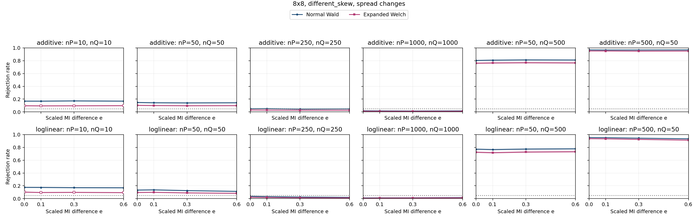

| Specification | Setting |
| --- | --- |
| Table shape | 8x8 |
| Horizontal graph regime specifications (columns) | (nP,nQ)={(10,10),(50,50),(250,250),(1000,1000),(50,500),(500,50)} |
| Vertical graph regime specifications (rows) | Top: additive probability changes; bottom: ordinal log-linear control. Each panel plots both Wald and Expanded Welch. |
| Fixed margins for both constructors | P: row 1 and column 1 each have probability 0.7, every other row/column 0.3/7; Q: row 1 and column 1 each have probability 0.8, every other row/column 0.2/7 |
| Additive direction in P and Q | H=ss^T, s=[-1.0, -0.7143, -0.4286, -0.1429, 0.1429, 0.4286, 0.7143, 1.0] (equally spaced scores; displayed rounded) |
| Log-linear direction in P and Q | Products of equally spaced row/column scores from -1 to 1; ordinal in both populations |
| MI settings | M=0.0047176 nats; I(P)=0.00094351 nats; I(Q)=I(P)+eM; e={0,0.1,0.3,0.6} |
| Axes | e from 0 to 0.6; rejection rate from 0 to 1 |
| Replicates | 10,000 per point |

Every plotted rate, validity and minimum expected count

| Construction | nP | nQ | e | MI difference | Method | Rejection | 95% low | 95% high | Valid | Conditional rejection | Min expected P | Min expected Q |
| --- | --- | --- | --- | --- | --- | --- | --- | --- | --- | --- | --- | --- |
| additive | 10 | 10 | 0 | 0 | expanded_welch | 0.0968 | 0.09116 | 0.1028 | 0.7997 | 0.121 | 0.013 | 0.00455 |
| additive | 10 | 10 | 0 | 0 | normal_wald | 0.169 | 0.1618 | 0.1765 | 0.9897 | 0.1708 | 0.013 | 0.00455 |
| additive | 10 | 10 | 0.1 | 0.0004718 | expanded_welch | 0.0951 | 0.0895 | 0.101 | 0.7959 | 0.1195 | 0.013 | 0.003749 |
| additive | 10 | 10 | 0.1 | 0.0004718 | normal_wald | 0.1687 | 0.1615 | 0.1762 | 0.9897 | 0.1705 | 0.013 | 0.003749 |
| additive | 10 | 10 | 0.3 | 0.001415 | expanded_welch | 0.0963 | 0.09067 | 0.1022 | 0.7938 | 0.1213 | 0.013 | 0.002506 |
| additive | 10 | 10 | 0.3 | 0.001415 | normal_wald | 0.1726 | 0.1653 | 0.1801 | 0.9886 | 0.1746 | 0.013 | 0.002506 |
| additive | 10 | 10 | 0.6 | 0.002831 | expanded_welch | 0.0982 | 0.09252 | 0.1042 | 0.7972 | 0.1232 | 0.013 | 0.001121 |
| additive | 10 | 10 | 0.6 | 0.002831 | normal_wald | 0.1689 | 0.1617 | 0.1764 | 0.9888 | 0.1708 | 0.013 | 0.001121 |
| additive | 50 | 50 | 0 | 0 | expanded_welch | 0.1028 | 0.097 | 0.1089 | 1 | 0.1028 | 0.06498 | 0.02275 |
| additive | 50 | 50 | 0 | 0 | normal_wald | 0.1479 | 0.1411 | 0.155 | 1 | 0.1479 | 0.06498 | 0.02275 |
| additive | 50 | 50 | 0.1 | 0.0004718 | expanded_welch | 0.1003 | 0.09456 | 0.1063 | 0.9999 | 0.1003 | 0.06498 | 0.01874 |
| additive | 50 | 50 | 0.1 | 0.0004718 | normal_wald | 0.1435 | 0.1368 | 0.1505 | 1 | 0.1435 | 0.06498 | 0.01874 |
| additive | 50 | 50 | 0.3 | 0.001415 | expanded_welch | 0.0969 | 0.09126 | 0.1029 | 1 | 0.0969 | 0.06498 | 0.01253 |
| additive | 50 | 50 | 0.3 | 0.001415 | normal_wald | 0.1412 | 0.1345 | 0.1482 | 1 | 0.1412 | 0.06498 | 0.01253 |
| additive | 50 | 50 | 0.6 | 0.002831 | expanded_welch | 0.0985 | 0.09281 | 0.1045 | 0.9999 | 0.09851 | 0.06498 | 0.005606 |
| additive | 50 | 50 | 0.6 | 0.002831 | normal_wald | 0.1434 | 0.1367 | 0.1504 | 1 | 0.1434 | 0.06498 | 0.005606 |
| additive | 50 | 500 | 0 | 0 | expanded_welch | 0.7612 | 0.7527 | 0.7695 | 1 | 0.7612 | 0.06498 | 0.2275 |
| additive | 50 | 500 | 0 | 0 | normal_wald | 0.804 | 0.7961 | 0.8117 | 1 | 0.804 | 0.06498 | 0.2275 |
| additive | 50 | 500 | 0.1 | 0.0004718 | expanded_welch | 0.7651 | 0.7567 | 0.7733 | 1 | 0.7651 | 0.06498 | 0.1874 |
| additive | 50 | 500 | 0.1 | 0.0004718 | normal_wald | 0.8085 | 0.8007 | 0.8161 | 1 | 0.8085 | 0.06498 | 0.1874 |
| additive | 50 | 500 | 0.3 | 0.001415 | expanded_welch | 0.7688 | 0.7604 | 0.777 | 1 | 0.7688 | 0.06498 | 0.1253 |
| additive | 50 | 500 | 0.3 | 0.001415 | normal_wald | 0.8125 | 0.8047 | 0.82 | 1 | 0.8125 | 0.06498 | 0.1253 |
| additive | 50 | 500 | 0.6 | 0.002831 | expanded_welch | 0.7658 | 0.7574 | 0.774 | 1 | 0.7658 | 0.06498 | 0.05606 |
| additive | 50 | 500 | 0.6 | 0.002831 | normal_wald | 0.8108 | 0.803 | 0.8184 | 1 | 0.8108 | 0.06498 | 0.05606 |
| additive | 250 | 250 | 0 | 0 | expanded_welch | 0.0308 | 0.02759 | 0.03437 | 1 | 0.0308 | 0.3249 | 0.1137 |
| additive | 250 | 250 | 0 | 0 | normal_wald | 0.0511 | 0.04695 | 0.05559 | 1 | 0.0511 | 0.3249 | 0.1137 |
| additive | 250 | 250 | 0.1 | 0.0004718 | expanded_welch | 0.0288 | 0.0257 | 0.03226 | 1 | 0.0288 | 0.3249 | 0.09372 |
| additive | 250 | 250 | 0.1 | 0.0004718 | normal_wald | 0.0527 | 0.04849 | 0.05725 | 1 | 0.0527 | 0.3249 | 0.09372 |
| additive | 250 | 250 | 0.3 | 0.001415 | expanded_welch | 0.0272 | 0.02419 | 0.03057 | 1 | 0.0272 | 0.3249 | 0.06266 |
| additive | 250 | 250 | 0.3 | 0.001415 | normal_wald | 0.045 | 0.04111 | 0.04924 | 1 | 0.045 | 0.3249 | 0.06266 |
| additive | 250 | 250 | 0.6 | 0.002831 | expanded_welch | 0.0266 | 0.02362 | 0.02994 | 1 | 0.0266 | 0.3249 | 0.02803 |
| additive | 250 | 250 | 0.6 | 0.002831 | normal_wald | 0.0481 | 0.04408 | 0.05247 | 1 | 0.0481 | 0.3249 | 0.02803 |
| additive | 500 | 50 | 0 | 0 | expanded_welch | 0.9524 | 0.9481 | 0.9564 | 1 | 0.9524 | 0.6498 | 0.02275 |
| additive | 500 | 50 | 0 | 0 | normal_wald | 0.9692 | 0.9656 | 0.9724 | 1 | 0.9692 | 0.6498 | 0.02275 |
| additive | 500 | 50 | 0.1 | 0.0004718 | expanded_welch | 0.952 | 0.9476 | 0.956 | 1 | 0.952 | 0.6498 | 0.01874 |
| additive | 500 | 50 | 0.1 | 0.0004718 | normal_wald | 0.9677 | 0.9641 | 0.971 | 1 | 0.9677 | 0.6498 | 0.01874 |
| additive | 500 | 50 | 0.3 | 0.001415 | expanded_welch | 0.9495 | 0.945 | 0.9536 | 1 | 0.9495 | 0.6498 | 0.01253 |
| additive | 500 | 50 | 0.3 | 0.001415 | normal_wald | 0.9677 | 0.9641 | 0.971 | 1 | 0.9677 | 0.6498 | 0.01253 |
| additive | 500 | 50 | 0.6 | 0.002831 | expanded_welch | 0.9512 | 0.9468 | 0.9553 | 1 | 0.9512 | 0.6498 | 0.005606 |
| additive | 500 | 50 | 0.6 | 0.002831 | normal_wald | 0.9692 | 0.9656 | 0.9724 | 1 | 0.9692 | 0.6498 | 0.005606 |
| additive | 1000 | 1000 | 0 | 0 | expanded_welch | 0.0117 | 0.009772 | 0.014 | 1 | 0.0117 | 1.3 | 0.455 |
| additive | 1000 | 1000 | 0 | 0 | normal_wald | 0.0183 | 0.01585 | 0.02112 | 1 | 0.0183 | 1.3 | 0.455 |
| additive | 1000 | 1000 | 0.1 | 0.0004718 | expanded_welch | 0.0107 | 0.008863 | 0.01291 | 1 | 0.0107 | 1.3 | 0.3749 |
| additive | 1000 | 1000 | 0.1 | 0.0004718 | normal_wald | 0.0169 | 0.01455 | 0.01962 | 1 | 0.0169 | 1.3 | 0.3749 |
| additive | 1000 | 1000 | 0.3 | 0.001415 | expanded_welch | 0.0101 | 0.00832 | 0.01226 | 1 | 0.0101 | 1.3 | 0.2506 |
| additive | 1000 | 1000 | 0.3 | 0.001415 | normal_wald | 0.0151 | 0.01289 | 0.01768 | 1 | 0.0151 | 1.3 | 0.2506 |
| additive | 1000 | 1000 | 0.6 | 0.002831 | expanded_welch | 0.0102 | 0.00841 | 0.01237 | 1 | 0.0102 | 1.3 | 0.1121 |
| additive | 1000 | 1000 | 0.6 | 0.002831 | normal_wald | 0.017 | 0.01465 | 0.01973 | 1 | 0.017 | 1.3 | 0.1121 |
| loglinear | 10 | 10 | 0 | 0 | expanded_welch | 0.102 | 0.09622 | 0.1081 | 0.7908 | 0.129 | 0.01807 | 0.008174 |
| loglinear | 10 | 10 | 0 | 0 | normal_wald | 0.1762 | 0.1689 | 0.1838 | 0.9881 | 0.1783 | 0.01807 | 0.008174 |
| loglinear | 10 | 10 | 0.1 | 0.0004718 | expanded_welch | 0.0958 | 0.09019 | 0.1017 | 0.792 | 0.121 | 0.01807 | 0.008179 |
| loglinear | 10 | 10 | 0.1 | 0.0004718 | normal_wald | 0.1754 | 0.1681 | 0.183 | 0.9878 | 0.1776 | 0.01807 | 0.008179 |
| loglinear | 10 | 10 | 0.3 | 0.001415 | expanded_welch | 0.0978 | 0.09213 | 0.1038 | 0.7952 | 0.123 | 0.01807 | 0.008166 |
| loglinear | 10 | 10 | 0.3 | 0.001415 | normal_wald | 0.1715 | 0.1642 | 0.179 | 0.9888 | 0.1734 | 0.01807 | 0.008166 |
| loglinear | 10 | 10 | 0.6 | 0.002831 | expanded_welch | 0.0941 | 0.08853 | 0.09998 | 0.788 | 0.1194 | 0.01807 | 0.008106 |
| loglinear | 10 | 10 | 0.6 | 0.002831 | normal_wald | 0.1698 | 0.1626 | 0.1773 | 0.988 | 0.1719 | 0.01807 | 0.008106 |
| loglinear | 50 | 50 | 0 | 0 | expanded_welch | 0.0962 | 0.09057 | 0.1021 | 0.9999 | 0.09621 | 0.09033 | 0.04087 |
| loglinear | 50 | 50 | 0 | 0 | normal_wald | 0.1341 | 0.1276 | 0.1409 | 1 | 0.1341 | 0.09033 | 0.04087 |
| loglinear | 50 | 50 | 0.1 | 0.0004718 | expanded_welch | 0.0988 | 0.0931 | 0.1048 | 1 | 0.0988 | 0.09033 | 0.04089 |
| loglinear | 50 | 50 | 0.1 | 0.0004718 | normal_wald | 0.1372 | 0.1306 | 0.1441 | 1 | 0.1372 | 0.09033 | 0.04089 |
| loglinear | 50 | 50 | 0.3 | 0.001415 | expanded_welch | 0.0899 | 0.08445 | 0.09566 | 1 | 0.0899 | 0.09033 | 0.04083 |
| loglinear | 50 | 50 | 0.3 | 0.001415 | normal_wald | 0.1256 | 0.1192 | 0.1322 | 1 | 0.1256 | 0.09033 | 0.04083 |
| loglinear | 50 | 50 | 0.6 | 0.002831 | expanded_welch | 0.0832 | 0.07795 | 0.08877 | 1 | 0.0832 | 0.09033 | 0.04053 |
| loglinear | 50 | 50 | 0.6 | 0.002831 | normal_wald | 0.1137 | 0.1076 | 0.1201 | 1 | 0.1137 | 0.09033 | 0.04053 |
| loglinear | 50 | 500 | 0 | 0 | expanded_welch | 0.7243 | 0.7155 | 0.733 | 1 | 0.7243 | 0.09033 | 0.4087 |
| loglinear | 50 | 500 | 0 | 0 | normal_wald | 0.7724 | 0.7641 | 0.7805 | 1 | 0.7724 | 0.09033 | 0.4087 |
| loglinear | 50 | 500 | 0.1 | 0.0004718 | expanded_welch | 0.7174 | 0.7085 | 0.7261 | 1 | 0.7174 | 0.09033 | 0.4089 |
| loglinear | 50 | 500 | 0.1 | 0.0004718 | normal_wald | 0.7663 | 0.7579 | 0.7745 | 1 | 0.7663 | 0.09033 | 0.4089 |
| loglinear | 50 | 500 | 0.3 | 0.001415 | expanded_welch | 0.7275 | 0.7187 | 0.7361 | 1 | 0.7275 | 0.09033 | 0.4083 |
| loglinear | 50 | 500 | 0.3 | 0.001415 | normal_wald | 0.7741 | 0.7658 | 0.7822 | 1 | 0.7741 | 0.09033 | 0.4083 |
| loglinear | 50 | 500 | 0.6 | 0.002831 | expanded_welch | 0.7327 | 0.7239 | 0.7413 | 1 | 0.7327 | 0.09033 | 0.4053 |
| loglinear | 50 | 500 | 0.6 | 0.002831 | normal_wald | 0.7781 | 0.7698 | 0.7861 | 1 | 0.7781 | 0.09033 | 0.4053 |
| loglinear | 250 | 250 | 0 | 0 | expanded_welch | 0.0212 | 0.01856 | 0.02421 | 1 | 0.0212 | 0.4517 | 0.2044 |
| loglinear | 250 | 250 | 0 | 0 | normal_wald | 0.036 | 0.03252 | 0.03983 | 1 | 0.036 | 0.4517 | 0.2044 |
| loglinear | 250 | 250 | 0.1 | 0.0004718 | expanded_welch | 0.0184 | 0.01594 | 0.02122 | 1 | 0.0184 | 0.4517 | 0.2045 |
| loglinear | 250 | 250 | 0.1 | 0.0004718 | normal_wald | 0.0311 | 0.02787 | 0.03469 | 1 | 0.0311 | 0.4517 | 0.2045 |
| loglinear | 250 | 250 | 0.3 | 0.001415 | expanded_welch | 0.0138 | 0.01169 | 0.01628 | 1 | 0.0138 | 0.4517 | 0.2042 |
| loglinear | 250 | 250 | 0.3 | 0.001415 | normal_wald | 0.0251 | 0.02221 | 0.02835 | 1 | 0.0251 | 0.4517 | 0.2042 |
| loglinear | 250 | 250 | 0.6 | 0.002831 | expanded_welch | 0.0114 | 0.009499 | 0.01368 | 1 | 0.0114 | 0.4517 | 0.2026 |
| loglinear | 250 | 250 | 0.6 | 0.002831 | normal_wald | 0.0194 | 0.01688 | 0.02229 | 1 | 0.0194 | 0.4517 | 0.2026 |
| loglinear | 500 | 50 | 0 | 0 | expanded_welch | 0.9368 | 0.9319 | 0.9414 | 0.9999 | 0.9369 | 0.9033 | 0.04087 |
| loglinear | 500 | 50 | 0 | 0 | normal_wald | 0.9543 | 0.95 | 0.9582 | 1 | 0.9543 | 0.9033 | 0.04087 |
| loglinear | 500 | 50 | 0.1 | 0.0004718 | expanded_welch | 0.9343 | 0.9293 | 0.939 | 1 | 0.9343 | 0.9033 | 0.04089 |
| loglinear | 500 | 50 | 0.1 | 0.0004718 | normal_wald | 0.9521 | 0.9477 | 0.9561 | 1 | 0.9521 | 0.9033 | 0.04089 |
| loglinear | 500 | 50 | 0.3 | 0.001415 | expanded_welch | 0.9253 | 0.92 | 0.9303 | 1 | 0.9253 | 0.9033 | 0.04083 |
| loglinear | 500 | 50 | 0.3 | 0.001415 | normal_wald | 0.9442 | 0.9395 | 0.9485 | 1 | 0.9442 | 0.9033 | 0.04083 |
| loglinear | 500 | 50 | 0.6 | 0.002831 | expanded_welch | 0.9137 | 0.908 | 0.919 | 0.9999 | 0.9138 | 0.9033 | 0.04053 |
| loglinear | 500 | 50 | 0.6 | 0.002831 | normal_wald | 0.9346 | 0.9296 | 0.9393 | 1 | 0.9346 | 0.9033 | 0.04053 |
| loglinear | 1000 | 1000 | 0 | 0 | expanded_welch | 0.0059 | 0.004577 | 0.007602 | 1 | 0.0059 | 1.807 | 0.8174 |
| loglinear | 1000 | 1000 | 0 | 0 | normal_wald | 0.0111 | 0.009226 | 0.01335 | 1 | 0.0111 | 1.807 | 0.8174 |
| loglinear | 1000 | 1000 | 0.1 | 0.0004718 | expanded_welch | 0.0088 | 0.007149 | 0.01083 | 1 | 0.0088 | 1.807 | 0.8179 |
| loglinear | 1000 | 1000 | 0.1 | 0.0004718 | normal_wald | 0.0127 | 0.01068 | 0.01509 | 1 | 0.0127 | 1.807 | 0.8179 |
| loglinear | 1000 | 1000 | 0.3 | 0.001415 | expanded_welch | 0.01 | 0.008229 | 0.01215 | 1 | 0.01 | 1.807 | 0.8166 |
| loglinear | 1000 | 1000 | 0.3 | 0.001415 | normal_wald | 0.0135 | 0.01142 | 0.01596 | 1 | 0.0135 | 1.807 | 0.8166 |
| loglinear | 1000 | 1000 | 0.6 | 0.002831 | expanded_welch | 0.0125 | 0.0105 | 0.01487 | 1 | 0.0125 | 1.807 | 0.8106 |
| loglinear | 1000 | 1000 | 0.6 | 0.002831 | normal_wald | 0.0175 | 0.01511 | 0.02026 | 1 | 0.0175 | 1.807 | 0.8106 |

## 4. What the check establishes

The independent binary reconstruction and identical binary rejection counts give no evidence that proportional fitting is responsible for the earlier results. The larger-table results show sensitivity to population construction even after matching margins, baseline MI, MI difference and sample sizes. The effect is therefore not described fully by MI and margins alone.

Expanded Welch still has both benefits and costs under the additive family: it improves some inflated false-positive rates, but can substantially overcorrect and lose power. This check does not establish that either method is uniformly preferable. The following examples illustrate those different outcomes; the complete landscape and all exact rates appear above.

| Regime | Construction | I(P) | Positive MI difference | Null Wald | Null Welch | Power Wald | Power Welch |
| --- | --- | --- | --- | --- | --- | --- | --- |
| 5x5, uniform, common, nP=50, nQ=50 | additive | 0.01844 | 0.05532 | 0.0671 | 0.0479 | 0.106 | 0.0839 |
| 5x5, uniform, common, nP=50, nQ=50 | loglinear | 0.01844 | 0.05532 | 0.0662 | 0.0491 | 0.1155 | 0.0943 |
| 3x3, different_skew, rare, nP=250, nQ=250 | additive | 0.00461 | 0.01383 | 0.0378 | 0.008 | 0.1564 | 0.029 |
| 3x3, different_skew, rare, nP=250, nQ=250 | loglinear | 0.00461 | 0.01383 | 0.0068 | 0.0017 | 0.0487 | 0.0252 |
| 5x5, different_skew, common, nP=500, nQ=50 | additive | 0.02798 | 0.08395 | 0.2751 | 0.0637 | 0.0898 | 0.0392 |
| 5x5, different_skew, common, nP=500, nQ=50 | loglinear | 0.02798 | 0.08395 | 0.175 | 0.0293 | 0.0769 | 0.0465 |

The null columns have target 0.05. Power columns use e=0.6 with the absolute difference shown. In these illustrative endpoints, both methods have at least 99.99% validity; their differences are not explained by large numbers of invalid outputs. The 5x5 unequal-sample example also has decreasing rejection as the MI difference grows. Improved null calibration there does not imply useful detection power.

For the thesis, retain multiple constructions and describe advantages by regime. The four effect points are a sensitivity check, not a finely resolved power study. Targets differ between families because rare-cell changes permit smaller MI ranges; comparisons between constructors within each figure are the matched comparisons.

## 5. Records

[Protocol](../../results/construction_check/protocol.json) | [Exact populations](../../results/construction_check/population_definitions.csv) | [All results](../../results/construction_check/cell_results.csv) | [Method comparisons](../../results/construction_check/method_comparison.csv) | [Paired results](../../results/construction_check/paired_method_results.csv) | [Verification](../../results/construction_check/verification.json)

Run `python experiments/run_construction_check.py --report-only` to rebuild this document from saved results.
