# Final Experiment Landscape: Normal Wald versus Expanded Welch

## 1. Purpose

This document presents the complete primary experiment before selecting cases
for detailed interpretation. Every graph compares Normal Wald with Expanded
Welch for one explicitly defined regime. No result is averaged across table
shape, skewness, sample size, population relationship, effect size, imbalance
ratio, or interaction pattern.

All figures use the primary significance level $\alpha=0.05$. Every plotted
point is based on 10,000 independently simulated table pairs. Together, the
figures cover all 5,672 frozen experiment configurations. Simple Welch and the
secondary $\alpha=0.01$ and $\alpha=0.10$ results remain available in the
source results but are omitted from this visual comparison.

The test is

$$
H_0:I(P)=I(Q)
\qquad\text{against}\qquad
H_1:I(P)\ne I(Q).
$$

## 2. How to read the graphs

The blue circular line is Normal Wald. The magenta square line is Expanded
Welch. A filled point means that the method returned a valid statistic and
$p$-value in at least 90% of replicates. A hollow point means that its valid
rate was below 90%, so a low rejection rate should not be interpreted as good
performance without caution.

In every rejection-growth graph:

- the vertical axis is rejection rate from 0 to 1;
- the horizontal axis is the relative MI difference $e$ from 0 to 0.60;
- the first point, $e=0$, is the false-positive rate because the null is true;
- points with $e>0$ show power as the true MI difference increases; and
- the dotted horizontal line marks 0.05.

The actual MI difference is

$$
\Delta_I=|I(Q)-I(P)|=eM,
$$

where $M$ is the shared reachable MI scale reported below each figure. Using
$e$ on every horizontal axis keeps all graphs directly comparable even though
different populations have different feasible MI ranges.

Rejection rates are unconditional: an invalid output counts as a
non-rejection. Every panel within a figure is a separate graph for one fixed
combination of shape, skewness, population relationship, and sample size.

## 3. Shared population construction

| Factor | Exact setting |
| --- | --- |
| Shapes | $2\times2$, $2\times3$, $3\times3$, $3\times5$, $4\times4$, $4\times8$, $5\times5$, $8\times8$ |
| Skewness | balanced, mild, strong, ultra |
| Dominant marginal probability | balanced: uniform; mild: 0.70; strong: 0.90; ultra: 0.95 |
| Primary interaction for $P$ | ordinal |
| Different-path construction for $Q$ | rolled margins and negative ordinal interaction |
| Baseline MI | $I(P)=0.20M$ |
| Alternative MI | $I(Q)=(0.20+e)M$ |
| Expected-count floor | none |
| Sampling | independent multinomial samples from fixed $P$ and $Q$ |

`Same population path` means that $Q$ uses the same margins and interaction
path as $P$; at $e=0$, $P=Q$. `Different population paths` means that $P$ and
$Q$ differ in shape even at $e=0$, while still satisfying $I(P)=I(Q)$.

## 4. Null calibration across all sample sizes

These two figures include the complete 18-point calibration grid. Each graph
fixes one shape, skewness level, and null construction, then shows how its
false-positive rate changes with the equal sample size. Both figures use the
same log-scaled horizontal axis from 2 to 1000 and vertical axis from 0 to 1.

### 4.1 Identical-distribution null

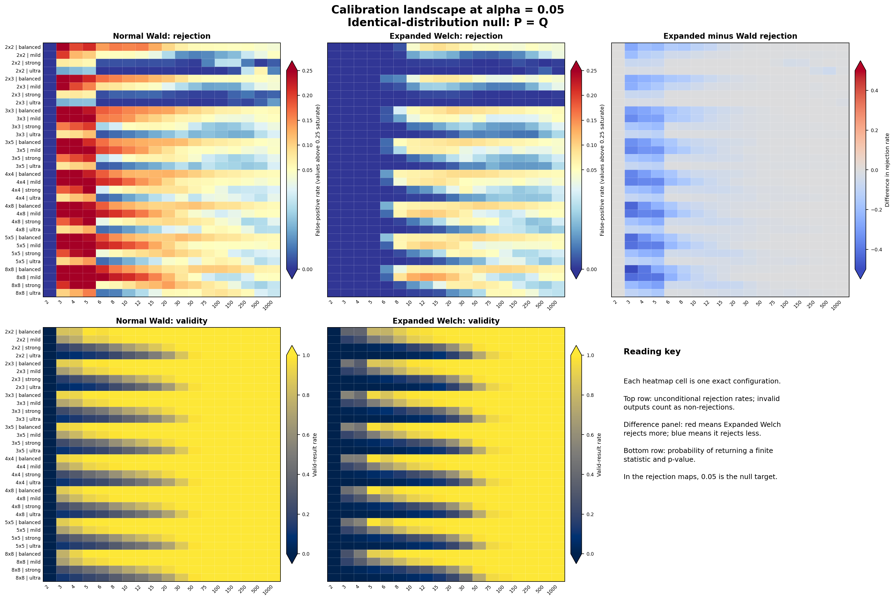

| Figure specification | Exact setting |
| --- | --- |
| Population relationship | $P=Q$ |
| Graph rows | balanced, mild, strong, ultra |
| Graph columns | all eight table shapes |
| Horizontal values | $n_P=n_Q\in\{2,3,4,5,6,8,10,12,15,20,30,50,75,100,150,250,500,1000\}$ |
| Quantity | False-positive rate; target 0.05 |
| Exact configurations | $4\times8\times18=576$ |

### 4.2 Equal-MI, different-shape null

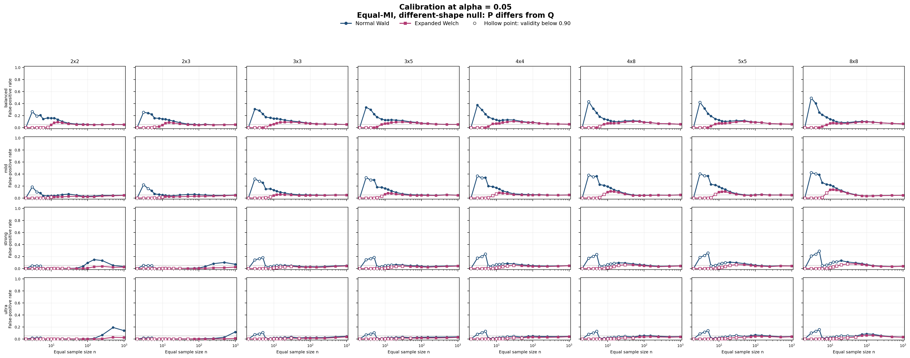

| Figure specification | Exact setting |
| --- | --- |
| Population relationship | $P\ne Q$ but $I(P)=I(Q)$ |
| $P$ path | original margins and ordinal interaction |
| $Q$ path | rolled margins and negative ordinal interaction |
| Graph rows | balanced, mild, strong, ultra |
| Graph columns | all eight table shapes |
| Horizontal values | the same 18 equal sample sizes from 2 to 1000 |
| Quantity | False-positive rate; target 0.05 |
| Exact configurations | $4\times8\times18=576$ |

## 5. Rejection growth across MI differences

Each figure in this section fixes one table shape and one population
relationship. Each graph within it then fixes one skewness level and one equal
sample size. Consequently, every graph contains exactly two curves for one
specific regime.

### 5.1 Shape 2x2: same population path

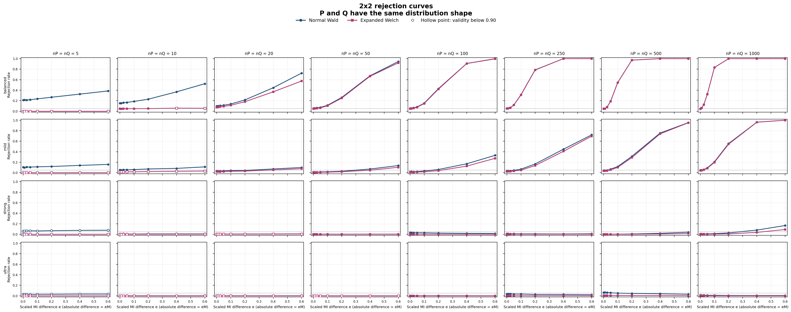

| Figure specification | Exact setting |
| --- | --- |
| Shape and relationship | $2\times2$; same population path |
| Graph rows | balanced, mild, strong, ultra |
| Graph columns | $n_P=n_Q\in\{5,10,20,50,100,250,500,1000\}$ |
| Horizontal values | $e\in\{0,0.01,0.025,0.05,0.10,0.20,0.40,0.60\}$ |
| $M$ by row | balanced 0.693147; mild 0.132829; strong 0.011134; ultra 0.002633 |

### 5.2 Shape 2x2: different population paths

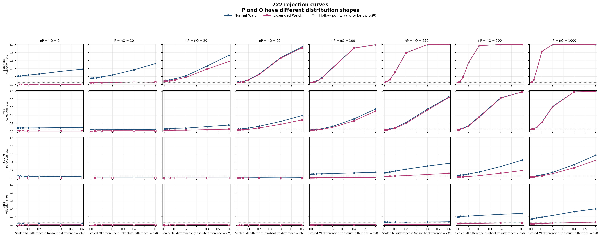

| Figure specification | Exact setting |
| --- | --- |
| Shape and relationship | $2\times2$; different paths with equal MI at $e=0$ |
| Graph rows and columns | the same skewness levels and sample sizes as Section 5.1 |
| Horizontal values | the same eight values of $e$ from 0 to 0.60 |
| $M$ by row | balanced 0.693147; mild 0.132829; strong 0.011134; ultra 0.002633 |

### 5.3 Shape 2x3: same population path

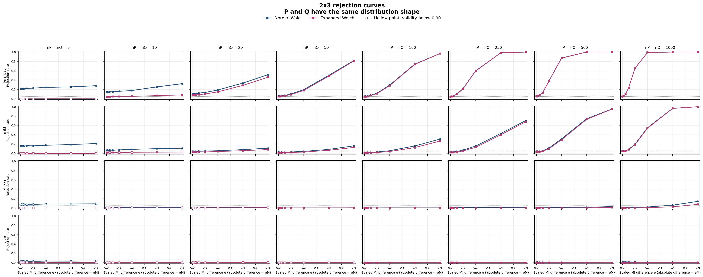

| Figure specification | Exact setting |
| --- | --- |
| Shape and relationship | $2\times3$; same population path |
| Graph rows | balanced, mild, strong, ultra |
| Graph columns | $n_P=n_Q\in\{5,10,20,50,100,250,500,1000\}$ |
| Horizontal values | $e\in\{0,0.01,0.025,0.05,0.10,0.20,0.40,0.60\}$ |
| $M$ by row | balanced 0.462098; mild 0.132829; strong 0.011134; ultra 0.002633 |

### 5.4 Shape 2x3: different population paths

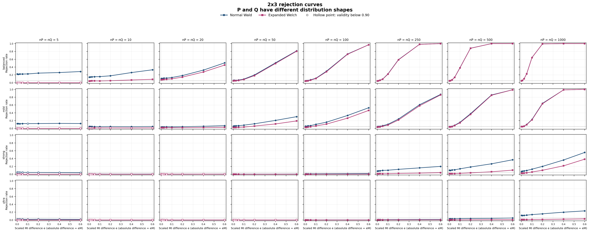

| Figure specification | Exact setting |
| --- | --- |
| Shape and relationship | $2\times3$; different paths with equal MI at $e=0$ |
| Graph rows and columns | the same skewness levels and sample sizes as Section 5.3 |
| Horizontal values | the same eight values of $e$ from 0 to 0.60 |
| $M$ by row | balanced 0.462098; mild 0.132829; strong 0.011134; ultra 0.002633 |

### 5.5 Shape 3x3: same population path

| Figure specification | Exact setting |
| --- | --- |
| Shape and relationship | $3\times3$; same population path |
| Graph rows | balanced, mild, strong, ultra |
| Graph columns | $n_P=n_Q\in\{5,10,20,50,100,250,500,1000\}$ |
| Horizontal values | $e\in\{0,0.01,0.025,0.05,0.10,0.20,0.40,0.60\}$ |
| $M$ by row | balanced 1.094589; mild 0.427910; strong 0.192209; ultra 0.112985 |

### 5.6 Shape 3x3: different population paths

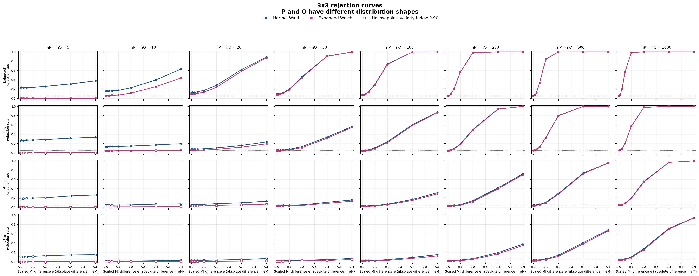

| Figure specification | Exact setting |
| --- | --- |
| Shape and relationship | $3\times3$; different paths with equal MI at $e=0$ |
| Graph rows and columns | the same skewness levels and sample sizes as Section 5.5 |
| Horizontal values | the same eight values of $e$ from 0 to 0.60 |
| $M$ by row | balanced 1.094589; mild 0.427910; strong 0.192209; ultra 0.112985 |

### 5.7 Shape 3x5: same population path

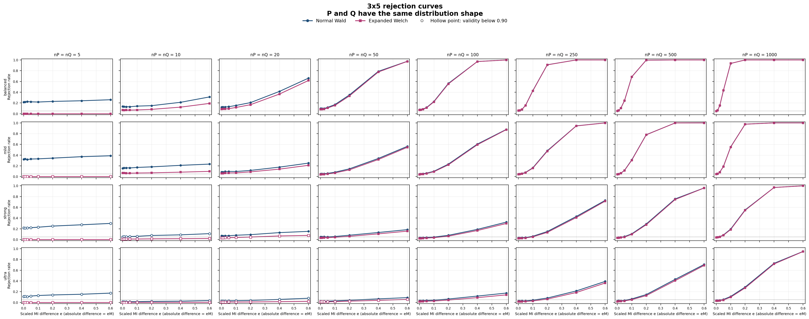

| Figure specification | Exact setting |
| --- | --- |
| Shape and relationship | $3\times5$; same population path |
| Graph rows | balanced, mild, strong, ultra |
| Graph columns | $n_P=n_Q\in\{5,10,20,50,100,250,500,1000\}$ |
| Horizontal values | $e\in\{0,0.01,0.025,0.05,0.10,0.20,0.40,0.60\}$ |
| $M$ by row | balanced 0.844007; mild 0.441515; strong 0.196781; ultra 0.115309 |

### 5.8 Shape 3x5: different population paths

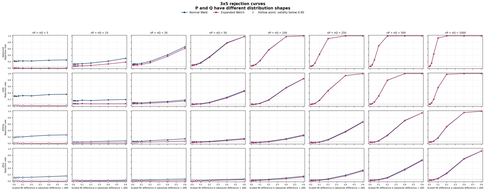

| Figure specification | Exact setting |
| --- | --- |
| Shape and relationship | $3\times5$; different paths with equal MI at $e=0$ |
| Graph rows and columns | the same skewness levels and sample sizes as Section 5.7 |
| Horizontal values | the same eight values of $e$ from 0 to 0.60 |
| $M$ by row | balanced 0.844007; mild 0.441515; strong 0.196781; ultra 0.115309 |

### 5.9 Shape 4x4: same population path

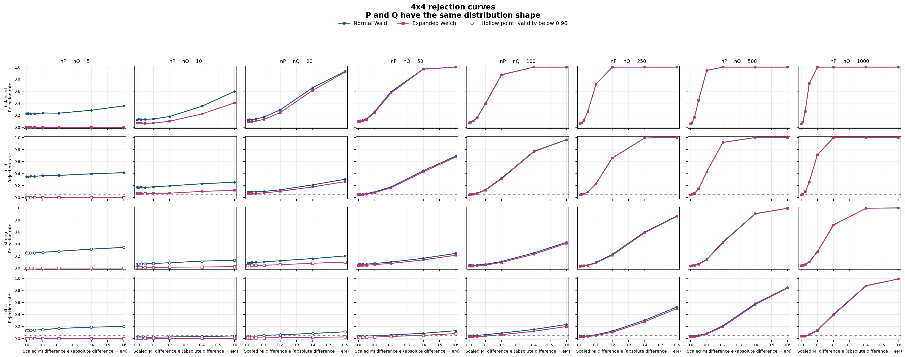

| Figure specification | Exact setting |
| --- | --- |
| Shape and relationship | $4\times4$; same population path |
| Graph rows | balanced, mild, strong, ultra |
| Graph columns | $n_P=n_Q\in\{5,10,20,50,100,250,500,1000\}$ |
| Horizontal values | $e\in\{0,0.01,0.025,0.05,0.10,0.20,0.40,0.60\}$ |
| $M$ by row | balanced 1.376379; mild 0.602958; strong 0.275423; ultra 0.160939 |

### 5.10 Shape 4x4: different population paths

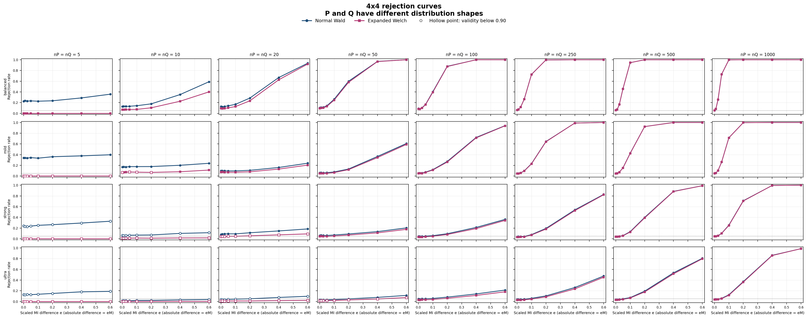

| Figure specification | Exact setting |
| --- | --- |
| Shape and relationship | $4\times4$; different paths with equal MI at $e=0$ |
| Graph rows and columns | the same skewness levels and sample sizes as Section 5.9 |
| Horizontal values | the same eight values of $e$ from 0 to 0.60 |
| $M$ by row | balanced 1.376379; mild 0.602958; strong 0.275423; ultra 0.160939 |

### 5.11 Shape 4x8: same population path

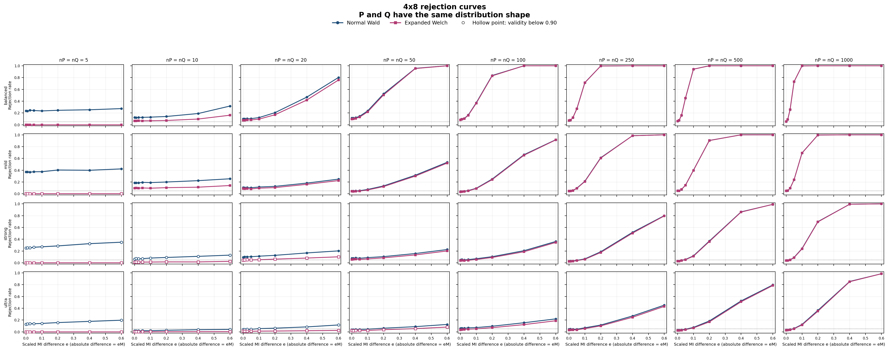

| Figure specification | Exact setting |
| --- | --- |
| Shape and relationship | $4\times8$; same population path |
| Graph rows | balanced, mild, strong, ultra |
| Graph columns | $n_P=n_Q\in\{5,10,20,50,100,250,500,1000\}$ |
| Horizontal values | $e\in\{0,0.01,0.025,0.05,0.10,0.20,0.40,0.60\}$ |
| $M$ by row | balanced 1.374327; mild 0.598808; strong 0.274189; ultra 0.160449 |

### 5.12 Shape 4x8: different population paths

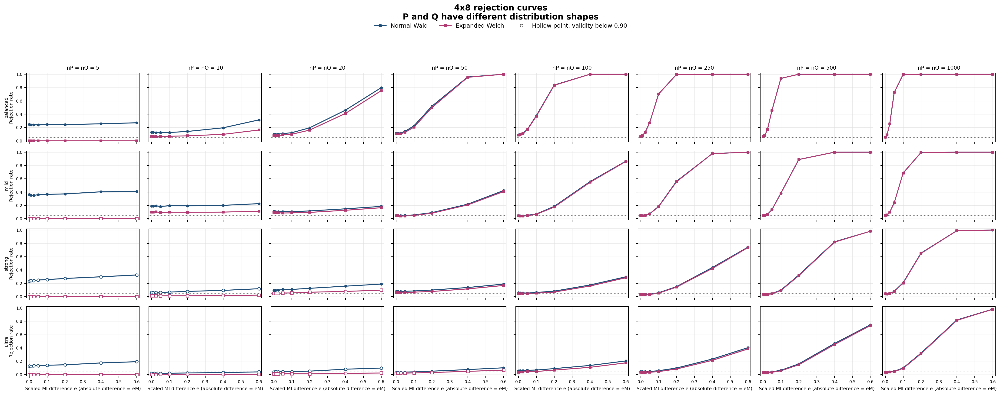

| Figure specification | Exact setting |
| --- | --- |
| Shape and relationship | $4\times8$; different paths with equal MI at $e=0$ |
| Graph rows and columns | the same skewness levels and sample sizes as Section 5.11 |
| Horizontal values | the same eight values of $e$ from 0 to 0.60 |
| $M$ by row | balanced 1.374327; mild 0.598808; strong 0.274189; ultra 0.160449 |

### 5.13 Shape 5x5: same population path

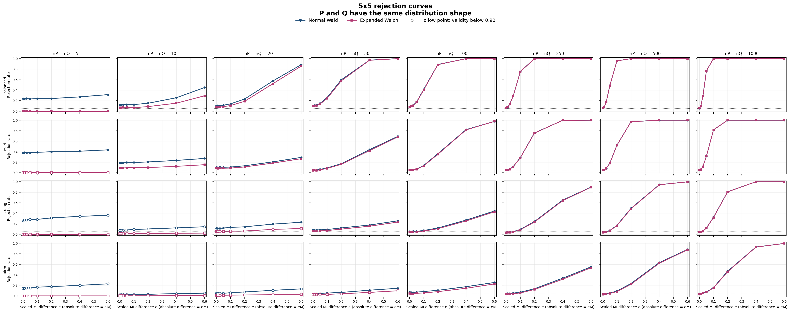

| Figure specification | Exact setting |
| --- | --- |
| Shape and relationship | $5\times5$; same population path |
| Graph rows | balanced, mild, strong, ultra |
| Graph columns | $n_P=n_Q\in\{5,10,20,50,100,250,500,1000\}$ |
| Horizontal values | $e\in\{0,0.01,0.025,0.05,0.10,0.20,0.40,0.60\}$ |
| $M$ by row | balanced 1.467011; mild 0.748216; strong 0.336034; ultra 0.194520 |

### 5.14 Shape 5x5: different population paths

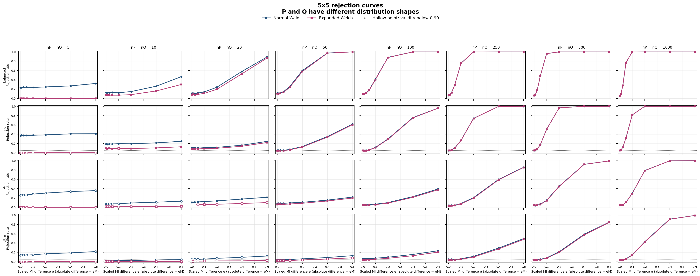

| Figure specification | Exact setting |
| --- | --- |
| Shape and relationship | $5\times5$; different paths with equal MI at $e=0$ |
| Graph rows and columns | the same skewness levels and sample sizes as Section 5.13 |
| Horizontal values | the same eight values of $e$ from 0 to 0.60 |
| $M$ by row | balanced 1.467011; mild 0.748216; strong 0.336034; ultra 0.194520 |

### 5.15 Shape 8x8: same population path

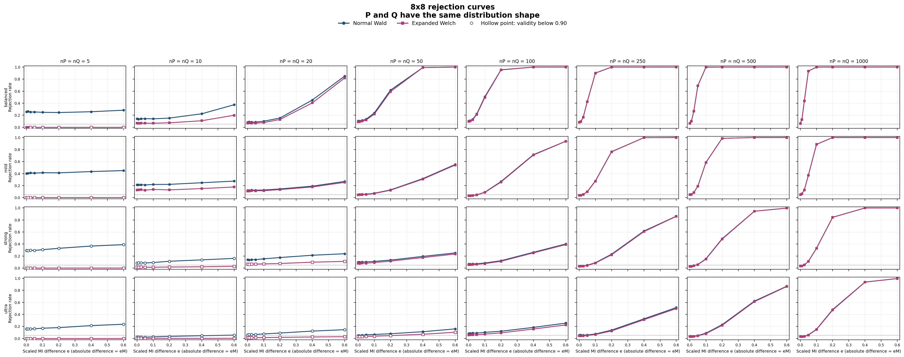

| Figure specification | Exact setting |
| --- | --- |
| Shape and relationship | $8\times8$; same population path |
| Graph rows | balanced, mild, strong, ultra |
| Graph columns | $n_P=n_Q\in\{5,10,20,50,100,250,500,1000\}$ |
| Horizontal values | $e\in\{0,0.01,0.025,0.05,0.10,0.20,0.40,0.60\}$ |
| $M$ by row | balanced 2.021338; mild 0.908803; strong 0.402920; ultra 0.230904 |

### 5.16 Shape 8x8: different population paths

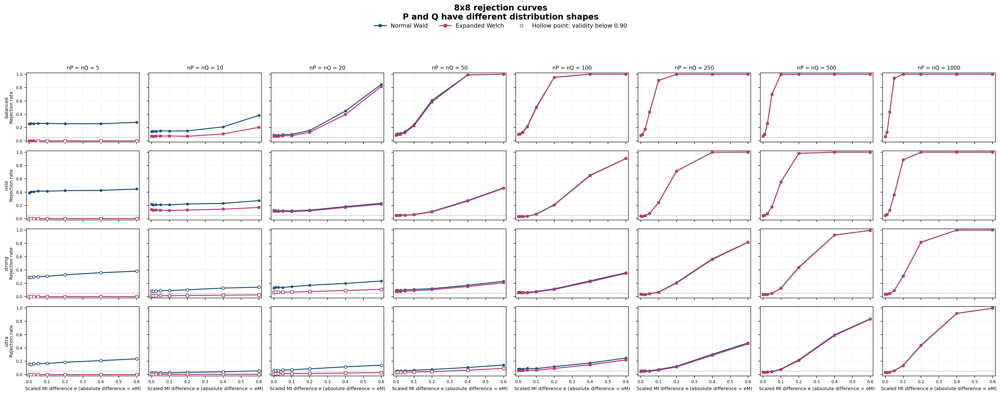

| Figure specification | Exact setting |
| --- | --- |
| Shape and relationship | $8\times8$; different paths with equal MI at $e=0$ |
| Graph rows and columns | the same skewness levels and sample sizes as Section 5.15 |
| Horizontal values | the same eight values of $e$ from 0 to 0.60 |
| $M$ by row | balanced 2.021338; mild 0.908803; strong 0.402920; ultra 0.230904 |

## 6. Unequal-sample regimes

Each graph fixes shape, skewness, sample-size ratio, and the smaller sample
$n_P$. The three observed points are $e=0$, 0.10, and 0.40. The horizontal
axis still runs from 0 to 0.60 and the vertical axis from 0 to 1, matching the
main figures.

### 6.1 Shape 2x2

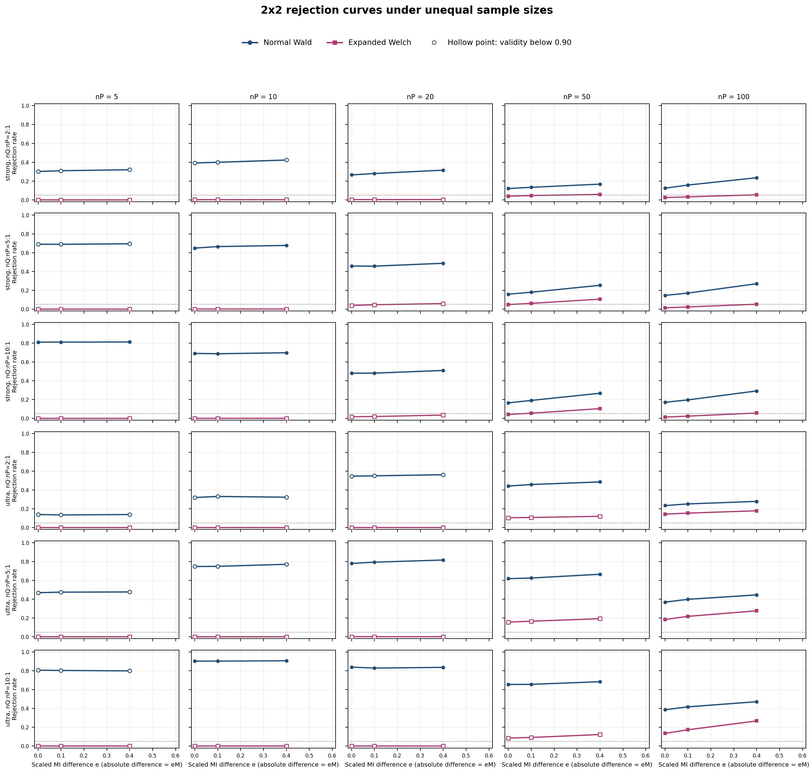

| Figure specification | Exact setting |
| --- | --- |
| Shape | $2\times2$ |
| Graph rows | strong and ultra skewness, each crossed with $n_Q:n_P\in\{2:1,5:1,10:1\}$ |
| Graph columns | $n_P\in\{5,10,20,50,100\}$ |
| Horizontal points | $e\in\{0,0.10,0.40\}$ |
| Population relationship | different paths; equal MI at $e=0$ |

### 6.2 Shape 3x3

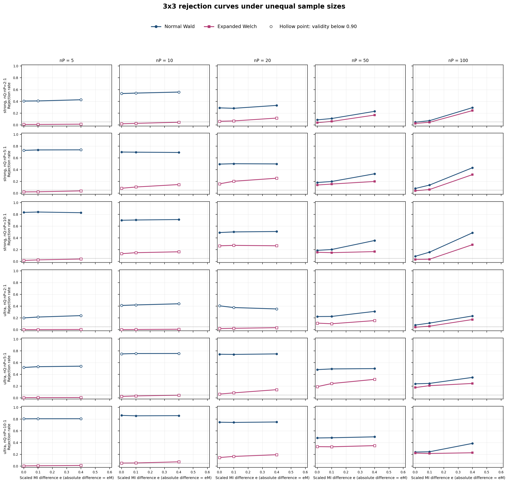

| Figure specification | Exact setting |
| --- | --- |
| Shape | $3\times3$ |
| Graph rows, columns and effects | same design as Section 6.1 |
| Population relationship | different paths; equal MI at $e=0$ |

### 6.3 Shape 5x5

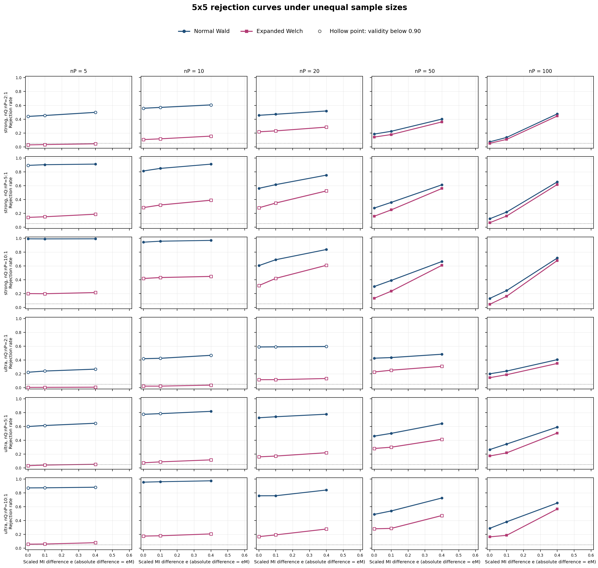

| Figure specification | Exact setting |
| --- | --- |
| Shape | $5\times5$ |
| Graph rows, columns and effects | same design as Section 6.1 |
| Population relationship | different paths; equal MI at $e=0$ |

### 6.4 Shape 8x8

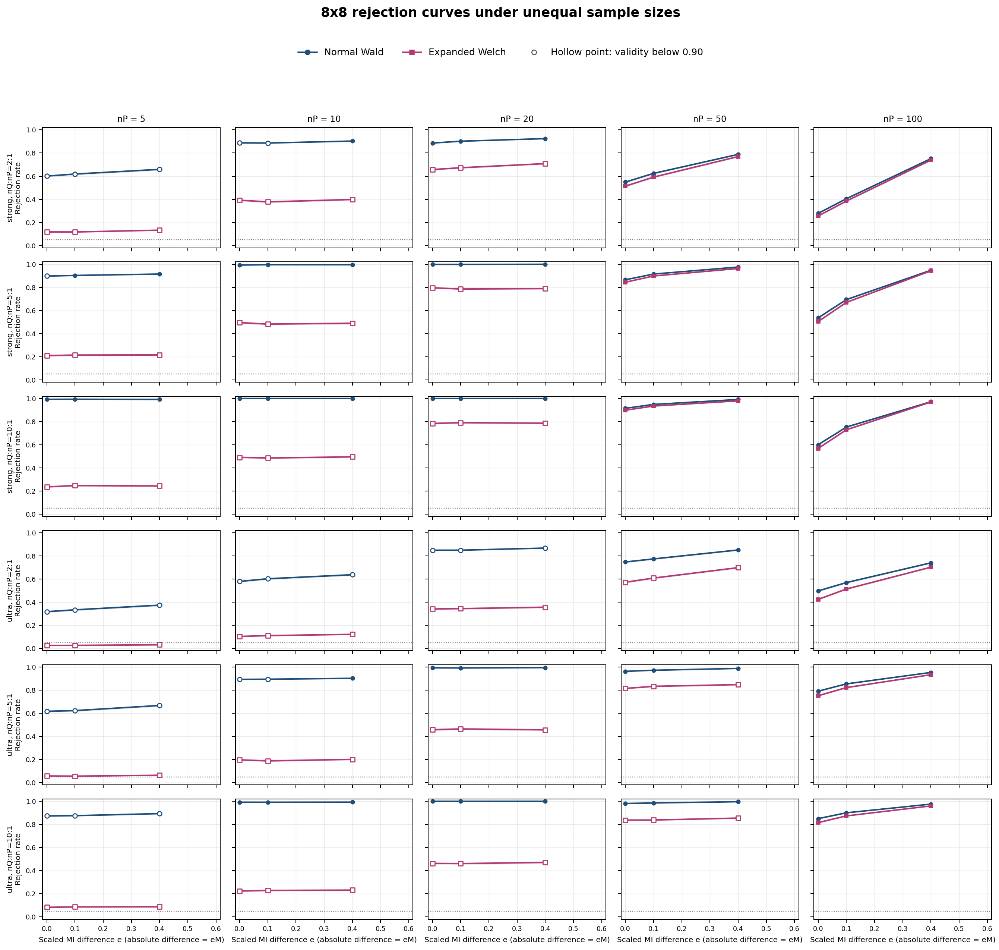

| Figure specification | Exact setting |
| --- | --- |
| Shape | $8\times8$ |
| Graph rows, columns and effects | same design as Section 6.1 |
| Population relationship | different paths; equal MI at $e=0$ |

## 7. Alternative interaction-pattern regimes

Each graph fixes shape, skewness, interaction pair, and equal sample size. The
four points are $e=0$, 0.10, 0.40, and 0.60. `checker/cyclic` compares a
checkerboard interaction in $P$ with a cyclic interaction in $Q$. `fixed
random` compares two interactions generated once from fixed seeds and then
held constant.

### 7.1 Shape 3x3

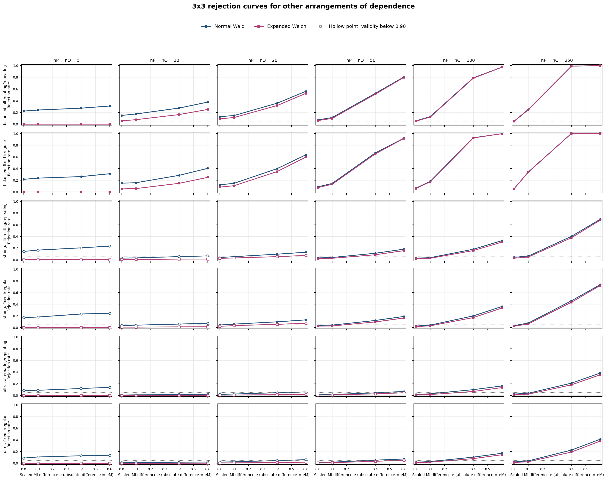

| Figure specification | Exact setting |
| --- | --- |
| Shape | $3\times3$ |
| Graph rows | balanced, strong, ultra, each crossed with the two interaction pairs |
| Graph columns | $n_P=n_Q\in\{5,10,20,50,100,250\}$ |
| Horizontal points | $e\in\{0,0.10,0.40,0.60\}$ |
| Population relationship | different paths; equal MI at $e=0$ |

### 7.2 Shape 3x5

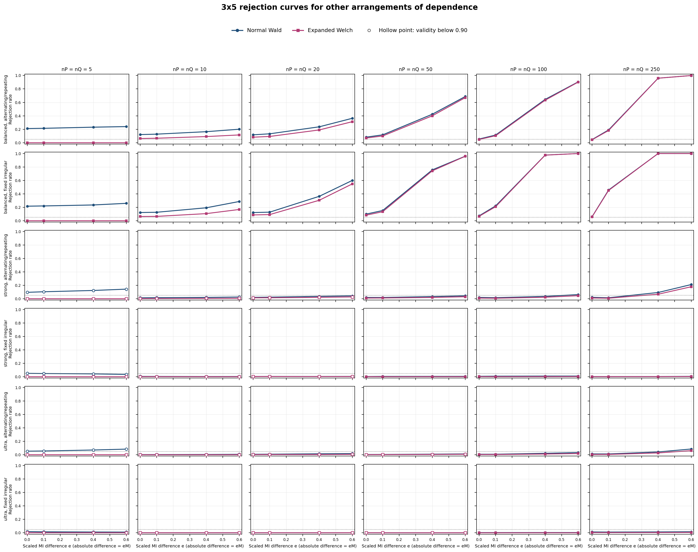

| Figure specification | Exact setting |
| --- | --- |
| Shape | $3\times5$ |
| Graph rows, columns and effects | same design as Section 7.1 |
| Population relationship | different paths; equal MI at $e=0$ |

### 7.3 Shape 5x5

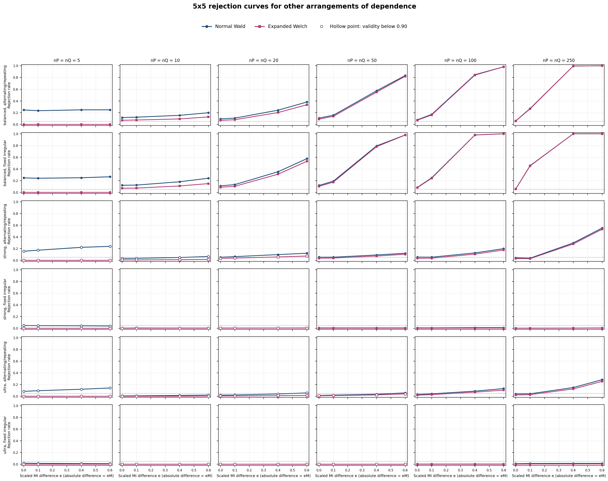

| Figure specification | Exact setting |
| --- | --- |
| Shape | $5\times5$ |
| Graph rows, columns and effects | same design as Section 7.1 |
| Population relationship | different paths; equal MI at $e=0$ |

### 7.4 Shape 8x8

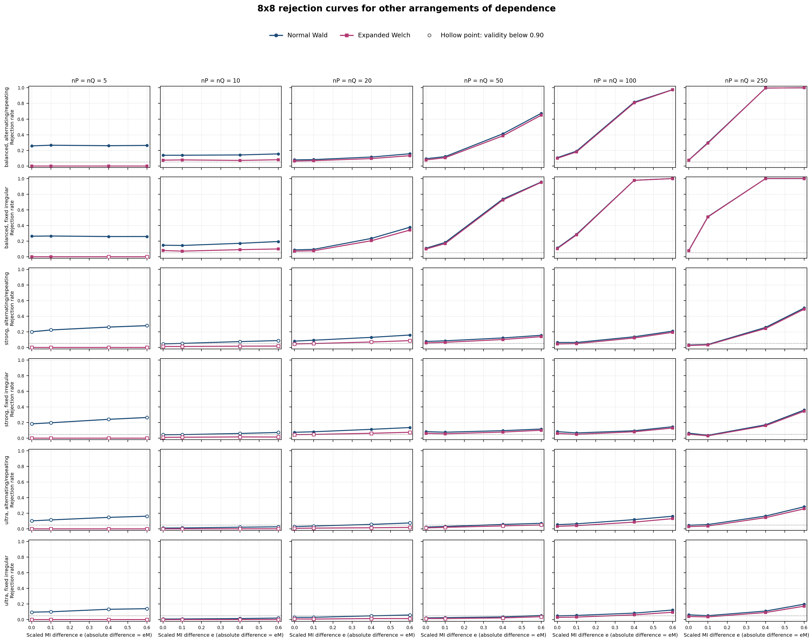

| Figure specification | Exact setting |
| --- | --- |
| Shape | $8\times8$ |
| Graph rows, columns and effects | same design as Section 7.1 |
| Population relationship | different paths; equal MI at $e=0$ |

## 8. Briefing sequence

1. Read the leftmost point of a graph first. This is its false-positive rate
   under the null.
2. Check whether that point is hollow before judging its calibration.
3. Follow the same two curves to the right to compare rejection growth as the
   MI difference increases.
4. Compare graphs vertically to change skewness and horizontally to change
   sample size while keeping all other settings fixed.
5. Use the unequal-sample and interaction sections only after understanding
   the matching equal-sample, primary-interaction graphs.

## 9. Reproducibility

The figures are generated by
[`../../experiments/make_final_experiment_landscape.py`](../../experiments/make_final_experiment_landscape.py)
from
[`../../results/detection_breakdown_sweep/cell_results.csv`](../../results/detection_breakdown_sweep/cell_results.csv).
The generator verifies the frozen configuration counts and rejects duplicate
or incomplete curves rather than averaging them.
