# Final Experiment Landscape: Normal Wald versus Expanded Welch

## 1. Scope

This document presents the complete primary landscape before drawing conclusions
from individual cases. It displays every predeclared experiment configuration at
$\alpha=0.05$ for Normal Wald and Expanded Welch. No table shape, skewness
level, sample size, population relationship, effect size, imbalance ratio, or
interaction pair is averaged with another.

Each heatmap cell is based on 10,000 independently simulated table pairs. The
figures jointly cover all 5,672 frozen configurations. The secondary
$\alpha=0.01$ and $\alpha=0.10$ results and Simple Welch results remain in the
results file, but are omitted here so the primary comparison is visually clear.

The hypothesis is

$$
H_0:I(P)=I(Q)
\qquad\text{against}\qquad
H_1:I(P)\ne I(Q).
$$

## 2. How to read every figure

Each figure uses the same five panels:

| Panel | Meaning |
| --- | --- |
| Normal Wald: rejection | Fraction of all simulated table pairs rejected by Normal Wald |
| Expanded Welch: rejection | Fraction rejected by Expanded Welch |
| Expanded minus Wald | Expanded Welch rejection rate minus Normal Wald rejection rate |
| Normal Wald: validity | Fraction for which Normal Wald returned a finite statistic and $p$-value |
| Expanded Welch: validity | Fraction for which Expanded Welch returned a finite statistic and $p$-value |

Blue in the difference panel means Expanded Welch rejects less often; red means
it rejects more often. This panel shows direction only. Its colour range is set
to the largest difference within that figure, so colour intensity should not be
compared between different figures.

At relative effect $e=0$, the null is true and the rejection rate is the
false-positive rate. Its target is 0.05. At $e>0$, the null is false and the
rejection rate is power. Rejection rates are unconditional: an invalid result
counts as a non-rejection. The validity panels must therefore be read alongside
the rejection panels.

The null-rejection colour scale is centred at 0.05 and shared across the null
figures. Values above 0.25 use the same darkest red to preserve detail around
the target; the exact values are available in `cell_results.csv`. Power and
validity maps always use the full range from 0 to 1.

## 3. Shared experiment specification

| Factor | Exact setting |
| --- | --- |
| Table shapes | $2\times2$, $2\times3$, $3\times3$, $3\times5$, $4\times4$, $4\times8$, $5\times5$, $8\times8$ |
| Skewness | balanced, mild, strong, ultra |
| Dominant marginal probability | balanced: uniform; mild: 0.70; strong: 0.90; ultra: 0.95 |
| Primary $P$ interaction | ordinal |
| Primary $Q$ construction | rolled row and column margins with the negative ordinal interaction |
| Significance level shown | $\alpha=0.05$ |
| Replicates | 10,000 independent table pairs per exact configuration |
| Expected-count restriction | none |
| Sampling | independent multinomial samples from fixed population tables $P$ and $Q$ |

For each shape and skewness level, $M$ is the MI range reachable by both
population paths. The baseline is $I(P)=0.20M$, and the alternative target is

$$
I(Q)=(0.20+e)M,
\qquad
|I(Q)-I(P)|=eM.
$$

Thus $e$ is comparable across rows, while $eM$ gives the actual MI difference
in nats. Every target is at most $0.80M$, leaving a 20% numerical buffer below
the demonstrated reachable limit.

## 4. Null calibration landscape

### 4.1 Identical-distribution null

| Figure component | Exact specification |
| --- | --- |
| Null construction | $P=Q$ exactly |
| Rows | All 32 shape-by-skewness combinations |
| Columns | $n_P=n_Q\in\{2,3,4,5,6,8,10,12,15,20,30,50,75,100,150,250,500,1000\}$ |
| Exact configurations | $8\times4\times18=576$ |
| Quantity in rejection panels | False-positive rate; target 0.05 |

### 4.2 Equal-MI, different-shape null

| Figure component | Exact specification |
| --- | --- |
| Null construction | $P\ne Q$ but $I(P)=I(Q)$ |
| $P$ path | Original margins and ordinal interaction |
| $Q$ path | Rolled margins and negative ordinal interaction |
| Rows | All 32 shape-by-skewness combinations |
| Columns | The same 18 equal sample sizes from 2 to 1000 |
| Exact configurations | $8\times4\times18=576$ |
| Quantity in rejection panels | False-positive rate; target 0.05 |

## 5. Power landscape

The power figures add the null point $e=0$ to the seven positive alternatives,
so calibration and detection can be read on the same row. In the row labels,
`same` means that $Q$ follows the same margins and interaction path as $P$;
`different` means that $Q$ follows the rolled-margin, negative-interaction path.

### 5.1 Shape 2x2

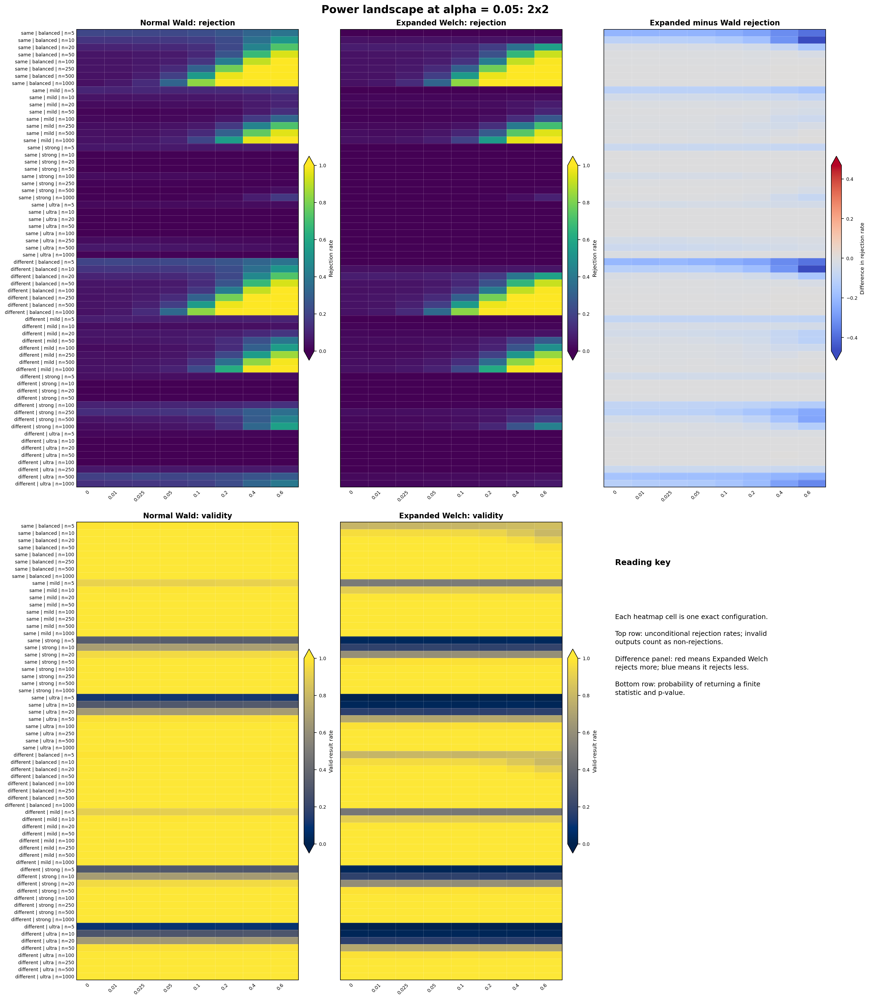

| Figure component | Exact specification |
| --- | --- |
| Shape | $2\times2$ |
| Rows | 2 population relationships $\times$ 4 skewness levels $\times$ 8 sample sizes |
| Equal sample sizes | $n_P=n_Q\in\{5,10,20,50,100,250,500,1000\}$ |
| Columns | $e\in\{0,0.01,0.025,0.05,0.10,0.20,0.40,0.60\}$ |
| Reachable $M$ by skewness | balanced 0.693147; mild 0.132829; strong 0.011134; ultra 0.002633 |
| Absolute MI difference | $eM$ within each row |
| Exact cells displayed | 512 per method, including the reused null points |

### 5.2 Shape 2x3

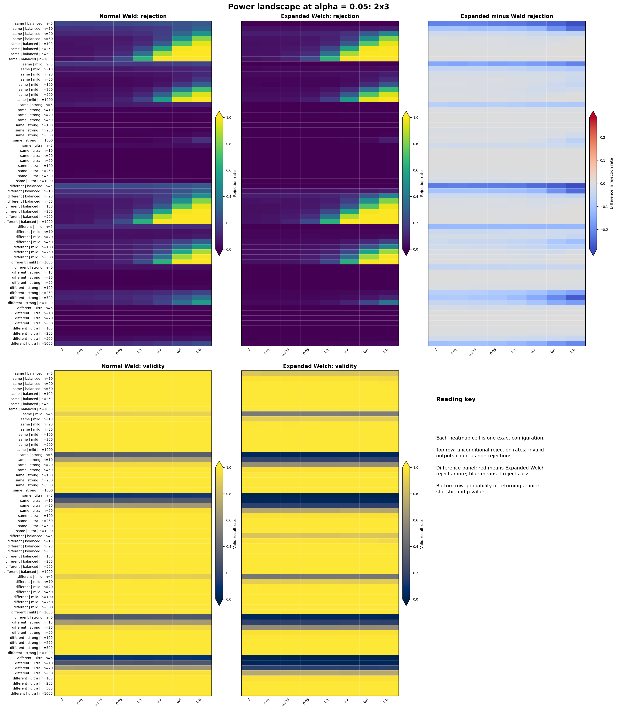

| Figure component | Exact specification |
| --- | --- |
| Shape | $2\times3$ |
| Rows | 2 population relationships $\times$ 4 skewness levels $\times$ 8 sample sizes |
| Equal sample sizes | $n_P=n_Q\in\{5,10,20,50,100,250,500,1000\}$ |
| Columns | $e\in\{0,0.01,0.025,0.05,0.10,0.20,0.40,0.60\}$ |
| Reachable $M$ by skewness | balanced 0.462098; mild 0.132829; strong 0.011134; ultra 0.002633 |
| Absolute MI difference | $eM$ within each row |
| Exact cells displayed | 512 per method, including the reused null points |

### 5.3 Shape 3x3

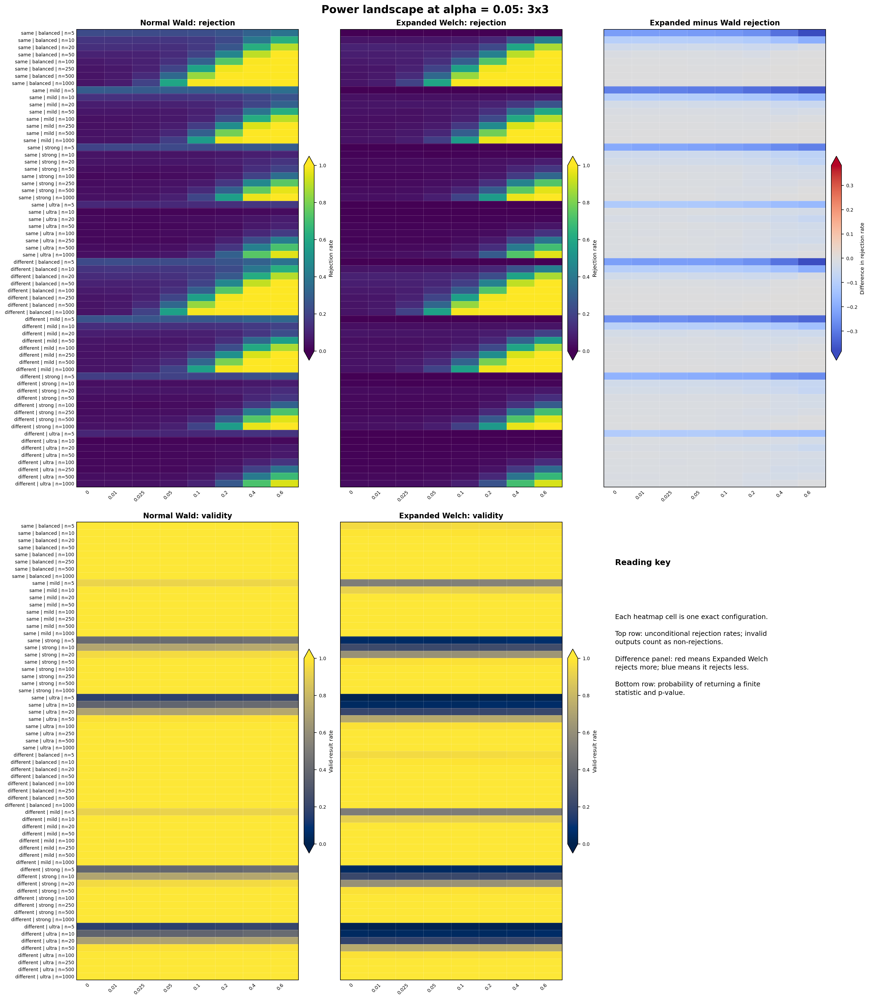

| Figure component | Exact specification |
| --- | --- |
| Shape | $3\times3$ |
| Rows | 2 population relationships $\times$ 4 skewness levels $\times$ 8 sample sizes |
| Equal sample sizes | $n_P=n_Q\in\{5,10,20,50,100,250,500,1000\}$ |
| Columns | $e\in\{0,0.01,0.025,0.05,0.10,0.20,0.40,0.60\}$ |
| Reachable $M$ by skewness | balanced 1.094589; mild 0.427910; strong 0.192209; ultra 0.112985 |
| Absolute MI difference | $eM$ within each row |
| Exact cells displayed | 512 per method, including the reused null points |

### 5.4 Shape 3x5

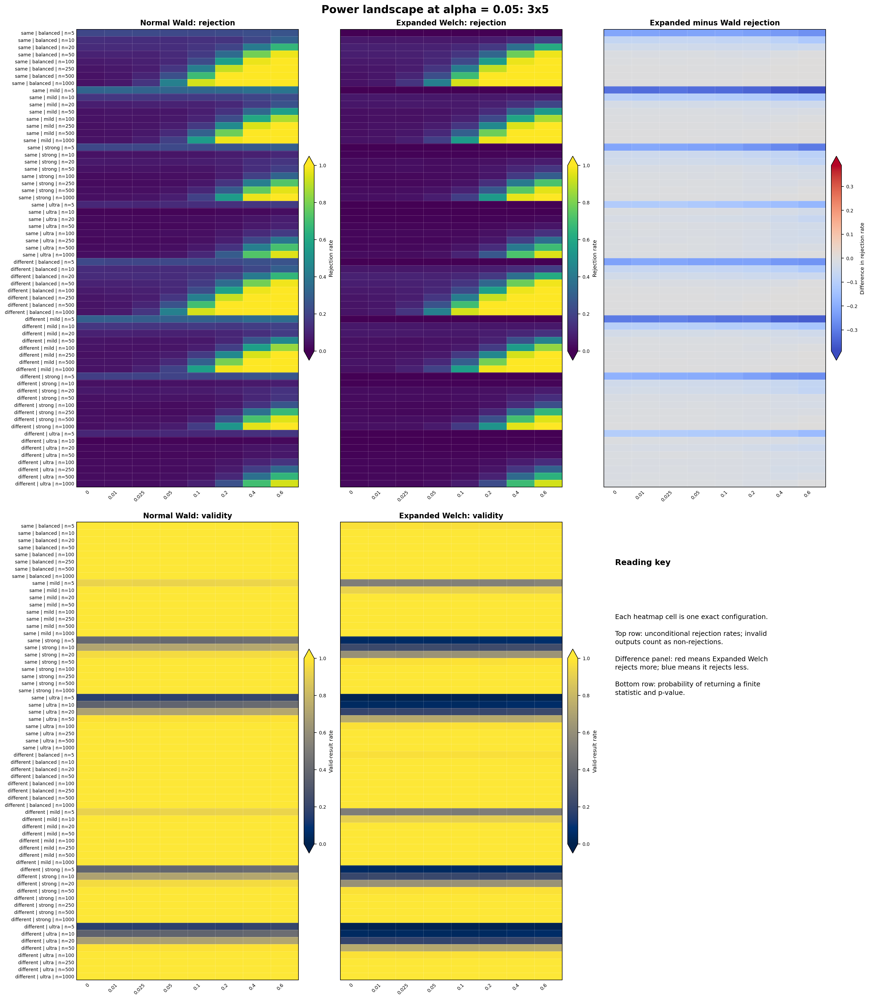

| Figure component | Exact specification |
| --- | --- |
| Shape | $3\times5$ |
| Rows | 2 population relationships $\times$ 4 skewness levels $\times$ 8 sample sizes |
| Equal sample sizes | $n_P=n_Q\in\{5,10,20,50,100,250,500,1000\}$ |
| Columns | $e\in\{0,0.01,0.025,0.05,0.10,0.20,0.40,0.60\}$ |
| Reachable $M$ by skewness | balanced 0.844007; mild 0.441515; strong 0.196781; ultra 0.115309 |
| Absolute MI difference | $eM$ within each row |
| Exact cells displayed | 512 per method, including the reused null points |

### 5.5 Shape 4x4

| Figure component | Exact specification |
| --- | --- |
| Shape | $4\times4$ |
| Rows | 2 population relationships $\times$ 4 skewness levels $\times$ 8 sample sizes |
| Equal sample sizes | $n_P=n_Q\in\{5,10,20,50,100,250,500,1000\}$ |
| Columns | $e\in\{0,0.01,0.025,0.05,0.10,0.20,0.40,0.60\}$ |
| Reachable $M$ by skewness | balanced 1.376379; mild 0.602958; strong 0.275423; ultra 0.160939 |
| Absolute MI difference | $eM$ within each row |
| Exact cells displayed | 512 per method, including the reused null points |

### 5.6 Shape 4x8

| Figure component | Exact specification |
| --- | --- |
| Shape | $4\times8$ |
| Rows | 2 population relationships $\times$ 4 skewness levels $\times$ 8 sample sizes |
| Equal sample sizes | $n_P=n_Q\in\{5,10,20,50,100,250,500,1000\}$ |
| Columns | $e\in\{0,0.01,0.025,0.05,0.10,0.20,0.40,0.60\}$ |
| Reachable $M$ by skewness | balanced 1.374327; mild 0.598808; strong 0.274189; ultra 0.160449 |
| Absolute MI difference | $eM$ within each row |
| Exact cells displayed | 512 per method, including the reused null points |

### 5.7 Shape 5x5

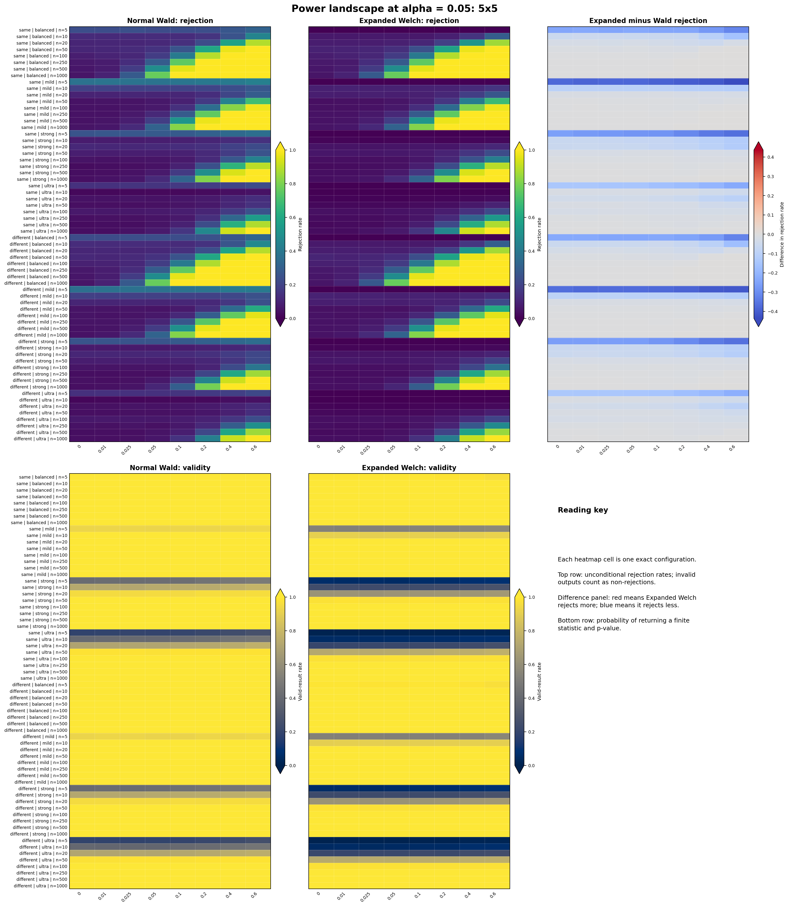

| Figure component | Exact specification |
| --- | --- |
| Shape | $5\times5$ |
| Rows | 2 population relationships $\times$ 4 skewness levels $\times$ 8 sample sizes |
| Equal sample sizes | $n_P=n_Q\in\{5,10,20,50,100,250,500,1000\}$ |
| Columns | $e\in\{0,0.01,0.025,0.05,0.10,0.20,0.40,0.60\}$ |
| Reachable $M$ by skewness | balanced 1.467011; mild 0.748216; strong 0.336034; ultra 0.194520 |
| Absolute MI difference | $eM$ within each row |
| Exact cells displayed | 512 per method, including the reused null points |

### 5.8 Shape 8x8

| Figure component | Exact specification |
| --- | --- |
| Shape | $8\times8$ |
| Rows | 2 population relationships $\times$ 4 skewness levels $\times$ 8 sample sizes |
| Equal sample sizes | $n_P=n_Q\in\{5,10,20,50,100,250,500,1000\}$ |
| Columns | $e\in\{0,0.01,0.025,0.05,0.10,0.20,0.40,0.60\}$ |
| Reachable $M$ by skewness | balanced 2.021338; mild 0.908803; strong 0.402920; ultra 0.230904 |
| Absolute MI difference | $eM$ within each row |
| Exact cells displayed | 512 per method, including the reused null points |

## 6. Unequal-sample landscape

These figures retain the primary equal-MI, different-shape population paths.
The row ratio is $n_Q:n_P$, and the horizontal axis gives the smaller sample
$n_P$. Thus, for example, ratio 10:1 at $n_P=100$ means $n_Q=1000$.

### 6.1 Null: e = 0

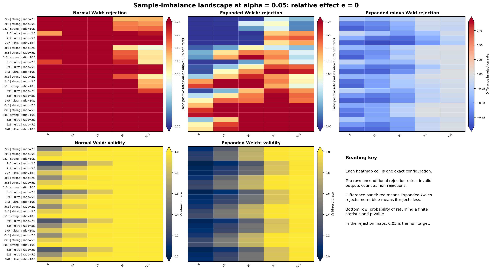

| Figure component | Exact specification |
| --- | --- |
| Shapes | $2\times2$, $3\times3$, $5\times5$, $8\times8$ |
| Skewness | strong and ultra |
| Rows | Shape $\times$ skewness $\times$ ratios 2:1, 5:1, and 10:1 |
| Columns | $n_P\in\{5,10,20,50,100\}$, with $n_Q$ determined by the row ratio |
| Population relationship | $P\ne Q$ but $I(P)=I(Q)$ |
| Exact configurations | $4\times2\times3\times5=120$ |
| Quantity in rejection panels | False-positive rate; target 0.05 |

### 6.2 Alternative: e = 0.10

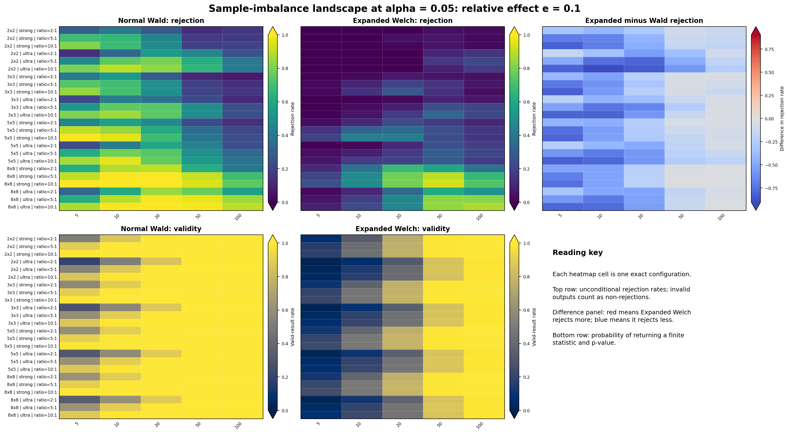

| Figure component | Exact specification |
| --- | --- |
| Shapes, skewness, rows and columns | Same as Section 6.1 |
| Population relationship | $P\ne Q$ and $I(Q)-I(P)=0.10M$ |
| Exact configurations | 120 |
| Quantity in rejection panels | Power |

### 6.3 Alternative: e = 0.40

| Figure component | Exact specification |
| --- | --- |
| Shapes, skewness, rows and columns | Same as Section 6.1 |
| Population relationship | $P\ne Q$ and $I(Q)-I(P)=0.40M$ |
| Exact configurations | 120 |
| Quantity in rejection panels | Power |

## 7. Interaction-pattern landscape

This block checks whether the result depends on the ordinal interaction used in
the primary sweep. `checker/cyclic` compares a checkerboard interaction in $P$
with a cyclic interaction in $Q$. `fixed random` compares two interactions
generated once using fixed seeds and then held constant for the full run. The
reachable scale $M$ is recalculated separately for every population pair.

### 7.1 Null: e = 0

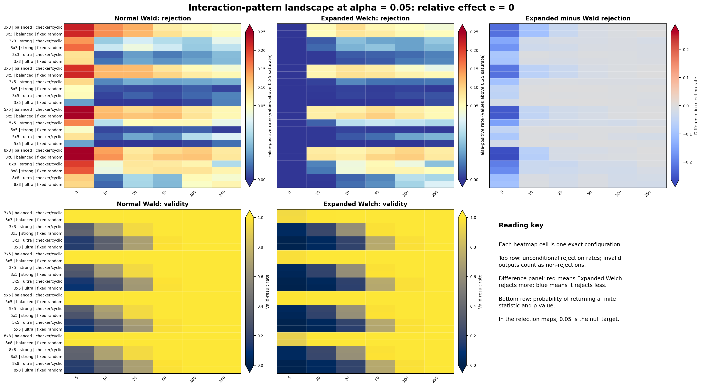

| Figure component | Exact specification |
| --- | --- |
| Shapes | $3\times3$, $3\times5$, $5\times5$, $8\times8$ |
| Skewness | balanced, strong, ultra |
| Interaction pairs | checkerboard/cyclic and fixed-random-A/fixed-random-B |
| Rows | Shape $\times$ skewness $\times$ interaction pair |
| Columns | $n_P=n_Q\in\{5,10,20,50,100,250\}$ |
| Population relationship | $P\ne Q$ but $I(P)=I(Q)$ |
| Exact configurations | $4\times3\times2\times6=144$ |
| Quantity in rejection panels | False-positive rate; target 0.05 |

### 7.2 Alternative: e = 0.10

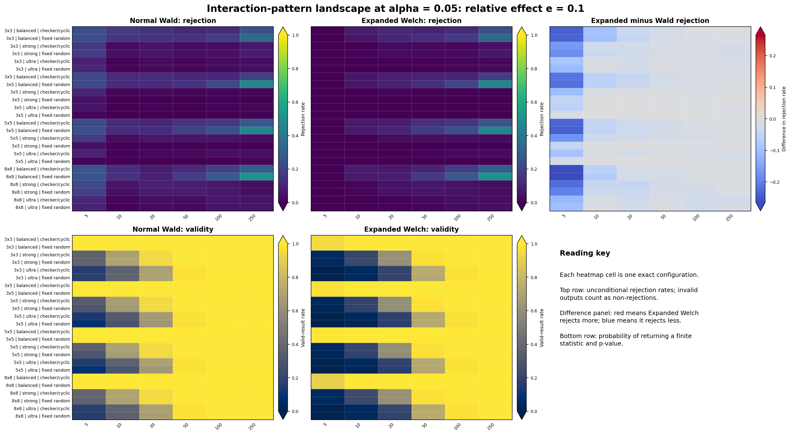

| Figure component | Exact specification |
| --- | --- |
| Shapes, skewness, interaction pairs and sample sizes | Same as Section 7.1 |
| Population relationship | $P\ne Q$ and $I(Q)-I(P)=0.10M$ |
| Exact configurations | 144 |
| Quantity in rejection panels | Power |

### 7.3 Alternative: e = 0.40

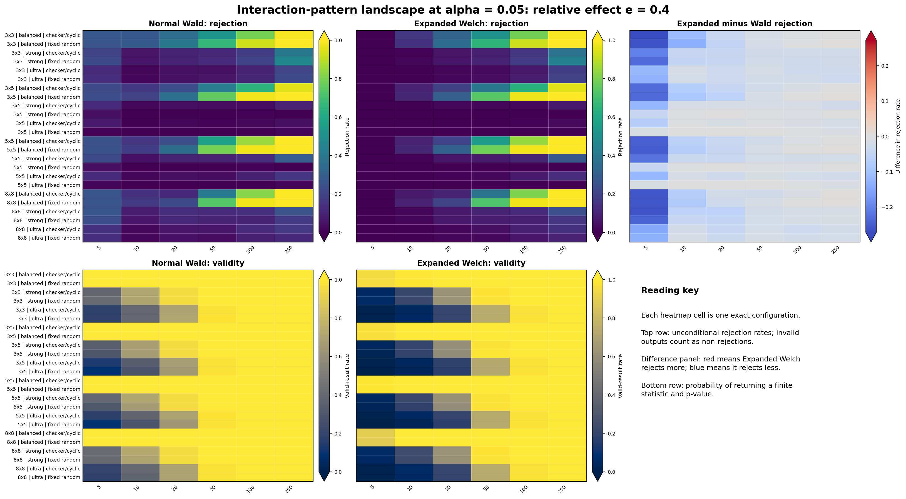

| Figure component | Exact specification |
| --- | --- |
| Shapes, skewness, interaction pairs and sample sizes | Same as Section 7.1 |
| Population relationship | $P\ne Q$ and $I(Q)-I(P)=0.40M$ |
| Exact configurations | 144 |
| Quantity in rejection panels | Power |

### 7.4 Alternative: e = 0.60

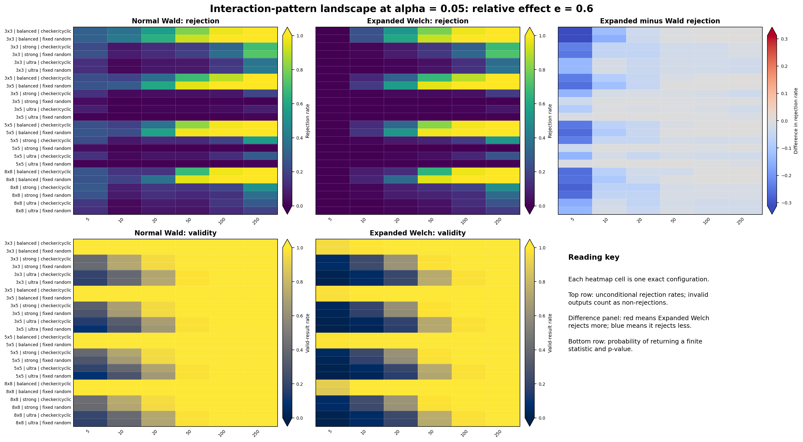

| Figure component | Exact specification |
| --- | --- |
| Shapes, skewness, interaction pairs and sample sizes | Same as Section 7.1 |
| Population relationship | $P\ne Q$ and $I(Q)-I(P)=0.60M$ |
| Exact configurations | 144 |
| Quantity in rejection panels | Power |

## 8. Suggested briefing order

1. Start with the two calibration maps and scan from left to right as sample
   size increases.
2. Check the validity maps before treating a low false-positive rate as good
   calibration.
3. Use the power maps to compare methods at the same shape, skewness, sample
   size, relationship, and effect.
4. Use the imbalance and interaction maps last to see whether the main patterns
   persist when one assumption is changed.

This order exposes the landscape before selecting any cases for detailed
discussion.

## 9. Reproducibility

The figures are generated by
[`../../experiments/make_final_experiment_landscape.py`](../../experiments/make_final_experiment_landscape.py)
from
[`../../results/detection_breakdown_sweep/cell_results.csv`](../../results/detection_breakdown_sweep/cell_results.csv).
The source CSV also contains Wilson intervals, Monte Carlo standard errors,
conditional rejection rates, common-valid rejection rates, small-cell
diagnostics, and degrees-of-freedom diagnostics for every displayed cell.
