# Thesis Experiments: Normal Wald and Expanded Welch

This report compares Normal Wald and Expanded Welch for the two-sided test of equal population MI. Every unique point uses 20,000 independently sampled table pairs at alpha=0.05. Both methods receive the same sampled tables, and no regimes are averaged together.

## 1. How to read this document

At an MI difference of zero, a curve reports the false-positive rate under H0; the target is 0.05. At a positive MI difference, it reports power under H1. Read calibration, power and validity together: liberal null rejection can inflate apparent power, while invalid outputs can make unconditional rejection appear artificially low.

The x-axis is the true population MI difference fixed during construction, not a random difference estimated from the samples. The main and focused sections use separate stated ranges in nats so very small effects remain visible. A hollow marker means fewer than 90% of results were valid.

'Minimum expected count' means the minimum population expected cell count, not the expected value of the smallest observed cell count.

### Roadmap

1. The main comparison maps table size, margins and sample size.
2. Focused comparisons vary baseline MI, changed cells, sample imbalance, effect range, table shape and population construction.
3. Limit checks examine extreme sparsity, exact independence and large-sample null behaviour.
4. Runtime and reproducibility records follow the statistical results.

## 2. How the fixed populations are built

For each population, begin with the independence table B_ij=a_i b_j formed from its stated row and column probabilities. The main construction adds t to cells (1,1) and (2,2), and subtracts t from (1,2) and (2,1). These changes sum to zero in every affected row and column, so the margins remain fixed. A one-dimensional numerical solve chooses t so the table has the exact requested MI.

For baseline B and plotted difference Delta, the usual direction sets I(P)=B and I(Q)=B+Delta. The reverse-direction experiment instead sets I(P)=B+Delta and I(Q)=B. The tables are constructed once and held fixed before sampling.

### A concrete population pair

For a 2x2 different-skew example, the construction fixes the following populations before sampling:

| Population | Joint probability table | Row probabilities | Column probabilities | MI (nats) |
| --- | --- | --- | --- | --- |
| P | [0.5327, 0.1673] [0.1673, 0.1327] | (0.7, 0.3) | (0.7, 0.3) | 0.02 |
| Q | [0.6817, 0.1183] [0.1183, 0.08175] | (0.8, 0.2) | (0.8, 0.2) | 0.03 |

Their true MI difference is 0.01 nats. Repeated multinomial samples make the estimated MI, variance and rejection decision random; they do not change this x-axis value.

## 3. Main comparison

How do the methods behave as table size, marginal skew and sample size change?

### 3.1 2x2: small sample sizes

How do the methods behave as table size, marginal skew and sample size change?

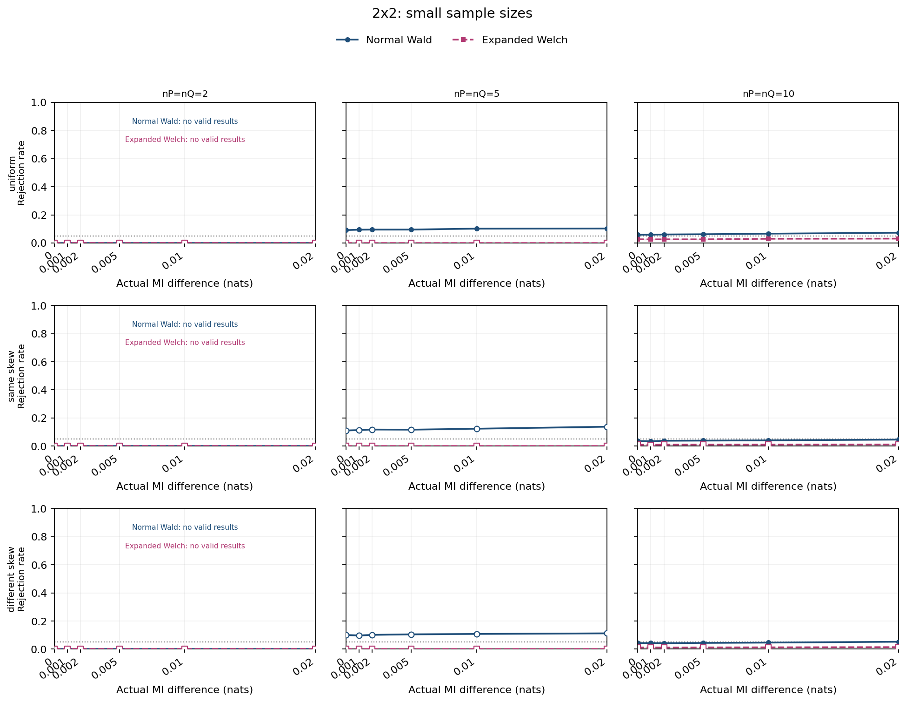

| Specification | Setting |
| --- | --- |
| Table size | 2x2 |
| Horizontal graph regime specifications (columns) | nP=nQ=2, nP=nQ=5, nP=nQ=10 |
| Vertical graph regime specifications (rows) | uniform: P row (0.5 repeated 2 times), P column (0.5 repeated 2 times); Q row (0.5 repeated 2 times), Q column (0.5 repeated 2 times); same skew: P row (0.8, 0.2), P column (0.8, 0.2); Q row (0.8, 0.2), Q column (0.8, 0.2); different skew: P row (0.7, 0.3), P column (0.7, 0.3); Q row (0.8, 0.2), Q column (0.8, 0.2) |
| Probability changes | uniform: add at (1,1),(2,2) and subtract at (1,2),(2,1), for both P and Q; same skew: add at (1,1),(2,2) and subtract at (1,2),(2,1), for both P and Q; different skew: add at (1,1),(2,2) and subtract at (1,2),(2,1), for both P and Q |
| MI settings | Baseline MI {0.02}; direction {q higher}; actual differences {0, 0.001, 0.002, 0.005, 0.01, 0.02} nats |
| Horizontal axis within each graph | Actual MI difference in nats, fixed from 0 to 0.02 |
| Vertical axis within each graph | Unconditional rejection rate from 0 to 1; invalid results count as non-rejections |
| Replicates | 20,000 per unique point |

Null-point rejection and validity:

| Vertical regime | Horizontal regime | x | Method | Rejection | Valid |
| --- | --- | --- | --- | --- | --- |
| uniform | nP=nQ=2 | 0 | Expanded Welch | 0.0000 | 0.0000 |
| uniform | nP=nQ=2 | 0 | Normal Wald | 0.0000 | 0.0000 |
| uniform | nP=nQ=5 | 0 | Expanded Welch | 0.0000 | 0.7774 |
| uniform | nP=nQ=5 | 0 | Normal Wald | 0.0914 | 0.9862 |
| uniform | nP=nQ=10 | 0 | Expanded Welch | 0.0263 | 0.9795 |
| uniform | nP=nQ=10 | 0 | Normal Wald | 0.0588 | 0.9889 |
| same skew | nP=nQ=2 | 0 | Expanded Welch | 0.0000 | 0.0000 |
| same skew | nP=nQ=2 | 0 | Normal Wald | 0.0000 | 0.0000 |
| same skew | nP=nQ=5 | 0 | Expanded Welch | 0.0000 | 0.2304 |
| same skew | nP=nQ=5 | 0 | Normal Wald | 0.1110 | 0.7282 |
| same skew | nP=nQ=10 | 0 | Expanded Welch | 0.0092 | 0.6511 |
| same skew | nP=nQ=10 | 0 | Normal Wald | 0.0357 | 0.9585 |
| different skew | nP=nQ=2 | 0 | Expanded Welch | 0.0000 | 0.0000 |
| different skew | nP=nQ=2 | 0 | Normal Wald | 0.0000 | 0.0000 |
| different skew | nP=nQ=5 | 0 | Expanded Welch | 0.0000 | 0.3423 |
| different skew | nP=nQ=5 | 0 | Normal Wald | 0.1008 | 0.8454 |
| different skew | nP=nQ=10 | 0 | Expanded Welch | 0.0120 | 0.7575 |
| different skew | nP=nQ=10 | 0 | Normal Wald | 0.0432 | 0.9791 |

Every plotted rate, interval, validity and minimum expected count

| Vertical regime | Horizontal regime | x | Method | Rejection | 95% interval | Valid | Conditional | Min expected P | Min expected Q |
| --- | --- | --- | --- | --- | --- | --- | --- | --- | --- |
| uniform | nP=nQ=2 | 0 | Expanded Welch | 0.0000 | [0.0000, 0.0002] | 0.0000 | NA | 0.4003 | 0.4003 |
| uniform | nP=nQ=2 | 0 | Normal Wald | 0.0000 | [0.0000, 0.0002] | 0.0000 | NA | 0.4003 | 0.4003 |
| uniform | nP=nQ=2 | 0.001 | Expanded Welch | 0.0000 | [0.0000, 0.0002] | 0.0000 | NA | 0.4003 | 0.3979 |
| uniform | nP=nQ=2 | 0.001 | Normal Wald | 0.0000 | [0.0000, 0.0002] | 0.0000 | NA | 0.4003 | 0.3979 |
| uniform | nP=nQ=2 | 0.002 | Expanded Welch | 0.0000 | [0.0000, 0.0002] | 0.0000 | NA | 0.4003 | 0.3955 |
| uniform | nP=nQ=2 | 0.002 | Normal Wald | 0.0000 | [0.0000, 0.0002] | 0.0000 | NA | 0.4003 | 0.3955 |
| uniform | nP=nQ=2 | 0.005 | Expanded Welch | 0.0000 | [0.0000, 0.0002] | 0.0000 | NA | 0.4003 | 0.3887 |
| uniform | nP=nQ=2 | 0.005 | Normal Wald | 0.0000 | [0.0000, 0.0002] | 0.0000 | NA | 0.4003 | 0.3887 |
| uniform | nP=nQ=2 | 0.01 | Expanded Welch | 0.0000 | [0.0000, 0.0002] | 0.0000 | NA | 0.4003 | 0.3781 |
| uniform | nP=nQ=2 | 0.01 | Normal Wald | 0.0000 | [0.0000, 0.0002] | 0.0000 | NA | 0.4003 | 0.3781 |
| uniform | nP=nQ=2 | 0.02 | Expanded Welch | 0.0000 | [0.0000, 0.0002] | 0.0000 | NA | 0.4003 | 0.3595 |
| uniform | nP=nQ=2 | 0.02 | Normal Wald | 0.0000 | [0.0000, 0.0002] | 0.0000 | NA | 0.4003 | 0.3595 |
| uniform | nP=nQ=5 | 0 | Expanded Welch | 0.0000 | [0.0000, 0.0002] | 0.7774 | 0.0000 | 1.001 | 1.001 |
| uniform | nP=nQ=5 | 0 | Normal Wald | 0.0914 | [0.0875, 0.0955] | 0.9862 | 0.0927 | 1.001 | 1.001 |
| uniform | nP=nQ=5 | 0.001 | Expanded Welch | 0.0000 | [0.0000, 0.0002] | 0.7756 | 0.0000 | 1.001 | 0.9947 |
| uniform | nP=nQ=5 | 0.001 | Normal Wald | 0.0945 | [0.0905, 0.0986] | 0.9874 | 0.0957 | 1.001 | 0.9947 |
| uniform | nP=nQ=5 | 0.002 | Expanded Welch | 0.0000 | [0.0000, 0.0002] | 0.7746 | 0.0000 | 1.001 | 0.9888 |
| uniform | nP=nQ=5 | 0.002 | Normal Wald | 0.0952 | [0.0912, 0.0993] | 0.9869 | 0.0965 | 1.001 | 0.9888 |
| uniform | nP=nQ=5 | 0.005 | Expanded Welch | 0.0000 | [0.0000, 0.0002] | 0.7784 | 0.0000 | 1.001 | 0.9717 |
| uniform | nP=nQ=5 | 0.005 | Normal Wald | 0.0954 | [0.0914, 0.0995] | 0.9848 | 0.0969 | 1.001 | 0.9717 |
| uniform | nP=nQ=5 | 0.01 | Expanded Welch | 0.0000 | [0.0000, 0.0002] | 0.7747 | 0.0000 | 1.001 | 0.9454 |
| uniform | nP=nQ=5 | 0.01 | Normal Wald | 0.1021 | [0.0979, 0.1063] | 0.9854 | 0.1036 | 1.001 | 0.9454 |
| uniform | nP=nQ=5 | 0.02 | Expanded Welch | 0.0000 | [0.0000, 0.0002] | 0.7791 | 0.0000 | 1.001 | 0.8988 |
| uniform | nP=nQ=5 | 0.02 | Normal Wald | 0.1032 | [0.0991, 0.1075] | 0.9862 | 0.1046 | 1.001 | 0.8988 |
| uniform | nP=nQ=10 | 0 | Expanded Welch | 0.0263 | [0.0242, 0.0286] | 0.9795 | 0.0269 | 2.002 | 2.002 |
| uniform | nP=nQ=10 | 0 | Normal Wald | 0.0588 | [0.0557, 0.0622] | 0.9889 | 0.0595 | 2.002 | 2.002 |
| uniform | nP=nQ=10 | 0.001 | Expanded Welch | 0.0254 | [0.0233, 0.0277] | 0.9792 | 0.0259 | 2.002 | 1.989 |
| uniform | nP=nQ=10 | 0.001 | Normal Wald | 0.0590 | [0.0559, 0.0624] | 0.9888 | 0.0597 | 2.002 | 1.989 |
| uniform | nP=nQ=10 | 0.002 | Expanded Welch | 0.0259 | [0.0238, 0.0282] | 0.9792 | 0.0265 | 2.002 | 1.978 |
| uniform | nP=nQ=10 | 0.002 | Normal Wald | 0.0605 | [0.0573, 0.0639] | 0.9886 | 0.0612 | 2.002 | 1.978 |
| uniform | nP=nQ=10 | 0.005 | Expanded Welch | 0.0257 | [0.0236, 0.0280] | 0.9795 | 0.0263 | 2.002 | 1.943 |
| uniform | nP=nQ=10 | 0.005 | Normal Wald | 0.0621 | [0.0588, 0.0655] | 0.9901 | 0.0627 | 2.002 | 1.943 |
| uniform | nP=nQ=10 | 0.01 | Expanded Welch | 0.0299 | [0.0276, 0.0324] | 0.9790 | 0.0305 | 2.002 | 1.891 |
| uniform | nP=nQ=10 | 0.01 | Normal Wald | 0.0662 | [0.0628, 0.0697] | 0.9898 | 0.0669 | 2.002 | 1.891 |
| uniform | nP=nQ=10 | 0.02 | Expanded Welch | 0.0310 | [0.0287, 0.0335] | 0.9808 | 0.0316 | 2.002 | 1.798 |
| uniform | nP=nQ=10 | 0.02 | Normal Wald | 0.0729 | [0.0694, 0.0766] | 0.9924 | 0.0735 | 2.002 | 1.798 |
| same skew | nP=nQ=2 | 0 | Expanded Welch | 0.0000 | [0.0000, 0.0002] | 0.0000 | NA | 0.1476 | 0.1476 |
| same skew | nP=nQ=2 | 0 | Normal Wald | 0.0000 | [0.0000, 0.0002] | 0.0000 | NA | 0.1476 | 0.1476 |
| same skew | nP=nQ=2 | 0.001 | Expanded Welch | 0.0000 | [0.0000, 0.0002] | 0.0000 | NA | 0.1476 | 0.1494 |
| same skew | nP=nQ=2 | 0.001 | Normal Wald | 0.0000 | [0.0000, 0.0002] | 0.0000 | NA | 0.1476 | 0.1494 |
| same skew | nP=nQ=2 | 0.002 | Expanded Welch | 0.0000 | [0.0000, 0.0002] | 0.0000 | NA | 0.1476 | 0.1511 |
| same skew | nP=nQ=2 | 0.002 | Normal Wald | 0.0000 | [0.0000, 0.0002] | 0.0000 | NA | 0.1476 | 0.1511 |
| same skew | nP=nQ=2 | 0.005 | Expanded Welch | 0.0000 | [0.0000, 0.0002] | 0.0000 | NA | 0.1476 | 0.1559 |
| same skew | nP=nQ=2 | 0.005 | Normal Wald | 0.0000 | [0.0000, 0.0002] | 0.0000 | NA | 0.1476 | 0.1559 |
| same skew | nP=nQ=2 | 0.01 | Expanded Welch | 0.0000 | [0.0000, 0.0002] | 0.0000 | NA | 0.1476 | 0.1635 |
| same skew | nP=nQ=2 | 0.01 | Normal Wald | 0.0000 | [0.0000, 0.0002] | 0.0000 | NA | 0.1476 | 0.1635 |
| same skew | nP=nQ=2 | 0.02 | Expanded Welch | 0.0000 | [0.0000, 0.0002] | 0.0000 | NA | 0.1476 | 0.177 |
| same skew | nP=nQ=2 | 0.02 | Normal Wald | 0.0000 | [0.0000, 0.0002] | 0.0000 | NA | 0.1476 | 0.177 |
| same skew | nP=nQ=5 | 0 | Expanded Welch | 0.0000 | [0.0000, 0.0002] | 0.2304 | 0.0000 | 0.3691 | 0.3691 |
| same skew | nP=nQ=5 | 0 | Normal Wald | 0.1110 | [0.1067, 0.1154] | 0.7282 | 0.1524 | 0.3691 | 0.3691 |
| same skew | nP=nQ=5 | 0.001 | Expanded Welch | 0.0000 | [0.0000, 0.0002] | 0.2296 | 0.0000 | 0.3691 | 0.3734 |
| same skew | nP=nQ=5 | 0.001 | Normal Wald | 0.1137 | [0.1094, 0.1182] | 0.7269 | 0.1564 | 0.3691 | 0.3734 |
| same skew | nP=nQ=5 | 0.002 | Expanded Welch | 0.0000 | [0.0000, 0.0002] | 0.2331 | 0.0000 | 0.3691 | 0.3777 |
| same skew | nP=nQ=5 | 0.002 | Normal Wald | 0.1176 | [0.1132, 0.1221] | 0.7298 | 0.1611 | 0.3691 | 0.3777 |
| same skew | nP=nQ=5 | 0.005 | Expanded Welch | 0.0000 | [0.0000, 0.0002] | 0.2341 | 0.0000 | 0.3691 | 0.3899 |
| same skew | nP=nQ=5 | 0.005 | Normal Wald | 0.1167 | [0.1123, 0.1212] | 0.7301 | 0.1598 | 0.3691 | 0.3899 |
| same skew | nP=nQ=5 | 0.01 | Expanded Welch | 0.0000 | [0.0000, 0.0002] | 0.2401 | 0.0000 | 0.3691 | 0.4087 |
| same skew | nP=nQ=5 | 0.01 | Normal Wald | 0.1235 | [0.1190, 0.1281] | 0.7378 | 0.1674 | 0.3691 | 0.4087 |
| same skew | nP=nQ=5 | 0.02 | Expanded Welch | 0.0000 | [0.0000, 0.0002] | 0.2427 | 0.0000 | 0.3691 | 0.4424 |
| same skew | nP=nQ=5 | 0.02 | Normal Wald | 0.1376 | [0.1329, 0.1425] | 0.7520 | 0.1830 | 0.3691 | 0.4424 |
| same skew | nP=nQ=10 | 0 | Expanded Welch | 0.0092 | [0.0079, 0.0106] | 0.6511 | 0.0141 | 0.7382 | 0.7382 |
| same skew | nP=nQ=10 | 0 | Normal Wald | 0.0357 | [0.0332, 0.0384] | 0.9585 | 0.0372 | 0.7382 | 0.7382 |
| same skew | nP=nQ=10 | 0.001 | Expanded Welch | 0.0086 | [0.0074, 0.0100] | 0.6480 | 0.0133 | 0.7382 | 0.7468 |
| same skew | nP=nQ=10 | 0.001 | Normal Wald | 0.0340 | [0.0315, 0.0366] | 0.9574 | 0.0355 | 0.7382 | 0.7468 |
| same skew | nP=nQ=10 | 0.002 | Expanded Welch | 0.0101 | [0.0089, 0.0116] | 0.6473 | 0.0157 | 0.7382 | 0.7553 |
| same skew | nP=nQ=10 | 0.002 | Normal Wald | 0.0377 | [0.0352, 0.0405] | 0.9572 | 0.0394 | 0.7382 | 0.7553 |
| same skew | nP=nQ=10 | 0.005 | Expanded Welch | 0.0103 | [0.0089, 0.0117] | 0.6485 | 0.0158 | 0.7382 | 0.7797 |
| same skew | nP=nQ=10 | 0.005 | Normal Wald | 0.0389 | [0.0363, 0.0416] | 0.9595 | 0.0405 | 0.7382 | 0.7797 |
| same skew | nP=nQ=10 | 0.01 | Expanded Welch | 0.0106 | [0.0092, 0.0121] | 0.6491 | 0.0163 | 0.7382 | 0.8175 |
| same skew | nP=nQ=10 | 0.01 | Normal Wald | 0.0405 | [0.0379, 0.0433] | 0.9589 | 0.0422 | 0.7382 | 0.8175 |
| same skew | nP=nQ=10 | 0.02 | Expanded Welch | 0.0114 | [0.0100, 0.0130] | 0.6531 | 0.0175 | 0.7382 | 0.8848 |
| same skew | nP=nQ=10 | 0.02 | Normal Wald | 0.0459 | [0.0431, 0.0489] | 0.9596 | 0.0479 | 0.7382 | 0.8848 |
| different skew | nP=nQ=2 | 0 | Expanded Welch | 0.0000 | [0.0000, 0.0002] | 0.0000 | NA | 0.2655 | 0.1476 |
| different skew | nP=nQ=2 | 0 | Normal Wald | 0.0000 | [0.0000, 0.0002] | 0.0000 | NA | 0.2655 | 0.1476 |
| different skew | nP=nQ=2 | 0.001 | Expanded Welch | 0.0000 | [0.0000, 0.0002] | 0.0000 | NA | 0.2655 | 0.1494 |
| different skew | nP=nQ=2 | 0.001 | Normal Wald | 0.0000 | [0.0000, 0.0002] | 0.0000 | NA | 0.2655 | 0.1494 |
| different skew | nP=nQ=2 | 0.002 | Expanded Welch | 0.0000 | [0.0000, 0.0002] | 0.0000 | NA | 0.2655 | 0.1511 |
| different skew | nP=nQ=2 | 0.002 | Normal Wald | 0.0000 | [0.0000, 0.0002] | 0.0000 | NA | 0.2655 | 0.1511 |
| different skew | nP=nQ=2 | 0.005 | Expanded Welch | 0.0000 | [0.0000, 0.0002] | 0.0000 | NA | 0.2655 | 0.1559 |
| different skew | nP=nQ=2 | 0.005 | Normal Wald | 0.0000 | [0.0000, 0.0002] | 0.0000 | NA | 0.2655 | 0.1559 |
| different skew | nP=nQ=2 | 0.01 | Expanded Welch | 0.0000 | [0.0000, 0.0002] | 0.0000 | NA | 0.2655 | 0.1635 |
| different skew | nP=nQ=2 | 0.01 | Normal Wald | 0.0000 | [0.0000, 0.0002] | 0.0000 | NA | 0.2655 | 0.1635 |
| different skew | nP=nQ=2 | 0.02 | Expanded Welch | 0.0000 | [0.0000, 0.0002] | 0.0000 | NA | 0.2655 | 0.177 |
| different skew | nP=nQ=2 | 0.02 | Normal Wald | 0.0000 | [0.0000, 0.0002] | 0.0000 | NA | 0.2655 | 0.177 |
| different skew | nP=nQ=5 | 0 | Expanded Welch | 0.0000 | [0.0000, 0.0002] | 0.3423 | 0.0000 | 0.6636 | 0.3691 |
| different skew | nP=nQ=5 | 0 | Normal Wald | 0.1008 | [0.0968, 0.1051] | 0.8454 | 0.1193 | 0.6636 | 0.3691 |
| different skew | nP=nQ=5 | 0.001 | Expanded Welch | 0.0000 | [0.0000, 0.0002] | 0.3453 | 0.0000 | 0.6636 | 0.3734 |
| different skew | nP=nQ=5 | 0.001 | Normal Wald | 0.0974 | [0.0933, 0.1015] | 0.8485 | 0.1147 | 0.6636 | 0.3734 |
| different skew | nP=nQ=5 | 0.002 | Expanded Welch | 0.0000 | [0.0000, 0.0002] | 0.3446 | 0.0000 | 0.6636 | 0.3777 |
| different skew | nP=nQ=5 | 0.002 | Normal Wald | 0.1017 | [0.0976, 0.1060] | 0.8480 | 0.1199 | 0.6636 | 0.3777 |
| different skew | nP=nQ=5 | 0.005 | Expanded Welch | 0.0000 | [0.0000, 0.0002] | 0.3423 | 0.0000 | 0.6636 | 0.3899 |
| different skew | nP=nQ=5 | 0.005 | Normal Wald | 0.1055 | [0.1013, 0.1098] | 0.8464 | 0.1246 | 0.6636 | 0.3899 |
| different skew | nP=nQ=5 | 0.01 | Expanded Welch | 0.0000 | [0.0000, 0.0002] | 0.3418 | 0.0000 | 0.6636 | 0.4087 |
| different skew | nP=nQ=5 | 0.01 | Normal Wald | 0.1082 | [0.1040, 0.1126] | 0.8468 | 0.1278 | 0.6636 | 0.4087 |
| different skew | nP=nQ=5 | 0.02 | Expanded Welch | 0.0000 | [0.0000, 0.0002] | 0.3503 | 0.0000 | 0.6636 | 0.4424 |
| different skew | nP=nQ=5 | 0.02 | Normal Wald | 0.1125 | [0.1082, 0.1170] | 0.8478 | 0.1328 | 0.6636 | 0.4424 |
| different skew | nP=nQ=10 | 0 | Expanded Welch | 0.0120 | [0.0106, 0.0136] | 0.7575 | 0.0158 | 1.327 | 0.7382 |
| different skew | nP=nQ=10 | 0 | Normal Wald | 0.0432 | [0.0405, 0.0461] | 0.9791 | 0.0441 | 1.327 | 0.7382 |
| different skew | nP=nQ=10 | 0.001 | Expanded Welch | 0.0124 | [0.0110, 0.0141] | 0.7582 | 0.0164 | 1.327 | 0.7468 |
| different skew | nP=nQ=10 | 0.001 | Normal Wald | 0.0432 | [0.0404, 0.0461] | 0.9811 | 0.0440 | 1.327 | 0.7468 |
| different skew | nP=nQ=10 | 0.002 | Expanded Welch | 0.0118 | [0.0103, 0.0133] | 0.7638 | 0.0154 | 1.327 | 0.7553 |
| different skew | nP=nQ=10 | 0.002 | Normal Wald | 0.0421 | [0.0394, 0.0450] | 0.9806 | 0.0429 | 1.327 | 0.7553 |
| different skew | nP=nQ=10 | 0.005 | Expanded Welch | 0.0124 | [0.0110, 0.0141] | 0.7603 | 0.0164 | 1.327 | 0.7797 |
| different skew | nP=nQ=10 | 0.005 | Normal Wald | 0.0444 | [0.0416, 0.0473] | 0.9797 | 0.0453 | 1.327 | 0.7797 |
| different skew | nP=nQ=10 | 0.01 | Expanded Welch | 0.0130 | [0.0115, 0.0147] | 0.7640 | 0.0170 | 1.327 | 0.8175 |
| different skew | nP=nQ=10 | 0.01 | Normal Wald | 0.0466 | [0.0438, 0.0497] | 0.9798 | 0.0476 | 1.327 | 0.8175 |
| different skew | nP=nQ=10 | 0.02 | Expanded Welch | 0.0144 | [0.0128, 0.0161] | 0.7603 | 0.0189 | 1.327 | 0.8848 |
| different skew | nP=nQ=10 | 0.02 | Normal Wald | 0.0528 | [0.0498, 0.0560] | 0.9806 | 0.0538 | 1.327 | 0.8848 |

### 3.2 2x2: moderate sample sizes

How do the methods behave as table size, marginal skew and sample size change?

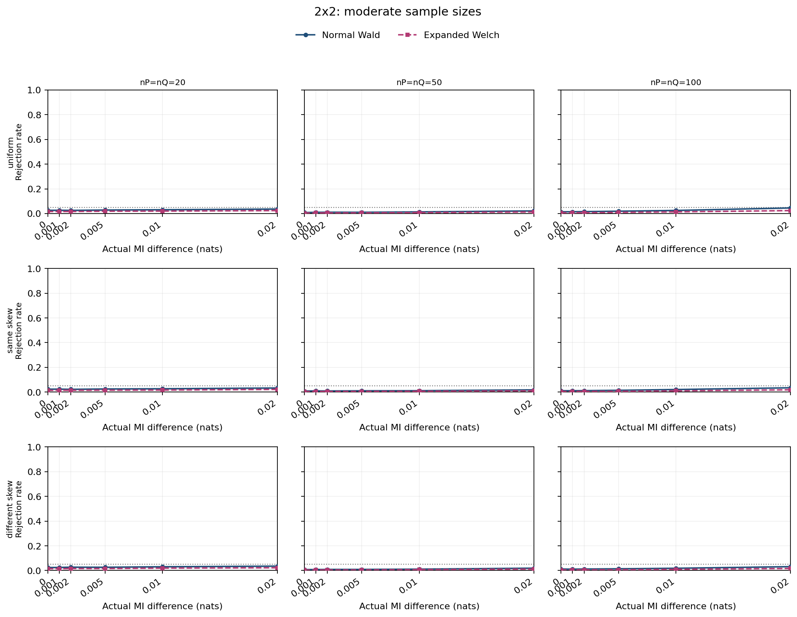

| Specification | Setting |
| --- | --- |
| Table size | 2x2 |
| Horizontal graph regime specifications (columns) | nP=nQ=20, nP=nQ=50, nP=nQ=100 |
| Vertical graph regime specifications (rows) | uniform: P row (0.5 repeated 2 times), P column (0.5 repeated 2 times); Q row (0.5 repeated 2 times), Q column (0.5 repeated 2 times); same skew: P row (0.8, 0.2), P column (0.8, 0.2); Q row (0.8, 0.2), Q column (0.8, 0.2); different skew: P row (0.7, 0.3), P column (0.7, 0.3); Q row (0.8, 0.2), Q column (0.8, 0.2) |
| Probability changes | uniform: add at (1,1),(2,2) and subtract at (1,2),(2,1), for both P and Q; same skew: add at (1,1),(2,2) and subtract at (1,2),(2,1), for both P and Q; different skew: add at (1,1),(2,2) and subtract at (1,2),(2,1), for both P and Q |
| MI settings | Baseline MI {0.02}; direction {q higher}; actual differences {0, 0.001, 0.002, 0.005, 0.01, 0.02} nats |
| Horizontal axis within each graph | Actual MI difference in nats, fixed from 0 to 0.02 |
| Vertical axis within each graph | Unconditional rejection rate from 0 to 1; invalid results count as non-rejections |
| Replicates | 20,000 per unique point |

Null-point rejection and validity:

| Vertical regime | Horizontal regime | x | Method | Rejection | Valid |
| --- | --- | --- | --- | --- | --- |
| uniform | nP=nQ=20 | 0 | Expanded Welch | 0.0164 | 0.9833 |
| uniform | nP=nQ=20 | 0 | Normal Wald | 0.0261 | 0.9977 |
| uniform | nP=nQ=50 | 0 | Expanded Welch | 0.0045 | 0.9938 |
| uniform | nP=nQ=50 | 0 | Normal Wald | 0.0082 | 0.9999 |
| uniform | nP=nQ=100 | 0 | Expanded Welch | 0.0063 | 0.9991 |
| uniform | nP=nQ=100 | 0 | Normal Wald | 0.0142 | 1.0000 |
| same skew | nP=nQ=20 | 0 | Expanded Welch | 0.0135 | 0.9550 |
| same skew | nP=nQ=20 | 0 | Normal Wald | 0.0232 | 0.9980 |
| same skew | nP=nQ=50 | 0 | Expanded Welch | 0.0037 | 1.0000 |
| same skew | nP=nQ=50 | 0 | Normal Wald | 0.0086 | 1.0000 |
| same skew | nP=nQ=100 | 0 | Expanded Welch | 0.0047 | 1.0000 |
| same skew | nP=nQ=100 | 0 | Normal Wald | 0.0107 | 1.0000 |
| different skew | nP=nQ=20 | 0 | Expanded Welch | 0.0151 | 0.9749 |
| different skew | nP=nQ=20 | 0 | Normal Wald | 0.0244 | 0.9983 |
| different skew | nP=nQ=50 | 0 | Expanded Welch | 0.0039 | 0.9999 |
| different skew | nP=nQ=50 | 0 | Normal Wald | 0.0080 | 1.0000 |
| different skew | nP=nQ=100 | 0 | Expanded Welch | 0.0054 | 1.0000 |
| different skew | nP=nQ=100 | 0 | Normal Wald | 0.0121 | 1.0000 |

Every plotted rate, interval, validity and minimum expected count

| Vertical regime | Horizontal regime | x | Method | Rejection | 95% interval | Valid | Conditional | Min expected P | Min expected Q |
| --- | --- | --- | --- | --- | --- | --- | --- | --- | --- |
| uniform | nP=nQ=20 | 0 | Expanded Welch | 0.0164 | [0.0147, 0.0183] | 0.9833 | 0.0167 | 4.003 | 4.003 |
| uniform | nP=nQ=20 | 0 | Normal Wald | 0.0261 | [0.0240, 0.0284] | 0.9977 | 0.0262 | 4.003 | 4.003 |
| uniform | nP=nQ=20 | 0.001 | Expanded Welch | 0.0163 | [0.0146, 0.0182] | 0.9852 | 0.0165 | 4.003 | 3.979 |
| uniform | nP=nQ=20 | 0.001 | Normal Wald | 0.0266 | [0.0245, 0.0289] | 0.9989 | 0.0266 | 4.003 | 3.979 |
| uniform | nP=nQ=20 | 0.002 | Expanded Welch | 0.0164 | [0.0147, 0.0183] | 0.9838 | 0.0167 | 4.003 | 3.955 |
| uniform | nP=nQ=20 | 0.002 | Normal Wald | 0.0255 | [0.0235, 0.0278] | 0.9987 | 0.0256 | 4.003 | 3.955 |
| uniform | nP=nQ=20 | 0.005 | Expanded Welch | 0.0188 | [0.0170, 0.0208] | 0.9851 | 0.0191 | 4.003 | 3.887 |
| uniform | nP=nQ=20 | 0.005 | Normal Wald | 0.0285 | [0.0263, 0.0310] | 0.9989 | 0.0286 | 4.003 | 3.887 |
| uniform | nP=nQ=20 | 0.01 | Expanded Welch | 0.0198 | [0.0180, 0.0219] | 0.9856 | 0.0201 | 4.003 | 3.781 |
| uniform | nP=nQ=20 | 0.01 | Normal Wald | 0.0308 | [0.0285, 0.0333] | 0.9989 | 0.0308 | 4.003 | 3.781 |
| uniform | nP=nQ=20 | 0.02 | Expanded Welch | 0.0240 | [0.0220, 0.0262] | 0.9871 | 0.0243 | 4.003 | 3.595 |
| uniform | nP=nQ=20 | 0.02 | Normal Wald | 0.0363 | [0.0338, 0.0390] | 0.9988 | 0.0363 | 4.003 | 3.595 |
| uniform | nP=nQ=50 | 0 | Expanded Welch | 0.0045 | [0.0037, 0.0055] | 0.9938 | 0.0045 | 10.01 | 10.01 |
| uniform | nP=nQ=50 | 0 | Normal Wald | 0.0082 | [0.0070, 0.0095] | 0.9999 | 0.0082 | 10.01 | 10.01 |
| uniform | nP=nQ=50 | 0.001 | Expanded Welch | 0.0050 | [0.0042, 0.0061] | 0.9942 | 0.0051 | 10.01 | 9.947 |
| uniform | nP=nQ=50 | 0.001 | Normal Wald | 0.0100 | [0.0087, 0.0115] | 1.0000 | 0.0100 | 10.01 | 9.947 |
| uniform | nP=nQ=50 | 0.002 | Expanded Welch | 0.0057 | [0.0047, 0.0068] | 0.9951 | 0.0057 | 10.01 | 9.888 |
| uniform | nP=nQ=50 | 0.002 | Normal Wald | 0.0109 | [0.0096, 0.0124] | 0.9999 | 0.0109 | 10.01 | 9.888 |
| uniform | nP=nQ=50 | 0.005 | Expanded Welch | 0.0058 | [0.0048, 0.0070] | 0.9948 | 0.0058 | 10.01 | 9.717 |
| uniform | nP=nQ=50 | 0.005 | Normal Wald | 0.0104 | [0.0091, 0.0119] | 0.9999 | 0.0104 | 10.01 | 9.717 |
| uniform | nP=nQ=50 | 0.01 | Expanded Welch | 0.0080 | [0.0068, 0.0093] | 0.9952 | 0.0080 | 10.01 | 9.454 |
| uniform | nP=nQ=50 | 0.01 | Normal Wald | 0.0134 | [0.0119, 0.0151] | 1.0000 | 0.0134 | 10.01 | 9.454 |
| uniform | nP=nQ=50 | 0.02 | Expanded Welch | 0.0126 | [0.0111, 0.0142] | 0.9959 | 0.0126 | 10.01 | 8.988 |
| uniform | nP=nQ=50 | 0.02 | Normal Wald | 0.0214 | [0.0194, 0.0234] | 1.0000 | 0.0214 | 10.01 | 8.988 |
| uniform | nP=nQ=100 | 0 | Expanded Welch | 0.0063 | [0.0052, 0.0074] | 0.9991 | 0.0063 | 20.02 | 20.02 |
| uniform | nP=nQ=100 | 0 | Normal Wald | 0.0142 | [0.0127, 0.0159] | 1.0000 | 0.0142 | 20.02 | 20.02 |
| uniform | nP=nQ=100 | 0.001 | Expanded Welch | 0.0069 | [0.0059, 0.0082] | 0.9989 | 0.0070 | 20.02 | 19.89 |
| uniform | nP=nQ=100 | 0.001 | Normal Wald | 0.0145 | [0.0129, 0.0163] | 1.0000 | 0.0145 | 20.02 | 19.89 |
| uniform | nP=nQ=100 | 0.002 | Expanded Welch | 0.0070 | [0.0060, 0.0083] | 0.9989 | 0.0071 | 20.02 | 19.78 |
| uniform | nP=nQ=100 | 0.002 | Normal Wald | 0.0158 | [0.0141, 0.0176] | 1.0000 | 0.0158 | 20.02 | 19.78 |
| uniform | nP=nQ=100 | 0.005 | Expanded Welch | 0.0095 | [0.0082, 0.0109] | 0.9990 | 0.0095 | 20.02 | 19.43 |
| uniform | nP=nQ=100 | 0.005 | Normal Wald | 0.0190 | [0.0172, 0.0210] | 1.0000 | 0.0190 | 20.02 | 19.43 |
| uniform | nP=nQ=100 | 0.01 | Expanded Welch | 0.0134 | [0.0119, 0.0151] | 0.9992 | 0.0134 | 20.02 | 18.91 |
| uniform | nP=nQ=100 | 0.01 | Normal Wald | 0.0251 | [0.0231, 0.0274] | 1.0000 | 0.0251 | 20.02 | 18.91 |
| uniform | nP=nQ=100 | 0.02 | Expanded Welch | 0.0241 | [0.0221, 0.0263] | 0.9995 | 0.0241 | 20.02 | 17.98 |
| uniform | nP=nQ=100 | 0.02 | Normal Wald | 0.0454 | [0.0426, 0.0484] | 1.0000 | 0.0454 | 20.02 | 17.98 |
| same skew | nP=nQ=20 | 0 | Expanded Welch | 0.0135 | [0.0119, 0.0151] | 0.9550 | 0.0141 | 1.476 | 1.476 |
| same skew | nP=nQ=20 | 0 | Normal Wald | 0.0232 | [0.0212, 0.0254] | 0.9980 | 0.0232 | 1.476 | 1.476 |
| same skew | nP=nQ=20 | 0.001 | Expanded Welch | 0.0154 | [0.0137, 0.0171] | 0.9539 | 0.0161 | 1.476 | 1.494 |
| same skew | nP=nQ=20 | 0.001 | Normal Wald | 0.0238 | [0.0217, 0.0260] | 0.9981 | 0.0238 | 1.476 | 1.494 |
| same skew | nP=nQ=20 | 0.002 | Expanded Welch | 0.0143 | [0.0127, 0.0160] | 0.9524 | 0.0150 | 1.476 | 1.511 |
| same skew | nP=nQ=20 | 0.002 | Normal Wald | 0.0221 | [0.0202, 0.0243] | 0.9976 | 0.0222 | 1.476 | 1.511 |
| same skew | nP=nQ=20 | 0.005 | Expanded Welch | 0.0153 | [0.0137, 0.0171] | 0.9540 | 0.0160 | 1.476 | 1.559 |
| same skew | nP=nQ=20 | 0.005 | Normal Wald | 0.0249 | [0.0228, 0.0271] | 0.9978 | 0.0249 | 1.476 | 1.559 |
| same skew | nP=nQ=20 | 0.01 | Expanded Welch | 0.0163 | [0.0146, 0.0181] | 0.9549 | 0.0170 | 1.476 | 1.635 |
| same skew | nP=nQ=20 | 0.01 | Normal Wald | 0.0267 | [0.0246, 0.0291] | 0.9981 | 0.0268 | 1.476 | 1.635 |
| same skew | nP=nQ=20 | 0.02 | Expanded Welch | 0.0213 | [0.0194, 0.0234] | 0.9542 | 0.0223 | 1.476 | 1.77 |
| same skew | nP=nQ=20 | 0.02 | Normal Wald | 0.0328 | [0.0305, 0.0354] | 0.9982 | 0.0329 | 1.476 | 1.77 |
| same skew | nP=nQ=50 | 0 | Expanded Welch | 0.0037 | [0.0029, 0.0046] | 1.0000 | 0.0037 | 3.691 | 3.691 |
| same skew | nP=nQ=50 | 0 | Normal Wald | 0.0086 | [0.0075, 0.0100] | 1.0000 | 0.0086 | 3.691 | 3.691 |
| same skew | nP=nQ=50 | 0.001 | Expanded Welch | 0.0049 | [0.0040, 0.0059] | 1.0000 | 0.0049 | 3.691 | 3.734 |
| same skew | nP=nQ=50 | 0.001 | Normal Wald | 0.0095 | [0.0082, 0.0109] | 1.0000 | 0.0095 | 3.691 | 3.734 |
| same skew | nP=nQ=50 | 0.002 | Expanded Welch | 0.0047 | [0.0038, 0.0057] | 0.9999 | 0.0047 | 3.691 | 3.777 |
| same skew | nP=nQ=50 | 0.002 | Normal Wald | 0.0090 | [0.0078, 0.0104] | 1.0000 | 0.0090 | 3.691 | 3.777 |
| same skew | nP=nQ=50 | 0.005 | Expanded Welch | 0.0053 | [0.0043, 0.0064] | 0.9999 | 0.0053 | 3.691 | 3.899 |
| same skew | nP=nQ=50 | 0.005 | Normal Wald | 0.0103 | [0.0090, 0.0118] | 1.0000 | 0.0103 | 3.691 | 3.899 |
| same skew | nP=nQ=50 | 0.01 | Expanded Welch | 0.0064 | [0.0054, 0.0076] | 0.9999 | 0.0064 | 3.691 | 4.087 |
| same skew | nP=nQ=50 | 0.01 | Normal Wald | 0.0112 | [0.0098, 0.0128] | 1.0000 | 0.0112 | 3.691 | 4.087 |
| same skew | nP=nQ=50 | 0.02 | Expanded Welch | 0.0104 | [0.0091, 0.0119] | 1.0000 | 0.0104 | 3.691 | 4.424 |
| same skew | nP=nQ=50 | 0.02 | Normal Wald | 0.0177 | [0.0160, 0.0197] | 1.0000 | 0.0177 | 3.691 | 4.424 |
| same skew | nP=nQ=100 | 0 | Expanded Welch | 0.0047 | [0.0038, 0.0057] | 1.0000 | 0.0047 | 7.382 | 7.382 |
| same skew | nP=nQ=100 | 0 | Normal Wald | 0.0107 | [0.0094, 0.0122] | 1.0000 | 0.0107 | 7.382 | 7.382 |
| same skew | nP=nQ=100 | 0.001 | Expanded Welch | 0.0050 | [0.0041, 0.0060] | 1.0000 | 0.0050 | 7.382 | 7.468 |
| same skew | nP=nQ=100 | 0.001 | Normal Wald | 0.0109 | [0.0096, 0.0124] | 1.0000 | 0.0109 | 7.382 | 7.468 |
| same skew | nP=nQ=100 | 0.002 | Expanded Welch | 0.0052 | [0.0043, 0.0063] | 1.0000 | 0.0052 | 7.382 | 7.553 |
| same skew | nP=nQ=100 | 0.002 | Normal Wald | 0.0115 | [0.0102, 0.0131] | 1.0000 | 0.0115 | 7.382 | 7.553 |
| same skew | nP=nQ=100 | 0.005 | Expanded Welch | 0.0059 | [0.0049, 0.0071] | 1.0000 | 0.0059 | 7.382 | 7.797 |
| same skew | nP=nQ=100 | 0.005 | Normal Wald | 0.0141 | [0.0126, 0.0159] | 1.0000 | 0.0141 | 7.382 | 7.797 |
| same skew | nP=nQ=100 | 0.01 | Expanded Welch | 0.0097 | [0.0085, 0.0112] | 1.0000 | 0.0097 | 7.382 | 8.175 |
| same skew | nP=nQ=100 | 0.01 | Normal Wald | 0.0205 | [0.0186, 0.0226] | 1.0000 | 0.0205 | 7.382 | 8.175 |
| same skew | nP=nQ=100 | 0.02 | Expanded Welch | 0.0181 | [0.0164, 0.0201] | 1.0000 | 0.0181 | 7.382 | 8.848 |
| same skew | nP=nQ=100 | 0.02 | Normal Wald | 0.0345 | [0.0321, 0.0371] | 1.0000 | 0.0345 | 7.382 | 8.848 |
| different skew | nP=nQ=20 | 0 | Expanded Welch | 0.0151 | [0.0135, 0.0169] | 0.9749 | 0.0155 | 2.655 | 1.476 |
| different skew | nP=nQ=20 | 0 | Normal Wald | 0.0244 | [0.0224, 0.0266] | 0.9983 | 0.0244 | 2.655 | 1.476 |
| different skew | nP=nQ=20 | 0.001 | Expanded Welch | 0.0147 | [0.0132, 0.0165] | 0.9742 | 0.0151 | 2.655 | 1.494 |
| different skew | nP=nQ=20 | 0.001 | Normal Wald | 0.0254 | [0.0233, 0.0276] | 0.9979 | 0.0254 | 2.655 | 1.494 |
| different skew | nP=nQ=20 | 0.002 | Expanded Welch | 0.0163 | [0.0146, 0.0182] | 0.9746 | 0.0167 | 2.655 | 1.511 |
| different skew | nP=nQ=20 | 0.002 | Normal Wald | 0.0273 | [0.0251, 0.0297] | 0.9985 | 0.0273 | 2.655 | 1.511 |
| different skew | nP=nQ=20 | 0.005 | Expanded Welch | 0.0161 | [0.0144, 0.0179] | 0.9747 | 0.0165 | 2.655 | 1.559 |
| different skew | nP=nQ=20 | 0.005 | Normal Wald | 0.0267 | [0.0245, 0.0290] | 0.9985 | 0.0267 | 2.655 | 1.559 |
| different skew | nP=nQ=20 | 0.01 | Expanded Welch | 0.0197 | [0.0178, 0.0217] | 0.9725 | 0.0202 | 2.655 | 1.635 |
| different skew | nP=nQ=20 | 0.01 | Normal Wald | 0.0308 | [0.0285, 0.0333] | 0.9983 | 0.0309 | 2.655 | 1.635 |
| different skew | nP=nQ=20 | 0.02 | Expanded Welch | 0.0226 | [0.0207, 0.0248] | 0.9749 | 0.0232 | 2.655 | 1.77 |
| different skew | nP=nQ=20 | 0.02 | Normal Wald | 0.0358 | [0.0334, 0.0385] | 0.9986 | 0.0359 | 2.655 | 1.77 |
| different skew | nP=nQ=50 | 0 | Expanded Welch | 0.0039 | [0.0031, 0.0049] | 0.9999 | 0.0039 | 6.636 | 3.691 |
| different skew | nP=nQ=50 | 0 | Normal Wald | 0.0080 | [0.0069, 0.0093] | 1.0000 | 0.0080 | 6.636 | 3.691 |
| different skew | nP=nQ=50 | 0.001 | Expanded Welch | 0.0044 | [0.0036, 0.0054] | 1.0000 | 0.0044 | 6.636 | 3.734 |
| different skew | nP=nQ=50 | 0.001 | Normal Wald | 0.0081 | [0.0069, 0.0094] | 1.0000 | 0.0081 | 6.636 | 3.734 |
| different skew | nP=nQ=50 | 0.002 | Expanded Welch | 0.0050 | [0.0042, 0.0061] | 1.0000 | 0.0050 | 6.636 | 3.777 |
| different skew | nP=nQ=50 | 0.002 | Normal Wald | 0.0094 | [0.0081, 0.0108] | 1.0000 | 0.0094 | 6.636 | 3.777 |
| different skew | nP=nQ=50 | 0.005 | Expanded Welch | 0.0050 | [0.0042, 0.0061] | 0.9999 | 0.0051 | 6.636 | 3.899 |
| different skew | nP=nQ=50 | 0.005 | Normal Wald | 0.0093 | [0.0081, 0.0107] | 1.0000 | 0.0093 | 6.636 | 3.899 |
| different skew | nP=nQ=50 | 0.01 | Expanded Welch | 0.0073 | [0.0062, 0.0085] | 1.0000 | 0.0073 | 6.636 | 4.087 |
| different skew | nP=nQ=50 | 0.01 | Normal Wald | 0.0115 | [0.0101, 0.0130] | 1.0000 | 0.0115 | 6.636 | 4.087 |
| different skew | nP=nQ=50 | 0.02 | Expanded Welch | 0.0120 | [0.0106, 0.0137] | 1.0000 | 0.0121 | 6.636 | 4.424 |
| different skew | nP=nQ=50 | 0.02 | Normal Wald | 0.0193 | [0.0175, 0.0213] | 1.0000 | 0.0193 | 6.636 | 4.424 |
| different skew | nP=nQ=100 | 0 | Expanded Welch | 0.0054 | [0.0045, 0.0065] | 1.0000 | 0.0054 | 13.27 | 7.382 |
| different skew | nP=nQ=100 | 0 | Normal Wald | 0.0121 | [0.0107, 0.0138] | 1.0000 | 0.0121 | 13.27 | 7.382 |
| different skew | nP=nQ=100 | 0.001 | Expanded Welch | 0.0052 | [0.0043, 0.0063] | 1.0000 | 0.0052 | 13.27 | 7.468 |
| different skew | nP=nQ=100 | 0.001 | Normal Wald | 0.0113 | [0.0099, 0.0129] | 1.0000 | 0.0113 | 13.27 | 7.468 |
| different skew | nP=nQ=100 | 0.002 | Expanded Welch | 0.0061 | [0.0051, 0.0073] | 1.0000 | 0.0061 | 13.27 | 7.553 |
| different skew | nP=nQ=100 | 0.002 | Normal Wald | 0.0123 | [0.0109, 0.0139] | 1.0000 | 0.0123 | 13.27 | 7.553 |
| different skew | nP=nQ=100 | 0.005 | Expanded Welch | 0.0064 | [0.0054, 0.0076] | 1.0000 | 0.0064 | 13.27 | 7.797 |
| different skew | nP=nQ=100 | 0.005 | Normal Wald | 0.0143 | [0.0127, 0.0160] | 1.0000 | 0.0143 | 13.27 | 7.797 |
| different skew | nP=nQ=100 | 0.01 | Expanded Welch | 0.0098 | [0.0085, 0.0113] | 1.0000 | 0.0098 | 13.27 | 8.175 |
| different skew | nP=nQ=100 | 0.01 | Normal Wald | 0.0186 | [0.0168, 0.0205] | 1.0000 | 0.0186 | 13.27 | 8.175 |
| different skew | nP=nQ=100 | 0.02 | Expanded Welch | 0.0167 | [0.0150, 0.0186] | 1.0000 | 0.0167 | 13.27 | 8.848 |
| different skew | nP=nQ=100 | 0.02 | Normal Wald | 0.0316 | [0.0292, 0.0341] | 1.0000 | 0.0316 | 13.27 | 8.848 |

### 3.3 2x2: large sample sizes

How do the methods behave as table size, marginal skew and sample size change?

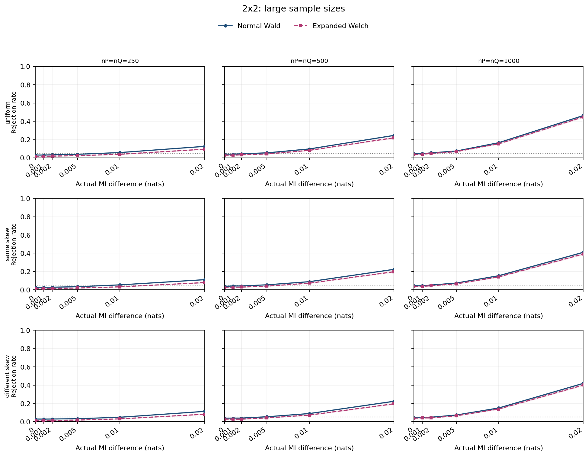

| Specification | Setting |
| --- | --- |
| Table size | 2x2 |
| Horizontal graph regime specifications (columns) | nP=nQ=250, nP=nQ=500, nP=nQ=1000 |
| Vertical graph regime specifications (rows) | uniform: P row (0.5 repeated 2 times), P column (0.5 repeated 2 times); Q row (0.5 repeated 2 times), Q column (0.5 repeated 2 times); same skew: P row (0.8, 0.2), P column (0.8, 0.2); Q row (0.8, 0.2), Q column (0.8, 0.2); different skew: P row (0.7, 0.3), P column (0.7, 0.3); Q row (0.8, 0.2), Q column (0.8, 0.2) |
| Probability changes | uniform: add at (1,1),(2,2) and subtract at (1,2),(2,1), for both P and Q; same skew: add at (1,1),(2,2) and subtract at (1,2),(2,1), for both P and Q; different skew: add at (1,1),(2,2) and subtract at (1,2),(2,1), for both P and Q |
| MI settings | Baseline MI {0.02}; direction {q higher}; actual differences {0, 0.001, 0.002, 0.005, 0.01, 0.02} nats |
| Horizontal axis within each graph | Actual MI difference in nats, fixed from 0 to 0.02 |
| Vertical axis within each graph | Unconditional rejection rate from 0 to 1; invalid results count as non-rejections |
| Replicates | 20,000 per unique point |

Null-point rejection and validity:

| Vertical regime | Horizontal regime | x | Method | Rejection | Valid |
| --- | --- | --- | --- | --- | --- |
| uniform | nP=nQ=250 | 0 | Expanded Welch | 0.0164 | 1.0000 |
| uniform | nP=nQ=250 | 0 | Normal Wald | 0.0306 | 1.0000 |
| uniform | nP=nQ=500 | 0 | Expanded Welch | 0.0298 | 1.0000 |
| uniform | nP=nQ=500 | 0 | Normal Wald | 0.0408 | 1.0000 |
| uniform | nP=nQ=1000 | 0 | Expanded Welch | 0.0386 | 1.0000 |
| uniform | nP=nQ=1000 | 0 | Normal Wald | 0.0445 | 1.0000 |
| same skew | nP=nQ=250 | 0 | Expanded Welch | 0.0135 | 1.0000 |
| same skew | nP=nQ=250 | 0 | Normal Wald | 0.0260 | 1.0000 |
| same skew | nP=nQ=500 | 0 | Expanded Welch | 0.0268 | 1.0000 |
| same skew | nP=nQ=500 | 0 | Normal Wald | 0.0379 | 1.0000 |
| same skew | nP=nQ=1000 | 0 | Expanded Welch | 0.0372 | 1.0000 |
| same skew | nP=nQ=1000 | 0 | Normal Wald | 0.0437 | 1.0000 |
| different skew | nP=nQ=250 | 0 | Expanded Welch | 0.0158 | 1.0000 |
| different skew | nP=nQ=250 | 0 | Normal Wald | 0.0290 | 1.0000 |
| different skew | nP=nQ=500 | 0 | Expanded Welch | 0.0283 | 1.0000 |
| different skew | nP=nQ=500 | 0 | Normal Wald | 0.0387 | 1.0000 |
| different skew | nP=nQ=1000 | 0 | Expanded Welch | 0.0380 | 1.0000 |
| different skew | nP=nQ=1000 | 0 | Normal Wald | 0.0453 | 1.0000 |

Every plotted rate, interval, validity and minimum expected count

| Vertical regime | Horizontal regime | x | Method | Rejection | 95% interval | Valid | Conditional | Min expected P | Min expected Q |
| --- | --- | --- | --- | --- | --- | --- | --- | --- | --- |
| uniform | nP=nQ=250 | 0 | Expanded Welch | 0.0164 | [0.0147, 0.0183] | 1.0000 | 0.0164 | 50.04 | 50.04 |
| uniform | nP=nQ=250 | 0 | Normal Wald | 0.0306 | [0.0283, 0.0331] | 1.0000 | 0.0306 | 50.04 | 50.04 |
| uniform | nP=nQ=250 | 0.001 | Expanded Welch | 0.0176 | [0.0159, 0.0195] | 1.0000 | 0.0176 | 50.04 | 49.74 |
| uniform | nP=nQ=250 | 0.001 | Normal Wald | 0.0305 | [0.0282, 0.0329] | 1.0000 | 0.0305 | 50.04 | 49.74 |
| uniform | nP=nQ=250 | 0.002 | Expanded Welch | 0.0186 | [0.0168, 0.0206] | 1.0000 | 0.0186 | 50.04 | 49.44 |
| uniform | nP=nQ=250 | 0.002 | Normal Wald | 0.0331 | [0.0307, 0.0356] | 1.0000 | 0.0331 | 50.04 | 49.44 |
| uniform | nP=nQ=250 | 0.005 | Expanded Welch | 0.0240 | [0.0220, 0.0262] | 1.0000 | 0.0240 | 50.04 | 48.58 |
| uniform | nP=nQ=250 | 0.005 | Normal Wald | 0.0386 | [0.0360, 0.0414] | 1.0000 | 0.0386 | 50.04 | 48.58 |
| uniform | nP=nQ=250 | 0.01 | Expanded Welch | 0.0388 | [0.0362, 0.0416] | 1.0000 | 0.0388 | 50.04 | 47.27 |
| uniform | nP=nQ=250 | 0.01 | Normal Wald | 0.0578 | [0.0546, 0.0611] | 1.0000 | 0.0578 | 50.04 | 47.27 |
| uniform | nP=nQ=250 | 0.02 | Expanded Welch | 0.0945 | [0.0905, 0.0986] | 1.0000 | 0.0945 | 50.04 | 44.94 |
| uniform | nP=nQ=250 | 0.02 | Normal Wald | 0.1255 | [0.1210, 0.1302] | 1.0000 | 0.1255 | 50.04 | 44.94 |
| uniform | nP=nQ=500 | 0 | Expanded Welch | 0.0298 | [0.0275, 0.0322] | 1.0000 | 0.0298 | 100.1 | 100.1 |
| uniform | nP=nQ=500 | 0 | Normal Wald | 0.0408 | [0.0381, 0.0436] | 1.0000 | 0.0408 | 100.1 | 100.1 |
| uniform | nP=nQ=500 | 0.001 | Expanded Welch | 0.0291 | [0.0269, 0.0315] | 1.0000 | 0.0291 | 100.1 | 99.47 |
| uniform | nP=nQ=500 | 0.001 | Normal Wald | 0.0399 | [0.0373, 0.0427] | 1.0000 | 0.0399 | 100.1 | 99.47 |
| uniform | nP=nQ=500 | 0.002 | Expanded Welch | 0.0330 | [0.0306, 0.0356] | 1.0000 | 0.0330 | 100.1 | 98.88 |
| uniform | nP=nQ=500 | 0.002 | Normal Wald | 0.0442 | [0.0414, 0.0471] | 1.0000 | 0.0442 | 100.1 | 98.88 |
| uniform | nP=nQ=500 | 0.005 | Expanded Welch | 0.0425 | [0.0398, 0.0454] | 1.0000 | 0.0425 | 100.1 | 97.17 |
| uniform | nP=nQ=500 | 0.005 | Normal Wald | 0.0545 | [0.0514, 0.0577] | 1.0000 | 0.0545 | 100.1 | 97.17 |
| uniform | nP=nQ=500 | 0.01 | Expanded Welch | 0.0820 | [0.0783, 0.0859] | 1.0000 | 0.0820 | 100.1 | 94.54 |
| uniform | nP=nQ=500 | 0.01 | Normal Wald | 0.0972 | [0.0931, 0.1013] | 1.0000 | 0.0972 | 100.1 | 94.54 |
| uniform | nP=nQ=500 | 0.02 | Expanded Welch | 0.2195 | [0.2138, 0.2253] | 1.0000 | 0.2195 | 100.1 | 89.88 |
| uniform | nP=nQ=500 | 0.02 | Normal Wald | 0.2454 | [0.2395, 0.2514] | 1.0000 | 0.2454 | 100.1 | 89.88 |
| uniform | nP=nQ=1000 | 0 | Expanded Welch | 0.0386 | [0.0361, 0.0414] | 1.0000 | 0.0386 | 200.2 | 200.2 |
| uniform | nP=nQ=1000 | 0 | Normal Wald | 0.0445 | [0.0417, 0.0474] | 1.0000 | 0.0445 | 200.2 | 200.2 |
| uniform | nP=nQ=1000 | 0.001 | Expanded Welch | 0.0391 | [0.0365, 0.0419] | 1.0000 | 0.0391 | 200.2 | 198.9 |
| uniform | nP=nQ=1000 | 0.001 | Normal Wald | 0.0446 | [0.0418, 0.0475] | 1.0000 | 0.0446 | 200.2 | 198.9 |
| uniform | nP=nQ=1000 | 0.002 | Expanded Welch | 0.0481 | [0.0452, 0.0512] | 1.0000 | 0.0481 | 200.2 | 197.8 |
| uniform | nP=nQ=1000 | 0.002 | Normal Wald | 0.0544 | [0.0513, 0.0576] | 1.0000 | 0.0544 | 200.2 | 197.8 |
| uniform | nP=nQ=1000 | 0.005 | Expanded Welch | 0.0679 | [0.0645, 0.0715] | 1.0000 | 0.0679 | 200.2 | 194.3 |
| uniform | nP=nQ=1000 | 0.005 | Normal Wald | 0.0745 | [0.0709, 0.0782] | 1.0000 | 0.0745 | 200.2 | 194.3 |
| uniform | nP=nQ=1000 | 0.01 | Expanded Welch | 0.1534 | [0.1485, 0.1585] | 1.0000 | 0.1534 | 200.2 | 189.1 |
| uniform | nP=nQ=1000 | 0.01 | Normal Wald | 0.1655 | [0.1604, 0.1707] | 1.0000 | 0.1655 | 200.2 | 189.1 |
| uniform | nP=nQ=1000 | 0.02 | Expanded Welch | 0.4481 | [0.4412, 0.4550] | 1.0000 | 0.4481 | 200.2 | 179.8 |
| uniform | nP=nQ=1000 | 0.02 | Normal Wald | 0.4627 | [0.4558, 0.4696] | 1.0000 | 0.4627 | 200.2 | 179.8 |
| same skew | nP=nQ=250 | 0 | Expanded Welch | 0.0135 | [0.0120, 0.0152] | 1.0000 | 0.0135 | 18.45 | 18.45 |
| same skew | nP=nQ=250 | 0 | Normal Wald | 0.0260 | [0.0238, 0.0282] | 1.0000 | 0.0260 | 18.45 | 18.45 |
| same skew | nP=nQ=250 | 0.001 | Expanded Welch | 0.0138 | [0.0123, 0.0155] | 1.0000 | 0.0138 | 18.45 | 18.67 |
| same skew | nP=nQ=250 | 0.001 | Normal Wald | 0.0272 | [0.0250, 0.0295] | 1.0000 | 0.0272 | 18.45 | 18.67 |
| same skew | nP=nQ=250 | 0.002 | Expanded Welch | 0.0145 | [0.0129, 0.0163] | 1.0000 | 0.0145 | 18.45 | 18.88 |
| same skew | nP=nQ=250 | 0.002 | Normal Wald | 0.0278 | [0.0256, 0.0302] | 1.0000 | 0.0278 | 18.45 | 18.88 |
| same skew | nP=nQ=250 | 0.005 | Expanded Welch | 0.0190 | [0.0172, 0.0209] | 1.0000 | 0.0190 | 18.45 | 19.49 |
| same skew | nP=nQ=250 | 0.005 | Normal Wald | 0.0333 | [0.0309, 0.0359] | 1.0000 | 0.0333 | 18.45 | 19.49 |
| same skew | nP=nQ=250 | 0.01 | Expanded Welch | 0.0321 | [0.0297, 0.0346] | 1.0000 | 0.0321 | 18.45 | 20.44 |
| same skew | nP=nQ=250 | 0.01 | Normal Wald | 0.0534 | [0.0504, 0.0567] | 1.0000 | 0.0534 | 18.45 | 20.44 |
| same skew | nP=nQ=250 | 0.02 | Expanded Welch | 0.0785 | [0.0749, 0.0824] | 1.0000 | 0.0785 | 18.45 | 22.12 |
| same skew | nP=nQ=250 | 0.02 | Normal Wald | 0.1104 | [0.1061, 0.1148] | 1.0000 | 0.1104 | 18.45 | 22.12 |
| same skew | nP=nQ=500 | 0 | Expanded Welch | 0.0268 | [0.0247, 0.0292] | 1.0000 | 0.0268 | 36.91 | 36.91 |
| same skew | nP=nQ=500 | 0 | Normal Wald | 0.0379 | [0.0353, 0.0406] | 1.0000 | 0.0379 | 36.91 | 36.91 |
| same skew | nP=nQ=500 | 0.001 | Expanded Welch | 0.0278 | [0.0256, 0.0302] | 1.0000 | 0.0278 | 36.91 | 37.34 |
| same skew | nP=nQ=500 | 0.001 | Normal Wald | 0.0411 | [0.0384, 0.0439] | 1.0000 | 0.0411 | 36.91 | 37.34 |
| same skew | nP=nQ=500 | 0.002 | Expanded Welch | 0.0293 | [0.0270, 0.0317] | 1.0000 | 0.0293 | 36.91 | 37.77 |
| same skew | nP=nQ=500 | 0.002 | Normal Wald | 0.0418 | [0.0391, 0.0446] | 1.0000 | 0.0418 | 36.91 | 37.77 |
| same skew | nP=nQ=500 | 0.005 | Expanded Welch | 0.0396 | [0.0370, 0.0424] | 1.0000 | 0.0396 | 36.91 | 38.99 |
| same skew | nP=nQ=500 | 0.005 | Normal Wald | 0.0541 | [0.0510, 0.0573] | 1.0000 | 0.0541 | 36.91 | 38.99 |
| same skew | nP=nQ=500 | 0.01 | Expanded Welch | 0.0718 | [0.0684, 0.0755] | 1.0000 | 0.0718 | 36.91 | 40.87 |
| same skew | nP=nQ=500 | 0.01 | Normal Wald | 0.0883 | [0.0844, 0.0923] | 1.0000 | 0.0883 | 36.91 | 40.87 |
| same skew | nP=nQ=500 | 0.02 | Expanded Welch | 0.1973 | [0.1918, 0.2028] | 1.0000 | 0.1973 | 36.91 | 44.24 |
| same skew | nP=nQ=500 | 0.02 | Normal Wald | 0.2234 | [0.2177, 0.2292] | 1.0000 | 0.2234 | 36.91 | 44.24 |
| same skew | nP=nQ=1000 | 0 | Expanded Welch | 0.0372 | [0.0346, 0.0399] | 1.0000 | 0.0372 | 73.82 | 73.82 |
| same skew | nP=nQ=1000 | 0 | Normal Wald | 0.0437 | [0.0410, 0.0467] | 1.0000 | 0.0437 | 73.82 | 73.82 |
| same skew | nP=nQ=1000 | 0.001 | Expanded Welch | 0.0371 | [0.0346, 0.0398] | 1.0000 | 0.0371 | 73.82 | 74.68 |
| same skew | nP=nQ=1000 | 0.001 | Normal Wald | 0.0432 | [0.0404, 0.0461] | 1.0000 | 0.0432 | 73.82 | 74.68 |
| same skew | nP=nQ=1000 | 0.002 | Expanded Welch | 0.0442 | [0.0414, 0.0471] | 1.0000 | 0.0442 | 73.82 | 75.53 |
| same skew | nP=nQ=1000 | 0.002 | Normal Wald | 0.0511 | [0.0481, 0.0542] | 1.0000 | 0.0511 | 73.82 | 75.53 |
| same skew | nP=nQ=1000 | 0.005 | Expanded Welch | 0.0648 | [0.0615, 0.0683] | 1.0000 | 0.0648 | 73.82 | 77.97 |
| same skew | nP=nQ=1000 | 0.005 | Normal Wald | 0.0736 | [0.0701, 0.0773] | 1.0000 | 0.0736 | 73.82 | 77.97 |
| same skew | nP=nQ=1000 | 0.01 | Expanded Welch | 0.1407 | [0.1360, 0.1456] | 1.0000 | 0.1407 | 73.82 | 81.75 |
| same skew | nP=nQ=1000 | 0.01 | Normal Wald | 0.1535 | [0.1485, 0.1585] | 1.0000 | 0.1535 | 73.82 | 81.75 |
| same skew | nP=nQ=1000 | 0.02 | Expanded Welch | 0.3913 | [0.3846, 0.3981] | 1.0000 | 0.3913 | 73.82 | 88.48 |
| same skew | nP=nQ=1000 | 0.02 | Normal Wald | 0.4099 | [0.4032, 0.4168] | 1.0000 | 0.4099 | 73.82 | 88.48 |
| different skew | nP=nQ=250 | 0 | Expanded Welch | 0.0158 | [0.0142, 0.0177] | 1.0000 | 0.0158 | 33.18 | 18.45 |
| different skew | nP=nQ=250 | 0 | Normal Wald | 0.0290 | [0.0267, 0.0314] | 1.0000 | 0.0290 | 33.18 | 18.45 |
| different skew | nP=nQ=250 | 0.001 | Expanded Welch | 0.0147 | [0.0131, 0.0165] | 1.0000 | 0.0147 | 33.18 | 18.67 |
| different skew | nP=nQ=250 | 0.001 | Normal Wald | 0.0283 | [0.0261, 0.0307] | 1.0000 | 0.0283 | 33.18 | 18.67 |
| different skew | nP=nQ=250 | 0.002 | Expanded Welch | 0.0142 | [0.0127, 0.0159] | 1.0000 | 0.0142 | 33.18 | 18.88 |
| different skew | nP=nQ=250 | 0.002 | Normal Wald | 0.0293 | [0.0270, 0.0317] | 1.0000 | 0.0293 | 33.18 | 18.88 |
| different skew | nP=nQ=250 | 0.005 | Expanded Welch | 0.0176 | [0.0159, 0.0195] | 1.0000 | 0.0176 | 33.18 | 19.49 |
| different skew | nP=nQ=250 | 0.005 | Normal Wald | 0.0324 | [0.0301, 0.0350] | 1.0000 | 0.0324 | 33.18 | 19.49 |
| different skew | nP=nQ=250 | 0.01 | Expanded Welch | 0.0308 | [0.0285, 0.0333] | 1.0000 | 0.0308 | 33.18 | 20.44 |
| different skew | nP=nQ=250 | 0.01 | Normal Wald | 0.0484 | [0.0455, 0.0515] | 1.0000 | 0.0484 | 33.18 | 20.44 |
| different skew | nP=nQ=250 | 0.02 | Expanded Welch | 0.0814 | [0.0776, 0.0852] | 1.0000 | 0.0814 | 33.18 | 22.12 |
| different skew | nP=nQ=250 | 0.02 | Normal Wald | 0.1128 | [0.1084, 0.1172] | 1.0000 | 0.1128 | 33.18 | 22.12 |
| different skew | nP=nQ=500 | 0 | Expanded Welch | 0.0283 | [0.0261, 0.0307] | 1.0000 | 0.0283 | 66.36 | 36.91 |
| different skew | nP=nQ=500 | 0 | Normal Wald | 0.0387 | [0.0362, 0.0415] | 1.0000 | 0.0387 | 66.36 | 36.91 |
| different skew | nP=nQ=500 | 0.001 | Expanded Welch | 0.0277 | [0.0255, 0.0301] | 1.0000 | 0.0277 | 66.36 | 37.34 |
| different skew | nP=nQ=500 | 0.001 | Normal Wald | 0.0389 | [0.0363, 0.0417] | 1.0000 | 0.0389 | 66.36 | 37.34 |
| different skew | nP=nQ=500 | 0.002 | Expanded Welch | 0.0278 | [0.0256, 0.0301] | 1.0000 | 0.0278 | 66.36 | 37.77 |
| different skew | nP=nQ=500 | 0.002 | Normal Wald | 0.0394 | [0.0368, 0.0422] | 1.0000 | 0.0394 | 66.36 | 37.77 |
| different skew | nP=nQ=500 | 0.005 | Expanded Welch | 0.0413 | [0.0387, 0.0442] | 1.0000 | 0.0413 | 66.36 | 38.99 |
| different skew | nP=nQ=500 | 0.005 | Normal Wald | 0.0538 | [0.0508, 0.0570] | 1.0000 | 0.0538 | 66.36 | 38.99 |
| different skew | nP=nQ=500 | 0.01 | Expanded Welch | 0.0723 | [0.0688, 0.0760] | 1.0000 | 0.0723 | 66.36 | 40.87 |
| different skew | nP=nQ=500 | 0.01 | Normal Wald | 0.0889 | [0.0850, 0.0929] | 1.0000 | 0.0889 | 66.36 | 40.87 |
| different skew | nP=nQ=500 | 0.02 | Expanded Welch | 0.1956 | [0.1902, 0.2012] | 1.0000 | 0.1956 | 66.36 | 44.24 |
| different skew | nP=nQ=500 | 0.02 | Normal Wald | 0.2233 | [0.2176, 0.2292] | 1.0000 | 0.2233 | 66.36 | 44.24 |
| different skew | nP=nQ=1000 | 0 | Expanded Welch | 0.0380 | [0.0354, 0.0407] | 1.0000 | 0.0380 | 132.7 | 73.82 |
| different skew | nP=nQ=1000 | 0 | Normal Wald | 0.0453 | [0.0425, 0.0483] | 1.0000 | 0.0453 | 132.7 | 73.82 |
| different skew | nP=nQ=1000 | 0.001 | Expanded Welch | 0.0413 | [0.0386, 0.0441] | 1.0000 | 0.0413 | 132.7 | 74.68 |
| different skew | nP=nQ=1000 | 0.001 | Normal Wald | 0.0476 | [0.0447, 0.0506] | 1.0000 | 0.0476 | 132.7 | 74.68 |
| different skew | nP=nQ=1000 | 0.002 | Expanded Welch | 0.0411 | [0.0385, 0.0440] | 1.0000 | 0.0411 | 132.7 | 75.53 |
| different skew | nP=nQ=1000 | 0.002 | Normal Wald | 0.0483 | [0.0455, 0.0514] | 1.0000 | 0.0483 | 132.7 | 75.53 |
| different skew | nP=nQ=1000 | 0.005 | Expanded Welch | 0.0647 | [0.0614, 0.0682] | 1.0000 | 0.0647 | 132.7 | 77.97 |
| different skew | nP=nQ=1000 | 0.005 | Normal Wald | 0.0728 | [0.0693, 0.0765] | 1.0000 | 0.0728 | 132.7 | 77.97 |
| different skew | nP=nQ=1000 | 0.01 | Expanded Welch | 0.1385 | [0.1338, 0.1434] | 1.0000 | 0.1385 | 132.7 | 81.75 |
| different skew | nP=nQ=1000 | 0.01 | Normal Wald | 0.1497 | [0.1448, 0.1547] | 1.0000 | 0.1497 | 132.7 | 81.75 |
| different skew | nP=nQ=1000 | 0.02 | Expanded Welch | 0.4008 | [0.3941, 0.4077] | 1.0000 | 0.4008 | 132.7 | 88.48 |
| different skew | nP=nQ=1000 | 0.02 | Normal Wald | 0.4194 | [0.4126, 0.4263] | 1.0000 | 0.4194 | 132.7 | 88.48 |

### 3.4 3x3: small sample sizes

How do the methods behave as table size, marginal skew and sample size change?

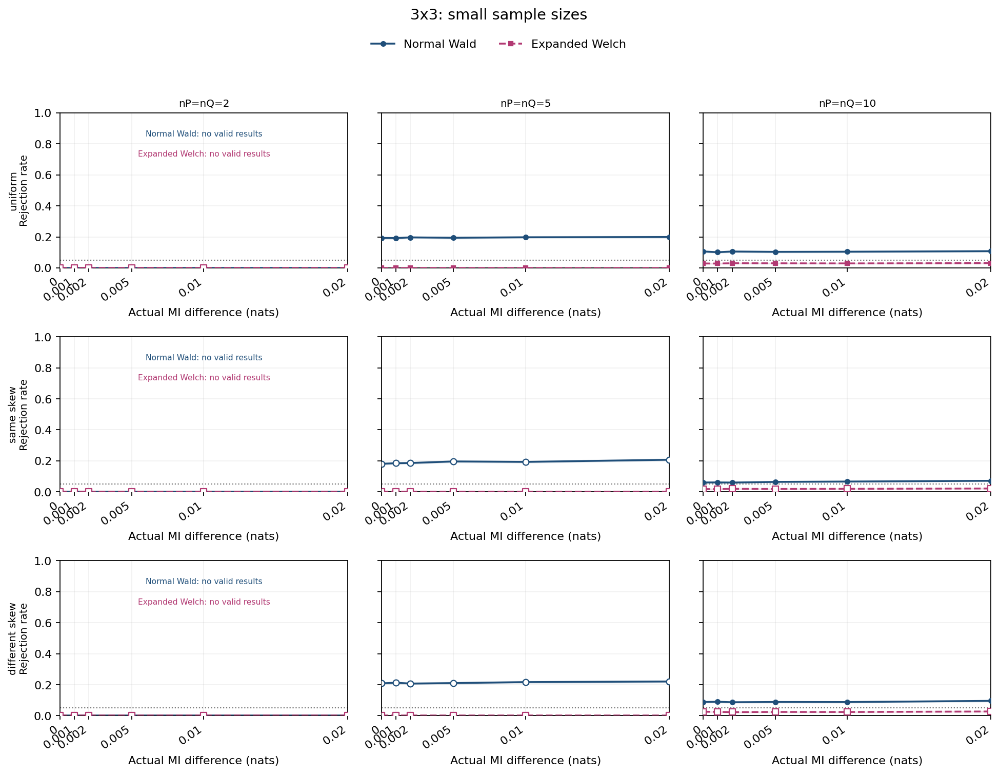

| Specification | Setting |
| --- | --- |
| Table size | 3x3 |
| Horizontal graph regime specifications (columns) | nP=nQ=2, nP=nQ=5, nP=nQ=10 |
| Vertical graph regime specifications (rows) | uniform: P row (0.3333 repeated 3 times), P column (0.3333 repeated 3 times); Q row (0.3333 repeated 3 times), Q column (0.3333 repeated 3 times); same skew: P row (0.8, 0.2/2 repeated 2 times), P column (0.8, 0.2/2 repeated 2 times); Q row (0.8, 0.2/2 repeated 2 times), Q column (0.8, 0.2/2 repeated 2 times); different skew: P row (0.7, 0.3/2 repeated 2 times), P column (0.7, 0.3/2 repeated 2 times); Q row (0.8, 0.2/2 repeated 2 times), Q column (0.8, 0.2/2 repeated 2 times) |
| Probability changes | uniform: add at (1,1),(2,2) and subtract at (1,2),(2,1), for both P and Q; same skew: add at (1,1),(2,2) and subtract at (1,2),(2,1), for both P and Q; different skew: add at (1,1),(2,2) and subtract at (1,2),(2,1), for both P and Q |
| MI settings | Baseline MI {0.02}; direction {q higher}; actual differences {0, 0.001, 0.002, 0.005, 0.01, 0.02} nats |
| Horizontal axis within each graph | Actual MI difference in nats, fixed from 0 to 0.02 |
| Vertical axis within each graph | Unconditional rejection rate from 0 to 1; invalid results count as non-rejections |
| Replicates | 20,000 per unique point |

Null-point rejection and validity:

| Vertical regime | Horizontal regime | x | Method | Rejection | Valid |
| --- | --- | --- | --- | --- | --- |
| uniform | nP=nQ=2 | 0 | Expanded Welch | 0.0000 | 0.0000 |
| uniform | nP=nQ=2 | 0 | Normal Wald | 0.0000 | 0.0000 |
| uniform | nP=nQ=5 | 0 | Expanded Welch | 0.0000 | 0.9534 |
| uniform | nP=nQ=5 | 0 | Normal Wald | 0.1931 | 0.9994 |
| uniform | nP=nQ=10 | 0 | Expanded Welch | 0.0285 | 0.9981 |
| uniform | nP=nQ=10 | 0 | Normal Wald | 0.1058 | 1.0000 |
| same skew | nP=nQ=2 | 0 | Expanded Welch | 0.0000 | 0.0000 |
| same skew | nP=nQ=2 | 0 | Normal Wald | 0.0000 | 0.0000 |
| same skew | nP=nQ=5 | 0 | Expanded Welch | 0.0000 | 0.2209 |
| same skew | nP=nQ=5 | 0 | Normal Wald | 0.1807 | 0.7217 |
| same skew | nP=nQ=10 | 0 | Expanded Welch | 0.0176 | 0.6627 |
| same skew | nP=nQ=10 | 0 | Normal Wald | 0.0602 | 0.9599 |
| different skew | nP=nQ=2 | 0 | Expanded Welch | 0.0000 | 0.0000 |
| different skew | nP=nQ=2 | 0 | Normal Wald | 0.0000 | 0.0000 |
| different skew | nP=nQ=5 | 0 | Expanded Welch | 0.0000 | 0.3296 |
| different skew | nP=nQ=5 | 0 | Normal Wald | 0.2089 | 0.8383 |
| different skew | nP=nQ=10 | 0 | Expanded Welch | 0.0260 | 0.7792 |
| different skew | nP=nQ=10 | 0 | Normal Wald | 0.0886 | 0.9886 |

Every plotted rate, interval, validity and minimum expected count

| Vertical regime | Horizontal regime | x | Method | Rejection | 95% interval | Valid | Conditional | Min expected P | Min expected Q |
| --- | --- | --- | --- | --- | --- | --- | --- | --- | --- |
| uniform | nP=nQ=2 | 0 | Expanded Welch | 0.0000 | [0.0000, 0.0002] | 0.0000 | NA | 0.1561 | 0.1561 |
| uniform | nP=nQ=2 | 0 | Normal Wald | 0.0000 | [0.0000, 0.0002] | 0.0000 | NA | 0.1561 | 0.1561 |
| uniform | nP=nQ=2 | 0.001 | Expanded Welch | 0.0000 | [0.0000, 0.0002] | 0.0000 | NA | 0.1561 | 0.1545 |
| uniform | nP=nQ=2 | 0.001 | Normal Wald | 0.0000 | [0.0000, 0.0002] | 0.0000 | NA | 0.1561 | 0.1545 |
| uniform | nP=nQ=2 | 0.002 | Expanded Welch | 0.0000 | [0.0000, 0.0002] | 0.0000 | NA | 0.1561 | 0.1529 |
| uniform | nP=nQ=2 | 0.002 | Normal Wald | 0.0000 | [0.0000, 0.0002] | 0.0000 | NA | 0.1561 | 0.1529 |
| uniform | nP=nQ=2 | 0.005 | Expanded Welch | 0.0000 | [0.0000, 0.0002] | 0.0000 | NA | 0.1561 | 0.1484 |
| uniform | nP=nQ=2 | 0.005 | Normal Wald | 0.0000 | [0.0000, 0.0002] | 0.0000 | NA | 0.1561 | 0.1484 |
| uniform | nP=nQ=2 | 0.01 | Expanded Welch | 0.0000 | [0.0000, 0.0002] | 0.0000 | NA | 0.1561 | 0.1415 |
| uniform | nP=nQ=2 | 0.01 | Normal Wald | 0.0000 | [0.0000, 0.0002] | 0.0000 | NA | 0.1561 | 0.1415 |
| uniform | nP=nQ=2 | 0.02 | Expanded Welch | 0.0000 | [0.0000, 0.0002] | 0.0000 | NA | 0.1561 | 0.1294 |
| uniform | nP=nQ=2 | 0.02 | Normal Wald | 0.0000 | [0.0000, 0.0002] | 0.0000 | NA | 0.1561 | 0.1294 |
| uniform | nP=nQ=5 | 0 | Expanded Welch | 0.0000 | [0.0000, 0.0002] | 0.9534 | 0.0000 | 0.3902 | 0.3902 |
| uniform | nP=nQ=5 | 0 | Normal Wald | 0.1931 | [0.1877, 0.1986] | 0.9994 | 0.1932 | 0.3902 | 0.3902 |
| uniform | nP=nQ=5 | 0.001 | Expanded Welch | 0.0000 | [0.0000, 0.0002] | 0.9544 | 0.0000 | 0.3902 | 0.3861 |
| uniform | nP=nQ=5 | 0.001 | Normal Wald | 0.1923 | [0.1868, 0.1978] | 0.9994 | 0.1924 | 0.3902 | 0.3861 |
| uniform | nP=nQ=5 | 0.002 | Expanded Welch | 0.0000 | [0.0000, 0.0002] | 0.9498 | 0.0000 | 0.3902 | 0.3822 |
| uniform | nP=nQ=5 | 0.002 | Normal Wald | 0.1967 | [0.1912, 0.2023] | 0.9992 | 0.1969 | 0.3902 | 0.3822 |
| uniform | nP=nQ=5 | 0.005 | Expanded Welch | 0.0000 | [0.0000, 0.0002] | 0.9522 | 0.0000 | 0.3902 | 0.371 |
| uniform | nP=nQ=5 | 0.005 | Normal Wald | 0.1943 | [0.1889, 0.1999] | 0.9994 | 0.1945 | 0.3902 | 0.371 |
| uniform | nP=nQ=5 | 0.01 | Expanded Welch | 0.0000 | [0.0000, 0.0002] | 0.9504 | 0.0000 | 0.3902 | 0.3538 |
| uniform | nP=nQ=5 | 0.01 | Normal Wald | 0.1974 | [0.1920, 0.2030] | 0.9997 | 0.1975 | 0.3902 | 0.3538 |
| uniform | nP=nQ=5 | 0.02 | Expanded Welch | 0.0000 | [0.0000, 0.0002] | 0.9522 | 0.0000 | 0.3902 | 0.3235 |
| uniform | nP=nQ=5 | 0.02 | Normal Wald | 0.1991 | [0.1936, 0.2047] | 0.9996 | 0.1992 | 0.3902 | 0.3235 |
| uniform | nP=nQ=10 | 0 | Expanded Welch | 0.0285 | [0.0263, 0.0309] | 0.9981 | 0.0286 | 0.7803 | 0.7803 |
| uniform | nP=nQ=10 | 0 | Normal Wald | 0.1058 | [0.1017, 0.1102] | 1.0000 | 0.1058 | 0.7803 | 0.7803 |
| uniform | nP=nQ=10 | 0.001 | Expanded Welch | 0.0280 | [0.0259, 0.0304] | 0.9981 | 0.0281 | 0.7803 | 0.7723 |
| uniform | nP=nQ=10 | 0.001 | Normal Wald | 0.1009 | [0.0969, 0.1052] | 1.0000 | 0.1009 | 0.7803 | 0.7723 |
| uniform | nP=nQ=10 | 0.002 | Expanded Welch | 0.0299 | [0.0276, 0.0323] | 0.9978 | 0.0299 | 0.7803 | 0.7644 |
| uniform | nP=nQ=10 | 0.002 | Normal Wald | 0.1056 | [0.1014, 0.1099] | 1.0000 | 0.1056 | 0.7803 | 0.7644 |
| uniform | nP=nQ=10 | 0.005 | Expanded Welch | 0.0295 | [0.0272, 0.0319] | 0.9983 | 0.0296 | 0.7803 | 0.742 |
| uniform | nP=nQ=10 | 0.005 | Normal Wald | 0.1033 | [0.0992, 0.1076] | 1.0000 | 0.1033 | 0.7803 | 0.742 |
| uniform | nP=nQ=10 | 0.01 | Expanded Welch | 0.0289 | [0.0266, 0.0313] | 0.9982 | 0.0289 | 0.7803 | 0.7075 |
| uniform | nP=nQ=10 | 0.01 | Normal Wald | 0.1042 | [0.1001, 0.1086] | 1.0000 | 0.1042 | 0.7803 | 0.7075 |
| uniform | nP=nQ=10 | 0.02 | Expanded Welch | 0.0305 | [0.0282, 0.0329] | 0.9980 | 0.0305 | 0.7803 | 0.6469 |
| uniform | nP=nQ=10 | 0.02 | Normal Wald | 0.1078 | [0.1036, 0.1122] | 1.0000 | 0.1078 | 0.7803 | 0.6469 |
| same skew | nP=nQ=2 | 0 | Expanded Welch | 0.0000 | [0.0000, 0.0002] | 0.0000 | NA | 0.02 | 0.02 |
| same skew | nP=nQ=2 | 0 | Normal Wald | 0.0000 | [0.0000, 0.0002] | 0.0000 | NA | 0.02 | 0.02 |
| same skew | nP=nQ=2 | 0.001 | Expanded Welch | 0.0000 | [0.0000, 0.0002] | 0.0000 | NA | 0.02 | 0.02 |
| same skew | nP=nQ=2 | 0.001 | Normal Wald | 0.0000 | [0.0000, 0.0002] | 0.0000 | NA | 0.02 | 0.02 |
| same skew | nP=nQ=2 | 0.002 | Expanded Welch | 0.0000 | [0.0000, 0.0002] | 0.0000 | NA | 0.02 | 0.02 |
| same skew | nP=nQ=2 | 0.002 | Normal Wald | 0.0000 | [0.0000, 0.0002] | 0.0000 | NA | 0.02 | 0.02 |
| same skew | nP=nQ=2 | 0.005 | Expanded Welch | 0.0000 | [0.0000, 0.0002] | 0.0000 | NA | 0.02 | 0.02 |
| same skew | nP=nQ=2 | 0.005 | Normal Wald | 0.0000 | [0.0000, 0.0002] | 0.0000 | NA | 0.02 | 0.02 |
| same skew | nP=nQ=2 | 0.01 | Expanded Welch | 0.0000 | [0.0000, 0.0002] | 0.0000 | NA | 0.02 | 0.02 |
| same skew | nP=nQ=2 | 0.01 | Normal Wald | 0.0000 | [0.0000, 0.0002] | 0.0000 | NA | 0.02 | 0.02 |
| same skew | nP=nQ=2 | 0.02 | Expanded Welch | 0.0000 | [0.0000, 0.0002] | 0.0000 | NA | 0.02 | 0.02 |
| same skew | nP=nQ=2 | 0.02 | Normal Wald | 0.0000 | [0.0000, 0.0002] | 0.0000 | NA | 0.02 | 0.02 |
| same skew | nP=nQ=5 | 0 | Expanded Welch | 0.0000 | [0.0000, 0.0002] | 0.2209 | 0.0000 | 0.05 | 0.05 |
| same skew | nP=nQ=5 | 0 | Normal Wald | 0.1807 | [0.1755, 0.1861] | 0.7217 | 0.2505 | 0.05 | 0.05 |
| same skew | nP=nQ=5 | 0.001 | Expanded Welch | 0.0000 | [0.0000, 0.0002] | 0.2229 | 0.0000 | 0.05 | 0.05 |
| same skew | nP=nQ=5 | 0.001 | Normal Wald | 0.1845 | [0.1792, 0.1900] | 0.7198 | 0.2564 | 0.05 | 0.05 |
| same skew | nP=nQ=5 | 0.002 | Expanded Welch | 0.0000 | [0.0000, 0.0002] | 0.2223 | 0.0000 | 0.05 | 0.05 |
| same skew | nP=nQ=5 | 0.002 | Normal Wald | 0.1858 | [0.1805, 0.1913] | 0.7182 | 0.2587 | 0.05 | 0.05 |
| same skew | nP=nQ=5 | 0.005 | Expanded Welch | 0.0000 | [0.0000, 0.0002] | 0.2195 | 0.0000 | 0.05 | 0.05 |
| same skew | nP=nQ=5 | 0.005 | Normal Wald | 0.1959 | [0.1905, 0.2015] | 0.7217 | 0.2714 | 0.05 | 0.05 |
| same skew | nP=nQ=5 | 0.01 | Expanded Welch | 0.0000 | [0.0000, 0.0002] | 0.2277 | 0.0000 | 0.05 | 0.05 |
| same skew | nP=nQ=5 | 0.01 | Normal Wald | 0.1930 | [0.1876, 0.1985] | 0.7274 | 0.2653 | 0.05 | 0.05 |
| same skew | nP=nQ=5 | 0.02 | Expanded Welch | 0.0000 | [0.0000, 0.0002] | 0.2248 | 0.0000 | 0.05 | 0.05 |
| same skew | nP=nQ=5 | 0.02 | Normal Wald | 0.2068 | [0.2012, 0.2125] | 0.7324 | 0.2824 | 0.05 | 0.05 |
| same skew | nP=nQ=10 | 0 | Expanded Welch | 0.0176 | [0.0159, 0.0195] | 0.6627 | 0.0266 | 0.1 | 0.1 |
| same skew | nP=nQ=10 | 0 | Normal Wald | 0.0602 | [0.0570, 0.0636] | 0.9599 | 0.0628 | 0.1 | 0.1 |
| same skew | nP=nQ=10 | 0.001 | Expanded Welch | 0.0174 | [0.0156, 0.0193] | 0.6632 | 0.0262 | 0.1 | 0.1 |
| same skew | nP=nQ=10 | 0.001 | Normal Wald | 0.0606 | [0.0574, 0.0640] | 0.9619 | 0.0630 | 0.1 | 0.1 |
| same skew | nP=nQ=10 | 0.002 | Expanded Welch | 0.0192 | [0.0173, 0.0211] | 0.6660 | 0.0288 | 0.1 | 0.1 |
| same skew | nP=nQ=10 | 0.002 | Normal Wald | 0.0597 | [0.0565, 0.0631] | 0.9620 | 0.0621 | 0.1 | 0.1 |
| same skew | nP=nQ=10 | 0.005 | Expanded Welch | 0.0181 | [0.0164, 0.0201] | 0.6627 | 0.0274 | 0.1 | 0.1 |
| same skew | nP=nQ=10 | 0.005 | Normal Wald | 0.0639 | [0.0606, 0.0674] | 0.9597 | 0.0666 | 0.1 | 0.1 |
| same skew | nP=nQ=10 | 0.01 | Expanded Welch | 0.0192 | [0.0173, 0.0211] | 0.6679 | 0.0287 | 0.1 | 0.1 |
| same skew | nP=nQ=10 | 0.01 | Normal Wald | 0.0662 | [0.0628, 0.0697] | 0.9616 | 0.0688 | 0.1 | 0.1 |
| same skew | nP=nQ=10 | 0.02 | Expanded Welch | 0.0215 | [0.0195, 0.0236] | 0.6650 | 0.0323 | 0.1 | 0.1 |
| same skew | nP=nQ=10 | 0.02 | Normal Wald | 0.0711 | [0.0676, 0.0747] | 0.9599 | 0.0740 | 0.1 | 0.1 |
| different skew | nP=nQ=2 | 0 | Expanded Welch | 0.0000 | [0.0000, 0.0002] | 0.0000 | NA | 0.045 | 0.02 |
| different skew | nP=nQ=2 | 0 | Normal Wald | 0.0000 | [0.0000, 0.0002] | 0.0000 | NA | 0.045 | 0.02 |
| different skew | nP=nQ=2 | 0.001 | Expanded Welch | 0.0000 | [0.0000, 0.0002] | 0.0000 | NA | 0.045 | 0.02 |
| different skew | nP=nQ=2 | 0.001 | Normal Wald | 0.0000 | [0.0000, 0.0002] | 0.0000 | NA | 0.045 | 0.02 |
| different skew | nP=nQ=2 | 0.002 | Expanded Welch | 0.0000 | [0.0000, 0.0002] | 0.0000 | NA | 0.045 | 0.02 |
| different skew | nP=nQ=2 | 0.002 | Normal Wald | 0.0000 | [0.0000, 0.0002] | 0.0000 | NA | 0.045 | 0.02 |
| different skew | nP=nQ=2 | 0.005 | Expanded Welch | 0.0000 | [0.0000, 0.0002] | 0.0000 | NA | 0.045 | 0.02 |
| different skew | nP=nQ=2 | 0.005 | Normal Wald | 0.0000 | [0.0000, 0.0002] | 0.0000 | NA | 0.045 | 0.02 |
| different skew | nP=nQ=2 | 0.01 | Expanded Welch | 0.0000 | [0.0000, 0.0002] | 0.0000 | NA | 0.045 | 0.02 |
| different skew | nP=nQ=2 | 0.01 | Normal Wald | 0.0000 | [0.0000, 0.0002] | 0.0000 | NA | 0.045 | 0.02 |
| different skew | nP=nQ=2 | 0.02 | Expanded Welch | 0.0000 | [0.0000, 0.0002] | 0.0000 | NA | 0.045 | 0.02 |
| different skew | nP=nQ=2 | 0.02 | Normal Wald | 0.0000 | [0.0000, 0.0002] | 0.0000 | NA | 0.045 | 0.02 |
| different skew | nP=nQ=5 | 0 | Expanded Welch | 0.0000 | [0.0000, 0.0002] | 0.3296 | 0.0000 | 0.1125 | 0.05 |
| different skew | nP=nQ=5 | 0 | Normal Wald | 0.2089 | [0.2033, 0.2146] | 0.8383 | 0.2492 | 0.1125 | 0.05 |
| different skew | nP=nQ=5 | 0.001 | Expanded Welch | 0.0000 | [0.0000, 0.0002] | 0.3266 | 0.0000 | 0.1125 | 0.05 |
| different skew | nP=nQ=5 | 0.001 | Normal Wald | 0.2129 | [0.2073, 0.2186] | 0.8419 | 0.2529 | 0.1125 | 0.05 |
| different skew | nP=nQ=5 | 0.002 | Expanded Welch | 0.0000 | [0.0000, 0.0002] | 0.3290 | 0.0000 | 0.1125 | 0.05 |
| different skew | nP=nQ=5 | 0.002 | Normal Wald | 0.2074 | [0.2019, 0.2131] | 0.8448 | 0.2456 | 0.1125 | 0.05 |
| different skew | nP=nQ=5 | 0.005 | Expanded Welch | 0.0000 | [0.0000, 0.0002] | 0.3272 | 0.0000 | 0.1125 | 0.05 |
| different skew | nP=nQ=5 | 0.005 | Normal Wald | 0.2106 | [0.2050, 0.2163] | 0.8420 | 0.2501 | 0.1125 | 0.05 |
| different skew | nP=nQ=5 | 0.01 | Expanded Welch | 0.0000 | [0.0000, 0.0002] | 0.3346 | 0.0000 | 0.1125 | 0.05 |
| different skew | nP=nQ=5 | 0.01 | Normal Wald | 0.2170 | [0.2113, 0.2228] | 0.8463 | 0.2564 | 0.1125 | 0.05 |
| different skew | nP=nQ=5 | 0.02 | Expanded Welch | 0.0000 | [0.0000, 0.0002] | 0.3380 | 0.0000 | 0.1125 | 0.05 |
| different skew | nP=nQ=5 | 0.02 | Normal Wald | 0.2209 | [0.2152, 0.2267] | 0.8454 | 0.2613 | 0.1125 | 0.05 |
| different skew | nP=nQ=10 | 0 | Expanded Welch | 0.0260 | [0.0239, 0.0283] | 0.7792 | 0.0334 | 0.225 | 0.1 |
| different skew | nP=nQ=10 | 0 | Normal Wald | 0.0886 | [0.0847, 0.0926] | 0.9886 | 0.0896 | 0.225 | 0.1 |
| different skew | nP=nQ=10 | 0.001 | Expanded Welch | 0.0249 | [0.0229, 0.0272] | 0.7771 | 0.0321 | 0.225 | 0.1 |
| different skew | nP=nQ=10 | 0.001 | Normal Wald | 0.0901 | [0.0863, 0.0942] | 0.9877 | 0.0913 | 0.225 | 0.1 |
| different skew | nP=nQ=10 | 0.002 | Expanded Welch | 0.0232 | [0.0212, 0.0253] | 0.7733 | 0.0299 | 0.225 | 0.1 |
| different skew | nP=nQ=10 | 0.002 | Normal Wald | 0.0871 | [0.0833, 0.0911] | 0.9890 | 0.0881 | 0.225 | 0.1 |
| different skew | nP=nQ=10 | 0.005 | Expanded Welch | 0.0246 | [0.0225, 0.0268] | 0.7758 | 0.0317 | 0.225 | 0.1 |
| different skew | nP=nQ=10 | 0.005 | Normal Wald | 0.0887 | [0.0849, 0.0928] | 0.9880 | 0.0898 | 0.225 | 0.1 |
| different skew | nP=nQ=10 | 0.01 | Expanded Welch | 0.0242 | [0.0222, 0.0264] | 0.7723 | 0.0313 | 0.225 | 0.1 |
| different skew | nP=nQ=10 | 0.01 | Normal Wald | 0.0883 | [0.0844, 0.0923] | 0.9890 | 0.0893 | 0.225 | 0.1 |
| different skew | nP=nQ=10 | 0.02 | Expanded Welch | 0.0274 | [0.0252, 0.0298] | 0.7765 | 0.0353 | 0.225 | 0.1 |
| different skew | nP=nQ=10 | 0.02 | Normal Wald | 0.0959 | [0.0919, 0.1001] | 0.9890 | 0.0970 | 0.225 | 0.1 |

### 3.5 3x3: moderate sample sizes

How do the methods behave as table size, marginal skew and sample size change?

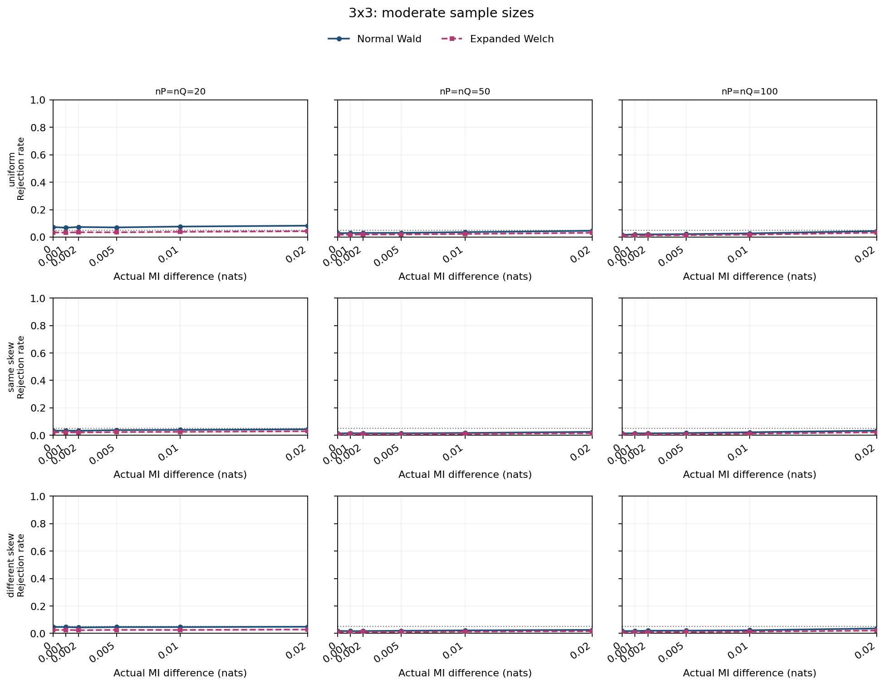

| Specification | Setting |
| --- | --- |
| Table size | 3x3 |
| Horizontal graph regime specifications (columns) | nP=nQ=20, nP=nQ=50, nP=nQ=100 |
| Vertical graph regime specifications (rows) | uniform: P row (0.3333 repeated 3 times), P column (0.3333 repeated 3 times); Q row (0.3333 repeated 3 times), Q column (0.3333 repeated 3 times); same skew: P row (0.8, 0.2/2 repeated 2 times), P column (0.8, 0.2/2 repeated 2 times); Q row (0.8, 0.2/2 repeated 2 times), Q column (0.8, 0.2/2 repeated 2 times); different skew: P row (0.7, 0.3/2 repeated 2 times), P column (0.7, 0.3/2 repeated 2 times); Q row (0.8, 0.2/2 repeated 2 times), Q column (0.8, 0.2/2 repeated 2 times) |
| Probability changes | uniform: add at (1,1),(2,2) and subtract at (1,2),(2,1), for both P and Q; same skew: add at (1,1),(2,2) and subtract at (1,2),(2,1), for both P and Q; different skew: add at (1,1),(2,2) and subtract at (1,2),(2,1), for both P and Q |
| MI settings | Baseline MI {0.02}; direction {q higher}; actual differences {0, 0.001, 0.002, 0.005, 0.01, 0.02} nats |
| Horizontal axis within each graph | Actual MI difference in nats, fixed from 0 to 0.02 |
| Vertical axis within each graph | Unconditional rejection rate from 0 to 1; invalid results count as non-rejections |
| Replicates | 20,000 per unique point |

Null-point rejection and validity:

| Vertical regime | Horizontal regime | x | Method | Rejection | Valid |
| --- | --- | --- | --- | --- | --- |
| uniform | nP=nQ=20 | 0 | Expanded Welch | 0.0343 | 1.0000 |
| uniform | nP=nQ=20 | 0 | Normal Wald | 0.0730 | 1.0000 |
| uniform | nP=nQ=50 | 0 | Expanded Welch | 0.0173 | 1.0000 |
| uniform | nP=nQ=50 | 0 | Normal Wald | 0.0288 | 1.0000 |
| uniform | nP=nQ=100 | 0 | Expanded Welch | 0.0106 | 1.0000 |
| uniform | nP=nQ=100 | 0 | Normal Wald | 0.0167 | 1.0000 |
| same skew | nP=nQ=20 | 0 | Expanded Welch | 0.0207 | 0.9565 |
| same skew | nP=nQ=20 | 0 | Normal Wald | 0.0333 | 0.9996 |
| same skew | nP=nQ=50 | 0 | Expanded Welch | 0.0076 | 1.0000 |
| same skew | nP=nQ=50 | 0 | Normal Wald | 0.0135 | 1.0000 |
| same skew | nP=nQ=100 | 0 | Expanded Welch | 0.0068 | 1.0000 |
| same skew | nP=nQ=100 | 0 | Normal Wald | 0.0139 | 1.0000 |
| different skew | nP=nQ=20 | 0 | Expanded Welch | 0.0251 | 0.9745 |
| different skew | nP=nQ=20 | 0 | Normal Wald | 0.0466 | 0.9998 |
| different skew | nP=nQ=50 | 0 | Expanded Welch | 0.0098 | 1.0000 |
| different skew | nP=nQ=50 | 0 | Normal Wald | 0.0188 | 1.0000 |
| different skew | nP=nQ=100 | 0 | Expanded Welch | 0.0083 | 1.0000 |
| different skew | nP=nQ=100 | 0 | Normal Wald | 0.0171 | 1.0000 |

Every plotted rate, interval, validity and minimum expected count

| Vertical regime | Horizontal regime | x | Method | Rejection | 95% interval | Valid | Conditional | Min expected P | Min expected Q |
| --- | --- | --- | --- | --- | --- | --- | --- | --- | --- |
| uniform | nP=nQ=20 | 0 | Expanded Welch | 0.0343 | [0.0319, 0.0369] | 1.0000 | 0.0343 | 1.561 | 1.561 |
| uniform | nP=nQ=20 | 0 | Normal Wald | 0.0730 | [0.0694, 0.0766] | 1.0000 | 0.0730 | 1.561 | 1.561 |
| uniform | nP=nQ=20 | 0.001 | Expanded Welch | 0.0330 | [0.0306, 0.0356] | 1.0000 | 0.0330 | 1.561 | 1.545 |
| uniform | nP=nQ=20 | 0.001 | Normal Wald | 0.0687 | [0.0653, 0.0723] | 1.0000 | 0.0687 | 1.561 | 1.545 |
| uniform | nP=nQ=20 | 0.002 | Expanded Welch | 0.0354 | [0.0329, 0.0381] | 1.0000 | 0.0354 | 1.561 | 1.529 |
| uniform | nP=nQ=20 | 0.002 | Normal Wald | 0.0734 | [0.0699, 0.0771] | 1.0000 | 0.0734 | 1.561 | 1.529 |
| uniform | nP=nQ=20 | 0.005 | Expanded Welch | 0.0349 | [0.0324, 0.0375] | 1.0000 | 0.0349 | 1.561 | 1.484 |
| uniform | nP=nQ=20 | 0.005 | Normal Wald | 0.0706 | [0.0671, 0.0742] | 1.0000 | 0.0706 | 1.561 | 1.484 |
| uniform | nP=nQ=20 | 0.01 | Expanded Welch | 0.0384 | [0.0358, 0.0412] | 1.0000 | 0.0384 | 1.561 | 1.415 |
| uniform | nP=nQ=20 | 0.01 | Normal Wald | 0.0767 | [0.0731, 0.0805] | 1.0000 | 0.0767 | 1.561 | 1.415 |
| uniform | nP=nQ=20 | 0.02 | Expanded Welch | 0.0425 | [0.0398, 0.0454] | 1.0000 | 0.0426 | 1.561 | 1.294 |
| uniform | nP=nQ=20 | 0.02 | Normal Wald | 0.0832 | [0.0795, 0.0871] | 1.0000 | 0.0832 | 1.561 | 1.294 |
| uniform | nP=nQ=50 | 0 | Expanded Welch | 0.0173 | [0.0156, 0.0192] | 1.0000 | 0.0173 | 3.902 | 3.902 |
| uniform | nP=nQ=50 | 0 | Normal Wald | 0.0288 | [0.0265, 0.0312] | 1.0000 | 0.0288 | 3.902 | 3.902 |
| uniform | nP=nQ=50 | 0.001 | Expanded Welch | 0.0173 | [0.0155, 0.0191] | 1.0000 | 0.0173 | 3.902 | 3.861 |
| uniform | nP=nQ=50 | 0.001 | Normal Wald | 0.0295 | [0.0272, 0.0319] | 1.0000 | 0.0295 | 3.902 | 3.861 |
| uniform | nP=nQ=50 | 0.002 | Expanded Welch | 0.0187 | [0.0170, 0.0207] | 1.0000 | 0.0187 | 3.902 | 3.822 |
| uniform | nP=nQ=50 | 0.002 | Normal Wald | 0.0307 | [0.0283, 0.0331] | 1.0000 | 0.0307 | 3.902 | 3.822 |
| uniform | nP=nQ=50 | 0.005 | Expanded Welch | 0.0197 | [0.0179, 0.0217] | 1.0000 | 0.0197 | 3.902 | 3.71 |
| uniform | nP=nQ=50 | 0.005 | Normal Wald | 0.0311 | [0.0287, 0.0335] | 1.0000 | 0.0311 | 3.902 | 3.71 |
| uniform | nP=nQ=50 | 0.01 | Expanded Welch | 0.0230 | [0.0210, 0.0251] | 1.0000 | 0.0230 | 3.902 | 3.538 |
| uniform | nP=nQ=50 | 0.01 | Normal Wald | 0.0361 | [0.0336, 0.0388] | 1.0000 | 0.0361 | 3.902 | 3.538 |
| uniform | nP=nQ=50 | 0.02 | Expanded Welch | 0.0314 | [0.0291, 0.0340] | 1.0000 | 0.0314 | 3.902 | 3.235 |
| uniform | nP=nQ=50 | 0.02 | Normal Wald | 0.0459 | [0.0430, 0.0488] | 1.0000 | 0.0459 | 3.902 | 3.235 |
| uniform | nP=nQ=100 | 0 | Expanded Welch | 0.0106 | [0.0092, 0.0121] | 1.0000 | 0.0106 | 7.803 | 7.803 |
| uniform | nP=nQ=100 | 0 | Normal Wald | 0.0167 | [0.0150, 0.0185] | 1.0000 | 0.0167 | 7.803 | 7.803 |
| uniform | nP=nQ=100 | 0.001 | Expanded Welch | 0.0115 | [0.0101, 0.0131] | 1.0000 | 0.0115 | 7.803 | 7.723 |
| uniform | nP=nQ=100 | 0.001 | Normal Wald | 0.0194 | [0.0176, 0.0215] | 1.0000 | 0.0194 | 7.803 | 7.723 |
| uniform | nP=nQ=100 | 0.002 | Expanded Welch | 0.0123 | [0.0109, 0.0140] | 1.0000 | 0.0123 | 7.803 | 7.644 |
| uniform | nP=nQ=100 | 0.002 | Normal Wald | 0.0196 | [0.0178, 0.0216] | 1.0000 | 0.0196 | 7.803 | 7.644 |
| uniform | nP=nQ=100 | 0.005 | Expanded Welch | 0.0142 | [0.0127, 0.0159] | 1.0000 | 0.0142 | 7.803 | 7.42 |
| uniform | nP=nQ=100 | 0.005 | Normal Wald | 0.0216 | [0.0197, 0.0237] | 1.0000 | 0.0216 | 7.803 | 7.42 |
| uniform | nP=nQ=100 | 0.01 | Expanded Welch | 0.0179 | [0.0162, 0.0198] | 1.0000 | 0.0179 | 7.803 | 7.075 |
| uniform | nP=nQ=100 | 0.01 | Normal Wald | 0.0272 | [0.0250, 0.0295] | 1.0000 | 0.0272 | 7.803 | 7.075 |
| uniform | nP=nQ=100 | 0.02 | Expanded Welch | 0.0323 | [0.0300, 0.0349] | 1.0000 | 0.0323 | 7.803 | 6.469 |
| uniform | nP=nQ=100 | 0.02 | Normal Wald | 0.0440 | [0.0412, 0.0469] | 1.0000 | 0.0440 | 7.803 | 6.469 |
| same skew | nP=nQ=20 | 0 | Expanded Welch | 0.0207 | [0.0188, 0.0228] | 0.9565 | 0.0216 | 0.2 | 0.2 |
| same skew | nP=nQ=20 | 0 | Normal Wald | 0.0333 | [0.0309, 0.0359] | 0.9996 | 0.0333 | 0.2 | 0.2 |
| same skew | nP=nQ=20 | 0.001 | Expanded Welch | 0.0215 | [0.0195, 0.0236] | 0.9570 | 0.0224 | 0.2 | 0.2 |
| same skew | nP=nQ=20 | 0.001 | Normal Wald | 0.0338 | [0.0314, 0.0364] | 0.9997 | 0.0338 | 0.2 | 0.2 |
| same skew | nP=nQ=20 | 0.002 | Expanded Welch | 0.0203 | [0.0184, 0.0223] | 0.9553 | 0.0212 | 0.2 | 0.2 |
| same skew | nP=nQ=20 | 0.002 | Normal Wald | 0.0328 | [0.0304, 0.0354] | 0.9993 | 0.0328 | 0.2 | 0.2 |
| same skew | nP=nQ=20 | 0.005 | Expanded Welch | 0.0233 | [0.0213, 0.0255] | 0.9553 | 0.0244 | 0.2 | 0.2 |
| same skew | nP=nQ=20 | 0.005 | Normal Wald | 0.0377 | [0.0351, 0.0404] | 0.9992 | 0.0377 | 0.2 | 0.2 |
| same skew | nP=nQ=20 | 0.01 | Expanded Welch | 0.0248 | [0.0227, 0.0270] | 0.9554 | 0.0260 | 0.2 | 0.2 |
| same skew | nP=nQ=20 | 0.01 | Normal Wald | 0.0391 | [0.0365, 0.0419] | 0.9991 | 0.0391 | 0.2 | 0.2 |
| same skew | nP=nQ=20 | 0.02 | Expanded Welch | 0.0290 | [0.0268, 0.0314] | 0.9550 | 0.0304 | 0.2 | 0.2 |
| same skew | nP=nQ=20 | 0.02 | Normal Wald | 0.0433 | [0.0406, 0.0463] | 0.9992 | 0.0434 | 0.2 | 0.2 |
| same skew | nP=nQ=50 | 0 | Expanded Welch | 0.0076 | [0.0065, 0.0089] | 1.0000 | 0.0076 | 0.5 | 0.5 |
| same skew | nP=nQ=50 | 0 | Normal Wald | 0.0135 | [0.0120, 0.0152] | 1.0000 | 0.0135 | 0.5 | 0.5 |
| same skew | nP=nQ=50 | 0.001 | Expanded Welch | 0.0093 | [0.0081, 0.0107] | 1.0000 | 0.0093 | 0.5 | 0.5 |
| same skew | nP=nQ=50 | 0.001 | Normal Wald | 0.0149 | [0.0134, 0.0167] | 1.0000 | 0.0149 | 0.5 | 0.5 |
| same skew | nP=nQ=50 | 0.002 | Expanded Welch | 0.0084 | [0.0073, 0.0098] | 1.0000 | 0.0084 | 0.5 | 0.5 |
| same skew | nP=nQ=50 | 0.002 | Normal Wald | 0.0146 | [0.0130, 0.0163] | 1.0000 | 0.0146 | 0.5 | 0.5 |
| same skew | nP=nQ=50 | 0.005 | Expanded Welch | 0.0087 | [0.0075, 0.0101] | 1.0000 | 0.0087 | 0.5 | 0.5 |
| same skew | nP=nQ=50 | 0.005 | Normal Wald | 0.0144 | [0.0128, 0.0161] | 1.0000 | 0.0144 | 0.5 | 0.5 |
| same skew | nP=nQ=50 | 0.01 | Expanded Welch | 0.0100 | [0.0087, 0.0114] | 0.9999 | 0.0100 | 0.5 | 0.5 |
| same skew | nP=nQ=50 | 0.01 | Normal Wald | 0.0168 | [0.0151, 0.0187] | 1.0000 | 0.0168 | 0.5 | 0.5 |
| same skew | nP=nQ=50 | 0.02 | Expanded Welch | 0.0154 | [0.0137, 0.0171] | 1.0000 | 0.0154 | 0.5 | 0.5 |
| same skew | nP=nQ=50 | 0.02 | Normal Wald | 0.0248 | [0.0227, 0.0270] | 1.0000 | 0.0248 | 0.5 | 0.5 |
| same skew | nP=nQ=100 | 0 | Expanded Welch | 0.0068 | [0.0058, 0.0080] | 1.0000 | 0.0068 | 1 | 1 |
| same skew | nP=nQ=100 | 0 | Normal Wald | 0.0139 | [0.0124, 0.0156] | 1.0000 | 0.0139 | 1 | 1 |
| same skew | nP=nQ=100 | 0.001 | Expanded Welch | 0.0059 | [0.0049, 0.0071] | 1.0000 | 0.0059 | 1 | 1 |
| same skew | nP=nQ=100 | 0.001 | Normal Wald | 0.0143 | [0.0127, 0.0160] | 1.0000 | 0.0143 | 1 | 1 |
| same skew | nP=nQ=100 | 0.002 | Expanded Welch | 0.0064 | [0.0054, 0.0076] | 1.0000 | 0.0064 | 1 | 1 |
| same skew | nP=nQ=100 | 0.002 | Normal Wald | 0.0140 | [0.0125, 0.0158] | 1.0000 | 0.0140 | 1 | 1 |
| same skew | nP=nQ=100 | 0.005 | Expanded Welch | 0.0080 | [0.0069, 0.0094] | 1.0000 | 0.0080 | 1 | 1 |
| same skew | nP=nQ=100 | 0.005 | Normal Wald | 0.0160 | [0.0144, 0.0178] | 1.0000 | 0.0160 | 1 | 1 |
| same skew | nP=nQ=100 | 0.01 | Expanded Welch | 0.0118 | [0.0104, 0.0134] | 1.0000 | 0.0118 | 1 | 1 |
| same skew | nP=nQ=100 | 0.01 | Normal Wald | 0.0220 | [0.0201, 0.0241] | 1.0000 | 0.0220 | 1 | 1 |
| same skew | nP=nQ=100 | 0.02 | Expanded Welch | 0.0215 | [0.0196, 0.0237] | 1.0000 | 0.0215 | 1 | 1 |
| same skew | nP=nQ=100 | 0.02 | Normal Wald | 0.0336 | [0.0312, 0.0362] | 1.0000 | 0.0336 | 1 | 1 |
| different skew | nP=nQ=20 | 0 | Expanded Welch | 0.0251 | [0.0231, 0.0274] | 0.9745 | 0.0258 | 0.45 | 0.2 |
| different skew | nP=nQ=20 | 0 | Normal Wald | 0.0466 | [0.0438, 0.0497] | 0.9998 | 0.0467 | 0.45 | 0.2 |
| different skew | nP=nQ=20 | 0.001 | Expanded Welch | 0.0259 | [0.0238, 0.0282] | 0.9753 | 0.0266 | 0.45 | 0.2 |
| different skew | nP=nQ=20 | 0.001 | Normal Wald | 0.0471 | [0.0442, 0.0501] | 1.0000 | 0.0471 | 0.45 | 0.2 |
| different skew | nP=nQ=20 | 0.002 | Expanded Welch | 0.0232 | [0.0212, 0.0254] | 0.9763 | 0.0238 | 0.45 | 0.2 |
| different skew | nP=nQ=20 | 0.002 | Normal Wald | 0.0435 | [0.0407, 0.0464] | 1.0000 | 0.0435 | 0.45 | 0.2 |
| different skew | nP=nQ=20 | 0.005 | Expanded Welch | 0.0260 | [0.0239, 0.0283] | 0.9760 | 0.0266 | 0.45 | 0.2 |
| different skew | nP=nQ=20 | 0.005 | Normal Wald | 0.0466 | [0.0437, 0.0496] | 1.0000 | 0.0466 | 0.45 | 0.2 |
| different skew | nP=nQ=20 | 0.01 | Expanded Welch | 0.0252 | [0.0231, 0.0275] | 0.9756 | 0.0258 | 0.45 | 0.2 |
| different skew | nP=nQ=20 | 0.01 | Normal Wald | 0.0464 | [0.0436, 0.0495] | 0.9999 | 0.0465 | 0.45 | 0.2 |
| different skew | nP=nQ=20 | 0.02 | Expanded Welch | 0.0285 | [0.0263, 0.0309] | 0.9761 | 0.0292 | 0.45 | 0.2 |
| different skew | nP=nQ=20 | 0.02 | Normal Wald | 0.0488 | [0.0459, 0.0518] | 1.0000 | 0.0488 | 0.45 | 0.2 |
| different skew | nP=nQ=50 | 0 | Expanded Welch | 0.0098 | [0.0086, 0.0113] | 1.0000 | 0.0099 | 1.125 | 0.5 |
| different skew | nP=nQ=50 | 0 | Normal Wald | 0.0188 | [0.0171, 0.0208] | 1.0000 | 0.0188 | 1.125 | 0.5 |
| different skew | nP=nQ=50 | 0.001 | Expanded Welch | 0.0091 | [0.0079, 0.0105] | 0.9999 | 0.0091 | 1.125 | 0.5 |
| different skew | nP=nQ=50 | 0.001 | Normal Wald | 0.0165 | [0.0149, 0.0184] | 1.0000 | 0.0165 | 1.125 | 0.5 |
| different skew | nP=nQ=50 | 0.002 | Expanded Welch | 0.0099 | [0.0086, 0.0114] | 1.0000 | 0.0099 | 1.125 | 0.5 |
| different skew | nP=nQ=50 | 0.002 | Normal Wald | 0.0175 | [0.0158, 0.0195] | 1.0000 | 0.0175 | 1.125 | 0.5 |
| different skew | nP=nQ=50 | 0.005 | Expanded Welch | 0.0103 | [0.0090, 0.0118] | 1.0000 | 0.0103 | 1.125 | 0.5 |
| different skew | nP=nQ=50 | 0.005 | Normal Wald | 0.0194 | [0.0176, 0.0215] | 1.0000 | 0.0194 | 1.125 | 0.5 |
| different skew | nP=nQ=50 | 0.01 | Expanded Welch | 0.0129 | [0.0114, 0.0145] | 1.0000 | 0.0129 | 1.125 | 0.5 |
| different skew | nP=nQ=50 | 0.01 | Normal Wald | 0.0222 | [0.0202, 0.0243] | 1.0000 | 0.0222 | 1.125 | 0.5 |
| different skew | nP=nQ=50 | 0.02 | Expanded Welch | 0.0162 | [0.0145, 0.0180] | 1.0000 | 0.0162 | 1.125 | 0.5 |
| different skew | nP=nQ=50 | 0.02 | Normal Wald | 0.0259 | [0.0237, 0.0281] | 1.0000 | 0.0259 | 1.125 | 0.5 |
| different skew | nP=nQ=100 | 0 | Expanded Welch | 0.0083 | [0.0071, 0.0097] | 1.0000 | 0.0083 | 2.25 | 1 |
| different skew | nP=nQ=100 | 0 | Normal Wald | 0.0171 | [0.0154, 0.0190] | 1.0000 | 0.0171 | 2.25 | 1 |
| different skew | nP=nQ=100 | 0.001 | Expanded Welch | 0.0083 | [0.0071, 0.0096] | 1.0000 | 0.0083 | 2.25 | 1 |
| different skew | nP=nQ=100 | 0.001 | Normal Wald | 0.0179 | [0.0161, 0.0198] | 1.0000 | 0.0179 | 2.25 | 1 |
| different skew | nP=nQ=100 | 0.002 | Expanded Welch | 0.0092 | [0.0079, 0.0106] | 1.0000 | 0.0092 | 2.25 | 1 |
| different skew | nP=nQ=100 | 0.002 | Normal Wald | 0.0199 | [0.0181, 0.0219] | 1.0000 | 0.0199 | 2.25 | 1 |
| different skew | nP=nQ=100 | 0.005 | Expanded Welch | 0.0102 | [0.0089, 0.0117] | 1.0000 | 0.0102 | 2.25 | 1 |
| different skew | nP=nQ=100 | 0.005 | Normal Wald | 0.0203 | [0.0184, 0.0223] | 1.0000 | 0.0203 | 2.25 | 1 |
| different skew | nP=nQ=100 | 0.01 | Expanded Welch | 0.0126 | [0.0112, 0.0143] | 1.0000 | 0.0126 | 2.25 | 1 |
| different skew | nP=nQ=100 | 0.01 | Normal Wald | 0.0231 | [0.0211, 0.0253] | 1.0000 | 0.0231 | 2.25 | 1 |
| different skew | nP=nQ=100 | 0.02 | Expanded Welch | 0.0210 | [0.0192, 0.0231] | 1.0000 | 0.0210 | 2.25 | 1 |
| different skew | nP=nQ=100 | 0.02 | Normal Wald | 0.0363 | [0.0338, 0.0390] | 1.0000 | 0.0363 | 2.25 | 1 |

### 3.6 3x3: large sample sizes

How do the methods behave as table size, marginal skew and sample size change?

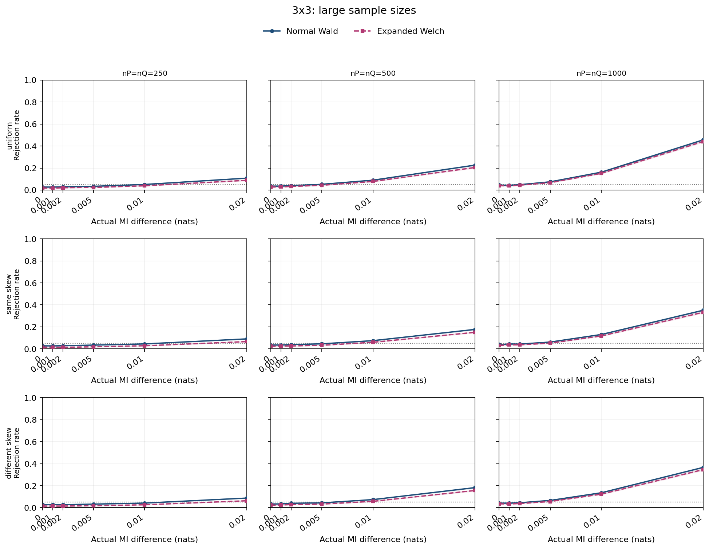

| Specification | Setting |
| --- | --- |
| Table size | 3x3 |
| Horizontal graph regime specifications (columns) | nP=nQ=250, nP=nQ=500, nP=nQ=1000 |
| Vertical graph regime specifications (rows) | uniform: P row (0.3333 repeated 3 times), P column (0.3333 repeated 3 times); Q row (0.3333 repeated 3 times), Q column (0.3333 repeated 3 times); same skew: P row (0.8, 0.2/2 repeated 2 times), P column (0.8, 0.2/2 repeated 2 times); Q row (0.8, 0.2/2 repeated 2 times), Q column (0.8, 0.2/2 repeated 2 times); different skew: P row (0.7, 0.3/2 repeated 2 times), P column (0.7, 0.3/2 repeated 2 times); Q row (0.8, 0.2/2 repeated 2 times), Q column (0.8, 0.2/2 repeated 2 times) |
| Probability changes | uniform: add at (1,1),(2,2) and subtract at (1,2),(2,1), for both P and Q; same skew: add at (1,1),(2,2) and subtract at (1,2),(2,1), for both P and Q; different skew: add at (1,1),(2,2) and subtract at (1,2),(2,1), for both P and Q |
| MI settings | Baseline MI {0.02}; direction {q higher}; actual differences {0, 0.001, 0.002, 0.005, 0.01, 0.02} nats |
| Horizontal axis within each graph | Actual MI difference in nats, fixed from 0 to 0.02 |
| Vertical axis within each graph | Unconditional rejection rate from 0 to 1; invalid results count as non-rejections |
| Replicates | 20,000 per unique point |

Null-point rejection and validity:

| Vertical regime | Horizontal regime | x | Method | Rejection | Valid |
| --- | --- | --- | --- | --- | --- |
| uniform | nP=nQ=250 | 0 | Expanded Welch | 0.0178 | 1.0000 |
| uniform | nP=nQ=250 | 0 | Normal Wald | 0.0269 | 1.0000 |
| uniform | nP=nQ=500 | 0 | Expanded Welch | 0.0278 | 1.0000 |
| uniform | nP=nQ=500 | 0 | Normal Wald | 0.0355 | 1.0000 |
| uniform | nP=nQ=1000 | 0 | Expanded Welch | 0.0393 | 1.0000 |
| uniform | nP=nQ=1000 | 0 | Normal Wald | 0.0445 | 1.0000 |
| same skew | nP=nQ=250 | 0 | Expanded Welch | 0.0149 | 1.0000 |
| same skew | nP=nQ=250 | 0 | Normal Wald | 0.0273 | 1.0000 |
| same skew | nP=nQ=500 | 0 | Expanded Welch | 0.0235 | 1.0000 |
| same skew | nP=nQ=500 | 0 | Normal Wald | 0.0348 | 1.0000 |
| same skew | nP=nQ=1000 | 0 | Expanded Welch | 0.0314 | 1.0000 |
| same skew | nP=nQ=1000 | 0 | Normal Wald | 0.0391 | 1.0000 |
| different skew | nP=nQ=250 | 0 | Expanded Welch | 0.0147 | 1.0000 |
| different skew | nP=nQ=250 | 0 | Normal Wald | 0.0268 | 1.0000 |
| different skew | nP=nQ=500 | 0 | Expanded Welch | 0.0232 | 1.0000 |
| different skew | nP=nQ=500 | 0 | Normal Wald | 0.0331 | 1.0000 |
| different skew | nP=nQ=1000 | 0 | Expanded Welch | 0.0348 | 1.0000 |
| different skew | nP=nQ=1000 | 0 | Normal Wald | 0.0411 | 1.0000 |

Every plotted rate, interval, validity and minimum expected count

| Vertical regime | Horizontal regime | x | Method | Rejection | 95% interval | Valid | Conditional | Min expected P | Min expected Q |
| --- | --- | --- | --- | --- | --- | --- | --- | --- | --- |
| uniform | nP=nQ=250 | 0 | Expanded Welch | 0.0178 | [0.0161, 0.0197] | 1.0000 | 0.0178 | 19.51 | 19.51 |
| uniform | nP=nQ=250 | 0 | Normal Wald | 0.0269 | [0.0247, 0.0292] | 1.0000 | 0.0269 | 19.51 | 19.51 |
| uniform | nP=nQ=250 | 0.001 | Expanded Welch | 0.0170 | [0.0153, 0.0189] | 1.0000 | 0.0170 | 19.51 | 19.31 |
| uniform | nP=nQ=250 | 0.001 | Normal Wald | 0.0267 | [0.0245, 0.0290] | 1.0000 | 0.0267 | 19.51 | 19.31 |
| uniform | nP=nQ=250 | 0.002 | Expanded Welch | 0.0205 | [0.0186, 0.0226] | 1.0000 | 0.0205 | 19.51 | 19.11 |
| uniform | nP=nQ=250 | 0.002 | Normal Wald | 0.0290 | [0.0268, 0.0315] | 1.0000 | 0.0290 | 19.51 | 19.11 |
| uniform | nP=nQ=250 | 0.005 | Expanded Welch | 0.0234 | [0.0214, 0.0256] | 1.0000 | 0.0234 | 19.51 | 18.55 |
| uniform | nP=nQ=250 | 0.005 | Normal Wald | 0.0335 | [0.0311, 0.0361] | 1.0000 | 0.0335 | 19.51 | 18.55 |
| uniform | nP=nQ=250 | 0.01 | Expanded Welch | 0.0385 | [0.0359, 0.0413] | 1.0000 | 0.0385 | 19.51 | 17.69 |
| uniform | nP=nQ=250 | 0.01 | Normal Wald | 0.0505 | [0.0475, 0.0536] | 1.0000 | 0.0505 | 19.51 | 17.69 |
| uniform | nP=nQ=250 | 0.02 | Expanded Welch | 0.0882 | [0.0843, 0.0922] | 1.0000 | 0.0882 | 19.51 | 16.17 |
| uniform | nP=nQ=250 | 0.02 | Normal Wald | 0.1079 | [0.1036, 0.1122] | 1.0000 | 0.1079 | 19.51 | 16.17 |
| uniform | nP=nQ=500 | 0 | Expanded Welch | 0.0278 | [0.0256, 0.0301] | 1.0000 | 0.0278 | 39.02 | 39.02 |
| uniform | nP=nQ=500 | 0 | Normal Wald | 0.0355 | [0.0331, 0.0382] | 1.0000 | 0.0355 | 39.02 | 39.02 |
| uniform | nP=nQ=500 | 0.001 | Expanded Welch | 0.0279 | [0.0257, 0.0303] | 1.0000 | 0.0279 | 39.02 | 38.61 |
| uniform | nP=nQ=500 | 0.001 | Normal Wald | 0.0355 | [0.0331, 0.0382] | 1.0000 | 0.0355 | 39.02 | 38.61 |
| uniform | nP=nQ=500 | 0.002 | Expanded Welch | 0.0326 | [0.0302, 0.0351] | 1.0000 | 0.0326 | 39.02 | 38.22 |
| uniform | nP=nQ=500 | 0.002 | Normal Wald | 0.0396 | [0.0370, 0.0424] | 1.0000 | 0.0396 | 39.02 | 38.22 |
| uniform | nP=nQ=500 | 0.005 | Expanded Welch | 0.0430 | [0.0403, 0.0460] | 1.0000 | 0.0430 | 39.02 | 37.1 |
| uniform | nP=nQ=500 | 0.005 | Normal Wald | 0.0520 | [0.0490, 0.0552] | 1.0000 | 0.0520 | 39.02 | 37.1 |
| uniform | nP=nQ=500 | 0.01 | Expanded Welch | 0.0779 | [0.0743, 0.0817] | 1.0000 | 0.0779 | 39.02 | 35.38 |
| uniform | nP=nQ=500 | 0.01 | Normal Wald | 0.0894 | [0.0855, 0.0934] | 1.0000 | 0.0894 | 39.02 | 35.38 |
| uniform | nP=nQ=500 | 0.02 | Expanded Welch | 0.2048 | [0.1993, 0.2104] | 1.0000 | 0.2048 | 39.02 | 32.35 |
| uniform | nP=nQ=500 | 0.02 | Normal Wald | 0.2263 | [0.2206, 0.2322] | 1.0000 | 0.2263 | 39.02 | 32.35 |
| uniform | nP=nQ=1000 | 0 | Expanded Welch | 0.0393 | [0.0366, 0.0420] | 1.0000 | 0.0393 | 78.03 | 78.03 |
| uniform | nP=nQ=1000 | 0 | Normal Wald | 0.0445 | [0.0417, 0.0474] | 1.0000 | 0.0445 | 78.03 | 78.03 |
| uniform | nP=nQ=1000 | 0.001 | Expanded Welch | 0.0379 | [0.0353, 0.0406] | 1.0000 | 0.0379 | 78.03 | 77.23 |
| uniform | nP=nQ=1000 | 0.001 | Normal Wald | 0.0430 | [0.0402, 0.0458] | 1.0000 | 0.0430 | 78.03 | 77.23 |
| uniform | nP=nQ=1000 | 0.002 | Expanded Welch | 0.0440 | [0.0412, 0.0469] | 1.0000 | 0.0440 | 78.03 | 76.44 |
| uniform | nP=nQ=1000 | 0.002 | Normal Wald | 0.0483 | [0.0455, 0.0514] | 1.0000 | 0.0483 | 78.03 | 76.44 |
| uniform | nP=nQ=1000 | 0.005 | Expanded Welch | 0.0668 | [0.0634, 0.0703] | 1.0000 | 0.0668 | 78.03 | 74.2 |
| uniform | nP=nQ=1000 | 0.005 | Normal Wald | 0.0745 | [0.0709, 0.0782] | 1.0000 | 0.0745 | 78.03 | 74.2 |
| uniform | nP=nQ=1000 | 0.01 | Expanded Welch | 0.1512 | [0.1463, 0.1562] | 1.0000 | 0.1512 | 78.03 | 70.75 |
| uniform | nP=nQ=1000 | 0.01 | Normal Wald | 0.1620 | [0.1569, 0.1671] | 1.0000 | 0.1620 | 78.03 | 70.75 |
| uniform | nP=nQ=1000 | 0.02 | Expanded Welch | 0.4415 | [0.4346, 0.4484] | 1.0000 | 0.4415 | 78.03 | 64.69 |
| uniform | nP=nQ=1000 | 0.02 | Normal Wald | 0.4563 | [0.4494, 0.4632] | 1.0000 | 0.4563 | 78.03 | 64.69 |
| same skew | nP=nQ=250 | 0 | Expanded Welch | 0.0149 | [0.0133, 0.0167] | 1.0000 | 0.0149 | 2.5 | 2.5 |
| same skew | nP=nQ=250 | 0 | Normal Wald | 0.0273 | [0.0251, 0.0297] | 1.0000 | 0.0273 | 2.5 | 2.5 |
| same skew | nP=nQ=250 | 0.001 | Expanded Welch | 0.0146 | [0.0130, 0.0164] | 1.0000 | 0.0146 | 2.5 | 2.5 |
| same skew | nP=nQ=250 | 0.001 | Normal Wald | 0.0266 | [0.0244, 0.0289] | 1.0000 | 0.0266 | 2.5 | 2.5 |
| same skew | nP=nQ=250 | 0.002 | Expanded Welch | 0.0138 | [0.0122, 0.0155] | 1.0000 | 0.0138 | 2.5 | 2.5 |
| same skew | nP=nQ=250 | 0.002 | Normal Wald | 0.0285 | [0.0263, 0.0309] | 1.0000 | 0.0285 | 2.5 | 2.5 |
| same skew | nP=nQ=250 | 0.005 | Expanded Welch | 0.0187 | [0.0169, 0.0207] | 1.0000 | 0.0187 | 2.5 | 2.5 |
| same skew | nP=nQ=250 | 0.005 | Normal Wald | 0.0342 | [0.0318, 0.0368] | 1.0000 | 0.0342 | 2.5 | 2.5 |
| same skew | nP=nQ=250 | 0.01 | Expanded Welch | 0.0279 | [0.0258, 0.0303] | 1.0000 | 0.0279 | 2.5 | 2.5 |
| same skew | nP=nQ=250 | 0.01 | Normal Wald | 0.0447 | [0.0420, 0.0477] | 1.0000 | 0.0447 | 2.5 | 2.5 |
| same skew | nP=nQ=250 | 0.02 | Expanded Welch | 0.0658 | [0.0624, 0.0693] | 1.0000 | 0.0658 | 2.5 | 2.5 |
| same skew | nP=nQ=250 | 0.02 | Normal Wald | 0.0905 | [0.0866, 0.0945] | 1.0000 | 0.0905 | 2.5 | 2.5 |
| same skew | nP=nQ=500 | 0 | Expanded Welch | 0.0235 | [0.0215, 0.0257] | 1.0000 | 0.0235 | 5 | 5 |
| same skew | nP=nQ=500 | 0 | Normal Wald | 0.0348 | [0.0324, 0.0375] | 1.0000 | 0.0348 | 5 | 5 |
| same skew | nP=nQ=500 | 0.001 | Expanded Welch | 0.0250 | [0.0229, 0.0273] | 1.0000 | 0.0250 | 5 | 5 |
| same skew | nP=nQ=500 | 0.001 | Normal Wald | 0.0348 | [0.0323, 0.0374] | 1.0000 | 0.0348 | 5 | 5 |
| same skew | nP=nQ=500 | 0.002 | Expanded Welch | 0.0261 | [0.0240, 0.0284] | 1.0000 | 0.0261 | 5 | 5 |
| same skew | nP=nQ=500 | 0.002 | Normal Wald | 0.0386 | [0.0361, 0.0414] | 1.0000 | 0.0386 | 5 | 5 |
| same skew | nP=nQ=500 | 0.005 | Expanded Welch | 0.0323 | [0.0300, 0.0349] | 1.0000 | 0.0323 | 5 | 5 |
| same skew | nP=nQ=500 | 0.005 | Normal Wald | 0.0457 | [0.0428, 0.0486] | 1.0000 | 0.0457 | 5 | 5 |
| same skew | nP=nQ=500 | 0.01 | Expanded Welch | 0.0595 | [0.0564, 0.0629] | 1.0000 | 0.0595 | 5 | 5 |
| same skew | nP=nQ=500 | 0.01 | Normal Wald | 0.0745 | [0.0709, 0.0782] | 1.0000 | 0.0745 | 5 | 5 |
| same skew | nP=nQ=500 | 0.02 | Expanded Welch | 0.1504 | [0.1455, 0.1554] | 1.0000 | 0.1504 | 5 | 5 |
| same skew | nP=nQ=500 | 0.02 | Normal Wald | 0.1767 | [0.1714, 0.1820] | 1.0000 | 0.1767 | 5 | 5 |
| same skew | nP=nQ=1000 | 0 | Expanded Welch | 0.0314 | [0.0291, 0.0339] | 1.0000 | 0.0314 | 10 | 10 |
| same skew | nP=nQ=1000 | 0 | Normal Wald | 0.0391 | [0.0365, 0.0418] | 1.0000 | 0.0391 | 10 | 10 |
| same skew | nP=nQ=1000 | 0.001 | Expanded Welch | 0.0367 | [0.0342, 0.0394] | 1.0000 | 0.0367 | 10 | 10 |
| same skew | nP=nQ=1000 | 0.001 | Normal Wald | 0.0442 | [0.0415, 0.0472] | 1.0000 | 0.0442 | 10 | 10 |
| same skew | nP=nQ=1000 | 0.002 | Expanded Welch | 0.0362 | [0.0337, 0.0389] | 1.0000 | 0.0362 | 10 | 10 |
| same skew | nP=nQ=1000 | 0.002 | Normal Wald | 0.0432 | [0.0404, 0.0461] | 1.0000 | 0.0432 | 10 | 10 |
| same skew | nP=nQ=1000 | 0.005 | Expanded Welch | 0.0520 | [0.0491, 0.0552] | 1.0000 | 0.0520 | 10 | 10 |
| same skew | nP=nQ=1000 | 0.005 | Normal Wald | 0.0617 | [0.0585, 0.0652] | 1.0000 | 0.0617 | 10 | 10 |
| same skew | nP=nQ=1000 | 0.01 | Expanded Welch | 0.1169 | [0.1126, 0.1215] | 1.0000 | 0.1169 | 10 | 10 |
| same skew | nP=nQ=1000 | 0.01 | Normal Wald | 0.1303 | [0.1257, 0.1350] | 1.0000 | 0.1303 | 10 | 10 |
| same skew | nP=nQ=1000 | 0.02 | Expanded Welch | 0.3326 | [0.3261, 0.3392] | 1.0000 | 0.3326 | 10 | 10 |
| same skew | nP=nQ=1000 | 0.02 | Normal Wald | 0.3509 | [0.3443, 0.3575] | 1.0000 | 0.3509 | 10 | 10 |
| different skew | nP=nQ=250 | 0 | Expanded Welch | 0.0147 | [0.0131, 0.0165] | 1.0000 | 0.0147 | 5.625 | 2.5 |
| different skew | nP=nQ=250 | 0 | Normal Wald | 0.0268 | [0.0247, 0.0292] | 1.0000 | 0.0268 | 5.625 | 2.5 |
| different skew | nP=nQ=250 | 0.001 | Expanded Welch | 0.0146 | [0.0131, 0.0164] | 1.0000 | 0.0146 | 5.625 | 2.5 |
| different skew | nP=nQ=250 | 0.001 | Normal Wald | 0.0272 | [0.0250, 0.0295] | 1.0000 | 0.0272 | 5.625 | 2.5 |
| different skew | nP=nQ=250 | 0.002 | Expanded Welch | 0.0147 | [0.0131, 0.0165] | 1.0000 | 0.0147 | 5.625 | 2.5 |
| different skew | nP=nQ=250 | 0.002 | Normal Wald | 0.0274 | [0.0252, 0.0298] | 1.0000 | 0.0274 | 5.625 | 2.5 |
| different skew | nP=nQ=250 | 0.005 | Expanded Welch | 0.0179 | [0.0161, 0.0198] | 1.0000 | 0.0179 | 5.625 | 2.5 |
| different skew | nP=nQ=250 | 0.005 | Normal Wald | 0.0322 | [0.0298, 0.0347] | 1.0000 | 0.0322 | 5.625 | 2.5 |
| different skew | nP=nQ=250 | 0.01 | Expanded Welch | 0.0262 | [0.0241, 0.0286] | 1.0000 | 0.0262 | 5.625 | 2.5 |
| different skew | nP=nQ=250 | 0.01 | Normal Wald | 0.0418 | [0.0391, 0.0446] | 1.0000 | 0.0418 | 5.625 | 2.5 |
| different skew | nP=nQ=250 | 0.02 | Expanded Welch | 0.0627 | [0.0594, 0.0661] | 1.0000 | 0.0627 | 5.625 | 2.5 |
| different skew | nP=nQ=250 | 0.02 | Normal Wald | 0.0873 | [0.0835, 0.0913] | 1.0000 | 0.0873 | 5.625 | 2.5 |
| different skew | nP=nQ=500 | 0 | Expanded Welch | 0.0232 | [0.0213, 0.0254] | 1.0000 | 0.0232 | 11.25 | 5 |
| different skew | nP=nQ=500 | 0 | Normal Wald | 0.0331 | [0.0308, 0.0357] | 1.0000 | 0.0331 | 11.25 | 5 |
| different skew | nP=nQ=500 | 0.001 | Expanded Welch | 0.0239 | [0.0219, 0.0261] | 1.0000 | 0.0239 | 11.25 | 5 |
| different skew | nP=nQ=500 | 0.001 | Normal Wald | 0.0338 | [0.0314, 0.0364] | 1.0000 | 0.0338 | 11.25 | 5 |
| different skew | nP=nQ=500 | 0.002 | Expanded Welch | 0.0284 | [0.0262, 0.0308] | 1.0000 | 0.0284 | 11.25 | 5 |
| different skew | nP=nQ=500 | 0.002 | Normal Wald | 0.0399 | [0.0373, 0.0428] | 1.0000 | 0.0399 | 11.25 | 5 |
| different skew | nP=nQ=500 | 0.005 | Expanded Welch | 0.0324 | [0.0300, 0.0349] | 1.0000 | 0.0324 | 11.25 | 5 |
| different skew | nP=nQ=500 | 0.005 | Normal Wald | 0.0437 | [0.0409, 0.0466] | 1.0000 | 0.0437 | 11.25 | 5 |
| different skew | nP=nQ=500 | 0.01 | Expanded Welch | 0.0575 | [0.0544, 0.0609] | 1.0000 | 0.0575 | 11.25 | 5 |
| different skew | nP=nQ=500 | 0.01 | Normal Wald | 0.0733 | [0.0698, 0.0770] | 1.0000 | 0.0733 | 11.25 | 5 |
| different skew | nP=nQ=500 | 0.02 | Expanded Welch | 0.1563 | [0.1513, 0.1614] | 1.0000 | 0.1563 | 11.25 | 5 |
| different skew | nP=nQ=500 | 0.02 | Normal Wald | 0.1824 | [0.1771, 0.1878] | 1.0000 | 0.1824 | 11.25 | 5 |
| different skew | nP=nQ=1000 | 0 | Expanded Welch | 0.0348 | [0.0324, 0.0375] | 1.0000 | 0.0348 | 22.5 | 10 |
| different skew | nP=nQ=1000 | 0 | Normal Wald | 0.0411 | [0.0384, 0.0439] | 1.0000 | 0.0411 | 22.5 | 10 |
| different skew | nP=nQ=1000 | 0.001 | Expanded Welch | 0.0338 | [0.0314, 0.0364] | 1.0000 | 0.0338 | 22.5 | 10 |
| different skew | nP=nQ=1000 | 0.001 | Normal Wald | 0.0413 | [0.0387, 0.0442] | 1.0000 | 0.0413 | 22.5 | 10 |
| different skew | nP=nQ=1000 | 0.002 | Expanded Welch | 0.0374 | [0.0348, 0.0401] | 1.0000 | 0.0374 | 22.5 | 10 |
| different skew | nP=nQ=1000 | 0.002 | Normal Wald | 0.0445 | [0.0417, 0.0474] | 1.0000 | 0.0445 | 22.5 | 10 |
| different skew | nP=nQ=1000 | 0.005 | Expanded Welch | 0.0560 | [0.0529, 0.0593] | 1.0000 | 0.0560 | 22.5 | 10 |
| different skew | nP=nQ=1000 | 0.005 | Normal Wald | 0.0659 | [0.0625, 0.0694] | 1.0000 | 0.0659 | 22.5 | 10 |
| different skew | nP=nQ=1000 | 0.01 | Expanded Welch | 0.1228 | [0.1183, 0.1274] | 1.0000 | 0.1228 | 22.5 | 10 |
| different skew | nP=nQ=1000 | 0.01 | Normal Wald | 0.1353 | [0.1306, 0.1401] | 1.0000 | 0.1353 | 22.5 | 10 |
| different skew | nP=nQ=1000 | 0.02 | Expanded Welch | 0.3463 | [0.3397, 0.3529] | 1.0000 | 0.3463 | 22.5 | 10 |
| different skew | nP=nQ=1000 | 0.02 | Normal Wald | 0.3665 | [0.3599, 0.3733] | 1.0000 | 0.3665 | 22.5 | 10 |

### 3.7 5x5: small sample sizes

How do the methods behave as table size, marginal skew and sample size change?

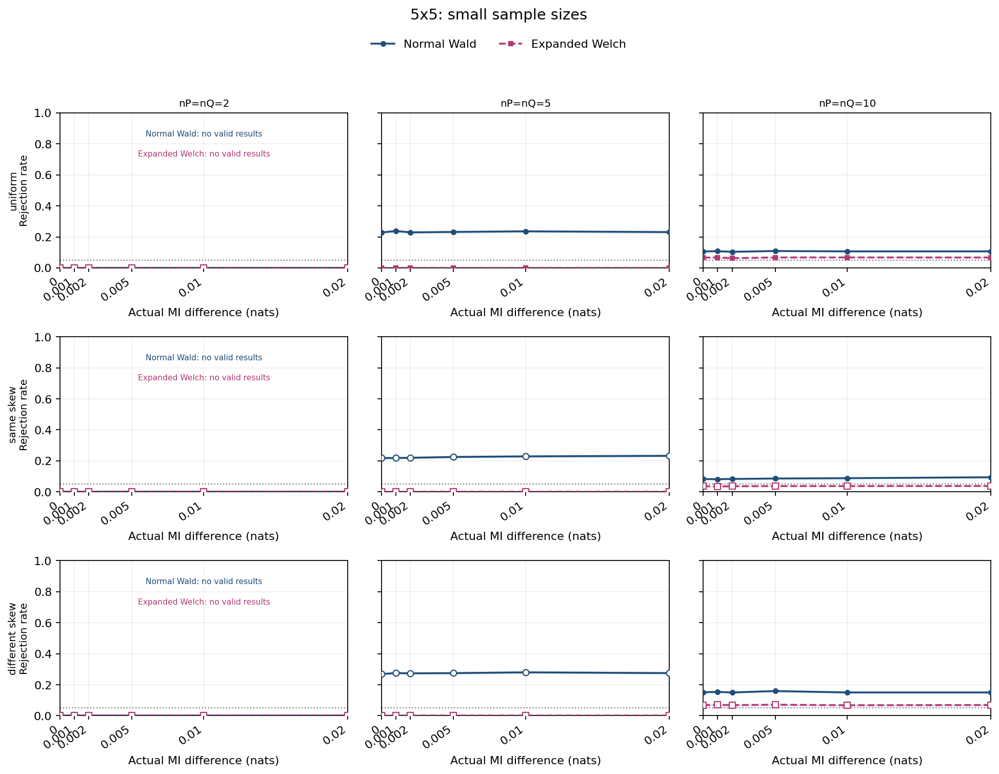

| Specification | Setting |
| --- | --- |
| Table size | 5x5 |
| Horizontal graph regime specifications (columns) | nP=nQ=2, nP=nQ=5, nP=nQ=10 |
| Vertical graph regime specifications (rows) | uniform: P row (0.2 repeated 5 times), P column (0.2 repeated 5 times); Q row (0.2 repeated 5 times), Q column (0.2 repeated 5 times); same skew: P row (0.8, 0.2/4 repeated 4 times), P column (0.8, 0.2/4 repeated 4 times); Q row (0.8, 0.2/4 repeated 4 times), Q column (0.8, 0.2/4 repeated 4 times); different skew: P row (0.7, 0.3/4 repeated 4 times), P column (0.7, 0.3/4 repeated 4 times); Q row (0.8, 0.2/4 repeated 4 times), Q column (0.8, 0.2/4 repeated 4 times) |
| Probability changes | uniform: add at (1,1),(2,2) and subtract at (1,2),(2,1), for both P and Q; same skew: add at (1,1),(2,2) and subtract at (1,2),(2,1), for both P and Q; different skew: add at (1,1),(2,2) and subtract at (1,2),(2,1), for both P and Q |
| MI settings | Baseline MI {0.02}; direction {q higher}; actual differences {0, 0.001, 0.002, 0.005, 0.01, 0.02} nats |
| Horizontal axis within each graph | Actual MI difference in nats, fixed from 0 to 0.02 |
| Vertical axis within each graph | Unconditional rejection rate from 0 to 1; invalid results count as non-rejections |
| Replicates | 20,000 per unique point |

Null-point rejection and validity:

| Vertical regime | Horizontal regime | x | Method | Rejection | Valid |
| --- | --- | --- | --- | --- | --- |
| uniform | nP=nQ=2 | 0 | Expanded Welch | 0.0000 | 0.0000 |
| uniform | nP=nQ=2 | 0 | Normal Wald | 0.0000 | 0.0000 |
| uniform | nP=nQ=5 | 0 | Expanded Welch | 0.0000 | 0.9909 |
| uniform | nP=nQ=5 | 0 | Normal Wald | 0.2287 | 1.0000 |
| uniform | nP=nQ=10 | 0 | Expanded Welch | 0.0665 | 0.9997 |
| uniform | nP=nQ=10 | 0 | Normal Wald | 0.1061 | 1.0000 |
| same skew | nP=nQ=2 | 0 | Expanded Welch | 0.0000 | 0.0000 |
| same skew | nP=nQ=2 | 0 | Normal Wald | 0.0000 | 0.0000 |
| same skew | nP=nQ=5 | 0 | Expanded Welch | 0.0000 | 0.2149 |
| same skew | nP=nQ=5 | 0 | Normal Wald | 0.2175 | 0.7137 |
| same skew | nP=nQ=10 | 0 | Expanded Welch | 0.0363 | 0.6756 |
| same skew | nP=nQ=10 | 0 | Normal Wald | 0.0825 | 0.9599 |
| different skew | nP=nQ=2 | 0 | Expanded Welch | 0.0000 | 0.0000 |
| different skew | nP=nQ=2 | 0 | Normal Wald | 0.0000 | 0.0000 |
| different skew | nP=nQ=5 | 0 | Expanded Welch | 0.0000 | 0.3270 |
| different skew | nP=nQ=5 | 0 | Normal Wald | 0.2690 | 0.8356 |
| different skew | nP=nQ=10 | 0 | Expanded Welch | 0.0693 | 0.7817 |
| different skew | nP=nQ=10 | 0 | Normal Wald | 0.1514 | 0.9889 |

Every plotted rate, interval, validity and minimum expected count

| Vertical regime | Horizontal regime | x | Method | Rejection | 95% interval | Valid | Conditional | Min expected P | Min expected Q |
| --- | --- | --- | --- | --- | --- | --- | --- | --- | --- |
| uniform | nP=nQ=2 | 0 | Expanded Welch | 0.0000 | [0.0000, 0.0002] | 0.0000 | NA | 0.04086 | 0.04086 |
| uniform | nP=nQ=2 | 0 | Normal Wald | 0.0000 | [0.0000, 0.0002] | 0.0000 | NA | 0.04086 | 0.04086 |
| uniform | nP=nQ=2 | 0.001 | Expanded Welch | 0.0000 | [0.0000, 0.0002] | 0.0000 | NA | 0.04086 | 0.03994 |
| uniform | nP=nQ=2 | 0.001 | Normal Wald | 0.0000 | [0.0000, 0.0002] | 0.0000 | NA | 0.04086 | 0.03994 |
| uniform | nP=nQ=2 | 0.002 | Expanded Welch | 0.0000 | [0.0000, 0.0002] | 0.0000 | NA | 0.04086 | 0.03904 |
| uniform | nP=nQ=2 | 0.002 | Normal Wald | 0.0000 | [0.0000, 0.0002] | 0.0000 | NA | 0.04086 | 0.03904 |
| uniform | nP=nQ=2 | 0.005 | Expanded Welch | 0.0000 | [0.0000, 0.0002] | 0.0000 | NA | 0.04086 | 0.03649 |
| uniform | nP=nQ=2 | 0.005 | Normal Wald | 0.0000 | [0.0000, 0.0002] | 0.0000 | NA | 0.04086 | 0.03649 |
| uniform | nP=nQ=2 | 0.01 | Expanded Welch | 0.0000 | [0.0000, 0.0002] | 0.0000 | NA | 0.04086 | 0.03261 |
| uniform | nP=nQ=2 | 0.01 | Normal Wald | 0.0000 | [0.0000, 0.0002] | 0.0000 | NA | 0.04086 | 0.03261 |
| uniform | nP=nQ=2 | 0.02 | Expanded Welch | 0.0000 | [0.0000, 0.0002] | 0.0000 | NA | 0.04086 | 0.02594 |
| uniform | nP=nQ=2 | 0.02 | Normal Wald | 0.0000 | [0.0000, 0.0002] | 0.0000 | NA | 0.04086 | 0.02594 |
| uniform | nP=nQ=5 | 0 | Expanded Welch | 0.0000 | [0.0000, 0.0002] | 0.9909 | 0.0000 | 0.1021 | 0.1021 |
| uniform | nP=nQ=5 | 0 | Normal Wald | 0.2287 | [0.2229, 0.2346] | 1.0000 | 0.2287 | 0.1021 | 0.1021 |
| uniform | nP=nQ=5 | 0.001 | Expanded Welch | 0.0000 | [0.0000, 0.0002] | 0.9903 | 0.0000 | 0.1021 | 0.09984 |
| uniform | nP=nQ=5 | 0.001 | Normal Wald | 0.2377 | [0.2318, 0.2436] | 1.0000 | 0.2377 | 0.1021 | 0.09984 |
| uniform | nP=nQ=5 | 0.002 | Expanded Welch | 0.0000 | [0.0000, 0.0002] | 0.9901 | 0.0000 | 0.1021 | 0.0976 |
| uniform | nP=nQ=5 | 0.002 | Normal Wald | 0.2291 | [0.2234, 0.2350] | 1.0000 | 0.2291 | 0.1021 | 0.0976 |
| uniform | nP=nQ=5 | 0.005 | Expanded Welch | 0.0000 | [0.0000, 0.0002] | 0.9925 | 0.0000 | 0.1021 | 0.09122 |
| uniform | nP=nQ=5 | 0.005 | Normal Wald | 0.2319 | [0.2261, 0.2378] | 1.0000 | 0.2319 | 0.1021 | 0.09122 |
| uniform | nP=nQ=5 | 0.01 | Expanded Welch | 0.0000 | [0.0000, 0.0002] | 0.9899 | 0.0000 | 0.1021 | 0.08153 |
| uniform | nP=nQ=5 | 0.01 | Normal Wald | 0.2359 | [0.2301, 0.2418] | 1.0000 | 0.2359 | 0.1021 | 0.08153 |
| uniform | nP=nQ=5 | 0.02 | Expanded Welch | 0.0000 | [0.0000, 0.0002] | 0.9899 | 0.0000 | 0.1021 | 0.06484 |
| uniform | nP=nQ=5 | 0.02 | Normal Wald | 0.2309 | [0.2251, 0.2368] | 1.0000 | 0.2309 | 0.1021 | 0.06484 |
| uniform | nP=nQ=10 | 0 | Expanded Welch | 0.0665 | [0.0632, 0.0701] | 0.9997 | 0.0666 | 0.2043 | 0.2043 |
| uniform | nP=nQ=10 | 0 | Normal Wald | 0.1061 | [0.1019, 0.1104] | 1.0000 | 0.1061 | 0.2043 | 0.2043 |
| uniform | nP=nQ=10 | 0.001 | Expanded Welch | 0.0674 | [0.0641, 0.0710] | 0.9994 | 0.0675 | 0.2043 | 0.1997 |
| uniform | nP=nQ=10 | 0.001 | Normal Wald | 0.1078 | [0.1036, 0.1122] | 1.0000 | 0.1078 | 0.2043 | 0.1997 |
| uniform | nP=nQ=10 | 0.002 | Expanded Welch | 0.0629 | [0.0596, 0.0663] | 0.9999 | 0.0629 | 0.2043 | 0.1952 |
| uniform | nP=nQ=10 | 0.002 | Normal Wald | 0.1038 | [0.0997, 0.1082] | 1.0000 | 0.1038 | 0.2043 | 0.1952 |
| uniform | nP=nQ=10 | 0.005 | Expanded Welch | 0.0673 | [0.0639, 0.0709] | 0.9996 | 0.0673 | 0.2043 | 0.1824 |
| uniform | nP=nQ=10 | 0.005 | Normal Wald | 0.1089 | [0.1047, 0.1133] | 1.0000 | 0.1089 | 0.2043 | 0.1824 |
| uniform | nP=nQ=10 | 0.01 | Expanded Welch | 0.0674 | [0.0641, 0.0710] | 0.9996 | 0.0675 | 0.2043 | 0.1631 |
| uniform | nP=nQ=10 | 0.01 | Normal Wald | 0.1066 | [0.1024, 0.1110] | 1.0000 | 0.1066 | 0.2043 | 0.1631 |
| uniform | nP=nQ=10 | 0.02 | Expanded Welch | 0.0670 | [0.0637, 0.0706] | 0.9996 | 0.0671 | 0.2043 | 0.1297 |
| uniform | nP=nQ=10 | 0.02 | Normal Wald | 0.1066 | [0.1024, 0.1110] | 1.0000 | 0.1066 | 0.2043 | 0.1297 |
| same skew | nP=nQ=2 | 0 | Expanded Welch | 0.0000 | [0.0000, 0.0002] | 0.0000 | NA | 0.005 | 0.005 |
| same skew | nP=nQ=2 | 0 | Normal Wald | 0.0000 | [0.0000, 0.0002] | 0.0000 | NA | 0.005 | 0.005 |
| same skew | nP=nQ=2 | 0.001 | Expanded Welch | 0.0000 | [0.0000, 0.0002] | 0.0000 | NA | 0.005 | 0.005 |
| same skew | nP=nQ=2 | 0.001 | Normal Wald | 0.0000 | [0.0000, 0.0002] | 0.0000 | NA | 0.005 | 0.005 |
| same skew | nP=nQ=2 | 0.002 | Expanded Welch | 0.0000 | [0.0000, 0.0002] | 0.0000 | NA | 0.005 | 0.005 |
| same skew | nP=nQ=2 | 0.002 | Normal Wald | 0.0000 | [0.0000, 0.0002] | 0.0000 | NA | 0.005 | 0.005 |
| same skew | nP=nQ=2 | 0.005 | Expanded Welch | 0.0000 | [0.0000, 0.0002] | 0.0000 | NA | 0.005 | 0.005 |
| same skew | nP=nQ=2 | 0.005 | Normal Wald | 0.0000 | [0.0000, 0.0002] | 0.0000 | NA | 0.005 | 0.005 |
| same skew | nP=nQ=2 | 0.01 | Expanded Welch | 0.0000 | [0.0000, 0.0002] | 0.0000 | NA | 0.005 | 0.005 |
| same skew | nP=nQ=2 | 0.01 | Normal Wald | 0.0000 | [0.0000, 0.0002] | 0.0000 | NA | 0.005 | 0.005 |
| same skew | nP=nQ=2 | 0.02 | Expanded Welch | 0.0000 | [0.0000, 0.0002] | 0.0000 | NA | 0.005 | 0.005 |
| same skew | nP=nQ=2 | 0.02 | Normal Wald | 0.0000 | [0.0000, 0.0002] | 0.0000 | NA | 0.005 | 0.005 |
| same skew | nP=nQ=5 | 0 | Expanded Welch | 0.0000 | [0.0000, 0.0002] | 0.2149 | 0.0000 | 0.0125 | 0.0125 |
| same skew | nP=nQ=5 | 0 | Normal Wald | 0.2175 | [0.2118, 0.2233] | 0.7137 | 0.3048 | 0.0125 | 0.0125 |
| same skew | nP=nQ=5 | 0.001 | Expanded Welch | 0.0000 | [0.0000, 0.0002] | 0.2172 | 0.0000 | 0.0125 | 0.0125 |
| same skew | nP=nQ=5 | 0.001 | Normal Wald | 0.2181 | [0.2124, 0.2239] | 0.7124 | 0.3062 | 0.0125 | 0.0125 |
| same skew | nP=nQ=5 | 0.002 | Expanded Welch | 0.0000 | [0.0000, 0.0002] | 0.2104 | 0.0000 | 0.0125 | 0.0125 |
| same skew | nP=nQ=5 | 0.002 | Normal Wald | 0.2195 | [0.2138, 0.2253] | 0.7109 | 0.3087 | 0.0125 | 0.0125 |
| same skew | nP=nQ=5 | 0.005 | Expanded Welch | 0.0000 | [0.0000, 0.0002] | 0.2149 | 0.0000 | 0.0125 | 0.0125 |
| same skew | nP=nQ=5 | 0.005 | Normal Wald | 0.2248 | [0.2191, 0.2306] | 0.7189 | 0.3127 | 0.0125 | 0.0125 |
| same skew | nP=nQ=5 | 0.01 | Expanded Welch | 0.0000 | [0.0000, 0.0002] | 0.2203 | 0.0000 | 0.0125 | 0.0125 |
| same skew | nP=nQ=5 | 0.01 | Normal Wald | 0.2286 | [0.2229, 0.2345] | 0.7113 | 0.3215 | 0.0125 | 0.0125 |
| same skew | nP=nQ=5 | 0.02 | Expanded Welch | 0.0000 | [0.0000, 0.0002] | 0.2204 | 0.0000 | 0.0125 | 0.0125 |
| same skew | nP=nQ=5 | 0.02 | Normal Wald | 0.2321 | [0.2264, 0.2381] | 0.7198 | 0.3225 | 0.0125 | 0.0125 |
| same skew | nP=nQ=10 | 0 | Expanded Welch | 0.0363 | [0.0338, 0.0390] | 0.6756 | 0.0537 | 0.025 | 0.025 |
| same skew | nP=nQ=10 | 0 | Normal Wald | 0.0825 | [0.0788, 0.0864] | 0.9599 | 0.0859 | 0.025 | 0.025 |
| same skew | nP=nQ=10 | 0.001 | Expanded Welch | 0.0340 | [0.0315, 0.0366] | 0.6688 | 0.0508 | 0.025 | 0.025 |
| same skew | nP=nQ=10 | 0.001 | Normal Wald | 0.0814 | [0.0776, 0.0852] | 0.9583 | 0.0849 | 0.025 | 0.025 |
| same skew | nP=nQ=10 | 0.002 | Expanded Welch | 0.0357 | [0.0332, 0.0384] | 0.6700 | 0.0533 | 0.025 | 0.025 |
| same skew | nP=nQ=10 | 0.002 | Normal Wald | 0.0831 | [0.0794, 0.0870] | 0.9597 | 0.0866 | 0.025 | 0.025 |
| same skew | nP=nQ=10 | 0.005 | Expanded Welch | 0.0369 | [0.0344, 0.0396] | 0.6641 | 0.0556 | 0.025 | 0.025 |
| same skew | nP=nQ=10 | 0.005 | Normal Wald | 0.0857 | [0.0819, 0.0897] | 0.9570 | 0.0896 | 0.025 | 0.025 |
| same skew | nP=nQ=10 | 0.01 | Expanded Welch | 0.0369 | [0.0344, 0.0397] | 0.6716 | 0.0550 | 0.025 | 0.025 |
| same skew | nP=nQ=10 | 0.01 | Normal Wald | 0.0879 | [0.0841, 0.0919] | 0.9607 | 0.0915 | 0.025 | 0.025 |
| same skew | nP=nQ=10 | 0.02 | Expanded Welch | 0.0377 | [0.0351, 0.0404] | 0.6643 | 0.0567 | 0.025 | 0.025 |
| same skew | nP=nQ=10 | 0.02 | Normal Wald | 0.0939 | [0.0899, 0.0980] | 0.9604 | 0.0977 | 0.025 | 0.025 |
| different skew | nP=nQ=2 | 0 | Expanded Welch | 0.0000 | [0.0000, 0.0002] | 0.0000 | NA | 0.01125 | 0.005 |
| different skew | nP=nQ=2 | 0 | Normal Wald | 0.0000 | [0.0000, 0.0002] | 0.0000 | NA | 0.01125 | 0.005 |
| different skew | nP=nQ=2 | 0.001 | Expanded Welch | 0.0000 | [0.0000, 0.0002] | 0.0000 | NA | 0.01125 | 0.005 |
| different skew | nP=nQ=2 | 0.001 | Normal Wald | 0.0000 | [0.0000, 0.0002] | 0.0000 | NA | 0.01125 | 0.005 |
| different skew | nP=nQ=2 | 0.002 | Expanded Welch | 0.0000 | [0.0000, 0.0002] | 0.0000 | NA | 0.01125 | 0.005 |
| different skew | nP=nQ=2 | 0.002 | Normal Wald | 0.0000 | [0.0000, 0.0002] | 0.0000 | NA | 0.01125 | 0.005 |
| different skew | nP=nQ=2 | 0.005 | Expanded Welch | 0.0000 | [0.0000, 0.0002] | 0.0000 | NA | 0.01125 | 0.005 |
| different skew | nP=nQ=2 | 0.005 | Normal Wald | 0.0000 | [0.0000, 0.0002] | 0.0000 | NA | 0.01125 | 0.005 |
| different skew | nP=nQ=2 | 0.01 | Expanded Welch | 0.0000 | [0.0000, 0.0002] | 0.0000 | NA | 0.01125 | 0.005 |
| different skew | nP=nQ=2 | 0.01 | Normal Wald | 0.0000 | [0.0000, 0.0002] | 0.0000 | NA | 0.01125 | 0.005 |
| different skew | nP=nQ=2 | 0.02 | Expanded Welch | 0.0000 | [0.0000, 0.0002] | 0.0000 | NA | 0.01125 | 0.005 |
| different skew | nP=nQ=2 | 0.02 | Normal Wald | 0.0000 | [0.0000, 0.0002] | 0.0000 | NA | 0.01125 | 0.005 |
| different skew | nP=nQ=5 | 0 | Expanded Welch | 0.0000 | [0.0000, 0.0002] | 0.3270 | 0.0000 | 0.02813 | 0.0125 |
| different skew | nP=nQ=5 | 0 | Normal Wald | 0.2690 | [0.2629, 0.2752] | 0.8356 | 0.3219 | 0.02813 | 0.0125 |
| different skew | nP=nQ=5 | 0.001 | Expanded Welch | 0.0000 | [0.0000, 0.0002] | 0.3236 | 0.0000 | 0.02813 | 0.0125 |
| different skew | nP=nQ=5 | 0.001 | Normal Wald | 0.2754 | [0.2693, 0.2817] | 0.8381 | 0.3286 | 0.02813 | 0.0125 |
| different skew | nP=nQ=5 | 0.002 | Expanded Welch | 0.0000 | [0.0000, 0.0002] | 0.3185 | 0.0000 | 0.02813 | 0.0125 |
| different skew | nP=nQ=5 | 0.002 | Normal Wald | 0.2735 | [0.2674, 0.2797] | 0.8359 | 0.3272 | 0.02813 | 0.0125 |
| different skew | nP=nQ=5 | 0.005 | Expanded Welch | 0.0000 | [0.0000, 0.0002] | 0.3207 | 0.0000 | 0.02813 | 0.0125 |
| different skew | nP=nQ=5 | 0.005 | Normal Wald | 0.2750 | [0.2688, 0.2812] | 0.8359 | 0.3289 | 0.02813 | 0.0125 |
| different skew | nP=nQ=5 | 0.01 | Expanded Welch | 0.0000 | [0.0000, 0.0002] | 0.3226 | 0.0000 | 0.02813 | 0.0125 |
| different skew | nP=nQ=5 | 0.01 | Normal Wald | 0.2799 | [0.2737, 0.2862] | 0.8387 | 0.3337 | 0.02813 | 0.0125 |
| different skew | nP=nQ=5 | 0.02 | Expanded Welch | 0.0000 | [0.0000, 0.0002] | 0.3246 | 0.0000 | 0.02813 | 0.0125 |
| different skew | nP=nQ=5 | 0.02 | Normal Wald | 0.2751 | [0.2689, 0.2813] | 0.8379 | 0.3282 | 0.02813 | 0.0125 |
| different skew | nP=nQ=10 | 0 | Expanded Welch | 0.0693 | [0.0659, 0.0729] | 0.7817 | 0.0886 | 0.05625 | 0.025 |
| different skew | nP=nQ=10 | 0 | Normal Wald | 0.1514 | [0.1465, 0.1564] | 0.9889 | 0.1531 | 0.05625 | 0.025 |
| different skew | nP=nQ=10 | 0.001 | Expanded Welch | 0.0703 | [0.0668, 0.0739] | 0.7824 | 0.0898 | 0.05625 | 0.025 |
| different skew | nP=nQ=10 | 0.001 | Normal Wald | 0.1538 | [0.1489, 0.1589] | 0.9885 | 0.1556 | 0.05625 | 0.025 |
| different skew | nP=nQ=10 | 0.002 | Expanded Welch | 0.0684 | [0.0650, 0.0720] | 0.7811 | 0.0876 | 0.05625 | 0.025 |
| different skew | nP=nQ=10 | 0.002 | Normal Wald | 0.1503 | [0.1454, 0.1553] | 0.9882 | 0.1521 | 0.05625 | 0.025 |
| different skew | nP=nQ=10 | 0.005 | Expanded Welch | 0.0712 | [0.0677, 0.0748] | 0.7772 | 0.0916 | 0.05625 | 0.025 |
| different skew | nP=nQ=10 | 0.005 | Normal Wald | 0.1593 | [0.1542, 0.1644] | 0.9898 | 0.1609 | 0.05625 | 0.025 |
| different skew | nP=nQ=10 | 0.01 | Expanded Welch | 0.0676 | [0.0642, 0.0712] | 0.7811 | 0.0866 | 0.05625 | 0.025 |
| different skew | nP=nQ=10 | 0.01 | Normal Wald | 0.1503 | [0.1454, 0.1553] | 0.9895 | 0.1519 | 0.05625 | 0.025 |
| different skew | nP=nQ=10 | 0.02 | Expanded Welch | 0.0693 | [0.0658, 0.0729] | 0.7809 | 0.0887 | 0.05625 | 0.025 |
| different skew | nP=nQ=10 | 0.02 | Normal Wald | 0.1503 | [0.1454, 0.1553] | 0.9885 | 0.1520 | 0.05625 | 0.025 |

### 3.8 5x5: moderate sample sizes

How do the methods behave as table size, marginal skew and sample size change?

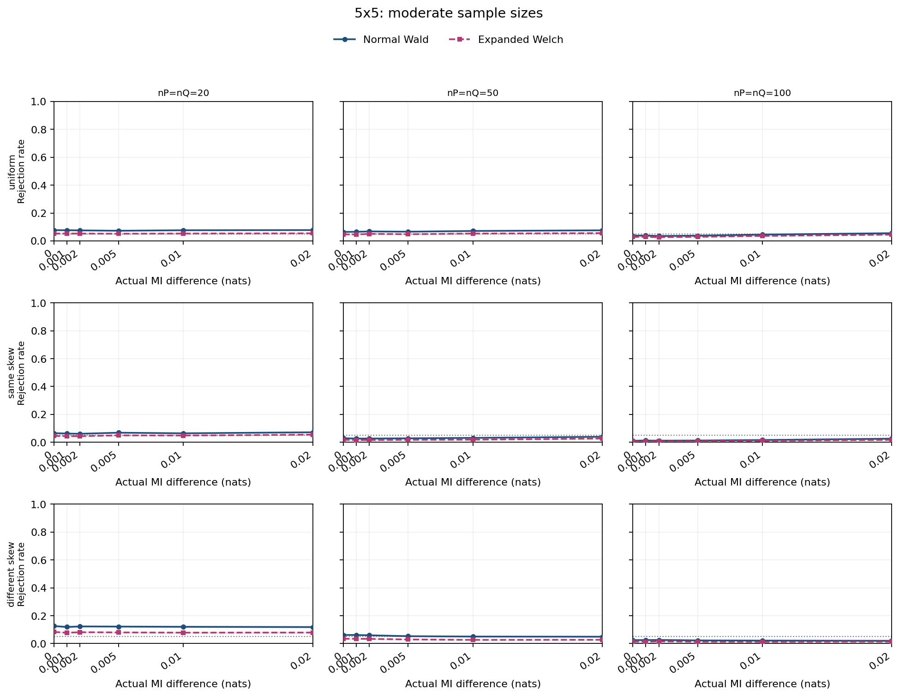

| Specification | Setting |
| --- | --- |
| Table size | 5x5 |
| Horizontal graph regime specifications (columns) | nP=nQ=20, nP=nQ=50, nP=nQ=100 |
| Vertical graph regime specifications (rows) | uniform: P row (0.2 repeated 5 times), P column (0.2 repeated 5 times); Q row (0.2 repeated 5 times), Q column (0.2 repeated 5 times); same skew: P row (0.8, 0.2/4 repeated 4 times), P column (0.8, 0.2/4 repeated 4 times); Q row (0.8, 0.2/4 repeated 4 times), Q column (0.8, 0.2/4 repeated 4 times); different skew: P row (0.7, 0.3/4 repeated 4 times), P column (0.7, 0.3/4 repeated 4 times); Q row (0.8, 0.2/4 repeated 4 times), Q column (0.8, 0.2/4 repeated 4 times) |
| Probability changes | uniform: add at (1,1),(2,2) and subtract at (1,2),(2,1), for both P and Q; same skew: add at (1,1),(2,2) and subtract at (1,2),(2,1), for both P and Q; different skew: add at (1,1),(2,2) and subtract at (1,2),(2,1), for both P and Q |
| MI settings | Baseline MI {0.02}; direction {q higher}; actual differences {0, 0.001, 0.002, 0.005, 0.01, 0.02} nats |
| Horizontal axis within each graph | Actual MI difference in nats, fixed from 0 to 0.02 |
| Vertical axis within each graph | Unconditional rejection rate from 0 to 1; invalid results count as non-rejections |
| Replicates | 20,000 per unique point |

Null-point rejection and validity:

| Vertical regime | Horizontal regime | x | Method | Rejection | Valid |
| --- | --- | --- | --- | --- | --- |
| uniform | nP=nQ=20 | 0 | Expanded Welch | 0.0528 | 1.0000 |
| uniform | nP=nQ=20 | 0 | Normal Wald | 0.0768 | 1.0000 |
| uniform | nP=nQ=50 | 0 | Expanded Welch | 0.0467 | 1.0000 |
| uniform | nP=nQ=50 | 0 | Normal Wald | 0.0643 | 1.0000 |
| uniform | nP=nQ=100 | 0 | Expanded Welch | 0.0289 | 1.0000 |
| uniform | nP=nQ=100 | 0 | Normal Wald | 0.0377 | 1.0000 |
| same skew | nP=nQ=20 | 0 | Expanded Welch | 0.0454 | 0.9553 |
| same skew | nP=nQ=20 | 0 | Normal Wald | 0.0651 | 0.9996 |
| same skew | nP=nQ=50 | 0 | Expanded Welch | 0.0178 | 1.0000 |
| same skew | nP=nQ=50 | 0 | Normal Wald | 0.0290 | 1.0000 |
| same skew | nP=nQ=100 | 0 | Expanded Welch | 0.0066 | 1.0000 |
| same skew | nP=nQ=100 | 0 | Normal Wald | 0.0112 | 1.0000 |
| different skew | nP=nQ=20 | 0 | Expanded Welch | 0.0839 | 0.9785 |
| different skew | nP=nQ=20 | 0 | Normal Wald | 0.1259 | 1.0000 |
| different skew | nP=nQ=50 | 0 | Expanded Welch | 0.0348 | 1.0000 |
| different skew | nP=nQ=50 | 0 | Normal Wald | 0.0623 | 1.0000 |
| different skew | nP=nQ=100 | 0 | Expanded Welch | 0.0136 | 1.0000 |
| different skew | nP=nQ=100 | 0 | Normal Wald | 0.0250 | 1.0000 |

Every plotted rate, interval, validity and minimum expected count

| Vertical regime | Horizontal regime | x | Method | Rejection | 95% interval | Valid | Conditional | Min expected P | Min expected Q |
| --- | --- | --- | --- | --- | --- | --- | --- | --- | --- |
| uniform | nP=nQ=20 | 0 | Expanded Welch | 0.0528 | [0.0498, 0.0560] | 1.0000 | 0.0528 | 0.4086 | 0.4086 |
| uniform | nP=nQ=20 | 0 | Normal Wald | 0.0768 | [0.0732, 0.0806] | 1.0000 | 0.0768 | 0.4086 | 0.4086 |
| uniform | nP=nQ=20 | 0.001 | Expanded Welch | 0.0526 | [0.0496, 0.0558] | 1.0000 | 0.0526 | 0.4086 | 0.3994 |
| uniform | nP=nQ=20 | 0.001 | Normal Wald | 0.0767 | [0.0731, 0.0805] | 1.0000 | 0.0767 | 0.4086 | 0.3994 |
| uniform | nP=nQ=20 | 0.002 | Expanded Welch | 0.0524 | [0.0494, 0.0556] | 1.0000 | 0.0524 | 0.4086 | 0.3904 |
| uniform | nP=nQ=20 | 0.002 | Normal Wald | 0.0753 | [0.0717, 0.0790] | 1.0000 | 0.0753 | 0.4086 | 0.3904 |
| uniform | nP=nQ=20 | 0.005 | Expanded Welch | 0.0515 | [0.0485, 0.0546] | 1.0000 | 0.0515 | 0.4086 | 0.3649 |
| uniform | nP=nQ=20 | 0.005 | Normal Wald | 0.0729 | [0.0694, 0.0766] | 1.0000 | 0.0729 | 0.4086 | 0.3649 |
| uniform | nP=nQ=20 | 0.01 | Expanded Welch | 0.0526 | [0.0496, 0.0558] | 1.0000 | 0.0526 | 0.4086 | 0.3261 |
| uniform | nP=nQ=20 | 0.01 | Normal Wald | 0.0764 | [0.0728, 0.0801] | 1.0000 | 0.0764 | 0.4086 | 0.3261 |
| uniform | nP=nQ=20 | 0.02 | Expanded Welch | 0.0544 | [0.0513, 0.0576] | 1.0000 | 0.0544 | 0.4086 | 0.2594 |
| uniform | nP=nQ=20 | 0.02 | Normal Wald | 0.0776 | [0.0740, 0.0814] | 1.0000 | 0.0776 | 0.4086 | 0.2594 |
| uniform | nP=nQ=50 | 0 | Expanded Welch | 0.0467 | [0.0439, 0.0497] | 1.0000 | 0.0467 | 1.021 | 1.021 |
| uniform | nP=nQ=50 | 0 | Normal Wald | 0.0643 | [0.0609, 0.0677] | 1.0000 | 0.0643 | 1.021 | 1.021 |
| uniform | nP=nQ=50 | 0.001 | Expanded Welch | 0.0459 | [0.0431, 0.0489] | 1.0000 | 0.0459 | 1.021 | 0.9984 |
| uniform | nP=nQ=50 | 0.001 | Normal Wald | 0.0653 | [0.0620, 0.0688] | 1.0000 | 0.0653 | 1.021 | 0.9984 |
| uniform | nP=nQ=50 | 0.002 | Expanded Welch | 0.0506 | [0.0476, 0.0537] | 1.0000 | 0.0506 | 1.021 | 0.976 |
| uniform | nP=nQ=50 | 0.002 | Normal Wald | 0.0679 | [0.0645, 0.0715] | 1.0000 | 0.0679 | 1.021 | 0.976 |
| uniform | nP=nQ=50 | 0.005 | Expanded Welch | 0.0479 | [0.0450, 0.0509] | 1.0000 | 0.0479 | 1.021 | 0.9122 |
| uniform | nP=nQ=50 | 0.005 | Normal Wald | 0.0661 | [0.0627, 0.0696] | 1.0000 | 0.0661 | 1.021 | 0.9122 |
| uniform | nP=nQ=50 | 0.01 | Expanded Welch | 0.0525 | [0.0495, 0.0557] | 1.0000 | 0.0525 | 1.021 | 0.8153 |
| uniform | nP=nQ=50 | 0.01 | Normal Wald | 0.0712 | [0.0677, 0.0748] | 1.0000 | 0.0712 | 1.021 | 0.8153 |
| uniform | nP=nQ=50 | 0.02 | Expanded Welch | 0.0558 | [0.0527, 0.0590] | 1.0000 | 0.0558 | 1.021 | 0.6484 |
| uniform | nP=nQ=50 | 0.02 | Normal Wald | 0.0759 | [0.0723, 0.0796] | 1.0000 | 0.0759 | 1.021 | 0.6484 |
| uniform | nP=nQ=100 | 0 | Expanded Welch | 0.0289 | [0.0267, 0.0313] | 1.0000 | 0.0289 | 2.043 | 2.043 |
| uniform | nP=nQ=100 | 0 | Normal Wald | 0.0377 | [0.0351, 0.0404] | 1.0000 | 0.0377 | 2.043 | 2.043 |
| uniform | nP=nQ=100 | 0.001 | Expanded Welch | 0.0290 | [0.0268, 0.0315] | 1.0000 | 0.0290 | 2.043 | 1.997 |
| uniform | nP=nQ=100 | 0.001 | Normal Wald | 0.0383 | [0.0357, 0.0410] | 1.0000 | 0.0383 | 2.043 | 1.997 |
| uniform | nP=nQ=100 | 0.002 | Expanded Welch | 0.0266 | [0.0244, 0.0289] | 1.0000 | 0.0266 | 2.043 | 1.952 |
| uniform | nP=nQ=100 | 0.002 | Normal Wald | 0.0350 | [0.0325, 0.0376] | 1.0000 | 0.0350 | 2.043 | 1.952 |
| uniform | nP=nQ=100 | 0.005 | Expanded Welch | 0.0291 | [0.0269, 0.0316] | 1.0000 | 0.0291 | 2.043 | 1.824 |
| uniform | nP=nQ=100 | 0.005 | Normal Wald | 0.0375 | [0.0350, 0.0402] | 1.0000 | 0.0375 | 2.043 | 1.824 |
| uniform | nP=nQ=100 | 0.01 | Expanded Welch | 0.0355 | [0.0330, 0.0382] | 1.0000 | 0.0355 | 2.043 | 1.631 |
| uniform | nP=nQ=100 | 0.01 | Normal Wald | 0.0454 | [0.0426, 0.0484] | 1.0000 | 0.0454 | 2.043 | 1.631 |
| uniform | nP=nQ=100 | 0.02 | Expanded Welch | 0.0450 | [0.0423, 0.0480] | 1.0000 | 0.0450 | 2.043 | 1.297 |
| uniform | nP=nQ=100 | 0.02 | Normal Wald | 0.0553 | [0.0522, 0.0586] | 1.0000 | 0.0553 | 2.043 | 1.297 |
| same skew | nP=nQ=20 | 0 | Expanded Welch | 0.0454 | [0.0426, 0.0483] | 0.9553 | 0.0475 | 0.05 | 0.05 |
| same skew | nP=nQ=20 | 0 | Normal Wald | 0.0651 | [0.0618, 0.0687] | 0.9996 | 0.0652 | 0.05 | 0.05 |
| same skew | nP=nQ=20 | 0.001 | Expanded Welch | 0.0439 | [0.0411, 0.0468] | 0.9562 | 0.0459 | 0.05 | 0.05 |
| same skew | nP=nQ=20 | 0.001 | Normal Wald | 0.0625 | [0.0592, 0.0659] | 0.9997 | 0.0625 | 0.05 | 0.05 |
| same skew | nP=nQ=20 | 0.002 | Expanded Welch | 0.0435 | [0.0408, 0.0465] | 0.9553 | 0.0456 | 0.05 | 0.05 |
| same skew | nP=nQ=20 | 0.002 | Normal Wald | 0.0609 | [0.0576, 0.0642] | 0.9990 | 0.0609 | 0.05 | 0.05 |
| same skew | nP=nQ=20 | 0.005 | Expanded Welch | 0.0493 | [0.0464, 0.0524] | 0.9589 | 0.0515 | 0.05 | 0.05 |
| same skew | nP=nQ=20 | 0.005 | Normal Wald | 0.0685 | [0.0651, 0.0721] | 0.9991 | 0.0686 | 0.05 | 0.05 |
| same skew | nP=nQ=20 | 0.01 | Expanded Welch | 0.0483 | [0.0454, 0.0514] | 0.9574 | 0.0504 | 0.05 | 0.05 |
| same skew | nP=nQ=20 | 0.01 | Normal Wald | 0.0643 | [0.0609, 0.0677] | 0.9997 | 0.0643 | 0.05 | 0.05 |
| same skew | nP=nQ=20 | 0.02 | Expanded Welch | 0.0544 | [0.0513, 0.0576] | 0.9554 | 0.0569 | 0.05 | 0.05 |
| same skew | nP=nQ=20 | 0.02 | Normal Wald | 0.0716 | [0.0681, 0.0753] | 0.9992 | 0.0717 | 0.05 | 0.05 |
| same skew | nP=nQ=50 | 0 | Expanded Welch | 0.0178 | [0.0161, 0.0197] | 1.0000 | 0.0178 | 0.125 | 0.125 |
| same skew | nP=nQ=50 | 0 | Normal Wald | 0.0290 | [0.0267, 0.0314] | 1.0000 | 0.0290 | 0.125 | 0.125 |
| same skew | nP=nQ=50 | 0.001 | Expanded Welch | 0.0154 | [0.0137, 0.0171] | 1.0000 | 0.0154 | 0.125 | 0.125 |
| same skew | nP=nQ=50 | 0.001 | Normal Wald | 0.0263 | [0.0242, 0.0287] | 1.0000 | 0.0263 | 0.125 | 0.125 |
| same skew | nP=nQ=50 | 0.002 | Expanded Welch | 0.0160 | [0.0144, 0.0178] | 1.0000 | 0.0160 | 0.125 | 0.125 |
| same skew | nP=nQ=50 | 0.002 | Normal Wald | 0.0266 | [0.0245, 0.0289] | 1.0000 | 0.0266 | 0.125 | 0.125 |
| same skew | nP=nQ=50 | 0.005 | Expanded Welch | 0.0175 | [0.0157, 0.0194] | 1.0000 | 0.0175 | 0.125 | 0.125 |
| same skew | nP=nQ=50 | 0.005 | Normal Wald | 0.0283 | [0.0260, 0.0306] | 1.0000 | 0.0283 | 0.125 | 0.125 |
| same skew | nP=nQ=50 | 0.01 | Expanded Welch | 0.0184 | [0.0166, 0.0203] | 1.0000 | 0.0184 | 0.125 | 0.125 |
| same skew | nP=nQ=50 | 0.01 | Normal Wald | 0.0314 | [0.0290, 0.0339] | 1.0000 | 0.0314 | 0.125 | 0.125 |
| same skew | nP=nQ=50 | 0.02 | Expanded Welch | 0.0265 | [0.0243, 0.0288] | 0.9999 | 0.0265 | 0.125 | 0.125 |
| same skew | nP=nQ=50 | 0.02 | Normal Wald | 0.0393 | [0.0366, 0.0420] | 1.0000 | 0.0393 | 0.125 | 0.125 |
| same skew | nP=nQ=100 | 0 | Expanded Welch | 0.0066 | [0.0056, 0.0078] | 1.0000 | 0.0066 | 0.25 | 0.25 |
| same skew | nP=nQ=100 | 0 | Normal Wald | 0.0112 | [0.0098, 0.0127] | 1.0000 | 0.0112 | 0.25 | 0.25 |
| same skew | nP=nQ=100 | 0.001 | Expanded Welch | 0.0072 | [0.0061, 0.0084] | 1.0000 | 0.0072 | 0.25 | 0.25 |
| same skew | nP=nQ=100 | 0.001 | Normal Wald | 0.0126 | [0.0111, 0.0142] | 1.0000 | 0.0126 | 0.25 | 0.25 |
| same skew | nP=nQ=100 | 0.002 | Expanded Welch | 0.0067 | [0.0057, 0.0080] | 1.0000 | 0.0067 | 0.25 | 0.25 |
| same skew | nP=nQ=100 | 0.002 | Normal Wald | 0.0116 | [0.0102, 0.0132] | 1.0000 | 0.0116 | 0.25 | 0.25 |
| same skew | nP=nQ=100 | 0.005 | Expanded Welch | 0.0073 | [0.0063, 0.0086] | 1.0000 | 0.0073 | 0.25 | 0.25 |
| same skew | nP=nQ=100 | 0.005 | Normal Wald | 0.0124 | [0.0110, 0.0140] | 1.0000 | 0.0124 | 0.25 | 0.25 |
| same skew | nP=nQ=100 | 0.01 | Expanded Welch | 0.0098 | [0.0085, 0.0113] | 1.0000 | 0.0098 | 0.25 | 0.25 |
| same skew | nP=nQ=100 | 0.01 | Normal Wald | 0.0160 | [0.0144, 0.0179] | 1.0000 | 0.0160 | 0.25 | 0.25 |
| same skew | nP=nQ=100 | 0.02 | Expanded Welch | 0.0173 | [0.0156, 0.0192] | 1.0000 | 0.0173 | 0.25 | 0.25 |
| same skew | nP=nQ=100 | 0.02 | Normal Wald | 0.0257 | [0.0236, 0.0280] | 1.0000 | 0.0257 | 0.25 | 0.25 |
| different skew | nP=nQ=20 | 0 | Expanded Welch | 0.0839 | [0.0802, 0.0879] | 0.9785 | 0.0858 | 0.1125 | 0.05 |
| different skew | nP=nQ=20 | 0 | Normal Wald | 0.1259 | [0.1214, 0.1306] | 1.0000 | 0.1259 | 0.1125 | 0.05 |
| different skew | nP=nQ=20 | 0.001 | Expanded Welch | 0.0779 | [0.0743, 0.0817] | 0.9757 | 0.0798 | 0.1125 | 0.05 |
| different skew | nP=nQ=20 | 0.001 | Normal Wald | 0.1192 | [0.1148, 0.1238] | 1.0000 | 0.1193 | 0.1125 | 0.05 |
| different skew | nP=nQ=20 | 0.002 | Expanded Welch | 0.0817 | [0.0779, 0.0855] | 0.9756 | 0.0837 | 0.1125 | 0.05 |
| different skew | nP=nQ=20 | 0.002 | Normal Wald | 0.1232 | [0.1187, 0.1278] | 1.0000 | 0.1232 | 0.1125 | 0.05 |
| different skew | nP=nQ=20 | 0.005 | Expanded Welch | 0.0801 | [0.0764, 0.0839] | 0.9763 | 0.0820 | 0.1125 | 0.05 |
| different skew | nP=nQ=20 | 0.005 | Normal Wald | 0.1222 | [0.1177, 0.1268] | 0.9999 | 0.1222 | 0.1125 | 0.05 |
| different skew | nP=nQ=20 | 0.01 | Expanded Welch | 0.0787 | [0.0750, 0.0825] | 0.9779 | 0.0805 | 0.1125 | 0.05 |
| different skew | nP=nQ=20 | 0.01 | Normal Wald | 0.1205 | [0.1161, 0.1251] | 1.0000 | 0.1205 | 0.1125 | 0.05 |
| different skew | nP=nQ=20 | 0.02 | Expanded Welch | 0.0793 | [0.0756, 0.0831] | 0.9772 | 0.0812 | 0.1125 | 0.05 |
| different skew | nP=nQ=20 | 0.02 | Normal Wald | 0.1187 | [0.1143, 0.1233] | 0.9999 | 0.1187 | 0.1125 | 0.05 |
| different skew | nP=nQ=50 | 0 | Expanded Welch | 0.0348 | [0.0323, 0.0374] | 1.0000 | 0.0348 | 0.2812 | 0.125 |
| different skew | nP=nQ=50 | 0 | Normal Wald | 0.0623 | [0.0590, 0.0657] | 1.0000 | 0.0623 | 0.2812 | 0.125 |
| different skew | nP=nQ=50 | 0.001 | Expanded Welch | 0.0348 | [0.0323, 0.0374] | 1.0000 | 0.0348 | 0.2812 | 0.125 |
| different skew | nP=nQ=50 | 0.001 | Normal Wald | 0.0616 | [0.0584, 0.0650] | 1.0000 | 0.0616 | 0.2812 | 0.125 |
| different skew | nP=nQ=50 | 0.002 | Expanded Welch | 0.0338 | [0.0314, 0.0364] | 0.9999 | 0.0339 | 0.2812 | 0.125 |
| different skew | nP=nQ=50 | 0.002 | Normal Wald | 0.0599 | [0.0566, 0.0632] | 1.0000 | 0.0599 | 0.2812 | 0.125 |
| different skew | nP=nQ=50 | 0.005 | Expanded Welch | 0.0298 | [0.0275, 0.0322] | 1.0000 | 0.0298 | 0.2812 | 0.125 |
| different skew | nP=nQ=50 | 0.005 | Normal Wald | 0.0532 | [0.0502, 0.0564] | 1.0000 | 0.0532 | 0.2812 | 0.125 |
| different skew | nP=nQ=50 | 0.01 | Expanded Welch | 0.0267 | [0.0245, 0.0290] | 1.0000 | 0.0267 | 0.2812 | 0.125 |
| different skew | nP=nQ=50 | 0.01 | Normal Wald | 0.0506 | [0.0476, 0.0537] | 1.0000 | 0.0506 | 0.2812 | 0.125 |
| different skew | nP=nQ=50 | 0.02 | Expanded Welch | 0.0273 | [0.0252, 0.0297] | 1.0000 | 0.0274 | 0.2812 | 0.125 |
| different skew | nP=nQ=50 | 0.02 | Normal Wald | 0.0495 | [0.0465, 0.0525] | 1.0000 | 0.0495 | 0.2812 | 0.125 |
| different skew | nP=nQ=100 | 0 | Expanded Welch | 0.0136 | [0.0121, 0.0153] | 1.0000 | 0.0136 | 0.5625 | 0.25 |
| different skew | nP=nQ=100 | 0 | Normal Wald | 0.0250 | [0.0229, 0.0273] | 1.0000 | 0.0250 | 0.5625 | 0.25 |
| different skew | nP=nQ=100 | 0.001 | Expanded Welch | 0.0129 | [0.0114, 0.0145] | 1.0000 | 0.0129 | 0.5625 | 0.25 |
| different skew | nP=nQ=100 | 0.001 | Normal Wald | 0.0253 | [0.0232, 0.0276] | 1.0000 | 0.0253 | 0.5625 | 0.25 |
| different skew | nP=nQ=100 | 0.002 | Expanded Welch | 0.0158 | [0.0142, 0.0177] | 1.0000 | 0.0158 | 0.5625 | 0.25 |
| different skew | nP=nQ=100 | 0.002 | Normal Wald | 0.0262 | [0.0241, 0.0285] | 1.0000 | 0.0262 | 0.5625 | 0.25 |
| different skew | nP=nQ=100 | 0.005 | Expanded Welch | 0.0131 | [0.0116, 0.0148] | 1.0000 | 0.0131 | 0.5625 | 0.25 |
| different skew | nP=nQ=100 | 0.005 | Normal Wald | 0.0231 | [0.0211, 0.0252] | 1.0000 | 0.0231 | 0.5625 | 0.25 |
| different skew | nP=nQ=100 | 0.01 | Expanded Welch | 0.0124 | [0.0110, 0.0140] | 1.0000 | 0.0124 | 0.5625 | 0.25 |
| different skew | nP=nQ=100 | 0.01 | Normal Wald | 0.0217 | [0.0198, 0.0238] | 1.0000 | 0.0217 | 0.5625 | 0.25 |
| different skew | nP=nQ=100 | 0.02 | Expanded Welch | 0.0137 | [0.0121, 0.0154] | 1.0000 | 0.0137 | 0.5625 | 0.25 |
| different skew | nP=nQ=100 | 0.02 | Normal Wald | 0.0202 | [0.0183, 0.0222] | 1.0000 | 0.0202 | 0.5625 | 0.25 |

### 3.9 5x5: large sample sizes

How do the methods behave as table size, marginal skew and sample size change?

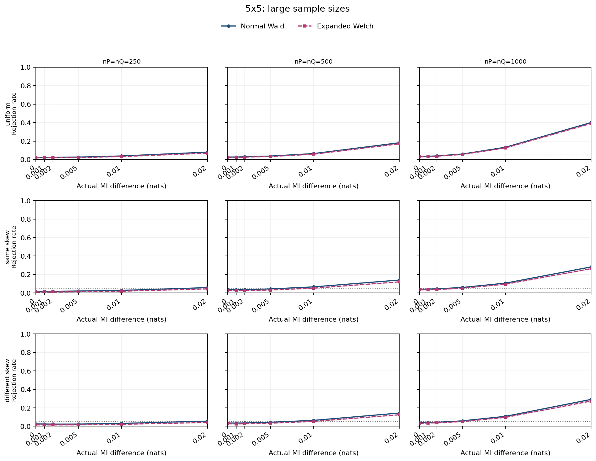

| Specification | Setting |
| --- | --- |
| Table size | 5x5 |
| Horizontal graph regime specifications (columns) | nP=nQ=250, nP=nQ=500, nP=nQ=1000 |
| Vertical graph regime specifications (rows) | uniform: P row (0.2 repeated 5 times), P column (0.2 repeated 5 times); Q row (0.2 repeated 5 times), Q column (0.2 repeated 5 times); same skew: P row (0.8, 0.2/4 repeated 4 times), P column (0.8, 0.2/4 repeated 4 times); Q row (0.8, 0.2/4 repeated 4 times), Q column (0.8, 0.2/4 repeated 4 times); different skew: P row (0.7, 0.3/4 repeated 4 times), P column (0.7, 0.3/4 repeated 4 times); Q row (0.8, 0.2/4 repeated 4 times), Q column (0.8, 0.2/4 repeated 4 times) |
| Probability changes | uniform: add at (1,1),(2,2) and subtract at (1,2),(2,1), for both P and Q; same skew: add at (1,1),(2,2) and subtract at (1,2),(2,1), for both P and Q; different skew: add at (1,1),(2,2) and subtract at (1,2),(2,1), for both P and Q |
| MI settings | Baseline MI {0.02}; direction {q higher}; actual differences {0, 0.001, 0.002, 0.005, 0.01, 0.02} nats |
| Horizontal axis within each graph | Actual MI difference in nats, fixed from 0 to 0.02 |
| Vertical axis within each graph | Unconditional rejection rate from 0 to 1; invalid results count as non-rejections |
| Replicates | 20,000 per unique point |

Null-point rejection and validity:

| Vertical regime | Horizontal regime | x | Method | Rejection | Valid |
| --- | --- | --- | --- | --- | --- |
| uniform | nP=nQ=250 | 0 | Expanded Welch | 0.0190 | 1.0000 |
| uniform | nP=nQ=250 | 0 | Normal Wald | 0.0232 | 1.0000 |
| uniform | nP=nQ=500 | 0 | Expanded Welch | 0.0240 | 1.0000 |
| uniform | nP=nQ=500 | 0 | Normal Wald | 0.0276 | 1.0000 |
| uniform | nP=nQ=1000 | 0 | Expanded Welch | 0.0296 | 1.0000 |
| uniform | nP=nQ=1000 | 0 | Normal Wald | 0.0326 | 1.0000 |
| same skew | nP=nQ=250 | 0 | Expanded Welch | 0.0094 | 1.0000 |
| same skew | nP=nQ=250 | 0 | Normal Wald | 0.0152 | 1.0000 |
| same skew | nP=nQ=500 | 0 | Expanded Welch | 0.0260 | 1.0000 |
| same skew | nP=nQ=500 | 0 | Normal Wald | 0.0369 | 1.0000 |
| same skew | nP=nQ=1000 | 0 | Expanded Welch | 0.0329 | 1.0000 |
| same skew | nP=nQ=1000 | 0 | Normal Wald | 0.0403 | 1.0000 |
| different skew | nP=nQ=250 | 0 | Expanded Welch | 0.0162 | 1.0000 |
| different skew | nP=nQ=250 | 0 | Normal Wald | 0.0254 | 1.0000 |
| different skew | nP=nQ=500 | 0 | Expanded Welch | 0.0268 | 1.0000 |
| different skew | nP=nQ=500 | 0 | Normal Wald | 0.0360 | 1.0000 |
| different skew | nP=nQ=1000 | 0 | Expanded Welch | 0.0319 | 1.0000 |
| different skew | nP=nQ=1000 | 0 | Normal Wald | 0.0386 | 1.0000 |

Every plotted rate, interval, validity and minimum expected count

| Vertical regime | Horizontal regime | x | Method | Rejection | 95% interval | Valid | Conditional | Min expected P | Min expected Q |
| --- | --- | --- | --- | --- | --- | --- | --- | --- | --- |
| uniform | nP=nQ=250 | 0 | Expanded Welch | 0.0190 | [0.0172, 0.0209] | 1.0000 | 0.0190 | 5.107 | 5.107 |
| uniform | nP=nQ=250 | 0 | Normal Wald | 0.0232 | [0.0212, 0.0254] | 1.0000 | 0.0232 | 5.107 | 5.107 |
| uniform | nP=nQ=250 | 0.001 | Expanded Welch | 0.0186 | [0.0168, 0.0205] | 1.0000 | 0.0186 | 5.107 | 4.992 |
| uniform | nP=nQ=250 | 0.001 | Normal Wald | 0.0234 | [0.0214, 0.0256] | 1.0000 | 0.0234 | 5.107 | 4.992 |
| uniform | nP=nQ=250 | 0.002 | Expanded Welch | 0.0194 | [0.0176, 0.0214] | 1.0000 | 0.0194 | 5.107 | 4.88 |
| uniform | nP=nQ=250 | 0.002 | Normal Wald | 0.0239 | [0.0219, 0.0262] | 1.0000 | 0.0239 | 5.107 | 4.88 |
| uniform | nP=nQ=250 | 0.005 | Expanded Welch | 0.0220 | [0.0200, 0.0241] | 1.0000 | 0.0220 | 5.107 | 4.561 |
| uniform | nP=nQ=250 | 0.005 | Normal Wald | 0.0270 | [0.0248, 0.0293] | 1.0000 | 0.0270 | 5.107 | 4.561 |
| uniform | nP=nQ=250 | 0.01 | Expanded Welch | 0.0323 | [0.0300, 0.0349] | 1.0000 | 0.0323 | 5.107 | 4.076 |
| uniform | nP=nQ=250 | 0.01 | Normal Wald | 0.0390 | [0.0364, 0.0418] | 1.0000 | 0.0390 | 5.107 | 4.076 |
| uniform | nP=nQ=250 | 0.02 | Expanded Welch | 0.0696 | [0.0661, 0.0732] | 1.0000 | 0.0696 | 5.107 | 3.242 |
| uniform | nP=nQ=250 | 0.02 | Normal Wald | 0.0804 | [0.0768, 0.0843] | 1.0000 | 0.0804 | 5.107 | 3.242 |
| uniform | nP=nQ=500 | 0 | Expanded Welch | 0.0240 | [0.0220, 0.0262] | 1.0000 | 0.0240 | 10.21 | 10.21 |
| uniform | nP=nQ=500 | 0 | Normal Wald | 0.0276 | [0.0254, 0.0299] | 1.0000 | 0.0276 | 10.21 | 10.21 |
| uniform | nP=nQ=500 | 0.001 | Expanded Welch | 0.0235 | [0.0215, 0.0257] | 1.0000 | 0.0235 | 10.21 | 9.984 |
| uniform | nP=nQ=500 | 0.001 | Normal Wald | 0.0274 | [0.0253, 0.0298] | 1.0000 | 0.0274 | 10.21 | 9.984 |
| uniform | nP=nQ=500 | 0.002 | Expanded Welch | 0.0264 | [0.0243, 0.0287] | 1.0000 | 0.0264 | 10.21 | 9.76 |
| uniform | nP=nQ=500 | 0.002 | Normal Wald | 0.0307 | [0.0284, 0.0332] | 1.0000 | 0.0307 | 10.21 | 9.76 |
| uniform | nP=nQ=500 | 0.005 | Expanded Welch | 0.0330 | [0.0306, 0.0356] | 1.0000 | 0.0330 | 10.21 | 9.122 |
| uniform | nP=nQ=500 | 0.005 | Normal Wald | 0.0377 | [0.0352, 0.0405] | 1.0000 | 0.0377 | 10.21 | 9.122 |
| uniform | nP=nQ=500 | 0.01 | Expanded Welch | 0.0580 | [0.0549, 0.0614] | 1.0000 | 0.0580 | 10.21 | 8.153 |
| uniform | nP=nQ=500 | 0.01 | Normal Wald | 0.0648 | [0.0614, 0.0682] | 1.0000 | 0.0648 | 10.21 | 8.153 |
| uniform | nP=nQ=500 | 0.02 | Expanded Welch | 0.1707 | [0.1655, 0.1760] | 1.0000 | 0.1707 | 10.21 | 6.484 |
| uniform | nP=nQ=500 | 0.02 | Normal Wald | 0.1820 | [0.1767, 0.1874] | 1.0000 | 0.1820 | 10.21 | 6.484 |
| uniform | nP=nQ=1000 | 0 | Expanded Welch | 0.0296 | [0.0273, 0.0320] | 1.0000 | 0.0296 | 20.43 | 20.43 |
| uniform | nP=nQ=1000 | 0 | Normal Wald | 0.0326 | [0.0302, 0.0351] | 1.0000 | 0.0326 | 20.43 | 20.43 |
| uniform | nP=nQ=1000 | 0.001 | Expanded Welch | 0.0319 | [0.0296, 0.0344] | 1.0000 | 0.0319 | 20.43 | 19.97 |
| uniform | nP=nQ=1000 | 0.001 | Normal Wald | 0.0357 | [0.0333, 0.0384] | 1.0000 | 0.0357 | 20.43 | 19.97 |
| uniform | nP=nQ=1000 | 0.002 | Expanded Welch | 0.0360 | [0.0335, 0.0387] | 1.0000 | 0.0360 | 20.43 | 19.52 |
| uniform | nP=nQ=1000 | 0.002 | Normal Wald | 0.0393 | [0.0366, 0.0420] | 1.0000 | 0.0393 | 20.43 | 19.52 |
| uniform | nP=nQ=1000 | 0.005 | Expanded Welch | 0.0556 | [0.0525, 0.0589] | 1.0000 | 0.0556 | 20.43 | 18.24 |
| uniform | nP=nQ=1000 | 0.005 | Normal Wald | 0.0599 | [0.0567, 0.0633] | 1.0000 | 0.0599 | 20.43 | 18.24 |
| uniform | nP=nQ=1000 | 0.01 | Expanded Welch | 0.1266 | [0.1221, 0.1313] | 1.0000 | 0.1266 | 20.43 | 16.31 |
| uniform | nP=nQ=1000 | 0.01 | Normal Wald | 0.1332 | [0.1286, 0.1380] | 1.0000 | 0.1332 | 20.43 | 16.31 |
| uniform | nP=nQ=1000 | 0.02 | Expanded Welch | 0.3911 | [0.3844, 0.3979] | 1.0000 | 0.3911 | 20.43 | 12.97 |
| uniform | nP=nQ=1000 | 0.02 | Normal Wald | 0.4015 | [0.3947, 0.4083] | 1.0000 | 0.4015 | 20.43 | 12.97 |
| same skew | nP=nQ=250 | 0 | Expanded Welch | 0.0094 | [0.0081, 0.0108] | 1.0000 | 0.0094 | 0.625 | 0.625 |
| same skew | nP=nQ=250 | 0 | Normal Wald | 0.0152 | [0.0136, 0.0170] | 1.0000 | 0.0152 | 0.625 | 0.625 |
| same skew | nP=nQ=250 | 0.001 | Expanded Welch | 0.0103 | [0.0090, 0.0118] | 1.0000 | 0.0103 | 0.625 | 0.625 |
| same skew | nP=nQ=250 | 0.001 | Normal Wald | 0.0167 | [0.0150, 0.0185] | 1.0000 | 0.0167 | 0.625 | 0.625 |
| same skew | nP=nQ=250 | 0.002 | Expanded Welch | 0.0101 | [0.0089, 0.0116] | 1.0000 | 0.0101 | 0.625 | 0.625 |
| same skew | nP=nQ=250 | 0.002 | Normal Wald | 0.0174 | [0.0157, 0.0193] | 1.0000 | 0.0174 | 0.625 | 0.625 |
| same skew | nP=nQ=250 | 0.005 | Expanded Welch | 0.0126 | [0.0111, 0.0142] | 1.0000 | 0.0126 | 0.625 | 0.625 |
| same skew | nP=nQ=250 | 0.005 | Normal Wald | 0.0208 | [0.0189, 0.0228] | 1.0000 | 0.0208 | 0.625 | 0.625 |
| same skew | nP=nQ=250 | 0.01 | Expanded Welch | 0.0188 | [0.0171, 0.0208] | 1.0000 | 0.0188 | 0.625 | 0.625 |
| same skew | nP=nQ=250 | 0.01 | Normal Wald | 0.0276 | [0.0254, 0.0300] | 1.0000 | 0.0276 | 0.625 | 0.625 |
| same skew | nP=nQ=250 | 0.02 | Expanded Welch | 0.0437 | [0.0410, 0.0467] | 1.0000 | 0.0437 | 0.625 | 0.625 |
| same skew | nP=nQ=250 | 0.02 | Normal Wald | 0.0575 | [0.0544, 0.0609] | 1.0000 | 0.0575 | 0.625 | 0.625 |
| same skew | nP=nQ=500 | 0 | Expanded Welch | 0.0260 | [0.0238, 0.0282] | 1.0000 | 0.0260 | 1.25 | 1.25 |
| same skew | nP=nQ=500 | 0 | Normal Wald | 0.0369 | [0.0343, 0.0396] | 1.0000 | 0.0369 | 1.25 | 1.25 |
| same skew | nP=nQ=500 | 0.001 | Expanded Welch | 0.0253 | [0.0232, 0.0275] | 1.0000 | 0.0253 | 1.25 | 1.25 |
| same skew | nP=nQ=500 | 0.001 | Normal Wald | 0.0349 | [0.0324, 0.0375] | 1.0000 | 0.0349 | 1.25 | 1.25 |
| same skew | nP=nQ=500 | 0.002 | Expanded Welch | 0.0263 | [0.0242, 0.0287] | 1.0000 | 0.0263 | 1.25 | 1.25 |
| same skew | nP=nQ=500 | 0.002 | Normal Wald | 0.0357 | [0.0332, 0.0384] | 1.0000 | 0.0357 | 1.25 | 1.25 |
| same skew | nP=nQ=500 | 0.005 | Expanded Welch | 0.0316 | [0.0293, 0.0342] | 1.0000 | 0.0316 | 1.25 | 1.25 |
| same skew | nP=nQ=500 | 0.005 | Normal Wald | 0.0435 | [0.0407, 0.0464] | 1.0000 | 0.0435 | 1.25 | 1.25 |
| same skew | nP=nQ=500 | 0.01 | Expanded Welch | 0.0517 | [0.0487, 0.0548] | 1.0000 | 0.0517 | 1.25 | 1.25 |
| same skew | nP=nQ=500 | 0.01 | Normal Wald | 0.0654 | [0.0621, 0.0690] | 1.0000 | 0.0654 | 1.25 | 1.25 |
| same skew | nP=nQ=500 | 0.02 | Expanded Welch | 0.1200 | [0.1155, 0.1245] | 1.0000 | 0.1200 | 1.25 | 1.25 |
| same skew | nP=nQ=500 | 0.02 | Normal Wald | 0.1396 | [0.1348, 0.1444] | 1.0000 | 0.1396 | 1.25 | 1.25 |
| same skew | nP=nQ=1000 | 0 | Expanded Welch | 0.0329 | [0.0305, 0.0355] | 1.0000 | 0.0329 | 2.5 | 2.5 |
| same skew | nP=nQ=1000 | 0 | Normal Wald | 0.0403 | [0.0376, 0.0431] | 1.0000 | 0.0403 | 2.5 | 2.5 |
| same skew | nP=nQ=1000 | 0.001 | Expanded Welch | 0.0345 | [0.0321, 0.0372] | 1.0000 | 0.0345 | 2.5 | 2.5 |
| same skew | nP=nQ=1000 | 0.001 | Normal Wald | 0.0419 | [0.0392, 0.0448] | 1.0000 | 0.0419 | 2.5 | 2.5 |
| same skew | nP=nQ=1000 | 0.002 | Expanded Welch | 0.0365 | [0.0339, 0.0391] | 1.0000 | 0.0365 | 2.5 | 2.5 |
| same skew | nP=nQ=1000 | 0.002 | Normal Wald | 0.0445 | [0.0417, 0.0474] | 1.0000 | 0.0445 | 2.5 | 2.5 |
| same skew | nP=nQ=1000 | 0.005 | Expanded Welch | 0.0513 | [0.0484, 0.0545] | 1.0000 | 0.0513 | 2.5 | 2.5 |
| same skew | nP=nQ=1000 | 0.005 | Normal Wald | 0.0592 | [0.0560, 0.0626] | 1.0000 | 0.0592 | 2.5 | 2.5 |
| same skew | nP=nQ=1000 | 0.01 | Expanded Welch | 0.0944 | [0.0904, 0.0985] | 1.0000 | 0.0944 | 2.5 | 2.5 |
| same skew | nP=nQ=1000 | 0.01 | Normal Wald | 0.1062 | [0.1020, 0.1105] | 1.0000 | 0.1062 | 2.5 | 2.5 |
| same skew | nP=nQ=1000 | 0.02 | Expanded Welch | 0.2628 | [0.2568, 0.2690] | 1.0000 | 0.2628 | 2.5 | 2.5 |
| same skew | nP=nQ=1000 | 0.02 | Normal Wald | 0.2818 | [0.2756, 0.2881] | 1.0000 | 0.2818 | 2.5 | 2.5 |
| different skew | nP=nQ=250 | 0 | Expanded Welch | 0.0162 | [0.0145, 0.0180] | 1.0000 | 0.0162 | 1.406 | 0.625 |
| different skew | nP=nQ=250 | 0 | Normal Wald | 0.0254 | [0.0233, 0.0276] | 1.0000 | 0.0254 | 1.406 | 0.625 |
| different skew | nP=nQ=250 | 0.001 | Expanded Welch | 0.0150 | [0.0134, 0.0168] | 1.0000 | 0.0150 | 1.406 | 0.625 |
| different skew | nP=nQ=250 | 0.001 | Normal Wald | 0.0246 | [0.0226, 0.0269] | 1.0000 | 0.0246 | 1.406 | 0.625 |
| different skew | nP=nQ=250 | 0.002 | Expanded Welch | 0.0150 | [0.0135, 0.0168] | 1.0000 | 0.0150 | 1.406 | 0.625 |
| different skew | nP=nQ=250 | 0.002 | Normal Wald | 0.0237 | [0.0216, 0.0258] | 1.0000 | 0.0237 | 1.406 | 0.625 |
| different skew | nP=nQ=250 | 0.005 | Expanded Welch | 0.0158 | [0.0141, 0.0176] | 1.0000 | 0.0158 | 1.406 | 0.625 |
| different skew | nP=nQ=250 | 0.005 | Normal Wald | 0.0239 | [0.0219, 0.0261] | 1.0000 | 0.0239 | 1.406 | 0.625 |
| different skew | nP=nQ=250 | 0.01 | Expanded Welch | 0.0216 | [0.0197, 0.0237] | 1.0000 | 0.0216 | 1.406 | 0.625 |
| different skew | nP=nQ=250 | 0.01 | Normal Wald | 0.0314 | [0.0290, 0.0339] | 1.0000 | 0.0314 | 1.406 | 0.625 |
| different skew | nP=nQ=250 | 0.02 | Expanded Welch | 0.0415 | [0.0388, 0.0443] | 1.0000 | 0.0415 | 1.406 | 0.625 |
| different skew | nP=nQ=250 | 0.02 | Normal Wald | 0.0563 | [0.0532, 0.0596] | 1.0000 | 0.0563 | 1.406 | 0.625 |
| different skew | nP=nQ=500 | 0 | Expanded Welch | 0.0268 | [0.0247, 0.0291] | 1.0000 | 0.0268 | 2.813 | 1.25 |
| different skew | nP=nQ=500 | 0 | Normal Wald | 0.0360 | [0.0335, 0.0387] | 1.0000 | 0.0360 | 2.813 | 1.25 |
| different skew | nP=nQ=500 | 0.001 | Expanded Welch | 0.0261 | [0.0240, 0.0285] | 1.0000 | 0.0261 | 2.813 | 1.25 |
| different skew | nP=nQ=500 | 0.001 | Normal Wald | 0.0348 | [0.0323, 0.0374] | 1.0000 | 0.0348 | 2.813 | 1.25 |
| different skew | nP=nQ=500 | 0.002 | Expanded Welch | 0.0271 | [0.0249, 0.0294] | 1.0000 | 0.0271 | 2.813 | 1.25 |
| different skew | nP=nQ=500 | 0.002 | Normal Wald | 0.0365 | [0.0340, 0.0392] | 1.0000 | 0.0365 | 2.813 | 1.25 |
| different skew | nP=nQ=500 | 0.005 | Expanded Welch | 0.0338 | [0.0313, 0.0363] | 1.0000 | 0.0338 | 2.813 | 1.25 |
| different skew | nP=nQ=500 | 0.005 | Normal Wald | 0.0441 | [0.0413, 0.0470] | 1.0000 | 0.0441 | 2.813 | 1.25 |
| different skew | nP=nQ=500 | 0.01 | Expanded Welch | 0.0530 | [0.0500, 0.0562] | 1.0000 | 0.0530 | 2.813 | 1.25 |
| different skew | nP=nQ=500 | 0.01 | Normal Wald | 0.0643 | [0.0609, 0.0677] | 1.0000 | 0.0643 | 2.813 | 1.25 |
| different skew | nP=nQ=500 | 0.02 | Expanded Welch | 0.1249 | [0.1204, 0.1296] | 1.0000 | 0.1249 | 2.813 | 1.25 |
| different skew | nP=nQ=500 | 0.02 | Normal Wald | 0.1436 | [0.1389, 0.1486] | 1.0000 | 0.1436 | 2.813 | 1.25 |
| different skew | nP=nQ=1000 | 0 | Expanded Welch | 0.0319 | [0.0295, 0.0344] | 1.0000 | 0.0319 | 5.625 | 2.5 |
| different skew | nP=nQ=1000 | 0 | Normal Wald | 0.0386 | [0.0360, 0.0413] | 1.0000 | 0.0386 | 5.625 | 2.5 |
| different skew | nP=nQ=1000 | 0.001 | Expanded Welch | 0.0361 | [0.0336, 0.0388] | 1.0000 | 0.0361 | 5.625 | 2.5 |
| different skew | nP=nQ=1000 | 0.001 | Normal Wald | 0.0411 | [0.0384, 0.0439] | 1.0000 | 0.0411 | 5.625 | 2.5 |
| different skew | nP=nQ=1000 | 0.002 | Expanded Welch | 0.0369 | [0.0344, 0.0396] | 1.0000 | 0.0369 | 5.625 | 2.5 |
| different skew | nP=nQ=1000 | 0.002 | Normal Wald | 0.0435 | [0.0408, 0.0465] | 1.0000 | 0.0435 | 5.625 | 2.5 |
| different skew | nP=nQ=1000 | 0.005 | Expanded Welch | 0.0517 | [0.0487, 0.0549] | 1.0000 | 0.0517 | 5.625 | 2.5 |
| different skew | nP=nQ=1000 | 0.005 | Normal Wald | 0.0592 | [0.0560, 0.0625] | 1.0000 | 0.0592 | 5.625 | 2.5 |
| different skew | nP=nQ=1000 | 0.01 | Expanded Welch | 0.0967 | [0.0927, 0.1009] | 1.0000 | 0.0967 | 5.625 | 2.5 |
| different skew | nP=nQ=1000 | 0.01 | Normal Wald | 0.1079 | [0.1036, 0.1122] | 1.0000 | 0.1079 | 5.625 | 2.5 |
| different skew | nP=nQ=1000 | 0.02 | Expanded Welch | 0.2743 | [0.2682, 0.2806] | 1.0000 | 0.2743 | 5.625 | 2.5 |
| different skew | nP=nQ=1000 | 0.02 | Normal Wald | 0.2915 | [0.2852, 0.2978] | 1.0000 | 0.2915 | 5.625 | 2.5 |

### 3.10 8x8: small sample sizes

How do the methods behave as table size, marginal skew and sample size change?

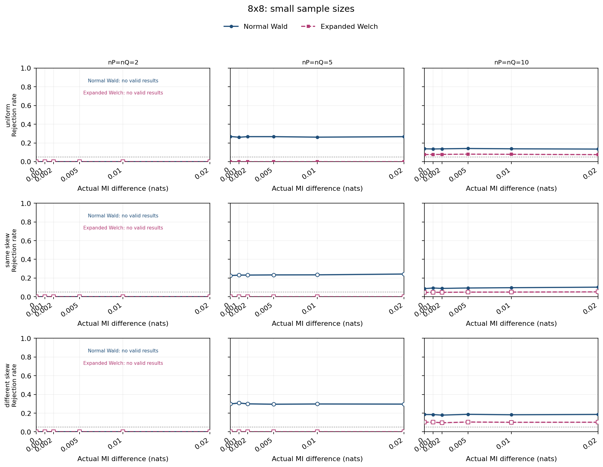

| Specification | Setting |
| --- | --- |
| Table size | 8x8 |
| Horizontal graph regime specifications (columns) | nP=nQ=2, nP=nQ=5, nP=nQ=10 |
| Vertical graph regime specifications (rows) | uniform: P row (0.125 repeated 8 times), P column (0.125 repeated 8 times); Q row (0.125 repeated 8 times), Q column (0.125 repeated 8 times); same skew: P row (0.8, 0.2/7 repeated 7 times), P column (0.8, 0.2/7 repeated 7 times); Q row (0.8, 0.2/7 repeated 7 times), Q column (0.8, 0.2/7 repeated 7 times); different skew: P row (0.7, 0.3/7 repeated 7 times), P column (0.7, 0.3/7 repeated 7 times); Q row (0.8, 0.2/7 repeated 7 times), Q column (0.8, 0.2/7 repeated 7 times) |
| Probability changes | uniform: add at (1,1),(2,2) and subtract at (1,2),(2,1), for both P and Q; same skew: add at (1,1),(2,2) and subtract at (1,2),(2,1), for both P and Q; different skew: add at (1,1),(2,2) and subtract at (1,2),(2,1), for both P and Q |
| MI settings | Baseline MI {0.02}; direction {q higher}; actual differences {0, 0.001, 0.002, 0.005, 0.01, 0.02} nats |
| Horizontal axis within each graph | Actual MI difference in nats, fixed from 0 to 0.02 |
| Vertical axis within each graph | Unconditional rejection rate from 0 to 1; invalid results count as non-rejections |
| Replicates | 20,000 per unique point |

Null-point rejection and validity:

| Vertical regime | Horizontal regime | x | Method | Rejection | Valid |
| --- | --- | --- | --- | --- | --- |
| uniform | nP=nQ=2 | 0 | Expanded Welch | 0.0000 | 0.0000 |
| uniform | nP=nQ=2 | 0 | Normal Wald | 0.0000 | 0.0000 |
| uniform | nP=nQ=5 | 0 | Expanded Welch | 0.0000 | 0.9163 |
| uniform | nP=nQ=5 | 0 | Normal Wald | 0.2692 | 0.9983 |
| uniform | nP=nQ=10 | 0 | Expanded Welch | 0.0762 | 0.9996 |
| uniform | nP=nQ=10 | 0 | Normal Wald | 0.1376 | 1.0000 |
| same skew | nP=nQ=2 | 0 | Expanded Welch | 0.0000 | 0.0000 |
| same skew | nP=nQ=2 | 0 | Normal Wald | 0.0000 | 0.0000 |
| same skew | nP=nQ=5 | 0 | Expanded Welch | 0.0000 | 0.2082 |
| same skew | nP=nQ=5 | 0 | Normal Wald | 0.2266 | 0.6984 |
| same skew | nP=nQ=10 | 0 | Expanded Welch | 0.0456 | 0.6796 |
| same skew | nP=nQ=10 | 0 | Normal Wald | 0.0873 | 0.9587 |
| different skew | nP=nQ=2 | 0 | Expanded Welch | 0.0000 | 0.0000 |
| different skew | nP=nQ=2 | 0 | Normal Wald | 0.0000 | 0.0000 |
| different skew | nP=nQ=5 | 0 | Expanded Welch | 0.0000 | 0.3157 |
| different skew | nP=nQ=5 | 0 | Normal Wald | 0.2986 | 0.8319 |
| different skew | nP=nQ=10 | 0 | Expanded Welch | 0.1035 | 0.7912 |
| different skew | nP=nQ=10 | 0 | Normal Wald | 0.1853 | 0.9897 |

Every plotted rate, interval, validity and minimum expected count

| Vertical regime | Horizontal regime | x | Method | Rejection | 95% interval | Valid | Conditional | Min expected P | Min expected Q |
| --- | --- | --- | --- | --- | --- | --- | --- | --- | --- |
| uniform | nP=nQ=2 | 0 | Expanded Welch | 0.0000 | [0.0000, 0.0002] | 0.0000 | NA | 0.007697 | 0.007697 |
| uniform | nP=nQ=2 | 0 | Normal Wald | 0.0000 | [0.0000, 0.0002] | 0.0000 | NA | 0.007697 | 0.007697 |
| uniform | nP=nQ=2 | 0.001 | Expanded Welch | 0.0000 | [0.0000, 0.0002] | 0.0000 | NA | 0.007697 | 0.007197 |
| uniform | nP=nQ=2 | 0.001 | Normal Wald | 0.0000 | [0.0000, 0.0002] | 0.0000 | NA | 0.007697 | 0.007197 |
| uniform | nP=nQ=2 | 0.002 | Expanded Welch | 0.0000 | [0.0000, 0.0002] | 0.0000 | NA | 0.007697 | 0.006716 |
| uniform | nP=nQ=2 | 0.002 | Normal Wald | 0.0000 | [0.0000, 0.0002] | 0.0000 | NA | 0.007697 | 0.006716 |
| uniform | nP=nQ=2 | 0.005 | Expanded Welch | 0.0000 | [0.0000, 0.0002] | 0.0000 | NA | 0.007697 | 0.005374 |
| uniform | nP=nQ=2 | 0.005 | Normal Wald | 0.0000 | [0.0000, 0.0002] | 0.0000 | NA | 0.007697 | 0.005374 |
| uniform | nP=nQ=2 | 0.01 | Expanded Welch | 0.0000 | [0.0000, 0.0002] | 0.0000 | NA | 0.007697 | 0.003441 |
| uniform | nP=nQ=2 | 0.01 | Normal Wald | 0.0000 | [0.0000, 0.0002] | 0.0000 | NA | 0.007697 | 0.003441 |
| uniform | nP=nQ=2 | 0.02 | Expanded Welch | 0.0000 | [0.0000, 0.0002] | 0.0000 | NA | 0.007697 | 0.0005864 |
| uniform | nP=nQ=2 | 0.02 | Normal Wald | 0.0000 | [0.0000, 0.0002] | 0.0000 | NA | 0.007697 | 0.0005864 |
| uniform | nP=nQ=5 | 0 | Expanded Welch | 0.0000 | [0.0000, 0.0002] | 0.9163 | 0.0000 | 0.01924 | 0.01924 |
| uniform | nP=nQ=5 | 0 | Normal Wald | 0.2692 | [0.2631, 0.2754] | 0.9983 | 0.2696 | 0.01924 | 0.01924 |
| uniform | nP=nQ=5 | 0.001 | Expanded Welch | 0.0000 | [0.0000, 0.0002] | 0.9173 | 0.0000 | 0.01924 | 0.01799 |
| uniform | nP=nQ=5 | 0.001 | Normal Wald | 0.2606 | [0.2546, 0.2668] | 0.9986 | 0.2610 | 0.01924 | 0.01799 |
| uniform | nP=nQ=5 | 0.002 | Expanded Welch | 0.0000 | [0.0000, 0.0002] | 0.9176 | 0.0000 | 0.01924 | 0.01679 |
| uniform | nP=nQ=5 | 0.002 | Normal Wald | 0.2674 | [0.2613, 0.2736] | 0.9976 | 0.2681 | 0.01924 | 0.01679 |
| uniform | nP=nQ=5 | 0.005 | Expanded Welch | 0.0000 | [0.0000, 0.0002] | 0.9152 | 0.0000 | 0.01924 | 0.01344 |
| uniform | nP=nQ=5 | 0.005 | Normal Wald | 0.2672 | [0.2612, 0.2734] | 0.9983 | 0.2677 | 0.01924 | 0.01344 |
| uniform | nP=nQ=5 | 0.01 | Expanded Welch | 0.0000 | [0.0000, 0.0002] | 0.9180 | 0.0000 | 0.01924 | 0.008603 |
| uniform | nP=nQ=5 | 0.01 | Normal Wald | 0.2619 | [0.2559, 0.2680] | 0.9980 | 0.2624 | 0.01924 | 0.008603 |
| uniform | nP=nQ=5 | 0.02 | Expanded Welch | 0.0000 | [0.0000, 0.0002] | 0.9170 | 0.0000 | 0.01924 | 0.001466 |
| uniform | nP=nQ=5 | 0.02 | Normal Wald | 0.2669 | [0.2608, 0.2731] | 0.9981 | 0.2674 | 0.01924 | 0.001466 |
| uniform | nP=nQ=10 | 0 | Expanded Welch | 0.0762 | [0.0727, 0.0800] | 0.9996 | 0.0763 | 0.03848 | 0.03848 |
| uniform | nP=nQ=10 | 0 | Normal Wald | 0.1376 | [0.1328, 0.1424] | 1.0000 | 0.1376 | 0.03848 | 0.03848 |
| uniform | nP=nQ=10 | 0.001 | Expanded Welch | 0.0768 | [0.0732, 0.0806] | 0.9996 | 0.0768 | 0.03848 | 0.03598 |
| uniform | nP=nQ=10 | 0.001 | Normal Wald | 0.1353 | [0.1306, 0.1401] | 1.0000 | 0.1353 | 0.03848 | 0.03598 |
| uniform | nP=nQ=10 | 0.002 | Expanded Welch | 0.0775 | [0.0738, 0.0812] | 0.9999 | 0.0775 | 0.03848 | 0.03358 |
| uniform | nP=nQ=10 | 0.002 | Normal Wald | 0.1371 | [0.1324, 0.1419] | 1.0000 | 0.1371 | 0.03848 | 0.03358 |
| uniform | nP=nQ=10 | 0.005 | Expanded Welch | 0.0801 | [0.0765, 0.0840] | 0.9995 | 0.0802 | 0.03848 | 0.02687 |
| uniform | nP=nQ=10 | 0.005 | Normal Wald | 0.1407 | [0.1360, 0.1456] | 1.0000 | 0.1407 | 0.03848 | 0.02687 |
| uniform | nP=nQ=10 | 0.01 | Expanded Welch | 0.0783 | [0.0747, 0.0821] | 0.9997 | 0.0783 | 0.03848 | 0.01721 |
| uniform | nP=nQ=10 | 0.01 | Normal Wald | 0.1373 | [0.1326, 0.1421] | 1.0000 | 0.1373 | 0.03848 | 0.01721 |
| uniform | nP=nQ=10 | 0.02 | Expanded Welch | 0.0750 | [0.0714, 0.0787] | 0.9994 | 0.0750 | 0.03848 | 0.002932 |
| uniform | nP=nQ=10 | 0.02 | Normal Wald | 0.1343 | [0.1297, 0.1391] | 1.0000 | 0.1343 | 0.03848 | 0.002932 |
| same skew | nP=nQ=2 | 0 | Expanded Welch | 0.0000 | [0.0000, 0.0002] | 0.0000 | NA | 0.001633 | 0.001633 |
| same skew | nP=nQ=2 | 0 | Normal Wald | 0.0000 | [0.0000, 0.0002] | 0.0000 | NA | 0.001633 | 0.001633 |
| same skew | nP=nQ=2 | 0.001 | Expanded Welch | 0.0000 | [0.0000, 0.0002] | 0.0000 | NA | 0.001633 | 0.001633 |
| same skew | nP=nQ=2 | 0.001 | Normal Wald | 0.0000 | [0.0000, 0.0002] | 0.0000 | NA | 0.001633 | 0.001633 |
| same skew | nP=nQ=2 | 0.002 | Expanded Welch | 0.0000 | [0.0000, 0.0002] | 0.0000 | NA | 0.001633 | 0.001633 |
| same skew | nP=nQ=2 | 0.002 | Normal Wald | 0.0000 | [0.0000, 0.0002] | 0.0000 | NA | 0.001633 | 0.001633 |
| same skew | nP=nQ=2 | 0.005 | Expanded Welch | 0.0000 | [0.0000, 0.0002] | 0.0000 | NA | 0.001633 | 0.001633 |
| same skew | nP=nQ=2 | 0.005 | Normal Wald | 0.0000 | [0.0000, 0.0002] | 0.0000 | NA | 0.001633 | 0.001633 |
| same skew | nP=nQ=2 | 0.01 | Expanded Welch | 0.0000 | [0.0000, 0.0002] | 0.0000 | NA | 0.001633 | 0.001633 |
| same skew | nP=nQ=2 | 0.01 | Normal Wald | 0.0000 | [0.0000, 0.0002] | 0.0000 | NA | 0.001633 | 0.001633 |
| same skew | nP=nQ=2 | 0.02 | Expanded Welch | 0.0000 | [0.0000, 0.0002] | 0.0000 | NA | 0.001633 | 0.001633 |
| same skew | nP=nQ=2 | 0.02 | Normal Wald | 0.0000 | [0.0000, 0.0002] | 0.0000 | NA | 0.001633 | 0.001633 |
| same skew | nP=nQ=5 | 0 | Expanded Welch | 0.0000 | [0.0000, 0.0002] | 0.2082 | 0.0000 | 0.004082 | 0.004082 |
| same skew | nP=nQ=5 | 0 | Normal Wald | 0.2266 | [0.2209, 0.2325] | 0.6984 | 0.3245 | 0.004082 | 0.004082 |
| same skew | nP=nQ=5 | 0.001 | Expanded Welch | 0.0000 | [0.0000, 0.0002] | 0.2133 | 0.0000 | 0.004082 | 0.004082 |
| same skew | nP=nQ=5 | 0.001 | Normal Wald | 0.2314 | [0.2257, 0.2373] | 0.7077 | 0.3270 | 0.004082 | 0.004082 |
| same skew | nP=nQ=5 | 0.002 | Expanded Welch | 0.0000 | [0.0000, 0.0002] | 0.2098 | 0.0000 | 0.004082 | 0.004082 |
| same skew | nP=nQ=5 | 0.002 | Normal Wald | 0.2317 | [0.2259, 0.2376] | 0.7033 | 0.3295 | 0.004082 | 0.004082 |
| same skew | nP=nQ=5 | 0.005 | Expanded Welch | 0.0000 | [0.0000, 0.0002] | 0.2104 | 0.0000 | 0.004082 | 0.004082 |
| same skew | nP=nQ=5 | 0.005 | Normal Wald | 0.2336 | [0.2277, 0.2395] | 0.7110 | 0.3285 | 0.004082 | 0.004082 |
| same skew | nP=nQ=5 | 0.01 | Expanded Welch | 0.0000 | [0.0000, 0.0002] | 0.2157 | 0.0000 | 0.004082 | 0.004082 |
| same skew | nP=nQ=5 | 0.01 | Normal Wald | 0.2344 | [0.2285, 0.2403] | 0.7034 | 0.3332 | 0.004082 | 0.004082 |
| same skew | nP=nQ=5 | 0.02 | Expanded Welch | 0.0000 | [0.0000, 0.0002] | 0.2124 | 0.0000 | 0.004082 | 0.004082 |
| same skew | nP=nQ=5 | 0.02 | Normal Wald | 0.2429 | [0.2371, 0.2489] | 0.7132 | 0.3406 | 0.004082 | 0.004082 |
| same skew | nP=nQ=10 | 0 | Expanded Welch | 0.0456 | [0.0428, 0.0486] | 0.6796 | 0.0671 | 0.008163 | 0.008163 |
| same skew | nP=nQ=10 | 0 | Normal Wald | 0.0873 | [0.0835, 0.0913] | 0.9587 | 0.0911 | 0.008163 | 0.008163 |
| same skew | nP=nQ=10 | 0.001 | Expanded Welch | 0.0474 | [0.0445, 0.0504] | 0.6831 | 0.0694 | 0.008163 | 0.008163 |
| same skew | nP=nQ=10 | 0.001 | Normal Wald | 0.0935 | [0.0895, 0.0976] | 0.9591 | 0.0975 | 0.008163 | 0.008163 |
| same skew | nP=nQ=10 | 0.002 | Expanded Welch | 0.0474 | [0.0445, 0.0504] | 0.6837 | 0.0693 | 0.008163 | 0.008163 |
| same skew | nP=nQ=10 | 0.002 | Normal Wald | 0.0892 | [0.0854, 0.0933] | 0.9581 | 0.0931 | 0.008163 | 0.008163 |
| same skew | nP=nQ=10 | 0.005 | Expanded Welch | 0.0493 | [0.0464, 0.0524] | 0.6824 | 0.0723 | 0.008163 | 0.008163 |
| same skew | nP=nQ=10 | 0.005 | Normal Wald | 0.0935 | [0.0895, 0.0976] | 0.9610 | 0.0973 | 0.008163 | 0.008163 |
| same skew | nP=nQ=10 | 0.01 | Expanded Welch | 0.0498 | [0.0469, 0.0530] | 0.6816 | 0.0731 | 0.008163 | 0.008163 |
| same skew | nP=nQ=10 | 0.01 | Normal Wald | 0.0969 | [0.0928, 0.1010] | 0.9589 | 0.1010 | 0.008163 | 0.008163 |
| same skew | nP=nQ=10 | 0.02 | Expanded Welch | 0.0520 | [0.0491, 0.0552] | 0.6821 | 0.0763 | 0.008163 | 0.008163 |
| same skew | nP=nQ=10 | 0.02 | Normal Wald | 0.1024 | [0.0983, 0.1067] | 0.9588 | 0.1069 | 0.008163 | 0.008163 |
| different skew | nP=nQ=2 | 0 | Expanded Welch | 0.0000 | [0.0000, 0.0002] | 0.0000 | NA | 0.003673 | 0.001633 |
| different skew | nP=nQ=2 | 0 | Normal Wald | 0.0000 | [0.0000, 0.0002] | 0.0000 | NA | 0.003673 | 0.001633 |
| different skew | nP=nQ=2 | 0.001 | Expanded Welch | 0.0000 | [0.0000, 0.0002] | 0.0000 | NA | 0.003673 | 0.001633 |
| different skew | nP=nQ=2 | 0.001 | Normal Wald | 0.0000 | [0.0000, 0.0002] | 0.0000 | NA | 0.003673 | 0.001633 |
| different skew | nP=nQ=2 | 0.002 | Expanded Welch | 0.0000 | [0.0000, 0.0002] | 0.0000 | NA | 0.003673 | 0.001633 |
| different skew | nP=nQ=2 | 0.002 | Normal Wald | 0.0000 | [0.0000, 0.0002] | 0.0000 | NA | 0.003673 | 0.001633 |
| different skew | nP=nQ=2 | 0.005 | Expanded Welch | 0.0000 | [0.0000, 0.0002] | 0.0000 | NA | 0.003673 | 0.001633 |
| different skew | nP=nQ=2 | 0.005 | Normal Wald | 0.0000 | [0.0000, 0.0002] | 0.0000 | NA | 0.003673 | 0.001633 |
| different skew | nP=nQ=2 | 0.01 | Expanded Welch | 0.0000 | [0.0000, 0.0002] | 0.0000 | NA | 0.003673 | 0.001633 |
| different skew | nP=nQ=2 | 0.01 | Normal Wald | 0.0000 | [0.0000, 0.0002] | 0.0000 | NA | 0.003673 | 0.001633 |
| different skew | nP=nQ=2 | 0.02 | Expanded Welch | 0.0000 | [0.0000, 0.0002] | 0.0000 | NA | 0.003673 | 0.001633 |
| different skew | nP=nQ=2 | 0.02 | Normal Wald | 0.0000 | [0.0000, 0.0002] | 0.0000 | NA | 0.003673 | 0.001633 |
| different skew | nP=nQ=5 | 0 | Expanded Welch | 0.0000 | [0.0000, 0.0002] | 0.3157 | 0.0000 | 0.009184 | 0.004082 |
| different skew | nP=nQ=5 | 0 | Normal Wald | 0.2986 | [0.2923, 0.3050] | 0.8319 | 0.3589 | 0.009184 | 0.004082 |
| different skew | nP=nQ=5 | 0.001 | Expanded Welch | 0.0000 | [0.0000, 0.0002] | 0.3141 | 0.0000 | 0.009184 | 0.004082 |
| different skew | nP=nQ=5 | 0.001 | Normal Wald | 0.3086 | [0.3023, 0.3151] | 0.8384 | 0.3681 | 0.009184 | 0.004082 |
| different skew | nP=nQ=5 | 0.002 | Expanded Welch | 0.0000 | [0.0000, 0.0002] | 0.3217 | 0.0000 | 0.009184 | 0.004082 |
| different skew | nP=nQ=5 | 0.002 | Normal Wald | 0.2994 | [0.2931, 0.3058] | 0.8311 | 0.3603 | 0.009184 | 0.004082 |
| different skew | nP=nQ=5 | 0.005 | Expanded Welch | 0.0000 | [0.0000, 0.0002] | 0.3162 | 0.0000 | 0.009184 | 0.004082 |
| different skew | nP=nQ=5 | 0.005 | Normal Wald | 0.2955 | [0.2892, 0.3019] | 0.8316 | 0.3554 | 0.009184 | 0.004082 |
| different skew | nP=nQ=5 | 0.01 | Expanded Welch | 0.0000 | [0.0000, 0.0002] | 0.3225 | 0.0000 | 0.009184 | 0.004082 |
| different skew | nP=nQ=5 | 0.01 | Normal Wald | 0.2980 | [0.2918, 0.3044] | 0.8373 | 0.3560 | 0.009184 | 0.004082 |
| different skew | nP=nQ=5 | 0.02 | Expanded Welch | 0.0000 | [0.0000, 0.0002] | 0.3221 | 0.0000 | 0.009184 | 0.004082 |
| different skew | nP=nQ=5 | 0.02 | Normal Wald | 0.2968 | [0.2905, 0.3032] | 0.8313 | 0.3571 | 0.009184 | 0.004082 |
| different skew | nP=nQ=10 | 0 | Expanded Welch | 0.1035 | [0.0993, 0.1077] | 0.7912 | 0.1308 | 0.01837 | 0.008163 |
| different skew | nP=nQ=10 | 0 | Normal Wald | 0.1853 | [0.1800, 0.1907] | 0.9897 | 0.1872 | 0.01837 | 0.008163 |
| different skew | nP=nQ=10 | 0.001 | Expanded Welch | 0.1038 | [0.0996, 0.1081] | 0.7923 | 0.1310 | 0.01837 | 0.008163 |
| different skew | nP=nQ=10 | 0.001 | Normal Wald | 0.1848 | [0.1795, 0.1902] | 0.9888 | 0.1869 | 0.01837 | 0.008163 |
| different skew | nP=nQ=10 | 0.002 | Expanded Welch | 0.0972 | [0.0932, 0.1014] | 0.7864 | 0.1236 | 0.01837 | 0.008163 |
| different skew | nP=nQ=10 | 0.002 | Normal Wald | 0.1791 | [0.1738, 0.1845] | 0.9889 | 0.1811 | 0.01837 | 0.008163 |
| different skew | nP=nQ=10 | 0.005 | Expanded Welch | 0.1051 | [0.1009, 0.1094] | 0.7946 | 0.1323 | 0.01837 | 0.008163 |
| different skew | nP=nQ=10 | 0.005 | Normal Wald | 0.1875 | [0.1822, 0.1930] | 0.9889 | 0.1896 | 0.01837 | 0.008163 |
| different skew | nP=nQ=10 | 0.01 | Expanded Welch | 0.1022 | [0.0981, 0.1065] | 0.7882 | 0.1297 | 0.01837 | 0.008163 |
| different skew | nP=nQ=10 | 0.01 | Normal Wald | 0.1827 | [0.1775, 0.1882] | 0.9876 | 0.1850 | 0.01837 | 0.008163 |
| different skew | nP=nQ=10 | 0.02 | Expanded Welch | 0.1029 | [0.0988, 0.1072] | 0.7904 | 0.1302 | 0.01837 | 0.008163 |
| different skew | nP=nQ=10 | 0.02 | Normal Wald | 0.1863 | [0.1810, 0.1918] | 0.9871 | 0.1887 | 0.01837 | 0.008163 |

### 3.11 8x8: moderate sample sizes

How do the methods behave as table size, marginal skew and sample size change?

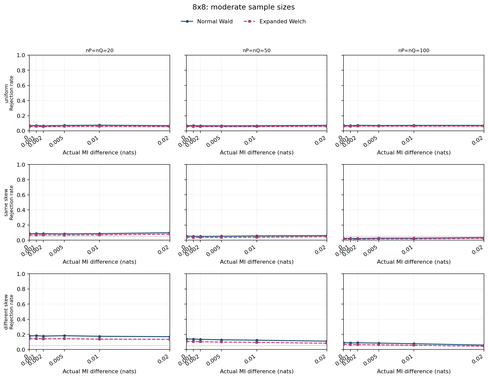

| Specification | Setting |
| --- | --- |
| Table size | 8x8 |
| Horizontal graph regime specifications (columns) | nP=nQ=20, nP=nQ=50, nP=nQ=100 |
| Vertical graph regime specifications (rows) | uniform: P row (0.125 repeated 8 times), P column (0.125 repeated 8 times); Q row (0.125 repeated 8 times), Q column (0.125 repeated 8 times); same skew: P row (0.8, 0.2/7 repeated 7 times), P column (0.8, 0.2/7 repeated 7 times); Q row (0.8, 0.2/7 repeated 7 times), Q column (0.8, 0.2/7 repeated 7 times); different skew: P row (0.7, 0.3/7 repeated 7 times), P column (0.7, 0.3/7 repeated 7 times); Q row (0.8, 0.2/7 repeated 7 times), Q column (0.8, 0.2/7 repeated 7 times) |
| Probability changes | uniform: add at (1,1),(2,2) and subtract at (1,2),(2,1), for both P and Q; same skew: add at (1,1),(2,2) and subtract at (1,2),(2,1), for both P and Q; different skew: add at (1,1),(2,2) and subtract at (1,2),(2,1), for both P and Q |
| MI settings | Baseline MI {0.02}; direction {q higher}; actual differences {0, 0.001, 0.002, 0.005, 0.01, 0.02} nats |
| Horizontal axis within each graph | Actual MI difference in nats, fixed from 0 to 0.02 |
| Vertical axis within each graph | Unconditional rejection rate from 0 to 1; invalid results count as non-rejections |
| Replicates | 20,000 per unique point |

Null-point rejection and validity:

| Vertical regime | Horizontal regime | x | Method | Rejection | Valid |
| --- | --- | --- | --- | --- | --- |
| uniform | nP=nQ=20 | 0 | Expanded Welch | 0.0570 | 1.0000 |
| uniform | nP=nQ=20 | 0 | Normal Wald | 0.0687 | 1.0000 |
| uniform | nP=nQ=50 | 0 | Expanded Welch | 0.0592 | 1.0000 |
| uniform | nP=nQ=50 | 0 | Normal Wald | 0.0703 | 1.0000 |
| uniform | nP=nQ=100 | 0 | Expanded Welch | 0.0618 | 1.0000 |
| uniform | nP=nQ=100 | 0 | Normal Wald | 0.0712 | 1.0000 |
| same skew | nP=nQ=20 | 0 | Expanded Welch | 0.0692 | 0.9541 |
| same skew | nP=nQ=20 | 0 | Normal Wald | 0.0873 | 0.9992 |
| same skew | nP=nQ=50 | 0 | Expanded Welch | 0.0367 | 1.0000 |
| same skew | nP=nQ=50 | 0 | Normal Wald | 0.0537 | 1.0000 |
| same skew | nP=nQ=100 | 0 | Expanded Welch | 0.0155 | 1.0000 |
| same skew | nP=nQ=100 | 0 | Normal Wald | 0.0245 | 1.0000 |
| different skew | nP=nQ=20 | 0 | Expanded Welch | 0.1432 | 0.9759 |
| different skew | nP=nQ=20 | 0 | Normal Wald | 0.1803 | 1.0000 |
| different skew | nP=nQ=50 | 0 | Expanded Welch | 0.1080 | 1.0000 |
| different skew | nP=nQ=50 | 0 | Normal Wald | 0.1391 | 1.0000 |
| different skew | nP=nQ=100 | 0 | Expanded Welch | 0.0699 | 1.0000 |
| different skew | nP=nQ=100 | 0 | Normal Wald | 0.0921 | 1.0000 |

Every plotted rate, interval, validity and minimum expected count

| Vertical regime | Horizontal regime | x | Method | Rejection | 95% interval | Valid | Conditional | Min expected P | Min expected Q |
| --- | --- | --- | --- | --- | --- | --- | --- | --- | --- |
| uniform | nP=nQ=20 | 0 | Expanded Welch | 0.0570 | [0.0538, 0.0602] | 1.0000 | 0.0570 | 0.07697 | 0.07697 |
| uniform | nP=nQ=20 | 0 | Normal Wald | 0.0687 | [0.0653, 0.0723] | 1.0000 | 0.0687 | 0.07697 | 0.07697 |
| uniform | nP=nQ=20 | 0.001 | Expanded Welch | 0.0590 | [0.0558, 0.0623] | 1.0000 | 0.0590 | 0.07697 | 0.07197 |
| uniform | nP=nQ=20 | 0.001 | Normal Wald | 0.0699 | [0.0664, 0.0735] | 1.0000 | 0.0699 | 0.07697 | 0.07197 |
| uniform | nP=nQ=20 | 0.002 | Expanded Welch | 0.0544 | [0.0513, 0.0576] | 1.0000 | 0.0544 | 0.07697 | 0.06716 |
| uniform | nP=nQ=20 | 0.002 | Normal Wald | 0.0662 | [0.0628, 0.0697] | 1.0000 | 0.0662 | 0.07697 | 0.06716 |
| uniform | nP=nQ=20 | 0.005 | Expanded Welch | 0.0588 | [0.0556, 0.0621] | 1.0000 | 0.0588 | 0.07697 | 0.05374 |
| uniform | nP=nQ=20 | 0.005 | Normal Wald | 0.0716 | [0.0681, 0.0753] | 1.0000 | 0.0716 | 0.07697 | 0.05374 |
| uniform | nP=nQ=20 | 0.01 | Expanded Welch | 0.0609 | [0.0577, 0.0643] | 1.0000 | 0.0609 | 0.07697 | 0.03441 |
| uniform | nP=nQ=20 | 0.01 | Normal Wald | 0.0746 | [0.0710, 0.0783] | 1.0000 | 0.0746 | 0.07697 | 0.03441 |
| uniform | nP=nQ=20 | 0.02 | Expanded Welch | 0.0558 | [0.0528, 0.0591] | 1.0000 | 0.0558 | 0.07697 | 0.005864 |
| uniform | nP=nQ=20 | 0.02 | Normal Wald | 0.0688 | [0.0653, 0.0723] | 1.0000 | 0.0688 | 0.07697 | 0.005864 |
| uniform | nP=nQ=50 | 0 | Expanded Welch | 0.0592 | [0.0560, 0.0625] | 1.0000 | 0.0592 | 0.1924 | 0.1924 |
| uniform | nP=nQ=50 | 0 | Normal Wald | 0.0703 | [0.0668, 0.0739] | 1.0000 | 0.0703 | 0.1924 | 0.1924 |
| uniform | nP=nQ=50 | 0.001 | Expanded Welch | 0.0557 | [0.0526, 0.0590] | 1.0000 | 0.0557 | 0.1924 | 0.1799 |
| uniform | nP=nQ=50 | 0.001 | Normal Wald | 0.0682 | [0.0647, 0.0717] | 1.0000 | 0.0682 | 0.1924 | 0.1799 |
| uniform | nP=nQ=50 | 0.002 | Expanded Welch | 0.0570 | [0.0539, 0.0604] | 1.0000 | 0.0570 | 0.1924 | 0.1679 |
| uniform | nP=nQ=50 | 0.002 | Normal Wald | 0.0672 | [0.0638, 0.0708] | 1.0000 | 0.0672 | 0.1924 | 0.1679 |
| uniform | nP=nQ=50 | 0.005 | Expanded Welch | 0.0559 | [0.0528, 0.0592] | 1.0000 | 0.0559 | 0.1924 | 0.1344 |
| uniform | nP=nQ=50 | 0.005 | Normal Wald | 0.0663 | [0.0629, 0.0698] | 1.0000 | 0.0663 | 0.1924 | 0.1344 |
| uniform | nP=nQ=50 | 0.01 | Expanded Welch | 0.0568 | [0.0536, 0.0600] | 1.0000 | 0.0568 | 0.1924 | 0.08603 |
| uniform | nP=nQ=50 | 0.01 | Normal Wald | 0.0674 | [0.0640, 0.0710] | 1.0000 | 0.0674 | 0.1924 | 0.08603 |
| uniform | nP=nQ=50 | 0.02 | Expanded Welch | 0.0602 | [0.0569, 0.0635] | 1.0000 | 0.0602 | 0.1924 | 0.01466 |
| uniform | nP=nQ=50 | 0.02 | Normal Wald | 0.0727 | [0.0692, 0.0764] | 1.0000 | 0.0727 | 0.1924 | 0.01466 |
| uniform | nP=nQ=100 | 0 | Expanded Welch | 0.0618 | [0.0585, 0.0652] | 1.0000 | 0.0618 | 0.3848 | 0.3848 |
| uniform | nP=nQ=100 | 0 | Normal Wald | 0.0712 | [0.0677, 0.0748] | 1.0000 | 0.0712 | 0.3848 | 0.3848 |
| uniform | nP=nQ=100 | 0.001 | Expanded Welch | 0.0592 | [0.0561, 0.0626] | 1.0000 | 0.0592 | 0.3848 | 0.3598 |
| uniform | nP=nQ=100 | 0.001 | Normal Wald | 0.0686 | [0.0652, 0.0722] | 1.0000 | 0.0686 | 0.3848 | 0.3598 |
| uniform | nP=nQ=100 | 0.002 | Expanded Welch | 0.0637 | [0.0604, 0.0672] | 1.0000 | 0.0637 | 0.3848 | 0.3358 |
| uniform | nP=nQ=100 | 0.002 | Normal Wald | 0.0728 | [0.0693, 0.0765] | 1.0000 | 0.0728 | 0.3848 | 0.3358 |
| uniform | nP=nQ=100 | 0.005 | Expanded Welch | 0.0620 | [0.0587, 0.0654] | 1.0000 | 0.0620 | 0.3848 | 0.2687 |
| uniform | nP=nQ=100 | 0.005 | Normal Wald | 0.0707 | [0.0672, 0.0743] | 1.0000 | 0.0707 | 0.3848 | 0.2687 |
| uniform | nP=nQ=100 | 0.01 | Expanded Welch | 0.0627 | [0.0594, 0.0661] | 1.0000 | 0.0627 | 0.3848 | 0.1721 |
| uniform | nP=nQ=100 | 0.01 | Normal Wald | 0.0722 | [0.0686, 0.0758] | 1.0000 | 0.0722 | 0.3848 | 0.1721 |
| uniform | nP=nQ=100 | 0.02 | Expanded Welch | 0.0624 | [0.0592, 0.0659] | 1.0000 | 0.0624 | 0.3848 | 0.02932 |
| uniform | nP=nQ=100 | 0.02 | Normal Wald | 0.0720 | [0.0685, 0.0756] | 1.0000 | 0.0720 | 0.3848 | 0.02932 |
| same skew | nP=nQ=20 | 0 | Expanded Welch | 0.0692 | [0.0658, 0.0728] | 0.9541 | 0.0725 | 0.01633 | 0.01633 |
| same skew | nP=nQ=20 | 0 | Normal Wald | 0.0873 | [0.0835, 0.0913] | 0.9992 | 0.0874 | 0.01633 | 0.01633 |
| same skew | nP=nQ=20 | 0.001 | Expanded Welch | 0.0689 | [0.0655, 0.0725] | 0.9536 | 0.0723 | 0.01633 | 0.01633 |
| same skew | nP=nQ=20 | 0.001 | Normal Wald | 0.0870 | [0.0832, 0.0910] | 0.9994 | 0.0870 | 0.01633 | 0.01633 |
| same skew | nP=nQ=20 | 0.002 | Expanded Welch | 0.0694 | [0.0660, 0.0731] | 0.9568 | 0.0726 | 0.01633 | 0.01633 |
| same skew | nP=nQ=20 | 0.002 | Normal Wald | 0.0873 | [0.0835, 0.0913] | 0.9994 | 0.0874 | 0.01633 | 0.01633 |
| same skew | nP=nQ=20 | 0.005 | Expanded Welch | 0.0670 | [0.0637, 0.0706] | 0.9562 | 0.0701 | 0.01633 | 0.01633 |
| same skew | nP=nQ=20 | 0.005 | Normal Wald | 0.0834 | [0.0796, 0.0873] | 0.9996 | 0.0834 | 0.01633 | 0.01633 |
| same skew | nP=nQ=20 | 0.01 | Expanded Welch | 0.0702 | [0.0667, 0.0738] | 0.9546 | 0.0735 | 0.01633 | 0.01633 |
| same skew | nP=nQ=20 | 0.01 | Normal Wald | 0.0871 | [0.0833, 0.0911] | 0.9995 | 0.0871 | 0.01633 | 0.01633 |
| same skew | nP=nQ=20 | 0.02 | Expanded Welch | 0.0789 | [0.0752, 0.0827] | 0.9585 | 0.0823 | 0.01633 | 0.01633 |
| same skew | nP=nQ=20 | 0.02 | Normal Wald | 0.0984 | [0.0943, 0.1026] | 0.9994 | 0.0985 | 0.01633 | 0.01633 |
| same skew | nP=nQ=50 | 0 | Expanded Welch | 0.0367 | [0.0342, 0.0394] | 1.0000 | 0.0368 | 0.04082 | 0.04082 |
| same skew | nP=nQ=50 | 0 | Normal Wald | 0.0537 | [0.0507, 0.0570] | 1.0000 | 0.0537 | 0.04082 | 0.04082 |
| same skew | nP=nQ=50 | 0.001 | Expanded Welch | 0.0352 | [0.0328, 0.0379] | 1.0000 | 0.0352 | 0.04082 | 0.04082 |
| same skew | nP=nQ=50 | 0.001 | Normal Wald | 0.0516 | [0.0486, 0.0548] | 1.0000 | 0.0516 | 0.04082 | 0.04082 |
| same skew | nP=nQ=50 | 0.002 | Expanded Welch | 0.0365 | [0.0339, 0.0391] | 0.9999 | 0.0365 | 0.04082 | 0.04082 |
| same skew | nP=nQ=50 | 0.002 | Normal Wald | 0.0510 | [0.0480, 0.0541] | 1.0000 | 0.0510 | 0.04082 | 0.04082 |
| same skew | nP=nQ=50 | 0.005 | Expanded Welch | 0.0360 | [0.0336, 0.0387] | 1.0000 | 0.0361 | 0.04082 | 0.04082 |
| same skew | nP=nQ=50 | 0.005 | Normal Wald | 0.0522 | [0.0492, 0.0553] | 1.0000 | 0.0522 | 0.04082 | 0.04082 |
| same skew | nP=nQ=50 | 0.01 | Expanded Welch | 0.0386 | [0.0360, 0.0413] | 1.0000 | 0.0386 | 0.04082 | 0.04082 |
| same skew | nP=nQ=50 | 0.01 | Normal Wald | 0.0566 | [0.0535, 0.0599] | 1.0000 | 0.0566 | 0.04082 | 0.04082 |
| same skew | nP=nQ=50 | 0.02 | Expanded Welch | 0.0457 | [0.0429, 0.0487] | 1.0000 | 0.0457 | 0.04082 | 0.04082 |
| same skew | nP=nQ=50 | 0.02 | Normal Wald | 0.0617 | [0.0584, 0.0651] | 1.0000 | 0.0617 | 0.04082 | 0.04082 |
| same skew | nP=nQ=100 | 0 | Expanded Welch | 0.0155 | [0.0139, 0.0173] | 1.0000 | 0.0155 | 0.08163 | 0.08163 |
| same skew | nP=nQ=100 | 0 | Normal Wald | 0.0245 | [0.0224, 0.0267] | 1.0000 | 0.0245 | 0.08163 | 0.08163 |
| same skew | nP=nQ=100 | 0.001 | Expanded Welch | 0.0149 | [0.0133, 0.0167] | 1.0000 | 0.0149 | 0.08163 | 0.08163 |
| same skew | nP=nQ=100 | 0.001 | Normal Wald | 0.0238 | [0.0217, 0.0260] | 1.0000 | 0.0238 | 0.08163 | 0.08163 |
| same skew | nP=nQ=100 | 0.002 | Expanded Welch | 0.0141 | [0.0126, 0.0159] | 1.0000 | 0.0141 | 0.08163 | 0.08163 |
| same skew | nP=nQ=100 | 0.002 | Normal Wald | 0.0231 | [0.0211, 0.0253] | 1.0000 | 0.0231 | 0.08163 | 0.08163 |
| same skew | nP=nQ=100 | 0.005 | Expanded Welch | 0.0176 | [0.0159, 0.0195] | 1.0000 | 0.0176 | 0.08163 | 0.08163 |
| same skew | nP=nQ=100 | 0.005 | Normal Wald | 0.0268 | [0.0247, 0.0291] | 1.0000 | 0.0268 | 0.08163 | 0.08163 |
| same skew | nP=nQ=100 | 0.01 | Expanded Welch | 0.0182 | [0.0165, 0.0202] | 1.0000 | 0.0182 | 0.08163 | 0.08163 |
| same skew | nP=nQ=100 | 0.01 | Normal Wald | 0.0271 | [0.0249, 0.0294] | 1.0000 | 0.0271 | 0.08163 | 0.08163 |
| same skew | nP=nQ=100 | 0.02 | Expanded Welch | 0.0246 | [0.0226, 0.0269] | 1.0000 | 0.0246 | 0.08163 | 0.08163 |
| same skew | nP=nQ=100 | 0.02 | Normal Wald | 0.0343 | [0.0319, 0.0370] | 1.0000 | 0.0343 | 0.08163 | 0.08163 |
| different skew | nP=nQ=20 | 0 | Expanded Welch | 0.1432 | [0.1384, 0.1481] | 0.9759 | 0.1467 | 0.03673 | 0.01633 |
| different skew | nP=nQ=20 | 0 | Normal Wald | 0.1803 | [0.1750, 0.1857] | 1.0000 | 0.1803 | 0.03673 | 0.01633 |
| different skew | nP=nQ=20 | 0.001 | Expanded Welch | 0.1454 | [0.1405, 0.1503] | 0.9768 | 0.1488 | 0.03673 | 0.01633 |
| different skew | nP=nQ=20 | 0.001 | Normal Wald | 0.1827 | [0.1775, 0.1882] | 0.9999 | 0.1828 | 0.03673 | 0.01633 |
| different skew | nP=nQ=20 | 0.002 | Expanded Welch | 0.1414 | [0.1366, 0.1462] | 0.9772 | 0.1446 | 0.03673 | 0.01633 |
| different skew | nP=nQ=20 | 0.002 | Normal Wald | 0.1781 | [0.1728, 0.1834] | 1.0000 | 0.1781 | 0.03673 | 0.01633 |
| different skew | nP=nQ=20 | 0.005 | Expanded Welch | 0.1434 | [0.1386, 0.1483] | 0.9770 | 0.1468 | 0.03673 | 0.01633 |
| different skew | nP=nQ=20 | 0.005 | Normal Wald | 0.1830 | [0.1777, 0.1884] | 1.0000 | 0.1830 | 0.03673 | 0.01633 |
| different skew | nP=nQ=20 | 0.01 | Expanded Welch | 0.1374 | [0.1327, 0.1423] | 0.9753 | 0.1409 | 0.03673 | 0.01633 |
| different skew | nP=nQ=20 | 0.01 | Normal Wald | 0.1753 | [0.1701, 0.1806] | 1.0000 | 0.1753 | 0.03673 | 0.01633 |
| different skew | nP=nQ=20 | 0.02 | Expanded Welch | 0.1356 | [0.1309, 0.1404] | 0.9772 | 0.1388 | 0.03673 | 0.01633 |
| different skew | nP=nQ=20 | 0.02 | Normal Wald | 0.1703 | [0.1652, 0.1756] | 1.0000 | 0.1703 | 0.03673 | 0.01633 |
| different skew | nP=nQ=50 | 0 | Expanded Welch | 0.1080 | [0.1038, 0.1124] | 1.0000 | 0.1080 | 0.09184 | 0.04082 |
| different skew | nP=nQ=50 | 0 | Normal Wald | 0.1391 | [0.1343, 0.1439] | 1.0000 | 0.1391 | 0.09184 | 0.04082 |
| different skew | nP=nQ=50 | 0.001 | Expanded Welch | 0.1051 | [0.1009, 0.1094] | 1.0000 | 0.1051 | 0.09184 | 0.04082 |
| different skew | nP=nQ=50 | 0.001 | Normal Wald | 0.1382 | [0.1335, 0.1431] | 1.0000 | 0.1382 | 0.09184 | 0.04082 |
| different skew | nP=nQ=50 | 0.002 | Expanded Welch | 0.1036 | [0.0994, 0.1078] | 1.0000 | 0.1036 | 0.09184 | 0.04082 |
| different skew | nP=nQ=50 | 0.002 | Normal Wald | 0.1353 | [0.1306, 0.1401] | 1.0000 | 0.1353 | 0.09184 | 0.04082 |
| different skew | nP=nQ=50 | 0.005 | Expanded Welch | 0.0993 | [0.0952, 0.1035] | 1.0000 | 0.0993 | 0.09184 | 0.04082 |
| different skew | nP=nQ=50 | 0.005 | Normal Wald | 0.1290 | [0.1244, 0.1337] | 1.0000 | 0.1290 | 0.09184 | 0.04082 |
| different skew | nP=nQ=50 | 0.01 | Expanded Welch | 0.0949 | [0.0909, 0.0990] | 0.9999 | 0.0949 | 0.09184 | 0.04082 |
| different skew | nP=nQ=50 | 0.01 | Normal Wald | 0.1240 | [0.1195, 0.1286] | 1.0000 | 0.1240 | 0.09184 | 0.04082 |
| different skew | nP=nQ=50 | 0.02 | Expanded Welch | 0.0837 | [0.0799, 0.0876] | 0.9999 | 0.0837 | 0.09184 | 0.04082 |
| different skew | nP=nQ=50 | 0.02 | Normal Wald | 0.1107 | [0.1064, 0.1151] | 1.0000 | 0.1107 | 0.09184 | 0.04082 |
| different skew | nP=nQ=100 | 0 | Expanded Welch | 0.0699 | [0.0664, 0.0735] | 1.0000 | 0.0699 | 0.1837 | 0.08163 |
| different skew | nP=nQ=100 | 0 | Normal Wald | 0.0921 | [0.0882, 0.0962] | 1.0000 | 0.0921 | 0.1837 | 0.08163 |
| different skew | nP=nQ=100 | 0.001 | Expanded Welch | 0.0645 | [0.0612, 0.0680] | 1.0000 | 0.0645 | 0.1837 | 0.08163 |
| different skew | nP=nQ=100 | 0.001 | Normal Wald | 0.0872 | [0.0834, 0.0912] | 1.0000 | 0.0872 | 0.1837 | 0.08163 |
| different skew | nP=nQ=100 | 0.002 | Expanded Welch | 0.0659 | [0.0625, 0.0694] | 1.0000 | 0.0659 | 0.1837 | 0.08163 |
| different skew | nP=nQ=100 | 0.002 | Normal Wald | 0.0896 | [0.0857, 0.0936] | 1.0000 | 0.0896 | 0.1837 | 0.08163 |
| different skew | nP=nQ=100 | 0.005 | Expanded Welch | 0.0635 | [0.0602, 0.0670] | 1.0000 | 0.0635 | 0.1837 | 0.08163 |
| different skew | nP=nQ=100 | 0.005 | Normal Wald | 0.0854 | [0.0817, 0.0894] | 1.0000 | 0.0854 | 0.1837 | 0.08163 |
| different skew | nP=nQ=100 | 0.01 | Expanded Welch | 0.0568 | [0.0537, 0.0601] | 1.0000 | 0.0568 | 0.1837 | 0.08163 |
| different skew | nP=nQ=100 | 0.01 | Normal Wald | 0.0771 | [0.0735, 0.0809] | 1.0000 | 0.0771 | 0.1837 | 0.08163 |
| different skew | nP=nQ=100 | 0.02 | Expanded Welch | 0.0432 | [0.0404, 0.0461] | 1.0000 | 0.0432 | 0.1837 | 0.08163 |
| different skew | nP=nQ=100 | 0.02 | Normal Wald | 0.0590 | [0.0558, 0.0624] | 1.0000 | 0.0590 | 0.1837 | 0.08163 |

### 3.12 8x8: large sample sizes

How do the methods behave as table size, marginal skew and sample size change?

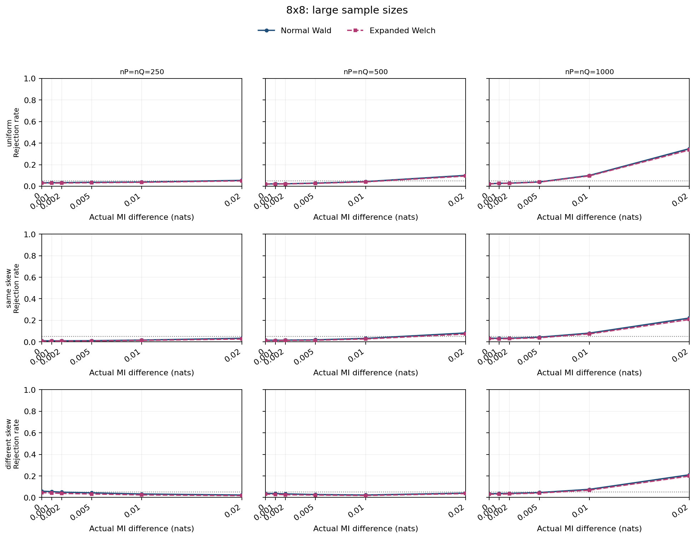

| Specification | Setting |
| --- | --- |
| Table size | 8x8 |
| Horizontal graph regime specifications (columns) | nP=nQ=250, nP=nQ=500, nP=nQ=1000 |
| Vertical graph regime specifications (rows) | uniform: P row (0.125 repeated 8 times), P column (0.125 repeated 8 times); Q row (0.125 repeated 8 times), Q column (0.125 repeated 8 times); same skew: P row (0.8, 0.2/7 repeated 7 times), P column (0.8, 0.2/7 repeated 7 times); Q row (0.8, 0.2/7 repeated 7 times), Q column (0.8, 0.2/7 repeated 7 times); different skew: P row (0.7, 0.3/7 repeated 7 times), P column (0.7, 0.3/7 repeated 7 times); Q row (0.8, 0.2/7 repeated 7 times), Q column (0.8, 0.2/7 repeated 7 times) |
| Probability changes | uniform: add at (1,1),(2,2) and subtract at (1,2),(2,1), for both P and Q; same skew: add at (1,1),(2,2) and subtract at (1,2),(2,1), for both P and Q; different skew: add at (1,1),(2,2) and subtract at (1,2),(2,1), for both P and Q |
| MI settings | Baseline MI {0.02}; direction {q higher}; actual differences {0, 0.001, 0.002, 0.005, 0.01, 0.02} nats |
| Horizontal axis within each graph | Actual MI difference in nats, fixed from 0 to 0.02 |
| Vertical axis within each graph | Unconditional rejection rate from 0 to 1; invalid results count as non-rejections |
| Replicates | 20,000 per unique point |

Null-point rejection and validity:

| Vertical regime | Horizontal regime | x | Method | Rejection | Valid |
| --- | --- | --- | --- | --- | --- |
| uniform | nP=nQ=250 | 0 | Expanded Welch | 0.0286 | 1.0000 |
| uniform | nP=nQ=250 | 0 | Normal Wald | 0.0317 | 1.0000 |
| uniform | nP=nQ=500 | 0 | Expanded Welch | 0.0198 | 1.0000 |
| uniform | nP=nQ=500 | 0 | Normal Wald | 0.0212 | 1.0000 |
| uniform | nP=nQ=1000 | 0 | Expanded Welch | 0.0211 | 1.0000 |
| uniform | nP=nQ=1000 | 0 | Normal Wald | 0.0228 | 1.0000 |
| same skew | nP=nQ=250 | 0 | Expanded Welch | 0.0071 | 1.0000 |
| same skew | nP=nQ=250 | 0 | Normal Wald | 0.0106 | 1.0000 |
| same skew | nP=nQ=500 | 0 | Expanded Welch | 0.0129 | 1.0000 |
| same skew | nP=nQ=500 | 0 | Normal Wald | 0.0162 | 1.0000 |
| same skew | nP=nQ=1000 | 0 | Expanded Welch | 0.0289 | 1.0000 |
| same skew | nP=nQ=1000 | 0 | Normal Wald | 0.0341 | 1.0000 |
| different skew | nP=nQ=250 | 0 | Expanded Welch | 0.0449 | 1.0000 |
| different skew | nP=nQ=250 | 0 | Normal Wald | 0.0583 | 1.0000 |
| different skew | nP=nQ=500 | 0 | Expanded Welch | 0.0300 | 1.0000 |
| different skew | nP=nQ=500 | 0 | Normal Wald | 0.0377 | 1.0000 |
| different skew | nP=nQ=1000 | 0 | Expanded Welch | 0.0301 | 1.0000 |
| different skew | nP=nQ=1000 | 0 | Normal Wald | 0.0356 | 1.0000 |

Every plotted rate, interval, validity and minimum expected count

| Vertical regime | Horizontal regime | x | Method | Rejection | 95% interval | Valid | Conditional | Min expected P | Min expected Q |
| --- | --- | --- | --- | --- | --- | --- | --- | --- | --- |
| uniform | nP=nQ=250 | 0 | Expanded Welch | 0.0286 | [0.0264, 0.0310] | 1.0000 | 0.0286 | 0.9621 | 0.9621 |
| uniform | nP=nQ=250 | 0 | Normal Wald | 0.0317 | [0.0294, 0.0342] | 1.0000 | 0.0317 | 0.9621 | 0.9621 |
| uniform | nP=nQ=250 | 0.001 | Expanded Welch | 0.0290 | [0.0267, 0.0314] | 1.0000 | 0.0290 | 0.9621 | 0.8996 |
| uniform | nP=nQ=250 | 0.001 | Normal Wald | 0.0327 | [0.0303, 0.0353] | 1.0000 | 0.0327 | 0.9621 | 0.8996 |
| uniform | nP=nQ=250 | 0.002 | Expanded Welch | 0.0299 | [0.0276, 0.0323] | 1.0000 | 0.0299 | 0.9621 | 0.8394 |
| uniform | nP=nQ=250 | 0.002 | Normal Wald | 0.0335 | [0.0311, 0.0361] | 1.0000 | 0.0335 | 0.9621 | 0.8394 |
| uniform | nP=nQ=250 | 0.005 | Expanded Welch | 0.0323 | [0.0299, 0.0348] | 1.0000 | 0.0323 | 0.9621 | 0.6718 |
| uniform | nP=nQ=250 | 0.005 | Normal Wald | 0.0365 | [0.0340, 0.0392] | 1.0000 | 0.0365 | 0.9621 | 0.6718 |
| uniform | nP=nQ=250 | 0.01 | Expanded Welch | 0.0362 | [0.0337, 0.0388] | 1.0000 | 0.0362 | 0.9621 | 0.4301 |
| uniform | nP=nQ=250 | 0.01 | Normal Wald | 0.0393 | [0.0366, 0.0420] | 1.0000 | 0.0393 | 0.9621 | 0.4301 |
| uniform | nP=nQ=250 | 0.02 | Expanded Welch | 0.0498 | [0.0468, 0.0529] | 1.0000 | 0.0498 | 0.9621 | 0.07331 |
| uniform | nP=nQ=250 | 0.02 | Normal Wald | 0.0544 | [0.0513, 0.0576] | 1.0000 | 0.0544 | 0.9621 | 0.07331 |
| uniform | nP=nQ=500 | 0 | Expanded Welch | 0.0198 | [0.0179, 0.0218] | 1.0000 | 0.0198 | 1.924 | 1.924 |
| uniform | nP=nQ=500 | 0 | Normal Wald | 0.0212 | [0.0193, 0.0233] | 1.0000 | 0.0212 | 1.924 | 1.924 |
| uniform | nP=nQ=500 | 0.001 | Expanded Welch | 0.0203 | [0.0184, 0.0223] | 1.0000 | 0.0203 | 1.924 | 1.799 |
| uniform | nP=nQ=500 | 0.001 | Normal Wald | 0.0220 | [0.0200, 0.0241] | 1.0000 | 0.0220 | 1.924 | 1.799 |
| uniform | nP=nQ=500 | 0.002 | Expanded Welch | 0.0211 | [0.0192, 0.0232] | 1.0000 | 0.0211 | 1.924 | 1.679 |
| uniform | nP=nQ=500 | 0.002 | Normal Wald | 0.0227 | [0.0207, 0.0249] | 1.0000 | 0.0227 | 1.924 | 1.679 |
| uniform | nP=nQ=500 | 0.005 | Expanded Welch | 0.0265 | [0.0243, 0.0288] | 1.0000 | 0.0265 | 1.924 | 1.344 |
| uniform | nP=nQ=500 | 0.005 | Normal Wald | 0.0291 | [0.0269, 0.0315] | 1.0000 | 0.0291 | 1.924 | 1.344 |
| uniform | nP=nQ=500 | 0.01 | Expanded Welch | 0.0403 | [0.0376, 0.0431] | 1.0000 | 0.0403 | 1.924 | 0.8603 |
| uniform | nP=nQ=500 | 0.01 | Normal Wald | 0.0431 | [0.0404, 0.0460] | 1.0000 | 0.0431 | 1.924 | 0.8603 |
| uniform | nP=nQ=500 | 0.02 | Expanded Welch | 0.0941 | [0.0902, 0.0983] | 1.0000 | 0.0941 | 1.924 | 0.1466 |
| uniform | nP=nQ=500 | 0.02 | Normal Wald | 0.1006 | [0.0965, 0.1048] | 1.0000 | 0.1006 | 1.924 | 0.1466 |
| uniform | nP=nQ=1000 | 0 | Expanded Welch | 0.0211 | [0.0192, 0.0232] | 1.0000 | 0.0211 | 3.848 | 3.848 |
| uniform | nP=nQ=1000 | 0 | Normal Wald | 0.0228 | [0.0208, 0.0250] | 1.0000 | 0.0228 | 3.848 | 3.848 |
| uniform | nP=nQ=1000 | 0.001 | Expanded Welch | 0.0256 | [0.0235, 0.0279] | 1.0000 | 0.0256 | 3.848 | 3.598 |
| uniform | nP=nQ=1000 | 0.001 | Normal Wald | 0.0274 | [0.0253, 0.0298] | 1.0000 | 0.0274 | 3.848 | 3.598 |
| uniform | nP=nQ=1000 | 0.002 | Expanded Welch | 0.0264 | [0.0243, 0.0287] | 1.0000 | 0.0264 | 3.848 | 3.358 |
| uniform | nP=nQ=1000 | 0.002 | Normal Wald | 0.0287 | [0.0265, 0.0311] | 1.0000 | 0.0287 | 3.848 | 3.358 |
| uniform | nP=nQ=1000 | 0.005 | Expanded Welch | 0.0379 | [0.0353, 0.0406] | 1.0000 | 0.0379 | 3.848 | 2.687 |
| uniform | nP=nQ=1000 | 0.005 | Normal Wald | 0.0398 | [0.0372, 0.0426] | 1.0000 | 0.0398 | 3.848 | 2.687 |
| uniform | nP=nQ=1000 | 0.01 | Expanded Welch | 0.0959 | [0.0919, 0.1001] | 1.0000 | 0.0959 | 3.848 | 1.721 |
| uniform | nP=nQ=1000 | 0.01 | Normal Wald | 0.1002 | [0.0961, 0.1044] | 1.0000 | 0.1002 | 3.848 | 1.721 |
| uniform | nP=nQ=1000 | 0.02 | Expanded Welch | 0.3366 | [0.3300, 0.3431] | 1.0000 | 0.3366 | 3.848 | 0.2932 |
| uniform | nP=nQ=1000 | 0.02 | Normal Wald | 0.3487 | [0.3421, 0.3553] | 1.0000 | 0.3487 | 3.848 | 0.2932 |
| same skew | nP=nQ=250 | 0 | Expanded Welch | 0.0071 | [0.0060, 0.0084] | 1.0000 | 0.0071 | 0.2041 | 0.2041 |
| same skew | nP=nQ=250 | 0 | Normal Wald | 0.0106 | [0.0092, 0.0121] | 1.0000 | 0.0106 | 0.2041 | 0.2041 |
| same skew | nP=nQ=250 | 0.001 | Expanded Welch | 0.0065 | [0.0055, 0.0077] | 1.0000 | 0.0065 | 0.2041 | 0.2041 |
| same skew | nP=nQ=250 | 0.001 | Normal Wald | 0.0097 | [0.0084, 0.0111] | 1.0000 | 0.0097 | 0.2041 | 0.2041 |
| same skew | nP=nQ=250 | 0.002 | Expanded Welch | 0.0069 | [0.0058, 0.0081] | 1.0000 | 0.0069 | 0.2041 | 0.2041 |
| same skew | nP=nQ=250 | 0.002 | Normal Wald | 0.0100 | [0.0087, 0.0114] | 1.0000 | 0.0100 | 0.2041 | 0.2041 |
| same skew | nP=nQ=250 | 0.005 | Expanded Welch | 0.0086 | [0.0074, 0.0099] | 1.0000 | 0.0086 | 0.2041 | 0.2041 |
| same skew | nP=nQ=250 | 0.005 | Normal Wald | 0.0114 | [0.0100, 0.0130] | 1.0000 | 0.0114 | 0.2041 | 0.2041 |
| same skew | nP=nQ=250 | 0.01 | Expanded Welch | 0.0135 | [0.0120, 0.0152] | 1.0000 | 0.0135 | 0.2041 | 0.2041 |
| same skew | nP=nQ=250 | 0.01 | Normal Wald | 0.0169 | [0.0152, 0.0187] | 1.0000 | 0.0169 | 0.2041 | 0.2041 |
| same skew | nP=nQ=250 | 0.02 | Expanded Welch | 0.0260 | [0.0239, 0.0283] | 1.0000 | 0.0260 | 0.2041 | 0.2041 |
| same skew | nP=nQ=250 | 0.02 | Normal Wald | 0.0334 | [0.0310, 0.0360] | 1.0000 | 0.0334 | 0.2041 | 0.2041 |
| same skew | nP=nQ=500 | 0 | Expanded Welch | 0.0129 | [0.0114, 0.0145] | 1.0000 | 0.0129 | 0.4082 | 0.4082 |
| same skew | nP=nQ=500 | 0 | Normal Wald | 0.0162 | [0.0145, 0.0180] | 1.0000 | 0.0162 | 0.4082 | 0.4082 |
| same skew | nP=nQ=500 | 0.001 | Expanded Welch | 0.0118 | [0.0104, 0.0134] | 1.0000 | 0.0118 | 0.4082 | 0.4082 |
| same skew | nP=nQ=500 | 0.001 | Normal Wald | 0.0153 | [0.0137, 0.0171] | 1.0000 | 0.0153 | 0.4082 | 0.4082 |
| same skew | nP=nQ=500 | 0.002 | Expanded Welch | 0.0132 | [0.0117, 0.0148] | 1.0000 | 0.0132 | 0.4082 | 0.4082 |
| same skew | nP=nQ=500 | 0.002 | Normal Wald | 0.0164 | [0.0147, 0.0183] | 1.0000 | 0.0164 | 0.4082 | 0.4082 |
| same skew | nP=nQ=500 | 0.005 | Expanded Welch | 0.0149 | [0.0133, 0.0167] | 1.0000 | 0.0149 | 0.4082 | 0.4082 |
| same skew | nP=nQ=500 | 0.005 | Normal Wald | 0.0190 | [0.0172, 0.0209] | 1.0000 | 0.0190 | 0.4082 | 0.4082 |
| same skew | nP=nQ=500 | 0.01 | Expanded Welch | 0.0268 | [0.0247, 0.0292] | 1.0000 | 0.0268 | 0.4082 | 0.4082 |
| same skew | nP=nQ=500 | 0.01 | Normal Wald | 0.0324 | [0.0300, 0.0349] | 1.0000 | 0.0324 | 0.4082 | 0.4082 |
| same skew | nP=nQ=500 | 0.02 | Expanded Welch | 0.0723 | [0.0688, 0.0760] | 1.0000 | 0.0723 | 0.4082 | 0.4082 |
| same skew | nP=nQ=500 | 0.02 | Normal Wald | 0.0826 | [0.0789, 0.0865] | 1.0000 | 0.0826 | 0.4082 | 0.4082 |
| same skew | nP=nQ=1000 | 0 | Expanded Welch | 0.0289 | [0.0266, 0.0313] | 1.0000 | 0.0289 | 0.8163 | 0.8163 |
| same skew | nP=nQ=1000 | 0 | Normal Wald | 0.0341 | [0.0317, 0.0368] | 1.0000 | 0.0341 | 0.8163 | 0.8163 |
| same skew | nP=nQ=1000 | 0.001 | Expanded Welch | 0.0286 | [0.0264, 0.0310] | 1.0000 | 0.0286 | 0.8163 | 0.8163 |
| same skew | nP=nQ=1000 | 0.001 | Normal Wald | 0.0335 | [0.0310, 0.0360] | 1.0000 | 0.0335 | 0.8163 | 0.8163 |
| same skew | nP=nQ=1000 | 0.002 | Expanded Welch | 0.0294 | [0.0271, 0.0318] | 1.0000 | 0.0294 | 0.8163 | 0.8163 |
| same skew | nP=nQ=1000 | 0.002 | Normal Wald | 0.0345 | [0.0320, 0.0371] | 1.0000 | 0.0345 | 0.8163 | 0.8163 |
| same skew | nP=nQ=1000 | 0.005 | Expanded Welch | 0.0381 | [0.0355, 0.0408] | 1.0000 | 0.0381 | 0.8163 | 0.8163 |
| same skew | nP=nQ=1000 | 0.005 | Normal Wald | 0.0437 | [0.0410, 0.0467] | 1.0000 | 0.0437 | 0.8163 | 0.8163 |
| same skew | nP=nQ=1000 | 0.01 | Expanded Welch | 0.0739 | [0.0704, 0.0776] | 1.0000 | 0.0739 | 0.8163 | 0.8163 |
| same skew | nP=nQ=1000 | 0.01 | Normal Wald | 0.0814 | [0.0776, 0.0852] | 1.0000 | 0.0814 | 0.8163 | 0.8163 |
| same skew | nP=nQ=1000 | 0.02 | Expanded Welch | 0.2077 | [0.2021, 0.2133] | 1.0000 | 0.2077 | 0.8163 | 0.8163 |
| same skew | nP=nQ=1000 | 0.02 | Normal Wald | 0.2210 | [0.2154, 0.2269] | 1.0000 | 0.2210 | 0.8163 | 0.8163 |
| different skew | nP=nQ=250 | 0 | Expanded Welch | 0.0449 | [0.0421, 0.0479] | 1.0000 | 0.0449 | 0.4592 | 0.2041 |
| different skew | nP=nQ=250 | 0 | Normal Wald | 0.0583 | [0.0551, 0.0616] | 1.0000 | 0.0583 | 0.4592 | 0.2041 |
| different skew | nP=nQ=250 | 0.001 | Expanded Welch | 0.0425 | [0.0398, 0.0454] | 1.0000 | 0.0425 | 0.4592 | 0.2041 |
| different skew | nP=nQ=250 | 0.001 | Normal Wald | 0.0551 | [0.0521, 0.0584] | 1.0000 | 0.0551 | 0.4592 | 0.2041 |
| different skew | nP=nQ=250 | 0.002 | Expanded Welch | 0.0379 | [0.0354, 0.0407] | 1.0000 | 0.0379 | 0.4592 | 0.2041 |
| different skew | nP=nQ=250 | 0.002 | Normal Wald | 0.0498 | [0.0468, 0.0529] | 1.0000 | 0.0498 | 0.4592 | 0.2041 |
| different skew | nP=nQ=250 | 0.005 | Expanded Welch | 0.0328 | [0.0304, 0.0354] | 1.0000 | 0.0328 | 0.4592 | 0.2041 |
| different skew | nP=nQ=250 | 0.005 | Normal Wald | 0.0432 | [0.0405, 0.0461] | 1.0000 | 0.0432 | 0.4592 | 0.2041 |
| different skew | nP=nQ=250 | 0.01 | Expanded Welch | 0.0243 | [0.0223, 0.0265] | 1.0000 | 0.0243 | 0.4592 | 0.2041 |
| different skew | nP=nQ=250 | 0.01 | Normal Wald | 0.0328 | [0.0304, 0.0353] | 1.0000 | 0.0328 | 0.4592 | 0.2041 |
| different skew | nP=nQ=250 | 0.02 | Expanded Welch | 0.0173 | [0.0156, 0.0192] | 1.0000 | 0.0173 | 0.4592 | 0.2041 |
| different skew | nP=nQ=250 | 0.02 | Normal Wald | 0.0234 | [0.0214, 0.0256] | 1.0000 | 0.0234 | 0.4592 | 0.2041 |
| different skew | nP=nQ=500 | 0 | Expanded Welch | 0.0300 | [0.0277, 0.0324] | 1.0000 | 0.0300 | 0.9184 | 0.4082 |
| different skew | nP=nQ=500 | 0 | Normal Wald | 0.0377 | [0.0352, 0.0405] | 1.0000 | 0.0377 | 0.9184 | 0.4082 |
| different skew | nP=nQ=500 | 0.001 | Expanded Welch | 0.0295 | [0.0272, 0.0319] | 1.0000 | 0.0295 | 0.9184 | 0.4082 |
| different skew | nP=nQ=500 | 0.001 | Normal Wald | 0.0369 | [0.0344, 0.0396] | 1.0000 | 0.0369 | 0.9184 | 0.4082 |
| different skew | nP=nQ=500 | 0.002 | Expanded Welch | 0.0256 | [0.0235, 0.0279] | 1.0000 | 0.0256 | 0.9184 | 0.4082 |
| different skew | nP=nQ=500 | 0.002 | Normal Wald | 0.0336 | [0.0312, 0.0362] | 1.0000 | 0.0336 | 0.9184 | 0.4082 |
| different skew | nP=nQ=500 | 0.005 | Expanded Welch | 0.0229 | [0.0209, 0.0251] | 1.0000 | 0.0229 | 0.9184 | 0.4082 |
| different skew | nP=nQ=500 | 0.005 | Normal Wald | 0.0279 | [0.0258, 0.0303] | 1.0000 | 0.0279 | 0.9184 | 0.4082 |
| different skew | nP=nQ=500 | 0.01 | Expanded Welch | 0.0185 | [0.0167, 0.0205] | 1.0000 | 0.0185 | 0.9184 | 0.4082 |
| different skew | nP=nQ=500 | 0.01 | Normal Wald | 0.0234 | [0.0214, 0.0256] | 1.0000 | 0.0234 | 0.9184 | 0.4082 |
| different skew | nP=nQ=500 | 0.02 | Expanded Welch | 0.0365 | [0.0340, 0.0392] | 1.0000 | 0.0365 | 0.9184 | 0.4082 |
| different skew | nP=nQ=500 | 0.02 | Normal Wald | 0.0409 | [0.0382, 0.0437] | 1.0000 | 0.0409 | 0.9184 | 0.4082 |
| different skew | nP=nQ=1000 | 0 | Expanded Welch | 0.0301 | [0.0279, 0.0326] | 1.0000 | 0.0301 | 1.837 | 0.8163 |
| different skew | nP=nQ=1000 | 0 | Normal Wald | 0.0356 | [0.0331, 0.0383] | 1.0000 | 0.0356 | 1.837 | 0.8163 |
| different skew | nP=nQ=1000 | 0.001 | Expanded Welch | 0.0309 | [0.0286, 0.0334] | 1.0000 | 0.0309 | 1.837 | 0.8163 |
| different skew | nP=nQ=1000 | 0.001 | Normal Wald | 0.0365 | [0.0339, 0.0391] | 1.0000 | 0.0365 | 1.837 | 0.8163 |
| different skew | nP=nQ=1000 | 0.002 | Expanded Welch | 0.0335 | [0.0310, 0.0360] | 1.0000 | 0.0335 | 1.837 | 0.8163 |
| different skew | nP=nQ=1000 | 0.002 | Normal Wald | 0.0387 | [0.0362, 0.0415] | 1.0000 | 0.0387 | 1.837 | 0.8163 |
| different skew | nP=nQ=1000 | 0.005 | Expanded Welch | 0.0413 | [0.0387, 0.0442] | 1.0000 | 0.0413 | 1.837 | 0.8163 |
| different skew | nP=nQ=1000 | 0.005 | Normal Wald | 0.0462 | [0.0434, 0.0492] | 1.0000 | 0.0462 | 1.837 | 0.8163 |
| different skew | nP=nQ=1000 | 0.01 | Expanded Welch | 0.0682 | [0.0648, 0.0718] | 1.0000 | 0.0682 | 1.837 | 0.8163 |
| different skew | nP=nQ=1000 | 0.01 | Normal Wald | 0.0760 | [0.0724, 0.0798] | 1.0000 | 0.0760 | 1.837 | 0.8163 |
| different skew | nP=nQ=1000 | 0.02 | Expanded Welch | 0.1994 | [0.1939, 0.2050] | 1.0000 | 0.1994 | 1.837 | 0.8163 |
| different skew | nP=nQ=1000 | 0.02 | Normal Wald | 0.2109 | [0.2053, 0.2166] | 1.0000 | 0.2109 | 1.837 | 0.8163 |

## 4. Baseline MI sensitivity

Does performance change when the populations begin closer to independence?

### 4.1 2x2: uniform margins

Does performance change when the populations begin closer to independence?

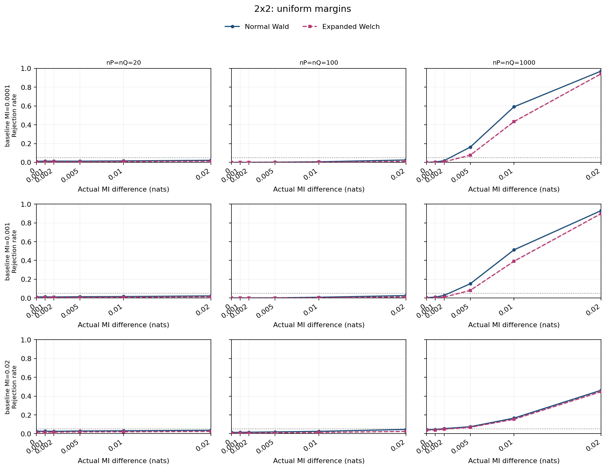

| Specification | Setting |
| --- | --- |
| Table size | 2x2 |
| Horizontal graph regime specifications (columns) | nP=nQ=20, nP=nQ=100, nP=nQ=1000 |
| Vertical graph regime specifications (rows) | baseline MI=0.0001: P row (0.5 repeated 2 times), P column (0.5 repeated 2 times); Q row (0.5 repeated 2 times), Q column (0.5 repeated 2 times); baseline MI=0.001: P row (0.5 repeated 2 times), P column (0.5 repeated 2 times); Q row (0.5 repeated 2 times), Q column (0.5 repeated 2 times); baseline MI=0.02: P row (0.5 repeated 2 times), P column (0.5 repeated 2 times); Q row (0.5 repeated 2 times), Q column (0.5 repeated 2 times) |
| Probability changes | baseline MI=0.0001: add at (1,1),(2,2) and subtract at (1,2),(2,1), for both P and Q; baseline MI=0.001: add at (1,1),(2,2) and subtract at (1,2),(2,1), for both P and Q; baseline MI=0.02: add at (1,1),(2,2) and subtract at (1,2),(2,1), for both P and Q |
| MI settings | Baseline MI {0.0001, 0.001, 0.02}; direction {q higher}; actual differences {0, 0.001, 0.002, 0.005, 0.01, 0.02} nats |
| Horizontal axis within each graph | Actual MI difference in nats, fixed from 0 to 0.02 |
| Vertical axis within each graph | Unconditional rejection rate from 0 to 1; invalid results count as non-rejections |
| Replicates | 20,000 per unique point |

Null-point rejection and validity:

| Vertical regime | Horizontal regime | x | Method | Rejection | Valid |
| --- | --- | --- | --- | --- | --- |
| baseline MI=0.0001 | nP=nQ=20 | 0 | Expanded Welch | 0.0050 | 0.9772 |
| baseline MI=0.0001 | nP=nQ=20 | 0 | Normal Wald | 0.0109 | 0.9967 |
| baseline MI=0.0001 | nP=nQ=100 | 0 | Expanded Welch | 0.0001 | 0.9901 |
| baseline MI=0.0001 | nP=nQ=100 | 0 | Normal Wald | 0.0003 | 1.0000 |
| baseline MI=0.0001 | nP=nQ=1000 | 0 | Expanded Welch | 0.0001 | 0.9990 |
| baseline MI=0.0001 | nP=nQ=1000 | 0 | Normal Wald | 0.0002 | 1.0000 |
| baseline MI=0.001 | nP=nQ=20 | 0 | Expanded Welch | 0.0053 | 0.9763 |
| baseline MI=0.001 | nP=nQ=20 | 0 | Normal Wald | 0.0118 | 0.9968 |
| baseline MI=0.001 | nP=nQ=100 | 0 | Expanded Welch | 0.0001 | 0.9920 |
| baseline MI=0.001 | nP=nQ=100 | 0 | Normal Wald | 0.0008 | 0.9999 |
| baseline MI=0.001 | nP=nQ=1000 | 0 | Expanded Welch | 0.0008 | 0.9998 |
| baseline MI=0.001 | nP=nQ=1000 | 0 | Normal Wald | 0.0036 | 1.0000 |
| baseline MI=0.02 | nP=nQ=20 | 0 | Expanded Welch | 0.0164 | 0.9833 |
| baseline MI=0.02 | nP=nQ=20 | 0 | Normal Wald | 0.0261 | 0.9977 |
| baseline MI=0.02 | nP=nQ=100 | 0 | Expanded Welch | 0.0063 | 0.9991 |
| baseline MI=0.02 | nP=nQ=100 | 0 | Normal Wald | 0.0142 | 1.0000 |
| baseline MI=0.02 | nP=nQ=1000 | 0 | Expanded Welch | 0.0386 | 1.0000 |
| baseline MI=0.02 | nP=nQ=1000 | 0 | Normal Wald | 0.0445 | 1.0000 |

Every plotted rate, interval, validity and minimum expected count

| Vertical regime | Horizontal regime | x | Method | Rejection | 95% interval | Valid | Conditional | Min expected P | Min expected Q |
| --- | --- | --- | --- | --- | --- | --- | --- | --- | --- |
| baseline MI=0.0001 | nP=nQ=20 | 0 | Expanded Welch | 0.0050 | [0.0041, 0.0060] | 0.9772 | 0.0051 | 4.929 | 4.929 |
| baseline MI=0.0001 | nP=nQ=20 | 0 | Normal Wald | 0.0109 | [0.0096, 0.0125] | 0.9967 | 0.0110 | 4.929 | 4.929 |
| baseline MI=0.0001 | nP=nQ=20 | 0.001 | Expanded Welch | 0.0065 | [0.0055, 0.0077] | 0.9774 | 0.0067 | 4.929 | 4.766 |
| baseline MI=0.0001 | nP=nQ=20 | 0.001 | Normal Wald | 0.0131 | [0.0116, 0.0147] | 0.9961 | 0.0131 | 4.929 | 4.766 |
| baseline MI=0.0001 | nP=nQ=20 | 0.002 | Expanded Welch | 0.0058 | [0.0048, 0.0070] | 0.9768 | 0.0059 | 4.929 | 4.676 |
| baseline MI=0.0001 | nP=nQ=20 | 0.002 | Normal Wald | 0.0129 | [0.0114, 0.0145] | 0.9974 | 0.0129 | 4.929 | 4.676 |
| baseline MI=0.0001 | nP=nQ=20 | 0.005 | Expanded Welch | 0.0057 | [0.0047, 0.0068] | 0.9760 | 0.0058 | 4.929 | 4.495 |
| baseline MI=0.0001 | nP=nQ=20 | 0.005 | Normal Wald | 0.0123 | [0.0109, 0.0140] | 0.9971 | 0.0124 | 4.929 | 4.495 |
| baseline MI=0.0001 | nP=nQ=20 | 0.01 | Expanded Welch | 0.0083 | [0.0071, 0.0097] | 0.9798 | 0.0085 | 4.929 | 4.291 |
| baseline MI=0.0001 | nP=nQ=20 | 0.01 | Normal Wald | 0.0153 | [0.0137, 0.0171] | 0.9977 | 0.0153 | 4.929 | 4.291 |
| baseline MI=0.0001 | nP=nQ=20 | 0.02 | Expanded Welch | 0.0121 | [0.0107, 0.0138] | 0.9820 | 0.0124 | 4.929 | 4.001 |
| baseline MI=0.0001 | nP=nQ=20 | 0.02 | Normal Wald | 0.0215 | [0.0196, 0.0237] | 0.9978 | 0.0216 | 4.929 | 4.001 |
| baseline MI=0.0001 | nP=nQ=100 | 0 | Expanded Welch | 0.0001 | [0.0000, 0.0003] | 0.9901 | 0.0001 | 24.65 | 24.65 |
| baseline MI=0.0001 | nP=nQ=100 | 0 | Normal Wald | 0.0003 | [0.0001, 0.0006] | 1.0000 | 0.0003 | 24.65 | 24.65 |
| baseline MI=0.0001 | nP=nQ=100 | 0.001 | Expanded Welch | 0.0001 | [0.0000, 0.0004] | 0.9920 | 0.0001 | 24.65 | 23.83 |
| baseline MI=0.0001 | nP=nQ=100 | 0.001 | Normal Wald | 0.0003 | [0.0001, 0.0007] | 0.9999 | 0.0003 | 24.65 | 23.83 |
| baseline MI=0.0001 | nP=nQ=100 | 0.002 | Expanded Welch | 0.0001 | [0.0000, 0.0004] | 0.9929 | 0.0001 | 24.65 | 23.38 |
| baseline MI=0.0001 | nP=nQ=100 | 0.002 | Normal Wald | 0.0006 | [0.0004, 0.0011] | 0.9999 | 0.0007 | 24.65 | 23.38 |
| baseline MI=0.0001 | nP=nQ=100 | 0.005 | Expanded Welch | 0.0003 | [0.0001, 0.0007] | 0.9935 | 0.0003 | 24.65 | 22.48 |
| baseline MI=0.0001 | nP=nQ=100 | 0.005 | Normal Wald | 0.0018 | [0.0013, 0.0024] | 0.9999 | 0.0018 | 24.65 | 22.48 |
| baseline MI=0.0001 | nP=nQ=100 | 0.01 | Expanded Welch | 0.0018 | [0.0013, 0.0025] | 0.9947 | 0.0018 | 24.65 | 21.45 |
| baseline MI=0.0001 | nP=nQ=100 | 0.01 | Normal Wald | 0.0057 | [0.0047, 0.0068] | 1.0000 | 0.0057 | 24.65 | 21.45 |
| baseline MI=0.0001 | nP=nQ=100 | 0.02 | Expanded Welch | 0.0095 | [0.0083, 0.0110] | 0.9949 | 0.0096 | 24.65 | 20 |
| baseline MI=0.0001 | nP=nQ=100 | 0.02 | Normal Wald | 0.0250 | [0.0229, 0.0273] | 1.0000 | 0.0250 | 24.65 | 20 |
| baseline MI=0.0001 | nP=nQ=1000 | 0 | Expanded Welch | 0.0001 | [0.0000, 0.0003] | 0.9990 | 0.0001 | 246.5 | 246.5 |
| baseline MI=0.0001 | nP=nQ=1000 | 0 | Normal Wald | 0.0002 | [0.0001, 0.0005] | 1.0000 | 0.0002 | 246.5 | 246.5 |
| baseline MI=0.0001 | nP=nQ=1000 | 0.001 | Expanded Welch | 0.0011 | [0.0007, 0.0017] | 0.9995 | 0.0011 | 246.5 | 238.3 |
| baseline MI=0.0001 | nP=nQ=1000 | 0.001 | Normal Wald | 0.0035 | [0.0028, 0.0044] | 1.0000 | 0.0035 | 246.5 | 238.3 |
| baseline MI=0.0001 | nP=nQ=1000 | 0.002 | Expanded Welch | 0.0048 | [0.0039, 0.0059] | 0.9993 | 0.0048 | 246.5 | 233.8 |
| baseline MI=0.0001 | nP=nQ=1000 | 0.002 | Normal Wald | 0.0175 | [0.0158, 0.0195] | 1.0000 | 0.0175 | 246.5 | 233.8 |
| baseline MI=0.0001 | nP=nQ=1000 | 0.005 | Expanded Welch | 0.0765 | [0.0729, 0.0803] | 0.9996 | 0.0765 | 246.5 | 224.8 |
| baseline MI=0.0001 | nP=nQ=1000 | 0.005 | Normal Wald | 0.1625 | [0.1574, 0.1676] | 1.0000 | 0.1625 | 246.5 | 224.8 |
| baseline MI=0.0001 | nP=nQ=1000 | 0.01 | Expanded Welch | 0.4330 | [0.4261, 0.4399] | 0.9993 | 0.4333 | 246.5 | 214.5 |
| baseline MI=0.0001 | nP=nQ=1000 | 0.01 | Normal Wald | 0.5909 | [0.5841, 0.5977] | 1.0000 | 0.5909 | 246.5 | 214.5 |
| baseline MI=0.0001 | nP=nQ=1000 | 0.02 | Expanded Welch | 0.9426 | [0.9393, 0.9458] | 0.9998 | 0.9429 | 246.5 | 200 |
| baseline MI=0.0001 | nP=nQ=1000 | 0.02 | Normal Wald | 0.9719 | [0.9696, 0.9741] | 1.0000 | 0.9719 | 246.5 | 200 |
| baseline MI=0.001 | nP=nQ=20 | 0 | Expanded Welch | 0.0053 | [0.0044, 0.0064] | 0.9763 | 0.0054 | 4.776 | 4.776 |
| baseline MI=0.001 | nP=nQ=20 | 0 | Normal Wald | 0.0118 | [0.0103, 0.0133] | 0.9968 | 0.0118 | 4.776 | 4.776 |
| baseline MI=0.001 | nP=nQ=20 | 0.001 | Expanded Welch | 0.0066 | [0.0056, 0.0079] | 0.9780 | 0.0068 | 4.776 | 4.684 |
| baseline MI=0.001 | nP=nQ=20 | 0.001 | Normal Wald | 0.0124 | [0.0110, 0.0141] | 0.9973 | 0.0125 | 4.776 | 4.684 |
| baseline MI=0.001 | nP=nQ=20 | 0.002 | Expanded Welch | 0.0056 | [0.0047, 0.0067] | 0.9764 | 0.0057 | 4.776 | 4.613 |
| baseline MI=0.001 | nP=nQ=20 | 0.002 | Normal Wald | 0.0112 | [0.0099, 0.0128] | 0.9976 | 0.0113 | 4.776 | 4.613 |
| baseline MI=0.001 | nP=nQ=20 | 0.005 | Expanded Welch | 0.0077 | [0.0066, 0.0090] | 0.9775 | 0.0079 | 4.776 | 4.453 |
| baseline MI=0.001 | nP=nQ=20 | 0.005 | Normal Wald | 0.0143 | [0.0127, 0.0160] | 0.9964 | 0.0143 | 4.776 | 4.453 |
| baseline MI=0.001 | nP=nQ=20 | 0.01 | Expanded Welch | 0.0084 | [0.0073, 0.0098] | 0.9797 | 0.0086 | 4.776 | 4.26 |
| baseline MI=0.001 | nP=nQ=20 | 0.01 | Normal Wald | 0.0157 | [0.0140, 0.0175] | 0.9970 | 0.0157 | 4.776 | 4.26 |
| baseline MI=0.001 | nP=nQ=20 | 0.02 | Expanded Welch | 0.0135 | [0.0119, 0.0151] | 0.9793 | 0.0137 | 4.776 | 3.979 |
| baseline MI=0.001 | nP=nQ=20 | 0.02 | Normal Wald | 0.0226 | [0.0206, 0.0247] | 0.9980 | 0.0226 | 4.776 | 3.979 |
| baseline MI=0.001 | nP=nQ=100 | 0 | Expanded Welch | 0.0001 | [0.0000, 0.0004] | 0.9920 | 0.0001 | 23.88 | 23.88 |
| baseline MI=0.001 | nP=nQ=100 | 0 | Normal Wald | 0.0008 | [0.0005, 0.0012] | 0.9999 | 0.0008 | 23.88 | 23.88 |
| baseline MI=0.001 | nP=nQ=100 | 0.001 | Expanded Welch | 0.0001 | [0.0000, 0.0003] | 0.9920 | 0.0001 | 23.88 | 23.42 |
| baseline MI=0.001 | nP=nQ=100 | 0.001 | Normal Wald | 0.0010 | [0.0006, 0.0015] | 0.9998 | 0.0010 | 23.88 | 23.42 |
| baseline MI=0.001 | nP=nQ=100 | 0.002 | Expanded Welch | 0.0003 | [0.0001, 0.0006] | 0.9921 | 0.0003 | 23.88 | 23.06 |
| baseline MI=0.001 | nP=nQ=100 | 0.002 | Normal Wald | 0.0009 | [0.0006, 0.0015] | 0.9999 | 0.0010 | 23.88 | 23.06 |
| baseline MI=0.001 | nP=nQ=100 | 0.005 | Expanded Welch | 0.0006 | [0.0004, 0.0011] | 0.9929 | 0.0007 | 23.88 | 22.26 |
| baseline MI=0.001 | nP=nQ=100 | 0.005 | Normal Wald | 0.0018 | [0.0013, 0.0025] | 0.9998 | 0.0018 | 23.88 | 22.26 |
| baseline MI=0.001 | nP=nQ=100 | 0.01 | Expanded Welch | 0.0026 | [0.0020, 0.0034] | 0.9954 | 0.0026 | 23.88 | 21.3 |
| baseline MI=0.001 | nP=nQ=100 | 0.01 | Normal Wald | 0.0081 | [0.0070, 0.0095] | 1.0000 | 0.0082 | 23.88 | 21.3 |
| baseline MI=0.001 | nP=nQ=100 | 0.02 | Expanded Welch | 0.0118 | [0.0104, 0.0134] | 0.9955 | 0.0119 | 23.88 | 19.89 |
| baseline MI=0.001 | nP=nQ=100 | 0.02 | Normal Wald | 0.0259 | [0.0238, 0.0282] | 1.0000 | 0.0259 | 23.88 | 19.89 |
| baseline MI=0.001 | nP=nQ=1000 | 0 | Expanded Welch | 0.0008 | [0.0005, 0.0013] | 0.9998 | 0.0008 | 238.8 | 238.8 |
| baseline MI=0.001 | nP=nQ=1000 | 0 | Normal Wald | 0.0036 | [0.0028, 0.0045] | 1.0000 | 0.0036 | 238.8 | 238.8 |
| baseline MI=0.001 | nP=nQ=1000 | 0.001 | Expanded Welch | 0.0026 | [0.0020, 0.0034] | 0.9997 | 0.0026 | 238.8 | 234.2 |
| baseline MI=0.001 | nP=nQ=1000 | 0.001 | Normal Wald | 0.0101 | [0.0089, 0.0116] | 1.0000 | 0.0101 | 238.8 | 234.2 |
| baseline MI=0.001 | nP=nQ=1000 | 0.002 | Expanded Welch | 0.0092 | [0.0080, 0.0106] | 0.9997 | 0.0092 | 238.8 | 230.6 |
| baseline MI=0.001 | nP=nQ=1000 | 0.002 | Normal Wald | 0.0277 | [0.0255, 0.0301] | 1.0000 | 0.0277 | 238.8 | 230.6 |
| baseline MI=0.001 | nP=nQ=1000 | 0.005 | Expanded Welch | 0.0815 | [0.0778, 0.0854] | 0.9998 | 0.0815 | 238.8 | 222.6 |
| baseline MI=0.001 | nP=nQ=1000 | 0.005 | Normal Wald | 0.1522 | [0.1473, 0.1572] | 1.0000 | 0.1522 | 238.8 | 222.6 |
| baseline MI=0.001 | nP=nQ=1000 | 0.01 | Expanded Welch | 0.3911 | [0.3843, 0.3978] | 0.9998 | 0.3911 | 238.8 | 213 |
| baseline MI=0.001 | nP=nQ=1000 | 0.01 | Normal Wald | 0.5127 | [0.5057, 0.5196] | 1.0000 | 0.5127 | 238.8 | 213 |
| baseline MI=0.001 | nP=nQ=1000 | 0.02 | Expanded Welch | 0.8993 | [0.8951, 0.9034] | 0.9998 | 0.8995 | 238.8 | 198.9 |
| baseline MI=0.001 | nP=nQ=1000 | 0.02 | Normal Wald | 0.9308 | [0.9273, 0.9343] | 1.0000 | 0.9308 | 238.8 | 198.9 |
| baseline MI=0.02 | nP=nQ=20 | 0 | Expanded Welch | 0.0164 | [0.0147, 0.0183] | 0.9833 | 0.0167 | 4.003 | 4.003 |
| baseline MI=0.02 | nP=nQ=20 | 0 | Normal Wald | 0.0261 | [0.0240, 0.0284] | 0.9977 | 0.0262 | 4.003 | 4.003 |
| baseline MI=0.02 | nP=nQ=20 | 0.001 | Expanded Welch | 0.0163 | [0.0146, 0.0182] | 0.9852 | 0.0165 | 4.003 | 3.979 |
| baseline MI=0.02 | nP=nQ=20 | 0.001 | Normal Wald | 0.0266 | [0.0245, 0.0289] | 0.9989 | 0.0266 | 4.003 | 3.979 |
| baseline MI=0.02 | nP=nQ=20 | 0.002 | Expanded Welch | 0.0164 | [0.0147, 0.0183] | 0.9838 | 0.0167 | 4.003 | 3.955 |
| baseline MI=0.02 | nP=nQ=20 | 0.002 | Normal Wald | 0.0255 | [0.0235, 0.0278] | 0.9987 | 0.0256 | 4.003 | 3.955 |
| baseline MI=0.02 | nP=nQ=20 | 0.005 | Expanded Welch | 0.0188 | [0.0170, 0.0208] | 0.9851 | 0.0191 | 4.003 | 3.887 |
| baseline MI=0.02 | nP=nQ=20 | 0.005 | Normal Wald | 0.0285 | [0.0263, 0.0310] | 0.9989 | 0.0286 | 4.003 | 3.887 |
| baseline MI=0.02 | nP=nQ=20 | 0.01 | Expanded Welch | 0.0198 | [0.0180, 0.0219] | 0.9856 | 0.0201 | 4.003 | 3.781 |
| baseline MI=0.02 | nP=nQ=20 | 0.01 | Normal Wald | 0.0308 | [0.0285, 0.0333] | 0.9989 | 0.0308 | 4.003 | 3.781 |
| baseline MI=0.02 | nP=nQ=20 | 0.02 | Expanded Welch | 0.0240 | [0.0220, 0.0262] | 0.9871 | 0.0243 | 4.003 | 3.595 |
| baseline MI=0.02 | nP=nQ=20 | 0.02 | Normal Wald | 0.0363 | [0.0338, 0.0390] | 0.9988 | 0.0363 | 4.003 | 3.595 |
| baseline MI=0.02 | nP=nQ=100 | 0 | Expanded Welch | 0.0063 | [0.0052, 0.0074] | 0.9991 | 0.0063 | 20.02 | 20.02 |
| baseline MI=0.02 | nP=nQ=100 | 0 | Normal Wald | 0.0142 | [0.0127, 0.0159] | 1.0000 | 0.0142 | 20.02 | 20.02 |
| baseline MI=0.02 | nP=nQ=100 | 0.001 | Expanded Welch | 0.0069 | [0.0059, 0.0082] | 0.9989 | 0.0070 | 20.02 | 19.89 |
| baseline MI=0.02 | nP=nQ=100 | 0.001 | Normal Wald | 0.0145 | [0.0129, 0.0163] | 1.0000 | 0.0145 | 20.02 | 19.89 |
| baseline MI=0.02 | nP=nQ=100 | 0.002 | Expanded Welch | 0.0070 | [0.0060, 0.0083] | 0.9989 | 0.0071 | 20.02 | 19.78 |
| baseline MI=0.02 | nP=nQ=100 | 0.002 | Normal Wald | 0.0158 | [0.0141, 0.0176] | 1.0000 | 0.0158 | 20.02 | 19.78 |
| baseline MI=0.02 | nP=nQ=100 | 0.005 | Expanded Welch | 0.0095 | [0.0082, 0.0109] | 0.9990 | 0.0095 | 20.02 | 19.43 |
| baseline MI=0.02 | nP=nQ=100 | 0.005 | Normal Wald | 0.0190 | [0.0172, 0.0210] | 1.0000 | 0.0190 | 20.02 | 19.43 |
| baseline MI=0.02 | nP=nQ=100 | 0.01 | Expanded Welch | 0.0134 | [0.0119, 0.0151] | 0.9992 | 0.0134 | 20.02 | 18.91 |
| baseline MI=0.02 | nP=nQ=100 | 0.01 | Normal Wald | 0.0251 | [0.0231, 0.0274] | 1.0000 | 0.0251 | 20.02 | 18.91 |
| baseline MI=0.02 | nP=nQ=100 | 0.02 | Expanded Welch | 0.0241 | [0.0221, 0.0263] | 0.9995 | 0.0241 | 20.02 | 17.98 |
| baseline MI=0.02 | nP=nQ=100 | 0.02 | Normal Wald | 0.0454 | [0.0426, 0.0484] | 1.0000 | 0.0454 | 20.02 | 17.98 |
| baseline MI=0.02 | nP=nQ=1000 | 0 | Expanded Welch | 0.0386 | [0.0361, 0.0414] | 1.0000 | 0.0386 | 200.2 | 200.2 |
| baseline MI=0.02 | nP=nQ=1000 | 0 | Normal Wald | 0.0445 | [0.0417, 0.0474] | 1.0000 | 0.0445 | 200.2 | 200.2 |
| baseline MI=0.02 | nP=nQ=1000 | 0.001 | Expanded Welch | 0.0391 | [0.0365, 0.0419] | 1.0000 | 0.0391 | 200.2 | 198.9 |
| baseline MI=0.02 | nP=nQ=1000 | 0.001 | Normal Wald | 0.0446 | [0.0418, 0.0475] | 1.0000 | 0.0446 | 200.2 | 198.9 |
| baseline MI=0.02 | nP=nQ=1000 | 0.002 | Expanded Welch | 0.0481 | [0.0452, 0.0512] | 1.0000 | 0.0481 | 200.2 | 197.8 |
| baseline MI=0.02 | nP=nQ=1000 | 0.002 | Normal Wald | 0.0544 | [0.0513, 0.0576] | 1.0000 | 0.0544 | 200.2 | 197.8 |
| baseline MI=0.02 | nP=nQ=1000 | 0.005 | Expanded Welch | 0.0679 | [0.0645, 0.0715] | 1.0000 | 0.0679 | 200.2 | 194.3 |
| baseline MI=0.02 | nP=nQ=1000 | 0.005 | Normal Wald | 0.0745 | [0.0709, 0.0782] | 1.0000 | 0.0745 | 200.2 | 194.3 |
| baseline MI=0.02 | nP=nQ=1000 | 0.01 | Expanded Welch | 0.1534 | [0.1485, 0.1585] | 1.0000 | 0.1534 | 200.2 | 189.1 |
| baseline MI=0.02 | nP=nQ=1000 | 0.01 | Normal Wald | 0.1655 | [0.1604, 0.1707] | 1.0000 | 0.1655 | 200.2 | 189.1 |
| baseline MI=0.02 | nP=nQ=1000 | 0.02 | Expanded Welch | 0.4481 | [0.4412, 0.4550] | 1.0000 | 0.4481 | 200.2 | 179.8 |
| baseline MI=0.02 | nP=nQ=1000 | 0.02 | Normal Wald | 0.4627 | [0.4558, 0.4696] | 1.0000 | 0.4627 | 200.2 | 179.8 |

### 4.2 2x2: same skew margins

Does performance change when the populations begin closer to independence?

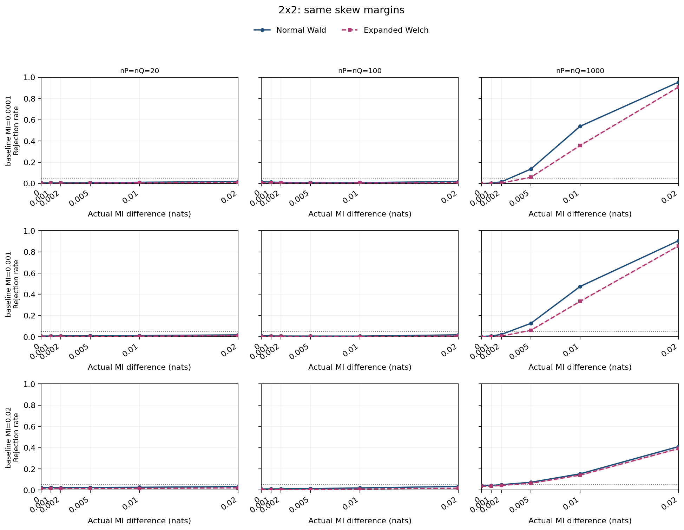

| Specification | Setting |
| --- | --- |
| Table size | 2x2 |
| Horizontal graph regime specifications (columns) | nP=nQ=20, nP=nQ=100, nP=nQ=1000 |
| Vertical graph regime specifications (rows) | baseline MI=0.0001: P row (0.8, 0.2), P column (0.8, 0.2); Q row (0.8, 0.2), Q column (0.8, 0.2); baseline MI=0.001: P row (0.8, 0.2), P column (0.8, 0.2); Q row (0.8, 0.2), Q column (0.8, 0.2); baseline MI=0.02: P row (0.8, 0.2), P column (0.8, 0.2); Q row (0.8, 0.2), Q column (0.8, 0.2) |
| Probability changes | baseline MI=0.0001: add at (1,1),(2,2) and subtract at (1,2),(2,1), for both P and Q; baseline MI=0.001: add at (1,1),(2,2) and subtract at (1,2),(2,1), for both P and Q; baseline MI=0.02: add at (1,1),(2,2) and subtract at (1,2),(2,1), for both P and Q |
| MI settings | Baseline MI {0.0001, 0.001, 0.02}; direction {q higher}; actual differences {0, 0.001, 0.002, 0.005, 0.01, 0.02} nats |
| Horizontal axis within each graph | Actual MI difference in nats, fixed from 0 to 0.02 |
| Vertical axis within each graph | Unconditional rejection rate from 0 to 1; invalid results count as non-rejections |
| Replicates | 20,000 per unique point |

Null-point rejection and validity:

| Vertical regime | Horizontal regime | x | Method | Rejection | Valid |
| --- | --- | --- | --- | --- | --- |
| baseline MI=0.0001 | nP=nQ=20 | 0 | Expanded Welch | 0.0022 | 0.9562 |
| baseline MI=0.0001 | nP=nQ=20 | 0 | Normal Wald | 0.0066 | 0.9965 |
| baseline MI=0.0001 | nP=nQ=100 | 0 | Expanded Welch | 0.0074 | 0.9999 |
| baseline MI=0.0001 | nP=nQ=100 | 0 | Normal Wald | 0.0169 | 0.9999 |
| baseline MI=0.0001 | nP=nQ=1000 | 0 | Expanded Welch | 0.0000 | 1.0000 |
| baseline MI=0.0001 | nP=nQ=1000 | 0 | Normal Wald | 0.0002 | 1.0000 |
| baseline MI=0.001 | nP=nQ=20 | 0 | Expanded Welch | 0.0025 | 0.9534 |
| baseline MI=0.001 | nP=nQ=20 | 0 | Normal Wald | 0.0072 | 0.9962 |
| baseline MI=0.001 | nP=nQ=100 | 0 | Expanded Welch | 0.0037 | 1.0000 |
| baseline MI=0.001 | nP=nQ=100 | 0 | Normal Wald | 0.0095 | 1.0000 |
| baseline MI=0.001 | nP=nQ=1000 | 0 | Expanded Welch | 0.0006 | 1.0000 |
| baseline MI=0.001 | nP=nQ=1000 | 0 | Normal Wald | 0.0029 | 1.0000 |
| baseline MI=0.02 | nP=nQ=20 | 0 | Expanded Welch | 0.0135 | 0.9550 |
| baseline MI=0.02 | nP=nQ=20 | 0 | Normal Wald | 0.0232 | 0.9980 |
| baseline MI=0.02 | nP=nQ=100 | 0 | Expanded Welch | 0.0047 | 1.0000 |
| baseline MI=0.02 | nP=nQ=100 | 0 | Normal Wald | 0.0107 | 1.0000 |
| baseline MI=0.02 | nP=nQ=1000 | 0 | Expanded Welch | 0.0372 | 1.0000 |
| baseline MI=0.02 | nP=nQ=1000 | 0 | Normal Wald | 0.0437 | 1.0000 |

Every plotted rate, interval, validity and minimum expected count

| Vertical regime | Horizontal regime | x | Method | Rejection | 95% interval | Valid | Conditional | Min expected P | Min expected Q |
| --- | --- | --- | --- | --- | --- | --- | --- | --- | --- |
| baseline MI=0.0001 | nP=nQ=20 | 0 | Expanded Welch | 0.0022 | [0.0016, 0.0029] | 0.9562 | 0.0022 | 0.8455 | 0.8455 |
| baseline MI=0.0001 | nP=nQ=20 | 0 | Normal Wald | 0.0066 | [0.0056, 0.0078] | 0.9965 | 0.0066 | 0.8455 | 0.8455 |
| baseline MI=0.0001 | nP=nQ=20 | 0.001 | Expanded Welch | 0.0015 | [0.0011, 0.0021] | 0.9553 | 0.0016 | 0.8455 | 0.9526 |
| baseline MI=0.0001 | nP=nQ=20 | 0.001 | Normal Wald | 0.0049 | [0.0040, 0.0059] | 0.9964 | 0.0049 | 0.8455 | 0.9526 |
| baseline MI=0.0001 | nP=nQ=20 | 0.002 | Expanded Welch | 0.0023 | [0.0017, 0.0031] | 0.9528 | 0.0024 | 0.8455 | 1.012 |
| baseline MI=0.0001 | nP=nQ=20 | 0.002 | Normal Wald | 0.0065 | [0.0055, 0.0077] | 0.9956 | 0.0065 | 0.8455 | 1.012 |
| baseline MI=0.0001 | nP=nQ=20 | 0.005 | Expanded Welch | 0.0034 | [0.0026, 0.0043] | 0.9527 | 0.0035 | 0.8455 | 1.134 |
| baseline MI=0.0001 | nP=nQ=20 | 0.005 | Normal Wald | 0.0073 | [0.0062, 0.0085] | 0.9961 | 0.0073 | 0.8455 | 1.134 |
| baseline MI=0.0001 | nP=nQ=20 | 0.01 | Expanded Welch | 0.0056 | [0.0047, 0.0068] | 0.9519 | 0.0059 | 0.8455 | 1.275 |
| baseline MI=0.0001 | nP=nQ=20 | 0.01 | Normal Wald | 0.0110 | [0.0096, 0.0125] | 0.9967 | 0.0110 | 0.8455 | 1.275 |
| baseline MI=0.0001 | nP=nQ=20 | 0.02 | Expanded Welch | 0.0106 | [0.0092, 0.0121] | 0.9513 | 0.0111 | 0.8455 | 1.478 |
| baseline MI=0.0001 | nP=nQ=20 | 0.02 | Normal Wald | 0.0180 | [0.0162, 0.0199] | 0.9972 | 0.0180 | 0.8455 | 1.478 |
| baseline MI=0.0001 | nP=nQ=100 | 0 | Expanded Welch | 0.0074 | [0.0063, 0.0087] | 0.9999 | 0.0074 | 4.227 | 4.227 |
| baseline MI=0.0001 | nP=nQ=100 | 0 | Normal Wald | 0.0169 | [0.0152, 0.0188] | 0.9999 | 0.0169 | 4.227 | 4.227 |
| baseline MI=0.0001 | nP=nQ=100 | 0.001 | Expanded Welch | 0.0059 | [0.0049, 0.0070] | 0.9999 | 0.0059 | 4.227 | 4.763 |
| baseline MI=0.0001 | nP=nQ=100 | 0.001 | Normal Wald | 0.0124 | [0.0110, 0.0140] | 0.9999 | 0.0124 | 4.227 | 4.763 |
| baseline MI=0.0001 | nP=nQ=100 | 0.002 | Expanded Welch | 0.0039 | [0.0031, 0.0049] | 1.0000 | 0.0039 | 4.227 | 5.06 |
| baseline MI=0.0001 | nP=nQ=100 | 0.002 | Normal Wald | 0.0101 | [0.0089, 0.0116] | 1.0000 | 0.0102 | 4.227 | 5.06 |
| baseline MI=0.0001 | nP=nQ=100 | 0.005 | Expanded Welch | 0.0032 | [0.0025, 0.0041] | 1.0000 | 0.0032 | 4.227 | 5.669 |
| baseline MI=0.0001 | nP=nQ=100 | 0.005 | Normal Wald | 0.0080 | [0.0069, 0.0094] | 1.0000 | 0.0081 | 4.227 | 5.669 |
| baseline MI=0.0001 | nP=nQ=100 | 0.01 | Expanded Welch | 0.0034 | [0.0027, 0.0044] | 1.0000 | 0.0035 | 4.227 | 6.373 |
| baseline MI=0.0001 | nP=nQ=100 | 0.01 | Normal Wald | 0.0083 | [0.0071, 0.0096] | 1.0000 | 0.0083 | 4.227 | 6.373 |
| baseline MI=0.0001 | nP=nQ=100 | 0.02 | Expanded Welch | 0.0073 | [0.0063, 0.0086] | 1.0000 | 0.0073 | 4.227 | 7.39 |
| baseline MI=0.0001 | nP=nQ=100 | 0.02 | Normal Wald | 0.0174 | [0.0157, 0.0193] | 1.0000 | 0.0174 | 4.227 | 7.39 |
| baseline MI=0.0001 | nP=nQ=1000 | 0 | Expanded Welch | 0.0000 | [0.0000, 0.0002] | 1.0000 | 0.0000 | 42.27 | 42.27 |
| baseline MI=0.0001 | nP=nQ=1000 | 0 | Normal Wald | 0.0002 | [0.0001, 0.0005] | 1.0000 | 0.0002 | 42.27 | 42.27 |
| baseline MI=0.0001 | nP=nQ=1000 | 0.001 | Expanded Welch | 0.0007 | [0.0004, 0.0012] | 1.0000 | 0.0007 | 42.27 | 47.63 |
| baseline MI=0.0001 | nP=nQ=1000 | 0.001 | Normal Wald | 0.0030 | [0.0023, 0.0039] | 1.0000 | 0.0030 | 42.27 | 47.63 |
| baseline MI=0.0001 | nP=nQ=1000 | 0.002 | Expanded Welch | 0.0037 | [0.0029, 0.0046] | 1.0000 | 0.0037 | 42.27 | 50.6 |
| baseline MI=0.0001 | nP=nQ=1000 | 0.002 | Normal Wald | 0.0147 | [0.0131, 0.0165] | 1.0000 | 0.0147 | 42.27 | 50.6 |
| baseline MI=0.0001 | nP=nQ=1000 | 0.005 | Expanded Welch | 0.0579 | [0.0547, 0.0612] | 1.0000 | 0.0579 | 42.27 | 56.69 |
| baseline MI=0.0001 | nP=nQ=1000 | 0.005 | Normal Wald | 0.1353 | [0.1306, 0.1401] | 1.0000 | 0.1353 | 42.27 | 56.69 |
| baseline MI=0.0001 | nP=nQ=1000 | 0.01 | Expanded Welch | 0.3571 | [0.3505, 0.3638] | 1.0000 | 0.3571 | 42.27 | 63.73 |
| baseline MI=0.0001 | nP=nQ=1000 | 0.01 | Normal Wald | 0.5382 | [0.5313, 0.5451] | 1.0000 | 0.5382 | 42.27 | 63.73 |
| baseline MI=0.0001 | nP=nQ=1000 | 0.02 | Expanded Welch | 0.9081 | [0.9040, 0.9120] | 1.0000 | 0.9081 | 42.27 | 73.9 |
| baseline MI=0.0001 | nP=nQ=1000 | 0.02 | Normal Wald | 0.9545 | [0.9515, 0.9573] | 1.0000 | 0.9545 | 42.27 | 73.9 |
| baseline MI=0.001 | nP=nQ=20 | 0 | Expanded Welch | 0.0025 | [0.0019, 0.0033] | 0.9534 | 0.0026 | 0.9454 | 0.9454 |
| baseline MI=0.001 | nP=nQ=20 | 0 | Normal Wald | 0.0072 | [0.0061, 0.0084] | 0.9962 | 0.0072 | 0.9454 | 0.9454 |
| baseline MI=0.001 | nP=nQ=20 | 0.001 | Expanded Welch | 0.0026 | [0.0019, 0.0034] | 0.9517 | 0.0027 | 0.9454 | 1.007 |
| baseline MI=0.001 | nP=nQ=20 | 0.001 | Normal Wald | 0.0069 | [0.0059, 0.0082] | 0.9964 | 0.0070 | 0.9454 | 1.007 |
| baseline MI=0.001 | nP=nQ=20 | 0.002 | Expanded Welch | 0.0026 | [0.0020, 0.0034] | 0.9533 | 0.0027 | 0.9454 | 1.054 |
| baseline MI=0.001 | nP=nQ=20 | 0.002 | Normal Wald | 0.0078 | [0.0067, 0.0092] | 0.9960 | 0.0079 | 0.9454 | 1.054 |
| baseline MI=0.001 | nP=nQ=20 | 0.005 | Expanded Welch | 0.0043 | [0.0034, 0.0053] | 0.9518 | 0.0045 | 0.9454 | 1.163 |
| baseline MI=0.001 | nP=nQ=20 | 0.005 | Normal Wald | 0.0092 | [0.0079, 0.0106] | 0.9961 | 0.0092 | 0.9454 | 1.163 |
| baseline MI=0.001 | nP=nQ=20 | 0.01 | Expanded Welch | 0.0056 | [0.0046, 0.0067] | 0.9522 | 0.0058 | 0.9454 | 1.296 |
| baseline MI=0.001 | nP=nQ=20 | 0.01 | Normal Wald | 0.0117 | [0.0103, 0.0132] | 0.9969 | 0.0117 | 0.9454 | 1.296 |
| baseline MI=0.001 | nP=nQ=20 | 0.02 | Expanded Welch | 0.0105 | [0.0092, 0.0120] | 0.9555 | 0.0110 | 0.9454 | 1.494 |
| baseline MI=0.001 | nP=nQ=20 | 0.02 | Normal Wald | 0.0176 | [0.0159, 0.0196] | 0.9966 | 0.0177 | 0.9454 | 1.494 |
| baseline MI=0.001 | nP=nQ=100 | 0 | Expanded Welch | 0.0037 | [0.0029, 0.0046] | 1.0000 | 0.0037 | 4.727 | 4.727 |
| baseline MI=0.001 | nP=nQ=100 | 0 | Normal Wald | 0.0095 | [0.0082, 0.0109] | 1.0000 | 0.0095 | 4.727 | 4.727 |
| baseline MI=0.001 | nP=nQ=100 | 0.001 | Expanded Welch | 0.0031 | [0.0024, 0.0040] | 1.0000 | 0.0031 | 4.727 | 5.034 |
| baseline MI=0.001 | nP=nQ=100 | 0.001 | Normal Wald | 0.0077 | [0.0066, 0.0091] | 1.0000 | 0.0078 | 4.727 | 5.034 |
| baseline MI=0.001 | nP=nQ=100 | 0.002 | Expanded Welch | 0.0029 | [0.0022, 0.0037] | 1.0000 | 0.0029 | 4.727 | 5.272 |
| baseline MI=0.001 | nP=nQ=100 | 0.002 | Normal Wald | 0.0070 | [0.0059, 0.0083] | 1.0000 | 0.0070 | 4.727 | 5.272 |
| baseline MI=0.001 | nP=nQ=100 | 0.005 | Expanded Welch | 0.0029 | [0.0023, 0.0038] | 1.0000 | 0.0029 | 4.727 | 5.815 |
| baseline MI=0.001 | nP=nQ=100 | 0.005 | Normal Wald | 0.0066 | [0.0056, 0.0079] | 1.0000 | 0.0066 | 4.727 | 5.815 |
| baseline MI=0.001 | nP=nQ=100 | 0.01 | Expanded Welch | 0.0022 | [0.0017, 0.0030] | 1.0000 | 0.0022 | 4.727 | 6.481 |
| baseline MI=0.001 | nP=nQ=100 | 0.01 | Normal Wald | 0.0063 | [0.0053, 0.0075] | 1.0000 | 0.0063 | 4.727 | 6.481 |
| baseline MI=0.001 | nP=nQ=100 | 0.02 | Expanded Welch | 0.0076 | [0.0065, 0.0090] | 1.0000 | 0.0076 | 4.727 | 7.468 |
| baseline MI=0.001 | nP=nQ=100 | 0.02 | Normal Wald | 0.0182 | [0.0164, 0.0201] | 1.0000 | 0.0182 | 4.727 | 7.468 |
| baseline MI=0.001 | nP=nQ=1000 | 0 | Expanded Welch | 0.0006 | [0.0004, 0.0011] | 1.0000 | 0.0006 | 47.27 | 47.27 |
| baseline MI=0.001 | nP=nQ=1000 | 0 | Normal Wald | 0.0029 | [0.0023, 0.0038] | 1.0000 | 0.0029 | 47.27 | 47.27 |
| baseline MI=0.001 | nP=nQ=1000 | 0.001 | Expanded Welch | 0.0022 | [0.0016, 0.0029] | 1.0000 | 0.0022 | 47.27 | 50.34 |
| baseline MI=0.001 | nP=nQ=1000 | 0.001 | Normal Wald | 0.0083 | [0.0071, 0.0097] | 1.0000 | 0.0083 | 47.27 | 50.34 |
| baseline MI=0.001 | nP=nQ=1000 | 0.002 | Expanded Welch | 0.0061 | [0.0051, 0.0073] | 1.0000 | 0.0061 | 47.27 | 52.72 |
| baseline MI=0.001 | nP=nQ=1000 | 0.002 | Normal Wald | 0.0216 | [0.0197, 0.0238] | 1.0000 | 0.0216 | 47.27 | 52.72 |
| baseline MI=0.001 | nP=nQ=1000 | 0.005 | Expanded Welch | 0.0607 | [0.0575, 0.0641] | 1.0000 | 0.0607 | 47.27 | 58.15 |
| baseline MI=0.001 | nP=nQ=1000 | 0.005 | Normal Wald | 0.1264 | [0.1219, 0.1311] | 1.0000 | 0.1264 | 47.27 | 58.15 |
| baseline MI=0.001 | nP=nQ=1000 | 0.01 | Expanded Welch | 0.3334 | [0.3269, 0.3400] | 1.0000 | 0.3334 | 47.27 | 64.81 |
| baseline MI=0.001 | nP=nQ=1000 | 0.01 | Normal Wald | 0.4736 | [0.4667, 0.4805] | 1.0000 | 0.4736 | 47.27 | 64.81 |
| baseline MI=0.001 | nP=nQ=1000 | 0.02 | Expanded Welch | 0.8562 | [0.8513, 0.8610] | 1.0000 | 0.8562 | 47.27 | 74.68 |
| baseline MI=0.001 | nP=nQ=1000 | 0.02 | Normal Wald | 0.9051 | [0.9009, 0.9090] | 1.0000 | 0.9051 | 47.27 | 74.68 |
| baseline MI=0.02 | nP=nQ=20 | 0 | Expanded Welch | 0.0135 | [0.0119, 0.0151] | 0.9550 | 0.0141 | 1.476 | 1.476 |
| baseline MI=0.02 | nP=nQ=20 | 0 | Normal Wald | 0.0232 | [0.0212, 0.0254] | 0.9980 | 0.0232 | 1.476 | 1.476 |
| baseline MI=0.02 | nP=nQ=20 | 0.001 | Expanded Welch | 0.0154 | [0.0137, 0.0171] | 0.9539 | 0.0161 | 1.476 | 1.494 |
| baseline MI=0.02 | nP=nQ=20 | 0.001 | Normal Wald | 0.0238 | [0.0217, 0.0260] | 0.9981 | 0.0238 | 1.476 | 1.494 |
| baseline MI=0.02 | nP=nQ=20 | 0.002 | Expanded Welch | 0.0143 | [0.0127, 0.0160] | 0.9524 | 0.0150 | 1.476 | 1.511 |
| baseline MI=0.02 | nP=nQ=20 | 0.002 | Normal Wald | 0.0221 | [0.0202, 0.0243] | 0.9976 | 0.0222 | 1.476 | 1.511 |
| baseline MI=0.02 | nP=nQ=20 | 0.005 | Expanded Welch | 0.0153 | [0.0137, 0.0171] | 0.9540 | 0.0160 | 1.476 | 1.559 |
| baseline MI=0.02 | nP=nQ=20 | 0.005 | Normal Wald | 0.0249 | [0.0228, 0.0271] | 0.9978 | 0.0249 | 1.476 | 1.559 |
| baseline MI=0.02 | nP=nQ=20 | 0.01 | Expanded Welch | 0.0163 | [0.0146, 0.0181] | 0.9549 | 0.0170 | 1.476 | 1.635 |
| baseline MI=0.02 | nP=nQ=20 | 0.01 | Normal Wald | 0.0267 | [0.0246, 0.0291] | 0.9981 | 0.0268 | 1.476 | 1.635 |
| baseline MI=0.02 | nP=nQ=20 | 0.02 | Expanded Welch | 0.0213 | [0.0194, 0.0234] | 0.9542 | 0.0223 | 1.476 | 1.77 |
| baseline MI=0.02 | nP=nQ=20 | 0.02 | Normal Wald | 0.0328 | [0.0305, 0.0354] | 0.9982 | 0.0329 | 1.476 | 1.77 |
| baseline MI=0.02 | nP=nQ=100 | 0 | Expanded Welch | 0.0047 | [0.0038, 0.0057] | 1.0000 | 0.0047 | 7.382 | 7.382 |
| baseline MI=0.02 | nP=nQ=100 | 0 | Normal Wald | 0.0107 | [0.0094, 0.0122] | 1.0000 | 0.0107 | 7.382 | 7.382 |
| baseline MI=0.02 | nP=nQ=100 | 0.001 | Expanded Welch | 0.0050 | [0.0041, 0.0060] | 1.0000 | 0.0050 | 7.382 | 7.468 |
| baseline MI=0.02 | nP=nQ=100 | 0.001 | Normal Wald | 0.0109 | [0.0096, 0.0124] | 1.0000 | 0.0109 | 7.382 | 7.468 |
| baseline MI=0.02 | nP=nQ=100 | 0.002 | Expanded Welch | 0.0052 | [0.0043, 0.0063] | 1.0000 | 0.0052 | 7.382 | 7.553 |
| baseline MI=0.02 | nP=nQ=100 | 0.002 | Normal Wald | 0.0115 | [0.0102, 0.0131] | 1.0000 | 0.0115 | 7.382 | 7.553 |
| baseline MI=0.02 | nP=nQ=100 | 0.005 | Expanded Welch | 0.0059 | [0.0049, 0.0071] | 1.0000 | 0.0059 | 7.382 | 7.797 |
| baseline MI=0.02 | nP=nQ=100 | 0.005 | Normal Wald | 0.0141 | [0.0126, 0.0159] | 1.0000 | 0.0141 | 7.382 | 7.797 |
| baseline MI=0.02 | nP=nQ=100 | 0.01 | Expanded Welch | 0.0097 | [0.0085, 0.0112] | 1.0000 | 0.0097 | 7.382 | 8.175 |
| baseline MI=0.02 | nP=nQ=100 | 0.01 | Normal Wald | 0.0205 | [0.0186, 0.0226] | 1.0000 | 0.0205 | 7.382 | 8.175 |
| baseline MI=0.02 | nP=nQ=100 | 0.02 | Expanded Welch | 0.0181 | [0.0164, 0.0201] | 1.0000 | 0.0181 | 7.382 | 8.848 |
| baseline MI=0.02 | nP=nQ=100 | 0.02 | Normal Wald | 0.0345 | [0.0321, 0.0371] | 1.0000 | 0.0345 | 7.382 | 8.848 |
| baseline MI=0.02 | nP=nQ=1000 | 0 | Expanded Welch | 0.0372 | [0.0346, 0.0399] | 1.0000 | 0.0372 | 73.82 | 73.82 |
| baseline MI=0.02 | nP=nQ=1000 | 0 | Normal Wald | 0.0437 | [0.0410, 0.0467] | 1.0000 | 0.0437 | 73.82 | 73.82 |
| baseline MI=0.02 | nP=nQ=1000 | 0.001 | Expanded Welch | 0.0371 | [0.0346, 0.0398] | 1.0000 | 0.0371 | 73.82 | 74.68 |
| baseline MI=0.02 | nP=nQ=1000 | 0.001 | Normal Wald | 0.0432 | [0.0404, 0.0461] | 1.0000 | 0.0432 | 73.82 | 74.68 |
| baseline MI=0.02 | nP=nQ=1000 | 0.002 | Expanded Welch | 0.0442 | [0.0414, 0.0471] | 1.0000 | 0.0442 | 73.82 | 75.53 |
| baseline MI=0.02 | nP=nQ=1000 | 0.002 | Normal Wald | 0.0511 | [0.0481, 0.0542] | 1.0000 | 0.0511 | 73.82 | 75.53 |
| baseline MI=0.02 | nP=nQ=1000 | 0.005 | Expanded Welch | 0.0648 | [0.0615, 0.0683] | 1.0000 | 0.0648 | 73.82 | 77.97 |
| baseline MI=0.02 | nP=nQ=1000 | 0.005 | Normal Wald | 0.0736 | [0.0701, 0.0773] | 1.0000 | 0.0736 | 73.82 | 77.97 |
| baseline MI=0.02 | nP=nQ=1000 | 0.01 | Expanded Welch | 0.1407 | [0.1360, 0.1456] | 1.0000 | 0.1407 | 73.82 | 81.75 |
| baseline MI=0.02 | nP=nQ=1000 | 0.01 | Normal Wald | 0.1535 | [0.1485, 0.1585] | 1.0000 | 0.1535 | 73.82 | 81.75 |
| baseline MI=0.02 | nP=nQ=1000 | 0.02 | Expanded Welch | 0.3913 | [0.3846, 0.3981] | 1.0000 | 0.3913 | 73.82 | 88.48 |
| baseline MI=0.02 | nP=nQ=1000 | 0.02 | Normal Wald | 0.4099 | [0.4032, 0.4168] | 1.0000 | 0.4099 | 73.82 | 88.48 |

### 4.3 2x2: different skew margins

Does performance change when the populations begin closer to independence?

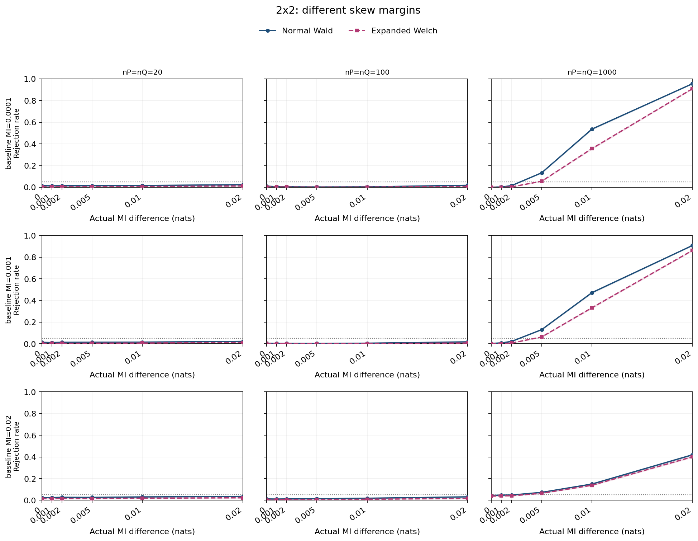

| Specification | Setting |
| --- | --- |
| Table size | 2x2 |
| Horizontal graph regime specifications (columns) | nP=nQ=20, nP=nQ=100, nP=nQ=1000 |
| Vertical graph regime specifications (rows) | baseline MI=0.0001: P row (0.7, 0.3), P column (0.7, 0.3); Q row (0.8, 0.2), Q column (0.8, 0.2); baseline MI=0.001: P row (0.7, 0.3), P column (0.7, 0.3); Q row (0.8, 0.2), Q column (0.8, 0.2); baseline MI=0.02: P row (0.7, 0.3), P column (0.7, 0.3); Q row (0.8, 0.2), Q column (0.8, 0.2) |
| Probability changes | baseline MI=0.0001: add at (1,1),(2,2) and subtract at (1,2),(2,1), for both P and Q; baseline MI=0.001: add at (1,1),(2,2) and subtract at (1,2),(2,1), for both P and Q; baseline MI=0.02: add at (1,1),(2,2) and subtract at (1,2),(2,1), for both P and Q |
| MI settings | Baseline MI {0.0001, 0.001, 0.02}; direction {q higher}; actual differences {0, 0.001, 0.002, 0.005, 0.01, 0.02} nats |
| Horizontal axis within each graph | Actual MI difference in nats, fixed from 0 to 0.02 |
| Vertical axis within each graph | Unconditional rejection rate from 0 to 1; invalid results count as non-rejections |
| Replicates | 20,000 per unique point |

Null-point rejection and validity:

| Vertical regime | Horizontal regime | x | Method | Rejection | Valid |
| --- | --- | --- | --- | --- | --- |
| baseline MI=0.0001 | nP=nQ=20 | 0 | Expanded Welch | 0.0033 | 0.9708 |
| baseline MI=0.0001 | nP=nQ=20 | 0 | Normal Wald | 0.0140 | 0.9968 |
| baseline MI=0.0001 | nP=nQ=100 | 0 | Expanded Welch | 0.0048 | 1.0000 |
| baseline MI=0.0001 | nP=nQ=100 | 0 | Normal Wald | 0.0102 | 1.0000 |
| baseline MI=0.0001 | nP=nQ=1000 | 0 | Expanded Welch | 0.0001 | 1.0000 |
| baseline MI=0.0001 | nP=nQ=1000 | 0 | Normal Wald | 0.0003 | 1.0000 |
| baseline MI=0.001 | nP=nQ=20 | 0 | Expanded Welch | 0.0040 | 0.9693 |
| baseline MI=0.001 | nP=nQ=20 | 0 | Normal Wald | 0.0132 | 0.9963 |
| baseline MI=0.001 | nP=nQ=100 | 0 | Expanded Welch | 0.0024 | 1.0000 |
| baseline MI=0.001 | nP=nQ=100 | 0 | Normal Wald | 0.0046 | 1.0000 |
| baseline MI=0.001 | nP=nQ=1000 | 0 | Expanded Welch | 0.0007 | 1.0000 |
| baseline MI=0.001 | nP=nQ=1000 | 0 | Normal Wald | 0.0029 | 1.0000 |
| baseline MI=0.02 | nP=nQ=20 | 0 | Expanded Welch | 0.0151 | 0.9749 |
| baseline MI=0.02 | nP=nQ=20 | 0 | Normal Wald | 0.0244 | 0.9983 |
| baseline MI=0.02 | nP=nQ=100 | 0 | Expanded Welch | 0.0054 | 1.0000 |
| baseline MI=0.02 | nP=nQ=100 | 0 | Normal Wald | 0.0121 | 1.0000 |
| baseline MI=0.02 | nP=nQ=1000 | 0 | Expanded Welch | 0.0380 | 1.0000 |
| baseline MI=0.02 | nP=nQ=1000 | 0 | Normal Wald | 0.0453 | 1.0000 |

Every plotted rate, interval, validity and minimum expected count

| Vertical regime | Horizontal regime | x | Method | Rejection | 95% interval | Valid | Conditional | Min expected P | Min expected Q |
| --- | --- | --- | --- | --- | --- | --- | --- | --- | --- |
| baseline MI=0.0001 | nP=nQ=20 | 0 | Expanded Welch | 0.0033 | [0.0026, 0.0042] | 0.9708 | 0.0034 | 1.86 | 0.8455 |
| baseline MI=0.0001 | nP=nQ=20 | 0 | Normal Wald | 0.0140 | [0.0124, 0.0157] | 0.9968 | 0.0140 | 1.86 | 0.8455 |
| baseline MI=0.0001 | nP=nQ=20 | 0.001 | Expanded Welch | 0.0034 | [0.0027, 0.0043] | 0.9734 | 0.0035 | 1.86 | 0.9526 |
| baseline MI=0.0001 | nP=nQ=20 | 0.001 | Normal Wald | 0.0129 | [0.0114, 0.0146] | 0.9967 | 0.0129 | 1.86 | 0.9526 |
| baseline MI=0.0001 | nP=nQ=20 | 0.002 | Expanded Welch | 0.0038 | [0.0030, 0.0048] | 0.9749 | 0.0039 | 1.86 | 1.012 |
| baseline MI=0.0001 | nP=nQ=20 | 0.002 | Normal Wald | 0.0135 | [0.0120, 0.0152] | 0.9973 | 0.0136 | 1.86 | 1.012 |
| baseline MI=0.0001 | nP=nQ=20 | 0.005 | Expanded Welch | 0.0042 | [0.0034, 0.0052] | 0.9709 | 0.0043 | 1.86 | 1.134 |
| baseline MI=0.0001 | nP=nQ=20 | 0.005 | Normal Wald | 0.0143 | [0.0127, 0.0160] | 0.9970 | 0.0143 | 1.86 | 1.134 |
| baseline MI=0.0001 | nP=nQ=20 | 0.01 | Expanded Welch | 0.0069 | [0.0059, 0.0082] | 0.9726 | 0.0071 | 1.86 | 1.275 |
| baseline MI=0.0001 | nP=nQ=20 | 0.01 | Normal Wald | 0.0159 | [0.0143, 0.0178] | 0.9972 | 0.0160 | 1.86 | 1.275 |
| baseline MI=0.0001 | nP=nQ=20 | 0.02 | Expanded Welch | 0.0118 | [0.0104, 0.0134] | 0.9738 | 0.0121 | 1.86 | 1.478 |
| baseline MI=0.0001 | nP=nQ=20 | 0.02 | Normal Wald | 0.0234 | [0.0214, 0.0256] | 0.9976 | 0.0235 | 1.86 | 1.478 |
| baseline MI=0.0001 | nP=nQ=100 | 0 | Expanded Welch | 0.0048 | [0.0039, 0.0059] | 1.0000 | 0.0048 | 9.298 | 4.227 |
| baseline MI=0.0001 | nP=nQ=100 | 0 | Normal Wald | 0.0102 | [0.0089, 0.0117] | 1.0000 | 0.0102 | 9.298 | 4.227 |
| baseline MI=0.0001 | nP=nQ=100 | 0.001 | Expanded Welch | 0.0024 | [0.0018, 0.0031] | 1.0000 | 0.0024 | 9.298 | 4.763 |
| baseline MI=0.0001 | nP=nQ=100 | 0.001 | Normal Wald | 0.0054 | [0.0045, 0.0065] | 1.0000 | 0.0054 | 9.298 | 4.763 |
| baseline MI=0.0001 | nP=nQ=100 | 0.002 | Expanded Welch | 0.0016 | [0.0011, 0.0023] | 1.0000 | 0.0016 | 9.298 | 5.06 |
| baseline MI=0.0001 | nP=nQ=100 | 0.002 | Normal Wald | 0.0040 | [0.0032, 0.0050] | 1.0000 | 0.0040 | 9.298 | 5.06 |
| baseline MI=0.0001 | nP=nQ=100 | 0.005 | Expanded Welch | 0.0010 | [0.0006, 0.0015] | 1.0000 | 0.0010 | 9.298 | 5.669 |
| baseline MI=0.0001 | nP=nQ=100 | 0.005 | Normal Wald | 0.0023 | [0.0017, 0.0031] | 1.0000 | 0.0023 | 9.298 | 5.669 |
| baseline MI=0.0001 | nP=nQ=100 | 0.01 | Expanded Welch | 0.0010 | [0.0006, 0.0015] | 1.0000 | 0.0010 | 9.298 | 6.373 |
| baseline MI=0.0001 | nP=nQ=100 | 0.01 | Normal Wald | 0.0036 | [0.0029, 0.0045] | 1.0000 | 0.0036 | 9.298 | 6.373 |
| baseline MI=0.0001 | nP=nQ=100 | 0.02 | Expanded Welch | 0.0075 | [0.0063, 0.0087] | 1.0000 | 0.0075 | 9.298 | 7.39 |
| baseline MI=0.0001 | nP=nQ=100 | 0.02 | Normal Wald | 0.0180 | [0.0162, 0.0199] | 1.0000 | 0.0180 | 9.298 | 7.39 |
| baseline MI=0.0001 | nP=nQ=1000 | 0 | Expanded Welch | 0.0001 | [0.0000, 0.0004] | 1.0000 | 0.0001 | 92.98 | 42.27 |
| baseline MI=0.0001 | nP=nQ=1000 | 0 | Normal Wald | 0.0003 | [0.0001, 0.0007] | 1.0000 | 0.0003 | 92.98 | 42.27 |
| baseline MI=0.0001 | nP=nQ=1000 | 0.001 | Expanded Welch | 0.0003 | [0.0002, 0.0007] | 1.0000 | 0.0003 | 92.98 | 47.63 |
| baseline MI=0.0001 | nP=nQ=1000 | 0.001 | Normal Wald | 0.0025 | [0.0019, 0.0033] | 1.0000 | 0.0025 | 92.98 | 47.63 |
| baseline MI=0.0001 | nP=nQ=1000 | 0.002 | Expanded Welch | 0.0031 | [0.0024, 0.0040] | 1.0000 | 0.0031 | 92.98 | 50.6 |
| baseline MI=0.0001 | nP=nQ=1000 | 0.002 | Normal Wald | 0.0149 | [0.0133, 0.0167] | 1.0000 | 0.0149 | 92.98 | 50.6 |
| baseline MI=0.0001 | nP=nQ=1000 | 0.005 | Expanded Welch | 0.0552 | [0.0521, 0.0585] | 1.0000 | 0.0552 | 92.98 | 56.69 |
| baseline MI=0.0001 | nP=nQ=1000 | 0.005 | Normal Wald | 0.1333 | [0.1287, 0.1381] | 1.0000 | 0.1333 | 92.98 | 56.69 |
| baseline MI=0.0001 | nP=nQ=1000 | 0.01 | Expanded Welch | 0.3566 | [0.3500, 0.3633] | 1.0000 | 0.3566 | 92.98 | 63.73 |
| baseline MI=0.0001 | nP=nQ=1000 | 0.01 | Normal Wald | 0.5365 | [0.5296, 0.5435] | 1.0000 | 0.5365 | 92.98 | 63.73 |
| baseline MI=0.0001 | nP=nQ=1000 | 0.02 | Expanded Welch | 0.9091 | [0.9050, 0.9130] | 1.0000 | 0.9091 | 92.98 | 73.9 |
| baseline MI=0.0001 | nP=nQ=1000 | 0.02 | Normal Wald | 0.9555 | [0.9526, 0.9583] | 1.0000 | 0.9555 | 92.98 | 73.9 |
| baseline MI=0.001 | nP=nQ=20 | 0 | Expanded Welch | 0.0040 | [0.0032, 0.0049] | 0.9693 | 0.0041 | 1.989 | 0.9454 |
| baseline MI=0.001 | nP=nQ=20 | 0 | Normal Wald | 0.0132 | [0.0118, 0.0149] | 0.9963 | 0.0133 | 1.989 | 0.9454 |
| baseline MI=0.001 | nP=nQ=20 | 0.001 | Expanded Welch | 0.0039 | [0.0031, 0.0049] | 0.9738 | 0.0040 | 1.989 | 1.007 |
| baseline MI=0.001 | nP=nQ=20 | 0.001 | Normal Wald | 0.0114 | [0.0100, 0.0130] | 0.9968 | 0.0114 | 1.989 | 1.007 |
| baseline MI=0.001 | nP=nQ=20 | 0.002 | Expanded Welch | 0.0043 | [0.0035, 0.0053] | 0.9720 | 0.0044 | 1.989 | 1.054 |
| baseline MI=0.001 | nP=nQ=20 | 0.002 | Normal Wald | 0.0135 | [0.0119, 0.0151] | 0.9970 | 0.0135 | 1.989 | 1.054 |
| baseline MI=0.001 | nP=nQ=20 | 0.005 | Expanded Welch | 0.0054 | [0.0045, 0.0065] | 0.9740 | 0.0055 | 1.989 | 1.163 |
| baseline MI=0.001 | nP=nQ=20 | 0.005 | Normal Wald | 0.0140 | [0.0124, 0.0157] | 0.9972 | 0.0140 | 1.989 | 1.163 |
| baseline MI=0.001 | nP=nQ=20 | 0.01 | Expanded Welch | 0.0065 | [0.0054, 0.0077] | 0.9730 | 0.0066 | 1.989 | 1.296 |
| baseline MI=0.001 | nP=nQ=20 | 0.01 | Normal Wald | 0.0148 | [0.0132, 0.0166] | 0.9970 | 0.0148 | 1.989 | 1.296 |
| baseline MI=0.001 | nP=nQ=20 | 0.02 | Expanded Welch | 0.0120 | [0.0105, 0.0136] | 0.9753 | 0.0123 | 1.989 | 1.494 |
| baseline MI=0.001 | nP=nQ=20 | 0.02 | Normal Wald | 0.0219 | [0.0200, 0.0240] | 0.9983 | 0.0219 | 1.989 | 1.494 |
| baseline MI=0.001 | nP=nQ=100 | 0 | Expanded Welch | 0.0024 | [0.0018, 0.0031] | 1.0000 | 0.0024 | 9.944 | 4.727 |
| baseline MI=0.001 | nP=nQ=100 | 0 | Normal Wald | 0.0046 | [0.0038, 0.0056] | 1.0000 | 0.0046 | 9.944 | 4.727 |
| baseline MI=0.001 | nP=nQ=100 | 0.001 | Expanded Welch | 0.0013 | [0.0008, 0.0018] | 1.0000 | 0.0013 | 9.944 | 5.034 |
| baseline MI=0.001 | nP=nQ=100 | 0.001 | Normal Wald | 0.0029 | [0.0022, 0.0037] | 1.0000 | 0.0029 | 9.944 | 5.034 |
| baseline MI=0.001 | nP=nQ=100 | 0.002 | Expanded Welch | 0.0013 | [0.0008, 0.0018] | 1.0000 | 0.0013 | 9.944 | 5.272 |
| baseline MI=0.001 | nP=nQ=100 | 0.002 | Normal Wald | 0.0031 | [0.0024, 0.0040] | 1.0000 | 0.0031 | 9.944 | 5.272 |
| baseline MI=0.001 | nP=nQ=100 | 0.005 | Expanded Welch | 0.0006 | [0.0003, 0.0010] | 0.9999 | 0.0006 | 9.944 | 5.815 |
| baseline MI=0.001 | nP=nQ=100 | 0.005 | Normal Wald | 0.0024 | [0.0019, 0.0032] | 0.9999 | 0.0025 | 9.944 | 5.815 |
| baseline MI=0.001 | nP=nQ=100 | 0.01 | Expanded Welch | 0.0019 | [0.0014, 0.0026] | 1.0000 | 0.0019 | 9.944 | 6.481 |
| baseline MI=0.001 | nP=nQ=100 | 0.01 | Normal Wald | 0.0050 | [0.0042, 0.0061] | 1.0000 | 0.0051 | 9.944 | 6.481 |
| baseline MI=0.001 | nP=nQ=100 | 0.02 | Expanded Welch | 0.0070 | [0.0060, 0.0083] | 1.0000 | 0.0070 | 9.944 | 7.468 |
| baseline MI=0.001 | nP=nQ=100 | 0.02 | Normal Wald | 0.0175 | [0.0157, 0.0194] | 1.0000 | 0.0175 | 9.944 | 7.468 |
| baseline MI=0.001 | nP=nQ=1000 | 0 | Expanded Welch | 0.0007 | [0.0004, 0.0012] | 1.0000 | 0.0007 | 99.44 | 47.27 |
| baseline MI=0.001 | nP=nQ=1000 | 0 | Normal Wald | 0.0029 | [0.0022, 0.0037] | 1.0000 | 0.0029 | 99.44 | 47.27 |
| baseline MI=0.001 | nP=nQ=1000 | 0.001 | Expanded Welch | 0.0021 | [0.0015, 0.0028] | 1.0000 | 0.0021 | 99.44 | 50.34 |
| baseline MI=0.001 | nP=nQ=1000 | 0.001 | Normal Wald | 0.0079 | [0.0068, 0.0092] | 1.0000 | 0.0079 | 99.44 | 50.34 |
| baseline MI=0.001 | nP=nQ=1000 | 0.002 | Expanded Welch | 0.0065 | [0.0055, 0.0077] | 1.0000 | 0.0065 | 99.44 | 52.72 |
| baseline MI=0.001 | nP=nQ=1000 | 0.002 | Normal Wald | 0.0214 | [0.0194, 0.0234] | 1.0000 | 0.0214 | 99.44 | 52.72 |
| baseline MI=0.001 | nP=nQ=1000 | 0.005 | Expanded Welch | 0.0624 | [0.0592, 0.0659] | 1.0000 | 0.0624 | 99.44 | 58.15 |
| baseline MI=0.001 | nP=nQ=1000 | 0.005 | Normal Wald | 0.1303 | [0.1257, 0.1350] | 1.0000 | 0.1303 | 99.44 | 58.15 |
| baseline MI=0.001 | nP=nQ=1000 | 0.01 | Expanded Welch | 0.3321 | [0.3256, 0.3387] | 1.0000 | 0.3321 | 99.44 | 64.81 |
| baseline MI=0.001 | nP=nQ=1000 | 0.01 | Normal Wald | 0.4716 | [0.4646, 0.4785] | 1.0000 | 0.4716 | 99.44 | 64.81 |
| baseline MI=0.001 | nP=nQ=1000 | 0.02 | Expanded Welch | 0.8615 | [0.8566, 0.8662] | 1.0000 | 0.8615 | 99.44 | 74.68 |
| baseline MI=0.001 | nP=nQ=1000 | 0.02 | Normal Wald | 0.9071 | [0.9030, 0.9110] | 1.0000 | 0.9071 | 99.44 | 74.68 |
| baseline MI=0.02 | nP=nQ=20 | 0 | Expanded Welch | 0.0151 | [0.0135, 0.0169] | 0.9749 | 0.0155 | 2.655 | 1.476 |
| baseline MI=0.02 | nP=nQ=20 | 0 | Normal Wald | 0.0244 | [0.0224, 0.0266] | 0.9983 | 0.0244 | 2.655 | 1.476 |
| baseline MI=0.02 | nP=nQ=20 | 0.001 | Expanded Welch | 0.0147 | [0.0132, 0.0165] | 0.9742 | 0.0151 | 2.655 | 1.494 |
| baseline MI=0.02 | nP=nQ=20 | 0.001 | Normal Wald | 0.0254 | [0.0233, 0.0276] | 0.9979 | 0.0254 | 2.655 | 1.494 |
| baseline MI=0.02 | nP=nQ=20 | 0.002 | Expanded Welch | 0.0163 | [0.0146, 0.0182] | 0.9746 | 0.0167 | 2.655 | 1.511 |
| baseline MI=0.02 | nP=nQ=20 | 0.002 | Normal Wald | 0.0273 | [0.0251, 0.0297] | 0.9985 | 0.0273 | 2.655 | 1.511 |
| baseline MI=0.02 | nP=nQ=20 | 0.005 | Expanded Welch | 0.0161 | [0.0144, 0.0179] | 0.9747 | 0.0165 | 2.655 | 1.559 |
| baseline MI=0.02 | nP=nQ=20 | 0.005 | Normal Wald | 0.0267 | [0.0245, 0.0290] | 0.9985 | 0.0267 | 2.655 | 1.559 |
| baseline MI=0.02 | nP=nQ=20 | 0.01 | Expanded Welch | 0.0197 | [0.0178, 0.0217] | 0.9725 | 0.0202 | 2.655 | 1.635 |
| baseline MI=0.02 | nP=nQ=20 | 0.01 | Normal Wald | 0.0308 | [0.0285, 0.0333] | 0.9983 | 0.0309 | 2.655 | 1.635 |
| baseline MI=0.02 | nP=nQ=20 | 0.02 | Expanded Welch | 0.0226 | [0.0207, 0.0248] | 0.9749 | 0.0232 | 2.655 | 1.77 |
| baseline MI=0.02 | nP=nQ=20 | 0.02 | Normal Wald | 0.0358 | [0.0334, 0.0385] | 0.9986 | 0.0359 | 2.655 | 1.77 |
| baseline MI=0.02 | nP=nQ=100 | 0 | Expanded Welch | 0.0054 | [0.0045, 0.0065] | 1.0000 | 0.0054 | 13.27 | 7.382 |
| baseline MI=0.02 | nP=nQ=100 | 0 | Normal Wald | 0.0121 | [0.0107, 0.0138] | 1.0000 | 0.0121 | 13.27 | 7.382 |
| baseline MI=0.02 | nP=nQ=100 | 0.001 | Expanded Welch | 0.0052 | [0.0043, 0.0063] | 1.0000 | 0.0052 | 13.27 | 7.468 |
| baseline MI=0.02 | nP=nQ=100 | 0.001 | Normal Wald | 0.0113 | [0.0099, 0.0129] | 1.0000 | 0.0113 | 13.27 | 7.468 |
| baseline MI=0.02 | nP=nQ=100 | 0.002 | Expanded Welch | 0.0061 | [0.0051, 0.0073] | 1.0000 | 0.0061 | 13.27 | 7.553 |
| baseline MI=0.02 | nP=nQ=100 | 0.002 | Normal Wald | 0.0123 | [0.0109, 0.0139] | 1.0000 | 0.0123 | 13.27 | 7.553 |
| baseline MI=0.02 | nP=nQ=100 | 0.005 | Expanded Welch | 0.0064 | [0.0054, 0.0076] | 1.0000 | 0.0064 | 13.27 | 7.797 |
| baseline MI=0.02 | nP=nQ=100 | 0.005 | Normal Wald | 0.0143 | [0.0127, 0.0160] | 1.0000 | 0.0143 | 13.27 | 7.797 |
| baseline MI=0.02 | nP=nQ=100 | 0.01 | Expanded Welch | 0.0098 | [0.0085, 0.0113] | 1.0000 | 0.0098 | 13.27 | 8.175 |
| baseline MI=0.02 | nP=nQ=100 | 0.01 | Normal Wald | 0.0186 | [0.0168, 0.0205] | 1.0000 | 0.0186 | 13.27 | 8.175 |
| baseline MI=0.02 | nP=nQ=100 | 0.02 | Expanded Welch | 0.0167 | [0.0150, 0.0186] | 1.0000 | 0.0167 | 13.27 | 8.848 |
| baseline MI=0.02 | nP=nQ=100 | 0.02 | Normal Wald | 0.0316 | [0.0292, 0.0341] | 1.0000 | 0.0316 | 13.27 | 8.848 |
| baseline MI=0.02 | nP=nQ=1000 | 0 | Expanded Welch | 0.0380 | [0.0354, 0.0407] | 1.0000 | 0.0380 | 132.7 | 73.82 |
| baseline MI=0.02 | nP=nQ=1000 | 0 | Normal Wald | 0.0453 | [0.0425, 0.0483] | 1.0000 | 0.0453 | 132.7 | 73.82 |
| baseline MI=0.02 | nP=nQ=1000 | 0.001 | Expanded Welch | 0.0413 | [0.0386, 0.0441] | 1.0000 | 0.0413 | 132.7 | 74.68 |
| baseline MI=0.02 | nP=nQ=1000 | 0.001 | Normal Wald | 0.0476 | [0.0447, 0.0506] | 1.0000 | 0.0476 | 132.7 | 74.68 |
| baseline MI=0.02 | nP=nQ=1000 | 0.002 | Expanded Welch | 0.0411 | [0.0385, 0.0440] | 1.0000 | 0.0411 | 132.7 | 75.53 |
| baseline MI=0.02 | nP=nQ=1000 | 0.002 | Normal Wald | 0.0483 | [0.0455, 0.0514] | 1.0000 | 0.0483 | 132.7 | 75.53 |
| baseline MI=0.02 | nP=nQ=1000 | 0.005 | Expanded Welch | 0.0647 | [0.0614, 0.0682] | 1.0000 | 0.0647 | 132.7 | 77.97 |
| baseline MI=0.02 | nP=nQ=1000 | 0.005 | Normal Wald | 0.0728 | [0.0693, 0.0765] | 1.0000 | 0.0728 | 132.7 | 77.97 |
| baseline MI=0.02 | nP=nQ=1000 | 0.01 | Expanded Welch | 0.1385 | [0.1338, 0.1434] | 1.0000 | 0.1385 | 132.7 | 81.75 |
| baseline MI=0.02 | nP=nQ=1000 | 0.01 | Normal Wald | 0.1497 | [0.1448, 0.1547] | 1.0000 | 0.1497 | 132.7 | 81.75 |
| baseline MI=0.02 | nP=nQ=1000 | 0.02 | Expanded Welch | 0.4008 | [0.3941, 0.4077] | 1.0000 | 0.4008 | 132.7 | 88.48 |
| baseline MI=0.02 | nP=nQ=1000 | 0.02 | Normal Wald | 0.4194 | [0.4126, 0.4263] | 1.0000 | 0.4194 | 132.7 | 88.48 |

### 4.4 3x3: uniform margins

Does performance change when the populations begin closer to independence?

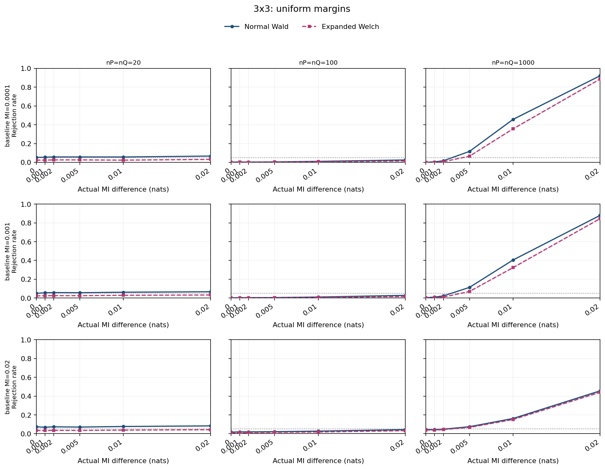

| Specification | Setting |
| --- | --- |
| Table size | 3x3 |
| Horizontal graph regime specifications (columns) | nP=nQ=20, nP=nQ=100, nP=nQ=1000 |
| Vertical graph regime specifications (rows) | baseline MI=0.0001: P row (0.3333 repeated 3 times), P column (0.3333 repeated 3 times); Q row (0.3333 repeated 3 times), Q column (0.3333 repeated 3 times); baseline MI=0.001: P row (0.3333 repeated 3 times), P column (0.3333 repeated 3 times); Q row (0.3333 repeated 3 times), Q column (0.3333 repeated 3 times); baseline MI=0.02: P row (0.3333 repeated 3 times), P column (0.3333 repeated 3 times); Q row (0.3333 repeated 3 times), Q column (0.3333 repeated 3 times) |
| Probability changes | baseline MI=0.0001: add at (1,1),(2,2) and subtract at (1,2),(2,1), for both P and Q; baseline MI=0.001: add at (1,1),(2,2) and subtract at (1,2),(2,1), for both P and Q; baseline MI=0.02: add at (1,1),(2,2) and subtract at (1,2),(2,1), for both P and Q |
| MI settings | Baseline MI {0.0001, 0.001, 0.02}; direction {q higher}; actual differences {0, 0.001, 0.002, 0.005, 0.01, 0.02} nats |
| Horizontal axis within each graph | Actual MI difference in nats, fixed from 0 to 0.02 |
| Vertical axis within each graph | Unconditional rejection rate from 0 to 1; invalid results count as non-rejections |
| Replicates | 20,000 per unique point |

Null-point rejection and validity:

| Vertical regime | Horizontal regime | x | Method | Rejection | Valid |
| --- | --- | --- | --- | --- | --- |
| baseline MI=0.0001 | nP=nQ=20 | 0 | Expanded Welch | 0.0235 | 1.0000 |
| baseline MI=0.0001 | nP=nQ=20 | 0 | Normal Wald | 0.0527 | 1.0000 |
| baseline MI=0.0001 | nP=nQ=100 | 0 | Expanded Welch | 0.0013 | 1.0000 |
| baseline MI=0.0001 | nP=nQ=100 | 0 | Normal Wald | 0.0025 | 1.0000 |
| baseline MI=0.0001 | nP=nQ=1000 | 0 | Expanded Welch | 0.0002 | 1.0000 |
| baseline MI=0.0001 | nP=nQ=1000 | 0 | Normal Wald | 0.0012 | 1.0000 |
| baseline MI=0.001 | nP=nQ=20 | 0 | Expanded Welch | 0.0223 | 1.0000 |
| baseline MI=0.001 | nP=nQ=20 | 0 | Normal Wald | 0.0503 | 1.0000 |
| baseline MI=0.001 | nP=nQ=100 | 0 | Expanded Welch | 0.0008 | 1.0000 |
| baseline MI=0.001 | nP=nQ=100 | 0 | Normal Wald | 0.0025 | 1.0000 |
| baseline MI=0.001 | nP=nQ=1000 | 0 | Expanded Welch | 0.0010 | 1.0000 |
| baseline MI=0.001 | nP=nQ=1000 | 0 | Normal Wald | 0.0037 | 1.0000 |
| baseline MI=0.02 | nP=nQ=20 | 0 | Expanded Welch | 0.0343 | 1.0000 |
| baseline MI=0.02 | nP=nQ=20 | 0 | Normal Wald | 0.0730 | 1.0000 |
| baseline MI=0.02 | nP=nQ=100 | 0 | Expanded Welch | 0.0106 | 1.0000 |
| baseline MI=0.02 | nP=nQ=100 | 0 | Normal Wald | 0.0167 | 1.0000 |
| baseline MI=0.02 | nP=nQ=1000 | 0 | Expanded Welch | 0.0393 | 1.0000 |
| baseline MI=0.02 | nP=nQ=1000 | 0 | Normal Wald | 0.0445 | 1.0000 |

Every plotted rate, interval, validity and minimum expected count

| Vertical regime | Horizontal regime | x | Method | Rejection | 95% interval | Valid | Conditional | Min expected P | Min expected Q |
| --- | --- | --- | --- | --- | --- | --- | --- | --- | --- |
| baseline MI=0.0001 | nP=nQ=20 | 0 | Expanded Welch | 0.0235 | [0.0215, 0.0257] | 1.0000 | 0.0235 | 2.175 | 2.175 |
| baseline MI=0.0001 | nP=nQ=20 | 0 | Normal Wald | 0.0527 | [0.0496, 0.0558] | 1.0000 | 0.0527 | 2.175 | 2.175 |
| baseline MI=0.0001 | nP=nQ=20 | 0.001 | Expanded Welch | 0.0238 | [0.0218, 0.0260] | 1.0000 | 0.0238 | 2.175 | 2.066 |
| baseline MI=0.0001 | nP=nQ=20 | 0.001 | Normal Wald | 0.0544 | [0.0513, 0.0576] | 1.0000 | 0.0544 | 2.175 | 2.066 |
| baseline MI=0.0001 | nP=nQ=20 | 0.002 | Expanded Welch | 0.0257 | [0.0236, 0.0280] | 1.0000 | 0.0257 | 2.175 | 2.006 |
| baseline MI=0.0001 | nP=nQ=20 | 0.002 | Normal Wald | 0.0574 | [0.0543, 0.0607] | 1.0000 | 0.0574 | 2.175 | 2.006 |
| baseline MI=0.0001 | nP=nQ=20 | 0.005 | Expanded Welch | 0.0260 | [0.0238, 0.0282] | 1.0000 | 0.0260 | 2.175 | 1.886 |
| baseline MI=0.0001 | nP=nQ=20 | 0.005 | Normal Wald | 0.0573 | [0.0541, 0.0606] | 1.0000 | 0.0573 | 2.175 | 1.886 |
| baseline MI=0.0001 | nP=nQ=20 | 0.01 | Expanded Welch | 0.0233 | [0.0213, 0.0255] | 1.0000 | 0.0233 | 2.175 | 1.75 |
| baseline MI=0.0001 | nP=nQ=20 | 0.01 | Normal Wald | 0.0568 | [0.0537, 0.0601] | 1.0000 | 0.0568 | 2.175 | 1.75 |
| baseline MI=0.0001 | nP=nQ=20 | 0.02 | Expanded Welch | 0.0313 | [0.0290, 0.0338] | 1.0000 | 0.0313 | 2.175 | 1.559 |
| baseline MI=0.0001 | nP=nQ=20 | 0.02 | Normal Wald | 0.0668 | [0.0634, 0.0703] | 1.0000 | 0.0668 | 2.175 | 1.559 |
| baseline MI=0.0001 | nP=nQ=100 | 0 | Expanded Welch | 0.0013 | [0.0009, 0.0019] | 1.0000 | 0.0013 | 10.88 | 10.88 |
| baseline MI=0.0001 | nP=nQ=100 | 0 | Normal Wald | 0.0025 | [0.0019, 0.0033] | 1.0000 | 0.0025 | 10.88 | 10.88 |
| baseline MI=0.0001 | nP=nQ=100 | 0.001 | Expanded Welch | 0.0015 | [0.0011, 0.0021] | 1.0000 | 0.0015 | 10.88 | 10.33 |
| baseline MI=0.0001 | nP=nQ=100 | 0.001 | Normal Wald | 0.0031 | [0.0024, 0.0040] | 1.0000 | 0.0031 | 10.88 | 10.33 |
| baseline MI=0.0001 | nP=nQ=100 | 0.002 | Expanded Welch | 0.0014 | [0.0009, 0.0020] | 1.0000 | 0.0014 | 10.88 | 10.03 |
| baseline MI=0.0001 | nP=nQ=100 | 0.002 | Normal Wald | 0.0028 | [0.0022, 0.0036] | 1.0000 | 0.0028 | 10.88 | 10.03 |
| baseline MI=0.0001 | nP=nQ=100 | 0.005 | Expanded Welch | 0.0026 | [0.0019, 0.0034] | 1.0000 | 0.0026 | 10.88 | 9.431 |
| baseline MI=0.0001 | nP=nQ=100 | 0.005 | Normal Wald | 0.0048 | [0.0039, 0.0059] | 1.0000 | 0.0048 | 10.88 | 9.431 |
| baseline MI=0.0001 | nP=nQ=100 | 0.01 | Expanded Welch | 0.0056 | [0.0047, 0.0068] | 1.0000 | 0.0056 | 10.88 | 8.751 |
| baseline MI=0.0001 | nP=nQ=100 | 0.01 | Normal Wald | 0.0102 | [0.0089, 0.0117] | 1.0000 | 0.0102 | 10.88 | 8.751 |
| baseline MI=0.0001 | nP=nQ=100 | 0.02 | Expanded Welch | 0.0141 | [0.0126, 0.0158] | 1.0000 | 0.0141 | 10.88 | 7.795 |
| baseline MI=0.0001 | nP=nQ=100 | 0.02 | Normal Wald | 0.0252 | [0.0231, 0.0275] | 1.0000 | 0.0252 | 10.88 | 7.795 |
| baseline MI=0.0001 | nP=nQ=1000 | 0 | Expanded Welch | 0.0002 | [0.0001, 0.0005] | 1.0000 | 0.0002 | 108.8 | 108.8 |
| baseline MI=0.0001 | nP=nQ=1000 | 0 | Normal Wald | 0.0012 | [0.0008, 0.0018] | 1.0000 | 0.0012 | 108.8 | 108.8 |
| baseline MI=0.0001 | nP=nQ=1000 | 0.001 | Expanded Welch | 0.0008 | [0.0005, 0.0013] | 1.0000 | 0.0008 | 108.8 | 103.3 |
| baseline MI=0.0001 | nP=nQ=1000 | 0.001 | Normal Wald | 0.0044 | [0.0036, 0.0055] | 1.0000 | 0.0044 | 108.8 | 103.3 |
| baseline MI=0.0001 | nP=nQ=1000 | 0.002 | Expanded Welch | 0.0066 | [0.0056, 0.0078] | 1.0000 | 0.0066 | 108.8 | 100.3 |
| baseline MI=0.0001 | nP=nQ=1000 | 0.002 | Normal Wald | 0.0168 | [0.0151, 0.0186] | 1.0000 | 0.0168 | 108.8 | 100.3 |
| baseline MI=0.0001 | nP=nQ=1000 | 0.005 | Expanded Welch | 0.0653 | [0.0620, 0.0688] | 1.0000 | 0.0653 | 108.8 | 94.31 |
| baseline MI=0.0001 | nP=nQ=1000 | 0.005 | Normal Wald | 0.1167 | [0.1123, 0.1212] | 1.0000 | 0.1167 | 108.8 | 94.31 |
| baseline MI=0.0001 | nP=nQ=1000 | 0.01 | Expanded Welch | 0.3567 | [0.3500, 0.3633] | 1.0000 | 0.3567 | 108.8 | 87.51 |
| baseline MI=0.0001 | nP=nQ=1000 | 0.01 | Normal Wald | 0.4574 | [0.4505, 0.4643] | 1.0000 | 0.4574 | 108.8 | 87.51 |
| baseline MI=0.0001 | nP=nQ=1000 | 0.02 | Expanded Welch | 0.8873 | [0.8828, 0.8916] | 1.0000 | 0.8873 | 108.8 | 77.95 |
| baseline MI=0.0001 | nP=nQ=1000 | 0.02 | Normal Wald | 0.9222 | [0.9184, 0.9258] | 1.0000 | 0.9222 | 108.8 | 77.95 |
| baseline MI=0.001 | nP=nQ=20 | 0 | Expanded Welch | 0.0223 | [0.0203, 0.0244] | 1.0000 | 0.0223 | 2.073 | 2.073 |
| baseline MI=0.001 | nP=nQ=20 | 0 | Normal Wald | 0.0503 | [0.0474, 0.0535] | 1.0000 | 0.0503 | 2.073 | 2.073 |
| baseline MI=0.001 | nP=nQ=20 | 0.001 | Expanded Welch | 0.0240 | [0.0220, 0.0263] | 1.0000 | 0.0240 | 2.073 | 2.012 |
| baseline MI=0.001 | nP=nQ=20 | 0.001 | Normal Wald | 0.0553 | [0.0522, 0.0586] | 1.0000 | 0.0553 | 2.073 | 2.012 |
| baseline MI=0.001 | nP=nQ=20 | 0.002 | Expanded Welch | 0.0251 | [0.0230, 0.0274] | 1.0000 | 0.0251 | 2.073 | 1.964 |
| baseline MI=0.001 | nP=nQ=20 | 0.002 | Normal Wald | 0.0582 | [0.0550, 0.0615] | 1.0000 | 0.0582 | 2.073 | 1.964 |
| baseline MI=0.001 | nP=nQ=20 | 0.005 | Expanded Welch | 0.0248 | [0.0227, 0.0270] | 1.0000 | 0.0248 | 2.073 | 1.858 |
| baseline MI=0.001 | nP=nQ=20 | 0.005 | Normal Wald | 0.0565 | [0.0533, 0.0597] | 1.0000 | 0.0565 | 2.073 | 1.858 |
| baseline MI=0.001 | nP=nQ=20 | 0.01 | Expanded Welch | 0.0291 | [0.0269, 0.0315] | 1.0000 | 0.0291 | 2.073 | 1.73 |
| baseline MI=0.001 | nP=nQ=20 | 0.01 | Normal Wald | 0.0619 | [0.0586, 0.0653] | 1.0000 | 0.0619 | 2.073 | 1.73 |
| baseline MI=0.001 | nP=nQ=20 | 0.02 | Expanded Welch | 0.0323 | [0.0299, 0.0348] | 1.0000 | 0.0323 | 2.073 | 1.545 |
| baseline MI=0.001 | nP=nQ=20 | 0.02 | Normal Wald | 0.0667 | [0.0633, 0.0702] | 1.0000 | 0.0667 | 2.073 | 1.545 |
| baseline MI=0.001 | nP=nQ=100 | 0 | Expanded Welch | 0.0008 | [0.0005, 0.0012] | 1.0000 | 0.0008 | 10.37 | 10.37 |
| baseline MI=0.001 | nP=nQ=100 | 0 | Normal Wald | 0.0025 | [0.0019, 0.0033] | 1.0000 | 0.0025 | 10.37 | 10.37 |
| baseline MI=0.001 | nP=nQ=100 | 0.001 | Expanded Welch | 0.0016 | [0.0011, 0.0023] | 1.0000 | 0.0016 | 10.37 | 10.06 |
| baseline MI=0.001 | nP=nQ=100 | 0.001 | Normal Wald | 0.0033 | [0.0026, 0.0042] | 1.0000 | 0.0033 | 10.37 | 10.06 |
| baseline MI=0.001 | nP=nQ=100 | 0.002 | Expanded Welch | 0.0022 | [0.0016, 0.0029] | 1.0000 | 0.0022 | 10.37 | 9.822 |
| baseline MI=0.001 | nP=nQ=100 | 0.002 | Normal Wald | 0.0040 | [0.0032, 0.0049] | 1.0000 | 0.0040 | 10.37 | 9.822 |
| baseline MI=0.001 | nP=nQ=100 | 0.005 | Expanded Welch | 0.0024 | [0.0018, 0.0031] | 1.0000 | 0.0024 | 10.37 | 9.289 |
| baseline MI=0.001 | nP=nQ=100 | 0.005 | Normal Wald | 0.0049 | [0.0040, 0.0060] | 1.0000 | 0.0049 | 10.37 | 9.289 |
| baseline MI=0.001 | nP=nQ=100 | 0.01 | Expanded Welch | 0.0054 | [0.0045, 0.0065] | 1.0000 | 0.0054 | 10.37 | 8.649 |
| baseline MI=0.001 | nP=nQ=100 | 0.01 | Normal Wald | 0.0106 | [0.0092, 0.0121] | 1.0000 | 0.0106 | 10.37 | 8.649 |
| baseline MI=0.001 | nP=nQ=100 | 0.02 | Expanded Welch | 0.0160 | [0.0144, 0.0179] | 1.0000 | 0.0160 | 10.37 | 7.723 |
| baseline MI=0.001 | nP=nQ=100 | 0.02 | Normal Wald | 0.0282 | [0.0260, 0.0306] | 1.0000 | 0.0282 | 10.37 | 7.723 |
| baseline MI=0.001 | nP=nQ=1000 | 0 | Expanded Welch | 0.0010 | [0.0006, 0.0015] | 1.0000 | 0.0010 | 103.7 | 103.7 |
| baseline MI=0.001 | nP=nQ=1000 | 0 | Normal Wald | 0.0037 | [0.0030, 0.0047] | 1.0000 | 0.0037 | 103.7 | 103.7 |
| baseline MI=0.001 | nP=nQ=1000 | 0.001 | Expanded Welch | 0.0033 | [0.0026, 0.0042] | 1.0000 | 0.0033 | 103.7 | 100.6 |
| baseline MI=0.001 | nP=nQ=1000 | 0.001 | Normal Wald | 0.0096 | [0.0083, 0.0110] | 1.0000 | 0.0096 | 103.7 | 100.6 |
| baseline MI=0.001 | nP=nQ=1000 | 0.002 | Expanded Welch | 0.0101 | [0.0089, 0.0116] | 1.0000 | 0.0101 | 103.7 | 98.22 |
| baseline MI=0.001 | nP=nQ=1000 | 0.002 | Normal Wald | 0.0226 | [0.0206, 0.0248] | 1.0000 | 0.0226 | 103.7 | 98.22 |
| baseline MI=0.001 | nP=nQ=1000 | 0.005 | Expanded Welch | 0.0698 | [0.0664, 0.0734] | 1.0000 | 0.0698 | 103.7 | 92.89 |
| baseline MI=0.001 | nP=nQ=1000 | 0.005 | Normal Wald | 0.1134 | [0.1091, 0.1179] | 1.0000 | 0.1134 | 103.7 | 92.89 |
| baseline MI=0.001 | nP=nQ=1000 | 0.01 | Expanded Welch | 0.3239 | [0.3174, 0.3304] | 1.0000 | 0.3239 | 103.7 | 86.49 |
| baseline MI=0.001 | nP=nQ=1000 | 0.01 | Normal Wald | 0.4051 | [0.3983, 0.4119] | 1.0000 | 0.4051 | 103.7 | 86.49 |
| baseline MI=0.001 | nP=nQ=1000 | 0.02 | Expanded Welch | 0.8459 | [0.8409, 0.8509] | 1.0000 | 0.8459 | 103.7 | 77.23 |
| baseline MI=0.001 | nP=nQ=1000 | 0.02 | Normal Wald | 0.8806 | [0.8760, 0.8850] | 1.0000 | 0.8806 | 103.7 | 77.23 |
| baseline MI=0.02 | nP=nQ=20 | 0 | Expanded Welch | 0.0343 | [0.0319, 0.0369] | 1.0000 | 0.0343 | 1.561 | 1.561 |
| baseline MI=0.02 | nP=nQ=20 | 0 | Normal Wald | 0.0730 | [0.0694, 0.0766] | 1.0000 | 0.0730 | 1.561 | 1.561 |
| baseline MI=0.02 | nP=nQ=20 | 0.001 | Expanded Welch | 0.0330 | [0.0306, 0.0356] | 1.0000 | 0.0330 | 1.561 | 1.545 |
| baseline MI=0.02 | nP=nQ=20 | 0.001 | Normal Wald | 0.0687 | [0.0653, 0.0723] | 1.0000 | 0.0687 | 1.561 | 1.545 |
| baseline MI=0.02 | nP=nQ=20 | 0.002 | Expanded Welch | 0.0354 | [0.0329, 0.0381] | 1.0000 | 0.0354 | 1.561 | 1.529 |
| baseline MI=0.02 | nP=nQ=20 | 0.002 | Normal Wald | 0.0734 | [0.0699, 0.0771] | 1.0000 | 0.0734 | 1.561 | 1.529 |
| baseline MI=0.02 | nP=nQ=20 | 0.005 | Expanded Welch | 0.0349 | [0.0324, 0.0375] | 1.0000 | 0.0349 | 1.561 | 1.484 |
| baseline MI=0.02 | nP=nQ=20 | 0.005 | Normal Wald | 0.0706 | [0.0671, 0.0742] | 1.0000 | 0.0706 | 1.561 | 1.484 |
| baseline MI=0.02 | nP=nQ=20 | 0.01 | Expanded Welch | 0.0384 | [0.0358, 0.0412] | 1.0000 | 0.0384 | 1.561 | 1.415 |
| baseline MI=0.02 | nP=nQ=20 | 0.01 | Normal Wald | 0.0767 | [0.0731, 0.0805] | 1.0000 | 0.0767 | 1.561 | 1.415 |
| baseline MI=0.02 | nP=nQ=20 | 0.02 | Expanded Welch | 0.0425 | [0.0398, 0.0454] | 1.0000 | 0.0426 | 1.561 | 1.294 |
| baseline MI=0.02 | nP=nQ=20 | 0.02 | Normal Wald | 0.0832 | [0.0795, 0.0871] | 1.0000 | 0.0832 | 1.561 | 1.294 |
| baseline MI=0.02 | nP=nQ=100 | 0 | Expanded Welch | 0.0106 | [0.0092, 0.0121] | 1.0000 | 0.0106 | 7.803 | 7.803 |
| baseline MI=0.02 | nP=nQ=100 | 0 | Normal Wald | 0.0167 | [0.0150, 0.0185] | 1.0000 | 0.0167 | 7.803 | 7.803 |
| baseline MI=0.02 | nP=nQ=100 | 0.001 | Expanded Welch | 0.0115 | [0.0101, 0.0131] | 1.0000 | 0.0115 | 7.803 | 7.723 |
| baseline MI=0.02 | nP=nQ=100 | 0.001 | Normal Wald | 0.0194 | [0.0176, 0.0215] | 1.0000 | 0.0194 | 7.803 | 7.723 |
| baseline MI=0.02 | nP=nQ=100 | 0.002 | Expanded Welch | 0.0123 | [0.0109, 0.0140] | 1.0000 | 0.0123 | 7.803 | 7.644 |
| baseline MI=0.02 | nP=nQ=100 | 0.002 | Normal Wald | 0.0196 | [0.0178, 0.0216] | 1.0000 | 0.0196 | 7.803 | 7.644 |
| baseline MI=0.02 | nP=nQ=100 | 0.005 | Expanded Welch | 0.0142 | [0.0127, 0.0159] | 1.0000 | 0.0142 | 7.803 | 7.42 |
| baseline MI=0.02 | nP=nQ=100 | 0.005 | Normal Wald | 0.0216 | [0.0197, 0.0237] | 1.0000 | 0.0216 | 7.803 | 7.42 |
| baseline MI=0.02 | nP=nQ=100 | 0.01 | Expanded Welch | 0.0179 | [0.0162, 0.0198] | 1.0000 | 0.0179 | 7.803 | 7.075 |
| baseline MI=0.02 | nP=nQ=100 | 0.01 | Normal Wald | 0.0272 | [0.0250, 0.0295] | 1.0000 | 0.0272 | 7.803 | 7.075 |
| baseline MI=0.02 | nP=nQ=100 | 0.02 | Expanded Welch | 0.0323 | [0.0300, 0.0349] | 1.0000 | 0.0323 | 7.803 | 6.469 |
| baseline MI=0.02 | nP=nQ=100 | 0.02 | Normal Wald | 0.0440 | [0.0412, 0.0469] | 1.0000 | 0.0440 | 7.803 | 6.469 |
| baseline MI=0.02 | nP=nQ=1000 | 0 | Expanded Welch | 0.0393 | [0.0366, 0.0420] | 1.0000 | 0.0393 | 78.03 | 78.03 |
| baseline MI=0.02 | nP=nQ=1000 | 0 | Normal Wald | 0.0445 | [0.0417, 0.0474] | 1.0000 | 0.0445 | 78.03 | 78.03 |
| baseline MI=0.02 | nP=nQ=1000 | 0.001 | Expanded Welch | 0.0379 | [0.0353, 0.0406] | 1.0000 | 0.0379 | 78.03 | 77.23 |
| baseline MI=0.02 | nP=nQ=1000 | 0.001 | Normal Wald | 0.0430 | [0.0402, 0.0458] | 1.0000 | 0.0430 | 78.03 | 77.23 |
| baseline MI=0.02 | nP=nQ=1000 | 0.002 | Expanded Welch | 0.0440 | [0.0412, 0.0469] | 1.0000 | 0.0440 | 78.03 | 76.44 |
| baseline MI=0.02 | nP=nQ=1000 | 0.002 | Normal Wald | 0.0483 | [0.0455, 0.0514] | 1.0000 | 0.0483 | 78.03 | 76.44 |
| baseline MI=0.02 | nP=nQ=1000 | 0.005 | Expanded Welch | 0.0668 | [0.0634, 0.0703] | 1.0000 | 0.0668 | 78.03 | 74.2 |
| baseline MI=0.02 | nP=nQ=1000 | 0.005 | Normal Wald | 0.0745 | [0.0709, 0.0782] | 1.0000 | 0.0745 | 78.03 | 74.2 |
| baseline MI=0.02 | nP=nQ=1000 | 0.01 | Expanded Welch | 0.1512 | [0.1463, 0.1562] | 1.0000 | 0.1512 | 78.03 | 70.75 |
| baseline MI=0.02 | nP=nQ=1000 | 0.01 | Normal Wald | 0.1620 | [0.1569, 0.1671] | 1.0000 | 0.1620 | 78.03 | 70.75 |
| baseline MI=0.02 | nP=nQ=1000 | 0.02 | Expanded Welch | 0.4415 | [0.4346, 0.4484] | 1.0000 | 0.4415 | 78.03 | 64.69 |
| baseline MI=0.02 | nP=nQ=1000 | 0.02 | Normal Wald | 0.4563 | [0.4494, 0.4632] | 1.0000 | 0.4563 | 78.03 | 64.69 |

### 4.5 3x3: same skew margins

Does performance change when the populations begin closer to independence?

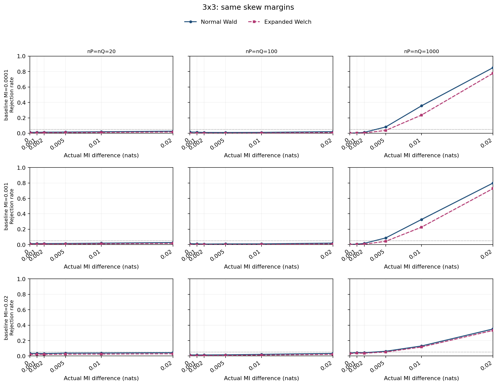

| Specification | Setting |
| --- | --- |
| Table size | 3x3 |
| Horizontal graph regime specifications (columns) | nP=nQ=20, nP=nQ=100, nP=nQ=1000 |
| Vertical graph regime specifications (rows) | baseline MI=0.0001: P row (0.8, 0.2/2 repeated 2 times), P column (0.8, 0.2/2 repeated 2 times); Q row (0.8, 0.2/2 repeated 2 times), Q column (0.8, 0.2/2 repeated 2 times); baseline MI=0.001: P row (0.8, 0.2/2 repeated 2 times), P column (0.8, 0.2/2 repeated 2 times); Q row (0.8, 0.2/2 repeated 2 times), Q column (0.8, 0.2/2 repeated 2 times); baseline MI=0.02: P row (0.8, 0.2/2 repeated 2 times), P column (0.8, 0.2/2 repeated 2 times); Q row (0.8, 0.2/2 repeated 2 times), Q column (0.8, 0.2/2 repeated 2 times) |
| Probability changes | baseline MI=0.0001: add at (1,1),(2,2) and subtract at (1,2),(2,1), for both P and Q; baseline MI=0.001: add at (1,1),(2,2) and subtract at (1,2),(2,1), for both P and Q; baseline MI=0.02: add at (1,1),(2,2) and subtract at (1,2),(2,1), for both P and Q |
| MI settings | Baseline MI {0.0001, 0.001, 0.02}; direction {q higher}; actual differences {0, 0.001, 0.002, 0.005, 0.01, 0.02} nats |
| Horizontal axis within each graph | Actual MI difference in nats, fixed from 0 to 0.02 |
| Vertical axis within each graph | Unconditional rejection rate from 0 to 1; invalid results count as non-rejections |
| Replicates | 20,000 per unique point |

Null-point rejection and validity:

| Vertical regime | Horizontal regime | x | Method | Rejection | Valid |
| --- | --- | --- | --- | --- | --- |
| baseline MI=0.0001 | nP=nQ=20 | 0 | Expanded Welch | 0.0056 | 0.9552 |
| baseline MI=0.0001 | nP=nQ=20 | 0 | Normal Wald | 0.0118 | 0.9997 |
| baseline MI=0.0001 | nP=nQ=100 | 0 | Expanded Welch | 0.0011 | 1.0000 |
| baseline MI=0.0001 | nP=nQ=100 | 0 | Normal Wald | 0.0151 | 1.0000 |
| baseline MI=0.0001 | nP=nQ=1000 | 0 | Expanded Welch | 0.0007 | 1.0000 |
| baseline MI=0.0001 | nP=nQ=1000 | 0 | Normal Wald | 0.0024 | 1.0000 |
| baseline MI=0.001 | nP=nQ=20 | 0 | Expanded Welch | 0.0080 | 0.9542 |
| baseline MI=0.001 | nP=nQ=20 | 0 | Normal Wald | 0.0138 | 0.9994 |
| baseline MI=0.001 | nP=nQ=100 | 0 | Expanded Welch | 0.0010 | 1.0000 |
| baseline MI=0.001 | nP=nQ=100 | 0 | Normal Wald | 0.0117 | 1.0000 |
| baseline MI=0.001 | nP=nQ=1000 | 0 | Expanded Welch | 0.0011 | 1.0000 |
| baseline MI=0.001 | nP=nQ=1000 | 0 | Normal Wald | 0.0036 | 1.0000 |
| baseline MI=0.02 | nP=nQ=20 | 0 | Expanded Welch | 0.0207 | 0.9565 |
| baseline MI=0.02 | nP=nQ=20 | 0 | Normal Wald | 0.0333 | 0.9996 |
| baseline MI=0.02 | nP=nQ=100 | 0 | Expanded Welch | 0.0068 | 1.0000 |
| baseline MI=0.02 | nP=nQ=100 | 0 | Normal Wald | 0.0139 | 1.0000 |
| baseline MI=0.02 | nP=nQ=1000 | 0 | Expanded Welch | 0.0314 | 1.0000 |
| baseline MI=0.02 | nP=nQ=1000 | 0 | Normal Wald | 0.0391 | 1.0000 |

Every plotted rate, interval, validity and minimum expected count

| Vertical regime | Horizontal regime | x | Method | Rejection | 95% interval | Valid | Conditional | Min expected P | Min expected Q |
| --- | --- | --- | --- | --- | --- | --- | --- | --- | --- |
| baseline MI=0.0001 | nP=nQ=20 | 0 | Expanded Welch | 0.0056 | [0.0047, 0.0068] | 0.9552 | 0.0059 | 0.2 | 0.2 |
| baseline MI=0.0001 | nP=nQ=20 | 0 | Normal Wald | 0.0118 | [0.0104, 0.0134] | 0.9997 | 0.0119 | 0.2 | 0.2 |
| baseline MI=0.0001 | nP=nQ=20 | 0.001 | Expanded Welch | 0.0063 | [0.0052, 0.0074] | 0.9549 | 0.0065 | 0.2 | 0.2 |
| baseline MI=0.0001 | nP=nQ=20 | 0.001 | Normal Wald | 0.0120 | [0.0106, 0.0136] | 0.9995 | 0.0120 | 0.2 | 0.2 |
| baseline MI=0.0001 | nP=nQ=20 | 0.002 | Expanded Welch | 0.0071 | [0.0060, 0.0084] | 0.9546 | 0.0074 | 0.2 | 0.2 |
| baseline MI=0.0001 | nP=nQ=20 | 0.002 | Normal Wald | 0.0140 | [0.0125, 0.0158] | 0.9991 | 0.0141 | 0.2 | 0.2 |
| baseline MI=0.0001 | nP=nQ=20 | 0.005 | Expanded Welch | 0.0081 | [0.0069, 0.0094] | 0.9537 | 0.0085 | 0.2 | 0.2 |
| baseline MI=0.0001 | nP=nQ=20 | 0.005 | Normal Wald | 0.0154 | [0.0137, 0.0171] | 0.9997 | 0.0154 | 0.2 | 0.2 |
| baseline MI=0.0001 | nP=nQ=20 | 0.01 | Expanded Welch | 0.0109 | [0.0096, 0.0124] | 0.9576 | 0.0114 | 0.2 | 0.2 |
| baseline MI=0.0001 | nP=nQ=20 | 0.01 | Normal Wald | 0.0194 | [0.0176, 0.0215] | 0.9994 | 0.0195 | 0.2 | 0.2 |
| baseline MI=0.0001 | nP=nQ=20 | 0.02 | Expanded Welch | 0.0162 | [0.0145, 0.0180] | 0.9550 | 0.0170 | 0.2 | 0.2 |
| baseline MI=0.0001 | nP=nQ=20 | 0.02 | Normal Wald | 0.0266 | [0.0245, 0.0289] | 0.9997 | 0.0266 | 0.2 | 0.2 |
| baseline MI=0.0001 | nP=nQ=100 | 0 | Expanded Welch | 0.0011 | [0.0007, 0.0017] | 1.0000 | 0.0011 | 1 | 1 |
| baseline MI=0.0001 | nP=nQ=100 | 0 | Normal Wald | 0.0151 | [0.0135, 0.0169] | 1.0000 | 0.0151 | 1 | 1 |
| baseline MI=0.0001 | nP=nQ=100 | 0.001 | Expanded Welch | 0.0010 | [0.0006, 0.0015] | 1.0000 | 0.0010 | 1 | 1 |
| baseline MI=0.0001 | nP=nQ=100 | 0.001 | Normal Wald | 0.0140 | [0.0124, 0.0157] | 1.0000 | 0.0140 | 1 | 1 |
| baseline MI=0.0001 | nP=nQ=100 | 0.002 | Expanded Welch | 0.0009 | [0.0006, 0.0014] | 1.0000 | 0.0009 | 1 | 1 |
| baseline MI=0.0001 | nP=nQ=100 | 0.002 | Normal Wald | 0.0103 | [0.0090, 0.0118] | 1.0000 | 0.0103 | 1 | 1 |
| baseline MI=0.0001 | nP=nQ=100 | 0.005 | Expanded Welch | 0.0013 | [0.0009, 0.0019] | 1.0000 | 0.0013 | 1 | 1 |
| baseline MI=0.0001 | nP=nQ=100 | 0.005 | Normal Wald | 0.0099 | [0.0086, 0.0114] | 1.0000 | 0.0099 | 1 | 1 |
| baseline MI=0.0001 | nP=nQ=100 | 0.01 | Expanded Welch | 0.0024 | [0.0018, 0.0032] | 1.0000 | 0.0024 | 1 | 1 |
| baseline MI=0.0001 | nP=nQ=100 | 0.01 | Normal Wald | 0.0112 | [0.0098, 0.0128] | 1.0000 | 0.0112 | 1 | 1 |
| baseline MI=0.0001 | nP=nQ=100 | 0.02 | Expanded Welch | 0.0077 | [0.0066, 0.0091] | 1.0000 | 0.0077 | 1 | 1 |
| baseline MI=0.0001 | nP=nQ=100 | 0.02 | Normal Wald | 0.0204 | [0.0186, 0.0225] | 1.0000 | 0.0204 | 1 | 1 |
| baseline MI=0.0001 | nP=nQ=1000 | 0 | Expanded Welch | 0.0007 | [0.0004, 0.0012] | 1.0000 | 0.0007 | 10 | 10 |
| baseline MI=0.0001 | nP=nQ=1000 | 0 | Normal Wald | 0.0024 | [0.0018, 0.0031] | 1.0000 | 0.0024 | 10 | 10 |
| baseline MI=0.0001 | nP=nQ=1000 | 0.001 | Expanded Welch | 0.0014 | [0.0010, 0.0020] | 1.0000 | 0.0014 | 10 | 10 |
| baseline MI=0.0001 | nP=nQ=1000 | 0.001 | Normal Wald | 0.0044 | [0.0036, 0.0055] | 1.0000 | 0.0044 | 10 | 10 |
| baseline MI=0.0001 | nP=nQ=1000 | 0.002 | Expanded Welch | 0.0041 | [0.0033, 0.0051] | 1.0000 | 0.0041 | 10 | 10 |
| baseline MI=0.0001 | nP=nQ=1000 | 0.002 | Normal Wald | 0.0115 | [0.0101, 0.0131] | 1.0000 | 0.0115 | 10 | 10 |
| baseline MI=0.0001 | nP=nQ=1000 | 0.005 | Expanded Welch | 0.0365 | [0.0340, 0.0392] | 1.0000 | 0.0365 | 10 | 10 |
| baseline MI=0.0001 | nP=nQ=1000 | 0.005 | Normal Wald | 0.0819 | [0.0781, 0.0857] | 1.0000 | 0.0819 | 10 | 10 |
| baseline MI=0.0001 | nP=nQ=1000 | 0.01 | Expanded Welch | 0.2359 | [0.2301, 0.2418] | 1.0000 | 0.2359 | 10 | 10 |
| baseline MI=0.0001 | nP=nQ=1000 | 0.01 | Normal Wald | 0.3558 | [0.3491, 0.3624] | 1.0000 | 0.3558 | 10 | 10 |
| baseline MI=0.0001 | nP=nQ=1000 | 0.02 | Expanded Welch | 0.7784 | [0.7726, 0.7842] | 1.0000 | 0.7784 | 10 | 10 |
| baseline MI=0.0001 | nP=nQ=1000 | 0.02 | Normal Wald | 0.8508 | [0.8457, 0.8556] | 1.0000 | 0.8508 | 10 | 10 |
| baseline MI=0.001 | nP=nQ=20 | 0 | Expanded Welch | 0.0080 | [0.0069, 0.0094] | 0.9542 | 0.0084 | 0.2 | 0.2 |
| baseline MI=0.001 | nP=nQ=20 | 0 | Normal Wald | 0.0138 | [0.0123, 0.0156] | 0.9994 | 0.0139 | 0.2 | 0.2 |
| baseline MI=0.001 | nP=nQ=20 | 0.001 | Expanded Welch | 0.0083 | [0.0071, 0.0096] | 0.9560 | 0.0086 | 0.2 | 0.2 |
| baseline MI=0.001 | nP=nQ=20 | 0.001 | Normal Wald | 0.0143 | [0.0127, 0.0160] | 0.9993 | 0.0143 | 0.2 | 0.2 |
| baseline MI=0.001 | nP=nQ=20 | 0.002 | Expanded Welch | 0.0073 | [0.0063, 0.0086] | 0.9577 | 0.0077 | 0.2 | 0.2 |
| baseline MI=0.001 | nP=nQ=20 | 0.002 | Normal Wald | 0.0142 | [0.0127, 0.0159] | 0.9994 | 0.0142 | 0.2 | 0.2 |
| baseline MI=0.001 | nP=nQ=20 | 0.005 | Expanded Welch | 0.0082 | [0.0070, 0.0095] | 0.9534 | 0.0086 | 0.2 | 0.2 |
| baseline MI=0.001 | nP=nQ=20 | 0.005 | Normal Wald | 0.0153 | [0.0137, 0.0171] | 0.9992 | 0.0153 | 0.2 | 0.2 |
| baseline MI=0.001 | nP=nQ=20 | 0.01 | Expanded Welch | 0.0110 | [0.0096, 0.0125] | 0.9522 | 0.0116 | 0.2 | 0.2 |
| baseline MI=0.001 | nP=nQ=20 | 0.01 | Normal Wald | 0.0194 | [0.0176, 0.0215] | 0.9993 | 0.0195 | 0.2 | 0.2 |
| baseline MI=0.001 | nP=nQ=20 | 0.02 | Expanded Welch | 0.0158 | [0.0142, 0.0176] | 0.9543 | 0.0166 | 0.2 | 0.2 |
| baseline MI=0.001 | nP=nQ=20 | 0.02 | Normal Wald | 0.0268 | [0.0247, 0.0292] | 0.9996 | 0.0269 | 0.2 | 0.2 |
| baseline MI=0.001 | nP=nQ=100 | 0 | Expanded Welch | 0.0010 | [0.0006, 0.0015] | 1.0000 | 0.0010 | 1 | 1 |
| baseline MI=0.001 | nP=nQ=100 | 0 | Normal Wald | 0.0117 | [0.0103, 0.0133] | 1.0000 | 0.0117 | 1 | 1 |
| baseline MI=0.001 | nP=nQ=100 | 0.001 | Expanded Welch | 0.0009 | [0.0006, 0.0015] | 1.0000 | 0.0009 | 1 | 1 |
| baseline MI=0.001 | nP=nQ=100 | 0.001 | Normal Wald | 0.0109 | [0.0096, 0.0124] | 1.0000 | 0.0109 | 1 | 1 |
| baseline MI=0.001 | nP=nQ=100 | 0.002 | Expanded Welch | 0.0009 | [0.0006, 0.0014] | 1.0000 | 0.0009 | 1 | 1 |
| baseline MI=0.001 | nP=nQ=100 | 0.002 | Normal Wald | 0.0079 | [0.0068, 0.0092] | 1.0000 | 0.0079 | 1 | 1 |
| baseline MI=0.001 | nP=nQ=100 | 0.005 | Expanded Welch | 0.0014 | [0.0010, 0.0021] | 1.0000 | 0.0014 | 1 | 1 |
| baseline MI=0.001 | nP=nQ=100 | 0.005 | Normal Wald | 0.0095 | [0.0083, 0.0110] | 1.0000 | 0.0095 | 1 | 1 |
| baseline MI=0.001 | nP=nQ=100 | 0.01 | Expanded Welch | 0.0024 | [0.0018, 0.0032] | 1.0000 | 0.0024 | 1 | 1 |
| baseline MI=0.001 | nP=nQ=100 | 0.01 | Normal Wald | 0.0103 | [0.0090, 0.0118] | 1.0000 | 0.0103 | 1 | 1 |
| baseline MI=0.001 | nP=nQ=100 | 0.02 | Expanded Welch | 0.0088 | [0.0076, 0.0102] | 1.0000 | 0.0088 | 1 | 1 |
| baseline MI=0.001 | nP=nQ=100 | 0.02 | Normal Wald | 0.0198 | [0.0180, 0.0218] | 1.0000 | 0.0198 | 1 | 1 |
| baseline MI=0.001 | nP=nQ=1000 | 0 | Expanded Welch | 0.0011 | [0.0007, 0.0017] | 1.0000 | 0.0011 | 10 | 10 |
| baseline MI=0.001 | nP=nQ=1000 | 0 | Normal Wald | 0.0036 | [0.0028, 0.0045] | 1.0000 | 0.0036 | 10 | 10 |
| baseline MI=0.001 | nP=nQ=1000 | 0.001 | Expanded Welch | 0.0026 | [0.0019, 0.0034] | 1.0000 | 0.0026 | 10 | 10 |
| baseline MI=0.001 | nP=nQ=1000 | 0.001 | Normal Wald | 0.0066 | [0.0056, 0.0078] | 1.0000 | 0.0066 | 10 | 10 |
| baseline MI=0.001 | nP=nQ=1000 | 0.002 | Expanded Welch | 0.0058 | [0.0048, 0.0070] | 1.0000 | 0.0058 | 10 | 10 |
| baseline MI=0.001 | nP=nQ=1000 | 0.002 | Normal Wald | 0.0167 | [0.0150, 0.0185] | 1.0000 | 0.0167 | 10 | 10 |
| baseline MI=0.001 | nP=nQ=1000 | 0.005 | Expanded Welch | 0.0431 | [0.0404, 0.0460] | 1.0000 | 0.0431 | 10 | 10 |
| baseline MI=0.001 | nP=nQ=1000 | 0.005 | Normal Wald | 0.0872 | [0.0833, 0.0911] | 1.0000 | 0.0872 | 10 | 10 |
| baseline MI=0.001 | nP=nQ=1000 | 0.01 | Expanded Welch | 0.2268 | [0.2210, 0.2327] | 1.0000 | 0.2268 | 10 | 10 |
| baseline MI=0.001 | nP=nQ=1000 | 0.01 | Normal Wald | 0.3263 | [0.3199, 0.3329] | 1.0000 | 0.3263 | 10 | 10 |
| baseline MI=0.001 | nP=nQ=1000 | 0.02 | Expanded Welch | 0.7278 | [0.7216, 0.7340] | 1.0000 | 0.7278 | 10 | 10 |
| baseline MI=0.001 | nP=nQ=1000 | 0.02 | Normal Wald | 0.7991 | [0.7934, 0.8045] | 1.0000 | 0.7991 | 10 | 10 |
| baseline MI=0.02 | nP=nQ=20 | 0 | Expanded Welch | 0.0207 | [0.0188, 0.0228] | 0.9565 | 0.0216 | 0.2 | 0.2 |
| baseline MI=0.02 | nP=nQ=20 | 0 | Normal Wald | 0.0333 | [0.0309, 0.0359] | 0.9996 | 0.0333 | 0.2 | 0.2 |
| baseline MI=0.02 | nP=nQ=20 | 0.001 | Expanded Welch | 0.0215 | [0.0195, 0.0236] | 0.9570 | 0.0224 | 0.2 | 0.2 |
| baseline MI=0.02 | nP=nQ=20 | 0.001 | Normal Wald | 0.0338 | [0.0314, 0.0364] | 0.9997 | 0.0338 | 0.2 | 0.2 |
| baseline MI=0.02 | nP=nQ=20 | 0.002 | Expanded Welch | 0.0203 | [0.0184, 0.0223] | 0.9553 | 0.0212 | 0.2 | 0.2 |
| baseline MI=0.02 | nP=nQ=20 | 0.002 | Normal Wald | 0.0328 | [0.0304, 0.0354] | 0.9993 | 0.0328 | 0.2 | 0.2 |
| baseline MI=0.02 | nP=nQ=20 | 0.005 | Expanded Welch | 0.0233 | [0.0213, 0.0255] | 0.9553 | 0.0244 | 0.2 | 0.2 |
| baseline MI=0.02 | nP=nQ=20 | 0.005 | Normal Wald | 0.0377 | [0.0351, 0.0404] | 0.9992 | 0.0377 | 0.2 | 0.2 |
| baseline MI=0.02 | nP=nQ=20 | 0.01 | Expanded Welch | 0.0248 | [0.0227, 0.0270] | 0.9554 | 0.0260 | 0.2 | 0.2 |
| baseline MI=0.02 | nP=nQ=20 | 0.01 | Normal Wald | 0.0391 | [0.0365, 0.0419] | 0.9991 | 0.0391 | 0.2 | 0.2 |
| baseline MI=0.02 | nP=nQ=20 | 0.02 | Expanded Welch | 0.0290 | [0.0268, 0.0314] | 0.9550 | 0.0304 | 0.2 | 0.2 |
| baseline MI=0.02 | nP=nQ=20 | 0.02 | Normal Wald | 0.0433 | [0.0406, 0.0463] | 0.9992 | 0.0434 | 0.2 | 0.2 |
| baseline MI=0.02 | nP=nQ=100 | 0 | Expanded Welch | 0.0068 | [0.0058, 0.0080] | 1.0000 | 0.0068 | 1 | 1 |
| baseline MI=0.02 | nP=nQ=100 | 0 | Normal Wald | 0.0139 | [0.0124, 0.0156] | 1.0000 | 0.0139 | 1 | 1 |
| baseline MI=0.02 | nP=nQ=100 | 0.001 | Expanded Welch | 0.0059 | [0.0049, 0.0071] | 1.0000 | 0.0059 | 1 | 1 |
| baseline MI=0.02 | nP=nQ=100 | 0.001 | Normal Wald | 0.0143 | [0.0127, 0.0160] | 1.0000 | 0.0143 | 1 | 1 |
| baseline MI=0.02 | nP=nQ=100 | 0.002 | Expanded Welch | 0.0064 | [0.0054, 0.0076] | 1.0000 | 0.0064 | 1 | 1 |
| baseline MI=0.02 | nP=nQ=100 | 0.002 | Normal Wald | 0.0140 | [0.0125, 0.0158] | 1.0000 | 0.0140 | 1 | 1 |
| baseline MI=0.02 | nP=nQ=100 | 0.005 | Expanded Welch | 0.0080 | [0.0069, 0.0094] | 1.0000 | 0.0080 | 1 | 1 |
| baseline MI=0.02 | nP=nQ=100 | 0.005 | Normal Wald | 0.0160 | [0.0144, 0.0178] | 1.0000 | 0.0160 | 1 | 1 |
| baseline MI=0.02 | nP=nQ=100 | 0.01 | Expanded Welch | 0.0118 | [0.0104, 0.0134] | 1.0000 | 0.0118 | 1 | 1 |
| baseline MI=0.02 | nP=nQ=100 | 0.01 | Normal Wald | 0.0220 | [0.0201, 0.0241] | 1.0000 | 0.0220 | 1 | 1 |
| baseline MI=0.02 | nP=nQ=100 | 0.02 | Expanded Welch | 0.0215 | [0.0196, 0.0237] | 1.0000 | 0.0215 | 1 | 1 |
| baseline MI=0.02 | nP=nQ=100 | 0.02 | Normal Wald | 0.0336 | [0.0312, 0.0362] | 1.0000 | 0.0336 | 1 | 1 |
| baseline MI=0.02 | nP=nQ=1000 | 0 | Expanded Welch | 0.0314 | [0.0291, 0.0339] | 1.0000 | 0.0314 | 10 | 10 |
| baseline MI=0.02 | nP=nQ=1000 | 0 | Normal Wald | 0.0391 | [0.0365, 0.0418] | 1.0000 | 0.0391 | 10 | 10 |
| baseline MI=0.02 | nP=nQ=1000 | 0.001 | Expanded Welch | 0.0367 | [0.0342, 0.0394] | 1.0000 | 0.0367 | 10 | 10 |
| baseline MI=0.02 | nP=nQ=1000 | 0.001 | Normal Wald | 0.0442 | [0.0415, 0.0472] | 1.0000 | 0.0442 | 10 | 10 |
| baseline MI=0.02 | nP=nQ=1000 | 0.002 | Expanded Welch | 0.0362 | [0.0337, 0.0389] | 1.0000 | 0.0362 | 10 | 10 |
| baseline MI=0.02 | nP=nQ=1000 | 0.002 | Normal Wald | 0.0432 | [0.0404, 0.0461] | 1.0000 | 0.0432 | 10 | 10 |
| baseline MI=0.02 | nP=nQ=1000 | 0.005 | Expanded Welch | 0.0520 | [0.0491, 0.0552] | 1.0000 | 0.0520 | 10 | 10 |
| baseline MI=0.02 | nP=nQ=1000 | 0.005 | Normal Wald | 0.0617 | [0.0585, 0.0652] | 1.0000 | 0.0617 | 10 | 10 |
| baseline MI=0.02 | nP=nQ=1000 | 0.01 | Expanded Welch | 0.1169 | [0.1126, 0.1215] | 1.0000 | 0.1169 | 10 | 10 |
| baseline MI=0.02 | nP=nQ=1000 | 0.01 | Normal Wald | 0.1303 | [0.1257, 0.1350] | 1.0000 | 0.1303 | 10 | 10 |
| baseline MI=0.02 | nP=nQ=1000 | 0.02 | Expanded Welch | 0.3326 | [0.3261, 0.3392] | 1.0000 | 0.3326 | 10 | 10 |
| baseline MI=0.02 | nP=nQ=1000 | 0.02 | Normal Wald | 0.3509 | [0.3443, 0.3575] | 1.0000 | 0.3509 | 10 | 10 |

### 4.6 3x3: different skew margins

Does performance change when the populations begin closer to independence?

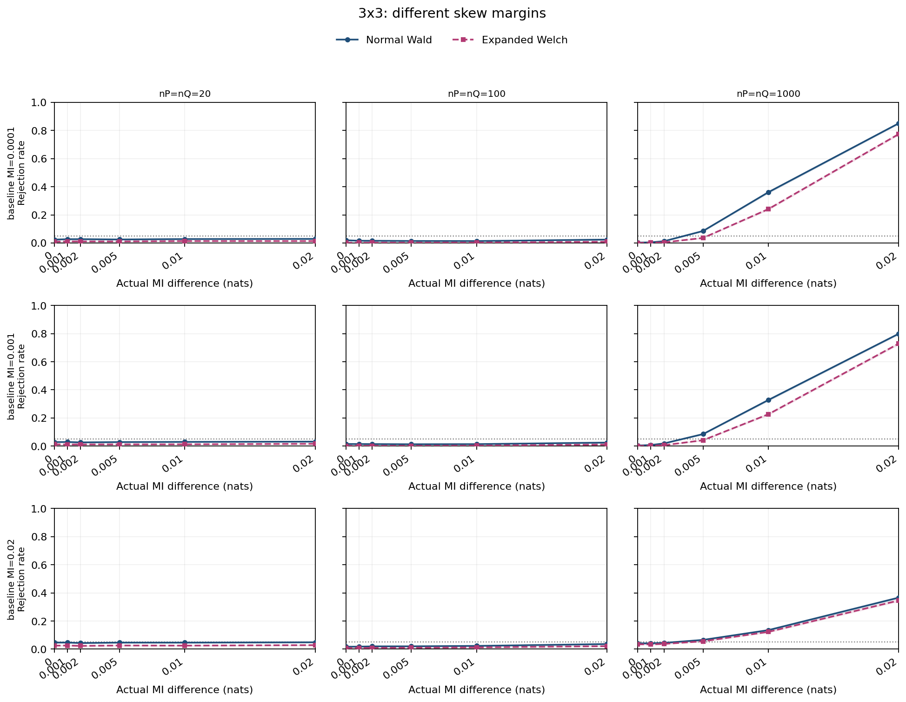

| Specification | Setting |
| --- | --- |
| Table size | 3x3 |
| Horizontal graph regime specifications (columns) | nP=nQ=20, nP=nQ=100, nP=nQ=1000 |
| Vertical graph regime specifications (rows) | baseline MI=0.0001: P row (0.7, 0.3/2 repeated 2 times), P column (0.7, 0.3/2 repeated 2 times); Q row (0.8, 0.2/2 repeated 2 times), Q column (0.8, 0.2/2 repeated 2 times); baseline MI=0.001: P row (0.7, 0.3/2 repeated 2 times), P column (0.7, 0.3/2 repeated 2 times); Q row (0.8, 0.2/2 repeated 2 times), Q column (0.8, 0.2/2 repeated 2 times); baseline MI=0.02: P row (0.7, 0.3/2 repeated 2 times), P column (0.7, 0.3/2 repeated 2 times); Q row (0.8, 0.2/2 repeated 2 times), Q column (0.8, 0.2/2 repeated 2 times) |
| Probability changes | baseline MI=0.0001: add at (1,1),(2,2) and subtract at (1,2),(2,1), for both P and Q; baseline MI=0.001: add at (1,1),(2,2) and subtract at (1,2),(2,1), for both P and Q; baseline MI=0.02: add at (1,1),(2,2) and subtract at (1,2),(2,1), for both P and Q |
| MI settings | Baseline MI {0.0001, 0.001, 0.02}; direction {q higher}; actual differences {0, 0.001, 0.002, 0.005, 0.01, 0.02} nats |
| Horizontal axis within each graph | Actual MI difference in nats, fixed from 0 to 0.02 |
| Vertical axis within each graph | Unconditional rejection rate from 0 to 1; invalid results count as non-rejections |
| Replicates | 20,000 per unique point |

Null-point rejection and validity:

| Vertical regime | Horizontal regime | x | Method | Rejection | Valid |
| --- | --- | --- | --- | --- | --- |
| baseline MI=0.0001 | nP=nQ=20 | 0 | Expanded Welch | 0.0096 | 0.9756 |
| baseline MI=0.0001 | nP=nQ=20 | 0 | Normal Wald | 0.0240 | 0.9999 |
| baseline MI=0.0001 | nP=nQ=100 | 0 | Expanded Welch | 0.0017 | 1.0000 |
| baseline MI=0.0001 | nP=nQ=100 | 0 | Normal Wald | 0.0193 | 1.0000 |
| baseline MI=0.0001 | nP=nQ=1000 | 0 | Expanded Welch | 0.0007 | 1.0000 |
| baseline MI=0.0001 | nP=nQ=1000 | 0 | Normal Wald | 0.0023 | 1.0000 |
| baseline MI=0.001 | nP=nQ=20 | 0 | Expanded Welch | 0.0123 | 0.9768 |
| baseline MI=0.001 | nP=nQ=20 | 0 | Normal Wald | 0.0284 | 0.9999 |
| baseline MI=0.001 | nP=nQ=100 | 0 | Expanded Welch | 0.0016 | 1.0000 |
| baseline MI=0.001 | nP=nQ=100 | 0 | Normal Wald | 0.0146 | 1.0000 |
| baseline MI=0.001 | nP=nQ=1000 | 0 | Expanded Welch | 0.0012 | 1.0000 |
| baseline MI=0.001 | nP=nQ=1000 | 0 | Normal Wald | 0.0037 | 1.0000 |
| baseline MI=0.02 | nP=nQ=20 | 0 | Expanded Welch | 0.0251 | 0.9745 |
| baseline MI=0.02 | nP=nQ=20 | 0 | Normal Wald | 0.0466 | 0.9998 |
| baseline MI=0.02 | nP=nQ=100 | 0 | Expanded Welch | 0.0083 | 1.0000 |
| baseline MI=0.02 | nP=nQ=100 | 0 | Normal Wald | 0.0171 | 1.0000 |
| baseline MI=0.02 | nP=nQ=1000 | 0 | Expanded Welch | 0.0348 | 1.0000 |
| baseline MI=0.02 | nP=nQ=1000 | 0 | Normal Wald | 0.0411 | 1.0000 |

Every plotted rate, interval, validity and minimum expected count

| Vertical regime | Horizontal regime | x | Method | Rejection | 95% interval | Valid | Conditional | Min expected P | Min expected Q |
| --- | --- | --- | --- | --- | --- | --- | --- | --- | --- |
| baseline MI=0.0001 | nP=nQ=20 | 0 | Expanded Welch | 0.0096 | [0.0083, 0.0110] | 0.9756 | 0.0098 | 0.45 | 0.2 |
| baseline MI=0.0001 | nP=nQ=20 | 0 | Normal Wald | 0.0240 | [0.0220, 0.0263] | 0.9999 | 0.0241 | 0.45 | 0.2 |
| baseline MI=0.0001 | nP=nQ=20 | 0.001 | Expanded Welch | 0.0109 | [0.0096, 0.0124] | 0.9751 | 0.0112 | 0.45 | 0.2 |
| baseline MI=0.0001 | nP=nQ=20 | 0.001 | Normal Wald | 0.0267 | [0.0246, 0.0290] | 1.0000 | 0.0267 | 0.45 | 0.2 |
| baseline MI=0.0001 | nP=nQ=20 | 0.002 | Expanded Welch | 0.0112 | [0.0098, 0.0128] | 0.9759 | 0.0115 | 0.45 | 0.2 |
| baseline MI=0.0001 | nP=nQ=20 | 0.002 | Normal Wald | 0.0270 | [0.0248, 0.0293] | 1.0000 | 0.0270 | 0.45 | 0.2 |
| baseline MI=0.0001 | nP=nQ=20 | 0.005 | Expanded Welch | 0.0109 | [0.0096, 0.0124] | 0.9778 | 0.0111 | 0.45 | 0.2 |
| baseline MI=0.0001 | nP=nQ=20 | 0.005 | Normal Wald | 0.0249 | [0.0228, 0.0271] | 1.0000 | 0.0249 | 0.45 | 0.2 |
| baseline MI=0.0001 | nP=nQ=20 | 0.01 | Expanded Welch | 0.0135 | [0.0119, 0.0151] | 0.9746 | 0.0138 | 0.45 | 0.2 |
| baseline MI=0.0001 | nP=nQ=20 | 0.01 | Normal Wald | 0.0278 | [0.0256, 0.0302] | 0.9999 | 0.0278 | 0.45 | 0.2 |
| baseline MI=0.0001 | nP=nQ=20 | 0.02 | Expanded Welch | 0.0135 | [0.0120, 0.0152] | 0.9745 | 0.0139 | 0.45 | 0.2 |
| baseline MI=0.0001 | nP=nQ=20 | 0.02 | Normal Wald | 0.0289 | [0.0266, 0.0313] | 0.9999 | 0.0289 | 0.45 | 0.2 |
| baseline MI=0.0001 | nP=nQ=100 | 0 | Expanded Welch | 0.0017 | [0.0012, 0.0024] | 1.0000 | 0.0017 | 2.25 | 1 |
| baseline MI=0.0001 | nP=nQ=100 | 0 | Normal Wald | 0.0193 | [0.0175, 0.0213] | 1.0000 | 0.0193 | 2.25 | 1 |
| baseline MI=0.0001 | nP=nQ=100 | 0.001 | Expanded Welch | 0.0015 | [0.0011, 0.0021] | 1.0000 | 0.0015 | 2.25 | 1 |
| baseline MI=0.0001 | nP=nQ=100 | 0.001 | Normal Wald | 0.0155 | [0.0139, 0.0174] | 1.0000 | 0.0155 | 2.25 | 1 |
| baseline MI=0.0001 | nP=nQ=100 | 0.002 | Expanded Welch | 0.0019 | [0.0013, 0.0025] | 1.0000 | 0.0019 | 2.25 | 1 |
| baseline MI=0.0001 | nP=nQ=100 | 0.002 | Normal Wald | 0.0155 | [0.0139, 0.0173] | 1.0000 | 0.0155 | 2.25 | 1 |
| baseline MI=0.0001 | nP=nQ=100 | 0.005 | Expanded Welch | 0.0022 | [0.0016, 0.0030] | 1.0000 | 0.0022 | 2.25 | 1 |
| baseline MI=0.0001 | nP=nQ=100 | 0.005 | Normal Wald | 0.0141 | [0.0126, 0.0158] | 1.0000 | 0.0141 | 2.25 | 1 |
| baseline MI=0.0001 | nP=nQ=100 | 0.01 | Expanded Welch | 0.0028 | [0.0022, 0.0036] | 1.0000 | 0.0028 | 2.25 | 1 |
| baseline MI=0.0001 | nP=nQ=100 | 0.01 | Normal Wald | 0.0135 | [0.0120, 0.0152] | 1.0000 | 0.0135 | 2.25 | 1 |
| baseline MI=0.0001 | nP=nQ=100 | 0.02 | Expanded Welch | 0.0085 | [0.0073, 0.0099] | 1.0000 | 0.0085 | 2.25 | 1 |
| baseline MI=0.0001 | nP=nQ=100 | 0.02 | Normal Wald | 0.0239 | [0.0219, 0.0262] | 1.0000 | 0.0239 | 2.25 | 1 |
| baseline MI=0.0001 | nP=nQ=1000 | 0 | Expanded Welch | 0.0007 | [0.0004, 0.0012] | 1.0000 | 0.0007 | 22.5 | 10 |
| baseline MI=0.0001 | nP=nQ=1000 | 0 | Normal Wald | 0.0023 | [0.0017, 0.0031] | 1.0000 | 0.0023 | 22.5 | 10 |
| baseline MI=0.0001 | nP=nQ=1000 | 0.001 | Expanded Welch | 0.0014 | [0.0010, 0.0020] | 1.0000 | 0.0014 | 22.5 | 10 |
| baseline MI=0.0001 | nP=nQ=1000 | 0.001 | Normal Wald | 0.0046 | [0.0037, 0.0056] | 1.0000 | 0.0046 | 22.5 | 10 |
| baseline MI=0.0001 | nP=nQ=1000 | 0.002 | Expanded Welch | 0.0039 | [0.0031, 0.0049] | 1.0000 | 0.0039 | 22.5 | 10 |
| baseline MI=0.0001 | nP=nQ=1000 | 0.002 | Normal Wald | 0.0124 | [0.0110, 0.0141] | 1.0000 | 0.0124 | 22.5 | 10 |
| baseline MI=0.0001 | nP=nQ=1000 | 0.005 | Expanded Welch | 0.0358 | [0.0333, 0.0385] | 1.0000 | 0.0358 | 22.5 | 10 |
| baseline MI=0.0001 | nP=nQ=1000 | 0.005 | Normal Wald | 0.0852 | [0.0814, 0.0891] | 1.0000 | 0.0852 | 22.5 | 10 |
| baseline MI=0.0001 | nP=nQ=1000 | 0.01 | Expanded Welch | 0.2408 | [0.2349, 0.2468] | 1.0000 | 0.2408 | 22.5 | 10 |
| baseline MI=0.0001 | nP=nQ=1000 | 0.01 | Normal Wald | 0.3606 | [0.3540, 0.3673] | 1.0000 | 0.3606 | 22.5 | 10 |
| baseline MI=0.0001 | nP=nQ=1000 | 0.02 | Expanded Welch | 0.7745 | [0.7687, 0.7802] | 1.0000 | 0.7745 | 22.5 | 10 |
| baseline MI=0.0001 | nP=nQ=1000 | 0.02 | Normal Wald | 0.8511 | [0.8461, 0.8560] | 1.0000 | 0.8511 | 22.5 | 10 |
| baseline MI=0.001 | nP=nQ=20 | 0 | Expanded Welch | 0.0123 | [0.0109, 0.0140] | 0.9768 | 0.0126 | 0.45 | 0.2 |
| baseline MI=0.001 | nP=nQ=20 | 0 | Normal Wald | 0.0284 | [0.0261, 0.0307] | 0.9999 | 0.0284 | 0.45 | 0.2 |
| baseline MI=0.001 | nP=nQ=20 | 0.001 | Expanded Welch | 0.0113 | [0.0099, 0.0129] | 0.9777 | 0.0116 | 0.45 | 0.2 |
| baseline MI=0.001 | nP=nQ=20 | 0.001 | Normal Wald | 0.0289 | [0.0266, 0.0313] | 1.0000 | 0.0289 | 0.45 | 0.2 |
| baseline MI=0.001 | nP=nQ=20 | 0.002 | Expanded Welch | 0.0118 | [0.0104, 0.0134] | 0.9778 | 0.0121 | 0.45 | 0.2 |
| baseline MI=0.001 | nP=nQ=20 | 0.002 | Normal Wald | 0.0261 | [0.0240, 0.0285] | 1.0000 | 0.0261 | 0.45 | 0.2 |
| baseline MI=0.001 | nP=nQ=20 | 0.005 | Expanded Welch | 0.0120 | [0.0106, 0.0137] | 0.9747 | 0.0124 | 0.45 | 0.2 |
| baseline MI=0.001 | nP=nQ=20 | 0.005 | Normal Wald | 0.0283 | [0.0261, 0.0307] | 1.0000 | 0.0283 | 0.45 | 0.2 |
| baseline MI=0.001 | nP=nQ=20 | 0.01 | Expanded Welch | 0.0126 | [0.0111, 0.0142] | 0.9763 | 0.0129 | 0.45 | 0.2 |
| baseline MI=0.001 | nP=nQ=20 | 0.01 | Normal Wald | 0.0295 | [0.0273, 0.0320] | 1.0000 | 0.0295 | 0.45 | 0.2 |
| baseline MI=0.001 | nP=nQ=20 | 0.02 | Expanded Welch | 0.0160 | [0.0144, 0.0178] | 0.9751 | 0.0164 | 0.45 | 0.2 |
| baseline MI=0.001 | nP=nQ=20 | 0.02 | Normal Wald | 0.0316 | [0.0292, 0.0341] | 1.0000 | 0.0316 | 0.45 | 0.2 |
| baseline MI=0.001 | nP=nQ=100 | 0 | Expanded Welch | 0.0016 | [0.0011, 0.0023] | 1.0000 | 0.0016 | 2.25 | 1 |
| baseline MI=0.001 | nP=nQ=100 | 0 | Normal Wald | 0.0146 | [0.0130, 0.0163] | 1.0000 | 0.0146 | 2.25 | 1 |
| baseline MI=0.001 | nP=nQ=100 | 0.001 | Expanded Welch | 0.0016 | [0.0011, 0.0023] | 1.0000 | 0.0016 | 2.25 | 1 |
| baseline MI=0.001 | nP=nQ=100 | 0.001 | Normal Wald | 0.0143 | [0.0127, 0.0160] | 1.0000 | 0.0143 | 2.25 | 1 |
| baseline MI=0.001 | nP=nQ=100 | 0.002 | Expanded Welch | 0.0016 | [0.0012, 0.0023] | 1.0000 | 0.0016 | 2.25 | 1 |
| baseline MI=0.001 | nP=nQ=100 | 0.002 | Normal Wald | 0.0140 | [0.0125, 0.0157] | 1.0000 | 0.0140 | 2.25 | 1 |
| baseline MI=0.001 | nP=nQ=100 | 0.005 | Expanded Welch | 0.0019 | [0.0013, 0.0025] | 1.0000 | 0.0019 | 2.25 | 1 |
| baseline MI=0.001 | nP=nQ=100 | 0.005 | Normal Wald | 0.0129 | [0.0115, 0.0146] | 1.0000 | 0.0129 | 2.25 | 1 |
| baseline MI=0.001 | nP=nQ=100 | 0.01 | Expanded Welch | 0.0029 | [0.0022, 0.0037] | 1.0000 | 0.0029 | 2.25 | 1 |
| baseline MI=0.001 | nP=nQ=100 | 0.01 | Normal Wald | 0.0137 | [0.0122, 0.0154] | 1.0000 | 0.0137 | 2.25 | 1 |
| baseline MI=0.001 | nP=nQ=100 | 0.02 | Expanded Welch | 0.0107 | [0.0094, 0.0123] | 1.0000 | 0.0107 | 2.25 | 1 |
| baseline MI=0.001 | nP=nQ=100 | 0.02 | Normal Wald | 0.0246 | [0.0226, 0.0269] | 1.0000 | 0.0246 | 2.25 | 1 |
| baseline MI=0.001 | nP=nQ=1000 | 0 | Expanded Welch | 0.0012 | [0.0008, 0.0018] | 1.0000 | 0.0012 | 22.5 | 10 |
| baseline MI=0.001 | nP=nQ=1000 | 0 | Normal Wald | 0.0037 | [0.0029, 0.0046] | 1.0000 | 0.0037 | 22.5 | 10 |
| baseline MI=0.001 | nP=nQ=1000 | 0.001 | Expanded Welch | 0.0025 | [0.0019, 0.0033] | 1.0000 | 0.0025 | 22.5 | 10 |
| baseline MI=0.001 | nP=nQ=1000 | 0.001 | Normal Wald | 0.0073 | [0.0062, 0.0086] | 1.0000 | 0.0073 | 22.5 | 10 |
| baseline MI=0.001 | nP=nQ=1000 | 0.002 | Expanded Welch | 0.0059 | [0.0049, 0.0070] | 1.0000 | 0.0059 | 22.5 | 10 |
| baseline MI=0.001 | nP=nQ=1000 | 0.002 | Normal Wald | 0.0186 | [0.0168, 0.0206] | 1.0000 | 0.0186 | 22.5 | 10 |
| baseline MI=0.001 | nP=nQ=1000 | 0.005 | Expanded Welch | 0.0415 | [0.0388, 0.0444] | 1.0000 | 0.0415 | 22.5 | 10 |
| baseline MI=0.001 | nP=nQ=1000 | 0.005 | Normal Wald | 0.0851 | [0.0813, 0.0890] | 1.0000 | 0.0851 | 22.5 | 10 |
| baseline MI=0.001 | nP=nQ=1000 | 0.01 | Expanded Welch | 0.2261 | [0.2204, 0.2320] | 1.0000 | 0.2261 | 22.5 | 10 |
| baseline MI=0.001 | nP=nQ=1000 | 0.01 | Normal Wald | 0.3274 | [0.3209, 0.3339] | 1.0000 | 0.3274 | 22.5 | 10 |
| baseline MI=0.001 | nP=nQ=1000 | 0.02 | Expanded Welch | 0.7288 | [0.7226, 0.7350] | 1.0000 | 0.7288 | 22.5 | 10 |
| baseline MI=0.001 | nP=nQ=1000 | 0.02 | Normal Wald | 0.7990 | [0.7933, 0.8044] | 1.0000 | 0.7990 | 22.5 | 10 |
| baseline MI=0.02 | nP=nQ=20 | 0 | Expanded Welch | 0.0251 | [0.0231, 0.0274] | 0.9745 | 0.0258 | 0.45 | 0.2 |
| baseline MI=0.02 | nP=nQ=20 | 0 | Normal Wald | 0.0466 | [0.0438, 0.0497] | 0.9998 | 0.0467 | 0.45 | 0.2 |
| baseline MI=0.02 | nP=nQ=20 | 0.001 | Expanded Welch | 0.0259 | [0.0238, 0.0282] | 0.9753 | 0.0266 | 0.45 | 0.2 |
| baseline MI=0.02 | nP=nQ=20 | 0.001 | Normal Wald | 0.0471 | [0.0442, 0.0501] | 1.0000 | 0.0471 | 0.45 | 0.2 |
| baseline MI=0.02 | nP=nQ=20 | 0.002 | Expanded Welch | 0.0232 | [0.0212, 0.0254] | 0.9763 | 0.0238 | 0.45 | 0.2 |
| baseline MI=0.02 | nP=nQ=20 | 0.002 | Normal Wald | 0.0435 | [0.0407, 0.0464] | 1.0000 | 0.0435 | 0.45 | 0.2 |
| baseline MI=0.02 | nP=nQ=20 | 0.005 | Expanded Welch | 0.0260 | [0.0239, 0.0283] | 0.9760 | 0.0266 | 0.45 | 0.2 |
| baseline MI=0.02 | nP=nQ=20 | 0.005 | Normal Wald | 0.0466 | [0.0437, 0.0496] | 1.0000 | 0.0466 | 0.45 | 0.2 |
| baseline MI=0.02 | nP=nQ=20 | 0.01 | Expanded Welch | 0.0252 | [0.0231, 0.0275] | 0.9756 | 0.0258 | 0.45 | 0.2 |
| baseline MI=0.02 | nP=nQ=20 | 0.01 | Normal Wald | 0.0464 | [0.0436, 0.0495] | 0.9999 | 0.0465 | 0.45 | 0.2 |
| baseline MI=0.02 | nP=nQ=20 | 0.02 | Expanded Welch | 0.0285 | [0.0263, 0.0309] | 0.9761 | 0.0292 | 0.45 | 0.2 |
| baseline MI=0.02 | nP=nQ=20 | 0.02 | Normal Wald | 0.0488 | [0.0459, 0.0518] | 1.0000 | 0.0488 | 0.45 | 0.2 |
| baseline MI=0.02 | nP=nQ=100 | 0 | Expanded Welch | 0.0083 | [0.0071, 0.0097] | 1.0000 | 0.0083 | 2.25 | 1 |
| baseline MI=0.02 | nP=nQ=100 | 0 | Normal Wald | 0.0171 | [0.0154, 0.0190] | 1.0000 | 0.0171 | 2.25 | 1 |
| baseline MI=0.02 | nP=nQ=100 | 0.001 | Expanded Welch | 0.0083 | [0.0071, 0.0096] | 1.0000 | 0.0083 | 2.25 | 1 |
| baseline MI=0.02 | nP=nQ=100 | 0.001 | Normal Wald | 0.0179 | [0.0161, 0.0198] | 1.0000 | 0.0179 | 2.25 | 1 |
| baseline MI=0.02 | nP=nQ=100 | 0.002 | Expanded Welch | 0.0092 | [0.0079, 0.0106] | 1.0000 | 0.0092 | 2.25 | 1 |
| baseline MI=0.02 | nP=nQ=100 | 0.002 | Normal Wald | 0.0199 | [0.0181, 0.0219] | 1.0000 | 0.0199 | 2.25 | 1 |
| baseline MI=0.02 | nP=nQ=100 | 0.005 | Expanded Welch | 0.0102 | [0.0089, 0.0117] | 1.0000 | 0.0102 | 2.25 | 1 |
| baseline MI=0.02 | nP=nQ=100 | 0.005 | Normal Wald | 0.0203 | [0.0184, 0.0223] | 1.0000 | 0.0203 | 2.25 | 1 |
| baseline MI=0.02 | nP=nQ=100 | 0.01 | Expanded Welch | 0.0126 | [0.0112, 0.0143] | 1.0000 | 0.0126 | 2.25 | 1 |
| baseline MI=0.02 | nP=nQ=100 | 0.01 | Normal Wald | 0.0231 | [0.0211, 0.0253] | 1.0000 | 0.0231 | 2.25 | 1 |
| baseline MI=0.02 | nP=nQ=100 | 0.02 | Expanded Welch | 0.0210 | [0.0192, 0.0231] | 1.0000 | 0.0210 | 2.25 | 1 |
| baseline MI=0.02 | nP=nQ=100 | 0.02 | Normal Wald | 0.0363 | [0.0338, 0.0390] | 1.0000 | 0.0363 | 2.25 | 1 |
| baseline MI=0.02 | nP=nQ=1000 | 0 | Expanded Welch | 0.0348 | [0.0324, 0.0375] | 1.0000 | 0.0348 | 22.5 | 10 |
| baseline MI=0.02 | nP=nQ=1000 | 0 | Normal Wald | 0.0411 | [0.0384, 0.0439] | 1.0000 | 0.0411 | 22.5 | 10 |
| baseline MI=0.02 | nP=nQ=1000 | 0.001 | Expanded Welch | 0.0338 | [0.0314, 0.0364] | 1.0000 | 0.0338 | 22.5 | 10 |
| baseline MI=0.02 | nP=nQ=1000 | 0.001 | Normal Wald | 0.0413 | [0.0387, 0.0442] | 1.0000 | 0.0413 | 22.5 | 10 |
| baseline MI=0.02 | nP=nQ=1000 | 0.002 | Expanded Welch | 0.0374 | [0.0348, 0.0401] | 1.0000 | 0.0374 | 22.5 | 10 |
| baseline MI=0.02 | nP=nQ=1000 | 0.002 | Normal Wald | 0.0445 | [0.0417, 0.0474] | 1.0000 | 0.0445 | 22.5 | 10 |
| baseline MI=0.02 | nP=nQ=1000 | 0.005 | Expanded Welch | 0.0560 | [0.0529, 0.0593] | 1.0000 | 0.0560 | 22.5 | 10 |
| baseline MI=0.02 | nP=nQ=1000 | 0.005 | Normal Wald | 0.0659 | [0.0625, 0.0694] | 1.0000 | 0.0659 | 22.5 | 10 |
| baseline MI=0.02 | nP=nQ=1000 | 0.01 | Expanded Welch | 0.1228 | [0.1183, 0.1274] | 1.0000 | 0.1228 | 22.5 | 10 |
| baseline MI=0.02 | nP=nQ=1000 | 0.01 | Normal Wald | 0.1353 | [0.1306, 0.1401] | 1.0000 | 0.1353 | 22.5 | 10 |
| baseline MI=0.02 | nP=nQ=1000 | 0.02 | Expanded Welch | 0.3463 | [0.3397, 0.3529] | 1.0000 | 0.3463 | 22.5 | 10 |
| baseline MI=0.02 | nP=nQ=1000 | 0.02 | Normal Wald | 0.3665 | [0.3599, 0.3733] | 1.0000 | 0.3665 | 22.5 | 10 |

### 4.7 5x5: uniform margins

Does performance change when the populations begin closer to independence?

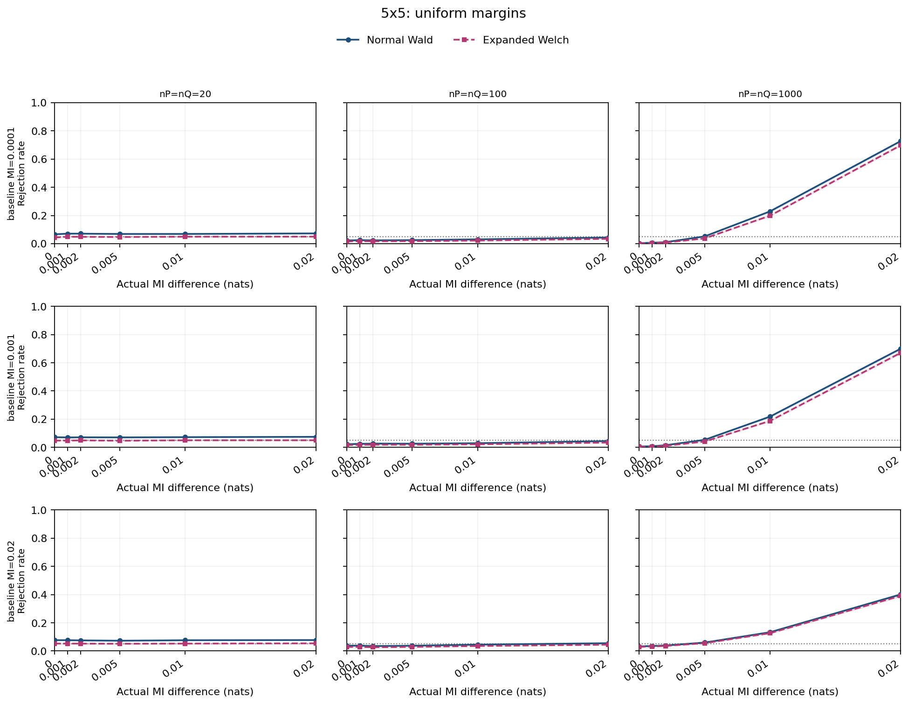

| Specification | Setting |
| --- | --- |
| Table size | 5x5 |
| Horizontal graph regime specifications (columns) | nP=nQ=20, nP=nQ=100, nP=nQ=1000 |
| Vertical graph regime specifications (rows) | baseline MI=0.0001: P row (0.2 repeated 5 times), P column (0.2 repeated 5 times); Q row (0.2 repeated 5 times), Q column (0.2 repeated 5 times); baseline MI=0.001: P row (0.2 repeated 5 times), P column (0.2 repeated 5 times); Q row (0.2 repeated 5 times), Q column (0.2 repeated 5 times); baseline MI=0.02: P row (0.2 repeated 5 times), P column (0.2 repeated 5 times); Q row (0.2 repeated 5 times), Q column (0.2 repeated 5 times) |
| Probability changes | baseline MI=0.0001: add at (1,1),(2,2) and subtract at (1,2),(2,1), for both P and Q; baseline MI=0.001: add at (1,1),(2,2) and subtract at (1,2),(2,1), for both P and Q; baseline MI=0.02: add at (1,1),(2,2) and subtract at (1,2),(2,1), for both P and Q |
| MI settings | Baseline MI {0.0001, 0.001, 0.02}; direction {q higher}; actual differences {0, 0.001, 0.002, 0.005, 0.01, 0.02} nats |
| Horizontal axis within each graph | Actual MI difference in nats, fixed from 0 to 0.02 |
| Vertical axis within each graph | Unconditional rejection rate from 0 to 1; invalid results count as non-rejections |
| Replicates | 20,000 per unique point |

Null-point rejection and validity:

| Vertical regime | Horizontal regime | x | Method | Rejection | Valid |
| --- | --- | --- | --- | --- | --- |
| baseline MI=0.0001 | nP=nQ=20 | 0 | Expanded Welch | 0.0435 | 1.0000 |
| baseline MI=0.0001 | nP=nQ=20 | 0 | Normal Wald | 0.0664 | 1.0000 |
| baseline MI=0.0001 | nP=nQ=100 | 0 | Expanded Welch | 0.0159 | 1.0000 |
| baseline MI=0.0001 | nP=nQ=100 | 0 | Normal Wald | 0.0227 | 1.0000 |
| baseline MI=0.0001 | nP=nQ=1000 | 0 | Expanded Welch | 0.0014 | 1.0000 |
| baseline MI=0.0001 | nP=nQ=1000 | 0 | Normal Wald | 0.0036 | 1.0000 |
| baseline MI=0.001 | nP=nQ=20 | 0 | Expanded Welch | 0.0479 | 1.0000 |
| baseline MI=0.001 | nP=nQ=20 | 0 | Normal Wald | 0.0719 | 1.0000 |
| baseline MI=0.001 | nP=nQ=100 | 0 | Expanded Welch | 0.0166 | 1.0000 |
| baseline MI=0.001 | nP=nQ=100 | 0 | Normal Wald | 0.0222 | 1.0000 |
| baseline MI=0.001 | nP=nQ=1000 | 0 | Expanded Welch | 0.0035 | 1.0000 |
| baseline MI=0.001 | nP=nQ=1000 | 0 | Normal Wald | 0.0060 | 1.0000 |
| baseline MI=0.02 | nP=nQ=20 | 0 | Expanded Welch | 0.0528 | 1.0000 |
| baseline MI=0.02 | nP=nQ=20 | 0 | Normal Wald | 0.0768 | 1.0000 |
| baseline MI=0.02 | nP=nQ=100 | 0 | Expanded Welch | 0.0289 | 1.0000 |
| baseline MI=0.02 | nP=nQ=100 | 0 | Normal Wald | 0.0377 | 1.0000 |
| baseline MI=0.02 | nP=nQ=1000 | 0 | Expanded Welch | 0.0296 | 1.0000 |
| baseline MI=0.02 | nP=nQ=1000 | 0 | Normal Wald | 0.0326 | 1.0000 |

Every plotted rate, interval, validity and minimum expected count

| Vertical regime | Horizontal regime | x | Method | Rejection | 95% interval | Valid | Conditional | Min expected P | Min expected Q |
| --- | --- | --- | --- | --- | --- | --- | --- | --- | --- |
| baseline MI=0.0001 | nP=nQ=20 | 0 | Expanded Welch | 0.0435 | [0.0408, 0.0464] | 1.0000 | 0.0435 | 0.7717 | 0.7717 |
| baseline MI=0.0001 | nP=nQ=20 | 0 | Normal Wald | 0.0664 | [0.0630, 0.0699] | 1.0000 | 0.0664 | 0.7717 | 0.7717 |
| baseline MI=0.0001 | nP=nQ=20 | 0.001 | Expanded Welch | 0.0493 | [0.0463, 0.0523] | 1.0000 | 0.0493 | 0.7717 | 0.7063 |
| baseline MI=0.0001 | nP=nQ=20 | 0.001 | Normal Wald | 0.0708 | [0.0674, 0.0745] | 1.0000 | 0.0708 | 0.7717 | 0.7063 |
| baseline MI=0.0001 | nP=nQ=20 | 0.002 | Expanded Welch | 0.0486 | [0.0457, 0.0516] | 1.0000 | 0.0486 | 0.7717 | 0.6707 |
| baseline MI=0.0001 | nP=nQ=20 | 0.002 | Normal Wald | 0.0709 | [0.0674, 0.0745] | 1.0000 | 0.0709 | 0.7717 | 0.6707 |
| baseline MI=0.0001 | nP=nQ=20 | 0.005 | Expanded Welch | 0.0472 | [0.0443, 0.0502] | 1.0000 | 0.0472 | 0.7717 | 0.5991 |
| baseline MI=0.0001 | nP=nQ=20 | 0.005 | Normal Wald | 0.0688 | [0.0653, 0.0723] | 1.0000 | 0.0688 | 0.7717 | 0.5991 |
| baseline MI=0.0001 | nP=nQ=20 | 0.01 | Expanded Welch | 0.0495 | [0.0465, 0.0525] | 1.0000 | 0.0495 | 0.7717 | 0.5188 |
| baseline MI=0.0001 | nP=nQ=20 | 0.01 | Normal Wald | 0.0688 | [0.0654, 0.0724] | 1.0000 | 0.0688 | 0.7717 | 0.5188 |
| baseline MI=0.0001 | nP=nQ=20 | 0.02 | Expanded Welch | 0.0498 | [0.0469, 0.0530] | 1.0000 | 0.0498 | 0.7717 | 0.4076 |
| baseline MI=0.0001 | nP=nQ=20 | 0.02 | Normal Wald | 0.0727 | [0.0691, 0.0763] | 1.0000 | 0.0727 | 0.7717 | 0.4076 |
| baseline MI=0.0001 | nP=nQ=100 | 0 | Expanded Welch | 0.0159 | [0.0143, 0.0177] | 1.0000 | 0.0159 | 3.859 | 3.859 |
| baseline MI=0.0001 | nP=nQ=100 | 0 | Normal Wald | 0.0227 | [0.0208, 0.0249] | 1.0000 | 0.0227 | 3.859 | 3.859 |
| baseline MI=0.0001 | nP=nQ=100 | 0.001 | Expanded Welch | 0.0174 | [0.0156, 0.0193] | 1.0000 | 0.0174 | 3.859 | 3.531 |
| baseline MI=0.0001 | nP=nQ=100 | 0.001 | Normal Wald | 0.0251 | [0.0230, 0.0274] | 1.0000 | 0.0251 | 3.859 | 3.531 |
| baseline MI=0.0001 | nP=nQ=100 | 0.002 | Expanded Welch | 0.0164 | [0.0148, 0.0183] | 1.0000 | 0.0164 | 3.859 | 3.353 |
| baseline MI=0.0001 | nP=nQ=100 | 0.002 | Normal Wald | 0.0235 | [0.0215, 0.0257] | 1.0000 | 0.0235 | 3.859 | 3.353 |
| baseline MI=0.0001 | nP=nQ=100 | 0.005 | Expanded Welch | 0.0177 | [0.0160, 0.0197] | 1.0000 | 0.0177 | 3.859 | 2.995 |
| baseline MI=0.0001 | nP=nQ=100 | 0.005 | Normal Wald | 0.0251 | [0.0231, 0.0274] | 1.0000 | 0.0251 | 3.859 | 2.995 |
| baseline MI=0.0001 | nP=nQ=100 | 0.01 | Expanded Welch | 0.0221 | [0.0202, 0.0243] | 1.0000 | 0.0221 | 3.859 | 2.594 |
| baseline MI=0.0001 | nP=nQ=100 | 0.01 | Normal Wald | 0.0306 | [0.0283, 0.0331] | 1.0000 | 0.0306 | 3.859 | 2.594 |
| baseline MI=0.0001 | nP=nQ=100 | 0.02 | Expanded Welch | 0.0345 | [0.0320, 0.0371] | 1.0000 | 0.0345 | 3.859 | 2.038 |
| baseline MI=0.0001 | nP=nQ=100 | 0.02 | Normal Wald | 0.0435 | [0.0408, 0.0464] | 1.0000 | 0.0435 | 3.859 | 2.038 |
| baseline MI=0.0001 | nP=nQ=1000 | 0 | Expanded Welch | 0.0014 | [0.0009, 0.0020] | 1.0000 | 0.0014 | 38.59 | 38.59 |
| baseline MI=0.0001 | nP=nQ=1000 | 0 | Normal Wald | 0.0036 | [0.0029, 0.0045] | 1.0000 | 0.0036 | 38.59 | 38.59 |
| baseline MI=0.0001 | nP=nQ=1000 | 0.001 | Expanded Welch | 0.0039 | [0.0031, 0.0049] | 1.0000 | 0.0039 | 38.59 | 35.31 |
| baseline MI=0.0001 | nP=nQ=1000 | 0.001 | Normal Wald | 0.0066 | [0.0056, 0.0079] | 1.0000 | 0.0066 | 38.59 | 35.31 |
| baseline MI=0.0001 | nP=nQ=1000 | 0.002 | Expanded Welch | 0.0075 | [0.0063, 0.0087] | 1.0000 | 0.0075 | 38.59 | 33.53 |
| baseline MI=0.0001 | nP=nQ=1000 | 0.002 | Normal Wald | 0.0104 | [0.0091, 0.0120] | 1.0000 | 0.0104 | 38.59 | 33.53 |
| baseline MI=0.0001 | nP=nQ=1000 | 0.005 | Expanded Welch | 0.0372 | [0.0347, 0.0400] | 1.0000 | 0.0372 | 38.59 | 29.95 |
| baseline MI=0.0001 | nP=nQ=1000 | 0.005 | Normal Wald | 0.0515 | [0.0485, 0.0547] | 1.0000 | 0.0515 | 38.59 | 29.95 |
| baseline MI=0.0001 | nP=nQ=1000 | 0.01 | Expanded Welch | 0.1983 | [0.1928, 0.2039] | 1.0000 | 0.1983 | 38.59 | 25.94 |
| baseline MI=0.0001 | nP=nQ=1000 | 0.01 | Normal Wald | 0.2289 | [0.2232, 0.2348] | 1.0000 | 0.2289 | 38.59 | 25.94 |
| baseline MI=0.0001 | nP=nQ=1000 | 0.02 | Expanded Welch | 0.6974 | [0.6910, 0.7037] | 1.0000 | 0.6974 | 38.59 | 20.38 |
| baseline MI=0.0001 | nP=nQ=1000 | 0.02 | Normal Wald | 0.7278 | [0.7216, 0.7340] | 1.0000 | 0.7278 | 38.59 | 20.38 |
| baseline MI=0.001 | nP=nQ=20 | 0 | Expanded Welch | 0.0479 | [0.0451, 0.0510] | 1.0000 | 0.0479 | 0.7107 | 0.7107 |
| baseline MI=0.001 | nP=nQ=20 | 0 | Normal Wald | 0.0719 | [0.0684, 0.0756] | 1.0000 | 0.0719 | 0.7107 | 0.7107 |
| baseline MI=0.001 | nP=nQ=20 | 0.001 | Expanded Welch | 0.0478 | [0.0449, 0.0508] | 1.0000 | 0.0478 | 0.7107 | 0.6738 |
| baseline MI=0.001 | nP=nQ=20 | 0.001 | Normal Wald | 0.0701 | [0.0666, 0.0737] | 1.0000 | 0.0701 | 0.7107 | 0.6738 |
| baseline MI=0.001 | nP=nQ=20 | 0.002 | Expanded Welch | 0.0495 | [0.0466, 0.0526] | 1.0000 | 0.0495 | 0.7107 | 0.6456 |
| baseline MI=0.001 | nP=nQ=20 | 0.002 | Normal Wald | 0.0712 | [0.0677, 0.0748] | 1.0000 | 0.0712 | 0.7107 | 0.6456 |
| baseline MI=0.001 | nP=nQ=20 | 0.005 | Expanded Welch | 0.0469 | [0.0440, 0.0499] | 1.0000 | 0.0469 | 0.7107 | 0.5823 |
| baseline MI=0.001 | nP=nQ=20 | 0.005 | Normal Wald | 0.0704 | [0.0670, 0.0741] | 1.0000 | 0.0704 | 0.7107 | 0.5823 |
| baseline MI=0.001 | nP=nQ=20 | 0.01 | Expanded Welch | 0.0500 | [0.0470, 0.0531] | 1.0000 | 0.0500 | 0.7107 | 0.5068 |
| baseline MI=0.001 | nP=nQ=20 | 0.01 | Normal Wald | 0.0722 | [0.0687, 0.0759] | 1.0000 | 0.0722 | 0.7107 | 0.5068 |
| baseline MI=0.001 | nP=nQ=20 | 0.02 | Expanded Welch | 0.0502 | [0.0473, 0.0533] | 1.0000 | 0.0502 | 0.7107 | 0.3994 |
| baseline MI=0.001 | nP=nQ=20 | 0.02 | Normal Wald | 0.0745 | [0.0709, 0.0782] | 1.0000 | 0.0745 | 0.7107 | 0.3994 |
| baseline MI=0.001 | nP=nQ=100 | 0 | Expanded Welch | 0.0166 | [0.0149, 0.0185] | 1.0000 | 0.0166 | 3.553 | 3.553 |
| baseline MI=0.001 | nP=nQ=100 | 0 | Normal Wald | 0.0222 | [0.0202, 0.0243] | 1.0000 | 0.0222 | 3.553 | 3.553 |
| baseline MI=0.001 | nP=nQ=100 | 0.001 | Expanded Welch | 0.0175 | [0.0158, 0.0195] | 1.0000 | 0.0175 | 3.553 | 3.369 |
| baseline MI=0.001 | nP=nQ=100 | 0.001 | Normal Wald | 0.0244 | [0.0224, 0.0267] | 1.0000 | 0.0244 | 3.553 | 3.369 |
| baseline MI=0.001 | nP=nQ=100 | 0.002 | Expanded Welch | 0.0187 | [0.0169, 0.0207] | 1.0000 | 0.0187 | 3.553 | 3.228 |
| baseline MI=0.001 | nP=nQ=100 | 0.002 | Normal Wald | 0.0266 | [0.0245, 0.0289] | 1.0000 | 0.0266 | 3.553 | 3.228 |
| baseline MI=0.001 | nP=nQ=100 | 0.005 | Expanded Welch | 0.0182 | [0.0164, 0.0201] | 1.0000 | 0.0182 | 3.553 | 2.911 |
| baseline MI=0.001 | nP=nQ=100 | 0.005 | Normal Wald | 0.0259 | [0.0237, 0.0281] | 1.0000 | 0.0259 | 3.553 | 2.911 |
| baseline MI=0.001 | nP=nQ=100 | 0.01 | Expanded Welch | 0.0217 | [0.0198, 0.0238] | 1.0000 | 0.0217 | 3.553 | 2.534 |
| baseline MI=0.001 | nP=nQ=100 | 0.01 | Normal Wald | 0.0293 | [0.0271, 0.0317] | 1.0000 | 0.0293 | 3.553 | 2.534 |
| baseline MI=0.001 | nP=nQ=100 | 0.02 | Expanded Welch | 0.0339 | [0.0315, 0.0365] | 1.0000 | 0.0339 | 3.553 | 1.997 |
| baseline MI=0.001 | nP=nQ=100 | 0.02 | Normal Wald | 0.0445 | [0.0418, 0.0475] | 1.0000 | 0.0445 | 3.553 | 1.997 |
| baseline MI=0.001 | nP=nQ=1000 | 0 | Expanded Welch | 0.0035 | [0.0028, 0.0044] | 1.0000 | 0.0035 | 35.53 | 35.53 |
| baseline MI=0.001 | nP=nQ=1000 | 0 | Normal Wald | 0.0060 | [0.0050, 0.0071] | 1.0000 | 0.0060 | 35.53 | 35.53 |
| baseline MI=0.001 | nP=nQ=1000 | 0.001 | Expanded Welch | 0.0049 | [0.0040, 0.0059] | 1.0000 | 0.0049 | 35.53 | 33.69 |
| baseline MI=0.001 | nP=nQ=1000 | 0.001 | Normal Wald | 0.0076 | [0.0065, 0.0090] | 1.0000 | 0.0076 | 35.53 | 33.69 |
| baseline MI=0.001 | nP=nQ=1000 | 0.002 | Expanded Welch | 0.0103 | [0.0090, 0.0118] | 1.0000 | 0.0103 | 35.53 | 32.28 |
| baseline MI=0.001 | nP=nQ=1000 | 0.002 | Normal Wald | 0.0149 | [0.0134, 0.0167] | 1.0000 | 0.0149 | 35.53 | 32.28 |
| baseline MI=0.001 | nP=nQ=1000 | 0.005 | Expanded Welch | 0.0411 | [0.0385, 0.0440] | 1.0000 | 0.0411 | 35.53 | 29.11 |
| baseline MI=0.001 | nP=nQ=1000 | 0.005 | Normal Wald | 0.0533 | [0.0503, 0.0565] | 1.0000 | 0.0533 | 35.53 | 29.11 |
| baseline MI=0.001 | nP=nQ=1000 | 0.01 | Expanded Welch | 0.1875 | [0.1821, 0.1929] | 1.0000 | 0.1875 | 35.53 | 25.34 |
| baseline MI=0.001 | nP=nQ=1000 | 0.01 | Normal Wald | 0.2178 | [0.2121, 0.2236] | 1.0000 | 0.2178 | 35.53 | 25.34 |
| baseline MI=0.001 | nP=nQ=1000 | 0.02 | Expanded Welch | 0.6704 | [0.6638, 0.6768] | 1.0000 | 0.6704 | 35.53 | 19.97 |
| baseline MI=0.001 | nP=nQ=1000 | 0.02 | Normal Wald | 0.6998 | [0.6935, 0.7062] | 1.0000 | 0.6998 | 35.53 | 19.97 |
| baseline MI=0.02 | nP=nQ=20 | 0 | Expanded Welch | 0.0528 | [0.0498, 0.0560] | 1.0000 | 0.0528 | 0.4086 | 0.4086 |
| baseline MI=0.02 | nP=nQ=20 | 0 | Normal Wald | 0.0768 | [0.0732, 0.0806] | 1.0000 | 0.0768 | 0.4086 | 0.4086 |
| baseline MI=0.02 | nP=nQ=20 | 0.001 | Expanded Welch | 0.0526 | [0.0496, 0.0558] | 1.0000 | 0.0526 | 0.4086 | 0.3994 |
| baseline MI=0.02 | nP=nQ=20 | 0.001 | Normal Wald | 0.0767 | [0.0731, 0.0805] | 1.0000 | 0.0767 | 0.4086 | 0.3994 |
| baseline MI=0.02 | nP=nQ=20 | 0.002 | Expanded Welch | 0.0524 | [0.0494, 0.0556] | 1.0000 | 0.0524 | 0.4086 | 0.3904 |
| baseline MI=0.02 | nP=nQ=20 | 0.002 | Normal Wald | 0.0753 | [0.0717, 0.0790] | 1.0000 | 0.0753 | 0.4086 | 0.3904 |
| baseline MI=0.02 | nP=nQ=20 | 0.005 | Expanded Welch | 0.0515 | [0.0485, 0.0546] | 1.0000 | 0.0515 | 0.4086 | 0.3649 |
| baseline MI=0.02 | nP=nQ=20 | 0.005 | Normal Wald | 0.0729 | [0.0694, 0.0766] | 1.0000 | 0.0729 | 0.4086 | 0.3649 |
| baseline MI=0.02 | nP=nQ=20 | 0.01 | Expanded Welch | 0.0526 | [0.0496, 0.0558] | 1.0000 | 0.0526 | 0.4086 | 0.3261 |
| baseline MI=0.02 | nP=nQ=20 | 0.01 | Normal Wald | 0.0764 | [0.0728, 0.0801] | 1.0000 | 0.0764 | 0.4086 | 0.3261 |
| baseline MI=0.02 | nP=nQ=20 | 0.02 | Expanded Welch | 0.0544 | [0.0513, 0.0576] | 1.0000 | 0.0544 | 0.4086 | 0.2594 |
| baseline MI=0.02 | nP=nQ=20 | 0.02 | Normal Wald | 0.0776 | [0.0740, 0.0814] | 1.0000 | 0.0776 | 0.4086 | 0.2594 |
| baseline MI=0.02 | nP=nQ=100 | 0 | Expanded Welch | 0.0289 | [0.0267, 0.0313] | 1.0000 | 0.0289 | 2.043 | 2.043 |
| baseline MI=0.02 | nP=nQ=100 | 0 | Normal Wald | 0.0377 | [0.0351, 0.0404] | 1.0000 | 0.0377 | 2.043 | 2.043 |
| baseline MI=0.02 | nP=nQ=100 | 0.001 | Expanded Welch | 0.0290 | [0.0268, 0.0315] | 1.0000 | 0.0290 | 2.043 | 1.997 |
| baseline MI=0.02 | nP=nQ=100 | 0.001 | Normal Wald | 0.0383 | [0.0357, 0.0410] | 1.0000 | 0.0383 | 2.043 | 1.997 |
| baseline MI=0.02 | nP=nQ=100 | 0.002 | Expanded Welch | 0.0266 | [0.0244, 0.0289] | 1.0000 | 0.0266 | 2.043 | 1.952 |
| baseline MI=0.02 | nP=nQ=100 | 0.002 | Normal Wald | 0.0350 | [0.0325, 0.0376] | 1.0000 | 0.0350 | 2.043 | 1.952 |
| baseline MI=0.02 | nP=nQ=100 | 0.005 | Expanded Welch | 0.0291 | [0.0269, 0.0316] | 1.0000 | 0.0291 | 2.043 | 1.824 |
| baseline MI=0.02 | nP=nQ=100 | 0.005 | Normal Wald | 0.0375 | [0.0350, 0.0402] | 1.0000 | 0.0375 | 2.043 | 1.824 |
| baseline MI=0.02 | nP=nQ=100 | 0.01 | Expanded Welch | 0.0355 | [0.0330, 0.0382] | 1.0000 | 0.0355 | 2.043 | 1.631 |
| baseline MI=0.02 | nP=nQ=100 | 0.01 | Normal Wald | 0.0454 | [0.0426, 0.0484] | 1.0000 | 0.0454 | 2.043 | 1.631 |
| baseline MI=0.02 | nP=nQ=100 | 0.02 | Expanded Welch | 0.0450 | [0.0423, 0.0480] | 1.0000 | 0.0450 | 2.043 | 1.297 |
| baseline MI=0.02 | nP=nQ=100 | 0.02 | Normal Wald | 0.0553 | [0.0522, 0.0586] | 1.0000 | 0.0553 | 2.043 | 1.297 |
| baseline MI=0.02 | nP=nQ=1000 | 0 | Expanded Welch | 0.0296 | [0.0273, 0.0320] | 1.0000 | 0.0296 | 20.43 | 20.43 |
| baseline MI=0.02 | nP=nQ=1000 | 0 | Normal Wald | 0.0326 | [0.0302, 0.0351] | 1.0000 | 0.0326 | 20.43 | 20.43 |
| baseline MI=0.02 | nP=nQ=1000 | 0.001 | Expanded Welch | 0.0319 | [0.0296, 0.0344] | 1.0000 | 0.0319 | 20.43 | 19.97 |
| baseline MI=0.02 | nP=nQ=1000 | 0.001 | Normal Wald | 0.0357 | [0.0333, 0.0384] | 1.0000 | 0.0357 | 20.43 | 19.97 |
| baseline MI=0.02 | nP=nQ=1000 | 0.002 | Expanded Welch | 0.0360 | [0.0335, 0.0387] | 1.0000 | 0.0360 | 20.43 | 19.52 |
| baseline MI=0.02 | nP=nQ=1000 | 0.002 | Normal Wald | 0.0393 | [0.0366, 0.0420] | 1.0000 | 0.0393 | 20.43 | 19.52 |
| baseline MI=0.02 | nP=nQ=1000 | 0.005 | Expanded Welch | 0.0556 | [0.0525, 0.0589] | 1.0000 | 0.0556 | 20.43 | 18.24 |
| baseline MI=0.02 | nP=nQ=1000 | 0.005 | Normal Wald | 0.0599 | [0.0567, 0.0633] | 1.0000 | 0.0599 | 20.43 | 18.24 |
| baseline MI=0.02 | nP=nQ=1000 | 0.01 | Expanded Welch | 0.1266 | [0.1221, 0.1313] | 1.0000 | 0.1266 | 20.43 | 16.31 |
| baseline MI=0.02 | nP=nQ=1000 | 0.01 | Normal Wald | 0.1332 | [0.1286, 0.1380] | 1.0000 | 0.1332 | 20.43 | 16.31 |
| baseline MI=0.02 | nP=nQ=1000 | 0.02 | Expanded Welch | 0.3911 | [0.3844, 0.3979] | 1.0000 | 0.3911 | 20.43 | 12.97 |
| baseline MI=0.02 | nP=nQ=1000 | 0.02 | Normal Wald | 0.4015 | [0.3947, 0.4083] | 1.0000 | 0.4015 | 20.43 | 12.97 |

### 4.8 5x5: same skew margins

Does performance change when the populations begin closer to independence?

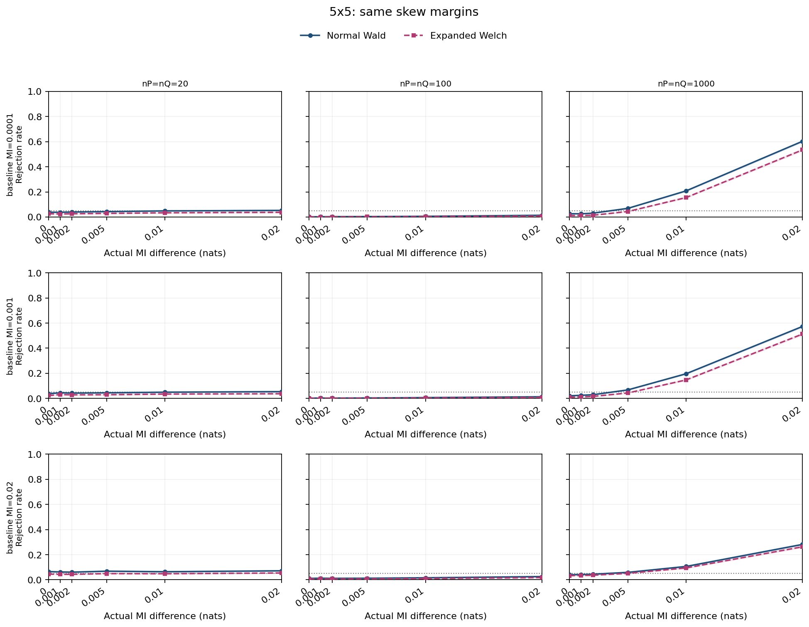

| Specification | Setting |
| --- | --- |
| Table size | 5x5 |
| Horizontal graph regime specifications (columns) | nP=nQ=20, nP=nQ=100, nP=nQ=1000 |
| Vertical graph regime specifications (rows) | baseline MI=0.0001: P row (0.8, 0.2/4 repeated 4 times), P column (0.8, 0.2/4 repeated 4 times); Q row (0.8, 0.2/4 repeated 4 times), Q column (0.8, 0.2/4 repeated 4 times); baseline MI=0.001: P row (0.8, 0.2/4 repeated 4 times), P column (0.8, 0.2/4 repeated 4 times); Q row (0.8, 0.2/4 repeated 4 times), Q column (0.8, 0.2/4 repeated 4 times); baseline MI=0.02: P row (0.8, 0.2/4 repeated 4 times), P column (0.8, 0.2/4 repeated 4 times); Q row (0.8, 0.2/4 repeated 4 times), Q column (0.8, 0.2/4 repeated 4 times) |
| Probability changes | baseline MI=0.0001: add at (1,1),(2,2) and subtract at (1,2),(2,1), for both P and Q; baseline MI=0.001: add at (1,1),(2,2) and subtract at (1,2),(2,1), for both P and Q; baseline MI=0.02: add at (1,1),(2,2) and subtract at (1,2),(2,1), for both P and Q |
| MI settings | Baseline MI {0.0001, 0.001, 0.02}; direction {q higher}; actual differences {0, 0.001, 0.002, 0.005, 0.01, 0.02} nats |
| Horizontal axis within each graph | Actual MI difference in nats, fixed from 0 to 0.02 |
| Vertical axis within each graph | Unconditional rejection rate from 0 to 1; invalid results count as non-rejections |
| Replicates | 20,000 per unique point |

Null-point rejection and validity:

| Vertical regime | Horizontal regime | x | Method | Rejection | Valid |
| --- | --- | --- | --- | --- | --- |
| baseline MI=0.0001 | nP=nQ=20 | 0 | Expanded Welch | 0.0261 | 0.9563 |
| baseline MI=0.0001 | nP=nQ=20 | 0 | Normal Wald | 0.0380 | 0.9994 |
| baseline MI=0.0001 | nP=nQ=100 | 0 | Expanded Welch | 0.0001 | 1.0000 |
| baseline MI=0.0001 | nP=nQ=100 | 0 | Normal Wald | 0.0016 | 1.0000 |
| baseline MI=0.0001 | nP=nQ=1000 | 0 | Expanded Welch | 0.0114 | 1.0000 |
| baseline MI=0.0001 | nP=nQ=1000 | 0 | Normal Wald | 0.0261 | 1.0000 |
| baseline MI=0.001 | nP=nQ=20 | 0 | Expanded Welch | 0.0227 | 0.9554 |
| baseline MI=0.001 | nP=nQ=20 | 0 | Normal Wald | 0.0372 | 0.9995 |
| baseline MI=0.001 | nP=nQ=100 | 0 | Expanded Welch | 0.0013 | 1.0000 |
| baseline MI=0.001 | nP=nQ=100 | 0 | Normal Wald | 0.0024 | 1.0000 |
| baseline MI=0.001 | nP=nQ=1000 | 0 | Expanded Welch | 0.0097 | 1.0000 |
| baseline MI=0.001 | nP=nQ=1000 | 0 | Normal Wald | 0.0207 | 1.0000 |
| baseline MI=0.02 | nP=nQ=20 | 0 | Expanded Welch | 0.0454 | 0.9553 |
| baseline MI=0.02 | nP=nQ=20 | 0 | Normal Wald | 0.0651 | 0.9996 |
| baseline MI=0.02 | nP=nQ=100 | 0 | Expanded Welch | 0.0066 | 1.0000 |
| baseline MI=0.02 | nP=nQ=100 | 0 | Normal Wald | 0.0112 | 1.0000 |
| baseline MI=0.02 | nP=nQ=1000 | 0 | Expanded Welch | 0.0329 | 1.0000 |
| baseline MI=0.02 | nP=nQ=1000 | 0 | Normal Wald | 0.0403 | 1.0000 |

Every plotted rate, interval, validity and minimum expected count

| Vertical regime | Horizontal regime | x | Method | Rejection | 95% interval | Valid | Conditional | Min expected P | Min expected Q |
| --- | --- | --- | --- | --- | --- | --- | --- | --- | --- |
| baseline MI=0.0001 | nP=nQ=20 | 0 | Expanded Welch | 0.0261 | [0.0240, 0.0284] | 0.9563 | 0.0273 | 0.05 | 0.05 |
| baseline MI=0.0001 | nP=nQ=20 | 0 | Normal Wald | 0.0380 | [0.0354, 0.0407] | 0.9994 | 0.0380 | 0.05 | 0.05 |
| baseline MI=0.0001 | nP=nQ=20 | 0.001 | Expanded Welch | 0.0238 | [0.0218, 0.0261] | 0.9560 | 0.0249 | 0.05 | 0.05 |
| baseline MI=0.0001 | nP=nQ=20 | 0.001 | Normal Wald | 0.0377 | [0.0351, 0.0404] | 0.9993 | 0.0377 | 0.05 | 0.05 |
| baseline MI=0.0001 | nP=nQ=20 | 0.002 | Expanded Welch | 0.0259 | [0.0238, 0.0282] | 0.9555 | 0.0271 | 0.05 | 0.05 |
| baseline MI=0.0001 | nP=nQ=20 | 0.002 | Normal Wald | 0.0397 | [0.0371, 0.0425] | 0.9994 | 0.0397 | 0.05 | 0.05 |
| baseline MI=0.0001 | nP=nQ=20 | 0.005 | Expanded Welch | 0.0286 | [0.0264, 0.0310] | 0.9595 | 0.0298 | 0.05 | 0.05 |
| baseline MI=0.0001 | nP=nQ=20 | 0.005 | Normal Wald | 0.0429 | [0.0402, 0.0458] | 0.9996 | 0.0429 | 0.05 | 0.05 |
| baseline MI=0.0001 | nP=nQ=20 | 0.01 | Expanded Welch | 0.0336 | [0.0311, 0.0361] | 0.9574 | 0.0350 | 0.05 | 0.05 |
| baseline MI=0.0001 | nP=nQ=20 | 0.01 | Normal Wald | 0.0487 | [0.0458, 0.0518] | 0.9996 | 0.0487 | 0.05 | 0.05 |
| baseline MI=0.0001 | nP=nQ=20 | 0.02 | Expanded Welch | 0.0372 | [0.0347, 0.0399] | 0.9586 | 0.0388 | 0.05 | 0.05 |
| baseline MI=0.0001 | nP=nQ=20 | 0.02 | Normal Wald | 0.0525 | [0.0495, 0.0557] | 0.9992 | 0.0526 | 0.05 | 0.05 |
| baseline MI=0.0001 | nP=nQ=100 | 0 | Expanded Welch | 0.0001 | [0.0001, 0.0004] | 1.0000 | 0.0001 | 0.25 | 0.25 |
| baseline MI=0.0001 | nP=nQ=100 | 0 | Normal Wald | 0.0016 | [0.0012, 0.0023] | 1.0000 | 0.0016 | 0.25 | 0.25 |
| baseline MI=0.0001 | nP=nQ=100 | 0.001 | Expanded Welch | 0.0005 | [0.0003, 0.0009] | 1.0000 | 0.0005 | 0.25 | 0.25 |
| baseline MI=0.0001 | nP=nQ=100 | 0.001 | Normal Wald | 0.0016 | [0.0012, 0.0023] | 1.0000 | 0.0016 | 0.25 | 0.25 |
| baseline MI=0.0001 | nP=nQ=100 | 0.002 | Expanded Welch | 0.0009 | [0.0006, 0.0015] | 1.0000 | 0.0009 | 0.25 | 0.25 |
| baseline MI=0.0001 | nP=nQ=100 | 0.002 | Normal Wald | 0.0027 | [0.0021, 0.0036] | 1.0000 | 0.0027 | 0.25 | 0.25 |
| baseline MI=0.0001 | nP=nQ=100 | 0.005 | Expanded Welch | 0.0015 | [0.0011, 0.0021] | 1.0000 | 0.0015 | 0.25 | 0.25 |
| baseline MI=0.0001 | nP=nQ=100 | 0.005 | Normal Wald | 0.0034 | [0.0027, 0.0044] | 1.0000 | 0.0034 | 0.25 | 0.25 |
| baseline MI=0.0001 | nP=nQ=100 | 0.01 | Expanded Welch | 0.0026 | [0.0020, 0.0034] | 1.0000 | 0.0026 | 0.25 | 0.25 |
| baseline MI=0.0001 | nP=nQ=100 | 0.01 | Normal Wald | 0.0056 | [0.0046, 0.0067] | 1.0000 | 0.0056 | 0.25 | 0.25 |
| baseline MI=0.0001 | nP=nQ=100 | 0.02 | Expanded Welch | 0.0078 | [0.0067, 0.0091] | 1.0000 | 0.0078 | 0.25 | 0.25 |
| baseline MI=0.0001 | nP=nQ=100 | 0.02 | Normal Wald | 0.0137 | [0.0121, 0.0154] | 1.0000 | 0.0137 | 0.25 | 0.25 |
| baseline MI=0.0001 | nP=nQ=1000 | 0 | Expanded Welch | 0.0114 | [0.0100, 0.0129] | 1.0000 | 0.0114 | 2.5 | 2.5 |
| baseline MI=0.0001 | nP=nQ=1000 | 0 | Normal Wald | 0.0261 | [0.0239, 0.0284] | 1.0000 | 0.0261 | 2.5 | 2.5 |
| baseline MI=0.0001 | nP=nQ=1000 | 0.001 | Expanded Welch | 0.0119 | [0.0105, 0.0135] | 1.0000 | 0.0119 | 2.5 | 2.5 |
| baseline MI=0.0001 | nP=nQ=1000 | 0.001 | Normal Wald | 0.0257 | [0.0236, 0.0280] | 1.0000 | 0.0257 | 2.5 | 2.5 |
| baseline MI=0.0001 | nP=nQ=1000 | 0.002 | Expanded Welch | 0.0138 | [0.0123, 0.0156] | 1.0000 | 0.0138 | 2.5 | 2.5 |
| baseline MI=0.0001 | nP=nQ=1000 | 0.002 | Normal Wald | 0.0305 | [0.0282, 0.0329] | 1.0000 | 0.0305 | 2.5 | 2.5 |
| baseline MI=0.0001 | nP=nQ=1000 | 0.005 | Expanded Welch | 0.0437 | [0.0410, 0.0466] | 1.0000 | 0.0437 | 2.5 | 2.5 |
| baseline MI=0.0001 | nP=nQ=1000 | 0.005 | Normal Wald | 0.0688 | [0.0653, 0.0723] | 1.0000 | 0.0688 | 2.5 | 2.5 |
| baseline MI=0.0001 | nP=nQ=1000 | 0.01 | Expanded Welch | 0.1548 | [0.1499, 0.1599] | 1.0000 | 0.1548 | 2.5 | 2.5 |
| baseline MI=0.0001 | nP=nQ=1000 | 0.01 | Normal Wald | 0.2079 | [0.2024, 0.2136] | 1.0000 | 0.2079 | 2.5 | 2.5 |
| baseline MI=0.0001 | nP=nQ=1000 | 0.02 | Expanded Welch | 0.5346 | [0.5277, 0.5415] | 1.0000 | 0.5346 | 2.5 | 2.5 |
| baseline MI=0.0001 | nP=nQ=1000 | 0.02 | Normal Wald | 0.6032 | [0.5965, 0.6100] | 1.0000 | 0.6032 | 2.5 | 2.5 |
| baseline MI=0.001 | nP=nQ=20 | 0 | Expanded Welch | 0.0227 | [0.0207, 0.0249] | 0.9554 | 0.0238 | 0.05 | 0.05 |
| baseline MI=0.001 | nP=nQ=20 | 0 | Normal Wald | 0.0372 | [0.0347, 0.0399] | 0.9995 | 0.0372 | 0.05 | 0.05 |
| baseline MI=0.001 | nP=nQ=20 | 0.001 | Expanded Welch | 0.0303 | [0.0281, 0.0328] | 0.9570 | 0.0317 | 0.05 | 0.05 |
| baseline MI=0.001 | nP=nQ=20 | 0.001 | Normal Wald | 0.0449 | [0.0421, 0.0479] | 0.9993 | 0.0449 | 0.05 | 0.05 |
| baseline MI=0.001 | nP=nQ=20 | 0.002 | Expanded Welch | 0.0283 | [0.0261, 0.0307] | 0.9564 | 0.0296 | 0.05 | 0.05 |
| baseline MI=0.001 | nP=nQ=20 | 0.002 | Normal Wald | 0.0423 | [0.0396, 0.0452] | 0.9995 | 0.0423 | 0.05 | 0.05 |
| baseline MI=0.001 | nP=nQ=20 | 0.005 | Expanded Welch | 0.0291 | [0.0269, 0.0316] | 0.9571 | 0.0305 | 0.05 | 0.05 |
| baseline MI=0.001 | nP=nQ=20 | 0.005 | Normal Wald | 0.0444 | [0.0416, 0.0473] | 0.9994 | 0.0444 | 0.05 | 0.05 |
| baseline MI=0.001 | nP=nQ=20 | 0.01 | Expanded Welch | 0.0345 | [0.0321, 0.0371] | 0.9585 | 0.0360 | 0.05 | 0.05 |
| baseline MI=0.001 | nP=nQ=20 | 0.01 | Normal Wald | 0.0495 | [0.0465, 0.0525] | 0.9992 | 0.0495 | 0.05 | 0.05 |
| baseline MI=0.001 | nP=nQ=20 | 0.02 | Expanded Welch | 0.0370 | [0.0345, 0.0398] | 0.9560 | 0.0388 | 0.05 | 0.05 |
| baseline MI=0.001 | nP=nQ=20 | 0.02 | Normal Wald | 0.0537 | [0.0507, 0.0570] | 0.9997 | 0.0538 | 0.05 | 0.05 |
| baseline MI=0.001 | nP=nQ=100 | 0 | Expanded Welch | 0.0013 | [0.0008, 0.0018] | 1.0000 | 0.0013 | 0.25 | 0.25 |
| baseline MI=0.001 | nP=nQ=100 | 0 | Normal Wald | 0.0024 | [0.0018, 0.0031] | 1.0000 | 0.0024 | 0.25 | 0.25 |
| baseline MI=0.001 | nP=nQ=100 | 0.001 | Expanded Welch | 0.0008 | [0.0005, 0.0014] | 1.0000 | 0.0008 | 0.25 | 0.25 |
| baseline MI=0.001 | nP=nQ=100 | 0.001 | Normal Wald | 0.0023 | [0.0017, 0.0031] | 1.0000 | 0.0023 | 0.25 | 0.25 |
| baseline MI=0.001 | nP=nQ=100 | 0.002 | Expanded Welch | 0.0014 | [0.0010, 0.0020] | 1.0000 | 0.0014 | 0.25 | 0.25 |
| baseline MI=0.001 | nP=nQ=100 | 0.002 | Normal Wald | 0.0026 | [0.0019, 0.0034] | 1.0000 | 0.0026 | 0.25 | 0.25 |
| baseline MI=0.001 | nP=nQ=100 | 0.005 | Expanded Welch | 0.0014 | [0.0010, 0.0021] | 1.0000 | 0.0014 | 0.25 | 0.25 |
| baseline MI=0.001 | nP=nQ=100 | 0.005 | Normal Wald | 0.0033 | [0.0026, 0.0042] | 1.0000 | 0.0033 | 0.25 | 0.25 |
| baseline MI=0.001 | nP=nQ=100 | 0.01 | Expanded Welch | 0.0030 | [0.0023, 0.0039] | 1.0000 | 0.0030 | 0.25 | 0.25 |
| baseline MI=0.001 | nP=nQ=100 | 0.01 | Normal Wald | 0.0063 | [0.0053, 0.0075] | 1.0000 | 0.0063 | 0.25 | 0.25 |
| baseline MI=0.001 | nP=nQ=100 | 0.02 | Expanded Welch | 0.0075 | [0.0064, 0.0088] | 1.0000 | 0.0075 | 0.25 | 0.25 |
| baseline MI=0.001 | nP=nQ=100 | 0.02 | Normal Wald | 0.0129 | [0.0115, 0.0146] | 1.0000 | 0.0129 | 0.25 | 0.25 |
| baseline MI=0.001 | nP=nQ=1000 | 0 | Expanded Welch | 0.0097 | [0.0085, 0.0112] | 1.0000 | 0.0097 | 2.5 | 2.5 |
| baseline MI=0.001 | nP=nQ=1000 | 0 | Normal Wald | 0.0207 | [0.0188, 0.0228] | 1.0000 | 0.0207 | 2.5 | 2.5 |
| baseline MI=0.001 | nP=nQ=1000 | 0.001 | Expanded Welch | 0.0115 | [0.0101, 0.0130] | 1.0000 | 0.0115 | 2.5 | 2.5 |
| baseline MI=0.001 | nP=nQ=1000 | 0.001 | Normal Wald | 0.0246 | [0.0225, 0.0268] | 1.0000 | 0.0246 | 2.5 | 2.5 |
| baseline MI=0.001 | nP=nQ=1000 | 0.002 | Expanded Welch | 0.0158 | [0.0142, 0.0177] | 1.0000 | 0.0158 | 2.5 | 2.5 |
| baseline MI=0.001 | nP=nQ=1000 | 0.002 | Normal Wald | 0.0293 | [0.0271, 0.0317] | 1.0000 | 0.0293 | 2.5 | 2.5 |
| baseline MI=0.001 | nP=nQ=1000 | 0.005 | Expanded Welch | 0.0432 | [0.0405, 0.0461] | 1.0000 | 0.0432 | 2.5 | 2.5 |
| baseline MI=0.001 | nP=nQ=1000 | 0.005 | Normal Wald | 0.0676 | [0.0642, 0.0712] | 1.0000 | 0.0676 | 2.5 | 2.5 |
| baseline MI=0.001 | nP=nQ=1000 | 0.01 | Expanded Welch | 0.1470 | [0.1422, 0.1520] | 1.0000 | 0.1470 | 2.5 | 2.5 |
| baseline MI=0.001 | nP=nQ=1000 | 0.01 | Normal Wald | 0.1961 | [0.1907, 0.2017] | 1.0000 | 0.1961 | 2.5 | 2.5 |
| baseline MI=0.001 | nP=nQ=1000 | 0.02 | Expanded Welch | 0.5126 | [0.5057, 0.5195] | 1.0000 | 0.5126 | 2.5 | 2.5 |
| baseline MI=0.001 | nP=nQ=1000 | 0.02 | Normal Wald | 0.5732 | [0.5663, 0.5800] | 1.0000 | 0.5732 | 2.5 | 2.5 |
| baseline MI=0.02 | nP=nQ=20 | 0 | Expanded Welch | 0.0454 | [0.0426, 0.0483] | 0.9553 | 0.0475 | 0.05 | 0.05 |
| baseline MI=0.02 | nP=nQ=20 | 0 | Normal Wald | 0.0651 | [0.0618, 0.0687] | 0.9996 | 0.0652 | 0.05 | 0.05 |
| baseline MI=0.02 | nP=nQ=20 | 0.001 | Expanded Welch | 0.0439 | [0.0411, 0.0468] | 0.9562 | 0.0459 | 0.05 | 0.05 |
| baseline MI=0.02 | nP=nQ=20 | 0.001 | Normal Wald | 0.0625 | [0.0592, 0.0659] | 0.9997 | 0.0625 | 0.05 | 0.05 |
| baseline MI=0.02 | nP=nQ=20 | 0.002 | Expanded Welch | 0.0435 | [0.0408, 0.0465] | 0.9553 | 0.0456 | 0.05 | 0.05 |
| baseline MI=0.02 | nP=nQ=20 | 0.002 | Normal Wald | 0.0609 | [0.0576, 0.0642] | 0.9990 | 0.0609 | 0.05 | 0.05 |
| baseline MI=0.02 | nP=nQ=20 | 0.005 | Expanded Welch | 0.0493 | [0.0464, 0.0524] | 0.9589 | 0.0515 | 0.05 | 0.05 |
| baseline MI=0.02 | nP=nQ=20 | 0.005 | Normal Wald | 0.0685 | [0.0651, 0.0721] | 0.9991 | 0.0686 | 0.05 | 0.05 |
| baseline MI=0.02 | nP=nQ=20 | 0.01 | Expanded Welch | 0.0483 | [0.0454, 0.0514] | 0.9574 | 0.0504 | 0.05 | 0.05 |
| baseline MI=0.02 | nP=nQ=20 | 0.01 | Normal Wald | 0.0643 | [0.0609, 0.0677] | 0.9997 | 0.0643 | 0.05 | 0.05 |
| baseline MI=0.02 | nP=nQ=20 | 0.02 | Expanded Welch | 0.0544 | [0.0513, 0.0576] | 0.9554 | 0.0569 | 0.05 | 0.05 |
| baseline MI=0.02 | nP=nQ=20 | 0.02 | Normal Wald | 0.0716 | [0.0681, 0.0753] | 0.9992 | 0.0717 | 0.05 | 0.05 |
| baseline MI=0.02 | nP=nQ=100 | 0 | Expanded Welch | 0.0066 | [0.0056, 0.0078] | 1.0000 | 0.0066 | 0.25 | 0.25 |
| baseline MI=0.02 | nP=nQ=100 | 0 | Normal Wald | 0.0112 | [0.0098, 0.0127] | 1.0000 | 0.0112 | 0.25 | 0.25 |
| baseline MI=0.02 | nP=nQ=100 | 0.001 | Expanded Welch | 0.0072 | [0.0061, 0.0084] | 1.0000 | 0.0072 | 0.25 | 0.25 |
| baseline MI=0.02 | nP=nQ=100 | 0.001 | Normal Wald | 0.0126 | [0.0111, 0.0142] | 1.0000 | 0.0126 | 0.25 | 0.25 |
| baseline MI=0.02 | nP=nQ=100 | 0.002 | Expanded Welch | 0.0067 | [0.0057, 0.0080] | 1.0000 | 0.0067 | 0.25 | 0.25 |
| baseline MI=0.02 | nP=nQ=100 | 0.002 | Normal Wald | 0.0116 | [0.0102, 0.0132] | 1.0000 | 0.0116 | 0.25 | 0.25 |
| baseline MI=0.02 | nP=nQ=100 | 0.005 | Expanded Welch | 0.0073 | [0.0063, 0.0086] | 1.0000 | 0.0073 | 0.25 | 0.25 |
| baseline MI=0.02 | nP=nQ=100 | 0.005 | Normal Wald | 0.0124 | [0.0110, 0.0140] | 1.0000 | 0.0124 | 0.25 | 0.25 |
| baseline MI=0.02 | nP=nQ=100 | 0.01 | Expanded Welch | 0.0098 | [0.0085, 0.0113] | 1.0000 | 0.0098 | 0.25 | 0.25 |
| baseline MI=0.02 | nP=nQ=100 | 0.01 | Normal Wald | 0.0160 | [0.0144, 0.0179] | 1.0000 | 0.0160 | 0.25 | 0.25 |
| baseline MI=0.02 | nP=nQ=100 | 0.02 | Expanded Welch | 0.0173 | [0.0156, 0.0192] | 1.0000 | 0.0173 | 0.25 | 0.25 |
| baseline MI=0.02 | nP=nQ=100 | 0.02 | Normal Wald | 0.0257 | [0.0236, 0.0280] | 1.0000 | 0.0257 | 0.25 | 0.25 |
| baseline MI=0.02 | nP=nQ=1000 | 0 | Expanded Welch | 0.0329 | [0.0305, 0.0355] | 1.0000 | 0.0329 | 2.5 | 2.5 |
| baseline MI=0.02 | nP=nQ=1000 | 0 | Normal Wald | 0.0403 | [0.0376, 0.0431] | 1.0000 | 0.0403 | 2.5 | 2.5 |
| baseline MI=0.02 | nP=nQ=1000 | 0.001 | Expanded Welch | 0.0345 | [0.0321, 0.0372] | 1.0000 | 0.0345 | 2.5 | 2.5 |
| baseline MI=0.02 | nP=nQ=1000 | 0.001 | Normal Wald | 0.0419 | [0.0392, 0.0448] | 1.0000 | 0.0419 | 2.5 | 2.5 |
| baseline MI=0.02 | nP=nQ=1000 | 0.002 | Expanded Welch | 0.0365 | [0.0339, 0.0391] | 1.0000 | 0.0365 | 2.5 | 2.5 |
| baseline MI=0.02 | nP=nQ=1000 | 0.002 | Normal Wald | 0.0445 | [0.0417, 0.0474] | 1.0000 | 0.0445 | 2.5 | 2.5 |
| baseline MI=0.02 | nP=nQ=1000 | 0.005 | Expanded Welch | 0.0513 | [0.0484, 0.0545] | 1.0000 | 0.0513 | 2.5 | 2.5 |
| baseline MI=0.02 | nP=nQ=1000 | 0.005 | Normal Wald | 0.0592 | [0.0560, 0.0626] | 1.0000 | 0.0592 | 2.5 | 2.5 |
| baseline MI=0.02 | nP=nQ=1000 | 0.01 | Expanded Welch | 0.0944 | [0.0904, 0.0985] | 1.0000 | 0.0944 | 2.5 | 2.5 |
| baseline MI=0.02 | nP=nQ=1000 | 0.01 | Normal Wald | 0.1062 | [0.1020, 0.1105] | 1.0000 | 0.1062 | 2.5 | 2.5 |
| baseline MI=0.02 | nP=nQ=1000 | 0.02 | Expanded Welch | 0.2628 | [0.2568, 0.2690] | 1.0000 | 0.2628 | 2.5 | 2.5 |
| baseline MI=0.02 | nP=nQ=1000 | 0.02 | Normal Wald | 0.2818 | [0.2756, 0.2881] | 1.0000 | 0.2818 | 2.5 | 2.5 |

### 4.9 5x5: different skew margins

Does performance change when the populations begin closer to independence?

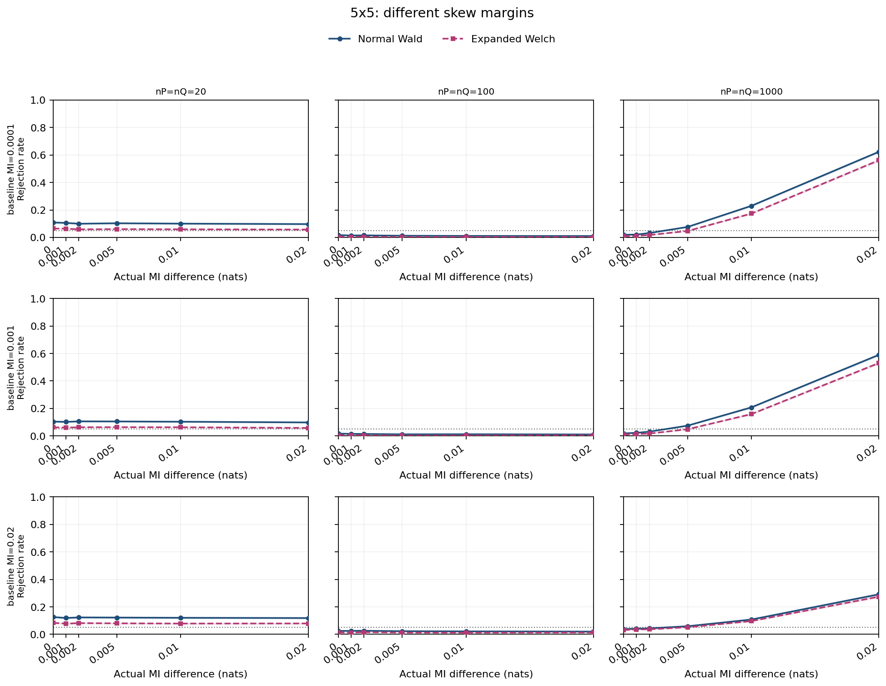

| Specification | Setting |
| --- | --- |
| Table size | 5x5 |
| Horizontal graph regime specifications (columns) | nP=nQ=20, nP=nQ=100, nP=nQ=1000 |
| Vertical graph regime specifications (rows) | baseline MI=0.0001: P row (0.7, 0.3/4 repeated 4 times), P column (0.7, 0.3/4 repeated 4 times); Q row (0.8, 0.2/4 repeated 4 times), Q column (0.8, 0.2/4 repeated 4 times); baseline MI=0.001: P row (0.7, 0.3/4 repeated 4 times), P column (0.7, 0.3/4 repeated 4 times); Q row (0.8, 0.2/4 repeated 4 times), Q column (0.8, 0.2/4 repeated 4 times); baseline MI=0.02: P row (0.7, 0.3/4 repeated 4 times), P column (0.7, 0.3/4 repeated 4 times); Q row (0.8, 0.2/4 repeated 4 times), Q column (0.8, 0.2/4 repeated 4 times) |
| Probability changes | baseline MI=0.0001: add at (1,1),(2,2) and subtract at (1,2),(2,1), for both P and Q; baseline MI=0.001: add at (1,1),(2,2) and subtract at (1,2),(2,1), for both P and Q; baseline MI=0.02: add at (1,1),(2,2) and subtract at (1,2),(2,1), for both P and Q |
| MI settings | Baseline MI {0.0001, 0.001, 0.02}; direction {q higher}; actual differences {0, 0.001, 0.002, 0.005, 0.01, 0.02} nats |
| Horizontal axis within each graph | Actual MI difference in nats, fixed from 0 to 0.02 |
| Vertical axis within each graph | Unconditional rejection rate from 0 to 1; invalid results count as non-rejections |
| Replicates | 20,000 per unique point |

Null-point rejection and validity:

| Vertical regime | Horizontal regime | x | Method | Rejection | Valid |
| --- | --- | --- | --- | --- | --- |
| baseline MI=0.0001 | nP=nQ=20 | 0 | Expanded Welch | 0.0644 | 0.9786 |
| baseline MI=0.0001 | nP=nQ=20 | 0 | Normal Wald | 0.1084 | 0.9999 |
| baseline MI=0.0001 | nP=nQ=100 | 0 | Expanded Welch | 0.0039 | 1.0000 |
| baseline MI=0.0001 | nP=nQ=100 | 0 | Normal Wald | 0.0169 | 1.0000 |
| baseline MI=0.0001 | nP=nQ=1000 | 0 | Expanded Welch | 0.0098 | 1.0000 |
| baseline MI=0.0001 | nP=nQ=1000 | 0 | Normal Wald | 0.0193 | 1.0000 |
| baseline MI=0.001 | nP=nQ=20 | 0 | Expanded Welch | 0.0625 | 0.9760 |
| baseline MI=0.001 | nP=nQ=20 | 0 | Normal Wald | 0.1041 | 1.0000 |
| baseline MI=0.001 | nP=nQ=100 | 0 | Expanded Welch | 0.0047 | 1.0000 |
| baseline MI=0.001 | nP=nQ=100 | 0 | Normal Wald | 0.0168 | 1.0000 |
| baseline MI=0.001 | nP=nQ=1000 | 0 | Expanded Welch | 0.0100 | 1.0000 |
| baseline MI=0.001 | nP=nQ=1000 | 0 | Normal Wald | 0.0180 | 1.0000 |
| baseline MI=0.02 | nP=nQ=20 | 0 | Expanded Welch | 0.0839 | 0.9785 |
| baseline MI=0.02 | nP=nQ=20 | 0 | Normal Wald | 0.1259 | 1.0000 |
| baseline MI=0.02 | nP=nQ=100 | 0 | Expanded Welch | 0.0136 | 1.0000 |
| baseline MI=0.02 | nP=nQ=100 | 0 | Normal Wald | 0.0250 | 1.0000 |
| baseline MI=0.02 | nP=nQ=1000 | 0 | Expanded Welch | 0.0319 | 1.0000 |
| baseline MI=0.02 | nP=nQ=1000 | 0 | Normal Wald | 0.0386 | 1.0000 |

Every plotted rate, interval, validity and minimum expected count

| Vertical regime | Horizontal regime | x | Method | Rejection | 95% interval | Valid | Conditional | Min expected P | Min expected Q |
| --- | --- | --- | --- | --- | --- | --- | --- | --- | --- |
| baseline MI=0.0001 | nP=nQ=20 | 0 | Expanded Welch | 0.0644 | [0.0611, 0.0679] | 0.9786 | 0.0658 | 0.1125 | 0.05 |
| baseline MI=0.0001 | nP=nQ=20 | 0 | Normal Wald | 0.1084 | [0.1042, 0.1128] | 0.9999 | 0.1084 | 0.1125 | 0.05 |
| baseline MI=0.0001 | nP=nQ=20 | 0.001 | Expanded Welch | 0.0641 | [0.0608, 0.0676] | 0.9779 | 0.0655 | 0.1125 | 0.05 |
| baseline MI=0.0001 | nP=nQ=20 | 0.001 | Normal Wald | 0.1059 | [0.1017, 0.1102] | 1.0000 | 0.1059 | 0.1125 | 0.05 |
| baseline MI=0.0001 | nP=nQ=20 | 0.002 | Expanded Welch | 0.0587 | [0.0555, 0.0620] | 0.9763 | 0.0601 | 0.1125 | 0.05 |
| baseline MI=0.0001 | nP=nQ=20 | 0.002 | Normal Wald | 0.0997 | [0.0956, 0.1039] | 0.9999 | 0.0997 | 0.1125 | 0.05 |
| baseline MI=0.0001 | nP=nQ=20 | 0.005 | Expanded Welch | 0.0604 | [0.0572, 0.0638] | 0.9791 | 0.0617 | 0.1125 | 0.05 |
| baseline MI=0.0001 | nP=nQ=20 | 0.005 | Normal Wald | 0.1031 | [0.0989, 0.1073] | 1.0000 | 0.1031 | 0.1125 | 0.05 |
| baseline MI=0.0001 | nP=nQ=20 | 0.01 | Expanded Welch | 0.0590 | [0.0558, 0.0624] | 0.9764 | 0.0604 | 0.1125 | 0.05 |
| baseline MI=0.0001 | nP=nQ=20 | 0.01 | Normal Wald | 0.1004 | [0.0963, 0.1046] | 1.0000 | 0.1004 | 0.1125 | 0.05 |
| baseline MI=0.0001 | nP=nQ=20 | 0.02 | Expanded Welch | 0.0573 | [0.0541, 0.0606] | 0.9766 | 0.0586 | 0.1125 | 0.05 |
| baseline MI=0.0001 | nP=nQ=20 | 0.02 | Normal Wald | 0.0970 | [0.0930, 0.1012] | 1.0000 | 0.0970 | 0.1125 | 0.05 |
| baseline MI=0.0001 | nP=nQ=100 | 0 | Expanded Welch | 0.0039 | [0.0031, 0.0049] | 1.0000 | 0.0039 | 0.5625 | 0.25 |
| baseline MI=0.0001 | nP=nQ=100 | 0 | Normal Wald | 0.0169 | [0.0152, 0.0187] | 1.0000 | 0.0169 | 0.5625 | 0.25 |
| baseline MI=0.0001 | nP=nQ=100 | 0.001 | Expanded Welch | 0.0034 | [0.0027, 0.0043] | 1.0000 | 0.0034 | 0.5625 | 0.25 |
| baseline MI=0.0001 | nP=nQ=100 | 0.001 | Normal Wald | 0.0141 | [0.0126, 0.0158] | 1.0000 | 0.0141 | 0.5625 | 0.25 |
| baseline MI=0.0001 | nP=nQ=100 | 0.002 | Expanded Welch | 0.0042 | [0.0033, 0.0051] | 1.0000 | 0.0042 | 0.5625 | 0.25 |
| baseline MI=0.0001 | nP=nQ=100 | 0.002 | Normal Wald | 0.0151 | [0.0135, 0.0169] | 1.0000 | 0.0151 | 0.5625 | 0.25 |
| baseline MI=0.0001 | nP=nQ=100 | 0.005 | Expanded Welch | 0.0034 | [0.0027, 0.0043] | 1.0000 | 0.0034 | 0.5625 | 0.25 |
| baseline MI=0.0001 | nP=nQ=100 | 0.005 | Normal Wald | 0.0123 | [0.0108, 0.0139] | 1.0000 | 0.0123 | 0.5625 | 0.25 |
| baseline MI=0.0001 | nP=nQ=100 | 0.01 | Expanded Welch | 0.0037 | [0.0030, 0.0047] | 1.0000 | 0.0037 | 0.5625 | 0.25 |
| baseline MI=0.0001 | nP=nQ=100 | 0.01 | Normal Wald | 0.0110 | [0.0096, 0.0125] | 1.0000 | 0.0110 | 0.5625 | 0.25 |
| baseline MI=0.0001 | nP=nQ=100 | 0.02 | Expanded Welch | 0.0036 | [0.0028, 0.0045] | 1.0000 | 0.0036 | 0.5625 | 0.25 |
| baseline MI=0.0001 | nP=nQ=100 | 0.02 | Normal Wald | 0.0101 | [0.0089, 0.0116] | 1.0000 | 0.0101 | 0.5625 | 0.25 |
| baseline MI=0.0001 | nP=nQ=1000 | 0 | Expanded Welch | 0.0098 | [0.0085, 0.0113] | 1.0000 | 0.0098 | 5.625 | 2.5 |
| baseline MI=0.0001 | nP=nQ=1000 | 0 | Normal Wald | 0.0193 | [0.0175, 0.0213] | 1.0000 | 0.0193 | 5.625 | 2.5 |
| baseline MI=0.0001 | nP=nQ=1000 | 0.001 | Expanded Welch | 0.0104 | [0.0091, 0.0120] | 1.0000 | 0.0104 | 5.625 | 2.5 |
| baseline MI=0.0001 | nP=nQ=1000 | 0.001 | Normal Wald | 0.0208 | [0.0189, 0.0229] | 1.0000 | 0.0208 | 5.625 | 2.5 |
| baseline MI=0.0001 | nP=nQ=1000 | 0.002 | Expanded Welch | 0.0174 | [0.0156, 0.0193] | 1.0000 | 0.0174 | 5.625 | 2.5 |
| baseline MI=0.0001 | nP=nQ=1000 | 0.002 | Normal Wald | 0.0319 | [0.0296, 0.0344] | 1.0000 | 0.0319 | 5.625 | 2.5 |
| baseline MI=0.0001 | nP=nQ=1000 | 0.005 | Expanded Welch | 0.0467 | [0.0439, 0.0498] | 1.0000 | 0.0467 | 5.625 | 2.5 |
| baseline MI=0.0001 | nP=nQ=1000 | 0.005 | Normal Wald | 0.0762 | [0.0726, 0.0800] | 1.0000 | 0.0762 | 5.625 | 2.5 |
| baseline MI=0.0001 | nP=nQ=1000 | 0.01 | Expanded Welch | 0.1736 | [0.1684, 0.1789] | 1.0000 | 0.1736 | 5.625 | 2.5 |
| baseline MI=0.0001 | nP=nQ=1000 | 0.01 | Normal Wald | 0.2298 | [0.2240, 0.2357] | 1.0000 | 0.2298 | 5.625 | 2.5 |
| baseline MI=0.0001 | nP=nQ=1000 | 0.02 | Expanded Welch | 0.5615 | [0.5546, 0.5684] | 1.0000 | 0.5615 | 5.625 | 2.5 |
| baseline MI=0.0001 | nP=nQ=1000 | 0.02 | Normal Wald | 0.6235 | [0.6168, 0.6302] | 1.0000 | 0.6235 | 5.625 | 2.5 |
| baseline MI=0.001 | nP=nQ=20 | 0 | Expanded Welch | 0.0625 | [0.0593, 0.0660] | 0.9760 | 0.0641 | 0.1125 | 0.05 |
| baseline MI=0.001 | nP=nQ=20 | 0 | Normal Wald | 0.1041 | [0.0999, 0.1084] | 1.0000 | 0.1041 | 0.1125 | 0.05 |
| baseline MI=0.001 | nP=nQ=20 | 0.001 | Expanded Welch | 0.0603 | [0.0571, 0.0637] | 0.9767 | 0.0617 | 0.1125 | 0.05 |
| baseline MI=0.001 | nP=nQ=20 | 0.001 | Normal Wald | 0.1021 | [0.0979, 0.1063] | 1.0000 | 0.1021 | 0.1125 | 0.05 |
| baseline MI=0.001 | nP=nQ=20 | 0.002 | Expanded Welch | 0.0628 | [0.0595, 0.0662] | 0.9744 | 0.0644 | 0.1125 | 0.05 |
| baseline MI=0.001 | nP=nQ=20 | 0.002 | Normal Wald | 0.1057 | [0.1015, 0.1100] | 1.0000 | 0.1057 | 0.1125 | 0.05 |
| baseline MI=0.001 | nP=nQ=20 | 0.005 | Expanded Welch | 0.0634 | [0.0601, 0.0669] | 0.9762 | 0.0649 | 0.1125 | 0.05 |
| baseline MI=0.001 | nP=nQ=20 | 0.005 | Normal Wald | 0.1051 | [0.1009, 0.1094] | 1.0000 | 0.1051 | 0.1125 | 0.05 |
| baseline MI=0.001 | nP=nQ=20 | 0.01 | Expanded Welch | 0.0628 | [0.0595, 0.0662] | 0.9763 | 0.0643 | 0.1125 | 0.05 |
| baseline MI=0.001 | nP=nQ=20 | 0.01 | Normal Wald | 0.1032 | [0.0990, 0.1074] | 1.0000 | 0.1032 | 0.1125 | 0.05 |
| baseline MI=0.001 | nP=nQ=20 | 0.02 | Expanded Welch | 0.0580 | [0.0548, 0.0613] | 0.9770 | 0.0593 | 0.1125 | 0.05 |
| baseline MI=0.001 | nP=nQ=20 | 0.02 | Normal Wald | 0.0980 | [0.0940, 0.1022] | 1.0000 | 0.0980 | 0.1125 | 0.05 |
| baseline MI=0.001 | nP=nQ=100 | 0 | Expanded Welch | 0.0047 | [0.0038, 0.0057] | 1.0000 | 0.0047 | 0.5625 | 0.25 |
| baseline MI=0.001 | nP=nQ=100 | 0 | Normal Wald | 0.0168 | [0.0151, 0.0186] | 1.0000 | 0.0168 | 0.5625 | 0.25 |
| baseline MI=0.001 | nP=nQ=100 | 0.001 | Expanded Welch | 0.0039 | [0.0031, 0.0048] | 1.0000 | 0.0039 | 0.5625 | 0.25 |
| baseline MI=0.001 | nP=nQ=100 | 0.001 | Normal Wald | 0.0148 | [0.0132, 0.0166] | 1.0000 | 0.0148 | 0.5625 | 0.25 |
| baseline MI=0.001 | nP=nQ=100 | 0.002 | Expanded Welch | 0.0042 | [0.0034, 0.0052] | 1.0000 | 0.0042 | 0.5625 | 0.25 |
| baseline MI=0.001 | nP=nQ=100 | 0.002 | Normal Wald | 0.0142 | [0.0127, 0.0159] | 1.0000 | 0.0142 | 0.5625 | 0.25 |
| baseline MI=0.001 | nP=nQ=100 | 0.005 | Expanded Welch | 0.0032 | [0.0026, 0.0041] | 1.0000 | 0.0032 | 0.5625 | 0.25 |
| baseline MI=0.001 | nP=nQ=100 | 0.005 | Normal Wald | 0.0115 | [0.0102, 0.0131] | 1.0000 | 0.0115 | 0.5625 | 0.25 |
| baseline MI=0.001 | nP=nQ=100 | 0.01 | Expanded Welch | 0.0033 | [0.0026, 0.0042] | 1.0000 | 0.0033 | 0.5625 | 0.25 |
| baseline MI=0.001 | nP=nQ=100 | 0.01 | Normal Wald | 0.0121 | [0.0107, 0.0138] | 1.0000 | 0.0121 | 0.5625 | 0.25 |
| baseline MI=0.001 | nP=nQ=100 | 0.02 | Expanded Welch | 0.0045 | [0.0037, 0.0055] | 1.0000 | 0.0045 | 0.5625 | 0.25 |
| baseline MI=0.001 | nP=nQ=100 | 0.02 | Normal Wald | 0.0105 | [0.0092, 0.0120] | 1.0000 | 0.0105 | 0.5625 | 0.25 |
| baseline MI=0.001 | nP=nQ=1000 | 0 | Expanded Welch | 0.0100 | [0.0088, 0.0115] | 1.0000 | 0.0100 | 5.625 | 2.5 |
| baseline MI=0.001 | nP=nQ=1000 | 0 | Normal Wald | 0.0180 | [0.0162, 0.0199] | 1.0000 | 0.0180 | 5.625 | 2.5 |
| baseline MI=0.001 | nP=nQ=1000 | 0.001 | Expanded Welch | 0.0129 | [0.0114, 0.0145] | 1.0000 | 0.0129 | 5.625 | 2.5 |
| baseline MI=0.001 | nP=nQ=1000 | 0.001 | Normal Wald | 0.0226 | [0.0206, 0.0247] | 1.0000 | 0.0226 | 5.625 | 2.5 |
| baseline MI=0.001 | nP=nQ=1000 | 0.002 | Expanded Welch | 0.0169 | [0.0152, 0.0187] | 1.0000 | 0.0169 | 5.625 | 2.5 |
| baseline MI=0.001 | nP=nQ=1000 | 0.002 | Normal Wald | 0.0307 | [0.0283, 0.0331] | 1.0000 | 0.0307 | 5.625 | 2.5 |
| baseline MI=0.001 | nP=nQ=1000 | 0.005 | Expanded Welch | 0.0483 | [0.0455, 0.0514] | 1.0000 | 0.0483 | 5.625 | 2.5 |
| baseline MI=0.001 | nP=nQ=1000 | 0.005 | Normal Wald | 0.0745 | [0.0709, 0.0782] | 1.0000 | 0.0745 | 5.625 | 2.5 |
| baseline MI=0.001 | nP=nQ=1000 | 0.01 | Expanded Welch | 0.1585 | [0.1536, 0.1637] | 1.0000 | 0.1585 | 5.625 | 2.5 |
| baseline MI=0.001 | nP=nQ=1000 | 0.01 | Normal Wald | 0.2074 | [0.2019, 0.2131] | 1.0000 | 0.2074 | 5.625 | 2.5 |
| baseline MI=0.001 | nP=nQ=1000 | 0.02 | Expanded Welch | 0.5303 | [0.5234, 0.5372] | 1.0000 | 0.5303 | 5.625 | 2.5 |
| baseline MI=0.001 | nP=nQ=1000 | 0.02 | Normal Wald | 0.5901 | [0.5833, 0.5969] | 1.0000 | 0.5901 | 5.625 | 2.5 |
| baseline MI=0.02 | nP=nQ=20 | 0 | Expanded Welch | 0.0839 | [0.0802, 0.0879] | 0.9785 | 0.0858 | 0.1125 | 0.05 |
| baseline MI=0.02 | nP=nQ=20 | 0 | Normal Wald | 0.1259 | [0.1214, 0.1306] | 1.0000 | 0.1259 | 0.1125 | 0.05 |
| baseline MI=0.02 | nP=nQ=20 | 0.001 | Expanded Welch | 0.0779 | [0.0743, 0.0817] | 0.9757 | 0.0798 | 0.1125 | 0.05 |
| baseline MI=0.02 | nP=nQ=20 | 0.001 | Normal Wald | 0.1192 | [0.1148, 0.1238] | 1.0000 | 0.1193 | 0.1125 | 0.05 |
| baseline MI=0.02 | nP=nQ=20 | 0.002 | Expanded Welch | 0.0817 | [0.0779, 0.0855] | 0.9756 | 0.0837 | 0.1125 | 0.05 |
| baseline MI=0.02 | nP=nQ=20 | 0.002 | Normal Wald | 0.1232 | [0.1187, 0.1278] | 1.0000 | 0.1232 | 0.1125 | 0.05 |
| baseline MI=0.02 | nP=nQ=20 | 0.005 | Expanded Welch | 0.0801 | [0.0764, 0.0839] | 0.9763 | 0.0820 | 0.1125 | 0.05 |
| baseline MI=0.02 | nP=nQ=20 | 0.005 | Normal Wald | 0.1222 | [0.1177, 0.1268] | 0.9999 | 0.1222 | 0.1125 | 0.05 |
| baseline MI=0.02 | nP=nQ=20 | 0.01 | Expanded Welch | 0.0787 | [0.0750, 0.0825] | 0.9779 | 0.0805 | 0.1125 | 0.05 |
| baseline MI=0.02 | nP=nQ=20 | 0.01 | Normal Wald | 0.1205 | [0.1161, 0.1251] | 1.0000 | 0.1205 | 0.1125 | 0.05 |
| baseline MI=0.02 | nP=nQ=20 | 0.02 | Expanded Welch | 0.0793 | [0.0756, 0.0831] | 0.9772 | 0.0812 | 0.1125 | 0.05 |
| baseline MI=0.02 | nP=nQ=20 | 0.02 | Normal Wald | 0.1187 | [0.1143, 0.1233] | 0.9999 | 0.1187 | 0.1125 | 0.05 |
| baseline MI=0.02 | nP=nQ=100 | 0 | Expanded Welch | 0.0136 | [0.0121, 0.0153] | 1.0000 | 0.0136 | 0.5625 | 0.25 |
| baseline MI=0.02 | nP=nQ=100 | 0 | Normal Wald | 0.0250 | [0.0229, 0.0273] | 1.0000 | 0.0250 | 0.5625 | 0.25 |
| baseline MI=0.02 | nP=nQ=100 | 0.001 | Expanded Welch | 0.0129 | [0.0114, 0.0145] | 1.0000 | 0.0129 | 0.5625 | 0.25 |
| baseline MI=0.02 | nP=nQ=100 | 0.001 | Normal Wald | 0.0253 | [0.0232, 0.0276] | 1.0000 | 0.0253 | 0.5625 | 0.25 |
| baseline MI=0.02 | nP=nQ=100 | 0.002 | Expanded Welch | 0.0158 | [0.0142, 0.0177] | 1.0000 | 0.0158 | 0.5625 | 0.25 |
| baseline MI=0.02 | nP=nQ=100 | 0.002 | Normal Wald | 0.0262 | [0.0241, 0.0285] | 1.0000 | 0.0262 | 0.5625 | 0.25 |
| baseline MI=0.02 | nP=nQ=100 | 0.005 | Expanded Welch | 0.0131 | [0.0116, 0.0148] | 1.0000 | 0.0131 | 0.5625 | 0.25 |
| baseline MI=0.02 | nP=nQ=100 | 0.005 | Normal Wald | 0.0231 | [0.0211, 0.0252] | 1.0000 | 0.0231 | 0.5625 | 0.25 |
| baseline MI=0.02 | nP=nQ=100 | 0.01 | Expanded Welch | 0.0124 | [0.0110, 0.0140] | 1.0000 | 0.0124 | 0.5625 | 0.25 |
| baseline MI=0.02 | nP=nQ=100 | 0.01 | Normal Wald | 0.0217 | [0.0198, 0.0238] | 1.0000 | 0.0217 | 0.5625 | 0.25 |
| baseline MI=0.02 | nP=nQ=100 | 0.02 | Expanded Welch | 0.0137 | [0.0121, 0.0154] | 1.0000 | 0.0137 | 0.5625 | 0.25 |
| baseline MI=0.02 | nP=nQ=100 | 0.02 | Normal Wald | 0.0202 | [0.0183, 0.0222] | 1.0000 | 0.0202 | 0.5625 | 0.25 |
| baseline MI=0.02 | nP=nQ=1000 | 0 | Expanded Welch | 0.0319 | [0.0295, 0.0344] | 1.0000 | 0.0319 | 5.625 | 2.5 |
| baseline MI=0.02 | nP=nQ=1000 | 0 | Normal Wald | 0.0386 | [0.0360, 0.0413] | 1.0000 | 0.0386 | 5.625 | 2.5 |
| baseline MI=0.02 | nP=nQ=1000 | 0.001 | Expanded Welch | 0.0361 | [0.0336, 0.0388] | 1.0000 | 0.0361 | 5.625 | 2.5 |
| baseline MI=0.02 | nP=nQ=1000 | 0.001 | Normal Wald | 0.0411 | [0.0384, 0.0439] | 1.0000 | 0.0411 | 5.625 | 2.5 |
| baseline MI=0.02 | nP=nQ=1000 | 0.002 | Expanded Welch | 0.0369 | [0.0344, 0.0396] | 1.0000 | 0.0369 | 5.625 | 2.5 |
| baseline MI=0.02 | nP=nQ=1000 | 0.002 | Normal Wald | 0.0435 | [0.0408, 0.0465] | 1.0000 | 0.0435 | 5.625 | 2.5 |
| baseline MI=0.02 | nP=nQ=1000 | 0.005 | Expanded Welch | 0.0517 | [0.0487, 0.0549] | 1.0000 | 0.0517 | 5.625 | 2.5 |
| baseline MI=0.02 | nP=nQ=1000 | 0.005 | Normal Wald | 0.0592 | [0.0560, 0.0625] | 1.0000 | 0.0592 | 5.625 | 2.5 |
| baseline MI=0.02 | nP=nQ=1000 | 0.01 | Expanded Welch | 0.0967 | [0.0927, 0.1009] | 1.0000 | 0.0967 | 5.625 | 2.5 |
| baseline MI=0.02 | nP=nQ=1000 | 0.01 | Normal Wald | 0.1079 | [0.1036, 0.1122] | 1.0000 | 0.1079 | 5.625 | 2.5 |
| baseline MI=0.02 | nP=nQ=1000 | 0.02 | Expanded Welch | 0.2743 | [0.2682, 0.2806] | 1.0000 | 0.2743 | 5.625 | 2.5 |
| baseline MI=0.02 | nP=nQ=1000 | 0.02 | Normal Wald | 0.2915 | [0.2852, 0.2978] | 1.0000 | 0.2915 | 5.625 | 2.5 |

### 4.10 8x8: uniform margins

Does performance change when the populations begin closer to independence?

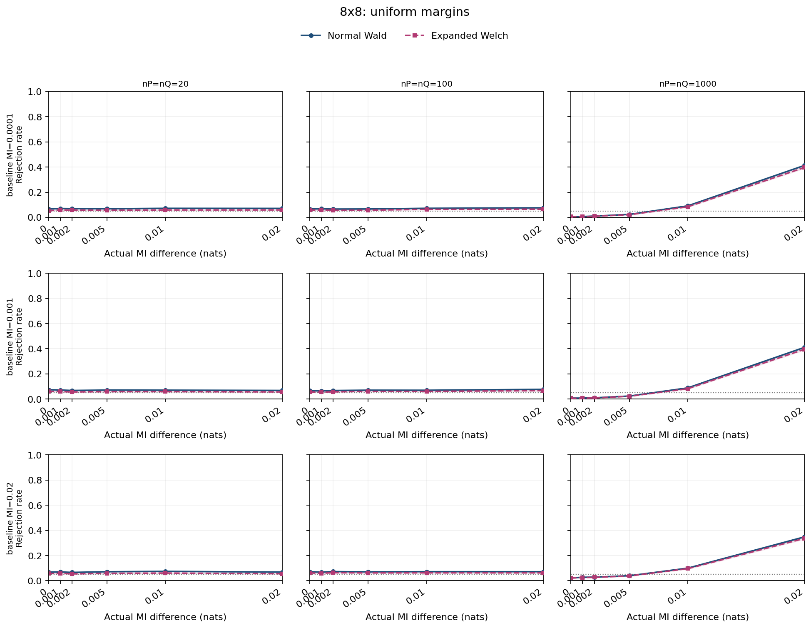

| Specification | Setting |
| --- | --- |
| Table size | 8x8 |
| Horizontal graph regime specifications (columns) | nP=nQ=20, nP=nQ=100, nP=nQ=1000 |
| Vertical graph regime specifications (rows) | baseline MI=0.0001: P row (0.125 repeated 8 times), P column (0.125 repeated 8 times); Q row (0.125 repeated 8 times), Q column (0.125 repeated 8 times); baseline MI=0.001: P row (0.125 repeated 8 times), P column (0.125 repeated 8 times); Q row (0.125 repeated 8 times), Q column (0.125 repeated 8 times); baseline MI=0.02: P row (0.125 repeated 8 times), P column (0.125 repeated 8 times); Q row (0.125 repeated 8 times), Q column (0.125 repeated 8 times) |
| Probability changes | baseline MI=0.0001: add at (1,1),(2,2) and subtract at (1,2),(2,1), for both P and Q; baseline MI=0.001: add at (1,1),(2,2) and subtract at (1,2),(2,1), for both P and Q; baseline MI=0.02: add at (1,1),(2,2) and subtract at (1,2),(2,1), for both P and Q |
| MI settings | Baseline MI {0.0001, 0.001, 0.02}; direction {q higher}; actual differences {0, 0.001, 0.002, 0.005, 0.01, 0.02} nats |
| Horizontal axis within each graph | Actual MI difference in nats, fixed from 0 to 0.02 |
| Vertical axis within each graph | Unconditional rejection rate from 0 to 1; invalid results count as non-rejections |
| Replicates | 20,000 per unique point |

Null-point rejection and validity:

| Vertical regime | Horizontal regime | x | Method | Rejection | Valid |
| --- | --- | --- | --- | --- | --- |
| baseline MI=0.0001 | nP=nQ=20 | 0 | Expanded Welch | 0.0529 | 1.0000 |
| baseline MI=0.0001 | nP=nQ=20 | 0 | Normal Wald | 0.0659 | 1.0000 |
| baseline MI=0.0001 | nP=nQ=100 | 0 | Expanded Welch | 0.0582 | 1.0000 |
| baseline MI=0.0001 | nP=nQ=100 | 0 | Normal Wald | 0.0666 | 1.0000 |
| baseline MI=0.0001 | nP=nQ=1000 | 0 | Expanded Welch | 0.0057 | 1.0000 |
| baseline MI=0.0001 | nP=nQ=1000 | 0 | Normal Wald | 0.0064 | 1.0000 |
| baseline MI=0.001 | nP=nQ=20 | 0 | Expanded Welch | 0.0616 | 1.0000 |
| baseline MI=0.001 | nP=nQ=20 | 0 | Normal Wald | 0.0745 | 1.0000 |
| baseline MI=0.001 | nP=nQ=100 | 0 | Expanded Welch | 0.0563 | 1.0000 |
| baseline MI=0.001 | nP=nQ=100 | 0 | Normal Wald | 0.0658 | 1.0000 |
| baseline MI=0.001 | nP=nQ=1000 | 0 | Expanded Welch | 0.0063 | 1.0000 |
| baseline MI=0.001 | nP=nQ=1000 | 0 | Normal Wald | 0.0073 | 1.0000 |
| baseline MI=0.02 | nP=nQ=20 | 0 | Expanded Welch | 0.0570 | 1.0000 |
| baseline MI=0.02 | nP=nQ=20 | 0 | Normal Wald | 0.0687 | 1.0000 |
| baseline MI=0.02 | nP=nQ=100 | 0 | Expanded Welch | 0.0618 | 1.0000 |
| baseline MI=0.02 | nP=nQ=100 | 0 | Normal Wald | 0.0712 | 1.0000 |
| baseline MI=0.02 | nP=nQ=1000 | 0 | Expanded Welch | 0.0211 | 1.0000 |
| baseline MI=0.02 | nP=nQ=1000 | 0 | Normal Wald | 0.0228 | 1.0000 |

Every plotted rate, interval, validity and minimum expected count

| Vertical regime | Horizontal regime | x | Method | Rejection | 95% interval | Valid | Conditional | Min expected P | Min expected Q |
| --- | --- | --- | --- | --- | --- | --- | --- | --- | --- |
| baseline MI=0.0001 | nP=nQ=20 | 0 | Expanded Welch | 0.0529 | [0.0499, 0.0561] | 1.0000 | 0.0529 | 0.2948 | 0.2948 |
| baseline MI=0.0001 | nP=nQ=20 | 0 | Normal Wald | 0.0659 | [0.0626, 0.0695] | 1.0000 | 0.0659 | 0.2948 | 0.2948 |
| baseline MI=0.0001 | nP=nQ=20 | 0.001 | Expanded Welch | 0.0583 | [0.0551, 0.0616] | 1.0000 | 0.0583 | 0.2948 | 0.254 |
| baseline MI=0.0001 | nP=nQ=20 | 0.001 | Normal Wald | 0.0705 | [0.0670, 0.0741] | 1.0000 | 0.0705 | 0.2948 | 0.254 |
| baseline MI=0.0001 | nP=nQ=20 | 0.002 | Expanded Welch | 0.0580 | [0.0548, 0.0613] | 1.0000 | 0.0580 | 0.2948 | 0.2319 |
| baseline MI=0.0001 | nP=nQ=20 | 0.002 | Normal Wald | 0.0698 | [0.0664, 0.0735] | 1.0000 | 0.0698 | 0.2948 | 0.2319 |
| baseline MI=0.0001 | nP=nQ=20 | 0.005 | Expanded Welch | 0.0564 | [0.0533, 0.0597] | 1.0000 | 0.0564 | 0.2948 | 0.188 |
| baseline MI=0.0001 | nP=nQ=20 | 0.005 | Normal Wald | 0.0685 | [0.0651, 0.0721] | 1.0000 | 0.0685 | 0.2948 | 0.188 |
| baseline MI=0.0001 | nP=nQ=20 | 0.01 | Expanded Welch | 0.0588 | [0.0557, 0.0622] | 1.0000 | 0.0588 | 0.2948 | 0.1398 |
| baseline MI=0.0001 | nP=nQ=20 | 0.01 | Normal Wald | 0.0718 | [0.0684, 0.0755] | 1.0000 | 0.0718 | 0.2948 | 0.1398 |
| baseline MI=0.0001 | nP=nQ=20 | 0.02 | Expanded Welch | 0.0590 | [0.0558, 0.0624] | 1.0000 | 0.0590 | 0.2948 | 0.07646 |
| baseline MI=0.0001 | nP=nQ=20 | 0.02 | Normal Wald | 0.0713 | [0.0678, 0.0749] | 1.0000 | 0.0713 | 0.2948 | 0.07646 |
| baseline MI=0.0001 | nP=nQ=100 | 0 | Expanded Welch | 0.0582 | [0.0550, 0.0615] | 1.0000 | 0.0582 | 1.474 | 1.474 |
| baseline MI=0.0001 | nP=nQ=100 | 0 | Normal Wald | 0.0666 | [0.0632, 0.0701] | 1.0000 | 0.0666 | 1.474 | 1.474 |
| baseline MI=0.0001 | nP=nQ=100 | 0.001 | Expanded Welch | 0.0585 | [0.0553, 0.0618] | 1.0000 | 0.0585 | 1.474 | 1.27 |
| baseline MI=0.0001 | nP=nQ=100 | 0.001 | Normal Wald | 0.0679 | [0.0645, 0.0715] | 1.0000 | 0.0679 | 1.474 | 1.27 |
| baseline MI=0.0001 | nP=nQ=100 | 0.002 | Expanded Welch | 0.0560 | [0.0529, 0.0593] | 1.0000 | 0.0560 | 1.474 | 1.16 |
| baseline MI=0.0001 | nP=nQ=100 | 0.002 | Normal Wald | 0.0659 | [0.0625, 0.0694] | 1.0000 | 0.0659 | 1.474 | 1.16 |
| baseline MI=0.0001 | nP=nQ=100 | 0.005 | Expanded Welch | 0.0571 | [0.0540, 0.0604] | 1.0000 | 0.0571 | 1.474 | 0.94 |
| baseline MI=0.0001 | nP=nQ=100 | 0.005 | Normal Wald | 0.0665 | [0.0632, 0.0701] | 1.0000 | 0.0665 | 1.474 | 0.94 |
| baseline MI=0.0001 | nP=nQ=100 | 0.01 | Expanded Welch | 0.0637 | [0.0604, 0.0672] | 1.0000 | 0.0637 | 1.474 | 0.6991 |
| baseline MI=0.0001 | nP=nQ=100 | 0.01 | Normal Wald | 0.0721 | [0.0686, 0.0758] | 1.0000 | 0.0721 | 1.474 | 0.6991 |
| baseline MI=0.0001 | nP=nQ=100 | 0.02 | Expanded Welch | 0.0652 | [0.0619, 0.0687] | 1.0000 | 0.0652 | 1.474 | 0.3823 |
| baseline MI=0.0001 | nP=nQ=100 | 0.02 | Normal Wald | 0.0757 | [0.0721, 0.0794] | 1.0000 | 0.0757 | 1.474 | 0.3823 |
| baseline MI=0.0001 | nP=nQ=1000 | 0 | Expanded Welch | 0.0057 | [0.0047, 0.0068] | 1.0000 | 0.0057 | 14.74 | 14.74 |
| baseline MI=0.0001 | nP=nQ=1000 | 0 | Normal Wald | 0.0064 | [0.0054, 0.0076] | 1.0000 | 0.0064 | 14.74 | 14.74 |
| baseline MI=0.0001 | nP=nQ=1000 | 0.001 | Expanded Welch | 0.0052 | [0.0043, 0.0063] | 1.0000 | 0.0052 | 14.74 | 12.7 |
| baseline MI=0.0001 | nP=nQ=1000 | 0.001 | Normal Wald | 0.0064 | [0.0054, 0.0076] | 1.0000 | 0.0064 | 14.74 | 12.7 |
| baseline MI=0.0001 | nP=nQ=1000 | 0.002 | Expanded Welch | 0.0085 | [0.0073, 0.0099] | 1.0000 | 0.0085 | 14.74 | 11.6 |
| baseline MI=0.0001 | nP=nQ=1000 | 0.002 | Normal Wald | 0.0103 | [0.0090, 0.0118] | 1.0000 | 0.0103 | 14.74 | 11.6 |
| baseline MI=0.0001 | nP=nQ=1000 | 0.005 | Expanded Welch | 0.0209 | [0.0190, 0.0230] | 1.0000 | 0.0209 | 14.74 | 9.4 |
| baseline MI=0.0001 | nP=nQ=1000 | 0.005 | Normal Wald | 0.0235 | [0.0215, 0.0257] | 1.0000 | 0.0235 | 14.74 | 9.4 |
| baseline MI=0.0001 | nP=nQ=1000 | 0.01 | Expanded Welch | 0.0838 | [0.0800, 0.0877] | 1.0000 | 0.0838 | 14.74 | 6.991 |
| baseline MI=0.0001 | nP=nQ=1000 | 0.01 | Normal Wald | 0.0915 | [0.0875, 0.0955] | 1.0000 | 0.0915 | 14.74 | 6.991 |
| baseline MI=0.0001 | nP=nQ=1000 | 0.02 | Expanded Welch | 0.3966 | [0.3898, 0.4033] | 1.0000 | 0.3966 | 14.74 | 3.823 |
| baseline MI=0.0001 | nP=nQ=1000 | 0.02 | Normal Wald | 0.4131 | [0.4063, 0.4199] | 1.0000 | 0.4131 | 14.74 | 3.823 |
| baseline MI=0.001 | nP=nQ=20 | 0 | Expanded Welch | 0.0616 | [0.0584, 0.0650] | 1.0000 | 0.0616 | 0.2567 | 0.2567 |
| baseline MI=0.001 | nP=nQ=20 | 0 | Normal Wald | 0.0745 | [0.0709, 0.0782] | 1.0000 | 0.0745 | 0.2567 | 0.2567 |
| baseline MI=0.001 | nP=nQ=20 | 0.001 | Expanded Welch | 0.0594 | [0.0562, 0.0628] | 1.0000 | 0.0594 | 0.2567 | 0.2339 |
| baseline MI=0.001 | nP=nQ=20 | 0.001 | Normal Wald | 0.0717 | [0.0682, 0.0753] | 1.0000 | 0.0717 | 0.2567 | 0.2339 |
| baseline MI=0.001 | nP=nQ=20 | 0.002 | Expanded Welch | 0.0565 | [0.0533, 0.0597] | 1.0000 | 0.0565 | 0.2567 | 0.2165 |
| baseline MI=0.001 | nP=nQ=20 | 0.002 | Normal Wald | 0.0683 | [0.0649, 0.0719] | 1.0000 | 0.0683 | 0.2567 | 0.2165 |
| baseline MI=0.001 | nP=nQ=20 | 0.005 | Expanded Welch | 0.0588 | [0.0556, 0.0621] | 1.0000 | 0.0588 | 0.2567 | 0.1778 |
| baseline MI=0.001 | nP=nQ=20 | 0.005 | Normal Wald | 0.0713 | [0.0678, 0.0749] | 1.0000 | 0.0713 | 0.2567 | 0.1778 |
| baseline MI=0.001 | nP=nQ=20 | 0.01 | Expanded Welch | 0.0590 | [0.0558, 0.0623] | 1.0000 | 0.0590 | 0.2567 | 0.1328 |
| baseline MI=0.001 | nP=nQ=20 | 0.01 | Normal Wald | 0.0706 | [0.0671, 0.0742] | 1.0000 | 0.0706 | 0.2567 | 0.1328 |
| baseline MI=0.001 | nP=nQ=20 | 0.02 | Expanded Welch | 0.0567 | [0.0536, 0.0600] | 1.0000 | 0.0567 | 0.2567 | 0.07197 |
| baseline MI=0.001 | nP=nQ=20 | 0.02 | Normal Wald | 0.0685 | [0.0651, 0.0721] | 1.0000 | 0.0685 | 0.2567 | 0.07197 |
| baseline MI=0.001 | nP=nQ=100 | 0 | Expanded Welch | 0.0563 | [0.0531, 0.0595] | 1.0000 | 0.0563 | 1.284 | 1.284 |
| baseline MI=0.001 | nP=nQ=100 | 0 | Normal Wald | 0.0658 | [0.0624, 0.0693] | 1.0000 | 0.0658 | 1.284 | 1.284 |
| baseline MI=0.001 | nP=nQ=100 | 0.001 | Expanded Welch | 0.0556 | [0.0526, 0.0589] | 1.0000 | 0.0556 | 1.284 | 1.169 |
| baseline MI=0.001 | nP=nQ=100 | 0.001 | Normal Wald | 0.0645 | [0.0612, 0.0680] | 1.0000 | 0.0645 | 1.284 | 1.169 |
| baseline MI=0.001 | nP=nQ=100 | 0.002 | Expanded Welch | 0.0571 | [0.0540, 0.0604] | 1.0000 | 0.0571 | 1.284 | 1.082 |
| baseline MI=0.001 | nP=nQ=100 | 0.002 | Normal Wald | 0.0679 | [0.0645, 0.0715] | 1.0000 | 0.0679 | 1.284 | 1.082 |
| baseline MI=0.001 | nP=nQ=100 | 0.005 | Expanded Welch | 0.0610 | [0.0578, 0.0644] | 1.0000 | 0.0610 | 1.284 | 0.889 |
| baseline MI=0.001 | nP=nQ=100 | 0.005 | Normal Wald | 0.0704 | [0.0670, 0.0741] | 1.0000 | 0.0704 | 1.284 | 0.889 |
| baseline MI=0.001 | nP=nQ=100 | 0.01 | Expanded Welch | 0.0611 | [0.0579, 0.0645] | 1.0000 | 0.0611 | 1.284 | 0.6638 |
| baseline MI=0.001 | nP=nQ=100 | 0.01 | Normal Wald | 0.0700 | [0.0665, 0.0736] | 1.0000 | 0.0700 | 1.284 | 0.6638 |
| baseline MI=0.001 | nP=nQ=100 | 0.02 | Expanded Welch | 0.0668 | [0.0634, 0.0703] | 1.0000 | 0.0668 | 1.284 | 0.3598 |
| baseline MI=0.001 | nP=nQ=100 | 0.02 | Normal Wald | 0.0771 | [0.0735, 0.0809] | 1.0000 | 0.0771 | 1.284 | 0.3598 |
| baseline MI=0.001 | nP=nQ=1000 | 0 | Expanded Welch | 0.0063 | [0.0053, 0.0075] | 1.0000 | 0.0063 | 12.84 | 12.84 |
| baseline MI=0.001 | nP=nQ=1000 | 0 | Normal Wald | 0.0073 | [0.0062, 0.0086] | 1.0000 | 0.0073 | 12.84 | 12.84 |
| baseline MI=0.001 | nP=nQ=1000 | 0.001 | Expanded Welch | 0.0059 | [0.0049, 0.0071] | 1.0000 | 0.0059 | 12.84 | 11.69 |
| baseline MI=0.001 | nP=nQ=1000 | 0.001 | Normal Wald | 0.0074 | [0.0063, 0.0087] | 1.0000 | 0.0074 | 12.84 | 11.69 |
| baseline MI=0.001 | nP=nQ=1000 | 0.002 | Expanded Welch | 0.0087 | [0.0075, 0.0101] | 1.0000 | 0.0087 | 12.84 | 10.82 |
| baseline MI=0.001 | nP=nQ=1000 | 0.002 | Normal Wald | 0.0100 | [0.0087, 0.0114] | 1.0000 | 0.0100 | 12.84 | 10.82 |
| baseline MI=0.001 | nP=nQ=1000 | 0.005 | Expanded Welch | 0.0219 | [0.0199, 0.0240] | 1.0000 | 0.0219 | 12.84 | 8.89 |
| baseline MI=0.001 | nP=nQ=1000 | 0.005 | Normal Wald | 0.0238 | [0.0218, 0.0261] | 1.0000 | 0.0238 | 12.84 | 8.89 |
| baseline MI=0.001 | nP=nQ=1000 | 0.01 | Expanded Welch | 0.0817 | [0.0780, 0.0856] | 1.0000 | 0.0817 | 12.84 | 6.638 |
| baseline MI=0.001 | nP=nQ=1000 | 0.01 | Normal Wald | 0.0887 | [0.0849, 0.0928] | 1.0000 | 0.0887 | 12.84 | 6.638 |
| baseline MI=0.001 | nP=nQ=1000 | 0.02 | Expanded Welch | 0.3958 | [0.3890, 0.4026] | 1.0000 | 0.3958 | 12.84 | 3.598 |
| baseline MI=0.001 | nP=nQ=1000 | 0.02 | Normal Wald | 0.4109 | [0.4041, 0.4178] | 1.0000 | 0.4109 | 12.84 | 3.598 |
| baseline MI=0.02 | nP=nQ=20 | 0 | Expanded Welch | 0.0570 | [0.0538, 0.0602] | 1.0000 | 0.0570 | 0.07697 | 0.07697 |
| baseline MI=0.02 | nP=nQ=20 | 0 | Normal Wald | 0.0687 | [0.0653, 0.0723] | 1.0000 | 0.0687 | 0.07697 | 0.07697 |
| baseline MI=0.02 | nP=nQ=20 | 0.001 | Expanded Welch | 0.0590 | [0.0558, 0.0623] | 1.0000 | 0.0590 | 0.07697 | 0.07197 |
| baseline MI=0.02 | nP=nQ=20 | 0.001 | Normal Wald | 0.0699 | [0.0664, 0.0735] | 1.0000 | 0.0699 | 0.07697 | 0.07197 |
| baseline MI=0.02 | nP=nQ=20 | 0.002 | Expanded Welch | 0.0544 | [0.0513, 0.0576] | 1.0000 | 0.0544 | 0.07697 | 0.06716 |
| baseline MI=0.02 | nP=nQ=20 | 0.002 | Normal Wald | 0.0662 | [0.0628, 0.0697] | 1.0000 | 0.0662 | 0.07697 | 0.06716 |
| baseline MI=0.02 | nP=nQ=20 | 0.005 | Expanded Welch | 0.0588 | [0.0556, 0.0621] | 1.0000 | 0.0588 | 0.07697 | 0.05374 |
| baseline MI=0.02 | nP=nQ=20 | 0.005 | Normal Wald | 0.0716 | [0.0681, 0.0753] | 1.0000 | 0.0716 | 0.07697 | 0.05374 |
| baseline MI=0.02 | nP=nQ=20 | 0.01 | Expanded Welch | 0.0609 | [0.0577, 0.0643] | 1.0000 | 0.0609 | 0.07697 | 0.03441 |
| baseline MI=0.02 | nP=nQ=20 | 0.01 | Normal Wald | 0.0746 | [0.0710, 0.0783] | 1.0000 | 0.0746 | 0.07697 | 0.03441 |
| baseline MI=0.02 | nP=nQ=20 | 0.02 | Expanded Welch | 0.0558 | [0.0528, 0.0591] | 1.0000 | 0.0558 | 0.07697 | 0.005864 |
| baseline MI=0.02 | nP=nQ=20 | 0.02 | Normal Wald | 0.0688 | [0.0653, 0.0723] | 1.0000 | 0.0688 | 0.07697 | 0.005864 |
| baseline MI=0.02 | nP=nQ=100 | 0 | Expanded Welch | 0.0618 | [0.0585, 0.0652] | 1.0000 | 0.0618 | 0.3848 | 0.3848 |
| baseline MI=0.02 | nP=nQ=100 | 0 | Normal Wald | 0.0712 | [0.0677, 0.0748] | 1.0000 | 0.0712 | 0.3848 | 0.3848 |
| baseline MI=0.02 | nP=nQ=100 | 0.001 | Expanded Welch | 0.0592 | [0.0561, 0.0626] | 1.0000 | 0.0592 | 0.3848 | 0.3598 |
| baseline MI=0.02 | nP=nQ=100 | 0.001 | Normal Wald | 0.0686 | [0.0652, 0.0722] | 1.0000 | 0.0686 | 0.3848 | 0.3598 |
| baseline MI=0.02 | nP=nQ=100 | 0.002 | Expanded Welch | 0.0637 | [0.0604, 0.0672] | 1.0000 | 0.0637 | 0.3848 | 0.3358 |
| baseline MI=0.02 | nP=nQ=100 | 0.002 | Normal Wald | 0.0728 | [0.0693, 0.0765] | 1.0000 | 0.0728 | 0.3848 | 0.3358 |
| baseline MI=0.02 | nP=nQ=100 | 0.005 | Expanded Welch | 0.0620 | [0.0587, 0.0654] | 1.0000 | 0.0620 | 0.3848 | 0.2687 |
| baseline MI=0.02 | nP=nQ=100 | 0.005 | Normal Wald | 0.0707 | [0.0672, 0.0743] | 1.0000 | 0.0707 | 0.3848 | 0.2687 |
| baseline MI=0.02 | nP=nQ=100 | 0.01 | Expanded Welch | 0.0627 | [0.0594, 0.0661] | 1.0000 | 0.0627 | 0.3848 | 0.1721 |
| baseline MI=0.02 | nP=nQ=100 | 0.01 | Normal Wald | 0.0722 | [0.0686, 0.0758] | 1.0000 | 0.0722 | 0.3848 | 0.1721 |
| baseline MI=0.02 | nP=nQ=100 | 0.02 | Expanded Welch | 0.0624 | [0.0592, 0.0659] | 1.0000 | 0.0624 | 0.3848 | 0.02932 |
| baseline MI=0.02 | nP=nQ=100 | 0.02 | Normal Wald | 0.0720 | [0.0685, 0.0756] | 1.0000 | 0.0720 | 0.3848 | 0.02932 |
| baseline MI=0.02 | nP=nQ=1000 | 0 | Expanded Welch | 0.0211 | [0.0192, 0.0232] | 1.0000 | 0.0211 | 3.848 | 3.848 |
| baseline MI=0.02 | nP=nQ=1000 | 0 | Normal Wald | 0.0228 | [0.0208, 0.0250] | 1.0000 | 0.0228 | 3.848 | 3.848 |
| baseline MI=0.02 | nP=nQ=1000 | 0.001 | Expanded Welch | 0.0256 | [0.0235, 0.0279] | 1.0000 | 0.0256 | 3.848 | 3.598 |
| baseline MI=0.02 | nP=nQ=1000 | 0.001 | Normal Wald | 0.0274 | [0.0253, 0.0298] | 1.0000 | 0.0274 | 3.848 | 3.598 |
| baseline MI=0.02 | nP=nQ=1000 | 0.002 | Expanded Welch | 0.0264 | [0.0243, 0.0287] | 1.0000 | 0.0264 | 3.848 | 3.358 |
| baseline MI=0.02 | nP=nQ=1000 | 0.002 | Normal Wald | 0.0287 | [0.0265, 0.0311] | 1.0000 | 0.0287 | 3.848 | 3.358 |
| baseline MI=0.02 | nP=nQ=1000 | 0.005 | Expanded Welch | 0.0379 | [0.0353, 0.0406] | 1.0000 | 0.0379 | 3.848 | 2.687 |
| baseline MI=0.02 | nP=nQ=1000 | 0.005 | Normal Wald | 0.0398 | [0.0372, 0.0426] | 1.0000 | 0.0398 | 3.848 | 2.687 |
| baseline MI=0.02 | nP=nQ=1000 | 0.01 | Expanded Welch | 0.0959 | [0.0919, 0.1001] | 1.0000 | 0.0959 | 3.848 | 1.721 |
| baseline MI=0.02 | nP=nQ=1000 | 0.01 | Normal Wald | 0.1002 | [0.0961, 0.1044] | 1.0000 | 0.1002 | 3.848 | 1.721 |
| baseline MI=0.02 | nP=nQ=1000 | 0.02 | Expanded Welch | 0.3366 | [0.3300, 0.3431] | 1.0000 | 0.3366 | 3.848 | 0.2932 |
| baseline MI=0.02 | nP=nQ=1000 | 0.02 | Normal Wald | 0.3487 | [0.3421, 0.3553] | 1.0000 | 0.3487 | 3.848 | 0.2932 |

### 4.11 8x8: same skew margins

Does performance change when the populations begin closer to independence?

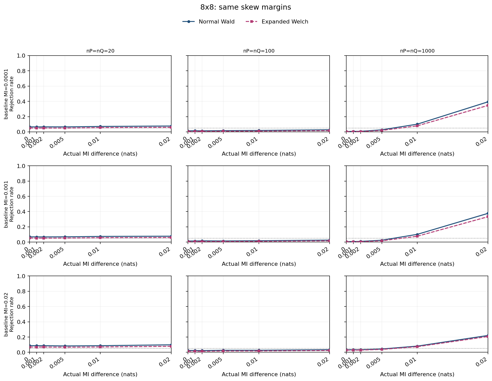

| Specification | Setting |
| --- | --- |
| Table size | 8x8 |
| Horizontal graph regime specifications (columns) | nP=nQ=20, nP=nQ=100, nP=nQ=1000 |
| Vertical graph regime specifications (rows) | baseline MI=0.0001: P row (0.8, 0.2/7 repeated 7 times), P column (0.8, 0.2/7 repeated 7 times); Q row (0.8, 0.2/7 repeated 7 times), Q column (0.8, 0.2/7 repeated 7 times); baseline MI=0.001: P row (0.8, 0.2/7 repeated 7 times), P column (0.8, 0.2/7 repeated 7 times); Q row (0.8, 0.2/7 repeated 7 times), Q column (0.8, 0.2/7 repeated 7 times); baseline MI=0.02: P row (0.8, 0.2/7 repeated 7 times), P column (0.8, 0.2/7 repeated 7 times); Q row (0.8, 0.2/7 repeated 7 times), Q column (0.8, 0.2/7 repeated 7 times) |
| Probability changes | baseline MI=0.0001: add at (1,1),(2,2) and subtract at (1,2),(2,1), for both P and Q; baseline MI=0.001: add at (1,1),(2,2) and subtract at (1,2),(2,1), for both P and Q; baseline MI=0.02: add at (1,1),(2,2) and subtract at (1,2),(2,1), for both P and Q |
| MI settings | Baseline MI {0.0001, 0.001, 0.02}; direction {q higher}; actual differences {0, 0.001, 0.002, 0.005, 0.01, 0.02} nats |
| Horizontal axis within each graph | Actual MI difference in nats, fixed from 0 to 0.02 |
| Vertical axis within each graph | Unconditional rejection rate from 0 to 1; invalid results count as non-rejections |
| Replicates | 20,000 per unique point |

Null-point rejection and validity:

| Vertical regime | Horizontal regime | x | Method | Rejection | Valid |
| --- | --- | --- | --- | --- | --- |
| baseline MI=0.0001 | nP=nQ=20 | 0 | Expanded Welch | 0.0508 | 0.9562 |
| baseline MI=0.0001 | nP=nQ=20 | 0 | Normal Wald | 0.0659 | 0.9998 |
| baseline MI=0.0001 | nP=nQ=100 | 0 | Expanded Welch | 0.0062 | 1.0000 |
| baseline MI=0.0001 | nP=nQ=100 | 0 | Normal Wald | 0.0139 | 1.0000 |
| baseline MI=0.0001 | nP=nQ=1000 | 0 | Expanded Welch | 0.0028 | 1.0000 |
| baseline MI=0.0001 | nP=nQ=1000 | 0 | Normal Wald | 0.0047 | 1.0000 |
| baseline MI=0.001 | nP=nQ=20 | 0 | Expanded Welch | 0.0530 | 0.9556 |
| baseline MI=0.001 | nP=nQ=20 | 0 | Normal Wald | 0.0689 | 0.9996 |
| baseline MI=0.001 | nP=nQ=100 | 0 | Expanded Welch | 0.0070 | 1.0000 |
| baseline MI=0.001 | nP=nQ=100 | 0 | Normal Wald | 0.0143 | 1.0000 |
| baseline MI=0.001 | nP=nQ=1000 | 0 | Expanded Welch | 0.0034 | 1.0000 |
| baseline MI=0.001 | nP=nQ=1000 | 0 | Normal Wald | 0.0064 | 1.0000 |
| baseline MI=0.02 | nP=nQ=20 | 0 | Expanded Welch | 0.0692 | 0.9541 |
| baseline MI=0.02 | nP=nQ=20 | 0 | Normal Wald | 0.0873 | 0.9992 |
| baseline MI=0.02 | nP=nQ=100 | 0 | Expanded Welch | 0.0155 | 1.0000 |
| baseline MI=0.02 | nP=nQ=100 | 0 | Normal Wald | 0.0245 | 1.0000 |
| baseline MI=0.02 | nP=nQ=1000 | 0 | Expanded Welch | 0.0289 | 1.0000 |
| baseline MI=0.02 | nP=nQ=1000 | 0 | Normal Wald | 0.0341 | 1.0000 |

Every plotted rate, interval, validity and minimum expected count

| Vertical regime | Horizontal regime | x | Method | Rejection | 95% interval | Valid | Conditional | Min expected P | Min expected Q |
| --- | --- | --- | --- | --- | --- | --- | --- | --- | --- |
| baseline MI=0.0001 | nP=nQ=20 | 0 | Expanded Welch | 0.0508 | [0.0478, 0.0539] | 0.9562 | 0.0531 | 0.01633 | 0.01633 |
| baseline MI=0.0001 | nP=nQ=20 | 0 | Normal Wald | 0.0659 | [0.0625, 0.0694] | 0.9998 | 0.0659 | 0.01633 | 0.01633 |
| baseline MI=0.0001 | nP=nQ=20 | 0.001 | Expanded Welch | 0.0493 | [0.0463, 0.0523] | 0.9543 | 0.0516 | 0.01633 | 0.01633 |
| baseline MI=0.0001 | nP=nQ=20 | 0.001 | Normal Wald | 0.0646 | [0.0613, 0.0681] | 0.9996 | 0.0647 | 0.01633 | 0.01633 |
| baseline MI=0.0001 | nP=nQ=20 | 0.002 | Expanded Welch | 0.0498 | [0.0469, 0.0529] | 0.9568 | 0.0520 | 0.01633 | 0.01633 |
| baseline MI=0.0001 | nP=nQ=20 | 0.002 | Normal Wald | 0.0658 | [0.0624, 0.0693] | 0.9994 | 0.0658 | 0.01633 | 0.01633 |
| baseline MI=0.0001 | nP=nQ=20 | 0.005 | Expanded Welch | 0.0495 | [0.0466, 0.0526] | 0.9543 | 0.0519 | 0.01633 | 0.01633 |
| baseline MI=0.0001 | nP=nQ=20 | 0.005 | Normal Wald | 0.0651 | [0.0618, 0.0687] | 0.9997 | 0.0652 | 0.01633 | 0.01633 |
| baseline MI=0.0001 | nP=nQ=20 | 0.01 | Expanded Welch | 0.0558 | [0.0527, 0.0591] | 0.9571 | 0.0583 | 0.01633 | 0.01633 |
| baseline MI=0.0001 | nP=nQ=20 | 0.01 | Normal Wald | 0.0712 | [0.0677, 0.0748] | 0.9996 | 0.0712 | 0.01633 | 0.01633 |
| baseline MI=0.0001 | nP=nQ=20 | 0.02 | Expanded Welch | 0.0596 | [0.0564, 0.0630] | 0.9550 | 0.0624 | 0.01633 | 0.01633 |
| baseline MI=0.0001 | nP=nQ=20 | 0.02 | Normal Wald | 0.0769 | [0.0733, 0.0807] | 0.9994 | 0.0769 | 0.01633 | 0.01633 |
| baseline MI=0.0001 | nP=nQ=100 | 0 | Expanded Welch | 0.0062 | [0.0052, 0.0074] | 1.0000 | 0.0062 | 0.08163 | 0.08163 |
| baseline MI=0.0001 | nP=nQ=100 | 0 | Normal Wald | 0.0139 | [0.0124, 0.0156] | 1.0000 | 0.0139 | 0.08163 | 0.08163 |
| baseline MI=0.0001 | nP=nQ=100 | 0.001 | Expanded Welch | 0.0061 | [0.0051, 0.0073] | 1.0000 | 0.0061 | 0.08163 | 0.08163 |
| baseline MI=0.0001 | nP=nQ=100 | 0.001 | Normal Wald | 0.0147 | [0.0132, 0.0165] | 1.0000 | 0.0147 | 0.08163 | 0.08163 |
| baseline MI=0.0001 | nP=nQ=100 | 0.002 | Expanded Welch | 0.0069 | [0.0059, 0.0082] | 1.0000 | 0.0069 | 0.08163 | 0.08163 |
| baseline MI=0.0001 | nP=nQ=100 | 0.002 | Normal Wald | 0.0141 | [0.0126, 0.0158] | 1.0000 | 0.0141 | 0.08163 | 0.08163 |
| baseline MI=0.0001 | nP=nQ=100 | 0.005 | Expanded Welch | 0.0083 | [0.0071, 0.0097] | 1.0000 | 0.0083 | 0.08163 | 0.08163 |
| baseline MI=0.0001 | nP=nQ=100 | 0.005 | Normal Wald | 0.0163 | [0.0146, 0.0182] | 1.0000 | 0.0163 | 0.08163 | 0.08163 |
| baseline MI=0.0001 | nP=nQ=100 | 0.01 | Expanded Welch | 0.0099 | [0.0086, 0.0114] | 1.0000 | 0.0099 | 0.08163 | 0.08163 |
| baseline MI=0.0001 | nP=nQ=100 | 0.01 | Normal Wald | 0.0186 | [0.0168, 0.0205] | 1.0000 | 0.0186 | 0.08163 | 0.08163 |
| baseline MI=0.0001 | nP=nQ=100 | 0.02 | Expanded Welch | 0.0168 | [0.0151, 0.0186] | 1.0000 | 0.0168 | 0.08163 | 0.08163 |
| baseline MI=0.0001 | nP=nQ=100 | 0.02 | Normal Wald | 0.0273 | [0.0251, 0.0297] | 1.0000 | 0.0273 | 0.08163 | 0.08163 |
| baseline MI=0.0001 | nP=nQ=1000 | 0 | Expanded Welch | 0.0028 | [0.0022, 0.0036] | 1.0000 | 0.0028 | 0.8163 | 0.8163 |
| baseline MI=0.0001 | nP=nQ=1000 | 0 | Normal Wald | 0.0047 | [0.0038, 0.0057] | 1.0000 | 0.0047 | 0.8163 | 0.8163 |
| baseline MI=0.0001 | nP=nQ=1000 | 0.001 | Expanded Welch | 0.0035 | [0.0028, 0.0044] | 1.0000 | 0.0035 | 0.8163 | 0.8163 |
| baseline MI=0.0001 | nP=nQ=1000 | 0.001 | Normal Wald | 0.0066 | [0.0056, 0.0078] | 1.0000 | 0.0066 | 0.8163 | 0.8163 |
| baseline MI=0.0001 | nP=nQ=1000 | 0.002 | Expanded Welch | 0.0044 | [0.0036, 0.0054] | 1.0000 | 0.0044 | 0.8163 | 0.8163 |
| baseline MI=0.0001 | nP=nQ=1000 | 0.002 | Normal Wald | 0.0076 | [0.0065, 0.0089] | 1.0000 | 0.0076 | 0.8163 | 0.8163 |
| baseline MI=0.0001 | nP=nQ=1000 | 0.005 | Expanded Welch | 0.0181 | [0.0163, 0.0200] | 1.0000 | 0.0181 | 0.8163 | 0.8163 |
| baseline MI=0.0001 | nP=nQ=1000 | 0.005 | Normal Wald | 0.0270 | [0.0248, 0.0293] | 1.0000 | 0.0270 | 0.8163 | 0.8163 |
| baseline MI=0.0001 | nP=nQ=1000 | 0.01 | Expanded Welch | 0.0791 | [0.0755, 0.0830] | 1.0000 | 0.0791 | 0.8163 | 0.8163 |
| baseline MI=0.0001 | nP=nQ=1000 | 0.01 | Normal Wald | 0.1010 | [0.0969, 0.1053] | 1.0000 | 0.1010 | 0.8163 | 0.8163 |
| baseline MI=0.0001 | nP=nQ=1000 | 0.02 | Expanded Welch | 0.3470 | [0.3404, 0.3536] | 1.0000 | 0.3470 | 0.8163 | 0.8163 |
| baseline MI=0.0001 | nP=nQ=1000 | 0.02 | Normal Wald | 0.3942 | [0.3875, 0.4010] | 1.0000 | 0.3942 | 0.8163 | 0.8163 |
| baseline MI=0.001 | nP=nQ=20 | 0 | Expanded Welch | 0.0530 | [0.0500, 0.0562] | 0.9556 | 0.0555 | 0.01633 | 0.01633 |
| baseline MI=0.001 | nP=nQ=20 | 0 | Normal Wald | 0.0689 | [0.0655, 0.0725] | 0.9996 | 0.0690 | 0.01633 | 0.01633 |
| baseline MI=0.001 | nP=nQ=20 | 0.001 | Expanded Welch | 0.0518 | [0.0488, 0.0550] | 0.9547 | 0.0543 | 0.01633 | 0.01633 |
| baseline MI=0.001 | nP=nQ=20 | 0.001 | Normal Wald | 0.0683 | [0.0649, 0.0719] | 0.9999 | 0.0683 | 0.01633 | 0.01633 |
| baseline MI=0.001 | nP=nQ=20 | 0.002 | Expanded Welch | 0.0512 | [0.0483, 0.0544] | 0.9549 | 0.0537 | 0.01633 | 0.01633 |
| baseline MI=0.001 | nP=nQ=20 | 0.002 | Normal Wald | 0.0679 | [0.0645, 0.0715] | 0.9997 | 0.0679 | 0.01633 | 0.01633 |
| baseline MI=0.001 | nP=nQ=20 | 0.005 | Expanded Welch | 0.0525 | [0.0495, 0.0557] | 0.9552 | 0.0550 | 0.01633 | 0.01633 |
| baseline MI=0.001 | nP=nQ=20 | 0.005 | Normal Wald | 0.0691 | [0.0656, 0.0726] | 0.9996 | 0.0691 | 0.01633 | 0.01633 |
| baseline MI=0.001 | nP=nQ=20 | 0.01 | Expanded Welch | 0.0576 | [0.0545, 0.0609] | 0.9558 | 0.0603 | 0.01633 | 0.01633 |
| baseline MI=0.001 | nP=nQ=20 | 0.01 | Normal Wald | 0.0746 | [0.0710, 0.0783] | 0.9994 | 0.0746 | 0.01633 | 0.01633 |
| baseline MI=0.001 | nP=nQ=20 | 0.02 | Expanded Welch | 0.0602 | [0.0569, 0.0635] | 0.9550 | 0.0630 | 0.01633 | 0.01633 |
| baseline MI=0.001 | nP=nQ=20 | 0.02 | Normal Wald | 0.0774 | [0.0738, 0.0812] | 0.9994 | 0.0774 | 0.01633 | 0.01633 |
| baseline MI=0.001 | nP=nQ=100 | 0 | Expanded Welch | 0.0070 | [0.0060, 0.0083] | 1.0000 | 0.0070 | 0.08163 | 0.08163 |
| baseline MI=0.001 | nP=nQ=100 | 0 | Normal Wald | 0.0143 | [0.0127, 0.0160] | 1.0000 | 0.0143 | 0.08163 | 0.08163 |
| baseline MI=0.001 | nP=nQ=100 | 0.001 | Expanded Welch | 0.0068 | [0.0058, 0.0080] | 1.0000 | 0.0068 | 0.08163 | 0.08163 |
| baseline MI=0.001 | nP=nQ=100 | 0.001 | Normal Wald | 0.0144 | [0.0129, 0.0162] | 1.0000 | 0.0144 | 0.08163 | 0.08163 |
| baseline MI=0.001 | nP=nQ=100 | 0.002 | Expanded Welch | 0.0083 | [0.0072, 0.0097] | 1.0000 | 0.0083 | 0.08163 | 0.08163 |
| baseline MI=0.001 | nP=nQ=100 | 0.002 | Normal Wald | 0.0168 | [0.0151, 0.0186] | 1.0000 | 0.0168 | 0.08163 | 0.08163 |
| baseline MI=0.001 | nP=nQ=100 | 0.005 | Expanded Welch | 0.0076 | [0.0065, 0.0090] | 1.0000 | 0.0076 | 0.08163 | 0.08163 |
| baseline MI=0.001 | nP=nQ=100 | 0.005 | Normal Wald | 0.0149 | [0.0134, 0.0167] | 1.0000 | 0.0149 | 0.08163 | 0.08163 |
| baseline MI=0.001 | nP=nQ=100 | 0.01 | Expanded Welch | 0.0097 | [0.0085, 0.0112] | 1.0000 | 0.0097 | 0.08163 | 0.08163 |
| baseline MI=0.001 | nP=nQ=100 | 0.01 | Normal Wald | 0.0179 | [0.0162, 0.0198] | 1.0000 | 0.0179 | 0.08163 | 0.08163 |
| baseline MI=0.001 | nP=nQ=100 | 0.02 | Expanded Welch | 0.0170 | [0.0153, 0.0189] | 1.0000 | 0.0170 | 0.08163 | 0.08163 |
| baseline MI=0.001 | nP=nQ=100 | 0.02 | Normal Wald | 0.0262 | [0.0241, 0.0285] | 1.0000 | 0.0262 | 0.08163 | 0.08163 |
| baseline MI=0.001 | nP=nQ=1000 | 0 | Expanded Welch | 0.0034 | [0.0026, 0.0043] | 1.0000 | 0.0034 | 0.8163 | 0.8163 |
| baseline MI=0.001 | nP=nQ=1000 | 0 | Normal Wald | 0.0064 | [0.0054, 0.0076] | 1.0000 | 0.0064 | 0.8163 | 0.8163 |
| baseline MI=0.001 | nP=nQ=1000 | 0.001 | Expanded Welch | 0.0037 | [0.0029, 0.0046] | 1.0000 | 0.0037 | 0.8163 | 0.8163 |
| baseline MI=0.001 | nP=nQ=1000 | 0.001 | Normal Wald | 0.0070 | [0.0060, 0.0083] | 1.0000 | 0.0070 | 0.8163 | 0.8163 |
| baseline MI=0.001 | nP=nQ=1000 | 0.002 | Expanded Welch | 0.0049 | [0.0040, 0.0059] | 1.0000 | 0.0049 | 0.8163 | 0.8163 |
| baseline MI=0.001 | nP=nQ=1000 | 0.002 | Normal Wald | 0.0094 | [0.0081, 0.0108] | 1.0000 | 0.0094 | 0.8163 | 0.8163 |
| baseline MI=0.001 | nP=nQ=1000 | 0.005 | Expanded Welch | 0.0169 | [0.0153, 0.0188] | 1.0000 | 0.0169 | 0.8163 | 0.8163 |
| baseline MI=0.001 | nP=nQ=1000 | 0.005 | Normal Wald | 0.0247 | [0.0226, 0.0269] | 1.0000 | 0.0247 | 0.8163 | 0.8163 |
| baseline MI=0.001 | nP=nQ=1000 | 0.01 | Expanded Welch | 0.0769 | [0.0732, 0.0806] | 1.0000 | 0.0769 | 0.8163 | 0.8163 |
| baseline MI=0.001 | nP=nQ=1000 | 0.01 | Normal Wald | 0.1016 | [0.0975, 0.1059] | 1.0000 | 0.1016 | 0.8163 | 0.8163 |
| baseline MI=0.001 | nP=nQ=1000 | 0.02 | Expanded Welch | 0.3335 | [0.3269, 0.3400] | 1.0000 | 0.3335 | 0.8163 | 0.8163 |
| baseline MI=0.001 | nP=nQ=1000 | 0.02 | Normal Wald | 0.3773 | [0.3706, 0.3840] | 1.0000 | 0.3773 | 0.8163 | 0.8163 |
| baseline MI=0.02 | nP=nQ=20 | 0 | Expanded Welch | 0.0692 | [0.0658, 0.0728] | 0.9541 | 0.0725 | 0.01633 | 0.01633 |
| baseline MI=0.02 | nP=nQ=20 | 0 | Normal Wald | 0.0873 | [0.0835, 0.0913] | 0.9992 | 0.0874 | 0.01633 | 0.01633 |
| baseline MI=0.02 | nP=nQ=20 | 0.001 | Expanded Welch | 0.0689 | [0.0655, 0.0725] | 0.9536 | 0.0723 | 0.01633 | 0.01633 |
| baseline MI=0.02 | nP=nQ=20 | 0.001 | Normal Wald | 0.0870 | [0.0832, 0.0910] | 0.9994 | 0.0870 | 0.01633 | 0.01633 |
| baseline MI=0.02 | nP=nQ=20 | 0.002 | Expanded Welch | 0.0694 | [0.0660, 0.0731] | 0.9568 | 0.0726 | 0.01633 | 0.01633 |
| baseline MI=0.02 | nP=nQ=20 | 0.002 | Normal Wald | 0.0873 | [0.0835, 0.0913] | 0.9994 | 0.0874 | 0.01633 | 0.01633 |
| baseline MI=0.02 | nP=nQ=20 | 0.005 | Expanded Welch | 0.0670 | [0.0637, 0.0706] | 0.9562 | 0.0701 | 0.01633 | 0.01633 |
| baseline MI=0.02 | nP=nQ=20 | 0.005 | Normal Wald | 0.0834 | [0.0796, 0.0873] | 0.9996 | 0.0834 | 0.01633 | 0.01633 |
| baseline MI=0.02 | nP=nQ=20 | 0.01 | Expanded Welch | 0.0702 | [0.0667, 0.0738] | 0.9546 | 0.0735 | 0.01633 | 0.01633 |
| baseline MI=0.02 | nP=nQ=20 | 0.01 | Normal Wald | 0.0871 | [0.0833, 0.0911] | 0.9995 | 0.0871 | 0.01633 | 0.01633 |
| baseline MI=0.02 | nP=nQ=20 | 0.02 | Expanded Welch | 0.0789 | [0.0752, 0.0827] | 0.9585 | 0.0823 | 0.01633 | 0.01633 |
| baseline MI=0.02 | nP=nQ=20 | 0.02 | Normal Wald | 0.0984 | [0.0943, 0.1026] | 0.9994 | 0.0985 | 0.01633 | 0.01633 |
| baseline MI=0.02 | nP=nQ=100 | 0 | Expanded Welch | 0.0155 | [0.0139, 0.0173] | 1.0000 | 0.0155 | 0.08163 | 0.08163 |
| baseline MI=0.02 | nP=nQ=100 | 0 | Normal Wald | 0.0245 | [0.0224, 0.0267] | 1.0000 | 0.0245 | 0.08163 | 0.08163 |
| baseline MI=0.02 | nP=nQ=100 | 0.001 | Expanded Welch | 0.0149 | [0.0133, 0.0167] | 1.0000 | 0.0149 | 0.08163 | 0.08163 |
| baseline MI=0.02 | nP=nQ=100 | 0.001 | Normal Wald | 0.0238 | [0.0217, 0.0260] | 1.0000 | 0.0238 | 0.08163 | 0.08163 |
| baseline MI=0.02 | nP=nQ=100 | 0.002 | Expanded Welch | 0.0141 | [0.0126, 0.0159] | 1.0000 | 0.0141 | 0.08163 | 0.08163 |
| baseline MI=0.02 | nP=nQ=100 | 0.002 | Normal Wald | 0.0231 | [0.0211, 0.0253] | 1.0000 | 0.0231 | 0.08163 | 0.08163 |
| baseline MI=0.02 | nP=nQ=100 | 0.005 | Expanded Welch | 0.0176 | [0.0159, 0.0195] | 1.0000 | 0.0176 | 0.08163 | 0.08163 |
| baseline MI=0.02 | nP=nQ=100 | 0.005 | Normal Wald | 0.0268 | [0.0247, 0.0291] | 1.0000 | 0.0268 | 0.08163 | 0.08163 |
| baseline MI=0.02 | nP=nQ=100 | 0.01 | Expanded Welch | 0.0182 | [0.0165, 0.0202] | 1.0000 | 0.0182 | 0.08163 | 0.08163 |
| baseline MI=0.02 | nP=nQ=100 | 0.01 | Normal Wald | 0.0271 | [0.0249, 0.0294] | 1.0000 | 0.0271 | 0.08163 | 0.08163 |
| baseline MI=0.02 | nP=nQ=100 | 0.02 | Expanded Welch | 0.0246 | [0.0226, 0.0269] | 1.0000 | 0.0246 | 0.08163 | 0.08163 |
| baseline MI=0.02 | nP=nQ=100 | 0.02 | Normal Wald | 0.0343 | [0.0319, 0.0370] | 1.0000 | 0.0343 | 0.08163 | 0.08163 |
| baseline MI=0.02 | nP=nQ=1000 | 0 | Expanded Welch | 0.0289 | [0.0266, 0.0313] | 1.0000 | 0.0289 | 0.8163 | 0.8163 |
| baseline MI=0.02 | nP=nQ=1000 | 0 | Normal Wald | 0.0341 | [0.0317, 0.0368] | 1.0000 | 0.0341 | 0.8163 | 0.8163 |
| baseline MI=0.02 | nP=nQ=1000 | 0.001 | Expanded Welch | 0.0286 | [0.0264, 0.0310] | 1.0000 | 0.0286 | 0.8163 | 0.8163 |
| baseline MI=0.02 | nP=nQ=1000 | 0.001 | Normal Wald | 0.0335 | [0.0310, 0.0360] | 1.0000 | 0.0335 | 0.8163 | 0.8163 |
| baseline MI=0.02 | nP=nQ=1000 | 0.002 | Expanded Welch | 0.0294 | [0.0271, 0.0318] | 1.0000 | 0.0294 | 0.8163 | 0.8163 |
| baseline MI=0.02 | nP=nQ=1000 | 0.002 | Normal Wald | 0.0345 | [0.0320, 0.0371] | 1.0000 | 0.0345 | 0.8163 | 0.8163 |
| baseline MI=0.02 | nP=nQ=1000 | 0.005 | Expanded Welch | 0.0381 | [0.0355, 0.0408] | 1.0000 | 0.0381 | 0.8163 | 0.8163 |
| baseline MI=0.02 | nP=nQ=1000 | 0.005 | Normal Wald | 0.0437 | [0.0410, 0.0467] | 1.0000 | 0.0437 | 0.8163 | 0.8163 |
| baseline MI=0.02 | nP=nQ=1000 | 0.01 | Expanded Welch | 0.0739 | [0.0704, 0.0776] | 1.0000 | 0.0739 | 0.8163 | 0.8163 |
| baseline MI=0.02 | nP=nQ=1000 | 0.01 | Normal Wald | 0.0814 | [0.0776, 0.0852] | 1.0000 | 0.0814 | 0.8163 | 0.8163 |
| baseline MI=0.02 | nP=nQ=1000 | 0.02 | Expanded Welch | 0.2077 | [0.2021, 0.2133] | 1.0000 | 0.2077 | 0.8163 | 0.8163 |
| baseline MI=0.02 | nP=nQ=1000 | 0.02 | Normal Wald | 0.2210 | [0.2154, 0.2269] | 1.0000 | 0.2210 | 0.8163 | 0.8163 |

### 4.12 8x8: different skew margins

Does performance change when the populations begin closer to independence?

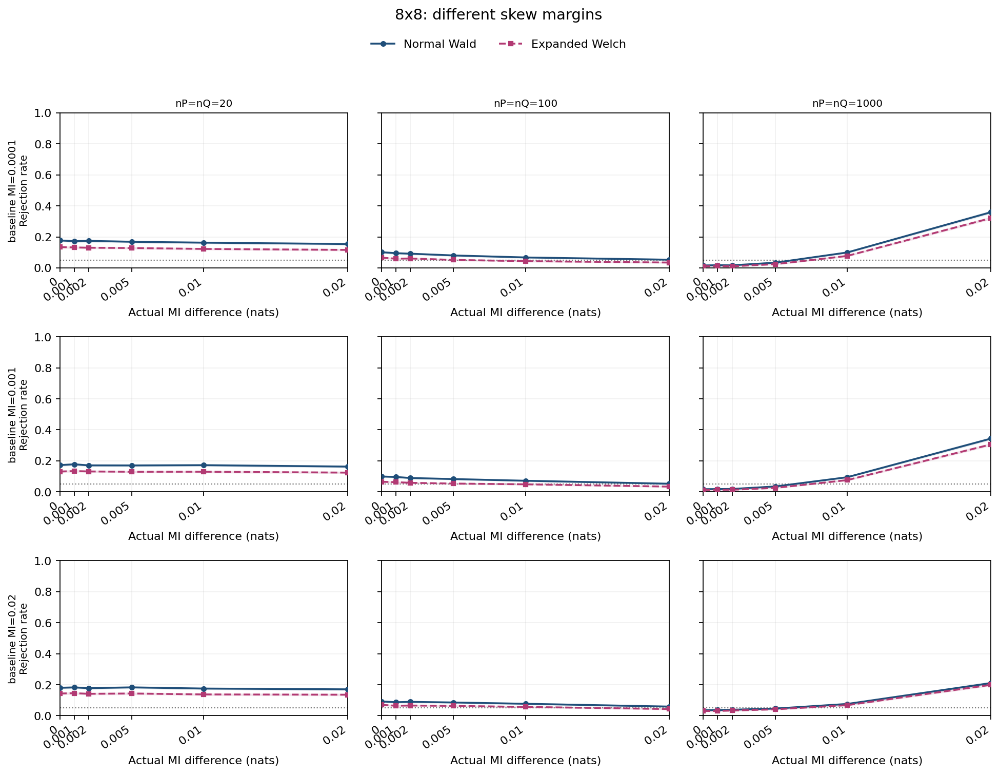

| Specification | Setting |
| --- | --- |
| Table size | 8x8 |
| Horizontal graph regime specifications (columns) | nP=nQ=20, nP=nQ=100, nP=nQ=1000 |
| Vertical graph regime specifications (rows) | baseline MI=0.0001: P row (0.7, 0.3/7 repeated 7 times), P column (0.7, 0.3/7 repeated 7 times); Q row (0.8, 0.2/7 repeated 7 times), Q column (0.8, 0.2/7 repeated 7 times); baseline MI=0.001: P row (0.7, 0.3/7 repeated 7 times), P column (0.7, 0.3/7 repeated 7 times); Q row (0.8, 0.2/7 repeated 7 times), Q column (0.8, 0.2/7 repeated 7 times); baseline MI=0.02: P row (0.7, 0.3/7 repeated 7 times), P column (0.7, 0.3/7 repeated 7 times); Q row (0.8, 0.2/7 repeated 7 times), Q column (0.8, 0.2/7 repeated 7 times) |
| Probability changes | baseline MI=0.0001: add at (1,1),(2,2) and subtract at (1,2),(2,1), for both P and Q; baseline MI=0.001: add at (1,1),(2,2) and subtract at (1,2),(2,1), for both P and Q; baseline MI=0.02: add at (1,1),(2,2) and subtract at (1,2),(2,1), for both P and Q |
| MI settings | Baseline MI {0.0001, 0.001, 0.02}; direction {q higher}; actual differences {0, 0.001, 0.002, 0.005, 0.01, 0.02} nats |
| Horizontal axis within each graph | Actual MI difference in nats, fixed from 0 to 0.02 |
| Vertical axis within each graph | Unconditional rejection rate from 0 to 1; invalid results count as non-rejections |
| Replicates | 20,000 per unique point |

Null-point rejection and validity:

| Vertical regime | Horizontal regime | x | Method | Rejection | Valid |
| --- | --- | --- | --- | --- | --- |
| baseline MI=0.0001 | nP=nQ=20 | 0 | Expanded Welch | 0.1343 | 0.9779 |
| baseline MI=0.0001 | nP=nQ=20 | 0 | Normal Wald | 0.1769 | 1.0000 |
| baseline MI=0.0001 | nP=nQ=100 | 0 | Expanded Welch | 0.0659 | 1.0000 |
| baseline MI=0.0001 | nP=nQ=100 | 0 | Normal Wald | 0.1011 | 1.0000 |
| baseline MI=0.0001 | nP=nQ=1000 | 0 | Expanded Welch | 0.0105 | 1.0000 |
| baseline MI=0.0001 | nP=nQ=1000 | 0 | Normal Wald | 0.0158 | 1.0000 |
| baseline MI=0.001 | nP=nQ=20 | 0 | Expanded Welch | 0.1308 | 0.9772 |
| baseline MI=0.001 | nP=nQ=20 | 0 | Normal Wald | 0.1722 | 1.0000 |
| baseline MI=0.001 | nP=nQ=100 | 0 | Expanded Welch | 0.0648 | 1.0000 |
| baseline MI=0.001 | nP=nQ=100 | 0 | Normal Wald | 0.0988 | 1.0000 |
| baseline MI=0.001 | nP=nQ=1000 | 0 | Expanded Welch | 0.0115 | 1.0000 |
| baseline MI=0.001 | nP=nQ=1000 | 0 | Normal Wald | 0.0169 | 1.0000 |
| baseline MI=0.02 | nP=nQ=20 | 0 | Expanded Welch | 0.1432 | 0.9759 |
| baseline MI=0.02 | nP=nQ=20 | 0 | Normal Wald | 0.1803 | 1.0000 |
| baseline MI=0.02 | nP=nQ=100 | 0 | Expanded Welch | 0.0699 | 1.0000 |
| baseline MI=0.02 | nP=nQ=100 | 0 | Normal Wald | 0.0921 | 1.0000 |
| baseline MI=0.02 | nP=nQ=1000 | 0 | Expanded Welch | 0.0301 | 1.0000 |
| baseline MI=0.02 | nP=nQ=1000 | 0 | Normal Wald | 0.0356 | 1.0000 |

Every plotted rate, interval, validity and minimum expected count

| Vertical regime | Horizontal regime | x | Method | Rejection | 95% interval | Valid | Conditional | Min expected P | Min expected Q |
| --- | --- | --- | --- | --- | --- | --- | --- | --- | --- |
| baseline MI=0.0001 | nP=nQ=20 | 0 | Expanded Welch | 0.1343 | [0.1296, 0.1390] | 0.9779 | 0.1373 | 0.03673 | 0.01633 |
| baseline MI=0.0001 | nP=nQ=20 | 0 | Normal Wald | 0.1769 | [0.1716, 0.1822] | 1.0000 | 0.1769 | 0.03673 | 0.01633 |
| baseline MI=0.0001 | nP=nQ=20 | 0.001 | Expanded Welch | 0.1319 | [0.1273, 0.1367] | 0.9766 | 0.1351 | 0.03673 | 0.01633 |
| baseline MI=0.0001 | nP=nQ=20 | 0.001 | Normal Wald | 0.1725 | [0.1673, 0.1778] | 0.9999 | 0.1725 | 0.03673 | 0.01633 |
| baseline MI=0.0001 | nP=nQ=20 | 0.002 | Expanded Welch | 0.1300 | [0.1254, 0.1347] | 0.9744 | 0.1334 | 0.03673 | 0.01633 |
| baseline MI=0.0001 | nP=nQ=20 | 0.002 | Normal Wald | 0.1743 | [0.1691, 0.1796] | 0.9999 | 0.1743 | 0.03673 | 0.01633 |
| baseline MI=0.0001 | nP=nQ=20 | 0.005 | Expanded Welch | 0.1281 | [0.1236, 0.1329] | 0.9760 | 0.1313 | 0.03673 | 0.01633 |
| baseline MI=0.0001 | nP=nQ=20 | 0.005 | Normal Wald | 0.1684 | [0.1633, 0.1736] | 1.0000 | 0.1684 | 0.03673 | 0.01633 |
| baseline MI=0.0001 | nP=nQ=20 | 0.01 | Expanded Welch | 0.1222 | [0.1177, 0.1268] | 0.9762 | 0.1252 | 0.03673 | 0.01633 |
| baseline MI=0.0001 | nP=nQ=20 | 0.01 | Normal Wald | 0.1627 | [0.1576, 0.1679] | 0.9999 | 0.1627 | 0.03673 | 0.01633 |
| baseline MI=0.0001 | nP=nQ=20 | 0.02 | Expanded Welch | 0.1159 | [0.1116, 0.1205] | 0.9758 | 0.1188 | 0.03673 | 0.01633 |
| baseline MI=0.0001 | nP=nQ=20 | 0.02 | Normal Wald | 0.1540 | [0.1490, 0.1590] | 0.9999 | 0.1540 | 0.03673 | 0.01633 |
| baseline MI=0.0001 | nP=nQ=100 | 0 | Expanded Welch | 0.0659 | [0.0626, 0.0695] | 1.0000 | 0.0659 | 0.1837 | 0.08163 |
| baseline MI=0.0001 | nP=nQ=100 | 0 | Normal Wald | 0.1011 | [0.0970, 0.1054] | 1.0000 | 0.1011 | 0.1837 | 0.08163 |
| baseline MI=0.0001 | nP=nQ=100 | 0.001 | Expanded Welch | 0.0593 | [0.0562, 0.0627] | 1.0000 | 0.0593 | 0.1837 | 0.08163 |
| baseline MI=0.0001 | nP=nQ=100 | 0.001 | Normal Wald | 0.0948 | [0.0908, 0.0989] | 1.0000 | 0.0948 | 0.1837 | 0.08163 |
| baseline MI=0.0001 | nP=nQ=100 | 0.002 | Expanded Welch | 0.0607 | [0.0575, 0.0641] | 1.0000 | 0.0607 | 0.1837 | 0.08163 |
| baseline MI=0.0001 | nP=nQ=100 | 0.002 | Normal Wald | 0.0916 | [0.0876, 0.0956] | 1.0000 | 0.0916 | 0.1837 | 0.08163 |
| baseline MI=0.0001 | nP=nQ=100 | 0.005 | Expanded Welch | 0.0514 | [0.0484, 0.0545] | 1.0000 | 0.0514 | 0.1837 | 0.08163 |
| baseline MI=0.0001 | nP=nQ=100 | 0.005 | Normal Wald | 0.0802 | [0.0765, 0.0840] | 1.0000 | 0.0802 | 0.1837 | 0.08163 |
| baseline MI=0.0001 | nP=nQ=100 | 0.01 | Expanded Welch | 0.0434 | [0.0407, 0.0463] | 1.0000 | 0.0434 | 0.1837 | 0.08163 |
| baseline MI=0.0001 | nP=nQ=100 | 0.01 | Normal Wald | 0.0673 | [0.0639, 0.0709] | 1.0000 | 0.0673 | 0.1837 | 0.08163 |
| baseline MI=0.0001 | nP=nQ=100 | 0.02 | Expanded Welch | 0.0345 | [0.0320, 0.0371] | 1.0000 | 0.0345 | 0.1837 | 0.08163 |
| baseline MI=0.0001 | nP=nQ=100 | 0.02 | Normal Wald | 0.0527 | [0.0497, 0.0559] | 1.0000 | 0.0527 | 0.1837 | 0.08163 |
| baseline MI=0.0001 | nP=nQ=1000 | 0 | Expanded Welch | 0.0105 | [0.0092, 0.0120] | 1.0000 | 0.0105 | 1.837 | 0.8163 |
| baseline MI=0.0001 | nP=nQ=1000 | 0 | Normal Wald | 0.0158 | [0.0142, 0.0177] | 1.0000 | 0.0158 | 1.837 | 0.8163 |
| baseline MI=0.0001 | nP=nQ=1000 | 0.001 | Expanded Welch | 0.0115 | [0.0101, 0.0130] | 1.0000 | 0.0115 | 1.837 | 0.8163 |
| baseline MI=0.0001 | nP=nQ=1000 | 0.001 | Normal Wald | 0.0170 | [0.0153, 0.0189] | 1.0000 | 0.0170 | 1.837 | 0.8163 |
| baseline MI=0.0001 | nP=nQ=1000 | 0.002 | Expanded Welch | 0.0105 | [0.0092, 0.0120] | 1.0000 | 0.0105 | 1.837 | 0.8163 |
| baseline MI=0.0001 | nP=nQ=1000 | 0.002 | Normal Wald | 0.0166 | [0.0149, 0.0185] | 1.0000 | 0.0166 | 1.837 | 0.8163 |
| baseline MI=0.0001 | nP=nQ=1000 | 0.005 | Expanded Welch | 0.0238 | [0.0218, 0.0260] | 1.0000 | 0.0238 | 1.837 | 0.8163 |
| baseline MI=0.0001 | nP=nQ=1000 | 0.005 | Normal Wald | 0.0336 | [0.0312, 0.0362] | 1.0000 | 0.0336 | 1.837 | 0.8163 |
| baseline MI=0.0001 | nP=nQ=1000 | 0.01 | Expanded Welch | 0.0771 | [0.0735, 0.0809] | 1.0000 | 0.0771 | 1.837 | 0.8163 |
| baseline MI=0.0001 | nP=nQ=1000 | 0.01 | Normal Wald | 0.0994 | [0.0953, 0.1036] | 1.0000 | 0.0994 | 1.837 | 0.8163 |
| baseline MI=0.0001 | nP=nQ=1000 | 0.02 | Expanded Welch | 0.3213 | [0.3149, 0.3278] | 1.0000 | 0.3213 | 1.837 | 0.8163 |
| baseline MI=0.0001 | nP=nQ=1000 | 0.02 | Normal Wald | 0.3594 | [0.3528, 0.3661] | 1.0000 | 0.3594 | 1.837 | 0.8163 |
| baseline MI=0.001 | nP=nQ=20 | 0 | Expanded Welch | 0.1308 | [0.1262, 0.1355] | 0.9772 | 0.1339 | 0.03673 | 0.01633 |
| baseline MI=0.001 | nP=nQ=20 | 0 | Normal Wald | 0.1722 | [0.1671, 0.1775] | 1.0000 | 0.1722 | 0.03673 | 0.01633 |
| baseline MI=0.001 | nP=nQ=20 | 0.001 | Expanded Welch | 0.1336 | [0.1290, 0.1384] | 0.9758 | 0.1370 | 0.03673 | 0.01633 |
| baseline MI=0.001 | nP=nQ=20 | 0.001 | Normal Wald | 0.1775 | [0.1723, 0.1829] | 1.0000 | 0.1775 | 0.03673 | 0.01633 |
| baseline MI=0.001 | nP=nQ=20 | 0.002 | Expanded Welch | 0.1313 | [0.1267, 0.1361] | 0.9760 | 0.1346 | 0.03673 | 0.01633 |
| baseline MI=0.001 | nP=nQ=20 | 0.002 | Normal Wald | 0.1705 | [0.1654, 0.1758] | 1.0000 | 0.1705 | 0.03673 | 0.01633 |
| baseline MI=0.001 | nP=nQ=20 | 0.005 | Expanded Welch | 0.1293 | [0.1247, 0.1340] | 0.9742 | 0.1327 | 0.03673 | 0.01633 |
| baseline MI=0.001 | nP=nQ=20 | 0.005 | Normal Wald | 0.1701 | [0.1650, 0.1754] | 0.9999 | 0.1701 | 0.03673 | 0.01633 |
| baseline MI=0.001 | nP=nQ=20 | 0.01 | Expanded Welch | 0.1295 | [0.1250, 0.1343] | 0.9778 | 0.1325 | 0.03673 | 0.01633 |
| baseline MI=0.001 | nP=nQ=20 | 0.01 | Normal Wald | 0.1718 | [0.1666, 0.1771] | 1.0000 | 0.1718 | 0.03673 | 0.01633 |
| baseline MI=0.001 | nP=nQ=20 | 0.02 | Expanded Welch | 0.1239 | [0.1194, 0.1285] | 0.9781 | 0.1266 | 0.03673 | 0.01633 |
| baseline MI=0.001 | nP=nQ=20 | 0.02 | Normal Wald | 0.1626 | [0.1576, 0.1678] | 0.9999 | 0.1627 | 0.03673 | 0.01633 |
| baseline MI=0.001 | nP=nQ=100 | 0 | Expanded Welch | 0.0648 | [0.0614, 0.0682] | 1.0000 | 0.0648 | 0.1837 | 0.08163 |
| baseline MI=0.001 | nP=nQ=100 | 0 | Normal Wald | 0.0988 | [0.0948, 0.1031] | 1.0000 | 0.0988 | 0.1837 | 0.08163 |
| baseline MI=0.001 | nP=nQ=100 | 0.001 | Expanded Welch | 0.0622 | [0.0589, 0.0656] | 1.0000 | 0.0622 | 0.1837 | 0.08163 |
| baseline MI=0.001 | nP=nQ=100 | 0.001 | Normal Wald | 0.0956 | [0.0917, 0.0998] | 1.0000 | 0.0956 | 0.1837 | 0.08163 |
| baseline MI=0.001 | nP=nQ=100 | 0.002 | Expanded Welch | 0.0580 | [0.0549, 0.0614] | 1.0000 | 0.0580 | 0.1837 | 0.08163 |
| baseline MI=0.001 | nP=nQ=100 | 0.002 | Normal Wald | 0.0890 | [0.0851, 0.0930] | 1.0000 | 0.0890 | 0.1837 | 0.08163 |
| baseline MI=0.001 | nP=nQ=100 | 0.005 | Expanded Welch | 0.0532 | [0.0501, 0.0563] | 1.0000 | 0.0532 | 0.1837 | 0.08163 |
| baseline MI=0.001 | nP=nQ=100 | 0.005 | Normal Wald | 0.0823 | [0.0785, 0.0861] | 1.0000 | 0.0823 | 0.1837 | 0.08163 |
| baseline MI=0.001 | nP=nQ=100 | 0.01 | Expanded Welch | 0.0483 | [0.0455, 0.0514] | 1.0000 | 0.0483 | 0.1837 | 0.08163 |
| baseline MI=0.001 | nP=nQ=100 | 0.01 | Normal Wald | 0.0713 | [0.0679, 0.0750] | 1.0000 | 0.0713 | 0.1837 | 0.08163 |
| baseline MI=0.001 | nP=nQ=100 | 0.02 | Expanded Welch | 0.0336 | [0.0312, 0.0362] | 1.0000 | 0.0336 | 0.1837 | 0.08163 |
| baseline MI=0.001 | nP=nQ=100 | 0.02 | Normal Wald | 0.0520 | [0.0491, 0.0552] | 1.0000 | 0.0520 | 0.1837 | 0.08163 |
| baseline MI=0.001 | nP=nQ=1000 | 0 | Expanded Welch | 0.0115 | [0.0102, 0.0131] | 1.0000 | 0.0115 | 1.837 | 0.8163 |
| baseline MI=0.001 | nP=nQ=1000 | 0 | Normal Wald | 0.0169 | [0.0153, 0.0188] | 1.0000 | 0.0169 | 1.837 | 0.8163 |
| baseline MI=0.001 | nP=nQ=1000 | 0.001 | Expanded Welch | 0.0123 | [0.0109, 0.0140] | 1.0000 | 0.0123 | 1.837 | 0.8163 |
| baseline MI=0.001 | nP=nQ=1000 | 0.001 | Normal Wald | 0.0177 | [0.0160, 0.0196] | 1.0000 | 0.0177 | 1.837 | 0.8163 |
| baseline MI=0.001 | nP=nQ=1000 | 0.002 | Expanded Welch | 0.0132 | [0.0117, 0.0149] | 1.0000 | 0.0132 | 1.837 | 0.8163 |
| baseline MI=0.001 | nP=nQ=1000 | 0.002 | Normal Wald | 0.0184 | [0.0166, 0.0203] | 1.0000 | 0.0184 | 1.837 | 0.8163 |
| baseline MI=0.001 | nP=nQ=1000 | 0.005 | Expanded Welch | 0.0251 | [0.0231, 0.0274] | 1.0000 | 0.0251 | 1.837 | 0.8163 |
| baseline MI=0.001 | nP=nQ=1000 | 0.005 | Normal Wald | 0.0345 | [0.0321, 0.0371] | 1.0000 | 0.0345 | 1.837 | 0.8163 |
| baseline MI=0.001 | nP=nQ=1000 | 0.01 | Expanded Welch | 0.0755 | [0.0719, 0.0792] | 1.0000 | 0.0755 | 1.837 | 0.8163 |
| baseline MI=0.001 | nP=nQ=1000 | 0.01 | Normal Wald | 0.0941 | [0.0902, 0.0983] | 1.0000 | 0.0941 | 1.837 | 0.8163 |
| baseline MI=0.001 | nP=nQ=1000 | 0.02 | Expanded Welch | 0.3058 | [0.2994, 0.3122] | 1.0000 | 0.3058 | 1.837 | 0.8163 |
| baseline MI=0.001 | nP=nQ=1000 | 0.02 | Normal Wald | 0.3436 | [0.3370, 0.3502] | 1.0000 | 0.3436 | 1.837 | 0.8163 |
| baseline MI=0.02 | nP=nQ=20 | 0 | Expanded Welch | 0.1432 | [0.1384, 0.1481] | 0.9759 | 0.1467 | 0.03673 | 0.01633 |
| baseline MI=0.02 | nP=nQ=20 | 0 | Normal Wald | 0.1803 | [0.1750, 0.1857] | 1.0000 | 0.1803 | 0.03673 | 0.01633 |
| baseline MI=0.02 | nP=nQ=20 | 0.001 | Expanded Welch | 0.1454 | [0.1405, 0.1503] | 0.9768 | 0.1488 | 0.03673 | 0.01633 |
| baseline MI=0.02 | nP=nQ=20 | 0.001 | Normal Wald | 0.1827 | [0.1775, 0.1882] | 0.9999 | 0.1828 | 0.03673 | 0.01633 |
| baseline MI=0.02 | nP=nQ=20 | 0.002 | Expanded Welch | 0.1414 | [0.1366, 0.1462] | 0.9772 | 0.1446 | 0.03673 | 0.01633 |
| baseline MI=0.02 | nP=nQ=20 | 0.002 | Normal Wald | 0.1781 | [0.1728, 0.1834] | 1.0000 | 0.1781 | 0.03673 | 0.01633 |
| baseline MI=0.02 | nP=nQ=20 | 0.005 | Expanded Welch | 0.1434 | [0.1386, 0.1483] | 0.9770 | 0.1468 | 0.03673 | 0.01633 |
| baseline MI=0.02 | nP=nQ=20 | 0.005 | Normal Wald | 0.1830 | [0.1777, 0.1884] | 1.0000 | 0.1830 | 0.03673 | 0.01633 |
| baseline MI=0.02 | nP=nQ=20 | 0.01 | Expanded Welch | 0.1374 | [0.1327, 0.1423] | 0.9753 | 0.1409 | 0.03673 | 0.01633 |
| baseline MI=0.02 | nP=nQ=20 | 0.01 | Normal Wald | 0.1753 | [0.1701, 0.1806] | 1.0000 | 0.1753 | 0.03673 | 0.01633 |
| baseline MI=0.02 | nP=nQ=20 | 0.02 | Expanded Welch | 0.1356 | [0.1309, 0.1404] | 0.9772 | 0.1388 | 0.03673 | 0.01633 |
| baseline MI=0.02 | nP=nQ=20 | 0.02 | Normal Wald | 0.1703 | [0.1652, 0.1756] | 1.0000 | 0.1703 | 0.03673 | 0.01633 |
| baseline MI=0.02 | nP=nQ=100 | 0 | Expanded Welch | 0.0699 | [0.0664, 0.0735] | 1.0000 | 0.0699 | 0.1837 | 0.08163 |
| baseline MI=0.02 | nP=nQ=100 | 0 | Normal Wald | 0.0921 | [0.0882, 0.0962] | 1.0000 | 0.0921 | 0.1837 | 0.08163 |
| baseline MI=0.02 | nP=nQ=100 | 0.001 | Expanded Welch | 0.0645 | [0.0612, 0.0680] | 1.0000 | 0.0645 | 0.1837 | 0.08163 |
| baseline MI=0.02 | nP=nQ=100 | 0.001 | Normal Wald | 0.0872 | [0.0834, 0.0912] | 1.0000 | 0.0872 | 0.1837 | 0.08163 |
| baseline MI=0.02 | nP=nQ=100 | 0.002 | Expanded Welch | 0.0659 | [0.0625, 0.0694] | 1.0000 | 0.0659 | 0.1837 | 0.08163 |
| baseline MI=0.02 | nP=nQ=100 | 0.002 | Normal Wald | 0.0896 | [0.0857, 0.0936] | 1.0000 | 0.0896 | 0.1837 | 0.08163 |
| baseline MI=0.02 | nP=nQ=100 | 0.005 | Expanded Welch | 0.0635 | [0.0602, 0.0670] | 1.0000 | 0.0635 | 0.1837 | 0.08163 |
| baseline MI=0.02 | nP=nQ=100 | 0.005 | Normal Wald | 0.0854 | [0.0817, 0.0894] | 1.0000 | 0.0854 | 0.1837 | 0.08163 |
| baseline MI=0.02 | nP=nQ=100 | 0.01 | Expanded Welch | 0.0568 | [0.0537, 0.0601] | 1.0000 | 0.0568 | 0.1837 | 0.08163 |
| baseline MI=0.02 | nP=nQ=100 | 0.01 | Normal Wald | 0.0771 | [0.0735, 0.0809] | 1.0000 | 0.0771 | 0.1837 | 0.08163 |
| baseline MI=0.02 | nP=nQ=100 | 0.02 | Expanded Welch | 0.0432 | [0.0404, 0.0461] | 1.0000 | 0.0432 | 0.1837 | 0.08163 |
| baseline MI=0.02 | nP=nQ=100 | 0.02 | Normal Wald | 0.0590 | [0.0558, 0.0624] | 1.0000 | 0.0590 | 0.1837 | 0.08163 |
| baseline MI=0.02 | nP=nQ=1000 | 0 | Expanded Welch | 0.0301 | [0.0279, 0.0326] | 1.0000 | 0.0301 | 1.837 | 0.8163 |
| baseline MI=0.02 | nP=nQ=1000 | 0 | Normal Wald | 0.0356 | [0.0331, 0.0383] | 1.0000 | 0.0356 | 1.837 | 0.8163 |
| baseline MI=0.02 | nP=nQ=1000 | 0.001 | Expanded Welch | 0.0309 | [0.0286, 0.0334] | 1.0000 | 0.0309 | 1.837 | 0.8163 |
| baseline MI=0.02 | nP=nQ=1000 | 0.001 | Normal Wald | 0.0365 | [0.0339, 0.0391] | 1.0000 | 0.0365 | 1.837 | 0.8163 |
| baseline MI=0.02 | nP=nQ=1000 | 0.002 | Expanded Welch | 0.0335 | [0.0310, 0.0360] | 1.0000 | 0.0335 | 1.837 | 0.8163 |
| baseline MI=0.02 | nP=nQ=1000 | 0.002 | Normal Wald | 0.0387 | [0.0362, 0.0415] | 1.0000 | 0.0387 | 1.837 | 0.8163 |
| baseline MI=0.02 | nP=nQ=1000 | 0.005 | Expanded Welch | 0.0413 | [0.0387, 0.0442] | 1.0000 | 0.0413 | 1.837 | 0.8163 |
| baseline MI=0.02 | nP=nQ=1000 | 0.005 | Normal Wald | 0.0462 | [0.0434, 0.0492] | 1.0000 | 0.0462 | 1.837 | 0.8163 |
| baseline MI=0.02 | nP=nQ=1000 | 0.01 | Expanded Welch | 0.0682 | [0.0648, 0.0718] | 1.0000 | 0.0682 | 1.837 | 0.8163 |
| baseline MI=0.02 | nP=nQ=1000 | 0.01 | Normal Wald | 0.0760 | [0.0724, 0.0798] | 1.0000 | 0.0760 | 1.837 | 0.8163 |
| baseline MI=0.02 | nP=nQ=1000 | 0.02 | Expanded Welch | 0.1994 | [0.1939, 0.2050] | 1.0000 | 0.1994 | 1.837 | 0.8163 |
| baseline MI=0.02 | nP=nQ=1000 | 0.02 | Normal Wald | 0.2109 | [0.2053, 0.2166] | 1.0000 | 0.2109 | 1.837 | 0.8163 |

## 5. Where the cell probabilities change

Does performance change when dependence is placed in common, rare or many cells?

### 5.1 3x3: locations of probability changes

Does performance change when dependence is placed in common, rare or many cells?

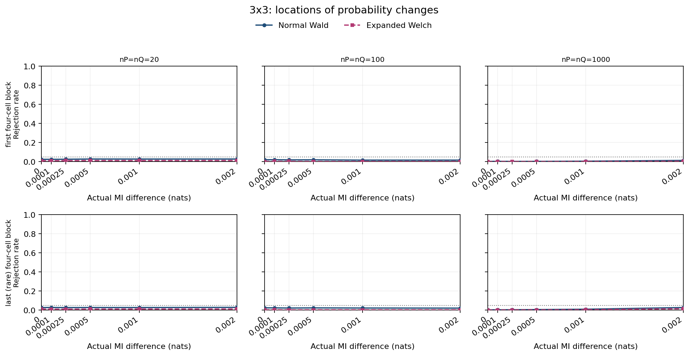

| Specification | Setting |
| --- | --- |
| Table size | 3x3 |
| Horizontal graph regime specifications (columns) | nP=nQ=20, nP=nQ=100, nP=nQ=1000 |
| Vertical graph regime specifications (rows) | first four-cell block: P row (0.7, 0.3/2 repeated 2 times), P column (0.7, 0.3/2 repeated 2 times); Q row (0.8, 0.2/2 repeated 2 times), Q column (0.8, 0.2/2 repeated 2 times); last (rare) four-cell block: P row (0.7, 0.3/2 repeated 2 times), P column (0.7, 0.3/2 repeated 2 times); Q row (0.8, 0.2/2 repeated 2 times), Q column (0.8, 0.2/2 repeated 2 times) |
| Probability changes | first four-cell block: add at (1,1),(2,2) and subtract at (1,2),(2,1), for both P and Q; last (rare) four-cell block: the same four signs in the last two rows and last two columns, for both P and Q |
| MI settings | Baseline MI {0.0001}; direction {q higher}; actual differences {0, 0.0001, 0.00025, 0.0005, 0.001, 0.002} nats |
| Horizontal axis within each graph | Actual MI difference in nats, fixed from 0 to 0.002 |
| Vertical axis within each graph | Unconditional rejection rate from 0 to 1; invalid results count as non-rejections |
| Replicates | 20,000 per unique point |

Null-point rejection and validity:

| Vertical regime | Horizontal regime | x | Method | Rejection | Valid |
| --- | --- | --- | --- | --- | --- |
| first four-cell block | nP=nQ=20 | 0 | Expanded Welch | 0.0096 | 0.9756 |
| first four-cell block | nP=nQ=20 | 0 | Normal Wald | 0.0240 | 0.9999 |
| first four-cell block | nP=nQ=100 | 0 | Expanded Welch | 0.0017 | 1.0000 |
| first four-cell block | nP=nQ=100 | 0 | Normal Wald | 0.0193 | 1.0000 |
| first four-cell block | nP=nQ=1000 | 0 | Expanded Welch | 0.0007 | 1.0000 |
| first four-cell block | nP=nQ=1000 | 0 | Normal Wald | 0.0023 | 1.0000 |
| last (rare) four-cell block | nP=nQ=20 | 0 | Expanded Welch | 0.0104 | 0.9768 |
| last (rare) four-cell block | nP=nQ=20 | 0 | Normal Wald | 0.0262 | 0.9999 |
| last (rare) four-cell block | nP=nQ=100 | 0 | Expanded Welch | 0.0029 | 1.0000 |
| last (rare) four-cell block | nP=nQ=100 | 0 | Normal Wald | 0.0240 | 1.0000 |
| last (rare) four-cell block | nP=nQ=1000 | 0 | Expanded Welch | 0.0010 | 1.0000 |
| last (rare) four-cell block | nP=nQ=1000 | 0 | Normal Wald | 0.0030 | 1.0000 |

Every plotted rate, interval, validity and minimum expected count

| Vertical regime | Horizontal regime | x | Method | Rejection | 95% interval | Valid | Conditional | Min expected P | Min expected Q |
| --- | --- | --- | --- | --- | --- | --- | --- | --- | --- |
| first four-cell block | nP=nQ=20 | 0 | Expanded Welch | 0.0096 | [0.0083, 0.0110] | 0.9756 | 0.0098 | 0.45 | 0.2 |
| first four-cell block | nP=nQ=20 | 0 | Normal Wald | 0.0240 | [0.0220, 0.0263] | 0.9999 | 0.0241 | 0.45 | 0.2 |
| first four-cell block | nP=nQ=20 | 0.0001 | Expanded Welch | 0.0095 | [0.0082, 0.0109] | 0.9745 | 0.0097 | 0.45 | 0.2 |
| first four-cell block | nP=nQ=20 | 0.0001 | Normal Wald | 0.0240 | [0.0220, 0.0263] | 0.9999 | 0.0241 | 0.45 | 0.2 |
| first four-cell block | nP=nQ=20 | 0.00025 | Expanded Welch | 0.0099 | [0.0086, 0.0114] | 0.9760 | 0.0101 | 0.45 | 0.2 |
| first four-cell block | nP=nQ=20 | 0.00025 | Normal Wald | 0.0248 | [0.0227, 0.0270] | 1.0000 | 0.0248 | 0.45 | 0.2 |
| first four-cell block | nP=nQ=20 | 0.0005 | Expanded Welch | 0.0111 | [0.0097, 0.0126] | 0.9759 | 0.0114 | 0.45 | 0.2 |
| first four-cell block | nP=nQ=20 | 0.0005 | Normal Wald | 0.0271 | [0.0249, 0.0294] | 1.0000 | 0.0271 | 0.45 | 0.2 |
| first four-cell block | nP=nQ=20 | 0.001 | Expanded Welch | 0.0109 | [0.0096, 0.0124] | 0.9751 | 0.0112 | 0.45 | 0.2 |
| first four-cell block | nP=nQ=20 | 0.001 | Normal Wald | 0.0267 | [0.0246, 0.0290] | 1.0000 | 0.0267 | 0.45 | 0.2 |
| first four-cell block | nP=nQ=20 | 0.002 | Expanded Welch | 0.0112 | [0.0098, 0.0128] | 0.9759 | 0.0115 | 0.45 | 0.2 |
| first four-cell block | nP=nQ=20 | 0.002 | Normal Wald | 0.0270 | [0.0248, 0.0293] | 1.0000 | 0.0270 | 0.45 | 0.2 |
| first four-cell block | nP=nQ=100 | 0 | Expanded Welch | 0.0017 | [0.0012, 0.0024] | 1.0000 | 0.0017 | 2.25 | 1 |
| first four-cell block | nP=nQ=100 | 0 | Normal Wald | 0.0193 | [0.0175, 0.0213] | 1.0000 | 0.0193 | 2.25 | 1 |
| first four-cell block | nP=nQ=100 | 0.0001 | Expanded Welch | 0.0024 | [0.0018, 0.0032] | 1.0000 | 0.0024 | 2.25 | 1 |
| first four-cell block | nP=nQ=100 | 0.0001 | Normal Wald | 0.0199 | [0.0181, 0.0220] | 1.0000 | 0.0199 | 2.25 | 1 |
| first four-cell block | nP=nQ=100 | 0.00025 | Expanded Welch | 0.0026 | [0.0019, 0.0034] | 1.0000 | 0.0026 | 2.25 | 1 |
| first four-cell block | nP=nQ=100 | 0.00025 | Normal Wald | 0.0181 | [0.0163, 0.0200] | 1.0000 | 0.0181 | 2.25 | 1 |
| first four-cell block | nP=nQ=100 | 0.0005 | Expanded Welch | 0.0014 | [0.0010, 0.0020] | 1.0000 | 0.0014 | 2.25 | 1 |
| first four-cell block | nP=nQ=100 | 0.0005 | Normal Wald | 0.0187 | [0.0170, 0.0207] | 1.0000 | 0.0187 | 2.25 | 1 |
| first four-cell block | nP=nQ=100 | 0.001 | Expanded Welch | 0.0015 | [0.0011, 0.0021] | 1.0000 | 0.0015 | 2.25 | 1 |
| first four-cell block | nP=nQ=100 | 0.001 | Normal Wald | 0.0155 | [0.0139, 0.0174] | 1.0000 | 0.0155 | 2.25 | 1 |
| first four-cell block | nP=nQ=100 | 0.002 | Expanded Welch | 0.0019 | [0.0013, 0.0025] | 1.0000 | 0.0019 | 2.25 | 1 |
| first four-cell block | nP=nQ=100 | 0.002 | Normal Wald | 0.0155 | [0.0139, 0.0173] | 1.0000 | 0.0155 | 2.25 | 1 |
| first four-cell block | nP=nQ=1000 | 0 | Expanded Welch | 0.0007 | [0.0004, 0.0012] | 1.0000 | 0.0007 | 22.5 | 10 |
| first four-cell block | nP=nQ=1000 | 0 | Normal Wald | 0.0023 | [0.0017, 0.0031] | 1.0000 | 0.0023 | 22.5 | 10 |
| first four-cell block | nP=nQ=1000 | 0.0001 | Expanded Welch | 0.0010 | [0.0006, 0.0015] | 1.0000 | 0.0010 | 22.5 | 10 |
| first four-cell block | nP=nQ=1000 | 0.0001 | Normal Wald | 0.0029 | [0.0023, 0.0038] | 1.0000 | 0.0029 | 22.5 | 10 |
| first four-cell block | nP=nQ=1000 | 0.00025 | Expanded Welch | 0.0006 | [0.0004, 0.0011] | 1.0000 | 0.0006 | 22.5 | 10 |
| first four-cell block | nP=nQ=1000 | 0.00025 | Normal Wald | 0.0024 | [0.0018, 0.0031] | 1.0000 | 0.0024 | 22.5 | 10 |
| first four-cell block | nP=nQ=1000 | 0.0005 | Expanded Welch | 0.0008 | [0.0005, 0.0012] | 1.0000 | 0.0008 | 22.5 | 10 |
| first four-cell block | nP=nQ=1000 | 0.0005 | Normal Wald | 0.0026 | [0.0020, 0.0034] | 1.0000 | 0.0026 | 22.5 | 10 |
| first four-cell block | nP=nQ=1000 | 0.001 | Expanded Welch | 0.0014 | [0.0010, 0.0020] | 1.0000 | 0.0014 | 22.5 | 10 |
| first four-cell block | nP=nQ=1000 | 0.001 | Normal Wald | 0.0046 | [0.0037, 0.0056] | 1.0000 | 0.0046 | 22.5 | 10 |
| first four-cell block | nP=nQ=1000 | 0.002 | Expanded Welch | 0.0039 | [0.0031, 0.0049] | 1.0000 | 0.0039 | 22.5 | 10 |
| first four-cell block | nP=nQ=1000 | 0.002 | Normal Wald | 0.0124 | [0.0110, 0.0141] | 1.0000 | 0.0124 | 22.5 | 10 |
| last (rare) four-cell block | nP=nQ=20 | 0 | Expanded Welch | 0.0104 | [0.0091, 0.0120] | 0.9768 | 0.0107 | 0.4288 | 0.1859 |
| last (rare) four-cell block | nP=nQ=20 | 0 | Normal Wald | 0.0262 | [0.0241, 0.0285] | 0.9999 | 0.0262 | 0.4288 | 0.1859 |
| last (rare) four-cell block | nP=nQ=20 | 0.0001 | Expanded Welch | 0.0097 | [0.0084, 0.0111] | 0.9778 | 0.0099 | 0.4288 | 0.18 |
| last (rare) four-cell block | nP=nQ=20 | 0.0001 | Normal Wald | 0.0278 | [0.0256, 0.0302] | 0.9999 | 0.0278 | 0.4288 | 0.18 |
| last (rare) four-cell block | nP=nQ=20 | 0.00025 | Expanded Welch | 0.0094 | [0.0082, 0.0108] | 0.9748 | 0.0096 | 0.4288 | 0.1736 |
| last (rare) four-cell block | nP=nQ=20 | 0.00025 | Normal Wald | 0.0265 | [0.0243, 0.0288] | 1.0000 | 0.0265 | 0.4288 | 0.1736 |
| last (rare) four-cell block | nP=nQ=20 | 0.0005 | Expanded Welch | 0.0102 | [0.0089, 0.0117] | 0.9768 | 0.0104 | 0.4288 | 0.1654 |
| last (rare) four-cell block | nP=nQ=20 | 0.0005 | Normal Wald | 0.0272 | [0.0250, 0.0295] | 1.0000 | 0.0272 | 0.4288 | 0.1654 |
| last (rare) four-cell block | nP=nQ=20 | 0.001 | Expanded Welch | 0.0109 | [0.0096, 0.0124] | 0.9761 | 0.0112 | 0.4288 | 0.1533 |
| last (rare) four-cell block | nP=nQ=20 | 0.001 | Normal Wald | 0.0270 | [0.0248, 0.0293] | 1.0000 | 0.0270 | 0.4288 | 0.1533 |
| last (rare) four-cell block | nP=nQ=20 | 0.002 | Expanded Welch | 0.0115 | [0.0101, 0.0130] | 0.9776 | 0.0117 | 0.4288 | 0.1358 |
| last (rare) four-cell block | nP=nQ=20 | 0.002 | Normal Wald | 0.0286 | [0.0264, 0.0311] | 0.9999 | 0.0287 | 0.4288 | 0.1358 |
| last (rare) four-cell block | nP=nQ=100 | 0 | Expanded Welch | 0.0029 | [0.0022, 0.0037] | 1.0000 | 0.0029 | 2.144 | 0.9293 |
| last (rare) four-cell block | nP=nQ=100 | 0 | Normal Wald | 0.0240 | [0.0220, 0.0263] | 1.0000 | 0.0240 | 2.144 | 0.9293 |
| last (rare) four-cell block | nP=nQ=100 | 0.0001 | Expanded Welch | 0.0027 | [0.0020, 0.0035] | 1.0000 | 0.0027 | 2.144 | 0.9001 |
| last (rare) four-cell block | nP=nQ=100 | 0.0001 | Normal Wald | 0.0236 | [0.0215, 0.0257] | 1.0000 | 0.0236 | 2.144 | 0.9001 |
| last (rare) four-cell block | nP=nQ=100 | 0.00025 | Expanded Welch | 0.0021 | [0.0016, 0.0028] | 1.0000 | 0.0021 | 2.144 | 0.8679 |
| last (rare) four-cell block | nP=nQ=100 | 0.00025 | Normal Wald | 0.0217 | [0.0198, 0.0238] | 1.0000 | 0.0217 | 2.144 | 0.8679 |
| last (rare) four-cell block | nP=nQ=100 | 0.0005 | Expanded Welch | 0.0026 | [0.0019, 0.0034] | 1.0000 | 0.0026 | 2.144 | 0.8272 |
| last (rare) four-cell block | nP=nQ=100 | 0.0005 | Normal Wald | 0.0233 | [0.0213, 0.0255] | 1.0000 | 0.0233 | 2.144 | 0.8272 |
| last (rare) four-cell block | nP=nQ=100 | 0.001 | Expanded Welch | 0.0026 | [0.0019, 0.0034] | 1.0000 | 0.0026 | 2.144 | 0.7666 |
| last (rare) four-cell block | nP=nQ=100 | 0.001 | Normal Wald | 0.0219 | [0.0200, 0.0240] | 1.0000 | 0.0219 | 2.144 | 0.7666 |
| last (rare) four-cell block | nP=nQ=100 | 0.002 | Expanded Welch | 0.0023 | [0.0017, 0.0031] | 1.0000 | 0.0023 | 2.144 | 0.6788 |
| last (rare) four-cell block | nP=nQ=100 | 0.002 | Normal Wald | 0.0209 | [0.0190, 0.0229] | 1.0000 | 0.0209 | 2.144 | 0.6788 |
| last (rare) four-cell block | nP=nQ=1000 | 0 | Expanded Welch | 0.0010 | [0.0006, 0.0015] | 1.0000 | 0.0010 | 21.44 | 9.293 |
| last (rare) four-cell block | nP=nQ=1000 | 0 | Normal Wald | 0.0030 | [0.0023, 0.0039] | 1.0000 | 0.0030 | 21.44 | 9.293 |
| last (rare) four-cell block | nP=nQ=1000 | 0.0001 | Expanded Welch | 0.0015 | [0.0011, 0.0021] | 1.0000 | 0.0015 | 21.44 | 9.001 |
| last (rare) four-cell block | nP=nQ=1000 | 0.0001 | Normal Wald | 0.0032 | [0.0026, 0.0041] | 1.0000 | 0.0032 | 21.44 | 9.001 |
| last (rare) four-cell block | nP=nQ=1000 | 0.00025 | Expanded Welch | 0.0016 | [0.0011, 0.0023] | 1.0000 | 0.0016 | 21.44 | 8.679 |
| last (rare) four-cell block | nP=nQ=1000 | 0.00025 | Normal Wald | 0.0040 | [0.0032, 0.0049] | 1.0000 | 0.0040 | 21.44 | 8.679 |
| last (rare) four-cell block | nP=nQ=1000 | 0.0005 | Expanded Welch | 0.0024 | [0.0018, 0.0032] | 1.0000 | 0.0024 | 21.44 | 8.272 |
| last (rare) four-cell block | nP=nQ=1000 | 0.0005 | Normal Wald | 0.0056 | [0.0046, 0.0067] | 1.0000 | 0.0056 | 21.44 | 8.272 |
| last (rare) four-cell block | nP=nQ=1000 | 0.001 | Expanded Welch | 0.0037 | [0.0030, 0.0047] | 1.0000 | 0.0037 | 21.44 | 7.666 |
| last (rare) four-cell block | nP=nQ=1000 | 0.001 | Normal Wald | 0.0094 | [0.0081, 0.0108] | 1.0000 | 0.0094 | 21.44 | 7.666 |
| last (rare) four-cell block | nP=nQ=1000 | 0.002 | Expanded Welch | 0.0143 | [0.0127, 0.0160] | 1.0000 | 0.0143 | 21.44 | 6.788 |
| last (rare) four-cell block | nP=nQ=1000 | 0.002 | Normal Wald | 0.0267 | [0.0246, 0.0291] | 1.0000 | 0.0267 | 21.44 | 6.788 |

### 5.2 5x5: locations of probability changes

Does performance change when dependence is placed in common, rare or many cells?

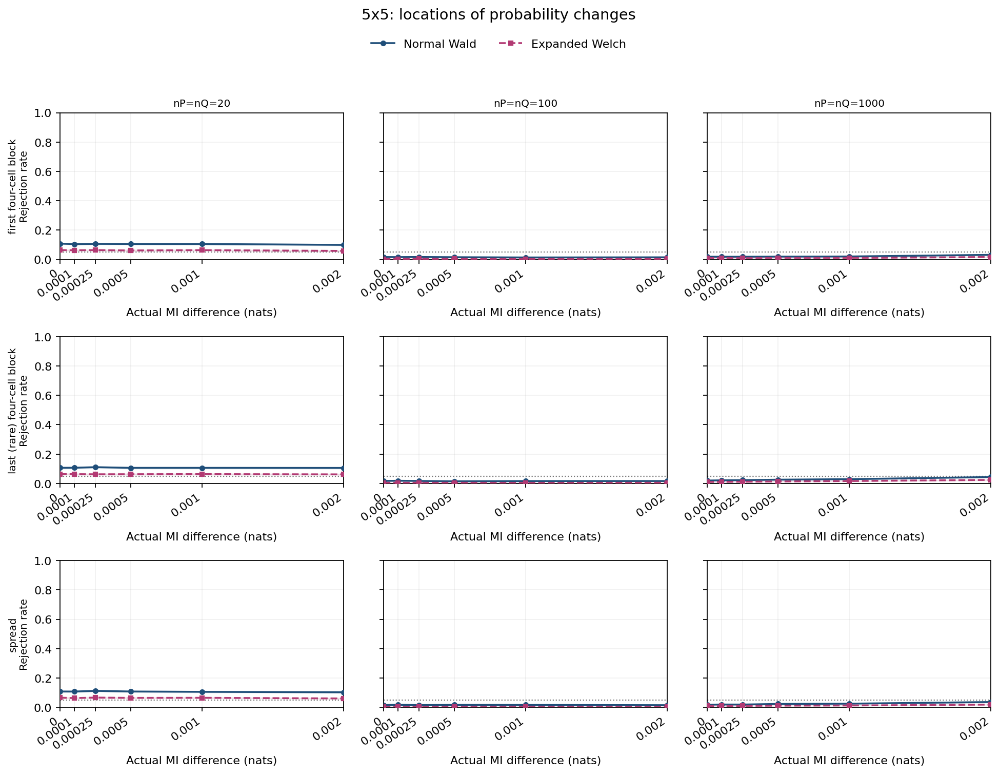

| Specification | Setting |
| --- | --- |
| Table size | 5x5 |
| Horizontal graph regime specifications (columns) | nP=nQ=20, nP=nQ=100, nP=nQ=1000 |
| Vertical graph regime specifications (rows) | first four-cell block: P row (0.7, 0.3/4 repeated 4 times), P column (0.7, 0.3/4 repeated 4 times); Q row (0.8, 0.2/4 repeated 4 times), Q column (0.8, 0.2/4 repeated 4 times); last (rare) four-cell block: P row (0.7, 0.3/4 repeated 4 times), P column (0.7, 0.3/4 repeated 4 times); Q row (0.8, 0.2/4 repeated 4 times), Q column (0.8, 0.2/4 repeated 4 times); spread: P row (0.7, 0.3/4 repeated 4 times), P column (0.7, 0.3/4 repeated 4 times); Q row (0.8, 0.2/4 repeated 4 times), Q column (0.8, 0.2/4 repeated 4 times) |
| Probability changes | first four-cell block: add at (1,1),(2,2) and subtract at (1,2),(2,1), for both P and Q; last (rare) four-cell block: the same four signs in the last two rows and last two columns, for both P and Q; spread: spread changes H_ij=s_i s_j using equally spaced scores s from -1 to 1, for both P and Q |
| MI settings | Baseline MI {0.0001}; direction {q higher}; actual differences {0, 0.0001, 0.00025, 0.0005, 0.001, 0.002} nats |
| Horizontal axis within each graph | Actual MI difference in nats, fixed from 0 to 0.002 |
| Vertical axis within each graph | Unconditional rejection rate from 0 to 1; invalid results count as non-rejections |
| Replicates | 20,000 per unique point |

Null-point rejection and validity:

| Vertical regime | Horizontal regime | x | Method | Rejection | Valid |
| --- | --- | --- | --- | --- | --- |
| first four-cell block | nP=nQ=20 | 0 | Expanded Welch | 0.0644 | 0.9786 |
| first four-cell block | nP=nQ=20 | 0 | Normal Wald | 0.1084 | 0.9999 |
| first four-cell block | nP=nQ=100 | 0 | Expanded Welch | 0.0039 | 1.0000 |
| first four-cell block | nP=nQ=100 | 0 | Normal Wald | 0.0169 | 1.0000 |
| first four-cell block | nP=nQ=1000 | 0 | Expanded Welch | 0.0098 | 1.0000 |
| first four-cell block | nP=nQ=1000 | 0 | Normal Wald | 0.0193 | 1.0000 |
| last (rare) four-cell block | nP=nQ=20 | 0 | Expanded Welch | 0.0639 | 0.9758 |
| last (rare) four-cell block | nP=nQ=20 | 0 | Normal Wald | 0.1065 | 1.0000 |
| last (rare) four-cell block | nP=nQ=100 | 0 | Expanded Welch | 0.0044 | 1.0000 |
| last (rare) four-cell block | nP=nQ=100 | 0 | Normal Wald | 0.0170 | 1.0000 |
| last (rare) four-cell block | nP=nQ=1000 | 0 | Expanded Welch | 0.0104 | 1.0000 |
| last (rare) four-cell block | nP=nQ=1000 | 0 | Normal Wald | 0.0198 | 1.0000 |
| spread | nP=nQ=20 | 0 | Expanded Welch | 0.0663 | 0.9766 |
| spread | nP=nQ=20 | 0 | Normal Wald | 0.1081 | 1.0000 |
| spread | nP=nQ=100 | 0 | Expanded Welch | 0.0041 | 1.0000 |
| spread | nP=nQ=100 | 0 | Normal Wald | 0.0160 | 1.0000 |
| spread | nP=nQ=1000 | 0 | Expanded Welch | 0.0100 | 1.0000 |
| spread | nP=nQ=1000 | 0 | Normal Wald | 0.0182 | 1.0000 |

Every plotted rate, interval, validity and minimum expected count

| Vertical regime | Horizontal regime | x | Method | Rejection | 95% interval | Valid | Conditional | Min expected P | Min expected Q |
| --- | --- | --- | --- | --- | --- | --- | --- | --- | --- |
| first four-cell block | nP=nQ=20 | 0 | Expanded Welch | 0.0644 | [0.0611, 0.0679] | 0.9786 | 0.0658 | 0.1125 | 0.05 |
| first four-cell block | nP=nQ=20 | 0 | Normal Wald | 0.1084 | [0.1042, 0.1128] | 0.9999 | 0.1084 | 0.1125 | 0.05 |
| first four-cell block | nP=nQ=20 | 0.0001 | Expanded Welch | 0.0633 | [0.0600, 0.0667] | 0.9782 | 0.0647 | 0.1125 | 0.05 |
| first four-cell block | nP=nQ=20 | 0.0001 | Normal Wald | 0.1052 | [0.1011, 0.1096] | 1.0000 | 0.1053 | 0.1125 | 0.05 |
| first four-cell block | nP=nQ=20 | 0.00025 | Expanded Welch | 0.0643 | [0.0610, 0.0678] | 0.9773 | 0.0658 | 0.1125 | 0.05 |
| first four-cell block | nP=nQ=20 | 0.00025 | Normal Wald | 0.1067 | [0.1025, 0.1111] | 1.0000 | 0.1067 | 0.1125 | 0.05 |
| first four-cell block | nP=nQ=20 | 0.0005 | Expanded Welch | 0.0619 | [0.0586, 0.0653] | 0.9752 | 0.0635 | 0.1125 | 0.05 |
| first four-cell block | nP=nQ=20 | 0.0005 | Normal Wald | 0.1061 | [0.1019, 0.1104] | 1.0000 | 0.1061 | 0.1125 | 0.05 |
| first four-cell block | nP=nQ=20 | 0.001 | Expanded Welch | 0.0641 | [0.0608, 0.0676] | 0.9779 | 0.0655 | 0.1125 | 0.05 |
| first four-cell block | nP=nQ=20 | 0.001 | Normal Wald | 0.1059 | [0.1017, 0.1102] | 1.0000 | 0.1059 | 0.1125 | 0.05 |
| first four-cell block | nP=nQ=20 | 0.002 | Expanded Welch | 0.0587 | [0.0555, 0.0620] | 0.9763 | 0.0601 | 0.1125 | 0.05 |
| first four-cell block | nP=nQ=20 | 0.002 | Normal Wald | 0.0997 | [0.0956, 0.1039] | 0.9999 | 0.0997 | 0.1125 | 0.05 |
| first four-cell block | nP=nQ=100 | 0 | Expanded Welch | 0.0039 | [0.0031, 0.0049] | 1.0000 | 0.0039 | 0.5625 | 0.25 |
| first four-cell block | nP=nQ=100 | 0 | Normal Wald | 0.0169 | [0.0152, 0.0187] | 1.0000 | 0.0169 | 0.5625 | 0.25 |
| first four-cell block | nP=nQ=100 | 0.0001 | Expanded Welch | 0.0037 | [0.0029, 0.0046] | 1.0000 | 0.0037 | 0.5625 | 0.25 |
| first four-cell block | nP=nQ=100 | 0.0001 | Normal Wald | 0.0165 | [0.0148, 0.0184] | 1.0000 | 0.0165 | 0.5625 | 0.25 |
| first four-cell block | nP=nQ=100 | 0.00025 | Expanded Welch | 0.0049 | [0.0040, 0.0059] | 1.0000 | 0.0049 | 0.5625 | 0.25 |
| first four-cell block | nP=nQ=100 | 0.00025 | Normal Wald | 0.0172 | [0.0155, 0.0191] | 1.0000 | 0.0172 | 0.5625 | 0.25 |
| first four-cell block | nP=nQ=100 | 0.0005 | Expanded Welch | 0.0040 | [0.0032, 0.0050] | 1.0000 | 0.0040 | 0.5625 | 0.25 |
| first four-cell block | nP=nQ=100 | 0.0005 | Normal Wald | 0.0158 | [0.0142, 0.0176] | 1.0000 | 0.0158 | 0.5625 | 0.25 |
| first four-cell block | nP=nQ=100 | 0.001 | Expanded Welch | 0.0034 | [0.0027, 0.0043] | 1.0000 | 0.0034 | 0.5625 | 0.25 |
| first four-cell block | nP=nQ=100 | 0.001 | Normal Wald | 0.0141 | [0.0126, 0.0158] | 1.0000 | 0.0141 | 0.5625 | 0.25 |
| first four-cell block | nP=nQ=100 | 0.002 | Expanded Welch | 0.0042 | [0.0033, 0.0051] | 1.0000 | 0.0042 | 0.5625 | 0.25 |
| first four-cell block | nP=nQ=100 | 0.002 | Normal Wald | 0.0151 | [0.0135, 0.0169] | 1.0000 | 0.0151 | 0.5625 | 0.25 |
| first four-cell block | nP=nQ=1000 | 0 | Expanded Welch | 0.0098 | [0.0085, 0.0113] | 1.0000 | 0.0098 | 5.625 | 2.5 |
| first four-cell block | nP=nQ=1000 | 0 | Normal Wald | 0.0193 | [0.0175, 0.0213] | 1.0000 | 0.0193 | 5.625 | 2.5 |
| first four-cell block | nP=nQ=1000 | 0.0001 | Expanded Welch | 0.0104 | [0.0091, 0.0119] | 1.0000 | 0.0104 | 5.625 | 2.5 |
| first four-cell block | nP=nQ=1000 | 0.0001 | Normal Wald | 0.0190 | [0.0172, 0.0209] | 1.0000 | 0.0190 | 5.625 | 2.5 |
| first four-cell block | nP=nQ=1000 | 0.00025 | Expanded Welch | 0.0090 | [0.0078, 0.0104] | 1.0000 | 0.0090 | 5.625 | 2.5 |
| first four-cell block | nP=nQ=1000 | 0.00025 | Normal Wald | 0.0192 | [0.0173, 0.0211] | 1.0000 | 0.0192 | 5.625 | 2.5 |
| first four-cell block | nP=nQ=1000 | 0.0005 | Expanded Welch | 0.0103 | [0.0090, 0.0118] | 1.0000 | 0.0103 | 5.625 | 2.5 |
| first four-cell block | nP=nQ=1000 | 0.0005 | Normal Wald | 0.0198 | [0.0180, 0.0219] | 1.0000 | 0.0198 | 5.625 | 2.5 |
| first four-cell block | nP=nQ=1000 | 0.001 | Expanded Welch | 0.0104 | [0.0091, 0.0120] | 1.0000 | 0.0104 | 5.625 | 2.5 |
| first four-cell block | nP=nQ=1000 | 0.001 | Normal Wald | 0.0208 | [0.0189, 0.0229] | 1.0000 | 0.0208 | 5.625 | 2.5 |
| first four-cell block | nP=nQ=1000 | 0.002 | Expanded Welch | 0.0174 | [0.0156, 0.0193] | 1.0000 | 0.0174 | 5.625 | 2.5 |
| first four-cell block | nP=nQ=1000 | 0.002 | Normal Wald | 0.0319 | [0.0296, 0.0344] | 1.0000 | 0.0319 | 5.625 | 2.5 |
| last (rare) four-cell block | nP=nQ=20 | 0 | Expanded Welch | 0.0639 | [0.0606, 0.0674] | 0.9758 | 0.0655 | 0.1019 | 0.04294 |
| last (rare) four-cell block | nP=nQ=20 | 0 | Normal Wald | 0.1065 | [0.1023, 0.1109] | 1.0000 | 0.1065 | 0.1019 | 0.04294 |
| last (rare) four-cell block | nP=nQ=20 | 0.0001 | Expanded Welch | 0.0634 | [0.0601, 0.0668] | 0.9774 | 0.0648 | 0.1019 | 0.04003 |
| last (rare) four-cell block | nP=nQ=20 | 0.0001 | Normal Wald | 0.1070 | [0.1027, 0.1113] | 1.0000 | 0.1070 | 0.1019 | 0.04003 |
| last (rare) four-cell block | nP=nQ=20 | 0.00025 | Expanded Welch | 0.0624 | [0.0591, 0.0658] | 0.9748 | 0.0640 | 0.1019 | 0.03685 |
| last (rare) four-cell block | nP=nQ=20 | 0.00025 | Normal Wald | 0.1109 | [0.1066, 0.1153] | 1.0000 | 0.1109 | 0.1019 | 0.03685 |
| last (rare) four-cell block | nP=nQ=20 | 0.0005 | Expanded Welch | 0.0629 | [0.0596, 0.0663] | 0.9764 | 0.0644 | 0.1019 | 0.03286 |
| last (rare) four-cell block | nP=nQ=20 | 0.0005 | Normal Wald | 0.1062 | [0.1020, 0.1105] | 1.0000 | 0.1062 | 0.1019 | 0.03286 |
| last (rare) four-cell block | nP=nQ=20 | 0.001 | Expanded Welch | 0.0636 | [0.0603, 0.0671] | 0.9759 | 0.0652 | 0.1019 | 0.02699 |
| last (rare) four-cell block | nP=nQ=20 | 0.001 | Normal Wald | 0.1062 | [0.1020, 0.1105] | 1.0000 | 0.1062 | 0.1019 | 0.02699 |
| last (rare) four-cell block | nP=nQ=20 | 0.002 | Expanded Welch | 0.0617 | [0.0584, 0.0651] | 0.9769 | 0.0632 | 0.1019 | 0.01879 |
| last (rare) four-cell block | nP=nQ=20 | 0.002 | Normal Wald | 0.1057 | [0.1015, 0.1100] | 1.0000 | 0.1057 | 0.1019 | 0.01879 |
| last (rare) four-cell block | nP=nQ=100 | 0 | Expanded Welch | 0.0044 | [0.0036, 0.0054] | 1.0000 | 0.0044 | 0.5095 | 0.2147 |
| last (rare) four-cell block | nP=nQ=100 | 0 | Normal Wald | 0.0170 | [0.0153, 0.0189] | 1.0000 | 0.0170 | 0.5095 | 0.2147 |
| last (rare) four-cell block | nP=nQ=100 | 0.0001 | Expanded Welch | 0.0047 | [0.0038, 0.0057] | 1.0000 | 0.0047 | 0.5095 | 0.2002 |
| last (rare) four-cell block | nP=nQ=100 | 0.0001 | Normal Wald | 0.0185 | [0.0167, 0.0204] | 1.0000 | 0.0185 | 0.5095 | 0.2002 |
| last (rare) four-cell block | nP=nQ=100 | 0.00025 | Expanded Welch | 0.0046 | [0.0037, 0.0056] | 1.0000 | 0.0046 | 0.5095 | 0.1842 |
| last (rare) four-cell block | nP=nQ=100 | 0.00025 | Normal Wald | 0.0171 | [0.0154, 0.0190] | 1.0000 | 0.0171 | 0.5095 | 0.1842 |
| last (rare) four-cell block | nP=nQ=100 | 0.0005 | Expanded Welch | 0.0047 | [0.0038, 0.0057] | 1.0000 | 0.0047 | 0.5095 | 0.1643 |
| last (rare) four-cell block | nP=nQ=100 | 0.0005 | Normal Wald | 0.0146 | [0.0131, 0.0164] | 1.0000 | 0.0146 | 0.5095 | 0.1643 |
| last (rare) four-cell block | nP=nQ=100 | 0.001 | Expanded Welch | 0.0037 | [0.0029, 0.0046] | 1.0000 | 0.0037 | 0.5095 | 0.1349 |
| last (rare) four-cell block | nP=nQ=100 | 0.001 | Normal Wald | 0.0163 | [0.0147, 0.0182] | 1.0000 | 0.0163 | 0.5095 | 0.1349 |
| last (rare) four-cell block | nP=nQ=100 | 0.002 | Expanded Welch | 0.0047 | [0.0039, 0.0058] | 1.0000 | 0.0047 | 0.5095 | 0.09394 |
| last (rare) four-cell block | nP=nQ=100 | 0.002 | Normal Wald | 0.0165 | [0.0149, 0.0184] | 1.0000 | 0.0165 | 0.5095 | 0.09394 |
| last (rare) four-cell block | nP=nQ=1000 | 0 | Expanded Welch | 0.0104 | [0.0091, 0.0119] | 1.0000 | 0.0104 | 5.095 | 2.147 |
| last (rare) four-cell block | nP=nQ=1000 | 0 | Normal Wald | 0.0198 | [0.0180, 0.0218] | 1.0000 | 0.0198 | 5.095 | 2.147 |
| last (rare) four-cell block | nP=nQ=1000 | 0.0001 | Expanded Welch | 0.0106 | [0.0093, 0.0121] | 1.0000 | 0.0106 | 5.095 | 2.002 |
| last (rare) four-cell block | nP=nQ=1000 | 0.0001 | Normal Wald | 0.0214 | [0.0194, 0.0234] | 1.0000 | 0.0214 | 5.095 | 2.002 |
| last (rare) four-cell block | nP=nQ=1000 | 0.00025 | Expanded Welch | 0.0117 | [0.0103, 0.0133] | 1.0000 | 0.0117 | 5.095 | 1.842 |
| last (rare) four-cell block | nP=nQ=1000 | 0.00025 | Normal Wald | 0.0226 | [0.0206, 0.0248] | 1.0000 | 0.0226 | 5.095 | 1.842 |
| last (rare) four-cell block | nP=nQ=1000 | 0.0005 | Expanded Welch | 0.0134 | [0.0119, 0.0151] | 1.0000 | 0.0134 | 5.095 | 1.643 |
| last (rare) four-cell block | nP=nQ=1000 | 0.0005 | Normal Wald | 0.0258 | [0.0237, 0.0281] | 1.0000 | 0.0258 | 5.095 | 1.643 |
| last (rare) four-cell block | nP=nQ=1000 | 0.001 | Expanded Welch | 0.0165 | [0.0148, 0.0184] | 1.0000 | 0.0165 | 5.095 | 1.349 |
| last (rare) four-cell block | nP=nQ=1000 | 0.001 | Normal Wald | 0.0291 | [0.0269, 0.0316] | 1.0000 | 0.0291 | 5.095 | 1.349 |
| last (rare) four-cell block | nP=nQ=1000 | 0.002 | Expanded Welch | 0.0241 | [0.0221, 0.0263] | 1.0000 | 0.0241 | 5.095 | 0.9394 |
| last (rare) four-cell block | nP=nQ=1000 | 0.002 | Normal Wald | 0.0436 | [0.0409, 0.0465] | 1.0000 | 0.0436 | 5.095 | 0.9394 |
| spread | nP=nQ=20 | 0 | Expanded Welch | 0.0663 | [0.0629, 0.0698] | 0.9766 | 0.0678 | 0.1059 | 0.04542 |
| spread | nP=nQ=20 | 0 | Normal Wald | 0.1081 | [0.1039, 0.1125] | 1.0000 | 0.1081 | 0.1059 | 0.04542 |
| spread | nP=nQ=20 | 0.0001 | Expanded Welch | 0.0634 | [0.0601, 0.0668] | 0.9781 | 0.0648 | 0.1059 | 0.0435 |
| spread | nP=nQ=20 | 0.0001 | Normal Wald | 0.1079 | [0.1036, 0.1122] | 1.0000 | 0.1079 | 0.1059 | 0.0435 |
| spread | nP=nQ=20 | 0.00025 | Expanded Welch | 0.0667 | [0.0633, 0.0702] | 0.9757 | 0.0683 | 0.1059 | 0.04137 |
| spread | nP=nQ=20 | 0.00025 | Normal Wald | 0.1125 | [0.1082, 0.1170] | 0.9999 | 0.1125 | 0.1059 | 0.04137 |
| spread | nP=nQ=20 | 0.0005 | Expanded Welch | 0.0646 | [0.0613, 0.0681] | 0.9768 | 0.0661 | 0.1059 | 0.03865 |
| spread | nP=nQ=20 | 0.0005 | Normal Wald | 0.1081 | [0.1039, 0.1125] | 1.0000 | 0.1081 | 0.1059 | 0.03865 |
| spread | nP=nQ=20 | 0.001 | Expanded Welch | 0.0653 | [0.0619, 0.0688] | 0.9781 | 0.0667 | 0.1059 | 0.03454 |
| spread | nP=nQ=20 | 0.001 | Normal Wald | 0.1060 | [0.1018, 0.1103] | 0.9999 | 0.1060 | 0.1059 | 0.03454 |
| spread | nP=nQ=20 | 0.002 | Expanded Welch | 0.0607 | [0.0575, 0.0641] | 0.9771 | 0.0622 | 0.1059 | 0.02852 |
| spread | nP=nQ=20 | 0.002 | Normal Wald | 0.1028 | [0.0987, 0.1071] | 1.0000 | 0.1029 | 0.1059 | 0.02852 |
| spread | nP=nQ=100 | 0 | Expanded Welch | 0.0041 | [0.0033, 0.0051] | 1.0000 | 0.0041 | 0.5293 | 0.2271 |
| spread | nP=nQ=100 | 0 | Normal Wald | 0.0160 | [0.0144, 0.0179] | 1.0000 | 0.0160 | 0.5293 | 0.2271 |
| spread | nP=nQ=100 | 0.0001 | Expanded Welch | 0.0041 | [0.0033, 0.0051] | 1.0000 | 0.0041 | 0.5293 | 0.2175 |
| spread | nP=nQ=100 | 0.0001 | Normal Wald | 0.0178 | [0.0161, 0.0197] | 1.0000 | 0.0178 | 0.5293 | 0.2175 |
| spread | nP=nQ=100 | 0.00025 | Expanded Welch | 0.0046 | [0.0038, 0.0056] | 1.0000 | 0.0046 | 0.5293 | 0.2068 |
| spread | nP=nQ=100 | 0.00025 | Normal Wald | 0.0157 | [0.0141, 0.0175] | 1.0000 | 0.0157 | 0.5293 | 0.2068 |
| spread | nP=nQ=100 | 0.0005 | Expanded Welch | 0.0048 | [0.0039, 0.0059] | 1.0000 | 0.0048 | 0.5293 | 0.1932 |
| spread | nP=nQ=100 | 0.0005 | Normal Wald | 0.0170 | [0.0153, 0.0189] | 1.0000 | 0.0170 | 0.5293 | 0.1932 |
| spread | nP=nQ=100 | 0.001 | Expanded Welch | 0.0052 | [0.0042, 0.0062] | 1.0000 | 0.0052 | 0.5293 | 0.1727 |
| spread | nP=nQ=100 | 0.001 | Normal Wald | 0.0166 | [0.0149, 0.0185] | 1.0000 | 0.0166 | 0.5293 | 0.1727 |
| spread | nP=nQ=100 | 0.002 | Expanded Welch | 0.0038 | [0.0030, 0.0048] | 1.0000 | 0.0038 | 0.5293 | 0.1426 |
| spread | nP=nQ=100 | 0.002 | Normal Wald | 0.0149 | [0.0133, 0.0166] | 1.0000 | 0.0149 | 0.5293 | 0.1426 |
| spread | nP=nQ=1000 | 0 | Expanded Welch | 0.0100 | [0.0087, 0.0115] | 1.0000 | 0.0100 | 5.293 | 2.271 |
| spread | nP=nQ=1000 | 0 | Normal Wald | 0.0182 | [0.0164, 0.0201] | 1.0000 | 0.0182 | 5.293 | 2.271 |
| spread | nP=nQ=1000 | 0.0001 | Expanded Welch | 0.0097 | [0.0084, 0.0112] | 1.0000 | 0.0097 | 5.293 | 2.175 |
| spread | nP=nQ=1000 | 0.0001 | Normal Wald | 0.0195 | [0.0177, 0.0215] | 1.0000 | 0.0195 | 5.293 | 2.175 |
| spread | nP=nQ=1000 | 0.00025 | Expanded Welch | 0.0104 | [0.0091, 0.0119] | 1.0000 | 0.0104 | 5.293 | 2.068 |
| spread | nP=nQ=1000 | 0.00025 | Normal Wald | 0.0193 | [0.0175, 0.0213] | 1.0000 | 0.0193 | 5.293 | 2.068 |
| spread | nP=nQ=1000 | 0.0005 | Expanded Welch | 0.0118 | [0.0104, 0.0134] | 1.0000 | 0.0118 | 5.293 | 1.932 |
| spread | nP=nQ=1000 | 0.0005 | Normal Wald | 0.0234 | [0.0214, 0.0256] | 1.0000 | 0.0234 | 5.293 | 1.932 |
| spread | nP=nQ=1000 | 0.001 | Expanded Welch | 0.0128 | [0.0113, 0.0145] | 1.0000 | 0.0128 | 5.293 | 1.727 |
| spread | nP=nQ=1000 | 0.001 | Normal Wald | 0.0253 | [0.0232, 0.0275] | 1.0000 | 0.0253 | 5.293 | 1.727 |
| spread | nP=nQ=1000 | 0.002 | Expanded Welch | 0.0191 | [0.0172, 0.0210] | 1.0000 | 0.0191 | 5.293 | 1.426 |
| spread | nP=nQ=1000 | 0.002 | Normal Wald | 0.0364 | [0.0338, 0.0390] | 1.0000 | 0.0364 | 5.293 | 1.426 |

### 5.3 8x8: locations of probability changes

Does performance change when dependence is placed in common, rare or many cells?

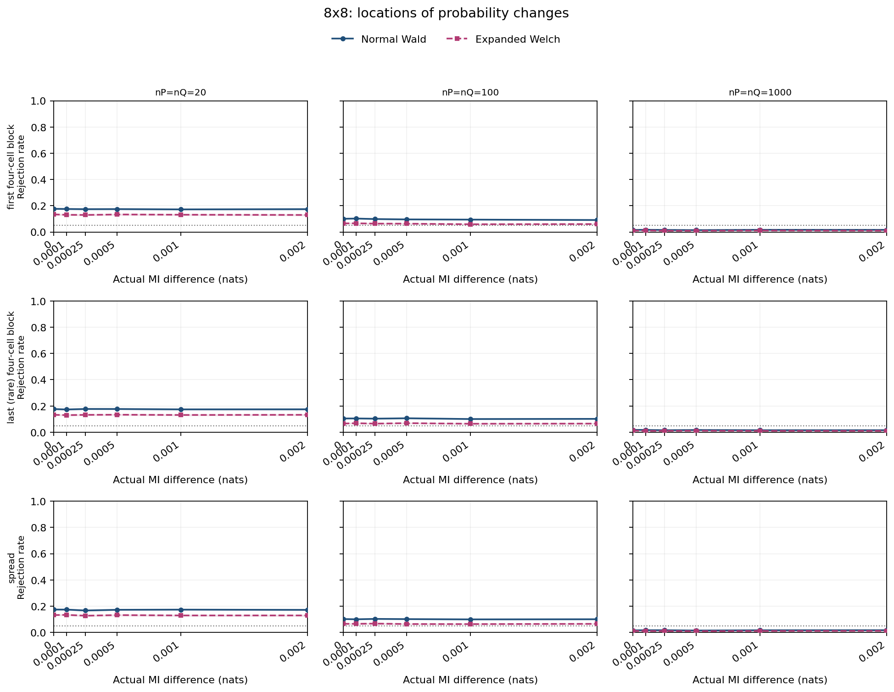

| Specification | Setting |
| --- | --- |
| Table size | 8x8 |
| Horizontal graph regime specifications (columns) | nP=nQ=20, nP=nQ=100, nP=nQ=1000 |
| Vertical graph regime specifications (rows) | first four-cell block: P row (0.7, 0.3/7 repeated 7 times), P column (0.7, 0.3/7 repeated 7 times); Q row (0.8, 0.2/7 repeated 7 times), Q column (0.8, 0.2/7 repeated 7 times); last (rare) four-cell block: P row (0.7, 0.3/7 repeated 7 times), P column (0.7, 0.3/7 repeated 7 times); Q row (0.8, 0.2/7 repeated 7 times), Q column (0.8, 0.2/7 repeated 7 times); spread: P row (0.7, 0.3/7 repeated 7 times), P column (0.7, 0.3/7 repeated 7 times); Q row (0.8, 0.2/7 repeated 7 times), Q column (0.8, 0.2/7 repeated 7 times) |
| Probability changes | first four-cell block: add at (1,1),(2,2) and subtract at (1,2),(2,1), for both P and Q; last (rare) four-cell block: the same four signs in the last two rows and last two columns, for both P and Q; spread: spread changes H_ij=s_i s_j using equally spaced scores s from -1 to 1, for both P and Q |
| MI settings | Baseline MI {0.0001}; direction {q higher}; actual differences {0, 0.0001, 0.00025, 0.0005, 0.001, 0.002} nats |
| Horizontal axis within each graph | Actual MI difference in nats, fixed from 0 to 0.002 |
| Vertical axis within each graph | Unconditional rejection rate from 0 to 1; invalid results count as non-rejections |
| Replicates | 20,000 per unique point |

Null-point rejection and validity:

| Vertical regime | Horizontal regime | x | Method | Rejection | Valid |
| --- | --- | --- | --- | --- | --- |
| first four-cell block | nP=nQ=20 | 0 | Expanded Welch | 0.1343 | 0.9779 |
| first four-cell block | nP=nQ=20 | 0 | Normal Wald | 0.1769 | 1.0000 |
| first four-cell block | nP=nQ=100 | 0 | Expanded Welch | 0.0659 | 1.0000 |
| first four-cell block | nP=nQ=100 | 0 | Normal Wald | 0.1011 | 1.0000 |
| first four-cell block | nP=nQ=1000 | 0 | Expanded Welch | 0.0105 | 1.0000 |
| first four-cell block | nP=nQ=1000 | 0 | Normal Wald | 0.0158 | 1.0000 |
| last (rare) four-cell block | nP=nQ=20 | 0 | Expanded Welch | 0.1328 | 0.9769 |
| last (rare) four-cell block | nP=nQ=20 | 0 | Normal Wald | 0.1767 | 1.0000 |
| last (rare) four-cell block | nP=nQ=100 | 0 | Expanded Welch | 0.0662 | 1.0000 |
| last (rare) four-cell block | nP=nQ=100 | 0 | Normal Wald | 0.1049 | 1.0000 |
| last (rare) four-cell block | nP=nQ=1000 | 0 | Expanded Welch | 0.0128 | 1.0000 |
| last (rare) four-cell block | nP=nQ=1000 | 0 | Normal Wald | 0.0184 | 1.0000 |
| spread | nP=nQ=20 | 0 | Expanded Welch | 0.1324 | 0.9762 |
| spread | nP=nQ=20 | 0 | Normal Wald | 0.1743 | 0.9999 |
| spread | nP=nQ=100 | 0 | Expanded Welch | 0.0657 | 1.0000 |
| spread | nP=nQ=100 | 0 | Normal Wald | 0.1021 | 1.0000 |
| spread | nP=nQ=1000 | 0 | Expanded Welch | 0.0114 | 1.0000 |
| spread | nP=nQ=1000 | 0 | Normal Wald | 0.0162 | 1.0000 |

Every plotted rate, interval, validity and minimum expected count

| Vertical regime | Horizontal regime | x | Method | Rejection | 95% interval | Valid | Conditional | Min expected P | Min expected Q |
| --- | --- | --- | --- | --- | --- | --- | --- | --- | --- |
| first four-cell block | nP=nQ=20 | 0 | Expanded Welch | 0.1343 | [0.1296, 0.1390] | 0.9779 | 0.1373 | 0.03673 | 0.01633 |
| first four-cell block | nP=nQ=20 | 0 | Normal Wald | 0.1769 | [0.1716, 0.1822] | 1.0000 | 0.1769 | 0.03673 | 0.01633 |
| first four-cell block | nP=nQ=20 | 0.0001 | Expanded Welch | 0.1313 | [0.1266, 0.1360] | 0.9754 | 0.1346 | 0.03673 | 0.01633 |
| first four-cell block | nP=nQ=20 | 0.0001 | Normal Wald | 0.1757 | [0.1704, 0.1810] | 1.0000 | 0.1757 | 0.03673 | 0.01633 |
| first four-cell block | nP=nQ=20 | 0.00025 | Expanded Welch | 0.1301 | [0.1255, 0.1348] | 0.9760 | 0.1333 | 0.03673 | 0.01633 |
| first four-cell block | nP=nQ=20 | 0.00025 | Normal Wald | 0.1741 | [0.1689, 0.1794] | 1.0000 | 0.1741 | 0.03673 | 0.01633 |
| first four-cell block | nP=nQ=20 | 0.0005 | Expanded Welch | 0.1337 | [0.1291, 0.1385] | 0.9777 | 0.1367 | 0.03673 | 0.01633 |
| first four-cell block | nP=nQ=20 | 0.0005 | Normal Wald | 0.1747 | [0.1695, 0.1801] | 1.0000 | 0.1747 | 0.03673 | 0.01633 |
| first four-cell block | nP=nQ=20 | 0.001 | Expanded Welch | 0.1319 | [0.1273, 0.1367] | 0.9766 | 0.1351 | 0.03673 | 0.01633 |
| first four-cell block | nP=nQ=20 | 0.001 | Normal Wald | 0.1725 | [0.1673, 0.1778] | 0.9999 | 0.1725 | 0.03673 | 0.01633 |
| first four-cell block | nP=nQ=20 | 0.002 | Expanded Welch | 0.1300 | [0.1254, 0.1347] | 0.9744 | 0.1334 | 0.03673 | 0.01633 |
| first four-cell block | nP=nQ=20 | 0.002 | Normal Wald | 0.1743 | [0.1691, 0.1796] | 0.9999 | 0.1743 | 0.03673 | 0.01633 |
| first four-cell block | nP=nQ=100 | 0 | Expanded Welch | 0.0659 | [0.0626, 0.0695] | 1.0000 | 0.0659 | 0.1837 | 0.08163 |
| first four-cell block | nP=nQ=100 | 0 | Normal Wald | 0.1011 | [0.0970, 0.1054] | 1.0000 | 0.1011 | 0.1837 | 0.08163 |
| first four-cell block | nP=nQ=100 | 0.0001 | Expanded Welch | 0.0666 | [0.0632, 0.0701] | 1.0000 | 0.0666 | 0.1837 | 0.08163 |
| first four-cell block | nP=nQ=100 | 0.0001 | Normal Wald | 0.1027 | [0.0985, 0.1069] | 1.0000 | 0.1027 | 0.1837 | 0.08163 |
| first four-cell block | nP=nQ=100 | 0.00025 | Expanded Welch | 0.0641 | [0.0608, 0.0676] | 1.0000 | 0.0641 | 0.1837 | 0.08163 |
| first four-cell block | nP=nQ=100 | 0.00025 | Normal Wald | 0.0989 | [0.0949, 0.1032] | 1.0000 | 0.0989 | 0.1837 | 0.08163 |
| first four-cell block | nP=nQ=100 | 0.0005 | Expanded Welch | 0.0636 | [0.0603, 0.0671] | 1.0000 | 0.0636 | 0.1837 | 0.08163 |
| first four-cell block | nP=nQ=100 | 0.0005 | Normal Wald | 0.0962 | [0.0922, 0.1004] | 1.0000 | 0.0962 | 0.1837 | 0.08163 |
| first four-cell block | nP=nQ=100 | 0.001 | Expanded Welch | 0.0593 | [0.0562, 0.0627] | 1.0000 | 0.0593 | 0.1837 | 0.08163 |
| first four-cell block | nP=nQ=100 | 0.001 | Normal Wald | 0.0948 | [0.0908, 0.0989] | 1.0000 | 0.0948 | 0.1837 | 0.08163 |
| first four-cell block | nP=nQ=100 | 0.002 | Expanded Welch | 0.0607 | [0.0575, 0.0641] | 1.0000 | 0.0607 | 0.1837 | 0.08163 |
| first four-cell block | nP=nQ=100 | 0.002 | Normal Wald | 0.0916 | [0.0876, 0.0956] | 1.0000 | 0.0916 | 0.1837 | 0.08163 |
| first four-cell block | nP=nQ=1000 | 0 | Expanded Welch | 0.0105 | [0.0092, 0.0120] | 1.0000 | 0.0105 | 1.837 | 0.8163 |
| first four-cell block | nP=nQ=1000 | 0 | Normal Wald | 0.0158 | [0.0142, 0.0177] | 1.0000 | 0.0158 | 1.837 | 0.8163 |
| first four-cell block | nP=nQ=1000 | 0.0001 | Expanded Welch | 0.0121 | [0.0107, 0.0137] | 1.0000 | 0.0121 | 1.837 | 0.8163 |
| first four-cell block | nP=nQ=1000 | 0.0001 | Normal Wald | 0.0173 | [0.0156, 0.0192] | 1.0000 | 0.0173 | 1.837 | 0.8163 |
| first four-cell block | nP=nQ=1000 | 0.00025 | Expanded Welch | 0.0097 | [0.0085, 0.0112] | 1.0000 | 0.0097 | 1.837 | 0.8163 |
| first four-cell block | nP=nQ=1000 | 0.00025 | Normal Wald | 0.0160 | [0.0144, 0.0178] | 1.0000 | 0.0160 | 1.837 | 0.8163 |
| first four-cell block | nP=nQ=1000 | 0.0005 | Expanded Welch | 0.0098 | [0.0085, 0.0113] | 1.0000 | 0.0098 | 1.837 | 0.8163 |
| first four-cell block | nP=nQ=1000 | 0.0005 | Normal Wald | 0.0146 | [0.0130, 0.0164] | 1.0000 | 0.0146 | 1.837 | 0.8163 |
| first four-cell block | nP=nQ=1000 | 0.001 | Expanded Welch | 0.0115 | [0.0101, 0.0130] | 1.0000 | 0.0115 | 1.837 | 0.8163 |
| first four-cell block | nP=nQ=1000 | 0.001 | Normal Wald | 0.0170 | [0.0153, 0.0189] | 1.0000 | 0.0170 | 1.837 | 0.8163 |
| first four-cell block | nP=nQ=1000 | 0.002 | Expanded Welch | 0.0105 | [0.0092, 0.0120] | 1.0000 | 0.0105 | 1.837 | 0.8163 |
| first four-cell block | nP=nQ=1000 | 0.002 | Normal Wald | 0.0166 | [0.0149, 0.0185] | 1.0000 | 0.0166 | 1.837 | 0.8163 |
| last (rare) four-cell block | nP=nQ=20 | 0 | Expanded Welch | 0.1328 | [0.1282, 0.1376] | 0.9769 | 0.1359 | 0.03069 | 0.01231 |
| last (rare) four-cell block | nP=nQ=20 | 0 | Normal Wald | 0.1767 | [0.1715, 0.1821] | 1.0000 | 0.1768 | 0.03069 | 0.01231 |
| last (rare) four-cell block | nP=nQ=20 | 0.0001 | Expanded Welch | 0.1304 | [0.1258, 0.1351] | 0.9775 | 0.1334 | 0.03069 | 0.01067 |
| last (rare) four-cell block | nP=nQ=20 | 0.0001 | Normal Wald | 0.1734 | [0.1682, 0.1787] | 1.0000 | 0.1734 | 0.03069 | 0.01067 |
| last (rare) four-cell block | nP=nQ=20 | 0.00025 | Expanded Welch | 0.1323 | [0.1277, 0.1371] | 0.9751 | 0.1357 | 0.03069 | 0.008906 |
| last (rare) four-cell block | nP=nQ=20 | 0.00025 | Normal Wald | 0.1773 | [0.1721, 0.1827] | 1.0000 | 0.1773 | 0.03069 | 0.008906 |
| last (rare) four-cell block | nP=nQ=20 | 0.0005 | Expanded Welch | 0.1335 | [0.1289, 0.1383] | 0.9754 | 0.1369 | 0.03069 | 0.006746 |
| last (rare) four-cell block | nP=nQ=20 | 0.0005 | Normal Wald | 0.1771 | [0.1718, 0.1824] | 0.9998 | 0.1771 | 0.03069 | 0.006746 |
| last (rare) four-cell block | nP=nQ=20 | 0.001 | Expanded Welch | 0.1315 | [0.1268, 0.1362] | 0.9756 | 0.1347 | 0.03069 | 0.003746 |
| last (rare) four-cell block | nP=nQ=20 | 0.001 | Normal Wald | 0.1741 | [0.1690, 0.1795] | 1.0000 | 0.1742 | 0.03069 | 0.003746 |
| last (rare) four-cell block | nP=nQ=20 | 0.002 | Expanded Welch | 0.1328 | [0.1281, 0.1375] | 0.9761 | 0.1360 | 0.03069 | 0.0002847 |
| last (rare) four-cell block | nP=nQ=20 | 0.002 | Normal Wald | 0.1746 | [0.1695, 0.1800] | 1.0000 | 0.1746 | 0.03069 | 0.0002847 |
| last (rare) four-cell block | nP=nQ=100 | 0 | Expanded Welch | 0.0662 | [0.0628, 0.0697] | 1.0000 | 0.0662 | 0.1534 | 0.06153 |
| last (rare) four-cell block | nP=nQ=100 | 0 | Normal Wald | 0.1049 | [0.1007, 0.1092] | 1.0000 | 0.1049 | 0.1534 | 0.06153 |
| last (rare) four-cell block | nP=nQ=100 | 0.0001 | Expanded Welch | 0.0688 | [0.0654, 0.0724] | 1.0000 | 0.0688 | 0.1534 | 0.05336 |
| last (rare) four-cell block | nP=nQ=100 | 0.0001 | Normal Wald | 0.1052 | [0.1010, 0.1095] | 1.0000 | 0.1052 | 0.1534 | 0.05336 |
| last (rare) four-cell block | nP=nQ=100 | 0.00025 | Expanded Welch | 0.0656 | [0.0623, 0.0691] | 1.0000 | 0.0656 | 0.1534 | 0.04453 |
| last (rare) four-cell block | nP=nQ=100 | 0.00025 | Normal Wald | 0.1035 | [0.0993, 0.1077] | 1.0000 | 0.1035 | 0.1534 | 0.04453 |
| last (rare) four-cell block | nP=nQ=100 | 0.0005 | Expanded Welch | 0.0693 | [0.0658, 0.0729] | 1.0000 | 0.0693 | 0.1534 | 0.03373 |
| last (rare) four-cell block | nP=nQ=100 | 0.0005 | Normal Wald | 0.1065 | [0.1023, 0.1109] | 1.0000 | 0.1065 | 0.1534 | 0.03373 |
| last (rare) four-cell block | nP=nQ=100 | 0.001 | Expanded Welch | 0.0646 | [0.0613, 0.0681] | 1.0000 | 0.0646 | 0.1534 | 0.01873 |
| last (rare) four-cell block | nP=nQ=100 | 0.001 | Normal Wald | 0.1006 | [0.0965, 0.1048] | 1.0000 | 0.1006 | 0.1534 | 0.01873 |
| last (rare) four-cell block | nP=nQ=100 | 0.002 | Expanded Welch | 0.0657 | [0.0623, 0.0692] | 1.0000 | 0.0657 | 0.1534 | 0.001423 |
| last (rare) four-cell block | nP=nQ=100 | 0.002 | Normal Wald | 0.1019 | [0.0978, 0.1062] | 1.0000 | 0.1019 | 0.1534 | 0.001423 |
| last (rare) four-cell block | nP=nQ=1000 | 0 | Expanded Welch | 0.0128 | [0.0113, 0.0145] | 1.0000 | 0.0128 | 1.534 | 0.6153 |
| last (rare) four-cell block | nP=nQ=1000 | 0 | Normal Wald | 0.0184 | [0.0166, 0.0203] | 1.0000 | 0.0184 | 1.534 | 0.6153 |
| last (rare) four-cell block | nP=nQ=1000 | 0.0001 | Expanded Welch | 0.0103 | [0.0090, 0.0118] | 1.0000 | 0.0103 | 1.534 | 0.5336 |
| last (rare) four-cell block | nP=nQ=1000 | 0.0001 | Normal Wald | 0.0174 | [0.0156, 0.0193] | 1.0000 | 0.0174 | 1.534 | 0.5336 |
| last (rare) four-cell block | nP=nQ=1000 | 0.00025 | Expanded Welch | 0.0105 | [0.0092, 0.0120] | 1.0000 | 0.0105 | 1.534 | 0.4453 |
| last (rare) four-cell block | nP=nQ=1000 | 0.00025 | Normal Wald | 0.0155 | [0.0139, 0.0174] | 1.0000 | 0.0155 | 1.534 | 0.4453 |
| last (rare) four-cell block | nP=nQ=1000 | 0.0005 | Expanded Welch | 0.0115 | [0.0101, 0.0130] | 1.0000 | 0.0115 | 1.534 | 0.3373 |
| last (rare) four-cell block | nP=nQ=1000 | 0.0005 | Normal Wald | 0.0171 | [0.0154, 0.0190] | 1.0000 | 0.0171 | 1.534 | 0.3373 |
| last (rare) four-cell block | nP=nQ=1000 | 0.001 | Expanded Welch | 0.0104 | [0.0091, 0.0120] | 1.0000 | 0.0104 | 1.534 | 0.1873 |
| last (rare) four-cell block | nP=nQ=1000 | 0.001 | Normal Wald | 0.0156 | [0.0140, 0.0174] | 1.0000 | 0.0156 | 1.534 | 0.1873 |
| last (rare) four-cell block | nP=nQ=1000 | 0.002 | Expanded Welch | 0.0105 | [0.0092, 0.0120] | 1.0000 | 0.0105 | 1.534 | 0.01423 |
| last (rare) four-cell block | nP=nQ=1000 | 0.002 | Normal Wald | 0.0157 | [0.0140, 0.0175] | 1.0000 | 0.0157 | 1.534 | 0.01423 |
| spread | nP=nQ=20 | 0 | Expanded Welch | 0.1324 | [0.1278, 0.1372] | 0.9762 | 0.1356 | 0.03325 | 0.01397 |
| spread | nP=nQ=20 | 0 | Normal Wald | 0.1743 | [0.1691, 0.1796] | 0.9999 | 0.1743 | 0.03325 | 0.01397 |
| spread | nP=nQ=20 | 0.0001 | Expanded Welch | 0.1338 | [0.1292, 0.1386] | 0.9765 | 0.1371 | 0.03325 | 0.013 |
| spread | nP=nQ=20 | 0.0001 | Normal Wald | 0.1741 | [0.1689, 0.1794] | 1.0000 | 0.1741 | 0.03325 | 0.013 |
| spread | nP=nQ=20 | 0.00025 | Expanded Welch | 0.1273 | [0.1228, 0.1320] | 0.9755 | 0.1306 | 0.03325 | 0.01192 |
| spread | nP=nQ=20 | 0.00025 | Normal Wald | 0.1673 | [0.1621, 0.1725] | 1.0000 | 0.1673 | 0.03325 | 0.01192 |
| spread | nP=nQ=20 | 0.0005 | Expanded Welch | 0.1321 | [0.1275, 0.1369] | 0.9765 | 0.1353 | 0.03325 | 0.01056 |
| spread | nP=nQ=20 | 0.0005 | Normal Wald | 0.1724 | [0.1673, 0.1777] | 1.0000 | 0.1724 | 0.03325 | 0.01056 |
| spread | nP=nQ=20 | 0.001 | Expanded Welch | 0.1293 | [0.1247, 0.1340] | 0.9742 | 0.1327 | 0.03325 | 0.008528 |
| spread | nP=nQ=20 | 0.001 | Normal Wald | 0.1736 | [0.1685, 0.1790] | 0.9998 | 0.1737 | 0.03325 | 0.008528 |
| spread | nP=nQ=20 | 0.002 | Expanded Welch | 0.1293 | [0.1248, 0.1341] | 0.9761 | 0.1325 | 0.03325 | 0.005627 |
| spread | nP=nQ=20 | 0.002 | Normal Wald | 0.1719 | [0.1667, 0.1771] | 1.0000 | 0.1719 | 0.03325 | 0.005627 |
| spread | nP=nQ=100 | 0 | Expanded Welch | 0.0657 | [0.0623, 0.0692] | 1.0000 | 0.0657 | 0.1662 | 0.06987 |
| spread | nP=nQ=100 | 0 | Normal Wald | 0.1021 | [0.0980, 0.1064] | 1.0000 | 0.1021 | 0.1662 | 0.06987 |
| spread | nP=nQ=100 | 0.0001 | Expanded Welch | 0.0655 | [0.0622, 0.0690] | 1.0000 | 0.0655 | 0.1662 | 0.06498 |
| spread | nP=nQ=100 | 0.0001 | Normal Wald | 0.1003 | [0.0962, 0.1045] | 1.0000 | 0.1003 | 0.1662 | 0.06498 |
| spread | nP=nQ=100 | 0.00025 | Expanded Welch | 0.0673 | [0.0640, 0.0709] | 1.0000 | 0.0673 | 0.1662 | 0.0596 |
| spread | nP=nQ=100 | 0.00025 | Normal Wald | 0.1031 | [0.0990, 0.1074] | 1.0000 | 0.1031 | 0.1662 | 0.0596 |
| spread | nP=nQ=100 | 0.0005 | Expanded Welch | 0.0640 | [0.0607, 0.0675] | 1.0000 | 0.0640 | 0.1662 | 0.05278 |
| spread | nP=nQ=100 | 0.0005 | Normal Wald | 0.1016 | [0.0975, 0.1059] | 1.0000 | 0.1016 | 0.1662 | 0.05278 |
| spread | nP=nQ=100 | 0.001 | Expanded Welch | 0.0636 | [0.0603, 0.0671] | 1.0000 | 0.0636 | 0.1662 | 0.04264 |
| spread | nP=nQ=100 | 0.001 | Normal Wald | 0.0995 | [0.0955, 0.1038] | 1.0000 | 0.0995 | 0.1662 | 0.04264 |
| spread | nP=nQ=100 | 0.002 | Expanded Welch | 0.0654 | [0.0620, 0.0689] | 1.0000 | 0.0654 | 0.1662 | 0.02813 |
| spread | nP=nQ=100 | 0.002 | Normal Wald | 0.1006 | [0.0965, 0.1048] | 1.0000 | 0.1006 | 0.1662 | 0.02813 |
| spread | nP=nQ=1000 | 0 | Expanded Welch | 0.0114 | [0.0100, 0.0130] | 1.0000 | 0.0114 | 1.662 | 0.6987 |
| spread | nP=nQ=1000 | 0 | Normal Wald | 0.0162 | [0.0145, 0.0180] | 1.0000 | 0.0162 | 1.662 | 0.6987 |
| spread | nP=nQ=1000 | 0.0001 | Expanded Welch | 0.0112 | [0.0099, 0.0128] | 1.0000 | 0.0112 | 1.662 | 0.6498 |
| spread | nP=nQ=1000 | 0.0001 | Normal Wald | 0.0170 | [0.0153, 0.0189] | 1.0000 | 0.0170 | 1.662 | 0.6498 |
| spread | nP=nQ=1000 | 0.00025 | Expanded Welch | 0.0107 | [0.0094, 0.0123] | 1.0000 | 0.0107 | 1.662 | 0.596 |
| spread | nP=nQ=1000 | 0.00025 | Normal Wald | 0.0170 | [0.0153, 0.0189] | 1.0000 | 0.0170 | 1.662 | 0.596 |
| spread | nP=nQ=1000 | 0.0005 | Expanded Welch | 0.0097 | [0.0085, 0.0112] | 1.0000 | 0.0097 | 1.662 | 0.5278 |
| spread | nP=nQ=1000 | 0.0005 | Normal Wald | 0.0148 | [0.0132, 0.0166] | 1.0000 | 0.0148 | 1.662 | 0.5278 |
| spread | nP=nQ=1000 | 0.001 | Expanded Welch | 0.0113 | [0.0099, 0.0129] | 1.0000 | 0.0113 | 1.662 | 0.4264 |
| spread | nP=nQ=1000 | 0.001 | Normal Wald | 0.0168 | [0.0151, 0.0187] | 1.0000 | 0.0168 | 1.662 | 0.4264 |
| spread | nP=nQ=1000 | 0.002 | Expanded Welch | 0.0121 | [0.0107, 0.0138] | 1.0000 | 0.0121 | 1.662 | 0.2813 |
| spread | nP=nQ=1000 | 0.002 | Normal Wald | 0.0171 | [0.0154, 0.0190] | 1.0000 | 0.0171 | 1.662 | 0.2813 |

## 6. Unequal sample sizes and MI direction

Does performance depend on which population has more data or greater MI?

### 6.1 2x2: uniform margins, sample allocations group 1

Does performance depend on which population has more data or greater MI?

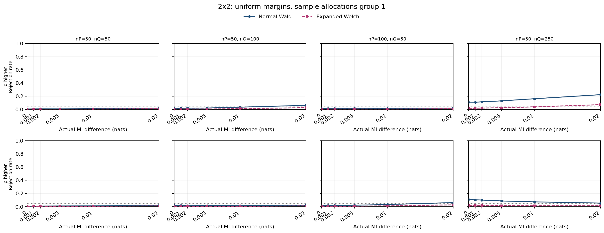

| Specification | Setting |
| --- | --- |
| Table size | 2x2 |
| Horizontal graph regime specifications (columns) | nP=50, nQ=50, nP=50, nQ=100, nP=100, nQ=50, nP=50, nQ=250 |
| Vertical graph regime specifications (rows) | q higher: P row (0.5 repeated 2 times), P column (0.5 repeated 2 times); Q row (0.5 repeated 2 times), Q column (0.5 repeated 2 times); p higher: P row (0.5 repeated 2 times), P column (0.5 repeated 2 times); Q row (0.5 repeated 2 times), Q column (0.5 repeated 2 times) |
| Probability changes | q higher: add at (1,1),(2,2) and subtract at (1,2),(2,1), for both P and Q; p higher: add at (1,1),(2,2) and subtract at (1,2),(2,1), for both P and Q |
| MI settings | Baseline MI {0.02}; direction {q higher, p higher}; actual differences {0, 0.001, 0.002, 0.005, 0.01, 0.02} nats |
| Horizontal axis within each graph | Actual MI difference in nats, fixed from 0 to 0.02 |
| Vertical axis within each graph | Unconditional rejection rate from 0 to 1; invalid results count as non-rejections |
| Replicates | 20,000 per unique point |

Null-point rejection and validity:

| Vertical regime | Horizontal regime | x | Method | Rejection | Valid |
| --- | --- | --- | --- | --- | --- |
| q higher | nP=50, nQ=50 | 0 | Expanded Welch | 0.0045 | 0.9938 |
| q higher | nP=50, nQ=50 | 0 | Normal Wald | 0.0082 | 0.9999 |
| q higher | nP=50, nQ=100 | 0 | Expanded Welch | 0.0069 | 0.9963 |
| q higher | nP=50, nQ=100 | 0 | Normal Wald | 0.0182 | 1.0000 |
| q higher | nP=100, nQ=50 | 0 | Expanded Welch | 0.0053 | 0.9969 |
| q higher | nP=100, nQ=50 | 0 | Normal Wald | 0.0167 | 1.0000 |
| q higher | nP=50, nQ=250 | 0 | Expanded Welch | 0.0186 | 0.9968 |
| q higher | nP=50, nQ=250 | 0 | Normal Wald | 0.1116 | 1.0000 |
| p higher | nP=50, nQ=50 | 0 | Expanded Welch | 0.0045 | 0.9938 |
| p higher | nP=50, nQ=50 | 0 | Normal Wald | 0.0082 | 0.9999 |
| p higher | nP=50, nQ=100 | 0 | Expanded Welch | 0.0069 | 0.9963 |
| p higher | nP=50, nQ=100 | 0 | Normal Wald | 0.0182 | 1.0000 |
| p higher | nP=100, nQ=50 | 0 | Expanded Welch | 0.0053 | 0.9969 |
| p higher | nP=100, nQ=50 | 0 | Normal Wald | 0.0167 | 1.0000 |
| p higher | nP=50, nQ=250 | 0 | Expanded Welch | 0.0186 | 0.9968 |
| p higher | nP=50, nQ=250 | 0 | Normal Wald | 0.1116 | 1.0000 |

Every plotted rate, interval, validity and minimum expected count

| Vertical regime | Horizontal regime | x | Method | Rejection | 95% interval | Valid | Conditional | Min expected P | Min expected Q |
| --- | --- | --- | --- | --- | --- | --- | --- | --- | --- |
| q higher | nP=50, nQ=50 | 0 | Expanded Welch | 0.0045 | [0.0037, 0.0055] | 0.9938 | 0.0045 | 10.01 | 10.01 |
| q higher | nP=50, nQ=50 | 0 | Normal Wald | 0.0082 | [0.0070, 0.0095] | 0.9999 | 0.0082 | 10.01 | 10.01 |
| q higher | nP=50, nQ=50 | 0.001 | Expanded Welch | 0.0050 | [0.0042, 0.0061] | 0.9942 | 0.0051 | 10.01 | 9.947 |
| q higher | nP=50, nQ=50 | 0.001 | Normal Wald | 0.0100 | [0.0087, 0.0115] | 1.0000 | 0.0100 | 10.01 | 9.947 |
| q higher | nP=50, nQ=50 | 0.002 | Expanded Welch | 0.0057 | [0.0047, 0.0068] | 0.9951 | 0.0057 | 10.01 | 9.888 |
| q higher | nP=50, nQ=50 | 0.002 | Normal Wald | 0.0109 | [0.0096, 0.0124] | 0.9999 | 0.0109 | 10.01 | 9.888 |
| q higher | nP=50, nQ=50 | 0.005 | Expanded Welch | 0.0058 | [0.0048, 0.0070] | 0.9948 | 0.0058 | 10.01 | 9.717 |
| q higher | nP=50, nQ=50 | 0.005 | Normal Wald | 0.0104 | [0.0091, 0.0119] | 0.9999 | 0.0104 | 10.01 | 9.717 |
| q higher | nP=50, nQ=50 | 0.01 | Expanded Welch | 0.0080 | [0.0068, 0.0093] | 0.9952 | 0.0080 | 10.01 | 9.454 |
| q higher | nP=50, nQ=50 | 0.01 | Normal Wald | 0.0134 | [0.0119, 0.0151] | 1.0000 | 0.0134 | 10.01 | 9.454 |
| q higher | nP=50, nQ=50 | 0.02 | Expanded Welch | 0.0126 | [0.0111, 0.0142] | 0.9959 | 0.0126 | 10.01 | 8.988 |
| q higher | nP=50, nQ=50 | 0.02 | Normal Wald | 0.0214 | [0.0194, 0.0234] | 1.0000 | 0.0214 | 10.01 | 8.988 |
| q higher | nP=50, nQ=100 | 0 | Expanded Welch | 0.0069 | [0.0058, 0.0081] | 0.9963 | 0.0069 | 10.01 | 20.02 |
| q higher | nP=50, nQ=100 | 0 | Normal Wald | 0.0182 | [0.0165, 0.0202] | 1.0000 | 0.0182 | 10.01 | 20.02 |
| q higher | nP=50, nQ=100 | 0.001 | Expanded Welch | 0.0073 | [0.0062, 0.0085] | 0.9960 | 0.0073 | 10.01 | 19.89 |
| q higher | nP=50, nQ=100 | 0.001 | Normal Wald | 0.0182 | [0.0164, 0.0201] | 1.0000 | 0.0182 | 10.01 | 19.89 |
| q higher | nP=50, nQ=100 | 0.002 | Expanded Welch | 0.0075 | [0.0064, 0.0088] | 0.9974 | 0.0075 | 10.01 | 19.78 |
| q higher | nP=50, nQ=100 | 0.002 | Normal Wald | 0.0209 | [0.0190, 0.0230] | 1.0000 | 0.0209 | 10.01 | 19.78 |
| q higher | nP=50, nQ=100 | 0.005 | Expanded Welch | 0.0085 | [0.0073, 0.0099] | 0.9966 | 0.0085 | 10.01 | 19.43 |
| q higher | nP=50, nQ=100 | 0.005 | Normal Wald | 0.0232 | [0.0213, 0.0254] | 1.0000 | 0.0233 | 10.01 | 19.43 |
| q higher | nP=50, nQ=100 | 0.01 | Expanded Welch | 0.0138 | [0.0123, 0.0156] | 0.9971 | 0.0139 | 10.01 | 18.91 |
| q higher | nP=50, nQ=100 | 0.01 | Normal Wald | 0.0359 | [0.0334, 0.0386] | 1.0000 | 0.0359 | 10.01 | 18.91 |
| q higher | nP=50, nQ=100 | 0.02 | Expanded Welch | 0.0283 | [0.0260, 0.0306] | 0.9970 | 0.0283 | 10.01 | 17.98 |
| q higher | nP=50, nQ=100 | 0.02 | Normal Wald | 0.0637 | [0.0604, 0.0672] | 1.0000 | 0.0637 | 10.01 | 17.98 |
| q higher | nP=100, nQ=50 | 0 | Expanded Welch | 0.0053 | [0.0043, 0.0064] | 0.9969 | 0.0053 | 20.02 | 10.01 |
| q higher | nP=100, nQ=50 | 0 | Normal Wald | 0.0167 | [0.0150, 0.0185] | 1.0000 | 0.0167 | 20.02 | 10.01 |
| q higher | nP=100, nQ=50 | 0.001 | Expanded Welch | 0.0062 | [0.0052, 0.0073] | 0.9969 | 0.0062 | 20.02 | 9.947 |
| q higher | nP=100, nQ=50 | 0.001 | Normal Wald | 0.0164 | [0.0147, 0.0183] | 1.0000 | 0.0164 | 20.02 | 9.947 |
| q higher | nP=100, nQ=50 | 0.002 | Expanded Welch | 0.0068 | [0.0058, 0.0080] | 0.9967 | 0.0068 | 20.02 | 9.888 |
| q higher | nP=100, nQ=50 | 0.002 | Normal Wald | 0.0165 | [0.0149, 0.0184] | 1.0000 | 0.0165 | 20.02 | 9.888 |
| q higher | nP=100, nQ=50 | 0.005 | Expanded Welch | 0.0077 | [0.0066, 0.0091] | 0.9970 | 0.0078 | 20.02 | 9.717 |
| q higher | nP=100, nQ=50 | 0.005 | Normal Wald | 0.0181 | [0.0163, 0.0200] | 1.0000 | 0.0181 | 20.02 | 9.717 |
| q higher | nP=100, nQ=50 | 0.01 | Expanded Welch | 0.0066 | [0.0056, 0.0079] | 0.9979 | 0.0067 | 20.02 | 9.454 |
| q higher | nP=100, nQ=50 | 0.01 | Normal Wald | 0.0165 | [0.0148, 0.0184] | 1.0000 | 0.0165 | 20.02 | 9.454 |
| q higher | nP=100, nQ=50 | 0.02 | Expanded Welch | 0.0131 | [0.0116, 0.0148] | 0.9984 | 0.0131 | 20.02 | 8.988 |
| q higher | nP=100, nQ=50 | 0.02 | Normal Wald | 0.0218 | [0.0199, 0.0239] | 1.0000 | 0.0218 | 20.02 | 8.988 |
| q higher | nP=50, nQ=250 | 0 | Expanded Welch | 0.0186 | [0.0169, 0.0206] | 0.9968 | 0.0187 | 10.01 | 50.04 |
| q higher | nP=50, nQ=250 | 0 | Normal Wald | 0.1116 | [0.1073, 0.1160] | 1.0000 | 0.1116 | 10.01 | 50.04 |
| q higher | nP=50, nQ=250 | 0.001 | Expanded Welch | 0.0198 | [0.0179, 0.0218] | 0.9972 | 0.0198 | 10.01 | 49.74 |
| q higher | nP=50, nQ=250 | 0.001 | Normal Wald | 0.1108 | [0.1065, 0.1152] | 1.0000 | 0.1108 | 10.01 | 49.74 |
| q higher | nP=50, nQ=250 | 0.002 | Expanded Welch | 0.0227 | [0.0208, 0.0249] | 0.9970 | 0.0228 | 10.01 | 49.44 |
| q higher | nP=50, nQ=250 | 0.002 | Normal Wald | 0.1171 | [0.1127, 0.1216] | 1.0000 | 0.1171 | 10.01 | 49.44 |
| q higher | nP=50, nQ=250 | 0.005 | Expanded Welch | 0.0271 | [0.0249, 0.0294] | 0.9968 | 0.0272 | 10.01 | 48.58 |
| q higher | nP=50, nQ=250 | 0.005 | Normal Wald | 0.1312 | [0.1266, 0.1359] | 1.0000 | 0.1312 | 10.01 | 48.58 |
| q higher | nP=50, nQ=250 | 0.01 | Expanded Welch | 0.0406 | [0.0379, 0.0434] | 0.9971 | 0.0407 | 10.01 | 47.27 |
| q higher | nP=50, nQ=250 | 0.01 | Normal Wald | 0.1636 | [0.1586, 0.1688] | 1.0000 | 0.1636 | 10.01 | 47.27 |
| q higher | nP=50, nQ=250 | 0.02 | Expanded Welch | 0.0738 | [0.0703, 0.0775] | 0.9973 | 0.0740 | 10.01 | 44.94 |
| q higher | nP=50, nQ=250 | 0.02 | Normal Wald | 0.2249 | [0.2192, 0.2307] | 1.0000 | 0.2249 | 10.01 | 44.94 |
| p higher | nP=50, nQ=50 | 0 | Expanded Welch | 0.0045 | [0.0037, 0.0055] | 0.9938 | 0.0045 | 10.01 | 10.01 |
| p higher | nP=50, nQ=50 | 0 | Normal Wald | 0.0082 | [0.0070, 0.0095] | 0.9999 | 0.0082 | 10.01 | 10.01 |
| p higher | nP=50, nQ=50 | 0.001 | Expanded Welch | 0.0046 | [0.0038, 0.0057] | 0.9943 | 0.0047 | 9.947 | 10.01 |
| p higher | nP=50, nQ=50 | 0.001 | Normal Wald | 0.0095 | [0.0082, 0.0109] | 1.0000 | 0.0095 | 9.947 | 10.01 |
| p higher | nP=50, nQ=50 | 0.002 | Expanded Welch | 0.0052 | [0.0043, 0.0063] | 0.9944 | 0.0052 | 9.888 | 10.01 |
| p higher | nP=50, nQ=50 | 0.002 | Normal Wald | 0.0100 | [0.0088, 0.0115] | 0.9999 | 0.0101 | 9.888 | 10.01 |
| p higher | nP=50, nQ=50 | 0.005 | Expanded Welch | 0.0067 | [0.0057, 0.0079] | 0.9940 | 0.0067 | 9.717 | 10.01 |
| p higher | nP=50, nQ=50 | 0.005 | Normal Wald | 0.0118 | [0.0104, 0.0134] | 0.9999 | 0.0119 | 9.717 | 10.01 |
| p higher | nP=50, nQ=50 | 0.01 | Expanded Welch | 0.0078 | [0.0067, 0.0091] | 0.9956 | 0.0078 | 9.454 | 10.01 |
| p higher | nP=50, nQ=50 | 0.01 | Normal Wald | 0.0134 | [0.0119, 0.0150] | 0.9999 | 0.0134 | 9.454 | 10.01 |
| p higher | nP=50, nQ=50 | 0.02 | Expanded Welch | 0.0123 | [0.0108, 0.0139] | 0.9965 | 0.0123 | 8.988 | 10.01 |
| p higher | nP=50, nQ=50 | 0.02 | Normal Wald | 0.0205 | [0.0186, 0.0226] | 1.0000 | 0.0205 | 8.988 | 10.01 |
| p higher | nP=50, nQ=100 | 0 | Expanded Welch | 0.0069 | [0.0058, 0.0081] | 0.9963 | 0.0069 | 10.01 | 20.02 |
| p higher | nP=50, nQ=100 | 0 | Normal Wald | 0.0182 | [0.0165, 0.0202] | 1.0000 | 0.0182 | 10.01 | 20.02 |
| p higher | nP=50, nQ=100 | 0.001 | Expanded Welch | 0.0069 | [0.0058, 0.0081] | 0.9969 | 0.0069 | 9.947 | 20.02 |
| p higher | nP=50, nQ=100 | 0.001 | Normal Wald | 0.0180 | [0.0162, 0.0199] | 1.0000 | 0.0180 | 9.947 | 20.02 |
| p higher | nP=50, nQ=100 | 0.002 | Expanded Welch | 0.0063 | [0.0052, 0.0074] | 0.9965 | 0.0063 | 9.888 | 20.02 |
| p higher | nP=50, nQ=100 | 0.002 | Normal Wald | 0.0153 | [0.0137, 0.0171] | 1.0000 | 0.0153 | 9.888 | 20.02 |
| p higher | nP=50, nQ=100 | 0.005 | Expanded Welch | 0.0072 | [0.0061, 0.0085] | 0.9968 | 0.0072 | 9.717 | 20.02 |
| p higher | nP=50, nQ=100 | 0.005 | Normal Wald | 0.0174 | [0.0156, 0.0193] | 1.0000 | 0.0174 | 9.717 | 20.02 |
| p higher | nP=50, nQ=100 | 0.01 | Expanded Welch | 0.0069 | [0.0058, 0.0081] | 0.9974 | 0.0069 | 9.454 | 20.02 |
| p higher | nP=50, nQ=100 | 0.01 | Normal Wald | 0.0155 | [0.0139, 0.0174] | 1.0000 | 0.0155 | 9.454 | 20.02 |
| p higher | nP=50, nQ=100 | 0.02 | Expanded Welch | 0.0126 | [0.0111, 0.0142] | 0.9984 | 0.0126 | 8.988 | 20.02 |
| p higher | nP=50, nQ=100 | 0.02 | Normal Wald | 0.0215 | [0.0196, 0.0237] | 1.0000 | 0.0215 | 8.988 | 20.02 |
| p higher | nP=100, nQ=50 | 0 | Expanded Welch | 0.0053 | [0.0043, 0.0064] | 0.9969 | 0.0053 | 20.02 | 10.01 |
| p higher | nP=100, nQ=50 | 0 | Normal Wald | 0.0167 | [0.0150, 0.0185] | 1.0000 | 0.0167 | 20.02 | 10.01 |
| p higher | nP=100, nQ=50 | 0.001 | Expanded Welch | 0.0060 | [0.0050, 0.0072] | 0.9963 | 0.0060 | 19.89 | 10.01 |
| p higher | nP=100, nQ=50 | 0.001 | Normal Wald | 0.0176 | [0.0159, 0.0195] | 1.0000 | 0.0176 | 19.89 | 10.01 |
| p higher | nP=100, nQ=50 | 0.002 | Expanded Welch | 0.0076 | [0.0065, 0.0089] | 0.9960 | 0.0076 | 19.78 | 10.01 |
| p higher | nP=100, nQ=50 | 0.002 | Normal Wald | 0.0195 | [0.0177, 0.0215] | 1.0000 | 0.0195 | 19.78 | 10.01 |
| p higher | nP=100, nQ=50 | 0.005 | Expanded Welch | 0.0086 | [0.0074, 0.0100] | 0.9971 | 0.0086 | 19.43 | 10.01 |
| p higher | nP=100, nQ=50 | 0.005 | Normal Wald | 0.0228 | [0.0208, 0.0250] | 1.0000 | 0.0228 | 19.43 | 10.01 |
| p higher | nP=100, nQ=50 | 0.01 | Expanded Welch | 0.0134 | [0.0119, 0.0151] | 0.9970 | 0.0134 | 18.91 | 10.01 |
| p higher | nP=100, nQ=50 | 0.01 | Normal Wald | 0.0335 | [0.0311, 0.0361] | 1.0000 | 0.0335 | 18.91 | 10.01 |
| p higher | nP=100, nQ=50 | 0.02 | Expanded Welch | 0.0283 | [0.0261, 0.0307] | 0.9973 | 0.0284 | 17.98 | 10.01 |
| p higher | nP=100, nQ=50 | 0.02 | Normal Wald | 0.0628 | [0.0595, 0.0662] | 1.0000 | 0.0628 | 17.98 | 10.01 |
| p higher | nP=50, nQ=250 | 0 | Expanded Welch | 0.0186 | [0.0169, 0.0206] | 0.9968 | 0.0187 | 10.01 | 50.04 |
| p higher | nP=50, nQ=250 | 0 | Normal Wald | 0.1116 | [0.1073, 0.1160] | 1.0000 | 0.1116 | 10.01 | 50.04 |
| p higher | nP=50, nQ=250 | 0.001 | Expanded Welch | 0.0174 | [0.0157, 0.0193] | 0.9980 | 0.0174 | 9.947 | 50.04 |
| p higher | nP=50, nQ=250 | 0.001 | Normal Wald | 0.1047 | [0.1005, 0.1090] | 1.0000 | 0.1047 | 9.947 | 50.04 |
| p higher | nP=50, nQ=250 | 0.002 | Expanded Welch | 0.0181 | [0.0163, 0.0200] | 0.9970 | 0.0181 | 9.888 | 50.04 |
| p higher | nP=50, nQ=250 | 0.002 | Normal Wald | 0.1011 | [0.0970, 0.1054] | 1.0000 | 0.1011 | 9.888 | 50.04 |
| p higher | nP=50, nQ=250 | 0.005 | Expanded Welch | 0.0167 | [0.0150, 0.0186] | 0.9975 | 0.0167 | 9.717 | 50.04 |
| p higher | nP=50, nQ=250 | 0.005 | Normal Wald | 0.0876 | [0.0838, 0.0916] | 1.0000 | 0.0876 | 9.717 | 50.04 |
| p higher | nP=50, nQ=250 | 0.01 | Expanded Welch | 0.0155 | [0.0138, 0.0173] | 0.9987 | 0.0155 | 9.454 | 50.04 |
| p higher | nP=50, nQ=250 | 0.01 | Normal Wald | 0.0736 | [0.0701, 0.0774] | 1.0000 | 0.0736 | 9.454 | 50.04 |
| p higher | nP=50, nQ=250 | 0.02 | Expanded Welch | 0.0152 | [0.0136, 0.0170] | 0.9990 | 0.0152 | 8.988 | 50.04 |
| p higher | nP=50, nQ=250 | 0.02 | Normal Wald | 0.0551 | [0.0520, 0.0583] | 1.0000 | 0.0551 | 8.988 | 50.04 |

### 6.2 2x2: uniform margins, sample allocations group 2

Does performance depend on which population has more data or greater MI?

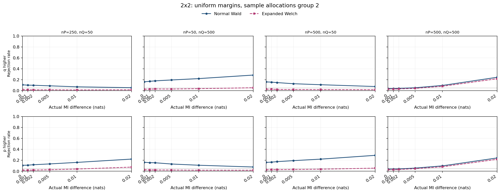

| Specification | Setting |
| --- | --- |
| Table size | 2x2 |
| Horizontal graph regime specifications (columns) | nP=250, nQ=50, nP=50, nQ=500, nP=500, nQ=50, nP=500, nQ=500 |
| Vertical graph regime specifications (rows) | q higher: P row (0.5 repeated 2 times), P column (0.5 repeated 2 times); Q row (0.5 repeated 2 times), Q column (0.5 repeated 2 times); p higher: P row (0.5 repeated 2 times), P column (0.5 repeated 2 times); Q row (0.5 repeated 2 times), Q column (0.5 repeated 2 times) |
| Probability changes | q higher: add at (1,1),(2,2) and subtract at (1,2),(2,1), for both P and Q; p higher: add at (1,1),(2,2) and subtract at (1,2),(2,1), for both P and Q |
| MI settings | Baseline MI {0.02}; direction {q higher, p higher}; actual differences {0, 0.001, 0.002, 0.005, 0.01, 0.02} nats |
| Horizontal axis within each graph | Actual MI difference in nats, fixed from 0 to 0.02 |
| Vertical axis within each graph | Unconditional rejection rate from 0 to 1; invalid results count as non-rejections |
| Replicates | 20,000 per unique point |

Null-point rejection and validity:

| Vertical regime | Horizontal regime | x | Method | Rejection | Valid |
| --- | --- | --- | --- | --- | --- |
| q higher | nP=250, nQ=50 | 0 | Expanded Welch | 0.0195 | 0.9970 |
| q higher | nP=250, nQ=50 | 0 | Normal Wald | 0.1082 | 1.0000 |
| q higher | nP=50, nQ=500 | 0 | Expanded Welch | 0.0273 | 0.9970 |
| q higher | nP=50, nQ=500 | 0 | Normal Wald | 0.1635 | 1.0000 |
| q higher | nP=500, nQ=50 | 0 | Expanded Welch | 0.0278 | 0.9961 |
| q higher | nP=500, nQ=50 | 0 | Normal Wald | 0.1618 | 1.0000 |
| q higher | nP=500, nQ=500 | 0 | Expanded Welch | 0.0298 | 1.0000 |
| q higher | nP=500, nQ=500 | 0 | Normal Wald | 0.0408 | 1.0000 |
| p higher | nP=250, nQ=50 | 0 | Expanded Welch | 0.0195 | 0.9970 |
| p higher | nP=250, nQ=50 | 0 | Normal Wald | 0.1082 | 1.0000 |
| p higher | nP=50, nQ=500 | 0 | Expanded Welch | 0.0273 | 0.9970 |
| p higher | nP=50, nQ=500 | 0 | Normal Wald | 0.1635 | 1.0000 |
| p higher | nP=500, nQ=50 | 0 | Expanded Welch | 0.0278 | 0.9961 |
| p higher | nP=500, nQ=50 | 0 | Normal Wald | 0.1618 | 1.0000 |
| p higher | nP=500, nQ=500 | 0 | Expanded Welch | 0.0298 | 1.0000 |
| p higher | nP=500, nQ=500 | 0 | Normal Wald | 0.0408 | 1.0000 |

Every plotted rate, interval, validity and minimum expected count

| Vertical regime | Horizontal regime | x | Method | Rejection | 95% interval | Valid | Conditional | Min expected P | Min expected Q |
| --- | --- | --- | --- | --- | --- | --- | --- | --- | --- |
| q higher | nP=250, nQ=50 | 0 | Expanded Welch | 0.0195 | [0.0177, 0.0215] | 0.9970 | 0.0196 | 50.04 | 10.01 |
| q higher | nP=250, nQ=50 | 0 | Normal Wald | 0.1082 | [0.1040, 0.1126] | 1.0000 | 0.1082 | 50.04 | 10.01 |
| q higher | nP=250, nQ=50 | 0.001 | Expanded Welch | 0.0175 | [0.0158, 0.0194] | 0.9975 | 0.0175 | 50.04 | 9.947 |
| q higher | nP=250, nQ=50 | 0.001 | Normal Wald | 0.1019 | [0.0978, 0.1062] | 1.0000 | 0.1019 | 50.04 | 9.947 |
| q higher | nP=250, nQ=50 | 0.002 | Expanded Welch | 0.0159 | [0.0143, 0.0178] | 0.9971 | 0.0160 | 50.04 | 9.888 |
| q higher | nP=250, nQ=50 | 0.002 | Normal Wald | 0.1003 | [0.0962, 0.1045] | 1.0000 | 0.1003 | 50.04 | 9.888 |
| q higher | nP=250, nQ=50 | 0.005 | Expanded Welch | 0.0172 | [0.0155, 0.0191] | 0.9978 | 0.0172 | 50.04 | 9.717 |
| q higher | nP=250, nQ=50 | 0.005 | Normal Wald | 0.0899 | [0.0860, 0.0939] | 1.0000 | 0.0899 | 50.04 | 9.717 |
| q higher | nP=250, nQ=50 | 0.01 | Expanded Welch | 0.0143 | [0.0128, 0.0161] | 0.9982 | 0.0144 | 50.04 | 9.454 |
| q higher | nP=250, nQ=50 | 0.01 | Normal Wald | 0.0714 | [0.0679, 0.0751] | 1.0000 | 0.0714 | 50.04 | 9.454 |
| q higher | nP=250, nQ=50 | 0.02 | Expanded Welch | 0.0174 | [0.0157, 0.0193] | 0.9990 | 0.0174 | 50.04 | 8.988 |
| q higher | nP=250, nQ=50 | 0.02 | Normal Wald | 0.0559 | [0.0528, 0.0592] | 1.0000 | 0.0559 | 50.04 | 8.988 |
| q higher | nP=50, nQ=500 | 0 | Expanded Welch | 0.0273 | [0.0251, 0.0297] | 0.9970 | 0.0274 | 10.01 | 100.1 |
| q higher | nP=50, nQ=500 | 0 | Normal Wald | 0.1635 | [0.1584, 0.1687] | 1.0000 | 0.1635 | 10.01 | 100.1 |
| q higher | nP=50, nQ=500 | 0.001 | Expanded Welch | 0.0291 | [0.0269, 0.0316] | 0.9975 | 0.0292 | 10.01 | 99.47 |
| q higher | nP=50, nQ=500 | 0.001 | Normal Wald | 0.1721 | [0.1670, 0.1774] | 1.0000 | 0.1721 | 10.01 | 99.47 |
| q higher | nP=50, nQ=500 | 0.002 | Expanded Welch | 0.0322 | [0.0298, 0.0347] | 0.9964 | 0.0323 | 10.01 | 98.88 |
| q higher | nP=50, nQ=500 | 0.002 | Normal Wald | 0.1804 | [0.1751, 0.1857] | 1.0000 | 0.1804 | 10.01 | 98.88 |
| q higher | nP=50, nQ=500 | 0.005 | Expanded Welch | 0.0308 | [0.0285, 0.0333] | 0.9968 | 0.0309 | 10.01 | 97.17 |
| q higher | nP=50, nQ=500 | 0.005 | Normal Wald | 0.1968 | [0.1913, 0.2024] | 1.0000 | 0.1968 | 10.01 | 97.17 |
| q higher | nP=50, nQ=500 | 0.01 | Expanded Welch | 0.0382 | [0.0356, 0.0409] | 0.9970 | 0.0383 | 10.01 | 94.54 |
| q higher | nP=50, nQ=500 | 0.01 | Normal Wald | 0.2220 | [0.2163, 0.2278] | 1.0000 | 0.2220 | 10.01 | 94.54 |
| q higher | nP=50, nQ=500 | 0.02 | Expanded Welch | 0.0549 | [0.0518, 0.0581] | 0.9963 | 0.0551 | 10.01 | 89.88 |
| q higher | nP=50, nQ=500 | 0.02 | Normal Wald | 0.2863 | [0.2801, 0.2927] | 1.0000 | 0.2863 | 10.01 | 89.88 |
| q higher | nP=500, nQ=50 | 0 | Expanded Welch | 0.0278 | [0.0257, 0.0302] | 0.9961 | 0.0280 | 100.1 | 10.01 |
| q higher | nP=500, nQ=50 | 0 | Normal Wald | 0.1618 | [0.1567, 0.1669] | 1.0000 | 0.1618 | 100.1 | 10.01 |
| q higher | nP=500, nQ=50 | 0.001 | Expanded Welch | 0.0277 | [0.0255, 0.0301] | 0.9976 | 0.0278 | 100.1 | 9.947 |
| q higher | nP=500, nQ=50 | 0.001 | Normal Wald | 0.1568 | [0.1519, 0.1620] | 1.0000 | 0.1568 | 100.1 | 9.947 |
| q higher | nP=500, nQ=50 | 0.002 | Expanded Welch | 0.0234 | [0.0214, 0.0256] | 0.9971 | 0.0235 | 100.1 | 9.888 |
| q higher | nP=500, nQ=50 | 0.002 | Normal Wald | 0.1489 | [0.1441, 0.1540] | 1.0000 | 0.1489 | 100.1 | 9.888 |
| q higher | nP=500, nQ=50 | 0.005 | Expanded Welch | 0.0219 | [0.0199, 0.0240] | 0.9970 | 0.0219 | 100.1 | 9.717 |
| q higher | nP=500, nQ=50 | 0.005 | Normal Wald | 0.1283 | [0.1237, 0.1330] | 1.0000 | 0.1283 | 100.1 | 9.717 |
| q higher | nP=500, nQ=50 | 0.01 | Expanded Welch | 0.0210 | [0.0191, 0.0231] | 0.9981 | 0.0210 | 100.1 | 9.454 |
| q higher | nP=500, nQ=50 | 0.01 | Normal Wald | 0.1100 | [0.1058, 0.1145] | 1.0000 | 0.1100 | 100.1 | 9.454 |
| q higher | nP=500, nQ=50 | 0.02 | Expanded Welch | 0.0188 | [0.0171, 0.0208] | 0.9987 | 0.0189 | 100.1 | 8.988 |
| q higher | nP=500, nQ=50 | 0.02 | Normal Wald | 0.0771 | [0.0735, 0.0809] | 1.0000 | 0.0771 | 100.1 | 8.988 |
| q higher | nP=500, nQ=500 | 0 | Expanded Welch | 0.0298 | [0.0275, 0.0322] | 1.0000 | 0.0298 | 100.1 | 100.1 |
| q higher | nP=500, nQ=500 | 0 | Normal Wald | 0.0408 | [0.0381, 0.0436] | 1.0000 | 0.0408 | 100.1 | 100.1 |
| q higher | nP=500, nQ=500 | 0.001 | Expanded Welch | 0.0291 | [0.0269, 0.0315] | 1.0000 | 0.0291 | 100.1 | 99.47 |
| q higher | nP=500, nQ=500 | 0.001 | Normal Wald | 0.0399 | [0.0373, 0.0427] | 1.0000 | 0.0399 | 100.1 | 99.47 |
| q higher | nP=500, nQ=500 | 0.002 | Expanded Welch | 0.0330 | [0.0306, 0.0356] | 1.0000 | 0.0330 | 100.1 | 98.88 |
| q higher | nP=500, nQ=500 | 0.002 | Normal Wald | 0.0442 | [0.0414, 0.0471] | 1.0000 | 0.0442 | 100.1 | 98.88 |
| q higher | nP=500, nQ=500 | 0.005 | Expanded Welch | 0.0425 | [0.0398, 0.0454] | 1.0000 | 0.0425 | 100.1 | 97.17 |
| q higher | nP=500, nQ=500 | 0.005 | Normal Wald | 0.0545 | [0.0514, 0.0577] | 1.0000 | 0.0545 | 100.1 | 97.17 |
| q higher | nP=500, nQ=500 | 0.01 | Expanded Welch | 0.0820 | [0.0783, 0.0859] | 1.0000 | 0.0820 | 100.1 | 94.54 |
| q higher | nP=500, nQ=500 | 0.01 | Normal Wald | 0.0972 | [0.0931, 0.1013] | 1.0000 | 0.0972 | 100.1 | 94.54 |
| q higher | nP=500, nQ=500 | 0.02 | Expanded Welch | 0.2195 | [0.2138, 0.2253] | 1.0000 | 0.2195 | 100.1 | 89.88 |
| q higher | nP=500, nQ=500 | 0.02 | Normal Wald | 0.2454 | [0.2395, 0.2514] | 1.0000 | 0.2454 | 100.1 | 89.88 |
| p higher | nP=250, nQ=50 | 0 | Expanded Welch | 0.0195 | [0.0177, 0.0215] | 0.9970 | 0.0196 | 50.04 | 10.01 |
| p higher | nP=250, nQ=50 | 0 | Normal Wald | 0.1082 | [0.1040, 0.1126] | 1.0000 | 0.1082 | 50.04 | 10.01 |
| p higher | nP=250, nQ=50 | 0.001 | Expanded Welch | 0.0207 | [0.0188, 0.0228] | 0.9969 | 0.0208 | 49.74 | 10.01 |
| p higher | nP=250, nQ=50 | 0.001 | Normal Wald | 0.1115 | [0.1073, 0.1160] | 1.0000 | 0.1115 | 49.74 | 10.01 |
| p higher | nP=250, nQ=50 | 0.002 | Expanded Welch | 0.0211 | [0.0192, 0.0232] | 0.9969 | 0.0212 | 49.44 | 10.01 |
| p higher | nP=250, nQ=50 | 0.002 | Normal Wald | 0.1190 | [0.1145, 0.1235] | 1.0000 | 0.1190 | 49.44 | 10.01 |
| p higher | nP=250, nQ=50 | 0.005 | Expanded Welch | 0.0279 | [0.0258, 0.0303] | 0.9972 | 0.0280 | 48.58 | 10.01 |
| p higher | nP=250, nQ=50 | 0.005 | Normal Wald | 0.1339 | [0.1293, 0.1387] | 1.0000 | 0.1339 | 48.58 | 10.01 |
| p higher | nP=250, nQ=50 | 0.01 | Expanded Welch | 0.0403 | [0.0377, 0.0432] | 0.9965 | 0.0405 | 47.27 | 10.01 |
| p higher | nP=250, nQ=50 | 0.01 | Normal Wald | 0.1617 | [0.1567, 0.1669] | 1.0000 | 0.1617 | 47.27 | 10.01 |
| p higher | nP=250, nQ=50 | 0.02 | Expanded Welch | 0.0755 | [0.0719, 0.0792] | 0.9970 | 0.0757 | 44.94 | 10.01 |
| p higher | nP=250, nQ=50 | 0.02 | Normal Wald | 0.2223 | [0.2165, 0.2281] | 1.0000 | 0.2223 | 44.94 | 10.01 |
| p higher | nP=50, nQ=500 | 0 | Expanded Welch | 0.0273 | [0.0251, 0.0297] | 0.9970 | 0.0274 | 10.01 | 100.1 |
| p higher | nP=50, nQ=500 | 0 | Normal Wald | 0.1635 | [0.1584, 0.1687] | 1.0000 | 0.1635 | 10.01 | 100.1 |
| p higher | nP=50, nQ=500 | 0.001 | Expanded Welch | 0.0243 | [0.0222, 0.0265] | 0.9976 | 0.0243 | 9.947 | 100.1 |
| p higher | nP=50, nQ=500 | 0.001 | Normal Wald | 0.1568 | [0.1519, 0.1620] | 1.0000 | 0.1568 | 9.947 | 100.1 |
| p higher | nP=50, nQ=500 | 0.002 | Expanded Welch | 0.0237 | [0.0217, 0.0259] | 0.9970 | 0.0238 | 9.888 | 100.1 |
| p higher | nP=50, nQ=500 | 0.002 | Normal Wald | 0.1548 | [0.1499, 0.1599] | 1.0000 | 0.1548 | 9.888 | 100.1 |
| p higher | nP=50, nQ=500 | 0.005 | Expanded Welch | 0.0224 | [0.0204, 0.0245] | 0.9974 | 0.0225 | 9.717 | 100.1 |
| p higher | nP=50, nQ=500 | 0.005 | Normal Wald | 0.1322 | [0.1276, 0.1370] | 1.0000 | 0.1322 | 9.717 | 100.1 |
| p higher | nP=50, nQ=500 | 0.01 | Expanded Welch | 0.0193 | [0.0175, 0.0213] | 0.9982 | 0.0193 | 9.454 | 100.1 |
| p higher | nP=50, nQ=500 | 0.01 | Normal Wald | 0.1097 | [0.1054, 0.1141] | 1.0000 | 0.1097 | 9.454 | 100.1 |
| p higher | nP=50, nQ=500 | 0.02 | Expanded Welch | 0.0182 | [0.0165, 0.0202] | 0.9988 | 0.0183 | 8.988 | 100.1 |
| p higher | nP=50, nQ=500 | 0.02 | Normal Wald | 0.0777 | [0.0741, 0.0815] | 1.0000 | 0.0777 | 8.988 | 100.1 |
| p higher | nP=500, nQ=50 | 0 | Expanded Welch | 0.0278 | [0.0257, 0.0302] | 0.9961 | 0.0280 | 100.1 | 10.01 |
| p higher | nP=500, nQ=50 | 0 | Normal Wald | 0.1618 | [0.1567, 0.1669] | 1.0000 | 0.1618 | 100.1 | 10.01 |
| p higher | nP=500, nQ=50 | 0.001 | Expanded Welch | 0.0295 | [0.0272, 0.0319] | 0.9968 | 0.0295 | 99.47 | 10.01 |
| p higher | nP=500, nQ=50 | 0.001 | Normal Wald | 0.1666 | [0.1615, 0.1718] | 1.0000 | 0.1666 | 99.47 | 10.01 |
| p higher | nP=500, nQ=50 | 0.002 | Expanded Welch | 0.0302 | [0.0279, 0.0327] | 0.9969 | 0.0303 | 98.88 | 10.01 |
| p higher | nP=500, nQ=50 | 0.002 | Normal Wald | 0.1752 | [0.1700, 0.1806] | 1.0000 | 0.1752 | 98.88 | 10.01 |
| p higher | nP=500, nQ=50 | 0.005 | Expanded Welch | 0.0321 | [0.0298, 0.0347] | 0.9964 | 0.0323 | 97.17 | 10.01 |
| p higher | nP=500, nQ=50 | 0.005 | Normal Wald | 0.1938 | [0.1884, 0.1993] | 1.0000 | 0.1938 | 97.17 | 10.01 |
| p higher | nP=500, nQ=50 | 0.01 | Expanded Welch | 0.0374 | [0.0349, 0.0402] | 0.9971 | 0.0376 | 94.54 | 10.01 |
| p higher | nP=500, nQ=50 | 0.01 | Normal Wald | 0.2213 | [0.2156, 0.2271] | 1.0000 | 0.2213 | 94.54 | 10.01 |
| p higher | nP=500, nQ=50 | 0.02 | Expanded Welch | 0.0566 | [0.0535, 0.0599] | 0.9970 | 0.0568 | 89.88 | 10.01 |
| p higher | nP=500, nQ=50 | 0.02 | Normal Wald | 0.2906 | [0.2843, 0.2969] | 1.0000 | 0.2906 | 89.88 | 10.01 |
| p higher | nP=500, nQ=500 | 0 | Expanded Welch | 0.0298 | [0.0275, 0.0322] | 1.0000 | 0.0298 | 100.1 | 100.1 |
| p higher | nP=500, nQ=500 | 0 | Normal Wald | 0.0408 | [0.0381, 0.0436] | 1.0000 | 0.0408 | 100.1 | 100.1 |
| p higher | nP=500, nQ=500 | 0.001 | Expanded Welch | 0.0303 | [0.0281, 0.0328] | 1.0000 | 0.0303 | 99.47 | 100.1 |
| p higher | nP=500, nQ=500 | 0.001 | Normal Wald | 0.0399 | [0.0373, 0.0428] | 1.0000 | 0.0399 | 99.47 | 100.1 |
| p higher | nP=500, nQ=500 | 0.002 | Expanded Welch | 0.0323 | [0.0300, 0.0349] | 1.0000 | 0.0323 | 98.88 | 100.1 |
| p higher | nP=500, nQ=500 | 0.002 | Normal Wald | 0.0433 | [0.0406, 0.0462] | 1.0000 | 0.0433 | 98.88 | 100.1 |
| p higher | nP=500, nQ=500 | 0.005 | Expanded Welch | 0.0462 | [0.0434, 0.0492] | 1.0000 | 0.0462 | 97.17 | 100.1 |
| p higher | nP=500, nQ=500 | 0.005 | Normal Wald | 0.0578 | [0.0547, 0.0612] | 1.0000 | 0.0578 | 97.17 | 100.1 |
| p higher | nP=500, nQ=500 | 0.01 | Expanded Welch | 0.0814 | [0.0776, 0.0852] | 1.0000 | 0.0814 | 94.54 | 100.1 |
| p higher | nP=500, nQ=500 | 0.01 | Normal Wald | 0.0982 | [0.0942, 0.1024] | 1.0000 | 0.0982 | 94.54 | 100.1 |
| p higher | nP=500, nQ=500 | 0.02 | Expanded Welch | 0.2184 | [0.2127, 0.2242] | 1.0000 | 0.2184 | 89.88 | 100.1 |
| p higher | nP=500, nQ=500 | 0.02 | Normal Wald | 0.2424 | [0.2366, 0.2484] | 1.0000 | 0.2424 | 89.88 | 100.1 |

### 6.3 2x2: same skew margins, sample allocations group 1

Does performance depend on which population has more data or greater MI?

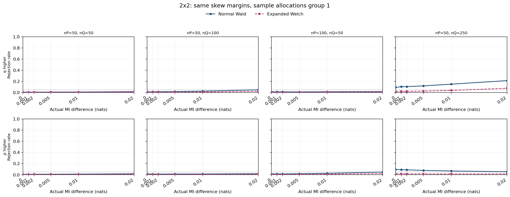

| Specification | Setting |
| --- | --- |
| Table size | 2x2 |
| Horizontal graph regime specifications (columns) | nP=50, nQ=50, nP=50, nQ=100, nP=100, nQ=50, nP=50, nQ=250 |
| Vertical graph regime specifications (rows) | q higher: P row (0.8, 0.2), P column (0.8, 0.2); Q row (0.8, 0.2), Q column (0.8, 0.2); p higher: P row (0.8, 0.2), P column (0.8, 0.2); Q row (0.8, 0.2), Q column (0.8, 0.2) |
| Probability changes | q higher: add at (1,1),(2,2) and subtract at (1,2),(2,1), for both P and Q; p higher: add at (1,1),(2,2) and subtract at (1,2),(2,1), for both P and Q |
| MI settings | Baseline MI {0.02}; direction {q higher, p higher}; actual differences {0, 0.001, 0.002, 0.005, 0.01, 0.02} nats |
| Horizontal axis within each graph | Actual MI difference in nats, fixed from 0 to 0.02 |
| Vertical axis within each graph | Unconditional rejection rate from 0 to 1; invalid results count as non-rejections |
| Replicates | 20,000 per unique point |

Null-point rejection and validity:

| Vertical regime | Horizontal regime | x | Method | Rejection | Valid |
| --- | --- | --- | --- | --- | --- |
| q higher | nP=50, nQ=50 | 0 | Expanded Welch | 0.0037 | 1.0000 |
| q higher | nP=50, nQ=50 | 0 | Normal Wald | 0.0086 | 1.0000 |
| q higher | nP=50, nQ=100 | 0 | Expanded Welch | 0.0059 | 0.9999 |
| q higher | nP=50, nQ=100 | 0 | Normal Wald | 0.0144 | 1.0000 |
| q higher | nP=100, nQ=50 | 0 | Expanded Welch | 0.0057 | 1.0000 |
| q higher | nP=100, nQ=50 | 0 | Normal Wald | 0.0150 | 1.0000 |
| q higher | nP=50, nQ=250 | 0 | Expanded Welch | 0.0172 | 1.0000 |
| q higher | nP=50, nQ=250 | 0 | Normal Wald | 0.0944 | 1.0000 |
| p higher | nP=50, nQ=50 | 0 | Expanded Welch | 0.0037 | 1.0000 |
| p higher | nP=50, nQ=50 | 0 | Normal Wald | 0.0086 | 1.0000 |
| p higher | nP=50, nQ=100 | 0 | Expanded Welch | 0.0059 | 0.9999 |
| p higher | nP=50, nQ=100 | 0 | Normal Wald | 0.0144 | 1.0000 |
| p higher | nP=100, nQ=50 | 0 | Expanded Welch | 0.0057 | 1.0000 |
| p higher | nP=100, nQ=50 | 0 | Normal Wald | 0.0150 | 1.0000 |
| p higher | nP=50, nQ=250 | 0 | Expanded Welch | 0.0172 | 1.0000 |
| p higher | nP=50, nQ=250 | 0 | Normal Wald | 0.0944 | 1.0000 |

Every plotted rate, interval, validity and minimum expected count

| Vertical regime | Horizontal regime | x | Method | Rejection | 95% interval | Valid | Conditional | Min expected P | Min expected Q |
| --- | --- | --- | --- | --- | --- | --- | --- | --- | --- |
| q higher | nP=50, nQ=50 | 0 | Expanded Welch | 0.0037 | [0.0029, 0.0046] | 1.0000 | 0.0037 | 3.691 | 3.691 |
| q higher | nP=50, nQ=50 | 0 | Normal Wald | 0.0086 | [0.0075, 0.0100] | 1.0000 | 0.0086 | 3.691 | 3.691 |
| q higher | nP=50, nQ=50 | 0.001 | Expanded Welch | 0.0049 | [0.0040, 0.0059] | 1.0000 | 0.0049 | 3.691 | 3.734 |
| q higher | nP=50, nQ=50 | 0.001 | Normal Wald | 0.0095 | [0.0082, 0.0109] | 1.0000 | 0.0095 | 3.691 | 3.734 |
| q higher | nP=50, nQ=50 | 0.002 | Expanded Welch | 0.0047 | [0.0038, 0.0057] | 0.9999 | 0.0047 | 3.691 | 3.777 |
| q higher | nP=50, nQ=50 | 0.002 | Normal Wald | 0.0090 | [0.0078, 0.0104] | 1.0000 | 0.0090 | 3.691 | 3.777 |
| q higher | nP=50, nQ=50 | 0.005 | Expanded Welch | 0.0053 | [0.0043, 0.0064] | 0.9999 | 0.0053 | 3.691 | 3.899 |
| q higher | nP=50, nQ=50 | 0.005 | Normal Wald | 0.0103 | [0.0090, 0.0118] | 1.0000 | 0.0103 | 3.691 | 3.899 |
| q higher | nP=50, nQ=50 | 0.01 | Expanded Welch | 0.0064 | [0.0054, 0.0076] | 0.9999 | 0.0064 | 3.691 | 4.087 |
| q higher | nP=50, nQ=50 | 0.01 | Normal Wald | 0.0112 | [0.0098, 0.0128] | 1.0000 | 0.0112 | 3.691 | 4.087 |
| q higher | nP=50, nQ=50 | 0.02 | Expanded Welch | 0.0104 | [0.0091, 0.0119] | 1.0000 | 0.0104 | 3.691 | 4.424 |
| q higher | nP=50, nQ=50 | 0.02 | Normal Wald | 0.0177 | [0.0160, 0.0197] | 1.0000 | 0.0177 | 3.691 | 4.424 |
| q higher | nP=50, nQ=100 | 0 | Expanded Welch | 0.0059 | [0.0049, 0.0071] | 0.9999 | 0.0059 | 3.691 | 7.382 |
| q higher | nP=50, nQ=100 | 0 | Normal Wald | 0.0144 | [0.0128, 0.0161] | 1.0000 | 0.0144 | 3.691 | 7.382 |
| q higher | nP=50, nQ=100 | 0.001 | Expanded Welch | 0.0054 | [0.0045, 0.0065] | 1.0000 | 0.0054 | 3.691 | 7.468 |
| q higher | nP=50, nQ=100 | 0.001 | Normal Wald | 0.0139 | [0.0124, 0.0156] | 1.0000 | 0.0139 | 3.691 | 7.468 |
| q higher | nP=50, nQ=100 | 0.002 | Expanded Welch | 0.0070 | [0.0059, 0.0083] | 1.0000 | 0.0070 | 3.691 | 7.553 |
| q higher | nP=50, nQ=100 | 0.002 | Normal Wald | 0.0163 | [0.0146, 0.0181] | 1.0000 | 0.0163 | 3.691 | 7.553 |
| q higher | nP=50, nQ=100 | 0.005 | Expanded Welch | 0.0075 | [0.0063, 0.0087] | 1.0000 | 0.0075 | 3.691 | 7.797 |
| q higher | nP=50, nQ=100 | 0.005 | Normal Wald | 0.0187 | [0.0170, 0.0207] | 1.0000 | 0.0187 | 3.691 | 7.797 |
| q higher | nP=50, nQ=100 | 0.01 | Expanded Welch | 0.0105 | [0.0092, 0.0120] | 0.9999 | 0.0105 | 3.691 | 8.175 |
| q higher | nP=50, nQ=100 | 0.01 | Normal Wald | 0.0266 | [0.0245, 0.0289] | 1.0000 | 0.0266 | 3.691 | 8.175 |
| q higher | nP=50, nQ=100 | 0.02 | Expanded Welch | 0.0235 | [0.0215, 0.0257] | 1.0000 | 0.0235 | 3.691 | 8.848 |
| q higher | nP=50, nQ=100 | 0.02 | Normal Wald | 0.0508 | [0.0478, 0.0539] | 1.0000 | 0.0508 | 3.691 | 8.848 |
| q higher | nP=100, nQ=50 | 0 | Expanded Welch | 0.0057 | [0.0048, 0.0069] | 1.0000 | 0.0057 | 7.382 | 3.691 |
| q higher | nP=100, nQ=50 | 0 | Normal Wald | 0.0150 | [0.0134, 0.0168] | 1.0000 | 0.0150 | 7.382 | 3.691 |
| q higher | nP=100, nQ=50 | 0.001 | Expanded Welch | 0.0051 | [0.0042, 0.0062] | 1.0000 | 0.0051 | 7.382 | 3.734 |
| q higher | nP=100, nQ=50 | 0.001 | Normal Wald | 0.0140 | [0.0125, 0.0158] | 1.0000 | 0.0140 | 7.382 | 3.734 |
| q higher | nP=100, nQ=50 | 0.002 | Expanded Welch | 0.0053 | [0.0044, 0.0065] | 0.9999 | 0.0054 | 7.382 | 3.777 |
| q higher | nP=100, nQ=50 | 0.002 | Normal Wald | 0.0140 | [0.0124, 0.0157] | 1.0000 | 0.0140 | 7.382 | 3.777 |
| q higher | nP=100, nQ=50 | 0.005 | Expanded Welch | 0.0053 | [0.0044, 0.0064] | 1.0000 | 0.0053 | 7.382 | 3.899 |
| q higher | nP=100, nQ=50 | 0.005 | Normal Wald | 0.0132 | [0.0117, 0.0148] | 1.0000 | 0.0132 | 7.382 | 3.899 |
| q higher | nP=100, nQ=50 | 0.01 | Expanded Welch | 0.0086 | [0.0074, 0.0099] | 1.0000 | 0.0086 | 7.382 | 4.087 |
| q higher | nP=100, nQ=50 | 0.01 | Normal Wald | 0.0161 | [0.0144, 0.0179] | 1.0000 | 0.0161 | 7.382 | 4.087 |
| q higher | nP=100, nQ=50 | 0.02 | Expanded Welch | 0.0110 | [0.0096, 0.0125] | 1.0000 | 0.0110 | 7.382 | 4.424 |
| q higher | nP=100, nQ=50 | 0.02 | Normal Wald | 0.0191 | [0.0172, 0.0210] | 1.0000 | 0.0191 | 7.382 | 4.424 |
| q higher | nP=50, nQ=250 | 0 | Expanded Welch | 0.0172 | [0.0155, 0.0191] | 1.0000 | 0.0172 | 3.691 | 18.45 |
| q higher | nP=50, nQ=250 | 0 | Normal Wald | 0.0944 | [0.0904, 0.0985] | 1.0000 | 0.0944 | 3.691 | 18.45 |
| q higher | nP=50, nQ=250 | 0.001 | Expanded Welch | 0.0213 | [0.0193, 0.0233] | 1.0000 | 0.0213 | 3.691 | 18.67 |
| q higher | nP=50, nQ=250 | 0.001 | Normal Wald | 0.1063 | [0.1021, 0.1106] | 1.0000 | 0.1063 | 3.691 | 18.67 |
| q higher | nP=50, nQ=250 | 0.002 | Expanded Welch | 0.0211 | [0.0192, 0.0232] | 1.0000 | 0.0211 | 3.691 | 18.88 |
| q higher | nP=50, nQ=250 | 0.002 | Normal Wald | 0.1074 | [0.1032, 0.1118] | 1.0000 | 0.1074 | 3.691 | 18.88 |
| q higher | nP=50, nQ=250 | 0.005 | Expanded Welch | 0.0272 | [0.0250, 0.0295] | 0.9999 | 0.0272 | 3.691 | 19.49 |
| q higher | nP=50, nQ=250 | 0.005 | Normal Wald | 0.1207 | [0.1163, 0.1253] | 1.0000 | 0.1207 | 3.691 | 19.49 |
| q higher | nP=50, nQ=250 | 0.01 | Expanded Welch | 0.0400 | [0.0374, 0.0428] | 1.0000 | 0.0400 | 3.691 | 20.44 |
| q higher | nP=50, nQ=250 | 0.01 | Normal Wald | 0.1518 | [0.1469, 0.1568] | 1.0000 | 0.1518 | 3.691 | 20.44 |
| q higher | nP=50, nQ=250 | 0.02 | Expanded Welch | 0.0774 | [0.0738, 0.0812] | 1.0000 | 0.0774 | 3.691 | 22.12 |
| q higher | nP=50, nQ=250 | 0.02 | Normal Wald | 0.2144 | [0.2087, 0.2201] | 1.0000 | 0.2144 | 3.691 | 22.12 |
| p higher | nP=50, nQ=50 | 0 | Expanded Welch | 0.0037 | [0.0029, 0.0046] | 1.0000 | 0.0037 | 3.691 | 3.691 |
| p higher | nP=50, nQ=50 | 0 | Normal Wald | 0.0086 | [0.0075, 0.0100] | 1.0000 | 0.0086 | 3.691 | 3.691 |
| p higher | nP=50, nQ=50 | 0.001 | Expanded Welch | 0.0043 | [0.0034, 0.0053] | 1.0000 | 0.0043 | 3.734 | 3.691 |
| p higher | nP=50, nQ=50 | 0.001 | Normal Wald | 0.0086 | [0.0074, 0.0100] | 1.0000 | 0.0086 | 3.734 | 3.691 |
| p higher | nP=50, nQ=50 | 0.002 | Expanded Welch | 0.0050 | [0.0041, 0.0061] | 1.0000 | 0.0050 | 3.777 | 3.691 |
| p higher | nP=50, nQ=50 | 0.002 | Normal Wald | 0.0104 | [0.0091, 0.0120] | 1.0000 | 0.0104 | 3.777 | 3.691 |
| p higher | nP=50, nQ=50 | 0.005 | Expanded Welch | 0.0060 | [0.0051, 0.0072] | 0.9998 | 0.0061 | 3.899 | 3.691 |
| p higher | nP=50, nQ=50 | 0.005 | Normal Wald | 0.0104 | [0.0091, 0.0119] | 1.0000 | 0.0104 | 3.899 | 3.691 |
| p higher | nP=50, nQ=50 | 0.01 | Expanded Welch | 0.0068 | [0.0058, 0.0080] | 1.0000 | 0.0068 | 4.087 | 3.691 |
| p higher | nP=50, nQ=50 | 0.01 | Normal Wald | 0.0126 | [0.0112, 0.0143] | 1.0000 | 0.0126 | 4.087 | 3.691 |
| p higher | nP=50, nQ=50 | 0.02 | Expanded Welch | 0.0114 | [0.0100, 0.0129] | 0.9999 | 0.0114 | 4.424 | 3.691 |
| p higher | nP=50, nQ=50 | 0.02 | Normal Wald | 0.0187 | [0.0170, 0.0207] | 1.0000 | 0.0187 | 4.424 | 3.691 |
| p higher | nP=50, nQ=100 | 0 | Expanded Welch | 0.0059 | [0.0049, 0.0071] | 0.9999 | 0.0059 | 3.691 | 7.382 |
| p higher | nP=50, nQ=100 | 0 | Normal Wald | 0.0144 | [0.0128, 0.0161] | 1.0000 | 0.0144 | 3.691 | 7.382 |
| p higher | nP=50, nQ=100 | 0.001 | Expanded Welch | 0.0044 | [0.0036, 0.0055] | 1.0000 | 0.0045 | 3.734 | 7.382 |
| p higher | nP=50, nQ=100 | 0.001 | Normal Wald | 0.0135 | [0.0120, 0.0152] | 1.0000 | 0.0135 | 3.734 | 7.382 |
| p higher | nP=50, nQ=100 | 0.002 | Expanded Welch | 0.0056 | [0.0047, 0.0067] | 1.0000 | 0.0056 | 3.777 | 7.382 |
| p higher | nP=50, nQ=100 | 0.002 | Normal Wald | 0.0129 | [0.0114, 0.0146] | 1.0000 | 0.0129 | 3.777 | 7.382 |
| p higher | nP=50, nQ=100 | 0.005 | Expanded Welch | 0.0059 | [0.0049, 0.0071] | 1.0000 | 0.0059 | 3.899 | 7.382 |
| p higher | nP=50, nQ=100 | 0.005 | Normal Wald | 0.0144 | [0.0129, 0.0162] | 1.0000 | 0.0144 | 3.899 | 7.382 |
| p higher | nP=50, nQ=100 | 0.01 | Expanded Welch | 0.0068 | [0.0058, 0.0080] | 1.0000 | 0.0068 | 4.087 | 7.382 |
| p higher | nP=50, nQ=100 | 0.01 | Normal Wald | 0.0149 | [0.0133, 0.0166] | 1.0000 | 0.0149 | 4.087 | 7.382 |
| p higher | nP=50, nQ=100 | 0.02 | Expanded Welch | 0.0121 | [0.0107, 0.0137] | 1.0000 | 0.0121 | 4.424 | 7.382 |
| p higher | nP=50, nQ=100 | 0.02 | Normal Wald | 0.0200 | [0.0182, 0.0221] | 1.0000 | 0.0200 | 4.424 | 7.382 |
| p higher | nP=100, nQ=50 | 0 | Expanded Welch | 0.0057 | [0.0048, 0.0069] | 1.0000 | 0.0057 | 7.382 | 3.691 |
| p higher | nP=100, nQ=50 | 0 | Normal Wald | 0.0150 | [0.0134, 0.0168] | 1.0000 | 0.0150 | 7.382 | 3.691 |
| p higher | nP=100, nQ=50 | 0.001 | Expanded Welch | 0.0062 | [0.0052, 0.0074] | 1.0000 | 0.0062 | 7.468 | 3.691 |
| p higher | nP=100, nQ=50 | 0.001 | Normal Wald | 0.0164 | [0.0147, 0.0183] | 1.0000 | 0.0164 | 7.468 | 3.691 |
| p higher | nP=100, nQ=50 | 0.002 | Expanded Welch | 0.0060 | [0.0050, 0.0072] | 1.0000 | 0.0060 | 7.553 | 3.691 |
| p higher | nP=100, nQ=50 | 0.002 | Normal Wald | 0.0158 | [0.0141, 0.0176] | 1.0000 | 0.0158 | 7.553 | 3.691 |
| p higher | nP=100, nQ=50 | 0.005 | Expanded Welch | 0.0072 | [0.0061, 0.0085] | 0.9999 | 0.0072 | 7.797 | 3.691 |
| p higher | nP=100, nQ=50 | 0.005 | Normal Wald | 0.0190 | [0.0172, 0.0210] | 1.0000 | 0.0190 | 7.797 | 3.691 |
| p higher | nP=100, nQ=50 | 0.01 | Expanded Welch | 0.0103 | [0.0090, 0.0118] | 0.9999 | 0.0103 | 8.175 | 3.691 |
| p higher | nP=100, nQ=50 | 0.01 | Normal Wald | 0.0267 | [0.0246, 0.0291] | 1.0000 | 0.0268 | 8.175 | 3.691 |
| p higher | nP=100, nQ=50 | 0.02 | Expanded Welch | 0.0232 | [0.0213, 0.0254] | 0.9999 | 0.0233 | 8.848 | 3.691 |
| p higher | nP=100, nQ=50 | 0.02 | Normal Wald | 0.0500 | [0.0471, 0.0531] | 1.0000 | 0.0500 | 8.848 | 3.691 |
| p higher | nP=50, nQ=250 | 0 | Expanded Welch | 0.0172 | [0.0155, 0.0191] | 1.0000 | 0.0172 | 3.691 | 18.45 |
| p higher | nP=50, nQ=250 | 0 | Normal Wald | 0.0944 | [0.0904, 0.0985] | 1.0000 | 0.0944 | 3.691 | 18.45 |
| p higher | nP=50, nQ=250 | 0.001 | Expanded Welch | 0.0172 | [0.0155, 0.0191] | 1.0000 | 0.0172 | 3.734 | 18.45 |
| p higher | nP=50, nQ=250 | 0.001 | Normal Wald | 0.0917 | [0.0878, 0.0958] | 1.0000 | 0.0917 | 3.734 | 18.45 |
| p higher | nP=50, nQ=250 | 0.002 | Expanded Welch | 0.0152 | [0.0136, 0.0170] | 1.0000 | 0.0153 | 3.777 | 18.45 |
| p higher | nP=50, nQ=250 | 0.002 | Normal Wald | 0.0886 | [0.0847, 0.0926] | 1.0000 | 0.0886 | 3.777 | 18.45 |
| p higher | nP=50, nQ=250 | 0.005 | Expanded Welch | 0.0163 | [0.0146, 0.0181] | 1.0000 | 0.0163 | 3.899 | 18.45 |
| p higher | nP=50, nQ=250 | 0.005 | Normal Wald | 0.0790 | [0.0754, 0.0829] | 1.0000 | 0.0790 | 3.899 | 18.45 |
| p higher | nP=50, nQ=250 | 0.01 | Expanded Welch | 0.0144 | [0.0129, 0.0162] | 1.0000 | 0.0145 | 4.087 | 18.45 |
| p higher | nP=50, nQ=250 | 0.01 | Normal Wald | 0.0681 | [0.0647, 0.0717] | 1.0000 | 0.0681 | 4.087 | 18.45 |
| p higher | nP=50, nQ=250 | 0.02 | Expanded Welch | 0.0155 | [0.0139, 0.0174] | 1.0000 | 0.0155 | 4.424 | 18.45 |
| p higher | nP=50, nQ=250 | 0.02 | Normal Wald | 0.0551 | [0.0521, 0.0584] | 1.0000 | 0.0551 | 4.424 | 18.45 |

### 6.4 2x2: same skew margins, sample allocations group 2

Does performance depend on which population has more data or greater MI?

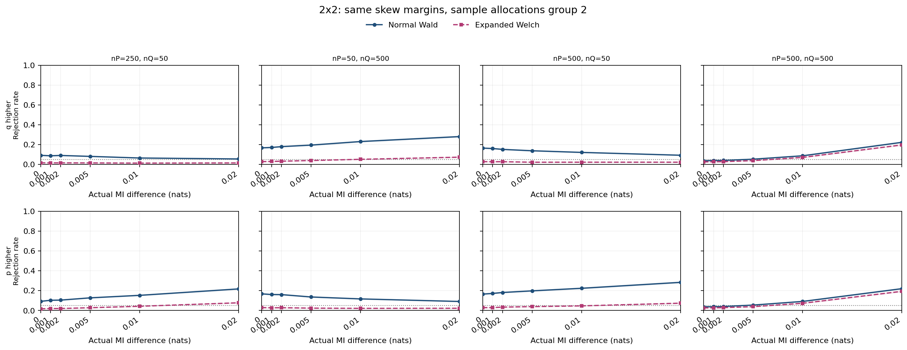

| Specification | Setting |
| --- | --- |
| Table size | 2x2 |
| Horizontal graph regime specifications (columns) | nP=250, nQ=50, nP=50, nQ=500, nP=500, nQ=50, nP=500, nQ=500 |
| Vertical graph regime specifications (rows) | q higher: P row (0.8, 0.2), P column (0.8, 0.2); Q row (0.8, 0.2), Q column (0.8, 0.2); p higher: P row (0.8, 0.2), P column (0.8, 0.2); Q row (0.8, 0.2), Q column (0.8, 0.2) |
| Probability changes | q higher: add at (1,1),(2,2) and subtract at (1,2),(2,1), for both P and Q; p higher: add at (1,1),(2,2) and subtract at (1,2),(2,1), for both P and Q |
| MI settings | Baseline MI {0.02}; direction {q higher, p higher}; actual differences {0, 0.001, 0.002, 0.005, 0.01, 0.02} nats |
| Horizontal axis within each graph | Actual MI difference in nats, fixed from 0 to 0.02 |
| Vertical axis within each graph | Unconditional rejection rate from 0 to 1; invalid results count as non-rejections |
| Replicates | 20,000 per unique point |

Null-point rejection and validity:

| Vertical regime | Horizontal regime | x | Method | Rejection | Valid |
| --- | --- | --- | --- | --- | --- |
| q higher | nP=250, nQ=50 | 0 | Expanded Welch | 0.0170 | 1.0000 |
| q higher | nP=250, nQ=50 | 0 | Normal Wald | 0.0925 | 1.0000 |
| q higher | nP=50, nQ=500 | 0 | Expanded Welch | 0.0296 | 1.0000 |
| q higher | nP=50, nQ=500 | 0 | Normal Wald | 0.1681 | 1.0000 |
| q higher | nP=500, nQ=50 | 0 | Expanded Welch | 0.0292 | 1.0000 |
| q higher | nP=500, nQ=50 | 0 | Normal Wald | 0.1656 | 1.0000 |
| q higher | nP=500, nQ=500 | 0 | Expanded Welch | 0.0268 | 1.0000 |
| q higher | nP=500, nQ=500 | 0 | Normal Wald | 0.0379 | 1.0000 |
| p higher | nP=250, nQ=50 | 0 | Expanded Welch | 0.0170 | 1.0000 |
| p higher | nP=250, nQ=50 | 0 | Normal Wald | 0.0925 | 1.0000 |
| p higher | nP=50, nQ=500 | 0 | Expanded Welch | 0.0296 | 1.0000 |
| p higher | nP=50, nQ=500 | 0 | Normal Wald | 0.1681 | 1.0000 |
| p higher | nP=500, nQ=50 | 0 | Expanded Welch | 0.0292 | 1.0000 |
| p higher | nP=500, nQ=50 | 0 | Normal Wald | 0.1656 | 1.0000 |
| p higher | nP=500, nQ=500 | 0 | Expanded Welch | 0.0268 | 1.0000 |
| p higher | nP=500, nQ=500 | 0 | Normal Wald | 0.0379 | 1.0000 |

Every plotted rate, interval, validity and minimum expected count

| Vertical regime | Horizontal regime | x | Method | Rejection | 95% interval | Valid | Conditional | Min expected P | Min expected Q |
| --- | --- | --- | --- | --- | --- | --- | --- | --- | --- |
| q higher | nP=250, nQ=50 | 0 | Expanded Welch | 0.0170 | [0.0153, 0.0189] | 1.0000 | 0.0170 | 18.45 | 3.691 |
| q higher | nP=250, nQ=50 | 0 | Normal Wald | 0.0925 | [0.0886, 0.0966] | 1.0000 | 0.0925 | 18.45 | 3.691 |
| q higher | nP=250, nQ=50 | 0.001 | Expanded Welch | 0.0164 | [0.0147, 0.0183] | 1.0000 | 0.0164 | 18.45 | 3.734 |
| q higher | nP=250, nQ=50 | 0.001 | Normal Wald | 0.0884 | [0.0845, 0.0924] | 1.0000 | 0.0884 | 18.45 | 3.734 |
| q higher | nP=250, nQ=50 | 0.002 | Expanded Welch | 0.0168 | [0.0151, 0.0186] | 1.0000 | 0.0168 | 18.45 | 3.777 |
| q higher | nP=250, nQ=50 | 0.002 | Normal Wald | 0.0916 | [0.0877, 0.0957] | 1.0000 | 0.0916 | 18.45 | 3.777 |
| q higher | nP=250, nQ=50 | 0.005 | Expanded Welch | 0.0163 | [0.0146, 0.0182] | 1.0000 | 0.0163 | 18.45 | 3.899 |
| q higher | nP=250, nQ=50 | 0.005 | Normal Wald | 0.0822 | [0.0784, 0.0860] | 1.0000 | 0.0822 | 18.45 | 3.899 |
| q higher | nP=250, nQ=50 | 0.01 | Expanded Welch | 0.0144 | [0.0128, 0.0161] | 1.0000 | 0.0144 | 18.45 | 4.087 |
| q higher | nP=250, nQ=50 | 0.01 | Normal Wald | 0.0659 | [0.0626, 0.0695] | 1.0000 | 0.0659 | 18.45 | 4.087 |
| q higher | nP=250, nQ=50 | 0.02 | Expanded Welch | 0.0162 | [0.0145, 0.0180] | 1.0000 | 0.0162 | 18.45 | 4.424 |
| q higher | nP=250, nQ=50 | 0.02 | Normal Wald | 0.0563 | [0.0532, 0.0596] | 1.0000 | 0.0563 | 18.45 | 4.424 |
| q higher | nP=50, nQ=500 | 0 | Expanded Welch | 0.0296 | [0.0273, 0.0320] | 1.0000 | 0.0296 | 3.691 | 36.91 |
| q higher | nP=50, nQ=500 | 0 | Normal Wald | 0.1681 | [0.1629, 0.1733] | 1.0000 | 0.1681 | 3.691 | 36.91 |
| q higher | nP=50, nQ=500 | 0.001 | Expanded Welch | 0.0312 | [0.0289, 0.0338] | 1.0000 | 0.0313 | 3.691 | 37.34 |
| q higher | nP=50, nQ=500 | 0.001 | Normal Wald | 0.1721 | [0.1669, 0.1774] | 1.0000 | 0.1721 | 3.691 | 37.34 |
| q higher | nP=50, nQ=500 | 0.002 | Expanded Welch | 0.0336 | [0.0312, 0.0362] | 0.9999 | 0.0336 | 3.691 | 37.77 |
| q higher | nP=50, nQ=500 | 0.002 | Normal Wald | 0.1805 | [0.1753, 0.1859] | 1.0000 | 0.1805 | 3.691 | 37.77 |
| q higher | nP=50, nQ=500 | 0.005 | Expanded Welch | 0.0407 | [0.0380, 0.0435] | 1.0000 | 0.0407 | 3.691 | 38.99 |
| q higher | nP=50, nQ=500 | 0.005 | Normal Wald | 0.1960 | [0.1905, 0.2015] | 1.0000 | 0.1960 | 3.691 | 38.99 |
| q higher | nP=50, nQ=500 | 0.01 | Expanded Welch | 0.0527 | [0.0497, 0.0559] | 1.0000 | 0.0527 | 3.691 | 40.87 |
| q higher | nP=50, nQ=500 | 0.01 | Normal Wald | 0.2317 | [0.2259, 0.2376] | 1.0000 | 0.2317 | 3.691 | 40.87 |
| q higher | nP=50, nQ=500 | 0.02 | Expanded Welch | 0.0742 | [0.0707, 0.0780] | 1.0000 | 0.0743 | 3.691 | 44.24 |
| q higher | nP=50, nQ=500 | 0.02 | Normal Wald | 0.2816 | [0.2754, 0.2878] | 1.0000 | 0.2816 | 3.691 | 44.24 |
| q higher | nP=500, nQ=50 | 0 | Expanded Welch | 0.0292 | [0.0270, 0.0316] | 1.0000 | 0.0292 | 36.91 | 3.691 |
| q higher | nP=500, nQ=50 | 0 | Normal Wald | 0.1656 | [0.1605, 0.1708] | 1.0000 | 0.1656 | 36.91 | 3.691 |
| q higher | nP=500, nQ=50 | 0.001 | Expanded Welch | 0.0282 | [0.0260, 0.0306] | 1.0000 | 0.0282 | 36.91 | 3.734 |
| q higher | nP=500, nQ=50 | 0.001 | Normal Wald | 0.1615 | [0.1564, 0.1666] | 1.0000 | 0.1615 | 36.91 | 3.734 |
| q higher | nP=500, nQ=50 | 0.002 | Expanded Welch | 0.0286 | [0.0264, 0.0310] | 1.0000 | 0.0286 | 36.91 | 3.777 |
| q higher | nP=500, nQ=50 | 0.002 | Normal Wald | 0.1527 | [0.1477, 0.1577] | 1.0000 | 0.1527 | 36.91 | 3.777 |
| q higher | nP=500, nQ=50 | 0.005 | Expanded Welch | 0.0234 | [0.0214, 0.0256] | 1.0000 | 0.0234 | 36.91 | 3.899 |
| q higher | nP=500, nQ=50 | 0.005 | Normal Wald | 0.1388 | [0.1340, 0.1436] | 1.0000 | 0.1388 | 36.91 | 3.899 |
| q higher | nP=500, nQ=50 | 0.01 | Expanded Welch | 0.0237 | [0.0216, 0.0258] | 1.0000 | 0.0237 | 36.91 | 4.087 |
| q higher | nP=500, nQ=50 | 0.01 | Normal Wald | 0.1222 | [0.1178, 0.1269] | 1.0000 | 0.1222 | 36.91 | 4.087 |
| q higher | nP=500, nQ=50 | 0.02 | Expanded Welch | 0.0237 | [0.0217, 0.0259] | 0.9999 | 0.0237 | 36.91 | 4.424 |
| q higher | nP=500, nQ=50 | 0.02 | Normal Wald | 0.0937 | [0.0897, 0.0978] | 1.0000 | 0.0937 | 36.91 | 4.424 |
| q higher | nP=500, nQ=500 | 0 | Expanded Welch | 0.0268 | [0.0247, 0.0292] | 1.0000 | 0.0268 | 36.91 | 36.91 |
| q higher | nP=500, nQ=500 | 0 | Normal Wald | 0.0379 | [0.0353, 0.0406] | 1.0000 | 0.0379 | 36.91 | 36.91 |
| q higher | nP=500, nQ=500 | 0.001 | Expanded Welch | 0.0278 | [0.0256, 0.0302] | 1.0000 | 0.0278 | 36.91 | 37.34 |
| q higher | nP=500, nQ=500 | 0.001 | Normal Wald | 0.0411 | [0.0384, 0.0439] | 1.0000 | 0.0411 | 36.91 | 37.34 |
| q higher | nP=500, nQ=500 | 0.002 | Expanded Welch | 0.0293 | [0.0270, 0.0317] | 1.0000 | 0.0293 | 36.91 | 37.77 |
| q higher | nP=500, nQ=500 | 0.002 | Normal Wald | 0.0418 | [0.0391, 0.0446] | 1.0000 | 0.0418 | 36.91 | 37.77 |
| q higher | nP=500, nQ=500 | 0.005 | Expanded Welch | 0.0396 | [0.0370, 0.0424] | 1.0000 | 0.0396 | 36.91 | 38.99 |
| q higher | nP=500, nQ=500 | 0.005 | Normal Wald | 0.0541 | [0.0510, 0.0573] | 1.0000 | 0.0541 | 36.91 | 38.99 |
| q higher | nP=500, nQ=500 | 0.01 | Expanded Welch | 0.0718 | [0.0684, 0.0755] | 1.0000 | 0.0718 | 36.91 | 40.87 |
| q higher | nP=500, nQ=500 | 0.01 | Normal Wald | 0.0883 | [0.0844, 0.0923] | 1.0000 | 0.0883 | 36.91 | 40.87 |
| q higher | nP=500, nQ=500 | 0.02 | Expanded Welch | 0.1973 | [0.1918, 0.2028] | 1.0000 | 0.1973 | 36.91 | 44.24 |
| q higher | nP=500, nQ=500 | 0.02 | Normal Wald | 0.2234 | [0.2177, 0.2292] | 1.0000 | 0.2234 | 36.91 | 44.24 |
| p higher | nP=250, nQ=50 | 0 | Expanded Welch | 0.0170 | [0.0153, 0.0189] | 1.0000 | 0.0170 | 18.45 | 3.691 |
| p higher | nP=250, nQ=50 | 0 | Normal Wald | 0.0925 | [0.0886, 0.0966] | 1.0000 | 0.0925 | 18.45 | 3.691 |
| p higher | nP=250, nQ=50 | 0.001 | Expanded Welch | 0.0200 | [0.0182, 0.0221] | 1.0000 | 0.0200 | 18.67 | 3.691 |
| p higher | nP=250, nQ=50 | 0.001 | Normal Wald | 0.1037 | [0.0996, 0.1080] | 1.0000 | 0.1037 | 18.67 | 3.691 |
| p higher | nP=250, nQ=50 | 0.002 | Expanded Welch | 0.0204 | [0.0185, 0.0224] | 1.0000 | 0.0204 | 18.88 | 3.691 |
| p higher | nP=250, nQ=50 | 0.002 | Normal Wald | 0.1051 | [0.1009, 0.1094] | 1.0000 | 0.1051 | 18.88 | 3.691 |
| p higher | nP=250, nQ=50 | 0.005 | Expanded Welch | 0.0285 | [0.0263, 0.0309] | 1.0000 | 0.0285 | 19.49 | 3.691 |
| p higher | nP=250, nQ=50 | 0.005 | Normal Wald | 0.1279 | [0.1233, 0.1326] | 1.0000 | 0.1279 | 19.49 | 3.691 |
| p higher | nP=250, nQ=50 | 0.01 | Expanded Welch | 0.0430 | [0.0403, 0.0460] | 1.0000 | 0.0430 | 20.44 | 3.691 |
| p higher | nP=250, nQ=50 | 0.01 | Normal Wald | 0.1531 | [0.1482, 0.1582] | 1.0000 | 0.1531 | 20.44 | 3.691 |
| p higher | nP=250, nQ=50 | 0.02 | Expanded Welch | 0.0780 | [0.0744, 0.0818] | 1.0000 | 0.0780 | 22.12 | 3.691 |
| p higher | nP=250, nQ=50 | 0.02 | Normal Wald | 0.2177 | [0.2121, 0.2235] | 1.0000 | 0.2177 | 22.12 | 3.691 |
| p higher | nP=50, nQ=500 | 0 | Expanded Welch | 0.0296 | [0.0273, 0.0320] | 1.0000 | 0.0296 | 3.691 | 36.91 |
| p higher | nP=50, nQ=500 | 0 | Normal Wald | 0.1681 | [0.1629, 0.1733] | 1.0000 | 0.1681 | 3.691 | 36.91 |
| p higher | nP=50, nQ=500 | 0.001 | Expanded Welch | 0.0276 | [0.0254, 0.0300] | 1.0000 | 0.0276 | 3.734 | 36.91 |
| p higher | nP=50, nQ=500 | 0.001 | Normal Wald | 0.1613 | [0.1563, 0.1665] | 1.0000 | 0.1613 | 3.734 | 36.91 |
| p higher | nP=50, nQ=500 | 0.002 | Expanded Welch | 0.0285 | [0.0263, 0.0309] | 1.0000 | 0.0285 | 3.777 | 36.91 |
| p higher | nP=50, nQ=500 | 0.002 | Normal Wald | 0.1603 | [0.1553, 0.1655] | 1.0000 | 0.1603 | 3.777 | 36.91 |
| p higher | nP=50, nQ=500 | 0.005 | Expanded Welch | 0.0243 | [0.0223, 0.0265] | 1.0000 | 0.0243 | 3.899 | 36.91 |
| p higher | nP=50, nQ=500 | 0.005 | Normal Wald | 0.1365 | [0.1318, 0.1413] | 1.0000 | 0.1365 | 3.899 | 36.91 |
| p higher | nP=50, nQ=500 | 0.01 | Expanded Welch | 0.0220 | [0.0200, 0.0241] | 1.0000 | 0.0220 | 4.087 | 36.91 |
| p higher | nP=50, nQ=500 | 0.01 | Normal Wald | 0.1172 | [0.1128, 0.1217] | 1.0000 | 0.1172 | 4.087 | 36.91 |
| p higher | nP=50, nQ=500 | 0.02 | Expanded Welch | 0.0228 | [0.0209, 0.0250] | 1.0000 | 0.0229 | 4.424 | 36.91 |
| p higher | nP=50, nQ=500 | 0.02 | Normal Wald | 0.0914 | [0.0874, 0.0954] | 1.0000 | 0.0914 | 4.424 | 36.91 |
| p higher | nP=500, nQ=50 | 0 | Expanded Welch | 0.0292 | [0.0270, 0.0316] | 1.0000 | 0.0292 | 36.91 | 3.691 |
| p higher | nP=500, nQ=50 | 0 | Normal Wald | 0.1656 | [0.1605, 0.1708] | 1.0000 | 0.1656 | 36.91 | 3.691 |
| p higher | nP=500, nQ=50 | 0.001 | Expanded Welch | 0.0297 | [0.0275, 0.0322] | 1.0000 | 0.0298 | 37.34 | 3.691 |
| p higher | nP=500, nQ=50 | 0.001 | Normal Wald | 0.1724 | [0.1672, 0.1776] | 1.0000 | 0.1724 | 37.34 | 3.691 |
| p higher | nP=500, nQ=50 | 0.002 | Expanded Welch | 0.0343 | [0.0319, 0.0370] | 1.0000 | 0.0344 | 37.77 | 3.691 |
| p higher | nP=500, nQ=50 | 0.002 | Normal Wald | 0.1817 | [0.1765, 0.1872] | 1.0000 | 0.1817 | 37.77 | 3.691 |
| p higher | nP=500, nQ=50 | 0.005 | Expanded Welch | 0.0397 | [0.0371, 0.0425] | 1.0000 | 0.0397 | 38.99 | 3.691 |
| p higher | nP=500, nQ=50 | 0.005 | Normal Wald | 0.1983 | [0.1928, 0.2038] | 1.0000 | 0.1983 | 38.99 | 3.691 |
| p higher | nP=500, nQ=50 | 0.01 | Expanded Welch | 0.0471 | [0.0442, 0.0501] | 1.0000 | 0.0471 | 40.87 | 3.691 |
| p higher | nP=500, nQ=50 | 0.01 | Normal Wald | 0.2242 | [0.2185, 0.2300] | 1.0000 | 0.2242 | 40.87 | 3.691 |
| p higher | nP=500, nQ=50 | 0.02 | Expanded Welch | 0.0741 | [0.0706, 0.0779] | 1.0000 | 0.0742 | 44.24 | 3.691 |
| p higher | nP=500, nQ=50 | 0.02 | Normal Wald | 0.2839 | [0.2777, 0.2902] | 1.0000 | 0.2839 | 44.24 | 3.691 |
| p higher | nP=500, nQ=500 | 0 | Expanded Welch | 0.0268 | [0.0247, 0.0292] | 1.0000 | 0.0268 | 36.91 | 36.91 |
| p higher | nP=500, nQ=500 | 0 | Normal Wald | 0.0379 | [0.0353, 0.0406] | 1.0000 | 0.0379 | 36.91 | 36.91 |
| p higher | nP=500, nQ=500 | 0.001 | Expanded Welch | 0.0271 | [0.0249, 0.0294] | 1.0000 | 0.0271 | 37.34 | 36.91 |
| p higher | nP=500, nQ=500 | 0.001 | Normal Wald | 0.0386 | [0.0361, 0.0414] | 1.0000 | 0.0386 | 37.34 | 36.91 |
| p higher | nP=500, nQ=500 | 0.002 | Expanded Welch | 0.0294 | [0.0271, 0.0318] | 1.0000 | 0.0294 | 37.77 | 36.91 |
| p higher | nP=500, nQ=500 | 0.002 | Normal Wald | 0.0411 | [0.0384, 0.0439] | 1.0000 | 0.0411 | 37.77 | 36.91 |
| p higher | nP=500, nQ=500 | 0.005 | Expanded Welch | 0.0391 | [0.0365, 0.0419] | 1.0000 | 0.0391 | 38.99 | 36.91 |
| p higher | nP=500, nQ=500 | 0.005 | Normal Wald | 0.0551 | [0.0520, 0.0583] | 1.0000 | 0.0551 | 38.99 | 36.91 |
| p higher | nP=500, nQ=500 | 0.01 | Expanded Welch | 0.0732 | [0.0697, 0.0769] | 1.0000 | 0.0732 | 40.87 | 36.91 |
| p higher | nP=500, nQ=500 | 0.01 | Normal Wald | 0.0919 | [0.0879, 0.0959] | 1.0000 | 0.0919 | 40.87 | 36.91 |
| p higher | nP=500, nQ=500 | 0.02 | Expanded Welch | 0.1930 | [0.1876, 0.1986] | 1.0000 | 0.1930 | 44.24 | 36.91 |
| p higher | nP=500, nQ=500 | 0.02 | Normal Wald | 0.2199 | [0.2142, 0.2257] | 1.0000 | 0.2199 | 44.24 | 36.91 |

### 6.5 2x2: different skew margins, sample allocations group 1

Does performance depend on which population has more data or greater MI?

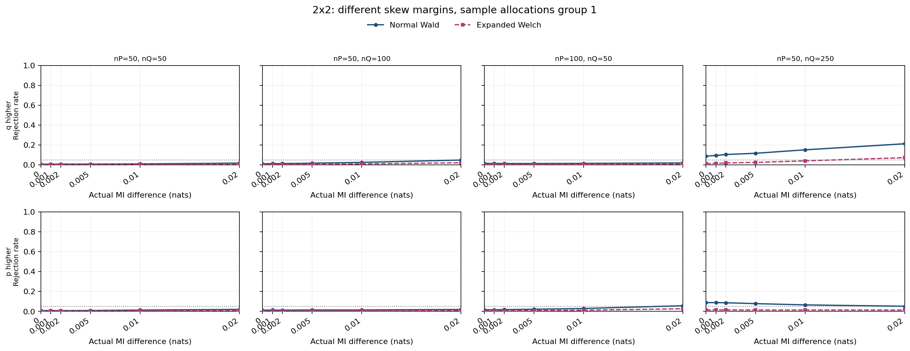

| Specification | Setting |
| --- | --- |
| Table size | 2x2 |
| Horizontal graph regime specifications (columns) | nP=50, nQ=50, nP=50, nQ=100, nP=100, nQ=50, nP=50, nQ=250 |
| Vertical graph regime specifications (rows) | q higher: P row (0.7, 0.3), P column (0.7, 0.3); Q row (0.8, 0.2), Q column (0.8, 0.2); p higher: P row (0.7, 0.3), P column (0.7, 0.3); Q row (0.8, 0.2), Q column (0.8, 0.2) |
| Probability changes | q higher: add at (1,1),(2,2) and subtract at (1,2),(2,1), for both P and Q; p higher: add at (1,1),(2,2) and subtract at (1,2),(2,1), for both P and Q |
| MI settings | Baseline MI {0.02}; direction {q higher, p higher}; actual differences {0, 0.001, 0.002, 0.005, 0.01, 0.02} nats |
| Horizontal axis within each graph | Actual MI difference in nats, fixed from 0 to 0.02 |
| Vertical axis within each graph | Unconditional rejection rate from 0 to 1; invalid results count as non-rejections |
| Replicates | 20,000 per unique point |

Null-point rejection and validity:

| Vertical regime | Horizontal regime | x | Method | Rejection | Valid |
| --- | --- | --- | --- | --- | --- |
| q higher | nP=50, nQ=50 | 0 | Expanded Welch | 0.0039 | 0.9999 |
| q higher | nP=50, nQ=50 | 0 | Normal Wald | 0.0080 | 1.0000 |
| q higher | nP=50, nQ=100 | 0 | Expanded Welch | 0.0047 | 1.0000 |
| q higher | nP=50, nQ=100 | 0 | Normal Wald | 0.0126 | 1.0000 |
| q higher | nP=100, nQ=50 | 0 | Expanded Welch | 0.0062 | 1.0000 |
| q higher | nP=100, nQ=50 | 0 | Normal Wald | 0.0165 | 1.0000 |
| q higher | nP=50, nQ=250 | 0 | Expanded Welch | 0.0148 | 1.0000 |
| q higher | nP=50, nQ=250 | 0 | Normal Wald | 0.0888 | 1.0000 |
| p higher | nP=50, nQ=50 | 0 | Expanded Welch | 0.0039 | 0.9999 |
| p higher | nP=50, nQ=50 | 0 | Normal Wald | 0.0080 | 1.0000 |
| p higher | nP=50, nQ=100 | 0 | Expanded Welch | 0.0047 | 1.0000 |
| p higher | nP=50, nQ=100 | 0 | Normal Wald | 0.0126 | 1.0000 |
| p higher | nP=100, nQ=50 | 0 | Expanded Welch | 0.0062 | 1.0000 |
| p higher | nP=100, nQ=50 | 0 | Normal Wald | 0.0165 | 1.0000 |
| p higher | nP=50, nQ=250 | 0 | Expanded Welch | 0.0148 | 1.0000 |
| p higher | nP=50, nQ=250 | 0 | Normal Wald | 0.0888 | 1.0000 |

Every plotted rate, interval, validity and minimum expected count

| Vertical regime | Horizontal regime | x | Method | Rejection | 95% interval | Valid | Conditional | Min expected P | Min expected Q |
| --- | --- | --- | --- | --- | --- | --- | --- | --- | --- |
| q higher | nP=50, nQ=50 | 0 | Expanded Welch | 0.0039 | [0.0031, 0.0049] | 0.9999 | 0.0039 | 6.636 | 3.691 |
| q higher | nP=50, nQ=50 | 0 | Normal Wald | 0.0080 | [0.0069, 0.0093] | 1.0000 | 0.0080 | 6.636 | 3.691 |
| q higher | nP=50, nQ=50 | 0.001 | Expanded Welch | 0.0044 | [0.0036, 0.0054] | 1.0000 | 0.0044 | 6.636 | 3.734 |
| q higher | nP=50, nQ=50 | 0.001 | Normal Wald | 0.0081 | [0.0069, 0.0094] | 1.0000 | 0.0081 | 6.636 | 3.734 |
| q higher | nP=50, nQ=50 | 0.002 | Expanded Welch | 0.0050 | [0.0042, 0.0061] | 1.0000 | 0.0050 | 6.636 | 3.777 |
| q higher | nP=50, nQ=50 | 0.002 | Normal Wald | 0.0094 | [0.0081, 0.0108] | 1.0000 | 0.0094 | 6.636 | 3.777 |
| q higher | nP=50, nQ=50 | 0.005 | Expanded Welch | 0.0050 | [0.0042, 0.0061] | 0.9999 | 0.0051 | 6.636 | 3.899 |
| q higher | nP=50, nQ=50 | 0.005 | Normal Wald | 0.0093 | [0.0081, 0.0107] | 1.0000 | 0.0093 | 6.636 | 3.899 |
| q higher | nP=50, nQ=50 | 0.01 | Expanded Welch | 0.0073 | [0.0062, 0.0085] | 1.0000 | 0.0073 | 6.636 | 4.087 |
| q higher | nP=50, nQ=50 | 0.01 | Normal Wald | 0.0115 | [0.0101, 0.0130] | 1.0000 | 0.0115 | 6.636 | 4.087 |
| q higher | nP=50, nQ=50 | 0.02 | Expanded Welch | 0.0120 | [0.0106, 0.0137] | 1.0000 | 0.0121 | 6.636 | 4.424 |
| q higher | nP=50, nQ=50 | 0.02 | Normal Wald | 0.0193 | [0.0175, 0.0213] | 1.0000 | 0.0193 | 6.636 | 4.424 |
| q higher | nP=50, nQ=100 | 0 | Expanded Welch | 0.0047 | [0.0038, 0.0057] | 1.0000 | 0.0047 | 6.636 | 7.382 |
| q higher | nP=50, nQ=100 | 0 | Normal Wald | 0.0126 | [0.0112, 0.0143] | 1.0000 | 0.0126 | 6.636 | 7.382 |
| q higher | nP=50, nQ=100 | 0.001 | Expanded Welch | 0.0050 | [0.0041, 0.0061] | 1.0000 | 0.0050 | 6.636 | 7.468 |
| q higher | nP=50, nQ=100 | 0.001 | Normal Wald | 0.0143 | [0.0127, 0.0160] | 1.0000 | 0.0143 | 6.636 | 7.468 |
| q higher | nP=50, nQ=100 | 0.002 | Expanded Welch | 0.0054 | [0.0045, 0.0066] | 1.0000 | 0.0054 | 6.636 | 7.553 |
| q higher | nP=50, nQ=100 | 0.002 | Normal Wald | 0.0147 | [0.0131, 0.0165] | 1.0000 | 0.0147 | 6.636 | 7.553 |
| q higher | nP=50, nQ=100 | 0.005 | Expanded Welch | 0.0072 | [0.0061, 0.0085] | 1.0000 | 0.0072 | 6.636 | 7.797 |
| q higher | nP=50, nQ=100 | 0.005 | Normal Wald | 0.0185 | [0.0167, 0.0205] | 1.0000 | 0.0185 | 6.636 | 7.797 |
| q higher | nP=50, nQ=100 | 0.01 | Expanded Welch | 0.0114 | [0.0100, 0.0130] | 1.0000 | 0.0114 | 6.636 | 8.175 |
| q higher | nP=50, nQ=100 | 0.01 | Normal Wald | 0.0265 | [0.0243, 0.0288] | 1.0000 | 0.0265 | 6.636 | 8.175 |
| q higher | nP=50, nQ=100 | 0.02 | Expanded Welch | 0.0225 | [0.0205, 0.0246] | 1.0000 | 0.0225 | 6.636 | 8.848 |
| q higher | nP=50, nQ=100 | 0.02 | Normal Wald | 0.0499 | [0.0470, 0.0530] | 1.0000 | 0.0499 | 6.636 | 8.848 |
| q higher | nP=100, nQ=50 | 0 | Expanded Welch | 0.0062 | [0.0052, 0.0074] | 1.0000 | 0.0062 | 13.27 | 3.691 |
| q higher | nP=100, nQ=50 | 0 | Normal Wald | 0.0165 | [0.0149, 0.0184] | 1.0000 | 0.0165 | 13.27 | 3.691 |
| q higher | nP=100, nQ=50 | 0.001 | Expanded Welch | 0.0055 | [0.0046, 0.0066] | 1.0000 | 0.0055 | 13.27 | 3.734 |
| q higher | nP=100, nQ=50 | 0.001 | Normal Wald | 0.0158 | [0.0142, 0.0176] | 1.0000 | 0.0158 | 13.27 | 3.734 |
| q higher | nP=100, nQ=50 | 0.002 | Expanded Welch | 0.0054 | [0.0045, 0.0065] | 1.0000 | 0.0054 | 13.27 | 3.777 |
| q higher | nP=100, nQ=50 | 0.002 | Normal Wald | 0.0155 | [0.0139, 0.0174] | 1.0000 | 0.0155 | 13.27 | 3.777 |
| q higher | nP=100, nQ=50 | 0.005 | Expanded Welch | 0.0060 | [0.0050, 0.0072] | 1.0000 | 0.0060 | 13.27 | 3.899 |
| q higher | nP=100, nQ=50 | 0.005 | Normal Wald | 0.0150 | [0.0134, 0.0168] | 1.0000 | 0.0150 | 13.27 | 3.899 |
| q higher | nP=100, nQ=50 | 0.01 | Expanded Welch | 0.0072 | [0.0061, 0.0085] | 1.0000 | 0.0072 | 13.27 | 4.087 |
| q higher | nP=100, nQ=50 | 0.01 | Normal Wald | 0.0166 | [0.0149, 0.0185] | 1.0000 | 0.0166 | 13.27 | 4.087 |
| q higher | nP=100, nQ=50 | 0.02 | Expanded Welch | 0.0115 | [0.0101, 0.0130] | 1.0000 | 0.0115 | 13.27 | 4.424 |
| q higher | nP=100, nQ=50 | 0.02 | Normal Wald | 0.0209 | [0.0190, 0.0229] | 1.0000 | 0.0209 | 13.27 | 4.424 |
| q higher | nP=50, nQ=250 | 0 | Expanded Welch | 0.0148 | [0.0132, 0.0166] | 1.0000 | 0.0148 | 6.636 | 18.45 |
| q higher | nP=50, nQ=250 | 0 | Normal Wald | 0.0888 | [0.0849, 0.0928] | 1.0000 | 0.0888 | 6.636 | 18.45 |
| q higher | nP=50, nQ=250 | 0.001 | Expanded Welch | 0.0160 | [0.0144, 0.0179] | 1.0000 | 0.0160 | 6.636 | 18.67 |
| q higher | nP=50, nQ=250 | 0.001 | Normal Wald | 0.0965 | [0.0925, 0.1007] | 1.0000 | 0.0965 | 6.636 | 18.67 |
| q higher | nP=50, nQ=250 | 0.002 | Expanded Welch | 0.0210 | [0.0192, 0.0231] | 1.0000 | 0.0211 | 6.636 | 18.88 |
| q higher | nP=50, nQ=250 | 0.002 | Normal Wald | 0.1056 | [0.1015, 0.1100] | 1.0000 | 0.1056 | 6.636 | 18.88 |
| q higher | nP=50, nQ=250 | 0.005 | Expanded Welch | 0.0262 | [0.0241, 0.0285] | 1.0000 | 0.0262 | 6.636 | 19.49 |
| q higher | nP=50, nQ=250 | 0.005 | Normal Wald | 0.1180 | [0.1136, 0.1225] | 1.0000 | 0.1180 | 6.636 | 19.49 |
| q higher | nP=50, nQ=250 | 0.01 | Expanded Welch | 0.0416 | [0.0389, 0.0445] | 1.0000 | 0.0416 | 6.636 | 20.44 |
| q higher | nP=50, nQ=250 | 0.01 | Normal Wald | 0.1530 | [0.1480, 0.1580] | 1.0000 | 0.1530 | 6.636 | 20.44 |
| q higher | nP=50, nQ=250 | 0.02 | Expanded Welch | 0.0739 | [0.0704, 0.0776] | 1.0000 | 0.0739 | 6.636 | 22.12 |
| q higher | nP=50, nQ=250 | 0.02 | Normal Wald | 0.2134 | [0.2078, 0.2191] | 1.0000 | 0.2134 | 6.636 | 22.12 |
| p higher | nP=50, nQ=50 | 0 | Expanded Welch | 0.0039 | [0.0031, 0.0049] | 0.9999 | 0.0039 | 6.636 | 3.691 |
| p higher | nP=50, nQ=50 | 0 | Normal Wald | 0.0080 | [0.0069, 0.0093] | 1.0000 | 0.0080 | 6.636 | 3.691 |
| p higher | nP=50, nQ=50 | 0.001 | Expanded Welch | 0.0049 | [0.0040, 0.0059] | 1.0000 | 0.0049 | 6.69 | 3.691 |
| p higher | nP=50, nQ=50 | 0.001 | Normal Wald | 0.0086 | [0.0075, 0.0100] | 1.0000 | 0.0086 | 6.69 | 3.691 |
| p higher | nP=50, nQ=50 | 0.002 | Expanded Welch | 0.0043 | [0.0034, 0.0053] | 1.0000 | 0.0043 | 6.742 | 3.691 |
| p higher | nP=50, nQ=50 | 0.002 | Normal Wald | 0.0082 | [0.0070, 0.0095] | 1.0000 | 0.0082 | 6.742 | 3.691 |
| p higher | nP=50, nQ=50 | 0.005 | Expanded Welch | 0.0049 | [0.0040, 0.0059] | 1.0000 | 0.0049 | 6.891 | 3.691 |
| p higher | nP=50, nQ=50 | 0.005 | Normal Wald | 0.0093 | [0.0081, 0.0107] | 1.0000 | 0.0093 | 6.891 | 3.691 |
| p higher | nP=50, nQ=50 | 0.01 | Expanded Welch | 0.0080 | [0.0068, 0.0093] | 1.0000 | 0.0080 | 7.121 | 3.691 |
| p higher | nP=50, nQ=50 | 0.01 | Normal Wald | 0.0140 | [0.0124, 0.0157] | 1.0000 | 0.0140 | 7.121 | 3.691 |
| p higher | nP=50, nQ=50 | 0.02 | Expanded Welch | 0.0123 | [0.0109, 0.0140] | 1.0000 | 0.0124 | 7.47 | 3.691 |
| p higher | nP=50, nQ=50 | 0.02 | Normal Wald | 0.0206 | [0.0187, 0.0227] | 1.0000 | 0.0206 | 7.47 | 3.691 |
| p higher | nP=50, nQ=100 | 0 | Expanded Welch | 0.0047 | [0.0038, 0.0057] | 1.0000 | 0.0047 | 6.636 | 7.382 |
| p higher | nP=50, nQ=100 | 0 | Normal Wald | 0.0126 | [0.0112, 0.0143] | 1.0000 | 0.0126 | 6.636 | 7.382 |
| p higher | nP=50, nQ=100 | 0.001 | Expanded Welch | 0.0053 | [0.0044, 0.0065] | 1.0000 | 0.0053 | 6.69 | 7.382 |
| p higher | nP=50, nQ=100 | 0.001 | Normal Wald | 0.0140 | [0.0125, 0.0158] | 1.0000 | 0.0140 | 6.69 | 7.382 |
| p higher | nP=50, nQ=100 | 0.002 | Expanded Welch | 0.0046 | [0.0038, 0.0057] | 1.0000 | 0.0046 | 6.742 | 7.382 |
| p higher | nP=50, nQ=100 | 0.002 | Normal Wald | 0.0129 | [0.0114, 0.0145] | 1.0000 | 0.0129 | 6.742 | 7.382 |
| p higher | nP=50, nQ=100 | 0.005 | Expanded Welch | 0.0069 | [0.0058, 0.0081] | 1.0000 | 0.0069 | 6.891 | 7.382 |
| p higher | nP=50, nQ=100 | 0.005 | Normal Wald | 0.0149 | [0.0133, 0.0167] | 1.0000 | 0.0149 | 6.891 | 7.382 |
| p higher | nP=50, nQ=100 | 0.01 | Expanded Welch | 0.0074 | [0.0063, 0.0087] | 1.0000 | 0.0074 | 7.121 | 7.382 |
| p higher | nP=50, nQ=100 | 0.01 | Normal Wald | 0.0149 | [0.0134, 0.0167] | 1.0000 | 0.0149 | 7.121 | 7.382 |
| p higher | nP=50, nQ=100 | 0.02 | Expanded Welch | 0.0114 | [0.0100, 0.0130] | 1.0000 | 0.0114 | 7.47 | 7.382 |
| p higher | nP=50, nQ=100 | 0.02 | Normal Wald | 0.0198 | [0.0179, 0.0218] | 1.0000 | 0.0198 | 7.47 | 7.382 |
| p higher | nP=100, nQ=50 | 0 | Expanded Welch | 0.0062 | [0.0052, 0.0074] | 1.0000 | 0.0062 | 13.27 | 3.691 |
| p higher | nP=100, nQ=50 | 0 | Normal Wald | 0.0165 | [0.0149, 0.0184] | 1.0000 | 0.0165 | 13.27 | 3.691 |
| p higher | nP=100, nQ=50 | 0.001 | Expanded Welch | 0.0069 | [0.0058, 0.0081] | 1.0000 | 0.0069 | 13.38 | 3.691 |
| p higher | nP=100, nQ=50 | 0.001 | Normal Wald | 0.0166 | [0.0149, 0.0185] | 1.0000 | 0.0166 | 13.38 | 3.691 |
| p higher | nP=100, nQ=50 | 0.002 | Expanded Welch | 0.0068 | [0.0058, 0.0080] | 1.0000 | 0.0068 | 13.48 | 3.691 |
| p higher | nP=100, nQ=50 | 0.002 | Normal Wald | 0.0184 | [0.0166, 0.0204] | 1.0000 | 0.0184 | 13.48 | 3.691 |
| p higher | nP=100, nQ=50 | 0.005 | Expanded Welch | 0.0092 | [0.0080, 0.0107] | 1.0000 | 0.0092 | 13.78 | 3.691 |
| p higher | nP=100, nQ=50 | 0.005 | Normal Wald | 0.0219 | [0.0200, 0.0240] | 1.0000 | 0.0219 | 13.78 | 3.691 |
| p higher | nP=100, nQ=50 | 0.01 | Expanded Welch | 0.0123 | [0.0109, 0.0140] | 1.0000 | 0.0123 | 14.24 | 3.691 |
| p higher | nP=100, nQ=50 | 0.01 | Normal Wald | 0.0295 | [0.0273, 0.0320] | 1.0000 | 0.0295 | 14.24 | 3.691 |
| p higher | nP=100, nQ=50 | 0.02 | Expanded Welch | 0.0272 | [0.0251, 0.0296] | 1.0000 | 0.0272 | 14.94 | 3.691 |
| p higher | nP=100, nQ=50 | 0.02 | Normal Wald | 0.0573 | [0.0542, 0.0607] | 1.0000 | 0.0573 | 14.94 | 3.691 |
| p higher | nP=50, nQ=250 | 0 | Expanded Welch | 0.0148 | [0.0132, 0.0166] | 1.0000 | 0.0148 | 6.636 | 18.45 |
| p higher | nP=50, nQ=250 | 0 | Normal Wald | 0.0888 | [0.0849, 0.0928] | 1.0000 | 0.0888 | 6.636 | 18.45 |
| p higher | nP=50, nQ=250 | 0.001 | Expanded Welch | 0.0152 | [0.0136, 0.0170] | 1.0000 | 0.0152 | 6.69 | 18.45 |
| p higher | nP=50, nQ=250 | 0.001 | Normal Wald | 0.0886 | [0.0847, 0.0926] | 1.0000 | 0.0886 | 6.69 | 18.45 |
| p higher | nP=50, nQ=250 | 0.002 | Expanded Welch | 0.0154 | [0.0138, 0.0172] | 1.0000 | 0.0154 | 6.742 | 18.45 |
| p higher | nP=50, nQ=250 | 0.002 | Normal Wald | 0.0872 | [0.0834, 0.0912] | 1.0000 | 0.0872 | 6.742 | 18.45 |
| p higher | nP=50, nQ=250 | 0.005 | Expanded Welch | 0.0145 | [0.0129, 0.0163] | 1.0000 | 0.0145 | 6.891 | 18.45 |
| p higher | nP=50, nQ=250 | 0.005 | Normal Wald | 0.0784 | [0.0748, 0.0822] | 1.0000 | 0.0784 | 6.891 | 18.45 |
| p higher | nP=50, nQ=250 | 0.01 | Expanded Welch | 0.0147 | [0.0131, 0.0165] | 1.0000 | 0.0147 | 7.121 | 18.45 |
| p higher | nP=50, nQ=250 | 0.01 | Normal Wald | 0.0657 | [0.0623, 0.0692] | 1.0000 | 0.0657 | 7.121 | 18.45 |
| p higher | nP=50, nQ=250 | 0.02 | Expanded Welch | 0.0140 | [0.0125, 0.0157] | 1.0000 | 0.0140 | 7.47 | 18.45 |
| p higher | nP=50, nQ=250 | 0.02 | Normal Wald | 0.0521 | [0.0491, 0.0553] | 1.0000 | 0.0521 | 7.47 | 18.45 |

### 6.6 2x2: different skew margins, sample allocations group 2

Does performance depend on which population has more data or greater MI?

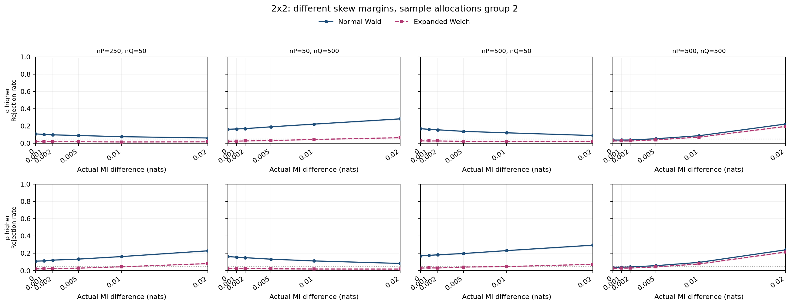

| Specification | Setting |
| --- | --- |
| Table size | 2x2 |
| Horizontal graph regime specifications (columns) | nP=250, nQ=50, nP=50, nQ=500, nP=500, nQ=50, nP=500, nQ=500 |
| Vertical graph regime specifications (rows) | q higher: P row (0.7, 0.3), P column (0.7, 0.3); Q row (0.8, 0.2), Q column (0.8, 0.2); p higher: P row (0.7, 0.3), P column (0.7, 0.3); Q row (0.8, 0.2), Q column (0.8, 0.2) |
| Probability changes | q higher: add at (1,1),(2,2) and subtract at (1,2),(2,1), for both P and Q; p higher: add at (1,1),(2,2) and subtract at (1,2),(2,1), for both P and Q |
| MI settings | Baseline MI {0.02}; direction {q higher, p higher}; actual differences {0, 0.001, 0.002, 0.005, 0.01, 0.02} nats |
| Horizontal axis within each graph | Actual MI difference in nats, fixed from 0 to 0.02 |
| Vertical axis within each graph | Unconditional rejection rate from 0 to 1; invalid results count as non-rejections |
| Replicates | 20,000 per unique point |

Null-point rejection and validity:

| Vertical regime | Horizontal regime | x | Method | Rejection | Valid |
| --- | --- | --- | --- | --- | --- |
| q higher | nP=250, nQ=50 | 0 | Expanded Welch | 0.0199 | 1.0000 |
| q higher | nP=250, nQ=50 | 0 | Normal Wald | 0.1095 | 1.0000 |
| q higher | nP=50, nQ=500 | 0 | Expanded Welch | 0.0251 | 1.0000 |
| q higher | nP=50, nQ=500 | 0 | Normal Wald | 0.1631 | 1.0000 |
| q higher | nP=500, nQ=50 | 0 | Expanded Welch | 0.0294 | 1.0000 |
| q higher | nP=500, nQ=50 | 0 | Normal Wald | 0.1701 | 1.0000 |
| q higher | nP=500, nQ=500 | 0 | Expanded Welch | 0.0283 | 1.0000 |
| q higher | nP=500, nQ=500 | 0 | Normal Wald | 0.0387 | 1.0000 |
| p higher | nP=250, nQ=50 | 0 | Expanded Welch | 0.0199 | 1.0000 |
| p higher | nP=250, nQ=50 | 0 | Normal Wald | 0.1095 | 1.0000 |
| p higher | nP=50, nQ=500 | 0 | Expanded Welch | 0.0251 | 1.0000 |
| p higher | nP=50, nQ=500 | 0 | Normal Wald | 0.1631 | 1.0000 |
| p higher | nP=500, nQ=50 | 0 | Expanded Welch | 0.0294 | 1.0000 |
| p higher | nP=500, nQ=50 | 0 | Normal Wald | 0.1701 | 1.0000 |
| p higher | nP=500, nQ=500 | 0 | Expanded Welch | 0.0283 | 1.0000 |
| p higher | nP=500, nQ=500 | 0 | Normal Wald | 0.0387 | 1.0000 |

Every plotted rate, interval, validity and minimum expected count

| Vertical regime | Horizontal regime | x | Method | Rejection | 95% interval | Valid | Conditional | Min expected P | Min expected Q |
| --- | --- | --- | --- | --- | --- | --- | --- | --- | --- |
| q higher | nP=250, nQ=50 | 0 | Expanded Welch | 0.0199 | [0.0181, 0.0220] | 1.0000 | 0.0199 | 33.18 | 3.691 |
| q higher | nP=250, nQ=50 | 0 | Normal Wald | 0.1095 | [0.1052, 0.1139] | 1.0000 | 0.1095 | 33.18 | 3.691 |
| q higher | nP=250, nQ=50 | 0.001 | Expanded Welch | 0.0201 | [0.0182, 0.0221] | 1.0000 | 0.0201 | 33.18 | 3.734 |
| q higher | nP=250, nQ=50 | 0.001 | Normal Wald | 0.1044 | [0.1002, 0.1087] | 1.0000 | 0.1044 | 33.18 | 3.734 |
| q higher | nP=250, nQ=50 | 0.002 | Expanded Welch | 0.0185 | [0.0167, 0.0204] | 1.0000 | 0.0185 | 33.18 | 3.777 |
| q higher | nP=250, nQ=50 | 0.002 | Normal Wald | 0.0990 | [0.0950, 0.1033] | 1.0000 | 0.0990 | 33.18 | 3.777 |
| q higher | nP=250, nQ=50 | 0.005 | Expanded Welch | 0.0188 | [0.0170, 0.0208] | 1.0000 | 0.0188 | 33.18 | 3.899 |
| q higher | nP=250, nQ=50 | 0.005 | Normal Wald | 0.0910 | [0.0871, 0.0951] | 1.0000 | 0.0910 | 33.18 | 3.899 |
| q higher | nP=250, nQ=50 | 0.01 | Expanded Welch | 0.0164 | [0.0147, 0.0183] | 1.0000 | 0.0164 | 33.18 | 4.087 |
| q higher | nP=250, nQ=50 | 0.01 | Normal Wald | 0.0775 | [0.0739, 0.0813] | 1.0000 | 0.0775 | 33.18 | 4.087 |
| q higher | nP=250, nQ=50 | 0.02 | Expanded Welch | 0.0176 | [0.0159, 0.0196] | 1.0000 | 0.0177 | 33.18 | 4.424 |
| q higher | nP=250, nQ=50 | 0.02 | Normal Wald | 0.0625 | [0.0592, 0.0659] | 1.0000 | 0.0625 | 33.18 | 4.424 |
| q higher | nP=50, nQ=500 | 0 | Expanded Welch | 0.0251 | [0.0230, 0.0274] | 1.0000 | 0.0251 | 6.636 | 36.91 |
| q higher | nP=50, nQ=500 | 0 | Normal Wald | 0.1631 | [0.1580, 0.1683] | 1.0000 | 0.1631 | 6.636 | 36.91 |
| q higher | nP=50, nQ=500 | 0.001 | Expanded Welch | 0.0261 | [0.0239, 0.0284] | 1.0000 | 0.0261 | 6.636 | 37.34 |
| q higher | nP=50, nQ=500 | 0.001 | Normal Wald | 0.1668 | [0.1617, 0.1720] | 1.0000 | 0.1668 | 6.636 | 37.34 |
| q higher | nP=50, nQ=500 | 0.002 | Expanded Welch | 0.0284 | [0.0262, 0.0308] | 1.0000 | 0.0285 | 6.636 | 37.77 |
| q higher | nP=50, nQ=500 | 0.002 | Normal Wald | 0.1708 | [0.1656, 0.1760] | 1.0000 | 0.1708 | 6.636 | 37.77 |
| q higher | nP=50, nQ=500 | 0.005 | Expanded Welch | 0.0328 | [0.0304, 0.0354] | 1.0000 | 0.0328 | 6.636 | 38.99 |
| q higher | nP=50, nQ=500 | 0.005 | Normal Wald | 0.1915 | [0.1862, 0.1971] | 1.0000 | 0.1915 | 6.636 | 38.99 |
| q higher | nP=50, nQ=500 | 0.01 | Expanded Welch | 0.0456 | [0.0427, 0.0485] | 1.0000 | 0.0456 | 6.636 | 40.87 |
| q higher | nP=50, nQ=500 | 0.01 | Normal Wald | 0.2229 | [0.2172, 0.2287] | 1.0000 | 0.2229 | 6.636 | 40.87 |
| q higher | nP=50, nQ=500 | 0.02 | Expanded Welch | 0.0657 | [0.0623, 0.0692] | 1.0000 | 0.0657 | 6.636 | 44.24 |
| q higher | nP=50, nQ=500 | 0.02 | Normal Wald | 0.2834 | [0.2772, 0.2897] | 1.0000 | 0.2834 | 6.636 | 44.24 |
| q higher | nP=500, nQ=50 | 0 | Expanded Welch | 0.0294 | [0.0271, 0.0318] | 1.0000 | 0.0294 | 66.36 | 3.691 |
| q higher | nP=500, nQ=50 | 0 | Normal Wald | 0.1701 | [0.1650, 0.1754] | 1.0000 | 0.1701 | 66.36 | 3.691 |
| q higher | nP=500, nQ=50 | 0.001 | Expanded Welch | 0.0278 | [0.0256, 0.0302] | 1.0000 | 0.0278 | 66.36 | 3.734 |
| q higher | nP=500, nQ=50 | 0.001 | Normal Wald | 0.1620 | [0.1570, 0.1672] | 1.0000 | 0.1620 | 66.36 | 3.734 |
| q higher | nP=500, nQ=50 | 0.002 | Expanded Welch | 0.0281 | [0.0259, 0.0305] | 1.0000 | 0.0281 | 66.36 | 3.777 |
| q higher | nP=500, nQ=50 | 0.002 | Normal Wald | 0.1571 | [0.1521, 0.1622] | 1.0000 | 0.1571 | 66.36 | 3.777 |
| q higher | nP=500, nQ=50 | 0.005 | Expanded Welch | 0.0234 | [0.0214, 0.0256] | 1.0000 | 0.0235 | 66.36 | 3.899 |
| q higher | nP=500, nQ=50 | 0.005 | Normal Wald | 0.1391 | [0.1344, 0.1440] | 1.0000 | 0.1391 | 66.36 | 3.899 |
| q higher | nP=500, nQ=50 | 0.01 | Expanded Welch | 0.0236 | [0.0215, 0.0257] | 1.0000 | 0.0236 | 66.36 | 4.087 |
| q higher | nP=500, nQ=50 | 0.01 | Normal Wald | 0.1224 | [0.1179, 0.1270] | 1.0000 | 0.1224 | 66.36 | 4.087 |
| q higher | nP=500, nQ=50 | 0.02 | Expanded Welch | 0.0238 | [0.0217, 0.0260] | 1.0000 | 0.0238 | 66.36 | 4.424 |
| q higher | nP=500, nQ=50 | 0.02 | Normal Wald | 0.0908 | [0.0869, 0.0949] | 1.0000 | 0.0908 | 66.36 | 4.424 |
| q higher | nP=500, nQ=500 | 0 | Expanded Welch | 0.0283 | [0.0261, 0.0307] | 1.0000 | 0.0283 | 66.36 | 36.91 |
| q higher | nP=500, nQ=500 | 0 | Normal Wald | 0.0387 | [0.0362, 0.0415] | 1.0000 | 0.0387 | 66.36 | 36.91 |
| q higher | nP=500, nQ=500 | 0.001 | Expanded Welch | 0.0277 | [0.0255, 0.0301] | 1.0000 | 0.0277 | 66.36 | 37.34 |
| q higher | nP=500, nQ=500 | 0.001 | Normal Wald | 0.0389 | [0.0363, 0.0417] | 1.0000 | 0.0389 | 66.36 | 37.34 |
| q higher | nP=500, nQ=500 | 0.002 | Expanded Welch | 0.0278 | [0.0256, 0.0301] | 1.0000 | 0.0278 | 66.36 | 37.77 |
| q higher | nP=500, nQ=500 | 0.002 | Normal Wald | 0.0394 | [0.0368, 0.0422] | 1.0000 | 0.0394 | 66.36 | 37.77 |
| q higher | nP=500, nQ=500 | 0.005 | Expanded Welch | 0.0413 | [0.0387, 0.0442] | 1.0000 | 0.0413 | 66.36 | 38.99 |
| q higher | nP=500, nQ=500 | 0.005 | Normal Wald | 0.0538 | [0.0508, 0.0570] | 1.0000 | 0.0538 | 66.36 | 38.99 |
| q higher | nP=500, nQ=500 | 0.01 | Expanded Welch | 0.0723 | [0.0688, 0.0760] | 1.0000 | 0.0723 | 66.36 | 40.87 |
| q higher | nP=500, nQ=500 | 0.01 | Normal Wald | 0.0889 | [0.0850, 0.0929] | 1.0000 | 0.0889 | 66.36 | 40.87 |
| q higher | nP=500, nQ=500 | 0.02 | Expanded Welch | 0.1956 | [0.1902, 0.2012] | 1.0000 | 0.1956 | 66.36 | 44.24 |
| q higher | nP=500, nQ=500 | 0.02 | Normal Wald | 0.2233 | [0.2176, 0.2292] | 1.0000 | 0.2233 | 66.36 | 44.24 |
| p higher | nP=250, nQ=50 | 0 | Expanded Welch | 0.0199 | [0.0181, 0.0220] | 1.0000 | 0.0199 | 33.18 | 3.691 |
| p higher | nP=250, nQ=50 | 0 | Normal Wald | 0.1095 | [0.1052, 0.1139] | 1.0000 | 0.1095 | 33.18 | 3.691 |
| p higher | nP=250, nQ=50 | 0.001 | Expanded Welch | 0.0219 | [0.0199, 0.0240] | 1.0000 | 0.0219 | 33.45 | 3.691 |
| p higher | nP=250, nQ=50 | 0.001 | Normal Wald | 0.1124 | [0.1081, 0.1169] | 1.0000 | 0.1124 | 33.45 | 3.691 |
| p higher | nP=250, nQ=50 | 0.002 | Expanded Welch | 0.0246 | [0.0225, 0.0268] | 1.0000 | 0.0246 | 33.71 | 3.691 |
| p higher | nP=250, nQ=50 | 0.002 | Normal Wald | 0.1212 | [0.1168, 0.1258] | 1.0000 | 0.1212 | 33.71 | 3.691 |
| p higher | nP=250, nQ=50 | 0.005 | Expanded Welch | 0.0286 | [0.0264, 0.0310] | 0.9999 | 0.0286 | 34.46 | 3.691 |
| p higher | nP=250, nQ=50 | 0.005 | Normal Wald | 0.1332 | [0.1286, 0.1380] | 1.0000 | 0.1332 | 34.46 | 3.691 |
| p higher | nP=250, nQ=50 | 0.01 | Expanded Welch | 0.0444 | [0.0416, 0.0473] | 1.0000 | 0.0444 | 35.61 | 3.691 |
| p higher | nP=250, nQ=50 | 0.01 | Normal Wald | 0.1624 | [0.1574, 0.1676] | 1.0000 | 0.1624 | 35.61 | 3.691 |
| p higher | nP=250, nQ=50 | 0.02 | Expanded Welch | 0.0811 | [0.0774, 0.0850] | 1.0000 | 0.0811 | 37.35 | 3.691 |
| p higher | nP=250, nQ=50 | 0.02 | Normal Wald | 0.2288 | [0.2231, 0.2347] | 1.0000 | 0.2288 | 37.35 | 3.691 |
| p higher | nP=50, nQ=500 | 0 | Expanded Welch | 0.0251 | [0.0230, 0.0274] | 1.0000 | 0.0251 | 6.636 | 36.91 |
| p higher | nP=50, nQ=500 | 0 | Normal Wald | 0.1631 | [0.1580, 0.1683] | 1.0000 | 0.1631 | 6.636 | 36.91 |
| p higher | nP=50, nQ=500 | 0.001 | Expanded Welch | 0.0249 | [0.0229, 0.0272] | 1.0000 | 0.0249 | 6.69 | 36.91 |
| p higher | nP=50, nQ=500 | 0.001 | Normal Wald | 0.1551 | [0.1501, 0.1602] | 1.0000 | 0.1551 | 6.69 | 36.91 |
| p higher | nP=50, nQ=500 | 0.002 | Expanded Welch | 0.0226 | [0.0206, 0.0247] | 1.0000 | 0.0226 | 6.742 | 36.91 |
| p higher | nP=50, nQ=500 | 0.002 | Normal Wald | 0.1496 | [0.1447, 0.1546] | 1.0000 | 0.1496 | 6.742 | 36.91 |
| p higher | nP=50, nQ=500 | 0.005 | Expanded Welch | 0.0210 | [0.0191, 0.0231] | 1.0000 | 0.0210 | 6.891 | 36.91 |
| p higher | nP=50, nQ=500 | 0.005 | Normal Wald | 0.1321 | [0.1275, 0.1369] | 1.0000 | 0.1321 | 6.891 | 36.91 |
| p higher | nP=50, nQ=500 | 0.01 | Expanded Welch | 0.0186 | [0.0169, 0.0206] | 1.0000 | 0.0186 | 7.121 | 36.91 |
| p higher | nP=50, nQ=500 | 0.01 | Normal Wald | 0.1120 | [0.1077, 0.1164] | 1.0000 | 0.1120 | 7.121 | 36.91 |
| p higher | nP=50, nQ=500 | 0.02 | Expanded Welch | 0.0181 | [0.0163, 0.0200] | 1.0000 | 0.0181 | 7.47 | 36.91 |
| p higher | nP=50, nQ=500 | 0.02 | Normal Wald | 0.0829 | [0.0792, 0.0868] | 1.0000 | 0.0829 | 7.47 | 36.91 |
| p higher | nP=500, nQ=50 | 0 | Expanded Welch | 0.0294 | [0.0271, 0.0318] | 1.0000 | 0.0294 | 66.36 | 3.691 |
| p higher | nP=500, nQ=50 | 0 | Normal Wald | 0.1701 | [0.1650, 0.1754] | 1.0000 | 0.1701 | 66.36 | 3.691 |
| p higher | nP=500, nQ=50 | 0.001 | Expanded Welch | 0.0318 | [0.0294, 0.0343] | 0.9999 | 0.0318 | 66.9 | 3.691 |
| p higher | nP=500, nQ=50 | 0.001 | Normal Wald | 0.1761 | [0.1709, 0.1814] | 1.0000 | 0.1761 | 66.9 | 3.691 |
| p higher | nP=500, nQ=50 | 0.002 | Expanded Welch | 0.0304 | [0.0281, 0.0329] | 1.0000 | 0.0304 | 67.42 | 3.691 |
| p higher | nP=500, nQ=50 | 0.002 | Normal Wald | 0.1827 | [0.1775, 0.1882] | 1.0000 | 0.1827 | 67.42 | 3.691 |
| p higher | nP=500, nQ=50 | 0.005 | Expanded Welch | 0.0411 | [0.0385, 0.0440] | 1.0000 | 0.0411 | 68.91 | 3.691 |
| p higher | nP=500, nQ=50 | 0.005 | Normal Wald | 0.1976 | [0.1921, 0.2032] | 1.0000 | 0.1976 | 68.91 | 3.691 |
| p higher | nP=500, nQ=50 | 0.01 | Expanded Welch | 0.0469 | [0.0441, 0.0499] | 1.0000 | 0.0469 | 71.21 | 3.691 |
| p higher | nP=500, nQ=50 | 0.01 | Normal Wald | 0.2313 | [0.2255, 0.2371] | 1.0000 | 0.2313 | 71.21 | 3.691 |
| p higher | nP=500, nQ=50 | 0.02 | Expanded Welch | 0.0727 | [0.0692, 0.0764] | 1.0000 | 0.0727 | 74.7 | 3.691 |
| p higher | nP=500, nQ=50 | 0.02 | Normal Wald | 0.2939 | [0.2876, 0.3002] | 1.0000 | 0.2939 | 74.7 | 3.691 |
| p higher | nP=500, nQ=500 | 0 | Expanded Welch | 0.0283 | [0.0261, 0.0307] | 1.0000 | 0.0283 | 66.36 | 36.91 |
| p higher | nP=500, nQ=500 | 0 | Normal Wald | 0.0387 | [0.0362, 0.0415] | 1.0000 | 0.0387 | 66.36 | 36.91 |
| p higher | nP=500, nQ=500 | 0.001 | Expanded Welch | 0.0290 | [0.0268, 0.0315] | 1.0000 | 0.0290 | 66.9 | 36.91 |
| p higher | nP=500, nQ=500 | 0.001 | Normal Wald | 0.0398 | [0.0371, 0.0425] | 1.0000 | 0.0398 | 66.9 | 36.91 |
| p higher | nP=500, nQ=500 | 0.002 | Expanded Welch | 0.0299 | [0.0276, 0.0323] | 1.0000 | 0.0299 | 67.42 | 36.91 |
| p higher | nP=500, nQ=500 | 0.002 | Normal Wald | 0.0423 | [0.0396, 0.0452] | 1.0000 | 0.0423 | 67.42 | 36.91 |
| p higher | nP=500, nQ=500 | 0.005 | Expanded Welch | 0.0430 | [0.0403, 0.0460] | 1.0000 | 0.0430 | 68.91 | 36.91 |
| p higher | nP=500, nQ=500 | 0.005 | Normal Wald | 0.0573 | [0.0542, 0.0606] | 1.0000 | 0.0573 | 68.91 | 36.91 |
| p higher | nP=500, nQ=500 | 0.01 | Expanded Welch | 0.0770 | [0.0734, 0.0808] | 1.0000 | 0.0770 | 71.21 | 36.91 |
| p higher | nP=500, nQ=500 | 0.01 | Normal Wald | 0.0952 | [0.0912, 0.0993] | 1.0000 | 0.0952 | 71.21 | 36.91 |
| p higher | nP=500, nQ=500 | 0.02 | Expanded Welch | 0.2138 | [0.2082, 0.2195] | 1.0000 | 0.2138 | 74.7 | 36.91 |
| p higher | nP=500, nQ=500 | 0.02 | Normal Wald | 0.2396 | [0.2337, 0.2456] | 1.0000 | 0.2396 | 74.7 | 36.91 |

### 6.7 3x3: uniform margins, sample allocations group 1

Does performance depend on which population has more data or greater MI?

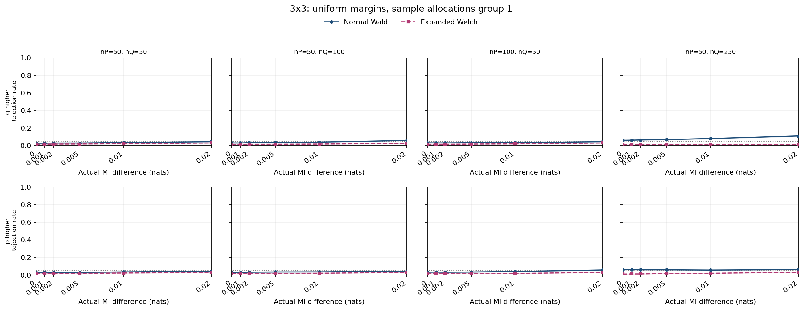

| Specification | Setting |
| --- | --- |
| Table size | 3x3 |
| Horizontal graph regime specifications (columns) | nP=50, nQ=50, nP=50, nQ=100, nP=100, nQ=50, nP=50, nQ=250 |
| Vertical graph regime specifications (rows) | q higher: P row (0.3333 repeated 3 times), P column (0.3333 repeated 3 times); Q row (0.3333 repeated 3 times), Q column (0.3333 repeated 3 times); p higher: P row (0.3333 repeated 3 times), P column (0.3333 repeated 3 times); Q row (0.3333 repeated 3 times), Q column (0.3333 repeated 3 times) |
| Probability changes | q higher: add at (1,1),(2,2) and subtract at (1,2),(2,1), for both P and Q; p higher: add at (1,1),(2,2) and subtract at (1,2),(2,1), for both P and Q |
| MI settings | Baseline MI {0.02}; direction {q higher, p higher}; actual differences {0, 0.001, 0.002, 0.005, 0.01, 0.02} nats |
| Horizontal axis within each graph | Actual MI difference in nats, fixed from 0 to 0.02 |
| Vertical axis within each graph | Unconditional rejection rate from 0 to 1; invalid results count as non-rejections |
| Replicates | 20,000 per unique point |

Null-point rejection and validity:

| Vertical regime | Horizontal regime | x | Method | Rejection | Valid |
| --- | --- | --- | --- | --- | --- |
| q higher | nP=50, nQ=50 | 0 | Expanded Welch | 0.0173 | 1.0000 |
| q higher | nP=50, nQ=50 | 0 | Normal Wald | 0.0288 | 1.0000 |
| q higher | nP=50, nQ=100 | 0 | Expanded Welch | 0.0167 | 1.0000 |
| q higher | nP=50, nQ=100 | 0 | Normal Wald | 0.0318 | 1.0000 |
| q higher | nP=100, nQ=50 | 0 | Expanded Welch | 0.0168 | 1.0000 |
| q higher | nP=100, nQ=50 | 0 | Normal Wald | 0.0329 | 1.0000 |
| q higher | nP=50, nQ=250 | 0 | Expanded Welch | 0.0106 | 1.0000 |
| q higher | nP=50, nQ=250 | 0 | Normal Wald | 0.0621 | 1.0000 |
| p higher | nP=50, nQ=50 | 0 | Expanded Welch | 0.0173 | 1.0000 |
| p higher | nP=50, nQ=50 | 0 | Normal Wald | 0.0288 | 1.0000 |
| p higher | nP=50, nQ=100 | 0 | Expanded Welch | 0.0167 | 1.0000 |
| p higher | nP=50, nQ=100 | 0 | Normal Wald | 0.0318 | 1.0000 |
| p higher | nP=100, nQ=50 | 0 | Expanded Welch | 0.0168 | 1.0000 |
| p higher | nP=100, nQ=50 | 0 | Normal Wald | 0.0329 | 1.0000 |
| p higher | nP=50, nQ=250 | 0 | Expanded Welch | 0.0106 | 1.0000 |
| p higher | nP=50, nQ=250 | 0 | Normal Wald | 0.0621 | 1.0000 |

Every plotted rate, interval, validity and minimum expected count

| Vertical regime | Horizontal regime | x | Method | Rejection | 95% interval | Valid | Conditional | Min expected P | Min expected Q |
| --- | --- | --- | --- | --- | --- | --- | --- | --- | --- |
| q higher | nP=50, nQ=50 | 0 | Expanded Welch | 0.0173 | [0.0156, 0.0192] | 1.0000 | 0.0173 | 3.902 | 3.902 |
| q higher | nP=50, nQ=50 | 0 | Normal Wald | 0.0288 | [0.0265, 0.0312] | 1.0000 | 0.0288 | 3.902 | 3.902 |
| q higher | nP=50, nQ=50 | 0.001 | Expanded Welch | 0.0173 | [0.0155, 0.0191] | 1.0000 | 0.0173 | 3.902 | 3.861 |
| q higher | nP=50, nQ=50 | 0.001 | Normal Wald | 0.0295 | [0.0272, 0.0319] | 1.0000 | 0.0295 | 3.902 | 3.861 |
| q higher | nP=50, nQ=50 | 0.002 | Expanded Welch | 0.0187 | [0.0170, 0.0207] | 1.0000 | 0.0187 | 3.902 | 3.822 |
| q higher | nP=50, nQ=50 | 0.002 | Normal Wald | 0.0307 | [0.0283, 0.0331] | 1.0000 | 0.0307 | 3.902 | 3.822 |
| q higher | nP=50, nQ=50 | 0.005 | Expanded Welch | 0.0197 | [0.0179, 0.0217] | 1.0000 | 0.0197 | 3.902 | 3.71 |
| q higher | nP=50, nQ=50 | 0.005 | Normal Wald | 0.0311 | [0.0287, 0.0335] | 1.0000 | 0.0311 | 3.902 | 3.71 |
| q higher | nP=50, nQ=50 | 0.01 | Expanded Welch | 0.0230 | [0.0210, 0.0251] | 1.0000 | 0.0230 | 3.902 | 3.538 |
| q higher | nP=50, nQ=50 | 0.01 | Normal Wald | 0.0361 | [0.0336, 0.0388] | 1.0000 | 0.0361 | 3.902 | 3.538 |
| q higher | nP=50, nQ=50 | 0.02 | Expanded Welch | 0.0314 | [0.0291, 0.0340] | 1.0000 | 0.0314 | 3.902 | 3.235 |
| q higher | nP=50, nQ=50 | 0.02 | Normal Wald | 0.0459 | [0.0430, 0.0488] | 1.0000 | 0.0459 | 3.902 | 3.235 |
| q higher | nP=50, nQ=100 | 0 | Expanded Welch | 0.0167 | [0.0150, 0.0185] | 1.0000 | 0.0167 | 3.902 | 7.803 |
| q higher | nP=50, nQ=100 | 0 | Normal Wald | 0.0318 | [0.0295, 0.0343] | 1.0000 | 0.0318 | 3.902 | 7.803 |
| q higher | nP=50, nQ=100 | 0.001 | Expanded Welch | 0.0157 | [0.0140, 0.0175] | 1.0000 | 0.0157 | 3.902 | 7.723 |
| q higher | nP=50, nQ=100 | 0.001 | Normal Wald | 0.0312 | [0.0289, 0.0337] | 1.0000 | 0.0312 | 3.902 | 7.723 |
| q higher | nP=50, nQ=100 | 0.002 | Expanded Welch | 0.0165 | [0.0149, 0.0184] | 1.0000 | 0.0165 | 3.902 | 7.644 |
| q higher | nP=50, nQ=100 | 0.002 | Normal Wald | 0.0350 | [0.0325, 0.0376] | 1.0000 | 0.0350 | 3.902 | 7.644 |
| q higher | nP=50, nQ=100 | 0.005 | Expanded Welch | 0.0168 | [0.0151, 0.0186] | 1.0000 | 0.0168 | 3.902 | 7.42 |
| q higher | nP=50, nQ=100 | 0.005 | Normal Wald | 0.0348 | [0.0323, 0.0374] | 1.0000 | 0.0348 | 3.902 | 7.42 |
| q higher | nP=50, nQ=100 | 0.01 | Expanded Welch | 0.0188 | [0.0171, 0.0208] | 1.0000 | 0.0188 | 3.902 | 7.075 |
| q higher | nP=50, nQ=100 | 0.01 | Normal Wald | 0.0414 | [0.0387, 0.0443] | 1.0000 | 0.0414 | 3.902 | 7.075 |
| q higher | nP=50, nQ=100 | 0.02 | Expanded Welch | 0.0263 | [0.0242, 0.0287] | 1.0000 | 0.0263 | 3.902 | 6.469 |
| q higher | nP=50, nQ=100 | 0.02 | Normal Wald | 0.0597 | [0.0565, 0.0630] | 1.0000 | 0.0597 | 3.902 | 6.469 |
| q higher | nP=100, nQ=50 | 0 | Expanded Welch | 0.0168 | [0.0151, 0.0187] | 1.0000 | 0.0168 | 7.803 | 3.902 |
| q higher | nP=100, nQ=50 | 0 | Normal Wald | 0.0329 | [0.0305, 0.0355] | 1.0000 | 0.0329 | 7.803 | 3.902 |
| q higher | nP=100, nQ=50 | 0.001 | Expanded Welch | 0.0165 | [0.0149, 0.0184] | 1.0000 | 0.0165 | 7.803 | 3.861 |
| q higher | nP=100, nQ=50 | 0.001 | Normal Wald | 0.0318 | [0.0294, 0.0343] | 1.0000 | 0.0318 | 7.803 | 3.861 |
| q higher | nP=100, nQ=50 | 0.002 | Expanded Welch | 0.0168 | [0.0151, 0.0186] | 1.0000 | 0.0168 | 7.803 | 3.822 |
| q higher | nP=100, nQ=50 | 0.002 | Normal Wald | 0.0319 | [0.0296, 0.0345] | 1.0000 | 0.0319 | 7.803 | 3.822 |
| q higher | nP=100, nQ=50 | 0.005 | Expanded Welch | 0.0186 | [0.0169, 0.0206] | 1.0000 | 0.0186 | 7.803 | 3.71 |
| q higher | nP=100, nQ=50 | 0.005 | Normal Wald | 0.0345 | [0.0320, 0.0371] | 1.0000 | 0.0345 | 7.803 | 3.71 |
| q higher | nP=100, nQ=50 | 0.01 | Expanded Welch | 0.0211 | [0.0192, 0.0232] | 1.0000 | 0.0211 | 7.803 | 3.538 |
| q higher | nP=100, nQ=50 | 0.01 | Normal Wald | 0.0349 | [0.0324, 0.0375] | 1.0000 | 0.0349 | 7.803 | 3.538 |
| q higher | nP=100, nQ=50 | 0.02 | Expanded Welch | 0.0314 | [0.0290, 0.0339] | 1.0000 | 0.0314 | 7.803 | 3.235 |
| q higher | nP=100, nQ=50 | 0.02 | Normal Wald | 0.0459 | [0.0431, 0.0489] | 1.0000 | 0.0459 | 7.803 | 3.235 |
| q higher | nP=50, nQ=250 | 0 | Expanded Welch | 0.0106 | [0.0093, 0.0121] | 1.0000 | 0.0106 | 3.902 | 19.51 |
| q higher | nP=50, nQ=250 | 0 | Normal Wald | 0.0621 | [0.0589, 0.0656] | 1.0000 | 0.0621 | 3.902 | 19.51 |
| q higher | nP=50, nQ=250 | 0.001 | Expanded Welch | 0.0106 | [0.0093, 0.0122] | 1.0000 | 0.0106 | 3.902 | 19.31 |
| q higher | nP=50, nQ=250 | 0.001 | Normal Wald | 0.0634 | [0.0601, 0.0669] | 1.0000 | 0.0634 | 3.902 | 19.31 |
| q higher | nP=50, nQ=250 | 0.002 | Expanded Welch | 0.0115 | [0.0101, 0.0130] | 1.0000 | 0.0115 | 3.902 | 19.11 |
| q higher | nP=50, nQ=250 | 0.002 | Normal Wald | 0.0658 | [0.0624, 0.0693] | 1.0000 | 0.0658 | 3.902 | 19.11 |
| q higher | nP=50, nQ=250 | 0.005 | Expanded Welch | 0.0116 | [0.0102, 0.0132] | 1.0000 | 0.0116 | 3.902 | 18.55 |
| q higher | nP=50, nQ=250 | 0.005 | Normal Wald | 0.0698 | [0.0664, 0.0735] | 1.0000 | 0.0698 | 3.902 | 18.55 |
| q higher | nP=50, nQ=250 | 0.01 | Expanded Welch | 0.0113 | [0.0099, 0.0129] | 1.0000 | 0.0113 | 3.902 | 17.69 |
| q higher | nP=50, nQ=250 | 0.01 | Normal Wald | 0.0819 | [0.0782, 0.0858] | 1.0000 | 0.0819 | 3.902 | 17.69 |
| q higher | nP=50, nQ=250 | 0.02 | Expanded Welch | 0.0148 | [0.0132, 0.0166] | 1.0000 | 0.0148 | 3.902 | 16.17 |
| q higher | nP=50, nQ=250 | 0.02 | Normal Wald | 0.1113 | [0.1070, 0.1157] | 1.0000 | 0.1113 | 3.902 | 16.17 |
| p higher | nP=50, nQ=50 | 0 | Expanded Welch | 0.0173 | [0.0156, 0.0192] | 1.0000 | 0.0173 | 3.902 | 3.902 |
| p higher | nP=50, nQ=50 | 0 | Normal Wald | 0.0288 | [0.0265, 0.0312] | 1.0000 | 0.0288 | 3.902 | 3.902 |
| p higher | nP=50, nQ=50 | 0.001 | Expanded Welch | 0.0193 | [0.0175, 0.0213] | 1.0000 | 0.0193 | 3.861 | 3.902 |
| p higher | nP=50, nQ=50 | 0.001 | Normal Wald | 0.0321 | [0.0297, 0.0346] | 1.0000 | 0.0321 | 3.861 | 3.902 |
| p higher | nP=50, nQ=50 | 0.002 | Expanded Welch | 0.0182 | [0.0164, 0.0201] | 1.0000 | 0.0182 | 3.822 | 3.902 |
| p higher | nP=50, nQ=50 | 0.002 | Normal Wald | 0.0300 | [0.0277, 0.0325] | 1.0000 | 0.0300 | 3.822 | 3.902 |
| p higher | nP=50, nQ=50 | 0.005 | Expanded Welch | 0.0195 | [0.0177, 0.0215] | 1.0000 | 0.0195 | 3.71 | 3.902 |
| p higher | nP=50, nQ=50 | 0.005 | Normal Wald | 0.0307 | [0.0283, 0.0331] | 1.0000 | 0.0307 | 3.71 | 3.902 |
| p higher | nP=50, nQ=50 | 0.01 | Expanded Welch | 0.0232 | [0.0212, 0.0254] | 1.0000 | 0.0232 | 3.538 | 3.902 |
| p higher | nP=50, nQ=50 | 0.01 | Normal Wald | 0.0355 | [0.0330, 0.0381] | 1.0000 | 0.0355 | 3.538 | 3.902 |
| p higher | nP=50, nQ=50 | 0.02 | Expanded Welch | 0.0290 | [0.0268, 0.0314] | 1.0000 | 0.0290 | 3.235 | 3.902 |
| p higher | nP=50, nQ=50 | 0.02 | Normal Wald | 0.0438 | [0.0411, 0.0467] | 1.0000 | 0.0438 | 3.235 | 3.902 |
| p higher | nP=50, nQ=100 | 0 | Expanded Welch | 0.0167 | [0.0150, 0.0185] | 1.0000 | 0.0167 | 3.902 | 7.803 |
| p higher | nP=50, nQ=100 | 0 | Normal Wald | 0.0318 | [0.0295, 0.0343] | 1.0000 | 0.0318 | 3.902 | 7.803 |
| p higher | nP=50, nQ=100 | 0.001 | Expanded Welch | 0.0154 | [0.0137, 0.0171] | 1.0000 | 0.0154 | 3.861 | 7.803 |
| p higher | nP=50, nQ=100 | 0.001 | Normal Wald | 0.0309 | [0.0286, 0.0334] | 1.0000 | 0.0309 | 3.861 | 7.803 |
| p higher | nP=50, nQ=100 | 0.002 | Expanded Welch | 0.0175 | [0.0158, 0.0194] | 1.0000 | 0.0175 | 3.822 | 7.803 |
| p higher | nP=50, nQ=100 | 0.002 | Normal Wald | 0.0328 | [0.0304, 0.0354] | 1.0000 | 0.0328 | 3.822 | 7.803 |
| p higher | nP=50, nQ=100 | 0.005 | Expanded Welch | 0.0192 | [0.0174, 0.0212] | 1.0000 | 0.0192 | 3.71 | 7.803 |
| p higher | nP=50, nQ=100 | 0.005 | Normal Wald | 0.0350 | [0.0325, 0.0376] | 1.0000 | 0.0350 | 3.71 | 7.803 |
| p higher | nP=50, nQ=100 | 0.01 | Expanded Welch | 0.0207 | [0.0188, 0.0227] | 1.0000 | 0.0207 | 3.538 | 7.803 |
| p higher | nP=50, nQ=100 | 0.01 | Normal Wald | 0.0357 | [0.0333, 0.0384] | 1.0000 | 0.0357 | 3.538 | 7.803 |
| p higher | nP=50, nQ=100 | 0.02 | Expanded Welch | 0.0299 | [0.0276, 0.0324] | 1.0000 | 0.0299 | 3.235 | 7.803 |
| p higher | nP=50, nQ=100 | 0.02 | Normal Wald | 0.0445 | [0.0417, 0.0474] | 1.0000 | 0.0445 | 3.235 | 7.803 |
| p higher | nP=100, nQ=50 | 0 | Expanded Welch | 0.0168 | [0.0151, 0.0187] | 1.0000 | 0.0168 | 7.803 | 3.902 |
| p higher | nP=100, nQ=50 | 0 | Normal Wald | 0.0329 | [0.0305, 0.0355] | 1.0000 | 0.0329 | 7.803 | 3.902 |
| p higher | nP=100, nQ=50 | 0.001 | Expanded Welch | 0.0149 | [0.0133, 0.0167] | 1.0000 | 0.0149 | 7.723 | 3.902 |
| p higher | nP=100, nQ=50 | 0.001 | Normal Wald | 0.0339 | [0.0315, 0.0365] | 1.0000 | 0.0339 | 7.723 | 3.902 |
| p higher | nP=100, nQ=50 | 0.002 | Expanded Welch | 0.0159 | [0.0143, 0.0178] | 1.0000 | 0.0159 | 7.644 | 3.902 |
| p higher | nP=100, nQ=50 | 0.002 | Normal Wald | 0.0326 | [0.0303, 0.0352] | 1.0000 | 0.0326 | 7.644 | 3.902 |
| p higher | nP=100, nQ=50 | 0.005 | Expanded Welch | 0.0168 | [0.0151, 0.0187] | 1.0000 | 0.0168 | 7.42 | 3.902 |
| p higher | nP=100, nQ=50 | 0.005 | Normal Wald | 0.0344 | [0.0320, 0.0370] | 1.0000 | 0.0344 | 7.42 | 3.902 |
| p higher | nP=100, nQ=50 | 0.01 | Expanded Welch | 0.0182 | [0.0165, 0.0202] | 1.0000 | 0.0182 | 7.075 | 3.902 |
| p higher | nP=100, nQ=50 | 0.01 | Normal Wald | 0.0405 | [0.0379, 0.0433] | 1.0000 | 0.0405 | 7.075 | 3.902 |
| p higher | nP=100, nQ=50 | 0.02 | Expanded Welch | 0.0301 | [0.0278, 0.0325] | 1.0000 | 0.0301 | 6.469 | 3.902 |
| p higher | nP=100, nQ=50 | 0.02 | Normal Wald | 0.0577 | [0.0546, 0.0610] | 1.0000 | 0.0577 | 6.469 | 3.902 |
| p higher | nP=50, nQ=250 | 0 | Expanded Welch | 0.0106 | [0.0093, 0.0121] | 1.0000 | 0.0106 | 3.902 | 19.51 |
| p higher | nP=50, nQ=250 | 0 | Normal Wald | 0.0621 | [0.0589, 0.0656] | 1.0000 | 0.0621 | 3.902 | 19.51 |
| p higher | nP=50, nQ=250 | 0.001 | Expanded Welch | 0.0120 | [0.0105, 0.0136] | 1.0000 | 0.0120 | 3.861 | 19.51 |
| p higher | nP=50, nQ=250 | 0.001 | Normal Wald | 0.0607 | [0.0574, 0.0640] | 1.0000 | 0.0607 | 3.861 | 19.51 |
| p higher | nP=50, nQ=250 | 0.002 | Expanded Welch | 0.0121 | [0.0107, 0.0138] | 1.0000 | 0.0121 | 3.822 | 19.51 |
| p higher | nP=50, nQ=250 | 0.002 | Normal Wald | 0.0595 | [0.0564, 0.0629] | 1.0000 | 0.0595 | 3.822 | 19.51 |
| p higher | nP=50, nQ=250 | 0.005 | Expanded Welch | 0.0179 | [0.0161, 0.0198] | 1.0000 | 0.0179 | 3.71 | 19.51 |
| p higher | nP=50, nQ=250 | 0.005 | Normal Wald | 0.0594 | [0.0562, 0.0628] | 1.0000 | 0.0594 | 3.71 | 19.51 |
| p higher | nP=50, nQ=250 | 0.01 | Expanded Welch | 0.0202 | [0.0183, 0.0222] | 1.0000 | 0.0202 | 3.538 | 19.51 |
| p higher | nP=50, nQ=250 | 0.01 | Normal Wald | 0.0566 | [0.0535, 0.0599] | 1.0000 | 0.0566 | 3.538 | 19.51 |
| p higher | nP=50, nQ=250 | 0.02 | Expanded Welch | 0.0318 | [0.0294, 0.0343] | 1.0000 | 0.0318 | 3.235 | 19.51 |
| p higher | nP=50, nQ=250 | 0.02 | Normal Wald | 0.0617 | [0.0585, 0.0652] | 1.0000 | 0.0617 | 3.235 | 19.51 |

### 6.8 3x3: uniform margins, sample allocations group 2

Does performance depend on which population has more data or greater MI?

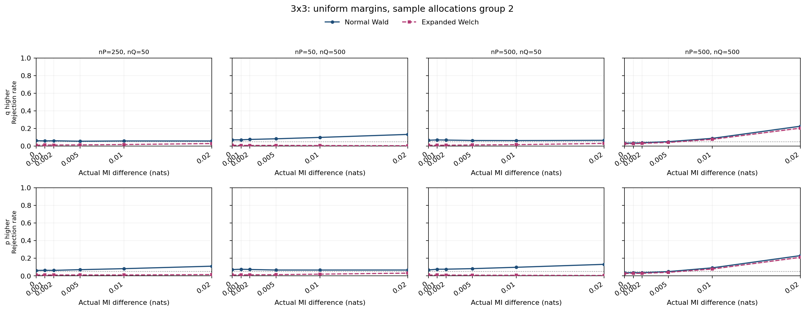

| Specification | Setting |
| --- | --- |
| Table size | 3x3 |
| Horizontal graph regime specifications (columns) | nP=250, nQ=50, nP=50, nQ=500, nP=500, nQ=50, nP=500, nQ=500 |
| Vertical graph regime specifications (rows) | q higher: P row (0.3333 repeated 3 times), P column (0.3333 repeated 3 times); Q row (0.3333 repeated 3 times), Q column (0.3333 repeated 3 times); p higher: P row (0.3333 repeated 3 times), P column (0.3333 repeated 3 times); Q row (0.3333 repeated 3 times), Q column (0.3333 repeated 3 times) |
| Probability changes | q higher: add at (1,1),(2,2) and subtract at (1,2),(2,1), for both P and Q; p higher: add at (1,1),(2,2) and subtract at (1,2),(2,1), for both P and Q |
| MI settings | Baseline MI {0.02}; direction {q higher, p higher}; actual differences {0, 0.001, 0.002, 0.005, 0.01, 0.02} nats |
| Horizontal axis within each graph | Actual MI difference in nats, fixed from 0 to 0.02 |
| Vertical axis within each graph | Unconditional rejection rate from 0 to 1; invalid results count as non-rejections |
| Replicates | 20,000 per unique point |

Null-point rejection and validity:

| Vertical regime | Horizontal regime | x | Method | Rejection | Valid |
| --- | --- | --- | --- | --- | --- |
| q higher | nP=250, nQ=50 | 0 | Expanded Welch | 0.0115 | 1.0000 |
| q higher | nP=250, nQ=50 | 0 | Normal Wald | 0.0629 | 1.0000 |
| q higher | nP=50, nQ=500 | 0 | Expanded Welch | 0.0118 | 1.0000 |
| q higher | nP=50, nQ=500 | 0 | Normal Wald | 0.0722 | 1.0000 |
| q higher | nP=500, nQ=50 | 0 | Expanded Welch | 0.0106 | 1.0000 |
| q higher | nP=500, nQ=50 | 0 | Normal Wald | 0.0678 | 1.0000 |
| q higher | nP=500, nQ=500 | 0 | Expanded Welch | 0.0278 | 1.0000 |
| q higher | nP=500, nQ=500 | 0 | Normal Wald | 0.0355 | 1.0000 |
| p higher | nP=250, nQ=50 | 0 | Expanded Welch | 0.0115 | 1.0000 |
| p higher | nP=250, nQ=50 | 0 | Normal Wald | 0.0629 | 1.0000 |
| p higher | nP=50, nQ=500 | 0 | Expanded Welch | 0.0118 | 1.0000 |
| p higher | nP=50, nQ=500 | 0 | Normal Wald | 0.0722 | 1.0000 |
| p higher | nP=500, nQ=50 | 0 | Expanded Welch | 0.0106 | 1.0000 |
| p higher | nP=500, nQ=50 | 0 | Normal Wald | 0.0678 | 1.0000 |
| p higher | nP=500, nQ=500 | 0 | Expanded Welch | 0.0278 | 1.0000 |
| p higher | nP=500, nQ=500 | 0 | Normal Wald | 0.0355 | 1.0000 |

Every plotted rate, interval, validity and minimum expected count

| Vertical regime | Horizontal regime | x | Method | Rejection | 95% interval | Valid | Conditional | Min expected P | Min expected Q |
| --- | --- | --- | --- | --- | --- | --- | --- | --- | --- |
| q higher | nP=250, nQ=50 | 0 | Expanded Welch | 0.0115 | [0.0101, 0.0131] | 1.0000 | 0.0115 | 19.51 | 3.902 |
| q higher | nP=250, nQ=50 | 0 | Normal Wald | 0.0629 | [0.0596, 0.0663] | 1.0000 | 0.0629 | 19.51 | 3.902 |
| q higher | nP=250, nQ=50 | 0.001 | Expanded Welch | 0.0139 | [0.0124, 0.0156] | 1.0000 | 0.0139 | 19.51 | 3.861 |
| q higher | nP=250, nQ=50 | 0.001 | Normal Wald | 0.0603 | [0.0571, 0.0637] | 1.0000 | 0.0603 | 19.51 | 3.861 |
| q higher | nP=250, nQ=50 | 0.002 | Expanded Welch | 0.0135 | [0.0119, 0.0151] | 1.0000 | 0.0135 | 19.51 | 3.822 |
| q higher | nP=250, nQ=50 | 0.002 | Normal Wald | 0.0617 | [0.0584, 0.0651] | 1.0000 | 0.0617 | 19.51 | 3.822 |
| q higher | nP=250, nQ=50 | 0.005 | Expanded Welch | 0.0150 | [0.0134, 0.0168] | 1.0000 | 0.0150 | 19.51 | 3.71 |
| q higher | nP=250, nQ=50 | 0.005 | Normal Wald | 0.0566 | [0.0535, 0.0599] | 1.0000 | 0.0566 | 19.51 | 3.71 |
| q higher | nP=250, nQ=50 | 0.01 | Expanded Welch | 0.0192 | [0.0174, 0.0212] | 1.0000 | 0.0192 | 19.51 | 3.538 |
| q higher | nP=250, nQ=50 | 0.01 | Normal Wald | 0.0597 | [0.0565, 0.0630] | 1.0000 | 0.0597 | 19.51 | 3.538 |
| q higher | nP=250, nQ=50 | 0.02 | Expanded Welch | 0.0301 | [0.0279, 0.0326] | 1.0000 | 0.0301 | 19.51 | 3.235 |
| q higher | nP=250, nQ=50 | 0.02 | Normal Wald | 0.0593 | [0.0561, 0.0627] | 1.0000 | 0.0593 | 19.51 | 3.235 |
| q higher | nP=50, nQ=500 | 0 | Expanded Welch | 0.0118 | [0.0104, 0.0134] | 1.0000 | 0.0118 | 3.902 | 39.02 |
| q higher | nP=50, nQ=500 | 0 | Normal Wald | 0.0722 | [0.0687, 0.0759] | 1.0000 | 0.0722 | 3.902 | 39.02 |
| q higher | nP=50, nQ=500 | 0.001 | Expanded Welch | 0.0090 | [0.0078, 0.0104] | 1.0000 | 0.0090 | 3.902 | 38.61 |
| q higher | nP=50, nQ=500 | 0.001 | Normal Wald | 0.0727 | [0.0692, 0.0764] | 1.0000 | 0.0727 | 3.902 | 38.61 |
| q higher | nP=50, nQ=500 | 0.002 | Expanded Welch | 0.0086 | [0.0075, 0.0100] | 1.0000 | 0.0086 | 3.902 | 38.22 |
| q higher | nP=50, nQ=500 | 0.002 | Normal Wald | 0.0769 | [0.0732, 0.0806] | 1.0000 | 0.0769 | 3.902 | 38.22 |
| q higher | nP=50, nQ=500 | 0.005 | Expanded Welch | 0.0092 | [0.0080, 0.0106] | 1.0000 | 0.0092 | 3.902 | 37.1 |
| q higher | nP=50, nQ=500 | 0.005 | Normal Wald | 0.0843 | [0.0805, 0.0882] | 1.0000 | 0.0843 | 3.902 | 37.1 |
| q higher | nP=50, nQ=500 | 0.01 | Expanded Welch | 0.0074 | [0.0063, 0.0087] | 1.0000 | 0.0074 | 3.902 | 35.38 |
| q higher | nP=50, nQ=500 | 0.01 | Normal Wald | 0.0998 | [0.0958, 0.1041] | 1.0000 | 0.0998 | 3.902 | 35.38 |
| q higher | nP=50, nQ=500 | 0.02 | Expanded Welch | 0.0055 | [0.0046, 0.0066] | 1.0000 | 0.0055 | 3.902 | 32.35 |
| q higher | nP=50, nQ=500 | 0.02 | Normal Wald | 0.1338 | [0.1292, 0.1386] | 1.0000 | 0.1338 | 3.902 | 32.35 |
| q higher | nP=500, nQ=50 | 0 | Expanded Welch | 0.0106 | [0.0093, 0.0122] | 1.0000 | 0.0106 | 39.02 | 3.902 |
| q higher | nP=500, nQ=50 | 0 | Normal Wald | 0.0678 | [0.0643, 0.0713] | 1.0000 | 0.0678 | 39.02 | 3.902 |
| q higher | nP=500, nQ=50 | 0.001 | Expanded Welch | 0.0109 | [0.0096, 0.0125] | 1.0000 | 0.0109 | 39.02 | 3.861 |
| q higher | nP=500, nQ=50 | 0.001 | Normal Wald | 0.0715 | [0.0680, 0.0752] | 1.0000 | 0.0715 | 39.02 | 3.861 |
| q higher | nP=500, nQ=50 | 0.002 | Expanded Welch | 0.0114 | [0.0100, 0.0129] | 1.0000 | 0.0114 | 39.02 | 3.822 |
| q higher | nP=500, nQ=50 | 0.002 | Normal Wald | 0.0699 | [0.0664, 0.0735] | 1.0000 | 0.0699 | 39.02 | 3.822 |
| q higher | nP=500, nQ=50 | 0.005 | Expanded Welch | 0.0140 | [0.0125, 0.0157] | 1.0000 | 0.0140 | 39.02 | 3.71 |
| q higher | nP=500, nQ=50 | 0.005 | Normal Wald | 0.0650 | [0.0617, 0.0685] | 1.0000 | 0.0650 | 39.02 | 3.71 |
| q higher | nP=500, nQ=50 | 0.01 | Expanded Welch | 0.0179 | [0.0161, 0.0198] | 1.0000 | 0.0179 | 39.02 | 3.538 |
| q higher | nP=500, nQ=50 | 0.01 | Normal Wald | 0.0640 | [0.0607, 0.0675] | 1.0000 | 0.0640 | 39.02 | 3.538 |
| q higher | nP=500, nQ=50 | 0.02 | Expanded Welch | 0.0316 | [0.0293, 0.0341] | 1.0000 | 0.0316 | 39.02 | 3.235 |
| q higher | nP=500, nQ=50 | 0.02 | Normal Wald | 0.0668 | [0.0634, 0.0703] | 1.0000 | 0.0668 | 39.02 | 3.235 |
| q higher | nP=500, nQ=500 | 0 | Expanded Welch | 0.0278 | [0.0256, 0.0301] | 1.0000 | 0.0278 | 39.02 | 39.02 |
| q higher | nP=500, nQ=500 | 0 | Normal Wald | 0.0355 | [0.0331, 0.0382] | 1.0000 | 0.0355 | 39.02 | 39.02 |
| q higher | nP=500, nQ=500 | 0.001 | Expanded Welch | 0.0279 | [0.0257, 0.0303] | 1.0000 | 0.0279 | 39.02 | 38.61 |
| q higher | nP=500, nQ=500 | 0.001 | Normal Wald | 0.0355 | [0.0331, 0.0382] | 1.0000 | 0.0355 | 39.02 | 38.61 |
| q higher | nP=500, nQ=500 | 0.002 | Expanded Welch | 0.0326 | [0.0302, 0.0351] | 1.0000 | 0.0326 | 39.02 | 38.22 |
| q higher | nP=500, nQ=500 | 0.002 | Normal Wald | 0.0396 | [0.0370, 0.0424] | 1.0000 | 0.0396 | 39.02 | 38.22 |
| q higher | nP=500, nQ=500 | 0.005 | Expanded Welch | 0.0430 | [0.0403, 0.0460] | 1.0000 | 0.0430 | 39.02 | 37.1 |
| q higher | nP=500, nQ=500 | 0.005 | Normal Wald | 0.0520 | [0.0490, 0.0552] | 1.0000 | 0.0520 | 39.02 | 37.1 |
| q higher | nP=500, nQ=500 | 0.01 | Expanded Welch | 0.0779 | [0.0743, 0.0817] | 1.0000 | 0.0779 | 39.02 | 35.38 |
| q higher | nP=500, nQ=500 | 0.01 | Normal Wald | 0.0894 | [0.0855, 0.0934] | 1.0000 | 0.0894 | 39.02 | 35.38 |
| q higher | nP=500, nQ=500 | 0.02 | Expanded Welch | 0.2048 | [0.1993, 0.2104] | 1.0000 | 0.2048 | 39.02 | 32.35 |
| q higher | nP=500, nQ=500 | 0.02 | Normal Wald | 0.2263 | [0.2206, 0.2322] | 1.0000 | 0.2263 | 39.02 | 32.35 |
| p higher | nP=250, nQ=50 | 0 | Expanded Welch | 0.0115 | [0.0101, 0.0131] | 1.0000 | 0.0115 | 19.51 | 3.902 |
| p higher | nP=250, nQ=50 | 0 | Normal Wald | 0.0629 | [0.0596, 0.0663] | 1.0000 | 0.0629 | 19.51 | 3.902 |
| p higher | nP=250, nQ=50 | 0.001 | Expanded Welch | 0.0116 | [0.0102, 0.0132] | 1.0000 | 0.0116 | 19.31 | 3.902 |
| p higher | nP=250, nQ=50 | 0.001 | Normal Wald | 0.0639 | [0.0606, 0.0674] | 1.0000 | 0.0639 | 19.31 | 3.902 |
| p higher | nP=250, nQ=50 | 0.002 | Expanded Welch | 0.0111 | [0.0097, 0.0126] | 1.0000 | 0.0111 | 19.11 | 3.902 |
| p higher | nP=250, nQ=50 | 0.002 | Normal Wald | 0.0634 | [0.0601, 0.0668] | 1.0000 | 0.0634 | 19.11 | 3.902 |
| p higher | nP=250, nQ=50 | 0.005 | Expanded Welch | 0.0115 | [0.0101, 0.0131] | 1.0000 | 0.0115 | 18.55 | 3.902 |
| p higher | nP=250, nQ=50 | 0.005 | Normal Wald | 0.0712 | [0.0678, 0.0749] | 1.0000 | 0.0712 | 18.55 | 3.902 |
| p higher | nP=250, nQ=50 | 0.01 | Expanded Welch | 0.0110 | [0.0096, 0.0125] | 1.0000 | 0.0110 | 17.69 | 3.902 |
| p higher | nP=250, nQ=50 | 0.01 | Normal Wald | 0.0825 | [0.0788, 0.0864] | 1.0000 | 0.0825 | 17.69 | 3.902 |
| p higher | nP=250, nQ=50 | 0.02 | Expanded Welch | 0.0153 | [0.0137, 0.0171] | 1.0000 | 0.0153 | 16.17 | 3.902 |
| p higher | nP=250, nQ=50 | 0.02 | Normal Wald | 0.1106 | [0.1063, 0.1150] | 1.0000 | 0.1106 | 16.17 | 3.902 |
| p higher | nP=50, nQ=500 | 0 | Expanded Welch | 0.0118 | [0.0104, 0.0134] | 1.0000 | 0.0118 | 3.902 | 39.02 |
| p higher | nP=50, nQ=500 | 0 | Normal Wald | 0.0722 | [0.0687, 0.0759] | 1.0000 | 0.0722 | 3.902 | 39.02 |
| p higher | nP=50, nQ=500 | 0.001 | Expanded Welch | 0.0124 | [0.0110, 0.0140] | 1.0000 | 0.0124 | 3.861 | 39.02 |
| p higher | nP=50, nQ=500 | 0.001 | Normal Wald | 0.0761 | [0.0725, 0.0799] | 1.0000 | 0.0761 | 3.861 | 39.02 |
| p higher | nP=50, nQ=500 | 0.002 | Expanded Welch | 0.0129 | [0.0115, 0.0146] | 1.0000 | 0.0129 | 3.822 | 39.02 |
| p higher | nP=50, nQ=500 | 0.002 | Normal Wald | 0.0735 | [0.0700, 0.0772] | 1.0000 | 0.0735 | 3.822 | 39.02 |
| p higher | nP=50, nQ=500 | 0.005 | Expanded Welch | 0.0144 | [0.0129, 0.0162] | 1.0000 | 0.0144 | 3.71 | 39.02 |
| p higher | nP=50, nQ=500 | 0.005 | Normal Wald | 0.0670 | [0.0636, 0.0705] | 1.0000 | 0.0670 | 3.71 | 39.02 |
| p higher | nP=50, nQ=500 | 0.01 | Expanded Welch | 0.0203 | [0.0184, 0.0223] | 1.0000 | 0.0203 | 3.538 | 39.02 |
| p higher | nP=50, nQ=500 | 0.01 | Normal Wald | 0.0669 | [0.0635, 0.0704] | 1.0000 | 0.0669 | 3.538 | 39.02 |
| p higher | nP=50, nQ=500 | 0.02 | Expanded Welch | 0.0316 | [0.0293, 0.0341] | 1.0000 | 0.0316 | 3.235 | 39.02 |
| p higher | nP=50, nQ=500 | 0.02 | Normal Wald | 0.0671 | [0.0637, 0.0707] | 1.0000 | 0.0671 | 3.235 | 39.02 |
| p higher | nP=500, nQ=50 | 0 | Expanded Welch | 0.0106 | [0.0093, 0.0122] | 1.0000 | 0.0106 | 39.02 | 3.902 |
| p higher | nP=500, nQ=50 | 0 | Normal Wald | 0.0678 | [0.0643, 0.0713] | 1.0000 | 0.0678 | 39.02 | 3.902 |
| p higher | nP=500, nQ=50 | 0.001 | Expanded Welch | 0.0108 | [0.0095, 0.0123] | 1.0000 | 0.0108 | 38.61 | 3.902 |
| p higher | nP=500, nQ=50 | 0.001 | Normal Wald | 0.0764 | [0.0728, 0.0802] | 1.0000 | 0.0764 | 38.61 | 3.902 |
| p higher | nP=500, nQ=50 | 0.002 | Expanded Welch | 0.0103 | [0.0090, 0.0118] | 1.0000 | 0.0103 | 38.22 | 3.902 |
| p higher | nP=500, nQ=50 | 0.002 | Normal Wald | 0.0767 | [0.0731, 0.0805] | 1.0000 | 0.0767 | 38.22 | 3.902 |
| p higher | nP=500, nQ=50 | 0.005 | Expanded Welch | 0.0090 | [0.0078, 0.0104] | 1.0000 | 0.0090 | 37.1 | 3.902 |
| p higher | nP=500, nQ=50 | 0.005 | Normal Wald | 0.0828 | [0.0791, 0.0867] | 1.0000 | 0.0828 | 37.1 | 3.902 |
| p higher | nP=500, nQ=50 | 0.01 | Expanded Welch | 0.0075 | [0.0064, 0.0088] | 1.0000 | 0.0075 | 35.38 | 3.902 |
| p higher | nP=500, nQ=50 | 0.01 | Normal Wald | 0.0982 | [0.0942, 0.1024] | 1.0000 | 0.0982 | 35.38 | 3.902 |
| p higher | nP=500, nQ=50 | 0.02 | Expanded Welch | 0.0052 | [0.0043, 0.0063] | 1.0000 | 0.0052 | 32.35 | 3.902 |
| p higher | nP=500, nQ=50 | 0.02 | Normal Wald | 0.1316 | [0.1269, 0.1363] | 1.0000 | 0.1316 | 32.35 | 3.902 |
| p higher | nP=500, nQ=500 | 0 | Expanded Welch | 0.0278 | [0.0256, 0.0301] | 1.0000 | 0.0278 | 39.02 | 39.02 |
| p higher | nP=500, nQ=500 | 0 | Normal Wald | 0.0355 | [0.0331, 0.0382] | 1.0000 | 0.0355 | 39.02 | 39.02 |
| p higher | nP=500, nQ=500 | 0.001 | Expanded Welch | 0.0293 | [0.0271, 0.0317] | 1.0000 | 0.0293 | 38.61 | 39.02 |
| p higher | nP=500, nQ=500 | 0.001 | Normal Wald | 0.0379 | [0.0353, 0.0406] | 1.0000 | 0.0379 | 38.61 | 39.02 |
| p higher | nP=500, nQ=500 | 0.002 | Expanded Welch | 0.0294 | [0.0271, 0.0318] | 1.0000 | 0.0294 | 38.22 | 39.02 |
| p higher | nP=500, nQ=500 | 0.002 | Normal Wald | 0.0372 | [0.0347, 0.0399] | 1.0000 | 0.0372 | 38.22 | 39.02 |
| p higher | nP=500, nQ=500 | 0.005 | Expanded Welch | 0.0411 | [0.0384, 0.0439] | 1.0000 | 0.0411 | 37.1 | 39.02 |
| p higher | nP=500, nQ=500 | 0.005 | Normal Wald | 0.0496 | [0.0467, 0.0527] | 1.0000 | 0.0496 | 37.1 | 39.02 |
| p higher | nP=500, nQ=500 | 0.01 | Expanded Welch | 0.0786 | [0.0750, 0.0825] | 1.0000 | 0.0786 | 35.38 | 39.02 |
| p higher | nP=500, nQ=500 | 0.01 | Normal Wald | 0.0921 | [0.0882, 0.0962] | 1.0000 | 0.0921 | 35.38 | 39.02 |
| p higher | nP=500, nQ=500 | 0.02 | Expanded Welch | 0.2106 | [0.2050, 0.2163] | 1.0000 | 0.2106 | 32.35 | 39.02 |
| p higher | nP=500, nQ=500 | 0.02 | Normal Wald | 0.2301 | [0.2243, 0.2360] | 1.0000 | 0.2301 | 32.35 | 39.02 |

### 6.9 3x3: same skew margins, sample allocations group 1

Does performance depend on which population has more data or greater MI?

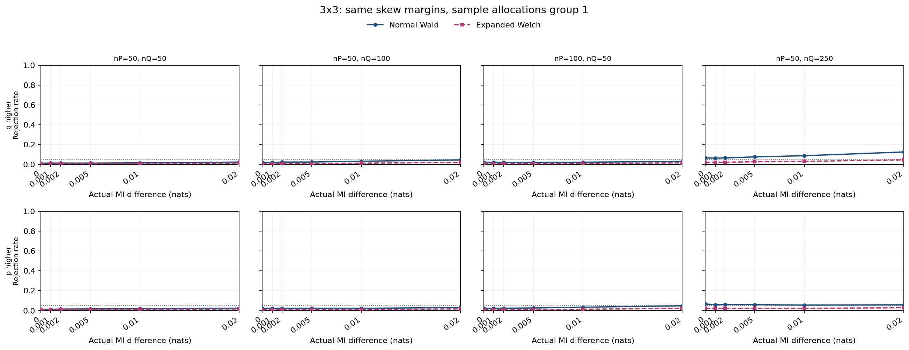

| Specification | Setting |
| --- | --- |
| Table size | 3x3 |
| Horizontal graph regime specifications (columns) | nP=50, nQ=50, nP=50, nQ=100, nP=100, nQ=50, nP=50, nQ=250 |
| Vertical graph regime specifications (rows) | q higher: P row (0.8, 0.2/2 repeated 2 times), P column (0.8, 0.2/2 repeated 2 times); Q row (0.8, 0.2/2 repeated 2 times), Q column (0.8, 0.2/2 repeated 2 times); p higher: P row (0.8, 0.2/2 repeated 2 times), P column (0.8, 0.2/2 repeated 2 times); Q row (0.8, 0.2/2 repeated 2 times), Q column (0.8, 0.2/2 repeated 2 times) |
| Probability changes | q higher: add at (1,1),(2,2) and subtract at (1,2),(2,1), for both P and Q; p higher: add at (1,1),(2,2) and subtract at (1,2),(2,1), for both P and Q |
| MI settings | Baseline MI {0.02}; direction {q higher, p higher}; actual differences {0, 0.001, 0.002, 0.005, 0.01, 0.02} nats |
| Horizontal axis within each graph | Actual MI difference in nats, fixed from 0 to 0.02 |
| Vertical axis within each graph | Unconditional rejection rate from 0 to 1; invalid results count as non-rejections |
| Replicates | 20,000 per unique point |

Null-point rejection and validity:

| Vertical regime | Horizontal regime | x | Method | Rejection | Valid |
| --- | --- | --- | --- | --- | --- |
| q higher | nP=50, nQ=50 | 0 | Expanded Welch | 0.0076 | 1.0000 |
| q higher | nP=50, nQ=50 | 0 | Normal Wald | 0.0135 | 1.0000 |
| q higher | nP=50, nQ=100 | 0 | Expanded Welch | 0.0075 | 1.0000 |
| q higher | nP=50, nQ=100 | 0 | Normal Wald | 0.0211 | 1.0000 |
| q higher | nP=100, nQ=50 | 0 | Expanded Welch | 0.0076 | 0.9999 |
| q higher | nP=100, nQ=50 | 0 | Normal Wald | 0.0227 | 1.0000 |
| q higher | nP=50, nQ=250 | 0 | Expanded Welch | 0.0228 | 1.0000 |
| q higher | nP=50, nQ=250 | 0 | Normal Wald | 0.0665 | 1.0000 |
| p higher | nP=50, nQ=50 | 0 | Expanded Welch | 0.0076 | 1.0000 |
| p higher | nP=50, nQ=50 | 0 | Normal Wald | 0.0135 | 1.0000 |
| p higher | nP=50, nQ=100 | 0 | Expanded Welch | 0.0075 | 1.0000 |
| p higher | nP=50, nQ=100 | 0 | Normal Wald | 0.0211 | 1.0000 |
| p higher | nP=100, nQ=50 | 0 | Expanded Welch | 0.0076 | 0.9999 |
| p higher | nP=100, nQ=50 | 0 | Normal Wald | 0.0227 | 1.0000 |
| p higher | nP=50, nQ=250 | 0 | Expanded Welch | 0.0228 | 1.0000 |
| p higher | nP=50, nQ=250 | 0 | Normal Wald | 0.0665 | 1.0000 |

Every plotted rate, interval, validity and minimum expected count

| Vertical regime | Horizontal regime | x | Method | Rejection | 95% interval | Valid | Conditional | Min expected P | Min expected Q |
| --- | --- | --- | --- | --- | --- | --- | --- | --- | --- |
| q higher | nP=50, nQ=50 | 0 | Expanded Welch | 0.0076 | [0.0065, 0.0089] | 1.0000 | 0.0076 | 0.5 | 0.5 |
| q higher | nP=50, nQ=50 | 0 | Normal Wald | 0.0135 | [0.0120, 0.0152] | 1.0000 | 0.0135 | 0.5 | 0.5 |
| q higher | nP=50, nQ=50 | 0.001 | Expanded Welch | 0.0093 | [0.0081, 0.0107] | 1.0000 | 0.0093 | 0.5 | 0.5 |
| q higher | nP=50, nQ=50 | 0.001 | Normal Wald | 0.0149 | [0.0134, 0.0167] | 1.0000 | 0.0149 | 0.5 | 0.5 |
| q higher | nP=50, nQ=50 | 0.002 | Expanded Welch | 0.0084 | [0.0073, 0.0098] | 1.0000 | 0.0084 | 0.5 | 0.5 |
| q higher | nP=50, nQ=50 | 0.002 | Normal Wald | 0.0146 | [0.0130, 0.0163] | 1.0000 | 0.0146 | 0.5 | 0.5 |
| q higher | nP=50, nQ=50 | 0.005 | Expanded Welch | 0.0087 | [0.0075, 0.0101] | 1.0000 | 0.0087 | 0.5 | 0.5 |
| q higher | nP=50, nQ=50 | 0.005 | Normal Wald | 0.0144 | [0.0128, 0.0161] | 1.0000 | 0.0144 | 0.5 | 0.5 |
| q higher | nP=50, nQ=50 | 0.01 | Expanded Welch | 0.0100 | [0.0087, 0.0114] | 0.9999 | 0.0100 | 0.5 | 0.5 |
| q higher | nP=50, nQ=50 | 0.01 | Normal Wald | 0.0168 | [0.0151, 0.0187] | 1.0000 | 0.0168 | 0.5 | 0.5 |
| q higher | nP=50, nQ=50 | 0.02 | Expanded Welch | 0.0154 | [0.0137, 0.0171] | 1.0000 | 0.0154 | 0.5 | 0.5 |
| q higher | nP=50, nQ=50 | 0.02 | Normal Wald | 0.0248 | [0.0227, 0.0270] | 1.0000 | 0.0248 | 0.5 | 0.5 |
| q higher | nP=50, nQ=100 | 0 | Expanded Welch | 0.0075 | [0.0064, 0.0088] | 1.0000 | 0.0075 | 0.5 | 1 |
| q higher | nP=50, nQ=100 | 0 | Normal Wald | 0.0211 | [0.0192, 0.0232] | 1.0000 | 0.0211 | 0.5 | 1 |
| q higher | nP=50, nQ=100 | 0.001 | Expanded Welch | 0.0072 | [0.0061, 0.0084] | 1.0000 | 0.0072 | 0.5 | 1 |
| q higher | nP=50, nQ=100 | 0.001 | Normal Wald | 0.0209 | [0.0190, 0.0229] | 1.0000 | 0.0209 | 0.5 | 1 |
| q higher | nP=50, nQ=100 | 0.002 | Expanded Welch | 0.0089 | [0.0077, 0.0103] | 1.0000 | 0.0089 | 0.5 | 1 |
| q higher | nP=50, nQ=100 | 0.002 | Normal Wald | 0.0249 | [0.0229, 0.0272] | 1.0000 | 0.0249 | 0.5 | 1 |
| q higher | nP=50, nQ=100 | 0.005 | Expanded Welch | 0.0089 | [0.0076, 0.0102] | 1.0000 | 0.0089 | 0.5 | 1 |
| q higher | nP=50, nQ=100 | 0.005 | Normal Wald | 0.0252 | [0.0231, 0.0275] | 1.0000 | 0.0252 | 0.5 | 1 |
| q higher | nP=50, nQ=100 | 0.01 | Expanded Welch | 0.0139 | [0.0124, 0.0156] | 1.0000 | 0.0139 | 0.5 | 1 |
| q higher | nP=50, nQ=100 | 0.01 | Normal Wald | 0.0333 | [0.0309, 0.0359] | 1.0000 | 0.0333 | 0.5 | 1 |
| q higher | nP=50, nQ=100 | 0.02 | Expanded Welch | 0.0213 | [0.0193, 0.0233] | 0.9999 | 0.0213 | 0.5 | 1 |
| q higher | nP=50, nQ=100 | 0.02 | Normal Wald | 0.0466 | [0.0438, 0.0497] | 1.0000 | 0.0466 | 0.5 | 1 |
| q higher | nP=100, nQ=50 | 0 | Expanded Welch | 0.0076 | [0.0065, 0.0090] | 0.9999 | 0.0077 | 1 | 0.5 |
| q higher | nP=100, nQ=50 | 0 | Normal Wald | 0.0227 | [0.0207, 0.0249] | 1.0000 | 0.0227 | 1 | 0.5 |
| q higher | nP=100, nQ=50 | 0.001 | Expanded Welch | 0.0081 | [0.0069, 0.0094] | 1.0000 | 0.0081 | 1 | 0.5 |
| q higher | nP=100, nQ=50 | 0.001 | Normal Wald | 0.0231 | [0.0211, 0.0252] | 1.0000 | 0.0231 | 1 | 0.5 |
| q higher | nP=100, nQ=50 | 0.002 | Expanded Welch | 0.0080 | [0.0068, 0.0093] | 1.0000 | 0.0080 | 1 | 0.5 |
| q higher | nP=100, nQ=50 | 0.002 | Normal Wald | 0.0209 | [0.0190, 0.0229] | 1.0000 | 0.0209 | 1 | 0.5 |
| q higher | nP=100, nQ=50 | 0.005 | Expanded Welch | 0.0078 | [0.0067, 0.0092] | 1.0000 | 0.0079 | 1 | 0.5 |
| q higher | nP=100, nQ=50 | 0.005 | Normal Wald | 0.0221 | [0.0202, 0.0242] | 1.0000 | 0.0221 | 1 | 0.5 |
| q higher | nP=100, nQ=50 | 0.01 | Expanded Welch | 0.0114 | [0.0100, 0.0130] | 1.0000 | 0.0114 | 1 | 0.5 |
| q higher | nP=100, nQ=50 | 0.01 | Normal Wald | 0.0238 | [0.0218, 0.0260] | 1.0000 | 0.0238 | 1 | 0.5 |
| q higher | nP=100, nQ=50 | 0.02 | Expanded Welch | 0.0170 | [0.0153, 0.0189] | 1.0000 | 0.0171 | 1 | 0.5 |
| q higher | nP=100, nQ=50 | 0.02 | Normal Wald | 0.0308 | [0.0285, 0.0333] | 1.0000 | 0.0308 | 1 | 0.5 |
| q higher | nP=50, nQ=250 | 0 | Expanded Welch | 0.0228 | [0.0209, 0.0250] | 1.0000 | 0.0228 | 0.5 | 2.5 |
| q higher | nP=50, nQ=250 | 0 | Normal Wald | 0.0665 | [0.0631, 0.0700] | 1.0000 | 0.0665 | 0.5 | 2.5 |
| q higher | nP=50, nQ=250 | 0.001 | Expanded Welch | 0.0234 | [0.0214, 0.0256] | 1.0000 | 0.0235 | 0.5 | 2.5 |
| q higher | nP=50, nQ=250 | 0.001 | Normal Wald | 0.0651 | [0.0618, 0.0686] | 1.0000 | 0.0651 | 0.5 | 2.5 |
| q higher | nP=50, nQ=250 | 0.002 | Expanded Welch | 0.0234 | [0.0214, 0.0256] | 1.0000 | 0.0235 | 0.5 | 2.5 |
| q higher | nP=50, nQ=250 | 0.002 | Normal Wald | 0.0663 | [0.0629, 0.0698] | 1.0000 | 0.0663 | 0.5 | 2.5 |
| q higher | nP=50, nQ=250 | 0.005 | Expanded Welch | 0.0278 | [0.0256, 0.0302] | 1.0000 | 0.0278 | 0.5 | 2.5 |
| q higher | nP=50, nQ=250 | 0.005 | Normal Wald | 0.0774 | [0.0737, 0.0811] | 1.0000 | 0.0774 | 0.5 | 2.5 |
| q higher | nP=50, nQ=250 | 0.01 | Expanded Welch | 0.0322 | [0.0298, 0.0347] | 0.9999 | 0.0322 | 0.5 | 2.5 |
| q higher | nP=50, nQ=250 | 0.01 | Normal Wald | 0.0890 | [0.0851, 0.0930] | 1.0000 | 0.0890 | 0.5 | 2.5 |
| q higher | nP=50, nQ=250 | 0.02 | Expanded Welch | 0.0469 | [0.0441, 0.0499] | 1.0000 | 0.0469 | 0.5 | 2.5 |
| q higher | nP=50, nQ=250 | 0.02 | Normal Wald | 0.1265 | [0.1220, 0.1312] | 1.0000 | 0.1265 | 0.5 | 2.5 |
| p higher | nP=50, nQ=50 | 0 | Expanded Welch | 0.0076 | [0.0065, 0.0089] | 1.0000 | 0.0076 | 0.5 | 0.5 |
| p higher | nP=50, nQ=50 | 0 | Normal Wald | 0.0135 | [0.0120, 0.0152] | 1.0000 | 0.0135 | 0.5 | 0.5 |
| p higher | nP=50, nQ=50 | 0.001 | Expanded Welch | 0.0075 | [0.0063, 0.0087] | 1.0000 | 0.0075 | 0.5 | 0.5 |
| p higher | nP=50, nQ=50 | 0.001 | Normal Wald | 0.0127 | [0.0113, 0.0144] | 1.0000 | 0.0127 | 0.5 | 0.5 |
| p higher | nP=50, nQ=50 | 0.002 | Expanded Welch | 0.0088 | [0.0076, 0.0101] | 1.0000 | 0.0088 | 0.5 | 0.5 |
| p higher | nP=50, nQ=50 | 0.002 | Normal Wald | 0.0147 | [0.0132, 0.0165] | 1.0000 | 0.0147 | 0.5 | 0.5 |
| p higher | nP=50, nQ=50 | 0.005 | Expanded Welch | 0.0103 | [0.0089, 0.0117] | 1.0000 | 0.0103 | 0.5 | 0.5 |
| p higher | nP=50, nQ=50 | 0.005 | Normal Wald | 0.0163 | [0.0146, 0.0182] | 1.0000 | 0.0163 | 0.5 | 0.5 |
| p higher | nP=50, nQ=50 | 0.01 | Expanded Welch | 0.0121 | [0.0107, 0.0138] | 1.0000 | 0.0122 | 0.5 | 0.5 |
| p higher | nP=50, nQ=50 | 0.01 | Normal Wald | 0.0184 | [0.0166, 0.0203] | 1.0000 | 0.0184 | 0.5 | 0.5 |
| p higher | nP=50, nQ=50 | 0.02 | Expanded Welch | 0.0159 | [0.0143, 0.0178] | 1.0000 | 0.0159 | 0.5 | 0.5 |
| p higher | nP=50, nQ=50 | 0.02 | Normal Wald | 0.0241 | [0.0221, 0.0263] | 1.0000 | 0.0241 | 0.5 | 0.5 |
| p higher | nP=50, nQ=100 | 0 | Expanded Welch | 0.0075 | [0.0064, 0.0088] | 1.0000 | 0.0075 | 0.5 | 1 |
| p higher | nP=50, nQ=100 | 0 | Normal Wald | 0.0211 | [0.0192, 0.0232] | 1.0000 | 0.0211 | 0.5 | 1 |
| p higher | nP=50, nQ=100 | 0.001 | Expanded Welch | 0.0086 | [0.0074, 0.0100] | 1.0000 | 0.0086 | 0.5 | 1 |
| p higher | nP=50, nQ=100 | 0.001 | Normal Wald | 0.0230 | [0.0210, 0.0251] | 1.0000 | 0.0230 | 0.5 | 1 |
| p higher | nP=50, nQ=100 | 0.002 | Expanded Welch | 0.0083 | [0.0072, 0.0097] | 0.9999 | 0.0084 | 0.5 | 1 |
| p higher | nP=50, nQ=100 | 0.002 | Normal Wald | 0.0222 | [0.0203, 0.0244] | 1.0000 | 0.0222 | 0.5 | 1 |
| p higher | nP=50, nQ=100 | 0.005 | Expanded Welch | 0.0095 | [0.0082, 0.0109] | 1.0000 | 0.0095 | 0.5 | 1 |
| p higher | nP=50, nQ=100 | 0.005 | Normal Wald | 0.0234 | [0.0214, 0.0256] | 1.0000 | 0.0234 | 0.5 | 1 |
| p higher | nP=50, nQ=100 | 0.01 | Expanded Welch | 0.0097 | [0.0084, 0.0111] | 1.0000 | 0.0097 | 0.5 | 1 |
| p higher | nP=50, nQ=100 | 0.01 | Normal Wald | 0.0225 | [0.0205, 0.0246] | 1.0000 | 0.0225 | 0.5 | 1 |
| p higher | nP=50, nQ=100 | 0.02 | Expanded Welch | 0.0170 | [0.0153, 0.0189] | 1.0000 | 0.0170 | 0.5 | 1 |
| p higher | nP=50, nQ=100 | 0.02 | Normal Wald | 0.0307 | [0.0283, 0.0331] | 1.0000 | 0.0307 | 0.5 | 1 |
| p higher | nP=100, nQ=50 | 0 | Expanded Welch | 0.0076 | [0.0065, 0.0090] | 0.9999 | 0.0077 | 1 | 0.5 |
| p higher | nP=100, nQ=50 | 0 | Normal Wald | 0.0227 | [0.0207, 0.0249] | 1.0000 | 0.0227 | 1 | 0.5 |
| p higher | nP=100, nQ=50 | 0.001 | Expanded Welch | 0.0083 | [0.0072, 0.0097] | 1.0000 | 0.0083 | 1 | 0.5 |
| p higher | nP=100, nQ=50 | 0.001 | Normal Wald | 0.0221 | [0.0202, 0.0243] | 1.0000 | 0.0221 | 1 | 0.5 |
| p higher | nP=100, nQ=50 | 0.002 | Expanded Welch | 0.0080 | [0.0069, 0.0094] | 1.0000 | 0.0081 | 1 | 0.5 |
| p higher | nP=100, nQ=50 | 0.002 | Normal Wald | 0.0236 | [0.0216, 0.0258] | 1.0000 | 0.0236 | 1 | 0.5 |
| p higher | nP=100, nQ=50 | 0.005 | Expanded Welch | 0.0092 | [0.0079, 0.0106] | 1.0000 | 0.0092 | 1 | 0.5 |
| p higher | nP=100, nQ=50 | 0.005 | Normal Wald | 0.0259 | [0.0237, 0.0281] | 1.0000 | 0.0259 | 1 | 0.5 |
| p higher | nP=100, nQ=50 | 0.01 | Expanded Welch | 0.0132 | [0.0118, 0.0149] | 1.0000 | 0.0132 | 1 | 0.5 |
| p higher | nP=100, nQ=50 | 0.01 | Normal Wald | 0.0336 | [0.0311, 0.0361] | 1.0000 | 0.0336 | 1 | 0.5 |
| p higher | nP=100, nQ=50 | 0.02 | Expanded Welch | 0.0221 | [0.0201, 0.0242] | 1.0000 | 0.0221 | 1 | 0.5 |
| p higher | nP=100, nQ=50 | 0.02 | Normal Wald | 0.0479 | [0.0450, 0.0509] | 1.0000 | 0.0479 | 1 | 0.5 |
| p higher | nP=50, nQ=250 | 0 | Expanded Welch | 0.0228 | [0.0209, 0.0250] | 1.0000 | 0.0228 | 0.5 | 2.5 |
| p higher | nP=50, nQ=250 | 0 | Normal Wald | 0.0665 | [0.0631, 0.0700] | 1.0000 | 0.0665 | 0.5 | 2.5 |
| p higher | nP=50, nQ=250 | 0.001 | Expanded Welch | 0.0209 | [0.0190, 0.0230] | 0.9999 | 0.0209 | 0.5 | 2.5 |
| p higher | nP=50, nQ=250 | 0.001 | Normal Wald | 0.0590 | [0.0558, 0.0624] | 1.0000 | 0.0590 | 0.5 | 2.5 |
| p higher | nP=50, nQ=250 | 0.002 | Expanded Welch | 0.0213 | [0.0194, 0.0234] | 1.0000 | 0.0213 | 0.5 | 2.5 |
| p higher | nP=50, nQ=250 | 0.002 | Normal Wald | 0.0596 | [0.0564, 0.0630] | 1.0000 | 0.0596 | 0.5 | 2.5 |
| p higher | nP=50, nQ=250 | 0.005 | Expanded Welch | 0.0216 | [0.0197, 0.0237] | 1.0000 | 0.0216 | 0.5 | 2.5 |
| p higher | nP=50, nQ=250 | 0.005 | Normal Wald | 0.0589 | [0.0557, 0.0622] | 1.0000 | 0.0589 | 0.5 | 2.5 |
| p higher | nP=50, nQ=250 | 0.01 | Expanded Welch | 0.0217 | [0.0198, 0.0239] | 1.0000 | 0.0217 | 0.5 | 2.5 |
| p higher | nP=50, nQ=250 | 0.01 | Normal Wald | 0.0551 | [0.0521, 0.0584] | 1.0000 | 0.0551 | 0.5 | 2.5 |
| p higher | nP=50, nQ=250 | 0.02 | Expanded Welch | 0.0285 | [0.0263, 0.0310] | 1.0000 | 0.0285 | 0.5 | 2.5 |
| p higher | nP=50, nQ=250 | 0.02 | Normal Wald | 0.0575 | [0.0544, 0.0609] | 1.0000 | 0.0575 | 0.5 | 2.5 |

### 6.10 3x3: same skew margins, sample allocations group 2

Does performance depend on which population has more data or greater MI?

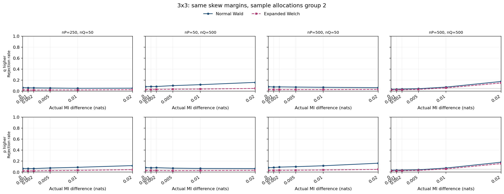

| Specification | Setting |
| --- | --- |
| Table size | 3x3 |
| Horizontal graph regime specifications (columns) | nP=250, nQ=50, nP=50, nQ=500, nP=500, nQ=50, nP=500, nQ=500 |
| Vertical graph regime specifications (rows) | q higher: P row (0.8, 0.2/2 repeated 2 times), P column (0.8, 0.2/2 repeated 2 times); Q row (0.8, 0.2/2 repeated 2 times), Q column (0.8, 0.2/2 repeated 2 times); p higher: P row (0.8, 0.2/2 repeated 2 times), P column (0.8, 0.2/2 repeated 2 times); Q row (0.8, 0.2/2 repeated 2 times), Q column (0.8, 0.2/2 repeated 2 times) |
| Probability changes | q higher: add at (1,1),(2,2) and subtract at (1,2),(2,1), for both P and Q; p higher: add at (1,1),(2,2) and subtract at (1,2),(2,1), for both P and Q |
| MI settings | Baseline MI {0.02}; direction {q higher, p higher}; actual differences {0, 0.001, 0.002, 0.005, 0.01, 0.02} nats |
| Horizontal axis within each graph | Actual MI difference in nats, fixed from 0 to 0.02 |
| Vertical axis within each graph | Unconditional rejection rate from 0 to 1; invalid results count as non-rejections |
| Replicates | 20,000 per unique point |

Null-point rejection and validity:

| Vertical regime | Horizontal regime | x | Method | Rejection | Valid |
| --- | --- | --- | --- | --- | --- |
| q higher | nP=250, nQ=50 | 0 | Expanded Welch | 0.0238 | 1.0000 |
| q higher | nP=250, nQ=50 | 0 | Normal Wald | 0.0657 | 1.0000 |
| q higher | nP=50, nQ=500 | 0 | Expanded Welch | 0.0301 | 1.0000 |
| q higher | nP=50, nQ=500 | 0 | Normal Wald | 0.0825 | 1.0000 |
| q higher | nP=500, nQ=50 | 0 | Expanded Welch | 0.0308 | 1.0000 |
| q higher | nP=500, nQ=50 | 0 | Normal Wald | 0.0828 | 1.0000 |
| q higher | nP=500, nQ=500 | 0 | Expanded Welch | 0.0235 | 1.0000 |
| q higher | nP=500, nQ=500 | 0 | Normal Wald | 0.0348 | 1.0000 |
| p higher | nP=250, nQ=50 | 0 | Expanded Welch | 0.0238 | 1.0000 |
| p higher | nP=250, nQ=50 | 0 | Normal Wald | 0.0657 | 1.0000 |
| p higher | nP=50, nQ=500 | 0 | Expanded Welch | 0.0301 | 1.0000 |
| p higher | nP=50, nQ=500 | 0 | Normal Wald | 0.0825 | 1.0000 |
| p higher | nP=500, nQ=50 | 0 | Expanded Welch | 0.0308 | 1.0000 |
| p higher | nP=500, nQ=50 | 0 | Normal Wald | 0.0828 | 1.0000 |
| p higher | nP=500, nQ=500 | 0 | Expanded Welch | 0.0235 | 1.0000 |
| p higher | nP=500, nQ=500 | 0 | Normal Wald | 0.0348 | 1.0000 |

Every plotted rate, interval, validity and minimum expected count

| Vertical regime | Horizontal regime | x | Method | Rejection | 95% interval | Valid | Conditional | Min expected P | Min expected Q |
| --- | --- | --- | --- | --- | --- | --- | --- | --- | --- |
| q higher | nP=250, nQ=50 | 0 | Expanded Welch | 0.0238 | [0.0218, 0.0261] | 1.0000 | 0.0239 | 2.5 | 0.5 |
| q higher | nP=250, nQ=50 | 0 | Normal Wald | 0.0657 | [0.0623, 0.0692] | 1.0000 | 0.0657 | 2.5 | 0.5 |
| q higher | nP=250, nQ=50 | 0.001 | Expanded Welch | 0.0209 | [0.0190, 0.0230] | 1.0000 | 0.0209 | 2.5 | 0.5 |
| q higher | nP=250, nQ=50 | 0.001 | Normal Wald | 0.0614 | [0.0582, 0.0648] | 1.0000 | 0.0614 | 2.5 | 0.5 |
| q higher | nP=250, nQ=50 | 0.002 | Expanded Welch | 0.0205 | [0.0187, 0.0226] | 1.0000 | 0.0206 | 2.5 | 0.5 |
| q higher | nP=250, nQ=50 | 0.002 | Normal Wald | 0.0599 | [0.0566, 0.0632] | 1.0000 | 0.0599 | 2.5 | 0.5 |
| q higher | nP=250, nQ=50 | 0.005 | Expanded Welch | 0.0223 | [0.0204, 0.0245] | 1.0000 | 0.0223 | 2.5 | 0.5 |
| q higher | nP=250, nQ=50 | 0.005 | Normal Wald | 0.0576 | [0.0545, 0.0609] | 1.0000 | 0.0576 | 2.5 | 0.5 |
| q higher | nP=250, nQ=50 | 0.01 | Expanded Welch | 0.0230 | [0.0210, 0.0251] | 1.0000 | 0.0230 | 2.5 | 0.5 |
| q higher | nP=250, nQ=50 | 0.01 | Normal Wald | 0.0532 | [0.0502, 0.0564] | 1.0000 | 0.0532 | 2.5 | 0.5 |
| q higher | nP=250, nQ=50 | 0.02 | Expanded Welch | 0.0280 | [0.0258, 0.0304] | 1.0000 | 0.0280 | 2.5 | 0.5 |
| q higher | nP=250, nQ=50 | 0.02 | Normal Wald | 0.0549 | [0.0519, 0.0582] | 1.0000 | 0.0549 | 2.5 | 0.5 |
| q higher | nP=50, nQ=500 | 0 | Expanded Welch | 0.0301 | [0.0278, 0.0325] | 1.0000 | 0.0301 | 0.5 | 5 |
| q higher | nP=50, nQ=500 | 0 | Normal Wald | 0.0825 | [0.0788, 0.0864] | 1.0000 | 0.0825 | 0.5 | 5 |
| q higher | nP=50, nQ=500 | 0.001 | Expanded Welch | 0.0306 | [0.0283, 0.0331] | 1.0000 | 0.0306 | 0.5 | 5 |
| q higher | nP=50, nQ=500 | 0.001 | Normal Wald | 0.0853 | [0.0816, 0.0893] | 1.0000 | 0.0853 | 0.5 | 5 |
| q higher | nP=50, nQ=500 | 0.002 | Expanded Welch | 0.0323 | [0.0300, 0.0349] | 1.0000 | 0.0323 | 0.5 | 5 |
| q higher | nP=50, nQ=500 | 0.002 | Normal Wald | 0.0853 | [0.0816, 0.0893] | 1.0000 | 0.0853 | 0.5 | 5 |
| q higher | nP=50, nQ=500 | 0.005 | Expanded Welch | 0.0362 | [0.0337, 0.0388] | 1.0000 | 0.0362 | 0.5 | 5 |
| q higher | nP=50, nQ=500 | 0.005 | Normal Wald | 0.1017 | [0.0975, 0.1059] | 1.0000 | 0.1017 | 0.5 | 5 |
| q higher | nP=50, nQ=500 | 0.01 | Expanded Welch | 0.0386 | [0.0360, 0.0414] | 1.0000 | 0.0386 | 0.5 | 5 |
| q higher | nP=50, nQ=500 | 0.01 | Normal Wald | 0.1190 | [0.1146, 0.1236] | 1.0000 | 0.1190 | 0.5 | 5 |
| q higher | nP=50, nQ=500 | 0.02 | Expanded Welch | 0.0507 | [0.0477, 0.0538] | 0.9999 | 0.0507 | 0.5 | 5 |
| q higher | nP=50, nQ=500 | 0.02 | Normal Wald | 0.1603 | [0.1553, 0.1655] | 1.0000 | 0.1603 | 0.5 | 5 |
| q higher | nP=500, nQ=50 | 0 | Expanded Welch | 0.0308 | [0.0285, 0.0333] | 1.0000 | 0.0308 | 5 | 0.5 |
| q higher | nP=500, nQ=50 | 0 | Normal Wald | 0.0828 | [0.0790, 0.0866] | 1.0000 | 0.0828 | 5 | 0.5 |
| q higher | nP=500, nQ=50 | 0.001 | Expanded Welch | 0.0290 | [0.0268, 0.0315] | 1.0000 | 0.0290 | 5 | 0.5 |
| q higher | nP=500, nQ=50 | 0.001 | Normal Wald | 0.0768 | [0.0732, 0.0806] | 1.0000 | 0.0768 | 5 | 0.5 |
| q higher | nP=500, nQ=50 | 0.002 | Expanded Welch | 0.0286 | [0.0264, 0.0310] | 1.0000 | 0.0286 | 5 | 0.5 |
| q higher | nP=500, nQ=50 | 0.002 | Normal Wald | 0.0787 | [0.0750, 0.0825] | 1.0000 | 0.0787 | 5 | 0.5 |
| q higher | nP=500, nQ=50 | 0.005 | Expanded Welch | 0.0294 | [0.0271, 0.0318] | 1.0000 | 0.0294 | 5 | 0.5 |
| q higher | nP=500, nQ=50 | 0.005 | Normal Wald | 0.0753 | [0.0717, 0.0790] | 1.0000 | 0.0753 | 5 | 0.5 |
| q higher | nP=500, nQ=50 | 0.01 | Expanded Welch | 0.0291 | [0.0269, 0.0316] | 1.0000 | 0.0292 | 5 | 0.5 |
| q higher | nP=500, nQ=50 | 0.01 | Normal Wald | 0.0712 | [0.0677, 0.0748] | 1.0000 | 0.0712 | 5 | 0.5 |
| q higher | nP=500, nQ=50 | 0.02 | Expanded Welch | 0.0326 | [0.0303, 0.0352] | 1.0000 | 0.0326 | 5 | 0.5 |
| q higher | nP=500, nQ=50 | 0.02 | Normal Wald | 0.0643 | [0.0610, 0.0678] | 1.0000 | 0.0643 | 5 | 0.5 |
| q higher | nP=500, nQ=500 | 0 | Expanded Welch | 0.0235 | [0.0215, 0.0257] | 1.0000 | 0.0235 | 5 | 5 |
| q higher | nP=500, nQ=500 | 0 | Normal Wald | 0.0348 | [0.0324, 0.0375] | 1.0000 | 0.0348 | 5 | 5 |
| q higher | nP=500, nQ=500 | 0.001 | Expanded Welch | 0.0250 | [0.0229, 0.0273] | 1.0000 | 0.0250 | 5 | 5 |
| q higher | nP=500, nQ=500 | 0.001 | Normal Wald | 0.0348 | [0.0323, 0.0374] | 1.0000 | 0.0348 | 5 | 5 |
| q higher | nP=500, nQ=500 | 0.002 | Expanded Welch | 0.0261 | [0.0240, 0.0284] | 1.0000 | 0.0261 | 5 | 5 |
| q higher | nP=500, nQ=500 | 0.002 | Normal Wald | 0.0386 | [0.0361, 0.0414] | 1.0000 | 0.0386 | 5 | 5 |
| q higher | nP=500, nQ=500 | 0.005 | Expanded Welch | 0.0323 | [0.0300, 0.0349] | 1.0000 | 0.0323 | 5 | 5 |
| q higher | nP=500, nQ=500 | 0.005 | Normal Wald | 0.0457 | [0.0428, 0.0486] | 1.0000 | 0.0457 | 5 | 5 |
| q higher | nP=500, nQ=500 | 0.01 | Expanded Welch | 0.0595 | [0.0564, 0.0629] | 1.0000 | 0.0595 | 5 | 5 |
| q higher | nP=500, nQ=500 | 0.01 | Normal Wald | 0.0745 | [0.0709, 0.0782] | 1.0000 | 0.0745 | 5 | 5 |
| q higher | nP=500, nQ=500 | 0.02 | Expanded Welch | 0.1504 | [0.1455, 0.1554] | 1.0000 | 0.1504 | 5 | 5 |
| q higher | nP=500, nQ=500 | 0.02 | Normal Wald | 0.1767 | [0.1714, 0.1820] | 1.0000 | 0.1767 | 5 | 5 |
| p higher | nP=250, nQ=50 | 0 | Expanded Welch | 0.0238 | [0.0218, 0.0261] | 1.0000 | 0.0239 | 2.5 | 0.5 |
| p higher | nP=250, nQ=50 | 0 | Normal Wald | 0.0657 | [0.0623, 0.0692] | 1.0000 | 0.0657 | 2.5 | 0.5 |
| p higher | nP=250, nQ=50 | 0.001 | Expanded Welch | 0.0237 | [0.0216, 0.0258] | 1.0000 | 0.0237 | 2.5 | 0.5 |
| p higher | nP=250, nQ=50 | 0.001 | Normal Wald | 0.0662 | [0.0628, 0.0697] | 1.0000 | 0.0662 | 2.5 | 0.5 |
| p higher | nP=250, nQ=50 | 0.002 | Expanded Welch | 0.0232 | [0.0212, 0.0253] | 1.0000 | 0.0232 | 2.5 | 0.5 |
| p higher | nP=250, nQ=50 | 0.002 | Normal Wald | 0.0650 | [0.0617, 0.0686] | 1.0000 | 0.0650 | 2.5 | 0.5 |
| p higher | nP=250, nQ=50 | 0.005 | Expanded Welch | 0.0280 | [0.0258, 0.0304] | 1.0000 | 0.0280 | 2.5 | 0.5 |
| p higher | nP=250, nQ=50 | 0.005 | Normal Wald | 0.0756 | [0.0721, 0.0794] | 1.0000 | 0.0756 | 2.5 | 0.5 |
| p higher | nP=250, nQ=50 | 0.01 | Expanded Welch | 0.0321 | [0.0297, 0.0346] | 1.0000 | 0.0321 | 2.5 | 0.5 |
| p higher | nP=250, nQ=50 | 0.01 | Normal Wald | 0.0877 | [0.0839, 0.0918] | 1.0000 | 0.0877 | 2.5 | 0.5 |
| p higher | nP=250, nQ=50 | 0.02 | Expanded Welch | 0.0449 | [0.0421, 0.0479] | 1.0000 | 0.0449 | 2.5 | 0.5 |
| p higher | nP=250, nQ=50 | 0.02 | Normal Wald | 0.1187 | [0.1142, 0.1232] | 1.0000 | 0.1187 | 2.5 | 0.5 |
| p higher | nP=50, nQ=500 | 0 | Expanded Welch | 0.0301 | [0.0278, 0.0325] | 1.0000 | 0.0301 | 0.5 | 5 |
| p higher | nP=50, nQ=500 | 0 | Normal Wald | 0.0825 | [0.0788, 0.0864] | 1.0000 | 0.0825 | 0.5 | 5 |
| p higher | nP=50, nQ=500 | 0.001 | Expanded Welch | 0.0296 | [0.0273, 0.0320] | 1.0000 | 0.0296 | 0.5 | 5 |
| p higher | nP=50, nQ=500 | 0.001 | Normal Wald | 0.0783 | [0.0747, 0.0821] | 1.0000 | 0.0783 | 0.5 | 5 |
| p higher | nP=50, nQ=500 | 0.002 | Expanded Welch | 0.0300 | [0.0277, 0.0325] | 1.0000 | 0.0300 | 0.5 | 5 |
| p higher | nP=50, nQ=500 | 0.002 | Normal Wald | 0.0806 | [0.0770, 0.0845] | 1.0000 | 0.0806 | 0.5 | 5 |
| p higher | nP=50, nQ=500 | 0.005 | Expanded Welch | 0.0274 | [0.0253, 0.0298] | 1.0000 | 0.0275 | 0.5 | 5 |
| p higher | nP=50, nQ=500 | 0.005 | Normal Wald | 0.0718 | [0.0684, 0.0755] | 1.0000 | 0.0718 | 0.5 | 5 |
| p higher | nP=50, nQ=500 | 0.01 | Expanded Welch | 0.0288 | [0.0266, 0.0312] | 1.0000 | 0.0288 | 0.5 | 5 |
| p higher | nP=50, nQ=500 | 0.01 | Normal Wald | 0.0668 | [0.0634, 0.0703] | 1.0000 | 0.0668 | 0.5 | 5 |
| p higher | nP=50, nQ=500 | 0.02 | Expanded Welch | 0.0331 | [0.0307, 0.0356] | 1.0000 | 0.0331 | 0.5 | 5 |
| p higher | nP=50, nQ=500 | 0.02 | Normal Wald | 0.0651 | [0.0618, 0.0687] | 1.0000 | 0.0651 | 0.5 | 5 |
| p higher | nP=500, nQ=50 | 0 | Expanded Welch | 0.0308 | [0.0285, 0.0333] | 1.0000 | 0.0308 | 5 | 0.5 |
| p higher | nP=500, nQ=50 | 0 | Normal Wald | 0.0828 | [0.0790, 0.0866] | 1.0000 | 0.0828 | 5 | 0.5 |
| p higher | nP=500, nQ=50 | 0.001 | Expanded Welch | 0.0312 | [0.0288, 0.0336] | 1.0000 | 0.0312 | 5 | 0.5 |
| p higher | nP=500, nQ=50 | 0.001 | Normal Wald | 0.0842 | [0.0804, 0.0881] | 1.0000 | 0.0842 | 5 | 0.5 |
| p higher | nP=500, nQ=50 | 0.002 | Expanded Welch | 0.0331 | [0.0307, 0.0356] | 1.0000 | 0.0331 | 5 | 0.5 |
| p higher | nP=500, nQ=50 | 0.002 | Normal Wald | 0.0912 | [0.0873, 0.0953] | 1.0000 | 0.0912 | 5 | 0.5 |
| p higher | nP=500, nQ=50 | 0.005 | Expanded Welch | 0.0348 | [0.0323, 0.0374] | 1.0000 | 0.0348 | 5 | 0.5 |
| p higher | nP=500, nQ=50 | 0.005 | Normal Wald | 0.0991 | [0.0950, 0.1033] | 1.0000 | 0.0991 | 5 | 0.5 |
| p higher | nP=500, nQ=50 | 0.01 | Expanded Welch | 0.0389 | [0.0364, 0.0417] | 1.0000 | 0.0390 | 5 | 0.5 |
| p higher | nP=500, nQ=50 | 0.01 | Normal Wald | 0.1157 | [0.1113, 0.1202] | 1.0000 | 0.1157 | 5 | 0.5 |
| p higher | nP=500, nQ=50 | 0.02 | Expanded Welch | 0.0498 | [0.0468, 0.0529] | 1.0000 | 0.0498 | 5 | 0.5 |
| p higher | nP=500, nQ=50 | 0.02 | Normal Wald | 0.1620 | [0.1570, 0.1672] | 1.0000 | 0.1620 | 5 | 0.5 |
| p higher | nP=500, nQ=500 | 0 | Expanded Welch | 0.0235 | [0.0215, 0.0257] | 1.0000 | 0.0235 | 5 | 5 |
| p higher | nP=500, nQ=500 | 0 | Normal Wald | 0.0348 | [0.0324, 0.0375] | 1.0000 | 0.0348 | 5 | 5 |
| p higher | nP=500, nQ=500 | 0.001 | Expanded Welch | 0.0244 | [0.0223, 0.0266] | 1.0000 | 0.0244 | 5 | 5 |
| p higher | nP=500, nQ=500 | 0.001 | Normal Wald | 0.0351 | [0.0326, 0.0377] | 1.0000 | 0.0351 | 5 | 5 |
| p higher | nP=500, nQ=500 | 0.002 | Expanded Welch | 0.0262 | [0.0241, 0.0286] | 1.0000 | 0.0262 | 5 | 5 |
| p higher | nP=500, nQ=500 | 0.002 | Normal Wald | 0.0379 | [0.0353, 0.0406] | 1.0000 | 0.0379 | 5 | 5 |
| p higher | nP=500, nQ=500 | 0.005 | Expanded Welch | 0.0316 | [0.0293, 0.0341] | 1.0000 | 0.0316 | 5 | 5 |
| p higher | nP=500, nQ=500 | 0.005 | Normal Wald | 0.0428 | [0.0401, 0.0457] | 1.0000 | 0.0428 | 5 | 5 |
| p higher | nP=500, nQ=500 | 0.01 | Expanded Welch | 0.0578 | [0.0546, 0.0611] | 1.0000 | 0.0578 | 5 | 5 |
| p higher | nP=500, nQ=500 | 0.01 | Normal Wald | 0.0743 | [0.0708, 0.0781] | 1.0000 | 0.0743 | 5 | 5 |
| p higher | nP=500, nQ=500 | 0.02 | Expanded Welch | 0.1551 | [0.1501, 0.1602] | 1.0000 | 0.1551 | 5 | 5 |
| p higher | nP=500, nQ=500 | 0.02 | Normal Wald | 0.1797 | [0.1744, 0.1850] | 1.0000 | 0.1797 | 5 | 5 |

### 6.11 3x3: different skew margins, sample allocations group 1

Does performance depend on which population has more data or greater MI?

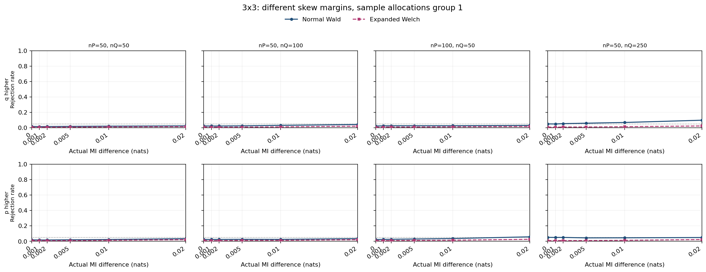

| Specification | Setting |
| --- | --- |
| Table size | 3x3 |
| Horizontal graph regime specifications (columns) | nP=50, nQ=50, nP=50, nQ=100, nP=100, nQ=50, nP=50, nQ=250 |
| Vertical graph regime specifications (rows) | q higher: P row (0.7, 0.3/2 repeated 2 times), P column (0.7, 0.3/2 repeated 2 times); Q row (0.8, 0.2/2 repeated 2 times), Q column (0.8, 0.2/2 repeated 2 times); p higher: P row (0.7, 0.3/2 repeated 2 times), P column (0.7, 0.3/2 repeated 2 times); Q row (0.8, 0.2/2 repeated 2 times), Q column (0.8, 0.2/2 repeated 2 times) |
| Probability changes | q higher: add at (1,1),(2,2) and subtract at (1,2),(2,1), for both P and Q; p higher: add at (1,1),(2,2) and subtract at (1,2),(2,1), for both P and Q |
| MI settings | Baseline MI {0.02}; direction {q higher, p higher}; actual differences {0, 0.001, 0.002, 0.005, 0.01, 0.02} nats |
| Horizontal axis within each graph | Actual MI difference in nats, fixed from 0 to 0.02 |
| Vertical axis within each graph | Unconditional rejection rate from 0 to 1; invalid results count as non-rejections |
| Replicates | 20,000 per unique point |

Null-point rejection and validity:

| Vertical regime | Horizontal regime | x | Method | Rejection | Valid |
| --- | --- | --- | --- | --- | --- |
| q higher | nP=50, nQ=50 | 0 | Expanded Welch | 0.0098 | 1.0000 |
| q higher | nP=50, nQ=50 | 0 | Normal Wald | 0.0188 | 1.0000 |
| q higher | nP=50, nQ=100 | 0 | Expanded Welch | 0.0104 | 1.0000 |
| q higher | nP=50, nQ=100 | 0 | Normal Wald | 0.0253 | 1.0000 |
| q higher | nP=100, nQ=50 | 0 | Expanded Welch | 0.0095 | 1.0000 |
| q higher | nP=100, nQ=50 | 0 | Normal Wald | 0.0241 | 1.0000 |
| q higher | nP=50, nQ=250 | 0 | Expanded Welch | 0.0097 | 1.0000 |
| q higher | nP=50, nQ=250 | 0 | Normal Wald | 0.0519 | 1.0000 |
| p higher | nP=50, nQ=50 | 0 | Expanded Welch | 0.0098 | 1.0000 |
| p higher | nP=50, nQ=50 | 0 | Normal Wald | 0.0188 | 1.0000 |
| p higher | nP=50, nQ=100 | 0 | Expanded Welch | 0.0104 | 1.0000 |
| p higher | nP=50, nQ=100 | 0 | Normal Wald | 0.0253 | 1.0000 |
| p higher | nP=100, nQ=50 | 0 | Expanded Welch | 0.0095 | 1.0000 |
| p higher | nP=100, nQ=50 | 0 | Normal Wald | 0.0241 | 1.0000 |
| p higher | nP=50, nQ=250 | 0 | Expanded Welch | 0.0097 | 1.0000 |
| p higher | nP=50, nQ=250 | 0 | Normal Wald | 0.0519 | 1.0000 |

Every plotted rate, interval, validity and minimum expected count

| Vertical regime | Horizontal regime | x | Method | Rejection | 95% interval | Valid | Conditional | Min expected P | Min expected Q |
| --- | --- | --- | --- | --- | --- | --- | --- | --- | --- |
| q higher | nP=50, nQ=50 | 0 | Expanded Welch | 0.0098 | [0.0086, 0.0113] | 1.0000 | 0.0099 | 1.125 | 0.5 |
| q higher | nP=50, nQ=50 | 0 | Normal Wald | 0.0188 | [0.0171, 0.0208] | 1.0000 | 0.0188 | 1.125 | 0.5 |
| q higher | nP=50, nQ=50 | 0.001 | Expanded Welch | 0.0091 | [0.0079, 0.0105] | 0.9999 | 0.0091 | 1.125 | 0.5 |
| q higher | nP=50, nQ=50 | 0.001 | Normal Wald | 0.0165 | [0.0149, 0.0184] | 1.0000 | 0.0165 | 1.125 | 0.5 |
| q higher | nP=50, nQ=50 | 0.002 | Expanded Welch | 0.0099 | [0.0086, 0.0114] | 1.0000 | 0.0099 | 1.125 | 0.5 |
| q higher | nP=50, nQ=50 | 0.002 | Normal Wald | 0.0175 | [0.0158, 0.0195] | 1.0000 | 0.0175 | 1.125 | 0.5 |
| q higher | nP=50, nQ=50 | 0.005 | Expanded Welch | 0.0103 | [0.0090, 0.0118] | 1.0000 | 0.0103 | 1.125 | 0.5 |
| q higher | nP=50, nQ=50 | 0.005 | Normal Wald | 0.0194 | [0.0176, 0.0215] | 1.0000 | 0.0194 | 1.125 | 0.5 |
| q higher | nP=50, nQ=50 | 0.01 | Expanded Welch | 0.0129 | [0.0114, 0.0145] | 1.0000 | 0.0129 | 1.125 | 0.5 |
| q higher | nP=50, nQ=50 | 0.01 | Normal Wald | 0.0222 | [0.0202, 0.0243] | 1.0000 | 0.0222 | 1.125 | 0.5 |
| q higher | nP=50, nQ=50 | 0.02 | Expanded Welch | 0.0162 | [0.0145, 0.0180] | 1.0000 | 0.0162 | 1.125 | 0.5 |
| q higher | nP=50, nQ=50 | 0.02 | Normal Wald | 0.0259 | [0.0237, 0.0281] | 1.0000 | 0.0259 | 1.125 | 0.5 |
| q higher | nP=50, nQ=100 | 0 | Expanded Welch | 0.0104 | [0.0091, 0.0120] | 1.0000 | 0.0104 | 1.125 | 1 |
| q higher | nP=50, nQ=100 | 0 | Normal Wald | 0.0253 | [0.0232, 0.0275] | 1.0000 | 0.0253 | 1.125 | 1 |
| q higher | nP=50, nQ=100 | 0.001 | Expanded Welch | 0.0095 | [0.0082, 0.0109] | 1.0000 | 0.0095 | 1.125 | 1 |
| q higher | nP=50, nQ=100 | 0.001 | Normal Wald | 0.0242 | [0.0222, 0.0264] | 1.0000 | 0.0242 | 1.125 | 1 |
| q higher | nP=50, nQ=100 | 0.002 | Expanded Welch | 0.0091 | [0.0078, 0.0105] | 1.0000 | 0.0091 | 1.125 | 1 |
| q higher | nP=50, nQ=100 | 0.002 | Normal Wald | 0.0244 | [0.0223, 0.0266] | 1.0000 | 0.0244 | 1.125 | 1 |
| q higher | nP=50, nQ=100 | 0.005 | Expanded Welch | 0.0101 | [0.0089, 0.0116] | 1.0000 | 0.0101 | 1.125 | 1 |
| q higher | nP=50, nQ=100 | 0.005 | Normal Wald | 0.0263 | [0.0242, 0.0286] | 1.0000 | 0.0263 | 1.125 | 1 |
| q higher | nP=50, nQ=100 | 0.01 | Expanded Welch | 0.0132 | [0.0117, 0.0148] | 1.0000 | 0.0132 | 1.125 | 1 |
| q higher | nP=50, nQ=100 | 0.01 | Normal Wald | 0.0328 | [0.0304, 0.0354] | 1.0000 | 0.0328 | 1.125 | 1 |
| q higher | nP=50, nQ=100 | 0.02 | Expanded Welch | 0.0217 | [0.0198, 0.0239] | 1.0000 | 0.0217 | 1.125 | 1 |
| q higher | nP=50, nQ=100 | 0.02 | Normal Wald | 0.0437 | [0.0410, 0.0467] | 1.0000 | 0.0437 | 1.125 | 1 |
| q higher | nP=100, nQ=50 | 0 | Expanded Welch | 0.0095 | [0.0083, 0.0110] | 1.0000 | 0.0095 | 2.25 | 0.5 |
| q higher | nP=100, nQ=50 | 0 | Normal Wald | 0.0241 | [0.0221, 0.0263] | 1.0000 | 0.0241 | 2.25 | 0.5 |
| q higher | nP=100, nQ=50 | 0.001 | Expanded Welch | 0.0100 | [0.0087, 0.0114] | 1.0000 | 0.0100 | 2.25 | 0.5 |
| q higher | nP=100, nQ=50 | 0.001 | Normal Wald | 0.0262 | [0.0241, 0.0286] | 1.0000 | 0.0262 | 2.25 | 0.5 |
| q higher | nP=100, nQ=50 | 0.002 | Expanded Welch | 0.0113 | [0.0099, 0.0129] | 1.0000 | 0.0113 | 2.25 | 0.5 |
| q higher | nP=100, nQ=50 | 0.002 | Normal Wald | 0.0273 | [0.0252, 0.0297] | 1.0000 | 0.0273 | 2.25 | 0.5 |
| q higher | nP=100, nQ=50 | 0.005 | Expanded Welch | 0.0111 | [0.0097, 0.0126] | 0.9999 | 0.0111 | 2.25 | 0.5 |
| q higher | nP=100, nQ=50 | 0.005 | Normal Wald | 0.0276 | [0.0254, 0.0300] | 1.0000 | 0.0276 | 2.25 | 0.5 |
| q higher | nP=100, nQ=50 | 0.01 | Expanded Welch | 0.0136 | [0.0121, 0.0153] | 1.0000 | 0.0136 | 2.25 | 0.5 |
| q higher | nP=100, nQ=50 | 0.01 | Normal Wald | 0.0277 | [0.0255, 0.0301] | 1.0000 | 0.0277 | 2.25 | 0.5 |
| q higher | nP=100, nQ=50 | 0.02 | Expanded Welch | 0.0178 | [0.0161, 0.0197] | 1.0000 | 0.0178 | 2.25 | 0.5 |
| q higher | nP=100, nQ=50 | 0.02 | Normal Wald | 0.0319 | [0.0296, 0.0345] | 1.0000 | 0.0319 | 2.25 | 0.5 |
| q higher | nP=50, nQ=250 | 0 | Expanded Welch | 0.0097 | [0.0084, 0.0111] | 1.0000 | 0.0097 | 1.125 | 2.5 |
| q higher | nP=50, nQ=250 | 0 | Normal Wald | 0.0519 | [0.0489, 0.0550] | 1.0000 | 0.0519 | 1.125 | 2.5 |
| q higher | nP=50, nQ=250 | 0.001 | Expanded Welch | 0.0090 | [0.0078, 0.0104] | 1.0000 | 0.0090 | 1.125 | 2.5 |
| q higher | nP=50, nQ=250 | 0.001 | Normal Wald | 0.0505 | [0.0475, 0.0536] | 1.0000 | 0.0505 | 1.125 | 2.5 |
| q higher | nP=50, nQ=250 | 0.002 | Expanded Welch | 0.0114 | [0.0100, 0.0130] | 1.0000 | 0.0114 | 1.125 | 2.5 |
| q higher | nP=50, nQ=250 | 0.002 | Normal Wald | 0.0552 | [0.0521, 0.0585] | 1.0000 | 0.0552 | 1.125 | 2.5 |
| q higher | nP=50, nQ=250 | 0.005 | Expanded Welch | 0.0118 | [0.0103, 0.0133] | 1.0000 | 0.0118 | 1.125 | 2.5 |
| q higher | nP=50, nQ=250 | 0.005 | Normal Wald | 0.0607 | [0.0575, 0.0641] | 1.0000 | 0.0607 | 1.125 | 2.5 |
| q higher | nP=50, nQ=250 | 0.01 | Expanded Welch | 0.0152 | [0.0135, 0.0169] | 1.0000 | 0.0152 | 1.125 | 2.5 |
| q higher | nP=50, nQ=250 | 0.01 | Normal Wald | 0.0702 | [0.0667, 0.0738] | 1.0000 | 0.0702 | 1.125 | 2.5 |
| q higher | nP=50, nQ=250 | 0.02 | Expanded Welch | 0.0247 | [0.0226, 0.0269] | 1.0000 | 0.0247 | 1.125 | 2.5 |
| q higher | nP=50, nQ=250 | 0.02 | Normal Wald | 0.0994 | [0.0953, 0.1036] | 1.0000 | 0.0994 | 1.125 | 2.5 |
| p higher | nP=50, nQ=50 | 0 | Expanded Welch | 0.0098 | [0.0086, 0.0113] | 1.0000 | 0.0099 | 1.125 | 0.5 |
| p higher | nP=50, nQ=50 | 0 | Normal Wald | 0.0188 | [0.0171, 0.0208] | 1.0000 | 0.0188 | 1.125 | 0.5 |
| p higher | nP=50, nQ=50 | 0.001 | Expanded Welch | 0.0096 | [0.0083, 0.0110] | 1.0000 | 0.0096 | 1.125 | 0.5 |
| p higher | nP=50, nQ=50 | 0.001 | Normal Wald | 0.0175 | [0.0158, 0.0194] | 1.0000 | 0.0175 | 1.125 | 0.5 |
| p higher | nP=50, nQ=50 | 0.002 | Expanded Welch | 0.0089 | [0.0077, 0.0103] | 1.0000 | 0.0089 | 1.125 | 0.5 |
| p higher | nP=50, nQ=50 | 0.002 | Normal Wald | 0.0176 | [0.0159, 0.0195] | 1.0000 | 0.0176 | 1.125 | 0.5 |
| p higher | nP=50, nQ=50 | 0.005 | Expanded Welch | 0.0097 | [0.0085, 0.0112] | 1.0000 | 0.0097 | 1.125 | 0.5 |
| p higher | nP=50, nQ=50 | 0.005 | Normal Wald | 0.0200 | [0.0181, 0.0220] | 1.0000 | 0.0200 | 1.125 | 0.5 |
| p higher | nP=50, nQ=50 | 0.01 | Expanded Welch | 0.0138 | [0.0123, 0.0155] | 1.0000 | 0.0138 | 1.125 | 0.5 |
| p higher | nP=50, nQ=50 | 0.01 | Normal Wald | 0.0239 | [0.0219, 0.0261] | 1.0000 | 0.0239 | 1.125 | 0.5 |
| p higher | nP=50, nQ=50 | 0.02 | Expanded Welch | 0.0219 | [0.0200, 0.0240] | 1.0000 | 0.0219 | 1.125 | 0.5 |
| p higher | nP=50, nQ=50 | 0.02 | Normal Wald | 0.0346 | [0.0322, 0.0372] | 1.0000 | 0.0346 | 1.125 | 0.5 |
| p higher | nP=50, nQ=100 | 0 | Expanded Welch | 0.0104 | [0.0091, 0.0120] | 1.0000 | 0.0104 | 1.125 | 1 |
| p higher | nP=50, nQ=100 | 0 | Normal Wald | 0.0253 | [0.0232, 0.0275] | 1.0000 | 0.0253 | 1.125 | 1 |
| p higher | nP=50, nQ=100 | 0.001 | Expanded Welch | 0.0091 | [0.0079, 0.0105] | 1.0000 | 0.0091 | 1.125 | 1 |
| p higher | nP=50, nQ=100 | 0.001 | Normal Wald | 0.0245 | [0.0225, 0.0268] | 1.0000 | 0.0245 | 1.125 | 1 |
| p higher | nP=50, nQ=100 | 0.002 | Expanded Welch | 0.0094 | [0.0081, 0.0108] | 1.0000 | 0.0094 | 1.125 | 1 |
| p higher | nP=50, nQ=100 | 0.002 | Normal Wald | 0.0249 | [0.0228, 0.0271] | 1.0000 | 0.0249 | 1.125 | 1 |
| p higher | nP=50, nQ=100 | 0.005 | Expanded Welch | 0.0126 | [0.0111, 0.0142] | 1.0000 | 0.0126 | 1.125 | 1 |
| p higher | nP=50, nQ=100 | 0.005 | Normal Wald | 0.0261 | [0.0240, 0.0285] | 1.0000 | 0.0261 | 1.125 | 1 |
| p higher | nP=50, nQ=100 | 0.01 | Expanded Welch | 0.0132 | [0.0117, 0.0149] | 1.0000 | 0.0132 | 1.125 | 1 |
| p higher | nP=50, nQ=100 | 0.01 | Normal Wald | 0.0254 | [0.0233, 0.0277] | 1.0000 | 0.0254 | 1.125 | 1 |
| p higher | nP=50, nQ=100 | 0.02 | Expanded Welch | 0.0213 | [0.0193, 0.0233] | 1.0000 | 0.0213 | 1.125 | 1 |
| p higher | nP=50, nQ=100 | 0.02 | Normal Wald | 0.0352 | [0.0328, 0.0379] | 1.0000 | 0.0352 | 1.125 | 1 |
| p higher | nP=100, nQ=50 | 0 | Expanded Welch | 0.0095 | [0.0083, 0.0110] | 1.0000 | 0.0095 | 2.25 | 0.5 |
| p higher | nP=100, nQ=50 | 0 | Normal Wald | 0.0241 | [0.0221, 0.0263] | 1.0000 | 0.0241 | 2.25 | 0.5 |
| p higher | nP=100, nQ=50 | 0.001 | Expanded Welch | 0.0092 | [0.0079, 0.0106] | 1.0000 | 0.0092 | 2.25 | 0.5 |
| p higher | nP=100, nQ=50 | 0.001 | Normal Wald | 0.0255 | [0.0235, 0.0278] | 1.0000 | 0.0255 | 2.25 | 0.5 |
| p higher | nP=100, nQ=50 | 0.002 | Expanded Welch | 0.0106 | [0.0092, 0.0121] | 1.0000 | 0.0106 | 2.25 | 0.5 |
| p higher | nP=100, nQ=50 | 0.002 | Normal Wald | 0.0271 | [0.0249, 0.0294] | 1.0000 | 0.0271 | 2.25 | 0.5 |
| p higher | nP=100, nQ=50 | 0.005 | Expanded Welch | 0.0120 | [0.0106, 0.0137] | 1.0000 | 0.0120 | 2.25 | 0.5 |
| p higher | nP=100, nQ=50 | 0.005 | Normal Wald | 0.0302 | [0.0280, 0.0327] | 1.0000 | 0.0302 | 2.25 | 0.5 |
| p higher | nP=100, nQ=50 | 0.01 | Expanded Welch | 0.0146 | [0.0131, 0.0164] | 1.0000 | 0.0146 | 2.25 | 0.5 |
| p higher | nP=100, nQ=50 | 0.01 | Normal Wald | 0.0365 | [0.0340, 0.0392] | 1.0000 | 0.0365 | 2.25 | 0.5 |
| p higher | nP=100, nQ=50 | 0.02 | Expanded Welch | 0.0264 | [0.0243, 0.0287] | 1.0000 | 0.0264 | 2.25 | 0.5 |
| p higher | nP=100, nQ=50 | 0.02 | Normal Wald | 0.0583 | [0.0551, 0.0616] | 1.0000 | 0.0583 | 2.25 | 0.5 |
| p higher | nP=50, nQ=250 | 0 | Expanded Welch | 0.0097 | [0.0084, 0.0111] | 1.0000 | 0.0097 | 1.125 | 2.5 |
| p higher | nP=50, nQ=250 | 0 | Normal Wald | 0.0519 | [0.0489, 0.0550] | 1.0000 | 0.0519 | 1.125 | 2.5 |
| p higher | nP=50, nQ=250 | 0.001 | Expanded Welch | 0.0097 | [0.0084, 0.0111] | 1.0000 | 0.0097 | 1.125 | 2.5 |
| p higher | nP=50, nQ=250 | 0.001 | Normal Wald | 0.0508 | [0.0478, 0.0539] | 1.0000 | 0.0508 | 1.125 | 2.5 |
| p higher | nP=50, nQ=250 | 0.002 | Expanded Welch | 0.0100 | [0.0087, 0.0114] | 1.0000 | 0.0100 | 1.125 | 2.5 |
| p higher | nP=50, nQ=250 | 0.002 | Normal Wald | 0.0508 | [0.0479, 0.0540] | 1.0000 | 0.0508 | 1.125 | 2.5 |
| p higher | nP=50, nQ=250 | 0.005 | Expanded Welch | 0.0101 | [0.0089, 0.0116] | 1.0000 | 0.0101 | 1.125 | 2.5 |
| p higher | nP=50, nQ=250 | 0.005 | Normal Wald | 0.0449 | [0.0421, 0.0478] | 1.0000 | 0.0449 | 1.125 | 2.5 |
| p higher | nP=50, nQ=250 | 0.01 | Expanded Welch | 0.0132 | [0.0117, 0.0149] | 1.0000 | 0.0132 | 1.125 | 2.5 |
| p higher | nP=50, nQ=250 | 0.01 | Normal Wald | 0.0457 | [0.0429, 0.0487] | 1.0000 | 0.0457 | 1.125 | 2.5 |
| p higher | nP=50, nQ=250 | 0.02 | Expanded Welch | 0.0232 | [0.0213, 0.0254] | 1.0000 | 0.0232 | 1.125 | 2.5 |
| p higher | nP=50, nQ=250 | 0.02 | Normal Wald | 0.0495 | [0.0466, 0.0526] | 1.0000 | 0.0495 | 1.125 | 2.5 |

### 6.12 3x3: different skew margins, sample allocations group 2

Does performance depend on which population has more data or greater MI?

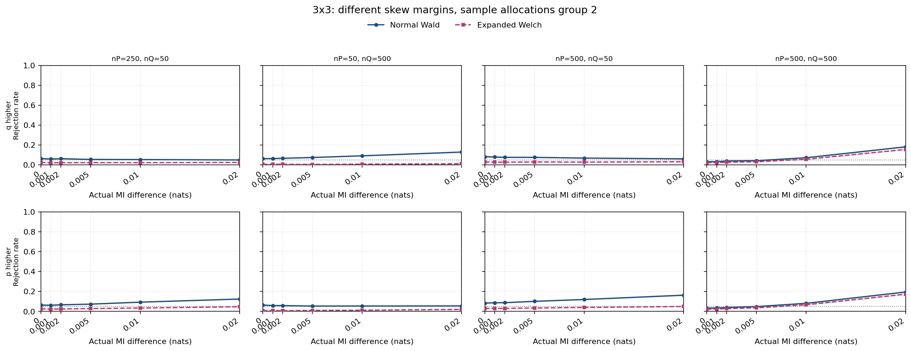

| Specification | Setting |
| --- | --- |
| Table size | 3x3 |
| Horizontal graph regime specifications (columns) | nP=250, nQ=50, nP=50, nQ=500, nP=500, nQ=50, nP=500, nQ=500 |
| Vertical graph regime specifications (rows) | q higher: P row (0.7, 0.3/2 repeated 2 times), P column (0.7, 0.3/2 repeated 2 times); Q row (0.8, 0.2/2 repeated 2 times), Q column (0.8, 0.2/2 repeated 2 times); p higher: P row (0.7, 0.3/2 repeated 2 times), P column (0.7, 0.3/2 repeated 2 times); Q row (0.8, 0.2/2 repeated 2 times), Q column (0.8, 0.2/2 repeated 2 times) |
| Probability changes | q higher: add at (1,1),(2,2) and subtract at (1,2),(2,1), for both P and Q; p higher: add at (1,1),(2,2) and subtract at (1,2),(2,1), for both P and Q |
| MI settings | Baseline MI {0.02}; direction {q higher, p higher}; actual differences {0, 0.001, 0.002, 0.005, 0.01, 0.02} nats |
| Horizontal axis within each graph | Actual MI difference in nats, fixed from 0 to 0.02 |
| Vertical axis within each graph | Unconditional rejection rate from 0 to 1; invalid results count as non-rejections |
| Replicates | 20,000 per unique point |

Null-point rejection and validity:

| Vertical regime | Horizontal regime | x | Method | Rejection | Valid |
| --- | --- | --- | --- | --- | --- |
| q higher | nP=250, nQ=50 | 0 | Expanded Welch | 0.0255 | 1.0000 |
| q higher | nP=250, nQ=50 | 0 | Normal Wald | 0.0642 | 1.0000 |
| q higher | nP=50, nQ=500 | 0 | Expanded Welch | 0.0073 | 1.0000 |
| q higher | nP=50, nQ=500 | 0 | Normal Wald | 0.0640 | 1.0000 |
| q higher | nP=500, nQ=50 | 0 | Expanded Welch | 0.0305 | 1.0000 |
| q higher | nP=500, nQ=50 | 0 | Normal Wald | 0.0834 | 1.0000 |
| q higher | nP=500, nQ=500 | 0 | Expanded Welch | 0.0232 | 1.0000 |
| q higher | nP=500, nQ=500 | 0 | Normal Wald | 0.0331 | 1.0000 |
| p higher | nP=250, nQ=50 | 0 | Expanded Welch | 0.0255 | 1.0000 |
| p higher | nP=250, nQ=50 | 0 | Normal Wald | 0.0642 | 1.0000 |
| p higher | nP=50, nQ=500 | 0 | Expanded Welch | 0.0073 | 1.0000 |
| p higher | nP=50, nQ=500 | 0 | Normal Wald | 0.0640 | 1.0000 |
| p higher | nP=500, nQ=50 | 0 | Expanded Welch | 0.0305 | 1.0000 |
| p higher | nP=500, nQ=50 | 0 | Normal Wald | 0.0834 | 1.0000 |
| p higher | nP=500, nQ=500 | 0 | Expanded Welch | 0.0232 | 1.0000 |
| p higher | nP=500, nQ=500 | 0 | Normal Wald | 0.0331 | 1.0000 |

Every plotted rate, interval, validity and minimum expected count

| Vertical regime | Horizontal regime | x | Method | Rejection | 95% interval | Valid | Conditional | Min expected P | Min expected Q |
| --- | --- | --- | --- | --- | --- | --- | --- | --- | --- |
| q higher | nP=250, nQ=50 | 0 | Expanded Welch | 0.0255 | [0.0235, 0.0278] | 1.0000 | 0.0255 | 5.625 | 0.5 |
| q higher | nP=250, nQ=50 | 0 | Normal Wald | 0.0642 | [0.0609, 0.0677] | 1.0000 | 0.0642 | 5.625 | 0.5 |
| q higher | nP=250, nQ=50 | 0.001 | Expanded Welch | 0.0226 | [0.0206, 0.0247] | 1.0000 | 0.0226 | 5.625 | 0.5 |
| q higher | nP=250, nQ=50 | 0.001 | Normal Wald | 0.0604 | [0.0572, 0.0638] | 1.0000 | 0.0604 | 5.625 | 0.5 |
| q higher | nP=250, nQ=50 | 0.002 | Expanded Welch | 0.0226 | [0.0207, 0.0248] | 1.0000 | 0.0226 | 5.625 | 0.5 |
| q higher | nP=250, nQ=50 | 0.002 | Normal Wald | 0.0633 | [0.0600, 0.0668] | 1.0000 | 0.0633 | 5.625 | 0.5 |
| q higher | nP=250, nQ=50 | 0.005 | Expanded Welch | 0.0239 | [0.0219, 0.0262] | 1.0000 | 0.0239 | 5.625 | 0.5 |
| q higher | nP=250, nQ=50 | 0.005 | Normal Wald | 0.0561 | [0.0530, 0.0594] | 1.0000 | 0.0561 | 5.625 | 0.5 |
| q higher | nP=250, nQ=50 | 0.01 | Expanded Welch | 0.0237 | [0.0216, 0.0258] | 1.0000 | 0.0237 | 5.625 | 0.5 |
| q higher | nP=250, nQ=50 | 0.01 | Normal Wald | 0.0551 | [0.0520, 0.0583] | 1.0000 | 0.0551 | 5.625 | 0.5 |
| q higher | nP=250, nQ=50 | 0.02 | Expanded Welch | 0.0260 | [0.0239, 0.0283] | 1.0000 | 0.0260 | 5.625 | 0.5 |
| q higher | nP=250, nQ=50 | 0.02 | Normal Wald | 0.0508 | [0.0478, 0.0539] | 1.0000 | 0.0508 | 5.625 | 0.5 |
| q higher | nP=50, nQ=500 | 0 | Expanded Welch | 0.0073 | [0.0062, 0.0086] | 1.0000 | 0.0073 | 1.125 | 5 |
| q higher | nP=50, nQ=500 | 0 | Normal Wald | 0.0640 | [0.0607, 0.0675] | 1.0000 | 0.0640 | 1.125 | 5 |
| q higher | nP=50, nQ=500 | 0.001 | Expanded Welch | 0.0076 | [0.0064, 0.0088] | 1.0000 | 0.0076 | 1.125 | 5 |
| q higher | nP=50, nQ=500 | 0.001 | Normal Wald | 0.0651 | [0.0618, 0.0686] | 1.0000 | 0.0651 | 1.125 | 5 |
| q higher | nP=50, nQ=500 | 0.002 | Expanded Welch | 0.0073 | [0.0063, 0.0086] | 1.0000 | 0.0073 | 1.125 | 5 |
| q higher | nP=50, nQ=500 | 0.002 | Normal Wald | 0.0677 | [0.0643, 0.0712] | 1.0000 | 0.0677 | 1.125 | 5 |
| q higher | nP=50, nQ=500 | 0.005 | Expanded Welch | 0.0063 | [0.0053, 0.0075] | 1.0000 | 0.0063 | 1.125 | 5 |
| q higher | nP=50, nQ=500 | 0.005 | Normal Wald | 0.0756 | [0.0720, 0.0793] | 1.0000 | 0.0756 | 1.125 | 5 |
| q higher | nP=50, nQ=500 | 0.01 | Expanded Welch | 0.0089 | [0.0077, 0.0104] | 1.0000 | 0.0089 | 1.125 | 5 |
| q higher | nP=50, nQ=500 | 0.01 | Normal Wald | 0.0923 | [0.0884, 0.0964] | 1.0000 | 0.0923 | 1.125 | 5 |
| q higher | nP=50, nQ=500 | 0.02 | Expanded Welch | 0.0129 | [0.0115, 0.0146] | 1.0000 | 0.0129 | 1.125 | 5 |
| q higher | nP=50, nQ=500 | 0.02 | Normal Wald | 0.1300 | [0.1254, 0.1347] | 1.0000 | 0.1300 | 1.125 | 5 |
| q higher | nP=500, nQ=50 | 0 | Expanded Welch | 0.0305 | [0.0282, 0.0330] | 1.0000 | 0.0305 | 11.25 | 0.5 |
| q higher | nP=500, nQ=50 | 0 | Normal Wald | 0.0834 | [0.0797, 0.0874] | 1.0000 | 0.0834 | 11.25 | 0.5 |
| q higher | nP=500, nQ=50 | 0.001 | Expanded Welch | 0.0289 | [0.0267, 0.0313] | 1.0000 | 0.0289 | 11.25 | 0.5 |
| q higher | nP=500, nQ=50 | 0.001 | Normal Wald | 0.0805 | [0.0768, 0.0844] | 1.0000 | 0.0805 | 11.25 | 0.5 |
| q higher | nP=500, nQ=50 | 0.002 | Expanded Welch | 0.0288 | [0.0265, 0.0312] | 1.0000 | 0.0288 | 11.25 | 0.5 |
| q higher | nP=500, nQ=50 | 0.002 | Normal Wald | 0.0770 | [0.0734, 0.0808] | 1.0000 | 0.0770 | 11.25 | 0.5 |
| q higher | nP=500, nQ=50 | 0.005 | Expanded Welch | 0.0306 | [0.0283, 0.0331] | 1.0000 | 0.0306 | 11.25 | 0.5 |
| q higher | nP=500, nQ=50 | 0.005 | Normal Wald | 0.0767 | [0.0731, 0.0805] | 1.0000 | 0.0767 | 11.25 | 0.5 |
| q higher | nP=500, nQ=50 | 0.01 | Expanded Welch | 0.0293 | [0.0271, 0.0317] | 0.9999 | 0.0293 | 11.25 | 0.5 |
| q higher | nP=500, nQ=50 | 0.01 | Normal Wald | 0.0696 | [0.0662, 0.0732] | 1.0000 | 0.0696 | 11.25 | 0.5 |
| q higher | nP=500, nQ=50 | 0.02 | Expanded Welch | 0.0328 | [0.0304, 0.0354] | 1.0000 | 0.0328 | 11.25 | 0.5 |
| q higher | nP=500, nQ=50 | 0.02 | Normal Wald | 0.0621 | [0.0588, 0.0655] | 1.0000 | 0.0621 | 11.25 | 0.5 |
| q higher | nP=500, nQ=500 | 0 | Expanded Welch | 0.0232 | [0.0213, 0.0254] | 1.0000 | 0.0232 | 11.25 | 5 |
| q higher | nP=500, nQ=500 | 0 | Normal Wald | 0.0331 | [0.0308, 0.0357] | 1.0000 | 0.0331 | 11.25 | 5 |
| q higher | nP=500, nQ=500 | 0.001 | Expanded Welch | 0.0239 | [0.0219, 0.0261] | 1.0000 | 0.0239 | 11.25 | 5 |
| q higher | nP=500, nQ=500 | 0.001 | Normal Wald | 0.0338 | [0.0314, 0.0364] | 1.0000 | 0.0338 | 11.25 | 5 |
| q higher | nP=500, nQ=500 | 0.002 | Expanded Welch | 0.0284 | [0.0262, 0.0308] | 1.0000 | 0.0284 | 11.25 | 5 |
| q higher | nP=500, nQ=500 | 0.002 | Normal Wald | 0.0399 | [0.0373, 0.0428] | 1.0000 | 0.0399 | 11.25 | 5 |
| q higher | nP=500, nQ=500 | 0.005 | Expanded Welch | 0.0324 | [0.0300, 0.0349] | 1.0000 | 0.0324 | 11.25 | 5 |
| q higher | nP=500, nQ=500 | 0.005 | Normal Wald | 0.0437 | [0.0409, 0.0466] | 1.0000 | 0.0437 | 11.25 | 5 |
| q higher | nP=500, nQ=500 | 0.01 | Expanded Welch | 0.0575 | [0.0544, 0.0609] | 1.0000 | 0.0575 | 11.25 | 5 |
| q higher | nP=500, nQ=500 | 0.01 | Normal Wald | 0.0733 | [0.0698, 0.0770] | 1.0000 | 0.0733 | 11.25 | 5 |
| q higher | nP=500, nQ=500 | 0.02 | Expanded Welch | 0.1563 | [0.1513, 0.1614] | 1.0000 | 0.1563 | 11.25 | 5 |
| q higher | nP=500, nQ=500 | 0.02 | Normal Wald | 0.1824 | [0.1771, 0.1878] | 1.0000 | 0.1824 | 11.25 | 5 |
| p higher | nP=250, nQ=50 | 0 | Expanded Welch | 0.0255 | [0.0235, 0.0278] | 1.0000 | 0.0255 | 5.625 | 0.5 |
| p higher | nP=250, nQ=50 | 0 | Normal Wald | 0.0642 | [0.0609, 0.0677] | 1.0000 | 0.0642 | 5.625 | 0.5 |
| p higher | nP=250, nQ=50 | 0.001 | Expanded Welch | 0.0236 | [0.0216, 0.0258] | 1.0000 | 0.0236 | 5.625 | 0.5 |
| p higher | nP=250, nQ=50 | 0.001 | Normal Wald | 0.0624 | [0.0591, 0.0658] | 1.0000 | 0.0624 | 5.625 | 0.5 |
| p higher | nP=250, nQ=50 | 0.002 | Expanded Welch | 0.0245 | [0.0224, 0.0267] | 1.0000 | 0.0245 | 5.625 | 0.5 |
| p higher | nP=250, nQ=50 | 0.002 | Normal Wald | 0.0667 | [0.0633, 0.0702] | 1.0000 | 0.0667 | 5.625 | 0.5 |
| p higher | nP=250, nQ=50 | 0.005 | Expanded Welch | 0.0289 | [0.0267, 0.0313] | 1.0000 | 0.0289 | 5.625 | 0.5 |
| p higher | nP=250, nQ=50 | 0.005 | Normal Wald | 0.0732 | [0.0697, 0.0769] | 1.0000 | 0.0732 | 5.625 | 0.5 |
| p higher | nP=250, nQ=50 | 0.01 | Expanded Welch | 0.0341 | [0.0317, 0.0367] | 1.0000 | 0.0341 | 5.625 | 0.5 |
| p higher | nP=250, nQ=50 | 0.01 | Normal Wald | 0.0931 | [0.0892, 0.0972] | 1.0000 | 0.0931 | 5.625 | 0.5 |
| p higher | nP=250, nQ=50 | 0.02 | Expanded Welch | 0.0471 | [0.0442, 0.0501] | 1.0000 | 0.0471 | 5.625 | 0.5 |
| p higher | nP=250, nQ=50 | 0.02 | Normal Wald | 0.1245 | [0.1199, 0.1291] | 1.0000 | 0.1245 | 5.625 | 0.5 |
| p higher | nP=50, nQ=500 | 0 | Expanded Welch | 0.0073 | [0.0062, 0.0086] | 1.0000 | 0.0073 | 1.125 | 5 |
| p higher | nP=50, nQ=500 | 0 | Normal Wald | 0.0640 | [0.0607, 0.0675] | 1.0000 | 0.0640 | 1.125 | 5 |
| p higher | nP=50, nQ=500 | 0.001 | Expanded Welch | 0.0086 | [0.0074, 0.0100] | 1.0000 | 0.0086 | 1.125 | 5 |
| p higher | nP=50, nQ=500 | 0.001 | Normal Wald | 0.0590 | [0.0559, 0.0624] | 1.0000 | 0.0590 | 1.125 | 5 |
| p higher | nP=50, nQ=500 | 0.002 | Expanded Welch | 0.0075 | [0.0064, 0.0088] | 1.0000 | 0.0075 | 1.125 | 5 |
| p higher | nP=50, nQ=500 | 0.002 | Normal Wald | 0.0587 | [0.0555, 0.0620] | 1.0000 | 0.0587 | 1.125 | 5 |
| p higher | nP=50, nQ=500 | 0.005 | Expanded Welch | 0.0100 | [0.0087, 0.0114] | 1.0000 | 0.0100 | 1.125 | 5 |
| p higher | nP=50, nQ=500 | 0.005 | Normal Wald | 0.0537 | [0.0507, 0.0570] | 1.0000 | 0.0537 | 1.125 | 5 |
| p higher | nP=50, nQ=500 | 0.01 | Expanded Welch | 0.0120 | [0.0106, 0.0137] | 1.0000 | 0.0120 | 1.125 | 5 |
| p higher | nP=50, nQ=500 | 0.01 | Normal Wald | 0.0542 | [0.0512, 0.0575] | 1.0000 | 0.0542 | 1.125 | 5 |
| p higher | nP=50, nQ=500 | 0.02 | Expanded Welch | 0.0204 | [0.0186, 0.0225] | 1.0000 | 0.0204 | 1.125 | 5 |
| p higher | nP=50, nQ=500 | 0.02 | Normal Wald | 0.0553 | [0.0522, 0.0585] | 1.0000 | 0.0553 | 1.125 | 5 |
| p higher | nP=500, nQ=50 | 0 | Expanded Welch | 0.0305 | [0.0282, 0.0330] | 1.0000 | 0.0305 | 11.25 | 0.5 |
| p higher | nP=500, nQ=50 | 0 | Normal Wald | 0.0834 | [0.0797, 0.0874] | 1.0000 | 0.0834 | 11.25 | 0.5 |
| p higher | nP=500, nQ=50 | 0.001 | Expanded Welch | 0.0309 | [0.0286, 0.0334] | 1.0000 | 0.0309 | 11.25 | 0.5 |
| p higher | nP=500, nQ=50 | 0.001 | Normal Wald | 0.0872 | [0.0834, 0.0912] | 1.0000 | 0.0872 | 11.25 | 0.5 |
| p higher | nP=500, nQ=50 | 0.002 | Expanded Welch | 0.0308 | [0.0285, 0.0333] | 1.0000 | 0.0308 | 11.25 | 0.5 |
| p higher | nP=500, nQ=50 | 0.002 | Normal Wald | 0.0876 | [0.0838, 0.0916] | 1.0000 | 0.0876 | 11.25 | 0.5 |
| p higher | nP=500, nQ=50 | 0.005 | Expanded Welch | 0.0347 | [0.0322, 0.0373] | 1.0000 | 0.0347 | 11.25 | 0.5 |
| p higher | nP=500, nQ=50 | 0.005 | Normal Wald | 0.1015 | [0.0974, 0.1058] | 1.0000 | 0.1015 | 11.25 | 0.5 |
| p higher | nP=500, nQ=50 | 0.01 | Expanded Welch | 0.0396 | [0.0370, 0.0424] | 1.0000 | 0.0397 | 11.25 | 0.5 |
| p higher | nP=500, nQ=50 | 0.01 | Normal Wald | 0.1198 | [0.1154, 0.1244] | 1.0000 | 0.1198 | 11.25 | 0.5 |
| p higher | nP=500, nQ=50 | 0.02 | Expanded Welch | 0.0499 | [0.0470, 0.0530] | 0.9999 | 0.0499 | 11.25 | 0.5 |
| p higher | nP=500, nQ=50 | 0.02 | Normal Wald | 0.1630 | [0.1579, 0.1682] | 1.0000 | 0.1630 | 11.25 | 0.5 |
| p higher | nP=500, nQ=500 | 0 | Expanded Welch | 0.0232 | [0.0213, 0.0254] | 1.0000 | 0.0232 | 11.25 | 5 |
| p higher | nP=500, nQ=500 | 0 | Normal Wald | 0.0331 | [0.0308, 0.0357] | 1.0000 | 0.0331 | 11.25 | 5 |
| p higher | nP=500, nQ=500 | 0.001 | Expanded Welch | 0.0243 | [0.0223, 0.0265] | 1.0000 | 0.0243 | 11.25 | 5 |
| p higher | nP=500, nQ=500 | 0.001 | Normal Wald | 0.0354 | [0.0329, 0.0381] | 1.0000 | 0.0354 | 11.25 | 5 |
| p higher | nP=500, nQ=500 | 0.002 | Expanded Welch | 0.0284 | [0.0262, 0.0308] | 1.0000 | 0.0284 | 11.25 | 5 |
| p higher | nP=500, nQ=500 | 0.002 | Normal Wald | 0.0393 | [0.0366, 0.0420] | 1.0000 | 0.0393 | 11.25 | 5 |
| p higher | nP=500, nQ=500 | 0.005 | Expanded Welch | 0.0360 | [0.0336, 0.0387] | 1.0000 | 0.0360 | 11.25 | 5 |
| p higher | nP=500, nQ=500 | 0.005 | Normal Wald | 0.0488 | [0.0459, 0.0518] | 1.0000 | 0.0488 | 11.25 | 5 |
| p higher | nP=500, nQ=500 | 0.01 | Expanded Welch | 0.0667 | [0.0633, 0.0702] | 1.0000 | 0.0667 | 11.25 | 5 |
| p higher | nP=500, nQ=500 | 0.01 | Normal Wald | 0.0815 | [0.0778, 0.0854] | 1.0000 | 0.0815 | 11.25 | 5 |
| p higher | nP=500, nQ=500 | 0.02 | Expanded Welch | 0.1729 | [0.1677, 0.1782] | 1.0000 | 0.1729 | 11.25 | 5 |
| p higher | nP=500, nQ=500 | 0.02 | Normal Wald | 0.1949 | [0.1895, 0.2004] | 1.0000 | 0.1949 | 11.25 | 5 |

### 6.13 5x5: uniform margins, sample allocations group 1

Does performance depend on which population has more data or greater MI?

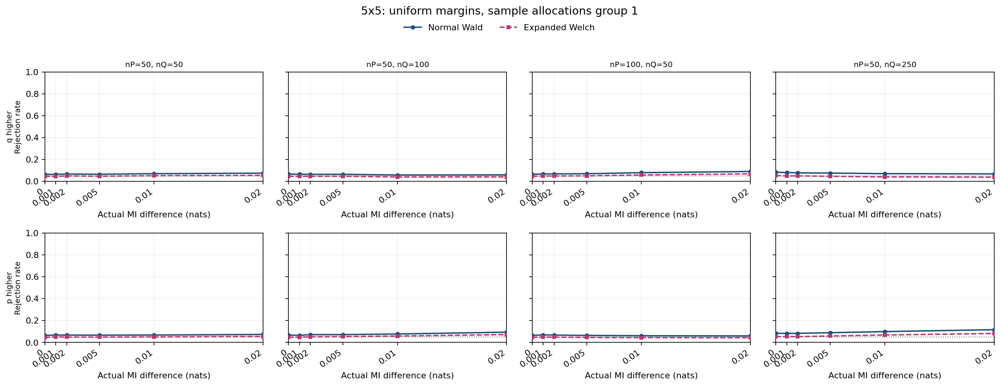

| Specification | Setting |
| --- | --- |
| Table size | 5x5 |
| Horizontal graph regime specifications (columns) | nP=50, nQ=50, nP=50, nQ=100, nP=100, nQ=50, nP=50, nQ=250 |
| Vertical graph regime specifications (rows) | q higher: P row (0.2 repeated 5 times), P column (0.2 repeated 5 times); Q row (0.2 repeated 5 times), Q column (0.2 repeated 5 times); p higher: P row (0.2 repeated 5 times), P column (0.2 repeated 5 times); Q row (0.2 repeated 5 times), Q column (0.2 repeated 5 times) |
| Probability changes | q higher: add at (1,1),(2,2) and subtract at (1,2),(2,1), for both P and Q; p higher: add at (1,1),(2,2) and subtract at (1,2),(2,1), for both P and Q |
| MI settings | Baseline MI {0.02}; direction {q higher, p higher}; actual differences {0, 0.001, 0.002, 0.005, 0.01, 0.02} nats |
| Horizontal axis within each graph | Actual MI difference in nats, fixed from 0 to 0.02 |
| Vertical axis within each graph | Unconditional rejection rate from 0 to 1; invalid results count as non-rejections |
| Replicates | 20,000 per unique point |

Null-point rejection and validity:

| Vertical regime | Horizontal regime | x | Method | Rejection | Valid |
| --- | --- | --- | --- | --- | --- |
| q higher | nP=50, nQ=50 | 0 | Expanded Welch | 0.0467 | 1.0000 |
| q higher | nP=50, nQ=50 | 0 | Normal Wald | 0.0643 | 1.0000 |
| q higher | nP=50, nQ=100 | 0 | Expanded Welch | 0.0477 | 1.0000 |
| q higher | nP=50, nQ=100 | 0 | Normal Wald | 0.0673 | 1.0000 |
| q higher | nP=100, nQ=50 | 0 | Expanded Welch | 0.0479 | 1.0000 |
| q higher | nP=100, nQ=50 | 0 | Normal Wald | 0.0651 | 1.0000 |
| q higher | nP=50, nQ=250 | 0 | Expanded Welch | 0.0539 | 1.0000 |
| q higher | nP=50, nQ=250 | 0 | Normal Wald | 0.0839 | 1.0000 |
| p higher | nP=50, nQ=50 | 0 | Expanded Welch | 0.0467 | 1.0000 |
| p higher | nP=50, nQ=50 | 0 | Normal Wald | 0.0643 | 1.0000 |
| p higher | nP=50, nQ=100 | 0 | Expanded Welch | 0.0477 | 1.0000 |
| p higher | nP=50, nQ=100 | 0 | Normal Wald | 0.0673 | 1.0000 |
| p higher | nP=100, nQ=50 | 0 | Expanded Welch | 0.0479 | 1.0000 |
| p higher | nP=100, nQ=50 | 0 | Normal Wald | 0.0651 | 1.0000 |
| p higher | nP=50, nQ=250 | 0 | Expanded Welch | 0.0539 | 1.0000 |
| p higher | nP=50, nQ=250 | 0 | Normal Wald | 0.0839 | 1.0000 |

Every plotted rate, interval, validity and minimum expected count

| Vertical regime | Horizontal regime | x | Method | Rejection | 95% interval | Valid | Conditional | Min expected P | Min expected Q |
| --- | --- | --- | --- | --- | --- | --- | --- | --- | --- |
| q higher | nP=50, nQ=50 | 0 | Expanded Welch | 0.0467 | [0.0439, 0.0497] | 1.0000 | 0.0467 | 1.021 | 1.021 |
| q higher | nP=50, nQ=50 | 0 | Normal Wald | 0.0643 | [0.0609, 0.0677] | 1.0000 | 0.0643 | 1.021 | 1.021 |
| q higher | nP=50, nQ=50 | 0.001 | Expanded Welch | 0.0459 | [0.0431, 0.0489] | 1.0000 | 0.0459 | 1.021 | 0.9984 |
| q higher | nP=50, nQ=50 | 0.001 | Normal Wald | 0.0653 | [0.0620, 0.0688] | 1.0000 | 0.0653 | 1.021 | 0.9984 |
| q higher | nP=50, nQ=50 | 0.002 | Expanded Welch | 0.0506 | [0.0476, 0.0537] | 1.0000 | 0.0506 | 1.021 | 0.976 |
| q higher | nP=50, nQ=50 | 0.002 | Normal Wald | 0.0679 | [0.0645, 0.0715] | 1.0000 | 0.0679 | 1.021 | 0.976 |
| q higher | nP=50, nQ=50 | 0.005 | Expanded Welch | 0.0479 | [0.0450, 0.0509] | 1.0000 | 0.0479 | 1.021 | 0.9122 |
| q higher | nP=50, nQ=50 | 0.005 | Normal Wald | 0.0661 | [0.0627, 0.0696] | 1.0000 | 0.0661 | 1.021 | 0.9122 |
| q higher | nP=50, nQ=50 | 0.01 | Expanded Welch | 0.0525 | [0.0495, 0.0557] | 1.0000 | 0.0525 | 1.021 | 0.8153 |
| q higher | nP=50, nQ=50 | 0.01 | Normal Wald | 0.0712 | [0.0677, 0.0748] | 1.0000 | 0.0712 | 1.021 | 0.8153 |
| q higher | nP=50, nQ=50 | 0.02 | Expanded Welch | 0.0558 | [0.0527, 0.0590] | 1.0000 | 0.0558 | 1.021 | 0.6484 |
| q higher | nP=50, nQ=50 | 0.02 | Normal Wald | 0.0759 | [0.0723, 0.0796] | 1.0000 | 0.0759 | 1.021 | 0.6484 |
| q higher | nP=50, nQ=100 | 0 | Expanded Welch | 0.0477 | [0.0448, 0.0507] | 1.0000 | 0.0477 | 1.021 | 2.043 |
| q higher | nP=50, nQ=100 | 0 | Normal Wald | 0.0673 | [0.0639, 0.0708] | 1.0000 | 0.0673 | 1.021 | 2.043 |
| q higher | nP=50, nQ=100 | 0.001 | Expanded Welch | 0.0466 | [0.0438, 0.0496] | 1.0000 | 0.0466 | 1.021 | 1.997 |
| q higher | nP=50, nQ=100 | 0.001 | Normal Wald | 0.0662 | [0.0628, 0.0697] | 1.0000 | 0.0662 | 1.021 | 1.997 |
| q higher | nP=50, nQ=100 | 0.002 | Expanded Welch | 0.0474 | [0.0445, 0.0504] | 1.0000 | 0.0474 | 1.021 | 1.952 |
| q higher | nP=50, nQ=100 | 0.002 | Normal Wald | 0.0655 | [0.0622, 0.0691] | 1.0000 | 0.0655 | 1.021 | 1.952 |
| q higher | nP=50, nQ=100 | 0.005 | Expanded Welch | 0.0478 | [0.0449, 0.0508] | 1.0000 | 0.0478 | 1.021 | 1.824 |
| q higher | nP=50, nQ=100 | 0.005 | Normal Wald | 0.0657 | [0.0623, 0.0692] | 1.0000 | 0.0657 | 1.021 | 1.824 |
| q higher | nP=50, nQ=100 | 0.01 | Expanded Welch | 0.0405 | [0.0379, 0.0433] | 1.0000 | 0.0405 | 1.021 | 1.631 |
| q higher | nP=50, nQ=100 | 0.01 | Normal Wald | 0.0591 | [0.0559, 0.0625] | 1.0000 | 0.0591 | 1.021 | 1.631 |
| q higher | nP=50, nQ=100 | 0.02 | Expanded Welch | 0.0412 | [0.0385, 0.0440] | 1.0000 | 0.0412 | 1.021 | 1.297 |
| q higher | nP=50, nQ=100 | 0.02 | Normal Wald | 0.0604 | [0.0572, 0.0638] | 1.0000 | 0.0604 | 1.021 | 1.297 |
| q higher | nP=100, nQ=50 | 0 | Expanded Welch | 0.0479 | [0.0450, 0.0509] | 1.0000 | 0.0479 | 2.043 | 1.021 |
| q higher | nP=100, nQ=50 | 0 | Normal Wald | 0.0651 | [0.0618, 0.0686] | 1.0000 | 0.0651 | 2.043 | 1.021 |
| q higher | nP=100, nQ=50 | 0.001 | Expanded Welch | 0.0496 | [0.0467, 0.0527] | 1.0000 | 0.0496 | 2.043 | 0.9984 |
| q higher | nP=100, nQ=50 | 0.001 | Normal Wald | 0.0687 | [0.0653, 0.0723] | 1.0000 | 0.0687 | 2.043 | 0.9984 |
| q higher | nP=100, nQ=50 | 0.002 | Expanded Welch | 0.0498 | [0.0469, 0.0530] | 1.0000 | 0.0498 | 2.043 | 0.976 |
| q higher | nP=100, nQ=50 | 0.002 | Normal Wald | 0.0692 | [0.0657, 0.0727] | 1.0000 | 0.0692 | 2.043 | 0.976 |
| q higher | nP=100, nQ=50 | 0.005 | Expanded Welch | 0.0514 | [0.0484, 0.0545] | 1.0000 | 0.0514 | 2.043 | 0.9122 |
| q higher | nP=100, nQ=50 | 0.005 | Normal Wald | 0.0707 | [0.0672, 0.0743] | 1.0000 | 0.0707 | 2.043 | 0.9122 |
| q higher | nP=100, nQ=50 | 0.01 | Expanded Welch | 0.0597 | [0.0565, 0.0631] | 1.0000 | 0.0597 | 2.043 | 0.8153 |
| q higher | nP=100, nQ=50 | 0.01 | Normal Wald | 0.0805 | [0.0769, 0.0844] | 1.0000 | 0.0805 | 2.043 | 0.8153 |
| q higher | nP=100, nQ=50 | 0.02 | Expanded Welch | 0.0693 | [0.0659, 0.0730] | 1.0000 | 0.0693 | 2.043 | 0.6484 |
| q higher | nP=100, nQ=50 | 0.02 | Normal Wald | 0.0912 | [0.0873, 0.0953] | 1.0000 | 0.0912 | 2.043 | 0.6484 |
| q higher | nP=50, nQ=250 | 0 | Expanded Welch | 0.0539 | [0.0508, 0.0571] | 1.0000 | 0.0539 | 1.021 | 5.107 |
| q higher | nP=50, nQ=250 | 0 | Normal Wald | 0.0839 | [0.0802, 0.0879] | 1.0000 | 0.0839 | 1.021 | 5.107 |
| q higher | nP=50, nQ=250 | 0.001 | Expanded Welch | 0.0509 | [0.0479, 0.0540] | 1.0000 | 0.0509 | 1.021 | 4.992 |
| q higher | nP=50, nQ=250 | 0.001 | Normal Wald | 0.0817 | [0.0780, 0.0856] | 1.0000 | 0.0817 | 1.021 | 4.992 |
| q higher | nP=50, nQ=250 | 0.002 | Expanded Welch | 0.0510 | [0.0480, 0.0541] | 1.0000 | 0.0510 | 1.021 | 4.88 |
| q higher | nP=50, nQ=250 | 0.002 | Normal Wald | 0.0788 | [0.0751, 0.0826] | 1.0000 | 0.0788 | 1.021 | 4.88 |
| q higher | nP=50, nQ=250 | 0.005 | Expanded Welch | 0.0474 | [0.0446, 0.0505] | 1.0000 | 0.0474 | 1.021 | 4.561 |
| q higher | nP=50, nQ=250 | 0.005 | Normal Wald | 0.0766 | [0.0730, 0.0804] | 1.0000 | 0.0766 | 1.021 | 4.561 |
| q higher | nP=50, nQ=250 | 0.01 | Expanded Welch | 0.0415 | [0.0389, 0.0444] | 1.0000 | 0.0415 | 1.021 | 4.076 |
| q higher | nP=50, nQ=250 | 0.01 | Normal Wald | 0.0713 | [0.0679, 0.0750] | 1.0000 | 0.0713 | 1.021 | 4.076 |
| q higher | nP=50, nQ=250 | 0.02 | Expanded Welch | 0.0392 | [0.0366, 0.0420] | 1.0000 | 0.0392 | 1.021 | 3.242 |
| q higher | nP=50, nQ=250 | 0.02 | Normal Wald | 0.0693 | [0.0659, 0.0729] | 1.0000 | 0.0693 | 1.021 | 3.242 |
| p higher | nP=50, nQ=50 | 0 | Expanded Welch | 0.0467 | [0.0439, 0.0497] | 1.0000 | 0.0467 | 1.021 | 1.021 |
| p higher | nP=50, nQ=50 | 0 | Normal Wald | 0.0643 | [0.0609, 0.0677] | 1.0000 | 0.0643 | 1.021 | 1.021 |
| p higher | nP=50, nQ=50 | 0.001 | Expanded Welch | 0.0507 | [0.0477, 0.0538] | 1.0000 | 0.0507 | 0.9984 | 1.021 |
| p higher | nP=50, nQ=50 | 0.001 | Normal Wald | 0.0679 | [0.0645, 0.0715] | 1.0000 | 0.0679 | 0.9984 | 1.021 |
| p higher | nP=50, nQ=50 | 0.002 | Expanded Welch | 0.0493 | [0.0464, 0.0524] | 1.0000 | 0.0493 | 0.976 | 1.021 |
| p higher | nP=50, nQ=50 | 0.002 | Normal Wald | 0.0674 | [0.0640, 0.0710] | 1.0000 | 0.0674 | 0.976 | 1.021 |
| p higher | nP=50, nQ=50 | 0.005 | Expanded Welch | 0.0493 | [0.0464, 0.0524] | 1.0000 | 0.0493 | 0.9122 | 1.021 |
| p higher | nP=50, nQ=50 | 0.005 | Normal Wald | 0.0669 | [0.0636, 0.0705] | 1.0000 | 0.0669 | 0.9122 | 1.021 |
| p higher | nP=50, nQ=50 | 0.01 | Expanded Welch | 0.0508 | [0.0479, 0.0540] | 1.0000 | 0.0508 | 0.8153 | 1.021 |
| p higher | nP=50, nQ=50 | 0.01 | Normal Wald | 0.0679 | [0.0645, 0.0715] | 1.0000 | 0.0679 | 0.8153 | 1.021 |
| p higher | nP=50, nQ=50 | 0.02 | Expanded Welch | 0.0551 | [0.0520, 0.0583] | 1.0000 | 0.0551 | 0.6484 | 1.021 |
| p higher | nP=50, nQ=50 | 0.02 | Normal Wald | 0.0736 | [0.0700, 0.0773] | 1.0000 | 0.0736 | 0.6484 | 1.021 |
| p higher | nP=50, nQ=100 | 0 | Expanded Welch | 0.0477 | [0.0448, 0.0507] | 1.0000 | 0.0477 | 1.021 | 2.043 |
| p higher | nP=50, nQ=100 | 0 | Normal Wald | 0.0673 | [0.0639, 0.0708] | 1.0000 | 0.0673 | 1.021 | 2.043 |
| p higher | nP=50, nQ=100 | 0.001 | Expanded Welch | 0.0488 | [0.0459, 0.0519] | 1.0000 | 0.0488 | 0.9984 | 2.043 |
| p higher | nP=50, nQ=100 | 0.001 | Normal Wald | 0.0655 | [0.0622, 0.0691] | 1.0000 | 0.0655 | 0.9984 | 2.043 |
| p higher | nP=50, nQ=100 | 0.002 | Expanded Welch | 0.0517 | [0.0487, 0.0548] | 1.0000 | 0.0517 | 0.976 | 2.043 |
| p higher | nP=50, nQ=100 | 0.002 | Normal Wald | 0.0717 | [0.0682, 0.0754] | 1.0000 | 0.0717 | 0.976 | 2.043 |
| p higher | nP=50, nQ=100 | 0.005 | Expanded Welch | 0.0541 | [0.0511, 0.0574] | 1.0000 | 0.0541 | 0.9122 | 2.043 |
| p higher | nP=50, nQ=100 | 0.005 | Normal Wald | 0.0721 | [0.0686, 0.0758] | 1.0000 | 0.0721 | 0.9122 | 2.043 |
| p higher | nP=50, nQ=100 | 0.01 | Expanded Welch | 0.0590 | [0.0558, 0.0623] | 1.0000 | 0.0590 | 0.8153 | 2.043 |
| p higher | nP=50, nQ=100 | 0.01 | Normal Wald | 0.0776 | [0.0740, 0.0814] | 1.0000 | 0.0776 | 0.8153 | 2.043 |
| p higher | nP=50, nQ=100 | 0.02 | Expanded Welch | 0.0723 | [0.0688, 0.0760] | 1.0000 | 0.0723 | 0.6484 | 2.043 |
| p higher | nP=50, nQ=100 | 0.02 | Normal Wald | 0.0944 | [0.0904, 0.0985] | 1.0000 | 0.0944 | 0.6484 | 2.043 |
| p higher | nP=100, nQ=50 | 0 | Expanded Welch | 0.0479 | [0.0450, 0.0509] | 1.0000 | 0.0479 | 2.043 | 1.021 |
| p higher | nP=100, nQ=50 | 0 | Normal Wald | 0.0651 | [0.0618, 0.0686] | 1.0000 | 0.0651 | 2.043 | 1.021 |
| p higher | nP=100, nQ=50 | 0.001 | Expanded Welch | 0.0496 | [0.0467, 0.0527] | 1.0000 | 0.0496 | 1.997 | 1.021 |
| p higher | nP=100, nQ=50 | 0.001 | Normal Wald | 0.0692 | [0.0658, 0.0728] | 1.0000 | 0.0692 | 1.997 | 1.021 |
| p higher | nP=100, nQ=50 | 0.002 | Expanded Welch | 0.0492 | [0.0463, 0.0523] | 1.0000 | 0.0492 | 1.952 | 1.021 |
| p higher | nP=100, nQ=50 | 0.002 | Normal Wald | 0.0676 | [0.0642, 0.0712] | 1.0000 | 0.0676 | 1.952 | 1.021 |
| p higher | nP=100, nQ=50 | 0.005 | Expanded Welch | 0.0459 | [0.0431, 0.0489] | 1.0000 | 0.0459 | 1.824 | 1.021 |
| p higher | nP=100, nQ=50 | 0.005 | Normal Wald | 0.0647 | [0.0614, 0.0682] | 1.0000 | 0.0647 | 1.824 | 1.021 |
| p higher | nP=100, nQ=50 | 0.01 | Expanded Welch | 0.0444 | [0.0416, 0.0473] | 1.0000 | 0.0444 | 1.631 | 1.021 |
| p higher | nP=100, nQ=50 | 0.01 | Normal Wald | 0.0619 | [0.0586, 0.0653] | 1.0000 | 0.0619 | 1.631 | 1.021 |
| p higher | nP=100, nQ=50 | 0.02 | Expanded Welch | 0.0432 | [0.0405, 0.0461] | 1.0000 | 0.0432 | 1.297 | 1.021 |
| p higher | nP=100, nQ=50 | 0.02 | Normal Wald | 0.0600 | [0.0567, 0.0633] | 1.0000 | 0.0600 | 1.297 | 1.021 |
| p higher | nP=50, nQ=250 | 0 | Expanded Welch | 0.0539 | [0.0508, 0.0571] | 1.0000 | 0.0539 | 1.021 | 5.107 |
| p higher | nP=50, nQ=250 | 0 | Normal Wald | 0.0839 | [0.0802, 0.0879] | 1.0000 | 0.0839 | 1.021 | 5.107 |
| p higher | nP=50, nQ=250 | 0.001 | Expanded Welch | 0.0545 | [0.0514, 0.0577] | 1.0000 | 0.0545 | 0.9984 | 5.107 |
| p higher | nP=50, nQ=250 | 0.001 | Normal Wald | 0.0829 | [0.0792, 0.0869] | 1.0000 | 0.0829 | 0.9984 | 5.107 |
| p higher | nP=50, nQ=250 | 0.002 | Expanded Welch | 0.0537 | [0.0507, 0.0570] | 1.0000 | 0.0537 | 0.976 | 5.107 |
| p higher | nP=50, nQ=250 | 0.002 | Normal Wald | 0.0835 | [0.0798, 0.0875] | 1.0000 | 0.0835 | 0.976 | 5.107 |
| p higher | nP=50, nQ=250 | 0.005 | Expanded Welch | 0.0597 | [0.0565, 0.0631] | 1.0000 | 0.0597 | 0.9122 | 5.107 |
| p higher | nP=50, nQ=250 | 0.005 | Normal Wald | 0.0892 | [0.0854, 0.0933] | 1.0000 | 0.0892 | 0.9122 | 5.107 |
| p higher | nP=50, nQ=250 | 0.01 | Expanded Welch | 0.0685 | [0.0651, 0.0721] | 1.0000 | 0.0685 | 0.8153 | 5.107 |
| p higher | nP=50, nQ=250 | 0.01 | Normal Wald | 0.0995 | [0.0955, 0.1038] | 1.0000 | 0.0995 | 0.8153 | 5.107 |
| p higher | nP=50, nQ=250 | 0.02 | Expanded Welch | 0.0822 | [0.0784, 0.0860] | 1.0000 | 0.0822 | 0.6484 | 5.107 |
| p higher | nP=50, nQ=250 | 0.02 | Normal Wald | 0.1171 | [0.1127, 0.1216] | 1.0000 | 0.1171 | 0.6484 | 5.107 |

### 6.14 5x5: uniform margins, sample allocations group 2

Does performance depend on which population has more data or greater MI?

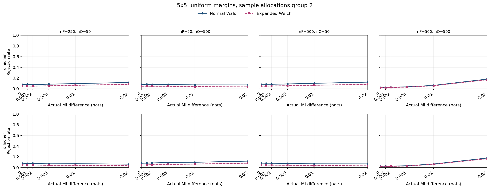

| Specification | Setting |
| --- | --- |
| Table size | 5x5 |
| Horizontal graph regime specifications (columns) | nP=250, nQ=50, nP=50, nQ=500, nP=500, nQ=50, nP=500, nQ=500 |
| Vertical graph regime specifications (rows) | q higher: P row (0.2 repeated 5 times), P column (0.2 repeated 5 times); Q row (0.2 repeated 5 times), Q column (0.2 repeated 5 times); p higher: P row (0.2 repeated 5 times), P column (0.2 repeated 5 times); Q row (0.2 repeated 5 times), Q column (0.2 repeated 5 times) |
| Probability changes | q higher: add at (1,1),(2,2) and subtract at (1,2),(2,1), for both P and Q; p higher: add at (1,1),(2,2) and subtract at (1,2),(2,1), for both P and Q |
| MI settings | Baseline MI {0.02}; direction {q higher, p higher}; actual differences {0, 0.001, 0.002, 0.005, 0.01, 0.02} nats |
| Horizontal axis within each graph | Actual MI difference in nats, fixed from 0 to 0.02 |
| Vertical axis within each graph | Unconditional rejection rate from 0 to 1; invalid results count as non-rejections |
| Replicates | 20,000 per unique point |

Null-point rejection and validity:

| Vertical regime | Horizontal regime | x | Method | Rejection | Valid |
| --- | --- | --- | --- | --- | --- |
| q higher | nP=250, nQ=50 | 0 | Expanded Welch | 0.0532 | 1.0000 |
| q higher | nP=250, nQ=50 | 0 | Normal Wald | 0.0836 | 1.0000 |
| q higher | nP=50, nQ=500 | 0 | Expanded Welch | 0.0493 | 1.0000 |
| q higher | nP=50, nQ=500 | 0 | Normal Wald | 0.0833 | 1.0000 |
| q higher | nP=500, nQ=50 | 0 | Expanded Welch | 0.0511 | 1.0000 |
| q higher | nP=500, nQ=50 | 0 | Normal Wald | 0.0854 | 1.0000 |
| q higher | nP=500, nQ=500 | 0 | Expanded Welch | 0.0240 | 1.0000 |
| q higher | nP=500, nQ=500 | 0 | Normal Wald | 0.0276 | 1.0000 |
| p higher | nP=250, nQ=50 | 0 | Expanded Welch | 0.0532 | 1.0000 |
| p higher | nP=250, nQ=50 | 0 | Normal Wald | 0.0836 | 1.0000 |
| p higher | nP=50, nQ=500 | 0 | Expanded Welch | 0.0493 | 1.0000 |
| p higher | nP=50, nQ=500 | 0 | Normal Wald | 0.0833 | 1.0000 |
| p higher | nP=500, nQ=50 | 0 | Expanded Welch | 0.0511 | 1.0000 |
| p higher | nP=500, nQ=50 | 0 | Normal Wald | 0.0854 | 1.0000 |
| p higher | nP=500, nQ=500 | 0 | Expanded Welch | 0.0240 | 1.0000 |
| p higher | nP=500, nQ=500 | 0 | Normal Wald | 0.0276 | 1.0000 |

Every plotted rate, interval, validity and minimum expected count

| Vertical regime | Horizontal regime | x | Method | Rejection | 95% interval | Valid | Conditional | Min expected P | Min expected Q |
| --- | --- | --- | --- | --- | --- | --- | --- | --- | --- |
| q higher | nP=250, nQ=50 | 0 | Expanded Welch | 0.0532 | [0.0502, 0.0564] | 1.0000 | 0.0532 | 5.107 | 1.021 |
| q higher | nP=250, nQ=50 | 0 | Normal Wald | 0.0836 | [0.0798, 0.0875] | 1.0000 | 0.0836 | 5.107 | 1.021 |
| q higher | nP=250, nQ=50 | 0.001 | Expanded Welch | 0.0534 | [0.0504, 0.0567] | 1.0000 | 0.0534 | 5.107 | 0.9984 |
| q higher | nP=250, nQ=50 | 0.001 | Normal Wald | 0.0841 | [0.0803, 0.0880] | 1.0000 | 0.0841 | 5.107 | 0.9984 |
| q higher | nP=250, nQ=50 | 0.002 | Expanded Welch | 0.0512 | [0.0482, 0.0543] | 1.0000 | 0.0512 | 5.107 | 0.976 |
| q higher | nP=250, nQ=50 | 0.002 | Normal Wald | 0.0796 | [0.0760, 0.0835] | 1.0000 | 0.0796 | 5.107 | 0.976 |
| q higher | nP=250, nQ=50 | 0.005 | Expanded Welch | 0.0567 | [0.0536, 0.0600] | 1.0000 | 0.0567 | 5.107 | 0.9122 |
| q higher | nP=250, nQ=50 | 0.005 | Normal Wald | 0.0872 | [0.0834, 0.0912] | 1.0000 | 0.0872 | 5.107 | 0.9122 |
| q higher | nP=250, nQ=50 | 0.01 | Expanded Welch | 0.0665 | [0.0632, 0.0701] | 1.0000 | 0.0665 | 5.107 | 0.8153 |
| q higher | nP=250, nQ=50 | 0.01 | Normal Wald | 0.0983 | [0.0943, 0.1025] | 1.0000 | 0.0983 | 5.107 | 0.8153 |
| q higher | nP=250, nQ=50 | 0.02 | Expanded Welch | 0.0846 | [0.0808, 0.0885] | 1.0000 | 0.0846 | 5.107 | 0.6484 |
| q higher | nP=250, nQ=50 | 0.02 | Normal Wald | 0.1191 | [0.1146, 0.1236] | 1.0000 | 0.1191 | 5.107 | 0.6484 |
| q higher | nP=50, nQ=500 | 0 | Expanded Welch | 0.0493 | [0.0464, 0.0524] | 1.0000 | 0.0493 | 1.021 | 10.21 |
| q higher | nP=50, nQ=500 | 0 | Normal Wald | 0.0833 | [0.0795, 0.0872] | 1.0000 | 0.0833 | 1.021 | 10.21 |
| q higher | nP=50, nQ=500 | 0.001 | Expanded Welch | 0.0508 | [0.0478, 0.0539] | 1.0000 | 0.0508 | 1.021 | 9.984 |
| q higher | nP=50, nQ=500 | 0.001 | Normal Wald | 0.0856 | [0.0818, 0.0896] | 1.0000 | 0.0856 | 1.021 | 9.984 |
| q higher | nP=50, nQ=500 | 0.002 | Expanded Welch | 0.0488 | [0.0459, 0.0519] | 1.0000 | 0.0488 | 1.021 | 9.76 |
| q higher | nP=50, nQ=500 | 0.002 | Normal Wald | 0.0824 | [0.0786, 0.0862] | 1.0000 | 0.0824 | 1.021 | 9.76 |
| q higher | nP=50, nQ=500 | 0.005 | Expanded Welch | 0.0480 | [0.0451, 0.0511] | 1.0000 | 0.0480 | 1.021 | 9.122 |
| q higher | nP=50, nQ=500 | 0.005 | Normal Wald | 0.0814 | [0.0777, 0.0853] | 1.0000 | 0.0814 | 1.021 | 9.122 |
| q higher | nP=50, nQ=500 | 0.01 | Expanded Welch | 0.0415 | [0.0388, 0.0443] | 1.0000 | 0.0415 | 1.021 | 8.153 |
| q higher | nP=50, nQ=500 | 0.01 | Normal Wald | 0.0740 | [0.0704, 0.0777] | 1.0000 | 0.0740 | 1.021 | 8.153 |
| q higher | nP=50, nQ=500 | 0.02 | Expanded Welch | 0.0369 | [0.0344, 0.0397] | 1.0000 | 0.0369 | 1.021 | 6.484 |
| q higher | nP=50, nQ=500 | 0.02 | Normal Wald | 0.0733 | [0.0698, 0.0770] | 1.0000 | 0.0733 | 1.021 | 6.484 |
| q higher | nP=500, nQ=50 | 0 | Expanded Welch | 0.0511 | [0.0481, 0.0542] | 1.0000 | 0.0511 | 10.21 | 1.021 |
| q higher | nP=500, nQ=50 | 0 | Normal Wald | 0.0854 | [0.0817, 0.0894] | 1.0000 | 0.0854 | 10.21 | 1.021 |
| q higher | nP=500, nQ=50 | 0.001 | Expanded Welch | 0.0503 | [0.0474, 0.0535] | 1.0000 | 0.0503 | 10.21 | 0.9984 |
| q higher | nP=500, nQ=50 | 0.001 | Normal Wald | 0.0854 | [0.0817, 0.0894] | 1.0000 | 0.0854 | 10.21 | 0.9984 |
| q higher | nP=500, nQ=50 | 0.002 | Expanded Welch | 0.0542 | [0.0512, 0.0575] | 1.0000 | 0.0542 | 10.21 | 0.976 |
| q higher | nP=500, nQ=50 | 0.002 | Normal Wald | 0.0856 | [0.0818, 0.0896] | 1.0000 | 0.0856 | 10.21 | 0.976 |
| q higher | nP=500, nQ=50 | 0.005 | Expanded Welch | 0.0580 | [0.0549, 0.0614] | 1.0000 | 0.0580 | 10.21 | 0.9122 |
| q higher | nP=500, nQ=50 | 0.005 | Normal Wald | 0.0916 | [0.0876, 0.0956] | 1.0000 | 0.0916 | 10.21 | 0.9122 |
| q higher | nP=500, nQ=50 | 0.01 | Expanded Welch | 0.0672 | [0.0638, 0.0707] | 1.0000 | 0.0672 | 10.21 | 0.8153 |
| q higher | nP=500, nQ=50 | 0.01 | Normal Wald | 0.1036 | [0.0995, 0.1079] | 1.0000 | 0.1036 | 10.21 | 0.8153 |
| q higher | nP=500, nQ=50 | 0.02 | Expanded Welch | 0.0851 | [0.0813, 0.0890] | 1.0000 | 0.0851 | 10.21 | 0.6484 |
| q higher | nP=500, nQ=50 | 0.02 | Normal Wald | 0.1255 | [0.1210, 0.1302] | 1.0000 | 0.1255 | 10.21 | 0.6484 |
| q higher | nP=500, nQ=500 | 0 | Expanded Welch | 0.0240 | [0.0220, 0.0262] | 1.0000 | 0.0240 | 10.21 | 10.21 |
| q higher | nP=500, nQ=500 | 0 | Normal Wald | 0.0276 | [0.0254, 0.0299] | 1.0000 | 0.0276 | 10.21 | 10.21 |
| q higher | nP=500, nQ=500 | 0.001 | Expanded Welch | 0.0235 | [0.0215, 0.0257] | 1.0000 | 0.0235 | 10.21 | 9.984 |
| q higher | nP=500, nQ=500 | 0.001 | Normal Wald | 0.0274 | [0.0253, 0.0298] | 1.0000 | 0.0274 | 10.21 | 9.984 |
| q higher | nP=500, nQ=500 | 0.002 | Expanded Welch | 0.0264 | [0.0243, 0.0287] | 1.0000 | 0.0264 | 10.21 | 9.76 |
| q higher | nP=500, nQ=500 | 0.002 | Normal Wald | 0.0307 | [0.0284, 0.0332] | 1.0000 | 0.0307 | 10.21 | 9.76 |
| q higher | nP=500, nQ=500 | 0.005 | Expanded Welch | 0.0330 | [0.0306, 0.0356] | 1.0000 | 0.0330 | 10.21 | 9.122 |
| q higher | nP=500, nQ=500 | 0.005 | Normal Wald | 0.0377 | [0.0352, 0.0405] | 1.0000 | 0.0377 | 10.21 | 9.122 |
| q higher | nP=500, nQ=500 | 0.01 | Expanded Welch | 0.0580 | [0.0549, 0.0614] | 1.0000 | 0.0580 | 10.21 | 8.153 |
| q higher | nP=500, nQ=500 | 0.01 | Normal Wald | 0.0648 | [0.0614, 0.0682] | 1.0000 | 0.0648 | 10.21 | 8.153 |
| q higher | nP=500, nQ=500 | 0.02 | Expanded Welch | 0.1707 | [0.1655, 0.1760] | 1.0000 | 0.1707 | 10.21 | 6.484 |
| q higher | nP=500, nQ=500 | 0.02 | Normal Wald | 0.1820 | [0.1767, 0.1874] | 1.0000 | 0.1820 | 10.21 | 6.484 |
| p higher | nP=250, nQ=50 | 0 | Expanded Welch | 0.0532 | [0.0502, 0.0564] | 1.0000 | 0.0532 | 5.107 | 1.021 |
| p higher | nP=250, nQ=50 | 0 | Normal Wald | 0.0836 | [0.0798, 0.0875] | 1.0000 | 0.0836 | 5.107 | 1.021 |
| p higher | nP=250, nQ=50 | 0.001 | Expanded Welch | 0.0496 | [0.0467, 0.0527] | 1.0000 | 0.0496 | 4.992 | 1.021 |
| p higher | nP=250, nQ=50 | 0.001 | Normal Wald | 0.0790 | [0.0753, 0.0828] | 1.0000 | 0.0790 | 4.992 | 1.021 |
| p higher | nP=250, nQ=50 | 0.002 | Expanded Welch | 0.0518 | [0.0488, 0.0550] | 1.0000 | 0.0518 | 4.88 | 1.021 |
| p higher | nP=250, nQ=50 | 0.002 | Normal Wald | 0.0804 | [0.0767, 0.0842] | 1.0000 | 0.0804 | 4.88 | 1.021 |
| p higher | nP=250, nQ=50 | 0.005 | Expanded Welch | 0.0441 | [0.0413, 0.0470] | 1.0000 | 0.0441 | 4.561 | 1.021 |
| p higher | nP=250, nQ=50 | 0.005 | Normal Wald | 0.0724 | [0.0689, 0.0761] | 1.0000 | 0.0724 | 4.561 | 1.021 |
| p higher | nP=250, nQ=50 | 0.01 | Expanded Welch | 0.0442 | [0.0414, 0.0471] | 1.0000 | 0.0442 | 4.076 | 1.021 |
| p higher | nP=250, nQ=50 | 0.01 | Normal Wald | 0.0747 | [0.0712, 0.0785] | 1.0000 | 0.0747 | 4.076 | 1.021 |
| p higher | nP=250, nQ=50 | 0.02 | Expanded Welch | 0.0379 | [0.0353, 0.0406] | 1.0000 | 0.0379 | 3.242 | 1.021 |
| p higher | nP=250, nQ=50 | 0.02 | Normal Wald | 0.0662 | [0.0628, 0.0697] | 1.0000 | 0.0662 | 3.242 | 1.021 |
| p higher | nP=50, nQ=500 | 0 | Expanded Welch | 0.0493 | [0.0464, 0.0524] | 1.0000 | 0.0493 | 1.021 | 10.21 |
| p higher | nP=50, nQ=500 | 0 | Normal Wald | 0.0833 | [0.0795, 0.0872] | 1.0000 | 0.0833 | 1.021 | 10.21 |
| p higher | nP=50, nQ=500 | 0.001 | Expanded Welch | 0.0521 | [0.0491, 0.0553] | 1.0000 | 0.0521 | 0.9984 | 10.21 |
| p higher | nP=50, nQ=500 | 0.001 | Normal Wald | 0.0856 | [0.0818, 0.0896] | 1.0000 | 0.0856 | 0.9984 | 10.21 |
| p higher | nP=50, nQ=500 | 0.002 | Expanded Welch | 0.0552 | [0.0521, 0.0585] | 1.0000 | 0.0552 | 0.976 | 10.21 |
| p higher | nP=50, nQ=500 | 0.002 | Normal Wald | 0.0885 | [0.0846, 0.0925] | 1.0000 | 0.0885 | 0.976 | 10.21 |
| p higher | nP=50, nQ=500 | 0.005 | Expanded Welch | 0.0609 | [0.0577, 0.0643] | 1.0000 | 0.0609 | 0.9122 | 10.21 |
| p higher | nP=50, nQ=500 | 0.005 | Normal Wald | 0.0978 | [0.0937, 0.1019] | 1.0000 | 0.0978 | 0.9122 | 10.21 |
| p higher | nP=50, nQ=500 | 0.01 | Expanded Welch | 0.0678 | [0.0643, 0.0713] | 1.0000 | 0.0678 | 0.8153 | 10.21 |
| p higher | nP=50, nQ=500 | 0.01 | Normal Wald | 0.1013 | [0.0971, 0.1055] | 1.0000 | 0.1013 | 0.8153 | 10.21 |
| p higher | nP=50, nQ=500 | 0.02 | Expanded Welch | 0.0848 | [0.0810, 0.0887] | 1.0000 | 0.0848 | 0.6484 | 10.21 |
| p higher | nP=50, nQ=500 | 0.02 | Normal Wald | 0.1229 | [0.1184, 0.1275] | 1.0000 | 0.1229 | 0.6484 | 10.21 |
| p higher | nP=500, nQ=50 | 0 | Expanded Welch | 0.0511 | [0.0481, 0.0542] | 1.0000 | 0.0511 | 10.21 | 1.021 |
| p higher | nP=500, nQ=50 | 0 | Normal Wald | 0.0854 | [0.0817, 0.0894] | 1.0000 | 0.0854 | 10.21 | 1.021 |
| p higher | nP=500, nQ=50 | 0.001 | Expanded Welch | 0.0491 | [0.0461, 0.0521] | 1.0000 | 0.0491 | 9.984 | 1.021 |
| p higher | nP=500, nQ=50 | 0.001 | Normal Wald | 0.0829 | [0.0792, 0.0869] | 1.0000 | 0.0829 | 9.984 | 1.021 |
| p higher | nP=500, nQ=50 | 0.002 | Expanded Welch | 0.0483 | [0.0454, 0.0514] | 1.0000 | 0.0483 | 9.76 | 1.021 |
| p higher | nP=500, nQ=50 | 0.002 | Normal Wald | 0.0831 | [0.0794, 0.0870] | 1.0000 | 0.0831 | 9.76 | 1.021 |
| p higher | nP=500, nQ=50 | 0.005 | Expanded Welch | 0.0454 | [0.0426, 0.0484] | 1.0000 | 0.0454 | 9.122 | 1.021 |
| p higher | nP=500, nQ=50 | 0.005 | Normal Wald | 0.0794 | [0.0757, 0.0832] | 1.0000 | 0.0794 | 9.122 | 1.021 |
| p higher | nP=500, nQ=50 | 0.01 | Expanded Welch | 0.0404 | [0.0378, 0.0432] | 1.0000 | 0.0404 | 8.153 | 1.021 |
| p higher | nP=500, nQ=50 | 0.01 | Normal Wald | 0.0722 | [0.0687, 0.0759] | 1.0000 | 0.0722 | 8.153 | 1.021 |
| p higher | nP=500, nQ=50 | 0.02 | Expanded Welch | 0.0345 | [0.0321, 0.0372] | 1.0000 | 0.0345 | 6.484 | 1.021 |
| p higher | nP=500, nQ=50 | 0.02 | Normal Wald | 0.0707 | [0.0672, 0.0743] | 1.0000 | 0.0707 | 6.484 | 1.021 |
| p higher | nP=500, nQ=500 | 0 | Expanded Welch | 0.0240 | [0.0220, 0.0262] | 1.0000 | 0.0240 | 10.21 | 10.21 |
| p higher | nP=500, nQ=500 | 0 | Normal Wald | 0.0276 | [0.0254, 0.0299] | 1.0000 | 0.0276 | 10.21 | 10.21 |
| p higher | nP=500, nQ=500 | 0.001 | Expanded Welch | 0.0232 | [0.0213, 0.0254] | 1.0000 | 0.0232 | 9.984 | 10.21 |
| p higher | nP=500, nQ=500 | 0.001 | Normal Wald | 0.0274 | [0.0253, 0.0298] | 1.0000 | 0.0274 | 9.984 | 10.21 |
| p higher | nP=500, nQ=500 | 0.002 | Expanded Welch | 0.0246 | [0.0225, 0.0268] | 1.0000 | 0.0246 | 9.76 | 10.21 |
| p higher | nP=500, nQ=500 | 0.002 | Normal Wald | 0.0286 | [0.0264, 0.0310] | 1.0000 | 0.0286 | 9.76 | 10.21 |
| p higher | nP=500, nQ=500 | 0.005 | Expanded Welch | 0.0322 | [0.0298, 0.0347] | 1.0000 | 0.0322 | 9.122 | 10.21 |
| p higher | nP=500, nQ=500 | 0.005 | Normal Wald | 0.0370 | [0.0345, 0.0397] | 1.0000 | 0.0370 | 9.122 | 10.21 |
| p higher | nP=500, nQ=500 | 0.01 | Expanded Welch | 0.0626 | [0.0593, 0.0660] | 1.0000 | 0.0626 | 8.153 | 10.21 |
| p higher | nP=500, nQ=500 | 0.01 | Normal Wald | 0.0689 | [0.0655, 0.0725] | 1.0000 | 0.0689 | 8.153 | 10.21 |
| p higher | nP=500, nQ=500 | 0.02 | Expanded Welch | 0.1682 | [0.1631, 0.1734] | 1.0000 | 0.1682 | 6.484 | 10.21 |
| p higher | nP=500, nQ=500 | 0.02 | Normal Wald | 0.1804 | [0.1752, 0.1858] | 1.0000 | 0.1804 | 6.484 | 10.21 |

### 6.15 5x5: same skew margins, sample allocations group 1

Does performance depend on which population has more data or greater MI?

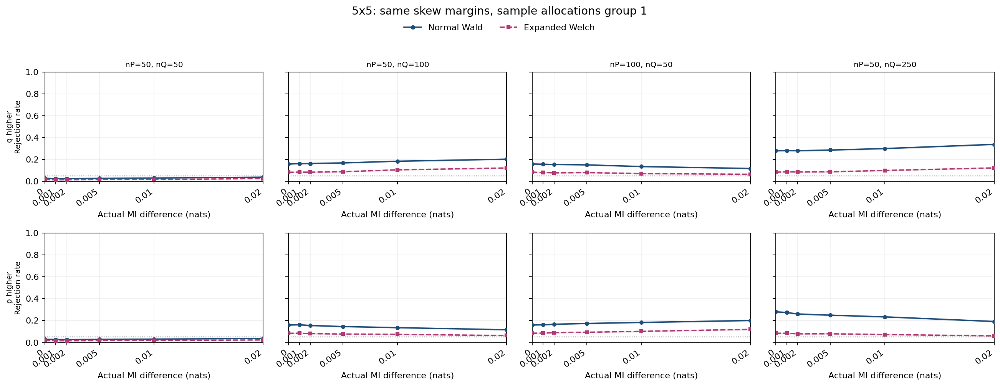

| Specification | Setting |
| --- | --- |
| Table size | 5x5 |
| Horizontal graph regime specifications (columns) | nP=50, nQ=50, nP=50, nQ=100, nP=100, nQ=50, nP=50, nQ=250 |
| Vertical graph regime specifications (rows) | q higher: P row (0.8, 0.2/4 repeated 4 times), P column (0.8, 0.2/4 repeated 4 times); Q row (0.8, 0.2/4 repeated 4 times), Q column (0.8, 0.2/4 repeated 4 times); p higher: P row (0.8, 0.2/4 repeated 4 times), P column (0.8, 0.2/4 repeated 4 times); Q row (0.8, 0.2/4 repeated 4 times), Q column (0.8, 0.2/4 repeated 4 times) |
| Probability changes | q higher: add at (1,1),(2,2) and subtract at (1,2),(2,1), for both P and Q; p higher: add at (1,1),(2,2) and subtract at (1,2),(2,1), for both P and Q |
| MI settings | Baseline MI {0.02}; direction {q higher, p higher}; actual differences {0, 0.001, 0.002, 0.005, 0.01, 0.02} nats |
| Horizontal axis within each graph | Actual MI difference in nats, fixed from 0 to 0.02 |
| Vertical axis within each graph | Unconditional rejection rate from 0 to 1; invalid results count as non-rejections |
| Replicates | 20,000 per unique point |

Null-point rejection and validity:

| Vertical regime | Horizontal regime | x | Method | Rejection | Valid |
| --- | --- | --- | --- | --- | --- |
| q higher | nP=50, nQ=50 | 0 | Expanded Welch | 0.0178 | 1.0000 |
| q higher | nP=50, nQ=50 | 0 | Normal Wald | 0.0290 | 1.0000 |
| q higher | nP=50, nQ=100 | 0 | Expanded Welch | 0.0839 | 1.0000 |
| q higher | nP=50, nQ=100 | 0 | Normal Wald | 0.1593 | 1.0000 |
| q higher | nP=100, nQ=50 | 0 | Expanded Welch | 0.0848 | 1.0000 |
| q higher | nP=100, nQ=50 | 0 | Normal Wald | 0.1597 | 1.0000 |
| q higher | nP=50, nQ=250 | 0 | Expanded Welch | 0.0843 | 1.0000 |
| q higher | nP=50, nQ=250 | 0 | Normal Wald | 0.2798 | 1.0000 |
| p higher | nP=50, nQ=50 | 0 | Expanded Welch | 0.0178 | 1.0000 |
| p higher | nP=50, nQ=50 | 0 | Normal Wald | 0.0290 | 1.0000 |
| p higher | nP=50, nQ=100 | 0 | Expanded Welch | 0.0839 | 1.0000 |
| p higher | nP=50, nQ=100 | 0 | Normal Wald | 0.1593 | 1.0000 |
| p higher | nP=100, nQ=50 | 0 | Expanded Welch | 0.0848 | 1.0000 |
| p higher | nP=100, nQ=50 | 0 | Normal Wald | 0.1597 | 1.0000 |
| p higher | nP=50, nQ=250 | 0 | Expanded Welch | 0.0843 | 1.0000 |
| p higher | nP=50, nQ=250 | 0 | Normal Wald | 0.2798 | 1.0000 |

Every plotted rate, interval, validity and minimum expected count

| Vertical regime | Horizontal regime | x | Method | Rejection | 95% interval | Valid | Conditional | Min expected P | Min expected Q |
| --- | --- | --- | --- | --- | --- | --- | --- | --- | --- |
| q higher | nP=50, nQ=50 | 0 | Expanded Welch | 0.0178 | [0.0161, 0.0197] | 1.0000 | 0.0178 | 0.125 | 0.125 |
| q higher | nP=50, nQ=50 | 0 | Normal Wald | 0.0290 | [0.0267, 0.0314] | 1.0000 | 0.0290 | 0.125 | 0.125 |
| q higher | nP=50, nQ=50 | 0.001 | Expanded Welch | 0.0154 | [0.0137, 0.0171] | 1.0000 | 0.0154 | 0.125 | 0.125 |
| q higher | nP=50, nQ=50 | 0.001 | Normal Wald | 0.0263 | [0.0242, 0.0287] | 1.0000 | 0.0263 | 0.125 | 0.125 |
| q higher | nP=50, nQ=50 | 0.002 | Expanded Welch | 0.0160 | [0.0144, 0.0178] | 1.0000 | 0.0160 | 0.125 | 0.125 |
| q higher | nP=50, nQ=50 | 0.002 | Normal Wald | 0.0266 | [0.0245, 0.0289] | 1.0000 | 0.0266 | 0.125 | 0.125 |
| q higher | nP=50, nQ=50 | 0.005 | Expanded Welch | 0.0175 | [0.0157, 0.0194] | 1.0000 | 0.0175 | 0.125 | 0.125 |
| q higher | nP=50, nQ=50 | 0.005 | Normal Wald | 0.0283 | [0.0260, 0.0306] | 1.0000 | 0.0283 | 0.125 | 0.125 |
| q higher | nP=50, nQ=50 | 0.01 | Expanded Welch | 0.0184 | [0.0166, 0.0203] | 1.0000 | 0.0184 | 0.125 | 0.125 |
| q higher | nP=50, nQ=50 | 0.01 | Normal Wald | 0.0314 | [0.0290, 0.0339] | 1.0000 | 0.0314 | 0.125 | 0.125 |
| q higher | nP=50, nQ=50 | 0.02 | Expanded Welch | 0.0265 | [0.0243, 0.0288] | 0.9999 | 0.0265 | 0.125 | 0.125 |
| q higher | nP=50, nQ=50 | 0.02 | Normal Wald | 0.0393 | [0.0366, 0.0420] | 1.0000 | 0.0393 | 0.125 | 0.125 |
| q higher | nP=50, nQ=100 | 0 | Expanded Welch | 0.0839 | [0.0801, 0.0878] | 1.0000 | 0.0839 | 0.125 | 0.25 |
| q higher | nP=50, nQ=100 | 0 | Normal Wald | 0.1593 | [0.1543, 0.1645] | 1.0000 | 0.1593 | 0.125 | 0.25 |
| q higher | nP=50, nQ=100 | 0.001 | Expanded Welch | 0.0852 | [0.0814, 0.0891] | 1.0000 | 0.0852 | 0.125 | 0.25 |
| q higher | nP=50, nQ=100 | 0.001 | Normal Wald | 0.1631 | [0.1580, 0.1682] | 1.0000 | 0.1631 | 0.125 | 0.25 |
| q higher | nP=50, nQ=100 | 0.002 | Expanded Welch | 0.0848 | [0.0810, 0.0887] | 1.0000 | 0.0848 | 0.125 | 0.25 |
| q higher | nP=50, nQ=100 | 0.002 | Normal Wald | 0.1641 | [0.1590, 0.1693] | 1.0000 | 0.1641 | 0.125 | 0.25 |
| q higher | nP=50, nQ=100 | 0.005 | Expanded Welch | 0.0892 | [0.0854, 0.0933] | 1.0000 | 0.0893 | 0.125 | 0.25 |
| q higher | nP=50, nQ=100 | 0.005 | Normal Wald | 0.1694 | [0.1642, 0.1746] | 1.0000 | 0.1694 | 0.125 | 0.25 |
| q higher | nP=50, nQ=100 | 0.01 | Expanded Welch | 0.1062 | [0.1020, 0.1105] | 1.0000 | 0.1062 | 0.125 | 0.25 |
| q higher | nP=50, nQ=100 | 0.01 | Normal Wald | 0.1848 | [0.1795, 0.1902] | 1.0000 | 0.1848 | 0.125 | 0.25 |
| q higher | nP=50, nQ=100 | 0.02 | Expanded Welch | 0.1230 | [0.1185, 0.1276] | 1.0000 | 0.1230 | 0.125 | 0.25 |
| q higher | nP=50, nQ=100 | 0.02 | Normal Wald | 0.2035 | [0.1980, 0.2091] | 1.0000 | 0.2035 | 0.125 | 0.25 |
| q higher | nP=100, nQ=50 | 0 | Expanded Welch | 0.0848 | [0.0811, 0.0888] | 1.0000 | 0.0848 | 0.25 | 0.125 |
| q higher | nP=100, nQ=50 | 0 | Normal Wald | 0.1597 | [0.1547, 0.1648] | 1.0000 | 0.1597 | 0.25 | 0.125 |
| q higher | nP=100, nQ=50 | 0.001 | Expanded Welch | 0.0822 | [0.0784, 0.0860] | 1.0000 | 0.0822 | 0.25 | 0.125 |
| q higher | nP=100, nQ=50 | 0.001 | Normal Wald | 0.1575 | [0.1525, 0.1626] | 1.0000 | 0.1575 | 0.25 | 0.125 |
| q higher | nP=100, nQ=50 | 0.002 | Expanded Welch | 0.0786 | [0.0750, 0.0825] | 1.0000 | 0.0787 | 0.25 | 0.125 |
| q higher | nP=100, nQ=50 | 0.002 | Normal Wald | 0.1551 | [0.1501, 0.1602] | 1.0000 | 0.1551 | 0.25 | 0.125 |
| q higher | nP=100, nQ=50 | 0.005 | Expanded Welch | 0.0809 | [0.0772, 0.0848] | 1.0000 | 0.0809 | 0.25 | 0.125 |
| q higher | nP=100, nQ=50 | 0.005 | Normal Wald | 0.1515 | [0.1466, 0.1566] | 1.0000 | 0.1515 | 0.25 | 0.125 |
| q higher | nP=100, nQ=50 | 0.01 | Expanded Welch | 0.0721 | [0.0686, 0.0758] | 1.0000 | 0.0721 | 0.25 | 0.125 |
| q higher | nP=100, nQ=50 | 0.01 | Normal Wald | 0.1361 | [0.1315, 0.1410] | 1.0000 | 0.1361 | 0.25 | 0.125 |
| q higher | nP=100, nQ=50 | 0.02 | Expanded Welch | 0.0657 | [0.0623, 0.0692] | 1.0000 | 0.0657 | 0.25 | 0.125 |
| q higher | nP=100, nQ=50 | 0.02 | Normal Wald | 0.1184 | [0.1140, 0.1230] | 1.0000 | 0.1184 | 0.25 | 0.125 |
| q higher | nP=50, nQ=250 | 0 | Expanded Welch | 0.0843 | [0.0805, 0.0882] | 1.0000 | 0.0843 | 0.125 | 0.625 |
| q higher | nP=50, nQ=250 | 0 | Normal Wald | 0.2798 | [0.2736, 0.2861] | 1.0000 | 0.2798 | 0.125 | 0.625 |
| q higher | nP=50, nQ=250 | 0.001 | Expanded Welch | 0.0887 | [0.0848, 0.0927] | 0.9999 | 0.0887 | 0.125 | 0.625 |
| q higher | nP=50, nQ=250 | 0.001 | Normal Wald | 0.2821 | [0.2759, 0.2884] | 1.0000 | 0.2821 | 0.125 | 0.625 |
| q higher | nP=50, nQ=250 | 0.002 | Expanded Welch | 0.0864 | [0.0826, 0.0904] | 1.0000 | 0.0864 | 0.125 | 0.625 |
| q higher | nP=50, nQ=250 | 0.002 | Normal Wald | 0.2809 | [0.2748, 0.2872] | 1.0000 | 0.2809 | 0.125 | 0.625 |
| q higher | nP=50, nQ=250 | 0.005 | Expanded Welch | 0.0883 | [0.0844, 0.0923] | 1.0000 | 0.0883 | 0.125 | 0.625 |
| q higher | nP=50, nQ=250 | 0.005 | Normal Wald | 0.2867 | [0.2804, 0.2930] | 1.0000 | 0.2867 | 0.125 | 0.625 |
| q higher | nP=50, nQ=250 | 0.01 | Expanded Welch | 0.1005 | [0.0964, 0.1047] | 1.0000 | 0.1005 | 0.125 | 0.625 |
| q higher | nP=50, nQ=250 | 0.01 | Normal Wald | 0.3005 | [0.2942, 0.3069] | 1.0000 | 0.3005 | 0.125 | 0.625 |
| q higher | nP=50, nQ=250 | 0.02 | Expanded Welch | 0.1237 | [0.1193, 0.1284] | 0.9999 | 0.1238 | 0.125 | 0.625 |
| q higher | nP=50, nQ=250 | 0.02 | Normal Wald | 0.3386 | [0.3320, 0.3451] | 1.0000 | 0.3386 | 0.125 | 0.625 |
| p higher | nP=50, nQ=50 | 0 | Expanded Welch | 0.0178 | [0.0161, 0.0197] | 1.0000 | 0.0178 | 0.125 | 0.125 |
| p higher | nP=50, nQ=50 | 0 | Normal Wald | 0.0290 | [0.0267, 0.0314] | 1.0000 | 0.0290 | 0.125 | 0.125 |
| p higher | nP=50, nQ=50 | 0.001 | Expanded Welch | 0.0163 | [0.0147, 0.0182] | 1.0000 | 0.0163 | 0.125 | 0.125 |
| p higher | nP=50, nQ=50 | 0.001 | Normal Wald | 0.0278 | [0.0256, 0.0302] | 1.0000 | 0.0278 | 0.125 | 0.125 |
| p higher | nP=50, nQ=50 | 0.002 | Expanded Welch | 0.0159 | [0.0143, 0.0177] | 1.0000 | 0.0159 | 0.125 | 0.125 |
| p higher | nP=50, nQ=50 | 0.002 | Normal Wald | 0.0272 | [0.0251, 0.0296] | 1.0000 | 0.0272 | 0.125 | 0.125 |
| p higher | nP=50, nQ=50 | 0.005 | Expanded Welch | 0.0174 | [0.0157, 0.0193] | 1.0000 | 0.0174 | 0.125 | 0.125 |
| p higher | nP=50, nQ=50 | 0.005 | Normal Wald | 0.0284 | [0.0261, 0.0307] | 1.0000 | 0.0284 | 0.125 | 0.125 |
| p higher | nP=50, nQ=50 | 0.01 | Expanded Welch | 0.0193 | [0.0175, 0.0213] | 1.0000 | 0.0193 | 0.125 | 0.125 |
| p higher | nP=50, nQ=50 | 0.01 | Normal Wald | 0.0302 | [0.0280, 0.0327] | 1.0000 | 0.0302 | 0.125 | 0.125 |
| p higher | nP=50, nQ=50 | 0.02 | Expanded Welch | 0.0235 | [0.0215, 0.0257] | 1.0000 | 0.0235 | 0.125 | 0.125 |
| p higher | nP=50, nQ=50 | 0.02 | Normal Wald | 0.0377 | [0.0351, 0.0404] | 1.0000 | 0.0377 | 0.125 | 0.125 |
| p higher | nP=50, nQ=100 | 0 | Expanded Welch | 0.0839 | [0.0801, 0.0878] | 1.0000 | 0.0839 | 0.125 | 0.25 |
| p higher | nP=50, nQ=100 | 0 | Normal Wald | 0.1593 | [0.1543, 0.1645] | 1.0000 | 0.1593 | 0.125 | 0.25 |
| p higher | nP=50, nQ=100 | 0.001 | Expanded Welch | 0.0848 | [0.0810, 0.0887] | 1.0000 | 0.0848 | 0.125 | 0.25 |
| p higher | nP=50, nQ=100 | 0.001 | Normal Wald | 0.1618 | [0.1567, 0.1669] | 1.0000 | 0.1618 | 0.125 | 0.25 |
| p higher | nP=50, nQ=100 | 0.002 | Expanded Welch | 0.0810 | [0.0773, 0.0849] | 1.0000 | 0.0810 | 0.125 | 0.25 |
| p higher | nP=50, nQ=100 | 0.002 | Normal Wald | 0.1548 | [0.1499, 0.1599] | 1.0000 | 0.1548 | 0.125 | 0.25 |
| p higher | nP=50, nQ=100 | 0.005 | Expanded Welch | 0.0770 | [0.0733, 0.0807] | 1.0000 | 0.0770 | 0.125 | 0.25 |
| p higher | nP=50, nQ=100 | 0.005 | Normal Wald | 0.1454 | [0.1406, 0.1504] | 1.0000 | 0.1454 | 0.125 | 0.25 |
| p higher | nP=50, nQ=100 | 0.01 | Expanded Welch | 0.0740 | [0.0705, 0.0777] | 1.0000 | 0.0740 | 0.125 | 0.25 |
| p higher | nP=50, nQ=100 | 0.01 | Normal Wald | 0.1352 | [0.1305, 0.1400] | 1.0000 | 0.1352 | 0.125 | 0.25 |
| p higher | nP=50, nQ=100 | 0.02 | Expanded Welch | 0.0635 | [0.0602, 0.0669] | 1.0000 | 0.0635 | 0.125 | 0.25 |
| p higher | nP=50, nQ=100 | 0.02 | Normal Wald | 0.1162 | [0.1118, 0.1207] | 1.0000 | 0.1162 | 0.125 | 0.25 |
| p higher | nP=100, nQ=50 | 0 | Expanded Welch | 0.0848 | [0.0811, 0.0888] | 1.0000 | 0.0848 | 0.25 | 0.125 |
| p higher | nP=100, nQ=50 | 0 | Normal Wald | 0.1597 | [0.1547, 0.1648] | 1.0000 | 0.1597 | 0.25 | 0.125 |
| p higher | nP=100, nQ=50 | 0.001 | Expanded Welch | 0.0856 | [0.0818, 0.0895] | 1.0000 | 0.0856 | 0.25 | 0.125 |
| p higher | nP=100, nQ=50 | 0.001 | Normal Wald | 0.1615 | [0.1565, 0.1667] | 1.0000 | 0.1615 | 0.25 | 0.125 |
| p higher | nP=100, nQ=50 | 0.002 | Expanded Welch | 0.0899 | [0.0860, 0.0939] | 1.0000 | 0.0899 | 0.25 | 0.125 |
| p higher | nP=100, nQ=50 | 0.002 | Normal Wald | 0.1661 | [0.1611, 0.1714] | 1.0000 | 0.1661 | 0.25 | 0.125 |
| p higher | nP=100, nQ=50 | 0.005 | Expanded Welch | 0.0935 | [0.0895, 0.0976] | 1.0000 | 0.0935 | 0.25 | 0.125 |
| p higher | nP=100, nQ=50 | 0.005 | Normal Wald | 0.1737 | [0.1686, 0.1791] | 1.0000 | 0.1737 | 0.25 | 0.125 |
| p higher | nP=100, nQ=50 | 0.01 | Expanded Welch | 0.1017 | [0.0976, 0.1060] | 0.9999 | 0.1018 | 0.25 | 0.125 |
| p higher | nP=100, nQ=50 | 0.01 | Normal Wald | 0.1830 | [0.1777, 0.1884] | 1.0000 | 0.1830 | 0.25 | 0.125 |
| p higher | nP=100, nQ=50 | 0.02 | Expanded Welch | 0.1197 | [0.1153, 0.1243] | 1.0000 | 0.1197 | 0.25 | 0.125 |
| p higher | nP=100, nQ=50 | 0.02 | Normal Wald | 0.2004 | [0.1949, 0.2060] | 1.0000 | 0.2004 | 0.25 | 0.125 |
| p higher | nP=50, nQ=250 | 0 | Expanded Welch | 0.0843 | [0.0805, 0.0882] | 1.0000 | 0.0843 | 0.125 | 0.625 |
| p higher | nP=50, nQ=250 | 0 | Normal Wald | 0.2798 | [0.2736, 0.2861] | 1.0000 | 0.2798 | 0.125 | 0.625 |
| p higher | nP=50, nQ=250 | 0.001 | Expanded Welch | 0.0843 | [0.0805, 0.0882] | 1.0000 | 0.0843 | 0.125 | 0.625 |
| p higher | nP=50, nQ=250 | 0.001 | Normal Wald | 0.2733 | [0.2672, 0.2795] | 1.0000 | 0.2733 | 0.125 | 0.625 |
| p higher | nP=50, nQ=250 | 0.002 | Expanded Welch | 0.0788 | [0.0751, 0.0826] | 1.0000 | 0.0788 | 0.125 | 0.625 |
| p higher | nP=50, nQ=250 | 0.002 | Normal Wald | 0.2601 | [0.2541, 0.2662] | 1.0000 | 0.2601 | 0.125 | 0.625 |
| p higher | nP=50, nQ=250 | 0.005 | Expanded Welch | 0.0794 | [0.0757, 0.0832] | 1.0000 | 0.0794 | 0.125 | 0.625 |
| p higher | nP=50, nQ=250 | 0.005 | Normal Wald | 0.2490 | [0.2431, 0.2550] | 1.0000 | 0.2490 | 0.125 | 0.625 |
| p higher | nP=50, nQ=250 | 0.01 | Expanded Welch | 0.0723 | [0.0688, 0.0760] | 1.0000 | 0.0723 | 0.125 | 0.625 |
| p higher | nP=50, nQ=250 | 0.01 | Normal Wald | 0.2337 | [0.2279, 0.2396] | 1.0000 | 0.2337 | 0.125 | 0.625 |
| p higher | nP=50, nQ=250 | 0.02 | Expanded Welch | 0.0605 | [0.0573, 0.0639] | 1.0000 | 0.0605 | 0.125 | 0.625 |
| p higher | nP=50, nQ=250 | 0.02 | Normal Wald | 0.1917 | [0.1863, 0.1972] | 1.0000 | 0.1917 | 0.125 | 0.625 |

### 6.16 5x5: same skew margins, sample allocations group 2

Does performance depend on which population has more data or greater MI?

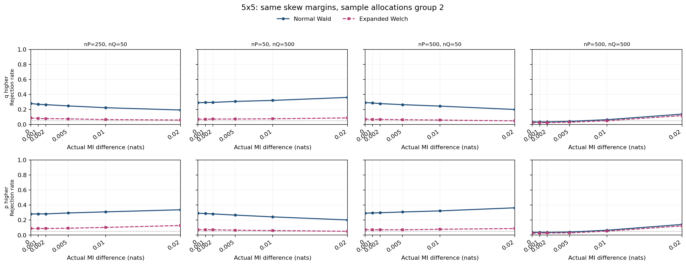

| Specification | Setting |
| --- | --- |
| Table size | 5x5 |
| Horizontal graph regime specifications (columns) | nP=250, nQ=50, nP=50, nQ=500, nP=500, nQ=50, nP=500, nQ=500 |
| Vertical graph regime specifications (rows) | q higher: P row (0.8, 0.2/4 repeated 4 times), P column (0.8, 0.2/4 repeated 4 times); Q row (0.8, 0.2/4 repeated 4 times), Q column (0.8, 0.2/4 repeated 4 times); p higher: P row (0.8, 0.2/4 repeated 4 times), P column (0.8, 0.2/4 repeated 4 times); Q row (0.8, 0.2/4 repeated 4 times), Q column (0.8, 0.2/4 repeated 4 times) |
| Probability changes | q higher: add at (1,1),(2,2) and subtract at (1,2),(2,1), for both P and Q; p higher: add at (1,1),(2,2) and subtract at (1,2),(2,1), for both P and Q |
| MI settings | Baseline MI {0.02}; direction {q higher, p higher}; actual differences {0, 0.001, 0.002, 0.005, 0.01, 0.02} nats |
| Horizontal axis within each graph | Actual MI difference in nats, fixed from 0 to 0.02 |
| Vertical axis within each graph | Unconditional rejection rate from 0 to 1; invalid results count as non-rejections |
| Replicates | 20,000 per unique point |

Null-point rejection and validity:

| Vertical regime | Horizontal regime | x | Method | Rejection | Valid |
| --- | --- | --- | --- | --- | --- |
| q higher | nP=250, nQ=50 | 0 | Expanded Welch | 0.0877 | 1.0000 |
| q higher | nP=250, nQ=50 | 0 | Normal Wald | 0.2809 | 1.0000 |
| q higher | nP=50, nQ=500 | 0 | Expanded Welch | 0.0714 | 1.0000 |
| q higher | nP=50, nQ=500 | 0 | Normal Wald | 0.2910 | 1.0000 |
| q higher | nP=500, nQ=50 | 0 | Expanded Welch | 0.0726 | 1.0000 |
| q higher | nP=500, nQ=50 | 0 | Normal Wald | 0.2926 | 1.0000 |
| q higher | nP=500, nQ=500 | 0 | Expanded Welch | 0.0260 | 1.0000 |
| q higher | nP=500, nQ=500 | 0 | Normal Wald | 0.0369 | 1.0000 |
| p higher | nP=250, nQ=50 | 0 | Expanded Welch | 0.0877 | 1.0000 |
| p higher | nP=250, nQ=50 | 0 | Normal Wald | 0.2809 | 1.0000 |
| p higher | nP=50, nQ=500 | 0 | Expanded Welch | 0.0714 | 1.0000 |
| p higher | nP=50, nQ=500 | 0 | Normal Wald | 0.2910 | 1.0000 |
| p higher | nP=500, nQ=50 | 0 | Expanded Welch | 0.0726 | 1.0000 |
| p higher | nP=500, nQ=50 | 0 | Normal Wald | 0.2926 | 1.0000 |
| p higher | nP=500, nQ=500 | 0 | Expanded Welch | 0.0260 | 1.0000 |
| p higher | nP=500, nQ=500 | 0 | Normal Wald | 0.0369 | 1.0000 |

Every plotted rate, interval, validity and minimum expected count

| Vertical regime | Horizontal regime | x | Method | Rejection | 95% interval | Valid | Conditional | Min expected P | Min expected Q |
| --- | --- | --- | --- | --- | --- | --- | --- | --- | --- |
| q higher | nP=250, nQ=50 | 0 | Expanded Welch | 0.0877 | [0.0839, 0.0917] | 1.0000 | 0.0877 | 0.625 | 0.125 |
| q higher | nP=250, nQ=50 | 0 | Normal Wald | 0.2809 | [0.2747, 0.2872] | 1.0000 | 0.2809 | 0.625 | 0.125 |
| q higher | nP=250, nQ=50 | 0.001 | Expanded Welch | 0.0808 | [0.0771, 0.0846] | 1.0000 | 0.0808 | 0.625 | 0.125 |
| q higher | nP=250, nQ=50 | 0.001 | Normal Wald | 0.2694 | [0.2633, 0.2756] | 1.0000 | 0.2694 | 0.625 | 0.125 |
| q higher | nP=250, nQ=50 | 0.002 | Expanded Welch | 0.0791 | [0.0755, 0.0830] | 1.0000 | 0.0791 | 0.625 | 0.125 |
| q higher | nP=250, nQ=50 | 0.002 | Normal Wald | 0.2653 | [0.2592, 0.2715] | 1.0000 | 0.2653 | 0.625 | 0.125 |
| q higher | nP=250, nQ=50 | 0.005 | Expanded Welch | 0.0761 | [0.0725, 0.0798] | 1.0000 | 0.0761 | 0.625 | 0.125 |
| q higher | nP=250, nQ=50 | 0.005 | Normal Wald | 0.2484 | [0.2425, 0.2544] | 1.0000 | 0.2484 | 0.625 | 0.125 |
| q higher | nP=250, nQ=50 | 0.01 | Expanded Welch | 0.0667 | [0.0633, 0.0702] | 1.0000 | 0.0667 | 0.625 | 0.125 |
| q higher | nP=250, nQ=50 | 0.01 | Normal Wald | 0.2246 | [0.2189, 0.2304] | 1.0000 | 0.2246 | 0.625 | 0.125 |
| q higher | nP=250, nQ=50 | 0.02 | Expanded Welch | 0.0606 | [0.0574, 0.0640] | 1.0000 | 0.0606 | 0.625 | 0.125 |
| q higher | nP=250, nQ=50 | 0.02 | Normal Wald | 0.1942 | [0.1888, 0.1997] | 1.0000 | 0.1942 | 0.625 | 0.125 |
| q higher | nP=50, nQ=500 | 0 | Expanded Welch | 0.0714 | [0.0680, 0.0751] | 1.0000 | 0.0714 | 0.125 | 1.25 |
| q higher | nP=50, nQ=500 | 0 | Normal Wald | 0.2910 | [0.2848, 0.2974] | 1.0000 | 0.2910 | 0.125 | 1.25 |
| q higher | nP=50, nQ=500 | 0.001 | Expanded Welch | 0.0717 | [0.0682, 0.0753] | 1.0000 | 0.0717 | 0.125 | 1.25 |
| q higher | nP=50, nQ=500 | 0.001 | Normal Wald | 0.2943 | [0.2880, 0.3007] | 1.0000 | 0.2943 | 0.125 | 1.25 |
| q higher | nP=50, nQ=500 | 0.002 | Expanded Welch | 0.0736 | [0.0700, 0.0773] | 1.0000 | 0.0736 | 0.125 | 1.25 |
| q higher | nP=50, nQ=500 | 0.002 | Normal Wald | 0.2954 | [0.2891, 0.3017] | 1.0000 | 0.2954 | 0.125 | 1.25 |
| q higher | nP=50, nQ=500 | 0.005 | Expanded Welch | 0.0741 | [0.0705, 0.0778] | 1.0000 | 0.0741 | 0.125 | 1.25 |
| q higher | nP=50, nQ=500 | 0.005 | Normal Wald | 0.3084 | [0.3020, 0.3148] | 1.0000 | 0.3084 | 0.125 | 1.25 |
| q higher | nP=50, nQ=500 | 0.01 | Expanded Welch | 0.0772 | [0.0736, 0.0810] | 0.9999 | 0.0772 | 0.125 | 1.25 |
| q higher | nP=50, nQ=500 | 0.01 | Normal Wald | 0.3217 | [0.3153, 0.3282] | 1.0000 | 0.3217 | 0.125 | 1.25 |
| q higher | nP=50, nQ=500 | 0.02 | Expanded Welch | 0.0889 | [0.0850, 0.0929] | 1.0000 | 0.0889 | 0.125 | 1.25 |
| q higher | nP=50, nQ=500 | 0.02 | Normal Wald | 0.3615 | [0.3549, 0.3682] | 1.0000 | 0.3615 | 0.125 | 1.25 |
| q higher | nP=500, nQ=50 | 0 | Expanded Welch | 0.0726 | [0.0691, 0.0763] | 1.0000 | 0.0726 | 1.25 | 0.125 |
| q higher | nP=500, nQ=50 | 0 | Normal Wald | 0.2926 | [0.2863, 0.2989] | 1.0000 | 0.2926 | 1.25 | 0.125 |
| q higher | nP=500, nQ=50 | 0.001 | Expanded Welch | 0.0683 | [0.0648, 0.0718] | 1.0000 | 0.0683 | 1.25 | 0.125 |
| q higher | nP=500, nQ=50 | 0.001 | Normal Wald | 0.2881 | [0.2819, 0.2944] | 1.0000 | 0.2881 | 1.25 | 0.125 |
| q higher | nP=500, nQ=50 | 0.002 | Expanded Welch | 0.0691 | [0.0656, 0.0726] | 1.0000 | 0.0691 | 1.25 | 0.125 |
| q higher | nP=500, nQ=50 | 0.002 | Normal Wald | 0.2793 | [0.2731, 0.2856] | 1.0000 | 0.2793 | 1.25 | 0.125 |
| q higher | nP=500, nQ=50 | 0.005 | Expanded Welch | 0.0649 | [0.0616, 0.0684] | 1.0000 | 0.0649 | 1.25 | 0.125 |
| q higher | nP=500, nQ=50 | 0.005 | Normal Wald | 0.2652 | [0.2591, 0.2714] | 1.0000 | 0.2652 | 1.25 | 0.125 |
| q higher | nP=500, nQ=50 | 0.01 | Expanded Welch | 0.0607 | [0.0574, 0.0640] | 1.0000 | 0.0607 | 1.25 | 0.125 |
| q higher | nP=500, nQ=50 | 0.01 | Normal Wald | 0.2458 | [0.2399, 0.2518] | 1.0000 | 0.2458 | 1.25 | 0.125 |
| q higher | nP=500, nQ=50 | 0.02 | Expanded Welch | 0.0500 | [0.0471, 0.0531] | 1.0000 | 0.0500 | 1.25 | 0.125 |
| q higher | nP=500, nQ=50 | 0.02 | Normal Wald | 0.2012 | [0.1957, 0.2068] | 1.0000 | 0.2012 | 1.25 | 0.125 |
| q higher | nP=500, nQ=500 | 0 | Expanded Welch | 0.0260 | [0.0238, 0.0282] | 1.0000 | 0.0260 | 1.25 | 1.25 |
| q higher | nP=500, nQ=500 | 0 | Normal Wald | 0.0369 | [0.0343, 0.0396] | 1.0000 | 0.0369 | 1.25 | 1.25 |
| q higher | nP=500, nQ=500 | 0.001 | Expanded Welch | 0.0253 | [0.0232, 0.0275] | 1.0000 | 0.0253 | 1.25 | 1.25 |
| q higher | nP=500, nQ=500 | 0.001 | Normal Wald | 0.0349 | [0.0324, 0.0375] | 1.0000 | 0.0349 | 1.25 | 1.25 |
| q higher | nP=500, nQ=500 | 0.002 | Expanded Welch | 0.0263 | [0.0242, 0.0287] | 1.0000 | 0.0263 | 1.25 | 1.25 |
| q higher | nP=500, nQ=500 | 0.002 | Normal Wald | 0.0357 | [0.0332, 0.0384] | 1.0000 | 0.0357 | 1.25 | 1.25 |
| q higher | nP=500, nQ=500 | 0.005 | Expanded Welch | 0.0316 | [0.0293, 0.0342] | 1.0000 | 0.0316 | 1.25 | 1.25 |
| q higher | nP=500, nQ=500 | 0.005 | Normal Wald | 0.0435 | [0.0407, 0.0464] | 1.0000 | 0.0435 | 1.25 | 1.25 |
| q higher | nP=500, nQ=500 | 0.01 | Expanded Welch | 0.0517 | [0.0487, 0.0548] | 1.0000 | 0.0517 | 1.25 | 1.25 |
| q higher | nP=500, nQ=500 | 0.01 | Normal Wald | 0.0654 | [0.0621, 0.0690] | 1.0000 | 0.0654 | 1.25 | 1.25 |
| q higher | nP=500, nQ=500 | 0.02 | Expanded Welch | 0.1200 | [0.1155, 0.1245] | 1.0000 | 0.1200 | 1.25 | 1.25 |
| q higher | nP=500, nQ=500 | 0.02 | Normal Wald | 0.1396 | [0.1348, 0.1444] | 1.0000 | 0.1396 | 1.25 | 1.25 |
| p higher | nP=250, nQ=50 | 0 | Expanded Welch | 0.0877 | [0.0839, 0.0917] | 1.0000 | 0.0877 | 0.625 | 0.125 |
| p higher | nP=250, nQ=50 | 0 | Normal Wald | 0.2809 | [0.2747, 0.2872] | 1.0000 | 0.2809 | 0.625 | 0.125 |
| p higher | nP=250, nQ=50 | 0.001 | Expanded Welch | 0.0877 | [0.0839, 0.0917] | 1.0000 | 0.0877 | 0.625 | 0.125 |
| p higher | nP=250, nQ=50 | 0.001 | Normal Wald | 0.2832 | [0.2770, 0.2895] | 1.0000 | 0.2832 | 0.625 | 0.125 |
| p higher | nP=250, nQ=50 | 0.002 | Expanded Welch | 0.0887 | [0.0849, 0.0928] | 1.0000 | 0.0888 | 0.625 | 0.125 |
| p higher | nP=250, nQ=50 | 0.002 | Normal Wald | 0.2824 | [0.2762, 0.2887] | 1.0000 | 0.2824 | 0.625 | 0.125 |
| p higher | nP=250, nQ=50 | 0.005 | Expanded Welch | 0.0919 | [0.0879, 0.0959] | 1.0000 | 0.0919 | 0.625 | 0.125 |
| p higher | nP=250, nQ=50 | 0.005 | Normal Wald | 0.2950 | [0.2887, 0.3014] | 1.0000 | 0.2950 | 0.625 | 0.125 |
| p higher | nP=250, nQ=50 | 0.01 | Expanded Welch | 0.1027 | [0.0986, 0.1070] | 1.0000 | 0.1027 | 0.625 | 0.125 |
| p higher | nP=250, nQ=50 | 0.01 | Normal Wald | 0.3095 | [0.3032, 0.3160] | 1.0000 | 0.3095 | 0.625 | 0.125 |
| p higher | nP=250, nQ=50 | 0.02 | Expanded Welch | 0.1281 | [0.1236, 0.1329] | 1.0000 | 0.1281 | 0.625 | 0.125 |
| p higher | nP=250, nQ=50 | 0.02 | Normal Wald | 0.3374 | [0.3309, 0.3440] | 1.0000 | 0.3374 | 0.625 | 0.125 |
| p higher | nP=50, nQ=500 | 0 | Expanded Welch | 0.0714 | [0.0680, 0.0751] | 1.0000 | 0.0714 | 0.125 | 1.25 |
| p higher | nP=50, nQ=500 | 0 | Normal Wald | 0.2910 | [0.2848, 0.2974] | 1.0000 | 0.2910 | 0.125 | 1.25 |
| p higher | nP=50, nQ=500 | 0.001 | Expanded Welch | 0.0718 | [0.0684, 0.0755] | 1.0000 | 0.0718 | 0.125 | 1.25 |
| p higher | nP=50, nQ=500 | 0.001 | Normal Wald | 0.2873 | [0.2811, 0.2936] | 1.0000 | 0.2873 | 0.125 | 1.25 |
| p higher | nP=50, nQ=500 | 0.002 | Expanded Welch | 0.0709 | [0.0674, 0.0745] | 1.0000 | 0.0709 | 0.125 | 1.25 |
| p higher | nP=50, nQ=500 | 0.002 | Normal Wald | 0.2823 | [0.2761, 0.2886] | 1.0000 | 0.2823 | 0.125 | 1.25 |
| p higher | nP=50, nQ=500 | 0.005 | Expanded Welch | 0.0659 | [0.0626, 0.0695] | 1.0000 | 0.0659 | 0.125 | 1.25 |
| p higher | nP=50, nQ=500 | 0.005 | Normal Wald | 0.2666 | [0.2605, 0.2728] | 1.0000 | 0.2666 | 0.125 | 1.25 |
| p higher | nP=50, nQ=500 | 0.01 | Expanded Welch | 0.0605 | [0.0573, 0.0639] | 1.0000 | 0.0605 | 0.125 | 1.25 |
| p higher | nP=50, nQ=500 | 0.01 | Normal Wald | 0.2427 | [0.2369, 0.2487] | 1.0000 | 0.2427 | 0.125 | 1.25 |
| p higher | nP=50, nQ=500 | 0.02 | Expanded Welch | 0.0513 | [0.0483, 0.0544] | 1.0000 | 0.0513 | 0.125 | 1.25 |
| p higher | nP=50, nQ=500 | 0.02 | Normal Wald | 0.2021 | [0.1965, 0.2077] | 1.0000 | 0.2021 | 0.125 | 1.25 |
| p higher | nP=500, nQ=50 | 0 | Expanded Welch | 0.0726 | [0.0691, 0.0763] | 1.0000 | 0.0726 | 1.25 | 0.125 |
| p higher | nP=500, nQ=50 | 0 | Normal Wald | 0.2926 | [0.2863, 0.2989] | 1.0000 | 0.2926 | 1.25 | 0.125 |
| p higher | nP=500, nQ=50 | 0.001 | Expanded Welch | 0.0714 | [0.0679, 0.0751] | 1.0000 | 0.0714 | 1.25 | 0.125 |
| p higher | nP=500, nQ=50 | 0.001 | Normal Wald | 0.2948 | [0.2885, 0.3012] | 1.0000 | 0.2948 | 1.25 | 0.125 |
| p higher | nP=500, nQ=50 | 0.002 | Expanded Welch | 0.0717 | [0.0682, 0.0753] | 1.0000 | 0.0717 | 1.25 | 0.125 |
| p higher | nP=500, nQ=50 | 0.002 | Normal Wald | 0.2977 | [0.2914, 0.3041] | 1.0000 | 0.2977 | 1.25 | 0.125 |
| p higher | nP=500, nQ=50 | 0.005 | Expanded Welch | 0.0706 | [0.0671, 0.0742] | 0.9999 | 0.0706 | 1.25 | 0.125 |
| p higher | nP=500, nQ=50 | 0.005 | Normal Wald | 0.3079 | [0.3015, 0.3143] | 1.0000 | 0.3079 | 1.25 | 0.125 |
| p higher | nP=500, nQ=50 | 0.01 | Expanded Welch | 0.0784 | [0.0748, 0.0822] | 1.0000 | 0.0784 | 1.25 | 0.125 |
| p higher | nP=500, nQ=50 | 0.01 | Normal Wald | 0.3225 | [0.3160, 0.3290] | 1.0000 | 0.3225 | 1.25 | 0.125 |
| p higher | nP=500, nQ=50 | 0.02 | Expanded Welch | 0.0875 | [0.0837, 0.0915] | 1.0000 | 0.0875 | 1.25 | 0.125 |
| p higher | nP=500, nQ=50 | 0.02 | Normal Wald | 0.3633 | [0.3567, 0.3700] | 1.0000 | 0.3633 | 1.25 | 0.125 |
| p higher | nP=500, nQ=500 | 0 | Expanded Welch | 0.0260 | [0.0238, 0.0282] | 1.0000 | 0.0260 | 1.25 | 1.25 |
| p higher | nP=500, nQ=500 | 0 | Normal Wald | 0.0369 | [0.0343, 0.0396] | 1.0000 | 0.0369 | 1.25 | 1.25 |
| p higher | nP=500, nQ=500 | 0.001 | Expanded Welch | 0.0264 | [0.0243, 0.0287] | 1.0000 | 0.0264 | 1.25 | 1.25 |
| p higher | nP=500, nQ=500 | 0.001 | Normal Wald | 0.0377 | [0.0351, 0.0404] | 1.0000 | 0.0377 | 1.25 | 1.25 |
| p higher | nP=500, nQ=500 | 0.002 | Expanded Welch | 0.0280 | [0.0258, 0.0304] | 1.0000 | 0.0280 | 1.25 | 1.25 |
| p higher | nP=500, nQ=500 | 0.002 | Normal Wald | 0.0369 | [0.0344, 0.0397] | 1.0000 | 0.0369 | 1.25 | 1.25 |
| p higher | nP=500, nQ=500 | 0.005 | Expanded Welch | 0.0296 | [0.0273, 0.0320] | 1.0000 | 0.0296 | 1.25 | 1.25 |
| p higher | nP=500, nQ=500 | 0.005 | Normal Wald | 0.0412 | [0.0385, 0.0440] | 1.0000 | 0.0412 | 1.25 | 1.25 |
| p higher | nP=500, nQ=500 | 0.01 | Expanded Welch | 0.0530 | [0.0500, 0.0562] | 1.0000 | 0.0530 | 1.25 | 1.25 |
| p higher | nP=500, nQ=500 | 0.01 | Normal Wald | 0.0656 | [0.0623, 0.0691] | 1.0000 | 0.0656 | 1.25 | 1.25 |
| p higher | nP=500, nQ=500 | 0.02 | Expanded Welch | 0.1231 | [0.1187, 0.1278] | 1.0000 | 0.1231 | 1.25 | 1.25 |
| p higher | nP=500, nQ=500 | 0.02 | Normal Wald | 0.1420 | [0.1372, 0.1469] | 1.0000 | 0.1420 | 1.25 | 1.25 |

### 6.17 5x5: different skew margins, sample allocations group 1

Does performance depend on which population has more data or greater MI?

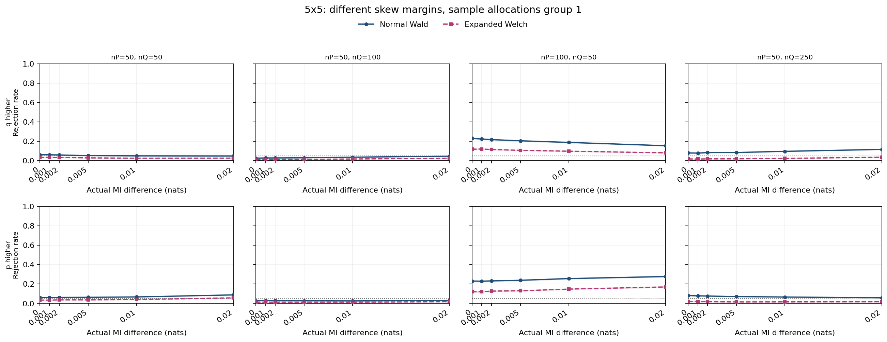

| Specification | Setting |
| --- | --- |
| Table size | 5x5 |
| Horizontal graph regime specifications (columns) | nP=50, nQ=50, nP=50, nQ=100, nP=100, nQ=50, nP=50, nQ=250 |
| Vertical graph regime specifications (rows) | q higher: P row (0.7, 0.3/4 repeated 4 times), P column (0.7, 0.3/4 repeated 4 times); Q row (0.8, 0.2/4 repeated 4 times), Q column (0.8, 0.2/4 repeated 4 times); p higher: P row (0.7, 0.3/4 repeated 4 times), P column (0.7, 0.3/4 repeated 4 times); Q row (0.8, 0.2/4 repeated 4 times), Q column (0.8, 0.2/4 repeated 4 times) |
| Probability changes | q higher: add at (1,1),(2,2) and subtract at (1,2),(2,1), for both P and Q; p higher: add at (1,1),(2,2) and subtract at (1,2),(2,1), for both P and Q |
| MI settings | Baseline MI {0.02}; direction {q higher, p higher}; actual differences {0, 0.001, 0.002, 0.005, 0.01, 0.02} nats |
| Horizontal axis within each graph | Actual MI difference in nats, fixed from 0 to 0.02 |
| Vertical axis within each graph | Unconditional rejection rate from 0 to 1; invalid results count as non-rejections |
| Replicates | 20,000 per unique point |

Null-point rejection and validity:

| Vertical regime | Horizontal regime | x | Method | Rejection | Valid |
| --- | --- | --- | --- | --- | --- |
| q higher | nP=50, nQ=50 | 0 | Expanded Welch | 0.0348 | 1.0000 |
| q higher | nP=50, nQ=50 | 0 | Normal Wald | 0.0623 | 1.0000 |
| q higher | nP=50, nQ=100 | 0 | Expanded Welch | 0.0132 | 1.0000 |
| q higher | nP=50, nQ=100 | 0 | Normal Wald | 0.0272 | 1.0000 |
| q higher | nP=100, nQ=50 | 0 | Expanded Welch | 0.1193 | 0.9999 |
| q higher | nP=100, nQ=50 | 0 | Normal Wald | 0.2307 | 1.0000 |
| q higher | nP=50, nQ=250 | 0 | Expanded Welch | 0.0190 | 1.0000 |
| q higher | nP=50, nQ=250 | 0 | Normal Wald | 0.0811 | 1.0000 |
| p higher | nP=50, nQ=50 | 0 | Expanded Welch | 0.0348 | 1.0000 |
| p higher | nP=50, nQ=50 | 0 | Normal Wald | 0.0623 | 1.0000 |
| p higher | nP=50, nQ=100 | 0 | Expanded Welch | 0.0132 | 1.0000 |
| p higher | nP=50, nQ=100 | 0 | Normal Wald | 0.0272 | 1.0000 |
| p higher | nP=100, nQ=50 | 0 | Expanded Welch | 0.1193 | 0.9999 |
| p higher | nP=100, nQ=50 | 0 | Normal Wald | 0.2307 | 1.0000 |
| p higher | nP=50, nQ=250 | 0 | Expanded Welch | 0.0190 | 1.0000 |
| p higher | nP=50, nQ=250 | 0 | Normal Wald | 0.0811 | 1.0000 |

Every plotted rate, interval, validity and minimum expected count

| Vertical regime | Horizontal regime | x | Method | Rejection | 95% interval | Valid | Conditional | Min expected P | Min expected Q |
| --- | --- | --- | --- | --- | --- | --- | --- | --- | --- |
| q higher | nP=50, nQ=50 | 0 | Expanded Welch | 0.0348 | [0.0323, 0.0374] | 1.0000 | 0.0348 | 0.2812 | 0.125 |
| q higher | nP=50, nQ=50 | 0 | Normal Wald | 0.0623 | [0.0590, 0.0657] | 1.0000 | 0.0623 | 0.2812 | 0.125 |
| q higher | nP=50, nQ=50 | 0.001 | Expanded Welch | 0.0348 | [0.0323, 0.0374] | 1.0000 | 0.0348 | 0.2812 | 0.125 |
| q higher | nP=50, nQ=50 | 0.001 | Normal Wald | 0.0616 | [0.0584, 0.0650] | 1.0000 | 0.0616 | 0.2812 | 0.125 |
| q higher | nP=50, nQ=50 | 0.002 | Expanded Welch | 0.0338 | [0.0314, 0.0364] | 0.9999 | 0.0339 | 0.2812 | 0.125 |
| q higher | nP=50, nQ=50 | 0.002 | Normal Wald | 0.0599 | [0.0566, 0.0632] | 1.0000 | 0.0599 | 0.2812 | 0.125 |
| q higher | nP=50, nQ=50 | 0.005 | Expanded Welch | 0.0298 | [0.0275, 0.0322] | 1.0000 | 0.0298 | 0.2812 | 0.125 |
| q higher | nP=50, nQ=50 | 0.005 | Normal Wald | 0.0532 | [0.0502, 0.0564] | 1.0000 | 0.0532 | 0.2812 | 0.125 |
| q higher | nP=50, nQ=50 | 0.01 | Expanded Welch | 0.0267 | [0.0245, 0.0290] | 1.0000 | 0.0267 | 0.2812 | 0.125 |
| q higher | nP=50, nQ=50 | 0.01 | Normal Wald | 0.0506 | [0.0476, 0.0537] | 1.0000 | 0.0506 | 0.2812 | 0.125 |
| q higher | nP=50, nQ=50 | 0.02 | Expanded Welch | 0.0273 | [0.0252, 0.0297] | 1.0000 | 0.0274 | 0.2812 | 0.125 |
| q higher | nP=50, nQ=50 | 0.02 | Normal Wald | 0.0495 | [0.0465, 0.0525] | 1.0000 | 0.0495 | 0.2812 | 0.125 |
| q higher | nP=50, nQ=100 | 0 | Expanded Welch | 0.0132 | [0.0117, 0.0149] | 1.0000 | 0.0132 | 0.2812 | 0.25 |
| q higher | nP=50, nQ=100 | 0 | Normal Wald | 0.0272 | [0.0250, 0.0295] | 1.0000 | 0.0272 | 0.2812 | 0.25 |
| q higher | nP=50, nQ=100 | 0.001 | Expanded Welch | 0.0127 | [0.0113, 0.0144] | 1.0000 | 0.0127 | 0.2812 | 0.25 |
| q higher | nP=50, nQ=100 | 0.001 | Normal Wald | 0.0289 | [0.0267, 0.0313] | 1.0000 | 0.0289 | 0.2812 | 0.25 |
| q higher | nP=50, nQ=100 | 0.002 | Expanded Welch | 0.0143 | [0.0128, 0.0161] | 1.0000 | 0.0143 | 0.2812 | 0.25 |
| q higher | nP=50, nQ=100 | 0.002 | Normal Wald | 0.0290 | [0.0268, 0.0315] | 1.0000 | 0.0290 | 0.2812 | 0.25 |
| q higher | nP=50, nQ=100 | 0.005 | Expanded Welch | 0.0147 | [0.0131, 0.0165] | 1.0000 | 0.0147 | 0.2812 | 0.25 |
| q higher | nP=50, nQ=100 | 0.005 | Normal Wald | 0.0308 | [0.0285, 0.0333] | 1.0000 | 0.0308 | 0.2812 | 0.25 |
| q higher | nP=50, nQ=100 | 0.01 | Expanded Welch | 0.0184 | [0.0166, 0.0203] | 1.0000 | 0.0184 | 0.2812 | 0.25 |
| q higher | nP=50, nQ=100 | 0.01 | Normal Wald | 0.0371 | [0.0346, 0.0398] | 1.0000 | 0.0371 | 0.2812 | 0.25 |
| q higher | nP=50, nQ=100 | 0.02 | Expanded Welch | 0.0260 | [0.0239, 0.0283] | 1.0000 | 0.0260 | 0.2812 | 0.25 |
| q higher | nP=50, nQ=100 | 0.02 | Normal Wald | 0.0472 | [0.0443, 0.0502] | 1.0000 | 0.0472 | 0.2812 | 0.25 |
| q higher | nP=100, nQ=50 | 0 | Expanded Welch | 0.1193 | [0.1149, 0.1239] | 0.9999 | 0.1193 | 0.5625 | 0.125 |
| q higher | nP=100, nQ=50 | 0 | Normal Wald | 0.2307 | [0.2249, 0.2366] | 1.0000 | 0.2307 | 0.5625 | 0.125 |
| q higher | nP=100, nQ=50 | 0.001 | Expanded Welch | 0.1213 | [0.1169, 0.1259] | 1.0000 | 0.1213 | 0.5625 | 0.125 |
| q higher | nP=100, nQ=50 | 0.001 | Normal Wald | 0.2240 | [0.2182, 0.2298] | 1.0000 | 0.2240 | 0.5625 | 0.125 |
| q higher | nP=100, nQ=50 | 0.002 | Expanded Welch | 0.1162 | [0.1118, 0.1207] | 1.0000 | 0.1162 | 0.5625 | 0.125 |
| q higher | nP=100, nQ=50 | 0.002 | Normal Wald | 0.2180 | [0.2123, 0.2238] | 1.0000 | 0.2180 | 0.5625 | 0.125 |
| q higher | nP=100, nQ=50 | 0.005 | Expanded Welch | 0.1076 | [0.1033, 0.1119] | 1.0000 | 0.1076 | 0.5625 | 0.125 |
| q higher | nP=100, nQ=50 | 0.005 | Normal Wald | 0.2059 | [0.2004, 0.2116] | 1.0000 | 0.2059 | 0.5625 | 0.125 |
| q higher | nP=100, nQ=50 | 0.01 | Expanded Welch | 0.0988 | [0.0947, 0.1030] | 1.0000 | 0.0988 | 0.5625 | 0.125 |
| q higher | nP=100, nQ=50 | 0.01 | Normal Wald | 0.1891 | [0.1837, 0.1946] | 1.0000 | 0.1891 | 0.5625 | 0.125 |
| q higher | nP=100, nQ=50 | 0.02 | Expanded Welch | 0.0819 | [0.0781, 0.0857] | 1.0000 | 0.0819 | 0.5625 | 0.125 |
| q higher | nP=100, nQ=50 | 0.02 | Normal Wald | 0.1554 | [0.1504, 0.1605] | 1.0000 | 0.1554 | 0.5625 | 0.125 |
| q higher | nP=50, nQ=250 | 0 | Expanded Welch | 0.0190 | [0.0172, 0.0210] | 1.0000 | 0.0190 | 0.2812 | 0.625 |
| q higher | nP=50, nQ=250 | 0 | Normal Wald | 0.0811 | [0.0774, 0.0850] | 1.0000 | 0.0811 | 0.2812 | 0.625 |
| q higher | nP=50, nQ=250 | 0.001 | Expanded Welch | 0.0177 | [0.0160, 0.0197] | 1.0000 | 0.0177 | 0.2812 | 0.625 |
| q higher | nP=50, nQ=250 | 0.001 | Normal Wald | 0.0793 | [0.0756, 0.0831] | 1.0000 | 0.0793 | 0.2812 | 0.625 |
| q higher | nP=50, nQ=250 | 0.002 | Expanded Welch | 0.0196 | [0.0177, 0.0216] | 1.0000 | 0.0196 | 0.2812 | 0.625 |
| q higher | nP=50, nQ=250 | 0.002 | Normal Wald | 0.0842 | [0.0804, 0.0881] | 1.0000 | 0.0842 | 0.2812 | 0.625 |
| q higher | nP=50, nQ=250 | 0.005 | Expanded Welch | 0.0200 | [0.0181, 0.0220] | 1.0000 | 0.0200 | 0.2812 | 0.625 |
| q higher | nP=50, nQ=250 | 0.005 | Normal Wald | 0.0853 | [0.0816, 0.0893] | 1.0000 | 0.0853 | 0.2812 | 0.625 |
| q higher | nP=50, nQ=250 | 0.01 | Expanded Welch | 0.0248 | [0.0227, 0.0270] | 1.0000 | 0.0248 | 0.2812 | 0.625 |
| q higher | nP=50, nQ=250 | 0.01 | Normal Wald | 0.0974 | [0.0934, 0.1016] | 1.0000 | 0.0974 | 0.2812 | 0.625 |
| q higher | nP=50, nQ=250 | 0.02 | Expanded Welch | 0.0368 | [0.0343, 0.0395] | 1.0000 | 0.0368 | 0.2812 | 0.625 |
| q higher | nP=50, nQ=250 | 0.02 | Normal Wald | 0.1173 | [0.1129, 0.1218] | 1.0000 | 0.1173 | 0.2812 | 0.625 |
| p higher | nP=50, nQ=50 | 0 | Expanded Welch | 0.0348 | [0.0323, 0.0374] | 1.0000 | 0.0348 | 0.2812 | 0.125 |
| p higher | nP=50, nQ=50 | 0 | Normal Wald | 0.0623 | [0.0590, 0.0657] | 1.0000 | 0.0623 | 0.2812 | 0.125 |
| p higher | nP=50, nQ=50 | 0.001 | Expanded Welch | 0.0340 | [0.0316, 0.0367] | 1.0000 | 0.0341 | 0.2812 | 0.125 |
| p higher | nP=50, nQ=50 | 0.001 | Normal Wald | 0.0609 | [0.0576, 0.0642] | 1.0000 | 0.0609 | 0.2812 | 0.125 |
| p higher | nP=50, nQ=50 | 0.002 | Expanded Welch | 0.0369 | [0.0344, 0.0397] | 1.0000 | 0.0369 | 0.2812 | 0.125 |
| p higher | nP=50, nQ=50 | 0.002 | Normal Wald | 0.0624 | [0.0591, 0.0658] | 1.0000 | 0.0624 | 0.2812 | 0.125 |
| p higher | nP=50, nQ=50 | 0.005 | Expanded Welch | 0.0370 | [0.0345, 0.0397] | 1.0000 | 0.0370 | 0.2812 | 0.125 |
| p higher | nP=50, nQ=50 | 0.005 | Normal Wald | 0.0634 | [0.0601, 0.0668] | 1.0000 | 0.0634 | 0.2812 | 0.125 |
| p higher | nP=50, nQ=50 | 0.01 | Expanded Welch | 0.0403 | [0.0377, 0.0432] | 1.0000 | 0.0404 | 0.2812 | 0.125 |
| p higher | nP=50, nQ=50 | 0.01 | Normal Wald | 0.0669 | [0.0636, 0.0705] | 1.0000 | 0.0669 | 0.2812 | 0.125 |
| p higher | nP=50, nQ=50 | 0.02 | Expanded Welch | 0.0575 | [0.0544, 0.0608] | 1.0000 | 0.0575 | 0.2812 | 0.125 |
| p higher | nP=50, nQ=50 | 0.02 | Normal Wald | 0.0882 | [0.0843, 0.0922] | 1.0000 | 0.0882 | 0.2812 | 0.125 |
| p higher | nP=50, nQ=100 | 0 | Expanded Welch | 0.0132 | [0.0117, 0.0149] | 1.0000 | 0.0132 | 0.2812 | 0.25 |
| p higher | nP=50, nQ=100 | 0 | Normal Wald | 0.0272 | [0.0250, 0.0295] | 1.0000 | 0.0272 | 0.2812 | 0.25 |
| p higher | nP=50, nQ=100 | 0.001 | Expanded Welch | 0.0140 | [0.0124, 0.0157] | 1.0000 | 0.0140 | 0.2812 | 0.25 |
| p higher | nP=50, nQ=100 | 0.001 | Normal Wald | 0.0302 | [0.0279, 0.0327] | 1.0000 | 0.0302 | 0.2812 | 0.25 |
| p higher | nP=50, nQ=100 | 0.002 | Expanded Welch | 0.0131 | [0.0116, 0.0148] | 1.0000 | 0.0131 | 0.2812 | 0.25 |
| p higher | nP=50, nQ=100 | 0.002 | Normal Wald | 0.0279 | [0.0257, 0.0303] | 1.0000 | 0.0279 | 0.2812 | 0.25 |
| p higher | nP=50, nQ=100 | 0.005 | Expanded Welch | 0.0132 | [0.0117, 0.0149] | 1.0000 | 0.0132 | 0.2812 | 0.25 |
| p higher | nP=50, nQ=100 | 0.005 | Normal Wald | 0.0277 | [0.0255, 0.0301] | 1.0000 | 0.0277 | 0.2812 | 0.25 |
| p higher | nP=50, nQ=100 | 0.01 | Expanded Welch | 0.0134 | [0.0119, 0.0150] | 1.0000 | 0.0134 | 0.2812 | 0.25 |
| p higher | nP=50, nQ=100 | 0.01 | Normal Wald | 0.0262 | [0.0241, 0.0286] | 1.0000 | 0.0262 | 0.2812 | 0.25 |
| p higher | nP=50, nQ=100 | 0.02 | Expanded Welch | 0.0179 | [0.0161, 0.0198] | 1.0000 | 0.0179 | 0.2812 | 0.25 |
| p higher | nP=50, nQ=100 | 0.02 | Normal Wald | 0.0308 | [0.0285, 0.0333] | 1.0000 | 0.0308 | 0.2812 | 0.25 |
| p higher | nP=100, nQ=50 | 0 | Expanded Welch | 0.1193 | [0.1149, 0.1239] | 0.9999 | 0.1193 | 0.5625 | 0.125 |
| p higher | nP=100, nQ=50 | 0 | Normal Wald | 0.2307 | [0.2249, 0.2366] | 1.0000 | 0.2307 | 0.5625 | 0.125 |
| p higher | nP=100, nQ=50 | 0.001 | Expanded Welch | 0.1210 | [0.1165, 0.1255] | 1.0000 | 0.1210 | 0.5625 | 0.125 |
| p higher | nP=100, nQ=50 | 0.001 | Normal Wald | 0.2290 | [0.2232, 0.2349] | 1.0000 | 0.2290 | 0.5625 | 0.125 |
| p higher | nP=100, nQ=50 | 0.002 | Expanded Welch | 0.1272 | [0.1227, 0.1319] | 1.0000 | 0.1272 | 0.5625 | 0.125 |
| p higher | nP=100, nQ=50 | 0.002 | Normal Wald | 0.2321 | [0.2263, 0.2380] | 1.0000 | 0.2321 | 0.5625 | 0.125 |
| p higher | nP=100, nQ=50 | 0.005 | Expanded Welch | 0.1303 | [0.1257, 0.1350] | 1.0000 | 0.1303 | 0.5625 | 0.125 |
| p higher | nP=100, nQ=50 | 0.005 | Normal Wald | 0.2386 | [0.2327, 0.2446] | 1.0000 | 0.2386 | 0.5625 | 0.125 |
| p higher | nP=100, nQ=50 | 0.01 | Expanded Welch | 0.1479 | [0.1431, 0.1529] | 1.0000 | 0.1480 | 0.5625 | 0.125 |
| p higher | nP=100, nQ=50 | 0.01 | Normal Wald | 0.2562 | [0.2502, 0.2623] | 1.0000 | 0.2562 | 0.5625 | 0.125 |
| p higher | nP=100, nQ=50 | 0.02 | Expanded Welch | 0.1700 | [0.1649, 0.1753] | 0.9999 | 0.1700 | 0.5625 | 0.125 |
| p higher | nP=100, nQ=50 | 0.02 | Normal Wald | 0.2772 | [0.2710, 0.2834] | 1.0000 | 0.2772 | 0.5625 | 0.125 |
| p higher | nP=50, nQ=250 | 0 | Expanded Welch | 0.0190 | [0.0172, 0.0210] | 1.0000 | 0.0190 | 0.2812 | 0.625 |
| p higher | nP=50, nQ=250 | 0 | Normal Wald | 0.0811 | [0.0774, 0.0850] | 1.0000 | 0.0811 | 0.2812 | 0.625 |
| p higher | nP=50, nQ=250 | 0.001 | Expanded Welch | 0.0182 | [0.0165, 0.0202] | 1.0000 | 0.0182 | 0.2812 | 0.625 |
| p higher | nP=50, nQ=250 | 0.001 | Normal Wald | 0.0781 | [0.0745, 0.0820] | 1.0000 | 0.0781 | 0.2812 | 0.625 |
| p higher | nP=50, nQ=250 | 0.002 | Expanded Welch | 0.0178 | [0.0161, 0.0197] | 1.0000 | 0.0178 | 0.2812 | 0.625 |
| p higher | nP=50, nQ=250 | 0.002 | Normal Wald | 0.0764 | [0.0728, 0.0802] | 1.0000 | 0.0764 | 0.2812 | 0.625 |
| p higher | nP=50, nQ=250 | 0.005 | Expanded Welch | 0.0157 | [0.0141, 0.0175] | 1.0000 | 0.0157 | 0.2812 | 0.625 |
| p higher | nP=50, nQ=250 | 0.005 | Normal Wald | 0.0706 | [0.0671, 0.0742] | 1.0000 | 0.0706 | 0.2812 | 0.625 |
| p higher | nP=50, nQ=250 | 0.01 | Expanded Welch | 0.0163 | [0.0146, 0.0181] | 1.0000 | 0.0163 | 0.2812 | 0.625 |
| p higher | nP=50, nQ=250 | 0.01 | Normal Wald | 0.0661 | [0.0627, 0.0696] | 1.0000 | 0.0661 | 0.2812 | 0.625 |
| p higher | nP=50, nQ=250 | 0.02 | Expanded Welch | 0.0174 | [0.0157, 0.0193] | 1.0000 | 0.0174 | 0.2812 | 0.625 |
| p higher | nP=50, nQ=250 | 0.02 | Normal Wald | 0.0585 | [0.0554, 0.0619] | 1.0000 | 0.0585 | 0.2812 | 0.625 |

### 6.18 5x5: different skew margins, sample allocations group 2

Does performance depend on which population has more data or greater MI?

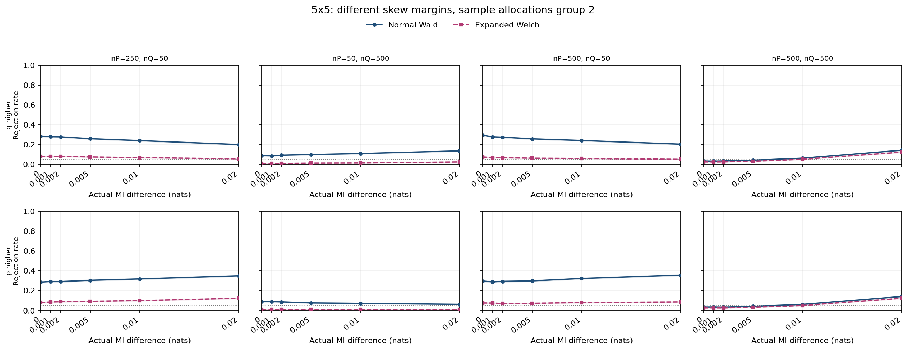

| Specification | Setting |
| --- | --- |
| Table size | 5x5 |
| Horizontal graph regime specifications (columns) | nP=250, nQ=50, nP=50, nQ=500, nP=500, nQ=50, nP=500, nQ=500 |
| Vertical graph regime specifications (rows) | q higher: P row (0.7, 0.3/4 repeated 4 times), P column (0.7, 0.3/4 repeated 4 times); Q row (0.8, 0.2/4 repeated 4 times), Q column (0.8, 0.2/4 repeated 4 times); p higher: P row (0.7, 0.3/4 repeated 4 times), P column (0.7, 0.3/4 repeated 4 times); Q row (0.8, 0.2/4 repeated 4 times), Q column (0.8, 0.2/4 repeated 4 times) |
| Probability changes | q higher: add at (1,1),(2,2) and subtract at (1,2),(2,1), for both P and Q; p higher: add at (1,1),(2,2) and subtract at (1,2),(2,1), for both P and Q |
| MI settings | Baseline MI {0.02}; direction {q higher, p higher}; actual differences {0, 0.001, 0.002, 0.005, 0.01, 0.02} nats |
| Horizontal axis within each graph | Actual MI difference in nats, fixed from 0 to 0.02 |
| Vertical axis within each graph | Unconditional rejection rate from 0 to 1; invalid results count as non-rejections |
| Replicates | 20,000 per unique point |

Null-point rejection and validity:

| Vertical regime | Horizontal regime | x | Method | Rejection | Valid |
| --- | --- | --- | --- | --- | --- |
| q higher | nP=250, nQ=50 | 0 | Expanded Welch | 0.0813 | 1.0000 |
| q higher | nP=250, nQ=50 | 0 | Normal Wald | 0.2864 | 1.0000 |
| q higher | nP=50, nQ=500 | 0 | Expanded Welch | 0.0120 | 1.0000 |
| q higher | nP=50, nQ=500 | 0 | Normal Wald | 0.0890 | 1.0000 |
| q higher | nP=500, nQ=50 | 0 | Expanded Welch | 0.0755 | 1.0000 |
| q higher | nP=500, nQ=50 | 0 | Normal Wald | 0.2965 | 1.0000 |
| q higher | nP=500, nQ=500 | 0 | Expanded Welch | 0.0268 | 1.0000 |
| q higher | nP=500, nQ=500 | 0 | Normal Wald | 0.0360 | 1.0000 |
| p higher | nP=250, nQ=50 | 0 | Expanded Welch | 0.0813 | 1.0000 |
| p higher | nP=250, nQ=50 | 0 | Normal Wald | 0.2864 | 1.0000 |
| p higher | nP=50, nQ=500 | 0 | Expanded Welch | 0.0120 | 1.0000 |
| p higher | nP=50, nQ=500 | 0 | Normal Wald | 0.0890 | 1.0000 |
| p higher | nP=500, nQ=50 | 0 | Expanded Welch | 0.0755 | 1.0000 |
| p higher | nP=500, nQ=50 | 0 | Normal Wald | 0.2965 | 1.0000 |
| p higher | nP=500, nQ=500 | 0 | Expanded Welch | 0.0268 | 1.0000 |
| p higher | nP=500, nQ=500 | 0 | Normal Wald | 0.0360 | 1.0000 |

Every plotted rate, interval, validity and minimum expected count

| Vertical regime | Horizontal regime | x | Method | Rejection | 95% interval | Valid | Conditional | Min expected P | Min expected Q |
| --- | --- | --- | --- | --- | --- | --- | --- | --- | --- |
| q higher | nP=250, nQ=50 | 0 | Expanded Welch | 0.0813 | [0.0776, 0.0852] | 1.0000 | 0.0813 | 1.406 | 0.125 |
| q higher | nP=250, nQ=50 | 0 | Normal Wald | 0.2864 | [0.2802, 0.2927] | 1.0000 | 0.2864 | 1.406 | 0.125 |
| q higher | nP=250, nQ=50 | 0.001 | Expanded Welch | 0.0832 | [0.0794, 0.0871] | 1.0000 | 0.0832 | 1.406 | 0.125 |
| q higher | nP=250, nQ=50 | 0.001 | Normal Wald | 0.2797 | [0.2735, 0.2859] | 1.0000 | 0.2797 | 1.406 | 0.125 |
| q higher | nP=250, nQ=50 | 0.002 | Expanded Welch | 0.0820 | [0.0783, 0.0859] | 0.9999 | 0.0821 | 1.406 | 0.125 |
| q higher | nP=250, nQ=50 | 0.002 | Normal Wald | 0.2782 | [0.2720, 0.2845] | 1.0000 | 0.2782 | 1.406 | 0.125 |
| q higher | nP=250, nQ=50 | 0.005 | Expanded Welch | 0.0756 | [0.0721, 0.0794] | 1.0000 | 0.0757 | 1.406 | 0.125 |
| q higher | nP=250, nQ=50 | 0.005 | Normal Wald | 0.2599 | [0.2539, 0.2660] | 1.0000 | 0.2599 | 1.406 | 0.125 |
| q higher | nP=250, nQ=50 | 0.01 | Expanded Welch | 0.0691 | [0.0657, 0.0727] | 1.0000 | 0.0691 | 1.406 | 0.125 |
| q higher | nP=250, nQ=50 | 0.01 | Normal Wald | 0.2412 | [0.2353, 0.2472] | 1.0000 | 0.2412 | 1.406 | 0.125 |
| q higher | nP=250, nQ=50 | 0.02 | Expanded Welch | 0.0574 | [0.0543, 0.0607] | 1.0000 | 0.0574 | 1.406 | 0.125 |
| q higher | nP=250, nQ=50 | 0.02 | Normal Wald | 0.2019 | [0.1964, 0.2075] | 1.0000 | 0.2019 | 1.406 | 0.125 |
| q higher | nP=50, nQ=500 | 0 | Expanded Welch | 0.0120 | [0.0106, 0.0137] | 1.0000 | 0.0120 | 0.2812 | 1.25 |
| q higher | nP=50, nQ=500 | 0 | Normal Wald | 0.0890 | [0.0851, 0.0930] | 1.0000 | 0.0890 | 0.2812 | 1.25 |
| q higher | nP=50, nQ=500 | 0.001 | Expanded Welch | 0.0126 | [0.0111, 0.0142] | 1.0000 | 0.0126 | 0.2812 | 1.25 |
| q higher | nP=50, nQ=500 | 0.001 | Normal Wald | 0.0869 | [0.0831, 0.0909] | 1.0000 | 0.0869 | 0.2812 | 1.25 |
| q higher | nP=50, nQ=500 | 0.002 | Expanded Welch | 0.0116 | [0.0102, 0.0132] | 1.0000 | 0.0116 | 0.2812 | 1.25 |
| q higher | nP=50, nQ=500 | 0.002 | Normal Wald | 0.0942 | [0.0902, 0.0983] | 1.0000 | 0.0942 | 0.2812 | 1.25 |
| q higher | nP=50, nQ=500 | 0.005 | Expanded Welch | 0.0148 | [0.0132, 0.0166] | 1.0000 | 0.0148 | 0.2812 | 1.25 |
| q higher | nP=50, nQ=500 | 0.005 | Normal Wald | 0.1010 | [0.0969, 0.1053] | 1.0000 | 0.1010 | 0.2812 | 1.25 |
| q higher | nP=50, nQ=500 | 0.01 | Expanded Welch | 0.0161 | [0.0144, 0.0179] | 1.0000 | 0.0161 | 0.2812 | 1.25 |
| q higher | nP=50, nQ=500 | 0.01 | Normal Wald | 0.1110 | [0.1067, 0.1154] | 1.0000 | 0.1110 | 0.2812 | 1.25 |
| q higher | nP=50, nQ=500 | 0.02 | Expanded Welch | 0.0265 | [0.0244, 0.0288] | 1.0000 | 0.0265 | 0.2812 | 1.25 |
| q higher | nP=50, nQ=500 | 0.02 | Normal Wald | 0.1376 | [0.1328, 0.1424] | 1.0000 | 0.1376 | 0.2812 | 1.25 |
| q higher | nP=500, nQ=50 | 0 | Expanded Welch | 0.0755 | [0.0719, 0.0792] | 1.0000 | 0.0755 | 2.813 | 0.125 |
| q higher | nP=500, nQ=50 | 0 | Normal Wald | 0.2965 | [0.2902, 0.3029] | 1.0000 | 0.2965 | 2.813 | 0.125 |
| q higher | nP=500, nQ=50 | 0.001 | Expanded Welch | 0.0689 | [0.0655, 0.0725] | 1.0000 | 0.0689 | 2.813 | 0.125 |
| q higher | nP=500, nQ=50 | 0.001 | Normal Wald | 0.2787 | [0.2725, 0.2849] | 1.0000 | 0.2787 | 2.813 | 0.125 |
| q higher | nP=500, nQ=50 | 0.002 | Expanded Welch | 0.0681 | [0.0647, 0.0717] | 1.0000 | 0.0681 | 2.813 | 0.125 |
| q higher | nP=500, nQ=50 | 0.002 | Normal Wald | 0.2749 | [0.2688, 0.2811] | 1.0000 | 0.2749 | 2.813 | 0.125 |
| q higher | nP=500, nQ=50 | 0.005 | Expanded Welch | 0.0638 | [0.0604, 0.0672] | 1.0000 | 0.0638 | 2.813 | 0.125 |
| q higher | nP=500, nQ=50 | 0.005 | Normal Wald | 0.2585 | [0.2524, 0.2646] | 1.0000 | 0.2585 | 2.813 | 0.125 |
| q higher | nP=500, nQ=50 | 0.01 | Expanded Welch | 0.0610 | [0.0578, 0.0644] | 1.0000 | 0.0610 | 2.813 | 0.125 |
| q higher | nP=500, nQ=50 | 0.01 | Normal Wald | 0.2422 | [0.2364, 0.2482] | 1.0000 | 0.2422 | 2.813 | 0.125 |
| q higher | nP=500, nQ=50 | 0.02 | Expanded Welch | 0.0527 | [0.0497, 0.0559] | 1.0000 | 0.0527 | 2.813 | 0.125 |
| q higher | nP=500, nQ=50 | 0.02 | Normal Wald | 0.2056 | [0.2001, 0.2113] | 1.0000 | 0.2056 | 2.813 | 0.125 |
| q higher | nP=500, nQ=500 | 0 | Expanded Welch | 0.0268 | [0.0247, 0.0291] | 1.0000 | 0.0268 | 2.813 | 1.25 |
| q higher | nP=500, nQ=500 | 0 | Normal Wald | 0.0360 | [0.0335, 0.0387] | 1.0000 | 0.0360 | 2.813 | 1.25 |
| q higher | nP=500, nQ=500 | 0.001 | Expanded Welch | 0.0261 | [0.0240, 0.0285] | 1.0000 | 0.0261 | 2.813 | 1.25 |
| q higher | nP=500, nQ=500 | 0.001 | Normal Wald | 0.0348 | [0.0323, 0.0374] | 1.0000 | 0.0348 | 2.813 | 1.25 |
| q higher | nP=500, nQ=500 | 0.002 | Expanded Welch | 0.0271 | [0.0249, 0.0294] | 1.0000 | 0.0271 | 2.813 | 1.25 |
| q higher | nP=500, nQ=500 | 0.002 | Normal Wald | 0.0365 | [0.0340, 0.0392] | 1.0000 | 0.0365 | 2.813 | 1.25 |
| q higher | nP=500, nQ=500 | 0.005 | Expanded Welch | 0.0338 | [0.0313, 0.0363] | 1.0000 | 0.0338 | 2.813 | 1.25 |
| q higher | nP=500, nQ=500 | 0.005 | Normal Wald | 0.0441 | [0.0413, 0.0470] | 1.0000 | 0.0441 | 2.813 | 1.25 |
| q higher | nP=500, nQ=500 | 0.01 | Expanded Welch | 0.0530 | [0.0500, 0.0562] | 1.0000 | 0.0530 | 2.813 | 1.25 |
| q higher | nP=500, nQ=500 | 0.01 | Normal Wald | 0.0643 | [0.0609, 0.0677] | 1.0000 | 0.0643 | 2.813 | 1.25 |
| q higher | nP=500, nQ=500 | 0.02 | Expanded Welch | 0.1249 | [0.1204, 0.1296] | 1.0000 | 0.1249 | 2.813 | 1.25 |
| q higher | nP=500, nQ=500 | 0.02 | Normal Wald | 0.1436 | [0.1389, 0.1486] | 1.0000 | 0.1436 | 2.813 | 1.25 |
| p higher | nP=250, nQ=50 | 0 | Expanded Welch | 0.0813 | [0.0776, 0.0852] | 1.0000 | 0.0813 | 1.406 | 0.125 |
| p higher | nP=250, nQ=50 | 0 | Normal Wald | 0.2864 | [0.2802, 0.2927] | 1.0000 | 0.2864 | 1.406 | 0.125 |
| p higher | nP=250, nQ=50 | 0.001 | Expanded Welch | 0.0852 | [0.0814, 0.0891] | 1.0000 | 0.0852 | 1.406 | 0.125 |
| p higher | nP=250, nQ=50 | 0.001 | Normal Wald | 0.2925 | [0.2862, 0.2988] | 1.0000 | 0.2925 | 1.406 | 0.125 |
| p higher | nP=250, nQ=50 | 0.002 | Expanded Welch | 0.0880 | [0.0842, 0.0920] | 1.0000 | 0.0880 | 1.406 | 0.125 |
| p higher | nP=250, nQ=50 | 0.002 | Normal Wald | 0.2917 | [0.2854, 0.2980] | 1.0000 | 0.2917 | 1.406 | 0.125 |
| p higher | nP=250, nQ=50 | 0.005 | Expanded Welch | 0.0926 | [0.0887, 0.0967] | 1.0000 | 0.0926 | 1.406 | 0.125 |
| p higher | nP=250, nQ=50 | 0.005 | Normal Wald | 0.3041 | [0.2978, 0.3105] | 1.0000 | 0.3041 | 1.406 | 0.125 |
| p higher | nP=250, nQ=50 | 0.01 | Expanded Welch | 0.1003 | [0.0962, 0.1045] | 1.0000 | 0.1003 | 1.406 | 0.125 |
| p higher | nP=250, nQ=50 | 0.01 | Normal Wald | 0.3180 | [0.3115, 0.3244] | 1.0000 | 0.3180 | 1.406 | 0.125 |
| p higher | nP=250, nQ=50 | 0.02 | Expanded Welch | 0.1241 | [0.1196, 0.1287] | 1.0000 | 0.1241 | 1.406 | 0.125 |
| p higher | nP=250, nQ=50 | 0.02 | Normal Wald | 0.3493 | [0.3427, 0.3559] | 1.0000 | 0.3493 | 1.406 | 0.125 |
| p higher | nP=50, nQ=500 | 0 | Expanded Welch | 0.0120 | [0.0106, 0.0137] | 1.0000 | 0.0120 | 0.2812 | 1.25 |
| p higher | nP=50, nQ=500 | 0 | Normal Wald | 0.0890 | [0.0851, 0.0930] | 1.0000 | 0.0890 | 0.2812 | 1.25 |
| p higher | nP=50, nQ=500 | 0.001 | Expanded Welch | 0.0127 | [0.0113, 0.0144] | 1.0000 | 0.0127 | 0.2812 | 1.25 |
| p higher | nP=50, nQ=500 | 0.001 | Normal Wald | 0.0887 | [0.0848, 0.0927] | 1.0000 | 0.0887 | 0.2812 | 1.25 |
| p higher | nP=50, nQ=500 | 0.002 | Expanded Welch | 0.0130 | [0.0115, 0.0147] | 1.0000 | 0.0130 | 0.2812 | 1.25 |
| p higher | nP=50, nQ=500 | 0.002 | Normal Wald | 0.0866 | [0.0827, 0.0905] | 1.0000 | 0.0866 | 0.2812 | 1.25 |
| p higher | nP=50, nQ=500 | 0.005 | Expanded Welch | 0.0117 | [0.0103, 0.0132] | 1.0000 | 0.0117 | 0.2812 | 1.25 |
| p higher | nP=50, nQ=500 | 0.005 | Normal Wald | 0.0760 | [0.0724, 0.0797] | 1.0000 | 0.0760 | 0.2812 | 1.25 |
| p higher | nP=50, nQ=500 | 0.01 | Expanded Welch | 0.0114 | [0.0100, 0.0129] | 1.0000 | 0.0114 | 0.2812 | 1.25 |
| p higher | nP=50, nQ=500 | 0.01 | Normal Wald | 0.0719 | [0.0684, 0.0756] | 1.0000 | 0.0719 | 0.2812 | 1.25 |
| p higher | nP=50, nQ=500 | 0.02 | Expanded Welch | 0.0121 | [0.0107, 0.0138] | 1.0000 | 0.0121 | 0.2812 | 1.25 |
| p higher | nP=50, nQ=500 | 0.02 | Normal Wald | 0.0622 | [0.0590, 0.0657] | 1.0000 | 0.0622 | 0.2812 | 1.25 |
| p higher | nP=500, nQ=50 | 0 | Expanded Welch | 0.0755 | [0.0719, 0.0792] | 1.0000 | 0.0755 | 2.813 | 0.125 |
| p higher | nP=500, nQ=50 | 0 | Normal Wald | 0.2965 | [0.2902, 0.3029] | 1.0000 | 0.2965 | 2.813 | 0.125 |
| p higher | nP=500, nQ=50 | 0.001 | Expanded Welch | 0.0746 | [0.0710, 0.0783] | 1.0000 | 0.0746 | 2.813 | 0.125 |
| p higher | nP=500, nQ=50 | 0.001 | Normal Wald | 0.2885 | [0.2823, 0.2948] | 1.0000 | 0.2885 | 2.813 | 0.125 |
| p higher | nP=500, nQ=50 | 0.002 | Expanded Welch | 0.0707 | [0.0673, 0.0744] | 1.0000 | 0.0708 | 2.813 | 0.125 |
| p higher | nP=500, nQ=50 | 0.002 | Normal Wald | 0.2938 | [0.2875, 0.3001] | 1.0000 | 0.2938 | 2.813 | 0.125 |
| p higher | nP=500, nQ=50 | 0.005 | Expanded Welch | 0.0725 | [0.0689, 0.0761] | 1.0000 | 0.0725 | 2.813 | 0.125 |
| p higher | nP=500, nQ=50 | 0.005 | Normal Wald | 0.2984 | [0.2921, 0.3048] | 1.0000 | 0.2984 | 2.813 | 0.125 |
| p higher | nP=500, nQ=50 | 0.01 | Expanded Welch | 0.0795 | [0.0758, 0.0833] | 1.0000 | 0.0795 | 2.813 | 0.125 |
| p higher | nP=500, nQ=50 | 0.01 | Normal Wald | 0.3225 | [0.3160, 0.3290] | 1.0000 | 0.3225 | 2.813 | 0.125 |
| p higher | nP=500, nQ=50 | 0.02 | Expanded Welch | 0.0860 | [0.0822, 0.0900] | 1.0000 | 0.0860 | 2.813 | 0.125 |
| p higher | nP=500, nQ=50 | 0.02 | Normal Wald | 0.3568 | [0.3501, 0.3634] | 1.0000 | 0.3568 | 2.813 | 0.125 |
| p higher | nP=500, nQ=500 | 0 | Expanded Welch | 0.0268 | [0.0247, 0.0291] | 1.0000 | 0.0268 | 2.813 | 1.25 |
| p higher | nP=500, nQ=500 | 0 | Normal Wald | 0.0360 | [0.0335, 0.0387] | 1.0000 | 0.0360 | 2.813 | 1.25 |
| p higher | nP=500, nQ=500 | 0.001 | Expanded Welch | 0.0273 | [0.0251, 0.0297] | 1.0000 | 0.0273 | 2.813 | 1.25 |
| p higher | nP=500, nQ=500 | 0.001 | Normal Wald | 0.0366 | [0.0341, 0.0393] | 1.0000 | 0.0366 | 2.813 | 1.25 |
| p higher | nP=500, nQ=500 | 0.002 | Expanded Welch | 0.0266 | [0.0244, 0.0289] | 1.0000 | 0.0266 | 2.813 | 1.25 |
| p higher | nP=500, nQ=500 | 0.002 | Normal Wald | 0.0350 | [0.0325, 0.0376] | 1.0000 | 0.0350 | 2.813 | 1.25 |
| p higher | nP=500, nQ=500 | 0.005 | Expanded Welch | 0.0343 | [0.0319, 0.0370] | 1.0000 | 0.0343 | 2.813 | 1.25 |
| p higher | nP=500, nQ=500 | 0.005 | Normal Wald | 0.0432 | [0.0404, 0.0461] | 1.0000 | 0.0432 | 2.813 | 1.25 |
| p higher | nP=500, nQ=500 | 0.01 | Expanded Welch | 0.0509 | [0.0479, 0.0540] | 1.0000 | 0.0509 | 2.813 | 1.25 |
| p higher | nP=500, nQ=500 | 0.01 | Normal Wald | 0.0619 | [0.0586, 0.0653] | 1.0000 | 0.0619 | 2.813 | 1.25 |
| p higher | nP=500, nQ=500 | 0.02 | Expanded Welch | 0.1239 | [0.1194, 0.1285] | 1.0000 | 0.1239 | 2.813 | 1.25 |
| p higher | nP=500, nQ=500 | 0.02 | Normal Wald | 0.1412 | [0.1365, 0.1461] | 1.0000 | 0.1412 | 2.813 | 1.25 |

### 6.19 8x8: uniform margins, sample allocations group 1

Does performance depend on which population has more data or greater MI?

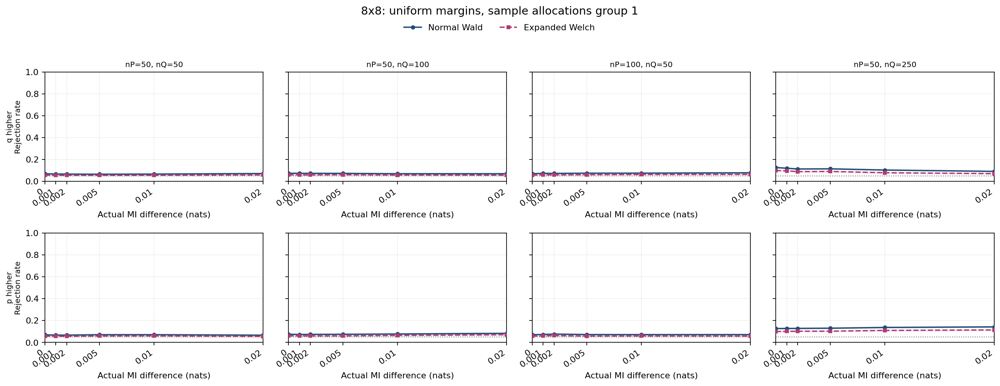

| Specification | Setting |
| --- | --- |
| Table size | 8x8 |
| Horizontal graph regime specifications (columns) | nP=50, nQ=50, nP=50, nQ=100, nP=100, nQ=50, nP=50, nQ=250 |
| Vertical graph regime specifications (rows) | q higher: P row (0.125 repeated 8 times), P column (0.125 repeated 8 times); Q row (0.125 repeated 8 times), Q column (0.125 repeated 8 times); p higher: P row (0.125 repeated 8 times), P column (0.125 repeated 8 times); Q row (0.125 repeated 8 times), Q column (0.125 repeated 8 times) |
| Probability changes | q higher: add at (1,1),(2,2) and subtract at (1,2),(2,1), for both P and Q; p higher: add at (1,1),(2,2) and subtract at (1,2),(2,1), for both P and Q |
| MI settings | Baseline MI {0.02}; direction {q higher, p higher}; actual differences {0, 0.001, 0.002, 0.005, 0.01, 0.02} nats |
| Horizontal axis within each graph | Actual MI difference in nats, fixed from 0 to 0.02 |
| Vertical axis within each graph | Unconditional rejection rate from 0 to 1; invalid results count as non-rejections |
| Replicates | 20,000 per unique point |

Null-point rejection and validity:

| Vertical regime | Horizontal regime | x | Method | Rejection | Valid |
| --- | --- | --- | --- | --- | --- |
| q higher | nP=50, nQ=50 | 0 | Expanded Welch | 0.0592 | 1.0000 |
| q higher | nP=50, nQ=50 | 0 | Normal Wald | 0.0703 | 1.0000 |
| q higher | nP=50, nQ=100 | 0 | Expanded Welch | 0.0616 | 1.0000 |
| q higher | nP=50, nQ=100 | 0 | Normal Wald | 0.0751 | 1.0000 |
| q higher | nP=100, nQ=50 | 0 | Expanded Welch | 0.0586 | 1.0000 |
| q higher | nP=100, nQ=50 | 0 | Normal Wald | 0.0709 | 1.0000 |
| q higher | nP=50, nQ=250 | 0 | Expanded Welch | 0.1003 | 1.0000 |
| q higher | nP=50, nQ=250 | 0 | Normal Wald | 0.1273 | 1.0000 |
| p higher | nP=50, nQ=50 | 0 | Expanded Welch | 0.0592 | 1.0000 |
| p higher | nP=50, nQ=50 | 0 | Normal Wald | 0.0703 | 1.0000 |
| p higher | nP=50, nQ=100 | 0 | Expanded Welch | 0.0616 | 1.0000 |
| p higher | nP=50, nQ=100 | 0 | Normal Wald | 0.0751 | 1.0000 |
| p higher | nP=100, nQ=50 | 0 | Expanded Welch | 0.0586 | 1.0000 |
| p higher | nP=100, nQ=50 | 0 | Normal Wald | 0.0709 | 1.0000 |
| p higher | nP=50, nQ=250 | 0 | Expanded Welch | 0.1003 | 1.0000 |
| p higher | nP=50, nQ=250 | 0 | Normal Wald | 0.1273 | 1.0000 |

Every plotted rate, interval, validity and minimum expected count

| Vertical regime | Horizontal regime | x | Method | Rejection | 95% interval | Valid | Conditional | Min expected P | Min expected Q |
| --- | --- | --- | --- | --- | --- | --- | --- | --- | --- |
| q higher | nP=50, nQ=50 | 0 | Expanded Welch | 0.0592 | [0.0560, 0.0625] | 1.0000 | 0.0592 | 0.1924 | 0.1924 |
| q higher | nP=50, nQ=50 | 0 | Normal Wald | 0.0703 | [0.0668, 0.0739] | 1.0000 | 0.0703 | 0.1924 | 0.1924 |
| q higher | nP=50, nQ=50 | 0.001 | Expanded Welch | 0.0557 | [0.0526, 0.0590] | 1.0000 | 0.0557 | 0.1924 | 0.1799 |
| q higher | nP=50, nQ=50 | 0.001 | Normal Wald | 0.0682 | [0.0647, 0.0717] | 1.0000 | 0.0682 | 0.1924 | 0.1799 |
| q higher | nP=50, nQ=50 | 0.002 | Expanded Welch | 0.0570 | [0.0539, 0.0604] | 1.0000 | 0.0570 | 0.1924 | 0.1679 |
| q higher | nP=50, nQ=50 | 0.002 | Normal Wald | 0.0672 | [0.0638, 0.0708] | 1.0000 | 0.0672 | 0.1924 | 0.1679 |
| q higher | nP=50, nQ=50 | 0.005 | Expanded Welch | 0.0559 | [0.0528, 0.0592] | 1.0000 | 0.0559 | 0.1924 | 0.1344 |
| q higher | nP=50, nQ=50 | 0.005 | Normal Wald | 0.0663 | [0.0629, 0.0698] | 1.0000 | 0.0663 | 0.1924 | 0.1344 |
| q higher | nP=50, nQ=50 | 0.01 | Expanded Welch | 0.0568 | [0.0536, 0.0600] | 1.0000 | 0.0568 | 0.1924 | 0.08603 |
| q higher | nP=50, nQ=50 | 0.01 | Normal Wald | 0.0674 | [0.0640, 0.0710] | 1.0000 | 0.0674 | 0.1924 | 0.08603 |
| q higher | nP=50, nQ=50 | 0.02 | Expanded Welch | 0.0602 | [0.0569, 0.0635] | 1.0000 | 0.0602 | 0.1924 | 0.01466 |
| q higher | nP=50, nQ=50 | 0.02 | Normal Wald | 0.0727 | [0.0692, 0.0764] | 1.0000 | 0.0727 | 0.1924 | 0.01466 |
| q higher | nP=50, nQ=100 | 0 | Expanded Welch | 0.0616 | [0.0583, 0.0650] | 1.0000 | 0.0616 | 0.1924 | 0.3848 |
| q higher | nP=50, nQ=100 | 0 | Normal Wald | 0.0751 | [0.0715, 0.0788] | 1.0000 | 0.0751 | 0.1924 | 0.3848 |
| q higher | nP=50, nQ=100 | 0.001 | Expanded Welch | 0.0604 | [0.0571, 0.0637] | 1.0000 | 0.0604 | 0.1924 | 0.3598 |
| q higher | nP=50, nQ=100 | 0.001 | Normal Wald | 0.0743 | [0.0707, 0.0780] | 1.0000 | 0.0743 | 0.1924 | 0.3598 |
| q higher | nP=50, nQ=100 | 0.002 | Expanded Welch | 0.0602 | [0.0569, 0.0635] | 1.0000 | 0.0602 | 0.1924 | 0.3358 |
| q higher | nP=50, nQ=100 | 0.002 | Normal Wald | 0.0741 | [0.0705, 0.0778] | 1.0000 | 0.0741 | 0.1924 | 0.3358 |
| q higher | nP=50, nQ=100 | 0.005 | Expanded Welch | 0.0619 | [0.0587, 0.0654] | 1.0000 | 0.0619 | 0.1924 | 0.2687 |
| q higher | nP=50, nQ=100 | 0.005 | Normal Wald | 0.0738 | [0.0703, 0.0776] | 1.0000 | 0.0738 | 0.1924 | 0.2687 |
| q higher | nP=50, nQ=100 | 0.01 | Expanded Welch | 0.0590 | [0.0558, 0.0623] | 1.0000 | 0.0590 | 0.1924 | 0.1721 |
| q higher | nP=50, nQ=100 | 0.01 | Normal Wald | 0.0707 | [0.0673, 0.0744] | 1.0000 | 0.0707 | 0.1924 | 0.1721 |
| q higher | nP=50, nQ=100 | 0.02 | Expanded Welch | 0.0578 | [0.0546, 0.0611] | 1.0000 | 0.0578 | 0.1924 | 0.02932 |
| q higher | nP=50, nQ=100 | 0.02 | Normal Wald | 0.0706 | [0.0671, 0.0742] | 1.0000 | 0.0706 | 0.1924 | 0.02932 |
| q higher | nP=100, nQ=50 | 0 | Expanded Welch | 0.0586 | [0.0554, 0.0619] | 1.0000 | 0.0586 | 0.3848 | 0.1924 |
| q higher | nP=100, nQ=50 | 0 | Normal Wald | 0.0709 | [0.0675, 0.0746] | 1.0000 | 0.0709 | 0.3848 | 0.1924 |
| q higher | nP=100, nQ=50 | 0.001 | Expanded Welch | 0.0609 | [0.0577, 0.0644] | 1.0000 | 0.0609 | 0.3848 | 0.1799 |
| q higher | nP=100, nQ=50 | 0.001 | Normal Wald | 0.0743 | [0.0708, 0.0781] | 1.0000 | 0.0743 | 0.3848 | 0.1799 |
| q higher | nP=100, nQ=50 | 0.002 | Expanded Welch | 0.0603 | [0.0571, 0.0637] | 1.0000 | 0.0603 | 0.3848 | 0.1679 |
| q higher | nP=100, nQ=50 | 0.002 | Normal Wald | 0.0733 | [0.0698, 0.0770] | 1.0000 | 0.0733 | 0.3848 | 0.1679 |
| q higher | nP=100, nQ=50 | 0.005 | Expanded Welch | 0.0623 | [0.0590, 0.0657] | 1.0000 | 0.0623 | 0.3848 | 0.1344 |
| q higher | nP=100, nQ=50 | 0.005 | Normal Wald | 0.0757 | [0.0722, 0.0795] | 1.0000 | 0.0757 | 0.3848 | 0.1344 |
| q higher | nP=100, nQ=50 | 0.01 | Expanded Welch | 0.0639 | [0.0605, 0.0673] | 1.0000 | 0.0639 | 0.3848 | 0.08603 |
| q higher | nP=100, nQ=50 | 0.01 | Normal Wald | 0.0761 | [0.0725, 0.0798] | 1.0000 | 0.0761 | 0.3848 | 0.08603 |
| q higher | nP=100, nQ=50 | 0.02 | Expanded Welch | 0.0649 | [0.0615, 0.0683] | 1.0000 | 0.0649 | 0.3848 | 0.01466 |
| q higher | nP=100, nQ=50 | 0.02 | Normal Wald | 0.0794 | [0.0757, 0.0832] | 1.0000 | 0.0794 | 0.3848 | 0.01466 |
| q higher | nP=50, nQ=250 | 0 | Expanded Welch | 0.1003 | [0.0962, 0.1045] | 1.0000 | 0.1003 | 0.1924 | 0.9621 |
| q higher | nP=50, nQ=250 | 0 | Normal Wald | 0.1273 | [0.1227, 0.1319] | 1.0000 | 0.1273 | 0.1924 | 0.9621 |
| q higher | nP=50, nQ=250 | 0.001 | Expanded Welch | 0.0970 | [0.0930, 0.1012] | 1.0000 | 0.0970 | 0.1924 | 0.8996 |
| q higher | nP=50, nQ=250 | 0.001 | Normal Wald | 0.1209 | [0.1165, 0.1255] | 1.0000 | 0.1209 | 0.1924 | 0.8996 |
| q higher | nP=50, nQ=250 | 0.002 | Expanded Welch | 0.0899 | [0.0860, 0.0939] | 1.0000 | 0.0899 | 0.1924 | 0.8394 |
| q higher | nP=50, nQ=250 | 0.002 | Normal Wald | 0.1140 | [0.1097, 0.1185] | 1.0000 | 0.1140 | 0.1924 | 0.8394 |
| q higher | nP=50, nQ=250 | 0.005 | Expanded Welch | 0.0914 | [0.0875, 0.0955] | 1.0000 | 0.0914 | 0.1924 | 0.6718 |
| q higher | nP=50, nQ=250 | 0.005 | Normal Wald | 0.1154 | [0.1111, 0.1200] | 1.0000 | 0.1154 | 0.1924 | 0.6718 |
| q higher | nP=50, nQ=250 | 0.01 | Expanded Welch | 0.0797 | [0.0760, 0.0835] | 1.0000 | 0.0797 | 0.1924 | 0.4301 |
| q higher | nP=50, nQ=250 | 0.01 | Normal Wald | 0.1043 | [0.1002, 0.1087] | 1.0000 | 0.1043 | 0.1924 | 0.4301 |
| q higher | nP=50, nQ=250 | 0.02 | Expanded Welch | 0.0717 | [0.0682, 0.0753] | 1.0000 | 0.0717 | 0.1924 | 0.07331 |
| q higher | nP=50, nQ=250 | 0.02 | Normal Wald | 0.0921 | [0.0882, 0.0962] | 1.0000 | 0.0921 | 0.1924 | 0.07331 |
| p higher | nP=50, nQ=50 | 0 | Expanded Welch | 0.0592 | [0.0560, 0.0625] | 1.0000 | 0.0592 | 0.1924 | 0.1924 |
| p higher | nP=50, nQ=50 | 0 | Normal Wald | 0.0703 | [0.0668, 0.0739] | 1.0000 | 0.0703 | 0.1924 | 0.1924 |
| p higher | nP=50, nQ=50 | 0.001 | Expanded Welch | 0.0569 | [0.0538, 0.0602] | 1.0000 | 0.0569 | 0.1799 | 0.1924 |
| p higher | nP=50, nQ=50 | 0.001 | Normal Wald | 0.0672 | [0.0638, 0.0708] | 1.0000 | 0.0672 | 0.1799 | 0.1924 |
| p higher | nP=50, nQ=50 | 0.002 | Expanded Welch | 0.0566 | [0.0534, 0.0598] | 1.0000 | 0.0566 | 0.1679 | 0.1924 |
| p higher | nP=50, nQ=50 | 0.002 | Normal Wald | 0.0672 | [0.0638, 0.0707] | 1.0000 | 0.0672 | 0.1679 | 0.1924 |
| p higher | nP=50, nQ=50 | 0.005 | Expanded Welch | 0.0595 | [0.0564, 0.0629] | 1.0000 | 0.0595 | 0.1344 | 0.1924 |
| p higher | nP=50, nQ=50 | 0.005 | Normal Wald | 0.0711 | [0.0676, 0.0747] | 1.0000 | 0.0711 | 0.1344 | 0.1924 |
| p higher | nP=50, nQ=50 | 0.01 | Expanded Welch | 0.0605 | [0.0573, 0.0639] | 1.0000 | 0.0605 | 0.08603 | 0.1924 |
| p higher | nP=50, nQ=50 | 0.01 | Normal Wald | 0.0711 | [0.0676, 0.0747] | 1.0000 | 0.0711 | 0.08603 | 0.1924 |
| p higher | nP=50, nQ=50 | 0.02 | Expanded Welch | 0.0556 | [0.0525, 0.0588] | 1.0000 | 0.0556 | 0.01466 | 0.1924 |
| p higher | nP=50, nQ=50 | 0.02 | Normal Wald | 0.0667 | [0.0633, 0.0702] | 1.0000 | 0.0667 | 0.01466 | 0.1924 |
| p higher | nP=50, nQ=100 | 0 | Expanded Welch | 0.0616 | [0.0583, 0.0650] | 1.0000 | 0.0616 | 0.1924 | 0.3848 |
| p higher | nP=50, nQ=100 | 0 | Normal Wald | 0.0751 | [0.0715, 0.0788] | 1.0000 | 0.0751 | 0.1924 | 0.3848 |
| p higher | nP=50, nQ=100 | 0.001 | Expanded Welch | 0.0602 | [0.0570, 0.0636] | 1.0000 | 0.0602 | 0.1799 | 0.3848 |
| p higher | nP=50, nQ=100 | 0.001 | Normal Wald | 0.0730 | [0.0694, 0.0766] | 1.0000 | 0.0730 | 0.1799 | 0.3848 |
| p higher | nP=50, nQ=100 | 0.002 | Expanded Welch | 0.0602 | [0.0570, 0.0636] | 1.0000 | 0.0602 | 0.1679 | 0.3848 |
| p higher | nP=50, nQ=100 | 0.002 | Normal Wald | 0.0740 | [0.0704, 0.0777] | 1.0000 | 0.0740 | 0.1679 | 0.3848 |
| p higher | nP=50, nQ=100 | 0.005 | Expanded Welch | 0.0602 | [0.0570, 0.0636] | 1.0000 | 0.0602 | 0.1344 | 0.3848 |
| p higher | nP=50, nQ=100 | 0.005 | Normal Wald | 0.0746 | [0.0710, 0.0783] | 1.0000 | 0.0746 | 0.1344 | 0.3848 |
| p higher | nP=50, nQ=100 | 0.01 | Expanded Welch | 0.0644 | [0.0611, 0.0679] | 1.0000 | 0.0644 | 0.08603 | 0.3848 |
| p higher | nP=50, nQ=100 | 0.01 | Normal Wald | 0.0775 | [0.0739, 0.0813] | 1.0000 | 0.0775 | 0.08603 | 0.3848 |
| p higher | nP=50, nQ=100 | 0.02 | Expanded Welch | 0.0707 | [0.0672, 0.0743] | 1.0000 | 0.0707 | 0.01466 | 0.3848 |
| p higher | nP=50, nQ=100 | 0.02 | Normal Wald | 0.0837 | [0.0799, 0.0876] | 1.0000 | 0.0837 | 0.01466 | 0.3848 |
| p higher | nP=100, nQ=50 | 0 | Expanded Welch | 0.0586 | [0.0554, 0.0619] | 1.0000 | 0.0586 | 0.3848 | 0.1924 |
| p higher | nP=100, nQ=50 | 0 | Normal Wald | 0.0709 | [0.0675, 0.0746] | 1.0000 | 0.0709 | 0.3848 | 0.1924 |
| p higher | nP=100, nQ=50 | 0.001 | Expanded Welch | 0.0599 | [0.0566, 0.0632] | 1.0000 | 0.0599 | 0.3598 | 0.1924 |
| p higher | nP=100, nQ=50 | 0.001 | Normal Wald | 0.0733 | [0.0698, 0.0770] | 1.0000 | 0.0733 | 0.3598 | 0.1924 |
| p higher | nP=100, nQ=50 | 0.002 | Expanded Welch | 0.0632 | [0.0599, 0.0667] | 1.0000 | 0.0632 | 0.3358 | 0.1924 |
| p higher | nP=100, nQ=50 | 0.002 | Normal Wald | 0.0767 | [0.0731, 0.0805] | 1.0000 | 0.0767 | 0.3358 | 0.1924 |
| p higher | nP=100, nQ=50 | 0.005 | Expanded Welch | 0.0586 | [0.0554, 0.0619] | 1.0000 | 0.0586 | 0.2687 | 0.1924 |
| p higher | nP=100, nQ=50 | 0.005 | Normal Wald | 0.0724 | [0.0689, 0.0761] | 1.0000 | 0.0724 | 0.2687 | 0.1924 |
| p higher | nP=100, nQ=50 | 0.01 | Expanded Welch | 0.0597 | [0.0565, 0.0630] | 1.0000 | 0.0597 | 0.1721 | 0.1924 |
| p higher | nP=100, nQ=50 | 0.01 | Normal Wald | 0.0719 | [0.0684, 0.0756] | 1.0000 | 0.0719 | 0.1721 | 0.1924 |
| p higher | nP=100, nQ=50 | 0.02 | Expanded Welch | 0.0585 | [0.0553, 0.0618] | 1.0000 | 0.0585 | 0.02932 | 0.1924 |
| p higher | nP=100, nQ=50 | 0.02 | Normal Wald | 0.0721 | [0.0686, 0.0758] | 1.0000 | 0.0721 | 0.02932 | 0.1924 |
| p higher | nP=50, nQ=250 | 0 | Expanded Welch | 0.1003 | [0.0962, 0.1045] | 1.0000 | 0.1003 | 0.1924 | 0.9621 |
| p higher | nP=50, nQ=250 | 0 | Normal Wald | 0.1273 | [0.1227, 0.1319] | 1.0000 | 0.1273 | 0.1924 | 0.9621 |
| p higher | nP=50, nQ=250 | 0.001 | Expanded Welch | 0.1014 | [0.0973, 0.1057] | 1.0000 | 0.1014 | 0.1799 | 0.9621 |
| p higher | nP=50, nQ=250 | 0.001 | Normal Wald | 0.1280 | [0.1234, 0.1327] | 1.0000 | 0.1280 | 0.1799 | 0.9621 |
| p higher | nP=50, nQ=250 | 0.002 | Expanded Welch | 0.1027 | [0.0985, 0.1069] | 1.0000 | 0.1027 | 0.1679 | 0.9621 |
| p higher | nP=50, nQ=250 | 0.002 | Normal Wald | 0.1287 | [0.1241, 0.1334] | 1.0000 | 0.1287 | 0.1679 | 0.9621 |
| p higher | nP=50, nQ=250 | 0.005 | Expanded Welch | 0.1032 | [0.0991, 0.1075] | 1.0000 | 0.1032 | 0.1344 | 0.9621 |
| p higher | nP=50, nQ=250 | 0.005 | Normal Wald | 0.1303 | [0.1258, 0.1351] | 1.0000 | 0.1303 | 0.1344 | 0.9621 |
| p higher | nP=50, nQ=250 | 0.01 | Expanded Welch | 0.1100 | [0.1057, 0.1144] | 1.0000 | 0.1100 | 0.08603 | 0.9621 |
| p higher | nP=50, nQ=250 | 0.01 | Normal Wald | 0.1372 | [0.1325, 0.1420] | 1.0000 | 0.1372 | 0.08603 | 0.9621 |
| p higher | nP=50, nQ=250 | 0.02 | Expanded Welch | 0.1143 | [0.1100, 0.1188] | 1.0000 | 0.1143 | 0.01466 | 0.9621 |
| p higher | nP=50, nQ=250 | 0.02 | Normal Wald | 0.1424 | [0.1376, 0.1473] | 1.0000 | 0.1424 | 0.01466 | 0.9621 |

### 6.20 8x8: uniform margins, sample allocations group 2

Does performance depend on which population has more data or greater MI?

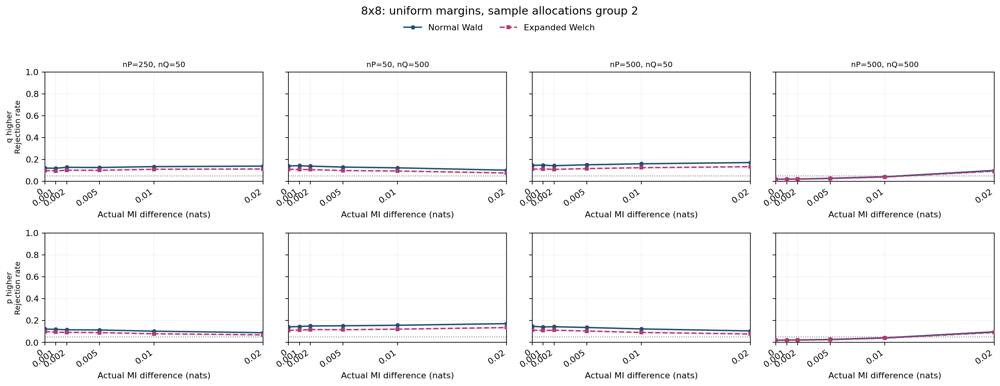

| Specification | Setting |
| --- | --- |
| Table size | 8x8 |
| Horizontal graph regime specifications (columns) | nP=250, nQ=50, nP=50, nQ=500, nP=500, nQ=50, nP=500, nQ=500 |
| Vertical graph regime specifications (rows) | q higher: P row (0.125 repeated 8 times), P column (0.125 repeated 8 times); Q row (0.125 repeated 8 times), Q column (0.125 repeated 8 times); p higher: P row (0.125 repeated 8 times), P column (0.125 repeated 8 times); Q row (0.125 repeated 8 times), Q column (0.125 repeated 8 times) |
| Probability changes | q higher: add at (1,1),(2,2) and subtract at (1,2),(2,1), for both P and Q; p higher: add at (1,1),(2,2) and subtract at (1,2),(2,1), for both P and Q |
| MI settings | Baseline MI {0.02}; direction {q higher, p higher}; actual differences {0, 0.001, 0.002, 0.005, 0.01, 0.02} nats |
| Horizontal axis within each graph | Actual MI difference in nats, fixed from 0 to 0.02 |
| Vertical axis within each graph | Unconditional rejection rate from 0 to 1; invalid results count as non-rejections |
| Replicates | 20,000 per unique point |

Null-point rejection and validity:

| Vertical regime | Horizontal regime | x | Method | Rejection | Valid |
| --- | --- | --- | --- | --- | --- |
| q higher | nP=250, nQ=50 | 0 | Expanded Welch | 0.0994 | 1.0000 |
| q higher | nP=250, nQ=50 | 0 | Normal Wald | 0.1224 | 1.0000 |
| q higher | nP=50, nQ=500 | 0 | Expanded Welch | 0.1113 | 1.0000 |
| q higher | nP=50, nQ=500 | 0 | Normal Wald | 0.1425 | 1.0000 |
| q higher | nP=500, nQ=50 | 0 | Expanded Welch | 0.1121 | 1.0000 |
| q higher | nP=500, nQ=50 | 0 | Normal Wald | 0.1473 | 1.0000 |
| q higher | nP=500, nQ=500 | 0 | Expanded Welch | 0.0198 | 1.0000 |
| q higher | nP=500, nQ=500 | 0 | Normal Wald | 0.0212 | 1.0000 |
| p higher | nP=250, nQ=50 | 0 | Expanded Welch | 0.0994 | 1.0000 |
| p higher | nP=250, nQ=50 | 0 | Normal Wald | 0.1224 | 1.0000 |
| p higher | nP=50, nQ=500 | 0 | Expanded Welch | 0.1113 | 1.0000 |
| p higher | nP=50, nQ=500 | 0 | Normal Wald | 0.1425 | 1.0000 |
| p higher | nP=500, nQ=50 | 0 | Expanded Welch | 0.1121 | 1.0000 |
| p higher | nP=500, nQ=50 | 0 | Normal Wald | 0.1473 | 1.0000 |
| p higher | nP=500, nQ=500 | 0 | Expanded Welch | 0.0198 | 1.0000 |
| p higher | nP=500, nQ=500 | 0 | Normal Wald | 0.0212 | 1.0000 |

Every plotted rate, interval, validity and minimum expected count

| Vertical regime | Horizontal regime | x | Method | Rejection | 95% interval | Valid | Conditional | Min expected P | Min expected Q |
| --- | --- | --- | --- | --- | --- | --- | --- | --- | --- |
| q higher | nP=250, nQ=50 | 0 | Expanded Welch | 0.0994 | [0.0954, 0.1037] | 1.0000 | 0.0994 | 0.9621 | 0.1924 |
| q higher | nP=250, nQ=50 | 0 | Normal Wald | 0.1224 | [0.1179, 0.1270] | 1.0000 | 0.1224 | 0.9621 | 0.1924 |
| q higher | nP=250, nQ=50 | 0.001 | Expanded Welch | 0.0974 | [0.0934, 0.1016] | 1.0000 | 0.0974 | 0.9621 | 0.1799 |
| q higher | nP=250, nQ=50 | 0.001 | Normal Wald | 0.1208 | [0.1164, 0.1254] | 1.0000 | 0.1208 | 0.9621 | 0.1799 |
| q higher | nP=250, nQ=50 | 0.002 | Expanded Welch | 0.1031 | [0.0990, 0.1074] | 1.0000 | 0.1031 | 0.9621 | 0.1679 |
| q higher | nP=250, nQ=50 | 0.002 | Normal Wald | 0.1294 | [0.1248, 0.1341] | 1.0000 | 0.1294 | 0.9621 | 0.1679 |
| q higher | nP=250, nQ=50 | 0.005 | Expanded Welch | 0.1018 | [0.0977, 0.1061] | 1.0000 | 0.1018 | 0.9621 | 0.1344 |
| q higher | nP=250, nQ=50 | 0.005 | Normal Wald | 0.1276 | [0.1230, 0.1323] | 1.0000 | 0.1276 | 0.9621 | 0.1344 |
| q higher | nP=250, nQ=50 | 0.01 | Expanded Welch | 0.1115 | [0.1072, 0.1159] | 1.0000 | 0.1115 | 0.9621 | 0.08603 |
| q higher | nP=250, nQ=50 | 0.01 | Normal Wald | 0.1358 | [0.1311, 0.1406] | 1.0000 | 0.1358 | 0.9621 | 0.08603 |
| q higher | nP=250, nQ=50 | 0.02 | Expanded Welch | 0.1139 | [0.1096, 0.1184] | 1.0000 | 0.1139 | 0.9621 | 0.01466 |
| q higher | nP=250, nQ=50 | 0.02 | Normal Wald | 0.1404 | [0.1356, 0.1452] | 1.0000 | 0.1404 | 0.9621 | 0.01466 |
| q higher | nP=50, nQ=500 | 0 | Expanded Welch | 0.1113 | [0.1070, 0.1157] | 1.0000 | 0.1113 | 0.1924 | 1.924 |
| q higher | nP=50, nQ=500 | 0 | Normal Wald | 0.1425 | [0.1377, 0.1474] | 1.0000 | 0.1425 | 0.1924 | 1.924 |
| q higher | nP=50, nQ=500 | 0.001 | Expanded Welch | 0.1100 | [0.1057, 0.1144] | 1.0000 | 0.1100 | 0.1924 | 1.799 |
| q higher | nP=50, nQ=500 | 0.001 | Normal Wald | 0.1436 | [0.1388, 0.1485] | 1.0000 | 0.1436 | 0.1924 | 1.799 |
| q higher | nP=50, nQ=500 | 0.002 | Expanded Welch | 0.1085 | [0.1043, 0.1129] | 1.0000 | 0.1085 | 0.1924 | 1.679 |
| q higher | nP=50, nQ=500 | 0.002 | Normal Wald | 0.1401 | [0.1353, 0.1449] | 1.0000 | 0.1401 | 0.1924 | 1.679 |
| q higher | nP=50, nQ=500 | 0.005 | Expanded Welch | 0.0999 | [0.0959, 0.1042] | 1.0000 | 0.0999 | 0.1924 | 1.344 |
| q higher | nP=50, nQ=500 | 0.005 | Normal Wald | 0.1315 | [0.1268, 0.1362] | 1.0000 | 0.1315 | 0.1924 | 1.344 |
| q higher | nP=50, nQ=500 | 0.01 | Expanded Welch | 0.0955 | [0.0916, 0.0997] | 1.0000 | 0.0955 | 0.1924 | 0.8603 |
| q higher | nP=50, nQ=500 | 0.01 | Normal Wald | 0.1246 | [0.1201, 0.1292] | 1.0000 | 0.1246 | 0.1924 | 0.8603 |
| q higher | nP=50, nQ=500 | 0.02 | Expanded Welch | 0.0776 | [0.0740, 0.0814] | 1.0000 | 0.0776 | 0.1924 | 0.1466 |
| q higher | nP=50, nQ=500 | 0.02 | Normal Wald | 0.1032 | [0.0991, 0.1075] | 1.0000 | 0.1032 | 0.1924 | 0.1466 |
| q higher | nP=500, nQ=50 | 0 | Expanded Welch | 0.1121 | [0.1078, 0.1165] | 1.0000 | 0.1121 | 1.924 | 0.1924 |
| q higher | nP=500, nQ=50 | 0 | Normal Wald | 0.1473 | [0.1425, 0.1523] | 1.0000 | 0.1473 | 1.924 | 0.1924 |
| q higher | nP=500, nQ=50 | 0.001 | Expanded Welch | 0.1146 | [0.1103, 0.1191] | 1.0000 | 0.1146 | 1.924 | 0.1799 |
| q higher | nP=500, nQ=50 | 0.001 | Normal Wald | 0.1492 | [0.1443, 0.1542] | 1.0000 | 0.1492 | 1.924 | 0.1799 |
| q higher | nP=500, nQ=50 | 0.002 | Expanded Welch | 0.1104 | [0.1061, 0.1148] | 1.0000 | 0.1104 | 1.924 | 0.1679 |
| q higher | nP=500, nQ=50 | 0.002 | Normal Wald | 0.1441 | [0.1393, 0.1490] | 1.0000 | 0.1441 | 1.924 | 0.1679 |
| q higher | nP=500, nQ=50 | 0.005 | Expanded Welch | 0.1177 | [0.1133, 0.1222] | 1.0000 | 0.1177 | 1.924 | 0.1344 |
| q higher | nP=500, nQ=50 | 0.005 | Normal Wald | 0.1525 | [0.1475, 0.1575] | 1.0000 | 0.1525 | 1.924 | 0.1344 |
| q higher | nP=500, nQ=50 | 0.01 | Expanded Welch | 0.1259 | [0.1214, 0.1306] | 1.0000 | 0.1259 | 1.924 | 0.08603 |
| q higher | nP=500, nQ=50 | 0.01 | Normal Wald | 0.1615 | [0.1565, 0.1667] | 1.0000 | 0.1615 | 1.924 | 0.08603 |
| q higher | nP=500, nQ=50 | 0.02 | Expanded Welch | 0.1350 | [0.1303, 0.1398] | 1.0000 | 0.1350 | 1.924 | 0.01466 |
| q higher | nP=500, nQ=50 | 0.02 | Normal Wald | 0.1727 | [0.1675, 0.1780] | 1.0000 | 0.1727 | 1.924 | 0.01466 |
| q higher | nP=500, nQ=500 | 0 | Expanded Welch | 0.0198 | [0.0179, 0.0218] | 1.0000 | 0.0198 | 1.924 | 1.924 |
| q higher | nP=500, nQ=500 | 0 | Normal Wald | 0.0212 | [0.0193, 0.0233] | 1.0000 | 0.0212 | 1.924 | 1.924 |
| q higher | nP=500, nQ=500 | 0.001 | Expanded Welch | 0.0203 | [0.0184, 0.0223] | 1.0000 | 0.0203 | 1.924 | 1.799 |
| q higher | nP=500, nQ=500 | 0.001 | Normal Wald | 0.0220 | [0.0200, 0.0241] | 1.0000 | 0.0220 | 1.924 | 1.799 |
| q higher | nP=500, nQ=500 | 0.002 | Expanded Welch | 0.0211 | [0.0192, 0.0232] | 1.0000 | 0.0211 | 1.924 | 1.679 |
| q higher | nP=500, nQ=500 | 0.002 | Normal Wald | 0.0227 | [0.0207, 0.0249] | 1.0000 | 0.0227 | 1.924 | 1.679 |
| q higher | nP=500, nQ=500 | 0.005 | Expanded Welch | 0.0265 | [0.0243, 0.0288] | 1.0000 | 0.0265 | 1.924 | 1.344 |
| q higher | nP=500, nQ=500 | 0.005 | Normal Wald | 0.0291 | [0.0269, 0.0315] | 1.0000 | 0.0291 | 1.924 | 1.344 |
| q higher | nP=500, nQ=500 | 0.01 | Expanded Welch | 0.0403 | [0.0376, 0.0431] | 1.0000 | 0.0403 | 1.924 | 0.8603 |
| q higher | nP=500, nQ=500 | 0.01 | Normal Wald | 0.0431 | [0.0404, 0.0460] | 1.0000 | 0.0431 | 1.924 | 0.8603 |
| q higher | nP=500, nQ=500 | 0.02 | Expanded Welch | 0.0941 | [0.0902, 0.0983] | 1.0000 | 0.0941 | 1.924 | 0.1466 |
| q higher | nP=500, nQ=500 | 0.02 | Normal Wald | 0.1006 | [0.0965, 0.1048] | 1.0000 | 0.1006 | 1.924 | 0.1466 |
| p higher | nP=250, nQ=50 | 0 | Expanded Welch | 0.0994 | [0.0954, 0.1037] | 1.0000 | 0.0994 | 0.9621 | 0.1924 |
| p higher | nP=250, nQ=50 | 0 | Normal Wald | 0.1224 | [0.1179, 0.1270] | 1.0000 | 0.1224 | 0.9621 | 0.1924 |
| p higher | nP=250, nQ=50 | 0.001 | Expanded Welch | 0.0946 | [0.0907, 0.0988] | 1.0000 | 0.0946 | 0.8996 | 0.1924 |
| p higher | nP=250, nQ=50 | 0.001 | Normal Wald | 0.1202 | [0.1157, 0.1247] | 1.0000 | 0.1202 | 0.8996 | 0.1924 |
| p higher | nP=250, nQ=50 | 0.002 | Expanded Welch | 0.0921 | [0.0882, 0.0962] | 1.0000 | 0.0921 | 0.8394 | 0.1924 |
| p higher | nP=250, nQ=50 | 0.002 | Normal Wald | 0.1161 | [0.1117, 0.1206] | 1.0000 | 0.1161 | 0.8394 | 0.1924 |
| p higher | nP=250, nQ=50 | 0.005 | Expanded Welch | 0.0905 | [0.0866, 0.0945] | 1.0000 | 0.0905 | 0.6718 | 0.1924 |
| p higher | nP=250, nQ=50 | 0.005 | Normal Wald | 0.1144 | [0.1101, 0.1189] | 1.0000 | 0.1144 | 0.6718 | 0.1924 |
| p higher | nP=250, nQ=50 | 0.01 | Expanded Welch | 0.0797 | [0.0760, 0.0835] | 1.0000 | 0.0797 | 0.4301 | 0.1924 |
| p higher | nP=250, nQ=50 | 0.01 | Normal Wald | 0.1033 | [0.0992, 0.1076] | 1.0000 | 0.1033 | 0.4301 | 0.1924 |
| p higher | nP=250, nQ=50 | 0.02 | Expanded Welch | 0.0696 | [0.0662, 0.0732] | 1.0000 | 0.0696 | 0.07331 | 0.1924 |
| p higher | nP=250, nQ=50 | 0.02 | Normal Wald | 0.0896 | [0.0857, 0.0936] | 1.0000 | 0.0896 | 0.07331 | 0.1924 |
| p higher | nP=50, nQ=500 | 0 | Expanded Welch | 0.1113 | [0.1070, 0.1157] | 1.0000 | 0.1113 | 0.1924 | 1.924 |
| p higher | nP=50, nQ=500 | 0 | Normal Wald | 0.1425 | [0.1377, 0.1474] | 1.0000 | 0.1425 | 0.1924 | 1.924 |
| p higher | nP=50, nQ=500 | 0.001 | Expanded Welch | 0.1129 | [0.1086, 0.1174] | 1.0000 | 0.1129 | 0.1799 | 1.924 |
| p higher | nP=50, nQ=500 | 0.001 | Normal Wald | 0.1462 | [0.1413, 0.1511] | 1.0000 | 0.1462 | 0.1799 | 1.924 |
| p higher | nP=50, nQ=500 | 0.002 | Expanded Welch | 0.1185 | [0.1141, 0.1231] | 1.0000 | 0.1185 | 0.1679 | 1.924 |
| p higher | nP=50, nQ=500 | 0.002 | Normal Wald | 0.1507 | [0.1458, 0.1557] | 1.0000 | 0.1507 | 0.1679 | 1.924 |
| p higher | nP=50, nQ=500 | 0.005 | Expanded Welch | 0.1168 | [0.1124, 0.1213] | 1.0000 | 0.1168 | 0.1344 | 1.924 |
| p higher | nP=50, nQ=500 | 0.005 | Normal Wald | 0.1527 | [0.1478, 0.1578] | 1.0000 | 0.1527 | 0.1344 | 1.924 |
| p higher | nP=50, nQ=500 | 0.01 | Expanded Welch | 0.1219 | [0.1174, 0.1265] | 1.0000 | 0.1219 | 0.08603 | 1.924 |
| p higher | nP=50, nQ=500 | 0.01 | Normal Wald | 0.1573 | [0.1524, 0.1625] | 1.0000 | 0.1573 | 0.08603 | 1.924 |
| p higher | nP=50, nQ=500 | 0.02 | Expanded Welch | 0.1363 | [0.1317, 0.1412] | 1.0000 | 0.1363 | 0.01466 | 1.924 |
| p higher | nP=50, nQ=500 | 0.02 | Normal Wald | 0.1721 | [0.1669, 0.1774] | 1.0000 | 0.1721 | 0.01466 | 1.924 |
| p higher | nP=500, nQ=50 | 0 | Expanded Welch | 0.1121 | [0.1078, 0.1165] | 1.0000 | 0.1121 | 1.924 | 0.1924 |
| p higher | nP=500, nQ=50 | 0 | Normal Wald | 0.1473 | [0.1425, 0.1523] | 1.0000 | 0.1473 | 1.924 | 0.1924 |
| p higher | nP=500, nQ=50 | 0.001 | Expanded Welch | 0.1098 | [0.1055, 0.1142] | 1.0000 | 0.1098 | 1.799 | 0.1924 |
| p higher | nP=500, nQ=50 | 0.001 | Normal Wald | 0.1421 | [0.1373, 0.1470] | 1.0000 | 0.1421 | 1.799 | 0.1924 |
| p higher | nP=500, nQ=50 | 0.002 | Expanded Welch | 0.1123 | [0.1080, 0.1168] | 1.0000 | 0.1123 | 1.679 | 0.1924 |
| p higher | nP=500, nQ=50 | 0.002 | Normal Wald | 0.1441 | [0.1393, 0.1490] | 1.0000 | 0.1441 | 1.679 | 0.1924 |
| p higher | nP=500, nQ=50 | 0.005 | Expanded Welch | 0.1047 | [0.1005, 0.1090] | 1.0000 | 0.1047 | 1.344 | 0.1924 |
| p higher | nP=500, nQ=50 | 0.005 | Normal Wald | 0.1371 | [0.1324, 0.1419] | 1.0000 | 0.1371 | 1.344 | 0.1924 |
| p higher | nP=500, nQ=50 | 0.01 | Expanded Welch | 0.0918 | [0.0879, 0.0959] | 1.0000 | 0.0918 | 0.8603 | 0.1924 |
| p higher | nP=500, nQ=50 | 0.01 | Normal Wald | 0.1237 | [0.1193, 0.1284] | 1.0000 | 0.1237 | 0.8603 | 0.1924 |
| p higher | nP=500, nQ=50 | 0.02 | Expanded Welch | 0.0780 | [0.0744, 0.0818] | 1.0000 | 0.0780 | 0.1466 | 0.1924 |
| p higher | nP=500, nQ=50 | 0.02 | Normal Wald | 0.1056 | [0.1014, 0.1099] | 1.0000 | 0.1056 | 0.1466 | 0.1924 |
| p higher | nP=500, nQ=500 | 0 | Expanded Welch | 0.0198 | [0.0179, 0.0218] | 1.0000 | 0.0198 | 1.924 | 1.924 |
| p higher | nP=500, nQ=500 | 0 | Normal Wald | 0.0212 | [0.0193, 0.0233] | 1.0000 | 0.0212 | 1.924 | 1.924 |
| p higher | nP=500, nQ=500 | 0.001 | Expanded Welch | 0.0205 | [0.0186, 0.0226] | 1.0000 | 0.0205 | 1.799 | 1.924 |
| p higher | nP=500, nQ=500 | 0.001 | Normal Wald | 0.0225 | [0.0205, 0.0246] | 1.0000 | 0.0225 | 1.799 | 1.924 |
| p higher | nP=500, nQ=500 | 0.002 | Expanded Welch | 0.0218 | [0.0199, 0.0239] | 1.0000 | 0.0218 | 1.679 | 1.924 |
| p higher | nP=500, nQ=500 | 0.002 | Normal Wald | 0.0233 | [0.0213, 0.0255] | 1.0000 | 0.0233 | 1.679 | 1.924 |
| p higher | nP=500, nQ=500 | 0.005 | Expanded Welch | 0.0252 | [0.0231, 0.0275] | 1.0000 | 0.0252 | 1.344 | 1.924 |
| p higher | nP=500, nQ=500 | 0.005 | Normal Wald | 0.0279 | [0.0258, 0.0303] | 1.0000 | 0.0279 | 1.344 | 1.924 |
| p higher | nP=500, nQ=500 | 0.01 | Expanded Welch | 0.0393 | [0.0367, 0.0421] | 1.0000 | 0.0393 | 0.8603 | 1.924 |
| p higher | nP=500, nQ=500 | 0.01 | Normal Wald | 0.0425 | [0.0398, 0.0454] | 1.0000 | 0.0425 | 0.8603 | 1.924 |
| p higher | nP=500, nQ=500 | 0.02 | Expanded Welch | 0.0914 | [0.0875, 0.0955] | 1.0000 | 0.0914 | 0.1466 | 1.924 |
| p higher | nP=500, nQ=500 | 0.02 | Normal Wald | 0.0973 | [0.0932, 0.1014] | 1.0000 | 0.0973 | 0.1466 | 1.924 |

### 6.21 8x8: same skew margins, sample allocations group 1

Does performance depend on which population has more data or greater MI?

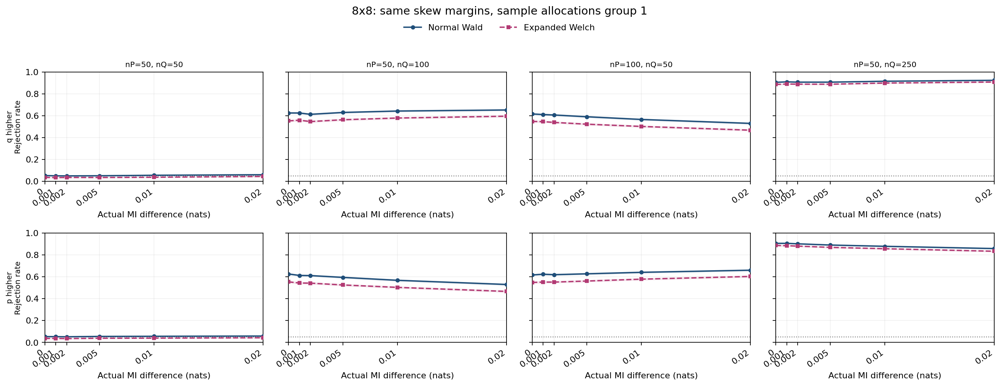

| Specification | Setting |
| --- | --- |
| Table size | 8x8 |
| Horizontal graph regime specifications (columns) | nP=50, nQ=50, nP=50, nQ=100, nP=100, nQ=50, nP=50, nQ=250 |
| Vertical graph regime specifications (rows) | q higher: P row (0.8, 0.2/7 repeated 7 times), P column (0.8, 0.2/7 repeated 7 times); Q row (0.8, 0.2/7 repeated 7 times), Q column (0.8, 0.2/7 repeated 7 times); p higher: P row (0.8, 0.2/7 repeated 7 times), P column (0.8, 0.2/7 repeated 7 times); Q row (0.8, 0.2/7 repeated 7 times), Q column (0.8, 0.2/7 repeated 7 times) |
| Probability changes | q higher: add at (1,1),(2,2) and subtract at (1,2),(2,1), for both P and Q; p higher: add at (1,1),(2,2) and subtract at (1,2),(2,1), for both P and Q |
| MI settings | Baseline MI {0.02}; direction {q higher, p higher}; actual differences {0, 0.001, 0.002, 0.005, 0.01, 0.02} nats |
| Horizontal axis within each graph | Actual MI difference in nats, fixed from 0 to 0.02 |
| Vertical axis within each graph | Unconditional rejection rate from 0 to 1; invalid results count as non-rejections |
| Replicates | 20,000 per unique point |

Null-point rejection and validity:

| Vertical regime | Horizontal regime | x | Method | Rejection | Valid |
| --- | --- | --- | --- | --- | --- |
| q higher | nP=50, nQ=50 | 0 | Expanded Welch | 0.0367 | 1.0000 |
| q higher | nP=50, nQ=50 | 0 | Normal Wald | 0.0537 | 1.0000 |
| q higher | nP=50, nQ=100 | 0 | Expanded Welch | 0.5532 | 1.0000 |
| q higher | nP=50, nQ=100 | 0 | Normal Wald | 0.6252 | 1.0000 |
| q higher | nP=100, nQ=50 | 0 | Expanded Welch | 0.5481 | 0.9998 |
| q higher | nP=100, nQ=50 | 0 | Normal Wald | 0.6162 | 1.0000 |
| q higher | nP=50, nQ=250 | 0 | Expanded Welch | 0.8854 | 1.0000 |
| q higher | nP=50, nQ=250 | 0 | Normal Wald | 0.9052 | 1.0000 |
| p higher | nP=50, nQ=50 | 0 | Expanded Welch | 0.0367 | 1.0000 |
| p higher | nP=50, nQ=50 | 0 | Normal Wald | 0.0537 | 1.0000 |
| p higher | nP=50, nQ=100 | 0 | Expanded Welch | 0.5532 | 1.0000 |
| p higher | nP=50, nQ=100 | 0 | Normal Wald | 0.6252 | 1.0000 |
| p higher | nP=100, nQ=50 | 0 | Expanded Welch | 0.5481 | 0.9998 |
| p higher | nP=100, nQ=50 | 0 | Normal Wald | 0.6162 | 1.0000 |
| p higher | nP=50, nQ=250 | 0 | Expanded Welch | 0.8854 | 1.0000 |
| p higher | nP=50, nQ=250 | 0 | Normal Wald | 0.9052 | 1.0000 |

Every plotted rate, interval, validity and minimum expected count

| Vertical regime | Horizontal regime | x | Method | Rejection | 95% interval | Valid | Conditional | Min expected P | Min expected Q |
| --- | --- | --- | --- | --- | --- | --- | --- | --- | --- |
| q higher | nP=50, nQ=50 | 0 | Expanded Welch | 0.0367 | [0.0342, 0.0394] | 1.0000 | 0.0368 | 0.04082 | 0.04082 |
| q higher | nP=50, nQ=50 | 0 | Normal Wald | 0.0537 | [0.0507, 0.0570] | 1.0000 | 0.0537 | 0.04082 | 0.04082 |
| q higher | nP=50, nQ=50 | 0.001 | Expanded Welch | 0.0352 | [0.0328, 0.0379] | 1.0000 | 0.0352 | 0.04082 | 0.04082 |
| q higher | nP=50, nQ=50 | 0.001 | Normal Wald | 0.0516 | [0.0486, 0.0548] | 1.0000 | 0.0516 | 0.04082 | 0.04082 |
| q higher | nP=50, nQ=50 | 0.002 | Expanded Welch | 0.0365 | [0.0339, 0.0391] | 0.9999 | 0.0365 | 0.04082 | 0.04082 |
| q higher | nP=50, nQ=50 | 0.002 | Normal Wald | 0.0510 | [0.0480, 0.0541] | 1.0000 | 0.0510 | 0.04082 | 0.04082 |
| q higher | nP=50, nQ=50 | 0.005 | Expanded Welch | 0.0360 | [0.0336, 0.0387] | 1.0000 | 0.0361 | 0.04082 | 0.04082 |
| q higher | nP=50, nQ=50 | 0.005 | Normal Wald | 0.0522 | [0.0492, 0.0553] | 1.0000 | 0.0522 | 0.04082 | 0.04082 |
| q higher | nP=50, nQ=50 | 0.01 | Expanded Welch | 0.0386 | [0.0360, 0.0413] | 1.0000 | 0.0386 | 0.04082 | 0.04082 |
| q higher | nP=50, nQ=50 | 0.01 | Normal Wald | 0.0566 | [0.0535, 0.0599] | 1.0000 | 0.0566 | 0.04082 | 0.04082 |
| q higher | nP=50, nQ=50 | 0.02 | Expanded Welch | 0.0457 | [0.0429, 0.0487] | 1.0000 | 0.0457 | 0.04082 | 0.04082 |
| q higher | nP=50, nQ=50 | 0.02 | Normal Wald | 0.0617 | [0.0584, 0.0651] | 1.0000 | 0.0617 | 0.04082 | 0.04082 |
| q higher | nP=50, nQ=100 | 0 | Expanded Welch | 0.5532 | [0.5463, 0.5601] | 1.0000 | 0.5532 | 0.04082 | 0.08163 |
| q higher | nP=50, nQ=100 | 0 | Normal Wald | 0.6252 | [0.6185, 0.6319] | 1.0000 | 0.6252 | 0.04082 | 0.08163 |
| q higher | nP=50, nQ=100 | 0.001 | Expanded Welch | 0.5595 | [0.5526, 0.5663] | 1.0000 | 0.5595 | 0.04082 | 0.08163 |
| q higher | nP=50, nQ=100 | 0.001 | Normal Wald | 0.6250 | [0.6183, 0.6317] | 1.0000 | 0.6250 | 0.04082 | 0.08163 |
| q higher | nP=50, nQ=100 | 0.002 | Expanded Welch | 0.5469 | [0.5400, 0.5538] | 1.0000 | 0.5469 | 0.04082 | 0.08163 |
| q higher | nP=50, nQ=100 | 0.002 | Normal Wald | 0.6129 | [0.6061, 0.6196] | 1.0000 | 0.6129 | 0.04082 | 0.08163 |
| q higher | nP=50, nQ=100 | 0.005 | Expanded Welch | 0.5635 | [0.5566, 0.5704] | 1.0000 | 0.5635 | 0.04082 | 0.08163 |
| q higher | nP=50, nQ=100 | 0.005 | Normal Wald | 0.6300 | [0.6233, 0.6367] | 1.0000 | 0.6300 | 0.04082 | 0.08163 |
| q higher | nP=50, nQ=100 | 0.01 | Expanded Welch | 0.5792 | [0.5723, 0.5860] | 1.0000 | 0.5792 | 0.04082 | 0.08163 |
| q higher | nP=50, nQ=100 | 0.01 | Normal Wald | 0.6430 | [0.6363, 0.6496] | 1.0000 | 0.6430 | 0.04082 | 0.08163 |
| q higher | nP=50, nQ=100 | 0.02 | Expanded Welch | 0.5960 | [0.5892, 0.6028] | 1.0000 | 0.5960 | 0.04082 | 0.08163 |
| q higher | nP=50, nQ=100 | 0.02 | Normal Wald | 0.6526 | [0.6460, 0.6592] | 1.0000 | 0.6526 | 0.04082 | 0.08163 |
| q higher | nP=100, nQ=50 | 0 | Expanded Welch | 0.5481 | [0.5411, 0.5549] | 0.9998 | 0.5482 | 0.08163 | 0.04082 |
| q higher | nP=100, nQ=50 | 0 | Normal Wald | 0.6162 | [0.6095, 0.6230] | 1.0000 | 0.6162 | 0.08163 | 0.04082 |
| q higher | nP=100, nQ=50 | 0.001 | Expanded Welch | 0.5462 | [0.5393, 0.5531] | 1.0000 | 0.5462 | 0.08163 | 0.04082 |
| q higher | nP=100, nQ=50 | 0.001 | Normal Wald | 0.6108 | [0.6040, 0.6175] | 1.0000 | 0.6108 | 0.08163 | 0.04082 |
| q higher | nP=100, nQ=50 | 0.002 | Expanded Welch | 0.5392 | [0.5322, 0.5461] | 1.0000 | 0.5392 | 0.08163 | 0.04082 |
| q higher | nP=100, nQ=50 | 0.002 | Normal Wald | 0.6068 | [0.6000, 0.6135] | 1.0000 | 0.6068 | 0.08163 | 0.04082 |
| q higher | nP=100, nQ=50 | 0.005 | Expanded Welch | 0.5230 | [0.5160, 0.5299] | 1.0000 | 0.5230 | 0.08163 | 0.04082 |
| q higher | nP=100, nQ=50 | 0.005 | Normal Wald | 0.5908 | [0.5840, 0.5976] | 1.0000 | 0.5908 | 0.08163 | 0.04082 |
| q higher | nP=100, nQ=50 | 0.01 | Expanded Welch | 0.5023 | [0.4954, 0.5093] | 1.0000 | 0.5024 | 0.08163 | 0.04082 |
| q higher | nP=100, nQ=50 | 0.01 | Normal Wald | 0.5661 | [0.5592, 0.5729] | 1.0000 | 0.5661 | 0.08163 | 0.04082 |
| q higher | nP=100, nQ=50 | 0.02 | Expanded Welch | 0.4682 | [0.4612, 0.4751] | 1.0000 | 0.4682 | 0.08163 | 0.04082 |
| q higher | nP=100, nQ=50 | 0.02 | Normal Wald | 0.5302 | [0.5232, 0.5371] | 1.0000 | 0.5302 | 0.08163 | 0.04082 |
| q higher | nP=50, nQ=250 | 0 | Expanded Welch | 0.8854 | [0.8810, 0.8898] | 1.0000 | 0.8854 | 0.04082 | 0.2041 |
| q higher | nP=50, nQ=250 | 0 | Normal Wald | 0.9052 | [0.9010, 0.9091] | 1.0000 | 0.9052 | 0.04082 | 0.2041 |
| q higher | nP=50, nQ=250 | 0.001 | Expanded Welch | 0.8897 | [0.8853, 0.8940] | 1.0000 | 0.8897 | 0.04082 | 0.2041 |
| q higher | nP=50, nQ=250 | 0.001 | Normal Wald | 0.9093 | [0.9053, 0.9133] | 1.0000 | 0.9093 | 0.04082 | 0.2041 |
| q higher | nP=50, nQ=250 | 0.002 | Expanded Welch | 0.8881 | [0.8837, 0.8924] | 1.0000 | 0.8882 | 0.04082 | 0.2041 |
| q higher | nP=50, nQ=250 | 0.002 | Normal Wald | 0.9067 | [0.9026, 0.9107] | 1.0000 | 0.9067 | 0.04082 | 0.2041 |
| q higher | nP=50, nQ=250 | 0.005 | Expanded Welch | 0.8878 | [0.8833, 0.8921] | 1.0000 | 0.8878 | 0.04082 | 0.2041 |
| q higher | nP=50, nQ=250 | 0.005 | Normal Wald | 0.9066 | [0.9025, 0.9106] | 1.0000 | 0.9066 | 0.04082 | 0.2041 |
| q higher | nP=50, nQ=250 | 0.01 | Expanded Welch | 0.8983 | [0.8940, 0.9024] | 1.0000 | 0.8983 | 0.04082 | 0.2041 |
| q higher | nP=50, nQ=250 | 0.01 | Normal Wald | 0.9150 | [0.9111, 0.9188] | 1.0000 | 0.9150 | 0.04082 | 0.2041 |
| q higher | nP=50, nQ=250 | 0.02 | Expanded Welch | 0.9076 | [0.9036, 0.9116] | 1.0000 | 0.9077 | 0.04082 | 0.2041 |
| q higher | nP=50, nQ=250 | 0.02 | Normal Wald | 0.9234 | [0.9196, 0.9270] | 1.0000 | 0.9234 | 0.04082 | 0.2041 |
| p higher | nP=50, nQ=50 | 0 | Expanded Welch | 0.0367 | [0.0342, 0.0394] | 1.0000 | 0.0368 | 0.04082 | 0.04082 |
| p higher | nP=50, nQ=50 | 0 | Normal Wald | 0.0537 | [0.0507, 0.0570] | 1.0000 | 0.0537 | 0.04082 | 0.04082 |
| p higher | nP=50, nQ=50 | 0.001 | Expanded Welch | 0.0370 | [0.0345, 0.0397] | 1.0000 | 0.0370 | 0.04082 | 0.04082 |
| p higher | nP=50, nQ=50 | 0.001 | Normal Wald | 0.0530 | [0.0500, 0.0562] | 1.0000 | 0.0530 | 0.04082 | 0.04082 |
| p higher | nP=50, nQ=50 | 0.002 | Expanded Welch | 0.0352 | [0.0327, 0.0378] | 1.0000 | 0.0352 | 0.04082 | 0.04082 |
| p higher | nP=50, nQ=50 | 0.002 | Normal Wald | 0.0522 | [0.0492, 0.0553] | 1.0000 | 0.0522 | 0.04082 | 0.04082 |
| p higher | nP=50, nQ=50 | 0.005 | Expanded Welch | 0.0387 | [0.0361, 0.0415] | 0.9999 | 0.0387 | 0.04082 | 0.04082 |
| p higher | nP=50, nQ=50 | 0.005 | Normal Wald | 0.0554 | [0.0523, 0.0587] | 1.0000 | 0.0554 | 0.04082 | 0.04082 |
| p higher | nP=50, nQ=50 | 0.01 | Expanded Welch | 0.0398 | [0.0371, 0.0425] | 1.0000 | 0.0398 | 0.04082 | 0.04082 |
| p higher | nP=50, nQ=50 | 0.01 | Normal Wald | 0.0566 | [0.0535, 0.0599] | 1.0000 | 0.0566 | 0.04082 | 0.04082 |
| p higher | nP=50, nQ=50 | 0.02 | Expanded Welch | 0.0431 | [0.0404, 0.0460] | 1.0000 | 0.0431 | 0.04082 | 0.04082 |
| p higher | nP=50, nQ=50 | 0.02 | Normal Wald | 0.0590 | [0.0558, 0.0623] | 1.0000 | 0.0590 | 0.04082 | 0.04082 |
| p higher | nP=50, nQ=100 | 0 | Expanded Welch | 0.5532 | [0.5463, 0.5601] | 1.0000 | 0.5532 | 0.04082 | 0.08163 |
| p higher | nP=50, nQ=100 | 0 | Normal Wald | 0.6252 | [0.6185, 0.6319] | 1.0000 | 0.6252 | 0.04082 | 0.08163 |
| p higher | nP=50, nQ=100 | 0.001 | Expanded Welch | 0.5430 | [0.5360, 0.5498] | 1.0000 | 0.5430 | 0.04082 | 0.08163 |
| p higher | nP=50, nQ=100 | 0.001 | Normal Wald | 0.6120 | [0.6052, 0.6187] | 1.0000 | 0.6120 | 0.04082 | 0.08163 |
| p higher | nP=50, nQ=100 | 0.002 | Expanded Welch | 0.5417 | [0.5348, 0.5486] | 1.0000 | 0.5417 | 0.04082 | 0.08163 |
| p higher | nP=50, nQ=100 | 0.002 | Normal Wald | 0.6107 | [0.6039, 0.6174] | 1.0000 | 0.6107 | 0.04082 | 0.08163 |
| p higher | nP=50, nQ=100 | 0.005 | Expanded Welch | 0.5250 | [0.5180, 0.5319] | 0.9999 | 0.5250 | 0.04082 | 0.08163 |
| p higher | nP=50, nQ=100 | 0.005 | Normal Wald | 0.5941 | [0.5873, 0.6009] | 1.0000 | 0.5941 | 0.04082 | 0.08163 |
| p higher | nP=50, nQ=100 | 0.01 | Expanded Welch | 0.5030 | [0.4960, 0.5099] | 1.0000 | 0.5030 | 0.04082 | 0.08163 |
| p higher | nP=50, nQ=100 | 0.01 | Normal Wald | 0.5675 | [0.5606, 0.5743] | 1.0000 | 0.5675 | 0.04082 | 0.08163 |
| p higher | nP=50, nQ=100 | 0.02 | Expanded Welch | 0.4662 | [0.4592, 0.4731] | 1.0000 | 0.4662 | 0.04082 | 0.08163 |
| p higher | nP=50, nQ=100 | 0.02 | Normal Wald | 0.5294 | [0.5225, 0.5364] | 1.0000 | 0.5294 | 0.04082 | 0.08163 |
| p higher | nP=100, nQ=50 | 0 | Expanded Welch | 0.5481 | [0.5411, 0.5549] | 0.9998 | 0.5482 | 0.08163 | 0.04082 |
| p higher | nP=100, nQ=50 | 0 | Normal Wald | 0.6162 | [0.6095, 0.6230] | 1.0000 | 0.6162 | 0.08163 | 0.04082 |
| p higher | nP=100, nQ=50 | 0.001 | Expanded Welch | 0.5514 | [0.5444, 0.5582] | 1.0000 | 0.5514 | 0.08163 | 0.04082 |
| p higher | nP=100, nQ=50 | 0.001 | Normal Wald | 0.6231 | [0.6164, 0.6298] | 1.0000 | 0.6231 | 0.08163 | 0.04082 |
| p higher | nP=100, nQ=50 | 0.002 | Expanded Welch | 0.5513 | [0.5444, 0.5582] | 1.0000 | 0.5513 | 0.08163 | 0.04082 |
| p higher | nP=100, nQ=50 | 0.002 | Normal Wald | 0.6188 | [0.6120, 0.6255] | 1.0000 | 0.6188 | 0.08163 | 0.04082 |
| p higher | nP=100, nQ=50 | 0.005 | Expanded Welch | 0.5609 | [0.5540, 0.5678] | 1.0000 | 0.5609 | 0.08163 | 0.04082 |
| p higher | nP=100, nQ=50 | 0.005 | Normal Wald | 0.6269 | [0.6202, 0.6336] | 1.0000 | 0.6269 | 0.08163 | 0.04082 |
| p higher | nP=100, nQ=50 | 0.01 | Expanded Welch | 0.5779 | [0.5711, 0.5848] | 1.0000 | 0.5780 | 0.08163 | 0.04082 |
| p higher | nP=100, nQ=50 | 0.01 | Normal Wald | 0.6403 | [0.6337, 0.6470] | 1.0000 | 0.6403 | 0.08163 | 0.04082 |
| p higher | nP=100, nQ=50 | 0.02 | Expanded Welch | 0.6028 | [0.5960, 0.6096] | 1.0000 | 0.6028 | 0.08163 | 0.04082 |
| p higher | nP=100, nQ=50 | 0.02 | Normal Wald | 0.6597 | [0.6531, 0.6662] | 1.0000 | 0.6597 | 0.08163 | 0.04082 |
| p higher | nP=50, nQ=250 | 0 | Expanded Welch | 0.8854 | [0.8810, 0.8898] | 1.0000 | 0.8854 | 0.04082 | 0.2041 |
| p higher | nP=50, nQ=250 | 0 | Normal Wald | 0.9052 | [0.9010, 0.9091] | 1.0000 | 0.9052 | 0.04082 | 0.2041 |
| p higher | nP=50, nQ=250 | 0.001 | Expanded Welch | 0.8836 | [0.8791, 0.8880] | 1.0000 | 0.8836 | 0.04082 | 0.2041 |
| p higher | nP=50, nQ=250 | 0.001 | Normal Wald | 0.9051 | [0.9009, 0.9090] | 1.0000 | 0.9051 | 0.04082 | 0.2041 |
| p higher | nP=50, nQ=250 | 0.002 | Expanded Welch | 0.8796 | [0.8750, 0.8840] | 1.0000 | 0.8796 | 0.04082 | 0.2041 |
| p higher | nP=50, nQ=250 | 0.002 | Normal Wald | 0.9007 | [0.8965, 0.9048] | 1.0000 | 0.9007 | 0.04082 | 0.2041 |
| p higher | nP=50, nQ=250 | 0.005 | Expanded Welch | 0.8681 | [0.8633, 0.8727] | 0.9999 | 0.8682 | 0.04082 | 0.2041 |
| p higher | nP=50, nQ=250 | 0.005 | Normal Wald | 0.8895 | [0.8851, 0.8938] | 1.0000 | 0.8895 | 0.04082 | 0.2041 |
| p higher | nP=50, nQ=250 | 0.01 | Expanded Welch | 0.8558 | [0.8509, 0.8606] | 1.0000 | 0.8558 | 0.04082 | 0.2041 |
| p higher | nP=50, nQ=250 | 0.01 | Normal Wald | 0.8780 | [0.8733, 0.8824] | 1.0000 | 0.8780 | 0.04082 | 0.2041 |
| p higher | nP=50, nQ=250 | 0.02 | Expanded Welch | 0.8327 | [0.8275, 0.8379] | 1.0000 | 0.8328 | 0.04082 | 0.2041 |
| p higher | nP=50, nQ=250 | 0.02 | Normal Wald | 0.8574 | [0.8525, 0.8622] | 1.0000 | 0.8574 | 0.04082 | 0.2041 |

### 6.22 8x8: same skew margins, sample allocations group 2

Does performance depend on which population has more data or greater MI?

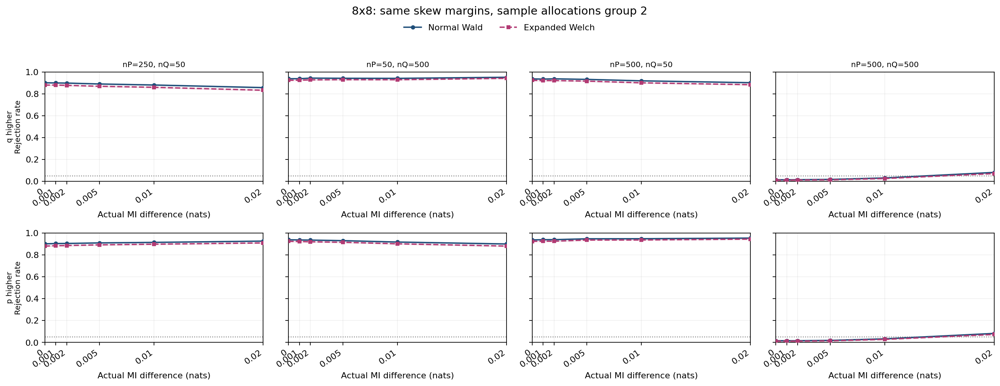

| Specification | Setting |
| --- | --- |
| Table size | 8x8 |
| Horizontal graph regime specifications (columns) | nP=250, nQ=50, nP=50, nQ=500, nP=500, nQ=50, nP=500, nQ=500 |
| Vertical graph regime specifications (rows) | q higher: P row (0.8, 0.2/7 repeated 7 times), P column (0.8, 0.2/7 repeated 7 times); Q row (0.8, 0.2/7 repeated 7 times), Q column (0.8, 0.2/7 repeated 7 times); p higher: P row (0.8, 0.2/7 repeated 7 times), P column (0.8, 0.2/7 repeated 7 times); Q row (0.8, 0.2/7 repeated 7 times), Q column (0.8, 0.2/7 repeated 7 times) |
| Probability changes | q higher: add at (1,1),(2,2) and subtract at (1,2),(2,1), for both P and Q; p higher: add at (1,1),(2,2) and subtract at (1,2),(2,1), for both P and Q |
| MI settings | Baseline MI {0.02}; direction {q higher, p higher}; actual differences {0, 0.001, 0.002, 0.005, 0.01, 0.02} nats |
| Horizontal axis within each graph | Actual MI difference in nats, fixed from 0 to 0.02 |
| Vertical axis within each graph | Unconditional rejection rate from 0 to 1; invalid results count as non-rejections |
| Replicates | 20,000 per unique point |

Null-point rejection and validity:

| Vertical regime | Horizontal regime | x | Method | Rejection | Valid |
| --- | --- | --- | --- | --- | --- |
| q higher | nP=250, nQ=50 | 0 | Expanded Welch | 0.8798 | 1.0000 |
| q higher | nP=250, nQ=50 | 0 | Normal Wald | 0.9009 | 1.0000 |
| q higher | nP=50, nQ=500 | 0 | Expanded Welch | 0.9236 | 1.0000 |
| q higher | nP=50, nQ=500 | 0 | Normal Wald | 0.9378 | 1.0000 |
| q higher | nP=500, nQ=50 | 0 | Expanded Welch | 0.9234 | 1.0000 |
| q higher | nP=500, nQ=50 | 0 | Normal Wald | 0.9364 | 1.0000 |
| q higher | nP=500, nQ=500 | 0 | Expanded Welch | 0.0129 | 1.0000 |
| q higher | nP=500, nQ=500 | 0 | Normal Wald | 0.0162 | 1.0000 |
| p higher | nP=250, nQ=50 | 0 | Expanded Welch | 0.8798 | 1.0000 |
| p higher | nP=250, nQ=50 | 0 | Normal Wald | 0.9009 | 1.0000 |
| p higher | nP=50, nQ=500 | 0 | Expanded Welch | 0.9236 | 1.0000 |
| p higher | nP=50, nQ=500 | 0 | Normal Wald | 0.9378 | 1.0000 |
| p higher | nP=500, nQ=50 | 0 | Expanded Welch | 0.9234 | 1.0000 |
| p higher | nP=500, nQ=50 | 0 | Normal Wald | 0.9364 | 1.0000 |
| p higher | nP=500, nQ=500 | 0 | Expanded Welch | 0.0129 | 1.0000 |
| p higher | nP=500, nQ=500 | 0 | Normal Wald | 0.0162 | 1.0000 |

Every plotted rate, interval, validity and minimum expected count

| Vertical regime | Horizontal regime | x | Method | Rejection | 95% interval | Valid | Conditional | Min expected P | Min expected Q |
| --- | --- | --- | --- | --- | --- | --- | --- | --- | --- |
| q higher | nP=250, nQ=50 | 0 | Expanded Welch | 0.8798 | [0.8752, 0.8842] | 1.0000 | 0.8798 | 0.2041 | 0.04082 |
| q higher | nP=250, nQ=50 | 0 | Normal Wald | 0.9009 | [0.8967, 0.9050] | 1.0000 | 0.9009 | 0.2041 | 0.04082 |
| q higher | nP=250, nQ=50 | 0.001 | Expanded Welch | 0.8801 | [0.8755, 0.8845] | 1.0000 | 0.8801 | 0.2041 | 0.04082 |
| q higher | nP=250, nQ=50 | 0.001 | Normal Wald | 0.8993 | [0.8951, 0.9034] | 1.0000 | 0.8993 | 0.2041 | 0.04082 |
| q higher | nP=250, nQ=50 | 0.002 | Expanded Welch | 0.8773 | [0.8727, 0.8818] | 1.0000 | 0.8773 | 0.2041 | 0.04082 |
| q higher | nP=250, nQ=50 | 0.002 | Normal Wald | 0.8981 | [0.8938, 0.9022] | 1.0000 | 0.8981 | 0.2041 | 0.04082 |
| q higher | nP=250, nQ=50 | 0.005 | Expanded Welch | 0.8690 | [0.8642, 0.8736] | 1.0000 | 0.8690 | 0.2041 | 0.04082 |
| q higher | nP=250, nQ=50 | 0.005 | Normal Wald | 0.8900 | [0.8855, 0.8942] | 1.0000 | 0.8900 | 0.2041 | 0.04082 |
| q higher | nP=250, nQ=50 | 0.01 | Expanded Welch | 0.8595 | [0.8546, 0.8642] | 1.0000 | 0.8595 | 0.2041 | 0.04082 |
| q higher | nP=250, nQ=50 | 0.01 | Normal Wald | 0.8806 | [0.8760, 0.8850] | 1.0000 | 0.8806 | 0.2041 | 0.04082 |
| q higher | nP=250, nQ=50 | 0.02 | Expanded Welch | 0.8327 | [0.8275, 0.8379] | 1.0000 | 0.8328 | 0.2041 | 0.04082 |
| q higher | nP=250, nQ=50 | 0.02 | Normal Wald | 0.8568 | [0.8519, 0.8616] | 1.0000 | 0.8568 | 0.2041 | 0.04082 |
| q higher | nP=50, nQ=500 | 0 | Expanded Welch | 0.9236 | [0.9199, 0.9272] | 1.0000 | 0.9236 | 0.04082 | 0.4082 |
| q higher | nP=50, nQ=500 | 0 | Normal Wald | 0.9378 | [0.9344, 0.9411] | 1.0000 | 0.9378 | 0.04082 | 0.4082 |
| q higher | nP=50, nQ=500 | 0.001 | Expanded Welch | 0.9244 | [0.9206, 0.9279] | 1.0000 | 0.9244 | 0.04082 | 0.4082 |
| q higher | nP=50, nQ=500 | 0.001 | Normal Wald | 0.9381 | [0.9347, 0.9414] | 1.0000 | 0.9381 | 0.04082 | 0.4082 |
| q higher | nP=50, nQ=500 | 0.002 | Expanded Welch | 0.9275 | [0.9238, 0.9310] | 1.0000 | 0.9275 | 0.04082 | 0.4082 |
| q higher | nP=50, nQ=500 | 0.002 | Normal Wald | 0.9434 | [0.9401, 0.9465] | 1.0000 | 0.9434 | 0.04082 | 0.4082 |
| q higher | nP=50, nQ=500 | 0.005 | Expanded Welch | 0.9293 | [0.9256, 0.9327] | 1.0000 | 0.9293 | 0.04082 | 0.4082 |
| q higher | nP=50, nQ=500 | 0.005 | Normal Wald | 0.9419 | [0.9386, 0.9451] | 1.0000 | 0.9419 | 0.04082 | 0.4082 |
| q higher | nP=50, nQ=500 | 0.01 | Expanded Welch | 0.9288 | [0.9252, 0.9323] | 1.0000 | 0.9288 | 0.04082 | 0.4082 |
| q higher | nP=50, nQ=500 | 0.01 | Normal Wald | 0.9413 | [0.9379, 0.9444] | 1.0000 | 0.9413 | 0.04082 | 0.4082 |
| q higher | nP=50, nQ=500 | 0.02 | Expanded Welch | 0.9416 | [0.9383, 0.9448] | 1.0000 | 0.9416 | 0.04082 | 0.4082 |
| q higher | nP=50, nQ=500 | 0.02 | Normal Wald | 0.9513 | [0.9482, 0.9541] | 1.0000 | 0.9513 | 0.04082 | 0.4082 |
| q higher | nP=500, nQ=50 | 0 | Expanded Welch | 0.9234 | [0.9197, 0.9271] | 1.0000 | 0.9234 | 0.4082 | 0.04082 |
| q higher | nP=500, nQ=50 | 0 | Normal Wald | 0.9364 | [0.9329, 0.9397] | 1.0000 | 0.9364 | 0.4082 | 0.04082 |
| q higher | nP=500, nQ=50 | 0.001 | Expanded Welch | 0.9206 | [0.9168, 0.9243] | 1.0000 | 0.9206 | 0.4082 | 0.04082 |
| q higher | nP=500, nQ=50 | 0.001 | Normal Wald | 0.9345 | [0.9310, 0.9378] | 1.0000 | 0.9345 | 0.4082 | 0.04082 |
| q higher | nP=500, nQ=50 | 0.002 | Expanded Welch | 0.9211 | [0.9173, 0.9248] | 1.0000 | 0.9211 | 0.4082 | 0.04082 |
| q higher | nP=500, nQ=50 | 0.002 | Normal Wald | 0.9370 | [0.9335, 0.9403] | 1.0000 | 0.9370 | 0.4082 | 0.04082 |
| q higher | nP=500, nQ=50 | 0.005 | Expanded Welch | 0.9160 | [0.9121, 0.9198] | 1.0000 | 0.9160 | 0.4082 | 0.04082 |
| q higher | nP=500, nQ=50 | 0.005 | Normal Wald | 0.9319 | [0.9283, 0.9353] | 1.0000 | 0.9319 | 0.4082 | 0.04082 |
| q higher | nP=500, nQ=50 | 0.01 | Expanded Welch | 0.9004 | [0.8962, 0.9045] | 1.0000 | 0.9004 | 0.4082 | 0.04082 |
| q higher | nP=500, nQ=50 | 0.01 | Normal Wald | 0.9187 | [0.9148, 0.9224] | 1.0000 | 0.9187 | 0.4082 | 0.04082 |
| q higher | nP=500, nQ=50 | 0.02 | Expanded Welch | 0.8834 | [0.8789, 0.8878] | 1.0000 | 0.8835 | 0.4082 | 0.04082 |
| q higher | nP=500, nQ=50 | 0.02 | Normal Wald | 0.9017 | [0.8975, 0.9057] | 1.0000 | 0.9017 | 0.4082 | 0.04082 |
| q higher | nP=500, nQ=500 | 0 | Expanded Welch | 0.0129 | [0.0114, 0.0145] | 1.0000 | 0.0129 | 0.4082 | 0.4082 |
| q higher | nP=500, nQ=500 | 0 | Normal Wald | 0.0162 | [0.0145, 0.0180] | 1.0000 | 0.0162 | 0.4082 | 0.4082 |
| q higher | nP=500, nQ=500 | 0.001 | Expanded Welch | 0.0118 | [0.0104, 0.0134] | 1.0000 | 0.0118 | 0.4082 | 0.4082 |
| q higher | nP=500, nQ=500 | 0.001 | Normal Wald | 0.0153 | [0.0137, 0.0171] | 1.0000 | 0.0153 | 0.4082 | 0.4082 |
| q higher | nP=500, nQ=500 | 0.002 | Expanded Welch | 0.0132 | [0.0117, 0.0148] | 1.0000 | 0.0132 | 0.4082 | 0.4082 |
| q higher | nP=500, nQ=500 | 0.002 | Normal Wald | 0.0164 | [0.0147, 0.0183] | 1.0000 | 0.0164 | 0.4082 | 0.4082 |
| q higher | nP=500, nQ=500 | 0.005 | Expanded Welch | 0.0149 | [0.0133, 0.0167] | 1.0000 | 0.0149 | 0.4082 | 0.4082 |
| q higher | nP=500, nQ=500 | 0.005 | Normal Wald | 0.0190 | [0.0172, 0.0209] | 1.0000 | 0.0190 | 0.4082 | 0.4082 |
| q higher | nP=500, nQ=500 | 0.01 | Expanded Welch | 0.0268 | [0.0247, 0.0292] | 1.0000 | 0.0268 | 0.4082 | 0.4082 |
| q higher | nP=500, nQ=500 | 0.01 | Normal Wald | 0.0324 | [0.0300, 0.0349] | 1.0000 | 0.0324 | 0.4082 | 0.4082 |
| q higher | nP=500, nQ=500 | 0.02 | Expanded Welch | 0.0723 | [0.0688, 0.0760] | 1.0000 | 0.0723 | 0.4082 | 0.4082 |
| q higher | nP=500, nQ=500 | 0.02 | Normal Wald | 0.0826 | [0.0789, 0.0865] | 1.0000 | 0.0826 | 0.4082 | 0.4082 |
| p higher | nP=250, nQ=50 | 0 | Expanded Welch | 0.8798 | [0.8752, 0.8842] | 1.0000 | 0.8798 | 0.2041 | 0.04082 |
| p higher | nP=250, nQ=50 | 0 | Normal Wald | 0.9009 | [0.8967, 0.9050] | 1.0000 | 0.9009 | 0.2041 | 0.04082 |
| p higher | nP=250, nQ=50 | 0.001 | Expanded Welch | 0.8837 | [0.8791, 0.8880] | 1.0000 | 0.8837 | 0.2041 | 0.04082 |
| p higher | nP=250, nQ=50 | 0.001 | Normal Wald | 0.9032 | [0.8990, 0.9072] | 1.0000 | 0.9032 | 0.2041 | 0.04082 |
| p higher | nP=250, nQ=50 | 0.002 | Expanded Welch | 0.8849 | [0.8804, 0.8892] | 1.0000 | 0.8849 | 0.2041 | 0.04082 |
| p higher | nP=250, nQ=50 | 0.002 | Normal Wald | 0.9040 | [0.8998, 0.9080] | 1.0000 | 0.9040 | 0.2041 | 0.04082 |
| p higher | nP=250, nQ=50 | 0.005 | Expanded Welch | 0.8911 | [0.8868, 0.8954] | 1.0000 | 0.8911 | 0.2041 | 0.04082 |
| p higher | nP=250, nQ=50 | 0.005 | Normal Wald | 0.9090 | [0.9049, 0.9129] | 1.0000 | 0.9090 | 0.2041 | 0.04082 |
| p higher | nP=250, nQ=50 | 0.01 | Expanded Welch | 0.8971 | [0.8928, 0.9012] | 1.0000 | 0.8971 | 0.2041 | 0.04082 |
| p higher | nP=250, nQ=50 | 0.01 | Normal Wald | 0.9137 | [0.9097, 0.9175] | 1.0000 | 0.9137 | 0.2041 | 0.04082 |
| p higher | nP=250, nQ=50 | 0.02 | Expanded Welch | 0.9087 | [0.9047, 0.9127] | 1.0000 | 0.9087 | 0.2041 | 0.04082 |
| p higher | nP=250, nQ=50 | 0.02 | Normal Wald | 0.9254 | [0.9217, 0.9290] | 1.0000 | 0.9254 | 0.2041 | 0.04082 |
| p higher | nP=50, nQ=500 | 0 | Expanded Welch | 0.9236 | [0.9199, 0.9272] | 1.0000 | 0.9236 | 0.04082 | 0.4082 |
| p higher | nP=50, nQ=500 | 0 | Normal Wald | 0.9378 | [0.9344, 0.9411] | 1.0000 | 0.9378 | 0.04082 | 0.4082 |
| p higher | nP=50, nQ=500 | 0.001 | Expanded Welch | 0.9217 | [0.9179, 0.9253] | 1.0000 | 0.9217 | 0.04082 | 0.4082 |
| p higher | nP=50, nQ=500 | 0.001 | Normal Wald | 0.9358 | [0.9324, 0.9392] | 1.0000 | 0.9358 | 0.04082 | 0.4082 |
| p higher | nP=50, nQ=500 | 0.002 | Expanded Welch | 0.9193 | [0.9154, 0.9229] | 1.0000 | 0.9193 | 0.04082 | 0.4082 |
| p higher | nP=50, nQ=500 | 0.002 | Normal Wald | 0.9347 | [0.9312, 0.9381] | 1.0000 | 0.9347 | 0.04082 | 0.4082 |
| p higher | nP=50, nQ=500 | 0.005 | Expanded Welch | 0.9145 | [0.9105, 0.9183] | 1.0000 | 0.9145 | 0.04082 | 0.4082 |
| p higher | nP=50, nQ=500 | 0.005 | Normal Wald | 0.9295 | [0.9259, 0.9330] | 1.0000 | 0.9295 | 0.04082 | 0.4082 |
| p higher | nP=50, nQ=500 | 0.01 | Expanded Welch | 0.9006 | [0.8964, 0.9047] | 1.0000 | 0.9007 | 0.04082 | 0.4082 |
| p higher | nP=50, nQ=500 | 0.01 | Normal Wald | 0.9168 | [0.9129, 0.9205] | 1.0000 | 0.9168 | 0.04082 | 0.4082 |
| p higher | nP=50, nQ=500 | 0.02 | Expanded Welch | 0.8798 | [0.8752, 0.8842] | 1.0000 | 0.8798 | 0.04082 | 0.4082 |
| p higher | nP=50, nQ=500 | 0.02 | Normal Wald | 0.8992 | [0.8949, 0.9032] | 1.0000 | 0.8992 | 0.04082 | 0.4082 |
| p higher | nP=500, nQ=50 | 0 | Expanded Welch | 0.9234 | [0.9197, 0.9271] | 1.0000 | 0.9234 | 0.4082 | 0.04082 |
| p higher | nP=500, nQ=50 | 0 | Normal Wald | 0.9364 | [0.9329, 0.9397] | 1.0000 | 0.9364 | 0.4082 | 0.04082 |
| p higher | nP=500, nQ=50 | 0.001 | Expanded Welch | 0.9245 | [0.9208, 0.9281] | 1.0000 | 0.9246 | 0.4082 | 0.04082 |
| p higher | nP=500, nQ=50 | 0.001 | Normal Wald | 0.9382 | [0.9348, 0.9415] | 1.0000 | 0.9382 | 0.4082 | 0.04082 |
| p higher | nP=500, nQ=50 | 0.002 | Expanded Welch | 0.9244 | [0.9207, 0.9280] | 1.0000 | 0.9244 | 0.4082 | 0.04082 |
| p higher | nP=500, nQ=50 | 0.002 | Normal Wald | 0.9388 | [0.9354, 0.9420] | 1.0000 | 0.9388 | 0.4082 | 0.04082 |
| p higher | nP=500, nQ=50 | 0.005 | Expanded Welch | 0.9351 | [0.9316, 0.9384] | 1.0000 | 0.9351 | 0.4082 | 0.04082 |
| p higher | nP=500, nQ=50 | 0.005 | Normal Wald | 0.9464 | [0.9432, 0.9494] | 1.0000 | 0.9464 | 0.4082 | 0.04082 |
| p higher | nP=500, nQ=50 | 0.01 | Expanded Welch | 0.9357 | [0.9322, 0.9390] | 1.0000 | 0.9357 | 0.4082 | 0.04082 |
| p higher | nP=500, nQ=50 | 0.01 | Normal Wald | 0.9471 | [0.9439, 0.9501] | 1.0000 | 0.9471 | 0.4082 | 0.04082 |
| p higher | nP=500, nQ=50 | 0.02 | Expanded Welch | 0.9435 | [0.9403, 0.9467] | 1.0000 | 0.9436 | 0.4082 | 0.04082 |
| p higher | nP=500, nQ=50 | 0.02 | Normal Wald | 0.9529 | [0.9499, 0.9558] | 1.0000 | 0.9529 | 0.4082 | 0.04082 |
| p higher | nP=500, nQ=500 | 0 | Expanded Welch | 0.0129 | [0.0114, 0.0145] | 1.0000 | 0.0129 | 0.4082 | 0.4082 |
| p higher | nP=500, nQ=500 | 0 | Normal Wald | 0.0162 | [0.0145, 0.0180] | 1.0000 | 0.0162 | 0.4082 | 0.4082 |
| p higher | nP=500, nQ=500 | 0.001 | Expanded Welch | 0.0122 | [0.0108, 0.0138] | 1.0000 | 0.0122 | 0.4082 | 0.4082 |
| p higher | nP=500, nQ=500 | 0.001 | Normal Wald | 0.0161 | [0.0144, 0.0179] | 1.0000 | 0.0161 | 0.4082 | 0.4082 |
| p higher | nP=500, nQ=500 | 0.002 | Expanded Welch | 0.0124 | [0.0110, 0.0140] | 1.0000 | 0.0124 | 0.4082 | 0.4082 |
| p higher | nP=500, nQ=500 | 0.002 | Normal Wald | 0.0163 | [0.0147, 0.0182] | 1.0000 | 0.0163 | 0.4082 | 0.4082 |
| p higher | nP=500, nQ=500 | 0.005 | Expanded Welch | 0.0152 | [0.0135, 0.0169] | 1.0000 | 0.0152 | 0.4082 | 0.4082 |
| p higher | nP=500, nQ=500 | 0.005 | Normal Wald | 0.0191 | [0.0172, 0.0210] | 1.0000 | 0.0191 | 0.4082 | 0.4082 |
| p higher | nP=500, nQ=500 | 0.01 | Expanded Welch | 0.0282 | [0.0260, 0.0306] | 1.0000 | 0.0282 | 0.4082 | 0.4082 |
| p higher | nP=500, nQ=500 | 0.01 | Normal Wald | 0.0335 | [0.0311, 0.0361] | 1.0000 | 0.0335 | 0.4082 | 0.4082 |
| p higher | nP=500, nQ=500 | 0.02 | Expanded Welch | 0.0733 | [0.0698, 0.0770] | 1.0000 | 0.0733 | 0.4082 | 0.4082 |
| p higher | nP=500, nQ=500 | 0.02 | Normal Wald | 0.0827 | [0.0790, 0.0866] | 1.0000 | 0.0827 | 0.4082 | 0.4082 |

### 6.23 8x8: different skew margins, sample allocations group 1

Does performance depend on which population has more data or greater MI?

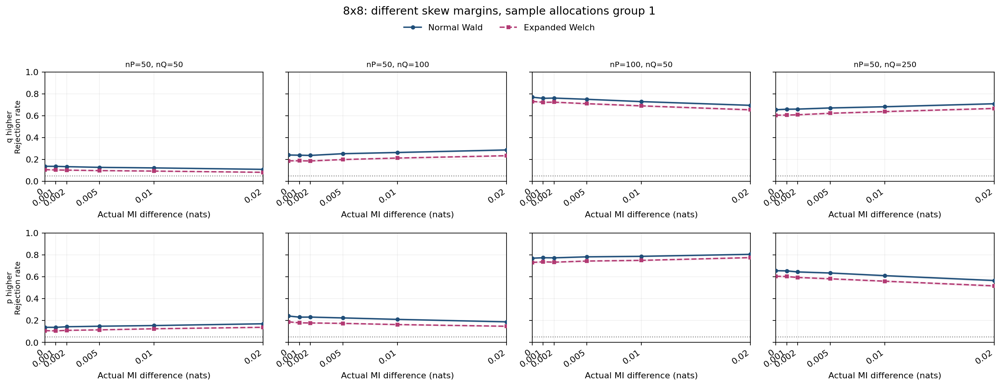

| Specification | Setting |
| --- | --- |
| Table size | 8x8 |
| Horizontal graph regime specifications (columns) | nP=50, nQ=50, nP=50, nQ=100, nP=100, nQ=50, nP=50, nQ=250 |
| Vertical graph regime specifications (rows) | q higher: P row (0.7, 0.3/7 repeated 7 times), P column (0.7, 0.3/7 repeated 7 times); Q row (0.8, 0.2/7 repeated 7 times), Q column (0.8, 0.2/7 repeated 7 times); p higher: P row (0.7, 0.3/7 repeated 7 times), P column (0.7, 0.3/7 repeated 7 times); Q row (0.8, 0.2/7 repeated 7 times), Q column (0.8, 0.2/7 repeated 7 times) |
| Probability changes | q higher: add at (1,1),(2,2) and subtract at (1,2),(2,1), for both P and Q; p higher: add at (1,1),(2,2) and subtract at (1,2),(2,1), for both P and Q |
| MI settings | Baseline MI {0.02}; direction {q higher, p higher}; actual differences {0, 0.001, 0.002, 0.005, 0.01, 0.02} nats |
| Horizontal axis within each graph | Actual MI difference in nats, fixed from 0 to 0.02 |
| Vertical axis within each graph | Unconditional rejection rate from 0 to 1; invalid results count as non-rejections |
| Replicates | 20,000 per unique point |

Null-point rejection and validity:

| Vertical regime | Horizontal regime | x | Method | Rejection | Valid |
| --- | --- | --- | --- | --- | --- |
| q higher | nP=50, nQ=50 | 0 | Expanded Welch | 0.1080 | 1.0000 |
| q higher | nP=50, nQ=50 | 0 | Normal Wald | 0.1391 | 1.0000 |
| q higher | nP=50, nQ=100 | 0 | Expanded Welch | 0.1886 | 1.0000 |
| q higher | nP=50, nQ=100 | 0 | Normal Wald | 0.2417 | 1.0000 |
| q higher | nP=100, nQ=50 | 0 | Expanded Welch | 0.7307 | 1.0000 |
| q higher | nP=100, nQ=50 | 0 | Normal Wald | 0.7695 | 1.0000 |
| q higher | nP=50, nQ=250 | 0 | Expanded Welch | 0.6046 | 1.0000 |
| q higher | nP=50, nQ=250 | 0 | Normal Wald | 0.6552 | 1.0000 |
| p higher | nP=50, nQ=50 | 0 | Expanded Welch | 0.1080 | 1.0000 |
| p higher | nP=50, nQ=50 | 0 | Normal Wald | 0.1391 | 1.0000 |
| p higher | nP=50, nQ=100 | 0 | Expanded Welch | 0.1886 | 1.0000 |
| p higher | nP=50, nQ=100 | 0 | Normal Wald | 0.2417 | 1.0000 |
| p higher | nP=100, nQ=50 | 0 | Expanded Welch | 0.7307 | 1.0000 |
| p higher | nP=100, nQ=50 | 0 | Normal Wald | 0.7695 | 1.0000 |
| p higher | nP=50, nQ=250 | 0 | Expanded Welch | 0.6046 | 1.0000 |
| p higher | nP=50, nQ=250 | 0 | Normal Wald | 0.6552 | 1.0000 |

Every plotted rate, interval, validity and minimum expected count

| Vertical regime | Horizontal regime | x | Method | Rejection | 95% interval | Valid | Conditional | Min expected P | Min expected Q |
| --- | --- | --- | --- | --- | --- | --- | --- | --- | --- |
| q higher | nP=50, nQ=50 | 0 | Expanded Welch | 0.1080 | [0.1038, 0.1124] | 1.0000 | 0.1080 | 0.09184 | 0.04082 |
| q higher | nP=50, nQ=50 | 0 | Normal Wald | 0.1391 | [0.1343, 0.1439] | 1.0000 | 0.1391 | 0.09184 | 0.04082 |
| q higher | nP=50, nQ=50 | 0.001 | Expanded Welch | 0.1051 | [0.1009, 0.1094] | 1.0000 | 0.1051 | 0.09184 | 0.04082 |
| q higher | nP=50, nQ=50 | 0.001 | Normal Wald | 0.1382 | [0.1335, 0.1431] | 1.0000 | 0.1382 | 0.09184 | 0.04082 |
| q higher | nP=50, nQ=50 | 0.002 | Expanded Welch | 0.1036 | [0.0994, 0.1078] | 1.0000 | 0.1036 | 0.09184 | 0.04082 |
| q higher | nP=50, nQ=50 | 0.002 | Normal Wald | 0.1353 | [0.1306, 0.1401] | 1.0000 | 0.1353 | 0.09184 | 0.04082 |
| q higher | nP=50, nQ=50 | 0.005 | Expanded Welch | 0.0993 | [0.0952, 0.1035] | 1.0000 | 0.0993 | 0.09184 | 0.04082 |
| q higher | nP=50, nQ=50 | 0.005 | Normal Wald | 0.1290 | [0.1244, 0.1337] | 1.0000 | 0.1290 | 0.09184 | 0.04082 |
| q higher | nP=50, nQ=50 | 0.01 | Expanded Welch | 0.0949 | [0.0909, 0.0990] | 0.9999 | 0.0949 | 0.09184 | 0.04082 |
| q higher | nP=50, nQ=50 | 0.01 | Normal Wald | 0.1240 | [0.1195, 0.1286] | 1.0000 | 0.1240 | 0.09184 | 0.04082 |
| q higher | nP=50, nQ=50 | 0.02 | Expanded Welch | 0.0837 | [0.0799, 0.0876] | 0.9999 | 0.0837 | 0.09184 | 0.04082 |
| q higher | nP=50, nQ=50 | 0.02 | Normal Wald | 0.1107 | [0.1064, 0.1151] | 1.0000 | 0.1107 | 0.09184 | 0.04082 |
| q higher | nP=50, nQ=100 | 0 | Expanded Welch | 0.1886 | [0.1832, 0.1941] | 1.0000 | 0.1886 | 0.09184 | 0.08163 |
| q higher | nP=50, nQ=100 | 0 | Normal Wald | 0.2417 | [0.2358, 0.2477] | 1.0000 | 0.2417 | 0.09184 | 0.08163 |
| q higher | nP=50, nQ=100 | 0.001 | Expanded Welch | 0.1891 | [0.1837, 0.1946] | 1.0000 | 0.1891 | 0.09184 | 0.08163 |
| q higher | nP=50, nQ=100 | 0.001 | Normal Wald | 0.2399 | [0.2341, 0.2459] | 1.0000 | 0.2399 | 0.09184 | 0.08163 |
| q higher | nP=50, nQ=100 | 0.002 | Expanded Welch | 0.1875 | [0.1821, 0.1929] | 1.0000 | 0.1875 | 0.09184 | 0.08163 |
| q higher | nP=50, nQ=100 | 0.002 | Normal Wald | 0.2380 | [0.2321, 0.2440] | 1.0000 | 0.2380 | 0.09184 | 0.08163 |
| q higher | nP=50, nQ=100 | 0.005 | Expanded Welch | 0.2003 | [0.1948, 0.2059] | 1.0000 | 0.2003 | 0.09184 | 0.08163 |
| q higher | nP=50, nQ=100 | 0.005 | Normal Wald | 0.2537 | [0.2478, 0.2598] | 1.0000 | 0.2537 | 0.09184 | 0.08163 |
| q higher | nP=50, nQ=100 | 0.01 | Expanded Welch | 0.2139 | [0.2082, 0.2196] | 1.0000 | 0.2139 | 0.09184 | 0.08163 |
| q higher | nP=50, nQ=100 | 0.01 | Normal Wald | 0.2646 | [0.2586, 0.2708] | 1.0000 | 0.2646 | 0.09184 | 0.08163 |
| q higher | nP=50, nQ=100 | 0.02 | Expanded Welch | 0.2352 | [0.2294, 0.2412] | 1.0000 | 0.2352 | 0.09184 | 0.08163 |
| q higher | nP=50, nQ=100 | 0.02 | Normal Wald | 0.2878 | [0.2816, 0.2942] | 1.0000 | 0.2878 | 0.09184 | 0.08163 |
| q higher | nP=100, nQ=50 | 0 | Expanded Welch | 0.7307 | [0.7245, 0.7368] | 1.0000 | 0.7307 | 0.1837 | 0.04082 |
| q higher | nP=100, nQ=50 | 0 | Normal Wald | 0.7695 | [0.7637, 0.7753] | 1.0000 | 0.7695 | 0.1837 | 0.04082 |
| q higher | nP=100, nQ=50 | 0.001 | Expanded Welch | 0.7228 | [0.7166, 0.7290] | 1.0000 | 0.7228 | 0.1837 | 0.04082 |
| q higher | nP=100, nQ=50 | 0.001 | Normal Wald | 0.7591 | [0.7531, 0.7650] | 1.0000 | 0.7591 | 0.1837 | 0.04082 |
| q higher | nP=100, nQ=50 | 0.002 | Expanded Welch | 0.7240 | [0.7178, 0.7302] | 1.0000 | 0.7240 | 0.1837 | 0.04082 |
| q higher | nP=100, nQ=50 | 0.002 | Normal Wald | 0.7614 | [0.7555, 0.7673] | 1.0000 | 0.7614 | 0.1837 | 0.04082 |
| q higher | nP=100, nQ=50 | 0.005 | Expanded Welch | 0.7101 | [0.7038, 0.7163] | 0.9999 | 0.7102 | 0.1837 | 0.04082 |
| q higher | nP=100, nQ=50 | 0.005 | Normal Wald | 0.7503 | [0.7443, 0.7563] | 1.0000 | 0.7503 | 0.1837 | 0.04082 |
| q higher | nP=100, nQ=50 | 0.01 | Expanded Welch | 0.6902 | [0.6837, 0.6965] | 1.0000 | 0.6902 | 0.1837 | 0.04082 |
| q higher | nP=100, nQ=50 | 0.01 | Normal Wald | 0.7291 | [0.7229, 0.7353] | 1.0000 | 0.7291 | 0.1837 | 0.04082 |
| q higher | nP=100, nQ=50 | 0.02 | Expanded Welch | 0.6541 | [0.6475, 0.6607] | 1.0000 | 0.6541 | 0.1837 | 0.04082 |
| q higher | nP=100, nQ=50 | 0.02 | Normal Wald | 0.6952 | [0.6887, 0.7015] | 1.0000 | 0.6952 | 0.1837 | 0.04082 |
| q higher | nP=50, nQ=250 | 0 | Expanded Welch | 0.6046 | [0.5978, 0.6114] | 1.0000 | 0.6046 | 0.09184 | 0.2041 |
| q higher | nP=50, nQ=250 | 0 | Normal Wald | 0.6552 | [0.6486, 0.6618] | 1.0000 | 0.6552 | 0.09184 | 0.2041 |
| q higher | nP=50, nQ=250 | 0.001 | Expanded Welch | 0.6061 | [0.5994, 0.6129] | 1.0000 | 0.6061 | 0.09184 | 0.2041 |
| q higher | nP=50, nQ=250 | 0.001 | Normal Wald | 0.6595 | [0.6530, 0.6661] | 1.0000 | 0.6595 | 0.09184 | 0.2041 |
| q higher | nP=50, nQ=250 | 0.002 | Expanded Welch | 0.6089 | [0.6021, 0.6156] | 1.0000 | 0.6089 | 0.09184 | 0.2041 |
| q higher | nP=50, nQ=250 | 0.002 | Normal Wald | 0.6608 | [0.6542, 0.6673] | 1.0000 | 0.6608 | 0.09184 | 0.2041 |
| q higher | nP=50, nQ=250 | 0.005 | Expanded Welch | 0.6227 | [0.6159, 0.6293] | 1.0000 | 0.6227 | 0.09184 | 0.2041 |
| q higher | nP=50, nQ=250 | 0.005 | Normal Wald | 0.6712 | [0.6647, 0.6777] | 1.0000 | 0.6712 | 0.09184 | 0.2041 |
| q higher | nP=50, nQ=250 | 0.01 | Expanded Welch | 0.6380 | [0.6313, 0.6446] | 1.0000 | 0.6380 | 0.09184 | 0.2041 |
| q higher | nP=50, nQ=250 | 0.01 | Normal Wald | 0.6823 | [0.6758, 0.6887] | 1.0000 | 0.6823 | 0.09184 | 0.2041 |
| q higher | nP=50, nQ=250 | 0.02 | Expanded Welch | 0.6665 | [0.6600, 0.6731] | 1.0000 | 0.6665 | 0.09184 | 0.2041 |
| q higher | nP=50, nQ=250 | 0.02 | Normal Wald | 0.7096 | [0.7032, 0.7158] | 1.0000 | 0.7096 | 0.09184 | 0.2041 |
| p higher | nP=50, nQ=50 | 0 | Expanded Welch | 0.1080 | [0.1038, 0.1124] | 1.0000 | 0.1080 | 0.09184 | 0.04082 |
| p higher | nP=50, nQ=50 | 0 | Normal Wald | 0.1391 | [0.1343, 0.1439] | 1.0000 | 0.1391 | 0.09184 | 0.04082 |
| p higher | nP=50, nQ=50 | 0.001 | Expanded Welch | 0.1063 | [0.1021, 0.1106] | 1.0000 | 0.1063 | 0.09184 | 0.04082 |
| p higher | nP=50, nQ=50 | 0.001 | Normal Wald | 0.1383 | [0.1335, 0.1431] | 1.0000 | 0.1383 | 0.09184 | 0.04082 |
| p higher | nP=50, nQ=50 | 0.002 | Expanded Welch | 0.1108 | [0.1065, 0.1152] | 1.0000 | 0.1108 | 0.09184 | 0.04082 |
| p higher | nP=50, nQ=50 | 0.002 | Normal Wald | 0.1439 | [0.1391, 0.1488] | 1.0000 | 0.1439 | 0.09184 | 0.04082 |
| p higher | nP=50, nQ=50 | 0.005 | Expanded Welch | 0.1153 | [0.1109, 0.1198] | 1.0000 | 0.1153 | 0.09184 | 0.04082 |
| p higher | nP=50, nQ=50 | 0.005 | Normal Wald | 0.1485 | [0.1437, 0.1535] | 1.0000 | 0.1485 | 0.09184 | 0.04082 |
| p higher | nP=50, nQ=50 | 0.01 | Expanded Welch | 0.1253 | [0.1208, 0.1300] | 0.9999 | 0.1253 | 0.09184 | 0.04082 |
| p higher | nP=50, nQ=50 | 0.01 | Normal Wald | 0.1547 | [0.1498, 0.1598] | 1.0000 | 0.1547 | 0.09184 | 0.04082 |
| p higher | nP=50, nQ=50 | 0.02 | Expanded Welch | 0.1386 | [0.1339, 0.1435] | 1.0000 | 0.1386 | 0.09184 | 0.04082 |
| p higher | nP=50, nQ=50 | 0.02 | Normal Wald | 0.1709 | [0.1657, 0.1761] | 1.0000 | 0.1709 | 0.09184 | 0.04082 |
| p higher | nP=50, nQ=100 | 0 | Expanded Welch | 0.1886 | [0.1832, 0.1941] | 1.0000 | 0.1886 | 0.09184 | 0.08163 |
| p higher | nP=50, nQ=100 | 0 | Normal Wald | 0.2417 | [0.2358, 0.2477] | 1.0000 | 0.2417 | 0.09184 | 0.08163 |
| p higher | nP=50, nQ=100 | 0.001 | Expanded Welch | 0.1796 | [0.1743, 0.1850] | 1.0000 | 0.1796 | 0.09184 | 0.08163 |
| p higher | nP=50, nQ=100 | 0.001 | Normal Wald | 0.2314 | [0.2256, 0.2372] | 1.0000 | 0.2314 | 0.09184 | 0.08163 |
| p higher | nP=50, nQ=100 | 0.002 | Expanded Welch | 0.1782 | [0.1730, 0.1836] | 1.0000 | 0.1782 | 0.09184 | 0.08163 |
| p higher | nP=50, nQ=100 | 0.002 | Normal Wald | 0.2320 | [0.2262, 0.2379] | 1.0000 | 0.2320 | 0.09184 | 0.08163 |
| p higher | nP=50, nQ=100 | 0.005 | Expanded Welch | 0.1745 | [0.1693, 0.1798] | 1.0000 | 0.1745 | 0.09184 | 0.08163 |
| p higher | nP=50, nQ=100 | 0.005 | Normal Wald | 0.2243 | [0.2186, 0.2301] | 1.0000 | 0.2243 | 0.09184 | 0.08163 |
| p higher | nP=50, nQ=100 | 0.01 | Expanded Welch | 0.1636 | [0.1585, 0.1687] | 1.0000 | 0.1636 | 0.09184 | 0.08163 |
| p higher | nP=50, nQ=100 | 0.01 | Normal Wald | 0.2109 | [0.2054, 0.2167] | 1.0000 | 0.2109 | 0.09184 | 0.08163 |
| p higher | nP=50, nQ=100 | 0.02 | Expanded Welch | 0.1480 | [0.1432, 0.1530] | 1.0000 | 0.1480 | 0.09184 | 0.08163 |
| p higher | nP=50, nQ=100 | 0.02 | Normal Wald | 0.1885 | [0.1831, 0.1940] | 1.0000 | 0.1885 | 0.09184 | 0.08163 |
| p higher | nP=100, nQ=50 | 0 | Expanded Welch | 0.7307 | [0.7245, 0.7368] | 1.0000 | 0.7307 | 0.1837 | 0.04082 |
| p higher | nP=100, nQ=50 | 0 | Normal Wald | 0.7695 | [0.7637, 0.7753] | 1.0000 | 0.7695 | 0.1837 | 0.04082 |
| p higher | nP=100, nQ=50 | 0.001 | Expanded Welch | 0.7366 | [0.7305, 0.7427] | 0.9999 | 0.7367 | 0.1837 | 0.04082 |
| p higher | nP=100, nQ=50 | 0.001 | Normal Wald | 0.7737 | [0.7678, 0.7794] | 1.0000 | 0.7737 | 0.1837 | 0.04082 |
| p higher | nP=100, nQ=50 | 0.002 | Expanded Welch | 0.7330 | [0.7269, 0.7391] | 1.0000 | 0.7330 | 0.1837 | 0.04082 |
| p higher | nP=100, nQ=50 | 0.002 | Normal Wald | 0.7729 | [0.7670, 0.7786] | 1.0000 | 0.7729 | 0.1837 | 0.04082 |
| p higher | nP=100, nQ=50 | 0.005 | Expanded Welch | 0.7435 | [0.7374, 0.7495] | 1.0000 | 0.7435 | 0.1837 | 0.04082 |
| p higher | nP=100, nQ=50 | 0.005 | Normal Wald | 0.7819 | [0.7761, 0.7876] | 1.0000 | 0.7819 | 0.1837 | 0.04082 |
| p higher | nP=100, nQ=50 | 0.01 | Expanded Welch | 0.7497 | [0.7436, 0.7556] | 1.0000 | 0.7497 | 0.1837 | 0.04082 |
| p higher | nP=100, nQ=50 | 0.01 | Normal Wald | 0.7864 | [0.7807, 0.7921] | 1.0000 | 0.7864 | 0.1837 | 0.04082 |
| p higher | nP=100, nQ=50 | 0.02 | Expanded Welch | 0.7748 | [0.7689, 0.7805] | 1.0000 | 0.7748 | 0.1837 | 0.04082 |
| p higher | nP=100, nQ=50 | 0.02 | Normal Wald | 0.8048 | [0.7992, 0.8102] | 1.0000 | 0.8048 | 0.1837 | 0.04082 |
| p higher | nP=50, nQ=250 | 0 | Expanded Welch | 0.6046 | [0.5978, 0.6114] | 1.0000 | 0.6046 | 0.09184 | 0.2041 |
| p higher | nP=50, nQ=250 | 0 | Normal Wald | 0.6552 | [0.6486, 0.6618] | 1.0000 | 0.6552 | 0.09184 | 0.2041 |
| p higher | nP=50, nQ=250 | 0.001 | Expanded Welch | 0.6020 | [0.5952, 0.6088] | 1.0000 | 0.6020 | 0.09184 | 0.2041 |
| p higher | nP=50, nQ=250 | 0.001 | Normal Wald | 0.6539 | [0.6472, 0.6604] | 1.0000 | 0.6539 | 0.09184 | 0.2041 |
| p higher | nP=50, nQ=250 | 0.002 | Expanded Welch | 0.5938 | [0.5870, 0.6006] | 1.0000 | 0.5938 | 0.09184 | 0.2041 |
| p higher | nP=50, nQ=250 | 0.002 | Normal Wald | 0.6441 | [0.6374, 0.6507] | 1.0000 | 0.6441 | 0.09184 | 0.2041 |
| p higher | nP=50, nQ=250 | 0.005 | Expanded Welch | 0.5813 | [0.5744, 0.5881] | 1.0000 | 0.5813 | 0.09184 | 0.2041 |
| p higher | nP=50, nQ=250 | 0.005 | Normal Wald | 0.6342 | [0.6275, 0.6408] | 1.0000 | 0.6342 | 0.09184 | 0.2041 |
| p higher | nP=50, nQ=250 | 0.01 | Expanded Welch | 0.5595 | [0.5526, 0.5663] | 1.0000 | 0.5595 | 0.09184 | 0.2041 |
| p higher | nP=50, nQ=250 | 0.01 | Normal Wald | 0.6101 | [0.6033, 0.6168] | 1.0000 | 0.6101 | 0.09184 | 0.2041 |
| p higher | nP=50, nQ=250 | 0.02 | Expanded Welch | 0.5168 | [0.5099, 0.5237] | 1.0000 | 0.5168 | 0.09184 | 0.2041 |
| p higher | nP=50, nQ=250 | 0.02 | Normal Wald | 0.5657 | [0.5589, 0.5726] | 1.0000 | 0.5657 | 0.09184 | 0.2041 |

### 6.24 8x8: different skew margins, sample allocations group 2

Does performance depend on which population has more data or greater MI?

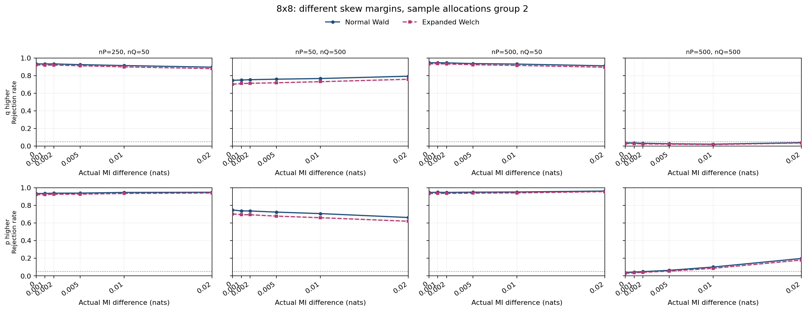

| Specification | Setting |
| --- | --- |
| Table size | 8x8 |
| Horizontal graph regime specifications (columns) | nP=250, nQ=50, nP=50, nQ=500, nP=500, nQ=50, nP=500, nQ=500 |
| Vertical graph regime specifications (rows) | q higher: P row (0.7, 0.3/7 repeated 7 times), P column (0.7, 0.3/7 repeated 7 times); Q row (0.8, 0.2/7 repeated 7 times), Q column (0.8, 0.2/7 repeated 7 times); p higher: P row (0.7, 0.3/7 repeated 7 times), P column (0.7, 0.3/7 repeated 7 times); Q row (0.8, 0.2/7 repeated 7 times), Q column (0.8, 0.2/7 repeated 7 times) |
| Probability changes | q higher: add at (1,1),(2,2) and subtract at (1,2),(2,1), for both P and Q; p higher: add at (1,1),(2,2) and subtract at (1,2),(2,1), for both P and Q |
| MI settings | Baseline MI {0.02}; direction {q higher, p higher}; actual differences {0, 0.001, 0.002, 0.005, 0.01, 0.02} nats |
| Horizontal axis within each graph | Actual MI difference in nats, fixed from 0 to 0.02 |
| Vertical axis within each graph | Unconditional rejection rate from 0 to 1; invalid results count as non-rejections |
| Replicates | 20,000 per unique point |

Null-point rejection and validity:

| Vertical regime | Horizontal regime | x | Method | Rejection | Valid |
| --- | --- | --- | --- | --- | --- |
| q higher | nP=250, nQ=50 | 0 | Expanded Welch | 0.9202 | 1.0000 |
| q higher | nP=250, nQ=50 | 0 | Normal Wald | 0.9333 | 1.0000 |
| q higher | nP=50, nQ=500 | 0 | Expanded Welch | 0.7026 | 1.0000 |
| q higher | nP=50, nQ=500 | 0 | Normal Wald | 0.7469 | 1.0000 |
| q higher | nP=500, nQ=50 | 0 | Expanded Welch | 0.9325 | 1.0000 |
| q higher | nP=500, nQ=50 | 0 | Normal Wald | 0.9457 | 1.0000 |
| q higher | nP=500, nQ=500 | 0 | Expanded Welch | 0.0300 | 1.0000 |
| q higher | nP=500, nQ=500 | 0 | Normal Wald | 0.0377 | 1.0000 |
| p higher | nP=250, nQ=50 | 0 | Expanded Welch | 0.9202 | 1.0000 |
| p higher | nP=250, nQ=50 | 0 | Normal Wald | 0.9333 | 1.0000 |
| p higher | nP=50, nQ=500 | 0 | Expanded Welch | 0.7026 | 1.0000 |
| p higher | nP=50, nQ=500 | 0 | Normal Wald | 0.7469 | 1.0000 |
| p higher | nP=500, nQ=50 | 0 | Expanded Welch | 0.9325 | 1.0000 |
| p higher | nP=500, nQ=50 | 0 | Normal Wald | 0.9457 | 1.0000 |
| p higher | nP=500, nQ=500 | 0 | Expanded Welch | 0.0300 | 1.0000 |
| p higher | nP=500, nQ=500 | 0 | Normal Wald | 0.0377 | 1.0000 |

Every plotted rate, interval, validity and minimum expected count

| Vertical regime | Horizontal regime | x | Method | Rejection | 95% interval | Valid | Conditional | Min expected P | Min expected Q |
| --- | --- | --- | --- | --- | --- | --- | --- | --- | --- |
| q higher | nP=250, nQ=50 | 0 | Expanded Welch | 0.9202 | [0.9164, 0.9239] | 1.0000 | 0.9202 | 0.4592 | 0.04082 |
| q higher | nP=250, nQ=50 | 0 | Normal Wald | 0.9333 | [0.9297, 0.9366] | 1.0000 | 0.9333 | 0.4592 | 0.04082 |
| q higher | nP=250, nQ=50 | 0.001 | Expanded Welch | 0.9187 | [0.9148, 0.9224] | 1.0000 | 0.9187 | 0.4592 | 0.04082 |
| q higher | nP=250, nQ=50 | 0.001 | Normal Wald | 0.9320 | [0.9284, 0.9354] | 1.0000 | 0.9320 | 0.4592 | 0.04082 |
| q higher | nP=250, nQ=50 | 0.002 | Expanded Welch | 0.9192 | [0.9153, 0.9228] | 0.9999 | 0.9192 | 0.4592 | 0.04082 |
| q higher | nP=250, nQ=50 | 0.002 | Normal Wald | 0.9327 | [0.9291, 0.9361] | 1.0000 | 0.9327 | 0.4592 | 0.04082 |
| q higher | nP=250, nQ=50 | 0.005 | Expanded Welch | 0.9115 | [0.9075, 0.9154] | 1.0000 | 0.9115 | 0.4592 | 0.04082 |
| q higher | nP=250, nQ=50 | 0.005 | Normal Wald | 0.9246 | [0.9209, 0.9282] | 1.0000 | 0.9246 | 0.4592 | 0.04082 |
| q higher | nP=250, nQ=50 | 0.01 | Expanded Welch | 0.8988 | [0.8945, 0.9029] | 0.9999 | 0.8988 | 0.4592 | 0.04082 |
| q higher | nP=250, nQ=50 | 0.01 | Normal Wald | 0.9141 | [0.9101, 0.9179] | 1.0000 | 0.9141 | 0.4592 | 0.04082 |
| q higher | nP=250, nQ=50 | 0.02 | Expanded Welch | 0.8790 | [0.8745, 0.8835] | 1.0000 | 0.8790 | 0.4592 | 0.04082 |
| q higher | nP=250, nQ=50 | 0.02 | Normal Wald | 0.8957 | [0.8914, 0.8999] | 1.0000 | 0.8957 | 0.4592 | 0.04082 |
| q higher | nP=50, nQ=500 | 0 | Expanded Welch | 0.7026 | [0.6963, 0.7089] | 1.0000 | 0.7026 | 0.09184 | 0.4082 |
| q higher | nP=50, nQ=500 | 0 | Normal Wald | 0.7469 | [0.7408, 0.7528] | 1.0000 | 0.7469 | 0.09184 | 0.4082 |
| q higher | nP=50, nQ=500 | 0.001 | Expanded Welch | 0.7100 | [0.7037, 0.7162] | 1.0000 | 0.7100 | 0.09184 | 0.4082 |
| q higher | nP=50, nQ=500 | 0.001 | Normal Wald | 0.7501 | [0.7441, 0.7561] | 1.0000 | 0.7501 | 0.09184 | 0.4082 |
| q higher | nP=50, nQ=500 | 0.002 | Expanded Welch | 0.7132 | [0.7069, 0.7194] | 1.0000 | 0.7132 | 0.09184 | 0.4082 |
| q higher | nP=50, nQ=500 | 0.002 | Normal Wald | 0.7539 | [0.7478, 0.7598] | 1.0000 | 0.7539 | 0.09184 | 0.4082 |
| q higher | nP=50, nQ=500 | 0.005 | Expanded Welch | 0.7190 | [0.7127, 0.7252] | 1.0000 | 0.7190 | 0.09184 | 0.4082 |
| q higher | nP=50, nQ=500 | 0.005 | Normal Wald | 0.7594 | [0.7535, 0.7653] | 1.0000 | 0.7594 | 0.09184 | 0.4082 |
| q higher | nP=50, nQ=500 | 0.01 | Expanded Welch | 0.7312 | [0.7251, 0.7373] | 1.0000 | 0.7312 | 0.09184 | 0.4082 |
| q higher | nP=50, nQ=500 | 0.01 | Normal Wald | 0.7671 | [0.7612, 0.7730] | 1.0000 | 0.7671 | 0.09184 | 0.4082 |
| q higher | nP=50, nQ=500 | 0.02 | Expanded Welch | 0.7587 | [0.7527, 0.7646] | 1.0000 | 0.7587 | 0.09184 | 0.4082 |
| q higher | nP=50, nQ=500 | 0.02 | Normal Wald | 0.7932 | [0.7875, 0.7988] | 1.0000 | 0.7932 | 0.09184 | 0.4082 |
| q higher | nP=500, nQ=50 | 0 | Expanded Welch | 0.9325 | [0.9290, 0.9359] | 1.0000 | 0.9325 | 0.9184 | 0.04082 |
| q higher | nP=500, nQ=50 | 0 | Normal Wald | 0.9457 | [0.9425, 0.9488] | 1.0000 | 0.9457 | 0.9184 | 0.04082 |
| q higher | nP=500, nQ=50 | 0.001 | Expanded Welch | 0.9339 | [0.9304, 0.9373] | 1.0000 | 0.9340 | 0.9184 | 0.04082 |
| q higher | nP=500, nQ=50 | 0.001 | Normal Wald | 0.9458 | [0.9426, 0.9489] | 1.0000 | 0.9458 | 0.9184 | 0.04082 |
| q higher | nP=500, nQ=50 | 0.002 | Expanded Welch | 0.9319 | [0.9284, 0.9354] | 1.0000 | 0.9319 | 0.9184 | 0.04082 |
| q higher | nP=500, nQ=50 | 0.002 | Normal Wald | 0.9447 | [0.9414, 0.9478] | 1.0000 | 0.9447 | 0.9184 | 0.04082 |
| q higher | nP=500, nQ=50 | 0.005 | Expanded Welch | 0.9229 | [0.9191, 0.9265] | 0.9999 | 0.9230 | 0.9184 | 0.04082 |
| q higher | nP=500, nQ=50 | 0.005 | Normal Wald | 0.9363 | [0.9328, 0.9396] | 1.0000 | 0.9363 | 0.9184 | 0.04082 |
| q higher | nP=500, nQ=50 | 0.01 | Expanded Welch | 0.9152 | [0.9112, 0.9189] | 1.0000 | 0.9152 | 0.9184 | 0.04082 |
| q higher | nP=500, nQ=50 | 0.01 | Normal Wald | 0.9307 | [0.9271, 0.9342] | 1.0000 | 0.9307 | 0.9184 | 0.04082 |
| q higher | nP=500, nQ=50 | 0.02 | Expanded Welch | 0.8949 | [0.8906, 0.8991] | 1.0000 | 0.8949 | 0.9184 | 0.04082 |
| q higher | nP=500, nQ=50 | 0.02 | Normal Wald | 0.9111 | [0.9071, 0.9150] | 1.0000 | 0.9111 | 0.9184 | 0.04082 |
| q higher | nP=500, nQ=500 | 0 | Expanded Welch | 0.0300 | [0.0277, 0.0324] | 1.0000 | 0.0300 | 0.9184 | 0.4082 |
| q higher | nP=500, nQ=500 | 0 | Normal Wald | 0.0377 | [0.0352, 0.0405] | 1.0000 | 0.0377 | 0.9184 | 0.4082 |
| q higher | nP=500, nQ=500 | 0.001 | Expanded Welch | 0.0295 | [0.0272, 0.0319] | 1.0000 | 0.0295 | 0.9184 | 0.4082 |
| q higher | nP=500, nQ=500 | 0.001 | Normal Wald | 0.0369 | [0.0344, 0.0396] | 1.0000 | 0.0369 | 0.9184 | 0.4082 |
| q higher | nP=500, nQ=500 | 0.002 | Expanded Welch | 0.0256 | [0.0235, 0.0279] | 1.0000 | 0.0256 | 0.9184 | 0.4082 |
| q higher | nP=500, nQ=500 | 0.002 | Normal Wald | 0.0336 | [0.0312, 0.0362] | 1.0000 | 0.0336 | 0.9184 | 0.4082 |
| q higher | nP=500, nQ=500 | 0.005 | Expanded Welch | 0.0229 | [0.0209, 0.0251] | 1.0000 | 0.0229 | 0.9184 | 0.4082 |
| q higher | nP=500, nQ=500 | 0.005 | Normal Wald | 0.0279 | [0.0258, 0.0303] | 1.0000 | 0.0279 | 0.9184 | 0.4082 |
| q higher | nP=500, nQ=500 | 0.01 | Expanded Welch | 0.0185 | [0.0167, 0.0205] | 1.0000 | 0.0185 | 0.9184 | 0.4082 |
| q higher | nP=500, nQ=500 | 0.01 | Normal Wald | 0.0234 | [0.0214, 0.0256] | 1.0000 | 0.0234 | 0.9184 | 0.4082 |
| q higher | nP=500, nQ=500 | 0.02 | Expanded Welch | 0.0365 | [0.0340, 0.0392] | 1.0000 | 0.0365 | 0.9184 | 0.4082 |
| q higher | nP=500, nQ=500 | 0.02 | Normal Wald | 0.0409 | [0.0382, 0.0437] | 1.0000 | 0.0409 | 0.9184 | 0.4082 |
| p higher | nP=250, nQ=50 | 0 | Expanded Welch | 0.9202 | [0.9164, 0.9239] | 1.0000 | 0.9202 | 0.4592 | 0.04082 |
| p higher | nP=250, nQ=50 | 0 | Normal Wald | 0.9333 | [0.9297, 0.9366] | 1.0000 | 0.9333 | 0.4592 | 0.04082 |
| p higher | nP=250, nQ=50 | 0.001 | Expanded Welch | 0.9216 | [0.9178, 0.9253] | 1.0000 | 0.9217 | 0.4592 | 0.04082 |
| p higher | nP=250, nQ=50 | 0.001 | Normal Wald | 0.9352 | [0.9317, 0.9385] | 1.0000 | 0.9352 | 0.4592 | 0.04082 |
| p higher | nP=250, nQ=50 | 0.002 | Expanded Welch | 0.9252 | [0.9214, 0.9287] | 1.0000 | 0.9252 | 0.4592 | 0.04082 |
| p higher | nP=250, nQ=50 | 0.002 | Normal Wald | 0.9380 | [0.9346, 0.9413] | 1.0000 | 0.9380 | 0.4592 | 0.04082 |
| p higher | nP=250, nQ=50 | 0.005 | Expanded Welch | 0.9265 | [0.9229, 0.9301] | 1.0000 | 0.9265 | 0.4592 | 0.04082 |
| p higher | nP=250, nQ=50 | 0.005 | Normal Wald | 0.9388 | [0.9354, 0.9420] | 1.0000 | 0.9388 | 0.4592 | 0.04082 |
| p higher | nP=250, nQ=50 | 0.01 | Expanded Welch | 0.9341 | [0.9306, 0.9375] | 1.0000 | 0.9341 | 0.4592 | 0.04082 |
| p higher | nP=250, nQ=50 | 0.01 | Normal Wald | 0.9463 | [0.9430, 0.9493] | 1.0000 | 0.9463 | 0.4592 | 0.04082 |
| p higher | nP=250, nQ=50 | 0.02 | Expanded Welch | 0.9396 | [0.9363, 0.9429] | 0.9999 | 0.9397 | 0.4592 | 0.04082 |
| p higher | nP=250, nQ=50 | 0.02 | Normal Wald | 0.9482 | [0.9450, 0.9512] | 1.0000 | 0.9482 | 0.4592 | 0.04082 |
| p higher | nP=50, nQ=500 | 0 | Expanded Welch | 0.7026 | [0.6963, 0.7089] | 1.0000 | 0.7026 | 0.09184 | 0.4082 |
| p higher | nP=50, nQ=500 | 0 | Normal Wald | 0.7469 | [0.7408, 0.7528] | 1.0000 | 0.7469 | 0.09184 | 0.4082 |
| p higher | nP=50, nQ=500 | 0.001 | Expanded Welch | 0.6940 | [0.6876, 0.7004] | 1.0000 | 0.6940 | 0.09184 | 0.4082 |
| p higher | nP=50, nQ=500 | 0.001 | Normal Wald | 0.7370 | [0.7309, 0.7431] | 1.0000 | 0.7370 | 0.09184 | 0.4082 |
| p higher | nP=50, nQ=500 | 0.002 | Expanded Welch | 0.6933 | [0.6869, 0.6997] | 1.0000 | 0.6933 | 0.09184 | 0.4082 |
| p higher | nP=50, nQ=500 | 0.002 | Normal Wald | 0.7361 | [0.7300, 0.7422] | 1.0000 | 0.7361 | 0.09184 | 0.4082 |
| p higher | nP=50, nQ=500 | 0.005 | Expanded Welch | 0.6778 | [0.6713, 0.6842] | 1.0000 | 0.6778 | 0.09184 | 0.4082 |
| p higher | nP=50, nQ=500 | 0.005 | Normal Wald | 0.7232 | [0.7170, 0.7294] | 1.0000 | 0.7232 | 0.09184 | 0.4082 |
| p higher | nP=50, nQ=500 | 0.01 | Expanded Welch | 0.6600 | [0.6534, 0.6665] | 1.0000 | 0.6600 | 0.09184 | 0.4082 |
| p higher | nP=50, nQ=500 | 0.01 | Normal Wald | 0.7065 | [0.7001, 0.7127] | 1.0000 | 0.7065 | 0.09184 | 0.4082 |
| p higher | nP=50, nQ=500 | 0.02 | Expanded Welch | 0.6199 | [0.6132, 0.6266] | 1.0000 | 0.6199 | 0.09184 | 0.4082 |
| p higher | nP=50, nQ=500 | 0.02 | Normal Wald | 0.6621 | [0.6555, 0.6686] | 1.0000 | 0.6621 | 0.09184 | 0.4082 |
| p higher | nP=500, nQ=50 | 0 | Expanded Welch | 0.9325 | [0.9290, 0.9359] | 1.0000 | 0.9325 | 0.9184 | 0.04082 |
| p higher | nP=500, nQ=50 | 0 | Normal Wald | 0.9457 | [0.9425, 0.9488] | 1.0000 | 0.9457 | 0.9184 | 0.04082 |
| p higher | nP=500, nQ=50 | 0.001 | Expanded Welch | 0.9360 | [0.9325, 0.9393] | 1.0000 | 0.9360 | 0.9184 | 0.04082 |
| p higher | nP=500, nQ=50 | 0.001 | Normal Wald | 0.9485 | [0.9453, 0.9515] | 1.0000 | 0.9485 | 0.9184 | 0.04082 |
| p higher | nP=500, nQ=50 | 0.002 | Expanded Welch | 0.9346 | [0.9311, 0.9380] | 1.0000 | 0.9346 | 0.9184 | 0.04082 |
| p higher | nP=500, nQ=50 | 0.002 | Normal Wald | 0.9466 | [0.9434, 0.9496] | 1.0000 | 0.9466 | 0.9184 | 0.04082 |
| p higher | nP=500, nQ=50 | 0.005 | Expanded Welch | 0.9379 | [0.9345, 0.9412] | 0.9999 | 0.9380 | 0.9184 | 0.04082 |
| p higher | nP=500, nQ=50 | 0.005 | Normal Wald | 0.9492 | [0.9461, 0.9522] | 1.0000 | 0.9492 | 0.9184 | 0.04082 |
| p higher | nP=500, nQ=50 | 0.01 | Expanded Welch | 0.9408 | [0.9374, 0.9440] | 1.0000 | 0.9408 | 0.9184 | 0.04082 |
| p higher | nP=500, nQ=50 | 0.01 | Normal Wald | 0.9513 | [0.9482, 0.9541] | 1.0000 | 0.9513 | 0.9184 | 0.04082 |
| p higher | nP=500, nQ=50 | 0.02 | Expanded Welch | 0.9549 | [0.9520, 0.9577] | 1.0000 | 0.9549 | 0.9184 | 0.04082 |
| p higher | nP=500, nQ=50 | 0.02 | Normal Wald | 0.9623 | [0.9596, 0.9649] | 1.0000 | 0.9623 | 0.9184 | 0.04082 |
| p higher | nP=500, nQ=500 | 0 | Expanded Welch | 0.0300 | [0.0277, 0.0324] | 1.0000 | 0.0300 | 0.9184 | 0.4082 |
| p higher | nP=500, nQ=500 | 0 | Normal Wald | 0.0377 | [0.0352, 0.0405] | 1.0000 | 0.0377 | 0.9184 | 0.4082 |
| p higher | nP=500, nQ=500 | 0.001 | Expanded Welch | 0.0350 | [0.0325, 0.0376] | 1.0000 | 0.0350 | 0.9184 | 0.4082 |
| p higher | nP=500, nQ=500 | 0.001 | Normal Wald | 0.0437 | [0.0410, 0.0467] | 1.0000 | 0.0437 | 0.9184 | 0.4082 |
| p higher | nP=500, nQ=500 | 0.002 | Expanded Welch | 0.0407 | [0.0380, 0.0435] | 1.0000 | 0.0407 | 0.9184 | 0.4082 |
| p higher | nP=500, nQ=500 | 0.002 | Normal Wald | 0.0491 | [0.0462, 0.0522] | 1.0000 | 0.0491 | 0.9184 | 0.4082 |
| p higher | nP=500, nQ=500 | 0.005 | Expanded Welch | 0.0546 | [0.0515, 0.0578] | 1.0000 | 0.0546 | 0.9184 | 0.4082 |
| p higher | nP=500, nQ=500 | 0.005 | Normal Wald | 0.0640 | [0.0607, 0.0675] | 1.0000 | 0.0640 | 0.9184 | 0.4082 |
| p higher | nP=500, nQ=500 | 0.01 | Expanded Welch | 0.0864 | [0.0826, 0.0904] | 1.0000 | 0.0864 | 0.9184 | 0.4082 |
| p higher | nP=500, nQ=500 | 0.01 | Normal Wald | 0.1014 | [0.0973, 0.1057] | 1.0000 | 0.1014 | 0.9184 | 0.4082 |
| p higher | nP=500, nQ=500 | 0.02 | Expanded Welch | 0.1799 | [0.1747, 0.1853] | 1.0000 | 0.1799 | 0.9184 | 0.4082 |
| p higher | nP=500, nQ=500 | 0.02 | Normal Wald | 0.1978 | [0.1924, 0.2034] | 1.0000 | 0.1978 | 0.9184 | 0.4082 |

## 7. Larger MI differences

Do the power curves continue across larger actual MI differences?

### 7.1 2x2: uniform margins, broad MI range

Do the power curves continue across larger actual MI differences?

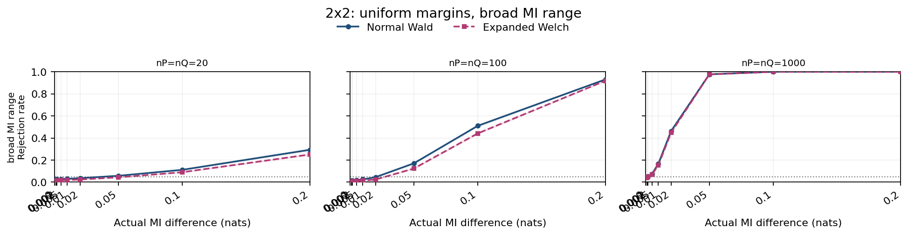

| Specification | Setting |
| --- | --- |
| Table size | 2x2 |
| Horizontal graph regime specifications (columns) | nP=nQ=20, nP=nQ=100, nP=nQ=1000 |
| Vertical graph regime specifications (rows) | broad MI range: P row (0.5 repeated 2 times), P column (0.5 repeated 2 times); Q row (0.5 repeated 2 times), Q column (0.5 repeated 2 times) |
| Probability changes | broad MI range: add at (1,1),(2,2) and subtract at (1,2),(2,1), for both P and Q |
| MI settings | Baseline MI {0.02}; direction {q higher}; actual differences {0, 0.001, 0.002, 0.005, 0.01, 0.02, 0.05, 0.1, 0.2} nats |
| Horizontal axis within each graph | Actual MI difference in nats, fixed from 0 to 0.2 |
| Vertical axis within each graph | Unconditional rejection rate from 0 to 1; invalid results count as non-rejections |
| Replicates | 20,000 per unique point |

Null-point rejection and validity:

| Vertical regime | Horizontal regime | x | Method | Rejection | Valid |
| --- | --- | --- | --- | --- | --- |
| broad MI range | nP=nQ=20 | 0 | Expanded Welch | 0.0164 | 0.9833 |
| broad MI range | nP=nQ=20 | 0 | Normal Wald | 0.0261 | 0.9977 |
| broad MI range | nP=nQ=100 | 0 | Expanded Welch | 0.0063 | 0.9991 |
| broad MI range | nP=nQ=100 | 0 | Normal Wald | 0.0142 | 1.0000 |
| broad MI range | nP=nQ=1000 | 0 | Expanded Welch | 0.0386 | 1.0000 |
| broad MI range | nP=nQ=1000 | 0 | Normal Wald | 0.0445 | 1.0000 |

Every plotted rate, interval, validity and minimum expected count

| Vertical regime | Horizontal regime | x | Method | Rejection | 95% interval | Valid | Conditional | Min expected P | Min expected Q |
| --- | --- | --- | --- | --- | --- | --- | --- | --- | --- |
| broad MI range | nP=nQ=20 | 0 | Expanded Welch | 0.0164 | [0.0147, 0.0183] | 0.9833 | 0.0167 | 4.003 | 4.003 |
| broad MI range | nP=nQ=20 | 0 | Normal Wald | 0.0261 | [0.0240, 0.0284] | 0.9977 | 0.0262 | 4.003 | 4.003 |
| broad MI range | nP=nQ=20 | 0.001 | Expanded Welch | 0.0163 | [0.0146, 0.0182] | 0.9852 | 0.0165 | 4.003 | 3.979 |
| broad MI range | nP=nQ=20 | 0.001 | Normal Wald | 0.0266 | [0.0245, 0.0289] | 0.9989 | 0.0266 | 4.003 | 3.979 |
| broad MI range | nP=nQ=20 | 0.002 | Expanded Welch | 0.0164 | [0.0147, 0.0183] | 0.9838 | 0.0167 | 4.003 | 3.955 |
| broad MI range | nP=nQ=20 | 0.002 | Normal Wald | 0.0255 | [0.0235, 0.0278] | 0.9987 | 0.0256 | 4.003 | 3.955 |
| broad MI range | nP=nQ=20 | 0.005 | Expanded Welch | 0.0188 | [0.0170, 0.0208] | 0.9851 | 0.0191 | 4.003 | 3.887 |
| broad MI range | nP=nQ=20 | 0.005 | Normal Wald | 0.0285 | [0.0263, 0.0310] | 0.9989 | 0.0286 | 4.003 | 3.887 |
| broad MI range | nP=nQ=20 | 0.01 | Expanded Welch | 0.0198 | [0.0180, 0.0219] | 0.9856 | 0.0201 | 4.003 | 3.781 |
| broad MI range | nP=nQ=20 | 0.01 | Normal Wald | 0.0308 | [0.0285, 0.0333] | 0.9989 | 0.0308 | 4.003 | 3.781 |
| broad MI range | nP=nQ=20 | 0.02 | Expanded Welch | 0.0240 | [0.0220, 0.0262] | 0.9871 | 0.0243 | 4.003 | 3.595 |
| broad MI range | nP=nQ=20 | 0.02 | Normal Wald | 0.0363 | [0.0338, 0.0390] | 0.9988 | 0.0363 | 4.003 | 3.595 |
| broad MI range | nP=nQ=20 | 0.05 | Expanded Welch | 0.0439 | [0.0411, 0.0468] | 0.9893 | 0.0443 | 4.003 | 3.151 |
| broad MI range | nP=nQ=20 | 0.05 | Normal Wald | 0.0578 | [0.0547, 0.0612] | 0.9994 | 0.0579 | 4.003 | 3.151 |
| broad MI range | nP=nQ=20 | 0.1 | Expanded Welch | 0.0901 | [0.0863, 0.0942] | 0.9920 | 0.0909 | 4.003 | 2.601 |
| broad MI range | nP=nQ=20 | 0.1 | Normal Wald | 0.1119 | [0.1076, 0.1163] | 0.9998 | 0.1119 | 4.003 | 2.601 |
| broad MI range | nP=nQ=20 | 0.2 | Expanded Welch | 0.2507 | [0.2448, 0.2568] | 0.9898 | 0.2533 | 4.003 | 1.812 |
| broad MI range | nP=nQ=20 | 0.2 | Normal Wald | 0.2934 | [0.2871, 0.2997] | 0.9999 | 0.2934 | 4.003 | 1.812 |
| broad MI range | nP=nQ=100 | 0 | Expanded Welch | 0.0063 | [0.0052, 0.0074] | 0.9991 | 0.0063 | 20.02 | 20.02 |
| broad MI range | nP=nQ=100 | 0 | Normal Wald | 0.0142 | [0.0127, 0.0159] | 1.0000 | 0.0142 | 20.02 | 20.02 |
| broad MI range | nP=nQ=100 | 0.001 | Expanded Welch | 0.0069 | [0.0059, 0.0082] | 0.9989 | 0.0070 | 20.02 | 19.89 |
| broad MI range | nP=nQ=100 | 0.001 | Normal Wald | 0.0145 | [0.0129, 0.0163] | 1.0000 | 0.0145 | 20.02 | 19.89 |
| broad MI range | nP=nQ=100 | 0.002 | Expanded Welch | 0.0070 | [0.0060, 0.0083] | 0.9989 | 0.0071 | 20.02 | 19.78 |
| broad MI range | nP=nQ=100 | 0.002 | Normal Wald | 0.0158 | [0.0141, 0.0176] | 1.0000 | 0.0158 | 20.02 | 19.78 |
| broad MI range | nP=nQ=100 | 0.005 | Expanded Welch | 0.0095 | [0.0082, 0.0109] | 0.9990 | 0.0095 | 20.02 | 19.43 |
| broad MI range | nP=nQ=100 | 0.005 | Normal Wald | 0.0190 | [0.0172, 0.0210] | 1.0000 | 0.0190 | 20.02 | 19.43 |
| broad MI range | nP=nQ=100 | 0.01 | Expanded Welch | 0.0134 | [0.0119, 0.0151] | 0.9992 | 0.0134 | 20.02 | 18.91 |
| broad MI range | nP=nQ=100 | 0.01 | Normal Wald | 0.0251 | [0.0231, 0.0274] | 1.0000 | 0.0251 | 20.02 | 18.91 |
| broad MI range | nP=nQ=100 | 0.02 | Expanded Welch | 0.0241 | [0.0221, 0.0263] | 0.9995 | 0.0241 | 20.02 | 17.98 |
| broad MI range | nP=nQ=100 | 0.02 | Normal Wald | 0.0454 | [0.0426, 0.0484] | 1.0000 | 0.0454 | 20.02 | 17.98 |
| broad MI range | nP=nQ=100 | 0.05 | Expanded Welch | 0.1235 | [0.1191, 0.1282] | 0.9993 | 0.1236 | 20.02 | 15.76 |
| broad MI range | nP=nQ=100 | 0.05 | Normal Wald | 0.1706 | [0.1655, 0.1759] | 1.0000 | 0.1706 | 20.02 | 15.76 |
| broad MI range | nP=nQ=100 | 0.1 | Expanded Welch | 0.4416 | [0.4348, 0.4485] | 0.9995 | 0.4419 | 20.02 | 13 |
| broad MI range | nP=nQ=100 | 0.1 | Normal Wald | 0.5103 | [0.5034, 0.5173] | 1.0000 | 0.5103 | 20.02 | 13 |
| broad MI range | nP=nQ=100 | 0.2 | Expanded Welch | 0.9187 | [0.9149, 0.9225] | 0.9998 | 0.9190 | 20.02 | 9.058 |
| broad MI range | nP=nQ=100 | 0.2 | Normal Wald | 0.9306 | [0.9270, 0.9340] | 1.0000 | 0.9306 | 20.02 | 9.058 |
| broad MI range | nP=nQ=1000 | 0 | Expanded Welch | 0.0386 | [0.0361, 0.0414] | 1.0000 | 0.0386 | 200.2 | 200.2 |
| broad MI range | nP=nQ=1000 | 0 | Normal Wald | 0.0445 | [0.0417, 0.0474] | 1.0000 | 0.0445 | 200.2 | 200.2 |
| broad MI range | nP=nQ=1000 | 0.001 | Expanded Welch | 0.0391 | [0.0365, 0.0419] | 1.0000 | 0.0391 | 200.2 | 198.9 |
| broad MI range | nP=nQ=1000 | 0.001 | Normal Wald | 0.0446 | [0.0418, 0.0475] | 1.0000 | 0.0446 | 200.2 | 198.9 |
| broad MI range | nP=nQ=1000 | 0.002 | Expanded Welch | 0.0481 | [0.0452, 0.0512] | 1.0000 | 0.0481 | 200.2 | 197.8 |
| broad MI range | nP=nQ=1000 | 0.002 | Normal Wald | 0.0544 | [0.0513, 0.0576] | 1.0000 | 0.0544 | 200.2 | 197.8 |
| broad MI range | nP=nQ=1000 | 0.005 | Expanded Welch | 0.0679 | [0.0645, 0.0715] | 1.0000 | 0.0679 | 200.2 | 194.3 |
| broad MI range | nP=nQ=1000 | 0.005 | Normal Wald | 0.0745 | [0.0709, 0.0782] | 1.0000 | 0.0745 | 200.2 | 194.3 |
| broad MI range | nP=nQ=1000 | 0.01 | Expanded Welch | 0.1534 | [0.1485, 0.1585] | 1.0000 | 0.1534 | 200.2 | 189.1 |
| broad MI range | nP=nQ=1000 | 0.01 | Normal Wald | 0.1655 | [0.1604, 0.1707] | 1.0000 | 0.1655 | 200.2 | 189.1 |
| broad MI range | nP=nQ=1000 | 0.02 | Expanded Welch | 0.4481 | [0.4412, 0.4550] | 1.0000 | 0.4481 | 200.2 | 179.8 |
| broad MI range | nP=nQ=1000 | 0.02 | Normal Wald | 0.4627 | [0.4558, 0.4696] | 1.0000 | 0.4627 | 200.2 | 179.8 |
| broad MI range | nP=nQ=1000 | 0.05 | Expanded Welch | 0.9764 | [0.9742, 0.9784] | 1.0000 | 0.9764 | 200.2 | 157.6 |
| broad MI range | nP=nQ=1000 | 0.05 | Normal Wald | 0.9777 | [0.9756, 0.9797] | 1.0000 | 0.9777 | 200.2 | 157.6 |
| broad MI range | nP=nQ=1000 | 0.1 | Expanded Welch | 1.0000 | [0.9998, 1.0000] | 1.0000 | 1.0000 | 200.2 | 130 |
| broad MI range | nP=nQ=1000 | 0.1 | Normal Wald | 1.0000 | [0.9998, 1.0000] | 1.0000 | 1.0000 | 200.2 | 130 |
| broad MI range | nP=nQ=1000 | 0.2 | Expanded Welch | 1.0000 | [0.9998, 1.0000] | 1.0000 | 1.0000 | 200.2 | 90.58 |
| broad MI range | nP=nQ=1000 | 0.2 | Normal Wald | 1.0000 | [0.9998, 1.0000] | 1.0000 | 1.0000 | 200.2 | 90.58 |

### 7.2 2x2: same skew margins, broad MI range

Do the power curves continue across larger actual MI differences?

| Specification | Setting |
| --- | --- |
| Table size | 2x2 |
| Horizontal graph regime specifications (columns) | nP=nQ=20, nP=nQ=100, nP=nQ=1000 |
| Vertical graph regime specifications (rows) | broad MI range: P row (0.8, 0.2), P column (0.8, 0.2); Q row (0.8, 0.2), Q column (0.8, 0.2) |
| Probability changes | broad MI range: add at (1,1),(2,2) and subtract at (1,2),(2,1), for both P and Q |
| MI settings | Baseline MI {0.02}; direction {q higher}; actual differences {0, 0.001, 0.002, 0.005, 0.01, 0.02, 0.05, 0.1, 0.2} nats |
| Horizontal axis within each graph | Actual MI difference in nats, fixed from 0 to 0.2 |
| Vertical axis within each graph | Unconditional rejection rate from 0 to 1; invalid results count as non-rejections |
| Replicates | 20,000 per unique point |

Null-point rejection and validity:

| Vertical regime | Horizontal regime | x | Method | Rejection | Valid |
| --- | --- | --- | --- | --- | --- |
| broad MI range | nP=nQ=20 | 0 | Expanded Welch | 0.0135 | 0.9550 |
| broad MI range | nP=nQ=20 | 0 | Normal Wald | 0.0232 | 0.9980 |
| broad MI range | nP=nQ=100 | 0 | Expanded Welch | 0.0047 | 1.0000 |
| broad MI range | nP=nQ=100 | 0 | Normal Wald | 0.0107 | 1.0000 |
| broad MI range | nP=nQ=1000 | 0 | Expanded Welch | 0.0372 | 1.0000 |
| broad MI range | nP=nQ=1000 | 0 | Normal Wald | 0.0437 | 1.0000 |

Every plotted rate, interval, validity and minimum expected count

| Vertical regime | Horizontal regime | x | Method | Rejection | 95% interval | Valid | Conditional | Min expected P | Min expected Q |
| --- | --- | --- | --- | --- | --- | --- | --- | --- | --- |
| broad MI range | nP=nQ=20 | 0 | Expanded Welch | 0.0135 | [0.0119, 0.0151] | 0.9550 | 0.0141 | 1.476 | 1.476 |
| broad MI range | nP=nQ=20 | 0 | Normal Wald | 0.0232 | [0.0212, 0.0254] | 0.9980 | 0.0232 | 1.476 | 1.476 |
| broad MI range | nP=nQ=20 | 0.001 | Expanded Welch | 0.0154 | [0.0137, 0.0171] | 0.9539 | 0.0161 | 1.476 | 1.494 |
| broad MI range | nP=nQ=20 | 0.001 | Normal Wald | 0.0238 | [0.0217, 0.0260] | 0.9981 | 0.0238 | 1.476 | 1.494 |
| broad MI range | nP=nQ=20 | 0.002 | Expanded Welch | 0.0143 | [0.0127, 0.0160] | 0.9524 | 0.0150 | 1.476 | 1.511 |
| broad MI range | nP=nQ=20 | 0.002 | Normal Wald | 0.0221 | [0.0202, 0.0243] | 0.9976 | 0.0222 | 1.476 | 1.511 |
| broad MI range | nP=nQ=20 | 0.005 | Expanded Welch | 0.0153 | [0.0137, 0.0171] | 0.9540 | 0.0160 | 1.476 | 1.559 |
| broad MI range | nP=nQ=20 | 0.005 | Normal Wald | 0.0249 | [0.0228, 0.0271] | 0.9978 | 0.0249 | 1.476 | 1.559 |
| broad MI range | nP=nQ=20 | 0.01 | Expanded Welch | 0.0163 | [0.0146, 0.0181] | 0.9549 | 0.0170 | 1.476 | 1.635 |
| broad MI range | nP=nQ=20 | 0.01 | Normal Wald | 0.0267 | [0.0246, 0.0291] | 0.9981 | 0.0268 | 1.476 | 1.635 |
| broad MI range | nP=nQ=20 | 0.02 | Expanded Welch | 0.0213 | [0.0194, 0.0234] | 0.9542 | 0.0223 | 1.476 | 1.77 |
| broad MI range | nP=nQ=20 | 0.02 | Normal Wald | 0.0328 | [0.0305, 0.0354] | 0.9982 | 0.0329 | 1.476 | 1.77 |
| broad MI range | nP=nQ=20 | 0.05 | Expanded Welch | 0.0382 | [0.0356, 0.0409] | 0.9564 | 0.0399 | 1.476 | 1.905 |
| broad MI range | nP=nQ=20 | 0.05 | Normal Wald | 0.0571 | [0.0540, 0.0605] | 0.9987 | 0.0572 | 1.476 | 1.905 |
| broad MI range | nP=nQ=20 | 0.1 | Expanded Welch | 0.0934 | [0.0894, 0.0975] | 0.9574 | 0.0976 | 1.476 | 1.494 |
| broad MI range | nP=nQ=20 | 0.1 | Normal Wald | 0.1196 | [0.1152, 0.1242] | 0.9991 | 0.1197 | 1.476 | 1.494 |
| broad MI range | nP=nQ=20 | 0.2 | Expanded Welch | 0.2547 | [0.2488, 0.2608] | 0.9585 | 0.2658 | 1.476 | 0.9027 |
| broad MI range | nP=nQ=20 | 0.2 | Normal Wald | 0.3033 | [0.2969, 0.3097] | 0.9993 | 0.3035 | 1.476 | 0.9027 |
| broad MI range | nP=nQ=100 | 0 | Expanded Welch | 0.0047 | [0.0038, 0.0057] | 1.0000 | 0.0047 | 7.382 | 7.382 |
| broad MI range | nP=nQ=100 | 0 | Normal Wald | 0.0107 | [0.0094, 0.0122] | 1.0000 | 0.0107 | 7.382 | 7.382 |
| broad MI range | nP=nQ=100 | 0.001 | Expanded Welch | 0.0050 | [0.0041, 0.0060] | 1.0000 | 0.0050 | 7.382 | 7.468 |
| broad MI range | nP=nQ=100 | 0.001 | Normal Wald | 0.0109 | [0.0096, 0.0124] | 1.0000 | 0.0109 | 7.382 | 7.468 |
| broad MI range | nP=nQ=100 | 0.002 | Expanded Welch | 0.0052 | [0.0043, 0.0063] | 1.0000 | 0.0052 | 7.382 | 7.553 |
| broad MI range | nP=nQ=100 | 0.002 | Normal Wald | 0.0115 | [0.0102, 0.0131] | 1.0000 | 0.0115 | 7.382 | 7.553 |
| broad MI range | nP=nQ=100 | 0.005 | Expanded Welch | 0.0059 | [0.0049, 0.0071] | 1.0000 | 0.0059 | 7.382 | 7.797 |
| broad MI range | nP=nQ=100 | 0.005 | Normal Wald | 0.0141 | [0.0126, 0.0159] | 1.0000 | 0.0141 | 7.382 | 7.797 |
| broad MI range | nP=nQ=100 | 0.01 | Expanded Welch | 0.0097 | [0.0085, 0.0112] | 1.0000 | 0.0097 | 7.382 | 8.175 |
| broad MI range | nP=nQ=100 | 0.01 | Normal Wald | 0.0205 | [0.0186, 0.0226] | 1.0000 | 0.0205 | 7.382 | 8.175 |
| broad MI range | nP=nQ=100 | 0.02 | Expanded Welch | 0.0181 | [0.0164, 0.0201] | 1.0000 | 0.0181 | 7.382 | 8.848 |
| broad MI range | nP=nQ=100 | 0.02 | Normal Wald | 0.0345 | [0.0321, 0.0371] | 1.0000 | 0.0345 | 7.382 | 8.848 |
| broad MI range | nP=nQ=100 | 0.05 | Expanded Welch | 0.0994 | [0.0954, 0.1037] | 1.0000 | 0.0994 | 7.382 | 9.523 |
| broad MI range | nP=nQ=100 | 0.05 | Normal Wald | 0.1441 | [0.1393, 0.1490] | 1.0000 | 0.1441 | 7.382 | 9.523 |
| broad MI range | nP=nQ=100 | 0.1 | Expanded Welch | 0.3661 | [0.3595, 0.3729] | 1.0000 | 0.3661 | 7.382 | 7.471 |
| broad MI range | nP=nQ=100 | 0.1 | Normal Wald | 0.4336 | [0.4268, 0.4405] | 1.0000 | 0.4336 | 7.382 | 7.471 |
| broad MI range | nP=nQ=100 | 0.2 | Expanded Welch | 0.8545 | [0.8495, 0.8593] | 1.0000 | 0.8545 | 7.382 | 4.514 |
| broad MI range | nP=nQ=100 | 0.2 | Normal Wald | 0.8773 | [0.8727, 0.8818] | 1.0000 | 0.8773 | 7.382 | 4.514 |
| broad MI range | nP=nQ=1000 | 0 | Expanded Welch | 0.0372 | [0.0346, 0.0399] | 1.0000 | 0.0372 | 73.82 | 73.82 |
| broad MI range | nP=nQ=1000 | 0 | Normal Wald | 0.0437 | [0.0410, 0.0467] | 1.0000 | 0.0437 | 73.82 | 73.82 |
| broad MI range | nP=nQ=1000 | 0.001 | Expanded Welch | 0.0371 | [0.0346, 0.0398] | 1.0000 | 0.0371 | 73.82 | 74.68 |
| broad MI range | nP=nQ=1000 | 0.001 | Normal Wald | 0.0432 | [0.0404, 0.0461] | 1.0000 | 0.0432 | 73.82 | 74.68 |
| broad MI range | nP=nQ=1000 | 0.002 | Expanded Welch | 0.0442 | [0.0414, 0.0471] | 1.0000 | 0.0442 | 73.82 | 75.53 |
| broad MI range | nP=nQ=1000 | 0.002 | Normal Wald | 0.0511 | [0.0481, 0.0542] | 1.0000 | 0.0511 | 73.82 | 75.53 |
| broad MI range | nP=nQ=1000 | 0.005 | Expanded Welch | 0.0648 | [0.0615, 0.0683] | 1.0000 | 0.0648 | 73.82 | 77.97 |
| broad MI range | nP=nQ=1000 | 0.005 | Normal Wald | 0.0736 | [0.0701, 0.0773] | 1.0000 | 0.0736 | 73.82 | 77.97 |
| broad MI range | nP=nQ=1000 | 0.01 | Expanded Welch | 0.1407 | [0.1360, 0.1456] | 1.0000 | 0.1407 | 73.82 | 81.75 |
| broad MI range | nP=nQ=1000 | 0.01 | Normal Wald | 0.1535 | [0.1485, 0.1585] | 1.0000 | 0.1535 | 73.82 | 81.75 |
| broad MI range | nP=nQ=1000 | 0.02 | Expanded Welch | 0.3913 | [0.3846, 0.3981] | 1.0000 | 0.3913 | 73.82 | 88.48 |
| broad MI range | nP=nQ=1000 | 0.02 | Normal Wald | 0.4099 | [0.4032, 0.4168] | 1.0000 | 0.4099 | 73.82 | 88.48 |
| broad MI range | nP=nQ=1000 | 0.05 | Expanded Welch | 0.9554 | [0.9525, 0.9582] | 1.0000 | 0.9554 | 73.82 | 95.23 |
| broad MI range | nP=nQ=1000 | 0.05 | Normal Wald | 0.9588 | [0.9560, 0.9615] | 1.0000 | 0.9588 | 73.82 | 95.23 |
| broad MI range | nP=nQ=1000 | 0.1 | Expanded Welch | 1.0000 | [0.9998, 1.0000] | 1.0000 | 1.0000 | 73.82 | 74.71 |
| broad MI range | nP=nQ=1000 | 0.1 | Normal Wald | 1.0000 | [0.9998, 1.0000] | 1.0000 | 1.0000 | 73.82 | 74.71 |
| broad MI range | nP=nQ=1000 | 0.2 | Expanded Welch | 1.0000 | [0.9998, 1.0000] | 1.0000 | 1.0000 | 73.82 | 45.14 |
| broad MI range | nP=nQ=1000 | 0.2 | Normal Wald | 1.0000 | [0.9998, 1.0000] | 1.0000 | 1.0000 | 73.82 | 45.14 |

### 7.3 2x2: different skew margins, broad MI range

Do the power curves continue across larger actual MI differences?

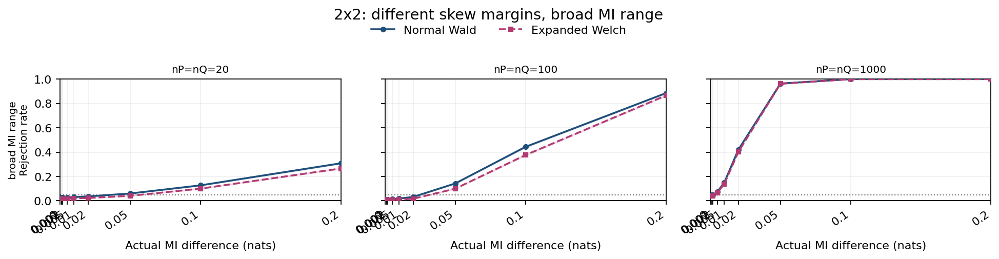

| Specification | Setting |
| --- | --- |
| Table size | 2x2 |
| Horizontal graph regime specifications (columns) | nP=nQ=20, nP=nQ=100, nP=nQ=1000 |
| Vertical graph regime specifications (rows) | broad MI range: P row (0.7, 0.3), P column (0.7, 0.3); Q row (0.8, 0.2), Q column (0.8, 0.2) |
| Probability changes | broad MI range: add at (1,1),(2,2) and subtract at (1,2),(2,1), for both P and Q |
| MI settings | Baseline MI {0.02}; direction {q higher}; actual differences {0, 0.001, 0.002, 0.005, 0.01, 0.02, 0.05, 0.1, 0.2} nats |
| Horizontal axis within each graph | Actual MI difference in nats, fixed from 0 to 0.2 |
| Vertical axis within each graph | Unconditional rejection rate from 0 to 1; invalid results count as non-rejections |
| Replicates | 20,000 per unique point |

Null-point rejection and validity:

| Vertical regime | Horizontal regime | x | Method | Rejection | Valid |
| --- | --- | --- | --- | --- | --- |
| broad MI range | nP=nQ=20 | 0 | Expanded Welch | 0.0151 | 0.9749 |
| broad MI range | nP=nQ=20 | 0 | Normal Wald | 0.0244 | 0.9983 |
| broad MI range | nP=nQ=100 | 0 | Expanded Welch | 0.0054 | 1.0000 |
| broad MI range | nP=nQ=100 | 0 | Normal Wald | 0.0121 | 1.0000 |
| broad MI range | nP=nQ=1000 | 0 | Expanded Welch | 0.0380 | 1.0000 |
| broad MI range | nP=nQ=1000 | 0 | Normal Wald | 0.0453 | 1.0000 |

Every plotted rate, interval, validity and minimum expected count

| Vertical regime | Horizontal regime | x | Method | Rejection | 95% interval | Valid | Conditional | Min expected P | Min expected Q |
| --- | --- | --- | --- | --- | --- | --- | --- | --- | --- |
| broad MI range | nP=nQ=20 | 0 | Expanded Welch | 0.0151 | [0.0135, 0.0169] | 0.9749 | 0.0155 | 2.655 | 1.476 |
| broad MI range | nP=nQ=20 | 0 | Normal Wald | 0.0244 | [0.0224, 0.0266] | 0.9983 | 0.0244 | 2.655 | 1.476 |
| broad MI range | nP=nQ=20 | 0.001 | Expanded Welch | 0.0147 | [0.0132, 0.0165] | 0.9742 | 0.0151 | 2.655 | 1.494 |
| broad MI range | nP=nQ=20 | 0.001 | Normal Wald | 0.0254 | [0.0233, 0.0276] | 0.9979 | 0.0254 | 2.655 | 1.494 |
| broad MI range | nP=nQ=20 | 0.002 | Expanded Welch | 0.0163 | [0.0146, 0.0182] | 0.9746 | 0.0167 | 2.655 | 1.511 |
| broad MI range | nP=nQ=20 | 0.002 | Normal Wald | 0.0273 | [0.0251, 0.0297] | 0.9985 | 0.0273 | 2.655 | 1.511 |
| broad MI range | nP=nQ=20 | 0.005 | Expanded Welch | 0.0161 | [0.0144, 0.0179] | 0.9747 | 0.0165 | 2.655 | 1.559 |
| broad MI range | nP=nQ=20 | 0.005 | Normal Wald | 0.0267 | [0.0245, 0.0290] | 0.9985 | 0.0267 | 2.655 | 1.559 |
| broad MI range | nP=nQ=20 | 0.01 | Expanded Welch | 0.0197 | [0.0178, 0.0217] | 0.9725 | 0.0202 | 2.655 | 1.635 |
| broad MI range | nP=nQ=20 | 0.01 | Normal Wald | 0.0308 | [0.0285, 0.0333] | 0.9983 | 0.0309 | 2.655 | 1.635 |
| broad MI range | nP=nQ=20 | 0.02 | Expanded Welch | 0.0226 | [0.0207, 0.0248] | 0.9749 | 0.0232 | 2.655 | 1.77 |
| broad MI range | nP=nQ=20 | 0.02 | Normal Wald | 0.0358 | [0.0334, 0.0385] | 0.9986 | 0.0359 | 2.655 | 1.77 |
| broad MI range | nP=nQ=20 | 0.05 | Expanded Welch | 0.0408 | [0.0381, 0.0436] | 0.9741 | 0.0418 | 2.655 | 1.905 |
| broad MI range | nP=nQ=20 | 0.05 | Normal Wald | 0.0599 | [0.0566, 0.0632] | 0.9987 | 0.0599 | 2.655 | 1.905 |
| broad MI range | nP=nQ=20 | 0.1 | Expanded Welch | 0.0998 | [0.0957, 0.1040] | 0.9770 | 0.1021 | 2.655 | 1.494 |
| broad MI range | nP=nQ=20 | 0.1 | Normal Wald | 0.1267 | [0.1222, 0.1314] | 0.9992 | 0.1268 | 2.655 | 1.494 |
| broad MI range | nP=nQ=20 | 0.2 | Expanded Welch | 0.2655 | [0.2594, 0.2717] | 0.9792 | 0.2711 | 2.655 | 0.9027 |
| broad MI range | nP=nQ=20 | 0.2 | Normal Wald | 0.3082 | [0.3018, 0.3146] | 0.9992 | 0.3084 | 2.655 | 0.9027 |
| broad MI range | nP=nQ=100 | 0 | Expanded Welch | 0.0054 | [0.0045, 0.0065] | 1.0000 | 0.0054 | 13.27 | 7.382 |
| broad MI range | nP=nQ=100 | 0 | Normal Wald | 0.0121 | [0.0107, 0.0138] | 1.0000 | 0.0121 | 13.27 | 7.382 |
| broad MI range | nP=nQ=100 | 0.001 | Expanded Welch | 0.0052 | [0.0043, 0.0063] | 1.0000 | 0.0052 | 13.27 | 7.468 |
| broad MI range | nP=nQ=100 | 0.001 | Normal Wald | 0.0113 | [0.0099, 0.0129] | 1.0000 | 0.0113 | 13.27 | 7.468 |
| broad MI range | nP=nQ=100 | 0.002 | Expanded Welch | 0.0061 | [0.0051, 0.0073] | 1.0000 | 0.0061 | 13.27 | 7.553 |
| broad MI range | nP=nQ=100 | 0.002 | Normal Wald | 0.0123 | [0.0109, 0.0139] | 1.0000 | 0.0123 | 13.27 | 7.553 |
| broad MI range | nP=nQ=100 | 0.005 | Expanded Welch | 0.0064 | [0.0054, 0.0076] | 1.0000 | 0.0064 | 13.27 | 7.797 |
| broad MI range | nP=nQ=100 | 0.005 | Normal Wald | 0.0143 | [0.0127, 0.0160] | 1.0000 | 0.0143 | 13.27 | 7.797 |
| broad MI range | nP=nQ=100 | 0.01 | Expanded Welch | 0.0098 | [0.0085, 0.0113] | 1.0000 | 0.0098 | 13.27 | 8.175 |
| broad MI range | nP=nQ=100 | 0.01 | Normal Wald | 0.0186 | [0.0168, 0.0205] | 1.0000 | 0.0186 | 13.27 | 8.175 |
| broad MI range | nP=nQ=100 | 0.02 | Expanded Welch | 0.0167 | [0.0150, 0.0186] | 1.0000 | 0.0167 | 13.27 | 8.848 |
| broad MI range | nP=nQ=100 | 0.02 | Normal Wald | 0.0316 | [0.0292, 0.0341] | 1.0000 | 0.0316 | 13.27 | 8.848 |
| broad MI range | nP=nQ=100 | 0.05 | Expanded Welch | 0.0996 | [0.0955, 0.1038] | 1.0000 | 0.0996 | 13.27 | 9.523 |
| broad MI range | nP=nQ=100 | 0.05 | Normal Wald | 0.1426 | [0.1378, 0.1475] | 1.0000 | 0.1426 | 13.27 | 9.523 |
| broad MI range | nP=nQ=100 | 0.1 | Expanded Welch | 0.3761 | [0.3694, 0.3828] | 1.0000 | 0.3761 | 13.27 | 7.471 |
| broad MI range | nP=nQ=100 | 0.1 | Normal Wald | 0.4432 | [0.4364, 0.4501] | 1.0000 | 0.4432 | 13.27 | 7.471 |
| broad MI range | nP=nQ=100 | 0.2 | Expanded Welch | 0.8652 | [0.8604, 0.8699] | 1.0000 | 0.8652 | 13.27 | 4.514 |
| broad MI range | nP=nQ=100 | 0.2 | Normal Wald | 0.8850 | [0.8805, 0.8893] | 1.0000 | 0.8850 | 13.27 | 4.514 |
| broad MI range | nP=nQ=1000 | 0 | Expanded Welch | 0.0380 | [0.0354, 0.0407] | 1.0000 | 0.0380 | 132.7 | 73.82 |
| broad MI range | nP=nQ=1000 | 0 | Normal Wald | 0.0453 | [0.0425, 0.0483] | 1.0000 | 0.0453 | 132.7 | 73.82 |
| broad MI range | nP=nQ=1000 | 0.001 | Expanded Welch | 0.0413 | [0.0386, 0.0441] | 1.0000 | 0.0413 | 132.7 | 74.68 |
| broad MI range | nP=nQ=1000 | 0.001 | Normal Wald | 0.0476 | [0.0447, 0.0506] | 1.0000 | 0.0476 | 132.7 | 74.68 |
| broad MI range | nP=nQ=1000 | 0.002 | Expanded Welch | 0.0411 | [0.0385, 0.0440] | 1.0000 | 0.0411 | 132.7 | 75.53 |
| broad MI range | nP=nQ=1000 | 0.002 | Normal Wald | 0.0483 | [0.0455, 0.0514] | 1.0000 | 0.0483 | 132.7 | 75.53 |
| broad MI range | nP=nQ=1000 | 0.005 | Expanded Welch | 0.0647 | [0.0614, 0.0682] | 1.0000 | 0.0647 | 132.7 | 77.97 |
| broad MI range | nP=nQ=1000 | 0.005 | Normal Wald | 0.0728 | [0.0693, 0.0765] | 1.0000 | 0.0728 | 132.7 | 77.97 |
| broad MI range | nP=nQ=1000 | 0.01 | Expanded Welch | 0.1385 | [0.1338, 0.1434] | 1.0000 | 0.1385 | 132.7 | 81.75 |
| broad MI range | nP=nQ=1000 | 0.01 | Normal Wald | 0.1497 | [0.1448, 0.1547] | 1.0000 | 0.1497 | 132.7 | 81.75 |
| broad MI range | nP=nQ=1000 | 0.02 | Expanded Welch | 0.4008 | [0.3941, 0.4077] | 1.0000 | 0.4008 | 132.7 | 88.48 |
| broad MI range | nP=nQ=1000 | 0.02 | Normal Wald | 0.4194 | [0.4126, 0.4263] | 1.0000 | 0.4194 | 132.7 | 88.48 |
| broad MI range | nP=nQ=1000 | 0.05 | Expanded Welch | 0.9616 | [0.9588, 0.9642] | 1.0000 | 0.9616 | 132.7 | 95.23 |
| broad MI range | nP=nQ=1000 | 0.05 | Normal Wald | 0.9642 | [0.9615, 0.9667] | 1.0000 | 0.9642 | 132.7 | 95.23 |
| broad MI range | nP=nQ=1000 | 0.1 | Expanded Welch | 1.0000 | [0.9997, 1.0000] | 1.0000 | 1.0000 | 132.7 | 74.71 |
| broad MI range | nP=nQ=1000 | 0.1 | Normal Wald | 1.0000 | [0.9997, 1.0000] | 1.0000 | 1.0000 | 132.7 | 74.71 |
| broad MI range | nP=nQ=1000 | 0.2 | Expanded Welch | 1.0000 | [0.9998, 1.0000] | 1.0000 | 1.0000 | 132.7 | 45.14 |
| broad MI range | nP=nQ=1000 | 0.2 | Normal Wald | 1.0000 | [0.9998, 1.0000] | 1.0000 | 1.0000 | 132.7 | 45.14 |

### 7.4 3x3: uniform margins, broad MI range

Do the power curves continue across larger actual MI differences?

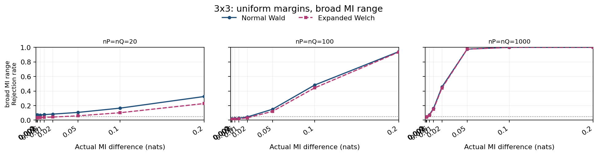

| Specification | Setting |
| --- | --- |
| Table size | 3x3 |
| Horizontal graph regime specifications (columns) | nP=nQ=20, nP=nQ=100, nP=nQ=1000 |
| Vertical graph regime specifications (rows) | broad MI range: P row (0.3333 repeated 3 times), P column (0.3333 repeated 3 times); Q row (0.3333 repeated 3 times), Q column (0.3333 repeated 3 times) |
| Probability changes | broad MI range: add at (1,1),(2,2) and subtract at (1,2),(2,1), for both P and Q |
| MI settings | Baseline MI {0.02}; direction {q higher}; actual differences {0, 0.001, 0.002, 0.005, 0.01, 0.02, 0.05, 0.1, 0.2} nats |
| Horizontal axis within each graph | Actual MI difference in nats, fixed from 0 to 0.2 |
| Vertical axis within each graph | Unconditional rejection rate from 0 to 1; invalid results count as non-rejections |
| Replicates | 20,000 per unique point |

Null-point rejection and validity:

| Vertical regime | Horizontal regime | x | Method | Rejection | Valid |
| --- | --- | --- | --- | --- | --- |
| broad MI range | nP=nQ=20 | 0 | Expanded Welch | 0.0343 | 1.0000 |
| broad MI range | nP=nQ=20 | 0 | Normal Wald | 0.0730 | 1.0000 |
| broad MI range | nP=nQ=100 | 0 | Expanded Welch | 0.0106 | 1.0000 |
| broad MI range | nP=nQ=100 | 0 | Normal Wald | 0.0167 | 1.0000 |
| broad MI range | nP=nQ=1000 | 0 | Expanded Welch | 0.0393 | 1.0000 |
| broad MI range | nP=nQ=1000 | 0 | Normal Wald | 0.0445 | 1.0000 |

Every plotted rate, interval, validity and minimum expected count

| Vertical regime | Horizontal regime | x | Method | Rejection | 95% interval | Valid | Conditional | Min expected P | Min expected Q |
| --- | --- | --- | --- | --- | --- | --- | --- | --- | --- |
| broad MI range | nP=nQ=20 | 0 | Expanded Welch | 0.0343 | [0.0319, 0.0369] | 1.0000 | 0.0343 | 1.561 | 1.561 |
| broad MI range | nP=nQ=20 | 0 | Normal Wald | 0.0730 | [0.0694, 0.0766] | 1.0000 | 0.0730 | 1.561 | 1.561 |
| broad MI range | nP=nQ=20 | 0.001 | Expanded Welch | 0.0330 | [0.0306, 0.0356] | 1.0000 | 0.0330 | 1.561 | 1.545 |
| broad MI range | nP=nQ=20 | 0.001 | Normal Wald | 0.0687 | [0.0653, 0.0723] | 1.0000 | 0.0687 | 1.561 | 1.545 |
| broad MI range | nP=nQ=20 | 0.002 | Expanded Welch | 0.0354 | [0.0329, 0.0381] | 1.0000 | 0.0354 | 1.561 | 1.529 |
| broad MI range | nP=nQ=20 | 0.002 | Normal Wald | 0.0734 | [0.0699, 0.0771] | 1.0000 | 0.0734 | 1.561 | 1.529 |
| broad MI range | nP=nQ=20 | 0.005 | Expanded Welch | 0.0349 | [0.0324, 0.0375] | 1.0000 | 0.0349 | 1.561 | 1.484 |
| broad MI range | nP=nQ=20 | 0.005 | Normal Wald | 0.0706 | [0.0671, 0.0742] | 1.0000 | 0.0706 | 1.561 | 1.484 |
| broad MI range | nP=nQ=20 | 0.01 | Expanded Welch | 0.0384 | [0.0358, 0.0412] | 1.0000 | 0.0384 | 1.561 | 1.415 |
| broad MI range | nP=nQ=20 | 0.01 | Normal Wald | 0.0767 | [0.0731, 0.0805] | 1.0000 | 0.0767 | 1.561 | 1.415 |
| broad MI range | nP=nQ=20 | 0.02 | Expanded Welch | 0.0425 | [0.0398, 0.0454] | 1.0000 | 0.0426 | 1.561 | 1.294 |
| broad MI range | nP=nQ=20 | 0.02 | Normal Wald | 0.0832 | [0.0795, 0.0871] | 1.0000 | 0.0832 | 1.561 | 1.294 |
| broad MI range | nP=nQ=20 | 0.05 | Expanded Welch | 0.0595 | [0.0563, 0.0629] | 1.0000 | 0.0595 | 1.561 | 1.009 |
| broad MI range | nP=nQ=20 | 0.05 | Normal Wald | 0.1064 | [0.1022, 0.1107] | 1.0000 | 0.1064 | 1.561 | 1.009 |
| broad MI range | nP=nQ=20 | 0.1 | Expanded Welch | 0.1021 | [0.0979, 0.1063] | 1.0000 | 0.1021 | 1.561 | 0.6678 |
| broad MI range | nP=nQ=20 | 0.1 | Normal Wald | 0.1651 | [0.1601, 0.1704] | 1.0000 | 0.1651 | 1.561 | 0.6678 |
| broad MI range | nP=nQ=20 | 0.2 | Expanded Welch | 0.2281 | [0.2224, 0.2340] | 1.0000 | 0.2282 | 1.561 | 0.2217 |
| broad MI range | nP=nQ=20 | 0.2 | Normal Wald | 0.3247 | [0.3183, 0.3313] | 1.0000 | 0.3247 | 1.561 | 0.2217 |
| broad MI range | nP=nQ=100 | 0 | Expanded Welch | 0.0106 | [0.0092, 0.0121] | 1.0000 | 0.0106 | 7.803 | 7.803 |
| broad MI range | nP=nQ=100 | 0 | Normal Wald | 0.0167 | [0.0150, 0.0185] | 1.0000 | 0.0167 | 7.803 | 7.803 |
| broad MI range | nP=nQ=100 | 0.001 | Expanded Welch | 0.0115 | [0.0101, 0.0131] | 1.0000 | 0.0115 | 7.803 | 7.723 |
| broad MI range | nP=nQ=100 | 0.001 | Normal Wald | 0.0194 | [0.0176, 0.0215] | 1.0000 | 0.0194 | 7.803 | 7.723 |
| broad MI range | nP=nQ=100 | 0.002 | Expanded Welch | 0.0123 | [0.0109, 0.0140] | 1.0000 | 0.0123 | 7.803 | 7.644 |
| broad MI range | nP=nQ=100 | 0.002 | Normal Wald | 0.0196 | [0.0178, 0.0216] | 1.0000 | 0.0196 | 7.803 | 7.644 |
| broad MI range | nP=nQ=100 | 0.005 | Expanded Welch | 0.0142 | [0.0127, 0.0159] | 1.0000 | 0.0142 | 7.803 | 7.42 |
| broad MI range | nP=nQ=100 | 0.005 | Normal Wald | 0.0216 | [0.0197, 0.0237] | 1.0000 | 0.0216 | 7.803 | 7.42 |
| broad MI range | nP=nQ=100 | 0.01 | Expanded Welch | 0.0179 | [0.0162, 0.0198] | 1.0000 | 0.0179 | 7.803 | 7.075 |
| broad MI range | nP=nQ=100 | 0.01 | Normal Wald | 0.0272 | [0.0250, 0.0295] | 1.0000 | 0.0272 | 7.803 | 7.075 |
| broad MI range | nP=nQ=100 | 0.02 | Expanded Welch | 0.0323 | [0.0300, 0.0349] | 1.0000 | 0.0323 | 7.803 | 6.469 |
| broad MI range | nP=nQ=100 | 0.02 | Normal Wald | 0.0440 | [0.0412, 0.0469] | 1.0000 | 0.0440 | 7.803 | 6.469 |
| broad MI range | nP=nQ=100 | 0.05 | Expanded Welch | 0.1213 | [0.1169, 0.1259] | 1.0000 | 0.1213 | 7.803 | 5.045 |
| broad MI range | nP=nQ=100 | 0.05 | Normal Wald | 0.1503 | [0.1454, 0.1553] | 1.0000 | 0.1503 | 7.803 | 5.045 |
| broad MI range | nP=nQ=100 | 0.1 | Expanded Welch | 0.4434 | [0.4365, 0.4502] | 1.0000 | 0.4434 | 7.803 | 3.339 |
| broad MI range | nP=nQ=100 | 0.1 | Normal Wald | 0.4821 | [0.4752, 0.4890] | 1.0000 | 0.4821 | 7.803 | 3.339 |
| broad MI range | nP=nQ=100 | 0.2 | Expanded Welch | 0.9345 | [0.9310, 0.9379] | 1.0000 | 0.9345 | 7.803 | 1.108 |
| broad MI range | nP=nQ=100 | 0.2 | Normal Wald | 0.9411 | [0.9377, 0.9442] | 1.0000 | 0.9411 | 7.803 | 1.108 |
| broad MI range | nP=nQ=1000 | 0 | Expanded Welch | 0.0393 | [0.0366, 0.0420] | 1.0000 | 0.0393 | 78.03 | 78.03 |
| broad MI range | nP=nQ=1000 | 0 | Normal Wald | 0.0445 | [0.0417, 0.0474] | 1.0000 | 0.0445 | 78.03 | 78.03 |
| broad MI range | nP=nQ=1000 | 0.001 | Expanded Welch | 0.0379 | [0.0353, 0.0406] | 1.0000 | 0.0379 | 78.03 | 77.23 |
| broad MI range | nP=nQ=1000 | 0.001 | Normal Wald | 0.0430 | [0.0402, 0.0458] | 1.0000 | 0.0430 | 78.03 | 77.23 |
| broad MI range | nP=nQ=1000 | 0.002 | Expanded Welch | 0.0440 | [0.0412, 0.0469] | 1.0000 | 0.0440 | 78.03 | 76.44 |
| broad MI range | nP=nQ=1000 | 0.002 | Normal Wald | 0.0483 | [0.0455, 0.0514] | 1.0000 | 0.0483 | 78.03 | 76.44 |
| broad MI range | nP=nQ=1000 | 0.005 | Expanded Welch | 0.0668 | [0.0634, 0.0703] | 1.0000 | 0.0668 | 78.03 | 74.2 |
| broad MI range | nP=nQ=1000 | 0.005 | Normal Wald | 0.0745 | [0.0709, 0.0782] | 1.0000 | 0.0745 | 78.03 | 74.2 |
| broad MI range | nP=nQ=1000 | 0.01 | Expanded Welch | 0.1512 | [0.1463, 0.1562] | 1.0000 | 0.1512 | 78.03 | 70.75 |
| broad MI range | nP=nQ=1000 | 0.01 | Normal Wald | 0.1620 | [0.1569, 0.1671] | 1.0000 | 0.1620 | 78.03 | 70.75 |
| broad MI range | nP=nQ=1000 | 0.02 | Expanded Welch | 0.4415 | [0.4346, 0.4484] | 1.0000 | 0.4415 | 78.03 | 64.69 |
| broad MI range | nP=nQ=1000 | 0.02 | Normal Wald | 0.4563 | [0.4494, 0.4632] | 1.0000 | 0.4563 | 78.03 | 64.69 |
| broad MI range | nP=nQ=1000 | 0.05 | Expanded Welch | 0.9754 | [0.9732, 0.9775] | 1.0000 | 0.9754 | 78.03 | 50.45 |
| broad MI range | nP=nQ=1000 | 0.05 | Normal Wald | 0.9762 | [0.9740, 0.9783] | 1.0000 | 0.9762 | 78.03 | 50.45 |
| broad MI range | nP=nQ=1000 | 0.1 | Expanded Welch | 1.0000 | [0.9998, 1.0000] | 1.0000 | 1.0000 | 78.03 | 33.39 |
| broad MI range | nP=nQ=1000 | 0.1 | Normal Wald | 1.0000 | [0.9998, 1.0000] | 1.0000 | 1.0000 | 78.03 | 33.39 |
| broad MI range | nP=nQ=1000 | 0.2 | Expanded Welch | 1.0000 | [0.9998, 1.0000] | 1.0000 | 1.0000 | 78.03 | 11.08 |
| broad MI range | nP=nQ=1000 | 0.2 | Normal Wald | 1.0000 | [0.9998, 1.0000] | 1.0000 | 1.0000 | 78.03 | 11.08 |

### 7.5 3x3: same skew margins, broad MI range

Do the power curves continue across larger actual MI differences?

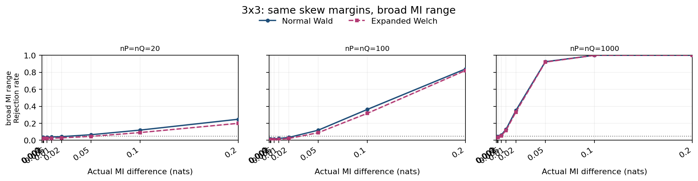

| Specification | Setting |
| --- | --- |
| Table size | 3x3 |
| Horizontal graph regime specifications (columns) | nP=nQ=20, nP=nQ=100, nP=nQ=1000 |
| Vertical graph regime specifications (rows) | broad MI range: P row (0.8, 0.2/2 repeated 2 times), P column (0.8, 0.2/2 repeated 2 times); Q row (0.8, 0.2/2 repeated 2 times), Q column (0.8, 0.2/2 repeated 2 times) |
| Probability changes | broad MI range: add at (1,1),(2,2) and subtract at (1,2),(2,1), for both P and Q |
| MI settings | Baseline MI {0.02}; direction {q higher}; actual differences {0, 0.001, 0.002, 0.005, 0.01, 0.02, 0.05, 0.1, 0.2} nats |
| Horizontal axis within each graph | Actual MI difference in nats, fixed from 0 to 0.2 |
| Vertical axis within each graph | Unconditional rejection rate from 0 to 1; invalid results count as non-rejections |
| Replicates | 20,000 per unique point |

Null-point rejection and validity:

| Vertical regime | Horizontal regime | x | Method | Rejection | Valid |
| --- | --- | --- | --- | --- | --- |
| broad MI range | nP=nQ=20 | 0 | Expanded Welch | 0.0207 | 0.9565 |
| broad MI range | nP=nQ=20 | 0 | Normal Wald | 0.0333 | 0.9996 |
| broad MI range | nP=nQ=100 | 0 | Expanded Welch | 0.0068 | 1.0000 |
| broad MI range | nP=nQ=100 | 0 | Normal Wald | 0.0139 | 1.0000 |
| broad MI range | nP=nQ=1000 | 0 | Expanded Welch | 0.0314 | 1.0000 |
| broad MI range | nP=nQ=1000 | 0 | Normal Wald | 0.0391 | 1.0000 |

Every plotted rate, interval, validity and minimum expected count

| Vertical regime | Horizontal regime | x | Method | Rejection | 95% interval | Valid | Conditional | Min expected P | Min expected Q |
| --- | --- | --- | --- | --- | --- | --- | --- | --- | --- |
| broad MI range | nP=nQ=20 | 0 | Expanded Welch | 0.0207 | [0.0188, 0.0228] | 0.9565 | 0.0216 | 0.2 | 0.2 |
| broad MI range | nP=nQ=20 | 0 | Normal Wald | 0.0333 | [0.0309, 0.0359] | 0.9996 | 0.0333 | 0.2 | 0.2 |
| broad MI range | nP=nQ=20 | 0.001 | Expanded Welch | 0.0215 | [0.0195, 0.0236] | 0.9570 | 0.0224 | 0.2 | 0.2 |
| broad MI range | nP=nQ=20 | 0.001 | Normal Wald | 0.0338 | [0.0314, 0.0364] | 0.9997 | 0.0338 | 0.2 | 0.2 |
| broad MI range | nP=nQ=20 | 0.002 | Expanded Welch | 0.0203 | [0.0184, 0.0223] | 0.9553 | 0.0212 | 0.2 | 0.2 |
| broad MI range | nP=nQ=20 | 0.002 | Normal Wald | 0.0328 | [0.0304, 0.0354] | 0.9993 | 0.0328 | 0.2 | 0.2 |
| broad MI range | nP=nQ=20 | 0.005 | Expanded Welch | 0.0233 | [0.0213, 0.0255] | 0.9553 | 0.0244 | 0.2 | 0.2 |
| broad MI range | nP=nQ=20 | 0.005 | Normal Wald | 0.0377 | [0.0351, 0.0404] | 0.9992 | 0.0377 | 0.2 | 0.2 |
| broad MI range | nP=nQ=20 | 0.01 | Expanded Welch | 0.0248 | [0.0227, 0.0270] | 0.9554 | 0.0260 | 0.2 | 0.2 |
| broad MI range | nP=nQ=20 | 0.01 | Normal Wald | 0.0391 | [0.0365, 0.0419] | 0.9991 | 0.0391 | 0.2 | 0.2 |
| broad MI range | nP=nQ=20 | 0.02 | Expanded Welch | 0.0290 | [0.0268, 0.0314] | 0.9550 | 0.0304 | 0.2 | 0.2 |
| broad MI range | nP=nQ=20 | 0.02 | Normal Wald | 0.0433 | [0.0406, 0.0463] | 0.9992 | 0.0434 | 0.2 | 0.2 |
| broad MI range | nP=nQ=20 | 0.05 | Expanded Welch | 0.0462 | [0.0434, 0.0492] | 0.9551 | 0.0484 | 0.2 | 0.2 |
| broad MI range | nP=nQ=20 | 0.05 | Normal Wald | 0.0659 | [0.0626, 0.0695] | 0.9994 | 0.0660 | 0.2 | 0.2 |
| broad MI range | nP=nQ=20 | 0.1 | Expanded Welch | 0.0912 | [0.0873, 0.0953] | 0.9560 | 0.0954 | 0.2 | 0.2 |
| broad MI range | nP=nQ=20 | 0.1 | Normal Wald | 0.1204 | [0.1160, 0.1250] | 0.9997 | 0.1204 | 0.2 | 0.2 |
| broad MI range | nP=nQ=20 | 0.2 | Expanded Welch | 0.1998 | [0.1943, 0.2054] | 0.9569 | 0.2088 | 0.2 | 0.136 |
| broad MI range | nP=nQ=20 | 0.2 | Normal Wald | 0.2478 | [0.2419, 0.2538] | 0.9998 | 0.2479 | 0.2 | 0.136 |
| broad MI range | nP=nQ=100 | 0 | Expanded Welch | 0.0068 | [0.0058, 0.0080] | 1.0000 | 0.0068 | 1 | 1 |
| broad MI range | nP=nQ=100 | 0 | Normal Wald | 0.0139 | [0.0124, 0.0156] | 1.0000 | 0.0139 | 1 | 1 |
| broad MI range | nP=nQ=100 | 0.001 | Expanded Welch | 0.0059 | [0.0049, 0.0071] | 1.0000 | 0.0059 | 1 | 1 |
| broad MI range | nP=nQ=100 | 0.001 | Normal Wald | 0.0143 | [0.0127, 0.0160] | 1.0000 | 0.0143 | 1 | 1 |
| broad MI range | nP=nQ=100 | 0.002 | Expanded Welch | 0.0064 | [0.0054, 0.0076] | 1.0000 | 0.0064 | 1 | 1 |
| broad MI range | nP=nQ=100 | 0.002 | Normal Wald | 0.0140 | [0.0125, 0.0158] | 1.0000 | 0.0140 | 1 | 1 |
| broad MI range | nP=nQ=100 | 0.005 | Expanded Welch | 0.0080 | [0.0069, 0.0094] | 1.0000 | 0.0080 | 1 | 1 |
| broad MI range | nP=nQ=100 | 0.005 | Normal Wald | 0.0160 | [0.0144, 0.0178] | 1.0000 | 0.0160 | 1 | 1 |
| broad MI range | nP=nQ=100 | 0.01 | Expanded Welch | 0.0118 | [0.0104, 0.0134] | 1.0000 | 0.0118 | 1 | 1 |
| broad MI range | nP=nQ=100 | 0.01 | Normal Wald | 0.0220 | [0.0201, 0.0241] | 1.0000 | 0.0220 | 1 | 1 |
| broad MI range | nP=nQ=100 | 0.02 | Expanded Welch | 0.0215 | [0.0196, 0.0237] | 1.0000 | 0.0215 | 1 | 1 |
| broad MI range | nP=nQ=100 | 0.02 | Normal Wald | 0.0336 | [0.0312, 0.0362] | 1.0000 | 0.0336 | 1 | 1 |
| broad MI range | nP=nQ=100 | 0.05 | Expanded Welch | 0.0893 | [0.0854, 0.0933] | 1.0000 | 0.0893 | 1 | 1 |
| broad MI range | nP=nQ=100 | 0.05 | Normal Wald | 0.1187 | [0.1143, 0.1233] | 1.0000 | 0.1187 | 1 | 1 |
| broad MI range | nP=nQ=100 | 0.1 | Expanded Welch | 0.3170 | [0.3105, 0.3234] | 1.0000 | 0.3170 | 1 | 1 |
| broad MI range | nP=nQ=100 | 0.1 | Normal Wald | 0.3629 | [0.3562, 0.3695] | 1.0000 | 0.3629 | 1 | 1 |
| broad MI range | nP=nQ=100 | 0.2 | Expanded Welch | 0.8215 | [0.8161, 0.8267] | 1.0000 | 0.8215 | 1 | 0.6798 |
| broad MI range | nP=nQ=100 | 0.2 | Normal Wald | 0.8390 | [0.8338, 0.8440] | 1.0000 | 0.8390 | 1 | 0.6798 |
| broad MI range | nP=nQ=1000 | 0 | Expanded Welch | 0.0314 | [0.0291, 0.0339] | 1.0000 | 0.0314 | 10 | 10 |
| broad MI range | nP=nQ=1000 | 0 | Normal Wald | 0.0391 | [0.0365, 0.0418] | 1.0000 | 0.0391 | 10 | 10 |
| broad MI range | nP=nQ=1000 | 0.001 | Expanded Welch | 0.0367 | [0.0342, 0.0394] | 1.0000 | 0.0367 | 10 | 10 |
| broad MI range | nP=nQ=1000 | 0.001 | Normal Wald | 0.0442 | [0.0415, 0.0472] | 1.0000 | 0.0442 | 10 | 10 |
| broad MI range | nP=nQ=1000 | 0.002 | Expanded Welch | 0.0362 | [0.0337, 0.0389] | 1.0000 | 0.0362 | 10 | 10 |
| broad MI range | nP=nQ=1000 | 0.002 | Normal Wald | 0.0432 | [0.0404, 0.0461] | 1.0000 | 0.0432 | 10 | 10 |
| broad MI range | nP=nQ=1000 | 0.005 | Expanded Welch | 0.0520 | [0.0491, 0.0552] | 1.0000 | 0.0520 | 10 | 10 |
| broad MI range | nP=nQ=1000 | 0.005 | Normal Wald | 0.0617 | [0.0585, 0.0652] | 1.0000 | 0.0617 | 10 | 10 |
| broad MI range | nP=nQ=1000 | 0.01 | Expanded Welch | 0.1169 | [0.1126, 0.1215] | 1.0000 | 0.1169 | 10 | 10 |
| broad MI range | nP=nQ=1000 | 0.01 | Normal Wald | 0.1303 | [0.1257, 0.1350] | 1.0000 | 0.1303 | 10 | 10 |
| broad MI range | nP=nQ=1000 | 0.02 | Expanded Welch | 0.3326 | [0.3261, 0.3392] | 1.0000 | 0.3326 | 10 | 10 |
| broad MI range | nP=nQ=1000 | 0.02 | Normal Wald | 0.3509 | [0.3443, 0.3575] | 1.0000 | 0.3509 | 10 | 10 |
| broad MI range | nP=nQ=1000 | 0.05 | Expanded Welch | 0.9201 | [0.9162, 0.9237] | 1.0000 | 0.9201 | 10 | 10 |
| broad MI range | nP=nQ=1000 | 0.05 | Normal Wald | 0.9247 | [0.9210, 0.9283] | 1.0000 | 0.9247 | 10 | 10 |
| broad MI range | nP=nQ=1000 | 0.1 | Expanded Welch | 1.0000 | [0.9998, 1.0000] | 1.0000 | 1.0000 | 10 | 10 |
| broad MI range | nP=nQ=1000 | 0.1 | Normal Wald | 1.0000 | [0.9998, 1.0000] | 1.0000 | 1.0000 | 10 | 10 |
| broad MI range | nP=nQ=1000 | 0.2 | Expanded Welch | 1.0000 | [0.9998, 1.0000] | 1.0000 | 1.0000 | 10 | 6.798 |
| broad MI range | nP=nQ=1000 | 0.2 | Normal Wald | 1.0000 | [0.9998, 1.0000] | 1.0000 | 1.0000 | 10 | 6.798 |

### 7.6 3x3: different skew margins, broad MI range

Do the power curves continue across larger actual MI differences?

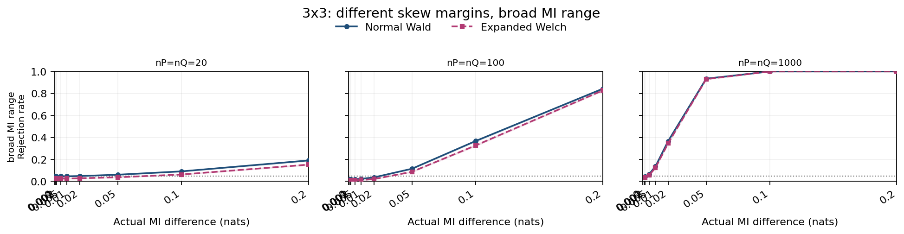

| Specification | Setting |
| --- | --- |
| Table size | 3x3 |
| Horizontal graph regime specifications (columns) | nP=nQ=20, nP=nQ=100, nP=nQ=1000 |
| Vertical graph regime specifications (rows) | broad MI range: P row (0.7, 0.3/2 repeated 2 times), P column (0.7, 0.3/2 repeated 2 times); Q row (0.8, 0.2/2 repeated 2 times), Q column (0.8, 0.2/2 repeated 2 times) |
| Probability changes | broad MI range: add at (1,1),(2,2) and subtract at (1,2),(2,1), for both P and Q |
| MI settings | Baseline MI {0.02}; direction {q higher}; actual differences {0, 0.001, 0.002, 0.005, 0.01, 0.02, 0.05, 0.1, 0.2} nats |
| Horizontal axis within each graph | Actual MI difference in nats, fixed from 0 to 0.2 |
| Vertical axis within each graph | Unconditional rejection rate from 0 to 1; invalid results count as non-rejections |
| Replicates | 20,000 per unique point |

Null-point rejection and validity:

| Vertical regime | Horizontal regime | x | Method | Rejection | Valid |
| --- | --- | --- | --- | --- | --- |
| broad MI range | nP=nQ=20 | 0 | Expanded Welch | 0.0251 | 0.9745 |
| broad MI range | nP=nQ=20 | 0 | Normal Wald | 0.0466 | 0.9998 |
| broad MI range | nP=nQ=100 | 0 | Expanded Welch | 0.0083 | 1.0000 |
| broad MI range | nP=nQ=100 | 0 | Normal Wald | 0.0171 | 1.0000 |
| broad MI range | nP=nQ=1000 | 0 | Expanded Welch | 0.0348 | 1.0000 |
| broad MI range | nP=nQ=1000 | 0 | Normal Wald | 0.0411 | 1.0000 |

Every plotted rate, interval, validity and minimum expected count

| Vertical regime | Horizontal regime | x | Method | Rejection | 95% interval | Valid | Conditional | Min expected P | Min expected Q |
| --- | --- | --- | --- | --- | --- | --- | --- | --- | --- |
| broad MI range | nP=nQ=20 | 0 | Expanded Welch | 0.0251 | [0.0231, 0.0274] | 0.9745 | 0.0258 | 0.45 | 0.2 |
| broad MI range | nP=nQ=20 | 0 | Normal Wald | 0.0466 | [0.0438, 0.0497] | 0.9998 | 0.0467 | 0.45 | 0.2 |
| broad MI range | nP=nQ=20 | 0.001 | Expanded Welch | 0.0259 | [0.0238, 0.0282] | 0.9753 | 0.0266 | 0.45 | 0.2 |
| broad MI range | nP=nQ=20 | 0.001 | Normal Wald | 0.0471 | [0.0442, 0.0501] | 1.0000 | 0.0471 | 0.45 | 0.2 |
| broad MI range | nP=nQ=20 | 0.002 | Expanded Welch | 0.0232 | [0.0212, 0.0254] | 0.9763 | 0.0238 | 0.45 | 0.2 |
| broad MI range | nP=nQ=20 | 0.002 | Normal Wald | 0.0435 | [0.0407, 0.0464] | 1.0000 | 0.0435 | 0.45 | 0.2 |
| broad MI range | nP=nQ=20 | 0.005 | Expanded Welch | 0.0260 | [0.0239, 0.0283] | 0.9760 | 0.0266 | 0.45 | 0.2 |
| broad MI range | nP=nQ=20 | 0.005 | Normal Wald | 0.0466 | [0.0437, 0.0496] | 1.0000 | 0.0466 | 0.45 | 0.2 |
| broad MI range | nP=nQ=20 | 0.01 | Expanded Welch | 0.0252 | [0.0231, 0.0275] | 0.9756 | 0.0258 | 0.45 | 0.2 |
| broad MI range | nP=nQ=20 | 0.01 | Normal Wald | 0.0464 | [0.0436, 0.0495] | 0.9999 | 0.0465 | 0.45 | 0.2 |
| broad MI range | nP=nQ=20 | 0.02 | Expanded Welch | 0.0285 | [0.0263, 0.0309] | 0.9761 | 0.0292 | 0.45 | 0.2 |
| broad MI range | nP=nQ=20 | 0.02 | Normal Wald | 0.0488 | [0.0459, 0.0518] | 1.0000 | 0.0488 | 0.45 | 0.2 |
| broad MI range | nP=nQ=20 | 0.05 | Expanded Welch | 0.0374 | [0.0349, 0.0402] | 0.9757 | 0.0384 | 0.45 | 0.2 |
| broad MI range | nP=nQ=20 | 0.05 | Normal Wald | 0.0610 | [0.0578, 0.0644] | 1.0000 | 0.0610 | 0.45 | 0.2 |
| broad MI range | nP=nQ=20 | 0.1 | Expanded Welch | 0.0628 | [0.0595, 0.0662] | 0.9776 | 0.0642 | 0.45 | 0.2 |
| broad MI range | nP=nQ=20 | 0.1 | Normal Wald | 0.0911 | [0.0872, 0.0952] | 1.0000 | 0.0912 | 0.45 | 0.2 |
| broad MI range | nP=nQ=20 | 0.2 | Expanded Welch | 0.1525 | [0.1476, 0.1575] | 0.9772 | 0.1561 | 0.45 | 0.136 |
| broad MI range | nP=nQ=20 | 0.2 | Normal Wald | 0.1905 | [0.1852, 0.1961] | 0.9999 | 0.1906 | 0.45 | 0.136 |
| broad MI range | nP=nQ=100 | 0 | Expanded Welch | 0.0083 | [0.0071, 0.0097] | 1.0000 | 0.0083 | 2.25 | 1 |
| broad MI range | nP=nQ=100 | 0 | Normal Wald | 0.0171 | [0.0154, 0.0190] | 1.0000 | 0.0171 | 2.25 | 1 |
| broad MI range | nP=nQ=100 | 0.001 | Expanded Welch | 0.0083 | [0.0071, 0.0096] | 1.0000 | 0.0083 | 2.25 | 1 |
| broad MI range | nP=nQ=100 | 0.001 | Normal Wald | 0.0179 | [0.0161, 0.0198] | 1.0000 | 0.0179 | 2.25 | 1 |
| broad MI range | nP=nQ=100 | 0.002 | Expanded Welch | 0.0092 | [0.0079, 0.0106] | 1.0000 | 0.0092 | 2.25 | 1 |
| broad MI range | nP=nQ=100 | 0.002 | Normal Wald | 0.0199 | [0.0181, 0.0219] | 1.0000 | 0.0199 | 2.25 | 1 |
| broad MI range | nP=nQ=100 | 0.005 | Expanded Welch | 0.0102 | [0.0089, 0.0117] | 1.0000 | 0.0102 | 2.25 | 1 |
| broad MI range | nP=nQ=100 | 0.005 | Normal Wald | 0.0203 | [0.0184, 0.0223] | 1.0000 | 0.0203 | 2.25 | 1 |
| broad MI range | nP=nQ=100 | 0.01 | Expanded Welch | 0.0126 | [0.0112, 0.0143] | 1.0000 | 0.0126 | 2.25 | 1 |
| broad MI range | nP=nQ=100 | 0.01 | Normal Wald | 0.0231 | [0.0211, 0.0253] | 1.0000 | 0.0231 | 2.25 | 1 |
| broad MI range | nP=nQ=100 | 0.02 | Expanded Welch | 0.0210 | [0.0192, 0.0231] | 1.0000 | 0.0210 | 2.25 | 1 |
| broad MI range | nP=nQ=100 | 0.02 | Normal Wald | 0.0363 | [0.0338, 0.0390] | 1.0000 | 0.0363 | 2.25 | 1 |
| broad MI range | nP=nQ=100 | 0.05 | Expanded Welch | 0.0874 | [0.0836, 0.0914] | 1.0000 | 0.0874 | 2.25 | 1 |
| broad MI range | nP=nQ=100 | 0.05 | Normal Wald | 0.1154 | [0.1111, 0.1200] | 1.0000 | 0.1154 | 2.25 | 1 |
| broad MI range | nP=nQ=100 | 0.1 | Expanded Welch | 0.3266 | [0.3201, 0.3331] | 1.0000 | 0.3266 | 2.25 | 1 |
| broad MI range | nP=nQ=100 | 0.1 | Normal Wald | 0.3671 | [0.3604, 0.3738] | 1.0000 | 0.3671 | 2.25 | 1 |
| broad MI range | nP=nQ=100 | 0.2 | Expanded Welch | 0.8273 | [0.8220, 0.8325] | 1.0000 | 0.8273 | 2.25 | 0.6798 |
| broad MI range | nP=nQ=100 | 0.2 | Normal Wald | 0.8427 | [0.8376, 0.8477] | 1.0000 | 0.8427 | 2.25 | 0.6798 |
| broad MI range | nP=nQ=1000 | 0 | Expanded Welch | 0.0348 | [0.0324, 0.0375] | 1.0000 | 0.0348 | 22.5 | 10 |
| broad MI range | nP=nQ=1000 | 0 | Normal Wald | 0.0411 | [0.0384, 0.0439] | 1.0000 | 0.0411 | 22.5 | 10 |
| broad MI range | nP=nQ=1000 | 0.001 | Expanded Welch | 0.0338 | [0.0314, 0.0364] | 1.0000 | 0.0338 | 22.5 | 10 |
| broad MI range | nP=nQ=1000 | 0.001 | Normal Wald | 0.0413 | [0.0387, 0.0442] | 1.0000 | 0.0413 | 22.5 | 10 |
| broad MI range | nP=nQ=1000 | 0.002 | Expanded Welch | 0.0374 | [0.0348, 0.0401] | 1.0000 | 0.0374 | 22.5 | 10 |
| broad MI range | nP=nQ=1000 | 0.002 | Normal Wald | 0.0445 | [0.0417, 0.0474] | 1.0000 | 0.0445 | 22.5 | 10 |
| broad MI range | nP=nQ=1000 | 0.005 | Expanded Welch | 0.0560 | [0.0529, 0.0593] | 1.0000 | 0.0560 | 22.5 | 10 |
| broad MI range | nP=nQ=1000 | 0.005 | Normal Wald | 0.0659 | [0.0625, 0.0694] | 1.0000 | 0.0659 | 22.5 | 10 |
| broad MI range | nP=nQ=1000 | 0.01 | Expanded Welch | 0.1228 | [0.1183, 0.1274] | 1.0000 | 0.1228 | 22.5 | 10 |
| broad MI range | nP=nQ=1000 | 0.01 | Normal Wald | 0.1353 | [0.1306, 0.1401] | 1.0000 | 0.1353 | 22.5 | 10 |
| broad MI range | nP=nQ=1000 | 0.02 | Expanded Welch | 0.3463 | [0.3397, 0.3529] | 1.0000 | 0.3463 | 22.5 | 10 |
| broad MI range | nP=nQ=1000 | 0.02 | Normal Wald | 0.3665 | [0.3599, 0.3733] | 1.0000 | 0.3665 | 22.5 | 10 |
| broad MI range | nP=nQ=1000 | 0.05 | Expanded Welch | 0.9306 | [0.9270, 0.9341] | 1.0000 | 0.9306 | 22.5 | 10 |
| broad MI range | nP=nQ=1000 | 0.05 | Normal Wald | 0.9352 | [0.9317, 0.9385] | 1.0000 | 0.9352 | 22.5 | 10 |
| broad MI range | nP=nQ=1000 | 0.1 | Expanded Welch | 1.0000 | [0.9997, 1.0000] | 1.0000 | 1.0000 | 22.5 | 10 |
| broad MI range | nP=nQ=1000 | 0.1 | Normal Wald | 1.0000 | [0.9997, 1.0000] | 1.0000 | 1.0000 | 22.5 | 10 |
| broad MI range | nP=nQ=1000 | 0.2 | Expanded Welch | 1.0000 | [0.9998, 1.0000] | 1.0000 | 1.0000 | 22.5 | 6.798 |
| broad MI range | nP=nQ=1000 | 0.2 | Normal Wald | 1.0000 | [0.9998, 1.0000] | 1.0000 | 1.0000 | 22.5 | 6.798 |

## 8. Rectangular tables

Do the square-table conclusions extend to rectangular tables?

### 8.1 2x3: uniform margins

Do the square-table conclusions extend to rectangular tables?

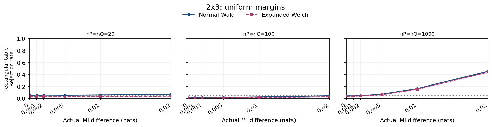

| Specification | Setting |
| --- | --- |
| Table size | 2x3 |
| Horizontal graph regime specifications (columns) | nP=nQ=20, nP=nQ=100, nP=nQ=1000 |
| Vertical graph regime specifications (rows) | rectangular table: P row (0.5 repeated 2 times), P column (0.3333 repeated 3 times); Q row (0.5 repeated 2 times), Q column (0.3333 repeated 3 times) |
| Probability changes | rectangular table: add at (1,1),(2,2) and subtract at (1,2),(2,1), for both P and Q |
| MI settings | Baseline MI {0.02}; direction {q higher}; actual differences {0, 0.001, 0.002, 0.005, 0.01, 0.02} nats |
| Horizontal axis within each graph | Actual MI difference in nats, fixed from 0 to 0.02 |
| Vertical axis within each graph | Unconditional rejection rate from 0 to 1; invalid results count as non-rejections |
| Replicates | 20,000 per unique point |

Null-point rejection and validity:

| Vertical regime | Horizontal regime | x | Method | Rejection | Valid |
| --- | --- | --- | --- | --- | --- |
| rectangular table | nP=nQ=20 | 0 | Expanded Welch | 0.0313 | 0.9964 |
| rectangular table | nP=nQ=20 | 0 | Normal Wald | 0.0561 | 1.0000 |
| rectangular table | nP=nQ=100 | 0 | Expanded Welch | 0.0086 | 1.0000 |
| rectangular table | nP=nQ=100 | 0 | Normal Wald | 0.0158 | 1.0000 |
| rectangular table | nP=nQ=1000 | 0 | Expanded Welch | 0.0384 | 1.0000 |
| rectangular table | nP=nQ=1000 | 0 | Normal Wald | 0.0439 | 1.0000 |

Every plotted rate, interval, validity and minimum expected count

| Vertical regime | Horizontal regime | x | Method | Rejection | 95% interval | Valid | Conditional | Min expected P | Min expected Q |
| --- | --- | --- | --- | --- | --- | --- | --- | --- | --- |
| rectangular table | nP=nQ=20 | 0 | Expanded Welch | 0.0313 | [0.0290, 0.0338] | 0.9964 | 0.0314 | 2.521 | 2.521 |
| rectangular table | nP=nQ=20 | 0 | Normal Wald | 0.0561 | [0.0530, 0.0594] | 1.0000 | 0.0561 | 2.521 | 2.521 |
| rectangular table | nP=nQ=20 | 0.001 | Expanded Welch | 0.0302 | [0.0280, 0.0327] | 0.9960 | 0.0304 | 2.521 | 2.501 |
| rectangular table | nP=nQ=20 | 0.001 | Normal Wald | 0.0536 | [0.0505, 0.0568] | 1.0000 | 0.0536 | 2.521 | 2.501 |
| rectangular table | nP=nQ=20 | 0.002 | Expanded Welch | 0.0309 | [0.0286, 0.0334] | 0.9964 | 0.0310 | 2.521 | 2.482 |
| rectangular table | nP=nQ=20 | 0.002 | Normal Wald | 0.0584 | [0.0552, 0.0617] | 1.0000 | 0.0584 | 2.521 | 2.482 |
| rectangular table | nP=nQ=20 | 0.005 | Expanded Welch | 0.0291 | [0.0269, 0.0316] | 0.9966 | 0.0292 | 2.521 | 2.426 |
| rectangular table | nP=nQ=20 | 0.005 | Normal Wald | 0.0554 | [0.0524, 0.0587] | 1.0000 | 0.0554 | 2.521 | 2.426 |
| rectangular table | nP=nQ=20 | 0.01 | Expanded Welch | 0.0336 | [0.0312, 0.0362] | 0.9964 | 0.0337 | 2.521 | 2.341 |
| rectangular table | nP=nQ=20 | 0.01 | Normal Wald | 0.0602 | [0.0570, 0.0636] | 1.0000 | 0.0602 | 2.521 | 2.341 |
| rectangular table | nP=nQ=20 | 0.02 | Expanded Welch | 0.0406 | [0.0380, 0.0434] | 0.9968 | 0.0407 | 2.521 | 2.19 |
| rectangular table | nP=nQ=20 | 0.02 | Normal Wald | 0.0675 | [0.0642, 0.0711] | 1.0000 | 0.0676 | 2.521 | 2.19 |
| rectangular table | nP=nQ=100 | 0 | Expanded Welch | 0.0086 | [0.0074, 0.0099] | 1.0000 | 0.0086 | 12.6 | 12.6 |
| rectangular table | nP=nQ=100 | 0 | Normal Wald | 0.0158 | [0.0142, 0.0176] | 1.0000 | 0.0158 | 12.6 | 12.6 |
| rectangular table | nP=nQ=100 | 0.001 | Expanded Welch | 0.0085 | [0.0073, 0.0099] | 1.0000 | 0.0085 | 12.6 | 12.51 |
| rectangular table | nP=nQ=100 | 0.001 | Normal Wald | 0.0157 | [0.0140, 0.0175] | 1.0000 | 0.0157 | 12.6 | 12.51 |
| rectangular table | nP=nQ=100 | 0.002 | Expanded Welch | 0.0088 | [0.0076, 0.0102] | 0.9999 | 0.0088 | 12.6 | 12.41 |
| rectangular table | nP=nQ=100 | 0.002 | Normal Wald | 0.0161 | [0.0144, 0.0179] | 1.0000 | 0.0161 | 12.6 | 12.41 |
| rectangular table | nP=nQ=100 | 0.005 | Expanded Welch | 0.0112 | [0.0098, 0.0128] | 1.0000 | 0.0112 | 12.6 | 12.13 |
| rectangular table | nP=nQ=100 | 0.005 | Normal Wald | 0.0194 | [0.0176, 0.0214] | 1.0000 | 0.0194 | 12.6 | 12.13 |
| rectangular table | nP=nQ=100 | 0.01 | Expanded Welch | 0.0153 | [0.0137, 0.0171] | 0.9999 | 0.0153 | 12.6 | 11.7 |
| rectangular table | nP=nQ=100 | 0.01 | Normal Wald | 0.0267 | [0.0246, 0.0290] | 1.0000 | 0.0267 | 12.6 | 11.7 |
| rectangular table | nP=nQ=100 | 0.02 | Expanded Welch | 0.0293 | [0.0271, 0.0317] | 1.0000 | 0.0293 | 12.6 | 10.95 |
| rectangular table | nP=nQ=100 | 0.02 | Normal Wald | 0.0459 | [0.0431, 0.0489] | 1.0000 | 0.0459 | 12.6 | 10.95 |
| rectangular table | nP=nQ=1000 | 0 | Expanded Welch | 0.0384 | [0.0358, 0.0411] | 1.0000 | 0.0384 | 126 | 126 |
| rectangular table | nP=nQ=1000 | 0 | Normal Wald | 0.0439 | [0.0411, 0.0468] | 1.0000 | 0.0439 | 126 | 126 |
| rectangular table | nP=nQ=1000 | 0.001 | Expanded Welch | 0.0391 | [0.0365, 0.0419] | 1.0000 | 0.0391 | 126 | 125.1 |
| rectangular table | nP=nQ=1000 | 0.001 | Normal Wald | 0.0447 | [0.0419, 0.0477] | 1.0000 | 0.0447 | 126 | 125.1 |
| rectangular table | nP=nQ=1000 | 0.002 | Expanded Welch | 0.0432 | [0.0405, 0.0462] | 1.0000 | 0.0432 | 126 | 124.1 |
| rectangular table | nP=nQ=1000 | 0.002 | Normal Wald | 0.0488 | [0.0459, 0.0519] | 1.0000 | 0.0488 | 126 | 124.1 |
| rectangular table | nP=nQ=1000 | 0.005 | Expanded Welch | 0.0637 | [0.0604, 0.0672] | 1.0000 | 0.0637 | 126 | 121.3 |
| rectangular table | nP=nQ=1000 | 0.005 | Normal Wald | 0.0718 | [0.0684, 0.0755] | 1.0000 | 0.0718 | 126 | 121.3 |
| rectangular table | nP=nQ=1000 | 0.01 | Expanded Welch | 0.1544 | [0.1495, 0.1595] | 1.0000 | 0.1544 | 126 | 117 |
| rectangular table | nP=nQ=1000 | 0.01 | Normal Wald | 0.1659 | [0.1609, 0.1712] | 1.0000 | 0.1659 | 126 | 117 |
| rectangular table | nP=nQ=1000 | 0.02 | Expanded Welch | 0.4392 | [0.4324, 0.4461] | 1.0000 | 0.4392 | 126 | 109.5 |
| rectangular table | nP=nQ=1000 | 0.02 | Normal Wald | 0.4540 | [0.4471, 0.4609] | 1.0000 | 0.4540 | 126 | 109.5 |

### 8.2 2x3: same skew margins

Do the square-table conclusions extend to rectangular tables?

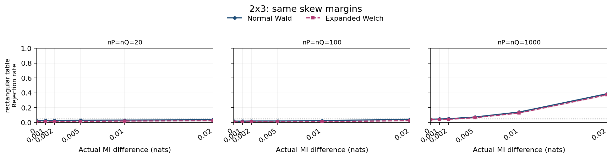

| Specification | Setting |
| --- | --- |
| Table size | 2x3 |
| Horizontal graph regime specifications (columns) | nP=nQ=20, nP=nQ=100, nP=nQ=1000 |
| Vertical graph regime specifications (rows) | rectangular table: P row (0.8, 0.2), P column (0.8, 0.2/2 repeated 2 times); Q row (0.8, 0.2), Q column (0.8, 0.2/2 repeated 2 times) |
| Probability changes | rectangular table: add at (1,1),(2,2) and subtract at (1,2),(2,1), for both P and Q |
| MI settings | Baseline MI {0.02}; direction {q higher}; actual differences {0, 0.001, 0.002, 0.005, 0.01, 0.02} nats |
| Horizontal axis within each graph | Actual MI difference in nats, fixed from 0 to 0.02 |
| Vertical axis within each graph | Unconditional rejection rate from 0 to 1; invalid results count as non-rejections |
| Replicates | 20,000 per unique point |

Null-point rejection and validity:

| Vertical regime | Horizontal regime | x | Method | Rejection | Valid |
| --- | --- | --- | --- | --- | --- |
| rectangular table | nP=nQ=20 | 0 | Expanded Welch | 0.0152 | 0.9538 |
| rectangular table | nP=nQ=20 | 0 | Normal Wald | 0.0249 | 0.9994 |
| rectangular table | nP=nQ=100 | 0 | Expanded Welch | 0.0076 | 1.0000 |
| rectangular table | nP=nQ=100 | 0 | Normal Wald | 0.0180 | 1.0000 |
| rectangular table | nP=nQ=1000 | 0 | Expanded Welch | 0.0376 | 1.0000 |
| rectangular table | nP=nQ=1000 | 0 | Normal Wald | 0.0449 | 1.0000 |

Every plotted rate, interval, validity and minimum expected count

| Vertical regime | Horizontal regime | x | Method | Rejection | 95% interval | Valid | Conditional | Min expected P | Min expected Q |
| --- | --- | --- | --- | --- | --- | --- | --- | --- | --- |
| rectangular table | nP=nQ=20 | 0 | Expanded Welch | 0.0152 | [0.0136, 0.0170] | 0.9538 | 0.0159 | 0.4 | 0.4 |
| rectangular table | nP=nQ=20 | 0 | Normal Wald | 0.0249 | [0.0228, 0.0272] | 0.9994 | 0.0249 | 0.4 | 0.4 |
| rectangular table | nP=nQ=20 | 0.001 | Expanded Welch | 0.0162 | [0.0145, 0.0180] | 0.9535 | 0.0170 | 0.4 | 0.4 |
| rectangular table | nP=nQ=20 | 0.001 | Normal Wald | 0.0265 | [0.0244, 0.0288] | 0.9992 | 0.0265 | 0.4 | 0.4 |
| rectangular table | nP=nQ=20 | 0.002 | Expanded Welch | 0.0155 | [0.0138, 0.0173] | 0.9552 | 0.0162 | 0.4 | 0.4 |
| rectangular table | nP=nQ=20 | 0.002 | Normal Wald | 0.0275 | [0.0253, 0.0299] | 0.9992 | 0.0275 | 0.4 | 0.4 |
| rectangular table | nP=nQ=20 | 0.005 | Expanded Welch | 0.0166 | [0.0149, 0.0185] | 0.9540 | 0.0174 | 0.4 | 0.4 |
| rectangular table | nP=nQ=20 | 0.005 | Normal Wald | 0.0294 | [0.0271, 0.0318] | 0.9994 | 0.0294 | 0.4 | 0.4 |
| rectangular table | nP=nQ=20 | 0.01 | Expanded Welch | 0.0196 | [0.0177, 0.0216] | 0.9569 | 0.0204 | 0.4 | 0.4 |
| rectangular table | nP=nQ=20 | 0.01 | Normal Wald | 0.0320 | [0.0296, 0.0345] | 0.9997 | 0.0320 | 0.4 | 0.4 |
| rectangular table | nP=nQ=20 | 0.02 | Expanded Welch | 0.0232 | [0.0212, 0.0253] | 0.9527 | 0.0243 | 0.4 | 0.4 |
| rectangular table | nP=nQ=20 | 0.02 | Normal Wald | 0.0382 | [0.0356, 0.0409] | 0.9994 | 0.0382 | 0.4 | 0.4 |
| rectangular table | nP=nQ=100 | 0 | Expanded Welch | 0.0076 | [0.0064, 0.0088] | 1.0000 | 0.0076 | 2 | 2 |
| rectangular table | nP=nQ=100 | 0 | Normal Wald | 0.0180 | [0.0162, 0.0199] | 1.0000 | 0.0180 | 2 | 2 |
| rectangular table | nP=nQ=100 | 0.001 | Expanded Welch | 0.0076 | [0.0064, 0.0088] | 1.0000 | 0.0076 | 2 | 2 |
| rectangular table | nP=nQ=100 | 0.001 | Normal Wald | 0.0177 | [0.0160, 0.0197] | 1.0000 | 0.0177 | 2 | 2 |
| rectangular table | nP=nQ=100 | 0.002 | Expanded Welch | 0.0089 | [0.0076, 0.0102] | 1.0000 | 0.0089 | 2 | 2 |
| rectangular table | nP=nQ=100 | 0.002 | Normal Wald | 0.0201 | [0.0182, 0.0221] | 1.0000 | 0.0201 | 2 | 2 |
| rectangular table | nP=nQ=100 | 0.005 | Expanded Welch | 0.0092 | [0.0080, 0.0107] | 1.0000 | 0.0092 | 2 | 2 |
| rectangular table | nP=nQ=100 | 0.005 | Normal Wald | 0.0203 | [0.0184, 0.0223] | 1.0000 | 0.0203 | 2 | 2 |
| rectangular table | nP=nQ=100 | 0.01 | Expanded Welch | 0.0123 | [0.0109, 0.0139] | 1.0000 | 0.0123 | 2 | 2 |
| rectangular table | nP=nQ=100 | 0.01 | Normal Wald | 0.0249 | [0.0228, 0.0272] | 1.0000 | 0.0249 | 2 | 2 |
| rectangular table | nP=nQ=100 | 0.02 | Expanded Welch | 0.0242 | [0.0221, 0.0264] | 1.0000 | 0.0242 | 2 | 2 |
| rectangular table | nP=nQ=100 | 0.02 | Normal Wald | 0.0432 | [0.0404, 0.0461] | 1.0000 | 0.0432 | 2 | 2 |
| rectangular table | nP=nQ=1000 | 0 | Expanded Welch | 0.0376 | [0.0350, 0.0403] | 1.0000 | 0.0376 | 20 | 20 |
| rectangular table | nP=nQ=1000 | 0 | Normal Wald | 0.0449 | [0.0421, 0.0479] | 1.0000 | 0.0449 | 20 | 20 |
| rectangular table | nP=nQ=1000 | 0.001 | Expanded Welch | 0.0395 | [0.0369, 0.0423] | 1.0000 | 0.0395 | 20 | 20 |
| rectangular table | nP=nQ=1000 | 0.001 | Normal Wald | 0.0471 | [0.0442, 0.0501] | 1.0000 | 0.0471 | 20 | 20 |
| rectangular table | nP=nQ=1000 | 0.002 | Expanded Welch | 0.0427 | [0.0400, 0.0456] | 1.0000 | 0.0427 | 20 | 20 |
| rectangular table | nP=nQ=1000 | 0.002 | Normal Wald | 0.0507 | [0.0477, 0.0538] | 1.0000 | 0.0507 | 20 | 20 |
| rectangular table | nP=nQ=1000 | 0.005 | Expanded Welch | 0.0646 | [0.0613, 0.0681] | 1.0000 | 0.0646 | 20 | 20 |
| rectangular table | nP=nQ=1000 | 0.005 | Normal Wald | 0.0737 | [0.0702, 0.0775] | 1.0000 | 0.0737 | 20 | 20 |
| rectangular table | nP=nQ=1000 | 0.01 | Expanded Welch | 0.1273 | [0.1228, 0.1320] | 1.0000 | 0.1273 | 20 | 20 |
| rectangular table | nP=nQ=1000 | 0.01 | Normal Wald | 0.1403 | [0.1355, 0.1451] | 1.0000 | 0.1403 | 20 | 20 |
| rectangular table | nP=nQ=1000 | 0.02 | Expanded Welch | 0.3729 | [0.3662, 0.3796] | 1.0000 | 0.3729 | 20 | 20 |
| rectangular table | nP=nQ=1000 | 0.02 | Normal Wald | 0.3875 | [0.3808, 0.3943] | 1.0000 | 0.3875 | 20 | 20 |

### 8.3 2x3: different skew margins

Do the square-table conclusions extend to rectangular tables?

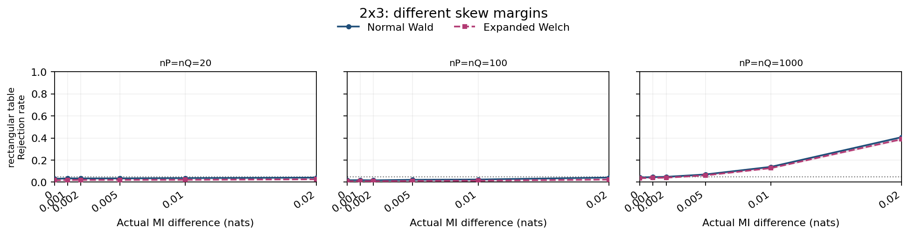

| Specification | Setting |
| --- | --- |
| Table size | 2x3 |
| Horizontal graph regime specifications (columns) | nP=nQ=20, nP=nQ=100, nP=nQ=1000 |
| Vertical graph regime specifications (rows) | rectangular table: P row (0.7, 0.3), P column (0.7, 0.3/2 repeated 2 times); Q row (0.8, 0.2), Q column (0.8, 0.2/2 repeated 2 times) |
| Probability changes | rectangular table: add at (1,1),(2,2) and subtract at (1,2),(2,1), for both P and Q |
| MI settings | Baseline MI {0.02}; direction {q higher}; actual differences {0, 0.001, 0.002, 0.005, 0.01, 0.02} nats |
| Horizontal axis within each graph | Actual MI difference in nats, fixed from 0 to 0.02 |
| Vertical axis within each graph | Unconditional rejection rate from 0 to 1; invalid results count as non-rejections |
| Replicates | 20,000 per unique point |

Null-point rejection and validity:

| Vertical regime | Horizontal regime | x | Method | Rejection | Valid |
| --- | --- | --- | --- | --- | --- |
| rectangular table | nP=nQ=20 | 0 | Expanded Welch | 0.0171 | 0.9757 |
| rectangular table | nP=nQ=20 | 0 | Normal Wald | 0.0306 | 0.9999 |
| rectangular table | nP=nQ=100 | 0 | Expanded Welch | 0.0087 | 1.0000 |
| rectangular table | nP=nQ=100 | 0 | Normal Wald | 0.0177 | 1.0000 |
| rectangular table | nP=nQ=1000 | 0 | Expanded Welch | 0.0362 | 1.0000 |
| rectangular table | nP=nQ=1000 | 0 | Normal Wald | 0.0425 | 1.0000 |

Every plotted rate, interval, validity and minimum expected count

| Vertical regime | Horizontal regime | x | Method | Rejection | 95% interval | Valid | Conditional | Min expected P | Min expected Q |
| --- | --- | --- | --- | --- | --- | --- | --- | --- | --- |
| rectangular table | nP=nQ=20 | 0 | Expanded Welch | 0.0171 | [0.0154, 0.0190] | 0.9757 | 0.0176 | 0.9 | 0.4 |
| rectangular table | nP=nQ=20 | 0 | Normal Wald | 0.0306 | [0.0283, 0.0331] | 0.9999 | 0.0306 | 0.9 | 0.4 |
| rectangular table | nP=nQ=20 | 0.001 | Expanded Welch | 0.0195 | [0.0177, 0.0215] | 0.9772 | 0.0200 | 0.9 | 0.4 |
| rectangular table | nP=nQ=20 | 0.001 | Normal Wald | 0.0345 | [0.0321, 0.0371] | 0.9999 | 0.0345 | 0.9 | 0.4 |
| rectangular table | nP=nQ=20 | 0.002 | Expanded Welch | 0.0200 | [0.0182, 0.0221] | 0.9744 | 0.0206 | 0.9 | 0.4 |
| rectangular table | nP=nQ=20 | 0.002 | Normal Wald | 0.0341 | [0.0317, 0.0367] | 0.9999 | 0.0341 | 0.9 | 0.4 |
| rectangular table | nP=nQ=20 | 0.005 | Expanded Welch | 0.0205 | [0.0187, 0.0226] | 0.9768 | 0.0210 | 0.9 | 0.4 |
| rectangular table | nP=nQ=20 | 0.005 | Normal Wald | 0.0346 | [0.0322, 0.0372] | 0.9998 | 0.0346 | 0.9 | 0.4 |
| rectangular table | nP=nQ=20 | 0.01 | Expanded Welch | 0.0213 | [0.0193, 0.0233] | 0.9754 | 0.0218 | 0.9 | 0.4 |
| rectangular table | nP=nQ=20 | 0.01 | Normal Wald | 0.0370 | [0.0345, 0.0398] | 1.0000 | 0.0371 | 0.9 | 0.4 |
| rectangular table | nP=nQ=20 | 0.02 | Expanded Welch | 0.0259 | [0.0238, 0.0282] | 0.9758 | 0.0265 | 0.9 | 0.4 |
| rectangular table | nP=nQ=20 | 0.02 | Normal Wald | 0.0415 | [0.0388, 0.0443] | 0.9999 | 0.0415 | 0.9 | 0.4 |
| rectangular table | nP=nQ=100 | 0 | Expanded Welch | 0.0087 | [0.0075, 0.0101] | 1.0000 | 0.0087 | 4.5 | 2 |
| rectangular table | nP=nQ=100 | 0 | Normal Wald | 0.0177 | [0.0160, 0.0196] | 1.0000 | 0.0177 | 4.5 | 2 |
| rectangular table | nP=nQ=100 | 0.001 | Expanded Welch | 0.0092 | [0.0080, 0.0106] | 1.0000 | 0.0092 | 4.5 | 2 |
| rectangular table | nP=nQ=100 | 0.001 | Normal Wald | 0.0186 | [0.0168, 0.0205] | 1.0000 | 0.0186 | 4.5 | 2 |
| rectangular table | nP=nQ=100 | 0.002 | Expanded Welch | 0.0084 | [0.0072, 0.0098] | 1.0000 | 0.0084 | 4.5 | 2 |
| rectangular table | nP=nQ=100 | 0.002 | Normal Wald | 0.0171 | [0.0154, 0.0190] | 1.0000 | 0.0171 | 4.5 | 2 |
| rectangular table | nP=nQ=100 | 0.005 | Expanded Welch | 0.0113 | [0.0099, 0.0129] | 1.0000 | 0.0113 | 4.5 | 2 |
| rectangular table | nP=nQ=100 | 0.005 | Normal Wald | 0.0216 | [0.0197, 0.0238] | 1.0000 | 0.0216 | 4.5 | 2 |
| rectangular table | nP=nQ=100 | 0.01 | Expanded Welch | 0.0138 | [0.0122, 0.0155] | 1.0000 | 0.0138 | 4.5 | 2 |
| rectangular table | nP=nQ=100 | 0.01 | Normal Wald | 0.0243 | [0.0222, 0.0265] | 1.0000 | 0.0243 | 4.5 | 2 |
| rectangular table | nP=nQ=100 | 0.02 | Expanded Welch | 0.0233 | [0.0213, 0.0255] | 1.0000 | 0.0233 | 4.5 | 2 |
| rectangular table | nP=nQ=100 | 0.02 | Normal Wald | 0.0420 | [0.0393, 0.0449] | 1.0000 | 0.0420 | 4.5 | 2 |
| rectangular table | nP=nQ=1000 | 0 | Expanded Welch | 0.0362 | [0.0337, 0.0389] | 1.0000 | 0.0362 | 45 | 20 |
| rectangular table | nP=nQ=1000 | 0 | Normal Wald | 0.0425 | [0.0398, 0.0454] | 1.0000 | 0.0425 | 45 | 20 |
| rectangular table | nP=nQ=1000 | 0.001 | Expanded Welch | 0.0396 | [0.0369, 0.0423] | 1.0000 | 0.0396 | 45 | 20 |
| rectangular table | nP=nQ=1000 | 0.001 | Normal Wald | 0.0463 | [0.0435, 0.0493] | 1.0000 | 0.0463 | 45 | 20 |
| rectangular table | nP=nQ=1000 | 0.002 | Expanded Welch | 0.0408 | [0.0381, 0.0436] | 1.0000 | 0.0408 | 45 | 20 |
| rectangular table | nP=nQ=1000 | 0.002 | Normal Wald | 0.0485 | [0.0456, 0.0515] | 1.0000 | 0.0485 | 45 | 20 |
| rectangular table | nP=nQ=1000 | 0.005 | Expanded Welch | 0.0618 | [0.0585, 0.0652] | 1.0000 | 0.0618 | 45 | 20 |
| rectangular table | nP=nQ=1000 | 0.005 | Normal Wald | 0.0701 | [0.0666, 0.0737] | 1.0000 | 0.0701 | 45 | 20 |
| rectangular table | nP=nQ=1000 | 0.01 | Expanded Welch | 0.1275 | [0.1229, 0.1322] | 1.0000 | 0.1275 | 45 | 20 |
| rectangular table | nP=nQ=1000 | 0.01 | Normal Wald | 0.1389 | [0.1342, 0.1438] | 1.0000 | 0.1389 | 45 | 20 |
| rectangular table | nP=nQ=1000 | 0.02 | Expanded Welch | 0.3895 | [0.3828, 0.3963] | 1.0000 | 0.3895 | 45 | 20 |
| rectangular table | nP=nQ=1000 | 0.02 | Normal Wald | 0.4079 | [0.4012, 0.4148] | 1.0000 | 0.4079 | 45 | 20 |

### 8.4 3x5: uniform margins

Do the square-table conclusions extend to rectangular tables?

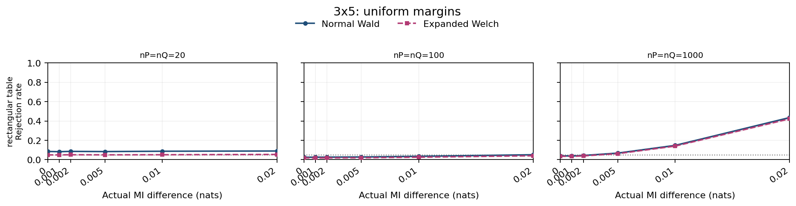

| Specification | Setting |
| --- | --- |
| Table size | 3x5 |
| Horizontal graph regime specifications (columns) | nP=nQ=20, nP=nQ=100, nP=nQ=1000 |
| Vertical graph regime specifications (rows) | rectangular table: P row (0.3333 repeated 3 times), P column (0.2 repeated 5 times); Q row (0.3333 repeated 3 times), Q column (0.2 repeated 5 times) |
| Probability changes | rectangular table: add at (1,1),(2,2) and subtract at (1,2),(2,1), for both P and Q |
| MI settings | Baseline MI {0.02}; direction {q higher}; actual differences {0, 0.001, 0.002, 0.005, 0.01, 0.02} nats |
| Horizontal axis within each graph | Actual MI difference in nats, fixed from 0 to 0.02 |
| Vertical axis within each graph | Unconditional rejection rate from 0 to 1; invalid results count as non-rejections |
| Replicates | 20,000 per unique point |

Null-point rejection and validity:

| Vertical regime | Horizontal regime | x | Method | Rejection | Valid |
| --- | --- | --- | --- | --- | --- |
| rectangular table | nP=nQ=20 | 0 | Expanded Welch | 0.0495 | 1.0000 |
| rectangular table | nP=nQ=20 | 0 | Normal Wald | 0.0851 | 1.0000 |
| rectangular table | nP=nQ=100 | 0 | Expanded Welch | 0.0189 | 1.0000 |
| rectangular table | nP=nQ=100 | 0 | Normal Wald | 0.0257 | 1.0000 |
| rectangular table | nP=nQ=1000 | 0 | Expanded Welch | 0.0353 | 1.0000 |
| rectangular table | nP=nQ=1000 | 0 | Normal Wald | 0.0399 | 1.0000 |

Every plotted rate, interval, validity and minimum expected count

| Vertical regime | Horizontal regime | x | Method | Rejection | 95% interval | Valid | Conditional | Min expected P | Min expected Q |
| --- | --- | --- | --- | --- | --- | --- | --- | --- | --- |
| rectangular table | nP=nQ=20 | 0 | Expanded Welch | 0.0495 | [0.0465, 0.0525] | 1.0000 | 0.0495 | 0.8235 | 0.8235 |
| rectangular table | nP=nQ=20 | 0 | Normal Wald | 0.0851 | [0.0813, 0.0890] | 1.0000 | 0.0851 | 0.8235 | 0.8235 |
| rectangular table | nP=nQ=20 | 0.001 | Expanded Welch | 0.0496 | [0.0467, 0.0527] | 1.0000 | 0.0496 | 0.8235 | 0.8113 |
| rectangular table | nP=nQ=20 | 0.001 | Normal Wald | 0.0830 | [0.0793, 0.0870] | 1.0000 | 0.0830 | 0.8235 | 0.8113 |
| rectangular table | nP=nQ=20 | 0.002 | Expanded Welch | 0.0512 | [0.0482, 0.0543] | 1.0000 | 0.0512 | 0.8235 | 0.7993 |
| rectangular table | nP=nQ=20 | 0.002 | Normal Wald | 0.0858 | [0.0820, 0.0898] | 1.0000 | 0.0858 | 0.8235 | 0.7993 |
| rectangular table | nP=nQ=20 | 0.005 | Expanded Welch | 0.0502 | [0.0473, 0.0533] | 1.0000 | 0.0502 | 0.8235 | 0.7652 |
| rectangular table | nP=nQ=20 | 0.005 | Normal Wald | 0.0840 | [0.0802, 0.0879] | 1.0000 | 0.0840 | 0.8235 | 0.7652 |
| rectangular table | nP=nQ=20 | 0.01 | Expanded Welch | 0.0512 | [0.0482, 0.0543] | 1.0000 | 0.0512 | 0.8235 | 0.713 |
| rectangular table | nP=nQ=20 | 0.01 | Normal Wald | 0.0876 | [0.0837, 0.0915] | 1.0000 | 0.0876 | 0.8235 | 0.713 |
| rectangular table | nP=nQ=20 | 0.02 | Expanded Welch | 0.0544 | [0.0513, 0.0576] | 1.0000 | 0.0544 | 0.8235 | 0.6219 |
| rectangular table | nP=nQ=20 | 0.02 | Normal Wald | 0.0899 | [0.0860, 0.0939] | 1.0000 | 0.0899 | 0.8235 | 0.6219 |
| rectangular table | nP=nQ=100 | 0 | Expanded Welch | 0.0189 | [0.0171, 0.0209] | 1.0000 | 0.0189 | 4.117 | 4.117 |
| rectangular table | nP=nQ=100 | 0 | Normal Wald | 0.0257 | [0.0236, 0.0280] | 1.0000 | 0.0257 | 4.117 | 4.117 |
| rectangular table | nP=nQ=100 | 0.001 | Expanded Welch | 0.0179 | [0.0162, 0.0198] | 1.0000 | 0.0179 | 4.117 | 4.056 |
| rectangular table | nP=nQ=100 | 0.001 | Normal Wald | 0.0260 | [0.0239, 0.0283] | 1.0000 | 0.0260 | 4.117 | 4.056 |
| rectangular table | nP=nQ=100 | 0.002 | Expanded Welch | 0.0186 | [0.0168, 0.0205] | 1.0000 | 0.0186 | 4.117 | 3.997 |
| rectangular table | nP=nQ=100 | 0.002 | Normal Wald | 0.0267 | [0.0246, 0.0290] | 1.0000 | 0.0267 | 4.117 | 3.997 |
| rectangular table | nP=nQ=100 | 0.005 | Expanded Welch | 0.0197 | [0.0178, 0.0217] | 1.0000 | 0.0197 | 4.117 | 3.826 |
| rectangular table | nP=nQ=100 | 0.005 | Normal Wald | 0.0282 | [0.0260, 0.0306] | 1.0000 | 0.0282 | 4.117 | 3.826 |
| rectangular table | nP=nQ=100 | 0.01 | Expanded Welch | 0.0259 | [0.0237, 0.0281] | 1.0000 | 0.0259 | 4.117 | 3.565 |
| rectangular table | nP=nQ=100 | 0.01 | Normal Wald | 0.0352 | [0.0328, 0.0379] | 1.0000 | 0.0352 | 4.117 | 3.565 |
| rectangular table | nP=nQ=100 | 0.02 | Expanded Welch | 0.0408 | [0.0382, 0.0437] | 1.0000 | 0.0408 | 4.117 | 3.11 |
| rectangular table | nP=nQ=100 | 0.02 | Normal Wald | 0.0513 | [0.0483, 0.0544] | 1.0000 | 0.0513 | 4.117 | 3.11 |
| rectangular table | nP=nQ=1000 | 0 | Expanded Welch | 0.0353 | [0.0329, 0.0380] | 1.0000 | 0.0353 | 41.17 | 41.17 |
| rectangular table | nP=nQ=1000 | 0 | Normal Wald | 0.0399 | [0.0373, 0.0427] | 1.0000 | 0.0399 | 41.17 | 41.17 |
| rectangular table | nP=nQ=1000 | 0.001 | Expanded Welch | 0.0345 | [0.0321, 0.0372] | 1.0000 | 0.0345 | 41.17 | 40.56 |
| rectangular table | nP=nQ=1000 | 0.001 | Normal Wald | 0.0389 | [0.0363, 0.0416] | 1.0000 | 0.0389 | 41.17 | 40.56 |
| rectangular table | nP=nQ=1000 | 0.002 | Expanded Welch | 0.0391 | [0.0365, 0.0419] | 1.0000 | 0.0391 | 41.17 | 39.97 |
| rectangular table | nP=nQ=1000 | 0.002 | Normal Wald | 0.0439 | [0.0411, 0.0468] | 1.0000 | 0.0439 | 41.17 | 39.97 |
| rectangular table | nP=nQ=1000 | 0.005 | Expanded Welch | 0.0624 | [0.0591, 0.0658] | 1.0000 | 0.0624 | 41.17 | 38.26 |
| rectangular table | nP=nQ=1000 | 0.005 | Normal Wald | 0.0683 | [0.0648, 0.0718] | 1.0000 | 0.0683 | 41.17 | 38.26 |
| rectangular table | nP=nQ=1000 | 0.01 | Expanded Welch | 0.1407 | [0.1360, 0.1456] | 1.0000 | 0.1407 | 41.17 | 35.65 |
| rectangular table | nP=nQ=1000 | 0.01 | Normal Wald | 0.1478 | [0.1429, 0.1528] | 1.0000 | 0.1478 | 41.17 | 35.65 |
| rectangular table | nP=nQ=1000 | 0.02 | Expanded Welch | 0.4230 | [0.4162, 0.4299] | 1.0000 | 0.4230 | 41.17 | 31.1 |
| rectangular table | nP=nQ=1000 | 0.02 | Normal Wald | 0.4355 | [0.4286, 0.4423] | 1.0000 | 0.4355 | 41.17 | 31.1 |

### 8.5 3x5: same skew margins

Do the square-table conclusions extend to rectangular tables?

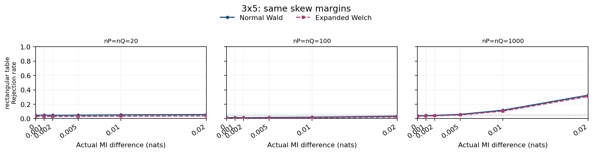

| Specification | Setting |
| --- | --- |
| Table size | 3x5 |
| Horizontal graph regime specifications (columns) | nP=nQ=20, nP=nQ=100, nP=nQ=1000 |
| Vertical graph regime specifications (rows) | rectangular table: P row (0.8, 0.2/2 repeated 2 times), P column (0.8, 0.2/4 repeated 4 times); Q row (0.8, 0.2/2 repeated 2 times), Q column (0.8, 0.2/4 repeated 4 times) |
| Probability changes | rectangular table: add at (1,1),(2,2) and subtract at (1,2),(2,1), for both P and Q |
| MI settings | Baseline MI {0.02}; direction {q higher}; actual differences {0, 0.001, 0.002, 0.005, 0.01, 0.02} nats |
| Horizontal axis within each graph | Actual MI difference in nats, fixed from 0 to 0.02 |
| Vertical axis within each graph | Unconditional rejection rate from 0 to 1; invalid results count as non-rejections |
| Replicates | 20,000 per unique point |

Null-point rejection and validity:

| Vertical regime | Horizontal regime | x | Method | Rejection | Valid |
| --- | --- | --- | --- | --- | --- |
| rectangular table | nP=nQ=20 | 0 | Expanded Welch | 0.0299 | 0.9573 |
| rectangular table | nP=nQ=20 | 0 | Normal Wald | 0.0457 | 0.9994 |
| rectangular table | nP=nQ=100 | 0 | Expanded Welch | 0.0074 | 1.0000 |
| rectangular table | nP=nQ=100 | 0 | Normal Wald | 0.0132 | 1.0000 |
| rectangular table | nP=nQ=1000 | 0 | Expanded Welch | 0.0327 | 1.0000 |
| rectangular table | nP=nQ=1000 | 0 | Normal Wald | 0.0396 | 1.0000 |

Every plotted rate, interval, validity and minimum expected count

| Vertical regime | Horizontal regime | x | Method | Rejection | 95% interval | Valid | Conditional | Min expected P | Min expected Q |
| --- | --- | --- | --- | --- | --- | --- | --- | --- | --- |
| rectangular table | nP=nQ=20 | 0 | Expanded Welch | 0.0299 | [0.0276, 0.0323] | 0.9573 | 0.0312 | 0.1 | 0.1 |
| rectangular table | nP=nQ=20 | 0 | Normal Wald | 0.0457 | [0.0429, 0.0487] | 0.9994 | 0.0458 | 0.1 | 0.1 |
| rectangular table | nP=nQ=20 | 0.001 | Expanded Welch | 0.0307 | [0.0284, 0.0332] | 0.9568 | 0.0321 | 0.1 | 0.1 |
| rectangular table | nP=nQ=20 | 0.001 | Normal Wald | 0.0483 | [0.0454, 0.0514] | 0.9997 | 0.0483 | 0.1 | 0.1 |
| rectangular table | nP=nQ=20 | 0.002 | Expanded Welch | 0.0305 | [0.0282, 0.0329] | 0.9583 | 0.0318 | 0.1 | 0.1 |
| rectangular table | nP=nQ=20 | 0.002 | Normal Wald | 0.0464 | [0.0436, 0.0494] | 0.9996 | 0.0464 | 0.1 | 0.1 |
| rectangular table | nP=nQ=20 | 0.005 | Expanded Welch | 0.0310 | [0.0287, 0.0335] | 0.9590 | 0.0323 | 0.1 | 0.1 |
| rectangular table | nP=nQ=20 | 0.005 | Normal Wald | 0.0483 | [0.0455, 0.0514] | 0.9992 | 0.0484 | 0.1 | 0.1 |
| rectangular table | nP=nQ=20 | 0.01 | Expanded Welch | 0.0346 | [0.0322, 0.0372] | 0.9558 | 0.0362 | 0.1 | 0.1 |
| rectangular table | nP=nQ=20 | 0.01 | Normal Wald | 0.0524 | [0.0494, 0.0556] | 0.9995 | 0.0525 | 0.1 | 0.1 |
| rectangular table | nP=nQ=20 | 0.02 | Expanded Welch | 0.0381 | [0.0355, 0.0408] | 0.9562 | 0.0398 | 0.1 | 0.1 |
| rectangular table | nP=nQ=20 | 0.02 | Normal Wald | 0.0564 | [0.0533, 0.0597] | 0.9989 | 0.0565 | 0.1 | 0.1 |
| rectangular table | nP=nQ=100 | 0 | Expanded Welch | 0.0074 | [0.0063, 0.0087] | 1.0000 | 0.0074 | 0.5 | 0.5 |
| rectangular table | nP=nQ=100 | 0 | Normal Wald | 0.0132 | [0.0117, 0.0148] | 1.0000 | 0.0132 | 0.5 | 0.5 |
| rectangular table | nP=nQ=100 | 0.001 | Expanded Welch | 0.0083 | [0.0071, 0.0096] | 1.0000 | 0.0083 | 0.5 | 0.5 |
| rectangular table | nP=nQ=100 | 0.001 | Normal Wald | 0.0144 | [0.0128, 0.0161] | 1.0000 | 0.0144 | 0.5 | 0.5 |
| rectangular table | nP=nQ=100 | 0.002 | Expanded Welch | 0.0072 | [0.0061, 0.0085] | 1.0000 | 0.0072 | 0.5 | 0.5 |
| rectangular table | nP=nQ=100 | 0.002 | Normal Wald | 0.0126 | [0.0112, 0.0143] | 1.0000 | 0.0126 | 0.5 | 0.5 |
| rectangular table | nP=nQ=100 | 0.005 | Expanded Welch | 0.0097 | [0.0084, 0.0111] | 1.0000 | 0.0097 | 0.5 | 0.5 |
| rectangular table | nP=nQ=100 | 0.005 | Normal Wald | 0.0160 | [0.0144, 0.0179] | 1.0000 | 0.0160 | 0.5 | 0.5 |
| rectangular table | nP=nQ=100 | 0.01 | Expanded Welch | 0.0121 | [0.0107, 0.0137] | 1.0000 | 0.0121 | 0.5 | 0.5 |
| rectangular table | nP=nQ=100 | 0.01 | Normal Wald | 0.0202 | [0.0183, 0.0222] | 1.0000 | 0.0202 | 0.5 | 0.5 |
| rectangular table | nP=nQ=100 | 0.02 | Expanded Welch | 0.0215 | [0.0195, 0.0236] | 1.0000 | 0.0215 | 0.5 | 0.5 |
| rectangular table | nP=nQ=100 | 0.02 | Normal Wald | 0.0336 | [0.0312, 0.0362] | 1.0000 | 0.0336 | 0.5 | 0.5 |
| rectangular table | nP=nQ=1000 | 0 | Expanded Welch | 0.0327 | [0.0303, 0.0353] | 1.0000 | 0.0327 | 5 | 5 |
| rectangular table | nP=nQ=1000 | 0 | Normal Wald | 0.0396 | [0.0370, 0.0424] | 1.0000 | 0.0396 | 5 | 5 |
| rectangular table | nP=nQ=1000 | 0.001 | Expanded Welch | 0.0358 | [0.0333, 0.0385] | 1.0000 | 0.0358 | 5 | 5 |
| rectangular table | nP=nQ=1000 | 0.001 | Normal Wald | 0.0423 | [0.0396, 0.0452] | 1.0000 | 0.0423 | 5 | 5 |
| rectangular table | nP=nQ=1000 | 0.002 | Expanded Welch | 0.0387 | [0.0362, 0.0415] | 1.0000 | 0.0387 | 5 | 5 |
| rectangular table | nP=nQ=1000 | 0.002 | Normal Wald | 0.0449 | [0.0421, 0.0478] | 1.0000 | 0.0449 | 5 | 5 |
| rectangular table | nP=nQ=1000 | 0.005 | Expanded Welch | 0.0508 | [0.0479, 0.0540] | 1.0000 | 0.0508 | 5 | 5 |
| rectangular table | nP=nQ=1000 | 0.005 | Normal Wald | 0.0587 | [0.0556, 0.0621] | 1.0000 | 0.0587 | 5 | 5 |
| rectangular table | nP=nQ=1000 | 0.01 | Expanded Welch | 0.1048 | [0.1007, 0.1092] | 1.0000 | 0.1048 | 5 | 5 |
| rectangular table | nP=nQ=1000 | 0.01 | Normal Wald | 0.1170 | [0.1126, 0.1215] | 1.0000 | 0.1170 | 5 | 5 |
| rectangular table | nP=nQ=1000 | 0.02 | Expanded Welch | 0.3094 | [0.3030, 0.3158] | 1.0000 | 0.3094 | 5 | 5 |
| rectangular table | nP=nQ=1000 | 0.02 | Normal Wald | 0.3263 | [0.3198, 0.3328] | 1.0000 | 0.3263 | 5 | 5 |

### 8.6 3x5: different skew margins

Do the square-table conclusions extend to rectangular tables?

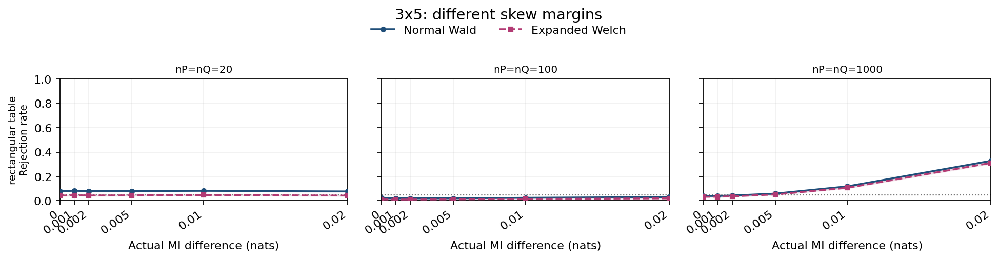

| Specification | Setting |
| --- | --- |
| Table size | 3x5 |
| Horizontal graph regime specifications (columns) | nP=nQ=20, nP=nQ=100, nP=nQ=1000 |
| Vertical graph regime specifications (rows) | rectangular table: P row (0.7, 0.3/2 repeated 2 times), P column (0.7, 0.3/4 repeated 4 times); Q row (0.8, 0.2/2 repeated 2 times), Q column (0.8, 0.2/4 repeated 4 times) |
| Probability changes | rectangular table: add at (1,1),(2,2) and subtract at (1,2),(2,1), for both P and Q |
| MI settings | Baseline MI {0.02}; direction {q higher}; actual differences {0, 0.001, 0.002, 0.005, 0.01, 0.02} nats |
| Horizontal axis within each graph | Actual MI difference in nats, fixed from 0 to 0.02 |
| Vertical axis within each graph | Unconditional rejection rate from 0 to 1; invalid results count as non-rejections |
| Replicates | 20,000 per unique point |

Null-point rejection and validity:

| Vertical regime | Horizontal regime | x | Method | Rejection | Valid |
| --- | --- | --- | --- | --- | --- |
| rectangular table | nP=nQ=20 | 0 | Expanded Welch | 0.0425 | 0.9773 |
| rectangular table | nP=nQ=20 | 0 | Normal Wald | 0.0784 | 1.0000 |
| rectangular table | nP=nQ=100 | 0 | Expanded Welch | 0.0114 | 1.0000 |
| rectangular table | nP=nQ=100 | 0 | Normal Wald | 0.0211 | 1.0000 |
| rectangular table | nP=nQ=1000 | 0 | Expanded Welch | 0.0329 | 1.0000 |
| rectangular table | nP=nQ=1000 | 0 | Normal Wald | 0.0394 | 1.0000 |

Every plotted rate, interval, validity and minimum expected count

| Vertical regime | Horizontal regime | x | Method | Rejection | 95% interval | Valid | Conditional | Min expected P | Min expected Q |
| --- | --- | --- | --- | --- | --- | --- | --- | --- | --- |
| rectangular table | nP=nQ=20 | 0 | Expanded Welch | 0.0425 | [0.0397, 0.0453] | 0.9773 | 0.0434 | 0.225 | 0.1 |
| rectangular table | nP=nQ=20 | 0 | Normal Wald | 0.0784 | [0.0748, 0.0822] | 1.0000 | 0.0784 | 0.225 | 0.1 |
| rectangular table | nP=nQ=20 | 0.001 | Expanded Welch | 0.0454 | [0.0426, 0.0483] | 0.9757 | 0.0465 | 0.225 | 0.1 |
| rectangular table | nP=nQ=20 | 0.001 | Normal Wald | 0.0824 | [0.0787, 0.0863] | 1.0000 | 0.0825 | 0.225 | 0.1 |
| rectangular table | nP=nQ=20 | 0.002 | Expanded Welch | 0.0435 | [0.0408, 0.0465] | 0.9770 | 0.0446 | 0.225 | 0.1 |
| rectangular table | nP=nQ=20 | 0.002 | Normal Wald | 0.0793 | [0.0756, 0.0831] | 1.0000 | 0.0793 | 0.225 | 0.1 |
| rectangular table | nP=nQ=20 | 0.005 | Expanded Welch | 0.0445 | [0.0418, 0.0475] | 0.9758 | 0.0457 | 0.225 | 0.1 |
| rectangular table | nP=nQ=20 | 0.005 | Normal Wald | 0.0799 | [0.0762, 0.0837] | 1.0000 | 0.0799 | 0.225 | 0.1 |
| rectangular table | nP=nQ=20 | 0.01 | Expanded Welch | 0.0472 | [0.0443, 0.0502] | 0.9752 | 0.0484 | 0.225 | 0.1 |
| rectangular table | nP=nQ=20 | 0.01 | Normal Wald | 0.0819 | [0.0782, 0.0858] | 1.0000 | 0.0820 | 0.225 | 0.1 |
| rectangular table | nP=nQ=20 | 0.02 | Expanded Welch | 0.0428 | [0.0400, 0.0456] | 0.9775 | 0.0437 | 0.225 | 0.1 |
| rectangular table | nP=nQ=20 | 0.02 | Normal Wald | 0.0768 | [0.0732, 0.0806] | 1.0000 | 0.0768 | 0.225 | 0.1 |
| rectangular table | nP=nQ=100 | 0 | Expanded Welch | 0.0114 | [0.0100, 0.0129] | 1.0000 | 0.0114 | 1.125 | 0.5 |
| rectangular table | nP=nQ=100 | 0 | Normal Wald | 0.0211 | [0.0192, 0.0232] | 1.0000 | 0.0211 | 1.125 | 0.5 |
| rectangular table | nP=nQ=100 | 0.001 | Expanded Welch | 0.0100 | [0.0087, 0.0115] | 1.0000 | 0.0100 | 1.125 | 0.5 |
| rectangular table | nP=nQ=100 | 0.001 | Normal Wald | 0.0196 | [0.0178, 0.0216] | 1.0000 | 0.0196 | 1.125 | 0.5 |
| rectangular table | nP=nQ=100 | 0.002 | Expanded Welch | 0.0104 | [0.0091, 0.0120] | 1.0000 | 0.0104 | 1.125 | 0.5 |
| rectangular table | nP=nQ=100 | 0.002 | Normal Wald | 0.0200 | [0.0181, 0.0220] | 1.0000 | 0.0200 | 1.125 | 0.5 |
| rectangular table | nP=nQ=100 | 0.005 | Expanded Welch | 0.0113 | [0.0099, 0.0129] | 1.0000 | 0.0113 | 1.125 | 0.5 |
| rectangular table | nP=nQ=100 | 0.005 | Normal Wald | 0.0203 | [0.0184, 0.0223] | 1.0000 | 0.0203 | 1.125 | 0.5 |
| rectangular table | nP=nQ=100 | 0.01 | Expanded Welch | 0.0152 | [0.0136, 0.0170] | 1.0000 | 0.0152 | 1.125 | 0.5 |
| rectangular table | nP=nQ=100 | 0.01 | Normal Wald | 0.0247 | [0.0226, 0.0269] | 1.0000 | 0.0247 | 1.125 | 0.5 |
| rectangular table | nP=nQ=100 | 0.02 | Expanded Welch | 0.0200 | [0.0181, 0.0220] | 1.0000 | 0.0200 | 1.125 | 0.5 |
| rectangular table | nP=nQ=100 | 0.02 | Normal Wald | 0.0306 | [0.0283, 0.0331] | 1.0000 | 0.0306 | 1.125 | 0.5 |
| rectangular table | nP=nQ=1000 | 0 | Expanded Welch | 0.0329 | [0.0305, 0.0355] | 1.0000 | 0.0329 | 11.25 | 5 |
| rectangular table | nP=nQ=1000 | 0 | Normal Wald | 0.0394 | [0.0367, 0.0421] | 1.0000 | 0.0394 | 11.25 | 5 |
| rectangular table | nP=nQ=1000 | 0.001 | Expanded Welch | 0.0334 | [0.0310, 0.0360] | 1.0000 | 0.0334 | 11.25 | 5 |
| rectangular table | nP=nQ=1000 | 0.001 | Normal Wald | 0.0399 | [0.0373, 0.0427] | 1.0000 | 0.0399 | 11.25 | 5 |
| rectangular table | nP=nQ=1000 | 0.002 | Expanded Welch | 0.0367 | [0.0341, 0.0393] | 1.0000 | 0.0367 | 11.25 | 5 |
| rectangular table | nP=nQ=1000 | 0.002 | Normal Wald | 0.0434 | [0.0407, 0.0463] | 1.0000 | 0.0434 | 11.25 | 5 |
| rectangular table | nP=nQ=1000 | 0.005 | Expanded Welch | 0.0520 | [0.0491, 0.0552] | 1.0000 | 0.0520 | 11.25 | 5 |
| rectangular table | nP=nQ=1000 | 0.005 | Normal Wald | 0.0593 | [0.0561, 0.0627] | 1.0000 | 0.0593 | 11.25 | 5 |
| rectangular table | nP=nQ=1000 | 0.01 | Expanded Welch | 0.1064 | [0.1022, 0.1107] | 1.0000 | 0.1064 | 11.25 | 5 |
| rectangular table | nP=nQ=1000 | 0.01 | Normal Wald | 0.1183 | [0.1139, 0.1228] | 1.0000 | 0.1183 | 11.25 | 5 |
| rectangular table | nP=nQ=1000 | 0.02 | Expanded Welch | 0.3111 | [0.3048, 0.3176] | 1.0000 | 0.3111 | 11.25 | 5 |
| rectangular table | nP=nQ=1000 | 0.02 | Normal Wald | 0.3286 | [0.3221, 0.3351] | 1.0000 | 0.3286 | 11.25 | 5 |

## 9. Alternative population construction

Do conclusions change under a matched ordinal log-linear construction?

### 9.1 3x3: uniform margins, baseline MI 0.0001

Do conclusions change under a matched ordinal log-linear construction?

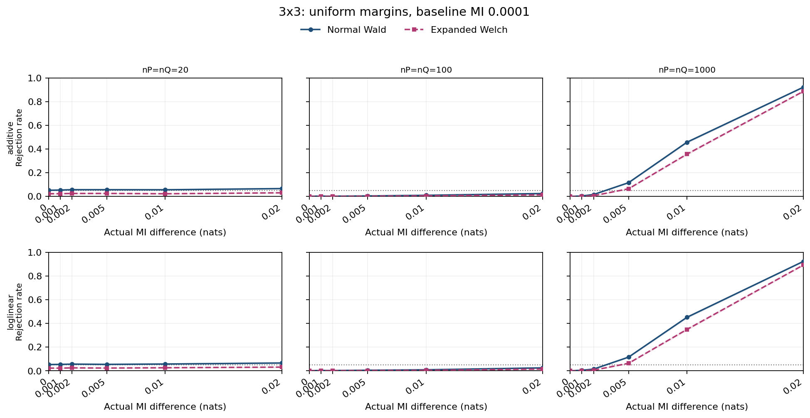

| Specification | Setting |
| --- | --- |
| Table size | 3x3 |
| Horizontal graph regime specifications (columns) | nP=nQ=20, nP=nQ=100, nP=nQ=1000 |
| Vertical graph regime specifications (rows) | additive: P row (0.3333 repeated 3 times), P column (0.3333 repeated 3 times); Q row (0.3333 repeated 3 times), Q column (0.3333 repeated 3 times); loglinear: P row (0.3333 repeated 3 times), P column (0.3333 repeated 3 times); Q row (0.3333 repeated 3 times), Q column (0.3333 repeated 3 times) |
| Probability changes | additive: add at (1,1),(2,2) and subtract at (1,2),(2,1), for both P and Q; loglinear: ordinal log-linear scores from -1 to 1, with row and column multipliers preserving the stated margins, for both P and Q |
| MI settings | Baseline MI {0.0001}; direction {q higher}; actual differences {0, 0.001, 0.002, 0.005, 0.01, 0.02} nats |
| Horizontal axis within each graph | Actual MI difference in nats, fixed from 0 to 0.02 |
| Vertical axis within each graph | Unconditional rejection rate from 0 to 1; invalid results count as non-rejections |
| Replicates | 20,000 per unique point |

Null-point rejection and validity:

| Vertical regime | Horizontal regime | x | Method | Rejection | Valid |
| --- | --- | --- | --- | --- | --- |
| additive | nP=nQ=20 | 0 | Expanded Welch | 0.0235 | 1.0000 |
| additive | nP=nQ=20 | 0 | Normal Wald | 0.0527 | 1.0000 |
| additive | nP=nQ=100 | 0 | Expanded Welch | 0.0013 | 1.0000 |
| additive | nP=nQ=100 | 0 | Normal Wald | 0.0025 | 1.0000 |
| additive | nP=nQ=1000 | 0 | Expanded Welch | 0.0002 | 1.0000 |
| additive | nP=nQ=1000 | 0 | Normal Wald | 0.0012 | 1.0000 |
| loglinear | nP=nQ=20 | 0 | Expanded Welch | 0.0233 | 1.0000 |
| loglinear | nP=nQ=20 | 0 | Normal Wald | 0.0532 | 1.0000 |
| loglinear | nP=nQ=100 | 0 | Expanded Welch | 0.0006 | 1.0000 |
| loglinear | nP=nQ=100 | 0 | Normal Wald | 0.0016 | 1.0000 |
| loglinear | nP=nQ=1000 | 0 | Expanded Welch | 0.0003 | 1.0000 |
| loglinear | nP=nQ=1000 | 0 | Normal Wald | 0.0008 | 1.0000 |

Every plotted rate, interval, validity and minimum expected count

| Vertical regime | Horizontal regime | x | Method | Rejection | 95% interval | Valid | Conditional | Min expected P | Min expected Q |
| --- | --- | --- | --- | --- | --- | --- | --- | --- | --- |
| additive | nP=nQ=20 | 0 | Expanded Welch | 0.0235 | [0.0215, 0.0257] | 1.0000 | 0.0235 | 2.175 | 2.175 |
| additive | nP=nQ=20 | 0 | Normal Wald | 0.0527 | [0.0496, 0.0558] | 1.0000 | 0.0527 | 2.175 | 2.175 |
| additive | nP=nQ=20 | 0.001 | Expanded Welch | 0.0238 | [0.0218, 0.0260] | 1.0000 | 0.0238 | 2.175 | 2.066 |
| additive | nP=nQ=20 | 0.001 | Normal Wald | 0.0544 | [0.0513, 0.0576] | 1.0000 | 0.0544 | 2.175 | 2.066 |
| additive | nP=nQ=20 | 0.002 | Expanded Welch | 0.0257 | [0.0236, 0.0280] | 1.0000 | 0.0257 | 2.175 | 2.006 |
| additive | nP=nQ=20 | 0.002 | Normal Wald | 0.0574 | [0.0543, 0.0607] | 1.0000 | 0.0574 | 2.175 | 2.006 |
| additive | nP=nQ=20 | 0.005 | Expanded Welch | 0.0260 | [0.0238, 0.0282] | 1.0000 | 0.0260 | 2.175 | 1.886 |
| additive | nP=nQ=20 | 0.005 | Normal Wald | 0.0573 | [0.0541, 0.0606] | 1.0000 | 0.0573 | 2.175 | 1.886 |
| additive | nP=nQ=20 | 0.01 | Expanded Welch | 0.0233 | [0.0213, 0.0255] | 1.0000 | 0.0233 | 2.175 | 1.75 |
| additive | nP=nQ=20 | 0.01 | Normal Wald | 0.0568 | [0.0537, 0.0601] | 1.0000 | 0.0568 | 2.175 | 1.75 |
| additive | nP=nQ=20 | 0.02 | Expanded Welch | 0.0313 | [0.0290, 0.0338] | 1.0000 | 0.0313 | 2.175 | 1.559 |
| additive | nP=nQ=20 | 0.02 | Normal Wald | 0.0668 | [0.0634, 0.0703] | 1.0000 | 0.0668 | 2.175 | 1.559 |
| additive | nP=nQ=100 | 0 | Expanded Welch | 0.0013 | [0.0009, 0.0019] | 1.0000 | 0.0013 | 10.88 | 10.88 |
| additive | nP=nQ=100 | 0 | Normal Wald | 0.0025 | [0.0019, 0.0033] | 1.0000 | 0.0025 | 10.88 | 10.88 |
| additive | nP=nQ=100 | 0.001 | Expanded Welch | 0.0015 | [0.0011, 0.0021] | 1.0000 | 0.0015 | 10.88 | 10.33 |
| additive | nP=nQ=100 | 0.001 | Normal Wald | 0.0031 | [0.0024, 0.0040] | 1.0000 | 0.0031 | 10.88 | 10.33 |
| additive | nP=nQ=100 | 0.002 | Expanded Welch | 0.0014 | [0.0009, 0.0020] | 1.0000 | 0.0014 | 10.88 | 10.03 |
| additive | nP=nQ=100 | 0.002 | Normal Wald | 0.0028 | [0.0022, 0.0036] | 1.0000 | 0.0028 | 10.88 | 10.03 |
| additive | nP=nQ=100 | 0.005 | Expanded Welch | 0.0026 | [0.0019, 0.0034] | 1.0000 | 0.0026 | 10.88 | 9.431 |
| additive | nP=nQ=100 | 0.005 | Normal Wald | 0.0048 | [0.0039, 0.0059] | 1.0000 | 0.0048 | 10.88 | 9.431 |
| additive | nP=nQ=100 | 0.01 | Expanded Welch | 0.0056 | [0.0047, 0.0068] | 1.0000 | 0.0056 | 10.88 | 8.751 |
| additive | nP=nQ=100 | 0.01 | Normal Wald | 0.0102 | [0.0089, 0.0117] | 1.0000 | 0.0102 | 10.88 | 8.751 |
| additive | nP=nQ=100 | 0.02 | Expanded Welch | 0.0141 | [0.0126, 0.0158] | 1.0000 | 0.0141 | 10.88 | 7.795 |
| additive | nP=nQ=100 | 0.02 | Normal Wald | 0.0252 | [0.0231, 0.0275] | 1.0000 | 0.0252 | 10.88 | 7.795 |
| additive | nP=nQ=1000 | 0 | Expanded Welch | 0.0002 | [0.0001, 0.0005] | 1.0000 | 0.0002 | 108.8 | 108.8 |
| additive | nP=nQ=1000 | 0 | Normal Wald | 0.0012 | [0.0008, 0.0018] | 1.0000 | 0.0012 | 108.8 | 108.8 |
| additive | nP=nQ=1000 | 0.001 | Expanded Welch | 0.0008 | [0.0005, 0.0013] | 1.0000 | 0.0008 | 108.8 | 103.3 |
| additive | nP=nQ=1000 | 0.001 | Normal Wald | 0.0044 | [0.0036, 0.0055] | 1.0000 | 0.0044 | 108.8 | 103.3 |
| additive | nP=nQ=1000 | 0.002 | Expanded Welch | 0.0066 | [0.0056, 0.0078] | 1.0000 | 0.0066 | 108.8 | 100.3 |
| additive | nP=nQ=1000 | 0.002 | Normal Wald | 0.0168 | [0.0151, 0.0186] | 1.0000 | 0.0168 | 108.8 | 100.3 |
| additive | nP=nQ=1000 | 0.005 | Expanded Welch | 0.0653 | [0.0620, 0.0688] | 1.0000 | 0.0653 | 108.8 | 94.31 |
| additive | nP=nQ=1000 | 0.005 | Normal Wald | 0.1167 | [0.1123, 0.1212] | 1.0000 | 0.1167 | 108.8 | 94.31 |
| additive | nP=nQ=1000 | 0.01 | Expanded Welch | 0.3567 | [0.3500, 0.3633] | 1.0000 | 0.3567 | 108.8 | 87.51 |
| additive | nP=nQ=1000 | 0.01 | Normal Wald | 0.4574 | [0.4505, 0.4643] | 1.0000 | 0.4574 | 108.8 | 87.51 |
| additive | nP=nQ=1000 | 0.02 | Expanded Welch | 0.8873 | [0.8828, 0.8916] | 1.0000 | 0.8873 | 108.8 | 77.95 |
| additive | nP=nQ=1000 | 0.02 | Normal Wald | 0.9222 | [0.9184, 0.9258] | 1.0000 | 0.9222 | 108.8 | 77.95 |
| loglinear | nP=nQ=20 | 0 | Expanded Welch | 0.0233 | [0.0213, 0.0255] | 1.0000 | 0.0233 | 2.175 | 2.175 |
| loglinear | nP=nQ=20 | 0 | Normal Wald | 0.0532 | [0.0502, 0.0564] | 1.0000 | 0.0532 | 2.175 | 2.175 |
| loglinear | nP=nQ=20 | 0.001 | Expanded Welch | 0.0230 | [0.0210, 0.0252] | 1.0000 | 0.0230 | 2.175 | 2.067 |
| loglinear | nP=nQ=20 | 0.001 | Normal Wald | 0.0546 | [0.0516, 0.0579] | 1.0000 | 0.0546 | 2.175 | 2.067 |
| loglinear | nP=nQ=20 | 0.002 | Expanded Welch | 0.0254 | [0.0233, 0.0277] | 1.0000 | 0.0254 | 2.175 | 2.008 |
| loglinear | nP=nQ=20 | 0.002 | Normal Wald | 0.0569 | [0.0538, 0.0602] | 1.0000 | 0.0569 | 2.175 | 2.008 |
| loglinear | nP=nQ=20 | 0.005 | Expanded Welch | 0.0238 | [0.0217, 0.0260] | 1.0000 | 0.0238 | 2.175 | 1.889 |
| loglinear | nP=nQ=20 | 0.005 | Normal Wald | 0.0549 | [0.0518, 0.0581] | 1.0000 | 0.0549 | 2.175 | 1.889 |
| loglinear | nP=nQ=20 | 0.01 | Expanded Welch | 0.0263 | [0.0242, 0.0286] | 1.0000 | 0.0263 | 2.175 | 1.756 |
| loglinear | nP=nQ=20 | 0.01 | Normal Wald | 0.0577 | [0.0546, 0.0610] | 1.0000 | 0.0577 | 2.175 | 1.756 |
| loglinear | nP=nQ=20 | 0.02 | Expanded Welch | 0.0318 | [0.0294, 0.0343] | 1.0000 | 0.0318 | 2.175 | 1.57 |
| loglinear | nP=nQ=20 | 0.02 | Normal Wald | 0.0664 | [0.0630, 0.0699] | 1.0000 | 0.0664 | 2.175 | 1.57 |
| loglinear | nP=nQ=100 | 0 | Expanded Welch | 0.0006 | [0.0004, 0.0011] | 1.0000 | 0.0006 | 10.88 | 10.88 |
| loglinear | nP=nQ=100 | 0 | Normal Wald | 0.0016 | [0.0012, 0.0023] | 1.0000 | 0.0016 | 10.88 | 10.88 |
| loglinear | nP=nQ=100 | 0.001 | Expanded Welch | 0.0017 | [0.0012, 0.0024] | 1.0000 | 0.0017 | 10.88 | 10.33 |
| loglinear | nP=nQ=100 | 0.001 | Normal Wald | 0.0032 | [0.0026, 0.0041] | 1.0000 | 0.0032 | 10.88 | 10.33 |
| loglinear | nP=nQ=100 | 0.002 | Expanded Welch | 0.0019 | [0.0013, 0.0025] | 1.0000 | 0.0019 | 10.88 | 10.04 |
| loglinear | nP=nQ=100 | 0.002 | Normal Wald | 0.0030 | [0.0023, 0.0039] | 1.0000 | 0.0030 | 10.88 | 10.04 |
| loglinear | nP=nQ=100 | 0.005 | Expanded Welch | 0.0029 | [0.0022, 0.0037] | 1.0000 | 0.0029 | 10.88 | 9.445 |
| loglinear | nP=nQ=100 | 0.005 | Normal Wald | 0.0051 | [0.0042, 0.0062] | 1.0000 | 0.0051 | 10.88 | 9.445 |
| loglinear | nP=nQ=100 | 0.01 | Expanded Welch | 0.0047 | [0.0039, 0.0058] | 1.0000 | 0.0047 | 10.88 | 8.778 |
| loglinear | nP=nQ=100 | 0.01 | Normal Wald | 0.0093 | [0.0081, 0.0107] | 1.0000 | 0.0093 | 10.88 | 8.778 |
| loglinear | nP=nQ=100 | 0.02 | Expanded Welch | 0.0153 | [0.0137, 0.0171] | 1.0000 | 0.0153 | 10.88 | 7.848 |
| loglinear | nP=nQ=100 | 0.02 | Normal Wald | 0.0254 | [0.0233, 0.0276] | 1.0000 | 0.0254 | 10.88 | 7.848 |
| loglinear | nP=nQ=1000 | 0 | Expanded Welch | 0.0003 | [0.0001, 0.0007] | 1.0000 | 0.0003 | 108.8 | 108.8 |
| loglinear | nP=nQ=1000 | 0 | Normal Wald | 0.0008 | [0.0005, 0.0014] | 1.0000 | 0.0008 | 108.8 | 108.8 |
| loglinear | nP=nQ=1000 | 0.001 | Expanded Welch | 0.0018 | [0.0013, 0.0024] | 1.0000 | 0.0018 | 108.8 | 103.3 |
| loglinear | nP=nQ=1000 | 0.001 | Normal Wald | 0.0052 | [0.0042, 0.0062] | 1.0000 | 0.0052 | 108.8 | 103.3 |
| loglinear | nP=nQ=1000 | 0.002 | Expanded Welch | 0.0055 | [0.0046, 0.0066] | 1.0000 | 0.0055 | 108.8 | 100.4 |
| loglinear | nP=nQ=1000 | 0.002 | Normal Wald | 0.0149 | [0.0133, 0.0167] | 1.0000 | 0.0149 | 108.8 | 100.4 |
| loglinear | nP=nQ=1000 | 0.005 | Expanded Welch | 0.0641 | [0.0608, 0.0676] | 1.0000 | 0.0641 | 108.8 | 94.45 |
| loglinear | nP=nQ=1000 | 0.005 | Normal Wald | 0.1160 | [0.1116, 0.1205] | 1.0000 | 0.1160 | 108.8 | 94.45 |
| loglinear | nP=nQ=1000 | 0.01 | Expanded Welch | 0.3489 | [0.3424, 0.3556] | 1.0000 | 0.3489 | 108.8 | 87.78 |
| loglinear | nP=nQ=1000 | 0.01 | Normal Wald | 0.4515 | [0.4446, 0.4584] | 1.0000 | 0.4515 | 108.8 | 87.78 |
| loglinear | nP=nQ=1000 | 0.02 | Expanded Welch | 0.8931 | [0.8887, 0.8973] | 1.0000 | 0.8931 | 108.8 | 78.48 |
| loglinear | nP=nQ=1000 | 0.02 | Normal Wald | 0.9235 | [0.9198, 0.9272] | 1.0000 | 0.9235 | 108.8 | 78.48 |

### 9.2 3x3: uniform margins, baseline MI 0.02

Do conclusions change under a matched ordinal log-linear construction?

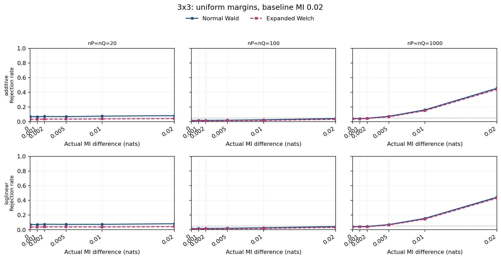

| Specification | Setting |
| --- | --- |
| Table size | 3x3 |
| Horizontal graph regime specifications (columns) | nP=nQ=20, nP=nQ=100, nP=nQ=1000 |
| Vertical graph regime specifications (rows) | additive: P row (0.3333 repeated 3 times), P column (0.3333 repeated 3 times); Q row (0.3333 repeated 3 times), Q column (0.3333 repeated 3 times); loglinear: P row (0.3333 repeated 3 times), P column (0.3333 repeated 3 times); Q row (0.3333 repeated 3 times), Q column (0.3333 repeated 3 times) |
| Probability changes | additive: add at (1,1),(2,2) and subtract at (1,2),(2,1), for both P and Q; loglinear: ordinal log-linear scores from -1 to 1, with row and column multipliers preserving the stated margins, for both P and Q |
| MI settings | Baseline MI {0.02}; direction {q higher}; actual differences {0, 0.001, 0.002, 0.005, 0.01, 0.02} nats |
| Horizontal axis within each graph | Actual MI difference in nats, fixed from 0 to 0.02 |
| Vertical axis within each graph | Unconditional rejection rate from 0 to 1; invalid results count as non-rejections |
| Replicates | 20,000 per unique point |

Null-point rejection and validity:

| Vertical regime | Horizontal regime | x | Method | Rejection | Valid |
| --- | --- | --- | --- | --- | --- |
| additive | nP=nQ=20 | 0 | Expanded Welch | 0.0343 | 1.0000 |
| additive | nP=nQ=20 | 0 | Normal Wald | 0.0730 | 1.0000 |
| additive | nP=nQ=100 | 0 | Expanded Welch | 0.0106 | 1.0000 |
| additive | nP=nQ=100 | 0 | Normal Wald | 0.0167 | 1.0000 |
| additive | nP=nQ=1000 | 0 | Expanded Welch | 0.0393 | 1.0000 |
| additive | nP=nQ=1000 | 0 | Normal Wald | 0.0445 | 1.0000 |
| loglinear | nP=nQ=20 | 0 | Expanded Welch | 0.0362 | 1.0000 |
| loglinear | nP=nQ=20 | 0 | Normal Wald | 0.0717 | 1.0000 |
| loglinear | nP=nQ=100 | 0 | Expanded Welch | 0.0103 | 1.0000 |
| loglinear | nP=nQ=100 | 0 | Normal Wald | 0.0163 | 1.0000 |
| loglinear | nP=nQ=1000 | 0 | Expanded Welch | 0.0373 | 1.0000 |
| loglinear | nP=nQ=1000 | 0 | Normal Wald | 0.0420 | 1.0000 |

Every plotted rate, interval, validity and minimum expected count

| Vertical regime | Horizontal regime | x | Method | Rejection | 95% interval | Valid | Conditional | Min expected P | Min expected Q |
| --- | --- | --- | --- | --- | --- | --- | --- | --- | --- |
| additive | nP=nQ=20 | 0 | Expanded Welch | 0.0343 | [0.0319, 0.0369] | 1.0000 | 0.0343 | 1.561 | 1.561 |
| additive | nP=nQ=20 | 0 | Normal Wald | 0.0730 | [0.0694, 0.0766] | 1.0000 | 0.0730 | 1.561 | 1.561 |
| additive | nP=nQ=20 | 0.001 | Expanded Welch | 0.0330 | [0.0306, 0.0356] | 1.0000 | 0.0330 | 1.561 | 1.545 |
| additive | nP=nQ=20 | 0.001 | Normal Wald | 0.0687 | [0.0653, 0.0723] | 1.0000 | 0.0687 | 1.561 | 1.545 |
| additive | nP=nQ=20 | 0.002 | Expanded Welch | 0.0354 | [0.0329, 0.0381] | 1.0000 | 0.0354 | 1.561 | 1.529 |
| additive | nP=nQ=20 | 0.002 | Normal Wald | 0.0734 | [0.0699, 0.0771] | 1.0000 | 0.0734 | 1.561 | 1.529 |
| additive | nP=nQ=20 | 0.005 | Expanded Welch | 0.0349 | [0.0324, 0.0375] | 1.0000 | 0.0349 | 1.561 | 1.484 |
| additive | nP=nQ=20 | 0.005 | Normal Wald | 0.0706 | [0.0671, 0.0742] | 1.0000 | 0.0706 | 1.561 | 1.484 |
| additive | nP=nQ=20 | 0.01 | Expanded Welch | 0.0384 | [0.0358, 0.0412] | 1.0000 | 0.0384 | 1.561 | 1.415 |
| additive | nP=nQ=20 | 0.01 | Normal Wald | 0.0767 | [0.0731, 0.0805] | 1.0000 | 0.0767 | 1.561 | 1.415 |
| additive | nP=nQ=20 | 0.02 | Expanded Welch | 0.0425 | [0.0398, 0.0454] | 1.0000 | 0.0426 | 1.561 | 1.294 |
| additive | nP=nQ=20 | 0.02 | Normal Wald | 0.0832 | [0.0795, 0.0871] | 1.0000 | 0.0832 | 1.561 | 1.294 |
| additive | nP=nQ=100 | 0 | Expanded Welch | 0.0106 | [0.0092, 0.0121] | 1.0000 | 0.0106 | 7.803 | 7.803 |
| additive | nP=nQ=100 | 0 | Normal Wald | 0.0167 | [0.0150, 0.0185] | 1.0000 | 0.0167 | 7.803 | 7.803 |
| additive | nP=nQ=100 | 0.001 | Expanded Welch | 0.0115 | [0.0101, 0.0131] | 1.0000 | 0.0115 | 7.803 | 7.723 |
| additive | nP=nQ=100 | 0.001 | Normal Wald | 0.0194 | [0.0176, 0.0215] | 1.0000 | 0.0194 | 7.803 | 7.723 |
| additive | nP=nQ=100 | 0.002 | Expanded Welch | 0.0123 | [0.0109, 0.0140] | 1.0000 | 0.0123 | 7.803 | 7.644 |
| additive | nP=nQ=100 | 0.002 | Normal Wald | 0.0196 | [0.0178, 0.0216] | 1.0000 | 0.0196 | 7.803 | 7.644 |
| additive | nP=nQ=100 | 0.005 | Expanded Welch | 0.0142 | [0.0127, 0.0159] | 1.0000 | 0.0142 | 7.803 | 7.42 |
| additive | nP=nQ=100 | 0.005 | Normal Wald | 0.0216 | [0.0197, 0.0237] | 1.0000 | 0.0216 | 7.803 | 7.42 |
| additive | nP=nQ=100 | 0.01 | Expanded Welch | 0.0179 | [0.0162, 0.0198] | 1.0000 | 0.0179 | 7.803 | 7.075 |
| additive | nP=nQ=100 | 0.01 | Normal Wald | 0.0272 | [0.0250, 0.0295] | 1.0000 | 0.0272 | 7.803 | 7.075 |
| additive | nP=nQ=100 | 0.02 | Expanded Welch | 0.0323 | [0.0300, 0.0349] | 1.0000 | 0.0323 | 7.803 | 6.469 |
| additive | nP=nQ=100 | 0.02 | Normal Wald | 0.0440 | [0.0412, 0.0469] | 1.0000 | 0.0440 | 7.803 | 6.469 |
| additive | nP=nQ=1000 | 0 | Expanded Welch | 0.0393 | [0.0366, 0.0420] | 1.0000 | 0.0393 | 78.03 | 78.03 |
| additive | nP=nQ=1000 | 0 | Normal Wald | 0.0445 | [0.0417, 0.0474] | 1.0000 | 0.0445 | 78.03 | 78.03 |
| additive | nP=nQ=1000 | 0.001 | Expanded Welch | 0.0379 | [0.0353, 0.0406] | 1.0000 | 0.0379 | 78.03 | 77.23 |
| additive | nP=nQ=1000 | 0.001 | Normal Wald | 0.0430 | [0.0402, 0.0458] | 1.0000 | 0.0430 | 78.03 | 77.23 |
| additive | nP=nQ=1000 | 0.002 | Expanded Welch | 0.0440 | [0.0412, 0.0469] | 1.0000 | 0.0440 | 78.03 | 76.44 |
| additive | nP=nQ=1000 | 0.002 | Normal Wald | 0.0483 | [0.0455, 0.0514] | 1.0000 | 0.0483 | 78.03 | 76.44 |
| additive | nP=nQ=1000 | 0.005 | Expanded Welch | 0.0668 | [0.0634, 0.0703] | 1.0000 | 0.0668 | 78.03 | 74.2 |
| additive | nP=nQ=1000 | 0.005 | Normal Wald | 0.0745 | [0.0709, 0.0782] | 1.0000 | 0.0745 | 78.03 | 74.2 |
| additive | nP=nQ=1000 | 0.01 | Expanded Welch | 0.1512 | [0.1463, 0.1562] | 1.0000 | 0.1512 | 78.03 | 70.75 |
| additive | nP=nQ=1000 | 0.01 | Normal Wald | 0.1620 | [0.1569, 0.1671] | 1.0000 | 0.1620 | 78.03 | 70.75 |
| additive | nP=nQ=1000 | 0.02 | Expanded Welch | 0.4415 | [0.4346, 0.4484] | 1.0000 | 0.4415 | 78.03 | 64.69 |
| additive | nP=nQ=1000 | 0.02 | Normal Wald | 0.4563 | [0.4494, 0.4632] | 1.0000 | 0.4563 | 78.03 | 64.69 |
| loglinear | nP=nQ=20 | 0 | Expanded Welch | 0.0362 | [0.0337, 0.0389] | 1.0000 | 0.0362 | 1.571 | 1.571 |
| loglinear | nP=nQ=20 | 0 | Normal Wald | 0.0717 | [0.0683, 0.0754] | 1.0000 | 0.0717 | 1.571 | 1.571 |
| loglinear | nP=nQ=20 | 0.001 | Expanded Welch | 0.0372 | [0.0346, 0.0399] | 1.0000 | 0.0372 | 1.571 | 1.556 |
| loglinear | nP=nQ=20 | 0.001 | Normal Wald | 0.0728 | [0.0693, 0.0765] | 1.0000 | 0.0728 | 1.571 | 1.556 |
| loglinear | nP=nQ=20 | 0.002 | Expanded Welch | 0.0391 | [0.0365, 0.0419] | 1.0000 | 0.0391 | 1.571 | 1.54 |
| loglinear | nP=nQ=20 | 0.002 | Normal Wald | 0.0762 | [0.0726, 0.0800] | 1.0000 | 0.0762 | 1.571 | 1.54 |
| loglinear | nP=nQ=20 | 0.005 | Expanded Welch | 0.0387 | [0.0362, 0.0415] | 1.0000 | 0.0387 | 1.571 | 1.497 |
| loglinear | nP=nQ=20 | 0.005 | Normal Wald | 0.0743 | [0.0707, 0.0780] | 1.0000 | 0.0743 | 1.571 | 1.497 |
| loglinear | nP=nQ=20 | 0.01 | Expanded Welch | 0.0383 | [0.0357, 0.0410] | 1.0000 | 0.0383 | 1.571 | 1.431 |
| loglinear | nP=nQ=20 | 0.01 | Normal Wald | 0.0747 | [0.0712, 0.0785] | 1.0000 | 0.0747 | 1.571 | 1.431 |
| loglinear | nP=nQ=20 | 0.02 | Expanded Welch | 0.0428 | [0.0401, 0.0457] | 1.0000 | 0.0428 | 1.571 | 1.315 |
| loglinear | nP=nQ=20 | 0.02 | Normal Wald | 0.0824 | [0.0787, 0.0863] | 1.0000 | 0.0824 | 1.571 | 1.315 |
| loglinear | nP=nQ=100 | 0 | Expanded Welch | 0.0103 | [0.0089, 0.0117] | 1.0000 | 0.0103 | 7.856 | 7.856 |
| loglinear | nP=nQ=100 | 0 | Normal Wald | 0.0163 | [0.0146, 0.0181] | 1.0000 | 0.0163 | 7.856 | 7.856 |
| loglinear | nP=nQ=100 | 0.001 | Expanded Welch | 0.0109 | [0.0096, 0.0124] | 1.0000 | 0.0109 | 7.856 | 7.778 |
| loglinear | nP=nQ=100 | 0.001 | Normal Wald | 0.0175 | [0.0158, 0.0194] | 1.0000 | 0.0175 | 7.856 | 7.778 |
| loglinear | nP=nQ=100 | 0.002 | Expanded Welch | 0.0120 | [0.0105, 0.0136] | 1.0000 | 0.0120 | 7.856 | 7.702 |
| loglinear | nP=nQ=100 | 0.002 | Normal Wald | 0.0197 | [0.0178, 0.0217] | 1.0000 | 0.0197 | 7.856 | 7.702 |
| loglinear | nP=nQ=100 | 0.005 | Expanded Welch | 0.0134 | [0.0119, 0.0150] | 1.0000 | 0.0134 | 7.856 | 7.485 |
| loglinear | nP=nQ=100 | 0.005 | Normal Wald | 0.0215 | [0.0195, 0.0236] | 1.0000 | 0.0215 | 7.856 | 7.485 |
| loglinear | nP=nQ=100 | 0.01 | Expanded Welch | 0.0185 | [0.0167, 0.0205] | 1.0000 | 0.0185 | 7.856 | 7.154 |
| loglinear | nP=nQ=100 | 0.01 | Normal Wald | 0.0278 | [0.0256, 0.0302] | 1.0000 | 0.0278 | 7.856 | 7.154 |
| loglinear | nP=nQ=100 | 0.02 | Expanded Welch | 0.0315 | [0.0292, 0.0340] | 1.0000 | 0.0315 | 7.856 | 6.574 |
| loglinear | nP=nQ=100 | 0.02 | Normal Wald | 0.0442 | [0.0414, 0.0471] | 1.0000 | 0.0442 | 7.856 | 6.574 |
| loglinear | nP=nQ=1000 | 0 | Expanded Welch | 0.0373 | [0.0348, 0.0400] | 1.0000 | 0.0373 | 78.56 | 78.56 |
| loglinear | nP=nQ=1000 | 0 | Normal Wald | 0.0420 | [0.0393, 0.0449] | 1.0000 | 0.0420 | 78.56 | 78.56 |
| loglinear | nP=nQ=1000 | 0.001 | Expanded Welch | 0.0398 | [0.0372, 0.0427] | 1.0000 | 0.0398 | 78.56 | 77.78 |
| loglinear | nP=nQ=1000 | 0.001 | Normal Wald | 0.0451 | [0.0423, 0.0481] | 1.0000 | 0.0451 | 78.56 | 77.78 |
| loglinear | nP=nQ=1000 | 0.002 | Expanded Welch | 0.0402 | [0.0376, 0.0430] | 1.0000 | 0.0402 | 78.56 | 77.02 |
| loglinear | nP=nQ=1000 | 0.002 | Normal Wald | 0.0455 | [0.0427, 0.0485] | 1.0000 | 0.0455 | 78.56 | 77.02 |
| loglinear | nP=nQ=1000 | 0.005 | Expanded Welch | 0.0649 | [0.0615, 0.0683] | 1.0000 | 0.0649 | 78.56 | 74.85 |
| loglinear | nP=nQ=1000 | 0.005 | Normal Wald | 0.0711 | [0.0676, 0.0747] | 1.0000 | 0.0711 | 78.56 | 74.85 |
| loglinear | nP=nQ=1000 | 0.01 | Expanded Welch | 0.1454 | [0.1405, 0.1503] | 1.0000 | 0.1454 | 78.56 | 71.54 |
| loglinear | nP=nQ=1000 | 0.01 | Normal Wald | 0.1558 | [0.1508, 0.1609] | 1.0000 | 0.1558 | 78.56 | 71.54 |
| loglinear | nP=nQ=1000 | 0.02 | Expanded Welch | 0.4313 | [0.4245, 0.4382] | 1.0000 | 0.4313 | 78.56 | 65.74 |
| loglinear | nP=nQ=1000 | 0.02 | Normal Wald | 0.4444 | [0.4375, 0.4512] | 1.0000 | 0.4444 | 78.56 | 65.74 |

### 9.3 3x3: different skew margins, baseline MI 0.0001

Do conclusions change under a matched ordinal log-linear construction?

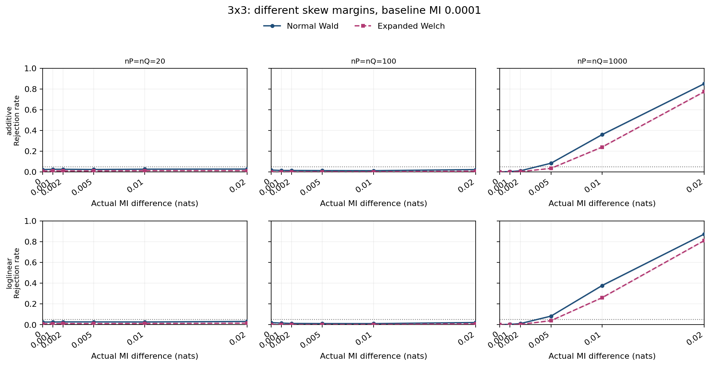

| Specification | Setting |
| --- | --- |
| Table size | 3x3 |
| Horizontal graph regime specifications (columns) | nP=nQ=20, nP=nQ=100, nP=nQ=1000 |
| Vertical graph regime specifications (rows) | additive: P row (0.7, 0.3/2 repeated 2 times), P column (0.7, 0.3/2 repeated 2 times); Q row (0.8, 0.2/2 repeated 2 times), Q column (0.8, 0.2/2 repeated 2 times); loglinear: P row (0.7, 0.3/2 repeated 2 times), P column (0.7, 0.3/2 repeated 2 times); Q row (0.8, 0.2/2 repeated 2 times), Q column (0.8, 0.2/2 repeated 2 times) |
| Probability changes | additive: add at (1,1),(2,2) and subtract at (1,2),(2,1), for both P and Q; loglinear: ordinal log-linear scores from -1 to 1, with row and column multipliers preserving the stated margins, for both P and Q |
| MI settings | Baseline MI {0.0001}; direction {q higher}; actual differences {0, 0.001, 0.002, 0.005, 0.01, 0.02} nats |
| Horizontal axis within each graph | Actual MI difference in nats, fixed from 0 to 0.02 |
| Vertical axis within each graph | Unconditional rejection rate from 0 to 1; invalid results count as non-rejections |
| Replicates | 20,000 per unique point |

Null-point rejection and validity:

| Vertical regime | Horizontal regime | x | Method | Rejection | Valid |
| --- | --- | --- | --- | --- | --- |
| additive | nP=nQ=20 | 0 | Expanded Welch | 0.0096 | 0.9756 |
| additive | nP=nQ=20 | 0 | Normal Wald | 0.0240 | 0.9999 |
| additive | nP=nQ=100 | 0 | Expanded Welch | 0.0017 | 1.0000 |
| additive | nP=nQ=100 | 0 | Normal Wald | 0.0193 | 1.0000 |
| additive | nP=nQ=1000 | 0 | Expanded Welch | 0.0007 | 1.0000 |
| additive | nP=nQ=1000 | 0 | Normal Wald | 0.0023 | 1.0000 |
| loglinear | nP=nQ=20 | 0 | Expanded Welch | 0.0096 | 0.9761 |
| loglinear | nP=nQ=20 | 0 | Normal Wald | 0.0259 | 1.0000 |
| loglinear | nP=nQ=100 | 0 | Expanded Welch | 0.0026 | 1.0000 |
| loglinear | nP=nQ=100 | 0 | Normal Wald | 0.0204 | 1.0000 |
| loglinear | nP=nQ=1000 | 0 | Expanded Welch | 0.0006 | 1.0000 |
| loglinear | nP=nQ=1000 | 0 | Normal Wald | 0.0016 | 1.0000 |

Every plotted rate, interval, validity and minimum expected count

| Vertical regime | Horizontal regime | x | Method | Rejection | 95% interval | Valid | Conditional | Min expected P | Min expected Q |
| --- | --- | --- | --- | --- | --- | --- | --- | --- | --- |
| additive | nP=nQ=20 | 0 | Expanded Welch | 0.0096 | [0.0083, 0.0110] | 0.9756 | 0.0098 | 0.45 | 0.2 |
| additive | nP=nQ=20 | 0 | Normal Wald | 0.0240 | [0.0220, 0.0263] | 0.9999 | 0.0241 | 0.45 | 0.2 |
| additive | nP=nQ=20 | 0.001 | Expanded Welch | 0.0109 | [0.0096, 0.0124] | 0.9751 | 0.0112 | 0.45 | 0.2 |
| additive | nP=nQ=20 | 0.001 | Normal Wald | 0.0267 | [0.0246, 0.0290] | 1.0000 | 0.0267 | 0.45 | 0.2 |
| additive | nP=nQ=20 | 0.002 | Expanded Welch | 0.0112 | [0.0098, 0.0128] | 0.9759 | 0.0115 | 0.45 | 0.2 |
| additive | nP=nQ=20 | 0.002 | Normal Wald | 0.0270 | [0.0248, 0.0293] | 1.0000 | 0.0270 | 0.45 | 0.2 |
| additive | nP=nQ=20 | 0.005 | Expanded Welch | 0.0109 | [0.0096, 0.0124] | 0.9778 | 0.0111 | 0.45 | 0.2 |
| additive | nP=nQ=20 | 0.005 | Normal Wald | 0.0249 | [0.0228, 0.0271] | 1.0000 | 0.0249 | 0.45 | 0.2 |
| additive | nP=nQ=20 | 0.01 | Expanded Welch | 0.0135 | [0.0119, 0.0151] | 0.9746 | 0.0138 | 0.45 | 0.2 |
| additive | nP=nQ=20 | 0.01 | Normal Wald | 0.0278 | [0.0256, 0.0302] | 0.9999 | 0.0278 | 0.45 | 0.2 |
| additive | nP=nQ=20 | 0.02 | Expanded Welch | 0.0135 | [0.0120, 0.0152] | 0.9745 | 0.0139 | 0.45 | 0.2 |
| additive | nP=nQ=20 | 0.02 | Normal Wald | 0.0289 | [0.0266, 0.0313] | 0.9999 | 0.0289 | 0.45 | 0.2 |
| additive | nP=nQ=100 | 0 | Expanded Welch | 0.0017 | [0.0012, 0.0024] | 1.0000 | 0.0017 | 2.25 | 1 |
| additive | nP=nQ=100 | 0 | Normal Wald | 0.0193 | [0.0175, 0.0213] | 1.0000 | 0.0193 | 2.25 | 1 |
| additive | nP=nQ=100 | 0.001 | Expanded Welch | 0.0015 | [0.0011, 0.0021] | 1.0000 | 0.0015 | 2.25 | 1 |
| additive | nP=nQ=100 | 0.001 | Normal Wald | 0.0155 | [0.0139, 0.0174] | 1.0000 | 0.0155 | 2.25 | 1 |
| additive | nP=nQ=100 | 0.002 | Expanded Welch | 0.0019 | [0.0013, 0.0025] | 1.0000 | 0.0019 | 2.25 | 1 |
| additive | nP=nQ=100 | 0.002 | Normal Wald | 0.0155 | [0.0139, 0.0173] | 1.0000 | 0.0155 | 2.25 | 1 |
| additive | nP=nQ=100 | 0.005 | Expanded Welch | 0.0022 | [0.0016, 0.0030] | 1.0000 | 0.0022 | 2.25 | 1 |
| additive | nP=nQ=100 | 0.005 | Normal Wald | 0.0141 | [0.0126, 0.0158] | 1.0000 | 0.0141 | 2.25 | 1 |
| additive | nP=nQ=100 | 0.01 | Expanded Welch | 0.0028 | [0.0022, 0.0036] | 1.0000 | 0.0028 | 2.25 | 1 |
| additive | nP=nQ=100 | 0.01 | Normal Wald | 0.0135 | [0.0120, 0.0152] | 1.0000 | 0.0135 | 2.25 | 1 |
| additive | nP=nQ=100 | 0.02 | Expanded Welch | 0.0085 | [0.0073, 0.0099] | 1.0000 | 0.0085 | 2.25 | 1 |
| additive | nP=nQ=100 | 0.02 | Normal Wald | 0.0239 | [0.0219, 0.0262] | 1.0000 | 0.0239 | 2.25 | 1 |
| additive | nP=nQ=1000 | 0 | Expanded Welch | 0.0007 | [0.0004, 0.0012] | 1.0000 | 0.0007 | 22.5 | 10 |
| additive | nP=nQ=1000 | 0 | Normal Wald | 0.0023 | [0.0017, 0.0031] | 1.0000 | 0.0023 | 22.5 | 10 |
| additive | nP=nQ=1000 | 0.001 | Expanded Welch | 0.0014 | [0.0010, 0.0020] | 1.0000 | 0.0014 | 22.5 | 10 |
| additive | nP=nQ=1000 | 0.001 | Normal Wald | 0.0046 | [0.0037, 0.0056] | 1.0000 | 0.0046 | 22.5 | 10 |
| additive | nP=nQ=1000 | 0.002 | Expanded Welch | 0.0039 | [0.0031, 0.0049] | 1.0000 | 0.0039 | 22.5 | 10 |
| additive | nP=nQ=1000 | 0.002 | Normal Wald | 0.0124 | [0.0110, 0.0141] | 1.0000 | 0.0124 | 22.5 | 10 |
| additive | nP=nQ=1000 | 0.005 | Expanded Welch | 0.0358 | [0.0333, 0.0385] | 1.0000 | 0.0358 | 22.5 | 10 |
| additive | nP=nQ=1000 | 0.005 | Normal Wald | 0.0852 | [0.0814, 0.0891] | 1.0000 | 0.0852 | 22.5 | 10 |
| additive | nP=nQ=1000 | 0.01 | Expanded Welch | 0.2408 | [0.2349, 0.2468] | 1.0000 | 0.2408 | 22.5 | 10 |
| additive | nP=nQ=1000 | 0.01 | Normal Wald | 0.3606 | [0.3540, 0.3673] | 1.0000 | 0.3606 | 22.5 | 10 |
| additive | nP=nQ=1000 | 0.02 | Expanded Welch | 0.7745 | [0.7687, 0.7802] | 1.0000 | 0.7745 | 22.5 | 10 |
| additive | nP=nQ=1000 | 0.02 | Normal Wald | 0.8511 | [0.8461, 0.8560] | 1.0000 | 0.8511 | 22.5 | 10 |
| loglinear | nP=nQ=20 | 0 | Expanded Welch | 0.0096 | [0.0083, 0.0110] | 0.9761 | 0.0098 | 0.4535 | 0.2033 |
| loglinear | nP=nQ=20 | 0 | Normal Wald | 0.0259 | [0.0237, 0.0281] | 1.0000 | 0.0259 | 0.4535 | 0.2033 |
| loglinear | nP=nQ=20 | 0.001 | Expanded Welch | 0.0100 | [0.0087, 0.0114] | 0.9748 | 0.0102 | 0.4535 | 0.2107 |
| loglinear | nP=nQ=20 | 0.001 | Normal Wald | 0.0263 | [0.0242, 0.0286] | 0.9999 | 0.0263 | 0.4535 | 0.2107 |
| loglinear | nP=nQ=20 | 0.002 | Expanded Welch | 0.0117 | [0.0103, 0.0133] | 0.9757 | 0.0120 | 0.4535 | 0.2146 |
| loglinear | nP=nQ=20 | 0.002 | Normal Wald | 0.0275 | [0.0253, 0.0299] | 1.0000 | 0.0275 | 0.4535 | 0.2146 |
| loglinear | nP=nQ=20 | 0.005 | Expanded Welch | 0.0106 | [0.0093, 0.0122] | 0.9740 | 0.0109 | 0.4535 | 0.2222 |
| loglinear | nP=nQ=20 | 0.005 | Normal Wald | 0.0272 | [0.0250, 0.0295] | 1.0000 | 0.0272 | 0.4535 | 0.2222 |
| loglinear | nP=nQ=20 | 0.01 | Expanded Welch | 0.0117 | [0.0103, 0.0132] | 0.9767 | 0.0119 | 0.4535 | 0.2309 |
| loglinear | nP=nQ=20 | 0.01 | Normal Wald | 0.0267 | [0.0246, 0.0290] | 1.0000 | 0.0267 | 0.4535 | 0.2309 |
| loglinear | nP=nQ=20 | 0.02 | Expanded Welch | 0.0150 | [0.0134, 0.0168] | 0.9761 | 0.0154 | 0.4535 | 0.2435 |
| loglinear | nP=nQ=20 | 0.02 | Normal Wald | 0.0317 | [0.0294, 0.0342] | 0.9999 | 0.0317 | 0.4535 | 0.2435 |
| loglinear | nP=nQ=100 | 0 | Expanded Welch | 0.0026 | [0.0019, 0.0034] | 1.0000 | 0.0026 | 2.268 | 1.017 |
| loglinear | nP=nQ=100 | 0 | Normal Wald | 0.0204 | [0.0186, 0.0225] | 1.0000 | 0.0204 | 2.268 | 1.017 |
| loglinear | nP=nQ=100 | 0.001 | Expanded Welch | 0.0019 | [0.0014, 0.0026] | 1.0000 | 0.0019 | 2.268 | 1.053 |
| loglinear | nP=nQ=100 | 0.001 | Normal Wald | 0.0159 | [0.0143, 0.0178] | 1.0000 | 0.0159 | 2.268 | 1.053 |
| loglinear | nP=nQ=100 | 0.002 | Expanded Welch | 0.0016 | [0.0012, 0.0023] | 1.0000 | 0.0016 | 2.268 | 1.073 |
| loglinear | nP=nQ=100 | 0.002 | Normal Wald | 0.0126 | [0.0111, 0.0142] | 1.0000 | 0.0126 | 2.268 | 1.073 |
| loglinear | nP=nQ=100 | 0.005 | Expanded Welch | 0.0018 | [0.0013, 0.0024] | 1.0000 | 0.0018 | 2.268 | 1.111 |
| loglinear | nP=nQ=100 | 0.005 | Normal Wald | 0.0112 | [0.0099, 0.0128] | 1.0000 | 0.0112 | 2.268 | 1.111 |
| loglinear | nP=nQ=100 | 0.01 | Expanded Welch | 0.0024 | [0.0019, 0.0032] | 1.0000 | 0.0024 | 2.268 | 1.154 |
| loglinear | nP=nQ=100 | 0.01 | Normal Wald | 0.0110 | [0.0096, 0.0125] | 1.0000 | 0.0110 | 2.268 | 1.154 |
| loglinear | nP=nQ=100 | 0.02 | Expanded Welch | 0.0089 | [0.0077, 0.0103] | 1.0000 | 0.0089 | 2.268 | 1.217 |
| loglinear | nP=nQ=100 | 0.02 | Normal Wald | 0.0213 | [0.0193, 0.0233] | 1.0000 | 0.0213 | 2.268 | 1.217 |
| loglinear | nP=nQ=1000 | 0 | Expanded Welch | 0.0006 | [0.0003, 0.0010] | 1.0000 | 0.0006 | 22.68 | 10.17 |
| loglinear | nP=nQ=1000 | 0 | Normal Wald | 0.0016 | [0.0012, 0.0023] | 1.0000 | 0.0016 | 22.68 | 10.17 |
| loglinear | nP=nQ=1000 | 0.001 | Expanded Welch | 0.0008 | [0.0005, 0.0013] | 1.0000 | 0.0008 | 22.68 | 10.53 |
| loglinear | nP=nQ=1000 | 0.001 | Normal Wald | 0.0036 | [0.0028, 0.0045] | 1.0000 | 0.0036 | 22.68 | 10.53 |
| loglinear | nP=nQ=1000 | 0.002 | Expanded Welch | 0.0031 | [0.0024, 0.0039] | 1.0000 | 0.0031 | 22.68 | 10.73 |
| loglinear | nP=nQ=1000 | 0.002 | Normal Wald | 0.0112 | [0.0098, 0.0128] | 1.0000 | 0.0112 | 22.68 | 10.73 |
| loglinear | nP=nQ=1000 | 0.005 | Expanded Welch | 0.0394 | [0.0368, 0.0422] | 1.0000 | 0.0394 | 22.68 | 11.11 |
| loglinear | nP=nQ=1000 | 0.005 | Normal Wald | 0.0830 | [0.0793, 0.0870] | 1.0000 | 0.0830 | 22.68 | 11.11 |
| loglinear | nP=nQ=1000 | 0.01 | Expanded Welch | 0.2606 | [0.2546, 0.2667] | 1.0000 | 0.2606 | 22.68 | 11.54 |
| loglinear | nP=nQ=1000 | 0.01 | Normal Wald | 0.3776 | [0.3709, 0.3843] | 1.0000 | 0.3776 | 22.68 | 11.54 |
| loglinear | nP=nQ=1000 | 0.02 | Expanded Welch | 0.8109 | [0.8054, 0.8163] | 1.0000 | 0.8109 | 22.68 | 12.17 |
| loglinear | nP=nQ=1000 | 0.02 | Normal Wald | 0.8733 | [0.8686, 0.8778] | 1.0000 | 0.8733 | 22.68 | 12.17 |

### 9.4 3x3: different skew margins, baseline MI 0.02

Do conclusions change under a matched ordinal log-linear construction?

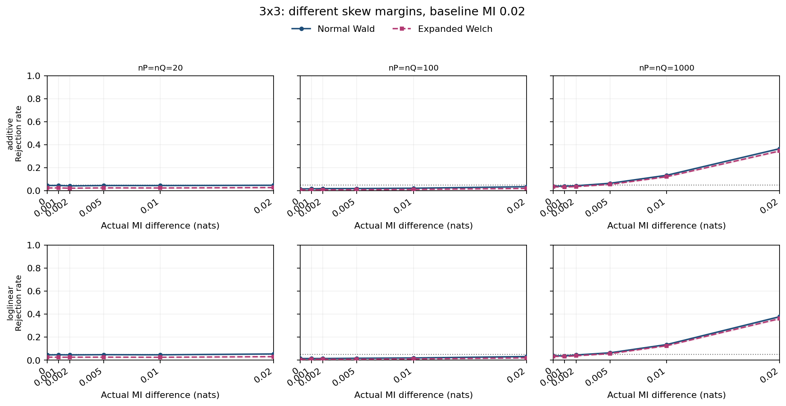

| Specification | Setting |
| --- | --- |
| Table size | 3x3 |
| Horizontal graph regime specifications (columns) | nP=nQ=20, nP=nQ=100, nP=nQ=1000 |
| Vertical graph regime specifications (rows) | additive: P row (0.7, 0.3/2 repeated 2 times), P column (0.7, 0.3/2 repeated 2 times); Q row (0.8, 0.2/2 repeated 2 times), Q column (0.8, 0.2/2 repeated 2 times); loglinear: P row (0.7, 0.3/2 repeated 2 times), P column (0.7, 0.3/2 repeated 2 times); Q row (0.8, 0.2/2 repeated 2 times), Q column (0.8, 0.2/2 repeated 2 times) |
| Probability changes | additive: add at (1,1),(2,2) and subtract at (1,2),(2,1), for both P and Q; loglinear: ordinal log-linear scores from -1 to 1, with row and column multipliers preserving the stated margins, for both P and Q |
| MI settings | Baseline MI {0.02}; direction {q higher}; actual differences {0, 0.001, 0.002, 0.005, 0.01, 0.02} nats |
| Horizontal axis within each graph | Actual MI difference in nats, fixed from 0 to 0.02 |
| Vertical axis within each graph | Unconditional rejection rate from 0 to 1; invalid results count as non-rejections |
| Replicates | 20,000 per unique point |

Null-point rejection and validity:

| Vertical regime | Horizontal regime | x | Method | Rejection | Valid |
| --- | --- | --- | --- | --- | --- |
| additive | nP=nQ=20 | 0 | Expanded Welch | 0.0251 | 0.9745 |
| additive | nP=nQ=20 | 0 | Normal Wald | 0.0466 | 0.9998 |
| additive | nP=nQ=100 | 0 | Expanded Welch | 0.0083 | 1.0000 |
| additive | nP=nQ=100 | 0 | Normal Wald | 0.0171 | 1.0000 |
| additive | nP=nQ=1000 | 0 | Expanded Welch | 0.0348 | 1.0000 |
| additive | nP=nQ=1000 | 0 | Normal Wald | 0.0411 | 1.0000 |
| loglinear | nP=nQ=20 | 0 | Expanded Welch | 0.0266 | 0.9777 |
| loglinear | nP=nQ=20 | 0 | Normal Wald | 0.0464 | 1.0000 |
| loglinear | nP=nQ=100 | 0 | Expanded Welch | 0.0067 | 1.0000 |
| loglinear | nP=nQ=100 | 0 | Normal Wald | 0.0146 | 1.0000 |
| loglinear | nP=nQ=1000 | 0 | Expanded Welch | 0.0335 | 1.0000 |
| loglinear | nP=nQ=1000 | 0 | Normal Wald | 0.0387 | 1.0000 |

Every plotted rate, interval, validity and minimum expected count

| Vertical regime | Horizontal regime | x | Method | Rejection | 95% interval | Valid | Conditional | Min expected P | Min expected Q |
| --- | --- | --- | --- | --- | --- | --- | --- | --- | --- |
| additive | nP=nQ=20 | 0 | Expanded Welch | 0.0251 | [0.0231, 0.0274] | 0.9745 | 0.0258 | 0.45 | 0.2 |
| additive | nP=nQ=20 | 0 | Normal Wald | 0.0466 | [0.0438, 0.0497] | 0.9998 | 0.0467 | 0.45 | 0.2 |
| additive | nP=nQ=20 | 0.001 | Expanded Welch | 0.0259 | [0.0238, 0.0282] | 0.9753 | 0.0266 | 0.45 | 0.2 |
| additive | nP=nQ=20 | 0.001 | Normal Wald | 0.0471 | [0.0442, 0.0501] | 1.0000 | 0.0471 | 0.45 | 0.2 |
| additive | nP=nQ=20 | 0.002 | Expanded Welch | 0.0232 | [0.0212, 0.0254] | 0.9763 | 0.0238 | 0.45 | 0.2 |
| additive | nP=nQ=20 | 0.002 | Normal Wald | 0.0435 | [0.0407, 0.0464] | 1.0000 | 0.0435 | 0.45 | 0.2 |
| additive | nP=nQ=20 | 0.005 | Expanded Welch | 0.0260 | [0.0239, 0.0283] | 0.9760 | 0.0266 | 0.45 | 0.2 |
| additive | nP=nQ=20 | 0.005 | Normal Wald | 0.0466 | [0.0437, 0.0496] | 1.0000 | 0.0466 | 0.45 | 0.2 |
| additive | nP=nQ=20 | 0.01 | Expanded Welch | 0.0252 | [0.0231, 0.0275] | 0.9756 | 0.0258 | 0.45 | 0.2 |
| additive | nP=nQ=20 | 0.01 | Normal Wald | 0.0464 | [0.0436, 0.0495] | 0.9999 | 0.0465 | 0.45 | 0.2 |
| additive | nP=nQ=20 | 0.02 | Expanded Welch | 0.0285 | [0.0263, 0.0309] | 0.9761 | 0.0292 | 0.45 | 0.2 |
| additive | nP=nQ=20 | 0.02 | Normal Wald | 0.0488 | [0.0459, 0.0518] | 1.0000 | 0.0488 | 0.45 | 0.2 |
| additive | nP=nQ=100 | 0 | Expanded Welch | 0.0083 | [0.0071, 0.0097] | 1.0000 | 0.0083 | 2.25 | 1 |
| additive | nP=nQ=100 | 0 | Normal Wald | 0.0171 | [0.0154, 0.0190] | 1.0000 | 0.0171 | 2.25 | 1 |
| additive | nP=nQ=100 | 0.001 | Expanded Welch | 0.0083 | [0.0071, 0.0096] | 1.0000 | 0.0083 | 2.25 | 1 |
| additive | nP=nQ=100 | 0.001 | Normal Wald | 0.0179 | [0.0161, 0.0198] | 1.0000 | 0.0179 | 2.25 | 1 |
| additive | nP=nQ=100 | 0.002 | Expanded Welch | 0.0092 | [0.0079, 0.0106] | 1.0000 | 0.0092 | 2.25 | 1 |
| additive | nP=nQ=100 | 0.002 | Normal Wald | 0.0199 | [0.0181, 0.0219] | 1.0000 | 0.0199 | 2.25 | 1 |
| additive | nP=nQ=100 | 0.005 | Expanded Welch | 0.0102 | [0.0089, 0.0117] | 1.0000 | 0.0102 | 2.25 | 1 |
| additive | nP=nQ=100 | 0.005 | Normal Wald | 0.0203 | [0.0184, 0.0223] | 1.0000 | 0.0203 | 2.25 | 1 |
| additive | nP=nQ=100 | 0.01 | Expanded Welch | 0.0126 | [0.0112, 0.0143] | 1.0000 | 0.0126 | 2.25 | 1 |
| additive | nP=nQ=100 | 0.01 | Normal Wald | 0.0231 | [0.0211, 0.0253] | 1.0000 | 0.0231 | 2.25 | 1 |
| additive | nP=nQ=100 | 0.02 | Expanded Welch | 0.0210 | [0.0192, 0.0231] | 1.0000 | 0.0210 | 2.25 | 1 |
| additive | nP=nQ=100 | 0.02 | Normal Wald | 0.0363 | [0.0338, 0.0390] | 1.0000 | 0.0363 | 2.25 | 1 |
| additive | nP=nQ=1000 | 0 | Expanded Welch | 0.0348 | [0.0324, 0.0375] | 1.0000 | 0.0348 | 22.5 | 10 |
| additive | nP=nQ=1000 | 0 | Normal Wald | 0.0411 | [0.0384, 0.0439] | 1.0000 | 0.0411 | 22.5 | 10 |
| additive | nP=nQ=1000 | 0.001 | Expanded Welch | 0.0338 | [0.0314, 0.0364] | 1.0000 | 0.0338 | 22.5 | 10 |
| additive | nP=nQ=1000 | 0.001 | Normal Wald | 0.0413 | [0.0387, 0.0442] | 1.0000 | 0.0413 | 22.5 | 10 |
| additive | nP=nQ=1000 | 0.002 | Expanded Welch | 0.0374 | [0.0348, 0.0401] | 1.0000 | 0.0374 | 22.5 | 10 |
| additive | nP=nQ=1000 | 0.002 | Normal Wald | 0.0445 | [0.0417, 0.0474] | 1.0000 | 0.0445 | 22.5 | 10 |
| additive | nP=nQ=1000 | 0.005 | Expanded Welch | 0.0560 | [0.0529, 0.0593] | 1.0000 | 0.0560 | 22.5 | 10 |
| additive | nP=nQ=1000 | 0.005 | Normal Wald | 0.0659 | [0.0625, 0.0694] | 1.0000 | 0.0659 | 22.5 | 10 |
| additive | nP=nQ=1000 | 0.01 | Expanded Welch | 0.1228 | [0.1183, 0.1274] | 1.0000 | 0.1228 | 22.5 | 10 |
| additive | nP=nQ=1000 | 0.01 | Normal Wald | 0.1353 | [0.1306, 0.1401] | 1.0000 | 0.1353 | 22.5 | 10 |
| additive | nP=nQ=1000 | 0.02 | Expanded Welch | 0.3463 | [0.3397, 0.3529] | 1.0000 | 0.3463 | 22.5 | 10 |
| additive | nP=nQ=1000 | 0.02 | Normal Wald | 0.3665 | [0.3599, 0.3733] | 1.0000 | 0.3665 | 22.5 | 10 |
| loglinear | nP=nQ=20 | 0 | Expanded Welch | 0.0266 | [0.0245, 0.0289] | 0.9777 | 0.0272 | 0.5014 | 0.2433 |
| loglinear | nP=nQ=20 | 0 | Normal Wald | 0.0464 | [0.0435, 0.0494] | 1.0000 | 0.0464 | 0.5014 | 0.2433 |
| loglinear | nP=nQ=20 | 0.001 | Expanded Welch | 0.0261 | [0.0240, 0.0284] | 0.9747 | 0.0268 | 0.5014 | 0.2444 |
| loglinear | nP=nQ=20 | 0.001 | Normal Wald | 0.0476 | [0.0447, 0.0506] | 1.0000 | 0.0476 | 0.5014 | 0.2444 |
| loglinear | nP=nQ=20 | 0.002 | Expanded Welch | 0.0262 | [0.0241, 0.0285] | 0.9767 | 0.0268 | 0.5014 | 0.2455 |
| loglinear | nP=nQ=20 | 0.002 | Normal Wald | 0.0466 | [0.0437, 0.0496] | 0.9999 | 0.0466 | 0.5014 | 0.2455 |
| loglinear | nP=nQ=20 | 0.005 | Expanded Welch | 0.0265 | [0.0244, 0.0288] | 0.9758 | 0.0272 | 0.5014 | 0.2487 |
| loglinear | nP=nQ=20 | 0.005 | Normal Wald | 0.0483 | [0.0454, 0.0513] | 1.0000 | 0.0483 | 0.5014 | 0.2487 |
| loglinear | nP=nQ=20 | 0.01 | Expanded Welch | 0.0256 | [0.0235, 0.0279] | 0.9746 | 0.0263 | 0.5014 | 0.2537 |
| loglinear | nP=nQ=20 | 0.01 | Normal Wald | 0.0473 | [0.0444, 0.0503] | 1.0000 | 0.0473 | 0.5014 | 0.2537 |
| loglinear | nP=nQ=20 | 0.02 | Expanded Welch | 0.0311 | [0.0288, 0.0336] | 0.9765 | 0.0318 | 0.5014 | 0.2631 |
| loglinear | nP=nQ=20 | 0.02 | Normal Wald | 0.0544 | [0.0513, 0.0576] | 1.0000 | 0.0544 | 0.5014 | 0.2631 |
| loglinear | nP=nQ=100 | 0 | Expanded Welch | 0.0067 | [0.0057, 0.0080] | 1.0000 | 0.0067 | 2.507 | 1.217 |
| loglinear | nP=nQ=100 | 0 | Normal Wald | 0.0146 | [0.0131, 0.0164] | 1.0000 | 0.0146 | 2.507 | 1.217 |
| loglinear | nP=nQ=100 | 0.001 | Expanded Welch | 0.0080 | [0.0068, 0.0093] | 1.0000 | 0.0080 | 2.507 | 1.222 |
| loglinear | nP=nQ=100 | 0.001 | Normal Wald | 0.0149 | [0.0133, 0.0166] | 1.0000 | 0.0149 | 2.507 | 1.222 |
| loglinear | nP=nQ=100 | 0.002 | Expanded Welch | 0.0081 | [0.0070, 0.0095] | 1.0000 | 0.0081 | 2.507 | 1.228 |
| loglinear | nP=nQ=100 | 0.002 | Normal Wald | 0.0150 | [0.0135, 0.0168] | 1.0000 | 0.0150 | 2.507 | 1.228 |
| loglinear | nP=nQ=100 | 0.005 | Expanded Welch | 0.0086 | [0.0074, 0.0100] | 1.0000 | 0.0086 | 2.507 | 1.243 |
| loglinear | nP=nQ=100 | 0.005 | Normal Wald | 0.0173 | [0.0155, 0.0191] | 1.0000 | 0.0173 | 2.507 | 1.243 |
| loglinear | nP=nQ=100 | 0.01 | Expanded Welch | 0.0114 | [0.0100, 0.0129] | 1.0000 | 0.0114 | 2.507 | 1.268 |
| loglinear | nP=nQ=100 | 0.01 | Normal Wald | 0.0199 | [0.0181, 0.0220] | 1.0000 | 0.0199 | 2.507 | 1.268 |
| loglinear | nP=nQ=100 | 0.02 | Expanded Welch | 0.0203 | [0.0184, 0.0223] | 1.0000 | 0.0203 | 2.507 | 1.316 |
| loglinear | nP=nQ=100 | 0.02 | Normal Wald | 0.0319 | [0.0296, 0.0344] | 1.0000 | 0.0319 | 2.507 | 1.316 |
| loglinear | nP=nQ=1000 | 0 | Expanded Welch | 0.0335 | [0.0311, 0.0361] | 1.0000 | 0.0335 | 25.07 | 12.17 |
| loglinear | nP=nQ=1000 | 0 | Normal Wald | 0.0387 | [0.0362, 0.0415] | 1.0000 | 0.0387 | 25.07 | 12.17 |
| loglinear | nP=nQ=1000 | 0.001 | Expanded Welch | 0.0330 | [0.0306, 0.0355] | 1.0000 | 0.0330 | 25.07 | 12.22 |
| loglinear | nP=nQ=1000 | 0.001 | Normal Wald | 0.0381 | [0.0355, 0.0408] | 1.0000 | 0.0381 | 25.07 | 12.22 |
| loglinear | nP=nQ=1000 | 0.002 | Expanded Welch | 0.0388 | [0.0362, 0.0416] | 1.0000 | 0.0388 | 25.07 | 12.28 |
| loglinear | nP=nQ=1000 | 0.002 | Normal Wald | 0.0457 | [0.0428, 0.0486] | 1.0000 | 0.0457 | 25.07 | 12.28 |
| loglinear | nP=nQ=1000 | 0.005 | Expanded Welch | 0.0571 | [0.0540, 0.0605] | 1.0000 | 0.0571 | 25.07 | 12.43 |
| loglinear | nP=nQ=1000 | 0.005 | Normal Wald | 0.0645 | [0.0612, 0.0680] | 1.0000 | 0.0645 | 25.07 | 12.43 |
| loglinear | nP=nQ=1000 | 0.01 | Expanded Welch | 0.1258 | [0.1213, 0.1305] | 1.0000 | 0.1258 | 25.07 | 12.68 |
| loglinear | nP=nQ=1000 | 0.01 | Normal Wald | 0.1358 | [0.1311, 0.1406] | 1.0000 | 0.1358 | 25.07 | 12.68 |
| loglinear | nP=nQ=1000 | 0.02 | Expanded Welch | 0.3610 | [0.3544, 0.3677] | 1.0000 | 0.3610 | 25.07 | 13.16 |
| loglinear | nP=nQ=1000 | 0.02 | Normal Wald | 0.3780 | [0.3714, 0.3848] | 1.0000 | 0.3780 | 25.07 | 13.16 |

### 9.5 5x5: uniform margins, baseline MI 0.0001

Do conclusions change under a matched ordinal log-linear construction?

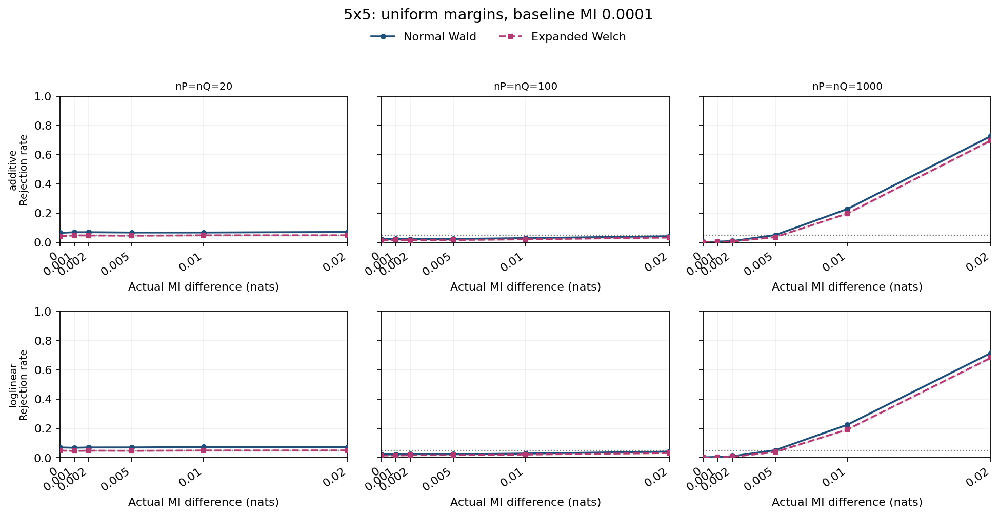

| Specification | Setting |
| --- | --- |
| Table size | 5x5 |
| Horizontal graph regime specifications (columns) | nP=nQ=20, nP=nQ=100, nP=nQ=1000 |
| Vertical graph regime specifications (rows) | additive: P row (0.2 repeated 5 times), P column (0.2 repeated 5 times); Q row (0.2 repeated 5 times), Q column (0.2 repeated 5 times); loglinear: P row (0.2 repeated 5 times), P column (0.2 repeated 5 times); Q row (0.2 repeated 5 times), Q column (0.2 repeated 5 times) |
| Probability changes | additive: add at (1,1),(2,2) and subtract at (1,2),(2,1), for both P and Q; loglinear: ordinal log-linear scores from -1 to 1, with row and column multipliers preserving the stated margins, for both P and Q |
| MI settings | Baseline MI {0.0001}; direction {q higher}; actual differences {0, 0.001, 0.002, 0.005, 0.01, 0.02} nats |
| Horizontal axis within each graph | Actual MI difference in nats, fixed from 0 to 0.02 |
| Vertical axis within each graph | Unconditional rejection rate from 0 to 1; invalid results count as non-rejections |
| Replicates | 20,000 per unique point |

Null-point rejection and validity:

| Vertical regime | Horizontal regime | x | Method | Rejection | Valid |
| --- | --- | --- | --- | --- | --- |
| additive | nP=nQ=20 | 0 | Expanded Welch | 0.0435 | 1.0000 |
| additive | nP=nQ=20 | 0 | Normal Wald | 0.0664 | 1.0000 |
| additive | nP=nQ=100 | 0 | Expanded Welch | 0.0159 | 1.0000 |
| additive | nP=nQ=100 | 0 | Normal Wald | 0.0227 | 1.0000 |
| additive | nP=nQ=1000 | 0 | Expanded Welch | 0.0014 | 1.0000 |
| additive | nP=nQ=1000 | 0 | Normal Wald | 0.0036 | 1.0000 |
| loglinear | nP=nQ=20 | 0 | Expanded Welch | 0.0497 | 1.0000 |
| loglinear | nP=nQ=20 | 0 | Normal Wald | 0.0712 | 1.0000 |
| loglinear | nP=nQ=100 | 0 | Expanded Welch | 0.0168 | 1.0000 |
| loglinear | nP=nQ=100 | 0 | Normal Wald | 0.0237 | 1.0000 |
| loglinear | nP=nQ=1000 | 0 | Expanded Welch | 0.0017 | 1.0000 |
| loglinear | nP=nQ=1000 | 0 | Normal Wald | 0.0039 | 1.0000 |

Every plotted rate, interval, validity and minimum expected count

| Vertical regime | Horizontal regime | x | Method | Rejection | 95% interval | Valid | Conditional | Min expected P | Min expected Q |
| --- | --- | --- | --- | --- | --- | --- | --- | --- | --- |
| additive | nP=nQ=20 | 0 | Expanded Welch | 0.0435 | [0.0408, 0.0464] | 1.0000 | 0.0435 | 0.7717 | 0.7717 |
| additive | nP=nQ=20 | 0 | Normal Wald | 0.0664 | [0.0630, 0.0699] | 1.0000 | 0.0664 | 0.7717 | 0.7717 |
| additive | nP=nQ=20 | 0.001 | Expanded Welch | 0.0493 | [0.0463, 0.0523] | 1.0000 | 0.0493 | 0.7717 | 0.7063 |
| additive | nP=nQ=20 | 0.001 | Normal Wald | 0.0708 | [0.0674, 0.0745] | 1.0000 | 0.0708 | 0.7717 | 0.7063 |
| additive | nP=nQ=20 | 0.002 | Expanded Welch | 0.0486 | [0.0457, 0.0516] | 1.0000 | 0.0486 | 0.7717 | 0.6707 |
| additive | nP=nQ=20 | 0.002 | Normal Wald | 0.0709 | [0.0674, 0.0745] | 1.0000 | 0.0709 | 0.7717 | 0.6707 |
| additive | nP=nQ=20 | 0.005 | Expanded Welch | 0.0472 | [0.0443, 0.0502] | 1.0000 | 0.0472 | 0.7717 | 0.5991 |
| additive | nP=nQ=20 | 0.005 | Normal Wald | 0.0688 | [0.0653, 0.0723] | 1.0000 | 0.0688 | 0.7717 | 0.5991 |
| additive | nP=nQ=20 | 0.01 | Expanded Welch | 0.0495 | [0.0465, 0.0525] | 1.0000 | 0.0495 | 0.7717 | 0.5188 |
| additive | nP=nQ=20 | 0.01 | Normal Wald | 0.0688 | [0.0654, 0.0724] | 1.0000 | 0.0688 | 0.7717 | 0.5188 |
| additive | nP=nQ=20 | 0.02 | Expanded Welch | 0.0498 | [0.0469, 0.0530] | 1.0000 | 0.0498 | 0.7717 | 0.4076 |
| additive | nP=nQ=20 | 0.02 | Normal Wald | 0.0727 | [0.0691, 0.0763] | 1.0000 | 0.0727 | 0.7717 | 0.4076 |
| additive | nP=nQ=100 | 0 | Expanded Welch | 0.0159 | [0.0143, 0.0177] | 1.0000 | 0.0159 | 3.859 | 3.859 |
| additive | nP=nQ=100 | 0 | Normal Wald | 0.0227 | [0.0208, 0.0249] | 1.0000 | 0.0227 | 3.859 | 3.859 |
| additive | nP=nQ=100 | 0.001 | Expanded Welch | 0.0174 | [0.0156, 0.0193] | 1.0000 | 0.0174 | 3.859 | 3.531 |
| additive | nP=nQ=100 | 0.001 | Normal Wald | 0.0251 | [0.0230, 0.0274] | 1.0000 | 0.0251 | 3.859 | 3.531 |
| additive | nP=nQ=100 | 0.002 | Expanded Welch | 0.0164 | [0.0148, 0.0183] | 1.0000 | 0.0164 | 3.859 | 3.353 |
| additive | nP=nQ=100 | 0.002 | Normal Wald | 0.0235 | [0.0215, 0.0257] | 1.0000 | 0.0235 | 3.859 | 3.353 |
| additive | nP=nQ=100 | 0.005 | Expanded Welch | 0.0177 | [0.0160, 0.0197] | 1.0000 | 0.0177 | 3.859 | 2.995 |
| additive | nP=nQ=100 | 0.005 | Normal Wald | 0.0251 | [0.0231, 0.0274] | 1.0000 | 0.0251 | 3.859 | 2.995 |
| additive | nP=nQ=100 | 0.01 | Expanded Welch | 0.0221 | [0.0202, 0.0243] | 1.0000 | 0.0221 | 3.859 | 2.594 |
| additive | nP=nQ=100 | 0.01 | Normal Wald | 0.0306 | [0.0283, 0.0331] | 1.0000 | 0.0306 | 3.859 | 2.594 |
| additive | nP=nQ=100 | 0.02 | Expanded Welch | 0.0345 | [0.0320, 0.0371] | 1.0000 | 0.0345 | 3.859 | 2.038 |
| additive | nP=nQ=100 | 0.02 | Normal Wald | 0.0435 | [0.0408, 0.0464] | 1.0000 | 0.0435 | 3.859 | 2.038 |
| additive | nP=nQ=1000 | 0 | Expanded Welch | 0.0014 | [0.0009, 0.0020] | 1.0000 | 0.0014 | 38.59 | 38.59 |
| additive | nP=nQ=1000 | 0 | Normal Wald | 0.0036 | [0.0029, 0.0045] | 1.0000 | 0.0036 | 38.59 | 38.59 |
| additive | nP=nQ=1000 | 0.001 | Expanded Welch | 0.0039 | [0.0031, 0.0049] | 1.0000 | 0.0039 | 38.59 | 35.31 |
| additive | nP=nQ=1000 | 0.001 | Normal Wald | 0.0066 | [0.0056, 0.0079] | 1.0000 | 0.0066 | 38.59 | 35.31 |
| additive | nP=nQ=1000 | 0.002 | Expanded Welch | 0.0075 | [0.0063, 0.0087] | 1.0000 | 0.0075 | 38.59 | 33.53 |
| additive | nP=nQ=1000 | 0.002 | Normal Wald | 0.0104 | [0.0091, 0.0120] | 1.0000 | 0.0104 | 38.59 | 33.53 |
| additive | nP=nQ=1000 | 0.005 | Expanded Welch | 0.0372 | [0.0347, 0.0400] | 1.0000 | 0.0372 | 38.59 | 29.95 |
| additive | nP=nQ=1000 | 0.005 | Normal Wald | 0.0515 | [0.0485, 0.0547] | 1.0000 | 0.0515 | 38.59 | 29.95 |
| additive | nP=nQ=1000 | 0.01 | Expanded Welch | 0.1983 | [0.1928, 0.2039] | 1.0000 | 0.1983 | 38.59 | 25.94 |
| additive | nP=nQ=1000 | 0.01 | Normal Wald | 0.2289 | [0.2232, 0.2348] | 1.0000 | 0.2289 | 38.59 | 25.94 |
| additive | nP=nQ=1000 | 0.02 | Expanded Welch | 0.6974 | [0.6910, 0.7037] | 1.0000 | 0.6974 | 38.59 | 20.38 |
| additive | nP=nQ=1000 | 0.02 | Normal Wald | 0.7278 | [0.7216, 0.7340] | 1.0000 | 0.7278 | 38.59 | 20.38 |
| loglinear | nP=nQ=20 | 0 | Expanded Welch | 0.0497 | [0.0468, 0.0528] | 1.0000 | 0.0497 | 0.7775 | 0.7775 |
| loglinear | nP=nQ=20 | 0 | Normal Wald | 0.0712 | [0.0677, 0.0748] | 1.0000 | 0.0712 | 0.7775 | 0.7775 |
| loglinear | nP=nQ=20 | 0.001 | Expanded Welch | 0.0473 | [0.0444, 0.0503] | 1.0000 | 0.0473 | 0.7775 | 0.7259 |
| loglinear | nP=nQ=20 | 0.001 | Normal Wald | 0.0689 | [0.0655, 0.0725] | 1.0000 | 0.0689 | 0.7775 | 0.7259 |
| loglinear | nP=nQ=20 | 0.002 | Expanded Welch | 0.0492 | [0.0463, 0.0523] | 1.0000 | 0.0492 | 0.7775 | 0.6981 |
| loglinear | nP=nQ=20 | 0.002 | Normal Wald | 0.0712 | [0.0677, 0.0748] | 1.0000 | 0.0712 | 0.7775 | 0.6981 |
| loglinear | nP=nQ=20 | 0.005 | Expanded Welch | 0.0481 | [0.0452, 0.0512] | 1.0000 | 0.0481 | 0.7775 | 0.643 |
| loglinear | nP=nQ=20 | 0.005 | Normal Wald | 0.0713 | [0.0678, 0.0749] | 1.0000 | 0.0713 | 0.7775 | 0.643 |
| loglinear | nP=nQ=20 | 0.01 | Expanded Welch | 0.0502 | [0.0472, 0.0533] | 1.0000 | 0.0502 | 0.7775 | 0.5821 |
| loglinear | nP=nQ=20 | 0.01 | Normal Wald | 0.0740 | [0.0704, 0.0777] | 1.0000 | 0.0740 | 0.7775 | 0.5821 |
| loglinear | nP=nQ=20 | 0.02 | Expanded Welch | 0.0507 | [0.0477, 0.0538] | 1.0000 | 0.0507 | 0.7775 | 0.4992 |
| loglinear | nP=nQ=20 | 0.02 | Normal Wald | 0.0730 | [0.0694, 0.0766] | 1.0000 | 0.0730 | 0.7775 | 0.4992 |
| loglinear | nP=nQ=100 | 0 | Expanded Welch | 0.0168 | [0.0151, 0.0186] | 1.0000 | 0.0168 | 3.887 | 3.887 |
| loglinear | nP=nQ=100 | 0 | Normal Wald | 0.0237 | [0.0217, 0.0259] | 1.0000 | 0.0237 | 3.887 | 3.887 |
| loglinear | nP=nQ=100 | 0.001 | Expanded Welch | 0.0162 | [0.0145, 0.0180] | 1.0000 | 0.0162 | 3.887 | 3.629 |
| loglinear | nP=nQ=100 | 0.001 | Normal Wald | 0.0235 | [0.0215, 0.0257] | 1.0000 | 0.0235 | 3.887 | 3.629 |
| loglinear | nP=nQ=100 | 0.002 | Expanded Welch | 0.0181 | [0.0163, 0.0200] | 1.0000 | 0.0181 | 3.887 | 3.491 |
| loglinear | nP=nQ=100 | 0.002 | Normal Wald | 0.0265 | [0.0243, 0.0288] | 1.0000 | 0.0265 | 3.887 | 3.491 |
| loglinear | nP=nQ=100 | 0.005 | Expanded Welch | 0.0183 | [0.0165, 0.0203] | 1.0000 | 0.0183 | 3.887 | 3.215 |
| loglinear | nP=nQ=100 | 0.005 | Normal Wald | 0.0246 | [0.0225, 0.0268] | 1.0000 | 0.0246 | 3.887 | 3.215 |
| loglinear | nP=nQ=100 | 0.01 | Expanded Welch | 0.0226 | [0.0206, 0.0248] | 1.0000 | 0.0226 | 3.887 | 2.91 |
| loglinear | nP=nQ=100 | 0.01 | Normal Wald | 0.0296 | [0.0274, 0.0321] | 1.0000 | 0.0296 | 3.887 | 2.91 |
| loglinear | nP=nQ=100 | 0.02 | Expanded Welch | 0.0331 | [0.0308, 0.0357] | 1.0000 | 0.0331 | 3.887 | 2.496 |
| loglinear | nP=nQ=100 | 0.02 | Normal Wald | 0.0425 | [0.0398, 0.0454] | 1.0000 | 0.0425 | 3.887 | 2.496 |
| loglinear | nP=nQ=1000 | 0 | Expanded Welch | 0.0017 | [0.0012, 0.0024] | 1.0000 | 0.0017 | 38.87 | 38.87 |
| loglinear | nP=nQ=1000 | 0 | Normal Wald | 0.0039 | [0.0031, 0.0048] | 1.0000 | 0.0039 | 38.87 | 38.87 |
| loglinear | nP=nQ=1000 | 0.001 | Expanded Welch | 0.0036 | [0.0029, 0.0045] | 1.0000 | 0.0036 | 38.87 | 36.29 |
| loglinear | nP=nQ=1000 | 0.001 | Normal Wald | 0.0062 | [0.0052, 0.0073] | 1.0000 | 0.0062 | 38.87 | 36.29 |
| loglinear | nP=nQ=1000 | 0.002 | Expanded Welch | 0.0074 | [0.0063, 0.0087] | 1.0000 | 0.0074 | 38.87 | 34.91 |
| loglinear | nP=nQ=1000 | 0.002 | Normal Wald | 0.0112 | [0.0098, 0.0127] | 1.0000 | 0.0112 | 38.87 | 34.91 |
| loglinear | nP=nQ=1000 | 0.005 | Expanded Welch | 0.0396 | [0.0370, 0.0424] | 1.0000 | 0.0396 | 38.87 | 32.15 |
| loglinear | nP=nQ=1000 | 0.005 | Normal Wald | 0.0524 | [0.0493, 0.0555] | 1.0000 | 0.0524 | 38.87 | 32.15 |
| loglinear | nP=nQ=1000 | 0.01 | Expanded Welch | 0.1930 | [0.1876, 0.1986] | 1.0000 | 0.1930 | 38.87 | 29.1 |
| loglinear | nP=nQ=1000 | 0.01 | Normal Wald | 0.2256 | [0.2198, 0.2314] | 1.0000 | 0.2256 | 38.87 | 29.1 |
| loglinear | nP=nQ=1000 | 0.02 | Expanded Welch | 0.6837 | [0.6772, 0.6901] | 1.0000 | 0.6837 | 38.87 | 24.96 |
| loglinear | nP=nQ=1000 | 0.02 | Normal Wald | 0.7164 | [0.7101, 0.7226] | 1.0000 | 0.7164 | 38.87 | 24.96 |

### 9.6 5x5: uniform margins, baseline MI 0.02

Do conclusions change under a matched ordinal log-linear construction?

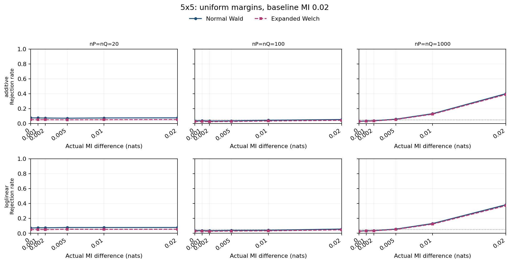

| Specification | Setting |
| --- | --- |
| Table size | 5x5 |
| Horizontal graph regime specifications (columns) | nP=nQ=20, nP=nQ=100, nP=nQ=1000 |
| Vertical graph regime specifications (rows) | additive: P row (0.2 repeated 5 times), P column (0.2 repeated 5 times); Q row (0.2 repeated 5 times), Q column (0.2 repeated 5 times); loglinear: P row (0.2 repeated 5 times), P column (0.2 repeated 5 times); Q row (0.2 repeated 5 times), Q column (0.2 repeated 5 times) |
| Probability changes | additive: add at (1,1),(2,2) and subtract at (1,2),(2,1), for both P and Q; loglinear: ordinal log-linear scores from -1 to 1, with row and column multipliers preserving the stated margins, for both P and Q |
| MI settings | Baseline MI {0.02}; direction {q higher}; actual differences {0, 0.001, 0.002, 0.005, 0.01, 0.02} nats |
| Horizontal axis within each graph | Actual MI difference in nats, fixed from 0 to 0.02 |
| Vertical axis within each graph | Unconditional rejection rate from 0 to 1; invalid results count as non-rejections |
| Replicates | 20,000 per unique point |

Null-point rejection and validity:

| Vertical regime | Horizontal regime | x | Method | Rejection | Valid |
| --- | --- | --- | --- | --- | --- |
| additive | nP=nQ=20 | 0 | Expanded Welch | 0.0528 | 1.0000 |
| additive | nP=nQ=20 | 0 | Normal Wald | 0.0768 | 1.0000 |
| additive | nP=nQ=100 | 0 | Expanded Welch | 0.0289 | 1.0000 |
| additive | nP=nQ=100 | 0 | Normal Wald | 0.0377 | 1.0000 |
| additive | nP=nQ=1000 | 0 | Expanded Welch | 0.0296 | 1.0000 |
| additive | nP=nQ=1000 | 0 | Normal Wald | 0.0326 | 1.0000 |
| loglinear | nP=nQ=20 | 0 | Expanded Welch | 0.0500 | 1.0000 |
| loglinear | nP=nQ=20 | 0 | Normal Wald | 0.0712 | 1.0000 |
| loglinear | nP=nQ=100 | 0 | Expanded Welch | 0.0301 | 1.0000 |
| loglinear | nP=nQ=100 | 0 | Normal Wald | 0.0382 | 1.0000 |
| loglinear | nP=nQ=1000 | 0 | Expanded Welch | 0.0278 | 1.0000 |
| loglinear | nP=nQ=1000 | 0 | Normal Wald | 0.0312 | 1.0000 |

Every plotted rate, interval, validity and minimum expected count

| Vertical regime | Horizontal regime | x | Method | Rejection | 95% interval | Valid | Conditional | Min expected P | Min expected Q |
| --- | --- | --- | --- | --- | --- | --- | --- | --- | --- |
| additive | nP=nQ=20 | 0 | Expanded Welch | 0.0528 | [0.0498, 0.0560] | 1.0000 | 0.0528 | 0.4086 | 0.4086 |
| additive | nP=nQ=20 | 0 | Normal Wald | 0.0768 | [0.0732, 0.0806] | 1.0000 | 0.0768 | 0.4086 | 0.4086 |
| additive | nP=nQ=20 | 0.001 | Expanded Welch | 0.0526 | [0.0496, 0.0558] | 1.0000 | 0.0526 | 0.4086 | 0.3994 |
| additive | nP=nQ=20 | 0.001 | Normal Wald | 0.0767 | [0.0731, 0.0805] | 1.0000 | 0.0767 | 0.4086 | 0.3994 |
| additive | nP=nQ=20 | 0.002 | Expanded Welch | 0.0524 | [0.0494, 0.0556] | 1.0000 | 0.0524 | 0.4086 | 0.3904 |
| additive | nP=nQ=20 | 0.002 | Normal Wald | 0.0753 | [0.0717, 0.0790] | 1.0000 | 0.0753 | 0.4086 | 0.3904 |
| additive | nP=nQ=20 | 0.005 | Expanded Welch | 0.0515 | [0.0485, 0.0546] | 1.0000 | 0.0515 | 0.4086 | 0.3649 |
| additive | nP=nQ=20 | 0.005 | Normal Wald | 0.0729 | [0.0694, 0.0766] | 1.0000 | 0.0729 | 0.4086 | 0.3649 |
| additive | nP=nQ=20 | 0.01 | Expanded Welch | 0.0526 | [0.0496, 0.0558] | 1.0000 | 0.0526 | 0.4086 | 0.3261 |
| additive | nP=nQ=20 | 0.01 | Normal Wald | 0.0764 | [0.0728, 0.0801] | 1.0000 | 0.0764 | 0.4086 | 0.3261 |
| additive | nP=nQ=20 | 0.02 | Expanded Welch | 0.0544 | [0.0513, 0.0576] | 1.0000 | 0.0544 | 0.4086 | 0.2594 |
| additive | nP=nQ=20 | 0.02 | Normal Wald | 0.0776 | [0.0740, 0.0814] | 1.0000 | 0.0776 | 0.4086 | 0.2594 |
| additive | nP=nQ=100 | 0 | Expanded Welch | 0.0289 | [0.0267, 0.0313] | 1.0000 | 0.0289 | 2.043 | 2.043 |
| additive | nP=nQ=100 | 0 | Normal Wald | 0.0377 | [0.0351, 0.0404] | 1.0000 | 0.0377 | 2.043 | 2.043 |
| additive | nP=nQ=100 | 0.001 | Expanded Welch | 0.0290 | [0.0268, 0.0315] | 1.0000 | 0.0290 | 2.043 | 1.997 |
| additive | nP=nQ=100 | 0.001 | Normal Wald | 0.0383 | [0.0357, 0.0410] | 1.0000 | 0.0383 | 2.043 | 1.997 |
| additive | nP=nQ=100 | 0.002 | Expanded Welch | 0.0266 | [0.0244, 0.0289] | 1.0000 | 0.0266 | 2.043 | 1.952 |
| additive | nP=nQ=100 | 0.002 | Normal Wald | 0.0350 | [0.0325, 0.0376] | 1.0000 | 0.0350 | 2.043 | 1.952 |
| additive | nP=nQ=100 | 0.005 | Expanded Welch | 0.0291 | [0.0269, 0.0316] | 1.0000 | 0.0291 | 2.043 | 1.824 |
| additive | nP=nQ=100 | 0.005 | Normal Wald | 0.0375 | [0.0350, 0.0402] | 1.0000 | 0.0375 | 2.043 | 1.824 |
| additive | nP=nQ=100 | 0.01 | Expanded Welch | 0.0355 | [0.0330, 0.0382] | 1.0000 | 0.0355 | 2.043 | 1.631 |
| additive | nP=nQ=100 | 0.01 | Normal Wald | 0.0454 | [0.0426, 0.0484] | 1.0000 | 0.0454 | 2.043 | 1.631 |
| additive | nP=nQ=100 | 0.02 | Expanded Welch | 0.0450 | [0.0423, 0.0480] | 1.0000 | 0.0450 | 2.043 | 1.297 |
| additive | nP=nQ=100 | 0.02 | Normal Wald | 0.0553 | [0.0522, 0.0586] | 1.0000 | 0.0553 | 2.043 | 1.297 |
| additive | nP=nQ=1000 | 0 | Expanded Welch | 0.0296 | [0.0273, 0.0320] | 1.0000 | 0.0296 | 20.43 | 20.43 |
| additive | nP=nQ=1000 | 0 | Normal Wald | 0.0326 | [0.0302, 0.0351] | 1.0000 | 0.0326 | 20.43 | 20.43 |
| additive | nP=nQ=1000 | 0.001 | Expanded Welch | 0.0319 | [0.0296, 0.0344] | 1.0000 | 0.0319 | 20.43 | 19.97 |
| additive | nP=nQ=1000 | 0.001 | Normal Wald | 0.0357 | [0.0333, 0.0384] | 1.0000 | 0.0357 | 20.43 | 19.97 |
| additive | nP=nQ=1000 | 0.002 | Expanded Welch | 0.0360 | [0.0335, 0.0387] | 1.0000 | 0.0360 | 20.43 | 19.52 |
| additive | nP=nQ=1000 | 0.002 | Normal Wald | 0.0393 | [0.0366, 0.0420] | 1.0000 | 0.0393 | 20.43 | 19.52 |
| additive | nP=nQ=1000 | 0.005 | Expanded Welch | 0.0556 | [0.0525, 0.0589] | 1.0000 | 0.0556 | 20.43 | 18.24 |
| additive | nP=nQ=1000 | 0.005 | Normal Wald | 0.0599 | [0.0567, 0.0633] | 1.0000 | 0.0599 | 20.43 | 18.24 |
| additive | nP=nQ=1000 | 0.01 | Expanded Welch | 0.1266 | [0.1221, 0.1313] | 1.0000 | 0.1266 | 20.43 | 16.31 |
| additive | nP=nQ=1000 | 0.01 | Normal Wald | 0.1332 | [0.1286, 0.1380] | 1.0000 | 0.1332 | 20.43 | 16.31 |
| additive | nP=nQ=1000 | 0.02 | Expanded Welch | 0.3911 | [0.3844, 0.3979] | 1.0000 | 0.3911 | 20.43 | 12.97 |
| additive | nP=nQ=1000 | 0.02 | Normal Wald | 0.4015 | [0.3947, 0.4083] | 1.0000 | 0.4015 | 20.43 | 12.97 |
| loglinear | nP=nQ=20 | 0 | Expanded Welch | 0.0500 | [0.0470, 0.0531] | 1.0000 | 0.0500 | 0.4999 | 0.4999 |
| loglinear | nP=nQ=20 | 0 | Normal Wald | 0.0712 | [0.0677, 0.0748] | 1.0000 | 0.0712 | 0.4999 | 0.4999 |
| loglinear | nP=nQ=20 | 0.001 | Expanded Welch | 0.0519 | [0.0489, 0.0551] | 1.0000 | 0.0519 | 0.4999 | 0.4931 |
| loglinear | nP=nQ=20 | 0.001 | Normal Wald | 0.0745 | [0.0709, 0.0782] | 1.0000 | 0.0745 | 0.4999 | 0.4931 |
| loglinear | nP=nQ=20 | 0.002 | Expanded Welch | 0.0503 | [0.0473, 0.0534] | 1.0000 | 0.0503 | 0.4999 | 0.4865 |
| loglinear | nP=nQ=20 | 0.002 | Normal Wald | 0.0743 | [0.0707, 0.0780] | 1.0000 | 0.0743 | 0.4999 | 0.4865 |
| loglinear | nP=nQ=20 | 0.005 | Expanded Welch | 0.0551 | [0.0520, 0.0583] | 1.0000 | 0.0551 | 0.4999 | 0.4677 |
| loglinear | nP=nQ=20 | 0.005 | Normal Wald | 0.0784 | [0.0747, 0.0822] | 1.0000 | 0.0784 | 0.4999 | 0.4677 |
| loglinear | nP=nQ=20 | 0.01 | Expanded Welch | 0.0533 | [0.0503, 0.0565] | 1.0000 | 0.0533 | 0.4999 | 0.4393 |
| loglinear | nP=nQ=20 | 0.01 | Normal Wald | 0.0779 | [0.0742, 0.0816] | 1.0000 | 0.0779 | 0.4999 | 0.4393 |
| loglinear | nP=nQ=20 | 0.02 | Expanded Welch | 0.0545 | [0.0514, 0.0577] | 1.0000 | 0.0545 | 0.4999 | 0.3906 |
| loglinear | nP=nQ=20 | 0.02 | Normal Wald | 0.0787 | [0.0750, 0.0825] | 1.0000 | 0.0787 | 0.4999 | 0.3906 |
| loglinear | nP=nQ=100 | 0 | Expanded Welch | 0.0301 | [0.0278, 0.0326] | 1.0000 | 0.0301 | 2.499 | 2.499 |
| loglinear | nP=nQ=100 | 0 | Normal Wald | 0.0382 | [0.0356, 0.0409] | 1.0000 | 0.0382 | 2.499 | 2.499 |
| loglinear | nP=nQ=100 | 0.001 | Expanded Welch | 0.0293 | [0.0271, 0.0317] | 1.0000 | 0.0293 | 2.499 | 2.465 |
| loglinear | nP=nQ=100 | 0.001 | Normal Wald | 0.0367 | [0.0342, 0.0394] | 1.0000 | 0.0367 | 2.499 | 2.465 |
| loglinear | nP=nQ=100 | 0.002 | Expanded Welch | 0.0275 | [0.0253, 0.0299] | 1.0000 | 0.0275 | 2.499 | 2.432 |
| loglinear | nP=nQ=100 | 0.002 | Normal Wald | 0.0355 | [0.0331, 0.0382] | 1.0000 | 0.0355 | 2.499 | 2.432 |
| loglinear | nP=nQ=100 | 0.005 | Expanded Welch | 0.0313 | [0.0290, 0.0338] | 1.0000 | 0.0313 | 2.499 | 2.338 |
| loglinear | nP=nQ=100 | 0.005 | Normal Wald | 0.0401 | [0.0375, 0.0429] | 1.0000 | 0.0401 | 2.499 | 2.338 |
| loglinear | nP=nQ=100 | 0.01 | Expanded Welch | 0.0338 | [0.0314, 0.0364] | 1.0000 | 0.0338 | 2.499 | 2.196 |
| loglinear | nP=nQ=100 | 0.01 | Normal Wald | 0.0420 | [0.0393, 0.0448] | 1.0000 | 0.0420 | 2.499 | 2.196 |
| loglinear | nP=nQ=100 | 0.02 | Expanded Welch | 0.0474 | [0.0446, 0.0505] | 1.0000 | 0.0474 | 2.499 | 1.953 |
| loglinear | nP=nQ=100 | 0.02 | Normal Wald | 0.0577 | [0.0546, 0.0610] | 1.0000 | 0.0577 | 2.499 | 1.953 |
| loglinear | nP=nQ=1000 | 0 | Expanded Welch | 0.0278 | [0.0256, 0.0302] | 1.0000 | 0.0278 | 24.99 | 24.99 |
| loglinear | nP=nQ=1000 | 0 | Normal Wald | 0.0312 | [0.0288, 0.0336] | 1.0000 | 0.0312 | 24.99 | 24.99 |
| loglinear | nP=nQ=1000 | 0.001 | Expanded Welch | 0.0315 | [0.0292, 0.0340] | 1.0000 | 0.0315 | 24.99 | 24.65 |
| loglinear | nP=nQ=1000 | 0.001 | Normal Wald | 0.0344 | [0.0320, 0.0370] | 1.0000 | 0.0344 | 24.99 | 24.65 |
| loglinear | nP=nQ=1000 | 0.002 | Expanded Welch | 0.0345 | [0.0321, 0.0371] | 1.0000 | 0.0345 | 24.99 | 24.32 |
| loglinear | nP=nQ=1000 | 0.002 | Normal Wald | 0.0370 | [0.0345, 0.0398] | 1.0000 | 0.0370 | 24.99 | 24.32 |
| loglinear | nP=nQ=1000 | 0.005 | Expanded Welch | 0.0525 | [0.0495, 0.0557] | 1.0000 | 0.0525 | 24.99 | 23.38 |
| loglinear | nP=nQ=1000 | 0.005 | Normal Wald | 0.0571 | [0.0540, 0.0604] | 1.0000 | 0.0571 | 24.99 | 23.38 |
| loglinear | nP=nQ=1000 | 0.01 | Expanded Welch | 0.1239 | [0.1194, 0.1285] | 1.0000 | 0.1239 | 24.99 | 21.96 |
| loglinear | nP=nQ=1000 | 0.01 | Normal Wald | 0.1316 | [0.1270, 0.1364] | 1.0000 | 0.1316 | 24.99 | 21.96 |
| loglinear | nP=nQ=1000 | 0.02 | Expanded Welch | 0.3712 | [0.3645, 0.3779] | 1.0000 | 0.3712 | 24.99 | 19.53 |
| loglinear | nP=nQ=1000 | 0.02 | Normal Wald | 0.3831 | [0.3764, 0.3899] | 1.0000 | 0.3831 | 24.99 | 19.53 |

### 9.7 5x5: different skew margins, baseline MI 0.0001

Do conclusions change under a matched ordinal log-linear construction?

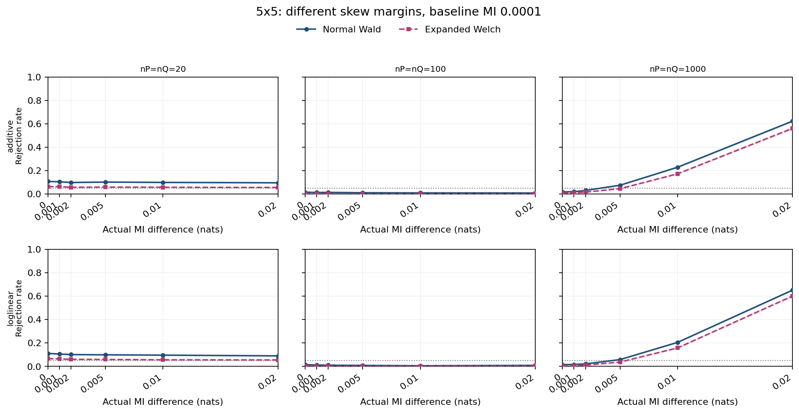

| Specification | Setting |
| --- | --- |
| Table size | 5x5 |
| Horizontal graph regime specifications (columns) | nP=nQ=20, nP=nQ=100, nP=nQ=1000 |
| Vertical graph regime specifications (rows) | additive: P row (0.7, 0.3/4 repeated 4 times), P column (0.7, 0.3/4 repeated 4 times); Q row (0.8, 0.2/4 repeated 4 times), Q column (0.8, 0.2/4 repeated 4 times); loglinear: P row (0.7, 0.3/4 repeated 4 times), P column (0.7, 0.3/4 repeated 4 times); Q row (0.8, 0.2/4 repeated 4 times), Q column (0.8, 0.2/4 repeated 4 times) |
| Probability changes | additive: add at (1,1),(2,2) and subtract at (1,2),(2,1), for both P and Q; loglinear: ordinal log-linear scores from -1 to 1, with row and column multipliers preserving the stated margins, for both P and Q |
| MI settings | Baseline MI {0.0001}; direction {q higher}; actual differences {0, 0.001, 0.002, 0.005, 0.01, 0.02} nats |
| Horizontal axis within each graph | Actual MI difference in nats, fixed from 0 to 0.02 |
| Vertical axis within each graph | Unconditional rejection rate from 0 to 1; invalid results count as non-rejections |
| Replicates | 20,000 per unique point |

Null-point rejection and validity:

| Vertical regime | Horizontal regime | x | Method | Rejection | Valid |
| --- | --- | --- | --- | --- | --- |
| additive | nP=nQ=20 | 0 | Expanded Welch | 0.0644 | 0.9786 |
| additive | nP=nQ=20 | 0 | Normal Wald | 0.1084 | 0.9999 |
| additive | nP=nQ=100 | 0 | Expanded Welch | 0.0039 | 1.0000 |
| additive | nP=nQ=100 | 0 | Normal Wald | 0.0169 | 1.0000 |
| additive | nP=nQ=1000 | 0 | Expanded Welch | 0.0098 | 1.0000 |
| additive | nP=nQ=1000 | 0 | Normal Wald | 0.0193 | 1.0000 |
| loglinear | nP=nQ=20 | 0 | Expanded Welch | 0.0670 | 0.9761 |
| loglinear | nP=nQ=20 | 0 | Normal Wald | 0.1111 | 1.0000 |
| loglinear | nP=nQ=100 | 0 | Expanded Welch | 0.0042 | 1.0000 |
| loglinear | nP=nQ=100 | 0 | Normal Wald | 0.0156 | 1.0000 |
| loglinear | nP=nQ=1000 | 0 | Expanded Welch | 0.0077 | 1.0000 |
| loglinear | nP=nQ=1000 | 0 | Normal Wald | 0.0154 | 1.0000 |

Every plotted rate, interval, validity and minimum expected count

| Vertical regime | Horizontal regime | x | Method | Rejection | 95% interval | Valid | Conditional | Min expected P | Min expected Q |
| --- | --- | --- | --- | --- | --- | --- | --- | --- | --- |
| additive | nP=nQ=20 | 0 | Expanded Welch | 0.0644 | [0.0611, 0.0679] | 0.9786 | 0.0658 | 0.1125 | 0.05 |
| additive | nP=nQ=20 | 0 | Normal Wald | 0.1084 | [0.1042, 0.1128] | 0.9999 | 0.1084 | 0.1125 | 0.05 |
| additive | nP=nQ=20 | 0.001 | Expanded Welch | 0.0641 | [0.0608, 0.0676] | 0.9779 | 0.0655 | 0.1125 | 0.05 |
| additive | nP=nQ=20 | 0.001 | Normal Wald | 0.1059 | [0.1017, 0.1102] | 1.0000 | 0.1059 | 0.1125 | 0.05 |
| additive | nP=nQ=20 | 0.002 | Expanded Welch | 0.0587 | [0.0555, 0.0620] | 0.9763 | 0.0601 | 0.1125 | 0.05 |
| additive | nP=nQ=20 | 0.002 | Normal Wald | 0.0997 | [0.0956, 0.1039] | 0.9999 | 0.0997 | 0.1125 | 0.05 |
| additive | nP=nQ=20 | 0.005 | Expanded Welch | 0.0604 | [0.0572, 0.0638] | 0.9791 | 0.0617 | 0.1125 | 0.05 |
| additive | nP=nQ=20 | 0.005 | Normal Wald | 0.1031 | [0.0989, 0.1073] | 1.0000 | 0.1031 | 0.1125 | 0.05 |
| additive | nP=nQ=20 | 0.01 | Expanded Welch | 0.0590 | [0.0558, 0.0624] | 0.9764 | 0.0604 | 0.1125 | 0.05 |
| additive | nP=nQ=20 | 0.01 | Normal Wald | 0.1004 | [0.0963, 0.1046] | 1.0000 | 0.1004 | 0.1125 | 0.05 |
| additive | nP=nQ=20 | 0.02 | Expanded Welch | 0.0573 | [0.0541, 0.0606] | 0.9766 | 0.0586 | 0.1125 | 0.05 |
| additive | nP=nQ=20 | 0.02 | Normal Wald | 0.0970 | [0.0930, 0.1012] | 1.0000 | 0.0970 | 0.1125 | 0.05 |
| additive | nP=nQ=100 | 0 | Expanded Welch | 0.0039 | [0.0031, 0.0049] | 1.0000 | 0.0039 | 0.5625 | 0.25 |
| additive | nP=nQ=100 | 0 | Normal Wald | 0.0169 | [0.0152, 0.0187] | 1.0000 | 0.0169 | 0.5625 | 0.25 |
| additive | nP=nQ=100 | 0.001 | Expanded Welch | 0.0034 | [0.0027, 0.0043] | 1.0000 | 0.0034 | 0.5625 | 0.25 |
| additive | nP=nQ=100 | 0.001 | Normal Wald | 0.0141 | [0.0126, 0.0158] | 1.0000 | 0.0141 | 0.5625 | 0.25 |
| additive | nP=nQ=100 | 0.002 | Expanded Welch | 0.0042 | [0.0033, 0.0051] | 1.0000 | 0.0042 | 0.5625 | 0.25 |
| additive | nP=nQ=100 | 0.002 | Normal Wald | 0.0151 | [0.0135, 0.0169] | 1.0000 | 0.0151 | 0.5625 | 0.25 |
| additive | nP=nQ=100 | 0.005 | Expanded Welch | 0.0034 | [0.0027, 0.0043] | 1.0000 | 0.0034 | 0.5625 | 0.25 |
| additive | nP=nQ=100 | 0.005 | Normal Wald | 0.0123 | [0.0108, 0.0139] | 1.0000 | 0.0123 | 0.5625 | 0.25 |
| additive | nP=nQ=100 | 0.01 | Expanded Welch | 0.0037 | [0.0030, 0.0047] | 1.0000 | 0.0037 | 0.5625 | 0.25 |
| additive | nP=nQ=100 | 0.01 | Normal Wald | 0.0110 | [0.0096, 0.0125] | 1.0000 | 0.0110 | 0.5625 | 0.25 |
| additive | nP=nQ=100 | 0.02 | Expanded Welch | 0.0036 | [0.0028, 0.0045] | 1.0000 | 0.0036 | 0.5625 | 0.25 |
| additive | nP=nQ=100 | 0.02 | Normal Wald | 0.0101 | [0.0089, 0.0116] | 1.0000 | 0.0101 | 0.5625 | 0.25 |
| additive | nP=nQ=1000 | 0 | Expanded Welch | 0.0098 | [0.0085, 0.0113] | 1.0000 | 0.0098 | 5.625 | 2.5 |
| additive | nP=nQ=1000 | 0 | Normal Wald | 0.0193 | [0.0175, 0.0213] | 1.0000 | 0.0193 | 5.625 | 2.5 |
| additive | nP=nQ=1000 | 0.001 | Expanded Welch | 0.0104 | [0.0091, 0.0120] | 1.0000 | 0.0104 | 5.625 | 2.5 |
| additive | nP=nQ=1000 | 0.001 | Normal Wald | 0.0208 | [0.0189, 0.0229] | 1.0000 | 0.0208 | 5.625 | 2.5 |
| additive | nP=nQ=1000 | 0.002 | Expanded Welch | 0.0174 | [0.0156, 0.0193] | 1.0000 | 0.0174 | 5.625 | 2.5 |
| additive | nP=nQ=1000 | 0.002 | Normal Wald | 0.0319 | [0.0296, 0.0344] | 1.0000 | 0.0319 | 5.625 | 2.5 |
| additive | nP=nQ=1000 | 0.005 | Expanded Welch | 0.0467 | [0.0439, 0.0498] | 1.0000 | 0.0467 | 5.625 | 2.5 |
| additive | nP=nQ=1000 | 0.005 | Normal Wald | 0.0762 | [0.0726, 0.0800] | 1.0000 | 0.0762 | 5.625 | 2.5 |
| additive | nP=nQ=1000 | 0.01 | Expanded Welch | 0.1736 | [0.1684, 0.1789] | 1.0000 | 0.1736 | 5.625 | 2.5 |
| additive | nP=nQ=1000 | 0.01 | Normal Wald | 0.2298 | [0.2240, 0.2357] | 1.0000 | 0.2298 | 5.625 | 2.5 |
| additive | nP=nQ=1000 | 0.02 | Expanded Welch | 0.5615 | [0.5546, 0.5684] | 1.0000 | 0.5615 | 5.625 | 2.5 |
| additive | nP=nQ=1000 | 0.02 | Normal Wald | 0.6235 | [0.6168, 0.6302] | 1.0000 | 0.6235 | 5.625 | 2.5 |
| loglinear | nP=nQ=20 | 0 | Expanded Welch | 0.0670 | [0.0636, 0.0705] | 0.9761 | 0.0686 | 0.1126 | 0.05014 |
| loglinear | nP=nQ=20 | 0 | Normal Wald | 0.1111 | [0.1068, 0.1155] | 1.0000 | 0.1111 | 0.1126 | 0.05014 |
| loglinear | nP=nQ=20 | 0.001 | Expanded Welch | 0.0642 | [0.0609, 0.0677] | 0.9774 | 0.0657 | 0.1126 | 0.05048 |
| loglinear | nP=nQ=20 | 0.001 | Normal Wald | 0.1058 | [0.1017, 0.1102] | 1.0000 | 0.1059 | 0.1126 | 0.05048 |
| loglinear | nP=nQ=20 | 0.002 | Expanded Welch | 0.0610 | [0.0578, 0.0644] | 0.9760 | 0.0625 | 0.1126 | 0.05067 |
| loglinear | nP=nQ=20 | 0.002 | Normal Wald | 0.1013 | [0.0972, 0.1056] | 1.0000 | 0.1013 | 0.1126 | 0.05067 |
| loglinear | nP=nQ=20 | 0.005 | Expanded Welch | 0.0595 | [0.0563, 0.0629] | 0.9747 | 0.0610 | 0.1126 | 0.05109 |
| loglinear | nP=nQ=20 | 0.005 | Normal Wald | 0.0993 | [0.0952, 0.1035] | 1.0000 | 0.0993 | 0.1126 | 0.05109 |
| loglinear | nP=nQ=20 | 0.01 | Expanded Welch | 0.0566 | [0.0535, 0.0599] | 0.9768 | 0.0579 | 0.1126 | 0.05162 |
| loglinear | nP=nQ=20 | 0.01 | Normal Wald | 0.0964 | [0.0923, 0.1005] | 1.0000 | 0.0964 | 0.1126 | 0.05162 |
| loglinear | nP=nQ=20 | 0.02 | Expanded Welch | 0.0553 | [0.0522, 0.0586] | 0.9778 | 0.0566 | 0.1126 | 0.05249 |
| loglinear | nP=nQ=20 | 0.02 | Normal Wald | 0.0902 | [0.0863, 0.0942] | 1.0000 | 0.0902 | 0.1126 | 0.05249 |
| loglinear | nP=nQ=100 | 0 | Expanded Welch | 0.0042 | [0.0034, 0.0052] | 1.0000 | 0.0042 | 0.5628 | 0.2507 |
| loglinear | nP=nQ=100 | 0 | Normal Wald | 0.0156 | [0.0140, 0.0174] | 1.0000 | 0.0156 | 0.5628 | 0.2507 |
| loglinear | nP=nQ=100 | 0.001 | Expanded Welch | 0.0029 | [0.0022, 0.0037] | 1.0000 | 0.0029 | 0.5628 | 0.2524 |
| loglinear | nP=nQ=100 | 0.001 | Normal Wald | 0.0120 | [0.0106, 0.0136] | 1.0000 | 0.0120 | 0.5628 | 0.2524 |
| loglinear | nP=nQ=100 | 0.002 | Expanded Welch | 0.0021 | [0.0016, 0.0028] | 1.0000 | 0.0021 | 0.5628 | 0.2534 |
| loglinear | nP=nQ=100 | 0.002 | Normal Wald | 0.0107 | [0.0094, 0.0122] | 1.0000 | 0.0107 | 0.5628 | 0.2534 |
| loglinear | nP=nQ=100 | 0.005 | Expanded Welch | 0.0028 | [0.0022, 0.0036] | 1.0000 | 0.0028 | 0.5628 | 0.2554 |
| loglinear | nP=nQ=100 | 0.005 | Normal Wald | 0.0089 | [0.0077, 0.0103] | 1.0000 | 0.0089 | 0.5628 | 0.2554 |
| loglinear | nP=nQ=100 | 0.01 | Expanded Welch | 0.0027 | [0.0020, 0.0035] | 1.0000 | 0.0027 | 0.5628 | 0.2581 |
| loglinear | nP=nQ=100 | 0.01 | Normal Wald | 0.0062 | [0.0052, 0.0074] | 1.0000 | 0.0062 | 0.5628 | 0.2581 |
| loglinear | nP=nQ=100 | 0.02 | Expanded Welch | 0.0050 | [0.0041, 0.0060] | 1.0000 | 0.0050 | 0.5628 | 0.2625 |
| loglinear | nP=nQ=100 | 0.02 | Normal Wald | 0.0092 | [0.0080, 0.0107] | 1.0000 | 0.0092 | 0.5628 | 0.2625 |
| loglinear | nP=nQ=1000 | 0 | Expanded Welch | 0.0077 | [0.0066, 0.0091] | 1.0000 | 0.0077 | 5.628 | 2.507 |
| loglinear | nP=nQ=1000 | 0 | Normal Wald | 0.0154 | [0.0138, 0.0172] | 1.0000 | 0.0154 | 5.628 | 2.507 |
| loglinear | nP=nQ=1000 | 0.001 | Expanded Welch | 0.0074 | [0.0063, 0.0087] | 1.0000 | 0.0074 | 5.628 | 2.524 |
| loglinear | nP=nQ=1000 | 0.001 | Normal Wald | 0.0169 | [0.0152, 0.0188] | 1.0000 | 0.0169 | 5.628 | 2.524 |
| loglinear | nP=nQ=1000 | 0.002 | Expanded Welch | 0.0112 | [0.0098, 0.0127] | 1.0000 | 0.0112 | 5.628 | 2.534 |
| loglinear | nP=nQ=1000 | 0.002 | Normal Wald | 0.0218 | [0.0199, 0.0239] | 1.0000 | 0.0218 | 5.628 | 2.534 |
| loglinear | nP=nQ=1000 | 0.005 | Expanded Welch | 0.0374 | [0.0349, 0.0401] | 1.0000 | 0.0374 | 5.628 | 2.554 |
| loglinear | nP=nQ=1000 | 0.005 | Normal Wald | 0.0585 | [0.0553, 0.0618] | 1.0000 | 0.0585 | 5.628 | 2.554 |
| loglinear | nP=nQ=1000 | 0.01 | Expanded Welch | 0.1582 | [0.1532, 0.1633] | 1.0000 | 0.1582 | 5.628 | 2.581 |
| loglinear | nP=nQ=1000 | 0.01 | Normal Wald | 0.2054 | [0.1998, 0.2110] | 1.0000 | 0.2054 | 5.628 | 2.581 |
| loglinear | nP=nQ=1000 | 0.02 | Expanded Welch | 0.6010 | [0.5942, 0.6078] | 1.0000 | 0.6010 | 5.628 | 2.625 |
| loglinear | nP=nQ=1000 | 0.02 | Normal Wald | 0.6516 | [0.6450, 0.6582] | 1.0000 | 0.6516 | 5.628 | 2.625 |

### 9.8 5x5: different skew margins, baseline MI 0.02

Do conclusions change under a matched ordinal log-linear construction?

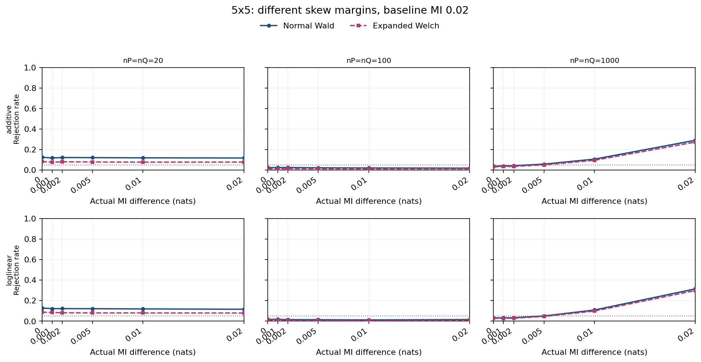

| Specification | Setting |
| --- | --- |
| Table size | 5x5 |
| Horizontal graph regime specifications (columns) | nP=nQ=20, nP=nQ=100, nP=nQ=1000 |
| Vertical graph regime specifications (rows) | additive: P row (0.7, 0.3/4 repeated 4 times), P column (0.7, 0.3/4 repeated 4 times); Q row (0.8, 0.2/4 repeated 4 times), Q column (0.8, 0.2/4 repeated 4 times); loglinear: P row (0.7, 0.3/4 repeated 4 times), P column (0.7, 0.3/4 repeated 4 times); Q row (0.8, 0.2/4 repeated 4 times), Q column (0.8, 0.2/4 repeated 4 times) |
| Probability changes | additive: add at (1,1),(2,2) and subtract at (1,2),(2,1), for both P and Q; loglinear: ordinal log-linear scores from -1 to 1, with row and column multipliers preserving the stated margins, for both P and Q |
| MI settings | Baseline MI {0.02}; direction {q higher}; actual differences {0, 0.001, 0.002, 0.005, 0.01, 0.02} nats |
| Horizontal axis within each graph | Actual MI difference in nats, fixed from 0 to 0.02 |
| Vertical axis within each graph | Unconditional rejection rate from 0 to 1; invalid results count as non-rejections |
| Replicates | 20,000 per unique point |

Null-point rejection and validity:

| Vertical regime | Horizontal regime | x | Method | Rejection | Valid |
| --- | --- | --- | --- | --- | --- |
| additive | nP=nQ=20 | 0 | Expanded Welch | 0.0839 | 0.9785 |
| additive | nP=nQ=20 | 0 | Normal Wald | 0.1259 | 1.0000 |
| additive | nP=nQ=100 | 0 | Expanded Welch | 0.0136 | 1.0000 |
| additive | nP=nQ=100 | 0 | Normal Wald | 0.0250 | 1.0000 |
| additive | nP=nQ=1000 | 0 | Expanded Welch | 0.0319 | 1.0000 |
| additive | nP=nQ=1000 | 0 | Normal Wald | 0.0386 | 1.0000 |
| loglinear | nP=nQ=20 | 0 | Expanded Welch | 0.0877 | 0.9765 |
| loglinear | nP=nQ=20 | 0 | Normal Wald | 0.1285 | 1.0000 |
| loglinear | nP=nQ=100 | 0 | Expanded Welch | 0.0119 | 1.0000 |
| loglinear | nP=nQ=100 | 0 | Normal Wald | 0.0181 | 1.0000 |
| loglinear | nP=nQ=1000 | 0 | Expanded Welch | 0.0284 | 1.0000 |
| loglinear | nP=nQ=1000 | 0 | Normal Wald | 0.0329 | 1.0000 |

Every plotted rate, interval, validity and minimum expected count

| Vertical regime | Horizontal regime | x | Method | Rejection | 95% interval | Valid | Conditional | Min expected P | Min expected Q |
| --- | --- | --- | --- | --- | --- | --- | --- | --- | --- |
| additive | nP=nQ=20 | 0 | Expanded Welch | 0.0839 | [0.0802, 0.0879] | 0.9785 | 0.0858 | 0.1125 | 0.05 |
| additive | nP=nQ=20 | 0 | Normal Wald | 0.1259 | [0.1214, 0.1306] | 1.0000 | 0.1259 | 0.1125 | 0.05 |
| additive | nP=nQ=20 | 0.001 | Expanded Welch | 0.0779 | [0.0743, 0.0817] | 0.9757 | 0.0798 | 0.1125 | 0.05 |
| additive | nP=nQ=20 | 0.001 | Normal Wald | 0.1192 | [0.1148, 0.1238] | 1.0000 | 0.1193 | 0.1125 | 0.05 |
| additive | nP=nQ=20 | 0.002 | Expanded Welch | 0.0817 | [0.0779, 0.0855] | 0.9756 | 0.0837 | 0.1125 | 0.05 |
| additive | nP=nQ=20 | 0.002 | Normal Wald | 0.1232 | [0.1187, 0.1278] | 1.0000 | 0.1232 | 0.1125 | 0.05 |
| additive | nP=nQ=20 | 0.005 | Expanded Welch | 0.0801 | [0.0764, 0.0839] | 0.9763 | 0.0820 | 0.1125 | 0.05 |
| additive | nP=nQ=20 | 0.005 | Normal Wald | 0.1222 | [0.1177, 0.1268] | 0.9999 | 0.1222 | 0.1125 | 0.05 |
| additive | nP=nQ=20 | 0.01 | Expanded Welch | 0.0787 | [0.0750, 0.0825] | 0.9779 | 0.0805 | 0.1125 | 0.05 |
| additive | nP=nQ=20 | 0.01 | Normal Wald | 0.1205 | [0.1161, 0.1251] | 1.0000 | 0.1205 | 0.1125 | 0.05 |
| additive | nP=nQ=20 | 0.02 | Expanded Welch | 0.0793 | [0.0756, 0.0831] | 0.9772 | 0.0812 | 0.1125 | 0.05 |
| additive | nP=nQ=20 | 0.02 | Normal Wald | 0.1187 | [0.1143, 0.1233] | 0.9999 | 0.1187 | 0.1125 | 0.05 |
| additive | nP=nQ=100 | 0 | Expanded Welch | 0.0136 | [0.0121, 0.0153] | 1.0000 | 0.0136 | 0.5625 | 0.25 |
| additive | nP=nQ=100 | 0 | Normal Wald | 0.0250 | [0.0229, 0.0273] | 1.0000 | 0.0250 | 0.5625 | 0.25 |
| additive | nP=nQ=100 | 0.001 | Expanded Welch | 0.0129 | [0.0114, 0.0145] | 1.0000 | 0.0129 | 0.5625 | 0.25 |
| additive | nP=nQ=100 | 0.001 | Normal Wald | 0.0253 | [0.0232, 0.0276] | 1.0000 | 0.0253 | 0.5625 | 0.25 |
| additive | nP=nQ=100 | 0.002 | Expanded Welch | 0.0158 | [0.0142, 0.0177] | 1.0000 | 0.0158 | 0.5625 | 0.25 |
| additive | nP=nQ=100 | 0.002 | Normal Wald | 0.0262 | [0.0241, 0.0285] | 1.0000 | 0.0262 | 0.5625 | 0.25 |
| additive | nP=nQ=100 | 0.005 | Expanded Welch | 0.0131 | [0.0116, 0.0148] | 1.0000 | 0.0131 | 0.5625 | 0.25 |
| additive | nP=nQ=100 | 0.005 | Normal Wald | 0.0231 | [0.0211, 0.0252] | 1.0000 | 0.0231 | 0.5625 | 0.25 |
| additive | nP=nQ=100 | 0.01 | Expanded Welch | 0.0124 | [0.0110, 0.0140] | 1.0000 | 0.0124 | 0.5625 | 0.25 |
| additive | nP=nQ=100 | 0.01 | Normal Wald | 0.0217 | [0.0198, 0.0238] | 1.0000 | 0.0217 | 0.5625 | 0.25 |
| additive | nP=nQ=100 | 0.02 | Expanded Welch | 0.0137 | [0.0121, 0.0154] | 1.0000 | 0.0137 | 0.5625 | 0.25 |
| additive | nP=nQ=100 | 0.02 | Normal Wald | 0.0202 | [0.0183, 0.0222] | 1.0000 | 0.0202 | 0.5625 | 0.25 |
| additive | nP=nQ=1000 | 0 | Expanded Welch | 0.0319 | [0.0295, 0.0344] | 1.0000 | 0.0319 | 5.625 | 2.5 |
| additive | nP=nQ=1000 | 0 | Normal Wald | 0.0386 | [0.0360, 0.0413] | 1.0000 | 0.0386 | 5.625 | 2.5 |
| additive | nP=nQ=1000 | 0.001 | Expanded Welch | 0.0361 | [0.0336, 0.0388] | 1.0000 | 0.0361 | 5.625 | 2.5 |
| additive | nP=nQ=1000 | 0.001 | Normal Wald | 0.0411 | [0.0384, 0.0439] | 1.0000 | 0.0411 | 5.625 | 2.5 |
| additive | nP=nQ=1000 | 0.002 | Expanded Welch | 0.0369 | [0.0344, 0.0396] | 1.0000 | 0.0369 | 5.625 | 2.5 |
| additive | nP=nQ=1000 | 0.002 | Normal Wald | 0.0435 | [0.0408, 0.0465] | 1.0000 | 0.0435 | 5.625 | 2.5 |
| additive | nP=nQ=1000 | 0.005 | Expanded Welch | 0.0517 | [0.0487, 0.0549] | 1.0000 | 0.0517 | 5.625 | 2.5 |
| additive | nP=nQ=1000 | 0.005 | Normal Wald | 0.0592 | [0.0560, 0.0625] | 1.0000 | 0.0592 | 5.625 | 2.5 |
| additive | nP=nQ=1000 | 0.01 | Expanded Welch | 0.0967 | [0.0927, 0.1009] | 1.0000 | 0.0967 | 5.625 | 2.5 |
| additive | nP=nQ=1000 | 0.01 | Normal Wald | 0.1079 | [0.1036, 0.1122] | 1.0000 | 0.1079 | 5.625 | 2.5 |
| additive | nP=nQ=1000 | 0.02 | Expanded Welch | 0.2743 | [0.2682, 0.2806] | 1.0000 | 0.2743 | 5.625 | 2.5 |
| additive | nP=nQ=1000 | 0.02 | Normal Wald | 0.2915 | [0.2852, 0.2978] | 1.0000 | 0.2915 | 5.625 | 2.5 |
| loglinear | nP=nQ=20 | 0 | Expanded Welch | 0.0877 | [0.0838, 0.0916] | 0.9765 | 0.0898 | 0.1118 | 0.05249 |
| loglinear | nP=nQ=20 | 0 | Normal Wald | 0.1285 | [0.1239, 0.1332] | 1.0000 | 0.1285 | 0.1118 | 0.05249 |
| loglinear | nP=nQ=20 | 0.001 | Expanded Welch | 0.0856 | [0.0818, 0.0895] | 0.9764 | 0.0876 | 0.1118 | 0.05257 |
| loglinear | nP=nQ=20 | 0.001 | Normal Wald | 0.1223 | [0.1178, 0.1269] | 1.0000 | 0.1223 | 0.1118 | 0.05257 |
| loglinear | nP=nQ=20 | 0.002 | Expanded Welch | 0.0820 | [0.0783, 0.0859] | 0.9759 | 0.0841 | 0.1118 | 0.05265 |
| loglinear | nP=nQ=20 | 0.002 | Normal Wald | 0.1225 | [0.1180, 0.1271] | 1.0000 | 0.1225 | 0.1118 | 0.05265 |
| loglinear | nP=nQ=20 | 0.005 | Expanded Welch | 0.0809 | [0.0772, 0.0847] | 0.9755 | 0.0829 | 0.1118 | 0.05289 |
| loglinear | nP=nQ=20 | 0.005 | Normal Wald | 0.1218 | [0.1174, 0.1265] | 1.0000 | 0.1219 | 0.1118 | 0.05289 |
| loglinear | nP=nQ=20 | 0.01 | Expanded Welch | 0.0805 | [0.0769, 0.0844] | 0.9768 | 0.0825 | 0.1118 | 0.05326 |
| loglinear | nP=nQ=20 | 0.01 | Normal Wald | 0.1195 | [0.1151, 0.1241] | 1.0000 | 0.1195 | 0.1118 | 0.05326 |
| loglinear | nP=nQ=20 | 0.02 | Expanded Welch | 0.0796 | [0.0759, 0.0834] | 0.9769 | 0.0815 | 0.1118 | 0.05171 |
| loglinear | nP=nQ=20 | 0.02 | Normal Wald | 0.1162 | [0.1118, 0.1207] | 1.0000 | 0.1162 | 0.1118 | 0.05171 |
| loglinear | nP=nQ=100 | 0 | Expanded Welch | 0.0119 | [0.0105, 0.0135] | 1.0000 | 0.0119 | 0.559 | 0.2624 |
| loglinear | nP=nQ=100 | 0 | Normal Wald | 0.0181 | [0.0164, 0.0201] | 1.0000 | 0.0181 | 0.559 | 0.2624 |
| loglinear | nP=nQ=100 | 0.001 | Expanded Welch | 0.0109 | [0.0095, 0.0124] | 1.0000 | 0.0109 | 0.559 | 0.2628 |
| loglinear | nP=nQ=100 | 0.001 | Normal Wald | 0.0184 | [0.0166, 0.0203] | 1.0000 | 0.0184 | 0.559 | 0.2628 |
| loglinear | nP=nQ=100 | 0.002 | Expanded Welch | 0.0095 | [0.0083, 0.0110] | 1.0000 | 0.0095 | 0.559 | 0.2632 |
| loglinear | nP=nQ=100 | 0.002 | Normal Wald | 0.0158 | [0.0142, 0.0176] | 1.0000 | 0.0158 | 0.559 | 0.2632 |
| loglinear | nP=nQ=100 | 0.005 | Expanded Welch | 0.0092 | [0.0079, 0.0106] | 1.0000 | 0.0092 | 0.559 | 0.2644 |
| loglinear | nP=nQ=100 | 0.005 | Normal Wald | 0.0150 | [0.0134, 0.0168] | 1.0000 | 0.0150 | 0.559 | 0.2644 |
| loglinear | nP=nQ=100 | 0.01 | Expanded Welch | 0.0077 | [0.0066, 0.0090] | 1.0000 | 0.0077 | 0.559 | 0.2663 |
| loglinear | nP=nQ=100 | 0.01 | Normal Wald | 0.0129 | [0.0115, 0.0146] | 1.0000 | 0.0129 | 0.559 | 0.2663 |
| loglinear | nP=nQ=100 | 0.02 | Expanded Welch | 0.0115 | [0.0101, 0.0130] | 1.0000 | 0.0115 | 0.559 | 0.2586 |
| loglinear | nP=nQ=100 | 0.02 | Normal Wald | 0.0166 | [0.0149, 0.0185] | 1.0000 | 0.0166 | 0.559 | 0.2586 |
| loglinear | nP=nQ=1000 | 0 | Expanded Welch | 0.0284 | [0.0262, 0.0308] | 1.0000 | 0.0284 | 5.59 | 2.624 |
| loglinear | nP=nQ=1000 | 0 | Normal Wald | 0.0329 | [0.0305, 0.0355] | 1.0000 | 0.0329 | 5.59 | 2.624 |
| loglinear | nP=nQ=1000 | 0.001 | Expanded Welch | 0.0275 | [0.0253, 0.0299] | 1.0000 | 0.0275 | 5.59 | 2.628 |
| loglinear | nP=nQ=1000 | 0.001 | Normal Wald | 0.0321 | [0.0297, 0.0346] | 1.0000 | 0.0321 | 5.59 | 2.628 |
| loglinear | nP=nQ=1000 | 0.002 | Expanded Welch | 0.0290 | [0.0268, 0.0315] | 1.0000 | 0.0290 | 5.59 | 2.632 |
| loglinear | nP=nQ=1000 | 0.002 | Normal Wald | 0.0342 | [0.0318, 0.0368] | 1.0000 | 0.0342 | 5.59 | 2.632 |
| loglinear | nP=nQ=1000 | 0.005 | Expanded Welch | 0.0462 | [0.0434, 0.0492] | 1.0000 | 0.0462 | 5.59 | 2.644 |
| loglinear | nP=nQ=1000 | 0.005 | Normal Wald | 0.0512 | [0.0482, 0.0543] | 1.0000 | 0.0512 | 5.59 | 2.644 |
| loglinear | nP=nQ=1000 | 0.01 | Expanded Welch | 0.0989 | [0.0949, 0.1032] | 1.0000 | 0.0989 | 5.59 | 2.663 |
| loglinear | nP=nQ=1000 | 0.01 | Normal Wald | 0.1090 | [0.1048, 0.1134] | 1.0000 | 0.1090 | 5.59 | 2.663 |
| loglinear | nP=nQ=1000 | 0.02 | Expanded Welch | 0.2991 | [0.2928, 0.3055] | 1.0000 | 0.2991 | 5.59 | 2.586 |
| loglinear | nP=nQ=1000 | 0.02 | Normal Wald | 0.3150 | [0.3085, 0.3214] | 1.0000 | 0.3150 | 5.59 | 2.586 |

### 9.9 8x8: uniform margins, baseline MI 0.0001

Do conclusions change under a matched ordinal log-linear construction?

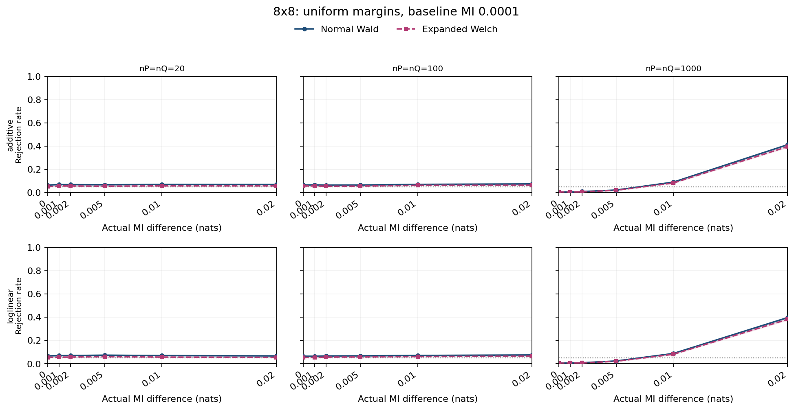

| Specification | Setting |
| --- | --- |
| Table size | 8x8 |
| Horizontal graph regime specifications (columns) | nP=nQ=20, nP=nQ=100, nP=nQ=1000 |
| Vertical graph regime specifications (rows) | additive: P row (0.125 repeated 8 times), P column (0.125 repeated 8 times); Q row (0.125 repeated 8 times), Q column (0.125 repeated 8 times); loglinear: P row (0.125 repeated 8 times), P column (0.125 repeated 8 times); Q row (0.125 repeated 8 times), Q column (0.125 repeated 8 times) |
| Probability changes | additive: add at (1,1),(2,2) and subtract at (1,2),(2,1), for both P and Q; loglinear: ordinal log-linear scores from -1 to 1, with row and column multipliers preserving the stated margins, for both P and Q |
| MI settings | Baseline MI {0.0001}; direction {q higher}; actual differences {0, 0.001, 0.002, 0.005, 0.01, 0.02} nats |
| Horizontal axis within each graph | Actual MI difference in nats, fixed from 0 to 0.02 |
| Vertical axis within each graph | Unconditional rejection rate from 0 to 1; invalid results count as non-rejections |
| Replicates | 20,000 per unique point |

Null-point rejection and validity:

| Vertical regime | Horizontal regime | x | Method | Rejection | Valid |
| --- | --- | --- | --- | --- | --- |
| additive | nP=nQ=20 | 0 | Expanded Welch | 0.0529 | 1.0000 |
| additive | nP=nQ=20 | 0 | Normal Wald | 0.0659 | 1.0000 |
| additive | nP=nQ=100 | 0 | Expanded Welch | 0.0582 | 1.0000 |
| additive | nP=nQ=100 | 0 | Normal Wald | 0.0666 | 1.0000 |
| additive | nP=nQ=1000 | 0 | Expanded Welch | 0.0057 | 1.0000 |
| additive | nP=nQ=1000 | 0 | Normal Wald | 0.0064 | 1.0000 |
| loglinear | nP=nQ=20 | 0 | Expanded Welch | 0.0554 | 1.0000 |
| loglinear | nP=nQ=20 | 0 | Normal Wald | 0.0676 | 1.0000 |
| loglinear | nP=nQ=100 | 0 | Expanded Welch | 0.0554 | 1.0000 |
| loglinear | nP=nQ=100 | 0 | Normal Wald | 0.0651 | 1.0000 |
| loglinear | nP=nQ=1000 | 0 | Expanded Welch | 0.0044 | 1.0000 |
| loglinear | nP=nQ=1000 | 0 | Normal Wald | 0.0055 | 1.0000 |

Every plotted rate, interval, validity and minimum expected count

| Vertical regime | Horizontal regime | x | Method | Rejection | 95% interval | Valid | Conditional | Min expected P | Min expected Q |
| --- | --- | --- | --- | --- | --- | --- | --- | --- | --- |
| additive | nP=nQ=20 | 0 | Expanded Welch | 0.0529 | [0.0499, 0.0561] | 1.0000 | 0.0529 | 0.2948 | 0.2948 |
| additive | nP=nQ=20 | 0 | Normal Wald | 0.0659 | [0.0626, 0.0695] | 1.0000 | 0.0659 | 0.2948 | 0.2948 |
| additive | nP=nQ=20 | 0.001 | Expanded Welch | 0.0583 | [0.0551, 0.0616] | 1.0000 | 0.0583 | 0.2948 | 0.254 |
| additive | nP=nQ=20 | 0.001 | Normal Wald | 0.0705 | [0.0670, 0.0741] | 1.0000 | 0.0705 | 0.2948 | 0.254 |
| additive | nP=nQ=20 | 0.002 | Expanded Welch | 0.0580 | [0.0548, 0.0613] | 1.0000 | 0.0580 | 0.2948 | 0.2319 |
| additive | nP=nQ=20 | 0.002 | Normal Wald | 0.0698 | [0.0664, 0.0735] | 1.0000 | 0.0698 | 0.2948 | 0.2319 |
| additive | nP=nQ=20 | 0.005 | Expanded Welch | 0.0564 | [0.0533, 0.0597] | 1.0000 | 0.0564 | 0.2948 | 0.188 |
| additive | nP=nQ=20 | 0.005 | Normal Wald | 0.0685 | [0.0651, 0.0721] | 1.0000 | 0.0685 | 0.2948 | 0.188 |
| additive | nP=nQ=20 | 0.01 | Expanded Welch | 0.0588 | [0.0557, 0.0622] | 1.0000 | 0.0588 | 0.2948 | 0.1398 |
| additive | nP=nQ=20 | 0.01 | Normal Wald | 0.0718 | [0.0684, 0.0755] | 1.0000 | 0.0718 | 0.2948 | 0.1398 |
| additive | nP=nQ=20 | 0.02 | Expanded Welch | 0.0590 | [0.0558, 0.0624] | 1.0000 | 0.0590 | 0.2948 | 0.07646 |
| additive | nP=nQ=20 | 0.02 | Normal Wald | 0.0713 | [0.0678, 0.0749] | 1.0000 | 0.0713 | 0.2948 | 0.07646 |
| additive | nP=nQ=100 | 0 | Expanded Welch | 0.0582 | [0.0550, 0.0615] | 1.0000 | 0.0582 | 1.474 | 1.474 |
| additive | nP=nQ=100 | 0 | Normal Wald | 0.0666 | [0.0632, 0.0701] | 1.0000 | 0.0666 | 1.474 | 1.474 |
| additive | nP=nQ=100 | 0.001 | Expanded Welch | 0.0585 | [0.0553, 0.0618] | 1.0000 | 0.0585 | 1.474 | 1.27 |
| additive | nP=nQ=100 | 0.001 | Normal Wald | 0.0679 | [0.0645, 0.0715] | 1.0000 | 0.0679 | 1.474 | 1.27 |
| additive | nP=nQ=100 | 0.002 | Expanded Welch | 0.0560 | [0.0529, 0.0593] | 1.0000 | 0.0560 | 1.474 | 1.16 |
| additive | nP=nQ=100 | 0.002 | Normal Wald | 0.0659 | [0.0625, 0.0694] | 1.0000 | 0.0659 | 1.474 | 1.16 |
| additive | nP=nQ=100 | 0.005 | Expanded Welch | 0.0571 | [0.0540, 0.0604] | 1.0000 | 0.0571 | 1.474 | 0.94 |
| additive | nP=nQ=100 | 0.005 | Normal Wald | 0.0665 | [0.0632, 0.0701] | 1.0000 | 0.0665 | 1.474 | 0.94 |
| additive | nP=nQ=100 | 0.01 | Expanded Welch | 0.0637 | [0.0604, 0.0672] | 1.0000 | 0.0637 | 1.474 | 0.6991 |
| additive | nP=nQ=100 | 0.01 | Normal Wald | 0.0721 | [0.0686, 0.0758] | 1.0000 | 0.0721 | 1.474 | 0.6991 |
| additive | nP=nQ=100 | 0.02 | Expanded Welch | 0.0652 | [0.0619, 0.0687] | 1.0000 | 0.0652 | 1.474 | 0.3823 |
| additive | nP=nQ=100 | 0.02 | Normal Wald | 0.0757 | [0.0721, 0.0794] | 1.0000 | 0.0757 | 1.474 | 0.3823 |
| additive | nP=nQ=1000 | 0 | Expanded Welch | 0.0057 | [0.0047, 0.0068] | 1.0000 | 0.0057 | 14.74 | 14.74 |
| additive | nP=nQ=1000 | 0 | Normal Wald | 0.0064 | [0.0054, 0.0076] | 1.0000 | 0.0064 | 14.74 | 14.74 |
| additive | nP=nQ=1000 | 0.001 | Expanded Welch | 0.0052 | [0.0043, 0.0063] | 1.0000 | 0.0052 | 14.74 | 12.7 |
| additive | nP=nQ=1000 | 0.001 | Normal Wald | 0.0064 | [0.0054, 0.0076] | 1.0000 | 0.0064 | 14.74 | 12.7 |
| additive | nP=nQ=1000 | 0.002 | Expanded Welch | 0.0085 | [0.0073, 0.0099] | 1.0000 | 0.0085 | 14.74 | 11.6 |
| additive | nP=nQ=1000 | 0.002 | Normal Wald | 0.0103 | [0.0090, 0.0118] | 1.0000 | 0.0103 | 14.74 | 11.6 |
| additive | nP=nQ=1000 | 0.005 | Expanded Welch | 0.0209 | [0.0190, 0.0230] | 1.0000 | 0.0209 | 14.74 | 9.4 |
| additive | nP=nQ=1000 | 0.005 | Normal Wald | 0.0235 | [0.0215, 0.0257] | 1.0000 | 0.0235 | 14.74 | 9.4 |
| additive | nP=nQ=1000 | 0.01 | Expanded Welch | 0.0838 | [0.0800, 0.0877] | 1.0000 | 0.0838 | 14.74 | 6.991 |
| additive | nP=nQ=1000 | 0.01 | Normal Wald | 0.0915 | [0.0875, 0.0955] | 1.0000 | 0.0915 | 14.74 | 6.991 |
| additive | nP=nQ=1000 | 0.02 | Expanded Welch | 0.3966 | [0.3898, 0.4033] | 1.0000 | 0.3966 | 14.74 | 3.823 |
| additive | nP=nQ=1000 | 0.02 | Normal Wald | 0.4131 | [0.4063, 0.4199] | 1.0000 | 0.4131 | 14.74 | 3.823 |
| loglinear | nP=nQ=20 | 0 | Expanded Welch | 0.0554 | [0.0524, 0.0587] | 1.0000 | 0.0554 | 0.3022 | 0.3022 |
| loglinear | nP=nQ=20 | 0 | Normal Wald | 0.0676 | [0.0642, 0.0712] | 1.0000 | 0.0676 | 0.3022 | 0.3022 |
| loglinear | nP=nQ=20 | 0.001 | Expanded Welch | 0.0570 | [0.0539, 0.0603] | 1.0000 | 0.0570 | 0.3022 | 0.2789 |
| loglinear | nP=nQ=20 | 0.001 | Normal Wald | 0.0701 | [0.0666, 0.0737] | 1.0000 | 0.0701 | 0.3022 | 0.2789 |
| loglinear | nP=nQ=20 | 0.002 | Expanded Welch | 0.0576 | [0.0545, 0.0610] | 1.0000 | 0.0576 | 0.3022 | 0.2665 |
| loglinear | nP=nQ=20 | 0.002 | Normal Wald | 0.0709 | [0.0675, 0.0746] | 1.0000 | 0.0709 | 0.3022 | 0.2665 |
| loglinear | nP=nQ=20 | 0.005 | Expanded Welch | 0.0610 | [0.0578, 0.0644] | 1.0000 | 0.0610 | 0.3022 | 0.242 |
| loglinear | nP=nQ=20 | 0.005 | Normal Wald | 0.0740 | [0.0705, 0.0777] | 1.0000 | 0.0740 | 0.3022 | 0.242 |
| loglinear | nP=nQ=20 | 0.01 | Expanded Welch | 0.0575 | [0.0544, 0.0608] | 1.0000 | 0.0575 | 0.3022 | 0.2152 |
| loglinear | nP=nQ=20 | 0.01 | Normal Wald | 0.0706 | [0.0671, 0.0742] | 1.0000 | 0.0706 | 0.3022 | 0.2152 |
| loglinear | nP=nQ=20 | 0.02 | Expanded Welch | 0.0554 | [0.0523, 0.0586] | 1.0000 | 0.0554 | 0.3022 | 0.1796 |
| loglinear | nP=nQ=20 | 0.02 | Normal Wald | 0.0675 | [0.0642, 0.0711] | 1.0000 | 0.0675 | 0.3022 | 0.1796 |
| loglinear | nP=nQ=100 | 0 | Expanded Welch | 0.0554 | [0.0523, 0.0587] | 1.0000 | 0.0554 | 1.511 | 1.511 |
| loglinear | nP=nQ=100 | 0 | Normal Wald | 0.0651 | [0.0618, 0.0686] | 1.0000 | 0.0651 | 1.511 | 1.511 |
| loglinear | nP=nQ=100 | 0.001 | Expanded Welch | 0.0544 | [0.0513, 0.0576] | 1.0000 | 0.0544 | 1.511 | 1.395 |
| loglinear | nP=nQ=100 | 0.001 | Normal Wald | 0.0648 | [0.0614, 0.0682] | 1.0000 | 0.0648 | 1.511 | 1.395 |
| loglinear | nP=nQ=100 | 0.002 | Expanded Welch | 0.0573 | [0.0542, 0.0607] | 1.0000 | 0.0573 | 1.511 | 1.332 |
| loglinear | nP=nQ=100 | 0.002 | Normal Wald | 0.0673 | [0.0639, 0.0708] | 1.0000 | 0.0673 | 1.511 | 1.332 |
| loglinear | nP=nQ=100 | 0.005 | Expanded Welch | 0.0585 | [0.0553, 0.0618] | 1.0000 | 0.0585 | 1.511 | 1.21 |
| loglinear | nP=nQ=100 | 0.005 | Normal Wald | 0.0680 | [0.0646, 0.0716] | 1.0000 | 0.0680 | 1.511 | 1.21 |
| loglinear | nP=nQ=100 | 0.01 | Expanded Welch | 0.0621 | [0.0588, 0.0655] | 1.0000 | 0.0621 | 1.511 | 1.076 |
| loglinear | nP=nQ=100 | 0.01 | Normal Wald | 0.0717 | [0.0682, 0.0753] | 1.0000 | 0.0717 | 1.511 | 1.076 |
| loglinear | nP=nQ=100 | 0.02 | Expanded Welch | 0.0657 | [0.0623, 0.0692] | 1.0000 | 0.0657 | 1.511 | 0.898 |
| loglinear | nP=nQ=100 | 0.02 | Normal Wald | 0.0757 | [0.0721, 0.0794] | 1.0000 | 0.0757 | 1.511 | 0.898 |
| loglinear | nP=nQ=1000 | 0 | Expanded Welch | 0.0044 | [0.0036, 0.0054] | 1.0000 | 0.0044 | 15.11 | 15.11 |
| loglinear | nP=nQ=1000 | 0 | Normal Wald | 0.0055 | [0.0046, 0.0066] | 1.0000 | 0.0055 | 15.11 | 15.11 |
| loglinear | nP=nQ=1000 | 0.001 | Expanded Welch | 0.0065 | [0.0055, 0.0077] | 1.0000 | 0.0065 | 15.11 | 13.95 |
| loglinear | nP=nQ=1000 | 0.001 | Normal Wald | 0.0076 | [0.0065, 0.0089] | 1.0000 | 0.0076 | 15.11 | 13.95 |
| loglinear | nP=nQ=1000 | 0.002 | Expanded Welch | 0.0077 | [0.0066, 0.0091] | 1.0000 | 0.0077 | 15.11 | 13.32 |
| loglinear | nP=nQ=1000 | 0.002 | Normal Wald | 0.0089 | [0.0077, 0.0104] | 1.0000 | 0.0089 | 15.11 | 13.32 |
| loglinear | nP=nQ=1000 | 0.005 | Expanded Welch | 0.0212 | [0.0193, 0.0233] | 1.0000 | 0.0212 | 15.11 | 12.1 |
| loglinear | nP=nQ=1000 | 0.005 | Normal Wald | 0.0242 | [0.0222, 0.0264] | 1.0000 | 0.0242 | 15.11 | 12.1 |
| loglinear | nP=nQ=1000 | 0.01 | Expanded Welch | 0.0817 | [0.0779, 0.0855] | 1.0000 | 0.0817 | 15.11 | 10.76 |
| loglinear | nP=nQ=1000 | 0.01 | Normal Wald | 0.0886 | [0.0847, 0.0926] | 1.0000 | 0.0886 | 15.11 | 10.76 |
| loglinear | nP=nQ=1000 | 0.02 | Expanded Welch | 0.3819 | [0.3752, 0.3887] | 1.0000 | 0.3819 | 15.11 | 8.98 |
| loglinear | nP=nQ=1000 | 0.02 | Normal Wald | 0.3971 | [0.3903, 0.4039] | 1.0000 | 0.3971 | 15.11 | 8.98 |

### 9.10 8x8: uniform margins, baseline MI 0.02

Do conclusions change under a matched ordinal log-linear construction?

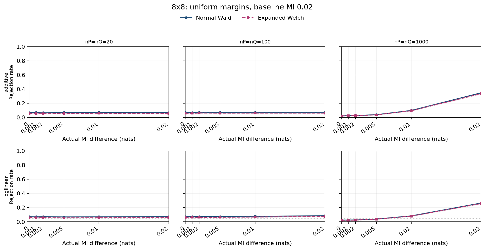

| Specification | Setting |
| --- | --- |
| Table size | 8x8 |
| Horizontal graph regime specifications (columns) | nP=nQ=20, nP=nQ=100, nP=nQ=1000 |
| Vertical graph regime specifications (rows) | additive: P row (0.125 repeated 8 times), P column (0.125 repeated 8 times); Q row (0.125 repeated 8 times), Q column (0.125 repeated 8 times); loglinear: P row (0.125 repeated 8 times), P column (0.125 repeated 8 times); Q row (0.125 repeated 8 times), Q column (0.125 repeated 8 times) |
| Probability changes | additive: add at (1,1),(2,2) and subtract at (1,2),(2,1), for both P and Q; loglinear: ordinal log-linear scores from -1 to 1, with row and column multipliers preserving the stated margins, for both P and Q |
| MI settings | Baseline MI {0.02}; direction {q higher}; actual differences {0, 0.001, 0.002, 0.005, 0.01, 0.02} nats |
| Horizontal axis within each graph | Actual MI difference in nats, fixed from 0 to 0.02 |
| Vertical axis within each graph | Unconditional rejection rate from 0 to 1; invalid results count as non-rejections |
| Replicates | 20,000 per unique point |

Null-point rejection and validity:

| Vertical regime | Horizontal regime | x | Method | Rejection | Valid |
| --- | --- | --- | --- | --- | --- |
| additive | nP=nQ=20 | 0 | Expanded Welch | 0.0570 | 1.0000 |
| additive | nP=nQ=20 | 0 | Normal Wald | 0.0687 | 1.0000 |
| additive | nP=nQ=100 | 0 | Expanded Welch | 0.0618 | 1.0000 |
| additive | nP=nQ=100 | 0 | Normal Wald | 0.0712 | 1.0000 |
| additive | nP=nQ=1000 | 0 | Expanded Welch | 0.0211 | 1.0000 |
| additive | nP=nQ=1000 | 0 | Normal Wald | 0.0228 | 1.0000 |
| loglinear | nP=nQ=20 | 0 | Expanded Welch | 0.0588 | 1.0000 |
| loglinear | nP=nQ=20 | 0 | Normal Wald | 0.0718 | 1.0000 |
| loglinear | nP=nQ=100 | 0 | Expanded Welch | 0.0618 | 1.0000 |
| loglinear | nP=nQ=100 | 0 | Normal Wald | 0.0718 | 1.0000 |
| loglinear | nP=nQ=1000 | 0 | Expanded Welch | 0.0230 | 1.0000 |
| loglinear | nP=nQ=1000 | 0 | Normal Wald | 0.0248 | 1.0000 |

Every plotted rate, interval, validity and minimum expected count

| Vertical regime | Horizontal regime | x | Method | Rejection | 95% interval | Valid | Conditional | Min expected P | Min expected Q |
| --- | --- | --- | --- | --- | --- | --- | --- | --- | --- |
| additive | nP=nQ=20 | 0 | Expanded Welch | 0.0570 | [0.0538, 0.0602] | 1.0000 | 0.0570 | 0.07697 | 0.07697 |
| additive | nP=nQ=20 | 0 | Normal Wald | 0.0687 | [0.0653, 0.0723] | 1.0000 | 0.0687 | 0.07697 | 0.07697 |
| additive | nP=nQ=20 | 0.001 | Expanded Welch | 0.0590 | [0.0558, 0.0623] | 1.0000 | 0.0590 | 0.07697 | 0.07197 |
| additive | nP=nQ=20 | 0.001 | Normal Wald | 0.0699 | [0.0664, 0.0735] | 1.0000 | 0.0699 | 0.07697 | 0.07197 |
| additive | nP=nQ=20 | 0.002 | Expanded Welch | 0.0544 | [0.0513, 0.0576] | 1.0000 | 0.0544 | 0.07697 | 0.06716 |
| additive | nP=nQ=20 | 0.002 | Normal Wald | 0.0662 | [0.0628, 0.0697] | 1.0000 | 0.0662 | 0.07697 | 0.06716 |
| additive | nP=nQ=20 | 0.005 | Expanded Welch | 0.0588 | [0.0556, 0.0621] | 1.0000 | 0.0588 | 0.07697 | 0.05374 |
| additive | nP=nQ=20 | 0.005 | Normal Wald | 0.0716 | [0.0681, 0.0753] | 1.0000 | 0.0716 | 0.07697 | 0.05374 |
| additive | nP=nQ=20 | 0.01 | Expanded Welch | 0.0609 | [0.0577, 0.0643] | 1.0000 | 0.0609 | 0.07697 | 0.03441 |
| additive | nP=nQ=20 | 0.01 | Normal Wald | 0.0746 | [0.0710, 0.0783] | 1.0000 | 0.0746 | 0.07697 | 0.03441 |
| additive | nP=nQ=20 | 0.02 | Expanded Welch | 0.0558 | [0.0528, 0.0591] | 1.0000 | 0.0558 | 0.07697 | 0.005864 |
| additive | nP=nQ=20 | 0.02 | Normal Wald | 0.0688 | [0.0653, 0.0723] | 1.0000 | 0.0688 | 0.07697 | 0.005864 |
| additive | nP=nQ=100 | 0 | Expanded Welch | 0.0618 | [0.0585, 0.0652] | 1.0000 | 0.0618 | 0.3848 | 0.3848 |
| additive | nP=nQ=100 | 0 | Normal Wald | 0.0712 | [0.0677, 0.0748] | 1.0000 | 0.0712 | 0.3848 | 0.3848 |
| additive | nP=nQ=100 | 0.001 | Expanded Welch | 0.0592 | [0.0561, 0.0626] | 1.0000 | 0.0592 | 0.3848 | 0.3598 |
| additive | nP=nQ=100 | 0.001 | Normal Wald | 0.0686 | [0.0652, 0.0722] | 1.0000 | 0.0686 | 0.3848 | 0.3598 |
| additive | nP=nQ=100 | 0.002 | Expanded Welch | 0.0637 | [0.0604, 0.0672] | 1.0000 | 0.0637 | 0.3848 | 0.3358 |
| additive | nP=nQ=100 | 0.002 | Normal Wald | 0.0728 | [0.0693, 0.0765] | 1.0000 | 0.0728 | 0.3848 | 0.3358 |
| additive | nP=nQ=100 | 0.005 | Expanded Welch | 0.0620 | [0.0587, 0.0654] | 1.0000 | 0.0620 | 0.3848 | 0.2687 |
| additive | nP=nQ=100 | 0.005 | Normal Wald | 0.0707 | [0.0672, 0.0743] | 1.0000 | 0.0707 | 0.3848 | 0.2687 |
| additive | nP=nQ=100 | 0.01 | Expanded Welch | 0.0627 | [0.0594, 0.0661] | 1.0000 | 0.0627 | 0.3848 | 0.1721 |
| additive | nP=nQ=100 | 0.01 | Normal Wald | 0.0722 | [0.0686, 0.0758] | 1.0000 | 0.0722 | 0.3848 | 0.1721 |
| additive | nP=nQ=100 | 0.02 | Expanded Welch | 0.0624 | [0.0592, 0.0659] | 1.0000 | 0.0624 | 0.3848 | 0.02932 |
| additive | nP=nQ=100 | 0.02 | Normal Wald | 0.0720 | [0.0685, 0.0756] | 1.0000 | 0.0720 | 0.3848 | 0.02932 |
| additive | nP=nQ=1000 | 0 | Expanded Welch | 0.0211 | [0.0192, 0.0232] | 1.0000 | 0.0211 | 3.848 | 3.848 |
| additive | nP=nQ=1000 | 0 | Normal Wald | 0.0228 | [0.0208, 0.0250] | 1.0000 | 0.0228 | 3.848 | 3.848 |
| additive | nP=nQ=1000 | 0.001 | Expanded Welch | 0.0256 | [0.0235, 0.0279] | 1.0000 | 0.0256 | 3.848 | 3.598 |
| additive | nP=nQ=1000 | 0.001 | Normal Wald | 0.0274 | [0.0253, 0.0298] | 1.0000 | 0.0274 | 3.848 | 3.598 |
| additive | nP=nQ=1000 | 0.002 | Expanded Welch | 0.0264 | [0.0243, 0.0287] | 1.0000 | 0.0264 | 3.848 | 3.358 |
| additive | nP=nQ=1000 | 0.002 | Normal Wald | 0.0287 | [0.0265, 0.0311] | 1.0000 | 0.0287 | 3.848 | 3.358 |
| additive | nP=nQ=1000 | 0.005 | Expanded Welch | 0.0379 | [0.0353, 0.0406] | 1.0000 | 0.0379 | 3.848 | 2.687 |
| additive | nP=nQ=1000 | 0.005 | Normal Wald | 0.0398 | [0.0372, 0.0426] | 1.0000 | 0.0398 | 3.848 | 2.687 |
| additive | nP=nQ=1000 | 0.01 | Expanded Welch | 0.0959 | [0.0919, 0.1001] | 1.0000 | 0.0959 | 3.848 | 1.721 |
| additive | nP=nQ=1000 | 0.01 | Normal Wald | 0.1002 | [0.0961, 0.1044] | 1.0000 | 0.1002 | 3.848 | 1.721 |
| additive | nP=nQ=1000 | 0.02 | Expanded Welch | 0.3366 | [0.3300, 0.3431] | 1.0000 | 0.3366 | 3.848 | 0.2932 |
| additive | nP=nQ=1000 | 0.02 | Normal Wald | 0.3487 | [0.3421, 0.3553] | 1.0000 | 0.3487 | 3.848 | 0.2932 |
| loglinear | nP=nQ=20 | 0 | Expanded Welch | 0.0588 | [0.0556, 0.0621] | 1.0000 | 0.0588 | 0.1799 | 0.1799 |
| loglinear | nP=nQ=20 | 0 | Normal Wald | 0.0718 | [0.0684, 0.0755] | 1.0000 | 0.0718 | 0.1799 | 0.1799 |
| loglinear | nP=nQ=20 | 0.001 | Expanded Welch | 0.0581 | [0.0549, 0.0614] | 1.0000 | 0.0581 | 0.1799 | 0.177 |
| loglinear | nP=nQ=20 | 0.001 | Normal Wald | 0.0703 | [0.0669, 0.0740] | 1.0000 | 0.0703 | 0.1799 | 0.177 |
| loglinear | nP=nQ=20 | 0.002 | Expanded Welch | 0.0592 | [0.0560, 0.0625] | 1.0000 | 0.0592 | 0.1799 | 0.1742 |
| loglinear | nP=nQ=20 | 0.002 | Normal Wald | 0.0721 | [0.0686, 0.0758] | 1.0000 | 0.0721 | 0.1799 | 0.1742 |
| loglinear | nP=nQ=20 | 0.005 | Expanded Welch | 0.0556 | [0.0525, 0.0588] | 1.0000 | 0.0556 | 0.1799 | 0.1663 |
| loglinear | nP=nQ=20 | 0.005 | Normal Wald | 0.0692 | [0.0658, 0.0728] | 1.0000 | 0.0692 | 0.1799 | 0.1663 |
| loglinear | nP=nQ=20 | 0.01 | Expanded Welch | 0.0578 | [0.0546, 0.0611] | 1.0000 | 0.0578 | 0.1799 | 0.1544 |
| loglinear | nP=nQ=20 | 0.01 | Normal Wald | 0.0704 | [0.0670, 0.0741] | 1.0000 | 0.0704 | 0.1799 | 0.1544 |
| loglinear | nP=nQ=20 | 0.02 | Expanded Welch | 0.0603 | [0.0571, 0.0637] | 1.0000 | 0.0603 | 0.1799 | 0.1344 |
| loglinear | nP=nQ=20 | 0.02 | Normal Wald | 0.0721 | [0.0685, 0.0757] | 1.0000 | 0.0721 | 0.1799 | 0.1344 |
| loglinear | nP=nQ=100 | 0 | Expanded Welch | 0.0618 | [0.0585, 0.0652] | 1.0000 | 0.0618 | 0.8994 | 0.8994 |
| loglinear | nP=nQ=100 | 0 | Normal Wald | 0.0718 | [0.0684, 0.0755] | 1.0000 | 0.0718 | 0.8994 | 0.8994 |
| loglinear | nP=nQ=100 | 0.001 | Expanded Welch | 0.0634 | [0.0601, 0.0669] | 1.0000 | 0.0634 | 0.8994 | 0.885 |
| loglinear | nP=nQ=100 | 0.001 | Normal Wald | 0.0726 | [0.0691, 0.0763] | 1.0000 | 0.0726 | 0.8994 | 0.885 |
| loglinear | nP=nQ=100 | 0.002 | Expanded Welch | 0.0630 | [0.0598, 0.0665] | 1.0000 | 0.0630 | 0.8994 | 0.871 |
| loglinear | nP=nQ=100 | 0.002 | Normal Wald | 0.0723 | [0.0688, 0.0760] | 1.0000 | 0.0723 | 0.8994 | 0.871 |
| loglinear | nP=nQ=100 | 0.005 | Expanded Welch | 0.0645 | [0.0612, 0.0680] | 1.0000 | 0.0645 | 0.8994 | 0.8314 |
| loglinear | nP=nQ=100 | 0.005 | Normal Wald | 0.0728 | [0.0693, 0.0765] | 1.0000 | 0.0728 | 0.8994 | 0.8314 |
| loglinear | nP=nQ=100 | 0.01 | Expanded Welch | 0.0673 | [0.0640, 0.0709] | 1.0000 | 0.0673 | 0.8994 | 0.772 |
| loglinear | nP=nQ=100 | 0.01 | Normal Wald | 0.0770 | [0.0733, 0.0807] | 1.0000 | 0.0770 | 0.8994 | 0.772 |
| loglinear | nP=nQ=100 | 0.02 | Expanded Welch | 0.0759 | [0.0723, 0.0797] | 1.0000 | 0.0759 | 0.8994 | 0.6718 |
| loglinear | nP=nQ=100 | 0.02 | Normal Wald | 0.0859 | [0.0821, 0.0899] | 1.0000 | 0.0859 | 0.8994 | 0.6718 |
| loglinear | nP=nQ=1000 | 0 | Expanded Welch | 0.0230 | [0.0210, 0.0251] | 1.0000 | 0.0230 | 8.994 | 8.994 |
| loglinear | nP=nQ=1000 | 0 | Normal Wald | 0.0248 | [0.0227, 0.0270] | 1.0000 | 0.0248 | 8.994 | 8.994 |
| loglinear | nP=nQ=1000 | 0.001 | Expanded Welch | 0.0228 | [0.0208, 0.0250] | 1.0000 | 0.0228 | 8.994 | 8.85 |
| loglinear | nP=nQ=1000 | 0.001 | Normal Wald | 0.0246 | [0.0225, 0.0268] | 1.0000 | 0.0246 | 8.994 | 8.85 |
| loglinear | nP=nQ=1000 | 0.002 | Expanded Welch | 0.0244 | [0.0224, 0.0266] | 1.0000 | 0.0244 | 8.994 | 8.71 |
| loglinear | nP=nQ=1000 | 0.002 | Normal Wald | 0.0261 | [0.0240, 0.0285] | 1.0000 | 0.0261 | 8.994 | 8.71 |
| loglinear | nP=nQ=1000 | 0.005 | Expanded Welch | 0.0373 | [0.0348, 0.0400] | 1.0000 | 0.0373 | 8.994 | 8.314 |
| loglinear | nP=nQ=1000 | 0.005 | Normal Wald | 0.0389 | [0.0363, 0.0416] | 1.0000 | 0.0389 | 8.994 | 8.314 |
| loglinear | nP=nQ=1000 | 0.01 | Expanded Welch | 0.0803 | [0.0766, 0.0841] | 1.0000 | 0.0803 | 8.994 | 7.72 |
| loglinear | nP=nQ=1000 | 0.01 | Normal Wald | 0.0837 | [0.0799, 0.0876] | 1.0000 | 0.0837 | 8.994 | 7.72 |
| loglinear | nP=nQ=1000 | 0.02 | Expanded Welch | 0.2578 | [0.2518, 0.2639] | 1.0000 | 0.2578 | 8.994 | 6.718 |
| loglinear | nP=nQ=1000 | 0.02 | Normal Wald | 0.2646 | [0.2585, 0.2707] | 1.0000 | 0.2646 | 8.994 | 6.718 |

### 9.11 8x8: different skew margins, baseline MI 0.0001

Do conclusions change under a matched ordinal log-linear construction?

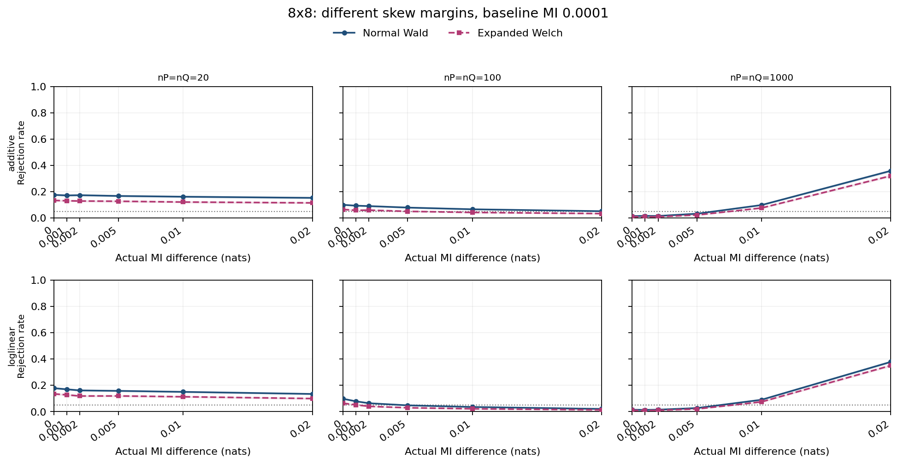

| Specification | Setting |
| --- | --- |
| Table size | 8x8 |
| Horizontal graph regime specifications (columns) | nP=nQ=20, nP=nQ=100, nP=nQ=1000 |
| Vertical graph regime specifications (rows) | additive: P row (0.7, 0.3/7 repeated 7 times), P column (0.7, 0.3/7 repeated 7 times); Q row (0.8, 0.2/7 repeated 7 times), Q column (0.8, 0.2/7 repeated 7 times); loglinear: P row (0.7, 0.3/7 repeated 7 times), P column (0.7, 0.3/7 repeated 7 times); Q row (0.8, 0.2/7 repeated 7 times), Q column (0.8, 0.2/7 repeated 7 times) |
| Probability changes | additive: add at (1,1),(2,2) and subtract at (1,2),(2,1), for both P and Q; loglinear: ordinal log-linear scores from -1 to 1, with row and column multipliers preserving the stated margins, for both P and Q |
| MI settings | Baseline MI {0.0001}; direction {q higher}; actual differences {0, 0.001, 0.002, 0.005, 0.01, 0.02} nats |
| Horizontal axis within each graph | Actual MI difference in nats, fixed from 0 to 0.02 |
| Vertical axis within each graph | Unconditional rejection rate from 0 to 1; invalid results count as non-rejections |
| Replicates | 20,000 per unique point |

Null-point rejection and validity:

| Vertical regime | Horizontal regime | x | Method | Rejection | Valid |
| --- | --- | --- | --- | --- | --- |
| additive | nP=nQ=20 | 0 | Expanded Welch | 0.1343 | 0.9779 |
| additive | nP=nQ=20 | 0 | Normal Wald | 0.1769 | 1.0000 |
| additive | nP=nQ=100 | 0 | Expanded Welch | 0.0659 | 1.0000 |
| additive | nP=nQ=100 | 0 | Normal Wald | 0.1011 | 1.0000 |
| additive | nP=nQ=1000 | 0 | Expanded Welch | 0.0105 | 1.0000 |
| additive | nP=nQ=1000 | 0 | Normal Wald | 0.0158 | 1.0000 |
| loglinear | nP=nQ=20 | 0 | Expanded Welch | 0.1351 | 0.9747 |
| loglinear | nP=nQ=20 | 0 | Normal Wald | 0.1784 | 0.9999 |
| loglinear | nP=nQ=100 | 0 | Expanded Welch | 0.0644 | 1.0000 |
| loglinear | nP=nQ=100 | 0 | Normal Wald | 0.0979 | 1.0000 |
| loglinear | nP=nQ=1000 | 0 | Expanded Welch | 0.0107 | 1.0000 |
| loglinear | nP=nQ=1000 | 0 | Normal Wald | 0.0150 | 1.0000 |

Every plotted rate, interval, validity and minimum expected count

| Vertical regime | Horizontal regime | x | Method | Rejection | 95% interval | Valid | Conditional | Min expected P | Min expected Q |
| --- | --- | --- | --- | --- | --- | --- | --- | --- | --- |
| additive | nP=nQ=20 | 0 | Expanded Welch | 0.1343 | [0.1296, 0.1390] | 0.9779 | 0.1373 | 0.03673 | 0.01633 |
| additive | nP=nQ=20 | 0 | Normal Wald | 0.1769 | [0.1716, 0.1822] | 1.0000 | 0.1769 | 0.03673 | 0.01633 |
| additive | nP=nQ=20 | 0.001 | Expanded Welch | 0.1319 | [0.1273, 0.1367] | 0.9766 | 0.1351 | 0.03673 | 0.01633 |
| additive | nP=nQ=20 | 0.001 | Normal Wald | 0.1725 | [0.1673, 0.1778] | 0.9999 | 0.1725 | 0.03673 | 0.01633 |
| additive | nP=nQ=20 | 0.002 | Expanded Welch | 0.1300 | [0.1254, 0.1347] | 0.9744 | 0.1334 | 0.03673 | 0.01633 |
| additive | nP=nQ=20 | 0.002 | Normal Wald | 0.1743 | [0.1691, 0.1796] | 0.9999 | 0.1743 | 0.03673 | 0.01633 |
| additive | nP=nQ=20 | 0.005 | Expanded Welch | 0.1281 | [0.1236, 0.1329] | 0.9760 | 0.1313 | 0.03673 | 0.01633 |
| additive | nP=nQ=20 | 0.005 | Normal Wald | 0.1684 | [0.1633, 0.1736] | 1.0000 | 0.1684 | 0.03673 | 0.01633 |
| additive | nP=nQ=20 | 0.01 | Expanded Welch | 0.1222 | [0.1177, 0.1268] | 0.9762 | 0.1252 | 0.03673 | 0.01633 |
| additive | nP=nQ=20 | 0.01 | Normal Wald | 0.1627 | [0.1576, 0.1679] | 0.9999 | 0.1627 | 0.03673 | 0.01633 |
| additive | nP=nQ=20 | 0.02 | Expanded Welch | 0.1159 | [0.1116, 0.1205] | 0.9758 | 0.1188 | 0.03673 | 0.01633 |
| additive | nP=nQ=20 | 0.02 | Normal Wald | 0.1540 | [0.1490, 0.1590] | 0.9999 | 0.1540 | 0.03673 | 0.01633 |
| additive | nP=nQ=100 | 0 | Expanded Welch | 0.0659 | [0.0626, 0.0695] | 1.0000 | 0.0659 | 0.1837 | 0.08163 |
| additive | nP=nQ=100 | 0 | Normal Wald | 0.1011 | [0.0970, 0.1054] | 1.0000 | 0.1011 | 0.1837 | 0.08163 |
| additive | nP=nQ=100 | 0.001 | Expanded Welch | 0.0593 | [0.0562, 0.0627] | 1.0000 | 0.0593 | 0.1837 | 0.08163 |
| additive | nP=nQ=100 | 0.001 | Normal Wald | 0.0948 | [0.0908, 0.0989] | 1.0000 | 0.0948 | 0.1837 | 0.08163 |
| additive | nP=nQ=100 | 0.002 | Expanded Welch | 0.0607 | [0.0575, 0.0641] | 1.0000 | 0.0607 | 0.1837 | 0.08163 |
| additive | nP=nQ=100 | 0.002 | Normal Wald | 0.0916 | [0.0876, 0.0956] | 1.0000 | 0.0916 | 0.1837 | 0.08163 |
| additive | nP=nQ=100 | 0.005 | Expanded Welch | 0.0514 | [0.0484, 0.0545] | 1.0000 | 0.0514 | 0.1837 | 0.08163 |
| additive | nP=nQ=100 | 0.005 | Normal Wald | 0.0802 | [0.0765, 0.0840] | 1.0000 | 0.0802 | 0.1837 | 0.08163 |
| additive | nP=nQ=100 | 0.01 | Expanded Welch | 0.0434 | [0.0407, 0.0463] | 1.0000 | 0.0434 | 0.1837 | 0.08163 |
| additive | nP=nQ=100 | 0.01 | Normal Wald | 0.0673 | [0.0639, 0.0709] | 1.0000 | 0.0673 | 0.1837 | 0.08163 |
| additive | nP=nQ=100 | 0.02 | Expanded Welch | 0.0345 | [0.0320, 0.0371] | 1.0000 | 0.0345 | 0.1837 | 0.08163 |
| additive | nP=nQ=100 | 0.02 | Normal Wald | 0.0527 | [0.0497, 0.0559] | 1.0000 | 0.0527 | 0.1837 | 0.08163 |
| additive | nP=nQ=1000 | 0 | Expanded Welch | 0.0105 | [0.0092, 0.0120] | 1.0000 | 0.0105 | 1.837 | 0.8163 |
| additive | nP=nQ=1000 | 0 | Normal Wald | 0.0158 | [0.0142, 0.0177] | 1.0000 | 0.0158 | 1.837 | 0.8163 |
| additive | nP=nQ=1000 | 0.001 | Expanded Welch | 0.0115 | [0.0101, 0.0130] | 1.0000 | 0.0115 | 1.837 | 0.8163 |
| additive | nP=nQ=1000 | 0.001 | Normal Wald | 0.0170 | [0.0153, 0.0189] | 1.0000 | 0.0170 | 1.837 | 0.8163 |
| additive | nP=nQ=1000 | 0.002 | Expanded Welch | 0.0105 | [0.0092, 0.0120] | 1.0000 | 0.0105 | 1.837 | 0.8163 |
| additive | nP=nQ=1000 | 0.002 | Normal Wald | 0.0166 | [0.0149, 0.0185] | 1.0000 | 0.0166 | 1.837 | 0.8163 |
| additive | nP=nQ=1000 | 0.005 | Expanded Welch | 0.0238 | [0.0218, 0.0260] | 1.0000 | 0.0238 | 1.837 | 0.8163 |
| additive | nP=nQ=1000 | 0.005 | Normal Wald | 0.0336 | [0.0312, 0.0362] | 1.0000 | 0.0336 | 1.837 | 0.8163 |
| additive | nP=nQ=1000 | 0.01 | Expanded Welch | 0.0771 | [0.0735, 0.0809] | 1.0000 | 0.0771 | 1.837 | 0.8163 |
| additive | nP=nQ=1000 | 0.01 | Normal Wald | 0.0994 | [0.0953, 0.1036] | 1.0000 | 0.0994 | 1.837 | 0.8163 |
| additive | nP=nQ=1000 | 0.02 | Expanded Welch | 0.3213 | [0.3149, 0.3278] | 1.0000 | 0.3213 | 1.837 | 0.8163 |
| additive | nP=nQ=1000 | 0.02 | Normal Wald | 0.3594 | [0.3528, 0.3661] | 1.0000 | 0.3594 | 1.837 | 0.8163 |
| loglinear | nP=nQ=20 | 0 | Expanded Welch | 0.1351 | [0.1304, 0.1399] | 0.9747 | 0.1386 | 0.03658 | 0.01633 |
| loglinear | nP=nQ=20 | 0 | Normal Wald | 0.1784 | [0.1732, 0.1838] | 0.9999 | 0.1785 | 0.03658 | 0.01633 |
| loglinear | nP=nQ=20 | 0.001 | Expanded Welch | 0.1278 | [0.1233, 0.1325] | 0.9747 | 0.1312 | 0.03658 | 0.01635 |
| loglinear | nP=nQ=20 | 0.001 | Normal Wald | 0.1700 | [0.1649, 0.1753] | 0.9999 | 0.1700 | 0.03658 | 0.01635 |
| loglinear | nP=nQ=20 | 0.002 | Expanded Welch | 0.1191 | [0.1146, 0.1236] | 0.9752 | 0.1221 | 0.03658 | 0.01635 |
| loglinear | nP=nQ=20 | 0.002 | Normal Wald | 0.1616 | [0.1566, 0.1668] | 1.0000 | 0.1616 | 0.03658 | 0.01635 |
| loglinear | nP=nQ=20 | 0.005 | Expanded Welch | 0.1195 | [0.1150, 0.1240] | 0.9760 | 0.1224 | 0.03658 | 0.01609 |
| loglinear | nP=nQ=20 | 0.005 | Normal Wald | 0.1580 | [0.1530, 0.1631] | 1.0000 | 0.1580 | 0.03658 | 0.01609 |
| loglinear | nP=nQ=20 | 0.01 | Expanded Welch | 0.1134 | [0.1091, 0.1179] | 0.9768 | 0.1161 | 0.03658 | 0.01558 |
| loglinear | nP=nQ=20 | 0.01 | Normal Wald | 0.1505 | [0.1456, 0.1555] | 1.0000 | 0.1505 | 0.03658 | 0.01558 |
| loglinear | nP=nQ=20 | 0.02 | Expanded Welch | 0.0998 | [0.0957, 0.1040] | 0.9757 | 0.1022 | 0.03658 | 0.01453 |
| loglinear | nP=nQ=20 | 0.02 | Normal Wald | 0.1346 | [0.1299, 0.1394] | 1.0000 | 0.1346 | 0.03658 | 0.01453 |
| loglinear | nP=nQ=100 | 0 | Expanded Welch | 0.0644 | [0.0611, 0.0679] | 1.0000 | 0.0644 | 0.1829 | 0.08165 |
| loglinear | nP=nQ=100 | 0 | Normal Wald | 0.0979 | [0.0939, 0.1021] | 1.0000 | 0.0979 | 0.1829 | 0.08165 |
| loglinear | nP=nQ=100 | 0.001 | Expanded Welch | 0.0518 | [0.0488, 0.0550] | 1.0000 | 0.0518 | 0.1829 | 0.08176 |
| loglinear | nP=nQ=100 | 0.001 | Normal Wald | 0.0787 | [0.0750, 0.0825] | 1.0000 | 0.0787 | 0.1829 | 0.08176 |
| loglinear | nP=nQ=100 | 0.002 | Expanded Welch | 0.0406 | [0.0380, 0.0434] | 1.0000 | 0.0406 | 0.1829 | 0.08176 |
| loglinear | nP=nQ=100 | 0.002 | Normal Wald | 0.0643 | [0.0609, 0.0677] | 1.0000 | 0.0643 | 0.1829 | 0.08176 |
| loglinear | nP=nQ=100 | 0.005 | Expanded Welch | 0.0297 | [0.0275, 0.0322] | 1.0000 | 0.0297 | 0.1829 | 0.08043 |
| loglinear | nP=nQ=100 | 0.005 | Normal Wald | 0.0482 | [0.0453, 0.0513] | 1.0000 | 0.0482 | 0.1829 | 0.08043 |
| loglinear | nP=nQ=100 | 0.01 | Expanded Welch | 0.0220 | [0.0201, 0.0241] | 1.0000 | 0.0220 | 0.1829 | 0.07788 |
| loglinear | nP=nQ=100 | 0.01 | Normal Wald | 0.0358 | [0.0334, 0.0385] | 1.0000 | 0.0358 | 0.1829 | 0.07788 |
| loglinear | nP=nQ=100 | 0.02 | Expanded Welch | 0.0134 | [0.0119, 0.0150] | 1.0000 | 0.0134 | 0.1829 | 0.07263 |
| loglinear | nP=nQ=100 | 0.02 | Normal Wald | 0.0210 | [0.0191, 0.0231] | 1.0000 | 0.0210 | 0.1829 | 0.07263 |
| loglinear | nP=nQ=1000 | 0 | Expanded Welch | 0.0107 | [0.0094, 0.0122] | 1.0000 | 0.0107 | 1.829 | 0.8165 |
| loglinear | nP=nQ=1000 | 0 | Normal Wald | 0.0150 | [0.0135, 0.0168] | 1.0000 | 0.0150 | 1.829 | 0.8165 |
| loglinear | nP=nQ=1000 | 0.001 | Expanded Welch | 0.0089 | [0.0077, 0.0104] | 1.0000 | 0.0089 | 1.829 | 0.8176 |
| loglinear | nP=nQ=1000 | 0.001 | Normal Wald | 0.0135 | [0.0119, 0.0151] | 1.0000 | 0.0135 | 1.829 | 0.8176 |
| loglinear | nP=nQ=1000 | 0.002 | Expanded Welch | 0.0106 | [0.0092, 0.0121] | 1.0000 | 0.0106 | 1.829 | 0.8176 |
| loglinear | nP=nQ=1000 | 0.002 | Normal Wald | 0.0154 | [0.0138, 0.0172] | 1.0000 | 0.0154 | 1.829 | 0.8176 |
| loglinear | nP=nQ=1000 | 0.005 | Expanded Welch | 0.0205 | [0.0186, 0.0226] | 1.0000 | 0.0205 | 1.829 | 0.8043 |
| loglinear | nP=nQ=1000 | 0.005 | Normal Wald | 0.0275 | [0.0253, 0.0299] | 1.0000 | 0.0275 | 1.829 | 0.8043 |
| loglinear | nP=nQ=1000 | 0.01 | Expanded Welch | 0.0747 | [0.0711, 0.0784] | 1.0000 | 0.0747 | 1.829 | 0.7788 |
| loglinear | nP=nQ=1000 | 0.01 | Normal Wald | 0.0906 | [0.0867, 0.0947] | 1.0000 | 0.0906 | 1.829 | 0.7788 |
| loglinear | nP=nQ=1000 | 0.02 | Expanded Welch | 0.3507 | [0.3441, 0.3573] | 1.0000 | 0.3507 | 1.829 | 0.7263 |
| loglinear | nP=nQ=1000 | 0.02 | Normal Wald | 0.3783 | [0.3716, 0.3850] | 1.0000 | 0.3783 | 1.829 | 0.7263 |

### 9.12 8x8: different skew margins, baseline MI 0.02

Do conclusions change under a matched ordinal log-linear construction?

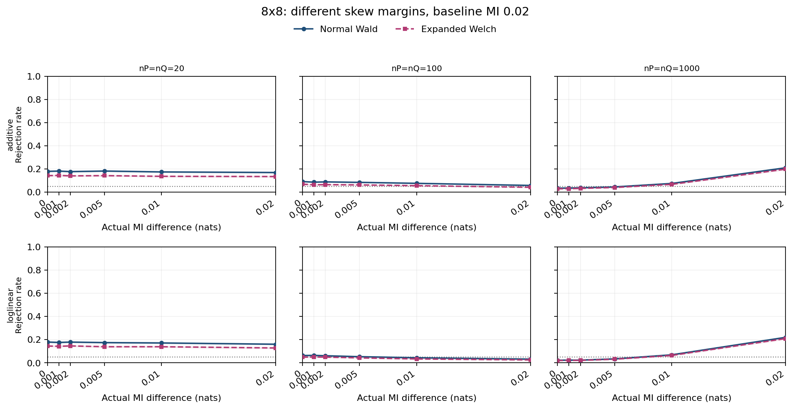

| Specification | Setting |
| --- | --- |
| Table size | 8x8 |
| Horizontal graph regime specifications (columns) | nP=nQ=20, nP=nQ=100, nP=nQ=1000 |
| Vertical graph regime specifications (rows) | additive: P row (0.7, 0.3/7 repeated 7 times), P column (0.7, 0.3/7 repeated 7 times); Q row (0.8, 0.2/7 repeated 7 times), Q column (0.8, 0.2/7 repeated 7 times); loglinear: P row (0.7, 0.3/7 repeated 7 times), P column (0.7, 0.3/7 repeated 7 times); Q row (0.8, 0.2/7 repeated 7 times), Q column (0.8, 0.2/7 repeated 7 times) |
| Probability changes | additive: add at (1,1),(2,2) and subtract at (1,2),(2,1), for both P and Q; loglinear: ordinal log-linear scores from -1 to 1, with row and column multipliers preserving the stated margins, for both P and Q |
| MI settings | Baseline MI {0.02}; direction {q higher}; actual differences {0, 0.001, 0.002, 0.005, 0.01, 0.02} nats |
| Horizontal axis within each graph | Actual MI difference in nats, fixed from 0 to 0.02 |
| Vertical axis within each graph | Unconditional rejection rate from 0 to 1; invalid results count as non-rejections |
| Replicates | 20,000 per unique point |

Null-point rejection and validity:

| Vertical regime | Horizontal regime | x | Method | Rejection | Valid |
| --- | --- | --- | --- | --- | --- |
| additive | nP=nQ=20 | 0 | Expanded Welch | 0.1432 | 0.9759 |
| additive | nP=nQ=20 | 0 | Normal Wald | 0.1803 | 1.0000 |
| additive | nP=nQ=100 | 0 | Expanded Welch | 0.0699 | 1.0000 |
| additive | nP=nQ=100 | 0 | Normal Wald | 0.0921 | 1.0000 |
| additive | nP=nQ=1000 | 0 | Expanded Welch | 0.0301 | 1.0000 |
| additive | nP=nQ=1000 | 0 | Normal Wald | 0.0356 | 1.0000 |
| loglinear | nP=nQ=20 | 0 | Expanded Welch | 0.1452 | 0.9751 |
| loglinear | nP=nQ=20 | 0 | Normal Wald | 0.1794 | 1.0000 |
| loglinear | nP=nQ=100 | 0 | Expanded Welch | 0.0496 | 1.0000 |
| loglinear | nP=nQ=100 | 0 | Normal Wald | 0.0634 | 1.0000 |
| loglinear | nP=nQ=1000 | 0 | Expanded Welch | 0.0204 | 1.0000 |
| loglinear | nP=nQ=1000 | 0 | Normal Wald | 0.0231 | 1.0000 |

Every plotted rate, interval, validity and minimum expected count

| Vertical regime | Horizontal regime | x | Method | Rejection | 95% interval | Valid | Conditional | Min expected P | Min expected Q |
| --- | --- | --- | --- | --- | --- | --- | --- | --- | --- |
| additive | nP=nQ=20 | 0 | Expanded Welch | 0.1432 | [0.1384, 0.1481] | 0.9759 | 0.1467 | 0.03673 | 0.01633 |
| additive | nP=nQ=20 | 0 | Normal Wald | 0.1803 | [0.1750, 0.1857] | 1.0000 | 0.1803 | 0.03673 | 0.01633 |
| additive | nP=nQ=20 | 0.001 | Expanded Welch | 0.1454 | [0.1405, 0.1503] | 0.9768 | 0.1488 | 0.03673 | 0.01633 |
| additive | nP=nQ=20 | 0.001 | Normal Wald | 0.1827 | [0.1775, 0.1882] | 0.9999 | 0.1828 | 0.03673 | 0.01633 |
| additive | nP=nQ=20 | 0.002 | Expanded Welch | 0.1414 | [0.1366, 0.1462] | 0.9772 | 0.1446 | 0.03673 | 0.01633 |
| additive | nP=nQ=20 | 0.002 | Normal Wald | 0.1781 | [0.1728, 0.1834] | 1.0000 | 0.1781 | 0.03673 | 0.01633 |
| additive | nP=nQ=20 | 0.005 | Expanded Welch | 0.1434 | [0.1386, 0.1483] | 0.9770 | 0.1468 | 0.03673 | 0.01633 |
| additive | nP=nQ=20 | 0.005 | Normal Wald | 0.1830 | [0.1777, 0.1884] | 1.0000 | 0.1830 | 0.03673 | 0.01633 |
| additive | nP=nQ=20 | 0.01 | Expanded Welch | 0.1374 | [0.1327, 0.1423] | 0.9753 | 0.1409 | 0.03673 | 0.01633 |
| additive | nP=nQ=20 | 0.01 | Normal Wald | 0.1753 | [0.1701, 0.1806] | 1.0000 | 0.1753 | 0.03673 | 0.01633 |
| additive | nP=nQ=20 | 0.02 | Expanded Welch | 0.1356 | [0.1309, 0.1404] | 0.9772 | 0.1388 | 0.03673 | 0.01633 |
| additive | nP=nQ=20 | 0.02 | Normal Wald | 0.1703 | [0.1652, 0.1756] | 1.0000 | 0.1703 | 0.03673 | 0.01633 |
| additive | nP=nQ=100 | 0 | Expanded Welch | 0.0699 | [0.0664, 0.0735] | 1.0000 | 0.0699 | 0.1837 | 0.08163 |
| additive | nP=nQ=100 | 0 | Normal Wald | 0.0921 | [0.0882, 0.0962] | 1.0000 | 0.0921 | 0.1837 | 0.08163 |
| additive | nP=nQ=100 | 0.001 | Expanded Welch | 0.0645 | [0.0612, 0.0680] | 1.0000 | 0.0645 | 0.1837 | 0.08163 |
| additive | nP=nQ=100 | 0.001 | Normal Wald | 0.0872 | [0.0834, 0.0912] | 1.0000 | 0.0872 | 0.1837 | 0.08163 |
| additive | nP=nQ=100 | 0.002 | Expanded Welch | 0.0659 | [0.0625, 0.0694] | 1.0000 | 0.0659 | 0.1837 | 0.08163 |
| additive | nP=nQ=100 | 0.002 | Normal Wald | 0.0896 | [0.0857, 0.0936] | 1.0000 | 0.0896 | 0.1837 | 0.08163 |
| additive | nP=nQ=100 | 0.005 | Expanded Welch | 0.0635 | [0.0602, 0.0670] | 1.0000 | 0.0635 | 0.1837 | 0.08163 |
| additive | nP=nQ=100 | 0.005 | Normal Wald | 0.0854 | [0.0817, 0.0894] | 1.0000 | 0.0854 | 0.1837 | 0.08163 |
| additive | nP=nQ=100 | 0.01 | Expanded Welch | 0.0568 | [0.0537, 0.0601] | 1.0000 | 0.0568 | 0.1837 | 0.08163 |
| additive | nP=nQ=100 | 0.01 | Normal Wald | 0.0771 | [0.0735, 0.0809] | 1.0000 | 0.0771 | 0.1837 | 0.08163 |
| additive | nP=nQ=100 | 0.02 | Expanded Welch | 0.0432 | [0.0404, 0.0461] | 1.0000 | 0.0432 | 0.1837 | 0.08163 |
| additive | nP=nQ=100 | 0.02 | Normal Wald | 0.0590 | [0.0558, 0.0624] | 1.0000 | 0.0590 | 0.1837 | 0.08163 |
| additive | nP=nQ=1000 | 0 | Expanded Welch | 0.0301 | [0.0279, 0.0326] | 1.0000 | 0.0301 | 1.837 | 0.8163 |
| additive | nP=nQ=1000 | 0 | Normal Wald | 0.0356 | [0.0331, 0.0383] | 1.0000 | 0.0356 | 1.837 | 0.8163 |
| additive | nP=nQ=1000 | 0.001 | Expanded Welch | 0.0309 | [0.0286, 0.0334] | 1.0000 | 0.0309 | 1.837 | 0.8163 |
| additive | nP=nQ=1000 | 0.001 | Normal Wald | 0.0365 | [0.0339, 0.0391] | 1.0000 | 0.0365 | 1.837 | 0.8163 |
| additive | nP=nQ=1000 | 0.002 | Expanded Welch | 0.0335 | [0.0310, 0.0360] | 1.0000 | 0.0335 | 1.837 | 0.8163 |
| additive | nP=nQ=1000 | 0.002 | Normal Wald | 0.0387 | [0.0362, 0.0415] | 1.0000 | 0.0387 | 1.837 | 0.8163 |
| additive | nP=nQ=1000 | 0.005 | Expanded Welch | 0.0413 | [0.0387, 0.0442] | 1.0000 | 0.0413 | 1.837 | 0.8163 |
| additive | nP=nQ=1000 | 0.005 | Normal Wald | 0.0462 | [0.0434, 0.0492] | 1.0000 | 0.0462 | 1.837 | 0.8163 |
| additive | nP=nQ=1000 | 0.01 | Expanded Welch | 0.0682 | [0.0648, 0.0718] | 1.0000 | 0.0682 | 1.837 | 0.8163 |
| additive | nP=nQ=1000 | 0.01 | Normal Wald | 0.0760 | [0.0724, 0.0798] | 1.0000 | 0.0760 | 1.837 | 0.8163 |
| additive | nP=nQ=1000 | 0.02 | Expanded Welch | 0.1994 | [0.1939, 0.2050] | 1.0000 | 0.1994 | 1.837 | 0.8163 |
| additive | nP=nQ=1000 | 0.02 | Normal Wald | 0.2109 | [0.2053, 0.2166] | 1.0000 | 0.2109 | 1.837 | 0.8163 |
| loglinear | nP=nQ=20 | 0 | Expanded Welch | 0.1452 | [0.1403, 0.1501] | 0.9751 | 0.1489 | 0.03123 | 0.01454 |
| loglinear | nP=nQ=20 | 0 | Normal Wald | 0.1794 | [0.1742, 0.1848] | 1.0000 | 0.1795 | 0.03123 | 0.01454 |
| loglinear | nP=nQ=20 | 0.001 | Expanded Welch | 0.1431 | [0.1383, 0.1480] | 0.9767 | 0.1465 | 0.03123 | 0.01443 |
| loglinear | nP=nQ=20 | 0.001 | Normal Wald | 0.1762 | [0.1710, 0.1816] | 1.0000 | 0.1763 | 0.03123 | 0.01443 |
| loglinear | nP=nQ=20 | 0.002 | Expanded Welch | 0.1462 | [0.1414, 0.1512] | 0.9770 | 0.1497 | 0.03123 | 0.01433 |
| loglinear | nP=nQ=20 | 0.002 | Normal Wald | 0.1792 | [0.1739, 0.1846] | 1.0000 | 0.1792 | 0.03123 | 0.01433 |
| loglinear | nP=nQ=20 | 0.005 | Expanded Welch | 0.1393 | [0.1345, 0.1441] | 0.9760 | 0.1427 | 0.03123 | 0.01402 |
| loglinear | nP=nQ=20 | 0.005 | Normal Wald | 0.1747 | [0.1695, 0.1800] | 1.0000 | 0.1747 | 0.03123 | 0.01402 |
| loglinear | nP=nQ=20 | 0.01 | Expanded Welch | 0.1393 | [0.1345, 0.1441] | 0.9767 | 0.1426 | 0.03123 | 0.01351 |
| loglinear | nP=nQ=20 | 0.01 | Normal Wald | 0.1716 | [0.1664, 0.1769] | 1.0000 | 0.1716 | 0.03123 | 0.01351 |
| loglinear | nP=nQ=20 | 0.02 | Expanded Welch | 0.1285 | [0.1239, 0.1332] | 0.9753 | 0.1317 | 0.03123 | 0.01252 |
| loglinear | nP=nQ=20 | 0.02 | Normal Wald | 0.1608 | [0.1557, 0.1659] | 1.0000 | 0.1608 | 0.03123 | 0.01252 |
| loglinear | nP=nQ=100 | 0 | Expanded Welch | 0.0496 | [0.0467, 0.0527] | 1.0000 | 0.0496 | 0.1562 | 0.07268 |
| loglinear | nP=nQ=100 | 0 | Normal Wald | 0.0634 | [0.0601, 0.0669] | 1.0000 | 0.0634 | 0.1562 | 0.07268 |
| loglinear | nP=nQ=100 | 0.001 | Expanded Welch | 0.0508 | [0.0478, 0.0539] | 1.0000 | 0.0508 | 0.1562 | 0.07216 |
| loglinear | nP=nQ=100 | 0.001 | Normal Wald | 0.0646 | [0.0613, 0.0681] | 1.0000 | 0.0646 | 0.1562 | 0.07216 |
| loglinear | nP=nQ=100 | 0.002 | Expanded Welch | 0.0499 | [0.0470, 0.0530] | 1.0000 | 0.0499 | 0.1562 | 0.07164 |
| loglinear | nP=nQ=100 | 0.002 | Normal Wald | 0.0616 | [0.0584, 0.0650] | 1.0000 | 0.0616 | 0.1562 | 0.07164 |
| loglinear | nP=nQ=100 | 0.005 | Expanded Welch | 0.0430 | [0.0403, 0.0460] | 1.0000 | 0.0430 | 0.1562 | 0.07009 |
| loglinear | nP=nQ=100 | 0.005 | Normal Wald | 0.0535 | [0.0505, 0.0567] | 1.0000 | 0.0535 | 0.1562 | 0.07009 |
| loglinear | nP=nQ=100 | 0.01 | Expanded Welch | 0.0341 | [0.0317, 0.0367] | 1.0000 | 0.0341 | 0.1562 | 0.06755 |
| loglinear | nP=nQ=100 | 0.01 | Normal Wald | 0.0442 | [0.0415, 0.0472] | 1.0000 | 0.0442 | 0.1562 | 0.06755 |
| loglinear | nP=nQ=100 | 0.02 | Expanded Welch | 0.0257 | [0.0236, 0.0280] | 1.0000 | 0.0257 | 0.1562 | 0.06262 |
| loglinear | nP=nQ=100 | 0.02 | Normal Wald | 0.0324 | [0.0300, 0.0349] | 1.0000 | 0.0324 | 0.1562 | 0.06262 |
| loglinear | nP=nQ=1000 | 0 | Expanded Welch | 0.0204 | [0.0186, 0.0225] | 1.0000 | 0.0204 | 1.562 | 0.7268 |
| loglinear | nP=nQ=1000 | 0 | Normal Wald | 0.0231 | [0.0211, 0.0253] | 1.0000 | 0.0231 | 1.562 | 0.7268 |
| loglinear | nP=nQ=1000 | 0.001 | Expanded Welch | 0.0213 | [0.0193, 0.0233] | 1.0000 | 0.0213 | 1.562 | 0.7216 |
| loglinear | nP=nQ=1000 | 0.001 | Normal Wald | 0.0238 | [0.0218, 0.0260] | 1.0000 | 0.0238 | 1.562 | 0.7216 |
| loglinear | nP=nQ=1000 | 0.002 | Expanded Welch | 0.0216 | [0.0197, 0.0238] | 1.0000 | 0.0216 | 1.562 | 0.7164 |
| loglinear | nP=nQ=1000 | 0.002 | Normal Wald | 0.0240 | [0.0220, 0.0262] | 1.0000 | 0.0240 | 1.562 | 0.7164 |
| loglinear | nP=nQ=1000 | 0.005 | Expanded Welch | 0.0316 | [0.0292, 0.0341] | 1.0000 | 0.0316 | 1.562 | 0.7009 |
| loglinear | nP=nQ=1000 | 0.005 | Normal Wald | 0.0347 | [0.0322, 0.0373] | 1.0000 | 0.0347 | 1.562 | 0.7009 |
| loglinear | nP=nQ=1000 | 0.01 | Expanded Welch | 0.0643 | [0.0609, 0.0677] | 1.0000 | 0.0643 | 1.562 | 0.6755 |
| loglinear | nP=nQ=1000 | 0.01 | Normal Wald | 0.0696 | [0.0661, 0.0732] | 1.0000 | 0.0696 | 1.562 | 0.6755 |
| loglinear | nP=nQ=1000 | 0.02 | Expanded Welch | 0.2095 | [0.2040, 0.2152] | 1.0000 | 0.2095 | 1.562 | 0.6262 |
| loglinear | nP=nQ=1000 | 0.02 | Normal Wald | 0.2201 | [0.2144, 0.2259] | 1.0000 | 0.2201 | 1.562 | 0.6262 |

## 10. Extreme skew and very small samples

What happens under deliberately extreme marginal skew and very small samples?

### 10.1 2x2: extreme margins, small sample sizes

What happens under deliberately extreme marginal skew and very small samples?

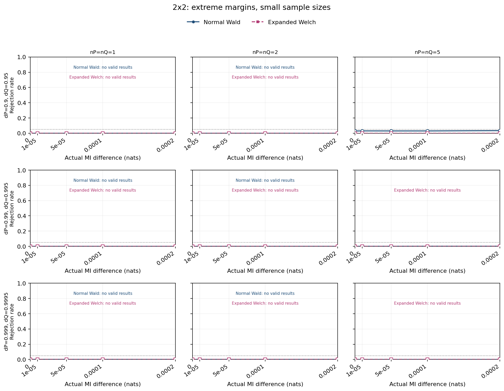

| Specification | Setting |
| --- | --- |
| Table size | 2x2 |
| Horizontal graph regime specifications (columns) | nP=nQ=1, nP=nQ=2, nP=nQ=5 |
| Vertical graph regime specifications (rows) | dP=0.9, dQ=0.95: P row (0.9, 0.1), P column (0.9, 0.1); Q row (0.95, 0.05), Q column (0.95, 0.05); dP=0.99, dQ=0.995: P row (0.99, 0.01), P column (0.99, 0.01); Q row (0.995, 0.005), Q column (0.995, 0.005); dP=0.999, dQ=0.9995: P row (0.999, 0.001), P column (0.999, 0.001); Q row (0.9995, 0.0005), Q column (0.9995, 0.0005) |
| Probability changes | dP=0.9, dQ=0.95: add at (1,1),(2,2) and subtract at (1,2),(2,1), for both P and Q; dP=0.99, dQ=0.995: add at (1,1),(2,2) and subtract at (1,2),(2,1), for both P and Q; dP=0.999, dQ=0.9995: add at (1,1),(2,2) and subtract at (1,2),(2,1), for both P and Q |
| MI settings | Baseline MI {1e-05}; direction {q higher}; actual differences {0, 1e-05, 5e-05, 0.0001, 0.0002} nats |
| Horizontal axis within each graph | Actual MI difference in nats, fixed from 0 to 0.0002 |
| Vertical axis within each graph | Unconditional rejection rate from 0 to 1; invalid results count as non-rejections |
| Replicates | 20,000 per unique point |

Null-point rejection and validity:

| Vertical regime | Horizontal regime | x | Method | Rejection | Valid |
| --- | --- | --- | --- | --- | --- |
| dP=0.9, dQ=0.95 | nP=nQ=1 | 0 | Expanded Welch | 0.0000 | 0.0000 |
| dP=0.9, dQ=0.95 | nP=nQ=1 | 0 | Normal Wald | 0.0000 | 0.0000 |
| dP=0.9, dQ=0.95 | nP=nQ=2 | 0 | Expanded Welch | 0.0000 | 0.0000 |
| dP=0.9, dQ=0.95 | nP=nQ=2 | 0 | Normal Wald | 0.0000 | 0.0000 |
| dP=0.9, dQ=0.95 | nP=nQ=5 | 0 | Expanded Welch | 0.0000 | 0.0089 |
| dP=0.9, dQ=0.95 | nP=nQ=5 | 0 | Normal Wald | 0.0290 | 0.2124 |
| dP=0.99, dQ=0.995 | nP=nQ=1 | 0 | Expanded Welch | 0.0000 | 0.0000 |
| dP=0.99, dQ=0.995 | nP=nQ=1 | 0 | Normal Wald | 0.0000 | 0.0000 |
| dP=0.99, dQ=0.995 | nP=nQ=2 | 0 | Expanded Welch | 0.0000 | 0.0000 |
| dP=0.99, dQ=0.995 | nP=nQ=2 | 0 | Normal Wald | 0.0000 | 0.0000 |
| dP=0.99, dQ=0.995 | nP=nQ=5 | 0 | Expanded Welch | 0.0000 | 0.0000 |
| dP=0.99, dQ=0.995 | nP=nQ=5 | 0 | Normal Wald | 0.0008 | 0.0029 |
| dP=0.999, dQ=0.9995 | nP=nQ=1 | 0 | Expanded Welch | 0.0000 | 0.0000 |
| dP=0.999, dQ=0.9995 | nP=nQ=1 | 0 | Normal Wald | 0.0000 | 0.0000 |
| dP=0.999, dQ=0.9995 | nP=nQ=2 | 0 | Expanded Welch | 0.0000 | 0.0000 |
| dP=0.999, dQ=0.9995 | nP=nQ=2 | 0 | Normal Wald | 0.0000 | 0.0000 |
| dP=0.999, dQ=0.9995 | nP=nQ=5 | 0 | Expanded Welch | 0.0000 | 0.0000 |
| dP=0.999, dQ=0.9995 | nP=nQ=5 | 0 | Normal Wald | 0.0001 | 0.0001 |

Every plotted rate, interval, validity and minimum expected count

| Vertical regime | Horizontal regime | x | Method | Rejection | 95% interval | Valid | Conditional | Min expected P | Min expected Q |
| --- | --- | --- | --- | --- | --- | --- | --- | --- | --- |
| dP=0.9, dQ=0.95 | nP=nQ=1 | 0 | Expanded Welch | 0.0000 | [0.0000, 0.0002] | 0.0000 | NA | 0.0104 | 0.002715 |
| dP=0.9, dQ=0.95 | nP=nQ=1 | 0 | Normal Wald | 0.0000 | [0.0000, 0.0002] | 0.0000 | NA | 0.0104 | 0.002715 |
| dP=0.9, dQ=0.95 | nP=nQ=1 | 1e-05 | Expanded Welch | 0.0000 | [0.0000, 0.0002] | 0.0000 | NA | 0.0104 | 0.002806 |
| dP=0.9, dQ=0.95 | nP=nQ=1 | 1e-05 | Normal Wald | 0.0000 | [0.0000, 0.0002] | 0.0000 | NA | 0.0104 | 0.002806 |
| dP=0.9, dQ=0.95 | nP=nQ=1 | 5e-05 | Expanded Welch | 0.0000 | [0.0000, 0.0002] | 0.0000 | NA | 0.0104 | 0.003036 |
| dP=0.9, dQ=0.95 | nP=nQ=1 | 5e-05 | Normal Wald | 0.0000 | [0.0000, 0.0002] | 0.0000 | NA | 0.0104 | 0.003036 |
| dP=0.9, dQ=0.95 | nP=nQ=1 | 0.0001 | Expanded Welch | 0.0000 | [0.0000, 0.0002] | 0.0000 | NA | 0.0104 | 0.003233 |
| dP=0.9, dQ=0.95 | nP=nQ=1 | 0.0001 | Normal Wald | 0.0000 | [0.0000, 0.0002] | 0.0000 | NA | 0.0104 | 0.003233 |
| dP=0.9, dQ=0.95 | nP=nQ=1 | 0.0002 | Expanded Welch | 0.0000 | [0.0000, 0.0002] | 0.0000 | NA | 0.0104 | 0.003528 |
| dP=0.9, dQ=0.95 | nP=nQ=1 | 0.0002 | Normal Wald | 0.0000 | [0.0000, 0.0002] | 0.0000 | NA | 0.0104 | 0.003528 |
| dP=0.9, dQ=0.95 | nP=nQ=2 | 0 | Expanded Welch | 0.0000 | [0.0000, 0.0002] | 0.0000 | NA | 0.02081 | 0.00543 |
| dP=0.9, dQ=0.95 | nP=nQ=2 | 0 | Normal Wald | 0.0000 | [0.0000, 0.0002] | 0.0000 | NA | 0.02081 | 0.00543 |
| dP=0.9, dQ=0.95 | nP=nQ=2 | 1e-05 | Expanded Welch | 0.0000 | [0.0000, 0.0002] | 0.0000 | NA | 0.02081 | 0.005611 |
| dP=0.9, dQ=0.95 | nP=nQ=2 | 1e-05 | Normal Wald | 0.0000 | [0.0000, 0.0002] | 0.0000 | NA | 0.02081 | 0.005611 |
| dP=0.9, dQ=0.95 | nP=nQ=2 | 5e-05 | Expanded Welch | 0.0000 | [0.0000, 0.0002] | 0.0000 | NA | 0.02081 | 0.006072 |
| dP=0.9, dQ=0.95 | nP=nQ=2 | 5e-05 | Normal Wald | 0.0000 | [0.0000, 0.0002] | 0.0000 | NA | 0.02081 | 0.006072 |
| dP=0.9, dQ=0.95 | nP=nQ=2 | 0.0001 | Expanded Welch | 0.0000 | [0.0000, 0.0002] | 0.0000 | NA | 0.02081 | 0.006466 |
| dP=0.9, dQ=0.95 | nP=nQ=2 | 0.0001 | Normal Wald | 0.0000 | [0.0000, 0.0002] | 0.0000 | NA | 0.02081 | 0.006466 |
| dP=0.9, dQ=0.95 | nP=nQ=2 | 0.0002 | Expanded Welch | 0.0000 | [0.0000, 0.0002] | 0.0000 | NA | 0.02081 | 0.007055 |
| dP=0.9, dQ=0.95 | nP=nQ=2 | 0.0002 | Normal Wald | 0.0000 | [0.0000, 0.0002] | 0.0000 | NA | 0.02081 | 0.007055 |
| dP=0.9, dQ=0.95 | nP=nQ=5 | 0 | Expanded Welch | 0.0000 | [0.0000, 0.0002] | 0.0089 | 0.0000 | 0.05202 | 0.01358 |
| dP=0.9, dQ=0.95 | nP=nQ=5 | 0 | Normal Wald | 0.0290 | [0.0268, 0.0314] | 0.2124 | 0.1365 | 0.05202 | 0.01358 |
| dP=0.9, dQ=0.95 | nP=nQ=5 | 1e-05 | Expanded Welch | 0.0000 | [0.0000, 0.0002] | 0.0088 | 0.0000 | 0.05202 | 0.01403 |
| dP=0.9, dQ=0.95 | nP=nQ=5 | 1e-05 | Normal Wald | 0.0305 | [0.0282, 0.0330] | 0.2152 | 0.1417 | 0.05202 | 0.01403 |
| dP=0.9, dQ=0.95 | nP=nQ=5 | 5e-05 | Expanded Welch | 0.0000 | [0.0000, 0.0002] | 0.0094 | 0.0000 | 0.05202 | 0.01518 |
| dP=0.9, dQ=0.95 | nP=nQ=5 | 5e-05 | Normal Wald | 0.0301 | [0.0278, 0.0325] | 0.2100 | 0.1431 | 0.05202 | 0.01518 |
| dP=0.9, dQ=0.95 | nP=nQ=5 | 0.0001 | Expanded Welch | 0.0000 | [0.0000, 0.0002] | 0.0090 | 0.0000 | 0.05202 | 0.01617 |
| dP=0.9, dQ=0.95 | nP=nQ=5 | 0.0001 | Normal Wald | 0.0300 | [0.0277, 0.0325] | 0.2131 | 0.1408 | 0.05202 | 0.01617 |
| dP=0.9, dQ=0.95 | nP=nQ=5 | 0.0002 | Expanded Welch | 0.0000 | [0.0000, 0.0002] | 0.0097 | 0.0000 | 0.05202 | 0.01764 |
| dP=0.9, dQ=0.95 | nP=nQ=5 | 0.0002 | Normal Wald | 0.0342 | [0.0318, 0.0368] | 0.2188 | 0.1563 | 0.05202 | 0.01764 |
| dP=0.99, dQ=0.995 | nP=nQ=1 | 0 | Expanded Welch | 0.0000 | [0.0000, 0.0002] | 0.0000 | NA | 0.0001474 | 5.031e-05 |
| dP=0.99, dQ=0.995 | nP=nQ=1 | 0 | Normal Wald | 0.0000 | [0.0000, 0.0002] | 0.0000 | NA | 0.0001474 | 5.031e-05 |
| dP=0.99, dQ=0.995 | nP=nQ=1 | 1e-05 | Expanded Welch | 0.0000 | [0.0000, 0.0002] | 0.0000 | NA | 0.0001474 | 6.244e-05 |
| dP=0.99, dQ=0.995 | nP=nQ=1 | 1e-05 | Normal Wald | 0.0000 | [0.0000, 0.0002] | 0.0000 | NA | 0.0001474 | 6.244e-05 |
| dP=0.99, dQ=0.995 | nP=nQ=1 | 5e-05 | Expanded Welch | 0.0000 | [0.0000, 0.0002] | 0.0000 | NA | 0.0001474 | 9.659e-05 |
| dP=0.99, dQ=0.995 | nP=nQ=1 | 5e-05 | Normal Wald | 0.0000 | [0.0000, 0.0002] | 0.0000 | NA | 0.0001474 | 9.659e-05 |
| dP=0.99, dQ=0.995 | nP=nQ=1 | 0.0001 | Expanded Welch | 0.0000 | [0.0000, 0.0002] | 0.0000 | NA | 0.0001474 | 0.0001291 |
| dP=0.99, dQ=0.995 | nP=nQ=1 | 0.0001 | Normal Wald | 0.0000 | [0.0000, 0.0002] | 0.0000 | NA | 0.0001474 | 0.0001291 |
| dP=0.99, dQ=0.995 | nP=nQ=1 | 0.0002 | Expanded Welch | 0.0000 | [0.0000, 0.0002] | 0.0000 | NA | 0.0001474 | 0.0001823 |
| dP=0.99, dQ=0.995 | nP=nQ=1 | 0.0002 | Normal Wald | 0.0000 | [0.0000, 0.0002] | 0.0000 | NA | 0.0001474 | 0.0001823 |
| dP=0.99, dQ=0.995 | nP=nQ=2 | 0 | Expanded Welch | 0.0000 | [0.0000, 0.0002] | 0.0000 | NA | 0.0002947 | 0.0001006 |
| dP=0.99, dQ=0.995 | nP=nQ=2 | 0 | Normal Wald | 0.0000 | [0.0000, 0.0002] | 0.0000 | NA | 0.0002947 | 0.0001006 |
| dP=0.99, dQ=0.995 | nP=nQ=2 | 1e-05 | Expanded Welch | 0.0000 | [0.0000, 0.0002] | 0.0000 | NA | 0.0002947 | 0.0001249 |
| dP=0.99, dQ=0.995 | nP=nQ=2 | 1e-05 | Normal Wald | 0.0000 | [0.0000, 0.0002] | 0.0000 | NA | 0.0002947 | 0.0001249 |
| dP=0.99, dQ=0.995 | nP=nQ=2 | 5e-05 | Expanded Welch | 0.0000 | [0.0000, 0.0002] | 0.0000 | NA | 0.0002947 | 0.0001932 |
| dP=0.99, dQ=0.995 | nP=nQ=2 | 5e-05 | Normal Wald | 0.0000 | [0.0000, 0.0002] | 0.0000 | NA | 0.0002947 | 0.0001932 |
| dP=0.99, dQ=0.995 | nP=nQ=2 | 0.0001 | Expanded Welch | 0.0000 | [0.0000, 0.0002] | 0.0000 | NA | 0.0002947 | 0.0002581 |
| dP=0.99, dQ=0.995 | nP=nQ=2 | 0.0001 | Normal Wald | 0.0000 | [0.0000, 0.0002] | 0.0000 | NA | 0.0002947 | 0.0002581 |
| dP=0.99, dQ=0.995 | nP=nQ=2 | 0.0002 | Expanded Welch | 0.0000 | [0.0000, 0.0002] | 0.0000 | NA | 0.0002947 | 0.0003647 |
| dP=0.99, dQ=0.995 | nP=nQ=2 | 0.0002 | Normal Wald | 0.0000 | [0.0000, 0.0002] | 0.0000 | NA | 0.0002947 | 0.0003647 |
| dP=0.99, dQ=0.995 | nP=nQ=5 | 0 | Expanded Welch | 0.0000 | [0.0000, 0.0002] | 0.0000 | NA | 0.0007368 | 0.0002515 |
| dP=0.99, dQ=0.995 | nP=nQ=5 | 0 | Normal Wald | 0.0008 | [0.0005, 0.0012] | 0.0029 | 0.2586 | 0.0007368 | 0.0002515 |
| dP=0.99, dQ=0.995 | nP=nQ=5 | 1e-05 | Expanded Welch | 0.0000 | [0.0000, 0.0002] | 0.0000 | NA | 0.0007368 | 0.0003122 |
| dP=0.99, dQ=0.995 | nP=nQ=5 | 1e-05 | Normal Wald | 0.0010 | [0.0007, 0.0016] | 0.0032 | 0.3281 | 0.0007368 | 0.0003122 |
| dP=0.99, dQ=0.995 | nP=nQ=5 | 5e-05 | Expanded Welch | 0.0000 | [0.0000, 0.0002] | 0.0000 | NA | 0.0007368 | 0.000483 |
| dP=0.99, dQ=0.995 | nP=nQ=5 | 5e-05 | Normal Wald | 0.0009 | [0.0006, 0.0015] | 0.0039 | 0.2436 | 0.0007368 | 0.000483 |
| dP=0.99, dQ=0.995 | nP=nQ=5 | 0.0001 | Expanded Welch | 0.0000 | [0.0000, 0.0002] | 0.0000 | NA | 0.0007368 | 0.0006454 |
| dP=0.99, dQ=0.995 | nP=nQ=5 | 0.0001 | Normal Wald | 0.0016 | [0.0011, 0.0023] | 0.0035 | 0.4571 | 0.0007368 | 0.0006454 |
| dP=0.99, dQ=0.995 | nP=nQ=5 | 0.0002 | Expanded Welch | 0.0000 | [0.0000, 0.0002] | 0.0000 | NA | 0.0007368 | 0.0009117 |
| dP=0.99, dQ=0.995 | nP=nQ=5 | 0.0002 | Normal Wald | 0.0016 | [0.0012, 0.0023] | 0.0040 | 0.4125 | 0.0007368 | 0.0009117 |
| dP=0.999, dQ=0.9995 | nP=nQ=1 | 0 | Expanded Welch | 0.0000 | [0.0000, 0.0002] | 0.0000 | NA | 8.15e-06 | 4.909e-06 |
| dP=0.999, dQ=0.9995 | nP=nQ=1 | 0 | Normal Wald | 0.0000 | [0.0000, 0.0002] | 0.0000 | NA | 8.15e-06 | 4.909e-06 |
| dP=0.999, dQ=0.9995 | nP=nQ=1 | 1e-05 | Expanded Welch | 0.0000 | [0.0000, 0.0002] | 0.0000 | NA | 8.15e-06 | 7.972e-06 |
| dP=0.999, dQ=0.9995 | nP=nQ=1 | 1e-05 | Normal Wald | 0.0000 | [0.0000, 0.0002] | 0.0000 | NA | 8.15e-06 | 7.972e-06 |
| dP=0.999, dQ=0.9995 | nP=nQ=1 | 5e-05 | Expanded Welch | 0.0000 | [0.0000, 0.0002] | 0.0000 | NA | 8.15e-06 | 1.803e-05 |
| dP=0.999, dQ=0.9995 | nP=nQ=1 | 5e-05 | Normal Wald | 0.0000 | [0.0000, 0.0002] | 0.0000 | NA | 8.15e-06 | 1.803e-05 |
| dP=0.999, dQ=0.9995 | nP=nQ=1 | 0.0001 | Expanded Welch | 0.0000 | [0.0000, 0.0002] | 0.0000 | NA | 8.15e-06 | 2.884e-05 |
| dP=0.999, dQ=0.9995 | nP=nQ=1 | 0.0001 | Normal Wald | 0.0000 | [0.0000, 0.0002] | 0.0000 | NA | 8.15e-06 | 2.884e-05 |
| dP=0.999, dQ=0.9995 | nP=nQ=1 | 0.0002 | Expanded Welch | 0.0000 | [0.0000, 0.0002] | 0.0000 | NA | 8.15e-06 | 4.812e-05 |
| dP=0.999, dQ=0.9995 | nP=nQ=1 | 0.0002 | Normal Wald | 0.0000 | [0.0000, 0.0002] | 0.0000 | NA | 8.15e-06 | 4.812e-05 |
| dP=0.999, dQ=0.9995 | nP=nQ=2 | 0 | Expanded Welch | 0.0000 | [0.0000, 0.0002] | 0.0000 | NA | 1.63e-05 | 9.818e-06 |
| dP=0.999, dQ=0.9995 | nP=nQ=2 | 0 | Normal Wald | 0.0000 | [0.0000, 0.0002] | 0.0000 | NA | 1.63e-05 | 9.818e-06 |
| dP=0.999, dQ=0.9995 | nP=nQ=2 | 1e-05 | Expanded Welch | 0.0000 | [0.0000, 0.0002] | 0.0000 | NA | 1.63e-05 | 1.594e-05 |
| dP=0.999, dQ=0.9995 | nP=nQ=2 | 1e-05 | Normal Wald | 0.0000 | [0.0000, 0.0002] | 0.0000 | NA | 1.63e-05 | 1.594e-05 |
| dP=0.999, dQ=0.9995 | nP=nQ=2 | 5e-05 | Expanded Welch | 0.0000 | [0.0000, 0.0002] | 0.0000 | NA | 1.63e-05 | 3.606e-05 |
| dP=0.999, dQ=0.9995 | nP=nQ=2 | 5e-05 | Normal Wald | 0.0000 | [0.0000, 0.0002] | 0.0000 | NA | 1.63e-05 | 3.606e-05 |
| dP=0.999, dQ=0.9995 | nP=nQ=2 | 0.0001 | Expanded Welch | 0.0000 | [0.0000, 0.0002] | 0.0000 | NA | 1.63e-05 | 5.768e-05 |
| dP=0.999, dQ=0.9995 | nP=nQ=2 | 0.0001 | Normal Wald | 0.0000 | [0.0000, 0.0002] | 0.0000 | NA | 1.63e-05 | 5.768e-05 |
| dP=0.999, dQ=0.9995 | nP=nQ=2 | 0.0002 | Expanded Welch | 0.0000 | [0.0000, 0.0002] | 0.0000 | NA | 1.63e-05 | 9.625e-05 |
| dP=0.999, dQ=0.9995 | nP=nQ=2 | 0.0002 | Normal Wald | 0.0000 | [0.0000, 0.0002] | 0.0000 | NA | 1.63e-05 | 9.625e-05 |
| dP=0.999, dQ=0.9995 | nP=nQ=5 | 0 | Expanded Welch | 0.0000 | [0.0000, 0.0002] | 0.0000 | NA | 4.075e-05 | 2.454e-05 |
| dP=0.999, dQ=0.9995 | nP=nQ=5 | 0 | Normal Wald | 0.0001 | [0.0000, 0.0003] | 0.0001 | 0.5000 | 4.075e-05 | 2.454e-05 |
| dP=0.999, dQ=0.9995 | nP=nQ=5 | 1e-05 | Expanded Welch | 0.0000 | [0.0000, 0.0002] | 0.0000 | NA | 4.075e-05 | 3.986e-05 |
| dP=0.999, dQ=0.9995 | nP=nQ=5 | 1e-05 | Normal Wald | 0.0001 | [0.0000, 0.0003] | 0.0001 | 1.0000 | 4.075e-05 | 3.986e-05 |
| dP=0.999, dQ=0.9995 | nP=nQ=5 | 5e-05 | Expanded Welch | 0.0000 | [0.0000, 0.0002] | 0.0000 | NA | 4.075e-05 | 9.015e-05 |
| dP=0.999, dQ=0.9995 | nP=nQ=5 | 5e-05 | Normal Wald | 0.0001 | [0.0000, 0.0003] | 0.0001 | 0.3333 | 4.075e-05 | 9.015e-05 |
| dP=0.999, dQ=0.9995 | nP=nQ=5 | 0.0001 | Expanded Welch | 0.0000 | [0.0000, 0.0002] | 0.0000 | NA | 4.075e-05 | 0.0001442 |
| dP=0.999, dQ=0.9995 | nP=nQ=5 | 0.0001 | Normal Wald | 0.0003 | [0.0001, 0.0006] | 0.0003 | 0.8333 | 4.075e-05 | 0.0001442 |
| dP=0.999, dQ=0.9995 | nP=nQ=5 | 0.0002 | Expanded Welch | 0.0000 | [0.0000, 0.0002] | 0.0000 | NA | 4.075e-05 | 0.0002406 |
| dP=0.999, dQ=0.9995 | nP=nQ=5 | 0.0002 | Normal Wald | 0.0003 | [0.0001, 0.0007] | 0.0004 | 0.7500 | 4.075e-05 | 0.0002406 |

### 10.2 2x2: extreme margins, moderate sample sizes

What happens under deliberately extreme marginal skew and very small samples?

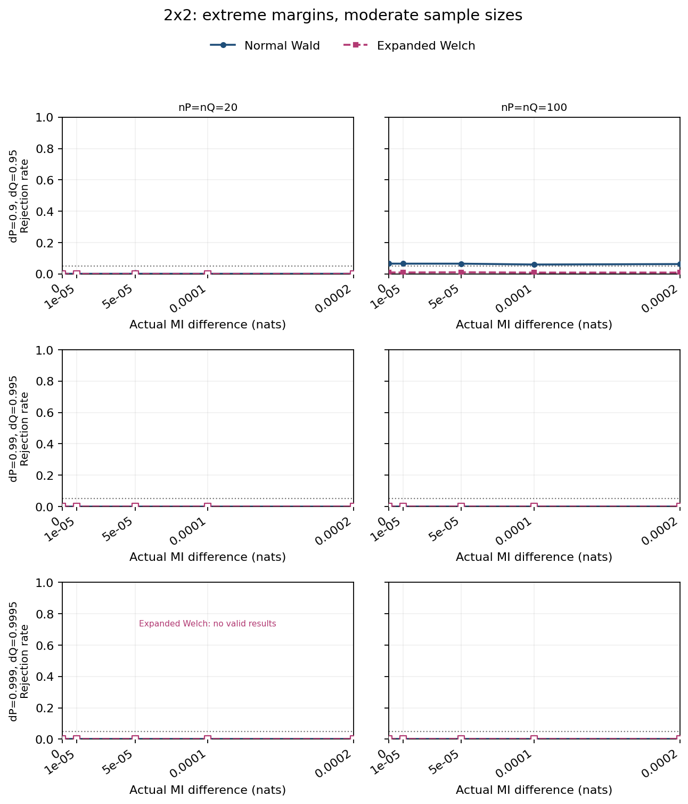

| Specification | Setting |
| --- | --- |
| Table size | 2x2 |
| Horizontal graph regime specifications (columns) | nP=nQ=20, nP=nQ=100 |
| Vertical graph regime specifications (rows) | dP=0.9, dQ=0.95: P row (0.9, 0.1), P column (0.9, 0.1); Q row (0.95, 0.05), Q column (0.95, 0.05); dP=0.99, dQ=0.995: P row (0.99, 0.01), P column (0.99, 0.01); Q row (0.995, 0.005), Q column (0.995, 0.005); dP=0.999, dQ=0.9995: P row (0.999, 0.001), P column (0.999, 0.001); Q row (0.9995, 0.0005), Q column (0.9995, 0.0005) |
| Probability changes | dP=0.9, dQ=0.95: add at (1,1),(2,2) and subtract at (1,2),(2,1), for both P and Q; dP=0.99, dQ=0.995: add at (1,1),(2,2) and subtract at (1,2),(2,1), for both P and Q; dP=0.999, dQ=0.9995: add at (1,1),(2,2) and subtract at (1,2),(2,1), for both P and Q |
| MI settings | Baseline MI {1e-05}; direction {q higher}; actual differences {0, 1e-05, 5e-05, 0.0001, 0.0002} nats |
| Horizontal axis within each graph | Actual MI difference in nats, fixed from 0 to 0.0002 |
| Vertical axis within each graph | Unconditional rejection rate from 0 to 1; invalid results count as non-rejections |
| Replicates | 20,000 per unique point |

Null-point rejection and validity:

| Vertical regime | Horizontal regime | x | Method | Rejection | Valid |
| --- | --- | --- | --- | --- | --- |
| dP=0.9, dQ=0.95 | nP=nQ=20 | 0 | Expanded Welch | 0.0006 | 0.3174 |
| dP=0.9, dQ=0.95 | nP=nQ=20 | 0 | Normal Wald | 0.0014 | 0.8665 |
| dP=0.9, dQ=0.95 | nP=nQ=100 | 0 | Expanded Welch | 0.0096 | 0.9872 |
| dP=0.9, dQ=0.95 | nP=nQ=100 | 0 | Normal Wald | 0.0659 | 0.9999 |
| dP=0.99, dQ=0.995 | nP=nQ=20 | 0 | Expanded Welch | 0.0000 | 0.0006 |
| dP=0.99, dQ=0.995 | nP=nQ=20 | 0 | Normal Wald | 0.0000 | 0.0442 |
| dP=0.99, dQ=0.995 | nP=nQ=100 | 0 | Expanded Welch | 0.0000 | 0.0660 |
| dP=0.99, dQ=0.995 | nP=nQ=100 | 0 | Normal Wald | 0.0000 | 0.5013 |
| dP=0.999, dQ=0.9995 | nP=nQ=20 | 0 | Expanded Welch | 0.0000 | 0.0000 |
| dP=0.999, dQ=0.9995 | nP=nQ=20 | 0 | Normal Wald | 0.0000 | 0.0007 |
| dP=0.999, dQ=0.9995 | nP=nQ=100 | 0 | Expanded Welch | 0.0000 | 0.0001 |
| dP=0.999, dQ=0.9995 | nP=nQ=100 | 0 | Normal Wald | 0.0000 | 0.0120 |

Every plotted rate, interval, validity and minimum expected count

| Vertical regime | Horizontal regime | x | Method | Rejection | 95% interval | Valid | Conditional | Min expected P | Min expected Q |
| --- | --- | --- | --- | --- | --- | --- | --- | --- | --- |
| dP=0.9, dQ=0.95 | nP=nQ=20 | 0 | Expanded Welch | 0.0006 | [0.0003, 0.0010] | 0.3174 | 0.0017 | 0.2081 | 0.0543 |
| dP=0.9, dQ=0.95 | nP=nQ=20 | 0 | Normal Wald | 0.0014 | [0.0009, 0.0020] | 0.8665 | 0.0016 | 0.2081 | 0.0543 |
| dP=0.9, dQ=0.95 | nP=nQ=20 | 1e-05 | Expanded Welch | 0.0002 | [0.0001, 0.0005] | 0.3205 | 0.0006 | 0.2081 | 0.05611 |
| dP=0.9, dQ=0.95 | nP=nQ=20 | 1e-05 | Normal Wald | 0.0010 | [0.0006, 0.0015] | 0.8628 | 0.0012 | 0.2081 | 0.05611 |
| dP=0.9, dQ=0.95 | nP=nQ=20 | 5e-05 | Expanded Welch | 0.0005 | [0.0003, 0.0009] | 0.3177 | 0.0016 | 0.2081 | 0.06072 |
| dP=0.9, dQ=0.95 | nP=nQ=20 | 5e-05 | Normal Wald | 0.0011 | [0.0008, 0.0017] | 0.8610 | 0.0013 | 0.2081 | 0.06072 |
| dP=0.9, dQ=0.95 | nP=nQ=20 | 0.0001 | Expanded Welch | 0.0003 | [0.0002, 0.0007] | 0.3227 | 0.0011 | 0.2081 | 0.06466 |
| dP=0.9, dQ=0.95 | nP=nQ=20 | 0.0001 | Normal Wald | 0.0010 | [0.0007, 0.0016] | 0.8647 | 0.0012 | 0.2081 | 0.06466 |
| dP=0.9, dQ=0.95 | nP=nQ=20 | 0.0002 | Expanded Welch | 0.0007 | [0.0004, 0.0012] | 0.3230 | 0.0022 | 0.2081 | 0.07055 |
| dP=0.9, dQ=0.95 | nP=nQ=20 | 0.0002 | Normal Wald | 0.0011 | [0.0007, 0.0017] | 0.8612 | 0.0013 | 0.2081 | 0.07055 |
| dP=0.9, dQ=0.95 | nP=nQ=100 | 0 | Expanded Welch | 0.0096 | [0.0083, 0.0110] | 0.9872 | 0.0097 | 1.04 | 0.2715 |
| dP=0.9, dQ=0.95 | nP=nQ=100 | 0 | Normal Wald | 0.0659 | [0.0625, 0.0694] | 0.9999 | 0.0659 | 1.04 | 0.2715 |
| dP=0.9, dQ=0.95 | nP=nQ=100 | 1e-05 | Expanded Welch | 0.0094 | [0.0082, 0.0108] | 0.9871 | 0.0095 | 1.04 | 0.2806 |
| dP=0.9, dQ=0.95 | nP=nQ=100 | 1e-05 | Normal Wald | 0.0657 | [0.0623, 0.0692] | 0.9999 | 0.0657 | 1.04 | 0.2806 |
| dP=0.9, dQ=0.95 | nP=nQ=100 | 5e-05 | Expanded Welch | 0.0106 | [0.0093, 0.0121] | 0.9892 | 0.0107 | 1.04 | 0.3036 |
| dP=0.9, dQ=0.95 | nP=nQ=100 | 5e-05 | Normal Wald | 0.0657 | [0.0623, 0.0692] | 0.9998 | 0.0657 | 1.04 | 0.3036 |
| dP=0.9, dQ=0.95 | nP=nQ=100 | 0.0001 | Expanded Welch | 0.0088 | [0.0076, 0.0102] | 0.9880 | 0.0089 | 1.04 | 0.3233 |
| dP=0.9, dQ=0.95 | nP=nQ=100 | 0.0001 | Normal Wald | 0.0602 | [0.0570, 0.0636] | 0.9998 | 0.0603 | 1.04 | 0.3233 |
| dP=0.9, dQ=0.95 | nP=nQ=100 | 0.0002 | Expanded Welch | 0.0089 | [0.0077, 0.0103] | 0.9876 | 0.0090 | 1.04 | 0.3528 |
| dP=0.9, dQ=0.95 | nP=nQ=100 | 0.0002 | Normal Wald | 0.0631 | [0.0598, 0.0666] | 0.9999 | 0.0631 | 1.04 | 0.3528 |
| dP=0.99, dQ=0.995 | nP=nQ=20 | 0 | Expanded Welch | 0.0000 | [0.0000, 0.0002] | 0.0006 | 0.0000 | 0.002947 | 0.001006 |
| dP=0.99, dQ=0.995 | nP=nQ=20 | 0 | Normal Wald | 0.0000 | [0.0000, 0.0002] | 0.0442 | 0.0000 | 0.002947 | 0.001006 |
| dP=0.99, dQ=0.995 | nP=nQ=20 | 1e-05 | Expanded Welch | 0.0000 | [0.0000, 0.0002] | 0.0003 | 0.0000 | 0.002947 | 0.001249 |
| dP=0.99, dQ=0.995 | nP=nQ=20 | 1e-05 | Normal Wald | 0.0000 | [0.0000, 0.0002] | 0.0427 | 0.0000 | 0.002947 | 0.001249 |
| dP=0.99, dQ=0.995 | nP=nQ=20 | 5e-05 | Expanded Welch | 0.0000 | [0.0000, 0.0002] | 0.0003 | 0.0000 | 0.002947 | 0.001932 |
| dP=0.99, dQ=0.995 | nP=nQ=20 | 5e-05 | Normal Wald | 0.0000 | [0.0000, 0.0002] | 0.0447 | 0.0000 | 0.002947 | 0.001932 |
| dP=0.99, dQ=0.995 | nP=nQ=20 | 0.0001 | Expanded Welch | 0.0000 | [0.0000, 0.0002] | 0.0004 | 0.0000 | 0.002947 | 0.002581 |
| dP=0.99, dQ=0.995 | nP=nQ=20 | 0.0001 | Normal Wald | 0.0000 | [0.0000, 0.0002] | 0.0446 | 0.0000 | 0.002947 | 0.002581 |
| dP=0.99, dQ=0.995 | nP=nQ=20 | 0.0002 | Expanded Welch | 0.0000 | [0.0000, 0.0002] | 0.0004 | 0.0000 | 0.002947 | 0.003647 |
| dP=0.99, dQ=0.995 | nP=nQ=20 | 0.0002 | Normal Wald | 0.0001 | [0.0000, 0.0003] | 0.0454 | 0.0011 | 0.002947 | 0.003647 |
| dP=0.99, dQ=0.995 | nP=nQ=100 | 0 | Expanded Welch | 0.0000 | [0.0000, 0.0002] | 0.0660 | 0.0000 | 0.01474 | 0.005031 |
| dP=0.99, dQ=0.995 | nP=nQ=100 | 0 | Normal Wald | 0.0000 | [0.0000, 0.0002] | 0.5013 | 0.0000 | 0.01474 | 0.005031 |
| dP=0.99, dQ=0.995 | nP=nQ=100 | 1e-05 | Expanded Welch | 0.0000 | [0.0000, 0.0002] | 0.0615 | 0.0000 | 0.01474 | 0.006244 |
| dP=0.99, dQ=0.995 | nP=nQ=100 | 1e-05 | Normal Wald | 0.0000 | [0.0000, 0.0002] | 0.5035 | 0.0000 | 0.01474 | 0.006244 |
| dP=0.99, dQ=0.995 | nP=nQ=100 | 5e-05 | Expanded Welch | 0.0000 | [0.0000, 0.0002] | 0.0630 | 0.0000 | 0.01474 | 0.009659 |
| dP=0.99, dQ=0.995 | nP=nQ=100 | 5e-05 | Normal Wald | 0.0000 | [0.0000, 0.0002] | 0.5027 | 0.0000 | 0.01474 | 0.009659 |
| dP=0.99, dQ=0.995 | nP=nQ=100 | 0.0001 | Expanded Welch | 0.0000 | [0.0000, 0.0002] | 0.0641 | 0.0000 | 0.01474 | 0.01291 |
| dP=0.99, dQ=0.995 | nP=nQ=100 | 0.0001 | Normal Wald | 0.0000 | [0.0000, 0.0002] | 0.4992 | 0.0000 | 0.01474 | 0.01291 |
| dP=0.99, dQ=0.995 | nP=nQ=100 | 0.0002 | Expanded Welch | 0.0000 | [0.0000, 0.0002] | 0.0641 | 0.0000 | 0.01474 | 0.01823 |
| dP=0.99, dQ=0.995 | nP=nQ=100 | 0.0002 | Normal Wald | 0.0000 | [0.0000, 0.0002] | 0.4976 | 0.0000 | 0.01474 | 0.01823 |
| dP=0.999, dQ=0.9995 | nP=nQ=20 | 0 | Expanded Welch | 0.0000 | [0.0000, 0.0002] | 0.0000 | NA | 0.000163 | 9.818e-05 |
| dP=0.999, dQ=0.9995 | nP=nQ=20 | 0 | Normal Wald | 0.0000 | [0.0000, 0.0002] | 0.0007 | 0.0000 | 0.000163 | 9.818e-05 |
| dP=0.999, dQ=0.9995 | nP=nQ=20 | 1e-05 | Expanded Welch | 0.0000 | [0.0000, 0.0002] | 0.0000 | NA | 0.000163 | 0.0001594 |
| dP=0.999, dQ=0.9995 | nP=nQ=20 | 1e-05 | Normal Wald | 0.0000 | [0.0000, 0.0002] | 0.0009 | 0.0000 | 0.000163 | 0.0001594 |
| dP=0.999, dQ=0.9995 | nP=nQ=20 | 5e-05 | Expanded Welch | 0.0000 | [0.0000, 0.0002] | 0.0000 | NA | 0.000163 | 0.0003606 |
| dP=0.999, dQ=0.9995 | nP=nQ=20 | 5e-05 | Normal Wald | 0.0000 | [0.0000, 0.0002] | 0.0008 | 0.0000 | 0.000163 | 0.0003606 |
| dP=0.999, dQ=0.9995 | nP=nQ=20 | 0.0001 | Expanded Welch | 0.0000 | [0.0000, 0.0002] | 0.0000 | NA | 0.000163 | 0.0005768 |
| dP=0.999, dQ=0.9995 | nP=nQ=20 | 0.0001 | Normal Wald | 0.0000 | [0.0000, 0.0002] | 0.0009 | 0.0000 | 0.000163 | 0.0005768 |
| dP=0.999, dQ=0.9995 | nP=nQ=20 | 0.0002 | Expanded Welch | 0.0000 | [0.0000, 0.0002] | 0.0000 | NA | 0.000163 | 0.0009625 |
| dP=0.999, dQ=0.9995 | nP=nQ=20 | 0.0002 | Normal Wald | 0.0000 | [0.0000, 0.0002] | 0.0018 | 0.0000 | 0.000163 | 0.0009625 |
| dP=0.999, dQ=0.9995 | nP=nQ=100 | 0 | Expanded Welch | 0.0000 | [0.0000, 0.0002] | 0.0001 | 0.0000 | 0.000815 | 0.0004909 |
| dP=0.999, dQ=0.9995 | nP=nQ=100 | 0 | Normal Wald | 0.0000 | [0.0000, 0.0002] | 0.0120 | 0.0000 | 0.000815 | 0.0004909 |
| dP=0.999, dQ=0.9995 | nP=nQ=100 | 1e-05 | Expanded Welch | 0.0000 | [0.0000, 0.0002] | 0.0000 | NA | 0.000815 | 0.0007972 |
| dP=0.999, dQ=0.9995 | nP=nQ=100 | 1e-05 | Normal Wald | 0.0000 | [0.0000, 0.0002] | 0.0138 | 0.0000 | 0.000815 | 0.0007972 |
| dP=0.999, dQ=0.9995 | nP=nQ=100 | 5e-05 | Expanded Welch | 0.0000 | [0.0000, 0.0002] | 0.0000 | NA | 0.000815 | 0.001803 |
| dP=0.999, dQ=0.9995 | nP=nQ=100 | 5e-05 | Normal Wald | 0.0000 | [0.0000, 0.0002] | 0.0151 | 0.0000 | 0.000815 | 0.001803 |
| dP=0.999, dQ=0.9995 | nP=nQ=100 | 0.0001 | Expanded Welch | 0.0000 | [0.0000, 0.0002] | 0.0001 | 0.0000 | 0.000815 | 0.002884 |
| dP=0.999, dQ=0.9995 | nP=nQ=100 | 0.0001 | Normal Wald | 0.0000 | [0.0000, 0.0002] | 0.0146 | 0.0000 | 0.000815 | 0.002884 |
| dP=0.999, dQ=0.9995 | nP=nQ=100 | 0.0002 | Expanded Welch | 0.0000 | [0.0000, 0.0002] | 0.0001 | 0.0000 | 0.000815 | 0.004812 |
| dP=0.999, dQ=0.9995 | nP=nQ=100 | 0.0002 | Normal Wald | 0.0000 | [0.0000, 0.0002] | 0.0152 | 0.0000 | 0.000815 | 0.004812 |

### 10.3 2x2: extreme margins, large sample sizes

What happens under deliberately extreme marginal skew and very small samples?

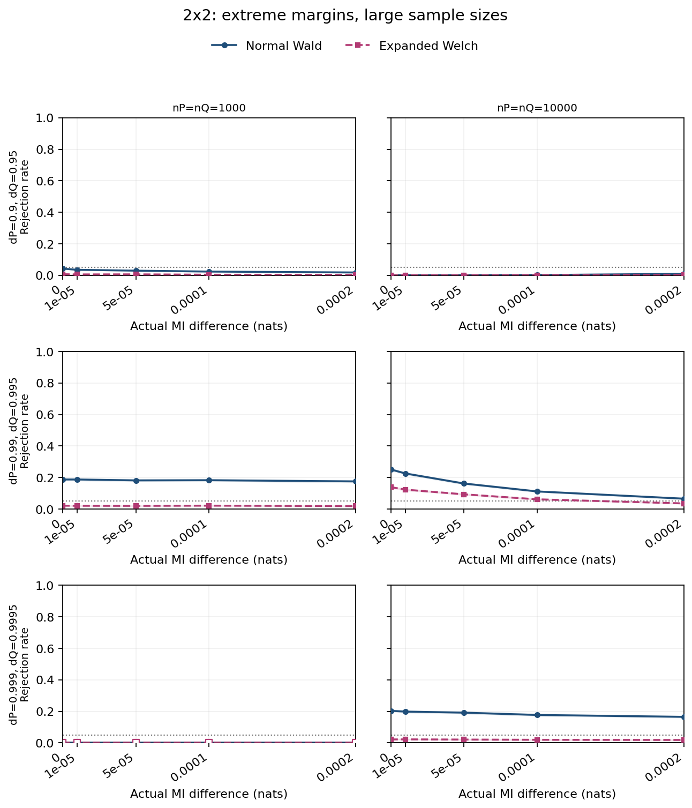

| Specification | Setting |
| --- | --- |
| Table size | 2x2 |
| Horizontal graph regime specifications (columns) | nP=nQ=1000, nP=nQ=10000 |
| Vertical graph regime specifications (rows) | dP=0.9, dQ=0.95: P row (0.9, 0.1), P column (0.9, 0.1); Q row (0.95, 0.05), Q column (0.95, 0.05); dP=0.99, dQ=0.995: P row (0.99, 0.01), P column (0.99, 0.01); Q row (0.995, 0.005), Q column (0.995, 0.005); dP=0.999, dQ=0.9995: P row (0.999, 0.001), P column (0.999, 0.001); Q row (0.9995, 0.0005), Q column (0.9995, 0.0005) |
| Probability changes | dP=0.9, dQ=0.95: add at (1,1),(2,2) and subtract at (1,2),(2,1), for both P and Q; dP=0.99, dQ=0.995: add at (1,1),(2,2) and subtract at (1,2),(2,1), for both P and Q; dP=0.999, dQ=0.9995: add at (1,1),(2,2) and subtract at (1,2),(2,1), for both P and Q |
| MI settings | Baseline MI {1e-05}; direction {q higher}; actual differences {0, 1e-05, 5e-05, 0.0001, 0.0002} nats |
| Horizontal axis within each graph | Actual MI difference in nats, fixed from 0 to 0.0002 |
| Vertical axis within each graph | Unconditional rejection rate from 0 to 1; invalid results count as non-rejections |
| Replicates | 20,000 per unique point |

Null-point rejection and validity:

| Vertical regime | Horizontal regime | x | Method | Rejection | Valid |
| --- | --- | --- | --- | --- | --- |
| dP=0.9, dQ=0.95 | nP=nQ=1000 | 0 | Expanded Welch | 0.0070 | 1.0000 |
| dP=0.9, dQ=0.95 | nP=nQ=1000 | 0 | Normal Wald | 0.0423 | 1.0000 |
| dP=0.9, dQ=0.95 | nP=nQ=10000 | 0 | Expanded Welch | 0.0001 | 1.0000 |
| dP=0.9, dQ=0.95 | nP=nQ=10000 | 0 | Normal Wald | 0.0003 | 1.0000 |
| dP=0.99, dQ=0.995 | nP=nQ=1000 | 0 | Expanded Welch | 0.0215 | 0.9867 |
| dP=0.99, dQ=0.995 | nP=nQ=1000 | 0 | Normal Wald | 0.1878 | 1.0000 |
| dP=0.99, dQ=0.995 | nP=nQ=10000 | 0 | Expanded Welch | 0.1391 | 1.0000 |
| dP=0.99, dQ=0.995 | nP=nQ=10000 | 0 | Normal Wald | 0.2516 | 1.0000 |
| dP=0.999, dQ=0.9995 | nP=nQ=1000 | 0 | Expanded Welch | 0.0000 | 0.0609 |
| dP=0.999, dQ=0.9995 | nP=nQ=1000 | 0 | Normal Wald | 0.0000 | 0.4978 |
| dP=0.999, dQ=0.9995 | nP=nQ=10000 | 0 | Expanded Welch | 0.0215 | 0.9875 |
| dP=0.999, dQ=0.9995 | nP=nQ=10000 | 0 | Normal Wald | 0.2033 | 1.0000 |

Every plotted rate, interval, validity and minimum expected count

| Vertical regime | Horizontal regime | x | Method | Rejection | 95% interval | Valid | Conditional | Min expected P | Min expected Q |
| --- | --- | --- | --- | --- | --- | --- | --- | --- | --- |
| dP=0.9, dQ=0.95 | nP=nQ=1000 | 0 | Expanded Welch | 0.0070 | [0.0059, 0.0083] | 1.0000 | 0.0070 | 10.4 | 2.715 |
| dP=0.9, dQ=0.95 | nP=nQ=1000 | 0 | Normal Wald | 0.0423 | [0.0396, 0.0452] | 1.0000 | 0.0423 | 10.4 | 2.715 |
| dP=0.9, dQ=0.95 | nP=nQ=1000 | 1e-05 | Expanded Welch | 0.0056 | [0.0047, 0.0067] | 1.0000 | 0.0056 | 10.4 | 2.806 |
| dP=0.9, dQ=0.95 | nP=nQ=1000 | 1e-05 | Normal Wald | 0.0350 | [0.0326, 0.0377] | 1.0000 | 0.0350 | 10.4 | 2.806 |
| dP=0.9, dQ=0.95 | nP=nQ=1000 | 5e-05 | Expanded Welch | 0.0061 | [0.0051, 0.0073] | 1.0000 | 0.0061 | 10.4 | 3.036 |
| dP=0.9, dQ=0.95 | nP=nQ=1000 | 5e-05 | Normal Wald | 0.0295 | [0.0272, 0.0319] | 1.0000 | 0.0295 | 10.4 | 3.036 |
| dP=0.9, dQ=0.95 | nP=nQ=1000 | 0.0001 | Expanded Welch | 0.0037 | [0.0030, 0.0047] | 1.0000 | 0.0037 | 10.4 | 3.233 |
| dP=0.9, dQ=0.95 | nP=nQ=1000 | 0.0001 | Normal Wald | 0.0238 | [0.0217, 0.0260] | 1.0000 | 0.0238 | 10.4 | 3.233 |
| dP=0.9, dQ=0.95 | nP=nQ=1000 | 0.0002 | Expanded Welch | 0.0032 | [0.0025, 0.0041] | 1.0000 | 0.0032 | 10.4 | 3.528 |
| dP=0.9, dQ=0.95 | nP=nQ=1000 | 0.0002 | Normal Wald | 0.0180 | [0.0162, 0.0199] | 1.0000 | 0.0180 | 10.4 | 3.528 |
| dP=0.9, dQ=0.95 | nP=nQ=10000 | 0 | Expanded Welch | 0.0001 | [0.0000, 0.0004] | 1.0000 | 0.0001 | 104 | 27.15 |
| dP=0.9, dQ=0.95 | nP=nQ=10000 | 0 | Normal Wald | 0.0003 | [0.0001, 0.0007] | 1.0000 | 0.0003 | 104 | 27.15 |
| dP=0.9, dQ=0.95 | nP=nQ=10000 | 1e-05 | Expanded Welch | 0.0001 | [0.0000, 0.0003] | 1.0000 | 0.0001 | 104 | 28.06 |
| dP=0.9, dQ=0.95 | nP=nQ=10000 | 1e-05 | Normal Wald | 0.0001 | [0.0000, 0.0004] | 1.0000 | 0.0001 | 104 | 28.06 |
| dP=0.9, dQ=0.95 | nP=nQ=10000 | 5e-05 | Expanded Welch | 0.0000 | [0.0000, 0.0002] | 1.0000 | 0.0000 | 104 | 30.36 |
| dP=0.9, dQ=0.95 | nP=nQ=10000 | 5e-05 | Normal Wald | 0.0006 | [0.0003, 0.0010] | 1.0000 | 0.0006 | 104 | 30.36 |
| dP=0.9, dQ=0.95 | nP=nQ=10000 | 0.0001 | Expanded Welch | 0.0004 | [0.0002, 0.0009] | 1.0000 | 0.0004 | 104 | 32.33 |
| dP=0.9, dQ=0.95 | nP=nQ=10000 | 0.0001 | Normal Wald | 0.0019 | [0.0014, 0.0027] | 1.0000 | 0.0019 | 104 | 32.33 |
| dP=0.9, dQ=0.95 | nP=nQ=10000 | 0.0002 | Expanded Welch | 0.0022 | [0.0016, 0.0029] | 1.0000 | 0.0022 | 104 | 35.28 |
| dP=0.9, dQ=0.95 | nP=nQ=10000 | 0.0002 | Normal Wald | 0.0094 | [0.0081, 0.0108] | 1.0000 | 0.0094 | 104 | 35.28 |
| dP=0.99, dQ=0.995 | nP=nQ=1000 | 0 | Expanded Welch | 0.0215 | [0.0196, 0.0237] | 0.9867 | 0.0218 | 0.1474 | 0.05031 |
| dP=0.99, dQ=0.995 | nP=nQ=1000 | 0 | Normal Wald | 0.1878 | [0.1825, 0.1933] | 1.0000 | 0.1878 | 0.1474 | 0.05031 |
| dP=0.99, dQ=0.995 | nP=nQ=1000 | 1e-05 | Expanded Welch | 0.0209 | [0.0191, 0.0230] | 0.9855 | 0.0213 | 0.1474 | 0.06244 |
| dP=0.99, dQ=0.995 | nP=nQ=1000 | 1e-05 | Normal Wald | 0.1878 | [0.1825, 0.1933] | 1.0000 | 0.1878 | 0.1474 | 0.06244 |
| dP=0.99, dQ=0.995 | nP=nQ=1000 | 5e-05 | Expanded Welch | 0.0204 | [0.0185, 0.0225] | 0.9862 | 0.0207 | 0.1474 | 0.09659 |
| dP=0.99, dQ=0.995 | nP=nQ=1000 | 5e-05 | Normal Wald | 0.1820 | [0.1768, 0.1875] | 1.0000 | 0.1820 | 0.1474 | 0.09659 |
| dP=0.99, dQ=0.995 | nP=nQ=1000 | 0.0001 | Expanded Welch | 0.0217 | [0.0198, 0.0239] | 0.9869 | 0.0220 | 0.1474 | 0.1291 |
| dP=0.99, dQ=0.995 | nP=nQ=1000 | 0.0001 | Normal Wald | 0.1832 | [0.1779, 0.1886] | 1.0000 | 0.1832 | 0.1474 | 0.1291 |
| dP=0.99, dQ=0.995 | nP=nQ=1000 | 0.0002 | Expanded Welch | 0.0191 | [0.0173, 0.0211] | 0.9859 | 0.0194 | 0.1474 | 0.1823 |
| dP=0.99, dQ=0.995 | nP=nQ=1000 | 0.0002 | Normal Wald | 0.1757 | [0.1704, 0.1810] | 1.0000 | 0.1757 | 0.1474 | 0.1823 |
| dP=0.99, dQ=0.995 | nP=nQ=10000 | 0 | Expanded Welch | 0.1391 | [0.1344, 0.1440] | 1.0000 | 0.1391 | 1.474 | 0.5031 |
| dP=0.99, dQ=0.995 | nP=nQ=10000 | 0 | Normal Wald | 0.2516 | [0.2457, 0.2577] | 1.0000 | 0.2516 | 1.474 | 0.5031 |
| dP=0.99, dQ=0.995 | nP=nQ=10000 | 1e-05 | Expanded Welch | 0.1233 | [0.1188, 0.1279] | 1.0000 | 0.1233 | 1.474 | 0.6244 |
| dP=0.99, dQ=0.995 | nP=nQ=10000 | 1e-05 | Normal Wald | 0.2260 | [0.2203, 0.2318] | 1.0000 | 0.2260 | 1.474 | 0.6244 |
| dP=0.99, dQ=0.995 | nP=nQ=10000 | 5e-05 | Expanded Welch | 0.0935 | [0.0896, 0.0977] | 1.0000 | 0.0935 | 1.474 | 0.9659 |
| dP=0.99, dQ=0.995 | nP=nQ=10000 | 5e-05 | Normal Wald | 0.1622 | [0.1572, 0.1674] | 1.0000 | 0.1622 | 1.474 | 0.9659 |
| dP=0.99, dQ=0.995 | nP=nQ=10000 | 0.0001 | Expanded Welch | 0.0619 | [0.0587, 0.0654] | 1.0000 | 0.0619 | 1.474 | 1.291 |
| dP=0.99, dQ=0.995 | nP=nQ=10000 | 0.0001 | Normal Wald | 0.1119 | [0.1077, 0.1164] | 1.0000 | 0.1119 | 1.474 | 1.291 |
| dP=0.99, dQ=0.995 | nP=nQ=10000 | 0.0002 | Expanded Welch | 0.0358 | [0.0334, 0.0385] | 1.0000 | 0.0358 | 1.474 | 1.823 |
| dP=0.99, dQ=0.995 | nP=nQ=10000 | 0.0002 | Normal Wald | 0.0660 | [0.0626, 0.0695] | 1.0000 | 0.0660 | 1.474 | 1.823 |
| dP=0.999, dQ=0.9995 | nP=nQ=1000 | 0 | Expanded Welch | 0.0000 | [0.0000, 0.0002] | 0.0609 | 0.0000 | 0.00815 | 0.004909 |
| dP=0.999, dQ=0.9995 | nP=nQ=1000 | 0 | Normal Wald | 0.0000 | [0.0000, 0.0002] | 0.4978 | 0.0000 | 0.00815 | 0.004909 |
| dP=0.999, dQ=0.9995 | nP=nQ=1000 | 1e-05 | Expanded Welch | 0.0000 | [0.0000, 0.0002] | 0.0665 | 0.0000 | 0.00815 | 0.007972 |
| dP=0.999, dQ=0.9995 | nP=nQ=1000 | 1e-05 | Normal Wald | 0.0000 | [0.0000, 0.0002] | 0.4978 | 0.0000 | 0.00815 | 0.007972 |
| dP=0.999, dQ=0.9995 | nP=nQ=1000 | 5e-05 | Expanded Welch | 0.0000 | [0.0000, 0.0002] | 0.0655 | 0.0000 | 0.00815 | 0.01803 |
| dP=0.999, dQ=0.9995 | nP=nQ=1000 | 5e-05 | Normal Wald | 0.0000 | [0.0000, 0.0002] | 0.4971 | 0.0000 | 0.00815 | 0.01803 |
| dP=0.999, dQ=0.9995 | nP=nQ=1000 | 0.0001 | Expanded Welch | 0.0000 | [0.0000, 0.0002] | 0.0676 | 0.0000 | 0.00815 | 0.02884 |
| dP=0.999, dQ=0.9995 | nP=nQ=1000 | 0.0001 | Normal Wald | 0.0000 | [0.0000, 0.0002] | 0.5102 | 0.0000 | 0.00815 | 0.02884 |
| dP=0.999, dQ=0.9995 | nP=nQ=1000 | 0.0002 | Expanded Welch | 0.0000 | [0.0000, 0.0002] | 0.0687 | 0.0000 | 0.00815 | 0.04812 |
| dP=0.999, dQ=0.9995 | nP=nQ=1000 | 0.0002 | Normal Wald | 0.0000 | [0.0000, 0.0002] | 0.5020 | 0.0000 | 0.00815 | 0.04812 |
| dP=0.999, dQ=0.9995 | nP=nQ=10000 | 0 | Expanded Welch | 0.0215 | [0.0195, 0.0236] | 0.9875 | 0.0217 | 0.0815 | 0.04909 |
| dP=0.999, dQ=0.9995 | nP=nQ=10000 | 0 | Normal Wald | 0.2033 | [0.1978, 0.2089] | 1.0000 | 0.2033 | 0.0815 | 0.04909 |
| dP=0.999, dQ=0.9995 | nP=nQ=10000 | 1e-05 | Expanded Welch | 0.0219 | [0.0200, 0.0240] | 0.9860 | 0.0222 | 0.0815 | 0.07972 |
| dP=0.999, dQ=0.9995 | nP=nQ=10000 | 1e-05 | Normal Wald | 0.1982 | [0.1927, 0.2038] | 1.0000 | 0.1982 | 0.0815 | 0.07972 |
| dP=0.999, dQ=0.9995 | nP=nQ=10000 | 5e-05 | Expanded Welch | 0.0208 | [0.0189, 0.0228] | 0.9856 | 0.0211 | 0.0815 | 0.1803 |
| dP=0.999, dQ=0.9995 | nP=nQ=10000 | 5e-05 | Normal Wald | 0.1916 | [0.1862, 0.1971] | 1.0000 | 0.1916 | 0.0815 | 0.1803 |
| dP=0.999, dQ=0.9995 | nP=nQ=10000 | 0.0001 | Expanded Welch | 0.0193 | [0.0175, 0.0214] | 0.9860 | 0.0196 | 0.0815 | 0.2884 |
| dP=0.999, dQ=0.9995 | nP=nQ=10000 | 0.0001 | Normal Wald | 0.1769 | [0.1717, 0.1823] | 1.0000 | 0.1769 | 0.0815 | 0.2884 |
| dP=0.999, dQ=0.9995 | nP=nQ=10000 | 0.0002 | Expanded Welch | 0.0182 | [0.0165, 0.0202] | 0.9862 | 0.0185 | 0.0815 | 0.4812 |
| dP=0.999, dQ=0.9995 | nP=nQ=10000 | 0.0002 | Normal Wald | 0.1650 | [0.1599, 0.1702] | 1.0000 | 0.1650 | 0.0815 | 0.4812 |

### 10.4 3x3: extreme margins, small sample sizes

What happens under deliberately extreme marginal skew and very small samples?

| Specification | Setting |
| --- | --- |
| Table size | 3x3 |
| Horizontal graph regime specifications (columns) | nP=nQ=1, nP=nQ=2, nP=nQ=5 |
| Vertical graph regime specifications (rows) | dP=0.9, dQ=0.95: P row (0.9, 0.1/2 repeated 2 times), P column (0.9, 0.1/2 repeated 2 times); Q row (0.95, 0.05/2 repeated 2 times), Q column (0.95, 0.05/2 repeated 2 times); dP=0.99, dQ=0.995: P row (0.99, 0.01/2 repeated 2 times), P column (0.99, 0.01/2 repeated 2 times); Q row (0.995, 0.005/2 repeated 2 times), Q column (0.995, 0.005/2 repeated 2 times); dP=0.999, dQ=0.9995: P row (0.999, 0.001/2 repeated 2 times), P column (0.999, 0.001/2 repeated 2 times); Q row (0.9995, 0.0005/2 repeated 2 times), Q column (0.9995, 0.0005/2 repeated 2 times) |
| Probability changes | dP=0.9, dQ=0.95: add at (1,1),(2,2) and subtract at (1,2),(2,1), for both P and Q; dP=0.99, dQ=0.995: add at (1,1),(2,2) and subtract at (1,2),(2,1), for both P and Q; dP=0.999, dQ=0.9995: add at (1,1),(2,2) and subtract at (1,2),(2,1), for both P and Q |
| MI settings | Baseline MI {1e-05}; direction {q higher}; actual differences {0, 1e-05, 5e-05, 0.0001, 0.0002} nats |
| Horizontal axis within each graph | Actual MI difference in nats, fixed from 0 to 0.0002 |
| Vertical axis within each graph | Unconditional rejection rate from 0 to 1; invalid results count as non-rejections |
| Replicates | 20,000 per unique point |

Null-point rejection and validity:

| Vertical regime | Horizontal regime | x | Method | Rejection | Valid |
| --- | --- | --- | --- | --- | --- |
| dP=0.9, dQ=0.95 | nP=nQ=1 | 0 | Expanded Welch | 0.0000 | 0.0000 |
| dP=0.9, dQ=0.95 | nP=nQ=1 | 0 | Normal Wald | 0.0000 | 0.0000 |
| dP=0.9, dQ=0.95 | nP=nQ=2 | 0 | Expanded Welch | 0.0000 | 0.0000 |
| dP=0.9, dQ=0.95 | nP=nQ=2 | 0 | Normal Wald | 0.0000 | 0.0000 |
| dP=0.9, dQ=0.95 | nP=nQ=5 | 0 | Expanded Welch | 0.0000 | 0.0080 |
| dP=0.9, dQ=0.95 | nP=nQ=5 | 0 | Normal Wald | 0.0427 | 0.2100 |
| dP=0.99, dQ=0.995 | nP=nQ=1 | 0 | Expanded Welch | 0.0000 | 0.0000 |
| dP=0.99, dQ=0.995 | nP=nQ=1 | 0 | Normal Wald | 0.0000 | 0.0000 |
| dP=0.99, dQ=0.995 | nP=nQ=2 | 0 | Expanded Welch | 0.0000 | 0.0000 |
| dP=0.99, dQ=0.995 | nP=nQ=2 | 0 | Normal Wald | 0.0000 | 0.0000 |
| dP=0.99, dQ=0.995 | nP=nQ=5 | 0 | Expanded Welch | 0.0000 | 0.0000 |
| dP=0.99, dQ=0.995 | nP=nQ=5 | 0 | Normal Wald | 0.0009 | 0.0031 |
| dP=0.999, dQ=0.9995 | nP=nQ=1 | 0 | Expanded Welch | 0.0000 | 0.0000 |
| dP=0.999, dQ=0.9995 | nP=nQ=1 | 0 | Normal Wald | 0.0000 | 0.0000 |
| dP=0.999, dQ=0.9995 | nP=nQ=2 | 0 | Expanded Welch | 0.0000 | 0.0000 |
| dP=0.999, dQ=0.9995 | nP=nQ=2 | 0 | Normal Wald | 0.0000 | 0.0000 |
| dP=0.999, dQ=0.9995 | nP=nQ=5 | 0 | Expanded Welch | 0.0000 | 0.0000 |
| dP=0.999, dQ=0.9995 | nP=nQ=5 | 0 | Normal Wald | 0.0001 | 0.0001 |

Every plotted rate, interval, validity and minimum expected count

| Vertical regime | Horizontal regime | x | Method | Rejection | 95% interval | Valid | Conditional | Min expected P | Min expected Q |
| --- | --- | --- | --- | --- | --- | --- | --- | --- | --- |
| dP=0.9, dQ=0.95 | nP=nQ=1 | 0 | Expanded Welch | 0.0000 | [0.0000, 0.0002] | 0.0000 | NA | 0.0025 | 0.000625 |
| dP=0.9, dQ=0.95 | nP=nQ=1 | 0 | Normal Wald | 0.0000 | [0.0000, 0.0002] | 0.0000 | NA | 0.0025 | 0.000625 |
| dP=0.9, dQ=0.95 | nP=nQ=1 | 1e-05 | Expanded Welch | 0.0000 | [0.0000, 0.0002] | 0.0000 | NA | 0.0025 | 0.000625 |
| dP=0.9, dQ=0.95 | nP=nQ=1 | 1e-05 | Normal Wald | 0.0000 | [0.0000, 0.0002] | 0.0000 | NA | 0.0025 | 0.000625 |
| dP=0.9, dQ=0.95 | nP=nQ=1 | 5e-05 | Expanded Welch | 0.0000 | [0.0000, 0.0002] | 0.0000 | NA | 0.0025 | 0.000625 |
| dP=0.9, dQ=0.95 | nP=nQ=1 | 5e-05 | Normal Wald | 0.0000 | [0.0000, 0.0002] | 0.0000 | NA | 0.0025 | 0.000625 |
| dP=0.9, dQ=0.95 | nP=nQ=1 | 0.0001 | Expanded Welch | 0.0000 | [0.0000, 0.0002] | 0.0000 | NA | 0.0025 | 0.000625 |
| dP=0.9, dQ=0.95 | nP=nQ=1 | 0.0001 | Normal Wald | 0.0000 | [0.0000, 0.0002] | 0.0000 | NA | 0.0025 | 0.000625 |
| dP=0.9, dQ=0.95 | nP=nQ=1 | 0.0002 | Expanded Welch | 0.0000 | [0.0000, 0.0002] | 0.0000 | NA | 0.0025 | 0.000625 |
| dP=0.9, dQ=0.95 | nP=nQ=1 | 0.0002 | Normal Wald | 0.0000 | [0.0000, 0.0002] | 0.0000 | NA | 0.0025 | 0.000625 |
| dP=0.9, dQ=0.95 | nP=nQ=2 | 0 | Expanded Welch | 0.0000 | [0.0000, 0.0002] | 0.0000 | NA | 0.005 | 0.00125 |
| dP=0.9, dQ=0.95 | nP=nQ=2 | 0 | Normal Wald | 0.0000 | [0.0000, 0.0002] | 0.0000 | NA | 0.005 | 0.00125 |
| dP=0.9, dQ=0.95 | nP=nQ=2 | 1e-05 | Expanded Welch | 0.0000 | [0.0000, 0.0002] | 0.0000 | NA | 0.005 | 0.00125 |
| dP=0.9, dQ=0.95 | nP=nQ=2 | 1e-05 | Normal Wald | 0.0000 | [0.0000, 0.0002] | 0.0000 | NA | 0.005 | 0.00125 |
| dP=0.9, dQ=0.95 | nP=nQ=2 | 5e-05 | Expanded Welch | 0.0000 | [0.0000, 0.0002] | 0.0000 | NA | 0.005 | 0.00125 |
| dP=0.9, dQ=0.95 | nP=nQ=2 | 5e-05 | Normal Wald | 0.0000 | [0.0000, 0.0002] | 0.0000 | NA | 0.005 | 0.00125 |
| dP=0.9, dQ=0.95 | nP=nQ=2 | 0.0001 | Expanded Welch | 0.0000 | [0.0000, 0.0002] | 0.0000 | NA | 0.005 | 0.00125 |
| dP=0.9, dQ=0.95 | nP=nQ=2 | 0.0001 | Normal Wald | 0.0000 | [0.0000, 0.0002] | 0.0000 | NA | 0.005 | 0.00125 |
| dP=0.9, dQ=0.95 | nP=nQ=2 | 0.0002 | Expanded Welch | 0.0000 | [0.0000, 0.0002] | 0.0000 | NA | 0.005 | 0.00125 |
| dP=0.9, dQ=0.95 | nP=nQ=2 | 0.0002 | Normal Wald | 0.0000 | [0.0000, 0.0002] | 0.0000 | NA | 0.005 | 0.00125 |
| dP=0.9, dQ=0.95 | nP=nQ=5 | 0 | Expanded Welch | 0.0000 | [0.0000, 0.0002] | 0.0080 | 0.0000 | 0.0125 | 0.003125 |
| dP=0.9, dQ=0.95 | nP=nQ=5 | 0 | Normal Wald | 0.0427 | [0.0400, 0.0456] | 0.2100 | 0.2033 | 0.0125 | 0.003125 |
| dP=0.9, dQ=0.95 | nP=nQ=5 | 1e-05 | Expanded Welch | 0.0000 | [0.0000, 0.0002] | 0.0080 | 0.0000 | 0.0125 | 0.003125 |
| dP=0.9, dQ=0.95 | nP=nQ=5 | 1e-05 | Normal Wald | 0.0431 | [0.0404, 0.0460] | 0.2100 | 0.2052 | 0.0125 | 0.003125 |
| dP=0.9, dQ=0.95 | nP=nQ=5 | 5e-05 | Expanded Welch | 0.0000 | [0.0000, 0.0002] | 0.0095 | 0.0000 | 0.0125 | 0.003125 |
| dP=0.9, dQ=0.95 | nP=nQ=5 | 5e-05 | Normal Wald | 0.0415 | [0.0388, 0.0444] | 0.2100 | 0.1976 | 0.0125 | 0.003125 |
| dP=0.9, dQ=0.95 | nP=nQ=5 | 0.0001 | Expanded Welch | 0.0000 | [0.0000, 0.0002] | 0.0081 | 0.0000 | 0.0125 | 0.003125 |
| dP=0.9, dQ=0.95 | nP=nQ=5 | 0.0001 | Normal Wald | 0.0449 | [0.0422, 0.0479] | 0.2092 | 0.2149 | 0.0125 | 0.003125 |
| dP=0.9, dQ=0.95 | nP=nQ=5 | 0.0002 | Expanded Welch | 0.0000 | [0.0000, 0.0002] | 0.0092 | 0.0000 | 0.0125 | 0.003125 |
| dP=0.9, dQ=0.95 | nP=nQ=5 | 0.0002 | Normal Wald | 0.0433 | [0.0406, 0.0462] | 0.2155 | 0.2010 | 0.0125 | 0.003125 |
| dP=0.99, dQ=0.995 | nP=nQ=1 | 0 | Expanded Welch | 0.0000 | [0.0000, 0.0002] | 0.0000 | NA | 2.5e-05 | 6.25e-06 |
| dP=0.99, dQ=0.995 | nP=nQ=1 | 0 | Normal Wald | 0.0000 | [0.0000, 0.0002] | 0.0000 | NA | 2.5e-05 | 6.25e-06 |
| dP=0.99, dQ=0.995 | nP=nQ=1 | 1e-05 | Expanded Welch | 0.0000 | [0.0000, 0.0002] | 0.0000 | NA | 2.5e-05 | 6.25e-06 |
| dP=0.99, dQ=0.995 | nP=nQ=1 | 1e-05 | Normal Wald | 0.0000 | [0.0000, 0.0002] | 0.0000 | NA | 2.5e-05 | 6.25e-06 |
| dP=0.99, dQ=0.995 | nP=nQ=1 | 5e-05 | Expanded Welch | 0.0000 | [0.0000, 0.0002] | 0.0000 | NA | 2.5e-05 | 6.25e-06 |
| dP=0.99, dQ=0.995 | nP=nQ=1 | 5e-05 | Normal Wald | 0.0000 | [0.0000, 0.0002] | 0.0000 | NA | 2.5e-05 | 6.25e-06 |
| dP=0.99, dQ=0.995 | nP=nQ=1 | 0.0001 | Expanded Welch | 0.0000 | [0.0000, 0.0002] | 0.0000 | NA | 2.5e-05 | 6.25e-06 |
| dP=0.99, dQ=0.995 | nP=nQ=1 | 0.0001 | Normal Wald | 0.0000 | [0.0000, 0.0002] | 0.0000 | NA | 2.5e-05 | 6.25e-06 |
| dP=0.99, dQ=0.995 | nP=nQ=1 | 0.0002 | Expanded Welch | 0.0000 | [0.0000, 0.0002] | 0.0000 | NA | 2.5e-05 | 6.25e-06 |
| dP=0.99, dQ=0.995 | nP=nQ=1 | 0.0002 | Normal Wald | 0.0000 | [0.0000, 0.0002] | 0.0000 | NA | 2.5e-05 | 6.25e-06 |
| dP=0.99, dQ=0.995 | nP=nQ=2 | 0 | Expanded Welch | 0.0000 | [0.0000, 0.0002] | 0.0000 | NA | 5e-05 | 1.25e-05 |
| dP=0.99, dQ=0.995 | nP=nQ=2 | 0 | Normal Wald | 0.0000 | [0.0000, 0.0002] | 0.0000 | NA | 5e-05 | 1.25e-05 |
| dP=0.99, dQ=0.995 | nP=nQ=2 | 1e-05 | Expanded Welch | 0.0000 | [0.0000, 0.0002] | 0.0000 | NA | 5e-05 | 1.25e-05 |
| dP=0.99, dQ=0.995 | nP=nQ=2 | 1e-05 | Normal Wald | 0.0000 | [0.0000, 0.0002] | 0.0000 | NA | 5e-05 | 1.25e-05 |
| dP=0.99, dQ=0.995 | nP=nQ=2 | 5e-05 | Expanded Welch | 0.0000 | [0.0000, 0.0002] | 0.0000 | NA | 5e-05 | 1.25e-05 |
| dP=0.99, dQ=0.995 | nP=nQ=2 | 5e-05 | Normal Wald | 0.0000 | [0.0000, 0.0002] | 0.0000 | NA | 5e-05 | 1.25e-05 |
| dP=0.99, dQ=0.995 | nP=nQ=2 | 0.0001 | Expanded Welch | 0.0000 | [0.0000, 0.0002] | 0.0000 | NA | 5e-05 | 1.25e-05 |
| dP=0.99, dQ=0.995 | nP=nQ=2 | 0.0001 | Normal Wald | 0.0000 | [0.0000, 0.0002] | 0.0000 | NA | 5e-05 | 1.25e-05 |
| dP=0.99, dQ=0.995 | nP=nQ=2 | 0.0002 | Expanded Welch | 0.0000 | [0.0000, 0.0002] | 0.0000 | NA | 5e-05 | 1.25e-05 |
| dP=0.99, dQ=0.995 | nP=nQ=2 | 0.0002 | Normal Wald | 0.0000 | [0.0000, 0.0002] | 0.0000 | NA | 5e-05 | 1.25e-05 |
| dP=0.99, dQ=0.995 | nP=nQ=5 | 0 | Expanded Welch | 0.0000 | [0.0000, 0.0002] | 0.0000 | NA | 0.000125 | 3.125e-05 |
| dP=0.99, dQ=0.995 | nP=nQ=5 | 0 | Normal Wald | 0.0009 | [0.0006, 0.0015] | 0.0031 | 0.3115 | 0.000125 | 3.125e-05 |
| dP=0.99, dQ=0.995 | nP=nQ=5 | 1e-05 | Expanded Welch | 0.0000 | [0.0000, 0.0002] | 0.0000 | NA | 0.000125 | 3.125e-05 |
| dP=0.99, dQ=0.995 | nP=nQ=5 | 1e-05 | Normal Wald | 0.0009 | [0.0006, 0.0015] | 0.0029 | 0.3220 | 0.000125 | 3.125e-05 |
| dP=0.99, dQ=0.995 | nP=nQ=5 | 5e-05 | Expanded Welch | 0.0000 | [0.0000, 0.0002] | 0.0000 | NA | 0.000125 | 3.125e-05 |
| dP=0.99, dQ=0.995 | nP=nQ=5 | 5e-05 | Normal Wald | 0.0008 | [0.0005, 0.0012] | 0.0029 | 0.2542 | 0.000125 | 3.125e-05 |
| dP=0.99, dQ=0.995 | nP=nQ=5 | 0.0001 | Expanded Welch | 0.0000 | [0.0000, 0.0002] | 0.0000 | NA | 0.000125 | 3.125e-05 |
| dP=0.99, dQ=0.995 | nP=nQ=5 | 0.0001 | Normal Wald | 0.0014 | [0.0009, 0.0020] | 0.0031 | 0.4355 | 0.000125 | 3.125e-05 |
| dP=0.99, dQ=0.995 | nP=nQ=5 | 0.0002 | Expanded Welch | 0.0000 | [0.0000, 0.0002] | 0.0000 | NA | 0.000125 | 3.125e-05 |
| dP=0.99, dQ=0.995 | nP=nQ=5 | 0.0002 | Normal Wald | 0.0015 | [0.0011, 0.0022] | 0.0037 | 0.4133 | 0.000125 | 3.125e-05 |
| dP=0.999, dQ=0.9995 | nP=nQ=1 | 0 | Expanded Welch | 0.0000 | [0.0000, 0.0002] | 0.0000 | NA | 2.5e-07 | 6.25e-08 |
| dP=0.999, dQ=0.9995 | nP=nQ=1 | 0 | Normal Wald | 0.0000 | [0.0000, 0.0002] | 0.0000 | NA | 2.5e-07 | 6.25e-08 |
| dP=0.999, dQ=0.9995 | nP=nQ=1 | 1e-05 | Expanded Welch | 0.0000 | [0.0000, 0.0002] | 0.0000 | NA | 2.5e-07 | 6.25e-08 |
| dP=0.999, dQ=0.9995 | nP=nQ=1 | 1e-05 | Normal Wald | 0.0000 | [0.0000, 0.0002] | 0.0000 | NA | 2.5e-07 | 6.25e-08 |
| dP=0.999, dQ=0.9995 | nP=nQ=1 | 5e-05 | Expanded Welch | 0.0000 | [0.0000, 0.0002] | 0.0000 | NA | 2.5e-07 | 6.25e-08 |
| dP=0.999, dQ=0.9995 | nP=nQ=1 | 5e-05 | Normal Wald | 0.0000 | [0.0000, 0.0002] | 0.0000 | NA | 2.5e-07 | 6.25e-08 |
| dP=0.999, dQ=0.9995 | nP=nQ=1 | 0.0001 | Expanded Welch | 0.0000 | [0.0000, 0.0002] | 0.0000 | NA | 2.5e-07 | 6.25e-08 |
| dP=0.999, dQ=0.9995 | nP=nQ=1 | 0.0001 | Normal Wald | 0.0000 | [0.0000, 0.0002] | 0.0000 | NA | 2.5e-07 | 6.25e-08 |
| dP=0.999, dQ=0.9995 | nP=nQ=1 | 0.0002 | Expanded Welch | 0.0000 | [0.0000, 0.0002] | 0.0000 | NA | 2.5e-07 | 6.25e-08 |
| dP=0.999, dQ=0.9995 | nP=nQ=1 | 0.0002 | Normal Wald | 0.0000 | [0.0000, 0.0002] | 0.0000 | NA | 2.5e-07 | 6.25e-08 |
| dP=0.999, dQ=0.9995 | nP=nQ=2 | 0 | Expanded Welch | 0.0000 | [0.0000, 0.0002] | 0.0000 | NA | 5e-07 | 1.25e-07 |
| dP=0.999, dQ=0.9995 | nP=nQ=2 | 0 | Normal Wald | 0.0000 | [0.0000, 0.0002] | 0.0000 | NA | 5e-07 | 1.25e-07 |
| dP=0.999, dQ=0.9995 | nP=nQ=2 | 1e-05 | Expanded Welch | 0.0000 | [0.0000, 0.0002] | 0.0000 | NA | 5e-07 | 1.25e-07 |
| dP=0.999, dQ=0.9995 | nP=nQ=2 | 1e-05 | Normal Wald | 0.0000 | [0.0000, 0.0002] | 0.0000 | NA | 5e-07 | 1.25e-07 |
| dP=0.999, dQ=0.9995 | nP=nQ=2 | 5e-05 | Expanded Welch | 0.0000 | [0.0000, 0.0002] | 0.0000 | NA | 5e-07 | 1.25e-07 |
| dP=0.999, dQ=0.9995 | nP=nQ=2 | 5e-05 | Normal Wald | 0.0000 | [0.0000, 0.0002] | 0.0000 | NA | 5e-07 | 1.25e-07 |
| dP=0.999, dQ=0.9995 | nP=nQ=2 | 0.0001 | Expanded Welch | 0.0000 | [0.0000, 0.0002] | 0.0000 | NA | 5e-07 | 1.25e-07 |
| dP=0.999, dQ=0.9995 | nP=nQ=2 | 0.0001 | Normal Wald | 0.0000 | [0.0000, 0.0002] | 0.0000 | NA | 5e-07 | 1.25e-07 |
| dP=0.999, dQ=0.9995 | nP=nQ=2 | 0.0002 | Expanded Welch | 0.0000 | [0.0000, 0.0002] | 0.0000 | NA | 5e-07 | 1.25e-07 |
| dP=0.999, dQ=0.9995 | nP=nQ=2 | 0.0002 | Normal Wald | 0.0000 | [0.0000, 0.0002] | 0.0000 | NA | 5e-07 | 1.25e-07 |
| dP=0.999, dQ=0.9995 | nP=nQ=5 | 0 | Expanded Welch | 0.0000 | [0.0000, 0.0002] | 0.0000 | NA | 1.25e-06 | 3.125e-07 |
| dP=0.999, dQ=0.9995 | nP=nQ=5 | 0 | Normal Wald | 0.0001 | [0.0000, 0.0003] | 0.0001 | 1.0000 | 1.25e-06 | 3.125e-07 |
| dP=0.999, dQ=0.9995 | nP=nQ=5 | 1e-05 | Expanded Welch | 0.0000 | [0.0000, 0.0002] | 0.0000 | NA | 1.25e-06 | 3.125e-07 |
| dP=0.999, dQ=0.9995 | nP=nQ=5 | 1e-05 | Normal Wald | 0.0000 | [0.0000, 0.0002] | 0.0001 | 0.0000 | 1.25e-06 | 3.125e-07 |
| dP=0.999, dQ=0.9995 | nP=nQ=5 | 5e-05 | Expanded Welch | 0.0000 | [0.0000, 0.0002] | 0.0000 | NA | 1.25e-06 | 3.125e-07 |
| dP=0.999, dQ=0.9995 | nP=nQ=5 | 5e-05 | Normal Wald | 0.0000 | [0.0000, 0.0002] | 0.0000 | NA | 1.25e-06 | 3.125e-07 |
| dP=0.999, dQ=0.9995 | nP=nQ=5 | 0.0001 | Expanded Welch | 0.0000 | [0.0000, 0.0002] | 0.0000 | NA | 1.25e-06 | 3.125e-07 |
| dP=0.999, dQ=0.9995 | nP=nQ=5 | 0.0001 | Normal Wald | 0.0002 | [0.0001, 0.0005] | 0.0003 | 0.8000 | 1.25e-06 | 3.125e-07 |
| dP=0.999, dQ=0.9995 | nP=nQ=5 | 0.0002 | Expanded Welch | 0.0000 | [0.0000, 0.0002] | 0.0000 | NA | 1.25e-06 | 3.125e-07 |
| dP=0.999, dQ=0.9995 | nP=nQ=5 | 0.0002 | Normal Wald | 0.0003 | [0.0001, 0.0006] | 0.0003 | 1.0000 | 1.25e-06 | 3.125e-07 |

### 10.5 3x3: extreme margins, moderate sample sizes

What happens under deliberately extreme marginal skew and very small samples?

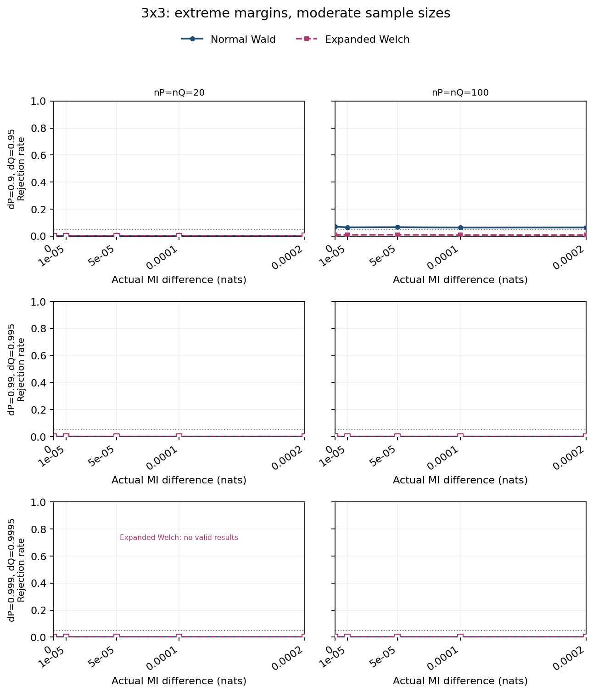

| Specification | Setting |
| --- | --- |
| Table size | 3x3 |
| Horizontal graph regime specifications (columns) | nP=nQ=20, nP=nQ=100 |
| Vertical graph regime specifications (rows) | dP=0.9, dQ=0.95: P row (0.9, 0.1/2 repeated 2 times), P column (0.9, 0.1/2 repeated 2 times); Q row (0.95, 0.05/2 repeated 2 times), Q column (0.95, 0.05/2 repeated 2 times); dP=0.99, dQ=0.995: P row (0.99, 0.01/2 repeated 2 times), P column (0.99, 0.01/2 repeated 2 times); Q row (0.995, 0.005/2 repeated 2 times), Q column (0.995, 0.005/2 repeated 2 times); dP=0.999, dQ=0.9995: P row (0.999, 0.001/2 repeated 2 times), P column (0.999, 0.001/2 repeated 2 times); Q row (0.9995, 0.0005/2 repeated 2 times), Q column (0.9995, 0.0005/2 repeated 2 times) |
| Probability changes | dP=0.9, dQ=0.95: add at (1,1),(2,2) and subtract at (1,2),(2,1), for both P and Q; dP=0.99, dQ=0.995: add at (1,1),(2,2) and subtract at (1,2),(2,1), for both P and Q; dP=0.999, dQ=0.9995: add at (1,1),(2,2) and subtract at (1,2),(2,1), for both P and Q |
| MI settings | Baseline MI {1e-05}; direction {q higher}; actual differences {0, 1e-05, 5e-05, 0.0001, 0.0002} nats |
| Horizontal axis within each graph | Actual MI difference in nats, fixed from 0 to 0.0002 |
| Vertical axis within each graph | Unconditional rejection rate from 0 to 1; invalid results count as non-rejections |
| Replicates | 20,000 per unique point |

Null-point rejection and validity:

| Vertical regime | Horizontal regime | x | Method | Rejection | Valid |
| --- | --- | --- | --- | --- | --- |
| dP=0.9, dQ=0.95 | nP=nQ=20 | 0 | Expanded Welch | 0.0007 | 0.3181 |
| dP=0.9, dQ=0.95 | nP=nQ=20 | 0 | Normal Wald | 0.0024 | 0.8651 |
| dP=0.9, dQ=0.95 | nP=nQ=100 | 0 | Expanded Welch | 0.0088 | 0.9881 |
| dP=0.9, dQ=0.95 | nP=nQ=100 | 0 | Normal Wald | 0.0701 | 1.0000 |
| dP=0.99, dQ=0.995 | nP=nQ=20 | 0 | Expanded Welch | 0.0000 | 0.0004 |
| dP=0.99, dQ=0.995 | nP=nQ=20 | 0 | Normal Wald | 0.0000 | 0.0445 |
| dP=0.99, dQ=0.995 | nP=nQ=100 | 0 | Expanded Welch | 0.0000 | 0.0658 |
| dP=0.99, dQ=0.995 | nP=nQ=100 | 0 | Normal Wald | 0.0000 | 0.4959 |
| dP=0.999, dQ=0.9995 | nP=nQ=20 | 0 | Expanded Welch | 0.0000 | 0.0000 |
| dP=0.999, dQ=0.9995 | nP=nQ=20 | 0 | Normal Wald | 0.0000 | 0.0004 |
| dP=0.999, dQ=0.9995 | nP=nQ=100 | 0 | Expanded Welch | 0.0000 | 0.0001 |
| dP=0.999, dQ=0.9995 | nP=nQ=100 | 0 | Normal Wald | 0.0000 | 0.0118 |

Every plotted rate, interval, validity and minimum expected count

| Vertical regime | Horizontal regime | x | Method | Rejection | 95% interval | Valid | Conditional | Min expected P | Min expected Q |
| --- | --- | --- | --- | --- | --- | --- | --- | --- | --- |
| dP=0.9, dQ=0.95 | nP=nQ=20 | 0 | Expanded Welch | 0.0007 | [0.0004, 0.0012] | 0.3181 | 0.0022 | 0.05 | 0.0125 |
| dP=0.9, dQ=0.95 | nP=nQ=20 | 0 | Normal Wald | 0.0024 | [0.0019, 0.0032] | 0.8651 | 0.0028 | 0.05 | 0.0125 |
| dP=0.9, dQ=0.95 | nP=nQ=20 | 1e-05 | Expanded Welch | 0.0008 | [0.0005, 0.0013] | 0.3215 | 0.0025 | 0.05 | 0.0125 |
| dP=0.9, dQ=0.95 | nP=nQ=20 | 1e-05 | Normal Wald | 0.0023 | [0.0017, 0.0031] | 0.8612 | 0.0027 | 0.05 | 0.0125 |
| dP=0.9, dQ=0.95 | nP=nQ=20 | 5e-05 | Expanded Welch | 0.0009 | [0.0006, 0.0014] | 0.3177 | 0.0028 | 0.05 | 0.0125 |
| dP=0.9, dQ=0.95 | nP=nQ=20 | 5e-05 | Normal Wald | 0.0023 | [0.0017, 0.0031] | 0.8656 | 0.0027 | 0.05 | 0.0125 |
| dP=0.9, dQ=0.95 | nP=nQ=20 | 0.0001 | Expanded Welch | 0.0007 | [0.0004, 0.0012] | 0.3176 | 0.0022 | 0.05 | 0.0125 |
| dP=0.9, dQ=0.95 | nP=nQ=20 | 0.0001 | Normal Wald | 0.0024 | [0.0018, 0.0032] | 0.8649 | 0.0028 | 0.05 | 0.0125 |
| dP=0.9, dQ=0.95 | nP=nQ=20 | 0.0002 | Expanded Welch | 0.0014 | [0.0010, 0.0020] | 0.3215 | 0.0044 | 0.05 | 0.0125 |
| dP=0.9, dQ=0.95 | nP=nQ=20 | 0.0002 | Normal Wald | 0.0031 | [0.0024, 0.0039] | 0.8670 | 0.0035 | 0.05 | 0.0125 |
| dP=0.9, dQ=0.95 | nP=nQ=100 | 0 | Expanded Welch | 0.0088 | [0.0076, 0.0101] | 0.9881 | 0.0089 | 0.25 | 0.0625 |
| dP=0.9, dQ=0.95 | nP=nQ=100 | 0 | Normal Wald | 0.0701 | [0.0666, 0.0737] | 1.0000 | 0.0701 | 0.25 | 0.0625 |
| dP=0.9, dQ=0.95 | nP=nQ=100 | 1e-05 | Expanded Welch | 0.0097 | [0.0084, 0.0111] | 0.9881 | 0.0098 | 0.25 | 0.0625 |
| dP=0.9, dQ=0.95 | nP=nQ=100 | 1e-05 | Normal Wald | 0.0653 | [0.0620, 0.0688] | 1.0000 | 0.0653 | 0.25 | 0.0625 |
| dP=0.9, dQ=0.95 | nP=nQ=100 | 5e-05 | Expanded Welch | 0.0103 | [0.0090, 0.0118] | 0.9884 | 0.0104 | 0.25 | 0.0625 |
| dP=0.9, dQ=0.95 | nP=nQ=100 | 5e-05 | Normal Wald | 0.0663 | [0.0629, 0.0698] | 1.0000 | 0.0663 | 0.25 | 0.0625 |
| dP=0.9, dQ=0.95 | nP=nQ=100 | 0.0001 | Expanded Welch | 0.0086 | [0.0075, 0.0100] | 0.9878 | 0.0088 | 0.25 | 0.0625 |
| dP=0.9, dQ=0.95 | nP=nQ=100 | 0.0001 | Normal Wald | 0.0635 | [0.0602, 0.0670] | 1.0000 | 0.0635 | 0.25 | 0.0625 |
| dP=0.9, dQ=0.95 | nP=nQ=100 | 0.0002 | Expanded Welch | 0.0082 | [0.0070, 0.0095] | 0.9883 | 0.0083 | 0.25 | 0.0625 |
| dP=0.9, dQ=0.95 | nP=nQ=100 | 0.0002 | Normal Wald | 0.0641 | [0.0608, 0.0676] | 1.0000 | 0.0641 | 0.25 | 0.0625 |
| dP=0.99, dQ=0.995 | nP=nQ=20 | 0 | Expanded Welch | 0.0000 | [0.0000, 0.0002] | 0.0004 | 0.0000 | 0.0005 | 0.000125 |
| dP=0.99, dQ=0.995 | nP=nQ=20 | 0 | Normal Wald | 0.0000 | [0.0000, 0.0002] | 0.0445 | 0.0000 | 0.0005 | 0.000125 |
| dP=0.99, dQ=0.995 | nP=nQ=20 | 1e-05 | Expanded Welch | 0.0000 | [0.0000, 0.0002] | 0.0004 | 0.0000 | 0.0005 | 0.000125 |
| dP=0.99, dQ=0.995 | nP=nQ=20 | 1e-05 | Normal Wald | 0.0000 | [0.0000, 0.0002] | 0.0408 | 0.0000 | 0.0005 | 0.000125 |
| dP=0.99, dQ=0.995 | nP=nQ=20 | 5e-05 | Expanded Welch | 0.0000 | [0.0000, 0.0002] | 0.0006 | 0.0000 | 0.0005 | 0.000125 |
| dP=0.99, dQ=0.995 | nP=nQ=20 | 5e-05 | Normal Wald | 0.0000 | [0.0000, 0.0002] | 0.0430 | 0.0000 | 0.0005 | 0.000125 |
| dP=0.99, dQ=0.995 | nP=nQ=20 | 0.0001 | Expanded Welch | 0.0000 | [0.0000, 0.0002] | 0.0005 | 0.0000 | 0.0005 | 0.000125 |
| dP=0.99, dQ=0.995 | nP=nQ=20 | 0.0001 | Normal Wald | 0.0000 | [0.0000, 0.0002] | 0.0435 | 0.0000 | 0.0005 | 0.000125 |
| dP=0.99, dQ=0.995 | nP=nQ=20 | 0.0002 | Expanded Welch | 0.0000 | [0.0000, 0.0002] | 0.0003 | 0.0000 | 0.0005 | 0.000125 |
| dP=0.99, dQ=0.995 | nP=nQ=20 | 0.0002 | Normal Wald | 0.0000 | [0.0000, 0.0002] | 0.0452 | 0.0000 | 0.0005 | 0.000125 |
| dP=0.99, dQ=0.995 | nP=nQ=100 | 0 | Expanded Welch | 0.0000 | [0.0000, 0.0002] | 0.0658 | 0.0000 | 0.0025 | 0.000625 |
| dP=0.99, dQ=0.995 | nP=nQ=100 | 0 | Normal Wald | 0.0000 | [0.0000, 0.0002] | 0.4959 | 0.0000 | 0.0025 | 0.000625 |
| dP=0.99, dQ=0.995 | nP=nQ=100 | 1e-05 | Expanded Welch | 0.0000 | [0.0000, 0.0002] | 0.0665 | 0.0000 | 0.0025 | 0.000625 |
| dP=0.99, dQ=0.995 | nP=nQ=100 | 1e-05 | Normal Wald | 0.0000 | [0.0000, 0.0002] | 0.4962 | 0.0000 | 0.0025 | 0.000625 |
| dP=0.99, dQ=0.995 | nP=nQ=100 | 5e-05 | Expanded Welch | 0.0000 | [0.0000, 0.0002] | 0.0640 | 0.0000 | 0.0025 | 0.000625 |
| dP=0.99, dQ=0.995 | nP=nQ=100 | 5e-05 | Normal Wald | 0.0000 | [0.0000, 0.0002] | 0.5003 | 0.0000 | 0.0025 | 0.000625 |
| dP=0.99, dQ=0.995 | nP=nQ=100 | 0.0001 | Expanded Welch | 0.0000 | [0.0000, 0.0002] | 0.0643 | 0.0000 | 0.0025 | 0.000625 |
| dP=0.99, dQ=0.995 | nP=nQ=100 | 0.0001 | Normal Wald | 0.0000 | [0.0000, 0.0002] | 0.5002 | 0.0000 | 0.0025 | 0.000625 |
| dP=0.99, dQ=0.995 | nP=nQ=100 | 0.0002 | Expanded Welch | 0.0000 | [0.0000, 0.0002] | 0.0627 | 0.0000 | 0.0025 | 0.000625 |
| dP=0.99, dQ=0.995 | nP=nQ=100 | 0.0002 | Normal Wald | 0.0000 | [0.0000, 0.0002] | 0.4889 | 0.0000 | 0.0025 | 0.000625 |
| dP=0.999, dQ=0.9995 | nP=nQ=20 | 0 | Expanded Welch | 0.0000 | [0.0000, 0.0002] | 0.0000 | NA | 5e-06 | 1.25e-06 |
| dP=0.999, dQ=0.9995 | nP=nQ=20 | 0 | Normal Wald | 0.0000 | [0.0000, 0.0002] | 0.0004 | 0.0000 | 5e-06 | 1.25e-06 |
| dP=0.999, dQ=0.9995 | nP=nQ=20 | 1e-05 | Expanded Welch | 0.0000 | [0.0000, 0.0002] | 0.0000 | NA | 5e-06 | 1.25e-06 |
| dP=0.999, dQ=0.9995 | nP=nQ=20 | 1e-05 | Normal Wald | 0.0000 | [0.0000, 0.0002] | 0.0005 | 0.0000 | 5e-06 | 1.25e-06 |
| dP=0.999, dQ=0.9995 | nP=nQ=20 | 5e-05 | Expanded Welch | 0.0000 | [0.0000, 0.0002] | 0.0000 | NA | 5e-06 | 1.25e-06 |
| dP=0.999, dQ=0.9995 | nP=nQ=20 | 5e-05 | Normal Wald | 0.0000 | [0.0000, 0.0002] | 0.0008 | 0.0000 | 5e-06 | 1.25e-06 |
| dP=0.999, dQ=0.9995 | nP=nQ=20 | 0.0001 | Expanded Welch | 0.0000 | [0.0000, 0.0002] | 0.0000 | NA | 5e-06 | 1.25e-06 |
| dP=0.999, dQ=0.9995 | nP=nQ=20 | 0.0001 | Normal Wald | 0.0000 | [0.0000, 0.0002] | 0.0010 | 0.0000 | 5e-06 | 1.25e-06 |
| dP=0.999, dQ=0.9995 | nP=nQ=20 | 0.0002 | Expanded Welch | 0.0000 | [0.0000, 0.0002] | 0.0000 | NA | 5e-06 | 1.25e-06 |
| dP=0.999, dQ=0.9995 | nP=nQ=20 | 0.0002 | Normal Wald | 0.0000 | [0.0000, 0.0002] | 0.0011 | 0.0000 | 5e-06 | 1.25e-06 |
| dP=0.999, dQ=0.9995 | nP=nQ=100 | 0 | Expanded Welch | 0.0000 | [0.0000, 0.0002] | 0.0001 | 0.0000 | 2.5e-05 | 6.25e-06 |
| dP=0.999, dQ=0.9995 | nP=nQ=100 | 0 | Normal Wald | 0.0000 | [0.0000, 0.0002] | 0.0118 | 0.0000 | 2.5e-05 | 6.25e-06 |
| dP=0.999, dQ=0.9995 | nP=nQ=100 | 1e-05 | Expanded Welch | 0.0000 | [0.0000, 0.0002] | 0.0000 | NA | 2.5e-05 | 6.25e-06 |
| dP=0.999, dQ=0.9995 | nP=nQ=100 | 1e-05 | Normal Wald | 0.0000 | [0.0000, 0.0002] | 0.0120 | 0.0000 | 2.5e-05 | 6.25e-06 |
| dP=0.999, dQ=0.9995 | nP=nQ=100 | 5e-05 | Expanded Welch | 0.0000 | [0.0000, 0.0002] | 0.0000 | NA | 2.5e-05 | 6.25e-06 |
| dP=0.999, dQ=0.9995 | nP=nQ=100 | 5e-05 | Normal Wald | 0.0000 | [0.0000, 0.0002] | 0.0136 | 0.0000 | 2.5e-05 | 6.25e-06 |
| dP=0.999, dQ=0.9995 | nP=nQ=100 | 0.0001 | Expanded Welch | 0.0000 | [0.0000, 0.0002] | 0.0001 | 0.0000 | 2.5e-05 | 6.25e-06 |
| dP=0.999, dQ=0.9995 | nP=nQ=100 | 0.0001 | Normal Wald | 0.0000 | [0.0000, 0.0002] | 0.0160 | 0.0000 | 2.5e-05 | 6.25e-06 |
| dP=0.999, dQ=0.9995 | nP=nQ=100 | 0.0002 | Expanded Welch | 0.0000 | [0.0000, 0.0002] | 0.0001 | 0.0000 | 2.5e-05 | 6.25e-06 |
| dP=0.999, dQ=0.9995 | nP=nQ=100 | 0.0002 | Normal Wald | 0.0000 | [0.0000, 0.0002] | 0.0146 | 0.0000 | 2.5e-05 | 6.25e-06 |

### 10.6 3x3: extreme margins, large sample sizes

What happens under deliberately extreme marginal skew and very small samples?

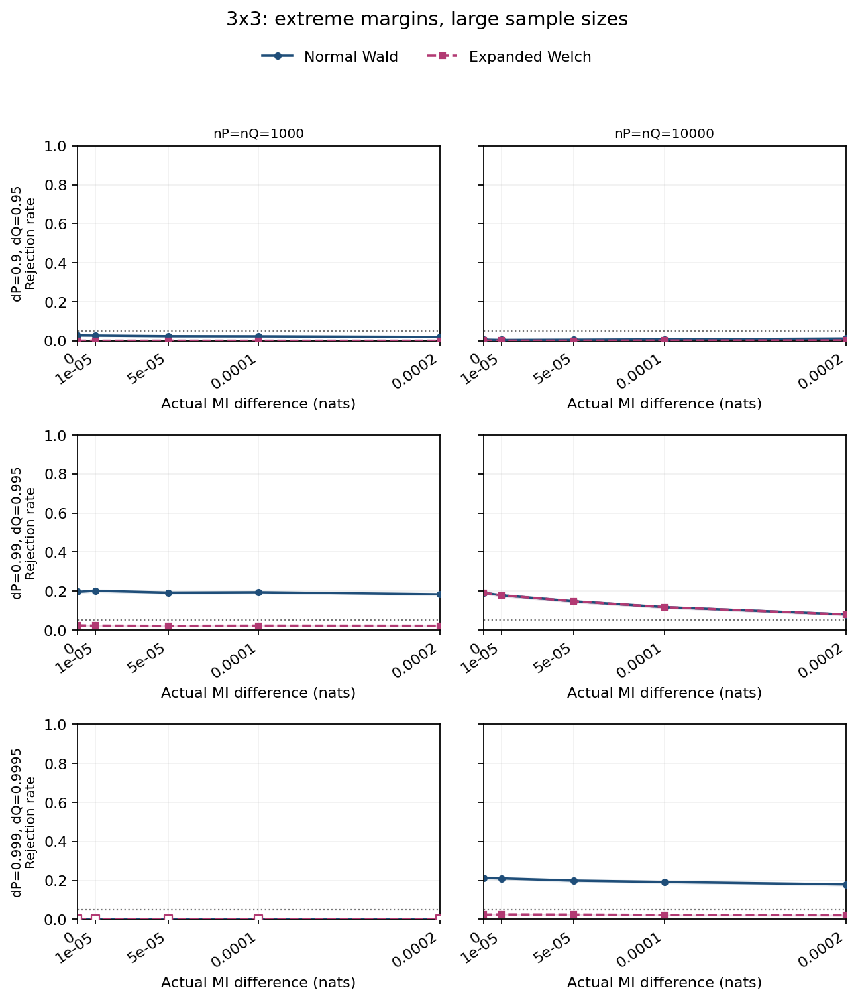

| Specification | Setting |
| --- | --- |
| Table size | 3x3 |
| Horizontal graph regime specifications (columns) | nP=nQ=1000, nP=nQ=10000 |
| Vertical graph regime specifications (rows) | dP=0.9, dQ=0.95: P row (0.9, 0.1/2 repeated 2 times), P column (0.9, 0.1/2 repeated 2 times); Q row (0.95, 0.05/2 repeated 2 times), Q column (0.95, 0.05/2 repeated 2 times); dP=0.99, dQ=0.995: P row (0.99, 0.01/2 repeated 2 times), P column (0.99, 0.01/2 repeated 2 times); Q row (0.995, 0.005/2 repeated 2 times), Q column (0.995, 0.005/2 repeated 2 times); dP=0.999, dQ=0.9995: P row (0.999, 0.001/2 repeated 2 times), P column (0.999, 0.001/2 repeated 2 times); Q row (0.9995, 0.0005/2 repeated 2 times), Q column (0.9995, 0.0005/2 repeated 2 times) |
| Probability changes | dP=0.9, dQ=0.95: add at (1,1),(2,2) and subtract at (1,2),(2,1), for both P and Q; dP=0.99, dQ=0.995: add at (1,1),(2,2) and subtract at (1,2),(2,1), for both P and Q; dP=0.999, dQ=0.9995: add at (1,1),(2,2) and subtract at (1,2),(2,1), for both P and Q |
| MI settings | Baseline MI {1e-05}; direction {q higher}; actual differences {0, 1e-05, 5e-05, 0.0001, 0.0002} nats |
| Horizontal axis within each graph | Actual MI difference in nats, fixed from 0 to 0.0002 |
| Vertical axis within each graph | Unconditional rejection rate from 0 to 1; invalid results count as non-rejections |
| Replicates | 20,000 per unique point |

Null-point rejection and validity:

| Vertical regime | Horizontal regime | x | Method | Rejection | Valid |
| --- | --- | --- | --- | --- | --- |
| dP=0.9, dQ=0.95 | nP=nQ=1000 | 0 | Expanded Welch | 0.0008 | 1.0000 |
| dP=0.9, dQ=0.95 | nP=nQ=1000 | 0 | Normal Wald | 0.0275 | 1.0000 |
| dP=0.9, dQ=0.95 | nP=nQ=10000 | 0 | Expanded Welch | 0.0011 | 1.0000 |
| dP=0.9, dQ=0.95 | nP=nQ=10000 | 0 | Normal Wald | 0.0062 | 1.0000 |
| dP=0.99, dQ=0.995 | nP=nQ=1000 | 0 | Expanded Welch | 0.0237 | 0.9877 |
| dP=0.99, dQ=0.995 | nP=nQ=1000 | 0 | Normal Wald | 0.1962 | 1.0000 |
| dP=0.99, dQ=0.995 | nP=nQ=10000 | 0 | Expanded Welch | 0.1918 | 1.0000 |
| dP=0.99, dQ=0.995 | nP=nQ=10000 | 0 | Normal Wald | 0.1918 | 1.0000 |
| dP=0.999, dQ=0.9995 | nP=nQ=1000 | 0 | Expanded Welch | 0.0000 | 0.0595 |
| dP=0.999, dQ=0.9995 | nP=nQ=1000 | 0 | Normal Wald | 0.0000 | 0.4896 |
| dP=0.999, dQ=0.9995 | nP=nQ=10000 | 0 | Expanded Welch | 0.0237 | 0.9902 |
| dP=0.999, dQ=0.9995 | nP=nQ=10000 | 0 | Normal Wald | 0.2127 | 1.0000 |

Every plotted rate, interval, validity and minimum expected count

| Vertical regime | Horizontal regime | x | Method | Rejection | 95% interval | Valid | Conditional | Min expected P | Min expected Q |
| --- | --- | --- | --- | --- | --- | --- | --- | --- | --- |
| dP=0.9, dQ=0.95 | nP=nQ=1000 | 0 | Expanded Welch | 0.0008 | [0.0005, 0.0014] | 1.0000 | 0.0008 | 2.5 | 0.625 |
| dP=0.9, dQ=0.95 | nP=nQ=1000 | 0 | Normal Wald | 0.0275 | [0.0253, 0.0299] | 1.0000 | 0.0275 | 2.5 | 0.625 |
| dP=0.9, dQ=0.95 | nP=nQ=1000 | 1e-05 | Expanded Welch | 0.0008 | [0.0005, 0.0013] | 1.0000 | 0.0008 | 2.5 | 0.625 |
| dP=0.9, dQ=0.95 | nP=nQ=1000 | 1e-05 | Normal Wald | 0.0268 | [0.0247, 0.0292] | 1.0000 | 0.0268 | 2.5 | 0.625 |
| dP=0.9, dQ=0.95 | nP=nQ=1000 | 5e-05 | Expanded Welch | 0.0009 | [0.0006, 0.0014] | 1.0000 | 0.0009 | 2.5 | 0.625 |
| dP=0.9, dQ=0.95 | nP=nQ=1000 | 5e-05 | Normal Wald | 0.0238 | [0.0217, 0.0260] | 1.0000 | 0.0238 | 2.5 | 0.625 |
| dP=0.9, dQ=0.95 | nP=nQ=1000 | 0.0001 | Expanded Welch | 0.0007 | [0.0004, 0.0012] | 1.0000 | 0.0007 | 2.5 | 0.625 |
| dP=0.9, dQ=0.95 | nP=nQ=1000 | 0.0001 | Normal Wald | 0.0231 | [0.0211, 0.0253] | 1.0000 | 0.0231 | 2.5 | 0.625 |
| dP=0.9, dQ=0.95 | nP=nQ=1000 | 0.0002 | Expanded Welch | 0.0008 | [0.0005, 0.0013] | 1.0000 | 0.0008 | 2.5 | 0.625 |
| dP=0.9, dQ=0.95 | nP=nQ=1000 | 0.0002 | Normal Wald | 0.0200 | [0.0181, 0.0220] | 1.0000 | 0.0200 | 2.5 | 0.625 |
| dP=0.9, dQ=0.95 | nP=nQ=10000 | 0 | Expanded Welch | 0.0011 | [0.0008, 0.0017] | 1.0000 | 0.0011 | 25 | 6.25 |
| dP=0.9, dQ=0.95 | nP=nQ=10000 | 0 | Normal Wald | 0.0062 | [0.0052, 0.0073] | 1.0000 | 0.0062 | 25 | 6.25 |
| dP=0.9, dQ=0.95 | nP=nQ=10000 | 1e-05 | Expanded Welch | 0.0011 | [0.0007, 0.0017] | 1.0000 | 0.0011 | 25 | 6.25 |
| dP=0.9, dQ=0.95 | nP=nQ=10000 | 1e-05 | Normal Wald | 0.0046 | [0.0038, 0.0056] | 1.0000 | 0.0046 | 25 | 6.25 |
| dP=0.9, dQ=0.95 | nP=nQ=10000 | 5e-05 | Expanded Welch | 0.0010 | [0.0007, 0.0016] | 1.0000 | 0.0010 | 25 | 6.25 |
| dP=0.9, dQ=0.95 | nP=nQ=10000 | 5e-05 | Normal Wald | 0.0058 | [0.0048, 0.0070] | 1.0000 | 0.0058 | 25 | 6.25 |
| dP=0.9, dQ=0.95 | nP=nQ=10000 | 0.0001 | Expanded Welch | 0.0016 | [0.0011, 0.0023] | 1.0000 | 0.0016 | 25 | 6.25 |
| dP=0.9, dQ=0.95 | nP=nQ=10000 | 0.0001 | Normal Wald | 0.0073 | [0.0063, 0.0086] | 1.0000 | 0.0073 | 25 | 6.25 |
| dP=0.9, dQ=0.95 | nP=nQ=10000 | 0.0002 | Expanded Welch | 0.0023 | [0.0017, 0.0031] | 1.0000 | 0.0023 | 25 | 6.25 |
| dP=0.9, dQ=0.95 | nP=nQ=10000 | 0.0002 | Normal Wald | 0.0121 | [0.0107, 0.0137] | 1.0000 | 0.0121 | 25 | 6.25 |
| dP=0.99, dQ=0.995 | nP=nQ=1000 | 0 | Expanded Welch | 0.0237 | [0.0216, 0.0258] | 0.9877 | 0.0239 | 0.025 | 0.00625 |
| dP=0.99, dQ=0.995 | nP=nQ=1000 | 0 | Normal Wald | 0.1962 | [0.1908, 0.2018] | 1.0000 | 0.1962 | 0.025 | 0.00625 |
| dP=0.99, dQ=0.995 | nP=nQ=1000 | 1e-05 | Expanded Welch | 0.0225 | [0.0205, 0.0246] | 0.9858 | 0.0228 | 0.025 | 0.00625 |
| dP=0.99, dQ=0.995 | nP=nQ=1000 | 1e-05 | Normal Wald | 0.2021 | [0.1965, 0.2077] | 1.0000 | 0.2021 | 0.025 | 0.00625 |
| dP=0.99, dQ=0.995 | nP=nQ=1000 | 5e-05 | Expanded Welch | 0.0213 | [0.0193, 0.0233] | 0.9861 | 0.0215 | 0.025 | 0.00625 |
| dP=0.99, dQ=0.995 | nP=nQ=1000 | 5e-05 | Normal Wald | 0.1925 | [0.1870, 0.1980] | 1.0000 | 0.1925 | 0.025 | 0.00625 |
| dP=0.99, dQ=0.995 | nP=nQ=1000 | 0.0001 | Expanded Welch | 0.0223 | [0.0204, 0.0245] | 0.9859 | 0.0227 | 0.025 | 0.00625 |
| dP=0.99, dQ=0.995 | nP=nQ=1000 | 0.0001 | Normal Wald | 0.1943 | [0.1888, 0.1998] | 1.0000 | 0.1943 | 0.025 | 0.00625 |
| dP=0.99, dQ=0.995 | nP=nQ=1000 | 0.0002 | Expanded Welch | 0.0217 | [0.0198, 0.0239] | 0.9868 | 0.0220 | 0.025 | 0.00625 |
| dP=0.99, dQ=0.995 | nP=nQ=1000 | 0.0002 | Normal Wald | 0.1835 | [0.1782, 0.1890] | 1.0000 | 0.1835 | 0.025 | 0.00625 |
| dP=0.99, dQ=0.995 | nP=nQ=10000 | 0 | Expanded Welch | 0.1918 | [0.1865, 0.1974] | 1.0000 | 0.1918 | 0.25 | 0.0625 |
| dP=0.99, dQ=0.995 | nP=nQ=10000 | 0 | Normal Wald | 0.1918 | [0.1865, 0.1974] | 1.0000 | 0.1918 | 0.25 | 0.0625 |
| dP=0.99, dQ=0.995 | nP=nQ=10000 | 1e-05 | Expanded Welch | 0.1781 | [0.1729, 0.1835] | 1.0000 | 0.1781 | 0.25 | 0.0625 |
| dP=0.99, dQ=0.995 | nP=nQ=10000 | 1e-05 | Normal Wald | 0.1781 | [0.1729, 0.1835] | 1.0000 | 0.1781 | 0.25 | 0.0625 |
| dP=0.99, dQ=0.995 | nP=nQ=10000 | 5e-05 | Expanded Welch | 0.1469 | [0.1420, 0.1518] | 1.0000 | 0.1469 | 0.25 | 0.0625 |
| dP=0.99, dQ=0.995 | nP=nQ=10000 | 5e-05 | Normal Wald | 0.1469 | [0.1420, 0.1518] | 1.0000 | 0.1469 | 0.25 | 0.0625 |
| dP=0.99, dQ=0.995 | nP=nQ=10000 | 0.0001 | Expanded Welch | 0.1171 | [0.1127, 0.1216] | 1.0000 | 0.1171 | 0.25 | 0.0625 |
| dP=0.99, dQ=0.995 | nP=nQ=10000 | 0.0001 | Normal Wald | 0.1171 | [0.1127, 0.1216] | 1.0000 | 0.1171 | 0.25 | 0.0625 |
| dP=0.99, dQ=0.995 | nP=nQ=10000 | 0.0002 | Expanded Welch | 0.0795 | [0.0758, 0.0833] | 1.0000 | 0.0795 | 0.25 | 0.0625 |
| dP=0.99, dQ=0.995 | nP=nQ=10000 | 0.0002 | Normal Wald | 0.0799 | [0.0763, 0.0838] | 1.0000 | 0.0799 | 0.25 | 0.0625 |
| dP=0.999, dQ=0.9995 | nP=nQ=1000 | 0 | Expanded Welch | 0.0000 | [0.0000, 0.0002] | 0.0595 | 0.0000 | 0.00025 | 6.25e-05 |
| dP=0.999, dQ=0.9995 | nP=nQ=1000 | 0 | Normal Wald | 0.0000 | [0.0000, 0.0002] | 0.4896 | 0.0000 | 0.00025 | 6.25e-05 |
| dP=0.999, dQ=0.9995 | nP=nQ=1000 | 1e-05 | Expanded Welch | 0.0000 | [0.0000, 0.0002] | 0.0616 | 0.0000 | 0.00025 | 6.25e-05 |
| dP=0.999, dQ=0.9995 | nP=nQ=1000 | 1e-05 | Normal Wald | 0.0000 | [0.0000, 0.0002] | 0.4988 | 0.0000 | 0.00025 | 6.25e-05 |
| dP=0.999, dQ=0.9995 | nP=nQ=1000 | 5e-05 | Expanded Welch | 0.0000 | [0.0000, 0.0002] | 0.0663 | 0.0000 | 0.00025 | 6.25e-05 |
| dP=0.999, dQ=0.9995 | nP=nQ=1000 | 5e-05 | Normal Wald | 0.0000 | [0.0000, 0.0002] | 0.4968 | 0.0000 | 0.00025 | 6.25e-05 |
| dP=0.999, dQ=0.9995 | nP=nQ=1000 | 0.0001 | Expanded Welch | 0.0000 | [0.0000, 0.0002] | 0.0688 | 0.0000 | 0.00025 | 6.25e-05 |
| dP=0.999, dQ=0.9995 | nP=nQ=1000 | 0.0001 | Normal Wald | 0.0000 | [0.0000, 0.0002] | 0.4956 | 0.0000 | 0.00025 | 6.25e-05 |
| dP=0.999, dQ=0.9995 | nP=nQ=1000 | 0.0002 | Expanded Welch | 0.0000 | [0.0000, 0.0002] | 0.0692 | 0.0000 | 0.00025 | 6.25e-05 |
| dP=0.999, dQ=0.9995 | nP=nQ=1000 | 0.0002 | Normal Wald | 0.0000 | [0.0000, 0.0002] | 0.5027 | 0.0000 | 0.00025 | 6.25e-05 |
| dP=0.999, dQ=0.9995 | nP=nQ=10000 | 0 | Expanded Welch | 0.0237 | [0.0216, 0.0258] | 0.9902 | 0.0239 | 0.0025 | 0.000625 |
| dP=0.999, dQ=0.9995 | nP=nQ=10000 | 0 | Normal Wald | 0.2127 | [0.2070, 0.2184] | 1.0000 | 0.2127 | 0.0025 | 0.000625 |
| dP=0.999, dQ=0.9995 | nP=nQ=10000 | 1e-05 | Expanded Welch | 0.0245 | [0.0224, 0.0267] | 0.9909 | 0.0247 | 0.0025 | 0.000625 |
| dP=0.999, dQ=0.9995 | nP=nQ=10000 | 1e-05 | Normal Wald | 0.2102 | [0.2047, 0.2160] | 1.0000 | 0.2102 | 0.0025 | 0.000625 |
| dP=0.999, dQ=0.9995 | nP=nQ=10000 | 5e-05 | Expanded Welch | 0.0238 | [0.0218, 0.0261] | 0.9917 | 0.0241 | 0.0025 | 0.000625 |
| dP=0.999, dQ=0.9995 | nP=nQ=10000 | 5e-05 | Normal Wald | 0.1988 | [0.1933, 0.2044] | 1.0000 | 0.1988 | 0.0025 | 0.000625 |
| dP=0.999, dQ=0.9995 | nP=nQ=10000 | 0.0001 | Expanded Welch | 0.0217 | [0.0198, 0.0239] | 0.9901 | 0.0220 | 0.0025 | 0.000625 |
| dP=0.999, dQ=0.9995 | nP=nQ=10000 | 0.0001 | Normal Wald | 0.1919 | [0.1865, 0.1974] | 1.0000 | 0.1919 | 0.0025 | 0.000625 |
| dP=0.999, dQ=0.9995 | nP=nQ=10000 | 0.0002 | Expanded Welch | 0.0204 | [0.0185, 0.0225] | 0.9908 | 0.0206 | 0.0025 | 0.000625 |
| dP=0.999, dQ=0.9995 | nP=nQ=10000 | 0.0002 | Normal Wald | 0.1794 | [0.1741, 0.1848] | 1.0000 | 0.1794 | 0.0025 | 0.000625 |

### 10.7 8x8: extreme margins, small sample sizes

What happens under deliberately extreme marginal skew and very small samples?

| Specification | Setting |
| --- | --- |
| Table size | 8x8 |
| Horizontal graph regime specifications (columns) | nP=nQ=1, nP=nQ=2, nP=nQ=5 |
| Vertical graph regime specifications (rows) | dP=0.9, dQ=0.95: P row (0.9, 0.1/7 repeated 7 times), P column (0.9, 0.1/7 repeated 7 times); Q row (0.95, 0.05/7 repeated 7 times), Q column (0.95, 0.05/7 repeated 7 times); dP=0.99, dQ=0.995: P row (0.99, 0.01/7 repeated 7 times), P column (0.99, 0.01/7 repeated 7 times); Q row (0.995, 0.005/7 repeated 7 times), Q column (0.995, 0.005/7 repeated 7 times); dP=0.999, dQ=0.9995: P row (0.999, 0.001/7 repeated 7 times), P column (0.999, 0.001/7 repeated 7 times); Q row (0.9995, 0.0005/7 repeated 7 times), Q column (0.9995, 0.0005/7 repeated 7 times) |
| Probability changes | dP=0.9, dQ=0.95: add at (1,1),(2,2) and subtract at (1,2),(2,1), for both P and Q; dP=0.99, dQ=0.995: add at (1,1),(2,2) and subtract at (1,2),(2,1), for both P and Q; dP=0.999, dQ=0.9995: add at (1,1),(2,2) and subtract at (1,2),(2,1), for both P and Q |
| MI settings | Baseline MI {1e-05}; direction {q higher}; actual differences {0, 1e-05, 5e-05, 0.0001, 0.0002} nats |
| Horizontal axis within each graph | Actual MI difference in nats, fixed from 0 to 0.0002 |
| Vertical axis within each graph | Unconditional rejection rate from 0 to 1; invalid results count as non-rejections |
| Replicates | 20,000 per unique point |

Null-point rejection and validity:

| Vertical regime | Horizontal regime | x | Method | Rejection | Valid |
| --- | --- | --- | --- | --- | --- |
| dP=0.9, dQ=0.95 | nP=nQ=1 | 0 | Expanded Welch | 0.0000 | 0.0000 |
| dP=0.9, dQ=0.95 | nP=nQ=1 | 0 | Normal Wald | 0.0000 | 0.0000 |
| dP=0.9, dQ=0.95 | nP=nQ=2 | 0 | Expanded Welch | 0.0000 | 0.0000 |
| dP=0.9, dQ=0.95 | nP=nQ=2 | 0 | Normal Wald | 0.0000 | 0.0000 |
| dP=0.9, dQ=0.95 | nP=nQ=5 | 0 | Expanded Welch | 0.0000 | 0.0081 |
| dP=0.9, dQ=0.95 | nP=nQ=5 | 0 | Normal Wald | 0.0503 | 0.2041 |
| dP=0.99, dQ=0.995 | nP=nQ=1 | 0 | Expanded Welch | 0.0000 | 0.0000 |
| dP=0.99, dQ=0.995 | nP=nQ=1 | 0 | Normal Wald | 0.0000 | 0.0000 |
| dP=0.99, dQ=0.995 | nP=nQ=2 | 0 | Expanded Welch | 0.0000 | 0.0000 |
| dP=0.99, dQ=0.995 | nP=nQ=2 | 0 | Normal Wald | 0.0000 | 0.0000 |
| dP=0.99, dQ=0.995 | nP=nQ=5 | 0 | Expanded Welch | 0.0000 | 0.0000 |
| dP=0.99, dQ=0.995 | nP=nQ=5 | 0 | Normal Wald | 0.0005 | 0.0032 |
| dP=0.999, dQ=0.9995 | nP=nQ=1 | 0 | Expanded Welch | 0.0000 | 0.0000 |
| dP=0.999, dQ=0.9995 | nP=nQ=1 | 0 | Normal Wald | 0.0000 | 0.0000 |
| dP=0.999, dQ=0.9995 | nP=nQ=2 | 0 | Expanded Welch | 0.0000 | 0.0000 |
| dP=0.999, dQ=0.9995 | nP=nQ=2 | 0 | Normal Wald | 0.0000 | 0.0000 |
| dP=0.999, dQ=0.9995 | nP=nQ=5 | 0 | Expanded Welch | 0.0000 | 0.0000 |
| dP=0.999, dQ=0.9995 | nP=nQ=5 | 0 | Normal Wald | 0.0001 | 0.0001 |

Every plotted rate, interval, validity and minimum expected count

| Vertical regime | Horizontal regime | x | Method | Rejection | 95% interval | Valid | Conditional | Min expected P | Min expected Q |
| --- | --- | --- | --- | --- | --- | --- | --- | --- | --- |
| dP=0.9, dQ=0.95 | nP=nQ=1 | 0 | Expanded Welch | 0.0000 | [0.0000, 0.0002] | 0.0000 | NA | 0.0002041 | 5.102e-05 |
| dP=0.9, dQ=0.95 | nP=nQ=1 | 0 | Normal Wald | 0.0000 | [0.0000, 0.0002] | 0.0000 | NA | 0.0002041 | 5.102e-05 |
| dP=0.9, dQ=0.95 | nP=nQ=1 | 1e-05 | Expanded Welch | 0.0000 | [0.0000, 0.0002] | 0.0000 | NA | 0.0002041 | 5.102e-05 |
| dP=0.9, dQ=0.95 | nP=nQ=1 | 1e-05 | Normal Wald | 0.0000 | [0.0000, 0.0002] | 0.0000 | NA | 0.0002041 | 5.102e-05 |
| dP=0.9, dQ=0.95 | nP=nQ=1 | 5e-05 | Expanded Welch | 0.0000 | [0.0000, 0.0002] | 0.0000 | NA | 0.0002041 | 5.102e-05 |
| dP=0.9, dQ=0.95 | nP=nQ=1 | 5e-05 | Normal Wald | 0.0000 | [0.0000, 0.0002] | 0.0000 | NA | 0.0002041 | 5.102e-05 |
| dP=0.9, dQ=0.95 | nP=nQ=1 | 0.0001 | Expanded Welch | 0.0000 | [0.0000, 0.0002] | 0.0000 | NA | 0.0002041 | 5.102e-05 |
| dP=0.9, dQ=0.95 | nP=nQ=1 | 0.0001 | Normal Wald | 0.0000 | [0.0000, 0.0002] | 0.0000 | NA | 0.0002041 | 5.102e-05 |
| dP=0.9, dQ=0.95 | nP=nQ=1 | 0.0002 | Expanded Welch | 0.0000 | [0.0000, 0.0002] | 0.0000 | NA | 0.0002041 | 5.102e-05 |
| dP=0.9, dQ=0.95 | nP=nQ=1 | 0.0002 | Normal Wald | 0.0000 | [0.0000, 0.0002] | 0.0000 | NA | 0.0002041 | 5.102e-05 |
| dP=0.9, dQ=0.95 | nP=nQ=2 | 0 | Expanded Welch | 0.0000 | [0.0000, 0.0002] | 0.0000 | NA | 0.0004082 | 0.000102 |
| dP=0.9, dQ=0.95 | nP=nQ=2 | 0 | Normal Wald | 0.0000 | [0.0000, 0.0002] | 0.0000 | NA | 0.0004082 | 0.000102 |
| dP=0.9, dQ=0.95 | nP=nQ=2 | 1e-05 | Expanded Welch | 0.0000 | [0.0000, 0.0002] | 0.0000 | NA | 0.0004082 | 0.000102 |
| dP=0.9, dQ=0.95 | nP=nQ=2 | 1e-05 | Normal Wald | 0.0000 | [0.0000, 0.0002] | 0.0000 | NA | 0.0004082 | 0.000102 |
| dP=0.9, dQ=0.95 | nP=nQ=2 | 5e-05 | Expanded Welch | 0.0000 | [0.0000, 0.0002] | 0.0000 | NA | 0.0004082 | 0.000102 |
| dP=0.9, dQ=0.95 | nP=nQ=2 | 5e-05 | Normal Wald | 0.0000 | [0.0000, 0.0002] | 0.0000 | NA | 0.0004082 | 0.000102 |
| dP=0.9, dQ=0.95 | nP=nQ=2 | 0.0001 | Expanded Welch | 0.0000 | [0.0000, 0.0002] | 0.0000 | NA | 0.0004082 | 0.000102 |
| dP=0.9, dQ=0.95 | nP=nQ=2 | 0.0001 | Normal Wald | 0.0000 | [0.0000, 0.0002] | 0.0000 | NA | 0.0004082 | 0.000102 |
| dP=0.9, dQ=0.95 | nP=nQ=2 | 0.0002 | Expanded Welch | 0.0000 | [0.0000, 0.0002] | 0.0000 | NA | 0.0004082 | 0.000102 |
| dP=0.9, dQ=0.95 | nP=nQ=2 | 0.0002 | Normal Wald | 0.0000 | [0.0000, 0.0002] | 0.0000 | NA | 0.0004082 | 0.000102 |
| dP=0.9, dQ=0.95 | nP=nQ=5 | 0 | Expanded Welch | 0.0000 | [0.0000, 0.0002] | 0.0081 | 0.0000 | 0.00102 | 0.0002551 |
| dP=0.9, dQ=0.95 | nP=nQ=5 | 0 | Normal Wald | 0.0503 | [0.0474, 0.0534] | 0.2041 | 0.2465 | 0.00102 | 0.0002551 |
| dP=0.9, dQ=0.95 | nP=nQ=5 | 1e-05 | Expanded Welch | 0.0000 | [0.0000, 0.0002] | 0.0080 | 0.0000 | 0.00102 | 0.0002551 |
| dP=0.9, dQ=0.95 | nP=nQ=5 | 1e-05 | Normal Wald | 0.0525 | [0.0495, 0.0557] | 0.2129 | 0.2466 | 0.00102 | 0.0002551 |
| dP=0.9, dQ=0.95 | nP=nQ=5 | 5e-05 | Expanded Welch | 0.0000 | [0.0000, 0.0002] | 0.0086 | 0.0000 | 0.00102 | 0.0002551 |
| dP=0.9, dQ=0.95 | nP=nQ=5 | 5e-05 | Normal Wald | 0.0522 | [0.0492, 0.0553] | 0.2132 | 0.2445 | 0.00102 | 0.0002551 |
| dP=0.9, dQ=0.95 | nP=nQ=5 | 0.0001 | Expanded Welch | 0.0000 | [0.0000, 0.0002] | 0.0088 | 0.0000 | 0.00102 | 0.0002551 |
| dP=0.9, dQ=0.95 | nP=nQ=5 | 0.0001 | Normal Wald | 0.0562 | [0.0531, 0.0595] | 0.2131 | 0.2637 | 0.00102 | 0.0002551 |
| dP=0.9, dQ=0.95 | nP=nQ=5 | 0.0002 | Expanded Welch | 0.0000 | [0.0000, 0.0002] | 0.0081 | 0.0000 | 0.00102 | 0.0002551 |
| dP=0.9, dQ=0.95 | nP=nQ=5 | 0.0002 | Normal Wald | 0.0524 | [0.0494, 0.0556] | 0.2105 | 0.2492 | 0.00102 | 0.0002551 |
| dP=0.99, dQ=0.995 | nP=nQ=1 | 0 | Expanded Welch | 0.0000 | [0.0000, 0.0002] | 0.0000 | NA | 2.041e-06 | 5.102e-07 |
| dP=0.99, dQ=0.995 | nP=nQ=1 | 0 | Normal Wald | 0.0000 | [0.0000, 0.0002] | 0.0000 | NA | 2.041e-06 | 5.102e-07 |
| dP=0.99, dQ=0.995 | nP=nQ=1 | 1e-05 | Expanded Welch | 0.0000 | [0.0000, 0.0002] | 0.0000 | NA | 2.041e-06 | 5.102e-07 |
| dP=0.99, dQ=0.995 | nP=nQ=1 | 1e-05 | Normal Wald | 0.0000 | [0.0000, 0.0002] | 0.0000 | NA | 2.041e-06 | 5.102e-07 |
| dP=0.99, dQ=0.995 | nP=nQ=1 | 5e-05 | Expanded Welch | 0.0000 | [0.0000, 0.0002] | 0.0000 | NA | 2.041e-06 | 5.102e-07 |
| dP=0.99, dQ=0.995 | nP=nQ=1 | 5e-05 | Normal Wald | 0.0000 | [0.0000, 0.0002] | 0.0000 | NA | 2.041e-06 | 5.102e-07 |
| dP=0.99, dQ=0.995 | nP=nQ=1 | 0.0001 | Expanded Welch | 0.0000 | [0.0000, 0.0002] | 0.0000 | NA | 2.041e-06 | 5.102e-07 |
| dP=0.99, dQ=0.995 | nP=nQ=1 | 0.0001 | Normal Wald | 0.0000 | [0.0000, 0.0002] | 0.0000 | NA | 2.041e-06 | 5.102e-07 |
| dP=0.99, dQ=0.995 | nP=nQ=1 | 0.0002 | Expanded Welch | 0.0000 | [0.0000, 0.0002] | 0.0000 | NA | 2.041e-06 | 5.102e-07 |
| dP=0.99, dQ=0.995 | nP=nQ=1 | 0.0002 | Normal Wald | 0.0000 | [0.0000, 0.0002] | 0.0000 | NA | 2.041e-06 | 5.102e-07 |
| dP=0.99, dQ=0.995 | nP=nQ=2 | 0 | Expanded Welch | 0.0000 | [0.0000, 0.0002] | 0.0000 | NA | 4.082e-06 | 1.02e-06 |
| dP=0.99, dQ=0.995 | nP=nQ=2 | 0 | Normal Wald | 0.0000 | [0.0000, 0.0002] | 0.0000 | NA | 4.082e-06 | 1.02e-06 |
| dP=0.99, dQ=0.995 | nP=nQ=2 | 1e-05 | Expanded Welch | 0.0000 | [0.0000, 0.0002] | 0.0000 | NA | 4.082e-06 | 1.02e-06 |
| dP=0.99, dQ=0.995 | nP=nQ=2 | 1e-05 | Normal Wald | 0.0000 | [0.0000, 0.0002] | 0.0000 | NA | 4.082e-06 | 1.02e-06 |
| dP=0.99, dQ=0.995 | nP=nQ=2 | 5e-05 | Expanded Welch | 0.0000 | [0.0000, 0.0002] | 0.0000 | NA | 4.082e-06 | 1.02e-06 |
| dP=0.99, dQ=0.995 | nP=nQ=2 | 5e-05 | Normal Wald | 0.0000 | [0.0000, 0.0002] | 0.0000 | NA | 4.082e-06 | 1.02e-06 |
| dP=0.99, dQ=0.995 | nP=nQ=2 | 0.0001 | Expanded Welch | 0.0000 | [0.0000, 0.0002] | 0.0000 | NA | 4.082e-06 | 1.02e-06 |
| dP=0.99, dQ=0.995 | nP=nQ=2 | 0.0001 | Normal Wald | 0.0000 | [0.0000, 0.0002] | 0.0000 | NA | 4.082e-06 | 1.02e-06 |
| dP=0.99, dQ=0.995 | nP=nQ=2 | 0.0002 | Expanded Welch | 0.0000 | [0.0000, 0.0002] | 0.0000 | NA | 4.082e-06 | 1.02e-06 |
| dP=0.99, dQ=0.995 | nP=nQ=2 | 0.0002 | Normal Wald | 0.0000 | [0.0000, 0.0002] | 0.0000 | NA | 4.082e-06 | 1.02e-06 |
| dP=0.99, dQ=0.995 | nP=nQ=5 | 0 | Expanded Welch | 0.0000 | [0.0000, 0.0002] | 0.0000 | NA | 1.02e-05 | 2.551e-06 |
| dP=0.99, dQ=0.995 | nP=nQ=5 | 0 | Normal Wald | 0.0005 | [0.0003, 0.0009] | 0.0032 | 0.1587 | 1.02e-05 | 2.551e-06 |
| dP=0.99, dQ=0.995 | nP=nQ=5 | 1e-05 | Expanded Welch | 0.0000 | [0.0000, 0.0002] | 0.0000 | NA | 1.02e-05 | 2.551e-06 |
| dP=0.99, dQ=0.995 | nP=nQ=5 | 1e-05 | Normal Wald | 0.0003 | [0.0002, 0.0007] | 0.0024 | 0.1429 | 1.02e-05 | 2.551e-06 |
| dP=0.99, dQ=0.995 | nP=nQ=5 | 5e-05 | Expanded Welch | 0.0000 | [0.0000, 0.0002] | 0.0000 | NA | 1.02e-05 | 2.551e-06 |
| dP=0.99, dQ=0.995 | nP=nQ=5 | 5e-05 | Normal Wald | 0.0008 | [0.0005, 0.0012] | 0.0032 | 0.2344 | 1.02e-05 | 2.551e-06 |
| dP=0.99, dQ=0.995 | nP=nQ=5 | 0.0001 | Expanded Welch | 0.0000 | [0.0000, 0.0002] | 0.0000 | NA | 1.02e-05 | 2.551e-06 |
| dP=0.99, dQ=0.995 | nP=nQ=5 | 0.0001 | Normal Wald | 0.0009 | [0.0006, 0.0014] | 0.0035 | 0.2571 | 1.02e-05 | 2.551e-06 |
| dP=0.99, dQ=0.995 | nP=nQ=5 | 0.0002 | Expanded Welch | 0.0000 | [0.0000, 0.0002] | 0.0000 | NA | 1.02e-05 | 2.551e-06 |
| dP=0.99, dQ=0.995 | nP=nQ=5 | 0.0002 | Normal Wald | 0.0011 | [0.0008, 0.0017] | 0.0032 | 0.3651 | 1.02e-05 | 2.551e-06 |
| dP=0.999, dQ=0.9995 | nP=nQ=1 | 0 | Expanded Welch | 0.0000 | [0.0000, 0.0002] | 0.0000 | NA | 2.041e-08 | 5.102e-09 |
| dP=0.999, dQ=0.9995 | nP=nQ=1 | 0 | Normal Wald | 0.0000 | [0.0000, 0.0002] | 0.0000 | NA | 2.041e-08 | 5.102e-09 |
| dP=0.999, dQ=0.9995 | nP=nQ=1 | 1e-05 | Expanded Welch | 0.0000 | [0.0000, 0.0002] | 0.0000 | NA | 2.041e-08 | 5.102e-09 |
| dP=0.999, dQ=0.9995 | nP=nQ=1 | 1e-05 | Normal Wald | 0.0000 | [0.0000, 0.0002] | 0.0000 | NA | 2.041e-08 | 5.102e-09 |
| dP=0.999, dQ=0.9995 | nP=nQ=1 | 5e-05 | Expanded Welch | 0.0000 | [0.0000, 0.0002] | 0.0000 | NA | 2.041e-08 | 5.102e-09 |
| dP=0.999, dQ=0.9995 | nP=nQ=1 | 5e-05 | Normal Wald | 0.0000 | [0.0000, 0.0002] | 0.0000 | NA | 2.041e-08 | 5.102e-09 |
| dP=0.999, dQ=0.9995 | nP=nQ=1 | 0.0001 | Expanded Welch | 0.0000 | [0.0000, 0.0002] | 0.0000 | NA | 2.041e-08 | 5.102e-09 |
| dP=0.999, dQ=0.9995 | nP=nQ=1 | 0.0001 | Normal Wald | 0.0000 | [0.0000, 0.0002] | 0.0000 | NA | 2.041e-08 | 5.102e-09 |
| dP=0.999, dQ=0.9995 | nP=nQ=1 | 0.0002 | Expanded Welch | 0.0000 | [0.0000, 0.0002] | 0.0000 | NA | 2.041e-08 | 5.102e-09 |
| dP=0.999, dQ=0.9995 | nP=nQ=1 | 0.0002 | Normal Wald | 0.0000 | [0.0000, 0.0002] | 0.0000 | NA | 2.041e-08 | 5.102e-09 |
| dP=0.999, dQ=0.9995 | nP=nQ=2 | 0 | Expanded Welch | 0.0000 | [0.0000, 0.0002] | 0.0000 | NA | 4.082e-08 | 1.02e-08 |
| dP=0.999, dQ=0.9995 | nP=nQ=2 | 0 | Normal Wald | 0.0000 | [0.0000, 0.0002] | 0.0000 | NA | 4.082e-08 | 1.02e-08 |
| dP=0.999, dQ=0.9995 | nP=nQ=2 | 1e-05 | Expanded Welch | 0.0000 | [0.0000, 0.0002] | 0.0000 | NA | 4.082e-08 | 1.02e-08 |
| dP=0.999, dQ=0.9995 | nP=nQ=2 | 1e-05 | Normal Wald | 0.0000 | [0.0000, 0.0002] | 0.0000 | NA | 4.082e-08 | 1.02e-08 |
| dP=0.999, dQ=0.9995 | nP=nQ=2 | 5e-05 | Expanded Welch | 0.0000 | [0.0000, 0.0002] | 0.0000 | NA | 4.082e-08 | 1.02e-08 |
| dP=0.999, dQ=0.9995 | nP=nQ=2 | 5e-05 | Normal Wald | 0.0000 | [0.0000, 0.0002] | 0.0000 | NA | 4.082e-08 | 1.02e-08 |
| dP=0.999, dQ=0.9995 | nP=nQ=2 | 0.0001 | Expanded Welch | 0.0000 | [0.0000, 0.0002] | 0.0000 | NA | 4.082e-08 | 1.02e-08 |
| dP=0.999, dQ=0.9995 | nP=nQ=2 | 0.0001 | Normal Wald | 0.0000 | [0.0000, 0.0002] | 0.0000 | NA | 4.082e-08 | 1.02e-08 |
| dP=0.999, dQ=0.9995 | nP=nQ=2 | 0.0002 | Expanded Welch | 0.0000 | [0.0000, 0.0002] | 0.0000 | NA | 4.082e-08 | 1.02e-08 |
| dP=0.999, dQ=0.9995 | nP=nQ=2 | 0.0002 | Normal Wald | 0.0000 | [0.0000, 0.0002] | 0.0000 | NA | 4.082e-08 | 1.02e-08 |
| dP=0.999, dQ=0.9995 | nP=nQ=5 | 0 | Expanded Welch | 0.0000 | [0.0000, 0.0002] | 0.0000 | NA | 1.02e-07 | 2.551e-08 |
| dP=0.999, dQ=0.9995 | nP=nQ=5 | 0 | Normal Wald | 0.0001 | [0.0000, 0.0003] | 0.0001 | 1.0000 | 1.02e-07 | 2.551e-08 |
| dP=0.999, dQ=0.9995 | nP=nQ=5 | 1e-05 | Expanded Welch | 0.0000 | [0.0000, 0.0002] | 0.0000 | NA | 1.02e-07 | 2.551e-08 |
| dP=0.999, dQ=0.9995 | nP=nQ=5 | 1e-05 | Normal Wald | 0.0001 | [0.0001, 0.0004] | 0.0001 | 1.0000 | 1.02e-07 | 2.551e-08 |
| dP=0.999, dQ=0.9995 | nP=nQ=5 | 5e-05 | Expanded Welch | 0.0000 | [0.0000, 0.0002] | 0.0000 | NA | 1.02e-07 | 2.551e-08 |
| dP=0.999, dQ=0.9995 | nP=nQ=5 | 5e-05 | Normal Wald | 0.0001 | [0.0000, 0.0003] | 0.0001 | 0.5000 | 1.02e-07 | 2.551e-08 |
| dP=0.999, dQ=0.9995 | nP=nQ=5 | 0.0001 | Expanded Welch | 0.0000 | [0.0000, 0.0002] | 0.0000 | NA | 1.02e-07 | 2.551e-08 |
| dP=0.999, dQ=0.9995 | nP=nQ=5 | 0.0001 | Normal Wald | 0.0001 | [0.0000, 0.0003] | 0.0001 | 0.5000 | 1.02e-07 | 2.551e-08 |
| dP=0.999, dQ=0.9995 | nP=nQ=5 | 0.0002 | Expanded Welch | 0.0000 | [0.0000, 0.0002] | 0.0000 | NA | 1.02e-07 | 2.551e-08 |
| dP=0.999, dQ=0.9995 | nP=nQ=5 | 0.0002 | Normal Wald | 0.0002 | [0.0001, 0.0005] | 0.0002 | 1.0000 | 1.02e-07 | 2.551e-08 |

### 10.8 8x8: extreme margins, moderate sample sizes

What happens under deliberately extreme marginal skew and very small samples?

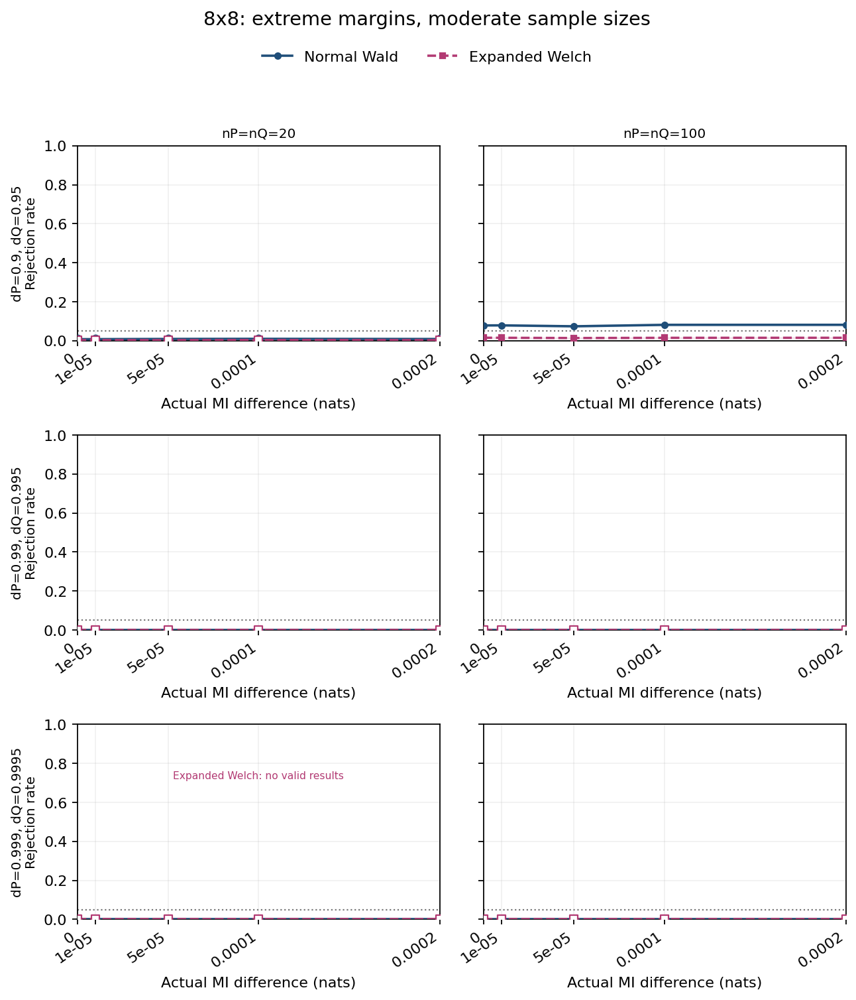

| Specification | Setting |
| --- | --- |
| Table size | 8x8 |
| Horizontal graph regime specifications (columns) | nP=nQ=20, nP=nQ=100 |
| Vertical graph regime specifications (rows) | dP=0.9, dQ=0.95: P row (0.9, 0.1/7 repeated 7 times), P column (0.9, 0.1/7 repeated 7 times); Q row (0.95, 0.05/7 repeated 7 times), Q column (0.95, 0.05/7 repeated 7 times); dP=0.99, dQ=0.995: P row (0.99, 0.01/7 repeated 7 times), P column (0.99, 0.01/7 repeated 7 times); Q row (0.995, 0.005/7 repeated 7 times), Q column (0.995, 0.005/7 repeated 7 times); dP=0.999, dQ=0.9995: P row (0.999, 0.001/7 repeated 7 times), P column (0.999, 0.001/7 repeated 7 times); Q row (0.9995, 0.0005/7 repeated 7 times), Q column (0.9995, 0.0005/7 repeated 7 times) |
| Probability changes | dP=0.9, dQ=0.95: add at (1,1),(2,2) and subtract at (1,2),(2,1), for both P and Q; dP=0.99, dQ=0.995: add at (1,1),(2,2) and subtract at (1,2),(2,1), for both P and Q; dP=0.999, dQ=0.9995: add at (1,1),(2,2) and subtract at (1,2),(2,1), for both P and Q |
| MI settings | Baseline MI {1e-05}; direction {q higher}; actual differences {0, 1e-05, 5e-05, 0.0001, 0.0002} nats |
| Horizontal axis within each graph | Actual MI difference in nats, fixed from 0 to 0.0002 |
| Vertical axis within each graph | Unconditional rejection rate from 0 to 1; invalid results count as non-rejections |
| Replicates | 20,000 per unique point |

Null-point rejection and validity:

| Vertical regime | Horizontal regime | x | Method | Rejection | Valid |
| --- | --- | --- | --- | --- | --- |
| dP=0.9, dQ=0.95 | nP=nQ=20 | 0 | Expanded Welch | 0.0029 | 0.3121 |
| dP=0.9, dQ=0.95 | nP=nQ=20 | 0 | Normal Wald | 0.0079 | 0.8668 |
| dP=0.9, dQ=0.95 | nP=nQ=100 | 0 | Expanded Welch | 0.0153 | 0.9892 |
| dP=0.9, dQ=0.95 | nP=nQ=100 | 0 | Normal Wald | 0.0786 | 1.0000 |
| dP=0.99, dQ=0.995 | nP=nQ=20 | 0 | Expanded Welch | 0.0000 | 0.0001 |
| dP=0.99, dQ=0.995 | nP=nQ=20 | 0 | Normal Wald | 0.0000 | 0.0409 |
| dP=0.99, dQ=0.995 | nP=nQ=100 | 0 | Expanded Welch | 0.0000 | 0.0609 |
| dP=0.99, dQ=0.995 | nP=nQ=100 | 0 | Normal Wald | 0.0000 | 0.4986 |
| dP=0.999, dQ=0.9995 | nP=nQ=20 | 0 | Expanded Welch | 0.0000 | 0.0000 |
| dP=0.999, dQ=0.9995 | nP=nQ=20 | 0 | Normal Wald | 0.0000 | 0.0006 |
| dP=0.999, dQ=0.9995 | nP=nQ=100 | 0 | Expanded Welch | 0.0000 | 0.0000 |
| dP=0.999, dQ=0.9995 | nP=nQ=100 | 0 | Normal Wald | 0.0000 | 0.0126 |

Every plotted rate, interval, validity and minimum expected count

| Vertical regime | Horizontal regime | x | Method | Rejection | 95% interval | Valid | Conditional | Min expected P | Min expected Q |
| --- | --- | --- | --- | --- | --- | --- | --- | --- | --- |
| dP=0.9, dQ=0.95 | nP=nQ=20 | 0 | Expanded Welch | 0.0029 | [0.0022, 0.0037] | 0.3121 | 0.0091 | 0.004082 | 0.00102 |
| dP=0.9, dQ=0.95 | nP=nQ=20 | 0 | Normal Wald | 0.0079 | [0.0068, 0.0092] | 0.8668 | 0.0091 | 0.004082 | 0.00102 |
| dP=0.9, dQ=0.95 | nP=nQ=20 | 1e-05 | Expanded Welch | 0.0031 | [0.0024, 0.0040] | 0.3241 | 0.0096 | 0.004082 | 0.00102 |
| dP=0.9, dQ=0.95 | nP=nQ=20 | 1e-05 | Normal Wald | 0.0081 | [0.0070, 0.0095] | 0.8690 | 0.0094 | 0.004082 | 0.00102 |
| dP=0.9, dQ=0.95 | nP=nQ=20 | 5e-05 | Expanded Welch | 0.0027 | [0.0021, 0.0036] | 0.3195 | 0.0086 | 0.004082 | 0.00102 |
| dP=0.9, dQ=0.95 | nP=nQ=20 | 5e-05 | Normal Wald | 0.0092 | [0.0079, 0.0106] | 0.8692 | 0.0105 | 0.004082 | 0.00102 |
| dP=0.9, dQ=0.95 | nP=nQ=20 | 0.0001 | Expanded Welch | 0.0034 | [0.0027, 0.0044] | 0.3212 | 0.0107 | 0.004082 | 0.00102 |
| dP=0.9, dQ=0.95 | nP=nQ=20 | 0.0001 | Normal Wald | 0.0097 | [0.0085, 0.0112] | 0.8664 | 0.0113 | 0.004082 | 0.00102 |
| dP=0.9, dQ=0.95 | nP=nQ=20 | 0.0002 | Expanded Welch | 0.0029 | [0.0023, 0.0038] | 0.3157 | 0.0093 | 0.004082 | 0.00102 |
| dP=0.9, dQ=0.95 | nP=nQ=20 | 0.0002 | Normal Wald | 0.0088 | [0.0076, 0.0102] | 0.8639 | 0.0102 | 0.004082 | 0.00102 |
| dP=0.9, dQ=0.95 | nP=nQ=100 | 0 | Expanded Welch | 0.0153 | [0.0137, 0.0171] | 0.9892 | 0.0155 | 0.02041 | 0.005102 |
| dP=0.9, dQ=0.95 | nP=nQ=100 | 0 | Normal Wald | 0.0786 | [0.0750, 0.0824] | 1.0000 | 0.0786 | 0.02041 | 0.005102 |
| dP=0.9, dQ=0.95 | nP=nQ=100 | 1e-05 | Expanded Welch | 0.0151 | [0.0135, 0.0169] | 0.9886 | 0.0153 | 0.02041 | 0.005102 |
| dP=0.9, dQ=0.95 | nP=nQ=100 | 1e-05 | Normal Wald | 0.0789 | [0.0752, 0.0827] | 1.0000 | 0.0789 | 0.02041 | 0.005102 |
| dP=0.9, dQ=0.95 | nP=nQ=100 | 5e-05 | Expanded Welch | 0.0138 | [0.0123, 0.0156] | 0.9881 | 0.0140 | 0.02041 | 0.005102 |
| dP=0.9, dQ=0.95 | nP=nQ=100 | 5e-05 | Normal Wald | 0.0741 | [0.0706, 0.0778] | 1.0000 | 0.0741 | 0.02041 | 0.005102 |
| dP=0.9, dQ=0.95 | nP=nQ=100 | 0.0001 | Expanded Welch | 0.0149 | [0.0133, 0.0167] | 0.9870 | 0.0151 | 0.02041 | 0.005102 |
| dP=0.9, dQ=0.95 | nP=nQ=100 | 0.0001 | Normal Wald | 0.0816 | [0.0779, 0.0855] | 1.0000 | 0.0816 | 0.02041 | 0.005102 |
| dP=0.9, dQ=0.95 | nP=nQ=100 | 0.0002 | Expanded Welch | 0.0152 | [0.0135, 0.0169] | 0.9873 | 0.0153 | 0.02041 | 0.005102 |
| dP=0.9, dQ=0.95 | nP=nQ=100 | 0.0002 | Normal Wald | 0.0818 | [0.0780, 0.0856] | 1.0000 | 0.0818 | 0.02041 | 0.005102 |
| dP=0.99, dQ=0.995 | nP=nQ=20 | 0 | Expanded Welch | 0.0000 | [0.0000, 0.0002] | 0.0001 | 0.0000 | 4.082e-05 | 1.02e-05 |
| dP=0.99, dQ=0.995 | nP=nQ=20 | 0 | Normal Wald | 0.0000 | [0.0000, 0.0002] | 0.0409 | 0.0000 | 4.082e-05 | 1.02e-05 |
| dP=0.99, dQ=0.995 | nP=nQ=20 | 1e-05 | Expanded Welch | 0.0000 | [0.0000, 0.0002] | 0.0003 | 0.0000 | 4.082e-05 | 1.02e-05 |
| dP=0.99, dQ=0.995 | nP=nQ=20 | 1e-05 | Normal Wald | 0.0000 | [0.0000, 0.0002] | 0.0427 | 0.0000 | 4.082e-05 | 1.02e-05 |
| dP=0.99, dQ=0.995 | nP=nQ=20 | 5e-05 | Expanded Welch | 0.0000 | [0.0000, 0.0002] | 0.0002 | 0.0000 | 4.082e-05 | 1.02e-05 |
| dP=0.99, dQ=0.995 | nP=nQ=20 | 5e-05 | Normal Wald | 0.0000 | [0.0000, 0.0002] | 0.0411 | 0.0000 | 4.082e-05 | 1.02e-05 |
| dP=0.99, dQ=0.995 | nP=nQ=20 | 0.0001 | Expanded Welch | 0.0000 | [0.0000, 0.0002] | 0.0004 | 0.0000 | 4.082e-05 | 1.02e-05 |
| dP=0.99, dQ=0.995 | nP=nQ=20 | 0.0001 | Normal Wald | 0.0000 | [0.0000, 0.0002] | 0.0411 | 0.0000 | 4.082e-05 | 1.02e-05 |
| dP=0.99, dQ=0.995 | nP=nQ=20 | 0.0002 | Expanded Welch | 0.0000 | [0.0000, 0.0002] | 0.0002 | 0.0000 | 4.082e-05 | 1.02e-05 |
| dP=0.99, dQ=0.995 | nP=nQ=20 | 0.0002 | Normal Wald | 0.0000 | [0.0000, 0.0002] | 0.0430 | 0.0000 | 4.082e-05 | 1.02e-05 |
| dP=0.99, dQ=0.995 | nP=nQ=100 | 0 | Expanded Welch | 0.0000 | [0.0000, 0.0002] | 0.0609 | 0.0000 | 0.0002041 | 5.102e-05 |
| dP=0.99, dQ=0.995 | nP=nQ=100 | 0 | Normal Wald | 0.0000 | [0.0000, 0.0002] | 0.4986 | 0.0000 | 0.0002041 | 5.102e-05 |
| dP=0.99, dQ=0.995 | nP=nQ=100 | 1e-05 | Expanded Welch | 0.0000 | [0.0000, 0.0002] | 0.0635 | 0.0000 | 0.0002041 | 5.102e-05 |
| dP=0.99, dQ=0.995 | nP=nQ=100 | 1e-05 | Normal Wald | 0.0000 | [0.0000, 0.0002] | 0.4991 | 0.0000 | 0.0002041 | 5.102e-05 |
| dP=0.99, dQ=0.995 | nP=nQ=100 | 5e-05 | Expanded Welch | 0.0000 | [0.0000, 0.0002] | 0.0618 | 0.0000 | 0.0002041 | 5.102e-05 |
| dP=0.99, dQ=0.995 | nP=nQ=100 | 5e-05 | Normal Wald | 0.0000 | [0.0000, 0.0002] | 0.4986 | 0.0000 | 0.0002041 | 5.102e-05 |
| dP=0.99, dQ=0.995 | nP=nQ=100 | 0.0001 | Expanded Welch | 0.0000 | [0.0000, 0.0002] | 0.0636 | 0.0000 | 0.0002041 | 5.102e-05 |
| dP=0.99, dQ=0.995 | nP=nQ=100 | 0.0001 | Normal Wald | 0.0000 | [0.0000, 0.0002] | 0.4981 | 0.0000 | 0.0002041 | 5.102e-05 |
| dP=0.99, dQ=0.995 | nP=nQ=100 | 0.0002 | Expanded Welch | 0.0000 | [0.0000, 0.0002] | 0.0651 | 0.0000 | 0.0002041 | 5.102e-05 |
| dP=0.99, dQ=0.995 | nP=nQ=100 | 0.0002 | Normal Wald | 0.0000 | [0.0000, 0.0002] | 0.4929 | 0.0000 | 0.0002041 | 5.102e-05 |
| dP=0.999, dQ=0.9995 | nP=nQ=20 | 0 | Expanded Welch | 0.0000 | [0.0000, 0.0002] | 0.0000 | NA | 4.082e-07 | 1.02e-07 |
| dP=0.999, dQ=0.9995 | nP=nQ=20 | 0 | Normal Wald | 0.0000 | [0.0000, 0.0002] | 0.0006 | 0.0000 | 4.082e-07 | 1.02e-07 |
| dP=0.999, dQ=0.9995 | nP=nQ=20 | 1e-05 | Expanded Welch | 0.0000 | [0.0000, 0.0002] | 0.0000 | NA | 4.082e-07 | 1.02e-07 |
| dP=0.999, dQ=0.9995 | nP=nQ=20 | 1e-05 | Normal Wald | 0.0000 | [0.0000, 0.0002] | 0.0009 | 0.0000 | 4.082e-07 | 1.02e-07 |
| dP=0.999, dQ=0.9995 | nP=nQ=20 | 5e-05 | Expanded Welch | 0.0000 | [0.0000, 0.0002] | 0.0000 | NA | 4.082e-07 | 1.02e-07 |
| dP=0.999, dQ=0.9995 | nP=nQ=20 | 5e-05 | Normal Wald | 0.0000 | [0.0000, 0.0002] | 0.0008 | 0.0000 | 4.082e-07 | 1.02e-07 |
| dP=0.999, dQ=0.9995 | nP=nQ=20 | 0.0001 | Expanded Welch | 0.0000 | [0.0000, 0.0002] | 0.0000 | NA | 4.082e-07 | 1.02e-07 |
| dP=0.999, dQ=0.9995 | nP=nQ=20 | 0.0001 | Normal Wald | 0.0000 | [0.0000, 0.0002] | 0.0008 | 0.0000 | 4.082e-07 | 1.02e-07 |
| dP=0.999, dQ=0.9995 | nP=nQ=20 | 0.0002 | Expanded Welch | 0.0000 | [0.0000, 0.0002] | 0.0000 | NA | 4.082e-07 | 1.02e-07 |
| dP=0.999, dQ=0.9995 | nP=nQ=20 | 0.0002 | Normal Wald | 0.0000 | [0.0000, 0.0002] | 0.0010 | 0.0000 | 4.082e-07 | 1.02e-07 |
| dP=0.999, dQ=0.9995 | nP=nQ=100 | 0 | Expanded Welch | 0.0000 | [0.0000, 0.0002] | 0.0000 | NA | 2.041e-06 | 5.102e-07 |
| dP=0.999, dQ=0.9995 | nP=nQ=100 | 0 | Normal Wald | 0.0000 | [0.0000, 0.0002] | 0.0126 | 0.0000 | 2.041e-06 | 5.102e-07 |
| dP=0.999, dQ=0.9995 | nP=nQ=100 | 1e-05 | Expanded Welch | 0.0000 | [0.0000, 0.0002] | 0.0001 | 0.0000 | 2.041e-06 | 5.102e-07 |
| dP=0.999, dQ=0.9995 | nP=nQ=100 | 1e-05 | Normal Wald | 0.0000 | [0.0000, 0.0002] | 0.0122 | 0.0000 | 2.041e-06 | 5.102e-07 |
| dP=0.999, dQ=0.9995 | nP=nQ=100 | 5e-05 | Expanded Welch | 0.0000 | [0.0000, 0.0002] | 0.0001 | 0.0000 | 2.041e-06 | 5.102e-07 |
| dP=0.999, dQ=0.9995 | nP=nQ=100 | 5e-05 | Normal Wald | 0.0000 | [0.0000, 0.0002] | 0.0120 | 0.0000 | 2.041e-06 | 5.102e-07 |
| dP=0.999, dQ=0.9995 | nP=nQ=100 | 0.0001 | Expanded Welch | 0.0000 | [0.0000, 0.0002] | 0.0000 | NA | 2.041e-06 | 5.102e-07 |
| dP=0.999, dQ=0.9995 | nP=nQ=100 | 0.0001 | Normal Wald | 0.0000 | [0.0000, 0.0002] | 0.0130 | 0.0000 | 2.041e-06 | 5.102e-07 |
| dP=0.999, dQ=0.9995 | nP=nQ=100 | 0.0002 | Expanded Welch | 0.0000 | [0.0000, 0.0002] | 0.0001 | 0.0000 | 2.041e-06 | 5.102e-07 |
| dP=0.999, dQ=0.9995 | nP=nQ=100 | 0.0002 | Normal Wald | 0.0000 | [0.0000, 0.0002] | 0.0140 | 0.0000 | 2.041e-06 | 5.102e-07 |

### 10.9 8x8: extreme margins, large sample sizes

What happens under deliberately extreme marginal skew and very small samples?

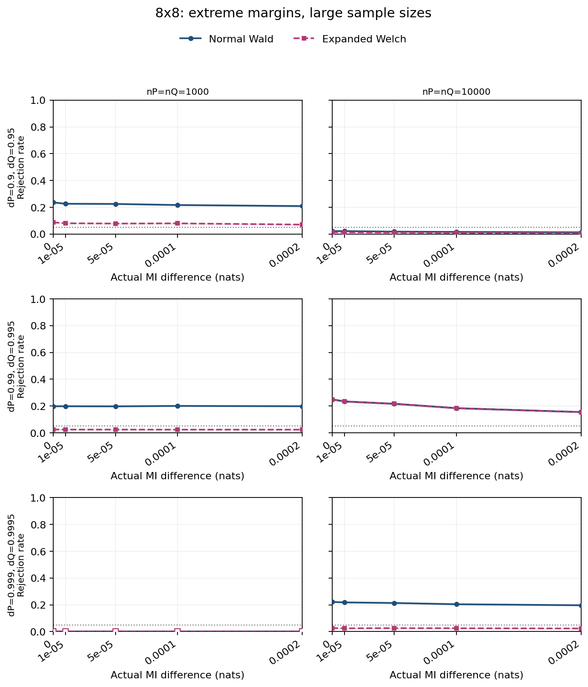

| Specification | Setting |
| --- | --- |
| Table size | 8x8 |
| Horizontal graph regime specifications (columns) | nP=nQ=1000, nP=nQ=10000 |
| Vertical graph regime specifications (rows) | dP=0.9, dQ=0.95: P row (0.9, 0.1/7 repeated 7 times), P column (0.9, 0.1/7 repeated 7 times); Q row (0.95, 0.05/7 repeated 7 times), Q column (0.95, 0.05/7 repeated 7 times); dP=0.99, dQ=0.995: P row (0.99, 0.01/7 repeated 7 times), P column (0.99, 0.01/7 repeated 7 times); Q row (0.995, 0.005/7 repeated 7 times), Q column (0.995, 0.005/7 repeated 7 times); dP=0.999, dQ=0.9995: P row (0.999, 0.001/7 repeated 7 times), P column (0.999, 0.001/7 repeated 7 times); Q row (0.9995, 0.0005/7 repeated 7 times), Q column (0.9995, 0.0005/7 repeated 7 times) |
| Probability changes | dP=0.9, dQ=0.95: add at (1,1),(2,2) and subtract at (1,2),(2,1), for both P and Q; dP=0.99, dQ=0.995: add at (1,1),(2,2) and subtract at (1,2),(2,1), for both P and Q; dP=0.999, dQ=0.9995: add at (1,1),(2,2) and subtract at (1,2),(2,1), for both P and Q |
| MI settings | Baseline MI {1e-05}; direction {q higher}; actual differences {0, 1e-05, 5e-05, 0.0001, 0.0002} nats |
| Horizontal axis within each graph | Actual MI difference in nats, fixed from 0 to 0.0002 |
| Vertical axis within each graph | Unconditional rejection rate from 0 to 1; invalid results count as non-rejections |
| Replicates | 20,000 per unique point |

Null-point rejection and validity:

| Vertical regime | Horizontal regime | x | Method | Rejection | Valid |
| --- | --- | --- | --- | --- | --- |
| dP=0.9, dQ=0.95 | nP=nQ=1000 | 0 | Expanded Welch | 0.0874 | 1.0000 |
| dP=0.9, dQ=0.95 | nP=nQ=1000 | 0 | Normal Wald | 0.2366 | 1.0000 |
| dP=0.9, dQ=0.95 | nP=nQ=10000 | 0 | Expanded Welch | 0.0135 | 1.0000 |
| dP=0.9, dQ=0.95 | nP=nQ=10000 | 0 | Normal Wald | 0.0221 | 1.0000 |
| dP=0.99, dQ=0.995 | nP=nQ=1000 | 0 | Expanded Welch | 0.0251 | 0.9860 |
| dP=0.99, dQ=0.995 | nP=nQ=1000 | 0 | Normal Wald | 0.1986 | 1.0000 |
| dP=0.99, dQ=0.995 | nP=nQ=10000 | 0 | Expanded Welch | 0.2497 | 1.0000 |
| dP=0.99, dQ=0.995 | nP=nQ=10000 | 0 | Normal Wald | 0.2502 | 1.0000 |
| dP=0.999, dQ=0.9995 | nP=nQ=1000 | 0 | Expanded Welch | 0.0000 | 0.0606 |
| dP=0.999, dQ=0.9995 | nP=nQ=1000 | 0 | Normal Wald | 0.0000 | 0.4899 |
| dP=0.999, dQ=0.9995 | nP=nQ=10000 | 0 | Expanded Welch | 0.0265 | 0.9903 |
| dP=0.999, dQ=0.9995 | nP=nQ=10000 | 0 | Normal Wald | 0.2218 | 1.0000 |

Every plotted rate, interval, validity and minimum expected count

| Vertical regime | Horizontal regime | x | Method | Rejection | 95% interval | Valid | Conditional | Min expected P | Min expected Q |
| --- | --- | --- | --- | --- | --- | --- | --- | --- | --- |
| dP=0.9, dQ=0.95 | nP=nQ=1000 | 0 | Expanded Welch | 0.0874 | [0.0836, 0.0914] | 1.0000 | 0.0874 | 0.2041 | 0.05102 |
| dP=0.9, dQ=0.95 | nP=nQ=1000 | 0 | Normal Wald | 0.2366 | [0.2307, 0.2425] | 1.0000 | 0.2366 | 0.2041 | 0.05102 |
| dP=0.9, dQ=0.95 | nP=nQ=1000 | 1e-05 | Expanded Welch | 0.0807 | [0.0770, 0.0846] | 1.0000 | 0.0807 | 0.2041 | 0.05102 |
| dP=0.9, dQ=0.95 | nP=nQ=1000 | 1e-05 | Normal Wald | 0.2265 | [0.2207, 0.2323] | 1.0000 | 0.2265 | 0.2041 | 0.05102 |
| dP=0.9, dQ=0.95 | nP=nQ=1000 | 5e-05 | Expanded Welch | 0.0787 | [0.0750, 0.0825] | 1.0000 | 0.0787 | 0.2041 | 0.05102 |
| dP=0.9, dQ=0.95 | nP=nQ=1000 | 5e-05 | Normal Wald | 0.2251 | [0.2194, 0.2309] | 1.0000 | 0.2251 | 0.2041 | 0.05102 |
| dP=0.9, dQ=0.95 | nP=nQ=1000 | 0.0001 | Expanded Welch | 0.0799 | [0.0762, 0.0837] | 1.0000 | 0.0799 | 0.2041 | 0.05102 |
| dP=0.9, dQ=0.95 | nP=nQ=1000 | 0.0001 | Normal Wald | 0.2170 | [0.2113, 0.2227] | 1.0000 | 0.2170 | 0.2041 | 0.05102 |
| dP=0.9, dQ=0.95 | nP=nQ=1000 | 0.0002 | Expanded Welch | 0.0709 | [0.0674, 0.0745] | 1.0000 | 0.0709 | 0.2041 | 0.05102 |
| dP=0.9, dQ=0.95 | nP=nQ=1000 | 0.0002 | Normal Wald | 0.2090 | [0.2034, 0.2147] | 1.0000 | 0.2090 | 0.2041 | 0.05102 |
| dP=0.9, dQ=0.95 | nP=nQ=10000 | 0 | Expanded Welch | 0.0135 | [0.0119, 0.0151] | 1.0000 | 0.0135 | 2.041 | 0.5102 |
| dP=0.9, dQ=0.95 | nP=nQ=10000 | 0 | Normal Wald | 0.0221 | [0.0201, 0.0242] | 1.0000 | 0.0221 | 2.041 | 0.5102 |
| dP=0.9, dQ=0.95 | nP=nQ=10000 | 1e-05 | Expanded Welch | 0.0126 | [0.0112, 0.0143] | 1.0000 | 0.0126 | 2.041 | 0.5102 |
| dP=0.9, dQ=0.95 | nP=nQ=10000 | 1e-05 | Normal Wald | 0.0225 | [0.0205, 0.0246] | 1.0000 | 0.0225 | 2.041 | 0.5102 |
| dP=0.9, dQ=0.95 | nP=nQ=10000 | 5e-05 | Expanded Welch | 0.0111 | [0.0097, 0.0126] | 1.0000 | 0.0111 | 2.041 | 0.5102 |
| dP=0.9, dQ=0.95 | nP=nQ=10000 | 5e-05 | Normal Wald | 0.0183 | [0.0165, 0.0203] | 1.0000 | 0.0183 | 2.041 | 0.5102 |
| dP=0.9, dQ=0.95 | nP=nQ=10000 | 0.0001 | Expanded Welch | 0.0093 | [0.0081, 0.0107] | 1.0000 | 0.0093 | 2.041 | 0.5102 |
| dP=0.9, dQ=0.95 | nP=nQ=10000 | 0.0001 | Normal Wald | 0.0164 | [0.0147, 0.0183] | 1.0000 | 0.0164 | 2.041 | 0.5102 |
| dP=0.9, dQ=0.95 | nP=nQ=10000 | 0.0002 | Expanded Welch | 0.0076 | [0.0065, 0.0089] | 1.0000 | 0.0076 | 2.041 | 0.5102 |
| dP=0.9, dQ=0.95 | nP=nQ=10000 | 0.0002 | Normal Wald | 0.0135 | [0.0119, 0.0151] | 1.0000 | 0.0135 | 2.041 | 0.5102 |
| dP=0.99, dQ=0.995 | nP=nQ=1000 | 0 | Expanded Welch | 0.0251 | [0.0230, 0.0274] | 0.9860 | 0.0255 | 0.002041 | 0.0005102 |
| dP=0.99, dQ=0.995 | nP=nQ=1000 | 0 | Normal Wald | 0.1986 | [0.1931, 0.2042] | 1.0000 | 0.1986 | 0.002041 | 0.0005102 |
| dP=0.99, dQ=0.995 | nP=nQ=1000 | 1e-05 | Expanded Welch | 0.0245 | [0.0224, 0.0267] | 0.9868 | 0.0248 | 0.002041 | 0.0005102 |
| dP=0.99, dQ=0.995 | nP=nQ=1000 | 1e-05 | Normal Wald | 0.1987 | [0.1932, 0.2043] | 1.0000 | 0.1987 | 0.002041 | 0.0005102 |
| dP=0.99, dQ=0.995 | nP=nQ=1000 | 5e-05 | Expanded Welch | 0.0244 | [0.0223, 0.0266] | 0.9868 | 0.0247 | 0.002041 | 0.0005102 |
| dP=0.99, dQ=0.995 | nP=nQ=1000 | 5e-05 | Normal Wald | 0.1980 | [0.1925, 0.2036] | 1.0000 | 0.1980 | 0.002041 | 0.0005102 |
| dP=0.99, dQ=0.995 | nP=nQ=1000 | 0.0001 | Expanded Welch | 0.0239 | [0.0219, 0.0262] | 0.9868 | 0.0243 | 0.002041 | 0.0005102 |
| dP=0.99, dQ=0.995 | nP=nQ=1000 | 0.0001 | Normal Wald | 0.2009 | [0.1955, 0.2066] | 1.0000 | 0.2009 | 0.002041 | 0.0005102 |
| dP=0.99, dQ=0.995 | nP=nQ=1000 | 0.0002 | Expanded Welch | 0.0238 | [0.0218, 0.0261] | 0.9876 | 0.0242 | 0.002041 | 0.0005102 |
| dP=0.99, dQ=0.995 | nP=nQ=1000 | 0.0002 | Normal Wald | 0.1988 | [0.1934, 0.2044] | 1.0000 | 0.1988 | 0.002041 | 0.0005102 |
| dP=0.99, dQ=0.995 | nP=nQ=10000 | 0 | Expanded Welch | 0.2497 | [0.2437, 0.2557] | 1.0000 | 0.2497 | 0.02041 | 0.005102 |
| dP=0.99, dQ=0.995 | nP=nQ=10000 | 0 | Normal Wald | 0.2502 | [0.2442, 0.2563] | 1.0000 | 0.2502 | 0.02041 | 0.005102 |
| dP=0.99, dQ=0.995 | nP=nQ=10000 | 1e-05 | Expanded Welch | 0.2343 | [0.2284, 0.2402] | 1.0000 | 0.2343 | 0.02041 | 0.005102 |
| dP=0.99, dQ=0.995 | nP=nQ=10000 | 1e-05 | Normal Wald | 0.2346 | [0.2287, 0.2405] | 1.0000 | 0.2346 | 0.02041 | 0.005102 |
| dP=0.99, dQ=0.995 | nP=nQ=10000 | 5e-05 | Expanded Welch | 0.2168 | [0.2111, 0.2226] | 1.0000 | 0.2168 | 0.02041 | 0.005102 |
| dP=0.99, dQ=0.995 | nP=nQ=10000 | 5e-05 | Normal Wald | 0.2171 | [0.2114, 0.2229] | 1.0000 | 0.2171 | 0.02041 | 0.005102 |
| dP=0.99, dQ=0.995 | nP=nQ=10000 | 0.0001 | Expanded Welch | 0.1842 | [0.1788, 0.1896] | 1.0000 | 0.1842 | 0.02041 | 0.005102 |
| dP=0.99, dQ=0.995 | nP=nQ=10000 | 0.0001 | Normal Wald | 0.1842 | [0.1789, 0.1897] | 1.0000 | 0.1842 | 0.02041 | 0.005102 |
| dP=0.99, dQ=0.995 | nP=nQ=10000 | 0.0002 | Expanded Welch | 0.1550 | [0.1500, 0.1600] | 1.0000 | 0.1550 | 0.02041 | 0.005102 |
| dP=0.99, dQ=0.995 | nP=nQ=10000 | 0.0002 | Normal Wald | 0.1553 | [0.1504, 0.1604] | 1.0000 | 0.1553 | 0.02041 | 0.005102 |
| dP=0.999, dQ=0.9995 | nP=nQ=1000 | 0 | Expanded Welch | 0.0000 | [0.0000, 0.0002] | 0.0606 | 0.0000 | 2.041e-05 | 5.102e-06 |
| dP=0.999, dQ=0.9995 | nP=nQ=1000 | 0 | Normal Wald | 0.0000 | [0.0000, 0.0002] | 0.4899 | 0.0000 | 2.041e-05 | 5.102e-06 |
| dP=0.999, dQ=0.9995 | nP=nQ=1000 | 1e-05 | Expanded Welch | 0.0000 | [0.0000, 0.0002] | 0.0622 | 0.0000 | 2.041e-05 | 5.102e-06 |
| dP=0.999, dQ=0.9995 | nP=nQ=1000 | 1e-05 | Normal Wald | 0.0000 | [0.0000, 0.0002] | 0.5008 | 0.0000 | 2.041e-05 | 5.102e-06 |
| dP=0.999, dQ=0.9995 | nP=nQ=1000 | 5e-05 | Expanded Welch | 0.0000 | [0.0000, 0.0002] | 0.0637 | 0.0000 | 2.041e-05 | 5.102e-06 |
| dP=0.999, dQ=0.9995 | nP=nQ=1000 | 5e-05 | Normal Wald | 0.0000 | [0.0000, 0.0002] | 0.4959 | 0.0000 | 2.041e-05 | 5.102e-06 |
| dP=0.999, dQ=0.9995 | nP=nQ=1000 | 0.0001 | Expanded Welch | 0.0000 | [0.0000, 0.0002] | 0.0642 | 0.0000 | 2.041e-05 | 5.102e-06 |
| dP=0.999, dQ=0.9995 | nP=nQ=1000 | 0.0001 | Normal Wald | 0.0000 | [0.0000, 0.0002] | 0.5022 | 0.0000 | 2.041e-05 | 5.102e-06 |
| dP=0.999, dQ=0.9995 | nP=nQ=1000 | 0.0002 | Expanded Welch | 0.0000 | [0.0000, 0.0002] | 0.0634 | 0.0000 | 2.041e-05 | 5.102e-06 |
| dP=0.999, dQ=0.9995 | nP=nQ=1000 | 0.0002 | Normal Wald | 0.0000 | [0.0000, 0.0002] | 0.4938 | 0.0000 | 2.041e-05 | 5.102e-06 |
| dP=0.999, dQ=0.9995 | nP=nQ=10000 | 0 | Expanded Welch | 0.0265 | [0.0243, 0.0288] | 0.9903 | 0.0267 | 0.0002041 | 5.102e-05 |
| dP=0.999, dQ=0.9995 | nP=nQ=10000 | 0 | Normal Wald | 0.2218 | [0.2160, 0.2276] | 1.0000 | 0.2218 | 0.0002041 | 5.102e-05 |
| dP=0.999, dQ=0.9995 | nP=nQ=10000 | 1e-05 | Expanded Welch | 0.0243 | [0.0222, 0.0265] | 0.9913 | 0.0245 | 0.0002041 | 5.102e-05 |
| dP=0.999, dQ=0.9995 | nP=nQ=10000 | 1e-05 | Normal Wald | 0.2180 | [0.2123, 0.2237] | 1.0000 | 0.2180 | 0.0002041 | 5.102e-05 |
| dP=0.999, dQ=0.9995 | nP=nQ=10000 | 5e-05 | Expanded Welch | 0.0255 | [0.0234, 0.0278] | 0.9900 | 0.0258 | 0.0002041 | 5.102e-05 |
| dP=0.999, dQ=0.9995 | nP=nQ=10000 | 5e-05 | Normal Wald | 0.2136 | [0.2080, 0.2193] | 1.0000 | 0.2136 | 0.0002041 | 5.102e-05 |
| dP=0.999, dQ=0.9995 | nP=nQ=10000 | 0.0001 | Expanded Welch | 0.0247 | [0.0226, 0.0269] | 0.9915 | 0.0249 | 0.0002041 | 5.102e-05 |
| dP=0.999, dQ=0.9995 | nP=nQ=10000 | 0.0001 | Normal Wald | 0.2043 | [0.1988, 0.2099] | 1.0000 | 0.2043 | 0.0002041 | 5.102e-05 |
| dP=0.999, dQ=0.9995 | nP=nQ=10000 | 0.0002 | Expanded Welch | 0.0232 | [0.0212, 0.0253] | 0.9909 | 0.0234 | 0.0002041 | 5.102e-05 |
| dP=0.999, dQ=0.9995 | nP=nQ=10000 | 0.0002 | Normal Wald | 0.1966 | [0.1912, 0.2022] | 1.0000 | 0.1966 | 0.0002041 | 5.102e-05 |

## 11. Rare-cell stress check

What happens when the probability changes are concentrated in rare cells?

### 11.1 3x3: common- and rare-cell changes, small sample sizes

What happens when the probability changes are concentrated in rare cells?

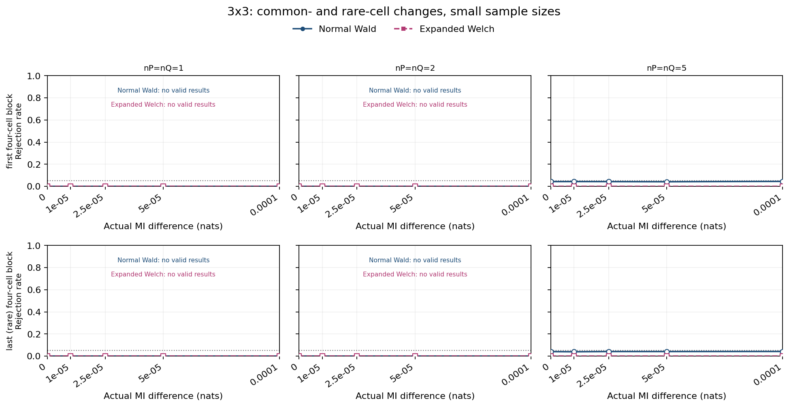

| Specification | Setting |
| --- | --- |
| Table size | 3x3 |
| Horizontal graph regime specifications (columns) | nP=nQ=1, nP=nQ=2, nP=nQ=5 |
| Vertical graph regime specifications (rows) | first four-cell block: P row (0.9, 0.1/2 repeated 2 times), P column (0.9, 0.1/2 repeated 2 times); Q row (0.95, 0.05/2 repeated 2 times), Q column (0.95, 0.05/2 repeated 2 times); last (rare) four-cell block: P row (0.9, 0.1/2 repeated 2 times), P column (0.9, 0.1/2 repeated 2 times); Q row (0.95, 0.05/2 repeated 2 times), Q column (0.95, 0.05/2 repeated 2 times) |
| Probability changes | first four-cell block: add at (1,1),(2,2) and subtract at (1,2),(2,1), for both P and Q; last (rare) four-cell block: the same four signs in the last two rows and last two columns, for both P and Q |
| MI settings | Baseline MI {1e-05}; direction {q higher}; actual differences {0, 1e-05, 2.5e-05, 5e-05, 0.0001} nats |
| Horizontal axis within each graph | Actual MI difference in nats, fixed from 0 to 0.0001 |
| Vertical axis within each graph | Unconditional rejection rate from 0 to 1; invalid results count as non-rejections |
| Replicates | 20,000 per unique point |

Null-point rejection and validity:

| Vertical regime | Horizontal regime | x | Method | Rejection | Valid |
| --- | --- | --- | --- | --- | --- |
| first four-cell block | nP=nQ=1 | 0 | Expanded Welch | 0.0000 | 0.0000 |
| first four-cell block | nP=nQ=1 | 0 | Normal Wald | 0.0000 | 0.0000 |
| first four-cell block | nP=nQ=2 | 0 | Expanded Welch | 0.0000 | 0.0000 |
| first four-cell block | nP=nQ=2 | 0 | Normal Wald | 0.0000 | 0.0000 |
| first four-cell block | nP=nQ=5 | 0 | Expanded Welch | 0.0000 | 0.0080 |
| first four-cell block | nP=nQ=5 | 0 | Normal Wald | 0.0427 | 0.2100 |
| last (rare) four-cell block | nP=nQ=1 | 0 | Expanded Welch | 0.0000 | 0.0000 |
| last (rare) four-cell block | nP=nQ=1 | 0 | Normal Wald | 0.0000 | 0.0000 |
| last (rare) four-cell block | nP=nQ=2 | 0 | Expanded Welch | 0.0000 | 0.0000 |
| last (rare) four-cell block | nP=nQ=2 | 0 | Normal Wald | 0.0000 | 0.0000 |
| last (rare) four-cell block | nP=nQ=5 | 0 | Expanded Welch | 0.0000 | 0.0080 |
| last (rare) four-cell block | nP=nQ=5 | 0 | Normal Wald | 0.0408 | 0.2086 |

Every plotted rate, interval, validity and minimum expected count

| Vertical regime | Horizontal regime | x | Method | Rejection | 95% interval | Valid | Conditional | Min expected P | Min expected Q |
| --- | --- | --- | --- | --- | --- | --- | --- | --- | --- |
| first four-cell block | nP=nQ=1 | 0 | Expanded Welch | 0.0000 | [0.0000, 0.0002] | 0.0000 | NA | 0.0025 | 0.000625 |
| first four-cell block | nP=nQ=1 | 0 | Normal Wald | 0.0000 | [0.0000, 0.0002] | 0.0000 | NA | 0.0025 | 0.000625 |
| first four-cell block | nP=nQ=1 | 1e-05 | Expanded Welch | 0.0000 | [0.0000, 0.0002] | 0.0000 | NA | 0.0025 | 0.000625 |
| first four-cell block | nP=nQ=1 | 1e-05 | Normal Wald | 0.0000 | [0.0000, 0.0002] | 0.0000 | NA | 0.0025 | 0.000625 |
| first four-cell block | nP=nQ=1 | 2.5e-05 | Expanded Welch | 0.0000 | [0.0000, 0.0002] | 0.0000 | NA | 0.0025 | 0.000625 |
| first four-cell block | nP=nQ=1 | 2.5e-05 | Normal Wald | 0.0000 | [0.0000, 0.0002] | 0.0000 | NA | 0.0025 | 0.000625 |
| first four-cell block | nP=nQ=1 | 5e-05 | Expanded Welch | 0.0000 | [0.0000, 0.0002] | 0.0000 | NA | 0.0025 | 0.000625 |
| first four-cell block | nP=nQ=1 | 5e-05 | Normal Wald | 0.0000 | [0.0000, 0.0002] | 0.0000 | NA | 0.0025 | 0.000625 |
| first four-cell block | nP=nQ=1 | 0.0001 | Expanded Welch | 0.0000 | [0.0000, 0.0002] | 0.0000 | NA | 0.0025 | 0.000625 |
| first four-cell block | nP=nQ=1 | 0.0001 | Normal Wald | 0.0000 | [0.0000, 0.0002] | 0.0000 | NA | 0.0025 | 0.000625 |
| first four-cell block | nP=nQ=2 | 0 | Expanded Welch | 0.0000 | [0.0000, 0.0002] | 0.0000 | NA | 0.005 | 0.00125 |
| first four-cell block | nP=nQ=2 | 0 | Normal Wald | 0.0000 | [0.0000, 0.0002] | 0.0000 | NA | 0.005 | 0.00125 |
| first four-cell block | nP=nQ=2 | 1e-05 | Expanded Welch | 0.0000 | [0.0000, 0.0002] | 0.0000 | NA | 0.005 | 0.00125 |
| first four-cell block | nP=nQ=2 | 1e-05 | Normal Wald | 0.0000 | [0.0000, 0.0002] | 0.0000 | NA | 0.005 | 0.00125 |
| first four-cell block | nP=nQ=2 | 2.5e-05 | Expanded Welch | 0.0000 | [0.0000, 0.0002] | 0.0000 | NA | 0.005 | 0.00125 |
| first four-cell block | nP=nQ=2 | 2.5e-05 | Normal Wald | 0.0000 | [0.0000, 0.0002] | 0.0000 | NA | 0.005 | 0.00125 |
| first four-cell block | nP=nQ=2 | 5e-05 | Expanded Welch | 0.0000 | [0.0000, 0.0002] | 0.0000 | NA | 0.005 | 0.00125 |
| first four-cell block | nP=nQ=2 | 5e-05 | Normal Wald | 0.0000 | [0.0000, 0.0002] | 0.0000 | NA | 0.005 | 0.00125 |
| first four-cell block | nP=nQ=2 | 0.0001 | Expanded Welch | 0.0000 | [0.0000, 0.0002] | 0.0000 | NA | 0.005 | 0.00125 |
| first four-cell block | nP=nQ=2 | 0.0001 | Normal Wald | 0.0000 | [0.0000, 0.0002] | 0.0000 | NA | 0.005 | 0.00125 |
| first four-cell block | nP=nQ=5 | 0 | Expanded Welch | 0.0000 | [0.0000, 0.0002] | 0.0080 | 0.0000 | 0.0125 | 0.003125 |
| first four-cell block | nP=nQ=5 | 0 | Normal Wald | 0.0427 | [0.0400, 0.0456] | 0.2100 | 0.2033 | 0.0125 | 0.003125 |
| first four-cell block | nP=nQ=5 | 1e-05 | Expanded Welch | 0.0000 | [0.0000, 0.0002] | 0.0080 | 0.0000 | 0.0125 | 0.003125 |
| first four-cell block | nP=nQ=5 | 1e-05 | Normal Wald | 0.0431 | [0.0404, 0.0460] | 0.2100 | 0.2052 | 0.0125 | 0.003125 |
| first four-cell block | nP=nQ=5 | 2.5e-05 | Expanded Welch | 0.0000 | [0.0000, 0.0002] | 0.0089 | 0.0000 | 0.0125 | 0.003125 |
| first four-cell block | nP=nQ=5 | 2.5e-05 | Normal Wald | 0.0427 | [0.0400, 0.0456] | 0.2081 | 0.2052 | 0.0125 | 0.003125 |
| first four-cell block | nP=nQ=5 | 5e-05 | Expanded Welch | 0.0000 | [0.0000, 0.0002] | 0.0095 | 0.0000 | 0.0125 | 0.003125 |
| first four-cell block | nP=nQ=5 | 5e-05 | Normal Wald | 0.0415 | [0.0388, 0.0444] | 0.2100 | 0.1976 | 0.0125 | 0.003125 |
| first four-cell block | nP=nQ=5 | 0.0001 | Expanded Welch | 0.0000 | [0.0000, 0.0002] | 0.0081 | 0.0000 | 0.0125 | 0.003125 |
| first four-cell block | nP=nQ=5 | 0.0001 | Normal Wald | 0.0449 | [0.0422, 0.0479] | 0.2092 | 0.2149 | 0.0125 | 0.003125 |
| last (rare) four-cell block | nP=nQ=1 | 0 | Expanded Welch | 0.0000 | [0.0000, 0.0002] | 0.0000 | NA | 0.002388 | 0.0005691 |
| last (rare) four-cell block | nP=nQ=1 | 0 | Normal Wald | 0.0000 | [0.0000, 0.0002] | 0.0000 | NA | 0.002388 | 0.0005691 |
| last (rare) four-cell block | nP=nQ=1 | 1e-05 | Expanded Welch | 0.0000 | [0.0000, 0.0002] | 0.0000 | NA | 0.002388 | 0.000546 |
| last (rare) four-cell block | nP=nQ=1 | 1e-05 | Normal Wald | 0.0000 | [0.0000, 0.0002] | 0.0000 | NA | 0.002388 | 0.000546 |
| last (rare) four-cell block | nP=nQ=1 | 2.5e-05 | Expanded Welch | 0.0000 | [0.0000, 0.0002] | 0.0000 | NA | 0.002388 | 0.0005207 |
| last (rare) four-cell block | nP=nQ=1 | 2.5e-05 | Normal Wald | 0.0000 | [0.0000, 0.0002] | 0.0000 | NA | 0.002388 | 0.0005207 |
| last (rare) four-cell block | nP=nQ=1 | 5e-05 | Expanded Welch | 0.0000 | [0.0000, 0.0002] | 0.0000 | NA | 0.002388 | 0.0004886 |
| last (rare) four-cell block | nP=nQ=1 | 5e-05 | Normal Wald | 0.0000 | [0.0000, 0.0002] | 0.0000 | NA | 0.002388 | 0.0004886 |
| last (rare) four-cell block | nP=nQ=1 | 0.0001 | Expanded Welch | 0.0000 | [0.0000, 0.0002] | 0.0000 | NA | 0.002388 | 0.000441 |
| last (rare) four-cell block | nP=nQ=1 | 0.0001 | Normal Wald | 0.0000 | [0.0000, 0.0002] | 0.0000 | NA | 0.002388 | 0.000441 |
| last (rare) four-cell block | nP=nQ=2 | 0 | Expanded Welch | 0.0000 | [0.0000, 0.0002] | 0.0000 | NA | 0.004776 | 0.001138 |
| last (rare) four-cell block | nP=nQ=2 | 0 | Normal Wald | 0.0000 | [0.0000, 0.0002] | 0.0000 | NA | 0.004776 | 0.001138 |
| last (rare) four-cell block | nP=nQ=2 | 1e-05 | Expanded Welch | 0.0000 | [0.0000, 0.0002] | 0.0000 | NA | 0.004776 | 0.001092 |
| last (rare) four-cell block | nP=nQ=2 | 1e-05 | Normal Wald | 0.0000 | [0.0000, 0.0002] | 0.0000 | NA | 0.004776 | 0.001092 |
| last (rare) four-cell block | nP=nQ=2 | 2.5e-05 | Expanded Welch | 0.0000 | [0.0000, 0.0002] | 0.0000 | NA | 0.004776 | 0.001041 |
| last (rare) four-cell block | nP=nQ=2 | 2.5e-05 | Normal Wald | 0.0000 | [0.0000, 0.0002] | 0.0000 | NA | 0.004776 | 0.001041 |
| last (rare) four-cell block | nP=nQ=2 | 5e-05 | Expanded Welch | 0.0000 | [0.0000, 0.0002] | 0.0000 | NA | 0.004776 | 0.0009772 |
| last (rare) four-cell block | nP=nQ=2 | 5e-05 | Normal Wald | 0.0000 | [0.0000, 0.0002] | 0.0000 | NA | 0.004776 | 0.0009772 |
| last (rare) four-cell block | nP=nQ=2 | 0.0001 | Expanded Welch | 0.0000 | [0.0000, 0.0002] | 0.0000 | NA | 0.004776 | 0.0008819 |
| last (rare) four-cell block | nP=nQ=2 | 0.0001 | Normal Wald | 0.0000 | [0.0000, 0.0002] | 0.0000 | NA | 0.004776 | 0.0008819 |
| last (rare) four-cell block | nP=nQ=5 | 0 | Expanded Welch | 0.0000 | [0.0000, 0.0002] | 0.0080 | 0.0000 | 0.01194 | 0.002846 |
| last (rare) four-cell block | nP=nQ=5 | 0 | Normal Wald | 0.0408 | [0.0381, 0.0436] | 0.2086 | 0.1953 | 0.01194 | 0.002846 |
| last (rare) four-cell block | nP=nQ=5 | 1e-05 | Expanded Welch | 0.0000 | [0.0000, 0.0002] | 0.0092 | 0.0000 | 0.01194 | 0.00273 |
| last (rare) four-cell block | nP=nQ=5 | 1e-05 | Normal Wald | 0.0391 | [0.0365, 0.0419] | 0.2116 | 0.1850 | 0.01194 | 0.00273 |
| last (rare) four-cell block | nP=nQ=5 | 2.5e-05 | Expanded Welch | 0.0000 | [0.0000, 0.0002] | 0.0080 | 0.0000 | 0.01194 | 0.002603 |
| last (rare) four-cell block | nP=nQ=5 | 2.5e-05 | Normal Wald | 0.0415 | [0.0389, 0.0444] | 0.2069 | 0.2009 | 0.01194 | 0.002603 |
| last (rare) four-cell block | nP=nQ=5 | 5e-05 | Expanded Welch | 0.0000 | [0.0000, 0.0002] | 0.0092 | 0.0000 | 0.01194 | 0.002443 |
| last (rare) four-cell block | nP=nQ=5 | 5e-05 | Normal Wald | 0.0413 | [0.0387, 0.0442] | 0.2117 | 0.1953 | 0.01194 | 0.002443 |
| last (rare) four-cell block | nP=nQ=5 | 0.0001 | Expanded Welch | 0.0000 | [0.0000, 0.0002] | 0.0097 | 0.0000 | 0.01194 | 0.002205 |
| last (rare) four-cell block | nP=nQ=5 | 0.0001 | Normal Wald | 0.0420 | [0.0394, 0.0449] | 0.2142 | 0.1964 | 0.01194 | 0.002205 |

### 11.2 3x3: common- and rare-cell changes, moderate sample sizes

What happens when the probability changes are concentrated in rare cells?

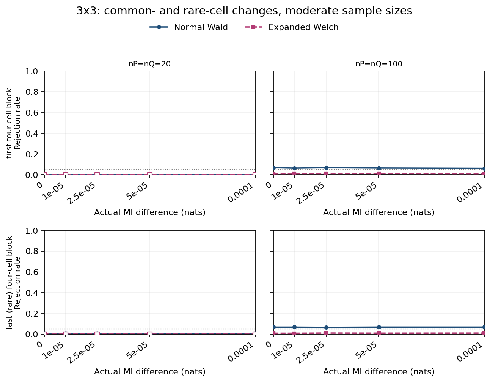

| Specification | Setting |
| --- | --- |
| Table size | 3x3 |
| Horizontal graph regime specifications (columns) | nP=nQ=20, nP=nQ=100 |
| Vertical graph regime specifications (rows) | first four-cell block: P row (0.9, 0.1/2 repeated 2 times), P column (0.9, 0.1/2 repeated 2 times); Q row (0.95, 0.05/2 repeated 2 times), Q column (0.95, 0.05/2 repeated 2 times); last (rare) four-cell block: P row (0.9, 0.1/2 repeated 2 times), P column (0.9, 0.1/2 repeated 2 times); Q row (0.95, 0.05/2 repeated 2 times), Q column (0.95, 0.05/2 repeated 2 times) |
| Probability changes | first four-cell block: add at (1,1),(2,2) and subtract at (1,2),(2,1), for both P and Q; last (rare) four-cell block: the same four signs in the last two rows and last two columns, for both P and Q |
| MI settings | Baseline MI {1e-05}; direction {q higher}; actual differences {0, 1e-05, 2.5e-05, 5e-05, 0.0001} nats |
| Horizontal axis within each graph | Actual MI difference in nats, fixed from 0 to 0.0001 |
| Vertical axis within each graph | Unconditional rejection rate from 0 to 1; invalid results count as non-rejections |
| Replicates | 20,000 per unique point |

Null-point rejection and validity:

| Vertical regime | Horizontal regime | x | Method | Rejection | Valid |
| --- | --- | --- | --- | --- | --- |
| first four-cell block | nP=nQ=20 | 0 | Expanded Welch | 0.0007 | 0.3181 |
| first four-cell block | nP=nQ=20 | 0 | Normal Wald | 0.0024 | 0.8651 |
| first four-cell block | nP=nQ=100 | 0 | Expanded Welch | 0.0088 | 0.9881 |
| first four-cell block | nP=nQ=100 | 0 | Normal Wald | 0.0701 | 1.0000 |
| last (rare) four-cell block | nP=nQ=20 | 0 | Expanded Welch | 0.0007 | 0.3197 |
| last (rare) four-cell block | nP=nQ=20 | 0 | Normal Wald | 0.0022 | 0.8635 |
| last (rare) four-cell block | nP=nQ=100 | 0 | Expanded Welch | 0.0095 | 0.9887 |
| last (rare) four-cell block | nP=nQ=100 | 0 | Normal Wald | 0.0678 | 1.0000 |

Every plotted rate, interval, validity and minimum expected count

| Vertical regime | Horizontal regime | x | Method | Rejection | 95% interval | Valid | Conditional | Min expected P | Min expected Q |
| --- | --- | --- | --- | --- | --- | --- | --- | --- | --- |
| first four-cell block | nP=nQ=20 | 0 | Expanded Welch | 0.0007 | [0.0004, 0.0012] | 0.3181 | 0.0022 | 0.05 | 0.0125 |
| first four-cell block | nP=nQ=20 | 0 | Normal Wald | 0.0024 | [0.0019, 0.0032] | 0.8651 | 0.0028 | 0.05 | 0.0125 |
| first four-cell block | nP=nQ=20 | 1e-05 | Expanded Welch | 0.0008 | [0.0005, 0.0013] | 0.3215 | 0.0025 | 0.05 | 0.0125 |
| first four-cell block | nP=nQ=20 | 1e-05 | Normal Wald | 0.0023 | [0.0017, 0.0031] | 0.8612 | 0.0027 | 0.05 | 0.0125 |
| first four-cell block | nP=nQ=20 | 2.5e-05 | Expanded Welch | 0.0005 | [0.0003, 0.0009] | 0.3137 | 0.0016 | 0.05 | 0.0125 |
| first four-cell block | nP=nQ=20 | 2.5e-05 | Normal Wald | 0.0022 | [0.0017, 0.0030] | 0.8639 | 0.0026 | 0.05 | 0.0125 |
| first four-cell block | nP=nQ=20 | 5e-05 | Expanded Welch | 0.0009 | [0.0006, 0.0014] | 0.3177 | 0.0028 | 0.05 | 0.0125 |
| first four-cell block | nP=nQ=20 | 5e-05 | Normal Wald | 0.0023 | [0.0017, 0.0031] | 0.8656 | 0.0027 | 0.05 | 0.0125 |
| first four-cell block | nP=nQ=20 | 0.0001 | Expanded Welch | 0.0007 | [0.0004, 0.0012] | 0.3176 | 0.0022 | 0.05 | 0.0125 |
| first four-cell block | nP=nQ=20 | 0.0001 | Normal Wald | 0.0024 | [0.0018, 0.0032] | 0.8649 | 0.0028 | 0.05 | 0.0125 |
| first four-cell block | nP=nQ=100 | 0 | Expanded Welch | 0.0088 | [0.0076, 0.0101] | 0.9881 | 0.0089 | 0.25 | 0.0625 |
| first four-cell block | nP=nQ=100 | 0 | Normal Wald | 0.0701 | [0.0666, 0.0737] | 1.0000 | 0.0701 | 0.25 | 0.0625 |
| first four-cell block | nP=nQ=100 | 1e-05 | Expanded Welch | 0.0097 | [0.0084, 0.0111] | 0.9881 | 0.0098 | 0.25 | 0.0625 |
| first four-cell block | nP=nQ=100 | 1e-05 | Normal Wald | 0.0653 | [0.0620, 0.0688] | 1.0000 | 0.0653 | 0.25 | 0.0625 |
| first four-cell block | nP=nQ=100 | 2.5e-05 | Expanded Welch | 0.0095 | [0.0082, 0.0109] | 0.9893 | 0.0096 | 0.25 | 0.0625 |
| first four-cell block | nP=nQ=100 | 2.5e-05 | Normal Wald | 0.0699 | [0.0665, 0.0736] | 1.0000 | 0.0699 | 0.25 | 0.0625 |
| first four-cell block | nP=nQ=100 | 5e-05 | Expanded Welch | 0.0103 | [0.0090, 0.0118] | 0.9884 | 0.0104 | 0.25 | 0.0625 |
| first four-cell block | nP=nQ=100 | 5e-05 | Normal Wald | 0.0663 | [0.0629, 0.0698] | 1.0000 | 0.0663 | 0.25 | 0.0625 |
| first four-cell block | nP=nQ=100 | 0.0001 | Expanded Welch | 0.0086 | [0.0075, 0.0100] | 0.9878 | 0.0088 | 0.25 | 0.0625 |
| first four-cell block | nP=nQ=100 | 0.0001 | Normal Wald | 0.0635 | [0.0602, 0.0670] | 1.0000 | 0.0635 | 0.25 | 0.0625 |
| last (rare) four-cell block | nP=nQ=20 | 0 | Expanded Welch | 0.0007 | [0.0004, 0.0012] | 0.3197 | 0.0022 | 0.04776 | 0.01138 |
| last (rare) four-cell block | nP=nQ=20 | 0 | Normal Wald | 0.0022 | [0.0016, 0.0029] | 0.8635 | 0.0025 | 0.04776 | 0.01138 |
| last (rare) four-cell block | nP=nQ=20 | 1e-05 | Expanded Welch | 0.0006 | [0.0003, 0.0010] | 0.3180 | 0.0019 | 0.04776 | 0.01092 |
| last (rare) four-cell block | nP=nQ=20 | 1e-05 | Normal Wald | 0.0024 | [0.0019, 0.0032] | 0.8653 | 0.0028 | 0.04776 | 0.01092 |
| last (rare) four-cell block | nP=nQ=20 | 2.5e-05 | Expanded Welch | 0.0009 | [0.0006, 0.0014] | 0.3190 | 0.0028 | 0.04776 | 0.01041 |
| last (rare) four-cell block | nP=nQ=20 | 2.5e-05 | Normal Wald | 0.0031 | [0.0024, 0.0040] | 0.8667 | 0.0036 | 0.04776 | 0.01041 |
| last (rare) four-cell block | nP=nQ=20 | 5e-05 | Expanded Welch | 0.0003 | [0.0002, 0.0007] | 0.3127 | 0.0011 | 0.04776 | 0.009772 |
| last (rare) four-cell block | nP=nQ=20 | 5e-05 | Normal Wald | 0.0014 | [0.0010, 0.0021] | 0.8588 | 0.0017 | 0.04776 | 0.009772 |
| last (rare) four-cell block | nP=nQ=20 | 0.0001 | Expanded Welch | 0.0006 | [0.0003, 0.0010] | 0.3224 | 0.0019 | 0.04776 | 0.008819 |
| last (rare) four-cell block | nP=nQ=20 | 0.0001 | Normal Wald | 0.0027 | [0.0021, 0.0036] | 0.8659 | 0.0032 | 0.04776 | 0.008819 |
| last (rare) four-cell block | nP=nQ=100 | 0 | Expanded Welch | 0.0095 | [0.0082, 0.0109] | 0.9887 | 0.0096 | 0.2388 | 0.05691 |
| last (rare) four-cell block | nP=nQ=100 | 0 | Normal Wald | 0.0678 | [0.0644, 0.0714] | 1.0000 | 0.0678 | 0.2388 | 0.05691 |
| last (rare) four-cell block | nP=nQ=100 | 1e-05 | Expanded Welch | 0.0092 | [0.0079, 0.0106] | 0.9881 | 0.0093 | 0.2388 | 0.0546 |
| last (rare) four-cell block | nP=nQ=100 | 1e-05 | Normal Wald | 0.0679 | [0.0645, 0.0715] | 1.0000 | 0.0679 | 0.2388 | 0.0546 |
| last (rare) four-cell block | nP=nQ=100 | 2.5e-05 | Expanded Welch | 0.0111 | [0.0097, 0.0126] | 0.9887 | 0.0112 | 0.2388 | 0.05207 |
| last (rare) four-cell block | nP=nQ=100 | 2.5e-05 | Normal Wald | 0.0663 | [0.0629, 0.0698] | 1.0000 | 0.0663 | 0.2388 | 0.05207 |
| last (rare) four-cell block | nP=nQ=100 | 5e-05 | Expanded Welch | 0.0100 | [0.0087, 0.0114] | 0.9883 | 0.0101 | 0.2388 | 0.04886 |
| last (rare) four-cell block | nP=nQ=100 | 5e-05 | Normal Wald | 0.0682 | [0.0647, 0.0717] | 1.0000 | 0.0682 | 0.2388 | 0.04886 |
| last (rare) four-cell block | nP=nQ=100 | 0.0001 | Expanded Welch | 0.0106 | [0.0093, 0.0122] | 0.9873 | 0.0108 | 0.2388 | 0.0441 |
| last (rare) four-cell block | nP=nQ=100 | 0.0001 | Normal Wald | 0.0680 | [0.0646, 0.0716] | 1.0000 | 0.0680 | 0.2388 | 0.0441 |

### 11.3 3x3: common- and rare-cell changes, large sample sizes

What happens when the probability changes are concentrated in rare cells?

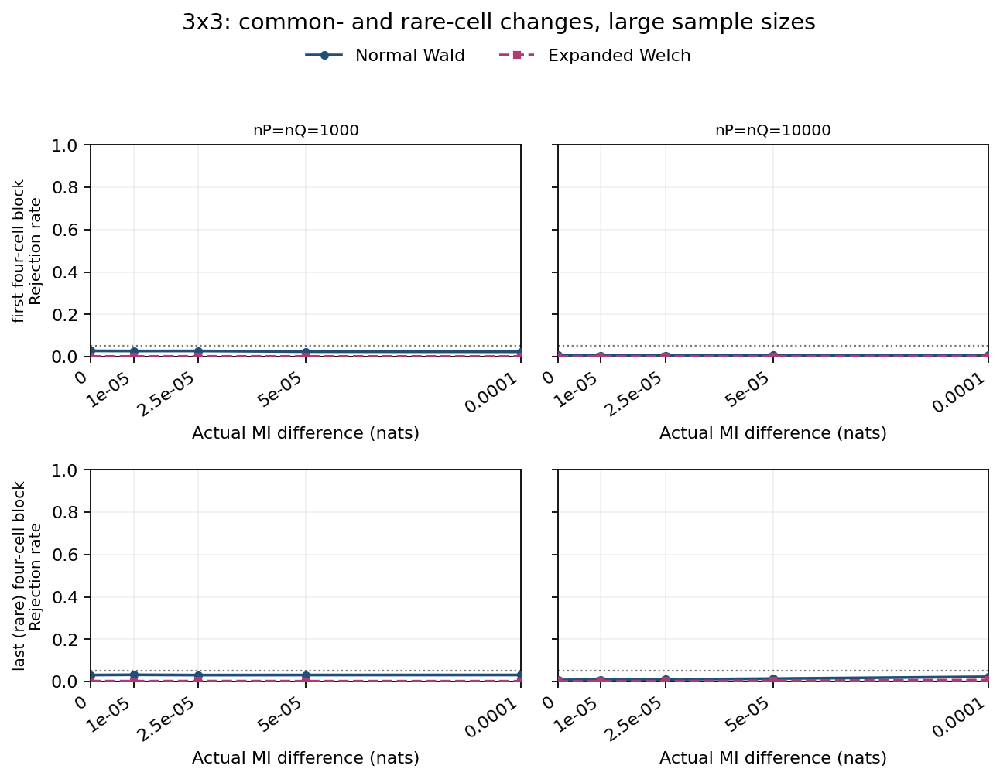

| Specification | Setting |
| --- | --- |
| Table size | 3x3 |
| Horizontal graph regime specifications (columns) | nP=nQ=1000, nP=nQ=10000 |
| Vertical graph regime specifications (rows) | first four-cell block: P row (0.9, 0.1/2 repeated 2 times), P column (0.9, 0.1/2 repeated 2 times); Q row (0.95, 0.05/2 repeated 2 times), Q column (0.95, 0.05/2 repeated 2 times); last (rare) four-cell block: P row (0.9, 0.1/2 repeated 2 times), P column (0.9, 0.1/2 repeated 2 times); Q row (0.95, 0.05/2 repeated 2 times), Q column (0.95, 0.05/2 repeated 2 times) |
| Probability changes | first four-cell block: add at (1,1),(2,2) and subtract at (1,2),(2,1), for both P and Q; last (rare) four-cell block: the same four signs in the last two rows and last two columns, for both P and Q |
| MI settings | Baseline MI {1e-05}; direction {q higher}; actual differences {0, 1e-05, 2.5e-05, 5e-05, 0.0001} nats |
| Horizontal axis within each graph | Actual MI difference in nats, fixed from 0 to 0.0001 |
| Vertical axis within each graph | Unconditional rejection rate from 0 to 1; invalid results count as non-rejections |
| Replicates | 20,000 per unique point |

Null-point rejection and validity:

| Vertical regime | Horizontal regime | x | Method | Rejection | Valid |
| --- | --- | --- | --- | --- | --- |
| first four-cell block | nP=nQ=1000 | 0 | Expanded Welch | 0.0008 | 1.0000 |
| first four-cell block | nP=nQ=1000 | 0 | Normal Wald | 0.0275 | 1.0000 |
| first four-cell block | nP=nQ=10000 | 0 | Expanded Welch | 0.0011 | 1.0000 |
| first four-cell block | nP=nQ=10000 | 0 | Normal Wald | 0.0062 | 1.0000 |
| last (rare) four-cell block | nP=nQ=1000 | 0 | Expanded Welch | 0.0019 | 1.0000 |
| last (rare) four-cell block | nP=nQ=1000 | 0 | Normal Wald | 0.0310 | 1.0000 |
| last (rare) four-cell block | nP=nQ=10000 | 0 | Expanded Welch | 0.0021 | 1.0000 |
| last (rare) four-cell block | nP=nQ=10000 | 0 | Normal Wald | 0.0076 | 1.0000 |

Every plotted rate, interval, validity and minimum expected count

| Vertical regime | Horizontal regime | x | Method | Rejection | 95% interval | Valid | Conditional | Min expected P | Min expected Q |
| --- | --- | --- | --- | --- | --- | --- | --- | --- | --- |
| first four-cell block | nP=nQ=1000 | 0 | Expanded Welch | 0.0008 | [0.0005, 0.0014] | 1.0000 | 0.0008 | 2.5 | 0.625 |
| first four-cell block | nP=nQ=1000 | 0 | Normal Wald | 0.0275 | [0.0253, 0.0299] | 1.0000 | 0.0275 | 2.5 | 0.625 |
| first four-cell block | nP=nQ=1000 | 1e-05 | Expanded Welch | 0.0008 | [0.0005, 0.0013] | 1.0000 | 0.0008 | 2.5 | 0.625 |
| first four-cell block | nP=nQ=1000 | 1e-05 | Normal Wald | 0.0268 | [0.0247, 0.0292] | 1.0000 | 0.0268 | 2.5 | 0.625 |
| first four-cell block | nP=nQ=1000 | 2.5e-05 | Expanded Welch | 0.0011 | [0.0007, 0.0017] | 1.0000 | 0.0011 | 2.5 | 0.625 |
| first four-cell block | nP=nQ=1000 | 2.5e-05 | Normal Wald | 0.0271 | [0.0249, 0.0294] | 1.0000 | 0.0271 | 2.5 | 0.625 |
| first four-cell block | nP=nQ=1000 | 5e-05 | Expanded Welch | 0.0009 | [0.0006, 0.0014] | 1.0000 | 0.0009 | 2.5 | 0.625 |
| first four-cell block | nP=nQ=1000 | 5e-05 | Normal Wald | 0.0238 | [0.0217, 0.0260] | 1.0000 | 0.0238 | 2.5 | 0.625 |
| first four-cell block | nP=nQ=1000 | 0.0001 | Expanded Welch | 0.0007 | [0.0004, 0.0012] | 1.0000 | 0.0007 | 2.5 | 0.625 |
| first four-cell block | nP=nQ=1000 | 0.0001 | Normal Wald | 0.0231 | [0.0211, 0.0253] | 1.0000 | 0.0231 | 2.5 | 0.625 |
| first four-cell block | nP=nQ=10000 | 0 | Expanded Welch | 0.0011 | [0.0008, 0.0017] | 1.0000 | 0.0011 | 25 | 6.25 |
| first four-cell block | nP=nQ=10000 | 0 | Normal Wald | 0.0062 | [0.0052, 0.0073] | 1.0000 | 0.0062 | 25 | 6.25 |
| first four-cell block | nP=nQ=10000 | 1e-05 | Expanded Welch | 0.0011 | [0.0007, 0.0017] | 1.0000 | 0.0011 | 25 | 6.25 |
| first four-cell block | nP=nQ=10000 | 1e-05 | Normal Wald | 0.0046 | [0.0038, 0.0056] | 1.0000 | 0.0046 | 25 | 6.25 |
| first four-cell block | nP=nQ=10000 | 2.5e-05 | Expanded Welch | 0.0010 | [0.0006, 0.0015] | 1.0000 | 0.0010 | 25 | 6.25 |
| first four-cell block | nP=nQ=10000 | 2.5e-05 | Normal Wald | 0.0050 | [0.0042, 0.0061] | 1.0000 | 0.0050 | 25 | 6.25 |
| first four-cell block | nP=nQ=10000 | 5e-05 | Expanded Welch | 0.0010 | [0.0007, 0.0016] | 1.0000 | 0.0010 | 25 | 6.25 |
| first four-cell block | nP=nQ=10000 | 5e-05 | Normal Wald | 0.0058 | [0.0048, 0.0070] | 1.0000 | 0.0058 | 25 | 6.25 |
| first four-cell block | nP=nQ=10000 | 0.0001 | Expanded Welch | 0.0016 | [0.0011, 0.0023] | 1.0000 | 0.0016 | 25 | 6.25 |
| first four-cell block | nP=nQ=10000 | 0.0001 | Normal Wald | 0.0073 | [0.0063, 0.0086] | 1.0000 | 0.0073 | 25 | 6.25 |
| last (rare) four-cell block | nP=nQ=1000 | 0 | Expanded Welch | 0.0019 | [0.0014, 0.0027] | 1.0000 | 0.0019 | 2.388 | 0.5691 |
| last (rare) four-cell block | nP=nQ=1000 | 0 | Normal Wald | 0.0310 | [0.0287, 0.0335] | 1.0000 | 0.0310 | 2.388 | 0.5691 |
| last (rare) four-cell block | nP=nQ=1000 | 1e-05 | Expanded Welch | 0.0016 | [0.0011, 0.0023] | 1.0000 | 0.0016 | 2.388 | 0.546 |
| last (rare) four-cell block | nP=nQ=1000 | 1e-05 | Normal Wald | 0.0321 | [0.0298, 0.0347] | 1.0000 | 0.0321 | 2.388 | 0.546 |
| last (rare) four-cell block | nP=nQ=1000 | 2.5e-05 | Expanded Welch | 0.0021 | [0.0015, 0.0028] | 1.0000 | 0.0021 | 2.388 | 0.5207 |
| last (rare) four-cell block | nP=nQ=1000 | 2.5e-05 | Normal Wald | 0.0308 | [0.0285, 0.0333] | 1.0000 | 0.0308 | 2.388 | 0.5207 |
| last (rare) four-cell block | nP=nQ=1000 | 5e-05 | Expanded Welch | 0.0016 | [0.0012, 0.0023] | 1.0000 | 0.0016 | 2.388 | 0.4886 |
| last (rare) four-cell block | nP=nQ=1000 | 5e-05 | Normal Wald | 0.0312 | [0.0288, 0.0336] | 1.0000 | 0.0312 | 2.388 | 0.4886 |
| last (rare) four-cell block | nP=nQ=1000 | 0.0001 | Expanded Welch | 0.0015 | [0.0011, 0.0022] | 1.0000 | 0.0015 | 2.388 | 0.441 |
| last (rare) four-cell block | nP=nQ=1000 | 0.0001 | Normal Wald | 0.0314 | [0.0290, 0.0339] | 1.0000 | 0.0314 | 2.388 | 0.441 |
| last (rare) four-cell block | nP=nQ=10000 | 0 | Expanded Welch | 0.0021 | [0.0016, 0.0028] | 1.0000 | 0.0021 | 23.88 | 5.691 |
| last (rare) four-cell block | nP=nQ=10000 | 0 | Normal Wald | 0.0076 | [0.0065, 0.0089] | 1.0000 | 0.0076 | 23.88 | 5.691 |
| last (rare) four-cell block | nP=nQ=10000 | 1e-05 | Expanded Welch | 0.0021 | [0.0016, 0.0028] | 1.0000 | 0.0021 | 23.88 | 5.46 |
| last (rare) four-cell block | nP=nQ=10000 | 1e-05 | Normal Wald | 0.0092 | [0.0080, 0.0107] | 1.0000 | 0.0092 | 23.88 | 5.46 |
| last (rare) four-cell block | nP=nQ=10000 | 2.5e-05 | Expanded Welch | 0.0021 | [0.0015, 0.0028] | 1.0000 | 0.0021 | 23.88 | 5.207 |
| last (rare) four-cell block | nP=nQ=10000 | 2.5e-05 | Normal Wald | 0.0101 | [0.0089, 0.0116] | 1.0000 | 0.0101 | 23.88 | 5.207 |
| last (rare) four-cell block | nP=nQ=10000 | 5e-05 | Expanded Welch | 0.0037 | [0.0029, 0.0046] | 1.0000 | 0.0037 | 23.88 | 4.886 |
| last (rare) four-cell block | nP=nQ=10000 | 5e-05 | Normal Wald | 0.0138 | [0.0123, 0.0156] | 1.0000 | 0.0138 | 23.88 | 4.886 |
| last (rare) four-cell block | nP=nQ=10000 | 0.0001 | Expanded Welch | 0.0070 | [0.0059, 0.0083] | 1.0000 | 0.0070 | 23.88 | 4.41 |
| last (rare) four-cell block | nP=nQ=10000 | 0.0001 | Normal Wald | 0.0226 | [0.0207, 0.0248] | 1.0000 | 0.0226 | 23.88 | 4.41 |

### 11.4 8x8: common- and rare-cell changes, small sample sizes

What happens when the probability changes are concentrated in rare cells?

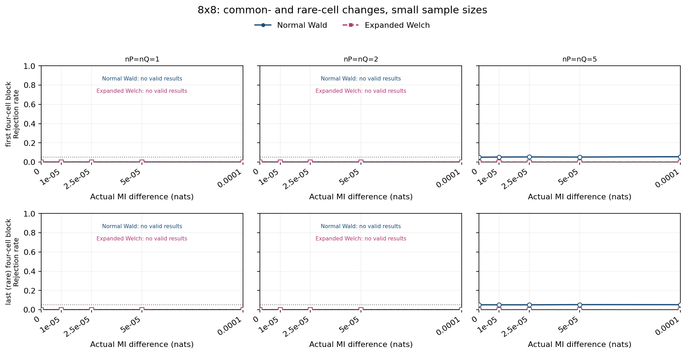

| Specification | Setting |
| --- | --- |
| Table size | 8x8 |
| Horizontal graph regime specifications (columns) | nP=nQ=1, nP=nQ=2, nP=nQ=5 |
| Vertical graph regime specifications (rows) | first four-cell block: P row (0.9, 0.1/7 repeated 7 times), P column (0.9, 0.1/7 repeated 7 times); Q row (0.95, 0.05/7 repeated 7 times), Q column (0.95, 0.05/7 repeated 7 times); last (rare) four-cell block: P row (0.9, 0.1/7 repeated 7 times), P column (0.9, 0.1/7 repeated 7 times); Q row (0.95, 0.05/7 repeated 7 times), Q column (0.95, 0.05/7 repeated 7 times) |
| Probability changes | first four-cell block: add at (1,1),(2,2) and subtract at (1,2),(2,1), for both P and Q; last (rare) four-cell block: the same four signs in the last two rows and last two columns, for both P and Q |
| MI settings | Baseline MI {1e-05}; direction {q higher}; actual differences {0, 1e-05, 2.5e-05, 5e-05, 0.0001} nats |
| Horizontal axis within each graph | Actual MI difference in nats, fixed from 0 to 0.0001 |
| Vertical axis within each graph | Unconditional rejection rate from 0 to 1; invalid results count as non-rejections |
| Replicates | 20,000 per unique point |

Null-point rejection and validity:

| Vertical regime | Horizontal regime | x | Method | Rejection | Valid |
| --- | --- | --- | --- | --- | --- |
| first four-cell block | nP=nQ=1 | 0 | Expanded Welch | 0.0000 | 0.0000 |
| first four-cell block | nP=nQ=1 | 0 | Normal Wald | 0.0000 | 0.0000 |
| first four-cell block | nP=nQ=2 | 0 | Expanded Welch | 0.0000 | 0.0000 |
| first four-cell block | nP=nQ=2 | 0 | Normal Wald | 0.0000 | 0.0000 |
| first four-cell block | nP=nQ=5 | 0 | Expanded Welch | 0.0000 | 0.0081 |
| first four-cell block | nP=nQ=5 | 0 | Normal Wald | 0.0503 | 0.2041 |
| last (rare) four-cell block | nP=nQ=1 | 0 | Expanded Welch | 0.0000 | 0.0000 |
| last (rare) four-cell block | nP=nQ=1 | 0 | Normal Wald | 0.0000 | 0.0000 |
| last (rare) four-cell block | nP=nQ=2 | 0 | Expanded Welch | 0.0000 | 0.0000 |
| last (rare) four-cell block | nP=nQ=2 | 0 | Normal Wald | 0.0000 | 0.0000 |
| last (rare) four-cell block | nP=nQ=5 | 0 | Expanded Welch | 0.0000 | 0.0082 |
| last (rare) four-cell block | nP=nQ=5 | 0 | Normal Wald | 0.0515 | 0.2106 |

Every plotted rate, interval, validity and minimum expected count

| Vertical regime | Horizontal regime | x | Method | Rejection | 95% interval | Valid | Conditional | Min expected P | Min expected Q |
| --- | --- | --- | --- | --- | --- | --- | --- | --- | --- |
| first four-cell block | nP=nQ=1 | 0 | Expanded Welch | 0.0000 | [0.0000, 0.0002] | 0.0000 | NA | 0.0002041 | 5.102e-05 |
| first four-cell block | nP=nQ=1 | 0 | Normal Wald | 0.0000 | [0.0000, 0.0002] | 0.0000 | NA | 0.0002041 | 5.102e-05 |
| first four-cell block | nP=nQ=1 | 1e-05 | Expanded Welch | 0.0000 | [0.0000, 0.0002] | 0.0000 | NA | 0.0002041 | 5.102e-05 |
| first four-cell block | nP=nQ=1 | 1e-05 | Normal Wald | 0.0000 | [0.0000, 0.0002] | 0.0000 | NA | 0.0002041 | 5.102e-05 |
| first four-cell block | nP=nQ=1 | 2.5e-05 | Expanded Welch | 0.0000 | [0.0000, 0.0002] | 0.0000 | NA | 0.0002041 | 5.102e-05 |
| first four-cell block | nP=nQ=1 | 2.5e-05 | Normal Wald | 0.0000 | [0.0000, 0.0002] | 0.0000 | NA | 0.0002041 | 5.102e-05 |
| first four-cell block | nP=nQ=1 | 5e-05 | Expanded Welch | 0.0000 | [0.0000, 0.0002] | 0.0000 | NA | 0.0002041 | 5.102e-05 |
| first four-cell block | nP=nQ=1 | 5e-05 | Normal Wald | 0.0000 | [0.0000, 0.0002] | 0.0000 | NA | 0.0002041 | 5.102e-05 |
| first four-cell block | nP=nQ=1 | 0.0001 | Expanded Welch | 0.0000 | [0.0000, 0.0002] | 0.0000 | NA | 0.0002041 | 5.102e-05 |
| first four-cell block | nP=nQ=1 | 0.0001 | Normal Wald | 0.0000 | [0.0000, 0.0002] | 0.0000 | NA | 0.0002041 | 5.102e-05 |
| first four-cell block | nP=nQ=2 | 0 | Expanded Welch | 0.0000 | [0.0000, 0.0002] | 0.0000 | NA | 0.0004082 | 0.000102 |
| first four-cell block | nP=nQ=2 | 0 | Normal Wald | 0.0000 | [0.0000, 0.0002] | 0.0000 | NA | 0.0004082 | 0.000102 |
| first four-cell block | nP=nQ=2 | 1e-05 | Expanded Welch | 0.0000 | [0.0000, 0.0002] | 0.0000 | NA | 0.0004082 | 0.000102 |
| first four-cell block | nP=nQ=2 | 1e-05 | Normal Wald | 0.0000 | [0.0000, 0.0002] | 0.0000 | NA | 0.0004082 | 0.000102 |
| first four-cell block | nP=nQ=2 | 2.5e-05 | Expanded Welch | 0.0000 | [0.0000, 0.0002] | 0.0000 | NA | 0.0004082 | 0.000102 |
| first four-cell block | nP=nQ=2 | 2.5e-05 | Normal Wald | 0.0000 | [0.0000, 0.0002] | 0.0000 | NA | 0.0004082 | 0.000102 |
| first four-cell block | nP=nQ=2 | 5e-05 | Expanded Welch | 0.0000 | [0.0000, 0.0002] | 0.0000 | NA | 0.0004082 | 0.000102 |
| first four-cell block | nP=nQ=2 | 5e-05 | Normal Wald | 0.0000 | [0.0000, 0.0002] | 0.0000 | NA | 0.0004082 | 0.000102 |
| first four-cell block | nP=nQ=2 | 0.0001 | Expanded Welch | 0.0000 | [0.0000, 0.0002] | 0.0000 | NA | 0.0004082 | 0.000102 |
| first four-cell block | nP=nQ=2 | 0.0001 | Normal Wald | 0.0000 | [0.0000, 0.0002] | 0.0000 | NA | 0.0004082 | 0.000102 |
| first four-cell block | nP=nQ=5 | 0 | Expanded Welch | 0.0000 | [0.0000, 0.0002] | 0.0081 | 0.0000 | 0.00102 | 0.0002551 |
| first four-cell block | nP=nQ=5 | 0 | Normal Wald | 0.0503 | [0.0474, 0.0534] | 0.2041 | 0.2465 | 0.00102 | 0.0002551 |
| first four-cell block | nP=nQ=5 | 1e-05 | Expanded Welch | 0.0000 | [0.0000, 0.0002] | 0.0080 | 0.0000 | 0.00102 | 0.0002551 |
| first four-cell block | nP=nQ=5 | 1e-05 | Normal Wald | 0.0525 | [0.0495, 0.0557] | 0.2129 | 0.2466 | 0.00102 | 0.0002551 |
| first four-cell block | nP=nQ=5 | 2.5e-05 | Expanded Welch | 0.0000 | [0.0000, 0.0002] | 0.0086 | 0.0000 | 0.00102 | 0.0002551 |
| first four-cell block | nP=nQ=5 | 2.5e-05 | Normal Wald | 0.0534 | [0.0504, 0.0567] | 0.2120 | 0.2521 | 0.00102 | 0.0002551 |
| first four-cell block | nP=nQ=5 | 5e-05 | Expanded Welch | 0.0000 | [0.0000, 0.0002] | 0.0086 | 0.0000 | 0.00102 | 0.0002551 |
| first four-cell block | nP=nQ=5 | 5e-05 | Normal Wald | 0.0522 | [0.0492, 0.0553] | 0.2132 | 0.2445 | 0.00102 | 0.0002551 |
| first four-cell block | nP=nQ=5 | 0.0001 | Expanded Welch | 0.0000 | [0.0000, 0.0002] | 0.0088 | 0.0000 | 0.00102 | 0.0002551 |
| first four-cell block | nP=nQ=5 | 0.0001 | Normal Wald | 0.0562 | [0.0531, 0.0595] | 0.2131 | 0.2637 | 0.00102 | 0.0002551 |
| last (rare) four-cell block | nP=nQ=1 | 0 | Expanded Welch | 0.0000 | [0.0000, 0.0002] | 0.0000 | NA | 0.0001722 | 3.518e-05 |
| last (rare) four-cell block | nP=nQ=1 | 0 | Normal Wald | 0.0000 | [0.0000, 0.0002] | 0.0000 | NA | 0.0001722 | 3.518e-05 |
| last (rare) four-cell block | nP=nQ=1 | 1e-05 | Expanded Welch | 0.0000 | [0.0000, 0.0002] | 0.0000 | NA | 0.0001722 | 2.881e-05 |
| last (rare) four-cell block | nP=nQ=1 | 1e-05 | Normal Wald | 0.0000 | [0.0000, 0.0002] | 0.0000 | NA | 0.0001722 | 2.881e-05 |
| last (rare) four-cell block | nP=nQ=1 | 2.5e-05 | Expanded Welch | 0.0000 | [0.0000, 0.0002] | 0.0000 | NA | 0.0001722 | 2.203e-05 |
| last (rare) four-cell block | nP=nQ=1 | 2.5e-05 | Normal Wald | 0.0000 | [0.0000, 0.0002] | 0.0000 | NA | 0.0001722 | 2.203e-05 |
| last (rare) four-cell block | nP=nQ=1 | 5e-05 | Expanded Welch | 0.0000 | [0.0000, 0.0002] | 0.0000 | NA | 0.0001722 | 1.396e-05 |
| last (rare) four-cell block | nP=nQ=1 | 5e-05 | Normal Wald | 0.0000 | [0.0000, 0.0002] | 0.0000 | NA | 0.0001722 | 1.396e-05 |
| last (rare) four-cell block | nP=nQ=1 | 0.0001 | Expanded Welch | 0.0000 | [0.0000, 0.0002] | 0.0000 | NA | 0.0001722 | 3.647e-06 |
| last (rare) four-cell block | nP=nQ=1 | 0.0001 | Normal Wald | 0.0000 | [0.0000, 0.0002] | 0.0000 | NA | 0.0001722 | 3.647e-06 |
| last (rare) four-cell block | nP=nQ=2 | 0 | Expanded Welch | 0.0000 | [0.0000, 0.0002] | 0.0000 | NA | 0.0003444 | 7.036e-05 |
| last (rare) four-cell block | nP=nQ=2 | 0 | Normal Wald | 0.0000 | [0.0000, 0.0002] | 0.0000 | NA | 0.0003444 | 7.036e-05 |
| last (rare) four-cell block | nP=nQ=2 | 1e-05 | Expanded Welch | 0.0000 | [0.0000, 0.0002] | 0.0000 | NA | 0.0003444 | 5.762e-05 |
| last (rare) four-cell block | nP=nQ=2 | 1e-05 | Normal Wald | 0.0000 | [0.0000, 0.0002] | 0.0000 | NA | 0.0003444 | 5.762e-05 |
| last (rare) four-cell block | nP=nQ=2 | 2.5e-05 | Expanded Welch | 0.0000 | [0.0000, 0.0002] | 0.0000 | NA | 0.0003444 | 4.406e-05 |
| last (rare) four-cell block | nP=nQ=2 | 2.5e-05 | Normal Wald | 0.0000 | [0.0000, 0.0002] | 0.0000 | NA | 0.0003444 | 4.406e-05 |
| last (rare) four-cell block | nP=nQ=2 | 5e-05 | Expanded Welch | 0.0000 | [0.0000, 0.0002] | 0.0000 | NA | 0.0003444 | 2.792e-05 |
| last (rare) four-cell block | nP=nQ=2 | 5e-05 | Normal Wald | 0.0000 | [0.0000, 0.0002] | 0.0000 | NA | 0.0003444 | 2.792e-05 |
| last (rare) four-cell block | nP=nQ=2 | 0.0001 | Expanded Welch | 0.0000 | [0.0000, 0.0002] | 0.0000 | NA | 0.0003444 | 7.293e-06 |
| last (rare) four-cell block | nP=nQ=2 | 0.0001 | Normal Wald | 0.0000 | [0.0000, 0.0002] | 0.0000 | NA | 0.0003444 | 7.293e-06 |
| last (rare) four-cell block | nP=nQ=5 | 0 | Expanded Welch | 0.0000 | [0.0000, 0.0002] | 0.0082 | 0.0000 | 0.000861 | 0.0001759 |
| last (rare) four-cell block | nP=nQ=5 | 0 | Normal Wald | 0.0515 | [0.0486, 0.0547] | 0.2106 | 0.2448 | 0.000861 | 0.0001759 |
| last (rare) four-cell block | nP=nQ=5 | 1e-05 | Expanded Welch | 0.0000 | [0.0000, 0.0002] | 0.0086 | 0.0000 | 0.000861 | 0.000144 |
| last (rare) four-cell block | nP=nQ=5 | 1e-05 | Normal Wald | 0.0511 | [0.0481, 0.0542] | 0.2081 | 0.2456 | 0.000861 | 0.000144 |
| last (rare) four-cell block | nP=nQ=5 | 2.5e-05 | Expanded Welch | 0.0000 | [0.0000, 0.0002] | 0.0088 | 0.0000 | 0.000861 | 0.0001101 |
| last (rare) four-cell block | nP=nQ=5 | 2.5e-05 | Normal Wald | 0.0512 | [0.0483, 0.0544] | 0.2080 | 0.2464 | 0.000861 | 0.0001101 |
| last (rare) four-cell block | nP=nQ=5 | 5e-05 | Expanded Welch | 0.0000 | [0.0000, 0.0002] | 0.0088 | 0.0000 | 0.000861 | 6.981e-05 |
| last (rare) four-cell block | nP=nQ=5 | 5e-05 | Normal Wald | 0.0532 | [0.0502, 0.0564] | 0.2102 | 0.2532 | 0.000861 | 6.981e-05 |
| last (rare) four-cell block | nP=nQ=5 | 0.0001 | Expanded Welch | 0.0000 | [0.0000, 0.0002] | 0.0091 | 0.0000 | 0.000861 | 1.823e-05 |
| last (rare) four-cell block | nP=nQ=5 | 0.0001 | Normal Wald | 0.0527 | [0.0497, 0.0559] | 0.2127 | 0.2479 | 0.000861 | 1.823e-05 |

### 11.5 8x8: common- and rare-cell changes, moderate sample sizes

What happens when the probability changes are concentrated in rare cells?

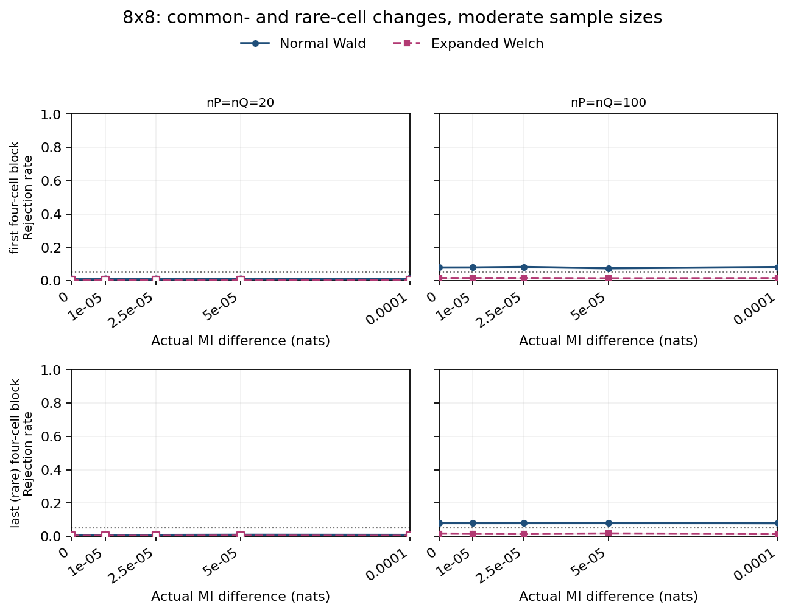

| Specification | Setting |
| --- | --- |
| Table size | 8x8 |
| Horizontal graph regime specifications (columns) | nP=nQ=20, nP=nQ=100 |
| Vertical graph regime specifications (rows) | first four-cell block: P row (0.9, 0.1/7 repeated 7 times), P column (0.9, 0.1/7 repeated 7 times); Q row (0.95, 0.05/7 repeated 7 times), Q column (0.95, 0.05/7 repeated 7 times); last (rare) four-cell block: P row (0.9, 0.1/7 repeated 7 times), P column (0.9, 0.1/7 repeated 7 times); Q row (0.95, 0.05/7 repeated 7 times), Q column (0.95, 0.05/7 repeated 7 times) |
| Probability changes | first four-cell block: add at (1,1),(2,2) and subtract at (1,2),(2,1), for both P and Q; last (rare) four-cell block: the same four signs in the last two rows and last two columns, for both P and Q |
| MI settings | Baseline MI {1e-05}; direction {q higher}; actual differences {0, 1e-05, 2.5e-05, 5e-05, 0.0001} nats |
| Horizontal axis within each graph | Actual MI difference in nats, fixed from 0 to 0.0001 |
| Vertical axis within each graph | Unconditional rejection rate from 0 to 1; invalid results count as non-rejections |
| Replicates | 20,000 per unique point |

Null-point rejection and validity:

| Vertical regime | Horizontal regime | x | Method | Rejection | Valid |
| --- | --- | --- | --- | --- | --- |
| first four-cell block | nP=nQ=20 | 0 | Expanded Welch | 0.0029 | 0.3121 |
| first four-cell block | nP=nQ=20 | 0 | Normal Wald | 0.0079 | 0.8668 |
| first four-cell block | nP=nQ=100 | 0 | Expanded Welch | 0.0153 | 0.9892 |
| first four-cell block | nP=nQ=100 | 0 | Normal Wald | 0.0786 | 1.0000 |
| last (rare) four-cell block | nP=nQ=20 | 0 | Expanded Welch | 0.0031 | 0.3174 |
| last (rare) four-cell block | nP=nQ=20 | 0 | Normal Wald | 0.0085 | 0.8679 |
| last (rare) four-cell block | nP=nQ=100 | 0 | Expanded Welch | 0.0164 | 0.9885 |
| last (rare) four-cell block | nP=nQ=100 | 0 | Normal Wald | 0.0809 | 1.0000 |

Every plotted rate, interval, validity and minimum expected count

| Vertical regime | Horizontal regime | x | Method | Rejection | 95% interval | Valid | Conditional | Min expected P | Min expected Q |
| --- | --- | --- | --- | --- | --- | --- | --- | --- | --- |
| first four-cell block | nP=nQ=20 | 0 | Expanded Welch | 0.0029 | [0.0022, 0.0037] | 0.3121 | 0.0091 | 0.004082 | 0.00102 |
| first four-cell block | nP=nQ=20 | 0 | Normal Wald | 0.0079 | [0.0068, 0.0092] | 0.8668 | 0.0091 | 0.004082 | 0.00102 |
| first four-cell block | nP=nQ=20 | 1e-05 | Expanded Welch | 0.0031 | [0.0024, 0.0040] | 0.3241 | 0.0096 | 0.004082 | 0.00102 |
| first four-cell block | nP=nQ=20 | 1e-05 | Normal Wald | 0.0081 | [0.0070, 0.0095] | 0.8690 | 0.0094 | 0.004082 | 0.00102 |
| first four-cell block | nP=nQ=20 | 2.5e-05 | Expanded Welch | 0.0032 | [0.0025, 0.0041] | 0.3192 | 0.0100 | 0.004082 | 0.00102 |
| first four-cell block | nP=nQ=20 | 2.5e-05 | Normal Wald | 0.0080 | [0.0069, 0.0093] | 0.8679 | 0.0092 | 0.004082 | 0.00102 |
| first four-cell block | nP=nQ=20 | 5e-05 | Expanded Welch | 0.0027 | [0.0021, 0.0036] | 0.3195 | 0.0086 | 0.004082 | 0.00102 |
| first four-cell block | nP=nQ=20 | 5e-05 | Normal Wald | 0.0092 | [0.0079, 0.0106] | 0.8692 | 0.0105 | 0.004082 | 0.00102 |
| first four-cell block | nP=nQ=20 | 0.0001 | Expanded Welch | 0.0034 | [0.0027, 0.0044] | 0.3212 | 0.0107 | 0.004082 | 0.00102 |
| first four-cell block | nP=nQ=20 | 0.0001 | Normal Wald | 0.0097 | [0.0085, 0.0112] | 0.8664 | 0.0113 | 0.004082 | 0.00102 |
| first four-cell block | nP=nQ=100 | 0 | Expanded Welch | 0.0153 | [0.0137, 0.0171] | 0.9892 | 0.0155 | 0.02041 | 0.005102 |
| first four-cell block | nP=nQ=100 | 0 | Normal Wald | 0.0786 | [0.0750, 0.0824] | 1.0000 | 0.0786 | 0.02041 | 0.005102 |
| first four-cell block | nP=nQ=100 | 1e-05 | Expanded Welch | 0.0151 | [0.0135, 0.0169] | 0.9886 | 0.0153 | 0.02041 | 0.005102 |
| first four-cell block | nP=nQ=100 | 1e-05 | Normal Wald | 0.0789 | [0.0752, 0.0827] | 1.0000 | 0.0789 | 0.02041 | 0.005102 |
| first four-cell block | nP=nQ=100 | 2.5e-05 | Expanded Welch | 0.0154 | [0.0138, 0.0172] | 0.9875 | 0.0156 | 0.02041 | 0.005102 |
| first four-cell block | nP=nQ=100 | 2.5e-05 | Normal Wald | 0.0822 | [0.0784, 0.0860] | 1.0000 | 0.0822 | 0.02041 | 0.005102 |
| first four-cell block | nP=nQ=100 | 5e-05 | Expanded Welch | 0.0138 | [0.0123, 0.0156] | 0.9881 | 0.0140 | 0.02041 | 0.005102 |
| first four-cell block | nP=nQ=100 | 5e-05 | Normal Wald | 0.0741 | [0.0706, 0.0778] | 1.0000 | 0.0741 | 0.02041 | 0.005102 |
| first four-cell block | nP=nQ=100 | 0.0001 | Expanded Welch | 0.0149 | [0.0133, 0.0167] | 0.9870 | 0.0151 | 0.02041 | 0.005102 |
| first four-cell block | nP=nQ=100 | 0.0001 | Normal Wald | 0.0816 | [0.0779, 0.0855] | 1.0000 | 0.0816 | 0.02041 | 0.005102 |
| last (rare) four-cell block | nP=nQ=20 | 0 | Expanded Welch | 0.0031 | [0.0024, 0.0039] | 0.3174 | 0.0096 | 0.003444 | 0.0007036 |
| last (rare) four-cell block | nP=nQ=20 | 0 | Normal Wald | 0.0085 | [0.0073, 0.0099] | 0.8679 | 0.0098 | 0.003444 | 0.0007036 |
| last (rare) four-cell block | nP=nQ=20 | 1e-05 | Expanded Welch | 0.0032 | [0.0025, 0.0040] | 0.3180 | 0.0099 | 0.003444 | 0.0005762 |
| last (rare) four-cell block | nP=nQ=20 | 1e-05 | Normal Wald | 0.0080 | [0.0069, 0.0093] | 0.8639 | 0.0093 | 0.003444 | 0.0005762 |
| last (rare) four-cell block | nP=nQ=20 | 2.5e-05 | Expanded Welch | 0.0030 | [0.0023, 0.0039] | 0.3175 | 0.0094 | 0.003444 | 0.0004406 |
| last (rare) four-cell block | nP=nQ=20 | 2.5e-05 | Normal Wald | 0.0083 | [0.0071, 0.0096] | 0.8666 | 0.0095 | 0.003444 | 0.0004406 |
| last (rare) four-cell block | nP=nQ=20 | 5e-05 | Expanded Welch | 0.0038 | [0.0030, 0.0048] | 0.3215 | 0.0118 | 0.003444 | 0.0002792 |
| last (rare) four-cell block | nP=nQ=20 | 5e-05 | Normal Wald | 0.0092 | [0.0080, 0.0107] | 0.8663 | 0.0107 | 0.003444 | 0.0002792 |
| last (rare) four-cell block | nP=nQ=20 | 0.0001 | Expanded Welch | 0.0028 | [0.0022, 0.0036] | 0.3166 | 0.0088 | 0.003444 | 7.293e-05 |
| last (rare) four-cell block | nP=nQ=20 | 0.0001 | Normal Wald | 0.0086 | [0.0074, 0.0099] | 0.8649 | 0.0099 | 0.003444 | 7.293e-05 |
| last (rare) four-cell block | nP=nQ=100 | 0 | Expanded Welch | 0.0164 | [0.0147, 0.0183] | 0.9885 | 0.0166 | 0.01722 | 0.003518 |
| last (rare) four-cell block | nP=nQ=100 | 0 | Normal Wald | 0.0809 | [0.0772, 0.0848] | 1.0000 | 0.0809 | 0.01722 | 0.003518 |
| last (rare) four-cell block | nP=nQ=100 | 1e-05 | Expanded Welch | 0.0152 | [0.0135, 0.0169] | 0.9878 | 0.0153 | 0.01722 | 0.002881 |
| last (rare) four-cell block | nP=nQ=100 | 1e-05 | Normal Wald | 0.0798 | [0.0761, 0.0836] | 1.0000 | 0.0798 | 0.01722 | 0.002881 |
| last (rare) four-cell block | nP=nQ=100 | 2.5e-05 | Expanded Welch | 0.0140 | [0.0125, 0.0157] | 0.9879 | 0.0142 | 0.01722 | 0.002203 |
| last (rare) four-cell block | nP=nQ=100 | 2.5e-05 | Normal Wald | 0.0805 | [0.0769, 0.0844] | 1.0000 | 0.0805 | 0.01722 | 0.002203 |
| last (rare) four-cell block | nP=nQ=100 | 5e-05 | Expanded Welch | 0.0169 | [0.0152, 0.0187] | 0.9876 | 0.0171 | 0.01722 | 0.001396 |
| last (rare) four-cell block | nP=nQ=100 | 5e-05 | Normal Wald | 0.0810 | [0.0773, 0.0849] | 1.0000 | 0.0810 | 0.01722 | 0.001396 |
| last (rare) four-cell block | nP=nQ=100 | 0.0001 | Expanded Welch | 0.0138 | [0.0122, 0.0155] | 0.9870 | 0.0139 | 0.01722 | 0.0003647 |
| last (rare) four-cell block | nP=nQ=100 | 0.0001 | Normal Wald | 0.0793 | [0.0756, 0.0831] | 1.0000 | 0.0793 | 0.01722 | 0.0003647 |

### 11.6 8x8: common- and rare-cell changes, large sample sizes

What happens when the probability changes are concentrated in rare cells?

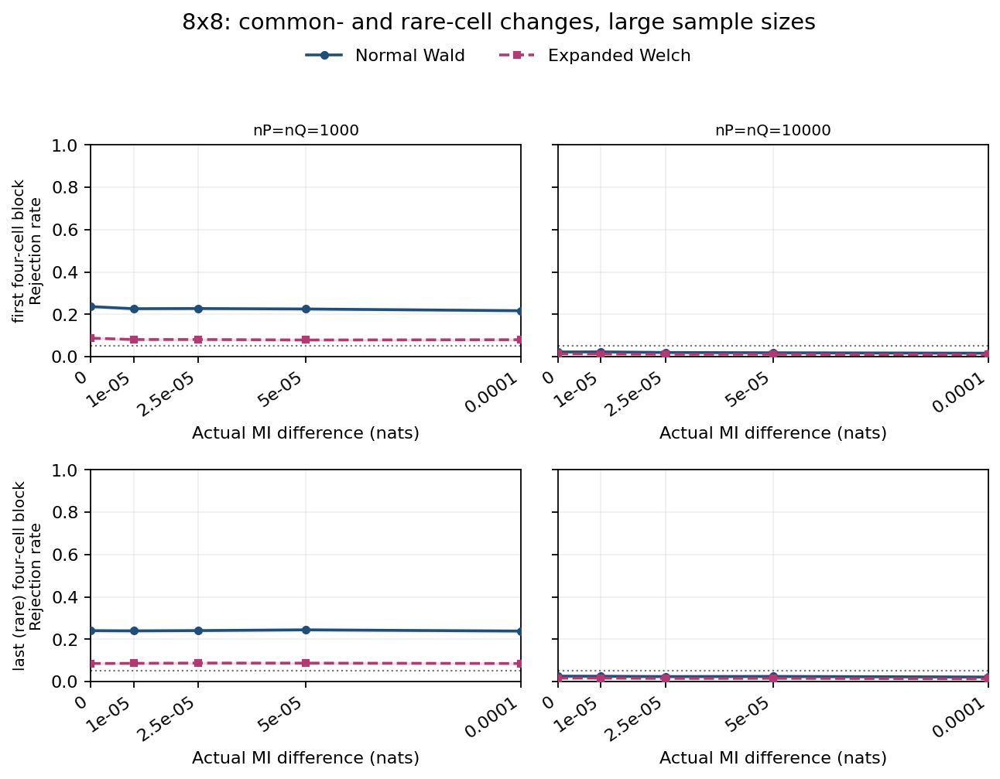

| Specification | Setting |
| --- | --- |
| Table size | 8x8 |
| Horizontal graph regime specifications (columns) | nP=nQ=1000, nP=nQ=10000 |
| Vertical graph regime specifications (rows) | first four-cell block: P row (0.9, 0.1/7 repeated 7 times), P column (0.9, 0.1/7 repeated 7 times); Q row (0.95, 0.05/7 repeated 7 times), Q column (0.95, 0.05/7 repeated 7 times); last (rare) four-cell block: P row (0.9, 0.1/7 repeated 7 times), P column (0.9, 0.1/7 repeated 7 times); Q row (0.95, 0.05/7 repeated 7 times), Q column (0.95, 0.05/7 repeated 7 times) |
| Probability changes | first four-cell block: add at (1,1),(2,2) and subtract at (1,2),(2,1), for both P and Q; last (rare) four-cell block: the same four signs in the last two rows and last two columns, for both P and Q |
| MI settings | Baseline MI {1e-05}; direction {q higher}; actual differences {0, 1e-05, 2.5e-05, 5e-05, 0.0001} nats |
| Horizontal axis within each graph | Actual MI difference in nats, fixed from 0 to 0.0001 |
| Vertical axis within each graph | Unconditional rejection rate from 0 to 1; invalid results count as non-rejections |
| Replicates | 20,000 per unique point |

Null-point rejection and validity:

| Vertical regime | Horizontal regime | x | Method | Rejection | Valid |
| --- | --- | --- | --- | --- | --- |
| first four-cell block | nP=nQ=1000 | 0 | Expanded Welch | 0.0874 | 1.0000 |
| first four-cell block | nP=nQ=1000 | 0 | Normal Wald | 0.2366 | 1.0000 |
| first four-cell block | nP=nQ=10000 | 0 | Expanded Welch | 0.0135 | 1.0000 |
| first four-cell block | nP=nQ=10000 | 0 | Normal Wald | 0.0221 | 1.0000 |
| last (rare) four-cell block | nP=nQ=1000 | 0 | Expanded Welch | 0.0854 | 1.0000 |
| last (rare) four-cell block | nP=nQ=1000 | 0 | Normal Wald | 0.2406 | 1.0000 |
| last (rare) four-cell block | nP=nQ=10000 | 0 | Expanded Welch | 0.0163 | 1.0000 |
| last (rare) four-cell block | nP=nQ=10000 | 0 | Normal Wald | 0.0257 | 1.0000 |

Every plotted rate, interval, validity and minimum expected count

| Vertical regime | Horizontal regime | x | Method | Rejection | 95% interval | Valid | Conditional | Min expected P | Min expected Q |
| --- | --- | --- | --- | --- | --- | --- | --- | --- | --- |
| first four-cell block | nP=nQ=1000 | 0 | Expanded Welch | 0.0874 | [0.0836, 0.0914] | 1.0000 | 0.0874 | 0.2041 | 0.05102 |
| first four-cell block | nP=nQ=1000 | 0 | Normal Wald | 0.2366 | [0.2307, 0.2425] | 1.0000 | 0.2366 | 0.2041 | 0.05102 |
| first four-cell block | nP=nQ=1000 | 1e-05 | Expanded Welch | 0.0807 | [0.0770, 0.0846] | 1.0000 | 0.0807 | 0.2041 | 0.05102 |
| first four-cell block | nP=nQ=1000 | 1e-05 | Normal Wald | 0.2265 | [0.2207, 0.2323] | 1.0000 | 0.2265 | 0.2041 | 0.05102 |
| first four-cell block | nP=nQ=1000 | 2.5e-05 | Expanded Welch | 0.0809 | [0.0772, 0.0847] | 1.0000 | 0.0809 | 0.2041 | 0.05102 |
| first four-cell block | nP=nQ=1000 | 2.5e-05 | Normal Wald | 0.2273 | [0.2215, 0.2331] | 1.0000 | 0.2273 | 0.2041 | 0.05102 |
| first four-cell block | nP=nQ=1000 | 5e-05 | Expanded Welch | 0.0787 | [0.0750, 0.0825] | 1.0000 | 0.0787 | 0.2041 | 0.05102 |
| first four-cell block | nP=nQ=1000 | 5e-05 | Normal Wald | 0.2251 | [0.2194, 0.2309] | 1.0000 | 0.2251 | 0.2041 | 0.05102 |
| first four-cell block | nP=nQ=1000 | 0.0001 | Expanded Welch | 0.0799 | [0.0762, 0.0837] | 1.0000 | 0.0799 | 0.2041 | 0.05102 |
| first four-cell block | nP=nQ=1000 | 0.0001 | Normal Wald | 0.2170 | [0.2113, 0.2227] | 1.0000 | 0.2170 | 0.2041 | 0.05102 |
| first four-cell block | nP=nQ=10000 | 0 | Expanded Welch | 0.0135 | [0.0119, 0.0151] | 1.0000 | 0.0135 | 2.041 | 0.5102 |
| first four-cell block | nP=nQ=10000 | 0 | Normal Wald | 0.0221 | [0.0201, 0.0242] | 1.0000 | 0.0221 | 2.041 | 0.5102 |
| first four-cell block | nP=nQ=10000 | 1e-05 | Expanded Welch | 0.0126 | [0.0112, 0.0143] | 1.0000 | 0.0126 | 2.041 | 0.5102 |
| first four-cell block | nP=nQ=10000 | 1e-05 | Normal Wald | 0.0225 | [0.0205, 0.0246] | 1.0000 | 0.0225 | 2.041 | 0.5102 |
| first four-cell block | nP=nQ=10000 | 2.5e-05 | Expanded Welch | 0.0112 | [0.0099, 0.0128] | 1.0000 | 0.0112 | 2.041 | 0.5102 |
| first four-cell block | nP=nQ=10000 | 2.5e-05 | Normal Wald | 0.0197 | [0.0179, 0.0217] | 1.0000 | 0.0197 | 2.041 | 0.5102 |
| first four-cell block | nP=nQ=10000 | 5e-05 | Expanded Welch | 0.0111 | [0.0097, 0.0126] | 1.0000 | 0.0111 | 2.041 | 0.5102 |
| first four-cell block | nP=nQ=10000 | 5e-05 | Normal Wald | 0.0183 | [0.0165, 0.0203] | 1.0000 | 0.0183 | 2.041 | 0.5102 |
| first four-cell block | nP=nQ=10000 | 0.0001 | Expanded Welch | 0.0093 | [0.0081, 0.0107] | 1.0000 | 0.0093 | 2.041 | 0.5102 |
| first four-cell block | nP=nQ=10000 | 0.0001 | Normal Wald | 0.0164 | [0.0147, 0.0183] | 1.0000 | 0.0164 | 2.041 | 0.5102 |
| last (rare) four-cell block | nP=nQ=1000 | 0 | Expanded Welch | 0.0854 | [0.0817, 0.0894] | 1.0000 | 0.0854 | 0.1722 | 0.03518 |
| last (rare) four-cell block | nP=nQ=1000 | 0 | Normal Wald | 0.2406 | [0.2347, 0.2466] | 1.0000 | 0.2406 | 0.1722 | 0.03518 |
| last (rare) four-cell block | nP=nQ=1000 | 1e-05 | Expanded Welch | 0.0862 | [0.0823, 0.0901] | 1.0000 | 0.0862 | 0.1722 | 0.02881 |
| last (rare) four-cell block | nP=nQ=1000 | 1e-05 | Normal Wald | 0.2396 | [0.2337, 0.2456] | 1.0000 | 0.2396 | 0.1722 | 0.02881 |
| last (rare) four-cell block | nP=nQ=1000 | 2.5e-05 | Expanded Welch | 0.0874 | [0.0836, 0.0914] | 1.0000 | 0.0874 | 0.1722 | 0.02203 |
| last (rare) four-cell block | nP=nQ=1000 | 2.5e-05 | Normal Wald | 0.2409 | [0.2351, 0.2469] | 1.0000 | 0.2409 | 0.1722 | 0.02203 |
| last (rare) four-cell block | nP=nQ=1000 | 5e-05 | Expanded Welch | 0.0872 | [0.0833, 0.0911] | 1.0000 | 0.0872 | 0.1722 | 0.01396 |
| last (rare) four-cell block | nP=nQ=1000 | 5e-05 | Normal Wald | 0.2444 | [0.2385, 0.2504] | 1.0000 | 0.2444 | 0.1722 | 0.01396 |
| last (rare) four-cell block | nP=nQ=1000 | 0.0001 | Expanded Welch | 0.0854 | [0.0817, 0.0894] | 1.0000 | 0.0854 | 0.1722 | 0.003647 |
| last (rare) four-cell block | nP=nQ=1000 | 0.0001 | Normal Wald | 0.2387 | [0.2328, 0.2446] | 1.0000 | 0.2387 | 0.1722 | 0.003647 |
| last (rare) four-cell block | nP=nQ=10000 | 0 | Expanded Welch | 0.0163 | [0.0146, 0.0181] | 1.0000 | 0.0163 | 1.722 | 0.3518 |
| last (rare) four-cell block | nP=nQ=10000 | 0 | Normal Wald | 0.0257 | [0.0236, 0.0280] | 1.0000 | 0.0257 | 1.722 | 0.3518 |
| last (rare) four-cell block | nP=nQ=10000 | 1e-05 | Expanded Welch | 0.0163 | [0.0147, 0.0182] | 1.0000 | 0.0163 | 1.722 | 0.2881 |
| last (rare) four-cell block | nP=nQ=10000 | 1e-05 | Normal Wald | 0.0254 | [0.0233, 0.0276] | 1.0000 | 0.0254 | 1.722 | 0.2881 |
| last (rare) four-cell block | nP=nQ=10000 | 2.5e-05 | Expanded Welch | 0.0147 | [0.0132, 0.0165] | 1.0000 | 0.0147 | 1.722 | 0.2203 |
| last (rare) four-cell block | nP=nQ=10000 | 2.5e-05 | Normal Wald | 0.0238 | [0.0218, 0.0260] | 1.0000 | 0.0238 | 1.722 | 0.2203 |
| last (rare) four-cell block | nP=nQ=10000 | 5e-05 | Expanded Welch | 0.0154 | [0.0137, 0.0171] | 1.0000 | 0.0154 | 1.722 | 0.1396 |
| last (rare) four-cell block | nP=nQ=10000 | 5e-05 | Normal Wald | 0.0245 | [0.0225, 0.0268] | 1.0000 | 0.0245 | 1.722 | 0.1396 |
| last (rare) four-cell block | nP=nQ=10000 | 0.0001 | Expanded Welch | 0.0131 | [0.0116, 0.0147] | 1.0000 | 0.0131 | 1.722 | 0.03647 |
| last (rare) four-cell block | nP=nQ=10000 | 0.0001 | Normal Wald | 0.0215 | [0.0196, 0.0237] | 1.0000 | 0.0215 | 1.722 | 0.03647 |

## 12. Exact independence boundary

What happens at the nonregular boundary where baseline MI is exactly zero?

### 12.1 2x2: exact independence baseline

What happens at the nonregular boundary where baseline MI is exactly zero?

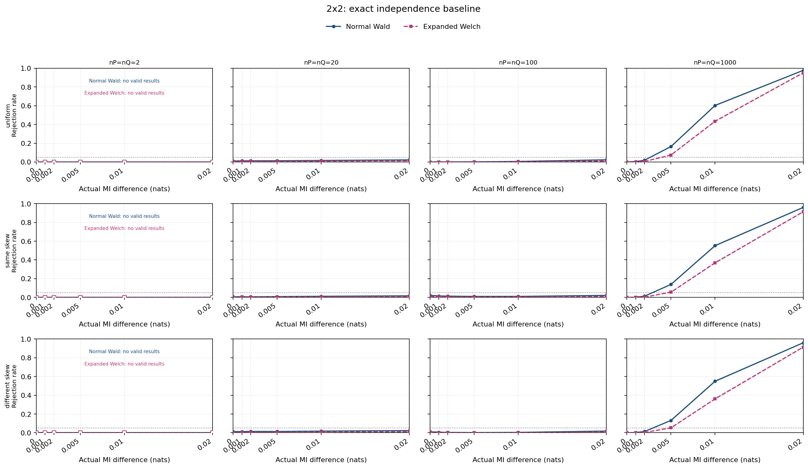

| Specification | Setting |
| --- | --- |
| Table size | 2x2 |
| Horizontal graph regime specifications (columns) | nP=nQ=2, nP=nQ=20, nP=nQ=100, nP=nQ=1000 |
| Vertical graph regime specifications (rows) | uniform: P row (0.5 repeated 2 times), P column (0.5 repeated 2 times); Q row (0.5 repeated 2 times), Q column (0.5 repeated 2 times); same skew: P row (0.8, 0.2), P column (0.8, 0.2); Q row (0.8, 0.2), Q column (0.8, 0.2); different skew: P row (0.7, 0.3), P column (0.7, 0.3); Q row (0.8, 0.2), Q column (0.8, 0.2) |
| Probability changes | uniform: add at (1,1),(2,2) and subtract at (1,2),(2,1), for both P and Q; same skew: add at (1,1),(2,2) and subtract at (1,2),(2,1), for both P and Q; different skew: add at (1,1),(2,2) and subtract at (1,2),(2,1), for both P and Q |
| MI settings | Baseline MI {0}; direction {q higher}; actual differences {0, 0.001, 0.002, 0.005, 0.01, 0.02} nats |
| Horizontal axis within each graph | Actual MI difference in nats, fixed from 0 to 0.02 |
| Vertical axis within each graph | Unconditional rejection rate from 0 to 1; invalid results count as non-rejections |
| Replicates | 20,000 per unique point |

Null-point rejection and validity:

| Vertical regime | Horizontal regime | x | Method | Rejection | Valid |
| --- | --- | --- | --- | --- | --- |
| uniform | nP=nQ=2 | 0 | Expanded Welch | 0.0000 | 0.0000 |
| uniform | nP=nQ=2 | 0 | Normal Wald | 0.0000 | 0.0000 |
| uniform | nP=nQ=20 | 0 | Expanded Welch | 0.0049 | 0.9771 |
| uniform | nP=nQ=20 | 0 | Normal Wald | 0.0106 | 0.9966 |
| uniform | nP=nQ=100 | 0 | Expanded Welch | 0.0001 | 0.9900 |
| uniform | nP=nQ=100 | 0 | Normal Wald | 0.0003 | 0.9999 |
| uniform | nP=nQ=1000 | 0 | Expanded Welch | 0.0000 | 0.9989 |
| uniform | nP=nQ=1000 | 0 | Normal Wald | 0.0001 | 1.0000 |
| same skew | nP=nQ=2 | 0 | Expanded Welch | 0.0000 | 0.0000 |
| same skew | nP=nQ=2 | 0 | Normal Wald | 0.0000 | 0.0000 |
| same skew | nP=nQ=20 | 0 | Expanded Welch | 0.0016 | 0.9515 |
| same skew | nP=nQ=20 | 0 | Normal Wald | 0.0062 | 0.9964 |
| same skew | nP=nQ=100 | 0 | Expanded Welch | 0.0117 | 1.0000 |
| same skew | nP=nQ=100 | 0 | Normal Wald | 0.0216 | 1.0000 |
| same skew | nP=nQ=1000 | 0 | Expanded Welch | 0.0001 | 1.0000 |
| same skew | nP=nQ=1000 | 0 | Normal Wald | 0.0001 | 1.0000 |
| different skew | nP=nQ=2 | 0 | Expanded Welch | 0.0000 | 0.0000 |
| different skew | nP=nQ=2 | 0 | Normal Wald | 0.0000 | 0.0000 |
| different skew | nP=nQ=20 | 0 | Expanded Welch | 0.0022 | 0.9731 |
| different skew | nP=nQ=20 | 0 | Normal Wald | 0.0126 | 0.9959 |
| different skew | nP=nQ=100 | 0 | Expanded Welch | 0.0058 | 1.0000 |
| different skew | nP=nQ=100 | 0 | Normal Wald | 0.0107 | 1.0000 |
| different skew | nP=nQ=1000 | 0 | Expanded Welch | 0.0000 | 1.0000 |
| different skew | nP=nQ=1000 | 0 | Normal Wald | 0.0001 | 1.0000 |

Every plotted rate, interval, validity and minimum expected count

| Vertical regime | Horizontal regime | x | Method | Rejection | 95% interval | Valid | Conditional | Min expected P | Min expected Q |
| --- | --- | --- | --- | --- | --- | --- | --- | --- | --- |
| uniform | nP=nQ=2 | 0 | Expanded Welch | 0.0000 | [0.0000, 0.0002] | 0.0000 | NA | 0.5 | 0.5 |
| uniform | nP=nQ=2 | 0 | Normal Wald | 0.0000 | [0.0000, 0.0002] | 0.0000 | NA | 0.5 | 0.5 |
| uniform | nP=nQ=2 | 0.001 | Expanded Welch | 0.0000 | [0.0000, 0.0002] | 0.0000 | NA | 0.5 | 0.4776 |
| uniform | nP=nQ=2 | 0.001 | Normal Wald | 0.0000 | [0.0000, 0.0002] | 0.0000 | NA | 0.5 | 0.4776 |
| uniform | nP=nQ=2 | 0.002 | Expanded Welch | 0.0000 | [0.0000, 0.0002] | 0.0000 | NA | 0.5 | 0.4684 |
| uniform | nP=nQ=2 | 0.002 | Normal Wald | 0.0000 | [0.0000, 0.0002] | 0.0000 | NA | 0.5 | 0.4684 |
| uniform | nP=nQ=2 | 0.005 | Expanded Welch | 0.0000 | [0.0000, 0.0002] | 0.0000 | NA | 0.5 | 0.45 |
| uniform | nP=nQ=2 | 0.005 | Normal Wald | 0.0000 | [0.0000, 0.0002] | 0.0000 | NA | 0.5 | 0.45 |
| uniform | nP=nQ=2 | 0.01 | Expanded Welch | 0.0000 | [0.0000, 0.0002] | 0.0000 | NA | 0.5 | 0.4294 |
| uniform | nP=nQ=2 | 0.01 | Normal Wald | 0.0000 | [0.0000, 0.0002] | 0.0000 | NA | 0.5 | 0.4294 |
| uniform | nP=nQ=2 | 0.02 | Expanded Welch | 0.0000 | [0.0000, 0.0002] | 0.0000 | NA | 0.5 | 0.4003 |
| uniform | nP=nQ=2 | 0.02 | Normal Wald | 0.0000 | [0.0000, 0.0002] | 0.0000 | NA | 0.5 | 0.4003 |
| uniform | nP=nQ=20 | 0 | Expanded Welch | 0.0049 | [0.0040, 0.0060] | 0.9771 | 0.0050 | 5 | 5 |
| uniform | nP=nQ=20 | 0 | Normal Wald | 0.0106 | [0.0092, 0.0121] | 0.9966 | 0.0106 | 5 | 5 |
| uniform | nP=nQ=20 | 0.001 | Expanded Welch | 0.0050 | [0.0041, 0.0061] | 0.9759 | 0.0051 | 5 | 4.776 |
| uniform | nP=nQ=20 | 0.001 | Normal Wald | 0.0118 | [0.0103, 0.0133] | 0.9963 | 0.0118 | 5 | 4.776 |
| uniform | nP=nQ=20 | 0.002 | Expanded Welch | 0.0056 | [0.0046, 0.0067] | 0.9761 | 0.0057 | 5 | 4.684 |
| uniform | nP=nQ=20 | 0.002 | Normal Wald | 0.0125 | [0.0111, 0.0141] | 0.9967 | 0.0125 | 5 | 4.684 |
| uniform | nP=nQ=20 | 0.005 | Expanded Welch | 0.0070 | [0.0059, 0.0083] | 0.9781 | 0.0072 | 5 | 4.5 |
| uniform | nP=nQ=20 | 0.005 | Normal Wald | 0.0132 | [0.0117, 0.0148] | 0.9962 | 0.0132 | 5 | 4.5 |
| uniform | nP=nQ=20 | 0.01 | Expanded Welch | 0.0095 | [0.0083, 0.0110] | 0.9789 | 0.0098 | 5 | 4.294 |
| uniform | nP=nQ=20 | 0.01 | Normal Wald | 0.0163 | [0.0146, 0.0181] | 0.9974 | 0.0163 | 5 | 4.294 |
| uniform | nP=nQ=20 | 0.02 | Expanded Welch | 0.0123 | [0.0109, 0.0140] | 0.9806 | 0.0126 | 5 | 4.003 |
| uniform | nP=nQ=20 | 0.02 | Normal Wald | 0.0222 | [0.0202, 0.0243] | 0.9982 | 0.0222 | 5 | 4.003 |
| uniform | nP=nQ=100 | 0 | Expanded Welch | 0.0001 | [0.0000, 0.0004] | 0.9900 | 0.0001 | 25 | 25 |
| uniform | nP=nQ=100 | 0 | Normal Wald | 0.0003 | [0.0001, 0.0006] | 0.9999 | 0.0003 | 25 | 25 |
| uniform | nP=nQ=100 | 0.001 | Expanded Welch | 0.0001 | [0.0000, 0.0003] | 0.9917 | 0.0001 | 25 | 23.88 |
| uniform | nP=nQ=100 | 0.001 | Normal Wald | 0.0003 | [0.0001, 0.0007] | 0.9998 | 0.0003 | 25 | 23.88 |
| uniform | nP=nQ=100 | 0.002 | Expanded Welch | 0.0001 | [0.0000, 0.0004] | 0.9930 | 0.0001 | 25 | 23.42 |
| uniform | nP=nQ=100 | 0.002 | Normal Wald | 0.0008 | [0.0005, 0.0012] | 1.0000 | 0.0008 | 25 | 23.42 |
| uniform | nP=nQ=100 | 0.005 | Expanded Welch | 0.0003 | [0.0001, 0.0006] | 0.9931 | 0.0003 | 25 | 22.5 |
| uniform | nP=nQ=100 | 0.005 | Normal Wald | 0.0015 | [0.0011, 0.0021] | 1.0000 | 0.0015 | 25 | 22.5 |
| uniform | nP=nQ=100 | 0.01 | Expanded Welch | 0.0015 | [0.0011, 0.0021] | 0.9946 | 0.0015 | 25 | 21.47 |
| uniform | nP=nQ=100 | 0.01 | Normal Wald | 0.0053 | [0.0044, 0.0065] | 0.9999 | 0.0054 | 25 | 21.47 |
| uniform | nP=nQ=100 | 0.02 | Expanded Welch | 0.0100 | [0.0088, 0.0115] | 0.9950 | 0.0101 | 25 | 20.02 |
| uniform | nP=nQ=100 | 0.02 | Normal Wald | 0.0232 | [0.0212, 0.0253] | 1.0000 | 0.0232 | 25 | 20.02 |
| uniform | nP=nQ=1000 | 0 | Expanded Welch | 0.0000 | [0.0000, 0.0002] | 0.9989 | 0.0000 | 250 | 250 |
| uniform | nP=nQ=1000 | 0 | Normal Wald | 0.0001 | [0.0000, 0.0003] | 1.0000 | 0.0001 | 250 | 250 |
| uniform | nP=nQ=1000 | 0.001 | Expanded Welch | 0.0007 | [0.0004, 0.0012] | 0.9994 | 0.0007 | 250 | 238.8 |
| uniform | nP=nQ=1000 | 0.001 | Normal Wald | 0.0040 | [0.0032, 0.0050] | 1.0000 | 0.0040 | 250 | 238.8 |
| uniform | nP=nQ=1000 | 0.002 | Expanded Welch | 0.0057 | [0.0047, 0.0068] | 0.9997 | 0.0057 | 250 | 234.2 |
| uniform | nP=nQ=1000 | 0.002 | Normal Wald | 0.0188 | [0.0171, 0.0208] | 1.0000 | 0.0188 | 250 | 234.2 |
| uniform | nP=nQ=1000 | 0.005 | Expanded Welch | 0.0741 | [0.0706, 0.0779] | 0.9996 | 0.0742 | 250 | 225 |
| uniform | nP=nQ=1000 | 0.005 | Normal Wald | 0.1651 | [0.1600, 0.1703] | 1.0000 | 0.1651 | 250 | 225 |
| uniform | nP=nQ=1000 | 0.01 | Expanded Welch | 0.4348 | [0.4279, 0.4416] | 0.9995 | 0.4350 | 250 | 214.7 |
| uniform | nP=nQ=1000 | 0.01 | Normal Wald | 0.6035 | [0.5967, 0.6102] | 1.0000 | 0.6035 | 250 | 214.7 |
| uniform | nP=nQ=1000 | 0.02 | Expanded Welch | 0.9511 | [0.9480, 0.9540] | 0.9997 | 0.9514 | 250 | 200.2 |
| uniform | nP=nQ=1000 | 0.02 | Normal Wald | 0.9775 | [0.9753, 0.9794] | 1.0000 | 0.9775 | 250 | 200.2 |
| same skew | nP=nQ=2 | 0 | Expanded Welch | 0.0000 | [0.0000, 0.0002] | 0.0000 | NA | 0.08 | 0.08 |
| same skew | nP=nQ=2 | 0 | Normal Wald | 0.0000 | [0.0000, 0.0002] | 0.0000 | NA | 0.08 | 0.08 |
| same skew | nP=nQ=2 | 0.001 | Expanded Welch | 0.0000 | [0.0000, 0.0002] | 0.0000 | NA | 0.08 | 0.09454 |
| same skew | nP=nQ=2 | 0.001 | Normal Wald | 0.0000 | [0.0000, 0.0002] | 0.0000 | NA | 0.08 | 0.09454 |
| same skew | nP=nQ=2 | 0.002 | Expanded Welch | 0.0000 | [0.0000, 0.0002] | 0.0000 | NA | 0.08 | 0.1007 |
| same skew | nP=nQ=2 | 0.002 | Normal Wald | 0.0000 | [0.0000, 0.0002] | 0.0000 | NA | 0.08 | 0.1007 |
| same skew | nP=nQ=2 | 0.005 | Expanded Welch | 0.0000 | [0.0000, 0.0002] | 0.0000 | NA | 0.08 | 0.113 |
| same skew | nP=nQ=2 | 0.005 | Normal Wald | 0.0000 | [0.0000, 0.0002] | 0.0000 | NA | 0.08 | 0.113 |
| same skew | nP=nQ=2 | 0.01 | Expanded Welch | 0.0000 | [0.0000, 0.0002] | 0.0000 | NA | 0.08 | 0.1272 |
| same skew | nP=nQ=2 | 0.01 | Normal Wald | 0.0000 | [0.0000, 0.0002] | 0.0000 | NA | 0.08 | 0.1272 |
| same skew | nP=nQ=2 | 0.02 | Expanded Welch | 0.0000 | [0.0000, 0.0002] | 0.0000 | NA | 0.08 | 0.1476 |
| same skew | nP=nQ=2 | 0.02 | Normal Wald | 0.0000 | [0.0000, 0.0002] | 0.0000 | NA | 0.08 | 0.1476 |
| same skew | nP=nQ=20 | 0 | Expanded Welch | 0.0016 | [0.0012, 0.0023] | 0.9515 | 0.0017 | 0.8 | 0.8 |
| same skew | nP=nQ=20 | 0 | Normal Wald | 0.0062 | [0.0052, 0.0073] | 0.9964 | 0.0062 | 0.8 | 0.8 |
| same skew | nP=nQ=20 | 0.001 | Expanded Welch | 0.0024 | [0.0018, 0.0031] | 0.9537 | 0.0025 | 0.8 | 0.9454 |
| same skew | nP=nQ=20 | 0.001 | Normal Wald | 0.0067 | [0.0057, 0.0080] | 0.9966 | 0.0068 | 0.8 | 0.9454 |
| same skew | nP=nQ=20 | 0.002 | Expanded Welch | 0.0022 | [0.0016, 0.0029] | 0.9509 | 0.0023 | 0.8 | 1.007 |
| same skew | nP=nQ=20 | 0.002 | Normal Wald | 0.0061 | [0.0051, 0.0073] | 0.9965 | 0.0061 | 0.8 | 1.007 |
| same skew | nP=nQ=20 | 0.005 | Expanded Welch | 0.0036 | [0.0029, 0.0045] | 0.9563 | 0.0038 | 0.8 | 1.13 |
| same skew | nP=nQ=20 | 0.005 | Normal Wald | 0.0081 | [0.0069, 0.0094] | 0.9965 | 0.0081 | 0.8 | 1.13 |
| same skew | nP=nQ=20 | 0.01 | Expanded Welch | 0.0052 | [0.0043, 0.0063] | 0.9540 | 0.0055 | 0.8 | 1.272 |
| same skew | nP=nQ=20 | 0.01 | Normal Wald | 0.0115 | [0.0101, 0.0130] | 0.9970 | 0.0115 | 0.8 | 1.272 |
| same skew | nP=nQ=20 | 0.02 | Expanded Welch | 0.0089 | [0.0077, 0.0104] | 0.9516 | 0.0094 | 0.8 | 1.476 |
| same skew | nP=nQ=20 | 0.02 | Normal Wald | 0.0165 | [0.0148, 0.0184] | 0.9971 | 0.0165 | 0.8 | 1.476 |
| same skew | nP=nQ=100 | 0 | Expanded Welch | 0.0117 | [0.0103, 0.0132] | 1.0000 | 0.0117 | 4 | 4 |
| same skew | nP=nQ=100 | 0 | Normal Wald | 0.0216 | [0.0197, 0.0237] | 1.0000 | 0.0216 | 4 | 4 |
| same skew | nP=nQ=100 | 0.001 | Expanded Welch | 0.0073 | [0.0062, 0.0086] | 0.9998 | 0.0073 | 4 | 4.727 |
| same skew | nP=nQ=100 | 0.001 | Normal Wald | 0.0152 | [0.0136, 0.0170] | 0.9998 | 0.0153 | 4 | 4.727 |
| same skew | nP=nQ=100 | 0.002 | Expanded Welch | 0.0057 | [0.0047, 0.0068] | 1.0000 | 0.0057 | 4 | 5.034 |
| same skew | nP=nQ=100 | 0.002 | Normal Wald | 0.0132 | [0.0117, 0.0149] | 1.0000 | 0.0132 | 4 | 5.034 |
| same skew | nP=nQ=100 | 0.005 | Expanded Welch | 0.0036 | [0.0029, 0.0045] | 0.9999 | 0.0036 | 4 | 5.652 |
| same skew | nP=nQ=100 | 0.005 | Normal Wald | 0.0099 | [0.0086, 0.0114] | 0.9999 | 0.0099 | 4 | 5.652 |
| same skew | nP=nQ=100 | 0.01 | Expanded Welch | 0.0040 | [0.0032, 0.0049] | 1.0000 | 0.0040 | 4 | 6.361 |
| same skew | nP=nQ=100 | 0.01 | Normal Wald | 0.0102 | [0.0089, 0.0117] | 1.0000 | 0.0102 | 4 | 6.361 |
| same skew | nP=nQ=100 | 0.02 | Expanded Welch | 0.0090 | [0.0078, 0.0104] | 1.0000 | 0.0090 | 4 | 7.382 |
| same skew | nP=nQ=100 | 0.02 | Normal Wald | 0.0209 | [0.0190, 0.0229] | 1.0000 | 0.0209 | 4 | 7.382 |
| same skew | nP=nQ=1000 | 0 | Expanded Welch | 0.0001 | [0.0000, 0.0003] | 1.0000 | 0.0001 | 40 | 40 |
| same skew | nP=nQ=1000 | 0 | Normal Wald | 0.0001 | [0.0000, 0.0003] | 1.0000 | 0.0001 | 40 | 40 |
| same skew | nP=nQ=1000 | 0.001 | Expanded Welch | 0.0004 | [0.0002, 0.0008] | 1.0000 | 0.0004 | 40 | 47.27 |
| same skew | nP=nQ=1000 | 0.001 | Normal Wald | 0.0021 | [0.0015, 0.0028] | 1.0000 | 0.0021 | 40 | 47.27 |
| same skew | nP=nQ=1000 | 0.002 | Expanded Welch | 0.0029 | [0.0022, 0.0037] | 1.0000 | 0.0029 | 40 | 50.34 |
| same skew | nP=nQ=1000 | 0.002 | Normal Wald | 0.0129 | [0.0115, 0.0146] | 1.0000 | 0.0129 | 40 | 50.34 |
| same skew | nP=nQ=1000 | 0.005 | Expanded Welch | 0.0555 | [0.0524, 0.0588] | 1.0000 | 0.0555 | 40 | 56.52 |
| same skew | nP=nQ=1000 | 0.005 | Normal Wald | 0.1384 | [0.1337, 0.1433] | 1.0000 | 0.1384 | 40 | 56.52 |
| same skew | nP=nQ=1000 | 0.01 | Expanded Welch | 0.3690 | [0.3624, 0.3758] | 1.0000 | 0.3690 | 40 | 63.61 |
| same skew | nP=nQ=1000 | 0.01 | Normal Wald | 0.5521 | [0.5452, 0.5590] | 1.0000 | 0.5521 | 40 | 63.61 |
| same skew | nP=nQ=1000 | 0.02 | Expanded Welch | 0.9132 | [0.9092, 0.9170] | 1.0000 | 0.9132 | 40 | 73.82 |
| same skew | nP=nQ=1000 | 0.02 | Normal Wald | 0.9597 | [0.9569, 0.9624] | 1.0000 | 0.9597 | 40 | 73.82 |
| different skew | nP=nQ=2 | 0 | Expanded Welch | 0.0000 | [0.0000, 0.0002] | 0.0000 | NA | 0.18 | 0.08 |
| different skew | nP=nQ=2 | 0 | Normal Wald | 0.0000 | [0.0000, 0.0002] | 0.0000 | NA | 0.18 | 0.08 |
| different skew | nP=nQ=2 | 0.001 | Expanded Welch | 0.0000 | [0.0000, 0.0002] | 0.0000 | NA | 0.18 | 0.09454 |
| different skew | nP=nQ=2 | 0.001 | Normal Wald | 0.0000 | [0.0000, 0.0002] | 0.0000 | NA | 0.18 | 0.09454 |
| different skew | nP=nQ=2 | 0.002 | Expanded Welch | 0.0000 | [0.0000, 0.0002] | 0.0000 | NA | 0.18 | 0.1007 |
| different skew | nP=nQ=2 | 0.002 | Normal Wald | 0.0000 | [0.0000, 0.0002] | 0.0000 | NA | 0.18 | 0.1007 |
| different skew | nP=nQ=2 | 0.005 | Expanded Welch | 0.0000 | [0.0000, 0.0002] | 0.0000 | NA | 0.18 | 0.113 |
| different skew | nP=nQ=2 | 0.005 | Normal Wald | 0.0000 | [0.0000, 0.0002] | 0.0000 | NA | 0.18 | 0.113 |
| different skew | nP=nQ=2 | 0.01 | Expanded Welch | 0.0000 | [0.0000, 0.0002] | 0.0000 | NA | 0.18 | 0.1272 |
| different skew | nP=nQ=2 | 0.01 | Normal Wald | 0.0000 | [0.0000, 0.0002] | 0.0000 | NA | 0.18 | 0.1272 |
| different skew | nP=nQ=2 | 0.02 | Expanded Welch | 0.0000 | [0.0000, 0.0002] | 0.0000 | NA | 0.18 | 0.1476 |
| different skew | nP=nQ=2 | 0.02 | Normal Wald | 0.0000 | [0.0000, 0.0002] | 0.0000 | NA | 0.18 | 0.1476 |
| different skew | nP=nQ=20 | 0 | Expanded Welch | 0.0022 | [0.0016, 0.0029] | 0.9731 | 0.0022 | 1.8 | 0.8 |
| different skew | nP=nQ=20 | 0 | Normal Wald | 0.0126 | [0.0112, 0.0143] | 0.9959 | 0.0127 | 1.8 | 0.8 |
| different skew | nP=nQ=20 | 0.001 | Expanded Welch | 0.0032 | [0.0026, 0.0041] | 0.9748 | 0.0033 | 1.8 | 0.9454 |
| different skew | nP=nQ=20 | 0.001 | Normal Wald | 0.0124 | [0.0110, 0.0141] | 0.9974 | 0.0125 | 1.8 | 0.9454 |
| different skew | nP=nQ=20 | 0.002 | Expanded Welch | 0.0039 | [0.0031, 0.0048] | 0.9735 | 0.0040 | 1.8 | 1.007 |
| different skew | nP=nQ=20 | 0.002 | Normal Wald | 0.0143 | [0.0128, 0.0161] | 0.9970 | 0.0144 | 1.8 | 1.007 |
| different skew | nP=nQ=20 | 0.005 | Expanded Welch | 0.0042 | [0.0033, 0.0051] | 0.9736 | 0.0043 | 1.8 | 1.13 |
| different skew | nP=nQ=20 | 0.005 | Normal Wald | 0.0137 | [0.0122, 0.0154] | 0.9966 | 0.0137 | 1.8 | 1.13 |
| different skew | nP=nQ=20 | 0.01 | Expanded Welch | 0.0073 | [0.0063, 0.0086] | 0.9748 | 0.0075 | 1.8 | 1.272 |
| different skew | nP=nQ=20 | 0.01 | Normal Wald | 0.0175 | [0.0158, 0.0194] | 0.9971 | 0.0176 | 1.8 | 1.272 |
| different skew | nP=nQ=20 | 0.02 | Expanded Welch | 0.0119 | [0.0105, 0.0135] | 0.9747 | 0.0122 | 1.8 | 1.476 |
| different skew | nP=nQ=20 | 0.02 | Normal Wald | 0.0230 | [0.0210, 0.0252] | 0.9975 | 0.0231 | 1.8 | 1.476 |
| different skew | nP=nQ=100 | 0 | Expanded Welch | 0.0058 | [0.0048, 0.0070] | 1.0000 | 0.0058 | 9 | 4 |
| different skew | nP=nQ=100 | 0 | Normal Wald | 0.0107 | [0.0094, 0.0122] | 1.0000 | 0.0107 | 9 | 4 |
| different skew | nP=nQ=100 | 0.001 | Expanded Welch | 0.0027 | [0.0020, 0.0035] | 1.0000 | 0.0027 | 9 | 4.727 |
| different skew | nP=nQ=100 | 0.001 | Normal Wald | 0.0062 | [0.0052, 0.0073] | 1.0000 | 0.0062 | 9 | 4.727 |
| different skew | nP=nQ=100 | 0.002 | Expanded Welch | 0.0015 | [0.0011, 0.0022] | 1.0000 | 0.0015 | 9 | 5.034 |
| different skew | nP=nQ=100 | 0.002 | Normal Wald | 0.0039 | [0.0031, 0.0048] | 1.0000 | 0.0039 | 9 | 5.034 |
| different skew | nP=nQ=100 | 0.005 | Expanded Welch | 0.0008 | [0.0005, 0.0013] | 0.9999 | 0.0008 | 9 | 5.652 |
| different skew | nP=nQ=100 | 0.005 | Normal Wald | 0.0024 | [0.0018, 0.0031] | 0.9999 | 0.0024 | 9 | 5.652 |
| different skew | nP=nQ=100 | 0.01 | Expanded Welch | 0.0015 | [0.0011, 0.0022] | 1.0000 | 0.0016 | 9 | 6.361 |
| different skew | nP=nQ=100 | 0.01 | Normal Wald | 0.0040 | [0.0033, 0.0050] | 1.0000 | 0.0041 | 9 | 6.361 |
| different skew | nP=nQ=100 | 0.02 | Expanded Welch | 0.0069 | [0.0058, 0.0081] | 1.0000 | 0.0069 | 9 | 7.382 |
| different skew | nP=nQ=100 | 0.02 | Normal Wald | 0.0180 | [0.0162, 0.0199] | 1.0000 | 0.0180 | 9 | 7.382 |
| different skew | nP=nQ=1000 | 0 | Expanded Welch | 0.0000 | [0.0000, 0.0002] | 1.0000 | 0.0000 | 90 | 40 |
| different skew | nP=nQ=1000 | 0 | Normal Wald | 0.0001 | [0.0001, 0.0004] | 1.0000 | 0.0001 | 90 | 40 |
| different skew | nP=nQ=1000 | 0.001 | Expanded Welch | 0.0004 | [0.0002, 0.0009] | 1.0000 | 0.0004 | 90 | 47.27 |
| different skew | nP=nQ=1000 | 0.001 | Normal Wald | 0.0027 | [0.0021, 0.0035] | 1.0000 | 0.0027 | 90 | 47.27 |
| different skew | nP=nQ=1000 | 0.002 | Expanded Welch | 0.0031 | [0.0024, 0.0040] | 1.0000 | 0.0031 | 90 | 50.34 |
| different skew | nP=nQ=1000 | 0.002 | Normal Wald | 0.0132 | [0.0117, 0.0149] | 1.0000 | 0.0132 | 90 | 50.34 |
| different skew | nP=nQ=1000 | 0.005 | Expanded Welch | 0.0529 | [0.0499, 0.0561] | 1.0000 | 0.0529 | 90 | 56.52 |
| different skew | nP=nQ=1000 | 0.005 | Normal Wald | 0.1323 | [0.1276, 0.1370] | 1.0000 | 0.1323 | 90 | 56.52 |
| different skew | nP=nQ=1000 | 0.01 | Expanded Welch | 0.3619 | [0.3553, 0.3686] | 1.0000 | 0.3619 | 90 | 63.61 |
| different skew | nP=nQ=1000 | 0.01 | Normal Wald | 0.5500 | [0.5431, 0.5569] | 1.0000 | 0.5500 | 90 | 63.61 |
| different skew | nP=nQ=1000 | 0.02 | Expanded Welch | 0.9134 | [0.9094, 0.9172] | 1.0000 | 0.9134 | 90 | 73.82 |
| different skew | nP=nQ=1000 | 0.02 | Normal Wald | 0.9599 | [0.9571, 0.9625] | 1.0000 | 0.9599 | 90 | 73.82 |

### 12.2 8x8: exact independence baseline

What happens at the nonregular boundary where baseline MI is exactly zero?

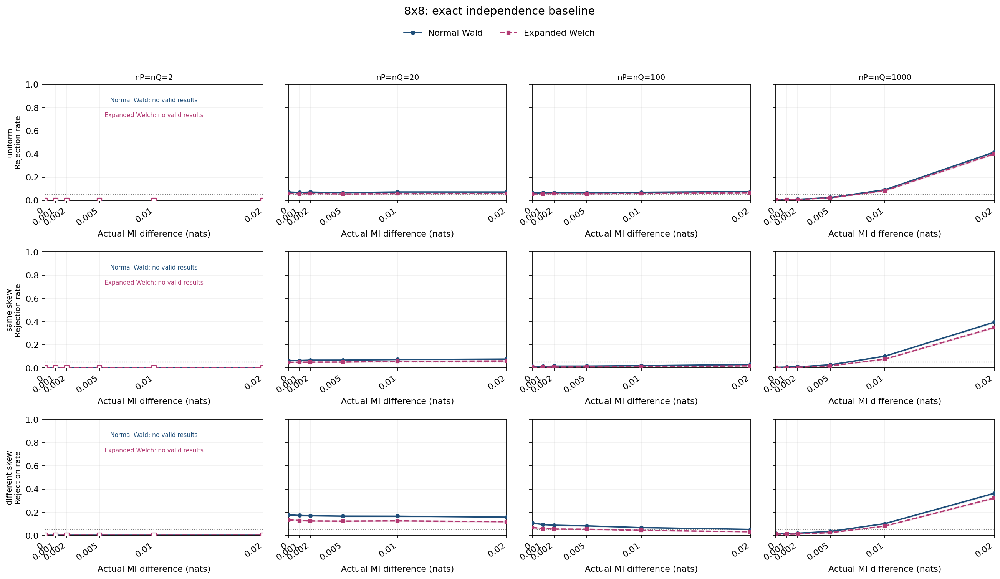

| Specification | Setting |
| --- | --- |
| Table size | 8x8 |
| Horizontal graph regime specifications (columns) | nP=nQ=2, nP=nQ=20, nP=nQ=100, nP=nQ=1000 |
| Vertical graph regime specifications (rows) | uniform: P row (0.125 repeated 8 times), P column (0.125 repeated 8 times); Q row (0.125 repeated 8 times), Q column (0.125 repeated 8 times); same skew: P row (0.8, 0.2/7 repeated 7 times), P column (0.8, 0.2/7 repeated 7 times); Q row (0.8, 0.2/7 repeated 7 times), Q column (0.8, 0.2/7 repeated 7 times); different skew: P row (0.7, 0.3/7 repeated 7 times), P column (0.7, 0.3/7 repeated 7 times); Q row (0.8, 0.2/7 repeated 7 times), Q column (0.8, 0.2/7 repeated 7 times) |
| Probability changes | uniform: add at (1,1),(2,2) and subtract at (1,2),(2,1), for both P and Q; same skew: add at (1,1),(2,2) and subtract at (1,2),(2,1), for both P and Q; different skew: add at (1,1),(2,2) and subtract at (1,2),(2,1), for both P and Q |
| MI settings | Baseline MI {0}; direction {q higher}; actual differences {0, 0.001, 0.002, 0.005, 0.01, 0.02} nats |
| Horizontal axis within each graph | Actual MI difference in nats, fixed from 0 to 0.02 |
| Vertical axis within each graph | Unconditional rejection rate from 0 to 1; invalid results count as non-rejections |
| Replicates | 20,000 per unique point |

Null-point rejection and validity:

| Vertical regime | Horizontal regime | x | Method | Rejection | Valid |
| --- | --- | --- | --- | --- | --- |
| uniform | nP=nQ=2 | 0 | Expanded Welch | 0.0000 | 0.0000 |
| uniform | nP=nQ=2 | 0 | Normal Wald | 0.0000 | 0.0000 |
| uniform | nP=nQ=20 | 0 | Expanded Welch | 0.0598 | 1.0000 |
| uniform | nP=nQ=20 | 0 | Normal Wald | 0.0717 | 1.0000 |
| uniform | nP=nQ=100 | 0 | Expanded Welch | 0.0551 | 1.0000 |
| uniform | nP=nQ=100 | 0 | Normal Wald | 0.0645 | 1.0000 |
| uniform | nP=nQ=1000 | 0 | Expanded Welch | 0.0042 | 1.0000 |
| uniform | nP=nQ=1000 | 0 | Normal Wald | 0.0056 | 1.0000 |
| same skew | nP=nQ=2 | 0 | Expanded Welch | 0.0000 | 0.0000 |
| same skew | nP=nQ=2 | 0 | Normal Wald | 0.0000 | 0.0000 |
| same skew | nP=nQ=20 | 0 | Expanded Welch | 0.0485 | 0.9543 |
| same skew | nP=nQ=20 | 0 | Normal Wald | 0.0644 | 0.9996 |
| same skew | nP=nQ=100 | 0 | Expanded Welch | 0.0060 | 1.0000 |
| same skew | nP=nQ=100 | 0 | Normal Wald | 0.0123 | 1.0000 |
| same skew | nP=nQ=1000 | 0 | Expanded Welch | 0.0029 | 1.0000 |
| same skew | nP=nQ=1000 | 0 | Normal Wald | 0.0055 | 1.0000 |
| different skew | nP=nQ=2 | 0 | Expanded Welch | 0.0000 | 0.0000 |
| different skew | nP=nQ=2 | 0 | Normal Wald | 0.0000 | 0.0000 |
| different skew | nP=nQ=20 | 0 | Expanded Welch | 0.1333 | 0.9759 |
| different skew | nP=nQ=20 | 0 | Normal Wald | 0.1772 | 1.0000 |
| different skew | nP=nQ=100 | 0 | Expanded Welch | 0.0682 | 1.0000 |
| different skew | nP=nQ=100 | 0 | Normal Wald | 0.1064 | 1.0000 |
| different skew | nP=nQ=1000 | 0 | Expanded Welch | 0.0114 | 1.0000 |
| different skew | nP=nQ=1000 | 0 | Normal Wald | 0.0173 | 1.0000 |

Every plotted rate, interval, validity and minimum expected count

| Vertical regime | Horizontal regime | x | Method | Rejection | 95% interval | Valid | Conditional | Min expected P | Min expected Q |
| --- | --- | --- | --- | --- | --- | --- | --- | --- | --- |
| uniform | nP=nQ=2 | 0 | Expanded Welch | 0.0000 | [0.0000, 0.0002] | 0.0000 | NA | 0.03125 | 0.03125 |
| uniform | nP=nQ=2 | 0 | Normal Wald | 0.0000 | [0.0000, 0.0002] | 0.0000 | NA | 0.03125 | 0.03125 |
| uniform | nP=nQ=2 | 0.001 | Expanded Welch | 0.0000 | [0.0000, 0.0002] | 0.0000 | NA | 0.03125 | 0.02567 |
| uniform | nP=nQ=2 | 0.001 | Normal Wald | 0.0000 | [0.0000, 0.0002] | 0.0000 | NA | 0.03125 | 0.02567 |
| uniform | nP=nQ=2 | 0.002 | Expanded Welch | 0.0000 | [0.0000, 0.0002] | 0.0000 | NA | 0.03125 | 0.02339 |
| uniform | nP=nQ=2 | 0.002 | Normal Wald | 0.0000 | [0.0000, 0.0002] | 0.0000 | NA | 0.03125 | 0.02339 |
| uniform | nP=nQ=2 | 0.005 | Expanded Welch | 0.0000 | [0.0000, 0.0002] | 0.0000 | NA | 0.03125 | 0.01892 |
| uniform | nP=nQ=2 | 0.005 | Normal Wald | 0.0000 | [0.0000, 0.0002] | 0.0000 | NA | 0.03125 | 0.01892 |
| uniform | nP=nQ=2 | 0.01 | Expanded Welch | 0.0000 | [0.0000, 0.0002] | 0.0000 | NA | 0.03125 | 0.01406 |
| uniform | nP=nQ=2 | 0.01 | Normal Wald | 0.0000 | [0.0000, 0.0002] | 0.0000 | NA | 0.03125 | 0.01406 |
| uniform | nP=nQ=2 | 0.02 | Expanded Welch | 0.0000 | [0.0000, 0.0002] | 0.0000 | NA | 0.03125 | 0.007697 |
| uniform | nP=nQ=2 | 0.02 | Normal Wald | 0.0000 | [0.0000, 0.0002] | 0.0000 | NA | 0.03125 | 0.007697 |
| uniform | nP=nQ=20 | 0 | Expanded Welch | 0.0598 | [0.0566, 0.0632] | 1.0000 | 0.0598 | 0.3125 | 0.3125 |
| uniform | nP=nQ=20 | 0 | Normal Wald | 0.0717 | [0.0683, 0.0754] | 1.0000 | 0.0717 | 0.3125 | 0.3125 |
| uniform | nP=nQ=20 | 0.001 | Expanded Welch | 0.0563 | [0.0532, 0.0596] | 1.0000 | 0.0563 | 0.3125 | 0.2567 |
| uniform | nP=nQ=20 | 0.001 | Normal Wald | 0.0688 | [0.0654, 0.0724] | 1.0000 | 0.0688 | 0.3125 | 0.2567 |
| uniform | nP=nQ=20 | 0.002 | Expanded Welch | 0.0593 | [0.0562, 0.0627] | 1.0000 | 0.0593 | 0.3125 | 0.2339 |
| uniform | nP=nQ=20 | 0.002 | Normal Wald | 0.0712 | [0.0678, 0.0749] | 1.0000 | 0.0712 | 0.3125 | 0.2339 |
| uniform | nP=nQ=20 | 0.005 | Expanded Welch | 0.0554 | [0.0523, 0.0587] | 1.0000 | 0.0554 | 0.3125 | 0.1892 |
| uniform | nP=nQ=20 | 0.005 | Normal Wald | 0.0670 | [0.0636, 0.0705] | 1.0000 | 0.0670 | 0.3125 | 0.1892 |
| uniform | nP=nQ=20 | 0.01 | Expanded Welch | 0.0580 | [0.0548, 0.0613] | 1.0000 | 0.0580 | 0.3125 | 0.1406 |
| uniform | nP=nQ=20 | 0.01 | Normal Wald | 0.0723 | [0.0688, 0.0760] | 1.0000 | 0.0723 | 0.3125 | 0.1406 |
| uniform | nP=nQ=20 | 0.02 | Expanded Welch | 0.0590 | [0.0559, 0.0624] | 1.0000 | 0.0590 | 0.3125 | 0.07697 |
| uniform | nP=nQ=20 | 0.02 | Normal Wald | 0.0720 | [0.0685, 0.0757] | 1.0000 | 0.0720 | 0.3125 | 0.07697 |
| uniform | nP=nQ=100 | 0 | Expanded Welch | 0.0551 | [0.0521, 0.0584] | 1.0000 | 0.0551 | 1.562 | 1.562 |
| uniform | nP=nQ=100 | 0 | Normal Wald | 0.0645 | [0.0612, 0.0680] | 1.0000 | 0.0645 | 1.562 | 1.562 |
| uniform | nP=nQ=100 | 0.001 | Expanded Welch | 0.0570 | [0.0539, 0.0604] | 1.0000 | 0.0570 | 1.562 | 1.284 |
| uniform | nP=nQ=100 | 0.001 | Normal Wald | 0.0656 | [0.0623, 0.0691] | 1.0000 | 0.0656 | 1.562 | 1.284 |
| uniform | nP=nQ=100 | 0.002 | Expanded Welch | 0.0585 | [0.0553, 0.0618] | 1.0000 | 0.0585 | 1.562 | 1.169 |
| uniform | nP=nQ=100 | 0.002 | Normal Wald | 0.0675 | [0.0642, 0.0711] | 1.0000 | 0.0675 | 1.562 | 1.169 |
| uniform | nP=nQ=100 | 0.005 | Expanded Welch | 0.0571 | [0.0540, 0.0604] | 1.0000 | 0.0571 | 1.562 | 0.946 |
| uniform | nP=nQ=100 | 0.005 | Normal Wald | 0.0668 | [0.0634, 0.0703] | 1.0000 | 0.0668 | 1.562 | 0.946 |
| uniform | nP=nQ=100 | 0.01 | Expanded Welch | 0.0597 | [0.0565, 0.0631] | 1.0000 | 0.0597 | 1.562 | 0.7031 |
| uniform | nP=nQ=100 | 0.01 | Normal Wald | 0.0698 | [0.0663, 0.0734] | 1.0000 | 0.0698 | 1.562 | 0.7031 |
| uniform | nP=nQ=100 | 0.02 | Expanded Welch | 0.0669 | [0.0635, 0.0704] | 1.0000 | 0.0669 | 1.562 | 0.3848 |
| uniform | nP=nQ=100 | 0.02 | Normal Wald | 0.0764 | [0.0728, 0.0801] | 1.0000 | 0.0764 | 1.562 | 0.3848 |
| uniform | nP=nQ=1000 | 0 | Expanded Welch | 0.0042 | [0.0034, 0.0052] | 1.0000 | 0.0042 | 15.62 | 15.62 |
| uniform | nP=nQ=1000 | 0 | Normal Wald | 0.0056 | [0.0047, 0.0067] | 1.0000 | 0.0056 | 15.62 | 15.62 |
| uniform | nP=nQ=1000 | 0.001 | Expanded Welch | 0.0060 | [0.0051, 0.0072] | 1.0000 | 0.0060 | 15.62 | 12.84 |
| uniform | nP=nQ=1000 | 0.001 | Normal Wald | 0.0072 | [0.0061, 0.0084] | 1.0000 | 0.0072 | 15.62 | 12.84 |
| uniform | nP=nQ=1000 | 0.002 | Expanded Welch | 0.0078 | [0.0067, 0.0092] | 1.0000 | 0.0078 | 15.62 | 11.69 |
| uniform | nP=nQ=1000 | 0.002 | Normal Wald | 0.0092 | [0.0079, 0.0106] | 1.0000 | 0.0092 | 15.62 | 11.69 |
| uniform | nP=nQ=1000 | 0.005 | Expanded Welch | 0.0221 | [0.0202, 0.0242] | 1.0000 | 0.0221 | 15.62 | 9.46 |
| uniform | nP=nQ=1000 | 0.005 | Normal Wald | 0.0249 | [0.0228, 0.0271] | 1.0000 | 0.0249 | 15.62 | 9.46 |
| uniform | nP=nQ=1000 | 0.01 | Expanded Welch | 0.0834 | [0.0797, 0.0874] | 1.0000 | 0.0834 | 15.62 | 7.031 |
| uniform | nP=nQ=1000 | 0.01 | Normal Wald | 0.0917 | [0.0878, 0.0958] | 1.0000 | 0.0917 | 15.62 | 7.031 |
| uniform | nP=nQ=1000 | 0.02 | Expanded Welch | 0.4012 | [0.3944, 0.4080] | 1.0000 | 0.4012 | 15.62 | 3.848 |
| uniform | nP=nQ=1000 | 0.02 | Normal Wald | 0.4158 | [0.4090, 0.4226] | 1.0000 | 0.4158 | 15.62 | 3.848 |
| same skew | nP=nQ=2 | 0 | Expanded Welch | 0.0000 | [0.0000, 0.0002] | 0.0000 | NA | 0.001633 | 0.001633 |
| same skew | nP=nQ=2 | 0 | Normal Wald | 0.0000 | [0.0000, 0.0002] | 0.0000 | NA | 0.001633 | 0.001633 |
| same skew | nP=nQ=2 | 0.001 | Expanded Welch | 0.0000 | [0.0000, 0.0002] | 0.0000 | NA | 0.001633 | 0.001633 |
| same skew | nP=nQ=2 | 0.001 | Normal Wald | 0.0000 | [0.0000, 0.0002] | 0.0000 | NA | 0.001633 | 0.001633 |
| same skew | nP=nQ=2 | 0.002 | Expanded Welch | 0.0000 | [0.0000, 0.0002] | 0.0000 | NA | 0.001633 | 0.001633 |
| same skew | nP=nQ=2 | 0.002 | Normal Wald | 0.0000 | [0.0000, 0.0002] | 0.0000 | NA | 0.001633 | 0.001633 |
| same skew | nP=nQ=2 | 0.005 | Expanded Welch | 0.0000 | [0.0000, 0.0002] | 0.0000 | NA | 0.001633 | 0.001633 |
| same skew | nP=nQ=2 | 0.005 | Normal Wald | 0.0000 | [0.0000, 0.0002] | 0.0000 | NA | 0.001633 | 0.001633 |
| same skew | nP=nQ=2 | 0.01 | Expanded Welch | 0.0000 | [0.0000, 0.0002] | 0.0000 | NA | 0.001633 | 0.001633 |
| same skew | nP=nQ=2 | 0.01 | Normal Wald | 0.0000 | [0.0000, 0.0002] | 0.0000 | NA | 0.001633 | 0.001633 |
| same skew | nP=nQ=2 | 0.02 | Expanded Welch | 0.0000 | [0.0000, 0.0002] | 0.0000 | NA | 0.001633 | 0.001633 |
| same skew | nP=nQ=2 | 0.02 | Normal Wald | 0.0000 | [0.0000, 0.0002] | 0.0000 | NA | 0.001633 | 0.001633 |
| same skew | nP=nQ=20 | 0 | Expanded Welch | 0.0485 | [0.0456, 0.0515] | 0.9543 | 0.0508 | 0.01633 | 0.01633 |
| same skew | nP=nQ=20 | 0 | Normal Wald | 0.0644 | [0.0610, 0.0678] | 0.9996 | 0.0644 | 0.01633 | 0.01633 |
| same skew | nP=nQ=20 | 0.001 | Expanded Welch | 0.0493 | [0.0464, 0.0524] | 0.9557 | 0.0516 | 0.01633 | 0.01633 |
| same skew | nP=nQ=20 | 0.001 | Normal Wald | 0.0642 | [0.0609, 0.0677] | 0.9996 | 0.0642 | 0.01633 | 0.01633 |
| same skew | nP=nQ=20 | 0.002 | Expanded Welch | 0.0498 | [0.0469, 0.0529] | 0.9554 | 0.0521 | 0.01633 | 0.01633 |
| same skew | nP=nQ=20 | 0.002 | Normal Wald | 0.0669 | [0.0635, 0.0704] | 0.9997 | 0.0669 | 0.01633 | 0.01633 |
| same skew | nP=nQ=20 | 0.005 | Expanded Welch | 0.0503 | [0.0473, 0.0534] | 0.9548 | 0.0526 | 0.01633 | 0.01633 |
| same skew | nP=nQ=20 | 0.005 | Normal Wald | 0.0670 | [0.0636, 0.0705] | 0.9996 | 0.0670 | 0.01633 | 0.01633 |
| same skew | nP=nQ=20 | 0.01 | Expanded Welch | 0.0559 | [0.0528, 0.0592] | 0.9518 | 0.0587 | 0.01633 | 0.01633 |
| same skew | nP=nQ=20 | 0.01 | Normal Wald | 0.0722 | [0.0687, 0.0759] | 0.9994 | 0.0723 | 0.01633 | 0.01633 |
| same skew | nP=nQ=20 | 0.02 | Expanded Welch | 0.0600 | [0.0567, 0.0633] | 0.9577 | 0.0626 | 0.01633 | 0.01633 |
| same skew | nP=nQ=20 | 0.02 | Normal Wald | 0.0761 | [0.0725, 0.0798] | 0.9995 | 0.0761 | 0.01633 | 0.01633 |
| same skew | nP=nQ=100 | 0 | Expanded Welch | 0.0060 | [0.0051, 0.0072] | 1.0000 | 0.0060 | 0.08163 | 0.08163 |
| same skew | nP=nQ=100 | 0 | Normal Wald | 0.0123 | [0.0109, 0.0139] | 1.0000 | 0.0123 | 0.08163 | 0.08163 |
| same skew | nP=nQ=100 | 0.001 | Expanded Welch | 0.0060 | [0.0050, 0.0072] | 1.0000 | 0.0060 | 0.08163 | 0.08163 |
| same skew | nP=nQ=100 | 0.001 | Normal Wald | 0.0132 | [0.0117, 0.0148] | 1.0000 | 0.0132 | 0.08163 | 0.08163 |
| same skew | nP=nQ=100 | 0.002 | Expanded Welch | 0.0073 | [0.0063, 0.0086] | 1.0000 | 0.0073 | 0.08163 | 0.08163 |
| same skew | nP=nQ=100 | 0.002 | Normal Wald | 0.0157 | [0.0141, 0.0175] | 1.0000 | 0.0157 | 0.08163 | 0.08163 |
| same skew | nP=nQ=100 | 0.005 | Expanded Welch | 0.0086 | [0.0074, 0.0100] | 1.0000 | 0.0086 | 0.08163 | 0.08163 |
| same skew | nP=nQ=100 | 0.005 | Normal Wald | 0.0159 | [0.0143, 0.0178] | 1.0000 | 0.0159 | 0.08163 | 0.08163 |
| same skew | nP=nQ=100 | 0.01 | Expanded Welch | 0.0105 | [0.0092, 0.0120] | 1.0000 | 0.0105 | 0.08163 | 0.08163 |
| same skew | nP=nQ=100 | 0.01 | Normal Wald | 0.0195 | [0.0177, 0.0215] | 1.0000 | 0.0195 | 0.08163 | 0.08163 |
| same skew | nP=nQ=100 | 0.02 | Expanded Welch | 0.0182 | [0.0165, 0.0202] | 1.0000 | 0.0182 | 0.08163 | 0.08163 |
| same skew | nP=nQ=100 | 0.02 | Normal Wald | 0.0288 | [0.0266, 0.0312] | 1.0000 | 0.0288 | 0.08163 | 0.08163 |
| same skew | nP=nQ=1000 | 0 | Expanded Welch | 0.0029 | [0.0022, 0.0037] | 1.0000 | 0.0029 | 0.8163 | 0.8163 |
| same skew | nP=nQ=1000 | 0 | Normal Wald | 0.0055 | [0.0046, 0.0066] | 1.0000 | 0.0055 | 0.8163 | 0.8163 |
| same skew | nP=nQ=1000 | 0.001 | Expanded Welch | 0.0035 | [0.0028, 0.0044] | 1.0000 | 0.0035 | 0.8163 | 0.8163 |
| same skew | nP=nQ=1000 | 0.001 | Normal Wald | 0.0073 | [0.0062, 0.0085] | 1.0000 | 0.0073 | 0.8163 | 0.8163 |
| same skew | nP=nQ=1000 | 0.002 | Expanded Welch | 0.0055 | [0.0046, 0.0066] | 1.0000 | 0.0055 | 0.8163 | 0.8163 |
| same skew | nP=nQ=1000 | 0.002 | Normal Wald | 0.0096 | [0.0083, 0.0110] | 1.0000 | 0.0096 | 0.8163 | 0.8163 |
| same skew | nP=nQ=1000 | 0.005 | Expanded Welch | 0.0177 | [0.0160, 0.0196] | 1.0000 | 0.0177 | 0.8163 | 0.8163 |
| same skew | nP=nQ=1000 | 0.005 | Normal Wald | 0.0270 | [0.0248, 0.0293] | 1.0000 | 0.0270 | 0.8163 | 0.8163 |
| same skew | nP=nQ=1000 | 0.01 | Expanded Welch | 0.0760 | [0.0724, 0.0798] | 1.0000 | 0.0760 | 0.8163 | 0.8163 |
| same skew | nP=nQ=1000 | 0.01 | Normal Wald | 0.1011 | [0.0970, 0.1054] | 1.0000 | 0.1011 | 0.8163 | 0.8163 |
| same skew | nP=nQ=1000 | 0.02 | Expanded Welch | 0.3477 | [0.3411, 0.3543] | 1.0000 | 0.3477 | 0.8163 | 0.8163 |
| same skew | nP=nQ=1000 | 0.02 | Normal Wald | 0.3938 | [0.3870, 0.4006] | 1.0000 | 0.3938 | 0.8163 | 0.8163 |
| different skew | nP=nQ=2 | 0 | Expanded Welch | 0.0000 | [0.0000, 0.0002] | 0.0000 | NA | 0.003673 | 0.001633 |
| different skew | nP=nQ=2 | 0 | Normal Wald | 0.0000 | [0.0000, 0.0002] | 0.0000 | NA | 0.003673 | 0.001633 |
| different skew | nP=nQ=2 | 0.001 | Expanded Welch | 0.0000 | [0.0000, 0.0002] | 0.0000 | NA | 0.003673 | 0.001633 |
| different skew | nP=nQ=2 | 0.001 | Normal Wald | 0.0000 | [0.0000, 0.0002] | 0.0000 | NA | 0.003673 | 0.001633 |
| different skew | nP=nQ=2 | 0.002 | Expanded Welch | 0.0000 | [0.0000, 0.0002] | 0.0000 | NA | 0.003673 | 0.001633 |
| different skew | nP=nQ=2 | 0.002 | Normal Wald | 0.0000 | [0.0000, 0.0002] | 0.0000 | NA | 0.003673 | 0.001633 |
| different skew | nP=nQ=2 | 0.005 | Expanded Welch | 0.0000 | [0.0000, 0.0002] | 0.0000 | NA | 0.003673 | 0.001633 |
| different skew | nP=nQ=2 | 0.005 | Normal Wald | 0.0000 | [0.0000, 0.0002] | 0.0000 | NA | 0.003673 | 0.001633 |
| different skew | nP=nQ=2 | 0.01 | Expanded Welch | 0.0000 | [0.0000, 0.0002] | 0.0000 | NA | 0.003673 | 0.001633 |
| different skew | nP=nQ=2 | 0.01 | Normal Wald | 0.0000 | [0.0000, 0.0002] | 0.0000 | NA | 0.003673 | 0.001633 |
| different skew | nP=nQ=2 | 0.02 | Expanded Welch | 0.0000 | [0.0000, 0.0002] | 0.0000 | NA | 0.003673 | 0.001633 |
| different skew | nP=nQ=2 | 0.02 | Normal Wald | 0.0000 | [0.0000, 0.0002] | 0.0000 | NA | 0.003673 | 0.001633 |
| different skew | nP=nQ=20 | 0 | Expanded Welch | 0.1333 | [0.1287, 0.1381] | 0.9759 | 0.1366 | 0.03673 | 0.01633 |
| different skew | nP=nQ=20 | 0 | Normal Wald | 0.1772 | [0.1719, 0.1825] | 1.0000 | 0.1772 | 0.03673 | 0.01633 |
| different skew | nP=nQ=20 | 0.001 | Expanded Welch | 0.1290 | [0.1244, 0.1337] | 0.9757 | 0.1322 | 0.03673 | 0.01633 |
| different skew | nP=nQ=20 | 0.001 | Normal Wald | 0.1721 | [0.1669, 0.1774] | 1.0000 | 0.1721 | 0.03673 | 0.01633 |
| different skew | nP=nQ=20 | 0.002 | Expanded Welch | 0.1245 | [0.1200, 0.1291] | 0.9733 | 0.1279 | 0.03673 | 0.01633 |
| different skew | nP=nQ=20 | 0.002 | Normal Wald | 0.1699 | [0.1648, 0.1752] | 1.0000 | 0.1699 | 0.03673 | 0.01633 |
| different skew | nP=nQ=20 | 0.005 | Expanded Welch | 0.1231 | [0.1186, 0.1277] | 0.9746 | 0.1263 | 0.03673 | 0.01633 |
| different skew | nP=nQ=20 | 0.005 | Normal Wald | 0.1662 | [0.1611, 0.1714] | 1.0000 | 0.1662 | 0.03673 | 0.01633 |
| different skew | nP=nQ=20 | 0.01 | Expanded Welch | 0.1253 | [0.1208, 0.1300] | 0.9766 | 0.1284 | 0.03673 | 0.01633 |
| different skew | nP=nQ=20 | 0.01 | Normal Wald | 0.1655 | [0.1604, 0.1707] | 1.0000 | 0.1655 | 0.03673 | 0.01633 |
| different skew | nP=nQ=20 | 0.02 | Expanded Welch | 0.1179 | [0.1136, 0.1225] | 0.9755 | 0.1209 | 0.03673 | 0.01633 |
| different skew | nP=nQ=20 | 0.02 | Normal Wald | 0.1573 | [0.1523, 0.1624] | 1.0000 | 0.1573 | 0.03673 | 0.01633 |
| different skew | nP=nQ=100 | 0 | Expanded Welch | 0.0682 | [0.0648, 0.0718] | 1.0000 | 0.0682 | 0.1837 | 0.08163 |
| different skew | nP=nQ=100 | 0 | Normal Wald | 0.1064 | [0.1022, 0.1107] | 1.0000 | 0.1064 | 0.1837 | 0.08163 |
| different skew | nP=nQ=100 | 0.001 | Expanded Welch | 0.0590 | [0.0558, 0.0624] | 1.0000 | 0.0590 | 0.1837 | 0.08163 |
| different skew | nP=nQ=100 | 0.001 | Normal Wald | 0.0933 | [0.0893, 0.0974] | 1.0000 | 0.0933 | 0.1837 | 0.08163 |
| different skew | nP=nQ=100 | 0.002 | Expanded Welch | 0.0546 | [0.0516, 0.0579] | 1.0000 | 0.0546 | 0.1837 | 0.08163 |
| different skew | nP=nQ=100 | 0.002 | Normal Wald | 0.0881 | [0.0842, 0.0921] | 1.0000 | 0.0881 | 0.1837 | 0.08163 |
| different skew | nP=nQ=100 | 0.005 | Expanded Welch | 0.0534 | [0.0504, 0.0567] | 1.0000 | 0.0534 | 0.1837 | 0.08163 |
| different skew | nP=nQ=100 | 0.005 | Normal Wald | 0.0822 | [0.0784, 0.0860] | 1.0000 | 0.0822 | 0.1837 | 0.08163 |
| different skew | nP=nQ=100 | 0.01 | Expanded Welch | 0.0435 | [0.0408, 0.0465] | 1.0000 | 0.0435 | 0.1837 | 0.08163 |
| different skew | nP=nQ=100 | 0.01 | Normal Wald | 0.0675 | [0.0641, 0.0711] | 1.0000 | 0.0675 | 0.1837 | 0.08163 |
| different skew | nP=nQ=100 | 0.02 | Expanded Welch | 0.0315 | [0.0292, 0.0340] | 1.0000 | 0.0315 | 0.1837 | 0.08163 |
| different skew | nP=nQ=100 | 0.02 | Normal Wald | 0.0519 | [0.0489, 0.0550] | 1.0000 | 0.0519 | 0.1837 | 0.08163 |
| different skew | nP=nQ=1000 | 0 | Expanded Welch | 0.0114 | [0.0100, 0.0129] | 1.0000 | 0.0114 | 1.837 | 0.8163 |
| different skew | nP=nQ=1000 | 0 | Normal Wald | 0.0173 | [0.0155, 0.0191] | 1.0000 | 0.0173 | 1.837 | 0.8163 |
| different skew | nP=nQ=1000 | 0.001 | Expanded Welch | 0.0104 | [0.0091, 0.0119] | 1.0000 | 0.0104 | 1.837 | 0.8163 |
| different skew | nP=nQ=1000 | 0.001 | Normal Wald | 0.0150 | [0.0135, 0.0168] | 1.0000 | 0.0150 | 1.837 | 0.8163 |
| different skew | nP=nQ=1000 | 0.002 | Expanded Welch | 0.0124 | [0.0110, 0.0141] | 1.0000 | 0.0124 | 1.837 | 0.8163 |
| different skew | nP=nQ=1000 | 0.002 | Normal Wald | 0.0190 | [0.0172, 0.0209] | 1.0000 | 0.0190 | 1.837 | 0.8163 |
| different skew | nP=nQ=1000 | 0.005 | Expanded Welch | 0.0243 | [0.0222, 0.0265] | 1.0000 | 0.0243 | 1.837 | 0.8163 |
| different skew | nP=nQ=1000 | 0.005 | Normal Wald | 0.0347 | [0.0322, 0.0373] | 1.0000 | 0.0347 | 1.837 | 0.8163 |
| different skew | nP=nQ=1000 | 0.01 | Expanded Welch | 0.0806 | [0.0770, 0.0845] | 1.0000 | 0.0806 | 1.837 | 0.8163 |
| different skew | nP=nQ=1000 | 0.01 | Normal Wald | 0.1017 | [0.0976, 0.1060] | 1.0000 | 0.1017 | 1.837 | 0.8163 |
| different skew | nP=nQ=1000 | 0.02 | Expanded Welch | 0.3217 | [0.3153, 0.3283] | 1.0000 | 0.3217 | 1.837 | 0.8163 |
| different skew | nP=nQ=1000 | 0.02 | Normal Wald | 0.3626 | [0.3560, 0.3693] | 1.0000 | 0.3626 | 1.837 | 0.8163 |

## 13. Large-sample null behaviour

Do null rejection rates approach 0.05 as the fixed populations receive more data?

### 13.1 2x2: null convergence

Do null rejection rates approach 0.05 as the fixed populations receive more data?

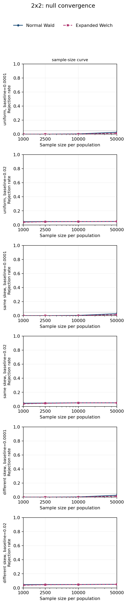

The companion graph uses the same results with the rejection-rate axis limited to 0.1.

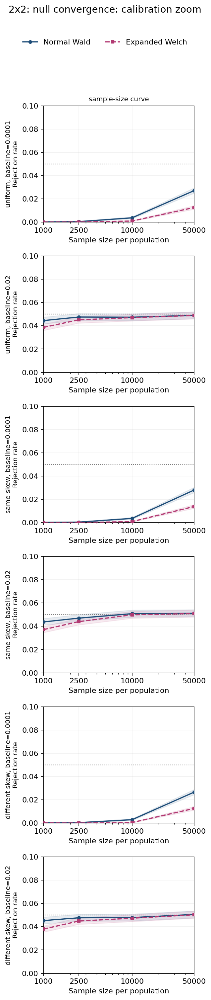

| Specification | Setting |
| --- | --- |
| Table size | 2x2 |
| Horizontal graph regime specifications (columns) | sample-size curve |
| Vertical graph regime specifications (rows) | uniform, baseline=0.0001: P row (0.5 repeated 2 times), P column (0.5 repeated 2 times); Q row (0.5 repeated 2 times), Q column (0.5 repeated 2 times); uniform, baseline=0.02: P row (0.5 repeated 2 times), P column (0.5 repeated 2 times); Q row (0.5 repeated 2 times), Q column (0.5 repeated 2 times); same skew, baseline=0.0001: P row (0.8, 0.2), P column (0.8, 0.2); Q row (0.8, 0.2), Q column (0.8, 0.2); same skew, baseline=0.02: P row (0.8, 0.2), P column (0.8, 0.2); Q row (0.8, 0.2), Q column (0.8, 0.2); different skew, baseline=0.0001: P row (0.7, 0.3), P column (0.7, 0.3); Q row (0.8, 0.2), Q column (0.8, 0.2); different skew, baseline=0.02: P row (0.7, 0.3), P column (0.7, 0.3); Q row (0.8, 0.2), Q column (0.8, 0.2) |
| Probability changes | uniform, baseline=0.0001: add at (1,1),(2,2) and subtract at (1,2),(2,1), for both P and Q; uniform, baseline=0.02: add at (1,1),(2,2) and subtract at (1,2),(2,1), for both P and Q; same skew, baseline=0.0001: add at (1,1),(2,2) and subtract at (1,2),(2,1), for both P and Q; same skew, baseline=0.02: add at (1,1),(2,2) and subtract at (1,2),(2,1), for both P and Q; different skew, baseline=0.0001: add at (1,1),(2,2) and subtract at (1,2),(2,1), for both P and Q; different skew, baseline=0.02: add at (1,1),(2,2) and subtract at (1,2),(2,1), for both P and Q |
| MI settings | Baseline MI {0.0001, 0.02}; direction {q higher}; actual differences {0} nats |
| Horizontal axis within each graph | Equal sample size from 1,000 to 50,000 on a log scale; fixed listed ticks |
| Vertical axis within each graph | Unconditional rejection rate from 0 to 1; invalid results count as non-rejections |
| Replicates | 20,000 per unique point |

Null-point rejection and validity:

| Vertical regime | Horizontal regime | x | Method | Rejection | Valid |
| --- | --- | --- | --- | --- | --- |
| uniform, baseline=0.0001 | sample-size curve | 1000 | Expanded Welch | 0.0001 | 0.9990 |
| uniform, baseline=0.0001 | sample-size curve | 1000 | Normal Wald | 0.0002 | 1.0000 |
| uniform, baseline=0.0001 | sample-size curve | 2500 | Expanded Welch | 0.0001 | 0.9994 |
| uniform, baseline=0.0001 | sample-size curve | 2500 | Normal Wald | 0.0004 | 1.0000 |
| uniform, baseline=0.0001 | sample-size curve | 1e+04 | Expanded Welch | 0.0009 | 1.0000 |
| uniform, baseline=0.0001 | sample-size curve | 1e+04 | Normal Wald | 0.0037 | 1.0000 |
| uniform, baseline=0.0001 | sample-size curve | 5e+04 | Expanded Welch | 0.0126 | 1.0000 |
| uniform, baseline=0.0001 | sample-size curve | 5e+04 | Normal Wald | 0.0271 | 1.0000 |
| uniform, baseline=0.02 | sample-size curve | 1000 | Expanded Welch | 0.0386 | 1.0000 |
| uniform, baseline=0.02 | sample-size curve | 1000 | Normal Wald | 0.0445 | 1.0000 |
| uniform, baseline=0.02 | sample-size curve | 2500 | Expanded Welch | 0.0452 | 1.0000 |
| uniform, baseline=0.02 | sample-size curve | 2500 | Normal Wald | 0.0476 | 1.0000 |
| uniform, baseline=0.02 | sample-size curve | 1e+04 | Expanded Welch | 0.0471 | 1.0000 |
| uniform, baseline=0.02 | sample-size curve | 1e+04 | Normal Wald | 0.0474 | 1.0000 |
| uniform, baseline=0.02 | sample-size curve | 5e+04 | Expanded Welch | 0.0489 | 1.0000 |
| uniform, baseline=0.02 | sample-size curve | 5e+04 | Normal Wald | 0.0490 | 1.0000 |
| same skew, baseline=0.0001 | sample-size curve | 1000 | Expanded Welch | 0.0000 | 1.0000 |
| same skew, baseline=0.0001 | sample-size curve | 1000 | Normal Wald | 0.0002 | 1.0000 |
| same skew, baseline=0.0001 | sample-size curve | 2500 | Expanded Welch | 0.0000 | 1.0000 |
| same skew, baseline=0.0001 | sample-size curve | 2500 | Normal Wald | 0.0004 | 1.0000 |
| same skew, baseline=0.0001 | sample-size curve | 1e+04 | Expanded Welch | 0.0008 | 1.0000 |
| same skew, baseline=0.0001 | sample-size curve | 1e+04 | Normal Wald | 0.0036 | 1.0000 |
| same skew, baseline=0.0001 | sample-size curve | 5e+04 | Expanded Welch | 0.0138 | 1.0000 |
| same skew, baseline=0.0001 | sample-size curve | 5e+04 | Normal Wald | 0.0279 | 1.0000 |
| same skew, baseline=0.02 | sample-size curve | 1000 | Expanded Welch | 0.0372 | 1.0000 |
| same skew, baseline=0.02 | sample-size curve | 1000 | Normal Wald | 0.0437 | 1.0000 |
| same skew, baseline=0.02 | sample-size curve | 2500 | Expanded Welch | 0.0440 | 1.0000 |
| same skew, baseline=0.02 | sample-size curve | 2500 | Normal Wald | 0.0470 | 1.0000 |
| same skew, baseline=0.02 | sample-size curve | 1e+04 | Expanded Welch | 0.0498 | 1.0000 |
| same skew, baseline=0.02 | sample-size curve | 1e+04 | Normal Wald | 0.0508 | 1.0000 |
| same skew, baseline=0.02 | sample-size curve | 5e+04 | Expanded Welch | 0.0510 | 1.0000 |
| same skew, baseline=0.02 | sample-size curve | 5e+04 | Normal Wald | 0.0512 | 1.0000 |
| different skew, baseline=0.0001 | sample-size curve | 1000 | Expanded Welch | 0.0001 | 1.0000 |
| different skew, baseline=0.0001 | sample-size curve | 1000 | Normal Wald | 0.0003 | 1.0000 |
| different skew, baseline=0.0001 | sample-size curve | 2500 | Expanded Welch | 0.0000 | 1.0000 |
| different skew, baseline=0.0001 | sample-size curve | 2500 | Normal Wald | 0.0003 | 1.0000 |
| different skew, baseline=0.0001 | sample-size curve | 1e+04 | Expanded Welch | 0.0004 | 1.0000 |
| different skew, baseline=0.0001 | sample-size curve | 1e+04 | Normal Wald | 0.0029 | 1.0000 |
| different skew, baseline=0.0001 | sample-size curve | 5e+04 | Expanded Welch | 0.0126 | 1.0000 |
| different skew, baseline=0.0001 | sample-size curve | 5e+04 | Normal Wald | 0.0266 | 1.0000 |
| different skew, baseline=0.02 | sample-size curve | 1000 | Expanded Welch | 0.0380 | 1.0000 |
| different skew, baseline=0.02 | sample-size curve | 1000 | Normal Wald | 0.0453 | 1.0000 |
| different skew, baseline=0.02 | sample-size curve | 2500 | Expanded Welch | 0.0449 | 1.0000 |
| different skew, baseline=0.02 | sample-size curve | 2500 | Normal Wald | 0.0477 | 1.0000 |
| different skew, baseline=0.02 | sample-size curve | 1e+04 | Expanded Welch | 0.0474 | 1.0000 |
| different skew, baseline=0.02 | sample-size curve | 1e+04 | Normal Wald | 0.0479 | 1.0000 |
| different skew, baseline=0.02 | sample-size curve | 5e+04 | Expanded Welch | 0.0503 | 1.0000 |
| different skew, baseline=0.02 | sample-size curve | 5e+04 | Normal Wald | 0.0505 | 1.0000 |

Every plotted rate, interval, validity and minimum expected count

| Vertical regime | Horizontal regime | x | Method | Rejection | 95% interval | Valid | Conditional | Min expected P | Min expected Q |
| --- | --- | --- | --- | --- | --- | --- | --- | --- | --- |
| uniform, baseline=0.0001 | sample-size curve | 1000 | Expanded Welch | 0.0001 | [0.0000, 0.0003] | 0.9990 | 0.0001 | 246.5 | 246.5 |
| uniform, baseline=0.0001 | sample-size curve | 1000 | Normal Wald | 0.0002 | [0.0001, 0.0005] | 1.0000 | 0.0002 | 246.5 | 246.5 |
| uniform, baseline=0.0001 | sample-size curve | 2500 | Expanded Welch | 0.0001 | [0.0000, 0.0004] | 0.9994 | 0.0001 | 616.2 | 616.2 |
| uniform, baseline=0.0001 | sample-size curve | 2500 | Normal Wald | 0.0004 | [0.0002, 0.0009] | 1.0000 | 0.0004 | 616.2 | 616.2 |
| uniform, baseline=0.0001 | sample-size curve | 10000 | Expanded Welch | 0.0009 | [0.0006, 0.0015] | 1.0000 | 0.0009 | 2465 | 2465 |
| uniform, baseline=0.0001 | sample-size curve | 10000 | Normal Wald | 0.0037 | [0.0029, 0.0046] | 1.0000 | 0.0037 | 2465 | 2465 |
| uniform, baseline=0.0001 | sample-size curve | 50000 | Expanded Welch | 0.0126 | [0.0111, 0.0142] | 1.0000 | 0.0126 | 1.232e+04 | 1.232e+04 |
| uniform, baseline=0.0001 | sample-size curve | 50000 | Normal Wald | 0.0271 | [0.0249, 0.0294] | 1.0000 | 0.0271 | 1.232e+04 | 1.232e+04 |
| uniform, baseline=0.02 | sample-size curve | 1000 | Expanded Welch | 0.0386 | [0.0361, 0.0414] | 1.0000 | 0.0386 | 200.2 | 200.2 |
| uniform, baseline=0.02 | sample-size curve | 1000 | Normal Wald | 0.0445 | [0.0417, 0.0474] | 1.0000 | 0.0445 | 200.2 | 200.2 |
| uniform, baseline=0.02 | sample-size curve | 2500 | Expanded Welch | 0.0452 | [0.0424, 0.0481] | 1.0000 | 0.0452 | 500.4 | 500.4 |
| uniform, baseline=0.02 | sample-size curve | 2500 | Normal Wald | 0.0476 | [0.0447, 0.0506] | 1.0000 | 0.0476 | 500.4 | 500.4 |
| uniform, baseline=0.02 | sample-size curve | 10000 | Expanded Welch | 0.0471 | [0.0442, 0.0501] | 1.0000 | 0.0471 | 2002 | 2002 |
| uniform, baseline=0.02 | sample-size curve | 10000 | Normal Wald | 0.0474 | [0.0445, 0.0504] | 1.0000 | 0.0474 | 2002 | 2002 |
| uniform, baseline=0.02 | sample-size curve | 50000 | Expanded Welch | 0.0489 | [0.0460, 0.0520] | 1.0000 | 0.0489 | 1.001e+04 | 1.001e+04 |
| uniform, baseline=0.02 | sample-size curve | 50000 | Normal Wald | 0.0490 | [0.0461, 0.0521] | 1.0000 | 0.0490 | 1.001e+04 | 1.001e+04 |
| same skew, baseline=0.0001 | sample-size curve | 1000 | Expanded Welch | 0.0000 | [0.0000, 0.0002] | 1.0000 | 0.0000 | 42.27 | 42.27 |
| same skew, baseline=0.0001 | sample-size curve | 1000 | Normal Wald | 0.0002 | [0.0001, 0.0005] | 1.0000 | 0.0002 | 42.27 | 42.27 |
| same skew, baseline=0.0001 | sample-size curve | 2500 | Expanded Welch | 0.0000 | [0.0000, 0.0002] | 1.0000 | 0.0000 | 105.7 | 105.7 |
| same skew, baseline=0.0001 | sample-size curve | 2500 | Normal Wald | 0.0004 | [0.0002, 0.0008] | 1.0000 | 0.0004 | 105.7 | 105.7 |
| same skew, baseline=0.0001 | sample-size curve | 10000 | Expanded Welch | 0.0008 | [0.0005, 0.0014] | 1.0000 | 0.0008 | 422.7 | 422.7 |
| same skew, baseline=0.0001 | sample-size curve | 10000 | Normal Wald | 0.0036 | [0.0029, 0.0045] | 1.0000 | 0.0036 | 422.7 | 422.7 |
| same skew, baseline=0.0001 | sample-size curve | 50000 | Expanded Welch | 0.0138 | [0.0123, 0.0155] | 1.0000 | 0.0138 | 2114 | 2114 |
| same skew, baseline=0.0001 | sample-size curve | 50000 | Normal Wald | 0.0279 | [0.0258, 0.0303] | 1.0000 | 0.0279 | 2114 | 2114 |
| same skew, baseline=0.02 | sample-size curve | 1000 | Expanded Welch | 0.0372 | [0.0346, 0.0399] | 1.0000 | 0.0372 | 73.82 | 73.82 |
| same skew, baseline=0.02 | sample-size curve | 1000 | Normal Wald | 0.0437 | [0.0410, 0.0467] | 1.0000 | 0.0437 | 73.82 | 73.82 |
| same skew, baseline=0.02 | sample-size curve | 2500 | Expanded Welch | 0.0440 | [0.0412, 0.0469] | 1.0000 | 0.0440 | 184.5 | 184.5 |
| same skew, baseline=0.02 | sample-size curve | 2500 | Normal Wald | 0.0470 | [0.0442, 0.0500] | 1.0000 | 0.0470 | 184.5 | 184.5 |
| same skew, baseline=0.02 | sample-size curve | 10000 | Expanded Welch | 0.0498 | [0.0469, 0.0530] | 1.0000 | 0.0498 | 738.2 | 738.2 |
| same skew, baseline=0.02 | sample-size curve | 10000 | Normal Wald | 0.0508 | [0.0479, 0.0540] | 1.0000 | 0.0508 | 738.2 | 738.2 |
| same skew, baseline=0.02 | sample-size curve | 50000 | Expanded Welch | 0.0510 | [0.0480, 0.0541] | 1.0000 | 0.0510 | 3691 | 3691 |
| same skew, baseline=0.02 | sample-size curve | 50000 | Normal Wald | 0.0512 | [0.0482, 0.0543] | 1.0000 | 0.0512 | 3691 | 3691 |
| different skew, baseline=0.0001 | sample-size curve | 1000 | Expanded Welch | 0.0001 | [0.0000, 0.0004] | 1.0000 | 0.0001 | 92.98 | 42.27 |
| different skew, baseline=0.0001 | sample-size curve | 1000 | Normal Wald | 0.0003 | [0.0001, 0.0007] | 1.0000 | 0.0003 | 92.98 | 42.27 |
| different skew, baseline=0.0001 | sample-size curve | 2500 | Expanded Welch | 0.0000 | [0.0000, 0.0002] | 1.0000 | 0.0000 | 232.4 | 105.7 |
| different skew, baseline=0.0001 | sample-size curve | 2500 | Normal Wald | 0.0003 | [0.0002, 0.0007] | 1.0000 | 0.0003 | 232.4 | 105.7 |
| different skew, baseline=0.0001 | sample-size curve | 10000 | Expanded Welch | 0.0004 | [0.0002, 0.0009] | 1.0000 | 0.0004 | 929.8 | 422.7 |
| different skew, baseline=0.0001 | sample-size curve | 10000 | Normal Wald | 0.0029 | [0.0022, 0.0037] | 1.0000 | 0.0029 | 929.8 | 422.7 |
| different skew, baseline=0.0001 | sample-size curve | 50000 | Expanded Welch | 0.0126 | [0.0111, 0.0142] | 1.0000 | 0.0126 | 4649 | 2114 |
| different skew, baseline=0.0001 | sample-size curve | 50000 | Normal Wald | 0.0266 | [0.0244, 0.0289] | 1.0000 | 0.0266 | 4649 | 2114 |
| different skew, baseline=0.02 | sample-size curve | 1000 | Expanded Welch | 0.0380 | [0.0354, 0.0407] | 1.0000 | 0.0380 | 132.7 | 73.82 |
| different skew, baseline=0.02 | sample-size curve | 1000 | Normal Wald | 0.0453 | [0.0425, 0.0483] | 1.0000 | 0.0453 | 132.7 | 73.82 |
| different skew, baseline=0.02 | sample-size curve | 2500 | Expanded Welch | 0.0449 | [0.0421, 0.0479] | 1.0000 | 0.0449 | 331.8 | 184.5 |
| different skew, baseline=0.02 | sample-size curve | 2500 | Normal Wald | 0.0477 | [0.0448, 0.0507] | 1.0000 | 0.0477 | 331.8 | 184.5 |
| different skew, baseline=0.02 | sample-size curve | 10000 | Expanded Welch | 0.0474 | [0.0445, 0.0504] | 1.0000 | 0.0474 | 1327 | 738.2 |
| different skew, baseline=0.02 | sample-size curve | 10000 | Normal Wald | 0.0479 | [0.0450, 0.0509] | 1.0000 | 0.0479 | 1327 | 738.2 |
| different skew, baseline=0.02 | sample-size curve | 50000 | Expanded Welch | 0.0503 | [0.0474, 0.0534] | 1.0000 | 0.0503 | 6636 | 3691 |
| different skew, baseline=0.02 | sample-size curve | 50000 | Normal Wald | 0.0505 | [0.0476, 0.0537] | 1.0000 | 0.0505 | 6636 | 3691 |

### 13.2 3x3: null convergence

Do null rejection rates approach 0.05 as the fixed populations receive more data?

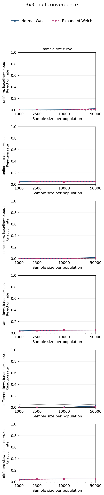

The companion graph uses the same results with the rejection-rate axis limited to 0.1.

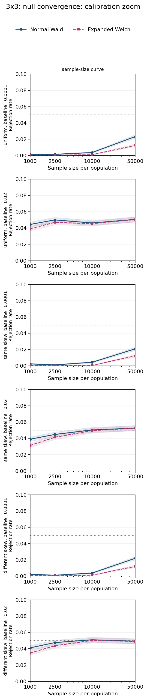

| Specification | Setting |
| --- | --- |
| Table size | 3x3 |
| Horizontal graph regime specifications (columns) | sample-size curve |
| Vertical graph regime specifications (rows) | uniform, baseline=0.0001: P row (0.3333 repeated 3 times), P column (0.3333 repeated 3 times); Q row (0.3333 repeated 3 times), Q column (0.3333 repeated 3 times); uniform, baseline=0.02: P row (0.3333 repeated 3 times), P column (0.3333 repeated 3 times); Q row (0.3333 repeated 3 times), Q column (0.3333 repeated 3 times); same skew, baseline=0.0001: P row (0.8, 0.2/2 repeated 2 times), P column (0.8, 0.2/2 repeated 2 times); Q row (0.8, 0.2/2 repeated 2 times), Q column (0.8, 0.2/2 repeated 2 times); same skew, baseline=0.02: P row (0.8, 0.2/2 repeated 2 times), P column (0.8, 0.2/2 repeated 2 times); Q row (0.8, 0.2/2 repeated 2 times), Q column (0.8, 0.2/2 repeated 2 times); different skew, baseline=0.0001: P row (0.7, 0.3/2 repeated 2 times), P column (0.7, 0.3/2 repeated 2 times); Q row (0.8, 0.2/2 repeated 2 times), Q column (0.8, 0.2/2 repeated 2 times); different skew, baseline=0.02: P row (0.7, 0.3/2 repeated 2 times), P column (0.7, 0.3/2 repeated 2 times); Q row (0.8, 0.2/2 repeated 2 times), Q column (0.8, 0.2/2 repeated 2 times) |
| Probability changes | uniform, baseline=0.0001: add at (1,1),(2,2) and subtract at (1,2),(2,1), for both P and Q; uniform, baseline=0.02: add at (1,1),(2,2) and subtract at (1,2),(2,1), for both P and Q; same skew, baseline=0.0001: add at (1,1),(2,2) and subtract at (1,2),(2,1), for both P and Q; same skew, baseline=0.02: add at (1,1),(2,2) and subtract at (1,2),(2,1), for both P and Q; different skew, baseline=0.0001: add at (1,1),(2,2) and subtract at (1,2),(2,1), for both P and Q; different skew, baseline=0.02: add at (1,1),(2,2) and subtract at (1,2),(2,1), for both P and Q |
| MI settings | Baseline MI {0.0001, 0.02}; direction {q higher}; actual differences {0} nats |
| Horizontal axis within each graph | Equal sample size from 1,000 to 50,000 on a log scale; fixed listed ticks |
| Vertical axis within each graph | Unconditional rejection rate from 0 to 1; invalid results count as non-rejections |
| Replicates | 20,000 per unique point |

Null-point rejection and validity:

| Vertical regime | Horizontal regime | x | Method | Rejection | Valid |
| --- | --- | --- | --- | --- | --- |
| uniform, baseline=0.0001 | sample-size curve | 1000 | Expanded Welch | 0.0002 | 1.0000 |
| uniform, baseline=0.0001 | sample-size curve | 1000 | Normal Wald | 0.0012 | 1.0000 |
| uniform, baseline=0.0001 | sample-size curve | 2500 | Expanded Welch | 0.0004 | 1.0000 |
| uniform, baseline=0.0001 | sample-size curve | 2500 | Normal Wald | 0.0014 | 1.0000 |
| uniform, baseline=0.0001 | sample-size curve | 1e+04 | Expanded Welch | 0.0009 | 1.0000 |
| uniform, baseline=0.0001 | sample-size curve | 1e+04 | Normal Wald | 0.0036 | 1.0000 |
| uniform, baseline=0.0001 | sample-size curve | 5e+04 | Expanded Welch | 0.0124 | 1.0000 |
| uniform, baseline=0.0001 | sample-size curve | 5e+04 | Normal Wald | 0.0232 | 1.0000 |
| uniform, baseline=0.02 | sample-size curve | 1000 | Expanded Welch | 0.0393 | 1.0000 |
| uniform, baseline=0.02 | sample-size curve | 1000 | Normal Wald | 0.0445 | 1.0000 |
| uniform, baseline=0.02 | sample-size curve | 2500 | Expanded Welch | 0.0470 | 1.0000 |
| uniform, baseline=0.02 | sample-size curve | 2500 | Normal Wald | 0.0500 | 1.0000 |
| uniform, baseline=0.02 | sample-size curve | 1e+04 | Expanded Welch | 0.0454 | 1.0000 |
| uniform, baseline=0.02 | sample-size curve | 1e+04 | Normal Wald | 0.0462 | 1.0000 |
| uniform, baseline=0.02 | sample-size curve | 5e+04 | Expanded Welch | 0.0505 | 1.0000 |
| uniform, baseline=0.02 | sample-size curve | 5e+04 | Normal Wald | 0.0507 | 1.0000 |
| same skew, baseline=0.0001 | sample-size curve | 1000 | Expanded Welch | 0.0007 | 1.0000 |
| same skew, baseline=0.0001 | sample-size curve | 1000 | Normal Wald | 0.0024 | 1.0000 |
| same skew, baseline=0.0001 | sample-size curve | 2500 | Expanded Welch | 0.0002 | 1.0000 |
| same skew, baseline=0.0001 | sample-size curve | 2500 | Normal Wald | 0.0011 | 1.0000 |
| same skew, baseline=0.0001 | sample-size curve | 1e+04 | Expanded Welch | 0.0006 | 1.0000 |
| same skew, baseline=0.0001 | sample-size curve | 1e+04 | Normal Wald | 0.0043 | 1.0000 |
| same skew, baseline=0.0001 | sample-size curve | 5e+04 | Expanded Welch | 0.0121 | 1.0000 |
| same skew, baseline=0.0001 | sample-size curve | 5e+04 | Normal Wald | 0.0208 | 1.0000 |
| same skew, baseline=0.02 | sample-size curve | 1000 | Expanded Welch | 0.0314 | 1.0000 |
| same skew, baseline=0.02 | sample-size curve | 1000 | Normal Wald | 0.0391 | 1.0000 |
| same skew, baseline=0.02 | sample-size curve | 2500 | Expanded Welch | 0.0414 | 1.0000 |
| same skew, baseline=0.02 | sample-size curve | 2500 | Normal Wald | 0.0449 | 1.0000 |
| same skew, baseline=0.02 | sample-size curve | 1e+04 | Expanded Welch | 0.0496 | 1.0000 |
| same skew, baseline=0.02 | sample-size curve | 1e+04 | Normal Wald | 0.0504 | 1.0000 |
| same skew, baseline=0.02 | sample-size curve | 5e+04 | Expanded Welch | 0.0525 | 1.0000 |
| same skew, baseline=0.02 | sample-size curve | 5e+04 | Normal Wald | 0.0527 | 1.0000 |
| different skew, baseline=0.0001 | sample-size curve | 1000 | Expanded Welch | 0.0007 | 1.0000 |
| different skew, baseline=0.0001 | sample-size curve | 1000 | Normal Wald | 0.0023 | 1.0000 |
| different skew, baseline=0.0001 | sample-size curve | 2500 | Expanded Welch | 0.0004 | 1.0000 |
| different skew, baseline=0.0001 | sample-size curve | 2500 | Normal Wald | 0.0011 | 1.0000 |
| different skew, baseline=0.0001 | sample-size curve | 1e+04 | Expanded Welch | 0.0013 | 1.0000 |
| different skew, baseline=0.0001 | sample-size curve | 1e+04 | Normal Wald | 0.0037 | 1.0000 |
| different skew, baseline=0.0001 | sample-size curve | 5e+04 | Expanded Welch | 0.0120 | 1.0000 |
| different skew, baseline=0.0001 | sample-size curve | 5e+04 | Normal Wald | 0.0219 | 1.0000 |
| different skew, baseline=0.02 | sample-size curve | 1000 | Expanded Welch | 0.0348 | 1.0000 |
| different skew, baseline=0.02 | sample-size curve | 1000 | Normal Wald | 0.0411 | 1.0000 |
| different skew, baseline=0.02 | sample-size curve | 2500 | Expanded Welch | 0.0435 | 1.0000 |
| different skew, baseline=0.02 | sample-size curve | 2500 | Normal Wald | 0.0476 | 1.0000 |
| different skew, baseline=0.02 | sample-size curve | 1e+04 | Expanded Welch | 0.0503 | 1.0000 |
| different skew, baseline=0.02 | sample-size curve | 1e+04 | Normal Wald | 0.0510 | 1.0000 |
| different skew, baseline=0.02 | sample-size curve | 5e+04 | Expanded Welch | 0.0490 | 1.0000 |
| different skew, baseline=0.02 | sample-size curve | 5e+04 | Normal Wald | 0.0493 | 1.0000 |

Every plotted rate, interval, validity and minimum expected count

| Vertical regime | Horizontal regime | x | Method | Rejection | 95% interval | Valid | Conditional | Min expected P | Min expected Q |
| --- | --- | --- | --- | --- | --- | --- | --- | --- | --- |
| uniform, baseline=0.0001 | sample-size curve | 1000 | Expanded Welch | 0.0002 | [0.0001, 0.0005] | 1.0000 | 0.0002 | 108.8 | 108.8 |
| uniform, baseline=0.0001 | sample-size curve | 1000 | Normal Wald | 0.0012 | [0.0008, 0.0018] | 1.0000 | 0.0012 | 108.8 | 108.8 |
| uniform, baseline=0.0001 | sample-size curve | 2500 | Expanded Welch | 0.0004 | [0.0002, 0.0009] | 1.0000 | 0.0004 | 271.9 | 271.9 |
| uniform, baseline=0.0001 | sample-size curve | 2500 | Normal Wald | 0.0014 | [0.0010, 0.0021] | 1.0000 | 0.0014 | 271.9 | 271.9 |
| uniform, baseline=0.0001 | sample-size curve | 10000 | Expanded Welch | 0.0009 | [0.0006, 0.0014] | 1.0000 | 0.0009 | 1088 | 1088 |
| uniform, baseline=0.0001 | sample-size curve | 10000 | Normal Wald | 0.0036 | [0.0029, 0.0045] | 1.0000 | 0.0036 | 1088 | 1088 |
| uniform, baseline=0.0001 | sample-size curve | 50000 | Expanded Welch | 0.0124 | [0.0110, 0.0141] | 1.0000 | 0.0124 | 5438 | 5438 |
| uniform, baseline=0.0001 | sample-size curve | 50000 | Normal Wald | 0.0232 | [0.0212, 0.0254] | 1.0000 | 0.0232 | 5438 | 5438 |
| uniform, baseline=0.02 | sample-size curve | 1000 | Expanded Welch | 0.0393 | [0.0366, 0.0420] | 1.0000 | 0.0393 | 78.03 | 78.03 |
| uniform, baseline=0.02 | sample-size curve | 1000 | Normal Wald | 0.0445 | [0.0417, 0.0474] | 1.0000 | 0.0445 | 78.03 | 78.03 |
| uniform, baseline=0.02 | sample-size curve | 2500 | Expanded Welch | 0.0470 | [0.0442, 0.0500] | 1.0000 | 0.0470 | 195.1 | 195.1 |
| uniform, baseline=0.02 | sample-size curve | 2500 | Normal Wald | 0.0500 | [0.0471, 0.0532] | 1.0000 | 0.0500 | 195.1 | 195.1 |
| uniform, baseline=0.02 | sample-size curve | 10000 | Expanded Welch | 0.0454 | [0.0426, 0.0484] | 1.0000 | 0.0454 | 780.3 | 780.3 |
| uniform, baseline=0.02 | sample-size curve | 10000 | Normal Wald | 0.0462 | [0.0434, 0.0492] | 1.0000 | 0.0462 | 780.3 | 780.3 |
| uniform, baseline=0.02 | sample-size curve | 50000 | Expanded Welch | 0.0505 | [0.0475, 0.0536] | 1.0000 | 0.0505 | 3902 | 3902 |
| uniform, baseline=0.02 | sample-size curve | 50000 | Normal Wald | 0.0507 | [0.0477, 0.0538] | 1.0000 | 0.0507 | 3902 | 3902 |
| same skew, baseline=0.0001 | sample-size curve | 1000 | Expanded Welch | 0.0007 | [0.0004, 0.0012] | 1.0000 | 0.0007 | 10 | 10 |
| same skew, baseline=0.0001 | sample-size curve | 1000 | Normal Wald | 0.0024 | [0.0018, 0.0031] | 1.0000 | 0.0024 | 10 | 10 |
| same skew, baseline=0.0001 | sample-size curve | 2500 | Expanded Welch | 0.0002 | [0.0001, 0.0005] | 1.0000 | 0.0002 | 25 | 25 |
| same skew, baseline=0.0001 | sample-size curve | 2500 | Normal Wald | 0.0011 | [0.0008, 0.0017] | 1.0000 | 0.0011 | 25 | 25 |
| same skew, baseline=0.0001 | sample-size curve | 10000 | Expanded Welch | 0.0006 | [0.0003, 0.0010] | 1.0000 | 0.0006 | 100 | 100 |
| same skew, baseline=0.0001 | sample-size curve | 10000 | Normal Wald | 0.0043 | [0.0035, 0.0054] | 1.0000 | 0.0043 | 100 | 100 |
| same skew, baseline=0.0001 | sample-size curve | 50000 | Expanded Welch | 0.0121 | [0.0107, 0.0138] | 1.0000 | 0.0121 | 500 | 500 |
| same skew, baseline=0.0001 | sample-size curve | 50000 | Normal Wald | 0.0208 | [0.0189, 0.0229] | 1.0000 | 0.0208 | 500 | 500 |
| same skew, baseline=0.02 | sample-size curve | 1000 | Expanded Welch | 0.0314 | [0.0291, 0.0339] | 1.0000 | 0.0314 | 10 | 10 |
| same skew, baseline=0.02 | sample-size curve | 1000 | Normal Wald | 0.0391 | [0.0365, 0.0418] | 1.0000 | 0.0391 | 10 | 10 |
| same skew, baseline=0.02 | sample-size curve | 2500 | Expanded Welch | 0.0414 | [0.0387, 0.0443] | 1.0000 | 0.0414 | 25 | 25 |
| same skew, baseline=0.02 | sample-size curve | 2500 | Normal Wald | 0.0449 | [0.0421, 0.0478] | 1.0000 | 0.0449 | 25 | 25 |
| same skew, baseline=0.02 | sample-size curve | 10000 | Expanded Welch | 0.0496 | [0.0467, 0.0527] | 1.0000 | 0.0496 | 100 | 100 |
| same skew, baseline=0.02 | sample-size curve | 10000 | Normal Wald | 0.0504 | [0.0475, 0.0535] | 1.0000 | 0.0504 | 100 | 100 |
| same skew, baseline=0.02 | sample-size curve | 50000 | Expanded Welch | 0.0525 | [0.0495, 0.0557] | 1.0000 | 0.0525 | 500 | 500 |
| same skew, baseline=0.02 | sample-size curve | 50000 | Normal Wald | 0.0527 | [0.0496, 0.0558] | 1.0000 | 0.0527 | 500 | 500 |
| different skew, baseline=0.0001 | sample-size curve | 1000 | Expanded Welch | 0.0007 | [0.0004, 0.0012] | 1.0000 | 0.0007 | 22.5 | 10 |
| different skew, baseline=0.0001 | sample-size curve | 1000 | Normal Wald | 0.0023 | [0.0017, 0.0031] | 1.0000 | 0.0023 | 22.5 | 10 |
| different skew, baseline=0.0001 | sample-size curve | 2500 | Expanded Welch | 0.0004 | [0.0002, 0.0009] | 1.0000 | 0.0004 | 56.25 | 25 |
| different skew, baseline=0.0001 | sample-size curve | 2500 | Normal Wald | 0.0011 | [0.0007, 0.0017] | 1.0000 | 0.0011 | 56.25 | 25 |
| different skew, baseline=0.0001 | sample-size curve | 10000 | Expanded Welch | 0.0013 | [0.0008, 0.0018] | 1.0000 | 0.0013 | 225 | 100 |
| different skew, baseline=0.0001 | sample-size curve | 10000 | Normal Wald | 0.0037 | [0.0030, 0.0047] | 1.0000 | 0.0037 | 225 | 100 |
| different skew, baseline=0.0001 | sample-size curve | 50000 | Expanded Welch | 0.0120 | [0.0105, 0.0136] | 1.0000 | 0.0120 | 1125 | 500 |
| different skew, baseline=0.0001 | sample-size curve | 50000 | Normal Wald | 0.0219 | [0.0200, 0.0240] | 1.0000 | 0.0219 | 1125 | 500 |
| different skew, baseline=0.02 | sample-size curve | 1000 | Expanded Welch | 0.0348 | [0.0324, 0.0375] | 1.0000 | 0.0348 | 22.5 | 10 |
| different skew, baseline=0.02 | sample-size curve | 1000 | Normal Wald | 0.0411 | [0.0384, 0.0439] | 1.0000 | 0.0411 | 22.5 | 10 |
| different skew, baseline=0.02 | sample-size curve | 2500 | Expanded Welch | 0.0435 | [0.0408, 0.0465] | 1.0000 | 0.0435 | 56.25 | 25 |
| different skew, baseline=0.02 | sample-size curve | 2500 | Normal Wald | 0.0476 | [0.0447, 0.0506] | 1.0000 | 0.0476 | 56.25 | 25 |
| different skew, baseline=0.02 | sample-size curve | 10000 | Expanded Welch | 0.0503 | [0.0473, 0.0534] | 1.0000 | 0.0503 | 225 | 100 |
| different skew, baseline=0.02 | sample-size curve | 10000 | Normal Wald | 0.0510 | [0.0480, 0.0541] | 1.0000 | 0.0510 | 225 | 100 |
| different skew, baseline=0.02 | sample-size curve | 50000 | Expanded Welch | 0.0490 | [0.0461, 0.0521] | 1.0000 | 0.0490 | 1125 | 500 |
| different skew, baseline=0.02 | sample-size curve | 50000 | Normal Wald | 0.0493 | [0.0463, 0.0523] | 1.0000 | 0.0493 | 1125 | 500 |

### 13.3 5x5: null convergence

Do null rejection rates approach 0.05 as the fixed populations receive more data?

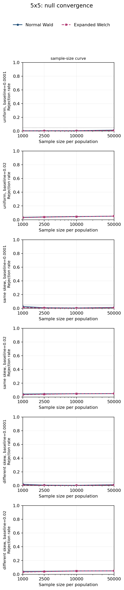

The companion graph uses the same results with the rejection-rate axis limited to 0.1.

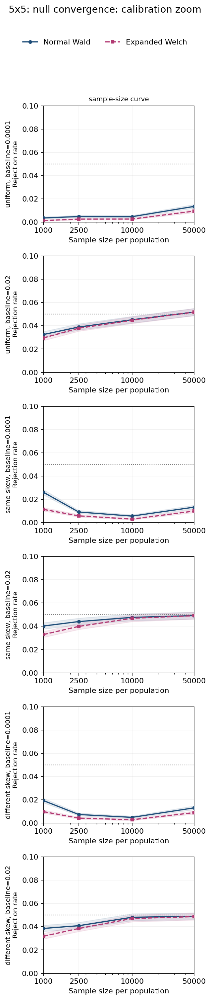

| Specification | Setting |
| --- | --- |
| Table size | 5x5 |
| Horizontal graph regime specifications (columns) | sample-size curve |
| Vertical graph regime specifications (rows) | uniform, baseline=0.0001: P row (0.2 repeated 5 times), P column (0.2 repeated 5 times); Q row (0.2 repeated 5 times), Q column (0.2 repeated 5 times); uniform, baseline=0.02: P row (0.2 repeated 5 times), P column (0.2 repeated 5 times); Q row (0.2 repeated 5 times), Q column (0.2 repeated 5 times); same skew, baseline=0.0001: P row (0.8, 0.2/4 repeated 4 times), P column (0.8, 0.2/4 repeated 4 times); Q row (0.8, 0.2/4 repeated 4 times), Q column (0.8, 0.2/4 repeated 4 times); same skew, baseline=0.02: P row (0.8, 0.2/4 repeated 4 times), P column (0.8, 0.2/4 repeated 4 times); Q row (0.8, 0.2/4 repeated 4 times), Q column (0.8, 0.2/4 repeated 4 times); different skew, baseline=0.0001: P row (0.7, 0.3/4 repeated 4 times), P column (0.7, 0.3/4 repeated 4 times); Q row (0.8, 0.2/4 repeated 4 times), Q column (0.8, 0.2/4 repeated 4 times); different skew, baseline=0.02: P row (0.7, 0.3/4 repeated 4 times), P column (0.7, 0.3/4 repeated 4 times); Q row (0.8, 0.2/4 repeated 4 times), Q column (0.8, 0.2/4 repeated 4 times) |
| Probability changes | uniform, baseline=0.0001: add at (1,1),(2,2) and subtract at (1,2),(2,1), for both P and Q; uniform, baseline=0.02: add at (1,1),(2,2) and subtract at (1,2),(2,1), for both P and Q; same skew, baseline=0.0001: add at (1,1),(2,2) and subtract at (1,2),(2,1), for both P and Q; same skew, baseline=0.02: add at (1,1),(2,2) and subtract at (1,2),(2,1), for both P and Q; different skew, baseline=0.0001: add at (1,1),(2,2) and subtract at (1,2),(2,1), for both P and Q; different skew, baseline=0.02: add at (1,1),(2,2) and subtract at (1,2),(2,1), for both P and Q |
| MI settings | Baseline MI {0.0001, 0.02}; direction {q higher}; actual differences {0} nats |
| Horizontal axis within each graph | Equal sample size from 1,000 to 50,000 on a log scale; fixed listed ticks |
| Vertical axis within each graph | Unconditional rejection rate from 0 to 1; invalid results count as non-rejections |
| Replicates | 20,000 per unique point |

Null-point rejection and validity:

| Vertical regime | Horizontal regime | x | Method | Rejection | Valid |
| --- | --- | --- | --- | --- | --- |
| uniform, baseline=0.0001 | sample-size curve | 1000 | Expanded Welch | 0.0014 | 1.0000 |
| uniform, baseline=0.0001 | sample-size curve | 1000 | Normal Wald | 0.0036 | 1.0000 |
| uniform, baseline=0.0001 | sample-size curve | 2500 | Expanded Welch | 0.0026 | 1.0000 |
| uniform, baseline=0.0001 | sample-size curve | 2500 | Normal Wald | 0.0048 | 1.0000 |
| uniform, baseline=0.0001 | sample-size curve | 1e+04 | Expanded Welch | 0.0027 | 1.0000 |
| uniform, baseline=0.0001 | sample-size curve | 1e+04 | Normal Wald | 0.0047 | 1.0000 |
| uniform, baseline=0.0001 | sample-size curve | 5e+04 | Expanded Welch | 0.0095 | 1.0000 |
| uniform, baseline=0.0001 | sample-size curve | 5e+04 | Normal Wald | 0.0135 | 1.0000 |
| uniform, baseline=0.02 | sample-size curve | 1000 | Expanded Welch | 0.0296 | 1.0000 |
| uniform, baseline=0.02 | sample-size curve | 1000 | Normal Wald | 0.0326 | 1.0000 |
| uniform, baseline=0.02 | sample-size curve | 2500 | Expanded Welch | 0.0379 | 1.0000 |
| uniform, baseline=0.02 | sample-size curve | 2500 | Normal Wald | 0.0389 | 1.0000 |
| uniform, baseline=0.02 | sample-size curve | 1e+04 | Expanded Welch | 0.0448 | 1.0000 |
| uniform, baseline=0.02 | sample-size curve | 1e+04 | Normal Wald | 0.0452 | 1.0000 |
| uniform, baseline=0.02 | sample-size curve | 5e+04 | Expanded Welch | 0.0517 | 1.0000 |
| uniform, baseline=0.02 | sample-size curve | 5e+04 | Normal Wald | 0.0518 | 1.0000 |
| same skew, baseline=0.0001 | sample-size curve | 1000 | Expanded Welch | 0.0114 | 1.0000 |
| same skew, baseline=0.0001 | sample-size curve | 1000 | Normal Wald | 0.0261 | 1.0000 |
| same skew, baseline=0.0001 | sample-size curve | 2500 | Expanded Welch | 0.0058 | 1.0000 |
| same skew, baseline=0.0001 | sample-size curve | 2500 | Normal Wald | 0.0091 | 1.0000 |
| same skew, baseline=0.0001 | sample-size curve | 1e+04 | Expanded Welch | 0.0030 | 1.0000 |
| same skew, baseline=0.0001 | sample-size curve | 1e+04 | Normal Wald | 0.0056 | 1.0000 |
| same skew, baseline=0.0001 | sample-size curve | 5e+04 | Expanded Welch | 0.0099 | 1.0000 |
| same skew, baseline=0.0001 | sample-size curve | 5e+04 | Normal Wald | 0.0132 | 1.0000 |
| same skew, baseline=0.02 | sample-size curve | 1000 | Expanded Welch | 0.0329 | 1.0000 |
| same skew, baseline=0.02 | sample-size curve | 1000 | Normal Wald | 0.0403 | 1.0000 |
| same skew, baseline=0.02 | sample-size curve | 2500 | Expanded Welch | 0.0399 | 1.0000 |
| same skew, baseline=0.02 | sample-size curve | 2500 | Normal Wald | 0.0440 | 1.0000 |
| same skew, baseline=0.02 | sample-size curve | 1e+04 | Expanded Welch | 0.0469 | 1.0000 |
| same skew, baseline=0.02 | sample-size curve | 1e+04 | Normal Wald | 0.0476 | 1.0000 |
| same skew, baseline=0.02 | sample-size curve | 5e+04 | Expanded Welch | 0.0491 | 1.0000 |
| same skew, baseline=0.02 | sample-size curve | 5e+04 | Normal Wald | 0.0492 | 1.0000 |
| different skew, baseline=0.0001 | sample-size curve | 1000 | Expanded Welch | 0.0098 | 1.0000 |
| different skew, baseline=0.0001 | sample-size curve | 1000 | Normal Wald | 0.0193 | 1.0000 |
| different skew, baseline=0.0001 | sample-size curve | 2500 | Expanded Welch | 0.0043 | 1.0000 |
| different skew, baseline=0.0001 | sample-size curve | 2500 | Normal Wald | 0.0073 | 1.0000 |
| different skew, baseline=0.0001 | sample-size curve | 1e+04 | Expanded Welch | 0.0029 | 1.0000 |
| different skew, baseline=0.0001 | sample-size curve | 1e+04 | Normal Wald | 0.0049 | 1.0000 |
| different skew, baseline=0.0001 | sample-size curve | 5e+04 | Expanded Welch | 0.0089 | 1.0000 |
| different skew, baseline=0.0001 | sample-size curve | 5e+04 | Normal Wald | 0.0131 | 1.0000 |
| different skew, baseline=0.02 | sample-size curve | 1000 | Expanded Welch | 0.0319 | 1.0000 |
| different skew, baseline=0.02 | sample-size curve | 1000 | Normal Wald | 0.0386 | 1.0000 |
| different skew, baseline=0.02 | sample-size curve | 2500 | Expanded Welch | 0.0385 | 1.0000 |
| different skew, baseline=0.02 | sample-size curve | 2500 | Normal Wald | 0.0409 | 1.0000 |
| different skew, baseline=0.02 | sample-size curve | 1e+04 | Expanded Welch | 0.0471 | 1.0000 |
| different skew, baseline=0.02 | sample-size curve | 1e+04 | Normal Wald | 0.0481 | 1.0000 |
| different skew, baseline=0.02 | sample-size curve | 5e+04 | Expanded Welch | 0.0487 | 1.0000 |
| different skew, baseline=0.02 | sample-size curve | 5e+04 | Normal Wald | 0.0490 | 1.0000 |

Every plotted rate, interval, validity and minimum expected count

| Vertical regime | Horizontal regime | x | Method | Rejection | 95% interval | Valid | Conditional | Min expected P | Min expected Q |
| --- | --- | --- | --- | --- | --- | --- | --- | --- | --- |
| uniform, baseline=0.0001 | sample-size curve | 1000 | Expanded Welch | 0.0014 | [0.0009, 0.0020] | 1.0000 | 0.0014 | 38.59 | 38.59 |
| uniform, baseline=0.0001 | sample-size curve | 1000 | Normal Wald | 0.0036 | [0.0029, 0.0045] | 1.0000 | 0.0036 | 38.59 | 38.59 |
| uniform, baseline=0.0001 | sample-size curve | 2500 | Expanded Welch | 0.0026 | [0.0020, 0.0034] | 1.0000 | 0.0026 | 96.46 | 96.46 |
| uniform, baseline=0.0001 | sample-size curve | 2500 | Normal Wald | 0.0048 | [0.0039, 0.0059] | 1.0000 | 0.0048 | 96.46 | 96.46 |
| uniform, baseline=0.0001 | sample-size curve | 10000 | Expanded Welch | 0.0027 | [0.0020, 0.0035] | 1.0000 | 0.0027 | 385.9 | 385.9 |
| uniform, baseline=0.0001 | sample-size curve | 10000 | Normal Wald | 0.0047 | [0.0038, 0.0057] | 1.0000 | 0.0047 | 385.9 | 385.9 |
| uniform, baseline=0.0001 | sample-size curve | 50000 | Expanded Welch | 0.0095 | [0.0082, 0.0109] | 1.0000 | 0.0095 | 1929 | 1929 |
| uniform, baseline=0.0001 | sample-size curve | 50000 | Normal Wald | 0.0135 | [0.0120, 0.0152] | 1.0000 | 0.0135 | 1929 | 1929 |
| uniform, baseline=0.02 | sample-size curve | 1000 | Expanded Welch | 0.0296 | [0.0273, 0.0320] | 1.0000 | 0.0296 | 20.43 | 20.43 |
| uniform, baseline=0.02 | sample-size curve | 1000 | Normal Wald | 0.0326 | [0.0302, 0.0351] | 1.0000 | 0.0326 | 20.43 | 20.43 |
| uniform, baseline=0.02 | sample-size curve | 2500 | Expanded Welch | 0.0379 | [0.0354, 0.0407] | 1.0000 | 0.0379 | 51.07 | 51.07 |
| uniform, baseline=0.02 | sample-size curve | 2500 | Normal Wald | 0.0389 | [0.0364, 0.0417] | 1.0000 | 0.0389 | 51.07 | 51.07 |
| uniform, baseline=0.02 | sample-size curve | 10000 | Expanded Welch | 0.0448 | [0.0420, 0.0478] | 1.0000 | 0.0448 | 204.3 | 204.3 |
| uniform, baseline=0.02 | sample-size curve | 10000 | Normal Wald | 0.0452 | [0.0424, 0.0482] | 1.0000 | 0.0452 | 204.3 | 204.3 |
| uniform, baseline=0.02 | sample-size curve | 50000 | Expanded Welch | 0.0517 | [0.0488, 0.0549] | 1.0000 | 0.0517 | 1021 | 1021 |
| uniform, baseline=0.02 | sample-size curve | 50000 | Normal Wald | 0.0518 | [0.0488, 0.0550] | 1.0000 | 0.0518 | 1021 | 1021 |
| same skew, baseline=0.0001 | sample-size curve | 1000 | Expanded Welch | 0.0114 | [0.0100, 0.0129] | 1.0000 | 0.0114 | 2.5 | 2.5 |
| same skew, baseline=0.0001 | sample-size curve | 1000 | Normal Wald | 0.0261 | [0.0239, 0.0284] | 1.0000 | 0.0261 | 2.5 | 2.5 |
| same skew, baseline=0.0001 | sample-size curve | 2500 | Expanded Welch | 0.0058 | [0.0048, 0.0070] | 1.0000 | 0.0058 | 6.25 | 6.25 |
| same skew, baseline=0.0001 | sample-size curve | 2500 | Normal Wald | 0.0091 | [0.0079, 0.0105] | 1.0000 | 0.0091 | 6.25 | 6.25 |
| same skew, baseline=0.0001 | sample-size curve | 10000 | Expanded Welch | 0.0030 | [0.0023, 0.0039] | 1.0000 | 0.0030 | 25 | 25 |
| same skew, baseline=0.0001 | sample-size curve | 10000 | Normal Wald | 0.0056 | [0.0047, 0.0067] | 1.0000 | 0.0056 | 25 | 25 |
| same skew, baseline=0.0001 | sample-size curve | 50000 | Expanded Welch | 0.0099 | [0.0086, 0.0114] | 1.0000 | 0.0099 | 125 | 125 |
| same skew, baseline=0.0001 | sample-size curve | 50000 | Normal Wald | 0.0132 | [0.0118, 0.0149] | 1.0000 | 0.0132 | 125 | 125 |
| same skew, baseline=0.02 | sample-size curve | 1000 | Expanded Welch | 0.0329 | [0.0305, 0.0355] | 1.0000 | 0.0329 | 2.5 | 2.5 |
| same skew, baseline=0.02 | sample-size curve | 1000 | Normal Wald | 0.0403 | [0.0376, 0.0431] | 1.0000 | 0.0403 | 2.5 | 2.5 |
| same skew, baseline=0.02 | sample-size curve | 2500 | Expanded Welch | 0.0399 | [0.0373, 0.0427] | 1.0000 | 0.0399 | 6.25 | 6.25 |
| same skew, baseline=0.02 | sample-size curve | 2500 | Normal Wald | 0.0440 | [0.0413, 0.0470] | 1.0000 | 0.0440 | 6.25 | 6.25 |
| same skew, baseline=0.02 | sample-size curve | 10000 | Expanded Welch | 0.0469 | [0.0441, 0.0499] | 1.0000 | 0.0469 | 25 | 25 |
| same skew, baseline=0.02 | sample-size curve | 10000 | Normal Wald | 0.0476 | [0.0448, 0.0507] | 1.0000 | 0.0476 | 25 | 25 |
| same skew, baseline=0.02 | sample-size curve | 50000 | Expanded Welch | 0.0491 | [0.0462, 0.0522] | 1.0000 | 0.0491 | 125 | 125 |
| same skew, baseline=0.02 | sample-size curve | 50000 | Normal Wald | 0.0492 | [0.0463, 0.0523] | 1.0000 | 0.0492 | 125 | 125 |
| different skew, baseline=0.0001 | sample-size curve | 1000 | Expanded Welch | 0.0098 | [0.0085, 0.0113] | 1.0000 | 0.0098 | 5.625 | 2.5 |
| different skew, baseline=0.0001 | sample-size curve | 1000 | Normal Wald | 0.0193 | [0.0175, 0.0213] | 1.0000 | 0.0193 | 5.625 | 2.5 |
| different skew, baseline=0.0001 | sample-size curve | 2500 | Expanded Welch | 0.0043 | [0.0034, 0.0053] | 1.0000 | 0.0043 | 14.06 | 6.25 |
| different skew, baseline=0.0001 | sample-size curve | 2500 | Normal Wald | 0.0073 | [0.0063, 0.0086] | 1.0000 | 0.0073 | 14.06 | 6.25 |
| different skew, baseline=0.0001 | sample-size curve | 10000 | Expanded Welch | 0.0029 | [0.0022, 0.0037] | 1.0000 | 0.0029 | 56.25 | 25 |
| different skew, baseline=0.0001 | sample-size curve | 10000 | Normal Wald | 0.0049 | [0.0040, 0.0060] | 1.0000 | 0.0049 | 56.25 | 25 |
| different skew, baseline=0.0001 | sample-size curve | 50000 | Expanded Welch | 0.0089 | [0.0077, 0.0104] | 1.0000 | 0.0089 | 281.3 | 125 |
| different skew, baseline=0.0001 | sample-size curve | 50000 | Normal Wald | 0.0131 | [0.0116, 0.0147] | 1.0000 | 0.0131 | 281.3 | 125 |
| different skew, baseline=0.02 | sample-size curve | 1000 | Expanded Welch | 0.0319 | [0.0295, 0.0344] | 1.0000 | 0.0319 | 5.625 | 2.5 |
| different skew, baseline=0.02 | sample-size curve | 1000 | Normal Wald | 0.0386 | [0.0360, 0.0413] | 1.0000 | 0.0386 | 5.625 | 2.5 |
| different skew, baseline=0.02 | sample-size curve | 2500 | Expanded Welch | 0.0385 | [0.0359, 0.0413] | 1.0000 | 0.0385 | 14.06 | 6.25 |
| different skew, baseline=0.02 | sample-size curve | 2500 | Normal Wald | 0.0409 | [0.0382, 0.0437] | 1.0000 | 0.0409 | 14.06 | 6.25 |
| different skew, baseline=0.02 | sample-size curve | 10000 | Expanded Welch | 0.0471 | [0.0442, 0.0501] | 1.0000 | 0.0471 | 56.25 | 25 |
| different skew, baseline=0.02 | sample-size curve | 10000 | Normal Wald | 0.0481 | [0.0453, 0.0512] | 1.0000 | 0.0481 | 56.25 | 25 |
| different skew, baseline=0.02 | sample-size curve | 50000 | Expanded Welch | 0.0487 | [0.0458, 0.0518] | 1.0000 | 0.0487 | 281.3 | 125 |
| different skew, baseline=0.02 | sample-size curve | 50000 | Normal Wald | 0.0490 | [0.0460, 0.0520] | 1.0000 | 0.0490 | 281.3 | 125 |

### 13.4 8x8: null convergence

Do null rejection rates approach 0.05 as the fixed populations receive more data?

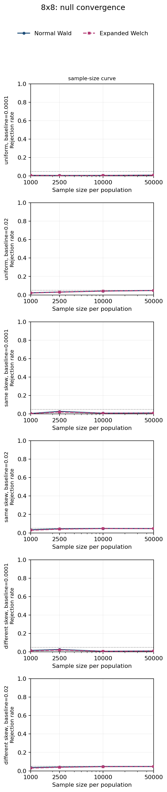

The companion graph uses the same results with the rejection-rate axis limited to 0.1.

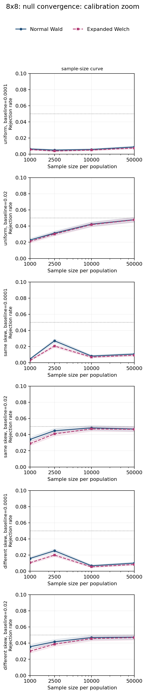

| Specification | Setting |
| --- | --- |
| Table size | 8x8 |
| Horizontal graph regime specifications (columns) | sample-size curve |
| Vertical graph regime specifications (rows) | uniform, baseline=0.0001: P row (0.125 repeated 8 times), P column (0.125 repeated 8 times); Q row (0.125 repeated 8 times), Q column (0.125 repeated 8 times); uniform, baseline=0.02: P row (0.125 repeated 8 times), P column (0.125 repeated 8 times); Q row (0.125 repeated 8 times), Q column (0.125 repeated 8 times); same skew, baseline=0.0001: P row (0.8, 0.2/7 repeated 7 times), P column (0.8, 0.2/7 repeated 7 times); Q row (0.8, 0.2/7 repeated 7 times), Q column (0.8, 0.2/7 repeated 7 times); same skew, baseline=0.02: P row (0.8, 0.2/7 repeated 7 times), P column (0.8, 0.2/7 repeated 7 times); Q row (0.8, 0.2/7 repeated 7 times), Q column (0.8, 0.2/7 repeated 7 times); different skew, baseline=0.0001: P row (0.7, 0.3/7 repeated 7 times), P column (0.7, 0.3/7 repeated 7 times); Q row (0.8, 0.2/7 repeated 7 times), Q column (0.8, 0.2/7 repeated 7 times); different skew, baseline=0.02: P row (0.7, 0.3/7 repeated 7 times), P column (0.7, 0.3/7 repeated 7 times); Q row (0.8, 0.2/7 repeated 7 times), Q column (0.8, 0.2/7 repeated 7 times) |
| Probability changes | uniform, baseline=0.0001: add at (1,1),(2,2) and subtract at (1,2),(2,1), for both P and Q; uniform, baseline=0.02: add at (1,1),(2,2) and subtract at (1,2),(2,1), for both P and Q; same skew, baseline=0.0001: add at (1,1),(2,2) and subtract at (1,2),(2,1), for both P and Q; same skew, baseline=0.02: add at (1,1),(2,2) and subtract at (1,2),(2,1), for both P and Q; different skew, baseline=0.0001: add at (1,1),(2,2) and subtract at (1,2),(2,1), for both P and Q; different skew, baseline=0.02: add at (1,1),(2,2) and subtract at (1,2),(2,1), for both P and Q |
| MI settings | Baseline MI {0.0001, 0.02}; direction {q higher}; actual differences {0} nats |
| Horizontal axis within each graph | Equal sample size from 1,000 to 50,000 on a log scale; fixed listed ticks |
| Vertical axis within each graph | Unconditional rejection rate from 0 to 1; invalid results count as non-rejections |
| Replicates | 20,000 per unique point |

Null-point rejection and validity:

| Vertical regime | Horizontal regime | x | Method | Rejection | Valid |
| --- | --- | --- | --- | --- | --- |
| uniform, baseline=0.0001 | sample-size curve | 1000 | Expanded Welch | 0.0057 | 1.0000 |
| uniform, baseline=0.0001 | sample-size curve | 1000 | Normal Wald | 0.0064 | 1.0000 |
| uniform, baseline=0.0001 | sample-size curve | 2500 | Expanded Welch | 0.0039 | 1.0000 |
| uniform, baseline=0.0001 | sample-size curve | 2500 | Normal Wald | 0.0050 | 1.0000 |
| uniform, baseline=0.0001 | sample-size curve | 1e+04 | Expanded Welch | 0.0051 | 1.0000 |
| uniform, baseline=0.0001 | sample-size curve | 1e+04 | Normal Wald | 0.0058 | 1.0000 |
| uniform, baseline=0.0001 | sample-size curve | 5e+04 | Expanded Welch | 0.0076 | 1.0000 |
| uniform, baseline=0.0001 | sample-size curve | 5e+04 | Normal Wald | 0.0089 | 1.0000 |
| uniform, baseline=0.02 | sample-size curve | 1000 | Expanded Welch | 0.0211 | 1.0000 |
| uniform, baseline=0.02 | sample-size curve | 1000 | Normal Wald | 0.0228 | 1.0000 |
| uniform, baseline=0.02 | sample-size curve | 2500 | Expanded Welch | 0.0302 | 1.0000 |
| uniform, baseline=0.02 | sample-size curve | 2500 | Normal Wald | 0.0313 | 1.0000 |
| uniform, baseline=0.02 | sample-size curve | 1e+04 | Expanded Welch | 0.0418 | 1.0000 |
| uniform, baseline=0.02 | sample-size curve | 1e+04 | Normal Wald | 0.0424 | 1.0000 |
| uniform, baseline=0.02 | sample-size curve | 5e+04 | Expanded Welch | 0.0478 | 1.0000 |
| uniform, baseline=0.02 | sample-size curve | 5e+04 | Normal Wald | 0.0479 | 1.0000 |
| same skew, baseline=0.0001 | sample-size curve | 1000 | Expanded Welch | 0.0028 | 1.0000 |
| same skew, baseline=0.0001 | sample-size curve | 1000 | Normal Wald | 0.0047 | 1.0000 |
| same skew, baseline=0.0001 | sample-size curve | 2500 | Expanded Welch | 0.0207 | 1.0000 |
| same skew, baseline=0.0001 | sample-size curve | 2500 | Normal Wald | 0.0271 | 1.0000 |
| same skew, baseline=0.0001 | sample-size curve | 1e+04 | Expanded Welch | 0.0069 | 1.0000 |
| same skew, baseline=0.0001 | sample-size curve | 1e+04 | Normal Wald | 0.0082 | 1.0000 |
| same skew, baseline=0.0001 | sample-size curve | 5e+04 | Expanded Welch | 0.0092 | 1.0000 |
| same skew, baseline=0.0001 | sample-size curve | 5e+04 | Normal Wald | 0.0106 | 1.0000 |
| same skew, baseline=0.02 | sample-size curve | 1000 | Expanded Welch | 0.0289 | 1.0000 |
| same skew, baseline=0.02 | sample-size curve | 1000 | Normal Wald | 0.0341 | 1.0000 |
| same skew, baseline=0.02 | sample-size curve | 2500 | Expanded Welch | 0.0410 | 1.0000 |
| same skew, baseline=0.02 | sample-size curve | 2500 | Normal Wald | 0.0449 | 1.0000 |
| same skew, baseline=0.02 | sample-size curve | 1e+04 | Expanded Welch | 0.0471 | 1.0000 |
| same skew, baseline=0.02 | sample-size curve | 1e+04 | Normal Wald | 0.0483 | 1.0000 |
| same skew, baseline=0.02 | sample-size curve | 5e+04 | Expanded Welch | 0.0466 | 1.0000 |
| same skew, baseline=0.02 | sample-size curve | 5e+04 | Normal Wald | 0.0470 | 1.0000 |
| different skew, baseline=0.0001 | sample-size curve | 1000 | Expanded Welch | 0.0105 | 1.0000 |
| different skew, baseline=0.0001 | sample-size curve | 1000 | Normal Wald | 0.0158 | 1.0000 |
| different skew, baseline=0.0001 | sample-size curve | 2500 | Expanded Welch | 0.0199 | 1.0000 |
| different skew, baseline=0.0001 | sample-size curve | 2500 | Normal Wald | 0.0253 | 1.0000 |
| different skew, baseline=0.0001 | sample-size curve | 1e+04 | Expanded Welch | 0.0053 | 1.0000 |
| different skew, baseline=0.0001 | sample-size curve | 1e+04 | Normal Wald | 0.0067 | 1.0000 |
| different skew, baseline=0.0001 | sample-size curve | 5e+04 | Expanded Welch | 0.0083 | 1.0000 |
| different skew, baseline=0.0001 | sample-size curve | 5e+04 | Normal Wald | 0.0100 | 1.0000 |
| different skew, baseline=0.02 | sample-size curve | 1000 | Expanded Welch | 0.0301 | 1.0000 |
| different skew, baseline=0.02 | sample-size curve | 1000 | Normal Wald | 0.0356 | 1.0000 |
| different skew, baseline=0.02 | sample-size curve | 2500 | Expanded Welch | 0.0387 | 1.0000 |
| different skew, baseline=0.02 | sample-size curve | 2500 | Normal Wald | 0.0418 | 1.0000 |
| different skew, baseline=0.02 | sample-size curve | 1e+04 | Expanded Welch | 0.0457 | 1.0000 |
| different skew, baseline=0.02 | sample-size curve | 1e+04 | Normal Wald | 0.0469 | 1.0000 |
| different skew, baseline=0.02 | sample-size curve | 5e+04 | Expanded Welch | 0.0469 | 1.0000 |
| different skew, baseline=0.02 | sample-size curve | 5e+04 | Normal Wald | 0.0474 | 1.0000 |

Every plotted rate, interval, validity and minimum expected count

| Vertical regime | Horizontal regime | x | Method | Rejection | 95% interval | Valid | Conditional | Min expected P | Min expected Q |
| --- | --- | --- | --- | --- | --- | --- | --- | --- | --- |
| uniform, baseline=0.0001 | sample-size curve | 1000 | Expanded Welch | 0.0057 | [0.0047, 0.0068] | 1.0000 | 0.0057 | 14.74 | 14.74 |
| uniform, baseline=0.0001 | sample-size curve | 1000 | Normal Wald | 0.0064 | [0.0054, 0.0076] | 1.0000 | 0.0064 | 14.74 | 14.74 |
| uniform, baseline=0.0001 | sample-size curve | 2500 | Expanded Welch | 0.0039 | [0.0031, 0.0049] | 1.0000 | 0.0039 | 36.85 | 36.85 |
| uniform, baseline=0.0001 | sample-size curve | 2500 | Normal Wald | 0.0050 | [0.0042, 0.0061] | 1.0000 | 0.0050 | 36.85 | 36.85 |
| uniform, baseline=0.0001 | sample-size curve | 10000 | Expanded Welch | 0.0051 | [0.0042, 0.0062] | 1.0000 | 0.0051 | 147.4 | 147.4 |
| uniform, baseline=0.0001 | sample-size curve | 10000 | Normal Wald | 0.0058 | [0.0048, 0.0070] | 1.0000 | 0.0058 | 147.4 | 147.4 |
| uniform, baseline=0.0001 | sample-size curve | 50000 | Expanded Welch | 0.0076 | [0.0064, 0.0088] | 1.0000 | 0.0076 | 737.1 | 737.1 |
| uniform, baseline=0.0001 | sample-size curve | 50000 | Normal Wald | 0.0089 | [0.0077, 0.0103] | 1.0000 | 0.0089 | 737.1 | 737.1 |
| uniform, baseline=0.02 | sample-size curve | 1000 | Expanded Welch | 0.0211 | [0.0192, 0.0232] | 1.0000 | 0.0211 | 3.848 | 3.848 |
| uniform, baseline=0.02 | sample-size curve | 1000 | Normal Wald | 0.0228 | [0.0208, 0.0250] | 1.0000 | 0.0228 | 3.848 | 3.848 |
| uniform, baseline=0.02 | sample-size curve | 2500 | Expanded Welch | 0.0302 | [0.0280, 0.0327] | 1.0000 | 0.0302 | 9.621 | 9.621 |
| uniform, baseline=0.02 | sample-size curve | 2500 | Normal Wald | 0.0313 | [0.0290, 0.0338] | 1.0000 | 0.0313 | 9.621 | 9.621 |
| uniform, baseline=0.02 | sample-size curve | 10000 | Expanded Welch | 0.0418 | [0.0392, 0.0447] | 1.0000 | 0.0418 | 38.48 | 38.48 |
| uniform, baseline=0.02 | sample-size curve | 10000 | Normal Wald | 0.0424 | [0.0397, 0.0453] | 1.0000 | 0.0424 | 38.48 | 38.48 |
| uniform, baseline=0.02 | sample-size curve | 50000 | Expanded Welch | 0.0478 | [0.0449, 0.0508] | 1.0000 | 0.0478 | 192.4 | 192.4 |
| uniform, baseline=0.02 | sample-size curve | 50000 | Normal Wald | 0.0479 | [0.0451, 0.0510] | 1.0000 | 0.0479 | 192.4 | 192.4 |
| same skew, baseline=0.0001 | sample-size curve | 1000 | Expanded Welch | 0.0028 | [0.0022, 0.0036] | 1.0000 | 0.0028 | 0.8163 | 0.8163 |
| same skew, baseline=0.0001 | sample-size curve | 1000 | Normal Wald | 0.0047 | [0.0038, 0.0057] | 1.0000 | 0.0047 | 0.8163 | 0.8163 |
| same skew, baseline=0.0001 | sample-size curve | 2500 | Expanded Welch | 0.0207 | [0.0188, 0.0227] | 1.0000 | 0.0207 | 2.041 | 2.041 |
| same skew, baseline=0.0001 | sample-size curve | 2500 | Normal Wald | 0.0271 | [0.0249, 0.0294] | 1.0000 | 0.0271 | 2.041 | 2.041 |
| same skew, baseline=0.0001 | sample-size curve | 10000 | Expanded Welch | 0.0069 | [0.0058, 0.0081] | 1.0000 | 0.0069 | 8.163 | 8.163 |
| same skew, baseline=0.0001 | sample-size curve | 10000 | Normal Wald | 0.0082 | [0.0070, 0.0095] | 1.0000 | 0.0082 | 8.163 | 8.163 |
| same skew, baseline=0.0001 | sample-size curve | 50000 | Expanded Welch | 0.0092 | [0.0080, 0.0106] | 1.0000 | 0.0092 | 40.82 | 40.82 |
| same skew, baseline=0.0001 | sample-size curve | 50000 | Normal Wald | 0.0106 | [0.0093, 0.0122] | 1.0000 | 0.0106 | 40.82 | 40.82 |
| same skew, baseline=0.02 | sample-size curve | 1000 | Expanded Welch | 0.0289 | [0.0266, 0.0313] | 1.0000 | 0.0289 | 0.8163 | 0.8163 |
| same skew, baseline=0.02 | sample-size curve | 1000 | Normal Wald | 0.0341 | [0.0317, 0.0368] | 1.0000 | 0.0341 | 0.8163 | 0.8163 |
| same skew, baseline=0.02 | sample-size curve | 2500 | Expanded Welch | 0.0410 | [0.0383, 0.0438] | 1.0000 | 0.0410 | 2.041 | 2.041 |
| same skew, baseline=0.02 | sample-size curve | 2500 | Normal Wald | 0.0449 | [0.0421, 0.0478] | 1.0000 | 0.0449 | 2.041 | 2.041 |
| same skew, baseline=0.02 | sample-size curve | 10000 | Expanded Welch | 0.0471 | [0.0442, 0.0501] | 1.0000 | 0.0471 | 8.163 | 8.163 |
| same skew, baseline=0.02 | sample-size curve | 10000 | Normal Wald | 0.0483 | [0.0455, 0.0514] | 1.0000 | 0.0483 | 8.163 | 8.163 |
| same skew, baseline=0.02 | sample-size curve | 50000 | Expanded Welch | 0.0466 | [0.0437, 0.0496] | 1.0000 | 0.0466 | 40.82 | 40.82 |
| same skew, baseline=0.02 | sample-size curve | 50000 | Normal Wald | 0.0470 | [0.0442, 0.0500] | 1.0000 | 0.0470 | 40.82 | 40.82 |
| different skew, baseline=0.0001 | sample-size curve | 1000 | Expanded Welch | 0.0105 | [0.0092, 0.0120] | 1.0000 | 0.0105 | 1.837 | 0.8163 |
| different skew, baseline=0.0001 | sample-size curve | 1000 | Normal Wald | 0.0158 | [0.0142, 0.0177] | 1.0000 | 0.0158 | 1.837 | 0.8163 |
| different skew, baseline=0.0001 | sample-size curve | 2500 | Expanded Welch | 0.0199 | [0.0181, 0.0220] | 1.0000 | 0.0199 | 4.592 | 2.041 |
| different skew, baseline=0.0001 | sample-size curve | 2500 | Normal Wald | 0.0253 | [0.0232, 0.0276] | 1.0000 | 0.0253 | 4.592 | 2.041 |
| different skew, baseline=0.0001 | sample-size curve | 10000 | Expanded Welch | 0.0053 | [0.0044, 0.0065] | 1.0000 | 0.0053 | 18.37 | 8.163 |
| different skew, baseline=0.0001 | sample-size curve | 10000 | Normal Wald | 0.0067 | [0.0057, 0.0080] | 1.0000 | 0.0067 | 18.37 | 8.163 |
| different skew, baseline=0.0001 | sample-size curve | 50000 | Expanded Welch | 0.0083 | [0.0072, 0.0097] | 1.0000 | 0.0083 | 91.84 | 40.82 |
| different skew, baseline=0.0001 | sample-size curve | 50000 | Normal Wald | 0.0100 | [0.0087, 0.0115] | 1.0000 | 0.0100 | 91.84 | 40.82 |
| different skew, baseline=0.02 | sample-size curve | 1000 | Expanded Welch | 0.0301 | [0.0279, 0.0326] | 1.0000 | 0.0301 | 1.837 | 0.8163 |
| different skew, baseline=0.02 | sample-size curve | 1000 | Normal Wald | 0.0356 | [0.0331, 0.0383] | 1.0000 | 0.0356 | 1.837 | 0.8163 |
| different skew, baseline=0.02 | sample-size curve | 2500 | Expanded Welch | 0.0387 | [0.0362, 0.0415] | 1.0000 | 0.0387 | 4.592 | 2.041 |
| different skew, baseline=0.02 | sample-size curve | 2500 | Normal Wald | 0.0418 | [0.0391, 0.0446] | 1.0000 | 0.0418 | 4.592 | 2.041 |
| different skew, baseline=0.02 | sample-size curve | 10000 | Expanded Welch | 0.0457 | [0.0428, 0.0486] | 1.0000 | 0.0457 | 18.37 | 8.163 |
| different skew, baseline=0.02 | sample-size curve | 10000 | Normal Wald | 0.0469 | [0.0441, 0.0499] | 1.0000 | 0.0469 | 18.37 | 8.163 |
| different skew, baseline=0.02 | sample-size curve | 50000 | Expanded Welch | 0.0469 | [0.0441, 0.0499] | 1.0000 | 0.0469 | 91.84 | 40.82 |
| different skew, baseline=0.02 | sample-size curve | 50000 | Normal Wald | 0.0474 | [0.0445, 0.0504] | 1.0000 | 0.0474 | 91.84 | 40.82 |

### 13.5 3x3: rare-cell null convergence

Do null rejection rates approach 0.05 as the fixed populations receive more data?

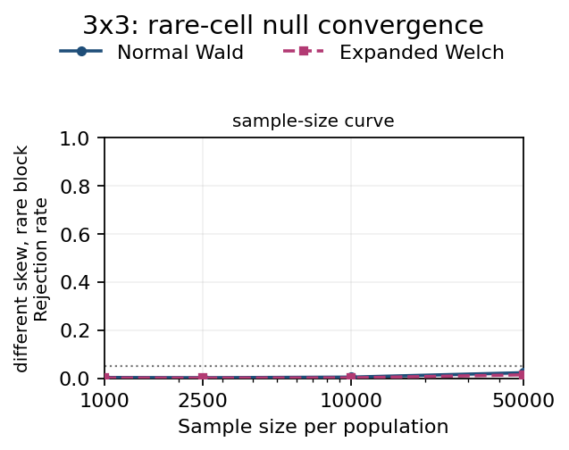

The companion graph uses the same results with the rejection-rate axis limited to 0.1.

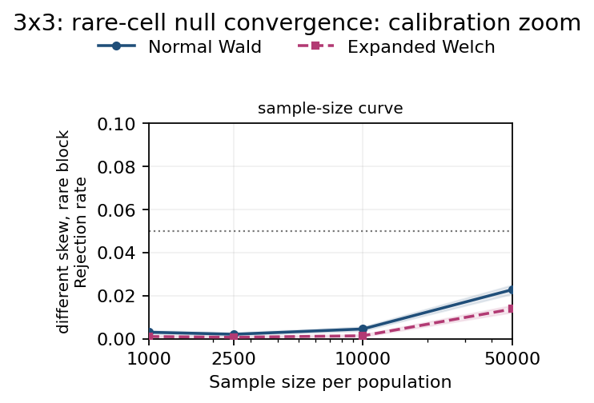

| Specification | Setting |
| --- | --- |
| Table size | 3x3 |
| Horizontal graph regime specifications (columns) | sample-size curve |
| Vertical graph regime specifications (rows) | different skew, rare block: P row (0.7, 0.3/2 repeated 2 times), P column (0.7, 0.3/2 repeated 2 times); Q row (0.8, 0.2/2 repeated 2 times), Q column (0.8, 0.2/2 repeated 2 times) |
| Probability changes | different skew, rare block: the same four signs in the last two rows and last two columns, for both P and Q |
| MI settings | Baseline MI {0.0001}; direction {q higher}; actual differences {0} nats |
| Horizontal axis within each graph | Equal sample size from 1,000 to 50,000 on a log scale; fixed listed ticks |
| Vertical axis within each graph | Unconditional rejection rate from 0 to 1; invalid results count as non-rejections |
| Replicates | 20,000 per unique point |

Null-point rejection and validity:

| Vertical regime | Horizontal regime | x | Method | Rejection | Valid |
| --- | --- | --- | --- | --- | --- |
| different skew, rare block | sample-size curve | 1000 | Expanded Welch | 0.0010 | 1.0000 |
| different skew, rare block | sample-size curve | 1000 | Normal Wald | 0.0030 | 1.0000 |
| different skew, rare block | sample-size curve | 2500 | Expanded Welch | 0.0006 | 1.0000 |
| different skew, rare block | sample-size curve | 2500 | Normal Wald | 0.0021 | 1.0000 |
| different skew, rare block | sample-size curve | 1e+04 | Expanded Welch | 0.0014 | 1.0000 |
| different skew, rare block | sample-size curve | 1e+04 | Normal Wald | 0.0045 | 1.0000 |
| different skew, rare block | sample-size curve | 5e+04 | Expanded Welch | 0.0138 | 1.0000 |
| different skew, rare block | sample-size curve | 5e+04 | Normal Wald | 0.0228 | 1.0000 |

Every plotted rate, interval, validity and minimum expected count

| Vertical regime | Horizontal regime | x | Method | Rejection | 95% interval | Valid | Conditional | Min expected P | Min expected Q |
| --- | --- | --- | --- | --- | --- | --- | --- | --- | --- |
| different skew, rare block | sample-size curve | 1000 | Expanded Welch | 0.0010 | [0.0006, 0.0015] | 1.0000 | 0.0010 | 21.44 | 9.293 |
| different skew, rare block | sample-size curve | 1000 | Normal Wald | 0.0030 | [0.0023, 0.0039] | 1.0000 | 0.0030 | 21.44 | 9.293 |
| different skew, rare block | sample-size curve | 2500 | Expanded Welch | 0.0006 | [0.0004, 0.0011] | 1.0000 | 0.0006 | 53.6 | 23.23 |
| different skew, rare block | sample-size curve | 2500 | Normal Wald | 0.0021 | [0.0015, 0.0028] | 1.0000 | 0.0021 | 53.6 | 23.23 |
| different skew, rare block | sample-size curve | 10000 | Expanded Welch | 0.0014 | [0.0009, 0.0020] | 1.0000 | 0.0014 | 214.4 | 92.93 |
| different skew, rare block | sample-size curve | 10000 | Normal Wald | 0.0045 | [0.0037, 0.0055] | 1.0000 | 0.0045 | 214.4 | 92.93 |
| different skew, rare block | sample-size curve | 50000 | Expanded Welch | 0.0138 | [0.0123, 0.0155] | 1.0000 | 0.0138 | 1072 | 464.7 |
| different skew, rare block | sample-size curve | 50000 | Normal Wald | 0.0228 | [0.0208, 0.0250] | 1.0000 | 0.0228 | 1072 | 464.7 |

### 13.6 5x5: rare-cell null convergence

Do null rejection rates approach 0.05 as the fixed populations receive more data?

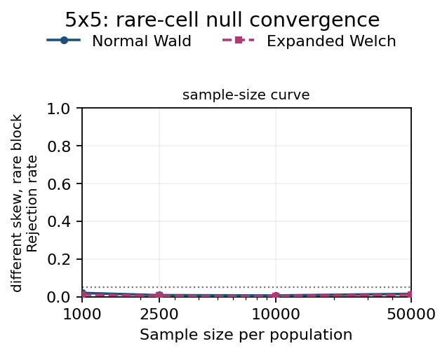

The companion graph uses the same results with the rejection-rate axis limited to 0.1.

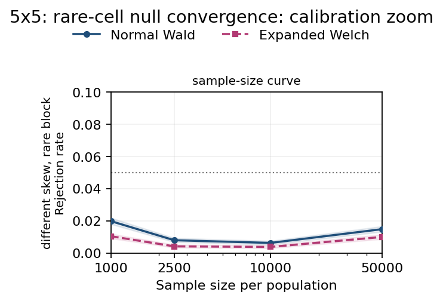

| Specification | Setting |
| --- | --- |
| Table size | 5x5 |
| Horizontal graph regime specifications (columns) | sample-size curve |
| Vertical graph regime specifications (rows) | different skew, rare block: P row (0.7, 0.3/4 repeated 4 times), P column (0.7, 0.3/4 repeated 4 times); Q row (0.8, 0.2/4 repeated 4 times), Q column (0.8, 0.2/4 repeated 4 times) |
| Probability changes | different skew, rare block: the same four signs in the last two rows and last two columns, for both P and Q |
| MI settings | Baseline MI {0.0001}; direction {q higher}; actual differences {0} nats |
| Horizontal axis within each graph | Equal sample size from 1,000 to 50,000 on a log scale; fixed listed ticks |
| Vertical axis within each graph | Unconditional rejection rate from 0 to 1; invalid results count as non-rejections |
| Replicates | 20,000 per unique point |

Null-point rejection and validity:

| Vertical regime | Horizontal regime | x | Method | Rejection | Valid |
| --- | --- | --- | --- | --- | --- |
| different skew, rare block | sample-size curve | 1000 | Expanded Welch | 0.0104 | 1.0000 |
| different skew, rare block | sample-size curve | 1000 | Normal Wald | 0.0198 | 1.0000 |
| different skew, rare block | sample-size curve | 2500 | Expanded Welch | 0.0041 | 1.0000 |
| different skew, rare block | sample-size curve | 2500 | Normal Wald | 0.0079 | 1.0000 |
| different skew, rare block | sample-size curve | 1e+04 | Expanded Welch | 0.0037 | 1.0000 |
| different skew, rare block | sample-size curve | 1e+04 | Normal Wald | 0.0063 | 1.0000 |
| different skew, rare block | sample-size curve | 5e+04 | Expanded Welch | 0.0100 | 1.0000 |
| different skew, rare block | sample-size curve | 5e+04 | Normal Wald | 0.0148 | 1.0000 |

Every plotted rate, interval, validity and minimum expected count

| Vertical regime | Horizontal regime | x | Method | Rejection | 95% interval | Valid | Conditional | Min expected P | Min expected Q |
| --- | --- | --- | --- | --- | --- | --- | --- | --- | --- |
| different skew, rare block | sample-size curve | 1000 | Expanded Welch | 0.0104 | [0.0091, 0.0119] | 1.0000 | 0.0104 | 5.095 | 2.147 |
| different skew, rare block | sample-size curve | 1000 | Normal Wald | 0.0198 | [0.0180, 0.0218] | 1.0000 | 0.0198 | 5.095 | 2.147 |
| different skew, rare block | sample-size curve | 2500 | Expanded Welch | 0.0041 | [0.0033, 0.0051] | 1.0000 | 0.0041 | 12.74 | 5.368 |
| different skew, rare block | sample-size curve | 2500 | Normal Wald | 0.0079 | [0.0068, 0.0092] | 1.0000 | 0.0079 | 12.74 | 5.368 |
| different skew, rare block | sample-size curve | 10000 | Expanded Welch | 0.0037 | [0.0030, 0.0047] | 1.0000 | 0.0037 | 50.95 | 21.47 |
| different skew, rare block | sample-size curve | 10000 | Normal Wald | 0.0063 | [0.0052, 0.0074] | 1.0000 | 0.0063 | 50.95 | 21.47 |
| different skew, rare block | sample-size curve | 50000 | Expanded Welch | 0.0100 | [0.0087, 0.0114] | 1.0000 | 0.0100 | 254.8 | 107.4 |
| different skew, rare block | sample-size curve | 50000 | Normal Wald | 0.0148 | [0.0132, 0.0166] | 1.0000 | 0.0148 | 254.8 | 107.4 |

### 13.7 8x8: rare-cell null convergence

Do null rejection rates approach 0.05 as the fixed populations receive more data?

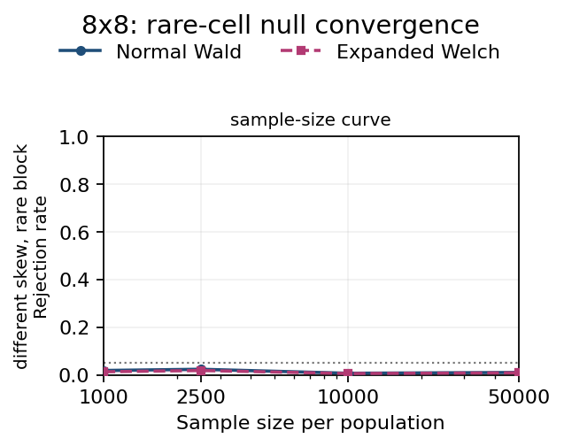

The companion graph uses the same results with the rejection-rate axis limited to 0.1.

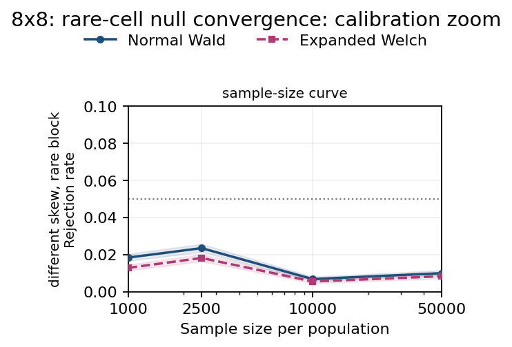

| Specification | Setting |
| --- | --- |
| Table size | 8x8 |
| Horizontal graph regime specifications (columns) | sample-size curve |
| Vertical graph regime specifications (rows) | different skew, rare block: P row (0.7, 0.3/7 repeated 7 times), P column (0.7, 0.3/7 repeated 7 times); Q row (0.8, 0.2/7 repeated 7 times), Q column (0.8, 0.2/7 repeated 7 times) |
| Probability changes | different skew, rare block: the same four signs in the last two rows and last two columns, for both P and Q |
| MI settings | Baseline MI {0.0001}; direction {q higher}; actual differences {0} nats |
| Horizontal axis within each graph | Equal sample size from 1,000 to 50,000 on a log scale; fixed listed ticks |
| Vertical axis within each graph | Unconditional rejection rate from 0 to 1; invalid results count as non-rejections |
| Replicates | 20,000 per unique point |

Null-point rejection and validity:

| Vertical regime | Horizontal regime | x | Method | Rejection | Valid |
| --- | --- | --- | --- | --- | --- |
| different skew, rare block | sample-size curve | 1000 | Expanded Welch | 0.0128 | 1.0000 |
| different skew, rare block | sample-size curve | 1000 | Normal Wald | 0.0184 | 1.0000 |
| different skew, rare block | sample-size curve | 2500 | Expanded Welch | 0.0181 | 1.0000 |
| different skew, rare block | sample-size curve | 2500 | Normal Wald | 0.0234 | 1.0000 |
| different skew, rare block | sample-size curve | 1e+04 | Expanded Welch | 0.0054 | 1.0000 |
| different skew, rare block | sample-size curve | 1e+04 | Normal Wald | 0.0067 | 1.0000 |
| different skew, rare block | sample-size curve | 5e+04 | Expanded Welch | 0.0083 | 1.0000 |
| different skew, rare block | sample-size curve | 5e+04 | Normal Wald | 0.0100 | 1.0000 |

Every plotted rate, interval, validity and minimum expected count

| Vertical regime | Horizontal regime | x | Method | Rejection | 95% interval | Valid | Conditional | Min expected P | Min expected Q |
| --- | --- | --- | --- | --- | --- | --- | --- | --- | --- |
| different skew, rare block | sample-size curve | 1000 | Expanded Welch | 0.0128 | [0.0113, 0.0145] | 1.0000 | 0.0128 | 1.534 | 0.6153 |
| different skew, rare block | sample-size curve | 1000 | Normal Wald | 0.0184 | [0.0166, 0.0203] | 1.0000 | 0.0184 | 1.534 | 0.6153 |
| different skew, rare block | sample-size curve | 2500 | Expanded Welch | 0.0181 | [0.0164, 0.0201] | 1.0000 | 0.0181 | 3.836 | 1.538 |
| different skew, rare block | sample-size curve | 2500 | Normal Wald | 0.0234 | [0.0214, 0.0256] | 1.0000 | 0.0234 | 3.836 | 1.538 |
| different skew, rare block | sample-size curve | 10000 | Expanded Welch | 0.0054 | [0.0045, 0.0066] | 1.0000 | 0.0054 | 15.34 | 6.153 |
| different skew, rare block | sample-size curve | 10000 | Normal Wald | 0.0067 | [0.0057, 0.0080] | 1.0000 | 0.0067 | 15.34 | 6.153 |
| different skew, rare block | sample-size curve | 50000 | Expanded Welch | 0.0083 | [0.0071, 0.0097] | 1.0000 | 0.0083 | 76.72 | 30.77 |
| different skew, rare block | sample-size curve | 50000 | Normal Wald | 0.0100 | [0.0087, 0.0114] | 1.0000 | 0.0100 | 76.72 | 30.77 |

## 14. Overall findings

The complete regime-by-regime results support a conditional conclusion, not a universal ranking:

- Among the 36 main null regimes with n in {5,10,20}, Expanded Welch was closer to 0.05 in 26, while Wald was closer in 10. The n=2 cases were ties only because neither method returned a valid result.
- Among the 24 main null regimes with n in {500,1000}, Wald was closer in 24 and Expanded Welch in 0. At n=1,000, Wald false-positive rates ranged from 0.0228 to 0.0453; Expanded Welch ranged from 0.0211 to 0.0393.
- On every common-valid input, Expanded Welch used the same statistic with a no-smaller p-value. Across nonzero main points its unconditional rejection rate was therefore never higher; the largest observed Wald-minus-Expanded difference was 0.3086.
- At baseline MI 0.02 and n=50,000, both methods were close to nominal across all main null populations: Wald ranged from 0.0470 to 0.0527, and Expanded Welch from 0.0466 to 0.0525.
- Near independence, baseline MI 0.0001 remained conservative at n=50,000: Wald ranged from 0.0089 to 0.0279, and Expanded Welch from 0.0076 to 0.0138. This shows that sample size alone is not an adequate description of the approximation regime.
- Expanded Welch took 1.75 times the Wald runtime at the median across the 60 timed regimes (range 1.72 to 1.79).

Taken together, the study does not support Expanded Welch as a general replacement for Normal Wald. Its heavier-tailed reference can usefully reduce liberal rejection in some small-sample regimes, but it can also become unnecessarily conservative, fail more often, and lose power. The exact population construction still matters in larger tables, so conclusions should be attached to the stated regimes rather than presented as a universal rule.

## 15. Runtime

Complete scalar test calls were timed on the same 200 saved input pairs per exact regime. Wald calls omit Expanded-Welch calculations; Expanded-Welch calls include the shared statistic plus its degrees-of-freedom calculation.

| Shape | Margins | (nP,nQ) | MI difference | Method | Median us | IQR us | Expanded/Wald | Valid |
| --- | --- | --- | --- | --- | --- | --- | --- | --- |
| 2x2 | different skew | (20, 20) | 0 | expanded welch | 146 | [145.5, 146.7] | 1.723 | 0.9700 |
| 2x2 | different skew | (20, 20) | 0 | normal wald | 84.75 | [84.57, 85.04] | 1.723 | 1.0000 |
| 2x2 | different skew | (20, 20) | 0.02 | expanded welch | 148 | [146.7, 148.6] | 1.742 | 0.9800 |
| 2x2 | different skew | (20, 20) | 0.02 | normal wald | 84.96 | [84.67, 85.17] | 1.742 | 1.0000 |
| 2x2 | different skew | (100, 100) | 0 | expanded welch | 150 | [149.4, 151.3] | 1.748 | 1.0000 |
| 2x2 | different skew | (100, 100) | 0 | normal wald | 85.83 | [85.53, 86.33] | 1.748 | 1.0000 |
| 2x2 | different skew | (100, 100) | 0.02 | expanded welch | 149.3 | [148.6, 150.3] | 1.758 | 1.0000 |
| 2x2 | different skew | (100, 100) | 0.02 | normal wald | 84.96 | [84.75, 85.33] | 1.758 | 1.0000 |
| 2x2 | different skew | (1000, 1000) | 0 | expanded welch | 149.1 | [148.6, 149.4] | 1.76 | 1.0000 |
| 2x2 | different skew | (1000, 1000) | 0 | normal wald | 84.71 | [84.41, 85] | 1.76 | 1.0000 |
| 2x2 | different skew | (1000, 1000) | 0.02 | expanded welch | 149 | [148.8, 149.5] | 1.761 | 1.0000 |
| 2x2 | different skew | (1000, 1000) | 0.02 | normal wald | 84.62 | [84.29, 85.12] | 1.761 | 1.0000 |
| 2x2 | uniform | (20, 20) | 0 | expanded welch | 148.4 | [147.5, 149.9] | 1.753 | 0.9800 |
| 2x2 | uniform | (20, 20) | 0 | normal wald | 84.65 | [84.04, 85.09] | 1.753 | 0.9950 |
| 2x2 | uniform | (20, 20) | 0.02 | expanded welch | 147.5 | [147, 148.3] | 1.751 | 0.9900 |
| 2x2 | uniform | (20, 20) | 0.02 | normal wald | 84.25 | [83.82, 84.58] | 1.751 | 1.0000 |
| 2x2 | uniform | (100, 100) | 0 | expanded welch | 147.4 | [146.6, 148.3] | 1.749 | 1.0000 |
| 2x2 | uniform | (100, 100) | 0 | normal wald | 84.31 | [83.75, 84.79] | 1.749 | 1.0000 |
| 2x2 | uniform | (100, 100) | 0.02 | expanded welch | 150 | [149.1, 151.4] | 1.775 | 1.0000 |
| 2x2 | uniform | (100, 100) | 0.02 | normal wald | 84.5 | [83.32, 84.92] | 1.775 | 1.0000 |
| 2x2 | uniform | (1000, 1000) | 0 | expanded welch | 149.6 | [148.8, 150.5] | 1.746 | 1.0000 |
| 2x2 | uniform | (1000, 1000) | 0 | normal wald | 85.67 | [85.17, 86.29] | 1.746 | 1.0000 |
| 2x2 | uniform | (1000, 1000) | 0.02 | expanded welch | 146.4 | [145.5, 147.7] | 1.728 | 1.0000 |
| 2x2 | uniform | (1000, 1000) | 0.02 | normal wald | 84.71 | [84.5, 84.96] | 1.728 | 1.0000 |
| 3x3 | different skew | (20, 20) | 0 | expanded welch | 150.6 | [149.2, 152.3] | 1.788 | 0.9500 |
| 3x3 | different skew | (20, 20) | 0 | normal wald | 84.21 | [83.88, 84.71] | 1.788 | 1.0000 |
| 3x3 | different skew | (20, 20) | 0.02 | expanded welch | 150.7 | [149.5, 151.7] | 1.771 | 0.9900 |
| 3x3 | different skew | (20, 20) | 0.02 | normal wald | 85.1 | [84.79, 85.59] | 1.771 | 1.0000 |
| 3x3 | different skew | (100, 100) | 0 | expanded welch | 150 | [148.9, 150.9] | 1.763 | 1.0000 |
| 3x3 | different skew | (100, 100) | 0 | normal wald | 85.08 | [84.58, 85.59] | 1.763 | 1.0000 |
| 3x3 | different skew | (100, 100) | 0.02 | expanded welch | 150.1 | [149, 151.1] | 1.773 | 1.0000 |
| 3x3 | different skew | (100, 100) | 0.02 | normal wald | 84.71 | [84.29, 85.25] | 1.773 | 1.0000 |
| 3x3 | different skew | (1000, 1000) | 0 | expanded welch | 147.4 | [146.9, 148] | 1.756 | 1.0000 |
| 3x3 | different skew | (1000, 1000) | 0 | normal wald | 83.94 | [83.74, 84.17] | 1.756 | 1.0000 |
| 3x3 | different skew | (1000, 1000) | 0.02 | expanded welch | 148 | [147.5, 148.6] | 1.745 | 1.0000 |
| 3x3 | different skew | (1000, 1000) | 0.02 | normal wald | 84.77 | [84.58, 85] | 1.745 | 1.0000 |
| 3x3 | uniform | (20, 20) | 0 | expanded welch | 149.7 | [149.2, 150.3] | 1.762 | 1.0000 |
| 3x3 | uniform | (20, 20) | 0 | normal wald | 84.96 | [84.29, 85.33] | 1.762 | 1.0000 |
| 3x3 | uniform | (20, 20) | 0.02 | expanded welch | 148.8 | [148.2, 149.6] | 1.751 | 1.0000 |
| 3x3 | uniform | (20, 20) | 0.02 | normal wald | 85 | [84.79, 85.22] | 1.751 | 1.0000 |
| 3x3 | uniform | (100, 100) | 0 | expanded welch | 149.9 | [149.2, 151.1] | 1.75 | 1.0000 |
| 3x3 | uniform | (100, 100) | 0 | normal wald | 85.65 | [85.17, 86.08] | 1.75 | 1.0000 |
| 3x3 | uniform | (100, 100) | 0.02 | expanded welch | 150.1 | [149.4, 150.7] | 1.758 | 1.0000 |
| 3x3 | uniform | (100, 100) | 0.02 | normal wald | 85.38 | [85.08, 85.84] | 1.758 | 1.0000 |
| 3x3 | uniform | (1000, 1000) | 0 | expanded welch | 151.2 | [150.4, 152.5] | 1.786 | 1.0000 |
| 3x3 | uniform | (1000, 1000) | 0 | normal wald | 84.71 | [84.28, 85.39] | 1.786 | 1.0000 |
| 3x3 | uniform | (1000, 1000) | 0.02 | expanded welch | 149.9 | [149.1, 151.1] | 1.786 | 1.0000 |
| 3x3 | uniform | (1000, 1000) | 0.02 | normal wald | 83.92 | [83.5, 84.54] | 1.786 | 1.0000 |
| 3x5 | different skew | (20, 20) | 0 | expanded welch | 149 | [148.4, 150.3] | 1.749 | 0.9850 |
| 3x5 | different skew | (20, 20) | 0 | normal wald | 85.17 | [84.92, 86.04] | 1.749 | 1.0000 |
| 3x5 | different skew | (20, 20) | 0.02 | expanded welch | 151.1 | [150.1, 151.9] | 1.754 | 0.9700 |
| 3x5 | different skew | (20, 20) | 0.02 | normal wald | 86.17 | [85.75, 88.21] | 1.754 | 1.0000 |
| 3x5 | different skew | (100, 100) | 0 | expanded welch | 150.1 | [149.5, 150.9] | 1.762 | 1.0000 |
| 3x5 | different skew | (100, 100) | 0 | normal wald | 85.21 | [84.88, 85.46] | 1.762 | 1.0000 |
| 3x5 | different skew | (100, 100) | 0.02 | expanded welch | 150 | [149.1, 151.3] | 1.762 | 1.0000 |
| 3x5 | different skew | (100, 100) | 0.02 | normal wald | 85.12 | [84.83, 85.42] | 1.762 | 1.0000 |
| 3x5 | different skew | (1000, 1000) | 0 | expanded welch | 148.3 | [147.8, 149.3] | 1.764 | 1.0000 |
| 3x5 | different skew | (1000, 1000) | 0 | normal wald | 84.08 | [83.75, 84.46] | 1.764 | 1.0000 |
| 3x5 | different skew | (1000, 1000) | 0.02 | expanded welch | 151.1 | [149.9, 153.1] | 1.773 | 1.0000 |
| 3x5 | different skew | (1000, 1000) | 0.02 | normal wald | 85.25 | [84.92, 85.75] | 1.773 | 1.0000 |
| 3x5 | uniform | (20, 20) | 0 | expanded welch | 150.1 | [149.6, 151.3] | 1.751 | 1.0000 |
| 3x5 | uniform | (20, 20) | 0 | normal wald | 85.71 | [85.5, 86.17] | 1.751 | 1.0000 |
| 3x5 | uniform | (20, 20) | 0.02 | expanded welch | 149.5 | [148.9, 150.2] | 1.751 | 1.0000 |
| 3x5 | uniform | (20, 20) | 0.02 | normal wald | 85.38 | [85.08, 85.68] | 1.751 | 1.0000 |
| 3x5 | uniform | (100, 100) | 0 | expanded welch | 150.2 | [149.6, 151.1] | 1.758 | 1.0000 |
| 3x5 | uniform | (100, 100) | 0 | normal wald | 85.42 | [85.17, 85.79] | 1.758 | 1.0000 |
| 3x5 | uniform | (100, 100) | 0.02 | expanded welch | 149.5 | [148.8, 150.3] | 1.751 | 1.0000 |
| 3x5 | uniform | (100, 100) | 0.02 | normal wald | 85.38 | [85.08, 85.75] | 1.751 | 1.0000 |
| 3x5 | uniform | (1000, 1000) | 0 | expanded welch | 150.8 | [150.2, 151.3] | 1.758 | 1.0000 |
| 3x5 | uniform | (1000, 1000) | 0 | normal wald | 85.77 | [85.54, 86.25] | 1.758 | 1.0000 |
| 3x5 | uniform | (1000, 1000) | 0.02 | expanded welch | 148.3 | [147.8, 149.1] | 1.74 | 1.0000 |
| 3x5 | uniform | (1000, 1000) | 0.02 | normal wald | 85.21 | [84.92, 85.62] | 1.74 | 1.0000 |
| 5x5 | different skew | (20, 20) | 0 | expanded welch | 148.8 | [148.4, 149.3] | 1.742 | 0.9600 |
| 5x5 | different skew | (20, 20) | 0 | normal wald | 85.42 | [85.12, 85.71] | 1.742 | 1.0000 |
| 5x5 | different skew | (20, 20) | 0.02 | expanded welch | 148.9 | [148.5, 149.2] | 1.747 | 0.9500 |
| 5x5 | different skew | (20, 20) | 0.02 | normal wald | 85.21 | [85.08, 85.38] | 1.747 | 1.0000 |
| 5x5 | different skew | (100, 100) | 0 | expanded welch | 149.2 | [148.5, 150.1] | 1.749 | 1.0000 |
| 5x5 | different skew | (100, 100) | 0 | normal wald | 85.29 | [85.08, 85.67] | 1.749 | 1.0000 |
| 5x5 | different skew | (100, 100) | 0.02 | expanded welch | 149.2 | [148.5, 150.1] | 1.74 | 1.0000 |
| 5x5 | different skew | (100, 100) | 0.02 | normal wald | 85.75 | [85.5, 86.04] | 1.74 | 1.0000 |
| 5x5 | different skew | (1000, 1000) | 0 | expanded welch | 149.4 | [148.5, 151] | 1.766 | 1.0000 |
| 5x5 | different skew | (1000, 1000) | 0 | normal wald | 84.58 | [84.38, 84.93] | 1.766 | 1.0000 |
| 5x5 | different skew | (1000, 1000) | 0.02 | expanded welch | 152.6 | [150.6, 154.7] | 1.727 | 1.0000 |
| 5x5 | different skew | (1000, 1000) | 0.02 | normal wald | 88.38 | [87.78, 89.79] | 1.727 | 1.0000 |
| 5x5 | uniform | (20, 20) | 0 | expanded welch | 149.2 | [148.8, 149.8] | 1.753 | 1.0000 |
| 5x5 | uniform | (20, 20) | 0 | normal wald | 85.08 | [84.88, 85.38] | 1.753 | 1.0000 |
| 5x5 | uniform | (20, 20) | 0.02 | expanded welch | 149.9 | [149.3, 151.1] | 1.754 | 1.0000 |
| 5x5 | uniform | (20, 20) | 0.02 | normal wald | 85.46 | [84.95, 85.83] | 1.754 | 1.0000 |
| 5x5 | uniform | (100, 100) | 0 | expanded welch | 148.1 | [147.7, 148.6] | 1.738 | 1.0000 |
| 5x5 | uniform | (100, 100) | 0 | normal wald | 85.25 | [85.08, 85.42] | 1.738 | 1.0000 |
| 5x5 | uniform | (100, 100) | 0.02 | expanded welch | 151 | [150, 152.3] | 1.761 | 1.0000 |
| 5x5 | uniform | (100, 100) | 0.02 | normal wald | 85.75 | [85.29, 86.25] | 1.761 | 1.0000 |
| 5x5 | uniform | (1000, 1000) | 0 | expanded welch | 149.8 | [148.7, 150.7] | 1.751 | 1.0000 |
| 5x5 | uniform | (1000, 1000) | 0 | normal wald | 85.5 | [85, 86.12] | 1.751 | 1.0000 |
| 5x5 | uniform | (1000, 1000) | 0.02 | expanded welch | 147.4 | [146.6, 148.4] | 1.735 | 1.0000 |
| 5x5 | uniform | (1000, 1000) | 0.02 | normal wald | 84.96 | [84.67, 85.17] | 1.735 | 1.0000 |
| 8x8 | different skew | (20, 20) | 0 | expanded welch | 151.1 | [150.3, 151.8] | 1.769 | 0.9800 |
| 8x8 | different skew | (20, 20) | 0 | normal wald | 85.42 | [85.07, 85.89] | 1.769 | 1.0000 |
| 8x8 | different skew | (20, 20) | 0.02 | expanded welch | 150.2 | [149.7, 150.9] | 1.73 | 0.9650 |
| 8x8 | different skew | (20, 20) | 0.02 | normal wald | 86.83 | [86.32, 87.12] | 1.73 | 1.0000 |
| 8x8 | different skew | (100, 100) | 0 | expanded welch | 153.4 | [152.4, 154.8] | 1.743 | 1.0000 |
| 8x8 | different skew | (100, 100) | 0 | normal wald | 88.04 | [87.08, 88.94] | 1.743 | 1.0000 |
| 8x8 | different skew | (100, 100) | 0.02 | expanded welch | 153.8 | [152.9, 155] | 1.766 | 1.0000 |
| 8x8 | different skew | (100, 100) | 0.02 | normal wald | 87.08 | [86.58, 87.68] | 1.766 | 1.0000 |
| 8x8 | different skew | (1000, 1000) | 0 | expanded welch | 152.1 | [151.5, 154] | 1.748 | 1.0000 |
| 8x8 | different skew | (1000, 1000) | 0 | normal wald | 87.04 | [86.75, 87.51] | 1.748 | 1.0000 |
| 8x8 | different skew | (1000, 1000) | 0.02 | expanded welch | 152 | [151.4, 153.6] | 1.753 | 1.0000 |
| 8x8 | different skew | (1000, 1000) | 0.02 | normal wald | 86.75 | [86.46, 87.04] | 1.753 | 1.0000 |
| 8x8 | uniform | (20, 20) | 0 | expanded welch | 155.8 | [153.9, 159.1] | 1.779 | 1.0000 |
| 8x8 | uniform | (20, 20) | 0 | normal wald | 87.58 | [87, 88.67] | 1.779 | 1.0000 |
| 8x8 | uniform | (20, 20) | 0.02 | expanded welch | 159.1 | [157.6, 160.8] | 1.78 | 1.0000 |
| 8x8 | uniform | (20, 20) | 0.02 | normal wald | 89.4 | [88.62, 90.71] | 1.78 | 1.0000 |
| 8x8 | uniform | (100, 100) | 0 | expanded welch | 154.9 | [153.4, 157.2] | 1.737 | 1.0000 |
| 8x8 | uniform | (100, 100) | 0 | normal wald | 89.15 | [88.21, 90.92] | 1.737 | 1.0000 |
| 8x8 | uniform | (100, 100) | 0.02 | expanded welch | 157.5 | [156.9, 158.2] | 1.758 | 1.0000 |
| 8x8 | uniform | (100, 100) | 0.02 | normal wald | 89.58 | [89.33, 90.01] | 1.758 | 1.0000 |
| 8x8 | uniform | (1000, 1000) | 0 | expanded welch | 153.2 | [152.2, 154.8] | 1.764 | 1.0000 |
| 8x8 | uniform | (1000, 1000) | 0 | normal wald | 86.88 | [85.86, 88.22] | 1.764 | 1.0000 |
| 8x8 | uniform | (1000, 1000) | 0.02 | expanded welch | 152.1 | [150.9, 152.8] | 1.765 | 1.0000 |
| 8x8 | uniform | (1000, 1000) | 0.02 | normal wald | 86.21 | [85.83, 86.92] | 1.765 | 1.0000 |

## 16. Reproducibility

The manifest contains 3,111 unique simulated configurations and 4,001 display points. Reused configurations were simulated once and referenced in multiple prespecified sections.

- [Executable protocol](../../experiments/THESIS_REDESIGN_PROTOCOL.json)
- [Unique configuration manifest](../../results/thesis_redesign/configuration_manifest.csv)
- [Display-to-configuration map](../../results/thesis_redesign/display_manifest.csv)
- [Full-precision population tables](../../results/thesis_redesign/population_definitions.csv)
- [Per-method results](../../results/thesis_redesign/cell_results.csv)
- [Paired method results](../../results/thesis_redesign/paired_method_results.csv)
- [Verification record](../../results/thesis_redesign/verification.json)
- [Runtime results](../../results/thesis_redesign/runtime_summary.csv)
- [Run metadata and source hashes](../../results/thesis_redesign/run_metadata.json)
- [Report verification](../../results/thesis_redesign/report_verification.json)
- [Report and reporter hashes](../../results/thesis_redesign/report_metadata.json)

The report presents the complete prespecified landscape before interpretation. It does not average regimes or use result-dependent thresholds.
