# Experimental Results: Normal Wald and Expanded Welch

> Archived study. The new design is specified in [Thesis Experiment Redesign](../THESIS_EXPERIMENT_PLAN.md). These results belong to the previous protocols and are preserved unchanged.

This document brings together the original experiment and the subsequent
design follow-up. Each panel represents one fixed regime; results are not
averaged across population definitions, table sizes, or sample sizes. The
follow-up was specified after reviewing the original results. Both protocols
and datasets remain available in the reproducibility section.

## Study roadmap

The document works through a sequence of increasingly focused questions:

1. **How to read the figures and metrics:** defines the axes, calibration,
   power and validity, and explains how the fixed population tables are built.
2. **Main landscape:** asks how Wald and Expanded Welch behave as table size,
   sample size, skewness and MI difference change. Section 2.1 uses the primary
   dependence arrangement; Section 2.2 checks other arrangements.
3. **Different margins:** asks whether the conclusions remain when $P$ and $Q$
   have genuinely different row and column margins.
4. **Baseline MI sensitivity:** asks whether performance depends on how much
   dependence is already present in $P$, using $I(P)=bM$ with
   $b\in\{0.02,0.2,0.6\}$.
5. **Unequal sample sizes:** asks what happens when one population has more
   observations, and whether it matters whether the larger sample comes from
   $P$ or $Q$.
6. **Large-sample convergence:** asks whether inaccurate false-positive rates
   are temporary small-sample effects by increasing the equal sample size to
   50,000 under the null.
7. **Protocols and reproducibility:** links the exact populations, settings,
   results and verification records.

In short, Section 2 maps the overall performance landscape; Sections 3--5
change one important feature at a time; and Section 6 checks whether remaining
calibration problems disappear with very large samples.

## Contents

- [1. How to read the figures and metrics](#1-how-to-read-the-figures-and-metrics)
- [2. Main landscape](#2-main-landscape)
- [3. Different margins](#3-different-margins)
- [4. Baseline MI sensitivity](#4-baseline-mi-sensitivity)
- [5. Unequal sample sizes: both allocations](#5-unequal-sample-sizes-both-allocations)
- [6. Large-sample convergence](#6-large-sample-convergence)
- [7. Protocols and reproducibility](#7-protocols-and-reproducibility)

## 1. How to read the figures and metrics

### 1.1 Figures and metrics

The test compares $H_0:I(P)=I(Q)$ with $H_1:I(P)\ne I(Q)$ for two independent
multinomial samples. Every plotted point uses 10,000 simulated table pairs,
evaluated by both methods at significance level $\alpha=0.05$.

| Quantity | Meaning |
| --- | --- |
| Rejection rate | Fraction of all simulated pairs for which the method rejects; invalid results count as non-rejections |
| False-positive rate | Rejection rate at zero MI difference; the target is 0.05 |
| Power | Rejection rate at a positive MI difference |
| Valid rate | Fraction of pairs for which the method returns a valid statistic and p-value |
| Conditional rejection rate | Fraction rejected among valid results only |
| Shaded band | Pointwise 95% Wilson interval for Monte Carlo uncertainty in the rejection rate |
| Hollow marker | Valid rate below 0.90; exact validity is reported in the detailed tables |

Blue circles represent Normal Wald and magenta squares represent Expanded
Welch. Read the zero-difference point before comparing power: a method that
already rejects too often under the null can have misleadingly high power.
Expanded Welch uses the same statistic with a heavier-tailed reference, so
it can only reduce rejection relative to Wald. Its value depends on whether
that reduction improves calibration at an acceptable cost in power and validity.

The effect axis is $e$, where the absolute MI difference is $eM$ nats. $M$ is
the smaller of the largest MI values successfully constructed on the original
numerical probe grids. It is a demonstrated numerical range, not a theoretical
maximum. Equal $e$ values in different regimes can therefore represent different
absolute MI differences.

The baseline parameter $b$ sets $I(P)=bM$, while $I(Q)=(b+e)M$. Most regimes
use $b=0.2$; Section 4 varies it explicitly. All power graphs share an $e$ axis
from 0 to 0.6 and a rejection-rate axis from 0 to 1. Section 6 instead plots
sample size on a logarithmic horizontal axis because it examines null convergence.

Balanced margins are uniform. Mild, strong, and ultra margins have one
dominant category with probability 0.70, 0.90, and 0.95, respectively; the
remaining marginal probabilities are equal. There is no minimum expected-count
filter. A minimum expected count is the smallest $n_Pp_{ij}$ or $n_Qq_{ij}$,
using the true joint probabilities rather than a fitted independence model.

Each figure is followed by its specifications. Original-landscape figures
link to exact point-by-point tables; the other sections place those tables
inside expandable details beneath each figure.

### 1.2 How the fixed population tables are constructed

The horizontal axis is controlled through the population tables, not through
random sample variation. For each regime, the construction begins by fixing
the desired row probabilities $r_i$ and column probabilities $c_j$. If there
were no dependence, the joint probability in cell $(i,j)$ would be

$$
p_{ij}^{(0)}=r_i c_j.
$$

Next, a fixed interaction matrix $h_{ij}$ specifies which cells should receive
relatively more or less probability. In the primary ordinal arrangement,
equally spaced row and column scores from $-1$ to $1$ are multiplied:

$$
h_{ij}=s_i t_j.
$$

Positive entries favour corresponding low-low and high-high categories. The
negative ordinal arrangement uses $-h_{ij}$ and favours the opposite pairing.
Other fixed interaction matrices are used only in Section 2.2 and are stated
in the relevant figure specifications.

An association-strength parameter $\lambda\geq0$ controls how strongly the
interaction pattern is expressed. Before enforcing the margins, its cell
weights are $\exp(\lambda h_{ij})$. The final table has the log-linear form

$$
p_{ij}(\lambda)=u_i\exp(\lambda h_{ij})v_j,
$$

where the row multipliers $u_i$ and column multipliers $v_j$ are found by
iterative proportional fitting so that

$$
\sum_j p_{ij}(\lambda)=r_i,
\qquad
\sum_i p_{ij}(\lambda)=c_j.
$$

Thus changing $\lambda$ changes dependence while preserving the specified row
and column margins. At $\lambda=0$, the construction returns the independence
table $r_i c_j$. For a positive target MI, a one-dimensional numerical search
finds the value of $\lambda$ for which

$$
I\{p(\lambda)\}
=\sum_{i,j}p_{ij}(\lambda)
 \log\!\left\{\frac{p_{ij}(\lambda)}{r_i c_j}\right\}
=I_{\mathrm{target}}.
$$

For each pair of margins and interaction patterns, association strengths
$\{0,0.25,0.5,1,2,4,8,16,32,64,128\}$ are first probed to determine a stable
constructible MI range for $P$ and for $Q$. The common scale $M$ is the smaller
of the two largest MI values reached on these probe paths. It is therefore a
practical numerical scale for this construction, not the theoretical maximum
MI. The original experiment then constructs

$$
I(P)=0.2M,
\qquad
I(Q)=(0.2+e)M,
$$

with numerical error below $10^{-10}$ nats. Section 4 replaces $0.2$ by the
stated baseline value $b$. At $e=0$, the two tables have equal true MI; when
$e>0$, their true MI difference is exactly $eM$ up to numerical tolerance.

For example, in the mildly skewed $2\times2$ same-shape regime, both row and
column margins are $(0.7,0.3)$ and $M\approx0.132829$. The independence table is

$$
\begin{pmatrix}0.49&0.21\\0.21&0.09\end{pmatrix}.
$$

After fitting the ordinal interaction to $I(P)=0.2M\approx0.026566$, the fixed
population table is

$$
P\approx
\begin{pmatrix}
0.53931&0.16069\\
0.16069&0.13931
\end{pmatrix}.
$$

At $e=0.1$, fitting the same margins and pattern to
$I(Q)=0.3M\approx0.039849$ gives

$$
Q\approx
\begin{pmatrix}
0.55049&0.14951\\
0.14951&0.15049
\end{pmatrix}.
$$

Both tables still have row and column margins $(0.7,0.3)$, while their true MI
difference is $0.1M\approx0.013283$ nats. These two probability tables are then
held fixed. Each replicate independently draws one multinomial count table
from $P$ and one from $Q$; only the observed MI estimates and variance estimates
vary across replicates.

The population relationship changes across the document, but the numerical
construction is the same:

| Section | Margins and interaction used for $P$ and $Q$ |
| --- | --- |
| 2.1, same shape | Same margins and ordinal interaction; $Q$ receives the larger target MI when $e>0$ |
| 2.1, different shape | The dominant row and column are moved in $Q$, and $Q$ uses the negative ordinal interaction |
| 2.2 | The stated alternating, cyclic or fixed irregular interactions replace the ordinal patterns |
| 3 | $P$ has uniform margins; $Q$ has one row and one column with marginal probability 0.70 |
| 4 | Margins and patterns are fixed while the baseline $I(P)=bM$ changes |
| 5 | The same fixed $P,Q$ pairs are used twice; only which population receives the larger sample is changed |
| 6 | The same equal-MI $P,Q$ pair is held fixed while the equal sample size increases |

## 2. Main landscape

These are the original equal-sample comparisons across table sizes, skewness,
sample sizes, and dependence arrangements. The balanced primary different-shape
nulls are column relabellings of $P$. They are useful invariance controls,
but do not establish performance for different MI-estimator distributions.
Section 3 explicitly compares different margins.

### 2.1 Equal sample sizes and the primary dependence arrangement

#### 2.1.1 Shape 2x2: same distribution shape

[Exact rates, validity, and 95% intervals for every point](../figures/final_experiment_landscape/power_2x2_identical_distribution.md)

| Figure specification | Exact setting |
| --- | --- |
| Table shape | $2\times2$ |
| Population construction | Same distribution shape: $P$ and $Q$ use the same margins and dependence arrangement; $I(Q)$ is increased according to the listed scaled MI settings |
| Horizontal graph regime specifications (columns) | $\{n_P=n_Q=5, 10, 20, 50, 100, 250, 500, 1000\}$ |
| Vertical graph regime specifications (rows) | balanced: $P$ and $Q$: each row has probability $1/2$; each column $1/2$ mild: $P$ and $Q$: row 1 and column 1 each have probability 0.7; every other row has probability $0.3$, every other column $0.3$ strong: $P$ and $Q$: row 1 and column 1 each have probability 0.9; every other row has probability $0.1$, every other column $0.1$ ultra: $P$ and $Q$: row 1 and column 1 each have probability 0.95; every other row has probability $0.05$, every other column $0.05$. These are row/column totals, not cell probabilities; they stay fixed as $e$ changes. |
| Resulting sample sizes | $\{(n_P,n_Q)=(5,5), (10,10), (20,20), (50,50), (100,100), (250,250), (500,500), (1000,1000)\}$ |
| MI settings by vertical regime | balanced: $M\approx0.6931$, $I(P)\approx0.1386$, $e$ values $\{0, 0.01, 0.025, 0.05, 0.1, 0.2, 0.4, 0.6\}$ mild: $M\approx0.1328$, $I(P)\approx0.02657$, $e$ values $\{0, 0.01, 0.025, 0.05, 0.1, 0.2, 0.4, 0.6\}$ strong: $M\approx0.01113$, $I(P)\approx0.002227$, $e$ values $\{0, 0.01, 0.025, 0.05, 0.1, 0.2, 0.4, 0.6\}$ ultra: $M\approx0.002633$, $I(P)\approx0.0005266$, $e$ values $\{0, 0.01, 0.025, 0.05, 0.1, 0.2, 0.4, 0.6\}$ |
| Horizontal axis within each graph | Scaled MI difference $e$, from 0 to 0.60; the corresponding absolute difference is $eM$ nats |
| Vertical axis within each graph | Unconditional rejection rate from 0 to 1; an invalid result counts as a non-rejection |
| Reference line | Rejection rate 0.05 |
| Validity notation | Filled marker: valid rate at least 0.90; hollow marker: valid rate below 0.90 |
| Replicates | 10,000 independently simulated table pairs per plotted point |

#### 2.1.2 Shape 2x2: different distribution shapes

[Exact rates, validity, and 95% intervals for every point](../figures/final_experiment_landscape/power_2x2_equal_mi_different_shape.md)

| Figure specification | Exact setting |
| --- | --- |
| Table shape | $2\times2$ |
| Population construction | Different distribution shapes: the largest row and column probabilities are moved in $Q$, and its dependence arrangement is reversed; $I(Q)$ is increased according to the listed scaled MI settings. The balanced null is a column relabelling control |
| Horizontal graph regime specifications (columns) | $\{n_P=n_Q=5, 10, 20, 50, 100, 250, 500, 1000\}$ |
| Vertical graph regime specifications (rows) | balanced: $P$ and $Q$: each row has probability $1/2$; each column $1/2$ mild: $P$: row 1 and column 1 each have probability 0.7; $Q$: row 2 and column 2 each have probability 0.7; every other row has probability $0.3$, every other column $0.3$ strong: $P$: row 1 and column 1 each have probability 0.9; $Q$: row 2 and column 2 each have probability 0.9; every other row has probability $0.1$, every other column $0.1$ ultra: $P$: row 1 and column 1 each have probability 0.95; $Q$: row 2 and column 2 each have probability 0.95; every other row has probability $0.05$, every other column $0.05$. These are row/column totals, not cell probabilities; they stay fixed as $e$ changes. |
| Resulting sample sizes | $\{(n_P,n_Q)=(5,5), (10,10), (20,20), (50,50), (100,100), (250,250), (500,500), (1000,1000)\}$ |
| MI settings by vertical regime | balanced: $M\approx0.6931$, $I(P)\approx0.1386$, $e$ values $\{0, 0.01, 0.025, 0.05, 0.1, 0.2, 0.4, 0.6\}$ mild: $M\approx0.1328$, $I(P)\approx0.02657$, $e$ values $\{0, 0.01, 0.025, 0.05, 0.1, 0.2, 0.4, 0.6\}$ strong: $M\approx0.01113$, $I(P)\approx0.002227$, $e$ values $\{0, 0.01, 0.025, 0.05, 0.1, 0.2, 0.4, 0.6\}$ ultra: $M\approx0.002633$, $I(P)\approx0.0005266$, $e$ values $\{0, 0.01, 0.025, 0.05, 0.1, 0.2, 0.4, 0.6\}$ |
| Horizontal axis within each graph | Scaled MI difference $e$, from 0 to 0.60; the corresponding absolute difference is $eM$ nats |
| Vertical axis within each graph | Unconditional rejection rate from 0 to 1; an invalid result counts as a non-rejection |
| Reference line | Rejection rate 0.05 |
| Validity notation | Filled marker: valid rate at least 0.90; hollow marker: valid rate below 0.90 |
| Replicates | 10,000 independently simulated table pairs per plotted point |

#### 2.1.3 Shape 2x3: same distribution shape

[Exact rates, validity, and 95% intervals for every point](../figures/final_experiment_landscape/power_2x3_identical_distribution.md)

| Figure specification | Exact setting |
| --- | --- |
| Table shape | $2\times3$ |
| Population construction | Same distribution shape: $P$ and $Q$ use the same margins and dependence arrangement; $I(Q)$ is increased according to the listed scaled MI settings |
| Horizontal graph regime specifications (columns) | $\{n_P=n_Q=5, 10, 20, 50, 100, 250, 500, 1000\}$ |
| Vertical graph regime specifications (rows) | balanced: $P$ and $Q$: each row has probability $1/2$; each column $1/3$ mild: $P$ and $Q$: row 1 and column 1 each have probability 0.7; every other row has probability $0.3$, every other column $0.3/2$ strong: $P$ and $Q$: row 1 and column 1 each have probability 0.9; every other row has probability $0.1$, every other column $0.1/2$ ultra: $P$ and $Q$: row 1 and column 1 each have probability 0.95; every other row has probability $0.05$, every other column $0.05/2$. These are row/column totals, not cell probabilities; they stay fixed as $e$ changes. |
| Resulting sample sizes | $\{(n_P,n_Q)=(5,5), (10,10), (20,20), (50,50), (100,100), (250,250), (500,500), (1000,1000)\}$ |
| MI settings by vertical regime | balanced: $M\approx0.4621$, $I(P)\approx0.09242$, $e$ values $\{0, 0.01, 0.025, 0.05, 0.1, 0.2, 0.4, 0.6\}$ mild: $M\approx0.1328$, $I(P)\approx0.02657$, $e$ values $\{0, 0.01, 0.025, 0.05, 0.1, 0.2, 0.4, 0.6\}$ strong: $M\approx0.01113$, $I(P)\approx0.002227$, $e$ values $\{0, 0.01, 0.025, 0.05, 0.1, 0.2, 0.4, 0.6\}$ ultra: $M\approx0.002633$, $I(P)\approx0.0005266$, $e$ values $\{0, 0.01, 0.025, 0.05, 0.1, 0.2, 0.4, 0.6\}$ |
| Horizontal axis within each graph | Scaled MI difference $e$, from 0 to 0.60; the corresponding absolute difference is $eM$ nats |
| Vertical axis within each graph | Unconditional rejection rate from 0 to 1; an invalid result counts as a non-rejection |
| Reference line | Rejection rate 0.05 |
| Validity notation | Filled marker: valid rate at least 0.90; hollow marker: valid rate below 0.90 |
| Replicates | 10,000 independently simulated table pairs per plotted point |

#### 2.1.4 Shape 2x3: different distribution shapes

[Exact rates, validity, and 95% intervals for every point](../figures/final_experiment_landscape/power_2x3_equal_mi_different_shape.md)

| Figure specification | Exact setting |
| --- | --- |
| Table shape | $2\times3$ |
| Population construction | Different distribution shapes: the largest row and column probabilities are moved in $Q$, and its dependence arrangement is reversed; $I(Q)$ is increased according to the listed scaled MI settings. The balanced null is a column relabelling control |
| Horizontal graph regime specifications (columns) | $\{n_P=n_Q=5, 10, 20, 50, 100, 250, 500, 1000\}$ |
| Vertical graph regime specifications (rows) | balanced: $P$ and $Q$: each row has probability $1/2$; each column $1/3$ mild: $P$: row 1 and column 1 each have probability 0.7; $Q$: row 2 and column 3 each have probability 0.7; every other row has probability $0.3$, every other column $0.3/2$ strong: $P$: row 1 and column 1 each have probability 0.9; $Q$: row 2 and column 3 each have probability 0.9; every other row has probability $0.1$, every other column $0.1/2$ ultra: $P$: row 1 and column 1 each have probability 0.95; $Q$: row 2 and column 3 each have probability 0.95; every other row has probability $0.05$, every other column $0.05/2$. These are row/column totals, not cell probabilities; they stay fixed as $e$ changes. |
| Resulting sample sizes | $\{(n_P,n_Q)=(5,5), (10,10), (20,20), (50,50), (100,100), (250,250), (500,500), (1000,1000)\}$ |
| MI settings by vertical regime | balanced: $M\approx0.4621$, $I(P)\approx0.09242$, $e$ values $\{0, 0.01, 0.025, 0.05, 0.1, 0.2, 0.4, 0.6\}$ mild: $M\approx0.1328$, $I(P)\approx0.02657$, $e$ values $\{0, 0.01, 0.025, 0.05, 0.1, 0.2, 0.4, 0.6\}$ strong: $M\approx0.01113$, $I(P)\approx0.002227$, $e$ values $\{0, 0.01, 0.025, 0.05, 0.1, 0.2, 0.4, 0.6\}$ ultra: $M\approx0.002633$, $I(P)\approx0.0005266$, $e$ values $\{0, 0.01, 0.025, 0.05, 0.1, 0.2, 0.4, 0.6\}$ |
| Horizontal axis within each graph | Scaled MI difference $e$, from 0 to 0.60; the corresponding absolute difference is $eM$ nats |
| Vertical axis within each graph | Unconditional rejection rate from 0 to 1; an invalid result counts as a non-rejection |
| Reference line | Rejection rate 0.05 |
| Validity notation | Filled marker: valid rate at least 0.90; hollow marker: valid rate below 0.90 |
| Replicates | 10,000 independently simulated table pairs per plotted point |

#### 2.1.5 Shape 3x3: same distribution shape

[Exact rates, validity, and 95% intervals for every point](../figures/final_experiment_landscape/power_3x3_identical_distribution.md)

| Figure specification | Exact setting |
| --- | --- |
| Table shape | $3\times3$ |
| Population construction | Same distribution shape: $P$ and $Q$ use the same margins and dependence arrangement; $I(Q)$ is increased according to the listed scaled MI settings |
| Horizontal graph regime specifications (columns) | $\{n_P=n_Q=5, 10, 20, 50, 100, 250, 500, 1000\}$ |
| Vertical graph regime specifications (rows) | balanced: $P$ and $Q$: each row has probability $1/3$; each column $1/3$ mild: $P$ and $Q$: row 1 and column 1 each have probability 0.7; every other row has probability $0.3/2$, every other column $0.3/2$ strong: $P$ and $Q$: row 1 and column 1 each have probability 0.9; every other row has probability $0.1/2$, every other column $0.1/2$ ultra: $P$ and $Q$: row 1 and column 1 each have probability 0.95; every other row has probability $0.05/2$, every other column $0.05/2$. These are row/column totals, not cell probabilities; they stay fixed as $e$ changes. |
| Resulting sample sizes | $\{(n_P,n_Q)=(5,5), (10,10), (20,20), (50,50), (100,100), (250,250), (500,500), (1000,1000)\}$ |
| MI settings by vertical regime | balanced: $M\approx1.095$, $I(P)\approx0.2189$, $e$ values $\{0, 0.01, 0.025, 0.05, 0.1, 0.2, 0.4, 0.6\}$ mild: $M\approx0.4279$, $I(P)\approx0.08558$, $e$ values $\{0, 0.01, 0.025, 0.05, 0.1, 0.2, 0.4, 0.6\}$ strong: $M\approx0.1922$, $I(P)\approx0.03844$, $e$ values $\{0, 0.01, 0.025, 0.05, 0.1, 0.2, 0.4, 0.6\}$ ultra: $M\approx0.113$, $I(P)\approx0.0226$, $e$ values $\{0, 0.01, 0.025, 0.05, 0.1, 0.2, 0.4, 0.6\}$ |
| Horizontal axis within each graph | Scaled MI difference $e$, from 0 to 0.60; the corresponding absolute difference is $eM$ nats |
| Vertical axis within each graph | Unconditional rejection rate from 0 to 1; an invalid result counts as a non-rejection |
| Reference line | Rejection rate 0.05 |
| Validity notation | Filled marker: valid rate at least 0.90; hollow marker: valid rate below 0.90 |
| Replicates | 10,000 independently simulated table pairs per plotted point |

#### 2.1.6 Shape 3x3: different distribution shapes

[Exact rates, validity, and 95% intervals for every point](../figures/final_experiment_landscape/power_3x3_equal_mi_different_shape.md)

| Figure specification | Exact setting |
| --- | --- |
| Table shape | $3\times3$ |
| Population construction | Different distribution shapes: the largest row and column probabilities are moved in $Q$, and its dependence arrangement is reversed; $I(Q)$ is increased according to the listed scaled MI settings. The balanced null is a column relabelling control |
| Horizontal graph regime specifications (columns) | $\{n_P=n_Q=5, 10, 20, 50, 100, 250, 500, 1000\}$ |
| Vertical graph regime specifications (rows) | balanced: $P$ and $Q$: each row has probability $1/3$; each column $1/3$ mild: $P$: row 1 and column 1 each have probability 0.7; $Q$: row 2 and column 3 each have probability 0.7; every other row has probability $0.3/2$, every other column $0.3/2$ strong: $P$: row 1 and column 1 each have probability 0.9; $Q$: row 2 and column 3 each have probability 0.9; every other row has probability $0.1/2$, every other column $0.1/2$ ultra: $P$: row 1 and column 1 each have probability 0.95; $Q$: row 2 and column 3 each have probability 0.95; every other row has probability $0.05/2$, every other column $0.05/2$. These are row/column totals, not cell probabilities; they stay fixed as $e$ changes. |
| Resulting sample sizes | $\{(n_P,n_Q)=(5,5), (10,10), (20,20), (50,50), (100,100), (250,250), (500,500), (1000,1000)\}$ |
| MI settings by vertical regime | balanced: $M\approx1.095$, $I(P)\approx0.2189$, $e$ values $\{0, 0.01, 0.025, 0.05, 0.1, 0.2, 0.4, 0.6\}$ mild: $M\approx0.4279$, $I(P)\approx0.08558$, $e$ values $\{0, 0.01, 0.025, 0.05, 0.1, 0.2, 0.4, 0.6\}$ strong: $M\approx0.1922$, $I(P)\approx0.03844$, $e$ values $\{0, 0.01, 0.025, 0.05, 0.1, 0.2, 0.4, 0.6\}$ ultra: $M\approx0.113$, $I(P)\approx0.0226$, $e$ values $\{0, 0.01, 0.025, 0.05, 0.1, 0.2, 0.4, 0.6\}$ |
| Horizontal axis within each graph | Scaled MI difference $e$, from 0 to 0.60; the corresponding absolute difference is $eM$ nats |
| Vertical axis within each graph | Unconditional rejection rate from 0 to 1; an invalid result counts as a non-rejection |
| Reference line | Rejection rate 0.05 |
| Validity notation | Filled marker: valid rate at least 0.90; hollow marker: valid rate below 0.90 |
| Replicates | 10,000 independently simulated table pairs per plotted point |

#### 2.1.7 Shape 3x5: same distribution shape

[Exact rates, validity, and 95% intervals for every point](../figures/final_experiment_landscape/power_3x5_identical_distribution.md)

| Figure specification | Exact setting |
| --- | --- |
| Table shape | $3\times5$ |
| Population construction | Same distribution shape: $P$ and $Q$ use the same margins and dependence arrangement; $I(Q)$ is increased according to the listed scaled MI settings |
| Horizontal graph regime specifications (columns) | $\{n_P=n_Q=5, 10, 20, 50, 100, 250, 500, 1000\}$ |
| Vertical graph regime specifications (rows) | balanced: $P$ and $Q$: each row has probability $1/3$; each column $1/5$ mild: $P$ and $Q$: row 1 and column 1 each have probability 0.7; every other row has probability $0.3/2$, every other column $0.3/4$ strong: $P$ and $Q$: row 1 and column 1 each have probability 0.9; every other row has probability $0.1/2$, every other column $0.1/4$ ultra: $P$ and $Q$: row 1 and column 1 each have probability 0.95; every other row has probability $0.05/2$, every other column $0.05/4$. These are row/column totals, not cell probabilities; they stay fixed as $e$ changes. |
| Resulting sample sizes | $\{(n_P,n_Q)=(5,5), (10,10), (20,20), (50,50), (100,100), (250,250), (500,500), (1000,1000)\}$ |
| MI settings by vertical regime | balanced: $M\approx0.844$, $I(P)\approx0.1688$, $e$ values $\{0, 0.01, 0.025, 0.05, 0.1, 0.2, 0.4, 0.6\}$ mild: $M\approx0.4415$, $I(P)\approx0.0883$, $e$ values $\{0, 0.01, 0.025, 0.05, 0.1, 0.2, 0.4, 0.6\}$ strong: $M\approx0.1968$, $I(P)\approx0.03936$, $e$ values $\{0, 0.01, 0.025, 0.05, 0.1, 0.2, 0.4, 0.6\}$ ultra: $M\approx0.1153$, $I(P)\approx0.02306$, $e$ values $\{0, 0.01, 0.025, 0.05, 0.1, 0.2, 0.4, 0.6\}$ |
| Horizontal axis within each graph | Scaled MI difference $e$, from 0 to 0.60; the corresponding absolute difference is $eM$ nats |
| Vertical axis within each graph | Unconditional rejection rate from 0 to 1; an invalid result counts as a non-rejection |
| Reference line | Rejection rate 0.05 |
| Validity notation | Filled marker: valid rate at least 0.90; hollow marker: valid rate below 0.90 |
| Replicates | 10,000 independently simulated table pairs per plotted point |

#### 2.1.8 Shape 3x5: different distribution shapes

[Exact rates, validity, and 95% intervals for every point](../figures/final_experiment_landscape/power_3x5_equal_mi_different_shape.md)

| Figure specification | Exact setting |
| --- | --- |
| Table shape | $3\times5$ |
| Population construction | Different distribution shapes: the largest row and column probabilities are moved in $Q$, and its dependence arrangement is reversed; $I(Q)$ is increased according to the listed scaled MI settings. The balanced null is a column relabelling control |
| Horizontal graph regime specifications (columns) | $\{n_P=n_Q=5, 10, 20, 50, 100, 250, 500, 1000\}$ |
| Vertical graph regime specifications (rows) | balanced: $P$ and $Q$: each row has probability $1/3$; each column $1/5$ mild: $P$: row 1 and column 1 each have probability 0.7; $Q$: row 2 and column 5 each have probability 0.7; every other row has probability $0.3/2$, every other column $0.3/4$ strong: $P$: row 1 and column 1 each have probability 0.9; $Q$: row 2 and column 5 each have probability 0.9; every other row has probability $0.1/2$, every other column $0.1/4$ ultra: $P$: row 1 and column 1 each have probability 0.95; $Q$: row 2 and column 5 each have probability 0.95; every other row has probability $0.05/2$, every other column $0.05/4$. These are row/column totals, not cell probabilities; they stay fixed as $e$ changes. |
| Resulting sample sizes | $\{(n_P,n_Q)=(5,5), (10,10), (20,20), (50,50), (100,100), (250,250), (500,500), (1000,1000)\}$ |
| MI settings by vertical regime | balanced: $M\approx0.844$, $I(P)\approx0.1688$, $e$ values $\{0, 0.01, 0.025, 0.05, 0.1, 0.2, 0.4, 0.6\}$ mild: $M\approx0.4415$, $I(P)\approx0.0883$, $e$ values $\{0, 0.01, 0.025, 0.05, 0.1, 0.2, 0.4, 0.6\}$ strong: $M\approx0.1968$, $I(P)\approx0.03936$, $e$ values $\{0, 0.01, 0.025, 0.05, 0.1, 0.2, 0.4, 0.6\}$ ultra: $M\approx0.1153$, $I(P)\approx0.02306$, $e$ values $\{0, 0.01, 0.025, 0.05, 0.1, 0.2, 0.4, 0.6\}$ |
| Horizontal axis within each graph | Scaled MI difference $e$, from 0 to 0.60; the corresponding absolute difference is $eM$ nats |
| Vertical axis within each graph | Unconditional rejection rate from 0 to 1; an invalid result counts as a non-rejection |
| Reference line | Rejection rate 0.05 |
| Validity notation | Filled marker: valid rate at least 0.90; hollow marker: valid rate below 0.90 |
| Replicates | 10,000 independently simulated table pairs per plotted point |

#### 2.1.9 Shape 4x4: same distribution shape

[Exact rates, validity, and 95% intervals for every point](../figures/final_experiment_landscape/power_4x4_identical_distribution.md)

| Figure specification | Exact setting |
| --- | --- |
| Table shape | $4\times4$ |
| Population construction | Same distribution shape: $P$ and $Q$ use the same margins and dependence arrangement; $I(Q)$ is increased according to the listed scaled MI settings |
| Horizontal graph regime specifications (columns) | $\{n_P=n_Q=5, 10, 20, 50, 100, 250, 500, 1000\}$ |
| Vertical graph regime specifications (rows) | balanced: $P$ and $Q$: each row has probability $1/4$; each column $1/4$ mild: $P$ and $Q$: row 1 and column 1 each have probability 0.7; every other row has probability $0.3/3$, every other column $0.3/3$ strong: $P$ and $Q$: row 1 and column 1 each have probability 0.9; every other row has probability $0.1/3$, every other column $0.1/3$ ultra: $P$ and $Q$: row 1 and column 1 each have probability 0.95; every other row has probability $0.05/3$, every other column $0.05/3$. These are row/column totals, not cell probabilities; they stay fixed as $e$ changes. |
| Resulting sample sizes | $\{(n_P,n_Q)=(5,5), (10,10), (20,20), (50,50), (100,100), (250,250), (500,500), (1000,1000)\}$ |
| MI settings by vertical regime | balanced: $M\approx1.376$, $I(P)\approx0.2753$, $e$ values $\{0, 0.01, 0.025, 0.05, 0.1, 0.2, 0.4, 0.6\}$ mild: $M\approx0.603$, $I(P)\approx0.1206$, $e$ values $\{0, 0.01, 0.025, 0.05, 0.1, 0.2, 0.4, 0.6\}$ strong: $M\approx0.2754$, $I(P)\approx0.05508$, $e$ values $\{0, 0.01, 0.025, 0.05, 0.1, 0.2, 0.4, 0.6\}$ ultra: $M\approx0.1609$, $I(P)\approx0.03219$, $e$ values $\{0, 0.01, 0.025, 0.05, 0.1, 0.2, 0.4, 0.6\}$ |
| Horizontal axis within each graph | Scaled MI difference $e$, from 0 to 0.60; the corresponding absolute difference is $eM$ nats |
| Vertical axis within each graph | Unconditional rejection rate from 0 to 1; an invalid result counts as a non-rejection |
| Reference line | Rejection rate 0.05 |
| Validity notation | Filled marker: valid rate at least 0.90; hollow marker: valid rate below 0.90 |
| Replicates | 10,000 independently simulated table pairs per plotted point |

#### 2.1.10 Shape 4x4: different distribution shapes

[Exact rates, validity, and 95% intervals for every point](../figures/final_experiment_landscape/power_4x4_equal_mi_different_shape.md)

| Figure specification | Exact setting |
| --- | --- |
| Table shape | $4\times4$ |
| Population construction | Different distribution shapes: the largest row and column probabilities are moved in $Q$, and its dependence arrangement is reversed; $I(Q)$ is increased according to the listed scaled MI settings. The balanced null is a column relabelling control |
| Horizontal graph regime specifications (columns) | $\{n_P=n_Q=5, 10, 20, 50, 100, 250, 500, 1000\}$ |
| Vertical graph regime specifications (rows) | balanced: $P$ and $Q$: each row has probability $1/4$; each column $1/4$ mild: $P$: row 1 and column 1 each have probability 0.7; $Q$: row 2 and column 4 each have probability 0.7; every other row has probability $0.3/3$, every other column $0.3/3$ strong: $P$: row 1 and column 1 each have probability 0.9; $Q$: row 2 and column 4 each have probability 0.9; every other row has probability $0.1/3$, every other column $0.1/3$ ultra: $P$: row 1 and column 1 each have probability 0.95; $Q$: row 2 and column 4 each have probability 0.95; every other row has probability $0.05/3$, every other column $0.05/3$. These are row/column totals, not cell probabilities; they stay fixed as $e$ changes. |
| Resulting sample sizes | $\{(n_P,n_Q)=(5,5), (10,10), (20,20), (50,50), (100,100), (250,250), (500,500), (1000,1000)\}$ |
| MI settings by vertical regime | balanced: $M\approx1.376$, $I(P)\approx0.2753$, $e$ values $\{0, 0.01, 0.025, 0.05, 0.1, 0.2, 0.4, 0.6\}$ mild: $M\approx0.603$, $I(P)\approx0.1206$, $e$ values $\{0, 0.01, 0.025, 0.05, 0.1, 0.2, 0.4, 0.6\}$ strong: $M\approx0.2754$, $I(P)\approx0.05508$, $e$ values $\{0, 0.01, 0.025, 0.05, 0.1, 0.2, 0.4, 0.6\}$ ultra: $M\approx0.1609$, $I(P)\approx0.03219$, $e$ values $\{0, 0.01, 0.025, 0.05, 0.1, 0.2, 0.4, 0.6\}$ |
| Horizontal axis within each graph | Scaled MI difference $e$, from 0 to 0.60; the corresponding absolute difference is $eM$ nats |
| Vertical axis within each graph | Unconditional rejection rate from 0 to 1; an invalid result counts as a non-rejection |
| Reference line | Rejection rate 0.05 |
| Validity notation | Filled marker: valid rate at least 0.90; hollow marker: valid rate below 0.90 |
| Replicates | 10,000 independently simulated table pairs per plotted point |

#### 2.1.11 Shape 4x8: same distribution shape

[Exact rates, validity, and 95% intervals for every point](../figures/final_experiment_landscape/power_4x8_identical_distribution.md)

| Figure specification | Exact setting |
| --- | --- |
| Table shape | $4\times8$ |
| Population construction | Same distribution shape: $P$ and $Q$ use the same margins and dependence arrangement; $I(Q)$ is increased according to the listed scaled MI settings |
| Horizontal graph regime specifications (columns) | $\{n_P=n_Q=5, 10, 20, 50, 100, 250, 500, 1000\}$ |
| Vertical graph regime specifications (rows) | balanced: $P$ and $Q$: each row has probability $1/4$; each column $1/8$ mild: $P$ and $Q$: row 1 and column 1 each have probability 0.7; every other row has probability $0.3/3$, every other column $0.3/7$ strong: $P$ and $Q$: row 1 and column 1 each have probability 0.9; every other row has probability $0.1/3$, every other column $0.1/7$ ultra: $P$ and $Q$: row 1 and column 1 each have probability 0.95; every other row has probability $0.05/3$, every other column $0.05/7$. These are row/column totals, not cell probabilities; they stay fixed as $e$ changes. |
| Resulting sample sizes | $\{(n_P,n_Q)=(5,5), (10,10), (20,20), (50,50), (100,100), (250,250), (500,500), (1000,1000)\}$ |
| MI settings by vertical regime | balanced: $M\approx1.374$, $I(P)\approx0.2749$, $e$ values $\{0, 0.01, 0.025, 0.05, 0.1, 0.2, 0.4, 0.6\}$ mild: $M\approx0.5988$, $I(P)\approx0.1198$, $e$ values $\{0, 0.01, 0.025, 0.05, 0.1, 0.2, 0.4, 0.6\}$ strong: $M\approx0.2742$, $I(P)\approx0.05484$, $e$ values $\{0, 0.01, 0.025, 0.05, 0.1, 0.2, 0.4, 0.6\}$ ultra: $M\approx0.1604$, $I(P)\approx0.03209$, $e$ values $\{0, 0.01, 0.025, 0.05, 0.1, 0.2, 0.4, 0.6\}$ |
| Horizontal axis within each graph | Scaled MI difference $e$, from 0 to 0.60; the corresponding absolute difference is $eM$ nats |
| Vertical axis within each graph | Unconditional rejection rate from 0 to 1; an invalid result counts as a non-rejection |
| Reference line | Rejection rate 0.05 |
| Validity notation | Filled marker: valid rate at least 0.90; hollow marker: valid rate below 0.90 |
| Replicates | 10,000 independently simulated table pairs per plotted point |

#### 2.1.12 Shape 4x8: different distribution shapes

[Exact rates, validity, and 95% intervals for every point](../figures/final_experiment_landscape/power_4x8_equal_mi_different_shape.md)

| Figure specification | Exact setting |
| --- | --- |
| Table shape | $4\times8$ |
| Population construction | Different distribution shapes: the largest row and column probabilities are moved in $Q$, and its dependence arrangement is reversed; $I(Q)$ is increased according to the listed scaled MI settings. The balanced null is a column relabelling control |
| Horizontal graph regime specifications (columns) | $\{n_P=n_Q=5, 10, 20, 50, 100, 250, 500, 1000\}$ |
| Vertical graph regime specifications (rows) | balanced: $P$ and $Q$: each row has probability $1/4$; each column $1/8$ mild: $P$: row 1 and column 1 each have probability 0.7; $Q$: row 2 and column 8 each have probability 0.7; every other row has probability $0.3/3$, every other column $0.3/7$ strong: $P$: row 1 and column 1 each have probability 0.9; $Q$: row 2 and column 8 each have probability 0.9; every other row has probability $0.1/3$, every other column $0.1/7$ ultra: $P$: row 1 and column 1 each have probability 0.95; $Q$: row 2 and column 8 each have probability 0.95; every other row has probability $0.05/3$, every other column $0.05/7$. These are row/column totals, not cell probabilities; they stay fixed as $e$ changes. |
| Resulting sample sizes | $\{(n_P,n_Q)=(5,5), (10,10), (20,20), (50,50), (100,100), (250,250), (500,500), (1000,1000)\}$ |
| MI settings by vertical regime | balanced: $M\approx1.374$, $I(P)\approx0.2749$, $e$ values $\{0, 0.01, 0.025, 0.05, 0.1, 0.2, 0.4, 0.6\}$ mild: $M\approx0.5988$, $I(P)\approx0.1198$, $e$ values $\{0, 0.01, 0.025, 0.05, 0.1, 0.2, 0.4, 0.6\}$ strong: $M\approx0.2742$, $I(P)\approx0.05484$, $e$ values $\{0, 0.01, 0.025, 0.05, 0.1, 0.2, 0.4, 0.6\}$ ultra: $M\approx0.1604$, $I(P)\approx0.03209$, $e$ values $\{0, 0.01, 0.025, 0.05, 0.1, 0.2, 0.4, 0.6\}$ |
| Horizontal axis within each graph | Scaled MI difference $e$, from 0 to 0.60; the corresponding absolute difference is $eM$ nats |
| Vertical axis within each graph | Unconditional rejection rate from 0 to 1; an invalid result counts as a non-rejection |
| Reference line | Rejection rate 0.05 |
| Validity notation | Filled marker: valid rate at least 0.90; hollow marker: valid rate below 0.90 |
| Replicates | 10,000 independently simulated table pairs per plotted point |

#### 2.1.13 Shape 5x5: same distribution shape

[Exact rates, validity, and 95% intervals for every point](../figures/final_experiment_landscape/power_5x5_identical_distribution.md)

| Figure specification | Exact setting |
| --- | --- |
| Table shape | $5\times5$ |
| Population construction | Same distribution shape: $P$ and $Q$ use the same margins and dependence arrangement; $I(Q)$ is increased according to the listed scaled MI settings |
| Horizontal graph regime specifications (columns) | $\{n_P=n_Q=5, 10, 20, 50, 100, 250, 500, 1000\}$ |
| Vertical graph regime specifications (rows) | balanced: $P$ and $Q$: each row has probability $1/5$; each column $1/5$ mild: $P$ and $Q$: row 1 and column 1 each have probability 0.7; every other row has probability $0.3/4$, every other column $0.3/4$ strong: $P$ and $Q$: row 1 and column 1 each have probability 0.9; every other row has probability $0.1/4$, every other column $0.1/4$ ultra: $P$ and $Q$: row 1 and column 1 each have probability 0.95; every other row has probability $0.05/4$, every other column $0.05/4$. These are row/column totals, not cell probabilities; they stay fixed as $e$ changes. |
| Resulting sample sizes | $\{(n_P,n_Q)=(5,5), (10,10), (20,20), (50,50), (100,100), (250,250), (500,500), (1000,1000)\}$ |
| MI settings by vertical regime | balanced: $M\approx1.467$, $I(P)\approx0.2934$, $e$ values $\{0, 0.01, 0.025, 0.05, 0.1, 0.2, 0.4, 0.6\}$ mild: $M\approx0.7482$, $I(P)\approx0.1496$, $e$ values $\{0, 0.01, 0.025, 0.05, 0.1, 0.2, 0.4, 0.6\}$ strong: $M\approx0.336$, $I(P)\approx0.06721$, $e$ values $\{0, 0.01, 0.025, 0.05, 0.1, 0.2, 0.4, 0.6\}$ ultra: $M\approx0.1945$, $I(P)\approx0.0389$, $e$ values $\{0, 0.01, 0.025, 0.05, 0.1, 0.2, 0.4, 0.6\}$ |
| Horizontal axis within each graph | Scaled MI difference $e$, from 0 to 0.60; the corresponding absolute difference is $eM$ nats |
| Vertical axis within each graph | Unconditional rejection rate from 0 to 1; an invalid result counts as a non-rejection |
| Reference line | Rejection rate 0.05 |
| Validity notation | Filled marker: valid rate at least 0.90; hollow marker: valid rate below 0.90 |
| Replicates | 10,000 independently simulated table pairs per plotted point |

#### 2.1.14 Shape 5x5: different distribution shapes

[Exact rates, validity, and 95% intervals for every point](../figures/final_experiment_landscape/power_5x5_equal_mi_different_shape.md)

| Figure specification | Exact setting |
| --- | --- |
| Table shape | $5\times5$ |
| Population construction | Different distribution shapes: the largest row and column probabilities are moved in $Q$, and its dependence arrangement is reversed; $I(Q)$ is increased according to the listed scaled MI settings. The balanced null is a column relabelling control |
| Horizontal graph regime specifications (columns) | $\{n_P=n_Q=5, 10, 20, 50, 100, 250, 500, 1000\}$ |
| Vertical graph regime specifications (rows) | balanced: $P$ and $Q$: each row has probability $1/5$; each column $1/5$ mild: $P$: row 1 and column 1 each have probability 0.7; $Q$: row 2 and column 5 each have probability 0.7; every other row has probability $0.3/4$, every other column $0.3/4$ strong: $P$: row 1 and column 1 each have probability 0.9; $Q$: row 2 and column 5 each have probability 0.9; every other row has probability $0.1/4$, every other column $0.1/4$ ultra: $P$: row 1 and column 1 each have probability 0.95; $Q$: row 2 and column 5 each have probability 0.95; every other row has probability $0.05/4$, every other column $0.05/4$. These are row/column totals, not cell probabilities; they stay fixed as $e$ changes. |
| Resulting sample sizes | $\{(n_P,n_Q)=(5,5), (10,10), (20,20), (50,50), (100,100), (250,250), (500,500), (1000,1000)\}$ |
| MI settings by vertical regime | balanced: $M\approx1.467$, $I(P)\approx0.2934$, $e$ values $\{0, 0.01, 0.025, 0.05, 0.1, 0.2, 0.4, 0.6\}$ mild: $M\approx0.7482$, $I(P)\approx0.1496$, $e$ values $\{0, 0.01, 0.025, 0.05, 0.1, 0.2, 0.4, 0.6\}$ strong: $M\approx0.336$, $I(P)\approx0.06721$, $e$ values $\{0, 0.01, 0.025, 0.05, 0.1, 0.2, 0.4, 0.6\}$ ultra: $M\approx0.1945$, $I(P)\approx0.0389$, $e$ values $\{0, 0.01, 0.025, 0.05, 0.1, 0.2, 0.4, 0.6\}$ |
| Horizontal axis within each graph | Scaled MI difference $e$, from 0 to 0.60; the corresponding absolute difference is $eM$ nats |
| Vertical axis within each graph | Unconditional rejection rate from 0 to 1; an invalid result counts as a non-rejection |
| Reference line | Rejection rate 0.05 |
| Validity notation | Filled marker: valid rate at least 0.90; hollow marker: valid rate below 0.90 |
| Replicates | 10,000 independently simulated table pairs per plotted point |

#### 2.1.15 Shape 8x8: same distribution shape

[Exact rates, validity, and 95% intervals for every point](../figures/final_experiment_landscape/power_8x8_identical_distribution.md)

| Figure specification | Exact setting |
| --- | --- |
| Table shape | $8\times8$ |
| Population construction | Same distribution shape: $P$ and $Q$ use the same margins and dependence arrangement; $I(Q)$ is increased according to the listed scaled MI settings |
| Horizontal graph regime specifications (columns) | $\{n_P=n_Q=5, 10, 20, 50, 100, 250, 500, 1000\}$ |
| Vertical graph regime specifications (rows) | balanced: $P$ and $Q$: each row has probability $1/8$; each column $1/8$ mild: $P$ and $Q$: row 1 and column 1 each have probability 0.7; every other row has probability $0.3/7$, every other column $0.3/7$ strong: $P$ and $Q$: row 1 and column 1 each have probability 0.9; every other row has probability $0.1/7$, every other column $0.1/7$ ultra: $P$ and $Q$: row 1 and column 1 each have probability 0.95; every other row has probability $0.05/7$, every other column $0.05/7$. These are row/column totals, not cell probabilities; they stay fixed as $e$ changes. |
| Resulting sample sizes | $\{(n_P,n_Q)=(5,5), (10,10), (20,20), (50,50), (100,100), (250,250), (500,500), (1000,1000)\}$ |
| MI settings by vertical regime | balanced: $M\approx2.021$, $I(P)\approx0.4043$, $e$ values $\{0, 0.01, 0.025, 0.05, 0.1, 0.2, 0.4, 0.6\}$ mild: $M\approx0.9088$, $I(P)\approx0.1818$, $e$ values $\{0, 0.01, 0.025, 0.05, 0.1, 0.2, 0.4, 0.6\}$ strong: $M\approx0.4029$, $I(P)\approx0.08058$, $e$ values $\{0, 0.01, 0.025, 0.05, 0.1, 0.2, 0.4, 0.6\}$ ultra: $M\approx0.2309$, $I(P)\approx0.04618$, $e$ values $\{0, 0.01, 0.025, 0.05, 0.1, 0.2, 0.4, 0.6\}$ |
| Horizontal axis within each graph | Scaled MI difference $e$, from 0 to 0.60; the corresponding absolute difference is $eM$ nats |
| Vertical axis within each graph | Unconditional rejection rate from 0 to 1; an invalid result counts as a non-rejection |
| Reference line | Rejection rate 0.05 |
| Validity notation | Filled marker: valid rate at least 0.90; hollow marker: valid rate below 0.90 |
| Replicates | 10,000 independently simulated table pairs per plotted point |

#### 2.1.16 Shape 8x8: different distribution shapes

[Exact rates, validity, and 95% intervals for every point](../figures/final_experiment_landscape/power_8x8_equal_mi_different_shape.md)

| Figure specification | Exact setting |
| --- | --- |
| Table shape | $8\times8$ |
| Population construction | Different distribution shapes: the largest row and column probabilities are moved in $Q$, and its dependence arrangement is reversed; $I(Q)$ is increased according to the listed scaled MI settings. The balanced null is a column relabelling control |
| Horizontal graph regime specifications (columns) | $\{n_P=n_Q=5, 10, 20, 50, 100, 250, 500, 1000\}$ |
| Vertical graph regime specifications (rows) | balanced: $P$ and $Q$: each row has probability $1/8$; each column $1/8$ mild: $P$: row 1 and column 1 each have probability 0.7; $Q$: row 2 and column 8 each have probability 0.7; every other row has probability $0.3/7$, every other column $0.3/7$ strong: $P$: row 1 and column 1 each have probability 0.9; $Q$: row 2 and column 8 each have probability 0.9; every other row has probability $0.1/7$, every other column $0.1/7$ ultra: $P$: row 1 and column 1 each have probability 0.95; $Q$: row 2 and column 8 each have probability 0.95; every other row has probability $0.05/7$, every other column $0.05/7$. These are row/column totals, not cell probabilities; they stay fixed as $e$ changes. |
| Resulting sample sizes | $\{(n_P,n_Q)=(5,5), (10,10), (20,20), (50,50), (100,100), (250,250), (500,500), (1000,1000)\}$ |
| MI settings by vertical regime | balanced: $M\approx2.021$, $I(P)\approx0.4043$, $e$ values $\{0, 0.01, 0.025, 0.05, 0.1, 0.2, 0.4, 0.6\}$ mild: $M\approx0.9088$, $I(P)\approx0.1818$, $e$ values $\{0, 0.01, 0.025, 0.05, 0.1, 0.2, 0.4, 0.6\}$ strong: $M\approx0.4029$, $I(P)\approx0.08058$, $e$ values $\{0, 0.01, 0.025, 0.05, 0.1, 0.2, 0.4, 0.6\}$ ultra: $M\approx0.2309$, $I(P)\approx0.04618$, $e$ values $\{0, 0.01, 0.025, 0.05, 0.1, 0.2, 0.4, 0.6\}$ |
| Horizontal axis within each graph | Scaled MI difference $e$, from 0 to 0.60; the corresponding absolute difference is $eM$ nats |
| Vertical axis within each graph | Unconditional rejection rate from 0 to 1; an invalid result counts as a non-rejection |
| Reference line | Rejection rate 0.05 |
| Validity notation | Filled marker: valid rate at least 0.90; hollow marker: valid rate below 0.90 |
| Replicates | 10,000 independently simulated table pairs per plotted point |

### 2.2 Other arrangements of dependence

#### 2.2.1 Shape 3x3

[Exact rates, validity, and 95% intervals for every point](../figures/final_experiment_landscape/interaction_3x3.md)

| Figure specification | Exact setting |
| --- | --- |
| Table shape | $3\times3$ |
| Population construction | Different distribution shapes. Alternating/repeating compares an alternating high-low arrangement in $P$ with a repeating shifted-diagonal arrangement in $Q$. Fixed irregular compares two irregular arrangements generated once from fixed seeds and then held constant. |
| Horizontal graph regime specifications (columns) | $\{n_P=n_Q=5, 10, 20, 50, 100, 250\}$ |
| Vertical graph regime specifications (rows) | {balanced, alternating/repeating; balanced, fixed irregular; strong, alternating/repeating; strong, fixed irregular; ultra, alternating/repeating; ultra, fixed irregular} balanced (both arrangements): $P$ and $Q$: each row has probability $1/3$; each column $1/3$ strong (both arrangements): $P$: row 1 and column 1 each have probability 0.9; $Q$: row 2 and column 3 each have probability 0.9; every other row has probability $0.1/2$, every other column $0.1/2$ ultra (both arrangements): $P$: row 1 and column 1 each have probability 0.95; $Q$: row 2 and column 3 each have probability 0.95; every other row has probability $0.05/2$, every other column $0.05/2$. These are row/column totals, fixed as $e$ changes. |
| Resulting sample sizes | $\{(n_P,n_Q)=(5,5), (10,10), (20,20), (50,50), (100,100), (250,250)\}$ |
| MI settings by vertical regime | balanced, alternating/repeating: $M\approx0.6337$, $I(P)\approx0.1267$, $e$ values $\{0, 0.1, 0.4, 0.6\}$ balanced, fixed irregular: $M\approx0.7167$, $I(P)\approx0.1433$, $e$ values $\{0, 0.1, 0.4, 0.6\}$ strong, alternating/repeating: $M\approx0.1942$, $I(P)\approx0.03884$, $e$ values $\{0, 0.1, 0.4, 0.6\}$ strong, fixed irregular: $M\approx0.1933$, $I(P)\approx0.03866$, $e$ values $\{0, 0.1, 0.4, 0.6\}$ ultra, alternating/repeating: $M\approx0.1123$, $I(P)\approx0.02247$, $e$ values $\{0, 0.1, 0.4, 0.6\}$ ultra, fixed irregular: $M\approx0.1135$, $I(P)\approx0.02271$, $e$ values $\{0, 0.1, 0.4, 0.6\}$ |
| Horizontal axis within each graph | Scaled MI difference $e$, from 0 to 0.60; the corresponding absolute difference is $eM$ nats |
| Vertical axis within each graph | Unconditional rejection rate from 0 to 1; an invalid result counts as a non-rejection |
| Reference line | Rejection rate 0.05 |
| Validity notation | Filled marker: valid rate at least 0.90; hollow marker: valid rate below 0.90 |
| Replicates | 10,000 independently simulated table pairs per plotted point |

#### 2.2.2 Shape 3x5

[Exact rates, validity, and 95% intervals for every point](../figures/final_experiment_landscape/interaction_3x5.md)

| Figure specification | Exact setting |
| --- | --- |
| Table shape | $3\times5$ |
| Population construction | Different distribution shapes. Alternating/repeating compares an alternating high-low arrangement in $P$ with a repeating shifted-diagonal arrangement in $Q$. Fixed irregular compares two irregular arrangements generated once from fixed seeds and then held constant. |
| Horizontal graph regime specifications (columns) | $\{n_P=n_Q=5, 10, 20, 50, 100, 250\}$ |
| Vertical graph regime specifications (rows) | {balanced, alternating/repeating; balanced, fixed irregular; strong, alternating/repeating; strong, fixed irregular; ultra, alternating/repeating; ultra, fixed irregular} balanced (both arrangements): $P$ and $Q$: each row has probability $1/3$; each column $1/5$ strong (both arrangements): $P$: row 1 and column 1 each have probability 0.9; $Q$: row 2 and column 5 each have probability 0.9; every other row has probability $0.1/2$, every other column $0.1/4$ ultra (both arrangements): $P$: row 1 and column 1 each have probability 0.95; $Q$: row 2 and column 5 each have probability 0.95; every other row has probability $0.05/2$, every other column $0.05/4$. These are row/column totals, fixed as $e$ changes. |
| Resulting sample sizes | $\{(n_P,n_Q)=(5,5), (10,10), (20,20), (50,50), (100,100), (250,250)\}$ |
| MI settings by vertical regime | balanced, alternating/repeating: $M\approx0.4563$, $I(P)\approx0.09126$, $e$ values $\{0, 0.1, 0.4, 0.6\}$ balanced, fixed irregular: $M\approx0.8438$, $I(P)\approx0.1688$, $e$ values $\{0, 0.1, 0.4, 0.6\}$ strong, alternating/repeating: $M\approx0.08851$, $I(P)\approx0.0177$, $e$ values $\{0, 0.1, 0.4, 0.6\}$ strong, fixed irregular: $M\approx0.01113$, $I(P)\approx0.002227$, $e$ values $\{0, 0.1, 0.4, 0.6\}$ ultra, alternating/repeating: $M\approx0.05135$, $I(P)\approx0.01027$, $e$ values $\{0, 0.1, 0.4, 0.6\}$ ultra, fixed irregular: $M\approx0.002633$, $I(P)\approx0.0005266$, $e$ values $\{0, 0.1, 0.4, 0.6\}$ |
| Horizontal axis within each graph | Scaled MI difference $e$, from 0 to 0.60; the corresponding absolute difference is $eM$ nats |
| Vertical axis within each graph | Unconditional rejection rate from 0 to 1; an invalid result counts as a non-rejection |
| Reference line | Rejection rate 0.05 |
| Validity notation | Filled marker: valid rate at least 0.90; hollow marker: valid rate below 0.90 |
| Replicates | 10,000 independently simulated table pairs per plotted point |

#### 2.2.3 Shape 5x5

[Exact rates, validity, and 95% intervals for every point](../figures/final_experiment_landscape/interaction_5x5.md)

| Figure specification | Exact setting |
| --- | --- |
| Table shape | $5\times5$ |
| Population construction | Different distribution shapes. Alternating/repeating compares an alternating high-low arrangement in $P$ with a repeating shifted-diagonal arrangement in $Q$. Fixed irregular compares two irregular arrangements generated once from fixed seeds and then held constant. |
| Horizontal graph regime specifications (columns) | $\{n_P=n_Q=5, 10, 20, 50, 100, 250\}$ |
| Vertical graph regime specifications (rows) | {balanced, alternating/repeating; balanced, fixed irregular; strong, alternating/repeating; strong, fixed irregular; ultra, alternating/repeating; ultra, fixed irregular} balanced (both arrangements): $P$ and $Q$: each row has probability $1/5$; each column $1/5$ strong (both arrangements): $P$: row 1 and column 1 each have probability 0.9; $Q$: row 2 and column 5 each have probability 0.9; every other row has probability $0.1/4$, every other column $0.1/4$ ultra (both arrangements): $P$: row 1 and column 1 each have probability 0.95; $Q$: row 2 and column 5 each have probability 0.95; every other row has probability $0.05/4$, every other column $0.05/4$. These are row/column totals, fixed as $e$ changes. |
| Resulting sample sizes | $\{(n_P,n_Q)=(5,5), (10,10), (20,20), (50,50), (100,100), (250,250)\}$ |
| MI settings by vertical regime | balanced, alternating/repeating: $M\approx0.6701$, $I(P)\approx0.134$, $e$ values $\{0, 0.1, 0.4, 0.6\}$ balanced, fixed irregular: $M\approx1.023$, $I(P)\approx0.2046$, $e$ values $\{0, 0.1, 0.4, 0.6\}$ strong, alternating/repeating: $M\approx0.1972$, $I(P)\approx0.03944$, $e$ values $\{0, 0.1, 0.4, 0.6\}$ strong, fixed irregular: $M\approx0.01113$, $I(P)\approx0.002227$, $e$ values $\{0, 0.1, 0.4, 0.6\}$ ultra, alternating/repeating: $M\approx0.116$, $I(P)\approx0.02319$, $e$ values $\{0, 0.1, 0.4, 0.6\}$ ultra, fixed irregular: $M\approx0.002633$, $I(P)\approx0.0005266$, $e$ values $\{0, 0.1, 0.4, 0.6\}$ |
| Horizontal axis within each graph | Scaled MI difference $e$, from 0 to 0.60; the corresponding absolute difference is $eM$ nats |
| Vertical axis within each graph | Unconditional rejection rate from 0 to 1; an invalid result counts as a non-rejection |
| Reference line | Rejection rate 0.05 |
| Validity notation | Filled marker: valid rate at least 0.90; hollow marker: valid rate below 0.90 |
| Replicates | 10,000 independently simulated table pairs per plotted point |

#### 2.2.4 Shape 8x8

[Exact rates, validity, and 95% intervals for every point](../figures/final_experiment_landscape/interaction_8x8.md)

| Figure specification | Exact setting |
| --- | --- |
| Table shape | $8\times8$ |
| Population construction | Different distribution shapes. Alternating/repeating compares an alternating high-low arrangement in $P$ with a repeating shifted-diagonal arrangement in $Q$. Fixed irregular compares two irregular arrangements generated once from fixed seeds and then held constant. |
| Horizontal graph regime specifications (columns) | $\{n_P=n_Q=5, 10, 20, 50, 100, 250\}$ |
| Vertical graph regime specifications (rows) | {balanced, alternating/repeating; balanced, fixed irregular; strong, alternating/repeating; strong, fixed irregular; ultra, alternating/repeating; ultra, fixed irregular} balanced (both arrangements): $P$ and $Q$: each row has probability $1/8$; each column $1/8$ strong (both arrangements): $P$: row 1 and column 1 each have probability 0.9; $Q$: row 2 and column 8 each have probability 0.9; every other row has probability $0.1/7$, every other column $0.1/7$ ultra (both arrangements): $P$: row 1 and column 1 each have probability 0.95; $Q$: row 2 and column 8 each have probability 0.95; every other row has probability $0.05/7$, every other column $0.05/7$. These are row/column totals, fixed as $e$ changes. |
| Resulting sample sizes | $\{(n_P,n_Q)=(5,5), (10,10), (20,20), (50,50), (100,100), (250,250)\}$ |
| MI settings by vertical regime | balanced, alternating/repeating: $M\approx0.6931$, $I(P)\approx0.1386$, $e$ values $\{0, 0.1, 0.4, 0.6\}$ balanced, fixed irregular: $M\approx1.25$, $I(P)\approx0.2499$, $e$ values $\{0, 0.1, 0.4, 0.6\}$ strong, alternating/repeating: $M\approx0.2176$, $I(P)\approx0.04353$, $e$ values $\{0, 0.1, 0.4, 0.6\}$ strong, fixed irregular: $M\approx0.2279$, $I(P)\approx0.04558$, $e$ values $\{0, 0.1, 0.4, 0.6\}$ ultra, alternating/repeating: $M\approx0.1287$, $I(P)\approx0.02575$, $e$ values $\{0, 0.1, 0.4, 0.6\}$ ultra, fixed irregular: $M\approx0.1233$, $I(P)\approx0.02466$, $e$ values $\{0, 0.1, 0.4, 0.6\}$ |
| Horizontal axis within each graph | Scaled MI difference $e$, from 0 to 0.60; the corresponding absolute difference is $eM$ nats |
| Vertical axis within each graph | Unconditional rejection rate from 0 to 1; an invalid result counts as a non-rejection |
| Reference line | Rejection rate 0.05 |
| Validity notation | Filled marker: valid rate at least 0.90; hollow marker: valid rate below 0.90 |
| Replicates | 10,000 independently simulated table pairs per plotted point |

## 3. Different margins

P has uniform margins and Q has a dominant marginal probability of 0.70. These populations cannot be made identical by relabelling categories. The original dependence arrangements are tuned to the stated MI values.

### 3.1 Different margins: 2x2, balanced vs mild, b=0.2

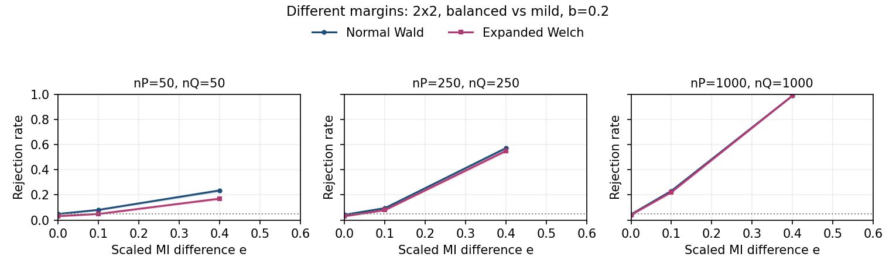

| Specification | Setting |
| --- | --- |
| Table shape | 2x2 |
| Population construction | Ordinal arrangement for P and reversed ordinal for Q |
| Horizontal graph regime specifications (columns) | {smaller n=50, smaller n=250, smaller n=1000} |
| Vertical graph regime specifications (rows) | {equal samples}. $P$: each row has probability $1/2$; each column $1/2$. $Q$: row 2 and column 2 each have probability 0.7; every other row has probability $0.3$, every other column $0.3$. These are row/column totals, not cell probabilities; they stay fixed across all panels and MI differences in this figure. |
| MI settings (nats) | M approximately 0.1328; b=0.2; I(P) approximately 0.02657; e in [0.0, 0.1, 0.4]; I(Q)=(b+e)M |
| Axes | e from 0 to 0.6; rejection rate from 0 to 1 |
| Replicates | 10,000 independent table pairs per point |

Exact rejection rates, intervals, validity and expected counts

| nP | nQ | e | Method | Rejection rate | 95% lower | 95% upper | Valid rate | Rejection rate among valid results | Minimum expected count P | Minimum expected count Q |
| --- | --- | --- | --- | --- | --- | --- | --- | --- | --- | --- |
| 50 | 50 | 0 | Expanded Welch | 0.0308 | 0.02759 | 0.03437 | 0.9976 | 0.03087 | 9.632 | 2.183 |
| 50 | 50 | 0 | Normal Wald | 0.0487 | 0.04465 | 0.05309 | 1 | 0.0487 | 9.632 | 2.183 |
| 50 | 50 | 0.1 | Expanded Welch | 0.0486 | 0.04456 | 0.05299 | 0.9975 | 0.04872 | 9.632 | 1.705 |
| 50 | 50 | 0.1 | Normal Wald | 0.081 | 0.07581 | 0.08651 | 1 | 0.081 | 9.632 | 1.705 |
| 50 | 50 | 0.4 | Expanded Welch | 0.17 | 0.1628 | 0.1775 | 0.9979 | 0.1704 | 9.632 | 0.722 |
| 50 | 50 | 0.4 | Normal Wald | 0.2354 | 0.2272 | 0.2438 | 1 | 0.2354 | 9.632 | 0.722 |
| 250 | 250 | 0 | Expanded Welch | 0.0306 | 0.0274 | 0.03416 | 1 | 0.0306 | 48.16 | 10.92 |
| 250 | 250 | 0 | Normal Wald | 0.0424 | 0.03862 | 0.04653 | 1 | 0.0424 | 48.16 | 10.92 |
| 250 | 250 | 0.1 | Expanded Welch | 0.0791 | 0.07397 | 0.08455 | 1 | 0.0791 | 48.16 | 8.523 |
| 250 | 250 | 0.1 | Normal Wald | 0.095 | 0.08941 | 0.1009 | 1 | 0.095 | 48.16 | 8.523 |
| 250 | 250 | 0.4 | Expanded Welch | 0.55 | 0.5402 | 0.5597 | 1 | 0.55 | 48.16 | 3.61 |
| 250 | 250 | 0.4 | Normal Wald | 0.572 | 0.5623 | 0.5817 | 1 | 0.572 | 48.16 | 3.61 |
| 1000 | 1000 | 0 | Expanded Welch | 0.0411 | 0.03738 | 0.04517 | 1 | 0.0411 | 192.6 | 43.66 |
| 1000 | 1000 | 0 | Normal Wald | 0.0451 | 0.0412 | 0.04935 | 1 | 0.0451 | 192.6 | 43.66 |
| 1000 | 1000 | 0.1 | Expanded Welch | 0.222 | 0.214 | 0.2303 | 1 | 0.222 | 192.6 | 34.09 |
| 1000 | 1000 | 0.1 | Normal Wald | 0.2318 | 0.2236 | 0.2402 | 1 | 0.2318 | 192.6 | 34.09 |
| 1000 | 1000 | 0.4 | Expanded Welch | 0.9878 | 0.9855 | 0.9898 | 1 | 0.9878 | 192.6 | 14.44 |
| 1000 | 1000 | 0.4 | Normal Wald | 0.9879 | 0.9856 | 0.9899 | 1 | 0.9879 | 192.6 | 14.44 |

### 3.2 Different margins: 3x3, balanced vs mild, b=0.2

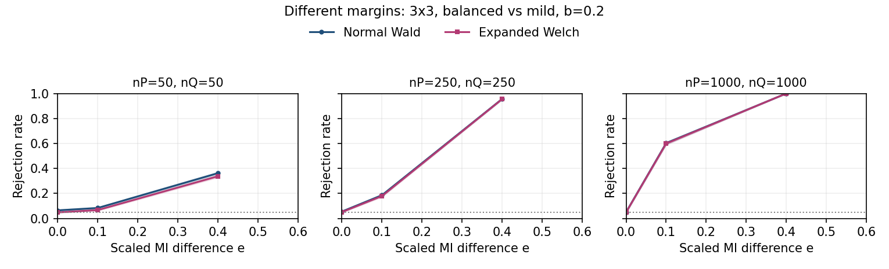

| Specification | Setting |
| --- | --- |
| Table shape | 3x3 |
| Population construction | Ordinal arrangement for P and reversed ordinal for Q |
| Horizontal graph regime specifications (columns) | {smaller n=50, smaller n=250, smaller n=1000} |
| Vertical graph regime specifications (rows) | {equal samples}. $P$: each row has probability $1/3$; each column $1/3$. $Q$: row 2 and column 3 each have probability 0.7; every other row has probability $0.3/2$, every other column $0.3/2$. These are row/column totals, not cell probabilities; they stay fixed across all panels and MI differences in this figure. |
| MI settings (nats) | M approximately 0.4279; b=0.2; I(P) approximately 0.08558; e in [0.0, 0.1, 0.4]; I(Q)=(b+e)M |
| Axes | e from 0 to 0.6; rejection rate from 0 to 1 |
| Replicates | 10,000 independent table pairs per point |

Exact rejection rates, intervals, validity and expected counts

| nP | nQ | e | Method | Rejection rate | 95% lower | 95% upper | Valid rate | Rejection rate among valid results | Minimum expected count P | Minimum expected count Q |
| --- | --- | --- | --- | --- | --- | --- | --- | --- | --- | --- |
| 50 | 50 | 0 | Expanded Welch | 0.0486 | 0.04456 | 0.05299 | 1 | 0.0486 | 2.335 | 0.1021 |
| 50 | 50 | 0 | Normal Wald | 0.0647 | 0.06004 | 0.06969 | 1 | 0.0647 | 2.335 | 0.1021 |
| 50 | 50 | 0.1 | Expanded Welch | 0.0669 | 0.06217 | 0.07197 | 1 | 0.0669 | 2.335 | 0.04239 |
| 50 | 50 | 0.1 | Normal Wald | 0.0838 | 0.07853 | 0.08939 | 1 | 0.0838 | 2.335 | 0.04239 |
| 50 | 50 | 0.4 | Expanded Welch | 0.3376 | 0.3284 | 0.3469 | 1 | 0.3376 | 2.335 | 0.001881 |
| 50 | 50 | 0.4 | Normal Wald | 0.3623 | 0.3529 | 0.3718 | 1 | 0.3623 | 2.335 | 0.001881 |
| 250 | 250 | 0 | Expanded Welch | 0.051 | 0.04686 | 0.05549 | 1 | 0.051 | 11.68 | 0.5104 |
| 250 | 250 | 0 | Normal Wald | 0.0552 | 0.05089 | 0.05985 | 1 | 0.0552 | 11.68 | 0.5104 |
| 250 | 250 | 0.1 | Expanded Welch | 0.1794 | 0.172 | 0.187 | 1 | 0.1794 | 11.68 | 0.2119 |
| 250 | 250 | 0.1 | Normal Wald | 0.1861 | 0.1786 | 0.1938 | 1 | 0.1861 | 11.68 | 0.2119 |
| 250 | 250 | 0.4 | Expanded Welch | 0.9546 | 0.9503 | 0.9585 | 1 | 0.9546 | 11.68 | 0.009407 |
| 250 | 250 | 0.4 | Normal Wald | 0.9563 | 0.9521 | 0.9601 | 1 | 0.9563 | 11.68 | 0.009407 |
| 1000 | 1000 | 0 | Expanded Welch | 0.0492 | 0.04513 | 0.05361 | 1 | 0.0492 | 46.71 | 2.041 |
| 1000 | 1000 | 0 | Normal Wald | 0.0506 | 0.04647 | 0.05507 | 1 | 0.0506 | 46.71 | 2.041 |
| 1000 | 1000 | 0.1 | Expanded Welch | 0.5992 | 0.5896 | 0.6088 | 1 | 0.5992 | 46.71 | 0.8477 |
| 1000 | 1000 | 0.1 | Normal Wald | 0.6028 | 0.5932 | 0.6123 | 1 | 0.6028 | 46.71 | 0.8477 |
| 1000 | 1000 | 0.4 | Expanded Welch | 1 | 0.9996 | 1 | 1 | 1 | 46.71 | 0.03763 |
| 1000 | 1000 | 0.4 | Normal Wald | 1 | 0.9996 | 1 | 1 | 1 | 46.71 | 0.03763 |

### 3.3 Different margins: 5x5, balanced vs mild, b=0.2

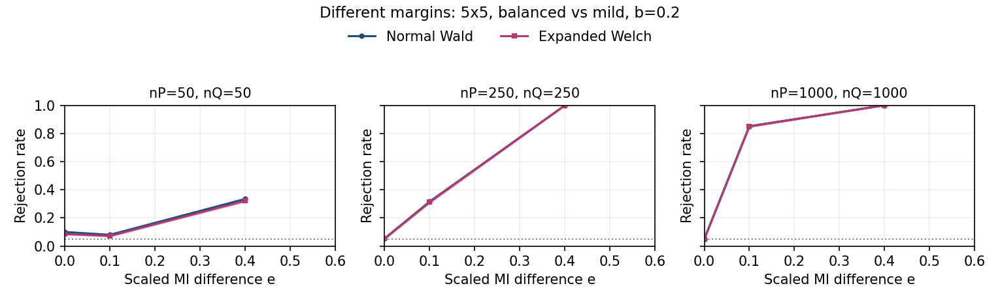

| Specification | Setting |
| --- | --- |
| Table shape | 5x5 |
| Population construction | Ordinal arrangement for P and reversed ordinal for Q |
| Horizontal graph regime specifications (columns) | {smaller n=50, smaller n=250, smaller n=1000} |
| Vertical graph regime specifications (rows) | {equal samples}. $P$: each row has probability $1/5$; each column $1/5$. $Q$: row 2 and column 5 each have probability 0.7; every other row has probability $0.3/4$, every other column $0.3/4$. These are row/column totals, not cell probabilities; they stay fixed across all panels and MI differences in this figure. |
| MI settings (nats) | M approximately 0.7482; b=0.2; I(P) approximately 0.1496; e in [0.0, 0.1, 0.4]; I(Q)=(b+e)M |
| Axes | e from 0 to 0.6; rejection rate from 0 to 1 |
| Replicates | 10,000 independent table pairs per point |

Exact rejection rates, intervals, validity and expected counts

| nP | nQ | e | Method | Rejection rate | 95% lower | 95% upper | Valid rate | Rejection rate among valid results | Minimum expected count P | Minimum expected count Q |
| --- | --- | --- | --- | --- | --- | --- | --- | --- | --- | --- |
| 50 | 50 | 0 | Expanded Welch | 0.0849 | 0.0796 | 0.09052 | 1 | 0.0849 | 0.3145 | 0.01512 |
| 50 | 50 | 0 | Normal Wald | 0.0998 | 0.09408 | 0.1058 | 1 | 0.0998 | 0.3145 | 0.01512 |
| 50 | 50 | 0.1 | Expanded Welch | 0.0713 | 0.06642 | 0.07651 | 1 | 0.0713 | 0.3145 | 0.003425 |
| 50 | 50 | 0.1 | Normal Wald | 0.0797 | 0.07455 | 0.08517 | 1 | 0.0797 | 0.3145 | 0.003425 |
| 50 | 50 | 0.4 | Expanded Welch | 0.3203 | 0.3112 | 0.3295 | 1 | 0.3203 | 0.3145 | 1.333e-07 |
| 50 | 50 | 0.4 | Normal Wald | 0.3341 | 0.3249 | 0.3434 | 1 | 0.3341 | 0.3145 | 1.333e-07 |
| 250 | 250 | 0 | Expanded Welch | 0.052 | 0.04782 | 0.05653 | 1 | 0.052 | 1.573 | 0.0756 |
| 250 | 250 | 0 | Normal Wald | 0.0541 | 0.04984 | 0.05871 | 1 | 0.0541 | 1.573 | 0.0756 |
| 250 | 250 | 0.1 | Expanded Welch | 0.3124 | 0.3034 | 0.3216 | 1 | 0.3124 | 1.573 | 0.01713 |
| 250 | 250 | 0.1 | Normal Wald | 0.3159 | 0.3069 | 0.3251 | 1 | 0.3159 | 1.573 | 0.01713 |
| 250 | 250 | 0.4 | Expanded Welch | 0.9987 | 0.9978 | 0.9992 | 1 | 0.9987 | 1.573 | 6.664e-07 |
| 250 | 250 | 0.4 | Normal Wald | 0.9987 | 0.9978 | 0.9992 | 1 | 0.9987 | 1.573 | 6.664e-07 |
| 1000 | 1000 | 0 | Expanded Welch | 0.0497 | 0.04561 | 0.05414 | 1 | 0.0497 | 6.29 | 0.3024 |
| 1000 | 1000 | 0 | Normal Wald | 0.0503 | 0.04619 | 0.05476 | 1 | 0.0503 | 6.29 | 0.3024 |
| 1000 | 1000 | 0.1 | Expanded Welch | 0.8504 | 0.8433 | 0.8573 | 1 | 0.8504 | 6.29 | 0.0685 |
| 1000 | 1000 | 0.1 | Normal Wald | 0.8514 | 0.8443 | 0.8582 | 1 | 0.8514 | 6.29 | 0.0685 |
| 1000 | 1000 | 0.4 | Expanded Welch | 1 | 0.9996 | 1 | 1 | 1 | 6.29 | 2.666e-06 |
| 1000 | 1000 | 0.4 | Normal Wald | 1 | 0.9996 | 1 | 1 | 1 | 6.29 | 2.666e-06 |

### 3.4 Different margins: 8x8, balanced vs mild, b=0.2

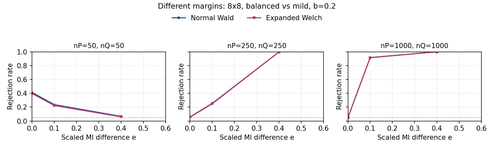

| Specification | Setting |
| --- | --- |
| Table shape | 8x8 |
| Population construction | Ordinal arrangement for P and reversed ordinal for Q |
| Horizontal graph regime specifications (columns) | {smaller n=50, smaller n=250, smaller n=1000} |
| Vertical graph regime specifications (rows) | {equal samples}. $P$: each row has probability $1/8$; each column $1/8$. $Q$: row 2 and column 8 each have probability 0.7; every other row has probability $0.3/7$, every other column $0.3/7$. These are row/column totals, not cell probabilities; they stay fixed across all panels and MI differences in this figure. |
| MI settings (nats) | M approximately 0.9088; b=0.2; I(P) approximately 0.1818; e in [0.0, 0.1, 0.4]; I(Q)=(b+e)M |
| Axes | e from 0 to 0.6; rejection rate from 0 to 1 |
| Replicates | 10,000 independent table pairs per point |

Exact rejection rates, intervals, validity and expected counts

| nP | nQ | e | Method | Rejection rate | 95% lower | 95% upper | Valid rate | Rejection rate among valid results | Minimum expected count P | Minimum expected count Q |
| --- | --- | --- | --- | --- | --- | --- | --- | --- | --- | --- |
| 50 | 50 | 0 | Expanded Welch | 0.3978 | 0.3882 | 0.4074 | 1 | 0.3978 | 0.05814 | 0.003946 |
| 50 | 50 | 0 | Normal Wald | 0.4116 | 0.402 | 0.4213 | 1 | 0.4116 | 0.05814 | 0.003946 |
| 50 | 50 | 0.1 | Expanded Welch | 0.224 | 0.2159 | 0.2323 | 1 | 0.224 | 0.05814 | 0.0005316 |
| 50 | 50 | 0.1 | Normal Wald | 0.2352 | 0.227 | 0.2436 | 1 | 0.2352 | 0.05814 | 0.0005316 |
| 50 | 50 | 0.4 | Expanded Welch | 0.0609 | 0.05638 | 0.06576 | 1 | 0.0609 | 0.05814 | 2.48e-11 |
| 50 | 50 | 0.4 | Normal Wald | 0.067 | 0.06226 | 0.07207 | 1 | 0.067 | 0.05814 | 2.48e-11 |
| 250 | 250 | 0 | Expanded Welch | 0.0564 | 0.05205 | 0.06109 | 1 | 0.0564 | 0.2907 | 0.01973 |
| 250 | 250 | 0 | Normal Wald | 0.0586 | 0.05416 | 0.06338 | 1 | 0.0586 | 0.2907 | 0.01973 |
| 250 | 250 | 0.1 | Expanded Welch | 0.2509 | 0.2425 | 0.2595 | 1 | 0.2509 | 0.2907 | 0.002658 |
| 250 | 250 | 0.1 | Normal Wald | 0.2552 | 0.2468 | 0.2638 | 1 | 0.2552 | 0.2907 | 0.002658 |
| 250 | 250 | 0.4 | Expanded Welch | 0.9974 | 0.9962 | 0.9982 | 1 | 0.9974 | 0.2907 | 1.24e-10 |
| 250 | 250 | 0.4 | Normal Wald | 0.9974 | 0.9962 | 0.9982 | 1 | 0.9974 | 0.2907 | 1.24e-10 |
| 1000 | 1000 | 0 | Expanded Welch | 0.0493 | 0.04523 | 0.05372 | 1 | 0.0493 | 1.163 | 0.07892 |
| 1000 | 1000 | 0 | Normal Wald | 0.05 | 0.0459 | 0.05445 | 1 | 0.05 | 1.163 | 0.07892 |
| 1000 | 1000 | 0.1 | Expanded Welch | 0.9159 | 0.9103 | 0.9212 | 1 | 0.9159 | 1.163 | 0.01063 |
| 1000 | 1000 | 0.1 | Normal Wald | 0.9166 | 0.911 | 0.9219 | 1 | 0.9166 | 1.163 | 0.01063 |
| 1000 | 1000 | 0.4 | Expanded Welch | 1 | 0.9996 | 1 | 1 | 1 | 1.163 | 4.96e-10 |
| 1000 | 1000 | 0.4 | Normal Wald | 1 | 0.9996 | 1 | 1 | 1 | 1.163 | 4.96e-10 |

## 4. Baseline MI sensitivity

These comparisons vary b over {0.02, 0.2, 0.6} while holding margins, dependence arrangements, M, and sample sizes fixed. At each e, the absolute MI difference eM therefore stays fixed across baseline levels.

### 4.1 Baseline MI sensitivity: 3x3, balanced, b=0.02

| Specification | Setting |
| --- | --- |
| Table shape | 3x3 |
| Population construction | Ordinal arrangement for P and reversed ordinal for Q |
| Horizontal graph regime specifications (columns) | {smaller n=50, smaller n=250, smaller n=1000} |
| Vertical graph regime specifications (rows) | {equal samples}. $P$ and $Q$: each row has probability $1/3$; each column $1/3$. These are row/column totals, not cell probabilities; they stay fixed across all panels and MI differences in this figure. |
| MI settings (nats) | M approximately 1.095; b=0.02; I(P) approximately 0.02189; e in [0.0, 0.1, 0.2]; I(Q)=(b+e)M |
| Axes | e from 0 to 0.6; rejection rate from 0 to 1 |
| Replicates | 10,000 independent table pairs per point |

Exact rejection rates, intervals, validity and expected counts

| nP | nQ | e | Method | Rejection rate | 95% lower | 95% upper | Valid rate | Rejection rate among valid results | Minimum expected count P | Minimum expected count Q |
| --- | --- | --- | --- | --- | --- | --- | --- | --- | --- | --- |
| 50 | 50 | 0 | Expanded Welch | 0.0196 | 0.01706 | 0.02251 | 1 | 0.0196 | 3.855 | 3.855 |
| 50 | 50 | 0 | Normal Wald | 0.0313 | 0.02806 | 0.0349 | 1 | 0.0313 | 3.855 | 3.855 |
| 50 | 50 | 0.1 | Expanded Welch | 0.236 | 0.2278 | 0.2444 | 1 | 0.236 | 3.855 | 1.684 |
| 50 | 50 | 0.1 | Normal Wald | 0.2759 | 0.2672 | 0.2847 | 1 | 0.2759 | 3.855 | 1.684 |
| 50 | 50 | 0.2 | Expanded Welch | 0.6579 | 0.6485 | 0.6671 | 1 | 0.6579 | 3.855 | 0.7107 |
| 50 | 50 | 0.2 | Normal Wald | 0.6936 | 0.6845 | 0.7026 | 1 | 0.6936 | 3.855 | 0.7107 |
| 250 | 250 | 0 | Expanded Welch | 0.0191 | 0.0166 | 0.02197 | 1 | 0.0191 | 19.28 | 19.28 |
| 250 | 250 | 0 | Normal Wald | 0.0295 | 0.02636 | 0.033 | 1 | 0.0295 | 19.28 | 19.28 |
| 250 | 250 | 0.1 | Expanded Welch | 0.9195 | 0.914 | 0.9247 | 1 | 0.9195 | 19.28 | 8.42 |
| 250 | 250 | 0.1 | Normal Wald | 0.9266 | 0.9213 | 0.9315 | 1 | 0.9266 | 19.28 | 8.42 |
| 250 | 250 | 0.2 | Expanded Welch | 0.9999 | 0.9994 | 1 | 1 | 0.9999 | 19.28 | 3.554 |
| 250 | 250 | 0.2 | Normal Wald | 0.9999 | 0.9994 | 1 | 1 | 0.9999 | 19.28 | 3.554 |
| 1000 | 1000 | 0 | Expanded Welch | 0.035 | 0.03157 | 0.03878 | 1 | 0.035 | 77.1 | 77.1 |
| 1000 | 1000 | 0 | Normal Wald | 0.0396 | 0.03595 | 0.0436 | 1 | 0.0396 | 77.1 | 77.1 |
| 1000 | 1000 | 0.1 | Expanded Welch | 1 | 0.9996 | 1 | 1 | 1 | 77.1 | 33.68 |
| 1000 | 1000 | 0.1 | Normal Wald | 1 | 0.9996 | 1 | 1 | 1 | 77.1 | 33.68 |
| 1000 | 1000 | 0.2 | Expanded Welch | 1 | 0.9996 | 1 | 1 | 1 | 77.1 | 14.21 |
| 1000 | 1000 | 0.2 | Normal Wald | 1 | 0.9996 | 1 | 1 | 1 | 77.1 | 14.21 |

### 4.2 Baseline MI sensitivity: 3x3, balanced, b=0.2

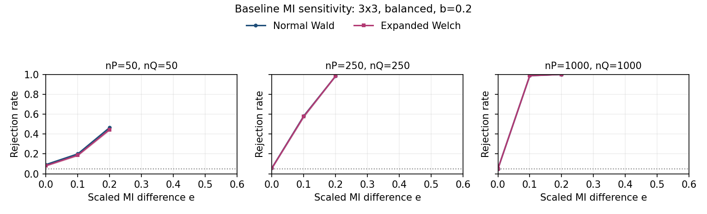

| Specification | Setting |
| --- | --- |
| Table shape | 3x3 |
| Population construction | Ordinal arrangement for P and reversed ordinal for Q |
| Horizontal graph regime specifications (columns) | {smaller n=50, smaller n=250, smaller n=1000} |
| Vertical graph regime specifications (rows) | {equal samples}. $P$ and $Q$: each row has probability $1/3$; each column $1/3$. These are row/column totals, not cell probabilities; they stay fixed across all panels and MI differences in this figure. |
| MI settings (nats) | M approximately 1.095; b=0.2; I(P) approximately 0.2189; e in [0.0, 0.1, 0.2]; I(Q)=(b+e)M |
| Axes | e from 0 to 0.6; rejection rate from 0 to 1 |
| Replicates | 10,000 independent table pairs per point |

Exact rejection rates, intervals, validity and expected counts

| nP | nQ | e | Method | Rejection rate | 95% lower | 95% upper | Valid rate | Rejection rate among valid results | Minimum expected count P | Minimum expected count Q |
| --- | --- | --- | --- | --- | --- | --- | --- | --- | --- | --- |
| 50 | 50 | 0 | Expanded Welch | 0.0812 | 0.07601 | 0.08672 | 1 | 0.0812 | 0.8576 | 0.8576 |
| 50 | 50 | 0 | Normal Wald | 0.0922 | 0.08669 | 0.09803 | 1 | 0.0922 | 0.8576 | 0.8576 |
| 50 | 50 | 0.1 | Expanded Welch | 0.1862 | 0.1787 | 0.1939 | 1 | 0.1862 | 0.8576 | 0.3008 |
| 50 | 50 | 0.1 | Normal Wald | 0.1996 | 0.1919 | 0.2075 | 1 | 0.1996 | 0.8576 | 0.3008 |
| 50 | 50 | 0.2 | Expanded Welch | 0.4446 | 0.4349 | 0.4544 | 1 | 0.4446 | 0.8576 | 0.07994 |
| 50 | 50 | 0.2 | Normal Wald | 0.4643 | 0.4545 | 0.4741 | 1 | 0.4643 | 0.8576 | 0.07994 |
| 250 | 250 | 0 | Expanded Welch | 0.0571 | 0.05272 | 0.06182 | 1 | 0.0571 | 4.288 | 4.288 |
| 250 | 250 | 0 | Normal Wald | 0.0586 | 0.05416 | 0.06338 | 1 | 0.0586 | 4.288 | 4.288 |
| 250 | 250 | 0.1 | Expanded Welch | 0.5766 | 0.5669 | 0.5863 | 1 | 0.5766 | 4.288 | 1.504 |
| 250 | 250 | 0.1 | Normal Wald | 0.5812 | 0.5715 | 0.5908 | 1 | 0.5812 | 4.288 | 1.504 |
| 250 | 250 | 0.2 | Expanded Welch | 0.9834 | 0.9807 | 0.9857 | 1 | 0.9834 | 4.288 | 0.3997 |
| 250 | 250 | 0.2 | Normal Wald | 0.9836 | 0.9809 | 0.9859 | 1 | 0.9836 | 4.288 | 0.3997 |
| 1000 | 1000 | 0 | Expanded Welch | 0.0502 | 0.04609 | 0.05466 | 1 | 0.0502 | 17.15 | 17.15 |
| 1000 | 1000 | 0 | Normal Wald | 0.0506 | 0.04647 | 0.05507 | 1 | 0.0506 | 17.15 | 17.15 |
| 1000 | 1000 | 0.1 | Expanded Welch | 0.987 | 0.9846 | 0.989 | 1 | 0.987 | 17.15 | 6.016 |
| 1000 | 1000 | 0.1 | Normal Wald | 0.987 | 0.9846 | 0.989 | 1 | 0.987 | 17.15 | 6.016 |
| 1000 | 1000 | 0.2 | Expanded Welch | 1 | 0.9996 | 1 | 1 | 1 | 17.15 | 1.599 |
| 1000 | 1000 | 0.2 | Normal Wald | 1 | 0.9996 | 1 | 1 | 1 | 17.15 | 1.599 |

### 4.3 Baseline MI sensitivity: 3x3, balanced, b=0.6

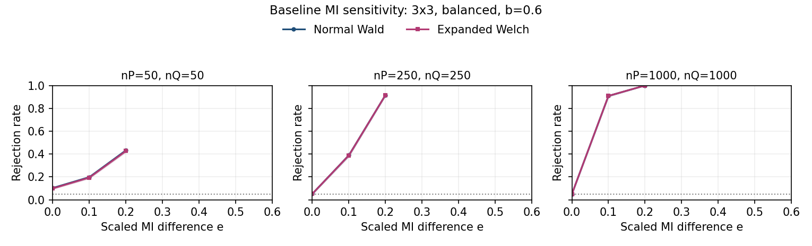

| Specification | Setting |
| --- | --- |
| Table shape | 3x3 |
| Population construction | Ordinal arrangement for P and reversed ordinal for Q |
| Horizontal graph regime specifications (columns) | {smaller n=50, smaller n=250, smaller n=1000} |
| Vertical graph regime specifications (rows) | {equal samples}. $P$ and $Q$: each row has probability $1/3$; each column $1/3$. These are row/column totals, not cell probabilities; they stay fixed across all panels and MI differences in this figure. |
| MI settings (nats) | M approximately 1.095; b=0.6; I(P) approximately 0.6568; e in [0.0, 0.1, 0.2]; I(Q)=(b+e)M |
| Axes | e from 0 to 0.6; rejection rate from 0 to 1 |
| Replicates | 10,000 independent table pairs per point |

Exact rejection rates, intervals, validity and expected counts

| nP | nQ | e | Method | Rejection rate | 95% lower | 95% upper | Valid rate | Rejection rate among valid results | Minimum expected count P | Minimum expected count Q |
| --- | --- | --- | --- | --- | --- | --- | --- | --- | --- | --- |
| 50 | 50 | 0 | Expanded Welch | 0.099 | 0.0933 | 0.105 | 1 | 0.099 | 0.003445 | 0.003445 |
| 50 | 50 | 0 | Normal Wald | 0.1029 | 0.0971 | 0.109 | 1 | 0.1029 | 0.003445 | 0.003445 |
| 50 | 50 | 0.1 | Expanded Welch | 0.1943 | 0.1867 | 0.2022 | 1 | 0.1943 | 0.003445 | 0.0005374 |
| 50 | 50 | 0.1 | Normal Wald | 0.1981 | 0.1904 | 0.206 | 1 | 0.1981 | 0.003445 | 0.0005374 |
| 50 | 50 | 0.2 | Expanded Welch | 0.4266 | 0.4169 | 0.4363 | 1 | 0.4266 | 0.003445 | 5.191e-05 |
| 50 | 50 | 0.2 | Normal Wald | 0.4322 | 0.4225 | 0.4419 | 1 | 0.4322 | 0.003445 | 5.191e-05 |
| 250 | 250 | 0 | Expanded Welch | 0.052 | 0.04782 | 0.05653 | 1 | 0.052 | 0.01723 | 0.01723 |
| 250 | 250 | 0 | Normal Wald | 0.0523 | 0.04811 | 0.05684 | 1 | 0.0523 | 0.01723 | 0.01723 |
| 250 | 250 | 0.1 | Expanded Welch | 0.3887 | 0.3792 | 0.3983 | 1 | 0.3887 | 0.01723 | 0.002687 |
| 250 | 250 | 0.1 | Normal Wald | 0.3898 | 0.3803 | 0.3994 | 1 | 0.3898 | 0.01723 | 0.002687 |
| 250 | 250 | 0.2 | Expanded Welch | 0.9164 | 0.9108 | 0.9217 | 1 | 0.9164 | 0.01723 | 0.0002596 |
| 250 | 250 | 0.2 | Normal Wald | 0.9168 | 0.9112 | 0.9221 | 1 | 0.9168 | 0.01723 | 0.0002596 |
| 1000 | 1000 | 0 | Expanded Welch | 0.05 | 0.0459 | 0.05445 | 1 | 0.05 | 0.06891 | 0.06891 |
| 1000 | 1000 | 0 | Normal Wald | 0.0502 | 0.04609 | 0.05466 | 1 | 0.0502 | 0.06891 | 0.06891 |
| 1000 | 1000 | 0.1 | Expanded Welch | 0.909 | 0.9032 | 0.9145 | 1 | 0.909 | 0.06891 | 0.01075 |
| 1000 | 1000 | 0.1 | Normal Wald | 0.909 | 0.9032 | 0.9145 | 1 | 0.909 | 0.06891 | 0.01075 |
| 1000 | 1000 | 0.2 | Expanded Welch | 1 | 0.9996 | 1 | 1 | 1 | 0.06891 | 0.001038 |
| 1000 | 1000 | 0.2 | Normal Wald | 1 | 0.9996 | 1 | 1 | 1 | 0.06891 | 0.001038 |

### 4.4 Baseline MI sensitivity: 3x3, strong, b=0.02

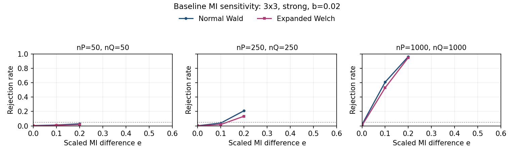

| Specification | Setting |
| --- | --- |
| Table shape | 3x3 |
| Population construction | Ordinal arrangement for P and reversed ordinal for Q |
| Horizontal graph regime specifications (columns) | {smaller n=50, smaller n=250, smaller n=1000} |
| Vertical graph regime specifications (rows) | {equal samples}. $P$: row 1 and column 1 each have probability 0.9; $Q$: row 2 and column 3 each have probability 0.9; every other row has probability $0.1/2$, every other column $0.1/2$. These are row/column totals, not cell probabilities; they stay fixed across all panels and MI differences in this figure. |
| MI settings (nats) | M approximately 0.1922; b=0.02; I(P) approximately 0.003844; e in [0.0, 0.1, 0.2]; I(Q)=(b+e)M |
| Axes | e from 0 to 0.6; rejection rate from 0 to 1 |
| Replicates | 10,000 independent table pairs per point |

Exact rejection rates, intervals, validity and expected counts

| nP | nQ | e | Method | Rejection rate | 95% lower | 95% upper | Valid rate | Rejection rate among valid results | Minimum expected count P | Minimum expected count Q |
| --- | --- | --- | --- | --- | --- | --- | --- | --- | --- | --- |
| 50 | 50 | 0 | Expanded Welch | 0.0016 | 0.0009851 | 0.002598 | 0.9813 | 0.00163 | 0.1545 | 0.04122 |
| 50 | 50 | 0 | Normal Wald | 0.0045 | 0.003365 | 0.006016 | 0.9998 | 0.004501 | 0.1545 | 0.04122 |
| 50 | 50 | 0.1 | Expanded Welch | 0.0074 | 0.005899 | 0.009279 | 0.9801 | 0.00755 | 0.1545 | 0.008617 |
| 50 | 50 | 0.1 | Normal Wald | 0.0125 | 0.0105 | 0.01487 | 0.9999 | 0.0125 | 0.1545 | 0.008617 |
| 50 | 50 | 0.2 | Expanded Welch | 0.0173 | 0.01492 | 0.02005 | 0.979 | 0.01767 | 0.1545 | 0.003218 |
| 50 | 50 | 0.2 | Normal Wald | 0.0291 | 0.02598 | 0.03258 | 1 | 0.0291 | 0.1545 | 0.003218 |
| 250 | 250 | 0 | Expanded Welch | 0.0005 | 0.0002136 | 0.00117 | 1 | 0.0005 | 0.7727 | 0.2061 |
| 250 | 250 | 0 | Normal Wald | 0.0021 | 0.001374 | 0.003208 | 1 | 0.0021 | 0.7727 | 0.2061 |
| 250 | 250 | 0.1 | Expanded Welch | 0.0192 | 0.01669 | 0.02208 | 1 | 0.0192 | 0.7727 | 0.04309 |
| 250 | 250 | 0.1 | Normal Wald | 0.0398 | 0.03614 | 0.04381 | 1 | 0.0398 | 0.7727 | 0.04309 |
| 250 | 250 | 0.2 | Expanded Welch | 0.1343 | 0.1278 | 0.1411 | 1 | 0.1343 | 0.7727 | 0.01609 |
| 250 | 250 | 0.2 | Normal Wald | 0.2105 | 0.2026 | 0.2186 | 1 | 0.2105 | 0.7727 | 0.01609 |
| 1000 | 1000 | 0 | Expanded Welch | 0.0051 | 0.003881 | 0.006699 | 1 | 0.0051 | 3.091 | 0.8244 |
| 1000 | 1000 | 0 | Normal Wald | 0.0192 | 0.01669 | 0.02208 | 1 | 0.0192 | 3.091 | 0.8244 |
| 1000 | 1000 | 0.1 | Expanded Welch | 0.5306 | 0.5208 | 0.5404 | 1 | 0.5306 | 3.091 | 0.1723 |
| 1000 | 1000 | 0.1 | Normal Wald | 0.6085 | 0.5989 | 0.618 | 1 | 0.6085 | 3.091 | 0.1723 |
| 1000 | 1000 | 0.2 | Expanded Welch | 0.9487 | 0.9442 | 0.9529 | 1 | 0.9487 | 3.091 | 0.06436 |
| 1000 | 1000 | 0.2 | Normal Wald | 0.9629 | 0.959 | 0.9664 | 1 | 0.9629 | 3.091 | 0.06436 |

### 4.5 Baseline MI sensitivity: 3x3, strong, b=0.2

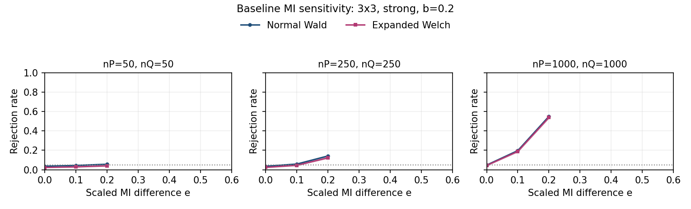

| Specification | Setting |
| --- | --- |
| Table shape | 3x3 |
| Population construction | Ordinal arrangement for P and reversed ordinal for Q |
| Horizontal graph regime specifications (columns) | {smaller n=50, smaller n=250, smaller n=1000} |
| Vertical graph regime specifications (rows) | {equal samples}. $P$: row 1 and column 1 each have probability 0.9; $Q$: row 2 and column 3 each have probability 0.9; every other row has probability $0.1/2$, every other column $0.1/2$. These are row/column totals, not cell probabilities; they stay fixed across all panels and MI differences in this figure. |
| MI settings (nats) | M approximately 0.1922; b=0.2; I(P) approximately 0.03844; e in [0.0, 0.1, 0.2]; I(Q)=(b+e)M |
| Axes | e from 0 to 0.6; rejection rate from 0 to 1 |
| Replicates | 10,000 independent table pairs per point |

Exact rejection rates, intervals, validity and expected counts

| nP | nQ | e | Method | Rejection rate | 95% lower | 95% upper | Valid rate | Rejection rate among valid results | Minimum expected count P | Minimum expected count Q |
| --- | --- | --- | --- | --- | --- | --- | --- | --- | --- | --- |
| 50 | 50 | 0 | Expanded Welch | 0.0231 | 0.02033 | 0.02623 | 0.9807 | 0.02355 | 0.2134 | 0.003863 |
| 50 | 50 | 0 | Normal Wald | 0.0358 | 0.03233 | 0.03962 | 0.9998 | 0.03581 | 0.2134 | 0.003863 |
| 50 | 50 | 0.1 | Expanded Welch | 0.0292 | 0.02608 | 0.03269 | 0.9797 | 0.02981 | 0.2134 | 0.001597 |
| 50 | 50 | 0.1 | Normal Wald | 0.0443 | 0.04044 | 0.04851 | 1 | 0.0443 | 0.2134 | 0.001597 |
| 50 | 50 | 0.2 | Expanded Welch | 0.04 | 0.03633 | 0.04402 | 0.9792 | 0.04085 | 0.2134 | 0.0006765 |
| 50 | 50 | 0.2 | Normal Wald | 0.0564 | 0.05205 | 0.06109 | 1 | 0.0564 | 0.2134 | 0.0006765 |
| 250 | 250 | 0 | Expanded Welch | 0.024 | 0.02118 | 0.02719 | 1 | 0.024 | 1.067 | 0.01932 |
| 250 | 250 | 0 | Normal Wald | 0.0357 | 0.03224 | 0.03952 | 1 | 0.0357 | 1.067 | 0.01932 |
| 250 | 250 | 0.1 | Expanded Welch | 0.0454 | 0.04149 | 0.04966 | 1 | 0.0454 | 1.067 | 0.007986 |
| 250 | 250 | 0.1 | Normal Wald | 0.0585 | 0.05407 | 0.06327 | 1 | 0.0585 | 1.067 | 0.007986 |
| 250 | 250 | 0.2 | Expanded Welch | 0.1226 | 0.1163 | 0.1292 | 1 | 0.1226 | 1.067 | 0.003382 |
| 250 | 250 | 0.2 | Normal Wald | 0.1418 | 0.1351 | 0.1488 | 1 | 0.1418 | 1.067 | 0.003382 |
| 1000 | 1000 | 0 | Expanded Welch | 0.0438 | 0.03996 | 0.04799 | 1 | 0.0438 | 4.268 | 0.07727 |
| 1000 | 1000 | 0 | Normal Wald | 0.0479 | 0.04389 | 0.05226 | 1 | 0.0479 | 4.268 | 0.07727 |
| 1000 | 1000 | 0.1 | Expanded Welch | 0.188 | 0.1805 | 0.1958 | 1 | 0.188 | 4.268 | 0.03195 |
| 1000 | 1000 | 0.1 | Normal Wald | 0.1966 | 0.1889 | 0.2045 | 1 | 0.1966 | 4.268 | 0.03195 |
| 1000 | 1000 | 0.2 | Expanded Welch | 0.5376 | 0.5278 | 0.5474 | 1 | 0.5376 | 4.268 | 0.01353 |
| 1000 | 1000 | 0.2 | Normal Wald | 0.5491 | 0.5393 | 0.5588 | 1 | 0.5491 | 4.268 | 0.01353 |

### 4.6 Baseline MI sensitivity: 3x3, strong, b=0.6

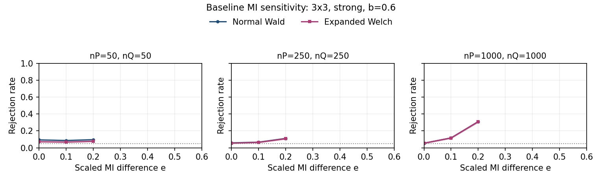

| Specification | Setting |
| --- | --- |
| Table shape | 3x3 |
| Population construction | Ordinal arrangement for P and reversed ordinal for Q |
| Horizontal graph regime specifications (columns) | {smaller n=50, smaller n=250, smaller n=1000} |
| Vertical graph regime specifications (rows) | {equal samples}. $P$: row 1 and column 1 each have probability 0.9; $Q$: row 2 and column 3 each have probability 0.9; every other row has probability $0.1/2$, every other column $0.1/2$. These are row/column totals, not cell probabilities; they stay fixed across all panels and MI differences in this figure. |
| MI settings (nats) | M approximately 0.1922; b=0.6; I(P) approximately 0.1153; e in [0.0, 0.1, 0.2]; I(Q)=(b+e)M |
| Axes | e from 0 to 0.6; rejection rate from 0 to 1 |
| Replicates | 10,000 independent table pairs per point |

Exact rejection rates, intervals, validity and expected counts

| nP | nQ | e | Method | Rejection rate | 95% lower | 95% upper | Valid rate | Rejection rate among valid results | Minimum expected count P | Minimum expected count Q |
| --- | --- | --- | --- | --- | --- | --- | --- | --- | --- | --- |
| 50 | 50 | 0 | Expanded Welch | 0.0713 | 0.06642 | 0.07651 | 0.978 | 0.0729 | 0.3426 | 9.986e-05 |
| 50 | 50 | 0 | Normal Wald | 0.0933 | 0.08775 | 0.09916 | 0.9998 | 0.09332 | 0.3426 | 9.986e-05 |
| 50 | 50 | 0.1 | Expanded Welch | 0.0673 | 0.06255 | 0.07238 | 0.9784 | 0.06879 | 0.3426 | 2.93e-05 |
| 50 | 50 | 0.1 | Normal Wald | 0.0861 | 0.08076 | 0.09176 | 0.9998 | 0.08612 | 0.3426 | 2.93e-05 |
| 50 | 50 | 0.2 | Expanded Welch | 0.0763 | 0.07126 | 0.08167 | 0.9793 | 0.07791 | 0.3426 | 5.509e-06 |
| 50 | 50 | 0.2 | Normal Wald | 0.0959 | 0.09028 | 0.1018 | 1 | 0.0959 | 0.3426 | 5.509e-06 |
| 250 | 250 | 0 | Expanded Welch | 0.054 | 0.04974 | 0.0586 | 1 | 0.054 | 1.713 | 0.0004993 |
| 250 | 250 | 0 | Normal Wald | 0.058 | 0.05359 | 0.06275 | 1 | 0.058 | 1.713 | 0.0004993 |
| 250 | 250 | 0.1 | Expanded Welch | 0.0641 | 0.05946 | 0.06907 | 1 | 0.0641 | 1.713 | 0.0001465 |
| 250 | 250 | 0.1 | Normal Wald | 0.0665 | 0.06178 | 0.07155 | 1 | 0.0665 | 1.713 | 0.0001465 |
| 250 | 250 | 0.2 | Expanded Welch | 0.107 | 0.1011 | 0.1132 | 1 | 0.107 | 1.713 | 2.755e-05 |
| 250 | 250 | 0.2 | Normal Wald | 0.1109 | 0.1049 | 0.1172 | 1 | 0.1109 | 1.713 | 2.755e-05 |
| 1000 | 1000 | 0 | Expanded Welch | 0.0537 | 0.04945 | 0.05829 | 1 | 0.0537 | 6.852 | 0.001997 |
| 1000 | 1000 | 0 | Normal Wald | 0.0546 | 0.05032 | 0.05923 | 1 | 0.0546 | 6.852 | 0.001997 |
| 1000 | 1000 | 0.1 | Expanded Welch | 0.1157 | 0.1096 | 0.1221 | 1 | 0.1157 | 6.852 | 0.000586 |
| 1000 | 1000 | 0.1 | Normal Wald | 0.117 | 0.1108 | 0.1234 | 1 | 0.117 | 6.852 | 0.000586 |
| 1000 | 1000 | 0.2 | Expanded Welch | 0.3082 | 0.2992 | 0.3173 | 1 | 0.3082 | 6.852 | 0.0001102 |
| 1000 | 1000 | 0.2 | Normal Wald | 0.3096 | 0.3006 | 0.3187 | 1 | 0.3096 | 6.852 | 0.0001102 |

### 4.7 Baseline MI sensitivity: 5x5, balanced, b=0.02

| Specification | Setting |
| --- | --- |
| Table shape | 5x5 |
| Population construction | Ordinal arrangement for P and reversed ordinal for Q |
| Horizontal graph regime specifications (columns) | {smaller n=50, smaller n=250, smaller n=1000} |
| Vertical graph regime specifications (rows) | {equal samples}. $P$ and $Q$: each row has probability $1/5$; each column $1/5$. These are row/column totals, not cell probabilities; they stay fixed across all panels and MI differences in this figure. |
| MI settings (nats) | M approximately 1.467; b=0.02; I(P) approximately 0.02934; e in [0.0, 0.1, 0.2]; I(Q)=(b+e)M |
| Axes | e from 0 to 0.6; rejection rate from 0 to 1 |
| Replicates | 10,000 independent table pairs per point |

Exact rejection rates, intervals, validity and expected counts

| nP | nQ | e | Method | Rejection rate | 95% lower | 95% upper | Valid rate | Rejection rate among valid results | Minimum expected count P | Minimum expected count Q |
| --- | --- | --- | --- | --- | --- | --- | --- | --- | --- | --- |
| 50 | 50 | 0 | Expanded Welch | 0.0523 | 0.04811 | 0.05684 | 1 | 0.0523 | 1.107 | 1.107 |
| 50 | 50 | 0 | Normal Wald | 0.0702 | 0.06536 | 0.07537 | 1 | 0.0702 | 1.107 | 1.107 |
| 50 | 50 | 0.1 | Expanded Welch | 0.2772 | 0.2685 | 0.2861 | 1 | 0.2772 | 1.107 | 0.2373 |
| 50 | 50 | 0.1 | Normal Wald | 0.3112 | 0.3022 | 0.3203 | 1 | 0.3112 | 1.107 | 0.2373 |
| 50 | 50 | 0.2 | Expanded Welch | 0.6773 | 0.6681 | 0.6864 | 1 | 0.6773 | 1.107 | 0.03658 |
| 50 | 50 | 0.2 | Normal Wald | 0.7035 | 0.6945 | 0.7124 | 1 | 0.7035 | 1.107 | 0.03658 |
| 250 | 250 | 0 | Expanded Welch | 0.024 | 0.02118 | 0.02719 | 1 | 0.024 | 5.536 | 5.536 |
| 250 | 250 | 0 | Normal Wald | 0.0286 | 0.02551 | 0.03205 | 1 | 0.0286 | 5.536 | 5.536 |
| 250 | 250 | 0.1 | Expanded Welch | 0.9673 | 0.9636 | 0.9706 | 1 | 0.9673 | 5.536 | 1.187 |
| 250 | 250 | 0.1 | Normal Wald | 0.9694 | 0.9658 | 0.9726 | 1 | 0.9694 | 5.536 | 1.187 |
| 250 | 250 | 0.2 | Expanded Welch | 1 | 0.9996 | 1 | 1 | 1 | 5.536 | 0.1829 |
| 250 | 250 | 0.2 | Normal Wald | 1 | 0.9996 | 1 | 1 | 1 | 5.536 | 0.1829 |
| 1000 | 1000 | 0 | Expanded Welch | 0.0374 | 0.03386 | 0.0413 | 1 | 0.0374 | 22.14 | 22.14 |
| 1000 | 1000 | 0 | Normal Wald | 0.0396 | 0.03595 | 0.0436 | 1 | 0.0396 | 22.14 | 22.14 |
| 1000 | 1000 | 0.1 | Expanded Welch | 1 | 0.9996 | 1 | 1 | 1 | 22.14 | 4.747 |
| 1000 | 1000 | 0.1 | Normal Wald | 1 | 0.9996 | 1 | 1 | 1 | 22.14 | 4.747 |
| 1000 | 1000 | 0.2 | Expanded Welch | 1 | 0.9996 | 1 | 1 | 1 | 22.14 | 0.7317 |
| 1000 | 1000 | 0.2 | Normal Wald | 1 | 0.9996 | 1 | 1 | 1 | 22.14 | 0.7317 |

### 4.8 Baseline MI sensitivity: 5x5, balanced, b=0.2

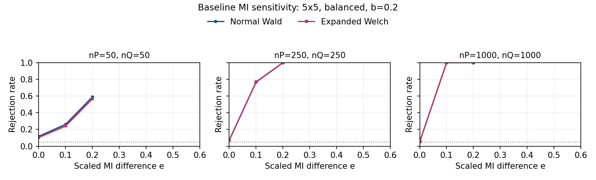

| Specification | Setting |
| --- | --- |
| Table shape | 5x5 |
| Population construction | Ordinal arrangement for P and reversed ordinal for Q |
| Horizontal graph regime specifications (columns) | {smaller n=50, smaller n=250, smaller n=1000} |
| Vertical graph regime specifications (rows) | {equal samples}. $P$ and $Q$: each row has probability $1/5$; each column $1/5$. These are row/column totals, not cell probabilities; they stay fixed across all panels and MI differences in this figure. |
| MI settings (nats) | M approximately 1.467; b=0.2; I(P) approximately 0.2934; e in [0.0, 0.1, 0.2]; I(Q)=(b+e)M |
| Axes | e from 0 to 0.6; rejection rate from 0 to 1 |
| Replicates | 10,000 independent table pairs per point |

Exact rejection rates, intervals, validity and expected counts

| nP | nQ | e | Method | Rejection rate | 95% lower | 95% upper | Valid rate | Rejection rate among valid results | Minimum expected count P | Minimum expected count Q |
| --- | --- | --- | --- | --- | --- | --- | --- | --- | --- | --- |
| 50 | 50 | 0 | Expanded Welch | 0.1042 | 0.09836 | 0.1103 | 1 | 0.1042 | 0.05605 | 0.05605 |
| 50 | 50 | 0 | Normal Wald | 0.1178 | 0.1116 | 0.1243 | 1 | 0.1178 | 0.05605 | 0.05605 |
| 50 | 50 | 0.1 | Expanded Welch | 0.2415 | 0.2332 | 0.25 | 1 | 0.2415 | 0.05605 | 0.004649 |
| 50 | 50 | 0.1 | Normal Wald | 0.2607 | 0.2522 | 0.2694 | 1 | 0.2607 | 0.05605 | 0.004649 |
| 50 | 50 | 0.2 | Expanded Welch | 0.5667 | 0.557 | 0.5764 | 1 | 0.5667 | 0.05605 | 0.0001288 |
| 50 | 50 | 0.2 | Normal Wald | 0.5897 | 0.58 | 0.5993 | 1 | 0.5897 | 0.05605 | 0.0001288 |
| 250 | 250 | 0 | Expanded Welch | 0.0715 | 0.06661 | 0.07672 | 1 | 0.0715 | 0.2803 | 0.2803 |
| 250 | 250 | 0 | Normal Wald | 0.0722 | 0.06729 | 0.07744 | 1 | 0.0722 | 0.2803 | 0.2803 |
| 250 | 250 | 0.1 | Expanded Welch | 0.7671 | 0.7587 | 0.7753 | 1 | 0.7671 | 0.2803 | 0.02324 |
| 250 | 250 | 0.1 | Normal Wald | 0.769 | 0.7606 | 0.7772 | 1 | 0.769 | 0.2803 | 0.02324 |
| 250 | 250 | 0.2 | Expanded Welch | 0.9989 | 0.998 | 0.9994 | 1 | 0.9989 | 0.2803 | 0.0006442 |
| 250 | 250 | 0.2 | Normal Wald | 0.9989 | 0.998 | 0.9994 | 1 | 0.9989 | 0.2803 | 0.0006442 |
| 1000 | 1000 | 0 | Expanded Welch | 0.0548 | 0.05051 | 0.05943 | 1 | 0.0548 | 1.121 | 1.121 |
| 1000 | 1000 | 0 | Normal Wald | 0.0556 | 0.05128 | 0.06026 | 1 | 0.0556 | 1.121 | 1.121 |
| 1000 | 1000 | 0.1 | Expanded Welch | 0.9997 | 0.9991 | 0.9999 | 1 | 0.9997 | 1.121 | 0.09297 |
| 1000 | 1000 | 0.1 | Normal Wald | 0.9997 | 0.9991 | 0.9999 | 1 | 0.9997 | 1.121 | 0.09297 |
| 1000 | 1000 | 0.2 | Expanded Welch | 1 | 0.9996 | 1 | 1 | 1 | 1.121 | 0.002577 |
| 1000 | 1000 | 0.2 | Normal Wald | 1 | 0.9996 | 1 | 1 | 1 | 1.121 | 0.002577 |

### 4.9 Baseline MI sensitivity: 5x5, balanced, b=0.6

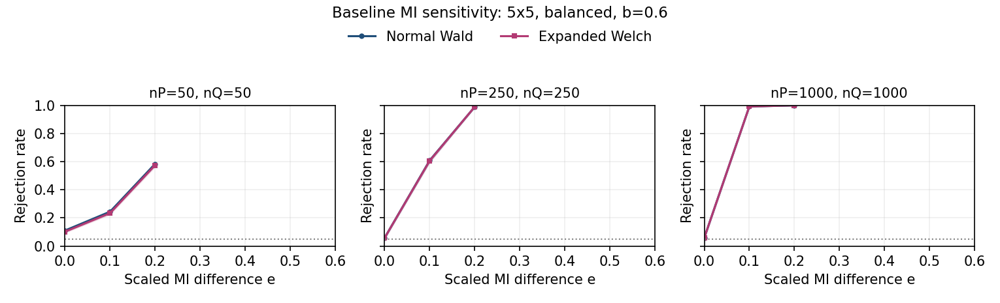

| Specification | Setting |
| --- | --- |
| Table shape | 5x5 |
| Population construction | Ordinal arrangement for P and reversed ordinal for Q |
| Horizontal graph regime specifications (columns) | {smaller n=50, smaller n=250, smaller n=1000} |
| Vertical graph regime specifications (rows) | {equal samples}. $P$ and $Q$: each row has probability $1/5$; each column $1/5$. These are row/column totals, not cell probabilities; they stay fixed across all panels and MI differences in this figure. |
| MI settings (nats) | M approximately 1.467; b=0.6; I(P) approximately 0.8802; e in [0.0, 0.1, 0.2]; I(Q)=(b+e)M |
| Axes | e from 0 to 0.6; rejection rate from 0 to 1 |
| Replicates | 10,000 independent table pairs per point |

Exact rejection rates, intervals, validity and expected counts

| nP | nQ | e | Method | Rejection rate | 95% lower | 95% upper | Valid rate | Rejection rate among valid results | Minimum expected count P | Minimum expected count Q |
| --- | --- | --- | --- | --- | --- | --- | --- | --- | --- | --- |
| 50 | 50 | 0 | Expanded Welch | 0.1018 | 0.09603 | 0.1079 | 1 | 0.1018 | 1.251e-09 | 1.251e-09 |
| 50 | 50 | 0 | Normal Wald | 0.1101 | 0.1041 | 0.1164 | 1 | 0.1101 | 1.251e-09 | 1.251e-09 |
| 50 | 50 | 0.1 | Expanded Welch | 0.2336 | 0.2254 | 0.242 | 1 | 0.2336 | 1.251e-09 | 7.428e-13 |
| 50 | 50 | 0.1 | Normal Wald | 0.2437 | 0.2354 | 0.2522 | 1 | 0.2437 | 1.251e-09 | 7.428e-13 |
| 50 | 50 | 0.2 | Expanded Welch | 0.5743 | 0.5646 | 0.584 | 1 | 0.5743 | 1.251e-09 | 1.908e-16 |
| 50 | 50 | 0.2 | Normal Wald | 0.5833 | 0.5736 | 0.5929 | 1 | 0.5833 | 1.251e-09 | 1.908e-16 |
| 250 | 250 | 0 | Expanded Welch | 0.0578 | 0.05339 | 0.06255 | 1 | 0.0578 | 6.253e-09 | 6.253e-09 |
| 250 | 250 | 0 | Normal Wald | 0.0585 | 0.05407 | 0.06327 | 1 | 0.0585 | 6.253e-09 | 6.253e-09 |
| 250 | 250 | 0.1 | Expanded Welch | 0.6057 | 0.5961 | 0.6152 | 1 | 0.6057 | 6.253e-09 | 3.714e-12 |
| 250 | 250 | 0.1 | Normal Wald | 0.6082 | 0.5986 | 0.6177 | 1 | 0.6082 | 6.253e-09 | 3.714e-12 |
| 250 | 250 | 0.2 | Expanded Welch | 0.9889 | 0.9867 | 0.9908 | 1 | 0.9889 | 6.253e-09 | 9.538e-16 |
| 250 | 250 | 0.2 | Normal Wald | 0.9889 | 0.9867 | 0.9908 | 1 | 0.9889 | 6.253e-09 | 9.538e-16 |
| 1000 | 1000 | 0 | Expanded Welch | 0.0586 | 0.05416 | 0.06338 | 1 | 0.0586 | 2.501e-08 | 2.501e-08 |
| 1000 | 1000 | 0 | Normal Wald | 0.0589 | 0.05445 | 0.06369 | 1 | 0.0589 | 2.501e-08 | 2.501e-08 |
| 1000 | 1000 | 0.1 | Expanded Welch | 0.9917 | 0.9897 | 0.9933 | 1 | 0.9917 | 2.501e-08 | 1.486e-11 |
| 1000 | 1000 | 0.1 | Normal Wald | 0.9917 | 0.9897 | 0.9933 | 1 | 0.9917 | 2.501e-08 | 1.486e-11 |
| 1000 | 1000 | 0.2 | Expanded Welch | 1 | 0.9996 | 1 | 1 | 1 | 2.501e-08 | 3.815e-15 |
| 1000 | 1000 | 0.2 | Normal Wald | 1 | 0.9996 | 1 | 1 | 1 | 2.501e-08 | 3.815e-15 |

### 4.10 Baseline MI sensitivity: 5x5, strong, b=0.02

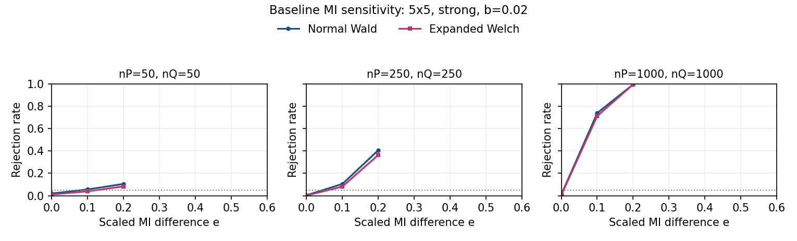

| Specification | Setting |
| --- | --- |
| Table shape | 5x5 |
| Population construction | Ordinal arrangement for P and reversed ordinal for Q |
| Horizontal graph regime specifications (columns) | {smaller n=50, smaller n=250, smaller n=1000} |
| Vertical graph regime specifications (rows) | {equal samples}. $P$: row 1 and column 1 each have probability 0.9; $Q$: row 2 and column 5 each have probability 0.9; every other row has probability $0.1/4$, every other column $0.1/4$. These are row/column totals, not cell probabilities; they stay fixed across all panels and MI differences in this figure. |
| MI settings (nats) | M approximately 0.336; b=0.02; I(P) approximately 0.006721; e in [0.0, 0.1, 0.2]; I(Q)=(b+e)M |
| Axes | e from 0 to 0.6; rejection rate from 0 to 1 |
| Replicates | 10,000 independent table pairs per point |

Exact rejection rates, intervals, validity and expected counts

| nP | nQ | e | Method | Rejection rate | 95% lower | 95% upper | Valid rate | Rejection rate among valid results | Minimum expected count P | Minimum expected count Q |
| --- | --- | --- | --- | --- | --- | --- | --- | --- | --- | --- |
| 50 | 50 | 0 | Expanded Welch | 0.0105 | 0.008682 | 0.01269 | 0.9802 | 0.01071 | 0.03355 | 0.01358 |
| 50 | 50 | 0 | Normal Wald | 0.0198 | 0.01725 | 0.02272 | 0.9999 | 0.0198 | 0.03355 | 0.01358 |
| 50 | 50 | 0.1 | Expanded Welch | 0.0387 | 0.03509 | 0.04266 | 0.9786 | 0.03955 | 0.03355 | 0.003769 |
| 50 | 50 | 0.1 | Normal Wald | 0.0565 | 0.05214 | 0.0612 | 0.9999 | 0.05651 | 0.03355 | 0.003769 |
| 50 | 50 | 0.2 | Expanded Welch | 0.0836 | 0.07833 | 0.08919 | 0.9777 | 0.08551 | 0.03355 | 0.0012 |
| 50 | 50 | 0.2 | Normal Wald | 0.1056 | 0.09973 | 0.1118 | 0.9997 | 0.1056 | 0.03355 | 0.0012 |
| 250 | 250 | 0 | Expanded Welch | 0.0013 | 0.0007599 | 0.002223 | 1 | 0.0013 | 0.1678 | 0.06792 |
| 250 | 250 | 0 | Normal Wald | 0.0043 | 0.003194 | 0.005787 | 1 | 0.0043 | 0.1678 | 0.06792 |
| 250 | 250 | 0.1 | Expanded Welch | 0.0819 | 0.07668 | 0.08744 | 1 | 0.0819 | 0.1678 | 0.01884 |
| 250 | 250 | 0.1 | Normal Wald | 0.1057 | 0.09982 | 0.1119 | 1 | 0.1057 | 0.1678 | 0.01884 |
| 250 | 250 | 0.2 | Expanded Welch | 0.3649 | 0.3555 | 0.3744 | 1 | 0.3649 | 0.1678 | 0.006002 |
| 250 | 250 | 0.2 | Normal Wald | 0.4074 | 0.3978 | 0.4171 | 1 | 0.4074 | 0.1678 | 0.006002 |
| 1000 | 1000 | 0 | Expanded Welch | 0.0057 | 0.004402 | 0.007377 | 1 | 0.0057 | 0.6711 | 0.2717 |
| 1000 | 1000 | 0 | Normal Wald | 0.0111 | 0.009226 | 0.01335 | 1 | 0.0111 | 0.6711 | 0.2717 |
| 1000 | 1000 | 0.1 | Expanded Welch | 0.7117 | 0.7027 | 0.7205 | 1 | 0.7117 | 0.6711 | 0.07538 |
| 1000 | 1000 | 0.1 | Normal Wald | 0.739 | 0.7303 | 0.7475 | 1 | 0.739 | 0.6711 | 0.07538 |
| 1000 | 1000 | 0.2 | Expanded Welch | 0.9937 | 0.9919 | 0.9951 | 1 | 0.9937 | 0.6711 | 0.02401 |
| 1000 | 1000 | 0.2 | Normal Wald | 0.9941 | 0.9924 | 0.9954 | 1 | 0.9941 | 0.6711 | 0.02401 |

### 4.11 Baseline MI sensitivity: 5x5, strong, b=0.2

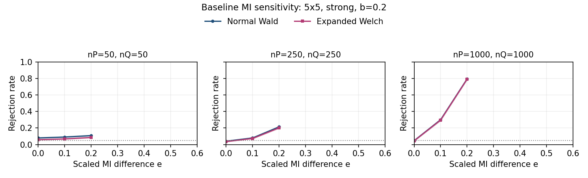

| Specification | Setting |
| --- | --- |
| Table shape | 5x5 |
| Population construction | Ordinal arrangement for P and reversed ordinal for Q |
| Horizontal graph regime specifications (columns) | {smaller n=50, smaller n=250, smaller n=1000} |
| Vertical graph regime specifications (rows) | {equal samples}. $P$: row 1 and column 1 each have probability 0.9; $Q$: row 2 and column 5 each have probability 0.9; every other row has probability $0.1/4$, every other column $0.1/4$. These are row/column totals, not cell probabilities; they stay fixed across all panels and MI differences in this figure. |
| MI settings (nats) | M approximately 0.336; b=0.2; I(P) approximately 0.06721; e in [0.0, 0.1, 0.2]; I(Q)=(b+e)M |
| Axes | e from 0 to 0.6; rejection rate from 0 to 1 |
| Replicates | 10,000 independent table pairs per point |

Exact rejection rates, intervals, validity and expected counts

| nP | nQ | e | Method | Rejection rate | 95% lower | 95% upper | Valid rate | Rejection rate among valid results | Minimum expected count P | Minimum expected count Q |
| --- | --- | --- | --- | --- | --- | --- | --- | --- | --- | --- |
| 50 | 50 | 0 | Expanded Welch | 0.0585 | 0.05407 | 0.06327 | 0.9801 | 0.05969 | 0.03113 | 0.001529 |
| 50 | 50 | 0 | Normal Wald | 0.0799 | 0.07475 | 0.08538 | 1 | 0.0799 | 0.03113 | 0.001529 |
| 50 | 50 | 0.1 | Expanded Welch | 0.0679 | 0.06313 | 0.073 | 0.9803 | 0.06926 | 0.03113 | 0.0004002 |
| 50 | 50 | 0.1 | Normal Wald | 0.0909 | 0.08542 | 0.09669 | 1 | 0.0909 | 0.03113 | 0.0004002 |
| 50 | 50 | 0.2 | Expanded Welch | 0.0854 | 0.08008 | 0.09104 | 0.9781 | 0.08731 | 0.03113 | 6.245e-05 |
| 50 | 50 | 0.2 | Normal Wald | 0.1082 | 0.1023 | 0.1144 | 0.9999 | 0.1082 | 0.03113 | 6.245e-05 |
| 250 | 250 | 0 | Expanded Welch | 0.0358 | 0.03233 | 0.03962 | 1 | 0.0358 | 0.1556 | 0.007646 |
| 250 | 250 | 0 | Normal Wald | 0.0407 | 0.037 | 0.04475 | 1 | 0.0407 | 0.1556 | 0.007646 |
| 250 | 250 | 0.1 | Expanded Welch | 0.0735 | 0.06855 | 0.07878 | 1 | 0.0735 | 0.1556 | 0.002001 |
| 250 | 250 | 0.1 | Normal Wald | 0.0799 | 0.07475 | 0.08538 | 1 | 0.0799 | 0.1556 | 0.002001 |
| 250 | 250 | 0.2 | Expanded Welch | 0.2022 | 0.1944 | 0.2102 | 1 | 0.2022 | 0.1556 | 0.0003122 |
| 250 | 250 | 0.2 | Normal Wald | 0.2141 | 0.2062 | 0.2222 | 1 | 0.2141 | 0.1556 | 0.0003122 |
| 1000 | 1000 | 0 | Expanded Welch | 0.0442 | 0.04034 | 0.04841 | 1 | 0.0442 | 0.6226 | 0.03058 |
| 1000 | 1000 | 0 | Normal Wald | 0.0468 | 0.04283 | 0.05112 | 1 | 0.0468 | 0.6226 | 0.03058 |
| 1000 | 1000 | 0.1 | Expanded Welch | 0.2958 | 0.2869 | 0.3048 | 1 | 0.2958 | 0.6226 | 0.008003 |
| 1000 | 1000 | 0.1 | Normal Wald | 0.3002 | 0.2913 | 0.3093 | 1 | 0.3002 | 0.6226 | 0.008003 |
| 1000 | 1000 | 0.2 | Expanded Welch | 0.7904 | 0.7823 | 0.7983 | 1 | 0.7904 | 0.6226 | 0.001249 |
| 1000 | 1000 | 0.2 | Normal Wald | 0.7938 | 0.7858 | 0.8016 | 1 | 0.7938 | 0.6226 | 0.001249 |

### 4.12 Baseline MI sensitivity: 5x5, strong, b=0.6

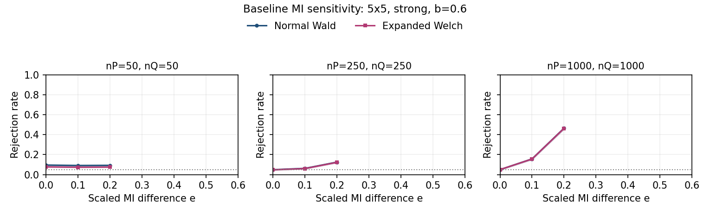

| Specification | Setting |
| --- | --- |
| Table shape | 5x5 |
| Population construction | Ordinal arrangement for P and reversed ordinal for Q |
| Horizontal graph regime specifications (columns) | {smaller n=50, smaller n=250, smaller n=1000} |
| Vertical graph regime specifications (rows) | {equal samples}. $P$: row 1 and column 1 each have probability 0.9; $Q$: row 2 and column 5 each have probability 0.9; every other row has probability $0.1/4$, every other column $0.1/4$. These are row/column totals, not cell probabilities; they stay fixed across all panels and MI differences in this figure. |
| MI settings (nats) | M approximately 0.336; b=0.6; I(P) approximately 0.2016; e in [0.0, 0.1, 0.2]; I(Q)=(b+e)M |
| Axes | e from 0 to 0.6; rejection rate from 0 to 1 |
| Replicates | 10,000 independent table pairs per point |

Exact rejection rates, intervals, validity and expected counts

| nP | nQ | e | Method | Rejection rate | 95% lower | 95% upper | Valid rate | Rejection rate among valid results | Minimum expected count P | Minimum expected count Q |
| --- | --- | --- | --- | --- | --- | --- | --- | --- | --- | --- |
| 50 | 50 | 0 | Expanded Welch | 0.0772 | 0.07213 | 0.0826 | 0.9824 | 0.07858 | 0.001387 | 3.023e-08 |
| 50 | 50 | 0 | Normal Wald | 0.0952 | 0.0896 | 0.1011 | 1 | 0.0952 | 0.001387 | 3.023e-08 |
| 50 | 50 | 0.1 | Expanded Welch | 0.0738 | 0.06884 | 0.07909 | 0.9803 | 0.07528 | 0.001387 | 4.373e-11 |
| 50 | 50 | 0.1 | Normal Wald | 0.091 | 0.08552 | 0.0968 | 0.9997 | 0.09103 | 0.001387 | 4.373e-11 |
| 50 | 50 | 0.2 | Expanded Welch | 0.0755 | 0.07048 | 0.08084 | 0.9824 | 0.07685 | 0.001387 | 1.659e-14 |
| 50 | 50 | 0.2 | Normal Wald | 0.0925 | 0.08698 | 0.09834 | 1 | 0.0925 | 0.001387 | 1.659e-14 |
| 250 | 250 | 0 | Expanded Welch | 0.0475 | 0.0435 | 0.05185 | 1 | 0.0475 | 0.006936 | 1.512e-07 |
| 250 | 250 | 0 | Normal Wald | 0.0492 | 0.04513 | 0.05361 | 1 | 0.0492 | 0.006936 | 1.512e-07 |
| 250 | 250 | 0.1 | Expanded Welch | 0.0602 | 0.0557 | 0.06503 | 1 | 0.0602 | 0.006936 | 2.186e-10 |
| 250 | 250 | 0.1 | Normal Wald | 0.0624 | 0.05783 | 0.06731 | 1 | 0.0624 | 0.006936 | 2.186e-10 |
| 250 | 250 | 0.2 | Expanded Welch | 0.1231 | 0.1168 | 0.1297 | 1 | 0.1231 | 0.006936 | 8.295e-14 |
| 250 | 250 | 0.2 | Normal Wald | 0.1251 | 0.1188 | 0.1317 | 1 | 0.1251 | 0.006936 | 8.295e-14 |
| 1000 | 1000 | 0 | Expanded Welch | 0.0496 | 0.04551 | 0.05403 | 1 | 0.0496 | 0.02775 | 6.046e-07 |
| 1000 | 1000 | 0 | Normal Wald | 0.0499 | 0.0458 | 0.05434 | 1 | 0.0499 | 0.02775 | 6.046e-07 |
| 1000 | 1000 | 0.1 | Expanded Welch | 0.156 | 0.149 | 0.1632 | 1 | 0.156 | 0.02775 | 8.746e-10 |
| 1000 | 1000 | 0.1 | Normal Wald | 0.1569 | 0.1499 | 0.1642 | 1 | 0.1569 | 0.02775 | 8.746e-10 |
| 1000 | 1000 | 0.2 | Expanded Welch | 0.4627 | 0.4529 | 0.4725 | 1 | 0.4627 | 0.02775 | 3.318e-13 |
| 1000 | 1000 | 0.2 | Normal Wald | 0.4641 | 0.4543 | 0.4739 | 1 | 0.4641 | 0.02775 | 3.318e-13 |

## 5. Unequal sample sizes: both allocations

Each figure shows both sample allocations for the same population pairs. The first row gives Q the larger sample; the second gives P the larger sample. The populations are not swapped. The first row reuses the original results; the second contains the follow-up simulations. These figures include all configurations from the original unequal-sample overviews.

### 5.1 Reversed sample allocation: 2x2, strong, b=0.2, ratio=10:1

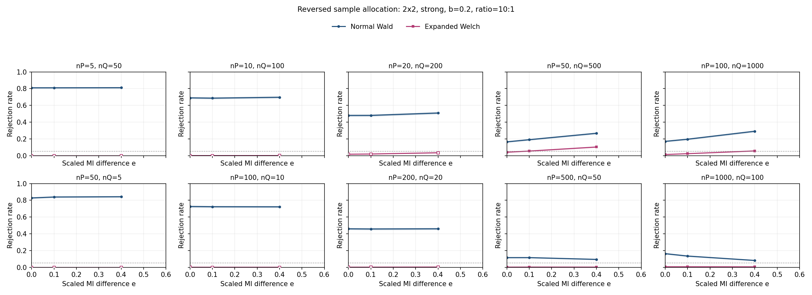

| Specification | Setting |
| --- | --- |
| Table shape | 2x2 |
| Population construction | Ordinal arrangement for P and reversed ordinal for Q |
| Horizontal graph regime specifications (columns) | {smaller n=5, smaller n=10, smaller n=20, smaller n=50, smaller n=100} |
| Vertical graph regime specifications (rows) | {Q larger, P larger}. $P$: row 1 and column 1 each have probability 0.9; $Q$: row 2 and column 2 each have probability 0.9; every other row has probability $0.1$, every other column $0.1$. These are row/column totals, not cell probabilities; they stay fixed across all panels and MI differences in this figure. |
| MI settings (nats) | M approximately 0.01113; b=0.2; I(P) approximately 0.002227; e in [0.0, 0.1, 0.4]; I(Q)=(b+e)M |
| Axes | e from 0 to 0.6; rejection rate from 0 to 1 |
| Replicates | 10,000 independent table pairs per point |

Exact rejection rates, intervals, validity and expected counts

| nP | nQ | e | Method | Rejection rate | 95% lower | 95% upper | Valid rate | Rejection rate among valid results | Minimum expected count P | Minimum expected count Q |
| --- | --- | --- | --- | --- | --- | --- | --- | --- | --- | --- |
| 5 | 50 | 0 | Expanded Welch | 0 | 0 | 0.000384 | 0.1793 | 0 | 0.08217 | 0.2265 |
| 5 | 50 | 0 | Normal Wald | 0.81 | 0.8022 | 0.8176 | 0.9886 | 0.8193 | 0.08217 | 0.2265 |
| 5 | 50 | 0.1 | Expanded Welch | 0 | 0 | 0.000384 | 0.1796 | 0 | 0.08217 | 0.1738 |
| 5 | 50 | 0.1 | Normal Wald | 0.8101 | 0.8023 | 0.8177 | 0.99 | 0.8183 | 0.08217 | 0.1738 |
| 5 | 50 | 0.4 | Expanded Welch | 0 | 0 | 0.000384 | 0.18 | 0 | 0.08217 | 0.07022 |
| 5 | 50 | 0.4 | Normal Wald | 0.8113 | 0.8035 | 0.8188 | 0.9918 | 0.818 | 0.08217 | 0.07022 |
| 10 | 100 | 0 | Expanded Welch | 0.0002 | 5.485e-05 | 0.000729 | 0.4337 | 0.0004611 | 0.1643 | 0.4531 |
| 10 | 100 | 0 | Normal Wald | 0.6898 | 0.6807 | 0.6988 | 0.9964 | 0.6923 | 0.1643 | 0.4531 |
| 10 | 100 | 0.1 | Expanded Welch | 0.0002 | 5.485e-05 | 0.000729 | 0.4397 | 0.0004549 | 0.1643 | 0.3475 |
| 10 | 100 | 0.1 | Normal Wald | 0.6866 | 0.6774 | 0.6956 | 0.9971 | 0.6886 | 0.1643 | 0.3475 |
| 10 | 100 | 0.4 | Expanded Welch | 0.0004 | 0.0001556 | 0.001028 | 0.4305 | 0.0009292 | 0.1643 | 0.1404 |
| 10 | 100 | 0.4 | Normal Wald | 0.697 | 0.6879 | 0.7059 | 0.9991 | 0.6976 | 0.1643 | 0.1404 |
| 20 | 200 | 0 | Expanded Welch | 0.0166 | 0.01428 | 0.0193 | 0.7748 | 0.02142 | 0.3287 | 0.9061 |
| 20 | 200 | 0 | Normal Wald | 0.4798 | 0.47 | 0.4896 | 0.9988 | 0.4804 | 0.3287 | 0.9061 |
| 20 | 200 | 0.1 | Expanded Welch | 0.0192 | 0.01669 | 0.02208 | 0.7691 | 0.02496 | 0.3287 | 0.695 |
| 20 | 200 | 0.1 | Normal Wald | 0.4803 | 0.4705 | 0.4901 | 0.9996 | 0.4805 | 0.3287 | 0.695 |
| 20 | 200 | 0.4 | Expanded Welch | 0.0342 | 0.03081 | 0.03794 | 0.7832 | 0.04367 | 0.3287 | 0.2809 |
| 20 | 200 | 0.4 | Normal Wald | 0.5089 | 0.4991 | 0.5187 | 0.9999 | 0.509 | 0.3287 | 0.2809 |
| 50 | 5 | 0 | Expanded Welch | 0 | 0 | 0.000384 | 0.1599 | 0 | 0.8217 | 0.02265 |
| 50 | 5 | 0 | Normal Wald | 0.8284 | 0.8209 | 0.8357 | 0.9898 | 0.8369 | 0.8217 | 0.02265 |
| 50 | 5 | 0.1 | Expanded Welch | 0 | 0 | 0.000384 | 0.1513 | 0 | 0.8217 | 0.01738 |
| 50 | 5 | 0.1 | Normal Wald | 0.8395 | 0.8322 | 0.8466 | 0.992 | 0.8463 | 0.8217 | 0.01738 |
| 50 | 5 | 0.4 | Expanded Welch | 0 | 0 | 0.000384 | 0.1459 | 0 | 0.8217 | 0.007022 |
| 50 | 5 | 0.4 | Normal Wald | 0.8428 | 0.8355 | 0.8498 | 0.9907 | 0.8507 | 0.8217 | 0.007022 |
| 50 | 500 | 0 | Expanded Welch | 0.0407 | 0.037 | 0.04475 | 0.9907 | 0.04108 | 0.8217 | 2.265 |
| 50 | 500 | 0 | Normal Wald | 0.1645 | 0.1574 | 0.1719 | 0.9999 | 0.1645 | 0.8217 | 2.265 |
| 50 | 500 | 0.1 | Expanded Welch | 0.0546 | 0.05032 | 0.05923 | 0.9887 | 0.05522 | 0.8217 | 1.738 |
| 50 | 500 | 0.1 | Normal Wald | 0.1903 | 0.1827 | 0.1981 | 1 | 0.1903 | 0.8217 | 1.738 |
| 50 | 500 | 0.4 | Expanded Welch | 0.1029 | 0.0971 | 0.109 | 0.9898 | 0.104 | 0.8217 | 0.7022 |
| 50 | 500 | 0.4 | Normal Wald | 0.2667 | 0.2581 | 0.2755 | 1 | 0.2667 | 0.8217 | 0.7022 |
| 100 | 10 | 0 | Expanded Welch | 0.0004 | 0.0001556 | 0.001028 | 0.4138 | 0.0009667 | 1.643 | 0.04531 |
| 100 | 10 | 0 | Normal Wald | 0.7259 | 0.7171 | 0.7346 | 0.9965 | 0.7284 | 1.643 | 0.04531 |
| 100 | 10 | 0.1 | Expanded Welch | 0.0002 | 5.485e-05 | 0.000729 | 0.4161 | 0.0004807 | 1.643 | 0.03475 |
| 100 | 10 | 0.1 | Normal Wald | 0.7234 | 0.7145 | 0.7321 | 0.9965 | 0.7259 | 1.643 | 0.03475 |
| 100 | 10 | 0.4 | Expanded Welch | 0.0002 | 5.485e-05 | 0.000729 | 0.4159 | 0.0004809 | 1.643 | 0.01404 |
| 100 | 10 | 0.4 | Normal Wald | 0.7222 | 0.7133 | 0.7309 | 0.9962 | 0.725 | 1.643 | 0.01404 |
| 100 | 1000 | 0 | Expanded Welch | 0.0133 | 0.01123 | 0.01574 | 1 | 0.0133 | 1.643 | 4.531 |
| 100 | 1000 | 0 | Normal Wald | 0.1704 | 0.1632 | 0.1779 | 1 | 0.1704 | 1.643 | 4.531 |
| 100 | 1000 | 0.1 | Expanded Welch | 0.0232 | 0.02043 | 0.02634 | 1 | 0.0232 | 1.643 | 3.475 |
| 100 | 1000 | 0.1 | Normal Wald | 0.196 | 0.1883 | 0.2039 | 1 | 0.196 | 1.643 | 3.475 |
| 100 | 1000 | 0.4 | Expanded Welch | 0.0563 | 0.05195 | 0.06099 | 1 | 0.0563 | 1.643 | 1.404 |
| 100 | 1000 | 0.4 | Normal Wald | 0.2912 | 0.2824 | 0.3002 | 1 | 0.2912 | 1.643 | 1.404 |
| 200 | 20 | 0 | Expanded Welch | 0.001 | 0.0005433 | 0.00184 | 0.7721 | 0.001295 | 3.287 | 0.09061 |
| 200 | 20 | 0 | Normal Wald | 0.4592 | 0.4495 | 0.469 | 0.9987 | 0.4598 | 3.287 | 0.09061 |
| 200 | 20 | 0.1 | Expanded Welch | 0.0013 | 0.0007599 | 0.002223 | 0.7675 | 0.001694 | 3.287 | 0.0695 |
| 200 | 20 | 0.1 | Normal Wald | 0.4574 | 0.4477 | 0.4672 | 0.9996 | 0.4576 | 3.287 | 0.0695 |
| 200 | 20 | 0.4 | Expanded Welch | 0.0026 | 0.001775 | 0.003807 | 0.7729 | 0.003364 | 3.287 | 0.02809 |
| 200 | 20 | 0.4 | Normal Wald | 0.4595 | 0.4497 | 0.4693 | 0.9993 | 0.4598 | 3.287 | 0.02809 |
| 500 | 50 | 0 | Expanded Welch | 0.0016 | 0.0009851 | 0.002598 | 0.9898 | 0.001616 | 8.217 | 0.2265 |
| 500 | 50 | 0 | Normal Wald | 0.1153 | 0.1092 | 0.1217 | 1 | 0.1153 | 8.217 | 0.2265 |
| 500 | 50 | 0.1 | Expanded Welch | 0.0022 | 0.001453 | 0.003329 | 0.9899 | 0.002222 | 8.217 | 0.1738 |
| 500 | 50 | 0.1 | Normal Wald | 0.1155 | 0.1094 | 0.1219 | 1 | 0.1155 | 8.217 | 0.1738 |
| 500 | 50 | 0.4 | Expanded Welch | 0.0017 | 0.001062 | 0.002721 | 0.9888 | 0.001719 | 8.217 | 0.07022 |
| 500 | 50 | 0.4 | Normal Wald | 0.0941 | 0.08853 | 0.09998 | 1 | 0.0941 | 8.217 | 0.07022 |
| 1000 | 100 | 0 | Expanded Welch | 0.0059 | 0.004577 | 0.007602 | 1 | 0.0059 | 16.43 | 0.4531 |
| 1000 | 100 | 0 | Normal Wald | 0.1626 | 0.1555 | 0.17 | 1 | 0.1626 | 16.43 | 0.4531 |
| 1000 | 100 | 0.1 | Expanded Welch | 0.0061 | 0.004752 | 0.007827 | 1 | 0.0061 | 16.43 | 0.3475 |
| 1000 | 100 | 0.1 | Normal Wald | 0.1339 | 0.1274 | 0.1407 | 1 | 0.1339 | 16.43 | 0.3475 |
| 1000 | 100 | 0.4 | Expanded Welch | 0.0052 | 0.003968 | 0.006812 | 0.9998 | 0.005201 | 16.43 | 0.1404 |
| 1000 | 100 | 0.4 | Normal Wald | 0.0816 | 0.07639 | 0.08713 | 1 | 0.0816 | 16.43 | 0.1404 |

### 5.2 Reversed sample allocation: 2x2, strong, b=0.2, ratio=2:1

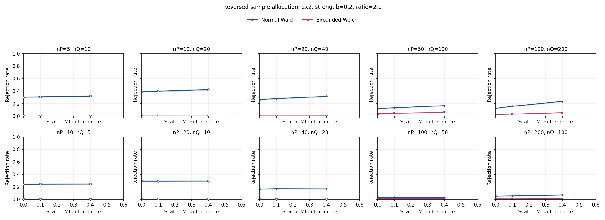

| Specification | Setting |
| --- | --- |
| Table shape | 2x2 |
| Population construction | Ordinal arrangement for P and reversed ordinal for Q |
| Horizontal graph regime specifications (columns) | {smaller n=5, smaller n=10, smaller n=20, smaller n=50, smaller n=100} |
| Vertical graph regime specifications (rows) | {Q larger, P larger}. $P$: row 1 and column 1 each have probability 0.9; $Q$: row 2 and column 2 each have probability 0.9; every other row has probability $0.1$, every other column $0.1$. These are row/column totals, not cell probabilities; they stay fixed across all panels and MI differences in this figure. |
| MI settings (nats) | M approximately 0.01113; b=0.2; I(P) approximately 0.002227; e in [0.0, 0.1, 0.4]; I(Q)=(b+e)M |
| Axes | e from 0 to 0.6; rejection rate from 0 to 1 |
| Replicates | 10,000 independent table pairs per point |

Exact rejection rates, intervals, validity and expected counts

| nP | nQ | e | Method | Rejection rate | 95% lower | 95% upper | Valid rate | Rejection rate among valid results | Minimum expected count P | Minimum expected count Q |
| --- | --- | --- | --- | --- | --- | --- | --- | --- | --- | --- |
| 5 | 10 | 0 | Expanded Welch | 0 | 0 | 0.000384 | 0.0733 | 0 | 0.08217 | 0.04531 |
| 5 | 10 | 0 | Normal Wald | 0.301 | 0.2921 | 0.3101 | 0.5239 | 0.5745 | 0.08217 | 0.04531 |
| 5 | 10 | 0.1 | Expanded Welch | 0 | 0 | 0.000384 | 0.0721 | 0 | 0.08217 | 0.03475 |
| 5 | 10 | 0.1 | Normal Wald | 0.3092 | 0.3002 | 0.3183 | 0.5219 | 0.5925 | 0.08217 | 0.03475 |
| 5 | 10 | 0.4 | Expanded Welch | 0 | 0 | 0.000384 | 0.0754 | 0 | 0.08217 | 0.01404 |
| 5 | 10 | 0.4 | Normal Wald | 0.3196 | 0.3105 | 0.3288 | 0.5171 | 0.6181 | 0.08217 | 0.01404 |
| 10 | 5 | 0 | Expanded Welch | 0 | 0 | 0.000384 | 0.0683 | 0 | 0.1643 | 0.02265 |
| 10 | 5 | 0 | Normal Wald | 0.2421 | 0.2338 | 0.2506 | 0.5162 | 0.469 | 0.1643 | 0.02265 |
| 10 | 5 | 0.1 | Expanded Welch | 0.0001 | 1.765e-05 | 0.0005663 | 0.0687 | 0.001456 | 0.1643 | 0.01738 |
| 10 | 5 | 0.1 | Normal Wald | 0.2438 | 0.2355 | 0.2523 | 0.5162 | 0.4723 | 0.1643 | 0.01738 |
| 10 | 5 | 0.4 | Expanded Welch | 0.0001 | 1.765e-05 | 0.0005663 | 0.0623 | 0.001605 | 0.1643 | 0.007022 |
| 10 | 5 | 0.4 | Normal Wald | 0.2459 | 0.2376 | 0.2544 | 0.5201 | 0.4728 | 0.1643 | 0.007022 |
| 10 | 20 | 0 | Expanded Welch | 0.001 | 0.0005433 | 0.00184 | 0.3326 | 0.003007 | 0.1643 | 0.09061 |
| 10 | 20 | 0 | Normal Wald | 0.392 | 0.3825 | 0.4016 | 0.8685 | 0.4514 | 0.1643 | 0.09061 |
| 10 | 20 | 0.1 | Expanded Welch | 0.0009 | 0.0004736 | 0.00171 | 0.3333 | 0.0027 | 0.1643 | 0.0695 |
| 10 | 20 | 0.1 | Normal Wald | 0.3988 | 0.3892 | 0.4084 | 0.8678 | 0.4596 | 0.1643 | 0.0695 |
| 10 | 20 | 0.4 | Expanded Welch | 0.0006 | 0.000275 | 0.001309 | 0.3329 | 0.001802 | 0.1643 | 0.02809 |
| 10 | 20 | 0.4 | Normal Wald | 0.4229 | 0.4132 | 0.4326 | 0.8711 | 0.4855 | 0.1643 | 0.02809 |
| 20 | 10 | 0 | Expanded Welch | 0.001 | 0.0005433 | 0.00184 | 0.319 | 0.003135 | 0.3287 | 0.04531 |
| 20 | 10 | 0 | Normal Wald | 0.2892 | 0.2804 | 0.2982 | 0.8679 | 0.3332 | 0.3287 | 0.04531 |
| 20 | 10 | 0.1 | Expanded Welch | 0.0007 | 0.0003391 | 0.001444 | 0.3255 | 0.002151 | 0.3287 | 0.03475 |
| 20 | 10 | 0.1 | Normal Wald | 0.2895 | 0.2807 | 0.2985 | 0.8684 | 0.3334 | 0.3287 | 0.03475 |
| 20 | 10 | 0.4 | Expanded Welch | 0.0004 | 0.0001556 | 0.001028 | 0.3116 | 0.001284 | 0.3287 | 0.01404 |
| 20 | 10 | 0.4 | Normal Wald | 0.2913 | 0.2825 | 0.3003 | 0.8566 | 0.3401 | 0.3287 | 0.01404 |
| 20 | 40 | 0 | Expanded Welch | 0.0022 | 0.001453 | 0.003329 | 0.7553 | 0.002913 | 0.3287 | 0.1812 |
| 20 | 40 | 0 | Normal Wald | 0.2648 | 0.2562 | 0.2735 | 0.9919 | 0.267 | 0.3287 | 0.1812 |
| 20 | 40 | 0.1 | Expanded Welch | 0.0017 | 0.001062 | 0.002721 | 0.7474 | 0.002275 | 0.3287 | 0.139 |
| 20 | 40 | 0.1 | Normal Wald | 0.2796 | 0.2709 | 0.2885 | 0.9922 | 0.2818 | 0.3287 | 0.139 |
| 20 | 40 | 0.4 | Expanded Welch | 0.0024 | 0.001613 | 0.003569 | 0.7479 | 0.003209 | 0.3287 | 0.05618 |
| 20 | 40 | 0.4 | Normal Wald | 0.3152 | 0.3062 | 0.3244 | 0.9935 | 0.3173 | 0.3287 | 0.05618 |
| 40 | 20 | 0 | Expanded Welch | 0.0007 | 0.0003391 | 0.001444 | 0.749 | 0.0009346 | 0.6574 | 0.09061 |
| 40 | 20 | 0 | Normal Wald | 0.1642 | 0.1571 | 0.1716 | 0.992 | 0.1655 | 0.6574 | 0.09061 |
| 40 | 20 | 0.1 | Expanded Welch | 0.0002 | 5.485e-05 | 0.000729 | 0.7481 | 0.0002673 | 0.6574 | 0.0695 |
| 40 | 20 | 0.1 | Normal Wald | 0.1703 | 0.1631 | 0.1778 | 0.9926 | 0.1716 | 0.6574 | 0.0695 |
| 40 | 20 | 0.4 | Expanded Welch | 0.0006 | 0.000275 | 0.001309 | 0.7476 | 0.0008026 | 0.6574 | 0.02809 |
| 40 | 20 | 0.4 | Normal Wald | 0.1676 | 0.1604 | 0.175 | 0.9922 | 0.1689 | 0.6574 | 0.02809 |
| 50 | 100 | 0 | Expanded Welch | 0.0381 | 0.03452 | 0.04203 | 0.9892 | 0.03852 | 0.8217 | 0.4531 |
| 50 | 100 | 0 | Normal Wald | 0.1202 | 0.114 | 0.1267 | 0.9999 | 0.1202 | 0.8217 | 0.4531 |
| 50 | 100 | 0.1 | Expanded Welch | 0.0452 | 0.0413 | 0.04945 | 0.9897 | 0.04567 | 0.8217 | 0.3475 |
| 50 | 100 | 0.1 | Normal Wald | 0.1327 | 0.1262 | 0.1395 | 1 | 0.1327 | 0.8217 | 0.3475 |
| 50 | 100 | 0.4 | Expanded Welch | 0.0574 | 0.05301 | 0.06213 | 0.9875 | 0.05813 | 0.8217 | 0.1404 |
| 50 | 100 | 0.4 | Normal Wald | 0.1667 | 0.1595 | 0.1741 | 1 | 0.1667 | 0.8217 | 0.1404 |
| 100 | 50 | 0 | Expanded Welch | 0.008 | 0.006433 | 0.009945 | 0.9911 | 0.008072 | 1.643 | 0.2265 |
| 100 | 50 | 0 | Normal Wald | 0.0348 | 0.03138 | 0.03857 | 1 | 0.0348 | 1.643 | 0.2265 |
| 100 | 50 | 0.1 | Expanded Welch | 0.0086 | 0.006969 | 0.01061 | 0.989 | 0.008696 | 1.643 | 0.1738 |
| 100 | 50 | 0.1 | Normal Wald | 0.0329 | 0.02958 | 0.03658 | 1 | 0.0329 | 1.643 | 0.1738 |
| 100 | 50 | 0.4 | Expanded Welch | 0.0087 | 0.007059 | 0.01072 | 0.99 | 0.008788 | 1.643 | 0.07022 |
| 100 | 50 | 0.4 | Normal Wald | 0.0285 | 0.02542 | 0.03195 | 1 | 0.0285 | 1.643 | 0.07022 |
| 100 | 200 | 0 | Expanded Welch | 0.024 | 0.02118 | 0.02719 | 1 | 0.024 | 1.643 | 0.9061 |
| 100 | 200 | 0 | Normal Wald | 0.1238 | 0.1175 | 0.1304 | 1 | 0.1238 | 1.643 | 0.9061 |
| 100 | 200 | 0.1 | Expanded Welch | 0.0308 | 0.02759 | 0.03437 | 1 | 0.0308 | 1.643 | 0.695 |
| 100 | 200 | 0.1 | Normal Wald | 0.1569 | 0.1499 | 0.1642 | 1 | 0.1569 | 1.643 | 0.695 |
| 100 | 200 | 0.4 | Expanded Welch | 0.0535 | 0.04926 | 0.05808 | 1 | 0.0535 | 1.643 | 0.2809 |
| 100 | 200 | 0.4 | Normal Wald | 0.2347 | 0.2265 | 0.2431 | 1 | 0.2347 | 1.643 | 0.2809 |
| 200 | 100 | 0 | Expanded Welch | 0.0073 | 0.00581 | 0.009168 | 1 | 0.0073 | 3.287 | 0.4531 |
| 200 | 100 | 0 | Normal Wald | 0.0519 | 0.04772 | 0.05642 | 1 | 0.0519 | 3.287 | 0.4531 |
| 200 | 100 | 0.1 | Expanded Welch | 0.0065 | 0.005103 | 0.008276 | 1 | 0.0065 | 3.287 | 0.3475 |
| 200 | 100 | 0.1 | Normal Wald | 0.0555 | 0.05118 | 0.06016 | 1 | 0.0555 | 3.287 | 0.3475 |
| 200 | 100 | 0.4 | Expanded Welch | 0.0095 | 0.007778 | 0.0116 | 0.9999 | 0.009501 | 3.287 | 0.1404 |
| 200 | 100 | 0.4 | Normal Wald | 0.0694 | 0.06458 | 0.07455 | 1 | 0.0694 | 3.287 | 0.1404 |

### 5.3 Reversed sample allocation: 2x2, strong, b=0.2, ratio=5:1

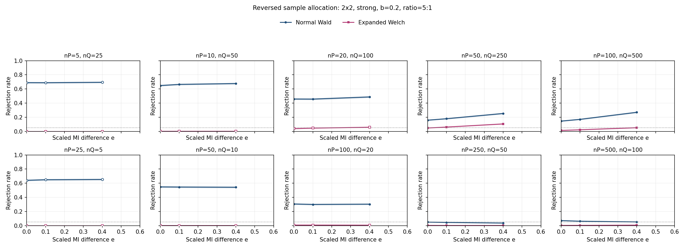

| Specification | Setting |
| --- | --- |
| Table shape | 2x2 |
| Population construction | Ordinal arrangement for P and reversed ordinal for Q |
| Horizontal graph regime specifications (columns) | {smaller n=5, smaller n=10, smaller n=20, smaller n=50, smaller n=100} |
| Vertical graph regime specifications (rows) | {Q larger, P larger}. $P$: row 1 and column 1 each have probability 0.9; $Q$: row 2 and column 2 each have probability 0.9; every other row has probability $0.1$, every other column $0.1$. These are row/column totals, not cell probabilities; they stay fixed across all panels and MI differences in this figure. |
| MI settings (nats) | M approximately 0.01113; b=0.2; I(P) approximately 0.002227; e in [0.0, 0.1, 0.4]; I(Q)=(b+e)M |
| Axes | e from 0 to 0.6; rejection rate from 0 to 1 |
| Replicates | 10,000 independent table pairs per point |

Exact rejection rates, intervals, validity and expected counts

| nP | nQ | e | Method | Rejection rate | 95% lower | 95% upper | Valid rate | Rejection rate among valid results | Minimum expected count P | Minimum expected count Q |
| --- | --- | --- | --- | --- | --- | --- | --- | --- | --- | --- |
| 5 | 25 | 0 | Expanded Welch | 0 | 0 | 0.000384 | 0.1526 | 0 | 0.08217 | 0.1133 |
| 5 | 25 | 0 | Normal Wald | 0.6893 | 0.6802 | 0.6983 | 0.8846 | 0.7792 | 0.08217 | 0.1133 |
| 5 | 25 | 0.1 | Expanded Welch | 0 | 0 | 0.000384 | 0.1581 | 0 | 0.08217 | 0.08688 |
| 5 | 25 | 0.1 | Normal Wald | 0.6884 | 0.6793 | 0.6974 | 0.8877 | 0.7755 | 0.08217 | 0.08688 |
| 5 | 25 | 0.4 | Expanded Welch | 0 | 0 | 0.000384 | 0.1599 | 0 | 0.08217 | 0.03511 |
| 5 | 25 | 0.4 | Normal Wald | 0.6941 | 0.685 | 0.7031 | 0.883 | 0.7861 | 0.08217 | 0.03511 |
| 10 | 50 | 0 | Expanded Welch | 0.0005 | 0.0002136 | 0.00117 | 0.4253 | 0.001176 | 0.1643 | 0.2265 |
| 10 | 50 | 0 | Normal Wald | 0.6482 | 0.6388 | 0.6575 | 0.9941 | 0.652 | 0.1643 | 0.2265 |
| 10 | 50 | 0.1 | Expanded Welch | 0.0006 | 0.000275 | 0.001309 | 0.4269 | 0.001405 | 0.1643 | 0.1738 |
| 10 | 50 | 0.1 | Normal Wald | 0.6644 | 0.6551 | 0.6736 | 0.9928 | 0.6692 | 0.1643 | 0.1738 |
| 10 | 50 | 0.4 | Expanded Welch | 0.0006 | 0.000275 | 0.001309 | 0.4358 | 0.001377 | 0.1643 | 0.07022 |
| 10 | 50 | 0.4 | Normal Wald | 0.6767 | 0.6675 | 0.6858 | 0.9933 | 0.6813 | 0.1643 | 0.07022 |
| 20 | 100 | 0 | Expanded Welch | 0.0384 | 0.03481 | 0.04235 | 0.7689 | 0.04994 | 0.3287 | 0.4531 |
| 20 | 100 | 0 | Normal Wald | 0.4574 | 0.4477 | 0.4672 | 0.9985 | 0.4581 | 0.3287 | 0.4531 |
| 20 | 100 | 0.1 | Expanded Welch | 0.0459 | 0.04197 | 0.05018 | 0.7693 | 0.05966 | 0.3287 | 0.3475 |
| 20 | 100 | 0.1 | Normal Wald | 0.4562 | 0.4465 | 0.466 | 0.9987 | 0.4568 | 0.3287 | 0.3475 |
| 20 | 100 | 0.4 | Expanded Welch | 0.0584 | 0.05397 | 0.06317 | 0.7754 | 0.07532 | 0.3287 | 0.1404 |
| 20 | 100 | 0.4 | Normal Wald | 0.4869 | 0.4771 | 0.4967 | 0.9995 | 0.4871 | 0.3287 | 0.1404 |
| 25 | 5 | 0 | Expanded Welch | 0 | 0 | 0.000384 | 0.1322 | 0 | 0.4109 | 0.02265 |
| 25 | 5 | 0 | Normal Wald | 0.6407 | 0.6312 | 0.65 | 0.8812 | 0.7271 | 0.4109 | 0.02265 |
| 25 | 5 | 0.1 | Expanded Welch | 0 | 0 | 0.000384 | 0.1301 | 0 | 0.4109 | 0.01738 |
| 25 | 5 | 0.1 | Normal Wald | 0.649 | 0.6396 | 0.6583 | 0.8831 | 0.7349 | 0.4109 | 0.01738 |
| 25 | 5 | 0.4 | Expanded Welch | 0 | 0 | 0.000384 | 0.1245 | 0 | 0.4109 | 0.007022 |
| 25 | 5 | 0.4 | Normal Wald | 0.653 | 0.6436 | 0.6623 | 0.8867 | 0.7364 | 0.4109 | 0.007022 |
| 50 | 10 | 0 | Expanded Welch | 0.0004 | 0.0001556 | 0.001028 | 0.404 | 0.0009901 | 0.8217 | 0.04531 |
| 50 | 10 | 0 | Normal Wald | 0.5476 | 0.5378 | 0.5573 | 0.9932 | 0.5513 | 0.8217 | 0.04531 |
| 50 | 10 | 0.1 | Expanded Welch | 0.0003 | 0.000102 | 0.0008817 | 0.4028 | 0.0007448 | 0.8217 | 0.03475 |
| 50 | 10 | 0.1 | Normal Wald | 0.5456 | 0.5358 | 0.5553 | 0.9931 | 0.5494 | 0.8217 | 0.03475 |
| 50 | 10 | 0.4 | Expanded Welch | 0.0001 | 1.765e-05 | 0.0005663 | 0.4015 | 0.0002491 | 0.8217 | 0.01404 |
| 50 | 10 | 0.4 | Normal Wald | 0.5425 | 0.5327 | 0.5522 | 0.9912 | 0.5473 | 0.8217 | 0.01404 |
| 50 | 250 | 0 | Expanded Welch | 0.0477 | 0.04369 | 0.05205 | 0.9889 | 0.04824 | 0.8217 | 1.133 |
| 50 | 250 | 0 | Normal Wald | 0.1581 | 0.1511 | 0.1654 | 1 | 0.1581 | 0.8217 | 1.133 |
| 50 | 250 | 0.1 | Expanded Welch | 0.0608 | 0.05628 | 0.06565 | 0.99 | 0.06141 | 0.8217 | 0.8688 |
| 50 | 250 | 0.1 | Normal Wald | 0.1789 | 0.1715 | 0.1865 | 1 | 0.1789 | 0.8217 | 0.8688 |
| 50 | 250 | 0.4 | Expanded Welch | 0.1053 | 0.09943 | 0.1115 | 0.9906 | 0.1063 | 0.8217 | 0.3511 |
| 50 | 250 | 0.4 | Normal Wald | 0.2529 | 0.2445 | 0.2615 | 1 | 0.2529 | 0.8217 | 0.3511 |
| 100 | 20 | 0 | Expanded Welch | 0.0077 | 0.006166 | 0.009612 | 0.7657 | 0.01006 | 1.643 | 0.09061 |
| 100 | 20 | 0 | Normal Wald | 0.3056 | 0.2966 | 0.3147 | 0.9986 | 0.306 | 1.643 | 0.09061 |
| 100 | 20 | 0.1 | Expanded Welch | 0.0076 | 0.006077 | 0.009501 | 0.7703 | 0.009866 | 1.643 | 0.0695 |
| 100 | 20 | 0.1 | Normal Wald | 0.2994 | 0.2905 | 0.3085 | 0.9987 | 0.2998 | 1.643 | 0.0695 |
| 100 | 20 | 0.4 | Expanded Welch | 0.0063 | 0.004928 | 0.008052 | 0.7709 | 0.008172 | 1.643 | 0.02809 |
| 100 | 20 | 0.4 | Normal Wald | 0.3033 | 0.2944 | 0.3124 | 0.999 | 0.3036 | 1.643 | 0.02809 |
| 100 | 500 | 0 | Expanded Welch | 0.0133 | 0.01123 | 0.01574 | 0.9998 | 0.0133 | 1.643 | 2.265 |
| 100 | 500 | 0 | Normal Wald | 0.1452 | 0.1384 | 0.1522 | 1 | 0.1452 | 1.643 | 2.265 |
| 100 | 500 | 0.1 | Expanded Welch | 0.0223 | 0.01958 | 0.02538 | 0.9999 | 0.0223 | 1.643 | 1.738 |
| 100 | 500 | 0.1 | Normal Wald | 0.1699 | 0.1627 | 0.1774 | 1 | 0.1699 | 1.643 | 1.738 |
| 100 | 500 | 0.4 | Expanded Welch | 0.0517 | 0.04753 | 0.05621 | 1 | 0.0517 | 1.643 | 0.7022 |
| 100 | 500 | 0.4 | Normal Wald | 0.2695 | 0.2609 | 0.2783 | 1 | 0.2695 | 1.643 | 0.7022 |
| 250 | 50 | 0 | Expanded Welch | 0.0025 | 0.001694 | 0.003688 | 0.9894 | 0.002527 | 4.109 | 0.2265 |
| 250 | 50 | 0 | Normal Wald | 0.0496 | 0.04551 | 0.05403 | 1 | 0.0496 | 4.109 | 0.2265 |
| 250 | 50 | 0.1 | Expanded Welch | 0.0015 | 0.0009093 | 0.002474 | 0.9905 | 0.001514 | 4.109 | 0.1738 |
| 250 | 50 | 0.1 | Normal Wald | 0.0448 | 0.04092 | 0.04903 | 0.9999 | 0.0448 | 4.109 | 0.1738 |
| 250 | 50 | 0.4 | Expanded Welch | 0.0016 | 0.0009851 | 0.002598 | 0.9888 | 0.001618 | 4.109 | 0.07022 |
| 250 | 50 | 0.4 | Normal Wald | 0.036 | 0.03252 | 0.03983 | 0.9999 | 0.036 | 4.109 | 0.07022 |
| 500 | 100 | 0 | Expanded Welch | 0.0025 | 0.001694 | 0.003688 | 1 | 0.0025 | 8.217 | 0.4531 |
| 500 | 100 | 0 | Normal Wald | 0.0712 | 0.06632 | 0.07641 | 1 | 0.0712 | 8.217 | 0.4531 |
| 500 | 100 | 0.1 | Expanded Welch | 0.0033 | 0.002351 | 0.004631 | 0.9999 | 0.0033 | 8.217 | 0.3475 |
| 500 | 100 | 0.1 | Normal Wald | 0.0621 | 0.05754 | 0.067 | 1 | 0.0621 | 8.217 | 0.3475 |
| 500 | 100 | 0.4 | Expanded Welch | 0.0066 | 0.005191 | 0.008387 | 0.9999 | 0.006601 | 8.217 | 0.1404 |
| 500 | 100 | 0.4 | Normal Wald | 0.0523 | 0.04811 | 0.05684 | 1 | 0.0523 | 8.217 | 0.1404 |

### 5.4 Reversed sample allocation: 2x2, ultra, b=0.2, ratio=10:1

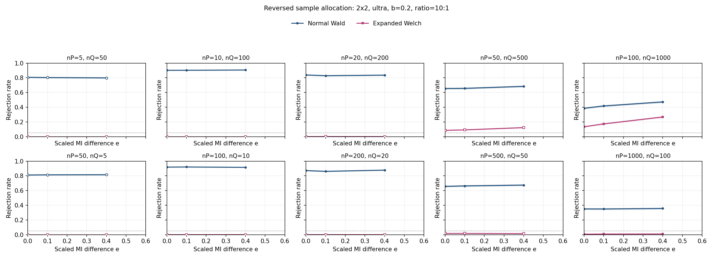

| Specification | Setting |
| --- | --- |
| Table shape | 2x2 |
| Population construction | Ordinal arrangement for P and reversed ordinal for Q |
| Horizontal graph regime specifications (columns) | {smaller n=5, smaller n=10, smaller n=20, smaller n=50, smaller n=100} |
| Vertical graph regime specifications (rows) | {Q larger, P larger}. $P$: row 1 and column 1 each have probability 0.95; $Q$: row 2 and column 2 each have probability 0.95; every other row has probability $0.05$, every other column $0.05$. These are row/column totals, not cell probabilities; they stay fixed across all panels and MI differences in this figure. |
| MI settings (nats) | M approximately 0.002633; b=0.2; I(P) approximately 0.0005266; e in [0.0, 0.1, 0.4]; I(Q)=(b+e)M |
| Axes | e from 0 to 0.6; rejection rate from 0 to 1 |
| Replicates | 10,000 independent table pairs per point |

Exact rejection rates, intervals, validity and expected counts

| nP | nQ | e | Method | Rejection rate | 95% lower | 95% upper | Valid rate | Rejection rate among valid results | Minimum expected count P | Minimum expected count Q |
| --- | --- | --- | --- | --- | --- | --- | --- | --- | --- | --- |
| 5 | 50 | 0 | Expanded Welch | 0 | 0 | 0.000384 | 0.0465 | 0 | 0.02087 | 0.0557 |
| 5 | 50 | 0 | Normal Wald | 0.8069 | 0.799 | 0.8145 | 0.8613 | 0.9368 | 0.02087 | 0.0557 |
| 5 | 50 | 0.1 | Expanded Welch | 0 | 0 | 0.000384 | 0.0491 | 0 | 0.02087 | 0.04256 |
| 5 | 50 | 0.1 | Normal Wald | 0.804 | 0.7961 | 0.8117 | 0.8615 | 0.9333 | 0.02087 | 0.04256 |
| 5 | 50 | 0.4 | Expanded Welch | 0 | 0 | 0.000384 | 0.0486 | 0 | 0.02087 | 0.01703 |
| 5 | 50 | 0.4 | Normal Wald | 0.7995 | 0.7915 | 0.8072 | 0.8567 | 0.9332 | 0.02087 | 0.01703 |
| 10 | 100 | 0 | Expanded Welch | 0 | 0 | 0.000384 | 0.1675 | 0 | 0.04174 | 0.1114 |
| 10 | 100 | 0 | Normal Wald | 0.903 | 0.897 | 0.9086 | 0.991 | 0.9112 | 0.04174 | 0.1114 |
| 10 | 100 | 0.1 | Expanded Welch | 0 | 0 | 0.000384 | 0.1668 | 0 | 0.04174 | 0.08512 |
| 10 | 100 | 0.1 | Normal Wald | 0.9032 | 0.8972 | 0.9088 | 0.9897 | 0.9126 | 0.04174 | 0.08512 |
| 10 | 100 | 0.4 | Expanded Welch | 0 | 0 | 0.000384 | 0.1634 | 0 | 0.04174 | 0.03406 |
| 10 | 100 | 0.4 | Normal Wald | 0.9069 | 0.901 | 0.9124 | 0.9905 | 0.9156 | 0.04174 | 0.03406 |
| 20 | 200 | 0 | Expanded Welch | 0.0003 | 0.000102 | 0.0008817 | 0.4088 | 0.0007339 | 0.08347 | 0.2228 |
| 20 | 200 | 0 | Normal Wald | 0.8392 | 0.8319 | 0.8463 | 1 | 0.8392 | 0.08347 | 0.2228 |
| 20 | 200 | 0.1 | Expanded Welch | 0.0009 | 0.0004736 | 0.00171 | 0.4217 | 0.002134 | 0.08347 | 0.1702 |
| 20 | 200 | 0.1 | Normal Wald | 0.8292 | 0.8217 | 0.8364 | 0.9999 | 0.8293 | 0.08347 | 0.1702 |
| 20 | 200 | 0.4 | Expanded Welch | 0.0003 | 0.000102 | 0.0008817 | 0.4198 | 0.0007146 | 0.08347 | 0.06813 |
| 20 | 200 | 0.4 | Normal Wald | 0.8369 | 0.8295 | 0.844 | 1 | 0.8369 | 0.08347 | 0.06813 |
| 50 | 5 | 0 | Expanded Welch | 0 | 0 | 0.000384 | 0.0374 | 0 | 0.2087 | 0.00557 |
| 50 | 5 | 0 | Normal Wald | 0.8118 | 0.804 | 0.8193 | 0.8578 | 0.9464 | 0.2087 | 0.00557 |
| 50 | 5 | 0.1 | Expanded Welch | 0 | 0 | 0.000384 | 0.0387 | 0 | 0.2087 | 0.004256 |
| 50 | 5 | 0.1 | Normal Wald | 0.814 | 0.8063 | 0.8215 | 0.8588 | 0.9478 | 0.2087 | 0.004256 |
| 50 | 5 | 0.4 | Expanded Welch | 0 | 0 | 0.000384 | 0.0372 | 0 | 0.2087 | 0.001703 |
| 50 | 5 | 0.4 | Normal Wald | 0.8156 | 0.8079 | 0.8231 | 0.8592 | 0.9493 | 0.2087 | 0.001703 |
| 50 | 500 | 0 | Expanded Welch | 0.0854 | 0.08008 | 0.09104 | 0.8524 | 0.1002 | 0.2087 | 0.557 |
| 50 | 500 | 0 | Normal Wald | 0.655 | 0.6456 | 0.6643 | 0.9997 | 0.6552 | 0.2087 | 0.557 |
| 50 | 500 | 0.1 | Expanded Welch | 0.092 | 0.08649 | 0.09782 | 0.8465 | 0.1087 | 0.2087 | 0.4256 |
| 50 | 500 | 0.1 | Normal Wald | 0.6566 | 0.6472 | 0.6658 | 0.9997 | 0.6568 | 0.2087 | 0.4256 |
| 50 | 500 | 0.4 | Expanded Welch | 0.1228 | 0.1165 | 0.1294 | 0.8519 | 0.1441 | 0.2087 | 0.1703 |
| 50 | 500 | 0.4 | Normal Wald | 0.6842 | 0.675 | 0.6932 | 0.9998 | 0.6843 | 0.2087 | 0.1703 |
| 100 | 10 | 0 | Expanded Welch | 0 | 0 | 0.000384 | 0.156 | 0 | 0.4174 | 0.01114 |
| 100 | 10 | 0 | Normal Wald | 0.9193 | 0.9138 | 0.9245 | 0.9895 | 0.9291 | 0.4174 | 0.01114 |
| 100 | 10 | 0.1 | Expanded Welch | 0 | 0 | 0.000384 | 0.1493 | 0 | 0.4174 | 0.008512 |
| 100 | 10 | 0.1 | Normal Wald | 0.9212 | 0.9158 | 0.9263 | 0.9916 | 0.929 | 0.4174 | 0.008512 |
| 100 | 10 | 0.4 | Expanded Welch | 0.0001 | 1.765e-05 | 0.0005663 | 0.1524 | 0.0006562 | 0.4174 | 0.003406 |
| 100 | 10 | 0.4 | Normal Wald | 0.9161 | 0.9105 | 0.9214 | 0.9883 | 0.9269 | 0.4174 | 0.003406 |
| 100 | 1000 | 0 | Expanded Welch | 0.1349 | 0.1283 | 0.1417 | 0.9881 | 0.1365 | 0.4174 | 1.114 |
| 100 | 1000 | 0 | Normal Wald | 0.3865 | 0.377 | 0.3961 | 1 | 0.3865 | 0.4174 | 1.114 |
| 100 | 1000 | 0.1 | Expanded Welch | 0.1737 | 0.1664 | 0.1813 | 0.988 | 0.1758 | 0.4174 | 0.8512 |
| 100 | 1000 | 0.1 | Normal Wald | 0.4172 | 0.4076 | 0.4269 | 1 | 0.4172 | 0.4174 | 0.8512 |
| 100 | 1000 | 0.4 | Expanded Welch | 0.2675 | 0.2589 | 0.2763 | 0.9872 | 0.271 | 0.4174 | 0.3406 |
| 100 | 1000 | 0.4 | Normal Wald | 0.4722 | 0.4624 | 0.482 | 1 | 0.4722 | 0.4174 | 0.3406 |
| 200 | 20 | 0 | Expanded Welch | 0.0002 | 5.485e-05 | 0.000729 | 0.4111 | 0.0004865 | 0.8347 | 0.02228 |
| 200 | 20 | 0 | Normal Wald | 0.8722 | 0.8655 | 0.8786 | 0.9999 | 0.8723 | 0.8347 | 0.02228 |
| 200 | 20 | 0.1 | Expanded Welch | 0.0001 | 1.765e-05 | 0.0005663 | 0.4133 | 0.000242 | 0.8347 | 0.01702 |
| 200 | 20 | 0.1 | Normal Wald | 0.8616 | 0.8547 | 0.8682 | 1 | 0.8616 | 0.8347 | 0.01702 |
| 200 | 20 | 0.4 | Expanded Welch | 0.0001 | 1.765e-05 | 0.0005663 | 0.4105 | 0.0002436 | 0.8347 | 0.006813 |
| 200 | 20 | 0.4 | Normal Wald | 0.8782 | 0.8716 | 0.8845 | 0.9999 | 0.8783 | 0.8347 | 0.006813 |
| 500 | 50 | 0 | Expanded Welch | 0.0166 | 0.01428 | 0.0193 | 0.8542 | 0.01943 | 2.087 | 0.0557 |
| 500 | 50 | 0 | Normal Wald | 0.6569 | 0.6475 | 0.6661 | 0.9998 | 0.657 | 2.087 | 0.0557 |
| 500 | 50 | 0.1 | Expanded Welch | 0.0169 | 0.01455 | 0.01962 | 0.856 | 0.01974 | 2.087 | 0.04256 |
| 500 | 50 | 0.1 | Normal Wald | 0.6634 | 0.6541 | 0.6726 | 0.9997 | 0.6636 | 2.087 | 0.04256 |
| 500 | 50 | 0.4 | Expanded Welch | 0.0147 | 0.01252 | 0.01725 | 0.8567 | 0.01716 | 2.087 | 0.01703 |
| 500 | 50 | 0.4 | Normal Wald | 0.6746 | 0.6654 | 0.6837 | 0.9999 | 0.6747 | 2.087 | 0.01703 |
| 1000 | 100 | 0 | Expanded Welch | 0.0071 | 0.005633 | 0.008945 | 0.989 | 0.007179 | 4.174 | 0.1114 |
| 1000 | 100 | 0 | Normal Wald | 0.3503 | 0.341 | 0.3597 | 1 | 0.3503 | 4.174 | 0.1114 |
| 1000 | 100 | 0.1 | Expanded Welch | 0.0088 | 0.007149 | 0.01083 | 0.9888 | 0.0089 | 4.174 | 0.08512 |
| 1000 | 100 | 0.1 | Normal Wald | 0.3494 | 0.3401 | 0.3588 | 1 | 0.3494 | 4.174 | 0.08512 |
| 1000 | 100 | 0.4 | Expanded Welch | 0.0095 | 0.007778 | 0.0116 | 0.9884 | 0.009611 | 4.174 | 0.03406 |
| 1000 | 100 | 0.4 | Normal Wald | 0.3566 | 0.3473 | 0.366 | 1 | 0.3566 | 4.174 | 0.03406 |

### 5.5 Reversed sample allocation: 2x2, ultra, b=0.2, ratio=2:1

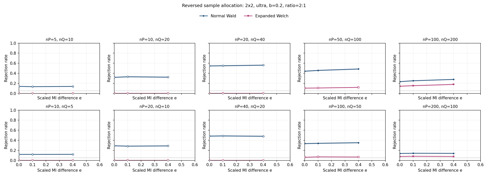

| Specification | Setting |
| --- | --- |
| Table shape | 2x2 |
| Population construction | Ordinal arrangement for P and reversed ordinal for Q |
| Horizontal graph regime specifications (columns) | {smaller n=5, smaller n=10, smaller n=20, smaller n=50, smaller n=100} |
| Vertical graph regime specifications (rows) | {Q larger, P larger}. $P$: row 1 and column 1 each have probability 0.95; $Q$: row 2 and column 2 each have probability 0.95; every other row has probability $0.05$, every other column $0.05$. These are row/column totals, not cell probabilities; they stay fixed across all panels and MI differences in this figure. |
| MI settings (nats) | M approximately 0.002633; b=0.2; I(P) approximately 0.0005266; e in [0.0, 0.1, 0.4]; I(Q)=(b+e)M |
| Axes | e from 0 to 0.6; rejection rate from 0 to 1 |
| Replicates | 10,000 independent table pairs per point |

Exact rejection rates, intervals, validity and expected counts

| nP | nQ | e | Method | Rejection rate | 95% lower | 95% upper | Valid rate | Rejection rate among valid results | Minimum expected count P | Minimum expected count Q |
| --- | --- | --- | --- | --- | --- | --- | --- | --- | --- | --- |
| 5 | 10 | 0 | Expanded Welch | 0 | 0 | 0.000384 | 0.0082 | 0 | 0.02087 | 0.01114 |
| 5 | 10 | 0 | Normal Wald | 0.1393 | 0.1327 | 0.1462 | 0.2023 | 0.6886 | 0.02087 | 0.01114 |
| 5 | 10 | 0.1 | Expanded Welch | 0 | 0 | 0.000384 | 0.01 | 0 | 0.02087 | 0.008512 |
| 5 | 10 | 0.1 | Normal Wald | 0.1342 | 0.1277 | 0.141 | 0.1973 | 0.6802 | 0.02087 | 0.008512 |
| 5 | 10 | 0.4 | Expanded Welch | 0 | 0 | 0.000384 | 0.0082 | 0 | 0.02087 | 0.003406 |
| 5 | 10 | 0.4 | Normal Wald | 0.1388 | 0.1322 | 0.1457 | 0.1992 | 0.6968 | 0.02087 | 0.003406 |
| 10 | 5 | 0 | Expanded Welch | 0.0001 | 1.765e-05 | 0.0005663 | 0.0075 | 0.01333 | 0.04174 | 0.00557 |
| 10 | 5 | 0 | Normal Wald | 0.1197 | 0.1135 | 0.1262 | 0.2096 | 0.5711 | 0.04174 | 0.00557 |
| 10 | 5 | 0.1 | Expanded Welch | 0 | 0 | 0.000384 | 0.0074 | 0 | 0.04174 | 0.004256 |
| 10 | 5 | 0.1 | Normal Wald | 0.119 | 0.1128 | 0.1255 | 0.2035 | 0.5848 | 0.04174 | 0.004256 |
| 10 | 5 | 0.4 | Expanded Welch | 0 | 0 | 0.000384 | 0.0082 | 0 | 0.04174 | 0.001703 |
| 10 | 5 | 0.4 | Normal Wald | 0.1207 | 0.1145 | 0.1272 | 0.2029 | 0.5949 | 0.04174 | 0.001703 |
| 10 | 20 | 0 | Expanded Welch | 0.0001 | 1.765e-05 | 0.0005663 | 0.0691 | 0.001447 | 0.04174 | 0.02228 |
| 10 | 20 | 0 | Normal Wald | 0.3196 | 0.3105 | 0.3288 | 0.504 | 0.6341 | 0.04174 | 0.02228 |
| 10 | 20 | 0.1 | Expanded Welch | 0.0002 | 5.485e-05 | 0.000729 | 0.0681 | 0.002937 | 0.04174 | 0.01702 |
| 10 | 20 | 0.1 | Normal Wald | 0.331 | 0.3218 | 0.3403 | 0.5141 | 0.6438 | 0.04174 | 0.01702 |
| 10 | 20 | 0.4 | Expanded Welch | 0.0001 | 1.765e-05 | 0.0005663 | 0.0672 | 0.001488 | 0.04174 | 0.006813 |
| 10 | 20 | 0.4 | Normal Wald | 0.3229 | 0.3138 | 0.3321 | 0.4947 | 0.6527 | 0.04174 | 0.006813 |
| 20 | 10 | 0 | Expanded Welch | 0.0001 | 1.765e-05 | 0.0005663 | 0.0626 | 0.001597 | 0.08347 | 0.01114 |
| 20 | 10 | 0 | Normal Wald | 0.2908 | 0.282 | 0.2998 | 0.5082 | 0.5722 | 0.08347 | 0.01114 |
| 20 | 10 | 0.1 | Expanded Welch | 0.0002 | 5.485e-05 | 0.000729 | 0.0644 | 0.003106 | 0.08347 | 0.008512 |
| 20 | 10 | 0.1 | Normal Wald | 0.2837 | 0.2749 | 0.2926 | 0.5095 | 0.5568 | 0.08347 | 0.008512 |
| 20 | 10 | 0.4 | Expanded Welch | 0.0002 | 5.485e-05 | 0.000729 | 0.0652 | 0.003067 | 0.08347 | 0.003406 |
| 20 | 10 | 0.4 | Normal Wald | 0.2884 | 0.2796 | 0.2974 | 0.5103 | 0.5652 | 0.08347 | 0.003406 |
| 20 | 40 | 0 | Expanded Welch | 0 | 0 | 0.000384 | 0.3048 | 0 | 0.08347 | 0.04456 |
| 20 | 40 | 0 | Normal Wald | 0.5464 | 0.5366 | 0.5561 | 0.8572 | 0.6374 | 0.08347 | 0.04456 |
| 20 | 40 | 0.1 | Expanded Welch | 0.0005 | 0.0002136 | 0.00117 | 0.3154 | 0.001585 | 0.08347 | 0.03405 |
| 20 | 40 | 0.1 | Normal Wald | 0.5505 | 0.5407 | 0.5602 | 0.857 | 0.6424 | 0.08347 | 0.03405 |
| 20 | 40 | 0.4 | Expanded Welch | 0.0003 | 0.000102 | 0.0008817 | 0.3209 | 0.0009349 | 0.08347 | 0.01363 |
| 20 | 40 | 0.4 | Normal Wald | 0.5618 | 0.5521 | 0.5715 | 0.8598 | 0.6534 | 0.08347 | 0.01363 |
| 40 | 20 | 0 | Expanded Welch | 0.0002 | 5.485e-05 | 0.000729 | 0.3182 | 0.0006285 | 0.1669 | 0.02228 |
| 40 | 20 | 0 | Normal Wald | 0.4834 | 0.4736 | 0.4932 | 0.8644 | 0.5592 | 0.1669 | 0.02228 |
| 40 | 20 | 0.1 | Expanded Welch | 0.0001 | 1.765e-05 | 0.0005663 | 0.3067 | 0.0003261 | 0.1669 | 0.01702 |
| 40 | 20 | 0.1 | Normal Wald | 0.4869 | 0.4771 | 0.4967 | 0.8495 | 0.5732 | 0.1669 | 0.01702 |
| 40 | 20 | 0.4 | Expanded Welch | 0.0003 | 0.000102 | 0.0008817 | 0.305 | 0.0009836 | 0.1669 | 0.006813 |
| 40 | 20 | 0.4 | Normal Wald | 0.4805 | 0.4707 | 0.4903 | 0.8528 | 0.5634 | 0.1669 | 0.006813 |
| 50 | 100 | 0 | Expanded Welch | 0.1047 | 0.09885 | 0.1109 | 0.846 | 0.1238 | 0.2087 | 0.1114 |
| 50 | 100 | 0 | Normal Wald | 0.4414 | 0.4317 | 0.4512 | 0.9988 | 0.4419 | 0.2087 | 0.1114 |
| 50 | 100 | 0.1 | Expanded Welch | 0.1074 | 0.1015 | 0.1136 | 0.8467 | 0.1268 | 0.2087 | 0.08512 |
| 50 | 100 | 0.1 | Normal Wald | 0.4578 | 0.4481 | 0.4676 | 0.9982 | 0.4586 | 0.2087 | 0.08512 |
| 50 | 100 | 0.4 | Expanded Welch | 0.1199 | 0.1137 | 0.1264 | 0.8439 | 0.1421 | 0.2087 | 0.03406 |
| 50 | 100 | 0.4 | Normal Wald | 0.4855 | 0.4757 | 0.4953 | 0.9981 | 0.4864 | 0.2087 | 0.03406 |
| 100 | 50 | 0 | Expanded Welch | 0.0624 | 0.05783 | 0.06731 | 0.844 | 0.07393 | 0.4174 | 0.0557 |
| 100 | 50 | 0 | Normal Wald | 0.3344 | 0.3252 | 0.3437 | 0.998 | 0.3351 | 0.4174 | 0.0557 |
| 100 | 50 | 0.1 | Expanded Welch | 0.0705 | 0.06565 | 0.07568 | 0.8405 | 0.08388 | 0.4174 | 0.04256 |
| 100 | 50 | 0.1 | Normal Wald | 0.3397 | 0.3305 | 0.349 | 0.9984 | 0.3402 | 0.4174 | 0.04256 |
| 100 | 50 | 0.4 | Expanded Welch | 0.067 | 0.06226 | 0.07207 | 0.8321 | 0.08052 | 0.4174 | 0.01703 |
| 100 | 50 | 0.4 | Normal Wald | 0.3517 | 0.3424 | 0.3611 | 0.9987 | 0.3522 | 0.4174 | 0.01703 |
| 100 | 200 | 0 | Expanded Welch | 0.1427 | 0.136 | 0.1497 | 0.9857 | 0.1448 | 0.4174 | 0.2228 |
| 100 | 200 | 0 | Normal Wald | 0.2339 | 0.2257 | 0.2423 | 1 | 0.2339 | 0.4174 | 0.2228 |
| 100 | 200 | 0.1 | Expanded Welch | 0.1537 | 0.1468 | 0.1609 | 0.9848 | 0.1561 | 0.4174 | 0.1702 |
| 100 | 200 | 0.1 | Normal Wald | 0.2517 | 0.2433 | 0.2603 | 1 | 0.2517 | 0.4174 | 0.1702 |
| 100 | 200 | 0.4 | Expanded Welch | 0.1788 | 0.1714 | 0.1864 | 0.9882 | 0.1809 | 0.4174 | 0.06813 |
| 100 | 200 | 0.4 | Normal Wald | 0.2786 | 0.2699 | 0.2875 | 1 | 0.2786 | 0.4174 | 0.06813 |
| 200 | 100 | 0 | Expanded Welch | 0.0774 | 0.07232 | 0.0828 | 0.9892 | 0.07825 | 0.8347 | 0.1114 |
| 200 | 100 | 0 | Normal Wald | 0.1376 | 0.131 | 0.1445 | 1 | 0.1376 | 0.8347 | 0.1114 |
| 200 | 100 | 0.1 | Expanded Welch | 0.0818 | 0.07659 | 0.08733 | 0.9875 | 0.08284 | 0.8347 | 0.08512 |
| 200 | 100 | 0.1 | Normal Wald | 0.142 | 0.1353 | 0.149 | 1 | 0.142 | 0.8347 | 0.08512 |
| 200 | 100 | 0.4 | Expanded Welch | 0.0773 | 0.07223 | 0.0827 | 0.9891 | 0.07815 | 0.8347 | 0.03406 |
| 200 | 100 | 0.4 | Normal Wald | 0.14 | 0.1333 | 0.1469 | 1 | 0.14 | 0.8347 | 0.03406 |

### 5.6 Reversed sample allocation: 2x2, ultra, b=0.2, ratio=5:1

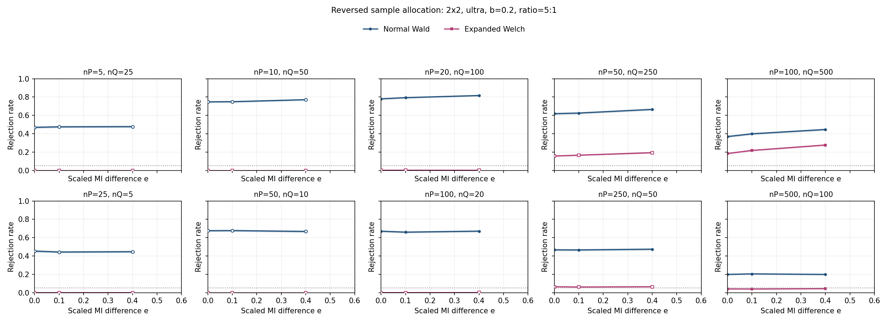

| Specification | Setting |
| --- | --- |
| Table shape | 2x2 |
| Population construction | Ordinal arrangement for P and reversed ordinal for Q |
| Horizontal graph regime specifications (columns) | {smaller n=5, smaller n=10, smaller n=20, smaller n=50, smaller n=100} |
| Vertical graph regime specifications (rows) | {Q larger, P larger}. $P$: row 1 and column 1 each have probability 0.95; $Q$: row 2 and column 2 each have probability 0.95; every other row has probability $0.05$, every other column $0.05$. These are row/column totals, not cell probabilities; they stay fixed across all panels and MI differences in this figure. |
| MI settings (nats) | M approximately 0.002633; b=0.2; I(P) approximately 0.0005266; e in [0.0, 0.1, 0.4]; I(Q)=(b+e)M |
| Axes | e from 0 to 0.6; rejection rate from 0 to 1 |
| Replicates | 10,000 independent table pairs per point |

Exact rejection rates, intervals, validity and expected counts

| nP | nQ | e | Method | Rejection rate | 95% lower | 95% upper | Valid rate | Rejection rate among valid results | Minimum expected count P | Minimum expected count Q |
| --- | --- | --- | --- | --- | --- | --- | --- | --- | --- | --- |
| 5 | 25 | 0 | Expanded Welch | 0 | 0 | 0.000384 | 0.0305 | 0 | 0.02087 | 0.02785 |
| 5 | 25 | 0 | Normal Wald | 0.4694 | 0.4596 | 0.4792 | 0.542 | 0.8661 | 0.02087 | 0.02785 |
| 5 | 25 | 0.1 | Expanded Welch | 0 | 0 | 0.000384 | 0.0311 | 0 | 0.02087 | 0.02128 |
| 5 | 25 | 0.1 | Normal Wald | 0.475 | 0.4652 | 0.4848 | 0.5453 | 0.8711 | 0.02087 | 0.02128 |
| 5 | 25 | 0.4 | Expanded Welch | 0 | 0 | 0.000384 | 0.0305 | 0 | 0.02087 | 0.008516 |
| 5 | 25 | 0.4 | Normal Wald | 0.4772 | 0.4674 | 0.487 | 0.5409 | 0.8822 | 0.02087 | 0.008516 |
| 10 | 50 | 0 | Expanded Welch | 0 | 0 | 0.000384 | 0.1423 | 0 | 0.04174 | 0.0557 |
| 10 | 50 | 0 | Normal Wald | 0.7476 | 0.739 | 0.756 | 0.8775 | 0.852 | 0.04174 | 0.0557 |
| 10 | 50 | 0.1 | Expanded Welch | 0 | 0 | 0.000384 | 0.1405 | 0 | 0.04174 | 0.04256 |
| 10 | 50 | 0.1 | Normal Wald | 0.7493 | 0.7407 | 0.7577 | 0.8735 | 0.8578 | 0.04174 | 0.04256 |
| 10 | 50 | 0.4 | Expanded Welch | 0 | 0 | 0.000384 | 0.1383 | 0 | 0.04174 | 0.01703 |
| 10 | 50 | 0.4 | Normal Wald | 0.7713 | 0.763 | 0.7794 | 0.873 | 0.8835 | 0.04174 | 0.01703 |
| 20 | 100 | 0 | Expanded Welch | 0.0017 | 0.001062 | 0.002721 | 0.4 | 0.00425 | 0.08347 | 0.1114 |
| 20 | 100 | 0 | Normal Wald | 0.7805 | 0.7723 | 0.7885 | 0.9923 | 0.7866 | 0.08347 | 0.1114 |
| 20 | 100 | 0.1 | Expanded Welch | 0.0018 | 0.001139 | 0.002844 | 0.4063 | 0.00443 | 0.08347 | 0.08512 |
| 20 | 100 | 0.1 | Normal Wald | 0.7936 | 0.7856 | 0.8014 | 0.9928 | 0.7994 | 0.08347 | 0.08512 |
| 20 | 100 | 0.4 | Expanded Welch | 0.0013 | 0.0007599 | 0.002223 | 0.4104 | 0.003168 | 0.08347 | 0.03406 |
| 20 | 100 | 0.4 | Normal Wald | 0.8167 | 0.809 | 0.8242 | 0.992 | 0.8233 | 0.08347 | 0.03406 |
| 25 | 5 | 0 | Expanded Welch | 0.0001 | 1.765e-05 | 0.0005663 | 0.023 | 0.004348 | 0.1043 | 0.00557 |
| 25 | 5 | 0 | Normal Wald | 0.4531 | 0.4434 | 0.4629 | 0.5474 | 0.8277 | 0.1043 | 0.00557 |
| 25 | 5 | 0.1 | Expanded Welch | 0.0001 | 1.765e-05 | 0.0005663 | 0.0243 | 0.004115 | 0.1043 | 0.004256 |
| 25 | 5 | 0.1 | Normal Wald | 0.443 | 0.4333 | 0.4528 | 0.5407 | 0.8193 | 0.1043 | 0.004256 |
| 25 | 5 | 0.4 | Expanded Welch | 0 | 0 | 0.000384 | 0.0227 | 0 | 0.1043 | 0.001703 |
| 25 | 5 | 0.4 | Normal Wald | 0.4464 | 0.4367 | 0.4562 | 0.5391 | 0.828 | 0.1043 | 0.001703 |
| 50 | 10 | 0 | Expanded Welch | 0 | 0 | 0.000384 | 0.1334 | 0 | 0.2087 | 0.01114 |
| 50 | 10 | 0 | Normal Wald | 0.6754 | 0.6662 | 0.6845 | 0.8772 | 0.7699 | 0.2087 | 0.01114 |
| 50 | 10 | 0.1 | Expanded Welch | 0 | 0 | 0.000384 | 0.1306 | 0 | 0.2087 | 0.008512 |
| 50 | 10 | 0.1 | Normal Wald | 0.6769 | 0.6677 | 0.686 | 0.8788 | 0.7703 | 0.2087 | 0.008512 |
| 50 | 10 | 0.4 | Expanded Welch | 0 | 0 | 0.000384 | 0.1306 | 0 | 0.2087 | 0.003406 |
| 50 | 10 | 0.4 | Normal Wald | 0.6673 | 0.658 | 0.6765 | 0.875 | 0.7626 | 0.2087 | 0.003406 |
| 50 | 250 | 0 | Expanded Welch | 0.1566 | 0.1496 | 0.1639 | 0.8606 | 0.182 | 0.2087 | 0.2785 |
| 50 | 250 | 0 | Normal Wald | 0.6186 | 0.609 | 0.6281 | 0.9999 | 0.6187 | 0.2087 | 0.2785 |
| 50 | 250 | 0.1 | Expanded Welch | 0.1661 | 0.1589 | 0.1735 | 0.8559 | 0.1941 | 0.2087 | 0.2128 |
| 50 | 250 | 0.1 | Normal Wald | 0.6253 | 0.6158 | 0.6347 | 1 | 0.6253 | 0.2087 | 0.2128 |
| 50 | 250 | 0.4 | Expanded Welch | 0.1931 | 0.1855 | 0.201 | 0.8473 | 0.2279 | 0.2087 | 0.08516 |
| 50 | 250 | 0.4 | Normal Wald | 0.6653 | 0.656 | 0.6745 | 1 | 0.6653 | 0.2087 | 0.08516 |
| 100 | 20 | 0 | Expanded Welch | 0.0003 | 0.000102 | 0.0008817 | 0.394 | 0.0007614 | 0.4174 | 0.02228 |
| 100 | 20 | 0 | Normal Wald | 0.67 | 0.6607 | 0.6791 | 0.9931 | 0.6747 | 0.4174 | 0.02228 |
| 100 | 20 | 0.1 | Expanded Welch | 0.0003 | 0.000102 | 0.0008817 | 0.4039 | 0.0007428 | 0.4174 | 0.01702 |
| 100 | 20 | 0.1 | Normal Wald | 0.6598 | 0.6505 | 0.669 | 0.9927 | 0.6647 | 0.4174 | 0.01702 |
| 100 | 20 | 0.4 | Expanded Welch | 0.0004 | 0.0001556 | 0.001028 | 0.4006 | 0.0009985 | 0.4174 | 0.006813 |
| 100 | 20 | 0.4 | Normal Wald | 0.6708 | 0.6615 | 0.6799 | 0.9929 | 0.6756 | 0.4174 | 0.006813 |
| 100 | 500 | 0 | Expanded Welch | 0.1842 | 0.1767 | 0.1919 | 0.9875 | 0.1865 | 0.4174 | 0.557 |
| 100 | 500 | 0 | Normal Wald | 0.369 | 0.3596 | 0.3785 | 1 | 0.369 | 0.4174 | 0.557 |
| 100 | 500 | 0.1 | Expanded Welch | 0.2177 | 0.2097 | 0.2259 | 0.9872 | 0.2205 | 0.4174 | 0.4256 |
| 100 | 500 | 0.1 | Normal Wald | 0.3988 | 0.3892 | 0.4084 | 0.9999 | 0.3988 | 0.4174 | 0.4256 |
| 100 | 500 | 0.4 | Expanded Welch | 0.2767 | 0.268 | 0.2856 | 0.9907 | 0.2793 | 0.4174 | 0.1703 |
| 100 | 500 | 0.4 | Normal Wald | 0.446 | 0.4363 | 0.4558 | 1 | 0.446 | 0.4174 | 0.1703 |
| 250 | 50 | 0 | Expanded Welch | 0.0644 | 0.05975 | 0.06938 | 0.8517 | 0.07561 | 1.043 | 0.0557 |
| 250 | 50 | 0 | Normal Wald | 0.4667 | 0.4569 | 0.4765 | 1 | 0.4667 | 1.043 | 0.0557 |
| 250 | 50 | 0.1 | Expanded Welch | 0.0616 | 0.05705 | 0.06648 | 0.8543 | 0.07211 | 1.043 | 0.04256 |
| 250 | 50 | 0.1 | Normal Wald | 0.4657 | 0.4559 | 0.4755 | 1 | 0.4657 | 1.043 | 0.04256 |
| 250 | 50 | 0.4 | Expanded Welch | 0.0645 | 0.05985 | 0.06948 | 0.8515 | 0.07575 | 1.043 | 0.01703 |
| 250 | 50 | 0.4 | Normal Wald | 0.4738 | 0.464 | 0.4836 | 1 | 0.4738 | 1.043 | 0.01703 |
| 500 | 100 | 0 | Expanded Welch | 0.0402 | 0.03652 | 0.04423 | 0.9888 | 0.04066 | 2.087 | 0.1114 |
| 500 | 100 | 0 | Normal Wald | 0.1991 | 0.1914 | 0.207 | 1 | 0.1991 | 2.087 | 0.1114 |
| 500 | 100 | 0.1 | Expanded Welch | 0.0394 | 0.03576 | 0.04339 | 0.987 | 0.03992 | 2.087 | 0.08512 |
| 500 | 100 | 0.1 | Normal Wald | 0.2045 | 0.1967 | 0.2125 | 1 | 0.2045 | 2.087 | 0.08512 |
| 500 | 100 | 0.4 | Expanded Welch | 0.0431 | 0.03929 | 0.04726 | 0.9874 | 0.04365 | 2.087 | 0.03406 |
| 500 | 100 | 0.4 | Normal Wald | 0.1986 | 0.1909 | 0.2065 | 1 | 0.1986 | 2.087 | 0.03406 |

### 5.7 Reversed sample allocation: 3x3, strong, b=0.2, ratio=10:1

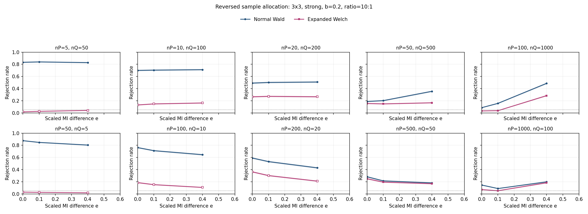

| Specification | Setting |
| --- | --- |
| Table shape | 3x3 |
| Population construction | Ordinal arrangement for P and reversed ordinal for Q |
| Horizontal graph regime specifications (columns) | {smaller n=5, smaller n=10, smaller n=20, smaller n=50, smaller n=100} |
| Vertical graph regime specifications (rows) | {Q larger, P larger}. $P$: row 1 and column 1 each have probability 0.9; $Q$: row 2 and column 3 each have probability 0.9; every other row has probability $0.1/2$, every other column $0.1/2$. These are row/column totals, not cell probabilities; they stay fixed across all panels and MI differences in this figure. |
| MI settings (nats) | M approximately 0.1922; b=0.2; I(P) approximately 0.03844; e in [0.0, 0.1, 0.4]; I(Q)=(b+e)M |
| Axes | e from 0 to 0.6; rejection rate from 0 to 1 |
| Replicates | 10,000 independent table pairs per point |

Exact rejection rates, intervals, validity and expected counts

| nP | nQ | e | Method | Rejection rate | 95% lower | 95% upper | Valid rate | Rejection rate among valid results | Minimum expected count P | Minimum expected count Q |
| --- | --- | --- | --- | --- | --- | --- | --- | --- | --- | --- |
| 5 | 50 | 0 | Expanded Welch | 0.0166 | 0.01428 | 0.0193 | 0.2287 | 0.07258 | 0.02134 | 0.003863 |
| 5 | 50 | 0 | Normal Wald | 0.8336 | 0.8262 | 0.8408 | 0.9929 | 0.8396 | 0.02134 | 0.003863 |
| 5 | 50 | 0.1 | Expanded Welch | 0.0254 | 0.02249 | 0.02867 | 0.222 | 0.1144 | 0.02134 | 0.001597 |
| 5 | 50 | 0.1 | Normal Wald | 0.8398 | 0.8325 | 0.8469 | 0.9925 | 0.8461 | 0.02134 | 0.001597 |
| 5 | 50 | 0.4 | Expanded Welch | 0.0402 | 0.03652 | 0.04423 | 0.2268 | 0.1772 | 0.02134 | 9.986e-05 |
| 5 | 50 | 0.4 | Normal Wald | 0.8283 | 0.8208 | 0.8356 | 0.9913 | 0.8356 | 0.02134 | 9.986e-05 |
| 10 | 100 | 0 | Expanded Welch | 0.1308 | 0.1243 | 0.1376 | 0.4788 | 0.2732 | 0.04268 | 0.007727 |
| 10 | 100 | 0 | Normal Wald | 0.6997 | 0.6906 | 0.7086 | 0.9999 | 0.6998 | 0.04268 | 0.007727 |
| 10 | 100 | 0.1 | Expanded Welch | 0.1481 | 0.1413 | 0.1552 | 0.4715 | 0.3141 | 0.04268 | 0.003195 |
| 10 | 100 | 0.1 | Normal Wald | 0.7043 | 0.6953 | 0.7132 | 1 | 0.7043 | 0.04268 | 0.003195 |
| 10 | 100 | 0.4 | Expanded Welch | 0.1633 | 0.1562 | 0.1707 | 0.4672 | 0.3495 | 0.04268 | 0.0001997 |
| 10 | 100 | 0.4 | Normal Wald | 0.7119 | 0.7029 | 0.7207 | 1 | 0.7119 | 0.04268 | 0.0001997 |
| 20 | 200 | 0 | Expanded Welch | 0.2653 | 0.2567 | 0.274 | 0.7884 | 0.3365 | 0.08536 | 0.01545 |
| 20 | 200 | 0 | Normal Wald | 0.4907 | 0.4809 | 0.5005 | 1 | 0.4907 | 0.08536 | 0.01545 |
| 20 | 200 | 0.1 | Expanded Welch | 0.2724 | 0.2638 | 0.2812 | 0.7823 | 0.3482 | 0.08536 | 0.006389 |
| 20 | 200 | 0.1 | Normal Wald | 0.5015 | 0.4917 | 0.5113 | 1 | 0.5015 | 0.08536 | 0.006389 |
| 20 | 200 | 0.4 | Expanded Welch | 0.2657 | 0.2571 | 0.2744 | 0.7882 | 0.3371 | 0.08536 | 0.0003995 |
| 20 | 200 | 0.4 | Normal Wald | 0.5085 | 0.4987 | 0.5183 | 1 | 0.5085 | 0.08536 | 0.0003995 |
| 50 | 5 | 0 | Expanded Welch | 0.0289 | 0.02579 | 0.03237 | 0.1962 | 0.1473 | 0.2134 | 0.0003863 |
| 50 | 5 | 0 | Normal Wald | 0.8768 | 0.8702 | 0.8831 | 0.992 | 0.8839 | 0.2134 | 0.0003863 |
| 50 | 5 | 0.1 | Expanded Welch | 0.0255 | 0.02259 | 0.02878 | 0.2168 | 0.1176 | 0.2134 | 0.0001597 |
| 50 | 5 | 0.1 | Normal Wald | 0.848 | 0.8408 | 0.8549 | 0.9922 | 0.8547 | 0.2134 | 0.0001597 |
| 50 | 5 | 0.4 | Expanded Welch | 0.018 | 0.01557 | 0.0208 | 0.2405 | 0.07484 | 0.2134 | 9.986e-06 |
| 50 | 5 | 0.4 | Normal Wald | 0.8041 | 0.7962 | 0.8118 | 0.9914 | 0.8111 | 0.2134 | 9.986e-06 |
| 50 | 500 | 0 | Expanded Welch | 0.1552 | 0.1482 | 0.1624 | 0.9887 | 0.157 | 0.2134 | 0.03863 |
| 50 | 500 | 0 | Normal Wald | 0.1882 | 0.1807 | 0.196 | 1 | 0.1882 | 0.2134 | 0.03863 |
| 50 | 500 | 0.1 | Expanded Welch | 0.1484 | 0.1416 | 0.1555 | 0.9901 | 0.1499 | 0.2134 | 0.01597 |
| 50 | 500 | 0.1 | Normal Wald | 0.2021 | 0.1943 | 0.2101 | 1 | 0.2021 | 0.2134 | 0.01597 |
| 50 | 500 | 0.4 | Expanded Welch | 0.1664 | 0.1592 | 0.1738 | 0.99 | 0.1681 | 0.2134 | 0.0009986 |
| 50 | 500 | 0.4 | Normal Wald | 0.3554 | 0.3461 | 0.3648 | 1 | 0.3554 | 0.2134 | 0.0009986 |
| 100 | 10 | 0 | Expanded Welch | 0.186 | 0.1785 | 0.1937 | 0.4598 | 0.4045 | 0.4268 | 0.0007727 |
| 100 | 10 | 0 | Normal Wald | 0.7627 | 0.7543 | 0.7709 | 1 | 0.7627 | 0.4268 | 0.0007727 |
| 100 | 10 | 0.1 | Expanded Welch | 0.1522 | 0.1453 | 0.1594 | 0.4722 | 0.3223 | 0.4268 | 0.0003195 |
| 100 | 10 | 0.1 | Normal Wald | 0.7119 | 0.7029 | 0.7207 | 1 | 0.7119 | 0.4268 | 0.0003195 |
| 100 | 10 | 0.4 | Expanded Welch | 0.1067 | 0.1008 | 0.1129 | 0.4873 | 0.219 | 0.4268 | 1.997e-05 |
| 100 | 10 | 0.4 | Normal Wald | 0.6455 | 0.6361 | 0.6548 | 1 | 0.6455 | 0.4268 | 1.997e-05 |
| 100 | 1000 | 0 | Expanded Welch | 0.0321 | 0.02882 | 0.03574 | 1 | 0.0321 | 0.4268 | 0.07727 |
| 100 | 1000 | 0 | Normal Wald | 0.0864 | 0.08105 | 0.09207 | 1 | 0.0864 | 0.4268 | 0.07727 |
| 100 | 1000 | 0.1 | Expanded Welch | 0.0366 | 0.03309 | 0.04046 | 1 | 0.0366 | 0.4268 | 0.03195 |
| 100 | 1000 | 0.1 | Normal Wald | 0.1572 | 0.1502 | 0.1645 | 1 | 0.1572 | 0.4268 | 0.03195 |
| 100 | 1000 | 0.4 | Expanded Welch | 0.2844 | 0.2756 | 0.2933 | 0.9999 | 0.2844 | 0.4268 | 0.001997 |
| 100 | 1000 | 0.4 | Normal Wald | 0.4864 | 0.4766 | 0.4962 | 1 | 0.4864 | 0.4268 | 0.001997 |
| 200 | 20 | 0 | Expanded Welch | 0.3629 | 0.3535 | 0.3724 | 0.7838 | 0.463 | 0.8536 | 0.001545 |
| 200 | 20 | 0 | Normal Wald | 0.5907 | 0.581 | 0.6003 | 1 | 0.5907 | 0.8536 | 0.001545 |
| 200 | 20 | 0.1 | Expanded Welch | 0.3015 | 0.2926 | 0.3106 | 0.7785 | 0.3873 | 0.8536 | 0.0006389 |
| 200 | 20 | 0.1 | Normal Wald | 0.5316 | 0.5218 | 0.5414 | 1 | 0.5316 | 0.8536 | 0.0006389 |
| 200 | 20 | 0.4 | Expanded Welch | 0.2104 | 0.2025 | 0.2185 | 0.7909 | 0.266 | 0.8536 | 3.995e-05 |
| 200 | 20 | 0.4 | Normal Wald | 0.429 | 0.4193 | 0.4387 | 1 | 0.429 | 0.8536 | 3.995e-05 |
| 500 | 50 | 0 | Expanded Welch | 0.2493 | 0.2409 | 0.2579 | 0.9889 | 0.2521 | 2.134 | 0.003863 |
| 500 | 50 | 0 | Normal Wald | 0.2821 | 0.2734 | 0.291 | 1 | 0.2821 | 2.134 | 0.003863 |
| 500 | 50 | 0.1 | Expanded Welch | 0.1939 | 0.1863 | 0.2018 | 0.9892 | 0.196 | 2.134 | 0.001597 |
| 500 | 50 | 0.1 | Normal Wald | 0.2146 | 0.2067 | 0.2228 | 1 | 0.2146 | 2.134 | 0.001597 |
| 500 | 50 | 0.4 | Expanded Welch | 0.1678 | 0.1606 | 0.1753 | 0.9893 | 0.1696 | 2.134 | 9.986e-05 |
| 500 | 50 | 0.4 | Normal Wald | 0.1815 | 0.1741 | 0.1892 | 1 | 0.1815 | 2.134 | 9.986e-05 |
| 1000 | 100 | 0 | Expanded Welch | 0.0712 | 0.06632 | 0.07641 | 1 | 0.0712 | 4.268 | 0.007727 |
| 1000 | 100 | 0 | Normal Wald | 0.1458 | 0.139 | 0.1529 | 1 | 0.1458 | 4.268 | 0.007727 |
| 1000 | 100 | 0.1 | Expanded Welch | 0.0519 | 0.04772 | 0.05642 | 0.9999 | 0.05191 | 4.268 | 0.003195 |
| 1000 | 100 | 0.1 | Normal Wald | 0.0882 | 0.0828 | 0.09392 | 1 | 0.0882 | 4.268 | 0.003195 |
| 1000 | 100 | 0.4 | Expanded Welch | 0.183 | 0.1755 | 0.1907 | 1 | 0.183 | 4.268 | 0.0001997 |
| 1000 | 100 | 0.4 | Normal Wald | 0.1989 | 0.1912 | 0.2068 | 1 | 0.1989 | 4.268 | 0.0001997 |

### 5.8 Reversed sample allocation: 3x3, strong, b=0.2, ratio=2:1

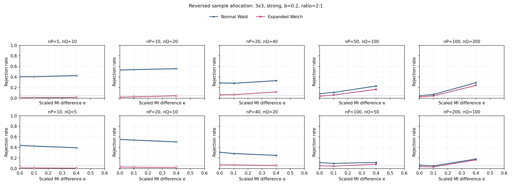

| Specification | Setting |
| --- | --- |
| Table shape | 3x3 |
| Population construction | Ordinal arrangement for P and reversed ordinal for Q |
| Horizontal graph regime specifications (columns) | {smaller n=5, smaller n=10, smaller n=20, smaller n=50, smaller n=100} |
| Vertical graph regime specifications (rows) | {Q larger, P larger}. $P$: row 1 and column 1 each have probability 0.9; $Q$: row 2 and column 3 each have probability 0.9; every other row has probability $0.1/2$, every other column $0.1/2$. These are row/column totals, not cell probabilities; they stay fixed across all panels and MI differences in this figure. |
| MI settings (nats) | M approximately 0.1922; b=0.2; I(P) approximately 0.03844; e in [0.0, 0.1, 0.4]; I(Q)=(b+e)M |
| Axes | e from 0 to 0.6; rejection rate from 0 to 1 |
| Replicates | 10,000 independent table pairs per point |

Exact rejection rates, intervals, validity and expected counts

| nP | nQ | e | Method | Rejection rate | 95% lower | 95% upper | Valid rate | Rejection rate among valid results | Minimum expected count P | Minimum expected count Q |
| --- | --- | --- | --- | --- | --- | --- | --- | --- | --- | --- |
| 5 | 10 | 0 | Expanded Welch | 0.0069 | 0.005456 | 0.008722 | 0.1044 | 0.06609 | 0.02134 | 0.0007727 |
| 5 | 10 | 0 | Normal Wald | 0.4049 | 0.3953 | 0.4146 | 0.5795 | 0.6987 | 0.02134 | 0.0007727 |
| 5 | 10 | 0.1 | Expanded Welch | 0.0072 | 0.005722 | 0.009057 | 0.1045 | 0.0689 | 0.02134 | 0.0003195 |
| 5 | 10 | 0.1 | Normal Wald | 0.407 | 0.3974 | 0.4167 | 0.581 | 0.7005 | 0.02134 | 0.0003195 |
| 5 | 10 | 0.4 | Expanded Welch | 0.0118 | 0.009863 | 0.01411 | 0.1073 | 0.11 | 0.02134 | 1.997e-05 |
| 5 | 10 | 0.4 | Normal Wald | 0.4271 | 0.4174 | 0.4368 | 0.5985 | 0.7136 | 0.02134 | 1.997e-05 |
| 10 | 5 | 0 | Expanded Welch | 0.0125 | 0.0105 | 0.01487 | 0.0993 | 0.1259 | 0.04268 | 0.0003863 |
| 10 | 5 | 0 | Normal Wald | 0.4379 | 0.4282 | 0.4476 | 0.584 | 0.7498 | 0.04268 | 0.0003863 |
| 10 | 5 | 0.1 | Expanded Welch | 0.0108 | 0.008954 | 0.01302 | 0.1013 | 0.1066 | 0.04268 | 0.0001597 |
| 10 | 5 | 0.1 | Normal Wald | 0.425 | 0.4153 | 0.4347 | 0.5855 | 0.7259 | 0.04268 | 0.0001597 |
| 10 | 5 | 0.4 | Expanded Welch | 0.0078 | 0.006255 | 0.009723 | 0.1172 | 0.06655 | 0.04268 | 9.986e-06 |
| 10 | 5 | 0.4 | Normal Wald | 0.3943 | 0.3848 | 0.4039 | 0.5968 | 0.6607 | 0.04268 | 9.986e-06 |
| 10 | 20 | 0 | Expanded Welch | 0.0181 | 0.01567 | 0.0209 | 0.3679 | 0.0492 | 0.04268 | 0.001545 |
| 10 | 20 | 0 | Normal Wald | 0.5328 | 0.523 | 0.5426 | 0.8877 | 0.6002 | 0.04268 | 0.001545 |
| 10 | 20 | 0.1 | Expanded Welch | 0.0253 | 0.0224 | 0.02856 | 0.3708 | 0.06823 | 0.04268 | 0.0006389 |
| 10 | 20 | 0.1 | Normal Wald | 0.5406 | 0.5308 | 0.5504 | 0.8899 | 0.6075 | 0.04268 | 0.0006389 |
| 10 | 20 | 0.4 | Expanded Welch | 0.0441 | 0.04025 | 0.0483 | 0.3759 | 0.1173 | 0.04268 | 3.995e-05 |
| 10 | 20 | 0.4 | Normal Wald | 0.5579 | 0.5481 | 0.5676 | 0.8938 | 0.6242 | 0.04268 | 3.995e-05 |
| 20 | 10 | 0 | Expanded Welch | 0.0289 | 0.02579 | 0.03237 | 0.3591 | 0.08048 | 0.08536 | 0.0007727 |
| 20 | 10 | 0 | Normal Wald | 0.5526 | 0.5428 | 0.5623 | 0.8787 | 0.6289 | 0.08536 | 0.0007727 |
| 20 | 10 | 0.1 | Expanded Welch | 0.0241 | 0.02127 | 0.02729 | 0.3676 | 0.06556 | 0.08536 | 0.0003195 |
| 20 | 10 | 0.1 | Normal Wald | 0.5391 | 0.5293 | 0.5489 | 0.8857 | 0.6087 | 0.08536 | 0.0003195 |
| 20 | 10 | 0.4 | Expanded Welch | 0.0185 | 0.01604 | 0.02133 | 0.3832 | 0.04828 | 0.08536 | 1.997e-05 |
| 20 | 10 | 0.4 | Normal Wald | 0.5047 | 0.4949 | 0.5145 | 0.889 | 0.5677 | 0.08536 | 1.997e-05 |
| 20 | 40 | 0 | Expanded Welch | 0.061 | 0.05648 | 0.06586 | 0.7652 | 0.07972 | 0.08536 | 0.003091 |
| 20 | 40 | 0 | Normal Wald | 0.2888 | 0.28 | 0.2978 | 0.9936 | 0.2907 | 0.08536 | 0.003091 |
| 20 | 40 | 0.1 | Expanded Welch | 0.0667 | 0.06197 | 0.07176 | 0.7655 | 0.08713 | 0.08536 | 0.001278 |
| 20 | 40 | 0.1 | Normal Wald | 0.2815 | 0.2728 | 0.2904 | 0.9947 | 0.283 | 0.08536 | 0.001278 |
| 20 | 40 | 0.4 | Expanded Welch | 0.1153 | 0.1092 | 0.1217 | 0.7633 | 0.1511 | 0.08536 | 7.989e-05 |
| 20 | 40 | 0.4 | Normal Wald | 0.3311 | 0.3219 | 0.3404 | 0.9935 | 0.3333 | 0.08536 | 7.989e-05 |
| 40 | 20 | 0 | Expanded Welch | 0.0707 | 0.06584 | 0.07589 | 0.7591 | 0.09314 | 0.1707 | 0.001545 |
| 40 | 20 | 0 | Normal Wald | 0.3087 | 0.2997 | 0.3178 | 0.9943 | 0.3105 | 0.1707 | 0.001545 |
| 40 | 20 | 0.1 | Expanded Welch | 0.0681 | 0.06333 | 0.07321 | 0.7605 | 0.08955 | 0.1707 | 0.0006389 |
| 40 | 20 | 0.1 | Normal Wald | 0.2842 | 0.2754 | 0.2931 | 0.9937 | 0.286 | 0.1707 | 0.0006389 |
| 40 | 20 | 0.4 | Expanded Welch | 0.0592 | 0.05474 | 0.064 | 0.7696 | 0.07692 | 0.1707 | 3.995e-05 |
| 40 | 20 | 0.4 | Normal Wald | 0.249 | 0.2406 | 0.2576 | 0.9935 | 0.2506 | 0.1707 | 3.995e-05 |
| 50 | 100 | 0 | Expanded Welch | 0.0371 | 0.03357 | 0.04099 | 0.9915 | 0.03742 | 0.2134 | 0.007727 |
| 50 | 100 | 0 | Normal Wald | 0.0852 | 0.07989 | 0.09083 | 1 | 0.0852 | 0.2134 | 0.007727 |
| 50 | 100 | 0.1 | Expanded Welch | 0.0585 | 0.05407 | 0.06327 | 0.9905 | 0.05906 | 0.2134 | 0.003195 |
| 50 | 100 | 0.1 | Normal Wald | 0.1077 | 0.1018 | 0.1139 | 1 | 0.1077 | 0.2134 | 0.003195 |
| 50 | 100 | 0.4 | Expanded Welch | 0.1664 | 0.1592 | 0.1738 | 0.9896 | 0.1681 | 0.2134 | 0.0001997 |
| 50 | 100 | 0.4 | Normal Wald | 0.23 | 0.2219 | 0.2384 | 1 | 0.23 | 0.2134 | 0.0001997 |
| 100 | 50 | 0 | Expanded Welch | 0.0518 | 0.04763 | 0.05632 | 0.9902 | 0.05231 | 0.4268 | 0.003863 |
| 100 | 50 | 0 | Normal Wald | 0.1119 | 0.1059 | 0.1182 | 1 | 0.1119 | 0.4268 | 0.003863 |
| 100 | 50 | 0.1 | Expanded Welch | 0.0457 | 0.04178 | 0.04997 | 0.9899 | 0.04617 | 0.4268 | 0.001597 |
| 100 | 50 | 0.1 | Normal Wald | 0.0977 | 0.09203 | 0.1037 | 1 | 0.0977 | 0.4268 | 0.001597 |
| 100 | 50 | 0.4 | Expanded Welch | 0.081 | 0.07581 | 0.08651 | 0.9898 | 0.08183 | 0.4268 | 9.986e-05 |
| 100 | 50 | 0.4 | Normal Wald | 0.1155 | 0.1094 | 0.1219 | 1 | 0.1155 | 0.4268 | 9.986e-05 |
| 100 | 200 | 0 | Expanded Welch | 0.0243 | 0.02146 | 0.02751 | 0.9999 | 0.0243 | 0.4268 | 0.01545 |
| 100 | 200 | 0 | Normal Wald | 0.0457 | 0.04178 | 0.04997 | 1 | 0.0457 | 0.4268 | 0.01545 |
| 100 | 200 | 0.1 | Expanded Welch | 0.0433 | 0.03948 | 0.04747 | 1 | 0.0433 | 0.4268 | 0.006389 |
| 100 | 200 | 0.1 | Normal Wald | 0.0711 | 0.06623 | 0.0763 | 1 | 0.0711 | 0.4268 | 0.006389 |
| 100 | 200 | 0.4 | Expanded Welch | 0.2429 | 0.2346 | 0.2514 | 0.9998 | 0.2429 | 0.4268 | 0.0003995 |
| 100 | 200 | 0.4 | Normal Wald | 0.2931 | 0.2843 | 0.3021 | 1 | 0.2931 | 0.4268 | 0.0003995 |
| 200 | 100 | 0 | Expanded Welch | 0.036 | 0.03252 | 0.03983 | 1 | 0.036 | 0.8536 | 0.007727 |
| 200 | 100 | 0 | Normal Wald | 0.0668 | 0.06207 | 0.07186 | 1 | 0.0668 | 0.8536 | 0.007727 |
| 200 | 100 | 0.1 | Expanded Welch | 0.0307 | 0.0275 | 0.03427 | 1 | 0.0307 | 0.8536 | 0.003195 |
| 200 | 100 | 0.1 | Normal Wald | 0.0504 | 0.04628 | 0.05486 | 1 | 0.0504 | 0.8536 | 0.003195 |
| 200 | 100 | 0.4 | Expanded Welch | 0.1648 | 0.1577 | 0.1722 | 1 | 0.1648 | 0.8536 | 0.0001997 |
| 200 | 100 | 0.4 | Normal Wald | 0.1812 | 0.1738 | 0.1889 | 1 | 0.1812 | 0.8536 | 0.0001997 |

### 5.9 Reversed sample allocation: 3x3, strong, b=0.2, ratio=5:1

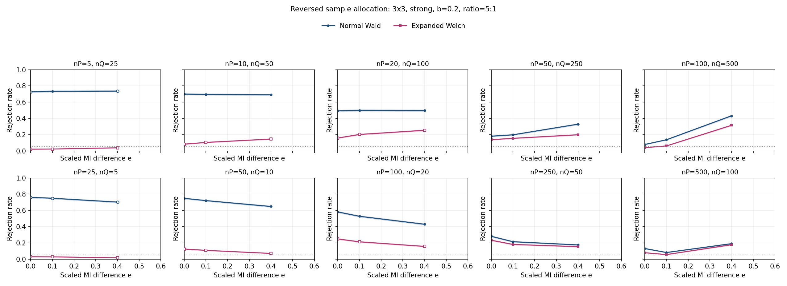

| Specification | Setting |
| --- | --- |
| Table shape | 3x3 |
| Population construction | Ordinal arrangement for P and reversed ordinal for Q |
| Horizontal graph regime specifications (columns) | {smaller n=5, smaller n=10, smaller n=20, smaller n=50, smaller n=100} |
| Vertical graph regime specifications (rows) | {Q larger, P larger}. $P$: row 1 and column 1 each have probability 0.9; $Q$: row 2 and column 3 each have probability 0.9; every other row has probability $0.1/2$, every other column $0.1/2$. These are row/column totals, not cell probabilities; they stay fixed across all panels and MI differences in this figure. |
| MI settings (nats) | M approximately 0.1922; b=0.2; I(P) approximately 0.03844; e in [0.0, 0.1, 0.4]; I(Q)=(b+e)M |
| Axes | e from 0 to 0.6; rejection rate from 0 to 1 |
| Replicates | 10,000 independent table pairs per point |

Exact rejection rates, intervals, validity and expected counts

| nP | nQ | e | Method | Rejection rate | 95% lower | 95% upper | Valid rate | Rejection rate among valid results | Minimum expected count P | Minimum expected count Q |
| --- | --- | --- | --- | --- | --- | --- | --- | --- | --- | --- |
| 5 | 25 | 0 | Expanded Welch | 0.0208 | 0.01818 | 0.02379 | 0.1965 | 0.1059 | 0.02134 | 0.001932 |
| 5 | 25 | 0 | Normal Wald | 0.7277 | 0.7189 | 0.7363 | 0.8902 | 0.8175 | 0.02134 | 0.001932 |
| 5 | 25 | 0.1 | Expanded Welch | 0.0227 | 0.01996 | 0.02581 | 0.1958 | 0.1159 | 0.02134 | 0.0007986 |
| 5 | 25 | 0.1 | Normal Wald | 0.7348 | 0.7261 | 0.7434 | 0.9012 | 0.8154 | 0.02134 | 0.0007986 |
| 5 | 25 | 0.4 | Expanded Welch | 0.038 | 0.03443 | 0.04193 | 0.1997 | 0.1903 | 0.02134 | 4.993e-05 |
| 5 | 25 | 0.4 | Normal Wald | 0.7363 | 0.7276 | 0.7448 | 0.8994 | 0.8187 | 0.02134 | 4.993e-05 |
| 10 | 50 | 0 | Expanded Welch | 0.0829 | 0.07765 | 0.08847 | 0.4611 | 0.1798 | 0.04268 | 0.003863 |
| 10 | 50 | 0 | Normal Wald | 0.699 | 0.6899 | 0.7079 | 0.9935 | 0.7036 | 0.04268 | 0.003863 |
| 10 | 50 | 0.1 | Expanded Welch | 0.104 | 0.09817 | 0.1101 | 0.4725 | 0.2201 | 0.04268 | 0.001597 |
| 10 | 50 | 0.1 | Normal Wald | 0.6966 | 0.6875 | 0.7055 | 0.9949 | 0.7002 | 0.04268 | 0.001597 |
| 10 | 50 | 0.4 | Expanded Welch | 0.1458 | 0.139 | 0.1529 | 0.4799 | 0.3038 | 0.04268 | 9.986e-05 |
| 10 | 50 | 0.4 | Normal Wald | 0.6916 | 0.6825 | 0.7006 | 0.9941 | 0.6957 | 0.04268 | 9.986e-05 |
| 20 | 100 | 0 | Expanded Welch | 0.158 | 0.151 | 0.1653 | 0.7812 | 0.2023 | 0.08536 | 0.007727 |
| 20 | 100 | 0 | Normal Wald | 0.4939 | 0.4841 | 0.5037 | 1 | 0.4939 | 0.08536 | 0.007727 |
| 20 | 100 | 0.1 | Expanded Welch | 0.202 | 0.1942 | 0.21 | 0.7778 | 0.2597 | 0.08536 | 0.003195 |
| 20 | 100 | 0.1 | Normal Wald | 0.5001 | 0.4903 | 0.5099 | 1 | 0.5001 | 0.08536 | 0.003195 |
| 20 | 100 | 0.4 | Expanded Welch | 0.2537 | 0.2453 | 0.2623 | 0.7938 | 0.3196 | 0.08536 | 0.0001997 |
| 20 | 100 | 0.4 | Normal Wald | 0.497 | 0.4872 | 0.5068 | 1 | 0.497 | 0.08536 | 0.0001997 |
| 25 | 5 | 0 | Expanded Welch | 0.0294 | 0.02627 | 0.0329 | 0.1779 | 0.1653 | 0.1067 | 0.0003863 |
| 25 | 5 | 0 | Normal Wald | 0.7613 | 0.7528 | 0.7696 | 0.8924 | 0.8531 | 0.1067 | 0.0003863 |
| 25 | 5 | 0.1 | Expanded Welch | 0.0278 | 0.02475 | 0.03121 | 0.1842 | 0.1509 | 0.1067 | 0.0001597 |
| 25 | 5 | 0.1 | Normal Wald | 0.7499 | 0.7413 | 0.7583 | 0.8982 | 0.8349 | 0.1067 | 0.0001597 |
| 25 | 5 | 0.4 | Expanded Welch | 0.0165 | 0.01418 | 0.01919 | 0.2099 | 0.07861 | 0.1067 | 9.986e-06 |
| 25 | 5 | 0.4 | Normal Wald | 0.7026 | 0.6936 | 0.7115 | 0.8965 | 0.7837 | 0.1067 | 9.986e-06 |
| 50 | 10 | 0 | Expanded Welch | 0.1242 | 0.1179 | 0.1308 | 0.4607 | 0.2696 | 0.2134 | 0.0007727 |
| 50 | 10 | 0 | Normal Wald | 0.749 | 0.7404 | 0.7574 | 0.994 | 0.7535 | 0.2134 | 0.0007727 |
| 50 | 10 | 0.1 | Expanded Welch | 0.108 | 0.1021 | 0.1142 | 0.4597 | 0.2349 | 0.2134 | 0.0003195 |
| 50 | 10 | 0.1 | Normal Wald | 0.7209 | 0.712 | 0.7296 | 0.995 | 0.7245 | 0.2134 | 0.0003195 |
| 50 | 10 | 0.4 | Expanded Welch | 0.0702 | 0.06536 | 0.07537 | 0.4707 | 0.1491 | 0.2134 | 1.997e-05 |
| 50 | 10 | 0.4 | Normal Wald | 0.6484 | 0.639 | 0.6577 | 0.9948 | 0.6518 | 0.2134 | 1.997e-05 |
| 50 | 250 | 0 | Expanded Welch | 0.1378 | 0.1312 | 0.1447 | 0.9913 | 0.139 | 0.2134 | 0.01932 |
| 50 | 250 | 0 | Normal Wald | 0.1808 | 0.1734 | 0.1885 | 1 | 0.1808 | 0.2134 | 0.01932 |
| 50 | 250 | 0.1 | Expanded Welch | 0.1544 | 0.1475 | 0.1616 | 0.9908 | 0.1558 | 0.2134 | 0.007986 |
| 50 | 250 | 0.1 | Normal Wald | 0.1978 | 0.1901 | 0.2057 | 1 | 0.1978 | 0.2134 | 0.007986 |
| 50 | 250 | 0.4 | Expanded Welch | 0.1984 | 0.1907 | 0.2063 | 0.9899 | 0.2004 | 0.2134 | 0.0004993 |
| 50 | 250 | 0.4 | Normal Wald | 0.329 | 0.3199 | 0.3383 | 1 | 0.329 | 0.2134 | 0.0004993 |
| 100 | 20 | 0 | Expanded Welch | 0.2485 | 0.2401 | 0.2571 | 0.7804 | 0.3184 | 0.4268 | 0.001545 |
| 100 | 20 | 0 | Normal Wald | 0.5816 | 0.5719 | 0.5912 | 1 | 0.5816 | 0.4268 | 0.001545 |
| 100 | 20 | 0.1 | Expanded Welch | 0.2131 | 0.2052 | 0.2212 | 0.7842 | 0.2717 | 0.4268 | 0.0006389 |
| 100 | 20 | 0.1 | Normal Wald | 0.5278 | 0.518 | 0.5376 | 1 | 0.5278 | 0.4268 | 0.0006389 |
| 100 | 20 | 0.4 | Expanded Welch | 0.1567 | 0.1497 | 0.164 | 0.791 | 0.1981 | 0.4268 | 3.995e-05 |
| 100 | 20 | 0.4 | Normal Wald | 0.4297 | 0.42 | 0.4394 | 0.9999 | 0.4297 | 0.4268 | 3.995e-05 |
| 100 | 500 | 0 | Expanded Welch | 0.0395 | 0.03586 | 0.0435 | 0.9999 | 0.0395 | 0.4268 | 0.03863 |
| 100 | 500 | 0 | Normal Wald | 0.0786 | 0.07349 | 0.08404 | 1 | 0.0786 | 0.4268 | 0.03863 |
| 100 | 500 | 0.1 | Expanded Welch | 0.061 | 0.05648 | 0.06586 | 1 | 0.061 | 0.4268 | 0.01597 |
| 100 | 500 | 0.1 | Normal Wald | 0.137 | 0.1304 | 0.1439 | 1 | 0.137 | 0.4268 | 0.01597 |
| 100 | 500 | 0.4 | Expanded Welch | 0.315 | 0.306 | 0.3242 | 0.9999 | 0.315 | 0.4268 | 0.0009986 |
| 100 | 500 | 0.4 | Normal Wald | 0.4322 | 0.4225 | 0.4419 | 1 | 0.4322 | 0.4268 | 0.0009986 |
| 250 | 50 | 0 | Expanded Welch | 0.2327 | 0.2245 | 0.2411 | 0.9884 | 0.2354 | 1.067 | 0.003863 |
| 250 | 50 | 0 | Normal Wald | 0.2809 | 0.2722 | 0.2898 | 1 | 0.2809 | 1.067 | 0.003863 |
| 250 | 50 | 0.1 | Expanded Welch | 0.1808 | 0.1734 | 0.1885 | 0.9884 | 0.1829 | 1.067 | 0.001597 |
| 250 | 50 | 0.1 | Normal Wald | 0.2145 | 0.2066 | 0.2227 | 1 | 0.2145 | 1.067 | 0.001597 |
| 250 | 50 | 0.4 | Expanded Welch | 0.1535 | 0.1466 | 0.1607 | 0.9897 | 0.1551 | 1.067 | 9.986e-05 |
| 250 | 50 | 0.4 | Normal Wald | 0.1748 | 0.1675 | 0.1824 | 1 | 0.1748 | 1.067 | 9.986e-05 |
| 500 | 100 | 0 | Expanded Welch | 0.079 | 0.07387 | 0.08445 | 1 | 0.079 | 2.134 | 0.007727 |
| 500 | 100 | 0 | Normal Wald | 0.1307 | 0.1242 | 0.1374 | 1 | 0.1307 | 2.134 | 0.007727 |
| 500 | 100 | 0.1 | Expanded Welch | 0.0559 | 0.05157 | 0.06058 | 1 | 0.0559 | 2.134 | 0.003195 |
| 500 | 100 | 0.1 | Normal Wald | 0.0814 | 0.0762 | 0.08692 | 1 | 0.0814 | 2.134 | 0.003195 |
| 500 | 100 | 0.4 | Expanded Welch | 0.1774 | 0.17 | 0.185 | 1 | 0.1774 | 2.134 | 0.0001997 |
| 500 | 100 | 0.4 | Normal Wald | 0.1906 | 0.183 | 0.1984 | 1 | 0.1906 | 2.134 | 0.0001997 |

### 5.10 Reversed sample allocation: 3x3, ultra, b=0.2, ratio=10:1

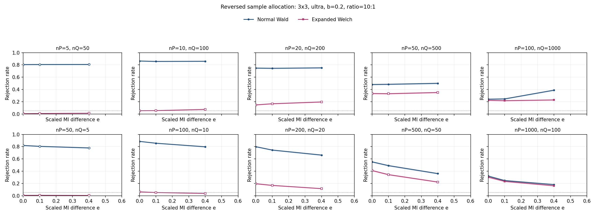

| Specification | Setting |
| --- | --- |
| Table shape | 3x3 |
| Population construction | Ordinal arrangement for P and reversed ordinal for Q |
| Horizontal graph regime specifications (columns) | {smaller n=5, smaller n=10, smaller n=20, smaller n=50, smaller n=100} |
| Vertical graph regime specifications (rows) | {Q larger, P larger}. $P$: row 1 and column 1 each have probability 0.95; $Q$: row 2 and column 3 each have probability 0.95; every other row has probability $0.05/2$, every other column $0.05/2$. These are row/column totals, not cell probabilities; they stay fixed across all panels and MI differences in this figure. |
| MI settings (nats) | M approximately 0.113; b=0.2; I(P) approximately 0.0226; e in [0.0, 0.1, 0.4]; I(Q)=(b+e)M |
| Axes | e from 0 to 0.6; rejection rate from 0 to 1 |
| Replicates | 10,000 independent table pairs per point |

Exact rejection rates, intervals, validity and expected counts

| nP | nQ | e | Method | Rejection rate | 95% lower | 95% upper | Valid rate | Rejection rate among valid results | Minimum expected count P | Minimum expected count Q |
| --- | --- | --- | --- | --- | --- | --- | --- | --- | --- | --- |
| 5 | 50 | 0 | Expanded Welch | 0.0048 | 0.003622 | 0.006358 | 0.0767 | 0.06258 | 0.006448 | 0.0005424 |
| 5 | 50 | 0 | Normal Wald | 0.8055 | 0.7976 | 0.8131 | 0.8738 | 0.9218 | 0.006448 | 0.0005424 |
| 5 | 50 | 0.1 | Expanded Welch | 0.0073 | 0.00581 | 0.009168 | 0.0754 | 0.09682 | 0.006448 | 0.0002265 |
| 5 | 50 | 0.1 | Normal Wald | 0.8068 | 0.7989 | 0.8144 | 0.8742 | 0.9229 | 0.006448 | 0.0002265 |
| 5 | 50 | 0.4 | Expanded Welch | 0.0124 | 0.01041 | 0.01476 | 0.0769 | 0.1612 | 0.006448 | 1.54e-05 |
| 5 | 50 | 0.4 | Normal Wald | 0.8075 | 0.7997 | 0.8151 | 0.8734 | 0.9245 | 0.006448 | 1.54e-05 |
| 10 | 100 | 0 | Expanded Welch | 0.0527 | 0.04849 | 0.05725 | 0.2103 | 0.2506 | 0.0129 | 0.001085 |
| 10 | 100 | 0 | Normal Wald | 0.8639 | 0.857 | 0.8705 | 0.9936 | 0.8695 | 0.0129 | 0.001085 |
| 10 | 100 | 0.1 | Expanded Welch | 0.0548 | 0.05051 | 0.05943 | 0.2051 | 0.2672 | 0.0129 | 0.000453 |
| 10 | 100 | 0.1 | Normal Wald | 0.8569 | 0.8499 | 0.8636 | 0.9904 | 0.8652 | 0.0129 | 0.000453 |
| 10 | 100 | 0.4 | Expanded Welch | 0.0744 | 0.06942 | 0.07971 | 0.2154 | 0.3454 | 0.0129 | 3.081e-05 |
| 10 | 100 | 0.4 | Normal Wald | 0.8596 | 0.8527 | 0.8663 | 0.9914 | 0.8671 | 0.0129 | 3.081e-05 |
| 20 | 200 | 0 | Expanded Welch | 0.1475 | 0.1407 | 0.1546 | 0.4484 | 0.3289 | 0.02579 | 0.00217 |
| 20 | 200 | 0 | Normal Wald | 0.7481 | 0.7395 | 0.7565 | 1 | 0.7481 | 0.02579 | 0.00217 |
| 20 | 200 | 0.1 | Expanded Welch | 0.1663 | 0.1591 | 0.1737 | 0.4526 | 0.3674 | 0.02579 | 0.000906 |
| 20 | 200 | 0.1 | Normal Wald | 0.7447 | 0.7361 | 0.7532 | 1 | 0.7447 | 0.02579 | 0.000906 |
| 20 | 200 | 0.4 | Expanded Welch | 0.1955 | 0.1878 | 0.2034 | 0.4508 | 0.4337 | 0.02579 | 6.162e-05 |
| 20 | 200 | 0.4 | Normal Wald | 0.7521 | 0.7435 | 0.7605 | 0.9999 | 0.7522 | 0.02579 | 6.162e-05 |
| 50 | 5 | 0 | Expanded Welch | 0.0059 | 0.004577 | 0.007602 | 0.0636 | 0.09277 | 0.06448 | 5.424e-05 |
| 50 | 5 | 0 | Normal Wald | 0.82 | 0.8123 | 0.8274 | 0.8717 | 0.9407 | 0.06448 | 5.424e-05 |
| 50 | 5 | 0.1 | Expanded Welch | 0.007 | 0.005545 | 0.008834 | 0.0799 | 0.08761 | 0.06448 | 2.265e-05 |
| 50 | 5 | 0.1 | Normal Wald | 0.8054 | 0.7975 | 0.813 | 0.8768 | 0.9186 | 0.06448 | 2.265e-05 |
| 50 | 5 | 0.4 | Expanded Welch | 0.0043 | 0.003194 | 0.005787 | 0.0924 | 0.04654 | 0.06448 | 1.54e-06 |
| 50 | 5 | 0.4 | Normal Wald | 0.7796 | 0.7714 | 0.7876 | 0.8698 | 0.8963 | 0.06448 | 1.54e-06 |
| 50 | 500 | 0 | Expanded Welch | 0.333 | 0.3238 | 0.3423 | 0.8628 | 0.386 | 0.06448 | 0.005424 |
| 50 | 500 | 0 | Normal Wald | 0.4803 | 0.4705 | 0.4901 | 1 | 0.4803 | 0.06448 | 0.005424 |
| 50 | 500 | 0.1 | Expanded Welch | 0.3302 | 0.321 | 0.3395 | 0.8507 | 0.3882 | 0.06448 | 0.002265 |
| 50 | 500 | 0.1 | Normal Wald | 0.4837 | 0.4739 | 0.4935 | 1 | 0.4837 | 0.06448 | 0.002265 |
| 50 | 500 | 0.4 | Expanded Welch | 0.3497 | 0.3404 | 0.3591 | 0.8641 | 0.4047 | 0.06448 | 0.000154 |
| 50 | 500 | 0.4 | Normal Wald | 0.4994 | 0.4896 | 0.5092 | 1 | 0.4994 | 0.06448 | 0.000154 |
| 100 | 10 | 0 | Expanded Welch | 0.0634 | 0.05879 | 0.06835 | 0.1953 | 0.3246 | 0.129 | 0.0001085 |
| 100 | 10 | 0 | Normal Wald | 0.8866 | 0.8802 | 0.8927 | 0.9915 | 0.8942 | 0.129 | 0.0001085 |
| 100 | 10 | 0.1 | Expanded Welch | 0.0519 | 0.04772 | 0.05642 | 0.2105 | 0.2466 | 0.129 | 4.53e-05 |
| 100 | 10 | 0.1 | Normal Wald | 0.8564 | 0.8494 | 0.8631 | 0.9911 | 0.8641 | 0.129 | 4.53e-05 |
| 100 | 10 | 0.4 | Expanded Welch | 0.0365 | 0.033 | 0.04036 | 0.2411 | 0.1514 | 0.129 | 3.081e-06 |
| 100 | 10 | 0.4 | Normal Wald | 0.7981 | 0.7901 | 0.8059 | 0.9915 | 0.8049 | 0.129 | 3.081e-06 |
| 100 | 1000 | 0 | Expanded Welch | 0.2229 | 0.2149 | 0.2312 | 0.9881 | 0.2256 | 0.129 | 0.01085 |
| 100 | 1000 | 0 | Normal Wald | 0.2408 | 0.2325 | 0.2493 | 1 | 0.2408 | 0.129 | 0.01085 |
| 100 | 1000 | 0.1 | Expanded Welch | 0.2165 | 0.2085 | 0.2247 | 0.9886 | 0.219 | 0.129 | 0.00453 |
| 100 | 1000 | 0.1 | Normal Wald | 0.2456 | 0.2373 | 0.2541 | 1 | 0.2456 | 0.129 | 0.00453 |
| 100 | 1000 | 0.4 | Expanded Welch | 0.2285 | 0.2204 | 0.2368 | 0.9869 | 0.2315 | 0.129 | 0.0003081 |
| 100 | 1000 | 0.4 | Normal Wald | 0.3879 | 0.3784 | 0.3975 | 1 | 0.3879 | 0.129 | 0.0003081 |
| 200 | 20 | 0 | Expanded Welch | 0.1956 | 0.1879 | 0.2035 | 0.4339 | 0.4508 | 0.2579 | 0.000217 |
| 200 | 20 | 0 | Normal Wald | 0.7998 | 0.7918 | 0.8075 | 0.9999 | 0.7999 | 0.2579 | 0.000217 |
| 200 | 20 | 0.1 | Expanded Welch | 0.1682 | 0.161 | 0.1757 | 0.4578 | 0.3674 | 0.2579 | 9.06e-05 |
| 200 | 20 | 0.1 | Normal Wald | 0.7449 | 0.7363 | 0.7533 | 1 | 0.7449 | 0.2579 | 9.06e-05 |
| 200 | 20 | 0.4 | Expanded Welch | 0.1155 | 0.1094 | 0.1219 | 0.4736 | 0.2439 | 0.2579 | 6.162e-06 |
| 200 | 20 | 0.4 | Normal Wald | 0.6628 | 0.6535 | 0.672 | 1 | 0.6628 | 0.2579 | 6.162e-06 |
| 500 | 50 | 0 | Expanded Welch | 0.4105 | 0.4009 | 0.4202 | 0.8623 | 0.4761 | 0.6448 | 0.0005424 |
| 500 | 50 | 0 | Normal Wald | 0.5522 | 0.5424 | 0.5619 | 1 | 0.5522 | 0.6448 | 0.0005424 |
| 500 | 50 | 0.1 | Expanded Welch | 0.3435 | 0.3343 | 0.3529 | 0.856 | 0.4013 | 0.6448 | 0.0002265 |
| 500 | 50 | 0.1 | Normal Wald | 0.4907 | 0.4809 | 0.5005 | 1 | 0.4907 | 0.6448 | 0.0002265 |
| 500 | 50 | 0.4 | Expanded Welch | 0.223 | 0.2149 | 0.2313 | 0.8664 | 0.2574 | 0.6448 | 1.54e-05 |
| 500 | 50 | 0.4 | Normal Wald | 0.3605 | 0.3511 | 0.37 | 1 | 0.3605 | 0.6448 | 1.54e-05 |
| 1000 | 100 | 0 | Expanded Welch | 0.3025 | 0.2936 | 0.3116 | 0.988 | 0.3062 | 1.29 | 0.001085 |
| 1000 | 100 | 0 | Normal Wald | 0.3199 | 0.3108 | 0.3291 | 1 | 0.3199 | 1.29 | 0.001085 |
| 1000 | 100 | 0.1 | Expanded Welch | 0.2334 | 0.2252 | 0.2418 | 0.9883 | 0.2362 | 1.29 | 0.000453 |
| 1000 | 100 | 0.1 | Normal Wald | 0.2472 | 0.2388 | 0.2558 | 1 | 0.2472 | 1.29 | 0.000453 |
| 1000 | 100 | 0.4 | Expanded Welch | 0.1621 | 0.155 | 0.1695 | 0.9867 | 0.1643 | 1.29 | 3.081e-05 |
| 1000 | 100 | 0.4 | Normal Wald | 0.1817 | 0.1743 | 0.1894 | 1 | 0.1817 | 1.29 | 3.081e-05 |

### 5.11 Reversed sample allocation: 3x3, ultra, b=0.2, ratio=2:1

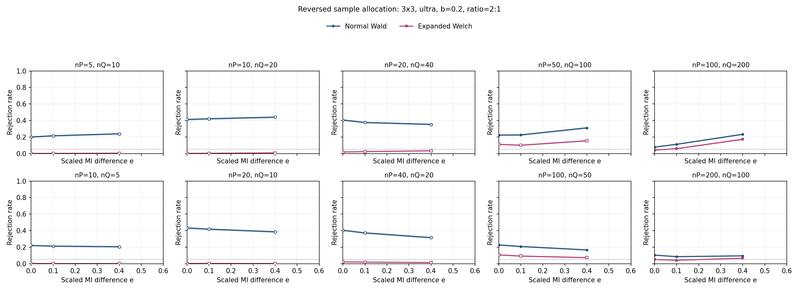

| Specification | Setting |
| --- | --- |
| Table shape | 3x3 |
| Population construction | Ordinal arrangement for P and reversed ordinal for Q |
| Horizontal graph regime specifications (columns) | {smaller n=5, smaller n=10, smaller n=20, smaller n=50, smaller n=100} |
| Vertical graph regime specifications (rows) | {Q larger, P larger}. $P$: row 1 and column 1 each have probability 0.95; $Q$: row 2 and column 3 each have probability 0.95; every other row has probability $0.05/2$, every other column $0.05/2$. These are row/column totals, not cell probabilities; they stay fixed across all panels and MI differences in this figure. |
| MI settings (nats) | M approximately 0.113; b=0.2; I(P) approximately 0.0226; e in [0.0, 0.1, 0.4]; I(Q)=(b+e)M |
| Axes | e from 0 to 0.6; rejection rate from 0 to 1 |
| Replicates | 10,000 independent table pairs per point |

Exact rejection rates, intervals, validity and expected counts

| nP | nQ | e | Method | Rejection rate | 95% lower | 95% upper | Valid rate | Rejection rate among valid results | Minimum expected count P | Minimum expected count Q |
| --- | --- | --- | --- | --- | --- | --- | --- | --- | --- | --- |
| 5 | 10 | 0 | Expanded Welch | 0.0012 | 0.0006866 | 0.002096 | 0.0187 | 0.06417 | 0.006448 | 0.0001085 |
| 5 | 10 | 0 | Normal Wald | 0.1998 | 0.1921 | 0.2078 | 0.2703 | 0.7392 | 0.006448 | 0.0001085 |
| 5 | 10 | 0.1 | Expanded Welch | 0.0016 | 0.0009851 | 0.002598 | 0.0173 | 0.09249 | 0.006448 | 4.53e-05 |
| 5 | 10 | 0.1 | Normal Wald | 0.2149 | 0.207 | 0.2231 | 0.2783 | 0.7722 | 0.006448 | 4.53e-05 |
| 5 | 10 | 0.4 | Expanded Welch | 0.0037 | 0.002686 | 0.005096 | 0.0248 | 0.1492 | 0.006448 | 3.081e-06 |
| 5 | 10 | 0.4 | Normal Wald | 0.2389 | 0.2306 | 0.2474 | 0.3167 | 0.7543 | 0.006448 | 3.081e-06 |
| 10 | 5 | 0 | Expanded Welch | 0.0025 | 0.001694 | 0.003688 | 0.0178 | 0.1404 | 0.0129 | 5.424e-05 |
| 10 | 5 | 0 | Normal Wald | 0.2203 | 0.2123 | 0.2285 | 0.2816 | 0.7823 | 0.0129 | 5.424e-05 |
| 10 | 5 | 0.1 | Expanded Welch | 0.0011 | 0.0006144 | 0.001969 | 0.0187 | 0.05882 | 0.0129 | 2.265e-05 |
| 10 | 5 | 0.1 | Normal Wald | 0.2123 | 0.2044 | 0.2204 | 0.2881 | 0.7369 | 0.0129 | 2.265e-05 |
| 10 | 5 | 0.4 | Expanded Welch | 0.0012 | 0.0006866 | 0.002096 | 0.024 | 0.05 | 0.0129 | 1.54e-06 |
| 10 | 5 | 0.4 | Normal Wald | 0.2047 | 0.1969 | 0.2127 | 0.3017 | 0.6785 | 0.0129 | 1.54e-06 |
| 10 | 20 | 0 | Expanded Welch | 0.0016 | 0.0009851 | 0.002598 | 0.0905 | 0.01768 | 0.0129 | 0.000217 |
| 10 | 20 | 0 | Normal Wald | 0.412 | 0.4024 | 0.4217 | 0.5552 | 0.7421 | 0.0129 | 0.000217 |
| 10 | 20 | 0.1 | Expanded Welch | 0.003 | 0.002102 | 0.004279 | 0.0969 | 0.03096 | 0.0129 | 9.06e-05 |
| 10 | 20 | 0.1 | Normal Wald | 0.4207 | 0.4111 | 0.4304 | 0.563 | 0.7472 | 0.0129 | 9.06e-05 |
| 10 | 20 | 0.4 | Expanded Welch | 0.0073 | 0.00581 | 0.009168 | 0.1041 | 0.07012 | 0.0129 | 6.162e-06 |
| 10 | 20 | 0.4 | Normal Wald | 0.4402 | 0.4305 | 0.45 | 0.5808 | 0.7579 | 0.0129 | 6.162e-06 |
| 20 | 10 | 0 | Expanded Welch | 0.0027 | 0.001856 | 0.003926 | 0.0858 | 0.03147 | 0.02579 | 0.0001085 |
| 20 | 10 | 0 | Normal Wald | 0.4322 | 0.4225 | 0.4419 | 0.5599 | 0.7719 | 0.02579 | 0.0001085 |
| 20 | 10 | 0.1 | Expanded Welch | 0.0027 | 0.001856 | 0.003926 | 0.0948 | 0.02848 | 0.02579 | 4.53e-05 |
| 20 | 10 | 0.1 | Normal Wald | 0.4175 | 0.4079 | 0.4272 | 0.5632 | 0.7413 | 0.02579 | 4.53e-05 |
| 20 | 10 | 0.4 | Expanded Welch | 0.0017 | 0.001062 | 0.002721 | 0.114 | 0.01491 | 0.02579 | 3.081e-06 |
| 20 | 10 | 0.4 | Normal Wald | 0.3855 | 0.376 | 0.3951 | 0.5789 | 0.6659 | 0.02579 | 3.081e-06 |
| 20 | 40 | 0 | Expanded Welch | 0.018 | 0.01557 | 0.0208 | 0.3432 | 0.05245 | 0.02579 | 0.0004339 |
| 20 | 40 | 0 | Normal Wald | 0.4053 | 0.3957 | 0.415 | 0.8737 | 0.4639 | 0.02579 | 0.0004339 |
| 20 | 40 | 0.1 | Expanded Welch | 0.023 | 0.02024 | 0.02613 | 0.3428 | 0.06709 | 0.02579 | 0.0001812 |
| 20 | 40 | 0.1 | Normal Wald | 0.3762 | 0.3668 | 0.3857 | 0.8737 | 0.4306 | 0.02579 | 0.0001812 |
| 20 | 40 | 0.4 | Expanded Welch | 0.0333 | 0.02996 | 0.037 | 0.3468 | 0.09602 | 0.02579 | 1.232e-05 |
| 20 | 40 | 0.4 | Normal Wald | 0.3525 | 0.3432 | 0.3619 | 0.8808 | 0.4002 | 0.02579 | 1.232e-05 |
| 40 | 20 | 0 | Expanded Welch | 0.0213 | 0.01865 | 0.02432 | 0.3379 | 0.06304 | 0.05158 | 0.000217 |
| 40 | 20 | 0 | Normal Wald | 0.4043 | 0.3947 | 0.414 | 0.8777 | 0.4606 | 0.05158 | 0.000217 |
| 40 | 20 | 0.1 | Expanded Welch | 0.0187 | 0.01622 | 0.02155 | 0.351 | 0.05328 | 0.05158 | 9.06e-05 |
| 40 | 20 | 0.1 | Normal Wald | 0.3722 | 0.3628 | 0.3817 | 0.8793 | 0.4233 | 0.05158 | 9.06e-05 |
| 40 | 20 | 0.4 | Expanded Welch | 0.0139 | 0.01178 | 0.01639 | 0.3637 | 0.03822 | 0.05158 | 6.162e-06 |
| 40 | 20 | 0.4 | Normal Wald | 0.315 | 0.306 | 0.3242 | 0.8777 | 0.3589 | 0.05158 | 6.162e-06 |
| 50 | 100 | 0 | Expanded Welch | 0.1112 | 0.1052 | 0.1175 | 0.8533 | 0.1303 | 0.06448 | 0.001085 |
| 50 | 100 | 0 | Normal Wald | 0.2232 | 0.2151 | 0.2315 | 0.9976 | 0.2237 | 0.06448 | 0.001085 |
| 50 | 100 | 0.1 | Expanded Welch | 0.1004 | 0.09466 | 0.1064 | 0.8457 | 0.1187 | 0.06448 | 0.000453 |
| 50 | 100 | 0.1 | Normal Wald | 0.2251 | 0.217 | 0.2334 | 0.9986 | 0.2254 | 0.06448 | 0.000453 |
| 50 | 100 | 0.4 | Expanded Welch | 0.1544 | 0.1475 | 0.1616 | 0.8485 | 0.182 | 0.06448 | 3.081e-05 |
| 50 | 100 | 0.4 | Normal Wald | 0.3108 | 0.3018 | 0.3199 | 0.9987 | 0.3112 | 0.06448 | 3.081e-05 |
| 100 | 50 | 0 | Expanded Welch | 0.1066 | 0.1007 | 0.1128 | 0.8491 | 0.1255 | 0.129 | 0.0005424 |
| 100 | 50 | 0 | Normal Wald | 0.2269 | 0.2188 | 0.2352 | 0.9978 | 0.2274 | 0.129 | 0.0005424 |
| 100 | 50 | 0.1 | Expanded Welch | 0.0919 | 0.08639 | 0.09772 | 0.8401 | 0.1094 | 0.129 | 0.0002265 |
| 100 | 50 | 0.1 | Normal Wald | 0.208 | 0.2002 | 0.2161 | 0.9976 | 0.2085 | 0.129 | 0.0002265 |
| 100 | 50 | 0.4 | Expanded Welch | 0.0731 | 0.06816 | 0.07837 | 0.8538 | 0.08562 | 0.129 | 1.54e-05 |
| 100 | 50 | 0.4 | Normal Wald | 0.1665 | 0.1593 | 0.1739 | 0.9988 | 0.1667 | 0.129 | 1.54e-05 |
| 100 | 200 | 0 | Expanded Welch | 0.0412 | 0.03748 | 0.04527 | 0.9871 | 0.04174 | 0.129 | 0.00217 |
| 100 | 200 | 0 | Normal Wald | 0.078 | 0.0729 | 0.08342 | 1 | 0.078 | 0.129 | 0.00217 |
| 100 | 200 | 0.1 | Expanded Welch | 0.059 | 0.05455 | 0.06379 | 0.9873 | 0.05976 | 0.129 | 0.000906 |
| 100 | 200 | 0.1 | Normal Wald | 0.1117 | 0.1057 | 0.118 | 1 | 0.1117 | 0.129 | 0.000906 |
| 100 | 200 | 0.4 | Expanded Welch | 0.1724 | 0.1651 | 0.1799 | 0.9894 | 0.1742 | 0.129 | 6.162e-05 |
| 100 | 200 | 0.4 | Normal Wald | 0.2333 | 0.2251 | 0.2417 | 1 | 0.2333 | 0.129 | 6.162e-05 |
| 200 | 100 | 0 | Expanded Welch | 0.05 | 0.0459 | 0.05445 | 0.9886 | 0.05058 | 0.2579 | 0.001085 |
| 200 | 100 | 0 | Normal Wald | 0.1033 | 0.09749 | 0.1094 | 1 | 0.1033 | 0.2579 | 0.001085 |
| 200 | 100 | 0.1 | Expanded Welch | 0.0414 | 0.03767 | 0.04548 | 0.9886 | 0.04188 | 0.2579 | 0.000453 |
| 200 | 100 | 0.1 | Normal Wald | 0.0851 | 0.07979 | 0.09073 | 1 | 0.0851 | 0.2579 | 0.000453 |
| 200 | 100 | 0.4 | Expanded Welch | 0.0658 | 0.06111 | 0.07083 | 0.9892 | 0.06652 | 0.2579 | 3.081e-05 |
| 200 | 100 | 0.4 | Normal Wald | 0.0948 | 0.08921 | 0.1007 | 1 | 0.0948 | 0.2579 | 3.081e-05 |

### 5.12 Reversed sample allocation: 3x3, ultra, b=0.2, ratio=5:1

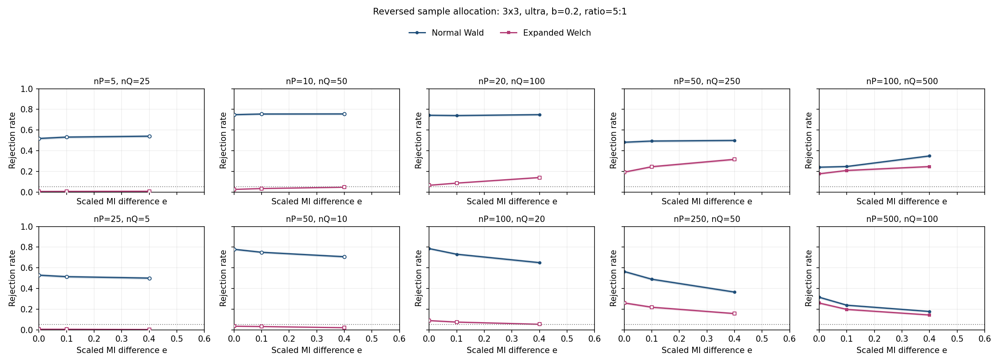

| Specification | Setting |
| --- | --- |
| Table shape | 3x3 |
| Population construction | Ordinal arrangement for P and reversed ordinal for Q |
| Horizontal graph regime specifications (columns) | {smaller n=5, smaller n=10, smaller n=20, smaller n=50, smaller n=100} |
| Vertical graph regime specifications (rows) | {Q larger, P larger}. $P$: row 1 and column 1 each have probability 0.95; $Q$: row 2 and column 3 each have probability 0.95; every other row has probability $0.05/2$, every other column $0.05/2$. These are row/column totals, not cell probabilities; they stay fixed across all panels and MI differences in this figure. |
| MI settings (nats) | M approximately 0.113; b=0.2; I(P) approximately 0.0226; e in [0.0, 0.1, 0.4]; I(Q)=(b+e)M |
| Axes | e from 0 to 0.6; rejection rate from 0 to 1 |
| Replicates | 10,000 independent table pairs per point |

Exact rejection rates, intervals, validity and expected counts

| nP | nQ | e | Method | Rejection rate | 95% lower | 95% upper | Valid rate | Rejection rate among valid results | Minimum expected count P | Minimum expected count Q |
| --- | --- | --- | --- | --- | --- | --- | --- | --- | --- | --- |
| 5 | 25 | 0 | Expanded Welch | 0.0053 | 0.004055 | 0.006925 | 0.0526 | 0.1008 | 0.006448 | 0.0002712 |
| 5 | 25 | 0 | Normal Wald | 0.5182 | 0.5084 | 0.528 | 0.5912 | 0.8765 | 0.006448 | 0.0002712 |
| 5 | 25 | 0.1 | Expanded Welch | 0.0059 | 0.004577 | 0.007602 | 0.0486 | 0.1214 | 0.006448 | 0.0001133 |
| 5 | 25 | 0.1 | Normal Wald | 0.5316 | 0.5218 | 0.5414 | 0.6006 | 0.8851 | 0.006448 | 0.0001133 |
| 5 | 25 | 0.4 | Expanded Welch | 0.0072 | 0.005722 | 0.009057 | 0.0468 | 0.1538 | 0.006448 | 7.702e-06 |
| 5 | 25 | 0.4 | Normal Wald | 0.5403 | 0.5305 | 0.5501 | 0.6104 | 0.8852 | 0.006448 | 7.702e-06 |
| 10 | 50 | 0 | Expanded Welch | 0.0254 | 0.02249 | 0.02867 | 0.1804 | 0.1408 | 0.0129 | 0.0005424 |
| 10 | 50 | 0 | Normal Wald | 0.7489 | 0.7403 | 0.7573 | 0.8822 | 0.8489 | 0.0129 | 0.0005424 |
| 10 | 50 | 0.1 | Expanded Welch | 0.0337 | 0.03034 | 0.03742 | 0.1829 | 0.1843 | 0.0129 | 0.0002265 |
| 10 | 50 | 0.1 | Normal Wald | 0.7552 | 0.7467 | 0.7635 | 0.8903 | 0.8483 | 0.0129 | 0.0002265 |
| 10 | 50 | 0.4 | Expanded Welch | 0.0466 | 0.04264 | 0.05091 | 0.1781 | 0.2617 | 0.0129 | 1.54e-05 |
| 10 | 50 | 0.4 | Normal Wald | 0.756 | 0.7475 | 0.7643 | 0.8876 | 0.8517 | 0.0129 | 1.54e-05 |
| 20 | 100 | 0 | Expanded Welch | 0.0652 | 0.06053 | 0.07021 | 0.4544 | 0.1435 | 0.02579 | 0.001085 |
| 20 | 100 | 0 | Normal Wald | 0.7432 | 0.7345 | 0.7517 | 0.9934 | 0.7481 | 0.02579 | 0.001085 |
| 20 | 100 | 0.1 | Expanded Welch | 0.0864 | 0.08105 | 0.09207 | 0.4445 | 0.1944 | 0.02579 | 0.000453 |
| 20 | 100 | 0.1 | Normal Wald | 0.7402 | 0.7315 | 0.7487 | 0.9932 | 0.7453 | 0.02579 | 0.000453 |
| 20 | 100 | 0.4 | Expanded Welch | 0.1403 | 0.1336 | 0.1472 | 0.4389 | 0.3197 | 0.02579 | 3.081e-05 |
| 20 | 100 | 0.4 | Normal Wald | 0.749 | 0.7404 | 0.7574 | 0.9937 | 0.7537 | 0.02579 | 3.081e-05 |
| 25 | 5 | 0 | Expanded Welch | 0.0054 | 0.004141 | 0.007039 | 0.0425 | 0.1271 | 0.03224 | 5.424e-05 |
| 25 | 5 | 0 | Normal Wald | 0.5288 | 0.519 | 0.5386 | 0.5857 | 0.9029 | 0.03224 | 5.424e-05 |
| 25 | 5 | 0.1 | Expanded Welch | 0.0052 | 0.003968 | 0.006812 | 0.0499 | 0.1042 | 0.03224 | 2.265e-05 |
| 25 | 5 | 0.1 | Normal Wald | 0.5142 | 0.5044 | 0.524 | 0.5846 | 0.8796 | 0.03224 | 2.265e-05 |
| 25 | 5 | 0.4 | Expanded Welch | 0.0026 | 0.001775 | 0.003807 | 0.0617 | 0.04214 | 0.03224 | 1.54e-06 |
| 25 | 5 | 0.4 | Normal Wald | 0.5004 | 0.4906 | 0.5102 | 0.6002 | 0.8337 | 0.03224 | 1.54e-06 |
| 50 | 10 | 0 | Expanded Welch | 0.0348 | 0.03138 | 0.03857 | 0.167 | 0.2084 | 0.06448 | 0.0001085 |
| 50 | 10 | 0 | Normal Wald | 0.7795 | 0.7713 | 0.7875 | 0.8863 | 0.8795 | 0.06448 | 0.0001085 |
| 50 | 10 | 0.1 | Expanded Welch | 0.0314 | 0.02816 | 0.035 | 0.1874 | 0.1676 | 0.06448 | 4.53e-05 |
| 50 | 10 | 0.1 | Normal Wald | 0.7504 | 0.7418 | 0.7588 | 0.8894 | 0.8437 | 0.06448 | 4.53e-05 |
| 50 | 10 | 0.4 | Expanded Welch | 0.0201 | 0.01753 | 0.02304 | 0.1981 | 0.1015 | 0.06448 | 3.081e-06 |
| 50 | 10 | 0.4 | Normal Wald | 0.7073 | 0.6983 | 0.7161 | 0.8895 | 0.7952 | 0.06448 | 3.081e-06 |
| 50 | 250 | 0 | Expanded Welch | 0.1922 | 0.1846 | 0.2 | 0.8587 | 0.2238 | 0.06448 | 0.002712 |
| 50 | 250 | 0 | Normal Wald | 0.4817 | 0.4719 | 0.4915 | 1 | 0.4817 | 0.06448 | 0.002712 |
| 50 | 250 | 0.1 | Expanded Welch | 0.2449 | 0.2366 | 0.2534 | 0.8521 | 0.2874 | 0.06448 | 0.001133 |
| 50 | 250 | 0.1 | Normal Wald | 0.4933 | 0.4835 | 0.5031 | 1 | 0.4933 | 0.06448 | 0.001133 |
| 50 | 250 | 0.4 | Expanded Welch | 0.3162 | 0.3072 | 0.3254 | 0.8515 | 0.3713 | 0.06448 | 7.702e-05 |
| 50 | 250 | 0.4 | Normal Wald | 0.4992 | 0.4894 | 0.509 | 1 | 0.4992 | 0.06448 | 7.702e-05 |
| 100 | 20 | 0 | Expanded Welch | 0.089 | 0.08358 | 0.09474 | 0.4349 | 0.2046 | 0.129 | 0.000217 |
| 100 | 20 | 0 | Normal Wald | 0.7862 | 0.7781 | 0.7941 | 0.9948 | 0.7903 | 0.129 | 0.000217 |
| 100 | 20 | 0.1 | Expanded Welch | 0.0747 | 0.06971 | 0.08002 | 0.4486 | 0.1665 | 0.129 | 9.06e-05 |
| 100 | 20 | 0.1 | Normal Wald | 0.7315 | 0.7227 | 0.7401 | 0.9938 | 0.7361 | 0.129 | 9.06e-05 |
| 100 | 20 | 0.4 | Expanded Welch | 0.0534 | 0.04916 | 0.05798 | 0.4757 | 0.1123 | 0.129 | 6.162e-06 |
| 100 | 20 | 0.4 | Normal Wald | 0.6501 | 0.6407 | 0.6594 | 0.9939 | 0.6541 | 0.129 | 6.162e-06 |
| 100 | 500 | 0 | Expanded Welch | 0.1766 | 0.1693 | 0.1842 | 0.986 | 0.1791 | 0.129 | 0.005424 |
| 100 | 500 | 0 | Normal Wald | 0.2401 | 0.2318 | 0.2486 | 1 | 0.2401 | 0.129 | 0.005424 |
| 100 | 500 | 0.1 | Expanded Welch | 0.2086 | 0.2007 | 0.2167 | 0.9893 | 0.2109 | 0.129 | 0.002265 |
| 100 | 500 | 0.1 | Normal Wald | 0.2471 | 0.2387 | 0.2556 | 1 | 0.2471 | 0.129 | 0.002265 |
| 100 | 500 | 0.4 | Expanded Welch | 0.2464 | 0.2381 | 0.2549 | 0.9896 | 0.249 | 0.129 | 0.000154 |
| 100 | 500 | 0.4 | Normal Wald | 0.3492 | 0.3399 | 0.3586 | 1 | 0.3492 | 0.129 | 0.000154 |
| 250 | 50 | 0 | Expanded Welch | 0.26 | 0.2515 | 0.2687 | 0.8542 | 0.3044 | 0.3224 | 0.0005424 |
| 250 | 50 | 0 | Normal Wald | 0.5644 | 0.5547 | 0.5741 | 1 | 0.5644 | 0.3224 | 0.0005424 |
| 250 | 50 | 0.1 | Expanded Welch | 0.2185 | 0.2105 | 0.2267 | 0.8576 | 0.2548 | 0.3224 | 0.0002265 |
| 250 | 50 | 0.1 | Normal Wald | 0.4894 | 0.4796 | 0.4992 | 1 | 0.4894 | 0.3224 | 0.0002265 |
| 250 | 50 | 0.4 | Expanded Welch | 0.157 | 0.15 | 0.1643 | 0.8664 | 0.1812 | 0.3224 | 1.54e-05 |
| 250 | 50 | 0.4 | Normal Wald | 0.3651 | 0.3557 | 0.3746 | 1 | 0.3651 | 0.3224 | 1.54e-05 |
| 500 | 100 | 0 | Expanded Welch | 0.2588 | 0.2503 | 0.2675 | 0.9883 | 0.2619 | 0.6448 | 0.001085 |
| 500 | 100 | 0 | Normal Wald | 0.3149 | 0.3059 | 0.3241 | 1 | 0.3149 | 0.6448 | 0.001085 |
| 500 | 100 | 0.1 | Expanded Welch | 0.1971 | 0.1894 | 0.205 | 0.9879 | 0.1995 | 0.6448 | 0.000453 |
| 500 | 100 | 0.1 | Normal Wald | 0.2379 | 0.2297 | 0.2463 | 1 | 0.2379 | 0.6448 | 0.000453 |
| 500 | 100 | 0.4 | Expanded Welch | 0.1432 | 0.1365 | 0.1502 | 0.9862 | 0.1452 | 0.6448 | 3.081e-05 |
| 500 | 100 | 0.4 | Normal Wald | 0.1773 | 0.1699 | 0.1849 | 1 | 0.1773 | 0.6448 | 3.081e-05 |

### 5.13 Reversed sample allocation: 5x5, strong, b=0.2, ratio=10:1

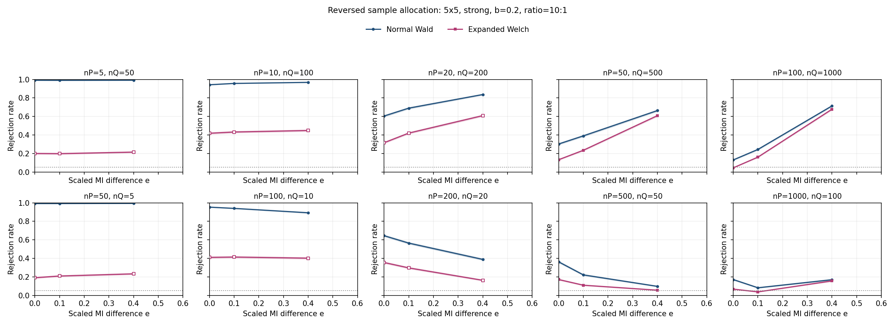

| Specification | Setting |
| --- | --- |
| Table shape | 5x5 |
| Population construction | Ordinal arrangement for P and reversed ordinal for Q |
| Horizontal graph regime specifications (columns) | {smaller n=5, smaller n=10, smaller n=20, smaller n=50, smaller n=100} |
| Vertical graph regime specifications (rows) | {Q larger, P larger}. $P$: row 1 and column 1 each have probability 0.9; $Q$: row 2 and column 5 each have probability 0.9; every other row has probability $0.1/4$, every other column $0.1/4$. These are row/column totals, not cell probabilities; they stay fixed across all panels and MI differences in this figure. |
| MI settings (nats) | M approximately 0.336; b=0.2; I(P) approximately 0.06721; e in [0.0, 0.1, 0.4]; I(Q)=(b+e)M |
| Axes | e from 0 to 0.6; rejection rate from 0 to 1 |
| Replicates | 10,000 independent table pairs per point |

Exact rejection rates, intervals, validity and expected counts

| nP | nQ | e | Method | Rejection rate | 95% lower | 95% upper | Valid rate | Rejection rate among valid results | Minimum expected count P | Minimum expected count Q |
| --- | --- | --- | --- | --- | --- | --- | --- | --- | --- | --- |
| 5 | 50 | 0 | Expanded Welch | 0.1997 | 0.192 | 0.2077 | 0.2425 | 0.8235 | 0.003113 | 0.001529 |
| 5 | 50 | 0 | Normal Wald | 0.9914 | 0.9894 | 0.993 | 0.9914 | 1 | 0.003113 | 0.001529 |
| 5 | 50 | 0.1 | Expanded Welch | 0.1978 | 0.1901 | 0.2057 | 0.2324 | 0.8511 | 0.003113 | 0.0004002 |
| 5 | 50 | 0.1 | Normal Wald | 0.9905 | 0.9884 | 0.9922 | 0.9906 | 0.9999 | 0.003113 | 0.0004002 |
| 5 | 50 | 0.4 | Expanded Welch | 0.2145 | 0.2066 | 0.2227 | 0.235 | 0.9128 | 0.003113 | 3.023e-08 |
| 5 | 50 | 0.4 | Normal Wald | 0.9918 | 0.9898 | 0.9934 | 0.9918 | 1 | 0.003113 | 3.023e-08 |
| 10 | 100 | 0 | Expanded Welch | 0.4183 | 0.4087 | 0.428 | 0.4862 | 0.8603 | 0.006226 | 0.003058 |
| 10 | 100 | 0 | Normal Wald | 0.9431 | 0.9384 | 0.9475 | 1 | 0.9431 | 0.006226 | 0.003058 |
| 10 | 100 | 0.1 | Expanded Welch | 0.4318 | 0.4221 | 0.4415 | 0.491 | 0.8794 | 0.006226 | 0.0008003 |
| 10 | 100 | 0.1 | Normal Wald | 0.9574 | 0.9533 | 0.9612 | 1 | 0.9574 | 0.006226 | 0.0008003 |
| 10 | 100 | 0.4 | Expanded Welch | 0.4482 | 0.4385 | 0.458 | 0.4946 | 0.9062 | 0.006226 | 6.046e-08 |
| 10 | 100 | 0.4 | Normal Wald | 0.9687 | 0.9651 | 0.9719 | 1 | 0.9687 | 0.006226 | 6.046e-08 |
| 20 | 200 | 0 | Expanded Welch | 0.316 | 0.307 | 0.3252 | 0.7861 | 0.402 | 0.01245 | 0.006117 |
| 20 | 200 | 0 | Normal Wald | 0.6046 | 0.595 | 0.6141 | 1 | 0.6046 | 0.01245 | 0.006117 |
| 20 | 200 | 0.1 | Expanded Welch | 0.42 | 0.4104 | 0.4297 | 0.7848 | 0.5352 | 0.01245 | 0.001601 |
| 20 | 200 | 0.1 | Normal Wald | 0.6899 | 0.6808 | 0.6989 | 1 | 0.6899 | 0.01245 | 0.001601 |
| 20 | 200 | 0.4 | Expanded Welch | 0.6091 | 0.5995 | 0.6186 | 0.7876 | 0.7734 | 0.01245 | 1.209e-07 |
| 20 | 200 | 0.4 | Normal Wald | 0.8372 | 0.8298 | 0.8443 | 1 | 0.8372 | 0.01245 | 1.209e-07 |
| 50 | 5 | 0 | Expanded Welch | 0.1908 | 0.1832 | 0.1986 | 0.2248 | 0.8488 | 0.03113 | 0.0001529 |
| 50 | 5 | 0 | Normal Wald | 0.9925 | 0.9906 | 0.994 | 0.9927 | 0.9998 | 0.03113 | 0.0001529 |
| 50 | 5 | 0.1 | Expanded Welch | 0.2088 | 0.2009 | 0.2169 | 0.2498 | 0.8359 | 0.03113 | 4.002e-05 |
| 50 | 5 | 0.1 | Normal Wald | 0.9926 | 0.9907 | 0.9941 | 0.9926 | 1 | 0.03113 | 4.002e-05 |
| 50 | 5 | 0.4 | Expanded Welch | 0.2325 | 0.2243 | 0.2409 | 0.298 | 0.7802 | 0.03113 | 3.023e-09 |
| 50 | 5 | 0.4 | Normal Wald | 0.9942 | 0.9925 | 0.9955 | 0.9943 | 0.9999 | 0.03113 | 3.023e-09 |
| 50 | 500 | 0 | Expanded Welch | 0.1326 | 0.1261 | 0.1394 | 0.9897 | 0.134 | 0.03113 | 0.01529 |
| 50 | 500 | 0 | Normal Wald | 0.3024 | 0.2935 | 0.3115 | 1 | 0.3024 | 0.03113 | 0.01529 |
| 50 | 500 | 0.1 | Expanded Welch | 0.2344 | 0.2262 | 0.2428 | 0.9907 | 0.2366 | 0.03113 | 0.004002 |
| 50 | 500 | 0.1 | Normal Wald | 0.3901 | 0.3806 | 0.3997 | 1 | 0.3901 | 0.03113 | 0.004002 |
| 50 | 500 | 0.4 | Expanded Welch | 0.6085 | 0.5989 | 0.618 | 0.9898 | 0.6148 | 0.03113 | 3.023e-07 |
| 50 | 500 | 0.4 | Normal Wald | 0.6636 | 0.6543 | 0.6728 | 1 | 0.6636 | 0.03113 | 3.023e-07 |
| 100 | 10 | 0 | Expanded Welch | 0.4102 | 0.4006 | 0.4199 | 0.4681 | 0.8763 | 0.06226 | 0.0003058 |
| 100 | 10 | 0 | Normal Wald | 0.9539 | 0.9496 | 0.9578 | 0.9999 | 0.954 | 0.06226 | 0.0003058 |
| 100 | 10 | 0.1 | Expanded Welch | 0.414 | 0.4044 | 0.4237 | 0.4876 | 0.8491 | 0.06226 | 8.003e-05 |
| 100 | 10 | 0.1 | Normal Wald | 0.9403 | 0.9355 | 0.9448 | 1 | 0.9403 | 0.06226 | 8.003e-05 |
| 100 | 10 | 0.4 | Expanded Welch | 0.4019 | 0.3923 | 0.4115 | 0.5296 | 0.7589 | 0.06226 | 6.046e-09 |
| 100 | 10 | 0.4 | Normal Wald | 0.8928 | 0.8866 | 0.8987 | 1 | 0.8928 | 0.06226 | 6.046e-09 |
| 100 | 1000 | 0 | Expanded Welch | 0.0448 | 0.04092 | 0.04903 | 0.9999 | 0.0448 | 0.06226 | 0.03058 |
| 100 | 1000 | 0 | Normal Wald | 0.1301 | 0.1236 | 0.1368 | 1 | 0.1301 | 0.06226 | 0.03058 |
| 100 | 1000 | 0.1 | Expanded Welch | 0.1607 | 0.1536 | 0.168 | 1 | 0.1607 | 0.06226 | 0.008003 |
| 100 | 1000 | 0.1 | Normal Wald | 0.2436 | 0.2353 | 0.2521 | 1 | 0.2436 | 0.06226 | 0.008003 |
| 100 | 1000 | 0.4 | Expanded Welch | 0.678 | 0.6688 | 0.6871 | 1 | 0.678 | 0.06226 | 6.046e-07 |
| 100 | 1000 | 0.4 | Normal Wald | 0.714 | 0.7051 | 0.7228 | 1 | 0.714 | 0.06226 | 6.046e-07 |
| 200 | 20 | 0 | Expanded Welch | 0.3551 | 0.3458 | 0.3645 | 0.7816 | 0.4543 | 0.1245 | 0.0006117 |
| 200 | 20 | 0 | Normal Wald | 0.645 | 0.6356 | 0.6543 | 1 | 0.645 | 0.1245 | 0.0006117 |
| 200 | 20 | 0.1 | Expanded Welch | 0.2967 | 0.2878 | 0.3057 | 0.7909 | 0.3751 | 0.1245 | 0.0001601 |
| 200 | 20 | 0.1 | Normal Wald | 0.5648 | 0.5551 | 0.5745 | 1 | 0.5648 | 0.1245 | 0.0001601 |
| 200 | 20 | 0.4 | Expanded Welch | 0.1626 | 0.1555 | 0.17 | 0.8091 | 0.201 | 0.1245 | 1.209e-08 |
| 200 | 20 | 0.4 | Normal Wald | 0.3884 | 0.3789 | 0.398 | 1 | 0.3884 | 0.1245 | 1.209e-08 |
| 500 | 50 | 0 | Expanded Welch | 0.171 | 0.1637 | 0.1785 | 0.9885 | 0.173 | 0.3113 | 0.001529 |
| 500 | 50 | 0 | Normal Wald | 0.3621 | 0.3527 | 0.3716 | 1 | 0.3621 | 0.3113 | 0.001529 |
| 500 | 50 | 0.1 | Expanded Welch | 0.1097 | 0.1037 | 0.116 | 0.9913 | 0.1107 | 0.3113 | 0.0004002 |
| 500 | 50 | 0.1 | Normal Wald | 0.2212 | 0.2132 | 0.2294 | 1 | 0.2212 | 0.3113 | 0.0004002 |
| 500 | 50 | 0.4 | Expanded Welch | 0.0559 | 0.05157 | 0.06058 | 0.9888 | 0.05653 | 0.3113 | 3.023e-08 |
| 500 | 50 | 0.4 | Normal Wald | 0.0973 | 0.09165 | 0.1033 | 1 | 0.0973 | 0.3113 | 3.023e-08 |
| 1000 | 100 | 0 | Expanded Welch | 0.0676 | 0.06284 | 0.07269 | 1 | 0.0676 | 0.6226 | 0.003058 |
| 1000 | 100 | 0 | Normal Wald | 0.1708 | 0.1636 | 0.1783 | 1 | 0.1708 | 0.6226 | 0.003058 |
| 1000 | 100 | 0.1 | Expanded Welch | 0.0375 | 0.03395 | 0.0414 | 1 | 0.0375 | 0.6226 | 0.0008003 |
| 1000 | 100 | 0.1 | Normal Wald | 0.082 | 0.07678 | 0.08754 | 1 | 0.082 | 0.6226 | 0.0008003 |
| 1000 | 100 | 0.4 | Expanded Welch | 0.1562 | 0.1492 | 0.1634 | 0.9999 | 0.1562 | 0.6226 | 6.046e-08 |
| 1000 | 100 | 0.4 | Normal Wald | 0.1692 | 0.162 | 0.1767 | 1 | 0.1692 | 0.6226 | 6.046e-08 |

### 5.14 Reversed sample allocation: 5x5, strong, b=0.2, ratio=2:1

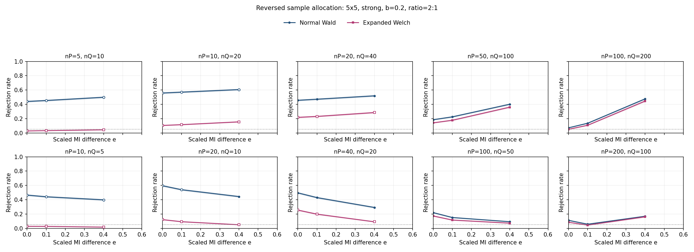

| Specification | Setting |
| --- | --- |
| Table shape | 5x5 |
| Population construction | Ordinal arrangement for P and reversed ordinal for Q |
| Horizontal graph regime specifications (columns) | {smaller n=5, smaller n=10, smaller n=20, smaller n=50, smaller n=100} |
| Vertical graph regime specifications (rows) | {Q larger, P larger}. $P$: row 1 and column 1 each have probability 0.9; $Q$: row 2 and column 5 each have probability 0.9; every other row has probability $0.1/4$, every other column $0.1/4$. These are row/column totals, not cell probabilities; they stay fixed across all panels and MI differences in this figure. |
| MI settings (nats) | M approximately 0.336; b=0.2; I(P) approximately 0.06721; e in [0.0, 0.1, 0.4]; I(Q)=(b+e)M |
| Axes | e from 0 to 0.6; rejection rate from 0 to 1 |
| Replicates | 10,000 independent table pairs per point |

Exact rejection rates, intervals, validity and expected counts

| nP | nQ | e | Method | Rejection rate | 95% lower | 95% upper | Valid rate | Rejection rate among valid results | Minimum expected count P | Minimum expected count Q |
| --- | --- | --- | --- | --- | --- | --- | --- | --- | --- | --- |
| 5 | 10 | 0 | Expanded Welch | 0.0278 | 0.02475 | 0.03121 | 0.1184 | 0.2348 | 0.003113 | 0.0003058 |
| 5 | 10 | 0 | Normal Wald | 0.4399 | 0.4302 | 0.4497 | 0.6006 | 0.7324 | 0.003113 | 0.0003058 |
| 5 | 10 | 0.1 | Expanded Welch | 0.0323 | 0.02901 | 0.03595 | 0.1145 | 0.2821 | 0.003113 | 8.003e-05 |
| 5 | 10 | 0.1 | Normal Wald | 0.4534 | 0.4437 | 0.4632 | 0.608 | 0.7457 | 0.003113 | 8.003e-05 |
| 5 | 10 | 0.4 | Expanded Welch | 0.0437 | 0.03987 | 0.04788 | 0.1271 | 0.3438 | 0.003113 | 6.046e-09 |
| 5 | 10 | 0.4 | Normal Wald | 0.4987 | 0.4889 | 0.5085 | 0.6441 | 0.7743 | 0.003113 | 6.046e-09 |
| 10 | 5 | 0 | Expanded Welch | 0.0278 | 0.02475 | 0.03121 | 0.1103 | 0.252 | 0.006226 | 0.0001529 |
| 10 | 5 | 0 | Normal Wald | 0.4643 | 0.4545 | 0.4741 | 0.6063 | 0.7658 | 0.006226 | 0.0001529 |
| 10 | 5 | 0.1 | Expanded Welch | 0.0269 | 0.02391 | 0.03026 | 0.1266 | 0.2125 | 0.006226 | 4.002e-05 |
| 10 | 5 | 0.1 | Normal Wald | 0.4409 | 0.4312 | 0.4507 | 0.6141 | 0.718 | 0.006226 | 4.002e-05 |
| 10 | 5 | 0.4 | Expanded Welch | 0.0168 | 0.01446 | 0.01951 | 0.1478 | 0.1137 | 0.006226 | 3.023e-09 |
| 10 | 5 | 0.4 | Normal Wald | 0.3981 | 0.3885 | 0.4077 | 0.6402 | 0.6218 | 0.006226 | 3.023e-09 |
| 10 | 20 | 0 | Expanded Welch | 0.1048 | 0.09895 | 0.111 | 0.3836 | 0.2732 | 0.006226 | 0.0006117 |
| 10 | 20 | 0 | Normal Wald | 0.558 | 0.5482 | 0.5677 | 0.8848 | 0.6307 | 0.006226 | 0.0006117 |
| 10 | 20 | 0.1 | Expanded Welch | 0.1157 | 0.1096 | 0.1221 | 0.3909 | 0.296 | 0.006226 | 0.0001601 |
| 10 | 20 | 0.1 | Normal Wald | 0.5703 | 0.5606 | 0.58 | 0.8956 | 0.6368 | 0.006226 | 0.0001601 |
| 10 | 20 | 0.4 | Expanded Welch | 0.155 | 0.148 | 0.1622 | 0.3959 | 0.3915 | 0.006226 | 1.209e-08 |
| 10 | 20 | 0.4 | Normal Wald | 0.6063 | 0.5967 | 0.6158 | 0.8987 | 0.6746 | 0.006226 | 1.209e-08 |
| 20 | 10 | 0 | Expanded Welch | 0.1217 | 0.1154 | 0.1283 | 0.3777 | 0.3222 | 0.01245 | 0.0003058 |
| 20 | 10 | 0 | Normal Wald | 0.5955 | 0.5858 | 0.6051 | 0.8923 | 0.6674 | 0.01245 | 0.0003058 |
| 20 | 10 | 0.1 | Expanded Welch | 0.0924 | 0.08688 | 0.09823 | 0.3865 | 0.2391 | 0.01245 | 8.003e-05 |
| 20 | 10 | 0.1 | Normal Wald | 0.5396 | 0.5298 | 0.5494 | 0.8893 | 0.6068 | 0.01245 | 8.003e-05 |
| 20 | 10 | 0.4 | Expanded Welch | 0.05 | 0.0459 | 0.05445 | 0.4175 | 0.1198 | 0.01245 | 6.046e-09 |
| 20 | 10 | 0.4 | Normal Wald | 0.4435 | 0.4338 | 0.4533 | 0.9021 | 0.4916 | 0.01245 | 6.046e-09 |
| 20 | 40 | 0 | Expanded Welch | 0.2176 | 0.2096 | 0.2258 | 0.763 | 0.2852 | 0.01245 | 0.001223 |
| 20 | 40 | 0 | Normal Wald | 0.4561 | 0.4464 | 0.4659 | 0.9942 | 0.4588 | 0.01245 | 0.001223 |
| 20 | 40 | 0.1 | Expanded Welch | 0.2308 | 0.2226 | 0.2392 | 0.7608 | 0.3034 | 0.01245 | 0.0003201 |
| 20 | 40 | 0.1 | Normal Wald | 0.4713 | 0.4615 | 0.4811 | 0.9944 | 0.474 | 0.01245 | 0.0003201 |
| 20 | 40 | 0.4 | Expanded Welch | 0.285 | 0.2762 | 0.2939 | 0.7696 | 0.3703 | 0.01245 | 2.419e-08 |
| 20 | 40 | 0.4 | Normal Wald | 0.5187 | 0.5089 | 0.5285 | 0.9938 | 0.5219 | 0.01245 | 2.419e-08 |
| 40 | 20 | 0 | Expanded Welch | 0.2549 | 0.2465 | 0.2635 | 0.7636 | 0.3338 | 0.0249 | 0.0006117 |
| 40 | 20 | 0 | Normal Wald | 0.4957 | 0.4859 | 0.5055 | 0.9944 | 0.4985 | 0.0249 | 0.0006117 |
| 40 | 20 | 0.1 | Expanded Welch | 0.1979 | 0.1902 | 0.2058 | 0.7644 | 0.2589 | 0.0249 | 0.0001601 |
| 40 | 20 | 0.1 | Normal Wald | 0.4292 | 0.4195 | 0.4389 | 0.9931 | 0.4322 | 0.0249 | 0.0001601 |
| 40 | 20 | 0.4 | Expanded Welch | 0.0913 | 0.08581 | 0.0971 | 0.7846 | 0.1164 | 0.0249 | 1.209e-08 |
| 40 | 20 | 0.4 | Normal Wald | 0.2914 | 0.2826 | 0.3004 | 0.9953 | 0.2928 | 0.0249 | 1.209e-08 |
| 50 | 100 | 0 | Expanded Welch | 0.1413 | 0.1346 | 0.1483 | 0.9904 | 0.1427 | 0.03113 | 0.003058 |
| 50 | 100 | 0 | Normal Wald | 0.1849 | 0.1774 | 0.1926 | 1 | 0.1849 | 0.03113 | 0.003058 |
| 50 | 100 | 0.1 | Expanded Welch | 0.1774 | 0.17 | 0.185 | 0.9893 | 0.1793 | 0.03113 | 0.0008003 |
| 50 | 100 | 0.1 | Normal Wald | 0.2248 | 0.2167 | 0.2331 | 1 | 0.2248 | 0.03113 | 0.0008003 |
| 50 | 100 | 0.4 | Expanded Welch | 0.3603 | 0.3509 | 0.3698 | 0.9904 | 0.3638 | 0.03113 | 6.046e-08 |
| 50 | 100 | 0.4 | Normal Wald | 0.4013 | 0.3917 | 0.4109 | 1 | 0.4013 | 0.03113 | 6.046e-08 |
| 100 | 50 | 0 | Expanded Welch | 0.1727 | 0.1654 | 0.1802 | 0.9907 | 0.1743 | 0.06226 | 0.001529 |
| 100 | 50 | 0 | Normal Wald | 0.2195 | 0.2115 | 0.2277 | 1 | 0.2195 | 0.06226 | 0.001529 |
| 100 | 50 | 0.1 | Expanded Welch | 0.1156 | 0.1095 | 0.122 | 0.9905 | 0.1167 | 0.06226 | 0.0004002 |
| 100 | 50 | 0.1 | Normal Wald | 0.151 | 0.1441 | 0.1582 | 1 | 0.151 | 0.06226 | 0.0004002 |
| 100 | 50 | 0.4 | Expanded Welch | 0.0721 | 0.06719 | 0.07734 | 0.9893 | 0.07288 | 0.06226 | 3.023e-08 |
| 100 | 50 | 0.4 | Normal Wald | 0.0924 | 0.08688 | 0.09823 | 1 | 0.0924 | 0.06226 | 3.023e-08 |
| 100 | 200 | 0 | Expanded Welch | 0.0511 | 0.04695 | 0.05559 | 0.9999 | 0.05111 | 0.06226 | 0.006117 |
| 100 | 200 | 0 | Normal Wald | 0.0719 | 0.067 | 0.07713 | 1 | 0.0719 | 0.06226 | 0.006117 |
| 100 | 200 | 0.1 | Expanded Welch | 0.1075 | 0.1016 | 0.1137 | 1 | 0.1075 | 0.06226 | 0.001601 |
| 100 | 200 | 0.1 | Normal Wald | 0.136 | 0.1294 | 0.1429 | 1 | 0.136 | 0.06226 | 0.001601 |
| 100 | 200 | 0.4 | Expanded Welch | 0.4458 | 0.4361 | 0.4556 | 1 | 0.4458 | 0.06226 | 1.209e-07 |
| 100 | 200 | 0.4 | Normal Wald | 0.4766 | 0.4668 | 0.4864 | 1 | 0.4766 | 0.06226 | 1.209e-07 |
| 200 | 100 | 0 | Expanded Welch | 0.0843 | 0.07901 | 0.08991 | 0.9999 | 0.08431 | 0.1245 | 0.003058 |
| 200 | 100 | 0 | Normal Wald | 0.1112 | 0.1052 | 0.1175 | 1 | 0.1112 | 0.1245 | 0.003058 |
| 200 | 100 | 0.1 | Expanded Welch | 0.045 | 0.04111 | 0.04924 | 0.9999 | 0.045 | 0.1245 | 0.0008003 |
| 200 | 100 | 0.1 | Normal Wald | 0.0577 | 0.0533 | 0.06244 | 1 | 0.0577 | 0.1245 | 0.0008003 |
| 200 | 100 | 0.4 | Expanded Welch | 0.1607 | 0.1536 | 0.168 | 0.9998 | 0.1607 | 0.1245 | 6.046e-08 |
| 200 | 100 | 0.4 | Normal Wald | 0.1688 | 0.1616 | 0.1763 | 1 | 0.1688 | 0.1245 | 6.046e-08 |

### 5.15 Reversed sample allocation: 5x5, strong, b=0.2, ratio=5:1

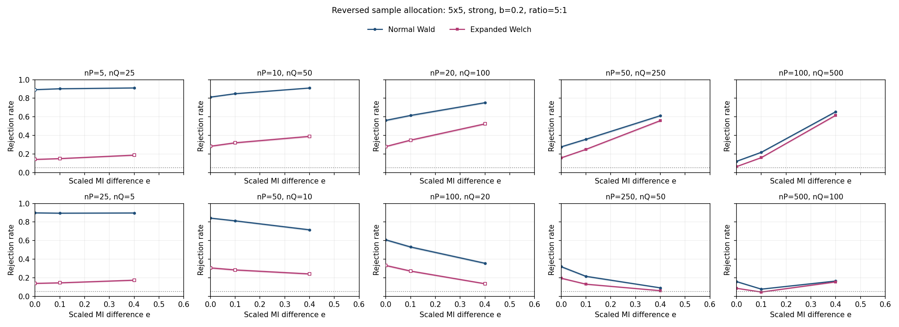

| Specification | Setting |
| --- | --- |
| Table shape | 5x5 |
| Population construction | Ordinal arrangement for P and reversed ordinal for Q |
| Horizontal graph regime specifications (columns) | {smaller n=5, smaller n=10, smaller n=20, smaller n=50, smaller n=100} |
| Vertical graph regime specifications (rows) | {Q larger, P larger}. $P$: row 1 and column 1 each have probability 0.9; $Q$: row 2 and column 5 each have probability 0.9; every other row has probability $0.1/4$, every other column $0.1/4$. These are row/column totals, not cell probabilities; they stay fixed across all panels and MI differences in this figure. |
| MI settings (nats) | M approximately 0.336; b=0.2; I(P) approximately 0.06721; e in [0.0, 0.1, 0.4]; I(Q)=(b+e)M |
| Axes | e from 0 to 0.6; rejection rate from 0 to 1 |
| Replicates | 10,000 independent table pairs per point |

Exact rejection rates, intervals, validity and expected counts

| nP | nQ | e | Method | Rejection rate | 95% lower | 95% upper | Valid rate | Rejection rate among valid results | Minimum expected count P | Minimum expected count Q |
| --- | --- | --- | --- | --- | --- | --- | --- | --- | --- | --- |
| 5 | 25 | 0 | Expanded Welch | 0.1406 | 0.1339 | 0.1476 | 0.213 | 0.6601 | 0.003113 | 0.0007646 |
| 5 | 25 | 0 | Normal Wald | 0.8928 | 0.8866 | 0.8987 | 0.8973 | 0.995 | 0.003113 | 0.0007646 |
| 5 | 25 | 0.1 | Expanded Welch | 0.1496 | 0.1427 | 0.1567 | 0.203 | 0.7369 | 0.003113 | 0.0002001 |
| 5 | 25 | 0.1 | Normal Wald | 0.9027 | 0.8967 | 0.9084 | 0.9075 | 0.9947 | 0.003113 | 0.0002001 |
| 5 | 25 | 0.4 | Expanded Welch | 0.1867 | 0.1792 | 0.1945 | 0.215 | 0.8684 | 0.003113 | 1.512e-08 |
| 5 | 25 | 0.4 | Normal Wald | 0.9113 | 0.9056 | 0.9167 | 0.9151 | 0.9958 | 0.003113 | 1.512e-08 |
| 10 | 50 | 0 | Expanded Welch | 0.2826 | 0.2739 | 0.2915 | 0.4821 | 0.5862 | 0.006226 | 0.001529 |
| 10 | 50 | 0 | Normal Wald | 0.8125 | 0.8047 | 0.82 | 0.9935 | 0.8178 | 0.006226 | 0.001529 |
| 10 | 50 | 0.1 | Expanded Welch | 0.3198 | 0.3107 | 0.329 | 0.4811 | 0.6647 | 0.006226 | 0.0004002 |
| 10 | 50 | 0.1 | Normal Wald | 0.8492 | 0.8421 | 0.8561 | 0.9937 | 0.8546 | 0.006226 | 0.0004002 |
| 10 | 50 | 0.4 | Expanded Welch | 0.3891 | 0.3796 | 0.3987 | 0.4821 | 0.8071 | 0.006226 | 3.023e-08 |
| 10 | 50 | 0.4 | Normal Wald | 0.9106 | 0.9048 | 0.916 | 0.9953 | 0.9149 | 0.006226 | 3.023e-08 |
| 20 | 100 | 0 | Expanded Welch | 0.2795 | 0.2708 | 0.2884 | 0.7961 | 0.3511 | 0.01245 | 0.003058 |
| 20 | 100 | 0 | Normal Wald | 0.5613 | 0.5516 | 0.571 | 1 | 0.5613 | 0.01245 | 0.003058 |
| 20 | 100 | 0.1 | Expanded Welch | 0.3483 | 0.339 | 0.3577 | 0.7911 | 0.4403 | 0.01245 | 0.0008003 |
| 20 | 100 | 0.1 | Normal Wald | 0.6146 | 0.605 | 0.6241 | 1 | 0.6146 | 0.01245 | 0.0008003 |
| 20 | 100 | 0.4 | Expanded Welch | 0.5236 | 0.5138 | 0.5334 | 0.7931 | 0.6602 | 0.01245 | 6.046e-08 |
| 20 | 100 | 0.4 | Normal Wald | 0.752 | 0.7434 | 0.7604 | 1 | 0.752 | 0.01245 | 6.046e-08 |
| 25 | 5 | 0 | Expanded Welch | 0.1387 | 0.1321 | 0.1456 | 0.1966 | 0.7055 | 0.01556 | 0.0001529 |
| 25 | 5 | 0 | Normal Wald | 0.8987 | 0.8926 | 0.9045 | 0.9016 | 0.9968 | 0.01556 | 0.0001529 |
| 25 | 5 | 0.1 | Expanded Welch | 0.1445 | 0.1377 | 0.1515 | 0.2125 | 0.68 | 0.01556 | 4.002e-05 |
| 25 | 5 | 0.1 | Normal Wald | 0.8955 | 0.8894 | 0.9013 | 0.901 | 0.9939 | 0.01556 | 4.002e-05 |
| 25 | 5 | 0.4 | Expanded Welch | 0.1731 | 0.1658 | 0.1806 | 0.2611 | 0.663 | 0.01556 | 3.023e-09 |
| 25 | 5 | 0.4 | Normal Wald | 0.8977 | 0.8916 | 0.9035 | 0.9085 | 0.9881 | 0.01556 | 3.023e-09 |
| 50 | 10 | 0 | Expanded Welch | 0.3057 | 0.2967 | 0.3148 | 0.4773 | 0.6405 | 0.03113 | 0.0003058 |
| 50 | 10 | 0 | Normal Wald | 0.8422 | 0.8349 | 0.8492 | 0.9938 | 0.8475 | 0.03113 | 0.0003058 |
| 50 | 10 | 0.1 | Expanded Welch | 0.2836 | 0.2748 | 0.2925 | 0.4782 | 0.5931 | 0.03113 | 8.003e-05 |
| 50 | 10 | 0.1 | Normal Wald | 0.8127 | 0.8049 | 0.8202 | 0.9948 | 0.8169 | 0.03113 | 8.003e-05 |
| 50 | 10 | 0.4 | Expanded Welch | 0.2404 | 0.2321 | 0.2489 | 0.5283 | 0.455 | 0.03113 | 6.046e-09 |
| 50 | 10 | 0.4 | Normal Wald | 0.7158 | 0.7069 | 0.7246 | 0.9947 | 0.7196 | 0.03113 | 6.046e-09 |
| 50 | 250 | 0 | Expanded Welch | 0.1577 | 0.1507 | 0.165 | 0.9895 | 0.1594 | 0.03113 | 0.007646 |
| 50 | 250 | 0 | Normal Wald | 0.2762 | 0.2675 | 0.285 | 1 | 0.2762 | 0.03113 | 0.007646 |
| 50 | 250 | 0.1 | Expanded Welch | 0.2492 | 0.2408 | 0.2578 | 0.9905 | 0.2516 | 0.03113 | 0.002001 |
| 50 | 250 | 0.1 | Normal Wald | 0.3577 | 0.3484 | 0.3671 | 1 | 0.3577 | 0.03113 | 0.002001 |
| 50 | 250 | 0.4 | Expanded Welch | 0.5586 | 0.5488 | 0.5683 | 0.9902 | 0.5641 | 0.03113 | 1.512e-07 |
| 50 | 250 | 0.4 | Normal Wald | 0.6119 | 0.6023 | 0.6214 | 1 | 0.6119 | 0.03113 | 1.512e-07 |
| 100 | 20 | 0 | Expanded Welch | 0.3318 | 0.3226 | 0.3411 | 0.7919 | 0.419 | 0.06226 | 0.0006117 |
| 100 | 20 | 0 | Normal Wald | 0.608 | 0.5984 | 0.6175 | 1 | 0.608 | 0.06226 | 0.0006117 |
| 100 | 20 | 0.1 | Expanded Welch | 0.2713 | 0.2627 | 0.2801 | 0.79 | 0.3434 | 0.06226 | 0.0001601 |
| 100 | 20 | 0.1 | Normal Wald | 0.5309 | 0.5211 | 0.5407 | 1 | 0.5309 | 0.06226 | 0.0001601 |
| 100 | 20 | 0.4 | Expanded Welch | 0.1348 | 0.1282 | 0.1416 | 0.8053 | 0.1674 | 0.06226 | 1.209e-08 |
| 100 | 20 | 0.4 | Normal Wald | 0.3554 | 0.3461 | 0.3648 | 1 | 0.3554 | 0.06226 | 1.209e-08 |
| 100 | 500 | 0 | Expanded Welch | 0.0635 | 0.05889 | 0.06845 | 1 | 0.0635 | 0.06226 | 0.01529 |
| 100 | 500 | 0 | Normal Wald | 0.1206 | 0.1144 | 0.1271 | 1 | 0.1206 | 0.06226 | 0.01529 |
| 100 | 500 | 0.1 | Expanded Welch | 0.1604 | 0.1533 | 0.1677 | 0.9999 | 0.1604 | 0.06226 | 0.004002 |
| 100 | 500 | 0.1 | Normal Wald | 0.2176 | 0.2096 | 0.2258 | 1 | 0.2176 | 0.06226 | 0.004002 |
| 100 | 500 | 0.4 | Expanded Welch | 0.6163 | 0.6067 | 0.6258 | 1 | 0.6163 | 0.06226 | 3.023e-07 |
| 100 | 500 | 0.4 | Normal Wald | 0.6547 | 0.6453 | 0.664 | 1 | 0.6547 | 0.06226 | 3.023e-07 |
| 250 | 50 | 0 | Expanded Welch | 0.1944 | 0.1868 | 0.2023 | 0.9893 | 0.1965 | 0.1556 | 0.001529 |
| 250 | 50 | 0 | Normal Wald | 0.3188 | 0.3097 | 0.328 | 1 | 0.3188 | 0.1556 | 0.001529 |
| 250 | 50 | 0.1 | Expanded Welch | 0.1301 | 0.1236 | 0.1368 | 0.9887 | 0.1316 | 0.1556 | 0.0004002 |
| 250 | 50 | 0.1 | Normal Wald | 0.2147 | 0.2068 | 0.2229 | 1 | 0.2147 | 0.1556 | 0.0004002 |
| 250 | 50 | 0.4 | Expanded Welch | 0.0602 | 0.0557 | 0.06503 | 0.9897 | 0.06083 | 0.1556 | 3.023e-08 |
| 250 | 50 | 0.4 | Normal Wald | 0.0908 | 0.08532 | 0.09659 | 1 | 0.0908 | 0.1556 | 3.023e-08 |
| 500 | 100 | 0 | Expanded Welch | 0.0861 | 0.08076 | 0.09176 | 1 | 0.0861 | 0.3113 | 0.003058 |
| 500 | 100 | 0 | Normal Wald | 0.1582 | 0.1512 | 0.1655 | 1 | 0.1582 | 0.3113 | 0.003058 |
| 500 | 100 | 0.1 | Expanded Welch | 0.0455 | 0.04159 | 0.04976 | 1 | 0.0455 | 0.3113 | 0.0008003 |
| 500 | 100 | 0.1 | Normal Wald | 0.0769 | 0.07184 | 0.08229 | 1 | 0.0769 | 0.3113 | 0.0008003 |
| 500 | 100 | 0.4 | Expanded Welch | 0.1549 | 0.1479 | 0.1621 | 1 | 0.1549 | 0.3113 | 6.046e-08 |
| 500 | 100 | 0.4 | Normal Wald | 0.164 | 0.1569 | 0.1714 | 1 | 0.164 | 0.3113 | 6.046e-08 |

### 5.16 Reversed sample allocation: 5x5, ultra, b=0.2, ratio=10:1

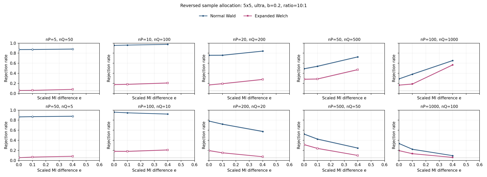

| Specification | Setting |
| --- | --- |
| Table shape | 5x5 |
| Population construction | Ordinal arrangement for P and reversed ordinal for Q |
| Horizontal graph regime specifications (columns) | {smaller n=5, smaller n=10, smaller n=20, smaller n=50, smaller n=100} |
| Vertical graph regime specifications (rows) | {Q larger, P larger}. $P$: row 1 and column 1 each have probability 0.95; $Q$: row 2 and column 5 each have probability 0.95; every other row has probability $0.05/4$, every other column $0.05/4$. These are row/column totals, not cell probabilities; they stay fixed across all panels and MI differences in this figure. |
| MI settings (nats) | M approximately 0.1945; b=0.2; I(P) approximately 0.0389; e in [0.0, 0.1, 0.4]; I(Q)=(b+e)M |
| Axes | e from 0 to 0.6; rejection rate from 0 to 1 |
| Replicates | 10,000 independent table pairs per point |

Exact rejection rates, intervals, validity and expected counts

| nP | nQ | e | Method | Rejection rate | 95% lower | 95% upper | Valid rate | Rejection rate among valid results | Minimum expected count P | Minimum expected count Q |
| --- | --- | --- | --- | --- | --- | --- | --- | --- | --- | --- |
| 5 | 50 | 0 | Expanded Welch | 0.0588 | 0.05436 | 0.06358 | 0.089 | 0.6607 | 0.001 | 0.0003348 |
| 5 | 50 | 0 | Normal Wald | 0.8728 | 0.8661 | 0.8792 | 0.8728 | 1 | 0.001 | 0.0003348 |
| 5 | 50 | 0.1 | Expanded Welch | 0.061 | 0.05648 | 0.06586 | 0.084 | 0.7262 | 0.001 | 8.916e-05 |
| 5 | 50 | 0.1 | Normal Wald | 0.874 | 0.8674 | 0.8804 | 0.874 | 1 | 0.001 | 8.916e-05 |
| 5 | 50 | 0.4 | Expanded Welch | 0.0801 | 0.07494 | 0.08558 | 0.0914 | 0.8764 | 0.001 | 6.88e-09 |
| 5 | 50 | 0.4 | Normal Wald | 0.8825 | 0.876 | 0.8887 | 0.8825 | 1 | 0.001 | 6.88e-09 |
| 10 | 100 | 0 | Expanded Welch | 0.1759 | 0.1686 | 0.1835 | 0.2215 | 0.7941 | 0.002001 | 0.0006697 |
| 10 | 100 | 0 | Normal Wald | 0.9557 | 0.9515 | 0.9596 | 0.9913 | 0.9641 | 0.002001 | 0.0006697 |
| 10 | 100 | 0.1 | Expanded Welch | 0.1804 | 0.173 | 0.1881 | 0.2122 | 0.8501 | 0.002001 | 0.0001783 |
| 10 | 100 | 0.1 | Normal Wald | 0.9617 | 0.9578 | 0.9653 | 0.9895 | 0.9719 | 0.002001 | 0.0001783 |
| 10 | 100 | 0.4 | Expanded Welch | 0.2071 | 0.1993 | 0.2152 | 0.2256 | 0.918 | 0.002001 | 1.376e-08 |
| 10 | 100 | 0.4 | Normal Wald | 0.9752 | 0.972 | 0.9781 | 0.9908 | 0.9843 | 0.002001 | 1.376e-08 |
| 20 | 200 | 0 | Expanded Welch | 0.1681 | 0.1609 | 0.1756 | 0.4531 | 0.371 | 0.004001 | 0.001339 |
| 20 | 200 | 0 | Normal Wald | 0.7587 | 0.7502 | 0.767 | 1 | 0.7587 | 0.004001 | 0.001339 |
| 20 | 200 | 0.1 | Expanded Welch | 0.1932 | 0.1856 | 0.2011 | 0.4709 | 0.4103 | 0.004001 | 0.0003567 |
| 20 | 200 | 0.1 | Normal Wald | 0.7596 | 0.7511 | 0.7679 | 1 | 0.7596 | 0.004001 | 0.0003567 |
| 20 | 200 | 0.4 | Expanded Welch | 0.278 | 0.2693 | 0.2869 | 0.4625 | 0.6011 | 0.004001 | 2.752e-08 |
| 20 | 200 | 0.4 | Normal Wald | 0.8421 | 0.8348 | 0.8491 | 1 | 0.8421 | 0.004001 | 2.752e-08 |
| 50 | 5 | 0 | Expanded Welch | 0.0543 | 0.05003 | 0.05892 | 0.0821 | 0.6614 | 0.01 | 3.348e-05 |
| 50 | 5 | 0 | Normal Wald | 0.8662 | 0.8594 | 0.8727 | 0.8662 | 1 | 0.01 | 3.348e-05 |
| 50 | 5 | 0.1 | Expanded Welch | 0.0658 | 0.06111 | 0.07083 | 0.0969 | 0.6791 | 0.01 | 8.916e-06 |
| 50 | 5 | 0.1 | Normal Wald | 0.871 | 0.8643 | 0.8774 | 0.871 | 1 | 0.01 | 8.916e-06 |
| 50 | 5 | 0.4 | Expanded Welch | 0.082 | 0.07678 | 0.08754 | 0.1282 | 0.6396 | 0.01 | 6.88e-10 |
| 50 | 5 | 0.4 | Normal Wald | 0.8793 | 0.8728 | 0.8855 | 0.8793 | 1 | 0.01 | 6.88e-10 |
| 50 | 500 | 0 | Expanded Welch | 0.2815 | 0.2728 | 0.2904 | 0.8641 | 0.3258 | 0.01 | 0.003348 |
| 50 | 500 | 0 | Normal Wald | 0.49 | 0.4802 | 0.4998 | 1 | 0.49 | 0.01 | 0.003348 |
| 50 | 500 | 0.1 | Expanded Welch | 0.2869 | 0.2781 | 0.2958 | 0.8609 | 0.3333 | 0.01 | 0.0008916 |
| 50 | 500 | 0.1 | Normal Wald | 0.5395 | 0.5297 | 0.5493 | 1 | 0.5395 | 0.01 | 0.0008916 |
| 50 | 500 | 0.4 | Expanded Welch | 0.4729 | 0.4631 | 0.4827 | 0.8641 | 0.5473 | 0.01 | 6.88e-08 |
| 50 | 500 | 0.4 | Normal Wald | 0.7267 | 0.7179 | 0.7353 | 1 | 0.7267 | 0.01 | 6.88e-08 |
| 100 | 10 | 0 | Expanded Welch | 0.1802 | 0.1728 | 0.1879 | 0.2183 | 0.8255 | 0.02001 | 6.697e-05 |
| 100 | 10 | 0 | Normal Wald | 0.9608 | 0.9568 | 0.9644 | 0.9908 | 0.9697 | 0.02001 | 6.697e-05 |
| 100 | 10 | 0.1 | Expanded Welch | 0.1793 | 0.1719 | 0.1869 | 0.2296 | 0.7809 | 0.02001 | 1.783e-05 |
| 100 | 10 | 0.1 | Normal Wald | 0.9468 | 0.9422 | 0.951 | 0.9909 | 0.9555 | 0.02001 | 1.783e-05 |
| 100 | 10 | 0.4 | Expanded Welch | 0.208 | 0.2002 | 0.2161 | 0.2822 | 0.7371 | 0.02001 | 1.376e-09 |
| 100 | 10 | 0.4 | Normal Wald | 0.9222 | 0.9168 | 0.9273 | 0.9922 | 0.9294 | 0.02001 | 1.376e-09 |
| 100 | 1000 | 0 | Expanded Welch | 0.1645 | 0.1574 | 0.1719 | 0.9894 | 0.1663 | 0.02001 | 0.006697 |
| 100 | 1000 | 0 | Normal Wald | 0.2885 | 0.2797 | 0.2975 | 1 | 0.2885 | 0.02001 | 0.006697 |
| 100 | 1000 | 0.1 | Expanded Welch | 0.1868 | 0.1793 | 0.1946 | 0.9888 | 0.1889 | 0.02001 | 0.001783 |
| 100 | 1000 | 0.1 | Normal Wald | 0.3826 | 0.3731 | 0.3922 | 1 | 0.3826 | 0.02001 | 0.001783 |
| 100 | 1000 | 0.4 | Expanded Welch | 0.5678 | 0.5581 | 0.5775 | 0.9896 | 0.5738 | 0.02001 | 1.376e-07 |
| 100 | 1000 | 0.4 | Normal Wald | 0.6539 | 0.6445 | 0.6632 | 1 | 0.6539 | 0.02001 | 1.376e-07 |
| 200 | 20 | 0 | Expanded Welch | 0.1946 | 0.187 | 0.2025 | 0.452 | 0.4305 | 0.04001 | 0.0001339 |
| 200 | 20 | 0 | Normal Wald | 0.7828 | 0.7746 | 0.7908 | 0.9999 | 0.7829 | 0.04001 | 0.0001339 |
| 200 | 20 | 0.1 | Expanded Welch | 0.151 | 0.1441 | 0.1582 | 0.4649 | 0.3248 | 0.04001 | 3.567e-05 |
| 200 | 20 | 0.1 | Normal Wald | 0.7209 | 0.712 | 0.7296 | 0.9998 | 0.721 | 0.04001 | 3.567e-05 |
| 200 | 20 | 0.4 | Expanded Welch | 0.0728 | 0.06787 | 0.07806 | 0.5167 | 0.1409 | 0.04001 | 2.752e-09 |
| 200 | 20 | 0.4 | Normal Wald | 0.5757 | 0.566 | 0.5854 | 1 | 0.5757 | 0.04001 | 2.752e-09 |
| 500 | 50 | 0 | Expanded Welch | 0.3148 | 0.3058 | 0.324 | 0.8596 | 0.3662 | 0.1 | 0.0003348 |
| 500 | 50 | 0 | Normal Wald | 0.5243 | 0.5145 | 0.5341 | 1 | 0.5243 | 0.1 | 0.0003348 |
| 500 | 50 | 0.1 | Expanded Welch | 0.2385 | 0.2302 | 0.247 | 0.8658 | 0.2755 | 0.1 | 8.916e-05 |
| 500 | 50 | 0.1 | Normal Wald | 0.4241 | 0.4144 | 0.4338 | 1 | 0.4241 | 0.1 | 8.916e-05 |
| 500 | 50 | 0.4 | Expanded Welch | 0.0988 | 0.0931 | 0.1048 | 0.874 | 0.113 | 0.1 | 6.88e-09 |
| 500 | 50 | 0.4 | Normal Wald | 0.2453 | 0.237 | 0.2538 | 1 | 0.2453 | 0.1 | 6.88e-09 |
| 1000 | 100 | 0 | Expanded Welch | 0.1939 | 0.1863 | 0.2018 | 0.9892 | 0.196 | 0.2001 | 0.0006697 |
| 1000 | 100 | 0 | Normal Wald | 0.3359 | 0.3267 | 0.3452 | 1 | 0.3359 | 0.2001 | 0.0006697 |
| 1000 | 100 | 0.1 | Expanded Welch | 0.1331 | 0.1266 | 0.1399 | 0.9874 | 0.1348 | 0.2001 | 0.0001783 |
| 1000 | 100 | 0.1 | Normal Wald | 0.2211 | 0.2131 | 0.2293 | 1 | 0.2211 | 0.2001 | 0.0001783 |
| 1000 | 100 | 0.4 | Expanded Welch | 0.0591 | 0.05465 | 0.06389 | 0.9863 | 0.05992 | 0.2001 | 1.376e-08 |
| 1000 | 100 | 0.4 | Normal Wald | 0.0942 | 0.08863 | 0.1001 | 1 | 0.0942 | 0.2001 | 1.376e-08 |

### 5.17 Reversed sample allocation: 5x5, ultra, b=0.2, ratio=2:1

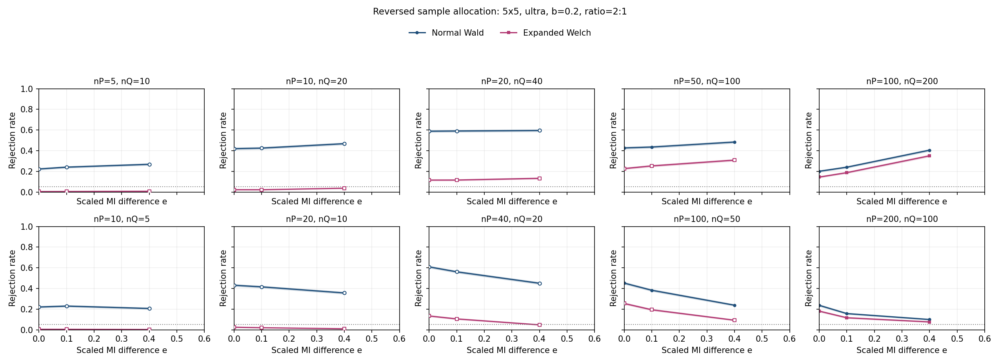

| Specification | Setting |
| --- | --- |
| Table shape | 5x5 |
| Population construction | Ordinal arrangement for P and reversed ordinal for Q |
| Horizontal graph regime specifications (columns) | {smaller n=5, smaller n=10, smaller n=20, smaller n=50, smaller n=100} |
| Vertical graph regime specifications (rows) | {Q larger, P larger}. $P$: row 1 and column 1 each have probability 0.95; $Q$: row 2 and column 5 each have probability 0.95; every other row has probability $0.05/4$, every other column $0.05/4$. These are row/column totals, not cell probabilities; they stay fixed across all panels and MI differences in this figure. |
| MI settings (nats) | M approximately 0.1945; b=0.2; I(P) approximately 0.0389; e in [0.0, 0.1, 0.4]; I(Q)=(b+e)M |
| Axes | e from 0 to 0.6; rejection rate from 0 to 1 |
| Replicates | 10,000 independent table pairs per point |

Exact rejection rates, intervals, validity and expected counts

| nP | nQ | e | Method | Rejection rate | 95% lower | 95% upper | Valid rate | Rejection rate among valid results | Minimum expected count P | Minimum expected count Q |
| --- | --- | --- | --- | --- | --- | --- | --- | --- | --- | --- |
| 5 | 10 | 0 | Expanded Welch | 0.0042 | 0.003109 | 0.005672 | 0.0249 | 0.1687 | 0.001 | 6.697e-05 |
| 5 | 10 | 0 | Normal Wald | 0.2231 | 0.215 | 0.2314 | 0.3001 | 0.7434 | 0.001 | 6.697e-05 |
| 5 | 10 | 0.1 | Expanded Welch | 0.0048 | 0.003622 | 0.006358 | 0.0258 | 0.186 | 0.001 | 1.783e-05 |
| 5 | 10 | 0.1 | Normal Wald | 0.2407 | 0.2324 | 0.2492 | 0.3127 | 0.7697 | 0.001 | 1.783e-05 |
| 5 | 10 | 0.4 | Expanded Welch | 0.0072 | 0.005722 | 0.009057 | 0.0282 | 0.2553 | 0.001 | 1.376e-09 |
| 5 | 10 | 0.4 | Normal Wald | 0.2682 | 0.2596 | 0.277 | 0.3416 | 0.7851 | 0.001 | 1.376e-09 |
| 10 | 5 | 0 | Expanded Welch | 0.0047 | 0.003537 | 0.006244 | 0.0232 | 0.2026 | 0.002001 | 3.348e-05 |
| 10 | 5 | 0 | Normal Wald | 0.2206 | 0.2126 | 0.2288 | 0.2967 | 0.7435 | 0.002001 | 3.348e-05 |
| 10 | 5 | 0.1 | Expanded Welch | 0.0045 | 0.003365 | 0.006016 | 0.0251 | 0.1793 | 0.002001 | 8.916e-06 |
| 10 | 5 | 0.1 | Normal Wald | 0.2296 | 0.2215 | 0.2379 | 0.3142 | 0.7307 | 0.002001 | 8.916e-06 |
| 10 | 5 | 0.4 | Expanded Welch | 0.0025 | 0.001694 | 0.003688 | 0.0326 | 0.07669 | 0.002001 | 6.88e-10 |
| 10 | 5 | 0.4 | Normal Wald | 0.2064 | 0.1986 | 0.2144 | 0.3379 | 0.6108 | 0.002001 | 6.88e-10 |
| 10 | 20 | 0 | Expanded Welch | 0.0223 | 0.01958 | 0.02538 | 0.1016 | 0.2195 | 0.002001 | 0.0001339 |
| 10 | 20 | 0 | Normal Wald | 0.4196 | 0.41 | 0.4293 | 0.5752 | 0.7295 | 0.002001 | 0.0001339 |
| 10 | 20 | 0.1 | Expanded Welch | 0.0221 | 0.0194 | 0.02517 | 0.1066 | 0.2073 | 0.002001 | 3.567e-05 |
| 10 | 20 | 0.1 | Normal Wald | 0.4251 | 0.4154 | 0.4348 | 0.5857 | 0.7258 | 0.002001 | 3.567e-05 |
| 10 | 20 | 0.4 | Expanded Welch | 0.0368 | 0.03328 | 0.04067 | 0.1218 | 0.3021 | 0.002001 | 2.752e-09 |
| 10 | 20 | 0.4 | Normal Wald | 0.468 | 0.4582 | 0.4778 | 0.6238 | 0.7502 | 0.002001 | 2.752e-09 |
| 20 | 10 | 0 | Expanded Welch | 0.0247 | 0.02184 | 0.02793 | 0.0971 | 0.2544 | 0.004001 | 6.697e-05 |
| 20 | 10 | 0 | Normal Wald | 0.4312 | 0.4215 | 0.4409 | 0.5698 | 0.7568 | 0.004001 | 6.697e-05 |
| 20 | 10 | 0.1 | Expanded Welch | 0.02 | 0.01743 | 0.02293 | 0.1101 | 0.1817 | 0.004001 | 1.783e-05 |
| 20 | 10 | 0.1 | Normal Wald | 0.4155 | 0.4059 | 0.4252 | 0.5931 | 0.7006 | 0.004001 | 1.783e-05 |
| 20 | 10 | 0.4 | Expanded Welch | 0.01 | 0.008229 | 0.01215 | 0.1309 | 0.07639 | 0.004001 | 1.376e-09 |
| 20 | 10 | 0.4 | Normal Wald | 0.3567 | 0.3474 | 0.3661 | 0.6098 | 0.5849 | 0.004001 | 1.376e-09 |
| 20 | 40 | 0 | Expanded Welch | 0.1155 | 0.1094 | 0.1219 | 0.3518 | 0.3283 | 0.004001 | 0.0002679 |
| 20 | 40 | 0 | Normal Wald | 0.5888 | 0.5791 | 0.5984 | 0.878 | 0.6706 | 0.004001 | 0.0002679 |
| 20 | 40 | 0.1 | Expanded Welch | 0.1159 | 0.1098 | 0.1223 | 0.3553 | 0.3262 | 0.004001 | 7.133e-05 |
| 20 | 40 | 0.1 | Normal Wald | 0.5907 | 0.581 | 0.6003 | 0.8842 | 0.6681 | 0.004001 | 7.133e-05 |
| 20 | 40 | 0.4 | Expanded Welch | 0.1325 | 0.126 | 0.1393 | 0.3744 | 0.3539 | 0.004001 | 5.504e-09 |
| 20 | 40 | 0.4 | Normal Wald | 0.5955 | 0.5858 | 0.6051 | 0.8886 | 0.6702 | 0.004001 | 5.504e-09 |
| 40 | 20 | 0 | Expanded Welch | 0.1337 | 0.1272 | 0.1405 | 0.3549 | 0.3767 | 0.008002 | 0.0001339 |
| 40 | 20 | 0 | Normal Wald | 0.6091 | 0.5995 | 0.6186 | 0.8746 | 0.6964 | 0.008002 | 0.0001339 |
| 40 | 20 | 0.1 | Expanded Welch | 0.1053 | 0.09943 | 0.1115 | 0.3677 | 0.2864 | 0.008002 | 3.567e-05 |
| 40 | 20 | 0.1 | Normal Wald | 0.5612 | 0.5515 | 0.5709 | 0.8876 | 0.6323 | 0.008002 | 3.567e-05 |
| 40 | 20 | 0.4 | Expanded Welch | 0.0478 | 0.04379 | 0.05216 | 0.3997 | 0.1196 | 0.008002 | 2.752e-09 |
| 40 | 20 | 0.4 | Normal Wald | 0.4504 | 0.4407 | 0.4602 | 0.8961 | 0.5026 | 0.008002 | 2.752e-09 |
| 50 | 100 | 0 | Expanded Welch | 0.2269 | 0.2188 | 0.2352 | 0.8425 | 0.2693 | 0.01 | 0.0006697 |
| 50 | 100 | 0 | Normal Wald | 0.4266 | 0.4169 | 0.4363 | 0.9987 | 0.4272 | 0.01 | 0.0006697 |
| 50 | 100 | 0.1 | Expanded Welch | 0.2528 | 0.2444 | 0.2614 | 0.8484 | 0.298 | 0.01 | 0.0001783 |
| 50 | 100 | 0.1 | Normal Wald | 0.4355 | 0.4258 | 0.4452 | 0.9982 | 0.4363 | 0.01 | 0.0001783 |
| 50 | 100 | 0.4 | Expanded Welch | 0.3087 | 0.2997 | 0.3178 | 0.8452 | 0.3652 | 0.01 | 1.376e-08 |
| 50 | 100 | 0.4 | Normal Wald | 0.4837 | 0.4739 | 0.4935 | 0.9983 | 0.4845 | 0.01 | 1.376e-08 |
| 100 | 50 | 0 | Expanded Welch | 0.2547 | 0.2463 | 0.2633 | 0.8484 | 0.3002 | 0.02001 | 0.0003348 |
| 100 | 50 | 0 | Normal Wald | 0.452 | 0.4423 | 0.4618 | 0.9985 | 0.4527 | 0.02001 | 0.0003348 |
| 100 | 50 | 0.1 | Expanded Welch | 0.1938 | 0.1862 | 0.2017 | 0.8479 | 0.2286 | 0.02001 | 8.916e-05 |
| 100 | 50 | 0.1 | Normal Wald | 0.3827 | 0.3732 | 0.3923 | 0.9984 | 0.3833 | 0.02001 | 8.916e-05 |
| 100 | 50 | 0.4 | Expanded Welch | 0.0927 | 0.08717 | 0.09854 | 0.8613 | 0.1076 | 0.02001 | 6.88e-09 |
| 100 | 50 | 0.4 | Normal Wald | 0.2379 | 0.2297 | 0.2463 | 0.9975 | 0.2385 | 0.02001 | 6.88e-09 |
| 100 | 200 | 0 | Expanded Welch | 0.1446 | 0.1378 | 0.1516 | 0.9865 | 0.1466 | 0.02001 | 0.001339 |
| 100 | 200 | 0 | Normal Wald | 0.2008 | 0.1931 | 0.2088 | 1 | 0.2008 | 0.02001 | 0.001339 |
| 100 | 200 | 0.1 | Expanded Welch | 0.1876 | 0.1801 | 0.1954 | 0.9873 | 0.19 | 0.02001 | 0.0003567 |
| 100 | 200 | 0.1 | Normal Wald | 0.2404 | 0.2321 | 0.2489 | 1 | 0.2404 | 0.02001 | 0.0003567 |
| 100 | 200 | 0.4 | Expanded Welch | 0.3505 | 0.3412 | 0.3599 | 0.9881 | 0.3547 | 0.02001 | 2.752e-08 |
| 100 | 200 | 0.4 | Normal Wald | 0.4052 | 0.3956 | 0.4149 | 1 | 0.4052 | 0.02001 | 2.752e-08 |
| 200 | 100 | 0 | Expanded Welch | 0.1805 | 0.1731 | 0.1882 | 0.9899 | 0.1823 | 0.04001 | 0.0006697 |
| 200 | 100 | 0 | Normal Wald | 0.2366 | 0.2284 | 0.245 | 1 | 0.2366 | 0.04001 | 0.0006697 |
| 200 | 100 | 0.1 | Expanded Welch | 0.1163 | 0.1102 | 0.1227 | 0.9873 | 0.1178 | 0.04001 | 0.0001783 |
| 200 | 100 | 0.1 | Normal Wald | 0.1568 | 0.1498 | 0.1641 | 1 | 0.1568 | 0.04001 | 0.0001783 |
| 200 | 100 | 0.4 | Expanded Welch | 0.0761 | 0.07106 | 0.08146 | 0.9885 | 0.07699 | 0.04001 | 1.376e-08 |
| 200 | 100 | 0.4 | Normal Wald | 0.0995 | 0.09379 | 0.1055 | 1 | 0.0995 | 0.04001 | 1.376e-08 |

### 5.18 Reversed sample allocation: 5x5, ultra, b=0.2, ratio=5:1

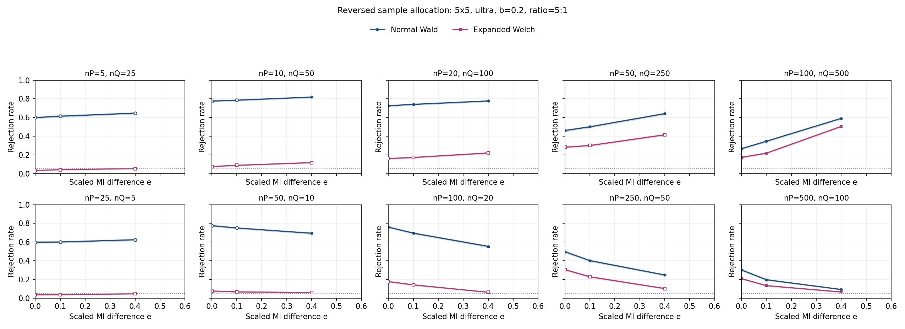

| Specification | Setting |
| --- | --- |
| Table shape | 5x5 |
| Population construction | Ordinal arrangement for P and reversed ordinal for Q |
| Horizontal graph regime specifications (columns) | {smaller n=5, smaller n=10, smaller n=20, smaller n=50, smaller n=100} |
| Vertical graph regime specifications (rows) | {Q larger, P larger}. $P$: row 1 and column 1 each have probability 0.95; $Q$: row 2 and column 5 each have probability 0.95; every other row has probability $0.05/4$, every other column $0.05/4$. These are row/column totals, not cell probabilities; they stay fixed across all panels and MI differences in this figure. |
| MI settings (nats) | M approximately 0.1945; b=0.2; I(P) approximately 0.0389; e in [0.0, 0.1, 0.4]; I(Q)=(b+e)M |
| Axes | e from 0 to 0.6; rejection rate from 0 to 1 |
| Replicates | 10,000 independent table pairs per point |

Exact rejection rates, intervals, validity and expected counts

| nP | nQ | e | Method | Rejection rate | 95% lower | 95% upper | Valid rate | Rejection rate among valid results | Minimum expected count P | Minimum expected count Q |
| --- | --- | --- | --- | --- | --- | --- | --- | --- | --- | --- |
| 5 | 25 | 0 | Expanded Welch | 0.0326 | 0.02929 | 0.03626 | 0.0564 | 0.578 | 0.001 | 0.0001674 |
| 5 | 25 | 0 | Normal Wald | 0.5994 | 0.5898 | 0.609 | 0.6004 | 0.9983 | 0.001 | 0.0001674 |
| 5 | 25 | 0.1 | Expanded Welch | 0.0417 | 0.03795 | 0.0458 | 0.0604 | 0.6904 | 0.001 | 4.458e-05 |
| 5 | 25 | 0.1 | Normal Wald | 0.6143 | 0.6047 | 0.6238 | 0.6152 | 0.9985 | 0.001 | 4.458e-05 |
| 5 | 25 | 0.4 | Expanded Welch | 0.0532 | 0.04897 | 0.05777 | 0.063 | 0.8444 | 0.001 | 3.44e-09 |
| 5 | 25 | 0.4 | Normal Wald | 0.6468 | 0.6374 | 0.6561 | 0.6483 | 0.9977 | 0.001 | 3.44e-09 |
| 10 | 50 | 0 | Expanded Welch | 0.0747 | 0.06971 | 0.08002 | 0.1954 | 0.3823 | 0.002001 | 0.0003348 |
| 10 | 50 | 0 | Normal Wald | 0.776 | 0.7677 | 0.7841 | 0.8954 | 0.8667 | 0.002001 | 0.0003348 |
| 10 | 50 | 0.1 | Expanded Welch | 0.0881 | 0.0827 | 0.09381 | 0.1977 | 0.4456 | 0.002001 | 8.916e-05 |
| 10 | 50 | 0.1 | Normal Wald | 0.7857 | 0.7775 | 0.7936 | 0.8956 | 0.8773 | 0.002001 | 8.916e-05 |
| 10 | 50 | 0.4 | Expanded Welch | 0.1169 | 0.1107 | 0.1233 | 0.1897 | 0.6162 | 0.002001 | 6.88e-09 |
| 10 | 50 | 0.4 | Normal Wald | 0.8189 | 0.8112 | 0.8263 | 0.9007 | 0.9092 | 0.002001 | 6.88e-09 |
| 20 | 100 | 0 | Expanded Welch | 0.1606 | 0.1535 | 0.1679 | 0.4626 | 0.3472 | 0.004001 | 0.0006697 |
| 20 | 100 | 0 | Normal Wald | 0.7261 | 0.7173 | 0.7348 | 0.9936 | 0.7308 | 0.004001 | 0.0006697 |
| 20 | 100 | 0.1 | Expanded Welch | 0.1721 | 0.1648 | 0.1796 | 0.4569 | 0.3767 | 0.004001 | 0.0001783 |
| 20 | 100 | 0.1 | Normal Wald | 0.7409 | 0.7322 | 0.7494 | 0.9951 | 0.7445 | 0.004001 | 0.0001783 |
| 20 | 100 | 0.4 | Expanded Welch | 0.2202 | 0.2122 | 0.2284 | 0.4615 | 0.4771 | 0.004001 | 1.376e-08 |
| 20 | 100 | 0.4 | Normal Wald | 0.7773 | 0.769 | 0.7853 | 0.9951 | 0.7811 | 0.004001 | 1.376e-08 |
| 25 | 5 | 0 | Expanded Welch | 0.0356 | 0.03214 | 0.03941 | 0.0557 | 0.6391 | 0.005001 | 3.348e-05 |
| 25 | 5 | 0 | Normal Wald | 0.599 | 0.5894 | 0.6086 | 0.6001 | 0.9982 | 0.005001 | 3.348e-05 |
| 25 | 5 | 0.1 | Expanded Welch | 0.0362 | 0.03271 | 0.04004 | 0.0585 | 0.6188 | 0.005001 | 8.916e-06 |
| 25 | 5 | 0.1 | Normal Wald | 0.6002 | 0.5906 | 0.6098 | 0.6011 | 0.9985 | 0.005001 | 8.916e-06 |
| 25 | 5 | 0.4 | Expanded Welch | 0.0459 | 0.04197 | 0.05018 | 0.0818 | 0.5611 | 0.005001 | 6.88e-10 |
| 25 | 5 | 0.4 | Normal Wald | 0.6247 | 0.6152 | 0.6341 | 0.6275 | 0.9955 | 0.005001 | 6.88e-10 |
| 50 | 10 | 0 | Expanded Welch | 0.0755 | 0.07048 | 0.08084 | 0.188 | 0.4016 | 0.01 | 6.697e-05 |
| 50 | 10 | 0 | Normal Wald | 0.7758 | 0.7675 | 0.7839 | 0.8893 | 0.8724 | 0.01 | 6.697e-05 |
| 50 | 10 | 0.1 | Expanded Welch | 0.0664 | 0.06168 | 0.07145 | 0.1995 | 0.3328 | 0.01 | 1.783e-05 |
| 50 | 10 | 0.1 | Normal Wald | 0.7507 | 0.7421 | 0.7591 | 0.8908 | 0.8427 | 0.01 | 1.783e-05 |
| 50 | 10 | 0.4 | Expanded Welch | 0.0593 | 0.05484 | 0.0641 | 0.2428 | 0.2442 | 0.01 | 1.376e-09 |
| 50 | 10 | 0.4 | Normal Wald | 0.6941 | 0.685 | 0.7031 | 0.9014 | 0.77 | 0.01 | 1.376e-09 |
| 50 | 250 | 0 | Expanded Welch | 0.282 | 0.2733 | 0.2909 | 0.8625 | 0.327 | 0.01 | 0.001674 |
| 50 | 250 | 0 | Normal Wald | 0.4607 | 0.4509 | 0.4705 | 1 | 0.4607 | 0.01 | 0.001674 |
| 50 | 250 | 0.1 | Expanded Welch | 0.3001 | 0.2912 | 0.3092 | 0.8661 | 0.3465 | 0.01 | 0.0004458 |
| 50 | 250 | 0.1 | Normal Wald | 0.5006 | 0.4908 | 0.5104 | 1 | 0.5006 | 0.01 | 0.0004458 |
| 50 | 250 | 0.4 | Expanded Welch | 0.4148 | 0.4052 | 0.4245 | 0.8567 | 0.4842 | 0.01 | 3.44e-08 |
| 50 | 250 | 0.4 | Normal Wald | 0.6415 | 0.632 | 0.6508 | 1 | 0.6415 | 0.01 | 3.44e-08 |
| 100 | 20 | 0 | Expanded Welch | 0.1768 | 0.1694 | 0.1844 | 0.4448 | 0.3975 | 0.02001 | 0.0001339 |
| 100 | 20 | 0 | Normal Wald | 0.7602 | 0.7517 | 0.7685 | 0.9945 | 0.7644 | 0.02001 | 0.0001339 |
| 100 | 20 | 0.1 | Expanded Welch | 0.1414 | 0.1347 | 0.1484 | 0.4665 | 0.3031 | 0.02001 | 3.567e-05 |
| 100 | 20 | 0.1 | Normal Wald | 0.6956 | 0.6865 | 0.7045 | 0.9946 | 0.6994 | 0.02001 | 3.567e-05 |
| 100 | 20 | 0.4 | Expanded Welch | 0.0621 | 0.05754 | 0.067 | 0.5138 | 0.1209 | 0.02001 | 2.752e-09 |
| 100 | 20 | 0.4 | Normal Wald | 0.5535 | 0.5437 | 0.5632 | 0.9943 | 0.5567 | 0.02001 | 2.752e-09 |
| 100 | 500 | 0 | Expanded Welch | 0.1732 | 0.1659 | 0.1807 | 0.9879 | 0.1753 | 0.02001 | 0.003348 |
| 100 | 500 | 0 | Normal Wald | 0.2659 | 0.2573 | 0.2746 | 1 | 0.2659 | 0.02001 | 0.003348 |
| 100 | 500 | 0.1 | Expanded Welch | 0.2182 | 0.2102 | 0.2264 | 0.9888 | 0.2207 | 0.02001 | 0.0008916 |
| 100 | 500 | 0.1 | Normal Wald | 0.346 | 0.3367 | 0.3554 | 1 | 0.346 | 0.02001 | 0.0008916 |
| 100 | 500 | 0.4 | Expanded Welch | 0.505 | 0.4952 | 0.5148 | 0.986 | 0.5122 | 0.02001 | 6.88e-08 |
| 100 | 500 | 0.4 | Normal Wald | 0.591 | 0.5813 | 0.6006 | 1 | 0.591 | 0.02001 | 6.88e-08 |
| 250 | 50 | 0 | Expanded Welch | 0.3046 | 0.2957 | 0.3137 | 0.8535 | 0.3569 | 0.05001 | 0.0003348 |
| 250 | 50 | 0 | Normal Wald | 0.4963 | 0.4865 | 0.5061 | 1 | 0.4963 | 0.05001 | 0.0003348 |
| 250 | 50 | 0.1 | Expanded Welch | 0.228 | 0.2199 | 0.2363 | 0.8588 | 0.2655 | 0.05001 | 8.916e-05 |
| 250 | 50 | 0.1 | Normal Wald | 0.4013 | 0.3917 | 0.4109 | 1 | 0.4013 | 0.05001 | 8.916e-05 |
| 250 | 50 | 0.4 | Expanded Welch | 0.1021 | 0.09632 | 0.1082 | 0.869 | 0.1175 | 0.05001 | 6.88e-09 |
| 250 | 50 | 0.4 | Normal Wald | 0.2472 | 0.2388 | 0.2558 | 1 | 0.2472 | 0.05001 | 6.88e-09 |
| 500 | 100 | 0 | Expanded Welch | 0.2078 | 0.2 | 0.2159 | 0.988 | 0.2103 | 0.1 | 0.0006697 |
| 500 | 100 | 0 | Normal Wald | 0.3017 | 0.2928 | 0.3108 | 1 | 0.3017 | 0.1 | 0.0006697 |
| 500 | 100 | 0.1 | Expanded Welch | 0.1332 | 0.1267 | 0.14 | 0.9881 | 0.1348 | 0.1 | 0.0001783 |
| 500 | 100 | 0.1 | Normal Wald | 0.1964 | 0.1887 | 0.2043 | 1 | 0.1964 | 0.1 | 0.0001783 |
| 500 | 100 | 0.4 | Expanded Welch | 0.0649 | 0.06024 | 0.0699 | 0.9868 | 0.06577 | 0.1 | 1.376e-08 |
| 500 | 100 | 0.4 | Normal Wald | 0.0919 | 0.08639 | 0.09772 | 1 | 0.0919 | 0.1 | 1.376e-08 |

### 5.19 Reversed sample allocation: 8x8, strong, b=0.2, ratio=10:1

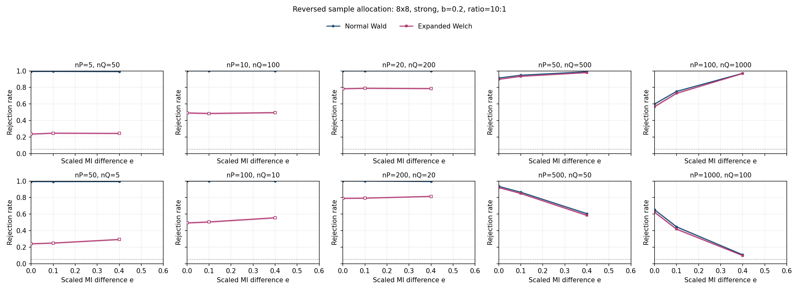

| Specification | Setting |
| --- | --- |
| Table shape | 8x8 |
| Population construction | Ordinal arrangement for P and reversed ordinal for Q |
| Horizontal graph regime specifications (columns) | {smaller n=5, smaller n=10, smaller n=20, smaller n=50, smaller n=100} |
| Vertical graph regime specifications (rows) | {Q larger, P larger}. $P$: row 1 and column 1 each have probability 0.9; $Q$: row 2 and column 8 each have probability 0.9; every other row has probability $0.1/7$, every other column $0.1/7$. These are row/column totals, not cell probabilities; they stay fixed across all panels and MI differences in this figure. |
| MI settings (nats) | M approximately 0.4029; b=0.2; I(P) approximately 0.08058; e in [0.0, 0.1, 0.4]; I(Q)=(b+e)M |
| Axes | e from 0 to 0.6; rejection rate from 0 to 1 |
| Replicates | 10,000 independent table pairs per point |

Exact rejection rates, intervals, validity and expected counts

| nP | nQ | e | Method | Rejection rate | 95% lower | 95% upper | Valid rate | Rejection rate among valid results | Minimum expected count P | Minimum expected count Q |
| --- | --- | --- | --- | --- | --- | --- | --- | --- | --- | --- |
| 5 | 50 | 0 | Expanded Welch | 0.2354 | 0.2272 | 0.2438 | 0.2401 | 0.9804 | 0.0004151 | 0.0005417 |
| 5 | 50 | 0 | Normal Wald | 0.9927 | 0.9908 | 0.9942 | 0.9927 | 1 | 0.0004151 | 0.0005417 |
| 5 | 50 | 0.1 | Expanded Welch | 0.2465 | 0.2382 | 0.255 | 0.2527 | 0.9755 | 0.0004151 | 9.69e-05 |
| 5 | 50 | 0.1 | Normal Wald | 0.9934 | 0.9916 | 0.9948 | 0.9934 | 1 | 0.0004151 | 9.69e-05 |
| 5 | 50 | 0.4 | Expanded Welch | 0.2433 | 0.235 | 0.2518 | 0.2461 | 0.9886 | 0.0004151 | 3.967e-11 |
| 5 | 50 | 0.4 | Normal Wald | 0.9914 | 0.9894 | 0.993 | 0.9914 | 1 | 0.0004151 | 3.967e-11 |
| 10 | 100 | 0 | Expanded Welch | 0.4909 | 0.4811 | 0.5007 | 0.491 | 0.9998 | 0.0008301 | 0.001083 |
| 10 | 100 | 0 | Normal Wald | 1 | 0.9996 | 1 | 1 | 1 | 0.0008301 | 0.001083 |
| 10 | 100 | 0.1 | Expanded Welch | 0.4851 | 0.4753 | 0.4949 | 0.4852 | 0.9998 | 0.0008301 | 0.0001938 |
| 10 | 100 | 0.1 | Normal Wald | 0.9999 | 0.9994 | 1 | 0.9999 | 1 | 0.0008301 | 0.0001938 |
| 10 | 100 | 0.4 | Expanded Welch | 0.4951 | 0.4853 | 0.5049 | 0.4951 | 1 | 0.0008301 | 7.934e-11 |
| 10 | 100 | 0.4 | Normal Wald | 1 | 0.9996 | 1 | 1 | 1 | 0.0008301 | 7.934e-11 |
| 20 | 200 | 0 | Expanded Welch | 0.7842 | 0.776 | 0.7922 | 0.7845 | 0.9996 | 0.00166 | 0.002167 |
| 20 | 200 | 0 | Normal Wald | 0.9998 | 0.9993 | 0.9999 | 1 | 0.9998 | 0.00166 | 0.002167 |
| 20 | 200 | 0.1 | Expanded Welch | 0.7904 | 0.7823 | 0.7983 | 0.7906 | 0.9997 | 0.00166 | 0.0003876 |
| 20 | 200 | 0.1 | Normal Wald | 0.9998 | 0.9993 | 0.9999 | 1 | 0.9998 | 0.00166 | 0.0003876 |
| 20 | 200 | 0.4 | Expanded Welch | 0.7864 | 0.7783 | 0.7943 | 0.7865 | 0.9999 | 0.00166 | 1.587e-10 |
| 20 | 200 | 0.4 | Normal Wald | 1 | 0.9996 | 1 | 1 | 1 | 0.00166 | 1.587e-10 |
| 50 | 5 | 0 | Expanded Welch | 0.2407 | 0.2324 | 0.2492 | 0.2467 | 0.9757 | 0.004151 | 5.417e-05 |
| 50 | 5 | 0 | Normal Wald | 0.9931 | 0.9913 | 0.9945 | 0.9931 | 1 | 0.004151 | 5.417e-05 |
| 50 | 5 | 0.1 | Expanded Welch | 0.2494 | 0.241 | 0.258 | 0.2576 | 0.9682 | 0.004151 | 9.69e-06 |
| 50 | 5 | 0.1 | Normal Wald | 0.9929 | 0.9911 | 0.9944 | 0.9929 | 1 | 0.004151 | 9.69e-06 |
| 50 | 5 | 0.4 | Expanded Welch | 0.2928 | 0.284 | 0.3018 | 0.3081 | 0.9503 | 0.004151 | 3.967e-12 |
| 50 | 5 | 0.4 | Normal Wald | 0.9936 | 0.9918 | 0.995 | 0.9936 | 1 | 0.004151 | 3.967e-12 |
| 50 | 500 | 0 | Expanded Welch | 0.8985 | 0.8924 | 0.9043 | 0.9903 | 0.9073 | 0.004151 | 0.005417 |
| 50 | 500 | 0 | Normal Wald | 0.9148 | 0.9092 | 0.9201 | 1 | 0.9148 | 0.004151 | 0.005417 |
| 50 | 500 | 0.1 | Expanded Welch | 0.9346 | 0.9296 | 0.9393 | 0.9902 | 0.9438 | 0.004151 | 0.000969 |
| 50 | 500 | 0.1 | Normal Wald | 0.9486 | 0.9441 | 0.9528 | 1 | 0.9486 | 0.004151 | 0.000969 |
| 50 | 500 | 0.4 | Expanded Welch | 0.9792 | 0.9762 | 0.9818 | 0.9886 | 0.9905 | 0.004151 | 3.967e-10 |
| 50 | 500 | 0.4 | Normal Wald | 0.9911 | 0.9891 | 0.9928 | 1 | 0.9911 | 0.004151 | 3.967e-10 |
| 100 | 10 | 0 | Expanded Welch | 0.4931 | 0.4833 | 0.5029 | 0.4932 | 0.9998 | 0.008301 | 0.0001083 |
| 100 | 10 | 0 | Normal Wald | 0.9999 | 0.9994 | 1 | 0.9999 | 1 | 0.008301 | 0.0001083 |
| 100 | 10 | 0.1 | Expanded Welch | 0.5051 | 0.4953 | 0.5149 | 0.5051 | 1 | 0.008301 | 1.938e-05 |
| 100 | 10 | 0.1 | Normal Wald | 1 | 0.9996 | 1 | 1 | 1 | 0.008301 | 1.938e-05 |
| 100 | 10 | 0.4 | Expanded Welch | 0.5555 | 0.5457 | 0.5652 | 0.5556 | 0.9998 | 0.008301 | 7.934e-12 |
| 100 | 10 | 0.4 | Normal Wald | 0.9999 | 0.9994 | 1 | 0.9999 | 1 | 0.008301 | 7.934e-12 |
| 100 | 1000 | 0 | Expanded Welch | 0.5681 | 0.5584 | 0.5778 | 1 | 0.5681 | 0.008301 | 0.01083 |
| 100 | 1000 | 0 | Normal Wald | 0.6002 | 0.5906 | 0.6098 | 1 | 0.6002 | 0.008301 | 0.01083 |
| 100 | 1000 | 0.1 | Expanded Welch | 0.7295 | 0.7207 | 0.7381 | 0.9999 | 0.7296 | 0.008301 | 0.001938 |
| 100 | 1000 | 0.1 | Normal Wald | 0.7529 | 0.7444 | 0.7613 | 1 | 0.7529 | 0.008301 | 0.001938 |
| 100 | 1000 | 0.4 | Expanded Welch | 0.9691 | 0.9655 | 0.9723 | 1 | 0.9691 | 0.008301 | 7.934e-10 |
| 100 | 1000 | 0.4 | Normal Wald | 0.9718 | 0.9684 | 0.9749 | 1 | 0.9718 | 0.008301 | 7.934e-10 |
| 200 | 20 | 0 | Expanded Welch | 0.7906 | 0.7825 | 0.7985 | 0.7908 | 0.9997 | 0.0166 | 0.0002167 |
| 200 | 20 | 0 | Normal Wald | 0.9999 | 0.9994 | 1 | 1 | 0.9999 | 0.0166 | 0.0002167 |
| 200 | 20 | 0.1 | Expanded Welch | 0.7937 | 0.7857 | 0.8015 | 0.7943 | 0.9992 | 0.0166 | 3.876e-05 |
| 200 | 20 | 0.1 | Normal Wald | 0.9994 | 0.9987 | 0.9997 | 1 | 0.9994 | 0.0166 | 3.876e-05 |
| 200 | 20 | 0.4 | Expanded Welch | 0.8146 | 0.8069 | 0.8221 | 0.8204 | 0.9929 | 0.0166 | 1.587e-11 |
| 200 | 20 | 0.4 | Normal Wald | 0.9946 | 0.993 | 0.9959 | 1 | 0.9946 | 0.0166 | 1.587e-11 |
| 500 | 50 | 0 | Expanded Welch | 0.9213 | 0.9159 | 0.9264 | 0.9903 | 0.9303 | 0.04151 | 0.0005417 |
| 500 | 50 | 0 | Normal Wald | 0.9366 | 0.9317 | 0.9412 | 1 | 0.9366 | 0.04151 | 0.0005417 |
| 500 | 50 | 0.1 | Expanded Welch | 0.8497 | 0.8426 | 0.8566 | 0.9919 | 0.8566 | 0.04151 | 9.69e-05 |
| 500 | 50 | 0.1 | Normal Wald | 0.8653 | 0.8585 | 0.8719 | 1 | 0.8653 | 0.04151 | 9.69e-05 |
| 500 | 50 | 0.4 | Expanded Welch | 0.5849 | 0.5752 | 0.5945 | 0.991 | 0.5902 | 0.04151 | 3.967e-11 |
| 500 | 50 | 0.4 | Normal Wald | 0.6053 | 0.5957 | 0.6148 | 1 | 0.6053 | 0.04151 | 3.967e-11 |
| 1000 | 100 | 0 | Expanded Welch | 0.6222 | 0.6127 | 0.6317 | 1 | 0.6222 | 0.08301 | 0.001083 |
| 1000 | 100 | 0 | Normal Wald | 0.6523 | 0.6429 | 0.6616 | 1 | 0.6523 | 0.08301 | 0.001083 |
| 1000 | 100 | 0.1 | Expanded Welch | 0.4176 | 0.408 | 0.4273 | 1 | 0.4176 | 0.08301 | 0.0001938 |
| 1000 | 100 | 0.1 | Normal Wald | 0.4454 | 0.4357 | 0.4552 | 1 | 0.4454 | 0.08301 | 0.0001938 |
| 1000 | 100 | 0.4 | Expanded Welch | 0.0974 | 0.09174 | 0.1034 | 1 | 0.0974 | 0.08301 | 7.934e-11 |
| 1000 | 100 | 0.4 | Normal Wald | 0.1073 | 0.1014 | 0.1135 | 1 | 0.1073 | 0.08301 | 7.934e-11 |

### 5.20 Reversed sample allocation: 8x8, strong, b=0.2, ratio=2:1

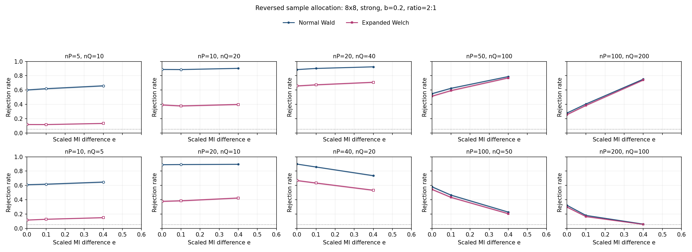

| Specification | Setting |
| --- | --- |
| Table shape | 8x8 |
| Population construction | Ordinal arrangement for P and reversed ordinal for Q |
| Horizontal graph regime specifications (columns) | {smaller n=5, smaller n=10, smaller n=20, smaller n=50, smaller n=100} |
| Vertical graph regime specifications (rows) | {Q larger, P larger}. $P$: row 1 and column 1 each have probability 0.9; $Q$: row 2 and column 8 each have probability 0.9; every other row has probability $0.1/7$, every other column $0.1/7$. These are row/column totals, not cell probabilities; they stay fixed across all panels and MI differences in this figure. |
| MI settings (nats) | M approximately 0.4029; b=0.2; I(P) approximately 0.08058; e in [0.0, 0.1, 0.4]; I(Q)=(b+e)M |
| Axes | e from 0 to 0.6; rejection rate from 0 to 1 |
| Replicates | 10,000 independent table pairs per point |

Exact rejection rates, intervals, validity and expected counts

| nP | nQ | e | Method | Rejection rate | 95% lower | 95% upper | Valid rate | Rejection rate among valid results | Minimum expected count P | Minimum expected count Q |
| --- | --- | --- | --- | --- | --- | --- | --- | --- | --- | --- |
| 5 | 10 | 0 | Expanded Welch | 0.1179 | 0.1117 | 0.1244 | 0.1203 | 0.98 | 0.0004151 | 0.0001083 |
| 5 | 10 | 0 | Normal Wald | 0.6007 | 0.5911 | 0.6103 | 0.6007 | 1 | 0.0004151 | 0.0001083 |
| 5 | 10 | 0.1 | Expanded Welch | 0.1174 | 0.1112 | 0.1239 | 0.119 | 0.9866 | 0.0004151 | 1.938e-05 |
| 5 | 10 | 0.1 | Normal Wald | 0.6185 | 0.6089 | 0.628 | 0.6185 | 1 | 0.0004151 | 1.938e-05 |
| 5 | 10 | 0.4 | Expanded Welch | 0.1331 | 0.1266 | 0.1399 | 0.1337 | 0.9955 | 0.0004151 | 7.934e-12 |
| 5 | 10 | 0.4 | Normal Wald | 0.6588 | 0.6494 | 0.668 | 0.6588 | 1 | 0.0004151 | 7.934e-12 |
| 10 | 5 | 0 | Expanded Welch | 0.1153 | 0.1092 | 0.1217 | 0.1176 | 0.9804 | 0.0008301 | 5.417e-05 |
| 10 | 5 | 0 | Normal Wald | 0.6093 | 0.5997 | 0.6188 | 0.6093 | 1 | 0.0008301 | 5.417e-05 |
| 10 | 5 | 0.1 | Expanded Welch | 0.127 | 0.1206 | 0.1337 | 0.1304 | 0.9739 | 0.0008301 | 9.69e-06 |
| 10 | 5 | 0.1 | Normal Wald | 0.6168 | 0.6072 | 0.6263 | 0.6168 | 1 | 0.0008301 | 9.69e-06 |
| 10 | 5 | 0.4 | Expanded Welch | 0.1491 | 0.1423 | 0.1562 | 0.1554 | 0.9595 | 0.0008301 | 3.967e-12 |
| 10 | 5 | 0.4 | Normal Wald | 0.6466 | 0.6372 | 0.6559 | 0.6466 | 1 | 0.0008301 | 3.967e-12 |
| 10 | 20 | 0 | Expanded Welch | 0.3919 | 0.3824 | 0.4015 | 0.399 | 0.9822 | 0.0008301 | 0.0002167 |
| 10 | 20 | 0 | Normal Wald | 0.8882 | 0.8819 | 0.8942 | 0.892 | 0.9957 | 0.0008301 | 0.0002167 |
| 10 | 20 | 0.1 | Expanded Welch | 0.3776 | 0.3681 | 0.3871 | 0.3838 | 0.9838 | 0.0008301 | 3.876e-05 |
| 10 | 20 | 0.1 | Normal Wald | 0.8867 | 0.8803 | 0.8928 | 0.8902 | 0.9961 | 0.0008301 | 3.876e-05 |
| 10 | 20 | 0.4 | Expanded Welch | 0.3982 | 0.3886 | 0.4078 | 0.4014 | 0.992 | 0.0008301 | 1.587e-11 |
| 10 | 20 | 0.4 | Normal Wald | 0.9036 | 0.8977 | 0.9092 | 0.9067 | 0.9966 | 0.0008301 | 1.587e-11 |
| 20 | 10 | 0 | Expanded Welch | 0.3772 | 0.3677 | 0.3867 | 0.3843 | 0.9815 | 0.00166 | 0.0001083 |
| 20 | 10 | 0 | Normal Wald | 0.89 | 0.8837 | 0.896 | 0.8923 | 0.9974 | 0.00166 | 0.0001083 |
| 20 | 10 | 0.1 | Expanded Welch | 0.3849 | 0.3754 | 0.3945 | 0.3924 | 0.9809 | 0.00166 | 1.938e-05 |
| 20 | 10 | 0.1 | Normal Wald | 0.8921 | 0.8859 | 0.898 | 0.8969 | 0.9946 | 0.00166 | 1.938e-05 |
| 20 | 10 | 0.4 | Expanded Welch | 0.4237 | 0.414 | 0.4334 | 0.435 | 0.974 | 0.00166 | 7.934e-12 |
| 20 | 10 | 0.4 | Normal Wald | 0.8956 | 0.8895 | 0.9014 | 0.9068 | 0.9876 | 0.00166 | 7.934e-12 |
| 20 | 40 | 0 | Expanded Welch | 0.6572 | 0.6478 | 0.6664 | 0.7659 | 0.8581 | 0.00166 | 0.0004334 |
| 20 | 40 | 0 | Normal Wald | 0.8865 | 0.8801 | 0.8926 | 0.9947 | 0.8912 | 0.00166 | 0.0004334 |
| 20 | 40 | 0.1 | Expanded Welch | 0.6729 | 0.6636 | 0.682 | 0.7673 | 0.877 | 0.00166 | 7.752e-05 |
| 20 | 40 | 0.1 | Normal Wald | 0.9024 | 0.8964 | 0.9081 | 0.9939 | 0.9079 | 0.00166 | 7.752e-05 |
| 20 | 40 | 0.4 | Expanded Welch | 0.7084 | 0.6994 | 0.7172 | 0.7805 | 0.9076 | 0.00166 | 3.173e-11 |
| 20 | 40 | 0.4 | Normal Wald | 0.9248 | 0.9195 | 0.9298 | 0.9954 | 0.9291 | 0.00166 | 3.173e-11 |
| 40 | 20 | 0 | Expanded Welch | 0.6682 | 0.6589 | 0.6774 | 0.7639 | 0.8747 | 0.00332 | 0.0002167 |
| 40 | 20 | 0 | Normal Wald | 0.8985 | 0.8924 | 0.9043 | 0.9938 | 0.9041 | 0.00332 | 0.0002167 |
| 40 | 20 | 0.1 | Expanded Welch | 0.6332 | 0.6237 | 0.6426 | 0.7691 | 0.8233 | 0.00332 | 3.876e-05 |
| 40 | 20 | 0.1 | Normal Wald | 0.8579 | 0.8509 | 0.8646 | 0.9935 | 0.8635 | 0.00332 | 3.876e-05 |
| 40 | 20 | 0.4 | Expanded Welch | 0.5324 | 0.5226 | 0.5422 | 0.7902 | 0.6738 | 0.00332 | 1.587e-11 |
| 40 | 20 | 0.4 | Normal Wald | 0.7362 | 0.7275 | 0.7447 | 0.9946 | 0.7402 | 0.00332 | 1.587e-11 |
| 50 | 100 | 0 | Expanded Welch | 0.5136 | 0.5038 | 0.5234 | 0.9898 | 0.5189 | 0.004151 | 0.001083 |
| 50 | 100 | 0 | Normal Wald | 0.549 | 0.5392 | 0.5587 | 1 | 0.549 | 0.004151 | 0.001083 |
| 50 | 100 | 0.1 | Expanded Welch | 0.5919 | 0.5822 | 0.6015 | 0.9896 | 0.5981 | 0.004151 | 0.0001938 |
| 50 | 100 | 0.1 | Normal Wald | 0.6241 | 0.6146 | 0.6335 | 1 | 0.6241 | 0.004151 | 0.0001938 |
| 50 | 100 | 0.4 | Expanded Welch | 0.7695 | 0.7611 | 0.7777 | 0.9915 | 0.7761 | 0.004151 | 7.934e-11 |
| 50 | 100 | 0.4 | Normal Wald | 0.7884 | 0.7803 | 0.7963 | 1 | 0.7884 | 0.004151 | 7.934e-11 |
| 100 | 50 | 0 | Expanded Welch | 0.5447 | 0.5349 | 0.5544 | 0.9909 | 0.5497 | 0.008301 | 0.0005417 |
| 100 | 50 | 0 | Normal Wald | 0.5806 | 0.5709 | 0.5902 | 1 | 0.5806 | 0.008301 | 0.0005417 |
| 100 | 50 | 0.1 | Expanded Welch | 0.4327 | 0.423 | 0.4424 | 0.991 | 0.4366 | 0.008301 | 9.69e-05 |
| 100 | 50 | 0.1 | Normal Wald | 0.4639 | 0.4541 | 0.4737 | 1 | 0.4639 | 0.008301 | 9.69e-05 |
| 100 | 50 | 0.4 | Expanded Welch | 0.2044 | 0.1966 | 0.2124 | 0.9893 | 0.2066 | 0.008301 | 3.967e-11 |
| 100 | 50 | 0.4 | Normal Wald | 0.2269 | 0.2188 | 0.2352 | 1 | 0.2269 | 0.008301 | 3.967e-11 |
| 100 | 200 | 0 | Expanded Welch | 0.2558 | 0.2473 | 0.2644 | 1 | 0.2558 | 0.008301 | 0.002167 |
| 100 | 200 | 0 | Normal Wald | 0.2784 | 0.2697 | 0.2873 | 1 | 0.2784 | 0.008301 | 0.002167 |
| 100 | 200 | 0.1 | Expanded Welch | 0.3849 | 0.3754 | 0.3945 | 1 | 0.3849 | 0.008301 | 0.0003876 |
| 100 | 200 | 0.1 | Normal Wald | 0.4052 | 0.3956 | 0.4149 | 1 | 0.4052 | 0.008301 | 0.0003876 |
| 100 | 200 | 0.4 | Expanded Welch | 0.7394 | 0.7307 | 0.7479 | 1 | 0.7394 | 0.008301 | 1.587e-10 |
| 100 | 200 | 0.4 | Normal Wald | 0.7518 | 0.7432 | 0.7602 | 1 | 0.7518 | 0.008301 | 1.587e-10 |
| 200 | 100 | 0 | Expanded Welch | 0.2976 | 0.2887 | 0.3066 | 0.9999 | 0.2976 | 0.0166 | 0.001083 |
| 200 | 100 | 0 | Normal Wald | 0.3221 | 0.313 | 0.3313 | 1 | 0.3221 | 0.0166 | 0.001083 |
| 200 | 100 | 0.1 | Expanded Welch | 0.1637 | 0.1566 | 0.1711 | 1 | 0.1637 | 0.0166 | 0.0001938 |
| 200 | 100 | 0.1 | Normal Wald | 0.1802 | 0.1728 | 0.1879 | 1 | 0.1802 | 0.0166 | 0.0001938 |
| 200 | 100 | 0.4 | Expanded Welch | 0.0548 | 0.05051 | 0.05943 | 1 | 0.0548 | 0.0166 | 7.934e-11 |
| 200 | 100 | 0.4 | Normal Wald | 0.0593 | 0.05484 | 0.0641 | 1 | 0.0593 | 0.0166 | 7.934e-11 |

### 5.21 Reversed sample allocation: 8x8, strong, b=0.2, ratio=5:1

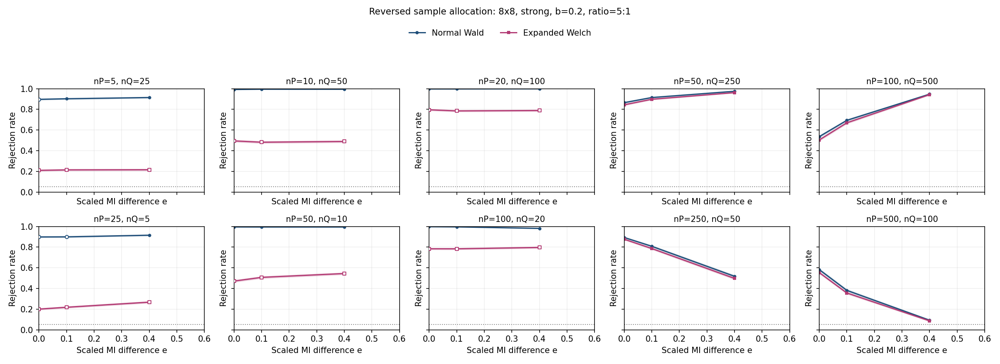

| Specification | Setting |
| --- | --- |
| Table shape | 8x8 |
| Population construction | Ordinal arrangement for P and reversed ordinal for Q |
| Horizontal graph regime specifications (columns) | {smaller n=5, smaller n=10, smaller n=20, smaller n=50, smaller n=100} |
| Vertical graph regime specifications (rows) | {Q larger, P larger}. $P$: row 1 and column 1 each have probability 0.9; $Q$: row 2 and column 8 each have probability 0.9; every other row has probability $0.1/7$, every other column $0.1/7$. These are row/column totals, not cell probabilities; they stay fixed across all panels and MI differences in this figure. |
| MI settings (nats) | M approximately 0.4029; b=0.2; I(P) approximately 0.08058; e in [0.0, 0.1, 0.4]; I(Q)=(b+e)M |
| Axes | e from 0 to 0.6; rejection rate from 0 to 1 |
| Replicates | 10,000 independent table pairs per point |

Exact rejection rates, intervals, validity and expected counts

| nP | nQ | e | Method | Rejection rate | 95% lower | 95% upper | Valid rate | Rejection rate among valid results | Minimum expected count P | Minimum expected count Q |
| --- | --- | --- | --- | --- | --- | --- | --- | --- | --- | --- |
| 5 | 25 | 0 | Expanded Welch | 0.2094 | 0.2015 | 0.2175 | 0.214 | 0.9785 | 0.0004151 | 0.0002709 |
| 5 | 25 | 0 | Normal Wald | 0.8973 | 0.8912 | 0.9031 | 0.8973 | 1 | 0.0004151 | 0.0002709 |
| 5 | 25 | 0.1 | Expanded Welch | 0.2141 | 0.2062 | 0.2222 | 0.2175 | 0.9844 | 0.0004151 | 4.845e-05 |
| 5 | 25 | 0.1 | Normal Wald | 0.9029 | 0.8969 | 0.9085 | 0.9029 | 1 | 0.0004151 | 4.845e-05 |
| 5 | 25 | 0.4 | Expanded Welch | 0.2154 | 0.2075 | 0.2236 | 0.2167 | 0.994 | 0.0004151 | 1.983e-11 |
| 5 | 25 | 0.4 | Normal Wald | 0.9148 | 0.9092 | 0.9201 | 0.9148 | 1 | 0.0004151 | 1.983e-11 |
| 10 | 50 | 0 | Expanded Welch | 0.4946 | 0.4848 | 0.5044 | 0.4949 | 0.9994 | 0.0008301 | 0.0005417 |
| 10 | 50 | 0 | Normal Wald | 0.9926 | 0.9907 | 0.9941 | 0.9926 | 1 | 0.0008301 | 0.0005417 |
| 10 | 50 | 0.1 | Expanded Welch | 0.482 | 0.4722 | 0.4918 | 0.4824 | 0.9992 | 0.0008301 | 9.69e-05 |
| 10 | 50 | 0.1 | Normal Wald | 0.9953 | 0.9938 | 0.9965 | 0.9953 | 1 | 0.0008301 | 9.69e-05 |
| 10 | 50 | 0.4 | Expanded Welch | 0.4892 | 0.4794 | 0.499 | 0.4902 | 0.998 | 0.0008301 | 3.967e-11 |
| 10 | 50 | 0.4 | Normal Wald | 0.9952 | 0.9936 | 0.9964 | 0.9952 | 1 | 0.0008301 | 3.967e-11 |
| 20 | 100 | 0 | Expanded Welch | 0.7961 | 0.7881 | 0.8039 | 0.7985 | 0.997 | 0.00166 | 0.001083 |
| 20 | 100 | 0 | Normal Wald | 0.9978 | 0.9967 | 0.9985 | 1 | 0.9978 | 0.00166 | 0.001083 |
| 20 | 100 | 0.1 | Expanded Welch | 0.7853 | 0.7771 | 0.7932 | 0.7873 | 0.9975 | 0.00166 | 0.0001938 |
| 20 | 100 | 0.1 | Normal Wald | 0.998 | 0.9969 | 0.9987 | 1 | 0.998 | 0.00166 | 0.0001938 |
| 20 | 100 | 0.4 | Expanded Welch | 0.789 | 0.7809 | 0.7969 | 0.7897 | 0.9991 | 0.00166 | 7.934e-11 |
| 20 | 100 | 0.4 | Normal Wald | 0.9993 | 0.9986 | 0.9997 | 1 | 0.9993 | 0.00166 | 7.934e-11 |
| 25 | 5 | 0 | Expanded Welch | 0.2001 | 0.1924 | 0.2081 | 0.2039 | 0.9814 | 0.002075 | 5.417e-05 |
| 25 | 5 | 0 | Normal Wald | 0.8989 | 0.8928 | 0.9047 | 0.8989 | 1 | 0.002075 | 5.417e-05 |
| 25 | 5 | 0.1 | Expanded Welch | 0.218 | 0.21 | 0.2262 | 0.2222 | 0.9811 | 0.002075 | 9.69e-06 |
| 25 | 5 | 0.1 | Normal Wald | 0.8998 | 0.8938 | 0.9055 | 0.8998 | 1 | 0.002075 | 9.69e-06 |
| 25 | 5 | 0.4 | Expanded Welch | 0.2674 | 0.2588 | 0.2762 | 0.2775 | 0.9636 | 0.002075 | 3.967e-12 |
| 25 | 5 | 0.4 | Normal Wald | 0.9157 | 0.9101 | 0.921 | 0.9157 | 1 | 0.002075 | 3.967e-12 |
| 50 | 10 | 0 | Expanded Welch | 0.4715 | 0.4617 | 0.4813 | 0.4725 | 0.9979 | 0.004151 | 0.0001083 |
| 50 | 10 | 0 | Normal Wald | 0.9958 | 0.9943 | 0.9969 | 0.9958 | 1 | 0.004151 | 0.0001083 |
| 50 | 10 | 0.1 | Expanded Welch | 0.5075 | 0.4977 | 0.5173 | 0.5077 | 0.9996 | 0.004151 | 1.938e-05 |
| 50 | 10 | 0.1 | Normal Wald | 0.9953 | 0.9938 | 0.9965 | 0.9953 | 1 | 0.004151 | 1.938e-05 |
| 50 | 10 | 0.4 | Expanded Welch | 0.5445 | 0.5347 | 0.5542 | 0.5452 | 0.9987 | 0.004151 | 7.934e-12 |
| 50 | 10 | 0.4 | Normal Wald | 0.9952 | 0.9936 | 0.9964 | 0.9952 | 1 | 0.004151 | 7.934e-12 |
| 50 | 250 | 0 | Expanded Welch | 0.8443 | 0.8371 | 0.8513 | 0.9893 | 0.8534 | 0.004151 | 0.002709 |
| 50 | 250 | 0 | Normal Wald | 0.8653 | 0.8585 | 0.8719 | 1 | 0.8653 | 0.004151 | 0.002709 |
| 50 | 250 | 0.1 | Expanded Welch | 0.898 | 0.8919 | 0.9038 | 0.9899 | 0.9072 | 0.004151 | 0.0004845 |
| 50 | 250 | 0.1 | Normal Wald | 0.9148 | 0.9092 | 0.9201 | 1 | 0.9148 | 0.004151 | 0.0004845 |
| 50 | 250 | 0.4 | Expanded Welch | 0.9624 | 0.9585 | 0.966 | 0.9894 | 0.9727 | 0.004151 | 1.983e-10 |
| 50 | 250 | 0.4 | Normal Wald | 0.9754 | 0.9722 | 0.9783 | 1 | 0.9754 | 0.004151 | 1.983e-10 |
| 100 | 20 | 0 | Expanded Welch | 0.7842 | 0.776 | 0.7922 | 0.7863 | 0.9973 | 0.008301 | 0.0002167 |
| 100 | 20 | 0 | Normal Wald | 0.998 | 0.9969 | 0.9987 | 1 | 0.998 | 0.008301 | 0.0002167 |
| 100 | 20 | 0.1 | Expanded Welch | 0.784 | 0.7758 | 0.792 | 0.7881 | 0.9948 | 0.008301 | 3.876e-05 |
| 100 | 20 | 0.1 | Normal Wald | 0.9963 | 0.9949 | 0.9973 | 1 | 0.9963 | 0.008301 | 3.876e-05 |
| 100 | 20 | 0.4 | Expanded Welch | 0.7972 | 0.7892 | 0.805 | 0.8162 | 0.9767 | 0.008301 | 1.587e-11 |
| 100 | 20 | 0.4 | Normal Wald | 0.9816 | 0.9788 | 0.9841 | 1 | 0.9816 | 0.008301 | 1.587e-11 |
| 100 | 500 | 0 | Expanded Welch | 0.5042 | 0.4944 | 0.514 | 1 | 0.5042 | 0.008301 | 0.005417 |
| 100 | 500 | 0 | Normal Wald | 0.5363 | 0.5265 | 0.5461 | 1 | 0.5363 | 0.008301 | 0.005417 |
| 100 | 500 | 0.1 | Expanded Welch | 0.6699 | 0.6606 | 0.679 | 0.9998 | 0.67 | 0.008301 | 0.000969 |
| 100 | 500 | 0.1 | Normal Wald | 0.694 | 0.6849 | 0.703 | 1 | 0.694 | 0.008301 | 0.000969 |
| 100 | 500 | 0.4 | Expanded Welch | 0.9428 | 0.9381 | 0.9472 | 1 | 0.9428 | 0.008301 | 3.967e-10 |
| 100 | 500 | 0.4 | Normal Wald | 0.9478 | 0.9433 | 0.952 | 1 | 0.9478 | 0.008301 | 3.967e-10 |
| 250 | 50 | 0 | Expanded Welch | 0.8767 | 0.8701 | 0.883 | 0.9898 | 0.8857 | 0.02075 | 0.0005417 |
| 250 | 50 | 0 | Normal Wald | 0.8938 | 0.8876 | 0.8997 | 1 | 0.8938 | 0.02075 | 0.0005417 |
| 250 | 50 | 0.1 | Expanded Welch | 0.7867 | 0.7786 | 0.7946 | 0.9895 | 0.795 | 0.02075 | 9.69e-05 |
| 250 | 50 | 0.1 | Normal Wald | 0.8084 | 0.8006 | 0.816 | 1 | 0.8084 | 0.02075 | 9.69e-05 |
| 250 | 50 | 0.4 | Expanded Welch | 0.4973 | 0.4875 | 0.5071 | 0.9915 | 0.5016 | 0.02075 | 3.967e-11 |
| 250 | 50 | 0.4 | Normal Wald | 0.5179 | 0.5081 | 0.5277 | 1 | 0.5179 | 0.02075 | 3.967e-11 |
| 500 | 100 | 0 | Expanded Welch | 0.5535 | 0.5437 | 0.5632 | 0.9999 | 0.5536 | 0.04151 | 0.001083 |
| 500 | 100 | 0 | Normal Wald | 0.5823 | 0.5726 | 0.5919 | 1 | 0.5823 | 0.04151 | 0.001083 |
| 500 | 100 | 0.1 | Expanded Welch | 0.3563 | 0.347 | 0.3657 | 0.9998 | 0.3564 | 0.04151 | 0.0001938 |
| 500 | 100 | 0.1 | Normal Wald | 0.3815 | 0.372 | 0.3911 | 1 | 0.3815 | 0.04151 | 0.0001938 |
| 500 | 100 | 0.4 | Expanded Welch | 0.0863 | 0.08095 | 0.09196 | 1 | 0.0863 | 0.04151 | 7.934e-11 |
| 500 | 100 | 0.4 | Normal Wald | 0.0927 | 0.08717 | 0.09854 | 1 | 0.0927 | 0.04151 | 7.934e-11 |

### 5.22 Reversed sample allocation: 8x8, ultra, b=0.2, ratio=10:1

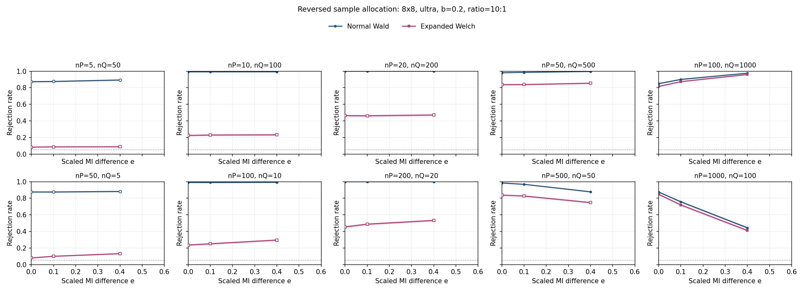

| Specification | Setting |
| --- | --- |
| Table shape | 8x8 |
| Population construction | Ordinal arrangement for P and reversed ordinal for Q |
| Horizontal graph regime specifications (columns) | {smaller n=5, smaller n=10, smaller n=20, smaller n=50, smaller n=100} |
| Vertical graph regime specifications (rows) | {Q larger, P larger}. $P$: row 1 and column 1 each have probability 0.95; $Q$: row 2 and column 8 each have probability 0.95; every other row has probability $0.05/7$, every other column $0.05/7$. These are row/column totals, not cell probabilities; they stay fixed across all panels and MI differences in this figure. |
| MI settings (nats) | M approximately 0.2309; b=0.2; I(P) approximately 0.04618; e in [0.0, 0.1, 0.4]; I(Q)=(b+e)M |
| Axes | e from 0 to 0.6; rejection rate from 0 to 1 |
| Replicates | 10,000 independent table pairs per point |

Exact rejection rates, intervals, validity and expected counts

| nP | nQ | e | Method | Rejection rate | 95% lower | 95% upper | Valid rate | Rejection rate among valid results | Minimum expected count P | Minimum expected count Q |
| --- | --- | --- | --- | --- | --- | --- | --- | --- | --- | --- |
| 5 | 50 | 0 | Expanded Welch | 0.0834 | 0.07814 | 0.08898 | 0.0848 | 0.9835 | 0.0001267 | 0.0001346 |
| 5 | 50 | 0 | Normal Wald | 0.8733 | 0.8666 | 0.8797 | 0.8733 | 1 | 0.0001267 | 0.0001346 |
| 5 | 50 | 0.1 | Expanded Welch | 0.0867 | 0.08134 | 0.09238 | 0.0882 | 0.983 | 0.0001267 | 2.529e-05 |
| 5 | 50 | 0.1 | Normal Wald | 0.8758 | 0.8692 | 0.8821 | 0.8758 | 1 | 0.0001267 | 2.529e-05 |
| 5 | 50 | 0.4 | Expanded Welch | 0.0875 | 0.08212 | 0.0932 | 0.0884 | 0.9898 | 0.0001267 | 1.788e-11 |
| 5 | 50 | 0.4 | Normal Wald | 0.8935 | 0.8873 | 0.8994 | 0.8935 | 1 | 0.0001267 | 1.788e-11 |
| 10 | 100 | 0 | Expanded Welch | 0.224 | 0.2159 | 0.2323 | 0.224 | 1 | 0.0002534 | 0.0002693 |
| 10 | 100 | 0 | Normal Wald | 0.9921 | 0.9902 | 0.9937 | 0.9921 | 1 | 0.0002534 | 0.0002693 |
| 10 | 100 | 0.1 | Expanded Welch | 0.2293 | 0.2212 | 0.2376 | 0.2294 | 0.9996 | 0.0002534 | 5.059e-05 |
| 10 | 100 | 0.1 | Normal Wald | 0.9918 | 0.9898 | 0.9934 | 0.9918 | 1 | 0.0002534 | 5.059e-05 |
| 10 | 100 | 0.4 | Expanded Welch | 0.2318 | 0.2236 | 0.2402 | 0.2318 | 1 | 0.0002534 | 3.576e-11 |
| 10 | 100 | 0.4 | Normal Wald | 0.9927 | 0.9908 | 0.9942 | 0.9927 | 1 | 0.0002534 | 3.576e-11 |
| 20 | 200 | 0 | Expanded Welch | 0.4632 | 0.4534 | 0.473 | 0.4632 | 1 | 0.0005068 | 0.0005386 |
| 20 | 200 | 0 | Normal Wald | 1 | 0.9996 | 1 | 1 | 1 | 0.0005068 | 0.0005386 |
| 20 | 200 | 0.1 | Expanded Welch | 0.4613 | 0.4515 | 0.4711 | 0.4614 | 0.9998 | 0.0005068 | 0.0001012 |
| 20 | 200 | 0.1 | Normal Wald | 0.9998 | 0.9993 | 0.9999 | 0.9999 | 0.9999 | 0.0005068 | 0.0001012 |
| 20 | 200 | 0.4 | Expanded Welch | 0.4713 | 0.4615 | 0.4811 | 0.4713 | 1 | 0.0005068 | 7.151e-11 |
| 20 | 200 | 0.4 | Normal Wald | 0.9999 | 0.9994 | 1 | 0.9999 | 1 | 0.0005068 | 7.151e-11 |
| 50 | 5 | 0 | Expanded Welch | 0.0802 | 0.07504 | 0.08569 | 0.0822 | 0.9757 | 0.001267 | 1.346e-05 |
| 50 | 5 | 0 | Normal Wald | 0.8759 | 0.8693 | 0.8822 | 0.8759 | 1 | 0.001267 | 1.346e-05 |
| 50 | 5 | 0.1 | Expanded Welch | 0.0998 | 0.09408 | 0.1058 | 0.1018 | 0.9804 | 0.001267 | 2.529e-06 |
| 50 | 5 | 0.1 | Normal Wald | 0.8759 | 0.8693 | 0.8822 | 0.8759 | 1 | 0.001267 | 2.529e-06 |
| 50 | 5 | 0.4 | Expanded Welch | 0.1314 | 0.1249 | 0.1382 | 0.1362 | 0.9648 | 0.001267 | 1.788e-12 |
| 50 | 5 | 0.4 | Normal Wald | 0.8824 | 0.8759 | 0.8886 | 0.8824 | 1 | 0.001267 | 1.788e-12 |
| 50 | 500 | 0 | Expanded Welch | 0.8373 | 0.8299 | 0.8444 | 0.8586 | 0.9752 | 0.001267 | 0.001346 |
| 50 | 500 | 0 | Normal Wald | 0.9813 | 0.9785 | 0.9838 | 1 | 0.9813 | 0.001267 | 0.001346 |
| 50 | 500 | 0.1 | Expanded Welch | 0.8381 | 0.8308 | 0.8452 | 0.8551 | 0.9801 | 0.001267 | 0.0002529 |
| 50 | 500 | 0.1 | Normal Wald | 0.9855 | 0.983 | 0.9877 | 1 | 0.9855 | 0.001267 | 0.0002529 |
| 50 | 500 | 0.4 | Expanded Welch | 0.8548 | 0.8478 | 0.8616 | 0.8587 | 0.9955 | 0.001267 | 1.788e-10 |
| 50 | 500 | 0.4 | Normal Wald | 0.9965 | 0.9951 | 0.9975 | 1 | 0.9965 | 0.001267 | 1.788e-10 |
| 100 | 10 | 0 | Expanded Welch | 0.2352 | 0.227 | 0.2436 | 0.2353 | 0.9996 | 0.002534 | 2.693e-05 |
| 100 | 10 | 0 | Normal Wald | 0.9908 | 0.9887 | 0.9925 | 0.9908 | 1 | 0.002534 | 2.693e-05 |
| 100 | 10 | 0.1 | Expanded Welch | 0.2505 | 0.2421 | 0.2591 | 0.2505 | 1 | 0.002534 | 5.059e-06 |
| 100 | 10 | 0.1 | Normal Wald | 0.9898 | 0.9876 | 0.9916 | 0.9898 | 1 | 0.002534 | 5.059e-06 |
| 100 | 10 | 0.4 | Expanded Welch | 0.2954 | 0.2865 | 0.3044 | 0.2954 | 1 | 0.002534 | 3.576e-12 |
| 100 | 10 | 0.4 | Normal Wald | 0.9925 | 0.9906 | 0.994 | 0.9925 | 1 | 0.002534 | 3.576e-12 |
| 100 | 1000 | 0 | Expanded Welch | 0.816 | 0.8083 | 0.8235 | 0.9882 | 0.8257 | 0.002534 | 0.002693 |
| 100 | 1000 | 0 | Normal Wald | 0.8503 | 0.8432 | 0.8572 | 1 | 0.8503 | 0.002534 | 0.002693 |
| 100 | 1000 | 0.1 | Expanded Welch | 0.8738 | 0.8671 | 0.8802 | 0.9893 | 0.8833 | 0.002534 | 0.0005059 |
| 100 | 1000 | 0.1 | Normal Wald | 0.9006 | 0.8946 | 0.9063 | 1 | 0.9006 | 0.002534 | 0.0005059 |
| 100 | 1000 | 0.4 | Expanded Welch | 0.9598 | 0.9558 | 0.9635 | 0.9882 | 0.9713 | 0.002534 | 3.576e-10 |
| 100 | 1000 | 0.4 | Normal Wald | 0.9755 | 0.9723 | 0.9784 | 1 | 0.9755 | 0.002534 | 3.576e-10 |
| 200 | 20 | 0 | Expanded Welch | 0.4544 | 0.4447 | 0.4642 | 0.4544 | 1 | 0.005068 | 5.386e-05 |
| 200 | 20 | 0 | Normal Wald | 1 | 0.9996 | 1 | 1 | 1 | 0.005068 | 5.386e-05 |
| 200 | 20 | 0.1 | Expanded Welch | 0.487 | 0.4772 | 0.4968 | 0.487 | 1 | 0.005068 | 1.012e-05 |
| 200 | 20 | 0.1 | Normal Wald | 1 | 0.9996 | 1 | 1 | 1 | 0.005068 | 1.012e-05 |
| 200 | 20 | 0.4 | Expanded Welch | 0.5325 | 0.5227 | 0.5423 | 0.533 | 0.9991 | 0.005068 | 7.151e-12 |
| 200 | 20 | 0.4 | Normal Wald | 0.9996 | 0.999 | 0.9998 | 1 | 0.9996 | 0.005068 | 7.151e-12 |
| 500 | 50 | 0 | Expanded Welch | 0.8381 | 0.8308 | 0.8452 | 0.8547 | 0.9806 | 0.01267 | 0.0001346 |
| 500 | 50 | 0 | Normal Wald | 0.9845 | 0.9819 | 0.9867 | 1 | 0.9845 | 0.01267 | 0.0001346 |
| 500 | 50 | 0.1 | Expanded Welch | 0.8273 | 0.8198 | 0.8346 | 0.8637 | 0.9579 | 0.01267 | 2.529e-05 |
| 500 | 50 | 0.1 | Normal Wald | 0.9684 | 0.9648 | 0.9717 | 1 | 0.9684 | 0.01267 | 2.529e-05 |
| 500 | 50 | 0.4 | Expanded Welch | 0.748 | 0.7394 | 0.7564 | 0.8768 | 0.8531 | 0.01267 | 1.788e-11 |
| 500 | 50 | 0.4 | Normal Wald | 0.878 | 0.8714 | 0.8843 | 1 | 0.878 | 0.01267 | 1.788e-11 |
| 1000 | 100 | 0 | Expanded Welch | 0.847 | 0.8398 | 0.8539 | 0.9895 | 0.856 | 0.02534 | 0.0002693 |
| 1000 | 100 | 0 | Normal Wald | 0.8752 | 0.8686 | 0.8815 | 1 | 0.8752 | 0.02534 | 0.0002693 |
| 1000 | 100 | 0.1 | Expanded Welch | 0.7194 | 0.7105 | 0.7281 | 0.9874 | 0.7286 | 0.02534 | 5.059e-05 |
| 1000 | 100 | 0.1 | Normal Wald | 0.7573 | 0.7488 | 0.7656 | 1 | 0.7573 | 0.02534 | 5.059e-05 |
| 1000 | 100 | 0.4 | Expanded Welch | 0.4108 | 0.4012 | 0.4205 | 0.9895 | 0.4152 | 0.02534 | 3.576e-11 |
| 1000 | 100 | 0.4 | Normal Wald | 0.4434 | 0.4337 | 0.4532 | 1 | 0.4434 | 0.02534 | 3.576e-11 |

### 5.23 Reversed sample allocation: 8x8, ultra, b=0.2, ratio=2:1

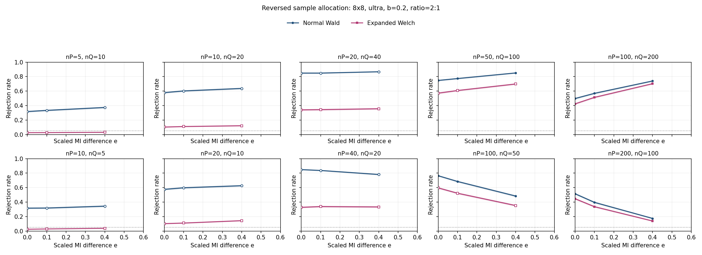

| Specification | Setting |
| --- | --- |
| Table shape | 8x8 |
| Population construction | Ordinal arrangement for P and reversed ordinal for Q |
| Horizontal graph regime specifications (columns) | {smaller n=5, smaller n=10, smaller n=20, smaller n=50, smaller n=100} |
| Vertical graph regime specifications (rows) | {Q larger, P larger}. $P$: row 1 and column 1 each have probability 0.95; $Q$: row 2 and column 8 each have probability 0.95; every other row has probability $0.05/7$, every other column $0.05/7$. These are row/column totals, not cell probabilities; they stay fixed across all panels and MI differences in this figure. |
| MI settings (nats) | M approximately 0.2309; b=0.2; I(P) approximately 0.04618; e in [0.0, 0.1, 0.4]; I(Q)=(b+e)M |
| Axes | e from 0 to 0.6; rejection rate from 0 to 1 |
| Replicates | 10,000 independent table pairs per point |

Exact rejection rates, intervals, validity and expected counts

| nP | nQ | e | Method | Rejection rate | 95% lower | 95% upper | Valid rate | Rejection rate among valid results | Minimum expected count P | Minimum expected count Q |
| --- | --- | --- | --- | --- | --- | --- | --- | --- | --- | --- |
| 5 | 10 | 0 | Expanded Welch | 0.0254 | 0.02249 | 0.02867 | 0.0259 | 0.9807 | 0.0001267 | 2.693e-05 |
| 5 | 10 | 0 | Normal Wald | 0.3174 | 0.3083 | 0.3266 | 0.3174 | 1 | 0.0001267 | 2.693e-05 |
| 5 | 10 | 0.1 | Expanded Welch | 0.0262 | 0.02325 | 0.02952 | 0.0264 | 0.9924 | 0.0001267 | 5.059e-06 |
| 5 | 10 | 0.1 | Normal Wald | 0.3334 | 0.3242 | 0.3427 | 0.3334 | 1 | 0.0001267 | 5.059e-06 |
| 5 | 10 | 0.4 | Expanded Welch | 0.0309 | 0.02768 | 0.03448 | 0.0309 | 1 | 0.0001267 | 3.576e-12 |
| 5 | 10 | 0.4 | Normal Wald | 0.3738 | 0.3644 | 0.3833 | 0.3738 | 1 | 0.0001267 | 3.576e-12 |
| 10 | 5 | 0 | Expanded Welch | 0.0248 | 0.02193 | 0.02804 | 0.0251 | 0.988 | 0.0002534 | 1.346e-05 |
| 10 | 5 | 0 | Normal Wald | 0.3162 | 0.3072 | 0.3254 | 0.3162 | 1 | 0.0002534 | 1.346e-05 |
| 10 | 5 | 0.1 | Expanded Welch | 0.0289 | 0.02579 | 0.03237 | 0.0295 | 0.9797 | 0.0002534 | 2.529e-06 |
| 10 | 5 | 0.1 | Normal Wald | 0.3178 | 0.3087 | 0.327 | 0.3178 | 1 | 0.0002534 | 2.529e-06 |
| 10 | 5 | 0.4 | Expanded Welch | 0.0382 | 0.03462 | 0.04214 | 0.0388 | 0.9845 | 0.0002534 | 1.788e-12 |
| 10 | 5 | 0.4 | Normal Wald | 0.3437 | 0.3345 | 0.3531 | 0.3437 | 1 | 0.0002534 | 1.788e-12 |
| 10 | 20 | 0 | Expanded Welch | 0.1032 | 0.09739 | 0.1093 | 0.1078 | 0.9573 | 0.0002534 | 5.386e-05 |
| 10 | 20 | 0 | Normal Wald | 0.5791 | 0.5694 | 0.5887 | 0.5792 | 0.9998 | 0.0002534 | 5.386e-05 |
| 10 | 20 | 0.1 | Expanded Welch | 0.1105 | 0.1045 | 0.1168 | 0.1145 | 0.9651 | 0.0002534 | 1.012e-05 |
| 10 | 20 | 0.1 | Normal Wald | 0.6021 | 0.5925 | 0.6117 | 0.6024 | 0.9995 | 0.0002534 | 1.012e-05 |
| 10 | 20 | 0.4 | Expanded Welch | 0.1215 | 0.1152 | 0.128 | 0.1236 | 0.983 | 0.0002534 | 7.151e-12 |
| 10 | 20 | 0.4 | Normal Wald | 0.6369 | 0.6274 | 0.6463 | 0.6372 | 0.9995 | 0.0002534 | 7.151e-12 |
| 20 | 10 | 0 | Expanded Welch | 0.1024 | 0.09661 | 0.1085 | 0.1067 | 0.9597 | 0.0005068 | 2.693e-05 |
| 20 | 10 | 0 | Normal Wald | 0.5761 | 0.5664 | 0.5858 | 0.5764 | 0.9995 | 0.0005068 | 2.693e-05 |
| 20 | 10 | 0.1 | Expanded Welch | 0.1103 | 0.1043 | 0.1166 | 0.1138 | 0.9692 | 0.0005068 | 5.059e-06 |
| 20 | 10 | 0.1 | Normal Wald | 0.5979 | 0.5883 | 0.6075 | 0.5982 | 0.9995 | 0.0005068 | 5.059e-06 |
| 20 | 10 | 0.4 | Expanded Welch | 0.1434 | 0.1367 | 0.1504 | 0.1453 | 0.9869 | 0.0005068 | 3.576e-12 |
| 20 | 10 | 0.4 | Normal Wald | 0.6264 | 0.6169 | 0.6358 | 0.6287 | 0.9963 | 0.0005068 | 3.576e-12 |
| 20 | 40 | 0 | Expanded Welch | 0.3407 | 0.3315 | 0.35 | 0.3685 | 0.9246 | 0.0005068 | 0.0001077 |
| 20 | 40 | 0 | Normal Wald | 0.8491 | 0.842 | 0.856 | 0.8845 | 0.96 | 0.0005068 | 0.0001077 |
| 20 | 40 | 0.1 | Expanded Welch | 0.3438 | 0.3346 | 0.3532 | 0.3692 | 0.9312 | 0.0005068 | 2.023e-05 |
| 20 | 40 | 0.1 | Normal Wald | 0.8491 | 0.842 | 0.856 | 0.8827 | 0.9619 | 0.0005068 | 2.023e-05 |
| 20 | 40 | 0.4 | Expanded Welch | 0.3561 | 0.3468 | 0.3655 | 0.3777 | 0.9428 | 0.0005068 | 1.43e-11 |
| 20 | 40 | 0.4 | Normal Wald | 0.8675 | 0.8607 | 0.874 | 0.8973 | 0.9668 | 0.0005068 | 1.43e-11 |
| 40 | 20 | 0 | Expanded Welch | 0.3276 | 0.3185 | 0.3369 | 0.3529 | 0.9283 | 0.001014 | 5.386e-05 |
| 40 | 20 | 0 | Normal Wald | 0.8491 | 0.842 | 0.856 | 0.8823 | 0.9624 | 0.001014 | 5.386e-05 |
| 40 | 20 | 0.1 | Expanded Welch | 0.3382 | 0.329 | 0.3475 | 0.3742 | 0.9038 | 0.001014 | 1.012e-05 |
| 40 | 20 | 0.1 | Normal Wald | 0.8372 | 0.8298 | 0.8443 | 0.8859 | 0.945 | 0.001014 | 1.012e-05 |
| 40 | 20 | 0.4 | Expanded Welch | 0.333 | 0.3238 | 0.3423 | 0.416 | 0.8005 | 0.001014 | 7.151e-12 |
| 40 | 20 | 0.4 | Normal Wald | 0.7815 | 0.7733 | 0.7895 | 0.8931 | 0.875 | 0.001014 | 7.151e-12 |
| 50 | 100 | 0 | Expanded Welch | 0.5717 | 0.562 | 0.5814 | 0.8467 | 0.6752 | 0.001267 | 0.0002693 |
| 50 | 100 | 0 | Normal Wald | 0.7474 | 0.7388 | 0.7558 | 0.9979 | 0.749 | 0.001267 | 0.0002693 |
| 50 | 100 | 0.1 | Expanded Welch | 0.608 | 0.5984 | 0.6175 | 0.8499 | 0.7154 | 0.001267 | 5.059e-05 |
| 50 | 100 | 0.1 | Normal Wald | 0.7737 | 0.7654 | 0.7818 | 0.9984 | 0.7749 | 0.001267 | 5.059e-05 |
| 50 | 100 | 0.4 | Expanded Welch | 0.6982 | 0.6891 | 0.7071 | 0.8512 | 0.8203 | 0.001267 | 3.576e-11 |
| 50 | 100 | 0.4 | Normal Wald | 0.851 | 0.8439 | 0.8578 | 0.9983 | 0.8524 | 0.001267 | 3.576e-11 |
| 100 | 50 | 0 | Expanded Welch | 0.5963 | 0.5866 | 0.6059 | 0.8514 | 0.7004 | 0.002534 | 0.0001346 |
| 100 | 50 | 0 | Normal Wald | 0.7643 | 0.7559 | 0.7725 | 0.9986 | 0.7654 | 0.002534 | 0.0001346 |
| 100 | 50 | 0.1 | Expanded Welch | 0.5222 | 0.5124 | 0.532 | 0.8514 | 0.6133 | 0.002534 | 2.529e-05 |
| 100 | 50 | 0.1 | Normal Wald | 0.6847 | 0.6755 | 0.6937 | 0.9988 | 0.6855 | 0.002534 | 2.529e-05 |
| 100 | 50 | 0.4 | Expanded Welch | 0.3522 | 0.3429 | 0.3616 | 0.8704 | 0.4046 | 0.002534 | 1.788e-11 |
| 100 | 50 | 0.4 | Normal Wald | 0.4836 | 0.4738 | 0.4934 | 0.9984 | 0.4844 | 0.002534 | 1.788e-11 |
| 100 | 200 | 0 | Expanded Welch | 0.4239 | 0.4142 | 0.4336 | 0.9877 | 0.4292 | 0.002534 | 0.0005386 |
| 100 | 200 | 0 | Normal Wald | 0.4975 | 0.4877 | 0.5073 | 1 | 0.4975 | 0.002534 | 0.0005386 |
| 100 | 200 | 0.1 | Expanded Welch | 0.5133 | 0.5035 | 0.5231 | 0.9903 | 0.5183 | 0.002534 | 0.0001012 |
| 100 | 200 | 0.1 | Normal Wald | 0.569 | 0.5593 | 0.5787 | 1 | 0.569 | 0.002534 | 0.0001012 |
| 100 | 200 | 0.4 | Expanded Welch | 0.7024 | 0.6934 | 0.7113 | 0.9881 | 0.7109 | 0.002534 | 7.151e-11 |
| 100 | 200 | 0.4 | Normal Wald | 0.74 | 0.7313 | 0.7485 | 1 | 0.74 | 0.002534 | 7.151e-11 |
| 200 | 100 | 0 | Expanded Welch | 0.4459 | 0.4362 | 0.4557 | 0.9908 | 0.45 | 0.005068 | 0.0002693 |
| 200 | 100 | 0 | Normal Wald | 0.5148 | 0.505 | 0.5246 | 1 | 0.5148 | 0.005068 | 0.0002693 |
| 200 | 100 | 0.1 | Expanded Welch | 0.3362 | 0.327 | 0.3455 | 0.9887 | 0.34 | 0.005068 | 5.059e-05 |
| 200 | 100 | 0.1 | Normal Wald | 0.396 | 0.3865 | 0.4056 | 1 | 0.396 | 0.005068 | 5.059e-05 |
| 200 | 100 | 0.4 | Expanded Welch | 0.1387 | 0.1321 | 0.1456 | 0.9893 | 0.1402 | 0.005068 | 3.576e-11 |
| 200 | 100 | 0.4 | Normal Wald | 0.1744 | 0.1671 | 0.182 | 0.9999 | 0.1744 | 0.005068 | 3.576e-11 |

### 5.24 Reversed sample allocation: 8x8, ultra, b=0.2, ratio=5:1

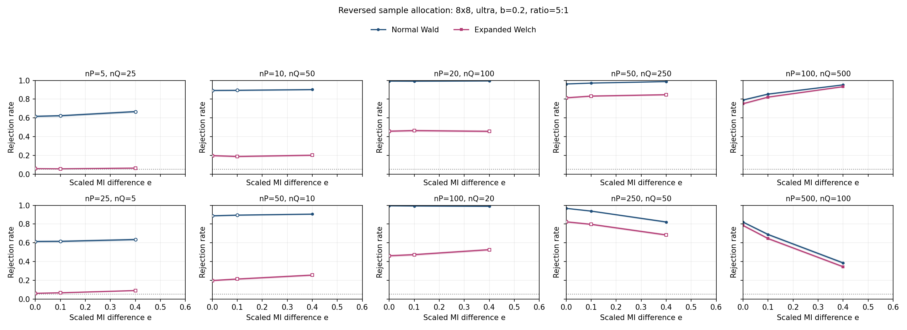

| Specification | Setting |
| --- | --- |
| Table shape | 8x8 |
| Population construction | Ordinal arrangement for P and reversed ordinal for Q |
| Horizontal graph regime specifications (columns) | {smaller n=5, smaller n=10, smaller n=20, smaller n=50, smaller n=100} |
| Vertical graph regime specifications (rows) | {Q larger, P larger}. $P$: row 1 and column 1 each have probability 0.95; $Q$: row 2 and column 8 each have probability 0.95; every other row has probability $0.05/7$, every other column $0.05/7$. These are row/column totals, not cell probabilities; they stay fixed across all panels and MI differences in this figure. |
| MI settings (nats) | M approximately 0.2309; b=0.2; I(P) approximately 0.04618; e in [0.0, 0.1, 0.4]; I(Q)=(b+e)M |
| Axes | e from 0 to 0.6; rejection rate from 0 to 1 |
| Replicates | 10,000 independent table pairs per point |

Exact rejection rates, intervals, validity and expected counts

| nP | nQ | e | Method | Rejection rate | 95% lower | 95% upper | Valid rate | Rejection rate among valid results | Minimum expected count P | Minimum expected count Q |
| --- | --- | --- | --- | --- | --- | --- | --- | --- | --- | --- |
| 5 | 25 | 0 | Expanded Welch | 0.058 | 0.05359 | 0.06275 | 0.0587 | 0.9881 | 0.0001267 | 6.732e-05 |
| 5 | 25 | 0 | Normal Wald | 0.6168 | 0.6072 | 0.6263 | 0.6168 | 1 | 0.0001267 | 6.732e-05 |
| 5 | 25 | 0.1 | Expanded Welch | 0.0563 | 0.05195 | 0.06099 | 0.0568 | 0.9912 | 0.0001267 | 1.265e-05 |
| 5 | 25 | 0.1 | Normal Wald | 0.6231 | 0.6136 | 0.6325 | 0.6231 | 1 | 0.0001267 | 1.265e-05 |
| 5 | 25 | 0.4 | Expanded Welch | 0.064 | 0.05937 | 0.06897 | 0.0643 | 0.9953 | 0.0001267 | 8.939e-12 |
| 5 | 25 | 0.4 | Normal Wald | 0.6672 | 0.6579 | 0.6764 | 0.6672 | 1 | 0.0001267 | 8.939e-12 |
| 10 | 50 | 0 | Expanded Welch | 0.1972 | 0.1895 | 0.2051 | 0.2017 | 0.9777 | 0.0002534 | 0.0001346 |
| 10 | 50 | 0 | Normal Wald | 0.8932 | 0.887 | 0.8991 | 0.8932 | 1 | 0.0002534 | 0.0001346 |
| 10 | 50 | 0.1 | Expanded Welch | 0.1881 | 0.1806 | 0.1959 | 0.192 | 0.9797 | 0.0002534 | 2.529e-05 |
| 10 | 50 | 0.1 | Normal Wald | 0.8947 | 0.8885 | 0.9006 | 0.8947 | 1 | 0.0002534 | 2.529e-05 |
| 10 | 50 | 0.4 | Expanded Welch | 0.2014 | 0.1937 | 0.2094 | 0.2039 | 0.9877 | 0.0002534 | 1.788e-11 |
| 10 | 50 | 0.4 | Normal Wald | 0.9024 | 0.8964 | 0.9081 | 0.9024 | 1 | 0.0002534 | 1.788e-11 |
| 20 | 100 | 0 | Expanded Welch | 0.4582 | 0.4485 | 0.468 | 0.4586 | 0.9991 | 0.0005068 | 0.0002693 |
| 20 | 100 | 0 | Normal Wald | 0.9929 | 0.9911 | 0.9944 | 0.9934 | 0.9995 | 0.0005068 | 0.0002693 |
| 20 | 100 | 0.1 | Expanded Welch | 0.4643 | 0.4545 | 0.4741 | 0.4648 | 0.9989 | 0.0005068 | 5.059e-05 |
| 20 | 100 | 0.1 | Normal Wald | 0.9919 | 0.9899 | 0.9935 | 0.9923 | 0.9996 | 0.0005068 | 5.059e-05 |
| 20 | 100 | 0.4 | Expanded Welch | 0.4567 | 0.447 | 0.4665 | 0.4568 | 0.9998 | 0.0005068 | 3.576e-11 |
| 20 | 100 | 0.4 | Normal Wald | 0.9947 | 0.9931 | 0.9959 | 0.9948 | 0.9999 | 0.0005068 | 3.576e-11 |
| 25 | 5 | 0 | Expanded Welch | 0.0604 | 0.0559 | 0.06524 | 0.0612 | 0.9869 | 0.0006335 | 1.346e-05 |
| 25 | 5 | 0 | Normal Wald | 0.6141 | 0.6045 | 0.6236 | 0.6141 | 1 | 0.0006335 | 1.346e-05 |
| 25 | 5 | 0.1 | Expanded Welch | 0.0662 | 0.06149 | 0.07124 | 0.0669 | 0.9895 | 0.0006335 | 2.529e-06 |
| 25 | 5 | 0.1 | Normal Wald | 0.6157 | 0.6061 | 0.6252 | 0.6157 | 1 | 0.0006335 | 2.529e-06 |
| 25 | 5 | 0.4 | Expanded Welch | 0.0901 | 0.08464 | 0.09587 | 0.0919 | 0.9804 | 0.0006335 | 1.788e-12 |
| 25 | 5 | 0.4 | Normal Wald | 0.6349 | 0.6254 | 0.6443 | 0.6349 | 1 | 0.0006335 | 1.788e-12 |
| 50 | 10 | 0 | Expanded Welch | 0.1973 | 0.1896 | 0.2052 | 0.2027 | 0.9734 | 0.001267 | 2.693e-05 |
| 50 | 10 | 0 | Normal Wald | 0.8883 | 0.882 | 0.8943 | 0.8883 | 1 | 0.001267 | 2.693e-05 |
| 50 | 10 | 0.1 | Expanded Welch | 0.213 | 0.2051 | 0.2211 | 0.2171 | 0.9811 | 0.001267 | 5.059e-06 |
| 50 | 10 | 0.1 | Normal Wald | 0.8956 | 0.8895 | 0.9014 | 0.8956 | 1 | 0.001267 | 5.059e-06 |
| 50 | 10 | 0.4 | Expanded Welch | 0.255 | 0.2466 | 0.2636 | 0.2569 | 0.9926 | 0.001267 | 3.576e-12 |
| 50 | 10 | 0.4 | Normal Wald | 0.9064 | 0.9005 | 0.912 | 0.9064 | 1 | 0.001267 | 3.576e-12 |
| 50 | 250 | 0 | Expanded Welch | 0.8147 | 0.807 | 0.8222 | 0.8564 | 0.9513 | 0.001267 | 0.0006732 |
| 50 | 250 | 0 | Normal Wald | 0.9626 | 0.9587 | 0.9661 | 1 | 0.9626 | 0.001267 | 0.0006732 |
| 50 | 250 | 0.1 | Expanded Welch | 0.833 | 0.8256 | 0.8402 | 0.8639 | 0.9642 | 0.001267 | 0.0001265 |
| 50 | 250 | 0.1 | Normal Wald | 0.972 | 0.9686 | 0.9751 | 1 | 0.972 | 0.001267 | 0.0001265 |
| 50 | 250 | 0.4 | Expanded Welch | 0.8477 | 0.8405 | 0.8546 | 0.8617 | 0.9838 | 0.001267 | 8.939e-11 |
| 50 | 250 | 0.4 | Normal Wald | 0.9876 | 0.9852 | 0.9896 | 1 | 0.9876 | 0.001267 | 8.939e-11 |
| 100 | 20 | 0 | Expanded Welch | 0.4615 | 0.4517 | 0.4713 | 0.462 | 0.9989 | 0.002534 | 5.386e-05 |
| 100 | 20 | 0 | Normal Wald | 0.995 | 0.9934 | 0.9962 | 0.9953 | 0.9997 | 0.002534 | 5.386e-05 |
| 100 | 20 | 0.1 | Expanded Welch | 0.4735 | 0.4637 | 0.4833 | 0.4742 | 0.9985 | 0.002534 | 1.012e-05 |
| 100 | 20 | 0.1 | Normal Wald | 0.9929 | 0.9911 | 0.9944 | 0.9934 | 0.9995 | 0.002534 | 1.012e-05 |
| 100 | 20 | 0.4 | Expanded Welch | 0.5265 | 0.5167 | 0.5363 | 0.5315 | 0.9906 | 0.002534 | 7.151e-12 |
| 100 | 20 | 0.4 | Normal Wald | 0.9896 | 0.9874 | 0.9914 | 0.9945 | 0.9951 | 0.002534 | 7.151e-12 |
| 100 | 500 | 0 | Expanded Welch | 0.752 | 0.7434 | 0.7604 | 0.9891 | 0.7603 | 0.002534 | 0.001346 |
| 100 | 500 | 0 | Normal Wald | 0.7911 | 0.783 | 0.799 | 1 | 0.7911 | 0.002534 | 0.001346 |
| 100 | 500 | 0.1 | Expanded Welch | 0.8222 | 0.8146 | 0.8296 | 0.9871 | 0.8329 | 0.002534 | 0.0002529 |
| 100 | 500 | 0.1 | Normal Wald | 0.8544 | 0.8474 | 0.8612 | 1 | 0.8544 | 0.002534 | 0.0002529 |
| 100 | 500 | 0.4 | Expanded Welch | 0.9335 | 0.9284 | 0.9382 | 0.9877 | 0.9451 | 0.002534 | 1.788e-10 |
| 100 | 500 | 0.4 | Normal Wald | 0.953 | 0.9487 | 0.957 | 1 | 0.953 | 0.002534 | 1.788e-10 |
| 250 | 50 | 0 | Expanded Welch | 0.8241 | 0.8165 | 0.8314 | 0.8608 | 0.9574 | 0.006335 | 0.0001346 |
| 250 | 50 | 0 | Normal Wald | 0.9679 | 0.9643 | 0.9712 | 1 | 0.9679 | 0.006335 | 0.0001346 |
| 250 | 50 | 0.1 | Expanded Welch | 0.7974 | 0.7894 | 0.8052 | 0.8655 | 0.9213 | 0.006335 | 2.529e-05 |
| 250 | 50 | 0.1 | Normal Wald | 0.9388 | 0.9339 | 0.9433 | 1 | 0.9388 | 0.006335 | 2.529e-05 |
| 250 | 50 | 0.4 | Expanded Welch | 0.6838 | 0.6746 | 0.6928 | 0.8727 | 0.7835 | 0.006335 | 1.788e-11 |
| 250 | 50 | 0.4 | Normal Wald | 0.8224 | 0.8148 | 0.8298 | 1 | 0.8224 | 0.006335 | 1.788e-11 |
| 500 | 100 | 0 | Expanded Welch | 0.7849 | 0.7767 | 0.7928 | 0.9871 | 0.7952 | 0.01267 | 0.0002693 |
| 500 | 100 | 0 | Normal Wald | 0.8209 | 0.8133 | 0.8283 | 1 | 0.8209 | 0.01267 | 0.0002693 |
| 500 | 100 | 0.1 | Expanded Welch | 0.6454 | 0.636 | 0.6547 | 0.9882 | 0.6531 | 0.01267 | 5.059e-05 |
| 500 | 100 | 0.1 | Normal Wald | 0.6888 | 0.6797 | 0.6978 | 1 | 0.6888 | 0.01267 | 5.059e-05 |
| 500 | 100 | 0.4 | Expanded Welch | 0.3444 | 0.3351 | 0.3538 | 0.9888 | 0.3483 | 0.01267 | 3.576e-11 |
| 500 | 100 | 0.4 | Normal Wald | 0.3852 | 0.3757 | 0.3948 | 1 | 0.3852 | 0.01267 | 3.576e-11 |

## 6. Large-sample convergence

These null comparisons use the same populations at nP=nQ in {1000, 2500, 10000, 50000}. The n=1000 points come from the original experiment. The larger samples are diagnostic controls beyond the main study range; the question is whether false-positive rates approach 0.05.

### 6.1 Large-sample null calibration: 2x2, strong, b=0.2

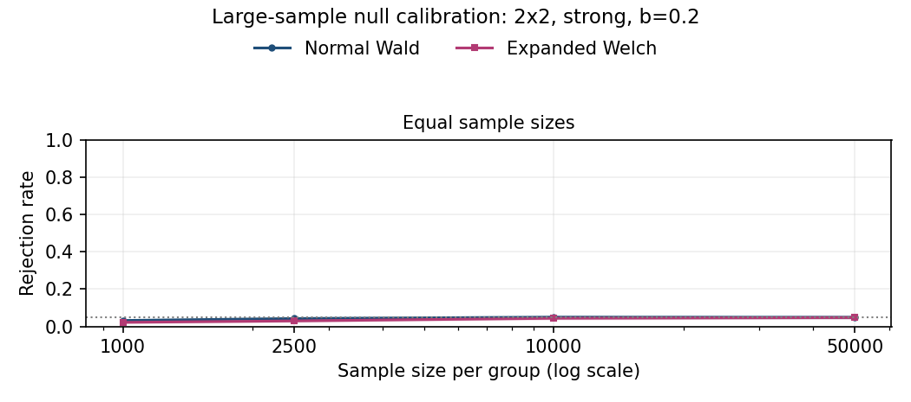

| Specification | Setting |
| --- | --- |
| Table shape | 2x2 |
| Population construction | Ordinal arrangement for P and reversed ordinal for Q |
| Horizontal graph regime specifications (columns) | {single graph, n in [1000, 2500, 10000, 50000]} |
| Vertical graph regime specifications (rows) | {equal samples}. $P$: row 1 and column 1 each have probability 0.9; $Q$: row 2 and column 2 each have probability 0.9; every other row has probability $0.1$, every other column $0.1$. These are row/column totals, not cell probabilities; they stay fixed across all panels and MI differences in this figure. |
| MI settings (nats) | M approximately 0.01113; b=0.2; I(P) approximately 0.002227; e in [0.0]; I(Q)=(b+e)M |
| Axes | n from 1000 to 50000, log scale; rejection rate from 0 to 1 |
| Replicates | 10,000 independent table pairs per point |

Exact rejection rates, intervals, validity and expected counts

| nP | nQ | e | Method | Rejection rate | 95% lower | 95% upper | Valid rate | Rejection rate among valid results | Minimum expected count P | Minimum expected count Q |
| --- | --- | --- | --- | --- | --- | --- | --- | --- | --- | --- |
| 1000 | 1000 | 0 | Expanded Welch | 0.0219 | 0.01921 | 0.02496 | 1 | 0.0219 | 16.43 | 4.531 |
| 1000 | 1000 | 0 | Normal Wald | 0.0319 | 0.02863 | 0.03553 | 1 | 0.0319 | 16.43 | 4.531 |
| 2500 | 2500 | 0 | Expanded Welch | 0.0295 | 0.02636 | 0.033 | 1 | 0.0295 | 41.09 | 11.33 |
| 2500 | 2500 | 0 | Normal Wald | 0.0422 | 0.03843 | 0.04632 | 1 | 0.0422 | 41.09 | 11.33 |
| 10000 | 10000 | 0 | Expanded Welch | 0.0438 | 0.03996 | 0.04799 | 1 | 0.0438 | 164.3 | 45.31 |
| 10000 | 10000 | 0 | Normal Wald | 0.0496 | 0.04551 | 0.05403 | 1 | 0.0496 | 164.3 | 45.31 |
| 50000 | 50000 | 0 | Expanded Welch | 0.0474 | 0.04341 | 0.05174 | 1 | 0.0474 | 821.7 | 226.5 |
| 50000 | 50000 | 0 | Normal Wald | 0.0489 | 0.04484 | 0.0533 | 1 | 0.0489 | 821.7 | 226.5 |

### 6.2 Large-sample null calibration: 2x2, ultra, b=0.2

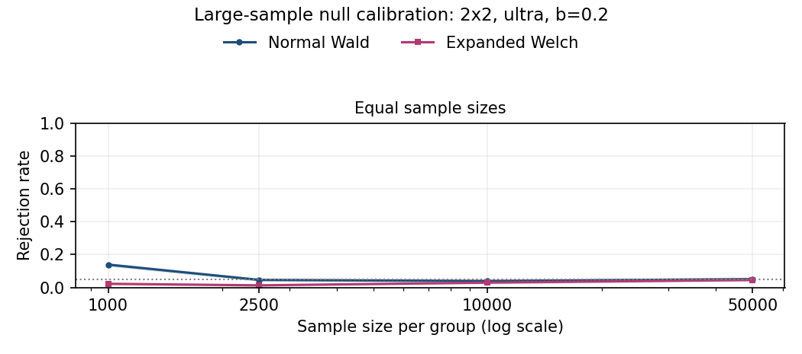

| Specification | Setting |
| --- | --- |
| Table shape | 2x2 |
| Population construction | Ordinal arrangement for P and reversed ordinal for Q |
| Horizontal graph regime specifications (columns) | {single graph, n in [1000, 2500, 10000, 50000]} |
| Vertical graph regime specifications (rows) | {equal samples}. $P$: row 1 and column 1 each have probability 0.95; $Q$: row 2 and column 2 each have probability 0.95; every other row has probability $0.05$, every other column $0.05$. These are row/column totals, not cell probabilities; they stay fixed across all panels and MI differences in this figure. |
| MI settings (nats) | M approximately 0.002633; b=0.2; I(P) approximately 0.0005266; e in [0.0]; I(Q)=(b+e)M |
| Axes | n from 1000 to 50000, log scale; rejection rate from 0 to 1 |
| Replicates | 10,000 independent table pairs per point |

Exact rejection rates, intervals, validity and expected counts

| nP | nQ | e | Method | Rejection rate | 95% lower | 95% upper | Valid rate | Rejection rate among valid results | Minimum expected count P | Minimum expected count Q |
| --- | --- | --- | --- | --- | --- | --- | --- | --- | --- | --- |
| 1000 | 1000 | 0 | Expanded Welch | 0.0223 | 0.01958 | 0.02538 | 1 | 0.0223 | 4.174 | 1.114 |
| 1000 | 1000 | 0 | Normal Wald | 0.1387 | 0.1321 | 0.1456 | 1 | 0.1387 | 4.174 | 1.114 |
| 2500 | 2500 | 0 | Expanded Welch | 0.0127 | 0.01068 | 0.01509 | 1 | 0.0127 | 10.43 | 2.785 |
| 2500 | 2500 | 0 | Normal Wald | 0.046 | 0.04207 | 0.05028 | 1 | 0.046 | 10.43 | 2.785 |
| 10000 | 10000 | 0 | Expanded Welch | 0.0294 | 0.02627 | 0.0329 | 1 | 0.0294 | 41.74 | 11.14 |
| 10000 | 10000 | 0 | Normal Wald | 0.0393 | 0.03567 | 0.04329 | 1 | 0.0393 | 41.74 | 11.14 |
| 50000 | 50000 | 0 | Expanded Welch | 0.0455 | 0.04159 | 0.04976 | 1 | 0.0455 | 208.7 | 55.7 |
| 50000 | 50000 | 0 | Normal Wald | 0.0507 | 0.04657 | 0.05518 | 1 | 0.0507 | 208.7 | 55.7 |

### 6.3 Large-sample null calibration: 3x3, strong, b=0.2

| Specification | Setting |
| --- | --- |
| Table shape | 3x3 |
| Population construction | Ordinal arrangement for P and reversed ordinal for Q |
| Horizontal graph regime specifications (columns) | {single graph, n in [1000, 2500, 10000, 50000]} |
| Vertical graph regime specifications (rows) | {equal samples}. $P$: row 1 and column 1 each have probability 0.9; $Q$: row 2 and column 3 each have probability 0.9; every other row has probability $0.1/2$, every other column $0.1/2$. These are row/column totals, not cell probabilities; they stay fixed across all panels and MI differences in this figure. |
| MI settings (nats) | M approximately 0.1922; b=0.2; I(P) approximately 0.03844; e in [0.0]; I(Q)=(b+e)M |
| Axes | n from 1000 to 50000, log scale; rejection rate from 0 to 1 |
| Replicates | 10,000 independent table pairs per point |

Exact rejection rates, intervals, validity and expected counts

| nP | nQ | e | Method | Rejection rate | 95% lower | 95% upper | Valid rate | Rejection rate among valid results | Minimum expected count P | Minimum expected count Q |
| --- | --- | --- | --- | --- | --- | --- | --- | --- | --- | --- |
| 1000 | 1000 | 0 | Expanded Welch | 0.0415 | 0.03776 | 0.04559 | 1 | 0.0415 | 4.268 | 0.07727 |
| 1000 | 1000 | 0 | Normal Wald | 0.0485 | 0.04446 | 0.05289 | 1 | 0.0485 | 4.268 | 0.07727 |
| 2500 | 2500 | 0 | Expanded Welch | 0.0452 | 0.0413 | 0.04945 | 1 | 0.0452 | 10.67 | 0.1932 |
| 2500 | 2500 | 0 | Normal Wald | 0.0476 | 0.0436 | 0.05195 | 1 | 0.0476 | 10.67 | 0.1932 |
| 10000 | 10000 | 0 | Expanded Welch | 0.0482 | 0.04417 | 0.05257 | 1 | 0.0482 | 42.68 | 0.7727 |
| 10000 | 10000 | 0 | Normal Wald | 0.0487 | 0.04465 | 0.05309 | 1 | 0.0487 | 42.68 | 0.7727 |
| 50000 | 50000 | 0 | Expanded Welch | 0.0484 | 0.04436 | 0.05278 | 1 | 0.0484 | 213.4 | 3.863 |
| 50000 | 50000 | 0 | Normal Wald | 0.0484 | 0.04436 | 0.05278 | 1 | 0.0484 | 213.4 | 3.863 |

### 6.4 Large-sample null calibration: 3x3, ultra, b=0.2

| Specification | Setting |
| --- | --- |
| Table shape | 3x3 |
| Population construction | Ordinal arrangement for P and reversed ordinal for Q |
| Horizontal graph regime specifications (columns) | {single graph, n in [1000, 2500, 10000, 50000]} |
| Vertical graph regime specifications (rows) | {equal samples}. $P$: row 1 and column 1 each have probability 0.95; $Q$: row 2 and column 3 each have probability 0.95; every other row has probability $0.05/2$, every other column $0.05/2$. These are row/column totals, not cell probabilities; they stay fixed across all panels and MI differences in this figure. |
| MI settings (nats) | M approximately 0.113; b=0.2; I(P) approximately 0.0226; e in [0.0]; I(Q)=(b+e)M |
| Axes | n from 1000 to 50000, log scale; rejection rate from 0 to 1 |
| Replicates | 10,000 independent table pairs per point |

Exact rejection rates, intervals, validity and expected counts

| nP | nQ | e | Method | Rejection rate | 95% lower | 95% upper | Valid rate | Rejection rate among valid results | Minimum expected count P | Minimum expected count Q |
| --- | --- | --- | --- | --- | --- | --- | --- | --- | --- | --- |
| 1000 | 1000 | 0 | Expanded Welch | 0.0344 | 0.031 | 0.03815 | 1 | 0.0344 | 1.29 | 0.01085 |
| 1000 | 1000 | 0 | Normal Wald | 0.0445 | 0.04063 | 0.04872 | 1 | 0.0445 | 1.29 | 0.01085 |
| 2500 | 2500 | 0 | Expanded Welch | 0.0393 | 0.03567 | 0.04329 | 1 | 0.0393 | 3.224 | 0.02712 |
| 2500 | 2500 | 0 | Normal Wald | 0.0448 | 0.04092 | 0.04903 | 1 | 0.0448 | 3.224 | 0.02712 |
| 10000 | 10000 | 0 | Expanded Welch | 0.0496 | 0.04551 | 0.05403 | 1 | 0.0496 | 12.9 | 0.1085 |
| 10000 | 10000 | 0 | Normal Wald | 0.0504 | 0.04628 | 0.05486 | 1 | 0.0504 | 12.9 | 0.1085 |
| 50000 | 50000 | 0 | Expanded Welch | 0.0503 | 0.04619 | 0.05476 | 1 | 0.0503 | 64.48 | 0.5424 |
| 50000 | 50000 | 0 | Normal Wald | 0.0505 | 0.04638 | 0.05497 | 1 | 0.0505 | 64.48 | 0.5424 |

### 6.5 Large-sample null calibration: 5x5, strong, b=0.2

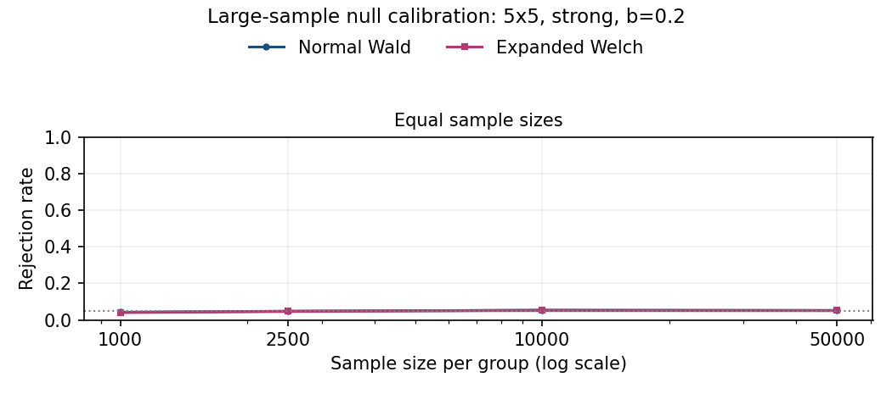

| Specification | Setting |
| --- | --- |
| Table shape | 5x5 |
| Population construction | Ordinal arrangement for P and reversed ordinal for Q |
| Horizontal graph regime specifications (columns) | {single graph, n in [1000, 2500, 10000, 50000]} |
| Vertical graph regime specifications (rows) | {equal samples}. $P$: row 1 and column 1 each have probability 0.9; $Q$: row 2 and column 5 each have probability 0.9; every other row has probability $0.1/4$, every other column $0.1/4$. These are row/column totals, not cell probabilities; they stay fixed across all panels and MI differences in this figure. |
| MI settings (nats) | M approximately 0.336; b=0.2; I(P) approximately 0.06721; e in [0.0]; I(Q)=(b+e)M |
| Axes | n from 1000 to 50000, log scale; rejection rate from 0 to 1 |
| Replicates | 10,000 independent table pairs per point |

Exact rejection rates, intervals, validity and expected counts

| nP | nQ | e | Method | Rejection rate | 95% lower | 95% upper | Valid rate | Rejection rate among valid results | Minimum expected count P | Minimum expected count Q |
| --- | --- | --- | --- | --- | --- | --- | --- | --- | --- | --- |
| 1000 | 1000 | 0 | Expanded Welch | 0.0407 | 0.037 | 0.04475 | 1 | 0.0407 | 0.6226 | 0.03058 |
| 1000 | 1000 | 0 | Normal Wald | 0.0421 | 0.03834 | 0.04621 | 1 | 0.0421 | 0.6226 | 0.03058 |
| 2500 | 2500 | 0 | Expanded Welch | 0.0469 | 0.04293 | 0.05122 | 1 | 0.0469 | 1.556 | 0.07646 |
| 2500 | 2500 | 0 | Normal Wald | 0.0478 | 0.04379 | 0.05216 | 1 | 0.0478 | 1.556 | 0.07646 |
| 10000 | 10000 | 0 | Expanded Welch | 0.0528 | 0.04859 | 0.05736 | 1 | 0.0528 | 6.226 | 0.3058 |
| 10000 | 10000 | 0 | Normal Wald | 0.053 | 0.04878 | 0.05757 | 1 | 0.053 | 6.226 | 0.3058 |
| 50000 | 50000 | 0 | Expanded Welch | 0.0515 | 0.04734 | 0.05601 | 1 | 0.0515 | 31.13 | 1.529 |
| 50000 | 50000 | 0 | Normal Wald | 0.0516 | 0.04743 | 0.05611 | 1 | 0.0516 | 31.13 | 1.529 |

### 6.6 Large-sample null calibration: 5x5, ultra, b=0.2

| Specification | Setting |
| --- | --- |
| Table shape | 5x5 |
| Population construction | Ordinal arrangement for P and reversed ordinal for Q |
| Horizontal graph regime specifications (columns) | {single graph, n in [1000, 2500, 10000, 50000]} |
| Vertical graph regime specifications (rows) | {equal samples}. $P$: row 1 and column 1 each have probability 0.95; $Q$: row 2 and column 5 each have probability 0.95; every other row has probability $0.05/4$, every other column $0.05/4$. These are row/column totals, not cell probabilities; they stay fixed across all panels and MI differences in this figure. |
| MI settings (nats) | M approximately 0.1945; b=0.2; I(P) approximately 0.0389; e in [0.0]; I(Q)=(b+e)M |
| Axes | n from 1000 to 50000, log scale; rejection rate from 0 to 1 |
| Replicates | 10,000 independent table pairs per point |

Exact rejection rates, intervals, validity and expected counts

| nP | nQ | e | Method | Rejection rate | 95% lower | 95% upper | Valid rate | Rejection rate among valid results | Minimum expected count P | Minimum expected count Q |
| --- | --- | --- | --- | --- | --- | --- | --- | --- | --- | --- |
| 1000 | 1000 | 0 | Expanded Welch | 0.0363 | 0.03281 | 0.04015 | 1 | 0.0363 | 0.2001 | 0.006697 |
| 1000 | 1000 | 0 | Normal Wald | 0.0404 | 0.03671 | 0.04444 | 1 | 0.0404 | 0.2001 | 0.006697 |
| 2500 | 2500 | 0 | Expanded Welch | 0.0433 | 0.03948 | 0.04747 | 1 | 0.0433 | 0.5001 | 0.01674 |
| 2500 | 2500 | 0 | Normal Wald | 0.045 | 0.04111 | 0.04924 | 1 | 0.045 | 0.5001 | 0.01674 |
| 10000 | 10000 | 0 | Expanded Welch | 0.049 | 0.04494 | 0.05341 | 1 | 0.049 | 2.001 | 0.06697 |
| 10000 | 10000 | 0 | Normal Wald | 0.0499 | 0.0458 | 0.05434 | 1 | 0.0499 | 2.001 | 0.06697 |
| 50000 | 50000 | 0 | Expanded Welch | 0.0473 | 0.04331 | 0.05164 | 1 | 0.0473 | 10 | 0.3348 |
| 50000 | 50000 | 0 | Normal Wald | 0.0475 | 0.0435 | 0.05185 | 1 | 0.0475 | 10 | 0.3348 |

### 6.7 Large-sample null calibration: 8x8, strong, b=0.2

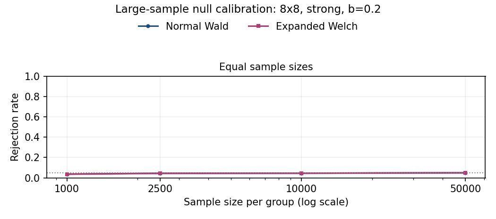

| Specification | Setting |
| --- | --- |
| Table shape | 8x8 |
| Population construction | Ordinal arrangement for P and reversed ordinal for Q |
| Horizontal graph regime specifications (columns) | {single graph, n in [1000, 2500, 10000, 50000]} |
| Vertical graph regime specifications (rows) | {equal samples}. $P$: row 1 and column 1 each have probability 0.9; $Q$: row 2 and column 8 each have probability 0.9; every other row has probability $0.1/7$, every other column $0.1/7$. These are row/column totals, not cell probabilities; they stay fixed across all panels and MI differences in this figure. |
| MI settings (nats) | M approximately 0.4029; b=0.2; I(P) approximately 0.08058; e in [0.0]; I(Q)=(b+e)M |
| Axes | n from 1000 to 50000, log scale; rejection rate from 0 to 1 |
| Replicates | 10,000 independent table pairs per point |

Exact rejection rates, intervals, validity and expected counts

| nP | nQ | e | Method | Rejection rate | 95% lower | 95% upper | Valid rate | Rejection rate among valid results | Minimum expected count P | Minimum expected count Q |
| --- | --- | --- | --- | --- | --- | --- | --- | --- | --- | --- |
| 1000 | 1000 | 0 | Expanded Welch | 0.0362 | 0.03271 | 0.04004 | 1 | 0.0362 | 0.08301 | 0.01083 |
| 1000 | 1000 | 0 | Normal Wald | 0.0371 | 0.03357 | 0.04099 | 1 | 0.0371 | 0.08301 | 0.01083 |
| 2500 | 2500 | 0 | Expanded Welch | 0.0444 | 0.04053 | 0.04862 | 1 | 0.0444 | 0.2075 | 0.02709 |
| 2500 | 2500 | 0 | Normal Wald | 0.0451 | 0.0412 | 0.04935 | 1 | 0.0451 | 0.2075 | 0.02709 |
| 10000 | 10000 | 0 | Expanded Welch | 0.0457 | 0.04178 | 0.04997 | 1 | 0.0457 | 0.8301 | 0.1083 |
| 10000 | 10000 | 0 | Normal Wald | 0.046 | 0.04207 | 0.05028 | 1 | 0.046 | 0.8301 | 0.1083 |
| 50000 | 50000 | 0 | Expanded Welch | 0.0497 | 0.04561 | 0.05414 | 1 | 0.0497 | 4.151 | 0.5417 |
| 50000 | 50000 | 0 | Normal Wald | 0.0497 | 0.04561 | 0.05414 | 1 | 0.0497 | 4.151 | 0.5417 |

### 6.8 Large-sample null calibration: 8x8, ultra, b=0.2

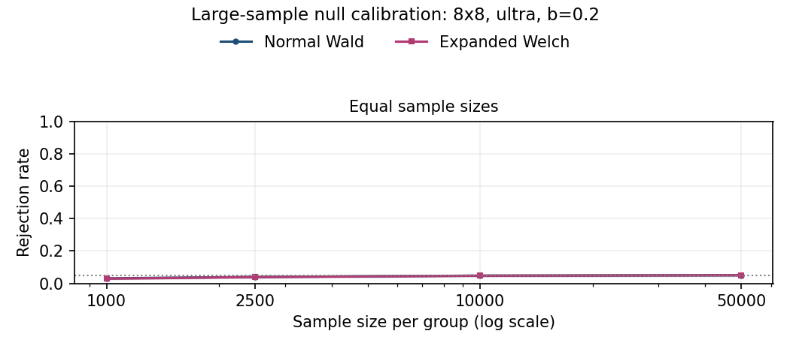

| Specification | Setting |
| --- | --- |
| Table shape | 8x8 |
| Population construction | Ordinal arrangement for P and reversed ordinal for Q |
| Horizontal graph regime specifications (columns) | {single graph, n in [1000, 2500, 10000, 50000]} |
| Vertical graph regime specifications (rows) | {equal samples}. $P$: row 1 and column 1 each have probability 0.95; $Q$: row 2 and column 8 each have probability 0.95; every other row has probability $0.05/7$, every other column $0.05/7$. These are row/column totals, not cell probabilities; they stay fixed across all panels and MI differences in this figure. |
| MI settings (nats) | M approximately 0.2309; b=0.2; I(P) approximately 0.04618; e in [0.0]; I(Q)=(b+e)M |
| Axes | n from 1000 to 50000, log scale; rejection rate from 0 to 1 |
| Replicates | 10,000 independent table pairs per point |

Exact rejection rates, intervals, validity and expected counts

| nP | nQ | e | Method | Rejection rate | 95% lower | 95% upper | Valid rate | Rejection rate among valid results | Minimum expected count P | Minimum expected count Q |
| --- | --- | --- | --- | --- | --- | --- | --- | --- | --- | --- |
| 1000 | 1000 | 0 | Expanded Welch | 0.0289 | 0.02579 | 0.03237 | 1 | 0.0289 | 0.02534 | 0.002693 |
| 1000 | 1000 | 0 | Normal Wald | 0.0309 | 0.02768 | 0.03448 | 1 | 0.0309 | 0.02534 | 0.002693 |
| 2500 | 2500 | 0 | Expanded Welch | 0.039 | 0.03538 | 0.04297 | 1 | 0.039 | 0.06335 | 0.006732 |
| 2500 | 2500 | 0 | Normal Wald | 0.0399 | 0.03624 | 0.04392 | 1 | 0.0399 | 0.06335 | 0.006732 |
| 10000 | 10000 | 0 | Expanded Welch | 0.0474 | 0.04341 | 0.05174 | 1 | 0.0474 | 0.2534 | 0.02693 |
| 10000 | 10000 | 0 | Normal Wald | 0.0476 | 0.0436 | 0.05195 | 1 | 0.0476 | 0.2534 | 0.02693 |
| 50000 | 50000 | 0 | Expanded Welch | 0.0503 | 0.04619 | 0.05476 | 1 | 0.0503 | 1.267 | 0.1346 |
| 50000 | 50000 | 0 | Normal Wald | 0.0503 | 0.04619 | 0.05476 | 1 | 0.0503 | 1.267 | 0.1346 |

## 7. Protocols and reproducibility

The original run contains 5,672 configurations and 56.72 million simulated
table pairs. The subsequent additions contain 528 new configurations and
5.28 million pairs. Reused points in the combined figures are not new simulations.
Simple Welch and secondary significance levels remain in the datasets.

| Resource | Original experiment | Follow-up |
| --- | --- | --- |
| Protocol | [Original protocol](../../../experiments/FINAL_PROTOCOL.json) | [Follow-up protocol](../../../experiments/DESIGN_FOLLOWUP_PROTOCOL.json) |
| Results | [All exact results](../../../results/detection_breakdown_sweep/cell_results.csv) | [All exact results](../../../results/design_followup/cell_results.csv) |
| Populations | [Population definitions](../../../results/detection_breakdown_sweep/population_definitions.csv) | [Population definitions](../../../results/design_followup/population_definitions.csv) |
| Paired comparisons | [Paired results](../../../results/detection_breakdown_sweep/paired_method_results.csv) | [Paired results](../../../results/design_followup/paired_method_results.csv) |
| Verification | [Original checks](../../../results/detection_breakdown_sweep/verification_checks.json) | [Follow-up checks](../../../results/design_followup/verification.json) |

The landscape includes the original power grid and matching null points.
The finer original null-only sample-size grid, including n=2, 3 and 4, remains
in the original results. The two earlier standalone documents are archived in
[the original landscape](FINAL_EXPERIMENT_LANDSCAPE.md) and
[the follow-up report](DESIGN_FOLLOWUP.md).

Regenerate this document from the saved results with
`python experiments/make_experimental_results.py` from the project directory.
The [combined report generator](../../../experiments/make_experimental_results.py)
uses the original and follow-up reporting functions. It does not rerun sampling.
