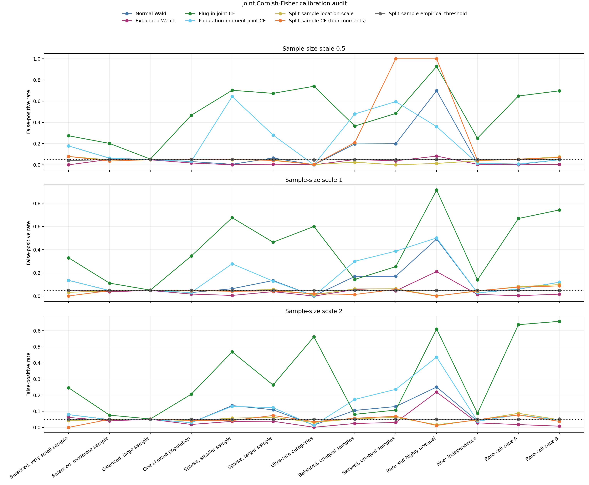

# Joint Edgeworth and Cornish-Fisher Audit

## 1. Decision question

The critical-value audit showed that the differential-MI statistic

$$
T=
\frac{\widehat I_{\mathrm{BC}}(P)-\widehat I_{\mathrm{BC}}(Q)}
{\sqrt{\widehat V(P)/n_P+\widehat V(Q)/n_Q}}
$$

can be distorted by dependence between its numerator and denominator. This
experiment tests whether a joint Edgeworth or Cornish-Fisher correction is a
promising analytical replacement for Normal Wald or Expanded Welch.

The candidate is worth pursuing only if its deployable version improves mean
false-positive-rate error over both existing methods, remains stable in sparse
tables, and does not rely on simulated null outcomes at test time.

## 2. Methods compared

The test uses $\alpha=0.05$. The target false-positive rate is therefore 0.05.

| Method | Purpose | Available at test time? |
| --- | --- | --- |
| Normal Wald | Existing analytical baseline | Yes |
| Expanded Welch | Existing MI-specific Student correction | Yes |
| Plug-in joint CF | Estimates numerator skewness and numerator-denominator covariance from each observed table | Yes |
| Population-moment joint CF | Uses the true simulation populations to isolate approximation error from plug-in estimation error | No |
| Split-sample location-scale | Estimates the mean and standard deviation of $T$ from an independent development simulation | No |
| Split-sample CF, skew | Adds a Cornish-Fisher skewness term estimated from the development simulation | No |
| Split-sample CF, four moments | Adds skewness and kurtosis terms estimated from the development simulation | No |
| Split-sample empirical threshold | Uses development-simulation quantiles directly | No |

The first-order plug-in correction uses the joint influence functions of the
MI difference and its estimated variance. If $A$ is the MI-difference error,
$D$ is the error in its estimated variance, and $\sigma^2=\operatorname{Var}(A)$,
then the expansion estimates

$$
\operatorname{E}(T)
\approx
-\frac{\operatorname{Cov}(A,D)}{2\sigma^3}
$$

and

$$
\operatorname{Skew}(T)
\approx
\frac{\kappa_3(A)-3\operatorname{Cov}(A,D)}{\sigma^3}.
$$

These values produce asymmetric Cornish-Fisher rejection boundaries. The
population-moment version uses the same equations with the true $P$ and $Q$,
so it is an oracle diagnostic for this particular first-order formula.

## 3. Experimental design

The experiment uses the same 13 interpretable binary configurations as the
[main 2x2 experiment](../EQUAL_MI_2X2_BASELINE.md). Each is evaluated at half, baseline,
and double sample size, giving 39 exact equal-MI null configurations.

Each configuration receives two independent simulations:

- 100,000 table pairs estimate the split-sample diagnostic corrections;
- 100,000 different table pairs evaluate all false-positive rates.

The complete experiment therefore contains 7.8 million independently sampled
table pairs. The deployable plug-in method uses only its validation table pair;
it does not use the development simulation.

## 4. Confirmatory results

Lower error is better. A configuration is counted as calibrated within 0.01
when its false-positive rate lies between 0.04 and 0.06.

| Method | Mean absolute FPR error | Median error | Maximum error | Within 0.01 | Mean valid rate |
| --- | ---: | ---: | ---: | ---: | ---: |
| Normal Wald | 0.0756 | 0.0358 | 0.6486 | 8/39 | 0.9980 |
| Simple Welch | 0.0717 | 0.0361 | 0.6484 | 9/39 | 0.9980 |
| Expanded Welch | **0.0332** | 0.0324 | 0.1690 | 9/39 | 0.9611 |
| Plug-in joint CF | 0.3599 | 0.3157 | 0.8775 | 3/39 | 0.9980 |
| Population-moment joint CF | 0.1279 | 0.0483 | 0.5941 | 7/39 | 0.9980 |
| Split-sample location-scale | 0.0161 | **0.0087** | 0.0499 | 20/39 | 0.9980 |
| Split-sample CF, skew | 0.1050 | 0.0144 | 0.9500 | 17/39 | 0.9980 |
| Split-sample CF, four moments | 0.0682 | 0.0126 | 0.9500 | 19/39 | 0.9980 |
| Split-sample empirical threshold | **0.0011** | **0.0008** | **0.0098** | **39/39** | 0.9980 |

The split-sample methods are diagnostics and cannot be compared as deployable
analytical tests. Their results show what information is missing from the
analytical approximations.

Selected baseline-sample results illustrate the failure modes:

| Configuration | Wald | Expanded | Plug-in joint CF | Population joint CF | Split location-scale | Split empirical |
| --- | ---: | ---: | ---: | ---: | ---: | ---: |
| Balanced, moderate sample | 0.0479 | 0.0378 | 0.1120 | 0.0479 | 0.0473 | 0.0498 |
| Sparse, smaller sample | 0.0635 | 0.0058 | 0.6760 | 0.2785 | 0.0452 | 0.0491 |
| Balanced, unequal samples | 0.1693 | 0.0562 | 0.1441 | 0.3003 | 0.0620 | 0.0507 |
| Skewed, unequal samples | 0.1709 | 0.0452 | 0.2539 | 0.3875 | 0.0634 | 0.0503 |
| Rare and highly unequal | 0.4920 | 0.2115 | 0.9144 | 0.5016 | 0.0022 | 0.0497 |

## 5. Interpretation

The deployable joint correction fails decisively. It improves on Normal Wald
in only 3 of 39 configurations and is worse by more than 0.02 in 33. Estimating
higher-order moments from a sparse observed table is too unstable.

The problem is not only plug-in estimation. Even the population-moment joint
correction, which knows the true $P$ and $Q$, has larger mean error than Normal
Wald. The first-order joint expansion changes location and asymmetry but does
not adequately reproduce the width and discrete tail structure of $T$.

Higher empirical moments are also unstable in the regimes that need the most
help. For example, the development sample for the rare and highly unequal
baseline case has estimated skewness $-32.9$ and excess kurtosis $4831.9$.
The skew-only Cornish-Fisher test then rejects essentially every null sample,
while the four-moment version rejects none. This is not a Monte Carlo precision
problem; it is a failure of the truncated moment expansion in a heavy-tailed,
discrete regime.

The location-scale diagnostic performs better on average, showing that much
of the regular-case error can be described by recentering and rescaling.
However, it still requires an independent null simulation and fails badly in
the rare and highly unequal case. The empirical split-sample threshold works
across all 39 configurations, confirming that the simulation framework itself
is sound and that the remaining difficulty is analytical approximation.

## 6. Decision

**No-go: a joint Edgeworth or Cornish-Fisher correction should not be pursued
as the primary thesis method.**

The deployable formula is substantially worse than both existing analytical
methods, its population-moment version also fails, and adding further empirical
cumulants is unstable precisely in the sparse regimes of interest. A complete
second-order expansion would add considerable derivational and implementation
complexity without evidence that a low-order moment approximation can capture
the required tails.

If the project continues beyond the current methods, the evidence supports
one of two clearer paths:

1. use a simulation or exact-table fallback in the extreme sparse regimes; or
2. investigate a deterministic approximation that targets the full null
   distribution rather than a finite set of cumulants.

## 7. Reproducibility files

| Output | File |
| --- | --- |
| All 39 configurations | [`configuration_results.csv`](../../../results/2x2_joint_cf_confirmatory/configuration_results.csv) |
| Baseline configurations | [`baseline_results.csv`](../../../results/2x2_joint_cf_confirmatory/baseline_results.csv) |
| Aggregate comparison | [`method_summary.csv`](../../../results/2x2_joint_cf_confirmatory/method_summary.csv) |
| Figure | [`JOINT_CF_AUDIT.png`](../../../results/2x2_joint_cf_confirmatory/JOINT_CF_AUDIT.png) |
| Run metadata | [`run_metadata.json`](../../../results/2x2_joint_cf_confirmatory/run_metadata.json) |
