# Thesis Redesign Smoke Report

This report compares Normal Wald and Expanded Welch for the two-sided test of equal population MI. Every unique point uses 200 independently sampled table pairs at alpha=0.05. Both methods receive the same sampled tables, and no regimes are averaged together.

## 1. How to read this document

At an MI difference of zero, a curve reports the false-positive rate under H0; the target is 0.05. At a positive MI difference, it reports power under H1. Read calibration, power and validity together: liberal null rejection can inflate apparent power, while invalid outputs can make unconditional rejection appear artificially low.

The x-axis is the true population MI difference fixed during construction, not a random difference estimated from the samples. The main and focused sections use separate stated ranges in nats so very small effects remain visible. A hollow marker means fewer than 90% of results were valid.

'Minimum expected count' means the minimum population expected cell count, not the expected value of the smallest observed cell count.

### Roadmap

1. The main comparison maps table size, margins and sample size.
2. Focused comparisons vary baseline MI, changed cells, sample imbalance, effect range, table shape and population construction.
3. Limit checks examine extreme sparsity, exact independence and large-sample null behaviour.
4. Runtime and reproducibility records follow the statistical results.

## 2. How the fixed populations are built

For each population, begin with the independence table B_ij=a_i b_j formed from its stated row and column probabilities. The main construction adds t to cells (1,1) and (2,2), and subtracts t from (1,2) and (2,1). These changes sum to zero in every affected row and column, so the margins remain fixed. A one-dimensional numerical solve chooses t so the table has the exact requested MI.

For baseline B and plotted difference Delta, the usual direction sets I(P)=B and I(Q)=B+Delta. The reverse-direction experiment instead sets I(P)=B+Delta and I(Q)=B. The tables are constructed once and held fixed before sampling.

### A concrete population pair

For a 2x2 different-skew example, the construction fixes the following populations before sampling:

| Population | Joint probability table | Row probabilities | Column probabilities | MI (nats) |
| --- | --- | --- | --- | --- |
| P | [0.5327, 0.1673] [0.1673, 0.1327] | (0.7, 0.3) | (0.7, 0.3) | 0.02 |
| Q | [0.6817, 0.1183] [0.1183, 0.08175] | (0.8, 0.2) | (0.8, 0.2) | 0.03 |

Their true MI difference is 0.01 nats. Repeated multinomial samples make the estimated MI, variance and rejection decision random; they do not change this x-axis value.

## 3. Main comparison

How do the methods behave as table size, marginal skew and sample size change?

### 3.1 2x2: main 2x2 small

How do the methods behave as table size, marginal skew and sample size change?

| Specification | Setting |
| --- | --- |
| Table size | 2x2 |
| Horizontal graph regime specifications (columns) | nP=nQ=2 |
| Vertical graph regime specifications (rows) | uniform: P row (0.5 repeated 2 times), P column (0.5 repeated 2 times); Q row (0.5 repeated 2 times), Q column (0.5 repeated 2 times); same skew: P row (0.8, 0.2), P column (0.8, 0.2); Q row (0.8, 0.2), Q column (0.8, 0.2); different skew: P row (0.7, 0.3), P column (0.7, 0.3); Q row (0.8, 0.2), Q column (0.8, 0.2) |
| Probability changes | uniform: additive, first changes in P and Q; same skew: additive, first changes in P and Q; different skew: additive, first changes in P and Q |
| MI settings | Baseline MI {0.02}; direction {q higher}; actual differences {0, 0.02} nats |
| Horizontal axis within each graph | Actual MI difference in nats, fixed from 0 to 0.02 |
| Vertical axis within each graph | Unconditional rejection rate from 0 to 1; invalid results count as non-rejections |
| Replicates | 200 per unique point |

Null-point rejection and validity:

| Vertical regime | Horizontal regime | Method | Rejection | Valid |
| --- | --- | --- | --- | --- |
| different skew | nP=nQ=2 | Expanded Welch | 0.0000 | 0.0000 |
| different skew | nP=nQ=2 | Normal Wald | 0.0000 | 0.0000 |
| same skew | nP=nQ=2 | Expanded Welch | 0.0000 | 0.0000 |
| same skew | nP=nQ=2 | Normal Wald | 0.0000 | 0.0000 |
| uniform | nP=nQ=2 | Expanded Welch | 0.0000 | 0.0000 |
| uniform | nP=nQ=2 | Normal Wald | 0.0000 | 0.0000 |

Every plotted rate, interval, validity and minimum expected count

| Vertical regime | Horizontal regime | x | Method | Rejection | 95% interval | Valid | Conditional | Min expected P | Min expected Q |
| --- | --- | --- | --- | --- | --- | --- | --- | --- | --- |
| different skew | nP=nQ=2 | 0 | Expanded Welch | 0.0000 | [0.0000, 0.0188] | 0.0000 | NA | 0.2655 | 0.1476 |
| different skew | nP=nQ=2 | 0 | Normal Wald | 0.0000 | [0.0000, 0.0188] | 0.0000 | NA | 0.2655 | 0.1476 |
| different skew | nP=nQ=2 | 0.02 | Expanded Welch | 0.0000 | [0.0000, 0.0188] | 0.0000 | NA | 0.2655 | 0.177 |
| different skew | nP=nQ=2 | 0.02 | Normal Wald | 0.0000 | [0.0000, 0.0188] | 0.0000 | NA | 0.2655 | 0.177 |
| same skew | nP=nQ=2 | 0 | Expanded Welch | 0.0000 | [0.0000, 0.0188] | 0.0000 | NA | 0.1476 | 0.1476 |
| same skew | nP=nQ=2 | 0 | Normal Wald | 0.0000 | [0.0000, 0.0188] | 0.0000 | NA | 0.1476 | 0.1476 |
| same skew | nP=nQ=2 | 0.02 | Expanded Welch | 0.0000 | [0.0000, 0.0188] | 0.0000 | NA | 0.1476 | 0.177 |
| same skew | nP=nQ=2 | 0.02 | Normal Wald | 0.0000 | [0.0000, 0.0188] | 0.0000 | NA | 0.1476 | 0.177 |
| uniform | nP=nQ=2 | 0 | Expanded Welch | 0.0000 | [0.0000, 0.0188] | 0.0000 | NA | 0.4003 | 0.4003 |
| uniform | nP=nQ=2 | 0 | Normal Wald | 0.0000 | [0.0000, 0.0188] | 0.0000 | NA | 0.4003 | 0.4003 |
| uniform | nP=nQ=2 | 0.02 | Expanded Welch | 0.0000 | [0.0000, 0.0188] | 0.0000 | NA | 0.4003 | 0.3595 |
| uniform | nP=nQ=2 | 0.02 | Normal Wald | 0.0000 | [0.0000, 0.0188] | 0.0000 | NA | 0.4003 | 0.3595 |

### 3.2 2x2: main 2x2 moderate

How do the methods behave as table size, marginal skew and sample size change?

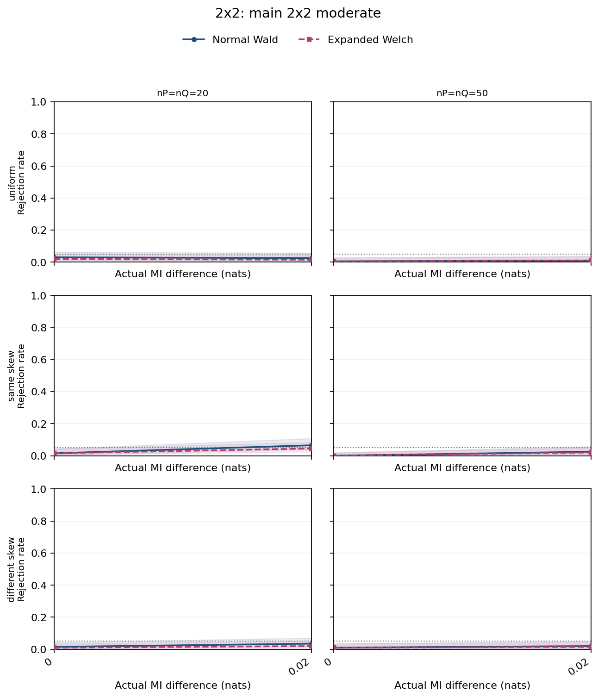

| Specification | Setting |
| --- | --- |
| Table size | 2x2 |
| Horizontal graph regime specifications (columns) | nP=nQ=20, nP=nQ=50 |
| Vertical graph regime specifications (rows) | uniform: P row (0.5 repeated 2 times), P column (0.5 repeated 2 times); Q row (0.5 repeated 2 times), Q column (0.5 repeated 2 times); same skew: P row (0.8, 0.2), P column (0.8, 0.2); Q row (0.8, 0.2), Q column (0.8, 0.2); different skew: P row (0.7, 0.3), P column (0.7, 0.3); Q row (0.8, 0.2), Q column (0.8, 0.2) |
| Probability changes | uniform: additive, first changes in P and Q; same skew: additive, first changes in P and Q; different skew: additive, first changes in P and Q |
| MI settings | Baseline MI {0.02}; direction {q higher}; actual differences {0, 0.02} nats |
| Horizontal axis within each graph | Actual MI difference in nats, fixed from 0 to 0.02 |
| Vertical axis within each graph | Unconditional rejection rate from 0 to 1; invalid results count as non-rejections |
| Replicates | 200 per unique point |

Null-point rejection and validity:

| Vertical regime | Horizontal regime | Method | Rejection | Valid |
| --- | --- | --- | --- | --- |
| different skew | nP=nQ=20 | Expanded Welch | 0.0100 | 0.9800 |
| different skew | nP=nQ=20 | Normal Wald | 0.0150 | 1.0000 |
| different skew | nP=nQ=50 | Expanded Welch | 0.0100 | 1.0000 |
| different skew | nP=nQ=50 | Normal Wald | 0.0100 | 1.0000 |
| same skew | nP=nQ=20 | Expanded Welch | 0.0150 | 0.9600 |
| same skew | nP=nQ=20 | Normal Wald | 0.0150 | 1.0000 |
| same skew | nP=nQ=50 | Expanded Welch | 0.0000 | 1.0000 |
| same skew | nP=nQ=50 | Normal Wald | 0.0000 | 1.0000 |
| uniform | nP=nQ=20 | Expanded Welch | 0.0200 | 0.9900 |
| uniform | nP=nQ=20 | Normal Wald | 0.0300 | 1.0000 |
| uniform | nP=nQ=50 | Expanded Welch | 0.0050 | 0.9900 |
| uniform | nP=nQ=50 | Normal Wald | 0.0050 | 1.0000 |

Every plotted rate, interval, validity and minimum expected count

| Vertical regime | Horizontal regime | x | Method | Rejection | 95% interval | Valid | Conditional | Min expected P | Min expected Q |
| --- | --- | --- | --- | --- | --- | --- | --- | --- | --- |
| different skew | nP=nQ=20 | 0 | Expanded Welch | 0.0100 | [0.0027, 0.0357] | 0.9800 | 0.0102 | 2.655 | 1.476 |
| different skew | nP=nQ=20 | 0 | Normal Wald | 0.0150 | [0.0051, 0.0432] | 1.0000 | 0.0150 | 2.655 | 1.476 |
| different skew | nP=nQ=20 | 0.02 | Expanded Welch | 0.0200 | [0.0078, 0.0503] | 0.9850 | 0.0203 | 2.655 | 1.77 |
| different skew | nP=nQ=20 | 0.02 | Normal Wald | 0.0350 | [0.0171, 0.0705] | 1.0000 | 0.0350 | 2.655 | 1.77 |
| different skew | nP=nQ=50 | 0 | Expanded Welch | 0.0100 | [0.0027, 0.0357] | 1.0000 | 0.0100 | 6.636 | 3.691 |
| different skew | nP=nQ=50 | 0 | Normal Wald | 0.0100 | [0.0027, 0.0357] | 1.0000 | 0.0100 | 6.636 | 3.691 |
| different skew | nP=nQ=50 | 0.02 | Expanded Welch | 0.0150 | [0.0051, 0.0432] | 1.0000 | 0.0150 | 6.636 | 4.424 |
| different skew | nP=nQ=50 | 0.02 | Normal Wald | 0.0200 | [0.0078, 0.0503] | 1.0000 | 0.0200 | 6.636 | 4.424 |
| same skew | nP=nQ=20 | 0 | Expanded Welch | 0.0150 | [0.0051, 0.0432] | 0.9600 | 0.0156 | 1.476 | 1.476 |
| same skew | nP=nQ=20 | 0 | Normal Wald | 0.0150 | [0.0051, 0.0432] | 1.0000 | 0.0150 | 1.476 | 1.476 |
| same skew | nP=nQ=20 | 0.02 | Expanded Welch | 0.0450 | [0.0239, 0.0833] | 0.9300 | 0.0484 | 1.476 | 1.77 |
| same skew | nP=nQ=20 | 0.02 | Normal Wald | 0.0650 | [0.0384, 0.1080] | 1.0000 | 0.0650 | 1.476 | 1.77 |
| same skew | nP=nQ=50 | 0 | Expanded Welch | 0.0000 | [0.0000, 0.0188] | 1.0000 | 0.0000 | 3.691 | 3.691 |
| same skew | nP=nQ=50 | 0 | Normal Wald | 0.0000 | [0.0000, 0.0188] | 1.0000 | 0.0000 | 3.691 | 3.691 |
| same skew | nP=nQ=50 | 0.02 | Expanded Welch | 0.0200 | [0.0078, 0.0503] | 1.0000 | 0.0200 | 3.691 | 4.424 |
| same skew | nP=nQ=50 | 0.02 | Normal Wald | 0.0250 | [0.0107, 0.0572] | 1.0000 | 0.0250 | 3.691 | 4.424 |
| uniform | nP=nQ=20 | 0 | Expanded Welch | 0.0200 | [0.0078, 0.0503] | 0.9900 | 0.0202 | 4.003 | 4.003 |
| uniform | nP=nQ=20 | 0 | Normal Wald | 0.0300 | [0.0138, 0.0639] | 1.0000 | 0.0300 | 4.003 | 4.003 |
| uniform | nP=nQ=20 | 0.02 | Expanded Welch | 0.0150 | [0.0051, 0.0432] | 0.9950 | 0.0151 | 4.003 | 3.595 |
| uniform | nP=nQ=20 | 0.02 | Normal Wald | 0.0250 | [0.0107, 0.0572] | 1.0000 | 0.0250 | 4.003 | 3.595 |
| uniform | nP=nQ=50 | 0 | Expanded Welch | 0.0050 | [0.0009, 0.0278] | 0.9900 | 0.0051 | 10.01 | 10.01 |
| uniform | nP=nQ=50 | 0 | Normal Wald | 0.0050 | [0.0009, 0.0278] | 1.0000 | 0.0050 | 10.01 | 10.01 |
| uniform | nP=nQ=50 | 0.02 | Expanded Welch | 0.0100 | [0.0027, 0.0357] | 0.9950 | 0.0101 | 10.01 | 8.988 |
| uniform | nP=nQ=50 | 0.02 | Normal Wald | 0.0100 | [0.0027, 0.0357] | 1.0000 | 0.0100 | 10.01 | 8.988 |

### 3.3 2x2: main 2x2 large

How do the methods behave as table size, marginal skew and sample size change?

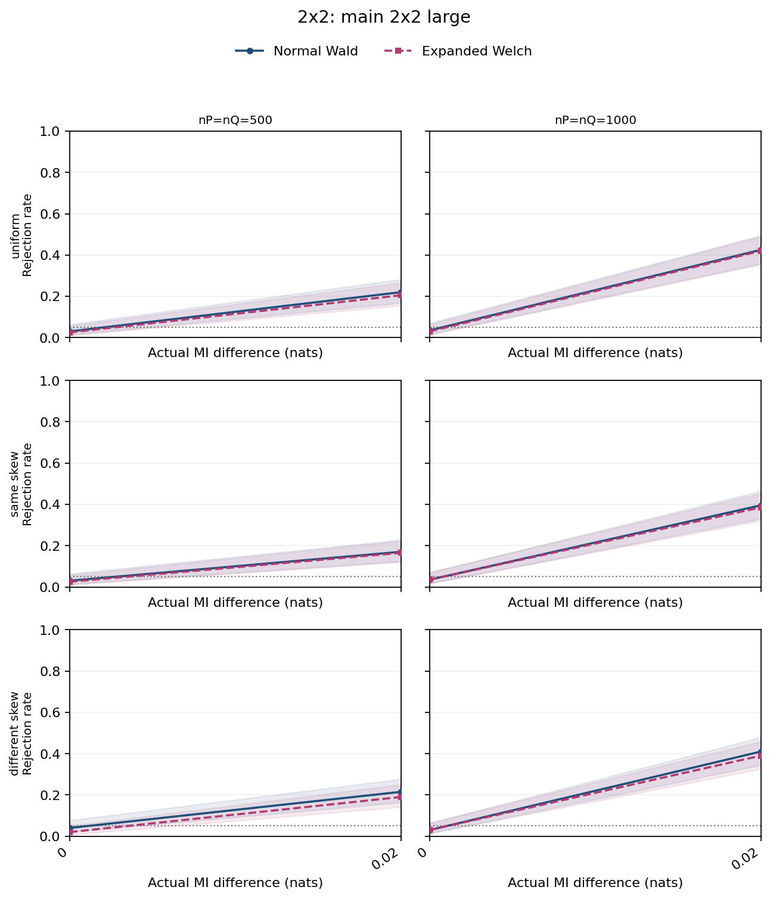

| Specification | Setting |
| --- | --- |
| Table size | 2x2 |
| Horizontal graph regime specifications (columns) | nP=nQ=500, nP=nQ=1000 |
| Vertical graph regime specifications (rows) | uniform: P row (0.5 repeated 2 times), P column (0.5 repeated 2 times); Q row (0.5 repeated 2 times), Q column (0.5 repeated 2 times); same skew: P row (0.8, 0.2), P column (0.8, 0.2); Q row (0.8, 0.2), Q column (0.8, 0.2); different skew: P row (0.7, 0.3), P column (0.7, 0.3); Q row (0.8, 0.2), Q column (0.8, 0.2) |
| Probability changes | uniform: additive, first changes in P and Q; same skew: additive, first changes in P and Q; different skew: additive, first changes in P and Q |
| MI settings | Baseline MI {0.02}; direction {q higher}; actual differences {0, 0.02} nats |
| Horizontal axis within each graph | Actual MI difference in nats, fixed from 0 to 0.02 |
| Vertical axis within each graph | Unconditional rejection rate from 0 to 1; invalid results count as non-rejections |
| Replicates | 200 per unique point |

Null-point rejection and validity:

| Vertical regime | Horizontal regime | Method | Rejection | Valid |
| --- | --- | --- | --- | --- |
| different skew | nP=nQ=1000 | Expanded Welch | 0.0300 | 1.0000 |
| different skew | nP=nQ=1000 | Normal Wald | 0.0300 | 1.0000 |
| different skew | nP=nQ=500 | Expanded Welch | 0.0200 | 1.0000 |
| different skew | nP=nQ=500 | Normal Wald | 0.0400 | 1.0000 |
| same skew | nP=nQ=1000 | Expanded Welch | 0.0350 | 1.0000 |
| same skew | nP=nQ=1000 | Normal Wald | 0.0350 | 1.0000 |
| same skew | nP=nQ=500 | Expanded Welch | 0.0250 | 1.0000 |
| same skew | nP=nQ=500 | Normal Wald | 0.0300 | 1.0000 |
| uniform | nP=nQ=1000 | Expanded Welch | 0.0300 | 1.0000 |
| uniform | nP=nQ=1000 | Normal Wald | 0.0350 | 1.0000 |
| uniform | nP=nQ=500 | Expanded Welch | 0.0250 | 1.0000 |
| uniform | nP=nQ=500 | Normal Wald | 0.0300 | 1.0000 |

Every plotted rate, interval, validity and minimum expected count

| Vertical regime | Horizontal regime | x | Method | Rejection | 95% interval | Valid | Conditional | Min expected P | Min expected Q |
| --- | --- | --- | --- | --- | --- | --- | --- | --- | --- |
| different skew | nP=nQ=1000 | 0 | Expanded Welch | 0.0300 | [0.0138, 0.0639] | 1.0000 | 0.0300 | 132.7 | 73.82 |
| different skew | nP=nQ=1000 | 0 | Normal Wald | 0.0300 | [0.0138, 0.0639] | 1.0000 | 0.0300 | 132.7 | 73.82 |
| different skew | nP=nQ=1000 | 0.02 | Expanded Welch | 0.3900 | [0.3251, 0.4591] | 1.0000 | 0.3900 | 132.7 | 88.48 |
| different skew | nP=nQ=1000 | 0.02 | Normal Wald | 0.4100 | [0.3442, 0.4792] | 1.0000 | 0.4100 | 132.7 | 88.48 |
| different skew | nP=nQ=500 | 0 | Expanded Welch | 0.0200 | [0.0078, 0.0503] | 1.0000 | 0.0200 | 66.36 | 36.91 |
| different skew | nP=nQ=500 | 0 | Normal Wald | 0.0400 | [0.0204, 0.0769] | 1.0000 | 0.0400 | 66.36 | 36.91 |
| different skew | nP=nQ=500 | 0.02 | Expanded Welch | 0.1900 | [0.1417, 0.2500] | 1.0000 | 0.1900 | 66.36 | 44.24 |
| different skew | nP=nQ=500 | 0.02 | Normal Wald | 0.2150 | [0.1637, 0.2770] | 1.0000 | 0.2150 | 66.36 | 44.24 |
| same skew | nP=nQ=1000 | 0 | Expanded Welch | 0.0350 | [0.0171, 0.0705] | 1.0000 | 0.0350 | 73.82 | 73.82 |
| same skew | nP=nQ=1000 | 0 | Normal Wald | 0.0350 | [0.0171, 0.0705] | 1.0000 | 0.0350 | 73.82 | 73.82 |
| same skew | nP=nQ=1000 | 0.02 | Expanded Welch | 0.3850 | [0.3203, 0.4540] | 1.0000 | 0.3850 | 73.82 | 88.48 |
| same skew | nP=nQ=1000 | 0.02 | Normal Wald | 0.3950 | [0.3298, 0.4641] | 1.0000 | 0.3950 | 73.82 | 88.48 |
| same skew | nP=nQ=500 | 0 | Expanded Welch | 0.0250 | [0.0107, 0.0572] | 1.0000 | 0.0250 | 36.91 | 36.91 |
| same skew | nP=nQ=500 | 0 | Normal Wald | 0.0300 | [0.0138, 0.0639] | 1.0000 | 0.0300 | 36.91 | 36.91 |
| same skew | nP=nQ=500 | 0.02 | Expanded Welch | 0.1650 | [0.1200, 0.2227] | 1.0000 | 0.1650 | 36.91 | 44.24 |
| same skew | nP=nQ=500 | 0.02 | Normal Wald | 0.1700 | [0.1243, 0.2282] | 1.0000 | 0.1700 | 36.91 | 44.24 |
| uniform | nP=nQ=1000 | 0 | Expanded Welch | 0.0300 | [0.0138, 0.0639] | 1.0000 | 0.0300 | 200.2 | 200.2 |
| uniform | nP=nQ=1000 | 0 | Normal Wald | 0.0350 | [0.0171, 0.0705] | 1.0000 | 0.0350 | 200.2 | 200.2 |
| uniform | nP=nQ=1000 | 0.02 | Expanded Welch | 0.4200 | [0.3537, 0.4893] | 1.0000 | 0.4200 | 200.2 | 179.8 |
| uniform | nP=nQ=1000 | 0.02 | Normal Wald | 0.4250 | [0.3585, 0.4943] | 1.0000 | 0.4250 | 200.2 | 179.8 |
| uniform | nP=nQ=500 | 0 | Expanded Welch | 0.0250 | [0.0107, 0.0572] | 1.0000 | 0.0250 | 100.1 | 100.1 |
| uniform | nP=nQ=500 | 0 | Normal Wald | 0.0300 | [0.0138, 0.0639] | 1.0000 | 0.0300 | 100.1 | 100.1 |
| uniform | nP=nQ=500 | 0.02 | Expanded Welch | 0.2050 | [0.1549, 0.2663] | 1.0000 | 0.2050 | 100.1 | 89.88 |
| uniform | nP=nQ=500 | 0.02 | Normal Wald | 0.2200 | [0.1682, 0.2824] | 1.0000 | 0.2200 | 100.1 | 89.88 |

### 3.4 3x3: main 3x3 small

How do the methods behave as table size, marginal skew and sample size change?

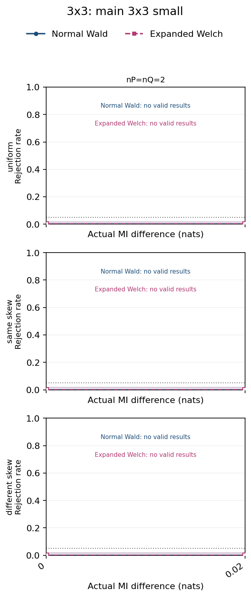

| Specification | Setting |
| --- | --- |
| Table size | 3x3 |
| Horizontal graph regime specifications (columns) | nP=nQ=2 |
| Vertical graph regime specifications (rows) | uniform: P row (0.3333 repeated 3 times), P column (0.3333 repeated 3 times); Q row (0.3333 repeated 3 times), Q column (0.3333 repeated 3 times); same skew: P row (0.8, 0.2/2 repeated 2 times), P column (0.8, 0.2/2 repeated 2 times); Q row (0.8, 0.2/2 repeated 2 times), Q column (0.8, 0.2/2 repeated 2 times); different skew: P row (0.7, 0.3/2 repeated 2 times), P column (0.7, 0.3/2 repeated 2 times); Q row (0.8, 0.2/2 repeated 2 times), Q column (0.8, 0.2/2 repeated 2 times) |
| Probability changes | uniform: additive, first changes in P and Q; same skew: additive, first changes in P and Q; different skew: additive, first changes in P and Q |
| MI settings | Baseline MI {0.02}; direction {q higher}; actual differences {0, 0.02} nats |
| Horizontal axis within each graph | Actual MI difference in nats, fixed from 0 to 0.02 |
| Vertical axis within each graph | Unconditional rejection rate from 0 to 1; invalid results count as non-rejections |
| Replicates | 200 per unique point |

Null-point rejection and validity:

| Vertical regime | Horizontal regime | Method | Rejection | Valid |
| --- | --- | --- | --- | --- |
| different skew | nP=nQ=2 | Expanded Welch | 0.0000 | 0.0000 |
| different skew | nP=nQ=2 | Normal Wald | 0.0000 | 0.0000 |
| same skew | nP=nQ=2 | Expanded Welch | 0.0000 | 0.0000 |
| same skew | nP=nQ=2 | Normal Wald | 0.0000 | 0.0000 |
| uniform | nP=nQ=2 | Expanded Welch | 0.0000 | 0.0000 |
| uniform | nP=nQ=2 | Normal Wald | 0.0000 | 0.0000 |

Every plotted rate, interval, validity and minimum expected count

| Vertical regime | Horizontal regime | x | Method | Rejection | 95% interval | Valid | Conditional | Min expected P | Min expected Q |
| --- | --- | --- | --- | --- | --- | --- | --- | --- | --- |
| different skew | nP=nQ=2 | 0 | Expanded Welch | 0.0000 | [0.0000, 0.0188] | 0.0000 | NA | 0.045 | 0.02 |
| different skew | nP=nQ=2 | 0 | Normal Wald | 0.0000 | [0.0000, 0.0188] | 0.0000 | NA | 0.045 | 0.02 |
| different skew | nP=nQ=2 | 0.02 | Expanded Welch | 0.0000 | [0.0000, 0.0188] | 0.0000 | NA | 0.045 | 0.02 |
| different skew | nP=nQ=2 | 0.02 | Normal Wald | 0.0000 | [0.0000, 0.0188] | 0.0000 | NA | 0.045 | 0.02 |
| same skew | nP=nQ=2 | 0 | Expanded Welch | 0.0000 | [0.0000, 0.0188] | 0.0000 | NA | 0.02 | 0.02 |
| same skew | nP=nQ=2 | 0 | Normal Wald | 0.0000 | [0.0000, 0.0188] | 0.0000 | NA | 0.02 | 0.02 |
| same skew | nP=nQ=2 | 0.02 | Expanded Welch | 0.0000 | [0.0000, 0.0188] | 0.0000 | NA | 0.02 | 0.02 |
| same skew | nP=nQ=2 | 0.02 | Normal Wald | 0.0000 | [0.0000, 0.0188] | 0.0000 | NA | 0.02 | 0.02 |
| uniform | nP=nQ=2 | 0 | Expanded Welch | 0.0000 | [0.0000, 0.0188] | 0.0000 | NA | 0.1561 | 0.1561 |
| uniform | nP=nQ=2 | 0 | Normal Wald | 0.0000 | [0.0000, 0.0188] | 0.0000 | NA | 0.1561 | 0.1561 |
| uniform | nP=nQ=2 | 0.02 | Expanded Welch | 0.0000 | [0.0000, 0.0188] | 0.0000 | NA | 0.1561 | 0.1294 |
| uniform | nP=nQ=2 | 0.02 | Normal Wald | 0.0000 | [0.0000, 0.0188] | 0.0000 | NA | 0.1561 | 0.1294 |

### 3.5 3x3: main 3x3 moderate

How do the methods behave as table size, marginal skew and sample size change?

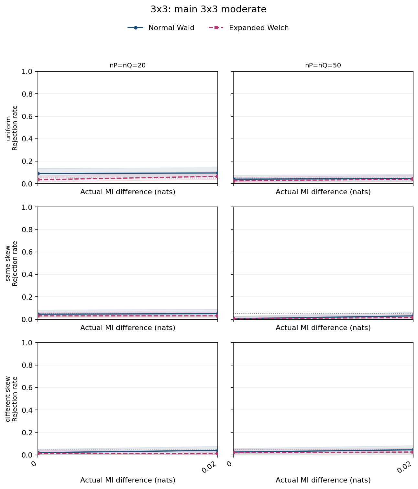

| Specification | Setting |
| --- | --- |
| Table size | 3x3 |
| Horizontal graph regime specifications (columns) | nP=nQ=20, nP=nQ=50 |
| Vertical graph regime specifications (rows) | uniform: P row (0.3333 repeated 3 times), P column (0.3333 repeated 3 times); Q row (0.3333 repeated 3 times), Q column (0.3333 repeated 3 times); same skew: P row (0.8, 0.2/2 repeated 2 times), P column (0.8, 0.2/2 repeated 2 times); Q row (0.8, 0.2/2 repeated 2 times), Q column (0.8, 0.2/2 repeated 2 times); different skew: P row (0.7, 0.3/2 repeated 2 times), P column (0.7, 0.3/2 repeated 2 times); Q row (0.8, 0.2/2 repeated 2 times), Q column (0.8, 0.2/2 repeated 2 times) |
| Probability changes | uniform: additive, first changes in P and Q; same skew: additive, first changes in P and Q; different skew: additive, first changes in P and Q |
| MI settings | Baseline MI {0.02}; direction {q higher}; actual differences {0, 0.02} nats |
| Horizontal axis within each graph | Actual MI difference in nats, fixed from 0 to 0.02 |
| Vertical axis within each graph | Unconditional rejection rate from 0 to 1; invalid results count as non-rejections |
| Replicates | 200 per unique point |

Null-point rejection and validity:

| Vertical regime | Horizontal regime | Method | Rejection | Valid |
| --- | --- | --- | --- | --- |
| different skew | nP=nQ=20 | Expanded Welch | 0.0150 | 0.9750 |
| different skew | nP=nQ=20 | Normal Wald | 0.0200 | 1.0000 |
| different skew | nP=nQ=50 | Expanded Welch | 0.0200 | 1.0000 |
| different skew | nP=nQ=50 | Normal Wald | 0.0250 | 1.0000 |
| same skew | nP=nQ=20 | Expanded Welch | 0.0300 | 0.9500 |
| same skew | nP=nQ=20 | Normal Wald | 0.0450 | 1.0000 |
| same skew | nP=nQ=50 | Expanded Welch | 0.0050 | 1.0000 |
| same skew | nP=nQ=50 | Normal Wald | 0.0050 | 1.0000 |
| uniform | nP=nQ=20 | Expanded Welch | 0.0350 | 1.0000 |
| uniform | nP=nQ=20 | Normal Wald | 0.0900 | 1.0000 |
| uniform | nP=nQ=50 | Expanded Welch | 0.0250 | 1.0000 |
| uniform | nP=nQ=50 | Normal Wald | 0.0400 | 1.0000 |

Every plotted rate, interval, validity and minimum expected count

| Vertical regime | Horizontal regime | x | Method | Rejection | 95% interval | Valid | Conditional | Min expected P | Min expected Q |
| --- | --- | --- | --- | --- | --- | --- | --- | --- | --- |
| different skew | nP=nQ=20 | 0 | Expanded Welch | 0.0150 | [0.0051, 0.0432] | 0.9750 | 0.0154 | 0.45 | 0.2 |
| different skew | nP=nQ=20 | 0 | Normal Wald | 0.0200 | [0.0078, 0.0503] | 1.0000 | 0.0200 | 0.45 | 0.2 |
| different skew | nP=nQ=20 | 0.02 | Expanded Welch | 0.0100 | [0.0027, 0.0357] | 0.9800 | 0.0102 | 0.45 | 0.2 |
| different skew | nP=nQ=20 | 0.02 | Normal Wald | 0.0400 | [0.0204, 0.0769] | 1.0000 | 0.0400 | 0.45 | 0.2 |
| different skew | nP=nQ=50 | 0 | Expanded Welch | 0.0200 | [0.0078, 0.0503] | 1.0000 | 0.0200 | 1.125 | 0.5 |
| different skew | nP=nQ=50 | 0 | Normal Wald | 0.0250 | [0.0107, 0.0572] | 1.0000 | 0.0250 | 1.125 | 0.5 |
| different skew | nP=nQ=50 | 0.02 | Expanded Welch | 0.0250 | [0.0107, 0.0572] | 1.0000 | 0.0250 | 1.125 | 0.5 |
| different skew | nP=nQ=50 | 0.02 | Normal Wald | 0.0450 | [0.0239, 0.0833] | 1.0000 | 0.0450 | 1.125 | 0.5 |
| same skew | nP=nQ=20 | 0 | Expanded Welch | 0.0300 | [0.0138, 0.0639] | 0.9500 | 0.0316 | 0.2 | 0.2 |
| same skew | nP=nQ=20 | 0 | Normal Wald | 0.0450 | [0.0239, 0.0833] | 1.0000 | 0.0450 | 0.2 | 0.2 |
| same skew | nP=nQ=20 | 0.02 | Expanded Welch | 0.0300 | [0.0138, 0.0639] | 0.9600 | 0.0312 | 0.2 | 0.2 |
| same skew | nP=nQ=20 | 0.02 | Normal Wald | 0.0500 | [0.0274, 0.0896] | 1.0000 | 0.0500 | 0.2 | 0.2 |
| same skew | nP=nQ=50 | 0 | Expanded Welch | 0.0050 | [0.0009, 0.0278] | 1.0000 | 0.0050 | 0.5 | 0.5 |
| same skew | nP=nQ=50 | 0 | Normal Wald | 0.0050 | [0.0009, 0.0278] | 1.0000 | 0.0050 | 0.5 | 0.5 |
| same skew | nP=nQ=50 | 0.02 | Expanded Welch | 0.0150 | [0.0051, 0.0432] | 1.0000 | 0.0150 | 0.5 | 0.5 |
| same skew | nP=nQ=50 | 0.02 | Normal Wald | 0.0300 | [0.0138, 0.0639] | 1.0000 | 0.0300 | 0.5 | 0.5 |
| uniform | nP=nQ=20 | 0 | Expanded Welch | 0.0350 | [0.0171, 0.0705] | 1.0000 | 0.0350 | 1.561 | 1.561 |
| uniform | nP=nQ=20 | 0 | Normal Wald | 0.0900 | [0.0577, 0.1378] | 1.0000 | 0.0900 | 1.561 | 1.561 |
| uniform | nP=nQ=20 | 0.02 | Expanded Welch | 0.0650 | [0.0384, 0.1080] | 1.0000 | 0.0650 | 1.561 | 1.294 |
| uniform | nP=nQ=20 | 0.02 | Normal Wald | 0.0950 | [0.0617, 0.1436] | 1.0000 | 0.0950 | 1.561 | 1.294 |
| uniform | nP=nQ=50 | 0 | Expanded Welch | 0.0250 | [0.0107, 0.0572] | 1.0000 | 0.0250 | 3.902 | 3.902 |
| uniform | nP=nQ=50 | 0 | Normal Wald | 0.0400 | [0.0204, 0.0769] | 1.0000 | 0.0400 | 3.902 | 3.902 |
| uniform | nP=nQ=50 | 0.02 | Expanded Welch | 0.0400 | [0.0204, 0.0769] | 1.0000 | 0.0400 | 3.902 | 3.235 |
| uniform | nP=nQ=50 | 0.02 | Normal Wald | 0.0450 | [0.0239, 0.0833] | 1.0000 | 0.0450 | 3.902 | 3.235 |

### 3.6 3x3: main 3x3 large

How do the methods behave as table size, marginal skew and sample size change?

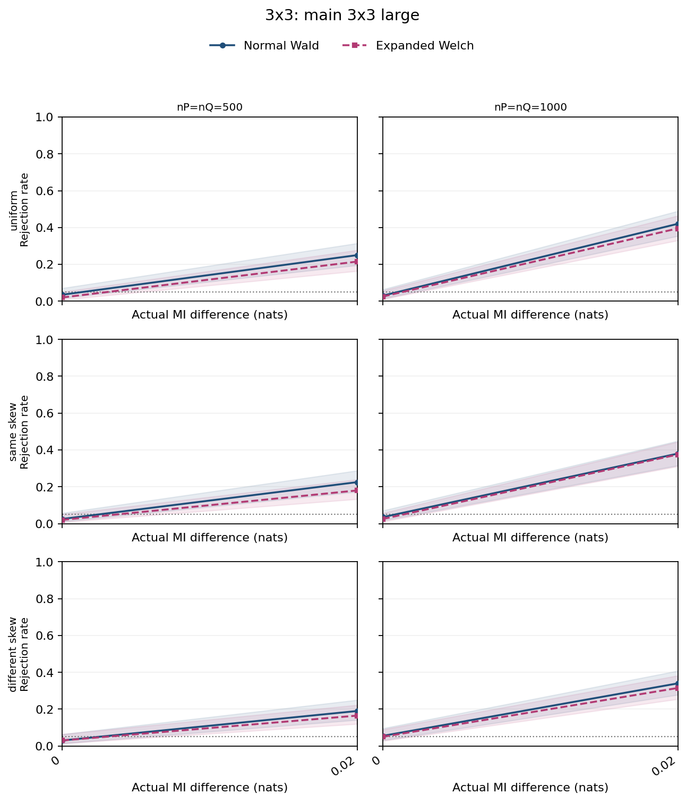

| Specification | Setting |
| --- | --- |
| Table size | 3x3 |
| Horizontal graph regime specifications (columns) | nP=nQ=500, nP=nQ=1000 |
| Vertical graph regime specifications (rows) | uniform: P row (0.3333 repeated 3 times), P column (0.3333 repeated 3 times); Q row (0.3333 repeated 3 times), Q column (0.3333 repeated 3 times); same skew: P row (0.8, 0.2/2 repeated 2 times), P column (0.8, 0.2/2 repeated 2 times); Q row (0.8, 0.2/2 repeated 2 times), Q column (0.8, 0.2/2 repeated 2 times); different skew: P row (0.7, 0.3/2 repeated 2 times), P column (0.7, 0.3/2 repeated 2 times); Q row (0.8, 0.2/2 repeated 2 times), Q column (0.8, 0.2/2 repeated 2 times) |
| Probability changes | uniform: additive, first changes in P and Q; same skew: additive, first changes in P and Q; different skew: additive, first changes in P and Q |
| MI settings | Baseline MI {0.02}; direction {q higher}; actual differences {0, 0.02} nats |
| Horizontal axis within each graph | Actual MI difference in nats, fixed from 0 to 0.02 |
| Vertical axis within each graph | Unconditional rejection rate from 0 to 1; invalid results count as non-rejections |
| Replicates | 200 per unique point |

Null-point rejection and validity:

| Vertical regime | Horizontal regime | Method | Rejection | Valid |
| --- | --- | --- | --- | --- |
| different skew | nP=nQ=1000 | Expanded Welch | 0.0500 | 1.0000 |
| different skew | nP=nQ=1000 | Normal Wald | 0.0550 | 1.0000 |
| different skew | nP=nQ=500 | Expanded Welch | 0.0300 | 1.0000 |
| different skew | nP=nQ=500 | Normal Wald | 0.0300 | 1.0000 |
| same skew | nP=nQ=1000 | Expanded Welch | 0.0250 | 1.0000 |
| same skew | nP=nQ=1000 | Normal Wald | 0.0350 | 1.0000 |
| same skew | nP=nQ=500 | Expanded Welch | 0.0200 | 1.0000 |
| same skew | nP=nQ=500 | Normal Wald | 0.0250 | 1.0000 |
| uniform | nP=nQ=1000 | Expanded Welch | 0.0250 | 1.0000 |
| uniform | nP=nQ=1000 | Normal Wald | 0.0300 | 1.0000 |
| uniform | nP=nQ=500 | Expanded Welch | 0.0200 | 1.0000 |
| uniform | nP=nQ=500 | Normal Wald | 0.0350 | 1.0000 |

Every plotted rate, interval, validity and minimum expected count

| Vertical regime | Horizontal regime | x | Method | Rejection | 95% interval | Valid | Conditional | Min expected P | Min expected Q |
| --- | --- | --- | --- | --- | --- | --- | --- | --- | --- |
| different skew | nP=nQ=1000 | 0 | Expanded Welch | 0.0500 | [0.0274, 0.0896] | 1.0000 | 0.0500 | 22.5 | 10 |
| different skew | nP=nQ=1000 | 0 | Normal Wald | 0.0550 | [0.0310, 0.0958] | 1.0000 | 0.0550 | 22.5 | 10 |
| different skew | nP=nQ=1000 | 0.02 | Expanded Welch | 0.3150 | [0.2546, 0.3823] | 1.0000 | 0.3150 | 22.5 | 10 |
| different skew | nP=nQ=1000 | 0.02 | Normal Wald | 0.3400 | [0.2779, 0.4081] | 1.0000 | 0.3400 | 22.5 | 10 |
| different skew | nP=nQ=500 | 0 | Expanded Welch | 0.0300 | [0.0138, 0.0639] | 1.0000 | 0.0300 | 11.25 | 5 |
| different skew | nP=nQ=500 | 0 | Normal Wald | 0.0300 | [0.0138, 0.0639] | 1.0000 | 0.0300 | 11.25 | 5 |
| different skew | nP=nQ=500 | 0.02 | Expanded Welch | 0.1650 | [0.1200, 0.2227] | 1.0000 | 0.1650 | 11.25 | 5 |
| different skew | nP=nQ=500 | 0.02 | Normal Wald | 0.1900 | [0.1417, 0.2500] | 1.0000 | 0.1900 | 11.25 | 5 |
| same skew | nP=nQ=1000 | 0 | Expanded Welch | 0.0250 | [0.0107, 0.0572] | 1.0000 | 0.0250 | 10 | 10 |
| same skew | nP=nQ=1000 | 0 | Normal Wald | 0.0350 | [0.0171, 0.0705] | 1.0000 | 0.0350 | 10 | 10 |
| same skew | nP=nQ=1000 | 0.02 | Expanded Welch | 0.3750 | [0.3109, 0.4439] | 1.0000 | 0.3750 | 10 | 10 |
| same skew | nP=nQ=1000 | 0.02 | Normal Wald | 0.3800 | [0.3156, 0.4489] | 1.0000 | 0.3800 | 10 | 10 |
| same skew | nP=nQ=500 | 0 | Expanded Welch | 0.0200 | [0.0078, 0.0503] | 1.0000 | 0.0200 | 5 | 5 |
| same skew | nP=nQ=500 | 0 | Normal Wald | 0.0250 | [0.0107, 0.0572] | 1.0000 | 0.0250 | 5 | 5 |
| same skew | nP=nQ=500 | 0.02 | Expanded Welch | 0.1800 | [0.1329, 0.2391] | 1.0000 | 0.1800 | 5 | 5 |
| same skew | nP=nQ=500 | 0.02 | Normal Wald | 0.2250 | [0.1726, 0.2877] | 1.0000 | 0.2250 | 5 | 5 |
| uniform | nP=nQ=1000 | 0 | Expanded Welch | 0.0250 | [0.0107, 0.0572] | 1.0000 | 0.0250 | 78.03 | 78.03 |
| uniform | nP=nQ=1000 | 0 | Normal Wald | 0.0300 | [0.0138, 0.0639] | 1.0000 | 0.0300 | 78.03 | 78.03 |
| uniform | nP=nQ=1000 | 0.02 | Expanded Welch | 0.3950 | [0.3298, 0.4641] | 1.0000 | 0.3950 | 78.03 | 64.69 |
| uniform | nP=nQ=1000 | 0.02 | Normal Wald | 0.4200 | [0.3537, 0.4893] | 1.0000 | 0.4200 | 78.03 | 64.69 |
| uniform | nP=nQ=500 | 0 | Expanded Welch | 0.0200 | [0.0078, 0.0503] | 1.0000 | 0.0200 | 39.02 | 39.02 |
| uniform | nP=nQ=500 | 0 | Normal Wald | 0.0350 | [0.0171, 0.0705] | 1.0000 | 0.0350 | 39.02 | 39.02 |
| uniform | nP=nQ=500 | 0.02 | Expanded Welch | 0.2150 | [0.1637, 0.2770] | 1.0000 | 0.2150 | 39.02 | 32.35 |
| uniform | nP=nQ=500 | 0.02 | Normal Wald | 0.2500 | [0.1951, 0.3143] | 1.0000 | 0.2500 | 39.02 | 32.35 |

### 3.7 5x5: main 5x5 small

How do the methods behave as table size, marginal skew and sample size change?

| Specification | Setting |
| --- | --- |
| Table size | 5x5 |
| Horizontal graph regime specifications (columns) | nP=nQ=2 |
| Vertical graph regime specifications (rows) | uniform: P row (0.2 repeated 5 times), P column (0.2 repeated 5 times); Q row (0.2 repeated 5 times), Q column (0.2 repeated 5 times); same skew: P row (0.8, 0.2/4 repeated 4 times), P column (0.8, 0.2/4 repeated 4 times); Q row (0.8, 0.2/4 repeated 4 times), Q column (0.8, 0.2/4 repeated 4 times); different skew: P row (0.7, 0.3/4 repeated 4 times), P column (0.7, 0.3/4 repeated 4 times); Q row (0.8, 0.2/4 repeated 4 times), Q column (0.8, 0.2/4 repeated 4 times) |
| Probability changes | uniform: additive, first changes in P and Q; same skew: additive, first changes in P and Q; different skew: additive, first changes in P and Q |
| MI settings | Baseline MI {0.02}; direction {q higher}; actual differences {0, 0.02} nats |
| Horizontal axis within each graph | Actual MI difference in nats, fixed from 0 to 0.02 |
| Vertical axis within each graph | Unconditional rejection rate from 0 to 1; invalid results count as non-rejections |
| Replicates | 200 per unique point |

Null-point rejection and validity:

| Vertical regime | Horizontal regime | Method | Rejection | Valid |
| --- | --- | --- | --- | --- |
| different skew | nP=nQ=2 | Expanded Welch | 0.0000 | 0.0000 |
| different skew | nP=nQ=2 | Normal Wald | 0.0000 | 0.0000 |
| same skew | nP=nQ=2 | Expanded Welch | 0.0000 | 0.0000 |
| same skew | nP=nQ=2 | Normal Wald | 0.0000 | 0.0000 |
| uniform | nP=nQ=2 | Expanded Welch | 0.0000 | 0.0000 |
| uniform | nP=nQ=2 | Normal Wald | 0.0000 | 0.0000 |

Every plotted rate, interval, validity and minimum expected count

| Vertical regime | Horizontal regime | x | Method | Rejection | 95% interval | Valid | Conditional | Min expected P | Min expected Q |
| --- | --- | --- | --- | --- | --- | --- | --- | --- | --- |
| different skew | nP=nQ=2 | 0 | Expanded Welch | 0.0000 | [0.0000, 0.0188] | 0.0000 | NA | 0.01125 | 0.005 |
| different skew | nP=nQ=2 | 0 | Normal Wald | 0.0000 | [0.0000, 0.0188] | 0.0000 | NA | 0.01125 | 0.005 |
| different skew | nP=nQ=2 | 0.02 | Expanded Welch | 0.0000 | [0.0000, 0.0188] | 0.0000 | NA | 0.01125 | 0.005 |
| different skew | nP=nQ=2 | 0.02 | Normal Wald | 0.0000 | [0.0000, 0.0188] | 0.0000 | NA | 0.01125 | 0.005 |
| same skew | nP=nQ=2 | 0 | Expanded Welch | 0.0000 | [0.0000, 0.0188] | 0.0000 | NA | 0.005 | 0.005 |
| same skew | nP=nQ=2 | 0 | Normal Wald | 0.0000 | [0.0000, 0.0188] | 0.0000 | NA | 0.005 | 0.005 |
| same skew | nP=nQ=2 | 0.02 | Expanded Welch | 0.0000 | [0.0000, 0.0188] | 0.0000 | NA | 0.005 | 0.005 |
| same skew | nP=nQ=2 | 0.02 | Normal Wald | 0.0000 | [0.0000, 0.0188] | 0.0000 | NA | 0.005 | 0.005 |
| uniform | nP=nQ=2 | 0 | Expanded Welch | 0.0000 | [0.0000, 0.0188] | 0.0000 | NA | 0.04086 | 0.04086 |
| uniform | nP=nQ=2 | 0 | Normal Wald | 0.0000 | [0.0000, 0.0188] | 0.0000 | NA | 0.04086 | 0.04086 |
| uniform | nP=nQ=2 | 0.02 | Expanded Welch | 0.0000 | [0.0000, 0.0188] | 0.0000 | NA | 0.04086 | 0.02594 |
| uniform | nP=nQ=2 | 0.02 | Normal Wald | 0.0000 | [0.0000, 0.0188] | 0.0000 | NA | 0.04086 | 0.02594 |

### 3.8 5x5: main 5x5 moderate

How do the methods behave as table size, marginal skew and sample size change?

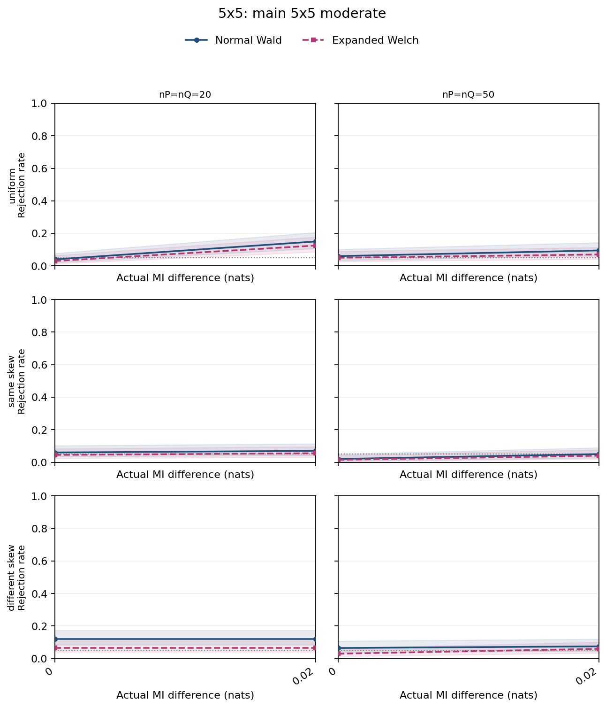

| Specification | Setting |
| --- | --- |
| Table size | 5x5 |
| Horizontal graph regime specifications (columns) | nP=nQ=20, nP=nQ=50 |
| Vertical graph regime specifications (rows) | uniform: P row (0.2 repeated 5 times), P column (0.2 repeated 5 times); Q row (0.2 repeated 5 times), Q column (0.2 repeated 5 times); same skew: P row (0.8, 0.2/4 repeated 4 times), P column (0.8, 0.2/4 repeated 4 times); Q row (0.8, 0.2/4 repeated 4 times), Q column (0.8, 0.2/4 repeated 4 times); different skew: P row (0.7, 0.3/4 repeated 4 times), P column (0.7, 0.3/4 repeated 4 times); Q row (0.8, 0.2/4 repeated 4 times), Q column (0.8, 0.2/4 repeated 4 times) |
| Probability changes | uniform: additive, first changes in P and Q; same skew: additive, first changes in P and Q; different skew: additive, first changes in P and Q |
| MI settings | Baseline MI {0.02}; direction {q higher}; actual differences {0, 0.02} nats |
| Horizontal axis within each graph | Actual MI difference in nats, fixed from 0 to 0.02 |
| Vertical axis within each graph | Unconditional rejection rate from 0 to 1; invalid results count as non-rejections |
| Replicates | 200 per unique point |

Null-point rejection and validity:

| Vertical regime | Horizontal regime | Method | Rejection | Valid |
| --- | --- | --- | --- | --- |
| different skew | nP=nQ=20 | Expanded Welch | 0.0650 | 0.9450 |
| different skew | nP=nQ=20 | Normal Wald | 0.1200 | 1.0000 |
| different skew | nP=nQ=50 | Expanded Welch | 0.0300 | 1.0000 |
| different skew | nP=nQ=50 | Normal Wald | 0.0650 | 1.0000 |
| same skew | nP=nQ=20 | Expanded Welch | 0.0450 | 0.9750 |
| same skew | nP=nQ=20 | Normal Wald | 0.0600 | 1.0000 |
| same skew | nP=nQ=50 | Expanded Welch | 0.0150 | 1.0000 |
| same skew | nP=nQ=50 | Normal Wald | 0.0200 | 1.0000 |
| uniform | nP=nQ=20 | Expanded Welch | 0.0300 | 1.0000 |
| uniform | nP=nQ=20 | Normal Wald | 0.0400 | 1.0000 |
| uniform | nP=nQ=50 | Expanded Welch | 0.0500 | 1.0000 |
| uniform | nP=nQ=50 | Normal Wald | 0.0600 | 1.0000 |

Every plotted rate, interval, validity and minimum expected count

| Vertical regime | Horizontal regime | x | Method | Rejection | 95% interval | Valid | Conditional | Min expected P | Min expected Q |
| --- | --- | --- | --- | --- | --- | --- | --- | --- | --- |
| different skew | nP=nQ=20 | 0 | Expanded Welch | 0.0650 | [0.0384, 0.1080] | 0.9450 | 0.0688 | 0.1125 | 0.05 |
| different skew | nP=nQ=20 | 0 | Normal Wald | 0.1200 | [0.0820, 0.1723] | 1.0000 | 0.1200 | 0.1125 | 0.05 |
| different skew | nP=nQ=20 | 0.02 | Expanded Welch | 0.0650 | [0.0384, 0.1080] | 0.9900 | 0.0657 | 0.1125 | 0.05 |
| different skew | nP=nQ=20 | 0.02 | Normal Wald | 0.1200 | [0.0820, 0.1723] | 1.0000 | 0.1200 | 0.1125 | 0.05 |
| different skew | nP=nQ=50 | 0 | Expanded Welch | 0.0300 | [0.0138, 0.0639] | 1.0000 | 0.0300 | 0.2812 | 0.125 |
| different skew | nP=nQ=50 | 0 | Normal Wald | 0.0650 | [0.0384, 0.1080] | 1.0000 | 0.0650 | 0.2812 | 0.125 |
| different skew | nP=nQ=50 | 0.02 | Expanded Welch | 0.0600 | [0.0347, 0.1019] | 1.0000 | 0.0600 | 0.2812 | 0.125 |
| different skew | nP=nQ=50 | 0.02 | Normal Wald | 0.0750 | [0.0460, 0.1200] | 1.0000 | 0.0750 | 0.2812 | 0.125 |
| same skew | nP=nQ=20 | 0 | Expanded Welch | 0.0450 | [0.0239, 0.0833] | 0.9750 | 0.0462 | 0.05 | 0.05 |
| same skew | nP=nQ=20 | 0 | Normal Wald | 0.0600 | [0.0347, 0.1019] | 1.0000 | 0.0600 | 0.05 | 0.05 |
| same skew | nP=nQ=20 | 0.02 | Expanded Welch | 0.0550 | [0.0310, 0.0958] | 0.9650 | 0.0570 | 0.05 | 0.05 |
| same skew | nP=nQ=20 | 0.02 | Normal Wald | 0.0700 | [0.0422, 0.1141] | 1.0000 | 0.0700 | 0.05 | 0.05 |
| same skew | nP=nQ=50 | 0 | Expanded Welch | 0.0150 | [0.0051, 0.0432] | 1.0000 | 0.0150 | 0.125 | 0.125 |
| same skew | nP=nQ=50 | 0 | Normal Wald | 0.0200 | [0.0078, 0.0503] | 1.0000 | 0.0200 | 0.125 | 0.125 |
| same skew | nP=nQ=50 | 0.02 | Expanded Welch | 0.0400 | [0.0204, 0.0769] | 1.0000 | 0.0400 | 0.125 | 0.125 |
| same skew | nP=nQ=50 | 0.02 | Normal Wald | 0.0500 | [0.0274, 0.0896] | 1.0000 | 0.0500 | 0.125 | 0.125 |
| uniform | nP=nQ=20 | 0 | Expanded Welch | 0.0300 | [0.0138, 0.0639] | 1.0000 | 0.0300 | 0.4086 | 0.4086 |
| uniform | nP=nQ=20 | 0 | Normal Wald | 0.0400 | [0.0204, 0.0769] | 1.0000 | 0.0400 | 0.4086 | 0.4086 |
| uniform | nP=nQ=20 | 0.02 | Expanded Welch | 0.1250 | [0.0861, 0.1780] | 1.0000 | 0.1250 | 0.4086 | 0.2594 |
| uniform | nP=nQ=20 | 0.02 | Normal Wald | 0.1500 | [0.1071, 0.2061] | 1.0000 | 0.1500 | 0.4086 | 0.2594 |
| uniform | nP=nQ=50 | 0 | Expanded Welch | 0.0500 | [0.0274, 0.0896] | 1.0000 | 0.0500 | 1.021 | 1.021 |
| uniform | nP=nQ=50 | 0 | Normal Wald | 0.0600 | [0.0347, 0.1019] | 1.0000 | 0.0600 | 1.021 | 1.021 |
| uniform | nP=nQ=50 | 0.02 | Expanded Welch | 0.0700 | [0.0422, 0.1141] | 1.0000 | 0.0700 | 1.021 | 0.6484 |
| uniform | nP=nQ=50 | 0.02 | Normal Wald | 0.0950 | [0.0617, 0.1436] | 1.0000 | 0.0950 | 1.021 | 0.6484 |

### 3.9 5x5: main 5x5 large

How do the methods behave as table size, marginal skew and sample size change?

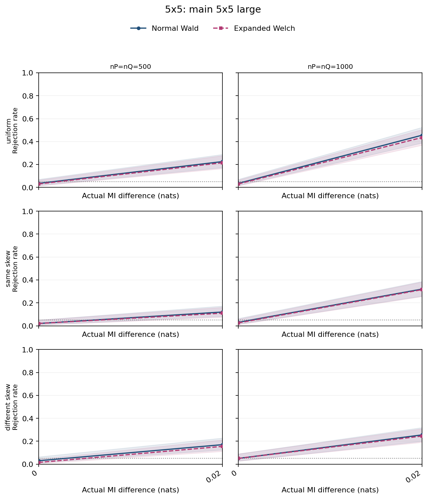

| Specification | Setting |
| --- | --- |
| Table size | 5x5 |
| Horizontal graph regime specifications (columns) | nP=nQ=500, nP=nQ=1000 |
| Vertical graph regime specifications (rows) | uniform: P row (0.2 repeated 5 times), P column (0.2 repeated 5 times); Q row (0.2 repeated 5 times), Q column (0.2 repeated 5 times); same skew: P row (0.8, 0.2/4 repeated 4 times), P column (0.8, 0.2/4 repeated 4 times); Q row (0.8, 0.2/4 repeated 4 times), Q column (0.8, 0.2/4 repeated 4 times); different skew: P row (0.7, 0.3/4 repeated 4 times), P column (0.7, 0.3/4 repeated 4 times); Q row (0.8, 0.2/4 repeated 4 times), Q column (0.8, 0.2/4 repeated 4 times) |
| Probability changes | uniform: additive, first changes in P and Q; same skew: additive, first changes in P and Q; different skew: additive, first changes in P and Q |
| MI settings | Baseline MI {0.02}; direction {q higher}; actual differences {0, 0.02} nats |
| Horizontal axis within each graph | Actual MI difference in nats, fixed from 0 to 0.02 |
| Vertical axis within each graph | Unconditional rejection rate from 0 to 1; invalid results count as non-rejections |
| Replicates | 200 per unique point |

Null-point rejection and validity:

| Vertical regime | Horizontal regime | Method | Rejection | Valid |
| --- | --- | --- | --- | --- |
| different skew | nP=nQ=1000 | Expanded Welch | 0.0500 | 1.0000 |
| different skew | nP=nQ=1000 | Normal Wald | 0.0500 | 1.0000 |
| different skew | nP=nQ=500 | Expanded Welch | 0.0150 | 1.0000 |
| different skew | nP=nQ=500 | Normal Wald | 0.0300 | 1.0000 |
| same skew | nP=nQ=1000 | Expanded Welch | 0.0250 | 1.0000 |
| same skew | nP=nQ=1000 | Normal Wald | 0.0300 | 1.0000 |
| same skew | nP=nQ=500 | Expanded Welch | 0.0200 | 1.0000 |
| same skew | nP=nQ=500 | Normal Wald | 0.0200 | 1.0000 |
| uniform | nP=nQ=1000 | Expanded Welch | 0.0300 | 1.0000 |
| uniform | nP=nQ=1000 | Normal Wald | 0.0350 | 1.0000 |
| uniform | nP=nQ=500 | Expanded Welch | 0.0300 | 1.0000 |
| uniform | nP=nQ=500 | Normal Wald | 0.0350 | 1.0000 |

Every plotted rate, interval, validity and minimum expected count

| Vertical regime | Horizontal regime | x | Method | Rejection | 95% interval | Valid | Conditional | Min expected P | Min expected Q |
| --- | --- | --- | --- | --- | --- | --- | --- | --- | --- |
| different skew | nP=nQ=1000 | 0 | Expanded Welch | 0.0500 | [0.0274, 0.0896] | 1.0000 | 0.0500 | 5.625 | 2.5 |
| different skew | nP=nQ=1000 | 0 | Normal Wald | 0.0500 | [0.0274, 0.0896] | 1.0000 | 0.0500 | 5.625 | 2.5 |
| different skew | nP=nQ=1000 | 0.02 | Expanded Welch | 0.2450 | [0.1906, 0.3090] | 1.0000 | 0.2450 | 5.625 | 2.5 |
| different skew | nP=nQ=1000 | 0.02 | Normal Wald | 0.2550 | [0.1996, 0.3196] | 1.0000 | 0.2550 | 5.625 | 2.5 |
| different skew | nP=nQ=500 | 0 | Expanded Welch | 0.0150 | [0.0051, 0.0432] | 1.0000 | 0.0150 | 2.813 | 1.25 |
| different skew | nP=nQ=500 | 0 | Normal Wald | 0.0300 | [0.0138, 0.0639] | 1.0000 | 0.0300 | 2.813 | 1.25 |
| different skew | nP=nQ=500 | 0.02 | Expanded Welch | 0.1550 | [0.1114, 0.2116] | 1.0000 | 0.1550 | 2.813 | 1.25 |
| different skew | nP=nQ=500 | 0.02 | Normal Wald | 0.1700 | [0.1243, 0.2282] | 1.0000 | 0.1700 | 2.813 | 1.25 |
| same skew | nP=nQ=1000 | 0 | Expanded Welch | 0.0250 | [0.0107, 0.0572] | 1.0000 | 0.0250 | 2.5 | 2.5 |
| same skew | nP=nQ=1000 | 0 | Normal Wald | 0.0300 | [0.0138, 0.0639] | 1.0000 | 0.0300 | 2.5 | 2.5 |
| same skew | nP=nQ=1000 | 0.02 | Expanded Welch | 0.3150 | [0.2546, 0.3823] | 1.0000 | 0.3150 | 2.5 | 2.5 |
| same skew | nP=nQ=1000 | 0.02 | Normal Wald | 0.3200 | [0.2593, 0.3875] | 1.0000 | 0.3200 | 2.5 | 2.5 |
| same skew | nP=nQ=500 | 0 | Expanded Welch | 0.0200 | [0.0078, 0.0503] | 1.0000 | 0.0200 | 1.25 | 1.25 |
| same skew | nP=nQ=500 | 0 | Normal Wald | 0.0200 | [0.0078, 0.0503] | 1.0000 | 0.0200 | 1.25 | 1.25 |
| same skew | nP=nQ=500 | 0.02 | Expanded Welch | 0.1100 | [0.0738, 0.1609] | 1.0000 | 0.1100 | 1.25 | 1.25 |
| same skew | nP=nQ=500 | 0.02 | Normal Wald | 0.1200 | [0.0820, 0.1723] | 1.0000 | 0.1200 | 1.25 | 1.25 |
| uniform | nP=nQ=1000 | 0 | Expanded Welch | 0.0300 | [0.0138, 0.0639] | 1.0000 | 0.0300 | 20.43 | 20.43 |
| uniform | nP=nQ=1000 | 0 | Normal Wald | 0.0350 | [0.0171, 0.0705] | 1.0000 | 0.0350 | 20.43 | 20.43 |
| uniform | nP=nQ=1000 | 0.02 | Expanded Welch | 0.4350 | [0.3682, 0.5043] | 1.0000 | 0.4350 | 20.43 | 12.97 |
| uniform | nP=nQ=1000 | 0.02 | Normal Wald | 0.4550 | [0.3875, 0.5242] | 1.0000 | 0.4550 | 20.43 | 12.97 |
| uniform | nP=nQ=500 | 0 | Expanded Welch | 0.0300 | [0.0138, 0.0639] | 1.0000 | 0.0300 | 10.21 | 10.21 |
| uniform | nP=nQ=500 | 0 | Normal Wald | 0.0350 | [0.0171, 0.0705] | 1.0000 | 0.0350 | 10.21 | 10.21 |
| uniform | nP=nQ=500 | 0.02 | Expanded Welch | 0.2150 | [0.1637, 0.2770] | 1.0000 | 0.2150 | 10.21 | 6.484 |
| uniform | nP=nQ=500 | 0.02 | Normal Wald | 0.2250 | [0.1726, 0.2877] | 1.0000 | 0.2250 | 10.21 | 6.484 |

### 3.10 8x8: main 8x8 small

How do the methods behave as table size, marginal skew and sample size change?

| Specification | Setting |
| --- | --- |
| Table size | 8x8 |
| Horizontal graph regime specifications (columns) | nP=nQ=2 |
| Vertical graph regime specifications (rows) | uniform: P row (0.125 repeated 8 times), P column (0.125 repeated 8 times); Q row (0.125 repeated 8 times), Q column (0.125 repeated 8 times); same skew: P row (0.8, 0.2/7 repeated 7 times), P column (0.8, 0.2/7 repeated 7 times); Q row (0.8, 0.2/7 repeated 7 times), Q column (0.8, 0.2/7 repeated 7 times); different skew: P row (0.7, 0.3/7 repeated 7 times), P column (0.7, 0.3/7 repeated 7 times); Q row (0.8, 0.2/7 repeated 7 times), Q column (0.8, 0.2/7 repeated 7 times) |
| Probability changes | uniform: additive, first changes in P and Q; same skew: additive, first changes in P and Q; different skew: additive, first changes in P and Q |
| MI settings | Baseline MI {0.02}; direction {q higher}; actual differences {0, 0.02} nats |
| Horizontal axis within each graph | Actual MI difference in nats, fixed from 0 to 0.02 |
| Vertical axis within each graph | Unconditional rejection rate from 0 to 1; invalid results count as non-rejections |
| Replicates | 200 per unique point |

Null-point rejection and validity:

| Vertical regime | Horizontal regime | Method | Rejection | Valid |
| --- | --- | --- | --- | --- |
| different skew | nP=nQ=2 | Expanded Welch | 0.0000 | 0.0000 |
| different skew | nP=nQ=2 | Normal Wald | 0.0000 | 0.0000 |
| same skew | nP=nQ=2 | Expanded Welch | 0.0000 | 0.0000 |
| same skew | nP=nQ=2 | Normal Wald | 0.0000 | 0.0000 |
| uniform | nP=nQ=2 | Expanded Welch | 0.0000 | 0.0000 |
| uniform | nP=nQ=2 | Normal Wald | 0.0000 | 0.0000 |

Every plotted rate, interval, validity and minimum expected count

| Vertical regime | Horizontal regime | x | Method | Rejection | 95% interval | Valid | Conditional | Min expected P | Min expected Q |
| --- | --- | --- | --- | --- | --- | --- | --- | --- | --- |
| different skew | nP=nQ=2 | 0 | Expanded Welch | 0.0000 | [0.0000, 0.0188] | 0.0000 | NA | 0.003673 | 0.001633 |
| different skew | nP=nQ=2 | 0 | Normal Wald | 0.0000 | [0.0000, 0.0188] | 0.0000 | NA | 0.003673 | 0.001633 |
| different skew | nP=nQ=2 | 0.02 | Expanded Welch | 0.0000 | [0.0000, 0.0188] | 0.0000 | NA | 0.003673 | 0.001633 |
| different skew | nP=nQ=2 | 0.02 | Normal Wald | 0.0000 | [0.0000, 0.0188] | 0.0000 | NA | 0.003673 | 0.001633 |
| same skew | nP=nQ=2 | 0 | Expanded Welch | 0.0000 | [0.0000, 0.0188] | 0.0000 | NA | 0.001633 | 0.001633 |
| same skew | nP=nQ=2 | 0 | Normal Wald | 0.0000 | [0.0000, 0.0188] | 0.0000 | NA | 0.001633 | 0.001633 |
| same skew | nP=nQ=2 | 0.02 | Expanded Welch | 0.0000 | [0.0000, 0.0188] | 0.0000 | NA | 0.001633 | 0.001633 |
| same skew | nP=nQ=2 | 0.02 | Normal Wald | 0.0000 | [0.0000, 0.0188] | 0.0000 | NA | 0.001633 | 0.001633 |
| uniform | nP=nQ=2 | 0 | Expanded Welch | 0.0000 | [0.0000, 0.0188] | 0.0000 | NA | 0.007697 | 0.007697 |
| uniform | nP=nQ=2 | 0 | Normal Wald | 0.0000 | [0.0000, 0.0188] | 0.0000 | NA | 0.007697 | 0.007697 |
| uniform | nP=nQ=2 | 0.02 | Expanded Welch | 0.0000 | [0.0000, 0.0188] | 0.0000 | NA | 0.007697 | 0.0005864 |
| uniform | nP=nQ=2 | 0.02 | Normal Wald | 0.0000 | [0.0000, 0.0188] | 0.0000 | NA | 0.007697 | 0.0005864 |

### 3.11 8x8: main 8x8 moderate

How do the methods behave as table size, marginal skew and sample size change?

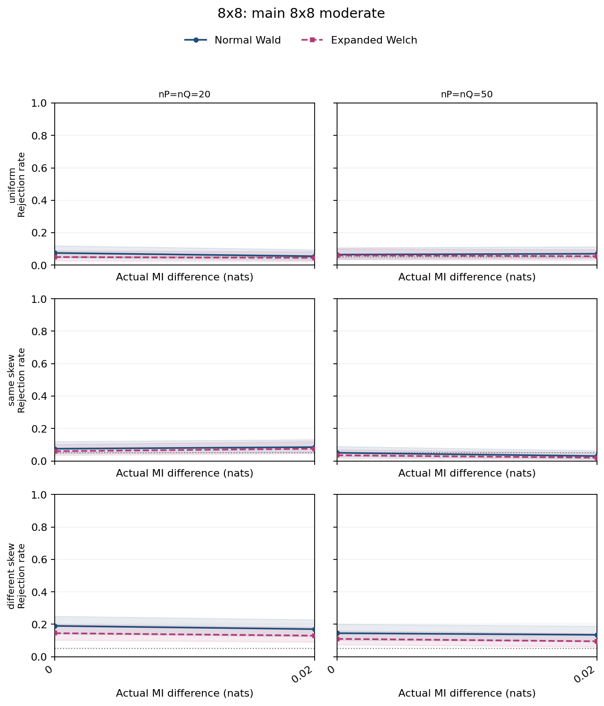

| Specification | Setting |
| --- | --- |
| Table size | 8x8 |
| Horizontal graph regime specifications (columns) | nP=nQ=20, nP=nQ=50 |
| Vertical graph regime specifications (rows) | uniform: P row (0.125 repeated 8 times), P column (0.125 repeated 8 times); Q row (0.125 repeated 8 times), Q column (0.125 repeated 8 times); same skew: P row (0.8, 0.2/7 repeated 7 times), P column (0.8, 0.2/7 repeated 7 times); Q row (0.8, 0.2/7 repeated 7 times), Q column (0.8, 0.2/7 repeated 7 times); different skew: P row (0.7, 0.3/7 repeated 7 times), P column (0.7, 0.3/7 repeated 7 times); Q row (0.8, 0.2/7 repeated 7 times), Q column (0.8, 0.2/7 repeated 7 times) |
| Probability changes | uniform: additive, first changes in P and Q; same skew: additive, first changes in P and Q; different skew: additive, first changes in P and Q |
| MI settings | Baseline MI {0.02}; direction {q higher}; actual differences {0, 0.02} nats |
| Horizontal axis within each graph | Actual MI difference in nats, fixed from 0 to 0.02 |
| Vertical axis within each graph | Unconditional rejection rate from 0 to 1; invalid results count as non-rejections |
| Replicates | 200 per unique point |

Null-point rejection and validity:

| Vertical regime | Horizontal regime | Method | Rejection | Valid |
| --- | --- | --- | --- | --- |
| different skew | nP=nQ=20 | Expanded Welch | 0.1450 | 0.9700 |
| different skew | nP=nQ=20 | Normal Wald | 0.1900 | 1.0000 |
| different skew | nP=nQ=50 | Expanded Welch | 0.1100 | 1.0000 |
| different skew | nP=nQ=50 | Normal Wald | 0.1450 | 1.0000 |
| same skew | nP=nQ=20 | Expanded Welch | 0.0600 | 0.9400 |
| same skew | nP=nQ=20 | Normal Wald | 0.0750 | 1.0000 |
| same skew | nP=nQ=50 | Expanded Welch | 0.0350 | 1.0000 |
| same skew | nP=nQ=50 | Normal Wald | 0.0500 | 1.0000 |
| uniform | nP=nQ=20 | Expanded Welch | 0.0500 | 1.0000 |
| uniform | nP=nQ=20 | Normal Wald | 0.0750 | 1.0000 |
| uniform | nP=nQ=50 | Expanded Welch | 0.0600 | 1.0000 |
| uniform | nP=nQ=50 | Normal Wald | 0.0650 | 1.0000 |

Every plotted rate, interval, validity and minimum expected count

| Vertical regime | Horizontal regime | x | Method | Rejection | 95% interval | Valid | Conditional | Min expected P | Min expected Q |
| --- | --- | --- | --- | --- | --- | --- | --- | --- | --- |
| different skew | nP=nQ=20 | 0 | Expanded Welch | 0.1450 | [0.1029, 0.2005] | 0.9700 | 0.1495 | 0.03673 | 0.01633 |
| different skew | nP=nQ=20 | 0 | Normal Wald | 0.1900 | [0.1417, 0.2500] | 1.0000 | 0.1900 | 0.03673 | 0.01633 |
| different skew | nP=nQ=20 | 0.02 | Expanded Welch | 0.1300 | [0.0903, 0.1837] | 0.9750 | 0.1333 | 0.03673 | 0.01633 |
| different skew | nP=nQ=20 | 0.02 | Normal Wald | 0.1700 | [0.1243, 0.2282] | 1.0000 | 0.1700 | 0.03673 | 0.01633 |
| different skew | nP=nQ=50 | 0 | Expanded Welch | 0.1100 | [0.0738, 0.1609] | 1.0000 | 0.1100 | 0.09184 | 0.04082 |
| different skew | nP=nQ=50 | 0 | Normal Wald | 0.1450 | [0.1029, 0.2005] | 1.0000 | 0.1450 | 0.09184 | 0.04082 |
| different skew | nP=nQ=50 | 0.02 | Expanded Welch | 0.0950 | [0.0617, 0.1436] | 1.0000 | 0.0950 | 0.09184 | 0.04082 |
| different skew | nP=nQ=50 | 0.02 | Normal Wald | 0.1350 | [0.0945, 0.1893] | 1.0000 | 0.1350 | 0.09184 | 0.04082 |
| same skew | nP=nQ=20 | 0 | Expanded Welch | 0.0600 | [0.0347, 0.1019] | 0.9400 | 0.0638 | 0.01633 | 0.01633 |
| same skew | nP=nQ=20 | 0 | Normal Wald | 0.0750 | [0.0460, 0.1200] | 1.0000 | 0.0750 | 0.01633 | 0.01633 |
| same skew | nP=nQ=20 | 0.02 | Expanded Welch | 0.0750 | [0.0460, 0.1200] | 0.9600 | 0.0781 | 0.01633 | 0.01633 |
| same skew | nP=nQ=20 | 0.02 | Normal Wald | 0.0850 | [0.0537, 0.1319] | 1.0000 | 0.0850 | 0.01633 | 0.01633 |
| same skew | nP=nQ=50 | 0 | Expanded Welch | 0.0350 | [0.0171, 0.0705] | 1.0000 | 0.0350 | 0.04082 | 0.04082 |
| same skew | nP=nQ=50 | 0 | Normal Wald | 0.0500 | [0.0274, 0.0896] | 1.0000 | 0.0500 | 0.04082 | 0.04082 |
| same skew | nP=nQ=50 | 0.02 | Expanded Welch | 0.0200 | [0.0078, 0.0503] | 1.0000 | 0.0200 | 0.04082 | 0.04082 |
| same skew | nP=nQ=50 | 0.02 | Normal Wald | 0.0300 | [0.0138, 0.0639] | 1.0000 | 0.0300 | 0.04082 | 0.04082 |
| uniform | nP=nQ=20 | 0 | Expanded Welch | 0.0500 | [0.0274, 0.0896] | 1.0000 | 0.0500 | 0.07697 | 0.07697 |
| uniform | nP=nQ=20 | 0 | Normal Wald | 0.0750 | [0.0460, 0.1200] | 1.0000 | 0.0750 | 0.07697 | 0.07697 |
| uniform | nP=nQ=20 | 0.02 | Expanded Welch | 0.0450 | [0.0239, 0.0833] | 1.0000 | 0.0450 | 0.07697 | 0.005864 |
| uniform | nP=nQ=20 | 0.02 | Normal Wald | 0.0550 | [0.0310, 0.0958] | 1.0000 | 0.0550 | 0.07697 | 0.005864 |
| uniform | nP=nQ=50 | 0 | Expanded Welch | 0.0600 | [0.0347, 0.1019] | 1.0000 | 0.0600 | 0.1924 | 0.1924 |
| uniform | nP=nQ=50 | 0 | Normal Wald | 0.0650 | [0.0384, 0.1080] | 1.0000 | 0.0650 | 0.1924 | 0.1924 |
| uniform | nP=nQ=50 | 0.02 | Expanded Welch | 0.0550 | [0.0310, 0.0958] | 1.0000 | 0.0550 | 0.1924 | 0.01466 |
| uniform | nP=nQ=50 | 0.02 | Normal Wald | 0.0700 | [0.0422, 0.1141] | 1.0000 | 0.0700 | 0.1924 | 0.01466 |

### 3.12 8x8: main 8x8 large

How do the methods behave as table size, marginal skew and sample size change?

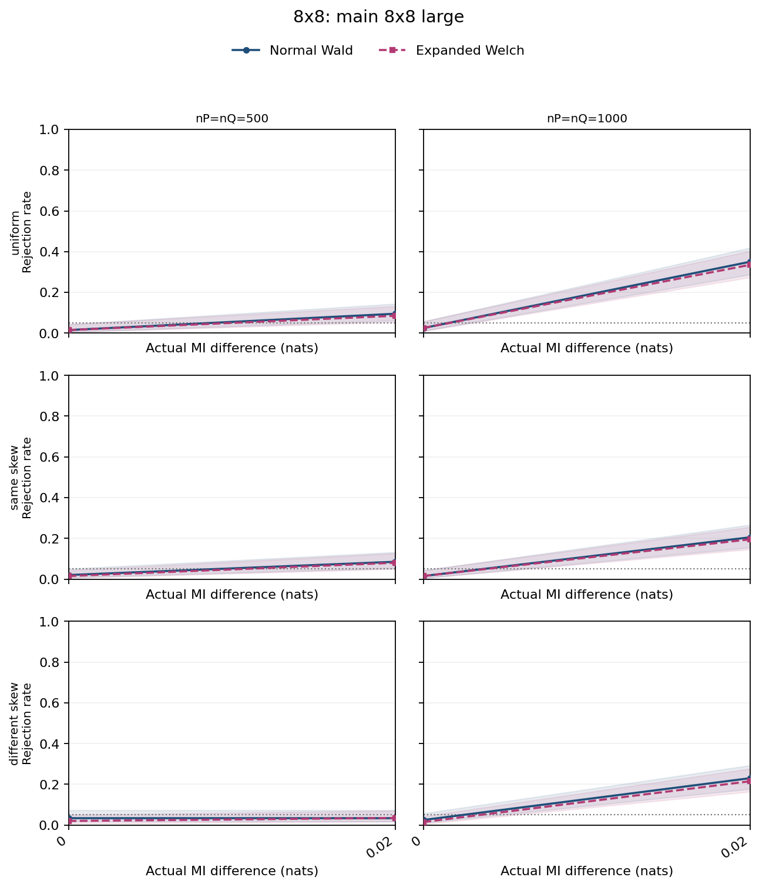

| Specification | Setting |
| --- | --- |
| Table size | 8x8 |
| Horizontal graph regime specifications (columns) | nP=nQ=500, nP=nQ=1000 |
| Vertical graph regime specifications (rows) | uniform: P row (0.125 repeated 8 times), P column (0.125 repeated 8 times); Q row (0.125 repeated 8 times), Q column (0.125 repeated 8 times); same skew: P row (0.8, 0.2/7 repeated 7 times), P column (0.8, 0.2/7 repeated 7 times); Q row (0.8, 0.2/7 repeated 7 times), Q column (0.8, 0.2/7 repeated 7 times); different skew: P row (0.7, 0.3/7 repeated 7 times), P column (0.7, 0.3/7 repeated 7 times); Q row (0.8, 0.2/7 repeated 7 times), Q column (0.8, 0.2/7 repeated 7 times) |
| Probability changes | uniform: additive, first changes in P and Q; same skew: additive, first changes in P and Q; different skew: additive, first changes in P and Q |
| MI settings | Baseline MI {0.02}; direction {q higher}; actual differences {0, 0.02} nats |
| Horizontal axis within each graph | Actual MI difference in nats, fixed from 0 to 0.02 |
| Vertical axis within each graph | Unconditional rejection rate from 0 to 1; invalid results count as non-rejections |
| Replicates | 200 per unique point |

Null-point rejection and validity:

| Vertical regime | Horizontal regime | Method | Rejection | Valid |
| --- | --- | --- | --- | --- |
| different skew | nP=nQ=1000 | Expanded Welch | 0.0150 | 1.0000 |
| different skew | nP=nQ=1000 | Normal Wald | 0.0250 | 1.0000 |
| different skew | nP=nQ=500 | Expanded Welch | 0.0200 | 1.0000 |
| different skew | nP=nQ=500 | Normal Wald | 0.0350 | 1.0000 |
| same skew | nP=nQ=1000 | Expanded Welch | 0.0150 | 1.0000 |
| same skew | nP=nQ=1000 | Normal Wald | 0.0150 | 1.0000 |
| same skew | nP=nQ=500 | Expanded Welch | 0.0150 | 1.0000 |
| same skew | nP=nQ=500 | Normal Wald | 0.0200 | 1.0000 |
| uniform | nP=nQ=1000 | Expanded Welch | 0.0250 | 1.0000 |
| uniform | nP=nQ=1000 | Normal Wald | 0.0250 | 1.0000 |
| uniform | nP=nQ=500 | Expanded Welch | 0.0150 | 1.0000 |
| uniform | nP=nQ=500 | Normal Wald | 0.0150 | 1.0000 |

Every plotted rate, interval, validity and minimum expected count

| Vertical regime | Horizontal regime | x | Method | Rejection | 95% interval | Valid | Conditional | Min expected P | Min expected Q |
| --- | --- | --- | --- | --- | --- | --- | --- | --- | --- |
| different skew | nP=nQ=1000 | 0 | Expanded Welch | 0.0150 | [0.0051, 0.0432] | 1.0000 | 0.0150 | 1.837 | 0.8163 |
| different skew | nP=nQ=1000 | 0 | Normal Wald | 0.0250 | [0.0107, 0.0572] | 1.0000 | 0.0250 | 1.837 | 0.8163 |
| different skew | nP=nQ=1000 | 0.02 | Expanded Welch | 0.2150 | [0.1637, 0.2770] | 1.0000 | 0.2150 | 1.837 | 0.8163 |
| different skew | nP=nQ=1000 | 0.02 | Normal Wald | 0.2300 | [0.1771, 0.2931] | 1.0000 | 0.2300 | 1.837 | 0.8163 |
| different skew | nP=nQ=500 | 0 | Expanded Welch | 0.0200 | [0.0078, 0.0503] | 1.0000 | 0.0200 | 0.9184 | 0.4082 |
| different skew | nP=nQ=500 | 0 | Normal Wald | 0.0350 | [0.0171, 0.0705] | 1.0000 | 0.0350 | 0.9184 | 0.4082 |
| different skew | nP=nQ=500 | 0.02 | Expanded Welch | 0.0350 | [0.0171, 0.0705] | 1.0000 | 0.0350 | 0.9184 | 0.4082 |
| different skew | nP=nQ=500 | 0.02 | Normal Wald | 0.0350 | [0.0171, 0.0705] | 1.0000 | 0.0350 | 0.9184 | 0.4082 |
| same skew | nP=nQ=1000 | 0 | Expanded Welch | 0.0150 | [0.0051, 0.0432] | 1.0000 | 0.0150 | 0.8163 | 0.8163 |
| same skew | nP=nQ=1000 | 0 | Normal Wald | 0.0150 | [0.0051, 0.0432] | 1.0000 | 0.0150 | 0.8163 | 0.8163 |
| same skew | nP=nQ=1000 | 0.02 | Expanded Welch | 0.1950 | [0.1461, 0.2554] | 1.0000 | 0.1950 | 0.8163 | 0.8163 |
| same skew | nP=nQ=1000 | 0.02 | Normal Wald | 0.2050 | [0.1549, 0.2663] | 1.0000 | 0.2050 | 0.8163 | 0.8163 |
| same skew | nP=nQ=500 | 0 | Expanded Welch | 0.0150 | [0.0051, 0.0432] | 1.0000 | 0.0150 | 0.4082 | 0.4082 |
| same skew | nP=nQ=500 | 0 | Normal Wald | 0.0200 | [0.0078, 0.0503] | 1.0000 | 0.0200 | 0.4082 | 0.4082 |
| same skew | nP=nQ=500 | 0.02 | Expanded Welch | 0.0800 | [0.0498, 0.1260] | 1.0000 | 0.0800 | 0.4082 | 0.4082 |
| same skew | nP=nQ=500 | 0.02 | Normal Wald | 0.0850 | [0.0537, 0.1319] | 1.0000 | 0.0850 | 0.4082 | 0.4082 |
| uniform | nP=nQ=1000 | 0 | Expanded Welch | 0.0250 | [0.0107, 0.0572] | 1.0000 | 0.0250 | 3.848 | 3.848 |
| uniform | nP=nQ=1000 | 0 | Normal Wald | 0.0250 | [0.0107, 0.0572] | 1.0000 | 0.0250 | 3.848 | 3.848 |
| uniform | nP=nQ=1000 | 0.02 | Expanded Welch | 0.3350 | [0.2732, 0.4030] | 1.0000 | 0.3350 | 3.848 | 0.2932 |
| uniform | nP=nQ=1000 | 0.02 | Normal Wald | 0.3500 | [0.2873, 0.4184] | 1.0000 | 0.3500 | 3.848 | 0.2932 |
| uniform | nP=nQ=500 | 0 | Expanded Welch | 0.0150 | [0.0051, 0.0432] | 1.0000 | 0.0150 | 1.924 | 1.924 |
| uniform | nP=nQ=500 | 0 | Normal Wald | 0.0150 | [0.0051, 0.0432] | 1.0000 | 0.0150 | 1.924 | 1.924 |
| uniform | nP=nQ=500 | 0.02 | Expanded Welch | 0.0850 | [0.0537, 0.1319] | 1.0000 | 0.0850 | 1.924 | 0.1466 |
| uniform | nP=nQ=500 | 0.02 | Normal Wald | 0.0950 | [0.0617, 0.1436] | 1.0000 | 0.0950 | 1.924 | 0.1466 |

## 4. Baseline MI sensitivity

Does performance change when the populations begin closer to independence?

### 4.1 2x2: baseline 2x2 uniform

Does performance change when the populations begin closer to independence?

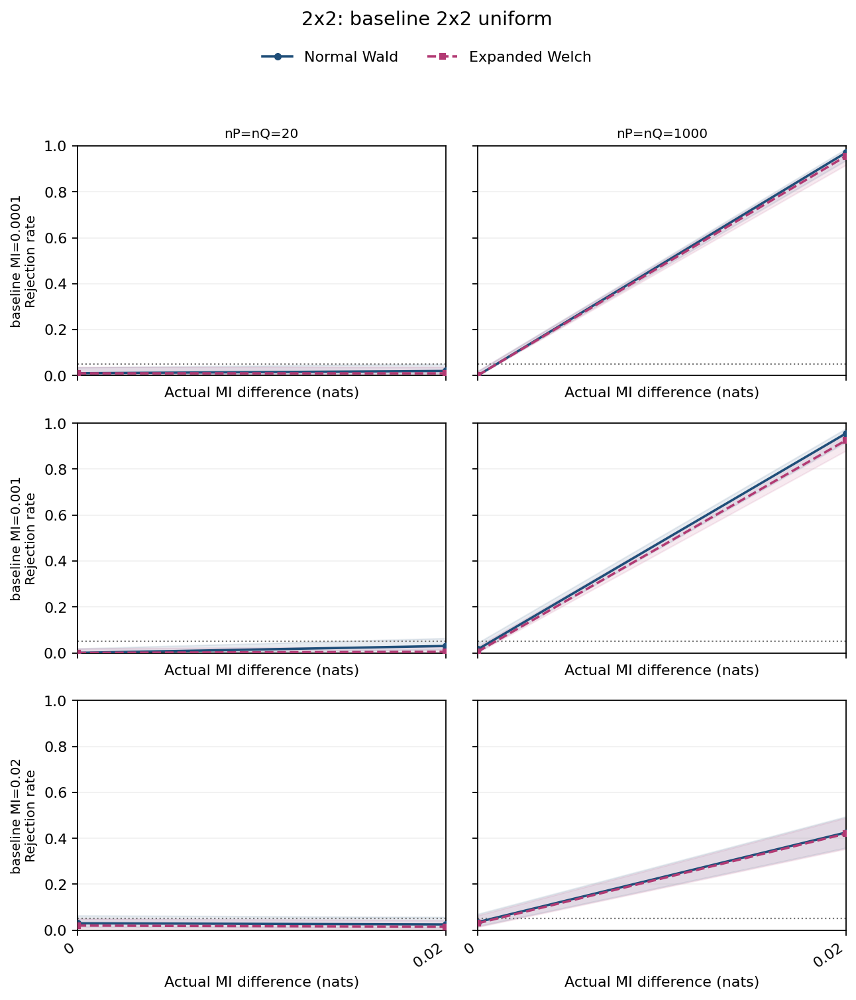

| Specification | Setting |
| --- | --- |
| Table size | 2x2 |
| Horizontal graph regime specifications (columns) | nP=nQ=20, nP=nQ=1000 |
| Vertical graph regime specifications (rows) | baseline MI=0.0001: P row (0.5 repeated 2 times), P column (0.5 repeated 2 times); Q row (0.5 repeated 2 times), Q column (0.5 repeated 2 times); baseline MI=0.001: P row (0.5 repeated 2 times), P column (0.5 repeated 2 times); Q row (0.5 repeated 2 times), Q column (0.5 repeated 2 times); baseline MI=0.02: P row (0.5 repeated 2 times), P column (0.5 repeated 2 times); Q row (0.5 repeated 2 times), Q column (0.5 repeated 2 times) |
| Probability changes | baseline MI=0.0001: additive, first changes in P and Q; baseline MI=0.001: additive, first changes in P and Q; baseline MI=0.02: additive, first changes in P and Q |
| MI settings | Baseline MI {0.0001, 0.001, 0.02}; direction {q higher}; actual differences {0, 0.02} nats |
| Horizontal axis within each graph | Actual MI difference in nats, fixed from 0 to 0.02 |
| Vertical axis within each graph | Unconditional rejection rate from 0 to 1; invalid results count as non-rejections |
| Replicates | 200 per unique point |

Null-point rejection and validity:

| Vertical regime | Horizontal regime | Method | Rejection | Valid |
| --- | --- | --- | --- | --- |
| baseline MI=0.0001 | nP=nQ=1000 | Expanded Welch | 0.0000 | 1.0000 |
| baseline MI=0.0001 | nP=nQ=1000 | Normal Wald | 0.0000 | 1.0000 |
| baseline MI=0.0001 | nP=nQ=20 | Expanded Welch | 0.0100 | 0.9700 |
| baseline MI=0.0001 | nP=nQ=20 | Normal Wald | 0.0100 | 0.9900 |
| baseline MI=0.001 | nP=nQ=1000 | Expanded Welch | 0.0050 | 1.0000 |
| baseline MI=0.001 | nP=nQ=1000 | Normal Wald | 0.0150 | 1.0000 |
| baseline MI=0.001 | nP=nQ=20 | Expanded Welch | 0.0000 | 0.9700 |
| baseline MI=0.001 | nP=nQ=20 | Normal Wald | 0.0000 | 0.9900 |
| baseline MI=0.02 | nP=nQ=1000 | Expanded Welch | 0.0300 | 1.0000 |
| baseline MI=0.02 | nP=nQ=1000 | Normal Wald | 0.0350 | 1.0000 |
| baseline MI=0.02 | nP=nQ=20 | Expanded Welch | 0.0200 | 0.9900 |
| baseline MI=0.02 | nP=nQ=20 | Normal Wald | 0.0300 | 1.0000 |

Every plotted rate, interval, validity and minimum expected count

| Vertical regime | Horizontal regime | x | Method | Rejection | 95% interval | Valid | Conditional | Min expected P | Min expected Q |
| --- | --- | --- | --- | --- | --- | --- | --- | --- | --- |
| baseline MI=0.0001 | nP=nQ=1000 | 0 | Expanded Welch | 0.0000 | [0.0000, 0.0188] | 1.0000 | 0.0000 | 246.5 | 246.5 |
| baseline MI=0.0001 | nP=nQ=1000 | 0 | Normal Wald | 0.0000 | [0.0000, 0.0188] | 1.0000 | 0.0000 | 246.5 | 246.5 |
| baseline MI=0.0001 | nP=nQ=1000 | 0.02 | Expanded Welch | 0.9550 | [0.9167, 0.9761] | 1.0000 | 0.9550 | 246.5 | 200 |
| baseline MI=0.0001 | nP=nQ=1000 | 0.02 | Normal Wald | 0.9700 | [0.9361, 0.9862] | 1.0000 | 0.9700 | 246.5 | 200 |
| baseline MI=0.0001 | nP=nQ=20 | 0 | Expanded Welch | 0.0100 | [0.0027, 0.0357] | 0.9700 | 0.0103 | 4.929 | 4.929 |
| baseline MI=0.0001 | nP=nQ=20 | 0 | Normal Wald | 0.0100 | [0.0027, 0.0357] | 0.9900 | 0.0101 | 4.929 | 4.929 |
| baseline MI=0.0001 | nP=nQ=20 | 0.02 | Expanded Welch | 0.0100 | [0.0027, 0.0357] | 0.9850 | 0.0102 | 4.929 | 4.001 |
| baseline MI=0.0001 | nP=nQ=20 | 0.02 | Normal Wald | 0.0200 | [0.0078, 0.0503] | 1.0000 | 0.0200 | 4.929 | 4.001 |
| baseline MI=0.001 | nP=nQ=1000 | 0 | Expanded Welch | 0.0050 | [0.0009, 0.0278] | 1.0000 | 0.0050 | 238.8 | 238.8 |
| baseline MI=0.001 | nP=nQ=1000 | 0 | Normal Wald | 0.0150 | [0.0051, 0.0432] | 1.0000 | 0.0150 | 238.8 | 238.8 |
| baseline MI=0.001 | nP=nQ=1000 | 0.02 | Expanded Welch | 0.9250 | [0.8800, 0.9540] | 1.0000 | 0.9250 | 238.8 | 198.9 |
| baseline MI=0.001 | nP=nQ=1000 | 0.02 | Normal Wald | 0.9550 | [0.9167, 0.9761] | 1.0000 | 0.9550 | 238.8 | 198.9 |
| baseline MI=0.001 | nP=nQ=20 | 0 | Expanded Welch | 0.0000 | [0.0000, 0.0188] | 0.9700 | 0.0000 | 4.776 | 4.776 |
| baseline MI=0.001 | nP=nQ=20 | 0 | Normal Wald | 0.0000 | [0.0000, 0.0188] | 0.9900 | 0.0000 | 4.776 | 4.776 |
| baseline MI=0.001 | nP=nQ=20 | 0.02 | Expanded Welch | 0.0050 | [0.0009, 0.0278] | 0.9800 | 0.0051 | 4.776 | 3.979 |
| baseline MI=0.001 | nP=nQ=20 | 0.02 | Normal Wald | 0.0300 | [0.0138, 0.0639] | 0.9950 | 0.0302 | 4.776 | 3.979 |
| baseline MI=0.02 | nP=nQ=1000 | 0 | Expanded Welch | 0.0300 | [0.0138, 0.0639] | 1.0000 | 0.0300 | 200.2 | 200.2 |
| baseline MI=0.02 | nP=nQ=1000 | 0 | Normal Wald | 0.0350 | [0.0171, 0.0705] | 1.0000 | 0.0350 | 200.2 | 200.2 |
| baseline MI=0.02 | nP=nQ=1000 | 0.02 | Expanded Welch | 0.4200 | [0.3537, 0.4893] | 1.0000 | 0.4200 | 200.2 | 179.8 |
| baseline MI=0.02 | nP=nQ=1000 | 0.02 | Normal Wald | 0.4250 | [0.3585, 0.4943] | 1.0000 | 0.4250 | 200.2 | 179.8 |
| baseline MI=0.02 | nP=nQ=20 | 0 | Expanded Welch | 0.0200 | [0.0078, 0.0503] | 0.9900 | 0.0202 | 4.003 | 4.003 |
| baseline MI=0.02 | nP=nQ=20 | 0 | Normal Wald | 0.0300 | [0.0138, 0.0639] | 1.0000 | 0.0300 | 4.003 | 4.003 |
| baseline MI=0.02 | nP=nQ=20 | 0.02 | Expanded Welch | 0.0150 | [0.0051, 0.0432] | 0.9950 | 0.0151 | 4.003 | 3.595 |
| baseline MI=0.02 | nP=nQ=20 | 0.02 | Normal Wald | 0.0250 | [0.0107, 0.0572] | 1.0000 | 0.0250 | 4.003 | 3.595 |

### 4.2 2x2: baseline 2x2 same skew

Does performance change when the populations begin closer to independence?

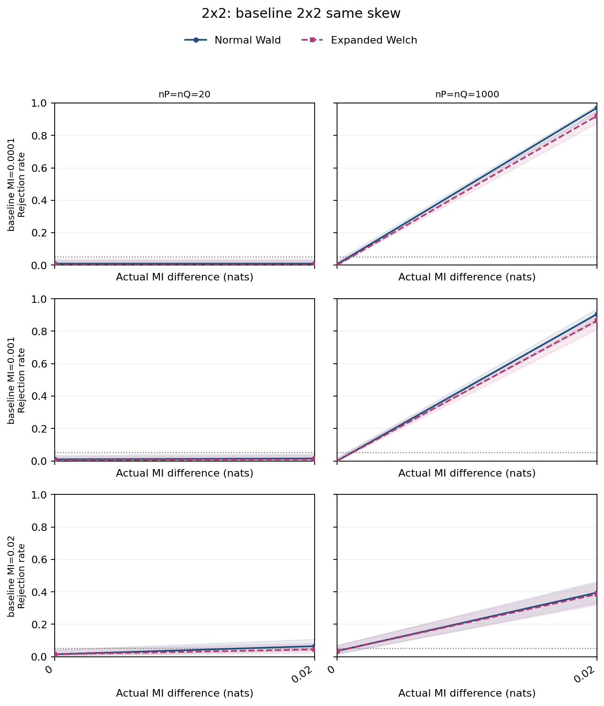

| Specification | Setting |
| --- | --- |
| Table size | 2x2 |
| Horizontal graph regime specifications (columns) | nP=nQ=20, nP=nQ=1000 |
| Vertical graph regime specifications (rows) | baseline MI=0.0001: P row (0.8, 0.2), P column (0.8, 0.2); Q row (0.8, 0.2), Q column (0.8, 0.2); baseline MI=0.001: P row (0.8, 0.2), P column (0.8, 0.2); Q row (0.8, 0.2), Q column (0.8, 0.2); baseline MI=0.02: P row (0.8, 0.2), P column (0.8, 0.2); Q row (0.8, 0.2), Q column (0.8, 0.2) |
| Probability changes | baseline MI=0.0001: additive, first changes in P and Q; baseline MI=0.001: additive, first changes in P and Q; baseline MI=0.02: additive, first changes in P and Q |
| MI settings | Baseline MI {0.0001, 0.001, 0.02}; direction {q higher}; actual differences {0, 0.02} nats |
| Horizontal axis within each graph | Actual MI difference in nats, fixed from 0 to 0.02 |
| Vertical axis within each graph | Unconditional rejection rate from 0 to 1; invalid results count as non-rejections |
| Replicates | 200 per unique point |

Null-point rejection and validity:

| Vertical regime | Horizontal regime | Method | Rejection | Valid |
| --- | --- | --- | --- | --- |
| baseline MI=0.0001 | nP=nQ=1000 | Expanded Welch | 0.0000 | 1.0000 |
| baseline MI=0.0001 | nP=nQ=1000 | Normal Wald | 0.0050 | 1.0000 |
| baseline MI=0.0001 | nP=nQ=20 | Expanded Welch | 0.0050 | 0.9800 |
| baseline MI=0.0001 | nP=nQ=20 | Normal Wald | 0.0100 | 1.0000 |
| baseline MI=0.001 | nP=nQ=1000 | Expanded Welch | 0.0000 | 1.0000 |
| baseline MI=0.001 | nP=nQ=1000 | Normal Wald | 0.0000 | 1.0000 |
| baseline MI=0.001 | nP=nQ=20 | Expanded Welch | 0.0050 | 0.9350 |
| baseline MI=0.001 | nP=nQ=20 | Normal Wald | 0.0100 | 1.0000 |
| baseline MI=0.02 | nP=nQ=1000 | Expanded Welch | 0.0350 | 1.0000 |
| baseline MI=0.02 | nP=nQ=1000 | Normal Wald | 0.0350 | 1.0000 |
| baseline MI=0.02 | nP=nQ=20 | Expanded Welch | 0.0150 | 0.9600 |
| baseline MI=0.02 | nP=nQ=20 | Normal Wald | 0.0150 | 1.0000 |

Every plotted rate, interval, validity and minimum expected count

| Vertical regime | Horizontal regime | x | Method | Rejection | 95% interval | Valid | Conditional | Min expected P | Min expected Q |
| --- | --- | --- | --- | --- | --- | --- | --- | --- | --- |
| baseline MI=0.0001 | nP=nQ=1000 | 0 | Expanded Welch | 0.0000 | [0.0000, 0.0188] | 1.0000 | 0.0000 | 42.27 | 42.27 |
| baseline MI=0.0001 | nP=nQ=1000 | 0 | Normal Wald | 0.0050 | [0.0009, 0.0278] | 1.0000 | 0.0050 | 42.27 | 42.27 |
| baseline MI=0.0001 | nP=nQ=1000 | 0.02 | Expanded Welch | 0.9200 | [0.8740, 0.9502] | 1.0000 | 0.9200 | 42.27 | 73.9 |
| baseline MI=0.0001 | nP=nQ=1000 | 0.02 | Normal Wald | 0.9700 | [0.9361, 0.9862] | 1.0000 | 0.9700 | 42.27 | 73.9 |
| baseline MI=0.0001 | nP=nQ=20 | 0 | Expanded Welch | 0.0050 | [0.0009, 0.0278] | 0.9800 | 0.0051 | 0.8455 | 0.8455 |
| baseline MI=0.0001 | nP=nQ=20 | 0 | Normal Wald | 0.0100 | [0.0027, 0.0357] | 1.0000 | 0.0100 | 0.8455 | 0.8455 |
| baseline MI=0.0001 | nP=nQ=20 | 0.02 | Expanded Welch | 0.0050 | [0.0009, 0.0278] | 0.9450 | 0.0053 | 0.8455 | 1.478 |
| baseline MI=0.0001 | nP=nQ=20 | 0.02 | Normal Wald | 0.0100 | [0.0027, 0.0357] | 1.0000 | 0.0100 | 0.8455 | 1.478 |
| baseline MI=0.001 | nP=nQ=1000 | 0 | Expanded Welch | 0.0000 | [0.0000, 0.0188] | 1.0000 | 0.0000 | 47.27 | 47.27 |
| baseline MI=0.001 | nP=nQ=1000 | 0 | Normal Wald | 0.0000 | [0.0000, 0.0188] | 1.0000 | 0.0000 | 47.27 | 47.27 |
| baseline MI=0.001 | nP=nQ=1000 | 0.02 | Expanded Welch | 0.8650 | [0.8107, 0.9055] | 1.0000 | 0.8650 | 47.27 | 74.68 |
| baseline MI=0.001 | nP=nQ=1000 | 0.02 | Normal Wald | 0.9050 | [0.8564, 0.9383] | 1.0000 | 0.9050 | 47.27 | 74.68 |
| baseline MI=0.001 | nP=nQ=20 | 0 | Expanded Welch | 0.0050 | [0.0009, 0.0278] | 0.9350 | 0.0053 | 0.9454 | 0.9454 |
| baseline MI=0.001 | nP=nQ=20 | 0 | Normal Wald | 0.0100 | [0.0027, 0.0357] | 1.0000 | 0.0100 | 0.9454 | 0.9454 |
| baseline MI=0.001 | nP=nQ=20 | 0.02 | Expanded Welch | 0.0100 | [0.0027, 0.0357] | 0.9550 | 0.0105 | 0.9454 | 1.494 |
| baseline MI=0.001 | nP=nQ=20 | 0.02 | Normal Wald | 0.0150 | [0.0051, 0.0432] | 1.0000 | 0.0150 | 0.9454 | 1.494 |
| baseline MI=0.02 | nP=nQ=1000 | 0 | Expanded Welch | 0.0350 | [0.0171, 0.0705] | 1.0000 | 0.0350 | 73.82 | 73.82 |
| baseline MI=0.02 | nP=nQ=1000 | 0 | Normal Wald | 0.0350 | [0.0171, 0.0705] | 1.0000 | 0.0350 | 73.82 | 73.82 |
| baseline MI=0.02 | nP=nQ=1000 | 0.02 | Expanded Welch | 0.3850 | [0.3203, 0.4540] | 1.0000 | 0.3850 | 73.82 | 88.48 |
| baseline MI=0.02 | nP=nQ=1000 | 0.02 | Normal Wald | 0.3950 | [0.3298, 0.4641] | 1.0000 | 0.3950 | 73.82 | 88.48 |
| baseline MI=0.02 | nP=nQ=20 | 0 | Expanded Welch | 0.0150 | [0.0051, 0.0432] | 0.9600 | 0.0156 | 1.476 | 1.476 |
| baseline MI=0.02 | nP=nQ=20 | 0 | Normal Wald | 0.0150 | [0.0051, 0.0432] | 1.0000 | 0.0150 | 1.476 | 1.476 |
| baseline MI=0.02 | nP=nQ=20 | 0.02 | Expanded Welch | 0.0450 | [0.0239, 0.0833] | 0.9300 | 0.0484 | 1.476 | 1.77 |
| baseline MI=0.02 | nP=nQ=20 | 0.02 | Normal Wald | 0.0650 | [0.0384, 0.1080] | 1.0000 | 0.0650 | 1.476 | 1.77 |

### 4.3 2x2: baseline 2x2 different skew

Does performance change when the populations begin closer to independence?

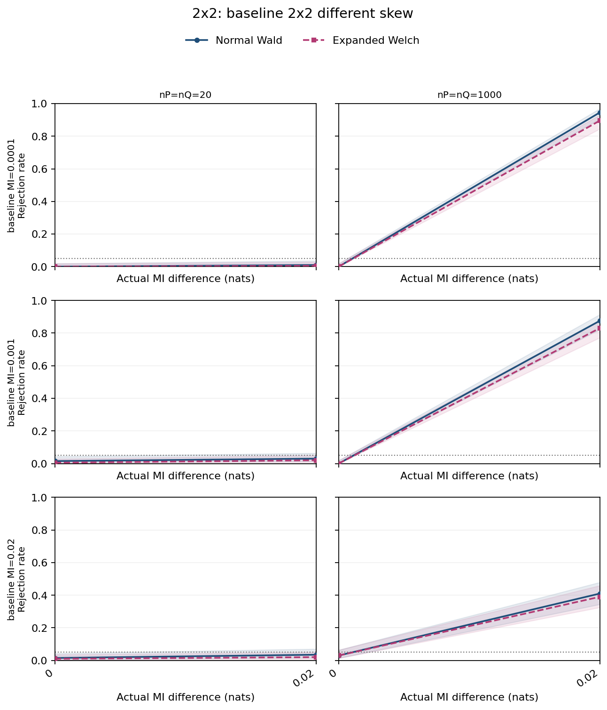

| Specification | Setting |
| --- | --- |
| Table size | 2x2 |
| Horizontal graph regime specifications (columns) | nP=nQ=20, nP=nQ=1000 |
| Vertical graph regime specifications (rows) | baseline MI=0.0001: P row (0.7, 0.3), P column (0.7, 0.3); Q row (0.8, 0.2), Q column (0.8, 0.2); baseline MI=0.001: P row (0.7, 0.3), P column (0.7, 0.3); Q row (0.8, 0.2), Q column (0.8, 0.2); baseline MI=0.02: P row (0.7, 0.3), P column (0.7, 0.3); Q row (0.8, 0.2), Q column (0.8, 0.2) |
| Probability changes | baseline MI=0.0001: additive, first changes in P and Q; baseline MI=0.001: additive, first changes in P and Q; baseline MI=0.02: additive, first changes in P and Q |
| MI settings | Baseline MI {0.0001, 0.001, 0.02}; direction {q higher}; actual differences {0, 0.02} nats |
| Horizontal axis within each graph | Actual MI difference in nats, fixed from 0 to 0.02 |
| Vertical axis within each graph | Unconditional rejection rate from 0 to 1; invalid results count as non-rejections |
| Replicates | 200 per unique point |

Null-point rejection and validity:

| Vertical regime | Horizontal regime | Method | Rejection | Valid |
| --- | --- | --- | --- | --- |
| baseline MI=0.0001 | nP=nQ=1000 | Expanded Welch | 0.0000 | 1.0000 |
| baseline MI=0.0001 | nP=nQ=1000 | Normal Wald | 0.0000 | 1.0000 |
| baseline MI=0.0001 | nP=nQ=20 | Expanded Welch | 0.0000 | 0.9800 |
| baseline MI=0.0001 | nP=nQ=20 | Normal Wald | 0.0000 | 0.9950 |
| baseline MI=0.001 | nP=nQ=1000 | Expanded Welch | 0.0000 | 1.0000 |
| baseline MI=0.001 | nP=nQ=1000 | Normal Wald | 0.0000 | 1.0000 |
| baseline MI=0.001 | nP=nQ=20 | Expanded Welch | 0.0050 | 0.9850 |
| baseline MI=0.001 | nP=nQ=20 | Normal Wald | 0.0150 | 1.0000 |
| baseline MI=0.02 | nP=nQ=1000 | Expanded Welch | 0.0300 | 1.0000 |
| baseline MI=0.02 | nP=nQ=1000 | Normal Wald | 0.0300 | 1.0000 |
| baseline MI=0.02 | nP=nQ=20 | Expanded Welch | 0.0100 | 0.9800 |
| baseline MI=0.02 | nP=nQ=20 | Normal Wald | 0.0150 | 1.0000 |

Every plotted rate, interval, validity and minimum expected count

| Vertical regime | Horizontal regime | x | Method | Rejection | 95% interval | Valid | Conditional | Min expected P | Min expected Q |
| --- | --- | --- | --- | --- | --- | --- | --- | --- | --- |
| baseline MI=0.0001 | nP=nQ=1000 | 0 | Expanded Welch | 0.0000 | [0.0000, 0.0188] | 1.0000 | 0.0000 | 92.98 | 42.27 |
| baseline MI=0.0001 | nP=nQ=1000 | 0 | Normal Wald | 0.0000 | [0.0000, 0.0188] | 1.0000 | 0.0000 | 92.98 | 42.27 |
| baseline MI=0.0001 | nP=nQ=1000 | 0.02 | Expanded Welch | 0.8950 | [0.8448, 0.9303] | 1.0000 | 0.8950 | 92.98 | 73.9 |
| baseline MI=0.0001 | nP=nQ=1000 | 0.02 | Normal Wald | 0.9450 | [0.9042, 0.9690] | 1.0000 | 0.9450 | 92.98 | 73.9 |
| baseline MI=0.0001 | nP=nQ=20 | 0 | Expanded Welch | 0.0000 | [0.0000, 0.0188] | 0.9800 | 0.0000 | 1.86 | 0.8455 |
| baseline MI=0.0001 | nP=nQ=20 | 0 | Normal Wald | 0.0000 | [0.0000, 0.0188] | 0.9950 | 0.0000 | 1.86 | 0.8455 |
| baseline MI=0.0001 | nP=nQ=20 | 0.02 | Expanded Welch | 0.0050 | [0.0009, 0.0278] | 0.9700 | 0.0052 | 1.86 | 1.478 |
| baseline MI=0.0001 | nP=nQ=20 | 0.02 | Normal Wald | 0.0100 | [0.0027, 0.0357] | 1.0000 | 0.0100 | 1.86 | 1.478 |
| baseline MI=0.001 | nP=nQ=1000 | 0 | Expanded Welch | 0.0000 | [0.0000, 0.0188] | 1.0000 | 0.0000 | 99.44 | 47.27 |
| baseline MI=0.001 | nP=nQ=1000 | 0 | Normal Wald | 0.0000 | [0.0000, 0.0188] | 1.0000 | 0.0000 | 99.44 | 47.27 |
| baseline MI=0.001 | nP=nQ=1000 | 0.02 | Expanded Welch | 0.8300 | [0.7718, 0.8757] | 1.0000 | 0.8300 | 99.44 | 74.68 |
| baseline MI=0.001 | nP=nQ=1000 | 0.02 | Normal Wald | 0.8750 | [0.8220, 0.9139] | 1.0000 | 0.8750 | 99.44 | 74.68 |
| baseline MI=0.001 | nP=nQ=20 | 0 | Expanded Welch | 0.0050 | [0.0009, 0.0278] | 0.9850 | 0.0051 | 1.989 | 0.9454 |
| baseline MI=0.001 | nP=nQ=20 | 0 | Normal Wald | 0.0150 | [0.0051, 0.0432] | 1.0000 | 0.0150 | 1.989 | 0.9454 |
| baseline MI=0.001 | nP=nQ=20 | 0.02 | Expanded Welch | 0.0200 | [0.0078, 0.0503] | 0.9800 | 0.0204 | 1.989 | 1.494 |
| baseline MI=0.001 | nP=nQ=20 | 0.02 | Normal Wald | 0.0300 | [0.0138, 0.0639] | 0.9950 | 0.0302 | 1.989 | 1.494 |
| baseline MI=0.02 | nP=nQ=1000 | 0 | Expanded Welch | 0.0300 | [0.0138, 0.0639] | 1.0000 | 0.0300 | 132.7 | 73.82 |
| baseline MI=0.02 | nP=nQ=1000 | 0 | Normal Wald | 0.0300 | [0.0138, 0.0639] | 1.0000 | 0.0300 | 132.7 | 73.82 |
| baseline MI=0.02 | nP=nQ=1000 | 0.02 | Expanded Welch | 0.3900 | [0.3251, 0.4591] | 1.0000 | 0.3900 | 132.7 | 88.48 |
| baseline MI=0.02 | nP=nQ=1000 | 0.02 | Normal Wald | 0.4100 | [0.3442, 0.4792] | 1.0000 | 0.4100 | 132.7 | 88.48 |
| baseline MI=0.02 | nP=nQ=20 | 0 | Expanded Welch | 0.0100 | [0.0027, 0.0357] | 0.9800 | 0.0102 | 2.655 | 1.476 |
| baseline MI=0.02 | nP=nQ=20 | 0 | Normal Wald | 0.0150 | [0.0051, 0.0432] | 1.0000 | 0.0150 | 2.655 | 1.476 |
| baseline MI=0.02 | nP=nQ=20 | 0.02 | Expanded Welch | 0.0200 | [0.0078, 0.0503] | 0.9850 | 0.0203 | 2.655 | 1.77 |
| baseline MI=0.02 | nP=nQ=20 | 0.02 | Normal Wald | 0.0350 | [0.0171, 0.0705] | 1.0000 | 0.0350 | 2.655 | 1.77 |

### 4.4 3x3: baseline 3x3 uniform

Does performance change when the populations begin closer to independence?

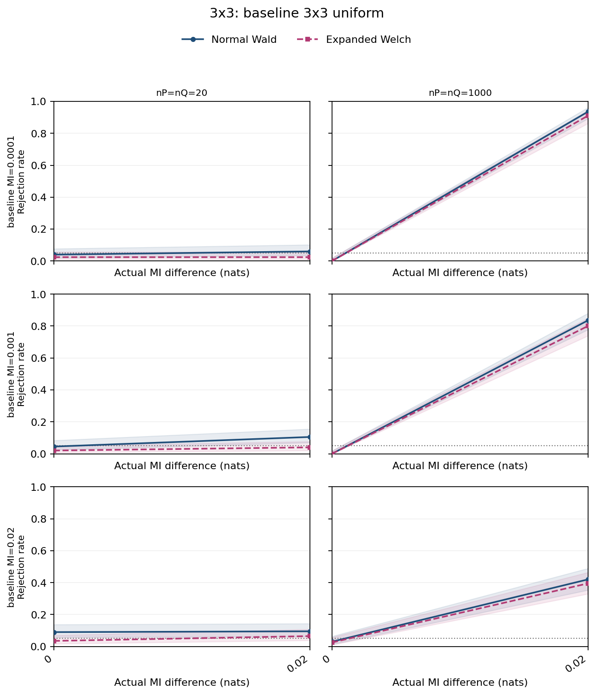

| Specification | Setting |
| --- | --- |
| Table size | 3x3 |
| Horizontal graph regime specifications (columns) | nP=nQ=20, nP=nQ=1000 |
| Vertical graph regime specifications (rows) | baseline MI=0.0001: P row (0.3333 repeated 3 times), P column (0.3333 repeated 3 times); Q row (0.3333 repeated 3 times), Q column (0.3333 repeated 3 times); baseline MI=0.001: P row (0.3333 repeated 3 times), P column (0.3333 repeated 3 times); Q row (0.3333 repeated 3 times), Q column (0.3333 repeated 3 times); baseline MI=0.02: P row (0.3333 repeated 3 times), P column (0.3333 repeated 3 times); Q row (0.3333 repeated 3 times), Q column (0.3333 repeated 3 times) |
| Probability changes | baseline MI=0.0001: additive, first changes in P and Q; baseline MI=0.001: additive, first changes in P and Q; baseline MI=0.02: additive, first changes in P and Q |
| MI settings | Baseline MI {0.0001, 0.001, 0.02}; direction {q higher}; actual differences {0, 0.02} nats |
| Horizontal axis within each graph | Actual MI difference in nats, fixed from 0 to 0.02 |
| Vertical axis within each graph | Unconditional rejection rate from 0 to 1; invalid results count as non-rejections |
| Replicates | 200 per unique point |

Null-point rejection and validity:

| Vertical regime | Horizontal regime | Method | Rejection | Valid |
| --- | --- | --- | --- | --- |
| baseline MI=0.0001 | nP=nQ=1000 | Expanded Welch | 0.0000 | 1.0000 |
| baseline MI=0.0001 | nP=nQ=1000 | Normal Wald | 0.0000 | 1.0000 |
| baseline MI=0.0001 | nP=nQ=20 | Expanded Welch | 0.0250 | 1.0000 |
| baseline MI=0.0001 | nP=nQ=20 | Normal Wald | 0.0400 | 1.0000 |
| baseline MI=0.001 | nP=nQ=1000 | Expanded Welch | 0.0000 | 1.0000 |
| baseline MI=0.001 | nP=nQ=1000 | Normal Wald | 0.0000 | 1.0000 |
| baseline MI=0.001 | nP=nQ=20 | Expanded Welch | 0.0200 | 1.0000 |
| baseline MI=0.001 | nP=nQ=20 | Normal Wald | 0.0450 | 1.0000 |
| baseline MI=0.02 | nP=nQ=1000 | Expanded Welch | 0.0250 | 1.0000 |
| baseline MI=0.02 | nP=nQ=1000 | Normal Wald | 0.0300 | 1.0000 |
| baseline MI=0.02 | nP=nQ=20 | Expanded Welch | 0.0350 | 1.0000 |
| baseline MI=0.02 | nP=nQ=20 | Normal Wald | 0.0900 | 1.0000 |

Every plotted rate, interval, validity and minimum expected count

| Vertical regime | Horizontal regime | x | Method | Rejection | 95% interval | Valid | Conditional | Min expected P | Min expected Q |
| --- | --- | --- | --- | --- | --- | --- | --- | --- | --- |
| baseline MI=0.0001 | nP=nQ=1000 | 0 | Expanded Welch | 0.0000 | [0.0000, 0.0188] | 1.0000 | 0.0000 | 108.8 | 108.8 |
| baseline MI=0.0001 | nP=nQ=1000 | 0 | Normal Wald | 0.0000 | [0.0000, 0.0188] | 1.0000 | 0.0000 | 108.8 | 108.8 |
| baseline MI=0.0001 | nP=nQ=1000 | 0.02 | Expanded Welch | 0.9100 | [0.8622, 0.9423] | 1.0000 | 0.9100 | 108.8 | 77.95 |
| baseline MI=0.0001 | nP=nQ=1000 | 0.02 | Normal Wald | 0.9350 | [0.8920, 0.9616] | 1.0000 | 0.9350 | 108.8 | 77.95 |
| baseline MI=0.0001 | nP=nQ=20 | 0 | Expanded Welch | 0.0250 | [0.0107, 0.0572] | 1.0000 | 0.0250 | 2.175 | 2.175 |
| baseline MI=0.0001 | nP=nQ=20 | 0 | Normal Wald | 0.0400 | [0.0204, 0.0769] | 1.0000 | 0.0400 | 2.175 | 2.175 |
| baseline MI=0.0001 | nP=nQ=20 | 0.02 | Expanded Welch | 0.0250 | [0.0107, 0.0572] | 1.0000 | 0.0250 | 2.175 | 1.559 |
| baseline MI=0.0001 | nP=nQ=20 | 0.02 | Normal Wald | 0.0600 | [0.0347, 0.1019] | 1.0000 | 0.0600 | 2.175 | 1.559 |
| baseline MI=0.001 | nP=nQ=1000 | 0 | Expanded Welch | 0.0000 | [0.0000, 0.0188] | 1.0000 | 0.0000 | 103.7 | 103.7 |
| baseline MI=0.001 | nP=nQ=1000 | 0 | Normal Wald | 0.0000 | [0.0000, 0.0188] | 1.0000 | 0.0000 | 103.7 | 103.7 |
| baseline MI=0.001 | nP=nQ=1000 | 0.02 | Expanded Welch | 0.8000 | [0.7391, 0.8495] | 1.0000 | 0.8000 | 103.7 | 77.23 |
| baseline MI=0.001 | nP=nQ=1000 | 0.02 | Normal Wald | 0.8350 | [0.7773, 0.8800] | 1.0000 | 0.8350 | 103.7 | 77.23 |
| baseline MI=0.001 | nP=nQ=20 | 0 | Expanded Welch | 0.0200 | [0.0078, 0.0503] | 1.0000 | 0.0200 | 2.073 | 2.073 |
| baseline MI=0.001 | nP=nQ=20 | 0 | Normal Wald | 0.0450 | [0.0239, 0.0833] | 1.0000 | 0.0450 | 2.073 | 2.073 |
| baseline MI=0.001 | nP=nQ=20 | 0.02 | Expanded Welch | 0.0400 | [0.0204, 0.0769] | 1.0000 | 0.0400 | 2.073 | 1.545 |
| baseline MI=0.001 | nP=nQ=20 | 0.02 | Normal Wald | 0.1050 | [0.0697, 0.1552] | 1.0000 | 0.1050 | 2.073 | 1.545 |
| baseline MI=0.02 | nP=nQ=1000 | 0 | Expanded Welch | 0.0250 | [0.0107, 0.0572] | 1.0000 | 0.0250 | 78.03 | 78.03 |
| baseline MI=0.02 | nP=nQ=1000 | 0 | Normal Wald | 0.0300 | [0.0138, 0.0639] | 1.0000 | 0.0300 | 78.03 | 78.03 |
| baseline MI=0.02 | nP=nQ=1000 | 0.02 | Expanded Welch | 0.3950 | [0.3298, 0.4641] | 1.0000 | 0.3950 | 78.03 | 64.69 |
| baseline MI=0.02 | nP=nQ=1000 | 0.02 | Normal Wald | 0.4200 | [0.3537, 0.4893] | 1.0000 | 0.4200 | 78.03 | 64.69 |
| baseline MI=0.02 | nP=nQ=20 | 0 | Expanded Welch | 0.0350 | [0.0171, 0.0705] | 1.0000 | 0.0350 | 1.561 | 1.561 |
| baseline MI=0.02 | nP=nQ=20 | 0 | Normal Wald | 0.0900 | [0.0577, 0.1378] | 1.0000 | 0.0900 | 1.561 | 1.561 |
| baseline MI=0.02 | nP=nQ=20 | 0.02 | Expanded Welch | 0.0650 | [0.0384, 0.1080] | 1.0000 | 0.0650 | 1.561 | 1.294 |
| baseline MI=0.02 | nP=nQ=20 | 0.02 | Normal Wald | 0.0950 | [0.0617, 0.1436] | 1.0000 | 0.0950 | 1.561 | 1.294 |

### 4.5 3x3: baseline 3x3 same skew

Does performance change when the populations begin closer to independence?

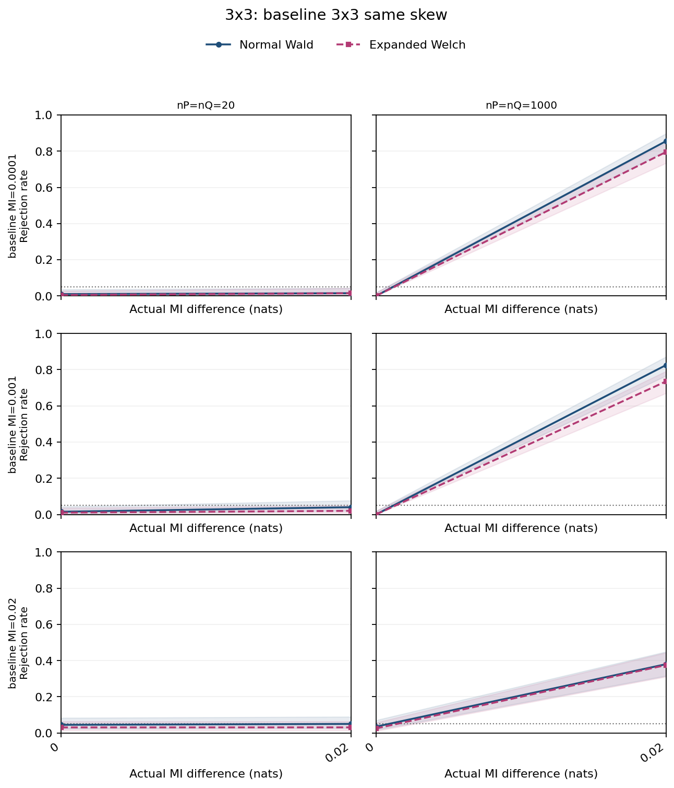

| Specification | Setting |
| --- | --- |
| Table size | 3x3 |
| Horizontal graph regime specifications (columns) | nP=nQ=20, nP=nQ=1000 |
| Vertical graph regime specifications (rows) | baseline MI=0.0001: P row (0.8, 0.2/2 repeated 2 times), P column (0.8, 0.2/2 repeated 2 times); Q row (0.8, 0.2/2 repeated 2 times), Q column (0.8, 0.2/2 repeated 2 times); baseline MI=0.001: P row (0.8, 0.2/2 repeated 2 times), P column (0.8, 0.2/2 repeated 2 times); Q row (0.8, 0.2/2 repeated 2 times), Q column (0.8, 0.2/2 repeated 2 times); baseline MI=0.02: P row (0.8, 0.2/2 repeated 2 times), P column (0.8, 0.2/2 repeated 2 times); Q row (0.8, 0.2/2 repeated 2 times), Q column (0.8, 0.2/2 repeated 2 times) |
| Probability changes | baseline MI=0.0001: additive, first changes in P and Q; baseline MI=0.001: additive, first changes in P and Q; baseline MI=0.02: additive, first changes in P and Q |
| MI settings | Baseline MI {0.0001, 0.001, 0.02}; direction {q higher}; actual differences {0, 0.02} nats |
| Horizontal axis within each graph | Actual MI difference in nats, fixed from 0 to 0.02 |
| Vertical axis within each graph | Unconditional rejection rate from 0 to 1; invalid results count as non-rejections |
| Replicates | 200 per unique point |

Null-point rejection and validity:

| Vertical regime | Horizontal regime | Method | Rejection | Valid |
| --- | --- | --- | --- | --- |
| baseline MI=0.0001 | nP=nQ=1000 | Expanded Welch | 0.0000 | 1.0000 |
| baseline MI=0.0001 | nP=nQ=1000 | Normal Wald | 0.0000 | 1.0000 |
| baseline MI=0.0001 | nP=nQ=20 | Expanded Welch | 0.0050 | 0.9650 |
| baseline MI=0.0001 | nP=nQ=20 | Normal Wald | 0.0100 | 1.0000 |
| baseline MI=0.001 | nP=nQ=1000 | Expanded Welch | 0.0000 | 1.0000 |
| baseline MI=0.001 | nP=nQ=1000 | Normal Wald | 0.0000 | 1.0000 |
| baseline MI=0.001 | nP=nQ=20 | Expanded Welch | 0.0100 | 0.9450 |
| baseline MI=0.001 | nP=nQ=20 | Normal Wald | 0.0150 | 1.0000 |
| baseline MI=0.02 | nP=nQ=1000 | Expanded Welch | 0.0250 | 1.0000 |
| baseline MI=0.02 | nP=nQ=1000 | Normal Wald | 0.0350 | 1.0000 |
| baseline MI=0.02 | nP=nQ=20 | Expanded Welch | 0.0300 | 0.9500 |
| baseline MI=0.02 | nP=nQ=20 | Normal Wald | 0.0450 | 1.0000 |

Every plotted rate, interval, validity and minimum expected count

| Vertical regime | Horizontal regime | x | Method | Rejection | 95% interval | Valid | Conditional | Min expected P | Min expected Q |
| --- | --- | --- | --- | --- | --- | --- | --- | --- | --- |
| baseline MI=0.0001 | nP=nQ=1000 | 0 | Expanded Welch | 0.0000 | [0.0000, 0.0188] | 1.0000 | 0.0000 | 10 | 10 |
| baseline MI=0.0001 | nP=nQ=1000 | 0 | Normal Wald | 0.0000 | [0.0000, 0.0188] | 1.0000 | 0.0000 | 10 | 10 |
| baseline MI=0.0001 | nP=nQ=1000 | 0.02 | Expanded Welch | 0.7950 | [0.7337, 0.8451] | 1.0000 | 0.7950 | 10 | 10 |
| baseline MI=0.0001 | nP=nQ=1000 | 0.02 | Normal Wald | 0.8550 | [0.7995, 0.8971] | 1.0000 | 0.8550 | 10 | 10 |
| baseline MI=0.0001 | nP=nQ=20 | 0 | Expanded Welch | 0.0050 | [0.0009, 0.0278] | 0.9650 | 0.0052 | 0.2 | 0.2 |
| baseline MI=0.0001 | nP=nQ=20 | 0 | Normal Wald | 0.0100 | [0.0027, 0.0357] | 1.0000 | 0.0100 | 0.2 | 0.2 |
| baseline MI=0.0001 | nP=nQ=20 | 0.02 | Expanded Welch | 0.0150 | [0.0051, 0.0432] | 0.9550 | 0.0157 | 0.2 | 0.2 |
| baseline MI=0.0001 | nP=nQ=20 | 0.02 | Normal Wald | 0.0150 | [0.0051, 0.0432] | 1.0000 | 0.0150 | 0.2 | 0.2 |
| baseline MI=0.001 | nP=nQ=1000 | 0 | Expanded Welch | 0.0000 | [0.0000, 0.0188] | 1.0000 | 0.0000 | 10 | 10 |
| baseline MI=0.001 | nP=nQ=1000 | 0 | Normal Wald | 0.0000 | [0.0000, 0.0188] | 1.0000 | 0.0000 | 10 | 10 |
| baseline MI=0.001 | nP=nQ=1000 | 0.02 | Expanded Welch | 0.7350 | [0.6698, 0.7913] | 1.0000 | 0.7350 | 10 | 10 |
| baseline MI=0.001 | nP=nQ=1000 | 0.02 | Normal Wald | 0.8250 | [0.7664, 0.8714] | 1.0000 | 0.8250 | 10 | 10 |
| baseline MI=0.001 | nP=nQ=20 | 0 | Expanded Welch | 0.0100 | [0.0027, 0.0357] | 0.9450 | 0.0106 | 0.2 | 0.2 |
| baseline MI=0.001 | nP=nQ=20 | 0 | Normal Wald | 0.0150 | [0.0051, 0.0432] | 1.0000 | 0.0150 | 0.2 | 0.2 |
| baseline MI=0.001 | nP=nQ=20 | 0.02 | Expanded Welch | 0.0200 | [0.0078, 0.0503] | 0.9450 | 0.0212 | 0.2 | 0.2 |
| baseline MI=0.001 | nP=nQ=20 | 0.02 | Normal Wald | 0.0400 | [0.0204, 0.0769] | 1.0000 | 0.0400 | 0.2 | 0.2 |
| baseline MI=0.02 | nP=nQ=1000 | 0 | Expanded Welch | 0.0250 | [0.0107, 0.0572] | 1.0000 | 0.0250 | 10 | 10 |
| baseline MI=0.02 | nP=nQ=1000 | 0 | Normal Wald | 0.0350 | [0.0171, 0.0705] | 1.0000 | 0.0350 | 10 | 10 |
| baseline MI=0.02 | nP=nQ=1000 | 0.02 | Expanded Welch | 0.3750 | [0.3109, 0.4439] | 1.0000 | 0.3750 | 10 | 10 |
| baseline MI=0.02 | nP=nQ=1000 | 0.02 | Normal Wald | 0.3800 | [0.3156, 0.4489] | 1.0000 | 0.3800 | 10 | 10 |
| baseline MI=0.02 | nP=nQ=20 | 0 | Expanded Welch | 0.0300 | [0.0138, 0.0639] | 0.9500 | 0.0316 | 0.2 | 0.2 |
| baseline MI=0.02 | nP=nQ=20 | 0 | Normal Wald | 0.0450 | [0.0239, 0.0833] | 1.0000 | 0.0450 | 0.2 | 0.2 |
| baseline MI=0.02 | nP=nQ=20 | 0.02 | Expanded Welch | 0.0300 | [0.0138, 0.0639] | 0.9600 | 0.0312 | 0.2 | 0.2 |
| baseline MI=0.02 | nP=nQ=20 | 0.02 | Normal Wald | 0.0500 | [0.0274, 0.0896] | 1.0000 | 0.0500 | 0.2 | 0.2 |

### 4.6 3x3: baseline 3x3 different skew

Does performance change when the populations begin closer to independence?

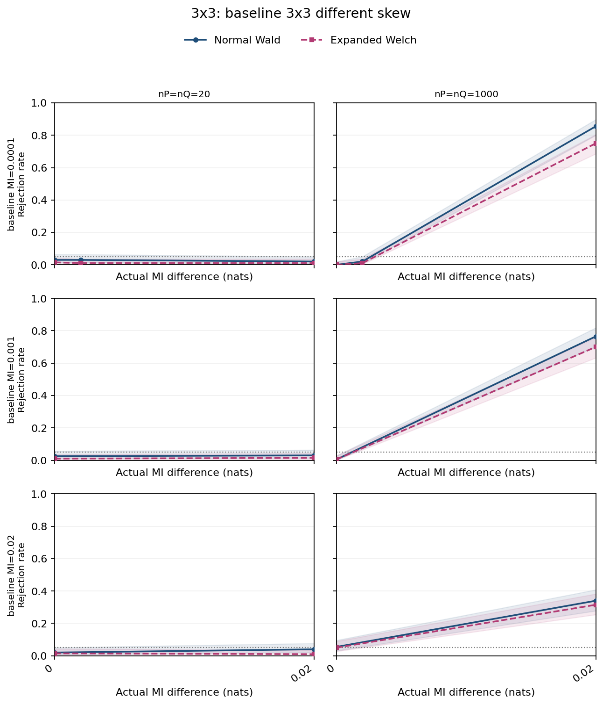

| Specification | Setting |
| --- | --- |
| Table size | 3x3 |
| Horizontal graph regime specifications (columns) | nP=nQ=20, nP=nQ=1000 |
| Vertical graph regime specifications (rows) | baseline MI=0.0001: P row (0.7, 0.3/2 repeated 2 times), P column (0.7, 0.3/2 repeated 2 times); Q row (0.8, 0.2/2 repeated 2 times), Q column (0.8, 0.2/2 repeated 2 times); baseline MI=0.001: P row (0.7, 0.3/2 repeated 2 times), P column (0.7, 0.3/2 repeated 2 times); Q row (0.8, 0.2/2 repeated 2 times), Q column (0.8, 0.2/2 repeated 2 times); baseline MI=0.02: P row (0.7, 0.3/2 repeated 2 times), P column (0.7, 0.3/2 repeated 2 times); Q row (0.8, 0.2/2 repeated 2 times), Q column (0.8, 0.2/2 repeated 2 times) |
| Probability changes | baseline MI=0.0001: additive, first changes in P and Q; baseline MI=0.001: additive, first changes in P and Q; baseline MI=0.02: additive, first changes in P and Q |
| MI settings | Baseline MI {0.0001, 0.001, 0.02}; direction {q higher}; actual differences {0, 0.002, 0.02} nats |
| Horizontal axis within each graph | Actual MI difference in nats, fixed from 0 to 0.02 |
| Vertical axis within each graph | Unconditional rejection rate from 0 to 1; invalid results count as non-rejections |
| Replicates | 200 per unique point |

Null-point rejection and validity:

| Vertical regime | Horizontal regime | Method | Rejection | Valid |
| --- | --- | --- | --- | --- |
| baseline MI=0.0001 | nP=nQ=1000 | Expanded Welch | 0.0000 | 1.0000 |
| baseline MI=0.0001 | nP=nQ=1000 | Normal Wald | 0.0000 | 1.0000 |
| baseline MI=0.0001 | nP=nQ=20 | Expanded Welch | 0.0150 | 0.9600 |
| baseline MI=0.0001 | nP=nQ=20 | Normal Wald | 0.0300 | 1.0000 |
| baseline MI=0.001 | nP=nQ=1000 | Expanded Welch | 0.0050 | 1.0000 |
| baseline MI=0.001 | nP=nQ=1000 | Normal Wald | 0.0050 | 1.0000 |
| baseline MI=0.001 | nP=nQ=20 | Expanded Welch | 0.0100 | 0.9650 |
| baseline MI=0.001 | nP=nQ=20 | Normal Wald | 0.0250 | 1.0000 |
| baseline MI=0.02 | nP=nQ=1000 | Expanded Welch | 0.0500 | 1.0000 |
| baseline MI=0.02 | nP=nQ=1000 | Normal Wald | 0.0550 | 1.0000 |
| baseline MI=0.02 | nP=nQ=20 | Expanded Welch | 0.0150 | 0.9750 |
| baseline MI=0.02 | nP=nQ=20 | Normal Wald | 0.0200 | 1.0000 |

Every plotted rate, interval, validity and minimum expected count

| Vertical regime | Horizontal regime | x | Method | Rejection | 95% interval | Valid | Conditional | Min expected P | Min expected Q |
| --- | --- | --- | --- | --- | --- | --- | --- | --- | --- |
| baseline MI=0.0001 | nP=nQ=1000 | 0 | Expanded Welch | 0.0000 | [0.0000, 0.0188] | 1.0000 | 0.0000 | 22.5 | 10 |
| baseline MI=0.0001 | nP=nQ=1000 | 0 | Normal Wald | 0.0000 | [0.0000, 0.0188] | 1.0000 | 0.0000 | 22.5 | 10 |
| baseline MI=0.0001 | nP=nQ=1000 | 0.002 | Expanded Welch | 0.0100 | [0.0027, 0.0357] | 1.0000 | 0.0100 | 22.5 | 10 |
| baseline MI=0.0001 | nP=nQ=1000 | 0.002 | Normal Wald | 0.0200 | [0.0078, 0.0503] | 1.0000 | 0.0200 | 22.5 | 10 |
| baseline MI=0.0001 | nP=nQ=1000 | 0.02 | Expanded Welch | 0.7500 | [0.6857, 0.8049] | 1.0000 | 0.7500 | 22.5 | 10 |
| baseline MI=0.0001 | nP=nQ=1000 | 0.02 | Normal Wald | 0.8550 | [0.7995, 0.8971] | 1.0000 | 0.8550 | 22.5 | 10 |
| baseline MI=0.0001 | nP=nQ=20 | 0 | Expanded Welch | 0.0150 | [0.0051, 0.0432] | 0.9600 | 0.0156 | 0.45 | 0.2 |
| baseline MI=0.0001 | nP=nQ=20 | 0 | Normal Wald | 0.0300 | [0.0138, 0.0639] | 1.0000 | 0.0300 | 0.45 | 0.2 |
| baseline MI=0.0001 | nP=nQ=20 | 0.002 | Expanded Welch | 0.0100 | [0.0027, 0.0357] | 0.9700 | 0.0103 | 0.45 | 0.2 |
| baseline MI=0.0001 | nP=nQ=20 | 0.002 | Normal Wald | 0.0300 | [0.0138, 0.0639] | 1.0000 | 0.0300 | 0.45 | 0.2 |
| baseline MI=0.0001 | nP=nQ=20 | 0.02 | Expanded Welch | 0.0100 | [0.0027, 0.0357] | 0.9950 | 0.0101 | 0.45 | 0.2 |
| baseline MI=0.0001 | nP=nQ=20 | 0.02 | Normal Wald | 0.0200 | [0.0078, 0.0503] | 1.0000 | 0.0200 | 0.45 | 0.2 |
| baseline MI=0.001 | nP=nQ=1000 | 0 | Expanded Welch | 0.0050 | [0.0009, 0.0278] | 1.0000 | 0.0050 | 22.5 | 10 |
| baseline MI=0.001 | nP=nQ=1000 | 0 | Normal Wald | 0.0050 | [0.0009, 0.0278] | 1.0000 | 0.0050 | 22.5 | 10 |
| baseline MI=0.001 | nP=nQ=1000 | 0.02 | Expanded Welch | 0.7000 | [0.6332, 0.7593] | 1.0000 | 0.7000 | 22.5 | 10 |
| baseline MI=0.001 | nP=nQ=1000 | 0.02 | Normal Wald | 0.7650 | [0.7016, 0.8184] | 1.0000 | 0.7650 | 22.5 | 10 |
| baseline MI=0.001 | nP=nQ=20 | 0 | Expanded Welch | 0.0100 | [0.0027, 0.0357] | 0.9650 | 0.0104 | 0.45 | 0.2 |
| baseline MI=0.001 | nP=nQ=20 | 0 | Normal Wald | 0.0250 | [0.0107, 0.0572] | 1.0000 | 0.0250 | 0.45 | 0.2 |
| baseline MI=0.001 | nP=nQ=20 | 0.02 | Expanded Welch | 0.0150 | [0.0051, 0.0432] | 0.9750 | 0.0154 | 0.45 | 0.2 |
| baseline MI=0.001 | nP=nQ=20 | 0.02 | Normal Wald | 0.0300 | [0.0138, 0.0639] | 1.0000 | 0.0300 | 0.45 | 0.2 |
| baseline MI=0.02 | nP=nQ=1000 | 0 | Expanded Welch | 0.0500 | [0.0274, 0.0896] | 1.0000 | 0.0500 | 22.5 | 10 |
| baseline MI=0.02 | nP=nQ=1000 | 0 | Normal Wald | 0.0550 | [0.0310, 0.0958] | 1.0000 | 0.0550 | 22.5 | 10 |
| baseline MI=0.02 | nP=nQ=1000 | 0.02 | Expanded Welch | 0.3150 | [0.2546, 0.3823] | 1.0000 | 0.3150 | 22.5 | 10 |
| baseline MI=0.02 | nP=nQ=1000 | 0.02 | Normal Wald | 0.3400 | [0.2779, 0.4081] | 1.0000 | 0.3400 | 22.5 | 10 |
| baseline MI=0.02 | nP=nQ=20 | 0 | Expanded Welch | 0.0150 | [0.0051, 0.0432] | 0.9750 | 0.0154 | 0.45 | 0.2 |
| baseline MI=0.02 | nP=nQ=20 | 0 | Normal Wald | 0.0200 | [0.0078, 0.0503] | 1.0000 | 0.0200 | 0.45 | 0.2 |
| baseline MI=0.02 | nP=nQ=20 | 0.02 | Expanded Welch | 0.0100 | [0.0027, 0.0357] | 0.9800 | 0.0102 | 0.45 | 0.2 |
| baseline MI=0.02 | nP=nQ=20 | 0.02 | Normal Wald | 0.0400 | [0.0204, 0.0769] | 1.0000 | 0.0400 | 0.45 | 0.2 |

### 4.7 5x5: baseline 5x5 uniform

Does performance change when the populations begin closer to independence?

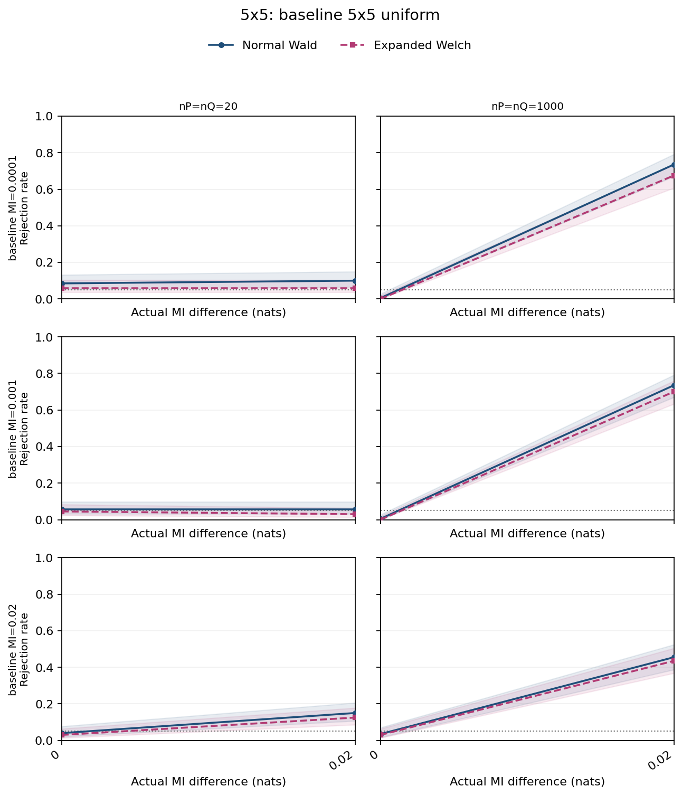

| Specification | Setting |
| --- | --- |
| Table size | 5x5 |
| Horizontal graph regime specifications (columns) | nP=nQ=20, nP=nQ=1000 |
| Vertical graph regime specifications (rows) | baseline MI=0.0001: P row (0.2 repeated 5 times), P column (0.2 repeated 5 times); Q row (0.2 repeated 5 times), Q column (0.2 repeated 5 times); baseline MI=0.001: P row (0.2 repeated 5 times), P column (0.2 repeated 5 times); Q row (0.2 repeated 5 times), Q column (0.2 repeated 5 times); baseline MI=0.02: P row (0.2 repeated 5 times), P column (0.2 repeated 5 times); Q row (0.2 repeated 5 times), Q column (0.2 repeated 5 times) |
| Probability changes | baseline MI=0.0001: additive, first changes in P and Q; baseline MI=0.001: additive, first changes in P and Q; baseline MI=0.02: additive, first changes in P and Q |
| MI settings | Baseline MI {0.0001, 0.001, 0.02}; direction {q higher}; actual differences {0, 0.02} nats |
| Horizontal axis within each graph | Actual MI difference in nats, fixed from 0 to 0.02 |
| Vertical axis within each graph | Unconditional rejection rate from 0 to 1; invalid results count as non-rejections |
| Replicates | 200 per unique point |

Null-point rejection and validity:

| Vertical regime | Horizontal regime | Method | Rejection | Valid |
| --- | --- | --- | --- | --- |
| baseline MI=0.0001 | nP=nQ=1000 | Expanded Welch | 0.0000 | 1.0000 |
| baseline MI=0.0001 | nP=nQ=1000 | Normal Wald | 0.0050 | 1.0000 |
| baseline MI=0.0001 | nP=nQ=20 | Expanded Welch | 0.0600 | 1.0000 |
| baseline MI=0.0001 | nP=nQ=20 | Normal Wald | 0.0850 | 1.0000 |
| baseline MI=0.001 | nP=nQ=1000 | Expanded Welch | 0.0000 | 1.0000 |
| baseline MI=0.001 | nP=nQ=1000 | Normal Wald | 0.0050 | 1.0000 |
| baseline MI=0.001 | nP=nQ=20 | Expanded Welch | 0.0450 | 1.0000 |
| baseline MI=0.001 | nP=nQ=20 | Normal Wald | 0.0550 | 1.0000 |
| baseline MI=0.02 | nP=nQ=1000 | Expanded Welch | 0.0300 | 1.0000 |
| baseline MI=0.02 | nP=nQ=1000 | Normal Wald | 0.0350 | 1.0000 |
| baseline MI=0.02 | nP=nQ=20 | Expanded Welch | 0.0300 | 1.0000 |
| baseline MI=0.02 | nP=nQ=20 | Normal Wald | 0.0400 | 1.0000 |

Every plotted rate, interval, validity and minimum expected count

| Vertical regime | Horizontal regime | x | Method | Rejection | 95% interval | Valid | Conditional | Min expected P | Min expected Q |
| --- | --- | --- | --- | --- | --- | --- | --- | --- | --- |
| baseline MI=0.0001 | nP=nQ=1000 | 0 | Expanded Welch | 0.0000 | [0.0000, 0.0188] | 1.0000 | 0.0000 | 38.59 | 38.59 |
| baseline MI=0.0001 | nP=nQ=1000 | 0 | Normal Wald | 0.0050 | [0.0009, 0.0278] | 1.0000 | 0.0050 | 38.59 | 38.59 |
| baseline MI=0.0001 | nP=nQ=1000 | 0.02 | Expanded Welch | 0.6750 | [0.6073, 0.7361] | 1.0000 | 0.6750 | 38.59 | 20.38 |
| baseline MI=0.0001 | nP=nQ=1000 | 0.02 | Normal Wald | 0.7350 | [0.6698, 0.7913] | 1.0000 | 0.7350 | 38.59 | 20.38 |
| baseline MI=0.0001 | nP=nQ=20 | 0 | Expanded Welch | 0.0600 | [0.0347, 0.1019] | 1.0000 | 0.0600 | 0.7717 | 0.7717 |
| baseline MI=0.0001 | nP=nQ=20 | 0 | Normal Wald | 0.0850 | [0.0537, 0.1319] | 1.0000 | 0.0850 | 0.7717 | 0.7717 |
| baseline MI=0.0001 | nP=nQ=20 | 0.02 | Expanded Welch | 0.0600 | [0.0347, 0.1019] | 1.0000 | 0.0600 | 0.7717 | 0.4076 |
| baseline MI=0.0001 | nP=nQ=20 | 0.02 | Normal Wald | 0.1000 | [0.0657, 0.1494] | 1.0000 | 0.1000 | 0.7717 | 0.4076 |
| baseline MI=0.001 | nP=nQ=1000 | 0 | Expanded Welch | 0.0000 | [0.0000, 0.0188] | 1.0000 | 0.0000 | 35.53 | 35.53 |
| baseline MI=0.001 | nP=nQ=1000 | 0 | Normal Wald | 0.0050 | [0.0009, 0.0278] | 1.0000 | 0.0050 | 35.53 | 35.53 |
| baseline MI=0.001 | nP=nQ=1000 | 0.02 | Expanded Welch | 0.7000 | [0.6332, 0.7593] | 1.0000 | 0.7000 | 35.53 | 19.97 |
| baseline MI=0.001 | nP=nQ=1000 | 0.02 | Normal Wald | 0.7350 | [0.6698, 0.7913] | 1.0000 | 0.7350 | 35.53 | 19.97 |
| baseline MI=0.001 | nP=nQ=20 | 0 | Expanded Welch | 0.0450 | [0.0239, 0.0833] | 1.0000 | 0.0450 | 0.7107 | 0.7107 |
| baseline MI=0.001 | nP=nQ=20 | 0 | Normal Wald | 0.0550 | [0.0310, 0.0958] | 1.0000 | 0.0550 | 0.7107 | 0.7107 |
| baseline MI=0.001 | nP=nQ=20 | 0.02 | Expanded Welch | 0.0300 | [0.0138, 0.0639] | 1.0000 | 0.0300 | 0.7107 | 0.3994 |
| baseline MI=0.001 | nP=nQ=20 | 0.02 | Normal Wald | 0.0550 | [0.0310, 0.0958] | 1.0000 | 0.0550 | 0.7107 | 0.3994 |
| baseline MI=0.02 | nP=nQ=1000 | 0 | Expanded Welch | 0.0300 | [0.0138, 0.0639] | 1.0000 | 0.0300 | 20.43 | 20.43 |
| baseline MI=0.02 | nP=nQ=1000 | 0 | Normal Wald | 0.0350 | [0.0171, 0.0705] | 1.0000 | 0.0350 | 20.43 | 20.43 |
| baseline MI=0.02 | nP=nQ=1000 | 0.02 | Expanded Welch | 0.4350 | [0.3682, 0.5043] | 1.0000 | 0.4350 | 20.43 | 12.97 |
| baseline MI=0.02 | nP=nQ=1000 | 0.02 | Normal Wald | 0.4550 | [0.3875, 0.5242] | 1.0000 | 0.4550 | 20.43 | 12.97 |
| baseline MI=0.02 | nP=nQ=20 | 0 | Expanded Welch | 0.0300 | [0.0138, 0.0639] | 1.0000 | 0.0300 | 0.4086 | 0.4086 |
| baseline MI=0.02 | nP=nQ=20 | 0 | Normal Wald | 0.0400 | [0.0204, 0.0769] | 1.0000 | 0.0400 | 0.4086 | 0.4086 |
| baseline MI=0.02 | nP=nQ=20 | 0.02 | Expanded Welch | 0.1250 | [0.0861, 0.1780] | 1.0000 | 0.1250 | 0.4086 | 0.2594 |
| baseline MI=0.02 | nP=nQ=20 | 0.02 | Normal Wald | 0.1500 | [0.1071, 0.2061] | 1.0000 | 0.1500 | 0.4086 | 0.2594 |

### 4.8 5x5: baseline 5x5 same skew

Does performance change when the populations begin closer to independence?

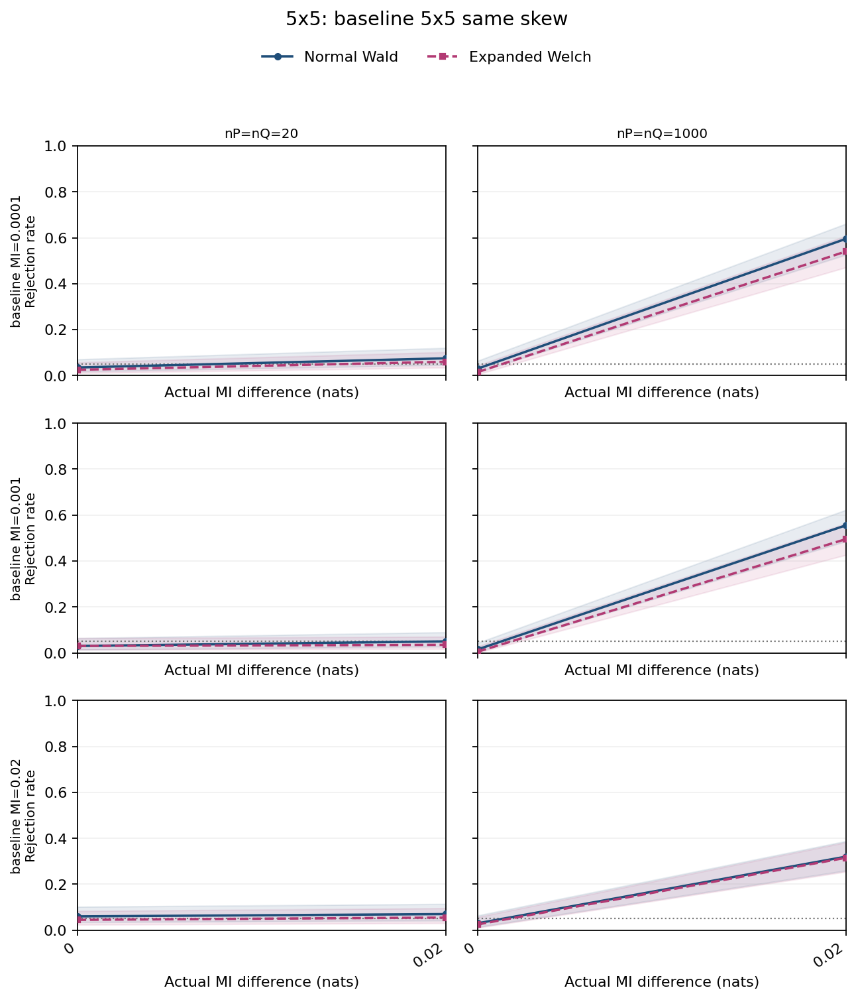

| Specification | Setting |
| --- | --- |
| Table size | 5x5 |
| Horizontal graph regime specifications (columns) | nP=nQ=20, nP=nQ=1000 |
| Vertical graph regime specifications (rows) | baseline MI=0.0001: P row (0.8, 0.2/4 repeated 4 times), P column (0.8, 0.2/4 repeated 4 times); Q row (0.8, 0.2/4 repeated 4 times), Q column (0.8, 0.2/4 repeated 4 times); baseline MI=0.001: P row (0.8, 0.2/4 repeated 4 times), P column (0.8, 0.2/4 repeated 4 times); Q row (0.8, 0.2/4 repeated 4 times), Q column (0.8, 0.2/4 repeated 4 times); baseline MI=0.02: P row (0.8, 0.2/4 repeated 4 times), P column (0.8, 0.2/4 repeated 4 times); Q row (0.8, 0.2/4 repeated 4 times), Q column (0.8, 0.2/4 repeated 4 times) |
| Probability changes | baseline MI=0.0001: additive, first changes in P and Q; baseline MI=0.001: additive, first changes in P and Q; baseline MI=0.02: additive, first changes in P and Q |
| MI settings | Baseline MI {0.0001, 0.001, 0.02}; direction {q higher}; actual differences {0, 0.02} nats |
| Horizontal axis within each graph | Actual MI difference in nats, fixed from 0 to 0.02 |
| Vertical axis within each graph | Unconditional rejection rate from 0 to 1; invalid results count as non-rejections |
| Replicates | 200 per unique point |

Null-point rejection and validity:

| Vertical regime | Horizontal regime | Method | Rejection | Valid |
| --- | --- | --- | --- | --- |
| baseline MI=0.0001 | nP=nQ=1000 | Expanded Welch | 0.0150 | 1.0000 |
| baseline MI=0.0001 | nP=nQ=1000 | Normal Wald | 0.0300 | 1.0000 |
| baseline MI=0.0001 | nP=nQ=20 | Expanded Welch | 0.0250 | 0.9550 |
| baseline MI=0.0001 | nP=nQ=20 | Normal Wald | 0.0350 | 1.0000 |
| baseline MI=0.001 | nP=nQ=1000 | Expanded Welch | 0.0050 | 1.0000 |
| baseline MI=0.001 | nP=nQ=1000 | Normal Wald | 0.0150 | 1.0000 |
| baseline MI=0.001 | nP=nQ=20 | Expanded Welch | 0.0300 | 0.9450 |
| baseline MI=0.001 | nP=nQ=20 | Normal Wald | 0.0300 | 1.0000 |
| baseline MI=0.02 | nP=nQ=1000 | Expanded Welch | 0.0250 | 1.0000 |
| baseline MI=0.02 | nP=nQ=1000 | Normal Wald | 0.0300 | 1.0000 |
| baseline MI=0.02 | nP=nQ=20 | Expanded Welch | 0.0450 | 0.9750 |
| baseline MI=0.02 | nP=nQ=20 | Normal Wald | 0.0600 | 1.0000 |

Every plotted rate, interval, validity and minimum expected count

| Vertical regime | Horizontal regime | x | Method | Rejection | 95% interval | Valid | Conditional | Min expected P | Min expected Q |
| --- | --- | --- | --- | --- | --- | --- | --- | --- | --- |
| baseline MI=0.0001 | nP=nQ=1000 | 0 | Expanded Welch | 0.0150 | [0.0051, 0.0432] | 1.0000 | 0.0150 | 2.5 | 2.5 |
| baseline MI=0.0001 | nP=nQ=1000 | 0 | Normal Wald | 0.0300 | [0.0138, 0.0639] | 1.0000 | 0.0300 | 2.5 | 2.5 |
| baseline MI=0.0001 | nP=nQ=1000 | 0.02 | Expanded Welch | 0.5400 | [0.4708, 0.6077] | 1.0000 | 0.5400 | 2.5 | 2.5 |
| baseline MI=0.0001 | nP=nQ=1000 | 0.02 | Normal Wald | 0.5950 | [0.5258, 0.6606] | 1.0000 | 0.5950 | 2.5 | 2.5 |
| baseline MI=0.0001 | nP=nQ=20 | 0 | Expanded Welch | 0.0250 | [0.0107, 0.0572] | 0.9550 | 0.0262 | 0.05 | 0.05 |
| baseline MI=0.0001 | nP=nQ=20 | 0 | Normal Wald | 0.0350 | [0.0171, 0.0705] | 1.0000 | 0.0350 | 0.05 | 0.05 |
| baseline MI=0.0001 | nP=nQ=20 | 0.02 | Expanded Welch | 0.0600 | [0.0347, 0.1019] | 0.9650 | 0.0622 | 0.05 | 0.05 |
| baseline MI=0.0001 | nP=nQ=20 | 0.02 | Normal Wald | 0.0750 | [0.0460, 0.1200] | 0.9950 | 0.0754 | 0.05 | 0.05 |
| baseline MI=0.001 | nP=nQ=1000 | 0 | Expanded Welch | 0.0050 | [0.0009, 0.0278] | 1.0000 | 0.0050 | 2.5 | 2.5 |
| baseline MI=0.001 | nP=nQ=1000 | 0 | Normal Wald | 0.0150 | [0.0051, 0.0432] | 1.0000 | 0.0150 | 2.5 | 2.5 |
| baseline MI=0.001 | nP=nQ=1000 | 0.02 | Expanded Welch | 0.4950 | [0.4265, 0.5637] | 1.0000 | 0.4950 | 2.5 | 2.5 |
| baseline MI=0.001 | nP=nQ=1000 | 0.02 | Normal Wald | 0.5550 | [0.4857, 0.6222] | 1.0000 | 0.5550 | 2.5 | 2.5 |
| baseline MI=0.001 | nP=nQ=20 | 0 | Expanded Welch | 0.0300 | [0.0138, 0.0639] | 0.9450 | 0.0317 | 0.05 | 0.05 |
| baseline MI=0.001 | nP=nQ=20 | 0 | Normal Wald | 0.0300 | [0.0138, 0.0639] | 1.0000 | 0.0300 | 0.05 | 0.05 |
| baseline MI=0.001 | nP=nQ=20 | 0.02 | Expanded Welch | 0.0350 | [0.0171, 0.0705] | 0.9550 | 0.0366 | 0.05 | 0.05 |
| baseline MI=0.001 | nP=nQ=20 | 0.02 | Normal Wald | 0.0500 | [0.0274, 0.0896] | 1.0000 | 0.0500 | 0.05 | 0.05 |
| baseline MI=0.02 | nP=nQ=1000 | 0 | Expanded Welch | 0.0250 | [0.0107, 0.0572] | 1.0000 | 0.0250 | 2.5 | 2.5 |
| baseline MI=0.02 | nP=nQ=1000 | 0 | Normal Wald | 0.0300 | [0.0138, 0.0639] | 1.0000 | 0.0300 | 2.5 | 2.5 |
| baseline MI=0.02 | nP=nQ=1000 | 0.02 | Expanded Welch | 0.3150 | [0.2546, 0.3823] | 1.0000 | 0.3150 | 2.5 | 2.5 |
| baseline MI=0.02 | nP=nQ=1000 | 0.02 | Normal Wald | 0.3200 | [0.2593, 0.3875] | 1.0000 | 0.3200 | 2.5 | 2.5 |
| baseline MI=0.02 | nP=nQ=20 | 0 | Expanded Welch | 0.0450 | [0.0239, 0.0833] | 0.9750 | 0.0462 | 0.05 | 0.05 |
| baseline MI=0.02 | nP=nQ=20 | 0 | Normal Wald | 0.0600 | [0.0347, 0.1019] | 1.0000 | 0.0600 | 0.05 | 0.05 |
| baseline MI=0.02 | nP=nQ=20 | 0.02 | Expanded Welch | 0.0550 | [0.0310, 0.0958] | 0.9650 | 0.0570 | 0.05 | 0.05 |
| baseline MI=0.02 | nP=nQ=20 | 0.02 | Normal Wald | 0.0700 | [0.0422, 0.1141] | 1.0000 | 0.0700 | 0.05 | 0.05 |

### 4.9 5x5: baseline 5x5 different skew

Does performance change when the populations begin closer to independence?

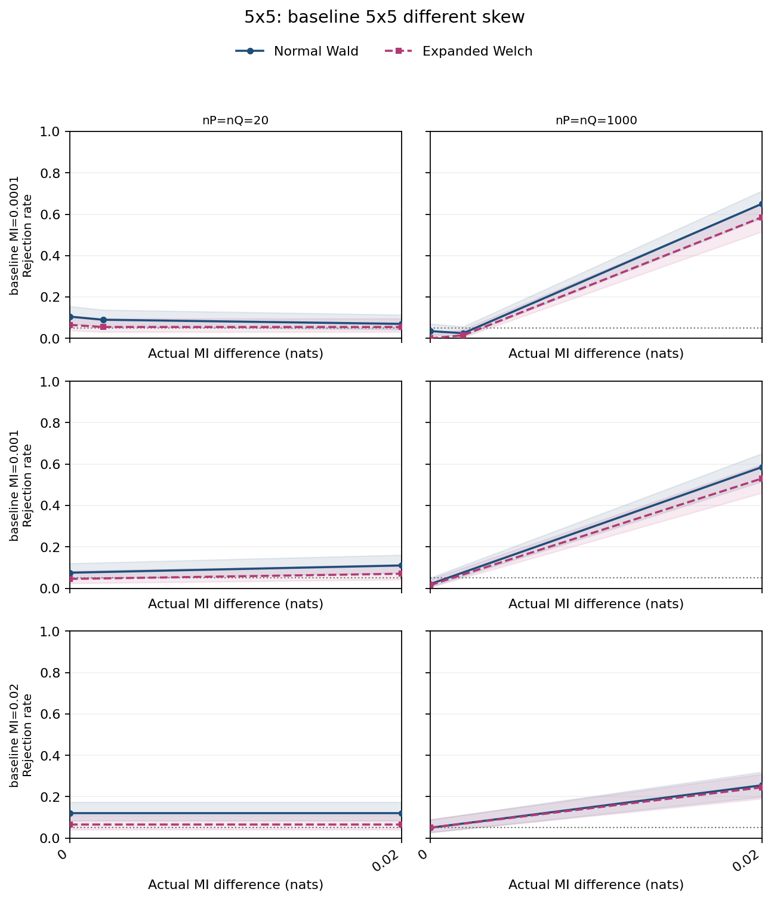

| Specification | Setting |
| --- | --- |
| Table size | 5x5 |
| Horizontal graph regime specifications (columns) | nP=nQ=20, nP=nQ=1000 |
| Vertical graph regime specifications (rows) | baseline MI=0.0001: P row (0.7, 0.3/4 repeated 4 times), P column (0.7, 0.3/4 repeated 4 times); Q row (0.8, 0.2/4 repeated 4 times), Q column (0.8, 0.2/4 repeated 4 times); baseline MI=0.001: P row (0.7, 0.3/4 repeated 4 times), P column (0.7, 0.3/4 repeated 4 times); Q row (0.8, 0.2/4 repeated 4 times), Q column (0.8, 0.2/4 repeated 4 times); baseline MI=0.02: P row (0.7, 0.3/4 repeated 4 times), P column (0.7, 0.3/4 repeated 4 times); Q row (0.8, 0.2/4 repeated 4 times), Q column (0.8, 0.2/4 repeated 4 times) |
| Probability changes | baseline MI=0.0001: additive, first changes in P and Q; baseline MI=0.001: additive, first changes in P and Q; baseline MI=0.02: additive, first changes in P and Q |
| MI settings | Baseline MI {0.0001, 0.001, 0.02}; direction {q higher}; actual differences {0, 0.002, 0.02} nats |
| Horizontal axis within each graph | Actual MI difference in nats, fixed from 0 to 0.02 |
| Vertical axis within each graph | Unconditional rejection rate from 0 to 1; invalid results count as non-rejections |
| Replicates | 200 per unique point |

Null-point rejection and validity:

| Vertical regime | Horizontal regime | Method | Rejection | Valid |
| --- | --- | --- | --- | --- |
| baseline MI=0.0001 | nP=nQ=1000 | Expanded Welch | 0.0000 | 1.0000 |
| baseline MI=0.0001 | nP=nQ=1000 | Normal Wald | 0.0350 | 1.0000 |
| baseline MI=0.0001 | nP=nQ=20 | Expanded Welch | 0.0650 | 0.9850 |
| baseline MI=0.0001 | nP=nQ=20 | Normal Wald | 0.1050 | 1.0000 |
| baseline MI=0.001 | nP=nQ=1000 | Expanded Welch | 0.0150 | 1.0000 |
| baseline MI=0.001 | nP=nQ=1000 | Normal Wald | 0.0200 | 1.0000 |
| baseline MI=0.001 | nP=nQ=20 | Expanded Welch | 0.0450 | 0.9700 |
| baseline MI=0.001 | nP=nQ=20 | Normal Wald | 0.0750 | 1.0000 |
| baseline MI=0.02 | nP=nQ=1000 | Expanded Welch | 0.0500 | 1.0000 |
| baseline MI=0.02 | nP=nQ=1000 | Normal Wald | 0.0500 | 1.0000 |
| baseline MI=0.02 | nP=nQ=20 | Expanded Welch | 0.0650 | 0.9450 |
| baseline MI=0.02 | nP=nQ=20 | Normal Wald | 0.1200 | 1.0000 |

Every plotted rate, interval, validity and minimum expected count

| Vertical regime | Horizontal regime | x | Method | Rejection | 95% interval | Valid | Conditional | Min expected P | Min expected Q |
| --- | --- | --- | --- | --- | --- | --- | --- | --- | --- |
| baseline MI=0.0001 | nP=nQ=1000 | 0 | Expanded Welch | 0.0000 | [0.0000, 0.0188] | 1.0000 | 0.0000 | 5.625 | 2.5 |
| baseline MI=0.0001 | nP=nQ=1000 | 0 | Normal Wald | 0.0350 | [0.0171, 0.0705] | 1.0000 | 0.0350 | 5.625 | 2.5 |
| baseline MI=0.0001 | nP=nQ=1000 | 0.002 | Expanded Welch | 0.0150 | [0.0051, 0.0432] | 1.0000 | 0.0150 | 5.625 | 2.5 |
| baseline MI=0.0001 | nP=nQ=1000 | 0.002 | Normal Wald | 0.0250 | [0.0107, 0.0572] | 1.0000 | 0.0250 | 5.625 | 2.5 |
| baseline MI=0.0001 | nP=nQ=1000 | 0.02 | Expanded Welch | 0.5850 | [0.5157, 0.6511] | 1.0000 | 0.5850 | 5.625 | 2.5 |
| baseline MI=0.0001 | nP=nQ=1000 | 0.02 | Normal Wald | 0.6500 | [0.5816, 0.7127] | 1.0000 | 0.6500 | 5.625 | 2.5 |
| baseline MI=0.0001 | nP=nQ=20 | 0 | Expanded Welch | 0.0650 | [0.0384, 0.1080] | 0.9850 | 0.0660 | 0.1125 | 0.05 |
| baseline MI=0.0001 | nP=nQ=20 | 0 | Normal Wald | 0.1050 | [0.0697, 0.1552] | 1.0000 | 0.1050 | 0.1125 | 0.05 |
| baseline MI=0.0001 | nP=nQ=20 | 0.002 | Expanded Welch | 0.0550 | [0.0310, 0.0958] | 0.9700 | 0.0567 | 0.1125 | 0.05 |
| baseline MI=0.0001 | nP=nQ=20 | 0.002 | Normal Wald | 0.0900 | [0.0577, 0.1378] | 1.0000 | 0.0900 | 0.1125 | 0.05 |
| baseline MI=0.0001 | nP=nQ=20 | 0.02 | Expanded Welch | 0.0550 | [0.0310, 0.0958] | 0.9900 | 0.0556 | 0.1125 | 0.05 |
| baseline MI=0.0001 | nP=nQ=20 | 0.02 | Normal Wald | 0.0700 | [0.0422, 0.1141] | 1.0000 | 0.0700 | 0.1125 | 0.05 |
| baseline MI=0.001 | nP=nQ=1000 | 0 | Expanded Welch | 0.0150 | [0.0051, 0.0432] | 1.0000 | 0.0150 | 5.625 | 2.5 |
| baseline MI=0.001 | nP=nQ=1000 | 0 | Normal Wald | 0.0200 | [0.0078, 0.0503] | 1.0000 | 0.0200 | 5.625 | 2.5 |
| baseline MI=0.001 | nP=nQ=1000 | 0.02 | Expanded Welch | 0.5300 | [0.4609, 0.5980] | 1.0000 | 0.5300 | 5.625 | 2.5 |
| baseline MI=0.001 | nP=nQ=1000 | 0.02 | Normal Wald | 0.5850 | [0.5157, 0.6511] | 1.0000 | 0.5850 | 5.625 | 2.5 |
| baseline MI=0.001 | nP=nQ=20 | 0 | Expanded Welch | 0.0450 | [0.0239, 0.0833] | 0.9700 | 0.0464 | 0.1125 | 0.05 |
| baseline MI=0.001 | nP=nQ=20 | 0 | Normal Wald | 0.0750 | [0.0460, 0.1200] | 1.0000 | 0.0750 | 0.1125 | 0.05 |
| baseline MI=0.001 | nP=nQ=20 | 0.02 | Expanded Welch | 0.0700 | [0.0422, 0.1141] | 0.9700 | 0.0722 | 0.1125 | 0.05 |
| baseline MI=0.001 | nP=nQ=20 | 0.02 | Normal Wald | 0.1100 | [0.0738, 0.1609] | 1.0000 | 0.1100 | 0.1125 | 0.05 |
| baseline MI=0.02 | nP=nQ=1000 | 0 | Expanded Welch | 0.0500 | [0.0274, 0.0896] | 1.0000 | 0.0500 | 5.625 | 2.5 |
| baseline MI=0.02 | nP=nQ=1000 | 0 | Normal Wald | 0.0500 | [0.0274, 0.0896] | 1.0000 | 0.0500 | 5.625 | 2.5 |
| baseline MI=0.02 | nP=nQ=1000 | 0.02 | Expanded Welch | 0.2450 | [0.1906, 0.3090] | 1.0000 | 0.2450 | 5.625 | 2.5 |
| baseline MI=0.02 | nP=nQ=1000 | 0.02 | Normal Wald | 0.2550 | [0.1996, 0.3196] | 1.0000 | 0.2550 | 5.625 | 2.5 |
| baseline MI=0.02 | nP=nQ=20 | 0 | Expanded Welch | 0.0650 | [0.0384, 0.1080] | 0.9450 | 0.0688 | 0.1125 | 0.05 |
| baseline MI=0.02 | nP=nQ=20 | 0 | Normal Wald | 0.1200 | [0.0820, 0.1723] | 1.0000 | 0.1200 | 0.1125 | 0.05 |
| baseline MI=0.02 | nP=nQ=20 | 0.02 | Expanded Welch | 0.0650 | [0.0384, 0.1080] | 0.9900 | 0.0657 | 0.1125 | 0.05 |
| baseline MI=0.02 | nP=nQ=20 | 0.02 | Normal Wald | 0.1200 | [0.0820, 0.1723] | 1.0000 | 0.1200 | 0.1125 | 0.05 |

### 4.10 8x8: baseline 8x8 uniform

Does performance change when the populations begin closer to independence?

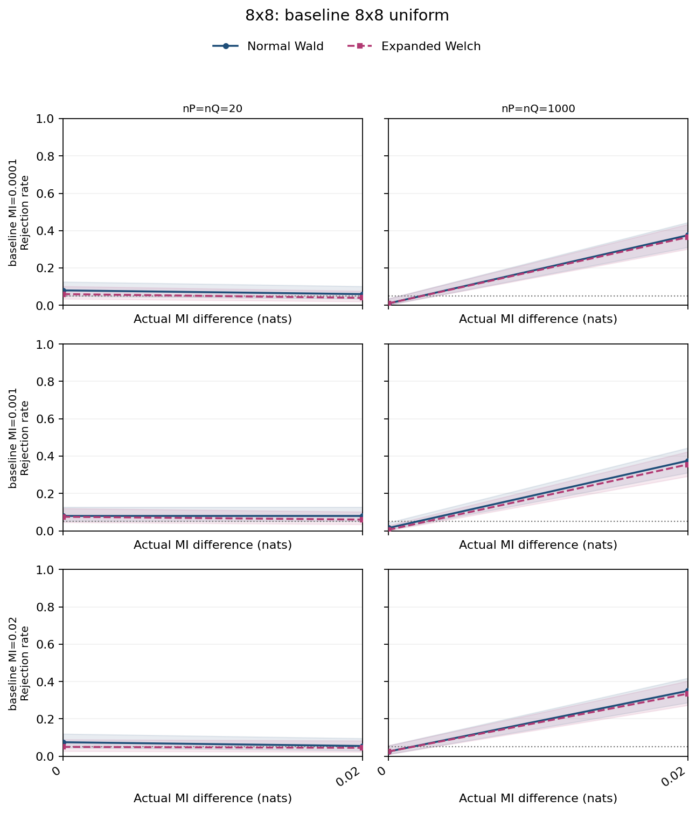

| Specification | Setting |
| --- | --- |
| Table size | 8x8 |
| Horizontal graph regime specifications (columns) | nP=nQ=20, nP=nQ=1000 |
| Vertical graph regime specifications (rows) | baseline MI=0.0001: P row (0.125 repeated 8 times), P column (0.125 repeated 8 times); Q row (0.125 repeated 8 times), Q column (0.125 repeated 8 times); baseline MI=0.001: P row (0.125 repeated 8 times), P column (0.125 repeated 8 times); Q row (0.125 repeated 8 times), Q column (0.125 repeated 8 times); baseline MI=0.02: P row (0.125 repeated 8 times), P column (0.125 repeated 8 times); Q row (0.125 repeated 8 times), Q column (0.125 repeated 8 times) |
| Probability changes | baseline MI=0.0001: additive, first changes in P and Q; baseline MI=0.001: additive, first changes in P and Q; baseline MI=0.02: additive, first changes in P and Q |
| MI settings | Baseline MI {0.0001, 0.001, 0.02}; direction {q higher}; actual differences {0, 0.02} nats |
| Horizontal axis within each graph | Actual MI difference in nats, fixed from 0 to 0.02 |
| Vertical axis within each graph | Unconditional rejection rate from 0 to 1; invalid results count as non-rejections |
| Replicates | 200 per unique point |

Null-point rejection and validity:

| Vertical regime | Horizontal regime | Method | Rejection | Valid |
| --- | --- | --- | --- | --- |
| baseline MI=0.0001 | nP=nQ=1000 | Expanded Welch | 0.0100 | 1.0000 |
| baseline MI=0.0001 | nP=nQ=1000 | Normal Wald | 0.0100 | 1.0000 |
| baseline MI=0.0001 | nP=nQ=20 | Expanded Welch | 0.0600 | 1.0000 |
| baseline MI=0.0001 | nP=nQ=20 | Normal Wald | 0.0800 | 1.0000 |
| baseline MI=0.001 | nP=nQ=1000 | Expanded Welch | 0.0050 | 1.0000 |
| baseline MI=0.001 | nP=nQ=1000 | Normal Wald | 0.0150 | 1.0000 |
| baseline MI=0.001 | nP=nQ=20 | Expanded Welch | 0.0750 | 1.0000 |
| baseline MI=0.001 | nP=nQ=20 | Normal Wald | 0.0800 | 1.0000 |
| baseline MI=0.02 | nP=nQ=1000 | Expanded Welch | 0.0250 | 1.0000 |
| baseline MI=0.02 | nP=nQ=1000 | Normal Wald | 0.0250 | 1.0000 |
| baseline MI=0.02 | nP=nQ=20 | Expanded Welch | 0.0500 | 1.0000 |
| baseline MI=0.02 | nP=nQ=20 | Normal Wald | 0.0750 | 1.0000 |

Every plotted rate, interval, validity and minimum expected count

| Vertical regime | Horizontal regime | x | Method | Rejection | 95% interval | Valid | Conditional | Min expected P | Min expected Q |
| --- | --- | --- | --- | --- | --- | --- | --- | --- | --- |
| baseline MI=0.0001 | nP=nQ=1000 | 0 | Expanded Welch | 0.0100 | [0.0027, 0.0357] | 1.0000 | 0.0100 | 14.74 | 14.74 |
| baseline MI=0.0001 | nP=nQ=1000 | 0 | Normal Wald | 0.0100 | [0.0027, 0.0357] | 1.0000 | 0.0100 | 14.74 | 14.74 |
| baseline MI=0.0001 | nP=nQ=1000 | 0.02 | Expanded Welch | 0.3650 | [0.3014, 0.4337] | 1.0000 | 0.3650 | 14.74 | 3.823 |
| baseline MI=0.0001 | nP=nQ=1000 | 0.02 | Normal Wald | 0.3750 | [0.3109, 0.4439] | 1.0000 | 0.3750 | 14.74 | 3.823 |
| baseline MI=0.0001 | nP=nQ=20 | 0 | Expanded Welch | 0.0600 | [0.0347, 0.1019] | 1.0000 | 0.0600 | 0.2948 | 0.2948 |
| baseline MI=0.0001 | nP=nQ=20 | 0 | Normal Wald | 0.0800 | [0.0498, 0.1260] | 1.0000 | 0.0800 | 0.2948 | 0.2948 |
| baseline MI=0.0001 | nP=nQ=20 | 0.02 | Expanded Welch | 0.0400 | [0.0204, 0.0769] | 1.0000 | 0.0400 | 0.2948 | 0.07646 |
| baseline MI=0.0001 | nP=nQ=20 | 0.02 | Normal Wald | 0.0600 | [0.0347, 0.1019] | 1.0000 | 0.0600 | 0.2948 | 0.07646 |
| baseline MI=0.001 | nP=nQ=1000 | 0 | Expanded Welch | 0.0050 | [0.0009, 0.0278] | 1.0000 | 0.0050 | 12.84 | 12.84 |
| baseline MI=0.001 | nP=nQ=1000 | 0 | Normal Wald | 0.0150 | [0.0051, 0.0432] | 1.0000 | 0.0150 | 12.84 | 12.84 |
| baseline MI=0.001 | nP=nQ=1000 | 0.02 | Expanded Welch | 0.3550 | [0.2920, 0.4235] | 1.0000 | 0.3550 | 12.84 | 3.598 |
| baseline MI=0.001 | nP=nQ=1000 | 0.02 | Normal Wald | 0.3750 | [0.3109, 0.4439] | 1.0000 | 0.3750 | 12.84 | 3.598 |
| baseline MI=0.001 | nP=nQ=20 | 0 | Expanded Welch | 0.0750 | [0.0460, 0.1200] | 1.0000 | 0.0750 | 0.2567 | 0.2567 |
| baseline MI=0.001 | nP=nQ=20 | 0 | Normal Wald | 0.0800 | [0.0498, 0.1260] | 1.0000 | 0.0800 | 0.2567 | 0.2567 |
| baseline MI=0.001 | nP=nQ=20 | 0.02 | Expanded Welch | 0.0600 | [0.0347, 0.1019] | 1.0000 | 0.0600 | 0.2567 | 0.07197 |
| baseline MI=0.001 | nP=nQ=20 | 0.02 | Normal Wald | 0.0800 | [0.0498, 0.1260] | 1.0000 | 0.0800 | 0.2567 | 0.07197 |
| baseline MI=0.02 | nP=nQ=1000 | 0 | Expanded Welch | 0.0250 | [0.0107, 0.0572] | 1.0000 | 0.0250 | 3.848 | 3.848 |
| baseline MI=0.02 | nP=nQ=1000 | 0 | Normal Wald | 0.0250 | [0.0107, 0.0572] | 1.0000 | 0.0250 | 3.848 | 3.848 |
| baseline MI=0.02 | nP=nQ=1000 | 0.02 | Expanded Welch | 0.3350 | [0.2732, 0.4030] | 1.0000 | 0.3350 | 3.848 | 0.2932 |
| baseline MI=0.02 | nP=nQ=1000 | 0.02 | Normal Wald | 0.3500 | [0.2873, 0.4184] | 1.0000 | 0.3500 | 3.848 | 0.2932 |
| baseline MI=0.02 | nP=nQ=20 | 0 | Expanded Welch | 0.0500 | [0.0274, 0.0896] | 1.0000 | 0.0500 | 0.07697 | 0.07697 |
| baseline MI=0.02 | nP=nQ=20 | 0 | Normal Wald | 0.0750 | [0.0460, 0.1200] | 1.0000 | 0.0750 | 0.07697 | 0.07697 |
| baseline MI=0.02 | nP=nQ=20 | 0.02 | Expanded Welch | 0.0450 | [0.0239, 0.0833] | 1.0000 | 0.0450 | 0.07697 | 0.005864 |
| baseline MI=0.02 | nP=nQ=20 | 0.02 | Normal Wald | 0.0550 | [0.0310, 0.0958] | 1.0000 | 0.0550 | 0.07697 | 0.005864 |

### 4.11 8x8: baseline 8x8 same skew

Does performance change when the populations begin closer to independence?

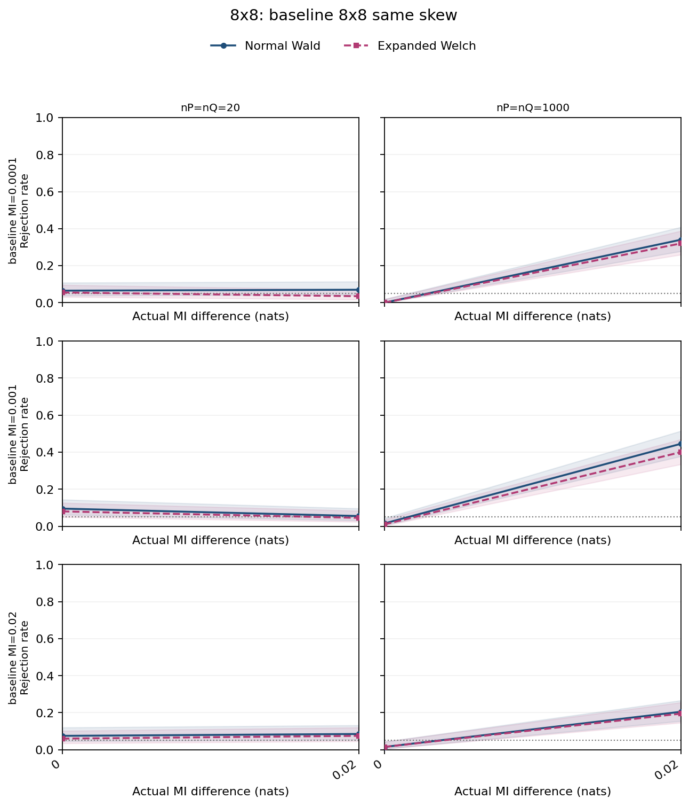

| Specification | Setting |
| --- | --- |
| Table size | 8x8 |
| Horizontal graph regime specifications (columns) | nP=nQ=20, nP=nQ=1000 |
| Vertical graph regime specifications (rows) | baseline MI=0.0001: P row (0.8, 0.2/7 repeated 7 times), P column (0.8, 0.2/7 repeated 7 times); Q row (0.8, 0.2/7 repeated 7 times), Q column (0.8, 0.2/7 repeated 7 times); baseline MI=0.001: P row (0.8, 0.2/7 repeated 7 times), P column (0.8, 0.2/7 repeated 7 times); Q row (0.8, 0.2/7 repeated 7 times), Q column (0.8, 0.2/7 repeated 7 times); baseline MI=0.02: P row (0.8, 0.2/7 repeated 7 times), P column (0.8, 0.2/7 repeated 7 times); Q row (0.8, 0.2/7 repeated 7 times), Q column (0.8, 0.2/7 repeated 7 times) |
| Probability changes | baseline MI=0.0001: additive, first changes in P and Q; baseline MI=0.001: additive, first changes in P and Q; baseline MI=0.02: additive, first changes in P and Q |
| MI settings | Baseline MI {0.0001, 0.001, 0.02}; direction {q higher}; actual differences {0, 0.02} nats |
| Horizontal axis within each graph | Actual MI difference in nats, fixed from 0 to 0.02 |
| Vertical axis within each graph | Unconditional rejection rate from 0 to 1; invalid results count as non-rejections |
| Replicates | 200 per unique point |

Null-point rejection and validity:

| Vertical regime | Horizontal regime | Method | Rejection | Valid |
| --- | --- | --- | --- | --- |
| baseline MI=0.0001 | nP=nQ=1000 | Expanded Welch | 0.0000 | 1.0000 |
| baseline MI=0.0001 | nP=nQ=1000 | Normal Wald | 0.0000 | 1.0000 |
| baseline MI=0.0001 | nP=nQ=20 | Expanded Welch | 0.0550 | 0.9400 |
| baseline MI=0.0001 | nP=nQ=20 | Normal Wald | 0.0650 | 1.0000 |
| baseline MI=0.001 | nP=nQ=1000 | Expanded Welch | 0.0100 | 1.0000 |
| baseline MI=0.001 | nP=nQ=1000 | Normal Wald | 0.0150 | 1.0000 |
| baseline MI=0.001 | nP=nQ=20 | Expanded Welch | 0.0800 | 0.9500 |
| baseline MI=0.001 | nP=nQ=20 | Normal Wald | 0.0950 | 0.9900 |
| baseline MI=0.02 | nP=nQ=1000 | Expanded Welch | 0.0150 | 1.0000 |
| baseline MI=0.02 | nP=nQ=1000 | Normal Wald | 0.0150 | 1.0000 |
| baseline MI=0.02 | nP=nQ=20 | Expanded Welch | 0.0600 | 0.9400 |
| baseline MI=0.02 | nP=nQ=20 | Normal Wald | 0.0750 | 1.0000 |

Every plotted rate, interval, validity and minimum expected count

| Vertical regime | Horizontal regime | x | Method | Rejection | 95% interval | Valid | Conditional | Min expected P | Min expected Q |
| --- | --- | --- | --- | --- | --- | --- | --- | --- | --- |
| baseline MI=0.0001 | nP=nQ=1000 | 0 | Expanded Welch | 0.0000 | [0.0000, 0.0188] | 1.0000 | 0.0000 | 0.8163 | 0.8163 |
| baseline MI=0.0001 | nP=nQ=1000 | 0 | Normal Wald | 0.0000 | [0.0000, 0.0188] | 1.0000 | 0.0000 | 0.8163 | 0.8163 |
| baseline MI=0.0001 | nP=nQ=1000 | 0.02 | Expanded Welch | 0.3200 | [0.2593, 0.3875] | 1.0000 | 0.3200 | 0.8163 | 0.8163 |
| baseline MI=0.0001 | nP=nQ=1000 | 0.02 | Normal Wald | 0.3400 | [0.2779, 0.4081] | 1.0000 | 0.3400 | 0.8163 | 0.8163 |
| baseline MI=0.0001 | nP=nQ=20 | 0 | Expanded Welch | 0.0550 | [0.0310, 0.0958] | 0.9400 | 0.0585 | 0.01633 | 0.01633 |
| baseline MI=0.0001 | nP=nQ=20 | 0 | Normal Wald | 0.0650 | [0.0384, 0.1080] | 1.0000 | 0.0650 | 0.01633 | 0.01633 |
| baseline MI=0.0001 | nP=nQ=20 | 0.02 | Expanded Welch | 0.0350 | [0.0171, 0.0705] | 0.9500 | 0.0368 | 0.01633 | 0.01633 |
| baseline MI=0.0001 | nP=nQ=20 | 0.02 | Normal Wald | 0.0700 | [0.0422, 0.1141] | 1.0000 | 0.0700 | 0.01633 | 0.01633 |
| baseline MI=0.001 | nP=nQ=1000 | 0 | Expanded Welch | 0.0100 | [0.0027, 0.0357] | 1.0000 | 0.0100 | 0.8163 | 0.8163 |
| baseline MI=0.001 | nP=nQ=1000 | 0 | Normal Wald | 0.0150 | [0.0051, 0.0432] | 1.0000 | 0.0150 | 0.8163 | 0.8163 |
| baseline MI=0.001 | nP=nQ=1000 | 0.02 | Expanded Welch | 0.4000 | [0.3346, 0.4692] | 1.0000 | 0.4000 | 0.8163 | 0.8163 |
| baseline MI=0.001 | nP=nQ=1000 | 0.02 | Normal Wald | 0.4450 | [0.3778, 0.5143] | 1.0000 | 0.4450 | 0.8163 | 0.8163 |
| baseline MI=0.001 | nP=nQ=20 | 0 | Expanded Welch | 0.0800 | [0.0498, 0.1260] | 0.9500 | 0.0842 | 0.01633 | 0.01633 |
| baseline MI=0.001 | nP=nQ=20 | 0 | Normal Wald | 0.0950 | [0.0617, 0.1436] | 0.9900 | 0.0960 | 0.01633 | 0.01633 |
| baseline MI=0.001 | nP=nQ=20 | 0.02 | Expanded Welch | 0.0450 | [0.0239, 0.0833] | 0.9650 | 0.0466 | 0.01633 | 0.01633 |
| baseline MI=0.001 | nP=nQ=20 | 0.02 | Normal Wald | 0.0550 | [0.0310, 0.0958] | 1.0000 | 0.0550 | 0.01633 | 0.01633 |
| baseline MI=0.02 | nP=nQ=1000 | 0 | Expanded Welch | 0.0150 | [0.0051, 0.0432] | 1.0000 | 0.0150 | 0.8163 | 0.8163 |
| baseline MI=0.02 | nP=nQ=1000 | 0 | Normal Wald | 0.0150 | [0.0051, 0.0432] | 1.0000 | 0.0150 | 0.8163 | 0.8163 |
| baseline MI=0.02 | nP=nQ=1000 | 0.02 | Expanded Welch | 0.1950 | [0.1461, 0.2554] | 1.0000 | 0.1950 | 0.8163 | 0.8163 |
| baseline MI=0.02 | nP=nQ=1000 | 0.02 | Normal Wald | 0.2050 | [0.1549, 0.2663] | 1.0000 | 0.2050 | 0.8163 | 0.8163 |
| baseline MI=0.02 | nP=nQ=20 | 0 | Expanded Welch | 0.0600 | [0.0347, 0.1019] | 0.9400 | 0.0638 | 0.01633 | 0.01633 |
| baseline MI=0.02 | nP=nQ=20 | 0 | Normal Wald | 0.0750 | [0.0460, 0.1200] | 1.0000 | 0.0750 | 0.01633 | 0.01633 |
| baseline MI=0.02 | nP=nQ=20 | 0.02 | Expanded Welch | 0.0750 | [0.0460, 0.1200] | 0.9600 | 0.0781 | 0.01633 | 0.01633 |
| baseline MI=0.02 | nP=nQ=20 | 0.02 | Normal Wald | 0.0850 | [0.0537, 0.1319] | 1.0000 | 0.0850 | 0.01633 | 0.01633 |

### 4.12 8x8: baseline 8x8 different skew

Does performance change when the populations begin closer to independence?

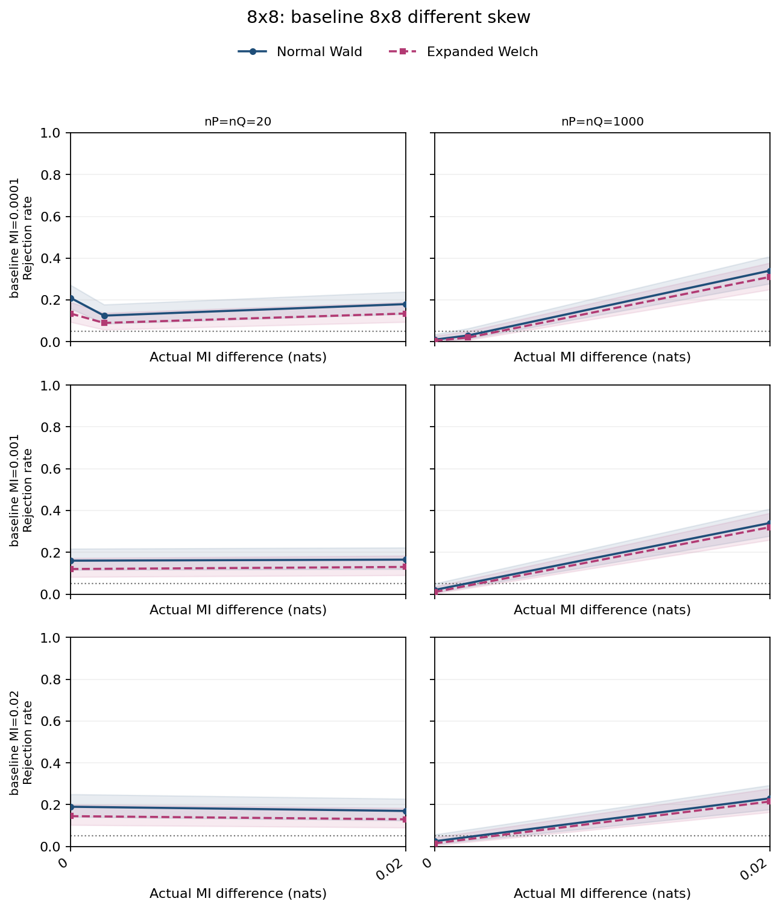

| Specification | Setting |
| --- | --- |
| Table size | 8x8 |
| Horizontal graph regime specifications (columns) | nP=nQ=20, nP=nQ=1000 |
| Vertical graph regime specifications (rows) | baseline MI=0.0001: P row (0.7, 0.3/7 repeated 7 times), P column (0.7, 0.3/7 repeated 7 times); Q row (0.8, 0.2/7 repeated 7 times), Q column (0.8, 0.2/7 repeated 7 times); baseline MI=0.001: P row (0.7, 0.3/7 repeated 7 times), P column (0.7, 0.3/7 repeated 7 times); Q row (0.8, 0.2/7 repeated 7 times), Q column (0.8, 0.2/7 repeated 7 times); baseline MI=0.02: P row (0.7, 0.3/7 repeated 7 times), P column (0.7, 0.3/7 repeated 7 times); Q row (0.8, 0.2/7 repeated 7 times), Q column (0.8, 0.2/7 repeated 7 times) |
| Probability changes | baseline MI=0.0001: additive, first changes in P and Q; baseline MI=0.001: additive, first changes in P and Q; baseline MI=0.02: additive, first changes in P and Q |
| MI settings | Baseline MI {0.0001, 0.001, 0.02}; direction {q higher}; actual differences {0, 0.002, 0.02} nats |
| Horizontal axis within each graph | Actual MI difference in nats, fixed from 0 to 0.02 |
| Vertical axis within each graph | Unconditional rejection rate from 0 to 1; invalid results count as non-rejections |
| Replicates | 200 per unique point |

Null-point rejection and validity:

| Vertical regime | Horizontal regime | Method | Rejection | Valid |
| --- | --- | --- | --- | --- |
| baseline MI=0.0001 | nP=nQ=1000 | Expanded Welch | 0.0050 | 1.0000 |
| baseline MI=0.0001 | nP=nQ=1000 | Normal Wald | 0.0100 | 1.0000 |
| baseline MI=0.0001 | nP=nQ=20 | Expanded Welch | 0.1350 | 0.9500 |
| baseline MI=0.0001 | nP=nQ=20 | Normal Wald | 0.2100 | 1.0000 |
| baseline MI=0.001 | nP=nQ=1000 | Expanded Welch | 0.0100 | 1.0000 |
| baseline MI=0.001 | nP=nQ=1000 | Normal Wald | 0.0200 | 1.0000 |
| baseline MI=0.001 | nP=nQ=20 | Expanded Welch | 0.1200 | 0.9800 |
| baseline MI=0.001 | nP=nQ=20 | Normal Wald | 0.1600 | 1.0000 |
| baseline MI=0.02 | nP=nQ=1000 | Expanded Welch | 0.0150 | 1.0000 |
| baseline MI=0.02 | nP=nQ=1000 | Normal Wald | 0.0250 | 1.0000 |
| baseline MI=0.02 | nP=nQ=20 | Expanded Welch | 0.1450 | 0.9700 |
| baseline MI=0.02 | nP=nQ=20 | Normal Wald | 0.1900 | 1.0000 |

Every plotted rate, interval, validity and minimum expected count

| Vertical regime | Horizontal regime | x | Method | Rejection | 95% interval | Valid | Conditional | Min expected P | Min expected Q |
| --- | --- | --- | --- | --- | --- | --- | --- | --- | --- |
| baseline MI=0.0001 | nP=nQ=1000 | 0 | Expanded Welch | 0.0050 | [0.0009, 0.0278] | 1.0000 | 0.0050 | 1.837 | 0.8163 |
| baseline MI=0.0001 | nP=nQ=1000 | 0 | Normal Wald | 0.0100 | [0.0027, 0.0357] | 1.0000 | 0.0100 | 1.837 | 0.8163 |
| baseline MI=0.0001 | nP=nQ=1000 | 0.002 | Expanded Welch | 0.0200 | [0.0078, 0.0503] | 1.0000 | 0.0200 | 1.837 | 0.8163 |
| baseline MI=0.0001 | nP=nQ=1000 | 0.002 | Normal Wald | 0.0300 | [0.0138, 0.0639] | 1.0000 | 0.0300 | 1.837 | 0.8163 |
| baseline MI=0.0001 | nP=nQ=1000 | 0.02 | Expanded Welch | 0.3100 | [0.2500, 0.3772] | 1.0000 | 0.3100 | 1.837 | 0.8163 |
| baseline MI=0.0001 | nP=nQ=1000 | 0.02 | Normal Wald | 0.3400 | [0.2779, 0.4081] | 1.0000 | 0.3400 | 1.837 | 0.8163 |
| baseline MI=0.0001 | nP=nQ=20 | 0 | Expanded Welch | 0.1350 | [0.0945, 0.1893] | 0.9500 | 0.1421 | 0.03673 | 0.01633 |
| baseline MI=0.0001 | nP=nQ=20 | 0 | Normal Wald | 0.2100 | [0.1593, 0.2716] | 1.0000 | 0.2100 | 0.03673 | 0.01633 |
| baseline MI=0.0001 | nP=nQ=20 | 0.002 | Expanded Welch | 0.0900 | [0.0577, 0.1378] | 0.9800 | 0.0918 | 0.03673 | 0.01633 |
| baseline MI=0.0001 | nP=nQ=20 | 0.002 | Normal Wald | 0.1250 | [0.0861, 0.1780] | 1.0000 | 0.1250 | 0.03673 | 0.01633 |
| baseline MI=0.0001 | nP=nQ=20 | 0.02 | Expanded Welch | 0.1350 | [0.0945, 0.1893] | 0.9550 | 0.1414 | 0.03673 | 0.01633 |
| baseline MI=0.0001 | nP=nQ=20 | 0.02 | Normal Wald | 0.1800 | [0.1329, 0.2391] | 1.0000 | 0.1800 | 0.03673 | 0.01633 |
| baseline MI=0.001 | nP=nQ=1000 | 0 | Expanded Welch | 0.0100 | [0.0027, 0.0357] | 1.0000 | 0.0100 | 1.837 | 0.8163 |
| baseline MI=0.001 | nP=nQ=1000 | 0 | Normal Wald | 0.0200 | [0.0078, 0.0503] | 1.0000 | 0.0200 | 1.837 | 0.8163 |
| baseline MI=0.001 | nP=nQ=1000 | 0.02 | Expanded Welch | 0.3200 | [0.2593, 0.3875] | 1.0000 | 0.3200 | 1.837 | 0.8163 |
| baseline MI=0.001 | nP=nQ=1000 | 0.02 | Normal Wald | 0.3400 | [0.2779, 0.4081] | 1.0000 | 0.3400 | 1.837 | 0.8163 |
| baseline MI=0.001 | nP=nQ=20 | 0 | Expanded Welch | 0.1200 | [0.0820, 0.1723] | 0.9800 | 0.1224 | 0.03673 | 0.01633 |
| baseline MI=0.001 | nP=nQ=20 | 0 | Normal Wald | 0.1600 | [0.1157, 0.2171] | 1.0000 | 0.1600 | 0.03673 | 0.01633 |
| baseline MI=0.001 | nP=nQ=20 | 0.02 | Expanded Welch | 0.1300 | [0.0903, 0.1837] | 0.9700 | 0.1340 | 0.03673 | 0.01633 |
| baseline MI=0.001 | nP=nQ=20 | 0.02 | Normal Wald | 0.1650 | [0.1200, 0.2227] | 1.0000 | 0.1650 | 0.03673 | 0.01633 |
| baseline MI=0.02 | nP=nQ=1000 | 0 | Expanded Welch | 0.0150 | [0.0051, 0.0432] | 1.0000 | 0.0150 | 1.837 | 0.8163 |
| baseline MI=0.02 | nP=nQ=1000 | 0 | Normal Wald | 0.0250 | [0.0107, 0.0572] | 1.0000 | 0.0250 | 1.837 | 0.8163 |
| baseline MI=0.02 | nP=nQ=1000 | 0.02 | Expanded Welch | 0.2150 | [0.1637, 0.2770] | 1.0000 | 0.2150 | 1.837 | 0.8163 |
| baseline MI=0.02 | nP=nQ=1000 | 0.02 | Normal Wald | 0.2300 | [0.1771, 0.2931] | 1.0000 | 0.2300 | 1.837 | 0.8163 |
| baseline MI=0.02 | nP=nQ=20 | 0 | Expanded Welch | 0.1450 | [0.1029, 0.2005] | 0.9700 | 0.1495 | 0.03673 | 0.01633 |
| baseline MI=0.02 | nP=nQ=20 | 0 | Normal Wald | 0.1900 | [0.1417, 0.2500] | 1.0000 | 0.1900 | 0.03673 | 0.01633 |
| baseline MI=0.02 | nP=nQ=20 | 0.02 | Expanded Welch | 0.1300 | [0.0903, 0.1837] | 0.9750 | 0.1333 | 0.03673 | 0.01633 |
| baseline MI=0.02 | nP=nQ=20 | 0.02 | Normal Wald | 0.1700 | [0.1243, 0.2282] | 1.0000 | 0.1700 | 0.03673 | 0.01633 |

## 5. Where the cell probabilities change

Does performance change when dependence is placed in common, rare or many cells?

### 5.1 3x3: patterns 3x3

Does performance change when dependence is placed in common, rare or many cells?

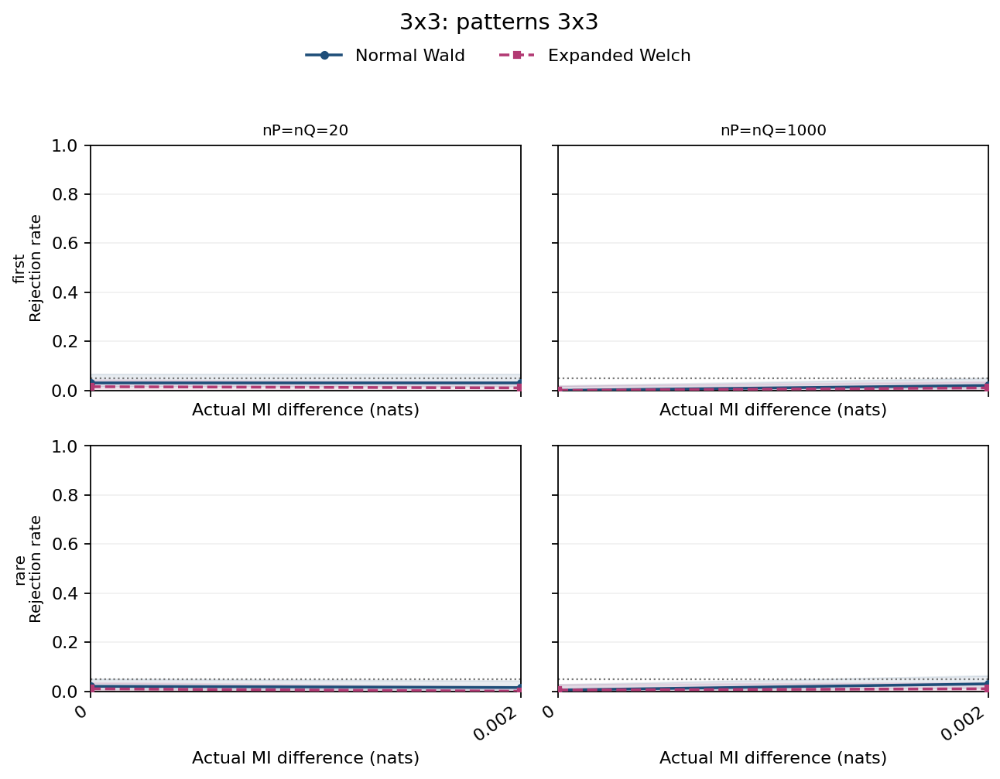

| Specification | Setting |
| --- | --- |
| Table size | 3x3 |
| Horizontal graph regime specifications (columns) | nP=nQ=20, nP=nQ=1000 |
| Vertical graph regime specifications (rows) | first: P row (0.7, 0.3/2 repeated 2 times), P column (0.7, 0.3/2 repeated 2 times); Q row (0.8, 0.2/2 repeated 2 times), Q column (0.8, 0.2/2 repeated 2 times); rare: P row (0.7, 0.3/2 repeated 2 times), P column (0.7, 0.3/2 repeated 2 times); Q row (0.8, 0.2/2 repeated 2 times), Q column (0.8, 0.2/2 repeated 2 times) |
| Probability changes | first: additive, first changes in P and Q; rare: additive, rare changes in P and Q |
| MI settings | Baseline MI {0.0001}; direction {q higher}; actual differences {0, 0.002} nats |
| Horizontal axis within each graph | Actual MI difference in nats, fixed from 0 to 0.002 |
| Vertical axis within each graph | Unconditional rejection rate from 0 to 1; invalid results count as non-rejections |
| Replicates | 200 per unique point |

Null-point rejection and validity:

| Vertical regime | Horizontal regime | Method | Rejection | Valid |
| --- | --- | --- | --- | --- |
| first | nP=nQ=1000 | Expanded Welch | 0.0000 | 1.0000 |
| first | nP=nQ=1000 | Normal Wald | 0.0000 | 1.0000 |
| first | nP=nQ=20 | Expanded Welch | 0.0150 | 0.9600 |
| first | nP=nQ=20 | Normal Wald | 0.0300 | 1.0000 |
| rare | nP=nQ=1000 | Expanded Welch | 0.0050 | 1.0000 |
| rare | nP=nQ=1000 | Normal Wald | 0.0050 | 1.0000 |
| rare | nP=nQ=20 | Expanded Welch | 0.0100 | 0.9950 |
| rare | nP=nQ=20 | Normal Wald | 0.0200 | 1.0000 |

Every plotted rate, interval, validity and minimum expected count

| Vertical regime | Horizontal regime | x | Method | Rejection | 95% interval | Valid | Conditional | Min expected P | Min expected Q |
| --- | --- | --- | --- | --- | --- | --- | --- | --- | --- |
| first | nP=nQ=1000 | 0 | Expanded Welch | 0.0000 | [0.0000, 0.0188] | 1.0000 | 0.0000 | 22.5 | 10 |
| first | nP=nQ=1000 | 0 | Normal Wald | 0.0000 | [0.0000, 0.0188] | 1.0000 | 0.0000 | 22.5 | 10 |
| first | nP=nQ=1000 | 0.002 | Expanded Welch | 0.0100 | [0.0027, 0.0357] | 1.0000 | 0.0100 | 22.5 | 10 |
| first | nP=nQ=1000 | 0.002 | Normal Wald | 0.0200 | [0.0078, 0.0503] | 1.0000 | 0.0200 | 22.5 | 10 |
| first | nP=nQ=20 | 0 | Expanded Welch | 0.0150 | [0.0051, 0.0432] | 0.9600 | 0.0156 | 0.45 | 0.2 |
| first | nP=nQ=20 | 0 | Normal Wald | 0.0300 | [0.0138, 0.0639] | 1.0000 | 0.0300 | 0.45 | 0.2 |
| first | nP=nQ=20 | 0.002 | Expanded Welch | 0.0100 | [0.0027, 0.0357] | 0.9700 | 0.0103 | 0.45 | 0.2 |
| first | nP=nQ=20 | 0.002 | Normal Wald | 0.0300 | [0.0138, 0.0639] | 1.0000 | 0.0300 | 0.45 | 0.2 |
| rare | nP=nQ=1000 | 0 | Expanded Welch | 0.0050 | [0.0009, 0.0278] | 1.0000 | 0.0050 | 21.44 | 9.293 |
| rare | nP=nQ=1000 | 0 | Normal Wald | 0.0050 | [0.0009, 0.0278] | 1.0000 | 0.0050 | 21.44 | 9.293 |
| rare | nP=nQ=1000 | 0.002 | Expanded Welch | 0.0100 | [0.0027, 0.0357] | 1.0000 | 0.0100 | 21.44 | 6.788 |
| rare | nP=nQ=1000 | 0.002 | Normal Wald | 0.0300 | [0.0138, 0.0639] | 1.0000 | 0.0300 | 21.44 | 6.788 |
| rare | nP=nQ=20 | 0 | Expanded Welch | 0.0100 | [0.0027, 0.0357] | 0.9950 | 0.0101 | 0.4288 | 0.1859 |
| rare | nP=nQ=20 | 0 | Normal Wald | 0.0200 | [0.0078, 0.0503] | 1.0000 | 0.0200 | 0.4288 | 0.1859 |
| rare | nP=nQ=20 | 0.002 | Expanded Welch | 0.0000 | [0.0000, 0.0188] | 0.9850 | 0.0000 | 0.4288 | 0.1358 |
| rare | nP=nQ=20 | 0.002 | Normal Wald | 0.0150 | [0.0051, 0.0432] | 1.0000 | 0.0150 | 0.4288 | 0.1358 |

### 5.2 5x5: patterns 5x5

Does performance change when dependence is placed in common, rare or many cells?

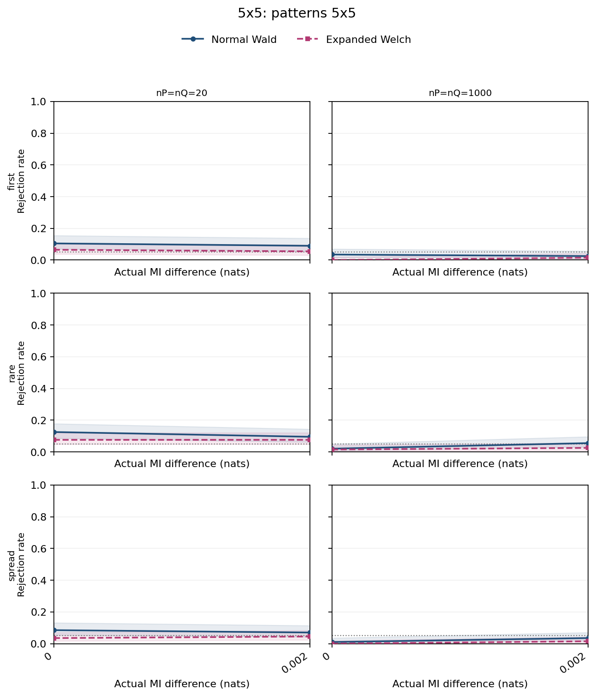

| Specification | Setting |
| --- | --- |
| Table size | 5x5 |
| Horizontal graph regime specifications (columns) | nP=nQ=20, nP=nQ=1000 |
| Vertical graph regime specifications (rows) | first: P row (0.7, 0.3/4 repeated 4 times), P column (0.7, 0.3/4 repeated 4 times); Q row (0.8, 0.2/4 repeated 4 times), Q column (0.8, 0.2/4 repeated 4 times); rare: P row (0.7, 0.3/4 repeated 4 times), P column (0.7, 0.3/4 repeated 4 times); Q row (0.8, 0.2/4 repeated 4 times), Q column (0.8, 0.2/4 repeated 4 times); spread: P row (0.7, 0.3/4 repeated 4 times), P column (0.7, 0.3/4 repeated 4 times); Q row (0.8, 0.2/4 repeated 4 times), Q column (0.8, 0.2/4 repeated 4 times) |
| Probability changes | first: additive, first changes in P and Q; rare: additive, rare changes in P and Q; spread: additive, spread changes in P and Q |
| MI settings | Baseline MI {0.0001}; direction {q higher}; actual differences {0, 0.002} nats |
| Horizontal axis within each graph | Actual MI difference in nats, fixed from 0 to 0.002 |
| Vertical axis within each graph | Unconditional rejection rate from 0 to 1; invalid results count as non-rejections |
| Replicates | 200 per unique point |

Null-point rejection and validity:

| Vertical regime | Horizontal regime | Method | Rejection | Valid |
| --- | --- | --- | --- | --- |
| first | nP=nQ=1000 | Expanded Welch | 0.0000 | 1.0000 |
| first | nP=nQ=1000 | Normal Wald | 0.0350 | 1.0000 |
| first | nP=nQ=20 | Expanded Welch | 0.0650 | 0.9850 |
| first | nP=nQ=20 | Normal Wald | 0.1050 | 1.0000 |
| rare | nP=nQ=1000 | Expanded Welch | 0.0150 | 1.0000 |
| rare | nP=nQ=1000 | Normal Wald | 0.0200 | 1.0000 |
| rare | nP=nQ=20 | Expanded Welch | 0.0750 | 0.9700 |
| rare | nP=nQ=20 | Normal Wald | 0.1250 | 1.0000 |
| spread | nP=nQ=1000 | Expanded Welch | 0.0000 | 1.0000 |
| spread | nP=nQ=1000 | Normal Wald | 0.0100 | 1.0000 |
| spread | nP=nQ=20 | Expanded Welch | 0.0350 | 0.9800 |
| spread | nP=nQ=20 | Normal Wald | 0.0850 | 1.0000 |

Every plotted rate, interval, validity and minimum expected count

| Vertical regime | Horizontal regime | x | Method | Rejection | 95% interval | Valid | Conditional | Min expected P | Min expected Q |
| --- | --- | --- | --- | --- | --- | --- | --- | --- | --- |
| first | nP=nQ=1000 | 0 | Expanded Welch | 0.0000 | [0.0000, 0.0188] | 1.0000 | 0.0000 | 5.625 | 2.5 |
| first | nP=nQ=1000 | 0 | Normal Wald | 0.0350 | [0.0171, 0.0705] | 1.0000 | 0.0350 | 5.625 | 2.5 |
| first | nP=nQ=1000 | 0.002 | Expanded Welch | 0.0150 | [0.0051, 0.0432] | 1.0000 | 0.0150 | 5.625 | 2.5 |
| first | nP=nQ=1000 | 0.002 | Normal Wald | 0.0250 | [0.0107, 0.0572] | 1.0000 | 0.0250 | 5.625 | 2.5 |
| first | nP=nQ=20 | 0 | Expanded Welch | 0.0650 | [0.0384, 0.1080] | 0.9850 | 0.0660 | 0.1125 | 0.05 |
| first | nP=nQ=20 | 0 | Normal Wald | 0.1050 | [0.0697, 0.1552] | 1.0000 | 0.1050 | 0.1125 | 0.05 |
| first | nP=nQ=20 | 0.002 | Expanded Welch | 0.0550 | [0.0310, 0.0958] | 0.9700 | 0.0567 | 0.1125 | 0.05 |
| first | nP=nQ=20 | 0.002 | Normal Wald | 0.0900 | [0.0577, 0.1378] | 1.0000 | 0.0900 | 0.1125 | 0.05 |
| rare | nP=nQ=1000 | 0 | Expanded Welch | 0.0150 | [0.0051, 0.0432] | 1.0000 | 0.0150 | 5.095 | 2.147 |
| rare | nP=nQ=1000 | 0 | Normal Wald | 0.0200 | [0.0078, 0.0503] | 1.0000 | 0.0200 | 5.095 | 2.147 |
| rare | nP=nQ=1000 | 0.002 | Expanded Welch | 0.0250 | [0.0107, 0.0572] | 1.0000 | 0.0250 | 5.095 | 0.9394 |
| rare | nP=nQ=1000 | 0.002 | Normal Wald | 0.0550 | [0.0310, 0.0958] | 1.0000 | 0.0550 | 5.095 | 0.9394 |
| rare | nP=nQ=20 | 0 | Expanded Welch | 0.0750 | [0.0460, 0.1200] | 0.9700 | 0.0773 | 0.1019 | 0.04294 |
| rare | nP=nQ=20 | 0 | Normal Wald | 0.1250 | [0.0861, 0.1780] | 1.0000 | 0.1250 | 0.1019 | 0.04294 |
| rare | nP=nQ=20 | 0.002 | Expanded Welch | 0.0750 | [0.0460, 0.1200] | 0.9850 | 0.0761 | 0.1019 | 0.01879 |
| rare | nP=nQ=20 | 0.002 | Normal Wald | 0.0950 | [0.0617, 0.1436] | 1.0000 | 0.0950 | 0.1019 | 0.01879 |
| spread | nP=nQ=1000 | 0 | Expanded Welch | 0.0000 | [0.0000, 0.0188] | 1.0000 | 0.0000 | 5.293 | 2.271 |
| spread | nP=nQ=1000 | 0 | Normal Wald | 0.0100 | [0.0027, 0.0357] | 1.0000 | 0.0100 | 5.293 | 2.271 |
| spread | nP=nQ=1000 | 0.002 | Expanded Welch | 0.0150 | [0.0051, 0.0432] | 1.0000 | 0.0150 | 5.293 | 1.426 |
| spread | nP=nQ=1000 | 0.002 | Normal Wald | 0.0350 | [0.0171, 0.0705] | 1.0000 | 0.0350 | 5.293 | 1.426 |
| spread | nP=nQ=20 | 0 | Expanded Welch | 0.0350 | [0.0171, 0.0705] | 0.9800 | 0.0357 | 0.1059 | 0.04542 |
| spread | nP=nQ=20 | 0 | Normal Wald | 0.0850 | [0.0537, 0.1319] | 1.0000 | 0.0850 | 0.1059 | 0.04542 |
| spread | nP=nQ=20 | 0.002 | Expanded Welch | 0.0450 | [0.0239, 0.0833] | 0.9900 | 0.0455 | 0.1059 | 0.02852 |
| spread | nP=nQ=20 | 0.002 | Normal Wald | 0.0700 | [0.0422, 0.1141] | 1.0000 | 0.0700 | 0.1059 | 0.02852 |

### 5.3 8x8: patterns 8x8

Does performance change when dependence is placed in common, rare or many cells?

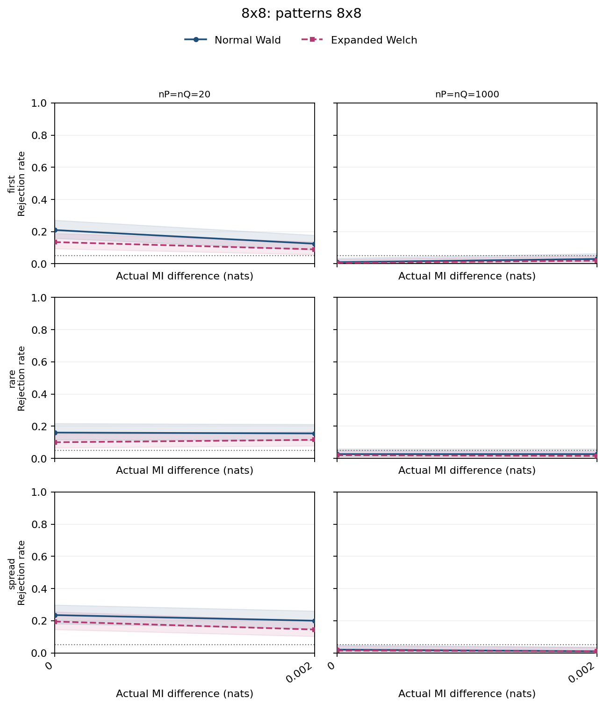

| Specification | Setting |
| --- | --- |
| Table size | 8x8 |
| Horizontal graph regime specifications (columns) | nP=nQ=20, nP=nQ=1000 |
| Vertical graph regime specifications (rows) | first: P row (0.7, 0.3/7 repeated 7 times), P column (0.7, 0.3/7 repeated 7 times); Q row (0.8, 0.2/7 repeated 7 times), Q column (0.8, 0.2/7 repeated 7 times); rare: P row (0.7, 0.3/7 repeated 7 times), P column (0.7, 0.3/7 repeated 7 times); Q row (0.8, 0.2/7 repeated 7 times), Q column (0.8, 0.2/7 repeated 7 times); spread: P row (0.7, 0.3/7 repeated 7 times), P column (0.7, 0.3/7 repeated 7 times); Q row (0.8, 0.2/7 repeated 7 times), Q column (0.8, 0.2/7 repeated 7 times) |
| Probability changes | first: additive, first changes in P and Q; rare: additive, rare changes in P and Q; spread: additive, spread changes in P and Q |
| MI settings | Baseline MI {0.0001}; direction {q higher}; actual differences {0, 0.002} nats |
| Horizontal axis within each graph | Actual MI difference in nats, fixed from 0 to 0.002 |
| Vertical axis within each graph | Unconditional rejection rate from 0 to 1; invalid results count as non-rejections |
| Replicates | 200 per unique point |

Null-point rejection and validity:

| Vertical regime | Horizontal regime | Method | Rejection | Valid |
| --- | --- | --- | --- | --- |
| first | nP=nQ=1000 | Expanded Welch | 0.0050 | 1.0000 |
| first | nP=nQ=1000 | Normal Wald | 0.0100 | 1.0000 |
| first | nP=nQ=20 | Expanded Welch | 0.1350 | 0.9500 |
| first | nP=nQ=20 | Normal Wald | 0.2100 | 1.0000 |
| rare | nP=nQ=1000 | Expanded Welch | 0.0200 | 1.0000 |
| rare | nP=nQ=1000 | Normal Wald | 0.0250 | 1.0000 |
| rare | nP=nQ=20 | Expanded Welch | 0.1000 | 0.9950 |
| rare | nP=nQ=20 | Normal Wald | 0.1600 | 1.0000 |
| spread | nP=nQ=1000 | Expanded Welch | 0.0150 | 1.0000 |
| spread | nP=nQ=1000 | Normal Wald | 0.0200 | 1.0000 |
| spread | nP=nQ=20 | Expanded Welch | 0.1950 | 0.9750 |
| spread | nP=nQ=20 | Normal Wald | 0.2350 | 1.0000 |

Every plotted rate, interval, validity and minimum expected count

| Vertical regime | Horizontal regime | x | Method | Rejection | 95% interval | Valid | Conditional | Min expected P | Min expected Q |
| --- | --- | --- | --- | --- | --- | --- | --- | --- | --- |
| first | nP=nQ=1000 | 0 | Expanded Welch | 0.0050 | [0.0009, 0.0278] | 1.0000 | 0.0050 | 1.837 | 0.8163 |
| first | nP=nQ=1000 | 0 | Normal Wald | 0.0100 | [0.0027, 0.0357] | 1.0000 | 0.0100 | 1.837 | 0.8163 |
| first | nP=nQ=1000 | 0.002 | Expanded Welch | 0.0200 | [0.0078, 0.0503] | 1.0000 | 0.0200 | 1.837 | 0.8163 |
| first | nP=nQ=1000 | 0.002 | Normal Wald | 0.0300 | [0.0138, 0.0639] | 1.0000 | 0.0300 | 1.837 | 0.8163 |
| first | nP=nQ=20 | 0 | Expanded Welch | 0.1350 | [0.0945, 0.1893] | 0.9500 | 0.1421 | 0.03673 | 0.01633 |
| first | nP=nQ=20 | 0 | Normal Wald | 0.2100 | [0.1593, 0.2716] | 1.0000 | 0.2100 | 0.03673 | 0.01633 |
| first | nP=nQ=20 | 0.002 | Expanded Welch | 0.0900 | [0.0577, 0.1378] | 0.9800 | 0.0918 | 0.03673 | 0.01633 |
| first | nP=nQ=20 | 0.002 | Normal Wald | 0.1250 | [0.0861, 0.1780] | 1.0000 | 0.1250 | 0.03673 | 0.01633 |
| rare | nP=nQ=1000 | 0 | Expanded Welch | 0.0200 | [0.0078, 0.0503] | 1.0000 | 0.0200 | 1.534 | 0.6153 |
| rare | nP=nQ=1000 | 0 | Normal Wald | 0.0250 | [0.0107, 0.0572] | 1.0000 | 0.0250 | 1.534 | 0.6153 |
| rare | nP=nQ=1000 | 0.002 | Expanded Welch | 0.0150 | [0.0051, 0.0432] | 1.0000 | 0.0150 | 1.534 | 0.01423 |
| rare | nP=nQ=1000 | 0.002 | Normal Wald | 0.0250 | [0.0107, 0.0572] | 1.0000 | 0.0250 | 1.534 | 0.01423 |
| rare | nP=nQ=20 | 0 | Expanded Welch | 0.1000 | [0.0657, 0.1494] | 0.9950 | 0.1005 | 0.03069 | 0.01231 |
| rare | nP=nQ=20 | 0 | Normal Wald | 0.1600 | [0.1157, 0.2171] | 1.0000 | 0.1600 | 0.03069 | 0.01231 |
| rare | nP=nQ=20 | 0.002 | Expanded Welch | 0.1150 | [0.0779, 0.1666] | 0.9950 | 0.1156 | 0.03069 | 0.0002847 |
| rare | nP=nQ=20 | 0.002 | Normal Wald | 0.1550 | [0.1114, 0.2116] | 1.0000 | 0.1550 | 0.03069 | 0.0002847 |
| spread | nP=nQ=1000 | 0 | Expanded Welch | 0.0150 | [0.0051, 0.0432] | 1.0000 | 0.0150 | 1.662 | 0.6987 |
| spread | nP=nQ=1000 | 0 | Normal Wald | 0.0200 | [0.0078, 0.0503] | 1.0000 | 0.0200 | 1.662 | 0.6987 |
| spread | nP=nQ=1000 | 0.002 | Expanded Welch | 0.0100 | [0.0027, 0.0357] | 1.0000 | 0.0100 | 1.662 | 0.2813 |
| spread | nP=nQ=1000 | 0.002 | Normal Wald | 0.0100 | [0.0027, 0.0357] | 1.0000 | 0.0100 | 1.662 | 0.2813 |
| spread | nP=nQ=20 | 0 | Expanded Welch | 0.1950 | [0.1461, 0.2554] | 0.9750 | 0.2000 | 0.03325 | 0.01397 |
| spread | nP=nQ=20 | 0 | Normal Wald | 0.2350 | [0.1816, 0.2984] | 1.0000 | 0.2350 | 0.03325 | 0.01397 |
| spread | nP=nQ=20 | 0.002 | Expanded Welch | 0.1450 | [0.1029, 0.2005] | 0.9850 | 0.1472 | 0.03325 | 0.005627 |
| spread | nP=nQ=20 | 0.002 | Normal Wald | 0.2000 | [0.1505, 0.2609] | 1.0000 | 0.2000 | 0.03325 | 0.005627 |

## 6. Unequal sample sizes and MI direction

Does performance depend on which population has more data or greater MI?

### 6.1 2x2: imbalance 2x2 uniform a

Does performance depend on which population has more data or greater MI?

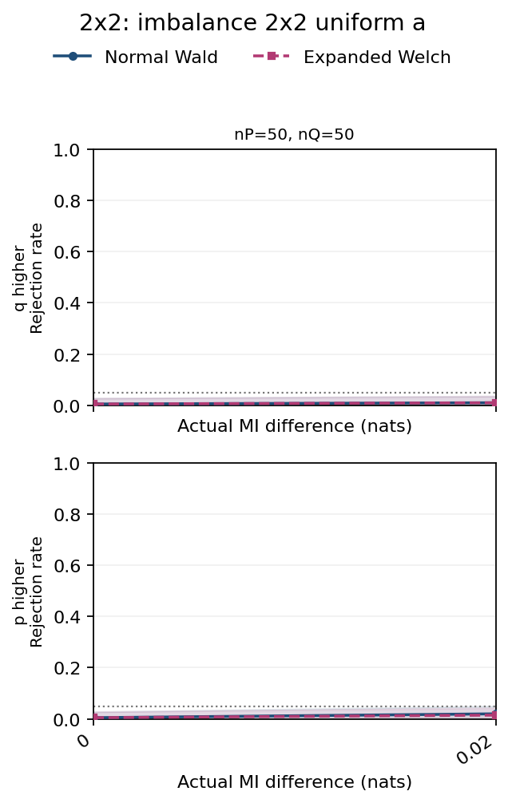

| Specification | Setting |
| --- | --- |
| Table size | 2x2 |
| Horizontal graph regime specifications (columns) | nP=50, nQ=50 |
| Vertical graph regime specifications (rows) | q higher: P row (0.5 repeated 2 times), P column (0.5 repeated 2 times); Q row (0.5 repeated 2 times), Q column (0.5 repeated 2 times); p higher: P row (0.5 repeated 2 times), P column (0.5 repeated 2 times); Q row (0.5 repeated 2 times), Q column (0.5 repeated 2 times) |
| Probability changes | q higher: additive, first changes in P and Q; p higher: additive, first changes in P and Q |
| MI settings | Baseline MI {0.02}; direction {q higher, p higher}; actual differences {0, 0.02} nats |
| Horizontal axis within each graph | Actual MI difference in nats, fixed from 0 to 0.02 |
| Vertical axis within each graph | Unconditional rejection rate from 0 to 1; invalid results count as non-rejections |
| Replicates | 200 per unique point |

Null-point rejection and validity:

| Vertical regime | Horizontal regime | Method | Rejection | Valid |
| --- | --- | --- | --- | --- |
| p higher | nP=50, nQ=50 | Expanded Welch | 0.0050 | 0.9900 |
| p higher | nP=50, nQ=50 | Normal Wald | 0.0050 | 1.0000 |
| q higher | nP=50, nQ=50 | Expanded Welch | 0.0050 | 0.9900 |
| q higher | nP=50, nQ=50 | Normal Wald | 0.0050 | 1.0000 |

Every plotted rate, interval, validity and minimum expected count

| Vertical regime | Horizontal regime | x | Method | Rejection | 95% interval | Valid | Conditional | Min expected P | Min expected Q |
| --- | --- | --- | --- | --- | --- | --- | --- | --- | --- |
| p higher | nP=50, nQ=50 | 0 | Expanded Welch | 0.0050 | [0.0009, 0.0278] | 0.9900 | 0.0051 | 10.01 | 10.01 |
| p higher | nP=50, nQ=50 | 0 | Normal Wald | 0.0050 | [0.0009, 0.0278] | 1.0000 | 0.0050 | 10.01 | 10.01 |
| p higher | nP=50, nQ=50 | 0.02 | Expanded Welch | 0.0150 | [0.0051, 0.0432] | 0.9950 | 0.0151 | 8.988 | 10.01 |
| p higher | nP=50, nQ=50 | 0.02 | Normal Wald | 0.0200 | [0.0078, 0.0503] | 1.0000 | 0.0200 | 8.988 | 10.01 |
| q higher | nP=50, nQ=50 | 0 | Expanded Welch | 0.0050 | [0.0009, 0.0278] | 0.9900 | 0.0051 | 10.01 | 10.01 |
| q higher | nP=50, nQ=50 | 0 | Normal Wald | 0.0050 | [0.0009, 0.0278] | 1.0000 | 0.0050 | 10.01 | 10.01 |
| q higher | nP=50, nQ=50 | 0.02 | Expanded Welch | 0.0100 | [0.0027, 0.0357] | 0.9950 | 0.0101 | 10.01 | 8.988 |
| q higher | nP=50, nQ=50 | 0.02 | Normal Wald | 0.0100 | [0.0027, 0.0357] | 1.0000 | 0.0100 | 10.01 | 8.988 |

### 6.2 2x2: imbalance 2x2 uniform b

Does performance depend on which population has more data or greater MI?

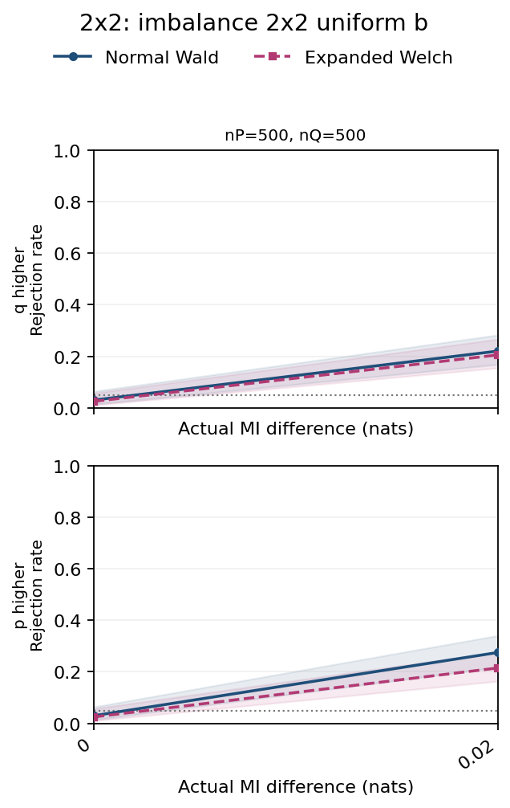

| Specification | Setting |
| --- | --- |
| Table size | 2x2 |
| Horizontal graph regime specifications (columns) | nP=500, nQ=500 |
| Vertical graph regime specifications (rows) | q higher: P row (0.5 repeated 2 times), P column (0.5 repeated 2 times); Q row (0.5 repeated 2 times), Q column (0.5 repeated 2 times); p higher: P row (0.5 repeated 2 times), P column (0.5 repeated 2 times); Q row (0.5 repeated 2 times), Q column (0.5 repeated 2 times) |
| Probability changes | q higher: additive, first changes in P and Q; p higher: additive, first changes in P and Q |
| MI settings | Baseline MI {0.02}; direction {q higher, p higher}; actual differences {0, 0.02} nats |
| Horizontal axis within each graph | Actual MI difference in nats, fixed from 0 to 0.02 |
| Vertical axis within each graph | Unconditional rejection rate from 0 to 1; invalid results count as non-rejections |
| Replicates | 200 per unique point |

Null-point rejection and validity:

| Vertical regime | Horizontal regime | Method | Rejection | Valid |
| --- | --- | --- | --- | --- |
| p higher | nP=500, nQ=500 | Expanded Welch | 0.0250 | 1.0000 |
| p higher | nP=500, nQ=500 | Normal Wald | 0.0300 | 1.0000 |
| q higher | nP=500, nQ=500 | Expanded Welch | 0.0250 | 1.0000 |
| q higher | nP=500, nQ=500 | Normal Wald | 0.0300 | 1.0000 |

Every plotted rate, interval, validity and minimum expected count

| Vertical regime | Horizontal regime | x | Method | Rejection | 95% interval | Valid | Conditional | Min expected P | Min expected Q |
| --- | --- | --- | --- | --- | --- | --- | --- | --- | --- |
| p higher | nP=500, nQ=500 | 0 | Expanded Welch | 0.0250 | [0.0107, 0.0572] | 1.0000 | 0.0250 | 100.1 | 100.1 |
| p higher | nP=500, nQ=500 | 0 | Normal Wald | 0.0300 | [0.0138, 0.0639] | 1.0000 | 0.0300 | 100.1 | 100.1 |
| p higher | nP=500, nQ=500 | 0.02 | Expanded Welch | 0.2150 | [0.1637, 0.2770] | 1.0000 | 0.2150 | 89.88 | 100.1 |
| p higher | nP=500, nQ=500 | 0.02 | Normal Wald | 0.2750 | [0.2178, 0.3407] | 1.0000 | 0.2750 | 89.88 | 100.1 |
| q higher | nP=500, nQ=500 | 0 | Expanded Welch | 0.0250 | [0.0107, 0.0572] | 1.0000 | 0.0250 | 100.1 | 100.1 |
| q higher | nP=500, nQ=500 | 0 | Normal Wald | 0.0300 | [0.0138, 0.0639] | 1.0000 | 0.0300 | 100.1 | 100.1 |
| q higher | nP=500, nQ=500 | 0.02 | Expanded Welch | 0.2050 | [0.1549, 0.2663] | 1.0000 | 0.2050 | 100.1 | 89.88 |
| q higher | nP=500, nQ=500 | 0.02 | Normal Wald | 0.2200 | [0.1682, 0.2824] | 1.0000 | 0.2200 | 100.1 | 89.88 |

### 6.3 2x2: imbalance 2x2 same skew a

Does performance depend on which population has more data or greater MI?

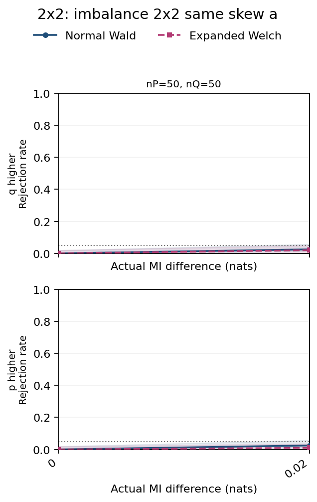

| Specification | Setting |
| --- | --- |
| Table size | 2x2 |
| Horizontal graph regime specifications (columns) | nP=50, nQ=50 |
| Vertical graph regime specifications (rows) | q higher: P row (0.8, 0.2), P column (0.8, 0.2); Q row (0.8, 0.2), Q column (0.8, 0.2); p higher: P row (0.8, 0.2), P column (0.8, 0.2); Q row (0.8, 0.2), Q column (0.8, 0.2) |
| Probability changes | q higher: additive, first changes in P and Q; p higher: additive, first changes in P and Q |
| MI settings | Baseline MI {0.02}; direction {q higher, p higher}; actual differences {0, 0.02} nats |
| Horizontal axis within each graph | Actual MI difference in nats, fixed from 0 to 0.02 |
| Vertical axis within each graph | Unconditional rejection rate from 0 to 1; invalid results count as non-rejections |
| Replicates | 200 per unique point |

Null-point rejection and validity:

| Vertical regime | Horizontal regime | Method | Rejection | Valid |
| --- | --- | --- | --- | --- |
| p higher | nP=50, nQ=50 | Expanded Welch | 0.0000 | 1.0000 |
| p higher | nP=50, nQ=50 | Normal Wald | 0.0000 | 1.0000 |
| q higher | nP=50, nQ=50 | Expanded Welch | 0.0000 | 1.0000 |
| q higher | nP=50, nQ=50 | Normal Wald | 0.0000 | 1.0000 |

Every plotted rate, interval, validity and minimum expected count

| Vertical regime | Horizontal regime | x | Method | Rejection | 95% interval | Valid | Conditional | Min expected P | Min expected Q |
| --- | --- | --- | --- | --- | --- | --- | --- | --- | --- |
| p higher | nP=50, nQ=50 | 0 | Expanded Welch | 0.0000 | [0.0000, 0.0188] | 1.0000 | 0.0000 | 3.691 | 3.691 |
| p higher | nP=50, nQ=50 | 0 | Normal Wald | 0.0000 | [0.0000, 0.0188] | 1.0000 | 0.0000 | 3.691 | 3.691 |
| p higher | nP=50, nQ=50 | 0.02 | Expanded Welch | 0.0100 | [0.0027, 0.0357] | 1.0000 | 0.0100 | 4.424 | 3.691 |
| p higher | nP=50, nQ=50 | 0.02 | Normal Wald | 0.0250 | [0.0107, 0.0572] | 1.0000 | 0.0250 | 4.424 | 3.691 |
| q higher | nP=50, nQ=50 | 0 | Expanded Welch | 0.0000 | [0.0000, 0.0188] | 1.0000 | 0.0000 | 3.691 | 3.691 |
| q higher | nP=50, nQ=50 | 0 | Normal Wald | 0.0000 | [0.0000, 0.0188] | 1.0000 | 0.0000 | 3.691 | 3.691 |
| q higher | nP=50, nQ=50 | 0.02 | Expanded Welch | 0.0200 | [0.0078, 0.0503] | 1.0000 | 0.0200 | 3.691 | 4.424 |
| q higher | nP=50, nQ=50 | 0.02 | Normal Wald | 0.0250 | [0.0107, 0.0572] | 1.0000 | 0.0250 | 3.691 | 4.424 |

### 6.4 2x2: imbalance 2x2 same skew b

Does performance depend on which population has more data or greater MI?

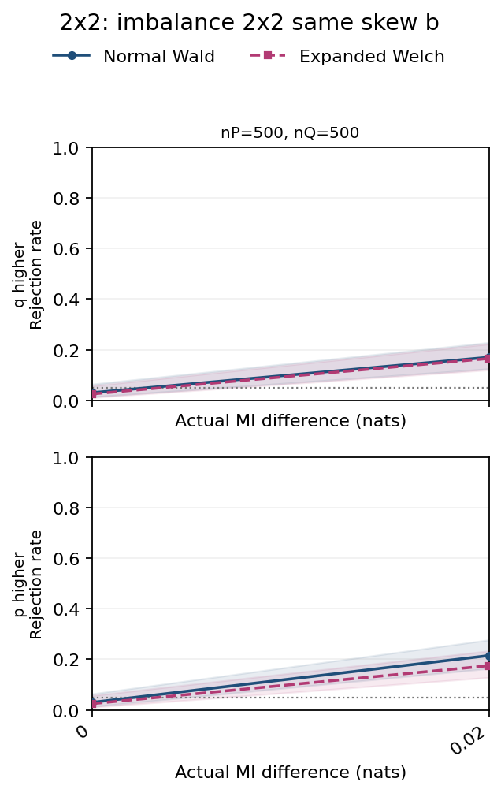

| Specification | Setting |
| --- | --- |
| Table size | 2x2 |
| Horizontal graph regime specifications (columns) | nP=500, nQ=500 |
| Vertical graph regime specifications (rows) | q higher: P row (0.8, 0.2), P column (0.8, 0.2); Q row (0.8, 0.2), Q column (0.8, 0.2); p higher: P row (0.8, 0.2), P column (0.8, 0.2); Q row (0.8, 0.2), Q column (0.8, 0.2) |
| Probability changes | q higher: additive, first changes in P and Q; p higher: additive, first changes in P and Q |
| MI settings | Baseline MI {0.02}; direction {q higher, p higher}; actual differences {0, 0.02} nats |
| Horizontal axis within each graph | Actual MI difference in nats, fixed from 0 to 0.02 |
| Vertical axis within each graph | Unconditional rejection rate from 0 to 1; invalid results count as non-rejections |
| Replicates | 200 per unique point |

Null-point rejection and validity:

| Vertical regime | Horizontal regime | Method | Rejection | Valid |
| --- | --- | --- | --- | --- |
| p higher | nP=500, nQ=500 | Expanded Welch | 0.0250 | 1.0000 |
| p higher | nP=500, nQ=500 | Normal Wald | 0.0300 | 1.0000 |
| q higher | nP=500, nQ=500 | Expanded Welch | 0.0250 | 1.0000 |
| q higher | nP=500, nQ=500 | Normal Wald | 0.0300 | 1.0000 |

Every plotted rate, interval, validity and minimum expected count

| Vertical regime | Horizontal regime | x | Method | Rejection | 95% interval | Valid | Conditional | Min expected P | Min expected Q |
| --- | --- | --- | --- | --- | --- | --- | --- | --- | --- |
| p higher | nP=500, nQ=500 | 0 | Expanded Welch | 0.0250 | [0.0107, 0.0572] | 1.0000 | 0.0250 | 36.91 | 36.91 |
| p higher | nP=500, nQ=500 | 0 | Normal Wald | 0.0300 | [0.0138, 0.0639] | 1.0000 | 0.0300 | 36.91 | 36.91 |
| p higher | nP=500, nQ=500 | 0.02 | Expanded Welch | 0.1750 | [0.1286, 0.2336] | 1.0000 | 0.1750 | 44.24 | 36.91 |
| p higher | nP=500, nQ=500 | 0.02 | Normal Wald | 0.2150 | [0.1637, 0.2770] | 1.0000 | 0.2150 | 44.24 | 36.91 |
| q higher | nP=500, nQ=500 | 0 | Expanded Welch | 0.0250 | [0.0107, 0.0572] | 1.0000 | 0.0250 | 36.91 | 36.91 |
| q higher | nP=500, nQ=500 | 0 | Normal Wald | 0.0300 | [0.0138, 0.0639] | 1.0000 | 0.0300 | 36.91 | 36.91 |
| q higher | nP=500, nQ=500 | 0.02 | Expanded Welch | 0.1650 | [0.1200, 0.2227] | 1.0000 | 0.1650 | 36.91 | 44.24 |
| q higher | nP=500, nQ=500 | 0.02 | Normal Wald | 0.1700 | [0.1243, 0.2282] | 1.0000 | 0.1700 | 36.91 | 44.24 |

### 6.5 2x2: imbalance 2x2 different skew a

Does performance depend on which population has more data or greater MI?

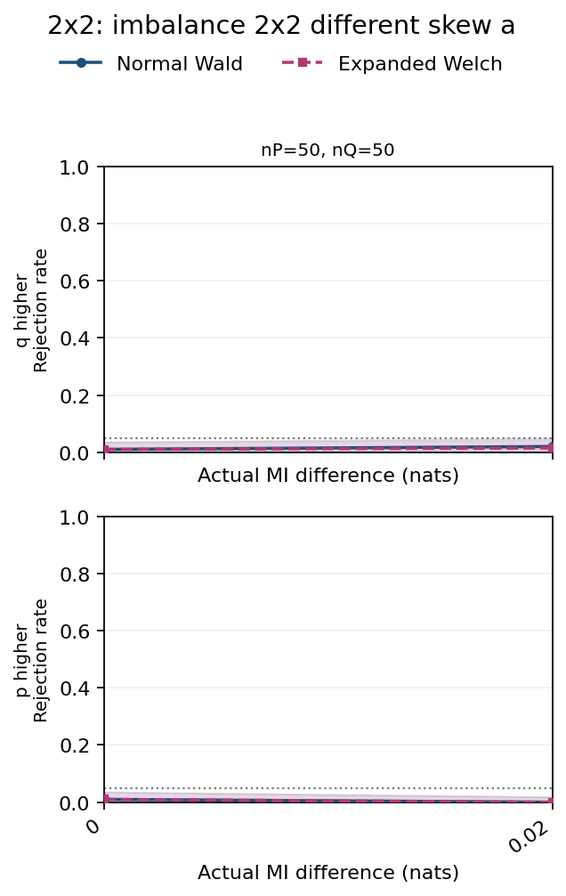

| Specification | Setting |
| --- | --- |
| Table size | 2x2 |
| Horizontal graph regime specifications (columns) | nP=50, nQ=50 |
| Vertical graph regime specifications (rows) | q higher: P row (0.7, 0.3), P column (0.7, 0.3); Q row (0.8, 0.2), Q column (0.8, 0.2); p higher: P row (0.7, 0.3), P column (0.7, 0.3); Q row (0.8, 0.2), Q column (0.8, 0.2) |
| Probability changes | q higher: additive, first changes in P and Q; p higher: additive, first changes in P and Q |
| MI settings | Baseline MI {0.02}; direction {q higher, p higher}; actual differences {0, 0.02} nats |
| Horizontal axis within each graph | Actual MI difference in nats, fixed from 0 to 0.02 |
| Vertical axis within each graph | Unconditional rejection rate from 0 to 1; invalid results count as non-rejections |
| Replicates | 200 per unique point |

Null-point rejection and validity:

| Vertical regime | Horizontal regime | Method | Rejection | Valid |
| --- | --- | --- | --- | --- |
| p higher | nP=50, nQ=50 | Expanded Welch | 0.0100 | 1.0000 |
| p higher | nP=50, nQ=50 | Normal Wald | 0.0100 | 1.0000 |
| q higher | nP=50, nQ=50 | Expanded Welch | 0.0100 | 1.0000 |
| q higher | nP=50, nQ=50 | Normal Wald | 0.0100 | 1.0000 |

Every plotted rate, interval, validity and minimum expected count

| Vertical regime | Horizontal regime | x | Method | Rejection | 95% interval | Valid | Conditional | Min expected P | Min expected Q |
| --- | --- | --- | --- | --- | --- | --- | --- | --- | --- |
| p higher | nP=50, nQ=50 | 0 | Expanded Welch | 0.0100 | [0.0027, 0.0357] | 1.0000 | 0.0100 | 6.636 | 3.691 |
| p higher | nP=50, nQ=50 | 0 | Normal Wald | 0.0100 | [0.0027, 0.0357] | 1.0000 | 0.0100 | 6.636 | 3.691 |
| p higher | nP=50, nQ=50 | 0.02 | Expanded Welch | 0.0000 | [0.0000, 0.0188] | 1.0000 | 0.0000 | 7.47 | 3.691 |
| p higher | nP=50, nQ=50 | 0.02 | Normal Wald | 0.0000 | [0.0000, 0.0188] | 1.0000 | 0.0000 | 7.47 | 3.691 |
| q higher | nP=50, nQ=50 | 0 | Expanded Welch | 0.0100 | [0.0027, 0.0357] | 1.0000 | 0.0100 | 6.636 | 3.691 |
| q higher | nP=50, nQ=50 | 0 | Normal Wald | 0.0100 | [0.0027, 0.0357] | 1.0000 | 0.0100 | 6.636 | 3.691 |
| q higher | nP=50, nQ=50 | 0.02 | Expanded Welch | 0.0150 | [0.0051, 0.0432] | 1.0000 | 0.0150 | 6.636 | 4.424 |
| q higher | nP=50, nQ=50 | 0.02 | Normal Wald | 0.0200 | [0.0078, 0.0503] | 1.0000 | 0.0200 | 6.636 | 4.424 |

### 6.6 2x2: imbalance 2x2 different skew b

Does performance depend on which population has more data or greater MI?

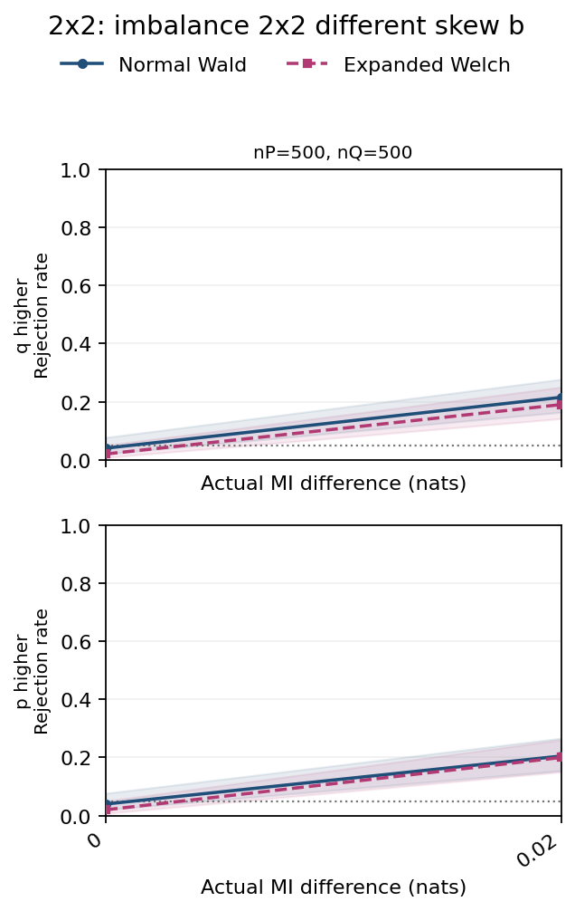

| Specification | Setting |
| --- | --- |
| Table size | 2x2 |
| Horizontal graph regime specifications (columns) | nP=500, nQ=500 |
| Vertical graph regime specifications (rows) | q higher: P row (0.7, 0.3), P column (0.7, 0.3); Q row (0.8, 0.2), Q column (0.8, 0.2); p higher: P row (0.7, 0.3), P column (0.7, 0.3); Q row (0.8, 0.2), Q column (0.8, 0.2) |
| Probability changes | q higher: additive, first changes in P and Q; p higher: additive, first changes in P and Q |
| MI settings | Baseline MI {0.02}; direction {q higher, p higher}; actual differences {0, 0.02} nats |
| Horizontal axis within each graph | Actual MI difference in nats, fixed from 0 to 0.02 |
| Vertical axis within each graph | Unconditional rejection rate from 0 to 1; invalid results count as non-rejections |
| Replicates | 200 per unique point |

Null-point rejection and validity:

| Vertical regime | Horizontal regime | Method | Rejection | Valid |
| --- | --- | --- | --- | --- |
| p higher | nP=500, nQ=500 | Expanded Welch | 0.0200 | 1.0000 |
| p higher | nP=500, nQ=500 | Normal Wald | 0.0400 | 1.0000 |
| q higher | nP=500, nQ=500 | Expanded Welch | 0.0200 | 1.0000 |
| q higher | nP=500, nQ=500 | Normal Wald | 0.0400 | 1.0000 |

Every plotted rate, interval, validity and minimum expected count

| Vertical regime | Horizontal regime | x | Method | Rejection | 95% interval | Valid | Conditional | Min expected P | Min expected Q |
| --- | --- | --- | --- | --- | --- | --- | --- | --- | --- |
| p higher | nP=500, nQ=500 | 0 | Expanded Welch | 0.0200 | [0.0078, 0.0503] | 1.0000 | 0.0200 | 66.36 | 36.91 |
| p higher | nP=500, nQ=500 | 0 | Normal Wald | 0.0400 | [0.0204, 0.0769] | 1.0000 | 0.0400 | 66.36 | 36.91 |
| p higher | nP=500, nQ=500 | 0.02 | Expanded Welch | 0.2000 | [0.1505, 0.2609] | 1.0000 | 0.2000 | 74.7 | 36.91 |
| p higher | nP=500, nQ=500 | 0.02 | Normal Wald | 0.2050 | [0.1549, 0.2663] | 1.0000 | 0.2050 | 74.7 | 36.91 |
| q higher | nP=500, nQ=500 | 0 | Expanded Welch | 0.0200 | [0.0078, 0.0503] | 1.0000 | 0.0200 | 66.36 | 36.91 |
| q higher | nP=500, nQ=500 | 0 | Normal Wald | 0.0400 | [0.0204, 0.0769] | 1.0000 | 0.0400 | 66.36 | 36.91 |
| q higher | nP=500, nQ=500 | 0.02 | Expanded Welch | 0.1900 | [0.1417, 0.2500] | 1.0000 | 0.1900 | 66.36 | 44.24 |
| q higher | nP=500, nQ=500 | 0.02 | Normal Wald | 0.2150 | [0.1637, 0.2770] | 1.0000 | 0.2150 | 66.36 | 44.24 |

### 6.7 3x3: imbalance 3x3 uniform a

Does performance depend on which population has more data or greater MI?

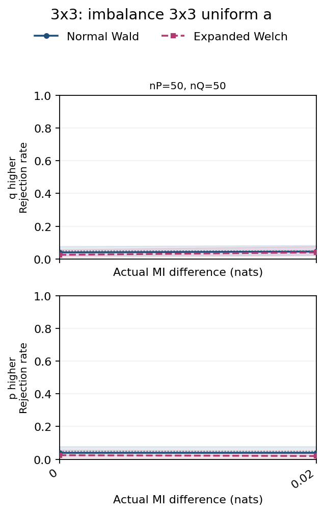

| Specification | Setting |
| --- | --- |
| Table size | 3x3 |
| Horizontal graph regime specifications (columns) | nP=50, nQ=50 |
| Vertical graph regime specifications (rows) | q higher: P row (0.3333 repeated 3 times), P column (0.3333 repeated 3 times); Q row (0.3333 repeated 3 times), Q column (0.3333 repeated 3 times); p higher: P row (0.3333 repeated 3 times), P column (0.3333 repeated 3 times); Q row (0.3333 repeated 3 times), Q column (0.3333 repeated 3 times) |
| Probability changes | q higher: additive, first changes in P and Q; p higher: additive, first changes in P and Q |
| MI settings | Baseline MI {0.02}; direction {q higher, p higher}; actual differences {0, 0.02} nats |
| Horizontal axis within each graph | Actual MI difference in nats, fixed from 0 to 0.02 |
| Vertical axis within each graph | Unconditional rejection rate from 0 to 1; invalid results count as non-rejections |
| Replicates | 200 per unique point |

Null-point rejection and validity:

| Vertical regime | Horizontal regime | Method | Rejection | Valid |
| --- | --- | --- | --- | --- |
| p higher | nP=50, nQ=50 | Expanded Welch | 0.0250 | 1.0000 |
| p higher | nP=50, nQ=50 | Normal Wald | 0.0400 | 1.0000 |
| q higher | nP=50, nQ=50 | Expanded Welch | 0.0250 | 1.0000 |
| q higher | nP=50, nQ=50 | Normal Wald | 0.0400 | 1.0000 |

Every plotted rate, interval, validity and minimum expected count

| Vertical regime | Horizontal regime | x | Method | Rejection | 95% interval | Valid | Conditional | Min expected P | Min expected Q |
| --- | --- | --- | --- | --- | --- | --- | --- | --- | --- |
| p higher | nP=50, nQ=50 | 0 | Expanded Welch | 0.0250 | [0.0107, 0.0572] | 1.0000 | 0.0250 | 3.902 | 3.902 |
| p higher | nP=50, nQ=50 | 0 | Normal Wald | 0.0400 | [0.0204, 0.0769] | 1.0000 | 0.0400 | 3.902 | 3.902 |
| p higher | nP=50, nQ=50 | 0.02 | Expanded Welch | 0.0200 | [0.0078, 0.0503] | 1.0000 | 0.0200 | 3.235 | 3.902 |
| p higher | nP=50, nQ=50 | 0.02 | Normal Wald | 0.0400 | [0.0204, 0.0769] | 1.0000 | 0.0400 | 3.235 | 3.902 |
| q higher | nP=50, nQ=50 | 0 | Expanded Welch | 0.0250 | [0.0107, 0.0572] | 1.0000 | 0.0250 | 3.902 | 3.902 |
| q higher | nP=50, nQ=50 | 0 | Normal Wald | 0.0400 | [0.0204, 0.0769] | 1.0000 | 0.0400 | 3.902 | 3.902 |
| q higher | nP=50, nQ=50 | 0.02 | Expanded Welch | 0.0400 | [0.0204, 0.0769] | 1.0000 | 0.0400 | 3.902 | 3.235 |
| q higher | nP=50, nQ=50 | 0.02 | Normal Wald | 0.0450 | [0.0239, 0.0833] | 1.0000 | 0.0450 | 3.902 | 3.235 |

### 6.8 3x3: imbalance 3x3 uniform b

Does performance depend on which population has more data or greater MI?

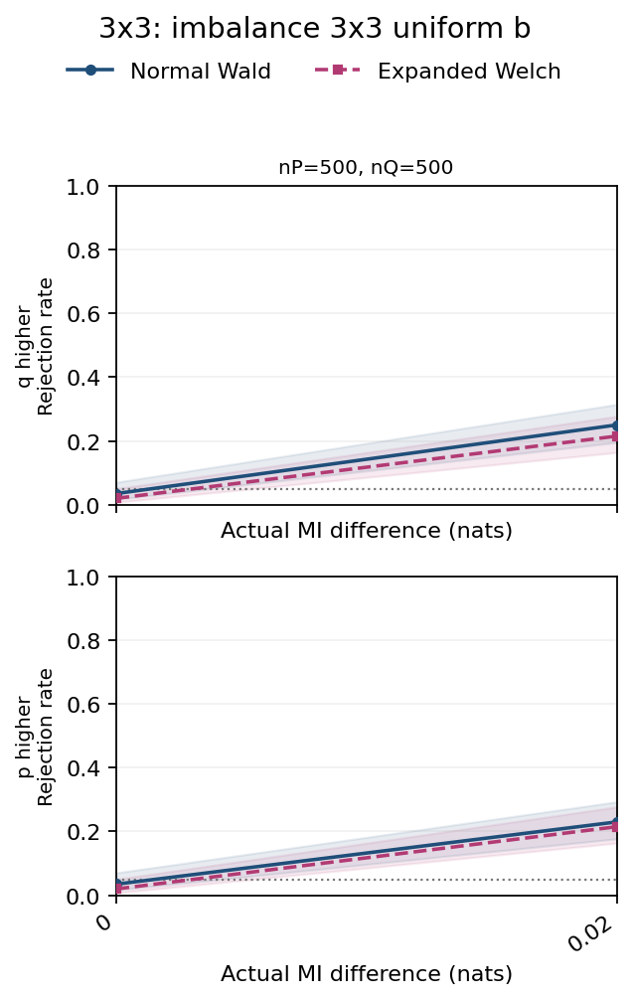

| Specification | Setting |
| --- | --- |
| Table size | 3x3 |
| Horizontal graph regime specifications (columns) | nP=500, nQ=500 |
| Vertical graph regime specifications (rows) | q higher: P row (0.3333 repeated 3 times), P column (0.3333 repeated 3 times); Q row (0.3333 repeated 3 times), Q column (0.3333 repeated 3 times); p higher: P row (0.3333 repeated 3 times), P column (0.3333 repeated 3 times); Q row (0.3333 repeated 3 times), Q column (0.3333 repeated 3 times) |
| Probability changes | q higher: additive, first changes in P and Q; p higher: additive, first changes in P and Q |
| MI settings | Baseline MI {0.02}; direction {q higher, p higher}; actual differences {0, 0.02} nats |
| Horizontal axis within each graph | Actual MI difference in nats, fixed from 0 to 0.02 |
| Vertical axis within each graph | Unconditional rejection rate from 0 to 1; invalid results count as non-rejections |
| Replicates | 200 per unique point |

Null-point rejection and validity:

| Vertical regime | Horizontal regime | Method | Rejection | Valid |
| --- | --- | --- | --- | --- |
| p higher | nP=500, nQ=500 | Expanded Welch | 0.0200 | 1.0000 |
| p higher | nP=500, nQ=500 | Normal Wald | 0.0350 | 1.0000 |
| q higher | nP=500, nQ=500 | Expanded Welch | 0.0200 | 1.0000 |
| q higher | nP=500, nQ=500 | Normal Wald | 0.0350 | 1.0000 |

Every plotted rate, interval, validity and minimum expected count

| Vertical regime | Horizontal regime | x | Method | Rejection | 95% interval | Valid | Conditional | Min expected P | Min expected Q |
| --- | --- | --- | --- | --- | --- | --- | --- | --- | --- |
| p higher | nP=500, nQ=500 | 0 | Expanded Welch | 0.0200 | [0.0078, 0.0503] | 1.0000 | 0.0200 | 39.02 | 39.02 |
| p higher | nP=500, nQ=500 | 0 | Normal Wald | 0.0350 | [0.0171, 0.0705] | 1.0000 | 0.0350 | 39.02 | 39.02 |
| p higher | nP=500, nQ=500 | 0.02 | Expanded Welch | 0.2150 | [0.1637, 0.2770] | 1.0000 | 0.2150 | 32.35 | 39.02 |
| p higher | nP=500, nQ=500 | 0.02 | Normal Wald | 0.2300 | [0.1771, 0.2931] | 1.0000 | 0.2300 | 32.35 | 39.02 |
| q higher | nP=500, nQ=500 | 0 | Expanded Welch | 0.0200 | [0.0078, 0.0503] | 1.0000 | 0.0200 | 39.02 | 39.02 |
| q higher | nP=500, nQ=500 | 0 | Normal Wald | 0.0350 | [0.0171, 0.0705] | 1.0000 | 0.0350 | 39.02 | 39.02 |
| q higher | nP=500, nQ=500 | 0.02 | Expanded Welch | 0.2150 | [0.1637, 0.2770] | 1.0000 | 0.2150 | 39.02 | 32.35 |
| q higher | nP=500, nQ=500 | 0.02 | Normal Wald | 0.2500 | [0.1951, 0.3143] | 1.0000 | 0.2500 | 39.02 | 32.35 |

### 6.9 3x3: imbalance 3x3 same skew a

Does performance depend on which population has more data or greater MI?

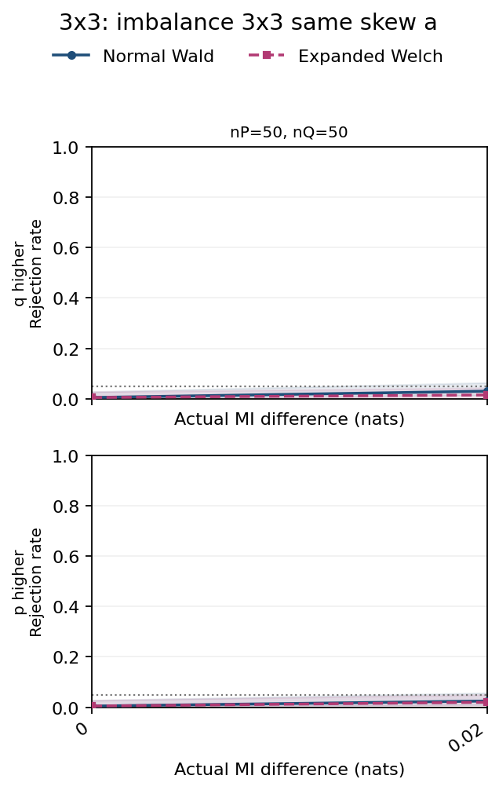

| Specification | Setting |
| --- | --- |
| Table size | 3x3 |
| Horizontal graph regime specifications (columns) | nP=50, nQ=50 |
| Vertical graph regime specifications (rows) | q higher: P row (0.8, 0.2/2 repeated 2 times), P column (0.8, 0.2/2 repeated 2 times); Q row (0.8, 0.2/2 repeated 2 times), Q column (0.8, 0.2/2 repeated 2 times); p higher: P row (0.8, 0.2/2 repeated 2 times), P column (0.8, 0.2/2 repeated 2 times); Q row (0.8, 0.2/2 repeated 2 times), Q column (0.8, 0.2/2 repeated 2 times) |
| Probability changes | q higher: additive, first changes in P and Q; p higher: additive, first changes in P and Q |
| MI settings | Baseline MI {0.02}; direction {q higher, p higher}; actual differences {0, 0.02} nats |
| Horizontal axis within each graph | Actual MI difference in nats, fixed from 0 to 0.02 |
| Vertical axis within each graph | Unconditional rejection rate from 0 to 1; invalid results count as non-rejections |
| Replicates | 200 per unique point |

Null-point rejection and validity:

| Vertical regime | Horizontal regime | Method | Rejection | Valid |
| --- | --- | --- | --- | --- |
| p higher | nP=50, nQ=50 | Expanded Welch | 0.0050 | 1.0000 |
| p higher | nP=50, nQ=50 | Normal Wald | 0.0050 | 1.0000 |
| q higher | nP=50, nQ=50 | Expanded Welch | 0.0050 | 1.0000 |
| q higher | nP=50, nQ=50 | Normal Wald | 0.0050 | 1.0000 |

Every plotted rate, interval, validity and minimum expected count

| Vertical regime | Horizontal regime | x | Method | Rejection | 95% interval | Valid | Conditional | Min expected P | Min expected Q |
| --- | --- | --- | --- | --- | --- | --- | --- | --- | --- |
| p higher | nP=50, nQ=50 | 0 | Expanded Welch | 0.0050 | [0.0009, 0.0278] | 1.0000 | 0.0050 | 0.5 | 0.5 |
| p higher | nP=50, nQ=50 | 0 | Normal Wald | 0.0050 | [0.0009, 0.0278] | 1.0000 | 0.0050 | 0.5 | 0.5 |
| p higher | nP=50, nQ=50 | 0.02 | Expanded Welch | 0.0200 | [0.0078, 0.0503] | 1.0000 | 0.0200 | 0.5 | 0.5 |
| p higher | nP=50, nQ=50 | 0.02 | Normal Wald | 0.0250 | [0.0107, 0.0572] | 1.0000 | 0.0250 | 0.5 | 0.5 |
| q higher | nP=50, nQ=50 | 0 | Expanded Welch | 0.0050 | [0.0009, 0.0278] | 1.0000 | 0.0050 | 0.5 | 0.5 |
| q higher | nP=50, nQ=50 | 0 | Normal Wald | 0.0050 | [0.0009, 0.0278] | 1.0000 | 0.0050 | 0.5 | 0.5 |
| q higher | nP=50, nQ=50 | 0.02 | Expanded Welch | 0.0150 | [0.0051, 0.0432] | 1.0000 | 0.0150 | 0.5 | 0.5 |
| q higher | nP=50, nQ=50 | 0.02 | Normal Wald | 0.0300 | [0.0138, 0.0639] | 1.0000 | 0.0300 | 0.5 | 0.5 |

### 6.10 3x3: imbalance 3x3 same skew b

Does performance depend on which population has more data or greater MI?

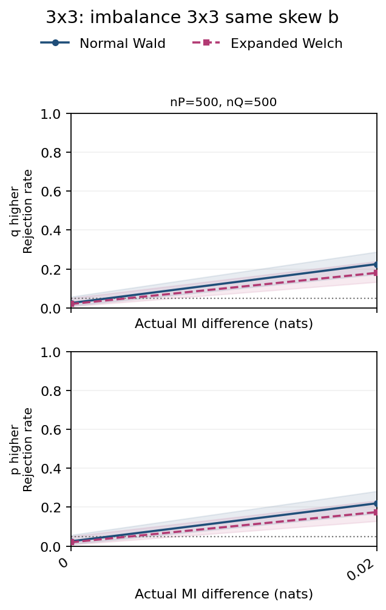

| Specification | Setting |
| --- | --- |
| Table size | 3x3 |
| Horizontal graph regime specifications (columns) | nP=500, nQ=500 |
| Vertical graph regime specifications (rows) | q higher: P row (0.8, 0.2/2 repeated 2 times), P column (0.8, 0.2/2 repeated 2 times); Q row (0.8, 0.2/2 repeated 2 times), Q column (0.8, 0.2/2 repeated 2 times); p higher: P row (0.8, 0.2/2 repeated 2 times), P column (0.8, 0.2/2 repeated 2 times); Q row (0.8, 0.2/2 repeated 2 times), Q column (0.8, 0.2/2 repeated 2 times) |
| Probability changes | q higher: additive, first changes in P and Q; p higher: additive, first changes in P and Q |
| MI settings | Baseline MI {0.02}; direction {q higher, p higher}; actual differences {0, 0.02} nats |
| Horizontal axis within each graph | Actual MI difference in nats, fixed from 0 to 0.02 |
| Vertical axis within each graph | Unconditional rejection rate from 0 to 1; invalid results count as non-rejections |
| Replicates | 200 per unique point |

Null-point rejection and validity:

| Vertical regime | Horizontal regime | Method | Rejection | Valid |
| --- | --- | --- | --- | --- |
| p higher | nP=500, nQ=500 | Expanded Welch | 0.0200 | 1.0000 |
| p higher | nP=500, nQ=500 | Normal Wald | 0.0250 | 1.0000 |
| q higher | nP=500, nQ=500 | Expanded Welch | 0.0200 | 1.0000 |
| q higher | nP=500, nQ=500 | Normal Wald | 0.0250 | 1.0000 |

Every plotted rate, interval, validity and minimum expected count

| Vertical regime | Horizontal regime | x | Method | Rejection | 95% interval | Valid | Conditional | Min expected P | Min expected Q |
| --- | --- | --- | --- | --- | --- | --- | --- | --- | --- |
| p higher | nP=500, nQ=500 | 0 | Expanded Welch | 0.0200 | [0.0078, 0.0503] | 1.0000 | 0.0200 | 5 | 5 |
| p higher | nP=500, nQ=500 | 0 | Normal Wald | 0.0250 | [0.0107, 0.0572] | 1.0000 | 0.0250 | 5 | 5 |
| p higher | nP=500, nQ=500 | 0.02 | Expanded Welch | 0.1750 | [0.1286, 0.2336] | 1.0000 | 0.1750 | 5 | 5 |
| p higher | nP=500, nQ=500 | 0.02 | Normal Wald | 0.2200 | [0.1682, 0.2824] | 1.0000 | 0.2200 | 5 | 5 |
| q higher | nP=500, nQ=500 | 0 | Expanded Welch | 0.0200 | [0.0078, 0.0503] | 1.0000 | 0.0200 | 5 | 5 |
| q higher | nP=500, nQ=500 | 0 | Normal Wald | 0.0250 | [0.0107, 0.0572] | 1.0000 | 0.0250 | 5 | 5 |
| q higher | nP=500, nQ=500 | 0.02 | Expanded Welch | 0.1800 | [0.1329, 0.2391] | 1.0000 | 0.1800 | 5 | 5 |
| q higher | nP=500, nQ=500 | 0.02 | Normal Wald | 0.2250 | [0.1726, 0.2877] | 1.0000 | 0.2250 | 5 | 5 |

### 6.11 3x3: imbalance 3x3 different skew a

Does performance depend on which population has more data or greater MI?

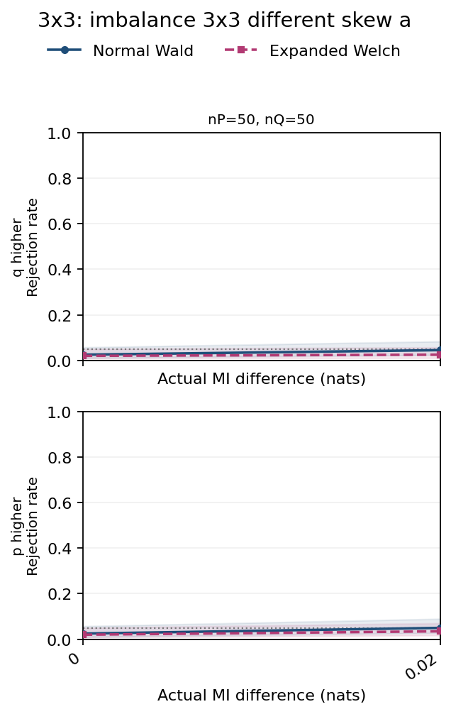

| Specification | Setting |
| --- | --- |
| Table size | 3x3 |
| Horizontal graph regime specifications (columns) | nP=50, nQ=50 |
| Vertical graph regime specifications (rows) | q higher: P row (0.7, 0.3/2 repeated 2 times), P column (0.7, 0.3/2 repeated 2 times); Q row (0.8, 0.2/2 repeated 2 times), Q column (0.8, 0.2/2 repeated 2 times); p higher: P row (0.7, 0.3/2 repeated 2 times), P column (0.7, 0.3/2 repeated 2 times); Q row (0.8, 0.2/2 repeated 2 times), Q column (0.8, 0.2/2 repeated 2 times) |
| Probability changes | q higher: additive, first changes in P and Q; p higher: additive, first changes in P and Q |
| MI settings | Baseline MI {0.02}; direction {q higher, p higher}; actual differences {0, 0.02} nats |
| Horizontal axis within each graph | Actual MI difference in nats, fixed from 0 to 0.02 |
| Vertical axis within each graph | Unconditional rejection rate from 0 to 1; invalid results count as non-rejections |
| Replicates | 200 per unique point |

Null-point rejection and validity:

| Vertical regime | Horizontal regime | Method | Rejection | Valid |
| --- | --- | --- | --- | --- |
| p higher | nP=50, nQ=50 | Expanded Welch | 0.0200 | 1.0000 |
| p higher | nP=50, nQ=50 | Normal Wald | 0.0250 | 1.0000 |
| q higher | nP=50, nQ=50 | Expanded Welch | 0.0200 | 1.0000 |
| q higher | nP=50, nQ=50 | Normal Wald | 0.0250 | 1.0000 |

Every plotted rate, interval, validity and minimum expected count

| Vertical regime | Horizontal regime | x | Method | Rejection | 95% interval | Valid | Conditional | Min expected P | Min expected Q |
| --- | --- | --- | --- | --- | --- | --- | --- | --- | --- |
| p higher | nP=50, nQ=50 | 0 | Expanded Welch | 0.0200 | [0.0078, 0.0503] | 1.0000 | 0.0200 | 1.125 | 0.5 |
| p higher | nP=50, nQ=50 | 0 | Normal Wald | 0.0250 | [0.0107, 0.0572] | 1.0000 | 0.0250 | 1.125 | 0.5 |
| p higher | nP=50, nQ=50 | 0.02 | Expanded Welch | 0.0350 | [0.0171, 0.0705] | 1.0000 | 0.0350 | 1.125 | 0.5 |
| p higher | nP=50, nQ=50 | 0.02 | Normal Wald | 0.0500 | [0.0274, 0.0896] | 1.0000 | 0.0500 | 1.125 | 0.5 |
| q higher | nP=50, nQ=50 | 0 | Expanded Welch | 0.0200 | [0.0078, 0.0503] | 1.0000 | 0.0200 | 1.125 | 0.5 |
| q higher | nP=50, nQ=50 | 0 | Normal Wald | 0.0250 | [0.0107, 0.0572] | 1.0000 | 0.0250 | 1.125 | 0.5 |
| q higher | nP=50, nQ=50 | 0.02 | Expanded Welch | 0.0250 | [0.0107, 0.0572] | 1.0000 | 0.0250 | 1.125 | 0.5 |
| q higher | nP=50, nQ=50 | 0.02 | Normal Wald | 0.0450 | [0.0239, 0.0833] | 1.0000 | 0.0450 | 1.125 | 0.5 |

### 6.12 3x3: imbalance 3x3 different skew b

Does performance depend on which population has more data or greater MI?

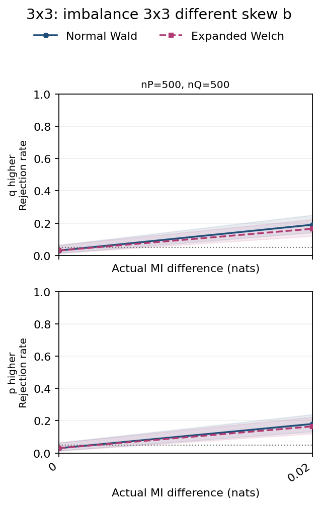

| Specification | Setting |
| --- | --- |
| Table size | 3x3 |
| Horizontal graph regime specifications (columns) | nP=500, nQ=500 |
| Vertical graph regime specifications (rows) | q higher: P row (0.7, 0.3/2 repeated 2 times), P column (0.7, 0.3/2 repeated 2 times); Q row (0.8, 0.2/2 repeated 2 times), Q column (0.8, 0.2/2 repeated 2 times); p higher: P row (0.7, 0.3/2 repeated 2 times), P column (0.7, 0.3/2 repeated 2 times); Q row (0.8, 0.2/2 repeated 2 times), Q column (0.8, 0.2/2 repeated 2 times) |
| Probability changes | q higher: additive, first changes in P and Q; p higher: additive, first changes in P and Q |
| MI settings | Baseline MI {0.02}; direction {q higher, p higher}; actual differences {0, 0.02} nats |
| Horizontal axis within each graph | Actual MI difference in nats, fixed from 0 to 0.02 |
| Vertical axis within each graph | Unconditional rejection rate from 0 to 1; invalid results count as non-rejections |
| Replicates | 200 per unique point |

Null-point rejection and validity:

| Vertical regime | Horizontal regime | Method | Rejection | Valid |
| --- | --- | --- | --- | --- |
| p higher | nP=500, nQ=500 | Expanded Welch | 0.0300 | 1.0000 |
| p higher | nP=500, nQ=500 | Normal Wald | 0.0300 | 1.0000 |
| q higher | nP=500, nQ=500 | Expanded Welch | 0.0300 | 1.0000 |
| q higher | nP=500, nQ=500 | Normal Wald | 0.0300 | 1.0000 |

Every plotted rate, interval, validity and minimum expected count

| Vertical regime | Horizontal regime | x | Method | Rejection | 95% interval | Valid | Conditional | Min expected P | Min expected Q |
| --- | --- | --- | --- | --- | --- | --- | --- | --- | --- |
| p higher | nP=500, nQ=500 | 0 | Expanded Welch | 0.0300 | [0.0138, 0.0639] | 1.0000 | 0.0300 | 11.25 | 5 |
| p higher | nP=500, nQ=500 | 0 | Normal Wald | 0.0300 | [0.0138, 0.0639] | 1.0000 | 0.0300 | 11.25 | 5 |
| p higher | nP=500, nQ=500 | 0.02 | Expanded Welch | 0.1650 | [0.1200, 0.2227] | 1.0000 | 0.1650 | 11.25 | 5 |
| p higher | nP=500, nQ=500 | 0.02 | Normal Wald | 0.1800 | [0.1329, 0.2391] | 1.0000 | 0.1800 | 11.25 | 5 |
| q higher | nP=500, nQ=500 | 0 | Expanded Welch | 0.0300 | [0.0138, 0.0639] | 1.0000 | 0.0300 | 11.25 | 5 |
| q higher | nP=500, nQ=500 | 0 | Normal Wald | 0.0300 | [0.0138, 0.0639] | 1.0000 | 0.0300 | 11.25 | 5 |
| q higher | nP=500, nQ=500 | 0.02 | Expanded Welch | 0.1650 | [0.1200, 0.2227] | 1.0000 | 0.1650 | 11.25 | 5 |
| q higher | nP=500, nQ=500 | 0.02 | Normal Wald | 0.1900 | [0.1417, 0.2500] | 1.0000 | 0.1900 | 11.25 | 5 |

### 6.13 5x5: imbalance 5x5 uniform a

Does performance depend on which population has more data or greater MI?

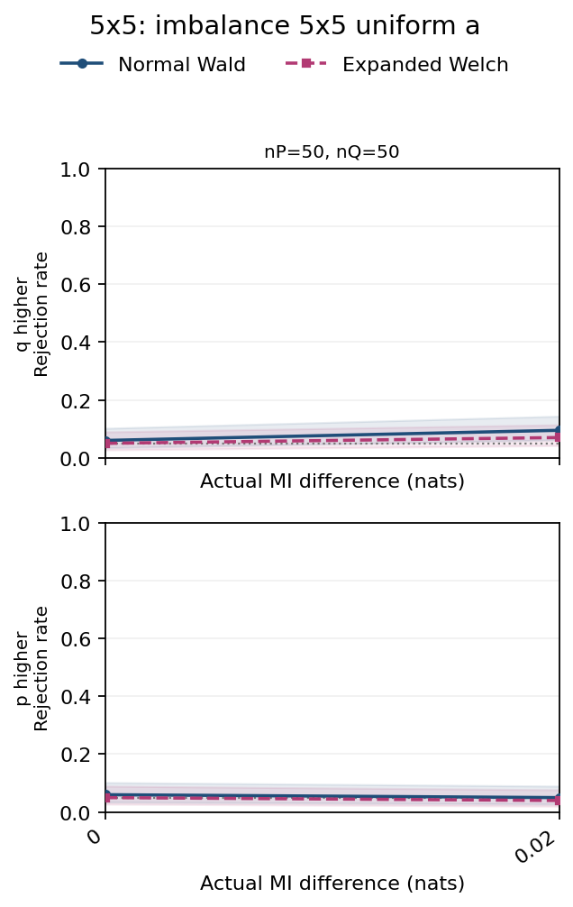

| Specification | Setting |
| --- | --- |
| Table size | 5x5 |
| Horizontal graph regime specifications (columns) | nP=50, nQ=50 |
| Vertical graph regime specifications (rows) | q higher: P row (0.2 repeated 5 times), P column (0.2 repeated 5 times); Q row (0.2 repeated 5 times), Q column (0.2 repeated 5 times); p higher: P row (0.2 repeated 5 times), P column (0.2 repeated 5 times); Q row (0.2 repeated 5 times), Q column (0.2 repeated 5 times) |
| Probability changes | q higher: additive, first changes in P and Q; p higher: additive, first changes in P and Q |
| MI settings | Baseline MI {0.02}; direction {q higher, p higher}; actual differences {0, 0.02} nats |
| Horizontal axis within each graph | Actual MI difference in nats, fixed from 0 to 0.02 |
| Vertical axis within each graph | Unconditional rejection rate from 0 to 1; invalid results count as non-rejections |
| Replicates | 200 per unique point |

Null-point rejection and validity:

| Vertical regime | Horizontal regime | Method | Rejection | Valid |
| --- | --- | --- | --- | --- |
| p higher | nP=50, nQ=50 | Expanded Welch | 0.0500 | 1.0000 |
| p higher | nP=50, nQ=50 | Normal Wald | 0.0600 | 1.0000 |
| q higher | nP=50, nQ=50 | Expanded Welch | 0.0500 | 1.0000 |
| q higher | nP=50, nQ=50 | Normal Wald | 0.0600 | 1.0000 |

Every plotted rate, interval, validity and minimum expected count

| Vertical regime | Horizontal regime | x | Method | Rejection | 95% interval | Valid | Conditional | Min expected P | Min expected Q |
| --- | --- | --- | --- | --- | --- | --- | --- | --- | --- |
| p higher | nP=50, nQ=50 | 0 | Expanded Welch | 0.0500 | [0.0274, 0.0896] | 1.0000 | 0.0500 | 1.021 | 1.021 |
| p higher | nP=50, nQ=50 | 0 | Normal Wald | 0.0600 | [0.0347, 0.1019] | 1.0000 | 0.0600 | 1.021 | 1.021 |
| p higher | nP=50, nQ=50 | 0.02 | Expanded Welch | 0.0400 | [0.0204, 0.0769] | 1.0000 | 0.0400 | 0.6484 | 1.021 |
| p higher | nP=50, nQ=50 | 0.02 | Normal Wald | 0.0500 | [0.0274, 0.0896] | 1.0000 | 0.0500 | 0.6484 | 1.021 |
| q higher | nP=50, nQ=50 | 0 | Expanded Welch | 0.0500 | [0.0274, 0.0896] | 1.0000 | 0.0500 | 1.021 | 1.021 |
| q higher | nP=50, nQ=50 | 0 | Normal Wald | 0.0600 | [0.0347, 0.1019] | 1.0000 | 0.0600 | 1.021 | 1.021 |
| q higher | nP=50, nQ=50 | 0.02 | Expanded Welch | 0.0700 | [0.0422, 0.1141] | 1.0000 | 0.0700 | 1.021 | 0.6484 |
| q higher | nP=50, nQ=50 | 0.02 | Normal Wald | 0.0950 | [0.0617, 0.1436] | 1.0000 | 0.0950 | 1.021 | 0.6484 |

### 6.14 5x5: imbalance 5x5 uniform b

Does performance depend on which population has more data or greater MI?

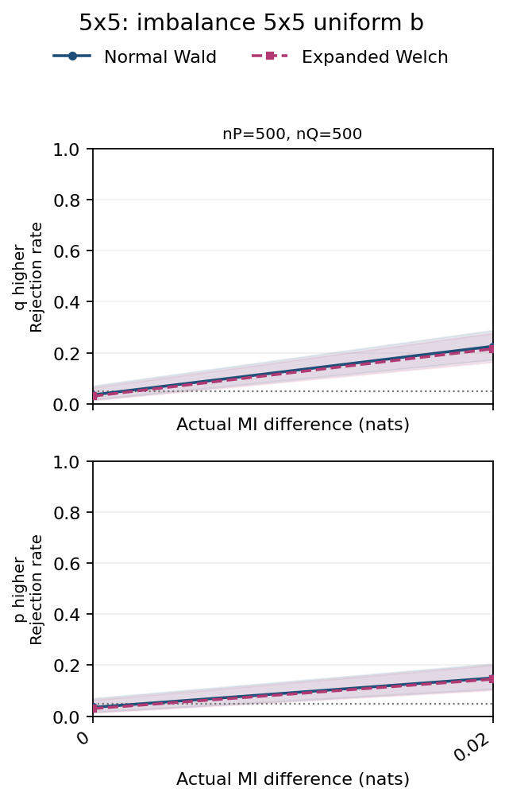

| Specification | Setting |
| --- | --- |
| Table size | 5x5 |
| Horizontal graph regime specifications (columns) | nP=500, nQ=500 |
| Vertical graph regime specifications (rows) | q higher: P row (0.2 repeated 5 times), P column (0.2 repeated 5 times); Q row (0.2 repeated 5 times), Q column (0.2 repeated 5 times); p higher: P row (0.2 repeated 5 times), P column (0.2 repeated 5 times); Q row (0.2 repeated 5 times), Q column (0.2 repeated 5 times) |
| Probability changes | q higher: additive, first changes in P and Q; p higher: additive, first changes in P and Q |
| MI settings | Baseline MI {0.02}; direction {q higher, p higher}; actual differences {0, 0.02} nats |
| Horizontal axis within each graph | Actual MI difference in nats, fixed from 0 to 0.02 |
| Vertical axis within each graph | Unconditional rejection rate from 0 to 1; invalid results count as non-rejections |
| Replicates | 200 per unique point |

Null-point rejection and validity:

| Vertical regime | Horizontal regime | Method | Rejection | Valid |
| --- | --- | --- | --- | --- |
| p higher | nP=500, nQ=500 | Expanded Welch | 0.0300 | 1.0000 |
| p higher | nP=500, nQ=500 | Normal Wald | 0.0350 | 1.0000 |
| q higher | nP=500, nQ=500 | Expanded Welch | 0.0300 | 1.0000 |
| q higher | nP=500, nQ=500 | Normal Wald | 0.0350 | 1.0000 |

Every plotted rate, interval, validity and minimum expected count

| Vertical regime | Horizontal regime | x | Method | Rejection | 95% interval | Valid | Conditional | Min expected P | Min expected Q |
| --- | --- | --- | --- | --- | --- | --- | --- | --- | --- |
| p higher | nP=500, nQ=500 | 0 | Expanded Welch | 0.0300 | [0.0138, 0.0639] | 1.0000 | 0.0300 | 10.21 | 10.21 |
| p higher | nP=500, nQ=500 | 0 | Normal Wald | 0.0350 | [0.0171, 0.0705] | 1.0000 | 0.0350 | 10.21 | 10.21 |
| p higher | nP=500, nQ=500 | 0.02 | Expanded Welch | 0.1450 | [0.1029, 0.2005] | 1.0000 | 0.1450 | 6.484 | 10.21 |
| p higher | nP=500, nQ=500 | 0.02 | Normal Wald | 0.1500 | [0.1071, 0.2061] | 1.0000 | 0.1500 | 6.484 | 10.21 |
| q higher | nP=500, nQ=500 | 0 | Expanded Welch | 0.0300 | [0.0138, 0.0639] | 1.0000 | 0.0300 | 10.21 | 10.21 |
| q higher | nP=500, nQ=500 | 0 | Normal Wald | 0.0350 | [0.0171, 0.0705] | 1.0000 | 0.0350 | 10.21 | 10.21 |
| q higher | nP=500, nQ=500 | 0.02 | Expanded Welch | 0.2150 | [0.1637, 0.2770] | 1.0000 | 0.2150 | 10.21 | 6.484 |
| q higher | nP=500, nQ=500 | 0.02 | Normal Wald | 0.2250 | [0.1726, 0.2877] | 1.0000 | 0.2250 | 10.21 | 6.484 |

### 6.15 5x5: imbalance 5x5 same skew a

Does performance depend on which population has more data or greater MI?

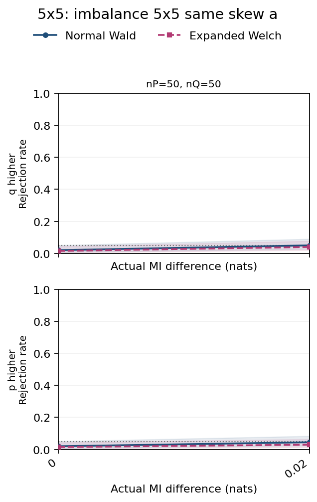

| Specification | Setting |
| --- | --- |
| Table size | 5x5 |
| Horizontal graph regime specifications (columns) | nP=50, nQ=50 |
| Vertical graph regime specifications (rows) | q higher: P row (0.8, 0.2/4 repeated 4 times), P column (0.8, 0.2/4 repeated 4 times); Q row (0.8, 0.2/4 repeated 4 times), Q column (0.8, 0.2/4 repeated 4 times); p higher: P row (0.8, 0.2/4 repeated 4 times), P column (0.8, 0.2/4 repeated 4 times); Q row (0.8, 0.2/4 repeated 4 times), Q column (0.8, 0.2/4 repeated 4 times) |
| Probability changes | q higher: additive, first changes in P and Q; p higher: additive, first changes in P and Q |
| MI settings | Baseline MI {0.02}; direction {q higher, p higher}; actual differences {0, 0.02} nats |
| Horizontal axis within each graph | Actual MI difference in nats, fixed from 0 to 0.02 |
| Vertical axis within each graph | Unconditional rejection rate from 0 to 1; invalid results count as non-rejections |
| Replicates | 200 per unique point |

Null-point rejection and validity:

| Vertical regime | Horizontal regime | Method | Rejection | Valid |
| --- | --- | --- | --- | --- |
| p higher | nP=50, nQ=50 | Expanded Welch | 0.0150 | 1.0000 |
| p higher | nP=50, nQ=50 | Normal Wald | 0.0200 | 1.0000 |
| q higher | nP=50, nQ=50 | Expanded Welch | 0.0150 | 1.0000 |
| q higher | nP=50, nQ=50 | Normal Wald | 0.0200 | 1.0000 |

Every plotted rate, interval, validity and minimum expected count

| Vertical regime | Horizontal regime | x | Method | Rejection | 95% interval | Valid | Conditional | Min expected P | Min expected Q |
| --- | --- | --- | --- | --- | --- | --- | --- | --- | --- |
| p higher | nP=50, nQ=50 | 0 | Expanded Welch | 0.0150 | [0.0051, 0.0432] | 1.0000 | 0.0150 | 0.125 | 0.125 |
| p higher | nP=50, nQ=50 | 0 | Normal Wald | 0.0200 | [0.0078, 0.0503] | 1.0000 | 0.0200 | 0.125 | 0.125 |
| p higher | nP=50, nQ=50 | 0.02 | Expanded Welch | 0.0300 | [0.0138, 0.0639] | 1.0000 | 0.0300 | 0.125 | 0.125 |
| p higher | nP=50, nQ=50 | 0.02 | Normal Wald | 0.0450 | [0.0239, 0.0833] | 1.0000 | 0.0450 | 0.125 | 0.125 |
| q higher | nP=50, nQ=50 | 0 | Expanded Welch | 0.0150 | [0.0051, 0.0432] | 1.0000 | 0.0150 | 0.125 | 0.125 |
| q higher | nP=50, nQ=50 | 0 | Normal Wald | 0.0200 | [0.0078, 0.0503] | 1.0000 | 0.0200 | 0.125 | 0.125 |
| q higher | nP=50, nQ=50 | 0.02 | Expanded Welch | 0.0400 | [0.0204, 0.0769] | 1.0000 | 0.0400 | 0.125 | 0.125 |
| q higher | nP=50, nQ=50 | 0.02 | Normal Wald | 0.0500 | [0.0274, 0.0896] | 1.0000 | 0.0500 | 0.125 | 0.125 |

### 6.16 5x5: imbalance 5x5 same skew b

Does performance depend on which population has more data or greater MI?

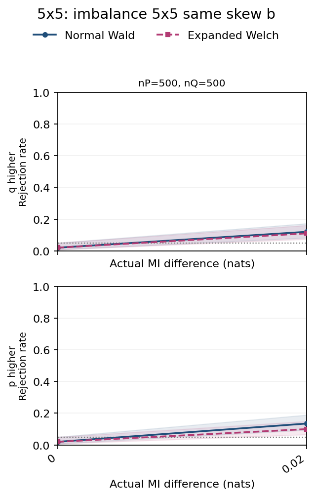

| Specification | Setting |
| --- | --- |
| Table size | 5x5 |
| Horizontal graph regime specifications (columns) | nP=500, nQ=500 |
| Vertical graph regime specifications (rows) | q higher: P row (0.8, 0.2/4 repeated 4 times), P column (0.8, 0.2/4 repeated 4 times); Q row (0.8, 0.2/4 repeated 4 times), Q column (0.8, 0.2/4 repeated 4 times); p higher: P row (0.8, 0.2/4 repeated 4 times), P column (0.8, 0.2/4 repeated 4 times); Q row (0.8, 0.2/4 repeated 4 times), Q column (0.8, 0.2/4 repeated 4 times) |
| Probability changes | q higher: additive, first changes in P and Q; p higher: additive, first changes in P and Q |
| MI settings | Baseline MI {0.02}; direction {q higher, p higher}; actual differences {0, 0.02} nats |
| Horizontal axis within each graph | Actual MI difference in nats, fixed from 0 to 0.02 |
| Vertical axis within each graph | Unconditional rejection rate from 0 to 1; invalid results count as non-rejections |
| Replicates | 200 per unique point |

Null-point rejection and validity:

| Vertical regime | Horizontal regime | Method | Rejection | Valid |
| --- | --- | --- | --- | --- |
| p higher | nP=500, nQ=500 | Expanded Welch | 0.0200 | 1.0000 |
| p higher | nP=500, nQ=500 | Normal Wald | 0.0200 | 1.0000 |
| q higher | nP=500, nQ=500 | Expanded Welch | 0.0200 | 1.0000 |
| q higher | nP=500, nQ=500 | Normal Wald | 0.0200 | 1.0000 |

Every plotted rate, interval, validity and minimum expected count

| Vertical regime | Horizontal regime | x | Method | Rejection | 95% interval | Valid | Conditional | Min expected P | Min expected Q |
| --- | --- | --- | --- | --- | --- | --- | --- | --- | --- |
| p higher | nP=500, nQ=500 | 0 | Expanded Welch | 0.0200 | [0.0078, 0.0503] | 1.0000 | 0.0200 | 1.25 | 1.25 |
| p higher | nP=500, nQ=500 | 0 | Normal Wald | 0.0200 | [0.0078, 0.0503] | 1.0000 | 0.0200 | 1.25 | 1.25 |
| p higher | nP=500, nQ=500 | 0.02 | Expanded Welch | 0.1000 | [0.0657, 0.1494] | 1.0000 | 0.1000 | 1.25 | 1.25 |
| p higher | nP=500, nQ=500 | 0.02 | Normal Wald | 0.1350 | [0.0945, 0.1893] | 1.0000 | 0.1350 | 1.25 | 1.25 |
| q higher | nP=500, nQ=500 | 0 | Expanded Welch | 0.0200 | [0.0078, 0.0503] | 1.0000 | 0.0200 | 1.25 | 1.25 |
| q higher | nP=500, nQ=500 | 0 | Normal Wald | 0.0200 | [0.0078, 0.0503] | 1.0000 | 0.0200 | 1.25 | 1.25 |
| q higher | nP=500, nQ=500 | 0.02 | Expanded Welch | 0.1100 | [0.0738, 0.1609] | 1.0000 | 0.1100 | 1.25 | 1.25 |
| q higher | nP=500, nQ=500 | 0.02 | Normal Wald | 0.1200 | [0.0820, 0.1723] | 1.0000 | 0.1200 | 1.25 | 1.25 |

### 6.17 5x5: imbalance 5x5 different skew a

Does performance depend on which population has more data or greater MI?

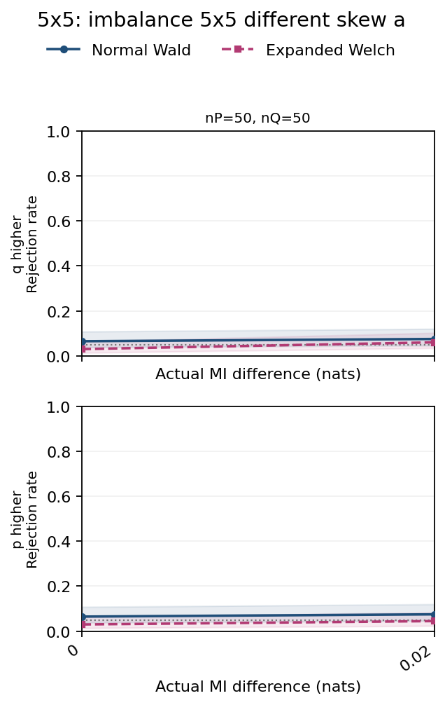

| Specification | Setting |
| --- | --- |
| Table size | 5x5 |
| Horizontal graph regime specifications (columns) | nP=50, nQ=50 |
| Vertical graph regime specifications (rows) | q higher: P row (0.7, 0.3/4 repeated 4 times), P column (0.7, 0.3/4 repeated 4 times); Q row (0.8, 0.2/4 repeated 4 times), Q column (0.8, 0.2/4 repeated 4 times); p higher: P row (0.7, 0.3/4 repeated 4 times), P column (0.7, 0.3/4 repeated 4 times); Q row (0.8, 0.2/4 repeated 4 times), Q column (0.8, 0.2/4 repeated 4 times) |
| Probability changes | q higher: additive, first changes in P and Q; p higher: additive, first changes in P and Q |
| MI settings | Baseline MI {0.02}; direction {q higher, p higher}; actual differences {0, 0.02} nats |
| Horizontal axis within each graph | Actual MI difference in nats, fixed from 0 to 0.02 |
| Vertical axis within each graph | Unconditional rejection rate from 0 to 1; invalid results count as non-rejections |
| Replicates | 200 per unique point |

Null-point rejection and validity:

| Vertical regime | Horizontal regime | Method | Rejection | Valid |
| --- | --- | --- | --- | --- |
| p higher | nP=50, nQ=50 | Expanded Welch | 0.0300 | 1.0000 |
| p higher | nP=50, nQ=50 | Normal Wald | 0.0650 | 1.0000 |
| q higher | nP=50, nQ=50 | Expanded Welch | 0.0300 | 1.0000 |
| q higher | nP=50, nQ=50 | Normal Wald | 0.0650 | 1.0000 |

Every plotted rate, interval, validity and minimum expected count

| Vertical regime | Horizontal regime | x | Method | Rejection | 95% interval | Valid | Conditional | Min expected P | Min expected Q |
| --- | --- | --- | --- | --- | --- | --- | --- | --- | --- |
| p higher | nP=50, nQ=50 | 0 | Expanded Welch | 0.0300 | [0.0138, 0.0639] | 1.0000 | 0.0300 | 0.2812 | 0.125 |
| p higher | nP=50, nQ=50 | 0 | Normal Wald | 0.0650 | [0.0384, 0.1080] | 1.0000 | 0.0650 | 0.2812 | 0.125 |
| p higher | nP=50, nQ=50 | 0.02 | Expanded Welch | 0.0450 | [0.0239, 0.0833] | 1.0000 | 0.0450 | 0.2812 | 0.125 |
| p higher | nP=50, nQ=50 | 0.02 | Normal Wald | 0.0750 | [0.0460, 0.1200] | 1.0000 | 0.0750 | 0.2812 | 0.125 |
| q higher | nP=50, nQ=50 | 0 | Expanded Welch | 0.0300 | [0.0138, 0.0639] | 1.0000 | 0.0300 | 0.2812 | 0.125 |
| q higher | nP=50, nQ=50 | 0 | Normal Wald | 0.0650 | [0.0384, 0.1080] | 1.0000 | 0.0650 | 0.2812 | 0.125 |
| q higher | nP=50, nQ=50 | 0.02 | Expanded Welch | 0.0600 | [0.0347, 0.1019] | 1.0000 | 0.0600 | 0.2812 | 0.125 |
| q higher | nP=50, nQ=50 | 0.02 | Normal Wald | 0.0750 | [0.0460, 0.1200] | 1.0000 | 0.0750 | 0.2812 | 0.125 |

### 6.18 5x5: imbalance 5x5 different skew b

Does performance depend on which population has more data or greater MI?

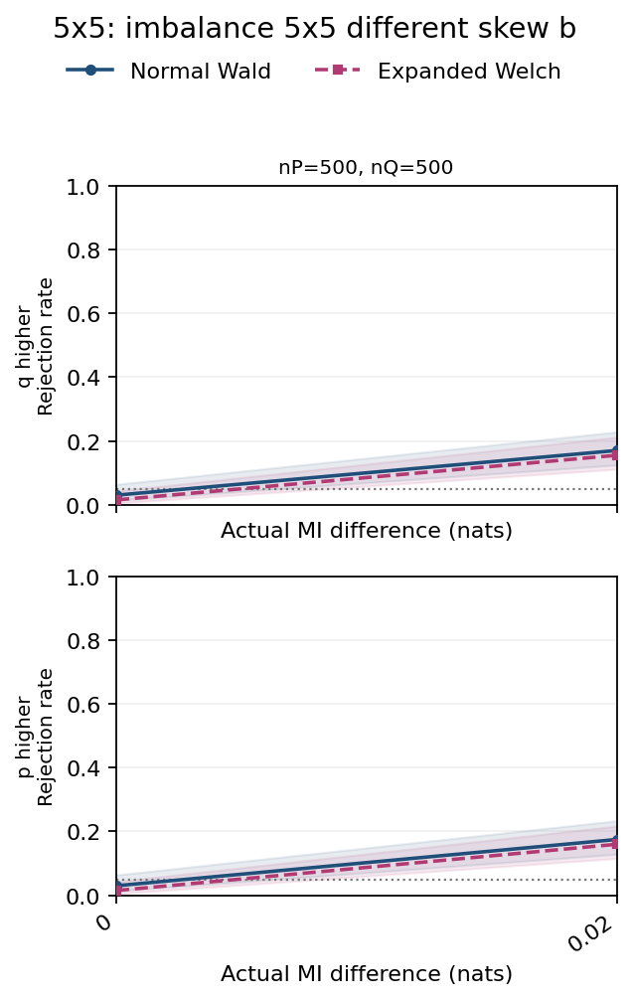

| Specification | Setting |
| --- | --- |
| Table size | 5x5 |
| Horizontal graph regime specifications (columns) | nP=500, nQ=500 |
| Vertical graph regime specifications (rows) | q higher: P row (0.7, 0.3/4 repeated 4 times), P column (0.7, 0.3/4 repeated 4 times); Q row (0.8, 0.2/4 repeated 4 times), Q column (0.8, 0.2/4 repeated 4 times); p higher: P row (0.7, 0.3/4 repeated 4 times), P column (0.7, 0.3/4 repeated 4 times); Q row (0.8, 0.2/4 repeated 4 times), Q column (0.8, 0.2/4 repeated 4 times) |
| Probability changes | q higher: additive, first changes in P and Q; p higher: additive, first changes in P and Q |
| MI settings | Baseline MI {0.02}; direction {q higher, p higher}; actual differences {0, 0.02} nats |
| Horizontal axis within each graph | Actual MI difference in nats, fixed from 0 to 0.02 |
| Vertical axis within each graph | Unconditional rejection rate from 0 to 1; invalid results count as non-rejections |
| Replicates | 200 per unique point |

Null-point rejection and validity:

| Vertical regime | Horizontal regime | Method | Rejection | Valid |
| --- | --- | --- | --- | --- |
| p higher | nP=500, nQ=500 | Expanded Welch | 0.0150 | 1.0000 |
| p higher | nP=500, nQ=500 | Normal Wald | 0.0300 | 1.0000 |
| q higher | nP=500, nQ=500 | Expanded Welch | 0.0150 | 1.0000 |
| q higher | nP=500, nQ=500 | Normal Wald | 0.0300 | 1.0000 |

Every plotted rate, interval, validity and minimum expected count

| Vertical regime | Horizontal regime | x | Method | Rejection | 95% interval | Valid | Conditional | Min expected P | Min expected Q |
| --- | --- | --- | --- | --- | --- | --- | --- | --- | --- |
| p higher | nP=500, nQ=500 | 0 | Expanded Welch | 0.0150 | [0.0051, 0.0432] | 1.0000 | 0.0150 | 2.813 | 1.25 |
| p higher | nP=500, nQ=500 | 0 | Normal Wald | 0.0300 | [0.0138, 0.0639] | 1.0000 | 0.0300 | 2.813 | 1.25 |
| p higher | nP=500, nQ=500 | 0.02 | Expanded Welch | 0.1600 | [0.1157, 0.2171] | 1.0000 | 0.1600 | 2.813 | 1.25 |
| p higher | nP=500, nQ=500 | 0.02 | Normal Wald | 0.1750 | [0.1286, 0.2336] | 1.0000 | 0.1750 | 2.813 | 1.25 |
| q higher | nP=500, nQ=500 | 0 | Expanded Welch | 0.0150 | [0.0051, 0.0432] | 1.0000 | 0.0150 | 2.813 | 1.25 |
| q higher | nP=500, nQ=500 | 0 | Normal Wald | 0.0300 | [0.0138, 0.0639] | 1.0000 | 0.0300 | 2.813 | 1.25 |
| q higher | nP=500, nQ=500 | 0.02 | Expanded Welch | 0.1550 | [0.1114, 0.2116] | 1.0000 | 0.1550 | 2.813 | 1.25 |
| q higher | nP=500, nQ=500 | 0.02 | Normal Wald | 0.1700 | [0.1243, 0.2282] | 1.0000 | 0.1700 | 2.813 | 1.25 |

### 6.19 8x8: imbalance 8x8 uniform a

Does performance depend on which population has more data or greater MI?

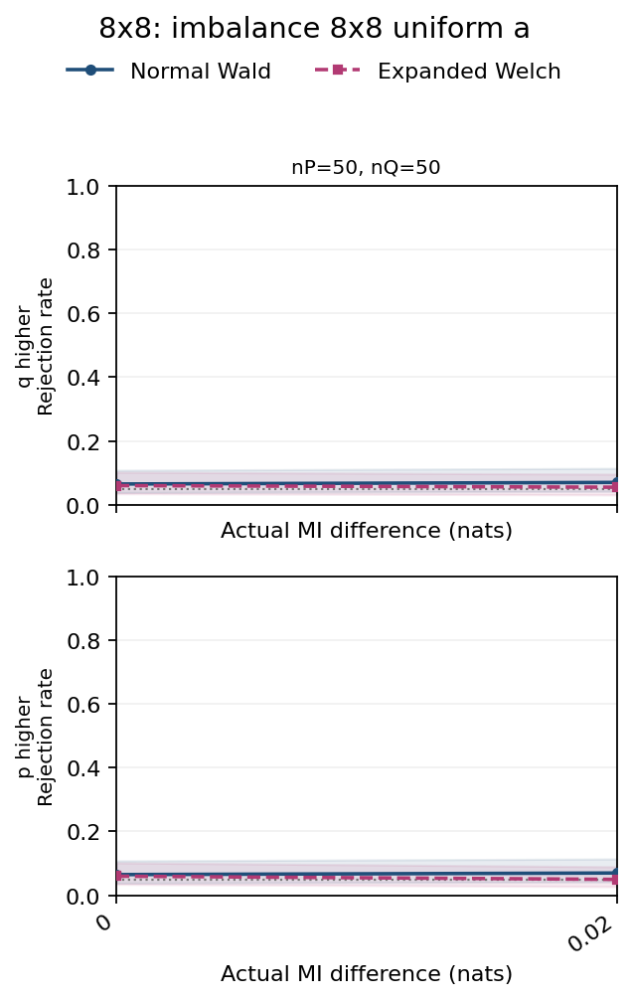

| Specification | Setting |
| --- | --- |
| Table size | 8x8 |
| Horizontal graph regime specifications (columns) | nP=50, nQ=50 |
| Vertical graph regime specifications (rows) | q higher: P row (0.125 repeated 8 times), P column (0.125 repeated 8 times); Q row (0.125 repeated 8 times), Q column (0.125 repeated 8 times); p higher: P row (0.125 repeated 8 times), P column (0.125 repeated 8 times); Q row (0.125 repeated 8 times), Q column (0.125 repeated 8 times) |
| Probability changes | q higher: additive, first changes in P and Q; p higher: additive, first changes in P and Q |
| MI settings | Baseline MI {0.02}; direction {q higher, p higher}; actual differences {0, 0.02} nats |
| Horizontal axis within each graph | Actual MI difference in nats, fixed from 0 to 0.02 |
| Vertical axis within each graph | Unconditional rejection rate from 0 to 1; invalid results count as non-rejections |
| Replicates | 200 per unique point |

Null-point rejection and validity:

| Vertical regime | Horizontal regime | Method | Rejection | Valid |
| --- | --- | --- | --- | --- |
| p higher | nP=50, nQ=50 | Expanded Welch | 0.0600 | 1.0000 |
| p higher | nP=50, nQ=50 | Normal Wald | 0.0650 | 1.0000 |
| q higher | nP=50, nQ=50 | Expanded Welch | 0.0600 | 1.0000 |
| q higher | nP=50, nQ=50 | Normal Wald | 0.0650 | 1.0000 |

Every plotted rate, interval, validity and minimum expected count

| Vertical regime | Horizontal regime | x | Method | Rejection | 95% interval | Valid | Conditional | Min expected P | Min expected Q |
| --- | --- | --- | --- | --- | --- | --- | --- | --- | --- |
| p higher | nP=50, nQ=50 | 0 | Expanded Welch | 0.0600 | [0.0347, 0.1019] | 1.0000 | 0.0600 | 0.1924 | 0.1924 |
| p higher | nP=50, nQ=50 | 0 | Normal Wald | 0.0650 | [0.0384, 0.1080] | 1.0000 | 0.0650 | 0.1924 | 0.1924 |
| p higher | nP=50, nQ=50 | 0.02 | Expanded Welch | 0.0500 | [0.0274, 0.0896] | 1.0000 | 0.0500 | 0.01466 | 0.1924 |
| p higher | nP=50, nQ=50 | 0.02 | Normal Wald | 0.0700 | [0.0422, 0.1141] | 1.0000 | 0.0700 | 0.01466 | 0.1924 |
| q higher | nP=50, nQ=50 | 0 | Expanded Welch | 0.0600 | [0.0347, 0.1019] | 1.0000 | 0.0600 | 0.1924 | 0.1924 |
| q higher | nP=50, nQ=50 | 0 | Normal Wald | 0.0650 | [0.0384, 0.1080] | 1.0000 | 0.0650 | 0.1924 | 0.1924 |
| q higher | nP=50, nQ=50 | 0.02 | Expanded Welch | 0.0550 | [0.0310, 0.0958] | 1.0000 | 0.0550 | 0.1924 | 0.01466 |
| q higher | nP=50, nQ=50 | 0.02 | Normal Wald | 0.0700 | [0.0422, 0.1141] | 1.0000 | 0.0700 | 0.1924 | 0.01466 |

### 6.20 8x8: imbalance 8x8 uniform b

Does performance depend on which population has more data or greater MI?

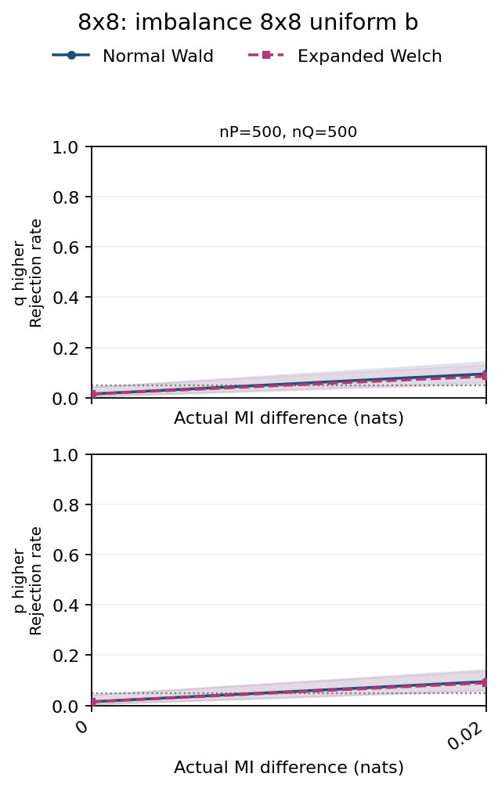

| Specification | Setting |
| --- | --- |
| Table size | 8x8 |
| Horizontal graph regime specifications (columns) | nP=500, nQ=500 |
| Vertical graph regime specifications (rows) | q higher: P row (0.125 repeated 8 times), P column (0.125 repeated 8 times); Q row (0.125 repeated 8 times), Q column (0.125 repeated 8 times); p higher: P row (0.125 repeated 8 times), P column (0.125 repeated 8 times); Q row (0.125 repeated 8 times), Q column (0.125 repeated 8 times) |
| Probability changes | q higher: additive, first changes in P and Q; p higher: additive, first changes in P and Q |
| MI settings | Baseline MI {0.02}; direction {q higher, p higher}; actual differences {0, 0.02} nats |
| Horizontal axis within each graph | Actual MI difference in nats, fixed from 0 to 0.02 |
| Vertical axis within each graph | Unconditional rejection rate from 0 to 1; invalid results count as non-rejections |
| Replicates | 200 per unique point |

Null-point rejection and validity:

| Vertical regime | Horizontal regime | Method | Rejection | Valid |
| --- | --- | --- | --- | --- |
| p higher | nP=500, nQ=500 | Expanded Welch | 0.0150 | 1.0000 |
| p higher | nP=500, nQ=500 | Normal Wald | 0.0150 | 1.0000 |
| q higher | nP=500, nQ=500 | Expanded Welch | 0.0150 | 1.0000 |
| q higher | nP=500, nQ=500 | Normal Wald | 0.0150 | 1.0000 |

Every plotted rate, interval, validity and minimum expected count

| Vertical regime | Horizontal regime | x | Method | Rejection | 95% interval | Valid | Conditional | Min expected P | Min expected Q |
| --- | --- | --- | --- | --- | --- | --- | --- | --- | --- |
| p higher | nP=500, nQ=500 | 0 | Expanded Welch | 0.0150 | [0.0051, 0.0432] | 1.0000 | 0.0150 | 1.924 | 1.924 |
| p higher | nP=500, nQ=500 | 0 | Normal Wald | 0.0150 | [0.0051, 0.0432] | 1.0000 | 0.0150 | 1.924 | 1.924 |
| p higher | nP=500, nQ=500 | 0.02 | Expanded Welch | 0.0900 | [0.0577, 0.1378] | 1.0000 | 0.0900 | 0.1466 | 1.924 |
| p higher | nP=500, nQ=500 | 0.02 | Normal Wald | 0.0950 | [0.0617, 0.1436] | 1.0000 | 0.0950 | 0.1466 | 1.924 |
| q higher | nP=500, nQ=500 | 0 | Expanded Welch | 0.0150 | [0.0051, 0.0432] | 1.0000 | 0.0150 | 1.924 | 1.924 |
| q higher | nP=500, nQ=500 | 0 | Normal Wald | 0.0150 | [0.0051, 0.0432] | 1.0000 | 0.0150 | 1.924 | 1.924 |
| q higher | nP=500, nQ=500 | 0.02 | Expanded Welch | 0.0850 | [0.0537, 0.1319] | 1.0000 | 0.0850 | 1.924 | 0.1466 |
| q higher | nP=500, nQ=500 | 0.02 | Normal Wald | 0.0950 | [0.0617, 0.1436] | 1.0000 | 0.0950 | 1.924 | 0.1466 |

### 6.21 8x8: imbalance 8x8 same skew a

Does performance depend on which population has more data or greater MI?

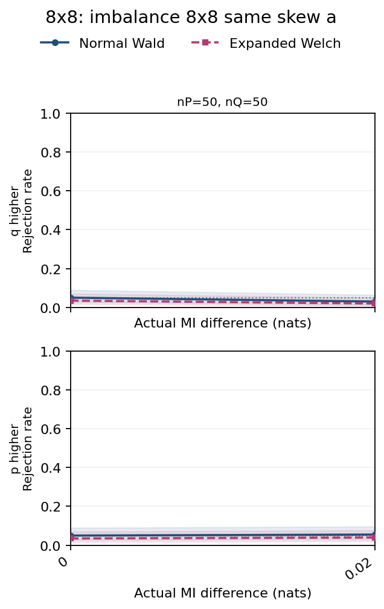

| Specification | Setting |
| --- | --- |
| Table size | 8x8 |
| Horizontal graph regime specifications (columns) | nP=50, nQ=50 |
| Vertical graph regime specifications (rows) | q higher: P row (0.8, 0.2/7 repeated 7 times), P column (0.8, 0.2/7 repeated 7 times); Q row (0.8, 0.2/7 repeated 7 times), Q column (0.8, 0.2/7 repeated 7 times); p higher: P row (0.8, 0.2/7 repeated 7 times), P column (0.8, 0.2/7 repeated 7 times); Q row (0.8, 0.2/7 repeated 7 times), Q column (0.8, 0.2/7 repeated 7 times) |
| Probability changes | q higher: additive, first changes in P and Q; p higher: additive, first changes in P and Q |
| MI settings | Baseline MI {0.02}; direction {q higher, p higher}; actual differences {0, 0.02} nats |
| Horizontal axis within each graph | Actual MI difference in nats, fixed from 0 to 0.02 |
| Vertical axis within each graph | Unconditional rejection rate from 0 to 1; invalid results count as non-rejections |
| Replicates | 200 per unique point |

Null-point rejection and validity:

| Vertical regime | Horizontal regime | Method | Rejection | Valid |
| --- | --- | --- | --- | --- |
| p higher | nP=50, nQ=50 | Expanded Welch | 0.0350 | 1.0000 |
| p higher | nP=50, nQ=50 | Normal Wald | 0.0500 | 1.0000 |
| q higher | nP=50, nQ=50 | Expanded Welch | 0.0350 | 1.0000 |
| q higher | nP=50, nQ=50 | Normal Wald | 0.0500 | 1.0000 |

Every plotted rate, interval, validity and minimum expected count

| Vertical regime | Horizontal regime | x | Method | Rejection | 95% interval | Valid | Conditional | Min expected P | Min expected Q |
| --- | --- | --- | --- | --- | --- | --- | --- | --- | --- |
| p higher | nP=50, nQ=50 | 0 | Expanded Welch | 0.0350 | [0.0171, 0.0705] | 1.0000 | 0.0350 | 0.04082 | 0.04082 |
| p higher | nP=50, nQ=50 | 0 | Normal Wald | 0.0500 | [0.0274, 0.0896] | 1.0000 | 0.0500 | 0.04082 | 0.04082 |
| p higher | nP=50, nQ=50 | 0.02 | Expanded Welch | 0.0400 | [0.0204, 0.0769] | 1.0000 | 0.0400 | 0.04082 | 0.04082 |
| p higher | nP=50, nQ=50 | 0.02 | Normal Wald | 0.0550 | [0.0310, 0.0958] | 1.0000 | 0.0550 | 0.04082 | 0.04082 |
| q higher | nP=50, nQ=50 | 0 | Expanded Welch | 0.0350 | [0.0171, 0.0705] | 1.0000 | 0.0350 | 0.04082 | 0.04082 |
| q higher | nP=50, nQ=50 | 0 | Normal Wald | 0.0500 | [0.0274, 0.0896] | 1.0000 | 0.0500 | 0.04082 | 0.04082 |
| q higher | nP=50, nQ=50 | 0.02 | Expanded Welch | 0.0200 | [0.0078, 0.0503] | 1.0000 | 0.0200 | 0.04082 | 0.04082 |
| q higher | nP=50, nQ=50 | 0.02 | Normal Wald | 0.0300 | [0.0138, 0.0639] | 1.0000 | 0.0300 | 0.04082 | 0.04082 |

### 6.22 8x8: imbalance 8x8 same skew b

Does performance depend on which population has more data or greater MI?

| Specification | Setting |
| --- | --- |
| Table size | 8x8 |
| Horizontal graph regime specifications (columns) | nP=500, nQ=500 |
| Vertical graph regime specifications (rows) | q higher: P row (0.8, 0.2/7 repeated 7 times), P column (0.8, 0.2/7 repeated 7 times); Q row (0.8, 0.2/7 repeated 7 times), Q column (0.8, 0.2/7 repeated 7 times); p higher: P row (0.8, 0.2/7 repeated 7 times), P column (0.8, 0.2/7 repeated 7 times); Q row (0.8, 0.2/7 repeated 7 times), Q column (0.8, 0.2/7 repeated 7 times) |
| Probability changes | q higher: additive, first changes in P and Q; p higher: additive, first changes in P and Q |
| MI settings | Baseline MI {0.02}; direction {q higher, p higher}; actual differences {0, 0.02} nats |
| Horizontal axis within each graph | Actual MI difference in nats, fixed from 0 to 0.02 |
| Vertical axis within each graph | Unconditional rejection rate from 0 to 1; invalid results count as non-rejections |
| Replicates | 200 per unique point |

Null-point rejection and validity:

| Vertical regime | Horizontal regime | Method | Rejection | Valid |
| --- | --- | --- | --- | --- |
| p higher | nP=500, nQ=500 | Expanded Welch | 0.0150 | 1.0000 |
| p higher | nP=500, nQ=500 | Normal Wald | 0.0200 | 1.0000 |
| q higher | nP=500, nQ=500 | Expanded Welch | 0.0150 | 1.0000 |
| q higher | nP=500, nQ=500 | Normal Wald | 0.0200 | 1.0000 |

Every plotted rate, interval, validity and minimum expected count

| Vertical regime | Horizontal regime | x | Method | Rejection | 95% interval | Valid | Conditional | Min expected P | Min expected Q |
| --- | --- | --- | --- | --- | --- | --- | --- | --- | --- |
| p higher | nP=500, nQ=500 | 0 | Expanded Welch | 0.0150 | [0.0051, 0.0432] | 1.0000 | 0.0150 | 0.4082 | 0.4082 |
| p higher | nP=500, nQ=500 | 0 | Normal Wald | 0.0200 | [0.0078, 0.0503] | 1.0000 | 0.0200 | 0.4082 | 0.4082 |
| p higher | nP=500, nQ=500 | 0.02 | Expanded Welch | 0.0700 | [0.0422, 0.1141] | 1.0000 | 0.0700 | 0.4082 | 0.4082 |
| p higher | nP=500, nQ=500 | 0.02 | Normal Wald | 0.0750 | [0.0460, 0.1200] | 1.0000 | 0.0750 | 0.4082 | 0.4082 |
| q higher | nP=500, nQ=500 | 0 | Expanded Welch | 0.0150 | [0.0051, 0.0432] | 1.0000 | 0.0150 | 0.4082 | 0.4082 |
| q higher | nP=500, nQ=500 | 0 | Normal Wald | 0.0200 | [0.0078, 0.0503] | 1.0000 | 0.0200 | 0.4082 | 0.4082 |
| q higher | nP=500, nQ=500 | 0.02 | Expanded Welch | 0.0800 | [0.0498, 0.1260] | 1.0000 | 0.0800 | 0.4082 | 0.4082 |
| q higher | nP=500, nQ=500 | 0.02 | Normal Wald | 0.0850 | [0.0537, 0.1319] | 1.0000 | 0.0850 | 0.4082 | 0.4082 |

### 6.23 8x8: imbalance 8x8 different skew a

Does performance depend on which population has more data or greater MI?

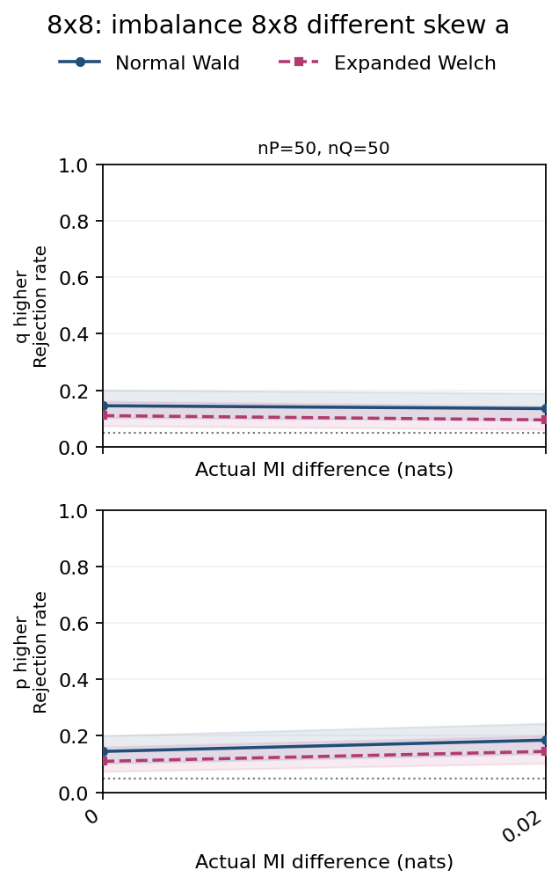

| Specification | Setting |
| --- | --- |
| Table size | 8x8 |
| Horizontal graph regime specifications (columns) | nP=50, nQ=50 |
| Vertical graph regime specifications (rows) | q higher: P row (0.7, 0.3/7 repeated 7 times), P column (0.7, 0.3/7 repeated 7 times); Q row (0.8, 0.2/7 repeated 7 times), Q column (0.8, 0.2/7 repeated 7 times); p higher: P row (0.7, 0.3/7 repeated 7 times), P column (0.7, 0.3/7 repeated 7 times); Q row (0.8, 0.2/7 repeated 7 times), Q column (0.8, 0.2/7 repeated 7 times) |
| Probability changes | q higher: additive, first changes in P and Q; p higher: additive, first changes in P and Q |
| MI settings | Baseline MI {0.02}; direction {q higher, p higher}; actual differences {0, 0.02} nats |
| Horizontal axis within each graph | Actual MI difference in nats, fixed from 0 to 0.02 |
| Vertical axis within each graph | Unconditional rejection rate from 0 to 1; invalid results count as non-rejections |
| Replicates | 200 per unique point |

Null-point rejection and validity:

| Vertical regime | Horizontal regime | Method | Rejection | Valid |
| --- | --- | --- | --- | --- |
| p higher | nP=50, nQ=50 | Expanded Welch | 0.1100 | 1.0000 |
| p higher | nP=50, nQ=50 | Normal Wald | 0.1450 | 1.0000 |
| q higher | nP=50, nQ=50 | Expanded Welch | 0.1100 | 1.0000 |
| q higher | nP=50, nQ=50 | Normal Wald | 0.1450 | 1.0000 |

Every plotted rate, interval, validity and minimum expected count

| Vertical regime | Horizontal regime | x | Method | Rejection | 95% interval | Valid | Conditional | Min expected P | Min expected Q |
| --- | --- | --- | --- | --- | --- | --- | --- | --- | --- |
| p higher | nP=50, nQ=50 | 0 | Expanded Welch | 0.1100 | [0.0738, 0.1609] | 1.0000 | 0.1100 | 0.09184 | 0.04082 |
| p higher | nP=50, nQ=50 | 0 | Normal Wald | 0.1450 | [0.1029, 0.2005] | 1.0000 | 0.1450 | 0.09184 | 0.04082 |
| p higher | nP=50, nQ=50 | 0.02 | Expanded Welch | 0.1450 | [0.1029, 0.2005] | 1.0000 | 0.1450 | 0.09184 | 0.04082 |
| p higher | nP=50, nQ=50 | 0.02 | Normal Wald | 0.1850 | [0.1373, 0.2446] | 1.0000 | 0.1850 | 0.09184 | 0.04082 |
| q higher | nP=50, nQ=50 | 0 | Expanded Welch | 0.1100 | [0.0738, 0.1609] | 1.0000 | 0.1100 | 0.09184 | 0.04082 |
| q higher | nP=50, nQ=50 | 0 | Normal Wald | 0.1450 | [0.1029, 0.2005] | 1.0000 | 0.1450 | 0.09184 | 0.04082 |
| q higher | nP=50, nQ=50 | 0.02 | Expanded Welch | 0.0950 | [0.0617, 0.1436] | 1.0000 | 0.0950 | 0.09184 | 0.04082 |
| q higher | nP=50, nQ=50 | 0.02 | Normal Wald | 0.1350 | [0.0945, 0.1893] | 1.0000 | 0.1350 | 0.09184 | 0.04082 |

### 6.24 8x8: imbalance 8x8 different skew b

Does performance depend on which population has more data or greater MI?

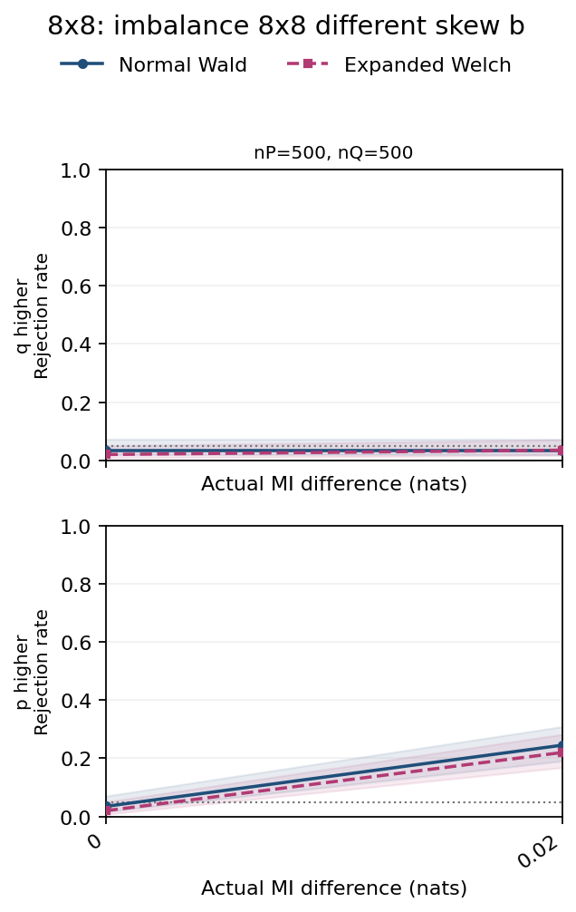

| Specification | Setting |
| --- | --- |
| Table size | 8x8 |
| Horizontal graph regime specifications (columns) | nP=500, nQ=500 |
| Vertical graph regime specifications (rows) | q higher: P row (0.7, 0.3/7 repeated 7 times), P column (0.7, 0.3/7 repeated 7 times); Q row (0.8, 0.2/7 repeated 7 times), Q column (0.8, 0.2/7 repeated 7 times); p higher: P row (0.7, 0.3/7 repeated 7 times), P column (0.7, 0.3/7 repeated 7 times); Q row (0.8, 0.2/7 repeated 7 times), Q column (0.8, 0.2/7 repeated 7 times) |
| Probability changes | q higher: additive, first changes in P and Q; p higher: additive, first changes in P and Q |
| MI settings | Baseline MI {0.02}; direction {q higher, p higher}; actual differences {0, 0.02} nats |
| Horizontal axis within each graph | Actual MI difference in nats, fixed from 0 to 0.02 |
| Vertical axis within each graph | Unconditional rejection rate from 0 to 1; invalid results count as non-rejections |
| Replicates | 200 per unique point |

Null-point rejection and validity:

| Vertical regime | Horizontal regime | Method | Rejection | Valid |
| --- | --- | --- | --- | --- |
| p higher | nP=500, nQ=500 | Expanded Welch | 0.0200 | 1.0000 |
| p higher | nP=500, nQ=500 | Normal Wald | 0.0350 | 1.0000 |
| q higher | nP=500, nQ=500 | Expanded Welch | 0.0200 | 1.0000 |
| q higher | nP=500, nQ=500 | Normal Wald | 0.0350 | 1.0000 |

Every plotted rate, interval, validity and minimum expected count

| Vertical regime | Horizontal regime | x | Method | Rejection | 95% interval | Valid | Conditional | Min expected P | Min expected Q |
| --- | --- | --- | --- | --- | --- | --- | --- | --- | --- |
| p higher | nP=500, nQ=500 | 0 | Expanded Welch | 0.0200 | [0.0078, 0.0503] | 1.0000 | 0.0200 | 0.9184 | 0.4082 |
| p higher | nP=500, nQ=500 | 0 | Normal Wald | 0.0350 | [0.0171, 0.0705] | 1.0000 | 0.0350 | 0.9184 | 0.4082 |
| p higher | nP=500, nQ=500 | 0.02 | Expanded Welch | 0.2200 | [0.1682, 0.2824] | 1.0000 | 0.2200 | 0.9184 | 0.4082 |
| p higher | nP=500, nQ=500 | 0.02 | Normal Wald | 0.2450 | [0.1906, 0.3090] | 1.0000 | 0.2450 | 0.9184 | 0.4082 |
| q higher | nP=500, nQ=500 | 0 | Expanded Welch | 0.0200 | [0.0078, 0.0503] | 1.0000 | 0.0200 | 0.9184 | 0.4082 |
| q higher | nP=500, nQ=500 | 0 | Normal Wald | 0.0350 | [0.0171, 0.0705] | 1.0000 | 0.0350 | 0.9184 | 0.4082 |
| q higher | nP=500, nQ=500 | 0.02 | Expanded Welch | 0.0350 | [0.0171, 0.0705] | 1.0000 | 0.0350 | 0.9184 | 0.4082 |
| q higher | nP=500, nQ=500 | 0.02 | Normal Wald | 0.0350 | [0.0171, 0.0705] | 1.0000 | 0.0350 | 0.9184 | 0.4082 |

## 7. Larger MI differences

Do the power curves continue across larger actual MI differences?

### 7.1 2x2: broad 2x2 uniform

Do the power curves continue across larger actual MI differences?

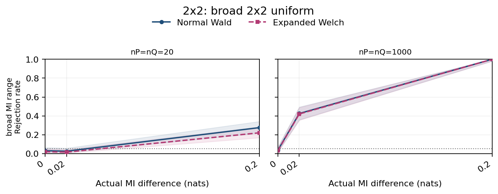

| Specification | Setting |
| --- | --- |
| Table size | 2x2 |
| Horizontal graph regime specifications (columns) | nP=nQ=20, nP=nQ=1000 |
| Vertical graph regime specifications (rows) | broad MI range: P row (0.5 repeated 2 times), P column (0.5 repeated 2 times); Q row (0.5 repeated 2 times), Q column (0.5 repeated 2 times) |
| Probability changes | broad MI range: additive, first changes in P and Q |
| MI settings | Baseline MI {0.02}; direction {q higher}; actual differences {0, 0.02, 0.2} nats |
| Horizontal axis within each graph | Actual MI difference in nats, fixed from 0 to 0.2 |
| Vertical axis within each graph | Unconditional rejection rate from 0 to 1; invalid results count as non-rejections |
| Replicates | 200 per unique point |

Null-point rejection and validity:

| Vertical regime | Horizontal regime | Method | Rejection | Valid |
| --- | --- | --- | --- | --- |
| broad MI range | nP=nQ=1000 | Expanded Welch | 0.0300 | 1.0000 |
| broad MI range | nP=nQ=1000 | Normal Wald | 0.0350 | 1.0000 |
| broad MI range | nP=nQ=20 | Expanded Welch | 0.0200 | 0.9900 |
| broad MI range | nP=nQ=20 | Normal Wald | 0.0300 | 1.0000 |

Every plotted rate, interval, validity and minimum expected count

| Vertical regime | Horizontal regime | x | Method | Rejection | 95% interval | Valid | Conditional | Min expected P | Min expected Q |
| --- | --- | --- | --- | --- | --- | --- | --- | --- | --- |
| broad MI range | nP=nQ=1000 | 0 | Expanded Welch | 0.0300 | [0.0138, 0.0639] | 1.0000 | 0.0300 | 200.2 | 200.2 |
| broad MI range | nP=nQ=1000 | 0 | Normal Wald | 0.0350 | [0.0171, 0.0705] | 1.0000 | 0.0350 | 200.2 | 200.2 |
| broad MI range | nP=nQ=1000 | 0.02 | Expanded Welch | 0.4200 | [0.3537, 0.4893] | 1.0000 | 0.4200 | 200.2 | 179.8 |
| broad MI range | nP=nQ=1000 | 0.02 | Normal Wald | 0.4250 | [0.3585, 0.4943] | 1.0000 | 0.4250 | 200.2 | 179.8 |
| broad MI range | nP=nQ=1000 | 0.2 | Expanded Welch | 1.0000 | [0.9812, 1.0000] | 1.0000 | 1.0000 | 200.2 | 90.58 |
| broad MI range | nP=nQ=1000 | 0.2 | Normal Wald | 1.0000 | [0.9812, 1.0000] | 1.0000 | 1.0000 | 200.2 | 90.58 |
| broad MI range | nP=nQ=20 | 0 | Expanded Welch | 0.0200 | [0.0078, 0.0503] | 0.9900 | 0.0202 | 4.003 | 4.003 |
| broad MI range | nP=nQ=20 | 0 | Normal Wald | 0.0300 | [0.0138, 0.0639] | 1.0000 | 0.0300 | 4.003 | 4.003 |
| broad MI range | nP=nQ=20 | 0.02 | Expanded Welch | 0.0150 | [0.0051, 0.0432] | 0.9950 | 0.0151 | 4.003 | 3.595 |
| broad MI range | nP=nQ=20 | 0.02 | Normal Wald | 0.0250 | [0.0107, 0.0572] | 1.0000 | 0.0250 | 4.003 | 3.595 |
| broad MI range | nP=nQ=20 | 0.2 | Expanded Welch | 0.2200 | [0.1682, 0.2824] | 0.9950 | 0.2211 | 4.003 | 1.812 |
| broad MI range | nP=nQ=20 | 0.2 | Normal Wald | 0.2750 | [0.2178, 0.3407] | 1.0000 | 0.2750 | 4.003 | 1.812 |

### 7.2 2x2: broad 2x2 same skew

Do the power curves continue across larger actual MI differences?

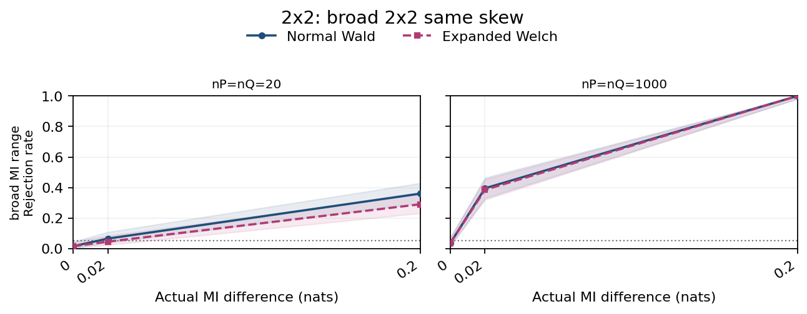

| Specification | Setting |
| --- | --- |
| Table size | 2x2 |
| Horizontal graph regime specifications (columns) | nP=nQ=20, nP=nQ=1000 |
| Vertical graph regime specifications (rows) | broad MI range: P row (0.8, 0.2), P column (0.8, 0.2); Q row (0.8, 0.2), Q column (0.8, 0.2) |
| Probability changes | broad MI range: additive, first changes in P and Q |
| MI settings | Baseline MI {0.02}; direction {q higher}; actual differences {0, 0.02, 0.2} nats |
| Horizontal axis within each graph | Actual MI difference in nats, fixed from 0 to 0.2 |
| Vertical axis within each graph | Unconditional rejection rate from 0 to 1; invalid results count as non-rejections |
| Replicates | 200 per unique point |

Null-point rejection and validity:

| Vertical regime | Horizontal regime | Method | Rejection | Valid |
| --- | --- | --- | --- | --- |
| broad MI range | nP=nQ=1000 | Expanded Welch | 0.0350 | 1.0000 |
| broad MI range | nP=nQ=1000 | Normal Wald | 0.0350 | 1.0000 |
| broad MI range | nP=nQ=20 | Expanded Welch | 0.0150 | 0.9600 |
| broad MI range | nP=nQ=20 | Normal Wald | 0.0150 | 1.0000 |

Every plotted rate, interval, validity and minimum expected count

| Vertical regime | Horizontal regime | x | Method | Rejection | 95% interval | Valid | Conditional | Min expected P | Min expected Q |
| --- | --- | --- | --- | --- | --- | --- | --- | --- | --- |
| broad MI range | nP=nQ=1000 | 0 | Expanded Welch | 0.0350 | [0.0171, 0.0705] | 1.0000 | 0.0350 | 73.82 | 73.82 |
| broad MI range | nP=nQ=1000 | 0 | Normal Wald | 0.0350 | [0.0171, 0.0705] | 1.0000 | 0.0350 | 73.82 | 73.82 |
| broad MI range | nP=nQ=1000 | 0.02 | Expanded Welch | 0.3850 | [0.3203, 0.4540] | 1.0000 | 0.3850 | 73.82 | 88.48 |
| broad MI range | nP=nQ=1000 | 0.02 | Normal Wald | 0.3950 | [0.3298, 0.4641] | 1.0000 | 0.3950 | 73.82 | 88.48 |
| broad MI range | nP=nQ=1000 | 0.2 | Expanded Welch | 1.0000 | [0.9812, 1.0000] | 1.0000 | 1.0000 | 73.82 | 45.14 |
| broad MI range | nP=nQ=1000 | 0.2 | Normal Wald | 1.0000 | [0.9812, 1.0000] | 1.0000 | 1.0000 | 73.82 | 45.14 |
| broad MI range | nP=nQ=20 | 0 | Expanded Welch | 0.0150 | [0.0051, 0.0432] | 0.9600 | 0.0156 | 1.476 | 1.476 |
| broad MI range | nP=nQ=20 | 0 | Normal Wald | 0.0150 | [0.0051, 0.0432] | 1.0000 | 0.0150 | 1.476 | 1.476 |
| broad MI range | nP=nQ=20 | 0.02 | Expanded Welch | 0.0450 | [0.0239, 0.0833] | 0.9300 | 0.0484 | 1.476 | 1.77 |
| broad MI range | nP=nQ=20 | 0.02 | Normal Wald | 0.0650 | [0.0384, 0.1080] | 1.0000 | 0.0650 | 1.476 | 1.77 |
| broad MI range | nP=nQ=20 | 0.2 | Expanded Welch | 0.2900 | [0.2315, 0.3564] | 0.9700 | 0.2990 | 1.476 | 0.9027 |
| broad MI range | nP=nQ=20 | 0.2 | Normal Wald | 0.3600 | [0.2967, 0.4286] | 1.0000 | 0.3600 | 1.476 | 0.9027 |

### 7.3 2x2: broad 2x2 different skew

Do the power curves continue across larger actual MI differences?

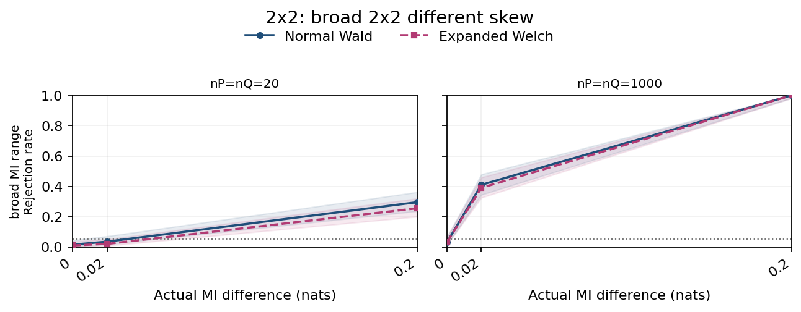

| Specification | Setting |
| --- | --- |
| Table size | 2x2 |
| Horizontal graph regime specifications (columns) | nP=nQ=20, nP=nQ=1000 |
| Vertical graph regime specifications (rows) | broad MI range: P row (0.7, 0.3), P column (0.7, 0.3); Q row (0.8, 0.2), Q column (0.8, 0.2) |
| Probability changes | broad MI range: additive, first changes in P and Q |
| MI settings | Baseline MI {0.02}; direction {q higher}; actual differences {0, 0.02, 0.2} nats |
| Horizontal axis within each graph | Actual MI difference in nats, fixed from 0 to 0.2 |
| Vertical axis within each graph | Unconditional rejection rate from 0 to 1; invalid results count as non-rejections |
| Replicates | 200 per unique point |

Null-point rejection and validity:

| Vertical regime | Horizontal regime | Method | Rejection | Valid |
| --- | --- | --- | --- | --- |
| broad MI range | nP=nQ=1000 | Expanded Welch | 0.0300 | 1.0000 |
| broad MI range | nP=nQ=1000 | Normal Wald | 0.0300 | 1.0000 |
| broad MI range | nP=nQ=20 | Expanded Welch | 0.0100 | 0.9800 |
| broad MI range | nP=nQ=20 | Normal Wald | 0.0150 | 1.0000 |

Every plotted rate, interval, validity and minimum expected count

| Vertical regime | Horizontal regime | x | Method | Rejection | 95% interval | Valid | Conditional | Min expected P | Min expected Q |
| --- | --- | --- | --- | --- | --- | --- | --- | --- | --- |
| broad MI range | nP=nQ=1000 | 0 | Expanded Welch | 0.0300 | [0.0138, 0.0639] | 1.0000 | 0.0300 | 132.7 | 73.82 |
| broad MI range | nP=nQ=1000 | 0 | Normal Wald | 0.0300 | [0.0138, 0.0639] | 1.0000 | 0.0300 | 132.7 | 73.82 |
| broad MI range | nP=nQ=1000 | 0.02 | Expanded Welch | 0.3900 | [0.3251, 0.4591] | 1.0000 | 0.3900 | 132.7 | 88.48 |
| broad MI range | nP=nQ=1000 | 0.02 | Normal Wald | 0.4100 | [0.3442, 0.4792] | 1.0000 | 0.4100 | 132.7 | 88.48 |
| broad MI range | nP=nQ=1000 | 0.2 | Expanded Welch | 1.0000 | [0.9812, 1.0000] | 1.0000 | 1.0000 | 132.7 | 45.14 |
| broad MI range | nP=nQ=1000 | 0.2 | Normal Wald | 1.0000 | [0.9812, 1.0000] | 1.0000 | 1.0000 | 132.7 | 45.14 |
| broad MI range | nP=nQ=20 | 0 | Expanded Welch | 0.0100 | [0.0027, 0.0357] | 0.9800 | 0.0102 | 2.655 | 1.476 |
| broad MI range | nP=nQ=20 | 0 | Normal Wald | 0.0150 | [0.0051, 0.0432] | 1.0000 | 0.0150 | 2.655 | 1.476 |
| broad MI range | nP=nQ=20 | 0.02 | Expanded Welch | 0.0200 | [0.0078, 0.0503] | 0.9850 | 0.0203 | 2.655 | 1.77 |
| broad MI range | nP=nQ=20 | 0.02 | Normal Wald | 0.0350 | [0.0171, 0.0705] | 1.0000 | 0.0350 | 2.655 | 1.77 |
| broad MI range | nP=nQ=20 | 0.2 | Expanded Welch | 0.2550 | [0.1996, 0.3196] | 0.9750 | 0.2615 | 2.655 | 0.9027 |
| broad MI range | nP=nQ=20 | 0.2 | Normal Wald | 0.2950 | [0.2361, 0.3616] | 1.0000 | 0.2950 | 2.655 | 0.9027 |

### 7.4 3x3: broad 3x3 uniform

Do the power curves continue across larger actual MI differences?

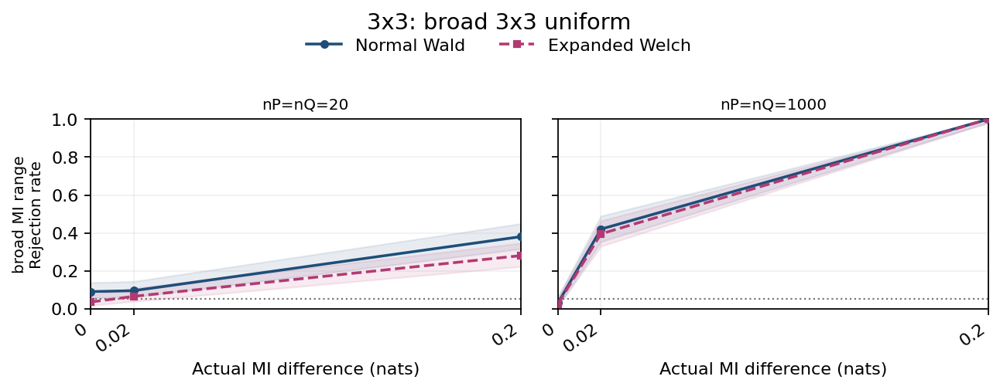

| Specification | Setting |
| --- | --- |
| Table size | 3x3 |
| Horizontal graph regime specifications (columns) | nP=nQ=20, nP=nQ=1000 |
| Vertical graph regime specifications (rows) | broad MI range: P row (0.3333 repeated 3 times), P column (0.3333 repeated 3 times); Q row (0.3333 repeated 3 times), Q column (0.3333 repeated 3 times) |
| Probability changes | broad MI range: additive, first changes in P and Q |
| MI settings | Baseline MI {0.02}; direction {q higher}; actual differences {0, 0.02, 0.2} nats |
| Horizontal axis within each graph | Actual MI difference in nats, fixed from 0 to 0.2 |
| Vertical axis within each graph | Unconditional rejection rate from 0 to 1; invalid results count as non-rejections |
| Replicates | 200 per unique point |

Null-point rejection and validity:

| Vertical regime | Horizontal regime | Method | Rejection | Valid |
| --- | --- | --- | --- | --- |
| broad MI range | nP=nQ=1000 | Expanded Welch | 0.0250 | 1.0000 |
| broad MI range | nP=nQ=1000 | Normal Wald | 0.0300 | 1.0000 |
| broad MI range | nP=nQ=20 | Expanded Welch | 0.0350 | 1.0000 |
| broad MI range | nP=nQ=20 | Normal Wald | 0.0900 | 1.0000 |

Every plotted rate, interval, validity and minimum expected count

| Vertical regime | Horizontal regime | x | Method | Rejection | 95% interval | Valid | Conditional | Min expected P | Min expected Q |
| --- | --- | --- | --- | --- | --- | --- | --- | --- | --- |
| broad MI range | nP=nQ=1000 | 0 | Expanded Welch | 0.0250 | [0.0107, 0.0572] | 1.0000 | 0.0250 | 78.03 | 78.03 |
| broad MI range | nP=nQ=1000 | 0 | Normal Wald | 0.0300 | [0.0138, 0.0639] | 1.0000 | 0.0300 | 78.03 | 78.03 |
| broad MI range | nP=nQ=1000 | 0.02 | Expanded Welch | 0.3950 | [0.3298, 0.4641] | 1.0000 | 0.3950 | 78.03 | 64.69 |
| broad MI range | nP=nQ=1000 | 0.02 | Normal Wald | 0.4200 | [0.3537, 0.4893] | 1.0000 | 0.4200 | 78.03 | 64.69 |
| broad MI range | nP=nQ=1000 | 0.2 | Expanded Welch | 1.0000 | [0.9812, 1.0000] | 1.0000 | 1.0000 | 78.03 | 11.08 |
| broad MI range | nP=nQ=1000 | 0.2 | Normal Wald | 1.0000 | [0.9812, 1.0000] | 1.0000 | 1.0000 | 78.03 | 11.08 |
| broad MI range | nP=nQ=20 | 0 | Expanded Welch | 0.0350 | [0.0171, 0.0705] | 1.0000 | 0.0350 | 1.561 | 1.561 |
| broad MI range | nP=nQ=20 | 0 | Normal Wald | 0.0900 | [0.0577, 0.1378] | 1.0000 | 0.0900 | 1.561 | 1.561 |
| broad MI range | nP=nQ=20 | 0.02 | Expanded Welch | 0.0650 | [0.0384, 0.1080] | 1.0000 | 0.0650 | 1.561 | 1.294 |
| broad MI range | nP=nQ=20 | 0.02 | Normal Wald | 0.0950 | [0.0617, 0.1436] | 1.0000 | 0.0950 | 1.561 | 1.294 |
| broad MI range | nP=nQ=20 | 0.2 | Expanded Welch | 0.2800 | [0.2224, 0.3459] | 1.0000 | 0.2800 | 1.561 | 0.2217 |
| broad MI range | nP=nQ=20 | 0.2 | Normal Wald | 0.3800 | [0.3156, 0.4489] | 1.0000 | 0.3800 | 1.561 | 0.2217 |

### 7.5 3x3: broad 3x3 same skew

Do the power curves continue across larger actual MI differences?

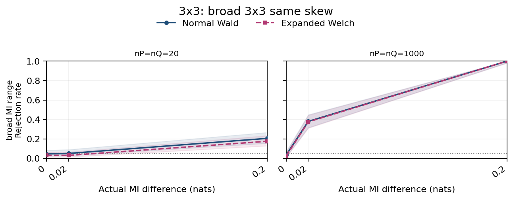

| Specification | Setting |
| --- | --- |
| Table size | 3x3 |
| Horizontal graph regime specifications (columns) | nP=nQ=20, nP=nQ=1000 |
| Vertical graph regime specifications (rows) | broad MI range: P row (0.8, 0.2/2 repeated 2 times), P column (0.8, 0.2/2 repeated 2 times); Q row (0.8, 0.2/2 repeated 2 times), Q column (0.8, 0.2/2 repeated 2 times) |
| Probability changes | broad MI range: additive, first changes in P and Q |
| MI settings | Baseline MI {0.02}; direction {q higher}; actual differences {0, 0.02, 0.2} nats |
| Horizontal axis within each graph | Actual MI difference in nats, fixed from 0 to 0.2 |
| Vertical axis within each graph | Unconditional rejection rate from 0 to 1; invalid results count as non-rejections |
| Replicates | 200 per unique point |

Null-point rejection and validity:

| Vertical regime | Horizontal regime | Method | Rejection | Valid |
| --- | --- | --- | --- | --- |
| broad MI range | nP=nQ=1000 | Expanded Welch | 0.0250 | 1.0000 |
| broad MI range | nP=nQ=1000 | Normal Wald | 0.0350 | 1.0000 |
| broad MI range | nP=nQ=20 | Expanded Welch | 0.0300 | 0.9500 |
| broad MI range | nP=nQ=20 | Normal Wald | 0.0450 | 1.0000 |

Every plotted rate, interval, validity and minimum expected count

| Vertical regime | Horizontal regime | x | Method | Rejection | 95% interval | Valid | Conditional | Min expected P | Min expected Q |
| --- | --- | --- | --- | --- | --- | --- | --- | --- | --- |
| broad MI range | nP=nQ=1000 | 0 | Expanded Welch | 0.0250 | [0.0107, 0.0572] | 1.0000 | 0.0250 | 10 | 10 |
| broad MI range | nP=nQ=1000 | 0 | Normal Wald | 0.0350 | [0.0171, 0.0705] | 1.0000 | 0.0350 | 10 | 10 |
| broad MI range | nP=nQ=1000 | 0.02 | Expanded Welch | 0.3750 | [0.3109, 0.4439] | 1.0000 | 0.3750 | 10 | 10 |
| broad MI range | nP=nQ=1000 | 0.02 | Normal Wald | 0.3800 | [0.3156, 0.4489] | 1.0000 | 0.3800 | 10 | 10 |
| broad MI range | nP=nQ=1000 | 0.2 | Expanded Welch | 1.0000 | [0.9812, 1.0000] | 1.0000 | 1.0000 | 10 | 6.798 |
| broad MI range | nP=nQ=1000 | 0.2 | Normal Wald | 1.0000 | [0.9812, 1.0000] | 1.0000 | 1.0000 | 10 | 6.798 |
| broad MI range | nP=nQ=20 | 0 | Expanded Welch | 0.0300 | [0.0138, 0.0639] | 0.9500 | 0.0316 | 0.2 | 0.2 |
| broad MI range | nP=nQ=20 | 0 | Normal Wald | 0.0450 | [0.0239, 0.0833] | 1.0000 | 0.0450 | 0.2 | 0.2 |
| broad MI range | nP=nQ=20 | 0.02 | Expanded Welch | 0.0300 | [0.0138, 0.0639] | 0.9600 | 0.0312 | 0.2 | 0.2 |
| broad MI range | nP=nQ=20 | 0.02 | Normal Wald | 0.0500 | [0.0274, 0.0896] | 1.0000 | 0.0500 | 0.2 | 0.2 |
| broad MI range | nP=nQ=20 | 0.2 | Expanded Welch | 0.1750 | [0.1286, 0.2336] | 0.9600 | 0.1823 | 0.2 | 0.136 |
| broad MI range | nP=nQ=20 | 0.2 | Normal Wald | 0.2050 | [0.1549, 0.2663] | 1.0000 | 0.2050 | 0.2 | 0.136 |

### 7.6 3x3: broad 3x3 different skew

Do the power curves continue across larger actual MI differences?

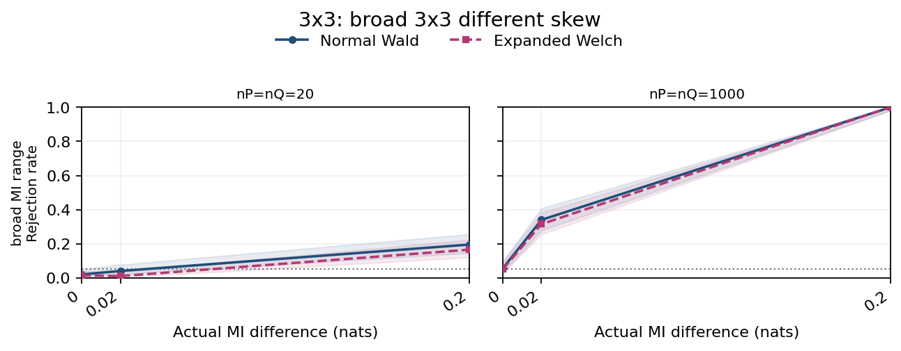

| Specification | Setting |
| --- | --- |
| Table size | 3x3 |
| Horizontal graph regime specifications (columns) | nP=nQ=20, nP=nQ=1000 |
| Vertical graph regime specifications (rows) | broad MI range: P row (0.7, 0.3/2 repeated 2 times), P column (0.7, 0.3/2 repeated 2 times); Q row (0.8, 0.2/2 repeated 2 times), Q column (0.8, 0.2/2 repeated 2 times) |
| Probability changes | broad MI range: additive, first changes in P and Q |
| MI settings | Baseline MI {0.02}; direction {q higher}; actual differences {0, 0.02, 0.2} nats |
| Horizontal axis within each graph | Actual MI difference in nats, fixed from 0 to 0.2 |
| Vertical axis within each graph | Unconditional rejection rate from 0 to 1; invalid results count as non-rejections |
| Replicates | 200 per unique point |

Null-point rejection and validity:

| Vertical regime | Horizontal regime | Method | Rejection | Valid |
| --- | --- | --- | --- | --- |
| broad MI range | nP=nQ=1000 | Expanded Welch | 0.0500 | 1.0000 |
| broad MI range | nP=nQ=1000 | Normal Wald | 0.0550 | 1.0000 |
| broad MI range | nP=nQ=20 | Expanded Welch | 0.0150 | 0.9750 |
| broad MI range | nP=nQ=20 | Normal Wald | 0.0200 | 1.0000 |

Every plotted rate, interval, validity and minimum expected count

| Vertical regime | Horizontal regime | x | Method | Rejection | 95% interval | Valid | Conditional | Min expected P | Min expected Q |
| --- | --- | --- | --- | --- | --- | --- | --- | --- | --- |
| broad MI range | nP=nQ=1000 | 0 | Expanded Welch | 0.0500 | [0.0274, 0.0896] | 1.0000 | 0.0500 | 22.5 | 10 |
| broad MI range | nP=nQ=1000 | 0 | Normal Wald | 0.0550 | [0.0310, 0.0958] | 1.0000 | 0.0550 | 22.5 | 10 |
| broad MI range | nP=nQ=1000 | 0.02 | Expanded Welch | 0.3150 | [0.2546, 0.3823] | 1.0000 | 0.3150 | 22.5 | 10 |
| broad MI range | nP=nQ=1000 | 0.02 | Normal Wald | 0.3400 | [0.2779, 0.4081] | 1.0000 | 0.3400 | 22.5 | 10 |
| broad MI range | nP=nQ=1000 | 0.2 | Expanded Welch | 1.0000 | [0.9812, 1.0000] | 1.0000 | 1.0000 | 22.5 | 6.798 |
| broad MI range | nP=nQ=1000 | 0.2 | Normal Wald | 1.0000 | [0.9812, 1.0000] | 1.0000 | 1.0000 | 22.5 | 6.798 |
| broad MI range | nP=nQ=20 | 0 | Expanded Welch | 0.0150 | [0.0051, 0.0432] | 0.9750 | 0.0154 | 0.45 | 0.2 |
| broad MI range | nP=nQ=20 | 0 | Normal Wald | 0.0200 | [0.0078, 0.0503] | 1.0000 | 0.0200 | 0.45 | 0.2 |
| broad MI range | nP=nQ=20 | 0.02 | Expanded Welch | 0.0100 | [0.0027, 0.0357] | 0.9800 | 0.0102 | 0.45 | 0.2 |
| broad MI range | nP=nQ=20 | 0.02 | Normal Wald | 0.0400 | [0.0204, 0.0769] | 1.0000 | 0.0400 | 0.45 | 0.2 |
| broad MI range | nP=nQ=20 | 0.2 | Expanded Welch | 0.1650 | [0.1200, 0.2227] | 0.9900 | 0.1667 | 0.45 | 0.136 |
| broad MI range | nP=nQ=20 | 0.2 | Normal Wald | 0.1950 | [0.1461, 0.2554] | 1.0000 | 0.1950 | 0.45 | 0.136 |

## 8. Rectangular tables

Do the square-table conclusions extend to rectangular tables?

### 8.1 2x3: rectangular 2x3 uniform

Do the square-table conclusions extend to rectangular tables?

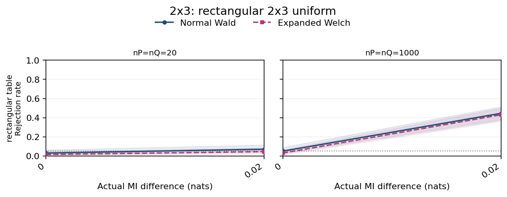

| Specification | Setting |
| --- | --- |
| Table size | 2x3 |
| Horizontal graph regime specifications (columns) | nP=nQ=20, nP=nQ=1000 |
| Vertical graph regime specifications (rows) | rectangular table: P row (0.5 repeated 2 times), P column (0.3333 repeated 3 times); Q row (0.5 repeated 2 times), Q column (0.3333 repeated 3 times) |
| Probability changes | rectangular table: additive, first changes in P and Q |
| MI settings | Baseline MI {0.02}; direction {q higher}; actual differences {0, 0.02} nats |
| Horizontal axis within each graph | Actual MI difference in nats, fixed from 0 to 0.02 |
| Vertical axis within each graph | Unconditional rejection rate from 0 to 1; invalid results count as non-rejections |
| Replicates | 200 per unique point |

Null-point rejection and validity:

| Vertical regime | Horizontal regime | Method | Rejection | Valid |
| --- | --- | --- | --- | --- |
| rectangular table | nP=nQ=1000 | Expanded Welch | 0.0300 | 1.0000 |
| rectangular table | nP=nQ=1000 | Normal Wald | 0.0500 | 1.0000 |
| rectangular table | nP=nQ=20 | Expanded Welch | 0.0150 | 1.0000 |
| rectangular table | nP=nQ=20 | Normal Wald | 0.0300 | 1.0000 |

Every plotted rate, interval, validity and minimum expected count

| Vertical regime | Horizontal regime | x | Method | Rejection | 95% interval | Valid | Conditional | Min expected P | Min expected Q |
| --- | --- | --- | --- | --- | --- | --- | --- | --- | --- |
| rectangular table | nP=nQ=1000 | 0 | Expanded Welch | 0.0300 | [0.0138, 0.0639] | 1.0000 | 0.0300 | 126 | 126 |
| rectangular table | nP=nQ=1000 | 0 | Normal Wald | 0.0500 | [0.0274, 0.0896] | 1.0000 | 0.0500 | 126 | 126 |
| rectangular table | nP=nQ=1000 | 0.02 | Expanded Welch | 0.4300 | [0.3633, 0.4993] | 1.0000 | 0.4300 | 126 | 109.5 |
| rectangular table | nP=nQ=1000 | 0.02 | Normal Wald | 0.4450 | [0.3778, 0.5143] | 1.0000 | 0.4450 | 126 | 109.5 |
| rectangular table | nP=nQ=20 | 0 | Expanded Welch | 0.0150 | [0.0051, 0.0432] | 1.0000 | 0.0150 | 2.521 | 2.521 |
| rectangular table | nP=nQ=20 | 0 | Normal Wald | 0.0300 | [0.0138, 0.0639] | 1.0000 | 0.0300 | 2.521 | 2.521 |
| rectangular table | nP=nQ=20 | 0.02 | Expanded Welch | 0.0450 | [0.0239, 0.0833] | 0.9900 | 0.0455 | 2.521 | 2.19 |
| rectangular table | nP=nQ=20 | 0.02 | Normal Wald | 0.0700 | [0.0422, 0.1141] | 1.0000 | 0.0700 | 2.521 | 2.19 |

### 8.2 2x3: rectangular 2x3 same skew

Do the square-table conclusions extend to rectangular tables?

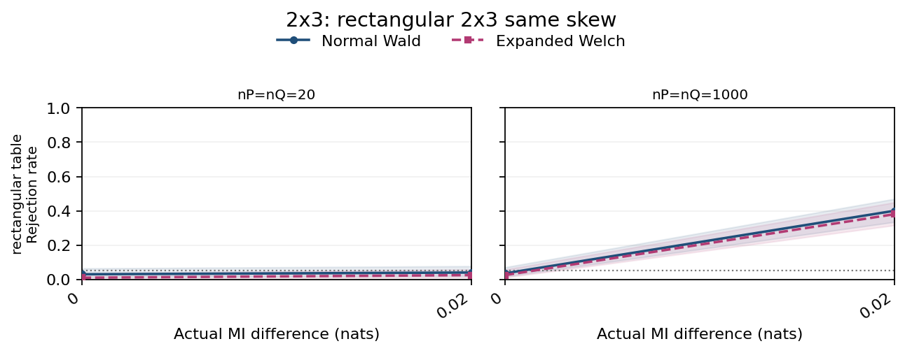

| Specification | Setting |
| --- | --- |
| Table size | 2x3 |
| Horizontal graph regime specifications (columns) | nP=nQ=20, nP=nQ=1000 |
| Vertical graph regime specifications (rows) | rectangular table: P row (0.8, 0.2), P column (0.8, 0.2/2 repeated 2 times); Q row (0.8, 0.2), Q column (0.8, 0.2/2 repeated 2 times) |
| Probability changes | rectangular table: additive, first changes in P and Q |
| MI settings | Baseline MI {0.02}; direction {q higher}; actual differences {0, 0.02} nats |
| Horizontal axis within each graph | Actual MI difference in nats, fixed from 0 to 0.02 |
| Vertical axis within each graph | Unconditional rejection rate from 0 to 1; invalid results count as non-rejections |
| Replicates | 200 per unique point |

Null-point rejection and validity:

| Vertical regime | Horizontal regime | Method | Rejection | Valid |
| --- | --- | --- | --- | --- |
| rectangular table | nP=nQ=1000 | Expanded Welch | 0.0250 | 1.0000 |
| rectangular table | nP=nQ=1000 | Normal Wald | 0.0350 | 1.0000 |
| rectangular table | nP=nQ=20 | Expanded Welch | 0.0100 | 0.9650 |
| rectangular table | nP=nQ=20 | Normal Wald | 0.0300 | 1.0000 |

Every plotted rate, interval, validity and minimum expected count

| Vertical regime | Horizontal regime | x | Method | Rejection | 95% interval | Valid | Conditional | Min expected P | Min expected Q |
| --- | --- | --- | --- | --- | --- | --- | --- | --- | --- |
| rectangular table | nP=nQ=1000 | 0 | Expanded Welch | 0.0250 | [0.0107, 0.0572] | 1.0000 | 0.0250 | 20 | 20 |
| rectangular table | nP=nQ=1000 | 0 | Normal Wald | 0.0350 | [0.0171, 0.0705] | 1.0000 | 0.0350 | 20 | 20 |
| rectangular table | nP=nQ=1000 | 0.02 | Expanded Welch | 0.3800 | [0.3156, 0.4489] | 1.0000 | 0.3800 | 20 | 20 |
| rectangular table | nP=nQ=1000 | 0.02 | Normal Wald | 0.4000 | [0.3346, 0.4692] | 1.0000 | 0.4000 | 20 | 20 |
| rectangular table | nP=nQ=20 | 0 | Expanded Welch | 0.0100 | [0.0027, 0.0357] | 0.9650 | 0.0104 | 0.4 | 0.4 |
| rectangular table | nP=nQ=20 | 0 | Normal Wald | 0.0300 | [0.0138, 0.0639] | 1.0000 | 0.0300 | 0.4 | 0.4 |
| rectangular table | nP=nQ=20 | 0.02 | Expanded Welch | 0.0250 | [0.0107, 0.0572] | 0.9550 | 0.0262 | 0.4 | 0.4 |
| rectangular table | nP=nQ=20 | 0.02 | Normal Wald | 0.0400 | [0.0204, 0.0769] | 1.0000 | 0.0400 | 0.4 | 0.4 |

### 8.3 2x3: rectangular 2x3 different skew

Do the square-table conclusions extend to rectangular tables?

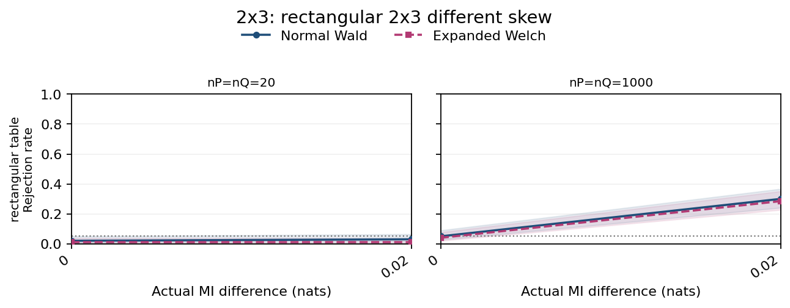

| Specification | Setting |
| --- | --- |
| Table size | 2x3 |
| Horizontal graph regime specifications (columns) | nP=nQ=20, nP=nQ=1000 |
| Vertical graph regime specifications (rows) | rectangular table: P row (0.7, 0.3), P column (0.7, 0.3/2 repeated 2 times); Q row (0.8, 0.2), Q column (0.8, 0.2/2 repeated 2 times) |
| Probability changes | rectangular table: additive, first changes in P and Q |
| MI settings | Baseline MI {0.02}; direction {q higher}; actual differences {0, 0.02} nats |
| Horizontal axis within each graph | Actual MI difference in nats, fixed from 0 to 0.02 |
| Vertical axis within each graph | Unconditional rejection rate from 0 to 1; invalid results count as non-rejections |
| Replicates | 200 per unique point |

Null-point rejection and validity:

| Vertical regime | Horizontal regime | Method | Rejection | Valid |
| --- | --- | --- | --- | --- |
| rectangular table | nP=nQ=1000 | Expanded Welch | 0.0400 | 1.0000 |
| rectangular table | nP=nQ=1000 | Normal Wald | 0.0500 | 1.0000 |
| rectangular table | nP=nQ=20 | Expanded Welch | 0.0100 | 0.9650 |
| rectangular table | nP=nQ=20 | Normal Wald | 0.0200 | 1.0000 |

Every plotted rate, interval, validity and minimum expected count

| Vertical regime | Horizontal regime | x | Method | Rejection | 95% interval | Valid | Conditional | Min expected P | Min expected Q |
| --- | --- | --- | --- | --- | --- | --- | --- | --- | --- |
| rectangular table | nP=nQ=1000 | 0 | Expanded Welch | 0.0400 | [0.0204, 0.0769] | 1.0000 | 0.0400 | 45 | 20 |
| rectangular table | nP=nQ=1000 | 0 | Normal Wald | 0.0500 | [0.0274, 0.0896] | 1.0000 | 0.0500 | 45 | 20 |
| rectangular table | nP=nQ=1000 | 0.02 | Expanded Welch | 0.2850 | [0.2270, 0.3512] | 1.0000 | 0.2850 | 45 | 20 |
| rectangular table | nP=nQ=1000 | 0.02 | Normal Wald | 0.3000 | [0.2407, 0.3668] | 1.0000 | 0.3000 | 45 | 20 |
| rectangular table | nP=nQ=20 | 0 | Expanded Welch | 0.0100 | [0.0027, 0.0357] | 0.9650 | 0.0104 | 0.9 | 0.4 |
| rectangular table | nP=nQ=20 | 0 | Normal Wald | 0.0200 | [0.0078, 0.0503] | 1.0000 | 0.0200 | 0.9 | 0.4 |
| rectangular table | nP=nQ=20 | 0.02 | Expanded Welch | 0.0100 | [0.0027, 0.0357] | 0.9650 | 0.0104 | 0.9 | 0.4 |
| rectangular table | nP=nQ=20 | 0.02 | Normal Wald | 0.0300 | [0.0138, 0.0639] | 1.0000 | 0.0300 | 0.9 | 0.4 |

### 8.4 3x5: rectangular 3x5 uniform

Do the square-table conclusions extend to rectangular tables?

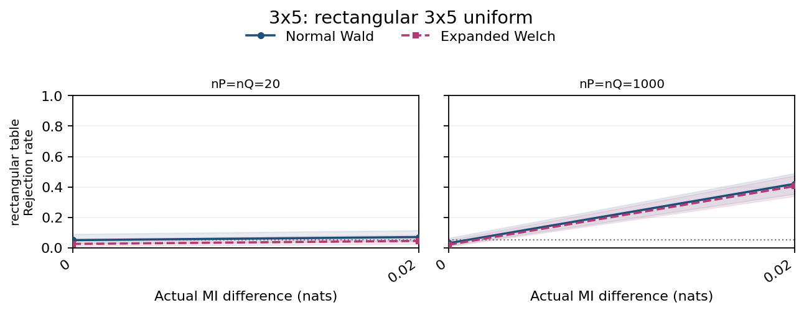

| Specification | Setting |
| --- | --- |
| Table size | 3x5 |
| Horizontal graph regime specifications (columns) | nP=nQ=20, nP=nQ=1000 |
| Vertical graph regime specifications (rows) | rectangular table: P row (0.3333 repeated 3 times), P column (0.2 repeated 5 times); Q row (0.3333 repeated 3 times), Q column (0.2 repeated 5 times) |
| Probability changes | rectangular table: additive, first changes in P and Q |
| MI settings | Baseline MI {0.02}; direction {q higher}; actual differences {0, 0.02} nats |
| Horizontal axis within each graph | Actual MI difference in nats, fixed from 0 to 0.02 |
| Vertical axis within each graph | Unconditional rejection rate from 0 to 1; invalid results count as non-rejections |
| Replicates | 200 per unique point |

Null-point rejection and validity:

| Vertical regime | Horizontal regime | Method | Rejection | Valid |
| --- | --- | --- | --- | --- |
| rectangular table | nP=nQ=1000 | Expanded Welch | 0.0200 | 1.0000 |
| rectangular table | nP=nQ=1000 | Normal Wald | 0.0300 | 1.0000 |
| rectangular table | nP=nQ=20 | Expanded Welch | 0.0250 | 1.0000 |
| rectangular table | nP=nQ=20 | Normal Wald | 0.0500 | 1.0000 |

Every plotted rate, interval, validity and minimum expected count

| Vertical regime | Horizontal regime | x | Method | Rejection | 95% interval | Valid | Conditional | Min expected P | Min expected Q |
| --- | --- | --- | --- | --- | --- | --- | --- | --- | --- |
| rectangular table | nP=nQ=1000 | 0 | Expanded Welch | 0.0200 | [0.0078, 0.0503] | 1.0000 | 0.0200 | 41.17 | 41.17 |
| rectangular table | nP=nQ=1000 | 0 | Normal Wald | 0.0300 | [0.0138, 0.0639] | 1.0000 | 0.0300 | 41.17 | 41.17 |
| rectangular table | nP=nQ=1000 | 0.02 | Expanded Welch | 0.4050 | [0.3394, 0.4742] | 1.0000 | 0.4050 | 41.17 | 31.1 |
| rectangular table | nP=nQ=1000 | 0.02 | Normal Wald | 0.4200 | [0.3537, 0.4893] | 1.0000 | 0.4200 | 41.17 | 31.1 |
| rectangular table | nP=nQ=20 | 0 | Expanded Welch | 0.0250 | [0.0107, 0.0572] | 1.0000 | 0.0250 | 0.8235 | 0.8235 |
| rectangular table | nP=nQ=20 | 0 | Normal Wald | 0.0500 | [0.0274, 0.0896] | 1.0000 | 0.0500 | 0.8235 | 0.8235 |
| rectangular table | nP=nQ=20 | 0.02 | Expanded Welch | 0.0450 | [0.0239, 0.0833] | 1.0000 | 0.0450 | 0.8235 | 0.6219 |
| rectangular table | nP=nQ=20 | 0.02 | Normal Wald | 0.0700 | [0.0422, 0.1141] | 1.0000 | 0.0700 | 0.8235 | 0.6219 |

### 8.5 3x5: rectangular 3x5 same skew

Do the square-table conclusions extend to rectangular tables?

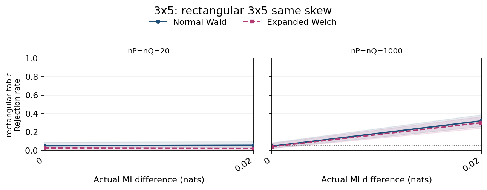

| Specification | Setting |
| --- | --- |
| Table size | 3x5 |
| Horizontal graph regime specifications (columns) | nP=nQ=20, nP=nQ=1000 |
| Vertical graph regime specifications (rows) | rectangular table: P row (0.8, 0.2/2 repeated 2 times), P column (0.8, 0.2/4 repeated 4 times); Q row (0.8, 0.2/2 repeated 2 times), Q column (0.8, 0.2/4 repeated 4 times) |
| Probability changes | rectangular table: additive, first changes in P and Q |
| MI settings | Baseline MI {0.02}; direction {q higher}; actual differences {0, 0.02} nats |
| Horizontal axis within each graph | Actual MI difference in nats, fixed from 0 to 0.02 |
| Vertical axis within each graph | Unconditional rejection rate from 0 to 1; invalid results count as non-rejections |
| Replicates | 200 per unique point |

Null-point rejection and validity:

| Vertical regime | Horizontal regime | Method | Rejection | Valid |
| --- | --- | --- | --- | --- |
| rectangular table | nP=nQ=1000 | Expanded Welch | 0.0400 | 1.0000 |
| rectangular table | nP=nQ=1000 | Normal Wald | 0.0450 | 1.0000 |
| rectangular table | nP=nQ=20 | Expanded Welch | 0.0250 | 0.9350 |
| rectangular table | nP=nQ=20 | Normal Wald | 0.0500 | 0.9950 |

Every plotted rate, interval, validity and minimum expected count

| Vertical regime | Horizontal regime | x | Method | Rejection | 95% interval | Valid | Conditional | Min expected P | Min expected Q |
| --- | --- | --- | --- | --- | --- | --- | --- | --- | --- |
| rectangular table | nP=nQ=1000 | 0 | Expanded Welch | 0.0400 | [0.0204, 0.0769] | 1.0000 | 0.0400 | 5 | 5 |
| rectangular table | nP=nQ=1000 | 0 | Normal Wald | 0.0450 | [0.0239, 0.0833] | 1.0000 | 0.0450 | 5 | 5 |
| rectangular table | nP=nQ=1000 | 0.02 | Expanded Welch | 0.3000 | [0.2407, 0.3668] | 1.0000 | 0.3000 | 5 | 5 |
| rectangular table | nP=nQ=1000 | 0.02 | Normal Wald | 0.3200 | [0.2593, 0.3875] | 1.0000 | 0.3200 | 5 | 5 |
| rectangular table | nP=nQ=20 | 0 | Expanded Welch | 0.0250 | [0.0107, 0.0572] | 0.9350 | 0.0267 | 0.1 | 0.1 |
| rectangular table | nP=nQ=20 | 0 | Normal Wald | 0.0500 | [0.0274, 0.0896] | 0.9950 | 0.0503 | 0.1 | 0.1 |
| rectangular table | nP=nQ=20 | 0.02 | Expanded Welch | 0.0200 | [0.0078, 0.0503] | 0.9500 | 0.0211 | 0.1 | 0.1 |
| rectangular table | nP=nQ=20 | 0.02 | Normal Wald | 0.0550 | [0.0310, 0.0958] | 1.0000 | 0.0550 | 0.1 | 0.1 |

### 8.6 3x5: rectangular 3x5 different skew

Do the square-table conclusions extend to rectangular tables?

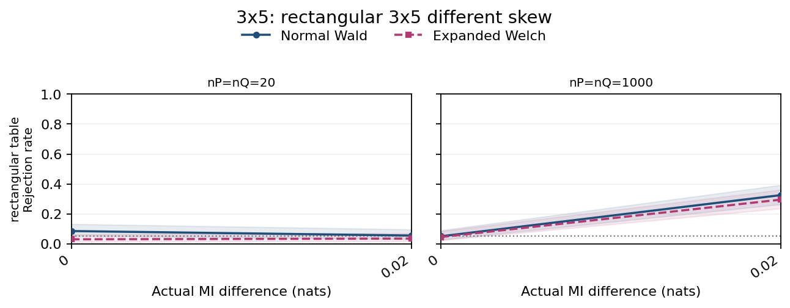

| Specification | Setting |
| --- | --- |
| Table size | 3x5 |
| Horizontal graph regime specifications (columns) | nP=nQ=20, nP=nQ=1000 |
| Vertical graph regime specifications (rows) | rectangular table: P row (0.7, 0.3/2 repeated 2 times), P column (0.7, 0.3/4 repeated 4 times); Q row (0.8, 0.2/2 repeated 2 times), Q column (0.8, 0.2/4 repeated 4 times) |
| Probability changes | rectangular table: additive, first changes in P and Q |
| MI settings | Baseline MI {0.02}; direction {q higher}; actual differences {0, 0.02} nats |
| Horizontal axis within each graph | Actual MI difference in nats, fixed from 0 to 0.02 |
| Vertical axis within each graph | Unconditional rejection rate from 0 to 1; invalid results count as non-rejections |
| Replicates | 200 per unique point |

Null-point rejection and validity:

| Vertical regime | Horizontal regime | Method | Rejection | Valid |
| --- | --- | --- | --- | --- |
| rectangular table | nP=nQ=1000 | Expanded Welch | 0.0450 | 1.0000 |
| rectangular table | nP=nQ=1000 | Normal Wald | 0.0500 | 1.0000 |
| rectangular table | nP=nQ=20 | Expanded Welch | 0.0300 | 0.9750 |
| rectangular table | nP=nQ=20 | Normal Wald | 0.0850 | 1.0000 |

Every plotted rate, interval, validity and minimum expected count

| Vertical regime | Horizontal regime | x | Method | Rejection | 95% interval | Valid | Conditional | Min expected P | Min expected Q |
| --- | --- | --- | --- | --- | --- | --- | --- | --- | --- |
| rectangular table | nP=nQ=1000 | 0 | Expanded Welch | 0.0450 | [0.0239, 0.0833] | 1.0000 | 0.0450 | 11.25 | 5 |
| rectangular table | nP=nQ=1000 | 0 | Normal Wald | 0.0500 | [0.0274, 0.0896] | 1.0000 | 0.0500 | 11.25 | 5 |
| rectangular table | nP=nQ=1000 | 0.02 | Expanded Welch | 0.2950 | [0.2361, 0.3616] | 1.0000 | 0.2950 | 11.25 | 5 |
| rectangular table | nP=nQ=1000 | 0.02 | Normal Wald | 0.3250 | [0.2639, 0.3927] | 1.0000 | 0.3250 | 11.25 | 5 |
| rectangular table | nP=nQ=20 | 0 | Expanded Welch | 0.0300 | [0.0138, 0.0639] | 0.9750 | 0.0308 | 0.225 | 0.1 |
| rectangular table | nP=nQ=20 | 0 | Normal Wald | 0.0850 | [0.0537, 0.1319] | 1.0000 | 0.0850 | 0.225 | 0.1 |
| rectangular table | nP=nQ=20 | 0.02 | Expanded Welch | 0.0350 | [0.0171, 0.0705] | 0.9900 | 0.0354 | 0.225 | 0.1 |
| rectangular table | nP=nQ=20 | 0.02 | Normal Wald | 0.0550 | [0.0310, 0.0958] | 1.0000 | 0.0550 | 0.225 | 0.1 |

## 9. Alternative population construction

Do conclusions change under a matched ordinal log-linear construction?

### 9.1 3x3: construction 3x3 uniform b0.0001

Do conclusions change under a matched ordinal log-linear construction?

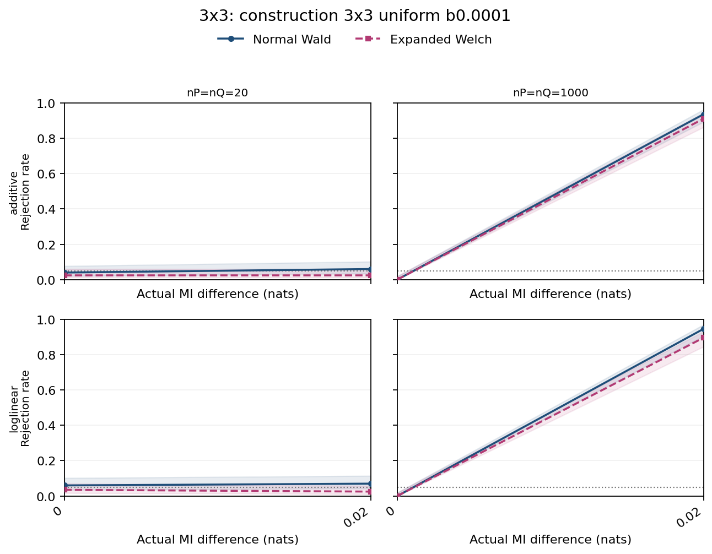

| Specification | Setting |
| --- | --- |
| Table size | 3x3 |
| Horizontal graph regime specifications (columns) | nP=nQ=20, nP=nQ=1000 |
| Vertical graph regime specifications (rows) | additive: P row (0.3333 repeated 3 times), P column (0.3333 repeated 3 times); Q row (0.3333 repeated 3 times), Q column (0.3333 repeated 3 times); loglinear: P row (0.3333 repeated 3 times), P column (0.3333 repeated 3 times); Q row (0.3333 repeated 3 times), Q column (0.3333 repeated 3 times) |
| Probability changes | additive: additive, first changes in P and Q; loglinear: loglinear, first changes in P and Q |
| MI settings | Baseline MI {0.0001}; direction {q higher}; actual differences {0, 0.02} nats |
| Horizontal axis within each graph | Actual MI difference in nats, fixed from 0 to 0.02 |
| Vertical axis within each graph | Unconditional rejection rate from 0 to 1; invalid results count as non-rejections |
| Replicates | 200 per unique point |

Null-point rejection and validity:

| Vertical regime | Horizontal regime | Method | Rejection | Valid |
| --- | --- | --- | --- | --- |
| additive | nP=nQ=1000 | Expanded Welch | 0.0000 | 1.0000 |
| additive | nP=nQ=1000 | Normal Wald | 0.0000 | 1.0000 |
| additive | nP=nQ=20 | Expanded Welch | 0.0250 | 1.0000 |
| additive | nP=nQ=20 | Normal Wald | 0.0400 | 1.0000 |
| loglinear | nP=nQ=1000 | Expanded Welch | 0.0000 | 1.0000 |
| loglinear | nP=nQ=1000 | Normal Wald | 0.0000 | 1.0000 |
| loglinear | nP=nQ=20 | Expanded Welch | 0.0350 | 1.0000 |
| loglinear | nP=nQ=20 | Normal Wald | 0.0600 | 1.0000 |

Every plotted rate, interval, validity and minimum expected count

| Vertical regime | Horizontal regime | x | Method | Rejection | 95% interval | Valid | Conditional | Min expected P | Min expected Q |
| --- | --- | --- | --- | --- | --- | --- | --- | --- | --- |
| additive | nP=nQ=1000 | 0 | Expanded Welch | 0.0000 | [0.0000, 0.0188] | 1.0000 | 0.0000 | 108.8 | 108.8 |
| additive | nP=nQ=1000 | 0 | Normal Wald | 0.0000 | [0.0000, 0.0188] | 1.0000 | 0.0000 | 108.8 | 108.8 |
| additive | nP=nQ=1000 | 0.02 | Expanded Welch | 0.9100 | [0.8622, 0.9423] | 1.0000 | 0.9100 | 108.8 | 77.95 |
| additive | nP=nQ=1000 | 0.02 | Normal Wald | 0.9350 | [0.8920, 0.9616] | 1.0000 | 0.9350 | 108.8 | 77.95 |
| additive | nP=nQ=20 | 0 | Expanded Welch | 0.0250 | [0.0107, 0.0572] | 1.0000 | 0.0250 | 2.175 | 2.175 |
| additive | nP=nQ=20 | 0 | Normal Wald | 0.0400 | [0.0204, 0.0769] | 1.0000 | 0.0400 | 2.175 | 2.175 |
| additive | nP=nQ=20 | 0.02 | Expanded Welch | 0.0250 | [0.0107, 0.0572] | 1.0000 | 0.0250 | 2.175 | 1.559 |
| additive | nP=nQ=20 | 0.02 | Normal Wald | 0.0600 | [0.0347, 0.1019] | 1.0000 | 0.0600 | 2.175 | 1.559 |
| loglinear | nP=nQ=1000 | 0 | Expanded Welch | 0.0000 | [0.0000, 0.0188] | 1.0000 | 0.0000 | 108.8 | 108.8 |
| loglinear | nP=nQ=1000 | 0 | Normal Wald | 0.0000 | [0.0000, 0.0188] | 1.0000 | 0.0000 | 108.8 | 108.8 |
| loglinear | nP=nQ=1000 | 0.02 | Expanded Welch | 0.8950 | [0.8448, 0.9303] | 1.0000 | 0.8950 | 108.8 | 78.48 |
| loglinear | nP=nQ=1000 | 0.02 | Normal Wald | 0.9450 | [0.9042, 0.9690] | 1.0000 | 0.9450 | 108.8 | 78.48 |
| loglinear | nP=nQ=20 | 0 | Expanded Welch | 0.0350 | [0.0171, 0.0705] | 1.0000 | 0.0350 | 2.175 | 2.175 |
| loglinear | nP=nQ=20 | 0 | Normal Wald | 0.0600 | [0.0347, 0.1019] | 1.0000 | 0.0600 | 2.175 | 2.175 |
| loglinear | nP=nQ=20 | 0.02 | Expanded Welch | 0.0250 | [0.0107, 0.0572] | 1.0000 | 0.0250 | 2.175 | 1.57 |
| loglinear | nP=nQ=20 | 0.02 | Normal Wald | 0.0700 | [0.0422, 0.1141] | 1.0000 | 0.0700 | 2.175 | 1.57 |

### 9.2 3x3: construction 3x3 uniform b0.02

Do conclusions change under a matched ordinal log-linear construction?

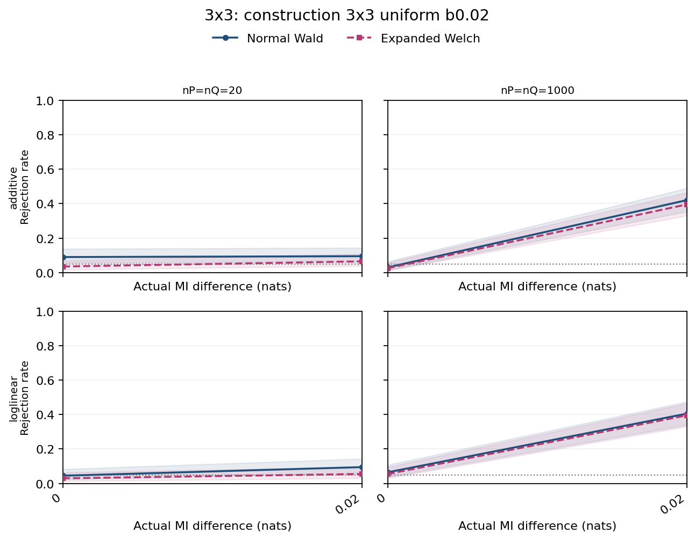

| Specification | Setting |
| --- | --- |
| Table size | 3x3 |
| Horizontal graph regime specifications (columns) | nP=nQ=20, nP=nQ=1000 |
| Vertical graph regime specifications (rows) | additive: P row (0.3333 repeated 3 times), P column (0.3333 repeated 3 times); Q row (0.3333 repeated 3 times), Q column (0.3333 repeated 3 times); loglinear: P row (0.3333 repeated 3 times), P column (0.3333 repeated 3 times); Q row (0.3333 repeated 3 times), Q column (0.3333 repeated 3 times) |
| Probability changes | additive: additive, first changes in P and Q; loglinear: loglinear, first changes in P and Q |
| MI settings | Baseline MI {0.02}; direction {q higher}; actual differences {0, 0.02} nats |
| Horizontal axis within each graph | Actual MI difference in nats, fixed from 0 to 0.02 |
| Vertical axis within each graph | Unconditional rejection rate from 0 to 1; invalid results count as non-rejections |
| Replicates | 200 per unique point |

Null-point rejection and validity:

| Vertical regime | Horizontal regime | Method | Rejection | Valid |
| --- | --- | --- | --- | --- |
| additive | nP=nQ=1000 | Expanded Welch | 0.0250 | 1.0000 |
| additive | nP=nQ=1000 | Normal Wald | 0.0300 | 1.0000 |
| additive | nP=nQ=20 | Expanded Welch | 0.0350 | 1.0000 |
| additive | nP=nQ=20 | Normal Wald | 0.0900 | 1.0000 |
| loglinear | nP=nQ=1000 | Expanded Welch | 0.0550 | 1.0000 |
| loglinear | nP=nQ=1000 | Normal Wald | 0.0650 | 1.0000 |
| loglinear | nP=nQ=20 | Expanded Welch | 0.0300 | 1.0000 |
| loglinear | nP=nQ=20 | Normal Wald | 0.0450 | 1.0000 |

Every plotted rate, interval, validity and minimum expected count

| Vertical regime | Horizontal regime | x | Method | Rejection | 95% interval | Valid | Conditional | Min expected P | Min expected Q |
| --- | --- | --- | --- | --- | --- | --- | --- | --- | --- |
| additive | nP=nQ=1000 | 0 | Expanded Welch | 0.0250 | [0.0107, 0.0572] | 1.0000 | 0.0250 | 78.03 | 78.03 |
| additive | nP=nQ=1000 | 0 | Normal Wald | 0.0300 | [0.0138, 0.0639] | 1.0000 | 0.0300 | 78.03 | 78.03 |
| additive | nP=nQ=1000 | 0.02 | Expanded Welch | 0.3950 | [0.3298, 0.4641] | 1.0000 | 0.3950 | 78.03 | 64.69 |
| additive | nP=nQ=1000 | 0.02 | Normal Wald | 0.4200 | [0.3537, 0.4893] | 1.0000 | 0.4200 | 78.03 | 64.69 |
| additive | nP=nQ=20 | 0 | Expanded Welch | 0.0350 | [0.0171, 0.0705] | 1.0000 | 0.0350 | 1.561 | 1.561 |
| additive | nP=nQ=20 | 0 | Normal Wald | 0.0900 | [0.0577, 0.1378] | 1.0000 | 0.0900 | 1.561 | 1.561 |
| additive | nP=nQ=20 | 0.02 | Expanded Welch | 0.0650 | [0.0384, 0.1080] | 1.0000 | 0.0650 | 1.561 | 1.294 |
| additive | nP=nQ=20 | 0.02 | Normal Wald | 0.0950 | [0.0617, 0.1436] | 1.0000 | 0.0950 | 1.561 | 1.294 |
| loglinear | nP=nQ=1000 | 0 | Expanded Welch | 0.0550 | [0.0310, 0.0958] | 1.0000 | 0.0550 | 78.56 | 78.56 |
| loglinear | nP=nQ=1000 | 0 | Normal Wald | 0.0650 | [0.0384, 0.1080] | 1.0000 | 0.0650 | 78.56 | 78.56 |
| loglinear | nP=nQ=1000 | 0.02 | Expanded Welch | 0.3950 | [0.3298, 0.4641] | 1.0000 | 0.3950 | 78.56 | 65.74 |
| loglinear | nP=nQ=1000 | 0.02 | Normal Wald | 0.4050 | [0.3394, 0.4742] | 1.0000 | 0.4050 | 78.56 | 65.74 |
| loglinear | nP=nQ=20 | 0 | Expanded Welch | 0.0300 | [0.0138, 0.0639] | 1.0000 | 0.0300 | 1.571 | 1.571 |
| loglinear | nP=nQ=20 | 0 | Normal Wald | 0.0450 | [0.0239, 0.0833] | 1.0000 | 0.0450 | 1.571 | 1.571 |
| loglinear | nP=nQ=20 | 0.02 | Expanded Welch | 0.0550 | [0.0310, 0.0958] | 1.0000 | 0.0550 | 1.571 | 1.315 |
| loglinear | nP=nQ=20 | 0.02 | Normal Wald | 0.0950 | [0.0617, 0.1436] | 1.0000 | 0.0950 | 1.571 | 1.315 |

### 9.3 3x3: construction 3x3 different skew b0.0001

Do conclusions change under a matched ordinal log-linear construction?

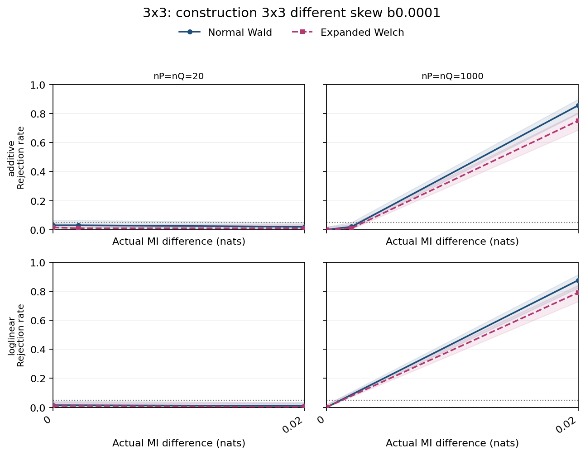

| Specification | Setting |
| --- | --- |
| Table size | 3x3 |
| Horizontal graph regime specifications (columns) | nP=nQ=20, nP=nQ=1000 |
| Vertical graph regime specifications (rows) | additive: P row (0.7, 0.3/2 repeated 2 times), P column (0.7, 0.3/2 repeated 2 times); Q row (0.8, 0.2/2 repeated 2 times), Q column (0.8, 0.2/2 repeated 2 times); loglinear: P row (0.7, 0.3/2 repeated 2 times), P column (0.7, 0.3/2 repeated 2 times); Q row (0.8, 0.2/2 repeated 2 times), Q column (0.8, 0.2/2 repeated 2 times) |
| Probability changes | additive: additive, first changes in P and Q; loglinear: loglinear, first changes in P and Q |
| MI settings | Baseline MI {0.0001}; direction {q higher}; actual differences {0, 0.002, 0.02} nats |
| Horizontal axis within each graph | Actual MI difference in nats, fixed from 0 to 0.02 |
| Vertical axis within each graph | Unconditional rejection rate from 0 to 1; invalid results count as non-rejections |
| Replicates | 200 per unique point |

Null-point rejection and validity:

| Vertical regime | Horizontal regime | Method | Rejection | Valid |
| --- | --- | --- | --- | --- |
| additive | nP=nQ=1000 | Expanded Welch | 0.0000 | 1.0000 |
| additive | nP=nQ=1000 | Normal Wald | 0.0000 | 1.0000 |
| additive | nP=nQ=20 | Expanded Welch | 0.0150 | 0.9600 |
| additive | nP=nQ=20 | Normal Wald | 0.0300 | 1.0000 |
| loglinear | nP=nQ=1000 | Expanded Welch | 0.0000 | 1.0000 |
| loglinear | nP=nQ=1000 | Normal Wald | 0.0000 | 1.0000 |
| loglinear | nP=nQ=20 | Expanded Welch | 0.0100 | 0.9750 |
| loglinear | nP=nQ=20 | Normal Wald | 0.0150 | 1.0000 |

Every plotted rate, interval, validity and minimum expected count

| Vertical regime | Horizontal regime | x | Method | Rejection | 95% interval | Valid | Conditional | Min expected P | Min expected Q |
| --- | --- | --- | --- | --- | --- | --- | --- | --- | --- |
| additive | nP=nQ=1000 | 0 | Expanded Welch | 0.0000 | [0.0000, 0.0188] | 1.0000 | 0.0000 | 22.5 | 10 |
| additive | nP=nQ=1000 | 0 | Normal Wald | 0.0000 | [0.0000, 0.0188] | 1.0000 | 0.0000 | 22.5 | 10 |
| additive | nP=nQ=1000 | 0.002 | Expanded Welch | 0.0100 | [0.0027, 0.0357] | 1.0000 | 0.0100 | 22.5 | 10 |
| additive | nP=nQ=1000 | 0.002 | Normal Wald | 0.0200 | [0.0078, 0.0503] | 1.0000 | 0.0200 | 22.5 | 10 |
| additive | nP=nQ=1000 | 0.02 | Expanded Welch | 0.7500 | [0.6857, 0.8049] | 1.0000 | 0.7500 | 22.5 | 10 |
| additive | nP=nQ=1000 | 0.02 | Normal Wald | 0.8550 | [0.7995, 0.8971] | 1.0000 | 0.8550 | 22.5 | 10 |
| additive | nP=nQ=20 | 0 | Expanded Welch | 0.0150 | [0.0051, 0.0432] | 0.9600 | 0.0156 | 0.45 | 0.2 |
| additive | nP=nQ=20 | 0 | Normal Wald | 0.0300 | [0.0138, 0.0639] | 1.0000 | 0.0300 | 0.45 | 0.2 |
| additive | nP=nQ=20 | 0.002 | Expanded Welch | 0.0100 | [0.0027, 0.0357] | 0.9700 | 0.0103 | 0.45 | 0.2 |
| additive | nP=nQ=20 | 0.002 | Normal Wald | 0.0300 | [0.0138, 0.0639] | 1.0000 | 0.0300 | 0.45 | 0.2 |
| additive | nP=nQ=20 | 0.02 | Expanded Welch | 0.0100 | [0.0027, 0.0357] | 0.9950 | 0.0101 | 0.45 | 0.2 |
| additive | nP=nQ=20 | 0.02 | Normal Wald | 0.0200 | [0.0078, 0.0503] | 1.0000 | 0.0200 | 0.45 | 0.2 |
| loglinear | nP=nQ=1000 | 0 | Expanded Welch | 0.0000 | [0.0000, 0.0188] | 1.0000 | 0.0000 | 22.68 | 10.17 |
| loglinear | nP=nQ=1000 | 0 | Normal Wald | 0.0000 | [0.0000, 0.0188] | 1.0000 | 0.0000 | 22.68 | 10.17 |
| loglinear | nP=nQ=1000 | 0.02 | Expanded Welch | 0.7900 | [0.7284, 0.8407] | 1.0000 | 0.7900 | 22.68 | 12.17 |
| loglinear | nP=nQ=1000 | 0.02 | Normal Wald | 0.8750 | [0.8220, 0.9139] | 1.0000 | 0.8750 | 22.68 | 12.17 |
| loglinear | nP=nQ=20 | 0 | Expanded Welch | 0.0100 | [0.0027, 0.0357] | 0.9750 | 0.0103 | 0.4535 | 0.2033 |
| loglinear | nP=nQ=20 | 0 | Normal Wald | 0.0150 | [0.0051, 0.0432] | 1.0000 | 0.0150 | 0.4535 | 0.2033 |
| loglinear | nP=nQ=20 | 0.02 | Expanded Welch | 0.0050 | [0.0009, 0.0278] | 0.9900 | 0.0051 | 0.4535 | 0.2435 |
| loglinear | nP=nQ=20 | 0.02 | Normal Wald | 0.0100 | [0.0027, 0.0357] | 1.0000 | 0.0100 | 0.4535 | 0.2435 |

### 9.4 3x3: construction 3x3 different skew b0.02

Do conclusions change under a matched ordinal log-linear construction?

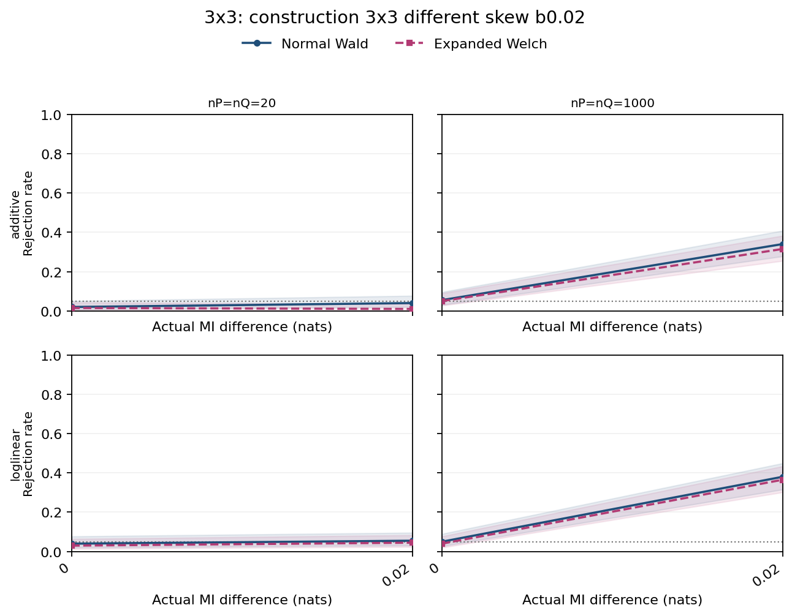

| Specification | Setting |
| --- | --- |
| Table size | 3x3 |
| Horizontal graph regime specifications (columns) | nP=nQ=20, nP=nQ=1000 |
| Vertical graph regime specifications (rows) | additive: P row (0.7, 0.3/2 repeated 2 times), P column (0.7, 0.3/2 repeated 2 times); Q row (0.8, 0.2/2 repeated 2 times), Q column (0.8, 0.2/2 repeated 2 times); loglinear: P row (0.7, 0.3/2 repeated 2 times), P column (0.7, 0.3/2 repeated 2 times); Q row (0.8, 0.2/2 repeated 2 times), Q column (0.8, 0.2/2 repeated 2 times) |
| Probability changes | additive: additive, first changes in P and Q; loglinear: loglinear, first changes in P and Q |
| MI settings | Baseline MI {0.02}; direction {q higher}; actual differences {0, 0.02} nats |
| Horizontal axis within each graph | Actual MI difference in nats, fixed from 0 to 0.02 |
| Vertical axis within each graph | Unconditional rejection rate from 0 to 1; invalid results count as non-rejections |
| Replicates | 200 per unique point |

Null-point rejection and validity:

| Vertical regime | Horizontal regime | Method | Rejection | Valid |
| --- | --- | --- | --- | --- |
| additive | nP=nQ=1000 | Expanded Welch | 0.0500 | 1.0000 |
| additive | nP=nQ=1000 | Normal Wald | 0.0550 | 1.0000 |
| additive | nP=nQ=20 | Expanded Welch | 0.0150 | 0.9750 |
| additive | nP=nQ=20 | Normal Wald | 0.0200 | 1.0000 |
| loglinear | nP=nQ=1000 | Expanded Welch | 0.0400 | 1.0000 |
| loglinear | nP=nQ=1000 | Normal Wald | 0.0500 | 1.0000 |
| loglinear | nP=nQ=20 | Expanded Welch | 0.0300 | 0.9700 |
| loglinear | nP=nQ=20 | Normal Wald | 0.0400 | 1.0000 |

Every plotted rate, interval, validity and minimum expected count

| Vertical regime | Horizontal regime | x | Method | Rejection | 95% interval | Valid | Conditional | Min expected P | Min expected Q |
| --- | --- | --- | --- | --- | --- | --- | --- | --- | --- |
| additive | nP=nQ=1000 | 0 | Expanded Welch | 0.0500 | [0.0274, 0.0896] | 1.0000 | 0.0500 | 22.5 | 10 |
| additive | nP=nQ=1000 | 0 | Normal Wald | 0.0550 | [0.0310, 0.0958] | 1.0000 | 0.0550 | 22.5 | 10 |
| additive | nP=nQ=1000 | 0.02 | Expanded Welch | 0.3150 | [0.2546, 0.3823] | 1.0000 | 0.3150 | 22.5 | 10 |
| additive | nP=nQ=1000 | 0.02 | Normal Wald | 0.3400 | [0.2779, 0.4081] | 1.0000 | 0.3400 | 22.5 | 10 |
| additive | nP=nQ=20 | 0 | Expanded Welch | 0.0150 | [0.0051, 0.0432] | 0.9750 | 0.0154 | 0.45 | 0.2 |
| additive | nP=nQ=20 | 0 | Normal Wald | 0.0200 | [0.0078, 0.0503] | 1.0000 | 0.0200 | 0.45 | 0.2 |
| additive | nP=nQ=20 | 0.02 | Expanded Welch | 0.0100 | [0.0027, 0.0357] | 0.9800 | 0.0102 | 0.45 | 0.2 |
| additive | nP=nQ=20 | 0.02 | Normal Wald | 0.0400 | [0.0204, 0.0769] | 1.0000 | 0.0400 | 0.45 | 0.2 |
| loglinear | nP=nQ=1000 | 0 | Expanded Welch | 0.0400 | [0.0204, 0.0769] | 1.0000 | 0.0400 | 25.07 | 12.17 |
| loglinear | nP=nQ=1000 | 0 | Normal Wald | 0.0500 | [0.0274, 0.0896] | 1.0000 | 0.0500 | 25.07 | 12.17 |
| loglinear | nP=nQ=1000 | 0.02 | Expanded Welch | 0.3650 | [0.3014, 0.4337] | 1.0000 | 0.3650 | 25.07 | 13.16 |
| loglinear | nP=nQ=1000 | 0.02 | Normal Wald | 0.3800 | [0.3156, 0.4489] | 1.0000 | 0.3800 | 25.07 | 13.16 |
| loglinear | nP=nQ=20 | 0 | Expanded Welch | 0.0300 | [0.0138, 0.0639] | 0.9700 | 0.0309 | 0.5014 | 0.2433 |
| loglinear | nP=nQ=20 | 0 | Normal Wald | 0.0400 | [0.0204, 0.0769] | 1.0000 | 0.0400 | 0.5014 | 0.2433 |
| loglinear | nP=nQ=20 | 0.02 | Expanded Welch | 0.0450 | [0.0239, 0.0833] | 0.9750 | 0.0462 | 0.5014 | 0.2631 |
| loglinear | nP=nQ=20 | 0.02 | Normal Wald | 0.0550 | [0.0310, 0.0958] | 1.0000 | 0.0550 | 0.5014 | 0.2631 |

### 9.5 5x5: construction 5x5 uniform b0.0001

Do conclusions change under a matched ordinal log-linear construction?

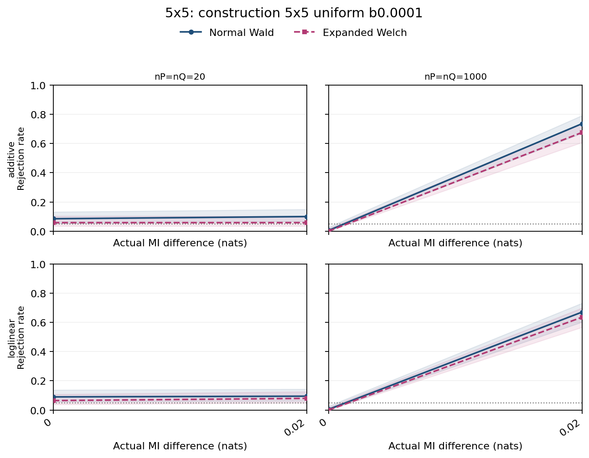

| Specification | Setting |
| --- | --- |
| Table size | 5x5 |
| Horizontal graph regime specifications (columns) | nP=nQ=20, nP=nQ=1000 |
| Vertical graph regime specifications (rows) | additive: P row (0.2 repeated 5 times), P column (0.2 repeated 5 times); Q row (0.2 repeated 5 times), Q column (0.2 repeated 5 times); loglinear: P row (0.2 repeated 5 times), P column (0.2 repeated 5 times); Q row (0.2 repeated 5 times), Q column (0.2 repeated 5 times) |
| Probability changes | additive: additive, first changes in P and Q; loglinear: loglinear, first changes in P and Q |
| MI settings | Baseline MI {0.0001}; direction {q higher}; actual differences {0, 0.02} nats |
| Horizontal axis within each graph | Actual MI difference in nats, fixed from 0 to 0.02 |
| Vertical axis within each graph | Unconditional rejection rate from 0 to 1; invalid results count as non-rejections |
| Replicates | 200 per unique point |

Null-point rejection and validity:

| Vertical regime | Horizontal regime | Method | Rejection | Valid |
| --- | --- | --- | --- | --- |
| additive | nP=nQ=1000 | Expanded Welch | 0.0000 | 1.0000 |
| additive | nP=nQ=1000 | Normal Wald | 0.0050 | 1.0000 |
| additive | nP=nQ=20 | Expanded Welch | 0.0600 | 1.0000 |
| additive | nP=nQ=20 | Normal Wald | 0.0850 | 1.0000 |
| loglinear | nP=nQ=1000 | Expanded Welch | 0.0000 | 1.0000 |
| loglinear | nP=nQ=1000 | Normal Wald | 0.0050 | 1.0000 |
| loglinear | nP=nQ=20 | Expanded Welch | 0.0650 | 1.0000 |
| loglinear | nP=nQ=20 | Normal Wald | 0.0900 | 1.0000 |

Every plotted rate, interval, validity and minimum expected count

| Vertical regime | Horizontal regime | x | Method | Rejection | 95% interval | Valid | Conditional | Min expected P | Min expected Q |
| --- | --- | --- | --- | --- | --- | --- | --- | --- | --- |
| additive | nP=nQ=1000 | 0 | Expanded Welch | 0.0000 | [0.0000, 0.0188] | 1.0000 | 0.0000 | 38.59 | 38.59 |
| additive | nP=nQ=1000 | 0 | Normal Wald | 0.0050 | [0.0009, 0.0278] | 1.0000 | 0.0050 | 38.59 | 38.59 |
| additive | nP=nQ=1000 | 0.02 | Expanded Welch | 0.6750 | [0.6073, 0.7361] | 1.0000 | 0.6750 | 38.59 | 20.38 |
| additive | nP=nQ=1000 | 0.02 | Normal Wald | 0.7350 | [0.6698, 0.7913] | 1.0000 | 0.7350 | 38.59 | 20.38 |
| additive | nP=nQ=20 | 0 | Expanded Welch | 0.0600 | [0.0347, 0.1019] | 1.0000 | 0.0600 | 0.7717 | 0.7717 |
| additive | nP=nQ=20 | 0 | Normal Wald | 0.0850 | [0.0537, 0.1319] | 1.0000 | 0.0850 | 0.7717 | 0.7717 |
| additive | nP=nQ=20 | 0.02 | Expanded Welch | 0.0600 | [0.0347, 0.1019] | 1.0000 | 0.0600 | 0.7717 | 0.4076 |
| additive | nP=nQ=20 | 0.02 | Normal Wald | 0.1000 | [0.0657, 0.1494] | 1.0000 | 0.1000 | 0.7717 | 0.4076 |
| loglinear | nP=nQ=1000 | 0 | Expanded Welch | 0.0000 | [0.0000, 0.0188] | 1.0000 | 0.0000 | 38.87 | 38.87 |
| loglinear | nP=nQ=1000 | 0 | Normal Wald | 0.0050 | [0.0009, 0.0278] | 1.0000 | 0.0050 | 38.87 | 38.87 |
| loglinear | nP=nQ=1000 | 0.02 | Expanded Welch | 0.6350 | [0.5663, 0.6986] | 1.0000 | 0.6350 | 38.87 | 24.96 |
| loglinear | nP=nQ=1000 | 0.02 | Normal Wald | 0.6700 | [0.6022, 0.7314] | 1.0000 | 0.6700 | 38.87 | 24.96 |
| loglinear | nP=nQ=20 | 0 | Expanded Welch | 0.0650 | [0.0384, 0.1080] | 1.0000 | 0.0650 | 0.7775 | 0.7775 |
| loglinear | nP=nQ=20 | 0 | Normal Wald | 0.0900 | [0.0577, 0.1378] | 1.0000 | 0.0900 | 0.7775 | 0.7775 |
| loglinear | nP=nQ=20 | 0.02 | Expanded Welch | 0.0800 | [0.0498, 0.1260] | 1.0000 | 0.0800 | 0.7775 | 0.4992 |
| loglinear | nP=nQ=20 | 0.02 | Normal Wald | 0.0950 | [0.0617, 0.1436] | 1.0000 | 0.0950 | 0.7775 | 0.4992 |

### 9.6 5x5: construction 5x5 uniform b0.02

Do conclusions change under a matched ordinal log-linear construction?

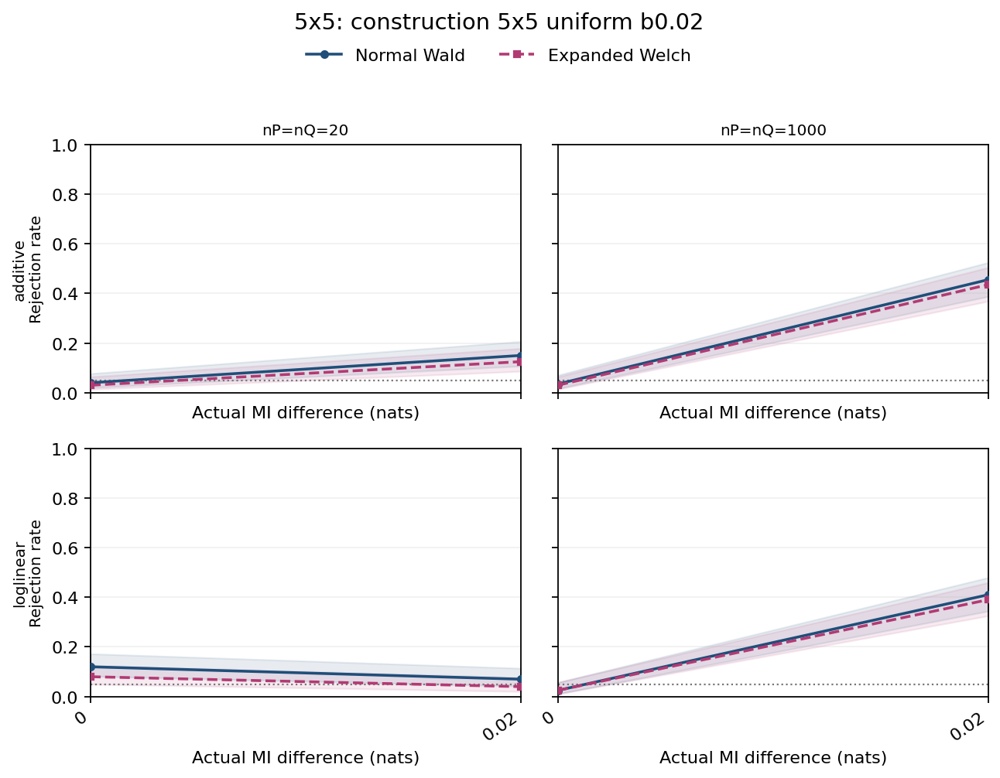

| Specification | Setting |
| --- | --- |
| Table size | 5x5 |
| Horizontal graph regime specifications (columns) | nP=nQ=20, nP=nQ=1000 |
| Vertical graph regime specifications (rows) | additive: P row (0.2 repeated 5 times), P column (0.2 repeated 5 times); Q row (0.2 repeated 5 times), Q column (0.2 repeated 5 times); loglinear: P row (0.2 repeated 5 times), P column (0.2 repeated 5 times); Q row (0.2 repeated 5 times), Q column (0.2 repeated 5 times) |
| Probability changes | additive: additive, first changes in P and Q; loglinear: loglinear, first changes in P and Q |
| MI settings | Baseline MI {0.02}; direction {q higher}; actual differences {0, 0.02} nats |
| Horizontal axis within each graph | Actual MI difference in nats, fixed from 0 to 0.02 |
| Vertical axis within each graph | Unconditional rejection rate from 0 to 1; invalid results count as non-rejections |
| Replicates | 200 per unique point |

Null-point rejection and validity:

| Vertical regime | Horizontal regime | Method | Rejection | Valid |
| --- | --- | --- | --- | --- |
| additive | nP=nQ=1000 | Expanded Welch | 0.0300 | 1.0000 |
| additive | nP=nQ=1000 | Normal Wald | 0.0350 | 1.0000 |
| additive | nP=nQ=20 | Expanded Welch | 0.0300 | 1.0000 |
| additive | nP=nQ=20 | Normal Wald | 0.0400 | 1.0000 |
| loglinear | nP=nQ=1000 | Expanded Welch | 0.0250 | 1.0000 |
| loglinear | nP=nQ=1000 | Normal Wald | 0.0250 | 1.0000 |
| loglinear | nP=nQ=20 | Expanded Welch | 0.0800 | 1.0000 |
| loglinear | nP=nQ=20 | Normal Wald | 0.1200 | 1.0000 |

Every plotted rate, interval, validity and minimum expected count

| Vertical regime | Horizontal regime | x | Method | Rejection | 95% interval | Valid | Conditional | Min expected P | Min expected Q |
| --- | --- | --- | --- | --- | --- | --- | --- | --- | --- |
| additive | nP=nQ=1000 | 0 | Expanded Welch | 0.0300 | [0.0138, 0.0639] | 1.0000 | 0.0300 | 20.43 | 20.43 |
| additive | nP=nQ=1000 | 0 | Normal Wald | 0.0350 | [0.0171, 0.0705] | 1.0000 | 0.0350 | 20.43 | 20.43 |
| additive | nP=nQ=1000 | 0.02 | Expanded Welch | 0.4350 | [0.3682, 0.5043] | 1.0000 | 0.4350 | 20.43 | 12.97 |
| additive | nP=nQ=1000 | 0.02 | Normal Wald | 0.4550 | [0.3875, 0.5242] | 1.0000 | 0.4550 | 20.43 | 12.97 |
| additive | nP=nQ=20 | 0 | Expanded Welch | 0.0300 | [0.0138, 0.0639] | 1.0000 | 0.0300 | 0.4086 | 0.4086 |
| additive | nP=nQ=20 | 0 | Normal Wald | 0.0400 | [0.0204, 0.0769] | 1.0000 | 0.0400 | 0.4086 | 0.4086 |
| additive | nP=nQ=20 | 0.02 | Expanded Welch | 0.1250 | [0.0861, 0.1780] | 1.0000 | 0.1250 | 0.4086 | 0.2594 |
| additive | nP=nQ=20 | 0.02 | Normal Wald | 0.1500 | [0.1071, 0.2061] | 1.0000 | 0.1500 | 0.4086 | 0.2594 |
| loglinear | nP=nQ=1000 | 0 | Expanded Welch | 0.0250 | [0.0107, 0.0572] | 1.0000 | 0.0250 | 24.99 | 24.99 |
| loglinear | nP=nQ=1000 | 0 | Normal Wald | 0.0250 | [0.0107, 0.0572] | 1.0000 | 0.0250 | 24.99 | 24.99 |
| loglinear | nP=nQ=1000 | 0.02 | Expanded Welch | 0.3900 | [0.3251, 0.4591] | 1.0000 | 0.3900 | 24.99 | 19.53 |
| loglinear | nP=nQ=1000 | 0.02 | Normal Wald | 0.4100 | [0.3442, 0.4792] | 1.0000 | 0.4100 | 24.99 | 19.53 |
| loglinear | nP=nQ=20 | 0 | Expanded Welch | 0.0800 | [0.0498, 0.1260] | 1.0000 | 0.0800 | 0.4999 | 0.4999 |
| loglinear | nP=nQ=20 | 0 | Normal Wald | 0.1200 | [0.0820, 0.1723] | 1.0000 | 0.1200 | 0.4999 | 0.4999 |
| loglinear | nP=nQ=20 | 0.02 | Expanded Welch | 0.0400 | [0.0204, 0.0769] | 1.0000 | 0.0400 | 0.4999 | 0.3906 |
| loglinear | nP=nQ=20 | 0.02 | Normal Wald | 0.0700 | [0.0422, 0.1141] | 1.0000 | 0.0700 | 0.4999 | 0.3906 |

### 9.7 5x5: construction 5x5 different skew b0.0001

Do conclusions change under a matched ordinal log-linear construction?

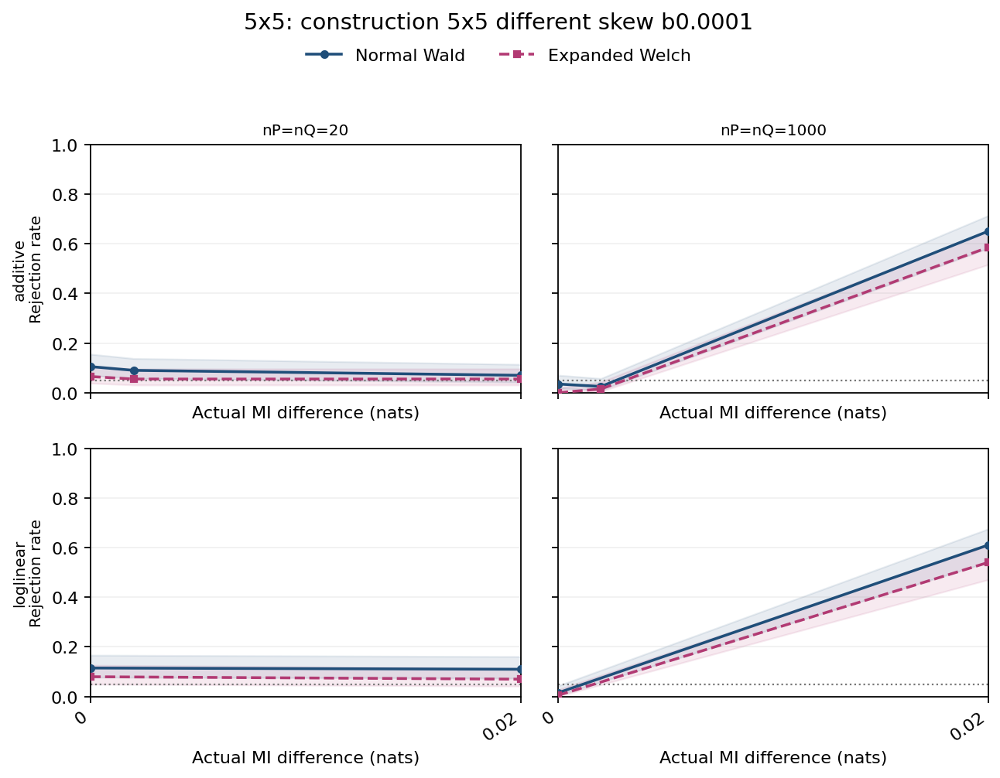

| Specification | Setting |
| --- | --- |
| Table size | 5x5 |
| Horizontal graph regime specifications (columns) | nP=nQ=20, nP=nQ=1000 |
| Vertical graph regime specifications (rows) | additive: P row (0.7, 0.3/4 repeated 4 times), P column (0.7, 0.3/4 repeated 4 times); Q row (0.8, 0.2/4 repeated 4 times), Q column (0.8, 0.2/4 repeated 4 times); loglinear: P row (0.7, 0.3/4 repeated 4 times), P column (0.7, 0.3/4 repeated 4 times); Q row (0.8, 0.2/4 repeated 4 times), Q column (0.8, 0.2/4 repeated 4 times) |
| Probability changes | additive: additive, first changes in P and Q; loglinear: loglinear, first changes in P and Q |
| MI settings | Baseline MI {0.0001}; direction {q higher}; actual differences {0, 0.002, 0.02} nats |
| Horizontal axis within each graph | Actual MI difference in nats, fixed from 0 to 0.02 |
| Vertical axis within each graph | Unconditional rejection rate from 0 to 1; invalid results count as non-rejections |
| Replicates | 200 per unique point |

Null-point rejection and validity:

| Vertical regime | Horizontal regime | Method | Rejection | Valid |
| --- | --- | --- | --- | --- |
| additive | nP=nQ=1000 | Expanded Welch | 0.0000 | 1.0000 |
| additive | nP=nQ=1000 | Normal Wald | 0.0350 | 1.0000 |
| additive | nP=nQ=20 | Expanded Welch | 0.0650 | 0.9850 |
| additive | nP=nQ=20 | Normal Wald | 0.1050 | 1.0000 |
| loglinear | nP=nQ=1000 | Expanded Welch | 0.0050 | 1.0000 |
| loglinear | nP=nQ=1000 | Normal Wald | 0.0150 | 1.0000 |
| loglinear | nP=nQ=20 | Expanded Welch | 0.0800 | 0.9850 |
| loglinear | nP=nQ=20 | Normal Wald | 0.1150 | 1.0000 |

Every plotted rate, interval, validity and minimum expected count

| Vertical regime | Horizontal regime | x | Method | Rejection | 95% interval | Valid | Conditional | Min expected P | Min expected Q |
| --- | --- | --- | --- | --- | --- | --- | --- | --- | --- |
| additive | nP=nQ=1000 | 0 | Expanded Welch | 0.0000 | [0.0000, 0.0188] | 1.0000 | 0.0000 | 5.625 | 2.5 |
| additive | nP=nQ=1000 | 0 | Normal Wald | 0.0350 | [0.0171, 0.0705] | 1.0000 | 0.0350 | 5.625 | 2.5 |
| additive | nP=nQ=1000 | 0.002 | Expanded Welch | 0.0150 | [0.0051, 0.0432] | 1.0000 | 0.0150 | 5.625 | 2.5 |
| additive | nP=nQ=1000 | 0.002 | Normal Wald | 0.0250 | [0.0107, 0.0572] | 1.0000 | 0.0250 | 5.625 | 2.5 |
| additive | nP=nQ=1000 | 0.02 | Expanded Welch | 0.5850 | [0.5157, 0.6511] | 1.0000 | 0.5850 | 5.625 | 2.5 |
| additive | nP=nQ=1000 | 0.02 | Normal Wald | 0.6500 | [0.5816, 0.7127] | 1.0000 | 0.6500 | 5.625 | 2.5 |
| additive | nP=nQ=20 | 0 | Expanded Welch | 0.0650 | [0.0384, 0.1080] | 0.9850 | 0.0660 | 0.1125 | 0.05 |
| additive | nP=nQ=20 | 0 | Normal Wald | 0.1050 | [0.0697, 0.1552] | 1.0000 | 0.1050 | 0.1125 | 0.05 |
| additive | nP=nQ=20 | 0.002 | Expanded Welch | 0.0550 | [0.0310, 0.0958] | 0.9700 | 0.0567 | 0.1125 | 0.05 |
| additive | nP=nQ=20 | 0.002 | Normal Wald | 0.0900 | [0.0577, 0.1378] | 1.0000 | 0.0900 | 0.1125 | 0.05 |
| additive | nP=nQ=20 | 0.02 | Expanded Welch | 0.0550 | [0.0310, 0.0958] | 0.9900 | 0.0556 | 0.1125 | 0.05 |
| additive | nP=nQ=20 | 0.02 | Normal Wald | 0.0700 | [0.0422, 0.1141] | 1.0000 | 0.0700 | 0.1125 | 0.05 |
| loglinear | nP=nQ=1000 | 0 | Expanded Welch | 0.0050 | [0.0009, 0.0278] | 1.0000 | 0.0050 | 5.628 | 2.507 |
| loglinear | nP=nQ=1000 | 0 | Normal Wald | 0.0150 | [0.0051, 0.0432] | 1.0000 | 0.0150 | 5.628 | 2.507 |
| loglinear | nP=nQ=1000 | 0.02 | Expanded Welch | 0.5400 | [0.4708, 0.6077] | 1.0000 | 0.5400 | 5.628 | 2.625 |
| loglinear | nP=nQ=1000 | 0.02 | Normal Wald | 0.6100 | [0.5409, 0.6749] | 1.0000 | 0.6100 | 5.628 | 2.625 |
| loglinear | nP=nQ=20 | 0 | Expanded Welch | 0.0800 | [0.0498, 0.1260] | 0.9850 | 0.0812 | 0.1126 | 0.05014 |
| loglinear | nP=nQ=20 | 0 | Normal Wald | 0.1150 | [0.0779, 0.1666] | 1.0000 | 0.1150 | 0.1126 | 0.05014 |
| loglinear | nP=nQ=20 | 0.02 | Expanded Welch | 0.0700 | [0.0422, 0.1141] | 0.9950 | 0.0704 | 0.1126 | 0.05249 |
| loglinear | nP=nQ=20 | 0.02 | Normal Wald | 0.1100 | [0.0738, 0.1609] | 1.0000 | 0.1100 | 0.1126 | 0.05249 |

### 9.8 5x5: construction 5x5 different skew b0.02

Do conclusions change under a matched ordinal log-linear construction?

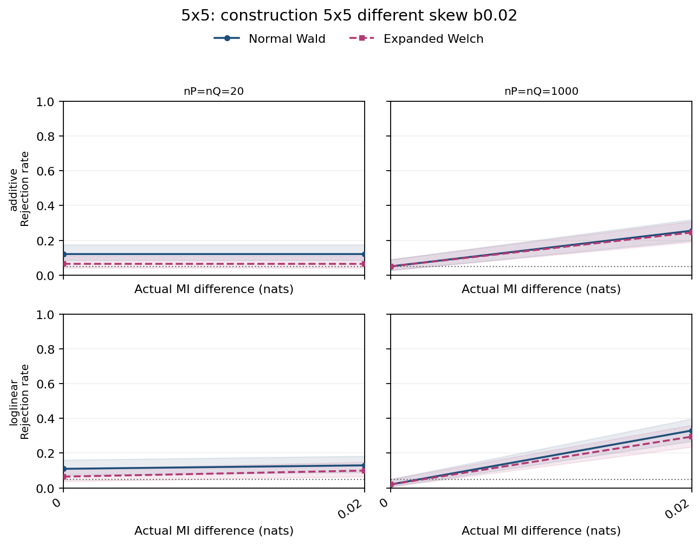

| Specification | Setting |
| --- | --- |
| Table size | 5x5 |
| Horizontal graph regime specifications (columns) | nP=nQ=20, nP=nQ=1000 |
| Vertical graph regime specifications (rows) | additive: P row (0.7, 0.3/4 repeated 4 times), P column (0.7, 0.3/4 repeated 4 times); Q row (0.8, 0.2/4 repeated 4 times), Q column (0.8, 0.2/4 repeated 4 times); loglinear: P row (0.7, 0.3/4 repeated 4 times), P column (0.7, 0.3/4 repeated 4 times); Q row (0.8, 0.2/4 repeated 4 times), Q column (0.8, 0.2/4 repeated 4 times) |
| Probability changes | additive: additive, first changes in P and Q; loglinear: loglinear, first changes in P and Q |
| MI settings | Baseline MI {0.02}; direction {q higher}; actual differences {0, 0.02} nats |
| Horizontal axis within each graph | Actual MI difference in nats, fixed from 0 to 0.02 |
| Vertical axis within each graph | Unconditional rejection rate from 0 to 1; invalid results count as non-rejections |
| Replicates | 200 per unique point |

Null-point rejection and validity:

| Vertical regime | Horizontal regime | Method | Rejection | Valid |
| --- | --- | --- | --- | --- |
| additive | nP=nQ=1000 | Expanded Welch | 0.0500 | 1.0000 |
| additive | nP=nQ=1000 | Normal Wald | 0.0500 | 1.0000 |
| additive | nP=nQ=20 | Expanded Welch | 0.0650 | 0.9450 |
| additive | nP=nQ=20 | Normal Wald | 0.1200 | 1.0000 |
| loglinear | nP=nQ=1000 | Expanded Welch | 0.0200 | 1.0000 |
| loglinear | nP=nQ=1000 | Normal Wald | 0.0200 | 1.0000 |
| loglinear | nP=nQ=20 | Expanded Welch | 0.0650 | 0.9750 |
| loglinear | nP=nQ=20 | Normal Wald | 0.1100 | 1.0000 |

Every plotted rate, interval, validity and minimum expected count

| Vertical regime | Horizontal regime | x | Method | Rejection | 95% interval | Valid | Conditional | Min expected P | Min expected Q |
| --- | --- | --- | --- | --- | --- | --- | --- | --- | --- |
| additive | nP=nQ=1000 | 0 | Expanded Welch | 0.0500 | [0.0274, 0.0896] | 1.0000 | 0.0500 | 5.625 | 2.5 |
| additive | nP=nQ=1000 | 0 | Normal Wald | 0.0500 | [0.0274, 0.0896] | 1.0000 | 0.0500 | 5.625 | 2.5 |
| additive | nP=nQ=1000 | 0.02 | Expanded Welch | 0.2450 | [0.1906, 0.3090] | 1.0000 | 0.2450 | 5.625 | 2.5 |
| additive | nP=nQ=1000 | 0.02 | Normal Wald | 0.2550 | [0.1996, 0.3196] | 1.0000 | 0.2550 | 5.625 | 2.5 |
| additive | nP=nQ=20 | 0 | Expanded Welch | 0.0650 | [0.0384, 0.1080] | 0.9450 | 0.0688 | 0.1125 | 0.05 |
| additive | nP=nQ=20 | 0 | Normal Wald | 0.1200 | [0.0820, 0.1723] | 1.0000 | 0.1200 | 0.1125 | 0.05 |
| additive | nP=nQ=20 | 0.02 | Expanded Welch | 0.0650 | [0.0384, 0.1080] | 0.9900 | 0.0657 | 0.1125 | 0.05 |
| additive | nP=nQ=20 | 0.02 | Normal Wald | 0.1200 | [0.0820, 0.1723] | 1.0000 | 0.1200 | 0.1125 | 0.05 |
| loglinear | nP=nQ=1000 | 0 | Expanded Welch | 0.0200 | [0.0078, 0.0503] | 1.0000 | 0.0200 | 5.59 | 2.624 |
| loglinear | nP=nQ=1000 | 0 | Normal Wald | 0.0200 | [0.0078, 0.0503] | 1.0000 | 0.0200 | 5.59 | 2.624 |
| loglinear | nP=nQ=1000 | 0.02 | Expanded Welch | 0.2950 | [0.2361, 0.3616] | 1.0000 | 0.2950 | 5.59 | 2.586 |
| loglinear | nP=nQ=1000 | 0.02 | Normal Wald | 0.3300 | [0.2686, 0.3978] | 1.0000 | 0.3300 | 5.59 | 2.586 |
| loglinear | nP=nQ=20 | 0 | Expanded Welch | 0.0650 | [0.0384, 0.1080] | 0.9750 | 0.0667 | 0.1118 | 0.05249 |
| loglinear | nP=nQ=20 | 0 | Normal Wald | 0.1100 | [0.0738, 0.1609] | 1.0000 | 0.1100 | 0.1118 | 0.05249 |
| loglinear | nP=nQ=20 | 0.02 | Expanded Welch | 0.1000 | [0.0657, 0.1494] | 0.9750 | 0.1026 | 0.1118 | 0.05171 |
| loglinear | nP=nQ=20 | 0.02 | Normal Wald | 0.1300 | [0.0903, 0.1837] | 1.0000 | 0.1300 | 0.1118 | 0.05171 |

### 9.9 8x8: construction 8x8 uniform b0.0001

Do conclusions change under a matched ordinal log-linear construction?

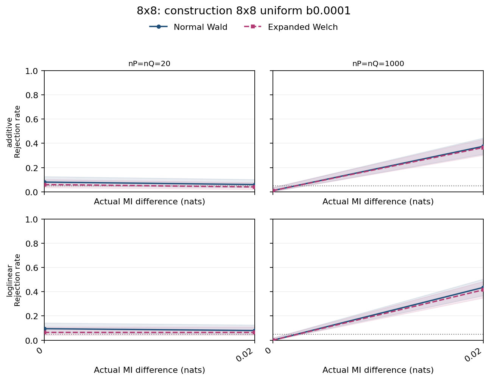

| Specification | Setting |
| --- | --- |
| Table size | 8x8 |
| Horizontal graph regime specifications (columns) | nP=nQ=20, nP=nQ=1000 |
| Vertical graph regime specifications (rows) | additive: P row (0.125 repeated 8 times), P column (0.125 repeated 8 times); Q row (0.125 repeated 8 times), Q column (0.125 repeated 8 times); loglinear: P row (0.125 repeated 8 times), P column (0.125 repeated 8 times); Q row (0.125 repeated 8 times), Q column (0.125 repeated 8 times) |
| Probability changes | additive: additive, first changes in P and Q; loglinear: loglinear, first changes in P and Q |
| MI settings | Baseline MI {0.0001}; direction {q higher}; actual differences {0, 0.02} nats |
| Horizontal axis within each graph | Actual MI difference in nats, fixed from 0 to 0.02 |
| Vertical axis within each graph | Unconditional rejection rate from 0 to 1; invalid results count as non-rejections |
| Replicates | 200 per unique point |

Null-point rejection and validity:

| Vertical regime | Horizontal regime | Method | Rejection | Valid |
| --- | --- | --- | --- | --- |
| additive | nP=nQ=1000 | Expanded Welch | 0.0100 | 1.0000 |
| additive | nP=nQ=1000 | Normal Wald | 0.0100 | 1.0000 |
| additive | nP=nQ=20 | Expanded Welch | 0.0600 | 1.0000 |
| additive | nP=nQ=20 | Normal Wald | 0.0800 | 1.0000 |
| loglinear | nP=nQ=1000 | Expanded Welch | 0.0000 | 1.0000 |
| loglinear | nP=nQ=1000 | Normal Wald | 0.0000 | 1.0000 |
| loglinear | nP=nQ=20 | Expanded Welch | 0.0650 | 1.0000 |
| loglinear | nP=nQ=20 | Normal Wald | 0.0950 | 1.0000 |

Every plotted rate, interval, validity and minimum expected count

| Vertical regime | Horizontal regime | x | Method | Rejection | 95% interval | Valid | Conditional | Min expected P | Min expected Q |
| --- | --- | --- | --- | --- | --- | --- | --- | --- | --- |
| additive | nP=nQ=1000 | 0 | Expanded Welch | 0.0100 | [0.0027, 0.0357] | 1.0000 | 0.0100 | 14.74 | 14.74 |
| additive | nP=nQ=1000 | 0 | Normal Wald | 0.0100 | [0.0027, 0.0357] | 1.0000 | 0.0100 | 14.74 | 14.74 |
| additive | nP=nQ=1000 | 0.02 | Expanded Welch | 0.3650 | [0.3014, 0.4337] | 1.0000 | 0.3650 | 14.74 | 3.823 |
| additive | nP=nQ=1000 | 0.02 | Normal Wald | 0.3750 | [0.3109, 0.4439] | 1.0000 | 0.3750 | 14.74 | 3.823 |
| additive | nP=nQ=20 | 0 | Expanded Welch | 0.0600 | [0.0347, 0.1019] | 1.0000 | 0.0600 | 0.2948 | 0.2948 |
| additive | nP=nQ=20 | 0 | Normal Wald | 0.0800 | [0.0498, 0.1260] | 1.0000 | 0.0800 | 0.2948 | 0.2948 |
| additive | nP=nQ=20 | 0.02 | Expanded Welch | 0.0400 | [0.0204, 0.0769] | 1.0000 | 0.0400 | 0.2948 | 0.07646 |
| additive | nP=nQ=20 | 0.02 | Normal Wald | 0.0600 | [0.0347, 0.1019] | 1.0000 | 0.0600 | 0.2948 | 0.07646 |
| loglinear | nP=nQ=1000 | 0 | Expanded Welch | 0.0000 | [0.0000, 0.0188] | 1.0000 | 0.0000 | 15.11 | 15.11 |
| loglinear | nP=nQ=1000 | 0 | Normal Wald | 0.0000 | [0.0000, 0.0188] | 1.0000 | 0.0000 | 15.11 | 15.11 |
| loglinear | nP=nQ=1000 | 0.02 | Expanded Welch | 0.4150 | [0.3489, 0.4843] | 1.0000 | 0.4150 | 15.11 | 8.98 |
| loglinear | nP=nQ=1000 | 0.02 | Normal Wald | 0.4350 | [0.3682, 0.5043] | 1.0000 | 0.4350 | 15.11 | 8.98 |
| loglinear | nP=nQ=20 | 0 | Expanded Welch | 0.0650 | [0.0384, 0.1080] | 1.0000 | 0.0650 | 0.3022 | 0.3022 |
| loglinear | nP=nQ=20 | 0 | Normal Wald | 0.0950 | [0.0617, 0.1436] | 1.0000 | 0.0950 | 0.3022 | 0.3022 |
| loglinear | nP=nQ=20 | 0.02 | Expanded Welch | 0.0650 | [0.0384, 0.1080] | 1.0000 | 0.0650 | 0.3022 | 0.1796 |
| loglinear | nP=nQ=20 | 0.02 | Normal Wald | 0.0800 | [0.0498, 0.1260] | 1.0000 | 0.0800 | 0.3022 | 0.1796 |

### 9.10 8x8: construction 8x8 uniform b0.02

Do conclusions change under a matched ordinal log-linear construction?

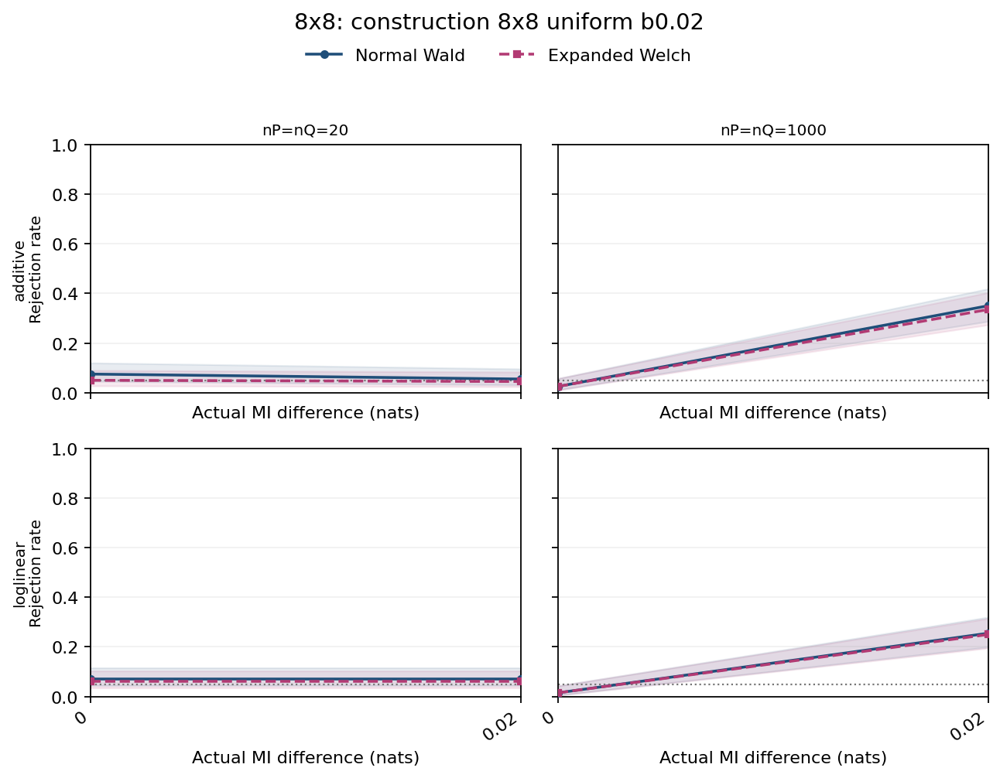

| Specification | Setting |
| --- | --- |
| Table size | 8x8 |
| Horizontal graph regime specifications (columns) | nP=nQ=20, nP=nQ=1000 |
| Vertical graph regime specifications (rows) | additive: P row (0.125 repeated 8 times), P column (0.125 repeated 8 times); Q row (0.125 repeated 8 times), Q column (0.125 repeated 8 times); loglinear: P row (0.125 repeated 8 times), P column (0.125 repeated 8 times); Q row (0.125 repeated 8 times), Q column (0.125 repeated 8 times) |
| Probability changes | additive: additive, first changes in P and Q; loglinear: loglinear, first changes in P and Q |
| MI settings | Baseline MI {0.02}; direction {q higher}; actual differences {0, 0.02} nats |
| Horizontal axis within each graph | Actual MI difference in nats, fixed from 0 to 0.02 |
| Vertical axis within each graph | Unconditional rejection rate from 0 to 1; invalid results count as non-rejections |
| Replicates | 200 per unique point |

Null-point rejection and validity:

| Vertical regime | Horizontal regime | Method | Rejection | Valid |
| --- | --- | --- | --- | --- |
| additive | nP=nQ=1000 | Expanded Welch | 0.0250 | 1.0000 |
| additive | nP=nQ=1000 | Normal Wald | 0.0250 | 1.0000 |
| additive | nP=nQ=20 | Expanded Welch | 0.0500 | 1.0000 |
| additive | nP=nQ=20 | Normal Wald | 0.0750 | 1.0000 |
| loglinear | nP=nQ=1000 | Expanded Welch | 0.0150 | 1.0000 |
| loglinear | nP=nQ=1000 | Normal Wald | 0.0150 | 1.0000 |
| loglinear | nP=nQ=20 | Expanded Welch | 0.0600 | 1.0000 |
| loglinear | nP=nQ=20 | Normal Wald | 0.0700 | 1.0000 |

Every plotted rate, interval, validity and minimum expected count

| Vertical regime | Horizontal regime | x | Method | Rejection | 95% interval | Valid | Conditional | Min expected P | Min expected Q |
| --- | --- | --- | --- | --- | --- | --- | --- | --- | --- |
| additive | nP=nQ=1000 | 0 | Expanded Welch | 0.0250 | [0.0107, 0.0572] | 1.0000 | 0.0250 | 3.848 | 3.848 |
| additive | nP=nQ=1000 | 0 | Normal Wald | 0.0250 | [0.0107, 0.0572] | 1.0000 | 0.0250 | 3.848 | 3.848 |
| additive | nP=nQ=1000 | 0.02 | Expanded Welch | 0.3350 | [0.2732, 0.4030] | 1.0000 | 0.3350 | 3.848 | 0.2932 |
| additive | nP=nQ=1000 | 0.02 | Normal Wald | 0.3500 | [0.2873, 0.4184] | 1.0000 | 0.3500 | 3.848 | 0.2932 |
| additive | nP=nQ=20 | 0 | Expanded Welch | 0.0500 | [0.0274, 0.0896] | 1.0000 | 0.0500 | 0.07697 | 0.07697 |
| additive | nP=nQ=20 | 0 | Normal Wald | 0.0750 | [0.0460, 0.1200] | 1.0000 | 0.0750 | 0.07697 | 0.07697 |
| additive | nP=nQ=20 | 0.02 | Expanded Welch | 0.0450 | [0.0239, 0.0833] | 1.0000 | 0.0450 | 0.07697 | 0.005864 |
| additive | nP=nQ=20 | 0.02 | Normal Wald | 0.0550 | [0.0310, 0.0958] | 1.0000 | 0.0550 | 0.07697 | 0.005864 |
| loglinear | nP=nQ=1000 | 0 | Expanded Welch | 0.0150 | [0.0051, 0.0432] | 1.0000 | 0.0150 | 8.994 | 8.994 |
| loglinear | nP=nQ=1000 | 0 | Normal Wald | 0.0150 | [0.0051, 0.0432] | 1.0000 | 0.0150 | 8.994 | 8.994 |
| loglinear | nP=nQ=1000 | 0.02 | Expanded Welch | 0.2500 | [0.1951, 0.3143] | 1.0000 | 0.2500 | 8.994 | 6.718 |
| loglinear | nP=nQ=1000 | 0.02 | Normal Wald | 0.2550 | [0.1996, 0.3196] | 1.0000 | 0.2550 | 8.994 | 6.718 |
| loglinear | nP=nQ=20 | 0 | Expanded Welch | 0.0600 | [0.0347, 0.1019] | 1.0000 | 0.0600 | 0.1799 | 0.1799 |
| loglinear | nP=nQ=20 | 0 | Normal Wald | 0.0700 | [0.0422, 0.1141] | 1.0000 | 0.0700 | 0.1799 | 0.1799 |
| loglinear | nP=nQ=20 | 0.02 | Expanded Welch | 0.0600 | [0.0347, 0.1019] | 1.0000 | 0.0600 | 0.1799 | 0.1344 |
| loglinear | nP=nQ=20 | 0.02 | Normal Wald | 0.0700 | [0.0422, 0.1141] | 1.0000 | 0.0700 | 0.1799 | 0.1344 |

### 9.11 8x8: construction 8x8 different skew b0.0001

Do conclusions change under a matched ordinal log-linear construction?

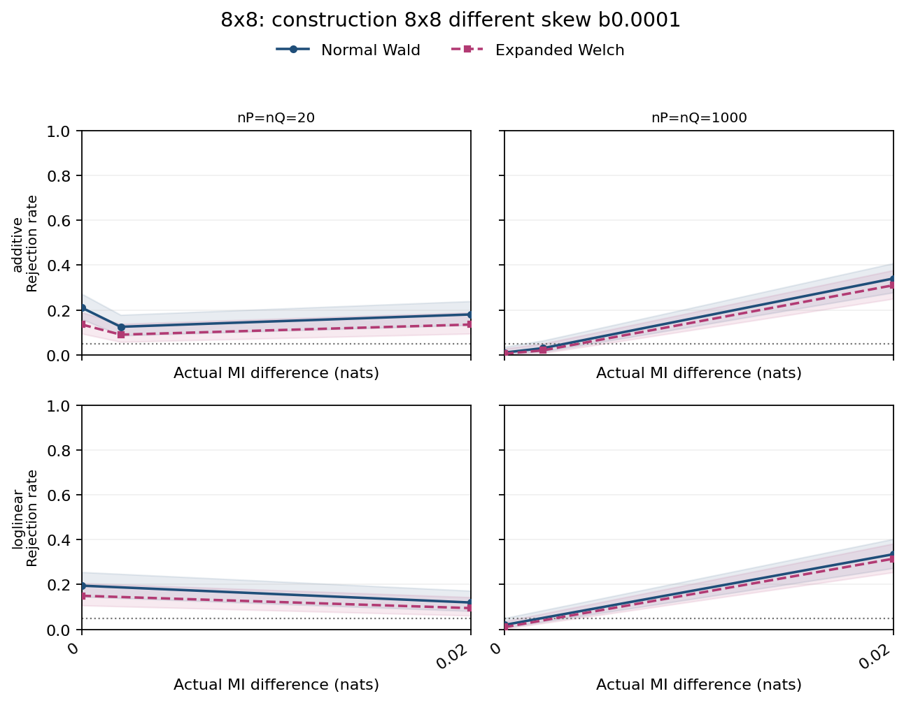

| Specification | Setting |
| --- | --- |
| Table size | 8x8 |
| Horizontal graph regime specifications (columns) | nP=nQ=20, nP=nQ=1000 |
| Vertical graph regime specifications (rows) | additive: P row (0.7, 0.3/7 repeated 7 times), P column (0.7, 0.3/7 repeated 7 times); Q row (0.8, 0.2/7 repeated 7 times), Q column (0.8, 0.2/7 repeated 7 times); loglinear: P row (0.7, 0.3/7 repeated 7 times), P column (0.7, 0.3/7 repeated 7 times); Q row (0.8, 0.2/7 repeated 7 times), Q column (0.8, 0.2/7 repeated 7 times) |
| Probability changes | additive: additive, first changes in P and Q; loglinear: loglinear, first changes in P and Q |
| MI settings | Baseline MI {0.0001}; direction {q higher}; actual differences {0, 0.002, 0.02} nats |
| Horizontal axis within each graph | Actual MI difference in nats, fixed from 0 to 0.02 |
| Vertical axis within each graph | Unconditional rejection rate from 0 to 1; invalid results count as non-rejections |
| Replicates | 200 per unique point |

Null-point rejection and validity:

| Vertical regime | Horizontal regime | Method | Rejection | Valid |
| --- | --- | --- | --- | --- |
| additive | nP=nQ=1000 | Expanded Welch | 0.0050 | 1.0000 |
| additive | nP=nQ=1000 | Normal Wald | 0.0100 | 1.0000 |
| additive | nP=nQ=20 | Expanded Welch | 0.1350 | 0.9500 |
| additive | nP=nQ=20 | Normal Wald | 0.2100 | 1.0000 |
| loglinear | nP=nQ=1000 | Expanded Welch | 0.0100 | 1.0000 |
| loglinear | nP=nQ=1000 | Normal Wald | 0.0200 | 1.0000 |
| loglinear | nP=nQ=20 | Expanded Welch | 0.1500 | 0.9800 |
| loglinear | nP=nQ=20 | Normal Wald | 0.1950 | 1.0000 |

Every plotted rate, interval, validity and minimum expected count

| Vertical regime | Horizontal regime | x | Method | Rejection | 95% interval | Valid | Conditional | Min expected P | Min expected Q |
| --- | --- | --- | --- | --- | --- | --- | --- | --- | --- |
| additive | nP=nQ=1000 | 0 | Expanded Welch | 0.0050 | [0.0009, 0.0278] | 1.0000 | 0.0050 | 1.837 | 0.8163 |
| additive | nP=nQ=1000 | 0 | Normal Wald | 0.0100 | [0.0027, 0.0357] | 1.0000 | 0.0100 | 1.837 | 0.8163 |
| additive | nP=nQ=1000 | 0.002 | Expanded Welch | 0.0200 | [0.0078, 0.0503] | 1.0000 | 0.0200 | 1.837 | 0.8163 |
| additive | nP=nQ=1000 | 0.002 | Normal Wald | 0.0300 | [0.0138, 0.0639] | 1.0000 | 0.0300 | 1.837 | 0.8163 |
| additive | nP=nQ=1000 | 0.02 | Expanded Welch | 0.3100 | [0.2500, 0.3772] | 1.0000 | 0.3100 | 1.837 | 0.8163 |
| additive | nP=nQ=1000 | 0.02 | Normal Wald | 0.3400 | [0.2779, 0.4081] | 1.0000 | 0.3400 | 1.837 | 0.8163 |
| additive | nP=nQ=20 | 0 | Expanded Welch | 0.1350 | [0.0945, 0.1893] | 0.9500 | 0.1421 | 0.03673 | 0.01633 |
| additive | nP=nQ=20 | 0 | Normal Wald | 0.2100 | [0.1593, 0.2716] | 1.0000 | 0.2100 | 0.03673 | 0.01633 |
| additive | nP=nQ=20 | 0.002 | Expanded Welch | 0.0900 | [0.0577, 0.1378] | 0.9800 | 0.0918 | 0.03673 | 0.01633 |
| additive | nP=nQ=20 | 0.002 | Normal Wald | 0.1250 | [0.0861, 0.1780] | 1.0000 | 0.1250 | 0.03673 | 0.01633 |
| additive | nP=nQ=20 | 0.02 | Expanded Welch | 0.1350 | [0.0945, 0.1893] | 0.9550 | 0.1414 | 0.03673 | 0.01633 |
| additive | nP=nQ=20 | 0.02 | Normal Wald | 0.1800 | [0.1329, 0.2391] | 1.0000 | 0.1800 | 0.03673 | 0.01633 |
| loglinear | nP=nQ=1000 | 0 | Expanded Welch | 0.0100 | [0.0027, 0.0357] | 1.0000 | 0.0100 | 1.829 | 0.8165 |
| loglinear | nP=nQ=1000 | 0 | Normal Wald | 0.0200 | [0.0078, 0.0503] | 1.0000 | 0.0200 | 1.829 | 0.8165 |
| loglinear | nP=nQ=1000 | 0.02 | Expanded Welch | 0.3150 | [0.2546, 0.3823] | 1.0000 | 0.3150 | 1.829 | 0.7263 |
| loglinear | nP=nQ=1000 | 0.02 | Normal Wald | 0.3350 | [0.2732, 0.4030] | 1.0000 | 0.3350 | 1.829 | 0.7263 |
| loglinear | nP=nQ=20 | 0 | Expanded Welch | 0.1500 | [0.1071, 0.2061] | 0.9800 | 0.1531 | 0.03658 | 0.01633 |
| loglinear | nP=nQ=20 | 0 | Normal Wald | 0.1950 | [0.1461, 0.2554] | 1.0000 | 0.1950 | 0.03658 | 0.01633 |
| loglinear | nP=nQ=20 | 0.02 | Expanded Welch | 0.0950 | [0.0617, 0.1436] | 0.9850 | 0.0964 | 0.03658 | 0.01453 |
| loglinear | nP=nQ=20 | 0.02 | Normal Wald | 0.1200 | [0.0820, 0.1723] | 1.0000 | 0.1200 | 0.03658 | 0.01453 |

### 9.12 8x8: construction 8x8 different skew b0.02

Do conclusions change under a matched ordinal log-linear construction?

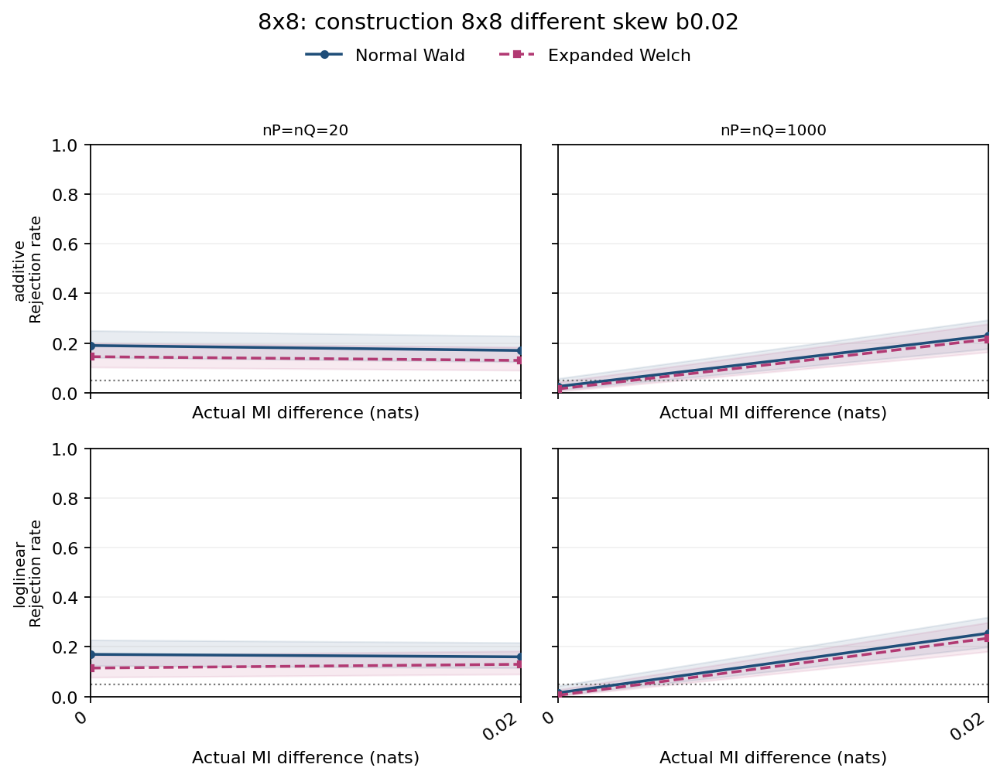

| Specification | Setting |
| --- | --- |
| Table size | 8x8 |
| Horizontal graph regime specifications (columns) | nP=nQ=20, nP=nQ=1000 |
| Vertical graph regime specifications (rows) | additive: P row (0.7, 0.3/7 repeated 7 times), P column (0.7, 0.3/7 repeated 7 times); Q row (0.8, 0.2/7 repeated 7 times), Q column (0.8, 0.2/7 repeated 7 times); loglinear: P row (0.7, 0.3/7 repeated 7 times), P column (0.7, 0.3/7 repeated 7 times); Q row (0.8, 0.2/7 repeated 7 times), Q column (0.8, 0.2/7 repeated 7 times) |
| Probability changes | additive: additive, first changes in P and Q; loglinear: loglinear, first changes in P and Q |
| MI settings | Baseline MI {0.02}; direction {q higher}; actual differences {0, 0.02} nats |
| Horizontal axis within each graph | Actual MI difference in nats, fixed from 0 to 0.02 |
| Vertical axis within each graph | Unconditional rejection rate from 0 to 1; invalid results count as non-rejections |
| Replicates | 200 per unique point |

Null-point rejection and validity:

| Vertical regime | Horizontal regime | Method | Rejection | Valid |
| --- | --- | --- | --- | --- |
| additive | nP=nQ=1000 | Expanded Welch | 0.0150 | 1.0000 |
| additive | nP=nQ=1000 | Normal Wald | 0.0250 | 1.0000 |
| additive | nP=nQ=20 | Expanded Welch | 0.1450 | 0.9700 |
| additive | nP=nQ=20 | Normal Wald | 0.1900 | 1.0000 |
| loglinear | nP=nQ=1000 | Expanded Welch | 0.0050 | 1.0000 |
| loglinear | nP=nQ=1000 | Normal Wald | 0.0150 | 1.0000 |
| loglinear | nP=nQ=20 | Expanded Welch | 0.1150 | 0.9600 |
| loglinear | nP=nQ=20 | Normal Wald | 0.1700 | 1.0000 |

Every plotted rate, interval, validity and minimum expected count

| Vertical regime | Horizontal regime | x | Method | Rejection | 95% interval | Valid | Conditional | Min expected P | Min expected Q |
| --- | --- | --- | --- | --- | --- | --- | --- | --- | --- |
| additive | nP=nQ=1000 | 0 | Expanded Welch | 0.0150 | [0.0051, 0.0432] | 1.0000 | 0.0150 | 1.837 | 0.8163 |
| additive | nP=nQ=1000 | 0 | Normal Wald | 0.0250 | [0.0107, 0.0572] | 1.0000 | 0.0250 | 1.837 | 0.8163 |
| additive | nP=nQ=1000 | 0.02 | Expanded Welch | 0.2150 | [0.1637, 0.2770] | 1.0000 | 0.2150 | 1.837 | 0.8163 |
| additive | nP=nQ=1000 | 0.02 | Normal Wald | 0.2300 | [0.1771, 0.2931] | 1.0000 | 0.2300 | 1.837 | 0.8163 |
| additive | nP=nQ=20 | 0 | Expanded Welch | 0.1450 | [0.1029, 0.2005] | 0.9700 | 0.1495 | 0.03673 | 0.01633 |
| additive | nP=nQ=20 | 0 | Normal Wald | 0.1900 | [0.1417, 0.2500] | 1.0000 | 0.1900 | 0.03673 | 0.01633 |
| additive | nP=nQ=20 | 0.02 | Expanded Welch | 0.1300 | [0.0903, 0.1837] | 0.9750 | 0.1333 | 0.03673 | 0.01633 |
| additive | nP=nQ=20 | 0.02 | Normal Wald | 0.1700 | [0.1243, 0.2282] | 1.0000 | 0.1700 | 0.03673 | 0.01633 |
| loglinear | nP=nQ=1000 | 0 | Expanded Welch | 0.0050 | [0.0009, 0.0278] | 1.0000 | 0.0050 | 1.562 | 0.7268 |
| loglinear | nP=nQ=1000 | 0 | Normal Wald | 0.0150 | [0.0051, 0.0432] | 1.0000 | 0.0150 | 1.562 | 0.7268 |
| loglinear | nP=nQ=1000 | 0.02 | Expanded Welch | 0.2350 | [0.1816, 0.2984] | 1.0000 | 0.2350 | 1.562 | 0.6262 |
| loglinear | nP=nQ=1000 | 0.02 | Normal Wald | 0.2550 | [0.1996, 0.3196] | 1.0000 | 0.2550 | 1.562 | 0.6262 |
| loglinear | nP=nQ=20 | 0 | Expanded Welch | 0.1150 | [0.0779, 0.1666] | 0.9600 | 0.1198 | 0.03123 | 0.01454 |
| loglinear | nP=nQ=20 | 0 | Normal Wald | 0.1700 | [0.1243, 0.2282] | 1.0000 | 0.1700 | 0.03123 | 0.01454 |
| loglinear | nP=nQ=20 | 0.02 | Expanded Welch | 0.1300 | [0.0903, 0.1837] | 0.9900 | 0.1313 | 0.03123 | 0.01252 |
| loglinear | nP=nQ=20 | 0.02 | Normal Wald | 0.1600 | [0.1157, 0.2171] | 1.0000 | 0.1600 | 0.03123 | 0.01252 |

## 10. Extreme skew and very small samples

What happens under deliberately extreme marginal skew and very small samples?

### 10.1 2x2: extreme 2x2 small

What happens under deliberately extreme marginal skew and very small samples?

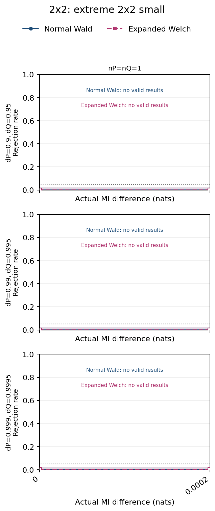

| Specification | Setting |
| --- | --- |
| Table size | 2x2 |
| Horizontal graph regime specifications (columns) | nP=nQ=1 |
| Vertical graph regime specifications (rows) | dP=0.9, dQ=0.95: P row (0.9, 0.1), P column (0.9, 0.1); Q row (0.95, 0.05), Q column (0.95, 0.05); dP=0.99, dQ=0.995: P row (0.99, 0.01), P column (0.99, 0.01); Q row (0.995, 0.005), Q column (0.995, 0.005); dP=0.999, dQ=0.9995: P row (0.999, 0.001), P column (0.999, 0.001); Q row (0.9995, 0.0005), Q column (0.9995, 0.0005) |
| Probability changes | dP=0.9, dQ=0.95: additive, first changes in P and Q; dP=0.99, dQ=0.995: additive, first changes in P and Q; dP=0.999, dQ=0.9995: additive, first changes in P and Q |
| MI settings | Baseline MI {1e-05}; direction {q higher}; actual differences {0, 0.0002} nats |
| Horizontal axis within each graph | Actual MI difference in nats, fixed from 0 to 0.0002 |
| Vertical axis within each graph | Unconditional rejection rate from 0 to 1; invalid results count as non-rejections |
| Replicates | 200 per unique point |

Null-point rejection and validity:

| Vertical regime | Horizontal regime | Method | Rejection | Valid |
| --- | --- | --- | --- | --- |
| dP=0.999, dQ=0.9995 | nP=nQ=1 | Expanded Welch | 0.0000 | 0.0000 |
| dP=0.999, dQ=0.9995 | nP=nQ=1 | Normal Wald | 0.0000 | 0.0000 |
| dP=0.99, dQ=0.995 | nP=nQ=1 | Expanded Welch | 0.0000 | 0.0000 |
| dP=0.99, dQ=0.995 | nP=nQ=1 | Normal Wald | 0.0000 | 0.0000 |
| dP=0.9, dQ=0.95 | nP=nQ=1 | Expanded Welch | 0.0000 | 0.0000 |
| dP=0.9, dQ=0.95 | nP=nQ=1 | Normal Wald | 0.0000 | 0.0000 |

Every plotted rate, interval, validity and minimum expected count

| Vertical regime | Horizontal regime | x | Method | Rejection | 95% interval | Valid | Conditional | Min expected P | Min expected Q |
| --- | --- | --- | --- | --- | --- | --- | --- | --- | --- |
| dP=0.999, dQ=0.9995 | nP=nQ=1 | 0 | Expanded Welch | 0.0000 | [0.0000, 0.0188] | 0.0000 | NA | 8.15e-06 | 4.909e-06 |
| dP=0.999, dQ=0.9995 | nP=nQ=1 | 0 | Normal Wald | 0.0000 | [0.0000, 0.0188] | 0.0000 | NA | 8.15e-06 | 4.909e-06 |
| dP=0.999, dQ=0.9995 | nP=nQ=1 | 0.0002 | Expanded Welch | 0.0000 | [0.0000, 0.0188] | 0.0000 | NA | 8.15e-06 | 4.812e-05 |
| dP=0.999, dQ=0.9995 | nP=nQ=1 | 0.0002 | Normal Wald | 0.0000 | [0.0000, 0.0188] | 0.0000 | NA | 8.15e-06 | 4.812e-05 |
| dP=0.99, dQ=0.995 | nP=nQ=1 | 0 | Expanded Welch | 0.0000 | [0.0000, 0.0188] | 0.0000 | NA | 0.0001474 | 5.031e-05 |
| dP=0.99, dQ=0.995 | nP=nQ=1 | 0 | Normal Wald | 0.0000 | [0.0000, 0.0188] | 0.0000 | NA | 0.0001474 | 5.031e-05 |
| dP=0.99, dQ=0.995 | nP=nQ=1 | 0.0002 | Expanded Welch | 0.0000 | [0.0000, 0.0188] | 0.0000 | NA | 0.0001474 | 0.0001823 |
| dP=0.99, dQ=0.995 | nP=nQ=1 | 0.0002 | Normal Wald | 0.0000 | [0.0000, 0.0188] | 0.0000 | NA | 0.0001474 | 0.0001823 |
| dP=0.9, dQ=0.95 | nP=nQ=1 | 0 | Expanded Welch | 0.0000 | [0.0000, 0.0188] | 0.0000 | NA | 0.0104 | 0.002715 |
| dP=0.9, dQ=0.95 | nP=nQ=1 | 0 | Normal Wald | 0.0000 | [0.0000, 0.0188] | 0.0000 | NA | 0.0104 | 0.002715 |
| dP=0.9, dQ=0.95 | nP=nQ=1 | 0.0002 | Expanded Welch | 0.0000 | [0.0000, 0.0188] | 0.0000 | NA | 0.0104 | 0.003528 |
| dP=0.9, dQ=0.95 | nP=nQ=1 | 0.0002 | Normal Wald | 0.0000 | [0.0000, 0.0188] | 0.0000 | NA | 0.0104 | 0.003528 |

### 10.2 2x2: extreme 2x2 large

What happens under deliberately extreme marginal skew and very small samples?

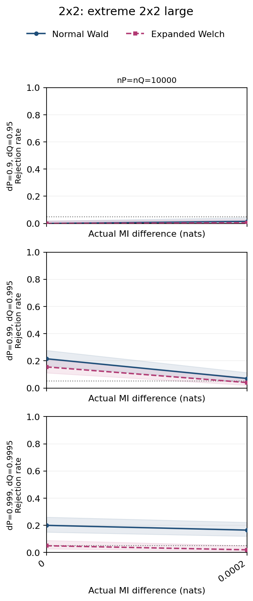

| Specification | Setting |
| --- | --- |
| Table size | 2x2 |
| Horizontal graph regime specifications (columns) | nP=nQ=10000 |
| Vertical graph regime specifications (rows) | dP=0.9, dQ=0.95: P row (0.9, 0.1), P column (0.9, 0.1); Q row (0.95, 0.05), Q column (0.95, 0.05); dP=0.99, dQ=0.995: P row (0.99, 0.01), P column (0.99, 0.01); Q row (0.995, 0.005), Q column (0.995, 0.005); dP=0.999, dQ=0.9995: P row (0.999, 0.001), P column (0.999, 0.001); Q row (0.9995, 0.0005), Q column (0.9995, 0.0005) |
| Probability changes | dP=0.9, dQ=0.95: additive, first changes in P and Q; dP=0.99, dQ=0.995: additive, first changes in P and Q; dP=0.999, dQ=0.9995: additive, first changes in P and Q |
| MI settings | Baseline MI {1e-05}; direction {q higher}; actual differences {0, 0.0002} nats |
| Horizontal axis within each graph | Actual MI difference in nats, fixed from 0 to 0.0002 |
| Vertical axis within each graph | Unconditional rejection rate from 0 to 1; invalid results count as non-rejections |
| Replicates | 200 per unique point |

Null-point rejection and validity:

| Vertical regime | Horizontal regime | Method | Rejection | Valid |
| --- | --- | --- | --- | --- |
| dP=0.999, dQ=0.9995 | nP=nQ=10000 | Expanded Welch | 0.0500 | 0.9900 |
| dP=0.999, dQ=0.9995 | nP=nQ=10000 | Normal Wald | 0.2000 | 1.0000 |
| dP=0.99, dQ=0.995 | nP=nQ=10000 | Expanded Welch | 0.1550 | 1.0000 |
| dP=0.99, dQ=0.995 | nP=nQ=10000 | Normal Wald | 0.2150 | 1.0000 |
| dP=0.9, dQ=0.95 | nP=nQ=10000 | Expanded Welch | 0.0000 | 1.0000 |
| dP=0.9, dQ=0.95 | nP=nQ=10000 | Normal Wald | 0.0000 | 1.0000 |

Every plotted rate, interval, validity and minimum expected count

| Vertical regime | Horizontal regime | x | Method | Rejection | 95% interval | Valid | Conditional | Min expected P | Min expected Q |
| --- | --- | --- | --- | --- | --- | --- | --- | --- | --- |
| dP=0.999, dQ=0.9995 | nP=nQ=10000 | 0 | Expanded Welch | 0.0500 | [0.0274, 0.0896] | 0.9900 | 0.0505 | 0.0815 | 0.04909 |
| dP=0.999, dQ=0.9995 | nP=nQ=10000 | 0 | Normal Wald | 0.2000 | [0.1505, 0.2609] | 1.0000 | 0.2000 | 0.0815 | 0.04909 |
| dP=0.999, dQ=0.9995 | nP=nQ=10000 | 0.0002 | Expanded Welch | 0.0200 | [0.0078, 0.0503] | 0.9950 | 0.0201 | 0.0815 | 0.4812 |
| dP=0.999, dQ=0.9995 | nP=nQ=10000 | 0.0002 | Normal Wald | 0.1650 | [0.1200, 0.2227] | 1.0000 | 0.1650 | 0.0815 | 0.4812 |
| dP=0.99, dQ=0.995 | nP=nQ=10000 | 0 | Expanded Welch | 0.1550 | [0.1114, 0.2116] | 1.0000 | 0.1550 | 1.474 | 0.5031 |
| dP=0.99, dQ=0.995 | nP=nQ=10000 | 0 | Normal Wald | 0.2150 | [0.1637, 0.2770] | 1.0000 | 0.2150 | 1.474 | 0.5031 |
| dP=0.99, dQ=0.995 | nP=nQ=10000 | 0.0002 | Expanded Welch | 0.0400 | [0.0204, 0.0769] | 1.0000 | 0.0400 | 1.474 | 1.823 |
| dP=0.99, dQ=0.995 | nP=nQ=10000 | 0.0002 | Normal Wald | 0.0700 | [0.0422, 0.1141] | 1.0000 | 0.0700 | 1.474 | 1.823 |
| dP=0.9, dQ=0.95 | nP=nQ=10000 | 0 | Expanded Welch | 0.0000 | [0.0000, 0.0188] | 1.0000 | 0.0000 | 104 | 27.15 |
| dP=0.9, dQ=0.95 | nP=nQ=10000 | 0 | Normal Wald | 0.0000 | [0.0000, 0.0188] | 1.0000 | 0.0000 | 104 | 27.15 |
| dP=0.9, dQ=0.95 | nP=nQ=10000 | 0.0002 | Expanded Welch | 0.0050 | [0.0009, 0.0278] | 1.0000 | 0.0050 | 104 | 35.28 |
| dP=0.9, dQ=0.95 | nP=nQ=10000 | 0.0002 | Normal Wald | 0.0150 | [0.0051, 0.0432] | 1.0000 | 0.0150 | 104 | 35.28 |

### 10.3 3x3: extreme 3x3 small

What happens under deliberately extreme marginal skew and very small samples?

| Specification | Setting |
| --- | --- |
| Table size | 3x3 |
| Horizontal graph regime specifications (columns) | nP=nQ=1 |
| Vertical graph regime specifications (rows) | dP=0.9, dQ=0.95: P row (0.9, 0.1/2 repeated 2 times), P column (0.9, 0.1/2 repeated 2 times); Q row (0.95, 0.05/2 repeated 2 times), Q column (0.95, 0.05/2 repeated 2 times); dP=0.99, dQ=0.995: P row (0.99, 0.01/2 repeated 2 times), P column (0.99, 0.01/2 repeated 2 times); Q row (0.995, 0.005/2 repeated 2 times), Q column (0.995, 0.005/2 repeated 2 times); dP=0.999, dQ=0.9995: P row (0.999, 0.001/2 repeated 2 times), P column (0.999, 0.001/2 repeated 2 times); Q row (0.9995, 0.0005/2 repeated 2 times), Q column (0.9995, 0.0005/2 repeated 2 times) |
| Probability changes | dP=0.9, dQ=0.95: additive, first changes in P and Q; dP=0.99, dQ=0.995: additive, first changes in P and Q; dP=0.999, dQ=0.9995: additive, first changes in P and Q |
| MI settings | Baseline MI {1e-05}; direction {q higher}; actual differences {0, 0.0001, 0.0002} nats |
| Horizontal axis within each graph | Actual MI difference in nats, fixed from 0 to 0.0002 |
| Vertical axis within each graph | Unconditional rejection rate from 0 to 1; invalid results count as non-rejections |
| Replicates | 200 per unique point |

Null-point rejection and validity:

| Vertical regime | Horizontal regime | Method | Rejection | Valid |
| --- | --- | --- | --- | --- |
| dP=0.999, dQ=0.9995 | nP=nQ=1 | Expanded Welch | 0.0000 | 0.0000 |
| dP=0.999, dQ=0.9995 | nP=nQ=1 | Normal Wald | 0.0000 | 0.0000 |
| dP=0.99, dQ=0.995 | nP=nQ=1 | Expanded Welch | 0.0000 | 0.0000 |
| dP=0.99, dQ=0.995 | nP=nQ=1 | Normal Wald | 0.0000 | 0.0000 |
| dP=0.9, dQ=0.95 | nP=nQ=1 | Expanded Welch | 0.0000 | 0.0000 |
| dP=0.9, dQ=0.95 | nP=nQ=1 | Normal Wald | 0.0000 | 0.0000 |

Every plotted rate, interval, validity and minimum expected count

| Vertical regime | Horizontal regime | x | Method | Rejection | 95% interval | Valid | Conditional | Min expected P | Min expected Q |
| --- | --- | --- | --- | --- | --- | --- | --- | --- | --- |
| dP=0.999, dQ=0.9995 | nP=nQ=1 | 0 | Expanded Welch | 0.0000 | [0.0000, 0.0188] | 0.0000 | NA | 2.5e-07 | 6.25e-08 |
| dP=0.999, dQ=0.9995 | nP=nQ=1 | 0 | Normal Wald | 0.0000 | [0.0000, 0.0188] | 0.0000 | NA | 2.5e-07 | 6.25e-08 |
| dP=0.999, dQ=0.9995 | nP=nQ=1 | 0.0002 | Expanded Welch | 0.0000 | [0.0000, 0.0188] | 0.0000 | NA | 2.5e-07 | 6.25e-08 |
| dP=0.999, dQ=0.9995 | nP=nQ=1 | 0.0002 | Normal Wald | 0.0000 | [0.0000, 0.0188] | 0.0000 | NA | 2.5e-07 | 6.25e-08 |
| dP=0.99, dQ=0.995 | nP=nQ=1 | 0 | Expanded Welch | 0.0000 | [0.0000, 0.0188] | 0.0000 | NA | 2.5e-05 | 6.25e-06 |
| dP=0.99, dQ=0.995 | nP=nQ=1 | 0 | Normal Wald | 0.0000 | [0.0000, 0.0188] | 0.0000 | NA | 2.5e-05 | 6.25e-06 |
| dP=0.99, dQ=0.995 | nP=nQ=1 | 0.0002 | Expanded Welch | 0.0000 | [0.0000, 0.0188] | 0.0000 | NA | 2.5e-05 | 6.25e-06 |
| dP=0.99, dQ=0.995 | nP=nQ=1 | 0.0002 | Normal Wald | 0.0000 | [0.0000, 0.0188] | 0.0000 | NA | 2.5e-05 | 6.25e-06 |
| dP=0.9, dQ=0.95 | nP=nQ=1 | 0 | Expanded Welch | 0.0000 | [0.0000, 0.0188] | 0.0000 | NA | 0.0025 | 0.000625 |
| dP=0.9, dQ=0.95 | nP=nQ=1 | 0 | Normal Wald | 0.0000 | [0.0000, 0.0188] | 0.0000 | NA | 0.0025 | 0.000625 |
| dP=0.9, dQ=0.95 | nP=nQ=1 | 0.0001 | Expanded Welch | 0.0000 | [0.0000, 0.0188] | 0.0000 | NA | 0.0025 | 0.000625 |
| dP=0.9, dQ=0.95 | nP=nQ=1 | 0.0001 | Normal Wald | 0.0000 | [0.0000, 0.0188] | 0.0000 | NA | 0.0025 | 0.000625 |
| dP=0.9, dQ=0.95 | nP=nQ=1 | 0.0002 | Expanded Welch | 0.0000 | [0.0000, 0.0188] | 0.0000 | NA | 0.0025 | 0.000625 |
| dP=0.9, dQ=0.95 | nP=nQ=1 | 0.0002 | Normal Wald | 0.0000 | [0.0000, 0.0188] | 0.0000 | NA | 0.0025 | 0.000625 |

### 10.4 3x3: extreme 3x3 large

What happens under deliberately extreme marginal skew and very small samples?

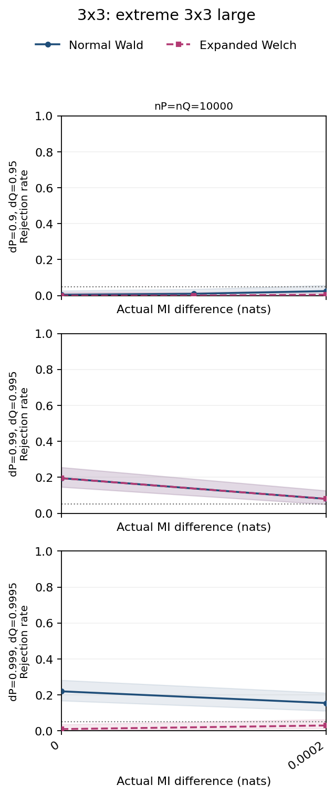

| Specification | Setting |
| --- | --- |
| Table size | 3x3 |
| Horizontal graph regime specifications (columns) | nP=nQ=10000 |
| Vertical graph regime specifications (rows) | dP=0.9, dQ=0.95: P row (0.9, 0.1/2 repeated 2 times), P column (0.9, 0.1/2 repeated 2 times); Q row (0.95, 0.05/2 repeated 2 times), Q column (0.95, 0.05/2 repeated 2 times); dP=0.99, dQ=0.995: P row (0.99, 0.01/2 repeated 2 times), P column (0.99, 0.01/2 repeated 2 times); Q row (0.995, 0.005/2 repeated 2 times), Q column (0.995, 0.005/2 repeated 2 times); dP=0.999, dQ=0.9995: P row (0.999, 0.001/2 repeated 2 times), P column (0.999, 0.001/2 repeated 2 times); Q row (0.9995, 0.0005/2 repeated 2 times), Q column (0.9995, 0.0005/2 repeated 2 times) |
| Probability changes | dP=0.9, dQ=0.95: additive, first changes in P and Q; dP=0.99, dQ=0.995: additive, first changes in P and Q; dP=0.999, dQ=0.9995: additive, first changes in P and Q |
| MI settings | Baseline MI {1e-05}; direction {q higher}; actual differences {0, 0.0001, 0.0002} nats |
| Horizontal axis within each graph | Actual MI difference in nats, fixed from 0 to 0.0002 |
| Vertical axis within each graph | Unconditional rejection rate from 0 to 1; invalid results count as non-rejections |
| Replicates | 200 per unique point |

Null-point rejection and validity:

| Vertical regime | Horizontal regime | Method | Rejection | Valid |
| --- | --- | --- | --- | --- |
| dP=0.999, dQ=0.9995 | nP=nQ=10000 | Expanded Welch | 0.0100 | 0.9800 |
| dP=0.999, dQ=0.9995 | nP=nQ=10000 | Normal Wald | 0.2200 | 1.0000 |
| dP=0.99, dQ=0.995 | nP=nQ=10000 | Expanded Welch | 0.1950 | 1.0000 |
| dP=0.99, dQ=0.995 | nP=nQ=10000 | Normal Wald | 0.1950 | 1.0000 |
| dP=0.9, dQ=0.95 | nP=nQ=10000 | Expanded Welch | 0.0000 | 1.0000 |
| dP=0.9, dQ=0.95 | nP=nQ=10000 | Normal Wald | 0.0050 | 1.0000 |

Every plotted rate, interval, validity and minimum expected count

| Vertical regime | Horizontal regime | x | Method | Rejection | 95% interval | Valid | Conditional | Min expected P | Min expected Q |
| --- | --- | --- | --- | --- | --- | --- | --- | --- | --- |
| dP=0.999, dQ=0.9995 | nP=nQ=10000 | 0 | Expanded Welch | 0.0100 | [0.0027, 0.0357] | 0.9800 | 0.0102 | 0.0025 | 0.000625 |
| dP=0.999, dQ=0.9995 | nP=nQ=10000 | 0 | Normal Wald | 0.2200 | [0.1682, 0.2824] | 1.0000 | 0.2200 | 0.0025 | 0.000625 |
| dP=0.999, dQ=0.9995 | nP=nQ=10000 | 0.0002 | Expanded Welch | 0.0300 | [0.0138, 0.0639] | 0.9950 | 0.0302 | 0.0025 | 0.000625 |
| dP=0.999, dQ=0.9995 | nP=nQ=10000 | 0.0002 | Normal Wald | 0.1550 | [0.1114, 0.2116] | 1.0000 | 0.1550 | 0.0025 | 0.000625 |
| dP=0.99, dQ=0.995 | nP=nQ=10000 | 0 | Expanded Welch | 0.1950 | [0.1461, 0.2554] | 1.0000 | 0.1950 | 0.25 | 0.0625 |
| dP=0.99, dQ=0.995 | nP=nQ=10000 | 0 | Normal Wald | 0.1950 | [0.1461, 0.2554] | 1.0000 | 0.1950 | 0.25 | 0.0625 |
| dP=0.99, dQ=0.995 | nP=nQ=10000 | 0.0002 | Expanded Welch | 0.0800 | [0.0498, 0.1260] | 1.0000 | 0.0800 | 0.25 | 0.0625 |
| dP=0.99, dQ=0.995 | nP=nQ=10000 | 0.0002 | Normal Wald | 0.0800 | [0.0498, 0.1260] | 1.0000 | 0.0800 | 0.25 | 0.0625 |
| dP=0.9, dQ=0.95 | nP=nQ=10000 | 0 | Expanded Welch | 0.0000 | [0.0000, 0.0188] | 1.0000 | 0.0000 | 25 | 6.25 |
| dP=0.9, dQ=0.95 | nP=nQ=10000 | 0 | Normal Wald | 0.0050 | [0.0009, 0.0278] | 1.0000 | 0.0050 | 25 | 6.25 |
| dP=0.9, dQ=0.95 | nP=nQ=10000 | 0.0001 | Expanded Welch | 0.0000 | [0.0000, 0.0188] | 1.0000 | 0.0000 | 25 | 6.25 |
| dP=0.9, dQ=0.95 | nP=nQ=10000 | 0.0001 | Normal Wald | 0.0100 | [0.0027, 0.0357] | 1.0000 | 0.0100 | 25 | 6.25 |
| dP=0.9, dQ=0.95 | nP=nQ=10000 | 0.0002 | Expanded Welch | 0.0050 | [0.0009, 0.0278] | 1.0000 | 0.0050 | 25 | 6.25 |
| dP=0.9, dQ=0.95 | nP=nQ=10000 | 0.0002 | Normal Wald | 0.0250 | [0.0107, 0.0572] | 1.0000 | 0.0250 | 25 | 6.25 |

### 10.5 8x8: extreme 8x8 small

What happens under deliberately extreme marginal skew and very small samples?

| Specification | Setting |
| --- | --- |
| Table size | 8x8 |
| Horizontal graph regime specifications (columns) | nP=nQ=1 |
| Vertical graph regime specifications (rows) | dP=0.9, dQ=0.95: P row (0.9, 0.1/7 repeated 7 times), P column (0.9, 0.1/7 repeated 7 times); Q row (0.95, 0.05/7 repeated 7 times), Q column (0.95, 0.05/7 repeated 7 times); dP=0.99, dQ=0.995: P row (0.99, 0.01/7 repeated 7 times), P column (0.99, 0.01/7 repeated 7 times); Q row (0.995, 0.005/7 repeated 7 times), Q column (0.995, 0.005/7 repeated 7 times); dP=0.999, dQ=0.9995: P row (0.999, 0.001/7 repeated 7 times), P column (0.999, 0.001/7 repeated 7 times); Q row (0.9995, 0.0005/7 repeated 7 times), Q column (0.9995, 0.0005/7 repeated 7 times) |
| Probability changes | dP=0.9, dQ=0.95: additive, first changes in P and Q; dP=0.99, dQ=0.995: additive, first changes in P and Q; dP=0.999, dQ=0.9995: additive, first changes in P and Q |
| MI settings | Baseline MI {1e-05}; direction {q higher}; actual differences {0, 0.0001, 0.0002} nats |
| Horizontal axis within each graph | Actual MI difference in nats, fixed from 0 to 0.0002 |
| Vertical axis within each graph | Unconditional rejection rate from 0 to 1; invalid results count as non-rejections |
| Replicates | 200 per unique point |

Null-point rejection and validity:

| Vertical regime | Horizontal regime | Method | Rejection | Valid |
| --- | --- | --- | --- | --- |
| dP=0.999, dQ=0.9995 | nP=nQ=1 | Expanded Welch | 0.0000 | 0.0000 |
| dP=0.999, dQ=0.9995 | nP=nQ=1 | Normal Wald | 0.0000 | 0.0000 |
| dP=0.99, dQ=0.995 | nP=nQ=1 | Expanded Welch | 0.0000 | 0.0000 |
| dP=0.99, dQ=0.995 | nP=nQ=1 | Normal Wald | 0.0000 | 0.0000 |
| dP=0.9, dQ=0.95 | nP=nQ=1 | Expanded Welch | 0.0000 | 0.0000 |
| dP=0.9, dQ=0.95 | nP=nQ=1 | Normal Wald | 0.0000 | 0.0000 |

Every plotted rate, interval, validity and minimum expected count

| Vertical regime | Horizontal regime | x | Method | Rejection | 95% interval | Valid | Conditional | Min expected P | Min expected Q |
| --- | --- | --- | --- | --- | --- | --- | --- | --- | --- |
| dP=0.999, dQ=0.9995 | nP=nQ=1 | 0 | Expanded Welch | 0.0000 | [0.0000, 0.0188] | 0.0000 | NA | 2.041e-08 | 5.102e-09 |
| dP=0.999, dQ=0.9995 | nP=nQ=1 | 0 | Normal Wald | 0.0000 | [0.0000, 0.0188] | 0.0000 | NA | 2.041e-08 | 5.102e-09 |
| dP=0.999, dQ=0.9995 | nP=nQ=1 | 0.0002 | Expanded Welch | 0.0000 | [0.0000, 0.0188] | 0.0000 | NA | 2.041e-08 | 5.102e-09 |
| dP=0.999, dQ=0.9995 | nP=nQ=1 | 0.0002 | Normal Wald | 0.0000 | [0.0000, 0.0188] | 0.0000 | NA | 2.041e-08 | 5.102e-09 |
| dP=0.99, dQ=0.995 | nP=nQ=1 | 0 | Expanded Welch | 0.0000 | [0.0000, 0.0188] | 0.0000 | NA | 2.041e-06 | 5.102e-07 |
| dP=0.99, dQ=0.995 | nP=nQ=1 | 0 | Normal Wald | 0.0000 | [0.0000, 0.0188] | 0.0000 | NA | 2.041e-06 | 5.102e-07 |
| dP=0.99, dQ=0.995 | nP=nQ=1 | 0.0002 | Expanded Welch | 0.0000 | [0.0000, 0.0188] | 0.0000 | NA | 2.041e-06 | 5.102e-07 |
| dP=0.99, dQ=0.995 | nP=nQ=1 | 0.0002 | Normal Wald | 0.0000 | [0.0000, 0.0188] | 0.0000 | NA | 2.041e-06 | 5.102e-07 |
| dP=0.9, dQ=0.95 | nP=nQ=1 | 0 | Expanded Welch | 0.0000 | [0.0000, 0.0188] | 0.0000 | NA | 0.0002041 | 5.102e-05 |
| dP=0.9, dQ=0.95 | nP=nQ=1 | 0 | Normal Wald | 0.0000 | [0.0000, 0.0188] | 0.0000 | NA | 0.0002041 | 5.102e-05 |
| dP=0.9, dQ=0.95 | nP=nQ=1 | 0.0001 | Expanded Welch | 0.0000 | [0.0000, 0.0188] | 0.0000 | NA | 0.0002041 | 5.102e-05 |
| dP=0.9, dQ=0.95 | nP=nQ=1 | 0.0001 | Normal Wald | 0.0000 | [0.0000, 0.0188] | 0.0000 | NA | 0.0002041 | 5.102e-05 |
| dP=0.9, dQ=0.95 | nP=nQ=1 | 0.0002 | Expanded Welch | 0.0000 | [0.0000, 0.0188] | 0.0000 | NA | 0.0002041 | 5.102e-05 |
| dP=0.9, dQ=0.95 | nP=nQ=1 | 0.0002 | Normal Wald | 0.0000 | [0.0000, 0.0188] | 0.0000 | NA | 0.0002041 | 5.102e-05 |

### 10.6 8x8: extreme 8x8 large

What happens under deliberately extreme marginal skew and very small samples?

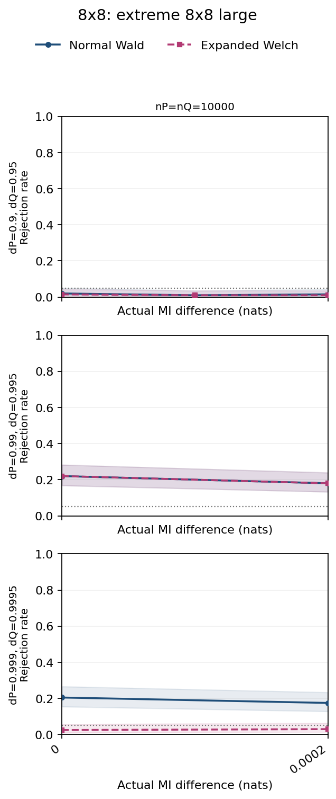

| Specification | Setting |
| --- | --- |
| Table size | 8x8 |
| Horizontal graph regime specifications (columns) | nP=nQ=10000 |
| Vertical graph regime specifications (rows) | dP=0.9, dQ=0.95: P row (0.9, 0.1/7 repeated 7 times), P column (0.9, 0.1/7 repeated 7 times); Q row (0.95, 0.05/7 repeated 7 times), Q column (0.95, 0.05/7 repeated 7 times); dP=0.99, dQ=0.995: P row (0.99, 0.01/7 repeated 7 times), P column (0.99, 0.01/7 repeated 7 times); Q row (0.995, 0.005/7 repeated 7 times), Q column (0.995, 0.005/7 repeated 7 times); dP=0.999, dQ=0.9995: P row (0.999, 0.001/7 repeated 7 times), P column (0.999, 0.001/7 repeated 7 times); Q row (0.9995, 0.0005/7 repeated 7 times), Q column (0.9995, 0.0005/7 repeated 7 times) |
| Probability changes | dP=0.9, dQ=0.95: additive, first changes in P and Q; dP=0.99, dQ=0.995: additive, first changes in P and Q; dP=0.999, dQ=0.9995: additive, first changes in P and Q |
| MI settings | Baseline MI {1e-05}; direction {q higher}; actual differences {0, 0.0001, 0.0002} nats |
| Horizontal axis within each graph | Actual MI difference in nats, fixed from 0 to 0.0002 |
| Vertical axis within each graph | Unconditional rejection rate from 0 to 1; invalid results count as non-rejections |
| Replicates | 200 per unique point |

Null-point rejection and validity:

| Vertical regime | Horizontal regime | Method | Rejection | Valid |
| --- | --- | --- | --- | --- |
| dP=0.999, dQ=0.9995 | nP=nQ=10000 | Expanded Welch | 0.0250 | 0.9900 |
| dP=0.999, dQ=0.9995 | nP=nQ=10000 | Normal Wald | 0.2050 | 1.0000 |
| dP=0.99, dQ=0.995 | nP=nQ=10000 | Expanded Welch | 0.2200 | 1.0000 |
| dP=0.99, dQ=0.995 | nP=nQ=10000 | Normal Wald | 0.2200 | 1.0000 |
| dP=0.9, dQ=0.95 | nP=nQ=10000 | Expanded Welch | 0.0150 | 1.0000 |
| dP=0.9, dQ=0.95 | nP=nQ=10000 | Normal Wald | 0.0200 | 1.0000 |

Every plotted rate, interval, validity and minimum expected count

| Vertical regime | Horizontal regime | x | Method | Rejection | 95% interval | Valid | Conditional | Min expected P | Min expected Q |
| --- | --- | --- | --- | --- | --- | --- | --- | --- | --- |
| dP=0.999, dQ=0.9995 | nP=nQ=10000 | 0 | Expanded Welch | 0.0250 | [0.0107, 0.0572] | 0.9900 | 0.0253 | 0.0002041 | 5.102e-05 |
| dP=0.999, dQ=0.9995 | nP=nQ=10000 | 0 | Normal Wald | 0.2050 | [0.1549, 0.2663] | 1.0000 | 0.2050 | 0.0002041 | 5.102e-05 |
| dP=0.999, dQ=0.9995 | nP=nQ=10000 | 0.0002 | Expanded Welch | 0.0300 | [0.0138, 0.0639] | 1.0000 | 0.0300 | 0.0002041 | 5.102e-05 |
| dP=0.999, dQ=0.9995 | nP=nQ=10000 | 0.0002 | Normal Wald | 0.1750 | [0.1286, 0.2336] | 1.0000 | 0.1750 | 0.0002041 | 5.102e-05 |
| dP=0.99, dQ=0.995 | nP=nQ=10000 | 0 | Expanded Welch | 0.2200 | [0.1682, 0.2824] | 1.0000 | 0.2200 | 0.02041 | 0.005102 |
| dP=0.99, dQ=0.995 | nP=nQ=10000 | 0 | Normal Wald | 0.2200 | [0.1682, 0.2824] | 1.0000 | 0.2200 | 0.02041 | 0.005102 |
| dP=0.99, dQ=0.995 | nP=nQ=10000 | 0.0002 | Expanded Welch | 0.1800 | [0.1329, 0.2391] | 1.0000 | 0.1800 | 0.02041 | 0.005102 |
| dP=0.99, dQ=0.995 | nP=nQ=10000 | 0.0002 | Normal Wald | 0.1800 | [0.1329, 0.2391] | 1.0000 | 0.1800 | 0.02041 | 0.005102 |
| dP=0.9, dQ=0.95 | nP=nQ=10000 | 0 | Expanded Welch | 0.0150 | [0.0051, 0.0432] | 1.0000 | 0.0150 | 2.041 | 0.5102 |
| dP=0.9, dQ=0.95 | nP=nQ=10000 | 0 | Normal Wald | 0.0200 | [0.0078, 0.0503] | 1.0000 | 0.0200 | 2.041 | 0.5102 |
| dP=0.9, dQ=0.95 | nP=nQ=10000 | 0.0001 | Expanded Welch | 0.0100 | [0.0027, 0.0357] | 1.0000 | 0.0100 | 2.041 | 0.5102 |
| dP=0.9, dQ=0.95 | nP=nQ=10000 | 0.0001 | Normal Wald | 0.0100 | [0.0027, 0.0357] | 1.0000 | 0.0100 | 2.041 | 0.5102 |
| dP=0.9, dQ=0.95 | nP=nQ=10000 | 0.0002 | Expanded Welch | 0.0100 | [0.0027, 0.0357] | 1.0000 | 0.0100 | 2.041 | 0.5102 |
| dP=0.9, dQ=0.95 | nP=nQ=10000 | 0.0002 | Normal Wald | 0.0150 | [0.0051, 0.0432] | 1.0000 | 0.0150 | 2.041 | 0.5102 |

## 11. Rare-cell stress check

What happens when the probability changes are concentrated in rare cells?

### 11.1 3x3: rare stress 3x3 small

What happens when the probability changes are concentrated in rare cells?

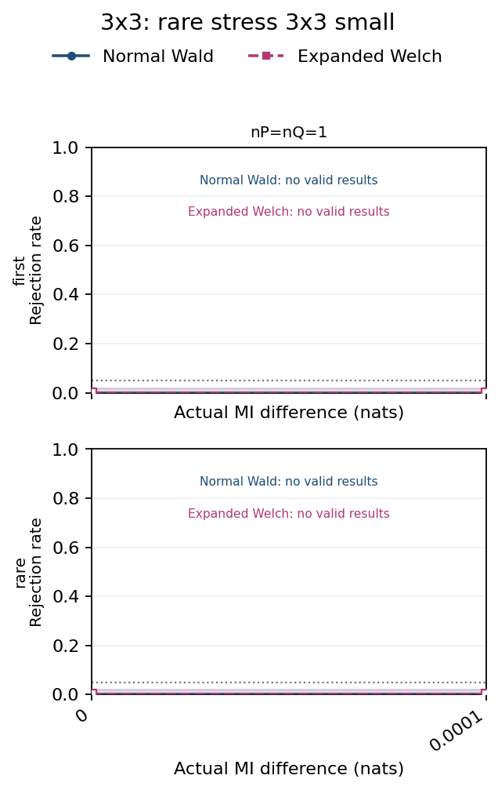

| Specification | Setting |
| --- | --- |
| Table size | 3x3 |
| Horizontal graph regime specifications (columns) | nP=nQ=1 |
| Vertical graph regime specifications (rows) | first: P row (0.9, 0.1/2 repeated 2 times), P column (0.9, 0.1/2 repeated 2 times); Q row (0.95, 0.05/2 repeated 2 times), Q column (0.95, 0.05/2 repeated 2 times); rare: P row (0.9, 0.1/2 repeated 2 times), P column (0.9, 0.1/2 repeated 2 times); Q row (0.95, 0.05/2 repeated 2 times), Q column (0.95, 0.05/2 repeated 2 times) |
| Probability changes | first: additive, first changes in P and Q; rare: additive, rare changes in P and Q |
| MI settings | Baseline MI {1e-05}; direction {q higher}; actual differences {0, 0.0001} nats |
| Horizontal axis within each graph | Actual MI difference in nats, fixed from 0 to 0.0001 |
| Vertical axis within each graph | Unconditional rejection rate from 0 to 1; invalid results count as non-rejections |
| Replicates | 200 per unique point |

Null-point rejection and validity:

| Vertical regime | Horizontal regime | Method | Rejection | Valid |
| --- | --- | --- | --- | --- |
| first | nP=nQ=1 | Expanded Welch | 0.0000 | 0.0000 |
| first | nP=nQ=1 | Normal Wald | 0.0000 | 0.0000 |
| rare | nP=nQ=1 | Expanded Welch | 0.0000 | 0.0000 |
| rare | nP=nQ=1 | Normal Wald | 0.0000 | 0.0000 |

Every plotted rate, interval, validity and minimum expected count

| Vertical regime | Horizontal regime | x | Method | Rejection | 95% interval | Valid | Conditional | Min expected P | Min expected Q |
| --- | --- | --- | --- | --- | --- | --- | --- | --- | --- |
| first | nP=nQ=1 | 0 | Expanded Welch | 0.0000 | [0.0000, 0.0188] | 0.0000 | NA | 0.0025 | 0.000625 |
| first | nP=nQ=1 | 0 | Normal Wald | 0.0000 | [0.0000, 0.0188] | 0.0000 | NA | 0.0025 | 0.000625 |
| first | nP=nQ=1 | 0.0001 | Expanded Welch | 0.0000 | [0.0000, 0.0188] | 0.0000 | NA | 0.0025 | 0.000625 |
| first | nP=nQ=1 | 0.0001 | Normal Wald | 0.0000 | [0.0000, 0.0188] | 0.0000 | NA | 0.0025 | 0.000625 |
| rare | nP=nQ=1 | 0 | Expanded Welch | 0.0000 | [0.0000, 0.0188] | 0.0000 | NA | 0.002388 | 0.0005691 |
| rare | nP=nQ=1 | 0 | Normal Wald | 0.0000 | [0.0000, 0.0188] | 0.0000 | NA | 0.002388 | 0.0005691 |
| rare | nP=nQ=1 | 0.0001 | Expanded Welch | 0.0000 | [0.0000, 0.0188] | 0.0000 | NA | 0.002388 | 0.000441 |
| rare | nP=nQ=1 | 0.0001 | Normal Wald | 0.0000 | [0.0000, 0.0188] | 0.0000 | NA | 0.002388 | 0.000441 |

### 11.2 3x3: rare stress 3x3 large

What happens when the probability changes are concentrated in rare cells?

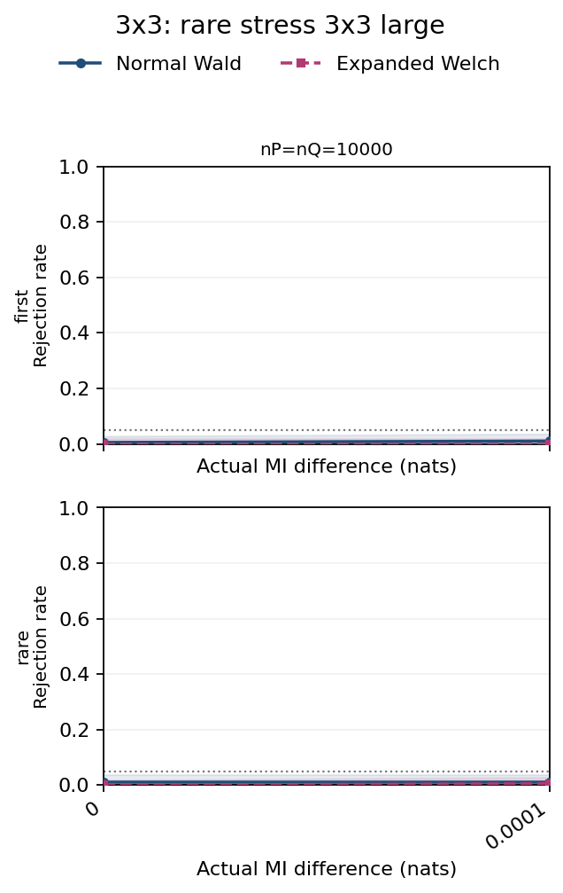

| Specification | Setting |
| --- | --- |
| Table size | 3x3 |
| Horizontal graph regime specifications (columns) | nP=nQ=10000 |
| Vertical graph regime specifications (rows) | first: P row (0.9, 0.1/2 repeated 2 times), P column (0.9, 0.1/2 repeated 2 times); Q row (0.95, 0.05/2 repeated 2 times), Q column (0.95, 0.05/2 repeated 2 times); rare: P row (0.9, 0.1/2 repeated 2 times), P column (0.9, 0.1/2 repeated 2 times); Q row (0.95, 0.05/2 repeated 2 times), Q column (0.95, 0.05/2 repeated 2 times) |
| Probability changes | first: additive, first changes in P and Q; rare: additive, rare changes in P and Q |
| MI settings | Baseline MI {1e-05}; direction {q higher}; actual differences {0, 0.0001} nats |
| Horizontal axis within each graph | Actual MI difference in nats, fixed from 0 to 0.0001 |
| Vertical axis within each graph | Unconditional rejection rate from 0 to 1; invalid results count as non-rejections |
| Replicates | 200 per unique point |

Null-point rejection and validity:

| Vertical regime | Horizontal regime | Method | Rejection | Valid |
| --- | --- | --- | --- | --- |
| first | nP=nQ=10000 | Expanded Welch | 0.0000 | 1.0000 |
| first | nP=nQ=10000 | Normal Wald | 0.0050 | 1.0000 |
| rare | nP=nQ=10000 | Expanded Welch | 0.0000 | 1.0000 |
| rare | nP=nQ=10000 | Normal Wald | 0.0100 | 1.0000 |

Every plotted rate, interval, validity and minimum expected count

| Vertical regime | Horizontal regime | x | Method | Rejection | 95% interval | Valid | Conditional | Min expected P | Min expected Q |
| --- | --- | --- | --- | --- | --- | --- | --- | --- | --- |
| first | nP=nQ=10000 | 0 | Expanded Welch | 0.0000 | [0.0000, 0.0188] | 1.0000 | 0.0000 | 25 | 6.25 |
| first | nP=nQ=10000 | 0 | Normal Wald | 0.0050 | [0.0009, 0.0278] | 1.0000 | 0.0050 | 25 | 6.25 |
| first | nP=nQ=10000 | 0.0001 | Expanded Welch | 0.0000 | [0.0000, 0.0188] | 1.0000 | 0.0000 | 25 | 6.25 |
| first | nP=nQ=10000 | 0.0001 | Normal Wald | 0.0100 | [0.0027, 0.0357] | 1.0000 | 0.0100 | 25 | 6.25 |
| rare | nP=nQ=10000 | 0 | Expanded Welch | 0.0000 | [0.0000, 0.0188] | 1.0000 | 0.0000 | 23.88 | 5.691 |
| rare | nP=nQ=10000 | 0 | Normal Wald | 0.0100 | [0.0027, 0.0357] | 1.0000 | 0.0100 | 23.88 | 5.691 |
| rare | nP=nQ=10000 | 0.0001 | Expanded Welch | 0.0050 | [0.0009, 0.0278] | 1.0000 | 0.0050 | 23.88 | 4.41 |
| rare | nP=nQ=10000 | 0.0001 | Normal Wald | 0.0100 | [0.0027, 0.0357] | 1.0000 | 0.0100 | 23.88 | 4.41 |

### 11.3 8x8: rare stress 8x8 small

What happens when the probability changes are concentrated in rare cells?

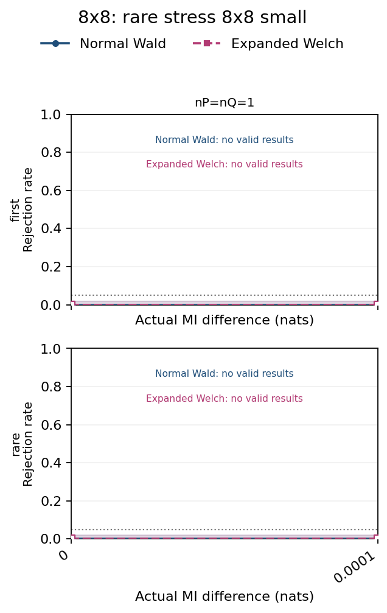

| Specification | Setting |
| --- | --- |
| Table size | 8x8 |
| Horizontal graph regime specifications (columns) | nP=nQ=1 |
| Vertical graph regime specifications (rows) | first: P row (0.9, 0.1/7 repeated 7 times), P column (0.9, 0.1/7 repeated 7 times); Q row (0.95, 0.05/7 repeated 7 times), Q column (0.95, 0.05/7 repeated 7 times); rare: P row (0.9, 0.1/7 repeated 7 times), P column (0.9, 0.1/7 repeated 7 times); Q row (0.95, 0.05/7 repeated 7 times), Q column (0.95, 0.05/7 repeated 7 times) |
| Probability changes | first: additive, first changes in P and Q; rare: additive, rare changes in P and Q |
| MI settings | Baseline MI {1e-05}; direction {q higher}; actual differences {0, 0.0001} nats |
| Horizontal axis within each graph | Actual MI difference in nats, fixed from 0 to 0.0001 |
| Vertical axis within each graph | Unconditional rejection rate from 0 to 1; invalid results count as non-rejections |
| Replicates | 200 per unique point |

Null-point rejection and validity:

| Vertical regime | Horizontal regime | Method | Rejection | Valid |
| --- | --- | --- | --- | --- |
| first | nP=nQ=1 | Expanded Welch | 0.0000 | 0.0000 |
| first | nP=nQ=1 | Normal Wald | 0.0000 | 0.0000 |
| rare | nP=nQ=1 | Expanded Welch | 0.0000 | 0.0000 |
| rare | nP=nQ=1 | Normal Wald | 0.0000 | 0.0000 |

Every plotted rate, interval, validity and minimum expected count

| Vertical regime | Horizontal regime | x | Method | Rejection | 95% interval | Valid | Conditional | Min expected P | Min expected Q |
| --- | --- | --- | --- | --- | --- | --- | --- | --- | --- |
| first | nP=nQ=1 | 0 | Expanded Welch | 0.0000 | [0.0000, 0.0188] | 0.0000 | NA | 0.0002041 | 5.102e-05 |
| first | nP=nQ=1 | 0 | Normal Wald | 0.0000 | [0.0000, 0.0188] | 0.0000 | NA | 0.0002041 | 5.102e-05 |
| first | nP=nQ=1 | 0.0001 | Expanded Welch | 0.0000 | [0.0000, 0.0188] | 0.0000 | NA | 0.0002041 | 5.102e-05 |
| first | nP=nQ=1 | 0.0001 | Normal Wald | 0.0000 | [0.0000, 0.0188] | 0.0000 | NA | 0.0002041 | 5.102e-05 |
| rare | nP=nQ=1 | 0 | Expanded Welch | 0.0000 | [0.0000, 0.0188] | 0.0000 | NA | 0.0001722 | 3.518e-05 |
| rare | nP=nQ=1 | 0 | Normal Wald | 0.0000 | [0.0000, 0.0188] | 0.0000 | NA | 0.0001722 | 3.518e-05 |
| rare | nP=nQ=1 | 0.0001 | Expanded Welch | 0.0000 | [0.0000, 0.0188] | 0.0000 | NA | 0.0001722 | 3.647e-06 |
| rare | nP=nQ=1 | 0.0001 | Normal Wald | 0.0000 | [0.0000, 0.0188] | 0.0000 | NA | 0.0001722 | 3.647e-06 |

### 11.4 8x8: rare stress 8x8 large

What happens when the probability changes are concentrated in rare cells?

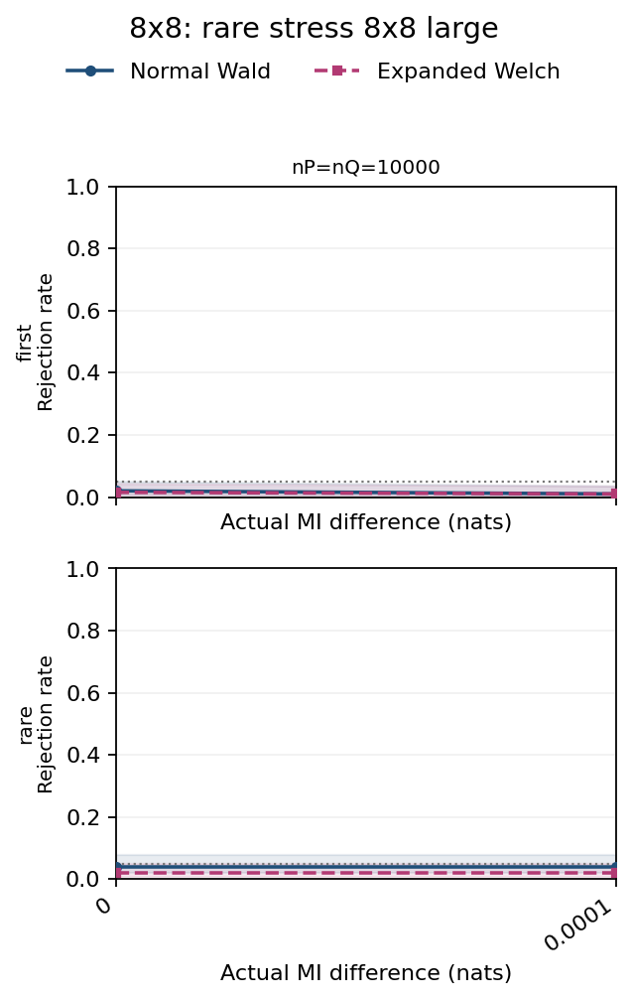

| Specification | Setting |
| --- | --- |
| Table size | 8x8 |
| Horizontal graph regime specifications (columns) | nP=nQ=10000 |
| Vertical graph regime specifications (rows) | first: P row (0.9, 0.1/7 repeated 7 times), P column (0.9, 0.1/7 repeated 7 times); Q row (0.95, 0.05/7 repeated 7 times), Q column (0.95, 0.05/7 repeated 7 times); rare: P row (0.9, 0.1/7 repeated 7 times), P column (0.9, 0.1/7 repeated 7 times); Q row (0.95, 0.05/7 repeated 7 times), Q column (0.95, 0.05/7 repeated 7 times) |
| Probability changes | first: additive, first changes in P and Q; rare: additive, rare changes in P and Q |
| MI settings | Baseline MI {1e-05}; direction {q higher}; actual differences {0, 0.0001} nats |
| Horizontal axis within each graph | Actual MI difference in nats, fixed from 0 to 0.0001 |
| Vertical axis within each graph | Unconditional rejection rate from 0 to 1; invalid results count as non-rejections |
| Replicates | 200 per unique point |

Null-point rejection and validity:

| Vertical regime | Horizontal regime | Method | Rejection | Valid |
| --- | --- | --- | --- | --- |
| first | nP=nQ=10000 | Expanded Welch | 0.0150 | 1.0000 |
| first | nP=nQ=10000 | Normal Wald | 0.0200 | 1.0000 |
| rare | nP=nQ=10000 | Expanded Welch | 0.0200 | 1.0000 |
| rare | nP=nQ=10000 | Normal Wald | 0.0400 | 1.0000 |

Every plotted rate, interval, validity and minimum expected count

| Vertical regime | Horizontal regime | x | Method | Rejection | 95% interval | Valid | Conditional | Min expected P | Min expected Q |
| --- | --- | --- | --- | --- | --- | --- | --- | --- | --- |
| first | nP=nQ=10000 | 0 | Expanded Welch | 0.0150 | [0.0051, 0.0432] | 1.0000 | 0.0150 | 2.041 | 0.5102 |
| first | nP=nQ=10000 | 0 | Normal Wald | 0.0200 | [0.0078, 0.0503] | 1.0000 | 0.0200 | 2.041 | 0.5102 |
| first | nP=nQ=10000 | 0.0001 | Expanded Welch | 0.0100 | [0.0027, 0.0357] | 1.0000 | 0.0100 | 2.041 | 0.5102 |
| first | nP=nQ=10000 | 0.0001 | Normal Wald | 0.0100 | [0.0027, 0.0357] | 1.0000 | 0.0100 | 2.041 | 0.5102 |
| rare | nP=nQ=10000 | 0 | Expanded Welch | 0.0200 | [0.0078, 0.0503] | 1.0000 | 0.0200 | 1.722 | 0.3518 |
| rare | nP=nQ=10000 | 0 | Normal Wald | 0.0400 | [0.0204, 0.0769] | 1.0000 | 0.0400 | 1.722 | 0.3518 |
| rare | nP=nQ=10000 | 0.0001 | Expanded Welch | 0.0200 | [0.0078, 0.0503] | 1.0000 | 0.0200 | 1.722 | 0.03647 |
| rare | nP=nQ=10000 | 0.0001 | Normal Wald | 0.0400 | [0.0204, 0.0769] | 1.0000 | 0.0400 | 1.722 | 0.03647 |

## 12. Exact independence boundary

What happens at the nonregular boundary where baseline MI is exactly zero?

### 12.1 2x2: independence 2x2

What happens at the nonregular boundary where baseline MI is exactly zero?

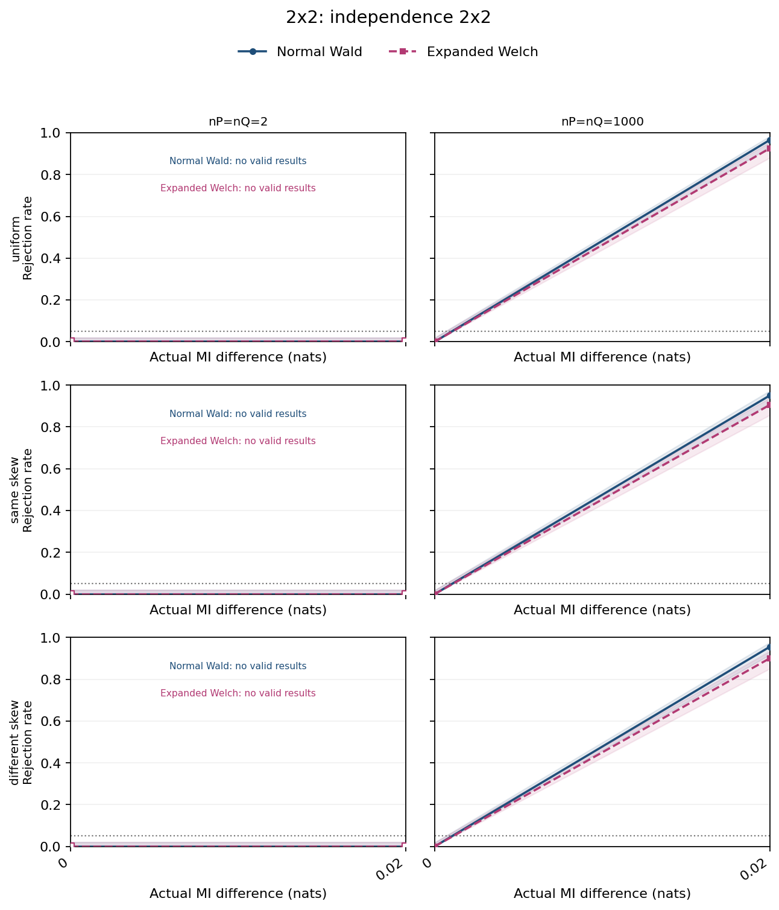

| Specification | Setting |
| --- | --- |
| Table size | 2x2 |
| Horizontal graph regime specifications (columns) | nP=nQ=2, nP=nQ=1000 |
| Vertical graph regime specifications (rows) | uniform: P row (0.5 repeated 2 times), P column (0.5 repeated 2 times); Q row (0.5 repeated 2 times), Q column (0.5 repeated 2 times); same skew: P row (0.8, 0.2), P column (0.8, 0.2); Q row (0.8, 0.2), Q column (0.8, 0.2); different skew: P row (0.7, 0.3), P column (0.7, 0.3); Q row (0.8, 0.2), Q column (0.8, 0.2) |
| Probability changes | uniform: additive, first changes in P and Q; same skew: additive, first changes in P and Q; different skew: additive, first changes in P and Q |
| MI settings | Baseline MI {0}; direction {q higher}; actual differences {0, 0.02} nats |
| Horizontal axis within each graph | Actual MI difference in nats, fixed from 0 to 0.02 |
| Vertical axis within each graph | Unconditional rejection rate from 0 to 1; invalid results count as non-rejections |
| Replicates | 200 per unique point |

Null-point rejection and validity:

| Vertical regime | Horizontal regime | Method | Rejection | Valid |
| --- | --- | --- | --- | --- |
| different skew | nP=nQ=1000 | Expanded Welch | 0.0000 | 1.0000 |
| different skew | nP=nQ=1000 | Normal Wald | 0.0000 | 1.0000 |
| different skew | nP=nQ=2 | Expanded Welch | 0.0000 | 0.0000 |
| different skew | nP=nQ=2 | Normal Wald | 0.0000 | 0.0000 |
| same skew | nP=nQ=1000 | Expanded Welch | 0.0000 | 1.0000 |
| same skew | nP=nQ=1000 | Normal Wald | 0.0000 | 1.0000 |
| same skew | nP=nQ=2 | Expanded Welch | 0.0000 | 0.0000 |
| same skew | nP=nQ=2 | Normal Wald | 0.0000 | 0.0000 |
| uniform | nP=nQ=1000 | Expanded Welch | 0.0000 | 1.0000 |
| uniform | nP=nQ=1000 | Normal Wald | 0.0000 | 1.0000 |
| uniform | nP=nQ=2 | Expanded Welch | 0.0000 | 0.0000 |
| uniform | nP=nQ=2 | Normal Wald | 0.0000 | 0.0000 |

Every plotted rate, interval, validity and minimum expected count

| Vertical regime | Horizontal regime | x | Method | Rejection | 95% interval | Valid | Conditional | Min expected P | Min expected Q |
| --- | --- | --- | --- | --- | --- | --- | --- | --- | --- |
| different skew | nP=nQ=1000 | 0 | Expanded Welch | 0.0000 | [0.0000, 0.0188] | 1.0000 | 0.0000 | 90 | 40 |
| different skew | nP=nQ=1000 | 0 | Normal Wald | 0.0000 | [0.0000, 0.0188] | 1.0000 | 0.0000 | 90 | 40 |
| different skew | nP=nQ=1000 | 0.02 | Expanded Welch | 0.9000 | [0.8506, 0.9343] | 1.0000 | 0.9000 | 90 | 73.82 |
| different skew | nP=nQ=1000 | 0.02 | Normal Wald | 0.9550 | [0.9167, 0.9761] | 1.0000 | 0.9550 | 90 | 73.82 |
| different skew | nP=nQ=2 | 0 | Expanded Welch | 0.0000 | [0.0000, 0.0188] | 0.0000 | NA | 0.18 | 0.08 |
| different skew | nP=nQ=2 | 0 | Normal Wald | 0.0000 | [0.0000, 0.0188] | 0.0000 | NA | 0.18 | 0.08 |
| different skew | nP=nQ=2 | 0.02 | Expanded Welch | 0.0000 | [0.0000, 0.0188] | 0.0000 | NA | 0.18 | 0.1476 |
| different skew | nP=nQ=2 | 0.02 | Normal Wald | 0.0000 | [0.0000, 0.0188] | 0.0000 | NA | 0.18 | 0.1476 |
| same skew | nP=nQ=1000 | 0 | Expanded Welch | 0.0000 | [0.0000, 0.0188] | 1.0000 | 0.0000 | 40 | 40 |
| same skew | nP=nQ=1000 | 0 | Normal Wald | 0.0000 | [0.0000, 0.0188] | 1.0000 | 0.0000 | 40 | 40 |
| same skew | nP=nQ=1000 | 0.02 | Expanded Welch | 0.9050 | [0.8564, 0.9383] | 1.0000 | 0.9050 | 40 | 73.82 |
| same skew | nP=nQ=1000 | 0.02 | Normal Wald | 0.9500 | [0.9104, 0.9726] | 1.0000 | 0.9500 | 40 | 73.82 |
| same skew | nP=nQ=2 | 0 | Expanded Welch | 0.0000 | [0.0000, 0.0188] | 0.0000 | NA | 0.08 | 0.08 |
| same skew | nP=nQ=2 | 0 | Normal Wald | 0.0000 | [0.0000, 0.0188] | 0.0000 | NA | 0.08 | 0.08 |
| same skew | nP=nQ=2 | 0.02 | Expanded Welch | 0.0000 | [0.0000, 0.0188] | 0.0000 | NA | 0.08 | 0.1476 |
| same skew | nP=nQ=2 | 0.02 | Normal Wald | 0.0000 | [0.0000, 0.0188] | 0.0000 | NA | 0.08 | 0.1476 |
| uniform | nP=nQ=1000 | 0 | Expanded Welch | 0.0000 | [0.0000, 0.0188] | 1.0000 | 0.0000 | 250 | 250 |
| uniform | nP=nQ=1000 | 0 | Normal Wald | 0.0000 | [0.0000, 0.0188] | 1.0000 | 0.0000 | 250 | 250 |
| uniform | nP=nQ=1000 | 0.02 | Expanded Welch | 0.9250 | [0.8800, 0.9540] | 1.0000 | 0.9250 | 250 | 200.2 |
| uniform | nP=nQ=1000 | 0.02 | Normal Wald | 0.9650 | [0.9295, 0.9829] | 1.0000 | 0.9650 | 250 | 200.2 |
| uniform | nP=nQ=2 | 0 | Expanded Welch | 0.0000 | [0.0000, 0.0188] | 0.0000 | NA | 0.5 | 0.5 |
| uniform | nP=nQ=2 | 0 | Normal Wald | 0.0000 | [0.0000, 0.0188] | 0.0000 | NA | 0.5 | 0.5 |
| uniform | nP=nQ=2 | 0.02 | Expanded Welch | 0.0000 | [0.0000, 0.0188] | 0.0000 | NA | 0.5 | 0.4003 |
| uniform | nP=nQ=2 | 0.02 | Normal Wald | 0.0000 | [0.0000, 0.0188] | 0.0000 | NA | 0.5 | 0.4003 |

### 12.2 8x8: independence 8x8

What happens at the nonregular boundary where baseline MI is exactly zero?

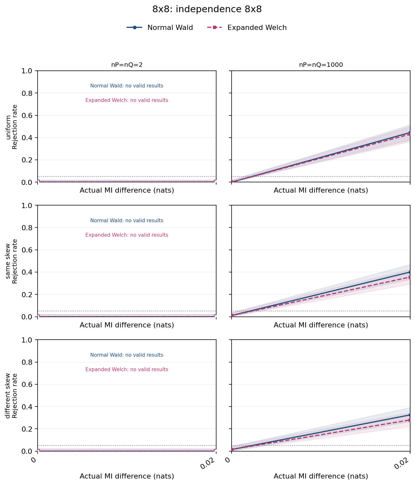

| Specification | Setting |
| --- | --- |
| Table size | 8x8 |
| Horizontal graph regime specifications (columns) | nP=nQ=2, nP=nQ=1000 |
| Vertical graph regime specifications (rows) | uniform: P row (0.125 repeated 8 times), P column (0.125 repeated 8 times); Q row (0.125 repeated 8 times), Q column (0.125 repeated 8 times); same skew: P row (0.8, 0.2/7 repeated 7 times), P column (0.8, 0.2/7 repeated 7 times); Q row (0.8, 0.2/7 repeated 7 times), Q column (0.8, 0.2/7 repeated 7 times); different skew: P row (0.7, 0.3/7 repeated 7 times), P column (0.7, 0.3/7 repeated 7 times); Q row (0.8, 0.2/7 repeated 7 times), Q column (0.8, 0.2/7 repeated 7 times) |
| Probability changes | uniform: additive, first changes in P and Q; same skew: additive, first changes in P and Q; different skew: additive, first changes in P and Q |
| MI settings | Baseline MI {0}; direction {q higher}; actual differences {0, 0.02} nats |
| Horizontal axis within each graph | Actual MI difference in nats, fixed from 0 to 0.02 |
| Vertical axis within each graph | Unconditional rejection rate from 0 to 1; invalid results count as non-rejections |
| Replicates | 200 per unique point |

Null-point rejection and validity:

| Vertical regime | Horizontal regime | Method | Rejection | Valid |
| --- | --- | --- | --- | --- |
| different skew | nP=nQ=1000 | Expanded Welch | 0.0150 | 1.0000 |
| different skew | nP=nQ=1000 | Normal Wald | 0.0150 | 1.0000 |
| different skew | nP=nQ=2 | Expanded Welch | 0.0000 | 0.0000 |
| different skew | nP=nQ=2 | Normal Wald | 0.0000 | 0.0000 |
| same skew | nP=nQ=1000 | Expanded Welch | 0.0100 | 1.0000 |
| same skew | nP=nQ=1000 | Normal Wald | 0.0100 | 1.0000 |
| same skew | nP=nQ=2 | Expanded Welch | 0.0000 | 0.0000 |
| same skew | nP=nQ=2 | Normal Wald | 0.0000 | 0.0000 |
| uniform | nP=nQ=1000 | Expanded Welch | 0.0000 | 1.0000 |
| uniform | nP=nQ=1000 | Normal Wald | 0.0000 | 1.0000 |
| uniform | nP=nQ=2 | Expanded Welch | 0.0000 | 0.0000 |
| uniform | nP=nQ=2 | Normal Wald | 0.0000 | 0.0000 |

Every plotted rate, interval, validity and minimum expected count

| Vertical regime | Horizontal regime | x | Method | Rejection | 95% interval | Valid | Conditional | Min expected P | Min expected Q |
| --- | --- | --- | --- | --- | --- | --- | --- | --- | --- |
| different skew | nP=nQ=1000 | 0 | Expanded Welch | 0.0150 | [0.0051, 0.0432] | 1.0000 | 0.0150 | 1.837 | 0.8163 |
| different skew | nP=nQ=1000 | 0 | Normal Wald | 0.0150 | [0.0051, 0.0432] | 1.0000 | 0.0150 | 1.837 | 0.8163 |
| different skew | nP=nQ=1000 | 0.02 | Expanded Welch | 0.2800 | [0.2224, 0.3459] | 1.0000 | 0.2800 | 1.837 | 0.8163 |
| different skew | nP=nQ=1000 | 0.02 | Normal Wald | 0.3250 | [0.2639, 0.3927] | 1.0000 | 0.3250 | 1.837 | 0.8163 |
| different skew | nP=nQ=2 | 0 | Expanded Welch | 0.0000 | [0.0000, 0.0188] | 0.0000 | NA | 0.003673 | 0.001633 |
| different skew | nP=nQ=2 | 0 | Normal Wald | 0.0000 | [0.0000, 0.0188] | 0.0000 | NA | 0.003673 | 0.001633 |
| different skew | nP=nQ=2 | 0.02 | Expanded Welch | 0.0000 | [0.0000, 0.0188] | 0.0000 | NA | 0.003673 | 0.001633 |
| different skew | nP=nQ=2 | 0.02 | Normal Wald | 0.0000 | [0.0000, 0.0188] | 0.0000 | NA | 0.003673 | 0.001633 |
| same skew | nP=nQ=1000 | 0 | Expanded Welch | 0.0100 | [0.0027, 0.0357] | 1.0000 | 0.0100 | 0.8163 | 0.8163 |
| same skew | nP=nQ=1000 | 0 | Normal Wald | 0.0100 | [0.0027, 0.0357] | 1.0000 | 0.0100 | 0.8163 | 0.8163 |
| same skew | nP=nQ=1000 | 0.02 | Expanded Welch | 0.3550 | [0.2920, 0.4235] | 1.0000 | 0.3550 | 0.8163 | 0.8163 |
| same skew | nP=nQ=1000 | 0.02 | Normal Wald | 0.4000 | [0.3346, 0.4692] | 1.0000 | 0.4000 | 0.8163 | 0.8163 |
| same skew | nP=nQ=2 | 0 | Expanded Welch | 0.0000 | [0.0000, 0.0188] | 0.0000 | NA | 0.001633 | 0.001633 |
| same skew | nP=nQ=2 | 0 | Normal Wald | 0.0000 | [0.0000, 0.0188] | 0.0000 | NA | 0.001633 | 0.001633 |
| same skew | nP=nQ=2 | 0.02 | Expanded Welch | 0.0000 | [0.0000, 0.0188] | 0.0000 | NA | 0.001633 | 0.001633 |
| same skew | nP=nQ=2 | 0.02 | Normal Wald | 0.0000 | [0.0000, 0.0188] | 0.0000 | NA | 0.001633 | 0.001633 |
| uniform | nP=nQ=1000 | 0 | Expanded Welch | 0.0000 | [0.0000, 0.0188] | 1.0000 | 0.0000 | 15.62 | 15.62 |
| uniform | nP=nQ=1000 | 0 | Normal Wald | 0.0000 | [0.0000, 0.0188] | 1.0000 | 0.0000 | 15.62 | 15.62 |
| uniform | nP=nQ=1000 | 0.02 | Expanded Welch | 0.4300 | [0.3633, 0.4993] | 1.0000 | 0.4300 | 15.62 | 3.848 |
| uniform | nP=nQ=1000 | 0.02 | Normal Wald | 0.4450 | [0.3778, 0.5143] | 1.0000 | 0.4450 | 15.62 | 3.848 |
| uniform | nP=nQ=2 | 0 | Expanded Welch | 0.0000 | [0.0000, 0.0188] | 0.0000 | NA | 0.03125 | 0.03125 |
| uniform | nP=nQ=2 | 0 | Normal Wald | 0.0000 | [0.0000, 0.0188] | 0.0000 | NA | 0.03125 | 0.03125 |
| uniform | nP=nQ=2 | 0.02 | Expanded Welch | 0.0000 | [0.0000, 0.0188] | 0.0000 | NA | 0.03125 | 0.007697 |
| uniform | nP=nQ=2 | 0.02 | Normal Wald | 0.0000 | [0.0000, 0.0188] | 0.0000 | NA | 0.03125 | 0.007697 |

## 13. Large-sample null behaviour

Do null rejection rates approach 0.05 as the fixed populations receive more data?

### 13.1 2x2: convergence 2x2

Do null rejection rates approach 0.05 as the fixed populations receive more data?

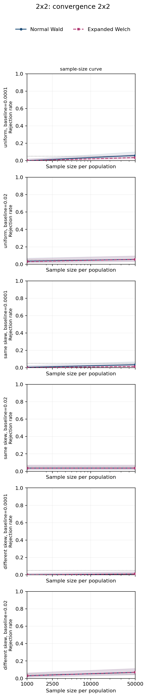

| Specification | Setting |
| --- | --- |
| Table size | 2x2 |
| Horizontal graph regime specifications (columns) | sample-size curve |
| Vertical graph regime specifications (rows) | uniform, baseline=0.0001: P row (0.5 repeated 2 times), P column (0.5 repeated 2 times); Q row (0.5 repeated 2 times), Q column (0.5 repeated 2 times); uniform, baseline=0.02: P row (0.5 repeated 2 times), P column (0.5 repeated 2 times); Q row (0.5 repeated 2 times), Q column (0.5 repeated 2 times); same skew, baseline=0.0001: P row (0.8, 0.2), P column (0.8, 0.2); Q row (0.8, 0.2), Q column (0.8, 0.2); same skew, baseline=0.02: P row (0.8, 0.2), P column (0.8, 0.2); Q row (0.8, 0.2), Q column (0.8, 0.2); different skew, baseline=0.0001: P row (0.7, 0.3), P column (0.7, 0.3); Q row (0.8, 0.2), Q column (0.8, 0.2); different skew, baseline=0.02: P row (0.7, 0.3), P column (0.7, 0.3); Q row (0.8, 0.2), Q column (0.8, 0.2) |
| Probability changes | uniform, baseline=0.0001: additive, first changes in P and Q; uniform, baseline=0.02: additive, first changes in P and Q; same skew, baseline=0.0001: additive, first changes in P and Q; same skew, baseline=0.02: additive, first changes in P and Q; different skew, baseline=0.0001: additive, first changes in P and Q; different skew, baseline=0.02: additive, first changes in P and Q |
| MI settings | Baseline MI {0.0001, 0.02}; direction {q higher}; actual differences {0} nats |
| Horizontal axis within each graph | Equal sample size from 1,000 to 50,000 on a log scale; fixed listed ticks |
| Vertical axis within each graph | Unconditional rejection rate from 0 to 1; invalid results count as non-rejections |
| Replicates | 200 per unique point |

Null-point rejection and validity:

| Vertical regime | Horizontal regime | Method | Rejection | Valid |
| --- | --- | --- | --- | --- |
| different skew, baseline=0.0001 | sample-size curve | Expanded Welch | 0.0000 | 1.0000 |
| different skew, baseline=0.0001 | sample-size curve | Expanded Welch | 0.0100 | 1.0000 |
| different skew, baseline=0.0001 | sample-size curve | Normal Wald | 0.0000 | 1.0000 |
| different skew, baseline=0.0001 | sample-size curve | Normal Wald | 0.0100 | 1.0000 |
| different skew, baseline=0.02 | sample-size curve | Expanded Welch | 0.0300 | 1.0000 |
| different skew, baseline=0.02 | sample-size curve | Expanded Welch | 0.0700 | 1.0000 |
| different skew, baseline=0.02 | sample-size curve | Normal Wald | 0.0300 | 1.0000 |
| different skew, baseline=0.02 | sample-size curve | Normal Wald | 0.0700 | 1.0000 |
| same skew, baseline=0.0001 | sample-size curve | Expanded Welch | 0.0000 | 1.0000 |
| same skew, baseline=0.0001 | sample-size curve | Expanded Welch | 0.0150 | 1.0000 |
| same skew, baseline=0.0001 | sample-size curve | Normal Wald | 0.0050 | 1.0000 |
| same skew, baseline=0.0001 | sample-size curve | Normal Wald | 0.0350 | 1.0000 |
| same skew, baseline=0.02 | sample-size curve | Expanded Welch | 0.0350 | 1.0000 |
| same skew, baseline=0.02 | sample-size curve | Expanded Welch | 0.0350 | 1.0000 |
| same skew, baseline=0.02 | sample-size curve | Normal Wald | 0.0350 | 1.0000 |
| same skew, baseline=0.02 | sample-size curve | Normal Wald | 0.0350 | 1.0000 |
| uniform, baseline=0.0001 | sample-size curve | Expanded Welch | 0.0000 | 1.0000 |
| uniform, baseline=0.0001 | sample-size curve | Expanded Welch | 0.0350 | 1.0000 |
| uniform, baseline=0.0001 | sample-size curve | Normal Wald | 0.0000 | 1.0000 |
| uniform, baseline=0.0001 | sample-size curve | Normal Wald | 0.0600 | 1.0000 |
| uniform, baseline=0.02 | sample-size curve | Expanded Welch | 0.0300 | 1.0000 |
| uniform, baseline=0.02 | sample-size curve | Expanded Welch | 0.0550 | 1.0000 |
| uniform, baseline=0.02 | sample-size curve | Normal Wald | 0.0350 | 1.0000 |
| uniform, baseline=0.02 | sample-size curve | Normal Wald | 0.0550 | 1.0000 |

Every plotted rate, interval, validity and minimum expected count

| Vertical regime | Horizontal regime | x | Method | Rejection | 95% interval | Valid | Conditional | Min expected P | Min expected Q |
| --- | --- | --- | --- | --- | --- | --- | --- | --- | --- |
| different skew, baseline=0.0001 | sample-size curve | 1000 | Expanded Welch | 0.0000 | [0.0000, 0.0188] | 1.0000 | 0.0000 | 92.98 | 42.27 |
| different skew, baseline=0.0001 | sample-size curve | 1000 | Normal Wald | 0.0000 | [0.0000, 0.0188] | 1.0000 | 0.0000 | 92.98 | 42.27 |
| different skew, baseline=0.0001 | sample-size curve | 50000 | Expanded Welch | 0.0100 | [0.0027, 0.0357] | 1.0000 | 0.0100 | 4649 | 2114 |
| different skew, baseline=0.0001 | sample-size curve | 50000 | Normal Wald | 0.0100 | [0.0027, 0.0357] | 1.0000 | 0.0100 | 4649 | 2114 |
| different skew, baseline=0.02 | sample-size curve | 1000 | Expanded Welch | 0.0300 | [0.0138, 0.0639] | 1.0000 | 0.0300 | 132.7 | 73.82 |
| different skew, baseline=0.02 | sample-size curve | 1000 | Normal Wald | 0.0300 | [0.0138, 0.0639] | 1.0000 | 0.0300 | 132.7 | 73.82 |
| different skew, baseline=0.02 | sample-size curve | 50000 | Expanded Welch | 0.0700 | [0.0422, 0.1141] | 1.0000 | 0.0700 | 6636 | 3691 |
| different skew, baseline=0.02 | sample-size curve | 50000 | Normal Wald | 0.0700 | [0.0422, 0.1141] | 1.0000 | 0.0700 | 6636 | 3691 |
| same skew, baseline=0.0001 | sample-size curve | 1000 | Expanded Welch | 0.0000 | [0.0000, 0.0188] | 1.0000 | 0.0000 | 42.27 | 42.27 |
| same skew, baseline=0.0001 | sample-size curve | 1000 | Normal Wald | 0.0050 | [0.0009, 0.0278] | 1.0000 | 0.0050 | 42.27 | 42.27 |
| same skew, baseline=0.0001 | sample-size curve | 50000 | Expanded Welch | 0.0150 | [0.0051, 0.0432] | 1.0000 | 0.0150 | 2114 | 2114 |
| same skew, baseline=0.0001 | sample-size curve | 50000 | Normal Wald | 0.0350 | [0.0171, 0.0705] | 1.0000 | 0.0350 | 2114 | 2114 |
| same skew, baseline=0.02 | sample-size curve | 1000 | Expanded Welch | 0.0350 | [0.0171, 0.0705] | 1.0000 | 0.0350 | 73.82 | 73.82 |
| same skew, baseline=0.02 | sample-size curve | 1000 | Normal Wald | 0.0350 | [0.0171, 0.0705] | 1.0000 | 0.0350 | 73.82 | 73.82 |
| same skew, baseline=0.02 | sample-size curve | 50000 | Expanded Welch | 0.0350 | [0.0171, 0.0705] | 1.0000 | 0.0350 | 3691 | 3691 |
| same skew, baseline=0.02 | sample-size curve | 50000 | Normal Wald | 0.0350 | [0.0171, 0.0705] | 1.0000 | 0.0350 | 3691 | 3691 |
| uniform, baseline=0.0001 | sample-size curve | 1000 | Expanded Welch | 0.0000 | [0.0000, 0.0188] | 1.0000 | 0.0000 | 246.5 | 246.5 |
| uniform, baseline=0.0001 | sample-size curve | 1000 | Normal Wald | 0.0000 | [0.0000, 0.0188] | 1.0000 | 0.0000 | 246.5 | 246.5 |
| uniform, baseline=0.0001 | sample-size curve | 50000 | Expanded Welch | 0.0350 | [0.0171, 0.0705] | 1.0000 | 0.0350 | 1.232e+04 | 1.232e+04 |
| uniform, baseline=0.0001 | sample-size curve | 50000 | Normal Wald | 0.0600 | [0.0347, 0.1019] | 1.0000 | 0.0600 | 1.232e+04 | 1.232e+04 |
| uniform, baseline=0.02 | sample-size curve | 1000 | Expanded Welch | 0.0300 | [0.0138, 0.0639] | 1.0000 | 0.0300 | 200.2 | 200.2 |
| uniform, baseline=0.02 | sample-size curve | 1000 | Normal Wald | 0.0350 | [0.0171, 0.0705] | 1.0000 | 0.0350 | 200.2 | 200.2 |
| uniform, baseline=0.02 | sample-size curve | 50000 | Expanded Welch | 0.0550 | [0.0310, 0.0958] | 1.0000 | 0.0550 | 1.001e+04 | 1.001e+04 |
| uniform, baseline=0.02 | sample-size curve | 50000 | Normal Wald | 0.0550 | [0.0310, 0.0958] | 1.0000 | 0.0550 | 1.001e+04 | 1.001e+04 |

### 13.2 3x3: convergence 3x3

Do null rejection rates approach 0.05 as the fixed populations receive more data?

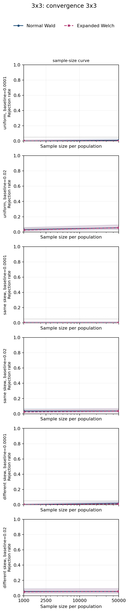

| Specification | Setting |
| --- | --- |
| Table size | 3x3 |
| Horizontal graph regime specifications (columns) | sample-size curve |
| Vertical graph regime specifications (rows) | uniform, baseline=0.0001: P row (0.3333 repeated 3 times), P column (0.3333 repeated 3 times); Q row (0.3333 repeated 3 times), Q column (0.3333 repeated 3 times); uniform, baseline=0.02: P row (0.3333 repeated 3 times), P column (0.3333 repeated 3 times); Q row (0.3333 repeated 3 times), Q column (0.3333 repeated 3 times); same skew, baseline=0.0001: P row (0.8, 0.2/2 repeated 2 times), P column (0.8, 0.2/2 repeated 2 times); Q row (0.8, 0.2/2 repeated 2 times), Q column (0.8, 0.2/2 repeated 2 times); same skew, baseline=0.02: P row (0.8, 0.2/2 repeated 2 times), P column (0.8, 0.2/2 repeated 2 times); Q row (0.8, 0.2/2 repeated 2 times), Q column (0.8, 0.2/2 repeated 2 times); different skew, baseline=0.0001: P row (0.7, 0.3/2 repeated 2 times), P column (0.7, 0.3/2 repeated 2 times); Q row (0.8, 0.2/2 repeated 2 times), Q column (0.8, 0.2/2 repeated 2 times); different skew, baseline=0.02: P row (0.7, 0.3/2 repeated 2 times), P column (0.7, 0.3/2 repeated 2 times); Q row (0.8, 0.2/2 repeated 2 times), Q column (0.8, 0.2/2 repeated 2 times) |
| Probability changes | uniform, baseline=0.0001: additive, first changes in P and Q; uniform, baseline=0.02: additive, first changes in P and Q; same skew, baseline=0.0001: additive, first changes in P and Q; same skew, baseline=0.02: additive, first changes in P and Q; different skew, baseline=0.0001: additive, first changes in P and Q; different skew, baseline=0.02: additive, first changes in P and Q |
| MI settings | Baseline MI {0.0001, 0.02}; direction {q higher}; actual differences {0} nats |
| Horizontal axis within each graph | Equal sample size from 1,000 to 50,000 on a log scale; fixed listed ticks |
| Vertical axis within each graph | Unconditional rejection rate from 0 to 1; invalid results count as non-rejections |
| Replicates | 200 per unique point |

Null-point rejection and validity:

| Vertical regime | Horizontal regime | Method | Rejection | Valid |
| --- | --- | --- | --- | --- |
| different skew, baseline=0.0001 | sample-size curve | Expanded Welch | 0.0000 | 1.0000 |
| different skew, baseline=0.0001 | sample-size curve | Expanded Welch | 0.0100 | 1.0000 |
| different skew, baseline=0.0001 | sample-size curve | Normal Wald | 0.0000 | 1.0000 |
| different skew, baseline=0.0001 | sample-size curve | Normal Wald | 0.0200 | 1.0000 |
| different skew, baseline=0.02 | sample-size curve | Expanded Welch | 0.0500 | 1.0000 |
| different skew, baseline=0.02 | sample-size curve | Expanded Welch | 0.0550 | 1.0000 |
| different skew, baseline=0.02 | sample-size curve | Normal Wald | 0.0550 | 1.0000 |
| different skew, baseline=0.02 | sample-size curve | Normal Wald | 0.0550 | 1.0000 |
| same skew, baseline=0.0001 | sample-size curve | Expanded Welch | 0.0000 | 1.0000 |
| same skew, baseline=0.0001 | sample-size curve | Expanded Welch | 0.0000 | 1.0000 |
| same skew, baseline=0.0001 | sample-size curve | Normal Wald | 0.0000 | 1.0000 |
| same skew, baseline=0.0001 | sample-size curve | Normal Wald | 0.0000 | 1.0000 |
| same skew, baseline=0.02 | sample-size curve | Expanded Welch | 0.0250 | 1.0000 |
| same skew, baseline=0.02 | sample-size curve | Expanded Welch | 0.0350 | 1.0000 |
| same skew, baseline=0.02 | sample-size curve | Normal Wald | 0.0350 | 1.0000 |
| same skew, baseline=0.02 | sample-size curve | Normal Wald | 0.0350 | 1.0000 |
| uniform, baseline=0.0001 | sample-size curve | Expanded Welch | 0.0000 | 1.0000 |
| uniform, baseline=0.0001 | sample-size curve | Expanded Welch | 0.0000 | 1.0000 |
| uniform, baseline=0.0001 | sample-size curve | Normal Wald | 0.0000 | 1.0000 |
| uniform, baseline=0.0001 | sample-size curve | Normal Wald | 0.0100 | 1.0000 |
| uniform, baseline=0.02 | sample-size curve | Expanded Welch | 0.0250 | 1.0000 |
| uniform, baseline=0.02 | sample-size curve | Expanded Welch | 0.0550 | 1.0000 |
| uniform, baseline=0.02 | sample-size curve | Normal Wald | 0.0300 | 1.0000 |
| uniform, baseline=0.02 | sample-size curve | Normal Wald | 0.0550 | 1.0000 |

Every plotted rate, interval, validity and minimum expected count

| Vertical regime | Horizontal regime | x | Method | Rejection | 95% interval | Valid | Conditional | Min expected P | Min expected Q |
| --- | --- | --- | --- | --- | --- | --- | --- | --- | --- |
| different skew, baseline=0.0001 | sample-size curve | 1000 | Expanded Welch | 0.0000 | [0.0000, 0.0188] | 1.0000 | 0.0000 | 22.5 | 10 |
| different skew, baseline=0.0001 | sample-size curve | 1000 | Normal Wald | 0.0000 | [0.0000, 0.0188] | 1.0000 | 0.0000 | 22.5 | 10 |
| different skew, baseline=0.0001 | sample-size curve | 50000 | Expanded Welch | 0.0100 | [0.0027, 0.0357] | 1.0000 | 0.0100 | 1125 | 500 |
| different skew, baseline=0.0001 | sample-size curve | 50000 | Normal Wald | 0.0200 | [0.0078, 0.0503] | 1.0000 | 0.0200 | 1125 | 500 |
| different skew, baseline=0.02 | sample-size curve | 1000 | Expanded Welch | 0.0500 | [0.0274, 0.0896] | 1.0000 | 0.0500 | 22.5 | 10 |
| different skew, baseline=0.02 | sample-size curve | 1000 | Normal Wald | 0.0550 | [0.0310, 0.0958] | 1.0000 | 0.0550 | 22.5 | 10 |
| different skew, baseline=0.02 | sample-size curve | 50000 | Expanded Welch | 0.0550 | [0.0310, 0.0958] | 1.0000 | 0.0550 | 1125 | 500 |
| different skew, baseline=0.02 | sample-size curve | 50000 | Normal Wald | 0.0550 | [0.0310, 0.0958] | 1.0000 | 0.0550 | 1125 | 500 |
| same skew, baseline=0.0001 | sample-size curve | 1000 | Expanded Welch | 0.0000 | [0.0000, 0.0188] | 1.0000 | 0.0000 | 10 | 10 |
| same skew, baseline=0.0001 | sample-size curve | 1000 | Normal Wald | 0.0000 | [0.0000, 0.0188] | 1.0000 | 0.0000 | 10 | 10 |
| same skew, baseline=0.0001 | sample-size curve | 50000 | Expanded Welch | 0.0000 | [0.0000, 0.0188] | 1.0000 | 0.0000 | 500 | 500 |
| same skew, baseline=0.0001 | sample-size curve | 50000 | Normal Wald | 0.0000 | [0.0000, 0.0188] | 1.0000 | 0.0000 | 500 | 500 |
| same skew, baseline=0.02 | sample-size curve | 1000 | Expanded Welch | 0.0250 | [0.0107, 0.0572] | 1.0000 | 0.0250 | 10 | 10 |
| same skew, baseline=0.02 | sample-size curve | 1000 | Normal Wald | 0.0350 | [0.0171, 0.0705] | 1.0000 | 0.0350 | 10 | 10 |
| same skew, baseline=0.02 | sample-size curve | 50000 | Expanded Welch | 0.0350 | [0.0171, 0.0705] | 1.0000 | 0.0350 | 500 | 500 |
| same skew, baseline=0.02 | sample-size curve | 50000 | Normal Wald | 0.0350 | [0.0171, 0.0705] | 1.0000 | 0.0350 | 500 | 500 |
| uniform, baseline=0.0001 | sample-size curve | 1000 | Expanded Welch | 0.0000 | [0.0000, 0.0188] | 1.0000 | 0.0000 | 108.8 | 108.8 |
| uniform, baseline=0.0001 | sample-size curve | 1000 | Normal Wald | 0.0000 | [0.0000, 0.0188] | 1.0000 | 0.0000 | 108.8 | 108.8 |
| uniform, baseline=0.0001 | sample-size curve | 50000 | Expanded Welch | 0.0000 | [0.0000, 0.0188] | 1.0000 | 0.0000 | 5438 | 5438 |
| uniform, baseline=0.0001 | sample-size curve | 50000 | Normal Wald | 0.0100 | [0.0027, 0.0357] | 1.0000 | 0.0100 | 5438 | 5438 |
| uniform, baseline=0.02 | sample-size curve | 1000 | Expanded Welch | 0.0250 | [0.0107, 0.0572] | 1.0000 | 0.0250 | 78.03 | 78.03 |
| uniform, baseline=0.02 | sample-size curve | 1000 | Normal Wald | 0.0300 | [0.0138, 0.0639] | 1.0000 | 0.0300 | 78.03 | 78.03 |
| uniform, baseline=0.02 | sample-size curve | 50000 | Expanded Welch | 0.0550 | [0.0310, 0.0958] | 1.0000 | 0.0550 | 3902 | 3902 |
| uniform, baseline=0.02 | sample-size curve | 50000 | Normal Wald | 0.0550 | [0.0310, 0.0958] | 1.0000 | 0.0550 | 3902 | 3902 |

### 13.3 5x5: convergence 5x5

Do null rejection rates approach 0.05 as the fixed populations receive more data?

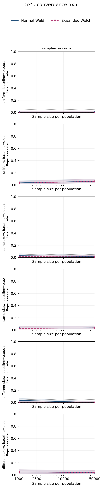

| Specification | Setting |
| --- | --- |
| Table size | 5x5 |
| Horizontal graph regime specifications (columns) | sample-size curve |
| Vertical graph regime specifications (rows) | uniform, baseline=0.0001: P row (0.2 repeated 5 times), P column (0.2 repeated 5 times); Q row (0.2 repeated 5 times), Q column (0.2 repeated 5 times); uniform, baseline=0.02: P row (0.2 repeated 5 times), P column (0.2 repeated 5 times); Q row (0.2 repeated 5 times), Q column (0.2 repeated 5 times); same skew, baseline=0.0001: P row (0.8, 0.2/4 repeated 4 times), P column (0.8, 0.2/4 repeated 4 times); Q row (0.8, 0.2/4 repeated 4 times), Q column (0.8, 0.2/4 repeated 4 times); same skew, baseline=0.02: P row (0.8, 0.2/4 repeated 4 times), P column (0.8, 0.2/4 repeated 4 times); Q row (0.8, 0.2/4 repeated 4 times), Q column (0.8, 0.2/4 repeated 4 times); different skew, baseline=0.0001: P row (0.7, 0.3/4 repeated 4 times), P column (0.7, 0.3/4 repeated 4 times); Q row (0.8, 0.2/4 repeated 4 times), Q column (0.8, 0.2/4 repeated 4 times); different skew, baseline=0.02: P row (0.7, 0.3/4 repeated 4 times), P column (0.7, 0.3/4 repeated 4 times); Q row (0.8, 0.2/4 repeated 4 times), Q column (0.8, 0.2/4 repeated 4 times) |
| Probability changes | uniform, baseline=0.0001: additive, first changes in P and Q; uniform, baseline=0.02: additive, first changes in P and Q; same skew, baseline=0.0001: additive, first changes in P and Q; same skew, baseline=0.02: additive, first changes in P and Q; different skew, baseline=0.0001: additive, first changes in P and Q; different skew, baseline=0.02: additive, first changes in P and Q |
| MI settings | Baseline MI {0.0001, 0.02}; direction {q higher}; actual differences {0} nats |
| Horizontal axis within each graph | Equal sample size from 1,000 to 50,000 on a log scale; fixed listed ticks |
| Vertical axis within each graph | Unconditional rejection rate from 0 to 1; invalid results count as non-rejections |
| Replicates | 200 per unique point |

Null-point rejection and validity:

| Vertical regime | Horizontal regime | Method | Rejection | Valid |
| --- | --- | --- | --- | --- |
| different skew, baseline=0.0001 | sample-size curve | Expanded Welch | 0.0000 | 1.0000 |
| different skew, baseline=0.0001 | sample-size curve | Expanded Welch | 0.0000 | 1.0000 |
| different skew, baseline=0.0001 | sample-size curve | Normal Wald | 0.0350 | 1.0000 |
| different skew, baseline=0.0001 | sample-size curve | Normal Wald | 0.0000 | 1.0000 |
| different skew, baseline=0.02 | sample-size curve | Expanded Welch | 0.0500 | 1.0000 |
| different skew, baseline=0.02 | sample-size curve | Expanded Welch | 0.0400 | 1.0000 |
| different skew, baseline=0.02 | sample-size curve | Normal Wald | 0.0500 | 1.0000 |
| different skew, baseline=0.02 | sample-size curve | Normal Wald | 0.0400 | 1.0000 |
| same skew, baseline=0.0001 | sample-size curve | Expanded Welch | 0.0150 | 1.0000 |
| same skew, baseline=0.0001 | sample-size curve | Expanded Welch | 0.0100 | 1.0000 |
| same skew, baseline=0.0001 | sample-size curve | Normal Wald | 0.0300 | 1.0000 |
| same skew, baseline=0.0001 | sample-size curve | Normal Wald | 0.0150 | 1.0000 |
| same skew, baseline=0.02 | sample-size curve | Expanded Welch | 0.0250 | 1.0000 |
| same skew, baseline=0.02 | sample-size curve | Expanded Welch | 0.0350 | 1.0000 |
| same skew, baseline=0.02 | sample-size curve | Normal Wald | 0.0300 | 1.0000 |
| same skew, baseline=0.02 | sample-size curve | Normal Wald | 0.0350 | 1.0000 |
| uniform, baseline=0.0001 | sample-size curve | Expanded Welch | 0.0000 | 1.0000 |
| uniform, baseline=0.0001 | sample-size curve | Expanded Welch | 0.0000 | 1.0000 |
| uniform, baseline=0.0001 | sample-size curve | Normal Wald | 0.0050 | 1.0000 |
| uniform, baseline=0.0001 | sample-size curve | Normal Wald | 0.0050 | 1.0000 |
| uniform, baseline=0.02 | sample-size curve | Expanded Welch | 0.0300 | 1.0000 |
| uniform, baseline=0.02 | sample-size curve | Expanded Welch | 0.0600 | 1.0000 |
| uniform, baseline=0.02 | sample-size curve | Normal Wald | 0.0350 | 1.0000 |
| uniform, baseline=0.02 | sample-size curve | Normal Wald | 0.0600 | 1.0000 |

Every plotted rate, interval, validity and minimum expected count

| Vertical regime | Horizontal regime | x | Method | Rejection | 95% interval | Valid | Conditional | Min expected P | Min expected Q |
| --- | --- | --- | --- | --- | --- | --- | --- | --- | --- |
| different skew, baseline=0.0001 | sample-size curve | 1000 | Expanded Welch | 0.0000 | [0.0000, 0.0188] | 1.0000 | 0.0000 | 5.625 | 2.5 |
| different skew, baseline=0.0001 | sample-size curve | 1000 | Normal Wald | 0.0350 | [0.0171, 0.0705] | 1.0000 | 0.0350 | 5.625 | 2.5 |
| different skew, baseline=0.0001 | sample-size curve | 50000 | Expanded Welch | 0.0000 | [0.0000, 0.0188] | 1.0000 | 0.0000 | 281.3 | 125 |
| different skew, baseline=0.0001 | sample-size curve | 50000 | Normal Wald | 0.0000 | [0.0000, 0.0188] | 1.0000 | 0.0000 | 281.3 | 125 |
| different skew, baseline=0.02 | sample-size curve | 1000 | Expanded Welch | 0.0500 | [0.0274, 0.0896] | 1.0000 | 0.0500 | 5.625 | 2.5 |
| different skew, baseline=0.02 | sample-size curve | 1000 | Normal Wald | 0.0500 | [0.0274, 0.0896] | 1.0000 | 0.0500 | 5.625 | 2.5 |
| different skew, baseline=0.02 | sample-size curve | 50000 | Expanded Welch | 0.0400 | [0.0204, 0.0769] | 1.0000 | 0.0400 | 281.3 | 125 |
| different skew, baseline=0.02 | sample-size curve | 50000 | Normal Wald | 0.0400 | [0.0204, 0.0769] | 1.0000 | 0.0400 | 281.3 | 125 |
| same skew, baseline=0.0001 | sample-size curve | 1000 | Expanded Welch | 0.0150 | [0.0051, 0.0432] | 1.0000 | 0.0150 | 2.5 | 2.5 |
| same skew, baseline=0.0001 | sample-size curve | 1000 | Normal Wald | 0.0300 | [0.0138, 0.0639] | 1.0000 | 0.0300 | 2.5 | 2.5 |
| same skew, baseline=0.0001 | sample-size curve | 50000 | Expanded Welch | 0.0100 | [0.0027, 0.0357] | 1.0000 | 0.0100 | 125 | 125 |
| same skew, baseline=0.0001 | sample-size curve | 50000 | Normal Wald | 0.0150 | [0.0051, 0.0432] | 1.0000 | 0.0150 | 125 | 125 |
| same skew, baseline=0.02 | sample-size curve | 1000 | Expanded Welch | 0.0250 | [0.0107, 0.0572] | 1.0000 | 0.0250 | 2.5 | 2.5 |
| same skew, baseline=0.02 | sample-size curve | 1000 | Normal Wald | 0.0300 | [0.0138, 0.0639] | 1.0000 | 0.0300 | 2.5 | 2.5 |
| same skew, baseline=0.02 | sample-size curve | 50000 | Expanded Welch | 0.0350 | [0.0171, 0.0705] | 1.0000 | 0.0350 | 125 | 125 |
| same skew, baseline=0.02 | sample-size curve | 50000 | Normal Wald | 0.0350 | [0.0171, 0.0705] | 1.0000 | 0.0350 | 125 | 125 |
| uniform, baseline=0.0001 | sample-size curve | 1000 | Expanded Welch | 0.0000 | [0.0000, 0.0188] | 1.0000 | 0.0000 | 38.59 | 38.59 |
| uniform, baseline=0.0001 | sample-size curve | 1000 | Normal Wald | 0.0050 | [0.0009, 0.0278] | 1.0000 | 0.0050 | 38.59 | 38.59 |
| uniform, baseline=0.0001 | sample-size curve | 50000 | Expanded Welch | 0.0000 | [0.0000, 0.0188] | 1.0000 | 0.0000 | 1929 | 1929 |
| uniform, baseline=0.0001 | sample-size curve | 50000 | Normal Wald | 0.0050 | [0.0009, 0.0278] | 1.0000 | 0.0050 | 1929 | 1929 |
| uniform, baseline=0.02 | sample-size curve | 1000 | Expanded Welch | 0.0300 | [0.0138, 0.0639] | 1.0000 | 0.0300 | 20.43 | 20.43 |
| uniform, baseline=0.02 | sample-size curve | 1000 | Normal Wald | 0.0350 | [0.0171, 0.0705] | 1.0000 | 0.0350 | 20.43 | 20.43 |
| uniform, baseline=0.02 | sample-size curve | 50000 | Expanded Welch | 0.0600 | [0.0347, 0.1019] | 1.0000 | 0.0600 | 1021 | 1021 |
| uniform, baseline=0.02 | sample-size curve | 50000 | Normal Wald | 0.0600 | [0.0347, 0.1019] | 1.0000 | 0.0600 | 1021 | 1021 |

### 13.4 8x8: convergence 8x8

Do null rejection rates approach 0.05 as the fixed populations receive more data?

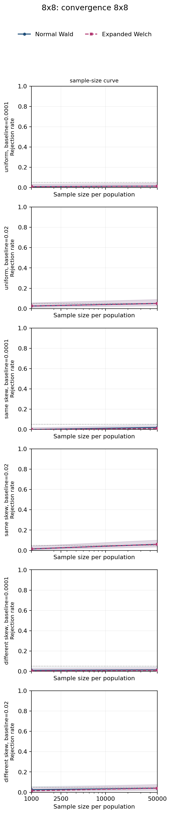

| Specification | Setting |
| --- | --- |
| Table size | 8x8 |
| Horizontal graph regime specifications (columns) | sample-size curve |
| Vertical graph regime specifications (rows) | uniform, baseline=0.0001: P row (0.125 repeated 8 times), P column (0.125 repeated 8 times); Q row (0.125 repeated 8 times), Q column (0.125 repeated 8 times); uniform, baseline=0.02: P row (0.125 repeated 8 times), P column (0.125 repeated 8 times); Q row (0.125 repeated 8 times), Q column (0.125 repeated 8 times); same skew, baseline=0.0001: P row (0.8, 0.2/7 repeated 7 times), P column (0.8, 0.2/7 repeated 7 times); Q row (0.8, 0.2/7 repeated 7 times), Q column (0.8, 0.2/7 repeated 7 times); same skew, baseline=0.02: P row (0.8, 0.2/7 repeated 7 times), P column (0.8, 0.2/7 repeated 7 times); Q row (0.8, 0.2/7 repeated 7 times), Q column (0.8, 0.2/7 repeated 7 times); different skew, baseline=0.0001: P row (0.7, 0.3/7 repeated 7 times), P column (0.7, 0.3/7 repeated 7 times); Q row (0.8, 0.2/7 repeated 7 times), Q column (0.8, 0.2/7 repeated 7 times); different skew, baseline=0.02: P row (0.7, 0.3/7 repeated 7 times), P column (0.7, 0.3/7 repeated 7 times); Q row (0.8, 0.2/7 repeated 7 times), Q column (0.8, 0.2/7 repeated 7 times) |
| Probability changes | uniform, baseline=0.0001: additive, first changes in P and Q; uniform, baseline=0.02: additive, first changes in P and Q; same skew, baseline=0.0001: additive, first changes in P and Q; same skew, baseline=0.02: additive, first changes in P and Q; different skew, baseline=0.0001: additive, first changes in P and Q; different skew, baseline=0.02: additive, first changes in P and Q |
| MI settings | Baseline MI {0.0001, 0.02}; direction {q higher}; actual differences {0} nats |
| Horizontal axis within each graph | Equal sample size from 1,000 to 50,000 on a log scale; fixed listed ticks |
| Vertical axis within each graph | Unconditional rejection rate from 0 to 1; invalid results count as non-rejections |
| Replicates | 200 per unique point |

Null-point rejection and validity:

| Vertical regime | Horizontal regime | Method | Rejection | Valid |
| --- | --- | --- | --- | --- |
| different skew, baseline=0.0001 | sample-size curve | Expanded Welch | 0.0050 | 1.0000 |
| different skew, baseline=0.0001 | sample-size curve | Expanded Welch | 0.0100 | 1.0000 |
| different skew, baseline=0.0001 | sample-size curve | Normal Wald | 0.0100 | 1.0000 |
| different skew, baseline=0.0001 | sample-size curve | Normal Wald | 0.0150 | 1.0000 |
| different skew, baseline=0.02 | sample-size curve | Expanded Welch | 0.0150 | 1.0000 |
| different skew, baseline=0.02 | sample-size curve | Expanded Welch | 0.0400 | 1.0000 |
| different skew, baseline=0.02 | sample-size curve | Normal Wald | 0.0250 | 1.0000 |
| different skew, baseline=0.02 | sample-size curve | Normal Wald | 0.0400 | 1.0000 |
| same skew, baseline=0.0001 | sample-size curve | Expanded Welch | 0.0000 | 1.0000 |
| same skew, baseline=0.0001 | sample-size curve | Expanded Welch | 0.0100 | 1.0000 |
| same skew, baseline=0.0001 | sample-size curve | Normal Wald | 0.0000 | 1.0000 |
| same skew, baseline=0.0001 | sample-size curve | Normal Wald | 0.0200 | 1.0000 |
| same skew, baseline=0.02 | sample-size curve | Expanded Welch | 0.0150 | 1.0000 |
| same skew, baseline=0.02 | sample-size curve | Expanded Welch | 0.0600 | 1.0000 |
| same skew, baseline=0.02 | sample-size curve | Normal Wald | 0.0150 | 1.0000 |
| same skew, baseline=0.02 | sample-size curve | Normal Wald | 0.0600 | 1.0000 |
| uniform, baseline=0.0001 | sample-size curve | Expanded Welch | 0.0100 | 1.0000 |
| uniform, baseline=0.0001 | sample-size curve | Expanded Welch | 0.0150 | 1.0000 |
| uniform, baseline=0.0001 | sample-size curve | Normal Wald | 0.0100 | 1.0000 |
| uniform, baseline=0.0001 | sample-size curve | Normal Wald | 0.0150 | 1.0000 |
| uniform, baseline=0.02 | sample-size curve | Expanded Welch | 0.0250 | 1.0000 |
| uniform, baseline=0.02 | sample-size curve | Expanded Welch | 0.0500 | 1.0000 |
| uniform, baseline=0.02 | sample-size curve | Normal Wald | 0.0250 | 1.0000 |
| uniform, baseline=0.02 | sample-size curve | Normal Wald | 0.0500 | 1.0000 |

Every plotted rate, interval, validity and minimum expected count

| Vertical regime | Horizontal regime | x | Method | Rejection | 95% interval | Valid | Conditional | Min expected P | Min expected Q |
| --- | --- | --- | --- | --- | --- | --- | --- | --- | --- |
| different skew, baseline=0.0001 | sample-size curve | 1000 | Expanded Welch | 0.0050 | [0.0009, 0.0278] | 1.0000 | 0.0050 | 1.837 | 0.8163 |
| different skew, baseline=0.0001 | sample-size curve | 1000 | Normal Wald | 0.0100 | [0.0027, 0.0357] | 1.0000 | 0.0100 | 1.837 | 0.8163 |
| different skew, baseline=0.0001 | sample-size curve | 50000 | Expanded Welch | 0.0100 | [0.0027, 0.0357] | 1.0000 | 0.0100 | 91.84 | 40.82 |
| different skew, baseline=0.0001 | sample-size curve | 50000 | Normal Wald | 0.0150 | [0.0051, 0.0432] | 1.0000 | 0.0150 | 91.84 | 40.82 |
| different skew, baseline=0.02 | sample-size curve | 1000 | Expanded Welch | 0.0150 | [0.0051, 0.0432] | 1.0000 | 0.0150 | 1.837 | 0.8163 |
| different skew, baseline=0.02 | sample-size curve | 1000 | Normal Wald | 0.0250 | [0.0107, 0.0572] | 1.0000 | 0.0250 | 1.837 | 0.8163 |
| different skew, baseline=0.02 | sample-size curve | 50000 | Expanded Welch | 0.0400 | [0.0204, 0.0769] | 1.0000 | 0.0400 | 91.84 | 40.82 |
| different skew, baseline=0.02 | sample-size curve | 50000 | Normal Wald | 0.0400 | [0.0204, 0.0769] | 1.0000 | 0.0400 | 91.84 | 40.82 |
| same skew, baseline=0.0001 | sample-size curve | 1000 | Expanded Welch | 0.0000 | [0.0000, 0.0188] | 1.0000 | 0.0000 | 0.8163 | 0.8163 |
| same skew, baseline=0.0001 | sample-size curve | 1000 | Normal Wald | 0.0000 | [0.0000, 0.0188] | 1.0000 | 0.0000 | 0.8163 | 0.8163 |
| same skew, baseline=0.0001 | sample-size curve | 50000 | Expanded Welch | 0.0100 | [0.0027, 0.0357] | 1.0000 | 0.0100 | 40.82 | 40.82 |
| same skew, baseline=0.0001 | sample-size curve | 50000 | Normal Wald | 0.0200 | [0.0078, 0.0503] | 1.0000 | 0.0200 | 40.82 | 40.82 |
| same skew, baseline=0.02 | sample-size curve | 1000 | Expanded Welch | 0.0150 | [0.0051, 0.0432] | 1.0000 | 0.0150 | 0.8163 | 0.8163 |
| same skew, baseline=0.02 | sample-size curve | 1000 | Normal Wald | 0.0150 | [0.0051, 0.0432] | 1.0000 | 0.0150 | 0.8163 | 0.8163 |
| same skew, baseline=0.02 | sample-size curve | 50000 | Expanded Welch | 0.0600 | [0.0347, 0.1019] | 1.0000 | 0.0600 | 40.82 | 40.82 |
| same skew, baseline=0.02 | sample-size curve | 50000 | Normal Wald | 0.0600 | [0.0347, 0.1019] | 1.0000 | 0.0600 | 40.82 | 40.82 |
| uniform, baseline=0.0001 | sample-size curve | 1000 | Expanded Welch | 0.0100 | [0.0027, 0.0357] | 1.0000 | 0.0100 | 14.74 | 14.74 |
| uniform, baseline=0.0001 | sample-size curve | 1000 | Normal Wald | 0.0100 | [0.0027, 0.0357] | 1.0000 | 0.0100 | 14.74 | 14.74 |
| uniform, baseline=0.0001 | sample-size curve | 50000 | Expanded Welch | 0.0150 | [0.0051, 0.0432] | 1.0000 | 0.0150 | 737.1 | 737.1 |
| uniform, baseline=0.0001 | sample-size curve | 50000 | Normal Wald | 0.0150 | [0.0051, 0.0432] | 1.0000 | 0.0150 | 737.1 | 737.1 |
| uniform, baseline=0.02 | sample-size curve | 1000 | Expanded Welch | 0.0250 | [0.0107, 0.0572] | 1.0000 | 0.0250 | 3.848 | 3.848 |
| uniform, baseline=0.02 | sample-size curve | 1000 | Normal Wald | 0.0250 | [0.0107, 0.0572] | 1.0000 | 0.0250 | 3.848 | 3.848 |
| uniform, baseline=0.02 | sample-size curve | 50000 | Expanded Welch | 0.0500 | [0.0274, 0.0896] | 1.0000 | 0.0500 | 192.4 | 192.4 |
| uniform, baseline=0.02 | sample-size curve | 50000 | Normal Wald | 0.0500 | [0.0274, 0.0896] | 1.0000 | 0.0500 | 192.4 | 192.4 |

### 13.5 3x3: convergence rare 3x3

Do null rejection rates approach 0.05 as the fixed populations receive more data?

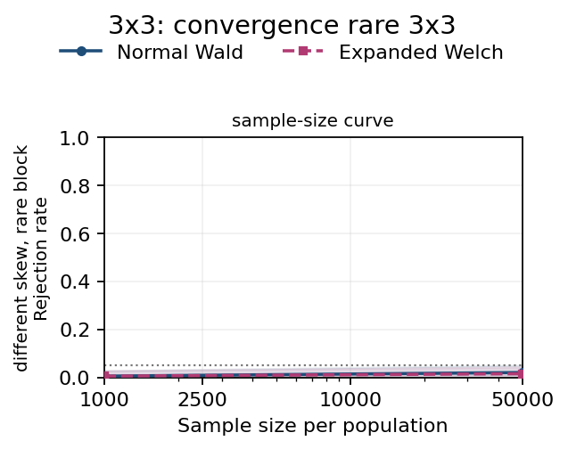

| Specification | Setting |
| --- | --- |
| Table size | 3x3 |
| Horizontal graph regime specifications (columns) | sample-size curve |
| Vertical graph regime specifications (rows) | different skew, rare block: P row (0.7, 0.3/2 repeated 2 times), P column (0.7, 0.3/2 repeated 2 times); Q row (0.8, 0.2/2 repeated 2 times), Q column (0.8, 0.2/2 repeated 2 times) |
| Probability changes | different skew, rare block: additive, rare changes in P and Q |
| MI settings | Baseline MI {0.0001}; direction {q higher}; actual differences {0} nats |
| Horizontal axis within each graph | Equal sample size from 1,000 to 50,000 on a log scale; fixed listed ticks |
| Vertical axis within each graph | Unconditional rejection rate from 0 to 1; invalid results count as non-rejections |
| Replicates | 200 per unique point |

Null-point rejection and validity:

| Vertical regime | Horizontal regime | Method | Rejection | Valid |
| --- | --- | --- | --- | --- |
| different skew, rare block | sample-size curve | Expanded Welch | 0.0050 | 1.0000 |
| different skew, rare block | sample-size curve | Expanded Welch | 0.0150 | 1.0000 |
| different skew, rare block | sample-size curve | Normal Wald | 0.0050 | 1.0000 |
| different skew, rare block | sample-size curve | Normal Wald | 0.0200 | 1.0000 |

Every plotted rate, interval, validity and minimum expected count

| Vertical regime | Horizontal regime | x | Method | Rejection | 95% interval | Valid | Conditional | Min expected P | Min expected Q |
| --- | --- | --- | --- | --- | --- | --- | --- | --- | --- |
| different skew, rare block | sample-size curve | 1000 | Expanded Welch | 0.0050 | [0.0009, 0.0278] | 1.0000 | 0.0050 | 21.44 | 9.293 |
| different skew, rare block | sample-size curve | 1000 | Normal Wald | 0.0050 | [0.0009, 0.0278] | 1.0000 | 0.0050 | 21.44 | 9.293 |
| different skew, rare block | sample-size curve | 50000 | Expanded Welch | 0.0150 | [0.0051, 0.0432] | 1.0000 | 0.0150 | 1072 | 464.7 |
| different skew, rare block | sample-size curve | 50000 | Normal Wald | 0.0200 | [0.0078, 0.0503] | 1.0000 | 0.0200 | 1072 | 464.7 |

### 13.6 5x5: convergence rare 5x5

Do null rejection rates approach 0.05 as the fixed populations receive more data?

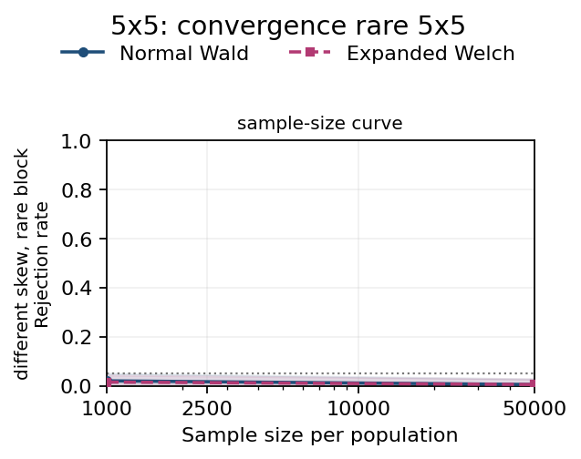

| Specification | Setting |
| --- | --- |
| Table size | 5x5 |
| Horizontal graph regime specifications (columns) | sample-size curve |
| Vertical graph regime specifications (rows) | different skew, rare block: P row (0.7, 0.3/4 repeated 4 times), P column (0.7, 0.3/4 repeated 4 times); Q row (0.8, 0.2/4 repeated 4 times), Q column (0.8, 0.2/4 repeated 4 times) |
| Probability changes | different skew, rare block: additive, rare changes in P and Q |
| MI settings | Baseline MI {0.0001}; direction {q higher}; actual differences {0} nats |
| Horizontal axis within each graph | Equal sample size from 1,000 to 50,000 on a log scale; fixed listed ticks |
| Vertical axis within each graph | Unconditional rejection rate from 0 to 1; invalid results count as non-rejections |
| Replicates | 200 per unique point |

Null-point rejection and validity:

| Vertical regime | Horizontal regime | Method | Rejection | Valid |
| --- | --- | --- | --- | --- |
| different skew, rare block | sample-size curve | Expanded Welch | 0.0150 | 1.0000 |
| different skew, rare block | sample-size curve | Expanded Welch | 0.0050 | 1.0000 |
| different skew, rare block | sample-size curve | Normal Wald | 0.0200 | 1.0000 |
| different skew, rare block | sample-size curve | Normal Wald | 0.0050 | 1.0000 |

Every plotted rate, interval, validity and minimum expected count

| Vertical regime | Horizontal regime | x | Method | Rejection | 95% interval | Valid | Conditional | Min expected P | Min expected Q |
| --- | --- | --- | --- | --- | --- | --- | --- | --- | --- |
| different skew, rare block | sample-size curve | 1000 | Expanded Welch | 0.0150 | [0.0051, 0.0432] | 1.0000 | 0.0150 | 5.095 | 2.147 |
| different skew, rare block | sample-size curve | 1000 | Normal Wald | 0.0200 | [0.0078, 0.0503] | 1.0000 | 0.0200 | 5.095 | 2.147 |
| different skew, rare block | sample-size curve | 50000 | Expanded Welch | 0.0050 | [0.0009, 0.0278] | 1.0000 | 0.0050 | 254.8 | 107.4 |
| different skew, rare block | sample-size curve | 50000 | Normal Wald | 0.0050 | [0.0009, 0.0278] | 1.0000 | 0.0050 | 254.8 | 107.4 |

### 13.7 8x8: convergence rare 8x8

Do null rejection rates approach 0.05 as the fixed populations receive more data?

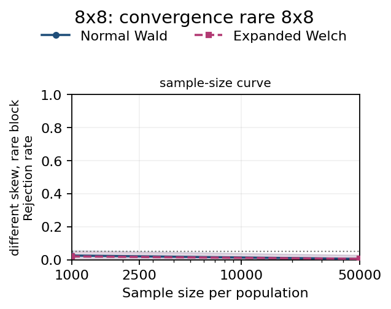

| Specification | Setting |
| --- | --- |
| Table size | 8x8 |
| Horizontal graph regime specifications (columns) | sample-size curve |
| Vertical graph regime specifications (rows) | different skew, rare block: P row (0.7, 0.3/7 repeated 7 times), P column (0.7, 0.3/7 repeated 7 times); Q row (0.8, 0.2/7 repeated 7 times), Q column (0.8, 0.2/7 repeated 7 times) |
| Probability changes | different skew, rare block: additive, rare changes in P and Q |
| MI settings | Baseline MI {0.0001}; direction {q higher}; actual differences {0} nats |
| Horizontal axis within each graph | Equal sample size from 1,000 to 50,000 on a log scale; fixed listed ticks |
| Vertical axis within each graph | Unconditional rejection rate from 0 to 1; invalid results count as non-rejections |
| Replicates | 200 per unique point |

Null-point rejection and validity:

| Vertical regime | Horizontal regime | Method | Rejection | Valid |
| --- | --- | --- | --- | --- |
| different skew, rare block | sample-size curve | Expanded Welch | 0.0200 | 1.0000 |
| different skew, rare block | sample-size curve | Expanded Welch | 0.0050 | 1.0000 |
| different skew, rare block | sample-size curve | Normal Wald | 0.0250 | 1.0000 |
| different skew, rare block | sample-size curve | Normal Wald | 0.0050 | 1.0000 |

Every plotted rate, interval, validity and minimum expected count

| Vertical regime | Horizontal regime | x | Method | Rejection | 95% interval | Valid | Conditional | Min expected P | Min expected Q |
| --- | --- | --- | --- | --- | --- | --- | --- | --- | --- |
| different skew, rare block | sample-size curve | 1000 | Expanded Welch | 0.0200 | [0.0078, 0.0503] | 1.0000 | 0.0200 | 1.534 | 0.6153 |
| different skew, rare block | sample-size curve | 1000 | Normal Wald | 0.0250 | [0.0107, 0.0572] | 1.0000 | 0.0250 | 1.534 | 0.6153 |
| different skew, rare block | sample-size curve | 50000 | Expanded Welch | 0.0050 | [0.0009, 0.0278] | 1.0000 | 0.0050 | 76.72 | 30.77 |
| different skew, rare block | sample-size curve | 50000 | Normal Wald | 0.0050 | [0.0009, 0.0278] | 1.0000 | 0.0050 | 76.72 | 30.77 |

## 14. Reproducibility

The manifest contains 449 unique simulated configurations and 694 display points. Reused configurations were simulated once and referenced in multiple prespecified sections.

- [Executable protocol](../../experiments/THESIS_REDESIGN_PROTOCOL.json)
- [Unique configuration manifest](../../results/thesis_redesign/configuration_manifest.csv)
- [Display-to-configuration map](../../results/thesis_redesign/display_manifest.csv)
- [Full-precision population tables](../../results/thesis_redesign/population_definitions.csv)
- [Per-method results](../../results/thesis_redesign/cell_results.csv)
- [Paired method results](../../results/thesis_redesign/paired_method_results.csv)
- [Verification record](../../results/thesis_redesign/verification.json)
- [Runtime results](../../results/thesis_redesign/runtime_summary.csv)
- [Run metadata and source hashes](../../results/thesis_redesign/run_metadata.json)

The report presents the complete prespecified landscape before interpretation. It does not average regimes or use result-dependent thresholds.
