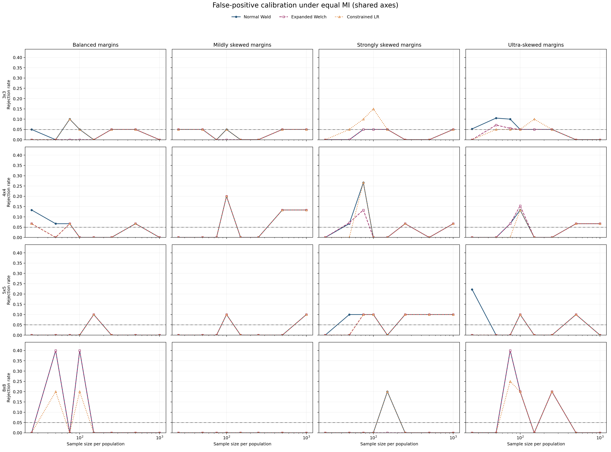
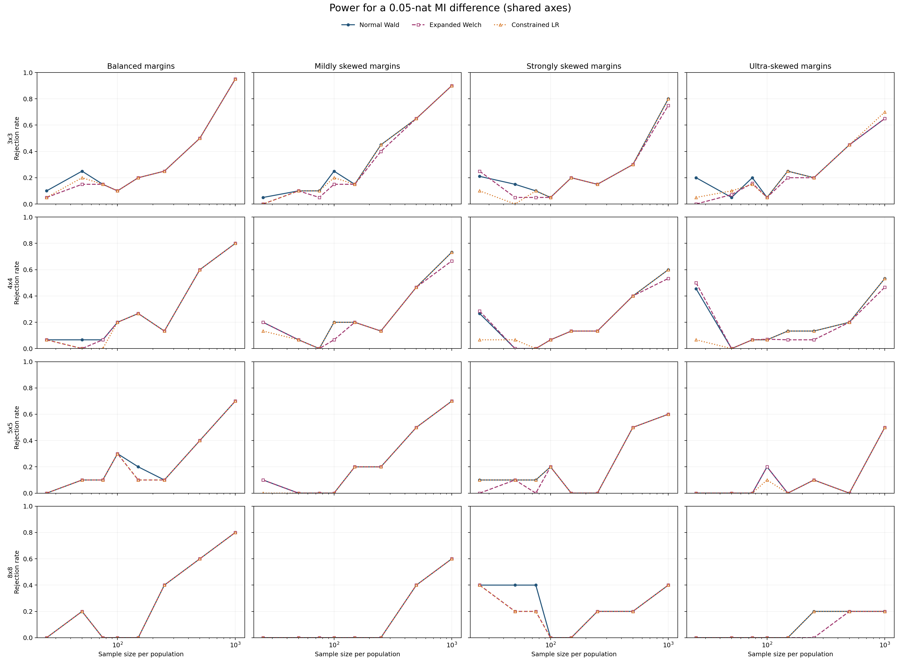
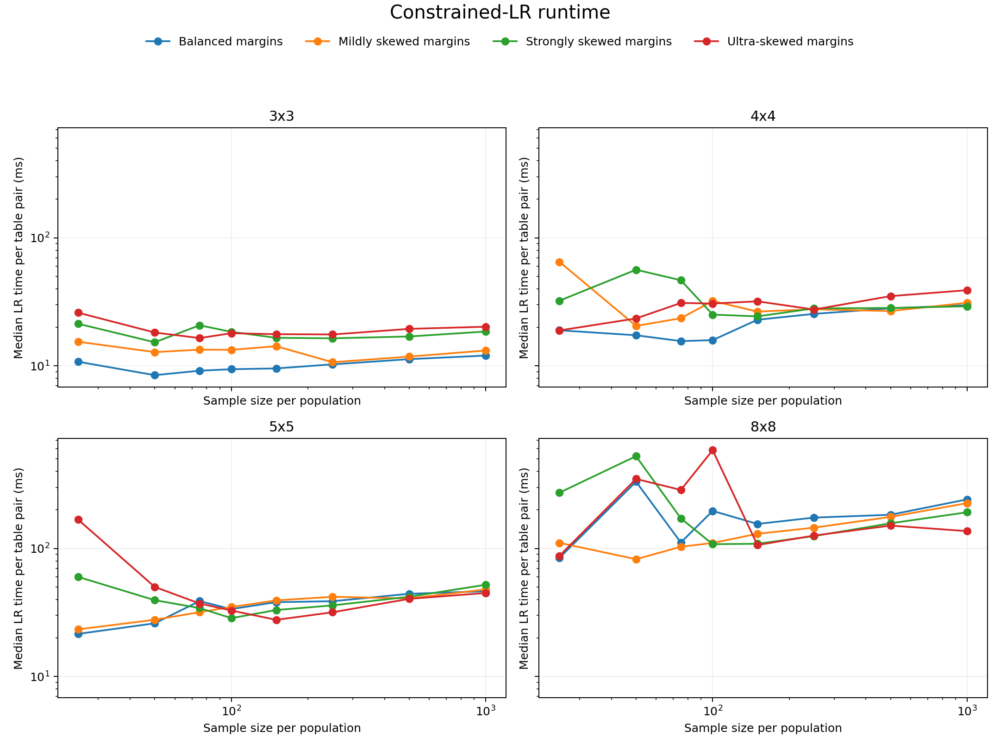

# Multi-Alphabet Constrained-LR Experiment

This experiment extends the equal-MI comparison from binary tables to larger alphabets. Every row below is one exact population pair and sample size; no result is averaged across configurations.

## Design

- Profile: `smoke`.
- Replicates by shape: `{3: 20, 4: 15, 5: 10, 8: 5}` for each null and alternative.
- Null: $I(P)=I(Q)=0.05$ nats.
- Alternative: $I(P)=0.05$ and $I(Q)=0.10$ nats.
- Decision threshold: $\alpha=0.05$.
- Margins: balanced or one category with probability 0.70, 0.90, or 0.95.
- The two populations use opposite ordinal association patterns and shifted margins.

## Exact Results

FPR is the null rejection rate and power is the alternative rejection rate, both at 0.05.

### 3x3

**Balanced margins**

| n | n/cell | min E | cells E<1 | Wald FPR | Wald power | Expanded FPR | Expanded power | LR FPR | LR power |
| --- | --- | --- | --- | --- | --- | --- | --- | --- | --- |
| 25 | 2.78 | 1.52 | 0.00 | 0.050 | 0.100 | 0.000 | 0.050 | 0.000 | 0.050 |
| 50 | 5.56 | 3.04 | 0.00 | 0.000 | 0.250 | 0.000 | 0.150 | 0.000 | 0.200 |
| 75 | 8.33 | 4.55 | 0.00 | 0.100 | 0.150 | 0.000 | 0.150 | 0.100 | 0.150 |
| 100 | 11.11 | 6.07 | 0.00 | 0.050 | 0.100 | 0.000 | 0.100 | 0.050 | 0.100 |
| 150 | 16.67 | 9.11 | 0.00 | 0.000 | 0.200 | 0.000 | 0.200 | 0.000 | 0.200 |
| 250 | 27.78 | 15.2 | 0.00 | 0.050 | 0.250 | 0.050 | 0.250 | 0.050 | 0.250 |
| 500 | 55.56 | 30.4 | 0.00 | 0.050 | 0.500 | 0.050 | 0.500 | 0.050 | 0.500 |
| 1000 | 111.11 | 60.7 | 0.00 | 0.000 | 0.950 | 0.000 | 0.950 | 0.000 | 0.950 |

**Mildly skewed margins**

| n | n/cell | min E | cells E<1 | Wald FPR | Wald power | Expanded FPR | Expanded power | LR FPR | LR power |
| --- | --- | --- | --- | --- | --- | --- | --- | --- | --- |
| 25 | 2.78 | 0.108 | 0.33 | 0.050 | 0.050 | 0.050 | 0.000 | 0.050 | 0.000 |
| 50 | 5.56 | 0.216 | 0.11 | 0.050 | 0.100 | 0.050 | 0.100 | 0.050 | 0.100 |
| 75 | 8.33 | 0.325 | 0.11 | 0.000 | 0.100 | 0.000 | 0.050 | 0.000 | 0.100 |
| 100 | 11.11 | 0.433 | 0.06 | 0.050 | 0.250 | 0.000 | 0.150 | 0.050 | 0.200 |
| 150 | 16.67 | 0.649 | 0.06 | 0.000 | 0.150 | 0.000 | 0.150 | 0.000 | 0.150 |
| 250 | 27.78 | 1.08 | 0.00 | 0.000 | 0.450 | 0.000 | 0.400 | 0.000 | 0.450 |
| 500 | 55.56 | 2.16 | 0.00 | 0.050 | 0.650 | 0.050 | 0.650 | 0.050 | 0.650 |
| 1000 | 111.11 | 4.33 | 0.00 | 0.050 | 0.900 | 0.050 | 0.900 | 0.050 | 0.900 |

**Strongly skewed margins**

| n | n/cell | min E | cells E<1 | Wald FPR | Wald power | Expanded FPR | Expanded power | LR FPR | LR power |
| --- | --- | --- | --- | --- | --- | --- | --- | --- | --- |
| 25 | 2.78 | 0.00113 | 0.78 | 0.000 | 0.211 | 0.000 | 0.250 | 0.000 | 0.100 |
| 50 | 5.56 | 0.00225 | 0.33 | 0.000 | 0.150 | 0.000 | 0.050 | 0.050 | 0.000 |
| 75 | 8.33 | 0.00338 | 0.33 | 0.050 | 0.100 | 0.050 | 0.050 | 0.100 | 0.100 |
| 100 | 11.11 | 0.00451 | 0.33 | 0.050 | 0.050 | 0.050 | 0.050 | 0.150 | 0.050 |
| 150 | 16.67 | 0.00676 | 0.33 | 0.050 | 0.200 | 0.050 | 0.200 | 0.050 | 0.200 |
| 250 | 27.78 | 0.0113 | 0.11 | 0.000 | 0.150 | 0.000 | 0.150 | 0.000 | 0.150 |
| 500 | 55.56 | 0.0225 | 0.11 | 0.000 | 0.300 | 0.000 | 0.300 | 0.000 | 0.300 |
| 1000 | 111.11 | 0.0451 | 0.11 | 0.050 | 0.800 | 0.050 | 0.750 | 0.050 | 0.800 |

**Ultra-skewed margins**

| n | n/cell | min E | cells E<1 | Wald FPR | Wald power | Expanded FPR | Expanded power | LR FPR | LR power |
| --- | --- | --- | --- | --- | --- | --- | --- | --- | --- |
| 25 | 2.78 | 3.39e-05 | 0.89 | 0.053 | 0.200 | 0.000 | 0.000 | 0.000 | 0.050 |
| 50 | 5.56 | 6.78e-05 | 0.67 | 0.105 | 0.050 | 0.071 | 0.071 | 0.050 | 0.100 |
| 75 | 8.33 | 0.000102 | 0.56 | 0.100 | 0.200 | 0.056 | 0.158 | 0.050 | 0.150 |
| 100 | 11.11 | 0.000136 | 0.56 | 0.050 | 0.050 | 0.050 | 0.050 | 0.050 | 0.050 |
| 150 | 16.67 | 0.000203 | 0.33 | 0.050 | 0.250 | 0.050 | 0.200 | 0.100 | 0.250 |
| 250 | 27.78 | 0.000339 | 0.33 | 0.050 | 0.200 | 0.050 | 0.200 | 0.050 | 0.200 |
| 500 | 55.56 | 0.000678 | 0.17 | 0.000 | 0.450 | 0.000 | 0.450 | 0.000 | 0.450 |
| 1000 | 111.11 | 0.00136 | 0.11 | 0.000 | 0.650 | 0.000 | 0.650 | 0.000 | 0.700 |

### 4x4

**Balanced margins**

| n | n/cell | min E | cells E<1 | Wald FPR | Wald power | Expanded FPR | Expanded power | LR FPR | LR power |
| --- | --- | --- | --- | --- | --- | --- | --- | --- | --- |
| 25 | 1.56 | 0.747 | 0.12 | 0.133 | 0.067 | 0.067 | 0.067 | 0.067 | 0.067 |
| 50 | 3.12 | 1.49 | 0.00 | 0.067 | 0.067 | 0.000 | 0.000 | 0.000 | 0.000 |
| 75 | 4.69 | 2.24 | 0.00 | 0.067 | 0.067 | 0.067 | 0.067 | 0.067 | 0.000 |
| 100 | 6.25 | 2.99 | 0.00 | 0.000 | 0.200 | 0.000 | 0.200 | 0.000 | 0.200 |
| 150 | 9.38 | 4.48 | 0.00 | 0.000 | 0.267 | 0.000 | 0.267 | 0.000 | 0.267 |
| 250 | 15.62 | 7.47 | 0.00 | 0.000 | 0.133 | 0.000 | 0.133 | 0.000 | 0.133 |
| 500 | 31.25 | 14.9 | 0.00 | 0.067 | 0.600 | 0.067 | 0.600 | 0.067 | 0.600 |
| 1000 | 62.50 | 29.9 | 0.00 | 0.000 | 0.800 | 0.000 | 0.800 | 0.000 | 0.800 |

**Mildly skewed margins**

| n | n/cell | min E | cells E<1 | Wald FPR | Wald power | Expanded FPR | Expanded power | LR FPR | LR power |
| --- | --- | --- | --- | --- | --- | --- | --- | --- | --- |
| 25 | 1.56 | 0.0588 | 0.66 | 0.000 | 0.200 | 0.000 | 0.200 | 0.000 | 0.133 |
| 50 | 3.12 | 0.118 | 0.47 | 0.000 | 0.067 | 0.000 | 0.067 | 0.000 | 0.067 |
| 75 | 4.69 | 0.176 | 0.31 | 0.000 | 0.000 | 0.000 | 0.000 | 0.000 | 0.000 |
| 100 | 6.25 | 0.235 | 0.09 | 0.200 | 0.200 | 0.200 | 0.067 | 0.200 | 0.200 |
| 150 | 9.38 | 0.353 | 0.06 | 0.000 | 0.200 | 0.000 | 0.200 | 0.000 | 0.200 |
| 250 | 15.62 | 0.588 | 0.03 | 0.000 | 0.133 | 0.000 | 0.133 | 0.000 | 0.133 |
| 500 | 31.25 | 1.18 | 0.00 | 0.133 | 0.467 | 0.133 | 0.467 | 0.133 | 0.467 |
| 1000 | 62.50 | 2.35 | 0.00 | 0.133 | 0.733 | 0.133 | 0.667 | 0.133 | 0.733 |

**Strongly skewed margins**

| n | n/cell | min E | cells E<1 | Wald FPR | Wald power | Expanded FPR | Expanded power | LR FPR | LR power |
| --- | --- | --- | --- | --- | --- | --- | --- | --- | --- |
| 25 | 1.56 | 0.00157 | 0.94 | 0.000 | 0.267 | 0.000 | 0.286 | 0.000 | 0.067 |
| 50 | 3.12 | 0.00314 | 0.69 | 0.067 | 0.000 | 0.071 | 0.000 | 0.000 | 0.067 |
| 75 | 4.69 | 0.00471 | 0.59 | 0.267 | 0.000 | 0.133 | 0.000 | 0.267 | 0.000 |
| 100 | 6.25 | 0.00628 | 0.50 | 0.000 | 0.067 | 0.000 | 0.067 | 0.000 | 0.067 |
| 150 | 9.38 | 0.00942 | 0.50 | 0.000 | 0.133 | 0.000 | 0.133 | 0.000 | 0.133 |
| 250 | 15.62 | 0.0157 | 0.41 | 0.067 | 0.133 | 0.067 | 0.133 | 0.067 | 0.133 |
| 500 | 31.25 | 0.0314 | 0.31 | 0.000 | 0.400 | 0.000 | 0.400 | 0.000 | 0.400 |
| 1000 | 62.50 | 0.0628 | 0.09 | 0.067 | 0.600 | 0.067 | 0.533 | 0.067 | 0.600 |

**Ultra-skewed margins**

| n | n/cell | min E | cells E<1 | Wald FPR | Wald power | Expanded FPR | Expanded power | LR FPR | LR power |
| --- | --- | --- | --- | --- | --- | --- | --- | --- | --- |
| 25 | 1.56 | 7.82e-05 | 0.94 | 0.000 | 0.455 | 0.000 | 0.500 | 0.000 | 0.067 |
| 50 | 3.12 | 0.000156 | 0.94 | 0.000 | 0.000 | 0.000 | 0.000 | 0.000 | 0.000 |
| 75 | 4.69 | 0.000235 | 0.81 | 0.067 | 0.067 | 0.067 | 0.067 | 0.000 | 0.067 |
| 100 | 6.25 | 0.000313 | 0.66 | 0.133 | 0.067 | 0.154 | 0.071 | 0.133 | 0.067 |
| 150 | 9.38 | 0.000469 | 0.62 | 0.000 | 0.133 | 0.000 | 0.067 | 0.000 | 0.133 |
| 250 | 15.62 | 0.000782 | 0.59 | 0.000 | 0.133 | 0.000 | 0.067 | 0.000 | 0.133 |
| 500 | 31.25 | 0.00156 | 0.38 | 0.067 | 0.200 | 0.067 | 0.200 | 0.067 | 0.200 |
| 1000 | 62.50 | 0.00313 | 0.31 | 0.067 | 0.533 | 0.067 | 0.467 | 0.067 | 0.533 |

### 5x5

**Balanced margins**

| n | n/cell | min E | cells E<1 | Wald FPR | Wald power | Expanded FPR | Expanded power | LR FPR | LR power |
| --- | --- | --- | --- | --- | --- | --- | --- | --- | --- |
| 25 | 1.00 | 0.437 | 0.48 | 0.000 | 0.000 | 0.000 | 0.000 | 0.000 | 0.000 |
| 50 | 2.00 | 0.874 | 0.08 | 0.000 | 0.100 | 0.000 | 0.100 | 0.000 | 0.100 |
| 75 | 3.00 | 1.31 | 0.00 | 0.000 | 0.100 | 0.000 | 0.100 | 0.000 | 0.100 |
| 100 | 4.00 | 1.75 | 0.00 | 0.000 | 0.300 | 0.000 | 0.300 | 0.000 | 0.300 |
| 150 | 6.00 | 2.62 | 0.00 | 0.100 | 0.200 | 0.100 | 0.100 | 0.100 | 0.100 |
| 250 | 10.00 | 4.37 | 0.00 | 0.000 | 0.100 | 0.000 | 0.100 | 0.000 | 0.100 |
| 500 | 20.00 | 8.74 | 0.00 | 0.000 | 0.400 | 0.000 | 0.400 | 0.000 | 0.400 |
| 1000 | 40.00 | 17.5 | 0.00 | 0.000 | 0.700 | 0.000 | 0.700 | 0.000 | 0.700 |

**Mildly skewed margins**

| n | n/cell | min E | cells E<1 | Wald FPR | Wald power | Expanded FPR | Expanded power | LR FPR | LR power |
| --- | --- | --- | --- | --- | --- | --- | --- | --- | --- |
| 25 | 1.00 | 0.0379 | 0.78 | 0.000 | 0.100 | 0.000 | 0.100 | 0.000 | 0.000 |
| 50 | 2.00 | 0.0758 | 0.60 | 0.000 | 0.000 | 0.000 | 0.000 | 0.000 | 0.000 |
| 75 | 3.00 | 0.114 | 0.54 | 0.000 | 0.000 | 0.000 | 0.000 | 0.000 | 0.000 |
| 100 | 4.00 | 0.152 | 0.48 | 0.100 | 0.000 | 0.100 | 0.000 | 0.100 | 0.000 |
| 150 | 6.00 | 0.227 | 0.28 | 0.000 | 0.200 | 0.000 | 0.200 | 0.000 | 0.200 |
| 250 | 10.00 | 0.379 | 0.06 | 0.000 | 0.200 | 0.000 | 0.200 | 0.000 | 0.200 |
| 500 | 20.00 | 0.758 | 0.02 | 0.000 | 0.500 | 0.000 | 0.500 | 0.000 | 0.500 |
| 1000 | 40.00 | 1.52 | 0.00 | 0.100 | 0.700 | 0.100 | 0.700 | 0.100 | 0.700 |

**Strongly skewed margins**

| n | n/cell | min E | cells E<1 | Wald FPR | Wald power | Expanded FPR | Expanded power | LR FPR | LR power |
| --- | --- | --- | --- | --- | --- | --- | --- | --- | --- |
| 25 | 1.00 | 0.00137 | 0.96 | 0.000 | 0.100 | 0.000 | 0.000 | 0.000 | 0.100 |
| 50 | 2.00 | 0.00274 | 0.86 | 0.100 | 0.100 | 0.000 | 0.100 | 0.000 | 0.100 |
| 75 | 3.00 | 0.00412 | 0.72 | 0.100 | 0.100 | 0.100 | 0.000 | 0.100 | 0.100 |
| 100 | 4.00 | 0.00549 | 0.70 | 0.100 | 0.200 | 0.100 | 0.200 | 0.100 | 0.200 |
| 150 | 6.00 | 0.00823 | 0.60 | 0.000 | 0.000 | 0.000 | 0.000 | 0.000 | 0.000 |
| 250 | 10.00 | 0.0137 | 0.52 | 0.100 | 0.000 | 0.100 | 0.000 | 0.100 | 0.000 |
| 500 | 20.00 | 0.0274 | 0.48 | 0.100 | 0.500 | 0.100 | 0.500 | 0.100 | 0.500 |
| 1000 | 40.00 | 0.0549 | 0.28 | 0.100 | 0.600 | 0.100 | 0.600 | 0.100 | 0.600 |

**Ultra-skewed margins**

| n | n/cell | min E | cells E<1 | Wald FPR | Wald power | Expanded FPR | Expanded power | LR FPR | LR power |
| --- | --- | --- | --- | --- | --- | --- | --- | --- | --- |
| 25 | 1.00 | 8.23e-05 | 0.96 | 0.222 | 0.000 | 0.000 | 0.000 | 0.000 | 0.000 |
| 50 | 2.00 | 0.000165 | 0.96 | 0.000 | 0.000 | 0.000 | 0.000 | 0.000 | 0.000 |
| 75 | 3.00 | 0.000247 | 0.96 | 0.000 | 0.000 | 0.000 | 0.000 | 0.000 | 0.000 |
| 100 | 4.00 | 0.000329 | 0.84 | 0.100 | 0.200 | 0.100 | 0.200 | 0.100 | 0.100 |
| 150 | 6.00 | 0.000494 | 0.74 | 0.000 | 0.000 | 0.000 | 0.000 | 0.000 | 0.000 |
| 250 | 10.00 | 0.000823 | 0.68 | 0.000 | 0.100 | 0.000 | 0.100 | 0.000 | 0.100 |
| 500 | 20.00 | 0.00165 | 0.52 | 0.100 | 0.000 | 0.100 | 0.000 | 0.100 | 0.000 |
| 1000 | 40.00 | 0.00329 | 0.48 | 0.000 | 0.500 | 0.000 | 0.500 | 0.000 | 0.500 |

### 8x8

**Balanced margins**

| n | n/cell | min E | cells E<1 | Wald FPR | Wald power | Expanded FPR | Expanded power | LR FPR | LR power |
| --- | --- | --- | --- | --- | --- | --- | --- | --- | --- |
| 25 | 0.39 | 0.147 | 1.00 | 0.000 | 0.000 | 0.000 | 0.000 | 0.000 | 0.000 |
| 50 | 0.78 | 0.295 | 0.88 | 0.400 | 0.200 | 0.400 | 0.200 | 0.200 | 0.200 |
| 75 | 1.17 | 0.442 | 0.31 | 0.000 | 0.000 | 0.000 | 0.000 | 0.000 | 0.000 |
| 100 | 1.56 | 0.589 | 0.12 | 0.400 | 0.000 | 0.400 | 0.000 | 0.200 | 0.000 |
| 150 | 2.34 | 0.884 | 0.03 | 0.000 | 0.000 | 0.000 | 0.000 | 0.000 | 0.000 |
| 250 | 3.91 | 1.47 | 0.00 | 0.000 | 0.400 | 0.000 | 0.400 | 0.000 | 0.400 |
| 500 | 7.81 | 2.95 | 0.00 | 0.000 | 0.600 | 0.000 | 0.600 | 0.000 | 0.600 |
| 1000 | 15.62 | 5.89 | 0.00 | 0.000 | 0.800 | 0.000 | 0.800 | 0.000 | 0.800 |

**Mildly skewed margins**

| n | n/cell | min E | cells E<1 | Wald FPR | Wald power | Expanded FPR | Expanded power | LR FPR | LR power |
| --- | --- | --- | --- | --- | --- | --- | --- | --- | --- |
| 25 | 0.39 | 0.0149 | 0.98 | 0.000 | 0.000 | 0.000 | 0.000 | 0.000 | 0.000 |
| 50 | 0.78 | 0.0299 | 0.83 | 0.000 | 0.000 | 0.000 | 0.000 | 0.000 | 0.000 |
| 75 | 1.17 | 0.0448 | 0.77 | 0.000 | 0.000 | 0.000 | 0.000 | 0.000 | 0.000 |
| 100 | 1.56 | 0.0598 | 0.77 | 0.000 | 0.000 | 0.000 | 0.000 | 0.000 | 0.000 |
| 150 | 2.34 | 0.0897 | 0.75 | 0.000 | 0.000 | 0.000 | 0.000 | 0.000 | 0.000 |
| 250 | 3.91 | 0.149 | 0.64 | 0.000 | 0.000 | 0.000 | 0.000 | 0.000 | 0.000 |
| 500 | 7.81 | 0.299 | 0.30 | 0.000 | 0.400 | 0.000 | 0.400 | 0.000 | 0.400 |
| 1000 | 15.62 | 0.598 | 0.02 | 0.000 | 0.600 | 0.000 | 0.600 | 0.000 | 0.600 |

**Strongly skewed margins**

| n | n/cell | min E | cells E<1 | Wald FPR | Wald power | Expanded FPR | Expanded power | LR FPR | LR power |
| --- | --- | --- | --- | --- | --- | --- | --- | --- | --- |
| 25 | 0.39 | 0.000727 | 0.98 | 0.000 | 0.400 | 0.000 | 0.400 | 0.000 | 0.400 |
| 50 | 0.78 | 0.00145 | 0.98 | 0.000 | 0.400 | 0.000 | 0.200 | 0.000 | 0.200 |
| 75 | 1.17 | 0.00218 | 0.98 | 0.000 | 0.400 | 0.000 | 0.200 | 0.000 | 0.200 |
| 100 | 1.56 | 0.00291 | 0.88 | 0.000 | 0.000 | 0.000 | 0.000 | 0.000 | 0.000 |
| 150 | 2.34 | 0.00436 | 0.83 | 0.200 | 0.000 | 0.000 | 0.000 | 0.200 | 0.000 |
| 250 | 3.91 | 0.00727 | 0.77 | 0.000 | 0.200 | 0.000 | 0.200 | 0.000 | 0.200 |
| 500 | 7.81 | 0.0145 | 0.70 | 0.000 | 0.200 | 0.000 | 0.200 | 0.000 | 0.200 |
| 1000 | 15.62 | 0.0291 | 0.62 | 0.000 | 0.400 | 0.000 | 0.400 | 0.000 | 0.400 |

**Ultra-skewed margins**

| n | n/cell | min E | cells E<1 | Wald FPR | Wald power | Expanded FPR | Expanded power | LR FPR | LR power |
| --- | --- | --- | --- | --- | --- | --- | --- | --- | --- |
| 25 | 0.39 | 5.31e-05 | 0.98 | 0.000 | 0.000 | 0.000 | 0.000 | 0.000 | 0.000 |
| 50 | 0.78 | 0.000106 | 0.98 | 0.000 | 0.000 | 0.000 | 0.000 | 0.000 | 0.000 |
| 75 | 1.17 | 0.000159 | 0.98 | 0.400 | 0.000 | 0.400 | 0.000 | 0.250 | 0.000 |
| 100 | 1.56 | 0.000213 | 0.98 | 0.200 | 0.000 | 0.200 | 0.000 | 0.200 | 0.000 |
| 150 | 2.34 | 0.000319 | 0.95 | 0.000 | 0.000 | 0.000 | 0.000 | 0.000 | 0.000 |
| 250 | 3.91 | 0.000531 | 0.86 | 0.200 | 0.200 | 0.200 | 0.000 | 0.200 | 0.200 |
| 500 | 7.81 | 0.00106 | 0.79 | 0.000 | 0.200 | 0.000 | 0.200 | 0.000 | 0.200 |
| 1000 | 15.62 | 0.00213 | 0.69 | 0.000 | 0.200 | 0.000 | 0.200 | 0.000 | 0.200 |

## Files

- `configurations.csv`: exact probabilities and sampling diagnostics.
- `results.csv`: one row per configuration, stage, and method.
- `lr_diagnostics.csv`: validity, runtime, iterations, and constraint residuals.
- `run_metadata.json`: profile, seeds, software versions, and elapsed time.
