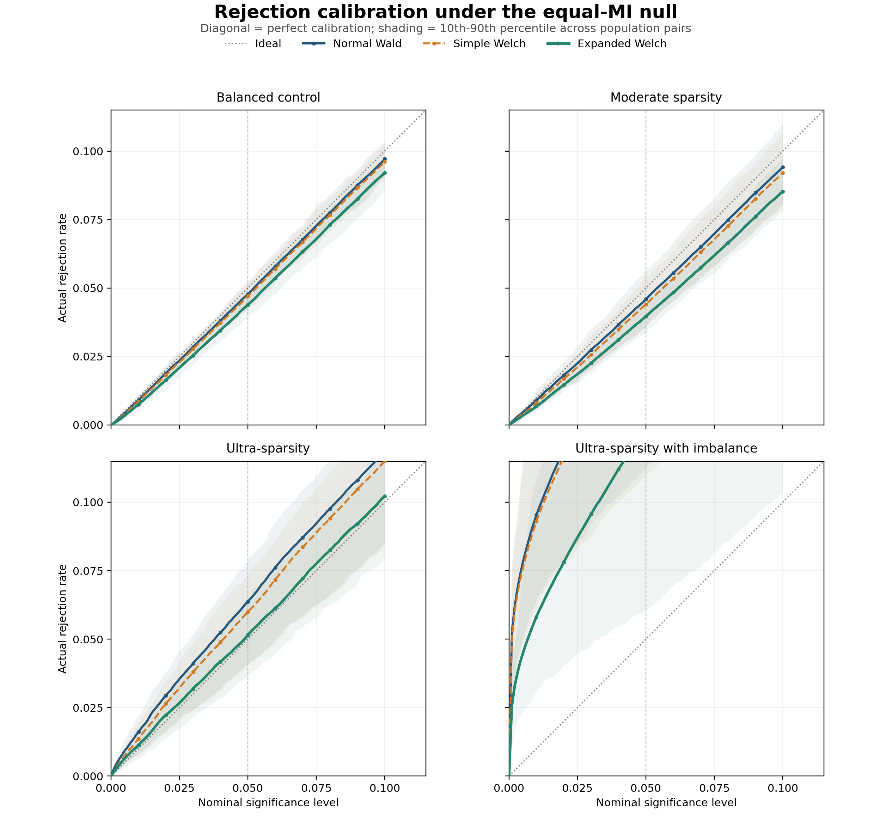
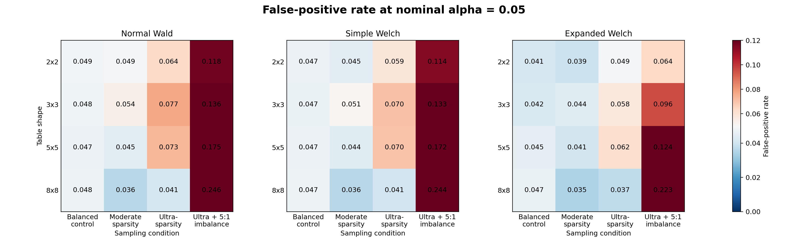

# Supervisor Experiment: Differential Mutual Information

Profile: `full`. Each of the 16 design configurations used `10` independently generated population pairs, with `5,000` sampled table pairs per population pair.

## Experiment in one sentence

Generate two different categorical populations with exactly equal true
mutual information, repeatedly sample one table from each, and check how
often each analytic test incorrectly rejects equality.

## Design

The null grid crosses four table shapes with four sampling conditions,
giving 16 configurations and 160
saved population pairs. Every method sees
the same table pairs and uses the same bias-corrected MI difference and
standard error.

- **Balanced control:** Uniform margins, equal sample sizes, and approximately 15 observations per cell.
- **Moderate sparsity:** Dominant row and column mass 0.70, equal sample sizes, and approximately eight observations per cell.
- **Ultra-sparsity:** Dominant row and column mass 0.90, equal sample sizes, and approximately three observations per cell.
- **Ultra-sparsity with imbalance:** The same 0.90 margin template and low-density smaller sample, with a 5:1 sample-size ratio.

The methods differ only in reference calibration: normal Wald uses
a standard normal distribution, simple Welch uses ordinary `n-1`
component degrees of freedom, and expanded Welch estimates component
degrees of freedom from the MI-variance influence function.

## Rejection calibration

The figure traces the empirical rejection probability over nominal
significance levels from 0 to 0.10. A calibrated test follows the
diagonal. Curves above it are liberal and curves below it are
conservative. Each line is the equal-weight mean across population
pairs in that condition; shading spans their 10th to 90th percentiles.

## Results for all 16 configurations

Each row averages the independently generated population pairs in one
fixed design cell. The target false-positive rate is 0.05.

| Shape | Condition | n_P | n_Q | Normal Wald FPR | Simple Welch FPR | Expanded Welch FPR | Expanded valid rate |
| --- | --- | --- | --- | --- | --- | --- | --- |
| 2x2 | Balanced control | 100 | 100 | 0.04872 | 0.04726 | 0.04148 | 1.00000 |
| 2x2 | Moderate sparsity | 50 | 50 | 0.04886 | 0.04464 | 0.03928 | 1.00000 |
| 2x2 | Ultra-sparsity | 50 | 50 | 0.06350 | 0.05868 | 0.04944 | 0.98182 |
| 2x2 | Ultra-sparsity with imbalance | 50 | 250 | 0.11756 | 0.11420 | 0.06391 | 0.99050 |
| 3x3 | Balanced control | 135 | 135 | 0.04774 | 0.04678 | 0.04226 | 1.00000 |
| 3x3 | Moderate sparsity | 72 | 72 | 0.05384 | 0.05126 | 0.04386 | 1.00000 |
| 3x3 | Ultra-sparsity | 50 | 50 | 0.07711 | 0.07031 | 0.05755 | 0.98062 |
| 3x3 | Ultra-sparsity with imbalance | 50 | 250 | 0.13560 | 0.13294 | 0.09572 | 0.98984 |
| 5x5 | Balanced control | 375 | 375 | 0.04716 | 0.04688 | 0.04522 | 1.00000 |
| 5x5 | Moderate sparsity | 200 | 200 | 0.04466 | 0.04406 | 0.04084 | 1.00000 |
| 5x5 | Ultra-sparsity | 75 | 75 | 0.07320 | 0.07020 | 0.06180 | 0.99898 |
| 5x5 | Ultra-sparsity with imbalance | 75 | 375 | 0.17472 | 0.17188 | 0.12447 | 0.99958 |
| 8x8 | Balanced control | 960 | 960 | 0.04756 | 0.04740 | 0.04674 | 1.00000 |
| 8x8 | Moderate sparsity | 512 | 512 | 0.03632 | 0.03604 | 0.03470 | 1.00000 |
| 8x8 | Ultra-sparsity | 192 | 192 | 0.04112 | 0.04058 | 0.03734 | 1.00000 |
| 8x8 | Ultra-sparsity with imbalance | 192 | 960 | 0.24616 | 0.24368 | 0.22340 | 1.00000 |

## Results averaged by sampling condition

| Condition | Method | FPR at 0.05 | Error at 0.05 | FPR at 0.01 | Error at 0.01 | Valid rate | 95% coverage |
| --- | --- | --- | --- | --- | --- | --- | --- |
| Balanced control | Normal Wald | 0.04780 | 0.00346 | 0.00902 | 0.00142 | 1.00000 | 0.95220 |
| Balanced control | Simple Welch | 0.04708 | 0.00370 | 0.00863 | 0.00167 | 1.00000 | 0.95292 |
| Balanced control | Expanded Welch | 0.04393 | 0.00627 | 0.00749 | 0.00259 | 1.00000 | 0.95608 |
| Moderate sparsity | Normal Wald | 0.04592 | 0.00677 | 0.00906 | 0.00234 | 1.00000 | 0.95408 |
| Moderate sparsity | Simple Welch | 0.04400 | 0.00740 | 0.00808 | 0.00232 | 1.00000 | 0.95600 |
| Moderate sparsity | Expanded Welch | 0.03967 | 0.01033 | 0.00683 | 0.00320 | 1.00000 | 0.96033 |
| Ultra-sparsity | Normal Wald | 0.06373 | 0.01817 | 0.01615 | 0.00712 | 0.99997 | 0.93627 |
| Ultra-sparsity | Simple Welch | 0.05994 | 0.01465 | 0.01354 | 0.00475 | 0.99997 | 0.94006 |
| Ultra-sparsity | Expanded Welch | 0.05153 | 0.00866 | 0.01127 | 0.00323 | 0.99036 | 0.94847 |
| Ultra-sparsity with imbalance | Normal Wald | 0.16851 | 0.11851 | 0.09536 | 0.08536 | 1.00000 | 0.83149 |
| Ultra-sparsity with imbalance | Simple Welch | 0.16567 | 0.11568 | 0.09304 | 0.08303 | 1.00000 | 0.83432 |
| Ultra-sparsity with imbalance | Expanded Welch | 0.12687 | 0.07687 | 0.05815 | 0.04815 | 0.99498 | 0.87313 |

False-positive-rate error is the absolute difference between observed
and nominal rejection rates among valid calculations, so lower is
better. Validity is reported separately so undefined calculations
are not hidden by conditioning only on successful results.

## Overall summary

| Method | MAE at 0.10 | MAE at 0.05 | MAE at 0.01 | Mean valid rate | 95% coverage |
| --- | --- | --- | --- | --- | --- |
| Normal Wald | 0.04264 | 0.03673 | 0.02406 | 0.99999 | 0.91851 |
| Simple Welch | 0.04137 | 0.03536 | 0.02294 | 0.99999 | 0.92083 |
| Expanded Welch | 0.03184 | 0.02553 | 0.01429 | 0.99633 | 0.93450 |

## Direct interpretation

- The condition-level comparisons below report the direct change
  from Normal Wald to Expanded Welch at alpha 0.05.
- **Balanced control:** mean FPR 0.04780 to 0.04393; mean absolute error 0.00346 to 0.00627.
- **Moderate sparsity:** mean FPR 0.04592 to 0.03967; mean absolute error 0.00677 to 0.01033.
- **Ultra-sparsity:** mean FPR 0.06373 to 0.05153; mean absolute error 0.01817 to 0.00866.
- **Ultra-sparsity with imbalance:** mean FPR 0.16851 to 0.12687; mean absolute error 0.11851 to 0.07687.
- Across the 5 power scenarios, expanded Welch lost
  `0.0102` power on average and at most
  `0.0123` relative to normal Wald.
- The simple Welch correction changed both calibration and power only
  slightly, consistent with its usually large effective degrees of freedom.
- Scenario-level Wilson intervals, sparsity diagnostics, validity rates,
  and effective degrees of freedom are retained in `scenario_results.csv`.

## Power

| Scenario | True MI difference | Method | Power at 0.05 | 95% coverage |
| --- | --- | --- | --- | --- |
| curve_effect_d02_n300 | -0.0200 | Normal Wald | 0.0768 | 0.9555 |
| curve_effect_d02_n300 | -0.0200 | Simple Welch | 0.0759 | 0.9560 |
| curve_effect_d02_n300 | -0.0200 | Expanded Welch | 0.0689 | 0.9614 |
| curve_effect_d05_n300 | -0.0500 | Normal Wald | 0.2775 | 0.9531 |
| curve_effect_d05_n300 | -0.0500 | Simple Welch | 0.2761 | 0.9536 |
| curve_effect_d05_n300 | -0.0500 | Expanded Welch | 0.2652 | 0.9578 |
| curve_effect_d10_n300 | -0.1000 | Normal Wald | 0.7449 | 0.9480 |
| curve_effect_d10_n300 | -0.1000 | Simple Welch | 0.7437 | 0.9484 |
| curve_effect_d10_n300 | -0.1000 | Expanded Welch | 0.7362 | 0.9507 |
| curve_sample_d05_n150 | -0.0500 | Normal Wald | 0.1523 | 0.9453 |
| curve_sample_d05_n150 | -0.0500 | Simple Welch | 0.1498 | 0.9466 |
| curve_sample_d05_n150 | -0.0500 | Expanded Welch | 0.1402 | 0.9557 |
| curve_sample_d05_n600 | -0.0500 | Normal Wald | 0.5161 | 0.9486 |
| curve_sample_d05_n600 | -0.0500 | Simple Welch | 0.5151 | 0.9488 |
| curve_sample_d05_n600 | -0.0500 | Expanded Welch | 0.5063 | 0.9510 |

## Runtime

| Rows | Columns | Method | Route | Median ms | Relative to Wald |
| --- | --- | --- | --- | --- | --- |
| 2 | 2 | Normal Wald | Normal Wald | 0.0858 | 1.0000 |
| 2 | 2 | Simple Welch | Simple Welch | 0.1000 | 1.1656 |
| 2 | 2 | Expanded Welch | Expanded Welch | 0.1638 | 1.9089 |
| 3 | 3 | Normal Wald | Normal Wald | 0.0803 | 1.0000 |
| 3 | 3 | Simple Welch | Simple Welch | 0.0944 | 1.1757 |
| 3 | 3 | Expanded Welch | Expanded Welch | 0.1524 | 1.8988 |
| 5 | 5 | Normal Wald | Normal Wald | 0.0810 | 1.0000 |
| 5 | 5 | Simple Welch | Simple Welch | 0.0947 | 1.1686 |
| 5 | 5 | Expanded Welch | Expanded Welch | 0.1532 | 1.8907 |
| 8 | 8 | Normal Wald | Normal Wald | 0.0811 | 1.0000 |
| 8 | 8 | Simple Welch | Simple Welch | 0.0949 | 1.1698 |
| 8 | 8 | Expanded Welch | Expanded Welch | 0.1540 | 1.8985 |

Runtime includes the complete calculation from the two count tables.
All three timings use the same implementation path. Every method
remains deterministic and scans each table a fixed number of times.

## Output map

- `population_scenarios.csv`: the fixed generating distributions and
  difficulty diagnostics.
- `scenario_results.csv`: every scenario-method result.
- `configuration_summary.csv`: the 16 design-cell summaries.
- `regime_summary.csv`: the presentation-level aggregate table.
- `rejection_calibration_scenarios.csv`: scenario-level rejection
  curves over 101 nominal significance levels.
- `rejection_calibration_regimes.csv`: mean curves and population
  variability bands for each regime and method.
- `null_pvalues.npz`: complete null p-value arrays for follow-up
  calibration or Q-Q plots without rerunning the simulation.
- `power_summary.csv`: alternative-hypothesis power and coverage.
- `runtime_summary.csv`: end-to-end timing by table size.
- `calibration_summary.png`: one visual comparison across regimes.
- `configuration_fpr.png` and `.pdf`: the 4x4 design-cell results.
- `rejection_calibration.png` and `.pdf`: lower-tail rejection
  calibration with scenario-variability bands.
