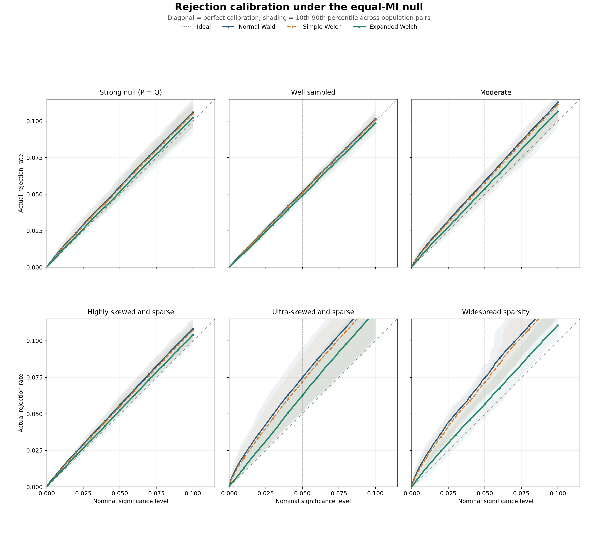

# Supervisor Experiment: Differential Mutual Information

Profile: `full`. Each null population used `10,000` independently simulated table pairs.

## Experiment in one sentence

Generate two different categorical populations with exactly equal true
mutual information, repeatedly sample one table from each, and check how
often each analytic test incorrectly rejects equality.

## Design

The null grid contains 72 fixed
population pairs across 6 regimes. Every method sees
the same table pairs and uses the same bias-corrected MI difference and
standard error.

- **Strong null (P = Q):** Population Q is set identically equal to population P (equal or 2:1 sample sizes). This is a positive control: a calibrated method must reject at close to the nominal rate here, since a systematic departure reflects an implementation or approximation fault rather than a finite-sample effect from P and Q genuinely differing.
- **Well sampled:** Equal sample sizes, near-balanced margins, and approximately 15 observations per cell.
- **Moderate:** Moderately heterogeneous margins, six to eight observations per cell, and sample-size ratios of 1:1 or 2:1.
- **Highly skewed and sparse:** Both populations have minimum true expected cell counts from 1 (inclusive) to 5 (exclusive), with ratios of 1:1 or 2:1.
- **Ultra-skewed and sparse:** Both populations have positive minimum true expected cell counts below 1, with ratios of 1:1 or 10:1.
- **Widespread sparsity:** In both populations, 25-50% of cells have true expected counts below 1 and at least half have expected counts below 5. This is the explicit failure-boundary check.

The methods differ only in reference calibration: normal Wald uses
a standard normal distribution, simple Welch uses ordinary `n-1`
component degrees of freedom, and expanded Welch estimates component
degrees of freedom from the MI-variance influence function.

## Decision rules and reporting conventions

These were fixed before this run and are not adjusted after seeing
results.

- **Adequate size control** at a nominal level `alpha` means the
  empirical false-positive rate falls in Bradley's liberal interval
  `[0.5 * alpha, 1.5 * alpha]`.
  `adequate_size_control_count_{label}` and
  `inadequate_size_control_count_{label}` in `regime_summary.csv`
  report how many population pairs pass and fail this rule; the
  continuous mean-absolute-error metric is reported alongside it,
  never in place of it.
- **Acceptable validity** requires a method's valid rate at or above
  `90%`. Below that floor a scenario is
  reported as a method failure (`scenarios_below_valid_rate_floor`),
  not folded into a calibration mean as if it were a well-defined
  result.
- **Three rejection-rate denominators are always reported**:
  `fpr_{label}` is conditional on validity; `unconditional_fpr_{label}`
  treats an invalid replicate as a non-rejection (the operational
  fallback an analyst actually has); `common_valid_fpr_{label}`
  restricts to replicates where every method's statistic is defined,
  so the three methods in one row always refer to the same
  underlying replicates. Conditioning on validity alone can be
  misleading precisely because invalidity is not independent of the
  test outcome for these estimators.

## Rejection calibration

The figure traces the empirical rejection probability over nominal
significance levels from 0 to 0.10. A calibrated test follows the
diagonal. Curves above it are liberal and curves below it are
conservative. Each line is the equal-weight mean across population
pairs in that regime; shading spans their 10th to 90th percentiles.

## Main calibration results

| Regime | Method | FPR at 0.05 | Error at 0.05 | FPR at 0.01 | Error at 0.01 | Valid rate | 95% coverage |
| --- | --- | --- | --- | --- | --- | --- | --- |
| Strong null (P = Q) | Normal Wald | 0.05517 | 0.00597 | 0.01262 | 0.00287 | 1.00000 | 0.94482 |
| Strong null (P = Q) | Simple Welch | 0.05427 | 0.00542 | 0.01219 | 0.00259 | 1.00000 | 0.94572 |
| Strong null (P = Q) | Expanded Welch | 0.05161 | 0.00464 | 0.01086 | 0.00218 | 1.00000 | 0.94839 |
| Well sampled | Normal Wald | 0.05142 | 0.00257 | 0.01088 | 0.00154 | 1.00000 | 0.94857 |
| Well sampled | Simple Welch | 0.05074 | 0.00219 | 0.01052 | 0.00144 | 1.00000 | 0.94926 |
| Well sampled | Expanded Welch | 0.04897 | 0.00268 | 0.00970 | 0.00147 | 1.00000 | 0.95103 |
| Moderate | Normal Wald | 0.05911 | 0.00944 | 0.01486 | 0.00521 | 1.00000 | 0.94089 |
| Moderate | Simple Welch | 0.05770 | 0.00857 | 0.01407 | 0.00459 | 1.00000 | 0.94230 |
| Moderate | Expanded Welch | 0.05366 | 0.00609 | 0.01182 | 0.00272 | 1.00000 | 0.94634 |
| Highly skewed and sparse | Normal Wald | 0.05609 | 0.00621 | 0.01271 | 0.00274 | 1.00000 | 0.94391 |
| Highly skewed and sparse | Simple Welch | 0.05500 | 0.00513 | 0.01193 | 0.00212 | 1.00000 | 0.94500 |
| Highly skewed and sparse | Expanded Welch | 0.05256 | 0.00417 | 0.01074 | 0.00142 | 1.00000 | 0.94744 |
| Ultra-skewed and sparse | Normal Wald | 0.07472 | 0.02498 | 0.02147 | 0.01147 | 1.00000 | 0.92528 |
| Ultra-skewed and sparse | Simple Welch | 0.07193 | 0.02230 | 0.01984 | 0.00984 | 1.00000 | 0.92807 |
| Ultra-skewed and sparse | Expanded Welch | 0.06255 | 0.01320 | 0.01286 | 0.00374 | 1.00000 | 0.93745 |
| Widespread sparsity | Normal Wald | 0.07475 | 0.02475 | 0.02170 | 0.01170 | 0.99823 | 0.92525 |
| Widespread sparsity | Simple Welch | 0.07156 | 0.02156 | 0.01987 | 0.00987 | 0.99823 | 0.92844 |
| Widespread sparsity | Expanded Welch | 0.05662 | 0.01277 | 0.01298 | 0.00488 | 0.97398 | 0.94338 |

False-positive-rate error is the absolute difference between observed
and nominal rejection rates among valid calculations, so lower is
better. Validity is reported separately so undefined calculations
are not hidden by conditioning only on successful results.

## Overall summary

| Method | MAE at 0.10 | MAE at 0.05 | MAE at 0.01 | Mean valid rate | 95% coverage |
| --- | --- | --- | --- | --- | --- |
| Normal Wald | 0.01635 | 0.01232 | 0.00592 | 0.99970 | 0.93812 |
| Simple Welch | 0.01493 | 0.01086 | 0.00507 | 0.99970 | 0.93980 |
| Expanded Welch | 0.01133 | 0.00726 | 0.00273 | 0.99566 | 0.94567 |

## Direct interpretation

- Relative calibration changes in the difficult regimes are
  reported directly below; positive percentages mean that expanded
  Welch reduced error relative to normal Wald.
- **Highly skewed and sparse:** 32.8% at alpha 0.05 and 48.0% at alpha 0.01.
- **Ultra-skewed and sparse:** 47.2% at alpha 0.05 and 67.4% at alpha 0.01.
- **Widespread sparsity:** 48.4% at alpha 0.05 and 58.3% at alpha 0.01.
- This was not a universal improvement. In well-sampled tables at
  alpha 0.05, expanded Welch increased mean absolute error from
  `0.00257`
  to `0.00268`
  by becoming mildly conservative.
- Across every population pair and relative effect size, expanded
  Welch lost `0.0093` power on average and at
  most `0.0447` relative to normal Wald at the
  matched nominal threshold. Nominal power is not a fair comparison
  when methods do not share the same actual size; size-adjusted power
  in the table below isolates the difference that remains once size
  is matched via an independently calibrated per-method threshold.
- The simple Welch correction changed both calibration and power only
  slightly, consistent with its usually large effective degrees of freedom.
- Scenario-level Wilson intervals, sparsity diagnostics, validity rates,
  and effective degrees of freedom are retained in `scenario_results.csv`;
  every population pair's power at every relative effect size is
  retained in `power_summary.csv`.

## Power

Effect sizes are relative to each population pair's own null MI
(`I0`), e.g. an effect of `1.0` doubles `I(Q)` relative to `I(P)`.
Size-adjusted power uses a threshold from an independently simulated
null of the same population pair rather than the nominal
`alpha = 0.05` cutoff, and is a diagnostic rather than an achievable
procedure. Per-population-pair power is in `power_summary.csv`.
14 of 144 requested (population pair, relative effect) combinations were
infeasible at the requested effect size and are logged, with a
reason, in `power_infeasible_configurations.csv` rather than
silently absent.

| Regime | Effect (relative to I0) | Method | Power at 0.05 | Size-adjusted power | 95% coverage |
| --- | --- | --- | --- | --- | --- |
| Strong null (P = Q) | 0.5000 | Normal Wald | 0.3035 | 0.2889 | 0.9421 |
| Strong null (P = Q) | 0.5000 | Simple Welch | 0.3016 | 0.2891 | 0.9430 |
| Strong null (P = Q) | 0.5000 | Expanded Welch | 0.2962 | 0.2902 | 0.9453 |
| Strong null (P = Q) | 1.0000 | Normal Wald | 0.7026 | 0.6885 | 0.9409 |
| Strong null (P = Q) | 1.0000 | Simple Welch | 0.7003 | 0.6887 | 0.9418 |
| Strong null (P = Q) | 1.0000 | Expanded Welch | 0.6963 | 0.6926 | 0.9437 |
| Well sampled | 0.5000 | Normal Wald | 0.3455 | 0.3427 | 0.9456 |
| Well sampled | 0.5000 | Simple Welch | 0.3439 | 0.3427 | 0.9463 |
| Well sampled | 0.5000 | Expanded Welch | 0.3405 | 0.3439 | 0.9476 |
| Well sampled | 1.0000 | Normal Wald | 0.7526 | 0.7492 | 0.9416 |
| Well sampled | 1.0000 | Simple Welch | 0.7510 | 0.7493 | 0.9422 |
| Well sampled | 1.0000 | Expanded Welch | 0.7485 | 0.7521 | 0.9431 |
| Moderate | 0.5000 | Normal Wald | 0.2405 | 0.2156 | 0.9368 |
| Moderate | 0.5000 | Simple Welch | 0.2379 | 0.2159 | 0.9381 |
| Moderate | 0.5000 | Expanded Welch | 0.2312 | 0.2180 | 0.9412 |
| Moderate | 1.0000 | Normal Wald | 0.5521 | 0.5273 | 0.9360 |
| Moderate | 1.0000 | Simple Welch | 0.5490 | 0.5277 | 0.9373 |
| Moderate | 1.0000 | Expanded Welch | 0.5417 | 0.5317 | 0.9400 |
| Highly skewed and sparse | 0.5000 | Normal Wald | 0.4002 | 0.3898 | 0.9436 |
| Highly skewed and sparse | 0.5000 | Simple Welch | 0.3984 | 0.3901 | 0.9446 |
| Highly skewed and sparse | 0.5000 | Expanded Welch | 0.3930 | 0.3902 | 0.9470 |
| Highly skewed and sparse | 1.0000 | Normal Wald | 0.7674 | 0.7570 | 0.9407 |
| Highly skewed and sparse | 1.0000 | Simple Welch | 0.7654 | 0.7573 | 0.9417 |
| Highly skewed and sparse | 1.0000 | Expanded Welch | 0.7607 | 0.7586 | 0.9442 |
| Ultra-skewed and sparse | 0.5000 | Normal Wald | 0.2619 | 0.2201 | 0.9254 |
| Ultra-skewed and sparse | 0.5000 | Simple Welch | 0.2582 | 0.2204 | 0.9280 |
| Ultra-skewed and sparse | 0.5000 | Expanded Welch | 0.2456 | 0.2225 | 0.9352 |
| Ultra-skewed and sparse | 1.0000 | Normal Wald | 0.6139 | 0.5555 | 0.9247 |
| Ultra-skewed and sparse | 1.0000 | Simple Welch | 0.6088 | 0.5558 | 0.9270 |
| Ultra-skewed and sparse | 1.0000 | Expanded Welch | 0.5987 | 0.5644 | 0.9334 |
| Widespread sparsity | 0.5000 | Normal Wald | 0.3642 | 0.3170 | 0.9271 |
| Widespread sparsity | 0.5000 | Simple Welch | 0.3612 | 0.3171 | 0.9292 |
| Widespread sparsity | 0.5000 | Expanded Welch | 0.3517 | 0.3212 | 0.9356 |
| Widespread sparsity | 1.0000 | Normal Wald | 0.6587 | 0.6119 | 0.9326 |
| Widespread sparsity | 1.0000 | Simple Welch | 0.6552 | 0.6123 | 0.9344 |
| Widespread sparsity | 1.0000 | Expanded Welch | 0.6425 | 0.6164 | 0.9388 |

## Runtime

| Rows | Columns | Method | Route | Median ms | Relative to Wald |
| --- | --- | --- | --- | --- | --- |
| 2 | 2 | Normal Wald | Normal Wald | 0.0834 | 1.0000 |
| 2 | 2 | Simple Welch | Simple Welch | 0.0982 | 1.1780 |
| 2 | 2 | Expanded Welch | Expanded Welch | 0.1440 | 1.7281 |
| 3 | 3 | Normal Wald | Normal Wald | 0.0842 | 1.0000 |
| 3 | 3 | Simple Welch | Simple Welch | 0.0996 | 1.1826 |
| 3 | 3 | Expanded Welch | Expanded Welch | 0.1460 | 1.7343 |
| 5 | 5 | Normal Wald | Normal Wald | 0.0848 | 1.0000 |
| 5 | 5 | Simple Welch | Simple Welch | 0.0999 | 1.1779 |
| 5 | 5 | Expanded Welch | Expanded Welch | 0.1462 | 1.7248 |
| 8 | 8 | Normal Wald | Normal Wald | 0.0850 | 1.0000 |
| 8 | 8 | Simple Welch | Simple Welch | 0.0999 | 1.1749 |
| 8 | 8 | Expanded Welch | Expanded Welch | 0.1466 | 1.7242 |

Runtime includes the complete calculation from the two count tables.
All three timings use the same implementation path. Every method
remains deterministic and scans each table a fixed number of times.

## Output map

- `population_scenarios.csv`: the fixed generating distributions and
  difficulty diagnostics.
- `scenario_results.csv`: every scenario-method result, including
  all three rejection-rate denominators and the decision-rule flags.
- `regime_summary.csv`: the presentation-level aggregate table,
  including counts of population pairs passing and failing the
  preregistered decision rules.
- `rejection_calibration_scenarios.csv`: scenario-level rejection
  curves over 101 nominal significance levels.
- `rejection_calibration_regimes.csv`: mean curves and population
  variability bands for each regime and method.
- `null_pvalues.npz`: complete null p-value arrays for follow-up
  calibration or Q-Q plots without rerunning the simulation.
- `power_summary.csv`: alternative-hypothesis power and coverage for
  every population pair at every relative effect size, including
  the independently calibrated size-adjustment threshold.
- `power_infeasible_configurations.csv`: every (population pair,
  relative effect) combination that could not be constructed, with
  a reason, so infeasibility is logged rather than silent.
- `runtime_summary.csv`: end-to-end timing by table size.
- `calibration_summary.png`: one visual comparison across regimes.
- `rejection_calibration.png` and `.pdf`: lower-tail rejection
  calibration with scenario-variability bands.
