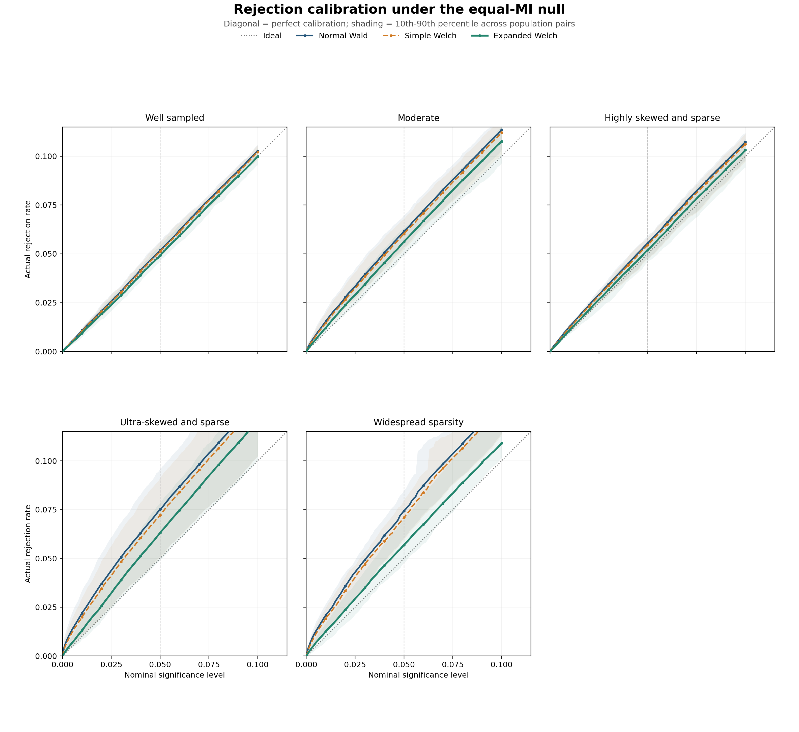

# Supervisor Experiment: Differential Mutual Information

Profile: `full`. Each null population used `10,000` independently simulated table pairs.

## Experiment in one sentence

Generate two different categorical populations with exactly equal true
mutual information, repeatedly sample one table from each, and check how
often each analytic test incorrectly rejects equality.

## Design

The null grid contains 60 fixed
population pairs across 5 regimes. Every method sees
the same table pairs and uses the same bias-corrected MI difference and
standard error.

- **Well sampled:** Equal sample sizes, near-balanced margins, and approximately 15 observations per cell.
- **Moderate:** Moderately heterogeneous margins, six to eight observations per cell, and sample-size ratios of 1:1 or 2:1.
- **Highly skewed and sparse:** Both populations have minimum true expected cell counts from 1 (inclusive) to 5 (exclusive), with ratios of 1:1 or 2:1.
- **Ultra-skewed and sparse:** Both populations have positive minimum true expected cell counts below 1, with ratios of 1:1 or 10:1.
- **Widespread sparsity:** In both populations, 25-50% of cells have true expected counts below 1 and at least half have expected counts below 5. This is the explicit failure-boundary check.

The methods differ only in reference calibration: normal Wald uses
a standard normal distribution, simple Welch uses ordinary `n-1`
component degrees of freedom, and expanded Welch estimates component
degrees of freedom from the MI-variance influence function.

## Rejection calibration

The figure traces the empirical rejection probability over nominal
significance levels from 0 to 0.10. A calibrated test follows the
diagonal. Curves above it are liberal and curves below it are
conservative. Each line is the equal-weight mean across population
pairs in that regime; shading spans their 10th to 90th percentiles.

## Main calibration results

| Regime | Method | FPR at 0.05 | Error at 0.05 | FPR at 0.01 | Error at 0.01 | Valid rate | 95% coverage |
| --- | --- | --- | --- | --- | --- | --- | --- |
| Well sampled | Normal Wald | 0.05174 | 0.00317 | 0.01080 | 0.00148 | 1.00000 | 0.94826 |
| Well sampled | Simple Welch | 0.05112 | 0.00287 | 0.01036 | 0.00141 | 1.00000 | 0.94888 |
| Well sampled | Expanded Welch | 0.04913 | 0.00332 | 0.00931 | 0.00159 | 1.00000 | 0.95087 |
| Moderate | Normal Wald | 0.06158 | 0.01158 | 0.01540 | 0.00540 | 1.00000 | 0.93842 |
| Moderate | Simple Welch | 0.06025 | 0.01025 | 0.01456 | 0.00464 | 1.00000 | 0.93975 |
| Moderate | Expanded Welch | 0.05623 | 0.00720 | 0.01208 | 0.00247 | 1.00000 | 0.94377 |
| Highly skewed and sparse | Normal Wald | 0.05547 | 0.00645 | 0.01271 | 0.00287 | 1.00000 | 0.94453 |
| Highly skewed and sparse | Simple Welch | 0.05445 | 0.00563 | 0.01211 | 0.00228 | 1.00000 | 0.94555 |
| Highly skewed and sparse | Expanded Welch | 0.05198 | 0.00456 | 0.01094 | 0.00139 | 1.00000 | 0.94802 |
| Ultra-skewed and sparse | Normal Wald | 0.07504 | 0.02504 | 0.02192 | 0.01210 | 1.00000 | 0.92496 |
| Ultra-skewed and sparse | Simple Welch | 0.07208 | 0.02208 | 0.01992 | 0.01012 | 1.00000 | 0.92792 |
| Ultra-skewed and sparse | Expanded Welch | 0.06305 | 0.01340 | 0.01313 | 0.00407 | 1.00000 | 0.93695 |
| Widespread sparsity | Normal Wald | 0.07431 | 0.02431 | 0.02092 | 0.01092 | 0.99832 | 0.92569 |
| Widespread sparsity | Simple Welch | 0.07096 | 0.02096 | 0.01920 | 0.00920 | 0.99832 | 0.92904 |
| Widespread sparsity | Expanded Welch | 0.05689 | 0.01278 | 0.01269 | 0.00439 | 0.97450 | 0.94311 |

False-positive-rate error is the absolute difference between observed
and nominal rejection rates among valid calculations, so lower is
better. Validity is reported separately so undefined calculations
are not hidden by conditioning only on successful results.

## Overall summary

| Method | MAE at 0.10 | MAE at 0.05 | MAE at 0.01 | Mean valid rate | 95% coverage |
| --- | --- | --- | --- | --- | --- |
| Normal Wald | 0.01753 | 0.01411 | 0.00656 | 0.99966 | 0.93637 |
| Simple Welch | 0.01588 | 0.01236 | 0.00553 | 0.99966 | 0.93823 |
| Expanded Welch | 0.01180 | 0.00825 | 0.00278 | 0.99490 | 0.94454 |

## Direct interpretation

- Relative calibration changes in the difficult regimes are
  reported directly below; positive percentages mean that expanded
  Welch reduced error relative to normal Wald.
- **Highly skewed and sparse:** 29.3% at alpha 0.05 and 51.6% at alpha 0.01.
- **Ultra-skewed and sparse:** 46.5% at alpha 0.05 and 66.3% at alpha 0.01.
- **Widespread sparsity:** 47.4% at alpha 0.05 and 59.8% at alpha 0.01.
- This was not a universal improvement. In well-sampled tables at
  alpha 0.05, expanded Welch increased mean absolute error from
  `0.00317`
  to `0.00332`
  by becoming mildly conservative.
- Across the five power scenarios, expanded Welch lost
  `0.0102` power on average and at most
  `0.0123` relative to normal Wald.
- The simple Welch correction changed both calibration and power only
  slightly, consistent with its usually large effective degrees of freedom.
- Scenario-level Wilson intervals, sparsity diagnostics, validity rates,
  and effective degrees of freedom are retained in `scenario_results.csv`.

## Power

| Scenario | True MI difference | Method | Power at 0.05 | 95% coverage |
| --- | --- | --- | --- | --- |
| curve_effect_d02_n300 | -0.0200 | Normal Wald | 0.0768 | 0.9555 |
| curve_effect_d02_n300 | -0.0200 | Simple Welch | 0.0759 | 0.9560 |
| curve_effect_d02_n300 | -0.0200 | Expanded Welch | 0.0689 | 0.9614 |
| curve_effect_d05_n300 | -0.0500 | Normal Wald | 0.2775 | 0.9531 |
| curve_effect_d05_n300 | -0.0500 | Simple Welch | 0.2761 | 0.9536 |
| curve_effect_d05_n300 | -0.0500 | Expanded Welch | 0.2652 | 0.9578 |
| curve_effect_d10_n300 | -0.1000 | Normal Wald | 0.7449 | 0.9480 |
| curve_effect_d10_n300 | -0.1000 | Simple Welch | 0.7437 | 0.9484 |
| curve_effect_d10_n300 | -0.1000 | Expanded Welch | 0.7362 | 0.9507 |
| curve_sample_d05_n150 | -0.0500 | Normal Wald | 0.1523 | 0.9453 |
| curve_sample_d05_n150 | -0.0500 | Simple Welch | 0.1498 | 0.9466 |
| curve_sample_d05_n150 | -0.0500 | Expanded Welch | 0.1402 | 0.9557 |
| curve_sample_d05_n600 | -0.0500 | Normal Wald | 0.5161 | 0.9486 |
| curve_sample_d05_n600 | -0.0500 | Simple Welch | 0.5151 | 0.9488 |
| curve_sample_d05_n600 | -0.0500 | Expanded Welch | 0.5063 | 0.9510 |

## Runtime

| Rows | Columns | Method | Route | Median ms | Relative to Wald |
| --- | --- | --- | --- | --- | --- |
| 2 | 2 | Normal Wald | Normal Wald | 0.0880 | 1.0000 |
| 2 | 2 | Simple Welch | Simple Welch | 0.1033 | 1.1737 |
| 2 | 2 | Expanded Welch | Expanded Welch | 0.1688 | 1.9179 |
| 3 | 3 | Normal Wald | Normal Wald | 0.0875 | 1.0000 |
| 3 | 3 | Simple Welch | Simple Welch | 0.1029 | 1.1760 |
| 3 | 3 | Expanded Welch | Expanded Welch | 0.1666 | 1.9043 |
| 5 | 5 | Normal Wald | Normal Wald | 0.0875 | 1.0000 |
| 5 | 5 | Simple Welch | Simple Welch | 0.1027 | 1.1728 |
| 5 | 5 | Expanded Welch | Expanded Welch | 0.1666 | 1.9034 |
| 8 | 8 | Normal Wald | Normal Wald | 0.0883 | 1.0000 |
| 8 | 8 | Simple Welch | Simple Welch | 0.1038 | 1.1758 |
| 8 | 8 | Expanded Welch | Expanded Welch | 0.1685 | 1.9091 |

Runtime includes the complete calculation from the two count tables.
All three timings use the same implementation path. Every method
remains deterministic and scans each table a fixed number of times.

## Output map

- `population_scenarios.csv`: the fixed generating distributions and
  difficulty diagnostics.
- `scenario_results.csv`: every scenario-method result.
- `regime_summary.csv`: the presentation-level aggregate table.
- `rejection_calibration_scenarios.csv`: scenario-level rejection
  curves over 101 nominal significance levels.
- `rejection_calibration_regimes.csv`: mean curves and population
  variability bands for each regime and method.
- `null_pvalues.npz`: complete null p-value arrays for follow-up
  calibration or Q-Q plots without rerunning the simulation.
- `power_summary.csv`: alternative-hypothesis power and coverage.
- `runtime_summary.csv`: end-to-end timing by table size.
- `calibration_summary.png`: one visual comparison across regimes.
- `rejection_calibration.png` and `.pdf`: lower-tail rejection
  calibration with scenario-variability bands.
